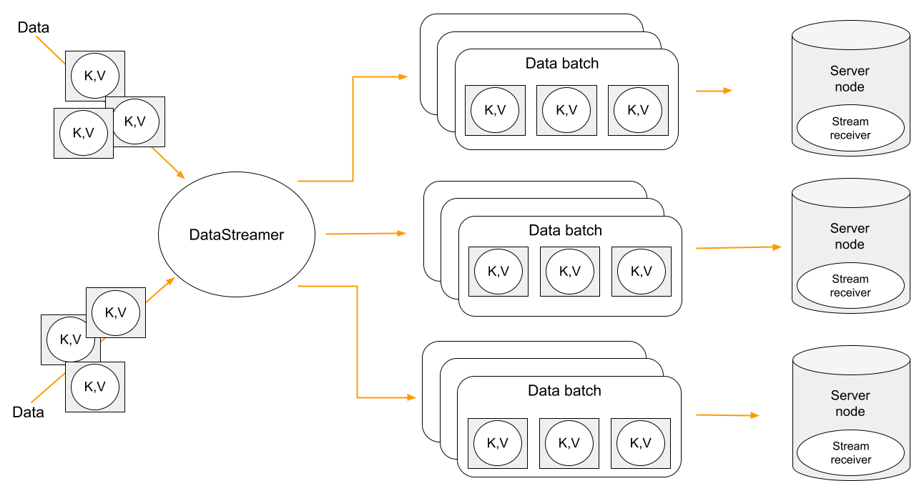
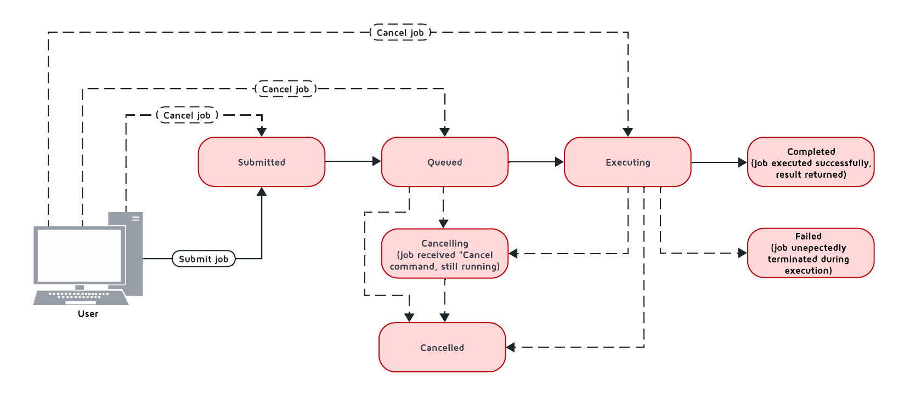
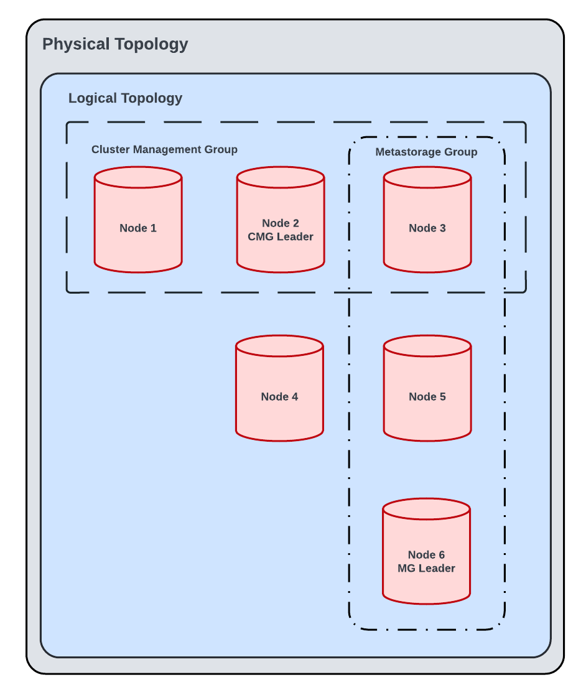

# Apache Ignite 3 Documentation
## Navigation
- [Apache Ignite 3 Documentation](#docs-ignite3-3.1)
- [Getting Started](#getting-started)
  - [Introduction](#getting-started-intro)
  - [Getting Started](#getting-started-quick-start)
  - [Start a Cluster in Docker](#getting-started-start-cluster)
  - [Working with SQL](#getting-started-work-with-sql)
  - [Using Java API](#getting-started-key-value-api)
  - [Embedded Mode](#getting-started-embedded-mode)
  - [Configuration Tips](#getting-started-best-practices)
  - [Migrating from Ignite 2](#getting-started-migrate-from-ignite-2)
  - [Migrate from 3.0 to 3.1](#getting-started-migrate-from-3-0-to-3-1)
- [Develop and Build](#develop)
  - [Ignite Clients](#develop-ignite-clients)
    - [Java Client](#develop-ignite-clients-java-client)
    - [.NET Client](#develop-ignite-clients-dotnet-client)
    - [C++ Client](#develop-ignite-clients-cpp-client)
  - [Connect to Ignite](#develop-connect-to-ignite)
    - [JDBC Driver](#develop-connect-to-ignite-jdbc)
    - [ODBC Driver](#develop-connect-to-ignite-odbc)
      - [ODBC Connection String](#develop-connect-to-ignite-odbc-connection-string)
      - [Querying and Modifying Data with ODBC](#develop-connect-to-ignite-odbc-querying-data)
    - [Python Database API Driver](#develop-connect-to-ignite-python)
  - [Work with Data](#develop-work-with-data)
    - [Table API](#develop-work-with-data-table-api)
    - [Performing Transactions](#develop-work-with-data-transactions)
    - [Streaming Data](#develop-work-with-data-streaming)
    - [Distributed Computing](#develop-work-with-data-compute)
    - [Object Serialization](#develop-work-with-data-serialization)
    - [Code Deployment](#develop-work-with-data-code-deployment)
    - [Working with Events](#develop-work-with-data-events)
    - [Available Events](#develop-work-with-data-events-list)
    - [Creating Tables from Java Classes](#develop-work-with-data-java-to-tables)
    - [Java Client Logging](#develop-work-with-data-java-client-logging)
  - [Integrate](#develop-integrate)
    - [Spring Boot Integration](#develop-integrate-spring-boot)
    - [Spring Data Integration](#develop-integrate-spring-data)
- [Work with SQL](#sql)
  - [SQL Fundamentals](#sql-fundamentals)
    - [Engine Architecture](#sql-fundamentals-engine-architecture)
  - [SQL Operations](#sql-working-with-sql)
    - [Execute Queries](#sql-working-with-sql-execute-queries)
    - [System Views](#sql-working-with-sql-system-views)
  - [SQL Reference](#sql-reference)
    - [Language Definition](#sql-reference-language-definition)
      - [Data Definition Language (DDL)](#sql-reference-language-definition-ddl)
      - [Data Manipulation Language (DML)](#sql-reference-language-definition-dml)
      - [Distribution Zones](#sql-reference-language-definition-distribution-zones)
      - [Transactions](#sql-reference-language-definition-transactions)
      - [Grammar Reference](#sql-reference-language-definition-grammar-reference)
    - [Data Types and Functions](#sql-reference-data-types-and-functions)
      - [Data Types](#sql-reference-data-types-and-functions-data-types)
      - [Operators and Functions](#sql-reference-data-types-and-functions-operators-and-functions)
      - [Operational Commands](#sql-reference-data-types-and-functions-operational-commands)
    - [SQL Conformance](#sql-reference-sql-conformance)
      - [SQL Conformance](#sql-reference-sql-conformance-overview)
      - [Keywords](#sql-reference-sql-conformance-keywords)
  - [Advanced SQL](#sql-advanced)
    - [EXPLAIN Statement](#sql-advanced-explain-statement)
    - [Performance Tuning](#sql-advanced-performance-tuning)
- [Configure and Operate](#configure-and-operate)
  - [Installation](#configure-and-operate-installation)
    - [ZIP Archive](#configure-and-operate-installation-install-zip)
    - [DEB/RPM Package](#configure-and-operate-installation-install-deb-rpm)
    - [Docker](#configure-and-operate-installation-install-docker)
    - [Kubernetes](#configure-and-operate-installation-install-kubernetes)
  - [Configuration](#configure-and-operate-configuration)
    - [Cluster and Nodes](#configure-and-operate-configuration-config-cluster-and-nodes)
    - [Storage Configuration](#configure-and-operate-configuration-config-storage-overview)
      - [Storage Profiles](#configure-and-operate-configuration-config-storage)
      - [Volatile Storage](#configure-and-operate-configuration-config-storage-volatile)
      - [Persistent Storage](#configure-and-operate-configuration-config-storage-persistent)
      - [RocksDB Storage](#configure-and-operate-configuration-config-storage-rocksdb)
    - [Authentication](#configure-and-operate-configuration-config-authentication)
    - [SSL/TLS](#configure-and-operate-configuration-config-ssl-tls)
    - [Metrics](#configure-and-operate-configuration-metrics-configuration)
    - [Cluster Security](#configure-and-operate-configuration-config-cluster-security)
  - [Operations](#configure-and-operate-operations)
    - [Lifecycle](#configure-and-operate-operations-lifecycle)
    - [Disaster Recovery](#configure-and-operate-operations-disaster-recovery)
      - [Data Partitions Recovery](#configure-and-operate-operations-disaster-recovery-partitions)
      - [System Groups Recovery](#configure-and-operate-operations-disaster-recovery-system-groups)
    - [Handle Exceptions](#configure-and-operate-operations-handle-exceptions)
    - [Colocation](#configure-and-operate-operations-colocation)
  - [Monitoring](#configure-and-operate-monitoring)
    - [Metrics](#configure-and-operate-monitoring-metrics)
      - [Metrics](#configure-and-operate-monitoring-config-metrics)
      - [Available Metrics](#configure-and-operate-monitoring-available-metrics)
      - [System Views](#configure-and-operate-monitoring-metrics-system-views)
  - [Configuration Reference](#configure-and-operate-reference)
    - [Node Configuration](#configure-and-operate-reference-node-configuration)
    - [Cluster Configuration](#configure-and-operate-reference-cluster-configuration)
    - [CLI Configuration](#configure-and-operate-reference-cli-configuration)
    - [Storage Profiles](#configure-and-operate-reference-storage-profiles)
- [Concepts and Architecture](#understand)
  - [Core Concepts](#understand-core-concepts)
    - [What is Apache Ignite 3?](#understand-core-concepts-what-is-ignite)
    - [Tables and Schemas](#understand-core-concepts-tables-and-schemas)
    - [Transactions and MVCC](#understand-core-concepts-transactions-and-mvcc)
    - [Distribution and Colocation](#understand-core-concepts-distribution-and-colocation)
    - [Data Partitioning](#understand-core-concepts-data-partitioning)
    - [Compute and Events](#understand-core-concepts-compute-and-events)
  - [Architecture](#understand-architecture)
    - [Architecture Overview](#understand-architecture-architecture-overview)
    - [Storage Architecture](#understand-architecture-storage-architecture)
    - [Storage Engines](#understand-architecture-storage-engines)
      - [AIMemory Storage Engine](#understand-architecture-storage-engines-aimem)
      - [AIPersist Storage Engine](#understand-architecture-storage-engines-aipersist)
      - [RocksDB Storage Engine](#understand-architecture-storage-engines-rocksdb)
    - [Security Architecture](#understand-architecture-security)
  - [Performance](#understand-performance)
    - [Using EXPLAIN Command](#understand-performance-using-explain)
    - [EXPLAIN Operators Reference](#understand-performance-explain-operators)
- [Client and API Reference](#api-reference)
  - [Native Client APIs](#api-reference-native-clients)
    - [Java API (PRIMARY)](#api-reference-native-clients-java)
      - [Client API](#api-reference-native-clients-java-client-api)
      - [Server API](#api-reference-native-clients-java-server-api)
      - [Tables API](#api-reference-native-clients-java-tables-api)
      - [Data Streamer API](#api-reference-native-clients-java-data-streamer-api)
      - [SQL API](#api-reference-native-clients-java-sql-api)
      - [Transactions API](#api-reference-native-clients-java-transactions-api)
      - [Compute API](#api-reference-native-clients-java-compute-api)
      - [Catalog API](#api-reference-native-clients-java-catalog-api)
      - [Criteria API](#api-reference-native-clients-java-criteria-api)
      - [Network API](#api-reference-native-clients-java-network-api)
      - [Security API](#api-reference-native-clients-java-security-api)
    - [.NET API](#api-reference-native-clients-dotnet)
      - [Client API](#api-reference-native-clients-dotnet-client-api)
      - [Tables API](#api-reference-native-clients-dotnet-tables-api)
      - [LINQ API](#api-reference-native-clients-dotnet-linq-api)
      - [Data Streamer API](#api-reference-native-clients-dotnet-data-streamer-api)
      - [SQL API](#api-reference-native-clients-dotnet-sql-api)
      - [ADO.NET API](#api-reference-native-clients-dotnet-ado-net-api)
      - [Transactions API](#api-reference-native-clients-dotnet-transactions-api)
      - [Compute API](#api-reference-native-clients-dotnet-compute-api)
      - [Network API](#api-reference-native-clients-dotnet-network-api)
    - [C++ API](#api-reference-native-clients-cpp)
      - [Client API](#api-reference-native-clients-cpp-client-api)
      - [Tables API](#api-reference-native-clients-cpp-tables-api)
      - [SQL API](#api-reference-native-clients-cpp-sql-api)
      - [Transactions API](#api-reference-native-clients-cpp-transactions-api)
      - [Compute API](#api-reference-native-clients-cpp-compute-api)
      - [Network API](#api-reference-native-clients-cpp-network-api)
  - [SQL-Only APIs](#api-reference-sql-only-apis)
    - [JDBC Driver](#api-reference-sql-only-apis-jdbc)
    - [ODBC Driver](#api-reference-sql-only-apis-odbc)
    - [Python DB-API](#api-reference-sql-only-apis-python)
  - [API Documentation](#api-reference-api)
    - [Java API Reference](#api-reference-api-java-api-reference)
    - [.NET API Reference](#api-reference-api-dotnet-api-reference)
    - [C++ API Reference](#api-reference-api-cpp-api-reference)
- [Tools](#tools)
  - [CLI Commands Reference](#tools-cli-commands)
  - [REST API](#tools-rest-api)
  - [Glossary](#tools-glossary)

## Content

<a id="docs-ignite3-3.1"></a>

<!-- source_url: https://ignite.apache.org/docs/ignite3/3.1.0 -->

<!-- page_index: 1 -->

# Apache Ignite 3 Documentation

Version: 3.1.0 (Latest)

# Apache Ignite 3 Documentation

Apache Ignite 3 is a distributed database for high-performance computing with in-memory speed.

<a id="docs-ignite3-3.1--where-to-start"></a>

## Where to Start

### New to Ignite?

- [Introduction to Apache Ignite 3](#getting-started-intro)
- [Quick Start Guide](#getting-started-quick-start)
- [Start Your First Cluster](#getting-started-start-cluster)

### Developers

- [Java Client](#develop-ignite-clients-java-client)
- [Table API](#develop-work-with-data-table-api)
- [Execute SQL Queries](#sql-working-with-sql-execute-queries)

### Operations

- [Install Using ZIP Archive](#configure-and-operate-installation-install-zip)
- [Configure Cluster and Nodes](#configure-and-operate-configuration-config-cluster-and-nodes)
- [Manage Cluster Lifecycle](#configure-and-operate-operations-lifecycle)

### API Reference

- [Java API](#api-reference-native-clients-java-client-api)
- [.NET API](#api-reference-native-clients-dotnet-client-api)
- [JDBC Driver](#api-reference-sql-only-apis-jdbc)

<a id="docs-ignite3-3.1--documentation-sections"></a>

## Documentation Sections

### Getting Started

Tutorials and quick start guides to get up and running with Apache Ignite 3. Install, configure, and execute your first queries.

[Learn more →](https://ignite.apache.org/docs/ignite3/3.1.0/getting-started/)

### Develop

Build applications with Ignite clients, work with data using Table and SQL APIs, and integrate with frameworks like Spring Boot.

[Learn more →](https://ignite.apache.org/docs/ignite3/3.1.0/develop/)

### SQL

Complete SQL reference including fundamentals, query execution, data definition language, and performance tuning.

[Learn more →](https://ignite.apache.org/docs/ignite3/3.1.0/sql/)

### Configure and Operate

Install Ignite on various platforms, configure cluster settings, manage node lifecycle, and set up monitoring.

[Learn more →](https://ignite.apache.org/docs/ignite3/3.1.0/configure-and-operate/)

### Understand

Core concepts, architecture patterns, storage engines, and performance characteristics of distributed data processing.

[Learn more →](https://ignite.apache.org/docs/ignite3/3.1.0/understand/)

### API Reference

API documentation for Java, .NET, C++, and SQL-only drivers.

[Learn more →](https://ignite.apache.org/docs/ignite3/3.1.0/api-reference/)

### Tools

Command-line interface commands, REST API endpoints, and utilities for cluster management and operations.

[Learn more →](https://ignite.apache.org/docs/ignite3/3.1.0/tools/)

- [Where to Start](#docs-ignite3-3.1--where-to-start)
- [Documentation Sections](#docs-ignite3-3.1--documentation-sections)

---

<a id="getting-started"></a>

<!-- source_url: https://ignite.apache.org/docs/ignite3/3.1.0/getting-started -->

<!-- page_index: 2 -->

# Getting Started

Version: 3.1.0 (Latest)

# Getting Started

Learn the basics of Apache Ignite 3 and get your first cluster running.

<a id="getting-started--in-this-section"></a>

## In This Section

### Introduction to Apache Ignite 3

Overview of Apache Ignite 3 capabilities, use cases, and core features for distributed data processing.

[Learn more →](#getting-started-intro)

### Quick Start Guide

Get started with Ignite in 5 minutes. Download, install, and execute your first queries.

[Learn more →](#getting-started-quick-start)

### Start Your First Cluster

Launch a local cluster, connect using clients, and verify cluster topology.

[Learn more →](#getting-started-start-cluster)

### Work with SQL

Execute SQL queries, create tables, insert data, and perform data manipulation operations.

[Learn more →](#getting-started-work-with-sql)

### Use the Key-Value API

Work with data using the Table API for key-value and record-based operations.

[Learn more →](#getting-started-key-value-api)

### Run in Embedded Mode

Embed Ignite nodes directly in your application for local data processing.

[Learn more →](#getting-started-embedded-mode)

### Best Practices

Production deployment tips, configuration recommendations, and performance optimization guidance.

[Learn more →](#getting-started-best-practices)

### Migrate from Ignite 2

Migration guide for Ignite 2 users covering API changes and feature mapping.

[Learn more →](#getting-started-migrate-from-ignite-2)

<a id="getting-started--next-steps"></a>

## Next Steps

After completing the getting started tutorials, explore:

- [Develop](#develop) - Build applications with Ignite
- [SQL](#sql) - Learn about SQL capabilities
- [Configure and Operate](#configure-and-operate) - Set up production clusters

- [In This Section](#getting-started--in-this-section)
- [Next Steps](#getting-started--next-steps)

---

<a id="getting-started-intro"></a>

<!-- source_url: https://ignite.apache.org/docs/ignite3/3.1.0/getting-started/intro -->

<!-- page_index: 3 -->

# Introduction

Version: 3.1.0 (Latest)

# Introduction

Apache Ignite 3 is a distributed database for high-performance computing. This section will help you get started quickly.

<a id="getting-started-intro--what-is-apache-ignite-3"></a>

## What is Apache Ignite 3?

Apache Ignite 3 is a distributed database that provides:

- High-performance data storage and processing
- SQL support with ACID transactions
- Horizontal scalability across multiple nodes
- Strong consistency guarantees
- Built-in support for compute and analytics

<a id="getting-started-intro--getting-started-path"></a>

## Getting Started Path

Follow these guides to begin working with Apache Ignite 3:

1. **[Quick Start](#getting-started-quick-start)** - Install and run your first cluster
2. **[Start a Cluster in Docker](#getting-started-start-cluster)** - Set up a multi-node cluster using Docker
3. **[Working with SQL](#getting-started-work-with-sql)** - Learn SQL capabilities and data operations
4. **[Using Java API](#getting-started-key-value-api)** - Build applications with the Java client
5. **[Embedded Mode](#getting-started-embedded-mode)** - Run Ignite from your Java application
6. **[Configuration Tips](#getting-started-best-practices)** - Configure storage, memory, and logging
7. **[Migrating from Ignite 2](#getting-started-migrate-from-ignite-2)** - Upgrade from Apache Ignite 2

<a id="getting-started-intro--prerequisites"></a>

## Prerequisites

Before you begin, ensure you have:

- JDK 11 or later
- Operating System: Linux (Debian and Red Hat flavours), Windows 10 or 11
- ISA: x86 or x64

For Docker-based setups, you'll also need:

- Docker and Docker Compose installed
- 8GB+ of available RAM recommended

<a id="getting-started-intro--next-steps"></a>

## Next Steps

Choose your path based on your needs:

- **Quick evaluation**: Start with [Quick Start](#getting-started-quick-start)
- **Development setup**: Use [Start a Cluster in Docker](#getting-started-start-cluster)
- **Learning SQL**: Go to [Working with SQL](#getting-started-work-with-sql)
- **Java development**: Begin with [Using Java API](#getting-started-key-value-api)

- [What is Apache Ignite 3?](#getting-started-intro--what-is-apache-ignite-3)
- [Getting Started Path](#getting-started-intro--getting-started-path)
- [Prerequisites](#getting-started-intro--prerequisites)
- [Next Steps](#getting-started-intro--next-steps)

---

<a id="getting-started-quick-start"></a>

<!-- source_url: https://ignite.apache.org/docs/ignite3/3.1.0/getting-started/quick-start -->

<!-- page_index: 4 -->

# Getting Started

Version: 3.1.0 (Latest)

# Getting Started

This guide shows you how to start working with Ignite. In this guide, we will download Ignite from the website, install it, start the database and perform some simple SQL queries by using the provided CLI tool.

We will be using the [zip archive](#configure-and-operate-installation-install-zip) to demonstrate how to use Ignite. When using [deb or rpm packages](#configure-and-operate-installation-install-deb-rpm), or when running Ignite in Docker, some steps may be different.

If you are more comfortable with running the database from Java code, you can try [starting Ignite from code](#getting-started-embedded-mode).

<a id="getting-started-quick-start--prerequisites"></a>

## Prerequisites

This section describes the platform requirements for machines running Ignite. Ignite system requirements scale depending on the size of the cluster.

<table><thead><tr><th>Requirement</th><th>Version</th></tr></thead><tbody><tr><td>JDK</td><td>11 and later</td></tr><tr><td>OS</td><td>Linux (Debian and Red Hat flavours), Windows 10 or 11</td></tr><tr><td>ISA</td><td>x86 or x64</td></tr></tbody></table>
<a id="getting-started-quick-start--install-ignite"></a>

## Install Ignite

1. [Download](https://ignite.apache.org/download.cgi) Ignite from the website. This archive contains everything related to the Ignite database itself.
2. Also from the same page, download the [Ignite command line interface](#tools-cli-commands). This tool is the main way of interacting with Ignite database and will be used in the tutorial.
3. Unpack the downloaded archives:

<div class="theme-tabs-container tabs-container tabList__CuJ"><ul aria-orientation="horizontal" class="tabs" role="tablist"><li aria-selected="true" class="tabs__item tabItem_LNqP tabs__item--active" role="tab" tabindex="0">Unix</li><li aria-selected="false" class="tabs__item tabItem_LNqP" role="tab" tabindex="-1">Windows (PowerShell)</li><li aria-selected="false" class="tabs__item tabItem_LNqP" role="tab" tabindex="-1">Windows (CMD)</li></ul><div class="margin-top--md"><div class="tabItem_Ymn6" role="tabpanel"><div class="language-shell codeBlockContainer_Ckt0 theme-code-block" style="--prism-color:#393A34;--prism-background-color:#f6f8fa"><div class="codeBlockContent_QJqH"><pre class="prism-code language-shell codeBlock_bY9V thin-scrollbar" style="color:#393A34;background-color:#f6f8fa" tabindex="0"><code class="codeBlockLines_e6Vv"><span class="token-line" style="color:#393A34"><span class="token function" style="color:#d73a49">unzip</span><span class="token plain"> ignite3-3.0.0.zip</span> </span></code></pre></div></div></div><div class="tabItem_Ymn6" hidden="" role="tabpanel"><div class="language-shell codeBlockContainer_Ckt0 theme-code-block" style="--prism-color:#393A34;--prism-background-color:#f6f8fa"><div class="codeBlockContent_QJqH"><pre class="prism-code language-shell codeBlock_bY9V thin-scrollbar" style="color:#393A34;background-color:#f6f8fa" tabindex="0"><code class="codeBlockLines_e6Vv"><span class="token-line" style="color:#393A34"><span class="token plain">Expand-Archive ignite3-3.0.0.zip </span><span class="token parameter variable" style="color:#36acaa">-DestinationPath</span><span class="token plain"> </span><span class="token builtin class-name">.</span> </span></code></pre></div></div></div><div class="tabItem_Ymn6" hidden="" role="tabpanel"><div class="language-shell codeBlockContainer_Ckt0 theme-code-block" style="--prism-color:#393A34;--prism-background-color:#f6f8fa"><div class="codeBlockContent_QJqH"><pre class="prism-code language-shell codeBlock_bY9V thin-scrollbar" style="color:#393A34;background-color:#f6f8fa" tabindex="0"><code class="codeBlockLines_e6Vv"><span class="token-line" style="color:#393A34"><span class="token function" style="color:#d73a49">unzip</span><span class="token plain"> </span><span class="token parameter variable" style="color:#36acaa">-xf</span><span class="token plain"> ignite3-3.0.0.zip</span> </span></code></pre></div></div></div></div></div>

Now you should have the `ignite3-db-3.1.0` and `ignite3-cli-3.1.0` directories that we will be using in this tutorial.

<a id="getting-started-quick-start--start-ignite-node"></a>

## Start Ignite Node

Ignite is a distributed database, that runs on a collection of **nodes** - Ignite database instances that contain data. When running Ignite, you would typically run multiple nodes - a **cluster**, that shares information and evenly distributes data across its nodes. In this part of the tutorial, we will only run one node, but a later part shows how you can start multiple.

To start a locally running node:

1. Navigate to the `ignite3-db-3.0.0` directory.
2. Run the `ignite3db` script:

<div class="theme-tabs-container tabs-container tabList__CuJ"><ul aria-orientation="horizontal" class="tabs" role="tablist"><li aria-selected="true" class="tabs__item tabItem_LNqP tabs__item--active" role="tab" tabindex="0">Linux</li><li aria-selected="false" class="tabs__item tabItem_LNqP" role="tab" tabindex="-1">Windows</li></ul><div class="margin-top--md"><div class="tabItem_Ymn6" role="tabpanel"><div class="language-shell codeBlockContainer_Ckt0 theme-code-block" style="--prism-color:#393A34;--prism-background-color:#f6f8fa"><div class="codeBlockContent_QJqH"><pre class="prism-code language-shell codeBlock_bY9V thin-scrollbar" style="color:#393A34;background-color:#f6f8fa" tabindex="0"><code class="codeBlockLines_e6Vv"><span class="token-line" style="color:#393A34"><span class="token plain">bin/ignite3db</span> </span></code></pre></div></div></div><div class="tabItem_Ymn6" hidden="" role="tabpanel"><div class="theme-admonition theme-admonition-note admonition_xJq3 alert alert--secondary"><div class="admonitionHeading_Gvgb"><span class="admonitionIcon_Rf37"><svg viewbox="0 0 14 16"><path d="M6.3 5.69a.942.942 0 0 1-.28-.7c0-.28.09-.52.28-.7.19-.18.42-.28.7-.28.28 0 .52.09.7.28.18.19.28.42.28.7 0 .28-.09.52-.28.7a1 1 0 0 1-.7.3c-.28 0-.52-.11-.7-.3zM8 7.99c-.02-.25-.11-.48-.31-.69-.2-.19-.42-.3-.69-.31H6c-.27.02-.48.13-.69.31-.2.2-.3.44-.31.69h1v3c.02.27.11.5.31.69.2.2.42.31.69.31h1c.27 0 .48-.11.69-.31.2-.19.3-.42.31-.69H8V7.98v.01zM7 2.3c-3.14 0-5.7 2.54-5.7 5.68 0 3.14 2.56 5.7 5.7 5.7s5.7-2.55 5.7-5.7c0-3.15-2.56-5.69-5.7-5.69v.01zM7 .98c3.86 0 7 3.14 7 7s-3.14 7-7 7-7-3.12-7-7 3.14-7 7-7z" fill-rule="evenodd"></path></svg></span>note</div><div class="admonitionContent_BuS1"><p>You need to install Java in the Bash environment to run Ignite on Windows.</p></div></div><div class="language-bash codeBlockContainer_Ckt0 theme-code-block" style="--prism-color:#393A34;--prism-background-color:#f6f8fa"><div class="codeBlockContent_QJqH"><pre class="prism-code language-bash codeBlock_bY9V thin-scrollbar" style="color:#393A34;background-color:#f6f8fa" tabindex="0"><code class="codeBlockLines_e6Vv"><span class="token-line" style="color:#393A34"><span class="token function" style="color:#d73a49">bash</span><span class="token plain"> bin</span><span class="token punctuation" style="color:#393A34">\</span><span class="token plain">ignite3db</span> </span></code></pre></div></div></div></div></div>
<a id="getting-started-quick-start--start-the-ignite-cli"></a>

## Start the Ignite CLI

The primary means of interacting with your nodes and cluster is the [Ignite CLI](#tools-cli-commands). It can connect to a node running on a local or remote machine, and is the main tool that is used to manually configure and manage the database. In this example, we will be connecting to a local node.

To start the Ignite CLI:

1. Navigate to the `ignite3-cli-3.0.0` directory.
2. Run the following command:

<div class="theme-tabs-container tabs-container tabList__CuJ"><ul aria-orientation="horizontal" class="tabs" role="tablist"><li aria-selected="true" class="tabs__item tabItem_LNqP tabs__item--active" role="tab" tabindex="0">Linux</li><li aria-selected="false" class="tabs__item tabItem_LNqP" role="tab" tabindex="-1">Windows</li></ul><div class="margin-top--md"><div class="tabItem_Ymn6" role="tabpanel"><div class="language-shell codeBlockContainer_Ckt0 theme-code-block" style="--prism-color:#393A34;--prism-background-color:#f6f8fa"><div class="codeBlockContent_QJqH"><pre class="prism-code language-shell codeBlock_bY9V thin-scrollbar" style="color:#393A34;background-color:#f6f8fa" tabindex="0"><code class="codeBlockLines_e6Vv"><span class="token-line" style="color:#393A34"><span class="token plain">bin/ignite3</span> </span></code></pre></div></div></div><div class="tabItem_Ymn6" hidden="" role="tabpanel"><div class="theme-admonition theme-admonition-note admonition_xJq3 alert alert--secondary"><div class="admonitionHeading_Gvgb"><span class="admonitionIcon_Rf37"><svg viewbox="0 0 14 16"><path d="M6.3 5.69a.942.942 0 0 1-.28-.7c0-.28.09-.52.28-.7.19-.18.42-.28.7-.28.28 0 .52.09.7.28.18.19.28.42.28.7 0 .28-.09.52-.28.7a1 1 0 0 1-.7.3c-.28 0-.52-.11-.7-.3zM8 7.99c-.02-.25-.11-.48-.31-.69-.2-.19-.42-.3-.69-.31H6c-.27.02-.48.13-.69.31-.2.2-.3.44-.31.69h1v3c.02.27.11.5.31.69.2.2.42.31.69.31h1c.27 0 .48-.11.69-.31.2-.19.3-.42.31-.69H8V7.98v.01zM7 2.3c-3.14 0-5.7 2.54-5.7 5.68 0 3.14 2.56 5.7 5.7 5.7s5.7-2.55 5.7-5.7c0-3.15-2.56-5.69-5.7-5.69v.01zM7 .98c3.86 0 7 3.14 7 7s-3.14 7-7 7-7-3.12-7-7 3.14-7 7-7z" fill-rule="evenodd"></path></svg></span>note</div><div class="admonitionContent_BuS1"><p>You need to install Java in the Bash environment to run Ignite on Windows.</p></div></div><div class="language-bash codeBlockContainer_Ckt0 theme-code-block" style="--prism-color:#393A34;--prism-background-color:#f6f8fa"><div class="codeBlockContent_QJqH"><pre class="prism-code language-bash codeBlock_bY9V thin-scrollbar" style="color:#393A34;background-color:#f6f8fa" tabindex="0"><code class="codeBlockLines_e6Vv"><span class="token-line" style="color:#393A34"><span class="token function" style="color:#d73a49">bash</span><span class="token plain"> bin</span><span class="token punctuation" style="color:#393A34">\</span><span class="token plain">ignite3</span> </span></code></pre></div></div></div></div></div>

3. Confirm the connection the CLI tool attempts to establish with the node running on the default URI.
4. If your node is running at a different address, use the `connect` command to connect to the node. For example:

<div class="theme-tabs-container tabs-container tabList__CuJ"><ul aria-orientation="horizontal" class="tabs" role="tablist"><li aria-selected="true" class="tabs__item tabItem_LNqP tabs__item--active" role="tab" tabindex="0">Command</li><li aria-selected="false" class="tabs__item tabItem_LNqP" role="tab" tabindex="-1">Output</li></ul><div class="margin-top--md"><div class="tabItem_Ymn6" role="tabpanel"><div class="language-text codeBlockContainer_Ckt0 theme-code-block" style="--prism-color:#393A34;--prism-background-color:#f6f8fa"><div class="codeBlockContent_QJqH"><pre class="prism-code language-text codeBlock_bY9V thin-scrollbar" style="color:#393A34;background-color:#f6f8fa" tabindex="0"><code class="codeBlockLines_e6Vv"><span class="token-line" style="color:#393A34"><span class="token plain">connect http://127.0.0.1:10300</span> </span></code></pre></div></div></div><div class="tabItem_Ymn6" hidden="" role="tabpanel"><div class="language-text codeBlockContainer_Ckt0 theme-code-block" style="--prism-color:#393A34;--prism-background-color:#f6f8fa"><div class="codeBlockContent_QJqH"><pre class="prism-code language-text codeBlock_bY9V thin-scrollbar" style="color:#393A34;background-color:#f6f8fa" tabindex="0"><code class="codeBlockLines_e6Vv"><span class="token-line" style="color:#393A34"><span class="token plain">Connected to http://127.0.0.1:10300</span> </span></code></pre></div></div></div></div></div>
<a id="getting-started-quick-start--initialize-your-cluster"></a>

## Initialize Your Cluster

Ignite database functions as a cluster. Even if we are currently only running a single node, theoretically you could start another node and have it join the already running cluster. When the nodes are started, they find each other and wait for the user to start the cluster. The process of starting a cluster is called *initialization*.

To initialize the cluster with the node you have started (see [Start Ignite Node](#getting-started-quick-start--start-ignite-node)), run the following command:

<div class="theme-tabs-container tabs-container tabList__CuJ"><ul aria-orientation="horizontal" class="tabs" role="tablist"><li aria-selected="true" class="tabs__item tabItem_LNqP tabs__item--active" role="tab" tabindex="0">Command</li><li aria-selected="false" class="tabs__item tabItem_LNqP" role="tab" tabindex="-1">Output</li></ul><div class="margin-top--md"><div class="tabItem_Ymn6" role="tabpanel"><div class="language-text codeBlockContainer_Ckt0 theme-code-block" style="--prism-color:#393A34;--prism-background-color:#f6f8fa"><div class="codeBlockContent_QJqH"><pre class="prism-code language-text codeBlock_bY9V thin-scrollbar" style="color:#393A34;background-color:#f6f8fa" tabindex="0"><code class="codeBlockLines_e6Vv"><span class="token-line" style="color:#393A34"><span class="token plain">cluster init --name=sampleCluster</span> </span></code></pre></div></div></div><div class="tabItem_Ymn6" hidden="" role="tabpanel"><div class="language-text codeBlockContainer_Ckt0 theme-code-block" style="--prism-color:#393A34;--prism-background-color:#f6f8fa"><div class="codeBlockContent_QJqH"><pre class="prism-code language-text codeBlock_bY9V thin-scrollbar" style="color:#393A34;background-color:#f6f8fa" tabindex="0"><code class="codeBlockLines_e6Vv"><span class="token-line" style="color:#393A34"><span class="token plain">Cluster was initialized successfully</span> </span></code></pre></div></div></div></div></div>

Optionally, you can pass the `--metastorage-group` parameter to specify the nodes that will be used to store cluster meta information. In most scenarios, you want to have 3, 5 or 7 metastorage group nodes. For more information on what they are and cluster lifecycle, see [Cluster Lifecycle](#configure-and-operate-operations-lifecycle).

> [!WARNING]
> Cluster and node configurations in Ignite are separated and cannot be used interchangeably. When initializing a cluster, make sure to provide the **cluster** configuration file.

<a id="getting-started-quick-start--run-sql-statements-against-the-cluster"></a>

## Run SQL Statements Against the Cluster

Once your cluster has been initialized, you can start working with it. In this tutorial, we will be using the CLI tool to create a table, insert some rows and retrieve data. In most real scenarios you would have a [client](#develop-ignite-clients) writing data to a cluster and retrieving it, but the CLI tool can still be used for debugging or minor adjustments.

To work with the SQL in CLI:

1. Enter the SQL REPL mode. In this mode, you will have access to SQL hints and command completion:

<div class="theme-tabs-container tabs-container tabList__CuJ"><ul aria-orientation="horizontal" class="tabs" role="tablist"><li aria-selected="true" class="tabs__item tabItem_LNqP tabs__item--active" role="tab" tabindex="0">Command</li><li aria-selected="false" class="tabs__item tabItem_LNqP" role="tab" tabindex="-1">Output</li></ul><div class="margin-top--md"><div class="tabItem_Ymn6" role="tabpanel"><div class="language-text codeBlockContainer_Ckt0 theme-code-block" style="--prism-color:#393A34;--prism-background-color:#f6f8fa"><div class="codeBlockContent_QJqH"><pre class="prism-code language-text codeBlock_bY9V thin-scrollbar" style="color:#393A34;background-color:#f6f8fa" tabindex="0"><code class="codeBlockLines_e6Vv"><span class="token-line" style="color:#393A34"><span class="token plain">sql</span> </span></code></pre></div></div></div><div class="tabItem_Ymn6" hidden="" role="tabpanel"><div class="language-text codeBlockContainer_Ckt0 theme-code-block" style="--prism-color:#393A34;--prism-background-color:#f6f8fa"><div class="codeBlockContent_QJqH"><pre class="prism-code language-text codeBlock_bY9V thin-scrollbar" style="color:#393A34;background-color:#f6f8fa" tabindex="0"><code class="codeBlockLines_e6Vv"><span class="token-line" style="color:#393A34"><span class="token plain">sql-cli&gt;</span> </span></code></pre></div></div></div></div></div>

2. Use the `CREATE TABLE` statement to create a new table:

<div class="theme-tabs-container tabs-container tabList__CuJ"><ul aria-orientation="horizontal" class="tabs" role="tablist"><li aria-selected="true" class="tabs__item tabItem_LNqP tabs__item--active" role="tab" tabindex="0">Command</li><li aria-selected="false" class="tabs__item tabItem_LNqP" role="tab" tabindex="-1">Output</li></ul><div class="margin-top--md"><div class="tabItem_Ymn6" role="tabpanel"><div class="language-sql codeBlockContainer_Ckt0 theme-code-block" style="--prism-color:#393A34;--prism-background-color:#f6f8fa"><div class="codeBlockContent_QJqH"><pre class="prism-code language-sql codeBlock_bY9V thin-scrollbar" style="color:#393A34;background-color:#f6f8fa" tabindex="0"><code class="codeBlockLines_e6Vv"><span class="token-line" style="color:#393A34"><span class="token keyword" style="color:#00009f">CREATE</span><span class="token plain"> </span><span class="token keyword" style="color:#00009f">TABLE</span><span class="token plain"> </span><span class="token keyword" style="color:#00009f">IF</span><span class="token plain"> </span><span class="token operator" style="color:#393A34">NOT</span><span class="token plain"> </span><span class="token keyword" style="color:#00009f">EXISTS</span><span class="token plain"> Person </span><span class="token punctuation" style="color:#393A34">(</span><span class="token plain">id </span><span class="token keyword" style="color:#00009f">int</span><span class="token plain"> </span><span class="token keyword" style="color:#00009f">primary</span><span class="token plain"> </span><span class="token keyword" style="color:#00009f">key</span><span class="token punctuation" style="color:#393A34">,</span><span class="token plain">  city </span><span class="token keyword" style="color:#00009f">varchar</span><span class="token punctuation" style="color:#393A34">,</span><span class="token plain">  name </span><span class="token keyword" style="color:#00009f">varchar</span><span class="token punctuation" style="color:#393A34">,</span><span class="token plain">  age </span><span class="token keyword" style="color:#00009f">int</span><span class="token punctuation" style="color:#393A34">,</span><span class="token plain">  company </span><span class="token keyword" style="color:#00009f">varchar</span><span class="token punctuation" style="color:#393A34">)</span> </span></code></pre></div></div></div><div class="tabItem_Ymn6" hidden="" role="tabpanel"><div class="language-text codeBlockContainer_Ckt0 theme-code-block" style="--prism-color:#393A34;--prism-background-color:#f6f8fa"><div class="codeBlockContent_QJqH"><pre class="prism-code language-text codeBlock_bY9V thin-scrollbar" style="color:#393A34;background-color:#f6f8fa" tabindex="0"><code class="codeBlockLines_e6Vv"><span class="token-line" style="color:#393A34"><span class="token plain">Updated 0 rows.</span> </span></code></pre></div></div></div></div></div>

3. Fill the table with data using the `INSERT` statement:

<div class="theme-tabs-container tabs-container tabList__CuJ"><ul aria-orientation="horizontal" class="tabs" role="tablist"><li aria-selected="true" class="tabs__item tabItem_LNqP tabs__item--active" role="tab" tabindex="0">Command</li><li aria-selected="false" class="tabs__item tabItem_LNqP" role="tab" tabindex="-1">Output</li></ul><div class="margin-top--md"><div class="tabItem_Ymn6" role="tabpanel"><div class="language-sql codeBlockContainer_Ckt0 theme-code-block" style="--prism-color:#393A34;--prism-background-color:#f6f8fa"><div class="codeBlockContent_QJqH"><pre class="prism-code language-sql codeBlock_bY9V thin-scrollbar" style="color:#393A34;background-color:#f6f8fa" tabindex="0"><code class="codeBlockLines_e6Vv"><span class="token-line" style="color:#393A34"><span class="token keyword" style="color:#00009f">INSERT</span><span class="token plain"> </span><span class="token keyword" style="color:#00009f">INTO</span><span class="token plain"> Person </span><span class="token punctuation" style="color:#393A34">(</span><span class="token plain">id</span><span class="token punctuation" style="color:#393A34">,</span><span class="token plain"> city</span><span class="token punctuation" style="color:#393A34">,</span><span class="token plain"> name</span><span class="token punctuation" style="color:#393A34">,</span><span class="token plain"> age</span><span class="token punctuation" style="color:#393A34">,</span><span class="token plain"> company</span><span class="token punctuation" style="color:#393A34">)</span><span class="token plain"> </span><span class="token keyword" style="color:#00009f">VALUES</span><span class="token plain"> </span><span class="token punctuation" style="color:#393A34">(</span><span class="token number" style="color:#36acaa">1</span><span class="token punctuation" style="color:#393A34">,</span><span class="token plain"> </span><span class="token string" style="color:#e3116c">'London'</span><span class="token punctuation" style="color:#393A34">,</span><span class="token plain"> </span><span class="token string" style="color:#e3116c">'John Doe'</span><span class="token punctuation" style="color:#393A34">,</span><span class="token plain"> </span><span class="token number" style="color:#36acaa">42</span><span class="token punctuation" style="color:#393A34">,</span><span class="token plain"> </span><span class="token string" style="color:#e3116c">'Apache'</span><span class="token punctuation" style="color:#393A34">)</span><span class="token plain"></span> </span><span class="token-line" style="color:#393A34"><span class="token plain"></span><span class="token keyword" style="color:#00009f">INSERT</span><span class="token plain"> </span><span class="token keyword" style="color:#00009f">INTO</span><span class="token plain"> Person </span><span class="token punctuation" style="color:#393A34">(</span><span class="token plain">id</span><span class="token punctuation" style="color:#393A34">,</span><span class="token plain"> city</span><span class="token punctuation" style="color:#393A34">,</span><span class="token plain"> name</span><span class="token punctuation" style="color:#393A34">,</span><span class="token plain"> age</span><span class="token punctuation" style="color:#393A34">,</span><span class="token plain"> company</span><span class="token punctuation" style="color:#393A34">)</span><span class="token plain"> </span><span class="token keyword" style="color:#00009f">VALUES</span><span class="token plain"> </span><span class="token punctuation" style="color:#393A34">(</span><span class="token number" style="color:#36acaa">2</span><span class="token punctuation" style="color:#393A34">,</span><span class="token plain"> </span><span class="token string" style="color:#e3116c">'New York'</span><span class="token punctuation" style="color:#393A34">,</span><span class="token plain"> </span><span class="token string" style="color:#e3116c">'Jane Doe'</span><span class="token punctuation" style="color:#393A34">,</span><span class="token plain"> </span><span class="token number" style="color:#36acaa">36</span><span class="token punctuation" style="color:#393A34">,</span><span class="token plain"> </span><span class="token string" style="color:#e3116c">'Apache'</span><span class="token punctuation" style="color:#393A34">)</span> </span></code></pre></div></div></div><div class="tabItem_Ymn6" hidden="" role="tabpanel"><div class="language-text codeBlockContainer_Ckt0 theme-code-block" style="--prism-color:#393A34;--prism-background-color:#f6f8fa"><div class="codeBlockContent_QJqH"><pre class="prism-code language-text codeBlock_bY9V thin-scrollbar" style="color:#393A34;background-color:#f6f8fa" tabindex="0"><code class="codeBlockLines_e6Vv"><span class="token-line" style="color:#393A34"><span class="token plain">Updated 1 rows.</span> </span></code></pre></div></div></div></div></div>

4. Get all the data you inserted in the previous step:

<div class="theme-tabs-container tabs-container tabList__CuJ"><ul aria-orientation="horizontal" class="tabs" role="tablist"><li aria-selected="true" class="tabs__item tabItem_LNqP tabs__item--active" role="tab" tabindex="0">Command</li><li aria-selected="false" class="tabs__item tabItem_LNqP" role="tab" tabindex="-1">Output</li></ul><div class="margin-top--md"><div class="tabItem_Ymn6" role="tabpanel"><div class="language-sql codeBlockContainer_Ckt0 theme-code-block" style="--prism-color:#393A34;--prism-background-color:#f6f8fa"><div class="codeBlockContent_QJqH"><pre class="prism-code language-sql codeBlock_bY9V thin-scrollbar" style="color:#393A34;background-color:#f6f8fa" tabindex="0"><code class="codeBlockLines_e6Vv"><span class="token-line" style="color:#393A34"><span class="token keyword" style="color:#00009f">SELECT</span><span class="token plain"> </span><span class="token operator" style="color:#393A34">*</span><span class="token plain"> </span><span class="token keyword" style="color:#00009f">FROM</span><span class="token plain"> Person</span> </span></code></pre></div></div></div><div class="tabItem_Ymn6" hidden="" role="tabpanel"><div class="language-text codeBlockContainer_Ckt0 theme-code-block" style="--prism-color:#393A34;--prism-background-color:#f6f8fa"><div class="codeBlockContent_QJqH"><pre class="prism-code language-text codeBlock_bY9V thin-scrollbar" style="color:#393A34;background-color:#f6f8fa" tabindex="0"><code class="codeBlockLines_e6Vv"><span class="token-line" style="color:#393A34"><span class="token plain">╔════╤══════════╤══════════╤═════╤═════════╗</span> </span><span class="token-line" style="color:#393A34"><span class="token plain">║ ID │ CITY     │ NAME     │ AGE │ COMPANY ║</span> </span><span class="token-line" style="color:#393A34"><span class="token plain">╠════╪══════════╪══════════╪═════╪═════════╣</span> </span><span class="token-line" style="color:#393A34"><span class="token plain">║ 2  │ New York │ Jane Doe │ 36  │ Apache  ║</span> </span><span class="token-line" style="color:#393A34"><span class="token plain">╟────┼──────────┼──────────┼─────┼─────────╢</span> </span><span class="token-line" style="color:#393A34"><span class="token plain">║ 1  │ London   │ John Doe │ 42  │ Apache  ║</span> </span><span class="token-line" style="color:#393A34"><span class="token plain">╚════╧══════════╧══════════╧═════╧═════════╝</span> </span></code></pre></div></div></div></div></div>

5. If needed, exit the REPL mode with the `exit` command.

> [!NOTE]
> For more information about available SQL statements, see the [SQL Reference](#sql-reference-language-definition-ddl) section.

<a id="getting-started-quick-start--stop-the-node"></a>

## Stop the Node

After you are done working with your cluster, you need to stop the node by stopping the `ignite3db` process:

- Unix: `Control + C`
- Windows: `Ctrl+C`

You can also exit the CLI tool with the `exit` command.

The cluster will remain initialized, and ready once again when you restart the node.

<a id="getting-started-quick-start--extended-cluster-startup-tutorial"></a>

## Extended Cluster Startup Tutorial

Ignite 3 is designed to work in a cluster of 3 or more nodes at once. While a single node can be used in some scenarios and can be used for the tutorial, having multiple nodes in a cluster is the most common use case. The steps below provide optional alternatives to starting your cluster, in case you want to run the tutorial on multiple nodes in a cluster that is closer to what would be encountered in real scenarios.

<a id="getting-started-quick-start--optional-starting-multiple-ignite-nodes-in-docker"></a>

### Optional: Starting Multiple Ignite Nodes in Docker

To run multiple instances of Ignite, you would normally install it on multiple machines before starting a cluster. If you want to run an Ignite cluster on local VMs for this tutorial, we recommend using a Docker image:

1. Download the docker-compose (file not available in docs) and node configuration (file not available in docs) that will be used by docker compose to start the cluster. The node configuration should be in the same folder as docker compose file
2. Download the Docker image:

<div class="theme-tabs-container tabs-container tabList__CuJ"><ul aria-orientation="horizontal" class="tabs" role="tablist"><li aria-selected="true" class="tabs__item tabItem_LNqP tabs__item--active" role="tab" tabindex="0">Command</li><li aria-selected="false" class="tabs__item tabItem_LNqP" role="tab" tabindex="-1">Output</li></ul><div class="margin-top--md"><div class="tabItem_Ymn6" role="tabpanel"><div class="language-shell codeBlockContainer_Ckt0 theme-code-block" style="--prism-color:#393A34;--prism-background-color:#f6f8fa"><div class="codeBlockContent_QJqH"><pre class="prism-code language-shell codeBlock_bY9V thin-scrollbar" style="color:#393A34;background-color:#f6f8fa" tabindex="0"><code class="codeBlockLines_e6Vv"><span class="token-line" style="color:#393A34"><span class="token function" style="color:#d73a49">docker</span><span class="token plain"> pull apacheignite/ignite:3.0.0</span> </span></code></pre></div></div></div><div class="tabItem_Ymn6" hidden="" role="tabpanel"><div class="language-text codeBlockContainer_Ckt0 theme-code-block" style="--prism-color:#393A34;--prism-background-color:#f6f8fa"><div class="codeBlockContent_QJqH"><pre class="prism-code language-text codeBlock_bY9V thin-scrollbar" style="color:#393A34;background-color:#f6f8fa" tabindex="0"><code class="codeBlockLines_e6Vv"><span class="token-line" style="color:#393A34"><span class="token plain">latest: Pulling from ignite/ignite3</span> </span><span class="token-line" style="color:#393A34"><span class="token plain">3713021b0277: Pull complete</span> </span><span class="token-line" style="color:#393A34"><span class="token plain">fea31cb87980: Pull complete</span> </span><span class="token-line" style="color:#393A34"><span class="token plain">07f7cfe80ff6: Pull complete</span> </span><span class="token-line" style="color:#393A34"><span class="token plain">ab1fd3f4849e: Pull complete</span> </span><span class="token-line" style="color:#393A34"><span class="token plain">34896af28f87: Pull complete</span> </span><span class="token-line" style="color:#393A34"><span class="token plain">Digest: sha256:43ab9cfb8f58b66e4a5027d4ed529216963d0bcab3fa3fc6d5e2042fa3dd5a74</span> </span><span class="token-line" style="color:#393A34"><span class="token plain">Status: Downloaded newer image for ignite/ignite3:latest</span> </span><span class="token-line" style="color:#393A34"><span class="token plain">docker.io/ignite/ignite3:latest</span> </span></code></pre></div></div></div></div></div>

3. Run the Docker compose command, providing the previously downloaded compose file:

<div class="theme-tabs-container tabs-container tabList__CuJ"><ul aria-orientation="horizontal" class="tabs" role="tablist"><li aria-selected="true" class="tabs__item tabItem_LNqP tabs__item--active" role="tab" tabindex="0">Command</li><li aria-selected="false" class="tabs__item tabItem_LNqP" role="tab" tabindex="-1">Output</li></ul><div class="margin-top--md"><div class="tabItem_Ymn6" role="tabpanel"><div class="language-shell codeBlockContainer_Ckt0 theme-code-block" style="--prism-color:#393A34;--prism-background-color:#f6f8fa"><div class="codeBlockContent_QJqH"><pre class="prism-code language-shell codeBlock_bY9V thin-scrollbar" style="color:#393A34;background-color:#f6f8fa" tabindex="0"><code class="codeBlockLines_e6Vv"><span class="token-line" style="color:#393A34"><span class="token function" style="color:#d73a49">docker</span><span class="token plain"> compose </span><span class="token parameter variable" style="color:#36acaa">-f</span><span class="token plain"> docker-compose.yml up </span><span class="token parameter variable" style="color:#36acaa">-d</span> </span></code></pre></div></div></div><div class="tabItem_Ymn6" hidden="" role="tabpanel"><div class="language-text codeBlockContainer_Ckt0 theme-code-block" style="--prism-color:#393A34;--prism-background-color:#f6f8fa"><div class="codeBlockContent_QJqH"><pre class="prism-code language-text codeBlock_bY9V thin-scrollbar" style="color:#393A34;background-color:#f6f8fa" tabindex="0"><code class="codeBlockLines_e6Vv"><span class="token-line" style="color:#393A34"><span class="token plain">[+] Running 4/4</span> </span><span class="token-line" style="color:#393A34"><span class="token plain"> ✔ Network ignite3_default    Created                                                                            0.8s</span> </span><span class="token-line" style="color:#393A34"><span class="token plain"> ✔ Container ignite3-node1-1  Started                                                                            3.2s</span> </span><span class="token-line" style="color:#393A34"><span class="token plain"> ✔ Container ignite3-node2-1  Started                                                                            1.7s</span> </span><span class="token-line" style="color:#393A34"><span class="token plain"> ✔ Container ignite3-node3-1  Started                                                                            3.4s</span> </span></code></pre></div></div></div></div></div>

3 nodes start in Docker and become available through the CLI tool that can be run locally.

4. Make sure you initialize your cluster before attempting to work with it:

<div class="theme-tabs-container tabs-container tabList__CuJ"><ul aria-orientation="horizontal" class="tabs" role="tablist"><li aria-selected="true" class="tabs__item tabItem_LNqP tabs__item--active" role="tab" tabindex="0">Command</li><li aria-selected="false" class="tabs__item tabItem_LNqP" role="tab" tabindex="-1">Output</li></ul><div class="margin-top--md"><div class="tabItem_Ymn6" role="tabpanel"><div class="language-text codeBlockContainer_Ckt0 theme-code-block" style="--prism-color:#393A34;--prism-background-color:#f6f8fa"><div class="codeBlockContent_QJqH"><pre class="prism-code language-text codeBlock_bY9V thin-scrollbar" style="color:#393A34;background-color:#f6f8fa" tabindex="0"><code class="codeBlockLines_e6Vv"><span class="token-line" style="color:#393A34"><span class="token plain">cluster init --name=sampleCluster</span> </span></code></pre></div></div></div><div class="tabItem_Ymn6" hidden="" role="tabpanel"><div class="language-text codeBlockContainer_Ckt0 theme-code-block" style="--prism-color:#393A34;--prism-background-color:#f6f8fa"><div class="codeBlockContent_QJqH"><pre class="prism-code language-text codeBlock_bY9V thin-scrollbar" style="color:#393A34;background-color:#f6f8fa" tabindex="0"><code class="codeBlockLines_e6Vv"><span class="token-line" style="color:#393A34"><span class="token plain">Cluster was initialized successfully</span> </span></code></pre></div></div></div></div></div>
<a id="getting-started-quick-start--optional-start-multiple-ignite-nodes-on-different-hosts"></a>

### Optional: Start Multiple Ignite Nodes on Different Hosts

In the examples above, we were running a single node, or a small cluster that used predefined configuration. Creating a Ignite cluster on several hosts involves adjustments to its configuration.

<a id="getting-started-quick-start--list-all-nodes-in-nodefinder"></a>

#### List all Nodes in NodeFinder

When nodes are running, they use the node finder configuration. When the node starts, it loads the configuration file from `/etc/ignite-config.conf`. Add the addresses to the `network.nodeFinder` configuration, for example for the 3-node cluster:

```json
{
  "ignite" : {
    "nodeFinder" : {
      "netClusterNodes" : [
        "localhost:3344",
        "otherhost:3344",
        "thirdhost:3344"
      ]
    }
  }
}
```

Now, when the node starts, it automatically tries to find nodes at the listed addresses. You can see the current configuration of a running node at any point by running the following command from the CLI tool:

<div class="theme-tabs-container tabs-container tabList__CuJ"><ul aria-orientation="horizontal" class="tabs" role="tablist"><li aria-selected="true" class="tabs__item tabItem_LNqP tabs__item--active" role="tab" tabindex="0">Command</li><li aria-selected="false" class="tabs__item tabItem_LNqP" role="tab" tabindex="-1">Output</li></ul><div class="margin-top--md"><div class="tabItem_Ymn6" role="tabpanel"><div class="language-text codeBlockContainer_Ckt0 theme-code-block" style="--prism-color:#393A34;--prism-background-color:#f6f8fa"><div class="codeBlockContent_QJqH"><pre class="prism-code language-text codeBlock_bY9V thin-scrollbar" style="color:#393A34;background-color:#f6f8fa" tabindex="0"><code class="codeBlockLines_e6Vv"><span class="token-line" style="color:#393A34"><span class="token plain">node config show ignite.network.nodeFinder</span> </span></code></pre></div></div></div><div class="tabItem_Ymn6" hidden="" role="tabpanel"><div class="language-text codeBlockContainer_Ckt0 theme-code-block" style="--prism-color:#393A34;--prism-background-color:#f6f8fa"><div class="codeBlockContent_QJqH"><pre class="prism-code language-text codeBlock_bY9V thin-scrollbar" style="color:#393A34;background-color:#f6f8fa" tabindex="0"><code class="codeBlockLines_e6Vv"><span class="token-line" style="color:#393A34"><span class="token plain">{</span> </span><span class="token-line" style="color:#393A34"><span class="token plain">  "netClusterNodes" : [ "localhost:3344", "otherhost:3344", "thirdhost:3344" ],</span> </span><span class="token-line" style="color:#393A34"><span class="token plain">  "type" : "STATIC"</span> </span><span class="token-line" style="color:#393A34"><span class="token plain">}</span> </span></code></pre></div></div></div></div></div>

If the node is already running, you can also use the CLI tool to change node configuration, for example:

```text
node config update ignite.network.nodeFinder.netClusterNodes=["localhost:3344", "otherHost:3344"]
```

This change requires the node restart to take effect.

<a id="getting-started-quick-start--change-node-names"></a>

#### Change Node Names

You need to make sure that all nodes in the cluster have different names. Node name is defined in the `/etc/vars.env` file. Change the `NODE_NAME` variable to have unique name for each node in cluster, otherwise it will be impossible for the nodes with conflicting names to enter the same cluster.

<a id="getting-started-quick-start--start-all-nodes"></a>

#### Start all Nodes

Start each node as described in [Start Ignite Node](#getting-started-quick-start--start-ignite-node).

<a id="getting-started-quick-start--initialize-your-cluster-1"></a>

#### Initialize Your Cluster

Before initializing the cluster, it is important to check that all nodes found each other and can connect into a cluster. Nodes visible to each other, but not necessarily connected into a cluster form [physical topology](#configure-and-operate-operations-lifecycle). You can check it by connecting to any node using the CLI tool and executing the following command:

<div class="theme-tabs-container tabs-container tabList__CuJ"><ul aria-orientation="horizontal" class="tabs" role="tablist"><li aria-selected="true" class="tabs__item tabItem_LNqP tabs__item--active" role="tab" tabindex="0">Command</li><li aria-selected="false" class="tabs__item tabItem_LNqP" role="tab" tabindex="-1">Output</li></ul><div class="margin-top--md"><div class="tabItem_Ymn6" role="tabpanel"><div class="language-shell codeBlockContainer_Ckt0 theme-code-block" style="--prism-color:#393A34;--prism-background-color:#f6f8fa"><div class="codeBlockContent_QJqH"><pre class="prism-code language-shell codeBlock_bY9V thin-scrollbar" style="color:#393A34;background-color:#f6f8fa" tabindex="0"><code class="codeBlockLines_e6Vv"><span class="token-line" style="color:#393A34"><span class="token plain">cluster topology physical</span> </span></code></pre></div></div></div><div class="tabItem_Ymn6" hidden="" role="tabpanel"><div class="language-text codeBlockContainer_Ckt0 theme-code-block" style="--prism-color:#393A34;--prism-background-color:#f6f8fa"><div class="codeBlockContent_QJqH"><pre class="prism-code language-text codeBlock_bY9V thin-scrollbar" style="color:#393A34;background-color:#f6f8fa" tabindex="0"><code class="codeBlockLines_e6Vv"><span class="token-line" style="color:#393A34"><span class="token plain">╔═══════╤════════════╤══════╤═══════════════╤══════════════════════════════════════╗</span> </span><span class="token-line" style="color:#393A34"><span class="token plain">║ name  │ host       │ port │ consistent id │ id                                   ║</span> </span><span class="token-line" style="color:#393A34"><span class="token plain">╠═══════╪════════════╪══════╪═══════════════╪══════════════════════════════════════╣</span> </span><span class="token-line" style="color:#393A34"><span class="token plain">║ node1 │ 172.19.0.4 │ 3344 │ node1         │ 0c61dad3-bc4c-4c60-8772-1a903632dcb4 ║</span> </span><span class="token-line" style="color:#393A34"><span class="token plain">╟───────┼────────────┼──────┼───────────────┼──────────────────────────────────────╢</span> </span><span class="token-line" style="color:#393A34"><span class="token plain">║ node2 │ 172.19.0.2 │ 3344 │ node2         │ 21f516bd-0774-4c53-bbfb-ad21bc21c500 ║</span> </span><span class="token-line" style="color:#393A34"><span class="token plain">╟───────┼────────────┼──────┼───────────────┼──────────────────────────────────────╢</span> </span><span class="token-line" style="color:#393A34"><span class="token plain">║ node3 │ 172.19.0.3 │ 3344 │ node3         │ b2bbfbff-eb08-4252-b154-681c49164708 ║</span> </span><span class="token-line" style="color:#393A34"><span class="token plain">╚═══════╧════════════╧══════╧═══════════════╧══════════════════════════════════════╝</span> </span></code></pre></div></div></div></div></div>

The command lists the nodes visible to the node you are connecting to, their addresses, names, and IDs. Once you are certain all nodes are running and visible, initialize your cluster:

<div class="theme-tabs-container tabs-container tabList__CuJ"><ul aria-orientation="horizontal" class="tabs" role="tablist"><li aria-selected="true" class="tabs__item tabItem_LNqP tabs__item--active" role="tab" tabindex="0">Command</li><li aria-selected="false" class="tabs__item tabItem_LNqP" role="tab" tabindex="-1">Output</li></ul><div class="margin-top--md"><div class="tabItem_Ymn6" role="tabpanel"><div class="language-shell codeBlockContainer_Ckt0 theme-code-block" style="--prism-color:#393A34;--prism-background-color:#f6f8fa"><div class="codeBlockContent_QJqH"><pre class="prism-code language-shell codeBlock_bY9V thin-scrollbar" style="color:#393A34;background-color:#f6f8fa" tabindex="0"><code class="codeBlockLines_e6Vv"><span class="token-line" style="color:#393A34"><span class="token plain">cluster init </span><span class="token parameter variable" style="color:#36acaa">--name</span><span class="token operator" style="color:#393A34">=</span><span class="token plain">sampleCluster</span> </span></code></pre></div></div></div><div class="tabItem_Ymn6" hidden="" role="tabpanel"><div class="language-text codeBlockContainer_Ckt0 theme-code-block" style="--prism-color:#393A34;--prism-background-color:#f6f8fa"><div class="codeBlockContent_QJqH"><pre class="prism-code language-text codeBlock_bY9V thin-scrollbar" style="color:#393A34;background-color:#f6f8fa" tabindex="0"><code class="codeBlockLines_e6Vv"><span class="token-line" style="color:#393A34"><span class="token plain">Cluster was initialized successfully</span> </span></code></pre></div></div></div></div></div>

Once the cluster starts, the nodes in it will form the *logical topology*. You can check if all nodes have entered the cluster by using the following command:

<div class="theme-tabs-container tabs-container tabList__CuJ"><ul aria-orientation="horizontal" class="tabs" role="tablist"><li aria-selected="true" class="tabs__item tabItem_LNqP tabs__item--active" role="tab" tabindex="0">Command</li><li aria-selected="false" class="tabs__item tabItem_LNqP" role="tab" tabindex="-1">Output</li></ul><div class="margin-top--md"><div class="tabItem_Ymn6" role="tabpanel"><div class="language-shell codeBlockContainer_Ckt0 theme-code-block" style="--prism-color:#393A34;--prism-background-color:#f6f8fa"><div class="codeBlockContent_QJqH"><pre class="prism-code language-shell codeBlock_bY9V thin-scrollbar" style="color:#393A34;background-color:#f6f8fa" tabindex="0"><code class="codeBlockLines_e6Vv"><span class="token-line" style="color:#393A34"><span class="token plain">cluster topology logical</span> </span></code></pre></div></div></div><div class="tabItem_Ymn6" hidden="" role="tabpanel"><div class="language-text codeBlockContainer_Ckt0 theme-code-block" style="--prism-color:#393A34;--prism-background-color:#f6f8fa"><div class="codeBlockContent_QJqH"><pre class="prism-code language-text codeBlock_bY9V thin-scrollbar" style="color:#393A34;background-color:#f6f8fa" tabindex="0"><code class="codeBlockLines_e6Vv"><span class="token-line" style="color:#393A34"><span class="token plain">╔═══════╤════════════╤══════╤═══════════════╤══════════════════════════════════════╗</span> </span><span class="token-line" style="color:#393A34"><span class="token plain">║ name  │ host       │ port │ consistent id │ id                                   ║</span> </span><span class="token-line" style="color:#393A34"><span class="token plain">╠═══════╪════════════╪══════╪═══════════════╪══════════════════════════════════════╣</span> </span><span class="token-line" style="color:#393A34"><span class="token plain">║ node1 │ 172.19.0.4 │ 3344 │ node1         │ 0c61dad3-bc4c-4c60-8772-1a903632dcb4 ║</span> </span><span class="token-line" style="color:#393A34"><span class="token plain">╟───────┼────────────┼──────┼───────────────┼──────────────────────────────────────╢</span> </span><span class="token-line" style="color:#393A34"><span class="token plain">║ node2 │ 172.19.0.2 │ 3344 │ node2         │ 21f516bd-0774-4c53-bbfb-ad21bc21c500 ║</span> </span><span class="token-line" style="color:#393A34"><span class="token plain">╟───────┼────────────┼──────┼───────────────┼──────────────────────────────────────╢</span> </span><span class="token-line" style="color:#393A34"><span class="token plain">║ node3 │ 172.19.0.3 │ 3344 │ node3         │ b2bbfbff-eb08-4252-b154-681c49164708 ║</span> </span><span class="token-line" style="color:#393A34"><span class="token plain">╚═══════╧════════════╧══════╧═══════════════╧══════════════════════════════════════╝</span> </span></code></pre></div></div></div></div></div>

If all nodes are in the command output, the cluster is now started and can be worked with.

<a id="getting-started-quick-start--next-steps"></a>

## Next Steps

From here, you may want to:

- Check out the [Ignite CLI Tool](#tools-cli-commands) page for more detail on supported commands
- Try out our [examples](https://github.com/apache/ignite-3/tree/main/examples)

- [Prerequisites](#getting-started-quick-start--prerequisites)
- [Install Ignite](#getting-started-quick-start--install-ignite)
- [Start Ignite Node](#getting-started-quick-start--start-ignite-node)
- [Start the Ignite CLI](#getting-started-quick-start--start-the-ignite-cli)
- [Initialize Your Cluster](#getting-started-quick-start--initialize-your-cluster)
- [Run SQL Statements Against the Cluster](#getting-started-quick-start--run-sql-statements-against-the-cluster)
- [Stop the Node](#getting-started-quick-start--stop-the-node)
- [Extended Cluster Startup Tutorial](#getting-started-quick-start--extended-cluster-startup-tutorial)
  - [Optional: Starting Multiple Ignite Nodes in Docker](#getting-started-quick-start--optional-starting-multiple-ignite-nodes-in-docker)
  - [Optional: Start Multiple Ignite Nodes on Different Hosts](#getting-started-quick-start--optional-start-multiple-ignite-nodes-on-different-hosts)
- [Next Steps](#getting-started-quick-start--next-steps)

---

<a id="getting-started-start-cluster"></a>

<!-- source_url: https://ignite.apache.org/docs/ignite3/3.1.0/getting-started/start-cluster -->

<!-- page_index: 5 -->

# Start a Cluster in Docker

Version: 3.1.0 (Latest)

# Start a Cluster in Docker

This guide walks you through the process of setting up and running an Apache Ignite 3 cluster using Docker containers. Follow these steps to get a three-node cluster up and running quickly.

<a id="getting-started-start-cluster--prerequisites"></a>

## Prerequisites

- Up-to-date Docker and Docker Compose installed on your system
- Basic familiarity with command-line operations
- The code editor of your choice (VS Code, IntelliJ IDEA, etc.)

<a id="getting-started-start-cluster--step-1-create-a-docker-compose-configuration"></a>

## Step 1: Create a Docker Compose Configuration

1. Create a file named `docker-compose.yml` in your project directory:

```yaml
name: ignite3

x-ignite-def: &ignite-def
  image: apacheignite/ignite:3.0.0
  environment:
    JVM_MAX_MEM: "4g"
    JVM_MIN_MEM: "4g"
  configs:
    - source: node_config
      target: /opt/ignite/etc/ignite-config.conf
      mode: 0644

services:
  node1:
    <<: *ignite-def
    command: --node-name node1
    ports:
      - "10300:10300"
      - "10800:10800"
  node2:
    <<: *ignite-def
    command: --node-name node2
    ports:
      - "10301:10300"
      - "10801:10800"
  node3:
    <<: *ignite-def
    command: --node-name node3
    ports:
      - "10302:10300"
      - "10802:10800"

configs:
  node_config:
    content: |
      ignite {
        network {
          port: 3344
          nodeFinder.netClusterNodes = ["node1:3344", "node2:3344", "node3:3344"]
        }
      }
```

<a id="getting-started-start-cluster--step-2-start-the-ignite-cluster"></a>

## Step 2: Start the Ignite Cluster

1. Open a terminal in the directory containing your `docker-compose.yml` file
2. Run the following command to start the cluster:

```bash
docker compose up -d
```

3. Verify that all containers are running:

```bash
docker compose ps
```

Here is how the command output may look:

```text
NAME              IMAGE                       COMMAND                  SERVICE   CREATED          STATUS          PORTS
ignite3-node1-1   apacheignite/ignite:3.0.0   "docker-entrypoint.s…"   node1     13 seconds ago   Up 10 seconds   0.0.0.0:10300->10300/tcp, 3344/tcp, 0.0.0.0:10800->10800/tcp
ignite3-node2-1   apacheignite/ignite:3.0.0   "docker-entrypoint.s…"   node2     13 seconds ago   Up 10 seconds   3344/tcp, 0.0.0.0:10301->10300/tcp, 0.0.0.0:10801->10800/tcp
ignite3-node3-1   apacheignite/ignite:3.0.0   "docker-entrypoint.s…"   node3     13 seconds ago   Up 10 seconds   3344/tcp, 0.0.0.0:10302->10300/tcp, 0.0.0.0:10802->10800/tcp
```

Your nodes are now running, but the cluster is not initialized.

<a id="getting-started-start-cluster--step-3-initialize-the-cluster"></a>

## Step 3: Initialize the Cluster

1. Start the Ignite CLI in Docker:

```text
docker run --rm -it --network=host -e LANG=C.UTF-8 -e LC_ALL=C.UTF-8 apacheignite/ignite:3.0.0 cli
```

2. Inside the CLI, connect to one of the nodes:

```bash
connect http://localhost:10300
```

3. Confirm the connection to the default node in the CLI tool.
4. Initialize the cluster with a name and the metastorage group of all nodes:

```bash
cluster init --name=ignite3 --metastorage-group=node1,node2,node3
```

The output from this step should be similar to this:

```text
           #              ___                         __
         ###             /   |   ____   ____ _ _____ / /_   ___
     #  #####           / /| |  / __ \ / __ `// ___// __ \ / _ \
   ###  ######         / ___ | / /_/ // /_/ // /__ / / / // ___/
  #####  #######      /_/  |_|/ .___/ \__,_/ \___//_/ /_/ \___/
  #######  ######            /_/
    ########  ####        ____               _  __           _____
   #  ########  ##       /  _/____ _ ____   (_)/ /_ ___     |__  /
  ####  #######  #       / / / __ `// __ \ / // __// _ \     /_ <
   #####  #####        _/ / / /_/ // / / // // /_ / ___/   ___/ /
     ####  ##         /___/ \__, //_/ /_//_/ \__/ \___/   /____/
       ##                  /____/

                      Apache Ignite CLI version 3.0.0


You appear to have not connected to any node yet. Do you want to connect to the default node http://localhost:10300? [Y/n] y
Connected to http://localhost:10300
The cluster is not initialized. Run cluster init command to initialize it.
[node1]> cluster init --name=ignite3 --metastorage-group=node1,node2,node3
Cluster was initialized successfully
```

<a id="getting-started-start-cluster--step-4-verify-your-cluster"></a>

## Step 4: Verify Your Cluster

1. Use the `cluster status` CLI command to verify your cluster is running correctly.

```bash
cluster status
```

The output should look similar to this:

```text
[name: ignite3, nodes: 3, status: active, cmgNodes: [node1, node2, node3], msNodes: [node1, node2, node3]]
```

This means that all 3 nodes found each other and formed an active cluster.

2. Exit the CLI by typing `exit` or pressing Ctrl+D. This will also stop the CLI container.

Congratulations! You have a local Apache Ignite 3 cluster running that you can use for development.

<a id="getting-started-start-cluster--understanding-port-configuration"></a>

## Understanding Port Configuration

The Docker Compose file exposes two types of ports for each node:

- **10300-10302**: REST API ports for administrative operations
- **10800-10802**: Client connection ports for your applications

<a id="getting-started-start-cluster--stopping-the-cluster"></a>

## Stopping the Cluster

If you want to pause your cluster:

```bash
docker compose stop

[+] Stopping 3/3
 ✔ Container ignite3-node1-1  Stopped
 ✔ Container ignite3-node2-1  Stopped
 ✔ Container ignite3-node3-1  Stopped
```

This will stop the containers and retain your data.

<a id="getting-started-start-cluster--removing-the-cluster"></a>

## Removing the Cluster

When you are done working with the cluster, you can remove it using:

```bash
docker compose down

[+] Running 4/4
 ✔ Container ignite3-node3-1  Removed
 ✔ Container ignite3-node2-1  Removed
 ✔ Container ignite3-node1-1  Removed
 ✔ Network ignite3_default    Removed
```

This will stop and remove all the containers. Your data will be lost unless you have configured persistent storage.

- [Prerequisites](#getting-started-start-cluster--prerequisites)
- [Step 1: Create a Docker Compose Configuration](#getting-started-start-cluster--step-1-create-a-docker-compose-configuration)
- [Step 2: Start the Ignite Cluster](#getting-started-start-cluster--step-2-start-the-ignite-cluster)
- [Step 3: Initialize the Cluster](#getting-started-start-cluster--step-3-initialize-the-cluster)
- [Step 4: Verify Your Cluster](#getting-started-start-cluster--step-4-verify-your-cluster)
- [Understanding Port Configuration](#getting-started-start-cluster--understanding-port-configuration)
- [Stopping the Cluster](#getting-started-start-cluster--stopping-the-cluster)
- [Removing the Cluster](#getting-started-start-cluster--removing-the-cluster)

---

<a id="getting-started-work-with-sql"></a>

<!-- source_url: https://ignite.apache.org/docs/ignite3/3.1.0/getting-started/work-with-sql -->

<!-- page_index: 6 -->

# Working with SQL

Version: 3.1.0 (Latest)

# Working with SQL

This guide walks you through using Apache Ignite 3 SQL capabilities via the command-line interface. You'll set up a distributed Apache Ignite cluster, create and manipulate the Chinook database (a sample database representing a digital media store), and learn to leverage Apache Ignite's powerful SQL features.

<a id="getting-started-work-with-sql--prerequisites"></a>

## Prerequisites

- Docker and Docker Compose installed on your system
- Basic familiarity with SQL
- Command-line terminal access
- 8GB+ of available RAM for running the containers
- SQL directory with Chinook Database files downloaded

<a id="getting-started-work-with-sql--before-starting"></a>

## Before Starting

This tutorial uses prepared files to streamline deployment. Make sure you have downloaded the required files:

- docker-compose.yml (file not available in docs)
- sql archive (file not available in docs)

Unpack the archive into a new folder, and place it and the docker compose file in the same directory where you will be running the Docker CLI commands. The tutorial expects these SQL files to be available and mounted to the container.

> [!WARNING]
> **caution**
> Without these files, you will be unable to load the sample data needed for the exercises.

<a id="getting-started-work-with-sql--setting-up-an-apache-ignite-3-cluster"></a>

## Setting Up an Apache Ignite 3 Cluster

Before we can start using SQL, we need to set up an Apache Ignite cluster. We will use Docker Compose to create a three-node cluster.

<a id="getting-started-work-with-sql--starting-the-cluster"></a>

### Starting the Cluster

Open a terminal in the directory containing the docker compose file `docker-compose.yml` file and start the cluster with Docker:

```bash
docker compose up -d
```

This command starts the cluster in detached mode. You should see startup messages from all three nodes. When they are ready, you will see messages indicating that the servers have started successfully.

```bash
docker compose up -d

[+] Running 4
 ✔ Network ignite3_default    Created
 ✔ Container ignite3-node2-1  Started
 ✔ Container ignite3-node3-1  Started
 ✔ Container ignite3-node1-1  Started
```

You can check that all containers are running with the following command:

```bash
docker compose ps
```

You should see all three nodes with a "running" status.

> [!TIP]
> Verify that all three nodes are "running" before continuing.

<a id="getting-started-work-with-sql--connecting-to-the-cluster-using-ignite-cli"></a>

## Connecting to the Cluster Using Ignite CLI

Now we will connect to our running cluster using Ignite command-line interface (CLI).

<a id="getting-started-work-with-sql--starting-the-cli"></a>

### Starting the CLI

In your terminal, run:

```bash
docker run --rm -it --network=host -e LANG=C.UTF-8 -e LC_ALL=C.UTF-8 -v ./sql/:/opt/ignite/downloads/ apacheignite/ignite:3.0.0 cli
```

This starts an interactive CLI container connected to the same Docker network as our cluster and mounts a volume containing the sql files for the Chinook Database. When prompted, connect to the default node. If you refused the connection, you can do it manually with the following command:

```bash
connect http://localhost:10300
```

You should see a message that you're connected to `http://localhost:10300` and a note that the cluster is not initialized.

> [!NOTE]
> The CLI container runs separately from the cluster nodes, but connects to them over the Docker network.

<a id="getting-started-work-with-sql--initializing-the-cluster"></a>

### Initializing the Cluster

Before we can use the cluster, we need to initialize it:

```bash
cluster init --name=ignite3 --metastorage-group=node1,node2,node3
```

> [!NOTE]
> If the license is not available, make sure the license file was mounted correctly.

```text
           #              ___                         __
         ###             /   |   ____   ____ _ _____ / /_   ___
     #  #####           / /| |  / __ \ / __ `// ___// __ \ / _ \
   ###  ######         / ___ | / /_/ // /_/ // /__ / / / // ___/
  #####  #######      /_/  |_|/ .___/ \__,_/ \___//_/ /_/ \___/
  #######  ######            /_/
    ########  ####        ____               _  __           _____
   #  ########  ##       /  _/____ _ ____   (_)/ /_ ___     |__  /
  ####  #######  #       / / / __ `// __ \ / // __// _ \     /_ <
   #####  #####        _/ / / /_/ // / / // // /_ / ___/   ___/ /
     ####  ##         /___/ \__, //_/ /_//_/ \__/ \___/   /____/
       ##                  /____/

                      Apache Ignite CLI version 3.1.0


You appear to have not connected to any node yet. Do you want to connect to the default node http://localhost:10300? [Y/n] y
Connected to http://localhost:10300
The cluster is not initialized. Run cluster init command to initialize it.
[node1]> cluster init --name=ignite3
Cluster was initialized successfully
[node1]>
```

<a id="getting-started-work-with-sql--creating-the-chinook-database-schema"></a>

## Creating the Chinook Database Schema

Now that our cluster is running and initialized, we can start using SQL to create and work with data in Ignite. The Chinook database is a digital music store dataset, with tables for artists, albums, tracks, customers, and sales.

<a id="getting-started-work-with-sql--entering-sql-mode"></a>

### Entering SQL Mode

To start working with SQL, enter SQL mode in the CLI:

```text
sql
```

Your prompt should change to `sql-cli>` indicating you're now in SQL mode.

```text
[node1]> sql
sql-cli>
```

<a id="getting-started-work-with-sql--creating-distribution-zones"></a>

### Creating Distribution Zones

Before we create tables, let's set up distribution zones to control how our data is distributed and replicated across the cluster:

```sql
CREATE ZONE IF NOT EXISTS Chinook WITH replicas=2, storage_profiles='default';
CREATE ZONE IF NOT EXISTS ChinookReplicated WITH replicas=3, partitions=25, storage_profiles='default';
```

These commands create two zones:

- `Chinook` - Standard zone with 2 replicas for most tables
- `ChinookReplicated` - Zone with 3 replicas for frequently accessed reference data

<a id="getting-started-work-with-sql--database-entity-relationship"></a>

### Database Entity Relationship

Here's the entity relationship diagram for our Chinook database:

<a id="getting-started-work-with-sql--creating-core-tables"></a>

### Creating Core Tables

Now let's create the main tables for the Chinook database. We will start with the Artist and Album tables.

> [!NOTE]
> Copy and paste the following SQL blocks at the `sql-cli>` prompt then hit enter.

```sql
CREATE TABLE Artist (
    ArtistId INT NOT NULL,
    Name VARCHAR(120),
    PRIMARY KEY (ArtistId)
) ZONE Chinook;

CREATE TABLE Album (
    AlbumId INT NOT NULL,
    Title VARCHAR(160) NOT NULL,
    ArtistId INT NOT NULL,
    ReleaseYear INT,
    PRIMARY KEY (AlbumId, ArtistId)
) COLOCATE BY (ArtistId) ZONE Chinook;
```

The `COLOCATE BY` clause in the **Album** table ensures that albums by the same artist are stored on the same nodes. This optimizes joins between Artist and Album tables by eliminating the need for network transfers during queries.

Next, let's create the Genre and MediaType reference tables:

```sql
CREATE TABLE Genre (
    GenreId INT NOT NULL,
    Name VARCHAR(120),
    PRIMARY KEY (GenreId)
) ZONE ChinookReplicated;

CREATE TABLE MediaType (
    MediaTypeId INT NOT NULL,
    Name VARCHAR(120),
    PRIMARY KEY (MediaTypeId)
) ZONE ChinookReplicated;
```

These reference tables are placed in the `ChinookReplicated` zone with 3 replicas because they contain static data that is frequently joined with other tables. Having a copy on each node improves read performance.

Now, let's create the Track table, which references the Album, Genre, and MediaType tables:

```sql
CREATE TABLE Track (
    TrackId INT NOT NULL,
    Name VARCHAR(200) NOT NULL,
    AlbumId INT,
    MediaTypeId INT NOT NULL,
    GenreId INT,
    Composer VARCHAR(220),
    Milliseconds INT NOT NULL,
    Bytes INT,
    UnitPrice NUMERIC(10,2) NOT NULL,
    PRIMARY KEY (TrackId, AlbumId)
) COLOCATE BY (AlbumId) ZONE Chinook;
```

Tracks are colocated by AlbumId, not by TrackId, because most queries join tracks with their albums. This colocation optimizes these common join patterns.

Let's also create tables to manage customers, employees, and sales:

```sql
CREATE TABLE Employee (
    EmployeeId INT NOT NULL,
    LastName VARCHAR(20) NOT NULL,
    FirstName VARCHAR(20) NOT NULL,
    Title VARCHAR(30),
    ReportsTo INT,
    BirthDate DATE,
    HireDate DATE,
    Address VARCHAR(70),
    City VARCHAR(40),
    State VARCHAR(40),
    Country VARCHAR(40),
    PostalCode VARCHAR(10),
    Phone VARCHAR(24),
    Fax VARCHAR(24),
    Email VARCHAR(60),
    PRIMARY KEY (EmployeeId)
) ZONE Chinook;

CREATE TABLE Customer (
    CustomerId INT NOT NULL,
    FirstName VARCHAR(40) NOT NULL,
    LastName VARCHAR(20) NOT NULL,
    Company VARCHAR(80),
    Address VARCHAR(70),
    City VARCHAR(40),
    State VARCHAR(40),
    Country VARCHAR(40),
    PostalCode VARCHAR(10),
    Phone VARCHAR(24),
    Fax VARCHAR(24),
    Email VARCHAR(60) NOT NULL,
    SupportRepId INT,
    PRIMARY KEY (CustomerId)
) ZONE Chinook;

CREATE TABLE Invoice (
    InvoiceId INT NOT NULL,
    CustomerId INT NOT NULL,
    InvoiceDate DATE NOT NULL,
    BillingAddress VARCHAR(70),
    BillingCity VARCHAR(40),
    BillingState VARCHAR(40),
    BillingCountry VARCHAR(40),
    BillingPostalCode VARCHAR(10),
    Total NUMERIC(10,2) NOT NULL,
    PRIMARY KEY (InvoiceId, CustomerId)
) COLOCATE BY (CustomerId) ZONE Chinook;

CREATE TABLE InvoiceLine (
    InvoiceLineId INT NOT NULL,
    InvoiceId INT NOT NULL,
    TrackId INT NOT NULL,
    UnitPrice NUMERIC(10,2) NOT NULL,
    Quantity INT NOT NULL,
    PRIMARY KEY (InvoiceLineId, TrackId)
) COLOCATE BY (TrackId) ZONE Chinook;
```

Invoices are colocated by CustomerId and InvoiceLines are colocated by InvoiceId. This creates an efficient chain of locality: Customer → Invoice → InvoiceLine, optimizing queries that analyze customer purchase history.

Finally, let's create the playlist-related tables:

```sql
CREATE TABLE Playlist (
    PlaylistId INT NOT NULL,
    Name VARCHAR(120),
    PRIMARY KEY (PlaylistId)
) ZONE Chinook;

CREATE TABLE PlaylistTrack (
    PlaylistId INT NOT NULL,
    TrackId INT NOT NULL,
    PRIMARY KEY (PlaylistId, TrackId)
) ZONE Chinook;
```

Note that PlaylistTrack is not colocated with Track. This is a design decision that prioritizes playlist operations over joining with track details. In a real-world scenario, you might make a different colocation choice depending on your most common query patterns.

<a id="getting-started-work-with-sql--verifying-table-creation"></a>

### Verifying Table Creation

Let's confirm that all our tables were created successfully:

```sql
SELECT * FROM system.tables WHERE schema = 'PUBLIC';
```

This query checks the system tables to verify that our tables exist. You should see a list of all the tables we've created.

```bash
sql-cli> SELECT * FROM system.tables WHERE schema = 'PUBLIC';
╔════════╤═══════════════╤════╤═════════════╤═══════════════════╤═════════════════╤══════════════════════╗
║ SCHEMA │ NAME          │ ID │ PK_INDEX_ID │ ZONE              │ STORAGE_PROFILE │ COLOCATION_KEY_INDEX ║
╠════════╪═══════════════╪════╪═════════════╪═══════════════════╪═════════════════╪══════════════════════╣
║ PUBLIC │ ALBUM         │ 20 │ 21          │ CHINOOK           │ default         │ ARTISTID             ║
╟────────┼───────────────┼────┼─────────────┼───────────────────┼─────────────────┼──────────────────────╢
║ PUBLIC │ GENRE         │ 22 │ 23          │ CHINOOKREPLICATED │ default         │ GENREID              ║
╟────────┼───────────────┼────┼─────────────┼───────────────────┼─────────────────┼──────────────────────╢
║ PUBLIC │ ARTIST        │ 18 │ 19          │ CHINOOK           │ default         │ ARTISTID             ║
╟────────┼───────────────┼────┼─────────────┼───────────────────┼─────────────────┼──────────────────────╢
║ PUBLIC │ TRACK         │ 26 │ 27          │ CHINOOK           │ default         │ ALBUMID              ║
╟────────┼───────────────┼────┼─────────────┼───────────────────┼─────────────────┼──────────────────────╢
║ PUBLIC │ PLAYLIST      │ 36 │ 37          │ CHINOOK           │ default         │ PLAYLISTID           ║
╟────────┼───────────────┼────┼─────────────┼───────────────────┼─────────────────┼──────────────────────╢
║ PUBLIC │ PLAYLISTTRACK │ 38 │ 39          │ CHINOOK           │ default         │ PLAYLISTID, TRACKID  ║
╟────────┼───────────────┼────┼─────────────┼───────────────────┼─────────────────┼──────────────────────╢
║ PUBLIC │ MEDIATYPE     │ 24 │ 25          │ CHINOOKREPLICATED │ default         │ MEDIATYPEID          ║
╟────────┼───────────────┼────┼─────────────┼───────────────────┼─────────────────┼──────────────────────╢
║ PUBLIC │ INVOICELINE   │ 34 │ 35          │ CHINOOK           │ default         │ TRACKID              ║
╟────────┼───────────────┼────┼─────────────┼───────────────────┼─────────────────┼──────────────────────╢
║ PUBLIC │ EMPLOYEE      │ 28 │ 29          │ CHINOOK           │ default         │ EMPLOYEEID           ║
╟────────┼───────────────┼────┼─────────────┼───────────────────┼─────────────────┼──────────────────────╢
║ PUBLIC │ CUSTOMER      │ 30 │ 31          │ CHINOOK           │ default         │ CUSTOMERID           ║
╟────────┼───────────────┼────┼─────────────┼───────────────────┼─────────────────┼──────────────────────╢
║ PUBLIC │ INVOICE       │ 32 │ 33          │ CHINOOK           │ default         │ CUSTOMERID           ║
╚════════╧═══════════════╧════╧═════════════╧═══════════════════╧═════════════════╧══════════════════════╝
```

> [!TIP]
> **Checkpoint**
> Verify that all tables appear in the `system.tables` output with their proper zones and colocation settings before proceeding to the next section.

<a id="getting-started-work-with-sql--inserting-sample-data"></a>

## Inserting Sample Data

Now that we have our tables set up, let's populate them with sample data.

<a id="getting-started-work-with-sql--adding-artists-and-albums"></a>

### Adding Artists and Albums

Let's start by adding some artists.

- Exit the interactive sql mode by typing `exit;`.
- Then, load the current store catalog from the sql data file.

```bash
sql --file=/opt/ignite/downloads/current_catalog.sql
```

```bash
sql-cli> exit;
[node1]> sql --file=/opt/ignite/downloads/current_catalog.sql
Updated 275 rows.
Updated 347 rows.
```

<a id="getting-started-work-with-sql--adding-genres-and-media-types"></a>

### Adding Genres and Media Types

Let's populate our reference tables the same way:

```bash
sql --file=/opt/ignite/downloads/media_and_genre.sql
```

```bash
[node1]> sql --file=/opt/ignite/downloads/media_and_genre.sql
Updated 25 rows.
Updated 5 rows.
```

<a id="getting-started-work-with-sql--adding-tracks"></a>

### Adding Tracks

Now let's add some tracks to our albums:

```bash
sql --file=/opt/ignite/downloads/tracks.sql
```

```bash
[node1]> sql --file=/opt/ignite/downloads/tracks.sql
Updated 1000 rows.
Updated 1000 rows.
Updated 1000 rows.
Updated 503 rows.
```

<a id="getting-started-work-with-sql--adding-employees-and-customers"></a>

### Adding Employees and Customers

Let's add some employee and customer data:

```bash
sql --file=/opt/ignite/downloads/ee_and_cust.sql
```

```bash
[node1]> sql --file=/opt/ignite/downloads/ee_and_cust.sql
Updated 8 rows.
Updated 59 rows.
```

<a id="getting-started-work-with-sql--adding-invoices-and-invoice-lines"></a>

### Adding Invoices and Invoice Lines

Finally, let's add some sales data:

```bash
sql --file=/opt/ignite/downloads/invoices.sql
```

```bash
[node1]> sql --file=/opt/ignite/downloads/invoices.sql
Updated 412 rows.
Updated 1000 rows.
Updated 1000 rows.
Updated 240 rows.
Updated 18 rows.
Updated 1000 rows.
Updated 1000 rows.
Updated 1000 rows.
Updated 1000 rows.
Updated 1000 rows.
Updated 1000 rows.
Updated 1000 rows.
Updated 1000 rows.
Updated 715 rows.
```

> [!TIP]
> **Checkpoint**
> Verify that all the data has been loaded successfully by checking that the "Updated X rows" messages match the expected row counts for each file.

<a id="getting-started-work-with-sql--querying-data-in-ignite-sql"></a>

## Querying Data in Ignite SQL

Now that we have data in our tables, let's run some SQL queries to explore the Chinook database.

<a id="getting-started-work-with-sql--basic-queries"></a>

### Basic Queries

Let's return to the `sql-cli>` and start with some simple SELECT queries:

```bash
sql
```

```sql
-- Get all artists
SELECT * FROM Artist;

-- Get all albums for a specific artist
SELECT * FROM Album WHERE ArtistId = 3;

-- Get all tracks for a specific album
SELECT * FROM Track WHERE AlbumId = 133;
```

<a id="getting-started-work-with-sql--joins"></a>

### Joins

Now let's try some more complex queries with joins:

```sql
-- Get all tracks with artist and album information
SELECT
    t.Name AS TrackName,
    a.Title AS AlbumTitle,
    ar.Name AS ArtistName
FROM
    Track t
    JOIN Album a ON t.AlbumId = a.AlbumId
    JOIN Artist ar ON a.ArtistId = ar.ArtistId
LIMIT 10;
```

<a id="getting-started-work-with-sql--data-manipulation-in-ignite-sql"></a>

## Data Manipulation in Ignite SQL

Let's explore how to modify data using SQL in Ignite.

<a id="getting-started-work-with-sql--understanding-distributed-updates"></a>

### Understanding Distributed Updates

When you update data in a distributed database, the changes need to be coordinated across multiple nodes:

<a id="getting-started-work-with-sql--inserting-new-data"></a>

### Inserting New Data

Let's add a new artist and album:

```sql
-- Insert a new artist
INSERT INTO Artist (ArtistId, Name)
VALUES (276, 'New Discovery Band');

-- Insert a new album for this artist
INSERT INTO Album (AlbumId, Title, ArtistId, ReleaseYear)
VALUES (348, 'First Light', 276, 2023);

-- Verify the insertions
SELECT * FROM Artist WHERE ArtistId = 276;
SELECT * FROM Album WHERE AlbumId = 348;
```

<a id="getting-started-work-with-sql--updating-existing-data"></a>

### Updating Existing Data

Now let's update some of our existing data:

```sql
-- Update the album release year
UPDATE Album
SET ReleaseYear = 2024
WHERE AlbumId = 348;

-- Update the artist name
UPDATE Artist
SET Name = 'New Discovery Ensemble'
WHERE ArtistId = 276;

-- Verify the updates
SELECT * FROM Artist WHERE ArtistId = 276;
SELECT * FROM Album WHERE AlbumId = 348;
```

In a distributed database like Ignite, these updates are automatically propagated to all replicas. The primary copy is updated first, then the changes are sent to the backup copies on other nodes.

<a id="getting-started-work-with-sql--deleting-data"></a>

### Deleting Data

Finally, let's clean up by deleting the data we added:

```sql
-- Delete the album
DELETE FROM Album WHERE AlbumId = 348;

-- Delete the artist
DELETE FROM Artist WHERE ArtistId = 276;

-- Verify the deletions
SELECT * FROM Artist WHERE ArtistId = 276;
SELECT * FROM Album WHERE AlbumId = 348;
```

<a id="getting-started-work-with-sql--advanced-sql-features"></a>

## Advanced SQL Features

Let's explore some of Ignite's more advanced SQL features.

<a id="getting-started-work-with-sql--querying-system-views"></a>

### Querying System Views

Ignite provides system views that let you inspect cluster metadata:

```sql
-- View all tables in the cluster
SELECT * FROM system.tables;

-- View all zones
SELECT * FROM system.zones;

-- View all columns for a specific table
SELECT * FROM system.table_columns WHERE TABLE_NAME = 'TRACK';
```

System views provide important metadata about your cluster configuration. They are essential for monitoring and troubleshooting in production environments.

<a id="getting-started-work-with-sql--creating-indexes-for-better-performance"></a>

### Creating Indexes for Better Performance

Let's add some indexes to improve query performance:

```sql
-- Create an index on the Name column of the Track table
CREATE INDEX idx_track_name ON Track (Name);

-- Create a composite index on Artist and Album
CREATE INDEX idx_album_artist ON Album (ArtistId, Title);

-- Create a composite index on Track's AlbumId and Name columns to optimize joins with Album table
-- and to improve performance when filtering or sorting by track name within an album
CREATE INDEX idx_track_albumid_name ON Track(AlbumId, Name);

-- Create an index on Album Title to speed up searches and sorts by album title
CREATE INDEX idx_album_title ON Album(Title);

-- Create a composite index on InvoiceLine connecting TrackId and InvoiceId
-- This supports efficient queries that join InvoiceLine with Track while filtering by InvoiceId
CREATE INDEX idx_invoiceline_trackid_invoiceid ON InvoiceLine(TrackId, InvoiceId);

-- Create a hash index for lookups by email
CREATE INDEX idx_customer_email ON Customer USING HASH (Email);

-- Check index information
SELECT * FROM system.indexes;
```

Indexes improve query performance, but come with maintenance costs. Each write operation must also update all indexes. Choose indexes that support your most common query patterns rather than indexing everything.

<a id="getting-started-work-with-sql--creating-a-dashboard-using-sql"></a>

## Creating a Dashboard Using SQL

Let's create SQL queries that could be used for a music store dashboard. These queries could be saved and run periodically to generate reports.

<a id="getting-started-work-with-sql--monthly-sales-summary"></a>

### Monthly Sales Summary

```sql
-- Monthly sales summary for the last 12 months
SELECT
    CAST(EXTRACT(YEAR FROM i.InvoiceDate) AS VARCHAR) || '-' ||
    CASE
        WHEN EXTRACT(MONTH FROM i.InvoiceDate) < 10
        THEN '0' || CAST(EXTRACT(MONTH FROM i.InvoiceDate) AS VARCHAR)
        ELSE CAST(EXTRACT(MONTH FROM i.InvoiceDate) AS VARCHAR)
    END AS YearMonth,
    COUNT(DISTINCT i.InvoiceId) AS InvoiceCount,
    COUNT(DISTINCT i.CustomerId) AS CustomerCount,
    SUM(i.Total) AS MonthlyRevenue,
    AVG(i.Total) AS AverageOrderValue
FROM
    Invoice i
GROUP BY
    EXTRACT(YEAR FROM i.InvoiceDate), EXTRACT(MONTH FROM i.InvoiceDate)
ORDER BY
    YearMonth DESC;
```

This query formats the year and month into a sortable string (YYYY-MM) while calculating several key business metrics.

<a id="getting-started-work-with-sql--top-selling-genres"></a>

### Top Selling Genres

```sql
-- Top selling genres by revenue
SELECT
    g.Name AS Genre,
    SUM(il.UnitPrice * il.Quantity) AS Revenue
FROM
    InvoiceLine il
    JOIN Track t ON il.TrackId = t.TrackId
    JOIN Genre g ON t.GenreId = g.GenreId
GROUP BY
    g.Name
ORDER BY
    Revenue DESC;
```

<a id="getting-started-work-with-sql--sales-performance-by-employee"></a>

### Sales Performance by Employee

```sql
-- Sales performance by employee
SELECT
    e.EmployeeId,
    e.FirstName || ' ' || e.LastName AS EmployeeName,
    COUNT(DISTINCT i.InvoiceId) AS TotalInvoices,
    COUNT(DISTINCT i.CustomerId) AS UniqueCustomers,
    SUM(i.Total) AS TotalSales
FROM
    Employee e
    JOIN Customer c ON e.EmployeeId = c.SupportRepId
    JOIN Invoice i ON c.CustomerId = i.CustomerId
GROUP BY
    e.EmployeeId, e.FirstName, e.LastName
ORDER BY
    TotalSales DESC;
```

<a id="getting-started-work-with-sql--top-20-longest-tracks-with-genres"></a>

### Top 20 Longest Tracks with Genres

```sql
-- Top 20 longest tracks with genre information
SELECT
    t.trackid,
    t.name AS track_name,
    g.name AS genre_name,
    ROUND(t.milliseconds / (1000 * 60), 2) AS duration_minutes
FROM
    track t
    JOIN genre g ON t.genreId = g.genreId
WHERE
    t.genreId < 17
ORDER BY
    duration_minutes DESC
LIMIT
    20;
```

<a id="getting-started-work-with-sql--customer-purchase-patterns-by-month"></a>

### Customer Purchase Patterns by Month

```sql
-- Customer purchase patterns by month
SELECT
    c.CustomerId,
    c.FirstName || ' ' || c.LastName AS CustomerName,
    CAST(EXTRACT(YEAR FROM i.InvoiceDate) AS VARCHAR) || '-' ||
    CASE
        WHEN EXTRACT(MONTH FROM i.InvoiceDate) < 10
        THEN '0' || CAST(EXTRACT(MONTH FROM i.InvoiceDate) AS VARCHAR)
        ELSE CAST(EXTRACT(MONTH FROM i.InvoiceDate) AS VARCHAR)
    END AS YearMonth,
    COUNT(DISTINCT i.InvoiceId) AS NumberOfPurchases,
    SUM(i.Total) AS TotalSpent,
    SUM(i.Total) / COUNT(DISTINCT i.InvoiceId) AS AveragePurchaseValue
FROM
    Customer c
    JOIN Invoice i ON c.CustomerId = i.CustomerId
GROUP BY
    c.CustomerId, c.FirstName, c.LastName,
    EXTRACT(YEAR FROM i.InvoiceDate), EXTRACT(MONTH FROM i.InvoiceDate)
ORDER BY
    c.CustomerId, YearMonth;
```

<a id="getting-started-work-with-sql--performance-tuning-with-colocated-tables"></a>

## Performance Tuning with Colocated Tables

One of the key advantages of Ignite is its ability to optimize joins through data colocation. Let's explore this with our existing colocated tables.

<a id="getting-started-work-with-sql--colocated-queries"></a>

### Colocated Queries

Let's start by looking at a query where there is a mismatch in the colocation strategy.

```sql
--This is an example of a poorly created table.
CREATE TABLE InvoiceLine (
    InvoiceLineId INT NOT NULL,
    InvoiceId INT NOT NULL,
    TrackId INT NOT NULL,
    UnitPrice NUMERIC(10,2) NOT NULL,
    Quantity INT NOT NULL,
    PRIMARY KEY (InvoiceLineId, InvoiceId)
) COLOCATE BY (InvoiceId) ZONE Chinook;
```

If we create the `InvoiceLine` table to be colocated by InvoiceId, we end up with a mismatch for our query.

- Album is colocated by ArtistId
- Track is colocated by AlbumId
- InvoiceLine is colocated by InvoiceId

This means that when you run a query joining InvoiceLine, Track, and Album, the data might be spread across different nodes because they're colocated on different keys. Our query is looking for invoice ID 1, then joining with Track and Album, but these tables are colocated on different keys.

```sql
EXPLAIN PLAN FOR
SELECT
    il.InvoiceId,
    COUNT(il.InvoiceLineId) AS LineItemCount,
    SUM(il.UnitPrice * il.Quantity) AS InvoiceTotal,
    t.Name AS TrackName,
    a.Title AS AlbumTitle
FROM
    InvoiceLine il
    JOIN Track t ON il.TrackId = t.TrackId
    JOIN Album a ON t.AlbumId = a.AlbumId
WHERE
    il.InvoiceId = 1
GROUP BY
    il.InvoiceId, t.Name, a.Title;
```

```text
╔═══════════════════════════════════════════════════════════════════════════════════════════════════════════════════════════════════════════════════════════════════════════════════════════════════════════════════════════════════════════════════════════════════════════════════════════╗
║ PLAN                                                                                                                                                                                                                                                                                      ║
╠═══════════════════════════════════════════════════════════════════════════════════════════════════════════════════════════════════════════════════════════════════════════════════════════════════════════════════════════════════════════════════════════════════════════════════════════╣
║ Project(INVOICEID=[$0], LINEITEMCOUNT=[$3], INVOICETOTAL=[$4], TRACKNAME=[$1], ALBUMTITLE=[$2]): rowcount = 4484471.100479999, cumulative cost = IgniteCost [rowCount=2.3054813220479995E7, cpu=2.3643376967575923E7, memory=9.866772781055996E7, io=2.0, network=50190.0], id = 23843    ║
║   ColocatedHashAggregate(group=[{0, 1, 2}], LINEITEMCOUNT=[COUNT()], INVOICETOTAL=[SUM($3)]): rowcount = 4484471.100479999, cumulative cost = IgniteCost [rowCount=1.8570341119999997E7, cpu=1.9158904867095925E7, memory=9.866772681055996E7, io=1.0, network=50189.0], id = 23842       ║
║     Project(INVOICEID=[$3], TRACKNAME=[$1], ALBUMTITLE=[$8], $f4=[*($5, $6)]): rowcount = 9189489.959999999, cumulative cost = IgniteCost [rowCount=9380851.159999998, cpu=9969414.907095924, memory=9362.6, io=1.0, network=50189.0], id = 23841                                         ║
║       MergeJoin(condition=[=($2, $7)], joinType=[inner], leftCollation=[[2]], rightCollation=[[0]]): rowcount = 9189489.959999999, cumulative cost = IgniteCost [rowCount=191360.19999999998, cpu=779923.9470959246, memory=9361.6, io=0.0, network=50188.0], id = 23840                  ║
║         HashJoin(condition=[=($4, $0)], joinType=[inner]): rowcount = 176551.19999999998, cumulative cost = IgniteCost [rowCount=13421.0, cpu=65201.0, memory=6585.6, io=0.0, network=47412.0], id = 23836                                                                                ║
║           Exchange(distribution=[single]): rowcount = 3503.0, cumulative cost = IgniteCost [rowCount=7006.0, cpu=17515.0, memory=0.0, io=0.0, network=42036.0], id = 23833                                                                                                                ║
║             IndexScan(table=[[PUBLIC, TRACK]], tableId=[26], index=[IDX_TRACK_ALBUMID_NAME], type=[SORTED], requiredColumns=[{0, 1, 2}], collation=[[2, 1]]): rowcount = 3503.0, cumulative cost = IgniteCost [rowCount=3503.0, cpu=14012.0, memory=0.0, io=0.0, network=0.0], id = 23832 ║
║           Exchange(distribution=[single]): rowcount = 336.0, cumulative cost = IgniteCost [rowCount=2576.0, cpu=9296.0, memory=0.0, io=0.0, network=5376.0], id = 23835                                                                                                                   ║
║             TableScan(table=[[PUBLIC, INVOICELINE]], tableId=[34], filters=[=($t0, 1)], requiredColumns=[{1, 2, 3, 4}]): rowcount = 336.0, cumulative cost = IgniteCost [rowCount=2240.0, cpu=8960.0, memory=0.0, io=0.0, network=0.0], id = 23834                                        ║
║         Exchange(distribution=[single]): rowcount = 347.0, cumulative cost = IgniteCost [rowCount=1041.0, cpu=7130.147095924681, memory=2776.0, io=0.0, network=2776.0], id = 23839                                                                                                       ║
║           Sort(sort0=[$0], dir0=[ASC]): rowcount = 347.0, cumulative cost = IgniteCost [rowCount=694.0, cpu=6783.147095924681, memory=2776.0, io=0.0, network=0.0], id = 23838                                                                                                            ║
║             TableScan(table=[[PUBLIC, ALBUM]], tableId=[20], requiredColumns=[{0, 1}]): rowcount = 347.0, cumulative cost = IgniteCost [rowCount=347.0, cpu=347.0, memory=0.0, io=0.0, network=0.0], id = 23837                                                                           ║
╚═══════════════════════════════════════════════════════════════════════════════════════════════════════════════════════════════════════════════════════════════════════════════════════════════════════════════════════════════════════════════════════════════════════════════════════════╝
```

<a id="getting-started-work-with-sql--key-observations-in-the-execution-plan"></a>

#### Key Observations in the Execution Plan

**ColocatedHashAggregate Operation**: The plan uses a `ColocatedHashAggregate` operation, which indicates Ignite recognizes that portions of the aggregation can happen on colocated data before results are combined. This reduces network transfer during the `GROUP BY` operation.

**Exchange Operations**: Several `Exchange(distribution=[single])` operations appear in the plan, indicating data movement between nodes is still necessary. These operations are applied to the Album table, Track table, and InvoiceLine filtered results.

**Join Implementation**: The plan shows a combination of `HashJoin` and `MergeJoin` operations rather than nested loop joins. The optimizer has determined these join types are more efficient for the data volumes involved:

- HashJoin for joining Track with Album
- MergeJoin for joining the above result with InvoiceLine

**Efficient Data Access**: The query uses an `IndexScan` with the `IDX_INVOICELINE_INVOICE_TRACK` index rather than a full table scan on InvoiceLine. This provides:

- Efficient filtering with `searchBounds: [ExactBounds [bound=1], null]` for InvoiceId = 1
- Pre-sorted results with `collation: [INVOICEID ASC, TRACKID ASC]`

**Row Count Estimation**: There appears to be a significant increase in estimated row counts after joins:

- Initial InvoiceLine filtered rows: 746
- After HashJoin with Album: 182,331
- After MergeJoin with Track: 20,400,668

<a id="getting-started-work-with-sql--improved-cololocation-strategy"></a>

### Improved Cololocation Strategy

However, if we create the `InvoiceLine` table to be colocated by `TrackId`, we dramaticly optimize our query.

```sql
--This table was already created on an earlier step.
CREATE TABLE InvoiceLine (
    InvoiceLineId INT NOT NULL,
    InvoiceId INT NOT NULL,
    TrackId INT NOT NULL,
    UnitPrice NUMERIC(10,2) NOT NULL,
    Quantity INT NOT NULL,
    PRIMARY KEY (InvoiceLineId, TrackId)
) COLOCATE BY (TrackId) ZONE Chinook;
```

And run `EXPLAIN PLAN FOR` again...

```sql
EXPLAIN PLAN FOR
SELECT
    il.InvoiceId,
    COUNT(il.InvoiceLineId) AS LineItemCount,
    SUM(il.UnitPrice * il.Quantity) AS InvoiceTotal,
    t.Name AS TrackName,
    a.Title AS AlbumTitle
FROM
    Track t
    JOIN Album a ON t.AlbumId = a.AlbumId
    JOIN InvoiceLine il ON t.TrackId = il.TrackId
WHERE
    il.InvoiceId = 1
GROUP BY
    il.InvoiceId, t.Name, a.Title;
```

```text
╔════════════════════════════════════════════════════════════════════════════════════════════════════════════════════════════════════════════════════════════════════════════════════════════════════════════════════════════════════════════════════════════════════════════════════════════╗
║ PLAN                                                                                                                                                                                                                                                                                       ║
╠════════════════════════════════════════════════════════════════════════════════════════════════════════════════════════════════════════════════════════════════════════════════════════════════════════════════════════════════════════════════════════════════════════════════════════════╣
║ Project(INVOICEID=[$0], LINEITEMCOUNT=[$3], INVOICETOTAL=[$4], TRACKNAME=[$1], ALBUMTITLE=[$2]): rowcount = 2.0019960269999995E9, cumulative cost = IgniteCost [rowCount=1.020839200715E10, cpu=1.0214411135647097E10, memory=4.404685537199999E10, io=2.0, network=2444814.0], id = 25112 ║
║   ColocatedHashAggregate(group=[{0, 1, 2}], LINEITEMCOUNT=[COUNT()], INVOICETOTAL=[SUM($3)]): rowcount = 2.0019960269999995E9, cumulative cost = IgniteCost [rowCount=8.20639597915E9, cpu=8.212415107647097E9, memory=4.404685537099999E10, io=1.0, network=2444813.0], id = 25111        ║
║     Project(INVOICEID=[$5], TRACKNAME=[$1], ALBUMTITLE=[$4], $f4=[*($7, $8)]): rowcount = 4.102450875E9, cumulative cost = IgniteCost [rowCount=4.10394510415E9, cpu=4.109964232647096E9, memory=2942777.0, io=1.0, network=2444813.0], id = 25110                                         ║
║       HashJoin(condition=[=($0, $6)], joinType=[inner]): rowcount = 4.102450875E9, cumulative cost = IgniteCost [rowCount=1494228.15, cpu=7513356.647095924, memory=2942776.0, io=0.0, network=2444812.0], id = 25109                                                                      ║
║         MergeJoin(condition=[=($2, $3)], joinType=[inner], leftCollation=[[2, 1]], rightCollation=[[0]]): rowcount = 182331.15, cumulative cost = IgniteCost [rowCount=11897.0, cpu=40045.14709592468, memory=2776.0, io=0.0, network=44812.0], id = 25106                                 ║
║           Exchange(distribution=[single]): rowcount = 3503.0, cumulative cost = IgniteCost [rowCount=7006.0, cpu=17515.0, memory=0.0, io=0.0, network=42036.0], id = 25102                                                                                                                 ║
║             IndexScan(table=[[PUBLIC, TRACK]], tableId=[26], index=[IDX_TRACK_ALBUMID_NAME], type=[SORTED], requiredColumns=[{0, 1, 2}], collation=[[2, 1]]): rowcount = 3503.0, cumulative cost = IgniteCost [rowCount=3503.0, cpu=14012.0, memory=0.0, io=0.0, network=0.0], id = 25101  ║
║           Exchange(distribution=[single]): rowcount = 347.0, cumulative cost = IgniteCost [rowCount=1041.0, cpu=7130.147095924681, memory=2776.0, io=0.0, network=2776.0], id = 25105                                                                                                      ║
║             Sort(sort0=[$0], dir0=[ASC]): rowcount = 347.0, cumulative cost = IgniteCost [rowCount=694.0, cpu=6783.147095924681, memory=2776.0, io=0.0, network=0.0], id = 25104                                                                                                           ║
║               TableScan(table=[[PUBLIC, ALBUM]], tableId=[20], requiredColumns=[{0, 1}]): rowcount = 347.0, cumulative cost = IgniteCost [rowCount=347.0, cpu=347.0, memory=0.0, io=0.0, network=0.0], id = 25103                                                                          ║
║         Exchange(distribution=[single]): rowcount = 150000.0, cumulative cost = IgniteCost [rowCount=1150000.0, cpu=4150000.0, memory=0.0, io=0.0, network=2400000.0], id = 25108                                                                                                          ║
║           TableScan(table=[[PUBLIC, INVOICELINE]], tableId=[46], filters=[=($t0, 1)], requiredColumns=[{1, 2, 3, 4}]): rowcount = 150000.0, cumulative cost = IgniteCost [rowCount=1000000.0, cpu=4000000.0, memory=0.0, io=0.0, network=0.0], id = 25107                                  ║
╚════════════════════════════════════════════════════════════════════════════════════════════════════════════════════════════════════════════════════════════════════════════════════════════════════════════════════════════════════════════════════════════════════════════════════════════╝
```

<a id="getting-started-work-with-sql--key-observations-in-the-execution-plan-1"></a>

#### Key Observations in the Execution Plan

**ColocatedHashAggregate Operation**: The plan uses a `ColocatedHashAggregate` operation, which indicates Ignite recognizes that portions of the aggregation can happen on colocated data before results are combined. This reduces network transfer during the `GROUP BY` operation.

**Improved Row Count Estimates**: Notice the dramatic improvement in row count estimates, which now show just 1 row at each step. This indicates the optimizer has much better statistics and understanding of the actual data distribution compared to the original plan that estimated millions of rows.

**Join Implementation**: The plan shows a combination of `HashJoin` and `MergeJoin` operations:

- HashJoin for joining Track with InvoiceLine
- MergeJoin for joining the above result with Album

**Efficient Index Usage**: The query now uses the composite index `IDX_TRACK_ALBUMID_NAME` on the Track table, providing:

- Efficient sorted access by AlbumId and Name
- Direct access to the fields needed for the join and select operations

**Exchange Operations**: While Exchange operations still appear in the plan, the estimated row counts are now minimal (just 1 row per exchange). This suggests much less data movement between nodes compared to the original plan where millions of rows were estimated to be transferred.

<a id="getting-started-work-with-sql--colocation-impact"></a>

#### Colocation Impact

The substantial improvement in this execution plan demonstrates the power of proper data colocation in Ignite. By:

1. Structuring the query to join the tables in the optimal order (Track → Album → InvoiceLine)
2. Creating appropriate supporting indexes
3. Ensuring proper colocation between related tables

We've achieved a dramatic reduction in estimated row counts and data movement. The execution plan now shows streamlined operations with minimal row estimates at each step, indicating an efficient execution path that takes advantage of data locality.

This optimization approach highlights three key principles for optimal performance in distributed SQL databases:

- Proper colocation of related data
- Supporting indexes aligned with join patterns
- Query structure that follows the colocation model

<a id="getting-started-work-with-sql--cleaning-up"></a>

## Cleaning Up

When you are finished with the Ignite SQL CLI, you can exit by typing:

```sql
exit;
```

This will return you to the Ignite CLI. To exit the Ignite CLI, type:

```bash
exit
```

To stop the Ignite cluster, run the following command in your terminal:

```bash
docker compose down
```

This will stop and remove the Docker containers for your Ignite cluster.

<a id="getting-started-work-with-sql--best-practices-for-ignite-sql"></a>

## Best Practices for Ignite SQL

To get the most out of Ignite SQL, follow these best practices:

<a id="getting-started-work-with-sql--schema-design"></a>

### Schema Design

- Use appropriate colocation for tables that are frequently joined
- Choose primary keys that distribute data evenly across the cluster
- Design with query patterns in mind, especially for large-scale deployments

<a id="getting-started-work-with-sql--query-optimization"></a>

### Query Optimization

- Create indexes for columns used in `WHERE`, `JOIN`, and `ORDER BY` clauses
- Use the `EXPLAIN` statement to analyze and optimize your queries
- Avoid cartesian products and inefficient join conditions

<a id="getting-started-work-with-sql--transaction-management"></a>

### Transaction Management

- Keep transactions as short as possible
- Do not hold transactions open during user think time
- Group related operations into a single transaction for atomicity

<a id="getting-started-work-with-sql--resource-management"></a>

### Resource Management

- Monitor query performance in production
- Consider partitioning strategies for very large tables
- Use appropriate data types to minimize storage requirements

<a id="getting-started-work-with-sql--whats-next"></a>

## What's Next

Ignite's SQL capabilities make it a powerful platform for building distributed applications that require high throughput, low latency, and strong consistency. By following the patterns and practices in this guide, you can leverage Ignite SQL to build scalable, resilient systems.

Remember that Ignite is not just a SQL database. It's a distributed computing platform with capabilities beyond what we've covered here. As you become more comfortable with Ignite SQL, you may want to explore other features such as compute grid, machine learning, and stream processing.

Happy querying!

- [Prerequisites](#getting-started-work-with-sql--prerequisites)
- [Before Starting](#getting-started-work-with-sql--before-starting)
- [Setting Up an Apache Ignite 3 Cluster](#getting-started-work-with-sql--setting-up-an-apache-ignite-3-cluster)
  - [Starting the Cluster](#getting-started-work-with-sql--starting-the-cluster)
- [Connecting to the Cluster Using Ignite CLI](#getting-started-work-with-sql--connecting-to-the-cluster-using-ignite-cli)
  - [Starting the CLI](#getting-started-work-with-sql--starting-the-cli)
  - [Initializing the Cluster](#getting-started-work-with-sql--initializing-the-cluster)
- [Creating the Chinook Database Schema](#getting-started-work-with-sql--creating-the-chinook-database-schema)
  - [Entering SQL Mode](#getting-started-work-with-sql--entering-sql-mode)
  - [Creating Distribution Zones](#getting-started-work-with-sql--creating-distribution-zones)
  - [Database Entity Relationship](#getting-started-work-with-sql--database-entity-relationship)
  - [Creating Core Tables](#getting-started-work-with-sql--creating-core-tables)
  - [Verifying Table Creation](#getting-started-work-with-sql--verifying-table-creation)
- [Inserting Sample Data](#getting-started-work-with-sql--inserting-sample-data)
  - [Adding Artists and Albums](#getting-started-work-with-sql--adding-artists-and-albums)
  - [Adding Genres and Media Types](#getting-started-work-with-sql--adding-genres-and-media-types)
  - [Adding Tracks](#getting-started-work-with-sql--adding-tracks)
  - [Adding Employees and Customers](#getting-started-work-with-sql--adding-employees-and-customers)
  - [Adding Invoices and Invoice Lines](#getting-started-work-with-sql--adding-invoices-and-invoice-lines)
- [Querying Data in Ignite SQL](#getting-started-work-with-sql--querying-data-in-ignite-sql)
  - [Basic Queries](#getting-started-work-with-sql--basic-queries)
  - [Joins](#getting-started-work-with-sql--joins)
- [Data Manipulation in Ignite SQL](#getting-started-work-with-sql--data-manipulation-in-ignite-sql)
  - [Understanding Distributed Updates](#getting-started-work-with-sql--understanding-distributed-updates)
  - [Inserting New Data](#getting-started-work-with-sql--inserting-new-data)
  - [Updating Existing Data](#getting-started-work-with-sql--updating-existing-data)
  - [Deleting Data](#getting-started-work-with-sql--deleting-data)
- [Advanced SQL Features](#getting-started-work-with-sql--advanced-sql-features)
  - [Querying System Views](#getting-started-work-with-sql--querying-system-views)
  - [Creating Indexes for Better Performance](#getting-started-work-with-sql--creating-indexes-for-better-performance)
- [Creating a Dashboard Using SQL](#getting-started-work-with-sql--creating-a-dashboard-using-sql)
  - [Monthly Sales Summary](#getting-started-work-with-sql--monthly-sales-summary)
  - [Top Selling Genres](#getting-started-work-with-sql--top-selling-genres)
  - [Sales Performance by Employee](#getting-started-work-with-sql--sales-performance-by-employee)
  - [Top 20 Longest Tracks with Genres](#getting-started-work-with-sql--top-20-longest-tracks-with-genres)
  - [Customer Purchase Patterns by Month](#getting-started-work-with-sql--customer-purchase-patterns-by-month)
- [Performance Tuning with Colocated Tables](#getting-started-work-with-sql--performance-tuning-with-colocated-tables)
  - [Colocated Queries](#getting-started-work-with-sql--colocated-queries)
  - [Improved Cololocation Strategy](#getting-started-work-with-sql--improved-cololocation-strategy)
- [Cleaning Up](#getting-started-work-with-sql--cleaning-up)
- [Best Practices for Ignite SQL](#getting-started-work-with-sql--best-practices-for-ignite-sql)
  - [Schema Design](#getting-started-work-with-sql--schema-design)
  - [Query Optimization](#getting-started-work-with-sql--query-optimization)
  - [Transaction Management](#getting-started-work-with-sql--transaction-management)
  - [Resource Management](#getting-started-work-with-sql--resource-management)
- [What's Next](#getting-started-work-with-sql--whats-next)

---

<a id="getting-started-key-value-api"></a>

<!-- source_url: https://ignite.apache.org/docs/ignite3/3.1.0/getting-started/key-value-api -->

<!-- page_index: 7 -->

# Using Java API

Version: 3.1.0 (Latest)

# Using Java API

This guide walks you through creating a Java application that connects to an Ignite 3 cluster, demonstrating key patterns for working with data using Ignite Java API.

<a id="getting-started-key-value-api--prerequisites"></a>

## Prerequisites

- JDK 17 or later
- Maven
- Up-to-date versions of Docker and Docker Compose

<a id="getting-started-key-value-api--setting-up-ignite-3-cluster"></a>

## Setting Up Ignite 3 Cluster

Create a Docker Compose file to run a three-node Ignite cluster:

```yaml
# docker-compose.yml
name: ignite3

x-ignite-def: &ignite-def
  image: apacheignite/ignite:3.1.0
  environment:
    JVM_MAX_MEM: "4g"
    JVM_MIN_MEM: "4g"
  configs:
    - source: node_config
      target: /opt/ignite/etc/ignite-config.conf

services:
  node1:
    <<: *ignite-def
    command: --node-name node1
    ports:
      - "10300:10300"  # REST API port
      - "10800:10800"  # Client port
  node2:
    <<: *ignite-def
    command: --node-name node2
    ports:
      - "10301:10300"
      - "10801:10800"
  node3:
    <<: *ignite-def
    command: --node-name node3
    ports:
      - "10302:10300"
      - "10802:10800"

configs:
  node_config:
    content: |
      ignite {
        network {
          port: 3344
          nodeFinder.netClusterNodes = ["node1:3344", "node2:3344", "node3:3344"]
        }
      }
```

<a id="getting-started-key-value-api--starting-and-initializing-the-cluster"></a>

### Starting and Initializing the Cluster

1. Start the cluster:

```bash
docker compose up -d
```

2. Run the Ignite CLI and initialize the cluster:

```bash
docker run --rm -it --network=host -e LANG=C.UTF-8 -e LC_ALL=C.UTF-8 apacheignite/ignite:3.0.0 cli
```

3. Inside the CLI, confirm the connection to the default node.
4. Initialize the cluster:

```bash
cluster init --name=ignite3 --metastorage-group=node1,node2,node3
```

5. Enter the SQL mode:

```bash
sql
```

6. Create a sample table and insert data:

```bash
CREATE TABLE Person (id INT PRIMARY KEY, name VARCHAR);
INSERT INTO Person (id, name) VALUES (1, 'John');
```

7. Exit the SQL mode and CLI tool:

```bash
exit;
exit
```

<a id="getting-started-key-value-api--setting-up-your-java-project"></a>

## Setting Up Your Java Project

<a id="getting-started-key-value-api--create-a-maven-project"></a>

### Create a Maven Project

First, create a simple Maven project. Below is the example of the project we will be using:

```text
ignite3-java-demo/
├── pom.xml
└── src/
    └── main/
        └── java/
            └── com/
                └── example/
                    └── Main.java
```

<a id="getting-started-key-value-api--configure-maven-dependencies"></a>

### Configure Maven Dependencies

Include the Ignite client dependency in your `pom.xml` file:

```xml
<dependencies>
    <!-- Ignite 3 Client -->
    <dependency>
        <groupId>org.apache.ignite</groupId>
        <artifactId>ignite-client</artifactId>
        <version>3.1.0</version>
    </dependency>
</dependencies>
```

<a id="getting-started-key-value-api--building-your-java-application"></a>

## Building Your Java Application

Now, let's create a Java application that connects to our Ignite cluster and performs various data operations.

<a id="getting-started-key-value-api--main-application-class"></a>

### Main Application Class

Create a `Main.java` file with the following code:

> [!TIP]
> See the structure example above for the expected file location. This example contains the full class file.

```java
package com.example;

import org.apache.ignite.catalog.ColumnType;
import org.apache.ignite.catalog.definitions.ColumnDefinition;
import org.apache.ignite.catalog.definitions.TableDefinition;
import org.apache.ignite.client.IgniteClient;
import org.apache.ignite.table.KeyValueView;
import org.apache.ignite.table.RecordView;
import org.apache.ignite.table.Table;
import org.apache.ignite.table.Tuple;

/**
 * This example demonstrates connecting to an Ignite 3 cluster
 * and working with data using different table view patterns.
 */
public class Main {
    public static void main(String[] args) {
        // Create an array of connection addresses for fault tolerance
        String[] addresses = {
                "localhost:10800",
                "localhost:10801",
                "localhost:10802"
        };

        // Connect to the Ignite cluster using the client builder pattern
        try (IgniteClient client = IgniteClient.builder()
                .addresses(addresses)
                .build()) {

            System.out.println("Connected to the cluster: " + client.connections());

            // Demonstrate querying existing data using SQL API
            queryExistingTable(client);

            // Create a new table using Java API
            Table table = createTable(client);

            // Demonstrate different ways to interact with tables
            populateTableWithDifferentViews(table);

            // Query the new table using SQL API
            queryNewTable(client);
        }
    }

    /**
     * Queries the pre-created Person table using SQL
     */
    private static void queryExistingTable(IgniteClient client) {
        System.out.println("\n--- Querying Person table ---");
        client.sql().execute(null, "SELECT * FROM Person")
                .forEachRemaining(row -> System.out.println("Person: " + row.stringValue("name")));
    }

    /**
     * Creates a new table using the Java API
     */
    private static Table createTable(IgniteClient client) {
        System.out.println("\n--- Creating Person2 table ---");
        return client.catalog().createTable(
                TableDefinition.builder("Person2")
                        .ifNotExists()
                        .columns(
                                ColumnDefinition.column("ID", ColumnType.INT32),
                                ColumnDefinition.column("NAME", ColumnType.VARCHAR))
                        .primaryKey("ID")
                        .build());
    }

    /**
     * Demonstrates different ways to interact with tables
     */
    private static void populateTableWithDifferentViews(Table table) {
        System.out.println("\n--- Populating Person2 table using different views ---");

        // 1. Using RecordView with Tuples
        RecordView<Tuple> recordView = table.recordView();
        recordView.upsert(null, Tuple.create().set("id", 2).set("name", "Jane"));
        System.out.println("Added record using RecordView with Tuple");

        // 2. Using RecordView with POJOs
        RecordView<Person> pojoView = table.recordView(Person.class);
        pojoView.upsert(null, new Person(3, "Jack"));
        System.out.println("Added record using RecordView with POJO");

        // 3. Using KeyValueView with Tuples
        KeyValueView<Tuple, Tuple> keyValueView = table.keyValueView();
        keyValueView.put(null, Tuple.create().set("id", 4), Tuple.create().set("name", "Jill"));
        System.out.println("Added record using KeyValueView with Tuples");

        // 4. Using KeyValueView with Native Types
        KeyValueView<Integer, String> keyValuePojoView = table.keyValueView(Integer.class, String.class);
        keyValuePojoView.put(null, 5, "Joe");
        System.out.println("Added record using KeyValueView with Native Types");
    }

    /**
     * Queries the newly created Person2 table using SQL
     */
    private static void queryNewTable(IgniteClient client) {
        System.out.println("\n--- Querying Person2 table ---");
        client.sql().execute(null, "SELECT * FROM Person2")
                .forEachRemaining(row -> System.out.println("Person2: " + row.stringValue("name")));
    }

    /**
     * POJO class representing a Person
     */
    public static class Person {
        // Default constructor required for serialization
        public Person() { }

        public Person(Integer id, String name) {
            this.id = id;
            this.name = name;
        }

        Integer id;
        String name;
    }
}
```

<a id="getting-started-key-value-api--running-the-application"></a>

## Running the Application

To run your application:

1. Make sure your Ignite cluster is up and running
2. Compile and run your Java application:

```bash
mvn compile exec:java -Dexec.mainClass="com.example.Main"
```

<a id="getting-started-key-value-api--expected-output"></a>

## Expected Output

You should see output similar to this:

```text
Connected to the cluster: Connections{active=1, total=1}

--- Querying Person table ---
Person: John

--- Creating Person2 table ---

--- Populating Person2 table using different views ---
Added record using RecordView with Tuple
Added record using RecordView with POJO
Added record using KeyValueView with Tuples
Added record using KeyValueView with Native Types

--- Querying Person2 table ---
Person2: Jane
Person2: Jack
Person2: Jill
Person2: Joe
```

<a id="getting-started-key-value-api--understanding-table-views-in-ignite-3"></a>

## Understanding Table Views in Ignite 3

Ignite 3 provides multiple view patterns for interacting with tables on top of providing a robust SQL API. Examples below showcase how you can work with Ignite tables from your project without SQL. For examples of working with SQL, see the [Getting Started with SQL](#getting-started-work-with-sql) tutorial.

<a id="getting-started-key-value-api--recordview-pattern"></a>

### RecordView Pattern

RecordView treats tables as a collection of records, perfect for operations that work with entire rows:

```java
// Get RecordView for Tuple objects (schema-less)
RecordView<Tuple> recordView = table.recordView();
recordView.upsert(null, Tuple.create().set("id", 2).set("name", "Jane"));

// Get RecordView for mapped POJO objects (type-safe)
RecordView<Person> pojoView = table.recordView(Person.class);
pojoView.upsert(null, new Person(3, "Jack"));
```

<a id="getting-started-key-value-api--keyvalueview-pattern"></a>

### KeyValueView Pattern

KeyValueView treats tables as a key-value store, ideal for simple lookups:

```java
// Get KeyValueView for Tuple objects
KeyValueView<Tuple, Tuple> keyValueView = table.keyValueView();
keyValueView.put(null, Tuple.create().set("id", 4), Tuple.create().set("name", "Jill"));

// Get KeyValueView for native Java types
KeyValueView<Integer, String> keyValuePojoView = table.keyValueView(Integer.class, String.class);
keyValuePojoView.put(null, 5, "Joe");
```

<a id="getting-started-key-value-api--cleaning-up"></a>

## Cleaning Up

To stop your cluster when you are done:

```bash
docker compose down
```

<a id="getting-started-key-value-api--troubleshooting"></a>

## Troubleshooting

If you encounter connection issues:

- Verify your Docker containers are running with `docker compose ps` command
- Check if the exposed ports match those in your client configuration
- Ensure that the `localhost` interface can access the Docker container network

<a id="getting-started-key-value-api--next-steps"></a>

## Next Steps

Now that you've explored the basics of connecting to Ignite and interacting with data:

- Try implementing transactions
- Experiment with more complex schemas and data types
- Explore data partitioning strategies
- Investigate distributed computing capabilities

- [Prerequisites](#getting-started-key-value-api--prerequisites)
- [Setting Up Ignite 3 Cluster](#getting-started-key-value-api--setting-up-ignite-3-cluster)
  - [Starting and Initializing the Cluster](#getting-started-key-value-api--starting-and-initializing-the-cluster)
- [Setting Up Your Java Project](#getting-started-key-value-api--setting-up-your-java-project)
  - [Create a Maven Project](#getting-started-key-value-api--create-a-maven-project)
  - [Configure Maven Dependencies](#getting-started-key-value-api--configure-maven-dependencies)
- [Building Your Java Application](#getting-started-key-value-api--building-your-java-application)
  - [Main Application Class](#getting-started-key-value-api--main-application-class)
- [Running the Application](#getting-started-key-value-api--running-the-application)
- [Expected Output](#getting-started-key-value-api--expected-output)
- [Understanding Table Views in Ignite 3](#getting-started-key-value-api--understanding-table-views-in-ignite-3)
  - [RecordView Pattern](#getting-started-key-value-api--recordview-pattern)
  - [KeyValueView Pattern](#getting-started-key-value-api--keyvalueview-pattern)
- [Cleaning Up](#getting-started-key-value-api--cleaning-up)
- [Troubleshooting](#getting-started-key-value-api--troubleshooting)
- [Next Steps](#getting-started-key-value-api--next-steps)

---

<a id="getting-started-embedded-mode"></a>

<!-- source_url: https://ignite.apache.org/docs/ignite3/3.1.0/getting-started/embedded-mode -->

<!-- page_index: 8 -->

# Embedded Mode

Version: 3.1.0 (Latest)

# Embedded Mode

In most scenarios, you would use Ignite CLI tool to start and manage your Ignite cluster. However, in some scenarios it is preferable to manage the cluster from a Java project. Starting and working with the cluster from code is called "embedded mode".

This tutorial covers how you can start Ignite 3 from your Java project.

> [!NOTE]
> Unlike in Ignite 2, nodes in Ignite 3 are not separated into client and server nodes. Nodes started from embedded mode will be used to store data by default.

<a id="getting-started-embedded-mode--prerequisites"></a>

## Prerequisites

This section describes the platform requirements for machines running Ignite. Ignite system requirements scale depending on the size of the cluster.

<table><thead><tr><th>Requirement</th><th>Version</th></tr></thead><tbody><tr><td>JDK</td><td>11 and later</td></tr><tr><td>OS</td><td>Linux (Debian and Red Hat flavours), Windows 10 or 11</td></tr><tr><td>ISA</td><td>x86 or x64</td></tr></tbody></table>
<a id="getting-started-embedded-mode--add-ignite-to-your-project"></a>

## Add Ignite to Your Project

First, you need to add Ignite to your project. The easiest way to do this is by using Maven:

```xml
<build>
    <plugins>
        <plugin>
            <groupId>org.apache.maven.plugins</groupId>
            <artifactId>maven-compiler-plugin</artifactId>
            <configuration>
                <source>11</source>
                <target>11</target>
            </configuration>
        </plugin>
    </plugins>
</build>

<dependencies>
    <dependency>
        <groupId>org.apache.ignite</groupId>
        <artifactId>ignite-api</artifactId>
        <version>3.1.0</version>
    </dependency>

    <dependency>
        <groupId>org.apache.ignite</groupId>
        <artifactId>ignite-runner</artifactId>
        <version>3.1.0</version>
    </dependency>
</dependencies>
```

<a id="getting-started-embedded-mode--prepare-ignite-configuration"></a>

## Prepare Ignite Configuration

To start an Ignite node, you will need an Ignite configuration file that specifies all configuration properties of the node. For this tutorial, we recommend [installing](#configure-and-operate-installation-install-zip) Ignite 3 and using a default configuration file from it. This file is stored in the `ignite3-db-3.0.0/etc/ignite-config.conf` file.

<a id="getting-started-embedded-mode--pass-jvm-parameters"></a>

## Pass JVM Parameters

The following JVM parameters need to be passed to your application to make proprietary SDK APIs available:

```text
--add-opens java.base/java.lang=ALL-UNNAMED
--add-opens java.base/java.lang.invoke=ALL-UNNAMED
--add-opens java.base/java.lang.reflect=ALL-UNNAMED
--add-opens java.base/java.io=ALL-UNNAMED
--add-opens java.base/java.nio=ALL-UNNAMED
--add-opens java.base/java.math=ALL-UNNAMED
--add-opens java.base/java.util=ALL-UNNAMED
--add-opens java.base/java.time=ALL-UNNAMED
--add-opens java.base/jdk.internal.misc=ALL-UNNAMED
--add-opens java.base/jdk.internal.access=ALL-UNNAMED
--add-opens java.base/sun.nio.ch=ALL-UNNAMED
-Dio.netty.tryReflectionSetAccessible=true
```

<a id="getting-started-embedded-mode--start-ignite-server-nodes"></a>

## Start Ignite Server Nodes

To start an Ignite node, use the following code snippet:

```java
IgniteServer node = IgniteServer.start("node", configFilePath, workDir);
```

This code snippet starts an Ignite node with the name `node1`, that uses the configuration from the file specified in the `configFilePath` path parameter and uses the folder specified in the `workDir` path parameter to store data. When the node is started, this method returns an instance of `IgniteServer` class that can be used to work with the node.

<a id="getting-started-embedded-mode--initiate-a-cluster"></a>

## Initiate a Cluster

Started nodes find each other by default, but they do not form an operational cluster unless the cluster is initiated. You need to initiate the cluster to activate the node. If there are multiple nodes, once the cluster is activated, they will form a topology and automatically distribute workload between each other.

Use the code snippet below to initiate a cluster:

```java
InitParameters initParameters = InitParameters.builder()
    .metaStorageNodeNames("node")
    .clusterName("cluster")
    .build();

node.initCluster(initParameters);
```

> [!NOTE]
> To start an Ignite 3 cluster, you need to provide a license together with the cluster configuration in the `clusterConfiguration` parameter.

<a id="getting-started-embedded-mode--get-an-ignite-instance"></a>

## Get an Ignite Instance

Now that the cluster is started, you can get an instance of the `Ignite` class:

```java
Ignite ignite = node.api();
```

This instance can be used to start working with the cluster. The future will be returned once the cluster is active.

In the following example, you interact with the cluster using the SQL API:

```java
ignite.sql().execute(null, "CREATE TABLE IF NOT EXISTS Person (id int primary key, name varchar, age int);");
ignite.sql().execute(null, "insert into Person (id, name, age) values ('1', 'Person Man', '501'");
try (ResultSet<SqlRow> rs = ignite.sql().execute(null, "SELECT id, name, age from Person")) {
    while (rs.hasNext()) {
        SqlRow row = rs.next();
        System.out.println("    "
                + row.value(1) + ", "
                + row.value(2));
    }
}
```

> [!NOTE]
> Session is closable, but it is safe to skip `close()` method for DDL and DML queries, as they do not keep cursor open.

More examples of working with Ignite can be found in the [examples](https://github.com/apache/ignite-3/tree/main/examples) repository.

<a id="getting-started-embedded-mode--next-steps"></a>

## Next Steps

From here, you may want to:

- Check out the [Developers guide](#develop-work-with-data-table-api) page for more information on available APIs
- Try out our [examples](https://github.com/apache/ignite-3/tree/main/examples)

- [Prerequisites](#getting-started-embedded-mode--prerequisites)
- [Add Ignite to Your Project](#getting-started-embedded-mode--add-ignite-to-your-project)
- [Prepare Ignite Configuration](#getting-started-embedded-mode--prepare-ignite-configuration)
- [Pass JVM Parameters](#getting-started-embedded-mode--pass-jvm-parameters)
- [Start Ignite Server Nodes](#getting-started-embedded-mode--start-ignite-server-nodes)
- [Initiate a Cluster](#getting-started-embedded-mode--initiate-a-cluster)
- [Get an Ignite Instance](#getting-started-embedded-mode--get-an-ignite-instance)
- [Next Steps](#getting-started-embedded-mode--next-steps)

---

<a id="getting-started-best-practices"></a>

<!-- source_url: https://ignite.apache.org/docs/ignite3/3.1.0/getting-started/best-practices -->

<!-- page_index: 9 -->

# Configuration Tips

Version: 3.1.0 (Latest)

# Configuration Tips

<a id="getting-started-best-practices--configuring-default-cluster-storage"></a>

## Configuring Default Cluster Storage

When a cluster is created, the default distribution zone is used for storage configuration. While we recommend creating distribution zones for your clusters, you can still use the default zone and configure it to suit your needs.

To get default storage configuration, use the `cluster config show ignite.zone` command. Below is an example of the default configuration in the JSON format.

> [!NOTE]
> In Ignite 3, you can create and maintain the configuration in either JSON or HOCON format.

```json
{
  "ignite" : {
    "zone" : {
      "defaultDataStorage" : "aipersist",
      "defaultDistributionZone" : {
        "dataNodesAutoAdjustScaleDown" : 2147483647,
        "dataNodesAutoAdjustScaleUp" : 0,
        "dataStorage" : {
          "dataRegion" : "default",
          "name" : "aipersist"
        },
        "filter" : "$..*",
        "partitions" : 25,
        "replicas" : 1,
        "zoneId" : 0
      },
      "distributionZones" : [ ],
      "globalIdCounter" : 0
    }
  }
}
```

To change the type of storage used for new distribution zones, change the `zone.defaultDataStorage` value to `aimem` or `rocksDb`. You can also change the default data region used for new distribution zones by setting the `zone.defaultDistributionZone.dataStorage.dataRegion` parameter. You will need to restart the cluster after changing the data region parameters.

You can also change these properties for [distribution zones](#sql-reference-language-definition-distribution-zones) you have created for yourself.

You can get information about the data region by using the `cluster config show ignite.aipersist` CLI command. Here is how the default data region may look like:

```json
{
  "ignite" : {
    "checkpoint" : {
      "checkpointDelayMillis" : 200,
      "checkpointThreads" : 4,
      "compactionThreads" : 4,
      "frequency" : 180000,
      "frequencyDeviation" : 40,
      "logReadLockThresholdTimeoutMillis" : 0,
      "readLockTimeoutMillis" : 10000,
      "useAsyncFileIoFactory" : true
    },
    "defaultRegion" : {
      "memoryAllocator" : {
        "type" : "unsafe"
      },
      "replacementMode" : "CLOCK",
      "size" : 268435456
    },
    "pageSizeBytes" : 16384,
    "regions" : [ ]
  }
}
```

To change the size of the default region, use the `cluster config update` command:

```shell
cluster config update --url http://localhost:10300 ignite.aipersist.defaultRegion.size:9999999
```

<a id="getting-started-best-practices--configuring-local-paths"></a>

## Configuring Local Paths

By default, all files generated by Ignite are stored in the installation folder. However, depending on your environment, you may need to change the path to your files. You can use the `{IGNITE_HOME}\etc\vars.env` file to change the storage paths of your files. You can change paths to the following:

- Work directory, where data is stored.
- Log folder, where logs are placed.
- The folder from which libraries are loaded.
- The configuration file that is used to set up the default node.

Additionally, in the node configuration you can set:

- The location CMG information is stored to by setting the `ignite.system.cmgPath` property.
- The location metastorage information is stored to by setting the `ignite.system.metastoragePath` property.
- The location data partitions are stored in by setting the `ignite.system.partitionsBasePath` property.
- The location RAFT logs are stored in by setting the `ignite.system.partitionsLogPath` property. These logs are separate from node logs.

<a id="getting-started-best-practices--configuring-heap-usage"></a>

## Configuring Heap Usage

Ignite stores data in off-heap memory, reserved individually for each [storage engine](#configure-and-operate-configuration-config-storage-overview) as required. However, Java Heap memory is still used to handle intermediary objects generated by workloads. For example:

- Cluster and node metadata. This includes information about what nodes are part of the cluster, internal logs, table [version chains](#understand-core-concepts-data-partitioning--version-storage), what keys are locked for transactions, and all other information required for Ignite to operate normally.
- Intermediary query results. This may lead to needing more heap memory when executing queries on especially large data sets.
- [Compute](#develop-work-with-data-compute) operations are likely to use heap memory to store data. Specific requirements for compute jobs vary depending on what job is being performed.

By default, Ignite allocates 16GB to heap storage. Depending on your environment and workload, you may want to change this value. Smaller heap would mean faster garbage collection, and less resources allocated to Ignite. Larger heap allows to handle more objects, but garbage collection may take longer.

To configure allocated heap, you can use the `JVM_MAX_MEM` and `JVM_MIN_MEM` variables stored in the `{IGNITE_HOME}\etc\vars.env` file. These variables are the equivalent of setting the `Xmx` and `Xms` variables in JVM.

<a id="getting-started-best-practices--configuring-server-logging"></a>

## Configuring Server Logging

By default, Ignite 3 uses the `java.util.logging` (JUL) logging framework. It utilizes the `etc/ignite.java.util.logging.properties` configuration and outputs logs to the folder the `LOG_DIR` variable points to (can be configured in the `etc/vars.env` file). By default, logs are stored in the `{IGNITE_HOME}/log` folder. You can provide a custom configuration file using the `java.util.logging.config.file` property.

For more information on configuring JUL logging, see the [Java Logging Overview](https://docs.oracle.com/en/java/javase/11/core/java-logging-overview.html) in Oracle documentation.

> [!NOTE]
> You can also configure client logging for the [Java client](#develop-ignite-clients-java-client).

- [Configuring Default Cluster Storage](#getting-started-best-practices--configuring-default-cluster-storage)
- [Configuring Local Paths](#getting-started-best-practices--configuring-local-paths)
- [Configuring Heap Usage](#getting-started-best-practices--configuring-heap-usage)
- [Configuring Server Logging](#getting-started-best-practices--configuring-server-logging)

---

<a id="getting-started-migrate-from-ignite-2"></a>

<!-- source_url: https://ignite.apache.org/docs/ignite3/3.1.0/getting-started/migrate-from-ignite-2 -->

<!-- page_index: 10 -->

# Migrating from Ignite 2

Version: 3.1.0 (Latest)

# Migrating from Ignite 2

This section describes how to configure an Apache Ignite 3 cluster into which you will migrate all the components of your Apache Ignite 2 cluster.

<a id="getting-started-migrate-from-ignite-2--configuration-migration"></a>

## Configuration Migration

You need to configure the cluster you have created to match the Apache Ignite 2 cluster you are migrating from.

While cluster configurations in Apache Ignite 2 are XML beans, in Apache Ignite 3 they are in HOCON format. Moreover, many configuration structures in version 3 are different from those in version 2.

In Apache Ignite 3, the configuration file has a single root "node," called `ignite`. All configuration sections are children, grandchildren, etc., of that node.

> [!NOTE]
> In Apache Ignite 3, you can create and maintain the configuration in either JSON or HOCON format.

For example:

```json
{
    "ignite" : {
        "network" : {
            "nodeFinder" : {
                "netClusterNodes" : ["localhost:3344"]
            },
            "port" : 3344
        },
        "storage" : {
            "profiles" : [
                {
                    "name" : "persistent",
                    "engine" : "aipersist"
                }
            ]
        },
        "nodeAttributes.nodeAttributes" : {
            "region" : "US",
            "storage" : "SSD"
        }
    }
}
```

When migrating your environment Apache Ignite 3 configuration is split between Cluster, Node and distribution zone configurations.

<a id="getting-started-migrate-from-ignite-2--node-configuration"></a>

### Node Configuration

Node configuration stores information about the locally running node.

<a id="getting-started-migrate-from-ignite-2--storage-configuration"></a>

#### Storage Configuration

Apache Ignite 3 storage is configured in a completely different manner from Apache Ignite 2.

- First, you configure **storage engine** properties, which may include properties like page size or checkpoint frequency.
- Then, you create a **storage profile**, which defines a specific storage that will be used.
- Then, you create a **distribution zone** using the storage profile, which can be further used to fine-tune the storage by defining where and how to store data across the cluster.
- Finally, each **table** can be assigned to the distribution zone, or directly to a storage profile.

Note:

- Only tables and distribution zones can be configured from code. Storage profiles and engines must be configured by updating node configuration and restarting node.
- Custom affinity functions are replaced by distribution zones.
- External storage is supported via cache storage that must be configured by using SQL.

<a id="getting-started-migrate-from-ignite-2--client-configuration"></a>

#### Client Configuration

All clients in Apache Ignite 3 are "thin", and use a similar `clientConnector` configuration. See [Apache Ignite Clients](#develop-ignite-clients) section for more information on configuring client connector.

<a id="getting-started-migrate-from-ignite-2--network-configuration"></a>

#### Network Configuration

Node network configuration is now performed in the `network` section of the [node configuration](#configure-and-operate-reference-node-configuration).

<a id="getting-started-migrate-from-ignite-2--rest-api-configuration"></a>

#### REST API Configuration

REST API is a significant part of Apache Ignite 3. It can be used for multiple purposes, including cluster and node configuration and running SQL requests.

You can configure REST properties in [node configuration](#configure-and-operate-reference-node-configuration).

<a id="getting-started-migrate-from-ignite-2--cluster-configuration"></a>

### Cluster Configuration

Cluster configuration applies to all nodes in the cluster. It is automatically propagated across the cluster from the node you apply in at.

<a id="getting-started-migrate-from-ignite-2--handling-events"></a>

#### Handling Events

Events configuration is simplified in Apache Ignite 3. It is separated in 2 configurations:

- Event **channels** define what is collected.
- Event **sinks** define where the data is sent.

In the current release, only `log` sink are supported. You can configure events as described in the [Events](#develop-work-with-data-events) section.

<a id="getting-started-migrate-from-ignite-2--metrics-collection"></a>

#### Metrics Collection

Apache Ignite 3 has metrics disabled by default.

All metrics are grouped according to their metric sources, and are enabled in cluster configuration per metric source.

Then, these metrics will be available in Apache Ignite JMX beans.

For instructions on configuring metrics, see [Metrics Configuration](#configure-and-operate-configuration-metrics-configuration).

<a id="getting-started-migrate-from-ignite-2--code-migration"></a>

## Code Migration

Code written for Apache Ignite 2 cannot be directly reused, however as most concepts remain similar, code migration should not take too much time.

- [Configuration Migration](#getting-started-migrate-from-ignite-2--configuration-migration)
  - [Node Configuration](#getting-started-migrate-from-ignite-2--node-configuration)
  - [Cluster Configuration](#getting-started-migrate-from-ignite-2--cluster-configuration)
- [Code Migration](#getting-started-migrate-from-ignite-2--code-migration)

---

<a id="getting-started-migrate-from-3-0-to-3-1"></a>

<!-- source_url: https://ignite.apache.org/docs/ignite3/3.1.0/getting-started/migrate-from-3-0-to-3-1 -->

<!-- page_index: 11 -->

# Migrating from Apache Ignite 3.0 to 3.1

Version: 3.1.0 (Latest)

# Migrating from Apache Ignite 3.0 to 3.1

<a id="getting-started-migrate-from-3-0-to-3-1--overview"></a>

## Overview

This guide provides step-by-step instructions for migrating Apache Ignite clusters from version 3.0 to version 3.1. Due to architectural changes in 3.1, including the introduction of zone-based replication, migration requires creating a new 3.1 cluster and migrating data using the export/import process.

> [!WARNING]
> This migration requires cluster downtime.

<a id="getting-started-migrate-from-3-0-to-3-1--zone-based-replication"></a>

## Zone-Based Replication

Apache Ignite 3.1 introduces zone-based replication, replacing the table-based replication model from version 3.0. Table-based replication is still supported, however it will be dropped in a later release.

<a id="getting-started-migrate-from-3-0-to-3-1--table-based-vs-zone-based-replication"></a>

### Table-Based vs Zone-Based Replication

<table><thead><tr><th>Aspect</th><th>3.0 Table-Based</th><th>3.1 Zone-Based</th></tr></thead><tbody><tr><td>RAFT Groups</td><td>Each table creates separate RAFT groups</td><td>Tables in same zone share RAFT groups</td></tr><tr><td>Example (100 tables)</td><td>100 separate RAFT group sets</td><td>1 shared RAFT group set</td></tr><tr><td>Memory Footprint</td><td>Higher with more tables</td><td>Significantly reduced</td></tr><tr><td>Thread Overhead</td><td>Higher (more RAFT groups)</td><td>Lower (fewer RAFT groups)</td></tr></tbody></table>
<a id="getting-started-migrate-from-3-0-to-3-1--benefits-of-zone-based-replication"></a>

### Benefits of Zone-Based Replication

- **Reduced Memory Footprint:** Fewer RAFT groups means lower memory consumption for clusters with many tables
- **Lower Thread Overhead:** Decreased number of RAFT groups reduces thread management complexity
- **Improved Performance:** Better resource utilization for multi-table workloads
- **Transparent Migration:** No changes to user-facing APIs or query behavior

> [!NOTE]
> Zone-based replication is an internal cluster optimization. Your applications will continue to work without code changes.

<a id="getting-started-migrate-from-3-0-to-3-1--phase-1-document-current-environment"></a>

## Phase 1: Document Current Environment

<a id="getting-started-migrate-from-3-0-to-3-1--step-11-connect-to-30-cluster"></a>

### Step 1.1: Connect to 3.0 Cluster

Connect to your Apache Ignite 3.0 cluster using the CLI tool:

```bash
cd ignite3-cli-3.0.0/bin
./ignite3
```

Once connected, enter sql execution mode:

```bash
sql
```

<a id="getting-started-migrate-from-3-0-to-3-1--step-12-document-all-schemas"></a>

### Step 1.2: Document All Schemas

List all schemas in your cluster:

```sql
-- List all schemas
SELECT * FROM SYSTEM.SCHEMAS;
```

Save the output to a file for reference during schema recreation.

<a id="getting-started-migrate-from-3-0-to-3-1--step-13-document-all-tables"></a>

### Step 1.3: Document All Tables

List all tables across all schemas:

```sql
-- List all tables
SELECT SCHEMA_NAME, TABLE_NAME
FROM SYSTEM.TABLES
WHERE TABLE_TYPE = 'TABLE'
ORDER BY SCHEMA_NAME, TABLE_NAME;
```

Save the output to a file for reference during table recreation.

<a id="getting-started-migrate-from-3-0-to-3-1--step-14-document-table-schemas"></a>

### Step 1.4: Document Table Schemas

For each table, capture its complete schema definition:

```sql
-- Get detailed schema for each table
SELECT
  SCHEMA_NAME,
  TABLE_NAME,
  COLUMN_NAME,
  TYPE,
  NULLABLE,
  COLUMN_DEFAULT
FROM SYSTEM.TABLE_COLUMNS
WHERE SCHEMA_NAME = 'YOUR_SCHEMA'
ORDER BY TABLE_NAME, ORDINAL_POSITION;
```

Save the output to a file for reference during schema recreation.

> [!WARNING]
> Document the exact CREATE TABLE statements for all tables. You'll need these to recreate the schema in 3.1.

<a id="getting-started-migrate-from-3-0-to-3-1--step-15-document-distribution-zones"></a>

### Step 1.5: Document Distribution Zones

Capture current distribution zone configuration:

```sql
-- Document distribution zones
SELECT * FROM SYSTEM.ZONES;
```

Save the output to a file for reference during schema recreation.

<a id="getting-started-migrate-from-3-0-to-3-1--step-16-calculate-data-volume"></a>

### Step 1.6: Calculate Data Volume

Estimate the size of data to be migrated:

```sql
-- Get row count for each table
SELECT
  TABLE_NAME,
  COUNT(*) as ROW_COUNT
FROM your_table
GROUP BY TABLE_NAME;
```

Save row counts for each table. You'll use these to verify data integrity after migration.

<a id="getting-started-migrate-from-3-0-to-3-1--step-17-create-schema-recreation-script"></a>

### Step 1.7: Create Schema Recreation Script

Create a SQL script file named `schema-recreation.sql` containing all CREATE TABLE statements:

```sql
-- Example for a table:
CREATE TABLE analytics.events (
  id INT PRIMARY KEY,
  event_time TIMESTAMP NOT NULL,
  user_id VARCHAR(100),
  event_type VARCHAR(50),
  payload VARCHAR(4000)
) WITH (
  -- Document any table options here
);

-- Repeat for all tables
```

Save the output to a file for reference during schema recreation.

> [!WARNING]
> **caution**
> Ensure your CREATE TABLE statements include all constraints, indexes, and table options. Missing configuration can lead to performance or data integrity issues.

<a id="getting-started-migrate-from-3-0-to-3-1--phase-2-export-data-from-30-cluster"></a>

## Phase 2: Export Data from 3.0 Cluster

<a id="getting-started-migrate-from-3-0-to-3-1--step-21-create-export-directory"></a>

### Step 2.1: Create Export Directory

Create a directory for export files on accessible storage:

```bash
mkdir -p /backup/ignite-3.0-export
chmod 755 /backup/ignite-3.0-export
```

> [!NOTE]
> If using shared network storage, ensure all nodes have write access to this location.

<a id="getting-started-migrate-from-3-0-to-3-1--step-22-choose-export-format"></a>

### Step 2.2: Choose Export Format

Apache Ignite supports two export formats:

<table><thead><tr><th>Format</th><th>Advantages</th><th>Best For</th></tr></thead><tbody><tr><td><strong>CSV</strong></td><td>Human-readable, easy to debug, compatible with many tools</td><td>Small to medium datasets, troubleshooting</td></tr><tr><td><strong>Parquet</strong></td><td>Compressed, faster I/O, efficient for large datasets</td><td>Large datasets, production migrations</td></tr></tbody></table>
<a id="getting-started-migrate-from-3-0-to-3-1--step-23-export-table-data"></a>

### Step 2.3: Export Table Data

Export each table using the `COPY INTO` command.

<a id="getting-started-migrate-from-3-0-to-3-1--csv-export"></a>

#### CSV Export

```sql
-- Export with headers for easier import
COPY FROM (SELECT * FROM analytics.events)
INTO '/backup/ignite-3.0-export/analytics_events.csv'
FORMAT CSV
WITH 'header'='true';
```

For large tables, export in chunks:

```sql
-- Export in chunks by partition
COPY FROM (SELECT * FROM analytics.events WHERE id BETWEEN 0 AND 1000000)
INTO '/backup/ignite-3.0-export/analytics_events_part1.csv'
FORMAT CSV
WITH 'header'='true';
```

<a id="getting-started-migrate-from-3-0-to-3-1--parquet-export-recommended"></a>

#### Parquet Export (Recommended)

```sql
COPY FROM analytics.events (id, event_time, user_id, event_type, payload)
INTO '/backup/ignite-3.0-export/analytics_events.parquet'
FORMAT PARQUET;
```

<a id="getting-started-migrate-from-3-0-to-3-1--step-24-automate-exports-with-script"></a>

### Step 2.4: Automate Exports with Script

Create a shell script to export all tables automatically:

```bash
#!/bin/bash
# export-all-tables.sh

BACKUP_DIR="/backup/ignite-3.0-export"

# Array of tables to export (schema.table format) TABLES=("analytics.events" "analytics.users" "sales.orders" "sales.products")

for table in "${TABLES[@]}"; do
  schema=$(echo $table | cut -d'.' -f1)
  tbl=$(echo $table | cut -d'.' -f2)

  echo "Exporting ${table}..."

  ignite sql "COPY FROM (SELECT * FROM ${table}) \
    INTO '${BACKUP_DIR}/${schema}_${tbl}.parquet' \
    FORMAT PARQUET"

  if [ $? -eq 0 ]; then
    echo "${table} exported successfully"

# Get row count for verification ignite sql "SELECT COUNT(*) as row_count FROM ${table}" > "${BACKUP_DIR}/${schema}_${tbl}.count" else echo "Failed to export ${table}" exit 1 fi done

echo "Export complete. Files in ${BACKUP_DIR}"
```

Make the script executable and run it:

```bash
chmod +x export-all-tables.sh
./export-all-tables.sh
```

<a id="getting-started-migrate-from-3-0-to-3-1--step-25-verify-exports"></a>

### Step 2.5: Verify Exports

Check that all export files were created successfully:

```bash
# List all export files ls -lh /backup/ignite-3.0-export/

# Verify file sizes are reasonable (not 0 bytes) find /backup/ignite-3.0-export/ -size 0
```

> [!WARNING]
> **caution**
> Do not proceed to the next phase until all exports are verified. Missing or corrupted export files will result in data loss.

<a id="getting-started-migrate-from-3-0-to-3-1--step-26-stop-30-cluster"></a>

### Step 2.6: Stop 3.0 Cluster

Once all exports are verified, gracefully stop all cluster nodes:

```bash
# Stop all nodes gracefully ignite node stop --node node1 ignite node stop --node node2...
```

> [!WARNING]
> After stopping the 3.0 cluster, do not delete any data until the migration is completely verified in the 3.1 cluster.

<a id="getting-started-migrate-from-3-0-to-3-1--phase-3-set-up-31-cluster"></a>

## Phase 3: Set Up 3.1 Cluster

<a id="getting-started-migrate-from-3-0-to-3-1--step-31-download-apache-ignite-31"></a>

### Step 3.1: Download Apache Ignite 3.1

Download the Apache Ignite 3.1 distribution from the [official website](https://ignite.apache.org/download.cgi).

<a id="getting-started-migrate-from-3-0-to-3-1--step-32-configure-cluster-nodes"></a>

### Step 3.2: Configure Cluster Nodes

Update your configuration files from 3.0 to 3.1 format:

<a id="getting-started-migrate-from-3-0-to-3-1--configuration-changes-in-31"></a>

#### Configuration Changes in 3.1

<table><thead><tr><th>Change Type</th><th>3.0 Format</th><th>3.1 Format</th></tr></thead><tbody><tr><td>Timeout Properties</td><td><code>timeout=5000</code></td><td><code>timeoutMillis=5000</code></td></tr><tr><td>Zone Creation</td><td><code>CREATE ZONE myZone WITH STORAGE_PROFILES='default', REPLICAS=3;</code></td><td><code>CREATE ZONE myZone (REPLICAS 3) STORAGE PROFILES['default'];</code></td></tr></tbody></table>

> [!TIP]
> Review the Apache Ignite 3.1 documentation for a complete list of configuration changes.

<a id="getting-started-migrate-from-3-0-to-3-1--step-33-start-cluster-nodes"></a>

### Step 3.3: Start Cluster Nodes

Start each node in your cluster:

```bash
# Start each node (repeat for all nodes)./bin/ignite3 node start --config ignite-config.conf
```

> [!NOTE]
> By default, nodes load the configuration from `etc/ignite-config.conf`. You can specify a different configuration file with the `--config` parameter.

<a id="getting-started-migrate-from-3-0-to-3-1--step-34-initialize-the-cluster"></a>

### Step 3.4: Initialize the Cluster

Once all nodes are started, initialize the cluster from any node:

```bash
ignite cluster init --name=ignite-cluster
```

<a id="getting-started-migrate-from-3-0-to-3-1--step-35-verify-cluster-topology"></a>

### Step 3.5: Verify Cluster Topology

Confirm all nodes are part of the cluster:

```bash
ignite cluster topology
```

Expected output should show all nodes in ACTIVE state:

```text
[name=node1, address=192.168.1.10:10800, state=ACTIVE]
[name=node2, address=192.168.1.11:10800, state=ACTIVE]
...
```

<a id="getting-started-migrate-from-3-0-to-3-1--step-36-recreate-schemas"></a>

### Step 3.6: Recreate Schemas

Connect to the cluster and recreate all schemas:

```sql
-- Create schemas
CREATE SCHEMA analytics;
CREATE SCHEMA sales;
```

<a id="getting-started-migrate-from-3-0-to-3-1--step-37-recreate-distribution-zones"></a>

### Step 3.7: Recreate Distribution Zones

If you have custom distribution zones, recreate them:

```sql
-- Create distribution zones (if customized)
CREATE ZONE analytics_zone (REPLICAS 3) STORAGE PROFILES['default'];
```

<a id="getting-started-migrate-from-3-0-to-3-1--step-38-recreate-tables"></a>

### Step 3.8: Recreate Tables

Execute your saved schema recreation script:

```sql
CREATE TABLE analytics.events (
  id INT PRIMARY KEY,
  event_time TIMESTAMP NOT NULL,
  user_id VARCHAR(100),
  event_type VARCHAR(50),
  payload VARCHAR(4000)
);

-- Repeat for all tables
```

Verify each table was created correctly:

```sql
-- Verify table creation
SELECT * FROM SYSTEM.TABLES WHERE TABLE_NAME = 'EVENTS';
```

> [!WARNING]
> Ensure table schemas in 3.1 exactly match the schemas from 3.0. Mismatches will cause import failures.

<a id="getting-started-migrate-from-3-0-to-3-1--phase-4-import-data-into-31-cluster"></a>

## Phase 4: Import Data into 3.1 Cluster

<a id="getting-started-migrate-from-3-0-to-3-1--step-41-import-individual-tables"></a>

### Step 4.1: Import Individual Tables

Import data for each table using the `COPY FROM` command.

<a id="getting-started-migrate-from-3-0-to-3-1--csv-import"></a>

#### CSV Import

```sql
COPY FROM '/backup/ignite-3.0-export/analytics_events.csv'
INTO analytics.events (id, event_time, user_id, event_type, payload)
FORMAT CSV
WITH 'header'='true', 'batchSize'='2048';
```

<a id="getting-started-migrate-from-3-0-to-3-1--parquet-import-recommended"></a>

#### Parquet Import (Recommended)

```sql
COPY FROM '/backup/ignite-3.0-export/analytics_events.parquet'
INTO analytics.events (id, event_time, user_id, event_type, payload)
FORMAT PARQUET
WITH 'batchSize'='2048';
```

<a id="getting-started-migrate-from-3-0-to-3-1--step-42-automate-imports-with-script"></a>

### Step 4.2: Automate Imports with Script

Create a shell script to import all tables:

```bash
#!/bin/bash
# import-all-tables.sh

BACKUP_DIR="/backup/ignite-3.0-export"

# Array of tables to import TABLES=("analytics.events:id,event_time,user_id,event_type,payload" "analytics.users:user_id,username,email,created_at" "sales.orders:order_id,customer_id,order_date,total" "sales.products:product_id,name,price,stock")

for entry in "${TABLES[@]}"; do
  table=$(echo $entry | cut -d':' -f1)
  columns=$(echo $entry | cut -d':' -f2)
  schema=$(echo $table | cut -d'.' -f1)
  tbl=$(echo $table | cut -d'.' -f2)

  echo "Importing ${table}..."

  ignite sql "COPY FROM '${BACKUP_DIR}/${schema}_${tbl}.parquet' \
    INTO ${table} (${columns}) \
    FORMAT PARQUET \
    WITH 'batchSize'='2048'"

  if [ $? -eq 0 ]; then
    echo "${table} imported successfully"

# Verify row count actual_count=$(ignite sql "SELECT COUNT(*) FROM ${table}" | grep -oE '[0-9]+') expected_count=$(cat "${BACKUP_DIR}/${schema}_${tbl}.count" | grep -oE '[0-9]+')

    if [ "$actual_count" == "$expected_count" ]; then
      echo "Row count verified: ${actual_count}"
    else
      echo "Row count mismatch: expected ${expected_count}, got ${actual_count}"
      exit 1
    fi
  else
    echo "Failed to import ${table}"
    exit 1
  fi
done

echo "Import complete."
```

Make the script executable and run it:

```bash
chmod +x import-all-tables.sh
./import-all-tables.sh
```

<a id="getting-started-migrate-from-3-0-to-3-1--step-43-verify-data-integrity"></a>

### Step 4.3: Verify Data Integrity

After imports complete, perform thorough verification:

<a id="getting-started-migrate-from-3-0-to-3-1--row-count-verification"></a>

#### Row Count Verification

```sql
-- Compare row counts
SELECT COUNT(*) FROM analytics.events;
```

Compare with the saved row counts from your 3.0 cluster.

<a id="getting-started-migrate-from-3-0-to-3-1--data-sampling"></a>

#### Data Sampling

```sql
-- Spot check data
SELECT * FROM analytics.events LIMIT 10;

-- Verify no NULL values in NOT NULL columns
SELECT COUNT(*) FROM analytics.events
WHERE event_time IS NULL;

-- Check date ranges are preserved
SELECT MIN(event_time), MAX(event_time)
FROM analytics.events;
```

<a id="getting-started-migrate-from-3-0-to-3-1--create-verification-script"></a>

#### Create Verification Script

Automate verification across all tables:

```bash
#!/bin/bash
# verify-migration.sh

echo "=== Migration Verification Report ==="
echo

TABLES=(
  "analytics.events"
  "analytics.users"
  "sales.orders"
  "sales.products"
)

BACKUP_DIR="/backup/ignite-3.0-export"

for table in "${TABLES[@]}"; do
  schema=$(echo $table | cut -d'.' -f1)
  tbl=$(echo $table | cut -d'.' -f2)

  echo "Table: ${table}"

# Get current count current=$(ignite sql "SELECT COUNT(*) FROM ${table}" | grep -oE '[0-9]+') echo " Current row count: ${current}"

# Get expected count expected=$(cat "${BACKUP_DIR}/${schema}_${tbl}.count" | grep -oE '[0-9]+') echo " Expected row count: ${expected}"

  if [ "$current" == "$expected" ]; then
    echo "  Status: PASS"
  else
    echo "  Status: FAIL"
  fi
  echo
done
```

> [!WARNING]
> **caution**
> Do not proceed with application cutover until all verification checks pass successfully.

<a id="getting-started-migrate-from-3-0-to-3-1--phase-5-update-client-applications"></a>

## Phase 5: Update Client Applications

<a id="getting-started-migrate-from-3-0-to-3-1--step-51-update-connection-configuration"></a>

### Step 5.1: Update Connection Configuration

Update application configuration to point to the 3.1 cluster:

```properties
# Old 3.0 connection
ignite.endpoints=old-node1:10800,old-node2:10800,old-node3:10800

# New 3.1 connection
ignite.endpoints=new-node1:10800,new-node2:10800,new-node3:10800
```

<a id="getting-started-migrate-from-3-0-to-3-1--step-52-review-api-changes"></a>

### Step 5.2: Review API Changes

Check for deprecated APIs in your client code:

<a id="getting-started-migrate-from-3-0-to-3-1--java-api-changes"></a>

#### Java API Changes

```java
// Deprecated in 3.1
ignite.clusterNodes()

// Replace with
ignite.cluster().nodes()
```

> [!TIP]
> Refer to the Apache Ignite 3.1 release notes for a complete list of API changes: <https://ignite.apache.org/releases/3.1.0/release_notes.html>

<a id="getting-started-migrate-from-3-0-to-3-1--step-53-test-client-connectivity"></a>

### Step 5.3: Test Client Connectivity

Before switching production traffic, test connectivity:

```java
// Connection test
try (IgniteClient client = IgniteClient.builder()
    .addresses("new-node1:10800", "new-node2:10800", "new-node3:10800")
    .build()) {

    // Verify connectivity
    Collection<ClusterNode> nodes = client.cluster().nodes();
    System.out.println("Connected to " + nodes.size() + " nodes");

    // Test data access
    Table table = client.tables().table("analytics.events");
    RecordView<Tuple> view = table.recordView();

    Tuple record = view.get(null, Tuple.create().set("id", 1));
    System.out.println("Sample record retrieved: " + record);
}
```

Once the connection is confirmed, gradually migrate traffic.

<a id="getting-started-migrate-from-3-0-to-3-1--phase-6-post-migration-verification"></a>

## Phase 6: Post-Migration Verification

<a id="getting-started-migrate-from-3-0-to-3-1--step-61-verify-zone-based-replication"></a>

### Step 6.1: Verify Zone-Based Replication

Confirm zone-based replication is active by checking cluster startup logs:

```bash
# Check node logs for confirmation grep "Zone based replication" /path/to/node/logs/*.log
```

Expected output:

```text
Zone based replication: true
```

Verify zones are properly configured:

```sql
SELECT * FROM SYSTEM.ZONES;
```

- [Overview](#getting-started-migrate-from-3-0-to-3-1--overview)
- [Zone-Based Replication](#getting-started-migrate-from-3-0-to-3-1--zone-based-replication)
  - [Table-Based vs Zone-Based Replication](#getting-started-migrate-from-3-0-to-3-1--table-based-vs-zone-based-replication)
  - [Benefits of Zone-Based Replication](#getting-started-migrate-from-3-0-to-3-1--benefits-of-zone-based-replication)
- [Phase 1: Document Current Environment](#getting-started-migrate-from-3-0-to-3-1--phase-1-document-current-environment)
  - [Step 1.1: Connect to 3.0 Cluster](#getting-started-migrate-from-3-0-to-3-1--step-11-connect-to-30-cluster)
  - [Step 1.2: Document All Schemas](#getting-started-migrate-from-3-0-to-3-1--step-12-document-all-schemas)
  - [Step 1.3: Document All Tables](#getting-started-migrate-from-3-0-to-3-1--step-13-document-all-tables)
  - [Step 1.4: Document Table Schemas](#getting-started-migrate-from-3-0-to-3-1--step-14-document-table-schemas)
  - [Step 1.5: Document Distribution Zones](#getting-started-migrate-from-3-0-to-3-1--step-15-document-distribution-zones)
  - [Step 1.6: Calculate Data Volume](#getting-started-migrate-from-3-0-to-3-1--step-16-calculate-data-volume)
  - [Step 1.7: Create Schema Recreation Script](#getting-started-migrate-from-3-0-to-3-1--step-17-create-schema-recreation-script)
- [Phase 2: Export Data from 3.0 Cluster](#getting-started-migrate-from-3-0-to-3-1--phase-2-export-data-from-30-cluster)
  - [Step 2.1: Create Export Directory](#getting-started-migrate-from-3-0-to-3-1--step-21-create-export-directory)
  - [Step 2.2: Choose Export Format](#getting-started-migrate-from-3-0-to-3-1--step-22-choose-export-format)
  - [Step 2.3: Export Table Data](#getting-started-migrate-from-3-0-to-3-1--step-23-export-table-data)
  - [Step 2.4: Automate Exports with Script](#getting-started-migrate-from-3-0-to-3-1--step-24-automate-exports-with-script)
  - [Step 2.5: Verify Exports](#getting-started-migrate-from-3-0-to-3-1--step-25-verify-exports)
  - [Step 2.6: Stop 3.0 Cluster](#getting-started-migrate-from-3-0-to-3-1--step-26-stop-30-cluster)
- [Phase 3: Set Up 3.1 Cluster](#getting-started-migrate-from-3-0-to-3-1--phase-3-set-up-31-cluster)
  - [Step 3.1: Download Apache Ignite 3.1](#getting-started-migrate-from-3-0-to-3-1--step-31-download-apache-ignite-31)
  - [Step 3.2: Configure Cluster Nodes](#getting-started-migrate-from-3-0-to-3-1--step-32-configure-cluster-nodes)
  - [Step 3.3: Start Cluster Nodes](#getting-started-migrate-from-3-0-to-3-1--step-33-start-cluster-nodes)
  - [Step 3.4: Initialize the Cluster](#getting-started-migrate-from-3-0-to-3-1--step-34-initialize-the-cluster)
  - [Step 3.5: Verify Cluster Topology](#getting-started-migrate-from-3-0-to-3-1--step-35-verify-cluster-topology)
  - [Step 3.6: Recreate Schemas](#getting-started-migrate-from-3-0-to-3-1--step-36-recreate-schemas)
  - [Step 3.7: Recreate Distribution Zones](#getting-started-migrate-from-3-0-to-3-1--step-37-recreate-distribution-zones)
  - [Step 3.8: Recreate Tables](#getting-started-migrate-from-3-0-to-3-1--step-38-recreate-tables)
- [Phase 4: Import Data into 3.1 Cluster](#getting-started-migrate-from-3-0-to-3-1--phase-4-import-data-into-31-cluster)
  - [Step 4.1: Import Individual Tables](#getting-started-migrate-from-3-0-to-3-1--step-41-import-individual-tables)
  - [Step 4.2: Automate Imports with Script](#getting-started-migrate-from-3-0-to-3-1--step-42-automate-imports-with-script)
  - [Step 4.3: Verify Data Integrity](#getting-started-migrate-from-3-0-to-3-1--step-43-verify-data-integrity)
- [Phase 5: Update Client Applications](#getting-started-migrate-from-3-0-to-3-1--phase-5-update-client-applications)
  - [Step 5.1: Update Connection Configuration](#getting-started-migrate-from-3-0-to-3-1--step-51-update-connection-configuration)
  - [Step 5.2: Review API Changes](#getting-started-migrate-from-3-0-to-3-1--step-52-review-api-changes)
  - [Step 5.3: Test Client Connectivity](#getting-started-migrate-from-3-0-to-3-1--step-53-test-client-connectivity)
- [Phase 6: Post-Migration Verification](#getting-started-migrate-from-3-0-to-3-1--phase-6-post-migration-verification)
  - [Step 6.1: Verify Zone-Based Replication](#getting-started-migrate-from-3-0-to-3-1--step-61-verify-zone-based-replication)

---

<a id="develop"></a>

<!-- source_url: https://ignite.apache.org/docs/ignite3/3.1.0/develop -->

<!-- page_index: 12 -->

# Develop

Version: 3.1.0 (Latest)

# Develop

Build applications with Apache Ignite 3 using native clients, SQL drivers, and framework integrations.

<a id="develop--in-this-section"></a>

## In This Section

### Ignite Clients

Full-featured native clients for Java, .NET, and C++ with support for all Ignite APIs including tables, SQL, transactions, and compute.

[Learn more →](https://ignite.apache.org/docs/ignite3/3.1.0/develop/ignite-clients/)

### Connect to Ignite

SQL-only connectivity through standard database drivers including JDBC, ODBC, and Python DB-API.

[Learn more →](#develop-connect-to-ignite-jdbc)

### Use the Table API

Key-value and record-based data access with typed views for direct table operations.

[Learn more →](#develop-work-with-data-table-api)

### Execute SQL Queries

Programmatic SQL execution with prepared statements, parameter binding, and result processing.

[Learn more →](#develop-work-with-data-table-api)

### Work with Transactions

ACID transaction support with explicit transaction control and closure-based patterns.

[Learn more →](#develop-work-with-data-transactions)

### Stream Data

High-throughput data streaming for bulk loading with reactive stream patterns.

[Learn more →](#develop-work-with-data-streaming)

### Deploy Code

Deploy compute jobs to the cluster for colocated data processing and distributed execution.

[Learn more →](#develop-work-with-data-code-deployment)

### Handle Events

React to cluster events including node join/leave, data changes, and system notifications.

[Learn more →](#develop-work-with-data-events)

### Map Java Objects to Tables

Object-relational mapping with annotations for automatic schema generation and type conversion.

[Learn more →](#develop-work-with-data-java-to-tables)

### Spring Boot Integration

Auto-configuration and starters for Spring Boot applications with dependency injection support.

[Learn more →](#develop-integrate-spring-boot)

### Spring Data Integration

Repository pattern support with Spring Data abstractions for simplified data access.

[Learn more →](#develop-integrate-spring-data)

<a id="develop--next-steps"></a>

## Next Steps

- [SQL](#sql) - Learn about SQL capabilities and syntax
- [API Reference](#api-reference) - Detailed API documentation
- [Configure and Operate](#configure-and-operate) - Production deployment

- [In This Section](#develop--in-this-section)
- [Next Steps](#develop--next-steps)

---

<a id="develop-ignite-clients"></a>

<!-- source_url: https://ignite.apache.org/docs/ignite3/3.1.0/develop/ignite-clients -->

<!-- page_index: 13 -->

# Ignite Clients

Version: 3.1.0 (Latest)

# Ignite Clients

Full-featured native clients with support for all Apache Ignite 3 APIs.

<a id="develop-ignite-clients--features"></a>

## Features

Native Ignite clients provide:

- Full Table API (RecordView, KeyValueView)
- SQL API with prepared statements
- Transaction support
- Data streaming capabilities
- Compute job execution
- Cluster topology information
- Async operations

<a id="develop-ignite-clients--when-to-use"></a>

## When to Use

Use native Ignite clients when you need:

- Full access to all Ignite features
- Key-value operations
- Compute job deployment
- Event handling
- High-performance data access

For SQL-only connectivity, see [Connect to Ignite](#develop-connect-to-ignite-jdbc).

<a id="develop-ignite-clients--available-clients"></a>

## Available Clients

### Java Client

Primary API with complete feature set for all Ignite operations including thin client and embedded node modes.

[Learn more →](#develop-ignite-clients-java-client)

### .NET Client

Native .NET client for C# applications with async/await patterns and LINQ integration.

[Learn more →](#develop-ignite-clients-dotnet-client)

### C++ Client

High-performance C++ client with modern C++17 features for low-latency applications.

[Learn more →](#develop-ignite-clients-cpp-client)

- [Features](#develop-ignite-clients--features)
- [When to Use](#develop-ignite-clients--when-to-use)
- [Available Clients](#develop-ignite-clients--available-clients)

---

<a id="develop-ignite-clients-java-client"></a>

<!-- source_url: https://ignite.apache.org/docs/ignite3/3.1.0/develop/ignite-clients/java-client -->

<!-- page_index: 14 -->

# Java Client

Version: 3.1.0 (Latest)

# Java Client

Ignite 3 clients connect to the cluster via a standard socket connection. Unlike Ignite 2.x, there are no separate Thin and Thick clients in Ignite 3. All clients are 'thin'.

Clients do not become a part of the cluster topology, never hold any data, and are not used as a destination for compute calculations.

<a id="develop-ignite-clients-java-client--getting-started"></a>

## Getting Started

<a id="develop-ignite-clients-java-client--prerequisites"></a>

### Prerequisites

To use Java thin client, Java 11 or newer is required.

<a id="develop-ignite-clients-java-client--installation"></a>

### Installation

Java client can be added to your project by using maven:

```xml
<dependency>
    <groupId>org.apache.ignite</groupId>
    <artifactId>ignite-client</artifactId>
    <version>3.0.0</version>
</dependency>
```

<a id="develop-ignite-clients-java-client--connecting-to-cluster"></a>

## Connecting to Cluster

To initialize a client, use the `IgniteClient` class, and provide it with the configuration:

<div class="theme-tabs-container tabs-container tabList__CuJ"><ul aria-orientation="horizontal" class="tabs" role="tablist"><li aria-selected="true" class="tabs__item tabItem_LNqP tabs__item--active" role="tab" tabindex="0">Java</li></ul><div class="margin-top--md"><div class="tabItem_Ymn6" role="tabpanel"><div class="language-java codeBlockContainer_Ckt0 theme-code-block" style="--prism-color:#393A34;--prism-background-color:#f6f8fa"><div class="codeBlockContent_QJqH"><pre class="prism-code language-java codeBlock_bY9V thin-scrollbar" style="color:#393A34;background-color:#f6f8fa" tabindex="0"><code class="codeBlockLines_e6Vv"><span class="token-line" style="color:#393A34"><span class="token keyword" style="color:#00009f">try</span><span class="token plain"> </span><span class="token punctuation" style="color:#393A34">(</span><span class="token class-name">IgniteClient</span><span class="token plain"> client </span><span class="token operator" style="color:#393A34">=</span><span class="token plain"> </span><span class="token class-name">IgniteClient</span><span class="token punctuation" style="color:#393A34">.</span><span class="token function" style="color:#d73a49">builder</span><span class="token punctuation" style="color:#393A34">(</span><span class="token punctuation" style="color:#393A34">)</span><span class="token plain"></span> </span><span class="token-line" style="color:#393A34"><span class="token plain">  </span><span class="token punctuation" style="color:#393A34">.</span><span class="token function" style="color:#d73a49">addresses</span><span class="token punctuation" style="color:#393A34">(</span><span class="token string" style="color:#e3116c">"127.0.0.1:10800"</span><span class="token punctuation" style="color:#393A34">)</span><span class="token plain"></span> </span><span class="token-line" style="color:#393A34"><span class="token plain">  </span><span class="token punctuation" style="color:#393A34">.</span><span class="token function" style="color:#d73a49">build</span><span class="token punctuation" style="color:#393A34">(</span><span class="token punctuation" style="color:#393A34">)</span><span class="token plain"></span> </span><span class="token-line" style="color:#393A34"><span class="token plain"></span><span class="token punctuation" style="color:#393A34">)</span><span class="token plain"> </span><span class="token punctuation" style="color:#393A34">{</span><span class="token plain"></span> </span><span class="token-line" style="color:#393A34"><span class="token plain">  </span><span class="token comment" style="color:#999988;font-style:italic">// Your code goes here</span><span class="token plain"></span> </span><span class="token-line" style="color:#393A34"><span class="token plain"></span><span class="token punctuation" style="color:#393A34">}</span> </span></code></pre></div></div></div></div></div>
<a id="develop-ignite-clients-java-client--authentication"></a>

## Authentication

To pass [authentication](#configure-and-operate-configuration-config-authentication) information, use the `IgniteClientAuthenticator` class and pass it to `IgniteClient` builder:

<div class="theme-tabs-container tabs-container tabList__CuJ"><ul aria-orientation="horizontal" class="tabs" role="tablist"><li aria-selected="true" class="tabs__item tabItem_LNqP tabs__item--active" role="tab" tabindex="0">Java</li></ul><div class="margin-top--md"><div class="tabItem_Ymn6" role="tabpanel"><div class="language-java codeBlockContainer_Ckt0 theme-code-block" style="--prism-color:#393A34;--prism-background-color:#f6f8fa"><div class="codeBlockContent_QJqH"><pre class="prism-code language-java codeBlock_bY9V thin-scrollbar" style="color:#393A34;background-color:#f6f8fa" tabindex="0"><code class="codeBlockLines_e6Vv"><span class="token-line" style="color:#393A34"><span class="token class-name">IgniteClientAuthenticator</span><span class="token plain"> auth </span><span class="token operator" style="color:#393A34">=</span><span class="token plain"> </span><span class="token class-name">BasicAuthenticator</span><span class="token punctuation" style="color:#393A34">.</span><span class="token function" style="color:#d73a49">builder</span><span class="token punctuation" style="color:#393A34">(</span><span class="token punctuation" style="color:#393A34">)</span><span class="token punctuation" style="color:#393A34">.</span><span class="token function" style="color:#d73a49">username</span><span class="token punctuation" style="color:#393A34">(</span><span class="token string" style="color:#e3116c">"myUser"</span><span class="token punctuation" style="color:#393A34">)</span><span class="token punctuation" style="color:#393A34">.</span><span class="token function" style="color:#d73a49">password</span><span class="token punctuation" style="color:#393A34">(</span><span class="token string" style="color:#e3116c">"myPassword"</span><span class="token punctuation" style="color:#393A34">)</span><span class="token punctuation" style="color:#393A34">.</span><span class="token function" style="color:#d73a49">build</span><span class="token punctuation" style="color:#393A34">(</span><span class="token punctuation" style="color:#393A34">)</span><span class="token punctuation" style="color:#393A34">;</span><span class="token plain"></span> </span><span class="token-line" style="color:#393A34"><span class="token plain"></span><span class="token class-name">IgniteClient</span><span class="token punctuation" style="color:#393A34">.</span><span class="token function" style="color:#d73a49">builder</span><span class="token punctuation" style="color:#393A34">(</span><span class="token punctuation" style="color:#393A34">)</span><span class="token plain"></span> </span><span class="token-line" style="color:#393A34"><span class="token plain">    </span><span class="token punctuation" style="color:#393A34">.</span><span class="token function" style="color:#d73a49">addresses</span><span class="token punctuation" style="color:#393A34">(</span><span class="token string" style="color:#e3116c">"127.0.0.1:10800"</span><span class="token punctuation" style="color:#393A34">)</span><span class="token plain"></span> </span><span class="token-line" style="color:#393A34"><span class="token plain">    </span><span class="token punctuation" style="color:#393A34">.</span><span class="token function" style="color:#d73a49">authenticator</span><span class="token punctuation" style="color:#393A34">(</span><span class="token plain">auth</span><span class="token punctuation" style="color:#393A34">)</span><span class="token plain"></span> </span><span class="token-line" style="color:#393A34"><span class="token plain">    </span><span class="token punctuation" style="color:#393A34">.</span><span class="token function" style="color:#d73a49">build</span><span class="token punctuation" style="color:#393A34">(</span><span class="token punctuation" style="color:#393A34">)</span><span class="token punctuation" style="color:#393A34">;</span> </span></code></pre></div></div></div></div></div>
<a id="develop-ignite-clients-java-client--logging"></a>

## Logging

To configure client logging, add `loggerFactory`:

```java
IgniteClient client = IgniteClient.builder()
    .addresses("127.0.0.1")
    .loggerFactory(System::getLogger)  // Optional: this is the default
    .build();
```

The client logs connection errors, reconnects, and retries. By default, logging routes to `java.util.logging` (JUL) at INFO level.

For detailed configuration with Logback, Log4j2, or JUL, see [Java Client Logging](#develop-work-with-data-java-client-logging).

<a id="develop-ignite-clients-java-client--client-metrics"></a>

## Client Metrics

<a id="develop-ignite-clients-java-client--java"></a>

### Java

When running Java client, you need to enable metrics in the client builder:

```java
IgniteClient client = IgniteClient.builder()
  .addresses("127.0.0.1:10800")
  .metricsEnabled(true)
  .build();
```

After that, client metrics will be available to any Java monitoring tool, for example [JDK Mission Control](https://www.oracle.com/java/technologies/jdk-mission-control.html).

<a id="develop-ignite-clients-java-client--available-java-metrics"></a>

#### Available Java Metrics

<table><thead><tr><th>Metric name</th><th>Description</th></tr></thead><tbody><tr><td>ConnectionsActive</td><td>The number of currently active connections.</td></tr><tr><td>ConnectionsEstablished</td><td>The number of established connections.</td></tr><tr><td>ConnectionsLost</td><td>The number of connections lost.</td></tr><tr><td>ConnectionsLostTimeout</td><td>The number of connections lost due to a timeout.</td></tr><tr><td>HandshakesFailed</td><td>The number of failed handshakes.</td></tr><tr><td>HandshakesFailedTimeout</td><td>The number of handshakes that failed due to a timeout.</td></tr><tr><td>RequestsActive</td><td>The number of currently active requests.</td></tr><tr><td>RequestsSent</td><td>The number of requests sent.</td></tr><tr><td>RequestsCompleted</td><td>The number of completed requests. Requests are completed once a response is received.</td></tr><tr><td>RequestsRetried</td><td>The number of request retries.</td></tr><tr><td>RequestsFailed</td><td>The number of failed requests.</td></tr><tr><td>BytesSent</td><td>The amount of bytes sent.</td></tr><tr><td>BytesReceived</td><td>The amount of bytes received.</td></tr><tr><td>StreamerBatchesSent</td><td>The number of data streamer batches sent.</td></tr><tr><td>StreamerItemsSent</td><td>The number of data streamer items sent.</td></tr><tr><td>StreamerBatchesActive</td><td>The number of in-flight data streamer batches.</td></tr><tr><td>StreamerItemsQueued</td><td>The number of queued data streamer items.</td></tr></tbody></table>
<a id="develop-ignite-clients-java-client--client-connection-configuration"></a>

## Client Connection Configuration

There is a number of configuration properties managing the connection between the client and Ignite cluster:

```java
IgniteClient client = IgniteClient.builder()
  .addresses("127.0.0.1:10800")
  .connectTimeout(5000)
  .heartbeatInterval(30000)
  .heartbeatTimeout(5000)
  .operationTimeout(3000)
  .backgroundReconnectInterval(30000)
  .retryPolicy(new RetryLimitPolicy().retryLimit(8))
  .build();
```

<table><thead><tr><th>Configuration name</th><th>Description</th></tr></thead><tbody><tr><td>connectTimeout</td><td>Client connection timeout, in milliseconds.</td></tr><tr><td>heartbeatInterval</td><td>Heartbeat message interval, in milliseconds.</td></tr><tr><td>heartbeatTimeout</td><td>Heartbeat message timeout, in milliseconds.</td></tr><tr><td>operationTimeout</td><td>Operation timeout, in milliseconds.</td></tr><tr><td>backgroundReconnectInterval</td><td>Background reconnect interval, in milliseconds.</td></tr><tr><td>retryPolicy</td><td>Retry policy. By default, all read operations are retried up to 16 times, and write operations are not retried.</td></tr></tbody></table>

- [Getting Started](#develop-ignite-clients-java-client--getting-started)
  - [Prerequisites](#develop-ignite-clients-java-client--prerequisites)
  - [Installation](#develop-ignite-clients-java-client--installation)
- [Connecting to Cluster](#develop-ignite-clients-java-client--connecting-to-cluster)
- [Authentication](#develop-ignite-clients-java-client--authentication)
- [Logging](#develop-ignite-clients-java-client--logging)
- [Client Metrics](#develop-ignite-clients-java-client--client-metrics)
  - [Java](#develop-ignite-clients-java-client--java)
- [Client Connection Configuration](#develop-ignite-clients-java-client--client-connection-configuration)

---

<a id="develop-ignite-clients-dotnet-client"></a>

<!-- source_url: https://ignite.apache.org/docs/ignite3/3.1.0/develop/ignite-clients/dotnet-client -->

<!-- page_index: 15 -->

# .NET Client

Version: 3.1.0 (Latest)

# .NET Client

Ignite 3 clients connect to the cluster via a standard socket connection. Unlike Ignite 2.x, there are no separate Thin and Thick clients in Ignite 3. All clients are 'thin'.

Clients do not become a part of the cluster topology, never hold any data, and are not used as a destination for compute calculations.

<a id="develop-ignite-clients-dotnet-client--getting-started"></a>

## Getting Started

<a id="develop-ignite-clients-dotnet-client--prerequisites"></a>

### Prerequisites

To use C# thin client, .NET 8.0 or newer is required.

<a id="develop-ignite-clients-dotnet-client--installation"></a>

### Installation

C# client is available via NuGet. To add it, use the `add package` command:

```bash
dotnet add package Apache.Ignite --version 3.0.0
```

<a id="develop-ignite-clients-dotnet-client--connecting-to-cluster"></a>

## Connecting to Cluster

To initialize a client, use the `IgniteClient` class, and provide it with the configuration:

<div class="theme-tabs-container tabs-container tabList__CuJ"><ul aria-orientation="horizontal" class="tabs" role="tablist"><li aria-selected="true" class="tabs__item tabItem_LNqP tabs__item--active" role="tab" tabindex="0">.NET</li></ul><div class="margin-top--md"><div class="tabItem_Ymn6" role="tabpanel"><div class="language-csharp codeBlockContainer_Ckt0 theme-code-block" style="--prism-color:#393A34;--prism-background-color:#f6f8fa"><div class="codeBlockContent_QJqH"><pre class="prism-code language-csharp codeBlock_bY9V thin-scrollbar" style="color:#393A34;background-color:#f6f8fa" tabindex="0"><code class="codeBlockLines_e6Vv"><span class="token-line" style="color:#393A34"><span class="token class-name keyword" style="color:#00009f">var</span><span class="token plain"> clientCfg </span><span class="token operator" style="color:#393A34">=</span><span class="token plain"> </span><span class="token keyword" style="color:#00009f">new</span><span class="token plain"> </span><span class="token constructor-invocation class-name">IgniteClientConfiguration</span><span class="token plain"></span> </span><span class="token-line" style="color:#393A34"><span class="token plain"></span><span class="token punctuation" style="color:#393A34">{</span><span class="token plain"></span> </span><span class="token-line" style="color:#393A34"><span class="token plain">  Endpoints </span><span class="token operator" style="color:#393A34">=</span><span class="token plain"> </span><span class="token punctuation" style="color:#393A34">{</span><span class="token plain"> </span><span class="token string" style="color:#e3116c">"127.0.0.1"</span><span class="token plain"> </span><span class="token punctuation" style="color:#393A34">}</span><span class="token plain"></span> </span><span class="token-line" style="color:#393A34"><span class="token plain"></span><span class="token punctuation" style="color:#393A34">}</span><span class="token punctuation" style="color:#393A34">;</span><span class="token plain"></span> </span><span class="token-line" style="color:#393A34"><span class="token plain"></span><span class="token keyword" style="color:#00009f">using</span><span class="token plain"> </span><span class="token class-name keyword" style="color:#00009f">var</span><span class="token plain"> client </span><span class="token operator" style="color:#393A34">=</span><span class="token plain"> </span><span class="token keyword" style="color:#00009f">await</span><span class="token plain"> IgniteClient</span><span class="token punctuation" style="color:#393A34">.</span><span class="token function" style="color:#d73a49">StartAsync</span><span class="token punctuation" style="color:#393A34">(</span><span class="token plain">clientCfg</span><span class="token punctuation" style="color:#393A34">)</span><span class="token punctuation" style="color:#393A34">;</span> </span></code></pre></div></div></div></div></div>
<a id="develop-ignite-clients-dotnet-client--authentication"></a>

## Authentication

To pass authentication information, pass it to `IgniteClient` builder:

<div class="theme-tabs-container tabs-container tabList__CuJ"><ul aria-orientation="horizontal" class="tabs" role="tablist"><li aria-selected="true" class="tabs__item tabItem_LNqP tabs__item--active" role="tab" tabindex="0">.NET</li></ul><div class="margin-top--md"><div class="tabItem_Ymn6" role="tabpanel"><div class="language-csharp codeBlockContainer_Ckt0 theme-code-block" style="--prism-color:#393A34;--prism-background-color:#f6f8fa"><div class="codeBlockContent_QJqH"><pre class="prism-code language-csharp codeBlock_bY9V thin-scrollbar" style="color:#393A34;background-color:#f6f8fa" tabindex="0"><code class="codeBlockLines_e6Vv"><span class="token-line" style="color:#393A34"><span class="token class-name keyword" style="color:#00009f">var</span><span class="token plain"> cfg </span><span class="token operator" style="color:#393A34">=</span><span class="token plain"> </span><span class="token keyword" style="color:#00009f">new</span><span class="token plain"> </span><span class="token constructor-invocation class-name">IgniteClientConfiguration</span><span class="token punctuation" style="color:#393A34">(</span><span class="token string" style="color:#e3116c">"127.0.0.1:10800"</span><span class="token punctuation" style="color:#393A34">)</span><span class="token plain"></span> </span><span class="token-line" style="color:#393A34"><span class="token plain"></span><span class="token punctuation" style="color:#393A34">{</span><span class="token plain"></span> </span><span class="token-line" style="color:#393A34"><span class="token plain">	Authenticator </span><span class="token operator" style="color:#393A34">=</span><span class="token plain"> </span><span class="token keyword" style="color:#00009f">new</span><span class="token plain"> </span><span class="token constructor-invocation class-name">BasicAuthenticator</span><span class="token plain"></span> </span><span class="token-line" style="color:#393A34"><span class="token plain">	</span><span class="token punctuation" style="color:#393A34">{</span><span class="token plain"></span> </span><span class="token-line" style="color:#393A34"><span class="token plain">		Username </span><span class="token operator" style="color:#393A34">=</span><span class="token plain"> </span><span class="token string" style="color:#e3116c">"myUser"</span><span class="token punctuation" style="color:#393A34">,</span><span class="token plain"></span> </span><span class="token-line" style="color:#393A34"><span class="token plain">		Password </span><span class="token operator" style="color:#393A34">=</span><span class="token plain"> </span><span class="token string" style="color:#e3116c">"myPassword"</span><span class="token plain"></span> </span><span class="token-line" style="color:#393A34"><span class="token plain">	</span><span class="token punctuation" style="color:#393A34">}</span><span class="token plain"></span> </span><span class="token-line" style="color:#393A34"><span class="token plain"></span><span class="token punctuation" style="color:#393A34">}</span><span class="token punctuation" style="color:#393A34">;</span><span class="token plain"></span> </span><span class="token-line" style="color:#393A34"><span class="token plain"></span><span class="token class-name">IIgniteClient</span><span class="token plain"> client </span><span class="token operator" style="color:#393A34">=</span><span class="token plain"> </span><span class="token keyword" style="color:#00009f">await</span><span class="token plain"> IgniteClient</span><span class="token punctuation" style="color:#393A34">.</span><span class="token function" style="color:#d73a49">StartAsync</span><span class="token punctuation" style="color:#393A34">(</span><span class="token plain">cfg</span><span class="token punctuation" style="color:#393A34">)</span><span class="token punctuation" style="color:#393A34">;</span> </span></code></pre></div></div></div></div></div>
<a id="develop-ignite-clients-dotnet-client--limitations"></a>

### Limitations

There are limitations to user types that can be used for such a mapping. Some limitations are common, and others are platform-specific due to the programming language used.

- Only flat field structure is supported, meaning no nesting user objects. This is because Ignite tables, and therefore tuples have flat structure themselves.
- Fields should be mapped to Ignite types.
- All fields in user type should either be mapped to Table column or explicitly excluded.
- All columns from Table should be mapped to some field in the user type.
- *.NET only*: Any type (class, struct, record) is supported as long as all fields can be mapped to Ignite types.

<a id="develop-ignite-clients-dotnet-client--usage-examples"></a>

### Usage Examples

<div class="theme-tabs-container tabs-container tabList__CuJ"><ul aria-orientation="horizontal" class="tabs" role="tablist"><li aria-selected="true" class="tabs__item tabItem_LNqP tabs__item--active" role="tab" tabindex="0">.NET</li></ul><div class="margin-top--md"><div class="tabItem_Ymn6" role="tabpanel"><div class="language-csharp codeBlockContainer_Ckt0 theme-code-block" style="--prism-color:#393A34;--prism-background-color:#f6f8fa"><div class="codeBlockContent_QJqH"><pre class="prism-code language-csharp codeBlock_bY9V thin-scrollbar" style="color:#393A34;background-color:#f6f8fa" tabindex="0"><code class="codeBlockLines_e6Vv"><span class="token-line" style="color:#393A34"><span class="token keyword" style="color:#00009f">public</span><span class="token plain"> </span><span class="token keyword" style="color:#00009f">class</span><span class="token plain"> </span><span class="token class-name">Account</span><span class="token plain"></span> </span><span class="token-line" style="color:#393A34"><span class="token plain"></span><span class="token punctuation" style="color:#393A34">{</span><span class="token plain"></span> </span><span class="token-line" style="color:#393A34"><span class="token plain">  </span><span class="token keyword" style="color:#00009f">public</span><span class="token plain"> </span><span class="token return-type class-name keyword" style="color:#00009f">long</span><span class="token plain"> Id </span><span class="token punctuation" style="color:#393A34">{</span><span class="token plain"> </span><span class="token keyword" style="color:#00009f">get</span><span class="token punctuation" style="color:#393A34">;</span><span class="token plain"> </span><span class="token keyword" style="color:#00009f">set</span><span class="token punctuation" style="color:#393A34">;</span><span class="token plain"> </span><span class="token punctuation" style="color:#393A34">}</span><span class="token plain"></span> </span><span class="token-line" style="color:#393A34"><span class="token plain">  </span><span class="token keyword" style="color:#00009f">public</span><span class="token plain"> </span><span class="token return-type class-name keyword" style="color:#00009f">long</span><span class="token plain"> Balance </span><span class="token punctuation" style="color:#393A34">{</span><span class="token plain"> </span><span class="token keyword" style="color:#00009f">get</span><span class="token punctuation" style="color:#393A34">;</span><span class="token plain"> </span><span class="token keyword" style="color:#00009f">set</span><span class="token punctuation" style="color:#393A34">;</span><span class="token plain"> </span><span class="token punctuation" style="color:#393A34">}</span><span class="token plain"></span> </span><span class="token-line" style="color:#393A34"><span class="token plain" style="display:inline-block"></span> </span><span class="token-line" style="color:#393A34"><span class="token plain">  </span><span class="token punctuation" style="color:#393A34">[</span><span class="token attribute class-name">NotMapped</span><span class="token punctuation" style="color:#393A34">]</span><span class="token plain"></span> </span><span class="token-line" style="color:#393A34"><span class="token plain">  </span><span class="token keyword" style="color:#00009f">public</span><span class="token plain"> </span><span class="token return-type class-name">Guid</span><span class="token plain"> UnmappedId </span><span class="token punctuation" style="color:#393A34">{</span><span class="token plain"> </span><span class="token keyword" style="color:#00009f">get</span><span class="token punctuation" style="color:#393A34">;</span><span class="token plain"> </span><span class="token keyword" style="color:#00009f">set</span><span class="token punctuation" style="color:#393A34">;</span><span class="token plain"> </span><span class="token punctuation" style="color:#393A34">}</span><span class="token plain"></span> </span><span class="token-line" style="color:#393A34"><span class="token plain"></span><span class="token punctuation" style="color:#393A34">}</span> </span></code></pre></div></div></div></div></div>
<a id="develop-ignite-clients-dotnet-client--using-dependency-injection"></a>

## Using Dependency Injection

Ignite client provides support for using [Dependency Injection](https://learn.microsoft.com/en-us/dotnet/core/extensions/dependency-injection) when initializing a client instance.

This approach can be used to simplify initializing the client in DI containers:

- Register the `IgniteClientGroup` in your DI container:

```cpp
builder.Services.AddSingleton<IgniteClientGroup>(_ => new IgniteClientGroup(
    new IgniteClientGroupConfiguration
    {
        Size = 3,
        ClientConfiguration = new("localhost"),
    }));
```

- Use an instance of the group you created in your methods:

```cpp
public async Task<IActionResult> Index([FromServices] IgniteClientGroup igniteGroup)
{
    IIgnite ignite = await igniteGroup.GetIgniteAsync();
    var tables = await ignite.Tables.GetTablesAsync();
    return Ok(tables);
}
```

<a id="develop-ignite-clients-dotnet-client--sql-api"></a>

## SQL API

Ignite 3 is focused on SQL, and SQL API is the primary way to work with the data. You can read more about supported SQL statements in the [SQL Reference](#sql-reference-language-definition-ddl) section. Here is how you can send SQL requests:

<div class="theme-tabs-container tabs-container tabList__CuJ"><ul aria-orientation="horizontal" class="tabs" role="tablist"><li aria-selected="true" class="tabs__item tabItem_LNqP tabs__item--active" role="tab" tabindex="0">.NET</li></ul><div class="margin-top--md"><div class="tabItem_Ymn6" role="tabpanel"><div class="language-csharp codeBlockContainer_Ckt0 theme-code-block" style="--prism-color:#393A34;--prism-background-color:#f6f8fa"><div class="codeBlockContent_QJqH"><pre class="prism-code language-csharp codeBlock_bY9V thin-scrollbar" style="color:#393A34;background-color:#f6f8fa" tabindex="0"><code class="codeBlockLines_e6Vv"><span class="token-line" style="color:#393A34"><span class="token class-name">IResultSet</span><span class="token class-name punctuation" style="color:#393A34">&lt;</span><span class="token class-name">IIgniteTuple</span><span class="token class-name punctuation" style="color:#393A34">&gt;</span><span class="token plain"> resultSet </span><span class="token operator" style="color:#393A34">=</span><span class="token plain"> </span><span class="token keyword" style="color:#00009f">await</span><span class="token plain"> client</span><span class="token punctuation" style="color:#393A34">.</span><span class="token plain">Sql</span><span class="token punctuation" style="color:#393A34">.</span><span class="token function" style="color:#d73a49">ExecuteAsync</span><span class="token punctuation" style="color:#393A34">(</span><span class="token named-parameter punctuation" style="color:#393A34">transaction</span><span class="token punctuation" style="color:#393A34">:</span><span class="token plain"> </span><span class="token keyword" style="color:#00009f">null</span><span class="token punctuation" style="color:#393A34">,</span><span class="token plain"> </span><span class="token string" style="color:#e3116c">"select name from tbl where id = ?"</span><span class="token punctuation" style="color:#393A34">,</span><span class="token plain"> </span><span class="token number" style="color:#36acaa">42</span><span class="token punctuation" style="color:#393A34">)</span><span class="token punctuation" style="color:#393A34">;</span><span class="token plain"></span> </span><span class="token-line" style="color:#393A34"><span class="token plain"></span><span class="token class-name">List</span><span class="token class-name punctuation" style="color:#393A34">&lt;</span><span class="token class-name">IIgniteTuple</span><span class="token class-name punctuation" style="color:#393A34">&gt;</span><span class="token plain"> rows </span><span class="token operator" style="color:#393A34">=</span><span class="token plain"> </span><span class="token keyword" style="color:#00009f">await</span><span class="token plain"> resultSet</span><span class="token punctuation" style="color:#393A34">.</span><span class="token function" style="color:#d73a49">ToListAsync</span><span class="token punctuation" style="color:#393A34">(</span><span class="token punctuation" style="color:#393A34">)</span><span class="token punctuation" style="color:#393A34">;</span><span class="token plain"></span> </span><span class="token-line" style="color:#393A34"><span class="token plain"></span><span class="token class-name">IIgniteTuple</span><span class="token plain"> row </span><span class="token operator" style="color:#393A34">=</span><span class="token plain"> rows</span><span class="token punctuation" style="color:#393A34">.</span><span class="token function" style="color:#d73a49">Single</span><span class="token punctuation" style="color:#393A34">(</span><span class="token punctuation" style="color:#393A34">)</span><span class="token punctuation" style="color:#393A34">;</span><span class="token plain"></span> </span><span class="token-line" style="color:#393A34"><span class="token plain">Debug</span><span class="token punctuation" style="color:#393A34">.</span><span class="token function" style="color:#d73a49">Assert</span><span class="token punctuation" style="color:#393A34">(</span><span class="token plain">row</span><span class="token punctuation" style="color:#393A34">[</span><span class="token string" style="color:#e3116c">"name"</span><span class="token punctuation" style="color:#393A34">]</span><span class="token plain"> </span><span class="token keyword" style="color:#00009f">as</span><span class="token plain"> </span><span class="token class-name keyword" style="color:#00009f">string</span><span class="token plain"> </span><span class="token operator" style="color:#393A34">==</span><span class="token plain"> </span><span class="token string" style="color:#e3116c">"John Doe"</span><span class="token punctuation" style="color:#393A34">)</span><span class="token punctuation" style="color:#393A34">;</span> </span></code></pre></div></div></div></div></div>
<a id="develop-ignite-clients-dotnet-client--batch-sql-execution"></a>

### Batch SQL Execution

You can execute the specified DML statement once for each set of arguments and return the number of affected rows for each execution.

> [!NOTE]
> Only `INSERT`, `UPDATE`, `DELETE` statements are supported.

To run a batch execution, you need to implement `ExecuteBatchAsync()` method with the following parameters:

```csharp
Task<long[]> ExecuteBatchAsync(
    ITransaction? transaction,
    SqlStatement statement,
    IEnumerable<IEnumerable<object?>> args,
    CancellationToken cancellationToken = default
);
```

<a id="develop-ignite-clients-dotnet-client--parameters"></a>

#### Parameters

- `transaction` - The optional transaction in which to execute the batch.
- `statement` - The SQL statement to execute for each entry in `args`.
- `args` - A collection of argument lists. The statement will be executed once per inner collection. Must not be empty or contain empty rows.
- `cancellationToken` - Token for cancelling the operation.

<a id="develop-ignite-clients-dotnet-client--example"></a>

#### Example

In this example we return an array of update counts. Each element corresponds to the number of rows affected by the statement execution for the matching entry in `args`. The length of the returned array equals the number of argument sets.

```csharp
long[] res = await sql.ExecuteBatchAsync(
    transaction: null,
    statement: "INSERT INTO Person (Id, Name) VALUES (?, ?)",
    args:
    [
        [1, "Alice"],
        [2, "Bob" ],
        [3, "Charlie"]
    ]
);
// res => [1, 1, 1]
```

<a id="develop-ignite-clients-dotnet-client--sql-scripts"></a>

### SQL Scripts

The default API executes SQL statements one at a time. If you want to execute large SQL statements, pass them to the `executeScript()` method. These statements will be executed in order.

<div class="theme-tabs-container tabs-container tabList__CuJ"><ul aria-orientation="horizontal" class="tabs" role="tablist"><li aria-selected="true" class="tabs__item tabItem_LNqP tabs__item--active" role="tab" tabindex="0">.NET</li></ul><div class="margin-top--md"><div class="tabItem_Ymn6" role="tabpanel"><div class="language-csharp codeBlockContainer_Ckt0 theme-code-block" style="--prism-color:#393A34;--prism-background-color:#f6f8fa"><div class="codeBlockContent_QJqH"><pre class="prism-code language-csharp codeBlock_bY9V thin-scrollbar" style="color:#393A34;background-color:#f6f8fa" tabindex="0"><code class="codeBlockLines_e6Vv"><span class="token-line" style="color:#393A34"><span class="token class-name keyword" style="color:#00009f">string</span><span class="token plain"> script </span><span class="token operator" style="color:#393A34">=</span><span class="token plain"></span> </span><span class="token-line" style="color:#393A34"><span class="token plain">    </span><span class="token string" style="color:#e3116c">"CREATE TABLE IF NOT EXISTS Person (id int primary key, city_id int, name varchar, age int, company varchar);"</span><span class="token plain"> </span><span class="token operator" style="color:#393A34">+</span><span class="token plain"></span> </span><span class="token-line" style="color:#393A34"><span class="token plain">    </span><span class="token string" style="color:#e3116c">"INSERT INTO Person (1,3, 'John', 43, 'Sample')"</span><span class="token punctuation" style="color:#393A34">;</span><span class="token plain"></span> </span><span class="token-line" style="color:#393A34"><span class="token plain" style="display:inline-block"></span> </span><span class="token-line" style="color:#393A34"><span class="token plain"></span><span class="token keyword" style="color:#00009f">await</span><span class="token plain"> Client</span><span class="token punctuation" style="color:#393A34">.</span><span class="token plain">Sql</span><span class="token punctuation" style="color:#393A34">.</span><span class="token function" style="color:#d73a49">ExecuteScriptAsync</span><span class="token punctuation" style="color:#393A34">(</span><span class="token plain">script</span><span class="token punctuation" style="color:#393A34">)</span><span class="token punctuation" style="color:#393A34">;</span> </span></code></pre></div></div></div></div></div>

> [!NOTE]
> Execution of each statement is considered complete when the first page is ready to be returned. As a result, when working with large data sets, SELECT statement may be affected by later statements in the same script.

<a id="develop-ignite-clients-dotnet-client--transactions"></a>

## Transactions

All table operations in Ignite 3 are transactional. You can provide an explicit transaction as a first argument of any Table and SQL API call. If you do not provide an explicit transaction, an implicit one will be created for every call.

Here is how you can provide a transaction explicitly:

<div class="theme-tabs-container tabs-container tabList__CuJ"><ul aria-orientation="horizontal" class="tabs" role="tablist"><li aria-selected="true" class="tabs__item tabItem_LNqP tabs__item--active" role="tab" tabindex="0">.NET</li></ul><div class="margin-top--md"><div class="tabItem_Ymn6" role="tabpanel"><div class="language-csharp codeBlockContainer_Ckt0 theme-code-block" style="--prism-color:#393A34;--prism-background-color:#f6f8fa"><div class="codeBlockContent_QJqH"><pre class="prism-code language-csharp codeBlock_bY9V thin-scrollbar" style="color:#393A34;background-color:#f6f8fa" tabindex="0"><code class="codeBlockLines_e6Vv"><span class="token-line" style="color:#393A34"><span class="token class-name keyword" style="color:#00009f">var</span><span class="token plain"> accounts </span><span class="token operator" style="color:#393A34">=</span><span class="token plain"> table</span><span class="token punctuation" style="color:#393A34">.</span><span class="token generic-method function" style="color:#d73a49">GetKeyValueView</span><span class="token generic-method generic class-name punctuation" style="color:#393A34">&lt;</span><span class="token generic-method generic class-name keyword" style="color:#00009f">long</span><span class="token generic-method generic class-name punctuation" style="color:#393A34">,</span><span class="token generic-method generic class-name"> Account</span><span class="token generic-method generic class-name punctuation" style="color:#393A34">&gt;</span><span class="token punctuation" style="color:#393A34">(</span><span class="token punctuation" style="color:#393A34">)</span><span class="token punctuation" style="color:#393A34">;</span><span class="token plain"></span> </span><span class="token-line" style="color:#393A34"><span class="token plain"></span><span class="token keyword" style="color:#00009f">await</span><span class="token plain"> accounts</span><span class="token punctuation" style="color:#393A34">.</span><span class="token function" style="color:#d73a49">PutAsync</span><span class="token punctuation" style="color:#393A34">(</span><span class="token named-parameter punctuation" style="color:#393A34">transaction</span><span class="token punctuation" style="color:#393A34">:</span><span class="token plain"> </span><span class="token keyword" style="color:#00009f">null</span><span class="token punctuation" style="color:#393A34">,</span><span class="token plain"> </span><span class="token number" style="color:#36acaa">42</span><span class="token punctuation" style="color:#393A34">,</span><span class="token plain"> </span><span class="token keyword" style="color:#00009f">new</span><span class="token plain"> </span><span class="token constructor-invocation class-name">Account</span><span class="token punctuation" style="color:#393A34">(</span><span class="token number" style="color:#36acaa">16_000</span><span class="token punctuation" style="color:#393A34">)</span><span class="token punctuation" style="color:#393A34">)</span><span class="token punctuation" style="color:#393A34">;</span><span class="token plain"></span> </span><span class="token-line" style="color:#393A34"><span class="token plain" style="display:inline-block"></span> </span><span class="token-line" style="color:#393A34"><span class="token plain"></span><span class="token keyword" style="color:#00009f">await</span><span class="token plain"> </span><span class="token keyword" style="color:#00009f">using</span><span class="token plain"> </span><span class="token class-name">ITransaction</span><span class="token plain"> tx </span><span class="token operator" style="color:#393A34">=</span><span class="token plain"> </span><span class="token keyword" style="color:#00009f">await</span><span class="token plain"> client</span><span class="token punctuation" style="color:#393A34">.</span><span class="token plain">Transactions</span><span class="token punctuation" style="color:#393A34">.</span><span class="token function" style="color:#d73a49">BeginAsync</span><span class="token punctuation" style="color:#393A34">(</span><span class="token punctuation" style="color:#393A34">)</span><span class="token punctuation" style="color:#393A34">;</span><span class="token plain"></span> </span><span class="token-line" style="color:#393A34"><span class="token plain" style="display:inline-block"></span> </span><span class="token-line" style="color:#393A34"><span class="token plain"></span><span class="token punctuation" style="color:#393A34">(</span><span class="token class-name">Account</span><span class="token plain"> account</span><span class="token punctuation" style="color:#393A34">,</span><span class="token plain"> </span><span class="token class-name keyword" style="color:#00009f">bool</span><span class="token plain"> hasValue</span><span class="token punctuation" style="color:#393A34">)</span><span class="token plain"> </span><span class="token operator" style="color:#393A34">=</span><span class="token plain"> </span><span class="token keyword" style="color:#00009f">await</span><span class="token plain"> accounts</span><span class="token punctuation" style="color:#393A34">.</span><span class="token function" style="color:#d73a49">GetAsync</span><span class="token punctuation" style="color:#393A34">(</span><span class="token plain">tx</span><span class="token punctuation" style="color:#393A34">,</span><span class="token plain"> </span><span class="token number" style="color:#36acaa">42</span><span class="token punctuation" style="color:#393A34">)</span><span class="token punctuation" style="color:#393A34">;</span><span class="token plain"></span> </span><span class="token-line" style="color:#393A34"><span class="token plain">account </span><span class="token operator" style="color:#393A34">=</span><span class="token plain"> account </span><span class="token keyword" style="color:#00009f">with</span><span class="token plain"> </span><span class="token punctuation" style="color:#393A34">{</span><span class="token plain"> Balance </span><span class="token operator" style="color:#393A34">=</span><span class="token plain"> account</span><span class="token punctuation" style="color:#393A34">.</span><span class="token plain">Balance </span><span class="token operator" style="color:#393A34">+</span><span class="token plain"> </span><span class="token number" style="color:#36acaa">500</span><span class="token plain"> </span><span class="token punctuation" style="color:#393A34">}</span><span class="token punctuation" style="color:#393A34">;</span><span class="token plain"></span> </span><span class="token-line" style="color:#393A34"><span class="token plain" style="display:inline-block"></span> </span><span class="token-line" style="color:#393A34"><span class="token plain"></span><span class="token keyword" style="color:#00009f">await</span><span class="token plain"> accounts</span><span class="token punctuation" style="color:#393A34">.</span><span class="token function" style="color:#d73a49">PutAsync</span><span class="token punctuation" style="color:#393A34">(</span><span class="token plain">tx</span><span class="token punctuation" style="color:#393A34">,</span><span class="token plain"> </span><span class="token number" style="color:#36acaa">42</span><span class="token punctuation" style="color:#393A34">,</span><span class="token plain"> account</span><span class="token punctuation" style="color:#393A34">)</span><span class="token punctuation" style="color:#393A34">;</span><span class="token plain"></span> </span><span class="token-line" style="color:#393A34"><span class="token plain" style="display:inline-block"></span> </span><span class="token-line" style="color:#393A34"><span class="token plain">Debug</span><span class="token punctuation" style="color:#393A34">.</span><span class="token function" style="color:#d73a49">Assert</span><span class="token punctuation" style="color:#393A34">(</span><span class="token punctuation" style="color:#393A34">(</span><span class="token keyword" style="color:#00009f">await</span><span class="token plain"> accounts</span><span class="token punctuation" style="color:#393A34">.</span><span class="token function" style="color:#d73a49">GetAsync</span><span class="token punctuation" style="color:#393A34">(</span><span class="token plain">tx</span><span class="token punctuation" style="color:#393A34">,</span><span class="token plain"> </span><span class="token number" style="color:#36acaa">42</span><span class="token punctuation" style="color:#393A34">)</span><span class="token punctuation" style="color:#393A34">)</span><span class="token punctuation" style="color:#393A34">.</span><span class="token plain">Value</span><span class="token punctuation" style="color:#393A34">.</span><span class="token plain">Balance </span><span class="token operator" style="color:#393A34">==</span><span class="token plain"> </span><span class="token number" style="color:#36acaa">16_500</span><span class="token punctuation" style="color:#393A34">)</span><span class="token punctuation" style="color:#393A34">;</span><span class="token plain"></span> </span><span class="token-line" style="color:#393A34"><span class="token plain" style="display:inline-block"></span> </span><span class="token-line" style="color:#393A34"><span class="token plain"></span><span class="token keyword" style="color:#00009f">await</span><span class="token plain"> tx</span><span class="token punctuation" style="color:#393A34">.</span><span class="token function" style="color:#d73a49">RollbackAsync</span><span class="token punctuation" style="color:#393A34">(</span><span class="token punctuation" style="color:#393A34">)</span><span class="token punctuation" style="color:#393A34">;</span><span class="token plain"></span> </span><span class="token-line" style="color:#393A34"><span class="token plain" style="display:inline-block"></span> </span><span class="token-line" style="color:#393A34"><span class="token plain">Debug</span><span class="token punctuation" style="color:#393A34">.</span><span class="token function" style="color:#d73a49">Assert</span><span class="token punctuation" style="color:#393A34">(</span><span class="token punctuation" style="color:#393A34">(</span><span class="token keyword" style="color:#00009f">await</span><span class="token plain"> accounts</span><span class="token punctuation" style="color:#393A34">.</span><span class="token function" style="color:#d73a49">GetAsync</span><span class="token punctuation" style="color:#393A34">(</span><span class="token keyword" style="color:#00009f">null</span><span class="token punctuation" style="color:#393A34">,</span><span class="token plain"> </span><span class="token number" style="color:#36acaa">42</span><span class="token punctuation" style="color:#393A34">)</span><span class="token punctuation" style="color:#393A34">)</span><span class="token punctuation" style="color:#393A34">.</span><span class="token plain">Value</span><span class="token punctuation" style="color:#393A34">.</span><span class="token plain">Balance </span><span class="token operator" style="color:#393A34">==</span><span class="token plain"> </span><span class="token number" style="color:#36acaa">16_000</span><span class="token punctuation" style="color:#393A34">)</span><span class="token punctuation" style="color:#393A34">;</span><span class="token plain"></span> </span><span class="token-line" style="color:#393A34"><span class="token plain" style="display:inline-block"></span> </span><span class="token-line" style="color:#393A34"><span class="token plain"></span><span class="token keyword" style="color:#00009f">public</span><span class="token plain"> </span><span class="token keyword" style="color:#00009f">record</span><span class="token plain"> </span><span class="token class-name">Account</span><span class="token punctuation" style="color:#393A34">(</span><span class="token class-name keyword" style="color:#00009f">decimal</span><span class="token plain"> Balance</span><span class="token punctuation" style="color:#393A34">)</span><span class="token punctuation" style="color:#393A34">;</span> </span></code></pre></div></div></div></div></div>
<a id="develop-ignite-clients-dotnet-client--table-api"></a>

## Table API

To execute table operations on a specific table, you need to get a specific view of the table and use one of its methods. You can only create new tables by using SQL API.

When working with tables, you can use built-in Tuple type, which is a set of key-value pairs underneath, or map the data to your own types for a strongly-typed access. Here is how you can work with tables:

<a id="develop-ignite-clients-dotnet-client--getting-a-table-instance"></a>

### Getting a Table Instance

To obtain an instance of a table, use the `ITables.GetTableAsync(string name)` You can also use `ITables.GetTablesAsync` method to list all existing tables.

<div class="theme-tabs-container tabs-container tabList__CuJ"><ul aria-orientation="horizontal" class="tabs" role="tablist"><li aria-selected="true" class="tabs__item tabItem_LNqP tabs__item--active" role="tab" tabindex="0">.NET</li></ul><div class="margin-top--md"><div class="tabItem_Ymn6" role="tabpanel"><div class="language-csharp codeBlockContainer_Ckt0 theme-code-block" style="--prism-color:#393A34;--prism-background-color:#f6f8fa"><div class="codeBlockContent_QJqH"><pre class="prism-code language-csharp codeBlock_bY9V thin-scrollbar" style="color:#393A34;background-color:#f6f8fa" tabindex="0"><code class="codeBlockLines_e6Vv"><span class="token-line" style="color:#393A34"><span class="token class-name keyword" style="color:#00009f">var</span><span class="token plain"> existingTables </span><span class="token operator" style="color:#393A34">=</span><span class="token plain"> </span><span class="token keyword" style="color:#00009f">await</span><span class="token plain"> Client</span><span class="token punctuation" style="color:#393A34">.</span><span class="token plain">Tables</span><span class="token punctuation" style="color:#393A34">.</span><span class="token function" style="color:#d73a49">GetTablesAsync</span><span class="token punctuation" style="color:#393A34">(</span><span class="token punctuation" style="color:#393A34">)</span><span class="token punctuation" style="color:#393A34">;</span><span class="token plain"></span> </span><span class="token-line" style="color:#393A34"><span class="token plain"></span><span class="token class-name keyword" style="color:#00009f">var</span><span class="token plain"> firstTable </span><span class="token operator" style="color:#393A34">=</span><span class="token plain"> existingTables</span><span class="token punctuation" style="color:#393A34">[</span><span class="token number" style="color:#36acaa">0</span><span class="token punctuation" style="color:#393A34">]</span><span class="token punctuation" style="color:#393A34">;</span><span class="token plain"></span> </span><span class="token-line" style="color:#393A34"><span class="token plain" style="display:inline-block"></span> </span><span class="token-line" style="color:#393A34"><span class="token plain"></span><span class="token class-name keyword" style="color:#00009f">var</span><span class="token plain"> myTable </span><span class="token operator" style="color:#393A34">=</span><span class="token plain"> </span><span class="token keyword" style="color:#00009f">await</span><span class="token plain"> Client</span><span class="token punctuation" style="color:#393A34">.</span><span class="token plain">Tables</span><span class="token punctuation" style="color:#393A34">.</span><span class="token function" style="color:#d73a49">GetTableAsync</span><span class="token punctuation" style="color:#393A34">(</span><span class="token string" style="color:#e3116c">"MY_TABLE"</span><span class="token punctuation" style="color:#393A34">)</span><span class="token punctuation" style="color:#393A34">;</span> </span></code></pre></div></div></div></div></div>
<a id="develop-ignite-clients-dotnet-client--basic-table-operations"></a>

### Basic Table Operations

Once you've got a table you need to get a specific view to choose how you want to operate table records.

<a id="develop-ignite-clients-dotnet-client--tuple-record-view"></a>

#### Tuple Record View

A tuple record view. It can be used to operate table tuples directly.

<div class="theme-tabs-container tabs-container tabList__CuJ"><ul aria-orientation="horizontal" class="tabs" role="tablist"><li aria-selected="true" class="tabs__item tabItem_LNqP tabs__item--active" role="tab" tabindex="0">.NET</li></ul><div class="margin-top--md"><div class="tabItem_Ymn6" role="tabpanel"><div class="language-csharp codeBlockContainer_Ckt0 theme-code-block" style="--prism-color:#393A34;--prism-background-color:#f6f8fa"><div class="codeBlockContent_QJqH"><pre class="prism-code language-csharp codeBlock_bY9V thin-scrollbar" style="color:#393A34;background-color:#f6f8fa" tabindex="0"><code class="codeBlockLines_e6Vv"><span class="token-line" style="color:#393A34"><span class="token class-name">IRecordView</span><span class="token class-name punctuation" style="color:#393A34">&lt;</span><span class="token class-name">IIgniteTuple</span><span class="token class-name punctuation" style="color:#393A34">&gt;</span><span class="token plain"> view </span><span class="token operator" style="color:#393A34">=</span><span class="token plain"> table</span><span class="token punctuation" style="color:#393A34">.</span><span class="token plain">RecordBinaryView</span><span class="token punctuation" style="color:#393A34">;</span><span class="token plain"></span> </span><span class="token-line" style="color:#393A34"><span class="token plain" style="display:inline-block"></span> </span><span class="token-line" style="color:#393A34"><span class="token plain"></span><span class="token class-name">IIgniteTuple</span><span class="token plain"> fullRecord </span><span class="token operator" style="color:#393A34">=</span><span class="token plain"> </span><span class="token keyword" style="color:#00009f">new</span><span class="token plain"> </span><span class="token constructor-invocation class-name">IgniteTuple</span><span class="token plain"></span> </span><span class="token-line" style="color:#393A34"><span class="token plain"></span><span class="token punctuation" style="color:#393A34">{</span><span class="token plain"></span> </span><span class="token-line" style="color:#393A34"><span class="token plain">  </span><span class="token punctuation" style="color:#393A34">[</span><span class="token string" style="color:#e3116c">"id"</span><span class="token punctuation" style="color:#393A34">]</span><span class="token plain"> </span><span class="token operator" style="color:#393A34">=</span><span class="token plain"> </span><span class="token number" style="color:#36acaa">42</span><span class="token punctuation" style="color:#393A34">,</span><span class="token plain"></span> </span><span class="token-line" style="color:#393A34"><span class="token plain">  </span><span class="token punctuation" style="color:#393A34">[</span><span class="token string" style="color:#e3116c">"name"</span><span class="token punctuation" style="color:#393A34">]</span><span class="token plain"> </span><span class="token operator" style="color:#393A34">=</span><span class="token plain"> </span><span class="token string" style="color:#e3116c">"John Doe"</span><span class="token plain"></span> </span><span class="token-line" style="color:#393A34"><span class="token plain"></span><span class="token punctuation" style="color:#393A34">}</span><span class="token punctuation" style="color:#393A34">;</span><span class="token plain"></span> </span><span class="token-line" style="color:#393A34"><span class="token plain" style="display:inline-block"></span> </span><span class="token-line" style="color:#393A34"><span class="token plain"></span><span class="token keyword" style="color:#00009f">await</span><span class="token plain"> view</span><span class="token punctuation" style="color:#393A34">.</span><span class="token function" style="color:#d73a49">UpsertAsync</span><span class="token punctuation" style="color:#393A34">(</span><span class="token named-parameter punctuation" style="color:#393A34">transaction</span><span class="token punctuation" style="color:#393A34">:</span><span class="token plain"> </span><span class="token keyword" style="color:#00009f">null</span><span class="token punctuation" style="color:#393A34">,</span><span class="token plain"> fullRecord</span><span class="token punctuation" style="color:#393A34">)</span><span class="token punctuation" style="color:#393A34">;</span><span class="token plain"></span> </span><span class="token-line" style="color:#393A34"><span class="token plain" style="display:inline-block"></span> </span><span class="token-line" style="color:#393A34"><span class="token plain"></span><span class="token class-name">IIgniteTuple</span><span class="token plain"> keyRecord </span><span class="token operator" style="color:#393A34">=</span><span class="token plain"> </span><span class="token keyword" style="color:#00009f">new</span><span class="token plain"> </span><span class="token constructor-invocation class-name">IgniteTuple</span><span class="token plain"> </span><span class="token punctuation" style="color:#393A34">{</span><span class="token plain"> </span><span class="token punctuation" style="color:#393A34">[</span><span class="token string" style="color:#e3116c">"id"</span><span class="token punctuation" style="color:#393A34">]</span><span class="token plain"> </span><span class="token operator" style="color:#393A34">=</span><span class="token plain"> </span><span class="token number" style="color:#36acaa">42</span><span class="token plain"> </span><span class="token punctuation" style="color:#393A34">}</span><span class="token punctuation" style="color:#393A34">;</span><span class="token plain"></span> </span><span class="token-line" style="color:#393A34"><span class="token plain"></span><span class="token punctuation" style="color:#393A34">(</span><span class="token class-name">IIgniteTuple</span><span class="token plain"> </span><span class="token keyword" style="color:#00009f">value</span><span class="token punctuation" style="color:#393A34">,</span><span class="token plain"> </span><span class="token class-name keyword" style="color:#00009f">bool</span><span class="token plain"> hasValue</span><span class="token punctuation" style="color:#393A34">)</span><span class="token plain"> </span><span class="token operator" style="color:#393A34">=</span><span class="token plain"> </span><span class="token keyword" style="color:#00009f">await</span><span class="token plain"> view</span><span class="token punctuation" style="color:#393A34">.</span><span class="token function" style="color:#d73a49">GetAsync</span><span class="token punctuation" style="color:#393A34">(</span><span class="token named-parameter punctuation" style="color:#393A34">transaction</span><span class="token punctuation" style="color:#393A34">:</span><span class="token plain"> </span><span class="token keyword" style="color:#00009f">null</span><span class="token punctuation" style="color:#393A34">,</span><span class="token plain"> keyRecord</span><span class="token punctuation" style="color:#393A34">)</span><span class="token punctuation" style="color:#393A34">;</span><span class="token plain"></span> </span><span class="token-line" style="color:#393A34"><span class="token plain" style="display:inline-block"></span> </span><span class="token-line" style="color:#393A34"><span class="token plain">Debug</span><span class="token punctuation" style="color:#393A34">.</span><span class="token function" style="color:#d73a49">Assert</span><span class="token punctuation" style="color:#393A34">(</span><span class="token plain">hasValue</span><span class="token punctuation" style="color:#393A34">)</span><span class="token punctuation" style="color:#393A34">;</span><span class="token plain"></span> </span><span class="token-line" style="color:#393A34"><span class="token plain">Debug</span><span class="token punctuation" style="color:#393A34">.</span><span class="token function" style="color:#d73a49">Assert</span><span class="token punctuation" style="color:#393A34">(</span><span class="token keyword" style="color:#00009f">value</span><span class="token punctuation" style="color:#393A34">.</span><span class="token plain">FieldCount </span><span class="token operator" style="color:#393A34">==</span><span class="token plain"> </span><span class="token number" style="color:#36acaa">2</span><span class="token punctuation" style="color:#393A34">)</span><span class="token punctuation" style="color:#393A34">;</span><span class="token plain"></span> </span><span class="token-line" style="color:#393A34"><span class="token plain">Debug</span><span class="token punctuation" style="color:#393A34">.</span><span class="token function" style="color:#d73a49">Assert</span><span class="token punctuation" style="color:#393A34">(</span><span class="token keyword" style="color:#00009f">value</span><span class="token punctuation" style="color:#393A34">[</span><span class="token string" style="color:#e3116c">"id"</span><span class="token punctuation" style="color:#393A34">]</span><span class="token plain"> </span><span class="token keyword" style="color:#00009f">as</span><span class="token plain"> </span><span class="token class-name keyword" style="color:#00009f">int</span><span class="token class-name punctuation" style="color:#393A34">?</span><span class="token plain"> </span><span class="token operator" style="color:#393A34">==</span><span class="token plain"> </span><span class="token number" style="color:#36acaa">42</span><span class="token punctuation" style="color:#393A34">)</span><span class="token punctuation" style="color:#393A34">;</span><span class="token plain"></span> </span><span class="token-line" style="color:#393A34"><span class="token plain">Debug</span><span class="token punctuation" style="color:#393A34">.</span><span class="token function" style="color:#d73a49">Assert</span><span class="token punctuation" style="color:#393A34">(</span><span class="token keyword" style="color:#00009f">value</span><span class="token punctuation" style="color:#393A34">[</span><span class="token string" style="color:#e3116c">"name"</span><span class="token punctuation" style="color:#393A34">]</span><span class="token plain"> </span><span class="token keyword" style="color:#00009f">as</span><span class="token plain"> </span><span class="token class-name keyword" style="color:#00009f">string</span><span class="token plain"> </span><span class="token operator" style="color:#393A34">==</span><span class="token plain"> </span><span class="token string" style="color:#e3116c">"John Doe"</span><span class="token punctuation" style="color:#393A34">)</span><span class="token punctuation" style="color:#393A34">;</span> </span></code></pre></div></div></div></div></div>
<a id="develop-ignite-clients-dotnet-client--record-view"></a>

#### Record View

A record view mapped to a user type. It can be used to operate table using user objects which are mapped to table tuples.

<div class="theme-tabs-container tabs-container tabList__CuJ"><ul aria-orientation="horizontal" class="tabs" role="tablist"><li aria-selected="true" class="tabs__item tabItem_LNqP tabs__item--active" role="tab" tabindex="0">.NET</li></ul><div class="margin-top--md"><div class="tabItem_Ymn6" role="tabpanel"><div class="language-csharp codeBlockContainer_Ckt0 theme-code-block" style="--prism-color:#393A34;--prism-background-color:#f6f8fa"><div class="codeBlockContent_QJqH"><pre class="prism-code language-csharp codeBlock_bY9V thin-scrollbar" style="color:#393A34;background-color:#f6f8fa" tabindex="0"><code class="codeBlockLines_e6Vv"><span class="token-line" style="color:#393A34"><span class="token class-name keyword" style="color:#00009f">var</span><span class="token plain"> pocoView </span><span class="token operator" style="color:#393A34">=</span><span class="token plain"> table</span><span class="token punctuation" style="color:#393A34">.</span><span class="token generic-method function" style="color:#d73a49">GetRecordView</span><span class="token generic-method generic class-name punctuation" style="color:#393A34">&lt;</span><span class="token generic-method generic class-name">Poco</span><span class="token generic-method generic class-name punctuation" style="color:#393A34">&gt;</span><span class="token punctuation" style="color:#393A34">(</span><span class="token punctuation" style="color:#393A34">)</span><span class="token punctuation" style="color:#393A34">;</span><span class="token plain"></span> </span><span class="token-line" style="color:#393A34"><span class="token plain" style="display:inline-block"></span> </span><span class="token-line" style="color:#393A34"><span class="token plain"></span><span class="token keyword" style="color:#00009f">await</span><span class="token plain"> pocoView</span><span class="token punctuation" style="color:#393A34">.</span><span class="token function" style="color:#d73a49">UpsertAsync</span><span class="token punctuation" style="color:#393A34">(</span><span class="token named-parameter punctuation" style="color:#393A34">transaction</span><span class="token punctuation" style="color:#393A34">:</span><span class="token plain"> </span><span class="token keyword" style="color:#00009f">null</span><span class="token punctuation" style="color:#393A34">,</span><span class="token plain"> </span><span class="token keyword" style="color:#00009f">new</span><span class="token plain"> </span><span class="token constructor-invocation class-name">Poco</span><span class="token punctuation" style="color:#393A34">(</span><span class="token number" style="color:#36acaa">42</span><span class="token punctuation" style="color:#393A34">,</span><span class="token plain"> </span><span class="token string" style="color:#e3116c">"John Doe"</span><span class="token punctuation" style="color:#393A34">)</span><span class="token punctuation" style="color:#393A34">)</span><span class="token punctuation" style="color:#393A34">;</span><span class="token plain"></span> </span><span class="token-line" style="color:#393A34"><span class="token plain"></span><span class="token keyword" style="color:#00009f">var</span><span class="token plain"> </span><span class="token punctuation" style="color:#393A34">(</span><span class="token keyword" style="color:#00009f">value</span><span class="token punctuation" style="color:#393A34">,</span><span class="token plain"> hasValue</span><span class="token punctuation" style="color:#393A34">)</span><span class="token plain"> </span><span class="token operator" style="color:#393A34">=</span><span class="token plain"> </span><span class="token keyword" style="color:#00009f">await</span><span class="token plain"> pocoView</span><span class="token punctuation" style="color:#393A34">.</span><span class="token function" style="color:#d73a49">GetAsync</span><span class="token punctuation" style="color:#393A34">(</span><span class="token named-parameter punctuation" style="color:#393A34">transaction</span><span class="token punctuation" style="color:#393A34">:</span><span class="token plain"> </span><span class="token keyword" style="color:#00009f">null</span><span class="token punctuation" style="color:#393A34">,</span><span class="token plain"> </span><span class="token keyword" style="color:#00009f">new</span><span class="token plain"> </span><span class="token constructor-invocation class-name">Poco</span><span class="token punctuation" style="color:#393A34">(</span><span class="token number" style="color:#36acaa">42</span><span class="token punctuation" style="color:#393A34">)</span><span class="token punctuation" style="color:#393A34">)</span><span class="token punctuation" style="color:#393A34">;</span><span class="token plain"></span> </span><span class="token-line" style="color:#393A34"><span class="token plain" style="display:inline-block"></span> </span><span class="token-line" style="color:#393A34"><span class="token plain">Debug</span><span class="token punctuation" style="color:#393A34">.</span><span class="token function" style="color:#d73a49">Assert</span><span class="token punctuation" style="color:#393A34">(</span><span class="token plain">hasValue</span><span class="token punctuation" style="color:#393A34">)</span><span class="token punctuation" style="color:#393A34">;</span><span class="token plain"></span> </span><span class="token-line" style="color:#393A34"><span class="token plain">Debug</span><span class="token punctuation" style="color:#393A34">.</span><span class="token function" style="color:#d73a49">Assert</span><span class="token punctuation" style="color:#393A34">(</span><span class="token keyword" style="color:#00009f">value</span><span class="token punctuation" style="color:#393A34">.</span><span class="token plain">Name </span><span class="token operator" style="color:#393A34">==</span><span class="token plain"> </span><span class="token string" style="color:#e3116c">"John Doe"</span><span class="token punctuation" style="color:#393A34">)</span><span class="token punctuation" style="color:#393A34">;</span><span class="token plain"></span> </span><span class="token-line" style="color:#393A34"><span class="token plain" style="display:inline-block"></span> </span><span class="token-line" style="color:#393A34"><span class="token plain"></span><span class="token keyword" style="color:#00009f">public</span><span class="token plain"> </span><span class="token keyword" style="color:#00009f">record</span><span class="token plain"> </span><span class="token class-name">Poco</span><span class="token punctuation" style="color:#393A34">(</span><span class="token class-name keyword" style="color:#00009f">long</span><span class="token plain"> Id</span><span class="token punctuation" style="color:#393A34">,</span><span class="token plain"> </span><span class="token class-name keyword" style="color:#00009f">string</span><span class="token class-name punctuation" style="color:#393A34">?</span><span class="token plain"> Name </span><span class="token operator" style="color:#393A34">=</span><span class="token plain"> </span><span class="token keyword" style="color:#00009f">null</span><span class="token punctuation" style="color:#393A34">)</span><span class="token punctuation" style="color:#393A34">;</span> </span></code></pre></div></div></div></div></div>
<a id="develop-ignite-clients-dotnet-client--key-value-tuple-view"></a>

#### Key-Value Tuple View

A tuple key-value view. It can be used to operate table using key and value tuples separately.

<div class="theme-tabs-container tabs-container tabList__CuJ"><ul aria-orientation="horizontal" class="tabs" role="tablist"><li aria-selected="true" class="tabs__item tabItem_LNqP tabs__item--active" role="tab" tabindex="0">.NET</li></ul><div class="margin-top--md"><div class="tabItem_Ymn6" role="tabpanel"><div class="language-csharp codeBlockContainer_Ckt0 theme-code-block" style="--prism-color:#393A34;--prism-background-color:#f6f8fa"><div class="codeBlockContent_QJqH"><pre class="prism-code language-csharp codeBlock_bY9V thin-scrollbar" style="color:#393A34;background-color:#f6f8fa" tabindex="0"><code class="codeBlockLines_e6Vv"><span class="token-line" style="color:#393A34"><span class="token class-name">IKeyValueView</span><span class="token class-name punctuation" style="color:#393A34">&lt;</span><span class="token class-name">IIgniteTuple</span><span class="token class-name punctuation" style="color:#393A34">,</span><span class="token class-name"> IIgniteTuple</span><span class="token class-name punctuation" style="color:#393A34">&gt;</span><span class="token plain"> kvView </span><span class="token operator" style="color:#393A34">=</span><span class="token plain"> table</span><span class="token punctuation" style="color:#393A34">.</span><span class="token plain">KeyValueBinaryView</span><span class="token punctuation" style="color:#393A34">;</span><span class="token plain"></span> </span><span class="token-line" style="color:#393A34"><span class="token plain" style="display:inline-block"></span> </span><span class="token-line" style="color:#393A34"><span class="token plain"></span><span class="token class-name">IIgniteTuple</span><span class="token plain"> key </span><span class="token operator" style="color:#393A34">=</span><span class="token plain"> </span><span class="token keyword" style="color:#00009f">new</span><span class="token plain"> </span><span class="token constructor-invocation class-name">IgniteTuple</span><span class="token plain"> </span><span class="token punctuation" style="color:#393A34">{</span><span class="token plain"> </span><span class="token punctuation" style="color:#393A34">[</span><span class="token string" style="color:#e3116c">"id"</span><span class="token punctuation" style="color:#393A34">]</span><span class="token plain"> </span><span class="token operator" style="color:#393A34">=</span><span class="token plain"> </span><span class="token number" style="color:#36acaa">42</span><span class="token plain"> </span><span class="token punctuation" style="color:#393A34">}</span><span class="token punctuation" style="color:#393A34">;</span><span class="token plain"></span> </span><span class="token-line" style="color:#393A34"><span class="token plain"></span><span class="token class-name">IIgniteTuple</span><span class="token plain"> val </span><span class="token operator" style="color:#393A34">=</span><span class="token plain"> </span><span class="token keyword" style="color:#00009f">new</span><span class="token plain"> </span><span class="token constructor-invocation class-name">IgniteTuple</span><span class="token plain"> </span><span class="token punctuation" style="color:#393A34">{</span><span class="token plain"> </span><span class="token punctuation" style="color:#393A34">[</span><span class="token string" style="color:#e3116c">"name"</span><span class="token punctuation" style="color:#393A34">]</span><span class="token plain"> </span><span class="token operator" style="color:#393A34">=</span><span class="token plain"> </span><span class="token string" style="color:#e3116c">"John Doe"</span><span class="token plain"> </span><span class="token punctuation" style="color:#393A34">}</span><span class="token punctuation" style="color:#393A34">;</span><span class="token plain"></span> </span><span class="token-line" style="color:#393A34"><span class="token plain" style="display:inline-block"></span> </span><span class="token-line" style="color:#393A34"><span class="token plain"></span><span class="token keyword" style="color:#00009f">await</span><span class="token plain"> kvView</span><span class="token punctuation" style="color:#393A34">.</span><span class="token function" style="color:#d73a49">PutAsync</span><span class="token punctuation" style="color:#393A34">(</span><span class="token named-parameter punctuation" style="color:#393A34">transaction</span><span class="token punctuation" style="color:#393A34">:</span><span class="token plain"> </span><span class="token keyword" style="color:#00009f">null</span><span class="token punctuation" style="color:#393A34">,</span><span class="token plain"> key</span><span class="token punctuation" style="color:#393A34">,</span><span class="token plain"> val</span><span class="token punctuation" style="color:#393A34">)</span><span class="token punctuation" style="color:#393A34">;</span><span class="token plain"></span> </span><span class="token-line" style="color:#393A34"><span class="token plain"></span><span class="token punctuation" style="color:#393A34">(</span><span class="token class-name">IIgniteTuple</span><span class="token class-name punctuation" style="color:#393A34">?</span><span class="token plain"> </span><span class="token keyword" style="color:#00009f">value</span><span class="token punctuation" style="color:#393A34">,</span><span class="token plain"> </span><span class="token class-name keyword" style="color:#00009f">bool</span><span class="token plain"> hasValue</span><span class="token punctuation" style="color:#393A34">)</span><span class="token plain"> </span><span class="token operator" style="color:#393A34">=</span><span class="token plain"> </span><span class="token keyword" style="color:#00009f">await</span><span class="token plain"> kvView</span><span class="token punctuation" style="color:#393A34">.</span><span class="token function" style="color:#d73a49">GetAsync</span><span class="token punctuation" style="color:#393A34">(</span><span class="token named-parameter punctuation" style="color:#393A34">transaction</span><span class="token punctuation" style="color:#393A34">:</span><span class="token plain"> </span><span class="token keyword" style="color:#00009f">null</span><span class="token punctuation" style="color:#393A34">,</span><span class="token plain"> key</span><span class="token punctuation" style="color:#393A34">)</span><span class="token punctuation" style="color:#393A34">;</span><span class="token plain"></span> </span><span class="token-line" style="color:#393A34"><span class="token plain" style="display:inline-block"></span> </span><span class="token-line" style="color:#393A34"><span class="token plain">Debug</span><span class="token punctuation" style="color:#393A34">.</span><span class="token function" style="color:#d73a49">Assert</span><span class="token punctuation" style="color:#393A34">(</span><span class="token plain">hasValue</span><span class="token punctuation" style="color:#393A34">)</span><span class="token punctuation" style="color:#393A34">;</span><span class="token plain"></span> </span><span class="token-line" style="color:#393A34"><span class="token plain">Debug</span><span class="token punctuation" style="color:#393A34">.</span><span class="token function" style="color:#d73a49">Assert</span><span class="token punctuation" style="color:#393A34">(</span><span class="token keyword" style="color:#00009f">value</span><span class="token punctuation" style="color:#393A34">.</span><span class="token plain">FieldCount </span><span class="token operator" style="color:#393A34">==</span><span class="token plain"> </span><span class="token number" style="color:#36acaa">1</span><span class="token punctuation" style="color:#393A34">)</span><span class="token punctuation" style="color:#393A34">;</span><span class="token plain"></span> </span><span class="token-line" style="color:#393A34"><span class="token plain">Debug</span><span class="token punctuation" style="color:#393A34">.</span><span class="token function" style="color:#d73a49">Assert</span><span class="token punctuation" style="color:#393A34">(</span><span class="token keyword" style="color:#00009f">value</span><span class="token punctuation" style="color:#393A34">[</span><span class="token string" style="color:#e3116c">"name"</span><span class="token punctuation" style="color:#393A34">]</span><span class="token plain"> </span><span class="token keyword" style="color:#00009f">as</span><span class="token plain"> </span><span class="token class-name keyword" style="color:#00009f">string</span><span class="token plain"> </span><span class="token operator" style="color:#393A34">==</span><span class="token plain"> </span><span class="token string" style="color:#e3116c">"John Doe"</span><span class="token punctuation" style="color:#393A34">)</span><span class="token punctuation" style="color:#393A34">;</span> </span></code></pre></div></div></div></div></div>
<a id="develop-ignite-clients-dotnet-client--key-value-view"></a>

#### Key-Value View

A key-value view with user objects. It can be used to operate table using key and value user objects mapped to table tuples.

<div class="theme-tabs-container tabs-container tabList__CuJ"><ul aria-orientation="horizontal" class="tabs" role="tablist"><li aria-selected="true" class="tabs__item tabItem_LNqP tabs__item--active" role="tab" tabindex="0">.NET</li></ul><div class="margin-top--md"><div class="tabItem_Ymn6" role="tabpanel"><div class="language-csharp codeBlockContainer_Ckt0 theme-code-block" style="--prism-color:#393A34;--prism-background-color:#f6f8fa"><div class="codeBlockContent_QJqH"><pre class="prism-code language-csharp codeBlock_bY9V thin-scrollbar" style="color:#393A34;background-color:#f6f8fa" tabindex="0"><code class="codeBlockLines_e6Vv"><span class="token-line" style="color:#393A34"><span class="token class-name">IKeyValueView</span><span class="token class-name punctuation" style="color:#393A34">&lt;</span><span class="token class-name keyword" style="color:#00009f">long</span><span class="token class-name punctuation" style="color:#393A34">,</span><span class="token class-name"> Poco</span><span class="token class-name punctuation" style="color:#393A34">&gt;</span><span class="token plain"> kvView </span><span class="token operator" style="color:#393A34">=</span><span class="token plain"> table</span><span class="token punctuation" style="color:#393A34">.</span><span class="token generic-method function" style="color:#d73a49">GetKeyValueView</span><span class="token generic-method generic class-name punctuation" style="color:#393A34">&lt;</span><span class="token generic-method generic class-name keyword" style="color:#00009f">long</span><span class="token generic-method generic class-name punctuation" style="color:#393A34">,</span><span class="token generic-method generic class-name"> Poco</span><span class="token generic-method generic class-name punctuation" style="color:#393A34">&gt;</span><span class="token punctuation" style="color:#393A34">(</span><span class="token punctuation" style="color:#393A34">)</span><span class="token punctuation" style="color:#393A34">;</span><span class="token plain"></span> </span><span class="token-line" style="color:#393A34"><span class="token plain" style="display:inline-block"></span> </span><span class="token-line" style="color:#393A34"><span class="token plain"></span><span class="token keyword" style="color:#00009f">await</span><span class="token plain"> kvView</span><span class="token punctuation" style="color:#393A34">.</span><span class="token function" style="color:#d73a49">PutAsync</span><span class="token punctuation" style="color:#393A34">(</span><span class="token named-parameter punctuation" style="color:#393A34">transaction</span><span class="token punctuation" style="color:#393A34">:</span><span class="token plain"> </span><span class="token keyword" style="color:#00009f">null</span><span class="token punctuation" style="color:#393A34">,</span><span class="token plain"> </span><span class="token number" style="color:#36acaa">42</span><span class="token punctuation" style="color:#393A34">,</span><span class="token plain"> </span><span class="token keyword" style="color:#00009f">new</span><span class="token plain"> </span><span class="token constructor-invocation class-name">Poco</span><span class="token punctuation" style="color:#393A34">(</span><span class="token named-parameter punctuation" style="color:#393A34">Id</span><span class="token punctuation" style="color:#393A34">:</span><span class="token plain"> </span><span class="token number" style="color:#36acaa">0</span><span class="token punctuation" style="color:#393A34">,</span><span class="token plain"> </span><span class="token named-parameter punctuation" style="color:#393A34">Name</span><span class="token punctuation" style="color:#393A34">:</span><span class="token plain"> </span><span class="token string" style="color:#e3116c">"John Doe"</span><span class="token punctuation" style="color:#393A34">)</span><span class="token punctuation" style="color:#393A34">)</span><span class="token punctuation" style="color:#393A34">;</span><span class="token plain"></span> </span><span class="token-line" style="color:#393A34"><span class="token plain"></span><span class="token punctuation" style="color:#393A34">(</span><span class="token class-name">Poco</span><span class="token class-name punctuation" style="color:#393A34">?</span><span class="token plain"> </span><span class="token keyword" style="color:#00009f">value</span><span class="token punctuation" style="color:#393A34">,</span><span class="token plain"> </span><span class="token class-name keyword" style="color:#00009f">bool</span><span class="token plain"> hasValue</span><span class="token punctuation" style="color:#393A34">)</span><span class="token plain"> </span><span class="token operator" style="color:#393A34">=</span><span class="token plain"> </span><span class="token keyword" style="color:#00009f">await</span><span class="token plain"> kvView</span><span class="token punctuation" style="color:#393A34">.</span><span class="token function" style="color:#d73a49">GetAsync</span><span class="token punctuation" style="color:#393A34">(</span><span class="token named-parameter punctuation" style="color:#393A34">transaction</span><span class="token punctuation" style="color:#393A34">:</span><span class="token plain"> </span><span class="token keyword" style="color:#00009f">null</span><span class="token punctuation" style="color:#393A34">,</span><span class="token plain"> </span><span class="token number" style="color:#36acaa">42</span><span class="token punctuation" style="color:#393A34">)</span><span class="token punctuation" style="color:#393A34">;</span><span class="token plain"></span> </span><span class="token-line" style="color:#393A34"><span class="token plain" style="display:inline-block"></span> </span><span class="token-line" style="color:#393A34"><span class="token plain">Debug</span><span class="token punctuation" style="color:#393A34">.</span><span class="token function" style="color:#d73a49">Assert</span><span class="token punctuation" style="color:#393A34">(</span><span class="token plain">hasValue</span><span class="token punctuation" style="color:#393A34">)</span><span class="token punctuation" style="color:#393A34">;</span><span class="token plain"></span> </span><span class="token-line" style="color:#393A34"><span class="token plain">Debug</span><span class="token punctuation" style="color:#393A34">.</span><span class="token function" style="color:#d73a49">Assert</span><span class="token punctuation" style="color:#393A34">(</span><span class="token keyword" style="color:#00009f">value</span><span class="token punctuation" style="color:#393A34">.</span><span class="token plain">Name </span><span class="token operator" style="color:#393A34">==</span><span class="token plain"> </span><span class="token string" style="color:#e3116c">"John Doe"</span><span class="token punctuation" style="color:#393A34">)</span><span class="token punctuation" style="color:#393A34">;</span><span class="token plain"></span> </span><span class="token-line" style="color:#393A34"><span class="token plain" style="display:inline-block"></span> </span><span class="token-line" style="color:#393A34"><span class="token plain"></span><span class="token keyword" style="color:#00009f">public</span><span class="token plain"> </span><span class="token keyword" style="color:#00009f">record</span><span class="token plain"> </span><span class="token class-name">Poco</span><span class="token punctuation" style="color:#393A34">(</span><span class="token class-name keyword" style="color:#00009f">long</span><span class="token plain"> Id</span><span class="token punctuation" style="color:#393A34">,</span><span class="token plain"> </span><span class="token class-name keyword" style="color:#00009f">string</span><span class="token class-name punctuation" style="color:#393A34">?</span><span class="token plain"> Name </span><span class="token operator" style="color:#393A34">=</span><span class="token plain"> </span><span class="token keyword" style="color:#00009f">null</span><span class="token punctuation" style="color:#393A34">)</span><span class="token punctuation" style="color:#393A34">;</span> </span></code></pre></div></div></div></div></div>
<a id="develop-ignite-clients-dotnet-client--streaming-data"></a>

## Streaming Data

To stream a large amount of data, use the data streamer. Data streaming provides a quicker and more efficient way to load, organize and optimally distribute your data. Data streamer accepts a stream of data and distributes data entries across the cluster, where the processing takes place. Data streaming is available in all table views.



Data streaming provides at-least-once delivery guarantee.

<a id="develop-ignite-clients-dotnet-client--using-data-streamer-api"></a>

### Using Data Streamer API

<div class="theme-tabs-container tabs-container tabList__CuJ"><ul aria-orientation="horizontal" class="tabs" role="tablist"><li aria-selected="true" class="tabs__item tabItem_LNqP tabs__item--active" role="tab" tabindex="0">.NET</li></ul><div class="margin-top--md"><div class="tabItem_Ymn6" role="tabpanel"><div class="language-csharp codeBlockContainer_Ckt0 theme-code-block" style="--prism-color:#393A34;--prism-background-color:#f6f8fa"><div class="codeBlockContent_QJqH"><pre class="prism-code language-csharp codeBlock_bY9V thin-scrollbar" style="color:#393A34;background-color:#f6f8fa" tabindex="0"><code class="codeBlockLines_e6Vv"><span class="token-line" style="color:#393A34"><span class="token class-name keyword" style="color:#00009f">var</span><span class="token plain"> options </span><span class="token operator" style="color:#393A34">=</span><span class="token plain"> DataStreamerOptions</span><span class="token punctuation" style="color:#393A34">.</span><span class="token plain">Default </span><span class="token keyword" style="color:#00009f">with</span><span class="token plain"> </span><span class="token punctuation" style="color:#393A34">{</span><span class="token plain"> PageSize </span><span class="token operator" style="color:#393A34">=</span><span class="token plain"> </span><span class="token number" style="color:#36acaa">10</span><span class="token plain"> </span><span class="token punctuation" style="color:#393A34">}</span><span class="token punctuation" style="color:#393A34">;</span><span class="token plain"></span> </span><span class="token-line" style="color:#393A34"><span class="token plain"></span><span class="token class-name keyword" style="color:#00009f">var</span><span class="token plain"> data </span><span class="token operator" style="color:#393A34">=</span><span class="token plain"> Enumerable</span><span class="token punctuation" style="color:#393A34">.</span><span class="token function" style="color:#d73a49">Range</span><span class="token punctuation" style="color:#393A34">(</span><span class="token number" style="color:#36acaa">0</span><span class="token punctuation" style="color:#393A34">,</span><span class="token plain"> Count</span><span class="token punctuation" style="color:#393A34">)</span><span class="token punctuation" style="color:#393A34">.</span><span class="token function" style="color:#d73a49">Select</span><span class="token punctuation" style="color:#393A34">(</span><span class="token plain">x </span><span class="token operator" style="color:#393A34">=&gt;</span><span class="token plain"> </span><span class="token keyword" style="color:#00009f">new</span><span class="token plain"> </span><span class="token constructor-invocation class-name">IgniteTuple</span><span class="token plain"> </span><span class="token punctuation" style="color:#393A34">{</span><span class="token plain"> </span><span class="token punctuation" style="color:#393A34">[</span><span class="token string" style="color:#e3116c">"id"</span><span class="token punctuation" style="color:#393A34">]</span><span class="token plain"> </span><span class="token operator" style="color:#393A34">=</span><span class="token plain"> </span><span class="token number" style="color:#36acaa">1L</span><span class="token punctuation" style="color:#393A34">,</span><span class="token plain"> </span><span class="token punctuation" style="color:#393A34">[</span><span class="token string" style="color:#e3116c">"name"</span><span class="token punctuation" style="color:#393A34">]</span><span class="token plain"> </span><span class="token operator" style="color:#393A34">=</span><span class="token plain"> </span><span class="token string" style="color:#e3116c">"foo"</span><span class="token plain"> </span><span class="token punctuation" style="color:#393A34">}</span><span class="token punctuation" style="color:#393A34">)</span><span class="token punctuation" style="color:#393A34">.</span><span class="token function" style="color:#d73a49">ToList</span><span class="token punctuation" style="color:#393A34">(</span><span class="token punctuation" style="color:#393A34">)</span><span class="token punctuation" style="color:#393A34">;</span><span class="token plain"></span> </span><span class="token-line" style="color:#393A34"><span class="token plain" style="display:inline-block"></span> </span><span class="token-line" style="color:#393A34"><span class="token plain"></span><span class="token keyword" style="color:#00009f">await</span><span class="token plain"> TupleView</span><span class="token punctuation" style="color:#393A34">.</span><span class="token function" style="color:#d73a49">StreamDataAsync</span><span class="token punctuation" style="color:#393A34">(</span><span class="token plain">data</span><span class="token punctuation" style="color:#393A34">.</span><span class="token function" style="color:#d73a49">ToAsyncEnumerable</span><span class="token punctuation" style="color:#393A34">(</span><span class="token punctuation" style="color:#393A34">)</span><span class="token punctuation" style="color:#393A34">,</span><span class="token plain"> options</span><span class="token punctuation" style="color:#393A34">)</span><span class="token punctuation" style="color:#393A34">;</span> </span></code></pre></div></div></div></div></div>
<a id="develop-ignite-clients-dotnet-client--client-metrics"></a>

## Client Metrics

Metrics are exposed by the .NET client through the `System.Diagnostics.Metrics` API with the `Apache.Ignite` meter name. For example, here is how you can access Ignite metrics by using the [dotnet-counters](https://learn.microsoft.com/en-us/dotnet/core/diagnostics/dotnet-counters) tool:

```bash
dotnet-counters monitor --counters Apache.Ignite,System.Runtime --process-id PID
```

You can also get metrics in your code by creating a listener:

```csharp
var listener = new MeterListener();
listener.InstrumentPublished = (instrument, meterListener) =>
{
    if (instrument.Meter.Name == "Apache.Ignite")
    {
        meterListener.EnableMeasurementEvents(instrument);
    }
};
listener.SetMeasurementEventCallback<int>(
    (instrument, measurement, tags, state) => Console.WriteLine($"{instrument.Name}: {measurement}"));

listener.Start();
```

<a id="develop-ignite-clients-dotnet-client--available-net-metrics"></a>

### Available .NET Metrics

<table><thead><tr><th>Metric name</th><th>Description</th></tr></thead><tbody><tr><td>connections-active</td><td>The number of currently active connections.</td></tr><tr><td>connections-established</td><td>The number of established connections.</td></tr><tr><td>connections-lost</td><td>The number of connections lost.</td></tr><tr><td>connections-lost-timeout</td><td>The number of connections lost due to a timeout.</td></tr><tr><td>handshakes-failed</td><td>The number of failed handshakes.</td></tr><tr><td>handshakes-failed-timeout</td><td>The number of handshakes that failed due to a timeout.</td></tr><tr><td>requests-active</td><td>The number of currently active requests.</td></tr><tr><td>requests-sent</td><td>The number of requests sent.</td></tr><tr><td>requests-completed</td><td>The number of completed requests. Requests are completed once a response is received.</td></tr><tr><td>requests-retried</td><td>The number of request retries.</td></tr><tr><td>requests-failed</td><td>The number of failed requests.</td></tr><tr><td>bytes-sent</td><td>The amount of bytes sent.</td></tr><tr><td>bytes-received</td><td>The amount of bytes received.</td></tr><tr><td>streamer-batches-sent</td><td>The number of data streamer batches sent.</td></tr><tr><td>streamer-items-sent</td><td>The number of data streamer items sent.</td></tr><tr><td>streamer-batches-active</td><td>The number of existing data streamer batches.</td></tr><tr><td>streamer-items-queued</td><td>The number of queued data streamer items.</td></tr></tbody></table>
<a id="develop-ignite-clients-dotnet-client--logging"></a>

## Logging

To enable logging, set the `IgniteClientConfiguration.LoggerFactory` property to an instance of the `Microsoft.Extensions.Logging.ILoggerFactory` standard API. See [Standard logging in .NET](https://docs.microsoft.com/en-us/dotnet/core/extensions/logging) to learn more.

<a id="develop-ignite-clients-dotnet-client--examples"></a>

### Examples

The example below shows how you can configure logging to console with the `Microsoft.Extensions.Logging.Console` package:

<div class="theme-tabs-container tabs-container tabList__CuJ"><ul aria-orientation="horizontal" class="tabs" role="tablist"><li aria-selected="true" class="tabs__item tabItem_LNqP tabs__item--active" role="tab" tabindex="0">.NET</li></ul><div class="margin-top--md"><div class="tabItem_Ymn6" role="tabpanel"><div class="language-csharp codeBlockContainer_Ckt0 theme-code-block" style="--prism-color:#393A34;--prism-background-color:#f6f8fa"><div class="codeBlockContent_QJqH"><pre class="prism-code language-csharp codeBlock_bY9V thin-scrollbar" style="color:#393A34;background-color:#f6f8fa" tabindex="0"><code class="codeBlockLines_e6Vv"><span class="token-line" style="color:#393A34"><span class="token class-name keyword" style="color:#00009f">var</span><span class="token plain"> cfg </span><span class="token operator" style="color:#393A34">=</span><span class="token plain"> </span><span class="token keyword" style="color:#00009f">new</span><span class="token plain"> </span><span class="token constructor-invocation class-name">IgniteClientConfiguration</span><span class="token plain"></span> </span><span class="token-line" style="color:#393A34"><span class="token plain"></span><span class="token punctuation" style="color:#393A34">{</span><span class="token plain"></span> </span><span class="token-line" style="color:#393A34"><span class="token plain">    LoggerFactory </span><span class="token operator" style="color:#393A34">=</span><span class="token plain"> LoggerFactory</span><span class="token punctuation" style="color:#393A34">.</span><span class="token function" style="color:#d73a49">Create</span><span class="token punctuation" style="color:#393A34">(</span><span class="token plain">builder </span><span class="token operator" style="color:#393A34">=&gt;</span><span class="token plain"> builder</span><span class="token punctuation" style="color:#393A34">.</span><span class="token function" style="color:#d73a49">AddConsole</span><span class="token punctuation" style="color:#393A34">(</span><span class="token punctuation" style="color:#393A34">)</span><span class="token punctuation" style="color:#393A34">.</span><span class="token function" style="color:#d73a49">SetMinimumLevel</span><span class="token punctuation" style="color:#393A34">(</span><span class="token plain">LogLevel</span><span class="token punctuation" style="color:#393A34">.</span><span class="token plain">Debug</span><span class="token punctuation" style="color:#393A34">)</span><span class="token punctuation" style="color:#393A34">)</span><span class="token plain"></span> </span><span class="token-line" style="color:#393A34"><span class="token plain"></span><span class="token punctuation" style="color:#393A34">}</span><span class="token punctuation" style="color:#393A34">;</span> </span></code></pre></div></div></div></div></div>

Alternatively, here is how to configure logging with [Serilog](https://serilog.net/) by using `Serilog.Extensions.Logging` and `Serilog.Sinks.Console` packages:

<div class="theme-tabs-container tabs-container tabList__CuJ"><ul aria-orientation="horizontal" class="tabs" role="tablist"><li aria-selected="true" class="tabs__item tabItem_LNqP tabs__item--active" role="tab" tabindex="0">.NET</li></ul><div class="margin-top--md"><div class="tabItem_Ymn6" role="tabpanel"><div class="language-csharp codeBlockContainer_Ckt0 theme-code-block" style="--prism-color:#393A34;--prism-background-color:#f6f8fa"><div class="codeBlockContent_QJqH"><pre class="prism-code language-csharp codeBlock_bY9V thin-scrollbar" style="color:#393A34;background-color:#f6f8fa" tabindex="0"><code class="codeBlockLines_e6Vv"><span class="token-line" style="color:#393A34"><span class="token class-name keyword" style="color:#00009f">var</span><span class="token plain"> cfg </span><span class="token operator" style="color:#393A34">=</span><span class="token plain"> </span><span class="token keyword" style="color:#00009f">new</span><span class="token plain"> </span><span class="token constructor-invocation class-name">IgniteClientConfiguration</span><span class="token plain"></span> </span><span class="token-line" style="color:#393A34"><span class="token plain"></span><span class="token punctuation" style="color:#393A34">{</span><span class="token plain"></span> </span><span class="token-line" style="color:#393A34"><span class="token plain">    LoggerFactory </span><span class="token operator" style="color:#393A34">=</span><span class="token plain"> LoggerFactory</span><span class="token punctuation" style="color:#393A34">.</span><span class="token function" style="color:#d73a49">Create</span><span class="token punctuation" style="color:#393A34">(</span><span class="token plain">builder </span><span class="token operator" style="color:#393A34">=&gt;</span><span class="token plain"></span> </span><span class="token-line" style="color:#393A34"><span class="token plain">        builder</span><span class="token punctuation" style="color:#393A34">.</span><span class="token function" style="color:#d73a49">AddSerilog</span><span class="token punctuation" style="color:#393A34">(</span><span class="token keyword" style="color:#00009f">new</span><span class="token plain"> </span><span class="token constructor-invocation class-name">LoggerConfiguration</span><span class="token punctuation" style="color:#393A34">(</span><span class="token punctuation" style="color:#393A34">)</span><span class="token plain"></span> </span><span class="token-line" style="color:#393A34"><span class="token plain">            </span><span class="token punctuation" style="color:#393A34">.</span><span class="token plain">MinimumLevel</span><span class="token punctuation" style="color:#393A34">.</span><span class="token function" style="color:#d73a49">Debug</span><span class="token punctuation" style="color:#393A34">(</span><span class="token punctuation" style="color:#393A34">)</span><span class="token plain"></span> </span><span class="token-line" style="color:#393A34"><span class="token plain">            </span><span class="token punctuation" style="color:#393A34">.</span><span class="token plain">WriteTo</span><span class="token punctuation" style="color:#393A34">.</span><span class="token function" style="color:#d73a49">Console</span><span class="token punctuation" style="color:#393A34">(</span><span class="token punctuation" style="color:#393A34">)</span><span class="token plain"></span> </span><span class="token-line" style="color:#393A34"><span class="token plain">            </span><span class="token punctuation" style="color:#393A34">.</span><span class="token function" style="color:#d73a49">CreateLogger</span><span class="token punctuation" style="color:#393A34">(</span><span class="token punctuation" style="color:#393A34">)</span><span class="token punctuation" style="color:#393A34">)</span><span class="token punctuation" style="color:#393A34">)</span><span class="token plain"></span> </span><span class="token-line" style="color:#393A34"><span class="token plain"></span><span class="token punctuation" style="color:#393A34">}</span><span class="token punctuation" style="color:#393A34">;</span> </span></code></pre></div></div></div></div></div>

- [Getting Started](#develop-ignite-clients-dotnet-client--getting-started)
  - [Prerequisites](#develop-ignite-clients-dotnet-client--prerequisites)
  - [Installation](#develop-ignite-clients-dotnet-client--installation)
- [Connecting to Cluster](#develop-ignite-clients-dotnet-client--connecting-to-cluster)
- [Authentication](#develop-ignite-clients-dotnet-client--authentication)
  - [Limitations](#develop-ignite-clients-dotnet-client--limitations)
  - [Usage Examples](#develop-ignite-clients-dotnet-client--usage-examples)
- [Using Dependency Injection](#develop-ignite-clients-dotnet-client--using-dependency-injection)
- [SQL API](#develop-ignite-clients-dotnet-client--sql-api)
  - [Batch SQL Execution](#develop-ignite-clients-dotnet-client--batch-sql-execution)
  - [SQL Scripts](#develop-ignite-clients-dotnet-client--sql-scripts)
- [Transactions](#develop-ignite-clients-dotnet-client--transactions)
- [Table API](#develop-ignite-clients-dotnet-client--table-api)
  - [Getting a Table Instance](#develop-ignite-clients-dotnet-client--getting-a-table-instance)
  - [Basic Table Operations](#develop-ignite-clients-dotnet-client--basic-table-operations)
- [Streaming Data](#develop-ignite-clients-dotnet-client--streaming-data)
  - [Using Data Streamer API](#develop-ignite-clients-dotnet-client--using-data-streamer-api)
- [Client Metrics](#develop-ignite-clients-dotnet-client--client-metrics)
  - [Available .NET Metrics](#develop-ignite-clients-dotnet-client--available-net-metrics)
- [Logging](#develop-ignite-clients-dotnet-client--logging)
  - [Examples](#develop-ignite-clients-dotnet-client--examples)

---

<a id="develop-ignite-clients-cpp-client"></a>

<!-- source_url: https://ignite.apache.org/docs/ignite3/3.1.0/develop/ignite-clients/cpp-client -->

<!-- page_index: 16 -->

# C++ Client

Version: 3.1.0 (Latest)

# C++ Client

Ignite 3 clients connect to the cluster via a standard socket connection. Unlike Ignite 2.x, there is no separate Thin and Thick clients in Ignite 3. All clients are 'thin'.

Clients do not become a part of the cluster topology, never hold any data, and are not used as a destination for compute calculations.

<a id="develop-ignite-clients-cpp-client--getting-started"></a>

## Getting Started

<a id="develop-ignite-clients-cpp-client--prerequisites"></a>

### Prerequisites

To run C++ client, you need a C++ build environment to run the `cmake` command:

- C++ compiler supporting C++ 17
- CMake 3.10+
- One of build systems: make, ninja, MS Visual Studio, or other

<a id="develop-ignite-clients-cpp-client--build-ref"></a>

### Installation

The source code of the C++ client comes with the Ignite 3 distribution. To build it, use the following commands:

<div class="theme-tabs-container tabs-container tabList__CuJ"><ul aria-orientation="horizontal" class="tabs" role="tablist"><li aria-selected="true" class="tabs__item tabItem_LNqP tabs__item--active" role="tab" tabindex="0">Windows</li><li aria-selected="false" class="tabs__item tabItem_LNqP" role="tab" tabindex="-1">Linux</li><li aria-selected="false" class="tabs__item tabItem_LNqP" role="tab" tabindex="-1">MacOS</li></ul><div class="margin-top--md"><div class="tabItem_Ymn6" role="tabpanel"><div class="language-bat codeBlockContainer_Ckt0 theme-code-block" style="--prism-color:#393A34;--prism-background-color:#f6f8fa"><div class="codeBlockContent_QJqH"><pre class="prism-code language-bat codeBlock_bY9V thin-scrollbar" style="color:#393A34;background-color:#f6f8fa" tabindex="0"><code class="codeBlockLines_e6Vv"><span class="token-line" style="color:#393A34"><span class="token plain">mkdir cmake-build-release</span> </span><span class="token-line" style="color:#393A34"><span class="token plain">cd cmake-build-release</span> </span><span class="token-line" style="color:#393A34"><span class="token plain">cmake ..</span> </span><span class="token-line" style="color:#393A34"><span class="token plain">cmake --build . -j8</span> </span></code></pre></div></div></div><div class="tabItem_Ymn6" hidden="" role="tabpanel"><div class="language-bash codeBlockContainer_Ckt0 theme-code-block" style="--prism-color:#393A34;--prism-background-color:#f6f8fa"><div class="codeBlockContent_QJqH"><pre class="prism-code language-bash codeBlock_bY9V thin-scrollbar" style="color:#393A34;background-color:#f6f8fa" tabindex="0"><code class="codeBlockLines_e6Vv"><span class="token-line" style="color:#393A34"><span class="token function" style="color:#d73a49">mkdir</span><span class="token plain"> cmake-build-release</span> </span><span class="token-line" style="color:#393A34"><span class="token plain"></span><span class="token builtin class-name">cd</span><span class="token plain"> cmake-build-release</span> </span><span class="token-line" style="color:#393A34"><span class="token plain">cmake </span><span class="token punctuation" style="color:#393A34">..</span><span class="token plain"> </span><span class="token parameter variable" style="color:#36acaa">-DCMAKE_BUILD_TYPE</span><span class="token operator" style="color:#393A34">=</span><span class="token plain">Release</span> </span><span class="token-line" style="color:#393A34"><span class="token plain">cmake </span><span class="token parameter variable" style="color:#36acaa">--build</span><span class="token plain"> </span><span class="token builtin class-name">.</span><span class="token plain"> </span><span class="token parameter variable" style="color:#36acaa">-j8</span> </span></code></pre></div></div></div><div class="tabItem_Ymn6" hidden="" role="tabpanel"><div class="language-bash codeBlockContainer_Ckt0 theme-code-block" style="--prism-color:#393A34;--prism-background-color:#f6f8fa"><div class="codeBlockContent_QJqH"><pre class="prism-code language-bash codeBlock_bY9V thin-scrollbar" style="color:#393A34;background-color:#f6f8fa" tabindex="0"><code class="codeBlockLines_e6Vv"><span class="token-line" style="color:#393A34"><span class="token function" style="color:#d73a49">mkdir</span><span class="token plain"> cmake-build-release</span> </span><span class="token-line" style="color:#393A34"><span class="token plain"></span><span class="token builtin class-name">cd</span><span class="token plain"> cmake-build-release</span> </span><span class="token-line" style="color:#393A34"><span class="token plain">cmake </span><span class="token punctuation" style="color:#393A34">..</span><span class="token plain"> </span><span class="token parameter variable" style="color:#36acaa">-DCMAKE_BUILD_TYPE</span><span class="token operator" style="color:#393A34">=</span><span class="token plain">Release</span> </span><span class="token-line" style="color:#393A34"><span class="token plain">cmake </span><span class="token parameter variable" style="color:#36acaa">--build</span><span class="token plain"> </span><span class="token builtin class-name">.</span><span class="token plain"> </span><span class="token parameter variable" style="color:#36acaa">-j8</span> </span></code></pre></div></div></div></div></div>
<a id="develop-ignite-clients-cpp-client--building-c-client-on-centos-7-and-rhel-7"></a>

### Building C++ Client on CentOS 7 and RHEL 7

If you are running on older systems, you need to set up the environment in the following way:

1. Install `epel-release` and `centos-release-scl`:

```bash
yum install epel-release centos-release-scl
```

2. Update yum and accept `epel-release` keys:

```bash
yum update
```

3. Install the build tools from the main repository and `devtoolset-11`:

```bash
yum install devtoolset-11-gcc devtoolset-11-gcc-c++ cmake3 git java-11-openjdk-devel gtest-devel gmock-devel
```

4. Create and update alternatives for `cmake` to force the use of `cmake3`:
   - Create an alternative for `cmake2` with priority 10:

```bash
sudo alternatives --install /usr/local/bin/cmake cmake /usr/bin/cmake 10 \
--slave /usr/local/bin/ctest ctest /usr/bin/ctest \
--slave /usr/local/bin/cpack cpack /usr/bin/cpack \
--slave /usr/local/bin/ccmake ccmake /usr/bin/ccmake \
--family cmake
```

- Create an alternative for `cmake3` with priority 20:

```bash
sudo alternatives --install /usr/local/bin/cmake cmake /usr/bin/cmake3 20 \
--slave /usr/local/bin/ctest ctest /usr/bin/ctest3 \
--slave /usr/local/bin/cpack cpack /usr/bin/cpack3 \
--slave /usr/local/bin/ccmake ccmake /usr/bin/ccmake3 \
--family cmake
```

- Check that the default alternative points to `cmake3`:

```bash
sudo alternatives --config cmake
```

5. Enable the `devtoolset-11` compiler and start bash with the updated PATH:

```bash
scl enable devtoolset-11 bash
```

6. Start the [build](#develop-ignite-clients-cpp-client--build-ref) in the shell you have established.

<a id="develop-ignite-clients-cpp-client--client-connector-configuration"></a>

## Client Connector Configuration

Client connection parameters are controlled by the client connector configuration. By default, Ignite accepts client connections on port 10800. You can change the configuration for the node by using the [CLI tool](#tools-cli-commands) at any time.

Here is how the client connector configuration looks like in the JSON format.

> [!NOTE]
> In Ignite 3, you can create and maintain the configuration in either JSON or HOCON format.

```json
"ignite" : {
  "clientConnector" : {
    "port" : 10800,
    "idleTimeoutMillis" :3000,
    "sendServerExceptionStackTraceToClient" : true,
    "ssl" : {
      "enabled" : true,
      "clientAuth" : "require",
      "keyStore" : {
        "path" : "KEYSTORE_PATH",
        "password" : "SSL_STORE_PASS"
      },
      "trustStore" : {
        "path" : "TRUSTSTORE_PATH",
        "password" : "SSL_STORE_PASS"
      },
    },
  },
}
```

The table below covers the configuration for client connector:

<table><thead><tr><th>Property</th><th>Default</th><th>Description</th></tr></thead><tbody><tr><td>connectTimeoutMillis</td><td>5000</td><td>Connection attempt timeout, in milliseconds.</td></tr><tr><td>idleTimeoutMillis</td><td>0</td><td>How long the client can be idle before the connection is dropped, in milliseconds. By default, there is no limit.</td></tr><tr><td>metricsEnabled</td><td><code>false</code></td><td>Defines if client metrics are collected.</td></tr><tr><td>port</td><td>10800</td><td>The port the client connector will be listening to.</td></tr><tr><td>sendServerExceptionStackTraceToClient</td><td><code>false</code></td><td>Defines if cluster exceptions are sent to the client.</td></tr><tr><td>ssl.ciphers</td><td></td><td>The cipher used for SSL communication.</td></tr><tr><td>ssl.clientAuth</td><td></td><td>Type of client authentication used by clients. For more information, see <a class="" href="#configure-and-operate-configuration-config-ssl-tls">SSL/TLS</a>.</td></tr><tr><td>ssl.enabled</td><td></td><td>Defines if SSL is enabled.</td></tr><tr><td>ssl.keyStore.password</td><td></td><td>SSL keystore password.</td></tr><tr><td>ssl.keyStore.path</td><td></td><td>Path to the SSL keystore.</td></tr><tr><td>ssl.keyStore.type</td><td><code>PKCS12</code></td><td>The type of SSL keystore used.</td></tr><tr><td>ssl.trustStore.password</td><td></td><td>SSL keystore password.</td></tr><tr><td>ssl.trustStore.path</td><td></td><td>Path to the SSL keystore.</td></tr><tr><td>ssl.trustStore.type</td><td><code>PKCS12</code></td><td>The type of SSL keystore used.</td></tr></tbody></table>

Here is how you can change the parameters:

```text
node config update clientConnector.port=10469
```

<a id="develop-ignite-clients-cpp-client--connecting-to-cluster"></a>

## Connecting to Cluster

To initialize a client, use the `IgniteClient` class, and provide it with the configuration:

<div class="theme-tabs-container tabs-container tabList__CuJ"><ul aria-orientation="horizontal" class="tabs" role="tablist"><li aria-selected="true" class="tabs__item tabItem_LNqP tabs__item--active" role="tab" tabindex="0">C++</li></ul><div class="margin-top--md"><div class="tabItem_Ymn6" role="tabpanel"><div class="language-cpp codeBlockContainer_Ckt0 theme-code-block" style="--prism-color:#393A34;--prism-background-color:#f6f8fa"><div class="codeBlockContent_QJqH"><pre class="prism-code language-cpp codeBlock_bY9V thin-scrollbar" style="color:#393A34;background-color:#f6f8fa" tabindex="0"><code class="codeBlockLines_e6Vv"><span class="token-line" style="color:#393A34"><span class="token keyword" style="color:#00009f">using</span><span class="token plain"> </span><span class="token keyword" style="color:#00009f">namespace</span><span class="token plain"> ignite</span><span class="token punctuation" style="color:#393A34">;</span><span class="token plain"></span> </span><span class="token-line" style="color:#393A34"><span class="token plain" style="display:inline-block"></span> </span><span class="token-line" style="color:#393A34"><span class="token plain">ignite_client_configuration cfg</span><span class="token punctuation" style="color:#393A34">{</span><span class="token string" style="color:#e3116c">"127.0.0.1"</span><span class="token punctuation" style="color:#393A34">}</span><span class="token punctuation" style="color:#393A34">;</span><span class="token plain"></span> </span><span class="token-line" style="color:#393A34"><span class="token plain"></span><span class="token keyword" style="color:#00009f">auto</span><span class="token plain"> client </span><span class="token operator" style="color:#393A34">=</span><span class="token plain"> ignite_client</span><span class="token double-colon punctuation" style="color:#393A34">::</span><span class="token function" style="color:#d73a49">start</span><span class="token punctuation" style="color:#393A34">(</span><span class="token plain">cfg</span><span class="token punctuation" style="color:#393A34">,</span><span class="token plain"> std</span><span class="token double-colon punctuation" style="color:#393A34">::</span><span class="token plain">chrono</span><span class="token double-colon punctuation" style="color:#393A34">::</span><span class="token function" style="color:#d73a49">seconds</span><span class="token punctuation" style="color:#393A34">(</span><span class="token number" style="color:#36acaa">5</span><span class="token punctuation" style="color:#393A34">)</span><span class="token punctuation" style="color:#393A34">)</span><span class="token punctuation" style="color:#393A34">;</span> </span></code></pre></div></div></div></div></div>
<a id="develop-ignite-clients-cpp-client--authentication"></a>

## Authentication

To pass authentication information, pass it to `IgniteClient` builder:

<div class="theme-tabs-container tabs-container tabList__CuJ"><ul aria-orientation="horizontal" class="tabs" role="tablist"><li aria-selected="true" class="tabs__item tabItem_LNqP tabs__item--active" role="tab" tabindex="0">C++</li></ul><div class="margin-top--md"><div class="tabItem_Ymn6" role="tabpanel"><div class="language-cpp codeBlockContainer_Ckt0 theme-code-block" style="--prism-color:#393A34;--prism-background-color:#f6f8fa"><div class="codeBlockContent_QJqH"><pre class="prism-code language-cpp codeBlock_bY9V thin-scrollbar" style="color:#393A34;background-color:#f6f8fa" tabindex="0"><code class="codeBlockLines_e6Vv"><span class="token-line" style="color:#393A34"><span class="token keyword" style="color:#00009f">auto</span><span class="token plain"> authenticator </span><span class="token operator" style="color:#393A34">=</span><span class="token plain"> std</span><span class="token double-colon punctuation" style="color:#393A34">::</span><span class="token generic-function function" style="color:#d73a49">make_shared</span><span class="token generic-function generic class-name operator" style="color:#393A34">&lt;</span><span class="token generic-function generic class-name">ignite</span><span class="token generic-function generic class-name double-colon punctuation" style="color:#393A34">::</span><span class="token generic-function generic class-name">basic_authenticator</span><span class="token generic-function generic class-name operator" style="color:#393A34">&gt;</span><span class="token punctuation" style="color:#393A34">(</span><span class="token string" style="color:#e3116c">"myUser"</span><span class="token punctuation" style="color:#393A34">,</span><span class="token plain"> </span><span class="token string" style="color:#e3116c">"myPassword"</span><span class="token punctuation" style="color:#393A34">)</span><span class="token punctuation" style="color:#393A34">;</span><span class="token plain"></span> </span><span class="token-line" style="color:#393A34"><span class="token plain" style="display:inline-block"></span> </span><span class="token-line" style="color:#393A34"><span class="token plain">ignite</span><span class="token double-colon punctuation" style="color:#393A34">::</span><span class="token plain">ignite_client_configuration cfg</span><span class="token punctuation" style="color:#393A34">{</span><span class="token string" style="color:#e3116c">"127.0.0.1:10800"</span><span class="token punctuation" style="color:#393A34">}</span><span class="token punctuation" style="color:#393A34">;</span><span class="token plain"></span> </span><span class="token-line" style="color:#393A34"><span class="token plain">cfg</span><span class="token punctuation" style="color:#393A34">.</span><span class="token function" style="color:#d73a49">set_authenticator</span><span class="token punctuation" style="color:#393A34">(</span><span class="token plain">authenticator</span><span class="token punctuation" style="color:#393A34">)</span><span class="token punctuation" style="color:#393A34">;</span><span class="token plain"></span> </span><span class="token-line" style="color:#393A34"><span class="token plain"></span><span class="token keyword" style="color:#00009f">auto</span><span class="token plain"> client </span><span class="token operator" style="color:#393A34">=</span><span class="token plain"> ignite_client</span><span class="token double-colon punctuation" style="color:#393A34">::</span><span class="token function" style="color:#d73a49">start</span><span class="token punctuation" style="color:#393A34">(</span><span class="token plain">std</span><span class="token double-colon punctuation" style="color:#393A34">::</span><span class="token function" style="color:#d73a49">move</span><span class="token punctuation" style="color:#393A34">(</span><span class="token plain">cfg</span><span class="token punctuation" style="color:#393A34">)</span><span class="token punctuation" style="color:#393A34">,</span><span class="token plain"> std</span><span class="token double-colon punctuation" style="color:#393A34">::</span><span class="token plain">chrono</span><span class="token double-colon punctuation" style="color:#393A34">::</span><span class="token function" style="color:#d73a49">seconds</span><span class="token punctuation" style="color:#393A34">(</span><span class="token number" style="color:#36acaa">30</span><span class="token punctuation" style="color:#393A34">)</span><span class="token punctuation" style="color:#393A34">)</span><span class="token punctuation" style="color:#393A34">;</span> </span></code></pre></div></div></div></div></div>
<a id="develop-ignite-clients-cpp-client--user-object-serialization"></a>

## User Object Serialization

Ignite supports mapping user objects to table tuples. This ensures that objects created in any programming language can be used for key-value operations directly.

<a id="develop-ignite-clients-cpp-client--limitations"></a>

### Limitations

There are limitations to user types that can be used for such a mapping. Some limitations are common, and others are platform-specific due to the programming language used.

- Only flat field structure is supported, meaning no nesting user objects. This is because Ignite tables, and therefore tuples have flat structure themselves.
- Fields should be mapped to Ignite types.
- All fields in user type should either be mapped to Table column or explicitly excluded.
- All columns from Table should be mapped to some field in the user type.
- *C++ only*: User has to provide marshalling functions explicitly as there is no reflection to generate them based on user type structure.

<a id="develop-ignite-clients-cpp-client--usage-examples"></a>

### Usage Examples

<div class="theme-tabs-container tabs-container tabList__CuJ"><ul aria-orientation="horizontal" class="tabs" role="tablist"><li aria-selected="true" class="tabs__item tabItem_LNqP tabs__item--active" role="tab" tabindex="0">C++</li></ul><div class="margin-top--md"><div class="tabItem_Ymn6" role="tabpanel"><div class="language-cpp codeBlockContainer_Ckt0 theme-code-block" style="--prism-color:#393A34;--prism-background-color:#f6f8fa"><div class="codeBlockContent_QJqH"><pre class="prism-code language-cpp codeBlock_bY9V thin-scrollbar" style="color:#393A34;background-color:#f6f8fa" tabindex="0"><code class="codeBlockLines_e6Vv"><span class="token-line" style="color:#393A34"><span class="token keyword" style="color:#00009f">struct</span><span class="token plain"> </span><span class="token class-name">account</span><span class="token plain"> </span><span class="token punctuation" style="color:#393A34">{</span><span class="token plain"></span> </span><span class="token-line" style="color:#393A34"><span class="token plain">  </span><span class="token function" style="color:#d73a49">account</span><span class="token punctuation" style="color:#393A34">(</span><span class="token punctuation" style="color:#393A34">)</span><span class="token plain"> </span><span class="token operator" style="color:#393A34">=</span><span class="token plain"> </span><span class="token keyword" style="color:#00009f">default</span><span class="token punctuation" style="color:#393A34">;</span><span class="token plain"></span> </span><span class="token-line" style="color:#393A34"><span class="token plain">  </span><span class="token function" style="color:#d73a49">account</span><span class="token punctuation" style="color:#393A34">(</span><span class="token plain">std</span><span class="token double-colon punctuation" style="color:#393A34">::</span><span class="token keyword" style="color:#00009f">int64_t</span><span class="token plain"> id</span><span class="token punctuation" style="color:#393A34">)</span><span class="token plain"> </span><span class="token operator" style="color:#393A34">:</span><span class="token plain"> </span><span class="token function" style="color:#d73a49">id</span><span class="token punctuation" style="color:#393A34">(</span><span class="token plain">id</span><span class="token punctuation" style="color:#393A34">)</span><span class="token plain"> </span><span class="token punctuation" style="color:#393A34">{</span><span class="token punctuation" style="color:#393A34">}</span><span class="token plain"></span> </span><span class="token-line" style="color:#393A34"><span class="token plain">  </span><span class="token function" style="color:#d73a49">account</span><span class="token punctuation" style="color:#393A34">(</span><span class="token plain">std</span><span class="token double-colon punctuation" style="color:#393A34">::</span><span class="token keyword" style="color:#00009f">int64_t</span><span class="token plain"> id</span><span class="token punctuation" style="color:#393A34">,</span><span class="token plain"> std</span><span class="token double-colon punctuation" style="color:#393A34">::</span><span class="token keyword" style="color:#00009f">int64_t</span><span class="token plain"> balance</span><span class="token punctuation" style="color:#393A34">)</span><span class="token plain"> </span><span class="token operator" style="color:#393A34">:</span><span class="token plain"> </span><span class="token function" style="color:#d73a49">id</span><span class="token punctuation" style="color:#393A34">(</span><span class="token plain">id</span><span class="token punctuation" style="color:#393A34">)</span><span class="token punctuation" style="color:#393A34">,</span><span class="token plain"> </span><span class="token function" style="color:#d73a49">balance</span><span class="token punctuation" style="color:#393A34">(</span><span class="token plain">balance</span><span class="token punctuation" style="color:#393A34">)</span><span class="token plain"> </span><span class="token punctuation" style="color:#393A34">{</span><span class="token punctuation" style="color:#393A34">}</span><span class="token plain"></span> </span><span class="token-line" style="color:#393A34"><span class="token plain" style="display:inline-block"></span> </span><span class="token-line" style="color:#393A34"><span class="token plain">  std</span><span class="token double-colon punctuation" style="color:#393A34">::</span><span class="token keyword" style="color:#00009f">int64_t</span><span class="token plain"> id</span><span class="token punctuation" style="color:#393A34">{</span><span class="token number" style="color:#36acaa">0</span><span class="token punctuation" style="color:#393A34">}</span><span class="token punctuation" style="color:#393A34">;</span><span class="token plain"></span> </span><span class="token-line" style="color:#393A34"><span class="token plain">  std</span><span class="token double-colon punctuation" style="color:#393A34">::</span><span class="token keyword" style="color:#00009f">int64_t</span><span class="token plain"> balance</span><span class="token punctuation" style="color:#393A34">{</span><span class="token number" style="color:#36acaa">0</span><span class="token punctuation" style="color:#393A34">}</span><span class="token punctuation" style="color:#393A34">;</span><span class="token plain"></span> </span><span class="token-line" style="color:#393A34"><span class="token plain"></span><span class="token punctuation" style="color:#393A34">}</span><span class="token punctuation" style="color:#393A34">;</span><span class="token plain"></span> </span><span class="token-line" style="color:#393A34"><span class="token plain" style="display:inline-block"></span> </span><span class="token-line" style="color:#393A34"><span class="token plain"></span><span class="token keyword" style="color:#00009f">namespace</span><span class="token plain"> ignite </span><span class="token punctuation" style="color:#393A34">{</span><span class="token plain"></span> </span><span class="token-line" style="color:#393A34"><span class="token plain" style="display:inline-block"></span> </span><span class="token-line" style="color:#393A34"><span class="token plain">  </span><span class="token keyword" style="color:#00009f">template</span><span class="token operator" style="color:#393A34">&lt;</span><span class="token operator" style="color:#393A34">&gt;</span><span class="token plain"></span> </span><span class="token-line" style="color:#393A34"><span class="token plain">  ignite_tuple </span><span class="token function" style="color:#d73a49">convert_to_tuple</span><span class="token punctuation" style="color:#393A34">(</span><span class="token plain">account </span><span class="token operator" style="color:#393A34">&amp;&amp;</span><span class="token plain">value</span><span class="token punctuation" style="color:#393A34">)</span><span class="token plain"> </span><span class="token punctuation" style="color:#393A34">{</span><span class="token plain"></span> </span><span class="token-line" style="color:#393A34"><span class="token plain">    ignite_tuple tuple</span><span class="token punctuation" style="color:#393A34">;</span><span class="token plain"></span> </span><span class="token-line" style="color:#393A34"><span class="token plain" style="display:inline-block"></span> </span><span class="token-line" style="color:#393A34"><span class="token plain">    tuple</span><span class="token punctuation" style="color:#393A34">.</span><span class="token function" style="color:#d73a49">set</span><span class="token punctuation" style="color:#393A34">(</span><span class="token string" style="color:#e3116c">"id"</span><span class="token punctuation" style="color:#393A34">,</span><span class="token plain"> value</span><span class="token punctuation" style="color:#393A34">.</span><span class="token plain">id</span><span class="token punctuation" style="color:#393A34">)</span><span class="token punctuation" style="color:#393A34">;</span><span class="token plain"></span> </span><span class="token-line" style="color:#393A34"><span class="token plain">    tuple</span><span class="token punctuation" style="color:#393A34">.</span><span class="token function" style="color:#d73a49">set</span><span class="token punctuation" style="color:#393A34">(</span><span class="token string" style="color:#e3116c">"balance"</span><span class="token punctuation" style="color:#393A34">,</span><span class="token plain"> value</span><span class="token punctuation" style="color:#393A34">.</span><span class="token plain">balance</span><span class="token punctuation" style="color:#393A34">)</span><span class="token punctuation" style="color:#393A34">;</span><span class="token plain"></span> </span><span class="token-line" style="color:#393A34"><span class="token plain" style="display:inline-block"></span> </span><span class="token-line" style="color:#393A34"><span class="token plain">    </span><span class="token keyword" style="color:#00009f">return</span><span class="token plain"> tuple</span><span class="token punctuation" style="color:#393A34">;</span><span class="token plain"></span> </span><span class="token-line" style="color:#393A34"><span class="token plain">  </span><span class="token punctuation" style="color:#393A34">}</span><span class="token plain"></span> </span><span class="token-line" style="color:#393A34"><span class="token plain" style="display:inline-block"></span> </span><span class="token-line" style="color:#393A34"><span class="token plain">  </span><span class="token keyword" style="color:#00009f">template</span><span class="token operator" style="color:#393A34">&lt;</span><span class="token operator" style="color:#393A34">&gt;</span><span class="token plain"></span> </span><span class="token-line" style="color:#393A34"><span class="token plain">  account </span><span class="token function" style="color:#d73a49">convert_from_tuple</span><span class="token punctuation" style="color:#393A34">(</span><span class="token plain">ignite_tuple</span><span class="token operator" style="color:#393A34">&amp;&amp;</span><span class="token plain"> value</span><span class="token punctuation" style="color:#393A34">)</span><span class="token plain"> </span><span class="token punctuation" style="color:#393A34">{</span><span class="token plain"></span> </span><span class="token-line" style="color:#393A34"><span class="token plain">    account res</span><span class="token punctuation" style="color:#393A34">;</span><span class="token plain"></span> </span><span class="token-line" style="color:#393A34"><span class="token plain" style="display:inline-block"></span> </span><span class="token-line" style="color:#393A34"><span class="token plain">    res</span><span class="token punctuation" style="color:#393A34">.</span><span class="token plain">id </span><span class="token operator" style="color:#393A34">=</span><span class="token plain"> value</span><span class="token punctuation" style="color:#393A34">.</span><span class="token generic-function function" style="color:#d73a49">get</span><span class="token generic-function generic class-name operator" style="color:#393A34">&lt;</span><span class="token generic-function generic class-name">std</span><span class="token generic-function generic class-name double-colon punctuation" style="color:#393A34">::</span><span class="token generic-function generic class-name keyword" style="color:#00009f">int64_t</span><span class="token generic-function generic class-name operator" style="color:#393A34">&gt;</span><span class="token punctuation" style="color:#393A34">(</span><span class="token string" style="color:#e3116c">"id"</span><span class="token punctuation" style="color:#393A34">)</span><span class="token punctuation" style="color:#393A34">;</span><span class="token plain"></span> </span><span class="token-line" style="color:#393A34"><span class="token plain" style="display:inline-block"></span> </span><span class="token-line" style="color:#393A34"><span class="token plain">    </span><span class="token comment" style="color:#999988;font-style:italic">// Sometimes only key columns are returned, i.e. "id",</span><span class="token plain"></span> </span><span class="token-line" style="color:#393A34"><span class="token plain">    </span><span class="token comment" style="color:#999988;font-style:italic">// so we have to check whether there are any other columns.</span><span class="token plain"></span> </span><span class="token-line" style="color:#393A34"><span class="token plain">    </span><span class="token keyword" style="color:#00009f">if</span><span class="token plain"> </span><span class="token punctuation" style="color:#393A34">(</span><span class="token plain">value</span><span class="token punctuation" style="color:#393A34">.</span><span class="token function" style="color:#d73a49">column_count</span><span class="token punctuation" style="color:#393A34">(</span><span class="token punctuation" style="color:#393A34">)</span><span class="token plain"> </span><span class="token operator" style="color:#393A34">&gt;</span><span class="token plain"> </span><span class="token number" style="color:#36acaa">1</span><span class="token punctuation" style="color:#393A34">)</span><span class="token plain"></span> </span><span class="token-line" style="color:#393A34"><span class="token plain">      res</span><span class="token punctuation" style="color:#393A34">.</span><span class="token plain">balance </span><span class="token operator" style="color:#393A34">=</span><span class="token plain"> value</span><span class="token punctuation" style="color:#393A34">.</span><span class="token generic-function function" style="color:#d73a49">get</span><span class="token generic-function generic class-name operator" style="color:#393A34">&lt;</span><span class="token generic-function generic class-name">std</span><span class="token generic-function generic class-name double-colon punctuation" style="color:#393A34">::</span><span class="token generic-function generic class-name keyword" style="color:#00009f">int64_t</span><span class="token generic-function generic class-name operator" style="color:#393A34">&gt;</span><span class="token punctuation" style="color:#393A34">(</span><span class="token string" style="color:#e3116c">"balance"</span><span class="token punctuation" style="color:#393A34">)</span><span class="token punctuation" style="color:#393A34">;</span><span class="token plain"></span> </span><span class="token-line" style="color:#393A34"><span class="token plain" style="display:inline-block"></span> </span><span class="token-line" style="color:#393A34"><span class="token plain">    </span><span class="token keyword" style="color:#00009f">return</span><span class="token plain"> res</span><span class="token punctuation" style="color:#393A34">;</span><span class="token plain"></span> </span><span class="token-line" style="color:#393A34"><span class="token plain">  </span><span class="token punctuation" style="color:#393A34">}</span><span class="token plain"></span> </span><span class="token-line" style="color:#393A34"><span class="token plain" style="display:inline-block"></span> </span><span class="token-line" style="color:#393A34"><span class="token plain"></span><span class="token punctuation" style="color:#393A34">}</span><span class="token plain"> </span><span class="token comment" style="color:#999988;font-style:italic">// namespace ignite</span> </span></code></pre></div></div></div></div></div>
<a id="develop-ignite-clients-cpp-client--sql-api"></a>

## SQL API

Ignite 3 is focused on SQL, and SQL API is the primary way to work with the data. You can read more about supported SQL statements in the [SQL Reference](#sql-reference-language-definition-ddl) section. Here is how you can send SQL requests:

<div class="theme-tabs-container tabs-container tabList__CuJ"><ul aria-orientation="horizontal" class="tabs" role="tablist"><li aria-selected="true" class="tabs__item tabItem_LNqP tabs__item--active" role="tab" tabindex="0">C++</li></ul><div class="margin-top--md"><div class="tabItem_Ymn6" role="tabpanel"><div class="language-cpp codeBlockContainer_Ckt0 theme-code-block" style="--prism-color:#393A34;--prism-background-color:#f6f8fa"><div class="codeBlockContent_QJqH"><pre class="prism-code language-cpp codeBlock_bY9V thin-scrollbar" style="color:#393A34;background-color:#f6f8fa" tabindex="0"><code class="codeBlockLines_e6Vv"><span class="token-line" style="color:#393A34"><span class="token plain">result_set result </span><span class="token operator" style="color:#393A34">=</span><span class="token plain"> client</span><span class="token punctuation" style="color:#393A34">.</span><span class="token function" style="color:#d73a49">get_sql</span><span class="token punctuation" style="color:#393A34">(</span><span class="token punctuation" style="color:#393A34">)</span><span class="token punctuation" style="color:#393A34">.</span><span class="token function" style="color:#d73a49">execute</span><span class="token punctuation" style="color:#393A34">(</span><span class="token keyword" style="color:#00009f">nullptr</span><span class="token punctuation" style="color:#393A34">,</span><span class="token plain"> </span><span class="token punctuation" style="color:#393A34">{</span><span class="token string" style="color:#e3116c">"select name from tbl where id = ?"</span><span class="token punctuation" style="color:#393A34">}</span><span class="token punctuation" style="color:#393A34">,</span><span class="token plain"> </span><span class="token punctuation" style="color:#393A34">{</span><span class="token plain">std</span><span class="token double-colon punctuation" style="color:#393A34">::</span><span class="token keyword" style="color:#00009f">int64_t</span><span class="token punctuation" style="color:#393A34">{</span><span class="token number" style="color:#36acaa">42</span><span class="token punctuation" style="color:#393A34">}</span><span class="token punctuation" style="color:#393A34">}</span><span class="token punctuation" style="color:#393A34">)</span><span class="token punctuation" style="color:#393A34">;</span><span class="token plain"></span> </span><span class="token-line" style="color:#393A34"><span class="token plain">std</span><span class="token double-colon punctuation" style="color:#393A34">::</span><span class="token plain">vector</span><span class="token operator" style="color:#393A34">&lt;</span><span class="token plain">ignite_tuple</span><span class="token operator" style="color:#393A34">&gt;</span><span class="token plain"> page </span><span class="token operator" style="color:#393A34">=</span><span class="token plain"> result_set</span><span class="token punctuation" style="color:#393A34">.</span><span class="token function" style="color:#d73a49">current_page</span><span class="token punctuation" style="color:#393A34">(</span><span class="token punctuation" style="color:#393A34">)</span><span class="token punctuation" style="color:#393A34">;</span><span class="token plain"></span> </span><span class="token-line" style="color:#393A34"><span class="token plain">ignite_tuple</span><span class="token operator" style="color:#393A34">&amp;</span><span class="token plain"> row </span><span class="token operator" style="color:#393A34">=</span><span class="token plain"> page</span><span class="token punctuation" style="color:#393A34">.</span><span class="token function" style="color:#d73a49">front</span><span class="token punctuation" style="color:#393A34">(</span><span class="token punctuation" style="color:#393A34">)</span><span class="token punctuation" style="color:#393A34">;</span> </span></code></pre></div></div></div></div></div>
<a id="develop-ignite-clients-cpp-client--sql-scripts"></a>

### SQL Scripts

The default API executes SQL statements one at a time. If you want to execute large SQL statements, pass them to the `executeScript()` method. These statements will be executed in order.

<div class="theme-tabs-container tabs-container tabList__CuJ"><ul aria-orientation="horizontal" class="tabs" role="tablist"><li aria-selected="true" class="tabs__item tabItem_LNqP tabs__item--active" role="tab" tabindex="0">C++</li></ul><div class="margin-top--md"><div class="tabItem_Ymn6" role="tabpanel"><div class="language-cpp codeBlockContainer_Ckt0 theme-code-block" style="--prism-color:#393A34;--prism-background-color:#f6f8fa"><div class="codeBlockContent_QJqH"><pre class="prism-code language-cpp codeBlock_bY9V thin-scrollbar" style="color:#393A34;background-color:#f6f8fa" tabindex="0"><code class="codeBlockLines_e6Vv"><span class="token-line" style="color:#393A34"><span class="token plain">std</span><span class="token double-colon punctuation" style="color:#393A34">::</span><span class="token plain">string script </span><span class="token operator" style="color:#393A34">=</span><span class="token plain"> </span><span class="token string" style="color:#e3116c">""</span><span class="token plain"></span> </span><span class="token-line" style="color:#393A34"><span class="token plain">	</span><span class="token operator" style="color:#393A34">+</span><span class="token plain"> </span><span class="token string" style="color:#e3116c">"CREATE TABLE IF NOT EXISTS Person (id int primary key, city_id int, name varchar, age int, company varchar);"</span><span class="token plain"></span> </span><span class="token-line" style="color:#393A34"><span class="token plain">	</span><span class="token operator" style="color:#393A34">+</span><span class="token plain"> </span><span class="token string" style="color:#e3116c">"INSERT INTO Person (1,3, 'John', 43, 'Sample')"</span><span class="token punctuation" style="color:#393A34">;</span><span class="token plain"></span> </span><span class="token-line" style="color:#393A34"><span class="token plain" style="display:inline-block"></span> </span><span class="token-line" style="color:#393A34"><span class="token plain">client</span><span class="token punctuation" style="color:#393A34">.</span><span class="token function" style="color:#d73a49">get_sql</span><span class="token punctuation" style="color:#393A34">(</span><span class="token punctuation" style="color:#393A34">)</span><span class="token punctuation" style="color:#393A34">.</span><span class="token function" style="color:#d73a49">execute_script</span><span class="token punctuation" style="color:#393A34">(</span><span class="token plain">script</span><span class="token punctuation" style="color:#393A34">)</span><span class="token punctuation" style="color:#393A34">;</span> </span></code></pre></div></div></div></div></div>

> [!NOTE]
> Execution of each statement is considered complete when the first page is ready to be returned. As a result, when working with large data sets, SELECT statement may be affected by later statements in the same script.

<a id="develop-ignite-clients-cpp-client--transactions"></a>

## Transactions

All table operations in Ignite 3 are transactional. You can provide an explicit transaction as a first argument of any Table and SQL API call. If you do not provide an explicit transaction, an implicit one will be created for every call.

Here is how you can provide a transaction explicitly:

<div class="theme-tabs-container tabs-container tabList__CuJ"><ul aria-orientation="horizontal" class="tabs" role="tablist"><li aria-selected="true" class="tabs__item tabItem_LNqP tabs__item--active" role="tab" tabindex="0">C++</li></ul><div class="margin-top--md"><div class="tabItem_Ymn6" role="tabpanel"><div class="language-cpp codeBlockContainer_Ckt0 theme-code-block" style="--prism-color:#393A34;--prism-background-color:#f6f8fa"><div class="codeBlockContent_QJqH"><pre class="prism-code language-cpp codeBlock_bY9V thin-scrollbar" style="color:#393A34;background-color:#f6f8fa" tabindex="0"><code class="codeBlockLines_e6Vv"><span class="token-line" style="color:#393A34"><span class="token keyword" style="color:#00009f">auto</span><span class="token plain"> accounts </span><span class="token operator" style="color:#393A34">=</span><span class="token plain"> table</span><span class="token punctuation" style="color:#393A34">.</span><span class="token generic-function function" style="color:#d73a49">get_key_value_view</span><span class="token generic-function generic class-name operator" style="color:#393A34">&lt;</span><span class="token generic-function generic class-name">account</span><span class="token generic-function generic class-name punctuation" style="color:#393A34">,</span><span class="token generic-function generic class-name"> account</span><span class="token generic-function generic class-name operator" style="color:#393A34">&gt;</span><span class="token punctuation" style="color:#393A34">(</span><span class="token punctuation" style="color:#393A34">)</span><span class="token punctuation" style="color:#393A34">;</span><span class="token plain"></span> </span><span class="token-line" style="color:#393A34"><span class="token plain" style="display:inline-block"></span> </span><span class="token-line" style="color:#393A34"><span class="token plain">account </span><span class="token function" style="color:#d73a49">init_value</span><span class="token punctuation" style="color:#393A34">(</span><span class="token number" style="color:#36acaa">42</span><span class="token punctuation" style="color:#393A34">,</span><span class="token plain"> </span><span class="token number" style="color:#36acaa">16'000</span><span class="token punctuation" style="color:#393A34">)</span><span class="token punctuation" style="color:#393A34">;</span><span class="token plain"></span> </span><span class="token-line" style="color:#393A34"><span class="token plain">accounts</span><span class="token punctuation" style="color:#393A34">.</span><span class="token function" style="color:#d73a49">put</span><span class="token punctuation" style="color:#393A34">(</span><span class="token keyword" style="color:#00009f">nullptr</span><span class="token punctuation" style="color:#393A34">,</span><span class="token plain"> </span><span class="token punctuation" style="color:#393A34">{</span><span class="token number" style="color:#36acaa">42</span><span class="token punctuation" style="color:#393A34">}</span><span class="token punctuation" style="color:#393A34">,</span><span class="token plain"> init_value</span><span class="token punctuation" style="color:#393A34">)</span><span class="token punctuation" style="color:#393A34">;</span><span class="token plain"></span> </span><span class="token-line" style="color:#393A34"><span class="token plain" style="display:inline-block"></span> </span><span class="token-line" style="color:#393A34"><span class="token plain"></span><span class="token keyword" style="color:#00009f">auto</span><span class="token plain"> tx </span><span class="token operator" style="color:#393A34">=</span><span class="token plain"> client</span><span class="token punctuation" style="color:#393A34">.</span><span class="token function" style="color:#d73a49">get_transactions</span><span class="token punctuation" style="color:#393A34">(</span><span class="token punctuation" style="color:#393A34">)</span><span class="token punctuation" style="color:#393A34">.</span><span class="token function" style="color:#d73a49">begin</span><span class="token punctuation" style="color:#393A34">(</span><span class="token punctuation" style="color:#393A34">)</span><span class="token punctuation" style="color:#393A34">;</span><span class="token plain"></span> </span><span class="token-line" style="color:#393A34"><span class="token plain" style="display:inline-block"></span> </span><span class="token-line" style="color:#393A34"><span class="token plain">std</span><span class="token double-colon punctuation" style="color:#393A34">::</span><span class="token plain">optional</span><span class="token operator" style="color:#393A34">&lt;</span><span class="token plain">account</span><span class="token operator" style="color:#393A34">&gt;</span><span class="token plain"> res_account </span><span class="token operator" style="color:#393A34">=</span><span class="token plain"> accounts</span><span class="token punctuation" style="color:#393A34">.</span><span class="token function" style="color:#d73a49">get</span><span class="token punctuation" style="color:#393A34">(</span><span class="token operator" style="color:#393A34">&amp;</span><span class="token plain">tx</span><span class="token punctuation" style="color:#393A34">,</span><span class="token plain"> </span><span class="token punctuation" style="color:#393A34">{</span><span class="token number" style="color:#36acaa">42</span><span class="token punctuation" style="color:#393A34">}</span><span class="token punctuation" style="color:#393A34">)</span><span class="token punctuation" style="color:#393A34">;</span><span class="token plain"></span> </span><span class="token-line" style="color:#393A34"><span class="token plain">res_account</span><span class="token operator" style="color:#393A34">-&gt;</span><span class="token plain">balance </span><span class="token operator" style="color:#393A34">+=</span><span class="token plain"> </span><span class="token number" style="color:#36acaa">500</span><span class="token punctuation" style="color:#393A34">;</span><span class="token plain"></span> </span><span class="token-line" style="color:#393A34"><span class="token plain">accounts</span><span class="token punctuation" style="color:#393A34">.</span><span class="token function" style="color:#d73a49">put</span><span class="token punctuation" style="color:#393A34">(</span><span class="token operator" style="color:#393A34">&amp;</span><span class="token plain">tx</span><span class="token punctuation" style="color:#393A34">,</span><span class="token plain"> </span><span class="token punctuation" style="color:#393A34">{</span><span class="token number" style="color:#36acaa">42</span><span class="token punctuation" style="color:#393A34">}</span><span class="token punctuation" style="color:#393A34">,</span><span class="token plain"> res_account</span><span class="token punctuation" style="color:#393A34">)</span><span class="token punctuation" style="color:#393A34">;</span><span class="token plain"></span> </span><span class="token-line" style="color:#393A34"><span class="token plain" style="display:inline-block"></span> </span><span class="token-line" style="color:#393A34"><span class="token plain"></span><span class="token function" style="color:#d73a49">assert</span><span class="token punctuation" style="color:#393A34">(</span><span class="token plain">accounts</span><span class="token punctuation" style="color:#393A34">.</span><span class="token function" style="color:#d73a49">get</span><span class="token punctuation" style="color:#393A34">(</span><span class="token operator" style="color:#393A34">&amp;</span><span class="token plain">tx</span><span class="token punctuation" style="color:#393A34">,</span><span class="token plain"> </span><span class="token punctuation" style="color:#393A34">{</span><span class="token number" style="color:#36acaa">42</span><span class="token punctuation" style="color:#393A34">}</span><span class="token punctuation" style="color:#393A34">)</span><span class="token operator" style="color:#393A34">-&gt;</span><span class="token plain">balance </span><span class="token operator" style="color:#393A34">==</span><span class="token plain"> </span><span class="token number" style="color:#36acaa">16'500</span><span class="token punctuation" style="color:#393A34">)</span><span class="token punctuation" style="color:#393A34">;</span><span class="token plain"></span> </span><span class="token-line" style="color:#393A34"><span class="token plain" style="display:inline-block"></span> </span><span class="token-line" style="color:#393A34"><span class="token plain">tx</span><span class="token punctuation" style="color:#393A34">.</span><span class="token function" style="color:#d73a49">rollback</span><span class="token punctuation" style="color:#393A34">(</span><span class="token punctuation" style="color:#393A34">)</span><span class="token punctuation" style="color:#393A34">;</span><span class="token plain"></span> </span><span class="token-line" style="color:#393A34"><span class="token plain" style="display:inline-block"></span> </span><span class="token-line" style="color:#393A34"><span class="token plain"></span><span class="token function" style="color:#d73a49">assert</span><span class="token punctuation" style="color:#393A34">(</span><span class="token plain">accounts</span><span class="token punctuation" style="color:#393A34">.</span><span class="token function" style="color:#d73a49">get</span><span class="token punctuation" style="color:#393A34">(</span><span class="token operator" style="color:#393A34">&amp;</span><span class="token plain">tx</span><span class="token punctuation" style="color:#393A34">,</span><span class="token plain"> </span><span class="token punctuation" style="color:#393A34">{</span><span class="token number" style="color:#36acaa">42</span><span class="token punctuation" style="color:#393A34">}</span><span class="token punctuation" style="color:#393A34">)</span><span class="token operator" style="color:#393A34">-&gt;</span><span class="token plain">balance </span><span class="token operator" style="color:#393A34">==</span><span class="token plain"> </span><span class="token number" style="color:#36acaa">16'000</span><span class="token punctuation" style="color:#393A34">)</span><span class="token punctuation" style="color:#393A34">;</span> </span></code></pre></div></div></div></div></div>
<a id="develop-ignite-clients-cpp-client--table-api"></a>

## Table API

To execute table operations on a specific table, you need to get a specific view of the table and use one of its methods. You can only create new tables by using SQL API.

When working with tables, you can use built-in Tuple type, which is a set of key-value pairs underneath, or map the data to your own types for a strongly-typed access. Here is how you can work with tables:

<a id="develop-ignite-clients-cpp-client--getting-a-table-instance"></a>

### Getting a Table Instance

First, get an instance of the table. To obtain an instance of table, use the `IgniteTables.table(String)` method. You can also use `IgniteTables.tables()` method to list all existing tables.

<div class="theme-tabs-container tabs-container tabList__CuJ"><ul aria-orientation="horizontal" class="tabs" role="tablist"><li aria-selected="true" class="tabs__item tabItem_LNqP tabs__item--active" role="tab" tabindex="0">C++</li></ul><div class="margin-top--md"><div class="tabItem_Ymn6" role="tabpanel"><div class="language-cpp codeBlockContainer_Ckt0 theme-code-block" style="--prism-color:#393A34;--prism-background-color:#f6f8fa"><div class="codeBlockContent_QJqH"><pre class="prism-code language-cpp codeBlock_bY9V thin-scrollbar" style="color:#393A34;background-color:#f6f8fa" tabindex="0"><code class="codeBlockLines_e6Vv"><span class="token-line" style="color:#393A34"><span class="token keyword" style="color:#00009f">using</span><span class="token plain"> </span><span class="token keyword" style="color:#00009f">namespace</span><span class="token plain"> ignite</span><span class="token punctuation" style="color:#393A34">;</span><span class="token plain"></span> </span><span class="token-line" style="color:#393A34"><span class="token plain" style="display:inline-block"></span> </span><span class="token-line" style="color:#393A34"><span class="token plain"></span><span class="token keyword" style="color:#00009f">auto</span><span class="token plain"> table_api </span><span class="token operator" style="color:#393A34">=</span><span class="token plain"> client</span><span class="token punctuation" style="color:#393A34">.</span><span class="token function" style="color:#d73a49">get_tables</span><span class="token punctuation" style="color:#393A34">(</span><span class="token punctuation" style="color:#393A34">)</span><span class="token punctuation" style="color:#393A34">;</span><span class="token plain"></span> </span><span class="token-line" style="color:#393A34"><span class="token plain">std</span><span class="token double-colon punctuation" style="color:#393A34">::</span><span class="token plain">vector</span><span class="token operator" style="color:#393A34">&lt;</span><span class="token plain">table</span><span class="token operator" style="color:#393A34">&gt;</span><span class="token plain"> existing_tables </span><span class="token operator" style="color:#393A34">=</span><span class="token plain"> table_api</span><span class="token punctuation" style="color:#393A34">.</span><span class="token function" style="color:#d73a49">get_tables</span><span class="token punctuation" style="color:#393A34">(</span><span class="token punctuation" style="color:#393A34">)</span><span class="token punctuation" style="color:#393A34">;</span><span class="token plain"></span> </span><span class="token-line" style="color:#393A34"><span class="token plain">table first_table </span><span class="token operator" style="color:#393A34">=</span><span class="token plain"> existing_tables</span><span class="token punctuation" style="color:#393A34">.</span><span class="token function" style="color:#d73a49">front</span><span class="token punctuation" style="color:#393A34">(</span><span class="token punctuation" style="color:#393A34">)</span><span class="token punctuation" style="color:#393A34">;</span><span class="token plain"></span> </span><span class="token-line" style="color:#393A34"><span class="token plain" style="display:inline-block"></span> </span><span class="token-line" style="color:#393A34"><span class="token plain">std</span><span class="token double-colon punctuation" style="color:#393A34">::</span><span class="token plain">optional</span><span class="token operator" style="color:#393A34">&lt;</span><span class="token plain">table</span><span class="token operator" style="color:#393A34">&gt;</span><span class="token plain"> my_table </span><span class="token operator" style="color:#393A34">=</span><span class="token plain"> table_api</span><span class="token punctuation" style="color:#393A34">.</span><span class="token function" style="color:#d73a49">get_table</span><span class="token punctuation" style="color:#393A34">(</span><span class="token string" style="color:#e3116c">"MY_TABLE"</span><span class="token punctuation" style="color:#393A34">)</span><span class="token punctuation" style="color:#393A34">;</span> </span></code></pre></div></div></div></div></div>
<a id="develop-ignite-clients-cpp-client--basic-table-operations"></a>

### Basic Table Operations

Once you've got a table you need to get a specific view to choose how you want to operate table records.

<a id="develop-ignite-clients-cpp-client--binary-record-view"></a>

#### Binary Record View

A binary record view. It can be used to operate table tuples directly.

<div class="theme-tabs-container tabs-container tabList__CuJ"><ul aria-orientation="horizontal" class="tabs" role="tablist"><li aria-selected="true" class="tabs__item tabItem_LNqP tabs__item--active" role="tab" tabindex="0">C++</li></ul><div class="margin-top--md"><div class="tabItem_Ymn6" role="tabpanel"><div class="language-cpp codeBlockContainer_Ckt0 theme-code-block" style="--prism-color:#393A34;--prism-background-color:#f6f8fa"><div class="codeBlockContent_QJqH"><pre class="prism-code language-cpp codeBlock_bY9V thin-scrollbar" style="color:#393A34;background-color:#f6f8fa" tabindex="0"><code class="codeBlockLines_e6Vv"><span class="token-line" style="color:#393A34"><span class="token plain">record_view</span><span class="token operator" style="color:#393A34">&lt;</span><span class="token plain">ignite_tuple</span><span class="token operator" style="color:#393A34">&gt;</span><span class="token plain"> view </span><span class="token operator" style="color:#393A34">=</span><span class="token plain"> table</span><span class="token punctuation" style="color:#393A34">.</span><span class="token function" style="color:#d73a49">get_record_binary_view</span><span class="token punctuation" style="color:#393A34">(</span><span class="token punctuation" style="color:#393A34">)</span><span class="token punctuation" style="color:#393A34">;</span><span class="token plain"></span> </span><span class="token-line" style="color:#393A34"><span class="token plain" style="display:inline-block"></span> </span><span class="token-line" style="color:#393A34"><span class="token plain">ignite_tuple record</span><span class="token punctuation" style="color:#393A34">{</span><span class="token plain"></span> </span><span class="token-line" style="color:#393A34"><span class="token plain">  </span><span class="token punctuation" style="color:#393A34">{</span><span class="token string" style="color:#e3116c">"id"</span><span class="token punctuation" style="color:#393A34">,</span><span class="token plain"> </span><span class="token number" style="color:#36acaa">42</span><span class="token punctuation" style="color:#393A34">}</span><span class="token punctuation" style="color:#393A34">,</span><span class="token plain"></span> </span><span class="token-line" style="color:#393A34"><span class="token plain">  </span><span class="token punctuation" style="color:#393A34">{</span><span class="token string" style="color:#e3116c">"name"</span><span class="token punctuation" style="color:#393A34">,</span><span class="token plain"> </span><span class="token string" style="color:#e3116c">"John Doe"</span><span class="token punctuation" style="color:#393A34">}</span><span class="token plain"></span> </span><span class="token-line" style="color:#393A34"><span class="token plain"></span><span class="token punctuation" style="color:#393A34">}</span><span class="token punctuation" style="color:#393A34">;</span><span class="token plain"></span> </span><span class="token-line" style="color:#393A34"><span class="token plain" style="display:inline-block"></span> </span><span class="token-line" style="color:#393A34"><span class="token plain">view</span><span class="token punctuation" style="color:#393A34">.</span><span class="token function" style="color:#d73a49">upsert</span><span class="token punctuation" style="color:#393A34">(</span><span class="token keyword" style="color:#00009f">nullptr</span><span class="token punctuation" style="color:#393A34">,</span><span class="token plain"> record</span><span class="token punctuation" style="color:#393A34">)</span><span class="token punctuation" style="color:#393A34">;</span><span class="token plain"></span> </span><span class="token-line" style="color:#393A34"><span class="token plain">std</span><span class="token double-colon punctuation" style="color:#393A34">::</span><span class="token plain">optional</span><span class="token operator" style="color:#393A34">&lt;</span><span class="token plain">ignite_tuple</span><span class="token operator" style="color:#393A34">&gt;</span><span class="token plain"> res_record </span><span class="token operator" style="color:#393A34">=</span><span class="token plain"> view</span><span class="token punctuation" style="color:#393A34">.</span><span class="token function" style="color:#d73a49">get</span><span class="token punctuation" style="color:#393A34">(</span><span class="token keyword" style="color:#00009f">nullptr</span><span class="token punctuation" style="color:#393A34">,</span><span class="token plain"> </span><span class="token punctuation" style="color:#393A34">{</span><span class="token string" style="color:#e3116c">"id"</span><span class="token punctuation" style="color:#393A34">,</span><span class="token plain"> </span><span class="token number" style="color:#36acaa">42</span><span class="token punctuation" style="color:#393A34">}</span><span class="token punctuation" style="color:#393A34">)</span><span class="token punctuation" style="color:#393A34">;</span><span class="token plain"></span> </span><span class="token-line" style="color:#393A34"><span class="token plain" style="display:inline-block"></span> </span><span class="token-line" style="color:#393A34"><span class="token plain"></span><span class="token function" style="color:#d73a49">assert</span><span class="token punctuation" style="color:#393A34">(</span><span class="token plain">res_record</span><span class="token punctuation" style="color:#393A34">.</span><span class="token function" style="color:#d73a49">has_value</span><span class="token punctuation" style="color:#393A34">(</span><span class="token punctuation" style="color:#393A34">)</span><span class="token punctuation" style="color:#393A34">)</span><span class="token punctuation" style="color:#393A34">;</span><span class="token plain"></span> </span><span class="token-line" style="color:#393A34"><span class="token plain"></span><span class="token function" style="color:#d73a49">assert</span><span class="token punctuation" style="color:#393A34">(</span><span class="token plain">res_record</span><span class="token operator" style="color:#393A34">-&gt;</span><span class="token function" style="color:#d73a49">column_count</span><span class="token punctuation" style="color:#393A34">(</span><span class="token punctuation" style="color:#393A34">)</span><span class="token plain"> </span><span class="token operator" style="color:#393A34">==</span><span class="token plain"> </span><span class="token number" style="color:#36acaa">2</span><span class="token punctuation" style="color:#393A34">)</span><span class="token punctuation" style="color:#393A34">;</span><span class="token plain"></span> </span><span class="token-line" style="color:#393A34"><span class="token plain"></span><span class="token function" style="color:#d73a49">assert</span><span class="token punctuation" style="color:#393A34">(</span><span class="token plain">res_record</span><span class="token operator" style="color:#393A34">-&gt;</span><span class="token generic-function function" style="color:#d73a49">get</span><span class="token generic-function generic class-name operator" style="color:#393A34">&lt;</span><span class="token generic-function generic class-name">std</span><span class="token generic-function generic class-name double-colon punctuation" style="color:#393A34">::</span><span class="token generic-function generic class-name keyword" style="color:#00009f">int64_t</span><span class="token generic-function generic class-name operator" style="color:#393A34">&gt;</span><span class="token punctuation" style="color:#393A34">(</span><span class="token string" style="color:#e3116c">"id"</span><span class="token punctuation" style="color:#393A34">)</span><span class="token plain"> </span><span class="token operator" style="color:#393A34">==</span><span class="token plain"> </span><span class="token number" style="color:#36acaa">42</span><span class="token punctuation" style="color:#393A34">)</span><span class="token punctuation" style="color:#393A34">;</span><span class="token plain"></span> </span><span class="token-line" style="color:#393A34"><span class="token plain"></span><span class="token function" style="color:#d73a49">assert</span><span class="token punctuation" style="color:#393A34">(</span><span class="token plain">res_record</span><span class="token operator" style="color:#393A34">-&gt;</span><span class="token generic-function function" style="color:#d73a49">get</span><span class="token generic-function generic class-name operator" style="color:#393A34">&lt;</span><span class="token generic-function generic class-name">std</span><span class="token generic-function generic class-name double-colon punctuation" style="color:#393A34">::</span><span class="token generic-function generic class-name">string</span><span class="token generic-function generic class-name operator" style="color:#393A34">&gt;</span><span class="token punctuation" style="color:#393A34">(</span><span class="token string" style="color:#e3116c">"name"</span><span class="token punctuation" style="color:#393A34">)</span><span class="token plain"> </span><span class="token operator" style="color:#393A34">==</span><span class="token plain"> </span><span class="token string" style="color:#e3116c">"John Doe"</span><span class="token punctuation" style="color:#393A34">)</span><span class="token punctuation" style="color:#393A34">;</span> </span></code></pre></div></div></div></div></div>
<a id="develop-ignite-clients-cpp-client--record-view"></a>

#### Record View

A record view mapped to a user type. It can be used to operate table using user objects which are mapped to table tuples.

<div class="theme-tabs-container tabs-container tabList__CuJ"><ul aria-orientation="horizontal" class="tabs" role="tablist"><li aria-selected="true" class="tabs__item tabItem_LNqP tabs__item--active" role="tab" tabindex="0">C++</li></ul><div class="margin-top--md"><div class="tabItem_Ymn6" role="tabpanel"><div class="language-cpp codeBlockContainer_Ckt0 theme-code-block" style="--prism-color:#393A34;--prism-background-color:#f6f8fa"><div class="codeBlockContent_QJqH"><pre class="prism-code language-cpp codeBlock_bY9V thin-scrollbar" style="color:#393A34;background-color:#f6f8fa" tabindex="0"><code class="codeBlockLines_e6Vv"><span class="token-line" style="color:#393A34"><span class="token plain">record_view</span><span class="token operator" style="color:#393A34">&lt;</span><span class="token plain">person</span><span class="token operator" style="color:#393A34">&gt;</span><span class="token plain"> view </span><span class="token operator" style="color:#393A34">=</span><span class="token plain"> table</span><span class="token punctuation" style="color:#393A34">.</span><span class="token generic-function function" style="color:#d73a49">get_record_view</span><span class="token generic-function generic class-name operator" style="color:#393A34">&lt;</span><span class="token generic-function generic class-name">person</span><span class="token generic-function generic class-name operator" style="color:#393A34">&gt;</span><span class="token punctuation" style="color:#393A34">(</span><span class="token punctuation" style="color:#393A34">)</span><span class="token punctuation" style="color:#393A34">;</span><span class="token plain"></span> </span><span class="token-line" style="color:#393A34"><span class="token plain" style="display:inline-block"></span> </span><span class="token-line" style="color:#393A34"><span class="token plain">person </span><span class="token function" style="color:#d73a49">record</span><span class="token punctuation" style="color:#393A34">(</span><span class="token number" style="color:#36acaa">42</span><span class="token punctuation" style="color:#393A34">,</span><span class="token plain"> </span><span class="token string" style="color:#e3116c">"John Doe"</span><span class="token punctuation" style="color:#393A34">)</span><span class="token punctuation" style="color:#393A34">;</span><span class="token plain"></span> </span><span class="token-line" style="color:#393A34"><span class="token plain" style="display:inline-block"></span> </span><span class="token-line" style="color:#393A34"><span class="token plain">view</span><span class="token punctuation" style="color:#393A34">.</span><span class="token function" style="color:#d73a49">upsert</span><span class="token punctuation" style="color:#393A34">(</span><span class="token keyword" style="color:#00009f">nullptr</span><span class="token punctuation" style="color:#393A34">,</span><span class="token plain"> record</span><span class="token punctuation" style="color:#393A34">)</span><span class="token punctuation" style="color:#393A34">;</span><span class="token plain"></span> </span><span class="token-line" style="color:#393A34"><span class="token plain">std</span><span class="token double-colon punctuation" style="color:#393A34">::</span><span class="token plain">optional</span><span class="token operator" style="color:#393A34">&lt;</span><span class="token plain">person</span><span class="token operator" style="color:#393A34">&gt;</span><span class="token plain"> res_record </span><span class="token operator" style="color:#393A34">=</span><span class="token plain"> view</span><span class="token punctuation" style="color:#393A34">.</span><span class="token function" style="color:#d73a49">get</span><span class="token punctuation" style="color:#393A34">(</span><span class="token keyword" style="color:#00009f">nullptr</span><span class="token punctuation" style="color:#393A34">,</span><span class="token plain"> person</span><span class="token punctuation" style="color:#393A34">{</span><span class="token number" style="color:#36acaa">42</span><span class="token punctuation" style="color:#393A34">}</span><span class="token punctuation" style="color:#393A34">)</span><span class="token punctuation" style="color:#393A34">;</span><span class="token plain"></span> </span><span class="token-line" style="color:#393A34"><span class="token plain" style="display:inline-block"></span> </span><span class="token-line" style="color:#393A34"><span class="token plain"></span><span class="token function" style="color:#d73a49">assert</span><span class="token punctuation" style="color:#393A34">(</span><span class="token plain">res</span><span class="token punctuation" style="color:#393A34">.</span><span class="token function" style="color:#d73a49">has_value</span><span class="token punctuation" style="color:#393A34">(</span><span class="token punctuation" style="color:#393A34">)</span><span class="token punctuation" style="color:#393A34">)</span><span class="token punctuation" style="color:#393A34">;</span><span class="token plain"></span> </span><span class="token-line" style="color:#393A34"><span class="token plain"></span><span class="token function" style="color:#d73a49">assert</span><span class="token punctuation" style="color:#393A34">(</span><span class="token plain">res</span><span class="token operator" style="color:#393A34">-&gt;</span><span class="token plain">id </span><span class="token operator" style="color:#393A34">==</span><span class="token plain"> </span><span class="token number" style="color:#36acaa">42</span><span class="token punctuation" style="color:#393A34">)</span><span class="token punctuation" style="color:#393A34">;</span><span class="token plain"></span> </span><span class="token-line" style="color:#393A34"><span class="token plain"></span><span class="token function" style="color:#d73a49">assert</span><span class="token punctuation" style="color:#393A34">(</span><span class="token plain">res</span><span class="token operator" style="color:#393A34">-&gt;</span><span class="token plain">name </span><span class="token operator" style="color:#393A34">==</span><span class="token plain"> </span><span class="token string" style="color:#e3116c">"John Doe"</span><span class="token punctuation" style="color:#393A34">)</span><span class="token punctuation" style="color:#393A34">;</span> </span></code></pre></div></div></div></div></div>
<a id="develop-ignite-clients-cpp-client--key-value-binary-view"></a>

#### Key-Value Binary View

A binary key-value view. It can be used to operate table using key and value tuples separately.

<div class="theme-tabs-container tabs-container tabList__CuJ"><ul aria-orientation="horizontal" class="tabs" role="tablist"><li aria-selected="true" class="tabs__item tabItem_LNqP tabs__item--active" role="tab" tabindex="0">C++</li></ul><div class="margin-top--md"><div class="tabItem_Ymn6" role="tabpanel"><div class="language-cpp codeBlockContainer_Ckt0 theme-code-block" style="--prism-color:#393A34;--prism-background-color:#f6f8fa"><div class="codeBlockContent_QJqH"><pre class="prism-code language-cpp codeBlock_bY9V thin-scrollbar" style="color:#393A34;background-color:#f6f8fa" tabindex="0"><code class="codeBlockLines_e6Vv"><span class="token-line" style="color:#393A34"><span class="token plain">key_value_view</span><span class="token operator" style="color:#393A34">&lt;</span><span class="token plain">ignite_tuple</span><span class="token punctuation" style="color:#393A34">,</span><span class="token plain"> ignite_tuple</span><span class="token operator" style="color:#393A34">&gt;</span><span class="token plain"> kv_view </span><span class="token operator" style="color:#393A34">=</span><span class="token plain"> table</span><span class="token punctuation" style="color:#393A34">.</span><span class="token function" style="color:#d73a49">get_key_value_binary_view</span><span class="token punctuation" style="color:#393A34">(</span><span class="token punctuation" style="color:#393A34">)</span><span class="token punctuation" style="color:#393A34">;</span><span class="token plain"></span> </span><span class="token-line" style="color:#393A34"><span class="token plain" style="display:inline-block"></span> </span><span class="token-line" style="color:#393A34"><span class="token plain">ignite_tuple key_tuple</span><span class="token punctuation" style="color:#393A34">{</span><span class="token punctuation" style="color:#393A34">{</span><span class="token string" style="color:#e3116c">"id"</span><span class="token punctuation" style="color:#393A34">,</span><span class="token plain"> </span><span class="token number" style="color:#36acaa">42</span><span class="token punctuation" style="color:#393A34">}</span><span class="token punctuation" style="color:#393A34">}</span><span class="token punctuation" style="color:#393A34">;</span><span class="token plain"></span> </span><span class="token-line" style="color:#393A34"><span class="token plain">ignite_tuple val_tuple</span><span class="token punctuation" style="color:#393A34">{</span><span class="token punctuation" style="color:#393A34">{</span><span class="token string" style="color:#e3116c">"name"</span><span class="token punctuation" style="color:#393A34">,</span><span class="token plain"> </span><span class="token string" style="color:#e3116c">"John Doe"</span><span class="token punctuation" style="color:#393A34">}</span><span class="token punctuation" style="color:#393A34">}</span><span class="token punctuation" style="color:#393A34">;</span><span class="token plain"></span> </span><span class="token-line" style="color:#393A34"><span class="token plain" style="display:inline-block"></span> </span><span class="token-line" style="color:#393A34"><span class="token plain">kv_view</span><span class="token punctuation" style="color:#393A34">.</span><span class="token function" style="color:#d73a49">put</span><span class="token punctuation" style="color:#393A34">(</span><span class="token keyword" style="color:#00009f">nullptr</span><span class="token punctuation" style="color:#393A34">,</span><span class="token plain"> key_tuple</span><span class="token punctuation" style="color:#393A34">,</span><span class="token plain"> val_tuple</span><span class="token punctuation" style="color:#393A34">)</span><span class="token punctuation" style="color:#393A34">;</span><span class="token plain"></span> </span><span class="token-line" style="color:#393A34"><span class="token plain">std</span><span class="token double-colon punctuation" style="color:#393A34">::</span><span class="token plain">optional</span><span class="token operator" style="color:#393A34">&lt;</span><span class="token plain">ignite_tuple</span><span class="token operator" style="color:#393A34">&gt;</span><span class="token plain"> res_tuple </span><span class="token operator" style="color:#393A34">=</span><span class="token plain"> kv_view</span><span class="token punctuation" style="color:#393A34">.</span><span class="token function" style="color:#d73a49">get</span><span class="token punctuation" style="color:#393A34">(</span><span class="token keyword" style="color:#00009f">nullptr</span><span class="token punctuation" style="color:#393A34">,</span><span class="token plain"> key_tuple</span><span class="token punctuation" style="color:#393A34">)</span><span class="token punctuation" style="color:#393A34">;</span><span class="token plain"></span> </span><span class="token-line" style="color:#393A34"><span class="token plain" style="display:inline-block"></span> </span><span class="token-line" style="color:#393A34"><span class="token plain"></span><span class="token function" style="color:#d73a49">assert</span><span class="token punctuation" style="color:#393A34">(</span><span class="token plain">res_tuple</span><span class="token punctuation" style="color:#393A34">.</span><span class="token function" style="color:#d73a49">has_value</span><span class="token punctuation" style="color:#393A34">(</span><span class="token punctuation" style="color:#393A34">)</span><span class="token punctuation" style="color:#393A34">)</span><span class="token punctuation" style="color:#393A34">;</span><span class="token plain"></span> </span><span class="token-line" style="color:#393A34"><span class="token plain"></span><span class="token function" style="color:#d73a49">assert</span><span class="token punctuation" style="color:#393A34">(</span><span class="token plain">res_tuple</span><span class="token operator" style="color:#393A34">-&gt;</span><span class="token function" style="color:#d73a49">column_count</span><span class="token punctuation" style="color:#393A34">(</span><span class="token punctuation" style="color:#393A34">)</span><span class="token plain"> </span><span class="token operator" style="color:#393A34">==</span><span class="token plain"> </span><span class="token number" style="color:#36acaa">2</span><span class="token punctuation" style="color:#393A34">)</span><span class="token punctuation" style="color:#393A34">;</span><span class="token plain"></span> </span><span class="token-line" style="color:#393A34"><span class="token plain"></span><span class="token function" style="color:#d73a49">assert</span><span class="token punctuation" style="color:#393A34">(</span><span class="token plain">res_tuple</span><span class="token operator" style="color:#393A34">-&gt;</span><span class="token generic-function function" style="color:#d73a49">get</span><span class="token generic-function generic class-name operator" style="color:#393A34">&lt;</span><span class="token generic-function generic class-name">std</span><span class="token generic-function generic class-name double-colon punctuation" style="color:#393A34">::</span><span class="token generic-function generic class-name keyword" style="color:#00009f">int64_t</span><span class="token generic-function generic class-name operator" style="color:#393A34">&gt;</span><span class="token punctuation" style="color:#393A34">(</span><span class="token string" style="color:#e3116c">"id"</span><span class="token punctuation" style="color:#393A34">)</span><span class="token plain"> </span><span class="token operator" style="color:#393A34">==</span><span class="token plain"> </span><span class="token number" style="color:#36acaa">42</span><span class="token punctuation" style="color:#393A34">)</span><span class="token punctuation" style="color:#393A34">;</span><span class="token plain"></span> </span><span class="token-line" style="color:#393A34"><span class="token plain"></span><span class="token function" style="color:#d73a49">assert</span><span class="token punctuation" style="color:#393A34">(</span><span class="token plain">res_tuple</span><span class="token operator" style="color:#393A34">-&gt;</span><span class="token generic-function function" style="color:#d73a49">get</span><span class="token generic-function generic class-name operator" style="color:#393A34">&lt;</span><span class="token generic-function generic class-name">std</span><span class="token generic-function generic class-name double-colon punctuation" style="color:#393A34">::</span><span class="token generic-function generic class-name">string</span><span class="token generic-function generic class-name operator" style="color:#393A34">&gt;</span><span class="token punctuation" style="color:#393A34">(</span><span class="token string" style="color:#e3116c">"name"</span><span class="token punctuation" style="color:#393A34">)</span><span class="token plain"> </span><span class="token operator" style="color:#393A34">==</span><span class="token plain"> </span><span class="token string" style="color:#e3116c">"John Doe"</span><span class="token punctuation" style="color:#393A34">)</span><span class="token punctuation" style="color:#393A34">;</span> </span></code></pre></div></div></div></div></div>
<a id="develop-ignite-clients-cpp-client--key-value-view"></a>

#### Key-Value View

A key-value view with user objects. It can be used to operate table using key and value user objects mapped to table tuples.

<div class="theme-tabs-container tabs-container tabList__CuJ"><ul aria-orientation="horizontal" class="tabs" role="tablist"><li aria-selected="true" class="tabs__item tabItem_LNqP tabs__item--active" role="tab" tabindex="0">C++</li></ul><div class="margin-top--md"><div class="tabItem_Ymn6" role="tabpanel"><div class="language-cpp codeBlockContainer_Ckt0 theme-code-block" style="--prism-color:#393A34;--prism-background-color:#f6f8fa"><div class="codeBlockContent_QJqH"><pre class="prism-code language-cpp codeBlock_bY9V thin-scrollbar" style="color:#393A34;background-color:#f6f8fa" tabindex="0"><code class="codeBlockLines_e6Vv"><span class="token-line" style="color:#393A34"><span class="token plain">key_value_view</span><span class="token operator" style="color:#393A34">&lt;</span><span class="token plain">person</span><span class="token punctuation" style="color:#393A34">,</span><span class="token plain"> person</span><span class="token operator" style="color:#393A34">&gt;</span><span class="token plain"> kv_view </span><span class="token operator" style="color:#393A34">=</span><span class="token plain"> table</span><span class="token punctuation" style="color:#393A34">.</span><span class="token generic-function function" style="color:#d73a49">get_key_value_view</span><span class="token generic-function generic class-name operator" style="color:#393A34">&lt;</span><span class="token generic-function generic class-name">person</span><span class="token generic-function generic class-name punctuation" style="color:#393A34">,</span><span class="token generic-function generic class-name"> person</span><span class="token generic-function generic class-name operator" style="color:#393A34">&gt;</span><span class="token punctuation" style="color:#393A34">(</span><span class="token punctuation" style="color:#393A34">)</span><span class="token punctuation" style="color:#393A34">;</span><span class="token plain"></span> </span><span class="token-line" style="color:#393A34"><span class="token plain" style="display:inline-block"></span> </span><span class="token-line" style="color:#393A34"><span class="token plain">kv_view</span><span class="token punctuation" style="color:#393A34">.</span><span class="token function" style="color:#d73a49">put</span><span class="token punctuation" style="color:#393A34">(</span><span class="token keyword" style="color:#00009f">nullptr</span><span class="token punctuation" style="color:#393A34">,</span><span class="token plain"> </span><span class="token punctuation" style="color:#393A34">{</span><span class="token number" style="color:#36acaa">42</span><span class="token punctuation" style="color:#393A34">}</span><span class="token punctuation" style="color:#393A34">,</span><span class="token plain"> </span><span class="token punctuation" style="color:#393A34">{</span><span class="token string" style="color:#e3116c">"John Doe"</span><span class="token punctuation" style="color:#393A34">}</span><span class="token punctuation" style="color:#393A34">)</span><span class="token punctuation" style="color:#393A34">;</span><span class="token plain"></span> </span><span class="token-line" style="color:#393A34"><span class="token plain">std</span><span class="token double-colon punctuation" style="color:#393A34">::</span><span class="token plain">optional</span><span class="token operator" style="color:#393A34">&lt;</span><span class="token plain">person</span><span class="token operator" style="color:#393A34">&gt;</span><span class="token plain"> res </span><span class="token operator" style="color:#393A34">=</span><span class="token plain"> kv_view</span><span class="token punctuation" style="color:#393A34">.</span><span class="token function" style="color:#d73a49">get</span><span class="token punctuation" style="color:#393A34">(</span><span class="token keyword" style="color:#00009f">nullptr</span><span class="token punctuation" style="color:#393A34">,</span><span class="token plain"> </span><span class="token punctuation" style="color:#393A34">{</span><span class="token number" style="color:#36acaa">42</span><span class="token punctuation" style="color:#393A34">}</span><span class="token punctuation" style="color:#393A34">)</span><span class="token punctuation" style="color:#393A34">;</span><span class="token plain"></span> </span><span class="token-line" style="color:#393A34"><span class="token plain" style="display:inline-block"></span> </span><span class="token-line" style="color:#393A34"><span class="token plain"></span><span class="token function" style="color:#d73a49">assert</span><span class="token punctuation" style="color:#393A34">(</span><span class="token plain">res</span><span class="token punctuation" style="color:#393A34">.</span><span class="token function" style="color:#d73a49">has_value</span><span class="token punctuation" style="color:#393A34">(</span><span class="token punctuation" style="color:#393A34">)</span><span class="token punctuation" style="color:#393A34">)</span><span class="token punctuation" style="color:#393A34">;</span><span class="token plain"></span> </span><span class="token-line" style="color:#393A34"><span class="token plain"></span><span class="token function" style="color:#d73a49">assert</span><span class="token punctuation" style="color:#393A34">(</span><span class="token plain">res</span><span class="token operator" style="color:#393A34">-&gt;</span><span class="token plain">id </span><span class="token operator" style="color:#393A34">==</span><span class="token plain"> </span><span class="token number" style="color:#36acaa">42</span><span class="token punctuation" style="color:#393A34">)</span><span class="token punctuation" style="color:#393A34">;</span><span class="token plain"></span> </span><span class="token-line" style="color:#393A34"><span class="token plain"></span><span class="token function" style="color:#d73a49">assert</span><span class="token punctuation" style="color:#393A34">(</span><span class="token plain">res</span><span class="token operator" style="color:#393A34">-&gt;</span><span class="token plain">name </span><span class="token operator" style="color:#393A34">==</span><span class="token plain"> </span><span class="token string" style="color:#e3116c">"John Doe"</span><span class="token punctuation" style="color:#393A34">)</span><span class="token punctuation" style="color:#393A34">;</span> </span></code></pre></div></div></div></div></div>

- [Getting Started](#develop-ignite-clients-cpp-client--getting-started)
  - [Prerequisites](#develop-ignite-clients-cpp-client--prerequisites)
  - [Installation](#develop-ignite-clients-cpp-client--build-ref)
  - [Building C++ Client on CentOS 7 and RHEL 7](#develop-ignite-clients-cpp-client--building-c-client-on-centos-7-and-rhel-7)
- [Client Connector Configuration](#develop-ignite-clients-cpp-client--client-connector-configuration)
- [Connecting to Cluster](#develop-ignite-clients-cpp-client--connecting-to-cluster)
- [Authentication](#develop-ignite-clients-cpp-client--authentication)
- [User Object Serialization](#develop-ignite-clients-cpp-client--user-object-serialization)
  - [Limitations](#develop-ignite-clients-cpp-client--limitations)
  - [Usage Examples](#develop-ignite-clients-cpp-client--usage-examples)
- [SQL API](#develop-ignite-clients-cpp-client--sql-api)
  - [SQL Scripts](#develop-ignite-clients-cpp-client--sql-scripts)
- [Transactions](#develop-ignite-clients-cpp-client--transactions)
- [Table API](#develop-ignite-clients-cpp-client--table-api)
  - [Getting a Table Instance](#develop-ignite-clients-cpp-client--getting-a-table-instance)
  - [Basic Table Operations](#develop-ignite-clients-cpp-client--basic-table-operations)

---

<a id="develop-connect-to-ignite"></a>

<!-- source_url: https://ignite.apache.org/docs/ignite3/3.1.0/develop/connect-to-ignite -->

<!-- page_index: 17 -->

# Connect to Ignite

Version: 3.1.0 (Latest)

# Connect to Ignite

Multiple connectivity options for accessing Apache Ignite 3 clusters.

<a id="develop-connect-to-ignite--in-this-section"></a>

## In This Section

### JDBC Driver

Java Database Connectivity (JDBC) driver for SQL operations with standard database tools.

[Learn more →](#develop-connect-to-ignite-jdbc)

### ODBC Driver

Open Database Connectivity (ODBC) for cross-platform SQL access from C/C++ applications.

[Learn more →](#develop-connect-to-ignite-odbc)

### Python DB-API

Python Database API (PEP-249) for SQL connectivity from Python applications.

[Learn more →](#develop-connect-to-ignite-python)

<a id="develop-connect-to-ignite--next-steps"></a>

## Next Steps

- [Work with Data](#develop-work-with-data) - Data manipulation and processing
- [SQL Reference](#sql) - Complete SQL documentation
- [API Reference](#api-reference) - Native client APIs

- [In This Section](#develop-connect-to-ignite--in-this-section)
- [Next Steps](#develop-connect-to-ignite--next-steps)

---

<a id="develop-connect-to-ignite-jdbc"></a>

<!-- source_url: https://ignite.apache.org/docs/ignite3/3.1.0/develop/connect-to-ignite/jdbc -->

<!-- page_index: 18 -->

# JDBC Driver

Version: 3.1.0 (Latest)

# JDBC Driver

Apache Ignite is shipped with JDBC driver that allows processing of distributed data using standard SQL statements like `SELECT`, `INSERT`, `UPDATE`, or `DELETE` directly from the JDBC side. The name of the driver's class is `org.apache.ignite.jdbc.IgniteJdbcDriver`.

This implementation of JDBC driver does not support:

- Multiple endpoints
- JDBC connection pools

See also:

- [Unsupported Mandatory JDBC Features](#develop-connect-to-ignite-jdbc--unsupported-mandatory-jdbc-features)
- [Unsupported Optional JDBC Features](#develop-connect-to-ignite-jdbc--unsupported-optional-jdbc-features)
- [JDBC Features with Limited Support](#develop-connect-to-ignite-jdbc--jdbc-features-with-limited-support)

<a id="develop-connect-to-ignite-jdbc--setting-up"></a>

## Setting Up

JDBC driver uses the client connector to work with the cluster. For more information on configuring client connector, see [Client Connector Configuration](#develop-ignite-clients).

The JDBC connector needs to be included from Maven:

```xml
<dependency>
    <groupId>org.apache.ignite</groupId>
    <artifactId>ignite-jdbc</artifactId>
    <version>{version}</version>
</dependency>
```

Here is how you can open a JDBC connection to the cluster node listening on IP address `127.0.0.1`:

```java
Connection conn = DriverManager.getConnection("jdbc:ignite:thin://127.0.0.1:10800");
```

The driver connects to one of the cluster nodes and forwards all the queries to it for final execution. The node handles the query distribution and the result's aggregations. Then the result is sent back to the client application.

The JDBC connection string can have an optional list of name-value pairs as parameters after the '?' delimiter. Name and value are separated by the '=' symbol and multiple properties are separated either by an '&' or a ';'. Separate sign can't be mixed and should be either semicolon or ampersand sign.

```java
jdbc:ignite:thin://host[:port][,host[:port][/schema][[?parameter1=value1][&parameter2=value2],...]]
jdbc:ignite:thin://host[:port][,host[:port][/schema][[?parameter1=value1][;parameter2=value2],...]]
```

- `host` is required and defines the host of the cluster node to connect to.
- `port` is the port to use to open the connection. 10800 is used by default if this parameter is omitted.
- `schema` is the schema name to access. PUBLIC is used by default. This name should correspond to the SQL ANSI-99 standard. Non-quoted identifiers are not case sensitive. Quoted identifiers are case sensitive. When semicolon format is used, the schema may be defined as a parameter with name schema.
- `parameters` are optional parameters. The following parameters are available:
  - `connectionTimeZone` - Client connection time-zone ID. This property can be used by the client to change the time zone of the session on the server. Affects the interpretation of dates in queries that do not specify the time zone explicitly. If not set, system default on client timezone will be used.
  - `queryTimeout` - Number of seconds the driver will wait for a `Statement` object to execute. 0 means there is no limit. Default value: `0`.
  - `connectionTimeout` - Number of milliseconds JDBC client will wait for server to respond. 0 means there is no limit. Default value: `0`.
  - `reconnectThrottlingPeriod` - Reconnect throttling period, in milliseconds. 0 means there is no limit. Default value: `30_000`.
  - `reconnectThrottlingRetries` - Reconnect throttling retries. 0 means there is no limit. Default value: `3`.
  - `username` - username for basic authentication to the cluster.
  - `password` - user password for basic authentication to the cluster.
  - `sslEnabled` - Determines if SSL is enabled. Possible values: `true`, `false`. Default value: `false`
    - `trustStorePath` - Path to trust store on client side.
    - `trustStorePassword` - Trust store password.
    - `keyStorePath` - Path to key store on client side.
    - `keyStorePassword` - Key store password.
    - `clientAuth` - SSL client authentication. Possible values: `NONE`, `OPTIONAL`, `REQUIRE`.
    - `ciphers` - comma-separated SSL ciphers list.

<a id="develop-connect-to-ignite-jdbc--parameter-precedence"></a>

### Parameter Precedence

If the same parameters are passed by using different means, the JDBC driver prioritizes them in the following way:

1. API arguments passed in the `Connection` objects
2. Last instance of the parameter in the connection string
3. Properties object passed during connection

<a id="develop-connect-to-ignite-jdbc--performing-transactions"></a>

## Performing Transactions

With the JDBC driver, you can perform `commit` and `rollback` transactions. For more information about transactions, see [Performing Transactions](#develop-work-with-data-transactions).

Here is how you can commit a transaction:

```java
// Open the JDBC connection.
Connection conn = DriverManager.getConnection("jdbc:ignite:thin://127.0.0.1:10800");

// Commit a transaction
conn.commit();
```

You can also configure Apache Ignite to automatically commit transactions by using the `setAutoCommit()` method.

Here is how you can rollback a transaction:

```java
conn.rollback();
```

<a id="develop-connect-to-ignite-jdbc--unsupported-mandatory-jdbc-features"></a>

## Unsupported Mandatory JDBC Features

The following mandatory JDBC features are currently not supported (sorted alphabetically):

- java.sql.Connection#clearWarnings
- java.sql.Connection#getWarnings
- java.sql.Connection#prepareCall
- java.sql.PreparedStatement#getParameterMetaData
- java.sql.PreparedStatement#setAsciiStream
- java.sql.PreparedStatement#setBinaryStream
- java.sql.PreparedStatement#setCharacterStream
- java.sql.ResultSet#clearWarnings
- java.sql.ResultSet#getAsciiStream
- java.sql.ResultSet#getBinaryStream
- java.sql.ResultSet#getCharacterStream
- java.sql.ResultSet#getWarnings
- java.sql.ResultSet#setFetchDirection
- java.sql.Statement#clearWarnings
- java.sql.Statement#getWarnings
- java.sql.Statement#setEscapeProcessing
- java.sql.Statement#setFetchDirection
- java.sql.Statement#setMaxFieldSize

<a id="develop-connect-to-ignite-jdbc--unsupported-optional-jdbc-features"></a>

## Unsupported Optional JDBC Features

The following optional JDBC features are currently not supported (sorted alphabetically):

- java.sql.Connection#createArrayOf
- java.sql.Connection#createBlob
- java.sql.Connection#createClob
- java.sql.Connection#createNClob
- java.sql.Connection#createSQLXML
- java.sql.Connection#createStruct
- java.sql.Connection#getTypeMap
- java.sql.Connection#releaseSavepoint
- java.sql.Connection#setSavepoint
- java.sql.Connection#setTypeMap
- java.sql.Driver#getParentLogger
- java.sql.PreparedStatement#getMetaData
- java.sql.PreparedStatement#setArray
- java.sql.PreparedStatement#setBlob
- java.sql.PreparedStatement#setClob
- java.sql.PreparedStatement#setNCharacterStream
- java.sql.PreparedStatement#setNClob
- java.sql.PreparedStatement#setRef
- java.sql.PreparedStatement#setRowId
- java.sql.PreparedStatement#setSQLXML
- java.sql.PreparedStatement#setUnicodeStream
- java.sql.PreparedStatement#setURL
- java.sql.ResultSet#cancelRowUpdates
- java.sql.ResultSet#deleteRow
- java.sql.ResultSet#getArray
- java.sql.ResultSet#getBlob
- java.sql.ResultSet#getClob
- java.sql.ResultSet#getNCharacterStream
- java.sql.ResultSet#getNClob
- java.sql.ResultSet#getRef
- java.sql.ResultSet#getRowId
- java.sql.ResultSet#getSQLXML
- java.sql.ResultSet#getUnicodeStream
- java.sql.ResultSet#insertRow
- java.sql.ResultSet#moveToInsertRow
- java.sql.ResultSet#refreshRow
- java.sql.ResultSet#updateArray
- java.sql.ResultSet#updateAsciiStream
- java.sql.ResultSet#updateBigDecimal
- java.sql.ResultSet#updateBinaryStream
- java.sql.ResultSet#updateBlob
- java.sql.ResultSet#updateBoolean
- java.sql.ResultSet#updateByte
- java.sql.ResultSet#updateBytes
- java.sql.ResultSet#updateCharacterStream
- java.sql.ResultSet#updateClob
- java.sql.ResultSet#updateDate
- java.sql.ResultSet#updateDouble
- java.sql.ResultSet#updateFloat
- java.sql.ResultSet#updateInt
- java.sql.ResultSet#updateLong
- java.sql.ResultSet#updateNCharacterStream
- java.sql.ResultSet#updateNClob
- java.sql.ResultSet#updateNString
- java.sql.ResultSet#updateNull
- java.sql.ResultSet#updateObject
- java.sql.ResultSet#updateRef
- java.sql.ResultSet#updateRow
- java.sql.ResultSet#updateRowId
- java.sql.ResultSet#updateShort
- java.sql.ResultSet#updateSQLXML
- java.sql.ResultSet#updateString
- java.sql.ResultSet#updateTime
- java.sql.ResultSet#updateTimestamp
- java.sql.Statement#getGeneratedKeys
- java.sql.Statement#setCursorName
- java.sql.Statement#setPoolable

<a id="develop-connect-to-ignite-jdbc--jdbc-features-with-limited-support"></a>

## JDBC Features with Limited Support

The following JDBC features are supported only in specific cases:

<table><thead><tr><th>Feature</th><th>Supported Cases</th></tr></thead><tbody><tr><td>java.sql.Connection#prepareStatement</td><td>autoGeneratedKeys=Statement.NO_GENERATED_KEYS, resultSetType=ResultSet.TYPE_FORWARD_ONLY, resultSetConcurrency=ResultSet.CONCUR_READ_ONLY, null or empty columnIndexes, and null or empty columnNames.</td></tr><tr><td>java.sql.Connection#rollback</td><td>Without savepoint.</td></tr><tr><td>java.sql.Statement#execute</td><td>autoGeneratedKeys=Statement.NO_GENERATED_KEYS, null or empty columnIndexes, and null or empty columnNames.</td></tr><tr><td>java.sql.Statement#executeUpdate</td><td>autoGeneratedKeys=Statement.NO_GENERATED_KEYS, null or empty columnIndexes, and null or empty columnNames.</td></tr><tr><td>java.sql.Statement#getMoreResults</td><td>current=Statement.CLOSE_CURRENT_RESULT.</td></tr></tbody></table>

- [Setting Up](#develop-connect-to-ignite-jdbc--setting-up)
  - [Parameter Precedence](#develop-connect-to-ignite-jdbc--parameter-precedence)
- [Performing Transactions](#develop-connect-to-ignite-jdbc--performing-transactions)
- [Unsupported Mandatory JDBC Features](#develop-connect-to-ignite-jdbc--unsupported-mandatory-jdbc-features)
- [Unsupported Optional JDBC Features](#develop-connect-to-ignite-jdbc--unsupported-optional-jdbc-features)
- [JDBC Features with Limited Support](#develop-connect-to-ignite-jdbc--jdbc-features-with-limited-support)

---

<a id="develop-connect-to-ignite-odbc"></a>

<!-- source_url: https://ignite.apache.org/docs/ignite3/3.1.0/develop/connect-to-ignite/odbc -->

<!-- page_index: 19 -->

# ODBC Driver

Version: 3.1.0 (Latest)

# ODBC Driver

<a id="develop-connect-to-ignite-odbc--overview"></a>

## Overview

Ignite 3 includes an ODBC driver that allows you both to select and to modify data stored in a distributed cache by using standard SQL queries and native ODBC API. ODBC driver uses your [client connection configuration](#develop-ignite-clients).

ODBC driver only provides thread-safety at the connections level. This means that you should not access the same connection from multiple threads without additional synchronization, though you can create separate connections for every thread and use them simultaneously.

The ODBC driver implements version 3.8 of the ODBC API. For detailed information on ODBC please refer to [ODBC Programmer's Reference](https://msdn.microsoft.com/en-us/library/ms714177.aspx).

<a id="develop-connect-to-ignite-odbc--installing-odbc-driver"></a>

## Installing ODBC Driver

To use ODBC driver, register it in your system so that your ODBC Driver Manager will be able to locate it.

<a id="develop-connect-to-ignite-odbc--installing-on-windows"></a>

### Installing on Windows

<a id="develop-connect-to-ignite-odbc--prerequisites"></a>

#### Prerequisites

Microsoft Visual C++ 2017 Redistributable Package should be installed first.

<a id="develop-connect-to-ignite-odbc--installation-process"></a>

#### Installation process

Launch the provided installer and follow the instructions.

<a id="develop-connect-to-ignite-odbc--configuring-the-cluster"></a>

### Configuring the Cluster

ODBC driver uses the client connector to work with the cluster. Make sure to configure the port to the one you intend to use, for example:

```text
node config update clientConnector.port=10469
```

For more information on configuring client connector, see [Client Connector Configuration](#develop-ignite-clients).

<a id="develop-connect-to-ignite-odbc--installing-on-linux"></a>

### Installing on Linux

To build and install ODBC driver on Linux, you need to first install ODBC Driver Manager. The ODBC driver has been tested with [UnixODBC](http://www.unixodbc.org).

<a id="develop-connect-to-ignite-odbc--prerequisites-1"></a>

#### Prerequisites

Install the following prerequisites first:

- [libstdc](https://gcc.gnu.org/onlinedocs/libstdc%2B%2B) library supporting C++14 standard
- [UnixODBC](http://www.unixodbc.org) driver manager

<a id="develop-connect-to-ignite-odbc--download-from-website"></a>

#### Download from website

You can get the built rpm or deb package from the provided website. Then, install the package locally to use it.

<a id="develop-connect-to-ignite-odbc--supported-data-types"></a>

## Supported Data Types

The following SQL data types are supported:

- `SQL_CHAR`
- `SQL_VARCHAR`
- `SQL_LONGVARCHAR`
- `SQL_SMALLINT`
- `SQL_INTEGER`
- `SQL_FLOAT`
- `SQL_DOUBLE`
- `SQL_BIT`
- `SQL_TINYINT`
- `SQL_BIGINT`
- `SQL_BINARY`
- `SQL_VARBINARY`
- `SQL_LONGVARBINARY`
- `SQL_GUID`
- `SQL_DECIMAL`
- `SQL_TYPE_DATE`
- `SQL_TYPE_TIMESTAMP`
- `SQL_TYPE_TIME`

<a id="develop-connect-to-ignite-odbc--using-pyodbc"></a>

## Using pyodbc

Ignite can be used with [pyodbc](https://pypi.org/project/pyodbc/). Here is how you can use pyodbc in Ignite 3:

- Install pyodbc

```shell
pip3 install pyodbc
```

- Import pyodbc to your project:

```python
import pyodbc
```

- Connect to the database:

```python
conn = pyodbc.connect('Driver={Apache Ignite 3};Address=127.0.0.1:10800;')
```

- Set encoding to UTF-8:

```python
conn.setencoding(encoding='utf-8')
conn.setdecoding(sqltype=pyodbc.SQL_CHAR, encoding="utf-8")
conn.setdecoding(sqltype=pyodbc.SQL_WCHAR, encoding="utf-8")
```

- Get data from your database:

```python
cursor = conn.cursor()
cursor.execute('SELECT * FROM table_name')
```

For more information on using pyodbc, use the [official documentation](https://github.com/mkleehammer/pyodbc/wiki).

- [Overview](#develop-connect-to-ignite-odbc--overview)
- [Installing ODBC Driver](#develop-connect-to-ignite-odbc--installing-odbc-driver)
  - [Installing on Windows](#develop-connect-to-ignite-odbc--installing-on-windows)
  - [Configuring the Cluster](#develop-connect-to-ignite-odbc--configuring-the-cluster)
  - [Installing on Linux](#develop-connect-to-ignite-odbc--installing-on-linux)
- [Supported Data Types](#develop-connect-to-ignite-odbc--supported-data-types)
- [Using pyodbc](#develop-connect-to-ignite-odbc--using-pyodbc)

---

<a id="develop-connect-to-ignite-odbc-connection-string"></a>

<!-- source_url: https://ignite.apache.org/docs/ignite3/3.1.0/develop/connect-to-ignite/odbc-connection-string -->

<!-- page_index: 20 -->

# ODBC Connection String

Version: 3.1.0 (Latest)

# ODBC Connection String

<a id="develop-connect-to-ignite-odbc-connection-string--connection-string-format"></a>

## Connection String Format

The ODBC Driver supports standard connection string format. Here is the formal syntax:

```text
connection-string ::= empty-string[;] | attribute[;] | attribute; connection-string
empty-string ::=
attribute ::= attribute-keyword=attribute-value | DRIVER=[{]attribute-value[}]
attribute-keyword ::= identifier
attribute-value ::= character-string
```

In simple terms, an ODBC connection URL is a string with parameters of your choice separated by semicolons.

<a id="develop-connect-to-ignite-odbc-connection-string--supported-arguments"></a>

## Supported Arguments

The ODBC driver supports and uses several connection string/DSN arguments. All parameter names are case-insensitive. `ADDRESS`, `Address`, and `address` all are valid parameter names and refer to the same parameter. If an argument is not specified, the default value is used. The exception to this rule is the `ADDRESS` attribute. If it is not specified, `SERVER` and `PORT` attributes are used instead.

<table><thead><tr><th>Attribute keyword</th><th>Description</th><th>Default Value</th></tr></thead><tbody><tr><td><code>ADDRESS</code></td><td>Address of the remote node to connect to. The format is: <code>&lt;host&gt;[:&lt;port&gt;]</code>. For example: <code>localhost</code>, <code>example.com:12345</code>, <code>127.0.0.1</code>, <code>192.168.3.80:5893</code>. If this attribute is specified, then <code>SERVER</code> and <code>PORT</code> arguments are ignored.</td><td>None.</td></tr><tr><td><code>SERVER</code></td><td>Address of the node to connect to. This argument value is ignored if ADDRESS argument is specified.</td><td>None.</td></tr><tr><td><code>PORT</code></td><td>Port on which <code>OdbcProcessor</code> of the node is listening. This argument value is ignored if <code>ADDRESS</code> argument is specified.</td><td><code>10800</code></td></tr><tr><td>IDENTITY</td><td>Identity to use for authentication. Depending on the authenticator used on the server side, it can be a user name or another unique identifier. See the <a class="" href="#configure-and-operate-configuration-config-authentication">Authentication</a> topic for details.</td><td>None.</td></tr><tr><td>SECRET</td><td>Secret to use for authentication. Depending on the authenticator used on the server side, it can be a user password or another type of user-specific secret. See the <a class="" href="#configure-and-operate-configuration-config-authentication">Authentication</a> topic for details.</td><td>None.</td></tr><tr><td><code>SCHEMA</code></td><td>Schema name.</td><td><code>PUBLIC</code></td></tr><tr><td><code>PAGE_SIZE</code></td><td>Number of rows returned in response to a fetching request to the data source. Default value should be fine in most cases. Setting a low value can result in slow data fetching while setting a high value can result in additional memory usage by the driver, and additional delay when the next page is being retrieved.</td><td><code>1024</code></td></tr><tr><td><code>SSL_MODE</code></td><td>Determines whether the SSL connection should be negotiated with the server. Use <code>require</code> or <code>disable</code> mode as needed.</td><td><code>disable</code></td></tr><tr><td><code>SSL_KEY_FILE</code></td><td>Specifies the path to the file containing the SSL server private key.</td><td>None.</td></tr><tr><td><code>SSL_CERT_FILE</code></td><td>Specifies the path to the file containing the SSL server certificate.</td><td>None.</td></tr><tr><td><code>SSL_CA_FILE</code></td><td>Specifies the path to the file containing the SSL server certificate authority (CA).</td><td>None.</td></tr></tbody></table>
<a id="develop-connect-to-ignite-odbc-connection-string--connection-string-samples"></a>

## Connection String Samples

You can find samples of the connection string below. These strings can be used with `SQLDriverConnect` ODBC call to establish connection with a node.

<div class="theme-tabs-container tabs-container tabList__CuJ"><ul aria-orientation="horizontal" class="tabs" role="tablist"><li aria-selected="true" class="tabs__item tabItem_LNqP tabs__item--active" role="tab" tabindex="0">Specific schema</li><li aria-selected="false" class="tabs__item tabItem_LNqP" role="tab" tabindex="-1">Default schema</li><li aria-selected="false" class="tabs__item tabItem_LNqP" role="tab" tabindex="-1">Authentication</li><li aria-selected="false" class="tabs__item tabItem_LNqP" role="tab" tabindex="-1">Custom page size</li></ul><div class="margin-top--md"><div class="tabItem_Ymn6" role="tabpanel"><div class="language-text codeBlockContainer_Ckt0 theme-code-block" style="--prism-color:#393A34;--prism-background-color:#f6f8fa"><div class="codeBlockContent_QJqH"><pre class="prism-code language-text codeBlock_bY9V thin-scrollbar" style="color:#393A34;background-color:#f6f8fa" tabindex="0"><code class="codeBlockLines_e6Vv"><span class="token-line" style="color:#393A34"><span class="token plain">DRIVER={Apache Ignite 3};ADDRESS=localhost:10800;SCHEMA=yourSchemaName</span> </span></code></pre></div></div></div><div class="tabItem_Ymn6" hidden="" role="tabpanel"><div class="language-text codeBlockContainer_Ckt0 theme-code-block" style="--prism-color:#393A34;--prism-background-color:#f6f8fa"><div class="codeBlockContent_QJqH"><pre class="prism-code language-text codeBlock_bY9V thin-scrollbar" style="color:#393A34;background-color:#f6f8fa" tabindex="0"><code class="codeBlockLines_e6Vv"><span class="token-line" style="color:#393A34"><span class="token plain">DRIVER={Apache Ignite 3};ADDRESS=localhost:10800</span> </span></code></pre></div></div></div><div class="tabItem_Ymn6" hidden="" role="tabpanel"><div class="language-text codeBlockContainer_Ckt0 theme-code-block" style="--prism-color:#393A34;--prism-background-color:#f6f8fa"><div class="codeBlockContent_QJqH"><pre class="prism-code language-text codeBlock_bY9V thin-scrollbar" style="color:#393A34;background-color:#f6f8fa" tabindex="0"><code class="codeBlockLines_e6Vv"><span class="token-line" style="color:#393A34"><span class="token plain">DRIVER={Apache Ignite 3};ADDRESS=localhost:10800;IDENTITY=yourid;SECRET=yoursecret</span> </span></code></pre></div></div></div><div class="tabItem_Ymn6" hidden="" role="tabpanel"><div class="language-text codeBlockContainer_Ckt0 theme-code-block" style="--prism-color:#393A34;--prism-background-color:#f6f8fa"><div class="codeBlockContent_QJqH"><pre class="prism-code language-text codeBlock_bY9V thin-scrollbar" style="color:#393A34;background-color:#f6f8fa" tabindex="0"><code class="codeBlockLines_e6Vv"><span class="token-line" style="color:#393A34"><span class="token plain">DRIVER={Apache Ignite 3};ADDRESS=localhost:10800;SCHEMA=yourSchemaName;PAGE_SIZE=4096</span> </span></code></pre></div></div></div></div></div>

- [Connection String Format](#develop-connect-to-ignite-odbc-connection-string--connection-string-format)
- [Supported Arguments](#develop-connect-to-ignite-odbc-connection-string--supported-arguments)
- [Connection String Samples](#develop-connect-to-ignite-odbc-connection-string--connection-string-samples)

---

<a id="develop-connect-to-ignite-odbc-querying-data"></a>

<!-- source_url: https://ignite.apache.org/docs/ignite3/3.1.0/develop/connect-to-ignite/odbc-querying-data -->

<!-- page_index: 21 -->

# Querying and Modifying Data with ODBC

Version: 3.1.0 (Latest)

# Querying and Modifying Data with ODBC

<a id="develop-connect-to-ignite-odbc-querying-data--overview"></a>

## Overview

This page describes how to connect to a cluster and execute a variety of SQL queries by using the ODBC driver.

The ODBC driver supports DML (Data Modification Layer), which means that you can modify your data using an ODBC connection.

<a id="develop-connect-to-ignite-odbc-querying-data--creating-tables"></a>

## Creating Tables

The simplest way to create tables by using ODBC Driver is to use DDL statements:

<div class="theme-tabs-container tabs-container tabList__CuJ"><ul aria-orientation="horizontal" class="tabs" role="tablist"><li aria-selected="true" class="tabs__item tabItem_LNqP tabs__item--active" role="tab" tabindex="0">DDL</li></ul><div class="margin-top--md"><div class="tabItem_Ymn6" role="tabpanel"><div class="language-cpp codeBlockContainer_Ckt0 theme-code-block" style="--prism-color:#393A34;--prism-background-color:#f6f8fa"><div class="codeBlockContent_QJqH"><pre class="prism-code language-cpp codeBlock_bY9V thin-scrollbar" style="color:#393A34;background-color:#f6f8fa" tabindex="0"><code class="codeBlockLines_e6Vv"><span class="token-line" style="color:#393A34"><span class="token plain">SQLHENV env</span><span class="token punctuation" style="color:#393A34">;</span><span class="token plain"></span> </span><span class="token-line" style="color:#393A34"><span class="token plain" style="display:inline-block"></span> </span><span class="token-line" style="color:#393A34"><span class="token plain"></span><span class="token comment" style="color:#999988;font-style:italic">// Allocate an environment handle</span><span class="token plain"></span> </span><span class="token-line" style="color:#393A34"><span class="token plain"></span><span class="token function" style="color:#d73a49">SQLAllocHandle</span><span class="token punctuation" style="color:#393A34">(</span><span class="token plain">SQL_HANDLE_ENV</span><span class="token punctuation" style="color:#393A34">,</span><span class="token plain"> SQL_NULL_HANDLE</span><span class="token punctuation" style="color:#393A34">,</span><span class="token plain"> </span><span class="token operator" style="color:#393A34">&amp;</span><span class="token plain">env</span><span class="token punctuation" style="color:#393A34">)</span><span class="token punctuation" style="color:#393A34">;</span><span class="token plain"></span> </span><span class="token-line" style="color:#393A34"><span class="token plain" style="display:inline-block"></span> </span><span class="token-line" style="color:#393A34"><span class="token plain"></span><span class="token comment" style="color:#999988;font-style:italic">// Use ODBC ver 3.8</span><span class="token plain"></span> </span><span class="token-line" style="color:#393A34"><span class="token plain"></span><span class="token function" style="color:#d73a49">SQLSetEnvAttr</span><span class="token punctuation" style="color:#393A34">(</span><span class="token plain">env</span><span class="token punctuation" style="color:#393A34">,</span><span class="token plain"> SQL_ATTR_ODBC_VERSION</span><span class="token punctuation" style="color:#393A34">,</span><span class="token plain"> </span><span class="token generic-function function" style="color:#d73a49">reinterpret_cast</span><span class="token generic-function generic class-name operator" style="color:#393A34">&lt;</span><span class="token generic-function generic class-name keyword" style="color:#00009f">void</span><span class="token generic-function generic class-name operator" style="color:#393A34">*</span><span class="token generic-function generic class-name operator" style="color:#393A34">&gt;</span><span class="token punctuation" style="color:#393A34">(</span><span class="token plain">SQL_OV_ODBC3_80</span><span class="token punctuation" style="color:#393A34">)</span><span class="token punctuation" style="color:#393A34">,</span><span class="token plain"> </span><span class="token number" style="color:#36acaa">0</span><span class="token punctuation" style="color:#393A34">)</span><span class="token punctuation" style="color:#393A34">;</span><span class="token plain"></span> </span><span class="token-line" style="color:#393A34"><span class="token plain" style="display:inline-block"></span> </span><span class="token-line" style="color:#393A34"><span class="token plain">SQLHDBC dbc</span><span class="token punctuation" style="color:#393A34">;</span><span class="token plain"></span> </span><span class="token-line" style="color:#393A34"><span class="token plain" style="display:inline-block"></span> </span><span class="token-line" style="color:#393A34"><span class="token plain"></span><span class="token comment" style="color:#999988;font-style:italic">// Allocate a connection handle</span><span class="token plain"></span> </span><span class="token-line" style="color:#393A34"><span class="token plain"></span><span class="token function" style="color:#d73a49">SQLAllocHandle</span><span class="token punctuation" style="color:#393A34">(</span><span class="token plain">SQL_HANDLE_DBC</span><span class="token punctuation" style="color:#393A34">,</span><span class="token plain"> env</span><span class="token punctuation" style="color:#393A34">,</span><span class="token plain"> </span><span class="token operator" style="color:#393A34">&amp;</span><span class="token plain">dbc</span><span class="token punctuation" style="color:#393A34">)</span><span class="token punctuation" style="color:#393A34">;</span><span class="token plain"></span> </span><span class="token-line" style="color:#393A34"><span class="token plain" style="display:inline-block"></span> </span><span class="token-line" style="color:#393A34"><span class="token plain"></span><span class="token comment" style="color:#999988;font-style:italic">// Prepare the connection string</span><span class="token plain"></span> </span><span class="token-line" style="color:#393A34"><span class="token plain">SQLCHAR connectStr</span><span class="token punctuation" style="color:#393A34">[</span><span class="token punctuation" style="color:#393A34">]</span><span class="token plain"> </span><span class="token operator" style="color:#393A34">=</span><span class="token plain"> </span><span class="token string" style="color:#e3116c">"Driver={Apache Ignite 3};ADDRESS=localhost:10800;SCHEMA=PUBLIC;"</span><span class="token punctuation" style="color:#393A34">;</span><span class="token plain"></span> </span><span class="token-line" style="color:#393A34"><span class="token plain" style="display:inline-block"></span> </span><span class="token-line" style="color:#393A34"><span class="token plain"></span><span class="token comment" style="color:#999988;font-style:italic">// Connecting to the Cluster.</span><span class="token plain"></span> </span><span class="token-line" style="color:#393A34"><span class="token plain"></span><span class="token function" style="color:#d73a49">SQLDriverConnect</span><span class="token punctuation" style="color:#393A34">(</span><span class="token plain">dbc</span><span class="token punctuation" style="color:#393A34">,</span><span class="token plain"> </span><span class="token constant" style="color:#36acaa">NULL</span><span class="token punctuation" style="color:#393A34">,</span><span class="token plain"> connectStr</span><span class="token punctuation" style="color:#393A34">,</span><span class="token plain"> SQL_NTS</span><span class="token punctuation" style="color:#393A34">,</span><span class="token plain"> </span><span class="token constant" style="color:#36acaa">NULL</span><span class="token punctuation" style="color:#393A34">,</span><span class="token plain"> </span><span class="token number" style="color:#36acaa">0</span><span class="token punctuation" style="color:#393A34">,</span><span class="token plain"> </span><span class="token constant" style="color:#36acaa">NULL</span><span class="token punctuation" style="color:#393A34">,</span><span class="token plain"> SQL_DRIVER_COMPLETE</span><span class="token punctuation" style="color:#393A34">)</span><span class="token punctuation" style="color:#393A34">;</span><span class="token plain"></span> </span><span class="token-line" style="color:#393A34"><span class="token plain" style="display:inline-block"></span> </span><span class="token-line" style="color:#393A34"><span class="token plain">SQLHSTMT stmt</span><span class="token punctuation" style="color:#393A34">;</span><span class="token plain"></span> </span><span class="token-line" style="color:#393A34"><span class="token plain" style="display:inline-block"></span> </span><span class="token-line" style="color:#393A34"><span class="token plain"></span><span class="token comment" style="color:#999988;font-style:italic">// Allocate a statement handle</span><span class="token plain"></span> </span><span class="token-line" style="color:#393A34"><span class="token plain"></span><span class="token function" style="color:#d73a49">SQLAllocHandle</span><span class="token punctuation" style="color:#393A34">(</span><span class="token plain">SQL_HANDLE_STMT</span><span class="token punctuation" style="color:#393A34">,</span><span class="token plain"> dbc</span><span class="token punctuation" style="color:#393A34">,</span><span class="token plain"> </span><span class="token operator" style="color:#393A34">&amp;</span><span class="token plain">stmt</span><span class="token punctuation" style="color:#393A34">)</span><span class="token punctuation" style="color:#393A34">;</span><span class="token plain"></span> </span><span class="token-line" style="color:#393A34"><span class="token plain" style="display:inline-block"></span> </span><span class="token-line" style="color:#393A34"><span class="token plain">SQLCHAR query1</span><span class="token punctuation" style="color:#393A34">[</span><span class="token punctuation" style="color:#393A34">]</span><span class="token plain"> </span><span class="token operator" style="color:#393A34">=</span><span class="token plain"> </span><span class="token string" style="color:#e3116c">"CREATE TABLE Person ( "</span><span class="token plain"></span> </span><span class="token-line" style="color:#393A34"><span class="token plain">    </span><span class="token string" style="color:#e3116c">"id LONG PRIMARY KEY, "</span><span class="token plain"></span> </span><span class="token-line" style="color:#393A34"><span class="token plain">    </span><span class="token string" style="color:#e3116c">"firstName VARCHAR, "</span><span class="token plain"></span> </span><span class="token-line" style="color:#393A34"><span class="token plain">    </span><span class="token string" style="color:#e3116c">"lastName VARCHAR, "</span><span class="token plain"></span> </span><span class="token-line" style="color:#393A34"><span class="token plain">    </span><span class="token string" style="color:#e3116c">"salary FLOAT) "</span><span class="token plain">"</span><span class="token punctuation" style="color:#393A34">;</span><span class="token plain"></span> </span><span class="token-line" style="color:#393A34"><span class="token plain" style="display:inline-block"></span> </span><span class="token-line" style="color:#393A34"><span class="token plain"></span><span class="token function" style="color:#d73a49">SQLExecDirect</span><span class="token punctuation" style="color:#393A34">(</span><span class="token plain">stmt</span><span class="token punctuation" style="color:#393A34">,</span><span class="token plain"> query1</span><span class="token punctuation" style="color:#393A34">,</span><span class="token plain"> SQL_NTS</span><span class="token punctuation" style="color:#393A34">)</span><span class="token punctuation" style="color:#393A34">;</span><span class="token plain"></span> </span><span class="token-line" style="color:#393A34"><span class="token plain" style="display:inline-block"></span> </span><span class="token-line" style="color:#393A34"><span class="token plain">SQLCHAR query2</span><span class="token punctuation" style="color:#393A34">[</span><span class="token punctuation" style="color:#393A34">]</span><span class="token plain"> </span><span class="token operator" style="color:#393A34">=</span><span class="token plain"> </span><span class="token string" style="color:#e3116c">"CREATE TABLE Organization ( "</span><span class="token plain"></span> </span><span class="token-line" style="color:#393A34"><span class="token plain">    </span><span class="token string" style="color:#e3116c">"id LONG PRIMARY KEY, "</span><span class="token plain"></span> </span><span class="token-line" style="color:#393A34"><span class="token plain">    </span><span class="token string" style="color:#e3116c">"name VARCHAR) "</span><span class="token plain">"</span><span class="token punctuation" style="color:#393A34">;</span><span class="token plain"></span> </span><span class="token-line" style="color:#393A34"><span class="token plain" style="display:inline-block"></span> </span><span class="token-line" style="color:#393A34"><span class="token plain"></span><span class="token function" style="color:#d73a49">SQLExecDirect</span><span class="token punctuation" style="color:#393A34">(</span><span class="token plain">stmt</span><span class="token punctuation" style="color:#393A34">,</span><span class="token plain"> query2</span><span class="token punctuation" style="color:#393A34">,</span><span class="token plain"> SQL_NTS</span><span class="token punctuation" style="color:#393A34">)</span><span class="token punctuation" style="color:#393A34">;</span><span class="token plain"></span> </span><span class="token-line" style="color:#393A34"><span class="token plain" style="display:inline-block"></span> </span><span class="token-line" style="color:#393A34"><span class="token plain">SQLCHAR query3</span><span class="token punctuation" style="color:#393A34">[</span><span class="token punctuation" style="color:#393A34">]</span><span class="token plain"> </span><span class="token operator" style="color:#393A34">=</span><span class="token plain"> </span><span class="token string" style="color:#e3116c">"CREATE INDEX idx_organization_name ON Organization (name)"</span><span class="token punctuation" style="color:#393A34">;</span><span class="token plain"></span> </span><span class="token-line" style="color:#393A34"><span class="token plain" style="display:inline-block"></span> </span><span class="token-line" style="color:#393A34"><span class="token plain"></span><span class="token function" style="color:#d73a49">SQLExecDirect</span><span class="token punctuation" style="color:#393A34">(</span><span class="token plain">stmt</span><span class="token punctuation" style="color:#393A34">,</span><span class="token plain"> query3</span><span class="token punctuation" style="color:#393A34">,</span><span class="token plain"> SQL_NTS</span><span class="token punctuation" style="color:#393A34">)</span><span class="token punctuation" style="color:#393A34">;</span> </span></code></pre></div></div></div></div></div>

As you can see, we defined two tables that will contain the data of `Person` and `Organization` types. For both types, we listed specific fields and indexes that will be read or updated using SQL.

<a id="develop-connect-to-ignite-odbc-querying-data--handling-errors"></a>

## Handling Errors

The section below covers how you can handle possible errors when working with ODBC. In this example we handle an issue with connecting to the cluster:

```c++
// Connecting to Ignite Cluster.
SQLRETURN ret = SQLDriverConnect(dbc, NULL, connectStr, SQL_NTS, NULL, 0, NULL, SQL_DRIVER_COMPLETE);

if (!SQL_SUCCEEDED(ret))
{
  SQLCHAR sqlstate[7] = { 0 };
  SQLINTEGER nativeCode;

  SQLCHAR errMsg[BUFFER_SIZE] = { 0 };
  SQLSMALLINT errMsgLen = static_cast<SQLSMALLINT>(sizeof(errMsg));

  SQLGetDiagRec(SQL_HANDLE_DBC, dbc, 1, sqlstate, &nativeCode, errMsg, errMsgLen, &errMsgLen);

  std::cerr << "Failed to connect to Ignite: "
            << reinterpret_cast<char*>(sqlstate) << ": "
            << reinterpret_cast<char*>(errMsg) << ", "
            << "Native error code: " << nativeCode
            << std::endl;

  // Releasing allocated handles.
  SQLFreeHandle(SQL_HANDLE_DBC, dbc);
  SQLFreeHandle(SQL_HANDLE_ENV, env);

  return;
}
```

<a id="develop-connect-to-ignite-odbc-querying-data--querying-data"></a>

## Querying Data

After everything is up and running, we're ready to execute `SQL SELECT` queries using the `ODBC API`.

```c++
SQLHSTMT stmt;

// Allocate a statement handle
SQLAllocHandle(SQL_HANDLE_STMT, dbc, &stmt);

SQLCHAR query[] = "SELECT firstName, lastName, salary, Organization.name FROM Person "
  "INNER JOIN Organization ON Person.orgId = Organization.id"
SQLSMALLINT queryLen = static_cast<SQLSMALLINT>(sizeof(queryLen));

SQLRETURN ret = SQLExecDirect(stmt, query, queryLen);

if (!SQL_SUCCEEDED(ret))
{
  SQLCHAR sqlstate[7] = { 0 };
  SQLINTEGER nativeCode;

  SQLCHAR errMsg[BUFFER_SIZE] = { 0 };
  SQLSMALLINT errMsgLen = static_cast<SQLSMALLINT>(sizeof(errMsg));

  SQLGetDiagRec(SQL_HANDLE_DBC, dbc, 1, sqlstate, &nativeCode, errMsg, errMsgLen, &errMsgLen);

  std::cerr << "Failed to perform SQL query: "
            << reinterpret_cast<char*>(sqlstate) << ": "
            << reinterpret_cast<char*>(errMsg) << ", "
            << "Native error code: " << nativeCode
            << std::endl;
}
else
{
  // Printing the result set.
  struct OdbcStringBuffer
  {
    SQLCHAR buffer[BUFFER_SIZE];
    SQLLEN resLen;
  };

  // Getting a number of columns in the result set.
  SQLSMALLINT columnsCnt = 0;
  SQLNumResultCols(stmt, &columnsCnt);

  // Allocating buffers for columns.
  std::vector<OdbcStringBuffer> columns(columnsCnt);

  // Binding columns. For simplicity we are going to use only
  // string buffers here.
  for (SQLSMALLINT i = 0; i < columnsCnt; ++i)
    SQLBindCol(stmt, i + 1, SQL_C_CHAR, columns[i].buffer, BUFFER_SIZE, &columns[i].resLen);

  // Fetching and printing data in a loop.
  ret = SQLFetch(stmt);
  while (SQL_SUCCEEDED(ret))
  {
    for (size_t i = 0; i < columns.size(); ++i)
      std::cout << std::setw(16) << std::left << columns[i].buffer << " ";

    std::cout << std::endl;

    ret = SQLFetch(stmt);
  }
}

// Releasing statement handle.
SQLFreeHandle(SQL_HANDLE_STMT, stmt);
```

> [!NOTE]
> **Columns binding**
> In the example above, we bind all columns to the SQL\_C\_CHAR columns. This means that all values are going to be converted to strings upon fetching. This is done for the sake of simplicity. Value conversion upon fetching can be pretty slow, so your default decision should be to fetch the value the same way as it is stored.

<a id="develop-connect-to-ignite-odbc-querying-data--inserting-data"></a>

## Inserting Data

To insert new data into the cluster, `SQL INSERT` statements can be used from the ODBC side.

```c++
SQLHSTMT stmt;

// Allocate a statement handle
SQLAllocHandle(SQL_HANDLE_STMT, dbc, &stmt);

SQLCHAR query[] =
	"INSERT INTO Person (id, orgId, firstName, lastName, resume, salary) "
	"VALUES (?, ?, ?, ?, ?, ?)";

SQLPrepare(stmt, query, static_cast<SQLSMALLINT>(sizeof(query)));

// Binding columns.
int64_t key = 0;
int64_t orgId = 0;
char name[1024] = { 0 };
SQLLEN nameLen = SQL_NTS;
double salary = 0.0;

SQLBindParameter(stmt, 1, SQL_PARAM_INPUT, SQL_C_SLONG, SQL_BIGINT, 0, 0, &key, 0, 0);
SQLBindParameter(stmt, 2, SQL_PARAM_INPUT, SQL_C_SLONG, SQL_BIGINT, 0, 0, &orgId, 0, 0);
SQLBindParameter(stmt, 3, SQL_PARAM_INPUT, SQL_C_CHAR, SQL_VARCHAR,	sizeof(name), sizeof(name), name, 0, &nameLen);
SQLBindParameter(stmt, 4, SQL_PARAM_INPUT, SQL_C_DOUBLE, SQL_DOUBLE, 0, 0, &salary, 0, 0);

// Filling cache.
key = 1;
orgId = 1;
strncpy(name, "John", sizeof(name));
salary = 2200.0;

SQLExecute(stmt);
SQLMoreResults(stmt);

++key;
orgId = 1;
strncpy(name, "Jane", sizeof(name));
salary = 1300.0;

SQLExecute(stmt);
SQLMoreResults(stmt);

++key;
orgId = 2;
strncpy(name, "Richard", sizeof(name));
salary = 900.0;

SQLExecute(stmt);
SQLMoreResults(stmt);

++key;
orgId = 2;
strncpy(name, "Mary", sizeof(name));
salary = 2400.0;

SQLExecute(stmt);

// Releasing statement handle.
SQLFreeHandle(SQL_HANDLE_STMT, stmt);
```

Next, we are going to insert additional organizations without the usage of prepared statements.

```c++
SQLHSTMT stmt;

// Allocate a statement handle
SQLAllocHandle(SQL_HANDLE_STMT, dbc, &stmt);

SQLCHAR query1[] = "INSERT INTO Organization (id, name) VALUES (1L, 'Some company')";

SQLExecDirect(stmt, query1, static_cast<SQLSMALLINT>(sizeof(query1)));

SQLFreeStmt(stmt, SQL_CLOSE);

SQLCHAR query2[] = "INSERT INTO Organization (id, name) VALUES (2L, 'Some other company')";

  SQLExecDirect(stmt, query2, static_cast<SQLSMALLINT>(sizeof(query2)));

// Releasing statement handle.
SQLFreeHandle(SQL_HANDLE_STMT, stmt);
```

> [!WARNING]
> **Error Checking**
> For simplicity the example code above does not check for an error return code. You will want to do error checking in production.

<a id="develop-connect-to-ignite-odbc-querying-data--updating-data"></a>

## Updating Data

Let's now update the salary for some of the persons stored in the cluster using SQL `UPDATE` statement.

```c++
void AdjustSalary(SQLHDBC dbc, int64_t key, double salary)
{
  SQLHSTMT stmt;

  // Allocate a statement handle
  SQLAllocHandle(SQL_HANDLE_STMT, dbc, &stmt);

  SQLCHAR query[] = "UPDATE Person SET salary=? WHERE id=?";

  SQLBindParameter(stmt, 1, SQL_PARAM_INPUT,
      SQL_C_DOUBLE, SQL_DOUBLE, 0, 0, &salary, 0, 0);

  SQLBindParameter(stmt, 2, SQL_PARAM_INPUT, SQL_C_SLONG,
      SQL_BIGINT, 0, 0, &key, 0, 0);

  SQLExecDirect(stmt, query, static_cast<SQLSMALLINT>(sizeof(query)));

  // Releasing statement handle.
  SQLFreeHandle(SQL_HANDLE_STMT, stmt);
}

...
AdjustSalary(dbc, 3, 1200.0);
AdjustSalary(dbc, 1, 2500.0);
```

<a id="develop-connect-to-ignite-odbc-querying-data--deleting-data"></a>

## Deleting Data

Finally, let's remove a few records with the help of SQL `DELETE` statement.

```c++
void DeletePerson(SQLHDBC dbc, int64_t key)
{
  SQLHSTMT stmt;

  // Allocate a statement handle
  SQLAllocHandle(SQL_HANDLE_STMT, dbc, &stmt);

  SQLCHAR query[] = "DELETE FROM Person WHERE id=?";

  SQLBindParameter(stmt, 1, SQL_PARAM_INPUT, SQL_C_SLONG, SQL_BIGINT,
      0, 0, &key, 0, 0);

  SQLExecDirect(stmt, query, static_cast<SQLSMALLINT>(sizeof(query)));

  // Releasing statement handle.
  SQLFreeHandle(SQL_HANDLE_STMT, stmt);
}

...
DeletePerson(dbc, 1);
DeletePerson(dbc, 4);
```

- [Overview](#develop-connect-to-ignite-odbc-querying-data--overview)
- [Creating Tables](#develop-connect-to-ignite-odbc-querying-data--creating-tables)
- [Handling Errors](#develop-connect-to-ignite-odbc-querying-data--handling-errors)
- [Querying Data](#develop-connect-to-ignite-odbc-querying-data--querying-data)
- [Inserting Data](#develop-connect-to-ignite-odbc-querying-data--inserting-data)
- [Updating Data](#develop-connect-to-ignite-odbc-querying-data--updating-data)
- [Deleting Data](#develop-connect-to-ignite-odbc-querying-data--deleting-data)

---

<a id="develop-connect-to-ignite-python"></a>

<!-- source_url: https://ignite.apache.org/docs/ignite3/3.1.0/develop/connect-to-ignite/python -->

<!-- page_index: 22 -->

# Python Database API Driver

Version: 3.1.0 (Latest)

# Python Database API Driver

Apache Ignite 3 clients connect to the cluster via a standard socket connection. Clients do not become a part of the cluster topology, never hold any data, and are not used as a destination for compute calculations.

Apache Ignite DB API driver uses the [Python Database API](https://peps.python.org/pep-0249/).

<a id="develop-connect-to-ignite-python--getting-started"></a>

## Getting Started

<a id="develop-connect-to-ignite-python--prerequisites"></a>

### Prerequisites

To run the Python driver, the following is required:

- CMake 3.18 or newer to build the driver
- Python 3.9 or newer (3.9, 3.10, 3.11 and 3.12 are tested)
- Access to a running Ignite 3 node

<a id="develop-connect-to-ignite-python--limitations"></a>

### Limitations

Script execution of SQL statements is not supported in current release.

<a id="develop-connect-to-ignite-python--installation"></a>

### Installation

To install Python DB API driver, download it from pip.

```text
pip install pyignite3_dbapi
```

After this, you can import `pyignite3_dbapi` into your project and use it.

<a id="develop-connect-to-ignite-python--connecting-to-cluster"></a>

## Connecting to Cluster

To connect to the cluster, use the `connect()` method:

```python
addr = ['127.0.0.1:10800']
return pyignite_dbapi.connect(address=addr, timeout=10)
```

After you are done working with the cluster, remember to always close the connection to it.

```python
conn.close()
```

Alternatively, you can use the `with` statement to automatically close the connection when no longer necessary:

```python
with pyignite_dbapi.connect(address=addr, timeout=10) as conn:
    conn.cursor()
```

<a id="develop-connect-to-ignite-python--configuring-ssl-for-connection"></a>

### Configuring SSL for Connection

To ensure secure connection to the cluster, you can enable SSL for it by providing the key file and certificate, for example:

```python
def create_ssl_connection():
  """Create SSL-enabled connection to GridGain cluster."""
  addr = ['127.0.0.1:10800']
  return pyignite_dbapi.connect(
      address=addr,
      timeout=10,
      use_ssl=True,
      ssl_keyfile='<path_to_ssl_keyfile.pem>',
      ssl_certfile='<path_to_ssl_certfile.pem>',
      # Optional: ssl_ca_certfile='<path_to_ssl_ca_certfile.pem>'
  )
```

> [!NOTE]
> All paths to certificate file and keys should be provided in string format appropriate for the system.

<a id="develop-connect-to-ignite-python--configuring-authorization"></a>

### Configuring Authorization

If the cluster uses [basic authorization](#configure-and-operate-configuration-config-authentication), you need to provide user `identity` and `secret` to authorize on it, for example:

```python
def create_authenticated_connection():
  """Create authenticated connection to GridGain cluster."""
  addr = ['127.0.0.1:10800']
  return pyignite_dbapi.connect(
      address=addr,
      timeout=10,
      identity='user',
      secret='password'
  )
```

<a id="develop-connect-to-ignite-python--configuring-data-access"></a>

### Configuring Data Access

You can configure optional properties to fine-tune how data is accessed.

<table><thead><tr><th>Configuration name</th><th>Description</th></tr></thead><tbody><tr><td>schema</td><td>A schema name to be used by default. Default value: 'PUBLIC'.</td></tr><tr><td>page_size</td><td>Maximum number of rows that can be received or sent in a single request. Default value: 1024</td></tr></tbody></table>

The example below shows how to set these properties:

```python
def create_configured_connection():
  """Create authenticated connection to GridGain cluster."""
  addr = ['127.0.0.1:10800']
  return conn = pyignite_dbapi.connect(
    address=addr,
    timeout=10,
    schema='CUSTOM',
    page_size=2048
  )
```

<a id="develop-connect-to-ignite-python--getting-cursor-object"></a>

## Getting Cursor Object

To work with tables from Python client, you use the `cursor` object that can be retrieved from the connection object:

```python
conn.cursor()
```

Similar to the connection, you can use the `with` statement when getting the cursor:

```python
with conn.cursor() as cursor:
```

<a id="develop-connect-to-ignite-python--executing-single-query"></a>

## Executing Single Query

The cursor object can be used to execute SQL statements with the `execute` command:

```python
# Create table
cursor.execute('''
          CREATE TABLE Person(
              id INT PRIMARY KEY,
              name VARCHAR,
              age INT
          )
      ''')
```

<a id="develop-connect-to-ignite-python--executing-a-batched-query"></a>

## Executing a Batched Query

You can use the `executemany` command to execute SQL queries with a batch of parameters. This kind of operation offers much higher performance than executing individual queries. The example below inserts two rows into the Person table:

```python
# Sample data
sample_data = [
  [1, "John", 30],
  [2, "Jane", 32],
  [3, "Bob", 28]
]

# Insert data (fixed table name)
cursor.executemany('INSERT INTO Person VALUES(?, ?, ?)', sample_data)
```

<a id="develop-connect-to-ignite-python--getting-query-results"></a>

## Getting Query Results

The cursor retains a reference to the operation. If the operation returns results (for example, a `SELECT`), they will also be stored in the cursor. You can then use the `fetchone()` method to retrieve query results from the cursor:

```python
# Query data
cursor.execute('SELECT * FROM Person ORDER BY id')
results = cursor.fetchall()

print("All persons in database:")
for row in results:
  print(f"ID: {row[0]}, Name: {row[1]}, Age: {row[2]}")
```

<a id="develop-connect-to-ignite-python--working-with-transactions"></a>

## Working with Transactions

By default, transactions required for database operations are handled implicitly. However, you can disable automatic transaction handling and manually handle commits.

To do this, first, disable autocommit:

```python
conn.autocommit = False
```

Once autocommit is disabled, you need to commit your operations manually:

```python
# Insert valid records
cursor.execute('INSERT INTO Person VALUES(?, ?, ?)', [4, "Alice", 29])
cursor.execute('INSERT INTO Person VALUES(?, ?, ?)', [5, "Charlie", 31])

cursor.execute('INSERT INTO Person VALUES(?, ?, ?)', [6, "Invalid", new_age])

conn.commit()
print("Transaction committed successfully")
```

Operations that are not committed are sent to the cluster, but not yet written to the table. The table is only updated when the `commit` method is called. You can roll back all uncommitted operations with the `rollback` command:

```python
with conn.cursor() as cursor:
  try:
    # Insert valid records
    cursor.execute('INSERT INTO Person VALUES(?, ?, ?)', [4, "Alice", 29])
    cursor.execute('INSERT INTO Person VALUES(?, ?, ?)', [5, "Charlie", 31])

    cursor.execute('INSERT INTO Person VALUES(?, ?, ?)', [6, "Invalid", new_age])

    conn.commit()
    print("Transaction committed successfully")

  except Exception as e:
    # Rollback on any error
    conn.rollback()
    print(f"Transaction rolled back due to error: {e}")
```

> [!NOTE]
> The `rollback` command rolls back all uncommitted data.

- [Getting Started](#develop-connect-to-ignite-python--getting-started)
  - [Prerequisites](#develop-connect-to-ignite-python--prerequisites)
  - [Limitations](#develop-connect-to-ignite-python--limitations)
  - [Installation](#develop-connect-to-ignite-python--installation)
- [Connecting to Cluster](#develop-connect-to-ignite-python--connecting-to-cluster)
  - [Configuring SSL for Connection](#develop-connect-to-ignite-python--configuring-ssl-for-connection)
  - [Configuring Authorization](#develop-connect-to-ignite-python--configuring-authorization)
  - [Configuring Data Access](#develop-connect-to-ignite-python--configuring-data-access)
- [Getting Cursor Object](#develop-connect-to-ignite-python--getting-cursor-object)
- [Executing Single Query](#develop-connect-to-ignite-python--executing-single-query)
- [Executing a Batched Query](#develop-connect-to-ignite-python--executing-a-batched-query)
- [Getting Query Results](#develop-connect-to-ignite-python--getting-query-results)
- [Working with Transactions](#develop-connect-to-ignite-python--working-with-transactions)

---

<a id="develop-work-with-data"></a>

<!-- source_url: https://ignite.apache.org/docs/ignite3/3.1.0/develop/work-with-data -->

<!-- page_index: 23 -->

# Work with Data

Version: 3.1.0 (Latest)

# Work with Data

Core data manipulation and processing capabilities in Apache Ignite 3.

<a id="develop-work-with-data--in-this-section"></a>

## In This Section

### Table API

Key-value and record-based operations using the Table API for direct data access.

[Learn more →](#develop-work-with-data-table-api)

### Transactions

ACID transactions with MVCC support for consistent data operations across the cluster.

[Learn more →](#develop-work-with-data-transactions)

### Data Streaming

High-throughput data ingestion using the streaming API for bulk data loading.

[Learn more →](#develop-work-with-data-streaming)

### Compute

Distributed computing with colocated processing for efficient data-local operations.

[Learn more →](#develop-work-with-data-compute)

### Serialization

Custom object serialization for efficient data transfer and storage.

[Learn more →](#develop-work-with-data-serialization)

### Code Deployment

Deploy custom code units to cluster nodes for distributed execution.

[Learn more →](#develop-work-with-data-code-deployment)

### Events

React to cluster events and data changes with the events API.

[Learn more →](#develop-work-with-data-events)

### Events List

Complete reference of all available event types and their parameters.

[Learn more →](#develop-work-with-data-events-list)

### Java to Tables

Create and manage tables programmatically from Java code.

[Learn more →](#develop-work-with-data-java-to-tables)

### Java Client Logging

Configure logging for the Java thin client using System.Logger or popular frameworks.

[Learn more →](#develop-work-with-data-java-client-logging)

<a id="develop-work-with-data--next-steps"></a>

## Next Steps

- [Connect to Ignite](#develop-connect-to-ignite) - Connection methods
- [SQL Reference](#sql) - SQL operations
- [API Reference](#api-reference) - Detailed API documentation

- [In This Section](#develop-work-with-data--in-this-section)
- [Next Steps](#develop-work-with-data--next-steps)

---

<a id="develop-work-with-data-table-api"></a>

<!-- source_url: https://ignite.apache.org/docs/ignite3/3.1.0/develop/work-with-data/table-api -->

<!-- page_index: 24 -->

# Table API

Version: 3.1.0 (Latest)

# Table API

To execute table operations on a specific table, you need to get a specific view of the table and use one of its methods. You can only create new tables by using SQL API.

Apache Ignite supports mapping user objects to table tuples. This ensures that objects created in any programming language can be used for key-value operations directly.

<a id="develop-work-with-data-table-api--table-views-in-apache-ignite"></a>

## Table Views in Apache Ignite

<a id="develop-work-with-data-table-api--tuple-and-key-value-views"></a>

### Tuple and Key-Value Views

When working with tables, Apache Ignite offers two approaches: directly handling the data or mapping the data to classes. The direct data handling approach handles data tuples. Alternatively, when mapping data to classes, the data is converted to and from these classes as needed for database interactions.

<a id="develop-work-with-data-table-api--record-and-key-value-views"></a>

### Record and Key-Value Views

When creating views, you can create a `RecordView` or `KeyValueView`. The primary difference between these view types is the API used.

In a RecordView, you create a single "record" that includes all the information about a row to be updated or retrieved from the table, and send this record to the server. This record should contain all the fields, including the primary key.

In a KeyValueView, you work with key-value mappings. Think of it as a dictionary where the key object contains the primary key field or fields, and the value object contains the data fields. This approach is useful when primary key is not directly related to the domain object thus you prefer not to add the primary key to it.

<a id="develop-work-with-data-table-api--data-type-support"></a>

## Data Type Support

<a id="develop-work-with-data-table-api--time-and-date-data-types"></a>

### Time and Date Data Types

Only JavaTime API is supported for working with table views. The following data types are not supported:

- `java.util.Date`
- `java.sql.Date`
- `java.sql.Time`
- `java.sql.Timestamp`

Use the following data types instead:

- `java.time.LocalDate`
- `java.time.LocalTime`
- `java.time.LocalDateTime`
- `java.time.Instant`

<a id="develop-work-with-data-table-api--getting-a-table-instance"></a>

## Getting a Table Instance

First, get an instance of the table. To obtain an instance of table, use the `IgniteTables.table(String)` method. You can also use `IgniteTables.tables()` method to list all existing tables.

<div class="theme-tabs-container tabs-container tabList__CuJ"><ul aria-orientation="horizontal" class="tabs" role="tablist"><li aria-selected="true" class="tabs__item tabItem_LNqP tabs__item--active" role="tab" tabindex="0">Java</li><li aria-selected="false" class="tabs__item tabItem_LNqP" role="tab" tabindex="-1">.NET</li><li aria-selected="false" class="tabs__item tabItem_LNqP" role="tab" tabindex="-1">C++</li></ul><div class="margin-top--md"><div class="tabItem_Ymn6" role="tabpanel"><div class="language-java codeBlockContainer_Ckt0 theme-code-block" style="--prism-color:#393A34;--prism-background-color:#f6f8fa"><div class="codeBlockContent_QJqH"><pre class="prism-code language-java codeBlock_bY9V thin-scrollbar" style="color:#393A34;background-color:#f6f8fa" tabindex="0"><code class="codeBlockLines_e6Vv"><span class="token-line" style="color:#393A34"><span class="token class-name">IgniteTables</span><span class="token plain"> tableApi </span><span class="token operator" style="color:#393A34">=</span><span class="token plain"> client</span><span class="token punctuation" style="color:#393A34">.</span><span class="token function" style="color:#d73a49">tables</span><span class="token punctuation" style="color:#393A34">(</span><span class="token punctuation" style="color:#393A34">)</span><span class="token punctuation" style="color:#393A34">;</span><span class="token plain"></span> </span><span class="token-line" style="color:#393A34"><span class="token plain"></span><span class="token class-name">List</span><span class="token generics punctuation" style="color:#393A34">&lt;</span><span class="token generics class-name">Table</span><span class="token generics punctuation" style="color:#393A34">&gt;</span><span class="token plain"> existingTables </span><span class="token operator" style="color:#393A34">=</span><span class="token plain"> tableApi</span><span class="token punctuation" style="color:#393A34">.</span><span class="token function" style="color:#d73a49">tables</span><span class="token punctuation" style="color:#393A34">(</span><span class="token punctuation" style="color:#393A34">)</span><span class="token punctuation" style="color:#393A34">;</span><span class="token plain"></span> </span><span class="token-line" style="color:#393A34"><span class="token plain"></span><span class="token class-name">Table</span><span class="token plain"> firstTable </span><span class="token operator" style="color:#393A34">=</span><span class="token plain"> existingTables</span><span class="token punctuation" style="color:#393A34">.</span><span class="token function" style="color:#d73a49">get</span><span class="token punctuation" style="color:#393A34">(</span><span class="token number" style="color:#36acaa">0</span><span class="token punctuation" style="color:#393A34">)</span><span class="token punctuation" style="color:#393A34">;</span> </span></code></pre></div></div></div><div class="tabItem_Ymn6" hidden="" role="tabpanel"><div class="language-csharp codeBlockContainer_Ckt0 theme-code-block" style="--prism-color:#393A34;--prism-background-color:#f6f8fa"><div class="codeBlockContent_QJqH"><pre class="prism-code language-csharp codeBlock_bY9V thin-scrollbar" style="color:#393A34;background-color:#f6f8fa" tabindex="0"><code class="codeBlockLines_e6Vv"><span class="token-line" style="color:#393A34"><span class="token class-name keyword" style="color:#00009f">var</span><span class="token plain"> existingTables </span><span class="token operator" style="color:#393A34">=</span><span class="token plain"> </span><span class="token keyword" style="color:#00009f">await</span><span class="token plain"> Client</span><span class="token punctuation" style="color:#393A34">.</span><span class="token plain">Tables</span><span class="token punctuation" style="color:#393A34">.</span><span class="token function" style="color:#d73a49">GetTablesAsync</span><span class="token punctuation" style="color:#393A34">(</span><span class="token punctuation" style="color:#393A34">)</span><span class="token punctuation" style="color:#393A34">;</span><span class="token plain"></span> </span><span class="token-line" style="color:#393A34"><span class="token plain"></span><span class="token class-name keyword" style="color:#00009f">var</span><span class="token plain"> firstTable </span><span class="token operator" style="color:#393A34">=</span><span class="token plain"> existingTables</span><span class="token punctuation" style="color:#393A34">[</span><span class="token number" style="color:#36acaa">0</span><span class="token punctuation" style="color:#393A34">]</span><span class="token punctuation" style="color:#393A34">;</span><span class="token plain"></span> </span><span class="token-line" style="color:#393A34"><span class="token plain" style="display:inline-block"></span> </span><span class="token-line" style="color:#393A34"><span class="token plain"></span><span class="token class-name keyword" style="color:#00009f">var</span><span class="token plain"> myTable </span><span class="token operator" style="color:#393A34">=</span><span class="token plain"> </span><span class="token keyword" style="color:#00009f">await</span><span class="token plain"> Client</span><span class="token punctuation" style="color:#393A34">.</span><span class="token plain">Tables</span><span class="token punctuation" style="color:#393A34">.</span><span class="token function" style="color:#d73a49">GetTableAsync</span><span class="token punctuation" style="color:#393A34">(</span><span class="token string" style="color:#e3116c">"MY_TABLE"</span><span class="token punctuation" style="color:#393A34">)</span><span class="token punctuation" style="color:#393A34">;</span> </span></code></pre></div></div></div><div class="tabItem_Ymn6" hidden="" role="tabpanel"><div class="language-cpp codeBlockContainer_Ckt0 theme-code-block" style="--prism-color:#393A34;--prism-background-color:#f6f8fa"><div class="codeBlockContent_QJqH"><pre class="prism-code language-cpp codeBlock_bY9V thin-scrollbar" style="color:#393A34;background-color:#f6f8fa" tabindex="0"><code class="codeBlockLines_e6Vv"><span class="token-line" style="color:#393A34"><span class="token keyword" style="color:#00009f">using</span><span class="token plain"> </span><span class="token keyword" style="color:#00009f">namespace</span><span class="token plain"> ignite</span><span class="token punctuation" style="color:#393A34">;</span><span class="token plain"></span> </span><span class="token-line" style="color:#393A34"><span class="token plain" style="display:inline-block"></span> </span><span class="token-line" style="color:#393A34"><span class="token plain"></span><span class="token keyword" style="color:#00009f">auto</span><span class="token plain"> table_api </span><span class="token operator" style="color:#393A34">=</span><span class="token plain"> client</span><span class="token punctuation" style="color:#393A34">.</span><span class="token function" style="color:#d73a49">get_tables</span><span class="token punctuation" style="color:#393A34">(</span><span class="token punctuation" style="color:#393A34">)</span><span class="token punctuation" style="color:#393A34">;</span><span class="token plain"></span> </span><span class="token-line" style="color:#393A34"><span class="token plain">std</span><span class="token double-colon punctuation" style="color:#393A34">::</span><span class="token plain">vector</span><span class="token operator" style="color:#393A34">&lt;</span><span class="token plain">table</span><span class="token operator" style="color:#393A34">&gt;</span><span class="token plain"> existing_tables </span><span class="token operator" style="color:#393A34">=</span><span class="token plain"> table_api</span><span class="token punctuation" style="color:#393A34">.</span><span class="token function" style="color:#d73a49">get_tables</span><span class="token punctuation" style="color:#393A34">(</span><span class="token punctuation" style="color:#393A34">)</span><span class="token punctuation" style="color:#393A34">;</span><span class="token plain"></span> </span><span class="token-line" style="color:#393A34"><span class="token plain">table first_table </span><span class="token operator" style="color:#393A34">=</span><span class="token plain"> existing_tables</span><span class="token punctuation" style="color:#393A34">.</span><span class="token function" style="color:#d73a49">front</span><span class="token punctuation" style="color:#393A34">(</span><span class="token punctuation" style="color:#393A34">)</span><span class="token punctuation" style="color:#393A34">;</span><span class="token plain"></span> </span><span class="token-line" style="color:#393A34"><span class="token plain" style="display:inline-block"></span> </span><span class="token-line" style="color:#393A34"><span class="token plain">std</span><span class="token double-colon punctuation" style="color:#393A34">::</span><span class="token plain">optional</span><span class="token operator" style="color:#393A34">&lt;</span><span class="token plain">table</span><span class="token operator" style="color:#393A34">&gt;</span><span class="token plain"> my_table </span><span class="token operator" style="color:#393A34">=</span><span class="token plain"> table_api</span><span class="token punctuation" style="color:#393A34">.</span><span class="token function" style="color:#d73a49">get_table</span><span class="token punctuation" style="color:#393A34">(</span><span class="token string" style="color:#e3116c">"MY_TABLE"</span><span class="token punctuation" style="color:#393A34">)</span><span class="token punctuation" style="color:#393A34">;</span> </span></code></pre></div></div></div></div></div>

By default, if the schema name is not specified, the `PUBLIC` schema is used. If a qualified name is specified, the table is taken from the specified schema.

<a id="develop-work-with-data-table-api--qualified-table-name-object"></a>

### Qualified Table Name Object

Instead of using a string to specify table name, you can create a `QualifiedName` object to hold a fully qualified table name. Apache Ignite provides 2 methods for creating qualified names:

- You can parse the fully qualified table name with the `parse` method:

<div class="theme-tabs-container tabs-container tabList__CuJ"><ul aria-orientation="horizontal" class="tabs" role="tablist"><li aria-selected="true" class="tabs__item tabItem_LNqP tabs__item--active" role="tab" tabindex="0">Java</li></ul><div class="margin-top--md"><div class="tabItem_Ymn6" role="tabpanel"><div class="language-java codeBlockContainer_Ckt0 theme-code-block" style="--prism-color:#393A34;--prism-background-color:#f6f8fa"><div class="codeBlockContent_QJqH"><pre class="prism-code language-java codeBlock_bY9V thin-scrollbar" style="color:#393A34;background-color:#f6f8fa" tabindex="0"><code class="codeBlockLines_e6Vv"><span class="token-line" style="color:#393A34"><span class="token class-name">QualifiedName</span><span class="token plain"> qualifiedTableName </span><span class="token operator" style="color:#393A34">=</span><span class="token plain"> </span><span class="token class-name">QualifiedName</span><span class="token punctuation" style="color:#393A34">.</span><span class="token function" style="color:#d73a49">parse</span><span class="token punctuation" style="color:#393A34">(</span><span class="token string" style="color:#e3116c">"PUBLIC.Person"</span><span class="token punctuation" style="color:#393A34">)</span><span class="token punctuation" style="color:#393A34">;</span><span class="token plain"></span> </span><span class="token-line" style="color:#393A34"><span class="token plain"></span><span class="token class-name">Table</span><span class="token plain"> myTable </span><span class="token operator" style="color:#393A34">=</span><span class="token plain"> tableApi</span><span class="token punctuation" style="color:#393A34">.</span><span class="token function" style="color:#d73a49">table</span><span class="token punctuation" style="color:#393A34">(</span><span class="token plain">qualifiedTableName</span><span class="token punctuation" style="color:#393A34">)</span><span class="token punctuation" style="color:#393A34">;</span> </span></code></pre></div></div></div></div></div>

- You can provide schema name and table name separately with the `of` method:

<div class="theme-tabs-container tabs-container tabList__CuJ"><ul aria-orientation="horizontal" class="tabs" role="tablist"><li aria-selected="true" class="tabs__item tabItem_LNqP tabs__item--active" role="tab" tabindex="0">Java</li></ul><div class="margin-top--md"><div class="tabItem_Ymn6" role="tabpanel"><div class="language-java codeBlockContainer_Ckt0 theme-code-block" style="--prism-color:#393A34;--prism-background-color:#f6f8fa"><div class="codeBlockContent_QJqH"><pre class="prism-code language-java codeBlock_bY9V thin-scrollbar" style="color:#393A34;background-color:#f6f8fa" tabindex="0"><code class="codeBlockLines_e6Vv"><span class="token-line" style="color:#393A34"><span class="token class-name">QualifiedName</span><span class="token plain"> qualifiedTableName </span><span class="token operator" style="color:#393A34">=</span><span class="token plain"> </span><span class="token class-name">QualifiedName</span><span class="token punctuation" style="color:#393A34">.</span><span class="token function" style="color:#d73a49">of</span><span class="token punctuation" style="color:#393A34">(</span><span class="token string" style="color:#e3116c">"PUBLIC"</span><span class="token punctuation" style="color:#393A34">,</span><span class="token plain"> </span><span class="token string" style="color:#e3116c">"MY_TABLE"</span><span class="token punctuation" style="color:#393A34">)</span><span class="token punctuation" style="color:#393A34">;</span><span class="token plain"></span> </span><span class="token-line" style="color:#393A34"><span class="token plain"></span><span class="token class-name">Table</span><span class="token plain"> myTable </span><span class="token operator" style="color:#393A34">=</span><span class="token plain"> tableApi</span><span class="token punctuation" style="color:#393A34">.</span><span class="token function" style="color:#d73a49">table</span><span class="token punctuation" style="color:#393A34">(</span><span class="token plain">qualifiedTableName</span><span class="token punctuation" style="color:#393A34">)</span><span class="token punctuation" style="color:#393A34">;</span> </span></code></pre></div></div></div></div></div>

The provided names must follow SQL syntax rules for identifiers:

- Identifier must start from a character in the "Lu", "Ll", "Lt", "Lm", "Lo", or "Nl" Unicode categories or `U+0331` (underscore);
- Identifier characters (except for the first one) may be `U+00B7` (middle dot), or any character in the "Mn", "Mc", "Nd", "Pc", or "Cf" Unicode categories;
- Identifiers that contain any other characters must be quoted with `U+2033` (double-quotes);
- Double-quote inside the identifier must be escaped with 2 double-quote characters.

Any unquoted names will be cast to upper case. In this case, `Person` and `PERSON` names are equivalent. To avoid this, add escaped quotes around the name. For example, `\"Person\"` will be encoded as a case-sensitive `Person` name. If the name contains the `U+2033` (double quote) symbol, it must be escaped as `""` (2 double quote symbols).

For example:

```text
// Case-insensitive table `MY_TABLE` in a case-insensitive `PUBLIC` schema.
QualifiedName.parse("public.my_table"))

// Case-sensitive table `my_table` in a case-sensitive `public` schema.
QualifiedName.parse("\"public\".\"my_table\""))

// Same as above, but with comma as separator that needs to be surrounded by quote characters.
QualifiedName.of("\"public\"","\"my_table\""))

// Case-sensitive name my"table.
QualifiedName.parse("\"my\"\"table\""));

// Case-sensitive table name `public.my_table` in a default schema.
QualifiedName.parse("\"public.my_table\""));
```

<a id="develop-work-with-data-table-api--basic-table-operations"></a>

## Basic Table Operations

Once you've got a table you need to get a specific view to choose how you want to operate table records.

<a id="develop-work-with-data-table-api--tuple-record-view"></a>

### Tuple Record View

A tuple record view can be used to operate on table tuples directly. When retrieving data from tuple views, you can use a wide variety of methods to retrieve type-specific data stored in tuples. A full list of methods is available in the Tuple object javadoc.

<div class="theme-tabs-container tabs-container tabList__CuJ"><ul aria-orientation="horizontal" class="tabs" role="tablist"><li aria-selected="true" class="tabs__item tabItem_LNqP tabs__item--active" role="tab" tabindex="0">Java</li><li aria-selected="false" class="tabs__item tabItem_LNqP" role="tab" tabindex="-1">.NET</li><li aria-selected="false" class="tabs__item tabItem_LNqP" role="tab" tabindex="-1">C++</li></ul><div class="margin-top--md"><div class="tabItem_Ymn6" role="tabpanel"><div class="language-java codeBlockContainer_Ckt0 theme-code-block" style="--prism-color:#393A34;--prism-background-color:#f6f8fa"><div class="codeBlockContent_QJqH"><pre class="prism-code language-java codeBlock_bY9V thin-scrollbar" style="color:#393A34;background-color:#f6f8fa" tabindex="0"><code class="codeBlockLines_e6Vv"><span class="token-line" style="color:#393A34"><span class="token class-name">RecordView</span><span class="token generics punctuation" style="color:#393A34">&lt;</span><span class="token generics class-name">Tuple</span><span class="token generics punctuation" style="color:#393A34">&gt;</span><span class="token plain"> accounts </span><span class="token operator" style="color:#393A34">=</span><span class="token plain"> client</span><span class="token punctuation" style="color:#393A34">.</span><span class="token function" style="color:#d73a49">tables</span><span class="token punctuation" style="color:#393A34">(</span><span class="token punctuation" style="color:#393A34">)</span><span class="token punctuation" style="color:#393A34">.</span><span class="token function" style="color:#d73a49">table</span><span class="token punctuation" style="color:#393A34">(</span><span class="token string" style="color:#e3116c">"accounts"</span><span class="token punctuation" style="color:#393A34">)</span><span class="token punctuation" style="color:#393A34">.</span><span class="token function" style="color:#d73a49">recordView</span><span class="token punctuation" style="color:#393A34">(</span><span class="token punctuation" style="color:#393A34">)</span><span class="token punctuation" style="color:#393A34">;</span><span class="token plain"></span> </span><span class="token-line" style="color:#393A34"><span class="token plain" style="display:inline-block"></span> </span><span class="token-line" style="color:#393A34"><span class="token plain"></span><span class="token class-name">System</span><span class="token punctuation" style="color:#393A34">.</span><span class="token plain">out</span><span class="token punctuation" style="color:#393A34">.</span><span class="token function" style="color:#d73a49">println</span><span class="token punctuation" style="color:#393A34">(</span><span class="token string" style="color:#e3116c">"\nInserting a record into the 'accounts' table..."</span><span class="token punctuation" style="color:#393A34">)</span><span class="token punctuation" style="color:#393A34">;</span><span class="token plain"></span> </span><span class="token-line" style="color:#393A34"><span class="token plain" style="display:inline-block"></span> </span><span class="token-line" style="color:#393A34"><span class="token plain"></span><span class="token class-name">Tuple</span><span class="token plain"> newAccountTuple </span><span class="token operator" style="color:#393A34">=</span><span class="token plain"> </span><span class="token class-name">Tuple</span><span class="token punctuation" style="color:#393A34">.</span><span class="token function" style="color:#d73a49">create</span><span class="token punctuation" style="color:#393A34">(</span><span class="token punctuation" style="color:#393A34">)</span><span class="token plain"></span> </span><span class="token-line" style="color:#393A34"><span class="token plain">        </span><span class="token punctuation" style="color:#393A34">.</span><span class="token function" style="color:#d73a49">set</span><span class="token punctuation" style="color:#393A34">(</span><span class="token string" style="color:#e3116c">"accountNumber"</span><span class="token punctuation" style="color:#393A34">,</span><span class="token plain"> </span><span class="token number" style="color:#36acaa">123456</span><span class="token punctuation" style="color:#393A34">)</span><span class="token plain"></span> </span><span class="token-line" style="color:#393A34"><span class="token plain">        </span><span class="token punctuation" style="color:#393A34">.</span><span class="token function" style="color:#d73a49">set</span><span class="token punctuation" style="color:#393A34">(</span><span class="token string" style="color:#e3116c">"firstName"</span><span class="token punctuation" style="color:#393A34">,</span><span class="token plain"> </span><span class="token string" style="color:#e3116c">"Val"</span><span class="token punctuation" style="color:#393A34">)</span><span class="token plain"></span> </span><span class="token-line" style="color:#393A34"><span class="token plain">        </span><span class="token punctuation" style="color:#393A34">.</span><span class="token function" style="color:#d73a49">set</span><span class="token punctuation" style="color:#393A34">(</span><span class="token string" style="color:#e3116c">"lastName"</span><span class="token punctuation" style="color:#393A34">,</span><span class="token plain"> </span><span class="token string" style="color:#e3116c">"Kulichenko"</span><span class="token punctuation" style="color:#393A34">)</span><span class="token plain"></span> </span><span class="token-line" style="color:#393A34"><span class="token plain">        </span><span class="token punctuation" style="color:#393A34">.</span><span class="token function" style="color:#d73a49">set</span><span class="token punctuation" style="color:#393A34">(</span><span class="token string" style="color:#e3116c">"balance"</span><span class="token punctuation" style="color:#393A34">,</span><span class="token plain"> </span><span class="token number" style="color:#36acaa">100.00d</span><span class="token punctuation" style="color:#393A34">)</span><span class="token punctuation" style="color:#393A34">;</span><span class="token plain"></span> </span><span class="token-line" style="color:#393A34"><span class="token plain" style="display:inline-block"></span> </span><span class="token-line" style="color:#393A34"><span class="token plain">accounts</span><span class="token punctuation" style="color:#393A34">.</span><span class="token function" style="color:#d73a49">insert</span><span class="token punctuation" style="color:#393A34">(</span><span class="token keyword" style="color:#00009f">null</span><span class="token punctuation" style="color:#393A34">,</span><span class="token plain"> newAccountTuple</span><span class="token punctuation" style="color:#393A34">)</span><span class="token punctuation" style="color:#393A34">;</span><span class="token plain"></span> </span><span class="token-line" style="color:#393A34"><span class="token plain" style="display:inline-block"></span> </span><span class="token-line" style="color:#393A34"><span class="token plain"></span><span class="token class-name">System</span><span class="token punctuation" style="color:#393A34">.</span><span class="token plain">out</span><span class="token punctuation" style="color:#393A34">.</span><span class="token function" style="color:#d73a49">println</span><span class="token punctuation" style="color:#393A34">(</span><span class="token string" style="color:#e3116c">"\nRetrieving a record using RecordView API..."</span><span class="token punctuation" style="color:#393A34">)</span><span class="token punctuation" style="color:#393A34">;</span><span class="token plain"></span> </span><span class="token-line" style="color:#393A34"><span class="token plain" style="display:inline-block"></span> </span><span class="token-line" style="color:#393A34"><span class="token plain"></span><span class="token class-name">Tuple</span><span class="token plain"> accountNumberTuple </span><span class="token operator" style="color:#393A34">=</span><span class="token plain"> </span><span class="token class-name">Tuple</span><span class="token punctuation" style="color:#393A34">.</span><span class="token function" style="color:#d73a49">create</span><span class="token punctuation" style="color:#393A34">(</span><span class="token punctuation" style="color:#393A34">)</span><span class="token punctuation" style="color:#393A34">.</span><span class="token function" style="color:#d73a49">set</span><span class="token punctuation" style="color:#393A34">(</span><span class="token string" style="color:#e3116c">"accountNumber"</span><span class="token punctuation" style="color:#393A34">,</span><span class="token plain"> </span><span class="token number" style="color:#36acaa">123456</span><span class="token punctuation" style="color:#393A34">)</span><span class="token punctuation" style="color:#393A34">;</span><span class="token plain"></span> </span><span class="token-line" style="color:#393A34"><span class="token plain" style="display:inline-block"></span> </span><span class="token-line" style="color:#393A34"><span class="token plain"></span><span class="token class-name">Tuple</span><span class="token plain"> accountTuple </span><span class="token operator" style="color:#393A34">=</span><span class="token plain"> accounts</span><span class="token punctuation" style="color:#393A34">.</span><span class="token function" style="color:#d73a49">get</span><span class="token punctuation" style="color:#393A34">(</span><span class="token keyword" style="color:#00009f">null</span><span class="token punctuation" style="color:#393A34">,</span><span class="token plain"> accountNumberTuple</span><span class="token punctuation" style="color:#393A34">)</span><span class="token punctuation" style="color:#393A34">;</span><span class="token plain"></span> </span><span class="token-line" style="color:#393A34"><span class="token plain" style="display:inline-block"></span> </span><span class="token-line" style="color:#393A34"><span class="token plain"></span><span class="token class-name">System</span><span class="token punctuation" style="color:#393A34">.</span><span class="token plain">out</span><span class="token punctuation" style="color:#393A34">.</span><span class="token function" style="color:#d73a49">println</span><span class="token punctuation" style="color:#393A34">(</span><span class="token plain"></span> </span><span class="token-line" style="color:#393A34"><span class="token plain">        </span><span class="token string" style="color:#e3116c">"\nRetrieved record:\n"</span><span class="token plain"></span> </span><span class="token-line" style="color:#393A34"><span class="token plain">                </span><span class="token operator" style="color:#393A34">+</span><span class="token plain"> </span><span class="token string" style="color:#e3116c">"    Account Number: "</span><span class="token plain"> </span><span class="token operator" style="color:#393A34">+</span><span class="token plain"> accountTuple</span><span class="token punctuation" style="color:#393A34">.</span><span class="token function" style="color:#d73a49">intValue</span><span class="token punctuation" style="color:#393A34">(</span><span class="token string" style="color:#e3116c">"accountNumber"</span><span class="token punctuation" style="color:#393A34">)</span><span class="token plain"> </span><span class="token operator" style="color:#393A34">+</span><span class="token plain"> </span><span class="token char">'\n'</span><span class="token plain"></span> </span><span class="token-line" style="color:#393A34"><span class="token plain">                </span><span class="token operator" style="color:#393A34">+</span><span class="token plain"> </span><span class="token string" style="color:#e3116c">"    Owner: "</span><span class="token plain"> </span><span class="token operator" style="color:#393A34">+</span><span class="token plain"> accountTuple</span><span class="token punctuation" style="color:#393A34">.</span><span class="token function" style="color:#d73a49">stringValue</span><span class="token punctuation" style="color:#393A34">(</span><span class="token string" style="color:#e3116c">"firstName"</span><span class="token punctuation" style="color:#393A34">)</span><span class="token plain"> </span><span class="token operator" style="color:#393A34">+</span><span class="token plain"> </span><span class="token string" style="color:#e3116c">" "</span><span class="token plain"> </span><span class="token operator" style="color:#393A34">+</span><span class="token plain"> accountTuple</span><span class="token punctuation" style="color:#393A34">.</span><span class="token function" style="color:#d73a49">stringValue</span><span class="token punctuation" style="color:#393A34">(</span><span class="token string" style="color:#e3116c">"lastName"</span><span class="token punctuation" style="color:#393A34">)</span><span class="token plain"> </span><span class="token operator" style="color:#393A34">+</span><span class="token plain"> </span><span class="token char">'\n'</span><span class="token plain"></span> </span><span class="token-line" style="color:#393A34"><span class="token plain">                </span><span class="token operator" style="color:#393A34">+</span><span class="token plain"> </span><span class="token string" style="color:#e3116c">"    Balance: $"</span><span class="token plain"> </span><span class="token operator" style="color:#393A34">+</span><span class="token plain"> accountTuple</span><span class="token punctuation" style="color:#393A34">.</span><span class="token function" style="color:#d73a49">doubleValue</span><span class="token punctuation" style="color:#393A34">(</span><span class="token string" style="color:#e3116c">"balance"</span><span class="token punctuation" style="color:#393A34">)</span><span class="token punctuation" style="color:#393A34">)</span><span class="token punctuation" style="color:#393A34">;</span> </span></code></pre></div></div></div><div class="tabItem_Ymn6" hidden="" role="tabpanel"><div class="language-csharp codeBlockContainer_Ckt0 theme-code-block" style="--prism-color:#393A34;--prism-background-color:#f6f8fa"><div class="codeBlockContent_QJqH"><pre class="prism-code language-csharp codeBlock_bY9V thin-scrollbar" style="color:#393A34;background-color:#f6f8fa" tabindex="0"><code class="codeBlockLines_e6Vv"><span class="token-line" style="color:#393A34"><span class="token class-name">IRecordView</span><span class="token class-name punctuation" style="color:#393A34">&lt;</span><span class="token class-name">IIgniteTuple</span><span class="token class-name punctuation" style="color:#393A34">&gt;</span><span class="token plain"> view </span><span class="token operator" style="color:#393A34">=</span><span class="token plain"> table</span><span class="token punctuation" style="color:#393A34">.</span><span class="token plain">RecordBinaryView</span><span class="token punctuation" style="color:#393A34">;</span><span class="token plain"></span> </span><span class="token-line" style="color:#393A34"><span class="token plain" style="display:inline-block"></span> </span><span class="token-line" style="color:#393A34"><span class="token plain"></span><span class="token class-name">IIgniteTuple</span><span class="token plain"> fullRecord </span><span class="token operator" style="color:#393A34">=</span><span class="token plain"> </span><span class="token keyword" style="color:#00009f">new</span><span class="token plain"> </span><span class="token constructor-invocation class-name">IgniteTuple</span><span class="token plain"></span> </span><span class="token-line" style="color:#393A34"><span class="token plain"></span><span class="token punctuation" style="color:#393A34">{</span><span class="token plain"></span> </span><span class="token-line" style="color:#393A34"><span class="token plain">  </span><span class="token punctuation" style="color:#393A34">[</span><span class="token string" style="color:#e3116c">"id"</span><span class="token punctuation" style="color:#393A34">]</span><span class="token plain"> </span><span class="token operator" style="color:#393A34">=</span><span class="token plain"> </span><span class="token number" style="color:#36acaa">42</span><span class="token punctuation" style="color:#393A34">,</span><span class="token plain"></span> </span><span class="token-line" style="color:#393A34"><span class="token plain">  </span><span class="token punctuation" style="color:#393A34">[</span><span class="token string" style="color:#e3116c">"name"</span><span class="token punctuation" style="color:#393A34">]</span><span class="token plain"> </span><span class="token operator" style="color:#393A34">=</span><span class="token plain"> </span><span class="token string" style="color:#e3116c">"John Doe"</span><span class="token plain"></span> </span><span class="token-line" style="color:#393A34"><span class="token plain"></span><span class="token punctuation" style="color:#393A34">}</span><span class="token punctuation" style="color:#393A34">;</span><span class="token plain"></span> </span><span class="token-line" style="color:#393A34"><span class="token plain" style="display:inline-block"></span> </span><span class="token-line" style="color:#393A34"><span class="token plain"></span><span class="token keyword" style="color:#00009f">await</span><span class="token plain"> view</span><span class="token punctuation" style="color:#393A34">.</span><span class="token function" style="color:#d73a49">UpsertAsync</span><span class="token punctuation" style="color:#393A34">(</span><span class="token named-parameter punctuation" style="color:#393A34">transaction</span><span class="token punctuation" style="color:#393A34">:</span><span class="token plain"> </span><span class="token keyword" style="color:#00009f">null</span><span class="token punctuation" style="color:#393A34">,</span><span class="token plain"> fullRecord</span><span class="token punctuation" style="color:#393A34">)</span><span class="token punctuation" style="color:#393A34">;</span><span class="token plain"></span> </span><span class="token-line" style="color:#393A34"><span class="token plain" style="display:inline-block"></span> </span><span class="token-line" style="color:#393A34"><span class="token plain"></span><span class="token class-name">IIgniteTuple</span><span class="token plain"> keyRecord </span><span class="token operator" style="color:#393A34">=</span><span class="token plain"> </span><span class="token keyword" style="color:#00009f">new</span><span class="token plain"> </span><span class="token constructor-invocation class-name">IgniteTuple</span><span class="token plain"> </span><span class="token punctuation" style="color:#393A34">{</span><span class="token plain"> </span><span class="token punctuation" style="color:#393A34">[</span><span class="token string" style="color:#e3116c">"id"</span><span class="token punctuation" style="color:#393A34">]</span><span class="token plain"> </span><span class="token operator" style="color:#393A34">=</span><span class="token plain"> </span><span class="token number" style="color:#36acaa">42</span><span class="token plain"> </span><span class="token punctuation" style="color:#393A34">}</span><span class="token punctuation" style="color:#393A34">;</span><span class="token plain"></span> </span><span class="token-line" style="color:#393A34"><span class="token plain"></span><span class="token punctuation" style="color:#393A34">(</span><span class="token class-name">IIgniteTuple</span><span class="token plain"> </span><span class="token keyword" style="color:#00009f">value</span><span class="token punctuation" style="color:#393A34">,</span><span class="token plain"> </span><span class="token class-name keyword" style="color:#00009f">bool</span><span class="token plain"> hasValue</span><span class="token punctuation" style="color:#393A34">)</span><span class="token plain"> </span><span class="token operator" style="color:#393A34">=</span><span class="token plain"> </span><span class="token keyword" style="color:#00009f">await</span><span class="token plain"> view</span><span class="token punctuation" style="color:#393A34">.</span><span class="token function" style="color:#d73a49">GetAsync</span><span class="token punctuation" style="color:#393A34">(</span><span class="token named-parameter punctuation" style="color:#393A34">transaction</span><span class="token punctuation" style="color:#393A34">:</span><span class="token plain"> </span><span class="token keyword" style="color:#00009f">null</span><span class="token punctuation" style="color:#393A34">,</span><span class="token plain"> keyRecord</span><span class="token punctuation" style="color:#393A34">)</span><span class="token punctuation" style="color:#393A34">;</span><span class="token plain"></span> </span><span class="token-line" style="color:#393A34"><span class="token plain" style="display:inline-block"></span> </span><span class="token-line" style="color:#393A34"><span class="token plain">Debug</span><span class="token punctuation" style="color:#393A34">.</span><span class="token function" style="color:#d73a49">Assert</span><span class="token punctuation" style="color:#393A34">(</span><span class="token plain">hasValue</span><span class="token punctuation" style="color:#393A34">)</span><span class="token punctuation" style="color:#393A34">;</span><span class="token plain"></span> </span><span class="token-line" style="color:#393A34"><span class="token plain">Debug</span><span class="token punctuation" style="color:#393A34">.</span><span class="token function" style="color:#d73a49">Assert</span><span class="token punctuation" style="color:#393A34">(</span><span class="token keyword" style="color:#00009f">value</span><span class="token punctuation" style="color:#393A34">.</span><span class="token plain">FieldCount </span><span class="token operator" style="color:#393A34">==</span><span class="token plain"> </span><span class="token number" style="color:#36acaa">2</span><span class="token punctuation" style="color:#393A34">)</span><span class="token punctuation" style="color:#393A34">;</span><span class="token plain"></span> </span><span class="token-line" style="color:#393A34"><span class="token plain">Debug</span><span class="token punctuation" style="color:#393A34">.</span><span class="token function" style="color:#d73a49">Assert</span><span class="token punctuation" style="color:#393A34">(</span><span class="token keyword" style="color:#00009f">value</span><span class="token punctuation" style="color:#393A34">[</span><span class="token string" style="color:#e3116c">"id"</span><span class="token punctuation" style="color:#393A34">]</span><span class="token plain"> </span><span class="token keyword" style="color:#00009f">as</span><span class="token plain"> </span><span class="token class-name keyword" style="color:#00009f">int</span><span class="token class-name punctuation" style="color:#393A34">?</span><span class="token plain"> </span><span class="token operator" style="color:#393A34">==</span><span class="token plain"> </span><span class="token number" style="color:#36acaa">42</span><span class="token punctuation" style="color:#393A34">)</span><span class="token punctuation" style="color:#393A34">;</span><span class="token plain"></span> </span><span class="token-line" style="color:#393A34"><span class="token plain">Debug</span><span class="token punctuation" style="color:#393A34">.</span><span class="token function" style="color:#d73a49">Assert</span><span class="token punctuation" style="color:#393A34">(</span><span class="token keyword" style="color:#00009f">value</span><span class="token punctuation" style="color:#393A34">[</span><span class="token string" style="color:#e3116c">"name"</span><span class="token punctuation" style="color:#393A34">]</span><span class="token plain"> </span><span class="token keyword" style="color:#00009f">as</span><span class="token plain"> </span><span class="token class-name keyword" style="color:#00009f">string</span><span class="token plain"> </span><span class="token operator" style="color:#393A34">==</span><span class="token plain"> </span><span class="token string" style="color:#e3116c">"John Doe"</span><span class="token punctuation" style="color:#393A34">)</span><span class="token punctuation" style="color:#393A34">;</span> </span></code></pre></div></div></div><div class="tabItem_Ymn6" hidden="" role="tabpanel"><div class="language-cpp codeBlockContainer_Ckt0 theme-code-block" style="--prism-color:#393A34;--prism-background-color:#f6f8fa"><div class="codeBlockContent_QJqH"><pre class="prism-code language-cpp codeBlock_bY9V thin-scrollbar" style="color:#393A34;background-color:#f6f8fa" tabindex="0"><code class="codeBlockLines_e6Vv"><span class="token-line" style="color:#393A34"><span class="token plain">record_view</span><span class="token operator" style="color:#393A34">&lt;</span><span class="token plain">ignite_tuple</span><span class="token operator" style="color:#393A34">&gt;</span><span class="token plain"> view </span><span class="token operator" style="color:#393A34">=</span><span class="token plain"> table</span><span class="token punctuation" style="color:#393A34">.</span><span class="token function" style="color:#d73a49">get_record_binary_view</span><span class="token punctuation" style="color:#393A34">(</span><span class="token punctuation" style="color:#393A34">)</span><span class="token punctuation" style="color:#393A34">;</span><span class="token plain"></span> </span><span class="token-line" style="color:#393A34"><span class="token plain" style="display:inline-block"></span> </span><span class="token-line" style="color:#393A34"><span class="token plain">ignite_tuple record</span><span class="token punctuation" style="color:#393A34">{</span><span class="token plain"></span> </span><span class="token-line" style="color:#393A34"><span class="token plain">  </span><span class="token punctuation" style="color:#393A34">{</span><span class="token string" style="color:#e3116c">"id"</span><span class="token punctuation" style="color:#393A34">,</span><span class="token plain"> </span><span class="token number" style="color:#36acaa">42</span><span class="token punctuation" style="color:#393A34">}</span><span class="token punctuation" style="color:#393A34">,</span><span class="token plain"></span> </span><span class="token-line" style="color:#393A34"><span class="token plain">  </span><span class="token punctuation" style="color:#393A34">{</span><span class="token string" style="color:#e3116c">"name"</span><span class="token punctuation" style="color:#393A34">,</span><span class="token plain"> </span><span class="token string" style="color:#e3116c">"John Doe"</span><span class="token punctuation" style="color:#393A34">}</span><span class="token plain"></span> </span><span class="token-line" style="color:#393A34"><span class="token plain"></span><span class="token punctuation" style="color:#393A34">}</span><span class="token punctuation" style="color:#393A34">;</span><span class="token plain"></span> </span><span class="token-line" style="color:#393A34"><span class="token plain" style="display:inline-block"></span> </span><span class="token-line" style="color:#393A34"><span class="token plain">view</span><span class="token punctuation" style="color:#393A34">.</span><span class="token function" style="color:#d73a49">upsert</span><span class="token punctuation" style="color:#393A34">(</span><span class="token keyword" style="color:#00009f">nullptr</span><span class="token punctuation" style="color:#393A34">,</span><span class="token plain"> record</span><span class="token punctuation" style="color:#393A34">)</span><span class="token punctuation" style="color:#393A34">;</span><span class="token plain"></span> </span><span class="token-line" style="color:#393A34"><span class="token plain">std</span><span class="token double-colon punctuation" style="color:#393A34">::</span><span class="token plain">optional</span><span class="token operator" style="color:#393A34">&lt;</span><span class="token plain">ignite_tuple</span><span class="token operator" style="color:#393A34">&gt;</span><span class="token plain"> res_record </span><span class="token operator" style="color:#393A34">=</span><span class="token plain"> view</span><span class="token punctuation" style="color:#393A34">.</span><span class="token function" style="color:#d73a49">get</span><span class="token punctuation" style="color:#393A34">(</span><span class="token keyword" style="color:#00009f">nullptr</span><span class="token punctuation" style="color:#393A34">,</span><span class="token plain"> </span><span class="token punctuation" style="color:#393A34">{</span><span class="token string" style="color:#e3116c">"id"</span><span class="token punctuation" style="color:#393A34">,</span><span class="token plain"> </span><span class="token number" style="color:#36acaa">42</span><span class="token punctuation" style="color:#393A34">}</span><span class="token punctuation" style="color:#393A34">)</span><span class="token punctuation" style="color:#393A34">;</span><span class="token plain"></span> </span><span class="token-line" style="color:#393A34"><span class="token plain" style="display:inline-block"></span> </span><span class="token-line" style="color:#393A34"><span class="token plain"></span><span class="token function" style="color:#d73a49">assert</span><span class="token punctuation" style="color:#393A34">(</span><span class="token plain">res_record</span><span class="token punctuation" style="color:#393A34">.</span><span class="token function" style="color:#d73a49">has_value</span><span class="token punctuation" style="color:#393A34">(</span><span class="token punctuation" style="color:#393A34">)</span><span class="token punctuation" style="color:#393A34">)</span><span class="token punctuation" style="color:#393A34">;</span><span class="token plain"></span> </span><span class="token-line" style="color:#393A34"><span class="token plain"></span><span class="token function" style="color:#d73a49">assert</span><span class="token punctuation" style="color:#393A34">(</span><span class="token plain">res_record</span><span class="token operator" style="color:#393A34">-&gt;</span><span class="token function" style="color:#d73a49">column_count</span><span class="token punctuation" style="color:#393A34">(</span><span class="token punctuation" style="color:#393A34">)</span><span class="token plain"> </span><span class="token operator" style="color:#393A34">==</span><span class="token plain"> </span><span class="token number" style="color:#36acaa">2</span><span class="token punctuation" style="color:#393A34">)</span><span class="token punctuation" style="color:#393A34">;</span><span class="token plain"></span> </span><span class="token-line" style="color:#393A34"><span class="token plain"></span><span class="token function" style="color:#d73a49">assert</span><span class="token punctuation" style="color:#393A34">(</span><span class="token plain">res_record</span><span class="token operator" style="color:#393A34">-&gt;</span><span class="token generic-function function" style="color:#d73a49">get</span><span class="token generic-function generic class-name operator" style="color:#393A34">&lt;</span><span class="token generic-function generic class-name">std</span><span class="token generic-function generic class-name double-colon punctuation" style="color:#393A34">::</span><span class="token generic-function generic class-name keyword" style="color:#00009f">int64_t</span><span class="token generic-function generic class-name operator" style="color:#393A34">&gt;</span><span class="token punctuation" style="color:#393A34">(</span><span class="token string" style="color:#e3116c">"id"</span><span class="token punctuation" style="color:#393A34">)</span><span class="token plain"> </span><span class="token operator" style="color:#393A34">==</span><span class="token plain"> </span><span class="token number" style="color:#36acaa">42</span><span class="token punctuation" style="color:#393A34">)</span><span class="token punctuation" style="color:#393A34">;</span><span class="token plain"></span> </span><span class="token-line" style="color:#393A34"><span class="token plain"></span><span class="token function" style="color:#d73a49">assert</span><span class="token punctuation" style="color:#393A34">(</span><span class="token plain">res_record</span><span class="token operator" style="color:#393A34">-&gt;</span><span class="token generic-function function" style="color:#d73a49">get</span><span class="token generic-function generic class-name operator" style="color:#393A34">&lt;</span><span class="token generic-function generic class-name">std</span><span class="token generic-function generic class-name double-colon punctuation" style="color:#393A34">::</span><span class="token generic-function generic class-name">string</span><span class="token generic-function generic class-name operator" style="color:#393A34">&gt;</span><span class="token punctuation" style="color:#393A34">(</span><span class="token string" style="color:#e3116c">"name"</span><span class="token punctuation" style="color:#393A34">)</span><span class="token plain"> </span><span class="token operator" style="color:#393A34">==</span><span class="token plain"> </span><span class="token string" style="color:#e3116c">"John Doe"</span><span class="token punctuation" style="color:#393A34">)</span><span class="token punctuation" style="color:#393A34">;</span> </span></code></pre></div></div></div></div></div>
<a id="develop-work-with-data-table-api--record-view"></a>

### Record View

A record view maps to a user-defined type and enables table operations on user objects which are mapped to table tuples.

Create the type converter:

```java
static class CityIdConverter implements TypeConverter<String, Integer> {

    @Override
    public String  toObjectType(Integer columnValue) {
        return columnValue.toString();
    }

    @Override
    public Integer toColumnType(String cityId) {
        return Integer.parseInt(cityId);
    }
}
```

Then build the mapper and get the `RecordView`:

```java
public static void main(String[] args) throws Exception {
    var mapper = Mapper.builder(Person.class)
            .automap()
            .map("cityId", "city_id", new CityIdConverter())
            .build();

    try (IgniteClient client = IgniteClient.builder()
            .addresses("127.0.0.1:10800")
            .build()
    ) {
        RecordView<Person> view = client.tables()
                .table("person")
                .recordView(mapper);


        Person myPerson = new Person(2, "2", "John Doe", 40, "Apache");

        view.upsert(null, myPerson);
    }
}
```

Perform table operations on your custom objects mapped to table tuples:

<div class="theme-tabs-container tabs-container tabList__CuJ"><ul aria-orientation="horizontal" class="tabs" role="tablist"><li aria-selected="true" class="tabs__item tabItem_LNqP tabs__item--active" role="tab" tabindex="0">Java</li><li aria-selected="false" class="tabs__item tabItem_LNqP" role="tab" tabindex="-1">.NET</li><li aria-selected="false" class="tabs__item tabItem_LNqP" role="tab" tabindex="-1">C++</li></ul><div class="margin-top--md"><div class="tabItem_Ymn6" role="tabpanel"><div class="language-java codeBlockContainer_Ckt0 theme-code-block" style="--prism-color:#393A34;--prism-background-color:#f6f8fa"><div class="codeBlockContent_QJqH"><pre class="prism-code language-java codeBlock_bY9V thin-scrollbar" style="color:#393A34;background-color:#f6f8fa" tabindex="0"><code class="codeBlockLines_e6Vv"><span class="token-line" style="color:#393A34"><span class="token class-name">RecordView</span><span class="token generics punctuation" style="color:#393A34">&lt;</span><span class="token generics class-name">Account</span><span class="token generics punctuation" style="color:#393A34">&gt;</span><span class="token plain"> accounts </span><span class="token operator" style="color:#393A34">=</span><span class="token plain"> client</span><span class="token punctuation" style="color:#393A34">.</span><span class="token function" style="color:#d73a49">tables</span><span class="token punctuation" style="color:#393A34">(</span><span class="token punctuation" style="color:#393A34">)</span><span class="token plain"></span> </span><span class="token-line" style="color:#393A34"><span class="token plain">        </span><span class="token punctuation" style="color:#393A34">.</span><span class="token function" style="color:#d73a49">table</span><span class="token punctuation" style="color:#393A34">(</span><span class="token string" style="color:#e3116c">"accounts"</span><span class="token punctuation" style="color:#393A34">)</span><span class="token plain"></span> </span><span class="token-line" style="color:#393A34"><span class="token plain">        </span><span class="token punctuation" style="color:#393A34">.</span><span class="token function" style="color:#d73a49">recordView</span><span class="token punctuation" style="color:#393A34">(</span><span class="token class-name">Account</span><span class="token punctuation" style="color:#393A34">.</span><span class="token keyword" style="color:#00009f">class</span><span class="token punctuation" style="color:#393A34">)</span><span class="token punctuation" style="color:#393A34">;</span><span class="token plain"></span> </span><span class="token-line" style="color:#393A34"><span class="token plain" style="display:inline-block"></span> </span><span class="token-line" style="color:#393A34"><span class="token plain"></span><span class="token class-name">System</span><span class="token punctuation" style="color:#393A34">.</span><span class="token plain">out</span><span class="token punctuation" style="color:#393A34">.</span><span class="token function" style="color:#d73a49">println</span><span class="token punctuation" style="color:#393A34">(</span><span class="token string" style="color:#e3116c">"\nInserting a record into the 'accounts' table..."</span><span class="token punctuation" style="color:#393A34">)</span><span class="token punctuation" style="color:#393A34">;</span><span class="token plain"></span> </span><span class="token-line" style="color:#393A34"><span class="token plain" style="display:inline-block"></span> </span><span class="token-line" style="color:#393A34"><span class="token plain"></span><span class="token class-name">Account</span><span class="token plain"> newAccount </span><span class="token operator" style="color:#393A34">=</span><span class="token plain"> </span><span class="token keyword" style="color:#00009f">new</span><span class="token plain"> </span><span class="token class-name">Account</span><span class="token punctuation" style="color:#393A34">(</span><span class="token plain"></span> </span><span class="token-line" style="color:#393A34"><span class="token plain">        </span><span class="token number" style="color:#36acaa">123456</span><span class="token punctuation" style="color:#393A34">,</span><span class="token plain"></span> </span><span class="token-line" style="color:#393A34"><span class="token plain">        </span><span class="token string" style="color:#e3116c">"Val"</span><span class="token punctuation" style="color:#393A34">,</span><span class="token plain"></span> </span><span class="token-line" style="color:#393A34"><span class="token plain">        </span><span class="token string" style="color:#e3116c">"Kulichenko"</span><span class="token punctuation" style="color:#393A34">,</span><span class="token plain"></span> </span><span class="token-line" style="color:#393A34"><span class="token plain">        </span><span class="token number" style="color:#36acaa">100.00d</span><span class="token plain"></span> </span><span class="token-line" style="color:#393A34"><span class="token plain"></span><span class="token punctuation" style="color:#393A34">)</span><span class="token punctuation" style="color:#393A34">;</span><span class="token plain"></span> </span><span class="token-line" style="color:#393A34"><span class="token plain" style="display:inline-block"></span> </span><span class="token-line" style="color:#393A34"><span class="token plain">accounts</span><span class="token punctuation" style="color:#393A34">.</span><span class="token function" style="color:#d73a49">insert</span><span class="token punctuation" style="color:#393A34">(</span><span class="token keyword" style="color:#00009f">null</span><span class="token punctuation" style="color:#393A34">,</span><span class="token plain"> newAccount</span><span class="token punctuation" style="color:#393A34">)</span><span class="token punctuation" style="color:#393A34">;</span><span class="token plain"></span> </span><span class="token-line" style="color:#393A34"><span class="token plain" style="display:inline-block"></span> </span><span class="token-line" style="color:#393A34"><span class="token plain"></span><span class="token class-name">System</span><span class="token punctuation" style="color:#393A34">.</span><span class="token plain">out</span><span class="token punctuation" style="color:#393A34">.</span><span class="token function" style="color:#d73a49">println</span><span class="token punctuation" style="color:#393A34">(</span><span class="token string" style="color:#e3116c">"\nRetrieving a record using RecordView API..."</span><span class="token punctuation" style="color:#393A34">)</span><span class="token punctuation" style="color:#393A34">;</span><span class="token plain"></span> </span><span class="token-line" style="color:#393A34"><span class="token plain" style="display:inline-block"></span> </span><span class="token-line" style="color:#393A34"><span class="token plain"></span><span class="token class-name">Account</span><span class="token plain"> account </span><span class="token operator" style="color:#393A34">=</span><span class="token plain"> accounts</span><span class="token punctuation" style="color:#393A34">.</span><span class="token function" style="color:#d73a49">get</span><span class="token punctuation" style="color:#393A34">(</span><span class="token keyword" style="color:#00009f">null</span><span class="token punctuation" style="color:#393A34">,</span><span class="token plain"> </span><span class="token keyword" style="color:#00009f">new</span><span class="token plain"> </span><span class="token class-name">Account</span><span class="token punctuation" style="color:#393A34">(</span><span class="token number" style="color:#36acaa">123456</span><span class="token punctuation" style="color:#393A34">)</span><span class="token punctuation" style="color:#393A34">)</span><span class="token punctuation" style="color:#393A34">;</span><span class="token plain"></span> </span><span class="token-line" style="color:#393A34"><span class="token plain" style="display:inline-block"></span> </span><span class="token-line" style="color:#393A34"><span class="token plain"></span><span class="token class-name">System</span><span class="token punctuation" style="color:#393A34">.</span><span class="token plain">out</span><span class="token punctuation" style="color:#393A34">.</span><span class="token function" style="color:#d73a49">println</span><span class="token punctuation" style="color:#393A34">(</span><span class="token plain"></span> </span><span class="token-line" style="color:#393A34"><span class="token plain">        </span><span class="token string" style="color:#e3116c">"\nRetrieved record:\n"</span><span class="token plain"></span> </span><span class="token-line" style="color:#393A34"><span class="token plain">            </span><span class="token operator" style="color:#393A34">+</span><span class="token plain"> </span><span class="token string" style="color:#e3116c">"    Account Number: "</span><span class="token plain"> </span><span class="token operator" style="color:#393A34">+</span><span class="token plain"> account</span><span class="token punctuation" style="color:#393A34">.</span><span class="token plain">accountNumber </span><span class="token operator" style="color:#393A34">+</span><span class="token plain"> </span><span class="token char">'\n'</span><span class="token plain"></span> </span><span class="token-line" style="color:#393A34"><span class="token plain">            </span><span class="token operator" style="color:#393A34">+</span><span class="token plain"> </span><span class="token string" style="color:#e3116c">"    Owner: "</span><span class="token plain"> </span><span class="token operator" style="color:#393A34">+</span><span class="token plain"> account</span><span class="token punctuation" style="color:#393A34">.</span><span class="token plain">firstName </span><span class="token operator" style="color:#393A34">+</span><span class="token plain"> </span><span class="token string" style="color:#e3116c">" "</span><span class="token plain"> </span><span class="token operator" style="color:#393A34">+</span><span class="token plain"> account</span><span class="token punctuation" style="color:#393A34">.</span><span class="token plain">lastName </span><span class="token operator" style="color:#393A34">+</span><span class="token plain"> </span><span class="token char">'\n'</span><span class="token plain"></span> </span><span class="token-line" style="color:#393A34"><span class="token plain">            </span><span class="token operator" style="color:#393A34">+</span><span class="token plain"> </span><span class="token string" style="color:#e3116c">"    Balance: $"</span><span class="token plain"> </span><span class="token operator" style="color:#393A34">+</span><span class="token plain"> account</span><span class="token punctuation" style="color:#393A34">.</span><span class="token plain">balance</span><span class="token punctuation" style="color:#393A34">)</span><span class="token punctuation" style="color:#393A34">;</span> </span></code></pre></div></div></div><div class="tabItem_Ymn6" hidden="" role="tabpanel"><div class="language-csharp codeBlockContainer_Ckt0 theme-code-block" style="--prism-color:#393A34;--prism-background-color:#f6f8fa"><div class="codeBlockContent_QJqH"><pre class="prism-code language-csharp codeBlock_bY9V thin-scrollbar" style="color:#393A34;background-color:#f6f8fa" tabindex="0"><code class="codeBlockLines_e6Vv"><span class="token-line" style="color:#393A34"><span class="token class-name keyword" style="color:#00009f">var</span><span class="token plain"> pocoView </span><span class="token operator" style="color:#393A34">=</span><span class="token plain"> table</span><span class="token punctuation" style="color:#393A34">.</span><span class="token generic-method function" style="color:#d73a49">GetRecordView</span><span class="token generic-method generic class-name punctuation" style="color:#393A34">&lt;</span><span class="token generic-method generic class-name">Poco</span><span class="token generic-method generic class-name punctuation" style="color:#393A34">&gt;</span><span class="token punctuation" style="color:#393A34">(</span><span class="token punctuation" style="color:#393A34">)</span><span class="token punctuation" style="color:#393A34">;</span><span class="token plain"></span> </span><span class="token-line" style="color:#393A34"><span class="token plain" style="display:inline-block"></span> </span><span class="token-line" style="color:#393A34"><span class="token plain"></span><span class="token keyword" style="color:#00009f">await</span><span class="token plain"> pocoView</span><span class="token punctuation" style="color:#393A34">.</span><span class="token function" style="color:#d73a49">UpsertAsync</span><span class="token punctuation" style="color:#393A34">(</span><span class="token named-parameter punctuation" style="color:#393A34">transaction</span><span class="token punctuation" style="color:#393A34">:</span><span class="token plain"> </span><span class="token keyword" style="color:#00009f">null</span><span class="token punctuation" style="color:#393A34">,</span><span class="token plain"> </span><span class="token keyword" style="color:#00009f">new</span><span class="token plain"> </span><span class="token constructor-invocation class-name">Poco</span><span class="token punctuation" style="color:#393A34">(</span><span class="token number" style="color:#36acaa">42</span><span class="token punctuation" style="color:#393A34">,</span><span class="token plain"> </span><span class="token string" style="color:#e3116c">"John Doe"</span><span class="token punctuation" style="color:#393A34">)</span><span class="token punctuation" style="color:#393A34">)</span><span class="token punctuation" style="color:#393A34">;</span><span class="token plain"></span> </span><span class="token-line" style="color:#393A34"><span class="token plain"></span><span class="token keyword" style="color:#00009f">var</span><span class="token plain"> </span><span class="token punctuation" style="color:#393A34">(</span><span class="token keyword" style="color:#00009f">value</span><span class="token punctuation" style="color:#393A34">,</span><span class="token plain"> hasValue</span><span class="token punctuation" style="color:#393A34">)</span><span class="token plain"> </span><span class="token operator" style="color:#393A34">=</span><span class="token plain"> </span><span class="token keyword" style="color:#00009f">await</span><span class="token plain"> pocoView</span><span class="token punctuation" style="color:#393A34">.</span><span class="token function" style="color:#d73a49">GetAsync</span><span class="token punctuation" style="color:#393A34">(</span><span class="token named-parameter punctuation" style="color:#393A34">transaction</span><span class="token punctuation" style="color:#393A34">:</span><span class="token plain"> </span><span class="token keyword" style="color:#00009f">null</span><span class="token punctuation" style="color:#393A34">,</span><span class="token plain"> </span><span class="token keyword" style="color:#00009f">new</span><span class="token plain"> </span><span class="token constructor-invocation class-name">Poco</span><span class="token punctuation" style="color:#393A34">(</span><span class="token number" style="color:#36acaa">42</span><span class="token punctuation" style="color:#393A34">)</span><span class="token punctuation" style="color:#393A34">)</span><span class="token punctuation" style="color:#393A34">;</span><span class="token plain"></span> </span><span class="token-line" style="color:#393A34"><span class="token plain" style="display:inline-block"></span> </span><span class="token-line" style="color:#393A34"><span class="token plain">Debug</span><span class="token punctuation" style="color:#393A34">.</span><span class="token function" style="color:#d73a49">Assert</span><span class="token punctuation" style="color:#393A34">(</span><span class="token plain">hasValue</span><span class="token punctuation" style="color:#393A34">)</span><span class="token punctuation" style="color:#393A34">;</span><span class="token plain"></span> </span><span class="token-line" style="color:#393A34"><span class="token plain">Debug</span><span class="token punctuation" style="color:#393A34">.</span><span class="token function" style="color:#d73a49">Assert</span><span class="token punctuation" style="color:#393A34">(</span><span class="token keyword" style="color:#00009f">value</span><span class="token punctuation" style="color:#393A34">.</span><span class="token plain">Name </span><span class="token operator" style="color:#393A34">==</span><span class="token plain"> </span><span class="token string" style="color:#e3116c">"John Doe"</span><span class="token punctuation" style="color:#393A34">)</span><span class="token punctuation" style="color:#393A34">;</span><span class="token plain"></span> </span><span class="token-line" style="color:#393A34"><span class="token plain" style="display:inline-block"></span> </span><span class="token-line" style="color:#393A34"><span class="token plain"></span><span class="token keyword" style="color:#00009f">public</span><span class="token plain"> </span><span class="token keyword" style="color:#00009f">record</span><span class="token plain"> </span><span class="token class-name">Poco</span><span class="token punctuation" style="color:#393A34">(</span><span class="token class-name keyword" style="color:#00009f">long</span><span class="token plain"> Id</span><span class="token punctuation" style="color:#393A34">,</span><span class="token plain"> </span><span class="token class-name keyword" style="color:#00009f">string</span><span class="token class-name punctuation" style="color:#393A34">?</span><span class="token plain"> Name </span><span class="token operator" style="color:#393A34">=</span><span class="token plain"> </span><span class="token keyword" style="color:#00009f">null</span><span class="token punctuation" style="color:#393A34">)</span><span class="token punctuation" style="color:#393A34">;</span> </span></code></pre></div></div></div><div class="tabItem_Ymn6" hidden="" role="tabpanel"><div class="language-cpp codeBlockContainer_Ckt0 theme-code-block" style="--prism-color:#393A34;--prism-background-color:#f6f8fa"><div class="codeBlockContent_QJqH"><pre class="prism-code language-cpp codeBlock_bY9V thin-scrollbar" style="color:#393A34;background-color:#f6f8fa" tabindex="0"><code class="codeBlockLines_e6Vv"><span class="token-line" style="color:#393A34"><span class="token plain">record_view</span><span class="token operator" style="color:#393A34">&lt;</span><span class="token plain">person</span><span class="token operator" style="color:#393A34">&gt;</span><span class="token plain"> view </span><span class="token operator" style="color:#393A34">=</span><span class="token plain"> table</span><span class="token punctuation" style="color:#393A34">.</span><span class="token generic-function function" style="color:#d73a49">get_record_view</span><span class="token generic-function generic class-name operator" style="color:#393A34">&lt;</span><span class="token generic-function generic class-name">person</span><span class="token generic-function generic class-name operator" style="color:#393A34">&gt;</span><span class="token punctuation" style="color:#393A34">(</span><span class="token punctuation" style="color:#393A34">)</span><span class="token punctuation" style="color:#393A34">;</span><span class="token plain"></span> </span><span class="token-line" style="color:#393A34"><span class="token plain" style="display:inline-block"></span> </span><span class="token-line" style="color:#393A34"><span class="token plain">person </span><span class="token function" style="color:#d73a49">record</span><span class="token punctuation" style="color:#393A34">(</span><span class="token number" style="color:#36acaa">42</span><span class="token punctuation" style="color:#393A34">,</span><span class="token plain"> </span><span class="token string" style="color:#e3116c">"John Doe"</span><span class="token punctuation" style="color:#393A34">)</span><span class="token punctuation" style="color:#393A34">;</span><span class="token plain"></span> </span><span class="token-line" style="color:#393A34"><span class="token plain" style="display:inline-block"></span> </span><span class="token-line" style="color:#393A34"><span class="token plain">view</span><span class="token punctuation" style="color:#393A34">.</span><span class="token function" style="color:#d73a49">upsert</span><span class="token punctuation" style="color:#393A34">(</span><span class="token keyword" style="color:#00009f">nullptr</span><span class="token punctuation" style="color:#393A34">,</span><span class="token plain"> record</span><span class="token punctuation" style="color:#393A34">)</span><span class="token punctuation" style="color:#393A34">;</span><span class="token plain"></span> </span><span class="token-line" style="color:#393A34"><span class="token plain">std</span><span class="token double-colon punctuation" style="color:#393A34">::</span><span class="token plain">optional</span><span class="token operator" style="color:#393A34">&lt;</span><span class="token plain">person</span><span class="token operator" style="color:#393A34">&gt;</span><span class="token plain"> res_record </span><span class="token operator" style="color:#393A34">=</span><span class="token plain"> view</span><span class="token punctuation" style="color:#393A34">.</span><span class="token function" style="color:#d73a49">get</span><span class="token punctuation" style="color:#393A34">(</span><span class="token keyword" style="color:#00009f">nullptr</span><span class="token punctuation" style="color:#393A34">,</span><span class="token plain"> person</span><span class="token punctuation" style="color:#393A34">{</span><span class="token number" style="color:#36acaa">42</span><span class="token punctuation" style="color:#393A34">}</span><span class="token punctuation" style="color:#393A34">)</span><span class="token punctuation" style="color:#393A34">;</span><span class="token plain"></span> </span><span class="token-line" style="color:#393A34"><span class="token plain" style="display:inline-block"></span> </span><span class="token-line" style="color:#393A34"><span class="token plain"></span><span class="token function" style="color:#d73a49">assert</span><span class="token punctuation" style="color:#393A34">(</span><span class="token plain">res</span><span class="token punctuation" style="color:#393A34">.</span><span class="token function" style="color:#d73a49">has_value</span><span class="token punctuation" style="color:#393A34">(</span><span class="token punctuation" style="color:#393A34">)</span><span class="token punctuation" style="color:#393A34">)</span><span class="token punctuation" style="color:#393A34">;</span><span class="token plain"></span> </span><span class="token-line" style="color:#393A34"><span class="token plain"></span><span class="token function" style="color:#d73a49">assert</span><span class="token punctuation" style="color:#393A34">(</span><span class="token plain">res</span><span class="token operator" style="color:#393A34">-&gt;</span><span class="token plain">id </span><span class="token operator" style="color:#393A34">==</span><span class="token plain"> </span><span class="token number" style="color:#36acaa">42</span><span class="token punctuation" style="color:#393A34">)</span><span class="token punctuation" style="color:#393A34">;</span><span class="token plain"></span> </span><span class="token-line" style="color:#393A34"><span class="token plain"></span><span class="token function" style="color:#d73a49">assert</span><span class="token punctuation" style="color:#393A34">(</span><span class="token plain">res</span><span class="token operator" style="color:#393A34">-&gt;</span><span class="token plain">name </span><span class="token operator" style="color:#393A34">==</span><span class="token plain"> </span><span class="token string" style="color:#e3116c">"John Doe"</span><span class="token punctuation" style="color:#393A34">)</span><span class="token punctuation" style="color:#393A34">;</span> </span></code></pre></div></div></div></div></div>
<a id="develop-work-with-data-table-api--key-value-tuple-view"></a>

### Key-Value Tuple View

A tuple key-value view. It can be used to operate table using key and value tuples separately. When retrieving data from tuple views, you can use a wide variety of methods to retrieve type-specific data stored in tuples. A full list of methods is available in the Tuple object javadoc.

<div class="theme-tabs-container tabs-container tabList__CuJ"><ul aria-orientation="horizontal" class="tabs" role="tablist"><li aria-selected="true" class="tabs__item tabItem_LNqP tabs__item--active" role="tab" tabindex="0">Java</li><li aria-selected="false" class="tabs__item tabItem_LNqP" role="tab" tabindex="-1">.NET</li><li aria-selected="false" class="tabs__item tabItem_LNqP" role="tab" tabindex="-1">C++</li></ul><div class="margin-top--md"><div class="tabItem_Ymn6" role="tabpanel"><div class="language-java codeBlockContainer_Ckt0 theme-code-block" style="--prism-color:#393A34;--prism-background-color:#f6f8fa"><div class="codeBlockContent_QJqH"><pre class="prism-code language-java codeBlock_bY9V thin-scrollbar" style="color:#393A34;background-color:#f6f8fa" tabindex="0"><code class="codeBlockLines_e6Vv"><span class="token-line" style="color:#393A34"><span class="token class-name">KeyValueView</span><span class="token generics punctuation" style="color:#393A34">&lt;</span><span class="token generics class-name">Tuple</span><span class="token generics punctuation" style="color:#393A34">,</span><span class="token generics"> </span><span class="token generics class-name">Tuple</span><span class="token generics punctuation" style="color:#393A34">&gt;</span><span class="token plain"> kvView </span><span class="token operator" style="color:#393A34">=</span><span class="token plain"> client</span><span class="token punctuation" style="color:#393A34">.</span><span class="token function" style="color:#d73a49">tables</span><span class="token punctuation" style="color:#393A34">(</span><span class="token punctuation" style="color:#393A34">)</span><span class="token punctuation" style="color:#393A34">.</span><span class="token function" style="color:#d73a49">table</span><span class="token punctuation" style="color:#393A34">(</span><span class="token string" style="color:#e3116c">"accounts"</span><span class="token punctuation" style="color:#393A34">)</span><span class="token punctuation" style="color:#393A34">.</span><span class="token function" style="color:#d73a49">keyValueView</span><span class="token punctuation" style="color:#393A34">(</span><span class="token punctuation" style="color:#393A34">)</span><span class="token punctuation" style="color:#393A34">;</span><span class="token plain"></span> </span><span class="token-line" style="color:#393A34"><span class="token plain" style="display:inline-block"></span> </span><span class="token-line" style="color:#393A34"><span class="token plain"></span><span class="token class-name">System</span><span class="token punctuation" style="color:#393A34">.</span><span class="token plain">out</span><span class="token punctuation" style="color:#393A34">.</span><span class="token function" style="color:#d73a49">println</span><span class="token punctuation" style="color:#393A34">(</span><span class="token string" style="color:#e3116c">"\nInserting a key-value pair into the 'accounts' table..."</span><span class="token punctuation" style="color:#393A34">)</span><span class="token punctuation" style="color:#393A34">;</span><span class="token plain"></span> </span><span class="token-line" style="color:#393A34"><span class="token plain" style="display:inline-block"></span> </span><span class="token-line" style="color:#393A34"><span class="token plain"></span><span class="token class-name">Tuple</span><span class="token plain"> key </span><span class="token operator" style="color:#393A34">=</span><span class="token plain"> </span><span class="token class-name">Tuple</span><span class="token punctuation" style="color:#393A34">.</span><span class="token function" style="color:#d73a49">create</span><span class="token punctuation" style="color:#393A34">(</span><span class="token punctuation" style="color:#393A34">)</span><span class="token plain"></span> </span><span class="token-line" style="color:#393A34"><span class="token plain">        </span><span class="token punctuation" style="color:#393A34">.</span><span class="token function" style="color:#d73a49">set</span><span class="token punctuation" style="color:#393A34">(</span><span class="token string" style="color:#e3116c">"accountNumber"</span><span class="token punctuation" style="color:#393A34">,</span><span class="token plain"> </span><span class="token number" style="color:#36acaa">123456</span><span class="token punctuation" style="color:#393A34">)</span><span class="token punctuation" style="color:#393A34">;</span><span class="token plain"></span> </span><span class="token-line" style="color:#393A34"><span class="token plain" style="display:inline-block"></span> </span><span class="token-line" style="color:#393A34"><span class="token plain"></span><span class="token class-name">Tuple</span><span class="token plain"> value </span><span class="token operator" style="color:#393A34">=</span><span class="token plain"> </span><span class="token class-name">Tuple</span><span class="token punctuation" style="color:#393A34">.</span><span class="token function" style="color:#d73a49">create</span><span class="token punctuation" style="color:#393A34">(</span><span class="token punctuation" style="color:#393A34">)</span><span class="token plain"></span> </span><span class="token-line" style="color:#393A34"><span class="token plain">        </span><span class="token punctuation" style="color:#393A34">.</span><span class="token function" style="color:#d73a49">set</span><span class="token punctuation" style="color:#393A34">(</span><span class="token string" style="color:#e3116c">"firstName"</span><span class="token punctuation" style="color:#393A34">,</span><span class="token plain"> </span><span class="token string" style="color:#e3116c">"Val"</span><span class="token punctuation" style="color:#393A34">)</span><span class="token plain"></span> </span><span class="token-line" style="color:#393A34"><span class="token plain">        </span><span class="token punctuation" style="color:#393A34">.</span><span class="token function" style="color:#d73a49">set</span><span class="token punctuation" style="color:#393A34">(</span><span class="token string" style="color:#e3116c">"lastName"</span><span class="token punctuation" style="color:#393A34">,</span><span class="token plain"> </span><span class="token string" style="color:#e3116c">"Kulichenko"</span><span class="token punctuation" style="color:#393A34">)</span><span class="token plain"></span> </span><span class="token-line" style="color:#393A34"><span class="token plain">        </span><span class="token punctuation" style="color:#393A34">.</span><span class="token function" style="color:#d73a49">set</span><span class="token punctuation" style="color:#393A34">(</span><span class="token string" style="color:#e3116c">"balance"</span><span class="token punctuation" style="color:#393A34">,</span><span class="token plain"> </span><span class="token number" style="color:#36acaa">100.00d</span><span class="token punctuation" style="color:#393A34">)</span><span class="token punctuation" style="color:#393A34">;</span><span class="token plain"></span> </span><span class="token-line" style="color:#393A34"><span class="token plain" style="display:inline-block"></span> </span><span class="token-line" style="color:#393A34"><span class="token plain">kvView</span><span class="token punctuation" style="color:#393A34">.</span><span class="token function" style="color:#d73a49">put</span><span class="token punctuation" style="color:#393A34">(</span><span class="token keyword" style="color:#00009f">null</span><span class="token punctuation" style="color:#393A34">,</span><span class="token plain"> key</span><span class="token punctuation" style="color:#393A34">,</span><span class="token plain"> value</span><span class="token punctuation" style="color:#393A34">)</span><span class="token punctuation" style="color:#393A34">;</span><span class="token plain"></span> </span><span class="token-line" style="color:#393A34"><span class="token plain" style="display:inline-block"></span> </span><span class="token-line" style="color:#393A34"><span class="token plain"></span><span class="token class-name">System</span><span class="token punctuation" style="color:#393A34">.</span><span class="token plain">out</span><span class="token punctuation" style="color:#393A34">.</span><span class="token function" style="color:#d73a49">println</span><span class="token punctuation" style="color:#393A34">(</span><span class="token string" style="color:#e3116c">"\nRetrieving a value using KeyValueView API..."</span><span class="token punctuation" style="color:#393A34">)</span><span class="token punctuation" style="color:#393A34">;</span><span class="token plain"></span> </span><span class="token-line" style="color:#393A34"><span class="token plain" style="display:inline-block"></span> </span><span class="token-line" style="color:#393A34"><span class="token plain">value </span><span class="token operator" style="color:#393A34">=</span><span class="token plain"> kvView</span><span class="token punctuation" style="color:#393A34">.</span><span class="token function" style="color:#d73a49">get</span><span class="token punctuation" style="color:#393A34">(</span><span class="token keyword" style="color:#00009f">null</span><span class="token punctuation" style="color:#393A34">,</span><span class="token plain"> key</span><span class="token punctuation" style="color:#393A34">)</span><span class="token punctuation" style="color:#393A34">;</span><span class="token plain"></span> </span><span class="token-line" style="color:#393A34"><span class="token plain" style="display:inline-block"></span> </span><span class="token-line" style="color:#393A34"><span class="token plain"></span><span class="token class-name">System</span><span class="token punctuation" style="color:#393A34">.</span><span class="token plain">out</span><span class="token punctuation" style="color:#393A34">.</span><span class="token function" style="color:#d73a49">println</span><span class="token punctuation" style="color:#393A34">(</span><span class="token plain"></span> </span><span class="token-line" style="color:#393A34"><span class="token plain">        </span><span class="token string" style="color:#e3116c">"\nRetrieved value:\n"</span><span class="token plain"></span> </span><span class="token-line" style="color:#393A34"><span class="token plain">                </span><span class="token operator" style="color:#393A34">+</span><span class="token plain"> </span><span class="token string" style="color:#e3116c">"    Account Number: "</span><span class="token plain"> </span><span class="token operator" style="color:#393A34">+</span><span class="token plain"> key</span><span class="token punctuation" style="color:#393A34">.</span><span class="token function" style="color:#d73a49">intValue</span><span class="token punctuation" style="color:#393A34">(</span><span class="token string" style="color:#e3116c">"accountNumber"</span><span class="token punctuation" style="color:#393A34">)</span><span class="token plain"> </span><span class="token operator" style="color:#393A34">+</span><span class="token plain"> </span><span class="token char">'\n'</span><span class="token plain"></span> </span><span class="token-line" style="color:#393A34"><span class="token plain">                </span><span class="token operator" style="color:#393A34">+</span><span class="token plain"> </span><span class="token string" style="color:#e3116c">"    Owner: "</span><span class="token plain"> </span><span class="token operator" style="color:#393A34">+</span><span class="token plain"> value</span><span class="token punctuation" style="color:#393A34">.</span><span class="token function" style="color:#d73a49">stringValue</span><span class="token punctuation" style="color:#393A34">(</span><span class="token string" style="color:#e3116c">"firstName"</span><span class="token punctuation" style="color:#393A34">)</span><span class="token plain"> </span><span class="token operator" style="color:#393A34">+</span><span class="token plain"> </span><span class="token string" style="color:#e3116c">" "</span><span class="token plain"> </span><span class="token operator" style="color:#393A34">+</span><span class="token plain"> value</span><span class="token punctuation" style="color:#393A34">.</span><span class="token function" style="color:#d73a49">stringValue</span><span class="token punctuation" style="color:#393A34">(</span><span class="token string" style="color:#e3116c">"lastName"</span><span class="token punctuation" style="color:#393A34">)</span><span class="token plain"> </span><span class="token operator" style="color:#393A34">+</span><span class="token plain"> </span><span class="token char">'\n'</span><span class="token plain"></span> </span><span class="token-line" style="color:#393A34"><span class="token plain">                </span><span class="token operator" style="color:#393A34">+</span><span class="token plain"> </span><span class="token string" style="color:#e3116c">"    Balance: $"</span><span class="token plain"> </span><span class="token operator" style="color:#393A34">+</span><span class="token plain"> value</span><span class="token punctuation" style="color:#393A34">.</span><span class="token function" style="color:#d73a49">doubleValue</span><span class="token punctuation" style="color:#393A34">(</span><span class="token string" style="color:#e3116c">"balance"</span><span class="token punctuation" style="color:#393A34">)</span><span class="token punctuation" style="color:#393A34">)</span><span class="token punctuation" style="color:#393A34">;</span> </span></code></pre></div></div></div><div class="tabItem_Ymn6" hidden="" role="tabpanel"><div class="language-csharp codeBlockContainer_Ckt0 theme-code-block" style="--prism-color:#393A34;--prism-background-color:#f6f8fa"><div class="codeBlockContent_QJqH"><pre class="prism-code language-csharp codeBlock_bY9V thin-scrollbar" style="color:#393A34;background-color:#f6f8fa" tabindex="0"><code class="codeBlockLines_e6Vv"><span class="token-line" style="color:#393A34"><span class="token class-name">IKeyValueView</span><span class="token class-name punctuation" style="color:#393A34">&lt;</span><span class="token class-name">IIgniteTuple</span><span class="token class-name punctuation" style="color:#393A34">,</span><span class="token class-name"> IIgniteTuple</span><span class="token class-name punctuation" style="color:#393A34">&gt;</span><span class="token plain"> kvView </span><span class="token operator" style="color:#393A34">=</span><span class="token plain"> table</span><span class="token punctuation" style="color:#393A34">.</span><span class="token plain">KeyValueBinaryView</span><span class="token punctuation" style="color:#393A34">;</span><span class="token plain"></span> </span><span class="token-line" style="color:#393A34"><span class="token plain" style="display:inline-block"></span> </span><span class="token-line" style="color:#393A34"><span class="token plain"></span><span class="token class-name">IIgniteTuple</span><span class="token plain"> key </span><span class="token operator" style="color:#393A34">=</span><span class="token plain"> </span><span class="token keyword" style="color:#00009f">new</span><span class="token plain"> </span><span class="token constructor-invocation class-name">IgniteTuple</span><span class="token plain"> </span><span class="token punctuation" style="color:#393A34">{</span><span class="token plain"> </span><span class="token punctuation" style="color:#393A34">[</span><span class="token string" style="color:#e3116c">"id"</span><span class="token punctuation" style="color:#393A34">]</span><span class="token plain"> </span><span class="token operator" style="color:#393A34">=</span><span class="token plain"> </span><span class="token number" style="color:#36acaa">42</span><span class="token plain"> </span><span class="token punctuation" style="color:#393A34">}</span><span class="token punctuation" style="color:#393A34">;</span><span class="token plain"></span> </span><span class="token-line" style="color:#393A34"><span class="token plain"></span><span class="token class-name">IIgniteTuple</span><span class="token plain"> val </span><span class="token operator" style="color:#393A34">=</span><span class="token plain"> </span><span class="token keyword" style="color:#00009f">new</span><span class="token plain"> </span><span class="token constructor-invocation class-name">IgniteTuple</span><span class="token plain"> </span><span class="token punctuation" style="color:#393A34">{</span><span class="token plain"> </span><span class="token punctuation" style="color:#393A34">[</span><span class="token string" style="color:#e3116c">"name"</span><span class="token punctuation" style="color:#393A34">]</span><span class="token plain"> </span><span class="token operator" style="color:#393A34">=</span><span class="token plain"> </span><span class="token string" style="color:#e3116c">"John Doe"</span><span class="token plain"> </span><span class="token punctuation" style="color:#393A34">}</span><span class="token punctuation" style="color:#393A34">;</span><span class="token plain"></span> </span><span class="token-line" style="color:#393A34"><span class="token plain" style="display:inline-block"></span> </span><span class="token-line" style="color:#393A34"><span class="token plain"></span><span class="token keyword" style="color:#00009f">await</span><span class="token plain"> kvView</span><span class="token punctuation" style="color:#393A34">.</span><span class="token function" style="color:#d73a49">PutAsync</span><span class="token punctuation" style="color:#393A34">(</span><span class="token named-parameter punctuation" style="color:#393A34">transaction</span><span class="token punctuation" style="color:#393A34">:</span><span class="token plain"> </span><span class="token keyword" style="color:#00009f">null</span><span class="token punctuation" style="color:#393A34">,</span><span class="token plain"> key</span><span class="token punctuation" style="color:#393A34">,</span><span class="token plain"> val</span><span class="token punctuation" style="color:#393A34">)</span><span class="token punctuation" style="color:#393A34">;</span><span class="token plain"></span> </span><span class="token-line" style="color:#393A34"><span class="token plain"></span><span class="token punctuation" style="color:#393A34">(</span><span class="token class-name">IIgniteTuple</span><span class="token class-name punctuation" style="color:#393A34">?</span><span class="token plain"> </span><span class="token keyword" style="color:#00009f">value</span><span class="token punctuation" style="color:#393A34">,</span><span class="token plain"> </span><span class="token class-name keyword" style="color:#00009f">bool</span><span class="token plain"> hasValue</span><span class="token punctuation" style="color:#393A34">)</span><span class="token plain"> </span><span class="token operator" style="color:#393A34">=</span><span class="token plain"> </span><span class="token keyword" style="color:#00009f">await</span><span class="token plain"> kvView</span><span class="token punctuation" style="color:#393A34">.</span><span class="token function" style="color:#d73a49">GetAsync</span><span class="token punctuation" style="color:#393A34">(</span><span class="token named-parameter punctuation" style="color:#393A34">transaction</span><span class="token punctuation" style="color:#393A34">:</span><span class="token plain"> </span><span class="token keyword" style="color:#00009f">null</span><span class="token punctuation" style="color:#393A34">,</span><span class="token plain"> key</span><span class="token punctuation" style="color:#393A34">)</span><span class="token punctuation" style="color:#393A34">;</span><span class="token plain"></span> </span><span class="token-line" style="color:#393A34"><span class="token plain" style="display:inline-block"></span> </span><span class="token-line" style="color:#393A34"><span class="token plain">Debug</span><span class="token punctuation" style="color:#393A34">.</span><span class="token function" style="color:#d73a49">Assert</span><span class="token punctuation" style="color:#393A34">(</span><span class="token plain">hasValue</span><span class="token punctuation" style="color:#393A34">)</span><span class="token punctuation" style="color:#393A34">;</span><span class="token plain"></span> </span><span class="token-line" style="color:#393A34"><span class="token plain">Debug</span><span class="token punctuation" style="color:#393A34">.</span><span class="token function" style="color:#d73a49">Assert</span><span class="token punctuation" style="color:#393A34">(</span><span class="token keyword" style="color:#00009f">value</span><span class="token punctuation" style="color:#393A34">.</span><span class="token plain">FieldCount </span><span class="token operator" style="color:#393A34">==</span><span class="token plain"> </span><span class="token number" style="color:#36acaa">1</span><span class="token punctuation" style="color:#393A34">)</span><span class="token punctuation" style="color:#393A34">;</span><span class="token plain"></span> </span><span class="token-line" style="color:#393A34"><span class="token plain">Debug</span><span class="token punctuation" style="color:#393A34">.</span><span class="token function" style="color:#d73a49">Assert</span><span class="token punctuation" style="color:#393A34">(</span><span class="token keyword" style="color:#00009f">value</span><span class="token punctuation" style="color:#393A34">[</span><span class="token string" style="color:#e3116c">"name"</span><span class="token punctuation" style="color:#393A34">]</span><span class="token plain"> </span><span class="token keyword" style="color:#00009f">as</span><span class="token plain"> </span><span class="token class-name keyword" style="color:#00009f">string</span><span class="token plain"> </span><span class="token operator" style="color:#393A34">==</span><span class="token plain"> </span><span class="token string" style="color:#e3116c">"John Doe"</span><span class="token punctuation" style="color:#393A34">)</span><span class="token punctuation" style="color:#393A34">;</span> </span></code></pre></div></div></div><div class="tabItem_Ymn6" hidden="" role="tabpanel"><div class="language-cpp codeBlockContainer_Ckt0 theme-code-block" style="--prism-color:#393A34;--prism-background-color:#f6f8fa"><div class="codeBlockContent_QJqH"><pre class="prism-code language-cpp codeBlock_bY9V thin-scrollbar" style="color:#393A34;background-color:#f6f8fa" tabindex="0"><code class="codeBlockLines_e6Vv"><span class="token-line" style="color:#393A34"><span class="token plain">key_value_view</span><span class="token operator" style="color:#393A34">&lt;</span><span class="token plain">ignite_tuple</span><span class="token punctuation" style="color:#393A34">,</span><span class="token plain"> ignite_tuple</span><span class="token operator" style="color:#393A34">&gt;</span><span class="token plain"> kv_view </span><span class="token operator" style="color:#393A34">=</span><span class="token plain"> table</span><span class="token punctuation" style="color:#393A34">.</span><span class="token function" style="color:#d73a49">get_key_value_binary_view</span><span class="token punctuation" style="color:#393A34">(</span><span class="token punctuation" style="color:#393A34">)</span><span class="token punctuation" style="color:#393A34">;</span><span class="token plain"></span> </span><span class="token-line" style="color:#393A34"><span class="token plain" style="display:inline-block"></span> </span><span class="token-line" style="color:#393A34"><span class="token plain">ignite_tuple key_tuple</span><span class="token punctuation" style="color:#393A34">{</span><span class="token punctuation" style="color:#393A34">{</span><span class="token string" style="color:#e3116c">"id"</span><span class="token punctuation" style="color:#393A34">,</span><span class="token plain"> </span><span class="token number" style="color:#36acaa">42</span><span class="token punctuation" style="color:#393A34">}</span><span class="token punctuation" style="color:#393A34">}</span><span class="token punctuation" style="color:#393A34">;</span><span class="token plain"></span> </span><span class="token-line" style="color:#393A34"><span class="token plain">ignite_tuple val_tuple</span><span class="token punctuation" style="color:#393A34">{</span><span class="token punctuation" style="color:#393A34">{</span><span class="token string" style="color:#e3116c">"name"</span><span class="token punctuation" style="color:#393A34">,</span><span class="token plain"> </span><span class="token string" style="color:#e3116c">"John Doe"</span><span class="token punctuation" style="color:#393A34">}</span><span class="token punctuation" style="color:#393A34">}</span><span class="token punctuation" style="color:#393A34">;</span><span class="token plain"></span> </span><span class="token-line" style="color:#393A34"><span class="token plain" style="display:inline-block"></span> </span><span class="token-line" style="color:#393A34"><span class="token plain">kv_view</span><span class="token punctuation" style="color:#393A34">.</span><span class="token function" style="color:#d73a49">put</span><span class="token punctuation" style="color:#393A34">(</span><span class="token keyword" style="color:#00009f">nullptr</span><span class="token punctuation" style="color:#393A34">,</span><span class="token plain"> key_tuple</span><span class="token punctuation" style="color:#393A34">,</span><span class="token plain"> val_tuple</span><span class="token punctuation" style="color:#393A34">)</span><span class="token punctuation" style="color:#393A34">;</span><span class="token plain"></span> </span><span class="token-line" style="color:#393A34"><span class="token plain">std</span><span class="token double-colon punctuation" style="color:#393A34">::</span><span class="token plain">optional</span><span class="token operator" style="color:#393A34">&lt;</span><span class="token plain">ignite_tuple</span><span class="token operator" style="color:#393A34">&gt;</span><span class="token plain"> res_tuple </span><span class="token operator" style="color:#393A34">=</span><span class="token plain"> kv_view</span><span class="token punctuation" style="color:#393A34">.</span><span class="token function" style="color:#d73a49">get</span><span class="token punctuation" style="color:#393A34">(</span><span class="token keyword" style="color:#00009f">nullptr</span><span class="token punctuation" style="color:#393A34">,</span><span class="token plain"> key_tuple</span><span class="token punctuation" style="color:#393A34">)</span><span class="token punctuation" style="color:#393A34">;</span><span class="token plain"></span> </span><span class="token-line" style="color:#393A34"><span class="token plain" style="display:inline-block"></span> </span><span class="token-line" style="color:#393A34"><span class="token plain"></span><span class="token function" style="color:#d73a49">assert</span><span class="token punctuation" style="color:#393A34">(</span><span class="token plain">res_tuple</span><span class="token punctuation" style="color:#393A34">.</span><span class="token function" style="color:#d73a49">has_value</span><span class="token punctuation" style="color:#393A34">(</span><span class="token punctuation" style="color:#393A34">)</span><span class="token punctuation" style="color:#393A34">)</span><span class="token punctuation" style="color:#393A34">;</span><span class="token plain"></span> </span><span class="token-line" style="color:#393A34"><span class="token plain"></span><span class="token function" style="color:#d73a49">assert</span><span class="token punctuation" style="color:#393A34">(</span><span class="token plain">res_tuple</span><span class="token operator" style="color:#393A34">-&gt;</span><span class="token function" style="color:#d73a49">column_count</span><span class="token punctuation" style="color:#393A34">(</span><span class="token punctuation" style="color:#393A34">)</span><span class="token plain"> </span><span class="token operator" style="color:#393A34">==</span><span class="token plain"> </span><span class="token number" style="color:#36acaa">2</span><span class="token punctuation" style="color:#393A34">)</span><span class="token punctuation" style="color:#393A34">;</span><span class="token plain"></span> </span><span class="token-line" style="color:#393A34"><span class="token plain"></span><span class="token function" style="color:#d73a49">assert</span><span class="token punctuation" style="color:#393A34">(</span><span class="token plain">res_tuple</span><span class="token operator" style="color:#393A34">-&gt;</span><span class="token generic-function function" style="color:#d73a49">get</span><span class="token generic-function generic class-name operator" style="color:#393A34">&lt;</span><span class="token generic-function generic class-name">std</span><span class="token generic-function generic class-name double-colon punctuation" style="color:#393A34">::</span><span class="token generic-function generic class-name keyword" style="color:#00009f">int64_t</span><span class="token generic-function generic class-name operator" style="color:#393A34">&gt;</span><span class="token punctuation" style="color:#393A34">(</span><span class="token string" style="color:#e3116c">"id"</span><span class="token punctuation" style="color:#393A34">)</span><span class="token plain"> </span><span class="token operator" style="color:#393A34">==</span><span class="token plain"> </span><span class="token number" style="color:#36acaa">42</span><span class="token punctuation" style="color:#393A34">)</span><span class="token punctuation" style="color:#393A34">;</span><span class="token plain"></span> </span><span class="token-line" style="color:#393A34"><span class="token plain"></span><span class="token function" style="color:#d73a49">assert</span><span class="token punctuation" style="color:#393A34">(</span><span class="token plain">res_tuple</span><span class="token operator" style="color:#393A34">-&gt;</span><span class="token generic-function function" style="color:#d73a49">get</span><span class="token generic-function generic class-name operator" style="color:#393A34">&lt;</span><span class="token generic-function generic class-name">std</span><span class="token generic-function generic class-name double-colon punctuation" style="color:#393A34">::</span><span class="token generic-function generic class-name">string</span><span class="token generic-function generic class-name operator" style="color:#393A34">&gt;</span><span class="token punctuation" style="color:#393A34">(</span><span class="token string" style="color:#e3116c">"name"</span><span class="token punctuation" style="color:#393A34">)</span><span class="token plain"> </span><span class="token operator" style="color:#393A34">==</span><span class="token plain"> </span><span class="token string" style="color:#e3116c">"John Doe"</span><span class="token punctuation" style="color:#393A34">)</span><span class="token punctuation" style="color:#393A34">;</span> </span></code></pre></div></div></div></div></div>
<a id="develop-work-with-data-table-api--key-value-view"></a>

### Key-Value View

A key-value view with user objects. It can be used to operate table using key and value user objects mapped to table tuples.

<div class="theme-tabs-container tabs-container tabList__CuJ"><ul aria-orientation="horizontal" class="tabs" role="tablist"><li aria-selected="true" class="tabs__item tabItem_LNqP tabs__item--active" role="tab" tabindex="0">Java</li><li aria-selected="false" class="tabs__item tabItem_LNqP" role="tab" tabindex="-1">.NET</li><li aria-selected="false" class="tabs__item tabItem_LNqP" role="tab" tabindex="-1">C++</li></ul><div class="margin-top--md"><div class="tabItem_Ymn6" role="tabpanel"><div class="language-java codeBlockContainer_Ckt0 theme-code-block" style="--prism-color:#393A34;--prism-background-color:#f6f8fa"><div class="codeBlockContent_QJqH"><pre class="prism-code language-java codeBlock_bY9V thin-scrollbar" style="color:#393A34;background-color:#f6f8fa" tabindex="0"><code class="codeBlockLines_e6Vv"><span class="token-line" style="color:#393A34"><span class="token class-name">KeyValueView</span><span class="token generics punctuation" style="color:#393A34">&lt;</span><span class="token generics class-name">AccountKey</span><span class="token generics punctuation" style="color:#393A34">,</span><span class="token generics"> </span><span class="token generics class-name">Account</span><span class="token generics punctuation" style="color:#393A34">&gt;</span><span class="token plain"> kvView </span><span class="token operator" style="color:#393A34">=</span><span class="token plain"> client</span><span class="token punctuation" style="color:#393A34">.</span><span class="token function" style="color:#d73a49">tables</span><span class="token punctuation" style="color:#393A34">(</span><span class="token punctuation" style="color:#393A34">)</span><span class="token plain"></span> </span><span class="token-line" style="color:#393A34"><span class="token plain">        </span><span class="token punctuation" style="color:#393A34">.</span><span class="token function" style="color:#d73a49">table</span><span class="token punctuation" style="color:#393A34">(</span><span class="token string" style="color:#e3116c">"accounts"</span><span class="token punctuation" style="color:#393A34">)</span><span class="token plain"></span> </span><span class="token-line" style="color:#393A34"><span class="token plain">        </span><span class="token punctuation" style="color:#393A34">.</span><span class="token function" style="color:#d73a49">keyValueView</span><span class="token punctuation" style="color:#393A34">(</span><span class="token class-name">AccountKey</span><span class="token punctuation" style="color:#393A34">.</span><span class="token keyword" style="color:#00009f">class</span><span class="token punctuation" style="color:#393A34">,</span><span class="token plain"> </span><span class="token class-name">Account</span><span class="token punctuation" style="color:#393A34">.</span><span class="token keyword" style="color:#00009f">class</span><span class="token punctuation" style="color:#393A34">)</span><span class="token punctuation" style="color:#393A34">;</span><span class="token plain"></span> </span><span class="token-line" style="color:#393A34"><span class="token plain"></span><span class="token class-name">System</span><span class="token punctuation" style="color:#393A34">.</span><span class="token plain">out</span><span class="token punctuation" style="color:#393A34">.</span><span class="token function" style="color:#d73a49">println</span><span class="token punctuation" style="color:#393A34">(</span><span class="token string" style="color:#e3116c">"\nInserting a key-value pair into the 'accounts' table..."</span><span class="token punctuation" style="color:#393A34">)</span><span class="token punctuation" style="color:#393A34">;</span><span class="token plain"></span> </span><span class="token-line" style="color:#393A34"><span class="token plain" style="display:inline-block"></span> </span><span class="token-line" style="color:#393A34"><span class="token plain"></span><span class="token class-name">AccountKey</span><span class="token plain"> key </span><span class="token operator" style="color:#393A34">=</span><span class="token plain"> </span><span class="token keyword" style="color:#00009f">new</span><span class="token plain"> </span><span class="token class-name">AccountKey</span><span class="token punctuation" style="color:#393A34">(</span><span class="token number" style="color:#36acaa">123456</span><span class="token punctuation" style="color:#393A34">)</span><span class="token punctuation" style="color:#393A34">;</span><span class="token plain"></span> </span><span class="token-line" style="color:#393A34"><span class="token plain" style="display:inline-block"></span> </span><span class="token-line" style="color:#393A34"><span class="token plain"></span><span class="token class-name">Account</span><span class="token plain"> value </span><span class="token operator" style="color:#393A34">=</span><span class="token plain"> </span><span class="token keyword" style="color:#00009f">new</span><span class="token plain"> </span><span class="token class-name">Account</span><span class="token punctuation" style="color:#393A34">(</span><span class="token plain"></span> </span><span class="token-line" style="color:#393A34"><span class="token plain">        </span><span class="token string" style="color:#e3116c">"Val"</span><span class="token punctuation" style="color:#393A34">,</span><span class="token plain"></span> </span><span class="token-line" style="color:#393A34"><span class="token plain">        </span><span class="token string" style="color:#e3116c">"Kulichenko"</span><span class="token punctuation" style="color:#393A34">,</span><span class="token plain"></span> </span><span class="token-line" style="color:#393A34"><span class="token plain">        </span><span class="token number" style="color:#36acaa">100.00d</span><span class="token plain"></span> </span><span class="token-line" style="color:#393A34"><span class="token plain"></span><span class="token punctuation" style="color:#393A34">)</span><span class="token punctuation" style="color:#393A34">;</span><span class="token plain"></span> </span><span class="token-line" style="color:#393A34"><span class="token plain" style="display:inline-block"></span> </span><span class="token-line" style="color:#393A34"><span class="token plain">kvView</span><span class="token punctuation" style="color:#393A34">.</span><span class="token function" style="color:#d73a49">put</span><span class="token punctuation" style="color:#393A34">(</span><span class="token keyword" style="color:#00009f">null</span><span class="token punctuation" style="color:#393A34">,</span><span class="token plain"> key</span><span class="token punctuation" style="color:#393A34">,</span><span class="token plain"> value</span><span class="token punctuation" style="color:#393A34">)</span><span class="token punctuation" style="color:#393A34">;</span><span class="token plain"></span> </span><span class="token-line" style="color:#393A34"><span class="token plain" style="display:inline-block"></span> </span><span class="token-line" style="color:#393A34"><span class="token plain"></span><span class="token class-name">System</span><span class="token punctuation" style="color:#393A34">.</span><span class="token plain">out</span><span class="token punctuation" style="color:#393A34">.</span><span class="token function" style="color:#d73a49">println</span><span class="token punctuation" style="color:#393A34">(</span><span class="token string" style="color:#e3116c">"\nRetrieving a value using KeyValueView API..."</span><span class="token punctuation" style="color:#393A34">)</span><span class="token punctuation" style="color:#393A34">;</span><span class="token plain"></span> </span><span class="token-line" style="color:#393A34"><span class="token plain" style="display:inline-block"></span> </span><span class="token-line" style="color:#393A34"><span class="token plain">value </span><span class="token operator" style="color:#393A34">=</span><span class="token plain"> kvView</span><span class="token punctuation" style="color:#393A34">.</span><span class="token function" style="color:#d73a49">get</span><span class="token punctuation" style="color:#393A34">(</span><span class="token keyword" style="color:#00009f">null</span><span class="token punctuation" style="color:#393A34">,</span><span class="token plain"> key</span><span class="token punctuation" style="color:#393A34">)</span><span class="token punctuation" style="color:#393A34">;</span><span class="token plain"></span> </span><span class="token-line" style="color:#393A34"><span class="token plain" style="display:inline-block"></span> </span><span class="token-line" style="color:#393A34"><span class="token plain" style="display:inline-block"></span> </span><span class="token-line" style="color:#393A34"><span class="token plain"></span><span class="token class-name">System</span><span class="token punctuation" style="color:#393A34">.</span><span class="token plain">out</span><span class="token punctuation" style="color:#393A34">.</span><span class="token function" style="color:#d73a49">println</span><span class="token punctuation" style="color:#393A34">(</span><span class="token plain"></span> </span><span class="token-line" style="color:#393A34"><span class="token plain">        </span><span class="token string" style="color:#e3116c">"\nRetrieved value:\n"</span><span class="token plain"></span> </span><span class="token-line" style="color:#393A34"><span class="token plain">            </span><span class="token operator" style="color:#393A34">+</span><span class="token plain"> </span><span class="token string" style="color:#e3116c">"    Account Number: "</span><span class="token plain"> </span><span class="token operator" style="color:#393A34">+</span><span class="token plain"> key</span><span class="token punctuation" style="color:#393A34">.</span><span class="token plain">accountNumber </span><span class="token operator" style="color:#393A34">+</span><span class="token plain"> </span><span class="token char">'\n'</span><span class="token plain"></span> </span><span class="token-line" style="color:#393A34"><span class="token plain">            </span><span class="token operator" style="color:#393A34">+</span><span class="token plain"> </span><span class="token string" style="color:#e3116c">"    Owner: "</span><span class="token plain"> </span><span class="token operator" style="color:#393A34">+</span><span class="token plain"> value</span><span class="token punctuation" style="color:#393A34">.</span><span class="token plain">firstName </span><span class="token operator" style="color:#393A34">+</span><span class="token plain"> </span><span class="token string" style="color:#e3116c">" "</span><span class="token plain"> </span><span class="token operator" style="color:#393A34">+</span><span class="token plain"> value</span><span class="token punctuation" style="color:#393A34">.</span><span class="token plain">lastName </span><span class="token operator" style="color:#393A34">+</span><span class="token plain"> </span><span class="token char">'\n'</span><span class="token plain"></span> </span><span class="token-line" style="color:#393A34"><span class="token plain">            </span><span class="token operator" style="color:#393A34">+</span><span class="token plain"> </span><span class="token string" style="color:#e3116c">"    Balance: $"</span><span class="token plain"> </span><span class="token operator" style="color:#393A34">+</span><span class="token plain"> value</span><span class="token punctuation" style="color:#393A34">.</span><span class="token plain">balance</span><span class="token punctuation" style="color:#393A34">)</span><span class="token punctuation" style="color:#393A34">;</span> </span></code></pre></div></div></div><div class="tabItem_Ymn6" hidden="" role="tabpanel"><div class="language-csharp codeBlockContainer_Ckt0 theme-code-block" style="--prism-color:#393A34;--prism-background-color:#f6f8fa"><div class="codeBlockContent_QJqH"><pre class="prism-code language-csharp codeBlock_bY9V thin-scrollbar" style="color:#393A34;background-color:#f6f8fa" tabindex="0"><code class="codeBlockLines_e6Vv"><span class="token-line" style="color:#393A34"><span class="token class-name">IKeyValueView</span><span class="token class-name punctuation" style="color:#393A34">&lt;</span><span class="token class-name keyword" style="color:#00009f">long</span><span class="token class-name punctuation" style="color:#393A34">,</span><span class="token class-name"> Poco</span><span class="token class-name punctuation" style="color:#393A34">&gt;</span><span class="token plain"> kvView </span><span class="token operator" style="color:#393A34">=</span><span class="token plain"> table</span><span class="token punctuation" style="color:#393A34">.</span><span class="token generic-method function" style="color:#d73a49">GetKeyValueView</span><span class="token generic-method generic class-name punctuation" style="color:#393A34">&lt;</span><span class="token generic-method generic class-name keyword" style="color:#00009f">long</span><span class="token generic-method generic class-name punctuation" style="color:#393A34">,</span><span class="token generic-method generic class-name"> Poco</span><span class="token generic-method generic class-name punctuation" style="color:#393A34">&gt;</span><span class="token punctuation" style="color:#393A34">(</span><span class="token punctuation" style="color:#393A34">)</span><span class="token punctuation" style="color:#393A34">;</span><span class="token plain"></span> </span><span class="token-line" style="color:#393A34"><span class="token plain" style="display:inline-block"></span> </span><span class="token-line" style="color:#393A34"><span class="token plain"></span><span class="token keyword" style="color:#00009f">await</span><span class="token plain"> kvView</span><span class="token punctuation" style="color:#393A34">.</span><span class="token function" style="color:#d73a49">PutAsync</span><span class="token punctuation" style="color:#393A34">(</span><span class="token named-parameter punctuation" style="color:#393A34">transaction</span><span class="token punctuation" style="color:#393A34">:</span><span class="token plain"> </span><span class="token keyword" style="color:#00009f">null</span><span class="token punctuation" style="color:#393A34">,</span><span class="token plain"> </span><span class="token number" style="color:#36acaa">42</span><span class="token punctuation" style="color:#393A34">,</span><span class="token plain"> </span><span class="token keyword" style="color:#00009f">new</span><span class="token plain"> </span><span class="token constructor-invocation class-name">Poco</span><span class="token punctuation" style="color:#393A34">(</span><span class="token named-parameter punctuation" style="color:#393A34">Id</span><span class="token punctuation" style="color:#393A34">:</span><span class="token plain"> </span><span class="token number" style="color:#36acaa">0</span><span class="token punctuation" style="color:#393A34">,</span><span class="token plain"> </span><span class="token named-parameter punctuation" style="color:#393A34">Name</span><span class="token punctuation" style="color:#393A34">:</span><span class="token plain"> </span><span class="token string" style="color:#e3116c">"John Doe"</span><span class="token punctuation" style="color:#393A34">)</span><span class="token punctuation" style="color:#393A34">)</span><span class="token punctuation" style="color:#393A34">;</span><span class="token plain"></span> </span><span class="token-line" style="color:#393A34"><span class="token plain"></span><span class="token punctuation" style="color:#393A34">(</span><span class="token class-name">Poco</span><span class="token class-name punctuation" style="color:#393A34">?</span><span class="token plain"> </span><span class="token keyword" style="color:#00009f">value</span><span class="token punctuation" style="color:#393A34">,</span><span class="token plain"> </span><span class="token class-name keyword" style="color:#00009f">bool</span><span class="token plain"> hasValue</span><span class="token punctuation" style="color:#393A34">)</span><span class="token plain"> </span><span class="token operator" style="color:#393A34">=</span><span class="token plain"> </span><span class="token keyword" style="color:#00009f">await</span><span class="token plain"> kvView</span><span class="token punctuation" style="color:#393A34">.</span><span class="token function" style="color:#d73a49">GetAsync</span><span class="token punctuation" style="color:#393A34">(</span><span class="token named-parameter punctuation" style="color:#393A34">transaction</span><span class="token punctuation" style="color:#393A34">:</span><span class="token plain"> </span><span class="token keyword" style="color:#00009f">null</span><span class="token punctuation" style="color:#393A34">,</span><span class="token plain"> </span><span class="token number" style="color:#36acaa">42</span><span class="token punctuation" style="color:#393A34">)</span><span class="token punctuation" style="color:#393A34">;</span><span class="token plain"></span> </span><span class="token-line" style="color:#393A34"><span class="token plain" style="display:inline-block"></span> </span><span class="token-line" style="color:#393A34"><span class="token plain">Debug</span><span class="token punctuation" style="color:#393A34">.</span><span class="token function" style="color:#d73a49">Assert</span><span class="token punctuation" style="color:#393A34">(</span><span class="token plain">hasValue</span><span class="token punctuation" style="color:#393A34">)</span><span class="token punctuation" style="color:#393A34">;</span><span class="token plain"></span> </span><span class="token-line" style="color:#393A34"><span class="token plain">Debug</span><span class="token punctuation" style="color:#393A34">.</span><span class="token function" style="color:#d73a49">Assert</span><span class="token punctuation" style="color:#393A34">(</span><span class="token keyword" style="color:#00009f">value</span><span class="token punctuation" style="color:#393A34">.</span><span class="token plain">Name </span><span class="token operator" style="color:#393A34">==</span><span class="token plain"> </span><span class="token string" style="color:#e3116c">"John Doe"</span><span class="token punctuation" style="color:#393A34">)</span><span class="token punctuation" style="color:#393A34">;</span><span class="token plain"></span> </span><span class="token-line" style="color:#393A34"><span class="token plain" style="display:inline-block"></span> </span><span class="token-line" style="color:#393A34"><span class="token plain"></span><span class="token keyword" style="color:#00009f">public</span><span class="token plain"> </span><span class="token keyword" style="color:#00009f">record</span><span class="token plain"> </span><span class="token class-name">Poco</span><span class="token punctuation" style="color:#393A34">(</span><span class="token class-name keyword" style="color:#00009f">long</span><span class="token plain"> Id</span><span class="token punctuation" style="color:#393A34">,</span><span class="token plain"> </span><span class="token class-name keyword" style="color:#00009f">string</span><span class="token class-name punctuation" style="color:#393A34">?</span><span class="token plain"> Name </span><span class="token operator" style="color:#393A34">=</span><span class="token plain"> </span><span class="token keyword" style="color:#00009f">null</span><span class="token punctuation" style="color:#393A34">)</span><span class="token punctuation" style="color:#393A34">;</span> </span></code></pre></div></div></div><div class="tabItem_Ymn6" hidden="" role="tabpanel"><div class="language-cpp codeBlockContainer_Ckt0 theme-code-block" style="--prism-color:#393A34;--prism-background-color:#f6f8fa"><div class="codeBlockContent_QJqH"><pre class="prism-code language-cpp codeBlock_bY9V thin-scrollbar" style="color:#393A34;background-color:#f6f8fa" tabindex="0"><code class="codeBlockLines_e6Vv"><span class="token-line" style="color:#393A34"><span class="token plain">key_value_view</span><span class="token operator" style="color:#393A34">&lt;</span><span class="token plain">person</span><span class="token punctuation" style="color:#393A34">,</span><span class="token plain"> person</span><span class="token operator" style="color:#393A34">&gt;</span><span class="token plain"> kv_view </span><span class="token operator" style="color:#393A34">=</span><span class="token plain"> table</span><span class="token punctuation" style="color:#393A34">.</span><span class="token generic-function function" style="color:#d73a49">get_key_value_view</span><span class="token generic-function generic class-name operator" style="color:#393A34">&lt;</span><span class="token generic-function generic class-name">person</span><span class="token generic-function generic class-name punctuation" style="color:#393A34">,</span><span class="token generic-function generic class-name"> person</span><span class="token generic-function generic class-name operator" style="color:#393A34">&gt;</span><span class="token punctuation" style="color:#393A34">(</span><span class="token punctuation" style="color:#393A34">)</span><span class="token punctuation" style="color:#393A34">;</span><span class="token plain"></span> </span><span class="token-line" style="color:#393A34"><span class="token plain" style="display:inline-block"></span> </span><span class="token-line" style="color:#393A34"><span class="token plain">kv_view</span><span class="token punctuation" style="color:#393A34">.</span><span class="token function" style="color:#d73a49">put</span><span class="token punctuation" style="color:#393A34">(</span><span class="token keyword" style="color:#00009f">nullptr</span><span class="token punctuation" style="color:#393A34">,</span><span class="token plain"> </span><span class="token punctuation" style="color:#393A34">{</span><span class="token number" style="color:#36acaa">42</span><span class="token punctuation" style="color:#393A34">}</span><span class="token punctuation" style="color:#393A34">,</span><span class="token plain"> </span><span class="token punctuation" style="color:#393A34">{</span><span class="token string" style="color:#e3116c">"John Doe"</span><span class="token punctuation" style="color:#393A34">}</span><span class="token punctuation" style="color:#393A34">)</span><span class="token punctuation" style="color:#393A34">;</span><span class="token plain"></span> </span><span class="token-line" style="color:#393A34"><span class="token plain">std</span><span class="token double-colon punctuation" style="color:#393A34">::</span><span class="token plain">optional</span><span class="token operator" style="color:#393A34">&lt;</span><span class="token plain">person</span><span class="token operator" style="color:#393A34">&gt;</span><span class="token plain"> res </span><span class="token operator" style="color:#393A34">=</span><span class="token plain"> kv_view</span><span class="token punctuation" style="color:#393A34">.</span><span class="token function" style="color:#d73a49">get</span><span class="token punctuation" style="color:#393A34">(</span><span class="token keyword" style="color:#00009f">nullptr</span><span class="token punctuation" style="color:#393A34">,</span><span class="token plain"> </span><span class="token punctuation" style="color:#393A34">{</span><span class="token number" style="color:#36acaa">42</span><span class="token punctuation" style="color:#393A34">}</span><span class="token punctuation" style="color:#393A34">)</span><span class="token punctuation" style="color:#393A34">;</span><span class="token plain"></span> </span><span class="token-line" style="color:#393A34"><span class="token plain" style="display:inline-block"></span> </span><span class="token-line" style="color:#393A34"><span class="token plain"></span><span class="token function" style="color:#d73a49">assert</span><span class="token punctuation" style="color:#393A34">(</span><span class="token plain">res</span><span class="token punctuation" style="color:#393A34">.</span><span class="token function" style="color:#d73a49">has_value</span><span class="token punctuation" style="color:#393A34">(</span><span class="token punctuation" style="color:#393A34">)</span><span class="token punctuation" style="color:#393A34">)</span><span class="token punctuation" style="color:#393A34">;</span><span class="token plain"></span> </span><span class="token-line" style="color:#393A34"><span class="token plain"></span><span class="token function" style="color:#d73a49">assert</span><span class="token punctuation" style="color:#393A34">(</span><span class="token plain">res</span><span class="token operator" style="color:#393A34">-&gt;</span><span class="token plain">id </span><span class="token operator" style="color:#393A34">==</span><span class="token plain"> </span><span class="token number" style="color:#36acaa">42</span><span class="token punctuation" style="color:#393A34">)</span><span class="token punctuation" style="color:#393A34">;</span><span class="token plain"></span> </span><span class="token-line" style="color:#393A34"><span class="token plain"></span><span class="token function" style="color:#d73a49">assert</span><span class="token punctuation" style="color:#393A34">(</span><span class="token plain">res</span><span class="token operator" style="color:#393A34">-&gt;</span><span class="token plain">name </span><span class="token operator" style="color:#393A34">==</span><span class="token plain"> </span><span class="token string" style="color:#e3116c">"John Doe"</span><span class="token punctuation" style="color:#393A34">)</span><span class="token punctuation" style="color:#393A34">;</span> </span></code></pre></div></div></div></div></div>
<a id="develop-work-with-data-table-api--criterion-queries"></a>

## Criterion Queries

Apache Ignite provides the criterion queries that can be used to retrieve data from tables. Criterion queries work with any type of view, returning the appropriate data to the query specified.

The example below shows how you can execute a query within an implicit transaction:

<div class="theme-tabs-container tabs-container tabList__CuJ"><ul aria-orientation="horizontal" class="tabs" role="tablist"><li aria-selected="true" class="tabs__item tabItem_LNqP tabs__item--active" role="tab" tabindex="0">Java</li></ul><div class="margin-top--md"><div class="tabItem_Ymn6" role="tabpanel"><div class="language-java codeBlockContainer_Ckt0 theme-code-block" style="--prism-color:#393A34;--prism-background-color:#f6f8fa"><div class="codeBlockContent_QJqH"><pre class="prism-code language-java codeBlock_bY9V thin-scrollbar" style="color:#393A34;background-color:#f6f8fa" tabindex="0"><code class="codeBlockLines_e6Vv"><span class="token-line" style="color:#393A34"><span class="token keyword" style="color:#00009f">try</span><span class="token plain"> </span><span class="token punctuation" style="color:#393A34">(</span><span class="token class-name">Cursor</span><span class="token generics punctuation" style="color:#393A34">&lt;</span><span class="token generics class-name">Entry</span><span class="token generics punctuation" style="color:#393A34">&lt;</span><span class="token generics class-name">Tuple</span><span class="token generics punctuation" style="color:#393A34">,</span><span class="token generics"> </span><span class="token generics class-name">Tuple</span><span class="token generics punctuation" style="color:#393A34">&gt;</span><span class="token generics punctuation" style="color:#393A34">&gt;</span><span class="token plain"> cursor </span><span class="token operator" style="color:#393A34">=</span><span class="token plain"> table</span><span class="token punctuation" style="color:#393A34">.</span><span class="token function" style="color:#d73a49">keyValueView</span><span class="token punctuation" style="color:#393A34">(</span><span class="token punctuation" style="color:#393A34">)</span><span class="token punctuation" style="color:#393A34">.</span><span class="token function" style="color:#d73a49">query</span><span class="token punctuation" style="color:#393A34">(</span><span class="token plain"></span> </span><span class="token-line" style="color:#393A34"><span class="token plain">        </span><span class="token keyword" style="color:#00009f">null</span><span class="token punctuation" style="color:#393A34">,</span><span class="token plain"> </span><span class="token comment" style="color:#999988;font-style:italic">// Implicit transaction</span><span class="token plain"></span> </span><span class="token-line" style="color:#393A34"><span class="token plain">        </span><span class="token comment" style="color:#999988;font-style:italic">// Query criteria</span><span class="token plain"></span> </span><span class="token-line" style="color:#393A34"><span class="token plain">        </span><span class="token function" style="color:#d73a49">and</span><span class="token punctuation" style="color:#393A34">(</span><span class="token plain"></span> </span><span class="token-line" style="color:#393A34"><span class="token plain">                </span><span class="token function" style="color:#d73a49">columnValue</span><span class="token punctuation" style="color:#393A34">(</span><span class="token string" style="color:#e3116c">"name"</span><span class="token punctuation" style="color:#393A34">,</span><span class="token plain"> </span><span class="token function" style="color:#d73a49">equalTo</span><span class="token punctuation" style="color:#393A34">(</span><span class="token string" style="color:#e3116c">"John Doe"</span><span class="token punctuation" style="color:#393A34">)</span><span class="token punctuation" style="color:#393A34">)</span><span class="token punctuation" style="color:#393A34">,</span><span class="token plain"></span> </span><span class="token-line" style="color:#393A34"><span class="token plain">                </span><span class="token function" style="color:#d73a49">columnValue</span><span class="token punctuation" style="color:#393A34">(</span><span class="token string" style="color:#e3116c">"age"</span><span class="token punctuation" style="color:#393A34">,</span><span class="token plain"> </span><span class="token function" style="color:#d73a49">greaterThan</span><span class="token punctuation" style="color:#393A34">(</span><span class="token number" style="color:#36acaa">20</span><span class="token punctuation" style="color:#393A34">)</span><span class="token punctuation" style="color:#393A34">)</span><span class="token plain"></span> </span><span class="token-line" style="color:#393A34"><span class="token plain">        </span><span class="token punctuation" style="color:#393A34">)</span><span class="token plain"></span> </span><span class="token-line" style="color:#393A34"><span class="token plain"></span><span class="token punctuation" style="color:#393A34">)</span><span class="token punctuation" style="color:#393A34">)</span><span class="token plain"> </span><span class="token punctuation" style="color:#393A34">{</span><span class="token plain"></span> </span><span class="token-line" style="color:#393A34"><span class="token plain">    </span><span class="token comment" style="color:#999988;font-style:italic">// Process query results (keeping original cursor iteration pattern)</span><span class="token plain"></span> </span><span class="token-line" style="color:#393A34"><span class="token plain">    </span><span class="token comment" style="color:#999988;font-style:italic">// As an example, println all matched values.</span><span class="token plain"></span> </span><span class="token-line" style="color:#393A34"><span class="token plain">    </span><span class="token keyword" style="color:#00009f">while</span><span class="token plain"> </span><span class="token punctuation" style="color:#393A34">(</span><span class="token plain">cursor</span><span class="token punctuation" style="color:#393A34">.</span><span class="token function" style="color:#d73a49">hasNext</span><span class="token punctuation" style="color:#393A34">(</span><span class="token punctuation" style="color:#393A34">)</span><span class="token punctuation" style="color:#393A34">)</span><span class="token plain"> </span><span class="token punctuation" style="color:#393A34">{</span><span class="token plain"></span> </span><span class="token-line" style="color:#393A34"><span class="token plain">        </span><span class="token function" style="color:#d73a49">printRecord</span><span class="token punctuation" style="color:#393A34">(</span><span class="token plain">cursor</span><span class="token punctuation" style="color:#393A34">.</span><span class="token function" style="color:#d73a49">next</span><span class="token punctuation" style="color:#393A34">(</span><span class="token punctuation" style="color:#393A34">)</span><span class="token punctuation" style="color:#393A34">)</span><span class="token punctuation" style="color:#393A34">;</span><span class="token plain"></span> </span><span class="token-line" style="color:#393A34"><span class="token plain">    </span><span class="token punctuation" style="color:#393A34">}</span><span class="token plain"></span> </span><span class="token-line" style="color:#393A34"><span class="token plain"></span><span class="token punctuation" style="color:#393A34">}</span> </span></code></pre></div></div></div></div></div>

The comparison query are specified by using the `query()` method, and providing the comparison criteria in the `columnValue` method.

You can also specify the specific transaction to execute the query in to perform the query in that specific transaction.

<div class="theme-tabs-container tabs-container tabList__CuJ"><ul aria-orientation="horizontal" class="tabs" role="tablist"><li aria-selected="true" class="tabs__item tabItem_LNqP tabs__item--active" role="tab" tabindex="0">Java</li></ul><div class="margin-top--md"><div class="tabItem_Ymn6" role="tabpanel"><div class="language-java codeBlockContainer_Ckt0 theme-code-block" style="--prism-color:#393A34;--prism-background-color:#f6f8fa"><div class="codeBlockContent_QJqH"><pre class="prism-code language-java codeBlock_bY9V thin-scrollbar" style="color:#393A34;background-color:#f6f8fa" tabindex="0"><code class="codeBlockLines_e6Vv"><span class="token-line" style="color:#393A34"><span class="token keyword" style="color:#00009f">try</span><span class="token plain"> </span><span class="token punctuation" style="color:#393A34">(</span><span class="token class-name">Cursor</span><span class="token generics punctuation" style="color:#393A34">&lt;</span><span class="token generics class-name">Entry</span><span class="token generics punctuation" style="color:#393A34">&lt;</span><span class="token generics class-name">Tuple</span><span class="token generics punctuation" style="color:#393A34">,</span><span class="token generics"> </span><span class="token generics class-name">Tuple</span><span class="token generics punctuation" style="color:#393A34">&gt;</span><span class="token generics punctuation" style="color:#393A34">&gt;</span><span class="token plain"> cursor </span><span class="token operator" style="color:#393A34">=</span><span class="token plain"> table</span><span class="token punctuation" style="color:#393A34">.</span><span class="token function" style="color:#d73a49">keyValueView</span><span class="token punctuation" style="color:#393A34">(</span><span class="token punctuation" style="color:#393A34">)</span><span class="token punctuation" style="color:#393A34">.</span><span class="token function" style="color:#d73a49">query</span><span class="token punctuation" style="color:#393A34">(</span><span class="token plain"></span> </span><span class="token-line" style="color:#393A34"><span class="token plain">        transaction</span><span class="token punctuation" style="color:#393A34">,</span><span class="token plain"></span> </span><span class="token-line" style="color:#393A34"><span class="token plain">        </span><span class="token comment" style="color:#999988;font-style:italic">// Query criteria</span><span class="token plain"></span> </span><span class="token-line" style="color:#393A34"><span class="token plain">        </span><span class="token function" style="color:#d73a49">and</span><span class="token punctuation" style="color:#393A34">(</span><span class="token plain"></span> </span><span class="token-line" style="color:#393A34"><span class="token plain">                </span><span class="token function" style="color:#d73a49">columnValue</span><span class="token punctuation" style="color:#393A34">(</span><span class="token string" style="color:#e3116c">"name"</span><span class="token punctuation" style="color:#393A34">,</span><span class="token plain"> </span><span class="token function" style="color:#d73a49">equalTo</span><span class="token punctuation" style="color:#393A34">(</span><span class="token string" style="color:#e3116c">"John Doe"</span><span class="token punctuation" style="color:#393A34">)</span><span class="token punctuation" style="color:#393A34">)</span><span class="token punctuation" style="color:#393A34">,</span><span class="token plain"></span> </span><span class="token-line" style="color:#393A34"><span class="token plain">                </span><span class="token function" style="color:#d73a49">columnValue</span><span class="token punctuation" style="color:#393A34">(</span><span class="token string" style="color:#e3116c">"age"</span><span class="token punctuation" style="color:#393A34">,</span><span class="token plain"> </span><span class="token function" style="color:#d73a49">greaterThan</span><span class="token punctuation" style="color:#393A34">(</span><span class="token number" style="color:#36acaa">20</span><span class="token punctuation" style="color:#393A34">)</span><span class="token punctuation" style="color:#393A34">)</span><span class="token plain"></span> </span><span class="token-line" style="color:#393A34"><span class="token plain">        </span><span class="token punctuation" style="color:#393A34">)</span><span class="token plain"></span> </span><span class="token-line" style="color:#393A34"><span class="token plain"></span><span class="token punctuation" style="color:#393A34">)</span><span class="token punctuation" style="color:#393A34">)</span><span class="token plain"> </span><span class="token punctuation" style="color:#393A34">{</span><span class="token plain"></span> </span><span class="token-line" style="color:#393A34"><span class="token plain">    </span><span class="token comment" style="color:#999988;font-style:italic">// Process query results</span><span class="token plain"></span> </span><span class="token-line" style="color:#393A34"><span class="token plain">    </span><span class="token comment" style="color:#999988;font-style:italic">// As an example, println all matched values.</span><span class="token plain"></span> </span><span class="token-line" style="color:#393A34"><span class="token plain">    </span><span class="token keyword" style="color:#00009f">while</span><span class="token plain"> </span><span class="token punctuation" style="color:#393A34">(</span><span class="token plain">cursor</span><span class="token punctuation" style="color:#393A34">.</span><span class="token function" style="color:#d73a49">hasNext</span><span class="token punctuation" style="color:#393A34">(</span><span class="token punctuation" style="color:#393A34">)</span><span class="token punctuation" style="color:#393A34">)</span><span class="token plain"> </span><span class="token punctuation" style="color:#393A34">{</span><span class="token plain"></span> </span><span class="token-line" style="color:#393A34"><span class="token plain">        </span><span class="token function" style="color:#d73a49">printRecord</span><span class="token punctuation" style="color:#393A34">(</span><span class="token plain">cursor</span><span class="token punctuation" style="color:#393A34">.</span><span class="token function" style="color:#d73a49">next</span><span class="token punctuation" style="color:#393A34">(</span><span class="token punctuation" style="color:#393A34">)</span><span class="token punctuation" style="color:#393A34">)</span><span class="token punctuation" style="color:#393A34">;</span><span class="token plain"></span> </span><span class="token-line" style="color:#393A34"><span class="token plain">    </span><span class="token punctuation" style="color:#393A34">}</span><span class="token plain"></span> </span><span class="token-line" style="color:#393A34"><span class="token plain" style="display:inline-block"></span> </span><span class="token-line" style="color:#393A34"><span class="token plain">    </span><span class="token comment" style="color:#999988;font-style:italic">// Commit transaction if all operations succeed</span><span class="token plain"></span> </span><span class="token-line" style="color:#393A34"><span class="token plain">    transaction</span><span class="token punctuation" style="color:#393A34">.</span><span class="token function" style="color:#d73a49">commit</span><span class="token punctuation" style="color:#393A34">(</span><span class="token punctuation" style="color:#393A34">)</span><span class="token punctuation" style="color:#393A34">;</span><span class="token plain"></span> </span><span class="token-line" style="color:#393A34"><span class="token plain"></span><span class="token punctuation" style="color:#393A34">}</span><span class="token plain"> </span><span class="token keyword" style="color:#00009f">catch</span><span class="token plain"> </span><span class="token punctuation" style="color:#393A34">(</span><span class="token class-name">Exception</span><span class="token plain"> e</span><span class="token punctuation" style="color:#393A34">)</span><span class="token plain"> </span><span class="token punctuation" style="color:#393A34">{</span><span class="token plain"></span> </span><span class="token-line" style="color:#393A34"><span class="token plain">    </span><span class="token comment" style="color:#999988;font-style:italic">// Rollback transaction on error</span><span class="token plain"></span> </span><span class="token-line" style="color:#393A34"><span class="token plain">    transaction</span><span class="token punctuation" style="color:#393A34">.</span><span class="token function" style="color:#d73a49">rollback</span><span class="token punctuation" style="color:#393A34">(</span><span class="token punctuation" style="color:#393A34">)</span><span class="token punctuation" style="color:#393A34">;</span><span class="token plain"></span> </span><span class="token-line" style="color:#393A34"><span class="token plain">    </span><span class="token keyword" style="color:#00009f">throw</span><span class="token plain"> </span><span class="token keyword" style="color:#00009f">new</span><span class="token plain"> </span><span class="token class-name">RuntimeException</span><span class="token punctuation" style="color:#393A34">(</span><span class="token string" style="color:#e3116c">"Transaction failed"</span><span class="token punctuation" style="color:#393A34">,</span><span class="token plain"> e</span><span class="token punctuation" style="color:#393A34">)</span><span class="token punctuation" style="color:#393A34">;</span><span class="token plain"></span> </span><span class="token-line" style="color:#393A34"><span class="token plain"></span><span class="token punctuation" style="color:#393A34">}</span> </span></code></pre></div></div></div></div></div>
<a id="develop-work-with-data-table-api--asynchronous-queries"></a>

### Asynchronous Queries

You can also perform the query asynchronously by using the `queryAsync` method. This way the query is executed without blocking the thread. For example, you can execute the above query asynchronously:

<div class="theme-tabs-container tabs-container tabList__CuJ"><ul aria-orientation="horizontal" class="tabs" role="tablist"><li aria-selected="true" class="tabs__item tabItem_LNqP tabs__item--active" role="tab" tabindex="0">Java</li></ul><div class="margin-top--md"><div class="tabItem_Ymn6" role="tabpanel"><div class="language-java codeBlockContainer_Ckt0 theme-code-block" style="--prism-color:#393A34;--prism-background-color:#f6f8fa"><div class="codeBlockContent_QJqH"><pre class="prism-code language-java codeBlock_bY9V thin-scrollbar" style="color:#393A34;background-color:#f6f8fa" tabindex="0"><code class="codeBlockLines_e6Vv"><span class="token-line" style="color:#393A34"><span class="token keyword" style="color:#00009f">public</span><span class="token plain"> </span><span class="token keyword" style="color:#00009f">static</span><span class="token plain"> </span><span class="token keyword" style="color:#00009f">void</span><span class="token plain"> </span><span class="token function" style="color:#d73a49">performQueryAsync</span><span class="token punctuation" style="color:#393A34">(</span><span class="token class-name">Table</span><span class="token plain"> table</span><span class="token punctuation" style="color:#393A34">)</span><span class="token plain"> </span><span class="token punctuation" style="color:#393A34">{</span><span class="token plain"></span> </span><span class="token-line" style="color:#393A34"><span class="token plain">    </span><span class="token class-name">System</span><span class="token punctuation" style="color:#393A34">.</span><span class="token plain">out</span><span class="token punctuation" style="color:#393A34">.</span><span class="token function" style="color:#d73a49">println</span><span class="token punctuation" style="color:#393A34">(</span><span class="token string" style="color:#e3116c">"[ Example 3 ] Performing asynchronous query"</span><span class="token punctuation" style="color:#393A34">)</span><span class="token punctuation" style="color:#393A34">;</span><span class="token plain"></span> </span><span class="token-line" style="color:#393A34"><span class="token plain" style="display:inline-block"></span> </span><span class="token-line" style="color:#393A34"><span class="token plain">    </span><span class="token class-name">AsyncCursor</span><span class="token generics punctuation" style="color:#393A34">&lt;</span><span class="token generics class-name">Entry</span><span class="token generics punctuation" style="color:#393A34">&lt;</span><span class="token generics class-name">Tuple</span><span class="token generics punctuation" style="color:#393A34">,</span><span class="token generics"> </span><span class="token generics class-name">Tuple</span><span class="token generics punctuation" style="color:#393A34">&gt;</span><span class="token generics punctuation" style="color:#393A34">&gt;</span><span class="token plain"> result </span><span class="token operator" style="color:#393A34">=</span><span class="token plain"> table</span><span class="token punctuation" style="color:#393A34">.</span><span class="token function" style="color:#d73a49">keyValueView</span><span class="token punctuation" style="color:#393A34">(</span><span class="token punctuation" style="color:#393A34">)</span><span class="token punctuation" style="color:#393A34">.</span><span class="token function" style="color:#d73a49">queryAsync</span><span class="token punctuation" style="color:#393A34">(</span><span class="token plain"></span> </span><span class="token-line" style="color:#393A34"><span class="token plain">                    </span><span class="token keyword" style="color:#00009f">null</span><span class="token punctuation" style="color:#393A34">,</span><span class="token plain"> </span><span class="token comment" style="color:#999988;font-style:italic">// Implicit transaction</span><span class="token plain"></span> </span><span class="token-line" style="color:#393A34"><span class="token plain">                    </span><span class="token function" style="color:#d73a49">and</span><span class="token punctuation" style="color:#393A34">(</span><span class="token plain"></span> </span><span class="token-line" style="color:#393A34"><span class="token plain">                            </span><span class="token function" style="color:#d73a49">columnValue</span><span class="token punctuation" style="color:#393A34">(</span><span class="token string" style="color:#e3116c">"name"</span><span class="token punctuation" style="color:#393A34">,</span><span class="token plain"> </span><span class="token function" style="color:#d73a49">equalTo</span><span class="token punctuation" style="color:#393A34">(</span><span class="token string" style="color:#e3116c">"John Doe"</span><span class="token punctuation" style="color:#393A34">)</span><span class="token punctuation" style="color:#393A34">)</span><span class="token punctuation" style="color:#393A34">,</span><span class="token plain"></span> </span><span class="token-line" style="color:#393A34"><span class="token plain">                            </span><span class="token function" style="color:#d73a49">columnValue</span><span class="token punctuation" style="color:#393A34">(</span><span class="token string" style="color:#e3116c">"age"</span><span class="token punctuation" style="color:#393A34">,</span><span class="token plain"> </span><span class="token function" style="color:#d73a49">greaterThan</span><span class="token punctuation" style="color:#393A34">(</span><span class="token number" style="color:#36acaa">20</span><span class="token punctuation" style="color:#393A34">)</span><span class="token punctuation" style="color:#393A34">)</span><span class="token plain"></span> </span><span class="token-line" style="color:#393A34"><span class="token plain">                    </span><span class="token punctuation" style="color:#393A34">)</span><span class="token plain"></span> </span><span class="token-line" style="color:#393A34"><span class="token plain">            </span><span class="token punctuation" style="color:#393A34">)</span><span class="token plain"></span> </span><span class="token-line" style="color:#393A34"><span class="token plain">            </span><span class="token punctuation" style="color:#393A34">.</span><span class="token function" style="color:#d73a49">join</span><span class="token punctuation" style="color:#393A34">(</span><span class="token punctuation" style="color:#393A34">)</span><span class="token punctuation" style="color:#393A34">;</span><span class="token plain"></span> </span><span class="token-line" style="color:#393A34"><span class="token plain" style="display:inline-block"></span> </span><span class="token-line" style="color:#393A34"><span class="token plain">    </span><span class="token keyword" style="color:#00009f">for</span><span class="token plain"> </span><span class="token punctuation" style="color:#393A34">(</span><span class="token class-name">Entry</span><span class="token generics punctuation" style="color:#393A34">&lt;</span><span class="token generics class-name">Tuple</span><span class="token generics punctuation" style="color:#393A34">,</span><span class="token generics"> </span><span class="token generics class-name">Tuple</span><span class="token generics punctuation" style="color:#393A34">&gt;</span><span class="token plain"> tupleTupleEntry </span><span class="token operator" style="color:#393A34">:</span><span class="token plain"> result</span><span class="token punctuation" style="color:#393A34">.</span><span class="token function" style="color:#d73a49">currentPage</span><span class="token punctuation" style="color:#393A34">(</span><span class="token punctuation" style="color:#393A34">)</span><span class="token punctuation" style="color:#393A34">)</span><span class="token plain"> </span><span class="token punctuation" style="color:#393A34">{</span><span class="token plain"></span> </span><span class="token-line" style="color:#393A34"><span class="token plain">        </span><span class="token function" style="color:#d73a49">printRecord</span><span class="token punctuation" style="color:#393A34">(</span><span class="token plain">tupleTupleEntry</span><span class="token punctuation" style="color:#393A34">)</span><span class="token punctuation" style="color:#393A34">;</span><span class="token plain"></span> </span><span class="token-line" style="color:#393A34"><span class="token plain">    </span><span class="token punctuation" style="color:#393A34">}</span><span class="token plain"></span> </span><span class="token-line" style="color:#393A34"><span class="token plain"></span><span class="token punctuation" style="color:#393A34">}</span> </span></code></pre></div></div></div></div></div>

This operation uses the `thenCompose()` method to handle the query results asynchronously in the user-defined `fetchAllRowsInto()` method. Here is how this method may look like:

<a id="develop-work-with-data-table-api--comparison-expressions"></a>

### Comparison Expressions

The following expressions are supported in criterion queries:

<table><thead><tr><th>Expression</th><th>Description</th><th>Example</th></tr></thead><tbody><tr><td><code>equalTo</code></td><td>Checks if the object is equal to the value.</td><td><code>columnValue("City", equalTo("New York"))</code></td></tr><tr><td><code>notEqualTo</code></td><td>Checks if the object is not equal to the value.</td><td><code>columnValue("City", notEqualTo("New York"))</code></td></tr><tr><td><code>greaterThan</code></td><td>Checks if the object is greater than the value.</td><td><code>columnValue("Salary", greaterThan(10000))</code></td></tr><tr><td><code>greaterThanOrEqualTo</code></td><td>Checks if the object is greater than or equal to the value.</td><td><code>columnValue("Salary", greaterThanOrEqualTo(10000))</code></td></tr><tr><td><code>lessThan</code></td><td>Checks if the object is less than the value.</td><td><code>columnValue("Salary", lessThan(10000))</code></td></tr><tr><td><code>lessThanOrEqualTo</code></td><td>Checks if the object is less than or equal to the value.</td><td><code>columnValue("Salary", lessThanOrEqualTo(10000))</code></td></tr><tr><td><code>nullValue</code></td><td>Checks if the object is null.</td><td><code>columnValue("City", nullValue()</code></td></tr><tr><td><code>notNullValue</code></td><td>Checks if the object is not null.</td><td><code>columnValue("City", notNullValue())</code></td></tr><tr><td><code>in</code></td><td>Checks if the object is in the collection.</td><td><code>columnValue("City", in("New York", "Washington"))</code></td></tr><tr><td><code>notIn</code></td><td>Checks if the object is not in the collection.</td><td><code>columnValue("City", notIn("New York", "Washington"))</code></td></tr></tbody></table>
<a id="develop-work-with-data-table-api--comparison-operators"></a>

### Comparison Operators

The following operators are supported in criterion queries:

<table><thead><tr><th>Operator</th><th>Description</th><th>Example</th></tr></thead><tbody><tr><td><code>not</code></td><td>Negates the condition.</td><td><code>not(columnValue("City", equalTo("New York")))</code></td></tr><tr><td><code>and</code></td><td>Used to evaluate multiple conditions at the same time.</td><td><code>and(columnValue("City", equalTo("New York")), columnValue("Salary", greaterThan(10000)))</code></td></tr><tr><td><code>or</code></td><td>Used to evaluate for at least one matching condition.</td><td><code>or(columnValue("City", equalTo("New York")), columnValue("Salary", greaterThan(10000)))</code></td></tr></tbody></table>
<a id="develop-work-with-data-table-api--partition-api"></a>

## Partition API

To retrieve a partition `id`, you need to pass the corresponding `key` value and use the following [method](https://ignite.apache.org/releases/ignite3/3.2.0/javadoc/org/apache/ignite/table/partition/PartitionDistribution.html#partition(org.apache.ignite.table.Tuple)):

```java
Table table = client.tables().table("PUBLIC.Person");
RecordView<Tuple> personTableView = table.recordView();

personTableView.upsert(null, Tuple.create().set("id", 1).set("name", "John Doe"));

PartitionDistribution partDistribution = table.partitionDistribution();
Partition partition = table.partitionDistribution().partitionAsync(Tuple.create().set("id", 1)).join();

long partitionId = partition.id();
```

As `PartitionManager` API is now deprecated and will be removed in upcoming releases, use `PartitionDistribution` [API](https://ignite.apache.org/releases/ignite3/3.2.0/javadoc/org/apache/ignite/table/partition/PartitionDistribution.html#partition(org.apache.ignite.table.Tuple)) instead.

```java
Table table = client.tables().table(YOUR_TABLE_NAME);
PartitionDistribution partDistribution = table.partitionDistribution();
```

For more details on data partitioning, see the [data partitions article](https://ignite.apache.org/docs/ignite3/3.1.0/configure-and-operate/storage/data-partitioning).

- [Table Views in Apache Ignite](#develop-work-with-data-table-api--table-views-in-apache-ignite)
  - [Tuple and Key-Value Views](#develop-work-with-data-table-api--tuple-and-key-value-views)
  - [Record and Key-Value Views](#develop-work-with-data-table-api--record-and-key-value-views)
- [Data Type Support](#develop-work-with-data-table-api--data-type-support)
  - [Time and Date Data Types](#develop-work-with-data-table-api--time-and-date-data-types)
- [Getting a Table Instance](#develop-work-with-data-table-api--getting-a-table-instance)
  - [Qualified Table Name Object](#develop-work-with-data-table-api--qualified-table-name-object)
- [Basic Table Operations](#develop-work-with-data-table-api--basic-table-operations)
  - [Tuple Record View](#develop-work-with-data-table-api--tuple-record-view)
  - [Record View](#develop-work-with-data-table-api--record-view)
  - [Key-Value Tuple View](#develop-work-with-data-table-api--key-value-tuple-view)
  - [Key-Value View](#develop-work-with-data-table-api--key-value-view)
- [Criterion Queries](#develop-work-with-data-table-api--criterion-queries)
  - [Asynchronous Queries](#develop-work-with-data-table-api--asynchronous-queries)
  - [Comparison Expressions](#develop-work-with-data-table-api--comparison-expressions)
  - [Comparison Operators](#develop-work-with-data-table-api--comparison-operators)
- [Partition API](#develop-work-with-data-table-api--partition-api)

---

<a id="develop-work-with-data-transactions"></a>

<!-- source_url: https://ignite.apache.org/docs/ignite3/3.1.0/develop/work-with-data/transactions -->

<!-- page_index: 25 -->

# Performing Transactions

Version: 3.1.0 (Latest)

# Performing Transactions

All queries in Apache Ignite are transactional. You can provide an explicit transaction as a first argument of any Table and SQL API call. If you do not provide an explicit transaction, an implicit one will be created for every call.

<a id="develop-work-with-data-transactions--transaction-lifecycle"></a>

## Transaction Lifecycle

When the transaction is created, the node that the transaction was started from is chosen as **transaction coordinator**. The coordinator finds the required [partitions](#understand-core-concepts-data-partitioning) and sends the read or write requests to the nodes holding primary partitions. For correct transaction operation, all nodes in cluster must have similar time, that can be different by no more than `schemaSync.maxClockSkewMillis`.

If the key is not locked by a different transaction, the node gets the locks on the involved keys, and attempts to apply the changes in the transaction. When the operation finishes, the lock is removed. This way, several transactions can work on the same partition, while changing separate keys. Additionally, some operations may perform **short-term** locks on the keys in advance, to ensure operations proceed correctly.

If the node with the primary replica of a partition involved in the transaction fails, the transaction is eventually automatically rolled back. Apache Ignite will return `TransactionException` on commit attempt.

<a id="develop-work-with-data-transactions--transaction-isolation-and-concurrency"></a>

## Transaction Isolation and Concurrency

All read-write transactions in Apache Ignite acquire locks during the first read or write access, and hold the lock until the transaction is committed or rolled back. All read-write transactions are `SERIALIZABLE`, so as long as the lock persists, no other transaction can make changes to locked data, however data can still be read by [Read-Only Transactions](#develop-work-with-data-transactions--read-only-transactions).

<a id="develop-work-with-data-transactions--deadlock-prevention"></a>

### Deadlock Prevention

Apache Ignite uses the `WAIT_DIE` deadlock prevention algorithm. When a newer transaction requests data that is already locked by a different transaction, it is cancelled and the transaction operation is retried with the same timestamp. If the transaction is older, it is not cancelled and is allowed to wait for the lock to be freed.

<a id="develop-work-with-data-transactions--executing-transactions"></a>

## Executing Transactions

Here is how you can provide a transaction explicitly:

<div class="theme-tabs-container tabs-container tabList__CuJ"><ul aria-orientation="horizontal" class="tabs" role="tablist"><li aria-selected="true" class="tabs__item tabItem_LNqP tabs__item--active" role="tab" tabindex="0">Java</li><li aria-selected="false" class="tabs__item tabItem_LNqP" role="tab" tabindex="-1">.NET</li><li aria-selected="false" class="tabs__item tabItem_LNqP" role="tab" tabindex="-1">C++</li></ul><div class="margin-top--md"><div class="tabItem_Ymn6" role="tabpanel"><div class="language-java codeBlockContainer_Ckt0 theme-code-block" style="--prism-color:#393A34;--prism-background-color:#f6f8fa"><div class="codeBlockContent_QJqH"><pre class="prism-code language-java codeBlock_bY9V thin-scrollbar" style="color:#393A34;background-color:#f6f8fa" tabindex="0"><code class="codeBlockLines_e6Vv"><span class="token-line" style="color:#393A34"><span class="token class-name">KeyValueView</span><span class="token generics punctuation" style="color:#393A34">&lt;</span><span class="token generics class-name">Long</span><span class="token generics punctuation" style="color:#393A34">,</span><span class="token generics"> </span><span class="token generics class-name">Account</span><span class="token generics punctuation" style="color:#393A34">&gt;</span><span class="token plain"> accounts </span><span class="token operator" style="color:#393A34">=</span><span class="token plain"></span> </span><span class="token-line" style="color:#393A34"><span class="token plain">  table</span><span class="token punctuation" style="color:#393A34">.</span><span class="token function" style="color:#d73a49">keyValueView</span><span class="token punctuation" style="color:#393A34">(</span><span class="token class-name">Mapper</span><span class="token punctuation" style="color:#393A34">.</span><span class="token function" style="color:#d73a49">of</span><span class="token punctuation" style="color:#393A34">(</span><span class="token class-name">Long</span><span class="token punctuation" style="color:#393A34">.</span><span class="token keyword" style="color:#00009f">class</span><span class="token punctuation" style="color:#393A34">)</span><span class="token punctuation" style="color:#393A34">,</span><span class="token plain"> </span><span class="token class-name">Mapper</span><span class="token punctuation" style="color:#393A34">.</span><span class="token function" style="color:#d73a49">of</span><span class="token punctuation" style="color:#393A34">(</span><span class="token class-name">Account</span><span class="token punctuation" style="color:#393A34">.</span><span class="token keyword" style="color:#00009f">class</span><span class="token punctuation" style="color:#393A34">)</span><span class="token punctuation" style="color:#393A34">)</span><span class="token punctuation" style="color:#393A34">;</span><span class="token plain"></span> </span><span class="token-line" style="color:#393A34"><span class="token plain" style="display:inline-block"></span> </span><span class="token-line" style="color:#393A34"><span class="token plain">accounts</span><span class="token punctuation" style="color:#393A34">.</span><span class="token function" style="color:#d73a49">put</span><span class="token punctuation" style="color:#393A34">(</span><span class="token keyword" style="color:#00009f">null</span><span class="token punctuation" style="color:#393A34">,</span><span class="token plain"> </span><span class="token number" style="color:#36acaa">42</span><span class="token punctuation" style="color:#393A34">,</span><span class="token plain"> </span><span class="token keyword" style="color:#00009f">new</span><span class="token plain"> </span><span class="token class-name">Account</span><span class="token punctuation" style="color:#393A34">(</span><span class="token number" style="color:#36acaa">16_000</span><span class="token punctuation" style="color:#393A34">)</span><span class="token punctuation" style="color:#393A34">)</span><span class="token punctuation" style="color:#393A34">;</span><span class="token plain"></span> </span><span class="token-line" style="color:#393A34"><span class="token plain" style="display:inline-block"></span> </span><span class="token-line" style="color:#393A34"><span class="token plain"></span><span class="token keyword" style="color:#00009f">var</span><span class="token plain"> tx </span><span class="token operator" style="color:#393A34">=</span><span class="token plain"> client</span><span class="token punctuation" style="color:#393A34">.</span><span class="token function" style="color:#d73a49">transactions</span><span class="token punctuation" style="color:#393A34">(</span><span class="token punctuation" style="color:#393A34">)</span><span class="token punctuation" style="color:#393A34">.</span><span class="token function" style="color:#d73a49">begin</span><span class="token punctuation" style="color:#393A34">(</span><span class="token punctuation" style="color:#393A34">)</span><span class="token punctuation" style="color:#393A34">;</span><span class="token plain"></span> </span><span class="token-line" style="color:#393A34"><span class="token plain" style="display:inline-block"></span> </span><span class="token-line" style="color:#393A34"><span class="token plain"></span><span class="token class-name">Account</span><span class="token plain"> account </span><span class="token operator" style="color:#393A34">=</span><span class="token plain"> accounts</span><span class="token punctuation" style="color:#393A34">.</span><span class="token function" style="color:#d73a49">get</span><span class="token punctuation" style="color:#393A34">(</span><span class="token plain">tx</span><span class="token punctuation" style="color:#393A34">,</span><span class="token plain"> </span><span class="token number" style="color:#36acaa">42</span><span class="token punctuation" style="color:#393A34">)</span><span class="token punctuation" style="color:#393A34">;</span><span class="token plain"></span> </span><span class="token-line" style="color:#393A34"><span class="token plain">account</span><span class="token punctuation" style="color:#393A34">.</span><span class="token plain">balance </span><span class="token operator" style="color:#393A34">+=</span><span class="token plain"> </span><span class="token number" style="color:#36acaa">500</span><span class="token punctuation" style="color:#393A34">;</span><span class="token plain"></span> </span><span class="token-line" style="color:#393A34"><span class="token plain">accounts</span><span class="token punctuation" style="color:#393A34">.</span><span class="token function" style="color:#d73a49">put</span><span class="token punctuation" style="color:#393A34">(</span><span class="token plain">tx</span><span class="token punctuation" style="color:#393A34">,</span><span class="token plain"> </span><span class="token number" style="color:#36acaa">42</span><span class="token punctuation" style="color:#393A34">,</span><span class="token plain"> account</span><span class="token punctuation" style="color:#393A34">)</span><span class="token punctuation" style="color:#393A34">;</span><span class="token plain"></span> </span><span class="token-line" style="color:#393A34"><span class="token plain" style="display:inline-block"></span> </span><span class="token-line" style="color:#393A34"><span class="token plain"></span><span class="token keyword" style="color:#00009f">assert</span><span class="token plain"> accounts</span><span class="token punctuation" style="color:#393A34">.</span><span class="token function" style="color:#d73a49">get</span><span class="token punctuation" style="color:#393A34">(</span><span class="token plain">tx</span><span class="token punctuation" style="color:#393A34">,</span><span class="token plain"> </span><span class="token number" style="color:#36acaa">42</span><span class="token punctuation" style="color:#393A34">)</span><span class="token punctuation" style="color:#393A34">.</span><span class="token plain">balance </span><span class="token operator" style="color:#393A34">==</span><span class="token plain"> </span><span class="token number" style="color:#36acaa">16_500</span><span class="token punctuation" style="color:#393A34">;</span><span class="token plain"></span> </span><span class="token-line" style="color:#393A34"><span class="token plain" style="display:inline-block"></span> </span><span class="token-line" style="color:#393A34"><span class="token plain">tx</span><span class="token punctuation" style="color:#393A34">.</span><span class="token function" style="color:#d73a49">rollback</span><span class="token punctuation" style="color:#393A34">(</span><span class="token punctuation" style="color:#393A34">)</span><span class="token punctuation" style="color:#393A34">;</span><span class="token plain"></span> </span><span class="token-line" style="color:#393A34"><span class="token plain" style="display:inline-block"></span> </span><span class="token-line" style="color:#393A34"><span class="token plain"></span><span class="token keyword" style="color:#00009f">assert</span><span class="token plain"> accounts</span><span class="token punctuation" style="color:#393A34">.</span><span class="token function" style="color:#d73a49">get</span><span class="token punctuation" style="color:#393A34">(</span><span class="token plain">tx</span><span class="token punctuation" style="color:#393A34">,</span><span class="token plain"> </span><span class="token number" style="color:#36acaa">42</span><span class="token punctuation" style="color:#393A34">)</span><span class="token punctuation" style="color:#393A34">.</span><span class="token plain">balance </span><span class="token operator" style="color:#393A34">==</span><span class="token plain"> </span><span class="token number" style="color:#36acaa">16_000</span><span class="token punctuation" style="color:#393A34">;</span> </span></code></pre></div></div></div><div class="tabItem_Ymn6" hidden="" role="tabpanel"><div class="language-csharp codeBlockContainer_Ckt0 theme-code-block" style="--prism-color:#393A34;--prism-background-color:#f6f8fa"><div class="codeBlockContent_QJqH"><pre class="prism-code language-csharp codeBlock_bY9V thin-scrollbar" style="color:#393A34;background-color:#f6f8fa" tabindex="0"><code class="codeBlockLines_e6Vv"><span class="token-line" style="color:#393A34"><span class="token class-name keyword" style="color:#00009f">var</span><span class="token plain"> accounts </span><span class="token operator" style="color:#393A34">=</span><span class="token plain"> table</span><span class="token punctuation" style="color:#393A34">.</span><span class="token generic-method function" style="color:#d73a49">GetKeyValueView</span><span class="token generic-method generic class-name punctuation" style="color:#393A34">&lt;</span><span class="token generic-method generic class-name keyword" style="color:#00009f">long</span><span class="token generic-method generic class-name punctuation" style="color:#393A34">,</span><span class="token generic-method generic class-name"> Account</span><span class="token generic-method generic class-name punctuation" style="color:#393A34">&gt;</span><span class="token punctuation" style="color:#393A34">(</span><span class="token punctuation" style="color:#393A34">)</span><span class="token punctuation" style="color:#393A34">;</span><span class="token plain"></span> </span><span class="token-line" style="color:#393A34"><span class="token plain"></span><span class="token keyword" style="color:#00009f">await</span><span class="token plain"> accounts</span><span class="token punctuation" style="color:#393A34">.</span><span class="token function" style="color:#d73a49">PutAsync</span><span class="token punctuation" style="color:#393A34">(</span><span class="token named-parameter punctuation" style="color:#393A34">transaction</span><span class="token punctuation" style="color:#393A34">:</span><span class="token plain"> </span><span class="token keyword" style="color:#00009f">null</span><span class="token punctuation" style="color:#393A34">,</span><span class="token plain"> </span><span class="token number" style="color:#36acaa">42</span><span class="token punctuation" style="color:#393A34">,</span><span class="token plain"> </span><span class="token keyword" style="color:#00009f">new</span><span class="token plain"> </span><span class="token constructor-invocation class-name">Account</span><span class="token punctuation" style="color:#393A34">(</span><span class="token number" style="color:#36acaa">16_000</span><span class="token punctuation" style="color:#393A34">)</span><span class="token punctuation" style="color:#393A34">)</span><span class="token punctuation" style="color:#393A34">;</span><span class="token plain"></span> </span><span class="token-line" style="color:#393A34"><span class="token plain" style="display:inline-block"></span> </span><span class="token-line" style="color:#393A34"><span class="token plain"></span><span class="token keyword" style="color:#00009f">await</span><span class="token plain"> </span><span class="token keyword" style="color:#00009f">using</span><span class="token plain"> </span><span class="token class-name">ITransaction</span><span class="token plain"> tx </span><span class="token operator" style="color:#393A34">=</span><span class="token plain"> </span><span class="token keyword" style="color:#00009f">await</span><span class="token plain"> client</span><span class="token punctuation" style="color:#393A34">.</span><span class="token plain">Transactions</span><span class="token punctuation" style="color:#393A34">.</span><span class="token function" style="color:#d73a49">BeginAsync</span><span class="token punctuation" style="color:#393A34">(</span><span class="token punctuation" style="color:#393A34">)</span><span class="token punctuation" style="color:#393A34">;</span><span class="token plain"></span> </span><span class="token-line" style="color:#393A34"><span class="token plain" style="display:inline-block"></span> </span><span class="token-line" style="color:#393A34"><span class="token plain"></span><span class="token punctuation" style="color:#393A34">(</span><span class="token class-name">Account</span><span class="token plain"> account</span><span class="token punctuation" style="color:#393A34">,</span><span class="token plain"> </span><span class="token class-name keyword" style="color:#00009f">bool</span><span class="token plain"> hasValue</span><span class="token punctuation" style="color:#393A34">)</span><span class="token plain"> </span><span class="token operator" style="color:#393A34">=</span><span class="token plain"> </span><span class="token keyword" style="color:#00009f">await</span><span class="token plain"> accounts</span><span class="token punctuation" style="color:#393A34">.</span><span class="token function" style="color:#d73a49">GetAsync</span><span class="token punctuation" style="color:#393A34">(</span><span class="token plain">tx</span><span class="token punctuation" style="color:#393A34">,</span><span class="token plain"> </span><span class="token number" style="color:#36acaa">42</span><span class="token punctuation" style="color:#393A34">)</span><span class="token punctuation" style="color:#393A34">;</span><span class="token plain"></span> </span><span class="token-line" style="color:#393A34"><span class="token plain">account </span><span class="token operator" style="color:#393A34">=</span><span class="token plain"> account </span><span class="token keyword" style="color:#00009f">with</span><span class="token plain"> </span><span class="token punctuation" style="color:#393A34">{</span><span class="token plain"> Balance </span><span class="token operator" style="color:#393A34">=</span><span class="token plain"> account</span><span class="token punctuation" style="color:#393A34">.</span><span class="token plain">Balance </span><span class="token operator" style="color:#393A34">+</span><span class="token plain"> </span><span class="token number" style="color:#36acaa">500</span><span class="token plain"> </span><span class="token punctuation" style="color:#393A34">}</span><span class="token punctuation" style="color:#393A34">;</span><span class="token plain"></span> </span><span class="token-line" style="color:#393A34"><span class="token plain" style="display:inline-block"></span> </span><span class="token-line" style="color:#393A34"><span class="token plain"></span><span class="token keyword" style="color:#00009f">await</span><span class="token plain"> accounts</span><span class="token punctuation" style="color:#393A34">.</span><span class="token function" style="color:#d73a49">PutAsync</span><span class="token punctuation" style="color:#393A34">(</span><span class="token plain">tx</span><span class="token punctuation" style="color:#393A34">,</span><span class="token plain"> </span><span class="token number" style="color:#36acaa">42</span><span class="token punctuation" style="color:#393A34">,</span><span class="token plain"> account</span><span class="token punctuation" style="color:#393A34">)</span><span class="token punctuation" style="color:#393A34">;</span><span class="token plain"></span> </span><span class="token-line" style="color:#393A34"><span class="token plain" style="display:inline-block"></span> </span><span class="token-line" style="color:#393A34"><span class="token plain">Debug</span><span class="token punctuation" style="color:#393A34">.</span><span class="token function" style="color:#d73a49">Assert</span><span class="token punctuation" style="color:#393A34">(</span><span class="token punctuation" style="color:#393A34">(</span><span class="token keyword" style="color:#00009f">await</span><span class="token plain"> accounts</span><span class="token punctuation" style="color:#393A34">.</span><span class="token function" style="color:#d73a49">GetAsync</span><span class="token punctuation" style="color:#393A34">(</span><span class="token plain">tx</span><span class="token punctuation" style="color:#393A34">,</span><span class="token plain"> </span><span class="token number" style="color:#36acaa">42</span><span class="token punctuation" style="color:#393A34">)</span><span class="token punctuation" style="color:#393A34">)</span><span class="token punctuation" style="color:#393A34">.</span><span class="token plain">Value</span><span class="token punctuation" style="color:#393A34">.</span><span class="token plain">Balance </span><span class="token operator" style="color:#393A34">==</span><span class="token plain"> </span><span class="token number" style="color:#36acaa">16_500</span><span class="token punctuation" style="color:#393A34">)</span><span class="token punctuation" style="color:#393A34">;</span><span class="token plain"></span> </span><span class="token-line" style="color:#393A34"><span class="token plain" style="display:inline-block"></span> </span><span class="token-line" style="color:#393A34"><span class="token plain"></span><span class="token keyword" style="color:#00009f">await</span><span class="token plain"> tx</span><span class="token punctuation" style="color:#393A34">.</span><span class="token function" style="color:#d73a49">RollbackAsync</span><span class="token punctuation" style="color:#393A34">(</span><span class="token punctuation" style="color:#393A34">)</span><span class="token punctuation" style="color:#393A34">;</span><span class="token plain"></span> </span><span class="token-line" style="color:#393A34"><span class="token plain" style="display:inline-block"></span> </span><span class="token-line" style="color:#393A34"><span class="token plain">Debug</span><span class="token punctuation" style="color:#393A34">.</span><span class="token function" style="color:#d73a49">Assert</span><span class="token punctuation" style="color:#393A34">(</span><span class="token punctuation" style="color:#393A34">(</span><span class="token keyword" style="color:#00009f">await</span><span class="token plain"> accounts</span><span class="token punctuation" style="color:#393A34">.</span><span class="token function" style="color:#d73a49">GetAsync</span><span class="token punctuation" style="color:#393A34">(</span><span class="token keyword" style="color:#00009f">null</span><span class="token punctuation" style="color:#393A34">,</span><span class="token plain"> </span><span class="token number" style="color:#36acaa">42</span><span class="token punctuation" style="color:#393A34">)</span><span class="token punctuation" style="color:#393A34">)</span><span class="token punctuation" style="color:#393A34">.</span><span class="token plain">Value</span><span class="token punctuation" style="color:#393A34">.</span><span class="token plain">Balance </span><span class="token operator" style="color:#393A34">==</span><span class="token plain"> </span><span class="token number" style="color:#36acaa">16_000</span><span class="token punctuation" style="color:#393A34">)</span><span class="token punctuation" style="color:#393A34">;</span><span class="token plain"></span> </span><span class="token-line" style="color:#393A34"><span class="token plain" style="display:inline-block"></span> </span><span class="token-line" style="color:#393A34"><span class="token plain"></span><span class="token keyword" style="color:#00009f">public</span><span class="token plain"> </span><span class="token keyword" style="color:#00009f">record</span><span class="token plain"> </span><span class="token class-name">Account</span><span class="token punctuation" style="color:#393A34">(</span><span class="token class-name keyword" style="color:#00009f">decimal</span><span class="token plain"> Balance</span><span class="token punctuation" style="color:#393A34">)</span><span class="token punctuation" style="color:#393A34">;</span> </span></code></pre></div></div></div><div class="tabItem_Ymn6" hidden="" role="tabpanel"><div class="language-cpp codeBlockContainer_Ckt0 theme-code-block" style="--prism-color:#393A34;--prism-background-color:#f6f8fa"><div class="codeBlockContent_QJqH"><pre class="prism-code language-cpp codeBlock_bY9V thin-scrollbar" style="color:#393A34;background-color:#f6f8fa" tabindex="0"><code class="codeBlockLines_e6Vv"><span class="token-line" style="color:#393A34"><span class="token keyword" style="color:#00009f">auto</span><span class="token plain"> accounts </span><span class="token operator" style="color:#393A34">=</span><span class="token plain"> table</span><span class="token punctuation" style="color:#393A34">.</span><span class="token generic-function function" style="color:#d73a49">get_key_value_view</span><span class="token generic-function generic class-name operator" style="color:#393A34">&lt;</span><span class="token generic-function generic class-name">account</span><span class="token generic-function generic class-name punctuation" style="color:#393A34">,</span><span class="token generic-function generic class-name"> account</span><span class="token generic-function generic class-name operator" style="color:#393A34">&gt;</span><span class="token punctuation" style="color:#393A34">(</span><span class="token punctuation" style="color:#393A34">)</span><span class="token punctuation" style="color:#393A34">;</span><span class="token plain"></span> </span><span class="token-line" style="color:#393A34"><span class="token plain" style="display:inline-block"></span> </span><span class="token-line" style="color:#393A34"><span class="token plain">account </span><span class="token function" style="color:#d73a49">init_value</span><span class="token punctuation" style="color:#393A34">(</span><span class="token number" style="color:#36acaa">42</span><span class="token punctuation" style="color:#393A34">,</span><span class="token plain"> </span><span class="token number" style="color:#36acaa">16'000</span><span class="token punctuation" style="color:#393A34">)</span><span class="token punctuation" style="color:#393A34">;</span><span class="token plain"></span> </span><span class="token-line" style="color:#393A34"><span class="token plain">accounts</span><span class="token punctuation" style="color:#393A34">.</span><span class="token function" style="color:#d73a49">put</span><span class="token punctuation" style="color:#393A34">(</span><span class="token keyword" style="color:#00009f">nullptr</span><span class="token punctuation" style="color:#393A34">,</span><span class="token plain"> </span><span class="token punctuation" style="color:#393A34">{</span><span class="token number" style="color:#36acaa">42</span><span class="token punctuation" style="color:#393A34">}</span><span class="token punctuation" style="color:#393A34">,</span><span class="token plain"> init_value</span><span class="token punctuation" style="color:#393A34">)</span><span class="token punctuation" style="color:#393A34">;</span><span class="token plain"></span> </span><span class="token-line" style="color:#393A34"><span class="token plain" style="display:inline-block"></span> </span><span class="token-line" style="color:#393A34"><span class="token plain"></span><span class="token keyword" style="color:#00009f">auto</span><span class="token plain"> tx </span><span class="token operator" style="color:#393A34">=</span><span class="token plain"> client</span><span class="token punctuation" style="color:#393A34">.</span><span class="token function" style="color:#d73a49">get_transactions</span><span class="token punctuation" style="color:#393A34">(</span><span class="token punctuation" style="color:#393A34">)</span><span class="token punctuation" style="color:#393A34">.</span><span class="token function" style="color:#d73a49">begin</span><span class="token punctuation" style="color:#393A34">(</span><span class="token punctuation" style="color:#393A34">)</span><span class="token punctuation" style="color:#393A34">;</span><span class="token plain"></span> </span><span class="token-line" style="color:#393A34"><span class="token plain" style="display:inline-block"></span> </span><span class="token-line" style="color:#393A34"><span class="token plain">std</span><span class="token double-colon punctuation" style="color:#393A34">::</span><span class="token plain">optional</span><span class="token operator" style="color:#393A34">&lt;</span><span class="token plain">account</span><span class="token operator" style="color:#393A34">&gt;</span><span class="token plain"> res_account </span><span class="token operator" style="color:#393A34">=</span><span class="token plain"> accounts</span><span class="token punctuation" style="color:#393A34">.</span><span class="token function" style="color:#d73a49">get</span><span class="token punctuation" style="color:#393A34">(</span><span class="token operator" style="color:#393A34">&amp;</span><span class="token plain">tx</span><span class="token punctuation" style="color:#393A34">,</span><span class="token plain"> </span><span class="token punctuation" style="color:#393A34">{</span><span class="token number" style="color:#36acaa">42</span><span class="token punctuation" style="color:#393A34">}</span><span class="token punctuation" style="color:#393A34">)</span><span class="token punctuation" style="color:#393A34">;</span><span class="token plain"></span> </span><span class="token-line" style="color:#393A34"><span class="token plain">res_account</span><span class="token operator" style="color:#393A34">-&gt;</span><span class="token plain">balance </span><span class="token operator" style="color:#393A34">+=</span><span class="token plain"> </span><span class="token number" style="color:#36acaa">500</span><span class="token punctuation" style="color:#393A34">;</span><span class="token plain"></span> </span><span class="token-line" style="color:#393A34"><span class="token plain">accounts</span><span class="token punctuation" style="color:#393A34">.</span><span class="token function" style="color:#d73a49">put</span><span class="token punctuation" style="color:#393A34">(</span><span class="token operator" style="color:#393A34">&amp;</span><span class="token plain">tx</span><span class="token punctuation" style="color:#393A34">,</span><span class="token plain"> </span><span class="token punctuation" style="color:#393A34">{</span><span class="token number" style="color:#36acaa">42</span><span class="token punctuation" style="color:#393A34">}</span><span class="token punctuation" style="color:#393A34">,</span><span class="token plain"> res_account</span><span class="token punctuation" style="color:#393A34">)</span><span class="token punctuation" style="color:#393A34">;</span><span class="token plain"></span> </span><span class="token-line" style="color:#393A34"><span class="token plain" style="display:inline-block"></span> </span><span class="token-line" style="color:#393A34"><span class="token plain"></span><span class="token function" style="color:#d73a49">assert</span><span class="token punctuation" style="color:#393A34">(</span><span class="token plain">accounts</span><span class="token punctuation" style="color:#393A34">.</span><span class="token function" style="color:#d73a49">get</span><span class="token punctuation" style="color:#393A34">(</span><span class="token operator" style="color:#393A34">&amp;</span><span class="token plain">tx</span><span class="token punctuation" style="color:#393A34">,</span><span class="token plain"> </span><span class="token punctuation" style="color:#393A34">{</span><span class="token number" style="color:#36acaa">42</span><span class="token punctuation" style="color:#393A34">}</span><span class="token punctuation" style="color:#393A34">)</span><span class="token operator" style="color:#393A34">-&gt;</span><span class="token plain">balance </span><span class="token operator" style="color:#393A34">==</span><span class="token plain"> </span><span class="token number" style="color:#36acaa">16'500</span><span class="token punctuation" style="color:#393A34">)</span><span class="token punctuation" style="color:#393A34">;</span><span class="token plain"></span> </span><span class="token-line" style="color:#393A34"><span class="token plain" style="display:inline-block"></span> </span><span class="token-line" style="color:#393A34"><span class="token plain">tx</span><span class="token punctuation" style="color:#393A34">.</span><span class="token function" style="color:#d73a49">rollback</span><span class="token punctuation" style="color:#393A34">(</span><span class="token punctuation" style="color:#393A34">)</span><span class="token punctuation" style="color:#393A34">;</span><span class="token plain"></span> </span><span class="token-line" style="color:#393A34"><span class="token plain" style="display:inline-block"></span> </span><span class="token-line" style="color:#393A34"><span class="token plain"></span><span class="token function" style="color:#d73a49">assert</span><span class="token punctuation" style="color:#393A34">(</span><span class="token plain">accounts</span><span class="token punctuation" style="color:#393A34">.</span><span class="token function" style="color:#d73a49">get</span><span class="token punctuation" style="color:#393A34">(</span><span class="token operator" style="color:#393A34">&amp;</span><span class="token plain">tx</span><span class="token punctuation" style="color:#393A34">,</span><span class="token plain"> </span><span class="token punctuation" style="color:#393A34">{</span><span class="token number" style="color:#36acaa">42</span><span class="token punctuation" style="color:#393A34">}</span><span class="token punctuation" style="color:#393A34">)</span><span class="token operator" style="color:#393A34">-&gt;</span><span class="token plain">balance </span><span class="token operator" style="color:#393A34">==</span><span class="token plain"> </span><span class="token number" style="color:#36acaa">16'000</span><span class="token punctuation" style="color:#393A34">)</span><span class="token punctuation" style="color:#393A34">;</span> </span></code></pre></div></div></div></div></div>
<a id="develop-work-with-data-transactions--transaction-management"></a>

## Transaction Management

You can also manage transactions by using the `runInTransaction` method. When using it, the following will be done automatically:

- The transaction is started and substituted to the closure.
- The transaction is committed if no exceptions were thrown during the closure.
- The transaction will be retried in case of recoverable error. Closure must be purely functional, not causing side effects.

You can run transactions both synchronously and asynchronously.

This example shows how to update an account's balance synchronously:

<div class="theme-tabs-container tabs-container tabList__CuJ"><ul aria-orientation="horizontal" class="tabs" role="tablist"><li aria-selected="true" class="tabs__item tabItem_LNqP tabs__item--active" role="tab" tabindex="0">Java</li></ul><div class="margin-top--md"><div class="tabItem_Ymn6" role="tabpanel"><div class="language-java codeBlockContainer_Ckt0 theme-code-block" style="--prism-color:#393A34;--prism-background-color:#f6f8fa"><div class="codeBlockContent_QJqH"><pre class="prism-code language-java codeBlock_bY9V thin-scrollbar" style="color:#393A34;background-color:#f6f8fa" tabindex="0"><code class="codeBlockLines_e6Vv"><span class="token-line" style="color:#393A34"><span class="token plain">client</span><span class="token punctuation" style="color:#393A34">.</span><span class="token function" style="color:#d73a49">transactions</span><span class="token punctuation" style="color:#393A34">(</span><span class="token punctuation" style="color:#393A34">)</span><span class="token punctuation" style="color:#393A34">.</span><span class="token function" style="color:#d73a49">runInTransaction</span><span class="token punctuation" style="color:#393A34">(</span><span class="token plain">tx </span><span class="token operator" style="color:#393A34">-&gt;</span><span class="token plain"> </span><span class="token punctuation" style="color:#393A34">{</span><span class="token plain"></span> </span><span class="token-line" style="color:#393A34"><span class="token plain">    </span><span class="token class-name">Account</span><span class="token plain"> acct </span><span class="token operator" style="color:#393A34">=</span><span class="token plain"> accounts</span><span class="token punctuation" style="color:#393A34">.</span><span class="token function" style="color:#d73a49">get</span><span class="token punctuation" style="color:#393A34">(</span><span class="token plain">tx</span><span class="token punctuation" style="color:#393A34">,</span><span class="token plain"> key</span><span class="token punctuation" style="color:#393A34">)</span><span class="token punctuation" style="color:#393A34">;</span><span class="token plain"></span> </span><span class="token-line" style="color:#393A34"><span class="token plain">    </span><span class="token keyword" style="color:#00009f">if</span><span class="token plain"> </span><span class="token punctuation" style="color:#393A34">(</span><span class="token plain">acct </span><span class="token operator" style="color:#393A34">!=</span><span class="token plain"> </span><span class="token keyword" style="color:#00009f">null</span><span class="token punctuation" style="color:#393A34">)</span><span class="token plain"> </span><span class="token punctuation" style="color:#393A34">{</span><span class="token plain"></span> </span><span class="token-line" style="color:#393A34"><span class="token plain">        acct</span><span class="token punctuation" style="color:#393A34">.</span><span class="token plain">balance </span><span class="token operator" style="color:#393A34">+=</span><span class="token plain"> </span><span class="token number" style="color:#36acaa">200.0d</span><span class="token punctuation" style="color:#393A34">;</span><span class="token plain"></span> </span><span class="token-line" style="color:#393A34"><span class="token plain">    </span><span class="token punctuation" style="color:#393A34">}</span><span class="token plain"></span> </span><span class="token-line" style="color:#393A34"><span class="token plain">    accounts</span><span class="token punctuation" style="color:#393A34">.</span><span class="token function" style="color:#d73a49">put</span><span class="token punctuation" style="color:#393A34">(</span><span class="token plain">tx</span><span class="token punctuation" style="color:#393A34">,</span><span class="token plain"> key</span><span class="token punctuation" style="color:#393A34">,</span><span class="token plain"> acct</span><span class="token punctuation" style="color:#393A34">)</span><span class="token punctuation" style="color:#393A34">;</span><span class="token plain"></span> </span><span class="token-line" style="color:#393A34"><span class="token plain"></span><span class="token punctuation" style="color:#393A34">}</span><span class="token punctuation" style="color:#393A34">)</span><span class="token punctuation" style="color:#393A34">;</span><span class="token plain"></span> </span><span class="token-line" style="color:#393A34"><span class="token plain" style="display:inline-block"></span> </span></code></pre></div></div></div></div></div>

And this example performs the same logic in an asynchronous manner:

<div class="theme-tabs-container tabs-container tabList__CuJ"><ul aria-orientation="horizontal" class="tabs" role="tablist"><li aria-selected="true" class="tabs__item tabItem_LNqP tabs__item--active" role="tab" tabindex="0">Java</li></ul><div class="margin-top--md"><div class="tabItem_Ymn6" role="tabpanel"><div class="language-java codeBlockContainer_Ckt0 theme-code-block" style="--prism-color:#393A34;--prism-background-color:#f6f8fa"><div class="codeBlockContent_QJqH"><pre class="prism-code language-java codeBlock_bY9V thin-scrollbar" style="color:#393A34;background-color:#f6f8fa" tabindex="0"><code class="codeBlockLines_e6Vv"><span class="token-line" style="color:#393A34"><span class="token class-name">CompletableFuture</span><span class="token generics punctuation" style="color:#393A34">&lt;</span><span class="token generics class-name">Void</span><span class="token generics punctuation" style="color:#393A34">&gt;</span><span class="token plain"> future </span><span class="token operator" style="color:#393A34">=</span><span class="token plain"> client</span><span class="token punctuation" style="color:#393A34">.</span><span class="token function" style="color:#d73a49">transactions</span><span class="token punctuation" style="color:#393A34">(</span><span class="token punctuation" style="color:#393A34">)</span><span class="token punctuation" style="color:#393A34">.</span><span class="token function" style="color:#d73a49">runInTransactionAsync</span><span class="token punctuation" style="color:#393A34">(</span><span class="token plain">tx </span><span class="token operator" style="color:#393A34">-&gt;</span><span class="token plain"></span> </span><span class="token-line" style="color:#393A34"><span class="token plain">        accounts</span><span class="token punctuation" style="color:#393A34">.</span><span class="token function" style="color:#d73a49">getAsync</span><span class="token punctuation" style="color:#393A34">(</span><span class="token plain">tx</span><span class="token punctuation" style="color:#393A34">,</span><span class="token plain"> key</span><span class="token punctuation" style="color:#393A34">)</span><span class="token plain"></span> </span><span class="token-line" style="color:#393A34"><span class="token plain">                </span><span class="token punctuation" style="color:#393A34">.</span><span class="token function" style="color:#d73a49">thenCompose</span><span class="token punctuation" style="color:#393A34">(</span><span class="token plain">acct </span><span class="token operator" style="color:#393A34">-&gt;</span><span class="token plain"> </span><span class="token punctuation" style="color:#393A34">{</span><span class="token plain"></span> </span><span class="token-line" style="color:#393A34"><span class="token plain">                    acct</span><span class="token punctuation" style="color:#393A34">.</span><span class="token plain">balance </span><span class="token operator" style="color:#393A34">+=</span><span class="token plain"> </span><span class="token number" style="color:#36acaa">300.0d</span><span class="token punctuation" style="color:#393A34">;</span><span class="token plain"></span> </span><span class="token-line" style="color:#393A34"><span class="token plain">                    </span><span class="token keyword" style="color:#00009f">return</span><span class="token plain"> accounts</span><span class="token punctuation" style="color:#393A34">.</span><span class="token function" style="color:#d73a49">putAsync</span><span class="token punctuation" style="color:#393A34">(</span><span class="token plain">tx</span><span class="token punctuation" style="color:#393A34">,</span><span class="token plain"> key</span><span class="token punctuation" style="color:#393A34">,</span><span class="token plain"> acct</span><span class="token punctuation" style="color:#393A34">)</span><span class="token punctuation" style="color:#393A34">;</span><span class="token plain"></span> </span><span class="token-line" style="color:#393A34"><span class="token plain">                </span><span class="token punctuation" style="color:#393A34">}</span><span class="token punctuation" style="color:#393A34">)</span><span class="token plain"></span> </span><span class="token-line" style="color:#393A34"><span class="token plain"></span><span class="token punctuation" style="color:#393A34">)</span><span class="token punctuation" style="color:#393A34">;</span><span class="token plain"></span> </span><span class="token-line" style="color:#393A34"><span class="token plain">future</span><span class="token punctuation" style="color:#393A34">.</span><span class="token function" style="color:#d73a49">join</span><span class="token punctuation" style="color:#393A34">(</span><span class="token punctuation" style="color:#393A34">)</span><span class="token punctuation" style="color:#393A34">;</span> </span></code></pre></div></div></div></div></div>
<a id="develop-work-with-data-transactions--read-only-transactions"></a>

## Read-Only Transactions

When starting a transaction, you can configure the transaction as a **read-only** transaction. In these transactions, no data modification can be performed, but they also do not secure locks and can be performed on non-primary [partitions](#understand-core-concepts-data-partitioning), further improving their performance. Read-only transactions always check the data for the moment they were started, even if new data was written to the database.

Here is how you can make a read-only transaction:

<div class="theme-tabs-container tabs-container tabList__CuJ"><ul aria-orientation="horizontal" class="tabs" role="tablist"><li aria-selected="true" class="tabs__item tabItem_LNqP tabs__item--active" role="tab" tabindex="0">Java</li><li aria-selected="false" class="tabs__item tabItem_LNqP" role="tab" tabindex="-1">.NET</li><li aria-selected="false" class="tabs__item tabItem_LNqP" role="tab" tabindex="-1">C++</li></ul><div class="margin-top--md"><div class="tabItem_Ymn6" role="tabpanel"><div class="language-java codeBlockContainer_Ckt0 theme-code-block" style="--prism-color:#393A34;--prism-background-color:#f6f8fa"><div class="codeBlockContent_QJqH"><pre class="prism-code language-java codeBlock_bY9V thin-scrollbar" style="color:#393A34;background-color:#f6f8fa" tabindex="0"><code class="codeBlockLines_e6Vv"><span class="token-line" style="color:#393A34"><span class="token keyword" style="color:#00009f">var</span><span class="token plain"> tx </span><span class="token operator" style="color:#393A34">=</span><span class="token plain"> client</span><span class="token punctuation" style="color:#393A34">.</span><span class="token function" style="color:#d73a49">transactions</span><span class="token punctuation" style="color:#393A34">(</span><span class="token punctuation" style="color:#393A34">)</span><span class="token punctuation" style="color:#393A34">.</span><span class="token function" style="color:#d73a49">begin</span><span class="token punctuation" style="color:#393A34">(</span><span class="token keyword" style="color:#00009f">new</span><span class="token plain"> </span><span class="token class-name">TransactionOptions</span><span class="token punctuation" style="color:#393A34">(</span><span class="token punctuation" style="color:#393A34">)</span><span class="token punctuation" style="color:#393A34">.</span><span class="token function" style="color:#d73a49">readOnly</span><span class="token punctuation" style="color:#393A34">(</span><span class="token boolean" style="color:#36acaa">true</span><span class="token punctuation" style="color:#393A34">)</span><span class="token punctuation" style="color:#393A34">)</span><span class="token punctuation" style="color:#393A34">;</span><span class="token plain"></span> </span><span class="token-line" style="color:#393A34"><span class="token plain"></span><span class="token keyword" style="color:#00009f">int</span><span class="token plain"> balance </span><span class="token operator" style="color:#393A34">=</span><span class="token plain"> accounts</span><span class="token punctuation" style="color:#393A34">.</span><span class="token function" style="color:#d73a49">get</span><span class="token punctuation" style="color:#393A34">(</span><span class="token plain">tx</span><span class="token punctuation" style="color:#393A34">,</span><span class="token plain"> </span><span class="token number" style="color:#36acaa">42</span><span class="token punctuation" style="color:#393A34">)</span><span class="token punctuation" style="color:#393A34">.</span><span class="token plain">balance</span><span class="token punctuation" style="color:#393A34">;</span><span class="token plain"></span> </span><span class="token-line" style="color:#393A34"><span class="token plain">tx</span><span class="token punctuation" style="color:#393A34">.</span><span class="token function" style="color:#d73a49">commit</span><span class="token punctuation" style="color:#393A34">(</span><span class="token punctuation" style="color:#393A34">)</span><span class="token punctuation" style="color:#393A34">;</span> </span></code></pre></div></div></div><div class="tabItem_Ymn6" hidden="" role="tabpanel"><div class="language-csharp codeBlockContainer_Ckt0 theme-code-block" style="--prism-color:#393A34;--prism-background-color:#f6f8fa"><div class="codeBlockContent_QJqH"><pre class="prism-code language-csharp codeBlock_bY9V thin-scrollbar" style="color:#393A34;background-color:#f6f8fa" tabindex="0"><code class="codeBlockLines_e6Vv"><span class="token-line" style="color:#393A34"><span class="token keyword" style="color:#00009f">await</span><span class="token plain"> </span><span class="token keyword" style="color:#00009f">using</span><span class="token plain"> </span><span class="token class-name keyword" style="color:#00009f">var</span><span class="token plain"> tx </span><span class="token operator" style="color:#393A34">=</span><span class="token plain"> </span><span class="token keyword" style="color:#00009f">await</span><span class="token plain"> client</span><span class="token punctuation" style="color:#393A34">.</span><span class="token plain">Transactions</span><span class="token punctuation" style="color:#393A34">.</span><span class="token function" style="color:#d73a49">BeginAsync</span><span class="token punctuation" style="color:#393A34">(</span><span class="token plain"></span> </span><span class="token-line" style="color:#393A34"><span class="token plain">    </span><span class="token keyword" style="color:#00009f">new</span><span class="token plain"> </span><span class="token constructor-invocation class-name">TransactionOptions</span><span class="token plain"> </span><span class="token punctuation" style="color:#393A34">{</span><span class="token plain"> ReadOnly </span><span class="token operator" style="color:#393A34">=</span><span class="token plain"> </span><span class="token boolean" style="color:#36acaa">true</span><span class="token plain"> </span><span class="token punctuation" style="color:#393A34">}</span><span class="token punctuation" style="color:#393A34">)</span><span class="token punctuation" style="color:#393A34">;</span><span class="token plain"></span> </span><span class="token-line" style="color:#393A34"><span class="token plain"></span><span class="token class-name keyword" style="color:#00009f">var</span><span class="token plain"> account </span><span class="token operator" style="color:#393A34">=</span><span class="token plain"> </span><span class="token keyword" style="color:#00009f">await</span><span class="token plain"> accounts</span><span class="token punctuation" style="color:#393A34">.</span><span class="token function" style="color:#d73a49">GetAsync</span><span class="token punctuation" style="color:#393A34">(</span><span class="token plain">tx</span><span class="token punctuation" style="color:#393A34">,</span><span class="token plain"> </span><span class="token number" style="color:#36acaa">42</span><span class="token punctuation" style="color:#393A34">)</span><span class="token punctuation" style="color:#393A34">;</span><span class="token plain"></span> </span><span class="token-line" style="color:#393A34"><span class="token plain"></span><span class="token class-name keyword" style="color:#00009f">int</span><span class="token plain"> balance </span><span class="token operator" style="color:#393A34">=</span><span class="token plain"> account</span><span class="token punctuation" style="color:#393A34">.</span><span class="token plain">Value</span><span class="token punctuation" style="color:#393A34">.</span><span class="token plain">Balance</span><span class="token punctuation" style="color:#393A34">;</span><span class="token plain"></span> </span><span class="token-line" style="color:#393A34"><span class="token plain"></span><span class="token keyword" style="color:#00009f">await</span><span class="token plain"> tx</span><span class="token punctuation" style="color:#393A34">.</span><span class="token function" style="color:#d73a49">CommitAsync</span><span class="token punctuation" style="color:#393A34">(</span><span class="token punctuation" style="color:#393A34">)</span><span class="token punctuation" style="color:#393A34">;</span> </span></code></pre></div></div></div><div class="tabItem_Ymn6" hidden="" role="tabpanel"><div class="language-cpp codeBlockContainer_Ckt0 theme-code-block" style="--prism-color:#393A34;--prism-background-color:#f6f8fa"><div class="codeBlockContent_QJqH"><pre class="prism-code language-cpp codeBlock_bY9V thin-scrollbar" style="color:#393A34;background-color:#f6f8fa" tabindex="0"><code class="codeBlockLines_e6Vv"><span class="token-line" style="color:#393A34"><span class="token keyword" style="color:#00009f">auto</span><span class="token plain"> tx_opts </span><span class="token operator" style="color:#393A34">=</span><span class="token plain"> </span><span class="token function" style="color:#d73a49">transaction_options</span><span class="token punctuation" style="color:#393A34">(</span><span class="token punctuation" style="color:#393A34">)</span><span class="token plain"></span> </span><span class="token-line" style="color:#393A34"><span class="token plain">        </span><span class="token punctuation" style="color:#393A34">.</span><span class="token function" style="color:#d73a49">set_read_only</span><span class="token punctuation" style="color:#393A34">(</span><span class="token boolean" style="color:#36acaa">true</span><span class="token punctuation" style="color:#393A34">)</span><span class="token punctuation" style="color:#393A34">;</span><span class="token plain"></span> </span><span class="token-line" style="color:#393A34"><span class="token plain" style="display:inline-block"></span> </span><span class="token-line" style="color:#393A34"><span class="token plain"></span><span class="token keyword" style="color:#00009f">auto</span><span class="token plain"> tx </span><span class="token operator" style="color:#393A34">=</span><span class="token plain"> m_client</span><span class="token punctuation" style="color:#393A34">.</span><span class="token function" style="color:#d73a49">get_transactions</span><span class="token punctuation" style="color:#393A34">(</span><span class="token punctuation" style="color:#393A34">)</span><span class="token punctuation" style="color:#393A34">.</span><span class="token function" style="color:#d73a49">begin</span><span class="token punctuation" style="color:#393A34">(</span><span class="token plain">tx_opts</span><span class="token punctuation" style="color:#393A34">)</span><span class="token punctuation" style="color:#393A34">;</span><span class="token plain"></span> </span><span class="token-line" style="color:#393A34"><span class="token plain" style="display:inline-block"></span> </span><span class="token-line" style="color:#393A34"><span class="token plain">record_view</span><span class="token punctuation" style="color:#393A34">.</span><span class="token function" style="color:#d73a49">get</span><span class="token punctuation" style="color:#393A34">(</span><span class="token operator" style="color:#393A34">&amp;</span><span class="token plain">tx</span><span class="token punctuation" style="color:#393A34">,</span><span class="token plain"> </span><span class="token number" style="color:#36acaa">42</span><span class="token punctuation" style="color:#393A34">)</span><span class="token punctuation" style="color:#393A34">;</span><span class="token plain"></span> </span><span class="token-line" style="color:#393A34"><span class="token plain" style="display:inline-block"></span> </span><span class="token-line" style="color:#393A34"><span class="token plain">tx</span><span class="token punctuation" style="color:#393A34">.</span><span class="token function" style="color:#d73a49">commit</span><span class="token punctuation" style="color:#393A34">(</span><span class="token punctuation" style="color:#393A34">)</span><span class="token punctuation" style="color:#393A34">;</span> </span></code></pre></div></div></div></div></div>

> [!NOTE]
> Read-only transactions read data at a specific time. If new data was written since, old data will still be stored in [Version Storage](#understand-core-concepts-data-partitioning--version-storage) and will be available until low watermark. If low watermark is reached during the transaction, data will be kept available until it is over.

<a id="develop-work-with-data-transactions--transaction-timeout"></a>

## Transaction Timeout

In certain scenarios, it is preferable to drop the transaction if it is taking too long. When the timeout is reached, the transaction is automatically rolled back.

Here is how you can configure transaction timeout:

<div class="theme-tabs-container tabs-container tabList__CuJ"><ul aria-orientation="horizontal" class="tabs" role="tablist"><li aria-selected="true" class="tabs__item tabItem_LNqP tabs__item--active" role="tab" tabindex="0">Java</li><li aria-selected="false" class="tabs__item tabItem_LNqP" role="tab" tabindex="-1">.NET</li><li aria-selected="false" class="tabs__item tabItem_LNqP" role="tab" tabindex="-1">C++</li></ul><div class="margin-top--md"><div class="tabItem_Ymn6" role="tabpanel"><div class="language-java codeBlockContainer_Ckt0 theme-code-block" style="--prism-color:#393A34;--prism-background-color:#f6f8fa"><div class="codeBlockContent_QJqH"><pre class="prism-code language-java codeBlock_bY9V thin-scrollbar" style="color:#393A34;background-color:#f6f8fa" tabindex="0"><code class="codeBlockLines_e6Vv"><span class="token-line" style="color:#393A34"><span class="token class-name">KeyValueView</span><span class="token generics punctuation" style="color:#393A34">&lt;</span><span class="token generics class-name">Long</span><span class="token generics punctuation" style="color:#393A34">,</span><span class="token generics"> </span><span class="token generics class-name">Account</span><span class="token generics punctuation" style="color:#393A34">&gt;</span><span class="token plain"> accounts </span><span class="token operator" style="color:#393A34">=</span><span class="token plain"></span> </span><span class="token-line" style="color:#393A34"><span class="token plain">  table</span><span class="token punctuation" style="color:#393A34">.</span><span class="token function" style="color:#d73a49">keyValueView</span><span class="token punctuation" style="color:#393A34">(</span><span class="token class-name">Mapper</span><span class="token punctuation" style="color:#393A34">.</span><span class="token function" style="color:#d73a49">of</span><span class="token punctuation" style="color:#393A34">(</span><span class="token class-name">Long</span><span class="token punctuation" style="color:#393A34">.</span><span class="token keyword" style="color:#00009f">class</span><span class="token punctuation" style="color:#393A34">)</span><span class="token punctuation" style="color:#393A34">,</span><span class="token plain"> </span><span class="token class-name">Mapper</span><span class="token punctuation" style="color:#393A34">.</span><span class="token function" style="color:#d73a49">of</span><span class="token punctuation" style="color:#393A34">(</span><span class="token class-name">Account</span><span class="token punctuation" style="color:#393A34">.</span><span class="token keyword" style="color:#00009f">class</span><span class="token punctuation" style="color:#393A34">)</span><span class="token punctuation" style="color:#393A34">)</span><span class="token punctuation" style="color:#393A34">;</span><span class="token plain"></span> </span><span class="token-line" style="color:#393A34"><span class="token plain" style="display:inline-block"></span> </span><span class="token-line" style="color:#393A34"><span class="token plain"></span><span class="token keyword" style="color:#00009f">var</span><span class="token plain"> tx </span><span class="token operator" style="color:#393A34">=</span><span class="token plain"> client</span><span class="token punctuation" style="color:#393A34">.</span><span class="token function" style="color:#d73a49">transactions</span><span class="token punctuation" style="color:#393A34">(</span><span class="token punctuation" style="color:#393A34">)</span><span class="token punctuation" style="color:#393A34">.</span><span class="token function" style="color:#d73a49">begin</span><span class="token punctuation" style="color:#393A34">(</span><span class="token keyword" style="color:#00009f">new</span><span class="token plain"> </span><span class="token class-name">TransactionOptions</span><span class="token punctuation" style="color:#393A34">(</span><span class="token punctuation" style="color:#393A34">)</span><span class="token punctuation" style="color:#393A34">.</span><span class="token function" style="color:#d73a49">timeoutMillis</span><span class="token punctuation" style="color:#393A34">(</span><span class="token number" style="color:#36acaa">10000</span><span class="token punctuation" style="color:#393A34">)</span><span class="token punctuation" style="color:#393A34">)</span><span class="token punctuation" style="color:#393A34">;</span><span class="token plain"></span> </span><span class="token-line" style="color:#393A34"><span class="token plain">accounts</span><span class="token punctuation" style="color:#393A34">.</span><span class="token function" style="color:#d73a49">put</span><span class="token punctuation" style="color:#393A34">(</span><span class="token plain">tx</span><span class="token punctuation" style="color:#393A34">,</span><span class="token plain"> </span><span class="token number" style="color:#36acaa">42</span><span class="token punctuation" style="color:#393A34">,</span><span class="token plain"> account</span><span class="token punctuation" style="color:#393A34">)</span><span class="token punctuation" style="color:#393A34">;</span><span class="token plain"></span> </span><span class="token-line" style="color:#393A34"><span class="token plain">tx</span><span class="token punctuation" style="color:#393A34">.</span><span class="token function" style="color:#d73a49">commit</span><span class="token punctuation" style="color:#393A34">(</span><span class="token punctuation" style="color:#393A34">)</span><span class="token punctuation" style="color:#393A34">;</span> </span></code></pre></div></div></div><div class="tabItem_Ymn6" hidden="" role="tabpanel"><div class="language-csharp codeBlockContainer_Ckt0 theme-code-block" style="--prism-color:#393A34;--prism-background-color:#f6f8fa"><div class="codeBlockContent_QJqH"><pre class="prism-code language-csharp codeBlock_bY9V thin-scrollbar" style="color:#393A34;background-color:#f6f8fa" tabindex="0"><code class="codeBlockLines_e6Vv"><span class="token-line" style="color:#393A34"><span class="token keyword" style="color:#00009f">await</span><span class="token plain"> </span><span class="token keyword" style="color:#00009f">using</span><span class="token plain"> </span><span class="token class-name keyword" style="color:#00009f">var</span><span class="token plain"> tx </span><span class="token operator" style="color:#393A34">=</span><span class="token plain"> </span><span class="token keyword" style="color:#00009f">await</span><span class="token plain"> Client</span><span class="token punctuation" style="color:#393A34">.</span><span class="token plain">Transactions</span><span class="token punctuation" style="color:#393A34">.</span><span class="token function" style="color:#d73a49">BeginAsync</span><span class="token punctuation" style="color:#393A34">(</span><span class="token plain"></span> </span><span class="token-line" style="color:#393A34"><span class="token plain">    </span><span class="token keyword" style="color:#00009f">new</span><span class="token plain"> </span><span class="token constructor-invocation class-name">TransactionOptions</span><span class="token plain"> </span><span class="token punctuation" style="color:#393A34">{</span><span class="token plain"> TimeoutMillis </span><span class="token operator" style="color:#393A34">=</span><span class="token plain"> </span><span class="token number" style="color:#36acaa">10_000</span><span class="token plain"> </span><span class="token punctuation" style="color:#393A34">}</span><span class="token punctuation" style="color:#393A34">)</span><span class="token punctuation" style="color:#393A34">;</span><span class="token plain"></span> </span><span class="token-line" style="color:#393A34"><span class="token plain"></span><span class="token keyword" style="color:#00009f">await</span><span class="token plain"> accounts</span><span class="token punctuation" style="color:#393A34">.</span><span class="token function" style="color:#d73a49">PutAsync</span><span class="token punctuation" style="color:#393A34">(</span><span class="token plain">tx</span><span class="token punctuation" style="color:#393A34">,</span><span class="token plain"> </span><span class="token number" style="color:#36acaa">42</span><span class="token punctuation" style="color:#393A34">,</span><span class="token plain"> account</span><span class="token punctuation" style="color:#393A34">)</span><span class="token punctuation" style="color:#393A34">;</span><span class="token plain"></span> </span><span class="token-line" style="color:#393A34"><span class="token plain"></span><span class="token keyword" style="color:#00009f">await</span><span class="token plain"> tx</span><span class="token punctuation" style="color:#393A34">.</span><span class="token function" style="color:#d73a49">CommitAsync</span><span class="token punctuation" style="color:#393A34">(</span><span class="token punctuation" style="color:#393A34">)</span><span class="token punctuation" style="color:#393A34">;</span> </span></code></pre></div></div></div><div class="tabItem_Ymn6" hidden="" role="tabpanel"><div class="language-cpp codeBlockContainer_Ckt0 theme-code-block" style="--prism-color:#393A34;--prism-background-color:#f6f8fa"><div class="codeBlockContent_QJqH"><pre class="prism-code language-cpp codeBlock_bY9V thin-scrollbar" style="color:#393A34;background-color:#f6f8fa" tabindex="0"><code class="codeBlockLines_e6Vv"><span class="token-line" style="color:#393A34"><span class="token keyword" style="color:#00009f">auto</span><span class="token plain"> accounts </span><span class="token operator" style="color:#393A34">=</span><span class="token plain"> table</span><span class="token punctuation" style="color:#393A34">.</span><span class="token generic-function function" style="color:#d73a49">get_key_value_view</span><span class="token generic-function generic class-name operator" style="color:#393A34">&lt;</span><span class="token generic-function generic class-name">account</span><span class="token generic-function generic class-name punctuation" style="color:#393A34">,</span><span class="token generic-function generic class-name"> account</span><span class="token generic-function generic class-name operator" style="color:#393A34">&gt;</span><span class="token punctuation" style="color:#393A34">(</span><span class="token punctuation" style="color:#393A34">)</span><span class="token punctuation" style="color:#393A34">;</span><span class="token plain"></span> </span><span class="token-line" style="color:#393A34"><span class="token plain" style="display:inline-block"></span> </span><span class="token-line" style="color:#393A34"><span class="token plain"></span><span class="token keyword" style="color:#00009f">auto</span><span class="token plain"> tx_opts </span><span class="token operator" style="color:#393A34">=</span><span class="token plain"> </span><span class="token function" style="color:#d73a49">transaction_options</span><span class="token punctuation" style="color:#393A34">(</span><span class="token punctuation" style="color:#393A34">)</span><span class="token plain"></span> </span><span class="token-line" style="color:#393A34"><span class="token plain">       </span><span class="token punctuation" style="color:#393A34">.</span><span class="token function" style="color:#d73a49">set_timeout_millis</span><span class="token punctuation" style="color:#393A34">(</span><span class="token number" style="color:#36acaa">10000</span><span class="token punctuation" style="color:#393A34">)</span><span class="token punctuation" style="color:#393A34">;</span><span class="token plain"></span> </span><span class="token-line" style="color:#393A34"><span class="token plain" style="display:inline-block"></span> </span><span class="token-line" style="color:#393A34"><span class="token plain"></span><span class="token keyword" style="color:#00009f">auto</span><span class="token plain"> tx </span><span class="token operator" style="color:#393A34">=</span><span class="token plain"> m_client</span><span class="token punctuation" style="color:#393A34">.</span><span class="token function" style="color:#d73a49">get_transactions</span><span class="token punctuation" style="color:#393A34">(</span><span class="token punctuation" style="color:#393A34">)</span><span class="token punctuation" style="color:#393A34">.</span><span class="token function" style="color:#d73a49">begin</span><span class="token punctuation" style="color:#393A34">(</span><span class="token plain">tx_opts</span><span class="token punctuation" style="color:#393A34">)</span><span class="token punctuation" style="color:#393A34">;</span><span class="token plain"></span> </span><span class="token-line" style="color:#393A34"><span class="token plain" style="display:inline-block"></span> </span><span class="token-line" style="color:#393A34"><span class="token plain">record_view</span><span class="token punctuation" style="color:#393A34">.</span><span class="token function" style="color:#d73a49">insert</span><span class="token punctuation" style="color:#393A34">(</span><span class="token operator" style="color:#393A34">&amp;</span><span class="token plain">tx</span><span class="token punctuation" style="color:#393A34">,</span><span class="token plain"> </span><span class="token number" style="color:#36acaa">42</span><span class="token punctuation" style="color:#393A34">)</span><span class="token punctuation" style="color:#393A34">;</span><span class="token plain"></span> </span><span class="token-line" style="color:#393A34"><span class="token plain" style="display:inline-block"></span> </span><span class="token-line" style="color:#393A34"><span class="token plain">tx</span><span class="token punctuation" style="color:#393A34">.</span><span class="token function" style="color:#d73a49">commit</span><span class="token punctuation" style="color:#393A34">(</span><span class="token punctuation" style="color:#393A34">)</span><span class="token punctuation" style="color:#393A34">;</span> </span></code></pre></div></div></div></div></div>

- [Transaction Lifecycle](#develop-work-with-data-transactions--transaction-lifecycle)
- [Transaction Isolation and Concurrency](#develop-work-with-data-transactions--transaction-isolation-and-concurrency)
  - [Deadlock Prevention](#develop-work-with-data-transactions--deadlock-prevention)
- [Executing Transactions](#develop-work-with-data-transactions--executing-transactions)
- [Transaction Management](#develop-work-with-data-transactions--transaction-management)
- [Read-Only Transactions](#develop-work-with-data-transactions--read-only-transactions)
- [Transaction Timeout](#develop-work-with-data-transactions--transaction-timeout)

---

<a id="develop-work-with-data-streaming"></a>

<!-- source_url: https://ignite.apache.org/docs/ignite3/3.1.0/develop/work-with-data/streaming -->

<!-- page_index: 26 -->

# Streaming Data

Version: 3.1.0 (Latest)

# Streaming Data

Apache Ignite participates in streaming architectures as both a data consumer and data source. The Data Streamer API accepts entries from any Java Flow publisher, partitions them by key, and delivers batches to cluster nodes for processing. You can stream data into tables, use receivers to transform and route data across multiple tables, or return computed results to downstream systems.

Data streaming provides at-least-once delivery guarantee. Under normal operation, each item is delivered exactly once. If a batch fails and is retried, some items in that batch may be delivered again. Design your data model to handle potential duplicates, either through idempotent operations (upsert) or by using primary keys that allow safe re-insertion.

<a id="develop-work-with-data-streaming--using-data-streamer-api"></a>

## Using Data Streamer API

The [Data Streamer API](#api-reference-native-clients-java-data-streamer-api) uses the Java Flow API (`java.util.concurrent.Flow`) publisher-subscriber model. You create a publisher that streams data entries to a table view, and the streamer distributes these entries across the cluster. The `DataStreamerOptions` object configures batch sizes, parallelism, auto-flush intervals, and retry limits.

<a id="develop-work-with-data-streaming--configuring-data-streamer"></a>

### Configuring Data Streamer

`DataStreamerOptions` controls how data flows into your cluster:

<div class="theme-tabs-container tabs-container tabList__CuJ"><ul aria-orientation="horizontal" class="tabs" role="tablist"><li aria-selected="true" class="tabs__item tabItem_LNqP tabs__item--active" role="tab" tabindex="0">Java</li><li aria-selected="false" class="tabs__item tabItem_LNqP" role="tab" tabindex="-1">.NET</li></ul><div class="margin-top--md"><div class="tabItem_Ymn6" role="tabpanel"><div class="language-java codeBlockContainer_Ckt0 theme-code-block" style="--prism-color:#393A34;--prism-background-color:#f6f8fa"><div class="codeBlockContent_QJqH"><pre class="prism-code language-java codeBlock_bY9V thin-scrollbar" style="color:#393A34;background-color:#f6f8fa" tabindex="0"><code class="codeBlockLines_e6Vv"><span class="token-line" style="color:#393A34"><span class="token class-name">DataStreamerOptions</span><span class="token plain"> options </span><span class="token operator" style="color:#393A34">=</span><span class="token plain"> </span><span class="token class-name">DataStreamerOptions</span><span class="token punctuation" style="color:#393A34">.</span><span class="token function" style="color:#d73a49">builder</span><span class="token punctuation" style="color:#393A34">(</span><span class="token punctuation" style="color:#393A34">)</span><span class="token plain"></span> </span><span class="token-line" style="color:#393A34"><span class="token plain">    </span><span class="token punctuation" style="color:#393A34">.</span><span class="token function" style="color:#d73a49">pageSize</span><span class="token punctuation" style="color:#393A34">(</span><span class="token number" style="color:#36acaa">1000</span><span class="token punctuation" style="color:#393A34">)</span><span class="token plain"></span> </span><span class="token-line" style="color:#393A34"><span class="token plain">    </span><span class="token punctuation" style="color:#393A34">.</span><span class="token function" style="color:#d73a49">perPartitionParallelOperations</span><span class="token punctuation" style="color:#393A34">(</span><span class="token number" style="color:#36acaa">1</span><span class="token punctuation" style="color:#393A34">)</span><span class="token plain"></span> </span><span class="token-line" style="color:#393A34"><span class="token plain">    </span><span class="token punctuation" style="color:#393A34">.</span><span class="token function" style="color:#d73a49">autoFlushInterval</span><span class="token punctuation" style="color:#393A34">(</span><span class="token number" style="color:#36acaa">5000</span><span class="token punctuation" style="color:#393A34">)</span><span class="token plain"></span> </span><span class="token-line" style="color:#393A34"><span class="token plain">    </span><span class="token punctuation" style="color:#393A34">.</span><span class="token function" style="color:#d73a49">retryLimit</span><span class="token punctuation" style="color:#393A34">(</span><span class="token number" style="color:#36acaa">16</span><span class="token punctuation" style="color:#393A34">)</span><span class="token plain"></span> </span><span class="token-line" style="color:#393A34"><span class="token plain">    </span><span class="token punctuation" style="color:#393A34">.</span><span class="token function" style="color:#d73a49">build</span><span class="token punctuation" style="color:#393A34">(</span><span class="token punctuation" style="color:#393A34">)</span><span class="token punctuation" style="color:#393A34">;</span> </span></code></pre></div></div></div><div class="tabItem_Ymn6" hidden="" role="tabpanel"><div class="language-csharp codeBlockContainer_Ckt0 theme-code-block" style="--prism-color:#393A34;--prism-background-color:#f6f8fa"><div class="codeBlockContent_QJqH"><pre class="prism-code language-csharp codeBlock_bY9V thin-scrollbar" style="color:#393A34;background-color:#f6f8fa" tabindex="0"><code class="codeBlockLines_e6Vv"><span class="token-line" style="color:#393A34"><span class="token class-name keyword" style="color:#00009f">var</span><span class="token plain"> options </span><span class="token operator" style="color:#393A34">=</span><span class="token plain"> </span><span class="token keyword" style="color:#00009f">new</span><span class="token plain"> </span><span class="token constructor-invocation class-name">DataStreamerOptions</span><span class="token plain"></span> </span><span class="token-line" style="color:#393A34"><span class="token plain"></span><span class="token punctuation" style="color:#393A34">{</span><span class="token plain"></span> </span><span class="token-line" style="color:#393A34"><span class="token plain">    PageSize </span><span class="token operator" style="color:#393A34">=</span><span class="token plain"> </span><span class="token number" style="color:#36acaa">1000</span><span class="token punctuation" style="color:#393A34">,</span><span class="token plain"></span> </span><span class="token-line" style="color:#393A34"><span class="token plain">    RetryLimit </span><span class="token operator" style="color:#393A34">=</span><span class="token plain"> </span><span class="token number" style="color:#36acaa">16</span><span class="token punctuation" style="color:#393A34">,</span><span class="token plain"></span> </span><span class="token-line" style="color:#393A34"><span class="token plain">    AutoFlushInterval </span><span class="token operator" style="color:#393A34">=</span><span class="token plain"> TimeSpan</span><span class="token punctuation" style="color:#393A34">.</span><span class="token function" style="color:#d73a49">FromSeconds</span><span class="token punctuation" style="color:#393A34">(</span><span class="token number" style="color:#36acaa">5</span><span class="token punctuation" style="color:#393A34">)</span><span class="token plain"></span> </span><span class="token-line" style="color:#393A34"><span class="token plain"></span><span class="token punctuation" style="color:#393A34">}</span><span class="token punctuation" style="color:#393A34">;</span> </span></code></pre></div></div></div></div></div>
<table><thead><tr><th>Option</th><th>Default</th><th>Description</th></tr></thead><tbody><tr><td><code>pageSize</code></td><td>1000</td><td>Number of entries per batch sent to the cluster.</td></tr><tr><td><code>perPartitionParallelOperations</code></td><td>1</td><td>Concurrent batches allowed per partition.</td></tr><tr><td><code>autoFlushInterval</code></td><td>5000 ms</td><td>Time before incomplete buffers are flushed.</td></tr><tr><td><code>retryLimit</code></td><td>16</td><td>Maximum retry attempts for failed submissions.</td></tr></tbody></table>
<a id="develop-work-with-data-streaming--memory-and-throughput-considerations"></a>

#### Memory and Throughput Considerations

The streamer allocates buffers based on these settings. Client memory usage per partition:

```text
memoryPerPartition = pageSize × perPartitionParallelOperations × avgRecordSize
```

For a table with 25 partitions and 1KB average record size:

<table><thead><tr><th>Configuration</th><th>Page Size</th><th>Parallel Ops</th><th>Memory</th></tr></thead><tbody><tr><td>Default</td><td>1,000</td><td>1</td><td>~25 MB</td></tr><tr><td>High throughput</td><td>500</td><td>8</td><td>~100 MB</td></tr></tbody></table>

Smaller page sizes with higher parallelism create more frequent, smaller batches. This produces smoother I/O patterns that align with cluster checkpoint and replication cycles.

<a id="develop-work-with-data-streaming--streaming-data"></a>

### Streaming Data

Each entry must be wrapped in a `DataStreamerItem<T>` before streaming:

- `DataStreamerItem.of(entry)` performs an upsert: inserts the entry if the key does not exist, or updates it if the key already exists.
- `DataStreamerItem.removed(entry)` deletes the entry by key. The entry object only needs to contain the primary key fields.

The example below uses `SubmissionPublisher` to stream account records:

<div class="theme-tabs-container tabs-container tabList__CuJ"><ul aria-orientation="horizontal" class="tabs" role="tablist"><li aria-selected="true" class="tabs__item tabItem_LNqP tabs__item--active" role="tab" tabindex="0">Java</li><li aria-selected="false" class="tabs__item tabItem_LNqP" role="tab" tabindex="-1">.NET</li></ul><div class="margin-top--md"><div class="tabItem_Ymn6" role="tabpanel"><div class="language-java codeBlockContainer_Ckt0 theme-code-block" style="--prism-color:#393A34;--prism-background-color:#f6f8fa"><div class="codeBlockContent_QJqH"><pre class="prism-code language-java codeBlock_bY9V thin-scrollbar" style="color:#393A34;background-color:#f6f8fa" tabindex="0"><code class="codeBlockLines_e6Vv"><span class="token-line" style="color:#393A34"><span class="token keyword" style="color:#00009f">public</span><span class="token plain"> </span><span class="token keyword" style="color:#00009f">class</span><span class="token plain"> </span><span class="token class-name">DataStreamerExample</span><span class="token plain"> </span><span class="token punctuation" style="color:#393A34">{</span><span class="token plain"></span> </span><span class="token-line" style="color:#393A34"><span class="token plain">    </span><span class="token keyword" style="color:#00009f">private</span><span class="token plain"> </span><span class="token keyword" style="color:#00009f">static</span><span class="token plain"> </span><span class="token keyword" style="color:#00009f">final</span><span class="token plain"> </span><span class="token keyword" style="color:#00009f">int</span><span class="token plain"> </span><span class="token constant" style="color:#36acaa">ACCOUNTS_COUNT</span><span class="token plain"> </span><span class="token operator" style="color:#393A34">=</span><span class="token plain"> </span><span class="token number" style="color:#36acaa">1000</span><span class="token punctuation" style="color:#393A34">;</span><span class="token plain"></span> </span><span class="token-line" style="color:#393A34"><span class="token plain" style="display:inline-block"></span> </span><span class="token-line" style="color:#393A34"><span class="token plain">    </span><span class="token keyword" style="color:#00009f">public</span><span class="token plain"> </span><span class="token keyword" style="color:#00009f">static</span><span class="token plain"> </span><span class="token keyword" style="color:#00009f">void</span><span class="token plain"> </span><span class="token function" style="color:#d73a49">main</span><span class="token punctuation" style="color:#393A34">(</span><span class="token class-name">String</span><span class="token punctuation" style="color:#393A34">[</span><span class="token punctuation" style="color:#393A34">]</span><span class="token plain"> args</span><span class="token punctuation" style="color:#393A34">)</span><span class="token plain"> </span><span class="token keyword" style="color:#00009f">throws</span><span class="token plain"> </span><span class="token class-name">Exception</span><span class="token plain"> </span><span class="token punctuation" style="color:#393A34">{</span><span class="token plain"></span> </span><span class="token-line" style="color:#393A34"><span class="token plain">        </span><span class="token keyword" style="color:#00009f">try</span><span class="token plain"> </span><span class="token punctuation" style="color:#393A34">(</span><span class="token class-name">IgniteClient</span><span class="token plain"> client </span><span class="token operator" style="color:#393A34">=</span><span class="token plain"> </span><span class="token class-name">IgniteClient</span><span class="token punctuation" style="color:#393A34">.</span><span class="token function" style="color:#d73a49">builder</span><span class="token punctuation" style="color:#393A34">(</span><span class="token punctuation" style="color:#393A34">)</span><span class="token plain"></span> </span><span class="token-line" style="color:#393A34"><span class="token plain">                </span><span class="token punctuation" style="color:#393A34">.</span><span class="token function" style="color:#d73a49">addresses</span><span class="token punctuation" style="color:#393A34">(</span><span class="token string" style="color:#e3116c">"127.0.0.1:10800"</span><span class="token punctuation" style="color:#393A34">)</span><span class="token plain"></span> </span><span class="token-line" style="color:#393A34"><span class="token plain">                </span><span class="token punctuation" style="color:#393A34">.</span><span class="token function" style="color:#d73a49">build</span><span class="token punctuation" style="color:#393A34">(</span><span class="token punctuation" style="color:#393A34">)</span><span class="token punctuation" style="color:#393A34">)</span><span class="token plain"> </span><span class="token punctuation" style="color:#393A34">{</span><span class="token plain"></span> </span><span class="token-line" style="color:#393A34"><span class="token plain">            </span><span class="token class-name">RecordView</span><span class="token generics punctuation" style="color:#393A34">&lt;</span><span class="token generics class-name">Account</span><span class="token generics punctuation" style="color:#393A34">&gt;</span><span class="token plain"> view </span><span class="token operator" style="color:#393A34">=</span><span class="token plain"> client</span><span class="token punctuation" style="color:#393A34">.</span><span class="token function" style="color:#d73a49">tables</span><span class="token punctuation" style="color:#393A34">(</span><span class="token punctuation" style="color:#393A34">)</span><span class="token punctuation" style="color:#393A34">.</span><span class="token function" style="color:#d73a49">table</span><span class="token punctuation" style="color:#393A34">(</span><span class="token string" style="color:#e3116c">"accounts"</span><span class="token punctuation" style="color:#393A34">)</span><span class="token punctuation" style="color:#393A34">.</span><span class="token function" style="color:#d73a49">recordView</span><span class="token punctuation" style="color:#393A34">(</span><span class="token class-name">Account</span><span class="token punctuation" style="color:#393A34">.</span><span class="token keyword" style="color:#00009f">class</span><span class="token punctuation" style="color:#393A34">)</span><span class="token punctuation" style="color:#393A34">;</span><span class="token plain"></span> </span><span class="token-line" style="color:#393A34"><span class="token plain" style="display:inline-block"></span> </span><span class="token-line" style="color:#393A34"><span class="token plain">            </span><span class="token function" style="color:#d73a49">streamAccountDataPut</span><span class="token punctuation" style="color:#393A34">(</span><span class="token plain">view</span><span class="token punctuation" style="color:#393A34">)</span><span class="token punctuation" style="color:#393A34">;</span><span class="token plain"></span> </span><span class="token-line" style="color:#393A34"><span class="token plain">            </span><span class="token function" style="color:#d73a49">streamAccountDataRemove</span><span class="token punctuation" style="color:#393A34">(</span><span class="token plain">view</span><span class="token punctuation" style="color:#393A34">)</span><span class="token punctuation" style="color:#393A34">;</span><span class="token plain"></span> </span><span class="token-line" style="color:#393A34"><span class="token plain">        </span><span class="token punctuation" style="color:#393A34">}</span><span class="token plain"></span> </span><span class="token-line" style="color:#393A34"><span class="token plain">    </span><span class="token punctuation" style="color:#393A34">}</span><span class="token plain"></span> </span><span class="token-line" style="color:#393A34"><span class="token plain" style="display:inline-block"></span> </span><span class="token-line" style="color:#393A34"><span class="token plain">    </span><span class="token keyword" style="color:#00009f">private</span><span class="token plain"> </span><span class="token keyword" style="color:#00009f">static</span><span class="token plain"> </span><span class="token keyword" style="color:#00009f">void</span><span class="token plain"> </span><span class="token function" style="color:#d73a49">streamAccountDataPut</span><span class="token punctuation" style="color:#393A34">(</span><span class="token class-name">RecordView</span><span class="token generics punctuation" style="color:#393A34">&lt;</span><span class="token generics class-name">Account</span><span class="token generics punctuation" style="color:#393A34">&gt;</span><span class="token plain"> view</span><span class="token punctuation" style="color:#393A34">)</span><span class="token plain"> </span><span class="token punctuation" style="color:#393A34">{</span><span class="token plain"></span> </span><span class="token-line" style="color:#393A34"><span class="token plain">        </span><span class="token class-name">DataStreamerOptions</span><span class="token plain"> options </span><span class="token operator" style="color:#393A34">=</span><span class="token plain"> </span><span class="token class-name">DataStreamerOptions</span><span class="token punctuation" style="color:#393A34">.</span><span class="token function" style="color:#d73a49">builder</span><span class="token punctuation" style="color:#393A34">(</span><span class="token punctuation" style="color:#393A34">)</span><span class="token plain"></span> </span><span class="token-line" style="color:#393A34"><span class="token plain">                </span><span class="token punctuation" style="color:#393A34">.</span><span class="token function" style="color:#d73a49">pageSize</span><span class="token punctuation" style="color:#393A34">(</span><span class="token number" style="color:#36acaa">1000</span><span class="token punctuation" style="color:#393A34">)</span><span class="token plain"></span> </span><span class="token-line" style="color:#393A34"><span class="token plain">                </span><span class="token punctuation" style="color:#393A34">.</span><span class="token function" style="color:#d73a49">perPartitionParallelOperations</span><span class="token punctuation" style="color:#393A34">(</span><span class="token number" style="color:#36acaa">1</span><span class="token punctuation" style="color:#393A34">)</span><span class="token plain"></span> </span><span class="token-line" style="color:#393A34"><span class="token plain">                </span><span class="token punctuation" style="color:#393A34">.</span><span class="token function" style="color:#d73a49">autoFlushInterval</span><span class="token punctuation" style="color:#393A34">(</span><span class="token number" style="color:#36acaa">5000</span><span class="token punctuation" style="color:#393A34">)</span><span class="token plain"></span> </span><span class="token-line" style="color:#393A34"><span class="token plain">                </span><span class="token punctuation" style="color:#393A34">.</span><span class="token function" style="color:#d73a49">retryLimit</span><span class="token punctuation" style="color:#393A34">(</span><span class="token number" style="color:#36acaa">16</span><span class="token punctuation" style="color:#393A34">)</span><span class="token plain"></span> </span><span class="token-line" style="color:#393A34"><span class="token plain">                </span><span class="token punctuation" style="color:#393A34">.</span><span class="token function" style="color:#d73a49">build</span><span class="token punctuation" style="color:#393A34">(</span><span class="token punctuation" style="color:#393A34">)</span><span class="token punctuation" style="color:#393A34">;</span><span class="token plain"></span> </span><span class="token-line" style="color:#393A34"><span class="token plain" style="display:inline-block"></span> </span><span class="token-line" style="color:#393A34"><span class="token plain">        </span><span class="token class-name">CompletableFuture</span><span class="token generics punctuation" style="color:#393A34">&lt;</span><span class="token generics class-name">Void</span><span class="token generics punctuation" style="color:#393A34">&gt;</span><span class="token plain"> streamerFut</span><span class="token punctuation" style="color:#393A34">;</span><span class="token plain"></span> </span><span class="token-line" style="color:#393A34"><span class="token plain">        </span><span class="token keyword" style="color:#00009f">try</span><span class="token plain"> </span><span class="token punctuation" style="color:#393A34">(</span><span class="token keyword" style="color:#00009f">var</span><span class="token plain"> publisher </span><span class="token operator" style="color:#393A34">=</span><span class="token plain"> </span><span class="token keyword" style="color:#00009f">new</span><span class="token plain"> </span><span class="token class-name">SubmissionPublisher</span><span class="token generics punctuation" style="color:#393A34">&lt;</span><span class="token generics class-name">DataStreamerItem</span><span class="token generics punctuation" style="color:#393A34">&lt;</span><span class="token generics class-name">Account</span><span class="token generics punctuation" style="color:#393A34">&gt;</span><span class="token generics punctuation" style="color:#393A34">&gt;</span><span class="token punctuation" style="color:#393A34">(</span><span class="token punctuation" style="color:#393A34">)</span><span class="token punctuation" style="color:#393A34">)</span><span class="token plain"> </span><span class="token punctuation" style="color:#393A34">{</span><span class="token plain"></span> </span><span class="token-line" style="color:#393A34"><span class="token plain">            streamerFut </span><span class="token operator" style="color:#393A34">=</span><span class="token plain"> view</span><span class="token punctuation" style="color:#393A34">.</span><span class="token function" style="color:#d73a49">streamData</span><span class="token punctuation" style="color:#393A34">(</span><span class="token plain">publisher</span><span class="token punctuation" style="color:#393A34">,</span><span class="token plain"> options</span><span class="token punctuation" style="color:#393A34">)</span><span class="token punctuation" style="color:#393A34">;</span><span class="token plain"></span> </span><span class="token-line" style="color:#393A34"><span class="token plain">            </span><span class="token class-name">ThreadLocalRandom</span><span class="token plain"> rnd </span><span class="token operator" style="color:#393A34">=</span><span class="token plain"> </span><span class="token class-name">ThreadLocalRandom</span><span class="token punctuation" style="color:#393A34">.</span><span class="token function" style="color:#d73a49">current</span><span class="token punctuation" style="color:#393A34">(</span><span class="token punctuation" style="color:#393A34">)</span><span class="token punctuation" style="color:#393A34">;</span><span class="token plain"></span> </span><span class="token-line" style="color:#393A34"><span class="token plain">            </span><span class="token keyword" style="color:#00009f">for</span><span class="token plain"> </span><span class="token punctuation" style="color:#393A34">(</span><span class="token keyword" style="color:#00009f">int</span><span class="token plain"> i </span><span class="token operator" style="color:#393A34">=</span><span class="token plain"> </span><span class="token number" style="color:#36acaa">0</span><span class="token punctuation" style="color:#393A34">;</span><span class="token plain"> i </span><span class="token operator" style="color:#393A34">&lt;</span><span class="token plain"> </span><span class="token constant" style="color:#36acaa">ACCOUNTS_COUNT</span><span class="token punctuation" style="color:#393A34">;</span><span class="token plain"> i</span><span class="token operator" style="color:#393A34">++</span><span class="token punctuation" style="color:#393A34">)</span><span class="token plain"> </span><span class="token punctuation" style="color:#393A34">{</span><span class="token plain"></span> </span><span class="token-line" style="color:#393A34"><span class="token plain">                </span><span class="token class-name">Account</span><span class="token plain"> entry </span><span class="token operator" style="color:#393A34">=</span><span class="token plain"> </span><span class="token keyword" style="color:#00009f">new</span><span class="token plain"> </span><span class="token class-name">Account</span><span class="token punctuation" style="color:#393A34">(</span><span class="token plain">i</span><span class="token punctuation" style="color:#393A34">,</span><span class="token plain"> </span><span class="token string" style="color:#e3116c">"name"</span><span class="token plain"> </span><span class="token operator" style="color:#393A34">+</span><span class="token plain"> i</span><span class="token punctuation" style="color:#393A34">,</span><span class="token plain"> rnd</span><span class="token punctuation" style="color:#393A34">.</span><span class="token function" style="color:#d73a49">nextLong</span><span class="token punctuation" style="color:#393A34">(</span><span class="token number" style="color:#36acaa">100_000</span><span class="token punctuation" style="color:#393A34">)</span><span class="token punctuation" style="color:#393A34">,</span><span class="token plain"> rnd</span><span class="token punctuation" style="color:#393A34">.</span><span class="token function" style="color:#d73a49">nextBoolean</span><span class="token punctuation" style="color:#393A34">(</span><span class="token punctuation" style="color:#393A34">)</span><span class="token punctuation" style="color:#393A34">)</span><span class="token punctuation" style="color:#393A34">;</span><span class="token plain"></span> </span><span class="token-line" style="color:#393A34"><span class="token plain">                publisher</span><span class="token punctuation" style="color:#393A34">.</span><span class="token function" style="color:#d73a49">submit</span><span class="token punctuation" style="color:#393A34">(</span><span class="token class-name">DataStreamerItem</span><span class="token punctuation" style="color:#393A34">.</span><span class="token function" style="color:#d73a49">of</span><span class="token punctuation" style="color:#393A34">(</span><span class="token plain">entry</span><span class="token punctuation" style="color:#393A34">)</span><span class="token punctuation" style="color:#393A34">)</span><span class="token punctuation" style="color:#393A34">;</span><span class="token plain"></span> </span><span class="token-line" style="color:#393A34"><span class="token plain">            </span><span class="token punctuation" style="color:#393A34">}</span><span class="token plain"></span> </span><span class="token-line" style="color:#393A34"><span class="token plain">        </span><span class="token punctuation" style="color:#393A34">}</span><span class="token plain"></span> </span><span class="token-line" style="color:#393A34"><span class="token plain">        streamerFut</span><span class="token punctuation" style="color:#393A34">.</span><span class="token function" style="color:#d73a49">join</span><span class="token punctuation" style="color:#393A34">(</span><span class="token punctuation" style="color:#393A34">)</span><span class="token punctuation" style="color:#393A34">;</span><span class="token plain"></span> </span><span class="token-line" style="color:#393A34"><span class="token plain">    </span><span class="token punctuation" style="color:#393A34">}</span><span class="token plain"></span> </span><span class="token-line" style="color:#393A34"><span class="token plain" style="display:inline-block"></span> </span><span class="token-line" style="color:#393A34"><span class="token plain">    </span><span class="token keyword" style="color:#00009f">private</span><span class="token plain"> </span><span class="token keyword" style="color:#00009f">static</span><span class="token plain"> </span><span class="token keyword" style="color:#00009f">void</span><span class="token plain"> </span><span class="token function" style="color:#d73a49">streamAccountDataRemove</span><span class="token punctuation" style="color:#393A34">(</span><span class="token class-name">RecordView</span><span class="token generics punctuation" style="color:#393A34">&lt;</span><span class="token generics class-name">Account</span><span class="token generics punctuation" style="color:#393A34">&gt;</span><span class="token plain"> view</span><span class="token punctuation" style="color:#393A34">)</span><span class="token plain"> </span><span class="token punctuation" style="color:#393A34">{</span><span class="token plain"></span> </span><span class="token-line" style="color:#393A34"><span class="token plain">        </span><span class="token class-name">DataStreamerOptions</span><span class="token plain"> options </span><span class="token operator" style="color:#393A34">=</span><span class="token plain"> </span><span class="token class-name">DataStreamerOptions</span><span class="token punctuation" style="color:#393A34">.</span><span class="token function" style="color:#d73a49">builder</span><span class="token punctuation" style="color:#393A34">(</span><span class="token punctuation" style="color:#393A34">)</span><span class="token plain"></span> </span><span class="token-line" style="color:#393A34"><span class="token plain">                </span><span class="token punctuation" style="color:#393A34">.</span><span class="token function" style="color:#d73a49">pageSize</span><span class="token punctuation" style="color:#393A34">(</span><span class="token number" style="color:#36acaa">1000</span><span class="token punctuation" style="color:#393A34">)</span><span class="token plain"></span> </span><span class="token-line" style="color:#393A34"><span class="token plain">                </span><span class="token punctuation" style="color:#393A34">.</span><span class="token function" style="color:#d73a49">perPartitionParallelOperations</span><span class="token punctuation" style="color:#393A34">(</span><span class="token number" style="color:#36acaa">1</span><span class="token punctuation" style="color:#393A34">)</span><span class="token plain"></span> </span><span class="token-line" style="color:#393A34"><span class="token plain">                </span><span class="token punctuation" style="color:#393A34">.</span><span class="token function" style="color:#d73a49">autoFlushInterval</span><span class="token punctuation" style="color:#393A34">(</span><span class="token number" style="color:#36acaa">5000</span><span class="token punctuation" style="color:#393A34">)</span><span class="token plain"></span> </span><span class="token-line" style="color:#393A34"><span class="token plain">                </span><span class="token punctuation" style="color:#393A34">.</span><span class="token function" style="color:#d73a49">retryLimit</span><span class="token punctuation" style="color:#393A34">(</span><span class="token number" style="color:#36acaa">16</span><span class="token punctuation" style="color:#393A34">)</span><span class="token plain"></span> </span><span class="token-line" style="color:#393A34"><span class="token plain">                </span><span class="token punctuation" style="color:#393A34">.</span><span class="token function" style="color:#d73a49">build</span><span class="token punctuation" style="color:#393A34">(</span><span class="token punctuation" style="color:#393A34">)</span><span class="token punctuation" style="color:#393A34">;</span><span class="token plain"></span> </span><span class="token-line" style="color:#393A34"><span class="token plain" style="display:inline-block"></span> </span><span class="token-line" style="color:#393A34"><span class="token plain">        </span><span class="token class-name">CompletableFuture</span><span class="token generics punctuation" style="color:#393A34">&lt;</span><span class="token generics class-name">Void</span><span class="token generics punctuation" style="color:#393A34">&gt;</span><span class="token plain"> streamerFut</span><span class="token punctuation" style="color:#393A34">;</span><span class="token plain"></span> </span><span class="token-line" style="color:#393A34"><span class="token plain">        </span><span class="token keyword" style="color:#00009f">try</span><span class="token plain"> </span><span class="token punctuation" style="color:#393A34">(</span><span class="token keyword" style="color:#00009f">var</span><span class="token plain"> publisher </span><span class="token operator" style="color:#393A34">=</span><span class="token plain"> </span><span class="token keyword" style="color:#00009f">new</span><span class="token plain"> </span><span class="token class-name">SubmissionPublisher</span><span class="token generics punctuation" style="color:#393A34">&lt;</span><span class="token generics class-name">DataStreamerItem</span><span class="token generics punctuation" style="color:#393A34">&lt;</span><span class="token generics class-name">Account</span><span class="token generics punctuation" style="color:#393A34">&gt;</span><span class="token generics punctuation" style="color:#393A34">&gt;</span><span class="token punctuation" style="color:#393A34">(</span><span class="token punctuation" style="color:#393A34">)</span><span class="token punctuation" style="color:#393A34">)</span><span class="token plain"> </span><span class="token punctuation" style="color:#393A34">{</span><span class="token plain"></span> </span><span class="token-line" style="color:#393A34"><span class="token plain">            streamerFut </span><span class="token operator" style="color:#393A34">=</span><span class="token plain"> view</span><span class="token punctuation" style="color:#393A34">.</span><span class="token function" style="color:#d73a49">streamData</span><span class="token punctuation" style="color:#393A34">(</span><span class="token plain">publisher</span><span class="token punctuation" style="color:#393A34">,</span><span class="token plain"> options</span><span class="token punctuation" style="color:#393A34">)</span><span class="token punctuation" style="color:#393A34">;</span><span class="token plain"></span> </span><span class="token-line" style="color:#393A34"><span class="token plain">            </span><span class="token keyword" style="color:#00009f">for</span><span class="token plain"> </span><span class="token punctuation" style="color:#393A34">(</span><span class="token keyword" style="color:#00009f">int</span><span class="token plain"> i </span><span class="token operator" style="color:#393A34">=</span><span class="token plain"> </span><span class="token number" style="color:#36acaa">0</span><span class="token punctuation" style="color:#393A34">;</span><span class="token plain"> i </span><span class="token operator" style="color:#393A34">&lt;</span><span class="token plain"> </span><span class="token constant" style="color:#36acaa">ACCOUNTS_COUNT</span><span class="token punctuation" style="color:#393A34">;</span><span class="token plain"> i</span><span class="token operator" style="color:#393A34">++</span><span class="token punctuation" style="color:#393A34">)</span><span class="token plain"> </span><span class="token punctuation" style="color:#393A34">{</span><span class="token plain"></span> </span><span class="token-line" style="color:#393A34"><span class="token plain">                </span><span class="token class-name">Account</span><span class="token plain"> entry </span><span class="token operator" style="color:#393A34">=</span><span class="token plain"> </span><span class="token keyword" style="color:#00009f">new</span><span class="token plain"> </span><span class="token class-name">Account</span><span class="token punctuation" style="color:#393A34">(</span><span class="token plain">i</span><span class="token punctuation" style="color:#393A34">)</span><span class="token punctuation" style="color:#393A34">;</span><span class="token plain"></span> </span><span class="token-line" style="color:#393A34"><span class="token plain">                publisher</span><span class="token punctuation" style="color:#393A34">.</span><span class="token function" style="color:#d73a49">submit</span><span class="token punctuation" style="color:#393A34">(</span><span class="token class-name">DataStreamerItem</span><span class="token punctuation" style="color:#393A34">.</span><span class="token function" style="color:#d73a49">removed</span><span class="token punctuation" style="color:#393A34">(</span><span class="token plain">entry</span><span class="token punctuation" style="color:#393A34">)</span><span class="token punctuation" style="color:#393A34">)</span><span class="token punctuation" style="color:#393A34">;</span><span class="token plain"></span> </span><span class="token-line" style="color:#393A34"><span class="token plain">            </span><span class="token punctuation" style="color:#393A34">}</span><span class="token plain"></span> </span><span class="token-line" style="color:#393A34"><span class="token plain">        </span><span class="token punctuation" style="color:#393A34">}</span><span class="token plain"></span> </span><span class="token-line" style="color:#393A34"><span class="token plain">        streamerFut</span><span class="token punctuation" style="color:#393A34">.</span><span class="token function" style="color:#d73a49">join</span><span class="token punctuation" style="color:#393A34">(</span><span class="token punctuation" style="color:#393A34">)</span><span class="token punctuation" style="color:#393A34">;</span><span class="token plain"></span> </span><span class="token-line" style="color:#393A34"><span class="token plain">    </span><span class="token punctuation" style="color:#393A34">}</span><span class="token plain"></span> </span><span class="token-line" style="color:#393A34"><span class="token plain"></span><span class="token punctuation" style="color:#393A34">}</span> </span></code></pre></div></div></div><div class="tabItem_Ymn6" hidden="" role="tabpanel"><div class="language-csharp codeBlockContainer_Ckt0 theme-code-block" style="--prism-color:#393A34;--prism-background-color:#f6f8fa"><div class="codeBlockContent_QJqH"><pre class="prism-code language-csharp codeBlock_bY9V thin-scrollbar" style="color:#393A34;background-color:#f6f8fa" tabindex="0"><code class="codeBlockLines_e6Vv"><span class="token-line" style="color:#393A34"><span class="token keyword" style="color:#00009f">using</span><span class="token plain"> </span><span class="token namespace" style="opacity:0.7">Apache</span><span class="token namespace punctuation" style="opacity:0.7;color:#393A34">.</span><span class="token namespace" style="opacity:0.7">Ignite</span><span class="token punctuation" style="color:#393A34">;</span><span class="token plain"></span> </span><span class="token-line" style="color:#393A34"><span class="token plain"></span><span class="token keyword" style="color:#00009f">using</span><span class="token plain"> </span><span class="token namespace" style="opacity:0.7">Apache</span><span class="token namespace punctuation" style="opacity:0.7;color:#393A34">.</span><span class="token namespace" style="opacity:0.7">Ignite</span><span class="token namespace punctuation" style="opacity:0.7;color:#393A34">.</span><span class="token namespace" style="opacity:0.7">Table</span><span class="token punctuation" style="color:#393A34">;</span><span class="token plain"></span> </span><span class="token-line" style="color:#393A34"><span class="token plain" style="display:inline-block"></span> </span><span class="token-line" style="color:#393A34"><span class="token plain"></span><span class="token keyword" style="color:#00009f">using</span><span class="token plain"> </span><span class="token class-name keyword" style="color:#00009f">var</span><span class="token plain"> client </span><span class="token operator" style="color:#393A34">=</span><span class="token plain"> </span><span class="token keyword" style="color:#00009f">await</span><span class="token plain"> IgniteClient</span><span class="token punctuation" style="color:#393A34">.</span><span class="token function" style="color:#d73a49">StartAsync</span><span class="token punctuation" style="color:#393A34">(</span><span class="token keyword" style="color:#00009f">new</span><span class="token punctuation" style="color:#393A34">(</span><span class="token string" style="color:#e3116c">"localhost"</span><span class="token punctuation" style="color:#393A34">)</span><span class="token punctuation" style="color:#393A34">)</span><span class="token punctuation" style="color:#393A34">;</span><span class="token plain"></span> </span><span class="token-line" style="color:#393A34"><span class="token plain"></span><span class="token class-name">ITable</span><span class="token class-name punctuation" style="color:#393A34">?</span><span class="token plain"> table </span><span class="token operator" style="color:#393A34">=</span><span class="token plain"> </span><span class="token keyword" style="color:#00009f">await</span><span class="token plain"> client</span><span class="token punctuation" style="color:#393A34">.</span><span class="token plain">Tables</span><span class="token punctuation" style="color:#393A34">.</span><span class="token function" style="color:#d73a49">GetTableAsync</span><span class="token punctuation" style="color:#393A34">(</span><span class="token string" style="color:#e3116c">"accounts"</span><span class="token punctuation" style="color:#393A34">)</span><span class="token punctuation" style="color:#393A34">;</span><span class="token plain"></span> </span><span class="token-line" style="color:#393A34"><span class="token plain"></span><span class="token class-name">IRecordView</span><span class="token class-name punctuation" style="color:#393A34">&lt;</span><span class="token class-name">Account</span><span class="token class-name punctuation" style="color:#393A34">&gt;</span><span class="token plain"> view </span><span class="token operator" style="color:#393A34">=</span><span class="token plain"> table</span><span class="token operator" style="color:#393A34">!</span><span class="token punctuation" style="color:#393A34">.</span><span class="token generic-method function" style="color:#d73a49">GetRecordView</span><span class="token generic-method generic class-name punctuation" style="color:#393A34">&lt;</span><span class="token generic-method generic class-name">Account</span><span class="token generic-method generic class-name punctuation" style="color:#393A34">&gt;</span><span class="token punctuation" style="color:#393A34">(</span><span class="token punctuation" style="color:#393A34">)</span><span class="token punctuation" style="color:#393A34">;</span><span class="token plain"></span> </span><span class="token-line" style="color:#393A34"><span class="token plain" style="display:inline-block"></span> </span><span class="token-line" style="color:#393A34"><span class="token plain"></span><span class="token class-name keyword" style="color:#00009f">var</span><span class="token plain"> options </span><span class="token operator" style="color:#393A34">=</span><span class="token plain"> </span><span class="token keyword" style="color:#00009f">new</span><span class="token plain"> </span><span class="token constructor-invocation class-name">DataStreamerOptions</span><span class="token plain"></span> </span><span class="token-line" style="color:#393A34"><span class="token plain"></span><span class="token punctuation" style="color:#393A34">{</span><span class="token plain"></span> </span><span class="token-line" style="color:#393A34"><span class="token plain">    PageSize </span><span class="token operator" style="color:#393A34">=</span><span class="token plain"> </span><span class="token number" style="color:#36acaa">10_000</span><span class="token punctuation" style="color:#393A34">,</span><span class="token plain"></span> </span><span class="token-line" style="color:#393A34"><span class="token plain">    AutoFlushInterval </span><span class="token operator" style="color:#393A34">=</span><span class="token plain"> TimeSpan</span><span class="token punctuation" style="color:#393A34">.</span><span class="token function" style="color:#d73a49">FromSeconds</span><span class="token punctuation" style="color:#393A34">(</span><span class="token number" style="color:#36acaa">1</span><span class="token punctuation" style="color:#393A34">)</span><span class="token punctuation" style="color:#393A34">,</span><span class="token plain"></span> </span><span class="token-line" style="color:#393A34"><span class="token plain">    RetryLimit </span><span class="token operator" style="color:#393A34">=</span><span class="token plain"> </span><span class="token number" style="color:#36acaa">32</span><span class="token plain"></span> </span><span class="token-line" style="color:#393A34"><span class="token plain"></span><span class="token punctuation" style="color:#393A34">}</span><span class="token punctuation" style="color:#393A34">;</span><span class="token plain"></span> </span><span class="token-line" style="color:#393A34"><span class="token plain" style="display:inline-block"></span> </span><span class="token-line" style="color:#393A34"><span class="token plain"></span><span class="token keyword" style="color:#00009f">await</span><span class="token plain"> view</span><span class="token punctuation" style="color:#393A34">.</span><span class="token function" style="color:#d73a49">StreamDataAsync</span><span class="token punctuation" style="color:#393A34">(</span><span class="token function" style="color:#d73a49">GetAccountsToAdd</span><span class="token punctuation" style="color:#393A34">(</span><span class="token number" style="color:#36acaa">5_000</span><span class="token punctuation" style="color:#393A34">)</span><span class="token punctuation" style="color:#393A34">,</span><span class="token plain"> options</span><span class="token punctuation" style="color:#393A34">)</span><span class="token punctuation" style="color:#393A34">;</span><span class="token plain"></span> </span><span class="token-line" style="color:#393A34"><span class="token plain"></span><span class="token keyword" style="color:#00009f">await</span><span class="token plain"> view</span><span class="token punctuation" style="color:#393A34">.</span><span class="token function" style="color:#d73a49">StreamDataAsync</span><span class="token punctuation" style="color:#393A34">(</span><span class="token function" style="color:#d73a49">GetAccountsToRemove</span><span class="token punctuation" style="color:#393A34">(</span><span class="token number" style="color:#36acaa">1_000</span><span class="token punctuation" style="color:#393A34">)</span><span class="token punctuation" style="color:#393A34">,</span><span class="token plain"> options</span><span class="token punctuation" style="color:#393A34">)</span><span class="token punctuation" style="color:#393A34">;</span><span class="token plain"></span> </span><span class="token-line" style="color:#393A34"><span class="token plain" style="display:inline-block"></span> </span><span class="token-line" style="color:#393A34"><span class="token plain"></span><span class="token keyword" style="color:#00009f">async</span><span class="token plain"> </span><span class="token return-type class-name">IAsyncEnumerable</span><span class="token return-type class-name punctuation" style="color:#393A34">&lt;</span><span class="token return-type class-name">DataStreamerItem</span><span class="token return-type class-name punctuation" style="color:#393A34">&lt;</span><span class="token return-type class-name">Account</span><span class="token return-type class-name punctuation" style="color:#393A34">&gt;</span><span class="token return-type class-name punctuation" style="color:#393A34">&gt;</span><span class="token plain"> </span><span class="token function" style="color:#d73a49">GetAccountsToAdd</span><span class="token punctuation" style="color:#393A34">(</span><span class="token class-name keyword" style="color:#00009f">int</span><span class="token plain"> count</span><span class="token punctuation" style="color:#393A34">)</span><span class="token plain"></span> </span><span class="token-line" style="color:#393A34"><span class="token plain"></span><span class="token punctuation" style="color:#393A34">{</span><span class="token plain"></span> </span><span class="token-line" style="color:#393A34"><span class="token plain">    </span><span class="token keyword" style="color:#00009f">for</span><span class="token plain"> </span><span class="token punctuation" style="color:#393A34">(</span><span class="token class-name keyword" style="color:#00009f">int</span><span class="token plain"> i </span><span class="token operator" style="color:#393A34">=</span><span class="token plain"> </span><span class="token number" style="color:#36acaa">0</span><span class="token punctuation" style="color:#393A34">;</span><span class="token plain"> i </span><span class="token operator" style="color:#393A34">&lt;</span><span class="token plain"> count</span><span class="token punctuation" style="color:#393A34">;</span><span class="token plain"> i</span><span class="token operator" style="color:#393A34">++</span><span class="token punctuation" style="color:#393A34">)</span><span class="token plain"></span> </span><span class="token-line" style="color:#393A34"><span class="token plain">    </span><span class="token punctuation" style="color:#393A34">{</span><span class="token plain"></span> </span><span class="token-line" style="color:#393A34"><span class="token plain">        </span><span class="token keyword" style="color:#00009f">yield</span><span class="token plain"> </span><span class="token keyword" style="color:#00009f">return</span><span class="token plain"> DataStreamerItem</span><span class="token punctuation" style="color:#393A34">.</span><span class="token function" style="color:#d73a49">Create</span><span class="token punctuation" style="color:#393A34">(</span><span class="token plain"></span> </span><span class="token-line" style="color:#393A34"><span class="token plain">            </span><span class="token keyword" style="color:#00009f">new</span><span class="token plain"> </span><span class="token constructor-invocation class-name">Account</span><span class="token punctuation" style="color:#393A34">(</span><span class="token plain">i</span><span class="token punctuation" style="color:#393A34">,</span><span class="token plain"> </span><span class="token interpolation-string string" style="color:#e3116c">$"Account </span><span class="token interpolation-string interpolation punctuation" style="color:#393A34">{</span><span class="token interpolation-string interpolation expression language-csharp">i</span><span class="token interpolation-string interpolation punctuation" style="color:#393A34">}</span><span class="token interpolation-string string" style="color:#e3116c">"</span><span class="token punctuation" style="color:#393A34">)</span><span class="token punctuation" style="color:#393A34">)</span><span class="token punctuation" style="color:#393A34">;</span><span class="token plain"></span> </span><span class="token-line" style="color:#393A34"><span class="token plain">    </span><span class="token punctuation" style="color:#393A34">}</span><span class="token plain"></span> </span><span class="token-line" style="color:#393A34"><span class="token plain"></span><span class="token punctuation" style="color:#393A34">}</span><span class="token plain"></span> </span><span class="token-line" style="color:#393A34"><span class="token plain" style="display:inline-block"></span> </span><span class="token-line" style="color:#393A34"><span class="token plain"></span><span class="token keyword" style="color:#00009f">async</span><span class="token plain"> </span><span class="token return-type class-name">IAsyncEnumerable</span><span class="token return-type class-name punctuation" style="color:#393A34">&lt;</span><span class="token return-type class-name">DataStreamerItem</span><span class="token return-type class-name punctuation" style="color:#393A34">&lt;</span><span class="token return-type class-name">Account</span><span class="token return-type class-name punctuation" style="color:#393A34">&gt;</span><span class="token return-type class-name punctuation" style="color:#393A34">&gt;</span><span class="token plain"> </span><span class="token function" style="color:#d73a49">GetAccountsToRemove</span><span class="token punctuation" style="color:#393A34">(</span><span class="token class-name keyword" style="color:#00009f">int</span><span class="token plain"> count</span><span class="token punctuation" style="color:#393A34">)</span><span class="token plain"></span> </span><span class="token-line" style="color:#393A34"><span class="token plain"></span><span class="token punctuation" style="color:#393A34">{</span><span class="token plain"></span> </span><span class="token-line" style="color:#393A34"><span class="token plain">    </span><span class="token keyword" style="color:#00009f">for</span><span class="token plain"> </span><span class="token punctuation" style="color:#393A34">(</span><span class="token class-name keyword" style="color:#00009f">int</span><span class="token plain"> i </span><span class="token operator" style="color:#393A34">=</span><span class="token plain"> </span><span class="token number" style="color:#36acaa">0</span><span class="token punctuation" style="color:#393A34">;</span><span class="token plain"> i </span><span class="token operator" style="color:#393A34">&lt;</span><span class="token plain"> count</span><span class="token punctuation" style="color:#393A34">;</span><span class="token plain"> i</span><span class="token operator" style="color:#393A34">++</span><span class="token punctuation" style="color:#393A34">)</span><span class="token plain"></span> </span><span class="token-line" style="color:#393A34"><span class="token plain">    </span><span class="token punctuation" style="color:#393A34">{</span><span class="token plain"></span> </span><span class="token-line" style="color:#393A34"><span class="token plain">        </span><span class="token keyword" style="color:#00009f">yield</span><span class="token plain"> </span><span class="token keyword" style="color:#00009f">return</span><span class="token plain"> DataStreamerItem</span><span class="token punctuation" style="color:#393A34">.</span><span class="token function" style="color:#d73a49">Create</span><span class="token punctuation" style="color:#393A34">(</span><span class="token plain"></span> </span><span class="token-line" style="color:#393A34"><span class="token plain">            </span><span class="token keyword" style="color:#00009f">new</span><span class="token plain"> </span><span class="token constructor-invocation class-name">Account</span><span class="token punctuation" style="color:#393A34">(</span><span class="token plain">i</span><span class="token punctuation" style="color:#393A34">,</span><span class="token plain"> </span><span class="token keyword" style="color:#00009f">string</span><span class="token punctuation" style="color:#393A34">.</span><span class="token plain">Empty</span><span class="token punctuation" style="color:#393A34">)</span><span class="token punctuation" style="color:#393A34">,</span><span class="token plain"> DataStreamerOperationType</span><span class="token punctuation" style="color:#393A34">.</span><span class="token plain">Remove</span><span class="token punctuation" style="color:#393A34">)</span><span class="token punctuation" style="color:#393A34">;</span><span class="token plain"></span> </span><span class="token-line" style="color:#393A34"><span class="token plain">    </span><span class="token punctuation" style="color:#393A34">}</span><span class="token plain"></span> </span><span class="token-line" style="color:#393A34"><span class="token plain"></span><span class="token punctuation" style="color:#393A34">}</span><span class="token plain"></span> </span><span class="token-line" style="color:#393A34"><span class="token plain" style="display:inline-block"></span> </span><span class="token-line" style="color:#393A34"><span class="token plain"></span><span class="token keyword" style="color:#00009f">public</span><span class="token plain"> </span><span class="token keyword" style="color:#00009f">record</span><span class="token plain"> </span><span class="token class-name">Account</span><span class="token punctuation" style="color:#393A34">(</span><span class="token class-name keyword" style="color:#00009f">int</span><span class="token plain"> Id</span><span class="token punctuation" style="color:#393A34">,</span><span class="token plain"> </span><span class="token class-name keyword" style="color:#00009f">string</span><span class="token plain"> Name</span><span class="token punctuation" style="color:#393A34">)</span><span class="token punctuation" style="color:#393A34">;</span> </span></code></pre></div></div></div></div></div>
<a id="develop-work-with-data-streaming--high-volume-streaming"></a>

## High-Volume Streaming

The basic examples above work well for moderate data volumes. When streaming millions of records, the rate at which your application produces data typically exceeds the rate at which the cluster can persist it. This section covers flow control mechanisms that keep memory bounded and cluster load stable.

<a id="develop-work-with-data-streaming--understanding-backpressure"></a>

### Understanding Backpressure

Backpressure is a flow control mechanism that allows a slower consumer to signal a faster producer to slow down. Without backpressure, a fast producer overwhelms a slow consumer, causing unbounded memory growth, increased latency, or dropped data.

In data streaming, three components operate at different speeds:

- **Record generation** runs at CPU speed, potentially millions of records per second
- **Network transmission** depends on bandwidth and batch size
- **Cluster storage** involves disk writes, replication, and consensus protocols

The Java Flow API provides backpressure through a request-based model. The consumer (data streamer) tells the producer (your publisher) exactly how many items it can accept by calling `subscription.request(n)`. The producer should deliver at most `n` items, then wait for the next request. This creates a pull-based flow where the slowest component controls the overall rate.

When the streamer's partition buffers fill, it stops calling `request(n)`. A well-behaved publisher pauses generation until the next request arrives. This keeps memory bounded and prevents the producer from overwhelming downstream components.

<a id="develop-work-with-data-streaming--choosing-a-publisher-approach"></a>

### Choosing a Publisher Approach

How your publisher responds to backpressure signals determines memory usage and cluster load patterns. Two common approaches exist:

**SubmissionPublisher** (shown in the basic example above) provides a ready-made implementation with an internal buffer (default 256 items). Records go into this buffer via `submit()`, and the streamer pulls from it. When the buffer fills, `submit()` blocks until space becomes available. This provides backpressure through blocking, which works well when your data source can tolerate pauses.

**Demand-driven publishers** generate records only when the streamer requests them via `request(n)`. Instead of blocking on a full buffer, generation simply pauses when demand is zero and resumes when new requests arrive. This approach requires implementing `Flow.Publisher` and `Flow.Subscription`, but gives precise control over when data is created.

<table><thead><tr><th>Consideration</th><th>SubmissionPublisher</th><th>Demand-Driven Publisher</th></tr></thead><tbody><tr><td>Backpressure response</td><td><code>submit()</code> blocks when buffer full</td><td>Generation pauses when demand is zero</td></tr><tr><td>Memory profile</td><td>Publisher buffer + partition buffers</td><td>Partition buffers only</td></tr><tr><td>Implementation effort</td><td>Minimal (JDK provided)</td><td>Custom implementation required</td></tr><tr><td>Use case</td><td>Existing data sources, moderate volumes</td><td>Synthetic data, large volumes, controlled generation</td></tr></tbody></table>

For streaming from existing collections or external data sources, `SubmissionPublisher` offers simplicity. For generating or transforming millions of records, a demand-driven publisher provides predictable memory usage by creating data only when the cluster is ready to accept it.

<a id="develop-work-with-data-streaming--flow-api-handshake"></a>

### Flow API Handshake

The streaming lifecycle follows this sequence:

1. `view.streamData(publisher, options)` initiates streaming
2. The streamer calls `publisher.subscribe(subscriber)`
3. Your publisher calls `subscriber.onSubscribe(subscription)`
4. The streamer calls `subscription.request(n)` when ready for items
5. Your publisher generates `n` items and calls `subscriber.onNext(item)` for each
6. Steps 4-5 repeat until your publisher calls `subscriber.onComplete()`

The streamer calculates how many items to request:

```text
desiredInFlight = Math.max(1, buffers.size()) × pageSize × perPartitionParallelOperations
toRequest = desiredInFlight - inFlight - pending
```

When `toRequest` is zero or negative, the streamer applies backpressure by not requesting more items.

<a id="develop-work-with-data-streaming--demand-driven-publisher"></a>

### Demand-Driven Publisher

A demand-driven publisher inverts the control flow. Instead of pushing records into a buffer and waiting for space, the publisher waits for the streamer to request records and generates them on demand. This requires implementing two interfaces:

- **`Flow.Publisher<T>`**: The outer class that accepts a subscriber and creates a subscription
- **`Flow.Subscription`**: The inner class that tracks demand and delivers items

The subscription maintains an `AtomicLong` counter for outstanding demand. When the streamer calls `request(n)`, the subscription increments the counter and begins delivery. Each `onNext()` call decrements the counter. When demand reaches zero, the publisher pauses until the next `request(n)` call.

The following implementation demonstrates this pattern:

<div class="theme-tabs-container tabs-container tabList__CuJ"><ul aria-orientation="horizontal" class="tabs" role="tablist"><li aria-selected="true" class="tabs__item tabItem_LNqP tabs__item--active" role="tab" tabindex="0">Java</li></ul><div class="margin-top--md"><div class="tabItem_Ymn6" role="tabpanel"><div class="language-java codeBlockContainer_Ckt0 theme-code-block" style="--prism-color:#393A34;--prism-background-color:#f6f8fa"><div class="codeBlockContent_QJqH"><pre class="prism-code language-java codeBlock_bY9V thin-scrollbar" style="color:#393A34;background-color:#f6f8fa" tabindex="0"><code class="codeBlockLines_e6Vv"><span class="token-line" style="color:#393A34"><span class="token keyword" style="color:#00009f">public</span><span class="token plain"> </span><span class="token keyword" style="color:#00009f">class</span><span class="token plain"> </span><span class="token class-name">DemandDrivenPublisher</span><span class="token plain"> </span><span class="token keyword" style="color:#00009f">implements</span><span class="token plain"> </span><span class="token class-name">Flow</span><span class="token class-name punctuation" style="color:#393A34">.</span><span class="token class-name">Publisher</span><span class="token generics punctuation" style="color:#393A34">&lt;</span><span class="token generics class-name">DataStreamerItem</span><span class="token generics punctuation" style="color:#393A34">&lt;</span><span class="token generics class-name">Tuple</span><span class="token generics punctuation" style="color:#393A34">&gt;</span><span class="token generics punctuation" style="color:#393A34">&gt;</span><span class="token plain"> </span><span class="token punctuation" style="color:#393A34">{</span><span class="token plain"></span> </span><span class="token-line" style="color:#393A34"><span class="token plain" style="display:inline-block"></span> </span><span class="token-line" style="color:#393A34"><span class="token plain">    </span><span class="token keyword" style="color:#00009f">private</span><span class="token plain"> </span><span class="token keyword" style="color:#00009f">final</span><span class="token plain"> </span><span class="token keyword" style="color:#00009f">long</span><span class="token plain"> totalRecords</span><span class="token punctuation" style="color:#393A34">;</span><span class="token plain"></span> </span><span class="token-line" style="color:#393A34"><span class="token plain">    </span><span class="token keyword" style="color:#00009f">private</span><span class="token plain"> </span><span class="token keyword" style="color:#00009f">final</span><span class="token plain"> </span><span class="token class-name">AtomicBoolean</span><span class="token plain"> subscribed </span><span class="token operator" style="color:#393A34">=</span><span class="token plain"> </span><span class="token keyword" style="color:#00009f">new</span><span class="token plain"> </span><span class="token class-name">AtomicBoolean</span><span class="token punctuation" style="color:#393A34">(</span><span class="token boolean" style="color:#36acaa">false</span><span class="token punctuation" style="color:#393A34">)</span><span class="token punctuation" style="color:#393A34">;</span><span class="token plain"></span> </span><span class="token-line" style="color:#393A34"><span class="token plain" style="display:inline-block"></span> </span><span class="token-line" style="color:#393A34"><span class="token plain">    </span><span class="token keyword" style="color:#00009f">public</span><span class="token plain"> </span><span class="token class-name">DemandDrivenPublisher</span><span class="token punctuation" style="color:#393A34">(</span><span class="token keyword" style="color:#00009f">long</span><span class="token plain"> totalRecords</span><span class="token punctuation" style="color:#393A34">)</span><span class="token plain"> </span><span class="token punctuation" style="color:#393A34">{</span><span class="token plain"></span> </span><span class="token-line" style="color:#393A34"><span class="token plain">        </span><span class="token keyword" style="color:#00009f">this</span><span class="token punctuation" style="color:#393A34">.</span><span class="token plain">totalRecords </span><span class="token operator" style="color:#393A34">=</span><span class="token plain"> totalRecords</span><span class="token punctuation" style="color:#393A34">;</span><span class="token plain"></span> </span><span class="token-line" style="color:#393A34"><span class="token plain">    </span><span class="token punctuation" style="color:#393A34">}</span><span class="token plain"></span> </span><span class="token-line" style="color:#393A34"><span class="token plain" style="display:inline-block"></span> </span><span class="token-line" style="color:#393A34"><span class="token plain">    </span><span class="token annotation punctuation" style="color:#393A34">@Override</span><span class="token plain"></span> </span><span class="token-line" style="color:#393A34"><span class="token plain">    </span><span class="token keyword" style="color:#00009f">public</span><span class="token plain"> </span><span class="token keyword" style="color:#00009f">void</span><span class="token plain"> </span><span class="token function" style="color:#d73a49">subscribe</span><span class="token punctuation" style="color:#393A34">(</span><span class="token class-name">Flow</span><span class="token class-name punctuation" style="color:#393A34">.</span><span class="token class-name">Subscriber</span><span class="token generics punctuation" style="color:#393A34">&lt;</span><span class="token generics operator" style="color:#393A34">?</span><span class="token generics"> </span><span class="token generics keyword" style="color:#00009f">super</span><span class="token generics"> </span><span class="token generics class-name">DataStreamerItem</span><span class="token generics punctuation" style="color:#393A34">&lt;</span><span class="token generics class-name">Tuple</span><span class="token generics punctuation" style="color:#393A34">&gt;</span><span class="token generics punctuation" style="color:#393A34">&gt;</span><span class="token plain"> subscriber</span><span class="token punctuation" style="color:#393A34">)</span><span class="token plain"> </span><span class="token punctuation" style="color:#393A34">{</span><span class="token plain"></span> </span><span class="token-line" style="color:#393A34"><span class="token plain">        </span><span class="token comment" style="color:#999988;font-style:italic">// Flow.Publisher allows only one subscriber</span><span class="token plain"></span> </span><span class="token-line" style="color:#393A34"><span class="token plain">        </span><span class="token keyword" style="color:#00009f">if</span><span class="token plain"> </span><span class="token punctuation" style="color:#393A34">(</span><span class="token plain">subscribed</span><span class="token punctuation" style="color:#393A34">.</span><span class="token function" style="color:#d73a49">compareAndSet</span><span class="token punctuation" style="color:#393A34">(</span><span class="token boolean" style="color:#36acaa">false</span><span class="token punctuation" style="color:#393A34">,</span><span class="token plain"> </span><span class="token boolean" style="color:#36acaa">true</span><span class="token punctuation" style="color:#393A34">)</span><span class="token punctuation" style="color:#393A34">)</span><span class="token plain"> </span><span class="token punctuation" style="color:#393A34">{</span><span class="token plain"></span> </span><span class="token-line" style="color:#393A34"><span class="token plain">            subscriber</span><span class="token punctuation" style="color:#393A34">.</span><span class="token function" style="color:#d73a49">onSubscribe</span><span class="token punctuation" style="color:#393A34">(</span><span class="token keyword" style="color:#00009f">new</span><span class="token plain"> </span><span class="token class-name">DemandDrivenSubscription</span><span class="token punctuation" style="color:#393A34">(</span><span class="token plain">subscriber</span><span class="token punctuation" style="color:#393A34">)</span><span class="token punctuation" style="color:#393A34">)</span><span class="token punctuation" style="color:#393A34">;</span><span class="token plain"></span> </span><span class="token-line" style="color:#393A34"><span class="token plain">        </span><span class="token punctuation" style="color:#393A34">}</span><span class="token plain"> </span><span class="token keyword" style="color:#00009f">else</span><span class="token plain"> </span><span class="token punctuation" style="color:#393A34">{</span><span class="token plain"></span> </span><span class="token-line" style="color:#393A34"><span class="token plain">            subscriber</span><span class="token punctuation" style="color:#393A34">.</span><span class="token function" style="color:#d73a49">onError</span><span class="token punctuation" style="color:#393A34">(</span><span class="token keyword" style="color:#00009f">new</span><span class="token plain"> </span><span class="token class-name">IllegalStateException</span><span class="token punctuation" style="color:#393A34">(</span><span class="token string" style="color:#e3116c">"Publisher already has a subscriber"</span><span class="token punctuation" style="color:#393A34">)</span><span class="token punctuation" style="color:#393A34">)</span><span class="token punctuation" style="color:#393A34">;</span><span class="token plain"></span> </span><span class="token-line" style="color:#393A34"><span class="token plain">        </span><span class="token punctuation" style="color:#393A34">}</span><span class="token plain"></span> </span><span class="token-line" style="color:#393A34"><span class="token plain">    </span><span class="token punctuation" style="color:#393A34">}</span><span class="token plain"></span> </span><span class="token-line" style="color:#393A34"><span class="token plain" style="display:inline-block"></span> </span><span class="token-line" style="color:#393A34"><span class="token plain">    </span><span class="token keyword" style="color:#00009f">private</span><span class="token plain"> </span><span class="token keyword" style="color:#00009f">class</span><span class="token plain"> </span><span class="token class-name">DemandDrivenSubscription</span><span class="token plain"> </span><span class="token keyword" style="color:#00009f">implements</span><span class="token plain"> </span><span class="token class-name">Flow</span><span class="token class-name punctuation" style="color:#393A34">.</span><span class="token class-name">Subscription</span><span class="token plain"> </span><span class="token punctuation" style="color:#393A34">{</span><span class="token plain"></span> </span><span class="token-line" style="color:#393A34"><span class="token plain">        </span><span class="token keyword" style="color:#00009f">private</span><span class="token plain"> </span><span class="token keyword" style="color:#00009f">final</span><span class="token plain"> </span><span class="token class-name">Flow</span><span class="token class-name punctuation" style="color:#393A34">.</span><span class="token class-name">Subscriber</span><span class="token generics punctuation" style="color:#393A34">&lt;</span><span class="token generics operator" style="color:#393A34">?</span><span class="token generics"> </span><span class="token generics keyword" style="color:#00009f">super</span><span class="token generics"> </span><span class="token generics class-name">DataStreamerItem</span><span class="token generics punctuation" style="color:#393A34">&lt;</span><span class="token generics class-name">Tuple</span><span class="token generics punctuation" style="color:#393A34">&gt;</span><span class="token generics punctuation" style="color:#393A34">&gt;</span><span class="token plain"> subscriber</span><span class="token punctuation" style="color:#393A34">;</span><span class="token plain"></span> </span><span class="token-line" style="color:#393A34"><span class="token plain">        </span><span class="token keyword" style="color:#00009f">private</span><span class="token plain"> </span><span class="token keyword" style="color:#00009f">final</span><span class="token plain"> </span><span class="token class-name">AtomicLong</span><span class="token plain"> demand </span><span class="token operator" style="color:#393A34">=</span><span class="token plain"> </span><span class="token keyword" style="color:#00009f">new</span><span class="token plain"> </span><span class="token class-name">AtomicLong</span><span class="token punctuation" style="color:#393A34">(</span><span class="token number" style="color:#36acaa">0</span><span class="token punctuation" style="color:#393A34">)</span><span class="token punctuation" style="color:#393A34">;</span><span class="token plain"></span> </span><span class="token-line" style="color:#393A34"><span class="token plain">        </span><span class="token keyword" style="color:#00009f">private</span><span class="token plain"> </span><span class="token keyword" style="color:#00009f">final</span><span class="token plain"> </span><span class="token class-name">AtomicLong</span><span class="token plain"> generated </span><span class="token operator" style="color:#393A34">=</span><span class="token plain"> </span><span class="token keyword" style="color:#00009f">new</span><span class="token plain"> </span><span class="token class-name">AtomicLong</span><span class="token punctuation" style="color:#393A34">(</span><span class="token number" style="color:#36acaa">0</span><span class="token punctuation" style="color:#393A34">)</span><span class="token punctuation" style="color:#393A34">;</span><span class="token plain"></span> </span><span class="token-line" style="color:#393A34"><span class="token plain">        </span><span class="token keyword" style="color:#00009f">private</span><span class="token plain"> </span><span class="token keyword" style="color:#00009f">final</span><span class="token plain"> </span><span class="token class-name">AtomicBoolean</span><span class="token plain"> cancelled </span><span class="token operator" style="color:#393A34">=</span><span class="token plain"> </span><span class="token keyword" style="color:#00009f">new</span><span class="token plain"> </span><span class="token class-name">AtomicBoolean</span><span class="token punctuation" style="color:#393A34">(</span><span class="token boolean" style="color:#36acaa">false</span><span class="token punctuation" style="color:#393A34">)</span><span class="token punctuation" style="color:#393A34">;</span><span class="token plain"></span> </span><span class="token-line" style="color:#393A34"><span class="token plain" style="display:inline-block"></span> </span><span class="token-line" style="color:#393A34"><span class="token plain">        </span><span class="token class-name">DemandDrivenSubscription</span><span class="token punctuation" style="color:#393A34">(</span><span class="token class-name">Flow</span><span class="token class-name punctuation" style="color:#393A34">.</span><span class="token class-name">Subscriber</span><span class="token generics punctuation" style="color:#393A34">&lt;</span><span class="token generics operator" style="color:#393A34">?</span><span class="token generics"> </span><span class="token generics keyword" style="color:#00009f">super</span><span class="token generics"> </span><span class="token generics class-name">DataStreamerItem</span><span class="token generics punctuation" style="color:#393A34">&lt;</span><span class="token generics class-name">Tuple</span><span class="token generics punctuation" style="color:#393A34">&gt;</span><span class="token generics punctuation" style="color:#393A34">&gt;</span><span class="token plain"> subscriber</span><span class="token punctuation" style="color:#393A34">)</span><span class="token plain"> </span><span class="token punctuation" style="color:#393A34">{</span><span class="token plain"></span> </span><span class="token-line" style="color:#393A34"><span class="token plain">            </span><span class="token keyword" style="color:#00009f">this</span><span class="token punctuation" style="color:#393A34">.</span><span class="token plain">subscriber </span><span class="token operator" style="color:#393A34">=</span><span class="token plain"> subscriber</span><span class="token punctuation" style="color:#393A34">;</span><span class="token plain"></span> </span><span class="token-line" style="color:#393A34"><span class="token plain">        </span><span class="token punctuation" style="color:#393A34">}</span><span class="token plain"></span> </span><span class="token-line" style="color:#393A34"><span class="token plain" style="display:inline-block"></span> </span><span class="token-line" style="color:#393A34"><span class="token plain">        </span><span class="token annotation punctuation" style="color:#393A34">@Override</span><span class="token plain"></span> </span><span class="token-line" style="color:#393A34"><span class="token plain">        </span><span class="token keyword" style="color:#00009f">public</span><span class="token plain"> </span><span class="token keyword" style="color:#00009f">void</span><span class="token plain"> </span><span class="token function" style="color:#d73a49">request</span><span class="token punctuation" style="color:#393A34">(</span><span class="token keyword" style="color:#00009f">long</span><span class="token plain"> n</span><span class="token punctuation" style="color:#393A34">)</span><span class="token plain"> </span><span class="token punctuation" style="color:#393A34">{</span><span class="token plain"></span> </span><span class="token-line" style="color:#393A34"><span class="token plain">            </span><span class="token keyword" style="color:#00009f">if</span><span class="token plain"> </span><span class="token punctuation" style="color:#393A34">(</span><span class="token plain">n </span><span class="token operator" style="color:#393A34">&lt;=</span><span class="token plain"> </span><span class="token number" style="color:#36acaa">0</span><span class="token plain"> </span><span class="token operator" style="color:#393A34">||</span><span class="token plain"> cancelled</span><span class="token punctuation" style="color:#393A34">.</span><span class="token function" style="color:#d73a49">get</span><span class="token punctuation" style="color:#393A34">(</span><span class="token punctuation" style="color:#393A34">)</span><span class="token punctuation" style="color:#393A34">)</span><span class="token plain"> </span><span class="token punctuation" style="color:#393A34">{</span><span class="token plain"></span> </span><span class="token-line" style="color:#393A34"><span class="token plain">                </span><span class="token keyword" style="color:#00009f">return</span><span class="token punctuation" style="color:#393A34">;</span><span class="token plain"></span> </span><span class="token-line" style="color:#393A34"><span class="token plain">            </span><span class="token punctuation" style="color:#393A34">}</span><span class="token plain"></span> </span><span class="token-line" style="color:#393A34"><span class="token plain">            </span><span class="token comment" style="color:#999988;font-style:italic">// Accumulate demand from streamer</span><span class="token plain"></span> </span><span class="token-line" style="color:#393A34"><span class="token plain">            demand</span><span class="token punctuation" style="color:#393A34">.</span><span class="token function" style="color:#d73a49">addAndGet</span><span class="token punctuation" style="color:#393A34">(</span><span class="token plain">n</span><span class="token punctuation" style="color:#393A34">)</span><span class="token punctuation" style="color:#393A34">;</span><span class="token plain"></span> </span><span class="token-line" style="color:#393A34"><span class="token plain">            </span><span class="token function" style="color:#d73a49">deliverItems</span><span class="token punctuation" style="color:#393A34">(</span><span class="token punctuation" style="color:#393A34">)</span><span class="token punctuation" style="color:#393A34">;</span><span class="token plain"></span> </span><span class="token-line" style="color:#393A34"><span class="token plain">        </span><span class="token punctuation" style="color:#393A34">}</span><span class="token plain"></span> </span><span class="token-line" style="color:#393A34"><span class="token plain" style="display:inline-block"></span> </span><span class="token-line" style="color:#393A34"><span class="token plain">        </span><span class="token annotation punctuation" style="color:#393A34">@Override</span><span class="token plain"></span> </span><span class="token-line" style="color:#393A34"><span class="token plain">        </span><span class="token keyword" style="color:#00009f">public</span><span class="token plain"> </span><span class="token keyword" style="color:#00009f">void</span><span class="token plain"> </span><span class="token function" style="color:#d73a49">cancel</span><span class="token punctuation" style="color:#393A34">(</span><span class="token punctuation" style="color:#393A34">)</span><span class="token plain"> </span><span class="token punctuation" style="color:#393A34">{</span><span class="token plain"></span> </span><span class="token-line" style="color:#393A34"><span class="token plain">            cancelled</span><span class="token punctuation" style="color:#393A34">.</span><span class="token function" style="color:#d73a49">set</span><span class="token punctuation" style="color:#393A34">(</span><span class="token boolean" style="color:#36acaa">true</span><span class="token punctuation" style="color:#393A34">)</span><span class="token punctuation" style="color:#393A34">;</span><span class="token plain"></span> </span><span class="token-line" style="color:#393A34"><span class="token plain">        </span><span class="token punctuation" style="color:#393A34">}</span><span class="token plain"></span> </span><span class="token-line" style="color:#393A34"><span class="token plain" style="display:inline-block"></span> </span><span class="token-line" style="color:#393A34"><span class="token plain">        </span><span class="token keyword" style="color:#00009f">private</span><span class="token plain"> </span><span class="token keyword" style="color:#00009f">void</span><span class="token plain"> </span><span class="token function" style="color:#d73a49">deliverItems</span><span class="token punctuation" style="color:#393A34">(</span><span class="token punctuation" style="color:#393A34">)</span><span class="token plain"> </span><span class="token punctuation" style="color:#393A34">{</span><span class="token plain"></span> </span><span class="token-line" style="color:#393A34"><span class="token plain">            </span><span class="token comment" style="color:#999988;font-style:italic">// Generate items only while demand exists</span><span class="token plain"></span> </span><span class="token-line" style="color:#393A34"><span class="token plain">            </span><span class="token keyword" style="color:#00009f">while</span><span class="token plain"> </span><span class="token punctuation" style="color:#393A34">(</span><span class="token plain">demand</span><span class="token punctuation" style="color:#393A34">.</span><span class="token function" style="color:#d73a49">get</span><span class="token punctuation" style="color:#393A34">(</span><span class="token punctuation" style="color:#393A34">)</span><span class="token plain"> </span><span class="token operator" style="color:#393A34">&gt;</span><span class="token plain"> </span><span class="token number" style="color:#36acaa">0</span><span class="token plain"> </span><span class="token operator" style="color:#393A34">&amp;&amp;</span><span class="token plain"> </span><span class="token operator" style="color:#393A34">!</span><span class="token plain">cancelled</span><span class="token punctuation" style="color:#393A34">.</span><span class="token function" style="color:#d73a49">get</span><span class="token punctuation" style="color:#393A34">(</span><span class="token punctuation" style="color:#393A34">)</span><span class="token punctuation" style="color:#393A34">)</span><span class="token plain"> </span><span class="token punctuation" style="color:#393A34">{</span><span class="token plain"></span> </span><span class="token-line" style="color:#393A34"><span class="token plain">                </span><span class="token keyword" style="color:#00009f">long</span><span class="token plain"> index </span><span class="token operator" style="color:#393A34">=</span><span class="token plain"> generated</span><span class="token punctuation" style="color:#393A34">.</span><span class="token function" style="color:#d73a49">get</span><span class="token punctuation" style="color:#393A34">(</span><span class="token punctuation" style="color:#393A34">)</span><span class="token punctuation" style="color:#393A34">;</span><span class="token plain"></span> </span><span class="token-line" style="color:#393A34"><span class="token plain" style="display:inline-block"></span> </span><span class="token-line" style="color:#393A34"><span class="token plain">                </span><span class="token keyword" style="color:#00009f">if</span><span class="token plain"> </span><span class="token punctuation" style="color:#393A34">(</span><span class="token plain">index </span><span class="token operator" style="color:#393A34">&gt;=</span><span class="token plain"> totalRecords</span><span class="token punctuation" style="color:#393A34">)</span><span class="token plain"> </span><span class="token punctuation" style="color:#393A34">{</span><span class="token plain"></span> </span><span class="token-line" style="color:#393A34"><span class="token plain">                    </span><span class="token comment" style="color:#999988;font-style:italic">// Signal completion when all records are generated</span><span class="token plain"></span> </span><span class="token-line" style="color:#393A34"><span class="token plain">                    subscriber</span><span class="token punctuation" style="color:#393A34">.</span><span class="token function" style="color:#d73a49">onComplete</span><span class="token punctuation" style="color:#393A34">(</span><span class="token punctuation" style="color:#393A34">)</span><span class="token punctuation" style="color:#393A34">;</span><span class="token plain"></span> </span><span class="token-line" style="color:#393A34"><span class="token plain">                    </span><span class="token keyword" style="color:#00009f">return</span><span class="token punctuation" style="color:#393A34">;</span><span class="token plain"></span> </span><span class="token-line" style="color:#393A34"><span class="token plain">                </span><span class="token punctuation" style="color:#393A34">}</span><span class="token plain"></span> </span><span class="token-line" style="color:#393A34"><span class="token plain" style="display:inline-block"></span> </span><span class="token-line" style="color:#393A34"><span class="token plain">                </span><span class="token comment" style="color:#999988;font-style:italic">// Generate record on-demand (replace with your data source)</span><span class="token plain"></span> </span><span class="token-line" style="color:#393A34"><span class="token plain">                </span><span class="token class-name">Tuple</span><span class="token plain"> tuple </span><span class="token operator" style="color:#393A34">=</span><span class="token plain"> </span><span class="token class-name">Tuple</span><span class="token punctuation" style="color:#393A34">.</span><span class="token function" style="color:#d73a49">create</span><span class="token punctuation" style="color:#393A34">(</span><span class="token punctuation" style="color:#393A34">)</span><span class="token plain"></span> </span><span class="token-line" style="color:#393A34"><span class="token plain">                    </span><span class="token punctuation" style="color:#393A34">.</span><span class="token function" style="color:#d73a49">set</span><span class="token punctuation" style="color:#393A34">(</span><span class="token string" style="color:#e3116c">"id"</span><span class="token punctuation" style="color:#393A34">,</span><span class="token plain"> index</span><span class="token punctuation" style="color:#393A34">)</span><span class="token plain"></span> </span><span class="token-line" style="color:#393A34"><span class="token plain">                    </span><span class="token punctuation" style="color:#393A34">.</span><span class="token function" style="color:#d73a49">set</span><span class="token punctuation" style="color:#393A34">(</span><span class="token string" style="color:#e3116c">"data"</span><span class="token punctuation" style="color:#393A34">,</span><span class="token plain"> </span><span class="token string" style="color:#e3116c">"Record "</span><span class="token plain"> </span><span class="token operator" style="color:#393A34">+</span><span class="token plain"> index</span><span class="token punctuation" style="color:#393A34">)</span><span class="token punctuation" style="color:#393A34">;</span><span class="token plain"></span> </span><span class="token-line" style="color:#393A34"><span class="token plain" style="display:inline-block"></span> </span><span class="token-line" style="color:#393A34"><span class="token plain">                subscriber</span><span class="token punctuation" style="color:#393A34">.</span><span class="token function" style="color:#d73a49">onNext</span><span class="token punctuation" style="color:#393A34">(</span><span class="token class-name">DataStreamerItem</span><span class="token punctuation" style="color:#393A34">.</span><span class="token function" style="color:#d73a49">of</span><span class="token punctuation" style="color:#393A34">(</span><span class="token plain">tuple</span><span class="token punctuation" style="color:#393A34">)</span><span class="token punctuation" style="color:#393A34">)</span><span class="token punctuation" style="color:#393A34">;</span><span class="token plain"></span> </span><span class="token-line" style="color:#393A34"><span class="token plain">                generated</span><span class="token punctuation" style="color:#393A34">.</span><span class="token function" style="color:#d73a49">incrementAndGet</span><span class="token punctuation" style="color:#393A34">(</span><span class="token punctuation" style="color:#393A34">)</span><span class="token punctuation" style="color:#393A34">;</span><span class="token plain"></span> </span><span class="token-line" style="color:#393A34"><span class="token plain">                demand</span><span class="token punctuation" style="color:#393A34">.</span><span class="token function" style="color:#d73a49">decrementAndGet</span><span class="token punctuation" style="color:#393A34">(</span><span class="token punctuation" style="color:#393A34">)</span><span class="token punctuation" style="color:#393A34">;</span><span class="token plain"></span> </span><span class="token-line" style="color:#393A34"><span class="token plain">            </span><span class="token punctuation" style="color:#393A34">}</span><span class="token plain"></span> </span><span class="token-line" style="color:#393A34"><span class="token plain">            </span><span class="token comment" style="color:#999988;font-style:italic">// Loop exits when demand reaches zero; publisher pauses until next request(n)</span><span class="token plain"></span> </span><span class="token-line" style="color:#393A34"><span class="token plain">        </span><span class="token punctuation" style="color:#393A34">}</span><span class="token plain"></span> </span><span class="token-line" style="color:#393A34"><span class="token plain">    </span><span class="token punctuation" style="color:#393A34">}</span><span class="token plain"></span> </span><span class="token-line" style="color:#393A34"><span class="token plain"></span><span class="token punctuation" style="color:#393A34">}</span> </span></code></pre></div></div></div></div></div>

Use the publisher with `streamData`:

<div class="theme-tabs-container tabs-container tabList__CuJ"><ul aria-orientation="horizontal" class="tabs" role="tablist"><li aria-selected="true" class="tabs__item tabItem_LNqP tabs__item--active" role="tab" tabindex="0">Java</li></ul><div class="margin-top--md"><div class="tabItem_Ymn6" role="tabpanel"><div class="language-java codeBlockContainer_Ckt0 theme-code-block" style="--prism-color:#393A34;--prism-background-color:#f6f8fa"><div class="codeBlockContent_QJqH"><pre class="prism-code language-java codeBlock_bY9V thin-scrollbar" style="color:#393A34;background-color:#f6f8fa" tabindex="0"><code class="codeBlockLines_e6Vv"><span class="token-line" style="color:#393A34"><span class="token class-name">RecordView</span><span class="token generics punctuation" style="color:#393A34">&lt;</span><span class="token generics class-name">Tuple</span><span class="token generics punctuation" style="color:#393A34">&gt;</span><span class="token plain"> view </span><span class="token operator" style="color:#393A34">=</span><span class="token plain"> client</span><span class="token punctuation" style="color:#393A34">.</span><span class="token function" style="color:#d73a49">tables</span><span class="token punctuation" style="color:#393A34">(</span><span class="token punctuation" style="color:#393A34">)</span><span class="token punctuation" style="color:#393A34">.</span><span class="token function" style="color:#d73a49">table</span><span class="token punctuation" style="color:#393A34">(</span><span class="token string" style="color:#e3116c">"records"</span><span class="token punctuation" style="color:#393A34">)</span><span class="token punctuation" style="color:#393A34">.</span><span class="token function" style="color:#d73a49">recordView</span><span class="token punctuation" style="color:#393A34">(</span><span class="token punctuation" style="color:#393A34">)</span><span class="token punctuation" style="color:#393A34">;</span><span class="token plain"></span> </span><span class="token-line" style="color:#393A34"><span class="token plain" style="display:inline-block"></span> </span><span class="token-line" style="color:#393A34"><span class="token plain"></span><span class="token class-name">DataStreamerOptions</span><span class="token plain"> options </span><span class="token operator" style="color:#393A34">=</span><span class="token plain"> </span><span class="token class-name">DataStreamerOptions</span><span class="token punctuation" style="color:#393A34">.</span><span class="token function" style="color:#d73a49">builder</span><span class="token punctuation" style="color:#393A34">(</span><span class="token punctuation" style="color:#393A34">)</span><span class="token plain"></span> </span><span class="token-line" style="color:#393A34"><span class="token plain">    </span><span class="token punctuation" style="color:#393A34">.</span><span class="token function" style="color:#d73a49">pageSize</span><span class="token punctuation" style="color:#393A34">(</span><span class="token number" style="color:#36acaa">500</span><span class="token punctuation" style="color:#393A34">)</span><span class="token plain"></span> </span><span class="token-line" style="color:#393A34"><span class="token plain">    </span><span class="token punctuation" style="color:#393A34">.</span><span class="token function" style="color:#d73a49">perPartitionParallelOperations</span><span class="token punctuation" style="color:#393A34">(</span><span class="token number" style="color:#36acaa">8</span><span class="token punctuation" style="color:#393A34">)</span><span class="token plain"></span> </span><span class="token-line" style="color:#393A34"><span class="token plain">    </span><span class="token punctuation" style="color:#393A34">.</span><span class="token function" style="color:#d73a49">autoFlushInterval</span><span class="token punctuation" style="color:#393A34">(</span><span class="token number" style="color:#36acaa">1000</span><span class="token punctuation" style="color:#393A34">)</span><span class="token plain"></span> </span><span class="token-line" style="color:#393A34"><span class="token plain">    </span><span class="token punctuation" style="color:#393A34">.</span><span class="token function" style="color:#d73a49">build</span><span class="token punctuation" style="color:#393A34">(</span><span class="token punctuation" style="color:#393A34">)</span><span class="token punctuation" style="color:#393A34">;</span><span class="token plain"></span> </span><span class="token-line" style="color:#393A34"><span class="token plain" style="display:inline-block"></span> </span><span class="token-line" style="color:#393A34"><span class="token plain"></span><span class="token class-name">DemandDrivenPublisher</span><span class="token plain"> publisher </span><span class="token operator" style="color:#393A34">=</span><span class="token plain"> </span><span class="token keyword" style="color:#00009f">new</span><span class="token plain"> </span><span class="token class-name">DemandDrivenPublisher</span><span class="token punctuation" style="color:#393A34">(</span><span class="token number" style="color:#36acaa">20_000_000</span><span class="token punctuation" style="color:#393A34">)</span><span class="token punctuation" style="color:#393A34">;</span><span class="token plain"></span> </span><span class="token-line" style="color:#393A34"><span class="token plain"></span><span class="token class-name">CompletableFuture</span><span class="token generics punctuation" style="color:#393A34">&lt;</span><span class="token generics class-name">Void</span><span class="token generics punctuation" style="color:#393A34">&gt;</span><span class="token plain"> streamFuture </span><span class="token operator" style="color:#393A34">=</span><span class="token plain"> view</span><span class="token punctuation" style="color:#393A34">.</span><span class="token function" style="color:#d73a49">streamData</span><span class="token punctuation" style="color:#393A34">(</span><span class="token plain">publisher</span><span class="token punctuation" style="color:#393A34">,</span><span class="token plain"> options</span><span class="token punctuation" style="color:#393A34">)</span><span class="token punctuation" style="color:#393A34">;</span><span class="token plain"></span> </span><span class="token-line" style="color:#393A34"><span class="token plain">streamFuture</span><span class="token punctuation" style="color:#393A34">.</span><span class="token function" style="color:#d73a49">join</span><span class="token punctuation" style="color:#393A34">(</span><span class="token punctuation" style="color:#393A34">)</span><span class="token punctuation" style="color:#393A34">;</span> </span></code></pre></div></div></div></div></div>
<a id="develop-work-with-data-streaming--configuration-tuning"></a>

### Configuration Tuning

The `pageSize` and `perPartitionParallelOperations` settings control batch size and concurrency. Their interaction affects throughput and cluster load:

<table><thead><tr><th>Configuration</th><th>Behavior</th><th>Tradeoff</th></tr></thead><tbody><tr><td>Large <code>pageSize</code>, low parallelism (e.g., 1000 × 1)</td><td>Fewer, larger batches</td><td>Lower network overhead, but uneven I/O</td></tr><tr><td>Small <code>pageSize</code>, high parallelism (e.g., 500 × 8)</td><td>More frequent, smaller batches</td><td>Higher network overhead, but steadier I/O</td></tr></tbody></table>

Cluster nodes periodically flush data to disk and synchronize replicas. Batch size and timing can affect how streaming interacts with these operations. Monitor your cluster's performance metrics and adjust settings based on observed behavior.

<a id="develop-work-with-data-streaming--streaming-results-out"></a>

## Streaming Results Out

The previous sections covered streaming data into Ignite tables. To stream data through Ignite and forward results to downstream systems, use receivers with result subscribers. A receiver processes incoming batches on cluster nodes and returns results that flow back to your application for delivery to the next pipeline stage.

Receivers execute on cluster nodes, not on the client. The receiver class must be deployed to all cluster nodes before streaming begins. See [Code Deployment](#develop-work-with-data-code-deployment) for deployment options.

Result delivery differs from input streaming: the streamer does not respect backpressure signals from `subscription.request(n)` on the result subscriber. Results arrive as fast as the cluster produces them, regardless of how many items your subscriber requests. Your subscriber must handle results without blocking or buffer them internally when downstream systems are slower than the cluster.

<a id="develop-work-with-data-streaming--understanding-receivers"></a>

### Understanding Receivers

A receiver implements `DataStreamerReceiver<T, A, R>` with three type parameters:

- **T** (payload type): The data type sent to cluster nodes for processing
- **A** (argument type): Optional parameters passed to every receiver invocation
- **R** (result type): The data type returned from cluster nodes to your subscriber

The receiver's `receive()` method executes on cluster nodes, not on your client. Each invocation receives a batch of items that share the same partition, enabling data-local operations. The method returns a `CompletableFuture<List<R>>` containing results for each processed item, or `null` if no results are needed.

The `DataStreamerReceiverContext` parameter provides access to the Ignite API within the receiver. Use `ctx.ignite()` to access tables, execute SQL, or perform other cluster operations during processing.

<a id="develop-work-with-data-streaming--enrichment-example"></a>

### Enrichment Example

The following example demonstrates data flowing through Ignite. Account events enter the stream, receive processing metadata on cluster nodes, and continue to a downstream system. This complements the account streaming example from the previous section.

<a id="develop-work-with-data-streaming--step-1-create-an-enrichment-receiver"></a>

#### Step 1: Create an Enrichment Receiver

The receiver transforms each incoming record by adding processing metadata. This pattern applies to any enrichment scenario: adding timestamps, looking up related data, validating against cluster state, or computing derived fields.

The receiver class must be deployed to all cluster nodes before streaming begins. When the streamer sends a batch to a node, that node instantiates the receiver class and calls its `receive()` method.

<div class="theme-tabs-container tabs-container tabList__CuJ"><ul aria-orientation="horizontal" class="tabs" role="tablist"><li aria-selected="true" class="tabs__item tabItem_LNqP tabs__item--active" role="tab" tabindex="0">Java</li><li aria-selected="false" class="tabs__item tabItem_LNqP" role="tab" tabindex="-1">.NET</li></ul><div class="margin-top--md"><div class="tabItem_Ymn6" role="tabpanel"><div class="language-java codeBlockContainer_Ckt0 theme-code-block" style="--prism-color:#393A34;--prism-background-color:#f6f8fa"><div class="codeBlockContent_QJqH"><pre class="prism-code language-java codeBlock_bY9V thin-scrollbar" style="color:#393A34;background-color:#f6f8fa" tabindex="0"><code class="codeBlockLines_e6Vv"><span class="token-line" style="color:#393A34"><span class="token keyword" style="color:#00009f">public</span><span class="token plain"> </span><span class="token keyword" style="color:#00009f">class</span><span class="token plain"> </span><span class="token class-name">EnrichmentReceiver</span><span class="token plain"> </span><span class="token keyword" style="color:#00009f">implements</span><span class="token plain"> </span><span class="token class-name">DataStreamerReceiver</span><span class="token generics punctuation" style="color:#393A34">&lt;</span><span class="token generics class-name">Tuple</span><span class="token generics punctuation" style="color:#393A34">,</span><span class="token generics"> </span><span class="token generics class-name">Void</span><span class="token generics punctuation" style="color:#393A34">,</span><span class="token generics"> </span><span class="token generics class-name">Tuple</span><span class="token generics punctuation" style="color:#393A34">&gt;</span><span class="token plain"> </span><span class="token punctuation" style="color:#393A34">{</span><span class="token plain"></span> </span><span class="token-line" style="color:#393A34"><span class="token plain">    </span><span class="token annotation punctuation" style="color:#393A34">@Override</span><span class="token plain"></span> </span><span class="token-line" style="color:#393A34"><span class="token plain">    </span><span class="token keyword" style="color:#00009f">public</span><span class="token plain"> </span><span class="token class-name">CompletableFuture</span><span class="token generics punctuation" style="color:#393A34">&lt;</span><span class="token generics class-name">List</span><span class="token generics punctuation" style="color:#393A34">&lt;</span><span class="token generics class-name">Tuple</span><span class="token generics punctuation" style="color:#393A34">&gt;</span><span class="token generics punctuation" style="color:#393A34">&gt;</span><span class="token plain"> </span><span class="token function" style="color:#d73a49">receive</span><span class="token punctuation" style="color:#393A34">(</span><span class="token plain"></span> </span><span class="token-line" style="color:#393A34"><span class="token plain">            </span><span class="token class-name">List</span><span class="token generics punctuation" style="color:#393A34">&lt;</span><span class="token generics class-name">Tuple</span><span class="token generics punctuation" style="color:#393A34">&gt;</span><span class="token plain"> page</span><span class="token punctuation" style="color:#393A34">,</span><span class="token plain"></span> </span><span class="token-line" style="color:#393A34"><span class="token plain">            </span><span class="token class-name">DataStreamerReceiverContext</span><span class="token plain"> ctx</span><span class="token punctuation" style="color:#393A34">,</span><span class="token plain"></span> </span><span class="token-line" style="color:#393A34"><span class="token plain">            </span><span class="token class-name">Void</span><span class="token plain"> arg</span><span class="token punctuation" style="color:#393A34">)</span><span class="token plain"> </span><span class="token punctuation" style="color:#393A34">{</span><span class="token plain"></span> </span><span class="token-line" style="color:#393A34"><span class="token plain" style="display:inline-block"></span> </span><span class="token-line" style="color:#393A34"><span class="token plain">        </span><span class="token class-name">String</span><span class="token plain"> nodeName </span><span class="token operator" style="color:#393A34">=</span><span class="token plain"> ctx</span><span class="token punctuation" style="color:#393A34">.</span><span class="token function" style="color:#d73a49">ignite</span><span class="token punctuation" style="color:#393A34">(</span><span class="token punctuation" style="color:#393A34">)</span><span class="token punctuation" style="color:#393A34">.</span><span class="token function" style="color:#d73a49">name</span><span class="token punctuation" style="color:#393A34">(</span><span class="token punctuation" style="color:#393A34">)</span><span class="token punctuation" style="color:#393A34">;</span><span class="token plain"></span> </span><span class="token-line" style="color:#393A34"><span class="token plain">        </span><span class="token class-name">Instant</span><span class="token plain"> processedAt </span><span class="token operator" style="color:#393A34">=</span><span class="token plain"> </span><span class="token class-name">Instant</span><span class="token punctuation" style="color:#393A34">.</span><span class="token function" style="color:#d73a49">now</span><span class="token punctuation" style="color:#393A34">(</span><span class="token punctuation" style="color:#393A34">)</span><span class="token punctuation" style="color:#393A34">;</span><span class="token plain"></span> </span><span class="token-line" style="color:#393A34"><span class="token plain" style="display:inline-block"></span> </span><span class="token-line" style="color:#393A34"><span class="token plain">        </span><span class="token class-name">List</span><span class="token generics punctuation" style="color:#393A34">&lt;</span><span class="token generics class-name">Tuple</span><span class="token generics punctuation" style="color:#393A34">&gt;</span><span class="token plain"> enriched </span><span class="token operator" style="color:#393A34">=</span><span class="token plain"> </span><span class="token keyword" style="color:#00009f">new</span><span class="token plain"> </span><span class="token class-name">ArrayList</span><span class="token generics punctuation" style="color:#393A34">&lt;</span><span class="token generics punctuation" style="color:#393A34">&gt;</span><span class="token punctuation" style="color:#393A34">(</span><span class="token plain">page</span><span class="token punctuation" style="color:#393A34">.</span><span class="token function" style="color:#d73a49">size</span><span class="token punctuation" style="color:#393A34">(</span><span class="token punctuation" style="color:#393A34">)</span><span class="token punctuation" style="color:#393A34">)</span><span class="token punctuation" style="color:#393A34">;</span><span class="token plain"></span> </span><span class="token-line" style="color:#393A34"><span class="token plain" style="display:inline-block"></span> </span><span class="token-line" style="color:#393A34"><span class="token plain">        </span><span class="token keyword" style="color:#00009f">for</span><span class="token plain"> </span><span class="token punctuation" style="color:#393A34">(</span><span class="token class-name">Tuple</span><span class="token plain"> item </span><span class="token operator" style="color:#393A34">:</span><span class="token plain"> page</span><span class="token punctuation" style="color:#393A34">)</span><span class="token plain"> </span><span class="token punctuation" style="color:#393A34">{</span><span class="token plain"></span> </span><span class="token-line" style="color:#393A34"><span class="token plain">            </span><span class="token class-name">Tuple</span><span class="token plain"> result </span><span class="token operator" style="color:#393A34">=</span><span class="token plain"> </span><span class="token class-name">Tuple</span><span class="token punctuation" style="color:#393A34">.</span><span class="token function" style="color:#d73a49">create</span><span class="token punctuation" style="color:#393A34">(</span><span class="token punctuation" style="color:#393A34">)</span><span class="token plain"></span> </span><span class="token-line" style="color:#393A34"><span class="token plain">                </span><span class="token punctuation" style="color:#393A34">.</span><span class="token function" style="color:#d73a49">set</span><span class="token punctuation" style="color:#393A34">(</span><span class="token string" style="color:#e3116c">"accountId"</span><span class="token punctuation" style="color:#393A34">,</span><span class="token plain"> item</span><span class="token punctuation" style="color:#393A34">.</span><span class="token function" style="color:#d73a49">intValue</span><span class="token punctuation" style="color:#393A34">(</span><span class="token string" style="color:#e3116c">"accountId"</span><span class="token punctuation" style="color:#393A34">)</span><span class="token punctuation" style="color:#393A34">)</span><span class="token plain"></span> </span><span class="token-line" style="color:#393A34"><span class="token plain">                </span><span class="token punctuation" style="color:#393A34">.</span><span class="token function" style="color:#d73a49">set</span><span class="token punctuation" style="color:#393A34">(</span><span class="token string" style="color:#e3116c">"eventType"</span><span class="token punctuation" style="color:#393A34">,</span><span class="token plain"> item</span><span class="token punctuation" style="color:#393A34">.</span><span class="token function" style="color:#d73a49">stringValue</span><span class="token punctuation" style="color:#393A34">(</span><span class="token string" style="color:#e3116c">"eventType"</span><span class="token punctuation" style="color:#393A34">)</span><span class="token punctuation" style="color:#393A34">)</span><span class="token plain"></span> </span><span class="token-line" style="color:#393A34"><span class="token plain">                </span><span class="token punctuation" style="color:#393A34">.</span><span class="token function" style="color:#d73a49">set</span><span class="token punctuation" style="color:#393A34">(</span><span class="token string" style="color:#e3116c">"amount"</span><span class="token punctuation" style="color:#393A34">,</span><span class="token plain"> item</span><span class="token punctuation" style="color:#393A34">.</span><span class="token function" style="color:#d73a49">longValue</span><span class="token punctuation" style="color:#393A34">(</span><span class="token string" style="color:#e3116c">"amount"</span><span class="token punctuation" style="color:#393A34">)</span><span class="token punctuation" style="color:#393A34">)</span><span class="token plain"></span> </span><span class="token-line" style="color:#393A34"><span class="token plain">                </span><span class="token punctuation" style="color:#393A34">.</span><span class="token function" style="color:#d73a49">set</span><span class="token punctuation" style="color:#393A34">(</span><span class="token string" style="color:#e3116c">"processedAt"</span><span class="token punctuation" style="color:#393A34">,</span><span class="token plain"> processedAt</span><span class="token punctuation" style="color:#393A34">.</span><span class="token function" style="color:#d73a49">toString</span><span class="token punctuation" style="color:#393A34">(</span><span class="token punctuation" style="color:#393A34">)</span><span class="token punctuation" style="color:#393A34">)</span><span class="token plain"></span> </span><span class="token-line" style="color:#393A34"><span class="token plain">                </span><span class="token punctuation" style="color:#393A34">.</span><span class="token function" style="color:#d73a49">set</span><span class="token punctuation" style="color:#393A34">(</span><span class="token string" style="color:#e3116c">"processedBy"</span><span class="token punctuation" style="color:#393A34">,</span><span class="token plain"> nodeName</span><span class="token punctuation" style="color:#393A34">)</span><span class="token punctuation" style="color:#393A34">;</span><span class="token plain"></span> </span><span class="token-line" style="color:#393A34"><span class="token plain" style="display:inline-block"></span> </span><span class="token-line" style="color:#393A34"><span class="token plain">            enriched</span><span class="token punctuation" style="color:#393A34">.</span><span class="token function" style="color:#d73a49">add</span><span class="token punctuation" style="color:#393A34">(</span><span class="token plain">result</span><span class="token punctuation" style="color:#393A34">)</span><span class="token punctuation" style="color:#393A34">;</span><span class="token plain"></span> </span><span class="token-line" style="color:#393A34"><span class="token plain">        </span><span class="token punctuation" style="color:#393A34">}</span><span class="token plain"></span> </span><span class="token-line" style="color:#393A34"><span class="token plain" style="display:inline-block"></span> </span><span class="token-line" style="color:#393A34"><span class="token plain">        </span><span class="token keyword" style="color:#00009f">return</span><span class="token plain"> </span><span class="token class-name">CompletableFuture</span><span class="token punctuation" style="color:#393A34">.</span><span class="token function" style="color:#d73a49">completedFuture</span><span class="token punctuation" style="color:#393A34">(</span><span class="token plain">enriched</span><span class="token punctuation" style="color:#393A34">)</span><span class="token punctuation" style="color:#393A34">;</span><span class="token plain"></span> </span><span class="token-line" style="color:#393A34"><span class="token plain">    </span><span class="token punctuation" style="color:#393A34">}</span><span class="token plain"></span> </span><span class="token-line" style="color:#393A34"><span class="token plain"></span><span class="token punctuation" style="color:#393A34">}</span> </span></code></pre></div></div></div><div class="tabItem_Ymn6" hidden="" role="tabpanel"><div class="language-csharp codeBlockContainer_Ckt0 theme-code-block" style="--prism-color:#393A34;--prism-background-color:#f6f8fa"><div class="codeBlockContent_QJqH"><pre class="prism-code language-csharp codeBlock_bY9V thin-scrollbar" style="color:#393A34;background-color:#f6f8fa" tabindex="0"><code class="codeBlockLines_e6Vv"><span class="token-line" style="color:#393A34"><span class="token keyword" style="color:#00009f">public</span><span class="token plain"> </span><span class="token keyword" style="color:#00009f">class</span><span class="token plain"> </span><span class="token class-name">EnrichmentReceiver</span><span class="token plain"> </span><span class="token punctuation" style="color:#393A34">:</span><span class="token plain"> </span><span class="token type-list class-name">IDataStreamerReceiver</span><span class="token type-list class-name punctuation" style="color:#393A34">&lt;</span><span class="token type-list class-name">IIgniteTuple</span><span class="token type-list class-name punctuation" style="color:#393A34">,</span><span class="token type-list class-name"> </span><span class="token type-list class-name keyword" style="color:#00009f">object</span><span class="token type-list class-name punctuation" style="color:#393A34">?</span><span class="token type-list class-name punctuation" style="color:#393A34">,</span><span class="token type-list class-name"> IIgniteTuple</span><span class="token type-list class-name punctuation" style="color:#393A34">&gt;</span><span class="token plain"></span> </span><span class="token-line" style="color:#393A34"><span class="token plain"></span><span class="token punctuation" style="color:#393A34">{</span><span class="token plain"></span> </span><span class="token-line" style="color:#393A34"><span class="token plain">    </span><span class="token keyword" style="color:#00009f">public</span><span class="token plain"> </span><span class="token return-type class-name">ValueTask</span><span class="token return-type class-name punctuation" style="color:#393A34">&lt;</span><span class="token return-type class-name">IList</span><span class="token return-type class-name punctuation" style="color:#393A34">&lt;</span><span class="token return-type class-name">IIgniteTuple</span><span class="token return-type class-name punctuation" style="color:#393A34">&gt;</span><span class="token return-type class-name punctuation" style="color:#393A34">?</span><span class="token return-type class-name punctuation" style="color:#393A34">&gt;</span><span class="token plain"> </span><span class="token function" style="color:#d73a49">ReceiveAsync</span><span class="token punctuation" style="color:#393A34">(</span><span class="token plain"></span> </span><span class="token-line" style="color:#393A34"><span class="token plain">        </span><span class="token class-name">IList</span><span class="token class-name punctuation" style="color:#393A34">&lt;</span><span class="token class-name">IIgniteTuple</span><span class="token class-name punctuation" style="color:#393A34">&gt;</span><span class="token plain"> page</span><span class="token punctuation" style="color:#393A34">,</span><span class="token plain"></span> </span><span class="token-line" style="color:#393A34"><span class="token plain">        </span><span class="token class-name keyword" style="color:#00009f">object</span><span class="token class-name punctuation" style="color:#393A34">?</span><span class="token plain"> arg</span><span class="token punctuation" style="color:#393A34">,</span><span class="token plain"></span> </span><span class="token-line" style="color:#393A34"><span class="token plain">        </span><span class="token class-name">IDataStreamerReceiverContext</span><span class="token plain"> context</span><span class="token punctuation" style="color:#393A34">,</span><span class="token plain"></span> </span><span class="token-line" style="color:#393A34"><span class="token plain">        </span><span class="token class-name">CancellationToken</span><span class="token plain"> cancellationToken</span><span class="token punctuation" style="color:#393A34">)</span><span class="token plain"></span> </span><span class="token-line" style="color:#393A34"><span class="token plain">    </span><span class="token punctuation" style="color:#393A34">{</span><span class="token plain"></span> </span><span class="token-line" style="color:#393A34"><span class="token plain">        </span><span class="token class-name keyword" style="color:#00009f">var</span><span class="token plain"> nodeName </span><span class="token operator" style="color:#393A34">=</span><span class="token plain"> context</span><span class="token punctuation" style="color:#393A34">.</span><span class="token plain">Ignite</span><span class="token punctuation" style="color:#393A34">.</span><span class="token plain">Name</span><span class="token punctuation" style="color:#393A34">;</span><span class="token plain"></span> </span><span class="token-line" style="color:#393A34"><span class="token plain">        </span><span class="token class-name keyword" style="color:#00009f">var</span><span class="token plain"> processedAt </span><span class="token operator" style="color:#393A34">=</span><span class="token plain"> DateTime</span><span class="token punctuation" style="color:#393A34">.</span><span class="token plain">UtcNow</span><span class="token punctuation" style="color:#393A34">;</span><span class="token plain"></span> </span><span class="token-line" style="color:#393A34"><span class="token plain" style="display:inline-block"></span> </span><span class="token-line" style="color:#393A34"><span class="token plain">        </span><span class="token class-name keyword" style="color:#00009f">var</span><span class="token plain"> enriched </span><span class="token operator" style="color:#393A34">=</span><span class="token plain"> </span><span class="token keyword" style="color:#00009f">new</span><span class="token plain"> </span><span class="token constructor-invocation class-name">List</span><span class="token constructor-invocation class-name punctuation" style="color:#393A34">&lt;</span><span class="token constructor-invocation class-name">IIgniteTuple</span><span class="token constructor-invocation class-name punctuation" style="color:#393A34">&gt;</span><span class="token punctuation" style="color:#393A34">(</span><span class="token plain">page</span><span class="token punctuation" style="color:#393A34">.</span><span class="token plain">Count</span><span class="token punctuation" style="color:#393A34">)</span><span class="token punctuation" style="color:#393A34">;</span><span class="token plain"></span> </span><span class="token-line" style="color:#393A34"><span class="token plain" style="display:inline-block"></span> </span><span class="token-line" style="color:#393A34"><span class="token plain">        </span><span class="token keyword" style="color:#00009f">foreach</span><span class="token plain"> </span><span class="token punctuation" style="color:#393A34">(</span><span class="token class-name keyword" style="color:#00009f">var</span><span class="token plain"> item </span><span class="token keyword" style="color:#00009f">in</span><span class="token plain"> page</span><span class="token punctuation" style="color:#393A34">)</span><span class="token plain"></span> </span><span class="token-line" style="color:#393A34"><span class="token plain">        </span><span class="token punctuation" style="color:#393A34">{</span><span class="token plain"></span> </span><span class="token-line" style="color:#393A34"><span class="token plain">            </span><span class="token class-name keyword" style="color:#00009f">var</span><span class="token plain"> result </span><span class="token operator" style="color:#393A34">=</span><span class="token plain"> </span><span class="token keyword" style="color:#00009f">new</span><span class="token plain"> </span><span class="token constructor-invocation class-name">IgniteTuple</span><span class="token plain"></span> </span><span class="token-line" style="color:#393A34"><span class="token plain">            </span><span class="token punctuation" style="color:#393A34">{</span><span class="token plain"></span> </span><span class="token-line" style="color:#393A34"><span class="token plain">                </span><span class="token punctuation" style="color:#393A34">[</span><span class="token string" style="color:#e3116c">"accountId"</span><span class="token punctuation" style="color:#393A34">]</span><span class="token plain"> </span><span class="token operator" style="color:#393A34">=</span><span class="token plain"> item</span><span class="token punctuation" style="color:#393A34">[</span><span class="token string" style="color:#e3116c">"accountId"</span><span class="token punctuation" style="color:#393A34">]</span><span class="token punctuation" style="color:#393A34">,</span><span class="token plain"></span> </span><span class="token-line" style="color:#393A34"><span class="token plain">                </span><span class="token punctuation" style="color:#393A34">[</span><span class="token string" style="color:#e3116c">"eventType"</span><span class="token punctuation" style="color:#393A34">]</span><span class="token plain"> </span><span class="token operator" style="color:#393A34">=</span><span class="token plain"> item</span><span class="token punctuation" style="color:#393A34">[</span><span class="token string" style="color:#e3116c">"eventType"</span><span class="token punctuation" style="color:#393A34">]</span><span class="token punctuation" style="color:#393A34">,</span><span class="token plain"></span> </span><span class="token-line" style="color:#393A34"><span class="token plain">                </span><span class="token punctuation" style="color:#393A34">[</span><span class="token string" style="color:#e3116c">"amount"</span><span class="token punctuation" style="color:#393A34">]</span><span class="token plain"> </span><span class="token operator" style="color:#393A34">=</span><span class="token plain"> item</span><span class="token punctuation" style="color:#393A34">[</span><span class="token string" style="color:#e3116c">"amount"</span><span class="token punctuation" style="color:#393A34">]</span><span class="token punctuation" style="color:#393A34">,</span><span class="token plain"></span> </span><span class="token-line" style="color:#393A34"><span class="token plain">                </span><span class="token punctuation" style="color:#393A34">[</span><span class="token string" style="color:#e3116c">"processedAt"</span><span class="token punctuation" style="color:#393A34">]</span><span class="token plain"> </span><span class="token operator" style="color:#393A34">=</span><span class="token plain"> processedAt</span><span class="token punctuation" style="color:#393A34">.</span><span class="token function" style="color:#d73a49">ToString</span><span class="token punctuation" style="color:#393A34">(</span><span class="token string" style="color:#e3116c">"O"</span><span class="token punctuation" style="color:#393A34">)</span><span class="token punctuation" style="color:#393A34">,</span><span class="token plain"></span> </span><span class="token-line" style="color:#393A34"><span class="token plain">                </span><span class="token punctuation" style="color:#393A34">[</span><span class="token string" style="color:#e3116c">"processedBy"</span><span class="token punctuation" style="color:#393A34">]</span><span class="token plain"> </span><span class="token operator" style="color:#393A34">=</span><span class="token plain"> nodeName</span> </span><span class="token-line" style="color:#393A34"><span class="token plain">            </span><span class="token punctuation" style="color:#393A34">}</span><span class="token punctuation" style="color:#393A34">;</span><span class="token plain"></span> </span><span class="token-line" style="color:#393A34"><span class="token plain" style="display:inline-block"></span> </span><span class="token-line" style="color:#393A34"><span class="token plain">            enriched</span><span class="token punctuation" style="color:#393A34">.</span><span class="token function" style="color:#d73a49">Add</span><span class="token punctuation" style="color:#393A34">(</span><span class="token plain">result</span><span class="token punctuation" style="color:#393A34">)</span><span class="token punctuation" style="color:#393A34">;</span><span class="token plain"></span> </span><span class="token-line" style="color:#393A34"><span class="token plain">        </span><span class="token punctuation" style="color:#393A34">}</span><span class="token plain"></span> </span><span class="token-line" style="color:#393A34"><span class="token plain" style="display:inline-block"></span> </span><span class="token-line" style="color:#393A34"><span class="token plain">        </span><span class="token keyword" style="color:#00009f">return</span><span class="token plain"> ValueTask</span><span class="token punctuation" style="color:#393A34">.</span><span class="token generic-method function" style="color:#d73a49">FromResult</span><span class="token generic-method generic class-name punctuation" style="color:#393A34">&lt;</span><span class="token generic-method generic class-name">IList</span><span class="token generic-method generic class-name punctuation" style="color:#393A34">&lt;</span><span class="token generic-method generic class-name">IIgniteTuple</span><span class="token generic-method generic class-name punctuation" style="color:#393A34">&gt;</span><span class="token generic-method generic class-name punctuation" style="color:#393A34">?</span><span class="token generic-method generic class-name punctuation" style="color:#393A34">&gt;</span><span class="token punctuation" style="color:#393A34">(</span><span class="token plain">enriched</span><span class="token punctuation" style="color:#393A34">)</span><span class="token punctuation" style="color:#393A34">;</span><span class="token plain"></span> </span><span class="token-line" style="color:#393A34"><span class="token plain">    </span><span class="token punctuation" style="color:#393A34">}</span><span class="token plain"></span> </span><span class="token-line" style="color:#393A34"><span class="token plain"></span><span class="token punctuation" style="color:#393A34">}</span> </span></code></pre></div></div></div></div></div>
<a id="develop-work-with-data-streaming--step-2-create-a-forwarding-subscriber"></a>

#### Step 2: Create a Forwarding Subscriber

The result subscriber receives enriched records as they return from cluster nodes. Because the streamer ignores backpressure on the result side, your subscriber must keep pace with incoming results or buffer them internally.

This subscriber implements a common pattern: buffer incoming results until a batch threshold is reached, then forward the batch to a downstream system. Batching amortizes the cost of downstream operations (network calls, disk writes) across multiple records.

The `onSubscribe()` method requests `Long.MAX_VALUE` items because backpressure signals have no effect on result delivery. The `onNext()` method accumulates results and flushes when the buffer fills. The `onComplete()` and `onError()` methods flush any remaining buffered items before the stream ends.

<div class="theme-tabs-container tabs-container tabList__CuJ"><ul aria-orientation="horizontal" class="tabs" role="tablist"><li aria-selected="true" class="tabs__item tabItem_LNqP tabs__item--active" role="tab" tabindex="0">Java</li><li aria-selected="false" class="tabs__item tabItem_LNqP" role="tab" tabindex="-1">.NET</li></ul><div class="margin-top--md"><div class="tabItem_Ymn6" role="tabpanel"><div class="language-java codeBlockContainer_Ckt0 theme-code-block" style="--prism-color:#393A34;--prism-background-color:#f6f8fa"><div class="codeBlockContent_QJqH"><pre class="prism-code language-java codeBlock_bY9V thin-scrollbar" style="color:#393A34;background-color:#f6f8fa" tabindex="0"><code class="codeBlockLines_e6Vv"><span class="token-line" style="color:#393A34"><span class="token keyword" style="color:#00009f">class</span><span class="token plain"> </span><span class="token class-name">ForwardingSubscriber</span><span class="token plain"> </span><span class="token keyword" style="color:#00009f">implements</span><span class="token plain"> </span><span class="token class-name">Flow</span><span class="token class-name punctuation" style="color:#393A34">.</span><span class="token class-name">Subscriber</span><span class="token generics punctuation" style="color:#393A34">&lt;</span><span class="token generics class-name">Tuple</span><span class="token generics punctuation" style="color:#393A34">&gt;</span><span class="token plain"> </span><span class="token punctuation" style="color:#393A34">{</span><span class="token plain"></span> </span><span class="token-line" style="color:#393A34"><span class="token plain">    </span><span class="token keyword" style="color:#00009f">private</span><span class="token plain"> </span><span class="token keyword" style="color:#00009f">final</span><span class="token plain"> </span><span class="token keyword" style="color:#00009f">int</span><span class="token plain"> batchSize</span><span class="token punctuation" style="color:#393A34">;</span><span class="token plain"></span> </span><span class="token-line" style="color:#393A34"><span class="token plain">    </span><span class="token keyword" style="color:#00009f">private</span><span class="token plain"> </span><span class="token keyword" style="color:#00009f">final</span><span class="token plain"> </span><span class="token class-name">List</span><span class="token generics punctuation" style="color:#393A34">&lt;</span><span class="token generics class-name">Tuple</span><span class="token generics punctuation" style="color:#393A34">&gt;</span><span class="token plain"> buffer</span><span class="token punctuation" style="color:#393A34">;</span><span class="token plain"></span> </span><span class="token-line" style="color:#393A34"><span class="token plain">    </span><span class="token keyword" style="color:#00009f">private</span><span class="token plain"> </span><span class="token keyword" style="color:#00009f">final</span><span class="token plain"> </span><span class="token class-name">Consumer</span><span class="token generics punctuation" style="color:#393A34">&lt;</span><span class="token generics class-name">List</span><span class="token generics punctuation" style="color:#393A34">&lt;</span><span class="token generics class-name">Tuple</span><span class="token generics punctuation" style="color:#393A34">&gt;</span><span class="token generics punctuation" style="color:#393A34">&gt;</span><span class="token plain"> downstream</span><span class="token punctuation" style="color:#393A34">;</span><span class="token plain"></span> </span><span class="token-line" style="color:#393A34"><span class="token plain" style="display:inline-block"></span> </span><span class="token-line" style="color:#393A34"><span class="token plain">    </span><span class="token class-name">ForwardingSubscriber</span><span class="token punctuation" style="color:#393A34">(</span><span class="token class-name">Consumer</span><span class="token generics punctuation" style="color:#393A34">&lt;</span><span class="token generics class-name">List</span><span class="token generics punctuation" style="color:#393A34">&lt;</span><span class="token generics class-name">Tuple</span><span class="token generics punctuation" style="color:#393A34">&gt;</span><span class="token generics punctuation" style="color:#393A34">&gt;</span><span class="token plain"> downstream</span><span class="token punctuation" style="color:#393A34">,</span><span class="token plain"> </span><span class="token keyword" style="color:#00009f">int</span><span class="token plain"> batchSize</span><span class="token punctuation" style="color:#393A34">)</span><span class="token plain"> </span><span class="token punctuation" style="color:#393A34">{</span><span class="token plain"></span> </span><span class="token-line" style="color:#393A34"><span class="token plain">        </span><span class="token keyword" style="color:#00009f">this</span><span class="token punctuation" style="color:#393A34">.</span><span class="token plain">downstream </span><span class="token operator" style="color:#393A34">=</span><span class="token plain"> downstream</span><span class="token punctuation" style="color:#393A34">;</span><span class="token plain"></span> </span><span class="token-line" style="color:#393A34"><span class="token plain">        </span><span class="token keyword" style="color:#00009f">this</span><span class="token punctuation" style="color:#393A34">.</span><span class="token plain">batchSize </span><span class="token operator" style="color:#393A34">=</span><span class="token plain"> batchSize</span><span class="token punctuation" style="color:#393A34">;</span><span class="token plain"></span> </span><span class="token-line" style="color:#393A34"><span class="token plain">        </span><span class="token keyword" style="color:#00009f">this</span><span class="token punctuation" style="color:#393A34">.</span><span class="token plain">buffer </span><span class="token operator" style="color:#393A34">=</span><span class="token plain"> </span><span class="token keyword" style="color:#00009f">new</span><span class="token plain"> </span><span class="token class-name">ArrayList</span><span class="token generics punctuation" style="color:#393A34">&lt;</span><span class="token generics punctuation" style="color:#393A34">&gt;</span><span class="token punctuation" style="color:#393A34">(</span><span class="token plain">batchSize</span><span class="token punctuation" style="color:#393A34">)</span><span class="token punctuation" style="color:#393A34">;</span><span class="token plain"></span> </span><span class="token-line" style="color:#393A34"><span class="token plain">    </span><span class="token punctuation" style="color:#393A34">}</span><span class="token plain"></span> </span><span class="token-line" style="color:#393A34"><span class="token plain" style="display:inline-block"></span> </span><span class="token-line" style="color:#393A34"><span class="token plain">    </span><span class="token annotation punctuation" style="color:#393A34">@Override</span><span class="token plain"></span> </span><span class="token-line" style="color:#393A34"><span class="token plain">    </span><span class="token keyword" style="color:#00009f">public</span><span class="token plain"> </span><span class="token keyword" style="color:#00009f">void</span><span class="token plain"> </span><span class="token function" style="color:#d73a49">onSubscribe</span><span class="token punctuation" style="color:#393A34">(</span><span class="token class-name">Flow</span><span class="token class-name punctuation" style="color:#393A34">.</span><span class="token class-name">Subscription</span><span class="token plain"> subscription</span><span class="token punctuation" style="color:#393A34">)</span><span class="token plain"> </span><span class="token punctuation" style="color:#393A34">{</span><span class="token plain"></span> </span><span class="token-line" style="color:#393A34"><span class="token plain">        subscription</span><span class="token punctuation" style="color:#393A34">.</span><span class="token function" style="color:#d73a49">request</span><span class="token punctuation" style="color:#393A34">(</span><span class="token class-name">Long</span><span class="token punctuation" style="color:#393A34">.</span><span class="token constant" style="color:#36acaa">MAX_VALUE</span><span class="token punctuation" style="color:#393A34">)</span><span class="token punctuation" style="color:#393A34">;</span><span class="token plain"></span> </span><span class="token-line" style="color:#393A34"><span class="token plain">    </span><span class="token punctuation" style="color:#393A34">}</span><span class="token plain"></span> </span><span class="token-line" style="color:#393A34"><span class="token plain" style="display:inline-block"></span> </span><span class="token-line" style="color:#393A34"><span class="token plain">    </span><span class="token annotation punctuation" style="color:#393A34">@Override</span><span class="token plain"></span> </span><span class="token-line" style="color:#393A34"><span class="token plain">    </span><span class="token keyword" style="color:#00009f">public</span><span class="token plain"> </span><span class="token keyword" style="color:#00009f">void</span><span class="token plain"> </span><span class="token function" style="color:#d73a49">onNext</span><span class="token punctuation" style="color:#393A34">(</span><span class="token class-name">Tuple</span><span class="token plain"> item</span><span class="token punctuation" style="color:#393A34">)</span><span class="token plain"> </span><span class="token punctuation" style="color:#393A34">{</span><span class="token plain"></span> </span><span class="token-line" style="color:#393A34"><span class="token plain">        buffer</span><span class="token punctuation" style="color:#393A34">.</span><span class="token function" style="color:#d73a49">add</span><span class="token punctuation" style="color:#393A34">(</span><span class="token plain">item</span><span class="token punctuation" style="color:#393A34">)</span><span class="token punctuation" style="color:#393A34">;</span><span class="token plain"></span> </span><span class="token-line" style="color:#393A34"><span class="token plain" style="display:inline-block"></span> </span><span class="token-line" style="color:#393A34"><span class="token plain">        </span><span class="token keyword" style="color:#00009f">if</span><span class="token plain"> </span><span class="token punctuation" style="color:#393A34">(</span><span class="token plain">buffer</span><span class="token punctuation" style="color:#393A34">.</span><span class="token function" style="color:#d73a49">size</span><span class="token punctuation" style="color:#393A34">(</span><span class="token punctuation" style="color:#393A34">)</span><span class="token plain"> </span><span class="token operator" style="color:#393A34">&gt;=</span><span class="token plain"> batchSize</span><span class="token punctuation" style="color:#393A34">)</span><span class="token plain"> </span><span class="token punctuation" style="color:#393A34">{</span><span class="token plain"></span> </span><span class="token-line" style="color:#393A34"><span class="token plain">            downstream</span><span class="token punctuation" style="color:#393A34">.</span><span class="token function" style="color:#d73a49">accept</span><span class="token punctuation" style="color:#393A34">(</span><span class="token keyword" style="color:#00009f">new</span><span class="token plain"> </span><span class="token class-name">ArrayList</span><span class="token generics punctuation" style="color:#393A34">&lt;</span><span class="token generics punctuation" style="color:#393A34">&gt;</span><span class="token punctuation" style="color:#393A34">(</span><span class="token plain">buffer</span><span class="token punctuation" style="color:#393A34">)</span><span class="token punctuation" style="color:#393A34">)</span><span class="token punctuation" style="color:#393A34">;</span><span class="token plain"></span> </span><span class="token-line" style="color:#393A34"><span class="token plain">            buffer</span><span class="token punctuation" style="color:#393A34">.</span><span class="token function" style="color:#d73a49">clear</span><span class="token punctuation" style="color:#393A34">(</span><span class="token punctuation" style="color:#393A34">)</span><span class="token punctuation" style="color:#393A34">;</span><span class="token plain"></span> </span><span class="token-line" style="color:#393A34"><span class="token plain">        </span><span class="token punctuation" style="color:#393A34">}</span><span class="token plain"></span> </span><span class="token-line" style="color:#393A34"><span class="token plain">    </span><span class="token punctuation" style="color:#393A34">}</span><span class="token plain"></span> </span><span class="token-line" style="color:#393A34"><span class="token plain" style="display:inline-block"></span> </span><span class="token-line" style="color:#393A34"><span class="token plain">    </span><span class="token annotation punctuation" style="color:#393A34">@Override</span><span class="token plain"></span> </span><span class="token-line" style="color:#393A34"><span class="token plain">    </span><span class="token keyword" style="color:#00009f">public</span><span class="token plain"> </span><span class="token keyword" style="color:#00009f">void</span><span class="token plain"> </span><span class="token function" style="color:#d73a49">onError</span><span class="token punctuation" style="color:#393A34">(</span><span class="token class-name">Throwable</span><span class="token plain"> throwable</span><span class="token punctuation" style="color:#393A34">)</span><span class="token plain"> </span><span class="token punctuation" style="color:#393A34">{</span><span class="token plain"></span> </span><span class="token-line" style="color:#393A34"><span class="token plain">        </span><span class="token keyword" style="color:#00009f">if</span><span class="token plain"> </span><span class="token punctuation" style="color:#393A34">(</span><span class="token operator" style="color:#393A34">!</span><span class="token plain">buffer</span><span class="token punctuation" style="color:#393A34">.</span><span class="token function" style="color:#d73a49">isEmpty</span><span class="token punctuation" style="color:#393A34">(</span><span class="token punctuation" style="color:#393A34">)</span><span class="token punctuation" style="color:#393A34">)</span><span class="token plain"> </span><span class="token punctuation" style="color:#393A34">{</span><span class="token plain"></span> </span><span class="token-line" style="color:#393A34"><span class="token plain">            downstream</span><span class="token punctuation" style="color:#393A34">.</span><span class="token function" style="color:#d73a49">accept</span><span class="token punctuation" style="color:#393A34">(</span><span class="token keyword" style="color:#00009f">new</span><span class="token plain"> </span><span class="token class-name">ArrayList</span><span class="token generics punctuation" style="color:#393A34">&lt;</span><span class="token generics punctuation" style="color:#393A34">&gt;</span><span class="token punctuation" style="color:#393A34">(</span><span class="token plain">buffer</span><span class="token punctuation" style="color:#393A34">)</span><span class="token punctuation" style="color:#393A34">)</span><span class="token punctuation" style="color:#393A34">;</span><span class="token plain"></span> </span><span class="token-line" style="color:#393A34"><span class="token plain">            buffer</span><span class="token punctuation" style="color:#393A34">.</span><span class="token function" style="color:#d73a49">clear</span><span class="token punctuation" style="color:#393A34">(</span><span class="token punctuation" style="color:#393A34">)</span><span class="token punctuation" style="color:#393A34">;</span><span class="token plain"></span> </span><span class="token-line" style="color:#393A34"><span class="token plain">        </span><span class="token punctuation" style="color:#393A34">}</span><span class="token plain"></span> </span><span class="token-line" style="color:#393A34"><span class="token plain">    </span><span class="token punctuation" style="color:#393A34">}</span><span class="token plain"></span> </span><span class="token-line" style="color:#393A34"><span class="token plain" style="display:inline-block"></span> </span><span class="token-line" style="color:#393A34"><span class="token plain">    </span><span class="token annotation punctuation" style="color:#393A34">@Override</span><span class="token plain"></span> </span><span class="token-line" style="color:#393A34"><span class="token plain">    </span><span class="token keyword" style="color:#00009f">public</span><span class="token plain"> </span><span class="token keyword" style="color:#00009f">void</span><span class="token plain"> </span><span class="token function" style="color:#d73a49">onComplete</span><span class="token punctuation" style="color:#393A34">(</span><span class="token punctuation" style="color:#393A34">)</span><span class="token plain"> </span><span class="token punctuation" style="color:#393A34">{</span><span class="token plain"></span> </span><span class="token-line" style="color:#393A34"><span class="token plain">        </span><span class="token keyword" style="color:#00009f">if</span><span class="token plain"> </span><span class="token punctuation" style="color:#393A34">(</span><span class="token operator" style="color:#393A34">!</span><span class="token plain">buffer</span><span class="token punctuation" style="color:#393A34">.</span><span class="token function" style="color:#d73a49">isEmpty</span><span class="token punctuation" style="color:#393A34">(</span><span class="token punctuation" style="color:#393A34">)</span><span class="token punctuation" style="color:#393A34">)</span><span class="token plain"> </span><span class="token punctuation" style="color:#393A34">{</span><span class="token plain"></span> </span><span class="token-line" style="color:#393A34"><span class="token plain">            downstream</span><span class="token punctuation" style="color:#393A34">.</span><span class="token function" style="color:#d73a49">accept</span><span class="token punctuation" style="color:#393A34">(</span><span class="token keyword" style="color:#00009f">new</span><span class="token plain"> </span><span class="token class-name">ArrayList</span><span class="token generics punctuation" style="color:#393A34">&lt;</span><span class="token generics punctuation" style="color:#393A34">&gt;</span><span class="token punctuation" style="color:#393A34">(</span><span class="token plain">buffer</span><span class="token punctuation" style="color:#393A34">)</span><span class="token punctuation" style="color:#393A34">)</span><span class="token punctuation" style="color:#393A34">;</span><span class="token plain"></span> </span><span class="token-line" style="color:#393A34"><span class="token plain">            buffer</span><span class="token punctuation" style="color:#393A34">.</span><span class="token function" style="color:#d73a49">clear</span><span class="token punctuation" style="color:#393A34">(</span><span class="token punctuation" style="color:#393A34">)</span><span class="token punctuation" style="color:#393A34">;</span><span class="token plain"></span> </span><span class="token-line" style="color:#393A34"><span class="token plain">        </span><span class="token punctuation" style="color:#393A34">}</span><span class="token plain"></span> </span><span class="token-line" style="color:#393A34"><span class="token plain">    </span><span class="token punctuation" style="color:#393A34">}</span><span class="token plain"></span> </span><span class="token-line" style="color:#393A34"><span class="token plain"></span><span class="token punctuation" style="color:#393A34">}</span> </span></code></pre></div></div></div><div class="tabItem_Ymn6" hidden="" role="tabpanel"><p>In .NET, the <code>IAsyncEnumerable</code> pattern provides natural iteration over results. Buffering can be implemented inline:</p><div class="language-csharp codeBlockContainer_Ckt0 theme-code-block" style="--prism-color:#393A34;--prism-background-color:#f6f8fa"><div class="codeBlockContent_QJqH"><pre class="prism-code language-csharp codeBlock_bY9V thin-scrollbar" style="color:#393A34;background-color:#f6f8fa" tabindex="0"><code class="codeBlockLines_e6Vv"><span class="token-line" style="color:#393A34"><span class="token class-name keyword" style="color:#00009f">var</span><span class="token plain"> buffer </span><span class="token operator" style="color:#393A34">=</span><span class="token plain"> </span><span class="token keyword" style="color:#00009f">new</span><span class="token plain"> </span><span class="token constructor-invocation class-name">List</span><span class="token constructor-invocation class-name punctuation" style="color:#393A34">&lt;</span><span class="token constructor-invocation class-name">IIgniteTuple</span><span class="token constructor-invocation class-name punctuation" style="color:#393A34">&gt;</span><span class="token punctuation" style="color:#393A34">(</span><span class="token plain">batchSize</span><span class="token punctuation" style="color:#393A34">)</span><span class="token punctuation" style="color:#393A34">;</span><span class="token plain"></span> </span><span class="token-line" style="color:#393A34"><span class="token plain" style="display:inline-block"></span> </span><span class="token-line" style="color:#393A34"><span class="token plain"></span><span class="token keyword" style="color:#00009f">await</span><span class="token plain"> </span><span class="token keyword" style="color:#00009f">foreach</span><span class="token plain"> </span><span class="token punctuation" style="color:#393A34">(</span><span class="token class-name">IIgniteTuple</span><span class="token plain"> result </span><span class="token keyword" style="color:#00009f">in</span><span class="token plain"> results</span><span class="token punctuation" style="color:#393A34">)</span><span class="token plain"></span> </span><span class="token-line" style="color:#393A34"><span class="token plain"></span><span class="token punctuation" style="color:#393A34">{</span><span class="token plain"></span> </span><span class="token-line" style="color:#393A34"><span class="token plain">    buffer</span><span class="token punctuation" style="color:#393A34">.</span><span class="token function" style="color:#d73a49">Add</span><span class="token punctuation" style="color:#393A34">(</span><span class="token plain">result</span><span class="token punctuation" style="color:#393A34">)</span><span class="token punctuation" style="color:#393A34">;</span><span class="token plain"></span> </span><span class="token-line" style="color:#393A34"><span class="token plain" style="display:inline-block"></span> </span><span class="token-line" style="color:#393A34"><span class="token plain">    </span><span class="token keyword" style="color:#00009f">if</span><span class="token plain"> </span><span class="token punctuation" style="color:#393A34">(</span><span class="token plain">buffer</span><span class="token punctuation" style="color:#393A34">.</span><span class="token plain">Count </span><span class="token operator" style="color:#393A34">&gt;=</span><span class="token plain"> batchSize</span><span class="token punctuation" style="color:#393A34">)</span><span class="token plain"></span> </span><span class="token-line" style="color:#393A34"><span class="token plain">    </span><span class="token punctuation" style="color:#393A34">{</span><span class="token plain"></span> </span><span class="token-line" style="color:#393A34"><span class="token plain">        </span><span class="token keyword" style="color:#00009f">await</span><span class="token plain"> downstream</span><span class="token punctuation" style="color:#393A34">.</span><span class="token function" style="color:#d73a49">SendBatchAsync</span><span class="token punctuation" style="color:#393A34">(</span><span class="token plain">buffer</span><span class="token punctuation" style="color:#393A34">)</span><span class="token punctuation" style="color:#393A34">;</span><span class="token plain"></span> </span><span class="token-line" style="color:#393A34"><span class="token plain">        buffer</span><span class="token punctuation" style="color:#393A34">.</span><span class="token function" style="color:#d73a49">Clear</span><span class="token punctuation" style="color:#393A34">(</span><span class="token punctuation" style="color:#393A34">)</span><span class="token punctuation" style="color:#393A34">;</span><span class="token plain"></span> </span><span class="token-line" style="color:#393A34"><span class="token plain">    </span><span class="token punctuation" style="color:#393A34">}</span><span class="token plain"></span> </span><span class="token-line" style="color:#393A34"><span class="token plain"></span><span class="token punctuation" style="color:#393A34">}</span><span class="token plain"></span> </span><span class="token-line" style="color:#393A34"><span class="token plain" style="display:inline-block"></span> </span><span class="token-line" style="color:#393A34"><span class="token plain"></span><span class="token keyword" style="color:#00009f">if</span><span class="token plain"> </span><span class="token punctuation" style="color:#393A34">(</span><span class="token plain">buffer</span><span class="token punctuation" style="color:#393A34">.</span><span class="token plain">Count </span><span class="token operator" style="color:#393A34">&gt;</span><span class="token plain"> </span><span class="token number" style="color:#36acaa">0</span><span class="token punctuation" style="color:#393A34">)</span><span class="token plain"></span> </span><span class="token-line" style="color:#393A34"><span class="token plain"></span><span class="token punctuation" style="color:#393A34">{</span><span class="token plain"></span> </span><span class="token-line" style="color:#393A34"><span class="token plain">    </span><span class="token keyword" style="color:#00009f">await</span><span class="token plain"> downstream</span><span class="token punctuation" style="color:#393A34">.</span><span class="token function" style="color:#d73a49">SendBatchAsync</span><span class="token punctuation" style="color:#393A34">(</span><span class="token plain">buffer</span><span class="token punctuation" style="color:#393A34">)</span><span class="token punctuation" style="color:#393A34">;</span><span class="token plain"></span> </span><span class="token-line" style="color:#393A34"><span class="token plain"></span><span class="token punctuation" style="color:#393A34">}</span> </span></code></pre></div></div></div></div></div>
<a id="develop-work-with-data-streaming--step-3-wire-the-pipeline"></a>

#### Step 3: Wire the Pipeline

The `streamData()` overload for receivers accepts additional parameters that control how data flows through the pipeline:

<table><thead><tr><th>Parameter</th><th>Purpose</th></tr></thead><tbody><tr><td><code>publisher</code></td><td>Source of input data (your <code>Flow.Publisher</code> or <code>SubmissionPublisher</code>)</td></tr><tr><td><code>receiverDesc</code></td><td>Descriptor identifying the receiver class and deployment units</td></tr><tr><td><code>keyFunc</code></td><td>Extracts a key from each input item for partition routing</td></tr><tr><td><code>payloadFunc</code></td><td>Transforms input items into the payload type expected by the receiver</td></tr><tr><td><code>receiverArg</code></td><td>Optional argument passed to every receiver invocation</td></tr><tr><td><code>resultSubscriber</code></td><td>Receives results returned by the receiver (can be <code>null</code> if no results needed)</td></tr><tr><td><code>options</code></td><td>Streaming configuration (batch size, parallelism, flush interval)</td></tr></tbody></table>

The `keyFunc` determines which cluster node processes each item. Items with keys that hash to the same partition are batched together and sent to that partition's primary node. This enables data-local operations when the receiver accesses tables that share the same partitioning scheme.

The `payloadFunc` separates the key extraction concern from the data sent to receivers. Your input items might contain fields used only for routing, while the receiver needs a different shape. Use `Function.identity()` when the input and payload types are the same.

<div class="theme-tabs-container tabs-container tabList__CuJ"><ul aria-orientation="horizontal" class="tabs" role="tablist"><li aria-selected="true" class="tabs__item tabItem_LNqP tabs__item--active" role="tab" tabindex="0">Java</li><li aria-selected="false" class="tabs__item tabItem_LNqP" role="tab" tabindex="-1">.NET</li></ul><div class="margin-top--md"><div class="tabItem_Ymn6" role="tabpanel"><div class="language-java codeBlockContainer_Ckt0 theme-code-block" style="--prism-color:#393A34;--prism-background-color:#f6f8fa"><div class="codeBlockContent_QJqH"><pre class="prism-code language-java codeBlock_bY9V thin-scrollbar" style="color:#393A34;background-color:#f6f8fa" tabindex="0"><code class="codeBlockLines_e6Vv"><span class="token-line" style="color:#393A34"><span class="token comment" style="color:#999988;font-style:italic">// Source: account events from your data source</span><span class="token plain"></span> </span><span class="token-line" style="color:#393A34"><span class="token plain"></span><span class="token class-name">List</span><span class="token generics punctuation" style="color:#393A34">&lt;</span><span class="token generics class-name">Tuple</span><span class="token generics punctuation" style="color:#393A34">&gt;</span><span class="token plain"> accountEvents </span><span class="token operator" style="color:#393A34">=</span><span class="token plain"> </span><span class="token class-name">List</span><span class="token punctuation" style="color:#393A34">.</span><span class="token function" style="color:#d73a49">of</span><span class="token punctuation" style="color:#393A34">(</span><span class="token plain"></span> </span><span class="token-line" style="color:#393A34"><span class="token plain">    </span><span class="token class-name">Tuple</span><span class="token punctuation" style="color:#393A34">.</span><span class="token function" style="color:#d73a49">create</span><span class="token punctuation" style="color:#393A34">(</span><span class="token punctuation" style="color:#393A34">)</span><span class="token punctuation" style="color:#393A34">.</span><span class="token function" style="color:#d73a49">set</span><span class="token punctuation" style="color:#393A34">(</span><span class="token string" style="color:#e3116c">"accountId"</span><span class="token punctuation" style="color:#393A34">,</span><span class="token plain"> </span><span class="token number" style="color:#36acaa">1</span><span class="token punctuation" style="color:#393A34">)</span><span class="token punctuation" style="color:#393A34">.</span><span class="token function" style="color:#d73a49">set</span><span class="token punctuation" style="color:#393A34">(</span><span class="token string" style="color:#e3116c">"eventType"</span><span class="token punctuation" style="color:#393A34">,</span><span class="token plain"> </span><span class="token string" style="color:#e3116c">"deposit"</span><span class="token punctuation" style="color:#393A34">)</span><span class="token punctuation" style="color:#393A34">.</span><span class="token function" style="color:#d73a49">set</span><span class="token punctuation" style="color:#393A34">(</span><span class="token string" style="color:#e3116c">"amount"</span><span class="token punctuation" style="color:#393A34">,</span><span class="token plain"> </span><span class="token number" style="color:#36acaa">500L</span><span class="token punctuation" style="color:#393A34">)</span><span class="token punctuation" style="color:#393A34">,</span><span class="token plain"></span> </span><span class="token-line" style="color:#393A34"><span class="token plain">    </span><span class="token class-name">Tuple</span><span class="token punctuation" style="color:#393A34">.</span><span class="token function" style="color:#d73a49">create</span><span class="token punctuation" style="color:#393A34">(</span><span class="token punctuation" style="color:#393A34">)</span><span class="token punctuation" style="color:#393A34">.</span><span class="token function" style="color:#d73a49">set</span><span class="token punctuation" style="color:#393A34">(</span><span class="token string" style="color:#e3116c">"accountId"</span><span class="token punctuation" style="color:#393A34">,</span><span class="token plain"> </span><span class="token number" style="color:#36acaa">2</span><span class="token punctuation" style="color:#393A34">)</span><span class="token punctuation" style="color:#393A34">.</span><span class="token function" style="color:#d73a49">set</span><span class="token punctuation" style="color:#393A34">(</span><span class="token string" style="color:#e3116c">"eventType"</span><span class="token punctuation" style="color:#393A34">,</span><span class="token plain"> </span><span class="token string" style="color:#e3116c">"withdrawal"</span><span class="token punctuation" style="color:#393A34">)</span><span class="token punctuation" style="color:#393A34">.</span><span class="token function" style="color:#d73a49">set</span><span class="token punctuation" style="color:#393A34">(</span><span class="token string" style="color:#e3116c">"amount"</span><span class="token punctuation" style="color:#393A34">,</span><span class="token plain"> </span><span class="token number" style="color:#36acaa">200L</span><span class="token punctuation" style="color:#393A34">)</span><span class="token punctuation" style="color:#393A34">,</span><span class="token plain"></span> </span><span class="token-line" style="color:#393A34"><span class="token plain">    </span><span class="token class-name">Tuple</span><span class="token punctuation" style="color:#393A34">.</span><span class="token function" style="color:#d73a49">create</span><span class="token punctuation" style="color:#393A34">(</span><span class="token punctuation" style="color:#393A34">)</span><span class="token punctuation" style="color:#393A34">.</span><span class="token function" style="color:#d73a49">set</span><span class="token punctuation" style="color:#393A34">(</span><span class="token string" style="color:#e3116c">"accountId"</span><span class="token punctuation" style="color:#393A34">,</span><span class="token plain"> </span><span class="token number" style="color:#36acaa">3</span><span class="token punctuation" style="color:#393A34">)</span><span class="token punctuation" style="color:#393A34">.</span><span class="token function" style="color:#d73a49">set</span><span class="token punctuation" style="color:#393A34">(</span><span class="token string" style="color:#e3116c">"eventType"</span><span class="token punctuation" style="color:#393A34">,</span><span class="token plain"> </span><span class="token string" style="color:#e3116c">"transfer"</span><span class="token punctuation" style="color:#393A34">)</span><span class="token punctuation" style="color:#393A34">.</span><span class="token function" style="color:#d73a49">set</span><span class="token punctuation" style="color:#393A34">(</span><span class="token string" style="color:#e3116c">"amount"</span><span class="token punctuation" style="color:#393A34">,</span><span class="token plain"> </span><span class="token number" style="color:#36acaa">1000L</span><span class="token punctuation" style="color:#393A34">)</span><span class="token plain"></span> </span><span class="token-line" style="color:#393A34"><span class="token plain"></span><span class="token punctuation" style="color:#393A34">)</span><span class="token punctuation" style="color:#393A34">;</span><span class="token plain"></span> </span><span class="token-line" style="color:#393A34"><span class="token plain" style="display:inline-block"></span> </span><span class="token-line" style="color:#393A34"><span class="token plain"></span><span class="token comment" style="color:#999988;font-style:italic">// Downstream: where enriched events go next</span><span class="token plain"></span> </span><span class="token-line" style="color:#393A34"><span class="token plain"></span><span class="token class-name">Consumer</span><span class="token generics punctuation" style="color:#393A34">&lt;</span><span class="token generics class-name">List</span><span class="token generics punctuation" style="color:#393A34">&lt;</span><span class="token generics class-name">Tuple</span><span class="token generics punctuation" style="color:#393A34">&gt;</span><span class="token generics punctuation" style="color:#393A34">&gt;</span><span class="token plain"> downstream </span><span class="token operator" style="color:#393A34">=</span><span class="token plain"> batch </span><span class="token operator" style="color:#393A34">-&gt;</span><span class="token plain"> </span><span class="token punctuation" style="color:#393A34">{</span><span class="token plain"></span> </span><span class="token-line" style="color:#393A34"><span class="token plain">    </span><span class="token comment" style="color:#999988;font-style:italic">// Send to Kafka, HTTP endpoint, another database, etc.</span><span class="token plain"></span> </span><span class="token-line" style="color:#393A34"><span class="token plain">    messageBroker</span><span class="token punctuation" style="color:#393A34">.</span><span class="token function" style="color:#d73a49">send</span><span class="token punctuation" style="color:#393A34">(</span><span class="token string" style="color:#e3116c">"enriched-events"</span><span class="token punctuation" style="color:#393A34">,</span><span class="token plain"> batch</span><span class="token punctuation" style="color:#393A34">)</span><span class="token punctuation" style="color:#393A34">;</span><span class="token plain"></span> </span><span class="token-line" style="color:#393A34"><span class="token plain"></span><span class="token punctuation" style="color:#393A34">}</span><span class="token punctuation" style="color:#393A34">;</span><span class="token plain"></span> </span><span class="token-line" style="color:#393A34"><span class="token plain" style="display:inline-block"></span> </span><span class="token-line" style="color:#393A34"><span class="token plain"></span><span class="token comment" style="color:#999988;font-style:italic">// Configure receiver</span><span class="token plain"></span> </span><span class="token-line" style="color:#393A34"><span class="token plain"></span><span class="token class-name">DataStreamerReceiverDescriptor</span><span class="token generics punctuation" style="color:#393A34">&lt;</span><span class="token generics class-name">Tuple</span><span class="token generics punctuation" style="color:#393A34">,</span><span class="token generics"> </span><span class="token generics class-name">Void</span><span class="token generics punctuation" style="color:#393A34">,</span><span class="token generics"> </span><span class="token generics class-name">Tuple</span><span class="token generics punctuation" style="color:#393A34">&gt;</span><span class="token plain"> receiverDesc </span><span class="token operator" style="color:#393A34">=</span><span class="token plain"></span> </span><span class="token-line" style="color:#393A34"><span class="token plain">    </span><span class="token class-name">DataStreamerReceiverDescriptor</span><span class="token punctuation" style="color:#393A34">.</span><span class="token function" style="color:#d73a49">builder</span><span class="token punctuation" style="color:#393A34">(</span><span class="token class-name">EnrichmentReceiver</span><span class="token punctuation" style="color:#393A34">.</span><span class="token keyword" style="color:#00009f">class</span><span class="token punctuation" style="color:#393A34">)</span><span class="token punctuation" style="color:#393A34">.</span><span class="token function" style="color:#d73a49">build</span><span class="token punctuation" style="color:#393A34">(</span><span class="token punctuation" style="color:#393A34">)</span><span class="token punctuation" style="color:#393A34">;</span><span class="token plain"></span> </span><span class="token-line" style="color:#393A34"><span class="token plain" style="display:inline-block"></span> </span><span class="token-line" style="color:#393A34"><span class="token plain"></span><span class="token comment" style="color:#999988;font-style:italic">// Configure subscriber</span><span class="token plain"></span> </span><span class="token-line" style="color:#393A34"><span class="token plain"></span><span class="token class-name">ForwardingSubscriber</span><span class="token plain"> resultSubscriber </span><span class="token operator" style="color:#393A34">=</span><span class="token plain"> </span><span class="token keyword" style="color:#00009f">new</span><span class="token plain"> </span><span class="token class-name">ForwardingSubscriber</span><span class="token punctuation" style="color:#393A34">(</span><span class="token plain">downstream</span><span class="token punctuation" style="color:#393A34">,</span><span class="token plain"> </span><span class="token number" style="color:#36acaa">100</span><span class="token punctuation" style="color:#393A34">)</span><span class="token punctuation" style="color:#393A34">;</span><span class="token plain"></span> </span><span class="token-line" style="color:#393A34"><span class="token plain" style="display:inline-block"></span> </span><span class="token-line" style="color:#393A34"><span class="token plain"></span><span class="token comment" style="color:#999988;font-style:italic">// Use accounts table for partition routing</span><span class="token plain"></span> </span><span class="token-line" style="color:#393A34"><span class="token plain"></span><span class="token class-name">RecordView</span><span class="token generics punctuation" style="color:#393A34">&lt;</span><span class="token generics class-name">Tuple</span><span class="token generics punctuation" style="color:#393A34">&gt;</span><span class="token plain"> accountsView </span><span class="token operator" style="color:#393A34">=</span><span class="token plain"> client</span><span class="token punctuation" style="color:#393A34">.</span><span class="token function" style="color:#d73a49">tables</span><span class="token punctuation" style="color:#393A34">(</span><span class="token punctuation" style="color:#393A34">)</span><span class="token punctuation" style="color:#393A34">.</span><span class="token function" style="color:#d73a49">table</span><span class="token punctuation" style="color:#393A34">(</span><span class="token string" style="color:#e3116c">"accounts"</span><span class="token punctuation" style="color:#393A34">)</span><span class="token punctuation" style="color:#393A34">.</span><span class="token function" style="color:#d73a49">recordView</span><span class="token punctuation" style="color:#393A34">(</span><span class="token punctuation" style="color:#393A34">)</span><span class="token punctuation" style="color:#393A34">;</span><span class="token plain"></span> </span><span class="token-line" style="color:#393A34"><span class="token plain" style="display:inline-block"></span> </span><span class="token-line" style="color:#393A34"><span class="token plain"></span><span class="token class-name">Function</span><span class="token generics punctuation" style="color:#393A34">&lt;</span><span class="token generics class-name">Tuple</span><span class="token generics punctuation" style="color:#393A34">,</span><span class="token generics"> </span><span class="token generics class-name">Tuple</span><span class="token generics punctuation" style="color:#393A34">&gt;</span><span class="token plain"> keyFunc </span><span class="token operator" style="color:#393A34">=</span><span class="token plain"> event </span><span class="token operator" style="color:#393A34">-&gt;</span><span class="token plain"> </span><span class="token class-name">Tuple</span><span class="token punctuation" style="color:#393A34">.</span><span class="token function" style="color:#d73a49">create</span><span class="token punctuation" style="color:#393A34">(</span><span class="token punctuation" style="color:#393A34">)</span><span class="token punctuation" style="color:#393A34">.</span><span class="token function" style="color:#d73a49">set</span><span class="token punctuation" style="color:#393A34">(</span><span class="token string" style="color:#e3116c">"id"</span><span class="token punctuation" style="color:#393A34">,</span><span class="token plain"> event</span><span class="token punctuation" style="color:#393A34">.</span><span class="token function" style="color:#d73a49">intValue</span><span class="token punctuation" style="color:#393A34">(</span><span class="token string" style="color:#e3116c">"accountId"</span><span class="token punctuation" style="color:#393A34">)</span><span class="token punctuation" style="color:#393A34">)</span><span class="token punctuation" style="color:#393A34">;</span><span class="token plain"></span> </span><span class="token-line" style="color:#393A34"><span class="token plain"></span><span class="token class-name">Function</span><span class="token generics punctuation" style="color:#393A34">&lt;</span><span class="token generics class-name">Tuple</span><span class="token generics punctuation" style="color:#393A34">,</span><span class="token generics"> </span><span class="token generics class-name">Tuple</span><span class="token generics punctuation" style="color:#393A34">&gt;</span><span class="token plain"> payloadFunc </span><span class="token operator" style="color:#393A34">=</span><span class="token plain"> </span><span class="token class-name">Function</span><span class="token punctuation" style="color:#393A34">.</span><span class="token function" style="color:#d73a49">identity</span><span class="token punctuation" style="color:#393A34">(</span><span class="token punctuation" style="color:#393A34">)</span><span class="token punctuation" style="color:#393A34">;</span><span class="token plain"></span> </span><span class="token-line" style="color:#393A34"><span class="token plain" style="display:inline-block"></span> </span><span class="token-line" style="color:#393A34"><span class="token plain"></span><span class="token comment" style="color:#999988;font-style:italic">// Stream data through Ignite</span><span class="token plain"></span> </span><span class="token-line" style="color:#393A34"><span class="token plain"></span><span class="token keyword" style="color:#00009f">try</span><span class="token plain"> </span><span class="token punctuation" style="color:#393A34">(</span><span class="token keyword" style="color:#00009f">var</span><span class="token plain"> publisher </span><span class="token operator" style="color:#393A34">=</span><span class="token plain"> </span><span class="token keyword" style="color:#00009f">new</span><span class="token plain"> </span><span class="token class-name">SubmissionPublisher</span><span class="token generics punctuation" style="color:#393A34">&lt;</span><span class="token generics class-name">Tuple</span><span class="token generics punctuation" style="color:#393A34">&gt;</span><span class="token punctuation" style="color:#393A34">(</span><span class="token punctuation" style="color:#393A34">)</span><span class="token punctuation" style="color:#393A34">)</span><span class="token plain"> </span><span class="token punctuation" style="color:#393A34">{</span><span class="token plain"></span> </span><span class="token-line" style="color:#393A34"><span class="token plain">    </span><span class="token class-name">CompletableFuture</span><span class="token generics punctuation" style="color:#393A34">&lt;</span><span class="token generics class-name">Void</span><span class="token generics punctuation" style="color:#393A34">&gt;</span><span class="token plain"> streamFuture </span><span class="token operator" style="color:#393A34">=</span><span class="token plain"> accountsView</span><span class="token punctuation" style="color:#393A34">.</span><span class="token function" style="color:#d73a49">streamData</span><span class="token punctuation" style="color:#393A34">(</span><span class="token plain"></span> </span><span class="token-line" style="color:#393A34"><span class="token plain">        publisher</span><span class="token punctuation" style="color:#393A34">,</span><span class="token plain"></span> </span><span class="token-line" style="color:#393A34"><span class="token plain">        receiverDesc</span><span class="token punctuation" style="color:#393A34">,</span><span class="token plain"></span> </span><span class="token-line" style="color:#393A34"><span class="token plain">        keyFunc</span><span class="token punctuation" style="color:#393A34">,</span><span class="token plain"></span> </span><span class="token-line" style="color:#393A34"><span class="token plain">        payloadFunc</span><span class="token punctuation" style="color:#393A34">,</span><span class="token plain"></span> </span><span class="token-line" style="color:#393A34"><span class="token plain">        </span><span class="token keyword" style="color:#00009f">null</span><span class="token punctuation" style="color:#393A34">,</span><span class="token plain"></span> </span><span class="token-line" style="color:#393A34"><span class="token plain">        resultSubscriber</span><span class="token punctuation" style="color:#393A34">,</span><span class="token plain"></span> </span><span class="token-line" style="color:#393A34"><span class="token plain">        </span><span class="token class-name">DataStreamerOptions</span><span class="token punctuation" style="color:#393A34">.</span><span class="token constant" style="color:#36acaa">DEFAULT</span><span class="token plain"></span> </span><span class="token-line" style="color:#393A34"><span class="token plain">    </span><span class="token punctuation" style="color:#393A34">)</span><span class="token punctuation" style="color:#393A34">;</span><span class="token plain"></span> </span><span class="token-line" style="color:#393A34"><span class="token plain" style="display:inline-block"></span> </span><span class="token-line" style="color:#393A34"><span class="token plain">    accountEvents</span><span class="token punctuation" style="color:#393A34">.</span><span class="token function" style="color:#d73a49">forEach</span><span class="token punctuation" style="color:#393A34">(</span><span class="token plain">publisher</span><span class="token operator" style="color:#393A34">::</span><span class="token function" style="color:#d73a49">submit</span><span class="token punctuation" style="color:#393A34">)</span><span class="token punctuation" style="color:#393A34">;</span><span class="token plain"></span> </span><span class="token-line" style="color:#393A34"><span class="token plain"></span><span class="token punctuation" style="color:#393A34">}</span><span class="token plain"></span> </span><span class="token-line" style="color:#393A34"><span class="token plain" style="display:inline-block"></span> </span><span class="token-line" style="color:#393A34"><span class="token plain">streamFuture</span><span class="token punctuation" style="color:#393A34">.</span><span class="token function" style="color:#d73a49">join</span><span class="token punctuation" style="color:#393A34">(</span><span class="token punctuation" style="color:#393A34">)</span><span class="token punctuation" style="color:#393A34">;</span> </span></code></pre></div></div></div><div class="tabItem_Ymn6" hidden="" role="tabpanel"><div class="language-csharp codeBlockContainer_Ckt0 theme-code-block" style="--prism-color:#393A34;--prism-background-color:#f6f8fa"><div class="codeBlockContent_QJqH"><pre class="prism-code language-csharp codeBlock_bY9V thin-scrollbar" style="color:#393A34;background-color:#f6f8fa" tabindex="0"><code class="codeBlockLines_e6Vv"><span class="token-line" style="color:#393A34"><span class="token comment" style="color:#999988;font-style:italic">// Source: account events from your data source</span><span class="token plain"></span> </span><span class="token-line" style="color:#393A34"><span class="token plain"></span><span class="token keyword" style="color:#00009f">async</span><span class="token plain"> </span><span class="token return-type class-name">IAsyncEnumerable</span><span class="token return-type class-name punctuation" style="color:#393A34">&lt;</span><span class="token return-type class-name">IIgniteTuple</span><span class="token return-type class-name punctuation" style="color:#393A34">&gt;</span><span class="token plain"> </span><span class="token function" style="color:#d73a49">GetAccountEvents</span><span class="token punctuation" style="color:#393A34">(</span><span class="token punctuation" style="color:#393A34">)</span><span class="token plain"></span> </span><span class="token-line" style="color:#393A34"><span class="token plain"></span><span class="token punctuation" style="color:#393A34">{</span><span class="token plain"></span> </span><span class="token-line" style="color:#393A34"><span class="token plain">    </span><span class="token keyword" style="color:#00009f">yield</span><span class="token plain"> </span><span class="token keyword" style="color:#00009f">return</span><span class="token plain"> </span><span class="token keyword" style="color:#00009f">new</span><span class="token plain"> </span><span class="token constructor-invocation class-name">IgniteTuple</span><span class="token plain"></span> </span><span class="token-line" style="color:#393A34"><span class="token plain">        </span><span class="token punctuation" style="color:#393A34">{</span><span class="token plain"> </span><span class="token punctuation" style="color:#393A34">[</span><span class="token string" style="color:#e3116c">"accountId"</span><span class="token punctuation" style="color:#393A34">]</span><span class="token plain"> </span><span class="token operator" style="color:#393A34">=</span><span class="token plain"> </span><span class="token number" style="color:#36acaa">1</span><span class="token punctuation" style="color:#393A34">,</span><span class="token plain"> </span><span class="token punctuation" style="color:#393A34">[</span><span class="token string" style="color:#e3116c">"eventType"</span><span class="token punctuation" style="color:#393A34">]</span><span class="token plain"> </span><span class="token operator" style="color:#393A34">=</span><span class="token plain"> </span><span class="token string" style="color:#e3116c">"deposit"</span><span class="token punctuation" style="color:#393A34">,</span><span class="token plain"> </span><span class="token punctuation" style="color:#393A34">[</span><span class="token string" style="color:#e3116c">"amount"</span><span class="token punctuation" style="color:#393A34">]</span><span class="token plain"> </span><span class="token operator" style="color:#393A34">=</span><span class="token plain"> </span><span class="token number" style="color:#36acaa">500L</span><span class="token plain"> </span><span class="token punctuation" style="color:#393A34">}</span><span class="token punctuation" style="color:#393A34">;</span><span class="token plain"></span> </span><span class="token-line" style="color:#393A34"><span class="token plain">    </span><span class="token keyword" style="color:#00009f">yield</span><span class="token plain"> </span><span class="token keyword" style="color:#00009f">return</span><span class="token plain"> </span><span class="token keyword" style="color:#00009f">new</span><span class="token plain"> </span><span class="token constructor-invocation class-name">IgniteTuple</span><span class="token plain"></span> </span><span class="token-line" style="color:#393A34"><span class="token plain">        </span><span class="token punctuation" style="color:#393A34">{</span><span class="token plain"> </span><span class="token punctuation" style="color:#393A34">[</span><span class="token string" style="color:#e3116c">"accountId"</span><span class="token punctuation" style="color:#393A34">]</span><span class="token plain"> </span><span class="token operator" style="color:#393A34">=</span><span class="token plain"> </span><span class="token number" style="color:#36acaa">2</span><span class="token punctuation" style="color:#393A34">,</span><span class="token plain"> </span><span class="token punctuation" style="color:#393A34">[</span><span class="token string" style="color:#e3116c">"eventType"</span><span class="token punctuation" style="color:#393A34">]</span><span class="token plain"> </span><span class="token operator" style="color:#393A34">=</span><span class="token plain"> </span><span class="token string" style="color:#e3116c">"withdrawal"</span><span class="token punctuation" style="color:#393A34">,</span><span class="token plain"> </span><span class="token punctuation" style="color:#393A34">[</span><span class="token string" style="color:#e3116c">"amount"</span><span class="token punctuation" style="color:#393A34">]</span><span class="token plain"> </span><span class="token operator" style="color:#393A34">=</span><span class="token plain"> </span><span class="token number" style="color:#36acaa">200L</span><span class="token plain"> </span><span class="token punctuation" style="color:#393A34">}</span><span class="token punctuation" style="color:#393A34">;</span><span class="token plain"></span> </span><span class="token-line" style="color:#393A34"><span class="token plain">    </span><span class="token keyword" style="color:#00009f">yield</span><span class="token plain"> </span><span class="token keyword" style="color:#00009f">return</span><span class="token plain"> </span><span class="token keyword" style="color:#00009f">new</span><span class="token plain"> </span><span class="token constructor-invocation class-name">IgniteTuple</span><span class="token plain"></span> </span><span class="token-line" style="color:#393A34"><span class="token plain">        </span><span class="token punctuation" style="color:#393A34">{</span><span class="token plain"> </span><span class="token punctuation" style="color:#393A34">[</span><span class="token string" style="color:#e3116c">"accountId"</span><span class="token punctuation" style="color:#393A34">]</span><span class="token plain"> </span><span class="token operator" style="color:#393A34">=</span><span class="token plain"> </span><span class="token number" style="color:#36acaa">3</span><span class="token punctuation" style="color:#393A34">,</span><span class="token plain"> </span><span class="token punctuation" style="color:#393A34">[</span><span class="token string" style="color:#e3116c">"eventType"</span><span class="token punctuation" style="color:#393A34">]</span><span class="token plain"> </span><span class="token operator" style="color:#393A34">=</span><span class="token plain"> </span><span class="token string" style="color:#e3116c">"transfer"</span><span class="token punctuation" style="color:#393A34">,</span><span class="token plain"> </span><span class="token punctuation" style="color:#393A34">[</span><span class="token string" style="color:#e3116c">"amount"</span><span class="token punctuation" style="color:#393A34">]</span><span class="token plain"> </span><span class="token operator" style="color:#393A34">=</span><span class="token plain"> </span><span class="token number" style="color:#36acaa">1000L</span><span class="token plain"> </span><span class="token punctuation" style="color:#393A34">}</span><span class="token punctuation" style="color:#393A34">;</span><span class="token plain"></span> </span><span class="token-line" style="color:#393A34"><span class="token plain"></span><span class="token punctuation" style="color:#393A34">}</span><span class="token plain"></span> </span><span class="token-line" style="color:#393A34"><span class="token plain" style="display:inline-block"></span> </span><span class="token-line" style="color:#393A34"><span class="token plain"></span><span class="token comment" style="color:#999988;font-style:italic">// Configure receiver</span><span class="token plain"></span> </span><span class="token-line" style="color:#393A34"><span class="token plain"></span><span class="token class-name keyword" style="color:#00009f">var</span><span class="token plain"> receiverDesc </span><span class="token operator" style="color:#393A34">=</span><span class="token plain"> ReceiverDescriptor</span><span class="token punctuation" style="color:#393A34">.</span><span class="token function" style="color:#d73a49">Of</span><span class="token punctuation" style="color:#393A34">(</span><span class="token keyword" style="color:#00009f">new</span><span class="token plain"> </span><span class="token constructor-invocation class-name">EnrichmentReceiver</span><span class="token punctuation" style="color:#393A34">(</span><span class="token punctuation" style="color:#393A34">)</span><span class="token punctuation" style="color:#393A34">)</span><span class="token punctuation" style="color:#393A34">;</span><span class="token plain"></span> </span><span class="token-line" style="color:#393A34"><span class="token plain" style="display:inline-block"></span> </span><span class="token-line" style="color:#393A34"><span class="token plain"></span><span class="token comment" style="color:#999988;font-style:italic">// Use accounts table for partition routing</span><span class="token plain"></span> </span><span class="token-line" style="color:#393A34"><span class="token plain"></span><span class="token class-name keyword" style="color:#00009f">var</span><span class="token plain"> accountsView </span><span class="token operator" style="color:#393A34">=</span><span class="token plain"> </span><span class="token punctuation" style="color:#393A34">(</span><span class="token keyword" style="color:#00009f">await</span><span class="token plain"> client</span><span class="token punctuation" style="color:#393A34">.</span><span class="token plain">Tables</span><span class="token punctuation" style="color:#393A34">.</span><span class="token function" style="color:#d73a49">GetTableAsync</span><span class="token punctuation" style="color:#393A34">(</span><span class="token string" style="color:#e3116c">"accounts"</span><span class="token punctuation" style="color:#393A34">)</span><span class="token punctuation" style="color:#393A34">)</span><span class="token operator" style="color:#393A34">!</span><span class="token punctuation" style="color:#393A34">.</span><span class="token plain">RecordBinaryView</span><span class="token punctuation" style="color:#393A34">;</span><span class="token plain"></span> </span><span class="token-line" style="color:#393A34"><span class="token plain" style="display:inline-block"></span> </span><span class="token-line" style="color:#393A34"><span class="token plain"></span><span class="token comment" style="color:#999988;font-style:italic">// Stream data through Ignite</span><span class="token plain"></span> </span><span class="token-line" style="color:#393A34"><span class="token plain"></span><span class="token class-name">IAsyncEnumerable</span><span class="token class-name punctuation" style="color:#393A34">&lt;</span><span class="token class-name">IIgniteTuple</span><span class="token class-name punctuation" style="color:#393A34">&gt;</span><span class="token plain"> results </span><span class="token operator" style="color:#393A34">=</span><span class="token plain"> accountsView</span><span class="token punctuation" style="color:#393A34">.</span><span class="token function" style="color:#d73a49">StreamDataAsync</span><span class="token punctuation" style="color:#393A34">(</span><span class="token plain"></span> </span><span class="token-line" style="color:#393A34"><span class="token plain">    </span><span class="token function" style="color:#d73a49">GetAccountEvents</span><span class="token punctuation" style="color:#393A34">(</span><span class="token punctuation" style="color:#393A34">)</span><span class="token punctuation" style="color:#393A34">,</span><span class="token plain"></span> </span><span class="token-line" style="color:#393A34"><span class="token plain">    receiverDesc</span><span class="token punctuation" style="color:#393A34">,</span><span class="token plain"></span> </span><span class="token-line" style="color:#393A34"><span class="token plain">    </span><span class="token named-parameter punctuation" style="color:#393A34">keySelector</span><span class="token punctuation" style="color:#393A34">:</span><span class="token plain"> e </span><span class="token operator" style="color:#393A34">=&gt;</span><span class="token plain"> </span><span class="token keyword" style="color:#00009f">new</span><span class="token plain"> </span><span class="token constructor-invocation class-name">IgniteTuple</span><span class="token plain"> </span><span class="token punctuation" style="color:#393A34">{</span><span class="token plain"> </span><span class="token punctuation" style="color:#393A34">[</span><span class="token string" style="color:#e3116c">"id"</span><span class="token punctuation" style="color:#393A34">]</span><span class="token plain"> </span><span class="token operator" style="color:#393A34">=</span><span class="token plain"> e</span><span class="token punctuation" style="color:#393A34">[</span><span class="token string" style="color:#e3116c">"accountId"</span><span class="token punctuation" style="color:#393A34">]</span><span class="token plain"> </span><span class="token punctuation" style="color:#393A34">}</span><span class="token punctuation" style="color:#393A34">,</span><span class="token plain"></span> </span><span class="token-line" style="color:#393A34"><span class="token plain">    </span><span class="token named-parameter punctuation" style="color:#393A34">payloadSelector</span><span class="token punctuation" style="color:#393A34">:</span><span class="token plain"> e </span><span class="token operator" style="color:#393A34">=&gt;</span><span class="token plain"> e</span><span class="token punctuation" style="color:#393A34">,</span><span class="token plain"></span> </span><span class="token-line" style="color:#393A34"><span class="token plain">    </span><span class="token named-parameter punctuation" style="color:#393A34">receiverArg</span><span class="token punctuation" style="color:#393A34">:</span><span class="token plain"> </span><span class="token keyword" style="color:#00009f">null</span><span class="token plain"></span> </span><span class="token-line" style="color:#393A34"><span class="token plain"></span><span class="token punctuation" style="color:#393A34">)</span><span class="token punctuation" style="color:#393A34">;</span><span class="token plain"></span> </span><span class="token-line" style="color:#393A34"><span class="token plain" style="display:inline-block"></span> </span><span class="token-line" style="color:#393A34"><span class="token plain"></span><span class="token comment" style="color:#999988;font-style:italic">// Forward to downstream</span><span class="token plain"></span> </span><span class="token-line" style="color:#393A34"><span class="token plain"></span><span class="token class-name keyword" style="color:#00009f">var</span><span class="token plain"> buffer </span><span class="token operator" style="color:#393A34">=</span><span class="token plain"> </span><span class="token keyword" style="color:#00009f">new</span><span class="token plain"> </span><span class="token constructor-invocation class-name">List</span><span class="token constructor-invocation class-name punctuation" style="color:#393A34">&lt;</span><span class="token constructor-invocation class-name">IIgniteTuple</span><span class="token constructor-invocation class-name punctuation" style="color:#393A34">&gt;</span><span class="token punctuation" style="color:#393A34">(</span><span class="token number" style="color:#36acaa">100</span><span class="token punctuation" style="color:#393A34">)</span><span class="token punctuation" style="color:#393A34">;</span><span class="token plain"></span> </span><span class="token-line" style="color:#393A34"><span class="token plain" style="display:inline-block"></span> </span><span class="token-line" style="color:#393A34"><span class="token plain"></span><span class="token keyword" style="color:#00009f">await</span><span class="token plain"> </span><span class="token keyword" style="color:#00009f">foreach</span><span class="token plain"> </span><span class="token punctuation" style="color:#393A34">(</span><span class="token class-name">IIgniteTuple</span><span class="token plain"> enrichedEvent </span><span class="token keyword" style="color:#00009f">in</span><span class="token plain"> results</span><span class="token punctuation" style="color:#393A34">)</span><span class="token plain"></span> </span><span class="token-line" style="color:#393A34"><span class="token plain"></span><span class="token punctuation" style="color:#393A34">{</span><span class="token plain"></span> </span><span class="token-line" style="color:#393A34"><span class="token plain">    buffer</span><span class="token punctuation" style="color:#393A34">.</span><span class="token function" style="color:#d73a49">Add</span><span class="token punctuation" style="color:#393A34">(</span><span class="token plain">enrichedEvent</span><span class="token punctuation" style="color:#393A34">)</span><span class="token punctuation" style="color:#393A34">;</span><span class="token plain"></span> </span><span class="token-line" style="color:#393A34"><span class="token plain" style="display:inline-block"></span> </span><span class="token-line" style="color:#393A34"><span class="token plain">    </span><span class="token keyword" style="color:#00009f">if</span><span class="token plain"> </span><span class="token punctuation" style="color:#393A34">(</span><span class="token plain">buffer</span><span class="token punctuation" style="color:#393A34">.</span><span class="token plain">Count </span><span class="token operator" style="color:#393A34">&gt;=</span><span class="token plain"> </span><span class="token number" style="color:#36acaa">100</span><span class="token punctuation" style="color:#393A34">)</span><span class="token plain"></span> </span><span class="token-line" style="color:#393A34"><span class="token plain">    </span><span class="token punctuation" style="color:#393A34">{</span><span class="token plain"></span> </span><span class="token-line" style="color:#393A34"><span class="token plain">        </span><span class="token keyword" style="color:#00009f">await</span><span class="token plain"> messageBroker</span><span class="token punctuation" style="color:#393A34">.</span><span class="token function" style="color:#d73a49">SendAsync</span><span class="token punctuation" style="color:#393A34">(</span><span class="token string" style="color:#e3116c">"enriched-events"</span><span class="token punctuation" style="color:#393A34">,</span><span class="token plain"> buffer</span><span class="token punctuation" style="color:#393A34">)</span><span class="token punctuation" style="color:#393A34">;</span><span class="token plain"></span> </span><span class="token-line" style="color:#393A34"><span class="token plain">        buffer</span><span class="token punctuation" style="color:#393A34">.</span><span class="token function" style="color:#d73a49">Clear</span><span class="token punctuation" style="color:#393A34">(</span><span class="token punctuation" style="color:#393A34">)</span><span class="token punctuation" style="color:#393A34">;</span><span class="token plain"></span> </span><span class="token-line" style="color:#393A34"><span class="token plain">    </span><span class="token punctuation" style="color:#393A34">}</span><span class="token plain"></span> </span><span class="token-line" style="color:#393A34"><span class="token plain"></span><span class="token punctuation" style="color:#393A34">}</span><span class="token plain"></span> </span><span class="token-line" style="color:#393A34"><span class="token plain" style="display:inline-block"></span> </span><span class="token-line" style="color:#393A34"><span class="token plain"></span><span class="token keyword" style="color:#00009f">if</span><span class="token plain"> </span><span class="token punctuation" style="color:#393A34">(</span><span class="token plain">buffer</span><span class="token punctuation" style="color:#393A34">.</span><span class="token plain">Count </span><span class="token operator" style="color:#393A34">&gt;</span><span class="token plain"> </span><span class="token number" style="color:#36acaa">0</span><span class="token punctuation" style="color:#393A34">)</span><span class="token plain"></span> </span><span class="token-line" style="color:#393A34"><span class="token plain"></span><span class="token punctuation" style="color:#393A34">{</span><span class="token plain"></span> </span><span class="token-line" style="color:#393A34"><span class="token plain">    </span><span class="token keyword" style="color:#00009f">await</span><span class="token plain"> messageBroker</span><span class="token punctuation" style="color:#393A34">.</span><span class="token function" style="color:#d73a49">SendAsync</span><span class="token punctuation" style="color:#393A34">(</span><span class="token string" style="color:#e3116c">"enriched-events"</span><span class="token punctuation" style="color:#393A34">,</span><span class="token plain"> buffer</span><span class="token punctuation" style="color:#393A34">)</span><span class="token punctuation" style="color:#393A34">;</span><span class="token plain"></span> </span><span class="token-line" style="color:#393A34"><span class="token plain"></span><span class="token punctuation" style="color:#393A34">}</span> </span></code></pre></div></div></div></div></div>
<a id="develop-work-with-data-streaming--managing-result-flow"></a>

### Managing Result Flow

For high-volume streams, the rate at which cluster nodes produce results may exceed the rate at which your downstream system can accept them. Unlike input streaming where backpressure signals control flow, result delivery continues regardless of subscriber readiness.

Consider these patterns for managing result flow:

- **Bounded queue**: Place a `BlockingQueue` between the subscriber and downstream operations. The subscriber adds to the queue (blocking if full), while a separate thread drains to downstream. This decouples cluster throughput from downstream latency.
- **Async forwarding**: If your downstream client supports async operations, use `CompletableFuture` to pipeline multiple in-flight requests. This overlaps network latency with continued result processing.
- **Batch size alignment**: Match the forwarding subscriber's batch size to your downstream system's optimal batch size. Mismatched sizes cause either too many small operations or memory pressure from oversized batches.

If results arrive faster than your subscriber can process them, memory usage grows until the JVM runs out of heap. Monitor result processing throughput relative to cluster output and adjust batch sizes or add buffering as needed.

<a id="develop-work-with-data-streaming--handling-failures"></a>

## Handling Failures

Whether streaming to tables or receivers, network failures, schema mismatches, or cluster issues can cause batch failures. The data streamer automatically retries failed batches up to `retryLimit` times (default 16). Items that exhaust all retry attempts are collected in a `DataStreamerException`.

Access failed entries using the `failedItems()` method:

<div class="theme-tabs-container tabs-container tabList__CuJ"><ul aria-orientation="horizontal" class="tabs" role="tablist"><li aria-selected="true" class="tabs__item tabItem_LNqP tabs__item--active" role="tab" tabindex="0">Java</li><li aria-selected="false" class="tabs__item tabItem_LNqP" role="tab" tabindex="-1">.NET</li></ul><div class="margin-top--md"><div class="tabItem_Ymn6" role="tabpanel"><div class="language-java codeBlockContainer_Ckt0 theme-code-block" style="--prism-color:#393A34;--prism-background-color:#f6f8fa"><div class="codeBlockContent_QJqH"><pre class="prism-code language-java codeBlock_bY9V thin-scrollbar" style="color:#393A34;background-color:#f6f8fa" tabindex="0"><code class="codeBlockLines_e6Vv"><span class="token-line" style="color:#393A34"><span class="token class-name">RecordView</span><span class="token generics punctuation" style="color:#393A34">&lt;</span><span class="token generics class-name">Account</span><span class="token generics punctuation" style="color:#393A34">&gt;</span><span class="token plain"> view </span><span class="token operator" style="color:#393A34">=</span><span class="token plain"> client</span><span class="token punctuation" style="color:#393A34">.</span><span class="token function" style="color:#d73a49">tables</span><span class="token punctuation" style="color:#393A34">(</span><span class="token punctuation" style="color:#393A34">)</span><span class="token punctuation" style="color:#393A34">.</span><span class="token function" style="color:#d73a49">table</span><span class="token punctuation" style="color:#393A34">(</span><span class="token string" style="color:#e3116c">"accounts"</span><span class="token punctuation" style="color:#393A34">)</span><span class="token punctuation" style="color:#393A34">.</span><span class="token function" style="color:#d73a49">recordView</span><span class="token punctuation" style="color:#393A34">(</span><span class="token class-name">Account</span><span class="token punctuation" style="color:#393A34">.</span><span class="token keyword" style="color:#00009f">class</span><span class="token punctuation" style="color:#393A34">)</span><span class="token punctuation" style="color:#393A34">;</span><span class="token plain"></span> </span><span class="token-line" style="color:#393A34"><span class="token plain" style="display:inline-block"></span> </span><span class="token-line" style="color:#393A34"><span class="token plain"></span><span class="token class-name">List</span><span class="token generics punctuation" style="color:#393A34">&lt;</span><span class="token generics class-name">DataStreamerItem</span><span class="token generics punctuation" style="color:#393A34">&lt;</span><span class="token generics class-name">Account</span><span class="token generics punctuation" style="color:#393A34">&gt;</span><span class="token generics punctuation" style="color:#393A34">&gt;</span><span class="token plain"> failedItems </span><span class="token operator" style="color:#393A34">=</span><span class="token plain"> </span><span class="token keyword" style="color:#00009f">new</span><span class="token plain"> </span><span class="token class-name">ArrayList</span><span class="token generics punctuation" style="color:#393A34">&lt;</span><span class="token generics punctuation" style="color:#393A34">&gt;</span><span class="token punctuation" style="color:#393A34">(</span><span class="token punctuation" style="color:#393A34">)</span><span class="token punctuation" style="color:#393A34">;</span><span class="token plain"></span> </span><span class="token-line" style="color:#393A34"><span class="token plain"></span><span class="token class-name">CompletableFuture</span><span class="token generics punctuation" style="color:#393A34">&lt;</span><span class="token generics class-name">Void</span><span class="token generics punctuation" style="color:#393A34">&gt;</span><span class="token plain"> streamerFut</span><span class="token punctuation" style="color:#393A34">;</span><span class="token plain"></span> </span><span class="token-line" style="color:#393A34"><span class="token plain" style="display:inline-block"></span> </span><span class="token-line" style="color:#393A34"><span class="token plain"></span><span class="token keyword" style="color:#00009f">try</span><span class="token plain"> </span><span class="token punctuation" style="color:#393A34">(</span><span class="token keyword" style="color:#00009f">var</span><span class="token plain"> publisher </span><span class="token operator" style="color:#393A34">=</span><span class="token plain"> </span><span class="token keyword" style="color:#00009f">new</span><span class="token plain"> </span><span class="token class-name">SubmissionPublisher</span><span class="token generics punctuation" style="color:#393A34">&lt;</span><span class="token generics class-name">DataStreamerItem</span><span class="token generics punctuation" style="color:#393A34">&lt;</span><span class="token generics class-name">Account</span><span class="token generics punctuation" style="color:#393A34">&gt;</span><span class="token generics punctuation" style="color:#393A34">&gt;</span><span class="token punctuation" style="color:#393A34">(</span><span class="token punctuation" style="color:#393A34">)</span><span class="token punctuation" style="color:#393A34">)</span><span class="token plain"> </span><span class="token punctuation" style="color:#393A34">{</span><span class="token plain"></span> </span><span class="token-line" style="color:#393A34"><span class="token plain">    streamerFut </span><span class="token operator" style="color:#393A34">=</span><span class="token plain"> view</span><span class="token punctuation" style="color:#393A34">.</span><span class="token function" style="color:#d73a49">streamData</span><span class="token punctuation" style="color:#393A34">(</span><span class="token plain">publisher</span><span class="token punctuation" style="color:#393A34">,</span><span class="token plain"> options</span><span class="token punctuation" style="color:#393A34">)</span><span class="token plain"></span> </span><span class="token-line" style="color:#393A34"><span class="token plain">        </span><span class="token punctuation" style="color:#393A34">.</span><span class="token function" style="color:#d73a49">exceptionally</span><span class="token punctuation" style="color:#393A34">(</span><span class="token plain">e </span><span class="token operator" style="color:#393A34">-&gt;</span><span class="token plain"> </span><span class="token punctuation" style="color:#393A34">{</span><span class="token plain"></span> </span><span class="token-line" style="color:#393A34"><span class="token plain">            </span><span class="token keyword" style="color:#00009f">if</span><span class="token plain"> </span><span class="token punctuation" style="color:#393A34">(</span><span class="token plain">e</span><span class="token punctuation" style="color:#393A34">.</span><span class="token function" style="color:#d73a49">getCause</span><span class="token punctuation" style="color:#393A34">(</span><span class="token punctuation" style="color:#393A34">)</span><span class="token plain"> </span><span class="token keyword" style="color:#00009f">instanceof</span><span class="token plain"> </span><span class="token class-name">DataStreamerException</span><span class="token plain"> dse</span><span class="token punctuation" style="color:#393A34">)</span><span class="token plain"> </span><span class="token punctuation" style="color:#393A34">{</span><span class="token plain"></span> </span><span class="token-line" style="color:#393A34"><span class="token plain">                failedItems</span><span class="token punctuation" style="color:#393A34">.</span><span class="token function" style="color:#d73a49">addAll</span><span class="token punctuation" style="color:#393A34">(</span><span class="token plain">dse</span><span class="token punctuation" style="color:#393A34">.</span><span class="token function" style="color:#d73a49">failedItems</span><span class="token punctuation" style="color:#393A34">(</span><span class="token punctuation" style="color:#393A34">)</span><span class="token punctuation" style="color:#393A34">)</span><span class="token punctuation" style="color:#393A34">;</span><span class="token plain"></span> </span><span class="token-line" style="color:#393A34"><span class="token plain">            </span><span class="token punctuation" style="color:#393A34">}</span><span class="token plain"></span> </span><span class="token-line" style="color:#393A34"><span class="token plain">            </span><span class="token keyword" style="color:#00009f">return</span><span class="token plain"> </span><span class="token keyword" style="color:#00009f">null</span><span class="token punctuation" style="color:#393A34">;</span><span class="token plain"></span> </span><span class="token-line" style="color:#393A34"><span class="token plain">        </span><span class="token punctuation" style="color:#393A34">}</span><span class="token punctuation" style="color:#393A34">)</span><span class="token punctuation" style="color:#393A34">;</span><span class="token plain"></span> </span><span class="token-line" style="color:#393A34"><span class="token plain" style="display:inline-block"></span> </span><span class="token-line" style="color:#393A34"><span class="token plain">    </span><span class="token class-name">Account</span><span class="token plain"> entry </span><span class="token operator" style="color:#393A34">=</span><span class="token plain"> </span><span class="token keyword" style="color:#00009f">new</span><span class="token plain"> </span><span class="token class-name">Account</span><span class="token punctuation" style="color:#393A34">(</span><span class="token number" style="color:#36acaa">1</span><span class="token punctuation" style="color:#393A34">,</span><span class="token plain"> </span><span class="token string" style="color:#e3116c">"Account name"</span><span class="token punctuation" style="color:#393A34">,</span><span class="token plain"> rnd</span><span class="token punctuation" style="color:#393A34">.</span><span class="token function" style="color:#d73a49">nextLong</span><span class="token punctuation" style="color:#393A34">(</span><span class="token number" style="color:#36acaa">100_000</span><span class="token punctuation" style="color:#393A34">)</span><span class="token punctuation" style="color:#393A34">,</span><span class="token plain"> rnd</span><span class="token punctuation" style="color:#393A34">.</span><span class="token function" style="color:#d73a49">nextBoolean</span><span class="token punctuation" style="color:#393A34">(</span><span class="token punctuation" style="color:#393A34">)</span><span class="token punctuation" style="color:#393A34">)</span><span class="token punctuation" style="color:#393A34">;</span><span class="token plain"></span> </span><span class="token-line" style="color:#393A34"><span class="token plain">    publisher</span><span class="token punctuation" style="color:#393A34">.</span><span class="token function" style="color:#d73a49">submit</span><span class="token punctuation" style="color:#393A34">(</span><span class="token class-name">DataStreamerItem</span><span class="token punctuation" style="color:#393A34">.</span><span class="token function" style="color:#d73a49">of</span><span class="token punctuation" style="color:#393A34">(</span><span class="token plain">entry</span><span class="token punctuation" style="color:#393A34">)</span><span class="token punctuation" style="color:#393A34">)</span><span class="token punctuation" style="color:#393A34">;</span><span class="token plain"></span> </span><span class="token-line" style="color:#393A34"><span class="token plain"></span><span class="token punctuation" style="color:#393A34">}</span><span class="token plain"> </span><span class="token keyword" style="color:#00009f">catch</span><span class="token plain"> </span><span class="token punctuation" style="color:#393A34">(</span><span class="token class-name">DataStreamerException</span><span class="token plain"> e</span><span class="token punctuation" style="color:#393A34">)</span><span class="token plain"> </span><span class="token punctuation" style="color:#393A34">{</span><span class="token plain"></span> </span><span class="token-line" style="color:#393A34"><span class="token plain">    failedItems</span><span class="token punctuation" style="color:#393A34">.</span><span class="token function" style="color:#d73a49">addAll</span><span class="token punctuation" style="color:#393A34">(</span><span class="token plain">e</span><span class="token punctuation" style="color:#393A34">.</span><span class="token function" style="color:#d73a49">failedItems</span><span class="token punctuation" style="color:#393A34">(</span><span class="token punctuation" style="color:#393A34">)</span><span class="token punctuation" style="color:#393A34">)</span><span class="token punctuation" style="color:#393A34">;</span><span class="token plain"></span> </span><span class="token-line" style="color:#393A34"><span class="token plain"></span><span class="token punctuation" style="color:#393A34">}</span><span class="token plain"></span> </span><span class="token-line" style="color:#393A34"><span class="token plain" style="display:inline-block"></span> </span><span class="token-line" style="color:#393A34"><span class="token plain">streamerFut</span><span class="token punctuation" style="color:#393A34">.</span><span class="token function" style="color:#d73a49">join</span><span class="token punctuation" style="color:#393A34">(</span><span class="token punctuation" style="color:#393A34">)</span><span class="token punctuation" style="color:#393A34">;</span><span class="token plain"></span> </span><span class="token-line" style="color:#393A34"><span class="token plain" style="display:inline-block"></span> </span><span class="token-line" style="color:#393A34"><span class="token plain"></span><span class="token comment" style="color:#999988;font-style:italic">// Handle failed items after streaming completes</span><span class="token plain"></span> </span><span class="token-line" style="color:#393A34"><span class="token plain"></span><span class="token keyword" style="color:#00009f">if</span><span class="token plain"> </span><span class="token punctuation" style="color:#393A34">(</span><span class="token operator" style="color:#393A34">!</span><span class="token plain">failedItems</span><span class="token punctuation" style="color:#393A34">.</span><span class="token function" style="color:#d73a49">isEmpty</span><span class="token punctuation" style="color:#393A34">(</span><span class="token punctuation" style="color:#393A34">)</span><span class="token punctuation" style="color:#393A34">)</span><span class="token plain"> </span><span class="token punctuation" style="color:#393A34">{</span><span class="token plain"></span> </span><span class="token-line" style="color:#393A34"><span class="token plain">    </span><span class="token comment" style="color:#999988;font-style:italic">// Log failures for investigation</span><span class="token plain"></span> </span><span class="token-line" style="color:#393A34"><span class="token plain">    logger</span><span class="token punctuation" style="color:#393A34">.</span><span class="token function" style="color:#d73a49">error</span><span class="token punctuation" style="color:#393A34">(</span><span class="token string" style="color:#e3116c">"Failed to stream {} items after {} retries"</span><span class="token punctuation" style="color:#393A34">,</span><span class="token plain"></span> </span><span class="token-line" style="color:#393A34"><span class="token plain">        failedItems</span><span class="token punctuation" style="color:#393A34">.</span><span class="token function" style="color:#d73a49">size</span><span class="token punctuation" style="color:#393A34">(</span><span class="token punctuation" style="color:#393A34">)</span><span class="token punctuation" style="color:#393A34">,</span><span class="token plain"> options</span><span class="token punctuation" style="color:#393A34">.</span><span class="token function" style="color:#d73a49">retryLimit</span><span class="token punctuation" style="color:#393A34">(</span><span class="token punctuation" style="color:#393A34">)</span><span class="token punctuation" style="color:#393A34">)</span><span class="token punctuation" style="color:#393A34">;</span><span class="token plain"></span> </span><span class="token-line" style="color:#393A34"><span class="token plain" style="display:inline-block"></span> </span><span class="token-line" style="color:#393A34"><span class="token plain">    </span><span class="token comment" style="color:#999988;font-style:italic">// Option 1: Write to dead-letter queue for later processing</span><span class="token plain"></span> </span><span class="token-line" style="color:#393A34"><span class="token plain">    </span><span class="token comment" style="color:#999988;font-style:italic">// Option 2: Retry with different options (e.g., smaller batch size)</span><span class="token plain"></span> </span><span class="token-line" style="color:#393A34"><span class="token plain">    </span><span class="token comment" style="color:#999988;font-style:italic">// Option 3: Use direct table operations for individual items</span><span class="token plain"></span> </span><span class="token-line" style="color:#393A34"><span class="token plain"></span><span class="token punctuation" style="color:#393A34">}</span> </span></code></pre></div></div></div><div class="tabItem_Ymn6" hidden="" role="tabpanel"><div class="language-csharp codeBlockContainer_Ckt0 theme-code-block" style="--prism-color:#393A34;--prism-background-color:#f6f8fa"><div class="codeBlockContent_QJqH"><pre class="prism-code language-csharp codeBlock_bY9V thin-scrollbar" style="color:#393A34;background-color:#f6f8fa" tabindex="0"><code class="codeBlockLines_e6Vv"><span class="token-line" style="color:#393A34"><span class="token class-name">ITable</span><span class="token class-name punctuation" style="color:#393A34">?</span><span class="token plain"> table </span><span class="token operator" style="color:#393A34">=</span><span class="token plain"> </span><span class="token keyword" style="color:#00009f">await</span><span class="token plain"> Client</span><span class="token punctuation" style="color:#393A34">.</span><span class="token plain">Tables</span><span class="token punctuation" style="color:#393A34">.</span><span class="token function" style="color:#d73a49">GetTableAsync</span><span class="token punctuation" style="color:#393A34">(</span><span class="token string" style="color:#e3116c">"my-table"</span><span class="token punctuation" style="color:#393A34">)</span><span class="token punctuation" style="color:#393A34">;</span><span class="token plain"></span> </span><span class="token-line" style="color:#393A34"><span class="token plain"></span><span class="token class-name">IRecordView</span><span class="token class-name punctuation" style="color:#393A34">&lt;</span><span class="token class-name">IIgniteTuple</span><span class="token class-name punctuation" style="color:#393A34">&gt;</span><span class="token plain"> view </span><span class="token operator" style="color:#393A34">=</span><span class="token plain"> table</span><span class="token operator" style="color:#393A34">!</span><span class="token punctuation" style="color:#393A34">.</span><span class="token plain">RecordBinaryView</span><span class="token punctuation" style="color:#393A34">;</span><span class="token plain"></span> </span><span class="token-line" style="color:#393A34"><span class="token plain"></span><span class="token class-name">IList</span><span class="token class-name punctuation" style="color:#393A34">&lt;</span><span class="token class-name">IIgniteTuple</span><span class="token class-name punctuation" style="color:#393A34">&gt;</span><span class="token plain"> data </span><span class="token operator" style="color:#393A34">=</span><span class="token plain"> </span><span class="token punctuation" style="color:#393A34">[</span><span class="token keyword" style="color:#00009f">new</span><span class="token plain"> </span><span class="token constructor-invocation class-name">IgniteTuple</span><span class="token plain"> </span><span class="token punctuation" style="color:#393A34">{</span><span class="token plain"> </span><span class="token punctuation" style="color:#393A34">[</span><span class="token string" style="color:#e3116c">"key"</span><span class="token punctuation" style="color:#393A34">]</span><span class="token plain"> </span><span class="token operator" style="color:#393A34">=</span><span class="token plain"> </span><span class="token number" style="color:#36acaa">1L</span><span class="token punctuation" style="color:#393A34">,</span><span class="token plain"> </span><span class="token punctuation" style="color:#393A34">[</span><span class="token string" style="color:#e3116c">"val"</span><span class="token punctuation" style="color:#393A34">]</span><span class="token plain"> </span><span class="token operator" style="color:#393A34">=</span><span class="token plain"> </span><span class="token string" style="color:#e3116c">"v"</span><span class="token plain"> </span><span class="token punctuation" style="color:#393A34">}</span><span class="token punctuation" style="color:#393A34">]</span><span class="token punctuation" style="color:#393A34">;</span><span class="token plain"></span> </span><span class="token-line" style="color:#393A34"><span class="token plain" style="display:inline-block"></span> </span><span class="token-line" style="color:#393A34"><span class="token plain"></span><span class="token keyword" style="color:#00009f">try</span><span class="token plain"></span> </span><span class="token-line" style="color:#393A34"><span class="token plain"></span><span class="token punctuation" style="color:#393A34">{</span><span class="token plain"></span> </span><span class="token-line" style="color:#393A34"><span class="token plain">    </span><span class="token keyword" style="color:#00009f">await</span><span class="token plain"> view</span><span class="token punctuation" style="color:#393A34">.</span><span class="token function" style="color:#d73a49">StreamDataAsync</span><span class="token punctuation" style="color:#393A34">(</span><span class="token plain">data</span><span class="token punctuation" style="color:#393A34">.</span><span class="token function" style="color:#d73a49">ToAsyncEnumerable</span><span class="token punctuation" style="color:#393A34">(</span><span class="token punctuation" style="color:#393A34">)</span><span class="token punctuation" style="color:#393A34">)</span><span class="token punctuation" style="color:#393A34">;</span><span class="token plain"></span> </span><span class="token-line" style="color:#393A34"><span class="token plain"></span><span class="token punctuation" style="color:#393A34">}</span><span class="token plain"></span> </span><span class="token-line" style="color:#393A34"><span class="token plain"></span><span class="token keyword" style="color:#00009f">catch</span><span class="token plain"> </span><span class="token punctuation" style="color:#393A34">(</span><span class="token class-name">DataStreamerException</span><span class="token plain"> e</span><span class="token punctuation" style="color:#393A34">)</span><span class="token plain"></span> </span><span class="token-line" style="color:#393A34"><span class="token plain"></span><span class="token punctuation" style="color:#393A34">{</span><span class="token plain"></span> </span><span class="token-line" style="color:#393A34"><span class="token plain">    Console</span><span class="token punctuation" style="color:#393A34">.</span><span class="token function" style="color:#d73a49">WriteLine</span><span class="token punctuation" style="color:#393A34">(</span><span class="token string" style="color:#e3116c">"Failed items: "</span><span class="token plain"> </span><span class="token operator" style="color:#393A34">+</span><span class="token plain"> </span><span class="token keyword" style="color:#00009f">string</span><span class="token punctuation" style="color:#393A34">.</span><span class="token function" style="color:#d73a49">Join</span><span class="token punctuation" style="color:#393A34">(</span><span class="token string" style="color:#e3116c">","</span><span class="token punctuation" style="color:#393A34">,</span><span class="token plain"> e</span><span class="token punctuation" style="color:#393A34">.</span><span class="token plain">FailedItems</span><span class="token punctuation" style="color:#393A34">)</span><span class="token punctuation" style="color:#393A34">)</span><span class="token punctuation" style="color:#393A34">;</span><span class="token plain"></span> </span><span class="token-line" style="color:#393A34"><span class="token plain" style="display:inline-block"></span> </span><span class="token-line" style="color:#393A34"><span class="token plain">    </span><span class="token comment" style="color:#999988;font-style:italic">// Items have exhausted retryLimit attempts</span><span class="token plain"></span> </span><span class="token-line" style="color:#393A34"><span class="token plain">    </span><span class="token comment" style="color:#999988;font-style:italic">// Investigate failure cause before retrying</span><span class="token plain"></span> </span><span class="token-line" style="color:#393A34"><span class="token plain"></span><span class="token punctuation" style="color:#393A34">}</span> </span></code></pre></div></div></div></div></div>
<a id="develop-work-with-data-streaming--handling-persistent-failures"></a>

### Handling Persistent Failures

Items fail after exhausting retries for reasons such as:

- **Schema mismatch**: Entry fields do not match the table schema
- **Constraint violations**: Duplicate keys or foreign key violations
- **Cluster unavailability**: Partition leader unavailable during all retry attempts

Before retrying failed items:

1. Examine the exception cause to determine the failure reason
2. Fix data issues (schema mismatches, constraint violations)
3. Verify cluster health if failures were caused by unavailability
4. Consider using direct table operations (`upsert`, `insert`) for small numbers of failed items rather than restarting the streamer

<a id="develop-work-with-data-streaming--tuning-flush-behavior"></a>

## Tuning Flush Behavior

The `autoFlushInterval` setting (default 5000ms) controls how long the streamer waits before sending incomplete batches. This addresses two scenarios:

- **Slow data sources**: When your publisher produces data slowly, buffers may not fill to `pageSize` within a reasonable time. The auto-flush ensures data reaches the cluster without waiting for a full batch.
- **Uneven partition distribution**: If your data keys cluster into a few partitions, some partition buffers fill while others remain nearly empty. Auto-flush sends partial batches from slow-filling partitions.

Set a shorter interval for latency-sensitive workloads. Set a longer interval (or increase `pageSize`) for throughput-focused bulk loads where latency is less critical.

- [Using Data Streamer API](#develop-work-with-data-streaming--using-data-streamer-api)
  - [Configuring Data Streamer](#develop-work-with-data-streaming--configuring-data-streamer)
  - [Streaming Data](#develop-work-with-data-streaming--streaming-data)
- [High-Volume Streaming](#develop-work-with-data-streaming--high-volume-streaming)
  - [Understanding Backpressure](#develop-work-with-data-streaming--understanding-backpressure)
  - [Choosing a Publisher Approach](#develop-work-with-data-streaming--choosing-a-publisher-approach)
  - [Flow API Handshake](#develop-work-with-data-streaming--flow-api-handshake)
  - [Demand-Driven Publisher](#develop-work-with-data-streaming--demand-driven-publisher)
  - [Configuration Tuning](#develop-work-with-data-streaming--configuration-tuning)
- [Streaming Results Out](#develop-work-with-data-streaming--streaming-results-out)
  - [Understanding Receivers](#develop-work-with-data-streaming--understanding-receivers)
  - [Enrichment Example](#develop-work-with-data-streaming--enrichment-example)
  - [Managing Result Flow](#develop-work-with-data-streaming--managing-result-flow)
- [Handling Failures](#develop-work-with-data-streaming--handling-failures)
  - [Handling Persistent Failures](#develop-work-with-data-streaming--handling-persistent-failures)
- [Tuning Flush Behavior](#develop-work-with-data-streaming--tuning-flush-behavior)

---

<a id="develop-work-with-data-compute"></a>

<!-- source_url: https://ignite.apache.org/docs/ignite3/3.1.0/develop/work-with-data/compute -->

<!-- page_index: 27 -->

# Distributed Computing

Version: 3.1.0 (Latest)

# Distributed Computing

Apache Ignite lets you run your own code on the cluster in a distributed, balanced, and fault-tolerant way.

Tasks can run on a single node, multiple nodes, or across the entire cluster, and you can choose between synchronous and asynchronous execution.

> [!NOTE]
> Apache Ignite compute engine now supports jobs implemented both in Java and in .NET. As .NET compute jobs require a bit of extra setup, see the [.NET Compute Jobs](#develop-work-with-data-compute--net-compute-jobs) subsection for details.

In addition to standard compute tasks, Apache Ignite supports [Colocated Execution](#develop-work-with-data-compute--colocated-execution). This means your tasks can run directly on the nodes that store the required data, reducing network overhead and improving performance.
The cluster also supports [MapReduce Tasks](#develop-work-with-data-compute--mapreduce-tasks), allowing for efficient processing of large datasets. In this case, tasks will be executed on nodes that hold the data required for them.

When sending code and data between nodes, objects are converted into a transferable format so they can be accurately rebuilt. Apache Ignite automatically handles marshalling for common types like tuples, POJOs, and native types, but for more complex or custom objects, you may need to implement your own [marshalling](#develop-work-with-data-serialization) logic.

<a id="develop-work-with-data-compute--compute-job-code-deployment"></a>

## Compute Job Code Deployment

Before submitting your compute job, ensure that the required code is [deployed](#develop-work-with-data-code-deployment) to the nodes where it will execute.

If you are using [embedded nodes](#getting-started-embedded-mode), any code that is included in the project classpath will also be available to your compute jobs.

<a id="develop-work-with-data-compute--configuring-jobs"></a>

## Configuring Jobs

In Apache Ignite, compute job's execution is defined by two key components: `JobTarget` and `JobDescriptor`. These components determine on which nodes the job will run and how it will be structured, including input and output types, marshallers, and the deployed class that represents the job.

<a id="develop-work-with-data-compute--job-target"></a>

### Job Target

Before submitting a job, you must create a `JobTarget` object that specifies which nodes will execute the job. Job target can point to a specific node, any node on the cluster, or start a [colocated](#develop-work-with-data-compute--colocated-execution) compute job, that will be executed on nodes that hold a specific key. The following methods are available:

- `JobTarget.anyNode()` - the job will be executed on any of the specified nodes.
- `JobTarget.node()` - the job will be executed on the specific node.
- `JobTarget.colocated()` - the job will be executed on a node that holds the specified key.

> [!NOTE]
> Use the `BroadcastJobTarget` object instead in case you want to execute a job across [multiple nodes](#develop-work-with-data-compute--multiple-node-execution).

<a id="develop-work-with-data-compute--job-descriptor"></a>

### Job Descriptor

The `JobDescriptor` object contains all the details required for job execution. The following arguments must be provided:

- The job descriptor is created using a builder that specifies the input type for the job arguments, the expected output type, and the fully qualified name of the job class to execute.
- `units` takes your deployment unit. You create it with the unit's name and specify `Version.LATEST` so that your job always runs the most recently deployed version.
- `resultClass` sets the expected result type so the system can correctly process the job's output.
- `argumentMarshaller` and `resultMarshaller` defines how to serialize the job's input argument and output result. For common types, you can omit the marshallers and pass `null` to the builder since Apache Ignite automatically handles marshalling.

Examples below assumes that the `NodeNameJob` class has been deployed to the node by using [code deployment](#develop-work-with-data-code-deployment).

- If you are working with common types, you don't need to define custom marshallers. Apache Ignite will handle them automatically. The following example shows a simpler job descriptor that uses built-in marshalling:


```java
String result = client.compute().execute(
    JobTarget.anyNode(client.cluster().nodes()),
    JobDescriptor.builder(WordPrintJob.class)
        .units(new DeploymentUnit(DEPLOYMENT_UNIT_NAME, DEPLOYMENT_UNIT_VERSION))
        .resultClass(String.class)
        .build(),
    "Hello, Ignite!"
);
```

- This example shows how to create a custom job descriptor for a job that takes a user-defined `MyJobArgument`, runs on a random cluster node, and returns a `MyJobResult` object using custom marshallers:


```java
MyJobResult result = client.compute().execute(
    JobTarget.anyNode(client.cluster().nodes()),
    JobDescriptor.<MyJobArgument, MyJobResult>builder(WordPrintJob.class)
        .units(new DeploymentUnit(DEPLOYMENT_UNIT_NAME, DEPLOYMENT_UNIT_VERSION))
        .resultClass(MyJobResult.class)
        .argumentMarshaller(new ArgMarshaller())
        .resultMarshaller(new ResultMarshaller())
        .build(),
    new MyJobArgument("Hello, Ignite!")
);
```

For more details on configuring jobs refer to the corresponding API section.

<a id="develop-work-with-data-compute--deployment-unit-information"></a>

### Deployment Unit Information

The `JobExecutionContext` object contains the information about the deployment units the job is using as a collection of `DeploymentUnitInfo` for each deployment unit involved in the job.

Each `DeploymentUnitInfo` object provides the following information:

- `name()` - The name of the deployment unit
- `version()` - The version of the deployment unit
- `path()` - The filesystem path to the deployment unit contents

```java
public class DiagnosticJob implements ComputeJob<Void, String> {
    @Override
    public CompletableFuture<String> executeAsync(JobExecutionContext context, Void input) {
        // Access deployment unit information
        String deploymentInfo = context.deploymentUnits().stream()
            .map(unit -> String.format("%s:%s at %s",
                unit.name(),
                unit.version(),
                unit.path()))
            .collect(Collectors.joining(", "));

        return CompletableFuture.completedFuture(deploymentInfo);
    }
}
```

<a id="develop-work-with-data-compute--executing-jobs"></a>

## Executing Jobs

Apache Ignite compute jobs can run on a specific node, any node, or using a colocated approach when job is executed on the node holding the relevant data key.

<a id="develop-work-with-data-compute--single-node-execution"></a>

### Single Node Execution

Often, you need to perform a job on one node in the cluster. In this case, there are multiple ways to start job execution:

- `submitAsync()` - sends the job to the cluster and returns a future that will be completed with the `JobExecution` object when the job is submitted for execution.
- `executeAsync()` - sends the job to the cluster and returns a future that will be completed when job execution result is ready.
- `execute()` - sends the job to the cluster and waits for the result of job execution.

<div class="theme-tabs-container tabs-container tabList__CuJ"><ul aria-orientation="horizontal" class="tabs" role="tablist"><li aria-selected="true" class="tabs__item tabItem_LNqP tabs__item--active" role="tab" tabindex="0">Java</li><li aria-selected="false" class="tabs__item tabItem_LNqP" role="tab" tabindex="-1">.NET</li><li aria-selected="false" class="tabs__item tabItem_LNqP" role="tab" tabindex="-1">C++</li></ul><div class="margin-top--md"><div class="tabItem_Ymn6" role="tabpanel"><div class="language-java codeBlockContainer_Ckt0 theme-code-block" style="--prism-color:#393A34;--prism-background-color:#f6f8fa"><div class="codeBlockContent_QJqH"><pre class="prism-code language-java codeBlock_bY9V thin-scrollbar" style="color:#393A34;background-color:#f6f8fa" tabindex="0"><code class="codeBlockLines_e6Vv"><span class="token-line" style="color:#393A34"><span class="token keyword" style="color:#00009f">try</span><span class="token plain"> </span><span class="token punctuation" style="color:#393A34">(</span><span class="token class-name">IgniteClient</span><span class="token plain"> client </span><span class="token operator" style="color:#393A34">=</span><span class="token plain"> </span><span class="token class-name">IgniteClient</span><span class="token punctuation" style="color:#393A34">.</span><span class="token function" style="color:#d73a49">builder</span><span class="token punctuation" style="color:#393A34">(</span><span class="token punctuation" style="color:#393A34">)</span><span class="token plain"></span> </span><span class="token-line" style="color:#393A34"><span class="token plain">        </span><span class="token punctuation" style="color:#393A34">.</span><span class="token function" style="color:#d73a49">addresses</span><span class="token punctuation" style="color:#393A34">(</span><span class="token string" style="color:#e3116c">"127.0.0.1:10800"</span><span class="token punctuation" style="color:#393A34">)</span><span class="token plain"></span> </span><span class="token-line" style="color:#393A34"><span class="token plain">        </span><span class="token punctuation" style="color:#393A34">.</span><span class="token function" style="color:#d73a49">build</span><span class="token punctuation" style="color:#393A34">(</span><span class="token punctuation" style="color:#393A34">)</span><span class="token plain"></span> </span><span class="token-line" style="color:#393A34"><span class="token plain"></span><span class="token punctuation" style="color:#393A34">)</span><span class="token plain"> </span><span class="token punctuation" style="color:#393A34">{</span><span class="token plain"></span> </span><span class="token-line" style="color:#393A34"><span class="token plain" style="display:inline-block"></span> </span><span class="token-line" style="color:#393A34"><span class="token plain">    </span><span class="token class-name">System</span><span class="token punctuation" style="color:#393A34">.</span><span class="token plain">out</span><span class="token punctuation" style="color:#393A34">.</span><span class="token function" style="color:#d73a49">println</span><span class="token punctuation" style="color:#393A34">(</span><span class="token string" style="color:#e3116c">"\nConfiguring compute job..."</span><span class="token punctuation" style="color:#393A34">)</span><span class="token punctuation" style="color:#393A34">;</span><span class="token plain"></span> </span><span class="token-line" style="color:#393A34"><span class="token plain" style="display:inline-block"></span> </span><span class="token-line" style="color:#393A34"><span class="token plain">    </span><span class="token class-name">JobDescriptor</span><span class="token generics punctuation" style="color:#393A34">&lt;</span><span class="token generics class-name">String</span><span class="token generics punctuation" style="color:#393A34">,</span><span class="token generics"> </span><span class="token generics class-name">Void</span><span class="token generics punctuation" style="color:#393A34">&gt;</span><span class="token plain"> job </span><span class="token operator" style="color:#393A34">=</span><span class="token plain"> </span><span class="token class-name">JobDescriptor</span><span class="token punctuation" style="color:#393A34">.</span><span class="token function" style="color:#d73a49">builder</span><span class="token punctuation" style="color:#393A34">(</span><span class="token class-name">WordPrintJob</span><span class="token punctuation" style="color:#393A34">.</span><span class="token keyword" style="color:#00009f">class</span><span class="token punctuation" style="color:#393A34">)</span><span class="token plain"></span> </span><span class="token-line" style="color:#393A34"><span class="token plain">            </span><span class="token punctuation" style="color:#393A34">.</span><span class="token function" style="color:#d73a49">units</span><span class="token punctuation" style="color:#393A34">(</span><span class="token keyword" style="color:#00009f">new</span><span class="token plain"> </span><span class="token class-name">DeploymentUnit</span><span class="token punctuation" style="color:#393A34">(</span><span class="token constant" style="color:#36acaa">DEPLOYMENT_UNIT_NAME</span><span class="token punctuation" style="color:#393A34">,</span><span class="token plain"> </span><span class="token constant" style="color:#36acaa">DEPLOYMENT_UNIT_VERSION</span><span class="token punctuation" style="color:#393A34">)</span><span class="token punctuation" style="color:#393A34">)</span><span class="token plain"></span> </span><span class="token-line" style="color:#393A34"><span class="token plain">            </span><span class="token punctuation" style="color:#393A34">.</span><span class="token function" style="color:#d73a49">build</span><span class="token punctuation" style="color:#393A34">(</span><span class="token punctuation" style="color:#393A34">)</span><span class="token punctuation" style="color:#393A34">;</span><span class="token plain"></span> </span><span class="token-line" style="color:#393A34"><span class="token plain" style="display:inline-block"></span> </span><span class="token-line" style="color:#393A34"><span class="token plain">    </span><span class="token class-name">JobTarget</span><span class="token plain"> jobTarget </span><span class="token operator" style="color:#393A34">=</span><span class="token plain"> </span><span class="token class-name">JobTarget</span><span class="token punctuation" style="color:#393A34">.</span><span class="token function" style="color:#d73a49">anyNode</span><span class="token punctuation" style="color:#393A34">(</span><span class="token plain">client</span><span class="token punctuation" style="color:#393A34">.</span><span class="token function" style="color:#d73a49">clusterNodes</span><span class="token punctuation" style="color:#393A34">(</span><span class="token punctuation" style="color:#393A34">)</span><span class="token punctuation" style="color:#393A34">)</span><span class="token punctuation" style="color:#393A34">;</span><span class="token plain"></span> </span><span class="token-line" style="color:#393A34"><span class="token plain" style="display:inline-block"></span> </span><span class="token-line" style="color:#393A34"><span class="token plain" style="display:inline-block"></span> </span><span class="token-line" style="color:#393A34"><span class="token plain">    </span><span class="token keyword" style="color:#00009f">for</span><span class="token plain"> </span><span class="token punctuation" style="color:#393A34">(</span><span class="token class-name">String</span><span class="token plain"> word </span><span class="token operator" style="color:#393A34">:</span><span class="token plain"> </span><span class="token string" style="color:#e3116c">"Print words using runnable"</span><span class="token punctuation" style="color:#393A34">.</span><span class="token function" style="color:#d73a49">split</span><span class="token punctuation" style="color:#393A34">(</span><span class="token string" style="color:#e3116c">" "</span><span class="token punctuation" style="color:#393A34">)</span><span class="token punctuation" style="color:#393A34">)</span><span class="token plain"> </span><span class="token punctuation" style="color:#393A34">{</span><span class="token plain"></span> </span><span class="token-line" style="color:#393A34"><span class="token plain" style="display:inline-block"></span> </span><span class="token-line" style="color:#393A34"><span class="token plain">        </span><span class="token class-name">System</span><span class="token punctuation" style="color:#393A34">.</span><span class="token plain">out</span><span class="token punctuation" style="color:#393A34">.</span><span class="token function" style="color:#d73a49">println</span><span class="token punctuation" style="color:#393A34">(</span><span class="token string" style="color:#e3116c">"\nExecuting compute job for word '"</span><span class="token plain"> </span><span class="token operator" style="color:#393A34">+</span><span class="token plain"> word </span><span class="token operator" style="color:#393A34">+</span><span class="token plain"> </span><span class="token string" style="color:#e3116c">"'..."</span><span class="token punctuation" style="color:#393A34">)</span><span class="token punctuation" style="color:#393A34">;</span><span class="token plain"></span> </span><span class="token-line" style="color:#393A34"><span class="token plain" style="display:inline-block"></span> </span><span class="token-line" style="color:#393A34"><span class="token plain">        client</span><span class="token punctuation" style="color:#393A34">.</span><span class="token function" style="color:#d73a49">compute</span><span class="token punctuation" style="color:#393A34">(</span><span class="token punctuation" style="color:#393A34">)</span><span class="token punctuation" style="color:#393A34">.</span><span class="token function" style="color:#d73a49">execute</span><span class="token punctuation" style="color:#393A34">(</span><span class="token plain">jobTarget</span><span class="token punctuation" style="color:#393A34">,</span><span class="token plain"> job</span><span class="token punctuation" style="color:#393A34">,</span><span class="token plain"> word</span><span class="token punctuation" style="color:#393A34">)</span><span class="token punctuation" style="color:#393A34">;</span><span class="token plain"></span> </span><span class="token-line" style="color:#393A34"><span class="token plain">    </span><span class="token punctuation" style="color:#393A34">}</span><span class="token plain"></span> </span><span class="token-line" style="color:#393A34"><span class="token plain"></span><span class="token punctuation" style="color:#393A34">}</span> </span></code></pre></div></div></div><div class="tabItem_Ymn6" hidden="" role="tabpanel"><div class="language-csharp codeBlockContainer_Ckt0 theme-code-block" style="--prism-color:#393A34;--prism-background-color:#f6f8fa"><div class="codeBlockContent_QJqH"><pre class="prism-code language-csharp codeBlock_bY9V thin-scrollbar" style="color:#393A34;background-color:#f6f8fa" tabindex="0"><code class="codeBlockLines_e6Vv"><span class="token-line" style="color:#393A34"><span class="token class-name">ICompute</span><span class="token plain"> compute </span><span class="token operator" style="color:#393A34">=</span><span class="token plain"> Client</span><span class="token punctuation" style="color:#393A34">.</span><span class="token plain">Compute</span><span class="token punctuation" style="color:#393A34">;</span><span class="token plain"></span> </span><span class="token-line" style="color:#393A34"><span class="token plain"></span><span class="token class-name">IList</span><span class="token class-name punctuation" style="color:#393A34">&lt;</span><span class="token class-name">IClusterNode</span><span class="token class-name punctuation" style="color:#393A34">&gt;</span><span class="token plain"> nodes </span><span class="token operator" style="color:#393A34">=</span><span class="token plain"> </span><span class="token keyword" style="color:#00009f">await</span><span class="token plain"> Client</span><span class="token punctuation" style="color:#393A34">.</span><span class="token function" style="color:#d73a49">GetClusterNodesAsync</span><span class="token punctuation" style="color:#393A34">(</span><span class="token punctuation" style="color:#393A34">)</span><span class="token punctuation" style="color:#393A34">;</span><span class="token plain"></span> </span><span class="token-line" style="color:#393A34"><span class="token plain" style="display:inline-block"></span> </span><span class="token-line" style="color:#393A34"><span class="token plain"></span><span class="token class-name">IJobExecution</span><span class="token class-name punctuation" style="color:#393A34">&lt;</span><span class="token class-name keyword" style="color:#00009f">string</span><span class="token class-name punctuation" style="color:#393A34">&gt;</span><span class="token plain"> execution </span><span class="token operator" style="color:#393A34">=</span><span class="token plain"> </span><span class="token keyword" style="color:#00009f">await</span><span class="token plain"> compute</span><span class="token punctuation" style="color:#393A34">.</span><span class="token function" style="color:#d73a49">SubmitAsync</span><span class="token punctuation" style="color:#393A34">(</span><span class="token plain"></span> </span><span class="token-line" style="color:#393A34"><span class="token plain">JobTarget</span><span class="token punctuation" style="color:#393A34">.</span><span class="token function" style="color:#d73a49">AnyNode</span><span class="token punctuation" style="color:#393A34">(</span><span class="token plain">nodes</span><span class="token punctuation" style="color:#393A34">)</span><span class="token punctuation" style="color:#393A34">,</span><span class="token plain"></span> </span><span class="token-line" style="color:#393A34"><span class="token plain"></span><span class="token keyword" style="color:#00009f">new</span><span class="token plain"> </span><span class="token constructor-invocation class-name">JobDescriptor</span><span class="token constructor-invocation class-name punctuation" style="color:#393A34">&lt;</span><span class="token constructor-invocation class-name keyword" style="color:#00009f">string</span><span class="token constructor-invocation class-name punctuation" style="color:#393A34">,</span><span class="token constructor-invocation class-name"> </span><span class="token constructor-invocation class-name keyword" style="color:#00009f">string</span><span class="token constructor-invocation class-name punctuation" style="color:#393A34">&gt;</span><span class="token punctuation" style="color:#393A34">(</span><span class="token string" style="color:#e3116c">"org.example.NodeNameJob"</span><span class="token punctuation" style="color:#393A34">)</span><span class="token punctuation" style="color:#393A34">,</span><span class="token plain"></span> </span><span class="token-line" style="color:#393A34"><span class="token plain"></span><span class="token named-parameter punctuation" style="color:#393A34">arg</span><span class="token punctuation" style="color:#393A34">:</span><span class="token plain"> </span><span class="token string" style="color:#e3116c">"Hello"</span><span class="token punctuation" style="color:#393A34">)</span><span class="token punctuation" style="color:#393A34">;</span><span class="token plain"></span> </span><span class="token-line" style="color:#393A34"><span class="token plain" style="display:inline-block"></span> </span><span class="token-line" style="color:#393A34"><span class="token plain"></span><span class="token class-name keyword" style="color:#00009f">string</span><span class="token plain"> result </span><span class="token operator" style="color:#393A34">=</span><span class="token plain"> </span><span class="token keyword" style="color:#00009f">await</span><span class="token plain"> execution</span><span class="token punctuation" style="color:#393A34">.</span><span class="token function" style="color:#d73a49">GetResultAsync</span><span class="token punctuation" style="color:#393A34">(</span><span class="token punctuation" style="color:#393A34">)</span><span class="token punctuation" style="color:#393A34">;</span> </span></code></pre></div></div></div><div class="tabItem_Ymn6" hidden="" role="tabpanel"><div class="language-cpp codeBlockContainer_Ckt0 theme-code-block" style="--prism-color:#393A34;--prism-background-color:#f6f8fa"><div class="codeBlockContent_QJqH"><pre class="prism-code language-cpp codeBlock_bY9V thin-scrollbar" style="color:#393A34;background-color:#f6f8fa" tabindex="0"><code class="codeBlockLines_e6Vv"><span class="token-line" style="color:#393A34"><span class="token keyword" style="color:#00009f">using</span><span class="token plain"> </span><span class="token keyword" style="color:#00009f">namespace</span><span class="token plain"> ignite</span><span class="token punctuation" style="color:#393A34">;</span><span class="token plain"></span> </span><span class="token-line" style="color:#393A34"><span class="token plain" style="display:inline-block"></span> </span><span class="token-line" style="color:#393A34"><span class="token plain">compute comp </span><span class="token operator" style="color:#393A34">=</span><span class="token plain"> client</span><span class="token punctuation" style="color:#393A34">.</span><span class="token function" style="color:#d73a49">get_compute</span><span class="token punctuation" style="color:#393A34">(</span><span class="token punctuation" style="color:#393A34">)</span><span class="token punctuation" style="color:#393A34">;</span><span class="token plain"></span> </span><span class="token-line" style="color:#393A34"><span class="token plain">std</span><span class="token double-colon punctuation" style="color:#393A34">::</span><span class="token plain">vector</span><span class="token operator" style="color:#393A34">&lt;</span><span class="token plain">cluster_node</span><span class="token operator" style="color:#393A34">&gt;</span><span class="token plain"> nodes </span><span class="token operator" style="color:#393A34">=</span><span class="token plain"> client</span><span class="token punctuation" style="color:#393A34">.</span><span class="token function" style="color:#d73a49">get_nodes</span><span class="token punctuation" style="color:#393A34">(</span><span class="token punctuation" style="color:#393A34">)</span><span class="token punctuation" style="color:#393A34">;</span><span class="token plain"></span> </span><span class="token-line" style="color:#393A34"><span class="token plain" style="display:inline-block"></span> </span><span class="token-line" style="color:#393A34"><span class="token plain"></span><span class="token comment" style="color:#999988;font-style:italic">// Unit `unitName:1.1.1` contains NodeNameJob class.</span><span class="token plain"></span> </span><span class="token-line" style="color:#393A34"><span class="token plain"></span><span class="token keyword" style="color:#00009f">auto</span><span class="token plain"> job_desc </span><span class="token operator" style="color:#393A34">=</span><span class="token plain"> job_descriptor</span><span class="token double-colon punctuation" style="color:#393A34">::</span><span class="token function" style="color:#d73a49">builder</span><span class="token punctuation" style="color:#393A34">(</span><span class="token string" style="color:#e3116c">"org.company.package.NodeNameJob"</span><span class="token punctuation" style="color:#393A34">)</span><span class="token plain"></span> </span><span class="token-line" style="color:#393A34"><span class="token plain"></span><span class="token punctuation" style="color:#393A34">.</span><span class="token function" style="color:#d73a49">deployment_units</span><span class="token punctuation" style="color:#393A34">(</span><span class="token punctuation" style="color:#393A34">{</span><span class="token plain">deployment_unit</span><span class="token punctuation" style="color:#393A34">{</span><span class="token string" style="color:#e3116c">"unitName"</span><span class="token punctuation" style="color:#393A34">,</span><span class="token plain"> </span><span class="token string" style="color:#e3116c">"1.1.1"</span><span class="token punctuation" style="color:#393A34">}</span><span class="token punctuation" style="color:#393A34">}</span><span class="token punctuation" style="color:#393A34">)</span><span class="token plain"></span> </span><span class="token-line" style="color:#393A34"><span class="token plain"></span><span class="token punctuation" style="color:#393A34">.</span><span class="token function" style="color:#d73a49">build</span><span class="token punctuation" style="color:#393A34">(</span><span class="token punctuation" style="color:#393A34">)</span><span class="token punctuation" style="color:#393A34">;</span><span class="token plain"></span> </span><span class="token-line" style="color:#393A34"><span class="token plain" style="display:inline-block"></span> </span><span class="token-line" style="color:#393A34"><span class="token plain">job_execution execution </span><span class="token operator" style="color:#393A34">=</span><span class="token plain"> comp</span><span class="token punctuation" style="color:#393A34">.</span><span class="token function" style="color:#d73a49">submit</span><span class="token punctuation" style="color:#393A34">(</span><span class="token plain">job_target</span><span class="token double-colon punctuation" style="color:#393A34">::</span><span class="token function" style="color:#d73a49">any_node</span><span class="token punctuation" style="color:#393A34">(</span><span class="token plain">nodes</span><span class="token punctuation" style="color:#393A34">)</span><span class="token punctuation" style="color:#393A34">,</span><span class="token plain"> job_desc</span><span class="token punctuation" style="color:#393A34">,</span><span class="token plain"> </span><span class="token punctuation" style="color:#393A34">{</span><span class="token plain">std</span><span class="token double-colon punctuation" style="color:#393A34">::</span><span class="token function" style="color:#d73a49">string</span><span class="token punctuation" style="color:#393A34">(</span><span class="token string" style="color:#e3116c">"Hello"</span><span class="token punctuation" style="color:#393A34">)</span><span class="token punctuation" style="color:#393A34">}</span><span class="token punctuation" style="color:#393A34">,</span><span class="token plain"> </span><span class="token punctuation" style="color:#393A34">{</span><span class="token punctuation" style="color:#393A34">}</span><span class="token punctuation" style="color:#393A34">)</span><span class="token punctuation" style="color:#393A34">;</span><span class="token plain"></span> </span><span class="token-line" style="color:#393A34"><span class="token plain">std</span><span class="token double-colon punctuation" style="color:#393A34">::</span><span class="token plain">string result </span><span class="token operator" style="color:#393A34">=</span><span class="token plain"> execution</span><span class="token punctuation" style="color:#393A34">.</span><span class="token function" style="color:#d73a49">get_result</span><span class="token punctuation" style="color:#393A34">(</span><span class="token punctuation" style="color:#393A34">)</span><span class="token operator" style="color:#393A34">-&gt;</span><span class="token generic-function function" style="color:#d73a49">get</span><span class="token generic-function generic class-name operator" style="color:#393A34">&lt;</span><span class="token generic-function generic class-name">std</span><span class="token generic-function generic class-name double-colon punctuation" style="color:#393A34">::</span><span class="token generic-function generic class-name">string</span><span class="token generic-function generic class-name operator" style="color:#393A34">&gt;</span><span class="token punctuation" style="color:#393A34">(</span><span class="token punctuation" style="color:#393A34">)</span><span class="token punctuation" style="color:#393A34">;</span> </span></code></pre></div></div></div></div></div>
<a id="develop-work-with-data-compute--multiple-node-execution"></a>

### Multiple Node Execution

To execute the compute task on multiple nodes, you use the same methods as for single node execution, except instead of creating a `JobTarget` object to designate execution nodes you use the `BroadcastJobTarget` and specify the list of nodes that the job must be executed on.

The `BroadcastJobTarget` object can specify the following:

- `BroadcastJobTarget.nodes()` - the job will be executed on all nodes in the list.
- `BroadcastJobTarget.table()` - the job will be executed on all nodes that hold partitions of the specified table.

You can control what nodes the task is executed on by setting the list of nodes:

<div class="theme-tabs-container tabs-container tabList__CuJ"><ul aria-orientation="horizontal" class="tabs" role="tablist"><li aria-selected="true" class="tabs__item tabItem_LNqP tabs__item--active" role="tab" tabindex="0">Java</li><li aria-selected="false" class="tabs__item tabItem_LNqP" role="tab" tabindex="-1">.NET</li><li aria-selected="false" class="tabs__item tabItem_LNqP" role="tab" tabindex="-1">C++</li></ul><div class="margin-top--md"><div class="tabItem_Ymn6" role="tabpanel"><div class="language-java codeBlockContainer_Ckt0 theme-code-block" style="--prism-color:#393A34;--prism-background-color:#f6f8fa"><div class="codeBlockContent_QJqH"><pre class="prism-code language-java codeBlock_bY9V thin-scrollbar" style="color:#393A34;background-color:#f6f8fa" tabindex="0"><code class="codeBlockLines_e6Vv"><span class="token-line" style="color:#393A34"><span class="token keyword" style="color:#00009f">try</span><span class="token plain"> </span><span class="token punctuation" style="color:#393A34">(</span><span class="token class-name">IgniteClient</span><span class="token plain"> client </span><span class="token operator" style="color:#393A34">=</span><span class="token plain"> </span><span class="token class-name">IgniteClient</span><span class="token punctuation" style="color:#393A34">.</span><span class="token function" style="color:#d73a49">builder</span><span class="token punctuation" style="color:#393A34">(</span><span class="token punctuation" style="color:#393A34">)</span><span class="token plain"></span> </span><span class="token-line" style="color:#393A34"><span class="token plain">        </span><span class="token punctuation" style="color:#393A34">.</span><span class="token function" style="color:#d73a49">addresses</span><span class="token punctuation" style="color:#393A34">(</span><span class="token string" style="color:#e3116c">"127.0.0.1:10800"</span><span class="token punctuation" style="color:#393A34">)</span><span class="token plain"></span> </span><span class="token-line" style="color:#393A34"><span class="token plain">        </span><span class="token punctuation" style="color:#393A34">.</span><span class="token function" style="color:#d73a49">build</span><span class="token punctuation" style="color:#393A34">(</span><span class="token punctuation" style="color:#393A34">)</span><span class="token plain"></span> </span><span class="token-line" style="color:#393A34"><span class="token plain"></span><span class="token punctuation" style="color:#393A34">)</span><span class="token plain"> </span><span class="token punctuation" style="color:#393A34">{</span><span class="token plain"></span> </span><span class="token-line" style="color:#393A34"><span class="token plain" style="display:inline-block"></span> </span><span class="token-line" style="color:#393A34"><span class="token plain">    </span><span class="token class-name">System</span><span class="token punctuation" style="color:#393A34">.</span><span class="token plain">out</span><span class="token punctuation" style="color:#393A34">.</span><span class="token function" style="color:#d73a49">println</span><span class="token punctuation" style="color:#393A34">(</span><span class="token string" style="color:#e3116c">"\nConfiguring compute job..."</span><span class="token punctuation" style="color:#393A34">)</span><span class="token punctuation" style="color:#393A34">;</span><span class="token plain"></span> </span><span class="token-line" style="color:#393A34"><span class="token plain" style="display:inline-block"></span> </span><span class="token-line" style="color:#393A34"><span class="token plain" style="display:inline-block"></span> </span><span class="token-line" style="color:#393A34"><span class="token plain">    </span><span class="token class-name">JobDescriptor</span><span class="token generics punctuation" style="color:#393A34">&lt;</span><span class="token generics class-name">String</span><span class="token generics punctuation" style="color:#393A34">,</span><span class="token generics"> </span><span class="token generics class-name">Void</span><span class="token generics punctuation" style="color:#393A34">&gt;</span><span class="token plain"> job </span><span class="token operator" style="color:#393A34">=</span><span class="token plain"> </span><span class="token class-name">JobDescriptor</span><span class="token punctuation" style="color:#393A34">.</span><span class="token function" style="color:#d73a49">builder</span><span class="token punctuation" style="color:#393A34">(</span><span class="token class-name">HelloMessageJob</span><span class="token punctuation" style="color:#393A34">.</span><span class="token keyword" style="color:#00009f">class</span><span class="token punctuation" style="color:#393A34">)</span><span class="token plain"></span> </span><span class="token-line" style="color:#393A34"><span class="token plain">            </span><span class="token punctuation" style="color:#393A34">.</span><span class="token function" style="color:#d73a49">units</span><span class="token punctuation" style="color:#393A34">(</span><span class="token keyword" style="color:#00009f">new</span><span class="token plain"> </span><span class="token class-name">DeploymentUnit</span><span class="token punctuation" style="color:#393A34">(</span><span class="token constant" style="color:#36acaa">DEPLOYMENT_UNIT_NAME</span><span class="token punctuation" style="color:#393A34">,</span><span class="token plain"> </span><span class="token constant" style="color:#36acaa">DEPLOYMENT_UNIT_VERSION</span><span class="token punctuation" style="color:#393A34">)</span><span class="token punctuation" style="color:#393A34">)</span><span class="token plain"></span> </span><span class="token-line" style="color:#393A34"><span class="token plain">            </span><span class="token punctuation" style="color:#393A34">.</span><span class="token function" style="color:#d73a49">build</span><span class="token punctuation" style="color:#393A34">(</span><span class="token punctuation" style="color:#393A34">)</span><span class="token punctuation" style="color:#393A34">;</span><span class="token plain"></span> </span><span class="token-line" style="color:#393A34"><span class="token plain" style="display:inline-block"></span> </span><span class="token-line" style="color:#393A34"><span class="token plain">    </span><span class="token class-name">BroadcastJobTarget</span><span class="token plain"> target </span><span class="token operator" style="color:#393A34">=</span><span class="token plain"> </span><span class="token class-name">BroadcastJobTarget</span><span class="token punctuation" style="color:#393A34">.</span><span class="token function" style="color:#d73a49">nodes</span><span class="token punctuation" style="color:#393A34">(</span><span class="token plain">client</span><span class="token punctuation" style="color:#393A34">.</span><span class="token function" style="color:#d73a49">cluster</span><span class="token punctuation" style="color:#393A34">(</span><span class="token punctuation" style="color:#393A34">)</span><span class="token punctuation" style="color:#393A34">.</span><span class="token function" style="color:#d73a49">nodes</span><span class="token punctuation" style="color:#393A34">(</span><span class="token punctuation" style="color:#393A34">)</span><span class="token punctuation" style="color:#393A34">)</span><span class="token punctuation" style="color:#393A34">;</span><span class="token plain"></span> </span><span class="token-line" style="color:#393A34"><span class="token plain" style="display:inline-block"></span> </span><span class="token-line" style="color:#393A34"><span class="token plain" style="display:inline-block"></span> </span><span class="token-line" style="color:#393A34"><span class="token plain">    </span><span class="token class-name">System</span><span class="token punctuation" style="color:#393A34">.</span><span class="token plain">out</span><span class="token punctuation" style="color:#393A34">.</span><span class="token function" style="color:#d73a49">println</span><span class="token punctuation" style="color:#393A34">(</span><span class="token string" style="color:#e3116c">"\nExecuting compute job..."</span><span class="token punctuation" style="color:#393A34">)</span><span class="token punctuation" style="color:#393A34">;</span><span class="token plain"></span> </span><span class="token-line" style="color:#393A34"><span class="token plain" style="display:inline-block"></span> </span><span class="token-line" style="color:#393A34"><span class="token plain">    client</span><span class="token punctuation" style="color:#393A34">.</span><span class="token function" style="color:#d73a49">compute</span><span class="token punctuation" style="color:#393A34">(</span><span class="token punctuation" style="color:#393A34">)</span><span class="token punctuation" style="color:#393A34">.</span><span class="token function" style="color:#d73a49">execute</span><span class="token punctuation" style="color:#393A34">(</span><span class="token plain">target</span><span class="token punctuation" style="color:#393A34">,</span><span class="token plain"> job</span><span class="token punctuation" style="color:#393A34">,</span><span class="token plain"> </span><span class="token string" style="color:#e3116c">"John"</span><span class="token punctuation" style="color:#393A34">)</span><span class="token punctuation" style="color:#393A34">;</span><span class="token plain"></span> </span><span class="token-line" style="color:#393A34"><span class="token plain" style="display:inline-block"></span> </span><span class="token-line" style="color:#393A34"><span class="token plain">    </span><span class="token class-name">System</span><span class="token punctuation" style="color:#393A34">.</span><span class="token plain">out</span><span class="token punctuation" style="color:#393A34">.</span><span class="token function" style="color:#d73a49">println</span><span class="token punctuation" style="color:#393A34">(</span><span class="token string" style="color:#e3116c">"\nCompute job executed..."</span><span class="token punctuation" style="color:#393A34">)</span><span class="token punctuation" style="color:#393A34">;</span><span class="token plain"></span> </span><span class="token-line" style="color:#393A34"><span class="token plain"></span><span class="token punctuation" style="color:#393A34">}</span> </span></code></pre></div></div></div><div class="tabItem_Ymn6" hidden="" role="tabpanel"><div class="language-csharp codeBlockContainer_Ckt0 theme-code-block" style="--prism-color:#393A34;--prism-background-color:#f6f8fa"><div class="codeBlockContent_QJqH"><pre class="prism-code language-csharp codeBlock_bY9V thin-scrollbar" style="color:#393A34;background-color:#f6f8fa" tabindex="0"><code class="codeBlockLines_e6Vv"><span class="token-line" style="color:#393A34"><span class="token class-name">ICompute</span><span class="token plain"> compute </span><span class="token operator" style="color:#393A34">=</span><span class="token plain"> Client</span><span class="token punctuation" style="color:#393A34">.</span><span class="token plain">Compute</span><span class="token punctuation" style="color:#393A34">;</span><span class="token plain"></span> </span><span class="token-line" style="color:#393A34"><span class="token plain"></span><span class="token class-name">IList</span><span class="token class-name punctuation" style="color:#393A34">&lt;</span><span class="token class-name">IClusterNode</span><span class="token class-name punctuation" style="color:#393A34">&gt;</span><span class="token plain"> nodes </span><span class="token operator" style="color:#393A34">=</span><span class="token plain"> </span><span class="token keyword" style="color:#00009f">await</span><span class="token plain"> Client</span><span class="token punctuation" style="color:#393A34">.</span><span class="token function" style="color:#d73a49">GetClusterNodesAsync</span><span class="token punctuation" style="color:#393A34">(</span><span class="token punctuation" style="color:#393A34">)</span><span class="token punctuation" style="color:#393A34">;</span><span class="token plain"></span> </span><span class="token-line" style="color:#393A34"><span class="token plain" style="display:inline-block"></span> </span><span class="token-line" style="color:#393A34"><span class="token plain"></span><span class="token class-name">IBroadcastExecution</span><span class="token class-name punctuation" style="color:#393A34">&lt;</span><span class="token class-name keyword" style="color:#00009f">string</span><span class="token class-name punctuation" style="color:#393A34">&gt;</span><span class="token plain"> execution </span><span class="token operator" style="color:#393A34">=</span><span class="token plain"> </span><span class="token keyword" style="color:#00009f">await</span><span class="token plain"> compute</span><span class="token punctuation" style="color:#393A34">.</span><span class="token function" style="color:#d73a49">SubmitBroadcastAsync</span><span class="token punctuation" style="color:#393A34">(</span><span class="token plain"></span> </span><span class="token-line" style="color:#393A34"><span class="token plain">BroadcastJobTarget</span><span class="token punctuation" style="color:#393A34">.</span><span class="token function" style="color:#d73a49">Nodes</span><span class="token punctuation" style="color:#393A34">(</span><span class="token plain">nodes</span><span class="token punctuation" style="color:#393A34">)</span><span class="token punctuation" style="color:#393A34">,</span><span class="token plain"></span> </span><span class="token-line" style="color:#393A34"><span class="token plain"></span><span class="token keyword" style="color:#00009f">new</span><span class="token plain"> </span><span class="token constructor-invocation class-name">JobDescriptor</span><span class="token constructor-invocation class-name punctuation" style="color:#393A34">&lt;</span><span class="token constructor-invocation class-name keyword" style="color:#00009f">object</span><span class="token constructor-invocation class-name punctuation" style="color:#393A34">,</span><span class="token constructor-invocation class-name"> </span><span class="token constructor-invocation class-name keyword" style="color:#00009f">string</span><span class="token constructor-invocation class-name punctuation" style="color:#393A34">&gt;</span><span class="token punctuation" style="color:#393A34">(</span><span class="token string" style="color:#e3116c">"org.example.NodeNameJob"</span><span class="token punctuation" style="color:#393A34">)</span><span class="token punctuation" style="color:#393A34">,</span><span class="token plain"></span> </span><span class="token-line" style="color:#393A34"><span class="token plain"></span><span class="token named-parameter punctuation" style="color:#393A34">arg</span><span class="token punctuation" style="color:#393A34">:</span><span class="token plain"> </span><span class="token string" style="color:#e3116c">"Hello"</span><span class="token punctuation" style="color:#393A34">)</span><span class="token punctuation" style="color:#393A34">;</span><span class="token plain"></span> </span><span class="token-line" style="color:#393A34"><span class="token plain" style="display:inline-block"></span> </span><span class="token-line" style="color:#393A34"><span class="token plain"></span><span class="token keyword" style="color:#00009f">foreach</span><span class="token plain"> </span><span class="token punctuation" style="color:#393A34">(</span><span class="token class-name">IJobExecution</span><span class="token class-name punctuation" style="color:#393A34">&lt;</span><span class="token class-name keyword" style="color:#00009f">string</span><span class="token class-name punctuation" style="color:#393A34">&gt;</span><span class="token plain"> jobExecution </span><span class="token keyword" style="color:#00009f">in</span><span class="token plain"> execution</span><span class="token punctuation" style="color:#393A34">.</span><span class="token plain">JobExecutions</span><span class="token punctuation" style="color:#393A34">)</span><span class="token plain"></span> </span><span class="token-line" style="color:#393A34"><span class="token plain"></span><span class="token punctuation" style="color:#393A34">{</span><span class="token plain"></span> </span><span class="token-line" style="color:#393A34"><span class="token plain"></span><span class="token class-name keyword" style="color:#00009f">string</span><span class="token plain"> jobResult </span><span class="token operator" style="color:#393A34">=</span><span class="token plain"> </span><span class="token keyword" style="color:#00009f">await</span><span class="token plain"> jobExecution</span><span class="token punctuation" style="color:#393A34">.</span><span class="token function" style="color:#d73a49">GetResultAsync</span><span class="token punctuation" style="color:#393A34">(</span><span class="token punctuation" style="color:#393A34">)</span><span class="token punctuation" style="color:#393A34">;</span><span class="token plain"></span> </span><span class="token-line" style="color:#393A34"><span class="token plain">Console</span><span class="token punctuation" style="color:#393A34">.</span><span class="token function" style="color:#d73a49">WriteLine</span><span class="token punctuation" style="color:#393A34">(</span><span class="token interpolation-string string" style="color:#e3116c">$"Job result from node </span><span class="token interpolation-string interpolation punctuation" style="color:#393A34">{</span><span class="token interpolation-string interpolation expression language-csharp">jobExecution</span><span class="token interpolation-string interpolation expression language-csharp punctuation" style="color:#393A34">.</span><span class="token interpolation-string interpolation expression language-csharp">Node</span><span class="token interpolation-string interpolation punctuation" style="color:#393A34">}</span><span class="token interpolation-string string" style="color:#e3116c">: </span><span class="token interpolation-string interpolation punctuation" style="color:#393A34">{</span><span class="token interpolation-string interpolation expression language-csharp">jobResult</span><span class="token interpolation-string interpolation punctuation" style="color:#393A34">}</span><span class="token interpolation-string string" style="color:#e3116c">"</span><span class="token punctuation" style="color:#393A34">)</span><span class="token punctuation" style="color:#393A34">;</span><span class="token plain"></span> </span><span class="token-line" style="color:#393A34"><span class="token plain"></span><span class="token punctuation" style="color:#393A34">}</span> </span></code></pre></div></div></div><div class="tabItem_Ymn6" hidden="" role="tabpanel"><div class="language-cpp codeBlockContainer_Ckt0 theme-code-block" style="--prism-color:#393A34;--prism-background-color:#f6f8fa"><div class="codeBlockContent_QJqH"><pre class="prism-code language-cpp codeBlock_bY9V thin-scrollbar" style="color:#393A34;background-color:#f6f8fa" tabindex="0"><code class="codeBlockLines_e6Vv"><span class="token-line" style="color:#393A34"><span class="token keyword" style="color:#00009f">using</span><span class="token plain"> </span><span class="token keyword" style="color:#00009f">namespace</span><span class="token plain"> ignite</span><span class="token punctuation" style="color:#393A34">;</span><span class="token plain"></span> </span><span class="token-line" style="color:#393A34"><span class="token plain" style="display:inline-block"></span> </span><span class="token-line" style="color:#393A34"><span class="token plain">compute comp </span><span class="token operator" style="color:#393A34">=</span><span class="token plain"> client</span><span class="token punctuation" style="color:#393A34">.</span><span class="token function" style="color:#d73a49">get_compute</span><span class="token punctuation" style="color:#393A34">(</span><span class="token punctuation" style="color:#393A34">)</span><span class="token punctuation" style="color:#393A34">;</span><span class="token plain"></span> </span><span class="token-line" style="color:#393A34"><span class="token plain">std</span><span class="token double-colon punctuation" style="color:#393A34">::</span><span class="token plain">vector</span><span class="token operator" style="color:#393A34">&lt;</span><span class="token plain">cluster_node</span><span class="token operator" style="color:#393A34">&gt;</span><span class="token plain"> nodes </span><span class="token operator" style="color:#393A34">=</span><span class="token plain"> client</span><span class="token punctuation" style="color:#393A34">.</span><span class="token function" style="color:#d73a49">get_nodes</span><span class="token punctuation" style="color:#393A34">(</span><span class="token punctuation" style="color:#393A34">)</span><span class="token punctuation" style="color:#393A34">;</span><span class="token plain"></span> </span><span class="token-line" style="color:#393A34"><span class="token plain" style="display:inline-block"></span> </span><span class="token-line" style="color:#393A34"><span class="token plain"></span><span class="token comment" style="color:#999988;font-style:italic">// Unit `unitName:1.1.1` contains NodeNameJob class.</span><span class="token plain"></span> </span><span class="token-line" style="color:#393A34"><span class="token plain"></span><span class="token keyword" style="color:#00009f">auto</span><span class="token plain"> job_desc </span><span class="token operator" style="color:#393A34">=</span><span class="token plain"> job_descriptor</span><span class="token double-colon punctuation" style="color:#393A34">::</span><span class="token function" style="color:#d73a49">builder</span><span class="token punctuation" style="color:#393A34">(</span><span class="token string" style="color:#e3116c">"org.company.package.NodeNameJob"</span><span class="token punctuation" style="color:#393A34">)</span><span class="token plain"></span> </span><span class="token-line" style="color:#393A34"><span class="token plain"></span><span class="token punctuation" style="color:#393A34">.</span><span class="token function" style="color:#d73a49">deployment_units</span><span class="token punctuation" style="color:#393A34">(</span><span class="token punctuation" style="color:#393A34">{</span><span class="token plain">deployment_unit</span><span class="token punctuation" style="color:#393A34">{</span><span class="token string" style="color:#e3116c">"unitName"</span><span class="token punctuation" style="color:#393A34">,</span><span class="token plain"> </span><span class="token string" style="color:#e3116c">"1.1.1"</span><span class="token punctuation" style="color:#393A34">}</span><span class="token punctuation" style="color:#393A34">}</span><span class="token punctuation" style="color:#393A34">)</span><span class="token plain"></span> </span><span class="token-line" style="color:#393A34"><span class="token plain"></span><span class="token punctuation" style="color:#393A34">.</span><span class="token function" style="color:#d73a49">build</span><span class="token punctuation" style="color:#393A34">(</span><span class="token punctuation" style="color:#393A34">)</span><span class="token punctuation" style="color:#393A34">;</span><span class="token plain"></span> </span><span class="token-line" style="color:#393A34"><span class="token plain" style="display:inline-block"></span> </span><span class="token-line" style="color:#393A34"><span class="token plain">broadcast_execution execution </span><span class="token operator" style="color:#393A34">=</span><span class="token plain"> comp</span><span class="token punctuation" style="color:#393A34">.</span><span class="token function" style="color:#d73a49">submit_broadcast</span><span class="token punctuation" style="color:#393A34">(</span><span class="token plain">broadcast_job_target</span><span class="token double-colon punctuation" style="color:#393A34">::</span><span class="token function" style="color:#d73a49">nodes</span><span class="token punctuation" style="color:#393A34">(</span><span class="token plain">nodes</span><span class="token punctuation" style="color:#393A34">)</span><span class="token punctuation" style="color:#393A34">,</span><span class="token plain"> job_desc</span><span class="token punctuation" style="color:#393A34">,</span><span class="token plain"> </span><span class="token punctuation" style="color:#393A34">{</span><span class="token plain">std</span><span class="token double-colon punctuation" style="color:#393A34">::</span><span class="token function" style="color:#d73a49">string</span><span class="token punctuation" style="color:#393A34">(</span><span class="token string" style="color:#e3116c">"Hello"</span><span class="token punctuation" style="color:#393A34">)</span><span class="token punctuation" style="color:#393A34">}</span><span class="token punctuation" style="color:#393A34">,</span><span class="token plain"> </span><span class="token punctuation" style="color:#393A34">{</span><span class="token punctuation" style="color:#393A34">}</span><span class="token punctuation" style="color:#393A34">)</span><span class="token punctuation" style="color:#393A34">;</span><span class="token plain"></span> </span><span class="token-line" style="color:#393A34"><span class="token plain"></span><span class="token keyword" style="color:#00009f">for</span><span class="token plain"> </span><span class="token punctuation" style="color:#393A34">(</span><span class="token keyword" style="color:#00009f">auto</span><span class="token plain"> </span><span class="token operator" style="color:#393A34">&amp;</span><span class="token plain">exec</span><span class="token operator" style="color:#393A34">:</span><span class="token plain"> execution</span><span class="token punctuation" style="color:#393A34">.</span><span class="token function" style="color:#d73a49">get_job_executions</span><span class="token punctuation" style="color:#393A34">(</span><span class="token punctuation" style="color:#393A34">)</span><span class="token punctuation" style="color:#393A34">)</span><span class="token plain"> </span><span class="token punctuation" style="color:#393A34">{</span><span class="token plain"></span> </span><span class="token-line" style="color:#393A34"><span class="token plain">std</span><span class="token double-colon punctuation" style="color:#393A34">::</span><span class="token plain">string result </span><span class="token operator" style="color:#393A34">=</span><span class="token plain"> exec</span><span class="token punctuation" style="color:#393A34">.</span><span class="token function" style="color:#d73a49">get_result</span><span class="token punctuation" style="color:#393A34">(</span><span class="token punctuation" style="color:#393A34">)</span><span class="token operator" style="color:#393A34">-&gt;</span><span class="token generic-function function" style="color:#d73a49">get</span><span class="token generic-function generic class-name operator" style="color:#393A34">&lt;</span><span class="token generic-function generic class-name">std</span><span class="token generic-function generic class-name double-colon punctuation" style="color:#393A34">::</span><span class="token generic-function generic class-name">string</span><span class="token generic-function generic class-name operator" style="color:#393A34">&gt;</span><span class="token punctuation" style="color:#393A34">(</span><span class="token punctuation" style="color:#393A34">)</span><span class="token punctuation" style="color:#393A34">;</span><span class="token plain"></span> </span><span class="token-line" style="color:#393A34"><span class="token plain"></span><span class="token punctuation" style="color:#393A34">}</span> </span></code></pre></div></div></div></div></div>
<a id="develop-work-with-data-compute--colocated-execution"></a>

### Colocated Execution

In Apache Ignite, you can execute colocated computations by specifying a job target that directs the task to run on the node holding the required data.

In the example below, the job runs on the node that owns the partition for the row in the `accounts` table identified by the primary key `accountNumber`.
We pass the key both to `JobTarget.colocated()` to select the node and as the
job argument, so the job knows which record to read.

<div class="theme-tabs-container tabs-container tabList__CuJ"><ul aria-orientation="horizontal" class="tabs" role="tablist"><li aria-selected="true" class="tabs__item tabItem_LNqP tabs__item--active" role="tab" tabindex="0">Java</li><li aria-selected="false" class="tabs__item tabItem_LNqP" role="tab" tabindex="-1">.NET</li><li aria-selected="false" class="tabs__item tabItem_LNqP" role="tab" tabindex="-1">C++</li></ul><div class="margin-top--md"><div class="tabItem_Ymn6" role="tabpanel"><div class="language-java codeBlockContainer_Ckt0 theme-code-block" style="--prism-color:#393A34;--prism-background-color:#f6f8fa"><div class="codeBlockContent_QJqH"><pre class="prism-code language-java codeBlock_bY9V thin-scrollbar" style="color:#393A34;background-color:#f6f8fa" tabindex="0"><code class="codeBlockLines_e6Vv"><span class="token-line" style="color:#393A34"><span class="token keyword" style="color:#00009f">try</span><span class="token plain"> </span><span class="token punctuation" style="color:#393A34">(</span><span class="token class-name">IgniteClient</span><span class="token plain"> client </span><span class="token operator" style="color:#393A34">=</span><span class="token plain"> </span><span class="token class-name">IgniteClient</span><span class="token punctuation" style="color:#393A34">.</span><span class="token function" style="color:#d73a49">builder</span><span class="token punctuation" style="color:#393A34">(</span><span class="token punctuation" style="color:#393A34">)</span><span class="token plain"></span> </span><span class="token-line" style="color:#393A34"><span class="token plain">        </span><span class="token punctuation" style="color:#393A34">.</span><span class="token function" style="color:#d73a49">addresses</span><span class="token punctuation" style="color:#393A34">(</span><span class="token string" style="color:#e3116c">"127.0.0.1:10800"</span><span class="token punctuation" style="color:#393A34">)</span><span class="token plain"></span> </span><span class="token-line" style="color:#393A34"><span class="token plain">        </span><span class="token punctuation" style="color:#393A34">.</span><span class="token function" style="color:#d73a49">build</span><span class="token punctuation" style="color:#393A34">(</span><span class="token punctuation" style="color:#393A34">)</span><span class="token punctuation" style="color:#393A34">)</span><span class="token plain"> </span><span class="token punctuation" style="color:#393A34">{</span><span class="token plain"></span> </span><span class="token-line" style="color:#393A34"><span class="token plain" style="display:inline-block"></span> </span><span class="token-line" style="color:#393A34"><span class="token plain">    </span><span class="token class-name">System</span><span class="token punctuation" style="color:#393A34">.</span><span class="token plain">out</span><span class="token punctuation" style="color:#393A34">.</span><span class="token function" style="color:#d73a49">println</span><span class="token punctuation" style="color:#393A34">(</span><span class="token string" style="color:#e3116c">"\nConfiguring compute job..."</span><span class="token punctuation" style="color:#393A34">)</span><span class="token punctuation" style="color:#393A34">;</span><span class="token plain"></span> </span><span class="token-line" style="color:#393A34"><span class="token plain" style="display:inline-block"></span> </span><span class="token-line" style="color:#393A34"><span class="token plain">    </span><span class="token class-name">JobDescriptor</span><span class="token generics punctuation" style="color:#393A34">&lt;</span><span class="token generics class-name">Integer</span><span class="token generics punctuation" style="color:#393A34">,</span><span class="token generics"> </span><span class="token generics class-name">Void</span><span class="token generics punctuation" style="color:#393A34">&gt;</span><span class="token plain"> job </span><span class="token operator" style="color:#393A34">=</span><span class="token plain"> </span><span class="token class-name">JobDescriptor</span><span class="token punctuation" style="color:#393A34">.</span><span class="token function" style="color:#d73a49">builder</span><span class="token punctuation" style="color:#393A34">(</span><span class="token class-name">PrintAccountInfoJob</span><span class="token punctuation" style="color:#393A34">.</span><span class="token keyword" style="color:#00009f">class</span><span class="token punctuation" style="color:#393A34">)</span><span class="token plain"></span> </span><span class="token-line" style="color:#393A34"><span class="token plain">                    </span><span class="token punctuation" style="color:#393A34">.</span><span class="token function" style="color:#d73a49">units</span><span class="token punctuation" style="color:#393A34">(</span><span class="token keyword" style="color:#00009f">new</span><span class="token plain"> </span><span class="token class-name">DeploymentUnit</span><span class="token punctuation" style="color:#393A34">(</span><span class="token constant" style="color:#36acaa">DEPLOYMENT_UNIT_NAME</span><span class="token punctuation" style="color:#393A34">,</span><span class="token plain"> </span><span class="token constant" style="color:#36acaa">DEPLOYMENT_UNIT_VERSION</span><span class="token punctuation" style="color:#393A34">)</span><span class="token punctuation" style="color:#393A34">)</span><span class="token plain"></span> </span><span class="token-line" style="color:#393A34"><span class="token plain">                    </span><span class="token punctuation" style="color:#393A34">.</span><span class="token function" style="color:#d73a49">build</span><span class="token punctuation" style="color:#393A34">(</span><span class="token punctuation" style="color:#393A34">)</span><span class="token punctuation" style="color:#393A34">;</span><span class="token plain"></span> </span><span class="token-line" style="color:#393A34"><span class="token plain" style="display:inline-block"></span> </span><span class="token-line" style="color:#393A34"><span class="token plain">    </span><span class="token keyword" style="color:#00009f">int</span><span class="token plain"> accountNumber </span><span class="token operator" style="color:#393A34">=</span><span class="token plain"> </span><span class="token class-name">ThreadLocalRandom</span><span class="token punctuation" style="color:#393A34">.</span><span class="token function" style="color:#d73a49">current</span><span class="token punctuation" style="color:#393A34">(</span><span class="token punctuation" style="color:#393A34">)</span><span class="token punctuation" style="color:#393A34">.</span><span class="token function" style="color:#d73a49">nextInt</span><span class="token punctuation" style="color:#393A34">(</span><span class="token constant" style="color:#36acaa">ACCOUNTS_COUNT</span><span class="token punctuation" style="color:#393A34">)</span><span class="token punctuation" style="color:#393A34">;</span><span class="token plain"></span> </span><span class="token-line" style="color:#393A34"><span class="token plain" style="display:inline-block"></span> </span><span class="token-line" style="color:#393A34"><span class="token plain">    </span><span class="token class-name">JobTarget</span><span class="token plain"> jobTarget </span><span class="token operator" style="color:#393A34">=</span><span class="token plain"> </span><span class="token class-name">JobTarget</span><span class="token punctuation" style="color:#393A34">.</span><span class="token function" style="color:#d73a49">colocated</span><span class="token punctuation" style="color:#393A34">(</span><span class="token string" style="color:#e3116c">"accounts"</span><span class="token punctuation" style="color:#393A34">,</span><span class="token plain"> </span><span class="token function" style="color:#d73a49">accountKey</span><span class="token punctuation" style="color:#393A34">(</span><span class="token plain">accountNumber</span><span class="token punctuation" style="color:#393A34">)</span><span class="token punctuation" style="color:#393A34">)</span><span class="token punctuation" style="color:#393A34">;</span><span class="token plain"></span> </span><span class="token-line" style="color:#393A34"><span class="token plain">    client</span><span class="token punctuation" style="color:#393A34">.</span><span class="token function" style="color:#d73a49">compute</span><span class="token punctuation" style="color:#393A34">(</span><span class="token punctuation" style="color:#393A34">)</span><span class="token punctuation" style="color:#393A34">.</span><span class="token function" style="color:#d73a49">execute</span><span class="token punctuation" style="color:#393A34">(</span><span class="token plain">jobTarget</span><span class="token punctuation" style="color:#393A34">,</span><span class="token plain"> job</span><span class="token punctuation" style="color:#393A34">,</span><span class="token plain"> accountNumber</span><span class="token punctuation" style="color:#393A34">)</span><span class="token punctuation" style="color:#393A34">;</span><span class="token plain"></span> </span><span class="token-line" style="color:#393A34"><span class="token plain"></span><span class="token punctuation" style="color:#393A34">}</span> </span></code></pre></div></div></div><div class="tabItem_Ymn6" hidden="" role="tabpanel"><div class="language-csharp codeBlockContainer_Ckt0 theme-code-block" style="--prism-color:#393A34;--prism-background-color:#f6f8fa"><div class="codeBlockContent_QJqH"><pre class="prism-code language-csharp codeBlock_bY9V thin-scrollbar" style="color:#393A34;background-color:#f6f8fa" tabindex="0"><code class="codeBlockLines_e6Vv"><span class="token-line" style="color:#393A34"><span class="token class-name keyword" style="color:#00009f">string</span><span class="token plain"> table </span><span class="token operator" style="color:#393A34">=</span><span class="token plain"> </span><span class="token string" style="color:#e3116c">"Person"</span><span class="token punctuation" style="color:#393A34">;</span><span class="token plain"></span> </span><span class="token-line" style="color:#393A34"><span class="token plain"></span><span class="token class-name keyword" style="color:#00009f">string</span><span class="token plain"> key </span><span class="token operator" style="color:#393A34">=</span><span class="token plain"> </span><span class="token string" style="color:#e3116c">"John"</span><span class="token punctuation" style="color:#393A34">;</span><span class="token plain"></span> </span><span class="token-line" style="color:#393A34"><span class="token plain" style="display:inline-block"></span> </span><span class="token-line" style="color:#393A34"><span class="token plain"></span><span class="token class-name">IJobExecution</span><span class="token class-name punctuation" style="color:#393A34">&lt;</span><span class="token class-name keyword" style="color:#00009f">string</span><span class="token class-name punctuation" style="color:#393A34">&gt;</span><span class="token plain"> execution </span><span class="token operator" style="color:#393A34">=</span><span class="token plain"> </span><span class="token keyword" style="color:#00009f">await</span><span class="token plain"> Client</span><span class="token punctuation" style="color:#393A34">.</span><span class="token plain">Compute</span><span class="token punctuation" style="color:#393A34">.</span><span class="token function" style="color:#d73a49">SubmitAsync</span><span class="token punctuation" style="color:#393A34">(</span><span class="token plain"></span> </span><span class="token-line" style="color:#393A34"><span class="token plain">JobTarget</span><span class="token punctuation" style="color:#393A34">.</span><span class="token function" style="color:#d73a49">Colocated</span><span class="token punctuation" style="color:#393A34">(</span><span class="token plain">table</span><span class="token punctuation" style="color:#393A34">,</span><span class="token plain"> key</span><span class="token punctuation" style="color:#393A34">)</span><span class="token punctuation" style="color:#393A34">,</span><span class="token plain"></span> </span><span class="token-line" style="color:#393A34"><span class="token plain"></span><span class="token keyword" style="color:#00009f">new</span><span class="token plain"> </span><span class="token constructor-invocation class-name">JobDescriptor</span><span class="token constructor-invocation class-name punctuation" style="color:#393A34">&lt;</span><span class="token constructor-invocation class-name keyword" style="color:#00009f">string</span><span class="token constructor-invocation class-name punctuation" style="color:#393A34">,</span><span class="token constructor-invocation class-name"> </span><span class="token constructor-invocation class-name keyword" style="color:#00009f">string</span><span class="token constructor-invocation class-name punctuation" style="color:#393A34">&gt;</span><span class="token punctuation" style="color:#393A34">(</span><span class="token string" style="color:#e3116c">"org.example.NodeNameJob"</span><span class="token punctuation" style="color:#393A34">)</span><span class="token punctuation" style="color:#393A34">,</span><span class="token plain"></span> </span><span class="token-line" style="color:#393A34"><span class="token plain"></span><span class="token named-parameter punctuation" style="color:#393A34">arg</span><span class="token punctuation" style="color:#393A34">:</span><span class="token plain"> </span><span class="token string" style="color:#e3116c">"Hello"</span><span class="token punctuation" style="color:#393A34">)</span><span class="token punctuation" style="color:#393A34">;</span><span class="token plain"></span> </span><span class="token-line" style="color:#393A34"><span class="token plain" style="display:inline-block"></span> </span><span class="token-line" style="color:#393A34"><span class="token plain"></span><span class="token class-name keyword" style="color:#00009f">string</span><span class="token plain"> result </span><span class="token operator" style="color:#393A34">=</span><span class="token plain"> </span><span class="token keyword" style="color:#00009f">await</span><span class="token plain"> execution</span><span class="token punctuation" style="color:#393A34">.</span><span class="token function" style="color:#d73a49">GetResultAsync</span><span class="token punctuation" style="color:#393A34">(</span><span class="token punctuation" style="color:#393A34">)</span><span class="token punctuation" style="color:#393A34">;</span> </span></code></pre></div></div></div><div class="tabItem_Ymn6" hidden="" role="tabpanel"><div class="language-cpp codeBlockContainer_Ckt0 theme-code-block" style="--prism-color:#393A34;--prism-background-color:#f6f8fa"><div class="codeBlockContent_QJqH"><pre class="prism-code language-cpp codeBlock_bY9V thin-scrollbar" style="color:#393A34;background-color:#f6f8fa" tabindex="0"><code class="codeBlockLines_e6Vv"><span class="token-line" style="color:#393A34"><span class="token keyword" style="color:#00009f">using</span><span class="token plain"> </span><span class="token keyword" style="color:#00009f">namespace</span><span class="token plain"> ignite</span><span class="token punctuation" style="color:#393A34">;</span><span class="token plain"></span> </span><span class="token-line" style="color:#393A34"><span class="token plain" style="display:inline-block"></span> </span><span class="token-line" style="color:#393A34"><span class="token plain">compute comp </span><span class="token operator" style="color:#393A34">=</span><span class="token plain"> client</span><span class="token punctuation" style="color:#393A34">.</span><span class="token function" style="color:#d73a49">get_compute</span><span class="token punctuation" style="color:#393A34">(</span><span class="token punctuation" style="color:#393A34">)</span><span class="token punctuation" style="color:#393A34">;</span><span class="token plain"></span> </span><span class="token-line" style="color:#393A34"><span class="token plain">std</span><span class="token double-colon punctuation" style="color:#393A34">::</span><span class="token plain">string table</span><span class="token punctuation" style="color:#393A34">{</span><span class="token string" style="color:#e3116c">"Person"</span><span class="token punctuation" style="color:#393A34">}</span><span class="token punctuation" style="color:#393A34">;</span><span class="token plain"></span> </span><span class="token-line" style="color:#393A34"><span class="token plain">std</span><span class="token double-colon punctuation" style="color:#393A34">::</span><span class="token plain">string key</span><span class="token punctuation" style="color:#393A34">{</span><span class="token string" style="color:#e3116c">"John"</span><span class="token punctuation" style="color:#393A34">}</span><span class="token punctuation" style="color:#393A34">;</span><span class="token plain"></span> </span><span class="token-line" style="color:#393A34"><span class="token plain" style="display:inline-block"></span> </span><span class="token-line" style="color:#393A34"><span class="token plain"></span><span class="token comment" style="color:#999988;font-style:italic">// Unit `unitName:1.1.1` contains NodeNameJob class.</span><span class="token plain"></span> </span><span class="token-line" style="color:#393A34"><span class="token plain"></span><span class="token keyword" style="color:#00009f">auto</span><span class="token plain"> job_desc </span><span class="token operator" style="color:#393A34">=</span><span class="token plain"> job_descriptor</span><span class="token double-colon punctuation" style="color:#393A34">::</span><span class="token function" style="color:#d73a49">builder</span><span class="token punctuation" style="color:#393A34">(</span><span class="token string" style="color:#e3116c">"org.company.package.NodeNameJob"</span><span class="token punctuation" style="color:#393A34">)</span><span class="token plain"></span> </span><span class="token-line" style="color:#393A34"><span class="token plain"></span><span class="token punctuation" style="color:#393A34">.</span><span class="token function" style="color:#d73a49">deployment_units</span><span class="token punctuation" style="color:#393A34">(</span><span class="token punctuation" style="color:#393A34">{</span><span class="token plain">deployment_unit</span><span class="token punctuation" style="color:#393A34">{</span><span class="token string" style="color:#e3116c">"unitName"</span><span class="token punctuation" style="color:#393A34">,</span><span class="token plain"> </span><span class="token string" style="color:#e3116c">"1.1.1"</span><span class="token punctuation" style="color:#393A34">}</span><span class="token punctuation" style="color:#393A34">}</span><span class="token punctuation" style="color:#393A34">)</span><span class="token plain"></span> </span><span class="token-line" style="color:#393A34"><span class="token plain"></span><span class="token punctuation" style="color:#393A34">.</span><span class="token function" style="color:#d73a49">build</span><span class="token punctuation" style="color:#393A34">(</span><span class="token punctuation" style="color:#393A34">)</span><span class="token punctuation" style="color:#393A34">;</span><span class="token plain"></span> </span><span class="token-line" style="color:#393A34"><span class="token plain" style="display:inline-block"></span> </span><span class="token-line" style="color:#393A34"><span class="token plain">job_execution execution </span><span class="token operator" style="color:#393A34">=</span><span class="token plain"> comp</span><span class="token punctuation" style="color:#393A34">.</span><span class="token function" style="color:#d73a49">submit</span><span class="token punctuation" style="color:#393A34">(</span><span class="token plain">job_target</span><span class="token double-colon punctuation" style="color:#393A34">::</span><span class="token function" style="color:#d73a49">colocated</span><span class="token punctuation" style="color:#393A34">(</span><span class="token plain">table</span><span class="token punctuation" style="color:#393A34">,</span><span class="token plain"> key</span><span class="token punctuation" style="color:#393A34">)</span><span class="token punctuation" style="color:#393A34">,</span><span class="token plain"> job_desc</span><span class="token punctuation" style="color:#393A34">,</span><span class="token plain"> </span><span class="token punctuation" style="color:#393A34">{</span><span class="token plain">std</span><span class="token double-colon punctuation" style="color:#393A34">::</span><span class="token function" style="color:#d73a49">string</span><span class="token punctuation" style="color:#393A34">(</span><span class="token string" style="color:#e3116c">"Hello"</span><span class="token punctuation" style="color:#393A34">)</span><span class="token punctuation" style="color:#393A34">}</span><span class="token punctuation" style="color:#393A34">,</span><span class="token plain"> </span><span class="token punctuation" style="color:#393A34">{</span><span class="token punctuation" style="color:#393A34">}</span><span class="token punctuation" style="color:#393A34">)</span><span class="token punctuation" style="color:#393A34">;</span><span class="token plain"></span> </span><span class="token-line" style="color:#393A34"><span class="token plain">std</span><span class="token double-colon punctuation" style="color:#393A34">::</span><span class="token plain">string result </span><span class="token operator" style="color:#393A34">=</span><span class="token plain"> execution</span><span class="token punctuation" style="color:#393A34">.</span><span class="token function" style="color:#d73a49">get_result</span><span class="token punctuation" style="color:#393A34">(</span><span class="token punctuation" style="color:#393A34">)</span><span class="token operator" style="color:#393A34">-&gt;</span><span class="token generic-function function" style="color:#d73a49">get</span><span class="token generic-function generic class-name operator" style="color:#393A34">&lt;</span><span class="token generic-function generic class-name">std</span><span class="token generic-function generic class-name double-colon punctuation" style="color:#393A34">::</span><span class="token generic-function generic class-name">string</span><span class="token generic-function generic class-name operator" style="color:#393A34">&gt;</span><span class="token punctuation" style="color:#393A34">(</span><span class="token punctuation" style="color:#393A34">)</span><span class="token punctuation" style="color:#393A34">;</span> </span></code></pre></div></div></div></div></div>

Alternatively, you can execute the compute job on all nodes in the cluster that hold partitions for the specified table by creating a `BroadcastJobTarget.table()` target. In this case, Apache Ignite will automatically find all nodes that hold data partitions for the specified table and execute the job on all of them.

<a id="develop-work-with-data-compute--using-qualified-table-names"></a>

## Using Qualified Table Names

If you do not specify the table schema, the `PUBLIC` schema will be used. To use a different schema, specify a fully qualified table name. You can provide it in a string or by creating the `QualifiedName` object:

<div class="theme-tabs-container tabs-container tabList__CuJ"><ul aria-orientation="horizontal" class="tabs" role="tablist"><li aria-selected="true" class="tabs__item tabItem_LNqP tabs__item--active" role="tab" tabindex="0">Java</li><li aria-selected="false" class="tabs__item tabItem_LNqP" role="tab" tabindex="-1">.NET</li><li aria-selected="false" class="tabs__item tabItem_LNqP" role="tab" tabindex="-1">C++</li></ul><div class="margin-top--md"><div class="tabItem_Ymn6" role="tabpanel"><div class="language-java codeBlockContainer_Ckt0 theme-code-block" style="--prism-color:#393A34;--prism-background-color:#f6f8fa"><div class="codeBlockContent_QJqH"><pre class="prism-code language-java codeBlock_bY9V thin-scrollbar" style="color:#393A34;background-color:#f6f8fa" tabindex="0"><code class="codeBlockLines_e6Vv"><span class="token-line" style="color:#393A34"><span class="token class-name">QualifiedName</span><span class="token plain"> myTableName </span><span class="token operator" style="color:#393A34">=</span><span class="token plain"> </span><span class="token class-name">QualifiedName</span><span class="token punctuation" style="color:#393A34">.</span><span class="token function" style="color:#d73a49">parse</span><span class="token punctuation" style="color:#393A34">(</span><span class="token string" style="color:#e3116c">"PUBLIC.MY_QUALIFIED_TABLE"</span><span class="token punctuation" style="color:#393A34">)</span><span class="token punctuation" style="color:#393A34">;</span><span class="token plain"></span> </span><span class="token-line" style="color:#393A34"><span class="token plain"></span><span class="token class-name">String</span><span class="token plain"> executionResult </span><span class="token operator" style="color:#393A34">=</span><span class="token plain"> client</span><span class="token punctuation" style="color:#393A34">.</span><span class="token function" style="color:#d73a49">compute</span><span class="token punctuation" style="color:#393A34">(</span><span class="token punctuation" style="color:#393A34">)</span><span class="token plain"></span> </span><span class="token-line" style="color:#393A34"><span class="token plain"></span><span class="token punctuation" style="color:#393A34">.</span><span class="token function" style="color:#d73a49">execute</span><span class="token punctuation" style="color:#393A34">(</span><span class="token plain"></span> </span><span class="token-line" style="color:#393A34"><span class="token plain"></span><span class="token class-name">JobTarget</span><span class="token punctuation" style="color:#393A34">.</span><span class="token function" style="color:#d73a49">colocated</span><span class="token punctuation" style="color:#393A34">(</span><span class="token plain">myTableName</span><span class="token punctuation" style="color:#393A34">,</span><span class="token plain"> </span><span class="token class-name">Tuple</span><span class="token punctuation" style="color:#393A34">.</span><span class="token function" style="color:#d73a49">create</span><span class="token punctuation" style="color:#393A34">(</span><span class="token class-name">Map</span><span class="token punctuation" style="color:#393A34">.</span><span class="token function" style="color:#d73a49">of</span><span class="token punctuation" style="color:#393A34">(</span><span class="token string" style="color:#e3116c">"k"</span><span class="token punctuation" style="color:#393A34">,</span><span class="token plain"> </span><span class="token number" style="color:#36acaa">1</span><span class="token punctuation" style="color:#393A34">)</span><span class="token punctuation" style="color:#393A34">)</span><span class="token punctuation" style="color:#393A34">)</span><span class="token punctuation" style="color:#393A34">,</span><span class="token plain"></span> </span><span class="token-line" style="color:#393A34"><span class="token plain"></span><span class="token class-name">JobDescriptor</span><span class="token punctuation" style="color:#393A34">.</span><span class="token function" style="color:#d73a49">builder</span><span class="token punctuation" style="color:#393A34">(</span><span class="token class-name">NodeNameJob</span><span class="token punctuation" style="color:#393A34">.</span><span class="token keyword" style="color:#00009f">class</span><span class="token punctuation" style="color:#393A34">)</span><span class="token punctuation" style="color:#393A34">.</span><span class="token function" style="color:#d73a49">build</span><span class="token punctuation" style="color:#393A34">(</span><span class="token punctuation" style="color:#393A34">)</span><span class="token punctuation" style="color:#393A34">,</span><span class="token plain"></span> </span><span class="token-line" style="color:#393A34"><span class="token plain"></span><span class="token keyword" style="color:#00009f">null</span><span class="token plain"></span> </span><span class="token-line" style="color:#393A34"><span class="token plain"></span><span class="token punctuation" style="color:#393A34">)</span><span class="token punctuation" style="color:#393A34">;</span> </span></code></pre></div></div></div><div class="tabItem_Ymn6" hidden="" role="tabpanel"><p>Not supported</p></div><div class="tabItem_Ymn6" hidden="" role="tabpanel"><p>Not supported</p></div></div></div>

Just like with execution on a single node, you can use the `QualifiedName` object to specify a qualified table name and run a job on multiple nodes using `BroadcastJobTarget`:

<div class="theme-tabs-container tabs-container tabList__CuJ"><ul aria-orientation="horizontal" class="tabs" role="tablist"><li aria-selected="true" class="tabs__item tabItem_LNqP tabs__item--active" role="tab" tabindex="0">Java</li></ul><div class="margin-top--md"><div class="tabItem_Ymn6" role="tabpanel"><div class="language-java codeBlockContainer_Ckt0 theme-code-block" style="--prism-color:#393A34;--prism-background-color:#f6f8fa"><div class="codeBlockContent_QJqH"><pre class="prism-code language-java codeBlock_bY9V thin-scrollbar" style="color:#393A34;background-color:#f6f8fa" tabindex="0"><code class="codeBlockLines_e6Vv"><span class="token-line" style="color:#393A34"><span class="token class-name">QualifiedName</span><span class="token plain"> customSchemaTable </span><span class="token operator" style="color:#393A34">=</span><span class="token plain"> </span><span class="token class-name">QualifiedName</span><span class="token punctuation" style="color:#393A34">.</span><span class="token function" style="color:#d73a49">parse</span><span class="token punctuation" style="color:#393A34">(</span><span class="token string" style="color:#e3116c">"CUSTOM_SCHEMA.MY_QUALIFIED_TABLE"</span><span class="token punctuation" style="color:#393A34">)</span><span class="token punctuation" style="color:#393A34">;</span><span class="token plain"></span> </span><span class="token-line" style="color:#393A34"><span class="token plain" style="display:inline-block"></span> </span><span class="token-line" style="color:#393A34"><span class="token plain">client</span><span class="token punctuation" style="color:#393A34">.</span><span class="token function" style="color:#d73a49">compute</span><span class="token punctuation" style="color:#393A34">(</span><span class="token punctuation" style="color:#393A34">)</span><span class="token punctuation" style="color:#393A34">.</span><span class="token function" style="color:#d73a49">execute</span><span class="token punctuation" style="color:#393A34">(</span><span class="token class-name">BroadcastJobTarget</span><span class="token punctuation" style="color:#393A34">.</span><span class="token function" style="color:#d73a49">table</span><span class="token punctuation" style="color:#393A34">(</span><span class="token plain">customSchemaTable</span><span class="token punctuation" style="color:#393A34">)</span><span class="token punctuation" style="color:#393A34">,</span><span class="token plain"> </span><span class="token class-name">JobDescriptor</span><span class="token punctuation" style="color:#393A34">.</span><span class="token function" style="color:#d73a49">builder</span><span class="token punctuation" style="color:#393A34">(</span><span class="token class-name">HelloMessageJob</span><span class="token punctuation" style="color:#393A34">.</span><span class="token keyword" style="color:#00009f">class</span><span class="token punctuation" style="color:#393A34">)</span><span class="token punctuation" style="color:#393A34">.</span><span class="token function" style="color:#d73a49">build</span><span class="token punctuation" style="color:#393A34">(</span><span class="token punctuation" style="color:#393A34">)</span><span class="token punctuation" style="color:#393A34">,</span><span class="token plain"> </span><span class="token keyword" style="color:#00009f">null</span><span class="token punctuation" style="color:#393A34">)</span><span class="token punctuation" style="color:#393A34">;</span> </span></code></pre></div></div></div></div></div>

You can also use the `of` method to instead specify the table name and the schema separately:

<div class="theme-tabs-container tabs-container tabList__CuJ"><ul aria-orientation="horizontal" class="tabs" role="tablist"><li aria-selected="true" class="tabs__item tabItem_LNqP tabs__item--active" role="tab" tabindex="0">Java</li></ul><div class="margin-top--md"><div class="tabItem_Ymn6" role="tabpanel"><div class="language-java codeBlockContainer_Ckt0 theme-code-block" style="--prism-color:#393A34;--prism-background-color:#f6f8fa"><div class="codeBlockContent_QJqH"><pre class="prism-code language-java codeBlock_bY9V thin-scrollbar" style="color:#393A34;background-color:#f6f8fa" tabindex="0"><code class="codeBlockLines_e6Vv"><span class="token-line" style="color:#393A34"><span class="token class-name">QualifiedName</span><span class="token plain"> customSchemaTableName </span><span class="token operator" style="color:#393A34">=</span><span class="token plain"> </span><span class="token class-name">QualifiedName</span><span class="token punctuation" style="color:#393A34">.</span><span class="token function" style="color:#d73a49">of</span><span class="token punctuation" style="color:#393A34">(</span><span class="token string" style="color:#e3116c">"PUBLIC"</span><span class="token punctuation" style="color:#393A34">,</span><span class="token plain"> </span><span class="token string" style="color:#e3116c">"MY_TABLE"</span><span class="token punctuation" style="color:#393A34">)</span><span class="token punctuation" style="color:#393A34">;</span><span class="token plain"></span> </span><span class="token-line" style="color:#393A34"><span class="token plain" style="display:inline-block"></span> </span><span class="token-line" style="color:#393A34"><span class="token plain">client</span><span class="token punctuation" style="color:#393A34">.</span><span class="token function" style="color:#d73a49">compute</span><span class="token punctuation" style="color:#393A34">(</span><span class="token punctuation" style="color:#393A34">)</span><span class="token punctuation" style="color:#393A34">.</span><span class="token function" style="color:#d73a49">execute</span><span class="token punctuation" style="color:#393A34">(</span><span class="token class-name">BroadcastJobTarget</span><span class="token punctuation" style="color:#393A34">.</span><span class="token function" style="color:#d73a49">table</span><span class="token punctuation" style="color:#393A34">(</span><span class="token plain">customSchemaTableName</span><span class="token punctuation" style="color:#393A34">)</span><span class="token punctuation" style="color:#393A34">,</span><span class="token plain"> </span><span class="token class-name">JobDescriptor</span><span class="token punctuation" style="color:#393A34">.</span><span class="token function" style="color:#d73a49">builder</span><span class="token punctuation" style="color:#393A34">(</span><span class="token class-name">HelloMessageJob</span><span class="token punctuation" style="color:#393A34">.</span><span class="token keyword" style="color:#00009f">class</span><span class="token punctuation" style="color:#393A34">)</span><span class="token punctuation" style="color:#393A34">.</span><span class="token function" style="color:#d73a49">build</span><span class="token punctuation" style="color:#393A34">(</span><span class="token punctuation" style="color:#393A34">)</span><span class="token punctuation" style="color:#393A34">,</span><span class="token plain"> </span><span class="token keyword" style="color:#00009f">null</span><span class="token punctuation" style="color:#393A34">)</span><span class="token punctuation" style="color:#393A34">;</span> </span></code></pre></div></div></div></div></div>

The provided names must follow SQL syntax rules for identifiers:

- Identifier must start from a character in the "Lu", "Ll", "Lt", "Lm", "Lo", or "Nl" Unicode categories;
- Identifier characters (except for the first one) may be `U+00B7` (middle dot), `U+0331` (underscore), or any character in the "Mn", "Mc", "Nd", "Pc", or "Cf" Unicode categories;
- Identifiers that contain any other characters must be quoted with double-quotes;
- Double-quote inside the identifier must be 2 double-quote chars.

Any unquoted names will be cast to upper case. In this case, `Person` and `PERSON` names are equivalent. To avoid this, add escaped quotes around the name. For example, `\"Person\"` will be encoded as a case-sensitive `Person` name. If the name contains the `U+2033` (double quote) symbol, it must be escaped as `""` (2 double quote symbols).

<a id="develop-work-with-data-compute--net-compute-jobs"></a>

## .NET Compute Jobs

When working with compute jobs written in .NET, resulting binaries (DLL files) should be deployed to server nodes and invoked by the assembly-qualified type name. Every deployment unit combination is loaded into a separate [AssemblyLoadContext](https://learn.microsoft.com/en-us/dotnet/core/dependency-loading/understanding-assemblyloadcontext).

You can have multiple versions of the same job (assembly) deployed to the cluster as Apache Ignite supports deployment unit isolation. One job can consist of multiple deployment units. Assemblies and types are looked up in the order you list them.

> [!NOTE]
> .NET compute jobs are executed in a separate process ([Sidecar](https://learn.microsoft.com/en-us/azure/architecture/patterns/sidecar)) on the server node. The process is started on the first .NET job call and then reused for subsequent jobs.

Compute job classes may implement `IDisposable` and `IAsyncDisposable` interfaces. Apache Ignite will call `Dispose` or `DisposeAsync` after job execution whether it succeeds or fails.

<a id="develop-work-with-data-compute--net-compute-requirements"></a>

### .NET Compute Requirements

- .NET 8 Runtime or later (not SDK) is required on each server node.
- When using ZIP, DEB, RPM installation, you have to install .NET runtime yourself. Apache Ignite Docker image includes .NET 8 runtime, so you can run .NET jobs in Docker out of the box.

<a id="develop-work-with-data-compute--implementing-net-compute-jobs"></a>

### Implementing .NET Compute Jobs

Below is an example on implementing a .NET compute job:

1. First, prepare a "class library" project for the job implementation using `dotnet new classlib`.


> [!TIP]
> In most cases, it is better to use a separate project for compute jobs to reduce deployment size.


```bash
dotnet new classlib -n MyComputeJobs
cd MyComputeJobs
dotnet add package Apache.Ignite
```

2. Add a reference to `Apache.Ignite` package to the class library project:


```bash
dotnet add package Apache.Ignite
```

3. Then create a class that implements `IComputeJob<TArg, TRes>` interface, for example:


```csharp
public class HelloJob : IComputeJob<string, string>
{
public ValueTask<string> ExecuteAsync(IJobExecutionContext context, string arg, CancellationToken cancellationToken) =>
ValueTask.FromResult("Hello " + arg);
}
```

4. Publish the project by using the `dotnet publish -c Release` command:


```bash
dotnet publish -c Release
mkdir deploy
cp bin/Release/net8.0/MyComputeJobs.dll deploy/
# Exclude Ignite assemblies; no subdirectories allowed ignite cluster unit deploy --name MyDotNetJobsUnit --path ./deploy
```

5. Copy the resulting dll file and any extra dependencies to a separate directory, **excluding** Apache Ignite dlls.


> [!NOTE]
> The directory with the dll must not contain any subdirectories.

6. Use the Apache Ignite CLI command `cluster unit deploy command` to [deploy](#develop-work-with-data-code-deployment) the directory to the cluster as a deployment unit. The deployed code will be available on the cluster.

<a id="develop-work-with-data-compute--running-net-compute-jobs"></a>

### Running .NET Compute Jobs

You can execute .NET compute jobs from any client (.NET, Java, C++, etc) as long as you created a `JobDescriptor` with the assembly-qualified job class name and set `JobExecutionOptions` with `JobExecutorType.DotNetSidecar`.

- For example, this is how to run your job on a single node from .NET:


```csharp
var jobTarget = JobTarget.AnyNode(await client.GetClusterNodesAsync());
var jobDesc = new JobDescriptor<string, string>(
JobClassName: typeof(HelloJob).AssemblyQualifiedName!,
DeploymentUnits: [new DeploymentUnit("MyDeploymentUnit")],
Options: new JobExecutionOptions(ExecutorType: JobExecutorType.DotNetSidecar));

IJobExecution<string> jobExec = await client.Compute.SubmitAsync(jobTarget, jobDesc, "world");
```

  Alternatively, use the `JobDescriptor.Of` shortcut method to create a job descriptor from a job instance:


```csharp
JobDescriptor<string, string> jobDesc = JobDescriptor.Of(new HelloJob())
with { DeploymentUnits = [new DeploymentUnit("MyDeploymentUnit")] };
```

- You can call [Java computing jobs](#develop-work-with-data-compute) from your .NET code, for example:


```csharp
IList<IClusterNode> nodes = await client.GetClusterNodesAsync();
IJobTarget<IEnumerable<IClusterNode>> jobTarget = JobTarget.AnyNode(nodes);

var jobDesc = new JobDescriptor<string, string>(JobClassName: "org.foo.bar.MyJob", DeploymentUnits: [new DeploymentUnit("MyDeploymentUnit")]);

IJobExecution<string> jobExecution = await client.Compute.SubmitAsync(jobTarget, jobDesc, "Job Arg");

string jobResult = await jobExecution.GetResultAsync();
```

- You can also run .NET compute jobs from Java client, for example:


```java
try (IgniteClient client = IgniteClient.builder().addresses("127.0.0.1:10800")
.build()
) {

JobDescriptor<String, String> jobDesc = JobDescriptor.<String, String>builder().jobClassName("MyNamespace.HelloJob, MyComputeJobsAssembly").deploymentUnits(new DeploymentUnit("MyDeploymentUnit")).executionOptions(new JobExecutionOptions().executorType(JobExecutorType.DotNetSidecar)).build();

JobTarget jobTarget = JobTarget.anyNode(client.clusterNodes());
for (String word : "Print words using runnable".split(" ")) {

    System.out.println("\nExecuting compute job for word '" + word + "'...");

    client.compute().execute(jobTarget, job, word);
    }
}
```

<a id="develop-work-with-data-compute--job-ownership"></a>

## Job Ownership

If the cluster has [Authentication](#configure-and-operate-configuration-config-authentication) enabled, compute jobs are executed by a specific user. If user permissions are configured on the cluster, the user needs the appropriate [distributed computing permissions](#configure-and-operate-configuration-config-cluster-security) to work with distributed computing jobs. Only users with `JOBS_ADMIN` action can interact with jobs of other users.

<a id="develop-work-with-data-compute--job-execution-states"></a>

## Job Execution States

When using asynchronous API, you can keep track of the status of the job on the server and react to status changes. For example:

<div class="theme-tabs-container tabs-container tabList__CuJ"><ul aria-orientation="horizontal" class="tabs" role="tablist"><li aria-selected="true" class="tabs__item tabItem_LNqP tabs__item--active" role="tab" tabindex="0">Java</li><li aria-selected="false" class="tabs__item tabItem_LNqP" role="tab" tabindex="-1">.NET</li><li aria-selected="false" class="tabs__item tabItem_LNqP" role="tab" tabindex="-1">C++</li></ul><div class="margin-top--md"><div class="tabItem_Ymn6" role="tabpanel"><div class="language-java codeBlockContainer_Ckt0 theme-code-block" style="--prism-color:#393A34;--prism-background-color:#f6f8fa"><div class="codeBlockContent_QJqH"><pre class="prism-code language-java codeBlock_bY9V thin-scrollbar" style="color:#393A34;background-color:#f6f8fa" tabindex="0"><code class="codeBlockLines_e6Vv"><span class="token-line" style="color:#393A34"><span class="token keyword" style="color:#00009f">public</span><span class="token plain"> </span><span class="token keyword" style="color:#00009f">static</span><span class="token plain"> </span><span class="token keyword" style="color:#00009f">void</span><span class="token plain"> </span><span class="token function" style="color:#d73a49">example</span><span class="token punctuation" style="color:#393A34">(</span><span class="token punctuation" style="color:#393A34">)</span><span class="token plain"> </span><span class="token keyword" style="color:#00009f">throws</span><span class="token plain"> </span><span class="token class-name">ExecutionException</span><span class="token punctuation" style="color:#393A34">,</span><span class="token plain"> </span><span class="token class-name">InterruptedException</span><span class="token plain"> </span><span class="token punctuation" style="color:#393A34">{</span><span class="token plain"></span> </span><span class="token-line" style="color:#393A34"><span class="token plain"></span><span class="token class-name">IgniteClient</span><span class="token plain"> client </span><span class="token operator" style="color:#393A34">=</span><span class="token plain"> </span><span class="token class-name">IgniteClient</span><span class="token punctuation" style="color:#393A34">.</span><span class="token function" style="color:#d73a49">builder</span><span class="token punctuation" style="color:#393A34">(</span><span class="token punctuation" style="color:#393A34">)</span><span class="token punctuation" style="color:#393A34">.</span><span class="token function" style="color:#d73a49">addresses</span><span class="token punctuation" style="color:#393A34">(</span><span class="token string" style="color:#e3116c">"127.0.0.1:10800"</span><span class="token punctuation" style="color:#393A34">)</span><span class="token punctuation" style="color:#393A34">.</span><span class="token function" style="color:#d73a49">build</span><span class="token punctuation" style="color:#393A34">(</span><span class="token punctuation" style="color:#393A34">)</span><span class="token punctuation" style="color:#393A34">;</span><span class="token plain"></span> </span><span class="token-line" style="color:#393A34"><span class="token plain" style="display:inline-block"></span> </span><span class="token-line" style="color:#393A34"><span class="token plain"></span><span class="token class-name">CompletableFuture</span><span class="token generics punctuation" style="color:#393A34">&lt;</span><span class="token generics class-name">JobExecution</span><span class="token generics punctuation" style="color:#393A34">&lt;</span><span class="token generics class-name">Void</span><span class="token generics punctuation" style="color:#393A34">&gt;</span><span class="token generics punctuation" style="color:#393A34">&gt;</span><span class="token plain"> execution </span><span class="token operator" style="color:#393A34">=</span><span class="token plain"> client</span><span class="token punctuation" style="color:#393A34">.</span><span class="token function" style="color:#d73a49">compute</span><span class="token punctuation" style="color:#393A34">(</span><span class="token punctuation" style="color:#393A34">)</span><span class="token punctuation" style="color:#393A34">.</span><span class="token function" style="color:#d73a49">submitAsync</span><span class="token punctuation" style="color:#393A34">(</span><span class="token class-name">JobTarget</span><span class="token punctuation" style="color:#393A34">.</span><span class="token function" style="color:#d73a49">anyNode</span><span class="token punctuation" style="color:#393A34">(</span><span class="token plain">client</span><span class="token punctuation" style="color:#393A34">.</span><span class="token function" style="color:#d73a49">cluster</span><span class="token punctuation" style="color:#393A34">(</span><span class="token punctuation" style="color:#393A34">)</span><span class="token punctuation" style="color:#393A34">.</span><span class="token function" style="color:#d73a49">nodes</span><span class="token punctuation" style="color:#393A34">(</span><span class="token punctuation" style="color:#393A34">)</span><span class="token punctuation" style="color:#393A34">)</span><span class="token punctuation" style="color:#393A34">,</span><span class="token plain"> </span><span class="token class-name">JobDescriptor</span><span class="token punctuation" style="color:#393A34">.</span><span class="token function" style="color:#d73a49">builder</span><span class="token punctuation" style="color:#393A34">(</span><span class="token class-name">WordPrintJob</span><span class="token punctuation" style="color:#393A34">.</span><span class="token keyword" style="color:#00009f">class</span><span class="token punctuation" style="color:#393A34">)</span><span class="token punctuation" style="color:#393A34">.</span><span class="token function" style="color:#d73a49">build</span><span class="token punctuation" style="color:#393A34">(</span><span class="token punctuation" style="color:#393A34">)</span><span class="token punctuation" style="color:#393A34">,</span><span class="token plain"> </span><span class="token keyword" style="color:#00009f">null</span><span class="token punctuation" style="color:#393A34">)</span><span class="token punctuation" style="color:#393A34">;</span><span class="token plain"></span> </span><span class="token-line" style="color:#393A34"><span class="token plain" style="display:inline-block"></span> </span><span class="token-line" style="color:#393A34"><span class="token plain">execution</span><span class="token punctuation" style="color:#393A34">.</span><span class="token function" style="color:#d73a49">get</span><span class="token punctuation" style="color:#393A34">(</span><span class="token punctuation" style="color:#393A34">)</span><span class="token punctuation" style="color:#393A34">.</span><span class="token function" style="color:#d73a49">stateAsync</span><span class="token punctuation" style="color:#393A34">(</span><span class="token punctuation" style="color:#393A34">)</span><span class="token punctuation" style="color:#393A34">.</span><span class="token function" style="color:#d73a49">thenApply</span><span class="token punctuation" style="color:#393A34">(</span><span class="token plain">state </span><span class="token operator" style="color:#393A34">-&gt;</span><span class="token plain"> </span><span class="token punctuation" style="color:#393A34">{</span><span class="token plain"></span> </span><span class="token-line" style="color:#393A34"><span class="token plain">                </span><span class="token keyword" style="color:#00009f">if</span><span class="token plain"> </span><span class="token punctuation" style="color:#393A34">(</span><span class="token plain">state</span><span class="token punctuation" style="color:#393A34">.</span><span class="token function" style="color:#d73a49">status</span><span class="token punctuation" style="color:#393A34">(</span><span class="token punctuation" style="color:#393A34">)</span><span class="token plain"> </span><span class="token operator" style="color:#393A34">==</span><span class="token plain"> </span><span class="token constant" style="color:#36acaa">FAILED</span><span class="token punctuation" style="color:#393A34">)</span><span class="token plain"> </span><span class="token punctuation" style="color:#393A34">{</span><span class="token plain"></span> </span><span class="token-line" style="color:#393A34"><span class="token plain">                    </span><span class="token class-name">System</span><span class="token punctuation" style="color:#393A34">.</span><span class="token plain">out</span><span class="token punctuation" style="color:#393A34">.</span><span class="token function" style="color:#d73a49">println</span><span class="token punctuation" style="color:#393A34">(</span><span class="token string" style="color:#e3116c">"\nJob failed..."</span><span class="token punctuation" style="color:#393A34">)</span><span class="token punctuation" style="color:#393A34">;</span><span class="token plain"></span> </span><span class="token-line" style="color:#393A34"><span class="token plain">                </span><span class="token punctuation" style="color:#393A34">}</span><span class="token plain"></span> </span><span class="token-line" style="color:#393A34"><span class="token plain">                </span><span class="token keyword" style="color:#00009f">return</span><span class="token plain"> </span><span class="token keyword" style="color:#00009f">null</span><span class="token punctuation" style="color:#393A34">;</span><span class="token plain"></span> </span><span class="token-line" style="color:#393A34"><span class="token plain">            </span><span class="token punctuation" style="color:#393A34">}</span><span class="token punctuation" style="color:#393A34">)</span><span class="token punctuation" style="color:#393A34">;</span><span class="token plain"></span> </span><span class="token-line" style="color:#393A34"><span class="token plain">            </span><span class="token class-name">System</span><span class="token punctuation" style="color:#393A34">.</span><span class="token plain">out</span><span class="token punctuation" style="color:#393A34">.</span><span class="token function" style="color:#d73a49">println</span><span class="token punctuation" style="color:#393A34">(</span><span class="token plain">execution</span><span class="token punctuation" style="color:#393A34">.</span><span class="token function" style="color:#d73a49">resultAsync</span><span class="token punctuation" style="color:#393A34">(</span><span class="token punctuation" style="color:#393A34">)</span><span class="token punctuation" style="color:#393A34">.</span><span class="token function" style="color:#d73a49">get</span><span class="token punctuation" style="color:#393A34">(</span><span class="token punctuation" style="color:#393A34">)</span><span class="token punctuation" style="color:#393A34">)</span><span class="token punctuation" style="color:#393A34">;</span><span class="token plain"></span> </span><span class="token-line" style="color:#393A34"><span class="token plain"></span><span class="token punctuation" style="color:#393A34">}</span> </span></code></pre></div></div></div><div class="tabItem_Ymn6" hidden="" role="tabpanel"><div class="language-csharp codeBlockContainer_Ckt0 theme-code-block" style="--prism-color:#393A34;--prism-background-color:#f6f8fa"><div class="codeBlockContent_QJqH"><pre class="prism-code language-csharp codeBlock_bY9V thin-scrollbar" style="color:#393A34;background-color:#f6f8fa" tabindex="0"><code class="codeBlockLines_e6Vv"><span class="token-line" style="color:#393A34"><span class="token class-name">IList</span><span class="token class-name punctuation" style="color:#393A34">&lt;</span><span class="token class-name">IClusterNode</span><span class="token class-name punctuation" style="color:#393A34">&gt;</span><span class="token plain"> nodes </span><span class="token operator" style="color:#393A34">=</span><span class="token plain"> </span><span class="token keyword" style="color:#00009f">await</span><span class="token plain"> Client</span><span class="token punctuation" style="color:#393A34">.</span><span class="token function" style="color:#d73a49">GetClusterNodesAsync</span><span class="token punctuation" style="color:#393A34">(</span><span class="token punctuation" style="color:#393A34">)</span><span class="token punctuation" style="color:#393A34">;</span><span class="token plain"></span> </span><span class="token-line" style="color:#393A34"><span class="token plain" style="display:inline-block"></span> </span><span class="token-line" style="color:#393A34"><span class="token plain"></span><span class="token class-name">IJobExecution</span><span class="token class-name punctuation" style="color:#393A34">&lt;</span><span class="token class-name keyword" style="color:#00009f">string</span><span class="token class-name punctuation" style="color:#393A34">&gt;</span><span class="token plain"> execution </span><span class="token operator" style="color:#393A34">=</span><span class="token plain"> </span><span class="token keyword" style="color:#00009f">await</span><span class="token plain"> Client</span><span class="token punctuation" style="color:#393A34">.</span><span class="token plain">Compute</span><span class="token punctuation" style="color:#393A34">.</span><span class="token function" style="color:#d73a49">SubmitAsync</span><span class="token punctuation" style="color:#393A34">(</span><span class="token plain"></span> </span><span class="token-line" style="color:#393A34"><span class="token plain">    JobTarget</span><span class="token punctuation" style="color:#393A34">.</span><span class="token function" style="color:#d73a49">AnyNode</span><span class="token punctuation" style="color:#393A34">(</span><span class="token plain">nodes</span><span class="token punctuation" style="color:#393A34">)</span><span class="token punctuation" style="color:#393A34">,</span><span class="token plain"></span> </span><span class="token-line" style="color:#393A34"><span class="token plain">    </span><span class="token keyword" style="color:#00009f">new</span><span class="token plain"> </span><span class="token constructor-invocation class-name">JobDescriptor</span><span class="token constructor-invocation class-name punctuation" style="color:#393A34">&lt;</span><span class="token constructor-invocation class-name keyword" style="color:#00009f">string</span><span class="token constructor-invocation class-name punctuation" style="color:#393A34">,</span><span class="token constructor-invocation class-name"> </span><span class="token constructor-invocation class-name keyword" style="color:#00009f">string</span><span class="token constructor-invocation class-name punctuation" style="color:#393A34">&gt;</span><span class="token punctuation" style="color:#393A34">(</span><span class="token string" style="color:#e3116c">"org.example.NodeNameJob"</span><span class="token punctuation" style="color:#393A34">)</span><span class="token punctuation" style="color:#393A34">,</span><span class="token plain"></span> </span><span class="token-line" style="color:#393A34"><span class="token plain">    </span><span class="token named-parameter punctuation" style="color:#393A34">arg</span><span class="token punctuation" style="color:#393A34">:</span><span class="token plain"> </span><span class="token string" style="color:#e3116c">"Hello"</span><span class="token punctuation" style="color:#393A34">)</span><span class="token punctuation" style="color:#393A34">;</span><span class="token plain"></span> </span><span class="token-line" style="color:#393A34"><span class="token plain" style="display:inline-block"></span> </span><span class="token-line" style="color:#393A34"><span class="token plain"></span><span class="token class-name">JobState</span><span class="token class-name punctuation" style="color:#393A34">?</span><span class="token plain"> state </span><span class="token operator" style="color:#393A34">=</span><span class="token plain"> </span><span class="token keyword" style="color:#00009f">await</span><span class="token plain"> execution</span><span class="token punctuation" style="color:#393A34">.</span><span class="token function" style="color:#d73a49">GetStateAsync</span><span class="token punctuation" style="color:#393A34">(</span><span class="token punctuation" style="color:#393A34">)</span><span class="token punctuation" style="color:#393A34">;</span><span class="token plain"></span> </span><span class="token-line" style="color:#393A34"><span class="token plain" style="display:inline-block"></span> </span><span class="token-line" style="color:#393A34"><span class="token plain"></span><span class="token keyword" style="color:#00009f">if</span><span class="token plain"> </span><span class="token punctuation" style="color:#393A34">(</span><span class="token plain">state</span><span class="token punctuation" style="color:#393A34">?.</span><span class="token plain">Status </span><span class="token operator" style="color:#393A34">==</span><span class="token plain"> JobStatus</span><span class="token punctuation" style="color:#393A34">.</span><span class="token plain">Failed</span><span class="token punctuation" style="color:#393A34">)</span><span class="token plain"></span> </span><span class="token-line" style="color:#393A34"><span class="token plain"></span><span class="token punctuation" style="color:#393A34">{</span><span class="token plain"></span> </span><span class="token-line" style="color:#393A34"><span class="token plain">    </span><span class="token comment" style="color:#999988;font-style:italic">// Handle failure</span><span class="token plain"></span> </span><span class="token-line" style="color:#393A34"><span class="token plain"></span><span class="token punctuation" style="color:#393A34">}</span><span class="token plain"></span> </span><span class="token-line" style="color:#393A34"><span class="token plain" style="display:inline-block"></span> </span><span class="token-line" style="color:#393A34"><span class="token plain"></span><span class="token class-name keyword" style="color:#00009f">string</span><span class="token plain"> result </span><span class="token operator" style="color:#393A34">=</span><span class="token plain"> </span><span class="token keyword" style="color:#00009f">await</span><span class="token plain"> execution</span><span class="token punctuation" style="color:#393A34">.</span><span class="token function" style="color:#d73a49">GetResultAsync</span><span class="token punctuation" style="color:#393A34">(</span><span class="token punctuation" style="color:#393A34">)</span><span class="token punctuation" style="color:#393A34">;</span> </span></code></pre></div></div></div><div class="tabItem_Ymn6" hidden="" role="tabpanel"><div class="language-cpp codeBlockContainer_Ckt0 theme-code-block" style="--prism-color:#393A34;--prism-background-color:#f6f8fa"><div class="codeBlockContent_QJqH"><pre class="prism-code language-cpp codeBlock_bY9V thin-scrollbar" style="color:#393A34;background-color:#f6f8fa" tabindex="0"><code class="codeBlockLines_e6Vv"><span class="token-line" style="color:#393A34"><span class="token keyword" style="color:#00009f">using</span><span class="token plain"> </span><span class="token keyword" style="color:#00009f">namespace</span><span class="token plain"> ignite</span><span class="token punctuation" style="color:#393A34">;</span><span class="token plain"></span> </span><span class="token-line" style="color:#393A34"><span class="token plain" style="display:inline-block"></span> </span><span class="token-line" style="color:#393A34"><span class="token plain">compute comp </span><span class="token operator" style="color:#393A34">=</span><span class="token plain"> client</span><span class="token punctuation" style="color:#393A34">.</span><span class="token function" style="color:#d73a49">get_compute</span><span class="token punctuation" style="color:#393A34">(</span><span class="token punctuation" style="color:#393A34">)</span><span class="token punctuation" style="color:#393A34">;</span><span class="token plain"></span> </span><span class="token-line" style="color:#393A34"><span class="token plain">std</span><span class="token double-colon punctuation" style="color:#393A34">::</span><span class="token plain">vector</span><span class="token operator" style="color:#393A34">&lt;</span><span class="token plain">cluster_node</span><span class="token operator" style="color:#393A34">&gt;</span><span class="token plain"> nodes </span><span class="token operator" style="color:#393A34">=</span><span class="token plain"> client</span><span class="token punctuation" style="color:#393A34">.</span><span class="token function" style="color:#d73a49">get_nodes</span><span class="token punctuation" style="color:#393A34">(</span><span class="token punctuation" style="color:#393A34">)</span><span class="token punctuation" style="color:#393A34">;</span><span class="token plain"></span> </span><span class="token-line" style="color:#393A34"><span class="token plain" style="display:inline-block"></span> </span><span class="token-line" style="color:#393A34"><span class="token plain"></span><span class="token comment" style="color:#999988;font-style:italic">// Unit `unitName:1.1.1` contains NodeNameJob class.</span><span class="token plain"></span> </span><span class="token-line" style="color:#393A34"><span class="token plain"></span><span class="token keyword" style="color:#00009f">auto</span><span class="token plain"> job_desc </span><span class="token operator" style="color:#393A34">=</span><span class="token plain"> job_descriptor</span><span class="token double-colon punctuation" style="color:#393A34">::</span><span class="token function" style="color:#d73a49">builder</span><span class="token punctuation" style="color:#393A34">(</span><span class="token string" style="color:#e3116c">"org.company.package.NodeNameJob"</span><span class="token punctuation" style="color:#393A34">)</span><span class="token plain"></span> </span><span class="token-line" style="color:#393A34"><span class="token plain">	</span><span class="token punctuation" style="color:#393A34">.</span><span class="token function" style="color:#d73a49">deployment_units</span><span class="token punctuation" style="color:#393A34">(</span><span class="token punctuation" style="color:#393A34">{</span><span class="token plain">deployment_unit</span><span class="token punctuation" style="color:#393A34">{</span><span class="token string" style="color:#e3116c">"unitName"</span><span class="token punctuation" style="color:#393A34">,</span><span class="token plain"> </span><span class="token string" style="color:#e3116c">"1.1.1"</span><span class="token punctuation" style="color:#393A34">}</span><span class="token punctuation" style="color:#393A34">}</span><span class="token punctuation" style="color:#393A34">)</span><span class="token plain"></span> </span><span class="token-line" style="color:#393A34"><span class="token plain">	</span><span class="token punctuation" style="color:#393A34">.</span><span class="token function" style="color:#d73a49">build</span><span class="token punctuation" style="color:#393A34">(</span><span class="token punctuation" style="color:#393A34">)</span><span class="token punctuation" style="color:#393A34">;</span><span class="token plain"></span> </span><span class="token-line" style="color:#393A34"><span class="token plain" style="display:inline-block"></span> </span><span class="token-line" style="color:#393A34"><span class="token plain">job_execution execution </span><span class="token operator" style="color:#393A34">=</span><span class="token plain"> comp</span><span class="token punctuation" style="color:#393A34">.</span><span class="token function" style="color:#d73a49">submit</span><span class="token punctuation" style="color:#393A34">(</span><span class="token plain">job_target</span><span class="token double-colon punctuation" style="color:#393A34">::</span><span class="token function" style="color:#d73a49">any_node</span><span class="token punctuation" style="color:#393A34">(</span><span class="token plain">nodes</span><span class="token punctuation" style="color:#393A34">)</span><span class="token punctuation" style="color:#393A34">,</span><span class="token plain"> job_desc</span><span class="token punctuation" style="color:#393A34">,</span><span class="token plain"> </span><span class="token punctuation" style="color:#393A34">{</span><span class="token plain">std</span><span class="token double-colon punctuation" style="color:#393A34">::</span><span class="token function" style="color:#d73a49">string</span><span class="token punctuation" style="color:#393A34">(</span><span class="token string" style="color:#e3116c">"Hello"</span><span class="token punctuation" style="color:#393A34">)</span><span class="token punctuation" style="color:#393A34">}</span><span class="token punctuation" style="color:#393A34">,</span><span class="token plain"> </span><span class="token punctuation" style="color:#393A34">{</span><span class="token punctuation" style="color:#393A34">}</span><span class="token punctuation" style="color:#393A34">)</span><span class="token punctuation" style="color:#393A34">;</span><span class="token plain"></span> </span><span class="token-line" style="color:#393A34"><span class="token plain" style="display:inline-block"></span> </span><span class="token-line" style="color:#393A34"><span class="token plain">std</span><span class="token double-colon punctuation" style="color:#393A34">::</span><span class="token plain">optional</span><span class="token operator" style="color:#393A34">&lt;</span><span class="token plain">job_status</span><span class="token operator" style="color:#393A34">&gt;</span><span class="token plain"> status </span><span class="token operator" style="color:#393A34">=</span><span class="token plain"> execution</span><span class="token punctuation" style="color:#393A34">.</span><span class="token function" style="color:#d73a49">get_status</span><span class="token punctuation" style="color:#393A34">(</span><span class="token punctuation" style="color:#393A34">)</span><span class="token punctuation" style="color:#393A34">;</span><span class="token plain"></span> </span><span class="token-line" style="color:#393A34"><span class="token plain"></span><span class="token keyword" style="color:#00009f">if</span><span class="token plain"> </span><span class="token punctuation" style="color:#393A34">(</span><span class="token plain">status </span><span class="token operator" style="color:#393A34">&amp;&amp;</span><span class="token plain"> status</span><span class="token operator" style="color:#393A34">-&gt;</span><span class="token plain">state </span><span class="token operator" style="color:#393A34">==</span><span class="token plain"> job_state</span><span class="token double-colon punctuation" style="color:#393A34">::</span><span class="token plain">FAILED</span><span class="token punctuation" style="color:#393A34">)</span><span class="token plain"></span> </span><span class="token-line" style="color:#393A34"><span class="token plain"></span><span class="token punctuation" style="color:#393A34">{</span><span class="token plain"></span> </span><span class="token-line" style="color:#393A34"><span class="token plain">    </span><span class="token comment" style="color:#999988;font-style:italic">// Handle failure</span><span class="token plain"></span> </span><span class="token-line" style="color:#393A34"><span class="token plain"></span><span class="token punctuation" style="color:#393A34">}</span><span class="token plain"></span> </span><span class="token-line" style="color:#393A34"><span class="token plain">std</span><span class="token double-colon punctuation" style="color:#393A34">::</span><span class="token plain">string result </span><span class="token operator" style="color:#393A34">=</span><span class="token plain"> execution</span><span class="token punctuation" style="color:#393A34">.</span><span class="token function" style="color:#d73a49">get_result</span><span class="token punctuation" style="color:#393A34">(</span><span class="token punctuation" style="color:#393A34">)</span><span class="token operator" style="color:#393A34">-&gt;</span><span class="token generic-function function" style="color:#d73a49">get</span><span class="token generic-function generic class-name operator" style="color:#393A34">&lt;</span><span class="token generic-function generic class-name">std</span><span class="token generic-function generic class-name double-colon punctuation" style="color:#393A34">::</span><span class="token generic-function generic class-name">string</span><span class="token generic-function generic class-name operator" style="color:#393A34">&gt;</span><span class="token punctuation" style="color:#393A34">(</span><span class="token punctuation" style="color:#393A34">)</span><span class="token punctuation" style="color:#393A34">;</span> </span></code></pre></div></div></div></div></div>
<a id="develop-work-with-data-compute--possible-states-and-transitions"></a>

### Possible States and Transitions

The diagram below depicts the possible transitions of job statuses:



The table below lists the possible job statuses:

<table><thead><tr><th>Status</th><th>Description</th><th>Transitions to</th></tr></thead><tbody><tr><td><code>Queued</code></td><td>The job was added to the queue and is waiting for execution.</td><td><code>Executing</code>, <code>Canceled</code></td></tr><tr><td><code>Executing</code></td><td>The job is being executed.</td><td><code>Canceling</code>, <code>Completed</code>, <code>Queued</code></td></tr><tr><td><code>Completed</code></td><td>The job was executed successfully and the execution result was returned.</td><td></td></tr><tr><td><code>Failed</code></td><td>The job was unexpectedly terminated during execution.</td><td><code>Queued</code></td></tr><tr><td><code>Canceling</code></td><td>Job has received the cancel command, but is still running.</td><td><code>Completed</code>, <code>Canceled</code></td></tr><tr><td><code>Canceled</code></td><td>Job was successfully cancelled.</td><td></td></tr></tbody></table>

If all job execution threads are busy, new jobs received by the node are put into job queue according to their [Job Priority](#develop-work-with-data-compute--job-priority). Apache Ignite sorts all incoming jobs first by priority, then by the time, executing jobs queued earlier first.

<a id="develop-work-with-data-compute--cancelling-executing-jobs"></a>

### Cancelling Executing Jobs

When the node receives the command to cancel the job in the `Executing` status, it will immediately send an interrupt to the thread that is responsible for the job. In most cases, this will lead to the job being immediately canceled, however there are cases in which the job will continue. If this happens, the job will be in the `Canceling` state. Depending on specific code being executed, the job may complete successfully, be canceled once the uninterruptible operation is finished, or remain in unfinished state (for example, if code is stuck in a loop). You can use the `JobExecution.stateAsync()` method to keep track of what status the job is in, and react to status change.

To be able to cancel a compute job, you first create a cancel handler and retrieve a token from it. You can then use this token to cancel the compute job:

<div class="theme-tabs-container tabs-container tabList__CuJ"><ul aria-orientation="horizontal" class="tabs" role="tablist"><li aria-selected="true" class="tabs__item tabItem_LNqP tabs__item--active" role="tab" tabindex="0">Java</li><li aria-selected="false" class="tabs__item tabItem_LNqP" role="tab" tabindex="-1">.NET</li></ul><div class="margin-top--md"><div class="tabItem_Ymn6" role="tabpanel"><div class="language-java codeBlockContainer_Ckt0 theme-code-block" style="--prism-color:#393A34;--prism-background-color:#f6f8fa"><div class="codeBlockContent_QJqH"><pre class="prism-code language-java codeBlock_bY9V thin-scrollbar" style="color:#393A34;background-color:#f6f8fa" tabindex="0"><code class="codeBlockLines_e6Vv"><span class="token-line" style="color:#393A34"><span class="token class-name">CancelHandle</span><span class="token plain"> cancelHandle </span><span class="token operator" style="color:#393A34">=</span><span class="token plain"> </span><span class="token class-name">CancelHandle</span><span class="token punctuation" style="color:#393A34">.</span><span class="token function" style="color:#d73a49">create</span><span class="token punctuation" style="color:#393A34">(</span><span class="token punctuation" style="color:#393A34">)</span><span class="token punctuation" style="color:#393A34">;</span><span class="token plain"></span> </span><span class="token-line" style="color:#393A34"><span class="token plain"></span><span class="token class-name">CancellationToken</span><span class="token plain"> cancelToken </span><span class="token operator" style="color:#393A34">=</span><span class="token plain"> cancelHandle</span><span class="token punctuation" style="color:#393A34">.</span><span class="token function" style="color:#d73a49">token</span><span class="token punctuation" style="color:#393A34">(</span><span class="token punctuation" style="color:#393A34">)</span><span class="token punctuation" style="color:#393A34">;</span><span class="token plain"></span> </span><span class="token-line" style="color:#393A34"><span class="token plain" style="display:inline-block"></span> </span><span class="token-line" style="color:#393A34"><span class="token plain"></span><span class="token class-name">CompletableFuture</span><span class="token generics punctuation" style="color:#393A34">&lt;</span><span class="token generics class-name">Void</span><span class="token generics punctuation" style="color:#393A34">&gt;</span><span class="token plain"> execution </span><span class="token operator" style="color:#393A34">=</span><span class="token plain"> client</span><span class="token punctuation" style="color:#393A34">.</span><span class="token function" style="color:#d73a49">compute</span><span class="token punctuation" style="color:#393A34">(</span><span class="token punctuation" style="color:#393A34">)</span><span class="token punctuation" style="color:#393A34">.</span><span class="token function" style="color:#d73a49">executeAsync</span><span class="token punctuation" style="color:#393A34">(</span><span class="token class-name">JobTarget</span><span class="token punctuation" style="color:#393A34">.</span><span class="token function" style="color:#d73a49">anyNode</span><span class="token punctuation" style="color:#393A34">(</span><span class="token plain">client</span><span class="token punctuation" style="color:#393A34">.</span><span class="token function" style="color:#d73a49">clusterNodes</span><span class="token punctuation" style="color:#393A34">(</span><span class="token punctuation" style="color:#393A34">)</span><span class="token punctuation" style="color:#393A34">)</span><span class="token punctuation" style="color:#393A34">,</span><span class="token plain"> </span><span class="token class-name">JobDescriptor</span><span class="token punctuation" style="color:#393A34">.</span><span class="token function" style="color:#d73a49">builder</span><span class="token punctuation" style="color:#393A34">(</span><span class="token class-name">NodeNameJob</span><span class="token punctuation" style="color:#393A34">.</span><span class="token keyword" style="color:#00009f">class</span><span class="token punctuation" style="color:#393A34">)</span><span class="token punctuation" style="color:#393A34">.</span><span class="token function" style="color:#d73a49">build</span><span class="token punctuation" style="color:#393A34">(</span><span class="token punctuation" style="color:#393A34">)</span><span class="token punctuation" style="color:#393A34">,</span><span class="token plain"> cancelToken</span><span class="token punctuation" style="color:#393A34">,</span><span class="token plain"> </span><span class="token keyword" style="color:#00009f">null</span><span class="token punctuation" style="color:#393A34">)</span><span class="token punctuation" style="color:#393A34">;</span><span class="token plain"></span> </span><span class="token-line" style="color:#393A34"><span class="token plain" style="display:inline-block"></span> </span><span class="token-line" style="color:#393A34"><span class="token plain">cancelHandle</span><span class="token punctuation" style="color:#393A34">.</span><span class="token function" style="color:#d73a49">cancel</span><span class="token punctuation" style="color:#393A34">(</span><span class="token punctuation" style="color:#393A34">)</span><span class="token punctuation" style="color:#393A34">;</span> </span></code></pre></div></div></div><div class="tabItem_Ymn6" hidden="" role="tabpanel"><div class="language-csharp codeBlockContainer_Ckt0 theme-code-block" style="--prism-color:#393A34;--prism-background-color:#f6f8fa"><div class="codeBlockContent_QJqH"><pre class="prism-code language-csharp codeBlock_bY9V thin-scrollbar" style="color:#393A34;background-color:#f6f8fa" tabindex="0"><code class="codeBlockLines_e6Vv"><span class="token-line" style="color:#393A34"><span class="token class-name keyword" style="color:#00009f">var</span><span class="token plain"> cts </span><span class="token operator" style="color:#393A34">=</span><span class="token plain"> </span><span class="token keyword" style="color:#00009f">new</span><span class="token plain"> </span><span class="token constructor-invocation class-name">CancellationTokenSource</span><span class="token punctuation" style="color:#393A34">(</span><span class="token punctuation" style="color:#393A34">)</span><span class="token punctuation" style="color:#393A34">;</span><span class="token plain"></span> </span><span class="token-line" style="color:#393A34"><span class="token plain"></span><span class="token class-name">CancellationToken</span><span class="token plain"> cancelToken </span><span class="token operator" style="color:#393A34">=</span><span class="token plain"> cts</span><span class="token punctuation" style="color:#393A34">.</span><span class="token plain">Token</span><span class="token punctuation" style="color:#393A34">;</span><span class="token plain"></span> </span><span class="token-line" style="color:#393A34"><span class="token plain" style="display:inline-block"></span> </span><span class="token-line" style="color:#393A34"><span class="token plain"></span><span class="token class-name keyword" style="color:#00009f">var</span><span class="token plain"> execution </span><span class="token operator" style="color:#393A34">=</span><span class="token plain"> client</span><span class="token punctuation" style="color:#393A34">.</span><span class="token plain">Compute</span><span class="token punctuation" style="color:#393A34">.</span><span class="token function" style="color:#d73a49">ExecuteAsync</span><span class="token punctuation" style="color:#393A34">(</span><span class="token plain"></span> </span><span class="token-line" style="color:#393A34"><span class="token plain">JobTarget</span><span class="token punctuation" style="color:#393A34">.</span><span class="token function" style="color:#d73a49">AnyNode</span><span class="token punctuation" style="color:#393A34">(</span><span class="token keyword" style="color:#00009f">await</span><span class="token plain"> client</span><span class="token punctuation" style="color:#393A34">.</span><span class="token function" style="color:#d73a49">GetClusterNodesAsync</span><span class="token punctuation" style="color:#393A34">(</span><span class="token punctuation" style="color:#393A34">)</span><span class="token punctuation" style="color:#393A34">)</span><span class="token punctuation" style="color:#393A34">,</span><span class="token plain"></span> </span><span class="token-line" style="color:#393A34"><span class="token plain"></span><span class="token keyword" style="color:#00009f">new</span><span class="token plain"> </span><span class="token constructor-invocation class-name">JobDescriptor</span><span class="token punctuation" style="color:#393A34">(</span><span class="token keyword" style="color:#00009f">typeof</span><span class="token punctuation" style="color:#393A34">(</span><span class="token type-expression class-name">NodeNameJob</span><span class="token punctuation" style="color:#393A34">)</span><span class="token punctuation" style="color:#393A34">)</span><span class="token punctuation" style="color:#393A34">,</span><span class="token plain"></span> </span><span class="token-line" style="color:#393A34"><span class="token plain">cancelToken</span><span class="token punctuation" style="color:#393A34">)</span><span class="token punctuation" style="color:#393A34">;</span><span class="token plain"></span> </span><span class="token-line" style="color:#393A34"><span class="token plain" style="display:inline-block"></span> </span><span class="token-line" style="color:#393A34"><span class="token plain">cts</span><span class="token punctuation" style="color:#393A34">.</span><span class="token function" style="color:#d73a49">Cancel</span><span class="token punctuation" style="color:#393A34">(</span><span class="token punctuation" style="color:#393A34">)</span><span class="token punctuation" style="color:#393A34">;</span> </span></code></pre></div></div></div></div></div>

Another way to cancel jobs is by using the SQL [KILL COMPUTE](#sql-reference-data-types-and-functions-operational-commands--kill-compute) command. The job id can be retrieved via the `COMPUTE_JOBS` [system view](#configure-and-operate-monitoring-metrics-system-views).

<a id="develop-work-with-data-compute--job-priority"></a>

### Job Priority

You can specify a job priority by setting the `JobExecutionOptions.priority` property. Jobs with a higher priority will be queued before jobs with lower priority (for example, a job with priority 4 will be executed before the job with priority 2).

<div class="theme-tabs-container tabs-container tabList__CuJ"><ul aria-orientation="horizontal" class="tabs" role="tablist"><li aria-selected="true" class="tabs__item tabItem_LNqP tabs__item--active" role="tab" tabindex="0">Java</li><li aria-selected="false" class="tabs__item tabItem_LNqP" role="tab" tabindex="-1">.NET</li><li aria-selected="false" class="tabs__item tabItem_LNqP" role="tab" tabindex="-1">C++</li></ul><div class="margin-top--md"><div class="tabItem_Ymn6" role="tabpanel"><div class="language-java codeBlockContainer_Ckt0 theme-code-block" style="--prism-color:#393A34;--prism-background-color:#f6f8fa"><div class="codeBlockContent_QJqH"><pre class="prism-code language-java codeBlock_bY9V thin-scrollbar" style="color:#393A34;background-color:#f6f8fa" tabindex="0"><code class="codeBlockLines_e6Vv"><span class="token-line" style="color:#393A34"><span class="token keyword" style="color:#00009f">public</span><span class="token plain"> </span><span class="token keyword" style="color:#00009f">static</span><span class="token plain"> </span><span class="token keyword" style="color:#00009f">void</span><span class="token plain"> </span><span class="token function" style="color:#d73a49">example</span><span class="token punctuation" style="color:#393A34">(</span><span class="token punctuation" style="color:#393A34">)</span><span class="token plain"> </span><span class="token keyword" style="color:#00009f">throws</span><span class="token plain"> </span><span class="token class-name">ExecutionException</span><span class="token punctuation" style="color:#393A34">,</span><span class="token plain"> </span><span class="token class-name">InterruptedException</span><span class="token plain"> </span><span class="token punctuation" style="color:#393A34">{</span><span class="token plain"></span> </span><span class="token-line" style="color:#393A34"><span class="token plain"></span><span class="token keyword" style="color:#00009f">try</span><span class="token plain"> </span><span class="token punctuation" style="color:#393A34">(</span><span class="token class-name">IgniteClient</span><span class="token plain"> client </span><span class="token operator" style="color:#393A34">=</span><span class="token plain"> </span><span class="token class-name">IgniteClient</span><span class="token punctuation" style="color:#393A34">.</span><span class="token function" style="color:#d73a49">builder</span><span class="token punctuation" style="color:#393A34">(</span><span class="token punctuation" style="color:#393A34">)</span><span class="token punctuation" style="color:#393A34">.</span><span class="token function" style="color:#d73a49">addresses</span><span class="token punctuation" style="color:#393A34">(</span><span class="token string" style="color:#e3116c">"127.0.0.1:10800"</span><span class="token punctuation" style="color:#393A34">)</span><span class="token punctuation" style="color:#393A34">.</span><span class="token function" style="color:#d73a49">build</span><span class="token punctuation" style="color:#393A34">(</span><span class="token punctuation" style="color:#393A34">)</span><span class="token punctuation" style="color:#393A34">)</span><span class="token plain"> </span><span class="token punctuation" style="color:#393A34">{</span><span class="token plain"></span> </span><span class="token-line" style="color:#393A34"><span class="token plain" style="display:inline-block"></span> </span><span class="token-line" style="color:#393A34"><span class="token plain">    </span><span class="token comment" style="color:#999988;font-style:italic">// Create job execution options</span><span class="token plain"></span> </span><span class="token-line" style="color:#393A34"><span class="token plain">    </span><span class="token class-name">JobExecutionOptions</span><span class="token plain"> options </span><span class="token operator" style="color:#393A34">=</span><span class="token plain"> </span><span class="token class-name">JobExecutionOptions</span><span class="token punctuation" style="color:#393A34">.</span><span class="token function" style="color:#d73a49">builder</span><span class="token punctuation" style="color:#393A34">(</span><span class="token punctuation" style="color:#393A34">)</span><span class="token punctuation" style="color:#393A34">.</span><span class="token function" style="color:#d73a49">priority</span><span class="token punctuation" style="color:#393A34">(</span><span class="token number" style="color:#36acaa">1</span><span class="token punctuation" style="color:#393A34">)</span><span class="token punctuation" style="color:#393A34">.</span><span class="token function" style="color:#d73a49">build</span><span class="token punctuation" style="color:#393A34">(</span><span class="token punctuation" style="color:#393A34">)</span><span class="token punctuation" style="color:#393A34">;</span><span class="token plain"></span> </span><span class="token-line" style="color:#393A34"><span class="token plain" style="display:inline-block"></span> </span><span class="token-line" style="color:#393A34"><span class="token plain">    </span><span class="token class-name">String</span><span class="token plain"> executionResult </span><span class="token operator" style="color:#393A34">=</span><span class="token plain"> client</span><span class="token punctuation" style="color:#393A34">.</span><span class="token function" style="color:#d73a49">compute</span><span class="token punctuation" style="color:#393A34">(</span><span class="token punctuation" style="color:#393A34">)</span><span class="token punctuation" style="color:#393A34">.</span><span class="token function" style="color:#d73a49">execute</span><span class="token punctuation" style="color:#393A34">(</span><span class="token class-name">JobTarget</span><span class="token punctuation" style="color:#393A34">.</span><span class="token function" style="color:#d73a49">anyNode</span><span class="token punctuation" style="color:#393A34">(</span><span class="token plain">client</span><span class="token punctuation" style="color:#393A34">.</span><span class="token function" style="color:#d73a49">cluster</span><span class="token punctuation" style="color:#393A34">(</span><span class="token punctuation" style="color:#393A34">)</span><span class="token punctuation" style="color:#393A34">.</span><span class="token function" style="color:#d73a49">nodes</span><span class="token punctuation" style="color:#393A34">(</span><span class="token punctuation" style="color:#393A34">)</span><span class="token punctuation" style="color:#393A34">)</span><span class="token punctuation" style="color:#393A34">,</span><span class="token plain"></span> </span><span class="token-line" style="color:#393A34"><span class="token plain">            </span><span class="token class-name">JobDescriptor</span><span class="token punctuation" style="color:#393A34">.</span><span class="token function" style="color:#d73a49">builder</span><span class="token punctuation" style="color:#393A34">(</span><span class="token class-name">HighPriorityJob</span><span class="token punctuation" style="color:#393A34">.</span><span class="token keyword" style="color:#00009f">class</span><span class="token punctuation" style="color:#393A34">)</span><span class="token punctuation" style="color:#393A34">.</span><span class="token function" style="color:#d73a49">options</span><span class="token punctuation" style="color:#393A34">(</span><span class="token plain">options</span><span class="token punctuation" style="color:#393A34">)</span><span class="token punctuation" style="color:#393A34">.</span><span class="token function" style="color:#d73a49">build</span><span class="token punctuation" style="color:#393A34">(</span><span class="token punctuation" style="color:#393A34">)</span><span class="token punctuation" style="color:#393A34">,</span><span class="token plain"> </span><span class="token keyword" style="color:#00009f">null</span><span class="token plain"></span> </span><span class="token-line" style="color:#393A34"><span class="token plain">    </span><span class="token punctuation" style="color:#393A34">)</span><span class="token punctuation" style="color:#393A34">;</span><span class="token plain"></span> </span><span class="token-line" style="color:#393A34"><span class="token plain" style="display:inline-block"></span> </span><span class="token-line" style="color:#393A34"><span class="token plain">    </span><span class="token class-name">System</span><span class="token punctuation" style="color:#393A34">.</span><span class="token plain">out</span><span class="token punctuation" style="color:#393A34">.</span><span class="token function" style="color:#d73a49">println</span><span class="token punctuation" style="color:#393A34">(</span><span class="token plain">executionResult</span><span class="token punctuation" style="color:#393A34">)</span><span class="token punctuation" style="color:#393A34">;</span><span class="token plain"></span> </span><span class="token-line" style="color:#393A34"><span class="token plain">    </span><span class="token punctuation" style="color:#393A34">}</span><span class="token plain"></span> </span><span class="token-line" style="color:#393A34"><span class="token plain"></span><span class="token punctuation" style="color:#393A34">}</span> </span></code></pre></div></div></div><div class="tabItem_Ymn6" hidden="" role="tabpanel"><div class="language-csharp codeBlockContainer_Ckt0 theme-code-block" style="--prism-color:#393A34;--prism-background-color:#f6f8fa"><div class="codeBlockContent_QJqH"><pre class="prism-code language-csharp codeBlock_bY9V thin-scrollbar" style="color:#393A34;background-color:#f6f8fa" tabindex="0"><code class="codeBlockLines_e6Vv"><span class="token-line" style="color:#393A34"><span class="token class-name keyword" style="color:#00009f">var</span><span class="token plain"> options </span><span class="token operator" style="color:#393A34">=</span><span class="token plain"> JobExecutionOptions</span><span class="token punctuation" style="color:#393A34">.</span><span class="token plain">Default </span><span class="token keyword" style="color:#00009f">with</span><span class="token plain"> </span><span class="token punctuation" style="color:#393A34">{</span><span class="token plain"> Priority </span><span class="token operator" style="color:#393A34">=</span><span class="token plain"> </span><span class="token number" style="color:#36acaa">1</span><span class="token plain"> </span><span class="token punctuation" style="color:#393A34">}</span><span class="token punctuation" style="color:#393A34">;</span><span class="token plain"></span> </span><span class="token-line" style="color:#393A34"><span class="token plain" style="display:inline-block"></span> </span><span class="token-line" style="color:#393A34"><span class="token plain"></span><span class="token class-name">IJobExecution</span><span class="token class-name punctuation" style="color:#393A34">&lt;</span><span class="token class-name keyword" style="color:#00009f">string</span><span class="token class-name punctuation" style="color:#393A34">&gt;</span><span class="token plain"> execution </span><span class="token operator" style="color:#393A34">=</span><span class="token plain"> </span><span class="token keyword" style="color:#00009f">await</span><span class="token plain"> Client</span><span class="token punctuation" style="color:#393A34">.</span><span class="token plain">Compute</span><span class="token punctuation" style="color:#393A34">.</span><span class="token function" style="color:#d73a49">SubmitAsync</span><span class="token punctuation" style="color:#393A34">(</span><span class="token plain"></span> </span><span class="token-line" style="color:#393A34"><span class="token plain">    JobTarget</span><span class="token punctuation" style="color:#393A34">.</span><span class="token function" style="color:#d73a49">AnyNode</span><span class="token punctuation" style="color:#393A34">(</span><span class="token keyword" style="color:#00009f">await</span><span class="token plain"> Client</span><span class="token punctuation" style="color:#393A34">.</span><span class="token function" style="color:#d73a49">GetClusterNodesAsync</span><span class="token punctuation" style="color:#393A34">(</span><span class="token punctuation" style="color:#393A34">)</span><span class="token punctuation" style="color:#393A34">)</span><span class="token punctuation" style="color:#393A34">,</span><span class="token plain"></span> </span><span class="token-line" style="color:#393A34"><span class="token plain">    </span><span class="token keyword" style="color:#00009f">new</span><span class="token plain"> </span><span class="token constructor-invocation class-name">JobDescriptor</span><span class="token constructor-invocation class-name punctuation" style="color:#393A34">&lt;</span><span class="token constructor-invocation class-name keyword" style="color:#00009f">string</span><span class="token constructor-invocation class-name punctuation" style="color:#393A34">,</span><span class="token constructor-invocation class-name"> </span><span class="token constructor-invocation class-name keyword" style="color:#00009f">string</span><span class="token constructor-invocation class-name punctuation" style="color:#393A34">&gt;</span><span class="token punctuation" style="color:#393A34">(</span><span class="token string" style="color:#e3116c">"org.example.NodeNameJob"</span><span class="token punctuation" style="color:#393A34">,</span><span class="token plain"> </span><span class="token named-parameter punctuation" style="color:#393A34">Options</span><span class="token punctuation" style="color:#393A34">:</span><span class="token plain"> options</span><span class="token punctuation" style="color:#393A34">)</span><span class="token punctuation" style="color:#393A34">,</span><span class="token plain"></span> </span><span class="token-line" style="color:#393A34"><span class="token plain">    </span><span class="token named-parameter punctuation" style="color:#393A34">arg</span><span class="token punctuation" style="color:#393A34">:</span><span class="token plain"> </span><span class="token string" style="color:#e3116c">"Hello"</span><span class="token punctuation" style="color:#393A34">)</span><span class="token punctuation" style="color:#393A34">;</span><span class="token plain"></span> </span><span class="token-line" style="color:#393A34"><span class="token plain" style="display:inline-block"></span> </span><span class="token-line" style="color:#393A34"><span class="token plain"></span><span class="token class-name keyword" style="color:#00009f">string</span><span class="token plain"> result </span><span class="token operator" style="color:#393A34">=</span><span class="token plain"> </span><span class="token keyword" style="color:#00009f">await</span><span class="token plain"> execution</span><span class="token punctuation" style="color:#393A34">.</span><span class="token function" style="color:#d73a49">GetResultAsync</span><span class="token punctuation" style="color:#393A34">(</span><span class="token punctuation" style="color:#393A34">)</span><span class="token punctuation" style="color:#393A34">;</span> </span></code></pre></div></div></div><div class="tabItem_Ymn6" hidden="" role="tabpanel"><div class="language-cpp codeBlockContainer_Ckt0 theme-code-block" style="--prism-color:#393A34;--prism-background-color:#f6f8fa"><div class="codeBlockContent_QJqH"><pre class="prism-code language-cpp codeBlock_bY9V thin-scrollbar" style="color:#393A34;background-color:#f6f8fa" tabindex="0"><code class="codeBlockLines_e6Vv"><span class="token-line" style="color:#393A34"><span class="token keyword" style="color:#00009f">using</span><span class="token plain"> </span><span class="token keyword" style="color:#00009f">namespace</span><span class="token plain"> ignite</span><span class="token punctuation" style="color:#393A34">;</span><span class="token plain"></span> </span><span class="token-line" style="color:#393A34"><span class="token plain" style="display:inline-block"></span> </span><span class="token-line" style="color:#393A34"><span class="token plain">compute comp </span><span class="token operator" style="color:#393A34">=</span><span class="token plain"> client</span><span class="token punctuation" style="color:#393A34">.</span><span class="token function" style="color:#d73a49">get_compute</span><span class="token punctuation" style="color:#393A34">(</span><span class="token punctuation" style="color:#393A34">)</span><span class="token punctuation" style="color:#393A34">;</span><span class="token plain"></span> </span><span class="token-line" style="color:#393A34"><span class="token plain">std</span><span class="token double-colon punctuation" style="color:#393A34">::</span><span class="token plain">vector</span><span class="token operator" style="color:#393A34">&lt;</span><span class="token plain">cluster_node</span><span class="token operator" style="color:#393A34">&gt;</span><span class="token plain"> nodes </span><span class="token operator" style="color:#393A34">=</span><span class="token plain"> client</span><span class="token punctuation" style="color:#393A34">.</span><span class="token function" style="color:#d73a49">get_nodes</span><span class="token punctuation" style="color:#393A34">(</span><span class="token punctuation" style="color:#393A34">)</span><span class="token punctuation" style="color:#393A34">;</span><span class="token plain"></span> </span><span class="token-line" style="color:#393A34"><span class="token plain" style="display:inline-block"></span> </span><span class="token-line" style="color:#393A34"><span class="token plain"></span><span class="token comment" style="color:#999988;font-style:italic">// Unit `unitName:1.1.1` contains NodeNameJob class.</span><span class="token plain"></span> </span><span class="token-line" style="color:#393A34"><span class="token plain"></span><span class="token keyword" style="color:#00009f">auto</span><span class="token plain"> job_desc </span><span class="token operator" style="color:#393A34">=</span><span class="token plain"> job_descriptor</span><span class="token double-colon punctuation" style="color:#393A34">::</span><span class="token function" style="color:#d73a49">builder</span><span class="token punctuation" style="color:#393A34">(</span><span class="token string" style="color:#e3116c">"org.company.package.NodeNameJob"</span><span class="token punctuation" style="color:#393A34">)</span><span class="token plain"></span> </span><span class="token-line" style="color:#393A34"><span class="token plain">	</span><span class="token punctuation" style="color:#393A34">.</span><span class="token function" style="color:#d73a49">deployment_units</span><span class="token punctuation" style="color:#393A34">(</span><span class="token punctuation" style="color:#393A34">{</span><span class="token plain">deployment_unit</span><span class="token punctuation" style="color:#393A34">{</span><span class="token string" style="color:#e3116c">"unitName"</span><span class="token punctuation" style="color:#393A34">,</span><span class="token plain"> </span><span class="token string" style="color:#e3116c">"1.1.1"</span><span class="token punctuation" style="color:#393A34">}</span><span class="token punctuation" style="color:#393A34">}</span><span class="token punctuation" style="color:#393A34">)</span><span class="token plain"></span> </span><span class="token-line" style="color:#393A34"><span class="token plain">	</span><span class="token punctuation" style="color:#393A34">.</span><span class="token function" style="color:#d73a49">build</span><span class="token punctuation" style="color:#393A34">(</span><span class="token punctuation" style="color:#393A34">)</span><span class="token punctuation" style="color:#393A34">;</span><span class="token plain"></span> </span><span class="token-line" style="color:#393A34"><span class="token plain" style="display:inline-block"></span> </span><span class="token-line" style="color:#393A34"><span class="token plain">job_execution_options options</span><span class="token punctuation" style="color:#393A34">{</span><span class="token number" style="color:#36acaa">1</span><span class="token punctuation" style="color:#393A34">,</span><span class="token plain"> </span><span class="token number" style="color:#36acaa">0</span><span class="token punctuation" style="color:#393A34">}</span><span class="token punctuation" style="color:#393A34">;</span><span class="token plain"></span> </span><span class="token-line" style="color:#393A34"><span class="token plain">job_execution execution </span><span class="token operator" style="color:#393A34">=</span><span class="token plain"> comp</span><span class="token punctuation" style="color:#393A34">.</span><span class="token function" style="color:#d73a49">submit</span><span class="token punctuation" style="color:#393A34">(</span><span class="token plain">job_target</span><span class="token double-colon punctuation" style="color:#393A34">::</span><span class="token function" style="color:#d73a49">any_node</span><span class="token punctuation" style="color:#393A34">(</span><span class="token plain">nodes</span><span class="token punctuation" style="color:#393A34">)</span><span class="token punctuation" style="color:#393A34">,</span><span class="token plain"> job_desc</span><span class="token punctuation" style="color:#393A34">,</span><span class="token plain"> </span><span class="token punctuation" style="color:#393A34">{</span><span class="token plain">std</span><span class="token double-colon punctuation" style="color:#393A34">::</span><span class="token function" style="color:#d73a49">string</span><span class="token punctuation" style="color:#393A34">(</span><span class="token string" style="color:#e3116c">"Hello"</span><span class="token punctuation" style="color:#393A34">)</span><span class="token punctuation" style="color:#393A34">}</span><span class="token punctuation" style="color:#393A34">,</span><span class="token plain"> std</span><span class="token double-colon punctuation" style="color:#393A34">::</span><span class="token function" style="color:#d73a49">move</span><span class="token punctuation" style="color:#393A34">(</span><span class="token plain">options</span><span class="token punctuation" style="color:#393A34">)</span><span class="token punctuation" style="color:#393A34">)</span><span class="token punctuation" style="color:#393A34">;</span><span class="token plain"></span> </span><span class="token-line" style="color:#393A34"><span class="token plain">std</span><span class="token double-colon punctuation" style="color:#393A34">::</span><span class="token plain">string result </span><span class="token operator" style="color:#393A34">=</span><span class="token plain"> execution</span><span class="token punctuation" style="color:#393A34">.</span><span class="token function" style="color:#d73a49">get_result</span><span class="token punctuation" style="color:#393A34">(</span><span class="token punctuation" style="color:#393A34">)</span><span class="token operator" style="color:#393A34">-&gt;</span><span class="token generic-function function" style="color:#d73a49">get</span><span class="token generic-function generic class-name operator" style="color:#393A34">&lt;</span><span class="token generic-function generic class-name">std</span><span class="token generic-function generic class-name double-colon punctuation" style="color:#393A34">::</span><span class="token generic-function generic class-name">string</span><span class="token generic-function generic class-name operator" style="color:#393A34">&gt;</span><span class="token punctuation" style="color:#393A34">(</span><span class="token punctuation" style="color:#393A34">)</span><span class="token punctuation" style="color:#393A34">;</span> </span></code></pre></div></div></div></div></div>
<a id="develop-work-with-data-compute--job-retries"></a>

### Job Retries

You can set the number the job will be retried on failure by setting the `JobExecutionOptions.maxRetries` property. If set, the failed job will be retried the specified number of times before moving to `Failed` state.

<div class="theme-tabs-container tabs-container tabList__CuJ"><ul aria-orientation="horizontal" class="tabs" role="tablist"><li aria-selected="true" class="tabs__item tabItem_LNqP tabs__item--active" role="tab" tabindex="0">Java</li><li aria-selected="false" class="tabs__item tabItem_LNqP" role="tab" tabindex="-1">.NET</li><li aria-selected="false" class="tabs__item tabItem_LNqP" role="tab" tabindex="-1">C++</li></ul><div class="margin-top--md"><div class="tabItem_Ymn6" role="tabpanel"><div class="language-java codeBlockContainer_Ckt0 theme-code-block" style="--prism-color:#393A34;--prism-background-color:#f6f8fa"><div class="codeBlockContent_QJqH"><pre class="prism-code language-java codeBlock_bY9V thin-scrollbar" style="color:#393A34;background-color:#f6f8fa" tabindex="0"><code class="codeBlockLines_e6Vv"><span class="token-line" style="color:#393A34"><span class="token keyword" style="color:#00009f">public</span><span class="token plain"> </span><span class="token keyword" style="color:#00009f">static</span><span class="token plain"> </span><span class="token keyword" style="color:#00009f">void</span><span class="token plain"> </span><span class="token function" style="color:#d73a49">example</span><span class="token punctuation" style="color:#393A34">(</span><span class="token punctuation" style="color:#393A34">)</span><span class="token plain"> </span><span class="token keyword" style="color:#00009f">throws</span><span class="token plain"> </span><span class="token class-name">ExecutionException</span><span class="token punctuation" style="color:#393A34">,</span><span class="token plain"> </span><span class="token class-name">InterruptedException</span><span class="token plain"> </span><span class="token punctuation" style="color:#393A34">{</span><span class="token plain"></span> </span><span class="token-line" style="color:#393A34"><span class="token plain"></span><span class="token keyword" style="color:#00009f">try</span><span class="token plain"> </span><span class="token punctuation" style="color:#393A34">(</span><span class="token class-name">IgniteClient</span><span class="token plain"> client </span><span class="token operator" style="color:#393A34">=</span><span class="token plain"> </span><span class="token class-name">IgniteClient</span><span class="token punctuation" style="color:#393A34">.</span><span class="token function" style="color:#d73a49">builder</span><span class="token punctuation" style="color:#393A34">(</span><span class="token punctuation" style="color:#393A34">)</span><span class="token punctuation" style="color:#393A34">.</span><span class="token function" style="color:#d73a49">addresses</span><span class="token punctuation" style="color:#393A34">(</span><span class="token string" style="color:#e3116c">"127.0.0.1:10800"</span><span class="token punctuation" style="color:#393A34">)</span><span class="token punctuation" style="color:#393A34">.</span><span class="token function" style="color:#d73a49">build</span><span class="token punctuation" style="color:#393A34">(</span><span class="token punctuation" style="color:#393A34">)</span><span class="token punctuation" style="color:#393A34">)</span><span class="token plain"> </span><span class="token punctuation" style="color:#393A34">{</span><span class="token plain"></span> </span><span class="token-line" style="color:#393A34"><span class="token plain" style="display:inline-block"></span> </span><span class="token-line" style="color:#393A34"><span class="token plain">   </span><span class="token comment" style="color:#999988;font-style:italic">// Create job execution options with maxRetries set to 5.</span><span class="token plain"></span> </span><span class="token-line" style="color:#393A34"><span class="token plain">    </span><span class="token class-name">JobExecutionOptions</span><span class="token plain"> options </span><span class="token operator" style="color:#393A34">=</span><span class="token plain"> </span><span class="token class-name">JobExecutionOptions</span><span class="token punctuation" style="color:#393A34">.</span><span class="token function" style="color:#d73a49">builder</span><span class="token punctuation" style="color:#393A34">(</span><span class="token punctuation" style="color:#393A34">)</span><span class="token plain"></span> </span><span class="token-line" style="color:#393A34"><span class="token plain">                                                          </span><span class="token punctuation" style="color:#393A34">.</span><span class="token function" style="color:#d73a49">maxRetries</span><span class="token punctuation" style="color:#393A34">(</span><span class="token number" style="color:#36acaa">5</span><span class="token punctuation" style="color:#393A34">)</span><span class="token plain"></span> </span><span class="token-line" style="color:#393A34"><span class="token plain">                                                          </span><span class="token punctuation" style="color:#393A34">.</span><span class="token function" style="color:#d73a49">build</span><span class="token punctuation" style="color:#393A34">(</span><span class="token punctuation" style="color:#393A34">)</span><span class="token punctuation" style="color:#393A34">;</span><span class="token plain"></span> </span><span class="token-line" style="color:#393A34"><span class="token plain" style="display:inline-block"></span> </span><span class="token-line" style="color:#393A34"><span class="token plain">    </span><span class="token class-name">String</span><span class="token plain"> executionResult </span><span class="token operator" style="color:#393A34">=</span><span class="token plain"> client</span><span class="token punctuation" style="color:#393A34">.</span><span class="token function" style="color:#d73a49">compute</span><span class="token punctuation" style="color:#393A34">(</span><span class="token punctuation" style="color:#393A34">)</span><span class="token punctuation" style="color:#393A34">.</span><span class="token function" style="color:#d73a49">execute</span><span class="token punctuation" style="color:#393A34">(</span><span class="token class-name">JobTarget</span><span class="token punctuation" style="color:#393A34">.</span><span class="token function" style="color:#d73a49">anyNode</span><span class="token punctuation" style="color:#393A34">(</span><span class="token plain">client</span><span class="token punctuation" style="color:#393A34">.</span><span class="token function" style="color:#d73a49">clusterNodes</span><span class="token punctuation" style="color:#393A34">(</span><span class="token punctuation" style="color:#393A34">)</span><span class="token punctuation" style="color:#393A34">)</span><span class="token punctuation" style="color:#393A34">,</span><span class="token plain"></span> </span><span class="token-line" style="color:#393A34"><span class="token plain">            </span><span class="token class-name">JobDescriptor</span><span class="token punctuation" style="color:#393A34">.</span><span class="token function" style="color:#d73a49">builder</span><span class="token punctuation" style="color:#393A34">(</span><span class="token class-name">NodeNameJob</span><span class="token punctuation" style="color:#393A34">.</span><span class="token keyword" style="color:#00009f">class</span><span class="token punctuation" style="color:#393A34">)</span><span class="token punctuation" style="color:#393A34">.</span><span class="token function" style="color:#d73a49">options</span><span class="token punctuation" style="color:#393A34">(</span><span class="token plain">options</span><span class="token punctuation" style="color:#393A34">)</span><span class="token punctuation" style="color:#393A34">.</span><span class="token function" style="color:#d73a49">build</span><span class="token punctuation" style="color:#393A34">(</span><span class="token punctuation" style="color:#393A34">)</span><span class="token punctuation" style="color:#393A34">,</span><span class="token plain"> </span><span class="token keyword" style="color:#00009f">null</span><span class="token plain"></span> </span><span class="token-line" style="color:#393A34"><span class="token plain">    </span><span class="token punctuation" style="color:#393A34">)</span><span class="token punctuation" style="color:#393A34">;</span><span class="token plain"></span> </span><span class="token-line" style="color:#393A34"><span class="token plain" style="display:inline-block"></span> </span><span class="token-line" style="color:#393A34"><span class="token plain">    </span><span class="token class-name">System</span><span class="token punctuation" style="color:#393A34">.</span><span class="token plain">out</span><span class="token punctuation" style="color:#393A34">.</span><span class="token function" style="color:#d73a49">println</span><span class="token punctuation" style="color:#393A34">(</span><span class="token plain">executionResult</span><span class="token punctuation" style="color:#393A34">)</span><span class="token punctuation" style="color:#393A34">;</span><span class="token plain"></span> </span><span class="token-line" style="color:#393A34"><span class="token plain">    </span><span class="token punctuation" style="color:#393A34">}</span><span class="token plain"></span> </span><span class="token-line" style="color:#393A34"><span class="token plain"></span><span class="token punctuation" style="color:#393A34">}</span> </span></code></pre></div></div></div><div class="tabItem_Ymn6" hidden="" role="tabpanel"><div class="language-csharp codeBlockContainer_Ckt0 theme-code-block" style="--prism-color:#393A34;--prism-background-color:#f6f8fa"><div class="codeBlockContent_QJqH"><pre class="prism-code language-csharp codeBlock_bY9V thin-scrollbar" style="color:#393A34;background-color:#f6f8fa" tabindex="0"><code class="codeBlockLines_e6Vv"><span class="token-line" style="color:#393A34"><span class="token class-name keyword" style="color:#00009f">var</span><span class="token plain"> options </span><span class="token operator" style="color:#393A34">=</span><span class="token plain"> JobExecutionOptions</span><span class="token punctuation" style="color:#393A34">.</span><span class="token plain">Default </span><span class="token keyword" style="color:#00009f">with</span><span class="token plain"> </span><span class="token punctuation" style="color:#393A34">{</span><span class="token plain"> MaxRetries </span><span class="token operator" style="color:#393A34">=</span><span class="token plain"> </span><span class="token number" style="color:#36acaa">5</span><span class="token plain"> </span><span class="token punctuation" style="color:#393A34">}</span><span class="token punctuation" style="color:#393A34">;</span><span class="token plain"></span> </span><span class="token-line" style="color:#393A34"><span class="token plain" style="display:inline-block"></span> </span><span class="token-line" style="color:#393A34"><span class="token plain"></span><span class="token class-name">IJobExecution</span><span class="token class-name punctuation" style="color:#393A34">&lt;</span><span class="token class-name keyword" style="color:#00009f">string</span><span class="token class-name punctuation" style="color:#393A34">&gt;</span><span class="token plain"> execution </span><span class="token operator" style="color:#393A34">=</span><span class="token plain"> </span><span class="token keyword" style="color:#00009f">await</span><span class="token plain"> Client</span><span class="token punctuation" style="color:#393A34">.</span><span class="token plain">Compute</span><span class="token punctuation" style="color:#393A34">.</span><span class="token function" style="color:#d73a49">SubmitAsync</span><span class="token punctuation" style="color:#393A34">(</span><span class="token plain"></span> </span><span class="token-line" style="color:#393A34"><span class="token plain">    JobTarget</span><span class="token punctuation" style="color:#393A34">.</span><span class="token function" style="color:#d73a49">AnyNode</span><span class="token punctuation" style="color:#393A34">(</span><span class="token keyword" style="color:#00009f">await</span><span class="token plain"> Client</span><span class="token punctuation" style="color:#393A34">.</span><span class="token function" style="color:#d73a49">GetClusterNodesAsync</span><span class="token punctuation" style="color:#393A34">(</span><span class="token punctuation" style="color:#393A34">)</span><span class="token punctuation" style="color:#393A34">)</span><span class="token punctuation" style="color:#393A34">,</span><span class="token plain"></span> </span><span class="token-line" style="color:#393A34"><span class="token plain">    </span><span class="token keyword" style="color:#00009f">new</span><span class="token plain"> </span><span class="token constructor-invocation class-name">JobDescriptor</span><span class="token constructor-invocation class-name punctuation" style="color:#393A34">&lt;</span><span class="token constructor-invocation class-name keyword" style="color:#00009f">string</span><span class="token constructor-invocation class-name punctuation" style="color:#393A34">,</span><span class="token constructor-invocation class-name"> </span><span class="token constructor-invocation class-name keyword" style="color:#00009f">string</span><span class="token constructor-invocation class-name punctuation" style="color:#393A34">&gt;</span><span class="token punctuation" style="color:#393A34">(</span><span class="token string" style="color:#e3116c">"org.example.NodeNameJob"</span><span class="token punctuation" style="color:#393A34">,</span><span class="token plain"> </span><span class="token named-parameter punctuation" style="color:#393A34">Options</span><span class="token punctuation" style="color:#393A34">:</span><span class="token plain"> options</span><span class="token punctuation" style="color:#393A34">)</span><span class="token punctuation" style="color:#393A34">,</span><span class="token plain"></span> </span><span class="token-line" style="color:#393A34"><span class="token plain">    </span><span class="token named-parameter punctuation" style="color:#393A34">arg</span><span class="token punctuation" style="color:#393A34">:</span><span class="token plain"> </span><span class="token string" style="color:#e3116c">"Hello"</span><span class="token punctuation" style="color:#393A34">)</span><span class="token punctuation" style="color:#393A34">;</span><span class="token plain"></span> </span><span class="token-line" style="color:#393A34"><span class="token plain" style="display:inline-block"></span> </span><span class="token-line" style="color:#393A34"><span class="token plain"></span><span class="token class-name keyword" style="color:#00009f">string</span><span class="token plain"> result </span><span class="token operator" style="color:#393A34">=</span><span class="token plain"> </span><span class="token keyword" style="color:#00009f">await</span><span class="token plain"> execution</span><span class="token punctuation" style="color:#393A34">.</span><span class="token function" style="color:#d73a49">GetResultAsync</span><span class="token punctuation" style="color:#393A34">(</span><span class="token punctuation" style="color:#393A34">)</span><span class="token punctuation" style="color:#393A34">;</span> </span></code></pre></div></div></div><div class="tabItem_Ymn6" hidden="" role="tabpanel"><div class="language-cpp codeBlockContainer_Ckt0 theme-code-block" style="--prism-color:#393A34;--prism-background-color:#f6f8fa"><div class="codeBlockContent_QJqH"><pre class="prism-code language-cpp codeBlock_bY9V thin-scrollbar" style="color:#393A34;background-color:#f6f8fa" tabindex="0"><code class="codeBlockLines_e6Vv"><span class="token-line" style="color:#393A34"><span class="token keyword" style="color:#00009f">using</span><span class="token plain"> </span><span class="token keyword" style="color:#00009f">namespace</span><span class="token plain"> ignite</span><span class="token punctuation" style="color:#393A34">;</span><span class="token plain"></span> </span><span class="token-line" style="color:#393A34"><span class="token plain" style="display:inline-block"></span> </span><span class="token-line" style="color:#393A34"><span class="token plain">compute comp </span><span class="token operator" style="color:#393A34">=</span><span class="token plain"> client</span><span class="token punctuation" style="color:#393A34">.</span><span class="token function" style="color:#d73a49">get_compute</span><span class="token punctuation" style="color:#393A34">(</span><span class="token punctuation" style="color:#393A34">)</span><span class="token punctuation" style="color:#393A34">;</span><span class="token plain"></span> </span><span class="token-line" style="color:#393A34"><span class="token plain">std</span><span class="token double-colon punctuation" style="color:#393A34">::</span><span class="token plain">vector</span><span class="token operator" style="color:#393A34">&lt;</span><span class="token plain">cluster_node</span><span class="token operator" style="color:#393A34">&gt;</span><span class="token plain"> nodes </span><span class="token operator" style="color:#393A34">=</span><span class="token plain"> client</span><span class="token punctuation" style="color:#393A34">.</span><span class="token function" style="color:#d73a49">get_nodes</span><span class="token punctuation" style="color:#393A34">(</span><span class="token punctuation" style="color:#393A34">)</span><span class="token punctuation" style="color:#393A34">;</span><span class="token plain"></span> </span><span class="token-line" style="color:#393A34"><span class="token plain" style="display:inline-block"></span> </span><span class="token-line" style="color:#393A34"><span class="token plain"></span><span class="token comment" style="color:#999988;font-style:italic">// Unit `unitName:1.1.1` contains NodeNameJob class.</span><span class="token plain"></span> </span><span class="token-line" style="color:#393A34"><span class="token plain">std</span><span class="token double-colon punctuation" style="color:#393A34">::</span><span class="token plain">vector</span><span class="token operator" style="color:#393A34">&lt;</span><span class="token plain">deployment_unit</span><span class="token operator" style="color:#393A34">&gt;</span><span class="token plain"> units</span><span class="token punctuation" style="color:#393A34">{</span><span class="token plain">deployment_unit</span><span class="token punctuation" style="color:#393A34">{</span><span class="token string" style="color:#e3116c">"unitName"</span><span class="token punctuation" style="color:#393A34">,</span><span class="token plain"> </span><span class="token string" style="color:#e3116c">"1.1.1"</span><span class="token punctuation" style="color:#393A34">}</span><span class="token punctuation" style="color:#393A34">}</span><span class="token punctuation" style="color:#393A34">;</span><span class="token plain"></span> </span><span class="token-line" style="color:#393A34"><span class="token plain" style="display:inline-block"></span> </span><span class="token-line" style="color:#393A34"><span class="token plain">job_execution_options options</span><span class="token punctuation" style="color:#393A34">{</span><span class="token number" style="color:#36acaa">0</span><span class="token punctuation" style="color:#393A34">,</span><span class="token plain"> </span><span class="token number" style="color:#36acaa">5</span><span class="token punctuation" style="color:#393A34">}</span><span class="token punctuation" style="color:#393A34">;</span><span class="token plain"></span> </span><span class="token-line" style="color:#393A34"><span class="token plain">job_execution execution </span><span class="token operator" style="color:#393A34">=</span><span class="token plain"> comp</span><span class="token punctuation" style="color:#393A34">.</span><span class="token function" style="color:#d73a49">submit</span><span class="token punctuation" style="color:#393A34">(</span><span class="token plain">nodes</span><span class="token punctuation" style="color:#393A34">,</span><span class="token plain"> units</span><span class="token punctuation" style="color:#393A34">,</span><span class="token plain"> NODE_NAME_JOB</span><span class="token punctuation" style="color:#393A34">,</span><span class="token plain"> </span><span class="token punctuation" style="color:#393A34">{</span><span class="token plain">std</span><span class="token double-colon punctuation" style="color:#393A34">::</span><span class="token function" style="color:#d73a49">string</span><span class="token punctuation" style="color:#393A34">(</span><span class="token string" style="color:#e3116c">"Hello"</span><span class="token punctuation" style="color:#393A34">)</span><span class="token punctuation" style="color:#393A34">}</span><span class="token punctuation" style="color:#393A34">,</span><span class="token plain"> std</span><span class="token double-colon punctuation" style="color:#393A34">::</span><span class="token function" style="color:#d73a49">move</span><span class="token punctuation" style="color:#393A34">(</span><span class="token plain">options</span><span class="token punctuation" style="color:#393A34">)</span><span class="token punctuation" style="color:#393A34">)</span><span class="token punctuation" style="color:#393A34">;</span><span class="token plain"></span> </span><span class="token-line" style="color:#393A34"><span class="token plain">std</span><span class="token double-colon punctuation" style="color:#393A34">::</span><span class="token plain">string result </span><span class="token operator" style="color:#393A34">=</span><span class="token plain"> execution</span><span class="token punctuation" style="color:#393A34">.</span><span class="token function" style="color:#d73a49">get_result</span><span class="token punctuation" style="color:#393A34">(</span><span class="token punctuation" style="color:#393A34">)</span><span class="token operator" style="color:#393A34">-&gt;</span><span class="token generic-function function" style="color:#d73a49">get</span><span class="token generic-function generic class-name operator" style="color:#393A34">&lt;</span><span class="token generic-function generic class-name">std</span><span class="token generic-function generic class-name double-colon punctuation" style="color:#393A34">::</span><span class="token generic-function generic class-name">string</span><span class="token generic-function generic class-name operator" style="color:#393A34">&gt;</span><span class="token punctuation" style="color:#393A34">(</span><span class="token punctuation" style="color:#393A34">)</span><span class="token punctuation" style="color:#393A34">;</span> </span></code></pre></div></div></div></div></div>
<a id="develop-work-with-data-compute--job-failover"></a>

## Job Failover

Apache Ignite implements mechanics to handle issues that happen during job execution. The following situations are handled:

<a id="develop-work-with-data-compute--worker-node-shutdown"></a>

### Worker Node Shutdown

If the worker node is shut down, the coordinator node will redistribute all jobs assigned to worker to other viable nodes. If no nodes are found, the job will fail and an exception will be sent to the client.

<a id="develop-work-with-data-compute--coordinator-node-shutdown"></a>

### Coordinator Node Shutdown

If the coordinator node shuts down, all jobs will be cancelled as soon as the node detects that the coordinator is shut down. Note that [some jobs](#develop-work-with-data-compute--cancelling-executing-jobs) may take a long time to cancel.

<a id="develop-work-with-data-compute--client-disconnect"></a>

### Client Disconnect

If the client disconnects, all jobs will be cancelled as soon as the coordinator node detects the disconnect. Note that [some jobs](#develop-work-with-data-compute--cancelling-executing-jobs) may take a long time to cancel.

<a id="develop-work-with-data-compute--mapreduce-tasks"></a>

## MapReduce Tasks

Apache Ignite provides an API for performing MapReduce operations in the cluster. This allows you to split your computing task between multiple nodes before aggregating the result and returning it to the user.

<a id="develop-work-with-data-compute--understanding-mapreduce-tasks"></a>

### Understanding MapReduce Tasks

A MapReduce task must be executed on a node that has a [deployed](#develop-work-with-data-code-deployment) class implementing the `MapReduceTask` interface. This interface provides a way to implement custom map and reduce logic. A node that receives the task becomes a coordinator node, that will be responsible for both mapping tasks to other nodes, reducing their results and returning the final result to the client.

The class must implement two methods: `splitAsync` and `reduceAsync`.

The `splitAsync()` method should be implemented to create compute jobs based on input parameters and map them to worker nodes. The method receives the execution context and your task arguments and returns a completable future containing the list of the job descriptors that will be sent to the worker nodes.

The `reduceAsync()` method is called during the reduce step, when all the jobs have completed. The method receives a map from the worker node to the completed job result and returns the final result of the computation.

<a id="develop-work-with-data-compute--creating-a-mapper-class"></a>

### Creating a Mapper Class

All MapReduce jobs must be submitted to a node that has an appropriate class [deployed](#develop-work-with-data-code-deployment). Below is an example of a map reduce job:

<div class="theme-tabs-container tabs-container tabList__CuJ"><ul aria-orientation="horizontal" class="tabs" role="tablist"><li aria-selected="true" class="tabs__item tabItem_LNqP tabs__item--active" role="tab" tabindex="0">Java</li></ul><div class="margin-top--md"><div class="tabItem_Ymn6" role="tabpanel"><div class="language-java codeBlockContainer_Ckt0 theme-code-block" style="--prism-color:#393A34;--prism-background-color:#f6f8fa"><div class="codeBlockContent_QJqH"><pre class="prism-code language-java codeBlock_bY9V thin-scrollbar" style="color:#393A34;background-color:#f6f8fa" tabindex="0"><code class="codeBlockLines_e6Vv"><span class="token-line" style="color:#393A34"><span class="token keyword" style="color:#00009f">public</span><span class="token plain"> </span><span class="token keyword" style="color:#00009f">static</span><span class="token plain"> </span><span class="token keyword" style="color:#00009f">class</span><span class="token plain"> </span><span class="token class-name">PhraseWordLengthCountMapReduceTask</span><span class="token plain"> </span><span class="token keyword" style="color:#00009f">implements</span><span class="token plain"> </span><span class="token class-name">MapReduceTask</span><span class="token generics punctuation" style="color:#393A34">&lt;</span><span class="token generics class-name">String</span><span class="token generics punctuation" style="color:#393A34">,</span><span class="token generics"> </span><span class="token generics class-name">String</span><span class="token generics punctuation" style="color:#393A34">,</span><span class="token generics"> </span><span class="token generics class-name">Integer</span><span class="token generics punctuation" style="color:#393A34">,</span><span class="token generics"> </span><span class="token generics class-name">Integer</span><span class="token generics punctuation" style="color:#393A34">&gt;</span><span class="token plain"> </span><span class="token punctuation" style="color:#393A34">{</span><span class="token plain"></span> </span><span class="token-line" style="color:#393A34"><span class="token plain">    </span><span class="token comment" style="color:#999988;font-style:italic">/** {@inheritDoc} */</span><span class="token plain"></span> </span><span class="token-line" style="color:#393A34"><span class="token plain">    </span><span class="token annotation punctuation" style="color:#393A34">@Override</span><span class="token plain"></span> </span><span class="token-line" style="color:#393A34"><span class="token plain">    </span><span class="token keyword" style="color:#00009f">public</span><span class="token plain"> </span><span class="token class-name">CompletableFuture</span><span class="token generics punctuation" style="color:#393A34">&lt;</span><span class="token generics class-name">List</span><span class="token generics punctuation" style="color:#393A34">&lt;</span><span class="token generics class-name">MapReduceJob</span><span class="token generics punctuation" style="color:#393A34">&lt;</span><span class="token generics class-name">String</span><span class="token generics punctuation" style="color:#393A34">,</span><span class="token generics"> </span><span class="token generics class-name">Integer</span><span class="token generics punctuation" style="color:#393A34">&gt;</span><span class="token generics punctuation" style="color:#393A34">&gt;</span><span class="token generics punctuation" style="color:#393A34">&gt;</span><span class="token plain"> </span><span class="token function" style="color:#d73a49">splitAsync</span><span class="token punctuation" style="color:#393A34">(</span><span class="token plain"></span> </span><span class="token-line" style="color:#393A34"><span class="token plain">            </span><span class="token class-name">TaskExecutionContext</span><span class="token plain"> taskContext</span><span class="token punctuation" style="color:#393A34">,</span><span class="token plain"></span> </span><span class="token-line" style="color:#393A34"><span class="token plain">            </span><span class="token class-name">String</span><span class="token plain"> input</span><span class="token punctuation" style="color:#393A34">)</span><span class="token plain"> </span><span class="token punctuation" style="color:#393A34">{</span><span class="token plain"></span> </span><span class="token-line" style="color:#393A34"><span class="token plain">        </span><span class="token keyword" style="color:#00009f">assert</span><span class="token plain"> input </span><span class="token operator" style="color:#393A34">!=</span><span class="token plain"> </span><span class="token keyword" style="color:#00009f">null</span><span class="token punctuation" style="color:#393A34">;</span><span class="token plain"></span> </span><span class="token-line" style="color:#393A34"><span class="token plain" style="display:inline-block"></span> </span><span class="token-line" style="color:#393A34"><span class="token plain">        </span><span class="token keyword" style="color:#00009f">var</span><span class="token plain"> job </span><span class="token operator" style="color:#393A34">=</span><span class="token plain"> </span><span class="token class-name">JobDescriptor</span><span class="token punctuation" style="color:#393A34">.</span><span class="token function" style="color:#d73a49">builder</span><span class="token punctuation" style="color:#393A34">(</span><span class="token class-name">WordLengthJob</span><span class="token punctuation" style="color:#393A34">.</span><span class="token keyword" style="color:#00009f">class</span><span class="token punctuation" style="color:#393A34">)</span><span class="token plain"></span> </span><span class="token-line" style="color:#393A34"><span class="token plain">                </span><span class="token punctuation" style="color:#393A34">.</span><span class="token function" style="color:#d73a49">units</span><span class="token punctuation" style="color:#393A34">(</span><span class="token keyword" style="color:#00009f">new</span><span class="token plain"> </span><span class="token class-name">DeploymentUnit</span><span class="token punctuation" style="color:#393A34">(</span><span class="token constant" style="color:#36acaa">DEPLOYMENT_UNIT_NAME</span><span class="token punctuation" style="color:#393A34">,</span><span class="token plain"> </span><span class="token constant" style="color:#36acaa">DEPLOYMENT_UNIT_VERSION</span><span class="token punctuation" style="color:#393A34">)</span><span class="token punctuation" style="color:#393A34">)</span><span class="token plain"></span> </span><span class="token-line" style="color:#393A34"><span class="token plain">                </span><span class="token punctuation" style="color:#393A34">.</span><span class="token function" style="color:#d73a49">build</span><span class="token punctuation" style="color:#393A34">(</span><span class="token punctuation" style="color:#393A34">)</span><span class="token punctuation" style="color:#393A34">;</span><span class="token plain"></span> </span><span class="token-line" style="color:#393A34"><span class="token plain" style="display:inline-block"></span> </span><span class="token-line" style="color:#393A34"><span class="token plain">        </span><span class="token class-name">List</span><span class="token generics punctuation" style="color:#393A34">&lt;</span><span class="token generics class-name">MapReduceJob</span><span class="token generics punctuation" style="color:#393A34">&lt;</span><span class="token generics class-name">String</span><span class="token generics punctuation" style="color:#393A34">,</span><span class="token generics"> </span><span class="token generics class-name">Integer</span><span class="token generics punctuation" style="color:#393A34">&gt;</span><span class="token generics punctuation" style="color:#393A34">&gt;</span><span class="token plain"> jobs </span><span class="token operator" style="color:#393A34">=</span><span class="token plain"> </span><span class="token keyword" style="color:#00009f">new</span><span class="token plain"> </span><span class="token class-name">ArrayList</span><span class="token generics punctuation" style="color:#393A34">&lt;</span><span class="token generics punctuation" style="color:#393A34">&gt;</span><span class="token punctuation" style="color:#393A34">(</span><span class="token punctuation" style="color:#393A34">)</span><span class="token punctuation" style="color:#393A34">;</span><span class="token plain"></span> </span><span class="token-line" style="color:#393A34"><span class="token plain" style="display:inline-block"></span> </span><span class="token-line" style="color:#393A34"><span class="token plain">        </span><span class="token keyword" style="color:#00009f">for</span><span class="token plain"> </span><span class="token punctuation" style="color:#393A34">(</span><span class="token class-name">String</span><span class="token plain"> word </span><span class="token operator" style="color:#393A34">:</span><span class="token plain"> input</span><span class="token punctuation" style="color:#393A34">.</span><span class="token function" style="color:#d73a49">split</span><span class="token punctuation" style="color:#393A34">(</span><span class="token string" style="color:#e3116c">" "</span><span class="token punctuation" style="color:#393A34">)</span><span class="token punctuation" style="color:#393A34">)</span><span class="token plain"> </span><span class="token punctuation" style="color:#393A34">{</span><span class="token plain"></span> </span><span class="token-line" style="color:#393A34"><span class="token plain">            jobs</span><span class="token punctuation" style="color:#393A34">.</span><span class="token function" style="color:#d73a49">add</span><span class="token punctuation" style="color:#393A34">(</span><span class="token plain"></span> </span><span class="token-line" style="color:#393A34"><span class="token plain">                    </span><span class="token class-name">MapReduceJob</span><span class="token punctuation" style="color:#393A34">.</span><span class="token generics punctuation" style="color:#393A34">&lt;</span><span class="token generics class-name">String</span><span class="token generics punctuation" style="color:#393A34">,</span><span class="token generics"> </span><span class="token generics class-name">Integer</span><span class="token generics punctuation" style="color:#393A34">&gt;</span><span class="token function" style="color:#d73a49">builder</span><span class="token punctuation" style="color:#393A34">(</span><span class="token punctuation" style="color:#393A34">)</span><span class="token plain"></span> </span><span class="token-line" style="color:#393A34"><span class="token plain">                            </span><span class="token punctuation" style="color:#393A34">.</span><span class="token function" style="color:#d73a49">jobDescriptor</span><span class="token punctuation" style="color:#393A34">(</span><span class="token plain">job</span><span class="token punctuation" style="color:#393A34">)</span><span class="token plain"></span> </span><span class="token-line" style="color:#393A34"><span class="token plain">                            </span><span class="token punctuation" style="color:#393A34">.</span><span class="token function" style="color:#d73a49">nodes</span><span class="token punctuation" style="color:#393A34">(</span><span class="token plain">taskContext</span><span class="token punctuation" style="color:#393A34">.</span><span class="token function" style="color:#d73a49">ignite</span><span class="token punctuation" style="color:#393A34">(</span><span class="token punctuation" style="color:#393A34">)</span><span class="token punctuation" style="color:#393A34">.</span><span class="token function" style="color:#d73a49">cluster</span><span class="token punctuation" style="color:#393A34">(</span><span class="token punctuation" style="color:#393A34">)</span><span class="token punctuation" style="color:#393A34">.</span><span class="token function" style="color:#d73a49">nodes</span><span class="token punctuation" style="color:#393A34">(</span><span class="token punctuation" style="color:#393A34">)</span><span class="token punctuation" style="color:#393A34">)</span><span class="token plain"></span> </span><span class="token-line" style="color:#393A34"><span class="token plain">                            </span><span class="token punctuation" style="color:#393A34">.</span><span class="token function" style="color:#d73a49">args</span><span class="token punctuation" style="color:#393A34">(</span><span class="token plain">word</span><span class="token punctuation" style="color:#393A34">)</span><span class="token plain"></span> </span><span class="token-line" style="color:#393A34"><span class="token plain">                            </span><span class="token punctuation" style="color:#393A34">.</span><span class="token function" style="color:#d73a49">build</span><span class="token punctuation" style="color:#393A34">(</span><span class="token punctuation" style="color:#393A34">)</span><span class="token plain"></span> </span><span class="token-line" style="color:#393A34"><span class="token plain">            </span><span class="token punctuation" style="color:#393A34">)</span><span class="token punctuation" style="color:#393A34">;</span><span class="token plain"></span> </span><span class="token-line" style="color:#393A34"><span class="token plain">        </span><span class="token punctuation" style="color:#393A34">}</span><span class="token plain"></span> </span><span class="token-line" style="color:#393A34"><span class="token plain" style="display:inline-block"></span> </span><span class="token-line" style="color:#393A34"><span class="token plain">        </span><span class="token keyword" style="color:#00009f">return</span><span class="token plain"> </span><span class="token function" style="color:#d73a49">completedFuture</span><span class="token punctuation" style="color:#393A34">(</span><span class="token plain">jobs</span><span class="token punctuation" style="color:#393A34">)</span><span class="token punctuation" style="color:#393A34">;</span><span class="token plain"></span> </span><span class="token-line" style="color:#393A34"><span class="token plain">    </span><span class="token punctuation" style="color:#393A34">}</span><span class="token plain"></span> </span><span class="token-line" style="color:#393A34"><span class="token plain" style="display:inline-block"></span> </span><span class="token-line" style="color:#393A34"><span class="token plain">    </span><span class="token comment" style="color:#999988;font-style:italic">/** {@inheritDoc} */</span><span class="token plain"></span> </span><span class="token-line" style="color:#393A34"><span class="token plain">    </span><span class="token annotation punctuation" style="color:#393A34">@Override</span><span class="token plain"></span> </span><span class="token-line" style="color:#393A34"><span class="token plain">    </span><span class="token keyword" style="color:#00009f">public</span><span class="token plain"> </span><span class="token class-name">CompletableFuture</span><span class="token generics punctuation" style="color:#393A34">&lt;</span><span class="token generics class-name">Integer</span><span class="token generics punctuation" style="color:#393A34">&gt;</span><span class="token plain"> </span><span class="token function" style="color:#d73a49">reduceAsync</span><span class="token punctuation" style="color:#393A34">(</span><span class="token class-name">TaskExecutionContext</span><span class="token plain"> taskContext</span><span class="token punctuation" style="color:#393A34">,</span><span class="token plain"> </span><span class="token class-name">Map</span><span class="token generics punctuation" style="color:#393A34">&lt;</span><span class="token generics">UUID</span><span class="token generics punctuation" style="color:#393A34">,</span><span class="token generics"> </span><span class="token generics class-name">Integer</span><span class="token generics punctuation" style="color:#393A34">&gt;</span><span class="token plain"> results</span><span class="token punctuation" style="color:#393A34">)</span><span class="token plain"> </span><span class="token punctuation" style="color:#393A34">{</span><span class="token plain"></span> </span><span class="token-line" style="color:#393A34"><span class="token plain">        </span><span class="token keyword" style="color:#00009f">return</span><span class="token plain"> </span><span class="token function" style="color:#d73a49">completedFuture</span><span class="token punctuation" style="color:#393A34">(</span><span class="token plain">results</span><span class="token punctuation" style="color:#393A34">.</span><span class="token function" style="color:#d73a49">values</span><span class="token punctuation" style="color:#393A34">(</span><span class="token punctuation" style="color:#393A34">)</span><span class="token punctuation" style="color:#393A34">.</span><span class="token function" style="color:#d73a49">stream</span><span class="token punctuation" style="color:#393A34">(</span><span class="token punctuation" style="color:#393A34">)</span><span class="token plain"></span> </span><span class="token-line" style="color:#393A34"><span class="token plain">                </span><span class="token punctuation" style="color:#393A34">.</span><span class="token function" style="color:#d73a49">reduce</span><span class="token punctuation" style="color:#393A34">(</span><span class="token class-name">Integer</span><span class="token operator" style="color:#393A34">::</span><span class="token function" style="color:#d73a49">sum</span><span class="token punctuation" style="color:#393A34">)</span><span class="token plain"></span> </span><span class="token-line" style="color:#393A34"><span class="token plain">                </span><span class="token punctuation" style="color:#393A34">.</span><span class="token function" style="color:#d73a49">orElseThrow</span><span class="token punctuation" style="color:#393A34">(</span><span class="token punctuation" style="color:#393A34">)</span><span class="token punctuation" style="color:#393A34">)</span><span class="token punctuation" style="color:#393A34">;</span><span class="token plain"></span> </span><span class="token-line" style="color:#393A34"><span class="token plain">    </span><span class="token punctuation" style="color:#393A34">}</span><span class="token plain"></span> </span><span class="token-line" style="color:#393A34"><span class="token plain"></span><span class="token punctuation" style="color:#393A34">}</span> </span></code></pre></div></div></div></div></div>
<a id="develop-work-with-data-compute--executing-a-mapreduce-task"></a>

### Executing a MapReduce Task

To execute the MapReduce task, you use one of the following methods:

- `submitMapReduce()` - sends the MapReduce job to the cluster and returns the `TaskExecution` object that can be used to monitor or modify the compute task execution.
- `executeMapReduceAsync()` - sends the MapReduce job to the cluster in the cluster and gets the future for job execution results.
- `executeMapReduce()` - sends the job to the cluster and waits for the result of job execution.

The node that the MapReduce task is sent to must have a class implementing the `MapReduceTask` interface.

<div class="theme-tabs-container tabs-container tabList__CuJ"><ul aria-orientation="horizontal" class="tabs" role="tablist"><li aria-selected="true" class="tabs__item tabItem_LNqP tabs__item--active" role="tab" tabindex="0">Java</li><li aria-selected="false" class="tabs__item tabItem_LNqP" role="tab" tabindex="-1">.NET</li><li aria-selected="false" class="tabs__item tabItem_LNqP" role="tab" tabindex="-1">C++</li></ul><div class="margin-top--md"><div class="tabItem_Ymn6" role="tabpanel"><div class="language-java codeBlockContainer_Ckt0 theme-code-block" style="--prism-color:#393A34;--prism-background-color:#f6f8fa"><div class="codeBlockContent_QJqH"><pre class="prism-code language-java codeBlock_bY9V thin-scrollbar" style="color:#393A34;background-color:#f6f8fa" tabindex="0"><code class="codeBlockLines_e6Vv"><span class="token-line" style="color:#393A34"><span class="token keyword" style="color:#00009f">try</span><span class="token plain"> </span><span class="token punctuation" style="color:#393A34">(</span><span class="token class-name">IgniteClient</span><span class="token plain"> client </span><span class="token operator" style="color:#393A34">=</span><span class="token plain"> </span><span class="token class-name">IgniteClient</span><span class="token punctuation" style="color:#393A34">.</span><span class="token function" style="color:#d73a49">builder</span><span class="token punctuation" style="color:#393A34">(</span><span class="token punctuation" style="color:#393A34">)</span><span class="token punctuation" style="color:#393A34">.</span><span class="token function" style="color:#d73a49">addresses</span><span class="token punctuation" style="color:#393A34">(</span><span class="token string" style="color:#e3116c">"127.0.0.1:10800"</span><span class="token punctuation" style="color:#393A34">)</span><span class="token punctuation" style="color:#393A34">.</span><span class="token function" style="color:#d73a49">build</span><span class="token punctuation" style="color:#393A34">(</span><span class="token punctuation" style="color:#393A34">)</span><span class="token punctuation" style="color:#393A34">)</span><span class="token plain"> </span><span class="token punctuation" style="color:#393A34">{</span><span class="token plain"></span> </span><span class="token-line" style="color:#393A34"><span class="token plain" style="display:inline-block"></span> </span><span class="token-line" style="color:#393A34"><span class="token plain">    </span><span class="token class-name">System</span><span class="token punctuation" style="color:#393A34">.</span><span class="token plain">out</span><span class="token punctuation" style="color:#393A34">.</span><span class="token function" style="color:#d73a49">println</span><span class="token punctuation" style="color:#393A34">(</span><span class="token string" style="color:#e3116c">"\nConfiguring map reduce task..."</span><span class="token punctuation" style="color:#393A34">)</span><span class="token punctuation" style="color:#393A34">;</span><span class="token plain"></span> </span><span class="token-line" style="color:#393A34"><span class="token plain" style="display:inline-block"></span> </span><span class="token-line" style="color:#393A34"><span class="token plain" style="display:inline-block"></span> </span><span class="token-line" style="color:#393A34"><span class="token plain">    </span><span class="token class-name">TaskDescriptor</span><span class="token generics punctuation" style="color:#393A34">&lt;</span><span class="token generics class-name">String</span><span class="token generics punctuation" style="color:#393A34">,</span><span class="token generics"> </span><span class="token generics class-name">Integer</span><span class="token generics punctuation" style="color:#393A34">&gt;</span><span class="token plain"> taskDescriptor </span><span class="token operator" style="color:#393A34">=</span><span class="token plain"> </span><span class="token class-name">TaskDescriptor</span><span class="token punctuation" style="color:#393A34">.</span><span class="token function" style="color:#d73a49">builder</span><span class="token punctuation" style="color:#393A34">(</span><span class="token class-name">PhraseWordLengthCountMapReduceTask</span><span class="token punctuation" style="color:#393A34">.</span><span class="token keyword" style="color:#00009f">class</span><span class="token punctuation" style="color:#393A34">)</span><span class="token plain"></span> </span><span class="token-line" style="color:#393A34"><span class="token plain">            </span><span class="token punctuation" style="color:#393A34">.</span><span class="token function" style="color:#d73a49">units</span><span class="token punctuation" style="color:#393A34">(</span><span class="token keyword" style="color:#00009f">new</span><span class="token plain"> </span><span class="token class-name">DeploymentUnit</span><span class="token punctuation" style="color:#393A34">(</span><span class="token constant" style="color:#36acaa">DEPLOYMENT_UNIT_NAME</span><span class="token punctuation" style="color:#393A34">,</span><span class="token plain"> </span><span class="token constant" style="color:#36acaa">DEPLOYMENT_UNIT_VERSION</span><span class="token punctuation" style="color:#393A34">)</span><span class="token punctuation" style="color:#393A34">)</span><span class="token plain"></span> </span><span class="token-line" style="color:#393A34"><span class="token plain">            </span><span class="token punctuation" style="color:#393A34">.</span><span class="token function" style="color:#d73a49">build</span><span class="token punctuation" style="color:#393A34">(</span><span class="token punctuation" style="color:#393A34">)</span><span class="token punctuation" style="color:#393A34">;</span><span class="token plain"></span> </span><span class="token-line" style="color:#393A34"><span class="token plain" style="display:inline-block"></span> </span><span class="token-line" style="color:#393A34"><span class="token plain" style="display:inline-block"></span> </span><span class="token-line" style="color:#393A34"><span class="token plain">    </span><span class="token class-name">System</span><span class="token punctuation" style="color:#393A34">.</span><span class="token plain">out</span><span class="token punctuation" style="color:#393A34">.</span><span class="token function" style="color:#d73a49">println</span><span class="token punctuation" style="color:#393A34">(</span><span class="token string" style="color:#e3116c">"\nExecuting map reduce task..."</span><span class="token punctuation" style="color:#393A34">)</span><span class="token punctuation" style="color:#393A34">;</span><span class="token plain"></span> </span><span class="token-line" style="color:#393A34"><span class="token plain" style="display:inline-block"></span> </span><span class="token-line" style="color:#393A34"><span class="token plain">    </span><span class="token class-name">String</span><span class="token plain"> phrase </span><span class="token operator" style="color:#393A34">=</span><span class="token plain"> </span><span class="token string" style="color:#e3116c">"Count characters using map reduce"</span><span class="token punctuation" style="color:#393A34">;</span><span class="token plain"></span> </span><span class="token-line" style="color:#393A34"><span class="token plain" style="display:inline-block"></span> </span><span class="token-line" style="color:#393A34"><span class="token plain">    </span><span class="token class-name">Integer</span><span class="token plain"> result </span><span class="token operator" style="color:#393A34">=</span><span class="token plain"> client</span><span class="token punctuation" style="color:#393A34">.</span><span class="token function" style="color:#d73a49">compute</span><span class="token punctuation" style="color:#393A34">(</span><span class="token punctuation" style="color:#393A34">)</span><span class="token punctuation" style="color:#393A34">.</span><span class="token function" style="color:#d73a49">executeMapReduce</span><span class="token punctuation" style="color:#393A34">(</span><span class="token plain">taskDescriptor</span><span class="token punctuation" style="color:#393A34">,</span><span class="token plain"> phrase</span><span class="token punctuation" style="color:#393A34">)</span><span class="token punctuation" style="color:#393A34">;</span><span class="token plain"></span> </span><span class="token-line" style="color:#393A34"><span class="token plain" style="display:inline-block"></span> </span><span class="token-line" style="color:#393A34"><span class="token plain" style="display:inline-block"></span> </span><span class="token-line" style="color:#393A34"><span class="token plain">    </span><span class="token class-name">System</span><span class="token punctuation" style="color:#393A34">.</span><span class="token plain">out</span><span class="token punctuation" style="color:#393A34">.</span><span class="token function" style="color:#d73a49">println</span><span class="token punctuation" style="color:#393A34">(</span><span class="token string" style="color:#e3116c">"\nTotal number of characters in the words is '"</span><span class="token plain"> </span><span class="token operator" style="color:#393A34">+</span><span class="token plain"> result </span><span class="token operator" style="color:#393A34">+</span><span class="token plain"> </span><span class="token string" style="color:#e3116c">"'."</span><span class="token punctuation" style="color:#393A34">)</span><span class="token punctuation" style="color:#393A34">;</span><span class="token plain"></span> </span><span class="token-line" style="color:#393A34"><span class="token plain"></span><span class="token punctuation" style="color:#393A34">}</span> </span></code></pre></div></div></div><div class="tabItem_Ymn6" hidden="" role="tabpanel"><div class="language-csharp codeBlockContainer_Ckt0 theme-code-block" style="--prism-color:#393A34;--prism-background-color:#f6f8fa"><div class="codeBlockContent_QJqH"><pre class="prism-code language-csharp codeBlock_bY9V thin-scrollbar" style="color:#393A34;background-color:#f6f8fa" tabindex="0"><code class="codeBlockLines_e6Vv"><span class="token-line" style="color:#393A34"><span class="token class-name">ICompute</span><span class="token plain"> compute </span><span class="token operator" style="color:#393A34">=</span><span class="token plain"> Client</span><span class="token punctuation" style="color:#393A34">.</span><span class="token plain">Compute</span><span class="token punctuation" style="color:#393A34">;</span><span class="token plain"></span> </span><span class="token-line" style="color:#393A34"><span class="token plain"></span><span class="token class-name keyword" style="color:#00009f">var</span><span class="token plain"> taskDescriptor </span><span class="token operator" style="color:#393A34">=</span><span class="token plain"> </span><span class="token keyword" style="color:#00009f">new</span><span class="token plain"> </span><span class="token constructor-invocation class-name">TaskDescriptor</span><span class="token constructor-invocation class-name punctuation" style="color:#393A34">&lt;</span><span class="token constructor-invocation class-name keyword" style="color:#00009f">string</span><span class="token constructor-invocation class-name punctuation" style="color:#393A34">,</span><span class="token constructor-invocation class-name"> </span><span class="token constructor-invocation class-name keyword" style="color:#00009f">string</span><span class="token constructor-invocation class-name punctuation" style="color:#393A34">&gt;</span><span class="token punctuation" style="color:#393A34">(</span><span class="token string" style="color:#e3116c">"com.example.MapReduceNodeNameTask"</span><span class="token punctuation" style="color:#393A34">)</span><span class="token punctuation" style="color:#393A34">;</span><span class="token plain"></span> </span><span class="token-line" style="color:#393A34"><span class="token plain"></span><span class="token class-name">ITaskExecution</span><span class="token class-name punctuation" style="color:#393A34">&lt;</span><span class="token class-name keyword" style="color:#00009f">string</span><span class="token class-name punctuation" style="color:#393A34">&gt;</span><span class="token plain"> exec </span><span class="token operator" style="color:#393A34">=</span><span class="token plain"> </span><span class="token keyword" style="color:#00009f">await</span><span class="token plain"> compute</span><span class="token punctuation" style="color:#393A34">.</span><span class="token function" style="color:#d73a49">SubmitMapReduceAsync</span><span class="token punctuation" style="color:#393A34">(</span><span class="token plain">taskDescriptor</span><span class="token punctuation" style="color:#393A34">,</span><span class="token plain"> </span><span class="token string" style="color:#e3116c">"arg"</span><span class="token punctuation" style="color:#393A34">)</span><span class="token punctuation" style="color:#393A34">;</span><span class="token plain"></span> </span><span class="token-line" style="color:#393A34"><span class="token plain"></span><span class="token class-name keyword" style="color:#00009f">string</span><span class="token plain"> result </span><span class="token operator" style="color:#393A34">=</span><span class="token plain"> </span><span class="token keyword" style="color:#00009f">await</span><span class="token plain"> exec</span><span class="token punctuation" style="color:#393A34">.</span><span class="token function" style="color:#d73a49">GetResultAsync</span><span class="token punctuation" style="color:#393A34">(</span><span class="token punctuation" style="color:#393A34">)</span><span class="token punctuation" style="color:#393A34">;</span><span class="token plain"></span> </span><span class="token-line" style="color:#393A34"><span class="token plain">Console</span><span class="token punctuation" style="color:#393A34">.</span><span class="token function" style="color:#d73a49">WriteLine</span><span class="token punctuation" style="color:#393A34">(</span><span class="token plain">result</span><span class="token punctuation" style="color:#393A34">)</span><span class="token punctuation" style="color:#393A34">;</span> </span></code></pre></div></div></div><div class="tabItem_Ymn6" hidden="" role="tabpanel"><p>Not supported</p></div></div></div>

- [Compute Job Code Deployment](#develop-work-with-data-compute--compute-job-code-deployment)
- [Configuring Jobs](#develop-work-with-data-compute--configuring-jobs)
  - [Job Target](#develop-work-with-data-compute--job-target)
  - [Job Descriptor](#develop-work-with-data-compute--job-descriptor)
  - [Deployment Unit Information](#develop-work-with-data-compute--deployment-unit-information)
- [Executing Jobs](#develop-work-with-data-compute--executing-jobs)
  - [Single Node Execution](#develop-work-with-data-compute--single-node-execution)
  - [Multiple Node Execution](#develop-work-with-data-compute--multiple-node-execution)
  - [Colocated Execution](#develop-work-with-data-compute--colocated-execution)
- [Using Qualified Table Names](#develop-work-with-data-compute--using-qualified-table-names)
- [.NET Compute Jobs](#develop-work-with-data-compute--net-compute-jobs)
  - [.NET Compute Requirements](#develop-work-with-data-compute--net-compute-requirements)
  - [Implementing .NET Compute Jobs](#develop-work-with-data-compute--implementing-net-compute-jobs)
  - [Running .NET Compute Jobs](#develop-work-with-data-compute--running-net-compute-jobs)
- [Job Ownership](#develop-work-with-data-compute--job-ownership)
- [Job Execution States](#develop-work-with-data-compute--job-execution-states)
  - [Possible States and Transitions](#develop-work-with-data-compute--possible-states-and-transitions)
  - [Cancelling Executing Jobs](#develop-work-with-data-compute--cancelling-executing-jobs)
  - [Job Priority](#develop-work-with-data-compute--job-priority)
  - [Job Retries](#develop-work-with-data-compute--job-retries)
- [Job Failover](#develop-work-with-data-compute--job-failover)
  - [Worker Node Shutdown](#develop-work-with-data-compute--worker-node-shutdown)
  - [Coordinator Node Shutdown](#develop-work-with-data-compute--coordinator-node-shutdown)
  - [Client Disconnect](#develop-work-with-data-compute--client-disconnect)
- [MapReduce Tasks](#develop-work-with-data-compute--mapreduce-tasks)
  - [Understanding MapReduce Tasks](#develop-work-with-data-compute--understanding-mapreduce-tasks)
  - [Creating a Mapper Class](#develop-work-with-data-compute--creating-a-mapper-class)
  - [Executing a MapReduce Task](#develop-work-with-data-compute--executing-a-mapreduce-task)

---

<a id="develop-work-with-data-serialization"></a>

<!-- source_url: https://ignite.apache.org/docs/ignite3/3.1.0/develop/work-with-data/serialization -->

<!-- page_index: 28 -->

# Object Serialization

Version: 3.1.0 (Latest)

# Object Serialization

Apache Ignite provides a way to serialize your java objects and types and send the data between servers and clients.

<a id="develop-work-with-data-serialization--native-types"></a>

## Native Types

Apache Ignite handles native type serialization automatically. For example, the following Compute job accepts an Integer and returns an Integer:

```java
class IntegerComputeJob implements ComputeJob<Integer, Integer> {
    @Override
    public @Nullable CompletableFuture<Integer> executeAsync(
        JobExecutionContext context, @Nullable Integer arg
    ) {
        return completedFuture(arg - 1);
    }
}
```

Since both the argument and the result are native types and are serialized automatically, you do not need any additional code to handle the serialization:

<div class="theme-tabs-container tabs-container tabList__CuJ"><ul aria-orientation="horizontal" class="tabs" role="tablist"><li aria-selected="true" class="tabs__item tabItem_LNqP tabs__item--active" role="tab" tabindex="0">Java</li><li aria-selected="false" class="tabs__item tabItem_LNqP" role="tab" tabindex="-1">.NET</li></ul><div class="margin-top--md"><div class="tabItem_Ymn6" role="tabpanel"><div class="language-java codeBlockContainer_Ckt0 theme-code-block" style="--prism-color:#393A34;--prism-background-color:#f6f8fa"><div class="codeBlockContent_QJqH"><pre class="prism-code language-java codeBlock_bY9V thin-scrollbar" style="color:#393A34;background-color:#f6f8fa" tabindex="0"><code class="codeBlockLines_e6Vv"><span class="token-line" style="color:#393A34"><span class="token keyword" style="color:#00009f">try</span><span class="token plain"> </span><span class="token punctuation" style="color:#393A34">(</span><span class="token class-name">IgniteClient</span><span class="token plain"> client </span><span class="token operator" style="color:#393A34">=</span><span class="token plain"> </span><span class="token class-name">IgniteClient</span><span class="token punctuation" style="color:#393A34">.</span><span class="token function" style="color:#d73a49">builder</span><span class="token punctuation" style="color:#393A34">(</span><span class="token punctuation" style="color:#393A34">)</span><span class="token punctuation" style="color:#393A34">.</span><span class="token function" style="color:#d73a49">addresses</span><span class="token punctuation" style="color:#393A34">(</span><span class="token string" style="color:#e3116c">"address/to/cluster:port"</span><span class="token punctuation" style="color:#393A34">)</span><span class="token punctuation" style="color:#393A34">.</span><span class="token function" style="color:#d73a49">build</span><span class="token punctuation" style="color:#393A34">(</span><span class="token punctuation" style="color:#393A34">)</span><span class="token punctuation" style="color:#393A34">)</span><span class="token plain"> </span><span class="token punctuation" style="color:#393A34">{</span><span class="token plain"></span> </span><span class="token-line" style="color:#393A34"><span class="token plain"></span><span class="token class-name">Integer</span><span class="token plain"> result </span><span class="token operator" style="color:#393A34">=</span><span class="token plain"> client</span><span class="token punctuation" style="color:#393A34">.</span><span class="token function" style="color:#d73a49">compute</span><span class="token punctuation" style="color:#393A34">(</span><span class="token punctuation" style="color:#393A34">)</span><span class="token punctuation" style="color:#393A34">.</span><span class="token function" style="color:#d73a49">execute</span><span class="token punctuation" style="color:#393A34">(</span><span class="token plain"></span> </span><span class="token-line" style="color:#393A34"><span class="token plain"></span><span class="token class-name">JobTarget</span><span class="token punctuation" style="color:#393A34">.</span><span class="token function" style="color:#d73a49">anyNode</span><span class="token punctuation" style="color:#393A34">(</span><span class="token plain">client</span><span class="token punctuation" style="color:#393A34">.</span><span class="token function" style="color:#d73a49">clusterNodes</span><span class="token punctuation" style="color:#393A34">(</span><span class="token punctuation" style="color:#393A34">)</span><span class="token punctuation" style="color:#393A34">)</span><span class="token punctuation" style="color:#393A34">,</span><span class="token plain"></span> </span><span class="token-line" style="color:#393A34"><span class="token plain"></span><span class="token class-name">JobDescriptor</span><span class="token punctuation" style="color:#393A34">.</span><span class="token function" style="color:#d73a49">builder</span><span class="token punctuation" style="color:#393A34">(</span><span class="token class-name">IntegerComputeJob</span><span class="token punctuation" style="color:#393A34">.</span><span class="token keyword" style="color:#00009f">class</span><span class="token punctuation" style="color:#393A34">)</span><span class="token punctuation" style="color:#393A34">.</span><span class="token function" style="color:#d73a49">build</span><span class="token punctuation" style="color:#393A34">(</span><span class="token punctuation" style="color:#393A34">)</span><span class="token punctuation" style="color:#393A34">,</span><span class="token plain"></span> </span><span class="token-line" style="color:#393A34"><span class="token plain"></span><span class="token number" style="color:#36acaa">1</span><span class="token plain"></span> </span><span class="token-line" style="color:#393A34"><span class="token plain"></span><span class="token punctuation" style="color:#393A34">)</span><span class="token punctuation" style="color:#393A34">;</span><span class="token plain"></span> </span><span class="token-line" style="color:#393A34"><span class="token plain"></span><span class="token punctuation" style="color:#393A34">}</span> </span></code></pre></div></div></div><div class="tabItem_Ymn6" hidden="" role="tabpanel"><div class="language-csharp codeBlockContainer_Ckt0 theme-code-block" style="--prism-color:#393A34;--prism-background-color:#f6f8fa"><div class="codeBlockContent_QJqH"><pre class="prism-code language-csharp codeBlock_bY9V thin-scrollbar" style="color:#393A34;background-color:#f6f8fa" tabindex="0"><code class="codeBlockLines_e6Vv"><span class="token-line" style="color:#393A34"><span class="token keyword" style="color:#00009f">using</span><span class="token plain"> </span><span class="token class-name keyword" style="color:#00009f">var</span><span class="token plain"> client </span><span class="token operator" style="color:#393A34">=</span><span class="token plain"> </span><span class="token keyword" style="color:#00009f">await</span><span class="token plain"> IgniteClient</span><span class="token punctuation" style="color:#393A34">.</span><span class="token function" style="color:#d73a49">StartAsync</span><span class="token punctuation" style="color:#393A34">(</span><span class="token plain"></span> </span><span class="token-line" style="color:#393A34"><span class="token plain">    </span><span class="token keyword" style="color:#00009f">new</span><span class="token plain"> </span><span class="token constructor-invocation class-name">IgniteClientConfiguration</span><span class="token punctuation" style="color:#393A34">(</span><span class="token string" style="color:#e3116c">"address/to/cluster:port"</span><span class="token punctuation" style="color:#393A34">)</span><span class="token punctuation" style="color:#393A34">)</span><span class="token punctuation" style="color:#393A34">;</span><span class="token plain"></span> </span><span class="token-line" style="color:#393A34"><span class="token plain" style="display:inline-block"></span> </span><span class="token-line" style="color:#393A34"><span class="token plain"></span><span class="token class-name">IJobExecution</span><span class="token class-name punctuation" style="color:#393A34">&lt;</span><span class="token class-name keyword" style="color:#00009f">int</span><span class="token class-name punctuation" style="color:#393A34">&gt;</span><span class="token plain"> jobExec </span><span class="token operator" style="color:#393A34">=</span><span class="token plain"> </span><span class="token keyword" style="color:#00009f">await</span><span class="token plain"> client</span><span class="token punctuation" style="color:#393A34">.</span><span class="token plain">Compute</span><span class="token punctuation" style="color:#393A34">.</span><span class="token function" style="color:#d73a49">SubmitAsync</span><span class="token punctuation" style="color:#393A34">(</span><span class="token plain"></span> </span><span class="token-line" style="color:#393A34"><span class="token plain">    JobTarget</span><span class="token punctuation" style="color:#393A34">.</span><span class="token function" style="color:#d73a49">AnyNode</span><span class="token punctuation" style="color:#393A34">(</span><span class="token keyword" style="color:#00009f">await</span><span class="token plain"> client</span><span class="token punctuation" style="color:#393A34">.</span><span class="token function" style="color:#d73a49">GetClusterNodesAsync</span><span class="token punctuation" style="color:#393A34">(</span><span class="token punctuation" style="color:#393A34">)</span><span class="token punctuation" style="color:#393A34">)</span><span class="token punctuation" style="color:#393A34">,</span><span class="token plain"></span> </span><span class="token-line" style="color:#393A34"><span class="token plain">    </span><span class="token keyword" style="color:#00009f">new</span><span class="token plain"> </span><span class="token constructor-invocation class-name">JobDescriptor</span><span class="token constructor-invocation class-name punctuation" style="color:#393A34">&lt;</span><span class="token constructor-invocation class-name keyword" style="color:#00009f">int</span><span class="token constructor-invocation class-name punctuation" style="color:#393A34">,</span><span class="token constructor-invocation class-name"> </span><span class="token constructor-invocation class-name keyword" style="color:#00009f">int</span><span class="token constructor-invocation class-name punctuation" style="color:#393A34">&gt;</span><span class="token punctuation" style="color:#393A34">(</span><span class="token string" style="color:#e3116c">"org.example.IntegerComputeJob"</span><span class="token punctuation" style="color:#393A34">)</span><span class="token punctuation" style="color:#393A34">,</span><span class="token plain"></span> </span><span class="token-line" style="color:#393A34"><span class="token plain">    </span><span class="token number" style="color:#36acaa">1</span><span class="token punctuation" style="color:#393A34">)</span><span class="token punctuation" style="color:#393A34">;</span><span class="token plain"></span> </span><span class="token-line" style="color:#393A34"><span class="token plain" style="display:inline-block"></span> </span><span class="token-line" style="color:#393A34"><span class="token plain"></span><span class="token class-name keyword" style="color:#00009f">int</span><span class="token plain"> result </span><span class="token operator" style="color:#393A34">=</span><span class="token plain"> </span><span class="token keyword" style="color:#00009f">await</span><span class="token plain"> jobExec</span><span class="token punctuation" style="color:#393A34">.</span><span class="token function" style="color:#d73a49">GetResultAsync</span><span class="token punctuation" style="color:#393A34">(</span><span class="token punctuation" style="color:#393A34">)</span><span class="token punctuation" style="color:#393A34">;</span> </span></code></pre></div></div></div></div></div>
<a id="develop-work-with-data-serialization--tuples"></a>

## Tuples

Apache Ignite is designed around working with Tuples, and handles tuple serialization automatically. For example, the following Job accepts Tuple and returns Tuple:

```java
class TupleComputeJob implements ComputeJob<Tuple, Tuple> {
    @Override
    public @Nullable CompletableFuture<Tuple> executeAsync(JobExecutionContext context, @Nullable Tuple arg) {
        Tuple resultTuple = Tuple.copy(arg);
        resultTuple.set("col", "new value");

        return completedFuture(resultTuple);
    }
}
```

Since both the argument and the result are tuples, they are serialized automatically, and you do not need to handle serialization:

<div class="theme-tabs-container tabs-container tabList__CuJ"><ul aria-orientation="horizontal" class="tabs" role="tablist"><li aria-selected="true" class="tabs__item tabItem_LNqP tabs__item--active" role="tab" tabindex="0">Java</li><li aria-selected="false" class="tabs__item tabItem_LNqP" role="tab" tabindex="-1">.NET</li></ul><div class="margin-top--md"><div class="tabItem_Ymn6" role="tabpanel"><div class="language-java codeBlockContainer_Ckt0 theme-code-block" style="--prism-color:#393A34;--prism-background-color:#f6f8fa"><div class="codeBlockContent_QJqH"><pre class="prism-code language-java codeBlock_bY9V thin-scrollbar" style="color:#393A34;background-color:#f6f8fa" tabindex="0"><code class="codeBlockLines_e6Vv"><span class="token-line" style="color:#393A34"><span class="token keyword" style="color:#00009f">try</span><span class="token plain"> </span><span class="token punctuation" style="color:#393A34">(</span><span class="token class-name">IgniteClient</span><span class="token plain"> client </span><span class="token operator" style="color:#393A34">=</span><span class="token plain"> </span><span class="token class-name">IgniteClient</span><span class="token punctuation" style="color:#393A34">.</span><span class="token function" style="color:#d73a49">builder</span><span class="token punctuation" style="color:#393A34">(</span><span class="token punctuation" style="color:#393A34">)</span><span class="token punctuation" style="color:#393A34">.</span><span class="token function" style="color:#d73a49">addresses</span><span class="token punctuation" style="color:#393A34">(</span><span class="token string" style="color:#e3116c">"address/to/cluster:port"</span><span class="token punctuation" style="color:#393A34">)</span><span class="token punctuation" style="color:#393A34">.</span><span class="token function" style="color:#d73a49">build</span><span class="token punctuation" style="color:#393A34">(</span><span class="token punctuation" style="color:#393A34">)</span><span class="token punctuation" style="color:#393A34">)</span><span class="token plain"> </span><span class="token punctuation" style="color:#393A34">{</span><span class="token plain"></span> </span><span class="token-line" style="color:#393A34"><span class="token plain"></span><span class="token class-name">Tuple</span><span class="token plain"> resultTuple </span><span class="token operator" style="color:#393A34">=</span><span class="token plain"> client</span><span class="token punctuation" style="color:#393A34">.</span><span class="token function" style="color:#d73a49">compute</span><span class="token punctuation" style="color:#393A34">(</span><span class="token punctuation" style="color:#393A34">)</span><span class="token punctuation" style="color:#393A34">.</span><span class="token function" style="color:#d73a49">execute</span><span class="token punctuation" style="color:#393A34">(</span><span class="token plain"></span> </span><span class="token-line" style="color:#393A34"><span class="token plain"></span><span class="token class-name">JobTarget</span><span class="token punctuation" style="color:#393A34">.</span><span class="token function" style="color:#d73a49">anyNode</span><span class="token punctuation" style="color:#393A34">(</span><span class="token plain">client</span><span class="token punctuation" style="color:#393A34">.</span><span class="token function" style="color:#d73a49">clusterNodes</span><span class="token punctuation" style="color:#393A34">(</span><span class="token punctuation" style="color:#393A34">)</span><span class="token punctuation" style="color:#393A34">)</span><span class="token punctuation" style="color:#393A34">,</span><span class="token plain"></span> </span><span class="token-line" style="color:#393A34"><span class="token plain"></span><span class="token class-name">JobDescriptor</span><span class="token punctuation" style="color:#393A34">.</span><span class="token function" style="color:#d73a49">builder</span><span class="token punctuation" style="color:#393A34">(</span><span class="token class-name">TupleComputeJob</span><span class="token punctuation" style="color:#393A34">.</span><span class="token keyword" style="color:#00009f">class</span><span class="token punctuation" style="color:#393A34">)</span><span class="token punctuation" style="color:#393A34">.</span><span class="token function" style="color:#d73a49">build</span><span class="token punctuation" style="color:#393A34">(</span><span class="token punctuation" style="color:#393A34">)</span><span class="token punctuation" style="color:#393A34">,</span><span class="token plain"></span> </span><span class="token-line" style="color:#393A34"><span class="token plain"></span><span class="token class-name">Tuple</span><span class="token punctuation" style="color:#393A34">.</span><span class="token function" style="color:#d73a49">create</span><span class="token punctuation" style="color:#393A34">(</span><span class="token punctuation" style="color:#393A34">)</span><span class="token punctuation" style="color:#393A34">.</span><span class="token function" style="color:#d73a49">set</span><span class="token punctuation" style="color:#393A34">(</span><span class="token string" style="color:#e3116c">"col"</span><span class="token punctuation" style="color:#393A34">,</span><span class="token plain"> </span><span class="token string" style="color:#e3116c">"value"</span><span class="token punctuation" style="color:#393A34">)</span><span class="token plain"></span> </span><span class="token-line" style="color:#393A34"><span class="token plain"></span><span class="token punctuation" style="color:#393A34">)</span><span class="token punctuation" style="color:#393A34">;</span><span class="token plain"></span> </span><span class="token-line" style="color:#393A34"><span class="token plain"></span><span class="token punctuation" style="color:#393A34">}</span> </span></code></pre></div></div></div><div class="tabItem_Ymn6" hidden="" role="tabpanel"><div class="language-csharp codeBlockContainer_Ckt0 theme-code-block" style="--prism-color:#393A34;--prism-background-color:#f6f8fa"><div class="codeBlockContent_QJqH"><pre class="prism-code language-csharp codeBlock_bY9V thin-scrollbar" style="color:#393A34;background-color:#f6f8fa" tabindex="0"><code class="codeBlockLines_e6Vv"><span class="token-line" style="color:#393A34"><span class="token keyword" style="color:#00009f">using</span><span class="token plain"> </span><span class="token class-name keyword" style="color:#00009f">var</span><span class="token plain"> client </span><span class="token operator" style="color:#393A34">=</span><span class="token plain"> </span><span class="token keyword" style="color:#00009f">await</span><span class="token plain"> IgniteClient</span><span class="token punctuation" style="color:#393A34">.</span><span class="token function" style="color:#d73a49">StartAsync</span><span class="token punctuation" style="color:#393A34">(</span><span class="token plain"></span> </span><span class="token-line" style="color:#393A34"><span class="token plain">    </span><span class="token keyword" style="color:#00009f">new</span><span class="token plain"> </span><span class="token constructor-invocation class-name">IgniteClientConfiguration</span><span class="token punctuation" style="color:#393A34">(</span><span class="token string" style="color:#e3116c">"address/to/cluster:port"</span><span class="token punctuation" style="color:#393A34">)</span><span class="token punctuation" style="color:#393A34">)</span><span class="token punctuation" style="color:#393A34">;</span><span class="token plain"></span> </span><span class="token-line" style="color:#393A34"><span class="token plain" style="display:inline-block"></span> </span><span class="token-line" style="color:#393A34"><span class="token plain"></span><span class="token class-name">IJobExecution</span><span class="token class-name punctuation" style="color:#393A34">&lt;</span><span class="token class-name">IIgniteTuple</span><span class="token class-name punctuation" style="color:#393A34">&gt;</span><span class="token plain"> jobExec </span><span class="token operator" style="color:#393A34">=</span><span class="token plain"> </span><span class="token keyword" style="color:#00009f">await</span><span class="token plain"> client</span><span class="token punctuation" style="color:#393A34">.</span><span class="token plain">Compute</span><span class="token punctuation" style="color:#393A34">.</span><span class="token function" style="color:#d73a49">SubmitAsync</span><span class="token punctuation" style="color:#393A34">(</span><span class="token plain"></span> </span><span class="token-line" style="color:#393A34"><span class="token plain">    JobTarget</span><span class="token punctuation" style="color:#393A34">.</span><span class="token function" style="color:#d73a49">AnyNode</span><span class="token punctuation" style="color:#393A34">(</span><span class="token keyword" style="color:#00009f">await</span><span class="token plain"> client</span><span class="token punctuation" style="color:#393A34">.</span><span class="token function" style="color:#d73a49">GetClusterNodesAsync</span><span class="token punctuation" style="color:#393A34">(</span><span class="token punctuation" style="color:#393A34">)</span><span class="token punctuation" style="color:#393A34">)</span><span class="token punctuation" style="color:#393A34">,</span><span class="token plain"></span> </span><span class="token-line" style="color:#393A34"><span class="token plain">    </span><span class="token keyword" style="color:#00009f">new</span><span class="token plain"> </span><span class="token constructor-invocation class-name">JobDescriptor</span><span class="token constructor-invocation class-name punctuation" style="color:#393A34">&lt;</span><span class="token constructor-invocation class-name">IIgniteTuple</span><span class="token constructor-invocation class-name punctuation" style="color:#393A34">,</span><span class="token constructor-invocation class-name"> IIgniteTuple</span><span class="token constructor-invocation class-name punctuation" style="color:#393A34">&gt;</span><span class="token punctuation" style="color:#393A34">(</span><span class="token string" style="color:#e3116c">"org.example.TupleComputeJob"</span><span class="token punctuation" style="color:#393A34">)</span><span class="token punctuation" style="color:#393A34">,</span><span class="token plain"></span> </span><span class="token-line" style="color:#393A34"><span class="token plain">    </span><span class="token keyword" style="color:#00009f">new</span><span class="token plain"> </span><span class="token constructor-invocation class-name">IgniteTuple</span><span class="token plain"> </span><span class="token punctuation" style="color:#393A34">{</span><span class="token plain"> </span><span class="token punctuation" style="color:#393A34">[</span><span class="token string" style="color:#e3116c">"col"</span><span class="token punctuation" style="color:#393A34">]</span><span class="token plain"> </span><span class="token operator" style="color:#393A34">=</span><span class="token plain"> </span><span class="token string" style="color:#e3116c">"value"</span><span class="token plain"> </span><span class="token punctuation" style="color:#393A34">}</span><span class="token punctuation" style="color:#393A34">)</span><span class="token punctuation" style="color:#393A34">;</span><span class="token plain"></span> </span><span class="token-line" style="color:#393A34"><span class="token plain" style="display:inline-block"></span> </span><span class="token-line" style="color:#393A34"><span class="token plain"></span><span class="token class-name">IIgniteTuple</span><span class="token plain"> result </span><span class="token operator" style="color:#393A34">=</span><span class="token plain"> </span><span class="token keyword" style="color:#00009f">await</span><span class="token plain"> jobExec</span><span class="token punctuation" style="color:#393A34">.</span><span class="token function" style="color:#d73a49">GetResultAsync</span><span class="token punctuation" style="color:#393A34">(</span><span class="token punctuation" style="color:#393A34">)</span><span class="token punctuation" style="color:#393A34">;</span> </span></code></pre></div></div></div></div></div>
<a id="develop-work-with-data-serialization--user-objects"></a>

## User Objects

User objects are marshalled automatically in the following way:

- If a custom marshaller is defined, it is used.
- If no marshaller is defined, user Java objects are marshalled to binary tuples.
- If there are nested objects, they are recursively marshalled to tuples.

Below is an example of user objects marshalled with custom logic (using JSON serialization with `ObjectMapper`, but you can do whatever you think is good for your use case).

Let's start with Compute job definition that should be a part of the same deployment unit.

<a id="develop-work-with-data-serialization--server-side"></a>

### Server-Side

The code below shows how to handle marshalling on a server, so that it can properly send the data to the clients and receive their responses:

- This is the custom object that we will be using as an argument the job:


```java
class ArgumentCustomServerObject {
    int arg1;
    String arg2;
}
```

- We need to define a marshaller for it using the `ObjectMapper` object:


```java
final ObjectMapper MAPPER = new ObjectMapper();

class ArgumentCustomServerObjectMarshaller implements Marshaller<ArgumentCustomServerObject, byte[]> {
    @Override
    public byte @Nullable [] marshal(@Nullable ArgumentCustomServerObject object) throws UnsupportedObjectTypeMarshallingException {
        try {
            return MAPPER.writeValueAsBytes(object);
        } catch (JsonProcessingException e) {
            throw new RuntimeException(e);
        }
    }

    @Override
    public @Nullable ArgumentCustomServerObject unmarshal(byte @Nullable [] raw) throws UnsupportedObjectTypeMarshallingException {
        try {
            return MAPPER.readValue(raw, ArgumentCustomServerObject.class);
        } catch (IOException e) {
            throw new RuntimeException(e);
        }
    }
}
```

- Let's also create another object that will be used to store Compute job results, and the corresponding marshaller:


```java
class ResultCustomServerObject {
    int res1;
    String res2;
    long res3;
}

class ResultCustomServerObjectMarshaller implements Marshaller<ResultCustomServerObject, byte[]> {
    @Override
    public byte @Nullable [] marshal(@Nullable ResultCustomServerObject object) throws UnsupportedObjectTypeMarshallingException {
        try {
            return MAPPER.writeValueAsBytes(object);
        } catch (JsonProcessingException e) {
            throw new RuntimeException(e);
        }
    }

    @Override
    public @Nullable ResultCustomServerObject unmarshal(byte @Nullable [] raw) throws UnsupportedObjectTypeMarshallingException {
        try {
            return MAPPER.readValue(raw, ResultCustomServerObject.class);
        } catch (IOException e) {
            throw new RuntimeException(e);
        }
    }
}
```

The marshallers above define how to represent corresponding objects as `byte[]`, and how to read these objects from `byte[]`. However, defining these classes does not enable custom serialization, as you need to specify the marshaller to use when serializing objects. In Apache Ignite, this is done by overriding two methods in Compute job definition to use them as factory methods for marshallers:

The code below provides an example of implementing marshallers in a compute job:

```java
class PojoComputeJob implements ComputeJob<ArgumentCustomServerObject, ResultCustomServerObject> {

    @Override
    public @Nullable CompletableFuture<ResultCustomServerObject> executeAsync(
        JobExecutionContext context,
        @Nullable ArgumentCustomServerObject arg
    ) {
        ResultCustomServerObject res = new ResultCustomServerObject();
        res.res1 = arg.arg1;
        res.res2 = arg.arg2;
        res.res3 = 1;

        return completedFuture(res);
    }

    @Override
    public Marshaller<ArgumentCustomServerObject, byte[]> inputMarshaller() {
        return new ArgumentCustomServerObjectMarshaller();
    }

    @Override
    public Marshaller<ResultCustomServerObject, byte[]> resultMarshaller() {
        return new ResultCustomServerObjectMarshaller();
    }
}
```

With this, the Apache Ignite server will be able to handle marshalling the required objects to sending them to clients, and unmarshalling the client responses.

<a id="develop-work-with-data-serialization--client-side"></a>

### Client-Side

On the client side, largely the same code is required to handle the incoming objects and to marshal the response:

- Define the custom object that is used for compute job:

  <div class="theme-tabs-container tabs-container tabList__CuJ"><ul aria-orientation="horizontal" class="tabs" role="tablist"><li aria-selected="true" class="tabs__item tabItem_LNqP tabs__item--active" role="tab" tabindex="0">Java</li><li aria-selected="false" class="tabs__item tabItem_LNqP" role="tab" tabindex="-1">.NET</li></ul><div class="margin-top--md"><div class="tabItem_Ymn6" role="tabpanel"><div class="language-java codeBlockContainer_Ckt0 theme-code-block" style="--prism-color:#393A34;--prism-background-color:#f6f8fa"><div class="codeBlockContent_QJqH"><pre class="prism-code language-java codeBlock_bY9V thin-scrollbar" style="color:#393A34;background-color:#f6f8fa" tabindex="0"><code class="codeBlockLines_e6Vv"><span class="token-line" style="color:#393A34"><span class="token keyword" style="color:#00009f">class</span><span class="token plain"> </span><span class="token class-name">ArgumentCustomClientObject</span><span class="token plain"> </span><span class="token punctuation" style="color:#393A34">{</span><span class="token plain"></span> </span><span class="token-line" style="color:#393A34"><span class="token plain"></span><span class="token keyword" style="color:#00009f">int</span><span class="token plain"> arg1</span><span class="token punctuation" style="color:#393A34">;</span><span class="token plain"></span> </span><span class="token-line" style="color:#393A34"><span class="token plain"></span><span class="token class-name">String</span><span class="token plain"> arg2</span><span class="token punctuation" style="color:#393A34">;</span><span class="token plain"></span> </span><span class="token-line" style="color:#393A34"><span class="token plain"></span><span class="token punctuation" style="color:#393A34">}</span> </span></code></pre></div></div></div><div class="tabItem_Ymn6" hidden="" role="tabpanel"><div class="language-csharp codeBlockContainer_Ckt0 theme-code-block" style="--prism-color:#393A34;--prism-background-color:#f6f8fa"><div class="codeBlockContent_QJqH"><pre class="prism-code language-csharp codeBlock_bY9V thin-scrollbar" style="color:#393A34;background-color:#f6f8fa" tabindex="0"><code class="codeBlockLines_e6Vv"><span class="token-line" style="color:#393A34"><span class="token keyword" style="color:#00009f">record</span><span class="token plain"> </span><span class="token class-name">ArgumentCustomClientObject</span><span class="token punctuation" style="color:#393A34">(</span><span class="token class-name keyword" style="color:#00009f">int</span><span class="token plain"> arg1</span><span class="token punctuation" style="color:#393A34">,</span><span class="token plain"> </span><span class="token class-name keyword" style="color:#00009f">string</span><span class="token plain"> arg2</span><span class="token punctuation" style="color:#393A34">)</span><span class="token punctuation" style="color:#393A34">;</span> </span></code></pre></div></div></div></div></div>
- Define the marshaller for the object:

  <div class="theme-tabs-container tabs-container tabList__CuJ"><ul aria-orientation="horizontal" class="tabs" role="tablist"><li aria-selected="true" class="tabs__item tabItem_LNqP tabs__item--active" role="tab" tabindex="0">Java</li><li aria-selected="false" class="tabs__item tabItem_LNqP" role="tab" tabindex="-1">.NET</li></ul><div class="margin-top--md"><div class="tabItem_Ymn6" role="tabpanel"><div class="language-java codeBlockContainer_Ckt0 theme-code-block" style="--prism-color:#393A34;--prism-background-color:#f6f8fa"><div class="codeBlockContent_QJqH"><pre class="prism-code language-java codeBlock_bY9V thin-scrollbar" style="color:#393A34;background-color:#f6f8fa" tabindex="0"><code class="codeBlockLines_e6Vv"><span class="token-line" style="color:#393A34"><span class="token keyword" style="color:#00009f">final</span><span class="token plain"> </span><span class="token class-name">ObjectMapper</span><span class="token plain"> </span><span class="token constant" style="color:#36acaa">MAPPER</span><span class="token plain"> </span><span class="token operator" style="color:#393A34">=</span><span class="token plain"> </span><span class="token keyword" style="color:#00009f">new</span><span class="token plain"> </span><span class="token class-name">ObjectMapper</span><span class="token punctuation" style="color:#393A34">(</span><span class="token punctuation" style="color:#393A34">)</span><span class="token punctuation" style="color:#393A34">;</span><span class="token plain"></span> </span><span class="token-line" style="color:#393A34"><span class="token plain" style="display:inline-block"></span> </span><span class="token-line" style="color:#393A34"><span class="token plain"></span><span class="token keyword" style="color:#00009f">class</span><span class="token plain"> </span><span class="token class-name">ArgumentCustomClientObjectMarshaller</span><span class="token plain"> </span><span class="token keyword" style="color:#00009f">implements</span><span class="token plain"> </span><span class="token class-name">Marshaller</span><span class="token operator" style="color:#393A34">&lt;</span><span class="token class-name">ArgumentCustomClientObject</span><span class="token punctuation" style="color:#393A34">,</span><span class="token plain"> </span><span class="token keyword" style="color:#00009f">byte</span><span class="token punctuation" style="color:#393A34">[</span><span class="token punctuation" style="color:#393A34">]</span><span class="token operator" style="color:#393A34">&gt;</span><span class="token plain"> </span><span class="token punctuation" style="color:#393A34">{</span><span class="token plain"></span> </span><span class="token-line" style="color:#393A34"><span class="token plain"></span><span class="token annotation punctuation" style="color:#393A34">@Override</span><span class="token plain"></span> </span><span class="token-line" style="color:#393A34"><span class="token plain"></span><span class="token keyword" style="color:#00009f">public</span><span class="token plain"> </span><span class="token keyword" style="color:#00009f">byte</span><span class="token plain"> </span><span class="token annotation punctuation" style="color:#393A34">@Nullable</span><span class="token plain"> </span><span class="token punctuation" style="color:#393A34">[</span><span class="token punctuation" style="color:#393A34">]</span><span class="token plain"> </span><span class="token function" style="color:#d73a49">marshal</span><span class="token punctuation" style="color:#393A34">(</span><span class="token annotation punctuation" style="color:#393A34">@Nullable</span><span class="token plain"> </span><span class="token class-name">ArgumentCustomClientObject</span><span class="token plain"> object</span><span class="token punctuation" style="color:#393A34">)</span><span class="token plain"> </span><span class="token keyword" style="color:#00009f">throws</span><span class="token plain"> </span><span class="token class-name">UnsupportedObjectTypeMarshallingException</span><span class="token plain"> </span><span class="token punctuation" style="color:#393A34">{</span><span class="token plain"></span> </span><span class="token-line" style="color:#393A34"><span class="token plain"></span><span class="token keyword" style="color:#00009f">try</span><span class="token plain"> </span><span class="token punctuation" style="color:#393A34">{</span><span class="token plain"></span> </span><span class="token-line" style="color:#393A34"><span class="token plain"></span><span class="token keyword" style="color:#00009f">return</span><span class="token plain"> </span><span class="token constant" style="color:#36acaa">MAPPER</span><span class="token punctuation" style="color:#393A34">.</span><span class="token function" style="color:#d73a49">writeValueAsBytes</span><span class="token punctuation" style="color:#393A34">(</span><span class="token plain">object</span><span class="token punctuation" style="color:#393A34">)</span><span class="token punctuation" style="color:#393A34">;</span><span class="token plain"></span> </span><span class="token-line" style="color:#393A34"><span class="token plain"></span><span class="token punctuation" style="color:#393A34">}</span><span class="token plain"> </span><span class="token keyword" style="color:#00009f">catch</span><span class="token plain"> </span><span class="token punctuation" style="color:#393A34">(</span><span class="token class-name">JsonProcessingException</span><span class="token plain"> e</span><span class="token punctuation" style="color:#393A34">)</span><span class="token plain"> </span><span class="token punctuation" style="color:#393A34">{</span><span class="token plain"></span> </span><span class="token-line" style="color:#393A34"><span class="token plain"></span><span class="token keyword" style="color:#00009f">throw</span><span class="token plain"> </span><span class="token keyword" style="color:#00009f">new</span><span class="token plain"> </span><span class="token class-name">RuntimeException</span><span class="token punctuation" style="color:#393A34">(</span><span class="token plain">e</span><span class="token punctuation" style="color:#393A34">)</span><span class="token punctuation" style="color:#393A34">;</span><span class="token plain"></span> </span><span class="token-line" style="color:#393A34"><span class="token plain"></span><span class="token punctuation" style="color:#393A34">}</span><span class="token plain"></span> </span><span class="token-line" style="color:#393A34"><span class="token plain"></span><span class="token punctuation" style="color:#393A34">}</span><span class="token plain"></span> </span><span class="token-line" style="color:#393A34"><span class="token plain" style="display:inline-block"></span> </span><span class="token-line" style="color:#393A34"><span class="token plain">    </span><span class="token annotation punctuation" style="color:#393A34">@Override</span><span class="token plain"></span> </span><span class="token-line" style="color:#393A34"><span class="token plain">    </span><span class="token keyword" style="color:#00009f">public</span><span class="token plain"> </span><span class="token annotation punctuation" style="color:#393A34">@Nullable</span><span class="token plain"> </span><span class="token class-name">ArgumentCustomClientObject</span><span class="token plain"> </span><span class="token function" style="color:#d73a49">unmarshal</span><span class="token punctuation" style="color:#393A34">(</span><span class="token keyword" style="color:#00009f">byte</span><span class="token plain"> </span><span class="token annotation punctuation" style="color:#393A34">@Nullable</span><span class="token plain"> </span><span class="token punctuation" style="color:#393A34">[</span><span class="token punctuation" style="color:#393A34">]</span><span class="token plain"> raw</span><span class="token punctuation" style="color:#393A34">)</span><span class="token plain"> </span><span class="token keyword" style="color:#00009f">throws</span><span class="token plain"> </span><span class="token class-name">UnsupportedObjectTypeMarshallingException</span><span class="token plain"> </span><span class="token punctuation" style="color:#393A34">{</span><span class="token plain"></span> </span><span class="token-line" style="color:#393A34"><span class="token plain">        </span><span class="token keyword" style="color:#00009f">try</span><span class="token plain"> </span><span class="token punctuation" style="color:#393A34">{</span><span class="token plain"></span> </span><span class="token-line" style="color:#393A34"><span class="token plain">            </span><span class="token keyword" style="color:#00009f">return</span><span class="token plain"> </span><span class="token constant" style="color:#36acaa">MAPPER</span><span class="token punctuation" style="color:#393A34">.</span><span class="token function" style="color:#d73a49">readValue</span><span class="token punctuation" style="color:#393A34">(</span><span class="token plain">raw</span><span class="token punctuation" style="color:#393A34">,</span><span class="token plain"> </span><span class="token class-name">ArgumentCustomClientObject</span><span class="token punctuation" style="color:#393A34">.</span><span class="token keyword" style="color:#00009f">class</span><span class="token punctuation" style="color:#393A34">)</span><span class="token punctuation" style="color:#393A34">;</span><span class="token plain"></span> </span><span class="token-line" style="color:#393A34"><span class="token plain">        </span><span class="token punctuation" style="color:#393A34">}</span><span class="token plain"> </span><span class="token keyword" style="color:#00009f">catch</span><span class="token plain"> </span><span class="token punctuation" style="color:#393A34">(</span><span class="token class-name">IOException</span><span class="token plain"> e</span><span class="token punctuation" style="color:#393A34">)</span><span class="token plain"> </span><span class="token punctuation" style="color:#393A34">{</span><span class="token plain"></span> </span><span class="token-line" style="color:#393A34"><span class="token plain">            </span><span class="token keyword" style="color:#00009f">throw</span><span class="token plain"> </span><span class="token keyword" style="color:#00009f">new</span><span class="token plain"> </span><span class="token class-name">RuntimeException</span><span class="token punctuation" style="color:#393A34">(</span><span class="token plain">e</span><span class="token punctuation" style="color:#393A34">)</span><span class="token punctuation" style="color:#393A34">;</span><span class="token plain"></span> </span><span class="token-line" style="color:#393A34"><span class="token plain">        </span><span class="token punctuation" style="color:#393A34">}</span><span class="token plain"></span> </span><span class="token-line" style="color:#393A34"><span class="token plain">    </span><span class="token punctuation" style="color:#393A34">}</span><span class="token plain"></span> </span><span class="token-line" style="color:#393A34"><span class="token plain"></span><span class="token punctuation" style="color:#393A34">}</span> </span></code></pre></div></div></div><div class="tabItem_Ymn6" hidden="" role="tabpanel"><div class="language-csharp codeBlockContainer_Ckt0 theme-code-block" style="--prism-color:#393A34;--prism-background-color:#f6f8fa"><div class="codeBlockContent_QJqH"><pre class="prism-code language-csharp codeBlock_bY9V thin-scrollbar" style="color:#393A34;background-color:#f6f8fa" tabindex="0"><code class="codeBlockLines_e6Vv"><span class="token-line" style="color:#393A34"><span class="token keyword" style="color:#00009f">class</span><span class="token plain"> </span><span class="token class-name">MyJsonMarshaller</span><span class="token class-name punctuation" style="color:#393A34">&lt;</span><span class="token class-name">T</span><span class="token class-name punctuation" style="color:#393A34">&gt;</span><span class="token plain"> </span><span class="token punctuation" style="color:#393A34">:</span><span class="token plain"> </span><span class="token type-list class-name">IMarshaller</span><span class="token type-list class-name punctuation" style="color:#393A34">&lt;</span><span class="token type-list class-name">T</span><span class="token type-list class-name punctuation" style="color:#393A34">&gt;</span><span class="token plain"></span> </span><span class="token-line" style="color:#393A34"><span class="token plain"></span><span class="token punctuation" style="color:#393A34">{</span><span class="token plain"></span> </span><span class="token-line" style="color:#393A34"><span class="token plain">    </span><span class="token keyword" style="color:#00009f">public</span><span class="token plain"> </span><span class="token return-type class-name keyword" style="color:#00009f">void</span><span class="token plain"> </span><span class="token function" style="color:#d73a49">Marshal</span><span class="token punctuation" style="color:#393A34">(</span><span class="token class-name">T</span><span class="token plain"> obj</span><span class="token punctuation" style="color:#393A34">,</span><span class="token plain"> </span><span class="token class-name">IBufferWriter</span><span class="token class-name punctuation" style="color:#393A34">&lt;</span><span class="token class-name keyword" style="color:#00009f">byte</span><span class="token class-name punctuation" style="color:#393A34">&gt;</span><span class="token plain"> writer</span><span class="token punctuation" style="color:#393A34">)</span><span class="token plain"></span> </span><span class="token-line" style="color:#393A34"><span class="token plain">    </span><span class="token punctuation" style="color:#393A34">{</span><span class="token plain"></span> </span><span class="token-line" style="color:#393A34"><span class="token plain">        </span><span class="token keyword" style="color:#00009f">using</span><span class="token plain"> </span><span class="token class-name keyword" style="color:#00009f">var</span><span class="token plain"> utf8JsonWriter </span><span class="token operator" style="color:#393A34">=</span><span class="token plain"> </span><span class="token keyword" style="color:#00009f">new</span><span class="token plain"> </span><span class="token constructor-invocation class-name">Utf8JsonWriter</span><span class="token punctuation" style="color:#393A34">(</span><span class="token plain">writer</span><span class="token punctuation" style="color:#393A34">)</span><span class="token punctuation" style="color:#393A34">;</span><span class="token plain"></span> </span><span class="token-line" style="color:#393A34"><span class="token plain">        JsonSerializer</span><span class="token punctuation" style="color:#393A34">.</span><span class="token function" style="color:#d73a49">Serialize</span><span class="token punctuation" style="color:#393A34">(</span><span class="token plain">utf8JsonWriter</span><span class="token punctuation" style="color:#393A34">,</span><span class="token plain"> obj</span><span class="token punctuation" style="color:#393A34">)</span><span class="token punctuation" style="color:#393A34">;</span><span class="token plain"></span> </span><span class="token-line" style="color:#393A34"><span class="token plain">    </span><span class="token punctuation" style="color:#393A34">}</span><span class="token plain"></span> </span><span class="token-line" style="color:#393A34"><span class="token plain" style="display:inline-block"></span> </span><span class="token-line" style="color:#393A34"><span class="token plain">    </span><span class="token keyword" style="color:#00009f">public</span><span class="token plain"> </span><span class="token return-type class-name">T</span><span class="token plain"> </span><span class="token function" style="color:#d73a49">Unmarshal</span><span class="token punctuation" style="color:#393A34">(</span><span class="token class-name">ReadOnlySpan</span><span class="token class-name punctuation" style="color:#393A34">&lt;</span><span class="token class-name keyword" style="color:#00009f">byte</span><span class="token class-name punctuation" style="color:#393A34">&gt;</span><span class="token plain"> bytes</span><span class="token punctuation" style="color:#393A34">)</span><span class="token plain"> </span><span class="token operator" style="color:#393A34">=&gt;</span><span class="token plain"></span> </span><span class="token-line" style="color:#393A34"><span class="token plain">        JsonSerializer</span><span class="token punctuation" style="color:#393A34">.</span><span class="token generic-method function" style="color:#d73a49">Deserialize</span><span class="token generic-method generic class-name punctuation" style="color:#393A34">&lt;</span><span class="token generic-method generic class-name">T</span><span class="token generic-method generic class-name punctuation" style="color:#393A34">&gt;</span><span class="token punctuation" style="color:#393A34">(</span><span class="token plain">bytes</span><span class="token punctuation" style="color:#393A34">)</span><span class="token operator" style="color:#393A34">!</span><span class="token punctuation" style="color:#393A34">;</span><span class="token plain"></span> </span><span class="token-line" style="color:#393A34"><span class="token plain"></span><span class="token punctuation" style="color:#393A34">}</span> </span></code></pre></div></div></div></div></div>
- Do the same for the result object:

  <div class="theme-tabs-container tabs-container tabList__CuJ"><ul aria-orientation="horizontal" class="tabs" role="tablist"><li aria-selected="true" class="tabs__item tabItem_LNqP tabs__item--active" role="tab" tabindex="0">Java</li><li aria-selected="false" class="tabs__item tabItem_LNqP" role="tab" tabindex="-1">.NET</li></ul><div class="margin-top--md"><div class="tabItem_Ymn6" role="tabpanel"><div class="language-java codeBlockContainer_Ckt0 theme-code-block" style="--prism-color:#393A34;--prism-background-color:#f6f8fa"><div class="codeBlockContent_QJqH"><pre class="prism-code language-java codeBlock_bY9V thin-scrollbar" style="color:#393A34;background-color:#f6f8fa" tabindex="0"><code class="codeBlockLines_e6Vv"><span class="token-line" style="color:#393A34"><span class="token keyword" style="color:#00009f">class</span><span class="token plain"> </span><span class="token class-name">ResultCustomClientObject</span><span class="token plain"> </span><span class="token punctuation" style="color:#393A34">{</span><span class="token plain"></span> </span><span class="token-line" style="color:#393A34"><span class="token plain"></span><span class="token keyword" style="color:#00009f">int</span><span class="token plain"> res1</span><span class="token punctuation" style="color:#393A34">;</span><span class="token plain"></span> </span><span class="token-line" style="color:#393A34"><span class="token plain"></span><span class="token class-name">String</span><span class="token plain"> res2</span><span class="token punctuation" style="color:#393A34">;</span><span class="token plain"></span> </span><span class="token-line" style="color:#393A34"><span class="token plain"></span><span class="token keyword" style="color:#00009f">long</span><span class="token plain"> res3</span><span class="token punctuation" style="color:#393A34">;</span><span class="token plain"></span> </span><span class="token-line" style="color:#393A34"><span class="token plain"></span><span class="token punctuation" style="color:#393A34">}</span><span class="token plain"></span> </span><span class="token-line" style="color:#393A34"><span class="token plain" style="display:inline-block"></span> </span><span class="token-line" style="color:#393A34"><span class="token plain" style="display:inline-block"></span> </span><span class="token-line" style="color:#393A34"><span class="token plain"></span><span class="token keyword" style="color:#00009f">class</span><span class="token plain"> </span><span class="token class-name">ResultCustomClientObjectMarshaller</span><span class="token plain"> </span><span class="token keyword" style="color:#00009f">implements</span><span class="token plain"> </span><span class="token class-name">Marshaller</span><span class="token operator" style="color:#393A34">&lt;</span><span class="token class-name">ResultCustomClientObject</span><span class="token punctuation" style="color:#393A34">,</span><span class="token plain"> </span><span class="token keyword" style="color:#00009f">byte</span><span class="token punctuation" style="color:#393A34">[</span><span class="token punctuation" style="color:#393A34">]</span><span class="token operator" style="color:#393A34">&gt;</span><span class="token plain"> </span><span class="token punctuation" style="color:#393A34">{</span><span class="token plain"></span> </span><span class="token-line" style="color:#393A34"><span class="token plain"></span><span class="token annotation punctuation" style="color:#393A34">@Override</span><span class="token plain"></span> </span><span class="token-line" style="color:#393A34"><span class="token plain"></span><span class="token keyword" style="color:#00009f">public</span><span class="token plain"> </span><span class="token keyword" style="color:#00009f">byte</span><span class="token plain"> </span><span class="token annotation punctuation" style="color:#393A34">@Nullable</span><span class="token plain"> </span><span class="token punctuation" style="color:#393A34">[</span><span class="token punctuation" style="color:#393A34">]</span><span class="token plain"> </span><span class="token function" style="color:#d73a49">marshal</span><span class="token punctuation" style="color:#393A34">(</span><span class="token annotation punctuation" style="color:#393A34">@Nullable</span><span class="token plain"> </span><span class="token class-name">ResultCustomClientObject</span><span class="token plain"> object</span><span class="token punctuation" style="color:#393A34">)</span><span class="token plain"> </span><span class="token keyword" style="color:#00009f">throws</span><span class="token plain"> </span><span class="token class-name">UnsupportedObjectTypeMarshallingException</span><span class="token plain"> </span><span class="token punctuation" style="color:#393A34">{</span><span class="token plain"></span> </span><span class="token-line" style="color:#393A34"><span class="token plain"></span><span class="token keyword" style="color:#00009f">try</span><span class="token plain"> </span><span class="token punctuation" style="color:#393A34">{</span><span class="token plain"></span> </span><span class="token-line" style="color:#393A34"><span class="token plain"></span><span class="token keyword" style="color:#00009f">return</span><span class="token plain"> </span><span class="token constant" style="color:#36acaa">MAPPER</span><span class="token punctuation" style="color:#393A34">.</span><span class="token function" style="color:#d73a49">writeValueAsBytes</span><span class="token punctuation" style="color:#393A34">(</span><span class="token plain">object</span><span class="token punctuation" style="color:#393A34">)</span><span class="token punctuation" style="color:#393A34">;</span><span class="token plain"></span> </span><span class="token-line" style="color:#393A34"><span class="token plain"></span><span class="token punctuation" style="color:#393A34">}</span><span class="token plain"> </span><span class="token keyword" style="color:#00009f">catch</span><span class="token plain"> </span><span class="token punctuation" style="color:#393A34">(</span><span class="token class-name">JsonProcessingException</span><span class="token plain"> e</span><span class="token punctuation" style="color:#393A34">)</span><span class="token plain"> </span><span class="token punctuation" style="color:#393A34">{</span><span class="token plain"></span> </span><span class="token-line" style="color:#393A34"><span class="token plain"></span><span class="token keyword" style="color:#00009f">throw</span><span class="token plain"> </span><span class="token keyword" style="color:#00009f">new</span><span class="token plain"> </span><span class="token class-name">RuntimeException</span><span class="token punctuation" style="color:#393A34">(</span><span class="token plain">e</span><span class="token punctuation" style="color:#393A34">)</span><span class="token punctuation" style="color:#393A34">;</span><span class="token plain"></span> </span><span class="token-line" style="color:#393A34"><span class="token plain"></span><span class="token punctuation" style="color:#393A34">}</span><span class="token plain"></span> </span><span class="token-line" style="color:#393A34"><span class="token plain"></span><span class="token punctuation" style="color:#393A34">}</span><span class="token plain"></span> </span><span class="token-line" style="color:#393A34"><span class="token plain" style="display:inline-block"></span> </span><span class="token-line" style="color:#393A34"><span class="token plain">    </span><span class="token annotation punctuation" style="color:#393A34">@Override</span><span class="token plain"></span> </span><span class="token-line" style="color:#393A34"><span class="token plain">    </span><span class="token keyword" style="color:#00009f">public</span><span class="token plain"> </span><span class="token annotation punctuation" style="color:#393A34">@Nullable</span><span class="token plain"> </span><span class="token class-name">ResultCustomClientObject</span><span class="token plain"> </span><span class="token function" style="color:#d73a49">unmarshal</span><span class="token punctuation" style="color:#393A34">(</span><span class="token keyword" style="color:#00009f">byte</span><span class="token plain"> </span><span class="token annotation punctuation" style="color:#393A34">@Nullable</span><span class="token plain"> </span><span class="token punctuation" style="color:#393A34">[</span><span class="token punctuation" style="color:#393A34">]</span><span class="token plain"> raw</span><span class="token punctuation" style="color:#393A34">)</span><span class="token plain"> </span><span class="token keyword" style="color:#00009f">throws</span><span class="token plain"> </span><span class="token class-name">UnsupportedObjectTypeMarshallingException</span><span class="token plain"> </span><span class="token punctuation" style="color:#393A34">{</span><span class="token plain"></span> </span><span class="token-line" style="color:#393A34"><span class="token plain">        </span><span class="token keyword" style="color:#00009f">try</span><span class="token plain"> </span><span class="token punctuation" style="color:#393A34">{</span><span class="token plain"></span> </span><span class="token-line" style="color:#393A34"><span class="token plain">            </span><span class="token keyword" style="color:#00009f">return</span><span class="token plain"> </span><span class="token constant" style="color:#36acaa">MAPPER</span><span class="token punctuation" style="color:#393A34">.</span><span class="token function" style="color:#d73a49">readValue</span><span class="token punctuation" style="color:#393A34">(</span><span class="token plain">raw</span><span class="token punctuation" style="color:#393A34">,</span><span class="token plain"> </span><span class="token class-name">ResultCustomClientObject</span><span class="token punctuation" style="color:#393A34">.</span><span class="token keyword" style="color:#00009f">class</span><span class="token punctuation" style="color:#393A34">)</span><span class="token punctuation" style="color:#393A34">;</span><span class="token plain"></span> </span><span class="token-line" style="color:#393A34"><span class="token plain">        </span><span class="token punctuation" style="color:#393A34">}</span><span class="token plain"> </span><span class="token keyword" style="color:#00009f">catch</span><span class="token plain"> </span><span class="token punctuation" style="color:#393A34">(</span><span class="token class-name">IOException</span><span class="token plain"> e</span><span class="token punctuation" style="color:#393A34">)</span><span class="token plain"> </span><span class="token punctuation" style="color:#393A34">{</span><span class="token plain"></span> </span><span class="token-line" style="color:#393A34"><span class="token plain">            </span><span class="token keyword" style="color:#00009f">throw</span><span class="token plain"> </span><span class="token keyword" style="color:#00009f">new</span><span class="token plain"> </span><span class="token class-name">RuntimeException</span><span class="token punctuation" style="color:#393A34">(</span><span class="token plain">e</span><span class="token punctuation" style="color:#393A34">)</span><span class="token punctuation" style="color:#393A34">;</span><span class="token plain"></span> </span><span class="token-line" style="color:#393A34"><span class="token plain">        </span><span class="token punctuation" style="color:#393A34">}</span><span class="token plain"></span> </span><span class="token-line" style="color:#393A34"><span class="token plain">    </span><span class="token punctuation" style="color:#393A34">}</span><span class="token plain"></span> </span><span class="token-line" style="color:#393A34"><span class="token plain"></span><span class="token punctuation" style="color:#393A34">}</span><span class="token plain"></span> </span><span class="token-line" style="color:#393A34"><span class="token plain" style="display:inline-block"></span> </span><span class="token-line" style="color:#393A34"><span class="token plain"></span><span class="token comment" style="color:#999988;font-style:italic">// ....</span> </span></code></pre></div></div></div><div class="tabItem_Ymn6" hidden="" role="tabpanel"><div class="language-csharp codeBlockContainer_Ckt0 theme-code-block" style="--prism-color:#393A34;--prism-background-color:#f6f8fa"><div class="codeBlockContent_QJqH"><pre class="prism-code language-csharp codeBlock_bY9V thin-scrollbar" style="color:#393A34;background-color:#f6f8fa" tabindex="0"><code class="codeBlockLines_e6Vv"><span class="token-line" style="color:#393A34"><span class="token keyword" style="color:#00009f">record</span><span class="token plain"> </span><span class="token class-name">ResultCustomClientObject</span><span class="token punctuation" style="color:#393A34">(</span><span class="token class-name keyword" style="color:#00009f">int</span><span class="token plain"> res1</span><span class="token punctuation" style="color:#393A34">,</span><span class="token plain"> </span><span class="token class-name keyword" style="color:#00009f">string</span><span class="token plain"> res2</span><span class="token punctuation" style="color:#393A34">,</span><span class="token plain"> </span><span class="token class-name keyword" style="color:#00009f">long</span><span class="token plain"> res3</span><span class="token punctuation" style="color:#393A34">)</span><span class="token punctuation" style="color:#393A34">;</span><span class="token plain"></span> </span><span class="token-line" style="color:#393A34"><span class="token plain" style="display:inline-block"></span> </span><span class="token-line" style="color:#393A34"><span class="token plain"></span><span class="token comment" style="color:#999988;font-style:italic">// Use the same generic MyJsonMarshaller class (see above) for the result object.</span> </span></code></pre></div></div></div></div></div>

Now that all marshallers are defined, you can start working with the custom objects and handle marshalling of arguments and results in your compute jobs:

<div class="theme-tabs-container tabs-container tabList__CuJ"><ul aria-orientation="horizontal" class="tabs" role="tablist"><li aria-selected="true" class="tabs__item tabItem_LNqP tabs__item--active" role="tab" tabindex="0">Java</li><li aria-selected="false" class="tabs__item tabItem_LNqP" role="tab" tabindex="-1">.NET</li></ul><div class="margin-top--md"><div class="tabItem_Ymn6" role="tabpanel"><div class="language-java codeBlockContainer_Ckt0 theme-code-block" style="--prism-color:#393A34;--prism-background-color:#f6f8fa"><div class="codeBlockContent_QJqH"><pre class="prism-code language-java codeBlock_bY9V thin-scrollbar" style="color:#393A34;background-color:#f6f8fa" tabindex="0"><code class="codeBlockLines_e6Vv"><span class="token-line" style="color:#393A34"><span class="token keyword" style="color:#00009f">try</span><span class="token plain"> </span><span class="token punctuation" style="color:#393A34">(</span><span class="token class-name">IgniteClient</span><span class="token plain"> client </span><span class="token operator" style="color:#393A34">=</span><span class="token plain"> </span><span class="token class-name">IgniteClient</span><span class="token punctuation" style="color:#393A34">.</span><span class="token function" style="color:#d73a49">builder</span><span class="token punctuation" style="color:#393A34">(</span><span class="token punctuation" style="color:#393A34">)</span><span class="token punctuation" style="color:#393A34">.</span><span class="token function" style="color:#d73a49">addresses</span><span class="token punctuation" style="color:#393A34">(</span><span class="token string" style="color:#e3116c">"address/to/cluster:port"</span><span class="token punctuation" style="color:#393A34">)</span><span class="token punctuation" style="color:#393A34">.</span><span class="token function" style="color:#d73a49">build</span><span class="token punctuation" style="color:#393A34">(</span><span class="token punctuation" style="color:#393A34">)</span><span class="token punctuation" style="color:#393A34">)</span><span class="token plain"> </span><span class="token punctuation" style="color:#393A34">{</span><span class="token plain"></span> </span><span class="token-line" style="color:#393A34"><span class="token plain"></span><span class="token comment" style="color:#999988;font-style:italic">// Marshalling example of pojo.</span><span class="token plain"></span> </span><span class="token-line" style="color:#393A34"><span class="token plain"></span><span class="token class-name">ResultCustomClientObject</span><span class="token plain"> resultPojo </span><span class="token operator" style="color:#393A34">=</span><span class="token plain"> client</span><span class="token punctuation" style="color:#393A34">.</span><span class="token function" style="color:#d73a49">compute</span><span class="token punctuation" style="color:#393A34">(</span><span class="token punctuation" style="color:#393A34">)</span><span class="token punctuation" style="color:#393A34">.</span><span class="token function" style="color:#d73a49">execute</span><span class="token punctuation" style="color:#393A34">(</span><span class="token plain"></span> </span><span class="token-line" style="color:#393A34"><span class="token plain"></span><span class="token class-name">JobTarget</span><span class="token punctuation" style="color:#393A34">.</span><span class="token function" style="color:#d73a49">anyNode</span><span class="token punctuation" style="color:#393A34">(</span><span class="token plain">client</span><span class="token punctuation" style="color:#393A34">.</span><span class="token function" style="color:#d73a49">clusterNodes</span><span class="token punctuation" style="color:#393A34">(</span><span class="token punctuation" style="color:#393A34">)</span><span class="token punctuation" style="color:#393A34">)</span><span class="token punctuation" style="color:#393A34">,</span><span class="token plain"></span> </span><span class="token-line" style="color:#393A34"><span class="token plain"></span><span class="token class-name">JobDescriptor</span><span class="token punctuation" style="color:#393A34">.</span><span class="token generics punctuation" style="color:#393A34">&lt;</span><span class="token generics class-name">ArgumentCustomClientObject</span><span class="token generics punctuation" style="color:#393A34">,</span><span class="token generics"> </span><span class="token generics class-name">ResultCustomClientObject</span><span class="token generics punctuation" style="color:#393A34">&gt;</span><span class="token function" style="color:#d73a49">builder</span><span class="token punctuation" style="color:#393A34">(</span><span class="token class-name">PojoComputeJob</span><span class="token punctuation" style="color:#393A34">.</span><span class="token keyword" style="color:#00009f">class</span><span class="token punctuation" style="color:#393A34">.</span><span class="token function" style="color:#d73a49">getName</span><span class="token punctuation" style="color:#393A34">(</span><span class="token punctuation" style="color:#393A34">)</span><span class="token punctuation" style="color:#393A34">)</span><span class="token plain"></span> </span><span class="token-line" style="color:#393A34"><span class="token plain"></span><span class="token punctuation" style="color:#393A34">.</span><span class="token function" style="color:#d73a49">argumentMarshaller</span><span class="token punctuation" style="color:#393A34">(</span><span class="token keyword" style="color:#00009f">new</span><span class="token plain"> </span><span class="token class-name">ArgumentCustomClientObjectMarshaller</span><span class="token punctuation" style="color:#393A34">(</span><span class="token punctuation" style="color:#393A34">)</span><span class="token punctuation" style="color:#393A34">)</span><span class="token plain"></span> </span><span class="token-line" style="color:#393A34"><span class="token plain"></span><span class="token punctuation" style="color:#393A34">.</span><span class="token function" style="color:#d73a49">resultMarshaller</span><span class="token punctuation" style="color:#393A34">(</span><span class="token keyword" style="color:#00009f">new</span><span class="token plain"> </span><span class="token class-name">ResultCustomClientObjectMarshaller</span><span class="token punctuation" style="color:#393A34">(</span><span class="token punctuation" style="color:#393A34">)</span><span class="token punctuation" style="color:#393A34">)</span><span class="token plain"></span> </span><span class="token-line" style="color:#393A34"><span class="token plain"></span><span class="token punctuation" style="color:#393A34">.</span><span class="token function" style="color:#d73a49">build</span><span class="token punctuation" style="color:#393A34">(</span><span class="token punctuation" style="color:#393A34">)</span><span class="token punctuation" style="color:#393A34">,</span><span class="token plain"></span> </span><span class="token-line" style="color:#393A34"><span class="token plain"></span><span class="token keyword" style="color:#00009f">new</span><span class="token plain"> </span><span class="token class-name">ArgumentCustomClientObject</span><span class="token punctuation" style="color:#393A34">(</span><span class="token punctuation" style="color:#393A34">)</span><span class="token plain"></span> </span><span class="token-line" style="color:#393A34"><span class="token plain"></span><span class="token punctuation" style="color:#393A34">)</span><span class="token punctuation" style="color:#393A34">;</span><span class="token plain"></span> </span><span class="token-line" style="color:#393A34"><span class="token plain"></span><span class="token punctuation" style="color:#393A34">}</span> </span></code></pre></div></div></div><div class="tabItem_Ymn6" hidden="" role="tabpanel"><div class="language-csharp codeBlockContainer_Ckt0 theme-code-block" style="--prism-color:#393A34;--prism-background-color:#f6f8fa"><div class="codeBlockContent_QJqH"><pre class="prism-code language-csharp codeBlock_bY9V thin-scrollbar" style="color:#393A34;background-color:#f6f8fa" tabindex="0"><code class="codeBlockLines_e6Vv"><span class="token-line" style="color:#393A34"><span class="token keyword" style="color:#00009f">using</span><span class="token plain"> </span><span class="token class-name keyword" style="color:#00009f">var</span><span class="token plain"> client </span><span class="token operator" style="color:#393A34">=</span><span class="token plain"> </span><span class="token keyword" style="color:#00009f">await</span><span class="token plain"> IgniteClient</span><span class="token punctuation" style="color:#393A34">.</span><span class="token function" style="color:#d73a49">StartAsync</span><span class="token punctuation" style="color:#393A34">(</span><span class="token plain"></span> </span><span class="token-line" style="color:#393A34"><span class="token plain"></span><span class="token keyword" style="color:#00009f">new</span><span class="token plain"> </span><span class="token constructor-invocation class-name">IgniteClientConfiguration</span><span class="token punctuation" style="color:#393A34">(</span><span class="token string" style="color:#e3116c">"address/to/cluster:port"</span><span class="token punctuation" style="color:#393A34">)</span><span class="token punctuation" style="color:#393A34">)</span><span class="token punctuation" style="color:#393A34">;</span><span class="token plain"></span> </span><span class="token-line" style="color:#393A34"><span class="token plain" style="display:inline-block"></span> </span><span class="token-line" style="color:#393A34"><span class="token plain"></span><span class="token class-name">IJobExecution</span><span class="token class-name punctuation" style="color:#393A34">&lt;</span><span class="token class-name">ResultCustomClientObject</span><span class="token class-name punctuation" style="color:#393A34">&gt;</span><span class="token plain"> jobExec </span><span class="token operator" style="color:#393A34">=</span><span class="token plain"> </span><span class="token keyword" style="color:#00009f">await</span><span class="token plain"> client</span><span class="token punctuation" style="color:#393A34">.</span><span class="token plain">Compute</span><span class="token punctuation" style="color:#393A34">.</span><span class="token function" style="color:#d73a49">SubmitAsync</span><span class="token punctuation" style="color:#393A34">(</span><span class="token plain"></span> </span><span class="token-line" style="color:#393A34"><span class="token plain">JobTarget</span><span class="token punctuation" style="color:#393A34">.</span><span class="token function" style="color:#d73a49">AnyNode</span><span class="token punctuation" style="color:#393A34">(</span><span class="token keyword" style="color:#00009f">await</span><span class="token plain"> client</span><span class="token punctuation" style="color:#393A34">.</span><span class="token function" style="color:#d73a49">GetClusterNodesAsync</span><span class="token punctuation" style="color:#393A34">(</span><span class="token punctuation" style="color:#393A34">)</span><span class="token punctuation" style="color:#393A34">)</span><span class="token punctuation" style="color:#393A34">,</span><span class="token plain"></span> </span><span class="token-line" style="color:#393A34"><span class="token plain"></span><span class="token keyword" style="color:#00009f">new</span><span class="token plain"> </span><span class="token constructor-invocation class-name">JobDescriptor</span><span class="token constructor-invocation class-name punctuation" style="color:#393A34">&lt;</span><span class="token constructor-invocation class-name">ArgumentCustomClientObject</span><span class="token constructor-invocation class-name punctuation" style="color:#393A34">,</span><span class="token constructor-invocation class-name"> ResultCustomClientObject</span><span class="token constructor-invocation class-name punctuation" style="color:#393A34">&gt;</span><span class="token punctuation" style="color:#393A34">(</span><span class="token string" style="color:#e3116c">"org.example.PojoComputeJob"</span><span class="token punctuation" style="color:#393A34">)</span><span class="token plain"></span> </span><span class="token-line" style="color:#393A34"><span class="token plain"></span><span class="token punctuation" style="color:#393A34">{</span><span class="token plain"></span> </span><span class="token-line" style="color:#393A34"><span class="token plain">ArgMarshaller </span><span class="token operator" style="color:#393A34">=</span><span class="token plain"> </span><span class="token keyword" style="color:#00009f">new</span><span class="token plain"> </span><span class="token constructor-invocation class-name">MyJsonMarshaller</span><span class="token constructor-invocation class-name punctuation" style="color:#393A34">&lt;</span><span class="token constructor-invocation class-name">ArgumentCustomClientObject</span><span class="token constructor-invocation class-name punctuation" style="color:#393A34">&gt;</span><span class="token punctuation" style="color:#393A34">(</span><span class="token punctuation" style="color:#393A34">)</span><span class="token punctuation" style="color:#393A34">,</span><span class="token plain"></span> </span><span class="token-line" style="color:#393A34"><span class="token plain">ResultMarshaller </span><span class="token operator" style="color:#393A34">=</span><span class="token plain"> </span><span class="token keyword" style="color:#00009f">new</span><span class="token plain"> </span><span class="token constructor-invocation class-name">MyJsonMarshaller</span><span class="token constructor-invocation class-name punctuation" style="color:#393A34">&lt;</span><span class="token constructor-invocation class-name">ResultCustomClientObject</span><span class="token constructor-invocation class-name punctuation" style="color:#393A34">&gt;</span><span class="token punctuation" style="color:#393A34">(</span><span class="token punctuation" style="color:#393A34">)</span><span class="token plain"></span> </span><span class="token-line" style="color:#393A34"><span class="token plain"></span><span class="token punctuation" style="color:#393A34">}</span><span class="token punctuation" style="color:#393A34">,</span><span class="token plain"></span> </span><span class="token-line" style="color:#393A34"><span class="token plain"></span><span class="token keyword" style="color:#00009f">new</span><span class="token plain"> </span><span class="token constructor-invocation class-name">ArgumentCustomClientObject</span><span class="token punctuation" style="color:#393A34">(</span><span class="token number" style="color:#36acaa">1</span><span class="token punctuation" style="color:#393A34">,</span><span class="token plain"> </span><span class="token string" style="color:#e3116c">"abc"</span><span class="token punctuation" style="color:#393A34">)</span><span class="token punctuation" style="color:#393A34">)</span><span class="token punctuation" style="color:#393A34">;</span><span class="token plain"></span> </span><span class="token-line" style="color:#393A34"><span class="token plain" style="display:inline-block"></span> </span><span class="token-line" style="color:#393A34"><span class="token plain"></span><span class="token class-name">ResultCustomClientObject</span><span class="token plain"> result </span><span class="token operator" style="color:#393A34">=</span><span class="token plain"> </span><span class="token keyword" style="color:#00009f">await</span><span class="token plain"> jobExec</span><span class="token punctuation" style="color:#393A34">.</span><span class="token function" style="color:#d73a49">GetResultAsync</span><span class="token punctuation" style="color:#393A34">(</span><span class="token punctuation" style="color:#393A34">)</span><span class="token punctuation" style="color:#393A34">;</span> </span></code></pre></div></div></div></div></div>

- [Native Types](#develop-work-with-data-serialization--native-types)
- [Tuples](#develop-work-with-data-serialization--tuples)
- [User Objects](#develop-work-with-data-serialization--user-objects)
  - [Server-Side](#develop-work-with-data-serialization--server-side)
  - [Client-Side](#develop-work-with-data-serialization--client-side)

---

<a id="develop-work-with-data-code-deployment"></a>

<!-- source_url: https://ignite.apache.org/docs/ignite3/3.1.0/develop/work-with-data/code-deployment -->

<!-- page_index: 29 -->

# Code Deployment

Version: 3.1.0 (Latest)

# Code Deployment

When working with Ignite 3, you may need to deploy user code to cluster nodes so that it can be executed across the cluster, as shown in the [Distributed Computing](#develop-work-with-data-compute) section.

In Ignite 3 the code is deployed as an immutable **deployment unit** with a unique ID and version.

While there are no strict policies on what a deployment unit can contain, Ignite 3 currently supports compute jobs implemented in Java and .NET.

> [!NOTE]
> You can invoke compute job execution from any client (.NET, Java, C++, etc. ), but the job itself must be written in Java or .NET.

If you want to use any other programming language in a compute job, you must load that file as part of the job's code. A code file deployed on its own will not be loaded by the JVM and thus cannot be used directly.

The example below demonstrates how to load a script that is packaged within a JAR's resources:

```java
public class MyJob implements ComputeJob<String, String> {
    @Override
    public CompletableFuture<String> executeAsync(JobExecutionContext ctx, String arg) {
        Ignite ignite = ctx.ignite();

        /** Full path to the script we want to run */
        final String resPath = "/org/apache/ignite/example/code/deployment/resources/script.sh";

        try (InputStream in = MyJob.class.getResourceAsStream(resPath)) {
            if (in == null) {
                throw new IllegalStateException("Resource not found: " + resPath);
            }

            byte[] script = in.readAllBytes();

            Process p = new ProcessBuilder("sh", "-s", "--", arg)
                    .redirectErrorStream(true)
                    .start();

            try (OutputStream os = p.getOutputStream()) {
                os.write(script);
            }

            String out;
            try (InputStream procOut = p.getInputStream()) {
                out = new String(procOut.readAllBytes(), StandardCharsets.UTF_8).strip();
            }

            int exit = p.waitFor();
            if (exit != 0) {
                throw new RuntimeException("Script exited with code " + exit + ":\n" + out);
            }

            String result = "Node: " + ignite.name()
                    + "\nArg: " + arg
                    + "\nScript output:\n" + out;

            return CompletableFuture.completedFuture(result);
        } catch (Exception e) {
            throw new RuntimeException("Failed to run script", e);
        }
    }
}
```

You can manage deployment units using either [CLI](#tools-cli-commands) commands or the [REST API](assets/files/openapi_d90c294c6a063434.yaml). Both methods provide the same functionality for deploying, listing, and undeploying code.

<a id="develop-work-with-data-code-deployment--deploying-units-with-folder-structures"></a>

## Deploying Units with Folder Structures

> [!NOTE]
> Currently, you can only deploy ZIP archives via REST.

Apache Ignite supports deploying units that contain folder structures using ZIP archives. You can package complex deployment units with multiple files organized in directories, which are automatically extracted and preserved during deployment.

To deploy your code this way, package your files into a ZIP archive and deploy it to the cluster. Apache Ignite will preserve the folder structure.

<a id="develop-work-with-data-code-deployment--deployment-unit-location"></a>

## Deployment Unit Location

By default, nodes store the deployment units in the `{IGNITE_HOME}/work/deployment` directory. This can be changed with the [`ignite.deployment.location`](#configure-and-operate-reference-node-configuration) node configuration parameter.

The deployment units have the following structure:

```text
deployment
├─ unit1Id
│  ├─ version1
│  └─ version2
└─ unit2Id
   ├─ version1
   └─ version2
```

Each deployment unit is stored in a separate directory, with each version having its own subdirectory.

<a id="develop-work-with-data-code-deployment--deploy-new-unit"></a>

## Deploy New Unit

Deploying a new unit requires specifying a unique string ID for the code and a version number.

> [!NOTE]
> To update the code, deploy a new unit. The new unit can use the same ID as the existing one, but it must have a different version.

<a id="develop-work-with-data-code-deployment--deploy-via-cli"></a>

### Deploy via CLI

When deploying a new unit, use `cluster unit deploy` command with unit's ID and set the following options:

<table><thead><tr><th>Parameter</th><th>Description</th></tr></thead><tbody><tr><td>version</td><td><strong>Required</strong> Deployment unit version in <code>x.y.z</code> format. If a unit with the same name and version already exists, a <code>Unit already exists</code> error will be thrown.</td></tr><tr><td>path</td><td><strong>Required</strong> Path to the deployment unit file or directory. It is recommended to use an absolute path.</td></tr><tr><td>nodes</td><td>Defines the target nodes for deployment. Use <code>ALL</code> to deploy to every node immediately, <code>MAJORITY</code> to deploy to enough nodes for a management group majority (with remaining nodes updated later), or list specific node names (comma-separated) for immediate deployment to those nodes.</td></tr></tbody></table>

> [!NOTE]
> You cannot deploy multiple units simultaneously, you need to run `unit deploy` command separately for each file you want to deploy.

For example, to deploy to the majority of nodes use the following command:

```bash
cluster unit deploy test-unit --version 1.0.0 --path $ABSOLUTE_PATH_TO_CODE_UNIT --nodes MAJORITY
```

Here `$ABSOLUTE_PATH_TO_CODE_UNIT` refers to the absolute path to the code unit file or directory.

<a id="develop-work-with-data-code-deployment--deploy-via-rest"></a>

### Deploy via REST

To deploy a new unit via the REST API, send a `POST` request to the `/management/v1/deployment/units/{unitId}/{unitVersion}` endpoint with the following parameters:

<table><thead><tr><th>Parameter</th><th>Type</th><th>Description</th></tr></thead><tbody><tr><td>unitId</td><td>path</td><td><strong>Required</strong> Unique unit ID. If a deployment unit with this ID does not exist, it is created.</td></tr><tr><td>unitVersion</td><td>path</td><td><strong>Required</strong> Unique version of the deployment unit. If a deployment unit with the specified ID and version already exists, HTTP 409 "Conflict" response is returned.</td></tr><tr><td>unitContent</td><td>file (multipart)</td><td><strong>Required</strong> JAR file to deploy, provided as a file upload via multipart/form-data.</td></tr><tr><td>deployMode</td><td>query</td><td>Defines how many nodes the unit will be deployed to. If set to <code>MAJORITY</code>, the unit will be deployed to enough nodes to form cluster management group majority. If set to <code>ALL</code>, the unit will be deployed to all nodes. Cannot be used with the <code>initialNodes</code> parameter.</td></tr><tr><td>initialNodes</td><td>query</td><td>The list of names of specific nodes to deploy the unit to. Cannot be used with the <code>deployMode</code> parameter.</td></tr></tbody></table>

For example, you can deploy a new unit to specific nodes in your local cluster as follows:

```bash
curl -X POST 'http://localhost:10300/management/v1/deployment/units/unit/1.0.0?initialNodes=node1,node2' \
  -H "Content-Type: multipart/form-data" \
  -F "unitContent=@/path/to/your/unit.jar"
```

- You can target nodes using either the `deployMode` or `initialNodes` parameter. These options serve the same purpose as the similar CLI parameters, ensuring the unit propagates as needed.
- For additional details see the corresponding [API documentation](assets/files/openapi_d90c294c6a063434.yaml).

<a id="develop-work-with-data-code-deployment--deploy-manually"></a>

### Deploy Manually

If necessary, you can deploy a new unit manually by adding your code to the deployment unit storage on the node. Unlike other deployment options, node restart is required to load new deployment units.

To deploy the code:

- Find the [deployment unit location](#develop-work-with-data-code-deployment--deployment-unit-location) on the node.
- Create a new directory. This directory will be used as the deployment unit ID.
- Create a new subdirectory. This directory will be used as the deployment unit version. You must use [semantic version](https://semver.org/) as its name.
- Add your code to the subdirectory.
- Restart the node to load the new code.

As a result, your directory structure may look like this:

```text
deployment
└─ myUnit
  └─ 1.0.0
     └─ [code files]
```

<a id="develop-work-with-data-code-deployment--getting-unit-information"></a>

## Getting Unit Information

This section explains how get all deployments on the cluster or on a specific node, view unit details such as status and version, and search or filter deployments by these attributes.

<a id="develop-work-with-data-code-deployment--get-unit-information-via-cli"></a>

### Get Unit Information via CLI

You can list deployment units using `unit list` command.

> [!NOTE]
> When you run the `unit list` command in the CLI, the output shows a list of deployment units. An asterisk (\*) indicates the active version, which is always the highest [semantic version](https://semver.org/), regardless of deployment order.

- Use `cluster unit list` command to see all deployed units on the cluster.
- Use `node unit list` command to view only the units on the node where the command is executed.
- Pass the unit's ID to the command to get information for the specific unit:


```bash
cluster unit list test-unit
```

- Search units by adding `version` command options:


```bash
cluster unit list test-unit --version 1.0.0
```

- Or filter by `status`:


```bash
cluster unit list test-unit --status deployed
```

<table><thead><tr><th>Parameter</th><th>Description</th></tr></thead><tbody><tr><td>statuses</td><td>Filter units by status.
- <code>UPLOADING</code> - the unit is being deployed to the cluster
- <code>DEPLOYED</code> - the unit is deployed to the cluster and can be used
- <code>OBSOLETE</code> - the command to remove unit has been received, but it is still used in some jobs
- <code>REMOVING</code> - the unit is being removed

If not specified, deployment units in all statuses will be returned.</td></tr></tbody></table>
<a id="develop-work-with-data-code-deployment--get-unit-information-via-rest"></a>

### Get Unit Information via REST

You can also retrieve deployment unit details via `GET` requests.

- To get information for a specific unit on a node or across the cluster, use `/management/v1/deployment/node/units/{unitId}` and `/management/v1/deployment/cluster/units/{unitId}` respectively.


```bash
curl -X GET 'http://localhost:10300/management/v1/deployment/cluster/units/test-unit/1.0.0'
```

- To list all deployment units for the node or across the cluster, use `/management/v1/deployment/node/units` and `/management/v1/deployment/cluster/units` respectively.


```bash
curl -X GET 'http://localhost:10300/management/v1/deployment/cluster/units/'
```

- You can further narrow down the search by looking up only deployments with specific versions or statuses.

<table><thead><tr><th>Parameter</th><th>Type</th><th>Description</th></tr></thead><tbody><tr><td>unitId</td><td>path</td><td><strong>Required</strong> Unique unit ID of the deployment unit.</td></tr><tr><td>version</td><td>query</td><td>Unique version of the deployment unit. If not specified, all versions of deployment unit will be returned.</td></tr><tr><td>statuses</td><td>query</td><td>Statuses of the deployment units to return. Possible values:
- <code>UPLOADING</code> - the unit is being deployed to the cluster
- <code>DEPLOYED</code> - the unit is deployed to the cluster and can be used
- <code>OBSOLETE</code> - the command to remove unit has been received, but it is still used in some jobs
- <code>REMOVING</code> - the unit is being removed

If not specified, deployment units in all statuses will be returned.</td></tr></tbody></table>
<a id="develop-work-with-data-code-deployment--undeploying-unit"></a>

## Undeploying Unit

When you no longer need a deployment unit version, you can undeploy it from the cluster.

<a id="develop-work-with-data-code-deployment--undeploy-via-cli"></a>

### Undeploy via CLI

Use the `cluster unit undeploy` command. Provide unit ID and unit `version` to remove.

```bash
cluster unit undeploy test-unit --version 1.0.0
```

- You cannot undeploy all units with the same ID at once, you must remove them by version.
- When you undeploy a unit that has multiple versions, the active code rolls back to the next most recent version, determined by the version number.

<a id="develop-work-with-data-code-deployment--undeploy-via-rest"></a>

### Undeploy via REST

To undeploy a unit from specific nodes, use a `DELETE` request to `/management/v1/deployment/units/{unitId}/{unitVersion}` endpoint.

For instance, to undeploy the same unit from nodes node1 and node2, use the following command:

```bash
curl -X DELETE 'http://localhost:10300/management/v1/deployment/units/test-unit/1.0.0?nodes=node1,node2'
```

When the cluster receives the request, it will delete the specified deployment unit version on all nodes.
If the unit is used in a job, it will instead be moved to the `OBSOLETE` status and removed once it is no longer required.

- [Deploying Units with Folder Structures](#develop-work-with-data-code-deployment--deploying-units-with-folder-structures)
- [Deployment Unit Location](#develop-work-with-data-code-deployment--deployment-unit-location)
- [Deploy New Unit](#develop-work-with-data-code-deployment--deploy-new-unit)
  - [Deploy via CLI](#develop-work-with-data-code-deployment--deploy-via-cli)
  - [Deploy via REST](#develop-work-with-data-code-deployment--deploy-via-rest)
  - [Deploy Manually](#develop-work-with-data-code-deployment--deploy-manually)
- [Getting Unit Information](#develop-work-with-data-code-deployment--getting-unit-information)
  - [Get Unit Information via CLI](#develop-work-with-data-code-deployment--get-unit-information-via-cli)
  - [Get Unit Information via REST](#develop-work-with-data-code-deployment--get-unit-information-via-rest)
- [Undeploying Unit](#develop-work-with-data-code-deployment--undeploying-unit)
  - [Undeploy via CLI](#develop-work-with-data-code-deployment--undeploy-via-cli)
  - [Undeploy via REST](#develop-work-with-data-code-deployment--undeploy-via-rest)

---

<a id="develop-work-with-data-events"></a>

<!-- source_url: https://ignite.apache.org/docs/ignite3/3.1.0/develop/work-with-data/events -->

<!-- page_index: 30 -->

# Working with Events

Version: 3.1.0 (Latest)

# Working with Events

Apache Ignite can generate events for a variety of operations happening in the cluster and notify your application about those operations. There are many types of events, including cache events, node discovery events, distributed task execution events, and many more.

<a id="develop-work-with-data-events--enabling-events"></a>

## Enabling Events

In Ignite 3, events are configured cluster-wide, in [cluster configuration](#configure-and-operate-configuration-config-cluster-and-nodes). Events are organized in **channels**, each channel tracking one or more event types. You cannot enable or disable individual events, instead you need to disable event channels.

To create an event channel:

```shell
cluster config update ignite.eventlog.channels.exampleChannel.events=["USER_AUTHENTICATION_SUCCESS"]
```

This channel will track the `USER_AUTHENTICATION_SUCCESS`, but not trigger yet. For the events to trigger, a **sink** must be configured. It sends the event information to the configured logger category at the configured level. Currently, only the `log` sink type is supported, and it writes output to Apache Ignite log. Here is how you can enable log sink by using the CLI tool:

```shell
cluster config update ignite.eventlog.sinks.exampleSink = {type="log", channel="exampleChannel"}
```

Now, the authorization events will be written to the log. Here is how the event may look like:

```text
2024-06-04 16:19:29:840 +0300 [INFO][%defaultNode%sql-execution-pool-1][EventLog] {"type":"USER_AUTHORIZATION_SUCCESS","timestamp":1717507169840,"productVersion":"3.0.0","user":{"username":"ignite","authenticationProvider":"basic"},"fields":{"privileges":[{"action":"CREATE_TABLE","on":{"objectType":"TABLE","objectName":"TEST2","schema":"PUBLIC"}}],"roles":["system"]}}
```

Below is the cluster configuration config in JSON.

> [!NOTE]
> In Apache Ignite 3, you can create and maintain the configuration in either JSON or HOCON format.

```json
{
  "ignite" : {
    "eventlog" : {
        "channels" : [ {
          "enabled" : true,
          "events" : [ "USER_AUTHENTICATION_SUCCESS" ],
          "name" : "exampleChannel"
        } ],
        "sinks" : [ {
          "channel" : "exampleChannel",
          "criteria" : "EventLog",
          "format" : "JSON",
          "level" : "INFO",
          "name" : "sampleSink",
          "type" : "log"
        } ]
    }
  }
}
```

<a id="develop-work-with-data-events--sink-structure"></a>

## Sink Structure

Data sink configuration in Apache Ignite 3 has the following structure:

```json
{
  "channel" : "exampleChannel",
  "criteria" : "EventLog",
  "format" : "JSON",
  "level" : "INFO",
  "name" : "sampleSink",
  "type" : "log"
}
```

<table><thead><tr><th>Field</th><th>Description</th></tr></thead><tbody><tr><td>channel</td><td>The name of the event channel the data sink logs data for.</td></tr><tr><td>criteria</td><td>Logging criteria. By default, only EventLog messages are logged.</td></tr><tr><td>format</td><td>Output format. Currently, only <code>JSON</code> messages are supported.</td></tr><tr><td>level</td><td>The level the messages are posted to the log at. Supported values: <code>ALL</code>, <code>TRACE</code>, <code>DEBUG</code>, <code>INFO</code>, <code>WARNING</code>, <code>ERROR</code>, <code>OFF</code>. Default value: <code>INFO</code>.</td></tr><tr><td>name</td><td>Arbitrary sink name.</td></tr><tr><td>type</td><td>Type of event sink. Currently, only <code>log</code> sink is supported, and is used to write events to log.</td></tr></tbody></table>
<a id="develop-work-with-data-events--channel-structure"></a>

## Channel Structure

Event channel configuration in Apache Ignite 3 has the following structure:

```json
{
  "enabled" : true,
  "events" : [ "USER_AUTHENTICATION_SUCCESS" ],
  "name" : "exampleChannel"
}
```

<table><thead><tr><th>Field</th><th>Description</th></tr></thead><tbody><tr><td>enabled</td><td>Defines if this event channel is enabled.</td></tr><tr><td>events</td><td>The list of events tracked by the event channel. For the full list of event types, see <a class="" href="#develop-work-with-data-events-list">Events List</a>.</td></tr><tr><td>name</td><td>Arbitrary channel name.</td></tr></tbody></table>
<a id="develop-work-with-data-events--event-structure"></a>

## Event Structure

All events in Apache Ignite 3 follow the same basic structure described below. Some events provide additional context in the `data` field.

```json
{
  "type": "AUTHENTICATION",
  "user": { "username": "John", "authenticationProvider": "basic" },
  "timestamp": 1715169617,
  "productVersion": "3.0.0",
  "fields": {}
}
```

<table><thead><tr><th>Field</th><th>Description</th></tr></thead><tbody><tr><td>type</td><td>The type of the event. For the full list of event types, see <a class="" href="#develop-work-with-data-events-list">Events List</a>.</td></tr><tr><td>user</td><td>The name of the user, and the <a class="" href="#configure-and-operate-configuration-config-authentication">authentication</a> provider used to authorize.</td></tr><tr><td>timestamp</td><td>Even time in UNIX epoch time.</td></tr><tr><td>productVersion</td><td>Apache Ignite version used by the client.</td></tr><tr><td>fields</td><td>Event-specific data.</td></tr></tbody></table>

- [Enabling Events](#develop-work-with-data-events--enabling-events)
- [Sink Structure](#develop-work-with-data-events--sink-structure)
- [Channel Structure](#develop-work-with-data-events--channel-structure)
- [Event Structure](#develop-work-with-data-events--event-structure)

---

<a id="develop-work-with-data-events-list"></a>

<!-- source_url: https://ignite.apache.org/docs/ignite3/3.1.0/develop/work-with-data/events-list -->

<!-- page_index: 31 -->

# Available Events

Version: 3.1.0 (Latest)

# Available Events

This section lists events that are available in Apache Ignite 3.

<a id="develop-work-with-data-events-list--connection-events"></a>

## Connection Events

These events are fired every time a client connects to the cluster, or disconnects from it.

<table><thead><tr><th>Event Type</th><th>Description</th></tr></thead><tbody><tr><td>CLIENT_CONNECTION_ESTABLISHED</td><td>Connection with the client established. Connection info contains information about the client.</td></tr><tr><td>CLIENT_CONNECTION_CLOSED</td><td>Connection with the client closed. Connection info contains information about the client.</td></tr></tbody></table>
<a id="develop-work-with-data-events-list--authentication-events"></a>

## Authentication Events

These events are fired when the user performs an action that requires authentication.

<table><thead><tr><th>Event Type</th><th>Description</th></tr></thead><tbody><tr><td>USER_AUTHENTICATION_SUCCESS</td><td>User was authenticated on the cluster.</td></tr><tr><td>USER_AUTHENTICATION_FAILURE</td><td>User failed to authenticate on the cluster. Get the username from the event's <code>identity</code> field.</td></tr></tbody></table>
<a id="develop-work-with-data-events-list--authorization-events"></a>

## Authorization Events

These events are fired when the user performs an action that requires authentication. Each event body has a list of `privileges`, where every `privelege` is an object with the `action` and `selector`. For more details see [User Permissions and Roles](#configure-and-operate-configuration-config-cluster-security) section.

<table><thead><tr><th>Event Type</th><th>Description</th></tr></thead><tbody><tr><td>USER_AUTHORIZATION_SUCCESS</td><td>An action was authorized for the user on a specific object.</td></tr><tr><td>USER_AUTHORIZATION_FAILURE</td><td>An action was denied to the user on a specific object.</td></tr></tbody></table>
<a id="develop-work-with-data-events-list--query-events"></a>

## Query Events

These events are fired when the user performs a query.

<table><thead><tr><th>Event Type</th><th>Description</th></tr></thead><tbody><tr><td>QUERY_STARTED</td><td>A new query was started.</td></tr><tr><td>QUERY_FINISHED</td><td>Query execution is finished.</td></tr></tbody></table>
<a id="develop-work-with-data-events-list--query-event-structure"></a>

### Query Event Structure

Each query event has the following fields:

<table><thead><tr><th>Field Name</th><th>Description</th></tr></thead><tbody><tr><td>initiator</td><td>Name of a node that initiated the query.</td></tr><tr><td>id</td><td>Query ID.</td></tr><tr><td>schema</td><td>Name of the schema that was used to resolve non-qualified object names.</td></tr><tr><td>sql</td><td>An original query string.</td></tr><tr><td>parentId</td><td>ID of the parent query, if any.</td></tr><tr><td>statementNumber</td><td>A 0-based index of query within the script, if applicable. Returns -1 otherwise.</td></tr><tr><td>txId</td><td>ID of the transaction, if known.</td></tr><tr><td>startTime</td><td>Time at which query appears on server. Applicable only to <code>QUERY_FINISHED</code> events.</td></tr><tr><td>type</td><td><strong>Optional</strong> Type of the query, if known.</td></tr><tr><td>error</td><td><strong>Optional</strong> An error, if one occurred during execution and caused the query to terminate.</td></tr></tbody></table>
<a id="develop-work-with-data-events-list--compute-job-events"></a>

## Compute Job Events

These events describe the possible states of a compute job.

<table><thead><tr><th>Event Type</th><th>Description</th></tr></thead><tbody><tr><td>COMPUTE_JOB_QUEUED</td><td>Triggered when a compute job is added to the execution queue.</td></tr><tr><td>COMPUTE_JOB_EXECUTING</td><td>Triggered when a compute job starts execution.</td></tr><tr><td>COMPUTE_JOB_FAILED</td><td>Triggered when a compute job fails and throws an exception during execution.</td></tr><tr><td>COMPUTE_JOB_COMPLETED</td><td>Triggered when a compute job is finished successfully.</td></tr><tr><td>COMPUTE_JOB_CANCELING</td><td>Triggered when a compute job cancellation is requested.</td></tr><tr><td>COMPUTE_JOB_CANCELED</td><td>Triggered when a compute job has been canceled.</td></tr></tbody></table>
<a id="develop-work-with-data-events-list--compute-job-event-structure"></a>

### Compute Job Event Structure

Each compute job event has the following fields:

<table><thead><tr><th>Field Name</th><th>Description</th></tr></thead><tbody><tr><td>type</td><td>Type of the compute job. Could be <code>SINGLE</code>, <code>BROADCAST</code>, <code>MAP_REDUCE</code> or <code>DATA_RECEIVER</code>.

Single job is the most common type, assigned to jobs that are executed on a single node. Broadcast jobs are executed on many nodes simultaneously. Map reduce jobs are the jobs that are submitted from the map reduce task. Data receiver is an internal compute job that is used when data streamer API is used.</td></tr><tr><td>className</td><td>Class name of a job.</td></tr><tr><td>jobId</td><td>Compute job ID.</td></tr><tr><td>targetNode</td><td>Name of the node where a job is executed.</td></tr><tr><td>initiatorNode</td><td>Name of the node where a submit request is processed.</td></tr><tr><td>taskId</td><td><strong>Optional</strong> Сommon ID for all broadcast compute jobs submitted from a single invocation.</td></tr><tr><td>tableName</td><td><strong>Optional</strong> Table name for colocated jobs or partitioned broadcast jobs.</td></tr><tr><td>clientAddress</td><td><strong>Optional</strong> A socket address of a thin client that submitted a job.</td></tr></tbody></table>
<a id="develop-work-with-data-events-list--map-reduce-task-events"></a>

## Map Reduce Task Events

These events describe the possible states of a map reduce task.

<table><thead><tr><th>Event Type</th><th>Description</th></tr></thead><tbody><tr><td>MAP_REDUCE_TASK_QUEUED</td><td>Triggered when a map reduce task is added to the execution queue.</td></tr><tr><td>MAP_REDUCE_TASK_EXECUTING</td><td>Triggered when a map reduce task starts execution.</td></tr><tr><td>MAP_REDUCE_TASK_FAILED</td><td>Triggered when a map reduce task fails and throws an exception during execution.</td></tr><tr><td>MAP_REDUCE_TASK_COMPLETED</td><td>Triggered when a map reduce task is finished successfully.</td></tr><tr><td>MAP_REDUCE_TASK_CANCELED</td><td>Triggered when a map reduce task has been canceled.</td></tr></tbody></table>
<a id="develop-work-with-data-events-list--map-reduce-event-structure"></a>

### Map Reduce Event Structure

Each task event has the following fields:

<table><thead><tr><th>Field Name</th><th>Description</th></tr></thead><tbody><tr><td>type</td><td>Type of the task. Always is a <code>MAP_REDUCE</code> event type.</td></tr><tr><td>className</td><td>Class name of a task.</td></tr><tr><td>taskId</td><td>ID of a map reduce task.</td></tr><tr><td>targetNode</td><td>Name of the node where a task is executed.</td></tr><tr><td>clientAddress</td><td><strong>Optional</strong> A socket address of a thin client that submitted a task.</td></tr></tbody></table>

- [Connection Events](#develop-work-with-data-events-list--connection-events)
- [Authentication Events](#develop-work-with-data-events-list--authentication-events)
- [Authorization Events](#develop-work-with-data-events-list--authorization-events)
- [Query Events](#develop-work-with-data-events-list--query-events)
  - [Query Event Structure](#develop-work-with-data-events-list--query-event-structure)
- [Compute Job Events](#develop-work-with-data-events-list--compute-job-events)
  - [Compute Job Event Structure](#develop-work-with-data-events-list--compute-job-event-structure)
- [Map Reduce Task Events](#develop-work-with-data-events-list--map-reduce-task-events)
  - [Map Reduce Event Structure](#develop-work-with-data-events-list--map-reduce-event-structure)

---

<a id="develop-work-with-data-java-to-tables"></a>

<!-- source_url: https://ignite.apache.org/docs/ignite3/3.1.0/develop/work-with-data/java-to-tables -->

<!-- page_index: 32 -->

# Creating Tables from Java Classes

Version: 3.1.0 (Latest)

# Creating Tables from Java Classes

<a id="develop-work-with-data-java-to-tables--overview"></a>

## Overview

While [SQL DDL](#sql-reference-language-definition-ddl) supports a full set of table manipulation commands, you can also create tables and build indexes directly from a POJO using a simple Java API.

This API supports custom annotations and simple builders; it works seamlessly with the Mapper interface, thus facilitating [KeyValueView and RecordView](#develop-work-with-data-table-api).

The Java API lets you perform the following operations:

- CREATE ZONE
- CREATE TABLE
- CREATE INDEX
- DROP ZONE
- DROP TABLE
- DROP INDEX
- CREATE SCHEMA
- DROP SCHEMA

Use the @Table and other annotations located in the `org.apache.ignite.catalog.annotations` package.

<a id="develop-work-with-data-java-to-tables--examples"></a>

## Examples

<a id="develop-work-with-data-java-to-tables--key-value-pojo-compatible-with-keyvalueview"></a>

### Key-Value POJO Compatible with KeyValueView

The example below creates a table called `kv_pojo` by using the POJO compatible with `KeyValueView`:

```java
@Table(value = "kv_pojo",
        zone = @Zone(value = "zone_test", replicas = 2, storageProfiles = "default"),
        colocateBy = {@ColumnRef("id"), @ColumnRef("id_str")},
        indexes = @Index(value = "ix", columns = {@ColumnRef("f_name"), @ColumnRef("l_name")}))

public static class PojoKey {
    @Id
    Integer id;

    @Id(SortOrder.DEFAULT)
    @Column(value = "id_str", length = 20)
    String idStr;

    public PojoKey(Integer id, String idStr) {
        this.id = id;
        this.idStr = idStr;
    }
}

public static class PojoValue {
    @Column("f_name")
    private String firstName;

    @Column("l_name")
    private String lastName;

    public PojoValue(String firstName, String lastName) {
        this.firstName = firstName;
        this.lastName = lastName;
    }
}


public static void main(String[] args) {

    System.out.println("\nConnecting to server...");

    try (IgniteClient client = IgniteClient.builder()
            .addresses("127.0.0.1:10800")
            .build()
    ) {

        org.apache.ignite.table.Table myTable = client.catalog().createTable(PojoKey.class, PojoValue.class);

        KeyValueView<PojoKey, PojoValue> kvView = myTable.keyValueView(PojoKey.class, PojoValue.class);
        PojoKey key = new PojoKey(1, "sample");
        PojoValue putValue = new PojoValue("John", "Smith");
        kvView.put(null, key, putValue);

        PojoValue getValue = kvView.get(null, key);
        System.out.println(
                "\nRetrieved values:\n"
                        + "    Account ID: " + key.id + '\n'
                        + "    First name: " + getValue.firstName + '\n'
                        + "    Last name" + getValue.lastName);

    }
}
```

> [!NOTE]
> You need to create a [storage profile](#configure-and-operate-configuration-config-storage-overview) in node configuration by using the CLI tool.

The result is equivalent to the following SQL multi-statement:

```sql
CREATE ZONE IF NOT EXISTS zone_test WITH PARTITIONS=2, STORAGE_PROFILES='default';

CREATE TABLE IF NOT EXISTS kv_pojo (
	id int,
	id_str varchar(20),
	f_name varchar,
	l_name varchar,
	str varchar,
	PRIMARY KEY (id, id_str)
)
COLOCATE BY (id, id_str)
WITH PRIMARY_ZONE='ZONE';

CREATE INDEX ix (f_name, l_name desc nulls last);
```

<a id="develop-work-with-data-java-to-tables--single-pojo-compatible-with-recordview"></a>

### Single POJO Compatible with RecordView

The example below creates the `pojo_sample` table by using the POJO compatible with `RecordView`:

```java
@Table(value = "pojo_sample",
        zone = @Zone(value = "zone_test", replicas = 2, storageProfiles = "default"),
        colocateBy = {@ColumnRef("id"), @ColumnRef("id_str")},
        indexes = @Index(value = "ix_sample", columns = {@ColumnRef("f_name"), @ColumnRef("l_name")}))

public static class Pojo {
    @Id
    Integer id;

    @Id(SortOrder.DEFAULT)
    @Column(value = "id_str", length = 20)
    String idStr;

    @Column("f_name")
    String firstName;

    @Column("l_name")
    String lastName;

    String str;
}

public static void main(String[] args) {

    System.out.println("\nConnecting to server...");

    try (IgniteClient client = IgniteClient.builder()
            .addresses("127.0.0.1:10800")
            .build()
    ) {

        org.apache.ignite.table.Table myTable = client.catalog().createTable(Pojo.class);

        RecordView<Tuple> view = myTable.recordView();
        Tuple insertTuple = Tuple.create()
                .set("id", 1)
                .set("id_str", "sample")
                .set("f_name", "John")
                .set("l_name", "Smith");
        view.insert(null, insertTuple);

        Tuple getTuple = view.get(null, insertTuple);
        System.out.println(
                "\nRetrieved record: " +
                        getTuple.stringValue("f_name")
        );
    }
}
```

<a id="develop-work-with-data-java-to-tables--the-builder-alternative-to-the-table-annotation"></a>

### The Builder Alternative to the @Table Annotation

The example below uses a builder to create a table instead on creating it from a Java class:

> [!NOTE]
> When using builders, only the `@Id` and `@Column` annotations on fields are supported.

```java
IgniteCatalog catalog = client.catalog();

catalog.createTable(
        TableDefinition.builder("sampleTable3")
                .primaryKey("myKey")
                .columns(
                        column("myKey", ColumnType.INT32),
                        column("myValue", ColumnType.VARCHAR)
                )
                .build()
);

Table myTable = client.tables().table("sampleTable3");
myTable.keyValueView().put(null, Tuple.create().set("myKey", 1), Tuple.create().set("myValue", "John"));

Tuple value = myTable.keyValueView().get(null, Tuple.create().set("myKey", 1));
System.out.println(
        "\nRetrieved value:\n" +
        value.stringValue("myValue")
);
```

<a id="develop-work-with-data-java-to-tables--next-steps"></a>

## Next Steps

Once you have created a table using the Java API, you can manipulate it using the [SQL commands](#sql-reference-language-definition-ddl).

- [Overview](#develop-work-with-data-java-to-tables--overview)
- [Examples](#develop-work-with-data-java-to-tables--examples)
  - [Key-Value POJO Compatible with KeyValueView](#develop-work-with-data-java-to-tables--key-value-pojo-compatible-with-keyvalueview)
  - [Single POJO Compatible with RecordView](#develop-work-with-data-java-to-tables--single-pojo-compatible-with-recordview)
  - [The Builder Alternative to the @Table Annotation](#develop-work-with-data-java-to-tables--the-builder-alternative-to-the-table-annotation)
- [Next Steps](#develop-work-with-data-java-to-tables--next-steps)

---

<a id="develop-work-with-data-java-client-logging"></a>

<!-- source_url: https://ignite.apache.org/docs/ignite3/3.1.0/develop/work-with-data/java-client-logging -->

<!-- page_index: 33 -->

# Java Client Logging

Version: 3.1.0 (Latest)

# Java Client Logging

The Apache Ignite 3 Java thin client uses the `System.Logger` API introduced in Java 9, which allows integration with any logging framework while providing sensible defaults.

<a id="develop-work-with-data-java-client-logging--how-client-logging-works"></a>

## How Client Logging Works

The Ignite 3 client accepts a `LoggerFactory` through its builder API. This factory creates `System.Logger` instances for each internal component. When no factory is provided, the client uses `System::getLogger`, which delegates to the JDK Platform Logging system.

```java
IgniteClient client = IgniteClient.builder()
    .addresses("127.0.0.1:10800")
    .loggerFactory(System::getLogger)  // Optional: this is the default
    .build();
```

The JDK Platform Logging system routes to `java.util.logging` (JUL) by default. This means log output appears on the console (standard error) at INFO level unless you configure it otherwise.

<a id="develop-work-with-data-java-client-logging--log-level-name-mapping"></a>

## Log Level Name Mapping

Different logging frameworks use different names for the same log levels. This distinction matters because using the wrong name in a configuration file causes parsing errors.

<table><thead><tr><th>Severity</th><th>System.Logger</th><th>java.util.logging</th><th>Logback / Log4j2</th></tr></thead><tbody><tr><td>Most verbose</td><td><code>TRACE</code></td><td><code>FINER</code></td><td><code>TRACE</code></td></tr><tr><td>Diagnostic</td><td><code>DEBUG</code></td><td><code>FINE</code></td><td><code>DEBUG</code></td></tr><tr><td>Informational</td><td><code>INFO</code></td><td><code>INFO</code></td><td><code>INFO</code></td></tr><tr><td>Potential issues</td><td><code>WARNING</code></td><td><code>WARNING</code></td><td><code>WARN</code></td></tr><tr><td>Failures</td><td><code>ERROR</code></td><td><code>SEVERE</code></td><td><code>ERROR</code></td></tr></tbody></table>

**JUL accepts only these level names:** `SEVERE`, `WARNING`, `INFO`, `CONFIG`, `FINE`, `FINER`, `FINEST`, `ALL`, `OFF`

Using System.Logger names like `DEBUG` or `TRACE` in a `logging.properties` file throws `IllegalArgumentException: Bad level "DEBUG"`. This is a common source of configuration errors.

<a id="develop-work-with-data-java-client-logging--configuring-javautillogging-default"></a>

## Configuring java.util.logging (Default)

When using the default logger factory, configure logging through JUL. You can use either a properties file or programmatic configuration.

<a id="develop-work-with-data-java-client-logging--properties-file-configuration"></a>

### Properties File Configuration

Create a file named `logging.properties`:

```properties
# Set the Ignite client package to FINE (equivalent to DEBUG)
# Both the logger and handler levels must be set for messages to appear
org.apache.ignite.internal.client.level = FINE

# The handler acts as a secondary filter on log output
java.util.logging.ConsoleHandler.level = FINE
java.util.logging.ConsoleHandler.formatter = java.util.logging.SimpleFormatter

# File output (optional)
java.util.logging.FileHandler.pattern = %h/ignite-client%u.log
java.util.logging.FileHandler.level = FINE
java.util.logging.FileHandler.formatter = java.util.logging.SimpleFormatter
handlers = java.util.logging.ConsoleHandler, java.util.logging.FileHandler
```

Load the configuration at JVM startup:

```bash
java -Djava.util.logging.config.file=/path/to/logging.properties -jar your-app.jar
```

**File output location:** The `%h` token resolves to the user home directory. The `%u` token adds a unique number to prevent file conflicts when multiple JVMs run simultaneously. Example path: `/home/user/ignite-client0.log`

<a id="develop-work-with-data-java-client-logging--programmatic-configuration"></a>

### Programmatic Configuration

Configure JUL before creating the client. This approach works when you cannot modify JVM startup parameters.

```java
import java.util.logging.*;
import java.io.IOException;

public class IgniteClientApp {
    public static void main(String[] args) {
        configureLogging();

        try (IgniteClient client = IgniteClient.builder()
                .addresses("127.0.0.1:10800")
                .build()) {
            // Application code
        }
    }

    private static void configureLogging() {
        Logger igniteLogger = Logger.getLogger("org.apache.ignite.internal.client");
        igniteLogger.setLevel(Level.FINE);

        ConsoleHandler consoleHandler = new ConsoleHandler();
        consoleHandler.setLevel(Level.FINE);
        igniteLogger.addHandler(consoleHandler);

        try {
            FileHandler fileHandler = new FileHandler("ignite-client.log", true);
            fileHandler.setLevel(Level.FINE);
            fileHandler.setFormatter(new SimpleFormatter());
            igniteLogger.addHandler(fileHandler);
        } catch (IOException e) {
            System.err.println("Failed to create log file: " + e.getMessage());
        }
    }
}
```

**File output location:** The `FileHandler` writes to the current working directory when given a relative path. Use an absolute path like `/var/log/myapp/ignite-client.log` for predictable file placement.

<a id="develop-work-with-data-java-client-logging--configuring-logback"></a>

## Configuring Logback

Logback and SLF4J use their own level names (DEBUG, TRACE, WARN, ERROR), not JUL names. Configure logging in `logback.xml`:

```xml
<configuration>
    <appender name="CONSOLE" class="ch.qos.logback.core.ConsoleAppender">
        <encoder>
            <pattern>%d{HH:mm:ss.SSS} [%thread] %-5level %logger{36} - %msg%n</pattern>
        </encoder>
    </appender>

    <appender name="FILE" class="ch.qos.logback.core.rolling.RollingFileAppender">
        <file>logs/ignite-client.log</file>
        <rollingPolicy class="ch.qos.logback.core.rolling.TimeBasedRollingPolicy">
            <fileNamePattern>logs/ignite-client.%d{yyyy-MM-dd}.log</fileNamePattern>
            <maxHistory>30</maxHistory>
        </rollingPolicy>
        <encoder>
            <pattern>%d{yyyy-MM-dd HH:mm:ss.SSS} [%thread] %-5level %logger{50} - %msg%n</pattern>
        </encoder>
    </appender>

    <logger name="org.apache.ignite.internal.client" level="DEBUG" additivity="false">
        <appender-ref ref="CONSOLE"/>
        <appender-ref ref="FILE"/>
    </logger>

    <root level="INFO">
        <appender-ref ref="CONSOLE"/>
    </root>
</configuration>
```

**File output location:** Logs write to `logs/ignite-client.log` relative to the working directory. The rolling policy archives files daily with names like `logs/ignite-client.2024-01-15.log`.

<a id="develop-work-with-data-java-client-logging--integrating-slf4j-with-systemlogger"></a>

### Integrating SLF4J with System.Logger

The Ignite client requires a `System.Logger`, but Logback provides SLF4J loggers. Create an adapter to bridge the two:

```java
import org.apache.ignite.lang.LoggerFactory;

public class Slf4jLoggerFactory implements LoggerFactory {
    @Override
    public System.Logger forName(String name) {
        return new Slf4jSystemLoggerAdapter(
            org.slf4j.LoggerFactory.getLogger(name)
        );
    }
}
```

Pass the adapter to the client builder:

```java
IgniteClient client = IgniteClient.builder()
    .addresses("127.0.0.1:10800")
    .loggerFactory(new Slf4jLoggerFactory())
    .build();
```

<a id="develop-work-with-data-java-client-logging--configuring-log4j2"></a>

## Configuring Log4j2

Log4j2 uses level names similar to Logback. Configure in `log4j2.xml`:

```xml
<?xml version="1.0" encoding="UTF-8"?>
<Configuration status="WARN">
    <Appenders>
        <Console name="Console" target="SYSTEM_OUT">
            <PatternLayout pattern="%d{HH:mm:ss.SSS} [%t] %-5level %logger{36} - %msg%n"/>
        </Console>
        <RollingFile name="File"
                     fileName="logs/ignite-client.log"
                     filePattern="logs/ignite-client-%d{yyyy-MM-dd}-%i.log.gz">
            <PatternLayout pattern="%d{yyyy-MM-dd HH:mm:ss.SSS} [%t] %-5level %logger{50} - %msg%n"/>
            <Policies>
                <TimeBasedTriggeringPolicy/>
                <SizeBasedTriggeringPolicy size="100 MB"/>
            </Policies>
        </RollingFile>
    </Appenders>
    <Loggers>
        <Logger name="org.apache.ignite.internal.client" level="DEBUG" additivity="false">
            <AppenderRef ref="Console"/>
            <AppenderRef ref="File"/>
        </Logger>
        <Root level="INFO">
            <AppenderRef ref="Console"/>
        </Root>
    </Loggers>
</Configuration>
```

**File output location:** Logs write to `logs/ignite-client.log`. The rolling policy triggers on both date change and 100 MB file size, compressing archived files to gzip format.

<a id="develop-work-with-data-java-client-logging--log-categories"></a>

## Log Categories

The client creates loggers using fully qualified class names. Target these categories to control verbosity for specific components:

<table><thead><tr><th>Category</th><th>Content</th></tr></thead><tbody><tr><td><code>org.apache.ignite.internal.client.TcpClientChannel</code></td><td>Connection establishment, heartbeats, request/response cycles</td></tr><tr><td><code>org.apache.ignite.internal.client.ReliableChannel</code></td><td>Failover decisions, retry attempts, channel selection</td></tr><tr><td><code>org.apache.ignite.internal.client.sql.ClientSql</code></td><td>SQL query execution, partition awareness routing</td></tr><tr><td><code>org.apache.ignite.internal.client.table.ClientTable</code></td><td>Table operations, schema version management</td></tr><tr><td><code>org.apache.ignite.internal.client.table.ClientDataStreamer</code></td><td>Bulk data streaming, batch processing</td></tr><tr><td><code>org.apache.ignite.internal.client.ClientTimeoutWorker</code></td><td>Operation timeout detection and handling</td></tr></tbody></table>

Use the parent category `org.apache.ignite.internal.client` to control all client logging with a single configuration entry.

<a id="develop-work-with-data-java-client-logging--what-each-level-logs"></a>

## What Each Level Logs

<a id="develop-work-with-data-java-client-logging--trace-jul-finer"></a>

### TRACE (JUL: FINER)

Every outbound request with operation code and destination address. Enable only when diagnosing specific request-level issues, as this generates substantial output.

<a id="develop-work-with-data-java-client-logging--debug-jul-fine"></a>

### DEBUG (JUL: FINE)

- Connection established and closed events with remote addresses
- Schema loading completion with table ID and version
- Retry decisions showing attempt count and operation type
- SQL partition awareness routing outcomes

<a id="develop-work-with-data-java-client-logging--info"></a>

### INFO

- Partition assignment change notifications from the cluster

<a id="develop-work-with-data-java-client-logging--warn-jul-warning"></a>

### WARN (JUL: WARNING)

- Connection close failures
- Request transmission failures
- Heartbeat timeouts triggering channel closure
- Handshake protocol failures
- Schema version not found during operations

<a id="develop-work-with-data-java-client-logging--error-jul-severe"></a>

### ERROR (JUL: SEVERE)

- Response deserialization failures
- Unexpected response ID mismatches
- Server notification processing failures
- Transaction commit and rollback failures

<a id="develop-work-with-data-java-client-logging--production-recommendations"></a>

## Production Recommendations

Set the client logger to WARN in production to capture connection problems and failures without generating excessive log volume:

**Logback / Log4j2:**

```xml
<logger name="org.apache.ignite.internal.client" level="WARN"/>
```

**java.util.logging:**

```properties
org.apache.ignite.internal.client.level = WARNING
```

Enable DEBUG temporarily when troubleshooting connection or failover issues. Enable TRACE only for short diagnostic sessions when investigating specific request failures.

<a id="develop-work-with-data-java-client-logging--troubleshooting"></a>

## Troubleshooting

<a id="develop-work-with-data-java-client-logging--no-log-output-appears"></a>

### No log output appears

Verify both the logger level and handler level are set. In JUL, the handler filters messages independently of the logger. A logger set to FINE with a handler set to INFO produces no FINE-level output.

<a id="develop-work-with-data-java-client-logging--bad-level-exception-at-startup"></a>

### "Bad level" exception at startup

You used a System.Logger or Logback level name in a JUL configuration file. Replace `DEBUG` with `FINE`, `TRACE` with `FINER`, `ERROR` with `SEVERE`, and `WARN` with `WARNING`.

<a id="develop-work-with-data-java-client-logging--logs-appear-on-console-but-not-in-file"></a>

### Logs appear on console but not in file

Check that the file handler is registered. In JUL, add it to the `handlers` property. Verify the application has write permission to the target directory.

<a id="develop-work-with-data-java-client-logging--duplicate-log-messages"></a>

### Duplicate log messages

Set `additivity="false"` on the Ignite logger in Logback/Log4j2 configuration. This prevents messages from propagating to the root logger and appearing twice.

- [How Client Logging Works](#develop-work-with-data-java-client-logging--how-client-logging-works)
- [Log Level Name Mapping](#develop-work-with-data-java-client-logging--log-level-name-mapping)
- [Configuring java.util.logging (Default)](#develop-work-with-data-java-client-logging--configuring-javautillogging-default)
  - [Properties File Configuration](#develop-work-with-data-java-client-logging--properties-file-configuration)
  - [Programmatic Configuration](#develop-work-with-data-java-client-logging--programmatic-configuration)
- [Configuring Logback](#develop-work-with-data-java-client-logging--configuring-logback)
  - [Integrating SLF4J with System.Logger](#develop-work-with-data-java-client-logging--integrating-slf4j-with-systemlogger)
- [Configuring Log4j2](#develop-work-with-data-java-client-logging--configuring-log4j2)
- [Log Categories](#develop-work-with-data-java-client-logging--log-categories)
- [What Each Level Logs](#develop-work-with-data-java-client-logging--what-each-level-logs)
  - [TRACE (JUL: FINER)](#develop-work-with-data-java-client-logging--trace-jul-finer)
  - [DEBUG (JUL: FINE)](#develop-work-with-data-java-client-logging--debug-jul-fine)
  - [INFO](#develop-work-with-data-java-client-logging--info)
  - [WARN (JUL: WARNING)](#develop-work-with-data-java-client-logging--warn-jul-warning)
  - [ERROR (JUL: SEVERE)](#develop-work-with-data-java-client-logging--error-jul-severe)
- [Production Recommendations](#develop-work-with-data-java-client-logging--production-recommendations)
- [Troubleshooting](#develop-work-with-data-java-client-logging--troubleshooting)
  - [No log output appears](#develop-work-with-data-java-client-logging--no-log-output-appears)
  - ["Bad level" exception at startup](#develop-work-with-data-java-client-logging--bad-level-exception-at-startup)
  - [Logs appear on console but not in file](#develop-work-with-data-java-client-logging--logs-appear-on-console-but-not-in-file)
  - [Duplicate log messages](#develop-work-with-data-java-client-logging--duplicate-log-messages)

---

<a id="develop-integrate"></a>

<!-- source_url: https://ignite.apache.org/docs/ignite3/3.1.0/develop/integrate -->

<!-- page_index: 34 -->

# Integrate

Version: 3.1.0 (Latest)

# Integrate

Framework integrations for Apache Ignite 3.

<a id="develop-integrate--in-this-section"></a>

## In This Section

### Spring Boot

Auto-configured IgniteClient bean with property-based configuration and programmatic customization.

[Learn more →](#develop-integrate-spring-boot)

### Spring Data

Spring Data JDBC repositories with CrudRepository, pagination, derived queries, and Query by Example.

[Learn more →](#develop-integrate-spring-data)

<a id="develop-integrate--next-steps"></a>

## Next Steps

- [Work with Data](#develop-work-with-data) - Core data operations
- [API Reference](#api-reference) - Complete API documentation
- [Getting Started](#getting-started) - Quick start guides

- [In This Section](#develop-integrate--in-this-section)
- [Next Steps](#develop-integrate--next-steps)

---

<a id="develop-integrate-spring-boot"></a>

<!-- source_url: https://ignite.apache.org/docs/ignite3/3.1.0/develop/integrate/spring-boot -->

<!-- page_index: 35 -->

# Spring Boot Integration

Version: 3.1.0 (Latest)

# Spring Boot Integration

Apache Ignite 3 provides a Spring Boot starter that auto-configures an `IgniteClient` bean. The starter handles connection lifecycle, supports property-based configuration, and allows programmatic customization.

<a id="develop-integrate-spring-boot--prerequisites"></a>

## Prerequisites

- Java 17 or later
- Spring Boot 3.x
- Running Ignite 3 cluster

<a id="develop-integrate-spring-boot--installation"></a>

## Installation

Add the starter dependency to your project. The starter version must match your Apache Ignite cluster version.

**Maven:**

```xml
<properties>
    <ignite.version>3.1.0</ignite.version>
</properties>

<dependency>
    <groupId>org.apache.ignite</groupId>
    <artifactId>spring-boot-starter-ignite-client</artifactId>
    <version>${ignite.version}</version>
</dependency>
```

**Gradle:**

```groovy
ext {
    igniteVersion = '3.1.0'
}

implementation "org.apache.ignite:spring-boot-starter-ignite-client:${igniteVersion}"
```

> [!NOTE]
> **Version Matching**
> The `spring-boot-starter-ignite-client` artifact is released as part of Apache Ignite, so its version matches the Ignite release version. For Ignite 3.1.0, use `spring-boot-starter-ignite-client:3.1.0`.

<a id="develop-integrate-spring-boot--basic-configuration"></a>

## Basic Configuration

Configure the Ignite client connection in `application.properties`:

```properties
ignite.client.addresses=127.0.0.1:10800
```

The `IgniteClient` bean is automatically created and available for injection:

```java
@SpringBootApplication
public class MyApplication {

    public static void main(String[] args) {
        SpringApplication.run(MyApplication.class, args);
    }

    @Bean
    ApplicationRunner runner(IgniteClient client) {
        return args -> {
            client.sql().execute(null, "CREATE TABLE IF NOT EXISTS Person (id INT PRIMARY KEY, name VARCHAR)");
            client.sql().execute(null, "INSERT INTO Person (id, name) VALUES (1, 'John')");
        };
    }
}
```

<a id="develop-integrate-spring-boot--configuration-properties"></a>

## Configuration Properties

All properties use the `ignite.client` prefix.

<a id="develop-integrate-spring-boot--connection-properties"></a>

### Connection Properties

<table><thead><tr><th>Property</th><th>Type</th><th>Description</th></tr></thead><tbody><tr><td><code>addresses</code></td><td>String[]</td><td>Cluster node addresses in <code>host:port</code> format</td></tr><tr><td><code>connectTimeout</code></td><td>Long</td><td>Connection timeout in milliseconds</td></tr><tr><td><code>operationTimeout</code></td><td>Long</td><td>Operation timeout in milliseconds</td></tr><tr><td><code>heartbeatInterval</code></td><td>Long</td><td>Heartbeat message interval in milliseconds</td></tr><tr><td><code>heartbeatTimeout</code></td><td>Long</td><td>Heartbeat message timeout in milliseconds</td></tr><tr><td><code>backgroundReconnectInterval</code></td><td>Long</td><td>Background reconnect interval in milliseconds</td></tr><tr><td><code>metricsEnabled</code></td><td>Boolean</td><td>Enable client metrics</td></tr></tbody></table>

**Example:**

```properties
ignite.client.addresses=node1:10800,node2:10800,node3:10800
ignite.client.connectTimeout=5000
ignite.client.operationTimeout=3000
ignite.client.heartbeatInterval=30000
ignite.client.heartbeatTimeout=5000
ignite.client.backgroundReconnectInterval=30000
ignite.client.metricsEnabled=true
```

<a id="develop-integrate-spring-boot--authentication-properties"></a>

### Authentication Properties

Configure basic authentication via properties:

<table><thead><tr><th>Property</th><th>Type</th><th>Description</th></tr></thead><tbody><tr><td><code>auth.basic.username</code></td><td>String</td><td>Authentication username</td></tr><tr><td><code>auth.basic.password</code></td><td>String</td><td>Authentication password</td></tr></tbody></table>

**Example:**

```properties
ignite.client.addresses=127.0.0.1:10800
ignite.client.auth.basic.username=ignite
ignite.client.auth.basic.password=ignite
```

<a id="develop-integrate-spring-boot--ssltls-properties"></a>

### SSL/TLS Properties

Configure SSL/TLS via the `sslConfiguration` nested property:

<table><thead><tr><th>Property</th><th>Type</th><th>Description</th></tr></thead><tbody><tr><td><code>sslConfiguration.enabled</code></td><td>Boolean</td><td>Enable SSL/TLS</td></tr><tr><td><code>sslConfiguration.keyStorePath</code></td><td>String</td><td>Path to key store file</td></tr><tr><td><code>sslConfiguration.keyStorePassword</code></td><td>String</td><td>Key store password</td></tr><tr><td><code>sslConfiguration.trustStorePath</code></td><td>String</td><td>Path to trust store file</td></tr><tr><td><code>sslConfiguration.trustStorePassword</code></td><td>String</td><td>Trust store password</td></tr><tr><td><code>sslConfiguration.ciphers</code></td><td>List</td><td>Allowed cipher suites</td></tr></tbody></table>

**Example:**

```properties
ignite.client.addresses=127.0.0.1:10800
ignite.client.sslConfiguration.enabled=true
ignite.client.sslConfiguration.keyStorePath=/path/to/keystore.jks
ignite.client.sslConfiguration.keyStorePassword=changeit
ignite.client.sslConfiguration.trustStorePath=/path/to/truststore.jks
ignite.client.sslConfiguration.trustStorePassword=changeit
```

<a id="develop-integrate-spring-boot--programmatic-customization"></a>

## Programmatic Customization

For configuration that cannot be expressed via properties, implement `IgniteClientPropertiesCustomizer`:

```java
@SpringBootApplication
public class MyApplication {

    public static void main(String[] args) {
        SpringApplication.run(MyApplication.class, args);
    }

    @Bean
    public IgniteClientPropertiesCustomizer customizeClient() {
        return config -> {
            config.setRetryPolicy(new RetryLimitPolicy().retryLimit(5));
            config.setLoggerFactory(System::getLogger);
        };
    }
}
```

<a id="develop-integrate-spring-boot--custom-authenticator"></a>

### Custom Authenticator

Override the default authentication by providing a custom authenticator:

```java
@Bean
public IgniteClientPropertiesCustomizer customizeClient() {
    return config -> config.setAuthenticator(
        BasicAuthenticator.builder()
            .username("ignite")
            .password("ignite")
            .build()
    );
}
```

When both property-based authentication (`auth.basic.*`) and a programmatic authenticator are configured, the programmatic authenticator takes precedence.

<a id="develop-integrate-spring-boot--available-customization-options"></a>

## Available Customization Options

The `IgniteClientPropertiesCustomizer` provides access to all `IgniteClientProperties` setters:

<table><thead><tr><th>Method</th><th>Description</th></tr></thead><tbody><tr><td><code>setAddresses(String[])</code></td><td>Cluster node addresses</td></tr><tr><td><code>setRetryPolicy(RetryPolicy)</code></td><td>Request retry policy</td></tr><tr><td><code>setLoggerFactory(LoggerFactory)</code></td><td>Custom logger factory</td></tr><tr><td><code>setAddressFinder(IgniteClientAddressFinder)</code></td><td>Dynamic address discovery</td></tr><tr><td><code>setAuthenticator(IgniteClientAuthenticator)</code></td><td>Custom authenticator</td></tr><tr><td><code>setAsyncContinuationExecutor(Executor)</code></td><td>Executor for async continuations</td></tr></tbody></table>
<a id="develop-integrate-spring-boot--using-the-client"></a>

## Using the Client

Inject `IgniteClient` anywhere in your application:

```java
@Service
public class PersonService {

    private final IgniteClient client;

    public PersonService(IgniteClient client) {
        this.client = client;
    }

    public void createPerson(int id, String name) {
        client.sql().execute(null,
            "INSERT INTO Person (id, name) VALUES (?, ?)",
            id, name);
    }

    public void createPersonInTransaction(int id, String name) {
        Transaction tx = client.transactions().begin();
        try {
            client.sql().execute(tx,
                "INSERT INTO Person (id, name) VALUES (?, ?)",
                id, name);
            tx.commit();
        } catch (Exception e) {
            tx.rollback();
            throw e;
        }
    }
}
```

<a id="develop-integrate-spring-boot--next-steps"></a>

## Next Steps

- [Spring Data Integration](#develop-integrate-spring-data) - Repository-based data access
- [Java Client](#develop-ignite-clients-java-client) - Client API reference
- [Transactions](#develop-work-with-data-transactions) - Transaction management

- [Prerequisites](#develop-integrate-spring-boot--prerequisites)
- [Installation](#develop-integrate-spring-boot--installation)
- [Basic Configuration](#develop-integrate-spring-boot--basic-configuration)
- [Configuration Properties](#develop-integrate-spring-boot--configuration-properties)
  - [Connection Properties](#develop-integrate-spring-boot--connection-properties)
  - [Authentication Properties](#develop-integrate-spring-boot--authentication-properties)
  - [SSL/TLS Properties](#develop-integrate-spring-boot--ssltls-properties)
- [Programmatic Customization](#develop-integrate-spring-boot--programmatic-customization)
  - [Custom Authenticator](#develop-integrate-spring-boot--custom-authenticator)
- [Available Customization Options](#develop-integrate-spring-boot--available-customization-options)
- [Using the Client](#develop-integrate-spring-boot--using-the-client)
- [Next Steps](#develop-integrate-spring-boot--next-steps)

---

<a id="develop-integrate-spring-data"></a>

<!-- source_url: https://ignite.apache.org/docs/ignite3/3.1.0/develop/integrate/spring-data -->

<!-- page_index: 36 -->

# Spring Data Integration

Version: 3.1.0 (Latest)

# Spring Data Integration

Apache Ignite 3 provides a Spring Data JDBC dialect that enables repository-based data access. Combined with Spring Boot's JDBC starter, this allows standard Spring Data repositories to work with Ignite tables through familiar patterns like `CrudRepository` and derived query methods.

<a id="develop-integrate-spring-data--prerequisites"></a>

## Prerequisites

- Java 17 or later
- Spring Boot 3.x with Spring Data JDBC
- Running Ignite 3 cluster
- Tables created in Ignite before repository operations

<a id="develop-integrate-spring-data--installation"></a>

## Installation

Spring Data integration requires three dependencies:

- `spring-boot-starter-data-jdbc` (from Spring) provides the Spring Data JDBC framework
- `spring-data-ignite` (from Apache Ignite) provides the SQL dialect for Ignite-compatible query generation
- `ignite-jdbc` (from Apache Ignite) provides the JDBC driver for database connectivity

The Ignite artifact versions must match your Apache Ignite cluster version.

**Maven:**

```xml
<properties>
    <ignite.version>3.1.0</ignite.version>
</properties>

<!-- Spring Data JDBC framework -->
<dependency>
    <groupId>org.springframework.boot</groupId>
    <artifactId>spring-boot-starter-data-jdbc</artifactId>
</dependency>

<!-- Ignite SQL dialect for Spring Data -->
<dependency>
    <groupId>org.apache.ignite</groupId>
    <artifactId>spring-data-ignite</artifactId>
    <version>${ignite.version}</version>
</dependency>

<!-- Ignite JDBC driver -->
<dependency>
    <groupId>org.apache.ignite</groupId>
    <artifactId>ignite-jdbc</artifactId>
    <version>${ignite.version}</version>
</dependency>
```

**Gradle:**

```groovy
ext {
    igniteVersion = '3.1.0'
}

// Spring Data JDBC framework
implementation 'org.springframework.boot:spring-boot-starter-data-jdbc'

// Ignite SQL dialect for Spring Data
implementation "org.apache.ignite:spring-data-ignite:${igniteVersion}"

// Ignite JDBC driver
implementation "org.apache.ignite:ignite-jdbc:${igniteVersion}"
```

> [!NOTE]
> **Version Matching**
> The `spring-data-ignite` and `ignite-jdbc` artifacts are released as part of Apache Ignite, so their versions match the Ignite release version. For Ignite 3.1.0, use version `3.1.0` for both artifacts.

<a id="develop-integrate-spring-data--configuration"></a>

## Configuration

<a id="develop-integrate-spring-data--datasource-properties"></a>

### Datasource Properties

Configure the JDBC datasource in `application.properties`:

```properties
spring.datasource.url=jdbc:ignite:thin://localhost:10800
spring.datasource.driver-class-name=org.apache.ignite.jdbc.IgniteJdbcDriver
```

For multiple nodes:

```properties
spring.datasource.url=jdbc:ignite:thin://node1:10800,node2:10800,node3:10800
```

<a id="develop-integrate-spring-data--sql-dialect-registration"></a>

### SQL Dialect Registration

Spring Data JDBC needs to generate database-specific SQL for operations like pagination, identity columns, and certain functions. The `spring-data-ignite` artifact includes an `IgniteDialectProvider` that teaches Spring Data how to generate Ignite-compatible SQL.

The dialect provider is registered via Spring's SPI mechanism. Create the file `src/main/resources/META-INF/spring.factories` with the following content:

```properties
org.springframework.data.jdbc.repository.config.DialectResolver$JdbcDialectProvider=org.apache.ignite.data.IgniteDialectProvider
```

Without this configuration, Spring Data falls back to generic ANSI SQL, which works for basic queries but may fail for database-specific operations.

<a id="develop-integrate-spring-data--application-setup"></a>

## Application Setup

Enable JDBC repositories in your Spring Boot application:

```java
@EnableJdbcRepositories
@SpringBootApplication
public class MyApplication {

    public static void main(String[] args) {
        SpringApplication.run(MyApplication.class, args);
    }
}
```

<a id="develop-integrate-spring-data--defining-entities"></a>

## Defining Entities

Entities map to Ignite tables. Use Spring Data annotations to define the mapping:

```java
import org.springframework.data.annotation.Id;
import org.springframework.data.relational.core.mapping.Column;
import org.springframework.data.relational.core.mapping.Table;

@Table("PERSON")
public class Person {

    @Id
    private Long id;
    private String name;
    private String email;

    @Column("COUNTRYCODE")
    private String countryCode;  // Maps to COUNTRYCODE column

    public Person() {}

    public Person(Long id, String name, String email, String countryCode) {
        this.id = id;
        this.name = name;
        this.email = email;
        this.countryCode = countryCode;
    }

    // Getters and setters
    public Long getId() { return id; }
    public void setId(Long id) { this.id = id; }
    public String getName() { return name; }
    public void setName(String name) { this.name = name; }
    public String getEmail() { return email; }
    public void setEmail(String email) { this.email = email; }
    public String getCountryCode() { return countryCode; }
    public void setCountryCode(String countryCode) { this.countryCode = countryCode; }
}
```

Create the corresponding table in Ignite before using the repository:

```sql
CREATE TABLE PERSON (
    id BIGINT PRIMARY KEY,
    name VARCHAR,
    email VARCHAR,
    COUNTRYCODE VARCHAR
);
```

Key annotations:

- `@Table` maps the class to a specific table name
- `@Id` marks the primary key field
- `@Column` maps a field to a column when names differ (Java's `countryCode` to SQL's `COUNTRYCODE`). Fields without `@Column` map by convention based on field name.

<a id="develop-integrate-spring-data--repository-definition"></a>

## Repository Definition

Define a repository interface extending `CrudRepository`:

```java
import org.springframework.data.repository.CrudRepository;
import org.springframework.stereotype.Repository;

@Repository
public interface PersonRepository extends CrudRepository<Person, Long> {
}
```

<a id="develop-integrate-spring-data--crud-operations"></a>

## CRUD Operations

The `CrudRepository` interface provides standard data access methods:

```java
@Service
public class PersonService {

    private final PersonRepository repository;

    public PersonService(PersonRepository repository) {
        this.repository = repository;
    }

    public Person save(Person person) {
        return repository.save(person);
    }

    public Optional<Person> findById(Long id) {
        return repository.findById(id);
    }

    public Iterable<Person> findAll() {
        return repository.findAll();
    }

    public void deleteById(Long id) {
        repository.deleteById(id);
    }

    public long count() {
        return repository.count();
    }

    public boolean existsById(Long id) {
        return repository.existsById(id);
    }
}
```

<a id="develop-integrate-spring-data--derived-query-methods"></a>

## Derived Query Methods

Spring Data generates queries from method names:

```java
@Repository
public interface PersonRepository extends CrudRepository<Person, Long> {

    // SELECT * FROM PERSON WHERE name = ?
    List<Person> findByName(String name);

    // SELECT * FROM PERSON WHERE name LIKE '%value%'
    List<Person> findByNameContains(String namePart);

    // SELECT * FROM PERSON WHERE email = ?
    Optional<Person> findByEmail(String email);

    // SELECT COUNT(*) FROM PERSON WHERE name = ?
    int countByName(String name);

    // SELECT CASE WHEN COUNT(*) > 0 THEN true ELSE false END FROM PERSON WHERE name = ?
    boolean existsByName(String name);

    // SELECT * FROM PERSON WHERE name IN (?, ?, ...)
    List<Person> findByNameIn(Collection<String> names);
}
```

<a id="develop-integrate-spring-data--custom-queries"></a>

## Custom Queries

Use `@Query` for explicit SQL:

```java
import org.springframework.data.jdbc.repository.query.Query;
import org.springframework.data.repository.query.Param;

@Repository
public interface PersonRepository extends CrudRepository<Person, Long> {

    @Query("SELECT * FROM PERSON WHERE name = :name AND email = :email")
    Optional<Person> findByNameAndEmail(@Param("name") String name, @Param("email") String email);

    @Query("SELECT * FROM PERSON WHERE name IN (:names)")
    List<Person> findByNames(@Param("names") Set<String> names);
}
```

<a id="develop-integrate-spring-data--pagination"></a>

## Pagination

Spring Data supports paginated queries:

```java
import org.springframework.data.domain.Page;
import org.springframework.data.domain.Pageable;
import org.springframework.data.domain.Slice;

@Repository
public interface PersonRepository extends CrudRepository<Person, Long> {

    // Returns Page with total count
    Page<Person> findByNameContains(String namePart, Pageable pageable);

    // Returns Slice without total count (more efficient for large datasets)
    Slice<Person> findSliceByNameContains(String namePart, Pageable pageable);
}
```

Usage:

```java
@Service
public class PersonService {

    private final PersonRepository repository;

    public PersonService(PersonRepository repository) {
        this.repository = repository;
    }

    public Page<Person> getPage(String namePart, int page, int size) {
        PageRequest pageRequest = PageRequest.of(page, size, Sort.by("name"));
        return repository.findByNameContains(namePart, pageRequest);
    }

    public void processAllPersons(String namePart) {
        Pageable pageable = PageRequest.of(0, 100);
        Slice<Person> slice;

        do {
            slice = repository.findSliceByNameContains(namePart, pageable);
            slice.getContent().forEach(this::process);
            pageable = slice.nextPageable();
        } while (slice.hasNext());
    }

    private void process(Person person) {
        // Process person
    }
}
```

<a id="develop-integrate-spring-data--query-by-example"></a>

## Query by Example

For dynamic queries based on entity instances, extend `QueryByExampleExecutor`:

```java
import org.springframework.data.repository.query.QueryByExampleExecutor;

@Repository
public interface PersonRepository extends CrudRepository<Person, Long>, QueryByExampleExecutor<Person> {
}
```

Usage:

```java
import org.springframework.data.domain.Example;
import org.springframework.data.domain.ExampleMatcher;

@Service
public class PersonService {

    private final PersonRepository repository;

    public PersonService(PersonRepository repository) {
        this.repository = repository;
    }

    public List<Person> findByExample(String name, String email) {
        Person probe = new Person();
        probe.setName(name);
        probe.setEmail(email);

        // Match non-null properties
        Example<Person> example = Example.of(probe);
        return (List<Person>) repository.findAll(example);
    }

    public List<Person> findByNameStartsWith(String prefix) {
        Person probe = new Person();
        probe.setName(prefix);

        ExampleMatcher matcher = ExampleMatcher.matching()
            .withMatcher("name", ExampleMatcher.GenericPropertyMatchers.startsWith())
            .withIgnorePaths("id", "email");

        Example<Person> example = Example.of(probe, matcher);
        return (List<Person>) repository.findAll(example);
    }
}
```

<a id="develop-integrate-spring-data--handling-entity-state"></a>

## Handling Entity State

Ignite tables do not auto-generate IDs. Implement `Persistable` to control insert vs update behavior:

```java
import org.springframework.data.annotation.Id;
import org.springframework.data.annotation.Transient;
import org.springframework.data.domain.Persistable;

public class Person implements Persistable<Long> {

    @Id
    private Long id;
    private String name;

    @Transient
    private boolean isNew = true;

    @Override
    public Long getId() {
        return id;
    }

    @Override
    public boolean isNew() {
        return isNew;
    }

    public void setNew(boolean newValue) {
        this.isNew = newValue;
    }

    // After loading from database, mark as not new
    public void markNotNew() {
        this.isNew = false;
    }

    // Other getters and setters
}
```

When updating an existing entity:

```java
Person person = repository.findById(1L).orElseThrow();
person.setName("Updated Name");
person.setNew(false);  // Prevents INSERT, performs UPDATE
repository.save(person);
```

<a id="develop-integrate-spring-data--supported-features"></a>

## Supported Features

The Ignite dialect supports:

<table><thead><tr><th>Feature</th><th>Status</th></tr></thead><tbody><tr><td>CrudRepository</td><td>Supported</td></tr><tr><td>PagingAndSortingRepository</td><td>Supported</td></tr><tr><td>QueryByExampleExecutor</td><td>Supported</td></tr><tr><td>Derived query methods</td><td>Supported</td></tr><tr><td>@Query annotations</td><td>Supported</td></tr><tr><td>Page and Slice</td><td>Supported</td></tr><tr><td>Sort</td><td>Supported</td></tr><tr><td>Limit</td><td>Supported</td></tr><tr><td>Enum types</td><td>Supported</td></tr><tr><td>Array columns</td><td>Supported</td></tr></tbody></table>
<a id="develop-integrate-spring-data--limitations"></a>

## Limitations

- Ignite does not auto-generate primary keys. Provide ID values explicitly.
- Locking clauses (`@Lock`) are not supported. The dialect returns empty lock clauses.
- Single query loading for related entities is not supported. Related entities require separate queries.

<a id="develop-integrate-spring-data--next-steps"></a>

## Next Steps

- [Spring Boot Integration](#develop-integrate-spring-boot) - Auto-configured IgniteClient
- [JDBC Driver](#develop-connect-to-ignite-jdbc) - JDBC connection details
- [SQL Reference](#sql) - SQL syntax for table creation

- [Prerequisites](#develop-integrate-spring-data--prerequisites)
- [Installation](#develop-integrate-spring-data--installation)
- [Configuration](#develop-integrate-spring-data--configuration)
  - [Datasource Properties](#develop-integrate-spring-data--datasource-properties)
  - [SQL Dialect Registration](#develop-integrate-spring-data--sql-dialect-registration)
- [Application Setup](#develop-integrate-spring-data--application-setup)
- [Defining Entities](#develop-integrate-spring-data--defining-entities)
- [Repository Definition](#develop-integrate-spring-data--repository-definition)
- [CRUD Operations](#develop-integrate-spring-data--crud-operations)
- [Derived Query Methods](#develop-integrate-spring-data--derived-query-methods)
- [Custom Queries](#develop-integrate-spring-data--custom-queries)
- [Pagination](#develop-integrate-spring-data--pagination)
- [Query by Example](#develop-integrate-spring-data--query-by-example)
- [Handling Entity State](#develop-integrate-spring-data--handling-entity-state)
- [Supported Features](#develop-integrate-spring-data--supported-features)
- [Limitations](#develop-integrate-spring-data--limitations)
- [Next Steps](#develop-integrate-spring-data--next-steps)

---

<a id="sql"></a>

<!-- source_url: https://ignite.apache.org/docs/ignite3/3.1.0/sql -->

<!-- page_index: 37 -->

# SQL

Version: 3.1.0 (Latest)

# SQL

Complete SQL reference for Apache Ignite 3, including fundamentals, syntax, and performance tuning.

<a id="sql--in-this-section"></a>

## In This Section

### SQL Engine Architecture

Understanding the SQL engine, query processing pipeline, and distributed query execution.

[Learn more →](#sql-fundamentals-engine-architecture)

### Execute Queries

Run SQL from applications using prepared statements, parameter binding, and result processing.

[Learn more →](#sql-working-with-sql-execute-queries)

### Work with System Views

Query cluster metadata, metrics, and system information through SQL views.

[Learn more →](#sql-working-with-sql-system-views)

### DDL Commands

Data definition language including CREATE, ALTER, and DROP statements for schema management.

[Learn more →](#sql-reference-language-definition-ddl)

### DML Commands

Data manipulation language including SELECT, INSERT, UPDATE, and DELETE operations.

[Learn more →](#sql-reference-language-definition-dml)

### Data Types

Supported SQL data types including numeric, string, temporal, and binary types.

[Learn more →](#sql-reference-data-types-and-functions-data-types)

### Operators and Functions

Built-in SQL functions and operators for arithmetic, string manipulation, date operations, and aggregations.

[Learn more →](#sql-reference-data-types-and-functions-operators-and-functions)

### Grammar Reference

Complete SQL syntax with railroad diagrams showing valid statement structures.

[Learn more →](#sql-reference-language-definition-grammar-reference)

### Keywords

Reserved SQL keywords and naming restrictions for identifiers.

[Learn more →](#sql-reference-sql-conformance-keywords)

### SQL Conformance

SQL standards compliance and supported ANSI SQL features.

[Learn more →](#sql-reference-sql-conformance-overview)

### Distribution Zones

Control data distribution across cluster nodes for performance optimization.

[Learn more →](#sql-reference-language-definition-distribution-zones)

### EXPLAIN Statement

Analyze query execution plans to understand performance characteristics.

[Learn more →](#sql-advanced-explain-statement)

### Performance Tuning

Best practices for SQL query optimization and performance improvement.

[Learn more →](#sql-advanced-performance-tuning)

<a id="sql--next-steps"></a>

## Next Steps

- [Develop](#develop) - Build applications with SQL
- [Configure and Operate](#configure-and-operate) - Production deployment
- [API Reference](#api-reference-sql-only-apis-jdbc) - SQL driver documentation

- [In This Section](#sql--in-this-section)
- [Next Steps](#sql--next-steps)

---

<a id="sql-fundamentals"></a>

<!-- source_url: https://ignite.apache.org/docs/ignite3/3.1.0/sql/fundamentals -->

<!-- page_index: 38 -->

# SQL Fundamentals

Version: 3.1.0 (Latest)

# SQL Fundamentals

Core concepts and architecture of the Apache Ignite 3 SQL engine.

<a id="sql-fundamentals--in-this-section"></a>

## In This Section

### SQL Engine Architecture

Understanding the SQL engine, query processing pipeline, and distributed query execution.

[Learn more →](#sql-fundamentals-engine-architecture)

<a id="sql-fundamentals--next-steps"></a>

## Next Steps

- [SQL Operations](#sql-working-with-sql) - Execute queries and work with system views
- [SQL Reference](#sql-reference) - Complete language reference
- [Advanced SQL](#sql-advanced) - Performance tuning and optimization

- [In This Section](#sql-fundamentals--in-this-section)
- [Next Steps](#sql-fundamentals--next-steps)

---

<a id="sql-fundamentals-engine-architecture"></a>

<!-- source_url: https://ignite.apache.org/docs/ignite3/3.1.0/sql/fundamentals/engine-architecture -->

<!-- page_index: 39 -->

# SQL Engine Architecture

Version: 3.1.0 (Latest)

# SQL Engine Architecture

Apache Ignite 3 uses Apache Calcite as an SQL engine of choice. Apache Calcite is a dynamic data management framework, which mainly serves for mediating between applications and one or more data storage locations and data processing engines. For more information on Apache Calcite, see the [Calcite documentation](https://calcite.apache.org/docs/).

Apache Ignite 3 SQL engine has the following advantages:

- **SQL Optimized for Distributed Environments**: Apache Ignite 3 distributed queries are not limited to a single map-reduce phase, allowing more complex data gathering.
- **Transactional SQL**: All tables in Apache Ignite 3 support SQL transactions with transactional guarantees.
- **Cluster-wide System Views**: [System views](#configure-and-operate-monitoring-metrics-system-views) in Apache Ignite 3 provide cluster-wide information, dynamically updated.
- **Multi-Index Queries**: With Apache Ignite 3, you can perform queries that use multiple indexes at the same time to speed up queries.
- **Standard-Adherent SQL**: Apache Ignite 3 SQL closely adheres to modern SQL standard.
- **Improved optimization algorithms**: SQL in Apache Ignite 3 optimizes queries by repeatedly applying planner rules to a relational expression.
- **High overall performance**: Apache Ignite 3 offers high levels of execution flexibility, as well as high efficiency in terms of both memory and CPU consumption.

---

<a id="sql-working-with-sql"></a>

<!-- source_url: https://ignite.apache.org/docs/ignite3/3.1.0/sql/working-with-sql -->

<!-- page_index: 40 -->

# SQL Operations

Version: 3.1.0 (Latest)

# SQL Operations

Execute SQL queries and work with system views in Apache Ignite 3.

<a id="sql-working-with-sql--in-this-section"></a>

## In This Section

### Execute Queries

Run SQL from applications using prepared statements, parameter binding, and result processing.

[Learn more →](#sql-working-with-sql-execute-queries)

### System Views

Query cluster metadata, metrics, and system information through SQL views.

[Learn more →](#sql-working-with-sql-system-views)

<a id="sql-working-with-sql--next-steps"></a>

## Next Steps

- [SQL Reference](#sql-reference) - Complete SQL language reference
- [Advanced SQL](#sql-advanced) - Performance optimization
- [Develop](#develop) - Build applications with SQL

- [In This Section](#sql-working-with-sql--in-this-section)
- [Next Steps](#sql-working-with-sql--next-steps)

---

<a id="sql-working-with-sql-execute-queries"></a>

<!-- source_url: https://ignite.apache.org/docs/ignite3/3.1.0/sql/working-with-sql/execute-queries -->

<!-- page_index: 41 -->

# Java SQL API

Version: 3.1.0 (Latest)

# Java SQL API

In your Java projects, you can use the Java SQL API to execute SQL statements and getting results.

<a id="sql-working-with-sql-execute-queries--creating-tables"></a>

## Creating Tables

Here is an example of how you can create a new table on a cluster:

```java
client.sql().executeScript(
        "CREATE TABLE CITIES ("
                + "ID   INT PRIMARY KEY,"
                + "NAME VARCHAR);"

                + "CREATE TABLE ACCOUNTS ("
                + "    ACCOUNT_ID INT PRIMARY KEY,"
                + "    CITY_ID    INT,"
                + "    FIRST_NAME VARCHAR,"
                + "    LAST_NAME  VARCHAR,"
                + "    BALANCE    DOUBLE)"
);
```

<a id="sql-working-with-sql-execute-queries--using-sequences"></a>

### Using Sequences

When creating a table, you can designate the primary key column to be filled automatically from the sequence the values for your primary key by using sql sequences:

```java
client.sql().execute(null, "CREATE SEQUENCE IF NOT EXISTS defaultSequence;");
client.sql().execute(null, "CREATE TABLE IF NOT EXISTS Person (ID BIGINT DEFAULT NEXTVAL('defaultSequence') PRIMARY KEY, "
        + "CITY_ID BIGINT, "
        + "NAME VARCHAR, "
        + "AGE INT, "
        + "COMPANY VARCHAR);");


client.sql().execute(null,
        "INSERT INTO Person (CITY_ID, NAME, AGE, COMPANY) VALUES " +
                "(1, 'Alice', 30, 'Google'), " +
                "(2, 'Bob', 40, 'Meta'), " +
                "(3, 'Charlie', 25, 'Spotify')");
```

<a id="sql-working-with-sql-execute-queries--filling-tables"></a>

## Filling Tables

With Apache Ignite 3, you can fill the table by adding rows one by one, or in a batch. In both cases, you create an `INSERT` statement, and then execute it:

```java
rowsAdded = Arrays.stream(client.sql().executeBatch(tx,
                "INSERT INTO ACCOUNTS (ACCOUNT_ID, CITY_ID, FIRST_NAME, LAST_NAME, BALANCE) values (?, ?, ?, ?, ?)",
                BatchedArguments.of(1, 1, "John", "Doe", 1000.0d)
                        .add(2, 1, "Jane", "Roe", 2000.0d)
                        .add(3, 2, "Mary", "Major", 1500.0d)
                        .add(4, 3, "Richard", "Miles", 1450.0d)))
        .sum();

System.out.println("\nAdded accounts: " + rowsAdded);
```

<a id="sql-working-with-sql-execute-queries--partition-specific-selects"></a>

## Partition-Specific SELECTs

When executing a SELECT operation, you can use the system `__part` column to only `SELECT` data in a specific partition. To find out partition information, use the SELECT request that explicitly includes the `__part` column as its part:

```sql
SELECT city_id, id, "__part"  FROM Person;
```

Once you know the partition, you can use it in the `WHERE` clause:

```sql
SELECT city_id, id FROM Person WHERE "__part"=23;
```

<a id="sql-working-with-sql-execute-queries--getting-data-from-tables"></a>

## Getting Data From Tables

To get data from a table, execute the `SELECT` statement to get a set of results. SqlRow can provide access to column values by column name or column index. You can then iterate through results to get data.

> [!NOTE]
> Always close the `ResultSet`, either by using a `try-with-resources` statement or by calling its `close()` method directly.

```java
try (ResultSet<SqlRow> rs = client.sql().execute(null,
        "SELECT a.FIRST_NAME, a.LAST_NAME, c.NAME FROM ACCOUNTS a "
                + "INNER JOIN CITIES c on c.ID = a.CITY_ID ORDER BY a.ACCOUNT_ID")) {
    while (rs.hasNext()) {
        SqlRow row = rs.next();

        System.out.println("    "
                + row.stringValue(0) + ", "
                + row.stringValue(1) + ", "
                + row.stringValue(2));
    }
}
```

<a id="sql-working-with-sql-execute-queries--sql-scripts"></a>

## SQL Scripts

The default API executes SQL statements one at a time. For large SQL statements, pass them to the `executeScript()` method. The statements will be batched together similar to using `SET STREAMING` command in Apache Ignite 2, significantly improving performance when executing a large number of queries at once. These statements will be executed in order.

<div class="theme-tabs-container tabs-container tabList__CuJ"><ul aria-orientation="horizontal" class="tabs" role="tablist"><li aria-selected="true" class="tabs__item tabItem_LNqP tabs__item--active" role="tab" tabindex="0">Java</li></ul><div class="margin-top--md"><div class="tabItem_Ymn6" role="tabpanel"><div class="language-java codeBlockContainer_Ckt0 theme-code-block" style="--prism-color:#393A34;--prism-background-color:#f6f8fa"><div class="codeBlockContent_QJqH"><pre class="prism-code language-java codeBlock_bY9V thin-scrollbar" style="color:#393A34;background-color:#f6f8fa" tabindex="0"><code class="codeBlockLines_e6Vv"><span class="token-line" style="color:#393A34"><span class="token class-name">String</span><span class="token plain"> script </span><span class="token operator" style="color:#393A34">=</span><span class="token plain"> </span><span class="token string" style="color:#e3116c">"CREATE TABLE IF NOT EXISTS Person (id int primary key, name varchar, age int default 0);"</span><span class="token plain"></span> </span><span class="token-line" style="color:#393A34"><span class="token plain">              </span><span class="token operator" style="color:#393A34">+</span><span class="token plain"> </span><span class="token string" style="color:#e3116c">"INSERT INTO Person (id, name, age) VALUES ('1', 'John', '46');"</span><span class="token punctuation" style="color:#393A34">;</span><span class="token plain"></span> </span><span class="token-line" style="color:#393A34"><span class="token plain">client</span><span class="token punctuation" style="color:#393A34">.</span><span class="token function" style="color:#d73a49">sql</span><span class="token punctuation" style="color:#393A34">(</span><span class="token punctuation" style="color:#393A34">)</span><span class="token punctuation" style="color:#393A34">.</span><span class="token function" style="color:#d73a49">executeScript</span><span class="token punctuation" style="color:#393A34">(</span><span class="token plain">script</span><span class="token punctuation" style="color:#393A34">)</span><span class="token punctuation" style="color:#393A34">;</span> </span></code></pre></div></div></div></div></div>

> [!NOTE]
> Execution of each statement is considered complete when the first page is ready to be returned. As a result, when working with large data sets, SELECT statement may be affected by later statements in the same script.

<a id="sql-working-with-sql-execute-queries--query-cancellation"></a>

### Query Cancellation

To cancel a query, create and pass the cancellation token to the execution method:

<div class="theme-tabs-container tabs-container tabList__CuJ"><ul aria-orientation="horizontal" class="tabs" role="tablist"><li aria-selected="true" class="tabs__item tabItem_LNqP tabs__item--active" role="tab" tabindex="0">Java</li><li aria-selected="false" class="tabs__item tabItem_LNqP" role="tab" tabindex="-1">C++</li></ul><div class="margin-top--md"><div class="tabItem_Ymn6" role="tabpanel"><div class="language-java codeBlockContainer_Ckt0 theme-code-block" style="--prism-color:#393A34;--prism-background-color:#f6f8fa"><div class="codeBlockContent_QJqH"><pre class="prism-code language-java codeBlock_bY9V thin-scrollbar" style="color:#393A34;background-color:#f6f8fa" tabindex="0"><code class="codeBlockLines_e6Vv"><span class="token-line" style="color:#393A34"><span class="token class-name">CancelHandle</span><span class="token plain"> cancelHandle </span><span class="token operator" style="color:#393A34">=</span><span class="token plain"> </span><span class="token class-name">CancelHandle</span><span class="token punctuation" style="color:#393A34">.</span><span class="token function" style="color:#d73a49">create</span><span class="token punctuation" style="color:#393A34">(</span><span class="token punctuation" style="color:#393A34">)</span><span class="token punctuation" style="color:#393A34">;</span><span class="token plain"></span> </span><span class="token-line" style="color:#393A34"><span class="token plain"></span><span class="token class-name">CancellationToken</span><span class="token plain"> cancelToken </span><span class="token operator" style="color:#393A34">=</span><span class="token plain"> cancelHandle</span><span class="token punctuation" style="color:#393A34">.</span><span class="token function" style="color:#d73a49">token</span><span class="token punctuation" style="color:#393A34">(</span><span class="token punctuation" style="color:#393A34">)</span><span class="token punctuation" style="color:#393A34">;</span><span class="token plain"></span> </span><span class="token-line" style="color:#393A34"><span class="token plain" style="display:inline-block"></span> </span><span class="token-line" style="color:#393A34"><span class="token plain">client</span><span class="token punctuation" style="color:#393A34">.</span><span class="token function" style="color:#d73a49">sql</span><span class="token punctuation" style="color:#393A34">(</span><span class="token punctuation" style="color:#393A34">)</span><span class="token punctuation" style="color:#393A34">.</span><span class="token function" style="color:#d73a49">executeAsync</span><span class="token punctuation" style="color:#393A34">(</span><span class="token plain"></span> </span><span class="token-line" style="color:#393A34"><span class="token plain">        </span><span class="token keyword" style="color:#00009f">null</span><span class="token punctuation" style="color:#393A34">,</span><span class="token plain"> cancelToken</span><span class="token punctuation" style="color:#393A34">,</span><span class="token plain"></span> </span><span class="token-line" style="color:#393A34"><span class="token plain">        </span><span class="token string" style="color:#e3116c">"SELECT a.FIRST_NAME, b.LAST_NAME "</span><span class="token plain"> </span><span class="token operator" style="color:#393A34">+</span><span class="token plain"></span> </span><span class="token-line" style="color:#393A34"><span class="token plain">                </span><span class="token string" style="color:#e3116c">"FROM ACCOUNTS a, ACCOUNTS b, ACCOUNTS c ORDER BY a.ACCOUNT_ID"</span><span class="token plain"></span> </span><span class="token-line" style="color:#393A34"><span class="token plain"></span><span class="token punctuation" style="color:#393A34">)</span><span class="token punctuation" style="color:#393A34">;</span> </span></code></pre></div></div></div><div class="tabItem_Ymn6" hidden="" role="tabpanel"><div class="language-cpp codeBlockContainer_Ckt0 theme-code-block" style="--prism-color:#393A34;--prism-background-color:#f6f8fa"><div class="codeBlockContent_QJqH"><pre class="prism-code language-cpp codeBlock_bY9V thin-scrollbar" style="color:#393A34;background-color:#f6f8fa" tabindex="0"><code class="codeBlockLines_e6Vv"><span class="token-line" style="color:#393A34"><span class="token plain">std</span><span class="token double-colon punctuation" style="color:#393A34">::</span><span class="token plain">shared_ptr</span><span class="token operator" style="color:#393A34">&lt;</span><span class="token plain">cancel_handle</span><span class="token operator" style="color:#393A34">&gt;</span><span class="token plain"> handle </span><span class="token operator" style="color:#393A34">=</span><span class="token plain"> cancel_handle</span><span class="token double-colon punctuation" style="color:#393A34">::</span><span class="token function" style="color:#d73a49">create</span><span class="token punctuation" style="color:#393A34">(</span><span class="token punctuation" style="color:#393A34">)</span><span class="token punctuation" style="color:#393A34">;</span><span class="token plain"></span> </span><span class="token-line" style="color:#393A34"><span class="token plain">std</span><span class="token double-colon punctuation" style="color:#393A34">::</span><span class="token plain">shared_ptr</span><span class="token operator" style="color:#393A34">&lt;</span><span class="token plain">cancellation_token</span><span class="token operator" style="color:#393A34">&gt;</span><span class="token plain"> token </span><span class="token operator" style="color:#393A34">=</span><span class="token plain"> handle</span><span class="token operator" style="color:#393A34">-&gt;</span><span class="token function" style="color:#d73a49">get_token</span><span class="token punctuation" style="color:#393A34">(</span><span class="token punctuation" style="color:#393A34">)</span><span class="token punctuation" style="color:#393A34">;</span><span class="token plain"></span> </span><span class="token-line" style="color:#393A34"><span class="token plain" style="display:inline-block"></span> </span><span class="token-line" style="color:#393A34"><span class="token plain">client</span><span class="token punctuation" style="color:#393A34">.</span><span class="token function" style="color:#d73a49">get_sql</span><span class="token punctuation" style="color:#393A34">(</span><span class="token punctuation" style="color:#393A34">)</span><span class="token punctuation" style="color:#393A34">.</span><span class="token function" style="color:#d73a49">execute</span><span class="token punctuation" style="color:#393A34">(</span><span class="token keyword" style="color:#00009f">nullptr</span><span class="token punctuation" style="color:#393A34">,</span><span class="token plain"> token</span><span class="token punctuation" style="color:#393A34">.</span><span class="token function" style="color:#d73a49">get</span><span class="token punctuation" style="color:#393A34">(</span><span class="token punctuation" style="color:#393A34">)</span><span class="token punctuation" style="color:#393A34">,</span><span class="token plain"> </span><span class="token string" style="color:#e3116c">"CREATE TABLE IF NOT EXISTS Person (id int primary key, name varchar, age int);"</span><span class="token punctuation" style="color:#393A34">,</span><span class="token plain"> </span><span class="token punctuation" style="color:#393A34">{</span><span class="token punctuation" style="color:#393A34">}</span><span class="token punctuation" style="color:#393A34">)</span><span class="token punctuation" style="color:#393A34">;</span> </span></code></pre></div></div></div></div></div>

After the query is submitted, you can cancel all queries that use the tokens from the same `cancelHandle` object at any point by using the `cancel()` or `cancelAsync()` methods, for example:

<div class="theme-tabs-container tabs-container tabList__CuJ"><ul aria-orientation="horizontal" class="tabs" role="tablist"><li aria-selected="true" class="tabs__item tabItem_LNqP tabs__item--active" role="tab" tabindex="0">Java</li><li aria-selected="false" class="tabs__item tabItem_LNqP" role="tab" tabindex="-1">.NET</li><li aria-selected="false" class="tabs__item tabItem_LNqP" role="tab" tabindex="-1">C++</li></ul><div class="margin-top--md"><div class="tabItem_Ymn6" role="tabpanel"><div class="language-java codeBlockContainer_Ckt0 theme-code-block" style="--prism-color:#393A34;--prism-background-color:#f6f8fa"><div class="codeBlockContent_QJqH"><pre class="prism-code language-java codeBlock_bY9V thin-scrollbar" style="color:#393A34;background-color:#f6f8fa" tabindex="0"><code class="codeBlockLines_e6Vv"><span class="token-line" style="color:#393A34"><span class="token class-name">CompletableFuture</span><span class="token generics punctuation" style="color:#393A34">&lt;</span><span class="token generics class-name">Void</span><span class="token generics punctuation" style="color:#393A34">&gt;</span><span class="token plain"> cancelled </span><span class="token operator" style="color:#393A34">=</span><span class="token plain"> cancelHandle</span><span class="token punctuation" style="color:#393A34">.</span><span class="token function" style="color:#d73a49">cancelAsync</span><span class="token punctuation" style="color:#393A34">(</span><span class="token punctuation" style="color:#393A34">)</span><span class="token punctuation" style="color:#393A34">;</span><span class="token plain"></span> </span><span class="token-line" style="color:#393A34"><span class="token plain">cancelled</span><span class="token punctuation" style="color:#393A34">.</span><span class="token function" style="color:#d73a49">get</span><span class="token punctuation" style="color:#393A34">(</span><span class="token number" style="color:#36acaa">5</span><span class="token punctuation" style="color:#393A34">,</span><span class="token plain"> </span><span class="token class-name">TimeUnit</span><span class="token punctuation" style="color:#393A34">.</span><span class="token constant" style="color:#36acaa">SECONDS</span><span class="token punctuation" style="color:#393A34">)</span><span class="token punctuation" style="color:#393A34">;</span><span class="token plain"></span> </span><span class="token-line" style="color:#393A34"><span class="token plain" style="display:inline-block"></span> </span><span class="token-line" style="color:#393A34"><span class="token plain"></span><span class="token class-name">System</span><span class="token punctuation" style="color:#393A34">.</span><span class="token plain">out</span><span class="token punctuation" style="color:#393A34">.</span><span class="token function" style="color:#d73a49">println</span><span class="token punctuation" style="color:#393A34">(</span><span class="token string" style="color:#e3116c">"\nIs query cancelled: "</span><span class="token plain"> </span><span class="token operator" style="color:#393A34">+</span><span class="token plain"> cancelled</span><span class="token punctuation" style="color:#393A34">.</span><span class="token function" style="color:#d73a49">isDone</span><span class="token punctuation" style="color:#393A34">(</span><span class="token punctuation" style="color:#393A34">)</span><span class="token punctuation" style="color:#393A34">)</span><span class="token punctuation" style="color:#393A34">;</span> </span></code></pre></div></div></div><div class="tabItem_Ymn6" hidden="" role="tabpanel"><div class="language-csharp codeBlockContainer_Ckt0 theme-code-block" style="--prism-color:#393A34;--prism-background-color:#f6f8fa"><div class="codeBlockContent_QJqH"><pre class="prism-code language-csharp codeBlock_bY9V thin-scrollbar" style="color:#393A34;background-color:#f6f8fa" tabindex="0"><code class="codeBlockLines_e6Vv"><span class="token-line" style="color:#393A34"><span class="token class-name keyword" style="color:#00009f">var</span><span class="token plain"> cts </span><span class="token operator" style="color:#393A34">=</span><span class="token plain"> </span><span class="token keyword" style="color:#00009f">new</span><span class="token plain"> </span><span class="token constructor-invocation class-name">CancellationTokenSource</span><span class="token punctuation" style="color:#393A34">(</span><span class="token punctuation" style="color:#393A34">)</span><span class="token punctuation" style="color:#393A34">;</span><span class="token plain"></span> </span><span class="token-line" style="color:#393A34"><span class="token plain"></span><span class="token keyword" style="color:#00009f">await</span><span class="token plain"> </span><span class="token keyword" style="color:#00009f">using</span><span class="token plain"> </span><span class="token class-name keyword" style="color:#00009f">var</span><span class="token plain"> resultSet </span><span class="token operator" style="color:#393A34">=</span><span class="token plain"> </span><span class="token keyword" style="color:#00009f">await</span><span class="token plain"> Client</span><span class="token punctuation" style="color:#393A34">.</span><span class="token plain">Sql</span><span class="token punctuation" style="color:#393A34">.</span><span class="token function" style="color:#d73a49">ExecuteAsync</span><span class="token punctuation" style="color:#393A34">(</span><span class="token keyword" style="color:#00009f">null</span><span class="token punctuation" style="color:#393A34">,</span><span class="token plain"> </span><span class="token string" style="color:#e3116c">"CREATE TABLE IF NOT EXISTS Person (id int primary key)"</span><span class="token punctuation" style="color:#393A34">,</span><span class="token plain"> cts</span><span class="token punctuation" style="color:#393A34">.</span><span class="token plain">Token</span><span class="token punctuation" style="color:#393A34">)</span><span class="token punctuation" style="color:#393A34">;</span><span class="token plain"></span> </span><span class="token-line" style="color:#393A34"><span class="token plain"></span><span class="token keyword" style="color:#00009f">await</span><span class="token plain"> cts</span><span class="token punctuation" style="color:#393A34">.</span><span class="token function" style="color:#d73a49">CancelAsync</span><span class="token punctuation" style="color:#393A34">(</span><span class="token punctuation" style="color:#393A34">)</span><span class="token punctuation" style="color:#393A34">;</span> </span></code></pre></div></div></div><div class="tabItem_Ymn6" hidden="" role="tabpanel"><div class="language-cpp codeBlockContainer_Ckt0 theme-code-block" style="--prism-color:#393A34;--prism-background-color:#f6f8fa"><div class="codeBlockContent_QJqH"><pre class="prism-code language-cpp codeBlock_bY9V thin-scrollbar" style="color:#393A34;background-color:#f6f8fa" tabindex="0"><code class="codeBlockLines_e6Vv"><span class="token-line" style="color:#393A34"><span class="token plain">handle</span><span class="token operator" style="color:#393A34">-&gt;</span><span class="token function" style="color:#d73a49">cancel_async</span><span class="token punctuation" style="color:#393A34">(</span><span class="token plain">ignite_result</span><span class="token operator" style="color:#393A34">&lt;</span><span class="token keyword" style="color:#00009f">void</span><span class="token operator" style="color:#393A34">&gt;</span><span class="token plain"> cancellationResult</span><span class="token punctuation" style="color:#393A34">)</span><span class="token plain"> </span><span class="token punctuation" style="color:#393A34">{</span><span class="token plain"></span> </span><span class="token-line" style="color:#393A34"><span class="token plain"></span><span class="token comment" style="color:#999988;font-style:italic">// Handle cancellationResult here</span><span class="token plain"></span> </span><span class="token-line" style="color:#393A34"><span class="token plain"></span><span class="token punctuation" style="color:#393A34">}</span><span class="token punctuation" style="color:#393A34">)</span><span class="token punctuation" style="color:#393A34">;</span> </span></code></pre></div></div></div></div></div>

Another way to cancel queries is by using the SQL [KILL QUERY](#sql-reference-data-types-and-functions-operational-commands--kill-query) command. The query id can be retrieved via the `SQL_QUERIES` [system view](#configure-and-operate-monitoring-metrics-system-views).

- [Creating Tables](#sql-working-with-sql-execute-queries--creating-tables)
  - [Using Sequences](#sql-working-with-sql-execute-queries--using-sequences)
- [Filling Tables](#sql-working-with-sql-execute-queries--filling-tables)
- [Partition-Specific SELECTs](#sql-working-with-sql-execute-queries--partition-specific-selects)
- [Getting Data From Tables](#sql-working-with-sql-execute-queries--getting-data-from-tables)
- [SQL Scripts](#sql-working-with-sql-execute-queries--sql-scripts)
  - [Query Cancellation](#sql-working-with-sql-execute-queries--query-cancellation)

---

<a id="sql-working-with-sql-system-views"></a>

<!-- source_url: https://ignite.apache.org/docs/ignite3/3.1.0/sql/working-with-sql/system-views -->

<!-- page_index: 42 -->

# System Views

Version: 3.1.0 (Latest)

# System Views

Ignite provides a number of built-in SQL views that provide information on the cluster's state and provide real-time insight into the status of its components. These views are available in the SYSTEM schema.

<a id="sql-working-with-sql-system-views--getting-data"></a>

## Getting Data

You access system views in Ignite by using SQL and selecting data from the system view like you would from any other table. For example, you can get a list of all available system views in the following way:

```sql
SELECT id, schema, name FROM system.system_views WHERE type = 'NODE'
```

You can also use joins to combine data from multiple views. The example below returns all columns of a view that was found in the `SYSTEM_VIEWS` view:

```sql
SELECT svc.*
  FROM system.system_view_columns svc
  JOIN system.system_views sv ON svc.view_id = sv.id
 WHERE sv.name = 'SYSTEM_VIEWS'
```

<a id="sql-working-with-sql-system-views--available-views"></a>

## Available Views

<a id="sql-working-with-sql-system-views--system_views"></a>

### SYSTEM\_VIEWS

Describes available system views.

<table><thead><tr><th>Column</th><th>Data Type</th><th>Description</th></tr></thead><tbody><tr><td>ID</td><td>INT32</td><td>System view ID.</td></tr><tr><td>SCHEMA</td><td>STRING</td><td>Name of the schema used. Default is <code>SYSTEM</code>.</td></tr><tr><td>NAME</td><td>STRING</td><td>System view name.</td></tr><tr><td>TYPE</td><td>STRING</td><td>System view type. Possible values: - NODE - The view provides node-specific information. Data will be collected from all nodes, and represented in the view. - CLUSTER - The view provides cluster-wide information. Data will be collected from one node, chosen to represent the cluster.</td></tr></tbody></table>
<a id="sql-working-with-sql-system-views--system_view_columns"></a>

### SYSTEM\_VIEW\_COLUMNS

Describes available system view columns.

<table><thead><tr><th>Column</th><th>Data Type</th><th>Description</th></tr></thead><tbody><tr><td>VIEW_ID</td><td>INT32</td><td>System view ID.</td></tr><tr><td>NAME</td><td>STRING</td><td>Column name.</td></tr><tr><td>TYPE</td><td>STRING</td><td>Column type. Can by any of the <a class="" href="#sql-reference-data-types-and-functions-data-types">supported types</a>.</td></tr><tr><td>NULLABLE</td><td>BOOLEAN</td><td>Defines if the column can be empty.</td></tr><tr><td>PRECISION</td><td>INT32</td><td>Maximum number of digits.</td></tr><tr><td>SCALE</td><td>INT32</td><td>Maximum number of decimal places.</td></tr><tr><td>LENGTH</td><td>INT32</td><td>Maximum length of the value. Symbols for string values or bytes for binary values.</td></tr></tbody></table>
<a id="sql-working-with-sql-system-views--systemzones"></a>

### SYSTEM.ZONES

<table><thead><tr><th>Column</th><th>Data Type</th><th>Description</th></tr></thead><tbody><tr><td>NAME</td><td>STRING</td><td>The name of the distribution zone.</td></tr><tr><td>PARTITIONS</td><td>INT32</td><td>The number of partitions in the distribution zone.</td></tr><tr><td>REPLICAS</td><td>STRING</td><td>The number of copies of each partition in the distribution zone.</td></tr><tr><td>DATA_NODES_AUTO_ADJUST_SCALE_UP</td><td>INT32</td><td>The delay in seconds between the new node joining and the start of data zone adjustment.</td></tr><tr><td>DATA_NODES_AUTO_ADJUST_SCALE_DOWN</td><td>INT32</td><td>The delay in seconds between the node leaving the cluster and the start of data zone adjustment.</td></tr><tr><td>DATA_NODES_FILTER</td><td>STRING</td><td>The filter that specifies what nodes will be used by the distribution zone.</td></tr><tr><td>IS_DEFAULT_ZONE</td><td>BOOLEAN</td><td>Defines if the data zone is used by default.</td></tr></tbody></table>
<a id="sql-working-with-sql-system-views--sql_cached_query_plans"></a>

### SQL\_CACHED\_QUERY\_PLANS

<table><thead><tr><th>Column</th><th>Data Type</th><th>Description</th></tr></thead><tbody><tr><td>NODE_ID</td><td>STRING</td><td>ID of the node where the plan is cached.</td></tr><tr><td>PLAN_ID</td><td>STRING</td><td>Internal identifier of the prepared plan.</td></tr><tr><td>CATALOG_VERSION</td><td>INT32</td><td>Catalog version used when the query was prepared.</td></tr><tr><td>QUERY_DEFAULT_SCHEMA</td><td>STRING</td><td>Default schema applied during query preparation.</td></tr><tr><td>SQL</td><td>STRING</td><td>Normalized SQL text of the query.</td></tr><tr><td>QUERY_TYPE</td><td>STRING</td><td>Query type.</td></tr><tr><td>QUERY_PLAN</td><td>STRING</td><td>Serialized or explain representation of the chosen query plan.</td></tr><tr><td>QUERY_PREPARE_TIME</td><td>TIMESTAMP WITH LOCAL TIME ZONE</td><td>Time the plan was prepared on the node.</td></tr></tbody></table>

- [Getting Data](#sql-working-with-sql-system-views--getting-data)
- [Available Views](#sql-working-with-sql-system-views--available-views)
  - [SYSTEM\_VIEWS](#sql-working-with-sql-system-views--system_views)
  - [SYSTEM\_VIEW\_COLUMNS](#sql-working-with-sql-system-views--system_view_columns)
  - [SYSTEM.ZONES](#sql-working-with-sql-system-views--systemzones)
  - [SQL\_CACHED\_QUERY\_PLANS](#sql-working-with-sql-system-views--sql_cached_query_plans)

---

<a id="sql-reference"></a>

<!-- source_url: https://ignite.apache.org/docs/ignite3/3.1.0/sql/reference -->

<!-- page_index: 43 -->

# SQL Reference

Version: 3.1.0 (Latest)

# SQL Reference

Complete SQL language reference for Apache Ignite 3.

<a id="sql-reference--in-this-section"></a>

## In This Section

### Language Definition

DDL, DML, distribution zones, transactions, and grammar reference.

[Learn more →](https://ignite.apache.org/docs/ignite3/3.1.0/sql/reference/language-definition/)

### Data Types and Functions

Supported data types, operators, functions, and operational commands.

[Learn more →](https://ignite.apache.org/docs/ignite3/3.1.0/sql/reference/data-types-and-functions/)

### SQL Conformance

SQL standards compliance, keywords, and reserved words.

[Learn more →](https://ignite.apache.org/docs/ignite3/3.1.0/sql/reference/sql-conformance/)

<a id="sql-reference--next-steps"></a>

## Next Steps

- [SQL Fundamentals](#sql-fundamentals) - SQL engine architecture
- [SQL Operations](#sql-working-with-sql) - Execute queries
- [Advanced SQL](#sql-advanced) - Performance tuning

- [In This Section](#sql-reference--in-this-section)
- [Next Steps](#sql-reference--next-steps)

---

<a id="sql-reference-language-definition"></a>

<!-- source_url: https://ignite.apache.org/docs/ignite3/3.1.0/sql/reference/language-definition -->

<!-- page_index: 44 -->

# Language Definition

Version: 3.1.0 (Latest)

# Language Definition

SQL language definition including DDL, DML, distribution zones, transactions, and grammar.

<a id="sql-reference-language-definition--in-this-section"></a>

## In This Section

### DDL Commands

Data definition language including CREATE, ALTER, and DROP statements for schema management.

[Learn more →](#sql-reference-language-definition-ddl)

### DML Commands

Data manipulation language including SELECT, INSERT, UPDATE, and DELETE operations.

[Learn more →](#sql-reference-language-definition-dml)

### Distribution Zones

Control data distribution across cluster nodes for performance optimization.

[Learn more →](#sql-reference-language-definition-distribution-zones)

### Transactions

Transaction control statements for ACID-compliant data operations.

[Learn more →](#sql-reference-language-definition-transactions)

### Grammar Reference

Complete SQL syntax with railroad diagrams showing valid statement structures.

[Learn more →](#sql-reference-language-definition-grammar-reference)

<a id="sql-reference-language-definition--next-steps"></a>

## Next Steps

- [Data Types and Functions](#sql-reference-data-types-and-functions) - SQL types and functions
- [SQL Conformance](#sql-reference-sql-conformance) - Standards compliance
- [Advanced SQL](#sql-advanced) - Performance tuning

- [In This Section](#sql-reference-language-definition--in-this-section)
- [Next Steps](#sql-reference-language-definition--next-steps)

---

<a id="sql-reference-language-definition-ddl"></a>

<!-- source_url: https://ignite.apache.org/docs/ignite3/3.1.0/sql/reference/language-definition/ddl -->

<!-- page_index: 45 -->

# Data Definition Language (DDL)

Version: 3.1.0 (Latest)

# Data Definition Language (DDL)

This section walks you through all data definition language (DDL) commands supported by Apache Ignite 3.

<a id="sql-reference-language-definition-ddl--create-table"></a>

## CREATE TABLE

Creates a new table.

> [!NOTE]
> This can also be done via the [Java API](#develop-work-with-data-java-to-tables).

<svg fill="currentColor" height="16" viewbox="0 0 16 16" width="16"><path d="M1.5 1a.5.5 0 0 0-.5.5v4a.5.5 0 0 1-1 0v-4A1.5 1.5 0 0 1 1.5 0h4a.5.5 0 0 1 0 1h-4zM10 .5a.5.5 0 0 1 .5-.5h4A1.5 1.5 0 0 1 16 1.5v4a.5.5 0 0 1-1 0v-4a.5.5 0 0 0-.5-.5h-4a.5.5 0 0 1-.5-.5zM.5 10a.5.5 0 0 1 .5.5v4a.5.5 0 0 0 .5.5h4a.5.5 0 0 1 0 1h-4A1.5 1.5 0 0 1 0 14.5v-4a.5.5 0 0 1 .5-.5zm15 0a.5.5 0 0 1 .5.5v4a1.5 1.5 0 0 1-1.5 1.5h-4a.5.5 0 0 1 0-1h4a.5.5 0 0 0 .5-.5v-4a.5.5 0 0 1 .5-.5z"></path></svg>

<svg fill="currentColor" height="16" viewbox="0 0 16 16" width="16"><path d="M1.5 1a.5.5 0 0 0-.5.5v4a.5.5 0 0 1-1 0v-4A1.5 1.5 0 0 1 1.5 0h4a.5.5 0 0 1 0 1h-4zM10 .5a.5.5 0 0 1 .5-.5h4A1.5 1.5 0 0 1 16 1.5v4a.5.5 0 0 1-1 0v-4a.5.5 0 0 0-.5-.5h-4a.5.5 0 0 1-.5-.5zM.5 10a.5.5 0 0 1 .5.5v4a.5.5 0 0 0 .5.5h4a.5.5 0 0 1 0 1h-4A1.5 1.5 0 0 1 0 14.5v-4a.5.5 0 0 1 .5-.5zm15 0a.5.5 0 0 1 .5.5v4a1.5 1.5 0 0 1-1.5 1.5h-4a.5.5 0 0 1 0-1h4a.5.5 0 0 0 .5-.5v-4a.5.5 0 0 1 .5-.5z"></path></svg>

Keywords and parameters:

- `IF NOT EXISTS` - create the table only if a table with the same name does not exist.
- `COLOCATE BY` - colocation key. The key can be composite. Primary key must include colocation key.
- `ZONE` - sets the [Distribution Zone](#sql-reference-language-definition-distribution-zones). Can be specified as a case-sensitive string or case-insensitive identifier. Does not need to exist at the moment of table creation, and can be created before writing data.
- `STORAGE PROFILE` - sets the [storage profile](#configure-and-operate-reference-node-configuration) that will be used to store the table. Must be specified as a case-sensitive string.

Examples:

Creates a Person table:

```sql
CREATE TABLE IF NOT EXISTS Person (
  id int primary key,
  city_id int,
  name varchar,
  age int,
  company varchar
)
```

Creates a Person table that uses distribution zone `MYZONE`:

```sql
CREATE TABLE IF NOT EXISTS Person (
  id int primary key,
  city_id int,
  name varchar,
  age int,
  company varchar
) ZONE MYZONE
```

Creates a Person table that uses the `default` storage profile regardless of the storage profile specified in the distribution zone:

```sql
CREATE TABLE IF NOT EXISTS Person (
  id int primary key,
  city_id int,
  name varchar,
  age int,
  company varchar
) PRIMARY ZONE MYZONE STORAGE PROFILE 'default'
```

Creates a Person table where the default value of the `city_id` column is 1:

```sql
CREATE TABLE IF NOT EXISTS Person (
  id int primary key,
  city_id int default 1,
  name varchar,
  age int,
  company varchar
)
```

<a id="sql-reference-language-definition-ddl--alter-table"></a>

## ALTER TABLE

Modifies the structure of an existing table.

<a id="sql-reference-language-definition-ddl--alter-table-if-exists-table-add-column-column1-int-column2-int"></a>

### ALTER TABLE IF EXISTS table ADD COLUMN (column1 int, column2 int)

Adds column(s) to an existing table.

<svg fill="currentColor" height="16" viewbox="0 0 16 16" width="16"><path d="M1.5 1a.5.5 0 0 0-.5.5v4a.5.5 0 0 1-1 0v-4A1.5 1.5 0 0 1 1.5 0h4a.5.5 0 0 1 0 1h-4zM10 .5a.5.5 0 0 1 .5-.5h4A1.5 1.5 0 0 1 16 1.5v4a.5.5 0 0 1-1 0v-4a.5.5 0 0 0-.5-.5h-4a.5.5 0 0 1-.5-.5zM.5 10a.5.5 0 0 1 .5.5v4a.5.5 0 0 0 .5.5h4a.5.5 0 0 1 0 1h-4A1.5 1.5 0 0 1 0 14.5v-4a.5.5 0 0 1 .5-.5zm15 0a.5.5 0 0 1 .5.5v4a1.5 1.5 0 0 1-1.5 1.5h-4a.5.5 0 0 1 0-1h4a.5.5 0 0 0 .5-.5v-4a.5.5 0 0 1 .5-.5z"></path></svg>

<svg fill="currentColor" height="16" viewbox="0 0 16 16" width="16"><path d="M1.5 1a.5.5 0 0 0-.5.5v4a.5.5 0 0 1-1 0v-4A1.5 1.5 0 0 1 1.5 0h4a.5.5 0 0 1 0 1h-4zM10 .5a.5.5 0 0 1 .5-.5h4A1.5 1.5 0 0 1 16 1.5v4a.5.5 0 0 1-1 0v-4a.5.5 0 0 0-.5-.5h-4a.5.5 0 0 1-.5-.5zM.5 10a.5.5 0 0 1 .5.5v4a.5.5 0 0 0 .5.5h4a.5.5 0 0 1 0 1h-4A1.5 1.5 0 0 1 0 14.5v-4a.5.5 0 0 1 .5-.5zm15 0a.5.5 0 0 1 .5.5v4a1.5 1.5 0 0 1-1.5 1.5h-4a.5.5 0 0 1 0-1h4a.5.5 0 0 0 .5-.5v-4a.5.5 0 0 1 .5-.5z"></path></svg>

Keywords and parameters:

- `IF EXISTS` - do not throw an error if a table with the specified table name does not exist.

Examples:

Add a column to the table:

```sql
ALTER TABLE Person ADD COLUMN city varchar;
```

Add a column only if the table exists:

```sql
ALTER TABLE IF EXISTS Person ADD number bigint;
```

Add several columns to the table at once:

```sql
ALTER TABLE Person ADD COLUMN (code varchar, gdp double);
```

<a id="sql-reference-language-definition-ddl--alter-table-if-exists-table-drop-column-column1-column2-int"></a>

### ALTER TABLE IF EXISTS table DROP COLUMN (column1, column2 int)

Removes column(s) from an existing table. Once a column is removed, it cannot be accessed within queries. This command has the following limitations:

- If the column was indexed, the index has to be dropped manually in advance by using the 'DROP INDEX' command.
- It is not possible to remove a column if it represents the entire value stored in the cluster. The limitation is relevant for primitive values.

<svg fill="currentColor" height="16" viewbox="0 0 16 16" width="16"><path d="M1.5 1a.5.5 0 0 0-.5.5v4a.5.5 0 0 1-1 0v-4A1.5 1.5 0 0 1 1.5 0h4a.5.5 0 0 1 0 1h-4zM10 .5a.5.5 0 0 1 .5-.5h4A1.5 1.5 0 0 1 16 1.5v4a.5.5 0 0 1-1 0v-4a.5.5 0 0 0-.5-.5h-4a.5.5 0 0 1-.5-.5zM.5 10a.5.5 0 0 1 .5.5v4a.5.5 0 0 0 .5.5h4a.5.5 0 0 1 0 1h-4A1.5 1.5 0 0 1 0 14.5v-4a.5.5 0 0 1 .5-.5zm15 0a.5.5 0 0 1 .5.5v4a1.5 1.5 0 0 1-1.5 1.5h-4a.5.5 0 0 1 0-1h4a.5.5 0 0 0 .5-.5v-4a.5.5 0 0 1 .5-.5z"></path></svg>

<svg fill="currentColor" height="16" viewbox="0 0 16 16" width="16"><path d="M1.5 1a.5.5 0 0 0-.5.5v4a.5.5 0 0 1-1 0v-4A1.5 1.5 0 0 1 1.5 0h4a.5.5 0 0 1 0 1h-4zM10 .5a.5.5 0 0 1 .5-.5h4A1.5 1.5 0 0 1 16 1.5v4a.5.5 0 0 1-1 0v-4a.5.5 0 0 0-.5-.5h-4a.5.5 0 0 1-.5-.5zM.5 10a.5.5 0 0 1 .5.5v4a.5.5 0 0 0 .5.5h4a.5.5 0 0 1 0 1h-4A1.5 1.5 0 0 1 0 14.5v-4a.5.5 0 0 1 .5-.5zm15 0a.5.5 0 0 1 .5.5v4a1.5 1.5 0 0 1-1.5 1.5h-4a.5.5 0 0 1 0-1h4a.5.5 0 0 0 .5-.5v-4a.5.5 0 0 1 .5-.5z"></path></svg>

Keywords and parameters:

- `IF EXISTS` - do not throw an error if a table with the specified table name does not exist.

Examples:

Drop a column from the table:

```sql
ALTER TABLE Person DROP COLUMN city;
```

Drop a column only if the table exists:

```sql
ALTER TABLE IF EXISTS Person DROP COLUMN number;
```

Drop several columns from the table at once:

```sql
ALTER TABLE Person DROP COLUMN (code, gdp);
```

<a id="sql-reference-language-definition-ddl--alter-table-if-exists-table-alter-column-column-set-data-type"></a>

### ALTER TABLE IF EXISTS table ALTER COLUMN column SET DATA TYPE

Changes the data type for the column(s) in an existing table.

<svg fill="currentColor" height="16" viewbox="0 0 16 16" width="16"><path d="M1.5 1a.5.5 0 0 0-.5.5v4a.5.5 0 0 1-1 0v-4A1.5 1.5 0 0 1 1.5 0h4a.5.5 0 0 1 0 1h-4zM10 .5a.5.5 0 0 1 .5-.5h4A1.5 1.5 0 0 1 16 1.5v4a.5.5 0 0 1-1 0v-4a.5.5 0 0 0-.5-.5h-4a.5.5 0 0 1-.5-.5zM.5 10a.5.5 0 0 1 .5.5v4a.5.5 0 0 0 .5.5h4a.5.5 0 0 1 0 1h-4A1.5 1.5 0 0 1 0 14.5v-4a.5.5 0 0 1 .5-.5zm15 0a.5.5 0 0 1 .5.5v4a1.5 1.5 0 0 1-1.5 1.5h-4a.5.5 0 0 1 0-1h4a.5.5 0 0 0 .5-.5v-4a.5.5 0 0 1 .5-.5z"></path></svg>

<svg fill="currentColor" height="16" viewbox="0 0 16 16" width="16"><path d="M1.5 1a.5.5 0 0 0-.5.5v4a.5.5 0 0 1-1 0v-4A1.5 1.5 0 0 1 1.5 0h4a.5.5 0 0 1 0 1h-4zM10 .5a.5.5 0 0 1 .5-.5h4A1.5 1.5 0 0 1 16 1.5v4a.5.5 0 0 1-1 0v-4a.5.5 0 0 0-.5-.5h-4a.5.5 0 0 1-.5-.5zM.5 10a.5.5 0 0 1 .5.5v4a.5.5 0 0 0 .5.5h4a.5.5 0 0 1 0 1h-4A1.5 1.5 0 0 1 0 14.5v-4a.5.5 0 0 1 .5-.5zm15 0a.5.5 0 0 1 .5.5v4a1.5 1.5 0 0 1-1.5 1.5h-4a.5.5 0 0 1 0-1h4a.5.5 0 0 0 .5-.5v-4a.5.5 0 0 1 .5-.5z"></path></svg>

Keywords and parameters:

- `IF EXISTS` - do not throw an error if a table with the specified table name does not exist.
- `data_type` - a valid [data type](#sql-reference-data-types-and-functions-data-types).

Examples:

Alter a column in the table:

```sql
ALTER TABLE Person ALTER COLUMN city SET DATA TYPE varchar;
```

<a id="sql-reference-language-definition-ddl--supported-transitions"></a>

#### Supported Transitions

Not all data type transitions are supported. The limitations are listed below:

- `FLOAT` can be transitioned to `DOUBLE`
- `INT8`, `INT16` and `INT32` can be transitioned to `INT64`
- `TYPE SCALE` change is forbidden
- `TYPE PRECISION` increase is allowed for DECIMAL non PK column
- `TYPE LENGTH` increase is allowed for STRING and BYTE\_ARRAY non PK column

Other transitions are not supported.

Examples:

Changes the possible range of IDs to BIGINT ranges:

```sql
ALTER TABLE Person ALTER COLUMN age SET DATA TYPE BIGINT
```

Sets the length of a column text to 11:

```sql
ALTER TABLE Person ALTER COLUMN Name SET DATA TYPE varchar(11)
```

<a id="sql-reference-language-definition-ddl--alter-table-if-exists-table-alter-column-column-set-not-null"></a>

### ALTER TABLE IF EXISTS table ALTER COLUMN column SET NOT NULL

<svg fill="currentColor" height="16" viewbox="0 0 16 16" width="16"><path d="M1.5 1a.5.5 0 0 0-.5.5v4a.5.5 0 0 1-1 0v-4A1.5 1.5 0 0 1 1.5 0h4a.5.5 0 0 1 0 1h-4zM10 .5a.5.5 0 0 1 .5-.5h4A1.5 1.5 0 0 1 16 1.5v4a.5.5 0 0 1-1 0v-4a.5.5 0 0 0-.5-.5h-4a.5.5 0 0 1-.5-.5zM.5 10a.5.5 0 0 1 .5.5v4a.5.5 0 0 0 .5.5h4a.5.5 0 0 1 0 1h-4A1.5 1.5 0 0 1 0 14.5v-4a.5.5 0 0 1 .5-.5zm15 0a.5.5 0 0 1 .5.5v4a1.5 1.5 0 0 1-1.5 1.5h-4a.5.5 0 0 1 0-1h4a.5.5 0 0 0 .5-.5v-4a.5.5 0 0 1 .5-.5z"></path></svg>

<svg fill="currentColor" height="16" viewbox="0 0 16 16" width="16"><path d="M1.5 1a.5.5 0 0 0-.5.5v4a.5.5 0 0 1-1 0v-4A1.5 1.5 0 0 1 1.5 0h4a.5.5 0 0 1 0 1h-4zM10 .5a.5.5 0 0 1 .5-.5h4A1.5 1.5 0 0 1 16 1.5v4a.5.5 0 0 1-1 0v-4a.5.5 0 0 0-.5-.5h-4a.5.5 0 0 1-.5-.5zM.5 10a.5.5 0 0 1 .5.5v4a.5.5 0 0 0 .5.5h4a.5.5 0 0 1 0 1h-4A1.5 1.5 0 0 1 0 14.5v-4a.5.5 0 0 1 .5-.5zm15 0a.5.5 0 0 1 .5.5v4a1.5 1.5 0 0 1-1.5 1.5h-4a.5.5 0 0 1 0-1h4a.5.5 0 0 0 .5-.5v-4a.5.5 0 0 1 .5-.5z"></path></svg>

Keywords and parameters:

- `IF EXISTS` - do not throw an error if a table with the specified table name does not exist.

<a id="sql-reference-language-definition-ddl--supported-transitions-1"></a>

#### Supported Transitions

Not all data type transitions are supported. The limitations are listed below:

- `NULLABLE` to `NOT NULL` transition is forbidden

<a id="sql-reference-language-definition-ddl--alter-table-if-exists-table-alter-column-column-drop-not-null"></a>

### ALTER TABLE IF EXISTS table ALTER COLUMN column DROP NOT NULL

<svg fill="currentColor" height="16" viewbox="0 0 16 16" width="16"><path d="M1.5 1a.5.5 0 0 0-.5.5v4a.5.5 0 0 1-1 0v-4A1.5 1.5 0 0 1 1.5 0h4a.5.5 0 0 1 0 1h-4zM10 .5a.5.5 0 0 1 .5-.5h4A1.5 1.5 0 0 1 16 1.5v4a.5.5 0 0 1-1 0v-4a.5.5 0 0 0-.5-.5h-4a.5.5 0 0 1-.5-.5zM.5 10a.5.5 0 0 1 .5.5v4a.5.5 0 0 0 .5.5h4a.5.5 0 0 1 0 1h-4A1.5 1.5 0 0 1 0 14.5v-4a.5.5 0 0 1 .5-.5zm15 0a.5.5 0 0 1 .5.5v4a1.5 1.5 0 0 1-1.5 1.5h-4a.5.5 0 0 1 0-1h4a.5.5 0 0 0 .5-.5v-4a.5.5 0 0 1 .5-.5z"></path></svg>

<svg fill="currentColor" height="16" viewbox="0 0 16 16" width="16"><path d="M1.5 1a.5.5 0 0 0-.5.5v4a.5.5 0 0 1-1 0v-4A1.5 1.5 0 0 1 1.5 0h4a.5.5 0 0 1 0 1h-4zM10 .5a.5.5 0 0 1 .5-.5h4A1.5 1.5 0 0 1 16 1.5v4a.5.5 0 0 1-1 0v-4a.5.5 0 0 0-.5-.5h-4a.5.5 0 0 1-.5-.5zM.5 10a.5.5 0 0 1 .5.5v4a.5.5 0 0 0 .5.5h4a.5.5 0 0 1 0 1h-4A1.5 1.5 0 0 1 0 14.5v-4a.5.5 0 0 1 .5-.5zm15 0a.5.5 0 0 1 .5.5v4a1.5 1.5 0 0 1-1.5 1.5h-4a.5.5 0 0 1 0-1h4a.5.5 0 0 0 .5-.5v-4a.5.5 0 0 1 .5-.5z"></path></svg>

Keywords and parameters:

- `IF EXISTS` - do not throw an error if a table with the specified table name does not exist.

<a id="sql-reference-language-definition-ddl--supported-transitions-2"></a>

#### Supported Transitions

Not all data type transitions are supported. The limitations are listed below:

- `NOT NULL` to `NULLABLE` transition is allowed for any non-PK column

<a id="sql-reference-language-definition-ddl--alter-table-if-exists-table-alter-column-column-set-default"></a>

### ALTER TABLE IF EXISTS table ALTER COLUMN column SET DEFAULT

<svg fill="currentColor" height="16" viewbox="0 0 16 16" width="16"><path d="M1.5 1a.5.5 0 0 0-.5.5v4a.5.5 0 0 1-1 0v-4A1.5 1.5 0 0 1 1.5 0h4a.5.5 0 0 1 0 1h-4zM10 .5a.5.5 0 0 1 .5-.5h4A1.5 1.5 0 0 1 16 1.5v4a.5.5 0 0 1-1 0v-4a.5.5 0 0 0-.5-.5h-4a.5.5 0 0 1-.5-.5zM.5 10a.5.5 0 0 1 .5.5v4a.5.5 0 0 0 .5.5h4a.5.5 0 0 1 0 1h-4A1.5 1.5 0 0 1 0 14.5v-4a.5.5 0 0 1 .5-.5zm15 0a.5.5 0 0 1 .5.5v4a1.5 1.5 0 0 1-1.5 1.5h-4a.5.5 0 0 1 0-1h4a.5.5 0 0 0 .5-.5v-4a.5.5 0 0 1 .5-.5z"></path></svg>

<svg fill="currentColor" height="16" viewbox="0 0 16 16" width="16"><path d="M1.5 1a.5.5 0 0 0-.5.5v4a.5.5 0 0 1-1 0v-4A1.5 1.5 0 0 1 1.5 0h4a.5.5 0 0 1 0 1h-4zM10 .5a.5.5 0 0 1 .5-.5h4A1.5 1.5 0 0 1 16 1.5v4a.5.5 0 0 1-1 0v-4a.5.5 0 0 0-.5-.5h-4a.5.5 0 0 1-.5-.5zM.5 10a.5.5 0 0 1 .5.5v4a.5.5 0 0 0 .5.5h4a.5.5 0 0 1 0 1h-4A1.5 1.5 0 0 1 0 14.5v-4a.5.5 0 0 1 .5-.5zm15 0a.5.5 0 0 1 .5.5v4a1.5 1.5 0 0 1-1.5 1.5h-4a.5.5 0 0 1 0-1h4a.5.5 0 0 0 .5-.5v-4a.5.5 0 0 1 .5-.5z"></path></svg>

Keywords and parameters:

- `IF EXISTS` - do not throw an error if a table with the specified table name does not exist.

<a id="sql-reference-language-definition-ddl--alter-table-if-exists-table-alter-column-column-drop-default"></a>

### ALTER TABLE IF EXISTS table ALTER COLUMN column DROP DEFAULT

<svg fill="currentColor" height="16" viewbox="0 0 16 16" width="16"><path d="M1.5 1a.5.5 0 0 0-.5.5v4a.5.5 0 0 1-1 0v-4A1.5 1.5 0 0 1 1.5 0h4a.5.5 0 0 1 0 1h-4zM10 .5a.5.5 0 0 1 .5-.5h4A1.5 1.5 0 0 1 16 1.5v4a.5.5 0 0 1-1 0v-4a.5.5 0 0 0-.5-.5h-4a.5.5 0 0 1-.5-.5zM.5 10a.5.5 0 0 1 .5.5v4a.5.5 0 0 0 .5.5h4a.5.5 0 0 1 0 1h-4A1.5 1.5 0 0 1 0 14.5v-4a.5.5 0 0 1 .5-.5zm15 0a.5.5 0 0 1 .5.5v4a1.5 1.5 0 0 1-1.5 1.5h-4a.5.5 0 0 1 0-1h4a.5.5 0 0 0 .5-.5v-4a.5.5 0 0 1 .5-.5z"></path></svg>

<svg fill="currentColor" height="16" viewbox="0 0 16 16" width="16"><path d="M1.5 1a.5.5 0 0 0-.5.5v4a.5.5 0 0 1-1 0v-4A1.5 1.5 0 0 1 1.5 0h4a.5.5 0 0 1 0 1h-4zM10 .5a.5.5 0 0 1 .5-.5h4A1.5 1.5 0 0 1 16 1.5v4a.5.5 0 0 1-1 0v-4a.5.5 0 0 0-.5-.5h-4a.5.5 0 0 1-.5-.5zM.5 10a.5.5 0 0 1 .5.5v4a.5.5 0 0 0 .5.5h4a.5.5 0 0 1 0 1h-4A1.5 1.5 0 0 1 0 14.5v-4a.5.5 0 0 1 .5-.5zm15 0a.5.5 0 0 1 .5.5v4a1.5 1.5 0 0 1-1.5 1.5h-4a.5.5 0 0 1 0-1h4a.5.5 0 0 0 .5-.5v-4a.5.5 0 0 1 .5-.5z"></path></svg>

Keywords and parameters:

- `IF EXISTS` - do not throw an error if a table with the specified table name does not exist.

<a id="sql-reference-language-definition-ddl--drop-table"></a>

## DROP TABLE

The `DROP TABLE` command drops an existing table. The table will be marked for deletion and will be removed by garbage collection after the [low watermark](#understand-core-concepts-data-partitioning--version-storage) point is reached. Until the data is removed, it will be available to [read-only transactions](#develop-work-with-data-transactions--read-only-transactions) that check the time before the table was marked for deletion.

> [!NOTE]
> This can also be done via the [Java API](#develop-work-with-data-java-to-tables).

<svg fill="currentColor" height="16" viewbox="0 0 16 16" width="16"><path d="M1.5 1a.5.5 0 0 0-.5.5v4a.5.5 0 0 1-1 0v-4A1.5 1.5 0 0 1 1.5 0h4a.5.5 0 0 1 0 1h-4zM10 .5a.5.5 0 0 1 .5-.5h4A1.5 1.5 0 0 1 16 1.5v4a.5.5 0 0 1-1 0v-4a.5.5 0 0 0-.5-.5h-4a.5.5 0 0 1-.5-.5zM.5 10a.5.5 0 0 1 .5.5v4a.5.5 0 0 0 .5.5h4a.5.5 0 0 1 0 1h-4A1.5 1.5 0 0 1 0 14.5v-4a.5.5 0 0 1 .5-.5zm15 0a.5.5 0 0 1 .5.5v4a1.5 1.5 0 0 1-1.5 1.5h-4a.5.5 0 0 1 0-1h4a.5.5 0 0 0 .5-.5v-4a.5.5 0 0 1 .5-.5z"></path></svg>

Keywords and parameters:

- `IF EXISTS` - do not throw an error if a table with the same name does not exist.

Examples:

Drop Person table if the one exists:

```sql
DROP TABLE IF EXISTS "Person";
```

<a id="sql-reference-language-definition-ddl--create-index"></a>

## CREATE INDEX

Creates a new index.

> [!NOTE]
> This can also be done via the [Java API](#develop-work-with-data-java-to-tables).

When you create a new index, it will start building only after all transactions started before the index creation had been completed. Index build will not start if there are any "hung" transactions in the logical topology of the cluster.

The index status, with the status reason description (e.g., PENDING - "Waiting for transaction ABC to complete") is reflected in the system view.

> [!NOTE]
> The index cannot include the same column more than once.

<svg fill="currentColor" height="16" viewbox="0 0 16 16" width="16"><path d="M1.5 1a.5.5 0 0 0-.5.5v4a.5.5 0 0 1-1 0v-4A1.5 1.5 0 0 1 1.5 0h4a.5.5 0 0 1 0 1h-4zM10 .5a.5.5 0 0 1 .5-.5h4A1.5 1.5 0 0 1 16 1.5v4a.5.5 0 0 1-1 0v-4a.5.5 0 0 0-.5-.5h-4a.5.5 0 0 1-.5-.5zM.5 10a.5.5 0 0 1 .5.5v4a.5.5 0 0 0 .5.5h4a.5.5 0 0 1 0 1h-4A1.5 1.5 0 0 1 0 14.5v-4a.5.5 0 0 1 .5-.5zm15 0a.5.5 0 0 1 .5.5v4a1.5 1.5 0 0 1-1.5 1.5h-4a.5.5 0 0 1 0-1h4a.5.5 0 0 0 .5-.5v-4a.5.5 0 0 1 .5-.5z"></path></svg>

<svg fill="currentColor" height="16" viewbox="0 0 16 16" width="16"><path d="M1.5 1a.5.5 0 0 0-.5.5v4a.5.5 0 0 1-1 0v-4A1.5 1.5 0 0 1 1.5 0h4a.5.5 0 0 1 0 1h-4zM10 .5a.5.5 0 0 1 .5-.5h4A1.5 1.5 0 0 1 16 1.5v4a.5.5 0 0 1-1 0v-4a.5.5 0 0 0-.5-.5h-4a.5.5 0 0 1-.5-.5zM.5 10a.5.5 0 0 1 .5.5v4a.5.5 0 0 0 .5.5h4a.5.5 0 0 1 0 1h-4A1.5 1.5 0 0 1 0 14.5v-4a.5.5 0 0 1 .5-.5zm15 0a.5.5 0 0 1 .5.5v4a1.5 1.5 0 0 1-1.5 1.5h-4a.5.5 0 0 1 0-1h4a.5.5 0 0 0 .5-.5v-4a.5.5 0 0 1 .5-.5z"></path></svg>

Keywords and parameters:

- `IF NOT EXISTS` - create the index only if an index with the same name does not exist.
- `name` - name of the index.
- `ON` - create index on the defined table.
- `USING TREE` -if specified, creates a tree index.
- `USING HASH` - if specified, creates a hash index.

Examples:

Create an index `department_name_idx` for the Person table:

```sql
CREATE INDEX IF NOT EXISTS department_name_idx ON Person (department_id DESC, name ASC);
```

Create a hash index `department_name_idx` for the Person table:

```sql
CREATE INDEX name_surname_idx ON Person USING HASH (name, surname);
```

Create a tree index `department_city_idx` for the Person table:

```sql
CREATE INDEX department_city_idx ON Person USING TREE (department_id ASC, city_id DESC);
```

<a id="sql-reference-language-definition-ddl--drop-index"></a>

## DROP INDEX

Drops an index.

> [!NOTE]
> This can also be done via the [Java API](#develop-work-with-data-java-to-tables).

When you drop an index, it stays in the STOPPING status until all transactions started before the DROP INDEX command had been completed (even those that do not affect any of the tables for which the index is being dropped).
Upon completion of all transactions described above, the space the dropped index had occupied is freed up only when LWM of the relevant partition becomes greater than the time when the index dropping had been activated.
The index status, with the status reason description (e.g., PENDING - "Waiting for transaction ABC to complete") is reflected in the system view.

<svg fill="currentColor" height="16" viewbox="0 0 16 16" width="16"><path d="M1.5 1a.5.5 0 0 0-.5.5v4a.5.5 0 0 1-1 0v-4A1.5 1.5 0 0 1 1.5 0h4a.5.5 0 0 1 0 1h-4zM10 .5a.5.5 0 0 1 .5-.5h4A1.5 1.5 0 0 1 16 1.5v4a.5.5 0 0 1-1 0v-4a.5.5 0 0 0-.5-.5h-4a.5.5 0 0 1-.5-.5zM.5 10a.5.5 0 0 1 .5.5v4a.5.5 0 0 0 .5.5h4a.5.5 0 0 1 0 1h-4A1.5 1.5 0 0 1 0 14.5v-4a.5.5 0 0 1 .5-.5zm15 0a.5.5 0 0 1 .5.5v4a1.5 1.5 0 0 1-1.5 1.5h-4a.5.5 0 0 1 0-1h4a.5.5 0 0 0 .5-.5v-4a.5.5 0 0 1 .5-.5z"></path></svg>

Keywords and parameters:

- `index_name` - the name of the index.
- `IF EXISTS` - do not throw an error if an index with the specified name does not exist.

Examples:

Drop index if the one exists:

```sql
DROP INDEX IF EXISTS department_name_idx;
```

- [CREATE TABLE](#sql-reference-language-definition-ddl--create-table)
- [ALTER TABLE](#sql-reference-language-definition-ddl--alter-table)
  - [ALTER TABLE IF EXISTS table ADD COLUMN (column1 int, column2 int)](#sql-reference-language-definition-ddl--alter-table-if-exists-table-add-column-column1-int-column2-int)
  - [ALTER TABLE IF EXISTS table DROP COLUMN (column1, column2 int)](#sql-reference-language-definition-ddl--alter-table-if-exists-table-drop-column-column1-column2-int)
  - [ALTER TABLE IF EXISTS table ALTER COLUMN column SET DATA TYPE](#sql-reference-language-definition-ddl--alter-table-if-exists-table-alter-column-column-set-data-type)
  - [ALTER TABLE IF EXISTS table ALTER COLUMN column SET NOT NULL](#sql-reference-language-definition-ddl--alter-table-if-exists-table-alter-column-column-set-not-null)
  - [ALTER TABLE IF EXISTS table ALTER COLUMN column DROP NOT NULL](#sql-reference-language-definition-ddl--alter-table-if-exists-table-alter-column-column-drop-not-null)
  - [ALTER TABLE IF EXISTS table ALTER COLUMN column SET DEFAULT](#sql-reference-language-definition-ddl--alter-table-if-exists-table-alter-column-column-set-default)
  - [ALTER TABLE IF EXISTS table ALTER COLUMN column DROP DEFAULT](#sql-reference-language-definition-ddl--alter-table-if-exists-table-alter-column-column-drop-default)
- [DROP TABLE](#sql-reference-language-definition-ddl--drop-table)
- [CREATE INDEX](#sql-reference-language-definition-ddl--create-index)
- [DROP INDEX](#sql-reference-language-definition-ddl--drop-index)

---

<a id="sql-reference-language-definition-dml"></a>

<!-- source_url: https://ignite.apache.org/docs/ignite3/3.1.0/sql/reference/language-definition/dml -->

<!-- page_index: 46 -->

# Data Manipulation Language (DML)

Version: 3.1.0 (Latest)

# Data Manipulation Language (DML)

This section walks you through all data manipulation language (DML) commands supported by Apache Ignite 3.

<a id="sql-reference-language-definition-dml--delete"></a>

## DELETE

Deletes data from a table.

<svg fill="currentColor" height="16" viewbox="0 0 16 16" width="16"><path d="M1.5 1a.5.5 0 0 0-.5.5v4a.5.5 0 0 1-1 0v-4A1.5 1.5 0 0 1 1.5 0h4a.5.5 0 0 1 0 1h-4zM10 .5a.5.5 0 0 1 .5-.5h4A1.5 1.5 0 0 1 16 1.5v4a.5.5 0 0 1-1 0v-4a.5.5 0 0 0-.5-.5h-4a.5.5 0 0 1-.5-.5zM.5 10a.5.5 0 0 1 .5.5v4a.5.5 0 0 0 .5.5h4a.5.5 0 0 1 0 1h-4A1.5 1.5 0 0 1 0 14.5v-4a.5.5 0 0 1 .5-.5zm15 0a.5.5 0 0 1 .5.5v4a1.5 1.5 0 0 1-1.5 1.5h-4a.5.5 0 0 1 0-1h4a.5.5 0 0 0 .5-.5v-4a.5.5 0 0 1 .5-.5z"></path></svg>

<a id="sql-reference-language-definition-dml--parameters"></a>

### Parameters

- `alias` - an SQL alias for an expression or value.
- `booleanExpression` - an SQL expression that returns a boolean value. Only the records for which `TRUE` was returned will be deleted. If not specified, all records are deleted.

---

<a id="sql-reference-language-definition-dml--insert"></a>

## INSERT

Inserts data into a table.

<svg fill="currentColor" height="16" viewbox="0 0 16 16" width="16"><path d="M1.5 1a.5.5 0 0 0-.5.5v4a.5.5 0 0 1-1 0v-4A1.5 1.5 0 0 1 1.5 0h4a.5.5 0 0 1 0 1h-4zM10 .5a.5.5 0 0 1 .5-.5h4A1.5 1.5 0 0 1 16 1.5v4a.5.5 0 0 1-1 0v-4a.5.5 0 0 0-.5-.5h-4a.5.5 0 0 1-.5-.5zM.5 10a.5.5 0 0 1 .5.5v4a.5.5 0 0 0 .5.5h4a.5.5 0 0 1 0 1h-4A1.5 1.5 0 0 1 0 14.5v-4a.5.5 0 0 1 .5-.5zm15 0a.5.5 0 0 1 .5.5v4a1.5 1.5 0 0 1-1.5 1.5h-4a.5.5 0 0 1 0-1h4a.5.5 0 0 0 .5-.5v-4a.5.5 0 0 1 .5-.5z"></path></svg>

---

<a id="sql-reference-language-definition-dml--merge"></a>

## MERGE

Merges data into a table.

<svg fill="currentColor" height="16" viewbox="0 0 16 16" width="16"><path d="M1.5 1a.5.5 0 0 0-.5.5v4a.5.5 0 0 1-1 0v-4A1.5 1.5 0 0 1 1.5 0h4a.5.5 0 0 1 0 1h-4zM10 .5a.5.5 0 0 1 .5-.5h4A1.5 1.5 0 0 1 16 1.5v4a.5.5 0 0 1-1 0v-4a.5.5 0 0 0-.5-.5h-4a.5.5 0 0 1-.5-.5zM.5 10a.5.5 0 0 1 .5.5v4a.5.5 0 0 0 .5.5h4a.5.5 0 0 1 0 1h-4A1.5 1.5 0 0 1 0 14.5v-4a.5.5 0 0 1 .5-.5zm15 0a.5.5 0 0 1 .5.5v4a1.5 1.5 0 0 1-1.5 1.5h-4a.5.5 0 0 1 0-1h4a.5.5 0 0 0 .5-.5v-4a.5.5 0 0 1 .5-.5z"></path></svg>

<svg fill="currentColor" height="16" viewbox="0 0 16 16" width="16"><path d="M1.5 1a.5.5 0 0 0-.5.5v4a.5.5 0 0 1-1 0v-4A1.5 1.5 0 0 1 1.5 0h4a.5.5 0 0 1 0 1h-4zM10 .5a.5.5 0 0 1 .5-.5h4A1.5 1.5 0 0 1 16 1.5v4a.5.5 0 0 1-1 0v-4a.5.5 0 0 0-.5-.5h-4a.5.5 0 0 1-.5-.5zM.5 10a.5.5 0 0 1 .5.5v4a.5.5 0 0 0 .5.5h4a.5.5 0 0 1 0 1h-4A1.5 1.5 0 0 1 0 14.5v-4a.5.5 0 0 1 .5-.5zm15 0a.5.5 0 0 1 .5.5v4a1.5 1.5 0 0 1-1.5 1.5h-4a.5.5 0 0 1 0-1h4a.5.5 0 0 0 .5-.5v-4a.5.5 0 0 1 .5-.5z"></path></svg>

> [!NOTE]
> At least one of the `WHEN MATCHED` and `WHEN NOT MATCHED` clauses must be present.

<a id="sql-reference-language-definition-dml--parameters-1"></a>

### Parameters

- `alias` - an SQL alias for an expression or value.
- `booleanExpression` - an SQL expression that returns a boolean value. If `TRUE` is returned, the `WHEN MATCHED` clause is executed, otherwise the `WHEN NOT MATCHED` is executed.
- `value` - arbitrary value that will be inserted into the table during the operation.

---

<a id="sql-reference-language-definition-dml--update"></a>

## UPDATE

Updates data in a table.

<svg fill="currentColor" height="16" viewbox="0 0 16 16" width="16"><path d="M1.5 1a.5.5 0 0 0-.5.5v4a.5.5 0 0 1-1 0v-4A1.5 1.5 0 0 1 1.5 0h4a.5.5 0 0 1 0 1h-4zM10 .5a.5.5 0 0 1 .5-.5h4A1.5 1.5 0 0 1 16 1.5v4a.5.5 0 0 1-1 0v-4a.5.5 0 0 0-.5-.5h-4a.5.5 0 0 1-.5-.5zM.5 10a.5.5 0 0 1 .5.5v4a.5.5 0 0 0 .5.5h4a.5.5 0 0 1 0 1h-4A1.5 1.5 0 0 1 0 14.5v-4a.5.5 0 0 1 .5-.5zm15 0a.5.5 0 0 1 .5.5v4a1.5 1.5 0 0 1-1.5 1.5h-4a.5.5 0 0 1 0-1h4a.5.5 0 0 0 .5-.5v-4a.5.5 0 0 1 .5-.5z"></path></svg>

<a id="sql-reference-language-definition-dml--parameters-2"></a>

### Parameters

- `booleanExpression` - an SQL expression that returns a boolean value. Only the records for which `TRUE` was returned will be updated. If not specified, all records will be updated.

- [DELETE](#sql-reference-language-definition-dml--delete)
  - [Parameters](#sql-reference-language-definition-dml--parameters)
- [INSERT](#sql-reference-language-definition-dml--insert)
- [MERGE](#sql-reference-language-definition-dml--merge)
  - [Parameters](#sql-reference-language-definition-dml--parameters-1)
- [UPDATE](#sql-reference-language-definition-dml--update)
  - [Parameters](#sql-reference-language-definition-dml--parameters-2)

---

<a id="sql-reference-language-definition-distribution-zones"></a>

<!-- source_url: https://ignite.apache.org/docs/ignite3/3.1.0/sql/reference/language-definition/distribution-zones -->

<!-- page_index: 47 -->

# Distribution Zones

Version: 3.1.0 (Latest)

# Distribution Zones

This section describes Apache Ignite 3 distribution zones. In Apache Ignite 3, you can fine-tune distribution of your partitions on nodes for better performance and stability.

<a id="sql-reference-language-definition-distribution-zones--create-zone"></a>

## CREATE ZONE

Creates a new distribution zone.

> [!NOTE]
> This can also be done via the [Java API](#develop-work-with-data-java-to-tables).

<svg fill="currentColor" height="16" viewbox="0 0 16 16" width="16"><path d="M1.5 1a.5.5 0 0 0-.5.5v4a.5.5 0 0 1-1 0v-4A1.5 1.5 0 0 1 1.5 0h4a.5.5 0 0 1 0 1h-4zM10 .5a.5.5 0 0 1 .5-.5h4A1.5 1.5 0 0 1 16 1.5v4a.5.5 0 0 1-1 0v-4a.5.5 0 0 0-.5-.5h-4a.5.5 0 0 1-.5-.5zM.5 10a.5.5 0 0 1 .5.5v4a.5.5 0 0 0 .5.5h4a.5.5 0 0 1 0 1h-4A1.5 1.5 0 0 1 0 14.5v-4a.5.5 0 0 1 .5-.5zm15 0a.5.5 0 0 1 .5.5v4a1.5 1.5 0 0 1-1.5 1.5h-4a.5.5 0 0 1 0-1h4a.5.5 0 0 0 .5-.5v-4a.5.5 0 0 1 .5-.5z"></path></svg>

<svg fill="currentColor" height="16" viewbox="0 0 16 16" width="16"><path d="M1.5 1a.5.5 0 0 0-.5.5v4a.5.5 0 0 1-1 0v-4A1.5 1.5 0 0 1 1.5 0h4a.5.5 0 0 1 0 1h-4zM10 .5a.5.5 0 0 1 .5-.5h4A1.5 1.5 0 0 1 16 1.5v4a.5.5 0 0 1-1 0v-4a.5.5 0 0 0-.5-.5h-4a.5.5 0 0 1-.5-.5zM.5 10a.5.5 0 0 1 .5.5v4a.5.5 0 0 0 .5.5h4a.5.5 0 0 1 0 1h-4A1.5 1.5 0 0 1 0 14.5v-4a.5.5 0 0 1 .5-.5zm15 0a.5.5 0 0 1 .5.5v4a1.5 1.5 0 0 1-1.5 1.5h-4a.5.5 0 0 1 0-1h4a.5.5 0 0 0 .5-.5v-4a.5.5 0 0 1 .5-.5z"></path></svg>

<a id="sql-reference-language-definition-distribution-zones--keywords-and-parameters"></a>

### Keywords and parameters

- `IF NOT EXISTS` - create a zone only if a different zone with the same name does not exist.
- `qualified_zone_name` - a name of the distribution zone. Can be specified as a case-sensitive string or case-insensitive identifier. Does not need to exist at the moment of table creation, and can be created before writing data.
- `STORAGE PROFILES` - Required. Comma-separated list of the profiles of the storage engines to use.
- `PARTITIONS` - the number of partition the data is divided into. Partitions are then split between nodes for storage.
- `REPLICAS` - the number of copies of each partition.
- `NODES FILTER` - specifies the nodes that can be used to store data in the distribution zone based on node attributes. You can configure node attributes by using cli. Filter uses JSONPath rules. If the attribute is not found, all negative comparisons will be valid. For example, `$[?(@.storage != 'SSD']}` will also include nodes without the `storage` attribute specified.
- `AUTO SCALE UP` - Configures automatic scaling up of the distribution zone. Possible values:

  - `OFF` - disables the automatic distribution zone adjustment.
  - `integer` - the delay in seconds between the new node joining and the start of distribution zone adjustment. Possible values are between 0 and 2147483647. Default value: 5.
- `AUTO SCALE DOWN` - Configures automatic scaling down of the distribution zone. Possible values:

  - `OFF` - disables the automatic distribution zone adjustment. Default value.
  - `integer` - the delay in seconds between the new node joining and the start of distribution zone adjustment. Possible values are between 0 and 2147483647.
- `CONSISTENCY MODE` - how the zone handles partition majority losses. If set to `STRONG CONSISTENCY`, the data will become unavailable until majority is restored (typically, this means nodes leaving and returning to the cluster). `HIGH AVAILABILITY` means that the data will be written and read from remaining nodes, accepting possible data loss. Default value: `STRONG_CONSISTENCY`.
- `QUORUM SIZE` - the size of the majority of nodes in the consensus of a replication group. Quorum size is determined by the replica count.

  *Minimal* value: `1` if there is only one replica and `2` if there is more than one.
  *Maximum* value: half the total number of replicas rounded up.

  *Default values*: `3` if there are 5 and more replicas. Otherwise, the smallest of 2 and the total replica count.

<a id="sql-reference-language-definition-distribution-zones--examples"></a>

### Examples

Creates an `exampleZone` distribution zone that is specified as a *case-insensitive* identifier:

```sql
CREATE ZONE IF NOT EXISTS exampleZone STORAGE PROFILES['default'];
```

Creates a `"myExampleZone"` distribution zone that is specified as a *case-sensitive* string:

```sql
CREATE ZONE IF NOT EXISTS "myExampleZone" STORAGE PROFILES['default'];
```

Creates an `exampleZone` distribution zone that will adjust 300 seconds after cluster topology changes before adding nodes:

```sql
CREATE ZONE IF NOT EXISTS exampleZone (AUTO SCALE UP 300) STORAGE PROFILES['default'];
```

Creates an `exampleZone` distribution zone that will wait 600 seconds before scaling down any idle nodes once the cluster topology changes:

```sql
CREATE ZONE IF NOT EXISTS exampleZone (AUTO SCALE DOWN 600) STORAGE PROFILES['default'];
```

Creates an `exampleZone` distribution zone where data will only be stored on nodes that have SSD attribute:

```sql
CREATE ZONE IF NOT EXISTS exampleZone (NODES FILTER '$[?(@.storage == "SSD")]') STORAGE PROFILES['default'];
```

> [!NOTE]
> The example above assumes that there are nodes that have the attribute set as shown in the [node filtering](#sql-reference-language-definition-distribution-zones) example.

Creates an `exampleZone` distribution zone with consistency mode set to `HIGH_AVAILABILITY`:

```sql
CREATE ZONE IF NOT EXISTS exampleZone (REPLICAS 5, CONSISTENCY MODE 'HIGH_AVAILABILITY') STORAGE PROFILES['default'];
```

<a id="sql-reference-language-definition-distribution-zones--alter-zone"></a>

## ALTER ZONE

Modifies a distribution zone.

<a id="sql-reference-language-definition-distribution-zones--alter-zone-rename-to-new_qualified_zone_name"></a>

### ALTER ZONE RENAME TO new\_qualified\_zone\_name

<svg fill="currentColor" height="16" viewbox="0 0 16 16" width="16"><path d="M1.5 1a.5.5 0 0 0-.5.5v4a.5.5 0 0 1-1 0v-4A1.5 1.5 0 0 1 1.5 0h4a.5.5 0 0 1 0 1h-4zM10 .5a.5.5 0 0 1 .5-.5h4A1.5 1.5 0 0 1 16 1.5v4a.5.5 0 0 1-1 0v-4a.5.5 0 0 0-.5-.5h-4a.5.5 0 0 1-.5-.5zM.5 10a.5.5 0 0 1 .5.5v4a.5.5 0 0 0 .5.5h4a.5.5 0 0 1 0 1h-4A1.5 1.5 0 0 1 0 14.5v-4a.5.5 0 0 1 .5-.5zm15 0a.5.5 0 0 1 .5.5v4a1.5 1.5 0 0 1-1.5 1.5h-4a.5.5 0 0 1 0-1h4a.5.5 0 0 0 .5-.5v-4a.5.5 0 0 1 .5-.5z"></path></svg>

<a id="sql-reference-language-definition-distribution-zones--keywords-and-parameters-1"></a>

#### Keywords and parameters

- `IF EXISTS` - do not throw an error if a zone with the specified name does not exist.
- `qualified_zone_name` - the current name of the distribution zone.
- `RENAME TO` - renames the selected zone to the new name.
- `new_qualified_zone_name` - the new name of the distribution zone (assigned by `RENAME`).

<a id="sql-reference-language-definition-distribution-zones--examples-1"></a>

#### Examples

Renames the `exampleZone` to `renamedZone`:

```sql
ALTER ZONE IF EXISTS exampleZone RENAME TO renamedZone;
```

<a id="sql-reference-language-definition-distribution-zones--alter-zone-set"></a>

### ALTER ZONE SET

<svg fill="currentColor" height="16" viewbox="0 0 16 16" width="16"><path d="M1.5 1a.5.5 0 0 0-.5.5v4a.5.5 0 0 1-1 0v-4A1.5 1.5 0 0 1 1.5 0h4a.5.5 0 0 1 0 1h-4zM10 .5a.5.5 0 0 1 .5-.5h4A1.5 1.5 0 0 1 16 1.5v4a.5.5 0 0 1-1 0v-4a.5.5 0 0 0-.5-.5h-4a.5.5 0 0 1-.5-.5zM.5 10a.5.5 0 0 1 .5.5v4a.5.5 0 0 0 .5.5h4a.5.5 0 0 1 0 1h-4A1.5 1.5 0 0 1 0 14.5v-4a.5.5 0 0 1 .5-.5zm15 0a.5.5 0 0 1 .5.5v4a1.5 1.5 0 0 1-1.5 1.5h-4a.5.5 0 0 1 0-1h4a.5.5 0 0 0 .5-.5v-4a.5.5 0 0 1 .5-.5z"></path></svg>

<a id="sql-reference-language-definition-distribution-zones--keywords-and-parameters-2"></a>

#### Keywords and parameters

- `IF EXISTS` - do not throw an error if a zone with the specified name does not exist.
- `qualified_zone_name` - a name of the distribution zone.
- `SET` - assigns values to any or all of the following parameters:
  - `PARTITIONS` - the number of partitions
  - `REPLICAS` - the number of copies of each partition.
  - `NODES FILTER` - specifies the nodes that can be used to store data in the distribution zone based on node attributes.
  - `AUTO SCALE` - Configures automatic distribution zone adjustment. Possible values:

    - `OFF` - disables the automatic distribution zone adjustment. Default value.
    - `integer` - the delay in seconds between the new node joining and the start of distribution zone adjustment. Possible values are between 0 and 2147483647.
  - `AUTO SCALE UP` - Configures automatic scaling up of the distribution zone. Possible values:

    - `OFF` - disables the automatic distribution zone adjustment. Default value.
    - `integer` - the delay in seconds between the new node joining and the start of distribution zone adjustment. Possible values are between 0 and 2147483647.
  - `AUTO SCALE DOWN` - Configures automatic scaling down of the distribution zone. Possible values:

    - `OFF` - disables the automatic distribution zone adjustment. Default value.
  - `QUORUM SIZE` - the size of the majority of nodes in the consensus of a replication group. Quorum size is determined by the replica count.

    *Minimal* value: `1` if there is only one replica and `2` if there is more than one.
    *Maximum* value: half the total number of replicas rounded up.

    *Default values*: `3` if there are 5 and more replicas. Otherwise, the smallest of 2 and the total replica count.

<a id="sql-reference-language-definition-distribution-zones--examples-2"></a>

#### Examples

Sets the number of data replicas to 10:

```sql
ALTER ZONE IF EXISTS exampleZone SET REPLICAS 10;
```

Sets data nodes filter to match the specific region, set the number of data replicas to 5 and quorum size to 3:

```sql
ALTER ZONE IF EXISTS exampleZone SET (REPLICAS 5, QUORUM SIZE 3, NODES FILTER '$[?(@.region == "US")]');
```

<a id="sql-reference-language-definition-distribution-zones--drop-zone"></a>

## DROP ZONE

Drops an existing distribution zone.

> [!NOTE]
> This can also be done via the [Java API](#develop-work-with-data-java-to-tables).

<svg fill="currentColor" height="16" viewbox="0 0 16 16" width="16"><path d="M1.5 1a.5.5 0 0 0-.5.5v4a.5.5 0 0 1-1 0v-4A1.5 1.5 0 0 1 1.5 0h4a.5.5 0 0 1 0 1h-4zM10 .5a.5.5 0 0 1 .5-.5h4A1.5 1.5 0 0 1 16 1.5v4a.5.5 0 0 1-1 0v-4a.5.5 0 0 0-.5-.5h-4a.5.5 0 0 1-.5-.5zM.5 10a.5.5 0 0 1 .5.5v4a.5.5 0 0 0 .5.5h4a.5.5 0 0 1 0 1h-4A1.5 1.5 0 0 1 0 14.5v-4a.5.5 0 0 1 .5-.5zm15 0a.5.5 0 0 1 .5.5v4a1.5 1.5 0 0 1-1.5 1.5h-4a.5.5 0 0 1 0-1h4a.5.5 0 0 0 .5-.5v-4a.5.5 0 0 1 .5-.5z"></path></svg>

<a id="sql-reference-language-definition-distribution-zones--keywords-and-parameters-3"></a>

### Keywords and parameters

- `IF EXISTS` - do not throw an error if a zone with the specified name does not exist.
- `qualified_zone_name` - the name of the distribution zone.

<a id="sql-reference-language-definition-distribution-zones--examples-3"></a>

### Examples

Drop Person table if the one exists:

```sql
DROP ZONE IF EXISTS exampleZone;
```

- [CREATE ZONE](#sql-reference-language-definition-distribution-zones--create-zone)
  - [Keywords and parameters](#sql-reference-language-definition-distribution-zones--keywords-and-parameters)
  - [Examples](#sql-reference-language-definition-distribution-zones--examples)
- [ALTER ZONE](#sql-reference-language-definition-distribution-zones--alter-zone)
  - [ALTER ZONE RENAME TO new\_qualified\_zone\_name](#sql-reference-language-definition-distribution-zones--alter-zone-rename-to-new_qualified_zone_name)
  - [ALTER ZONE SET](#sql-reference-language-definition-distribution-zones--alter-zone-set)
- [DROP ZONE](#sql-reference-language-definition-distribution-zones--drop-zone)
  - [Keywords and parameters](#sql-reference-language-definition-distribution-zones--keywords-and-parameters-3)
  - [Examples](#sql-reference-language-definition-distribution-zones--examples-3)

---

<a id="sql-reference-language-definition-transactions"></a>

<!-- source_url: https://ignite.apache.org/docs/ignite3/3.1.0/sql/reference/language-definition/transactions -->

<!-- page_index: 48 -->

# Transactions

Version: 3.1.0 (Latest)

# Transactions

A transaction is a sequence of SQL operations that starts with the `START TRANSACTION` statement and ends with the `COMMIT` statement. Either the effect of all operations will be published, or no results will be published at all.

> [!WARNING]
> Transaction control statements are only allowed within a [script](#sql-working-with-sql-execute-queries).

In Apache Ignite 3, you start the transaction by using the `START TRANSACTION` statement:

<svg fill="currentColor" height="16" viewbox="0 0 16 16" width="16"><path d="M1.5 1a.5.5 0 0 0-.5.5v4a.5.5 0 0 1-1 0v-4A1.5 1.5 0 0 1 1.5 0h4a.5.5 0 0 1 0 1h-4zM10 .5a.5.5 0 0 1 .5-.5h4A1.5 1.5 0 0 1 16 1.5v4a.5.5 0 0 1-1 0v-4a.5.5 0 0 0-.5-.5h-4a.5.5 0 0 1-.5-.5zM.5 10a.5.5 0 0 1 .5.5v4a.5.5 0 0 0 .5.5h4a.5.5 0 0 1 0 1h-4A1.5 1.5 0 0 1 0 14.5v-4a.5.5 0 0 1 .5-.5zm15 0a.5.5 0 0 1 .5.5v4a1.5 1.5 0 0 1-1.5 1.5h-4a.5.5 0 0 1 0-1h4a.5.5 0 0 0 .5-.5v-4a.5.5 0 0 1 .5-.5z"></path></svg>

> [!NOTE]
> DDL statements are not supported inside transactions.

Parameters:

- `READ WRITE` - both read and write operations are allowed in the transaction. Used by default.
- `READ ONLY` - only read operations are allowed in the transaction.

You close and commit the transaction by using the `COMMIT` statement:

<svg fill="currentColor" height="16" viewbox="0 0 16 16" width="16"><path d="M1.5 1a.5.5 0 0 0-.5.5v4a.5.5 0 0 1-1 0v-4A1.5 1.5 0 0 1 1.5 0h4a.5.5 0 0 1 0 1h-4zM10 .5a.5.5 0 0 1 .5-.5h4A1.5 1.5 0 0 1 16 1.5v4a.5.5 0 0 1-1 0v-4a.5.5 0 0 0-.5-.5h-4a.5.5 0 0 1-.5-.5zM.5 10a.5.5 0 0 1 .5.5v4a.5.5 0 0 0 .5.5h4a.5.5 0 0 1 0 1h-4A1.5 1.5 0 0 1 0 14.5v-4a.5.5 0 0 1 .5-.5zm15 0a.5.5 0 0 1 .5.5v4a1.5 1.5 0 0 1-1.5 1.5h-4a.5.5 0 0 1 0-1h4a.5.5 0 0 0 .5-.5v-4a.5.5 0 0 1 .5-.5z"></path></svg>

<a id="sql-reference-language-definition-transactions--example"></a>

## Example

The example below inserts 3 lines into the table in a single transaction, ensuring they will all be committed together:

```sql
START TRANSACTION READ WRITE;

INSERT INTO Person (id, name, surname) VALUES (1, 'John', 'Smith');
INSERT INTO Person (id, name, surname) VALUES (2, 'Jane', 'Smith');
INSERT INTO Person (id, name, surname) VALUES (3, 'Adam', 'Mason');

COMMIT;
```

- [Example](#sql-reference-language-definition-transactions--example)

---

<a id="sql-reference-language-definition-grammar-reference"></a>

<!-- source_url: https://ignite.apache.org/docs/ignite3/3.1.0/sql/reference/language-definition/grammar-reference -->

<!-- page_index: 49 -->

# Grammar Reference

Version: 3.1.0 (Latest)

# Grammar Reference

This section describes grammar elements that are common to multiple SQL functions ([DDL](#sql-reference-language-definition-ddl), [Distribution Zones](#sql-reference-language-definition-distribution-zones), etc.).

<a id="sql-reference-language-definition-grammar-reference--assign"></a>

## assign

<svg fill="currentColor" height="16" viewbox="0 0 16 16" width="16"><path d="M1.5 1a.5.5 0 0 0-.5.5v4a.5.5 0 0 1-1 0v-4A1.5 1.5 0 0 1 1.5 0h4a.5.5 0 0 1 0 1h-4zM10 .5a.5.5 0 0 1 .5-.5h4A1.5 1.5 0 0 1 16 1.5v4a.5.5 0 0 1-1 0v-4a.5.5 0 0 0-.5-.5h-4a.5.5 0 0 1-.5-.5zM.5 10a.5.5 0 0 1 .5.5v4a.5.5 0 0 0 .5.5h4a.5.5 0 0 1 0 1h-4A1.5 1.5 0 0 1 0 14.5v-4a.5.5 0 0 1 .5-.5zm15 0a.5.5 0 0 1 .5.5v4a1.5 1.5 0 0 1-1.5 1.5h-4a.5.5 0 0 1 0-1h4a.5.5 0 0 0 .5-.5v-4a.5.5 0 0 1 .5-.5z"></path></svg>

<a id="sql-reference-language-definition-grammar-reference--parameters"></a>

### Parameters

- `identifier` - the name of table, column or other element that will be updated by the operation.
- `expression` - a valid SQL expression that returns the values that must be assigned to the `identifier`.

Referenced by:

- [MERGE](#sql-reference-language-definition-dml--merge)
- [UPDATE](#sql-reference-language-definition-dml--update)

---

<a id="sql-reference-language-definition-grammar-reference--column_definition"></a>

## column\_definition

<svg fill="currentColor" height="16" viewbox="0 0 16 16" width="16"><path d="M1.5 1a.5.5 0 0 0-.5.5v4a.5.5 0 0 1-1 0v-4A1.5 1.5 0 0 1 1.5 0h4a.5.5 0 0 1 0 1h-4zM10 .5a.5.5 0 0 1 .5-.5h4A1.5 1.5 0 0 1 16 1.5v4a.5.5 0 0 1-1 0v-4a.5.5 0 0 0-.5-.5h-4a.5.5 0 0 1-.5-.5zM.5 10a.5.5 0 0 1 .5.5v4a.5.5 0 0 0 .5.5h4a.5.5 0 0 1 0 1h-4A1.5 1.5 0 0 1 0 14.5v-4a.5.5 0 0 1 .5-.5zm15 0a.5.5 0 0 1 .5.5v4a1.5 1.5 0 0 1-1.5 1.5h-4a.5.5 0 0 1 0-1h4a.5.5 0 0 0 .5-.5v-4a.5.5 0 0 1 .5-.5z"></path></svg>

<svg fill="currentColor" height="16" viewbox="0 0 16 16" width="16"><path d="M1.5 1a.5.5 0 0 0-.5.5v4a.5.5 0 0 1-1 0v-4A1.5 1.5 0 0 1 1.5 0h4a.5.5 0 0 1 0 1h-4zM10 .5a.5.5 0 0 1 .5-.5h4A1.5 1.5 0 0 1 16 1.5v4a.5.5 0 0 1-1 0v-4a.5.5 0 0 0-.5-.5h-4a.5.5 0 0 1-.5-.5zM.5 10a.5.5 0 0 1 .5.5v4a.5.5 0 0 0 .5.5h4a.5.5 0 0 1 0 1h-4A1.5 1.5 0 0 1 0 14.5v-4a.5.5 0 0 1 .5-.5zm15 0a.5.5 0 0 1 .5.5v4a1.5 1.5 0 0 1-1.5 1.5h-4a.5.5 0 0 1 0-1h4a.5.5 0 0 0 .5-.5v-4a.5.5 0 0 1 .5-.5z"></path></svg>

Keywords and parameters:

- `column_name` - a column name.
- `DATA TYPE` - the [data type](#sql-reference-data-types-and-functions-data-types) allowed in the column.
- `identifier` - the random identifier for the row. Can be generated by using the [rand\_uuid](#sql-reference-data-types-and-functions-operators-and-functions--rand_uuid) function.
- `literal_value` - a value to be assigned as default.
- `CURRENT_TIMESTAMP` - the function that returns current time. Can only be used for `TIMESTAMP WITH LOCAL TIME ZONE` columns.
- `interval` - the time interval by which the timestamp will be offset. Required if `CURRENT_TIMESTAMP` is used. The interval can be specified in:

  - `SECONDS`
  - `MINUTES`
  - `HOURS`
  - `DAYS`
  - `MONTHS`

  If the interval is `0`, current time is used.

Referenced by:

- [CREATE TABLE](#sql-reference-language-definition-ddl--create-table)
- [CREATE CACHE](#sql-reference-language-definition-ddl)
- [ALTER TABLE](#sql-reference-language-definition-ddl--alter-table)
- [project\_item](#sql-reference-language-definition-grammar-reference--project_item)
- [join\_condition](#sql-reference-language-definition-grammar-reference--join_condition)

---

<a id="sql-reference-language-definition-grammar-reference--column_definition_or_list"></a>

## column\_definition\_or\_list

<svg fill="currentColor" height="16" viewbox="0 0 16 16" width="16"><path d="M1.5 1a.5.5 0 0 0-.5.5v4a.5.5 0 0 1-1 0v-4A1.5 1.5 0 0 1 1.5 0h4a.5.5 0 0 1 0 1h-4zM10 .5a.5.5 0 0 1 .5-.5h4A1.5 1.5 0 0 1 16 1.5v4a.5.5 0 0 1-1 0v-4a.5.5 0 0 0-.5-.5h-4a.5.5 0 0 1-.5-.5zM.5 10a.5.5 0 0 1 .5.5v4a.5.5 0 0 0 .5.5h4a.5.5 0 0 1 0 1h-4A1.5 1.5 0 0 1 0 14.5v-4a.5.5 0 0 1 .5-.5zm15 0a.5.5 0 0 1 .5.5v4a1.5 1.5 0 0 1-1.5 1.5h-4a.5.5 0 0 1 0-1h4a.5.5 0 0 0 .5-.5v-4a.5.5 0 0 1 .5-.5z"></path></svg>

Keywords and parameters:

- `column_name` - a column name.
- `data_type` - a valid [data type](#sql-reference-data-types-and-functions-data-types).

Referenced by:

- [ALTER TABLE](#sql-reference-language-definition-ddl--alter-table)
- [with\_item](#sql-reference-language-definition-grammar-reference--with_item)

---

<a id="sql-reference-language-definition-grammar-reference--column_list"></a>

## column\_list

<svg fill="currentColor" height="16" viewbox="0 0 16 16" width="16"><path d="M1.5 1a.5.5 0 0 0-.5.5v4a.5.5 0 0 1-1 0v-4A1.5 1.5 0 0 1 1.5 0h4a.5.5 0 0 1 0 1h-4zM10 .5a.5.5 0 0 1 .5-.5h4A1.5 1.5 0 0 1 16 1.5v4a.5.5 0 0 1-1 0v-4a.5.5 0 0 0-.5-.5h-4a.5.5 0 0 1-.5-.5zM.5 10a.5.5 0 0 1 .5.5v4a.5.5 0 0 0 .5.5h4a.5.5 0 0 1 0 1h-4A1.5 1.5 0 0 1 0 14.5v-4a.5.5 0 0 1 .5-.5zm15 0a.5.5 0 0 1 .5.5v4a1.5 1.5 0 0 1-1.5 1.5h-4a.5.5 0 0 1 0-1h4a.5.5 0 0 0 .5-.5v-4a.5.5 0 0 1 .5-.5z"></path></svg>

Keywords and parameters:

- `column_name` - a column name.

Referenced by:

- [INSERT](#sql-reference-language-definition-dml--insert)
- [join\_condition](#sql-reference-language-definition-grammar-reference--join_condition)

---

<a id="sql-reference-language-definition-grammar-reference--column_name_or_list"></a>

## column\_name\_or\_list

<svg fill="currentColor" height="16" viewbox="0 0 16 16" width="16"><path d="M1.5 1a.5.5 0 0 0-.5.5v4a.5.5 0 0 1-1 0v-4A1.5 1.5 0 0 1 1.5 0h4a.5.5 0 0 1 0 1h-4zM10 .5a.5.5 0 0 1 .5-.5h4A1.5 1.5 0 0 1 16 1.5v4a.5.5 0 0 1-1 0v-4a.5.5 0 0 0-.5-.5h-4a.5.5 0 0 1-.5-.5zM.5 10a.5.5 0 0 1 .5.5v4a.5.5 0 0 0 .5.5h4a.5.5 0 0 1 0 1h-4A1.5 1.5 0 0 1 0 14.5v-4a.5.5 0 0 1 .5-.5zm15 0a.5.5 0 0 1 .5.5v4a1.5 1.5 0 0 1-1.5 1.5h-4a.5.5 0 0 1 0-1h4a.5.5 0 0 0 .5-.5v-4a.5.5 0 0 1 .5-.5z"></path></svg>

Keywords and parameters:

- `column_name` - a column name.

Referenced by:

- [ALTER TABLE](#sql-reference-language-definition-ddl--alter-table)

---

<a id="sql-reference-language-definition-grammar-reference--constraint"></a>

## constraint

<svg fill="currentColor" height="16" viewbox="0 0 16 16" width="16"><path d="M1.5 1a.5.5 0 0 0-.5.5v4a.5.5 0 0 1-1 0v-4A1.5 1.5 0 0 1 1.5 0h4a.5.5 0 0 1 0 1h-4zM10 .5a.5.5 0 0 1 .5-.5h4A1.5 1.5 0 0 1 16 1.5v4a.5.5 0 0 1-1 0v-4a.5.5 0 0 0-.5-.5h-4a.5.5 0 0 1-.5-.5zM.5 10a.5.5 0 0 1 .5.5v4a.5.5 0 0 0 .5.5h4a.5.5 0 0 1 0 1h-4A1.5 1.5 0 0 1 0 14.5v-4a.5.5 0 0 1 .5-.5zm15 0a.5.5 0 0 1 .5.5v4a1.5 1.5 0 0 1-1.5 1.5h-4a.5.5 0 0 1 0-1h4a.5.5 0 0 0 .5-.5v-4a.5.5 0 0 1 .5-.5z"></path></svg>

Keywords and parameters:

- `constraint_name` - a name of the constraint.

Referenced by:

- [CREATE TABLE](#sql-reference-language-definition-ddl--create-table)
- [CREATE CACHE](#sql-reference-language-definition-ddl)

---

<a id="sql-reference-language-definition-grammar-reference--group_item"></a>

## group\_item

<svg fill="currentColor" height="16" viewbox="0 0 16 16" width="16"><path d="M1.5 1a.5.5 0 0 0-.5.5v4a.5.5 0 0 1-1 0v-4A1.5 1.5 0 0 1 1.5 0h4a.5.5 0 0 1 0 1h-4zM10 .5a.5.5 0 0 1 .5-.5h4A1.5 1.5 0 0 1 16 1.5v4a.5.5 0 0 1-1 0v-4a.5.5 0 0 0-.5-.5h-4a.5.5 0 0 1-.5-.5zM.5 10a.5.5 0 0 1 .5.5v4a.5.5 0 0 0 .5.5h4a.5.5 0 0 1 0 1h-4A1.5 1.5 0 0 1 0 14.5v-4a.5.5 0 0 1 .5-.5zm15 0a.5.5 0 0 1 .5.5v4a1.5 1.5 0 0 1-1.5 1.5h-4a.5.5 0 0 1 0-1h4a.5.5 0 0 0 .5-.5v-4a.5.5 0 0 1 .5-.5z"></path></svg>

<a id="sql-reference-language-definition-grammar-reference--parameters-1"></a>

### Parameters

- `expression` - a valid SQL expression that returns the values that must be assigned to the `identifier`.

Referenced by:

- [SELECT](#sql-reference-language-definition-dml)

---

<a id="sql-reference-language-definition-grammar-reference--join_condition"></a>

## join\_condition

<svg fill="currentColor" height="16" viewbox="0 0 16 16" width="16"><path d="M1.5 1a.5.5 0 0 0-.5.5v4a.5.5 0 0 1-1 0v-4A1.5 1.5 0 0 1 1.5 0h4a.5.5 0 0 1 0 1h-4zM10 .5a.5.5 0 0 1 .5-.5h4A1.5 1.5 0 0 1 16 1.5v4a.5.5 0 0 1-1 0v-4a.5.5 0 0 0-.5-.5h-4a.5.5 0 0 1-.5-.5zM.5 10a.5.5 0 0 1 .5.5v4a.5.5 0 0 0 .5.5h4a.5.5 0 0 1 0 1h-4A1.5 1.5 0 0 1 0 14.5v-4a.5.5 0 0 1 .5-.5zm15 0a.5.5 0 0 1 .5.5v4a1.5 1.5 0 0 1-1.5 1.5h-4a.5.5 0 0 1 0-1h4a.5.5 0 0 0 .5-.5v-4a.5.5 0 0 1 .5-.5z"></path></svg>

<a id="sql-reference-language-definition-grammar-reference--parameters-2"></a>

### Parameters

- `boolean_expression` - an SQL expression that returns a boolean value. Only the records for which `TRUE` was returned will be returned. If not specified, all matching records are returned.

Referenced by:

- [table\_expression](#sql-reference-language-definition-grammar-reference--table_expression)

---

<a id="sql-reference-language-definition-grammar-reference--order_item"></a>

## order\_item

<svg fill="currentColor" height="16" viewbox="0 0 16 16" width="16"><path d="M1.5 1a.5.5 0 0 0-.5.5v4a.5.5 0 0 1-1 0v-4A1.5 1.5 0 0 1 1.5 0h4a.5.5 0 0 1 0 1h-4zM10 .5a.5.5 0 0 1 .5-.5h4A1.5 1.5 0 0 1 16 1.5v4a.5.5 0 0 1-1 0v-4a.5.5 0 0 0-.5-.5h-4a.5.5 0 0 1-.5-.5zM.5 10a.5.5 0 0 1 .5.5v4a.5.5 0 0 0 .5.5h4a.5.5 0 0 1 0 1h-4A1.5 1.5 0 0 1 0 14.5v-4a.5.5 0 0 1 .5-.5zm15 0a.5.5 0 0 1 .5.5v4a1.5 1.5 0 0 1-1.5 1.5h-4a.5.5 0 0 1 0-1h4a.5.5 0 0 0 .5-.5v-4a.5.5 0 0 1 .5-.5z"></path></svg>

<a id="sql-reference-language-definition-grammar-reference--parameters-3"></a>

### Parameters

- `expression` - a valid SQL expression that denotes the specific item in the SELECT clause.

Referenced by:

- [query](#sql-reference-language-definition-grammar-reference--query)

---

<a id="sql-reference-language-definition-grammar-reference--parameter"></a>

## parameter

<svg fill="currentColor" height="16" viewbox="0 0 16 16" width="16"><path d="M1.5 1a.5.5 0 0 0-.5.5v4a.5.5 0 0 1-1 0v-4A1.5 1.5 0 0 1 1.5 0h4a.5.5 0 0 1 0 1h-4zM10 .5a.5.5 0 0 1 .5-.5h4A1.5 1.5 0 0 1 16 1.5v4a.5.5 0 0 1-1 0v-4a.5.5 0 0 0-.5-.5h-4a.5.5 0 0 1-.5-.5zM.5 10a.5.5 0 0 1 .5.5v4a.5.5 0 0 0 .5.5h4a.5.5 0 0 1 0 1h-4A1.5 1.5 0 0 1 0 14.5v-4a.5.5 0 0 1 .5-.5zm15 0a.5.5 0 0 1 .5.5v4a1.5 1.5 0 0 1-1.5 1.5h-4a.5.5 0 0 1 0-1h4a.5.5 0 0 0 .5-.5v-4a.5.5 0 0 1 .5-.5z"></path></svg>

Parameters:

- `parameter_name` - the name of the parameter.
- `parameter_value` - the value of the parameter.

When a parameter is specified, you can provide it as a literal value or as an identifier. For example:

```text
CREATE ZONE test_zone;
CREATE TABLE test_table (id INT PRIMARY KEY, val INT) WITH PRIMARY_ZONE=test_zone;
```

In this case, `test_zone` is the identifier, and is used as an identifier. When used like this, the parameters are not case-sensitive.

```text
CREATE ZONE "test_zone";
CREATE TABLE test_table (id INT PRIMARY KEY, val INT) WITH PRIMARY_ZONE='test_zone';
```

In this case, `test_zone` is created as a literal value, and is used as a literal. When used like this, the parameter is case-sensitive.

```text
CREATE ZONE test_zone;
CREATE TABLE test_table (id INT PRIMARY KEY, val INT) WITH PRIMARY_ZONE=`TEST_ZONE`;
```

In this case, `test_zone` is created as an identifier, and is case-insensitive. As such, when `TEST_ZONE` is used as a literal, it still matches the identifier.

Referenced by:

- [CREATE ZONE](#sql-reference-language-definition-distribution-zones--create-zone)
- [ALTER ZONE](#sql-reference-language-definition-distribution-zones--alter-zone)

---

<a id="sql-reference-language-definition-grammar-reference--project_item"></a>

## project\_item

<svg fill="currentColor" height="16" viewbox="0 0 16 16" width="16"><path d="M1.5 1a.5.5 0 0 0-.5.5v4a.5.5 0 0 1-1 0v-4A1.5 1.5 0 0 1 1.5 0h4a.5.5 0 0 1 0 1h-4zM10 .5a.5.5 0 0 1 .5-.5h4A1.5 1.5 0 0 1 16 1.5v4a.5.5 0 0 1-1 0v-4a.5.5 0 0 0-.5-.5h-4a.5.5 0 0 1-.5-.5zM.5 10a.5.5 0 0 1 .5.5v4a.5.5 0 0 0 .5.5h4a.5.5 0 0 1 0 1h-4A1.5 1.5 0 0 1 0 14.5v-4a.5.5 0 0 1 .5-.5zm15 0a.5.5 0 0 1 .5.5v4a1.5 1.5 0 0 1-1.5 1.5h-4a.5.5 0 0 1 0-1h4a.5.5 0 0 0 .5-.5v-4a.5.5 0 0 1 .5-.5z"></path></svg>

<a id="sql-reference-language-definition-grammar-reference--parameters-4"></a>

### Parameters

- `expression` - a valid SQL expression that denotes the specific item in the SELECT clause.
- `table_alias` - a qualified table alias to use.

Referenced by:

- [SELECT](#sql-reference-language-definition-dml)
- [select\_without\_from](#sql-reference-language-definition-grammar-reference--select_without_from)

---

<a id="sql-reference-language-definition-grammar-reference--qualified_table_name"></a>

## qualified\_table\_name

<svg fill="currentColor" height="16" viewbox="0 0 16 16" width="16"><path d="M1.5 1a.5.5 0 0 0-.5.5v4a.5.5 0 0 1-1 0v-4A1.5 1.5 0 0 1 1.5 0h4a.5.5 0 0 1 0 1h-4zM10 .5a.5.5 0 0 1 .5-.5h4A1.5 1.5 0 0 1 16 1.5v4a.5.5 0 0 1-1 0v-4a.5.5 0 0 0-.5-.5h-4a.5.5 0 0 1-.5-.5zM.5 10a.5.5 0 0 1 .5.5v4a.5.5 0 0 0 .5.5h4a.5.5 0 0 1 0 1h-4A1.5 1.5 0 0 1 0 14.5v-4a.5.5 0 0 1 .5-.5zm15 0a.5.5 0 0 1 .5.5v4a1.5 1.5 0 0 1-1.5 1.5h-4a.5.5 0 0 1 0-1h4a.5.5 0 0 0 .5-.5v-4a.5.5 0 0 1 .5-.5z"></path></svg>

Keywords and parameters:

- `schema` - a name of the table schema.
- `table_name` - a name of the table.

Referenced by:

- [CREATE TABLE](#sql-reference-language-definition-ddl--create-table)
- [ALTER TABLE](#sql-reference-language-definition-ddl--alter-table)
- [DROP TABLE](#sql-reference-language-definition-ddl--drop-table)
- [CREATE INDEX](#sql-reference-language-definition-ddl--create-index)
- [DELETE](#sql-reference-language-definition-dml--delete)
- [INSERT](#sql-reference-language-definition-dml--insert)
- [MERGE](#sql-reference-language-definition-dml--merge)
- [UPDATE](#sql-reference-language-definition-dml--update)
- [table\_primary](#sql-reference-language-definition-grammar-reference--table_primary)

---

<a id="sql-reference-language-definition-grammar-reference--query"></a>

## query

<svg fill="currentColor" height="16" viewbox="0 0 16 16" width="16"><path d="M1.5 1a.5.5 0 0 0-.5.5v4a.5.5 0 0 1-1 0v-4A1.5 1.5 0 0 1 1.5 0h4a.5.5 0 0 1 0 1h-4zM10 .5a.5.5 0 0 1 .5-.5h4A1.5 1.5 0 0 1 16 1.5v4a.5.5 0 0 1-1 0v-4a.5.5 0 0 0-.5-.5h-4a.5.5 0 0 1-.5-.5zM.5 10a.5.5 0 0 1 .5.5v4a.5.5 0 0 0 .5.5h4a.5.5 0 0 1 0 1h-4A1.5 1.5 0 0 1 0 14.5v-4a.5.5 0 0 1 .5-.5zm15 0a.5.5 0 0 1 .5.5v4a1.5 1.5 0 0 1-1.5 1.5h-4a.5.5 0 0 1 0-1h4a.5.5 0 0 0 .5-.5v-4a.5.5 0 0 1 .5-.5z"></path></svg>

<a id="sql-reference-language-definition-grammar-reference--parameters-5"></a>

### Parameters

- `expression` - a valid SQL expression.
- `start` - the number of result to start the query from.
- `count` - the number of values to fetch.

Referenced by:

- [INSERT](#sql-reference-language-definition-dml--insert)
- [with\_item](#sql-reference-language-definition-grammar-reference--with_item)
- [table\_primary](#sql-reference-language-definition-grammar-reference--table_primary)

---

<a id="sql-reference-language-definition-grammar-reference--select_without_from"></a>

## select\_without\_from

<svg fill="currentColor" height="16" viewbox="0 0 16 16" width="16"><path d="M1.5 1a.5.5 0 0 0-.5.5v4a.5.5 0 0 1-1 0v-4A1.5 1.5 0 0 1 1.5 0h4a.5.5 0 0 1 0 1h-4zM10 .5a.5.5 0 0 1 .5-.5h4A1.5 1.5 0 0 1 16 1.5v4a.5.5 0 0 1-1 0v-4a.5.5 0 0 0-.5-.5h-4a.5.5 0 0 1-.5-.5zM.5 10a.5.5 0 0 1 .5.5v4a.5.5 0 0 0 .5.5h4a.5.5 0 0 1 0 1h-4A1.5 1.5 0 0 1 0 14.5v-4a.5.5 0 0 1 .5-.5zm15 0a.5.5 0 0 1 .5.5v4a1.5 1.5 0 0 1-1.5 1.5h-4a.5.5 0 0 1 0-1h4a.5.5 0 0 0 .5-.5v-4a.5.5 0 0 1 .5-.5z"></path></svg>

Referenced by:

- [query](#sql-reference-language-definition-grammar-reference--query)

---

<a id="sql-reference-language-definition-grammar-reference--sorted_column_list"></a>

## sorted\_column\_list

<svg fill="currentColor" height="16" viewbox="0 0 16 16" width="16"><path d="M1.5 1a.5.5 0 0 0-.5.5v4a.5.5 0 0 1-1 0v-4A1.5 1.5 0 0 1 1.5 0h4a.5.5 0 0 1 0 1h-4zM10 .5a.5.5 0 0 1 .5-.5h4A1.5 1.5 0 0 1 16 1.5v4a.5.5 0 0 1-1 0v-4a.5.5 0 0 0-.5-.5h-4a.5.5 0 0 1-.5-.5zM.5 10a.5.5 0 0 1 .5.5v4a.5.5 0 0 0 .5.5h4a.5.5 0 0 1 0 1h-4A1.5 1.5 0 0 1 0 14.5v-4a.5.5 0 0 1 .5-.5zm15 0a.5.5 0 0 1 .5.5v4a1.5 1.5 0 0 1-1.5 1.5h-4a.5.5 0 0 1 0-1h4a.5.5 0 0 0 .5-.5v-4a.5.5 0 0 1 .5-.5z"></path></svg>

Keywords and parameters:

- `column_name` - a column name.
- `NULLS FIRST` - if specified, places any NULL values before all non-NULL in that column's ordering.
- `NULLS LAST` - if specified, places NULLs after all non-NULLs in that column's ordering.

Referenced by:

- [CREATE INDEX](#sql-reference-language-definition-ddl--create-index)
- [constraint](#sql-reference-language-definition-grammar-reference--constraint)

---

<a id="sql-reference-language-definition-grammar-reference--table_expression"></a>

## table\_expression

<svg fill="currentColor" height="16" viewbox="0 0 16 16" width="16"><path d="M1.5 1a.5.5 0 0 0-.5.5v4a.5.5 0 0 1-1 0v-4A1.5 1.5 0 0 1 1.5 0h4a.5.5 0 0 1 0 1h-4zM10 .5a.5.5 0 0 1 .5-.5h4A1.5 1.5 0 0 1 16 1.5v4a.5.5 0 0 1-1 0v-4a.5.5 0 0 0-.5-.5h-4a.5.5 0 0 1-.5-.5zM.5 10a.5.5 0 0 1 .5.5v4a.5.5 0 0 0 .5.5h4a.5.5 0 0 1 0 1h-4A1.5 1.5 0 0 1 0 14.5v-4a.5.5 0 0 1 .5-.5zm15 0a.5.5 0 0 1 .5.5v4a1.5 1.5 0 0 1-1.5 1.5h-4a.5.5 0 0 1 0-1h4a.5.5 0 0 0 .5-.5v-4a.5.5 0 0 1 .5-.5z"></path></svg>

<a id="sql-reference-language-definition-grammar-reference--parameters-6"></a>

### Parameters

Referenced by:

- [SELECT](#sql-reference-language-definition-dml)

---

<a id="sql-reference-language-definition-grammar-reference--table_primary"></a>

## table\_primary

<svg fill="currentColor" height="16" viewbox="0 0 16 16" width="16"><path d="M1.5 1a.5.5 0 0 0-.5.5v4a.5.5 0 0 1-1 0v-4A1.5 1.5 0 0 1 1.5 0h4a.5.5 0 0 1 0 1h-4zM10 .5a.5.5 0 0 1 .5-.5h4A1.5 1.5 0 0 1 16 1.5v4a.5.5 0 0 1-1 0v-4a.5.5 0 0 0-.5-.5h-4a.5.5 0 0 1-.5-.5zM.5 10a.5.5 0 0 1 .5.5v4a.5.5 0 0 0 .5.5h4a.5.5 0 0 1 0 1h-4A1.5 1.5 0 0 1 0 14.5v-4a.5.5 0 0 1 .5-.5zm15 0a.5.5 0 0 1 .5.5v4a1.5 1.5 0 0 1-1.5 1.5h-4a.5.5 0 0 1 0-1h4a.5.5 0 0 0 .5-.5v-4a.5.5 0 0 1 .5-.5z"></path></svg>

<svg fill="currentColor" height="16" viewbox="0 0 16 16" width="16"><path d="M1.5 1a.5.5 0 0 0-.5.5v4a.5.5 0 0 1-1 0v-4A1.5 1.5 0 0 1 1.5 0h4a.5.5 0 0 1 0 1h-4zM10 .5a.5.5 0 0 1 .5-.5h4A1.5 1.5 0 0 1 16 1.5v4a.5.5 0 0 1-1 0v-4a.5.5 0 0 0-.5-.5h-4a.5.5 0 0 1-.5-.5zM.5 10a.5.5 0 0 1 .5.5v4a.5.5 0 0 0 .5.5h4a.5.5 0 0 1 0 1h-4A1.5 1.5 0 0 1 0 14.5v-4a.5.5 0 0 1 .5-.5zm15 0a.5.5 0 0 1 .5.5v4a1.5 1.5 0 0 1-1.5 1.5h-4a.5.5 0 0 1 0-1h4a.5.5 0 0 0 .5-.5v-4a.5.5 0 0 1 .5-.5z"></path></svg>

<a id="sql-reference-language-definition-grammar-reference--parameters-7"></a>

### Parameters

- `hint_comment` - an sql [optimizer hint](#sql-advanced-performance-tuning--optimizer-hints).
- `expression` - a valid SQL expression.
- `function_name` - the name of the [SQL function](#sql-reference-data-types-and-functions-operators-and-functions) to use.

Referenced by:

- [table\_reference](#sql-reference-language-definition-grammar-reference--table_reference)

<a id="sql-reference-language-definition-grammar-reference--table_reference"></a>

## table\_reference

<svg fill="currentColor" height="16" viewbox="0 0 16 16" width="16"><path d="M1.5 1a.5.5 0 0 0-.5.5v4a.5.5 0 0 1-1 0v-4A1.5 1.5 0 0 1 1.5 0h4a.5.5 0 0 1 0 1h-4zM10 .5a.5.5 0 0 1 .5-.5h4A1.5 1.5 0 0 1 16 1.5v4a.5.5 0 0 1-1 0v-4a.5.5 0 0 0-.5-.5h-4a.5.5 0 0 1-.5-.5zM.5 10a.5.5 0 0 1 .5.5v4a.5.5 0 0 0 .5.5h4a.5.5 0 0 1 0 1h-4A1.5 1.5 0 0 1 0 14.5v-4a.5.5 0 0 1 .5-.5zm15 0a.5.5 0 0 1 .5.5v4a1.5 1.5 0 0 1-1.5 1.5h-4a.5.5 0 0 1 0-1h4a.5.5 0 0 0 .5-.5v-4a.5.5 0 0 1 .5-.5z"></path></svg>

<a id="sql-reference-language-definition-grammar-reference--parameters-8"></a>

### Parameters

- `alias` - the alias that will be used for the table.
- `column_alias` - the alias used for column.

Referenced by:

- [table\_expression](#sql-reference-language-definition-grammar-reference--table_expression)

---

<a id="sql-reference-language-definition-grammar-reference--with_item"></a>

## with\_item

<svg fill="currentColor" height="16" viewbox="0 0 16 16" width="16"><path d="M1.5 1a.5.5 0 0 0-.5.5v4a.5.5 0 0 1-1 0v-4A1.5 1.5 0 0 1 1.5 0h4a.5.5 0 0 1 0 1h-4zM10 .5a.5.5 0 0 1 .5-.5h4A1.5 1.5 0 0 1 16 1.5v4a.5.5 0 0 1-1 0v-4a.5.5 0 0 0-.5-.5h-4a.5.5 0 0 1-.5-.5zM.5 10a.5.5 0 0 1 .5.5v4a.5.5 0 0 0 .5.5h4a.5.5 0 0 1 0 1h-4A1.5 1.5 0 0 1 0 14.5v-4a.5.5 0 0 1 .5-.5zm15 0a.5.5 0 0 1 .5.5v4a1.5 1.5 0 0 1-1.5 1.5h-4a.5.5 0 0 1 0-1h4a.5.5 0 0 0 .5-.5v-4a.5.5 0 0 1 .5-.5z"></path></svg>

Referenced by:

- [query](#sql-reference-language-definition-grammar-reference--query)

---

- [assign](#sql-reference-language-definition-grammar-reference--assign)
  - [Parameters](#sql-reference-language-definition-grammar-reference--parameters)
- [column\_definition](#sql-reference-language-definition-grammar-reference--column_definition)
- [column\_definition\_or\_list](#sql-reference-language-definition-grammar-reference--column_definition_or_list)
- [column\_list](#sql-reference-language-definition-grammar-reference--column_list)
- [column\_name\_or\_list](#sql-reference-language-definition-grammar-reference--column_name_or_list)
- [constraint](#sql-reference-language-definition-grammar-reference--constraint)
- [group\_item](#sql-reference-language-definition-grammar-reference--group_item)
  - [Parameters](#sql-reference-language-definition-grammar-reference--parameters-1)
- [join\_condition](#sql-reference-language-definition-grammar-reference--join_condition)
  - [Parameters](#sql-reference-language-definition-grammar-reference--parameters-2)
- [order\_item](#sql-reference-language-definition-grammar-reference--order_item)
  - [Parameters](#sql-reference-language-definition-grammar-reference--parameters-3)
- [parameter](#sql-reference-language-definition-grammar-reference--parameter)
- [project\_item](#sql-reference-language-definition-grammar-reference--project_item)
  - [Parameters](#sql-reference-language-definition-grammar-reference--parameters-4)
- [qualified\_table\_name](#sql-reference-language-definition-grammar-reference--qualified_table_name)
- [query](#sql-reference-language-definition-grammar-reference--query)
  - [Parameters](#sql-reference-language-definition-grammar-reference--parameters-5)
- [select\_without\_from](#sql-reference-language-definition-grammar-reference--select_without_from)
- [sorted\_column\_list](#sql-reference-language-definition-grammar-reference--sorted_column_list)
- [table\_expression](#sql-reference-language-definition-grammar-reference--table_expression)
  - [Parameters](#sql-reference-language-definition-grammar-reference--parameters-6)
- [table\_primary](#sql-reference-language-definition-grammar-reference--table_primary)
  - [Parameters](#sql-reference-language-definition-grammar-reference--parameters-7)
- [table\_reference](#sql-reference-language-definition-grammar-reference--table_reference)
  - [Parameters](#sql-reference-language-definition-grammar-reference--parameters-8)
- [with\_item](#sql-reference-language-definition-grammar-reference--with_item)

---

<a id="sql-reference-data-types-and-functions"></a>

<!-- source_url: https://ignite.apache.org/docs/ignite3/3.1.0/sql/reference/data-types-and-functions -->

<!-- page_index: 50 -->

# Data Types and Functions

Version: 3.1.0 (Latest)

# Data Types and Functions

SQL data types, operators, functions, and operational commands.

<a id="sql-reference-data-types-and-functions--in-this-section"></a>

## In This Section

### Data Types

Supported SQL data types including numeric, string, temporal, and binary types.

[Learn more →](#sql-reference-data-types-and-functions-data-types)

### Operators and Functions

Built-in SQL functions and operators for arithmetic, string manipulation, date operations, and aggregations.

[Learn more →](#sql-reference-data-types-and-functions-operators-and-functions)

### Operational Commands

Operational SQL commands including SELECT, COPY INTO, KILL, and system management.

[Learn more →](#sql-reference-data-types-and-functions-operational-commands)

<a id="sql-reference-data-types-and-functions--next-steps"></a>

## Next Steps

- [Language Definition](#sql-reference-language-definition) - DDL, DML, and grammar
- [SQL Conformance](#sql-reference-sql-conformance) - Standards compliance
- [SQL Operations](#sql-working-with-sql) - Execute queries

- [In This Section](#sql-reference-data-types-and-functions--in-this-section)
- [Next Steps](#sql-reference-data-types-and-functions--next-steps)

---

<a id="sql-reference-data-types-and-functions-data-types"></a>

<!-- source_url: https://ignite.apache.org/docs/ignite3/3.1.0/sql/reference/data-types-and-functions/data-types -->

<!-- page_index: 51 -->

# Data Types

Version: 3.1.0 (Latest)

# Data Types

The page contains a list of SQL data types available in Apache Ignite such as string, numeric, and date/time types.

Every SQL type is mapped to a programming language or driver specific type that is supported by Apache Ignite natively.

<a id="sql-reference-data-types-and-functions-data-types--boolean-types"></a>

## Boolean Types

<a id="sql-reference-data-types-and-functions-data-types--boolean"></a>

### BOOLEAN

Possible values: `TRUE` and `FALSE`.

<a id="sql-reference-data-types-and-functions-data-types--type-mapping"></a>

#### Type Mapping

<table><thead><tr><th>ColumnType</th><th>SQL</th><th>Java</th><th>.NET</th><th>C++</th></tr></thead><tbody><tr><td>BOOLEAN</td><td>BOOLEAN</td><td>Boolean</td><td>bool</td><td>bool</td></tr></tbody></table>
<a id="sql-reference-data-types-and-functions-data-types--numeric-types"></a>

## Numeric Types

<a id="sql-reference-data-types-and-functions-data-types--tinyint"></a>

### TINYINT

Possible values: `[-128, 127]`.

<a id="sql-reference-data-types-and-functions-data-types--type-mapping-1"></a>

#### Type Mapping

<table><thead><tr><th>ColumnType</th><th>SQL</th><th>Java</th><th>.NET</th><th>C++</th></tr></thead><tbody><tr><td>INT8</td><td>TINYINT</td><td>Byte</td><td>sbyte</td><td>std::int8_t</td></tr></tbody></table>
<a id="sql-reference-data-types-and-functions-data-types--smallint"></a>

### SMALLINT

Possible values: [`-32768`, `32767`].

<a id="sql-reference-data-types-and-functions-data-types--type-mapping-2"></a>

#### Type Mapping

<table><thead><tr><th>ColumnType</th><th>SQL</th><th>Java</th><th>.NET</th><th>C++</th></tr></thead><tbody><tr><td>INT16</td><td>SMALLINT</td><td>Short</td><td>short</td><td>std::int16_t</td></tr></tbody></table>
<a id="sql-reference-data-types-and-functions-data-types--int"></a>

### INT

Possible values: [`-2147483648`, `2147483647`].

Alias: `INTEGER`

<a id="sql-reference-data-types-and-functions-data-types--type-mapping-3"></a>

#### Type Mapping

<table><thead><tr><th>ColumnType</th><th>SQL</th><th>Java</th><th>.NET</th><th>C++</th></tr></thead><tbody><tr><td>INT32</td><td>INT</td><td>Integer</td><td>int</td><td>std::int32_t</td></tr></tbody></table>
<a id="sql-reference-data-types-and-functions-data-types--bigint"></a>

### BIGINT

Possible values: [`-9223372036854775808`, `9223372036854775807`].

<a id="sql-reference-data-types-and-functions-data-types--type-mapping-4"></a>

#### Type Mapping

<table><thead><tr><th>ColumnType</th><th>SQL</th><th>Java</th><th>.NET</th><th>C++</th></tr></thead><tbody><tr><td>INT64</td><td>BIGINT</td><td>Long</td><td>long</td><td>std::int64_t</td></tr></tbody></table>
<a id="sql-reference-data-types-and-functions-data-types--decimal"></a>

### DECIMAL

Possible values: Exact number of selectable precision.

Default precision: `32767`

Maximum precision: `32767`

Default scale: `0`

Maximum scale: `16383`

<a id="sql-reference-data-types-and-functions-data-types--decimal-precision-and-scale-in-apache-ignite"></a>

#### Decimal Precision and Scale in Apache Ignite

Apache Ignite has the following specifics when handling decimal values:

- You can specify scale that is larger than precision. In this case, the column will only hold fractional values, and the number of 0 digits to the right of the decimal point must be the same as scale minus precision. For example if you use the following declaration:

```sql
DECIMAL(3, 6)
```

You can store values between -0.000999 and 0.000999, inclusive.

- `BigDecimal` data type is derived as `DECIMAL(28, 6)`. If there are more than 6 digits after the decimal point, they will be dropped. If a value larger than the precision is passed, an out of range exception will occur.

To store larger decimal values, cast them with custom precision, for example `CAST(? as DECIMAL(100, 50))`.

<a id="sql-reference-data-types-and-functions-data-types--type-mapping-5"></a>

#### Type Mapping

<table><thead><tr><th>ColumnType</th><th>SQL</th><th>Java</th><th>.NET</th><th>C++</th></tr></thead><tbody><tr><td>DECIMAL</td><td>DECIMAL</td><td>BigDecimal</td><td>BigDecimal</td><td>big_decimal</td></tr></tbody></table>
<a id="sql-reference-data-types-and-functions-data-types--real"></a>

### REAL

Possible values: A single precision (32-bit) IEEE 754 floating-point number.

Special values: `NaN`, `-Infinity`, `+Infinity`

<a id="sql-reference-data-types-and-functions-data-types--type-mapping-6"></a>

#### Type Mapping

<table><thead><tr><th>ColumnType</th><th>SQL</th><th>Java</th><th>.NET</th><th>C++</th></tr></thead><tbody><tr><td>FLOAT</td><td>REAL</td><td>Float</td><td>float</td><td>float</td></tr></tbody></table>
<a id="sql-reference-data-types-and-functions-data-types--double"></a>

### DOUBLE

Possible values: A double precision (64-bit) IEEE 754 floating-point number.

Alias: `DOUBLE PRECISION`

Special values: `NaN`, `-Infinity`, `+Infinity`

<a id="sql-reference-data-types-and-functions-data-types--type-mapping-7"></a>

#### Type Mapping

<table><thead><tr><th>ColumnType</th><th>SQL</th><th>Java</th><th>.NET</th><th>C++</th></tr></thead><tbody><tr><td>DOUBLE</td><td>DOUBLE</td><td>Double</td><td>double</td><td>double</td></tr></tbody></table>
<a id="sql-reference-data-types-and-functions-data-types--character-string-types"></a>

## Character String Types

<a id="sql-reference-data-types-and-functions-data-types--varchar"></a>

### VARCHAR

Possible values: A Unicode string.

Alias: `CHARACTER VARYING`

Default length: `65536`

Maximum length: `2147483648`

<a id="sql-reference-data-types-and-functions-data-types--type-mapping-8"></a>

#### Type Mapping

<table><thead><tr><th>ColumnType</th><th>SQL</th><th>Java</th><th>.NET</th><th>C++</th></tr></thead><tbody><tr><td>STRING</td><td>VARCHAR</td><td>String</td><td>string</td><td>std::string</td></tr></tbody></table>
<a id="sql-reference-data-types-and-functions-data-types--char-limited-support"></a>

### CHAR (Limited Support)

> [!WARNING]
> This type can only be used in expressions (such as CAST('a' AS CHAR(3)), and it cannot be used in DDL statements such as `CREATE TABLE`, `ALTER TABLE`, `ADD COLUMN`, etc. Use [VARCHAR](#sql-reference-data-types-and-functions-data-types--varchar) instead.

Fixed length Unicode string padded with spaces.

Default length: `1`

Maximum length: `65536`

<a id="sql-reference-data-types-and-functions-data-types--type-mapping-9"></a>

#### Type Mapping

<table><thead><tr><th>ColumnType</th><th>SQL</th><th>Java</th><th>.NET</th><th>C++</th></tr></thead><tbody><tr><td>STRING</td><td>CHAR</td><td>String</td><td>string</td><td>std::string</td></tr></tbody></table>
<a id="sql-reference-data-types-and-functions-data-types--binary-string-types"></a>

## Binary String Types

<a id="sql-reference-data-types-and-functions-data-types--varbinary"></a>

### VARBINARY

Possible values: binary data ("byte array").

Aliases: `BINARY`, `BINARY VARYING`

Default length: `65536`

Maximum length: `2147483648`

<a id="sql-reference-data-types-and-functions-data-types--type-mapping-10"></a>

#### Type Mapping

<table><thead><tr><th>ColumnType</th><th>SQL</th><th>Java</th><th>.NET</th><th>C++</th></tr></thead><tbody><tr><td>BYTE_ARRAY</td><td>VARBINARY</td><td>byte[]</td><td>byte[]</td><td>std::vector&lt;std::byte&gt;</td></tr></tbody></table>
<a id="sql-reference-data-types-and-functions-data-types--date-and-time-types"></a>

## Date and Time Types

<a id="sql-reference-data-types-and-functions-data-types--time"></a>

### TIME

> [!NOTE]
> The following Java types are not supported and cannot be used from [table API](#develop-work-with-data-table-api):
>
> - `java.sql.Time`
> - `java.util.Date`

Possible values: The time data type. The format is `hh:mm:ss`.

Default precision: `0`

Maximum precision: `3`

Mapped to: `LocalTime`

<a id="sql-reference-data-types-and-functions-data-types--type-mapping-11"></a>

#### Type Mapping

<table><thead><tr><th>ColumnType</th><th>SQL</th><th>Java</th><th>.NET</th><th>C++</th></tr></thead><tbody><tr><td>TIME</td><td>TIME</td><td>LocalTime</td><td>LocalTime</td><td>ignite_time</td></tr></tbody></table>
<a id="sql-reference-data-types-and-functions-data-types--date"></a>

### DATE

> [!NOTE]
> The following Java types are not supported and cannot be used from [table API](#develop-work-with-data-table-api):
>
> - `java.sql.Time`
> - `java.util.Date`

Possible values: The date data type.

The format is `yyyy-MM-dd`.

Mapped to: `LocalDate`

<a id="sql-reference-data-types-and-functions-data-types--type-mapping-12"></a>

#### Type Mapping

<table><thead><tr><th>ColumnType</th><th>SQL</th><th>Java</th><th>.NET</th><th>C++</th></tr></thead><tbody><tr><td>DATE</td><td>DATE</td><td>LocalDate</td><td>LocalDate</td><td>ignite_date</td></tr></tbody></table>
<a id="sql-reference-data-types-and-functions-data-types--timestamp"></a>

### TIMESTAMP

> [!WARNING]
> The timestamp data type only supports precision up to milliseconds (3 symbols). Any values past the 3rd symbol will be ignored.

> [!NOTE]
> The following Java types are not supported and cannot be used from [table API](#develop-work-with-data-table-api):
>
> - `java.sql.Time`
> - `java.util.Date`

Possible values: The timestamp data type. The format is `yyyy-MM-dd hh:mm:ss[.mmm]`.

Default precision: `6`

Maximum precision: `9`

Mapped to:

- `LocalDateTime` when used without time zone.
- `Instant` when used with time zone.

<a id="sql-reference-data-types-and-functions-data-types--type-mapping-13"></a>

#### Type Mapping

<table><thead><tr><th>ColumnType</th><th>SQL</th><th>Java</th><th>.NET</th><th>C++</th></tr></thead><tbody><tr><td>DATETIME</td><td>TIMESTAMP</td><td>LocalDateTime</td><td>LocalDateTime</td><td>ignite_date_time</td></tr></tbody></table>
<a id="sql-reference-data-types-and-functions-data-types--timestamp-with-local-timezone"></a>

### TIMESTAMP WITH LOCAL TIMEZONE

> [!WARNING]
> The timestamp with local time zone data type only supports precision up to milliseconds (3 symbols). Any values past the 3rd symbol will be ignored.

> [!NOTE]
> The following Java types are not supported and cannot be used from [table API](#develop-work-with-data-table-api):
>
> - `java.sql.Time`
> - `java.util.Date`

Possible values: The timestamp data type that accounts for the user's local time zone offset. The time zone offset is not stored as part of column data. When retrieved, the value is automatically converted to the time zone of the session. The format is `yyyy-MM-dd hh:mm:ss[.mmm]`.

Default precision: `6`

Maximum precision: `9`

Mapped to:

- `LocalDateTime` when used without time zone.
- `Instant` when used with time zone.

<a id="sql-reference-data-types-and-functions-data-types--type-mapping-14"></a>

#### Type Mapping

<table><thead><tr><th>ColumnType</th><th>SQL</th><th>Java</th><th>.NET</th><th>C++</th></tr></thead><tbody><tr><td>DATETIME</td><td>TIMESTAMP</td><td>LocalDateTime</td><td>LocalDateTime</td><td>ignite_date_time</td></tr></tbody></table>
<a id="sql-reference-data-types-and-functions-data-types--other-types"></a>

## Other Types

<a id="sql-reference-data-types-and-functions-data-types--uuid"></a>

### UUID

Possible values: Universally unique identifier. This is a 128 bit value.

Example UUID: `7d24b70e-25d5-45ed-a5fa-39d8e1d966b9`

<a id="sql-reference-data-types-and-functions-data-types--type-mapping-15"></a>

#### Type Mapping

<table><thead><tr><th>ColumnType</th><th>SQL</th><th>Java</th><th>.NET</th><th>C++</th></tr></thead><tbody><tr><td>UUID</td><td>UUID</td><td>UUID</td><td>Guid</td><td>uuid</td></tr></tbody></table>
<a id="sql-reference-data-types-and-functions-data-types--null"></a>

### NULL

A field containing the null value.

<a id="sql-reference-data-types-and-functions-data-types--type-mapping-16"></a>

#### Type Mapping

<table><thead><tr><th>ColumnType</th><th>SQL</th><th>Java</th><th>.NET</th><th>C++</th></tr></thead><tbody><tr><td>NULL</td><td>NULL</td><td>Void</td><td>Null</td><td>nullptr</td></tr></tbody></table>
<a id="sql-reference-data-types-and-functions-data-types--implicit-type-conversion"></a>

## Implicit Type Conversion

In Apache Ignite 3, implicit type conversion is limited to types within the same type family. The table below covers the possible implicit conversions:

<table><thead><tr><th>Type Family</th><th>Available Types</th></tr></thead><tbody><tr><td>Boolean</td><td><code>BOOLEAN</code></td></tr><tr><td>Numeric</td><td><code>TINYINT</code>, <code>SMALLINT</code>, <code>INT</code>, <code>BIGINT</code>, <code>DECIMAL</code>, <code>FLOAT</code>, <code>DOUBLE</code></td></tr><tr><td>Character String</td><td><code>VARCHAR</code>, <code>CHAR</code></td></tr><tr><td>Binary String</td><td><code>VARBINARY</code> <code>BINARY</code></td></tr><tr><td>Date</td><td><code>DATE</code></td></tr><tr><td>Time</td><td><code>TIME</code></td></tr><tr><td>Datetime</td><td><code>TIMESTAMP</code>, <code>TIMESTAMP WITH LOCAL TIME ZONE</code></td></tr><tr><td>UUID</td><td><code>UUID</code></td></tr></tbody></table>

- [Boolean Types](#sql-reference-data-types-and-functions-data-types--boolean-types)
  - [BOOLEAN](#sql-reference-data-types-and-functions-data-types--boolean)
- [Numeric Types](#sql-reference-data-types-and-functions-data-types--numeric-types)
  - [TINYINT](#sql-reference-data-types-and-functions-data-types--tinyint)
  - [SMALLINT](#sql-reference-data-types-and-functions-data-types--smallint)
  - [INT](#sql-reference-data-types-and-functions-data-types--int)
  - [BIGINT](#sql-reference-data-types-and-functions-data-types--bigint)
  - [DECIMAL](#sql-reference-data-types-and-functions-data-types--decimal)
  - [REAL](#sql-reference-data-types-and-functions-data-types--real)
  - [DOUBLE](#sql-reference-data-types-and-functions-data-types--double)
- [Character String Types](#sql-reference-data-types-and-functions-data-types--character-string-types)
  - [VARCHAR](#sql-reference-data-types-and-functions-data-types--varchar)
  - [CHAR (Limited Support)](#sql-reference-data-types-and-functions-data-types--char-limited-support)
- [Binary String Types](#sql-reference-data-types-and-functions-data-types--binary-string-types)
  - [VARBINARY](#sql-reference-data-types-and-functions-data-types--varbinary)
- [Date and Time Types](#sql-reference-data-types-and-functions-data-types--date-and-time-types)
  - [TIME](#sql-reference-data-types-and-functions-data-types--time)
  - [DATE](#sql-reference-data-types-and-functions-data-types--date)
  - [TIMESTAMP](#sql-reference-data-types-and-functions-data-types--timestamp)
  - [TIMESTAMP WITH LOCAL TIMEZONE](#sql-reference-data-types-and-functions-data-types--timestamp-with-local-timezone)
- [Other Types](#sql-reference-data-types-and-functions-data-types--other-types)
  - [UUID](#sql-reference-data-types-and-functions-data-types--uuid)
  - [NULL](#sql-reference-data-types-and-functions-data-types--null)
- [Implicit Type Conversion](#sql-reference-data-types-and-functions-data-types--implicit-type-conversion)

---

<a id="sql-reference-data-types-and-functions-operators-and-functions"></a>

<!-- source_url: https://ignite.apache.org/docs/ignite3/3.1.0/sql/reference/data-types-and-functions/operators-and-functions -->

<!-- page_index: 52 -->

# Operators and Functions

Version: 3.1.0 (Latest)

# Operators and Functions

> [!NOTE]
> For more information on functions supported by Apache Calcite, see the [product documentation](https://calcite.apache.org/docs/reference.html#operators-and-functions).

<a id="sql-reference-data-types-and-functions-operators-and-functions--aggregate-functions"></a>

## Aggregate Functions

<a id="sql-reference-data-types-and-functions-operators-and-functions--avg"></a>

### AVG

```sql
AVG( [ ALL | DISTINCT ] numeric)
```

Returns the average (arithmetic mean) of numeric across all input values. When used, the type of data will be changed in the following way:

<table><thead><tr><th>Input type</th><th>Result type</th><th>Minimum scale</th></tr></thead><tbody><tr><td><code>DECIMAL</code>, <code>BIGINT</code>, <code>INTEGER</code>, <code>SMALLINT</code>, <code>TINYINT</code></td><td><code>DECIMAL</code></td><td>16</td></tr><tr><td><code>DOUBLE</code>, <code>REAL</code></td><td><code>DOUBLE</code></td><td></td></tr></tbody></table>
<a id="sql-reference-data-types-and-functions-operators-and-functions--count"></a>

### COUNT

```sql
COUNT( [ ALL | DISTINCT ] value [, value ]*)
```

Returns the number of input rows for which value is not null (wholly not null if value is composite).

<a id="sql-reference-data-types-and-functions-operators-and-functions--max"></a>

### MAX

```sql
MAX( [ ALL | DISTINCT ] value)
```

Returns the maximum value across all input values.

<a id="sql-reference-data-types-and-functions-operators-and-functions--min"></a>

### MIN

```sql
MIN( [ ALL | DISTINCT ] value)
```

Returns the minimum value across all input values.

<a id="sql-reference-data-types-and-functions-operators-and-functions--sum"></a>

### SUM

```sql
SUM( [ ALL | DISTINCT ] numeric)
```

Returns the sum of numeric across all input values.

<a id="sql-reference-data-types-and-functions-operators-and-functions--any_value"></a>

### ANY\_VALUE

```sql
ANY_VALUE( [ ALL | DISTINCT ] value)
```

Returns one of the values of value across all input values; this is NOT specified in the SQL standard.

<a id="sql-reference-data-types-and-functions-operators-and-functions--every"></a>

### EVERY

```sql
EVERY(condition)
```

Returns TRUE if all of the values of condition are TRUE.

<a id="sql-reference-data-types-and-functions-operators-and-functions--some"></a>

### SOME

```sql
SOME(condition)
```

Returns TRUE if one or more of the values of condition is TRUE.

<a id="sql-reference-data-types-and-functions-operators-and-functions--grouping"></a>

### GROUPING

```sql
GROUPING(column_reference [,column_reference])
```

Returns a bit vector of the given grouping expressions.

<a id="sql-reference-data-types-and-functions-operators-and-functions--json-functions"></a>

## JSON Functions

<a id="sql-reference-data-types-and-functions-operators-and-functions--json_type"></a>

### JSON\_TYPE

```sql
JSON_TYPE(jsonValue)
```

Returns a string value indicating the type of jsonValue.

<a id="sql-reference-data-types-and-functions-operators-and-functions--format-json"></a>

### FORMAT JSON

Indicates that the value is formatted as JSON.

<a id="sql-reference-data-types-and-functions-operators-and-functions--json_value"></a>

### JSON\_VALUE

```sql
JSON_VALUE(jsonValue, path [ RETURNING type ] [ { ERROR | NULL | DEFAULT expr } ON EMPTY ] [ { ERROR | NULL | DEFAULT expr } ON ERROR ] )
```

Extract an SQL scalar from a jsonValue using JSON path expression path.

<a id="sql-reference-data-types-and-functions-operators-and-functions--json_query"></a>

### JSON\_QUERY

```sql
JSON_QUERY(jsonValue, path [ RETURNING type ] [ { WITHOUT [ ARRAY ] | WITH [ CONDITIONAL | UNCONDITIONAL ] [ ARRAY ] } WRAPPER ] [ { ERROR | NULL | EMPTY ARRAY | EMPTY OBJECT } ON EMPTY ] [ { ERROR | NULL | EMPTY ARRAY | EMPTY OBJECT } ON ERROR ] )
```

Extract a JSON object or JSON array from jsonValue using the path JSON path expression.

<a id="sql-reference-data-types-and-functions-operators-and-functions--json_exists"></a>

### JSON\_EXISTS

```sql
JSON_EXISTS(jsonValue, path [ { TRUE | FALSE | UNKNOWN | ERROR } ON ERROR ] )
```

Whether a jsonValue satisfies a search criterion described using JSON path expression path.

<a id="sql-reference-data-types-and-functions-operators-and-functions--json_depth"></a>

### JSON\_DEPTH

```sql
JSON_DEPTH(jsonValue)
```

Returns an integer value indicating the depth of jsonValue.

<a id="sql-reference-data-types-and-functions-operators-and-functions--json_keys"></a>

### JSON\_KEYS

```sql
JSON_KEYS(jsonValue [, path ])
```

Returns a string indicating the keys of a JSON jsonValue.

<a id="sql-reference-data-types-and-functions-operators-and-functions--json_pretty"></a>

### JSON\_PRETTY

```sql
JSON_PRETTY(jsonValue)
```

Returns a pretty-printing of jsonValue.

<a id="sql-reference-data-types-and-functions-operators-and-functions--json_length"></a>

### JSON\_LENGTH

```sql
JSON_LENGTH(jsonValue [, path ])
```

Returns a integer indicating the length of jsonValue.

<a id="sql-reference-data-types-and-functions-operators-and-functions--json_remove"></a>

### JSON\_REMOVE

```sql
JSON_REMOVE(jsonValue, path [, path ])
```

Removes data from jsonValue using a series of path expressions and returns the result.

<a id="sql-reference-data-types-and-functions-operators-and-functions--json_storage_size"></a>

### JSON\_STORAGE\_SIZE

```sql
JSON_STORAGE_SIZE(jsonValue)
```

Returns the number of bytes used to store the binary representation of jsonValue.

<a id="sql-reference-data-types-and-functions-operators-and-functions--json_object"></a>

### JSON\_OBJECT

```sql
JSON_OBJECT( jsonKeyVal [, jsonKeyVal ]* [ nullBehavior ] )
```

Construct JSON object using a series of key-value pairs.

<a id="sql-reference-data-types-and-functions-operators-and-functions--json_array"></a>

### JSON\_ARRAY

```sql
JSON_ARRAY( [ jsonVal [, jsonVal ]* ] [ nullBehavior ] )
```

Construct a JSON array using a series of values.

<a id="sql-reference-data-types-and-functions-operators-and-functions--is-json-value"></a>

### IS JSON VALUE

```sql
jsonValue IS JSON [ VALUE ]
```

Whether jsonValue is a JSON value.

<a id="sql-reference-data-types-and-functions-operators-and-functions--is-json-object"></a>

### IS JSON OBJECT

```sql
jsonValue IS JSON OBJECT
```

Whether jsonValue is a JSON object.

<a id="sql-reference-data-types-and-functions-operators-and-functions--is-json-array"></a>

### IS JSON ARRAY

```sql
jsonValue IS JSON ARRAY
```

Whether jsonValue is a JSON array.

<a id="sql-reference-data-types-and-functions-operators-and-functions--is-json-scalar"></a>

### IS JSON SCALAR

```sql
jsonValue IS JSON SCALAR
```

Whether jsonValue is a JSON scalar value.

<a id="sql-reference-data-types-and-functions-operators-and-functions--regular-expression-functions"></a>

## Regular Expression Functions

<a id="sql-reference-data-types-and-functions-operators-and-functions--posix-regex-case-insensitive"></a>

### POSIX REGEX CASE INSENSITIVE

```sql
value 1 POSIX REGEX CASE INSENSITIVE value 2
```

Case-sensitive POSIX regular expression.

<a id="sql-reference-data-types-and-functions-operators-and-functions--posix-regex-case-sensitive"></a>

### POSIX REGEX CASE SENSITIVE

```sql
value 1 POSIX REGEX CASE SENSITIVE value 2
```

Case-sensitive POSIX regular expression.

<a id="sql-reference-data-types-and-functions-operators-and-functions--regexp_replace"></a>

### REGEXP\_REPLACE

```sql
REGEXP_REPLACE(string, regexp, rep [, pos [, occurrence [, matchType]]])
```

Replaces all substrings of string that match regexp with rep at the starting pos in expr (if omitted, the default is 1), occurrence specifies which occurrence of a match to search for (if omitted, the default is 1), matchType specifies how to perform matching

```sql
REGEXP_REPLACE(string, regexp)
```

Replaces all substrings of value that match regexp with an empty string and returns modified value.

<a id="sql-reference-data-types-and-functions-operators-and-functions--numeric-functions"></a>

## Numeric Functions

<a id="sql-reference-data-types-and-functions-operators-and-functions--mod"></a>

### MOD

```sql
MOD(numeric1, numeric2)
```

Returns the remainder (modulus) of numeric1 divided by numeric2. The result is negative only if numeric1 is negative.

<a id="sql-reference-data-types-and-functions-operators-and-functions--exp"></a>

### EXP

```sql
EXP(numeric)
```

Returns e raised to the power of numeric.

<a id="sql-reference-data-types-and-functions-operators-and-functions--power"></a>

### POWER

```sql
POWER(numeric1, numeric2)
```

Returns numeric1 raised to the power of numeric2.

<a id="sql-reference-data-types-and-functions-operators-and-functions--ln"></a>

### LN

```sql
LN(numeric)
```

Returns the natural logarithm (base e) of numeric.

<a id="sql-reference-data-types-and-functions-operators-and-functions--log10"></a>

### LOG10

```sql
LOG10(numeric)
```

Returns the base 10 logarithm of numeric.

<a id="sql-reference-data-types-and-functions-operators-and-functions--abs"></a>

### ABS

```sql
ABS(numeric)
```

Returns the absolute value of numeric.

<a id="sql-reference-data-types-and-functions-operators-and-functions--rand"></a>

### RAND

```sql
RAND([seed])
```

Generates a random double between 0 and 1 inclusive, optionally initializing the random number generator with seed.

<a id="sql-reference-data-types-and-functions-operators-and-functions--rand_integer"></a>

### RAND\_INTEGER

```sql
RAND_INTEGER([seed, ] numeric)
```

Generates a random integer between 0 and numeric - 1 inclusive, optionally initializing the random number generator with seed.

<a id="sql-reference-data-types-and-functions-operators-and-functions--acos"></a>

### ACOS

```sql
ACOS(numeric)
```

Returns the arc cosine of numeric.

<a id="sql-reference-data-types-and-functions-operators-and-functions--asin"></a>

### ASIN

```sql
ASIN(numeric)
```

Returns the arc sine of numeric.

<a id="sql-reference-data-types-and-functions-operators-and-functions--atan"></a>

### ATAN

```sql
ATAN(numeric)
```

Returns the arc tangent of numeric.

<a id="sql-reference-data-types-and-functions-operators-and-functions--atan2"></a>

### ATAN2

```sql
ATAN2(numeric, numeric)
```

Returns the arc tangent of the numeric coordinates.

<a id="sql-reference-data-types-and-functions-operators-and-functions--sqrt"></a>

### SQRT

```sql
SQRT(numeric)
```

Returns the square root of numeric.

<a id="sql-reference-data-types-and-functions-operators-and-functions--cbrt"></a>

### CBRT

```sql
CBRT(numeric)
```

Returns the cube root of numeric.

<a id="sql-reference-data-types-and-functions-operators-and-functions--cos"></a>

### COS

```sql
COS(numeric)
```

Returns the cosine of numeric.

<a id="sql-reference-data-types-and-functions-operators-and-functions--cosh"></a>

### COSH

```sql
COSH(numeric)
```

Returns the hyperbolic cosine of numeric.

<a id="sql-reference-data-types-and-functions-operators-and-functions--cot"></a>

### COT

```sql
COT(numeric)
```

Returns the cotangent of numeric.

<a id="sql-reference-data-types-and-functions-operators-and-functions--degrees"></a>

### DEGREES

```sql
DEGREES(numeric)
```

Converts numeric from radians to degrees.

<a id="sql-reference-data-types-and-functions-operators-and-functions--radians"></a>

### RADIANS

```sql
RADIANS(numeric)
```

Converts numeric from degrees to radians.

<a id="sql-reference-data-types-and-functions-operators-and-functions--round"></a>

### ROUND

```sql
ROUND(numeric1 [, integer2])
```

Rounds numeric1 to optionally integer2 (if not specified 0) places right to the decimal point.

<a id="sql-reference-data-types-and-functions-operators-and-functions--sign"></a>

### SIGN

```sql
SIGN(numeric)
```

Returns the signum of numeric.

<a id="sql-reference-data-types-and-functions-operators-and-functions--sin"></a>

### SIN

```sql
SIN(numeric)
```

Returns the sine of numeric.

<a id="sql-reference-data-types-and-functions-operators-and-functions--sinh"></a>

### SINH

```sql
SINH(numeric)
```

Returns the hyperbolic sine of numeric.

<a id="sql-reference-data-types-and-functions-operators-and-functions--tan"></a>

### TAN

```sql
TAN(numeric)
```

Returns the tangent of numeric.

<a id="sql-reference-data-types-and-functions-operators-and-functions--tanh"></a>

### TANH

```sql
TANH(numeric)
```

Returns the hyperbolic tangent of numeric.

<a id="sql-reference-data-types-and-functions-operators-and-functions--truncate"></a>

### TRUNCATE

```sql
TRUNCATE(numeric1 [, integer2])
```

Truncates numeric1 to optionally integer2 (if not specified 0) places right to the decimal point.

<a id="sql-reference-data-types-and-functions-operators-and-functions--pi"></a>

### PI

```sql
PI()
```

Returns a value that is closer than any other value to Pi.

<a id="sql-reference-data-types-and-functions-operators-and-functions--string-functions"></a>

## String Functions

<a id="sql-reference-data-types-and-functions-operators-and-functions--upper"></a>

### UPPER

```sql
UPPER(string)
```

Returns a character string converted to upper case.

<a id="sql-reference-data-types-and-functions-operators-and-functions--lower"></a>

### LOWER

```sql
LOWER(string)
```

Returns a character string converted to lower case.

<a id="sql-reference-data-types-and-functions-operators-and-functions--initcap"></a>

### INITCAP

```sql
INITCAP(string)
```

Returns string with the first letter of each word converter to upper case and the rest to lower case. Words are sequences of alphanumeric characters separated by non-alphanumeric characters.

<a id="sql-reference-data-types-and-functions-operators-and-functions--to_base64"></a>

### TO\_BASE64

```sql
TO_BASE64(string)
```

Converts the string to base-64 encoded form and returns an encoded string

<a id="sql-reference-data-types-and-functions-operators-and-functions--from_base64"></a>

### FROM\_BASE64

```sql
FROM_BASE64(string)
```

Returns the decoded result of a base-64 string as a string.

<a id="sql-reference-data-types-and-functions-operators-and-functions--md5"></a>

### MD5

```sql
MD5(string)
```

Calculates an MD5 128-bit checksum of string and returns it as a hex string.

<a id="sql-reference-data-types-and-functions-operators-and-functions--sha1"></a>

### SHA1

```sql
SHA1(string)
```

Calculates a SHA-1 hash value of string and returns it as a hex string.

<a id="sql-reference-data-types-and-functions-operators-and-functions--substring"></a>

### SUBSTRING

```sql
SUBSTRING(string FROM integer)
```

Returns a substring of a character string starting at a given point.

```sql
SUBSTRING(string FROM integer FOR integer)
```

Returns a substring of a character string starting at a given point with a given length.

```sql
SUBSTRING(binary FROM integer)
```

Returns a substring of binary starting at a given point.

```sql
SUBSTRING(binary FROM integer FOR integer)
```

Returns a substring of binary starting at a given point with a given length.

<a id="sql-reference-data-types-and-functions-operators-and-functions--left"></a>

### LEFT

```sql
LEFT(string, length)
```

Returns the leftmost length characters from the string.

<a id="sql-reference-data-types-and-functions-operators-and-functions--right"></a>

### RIGHT

```sql
RIGHT(string, length)
```

Returns the rightmost length characters from the string.

<a id="sql-reference-data-types-and-functions-operators-and-functions--replace"></a>

### REPLACE

```sql
REPLACE(char, search_string [, replace_string])
```

Replaces search\_string with replace\_string.

<a id="sql-reference-data-types-and-functions-operators-and-functions--translate"></a>

### TRANSLATE

```sql
TRANSLATE(expr, fromString, toString)
```

Returns expr with all occurrences of each character in fromString replaced by its corresponding character in toString. Characters in expr that are not in fromString are not replaced.

<a id="sql-reference-data-types-and-functions-operators-and-functions--chr"></a>

### CHR

```sql
CHR(integer)
```

Returns the character whose UTF-8 code is integer.

<a id="sql-reference-data-types-and-functions-operators-and-functions--char_length"></a>

### CHAR\_LENGTH

```sql
CHAR_LENGTH(string)
```

Returns the number of characters in a character string.

<a id="sql-reference-data-types-and-functions-operators-and-functions--character_length"></a>

### CHARACTER\_LENGTH

```sql
CHARACTER_LENGTH(string)
```

Returns the number of characters in a character string.

### ||

```sql
string || string
```

Concatenates two character strings.

<a id="sql-reference-data-types-and-functions-operators-and-functions--concat"></a>

### CONCAT

```sql
CONCAT(string, string)
```

Concatenates two strings, returns null only when both string arguments are null, otherwise treats null as empty string.

```sql
CONCAT(string [, string ]*)
```

Concatenates one or more strings, returns null if any of the arguments is null.

```sql
CONCAT(string [, string ]*)
```

Concatenates one or more strings, null is treated as empty string.

<a id="sql-reference-data-types-and-functions-operators-and-functions--overlay"></a>

### OVERLAY

```sql
OVERLAY(string1 PLACING string2 FROM integer [ FOR integer2 ])
```

Replaces a substring of string1 with string2.

```sql
OVERLAY(binary1 PLACING binary2 FROM integer [ FOR integer2 ])
```

Replaces a substring of binary1 with binary2.

<a id="sql-reference-data-types-and-functions-operators-and-functions--position"></a>

### POSITION

```sql
POSITION(substring IN string)
```

Returns the position of the first occurrence of substring in string.

```sql
POSITION(substring IN string FROM integer)
```

Returns the position of the first occurrence of substring in string starting at a given point (not standard SQL).

```sql
POSITION(binary1 IN binary2)
```

Returns the position of the first occurrence of binary1 in binary2.

```sql
POSITION(binary1 IN binary2 FROM integer)
```

Returns the position of the first occurrence of binary1 in binary2 starting at a given point (not standard SQL).

<a id="sql-reference-data-types-and-functions-operators-and-functions--ascii"></a>

### ASCII

```sql
ASCII(string)
```

Returns the ASCII code of the first character of string; if the first character is a non-ASCII character, returns its Unicode code point; returns 0 if string is empty.

<a id="sql-reference-data-types-and-functions-operators-and-functions--repeat"></a>

### REPEAT

```sql
REPEAT(string, integer)
```

Returns a string consisting of string repeated of integer times; returns an empty string if integer is less than 1.

<a id="sql-reference-data-types-and-functions-operators-and-functions--space"></a>

### SPACE

```sql
SPACE(integer)
```

Returns a string with an integer number of spaces; returns an empty string if integer is less than 1.

<a id="sql-reference-data-types-and-functions-operators-and-functions--strcmp"></a>

### STRCMP

```sql
STRCMP(string, string)
```

Returns 0 if both of the strings are same and returns -1 when the first argument is smaller than the second and 1 when the second one is smaller than the first one.

<a id="sql-reference-data-types-and-functions-operators-and-functions--soundex"></a>

### SOUNDEX

```sql
SOUNDEX(string)
```

- Returns the phonetic representation of string; throws if string is encoded with multi-byte encoding such as UTF-8; or
- Returns the phonetic representation of string; return original string if string is encoded with multi-byte encoding such as UTF-8

<a id="sql-reference-data-types-and-functions-operators-and-functions--difference"></a>

### DIFFERENCE

```sql
DIFFERENCE(string, string)
```

Returns a measure of the similarity of two strings, namely the number of character positions that their SOUNDEX values have in common: 4 if the SOUNDEX values are same and 0 if the SOUNDEX values are totally different.

<a id="sql-reference-data-types-and-functions-operators-and-functions--reverse"></a>

### REVERSE

```sql
REVERSE(string)
```

Returns string with the order of the characters reversed.

<a id="sql-reference-data-types-and-functions-operators-and-functions--trim"></a>

### TRIM

```sql
TRIM( { BOTH | LEADING | TRAILING } string1 FROM string2)
```

Removes the longest string containing only the characters in string1 from the start/end/both ends of string1.

<a id="sql-reference-data-types-and-functions-operators-and-functions--ltrim"></a>

### LTRIM

```sql
LTRIM(string)
```

Returns string with all blanks removed from the start.

<a id="sql-reference-data-types-and-functions-operators-and-functions--rtrim"></a>

### RTRIM

```sql
RTRIM(string)
```

Returns string with all blanks removed from the end.

<a id="sql-reference-data-types-and-functions-operators-and-functions--substr"></a>

### SUBSTR

```sql
SUBSTR(string, position [, substringLength ])
```

Returns a portion of string, beginning at character position, substringLength characters long. SUBSTR calculates lengths using characters as defined by the input character set.

<a id="sql-reference-data-types-and-functions-operators-and-functions--length"></a>

### LENGTH

```sql
LENGTH(string)
```

Equivalent to CHAR\_LENGTH(string).

<a id="sql-reference-data-types-and-functions-operators-and-functions--octet_length"></a>

### OCTET\_LENGTH

```sql
OCTET_LENGTH(binary)
```

Returns the number of bytes in binary.

<a id="sql-reference-data-types-and-functions-operators-and-functions--like"></a>

### LIKE

```sql
string1 LIKE string2 [ ESCAPE string3 ]
```

Whether string1 matches pattern string2.

<a id="sql-reference-data-types-and-functions-operators-and-functions--similar-to"></a>

### SIMILAR TO

```sql
string1 SIMILAR TO string2 [ ESCAPE string3 ]
```

Whether string1 matches regular expression string2.

<a id="sql-reference-data-types-and-functions-operators-and-functions--datetime-functions"></a>

## Date/Time Functions

<a id="sql-reference-data-types-and-functions-operators-and-functions--extract"></a>

### EXTRACT

```sql
EXTRACT(timeUnit FROM datetime)
```

Extracts and returns the value of a specified datetime field from a datetime value expression.

<a id="sql-reference-data-types-and-functions-operators-and-functions--floor"></a>

### FLOOR

```sql
FLOOR(datetime TO timeUnit)
```

Rounds datetime down to timeUnit.

<a id="sql-reference-data-types-and-functions-operators-and-functions--ceil"></a>

### CEIL

```sql
CEIL(datetime TO timeUnit)
```

Rounds datetime up to timeUnit.

<a id="sql-reference-data-types-and-functions-operators-and-functions--timestampdiff"></a>

### TIMESTAMPDIFF

```sql
TIMESTAMPDIFF(timeUnit, datetime, datetime2)
```

Returns the (signed) number of timeUnit intervals between datetime and datetime2. Equivalent to (datetime2 - datetime) timeUnit.

<a id="sql-reference-data-types-and-functions-operators-and-functions--last_day"></a>

### LAST\_DAY

```sql
LAST_DAY(date)
```

Returns the date of the last day of the month in a value of datatype DATE; For example, it returns DATE'2020-02-29' for both DATE'2020-02-10' and TIMESTAMP'2020-02-10 10:10:10'.

<a id="sql-reference-data-types-and-functions-operators-and-functions--dayname"></a>

### DAYNAME

```sql
DAYNAME(datetime)
```

Returns the name of the day of the week based on the datetime value.

<a id="sql-reference-data-types-and-functions-operators-and-functions--monthname"></a>

### MONTHNAME

```sql
MONTHNAME(date)
```

Returns the name, in the connection's locale, of the month in datetime; for example, it returns '二月' for both DATE '2020-02-10' and TIMESTAMP '2020-02-10 10:10:10'.

<a id="sql-reference-data-types-and-functions-operators-and-functions--dayofmonth"></a>

### DAYOFMONTH

```sql
DAYOFMONTH(date)
```

Equivalent to EXTRACT(DAY FROM date). Returns an integer between 1 and 31.

<a id="sql-reference-data-types-and-functions-operators-and-functions--dayofweek"></a>

### DAYOFWEEK

```sql
DAYOFWEEK(date)
```

Equivalent to EXTRACT(DOW FROM date). Returns an integer between 1 and 7.

<a id="sql-reference-data-types-and-functions-operators-and-functions--dayofyear"></a>

### DAYOFYEAR

```sql
DAYOFYEAR(date)
```

Equivalent to EXTRACT(DOY FROM date). Returns an integer between 1 and 366.

<a id="sql-reference-data-types-and-functions-operators-and-functions--year"></a>

### YEAR

```sql
YEAR(date)
```

Equivalent to EXTRACT(YEAR FROM date). Returns an integer.

<a id="sql-reference-data-types-and-functions-operators-and-functions--quarter"></a>

### QUARTER

```sql
QUARTER(date)
```

Equivalent to EXTRACT(QUARTER FROM date). Returns an integer between 1 and 4.

<a id="sql-reference-data-types-and-functions-operators-and-functions--month"></a>

### MONTH

```sql
MONTH(date)
```

Equivalent to EXTRACT(MONTH FROM date). Returns an integer between 1 and 12.

<a id="sql-reference-data-types-and-functions-operators-and-functions--week"></a>

### WEEK

```sql
WEEK(date)
```

Equivalent to EXTRACT(WEEK FROM date). Returns an integer between 1 and 53.

<a id="sql-reference-data-types-and-functions-operators-and-functions--hour"></a>

### HOUR

```sql
HOUR(date)
```

Equivalent to EXTRACT(HOUR FROM date). Returns an integer between 0 and 23.

<a id="sql-reference-data-types-and-functions-operators-and-functions--minute"></a>

### MINUTE

```sql
MINUTE(date)
```

Equivalent to EXTRACT(MINUTE FROM date). Returns an integer between 0 and 59.

<a id="sql-reference-data-types-and-functions-operators-and-functions--second"></a>

### SECOND

```sql
SECOND(date)
```

Equivalent to EXTRACT(SECOND FROM date). Returns an integer between 0 and 59.

<a id="sql-reference-data-types-and-functions-operators-and-functions--timestamp_seconds"></a>

### TIMESTAMP\_SECONDS

```sql
TIMESTAMP_SECONDS(integer)
```

Returns the TIMESTAMP that is integer seconds after 1970-01-01 00:00:00.

<a id="sql-reference-data-types-and-functions-operators-and-functions--timestamp_millis"></a>

### TIMESTAMP\_MILLIS

```sql
TIMESTAMP_MILLIS(integer)
```

Returns the TIMESTAMP that is integer milliseconds after 1970-01-01 00:00:00.

<a id="sql-reference-data-types-and-functions-operators-and-functions--timestamp_micros"></a>

### TIMESTAMP\_MICROS

```sql
TIMESTAMP_MICROS(integer)
```

Returns the TIMESTAMP that is integer microseconds after 1970-01-01 00:00:00.

<a id="sql-reference-data-types-and-functions-operators-and-functions--unix_seconds"></a>

### UNIX\_SECONDS

```sql
UNIX_SECONDS(timestamp)
```

Returns the number of seconds since 1970-01-01 00:00:00.

<a id="sql-reference-data-types-and-functions-operators-and-functions--unix_millis"></a>

### UNIX\_MILLIS

```sql
UNIX_MILLIS(timestamp)
```

Returns the number of milliseconds since 1970-01-01 00:00:00.

<a id="sql-reference-data-types-and-functions-operators-and-functions--unix_micros"></a>

### UNIX\_MICROS

```sql
UNIX_MICROS(timestamp)
```

Returns the number of microseconds since 1970-01-01 00:00:00.

<a id="sql-reference-data-types-and-functions-operators-and-functions--unix_date"></a>

### UNIX\_DATE

```sql
UNIX_DATE(date)
```

Returns the number of days since 1970-01-01

<a id="sql-reference-data-types-and-functions-operators-and-functions--date_from_unix_date"></a>

### DATE\_FROM\_UNIX\_DATE

```sql
DATE_FROM_UNIX_DATE(integer)
```

Returns the DATE that is integer days after 1970-01-01.

<a id="sql-reference-data-types-and-functions-operators-and-functions--date"></a>

### DATE

```sql
DATE(timestamp)
```

Extracts the DATE from a timestamp.

```sql
DATE(timestampLtz)
```

Extracts the DATE from timestampLtz (an instant; BigQuery's TIMESTAMP type), assuming UTC.

```sql
DATE(timestampLtz, timeZone)
```

Extracts the DATE from timestampLtz (an instant; BigQuery's TIMESTAMP type) in timeZone.

```sql
DATE(string)
```

Equivalent to CAST(string AS DATE).

```sql
DATE(year, month, day)
```

Returns a DATE value for year, month, and day (all of type INTEGER).

<a id="sql-reference-data-types-and-functions-operators-and-functions--current_timestamp"></a>

### CURRENT\_TIMESTAMP

```sql
CURRENT_TIMESTAMP
```

Returns the current date and time in the session time zone, in a value of datatype TIMESTAMP WITH LOCAL TIME ZONE.

<a id="sql-reference-data-types-and-functions-operators-and-functions--current_date"></a>

### CURRENT\_DATE

```sql
CURRENT_DATE
```

Returns the current date in the session time zone, in a value of datatype DATE.

<a id="sql-reference-data-types-and-functions-operators-and-functions--localtime"></a>

### LOCALTIME

```sql
LOCALTIME
```

Returns the current date and time in the session time zone in a value of datatype TIME.

```sql
LOCALTIME(precision)
```

Returns the current date and time in the session time zone in a value of datatype TIME, with precision digits of precision.

<a id="sql-reference-data-types-and-functions-operators-and-functions--localtimestamp"></a>

### LOCALTIMESTAMP

```sql
LOCALTIMESTAMP
```

Returns the current date and time in the session time zone in a value of datatype TIMESTAMP.

```sql
LOCALTIMESTAMP(precision)
```

Returns the current date and time in the session time zone in a value of datatype TIMESTAMP, with precision digits of precision.

<a id="sql-reference-data-types-and-functions-operators-and-functions--other-functions"></a>

## Other Functions

<a id="sql-reference-data-types-and-functions-operators-and-functions--cast"></a>

### CAST

```sql
CAST(value AS type)
```

Converts a value to a given type. Casts between integer types truncate towards 0.

<a id="sql-reference-data-types-and-functions-operators-and-functions--coalesce"></a>

### COALESCE

```sql
COALESCE(value, value [, value ]*)
```

Provides a value if the first value is null. For example, COALESCE(NULL, 5) returns 5.

<a id="sql-reference-data-types-and-functions-operators-and-functions--greatest"></a>

### GREATEST

```sql
GREATEST(expr [, expr ]*)
```

Returns the greatest of the expressions.

<a id="sql-reference-data-types-and-functions-operators-and-functions--nullif"></a>

### NULLIF

```sql
NULLIF(value, value)
```

Returns NULL if the values are the same. For example, NULLIF(5, 5) returns NULL; NULLIF(5, 0) returns 5.

<a id="sql-reference-data-types-and-functions-operators-and-functions--nvl"></a>

### NVL

```sql
NVL(value1, value2)
```

Returns value1 if value1 is not null, otherwise value2.

<a id="sql-reference-data-types-and-functions-operators-and-functions--case"></a>

### CASE

```sql
CASE value
WHEN value1 [, value11 ]* THEN result1
[ WHEN valueN [, valueN1 ]* THEN resultN ]*
[ ELSE resultZ ]
END
```

Simple case.

```sql
CASE
WHEN condition1 THEN result1
[ WHEN conditionN THEN resultN ]*
[ ELSE resultZ ]
END
```

Searched case.

<a id="sql-reference-data-types-and-functions-operators-and-functions--decode"></a>

### DECODE

```sql
DECODE(value, value1, result1 [, valueN, resultN ]* [, default ])
```

Compares value to each valueN value one by one; if value is equal to a valueN, returns the corresponding resultN, else returns default, or NULL if default is not specified.

<a id="sql-reference-data-types-and-functions-operators-and-functions--least"></a>

### LEAST

```sql
LEAST(expr [, expr ]* )
```

Returns the least of the expressions.

<a id="sql-reference-data-types-and-functions-operators-and-functions--compress"></a>

### COMPRESS

```sql
COMPRESS(string)
```

Compresses a string using zlib compression and returns the result as a binary string.

<a id="sql-reference-data-types-and-functions-operators-and-functions--typeof"></a>

### TYPEOF

```sql
TYPEOF value
```

Returns the type of the specified value.

<a id="sql-reference-data-types-and-functions-operators-and-functions--rand_uuid"></a>

### RAND\_UUID

```sql
RAND_UUID
```

Generates a random UUID.

<a id="sql-reference-data-types-and-functions-operators-and-functions--system_range"></a>

### SYSTEM\_RANGE

```sql
SYSTEM_RANGE(start, end[, increment])
```

Returns a range from the table, with an optional increment.

<a id="sql-reference-data-types-and-functions-operators-and-functions--security-functions"></a>

## Security Functions

<a id="sql-reference-data-types-and-functions-operators-and-functions--current_user"></a>

### CURRENT\_USER

```sql
CURRENT_USER
```

Returns the name of the current database user. When security is disabled, returns the system user name instead.

- [Aggregate Functions](#sql-reference-data-types-and-functions-operators-and-functions--aggregate-functions)
  - [AVG](#sql-reference-data-types-and-functions-operators-and-functions--avg)
  - [COUNT](#sql-reference-data-types-and-functions-operators-and-functions--count)
  - [MAX](#sql-reference-data-types-and-functions-operators-and-functions--max)
  - [MIN](#sql-reference-data-types-and-functions-operators-and-functions--min)
  - [SUM](#sql-reference-data-types-and-functions-operators-and-functions--sum)
  - [ANY\_VALUE](#sql-reference-data-types-and-functions-operators-and-functions--any_value)
  - [EVERY](#sql-reference-data-types-and-functions-operators-and-functions--every)
  - [SOME](#sql-reference-data-types-and-functions-operators-and-functions--some)
  - [GROUPING](#sql-reference-data-types-and-functions-operators-and-functions--grouping)
- [JSON Functions](#sql-reference-data-types-and-functions-operators-and-functions--json-functions)
  - [JSON\_TYPE](#sql-reference-data-types-and-functions-operators-and-functions--json_type)
  - [FORMAT JSON](#sql-reference-data-types-and-functions-operators-and-functions--format-json)
  - [JSON\_VALUE](#sql-reference-data-types-and-functions-operators-and-functions--json_value)
  - [JSON\_QUERY](#sql-reference-data-types-and-functions-operators-and-functions--json_query)
  - [JSON\_EXISTS](#sql-reference-data-types-and-functions-operators-and-functions--json_exists)
  - [JSON\_DEPTH](#sql-reference-data-types-and-functions-operators-and-functions--json_depth)
  - [JSON\_KEYS](#sql-reference-data-types-and-functions-operators-and-functions--json_keys)
  - [JSON\_PRETTY](#sql-reference-data-types-and-functions-operators-and-functions--json_pretty)
  - [JSON\_LENGTH](#sql-reference-data-types-and-functions-operators-and-functions--json_length)
  - [JSON\_REMOVE](#sql-reference-data-types-and-functions-operators-and-functions--json_remove)
  - [JSON\_STORAGE\_SIZE](#sql-reference-data-types-and-functions-operators-and-functions--json_storage_size)
  - [JSON\_OBJECT](#sql-reference-data-types-and-functions-operators-and-functions--json_object)
  - [JSON\_ARRAY](#sql-reference-data-types-and-functions-operators-and-functions--json_array)
  - [IS JSON VALUE](#sql-reference-data-types-and-functions-operators-and-functions--is-json-value)
  - [IS JSON OBJECT](#sql-reference-data-types-and-functions-operators-and-functions--is-json-object)
  - [IS JSON ARRAY](#sql-reference-data-types-and-functions-operators-and-functions--is-json-array)
  - [IS JSON SCALAR](#sql-reference-data-types-and-functions-operators-and-functions--is-json-scalar)
- [Regular Expression Functions](#sql-reference-data-types-and-functions-operators-and-functions--regular-expression-functions)
  - [POSIX REGEX CASE INSENSITIVE](#sql-reference-data-types-and-functions-operators-and-functions--posix-regex-case-insensitive)
  - [POSIX REGEX CASE SENSITIVE](#sql-reference-data-types-and-functions-operators-and-functions--posix-regex-case-sensitive)
  - [REGEXP\_REPLACE](#sql-reference-data-types-and-functions-operators-and-functions--regexp_replace)
- [Numeric Functions](#sql-reference-data-types-and-functions-operators-and-functions--numeric-functions)
  - [MOD](#sql-reference-data-types-and-functions-operators-and-functions--mod)
  - [EXP](#sql-reference-data-types-and-functions-operators-and-functions--exp)
  - [POWER](#sql-reference-data-types-and-functions-operators-and-functions--power)
  - [LN](#sql-reference-data-types-and-functions-operators-and-functions--ln)
  - [LOG10](#sql-reference-data-types-and-functions-operators-and-functions--log10)
  - [ABS](#sql-reference-data-types-and-functions-operators-and-functions--abs)
  - [RAND](#sql-reference-data-types-and-functions-operators-and-functions--rand)
  - [RAND\_INTEGER](#sql-reference-data-types-and-functions-operators-and-functions--rand_integer)
  - [ACOS](#sql-reference-data-types-and-functions-operators-and-functions--acos)
  - [ASIN](#sql-reference-data-types-and-functions-operators-and-functions--asin)
  - [ATAN](#sql-reference-data-types-and-functions-operators-and-functions--atan)
  - [ATAN2](#sql-reference-data-types-and-functions-operators-and-functions--atan2)
  - [SQRT](#sql-reference-data-types-and-functions-operators-and-functions--sqrt)
  - [CBRT](#sql-reference-data-types-and-functions-operators-and-functions--cbrt)
  - [COS](#sql-reference-data-types-and-functions-operators-and-functions--cos)
  - [COSH](#sql-reference-data-types-and-functions-operators-and-functions--cosh)
  - [COT](#sql-reference-data-types-and-functions-operators-and-functions--cot)
  - [DEGREES](#sql-reference-data-types-and-functions-operators-and-functions--degrees)
  - [RADIANS](#sql-reference-data-types-and-functions-operators-and-functions--radians)
  - [ROUND](#sql-reference-data-types-and-functions-operators-and-functions--round)
  - [SIGN](#sql-reference-data-types-and-functions-operators-and-functions--sign)
  - [SIN](#sql-reference-data-types-and-functions-operators-and-functions--sin)
  - [SINH](#sql-reference-data-types-and-functions-operators-and-functions--sinh)
  - [TAN](#sql-reference-data-types-and-functions-operators-and-functions--tan)
  - [TANH](#sql-reference-data-types-and-functions-operators-and-functions--tanh)
  - [TRUNCATE](#sql-reference-data-types-and-functions-operators-and-functions--truncate)
  - [PI](#sql-reference-data-types-and-functions-operators-and-functions--pi)
- [String Functions](#sql-reference-data-types-and-functions-operators-and-functions--string-functions)
  - [UPPER](#sql-reference-data-types-and-functions-operators-and-functions--upper)
  - [LOWER](#sql-reference-data-types-and-functions-operators-and-functions--lower)
  - [INITCAP](#sql-reference-data-types-and-functions-operators-and-functions--initcap)
  - [TO\_BASE64](#sql-reference-data-types-and-functions-operators-and-functions--to_base64)
  - [FROM\_BASE64](#sql-reference-data-types-and-functions-operators-and-functions--from_base64)
  - [MD5](#sql-reference-data-types-and-functions-operators-and-functions--md5)
  - [SHA1](#sql-reference-data-types-and-functions-operators-and-functions--sha1)
  - [SUBSTRING](#sql-reference-data-types-and-functions-operators-and-functions--substring)
  - [LEFT](#sql-reference-data-types-and-functions-operators-and-functions--left)
  - [RIGHT](#sql-reference-data-types-and-functions-operators-and-functions--right)
  - [REPLACE](#sql-reference-data-types-and-functions-operators-and-functions--replace)
  - [TRANSLATE](#sql-reference-data-types-and-functions-operators-and-functions--translate)
  - [CHR](#sql-reference-data-types-and-functions-operators-and-functions--chr)
  - [CHAR\_LENGTH](#sql-reference-data-types-and-functions-operators-and-functions--char_length)
  - [CHARACTER\_LENGTH](#sql-reference-data-types-and-functions-operators-and-functions--character_length)
  - [||](#sql-reference-data-types-and-functions-operators-and-functions)
  - [CONCAT](#sql-reference-data-types-and-functions-operators-and-functions--concat)
  - [OVERLAY](#sql-reference-data-types-and-functions-operators-and-functions--overlay)
  - [POSITION](#sql-reference-data-types-and-functions-operators-and-functions--position)
  - [ASCII](#sql-reference-data-types-and-functions-operators-and-functions--ascii)
  - [REPEAT](#sql-reference-data-types-and-functions-operators-and-functions--repeat)
  - [SPACE](#sql-reference-data-types-and-functions-operators-and-functions--space)
  - [STRCMP](#sql-reference-data-types-and-functions-operators-and-functions--strcmp)
  - [SOUNDEX](#sql-reference-data-types-and-functions-operators-and-functions--soundex)
  - [DIFFERENCE](#sql-reference-data-types-and-functions-operators-and-functions--difference)
  - [REVERSE](#sql-reference-data-types-and-functions-operators-and-functions--reverse)
  - [TRIM](#sql-reference-data-types-and-functions-operators-and-functions--trim)
  - [LTRIM](#sql-reference-data-types-and-functions-operators-and-functions--ltrim)
  - [RTRIM](#sql-reference-data-types-and-functions-operators-and-functions--rtrim)
  - [SUBSTR](#sql-reference-data-types-and-functions-operators-and-functions--substr)
  - [LENGTH](#sql-reference-data-types-and-functions-operators-and-functions--length)
  - [OCTET\_LENGTH](#sql-reference-data-types-and-functions-operators-and-functions--octet_length)
  - [LIKE](#sql-reference-data-types-and-functions-operators-and-functions--like)
  - [SIMILAR TO](#sql-reference-data-types-and-functions-operators-and-functions--similar-to)
- [Date/Time Functions](#sql-reference-data-types-and-functions-operators-and-functions--datetime-functions)
  - [EXTRACT](#sql-reference-data-types-and-functions-operators-and-functions--extract)
  - [FLOOR](#sql-reference-data-types-and-functions-operators-and-functions--floor)
  - [CEIL](#sql-reference-data-types-and-functions-operators-and-functions--ceil)
  - [TIMESTAMPDIFF](#sql-reference-data-types-and-functions-operators-and-functions--timestampdiff)
  - [LAST\_DAY](#sql-reference-data-types-and-functions-operators-and-functions--last_day)
  - [DAYNAME](#sql-reference-data-types-and-functions-operators-and-functions--dayname)
  - [MONTHNAME](#sql-reference-data-types-and-functions-operators-and-functions--monthname)
  - [DAYOFMONTH](#sql-reference-data-types-and-functions-operators-and-functions--dayofmonth)
  - [DAYOFWEEK](#sql-reference-data-types-and-functions-operators-and-functions--dayofweek)
  - [DAYOFYEAR](#sql-reference-data-types-and-functions-operators-and-functions--dayofyear)
  - [YEAR](#sql-reference-data-types-and-functions-operators-and-functions--year)
  - [QUARTER](#sql-reference-data-types-and-functions-operators-and-functions--quarter)
  - [MONTH](#sql-reference-data-types-and-functions-operators-and-functions--month)
  - [WEEK](#sql-reference-data-types-and-functions-operators-and-functions--week)
  - [HOUR](#sql-reference-data-types-and-functions-operators-and-functions--hour)
  - [MINUTE](#sql-reference-data-types-and-functions-operators-and-functions--minute)
  - [SECOND](#sql-reference-data-types-and-functions-operators-and-functions--second)
  - [TIMESTAMP\_SECONDS](#sql-reference-data-types-and-functions-operators-and-functions--timestamp_seconds)
  - [TIMESTAMP\_MILLIS](#sql-reference-data-types-and-functions-operators-and-functions--timestamp_millis)
  - [TIMESTAMP\_MICROS](#sql-reference-data-types-and-functions-operators-and-functions--timestamp_micros)
  - [UNIX\_SECONDS](#sql-reference-data-types-and-functions-operators-and-functions--unix_seconds)
  - [UNIX\_MILLIS](#sql-reference-data-types-and-functions-operators-and-functions--unix_millis)
  - [UNIX\_MICROS](#sql-reference-data-types-and-functions-operators-and-functions--unix_micros)
  - [UNIX\_DATE](#sql-reference-data-types-and-functions-operators-and-functions--unix_date)
  - [DATE\_FROM\_UNIX\_DATE](#sql-reference-data-types-and-functions-operators-and-functions--date_from_unix_date)
  - [DATE](#sql-reference-data-types-and-functions-operators-and-functions--date)
  - [CURRENT\_TIMESTAMP](#sql-reference-data-types-and-functions-operators-and-functions--current_timestamp)
  - [CURRENT\_DATE](#sql-reference-data-types-and-functions-operators-and-functions--current_date)
  - [LOCALTIME](#sql-reference-data-types-and-functions-operators-and-functions--localtime)
  - [LOCALTIMESTAMP](#sql-reference-data-types-and-functions-operators-and-functions--localtimestamp)
- [Other Functions](#sql-reference-data-types-and-functions-operators-and-functions--other-functions)
  - [CAST](#sql-reference-data-types-and-functions-operators-and-functions--cast)
  - [COALESCE](#sql-reference-data-types-and-functions-operators-and-functions--coalesce)
  - [GREATEST](#sql-reference-data-types-and-functions-operators-and-functions--greatest)
  - [NULLIF](#sql-reference-data-types-and-functions-operators-and-functions--nullif)
  - [NVL](#sql-reference-data-types-and-functions-operators-and-functions--nvl)
  - [CASE](#sql-reference-data-types-and-functions-operators-and-functions--case)
  - [DECODE](#sql-reference-data-types-and-functions-operators-and-functions--decode)
  - [LEAST](#sql-reference-data-types-and-functions-operators-and-functions--least)
  - [COMPRESS](#sql-reference-data-types-and-functions-operators-and-functions--compress)
  - [TYPEOF](#sql-reference-data-types-and-functions-operators-and-functions--typeof)
  - [RAND\_UUID](#sql-reference-data-types-and-functions-operators-and-functions--rand_uuid)
  - [SYSTEM\_RANGE](#sql-reference-data-types-and-functions-operators-and-functions--system_range)
- [Security Functions](#sql-reference-data-types-and-functions-operators-and-functions--security-functions)
  - [CURRENT\_USER](#sql-reference-data-types-and-functions-operators-and-functions--current_user)

---

<a id="sql-reference-data-types-and-functions-operational-commands"></a>

<!-- source_url: https://ignite.apache.org/docs/ignite3/3.1.0/sql/reference/data-types-and-functions/operational-commands -->

<!-- page_index: 53 -->

# Operational Commands

Version: 3.1.0 (Latest)

# Operational Commands

<a id="sql-reference-data-types-and-functions-operational-commands--select"></a>

## SELECT

Retrieves data from a table or multiple tables.

<svg fill="currentColor" height="16" viewbox="0 0 16 16" width="16"><path d="M1.5 1a.5.5 0 0 0-.5.5v4a.5.5 0 0 1-1 0v-4A1.5 1.5 0 0 1 1.5 0h4a.5.5 0 0 1 0 1h-4zM10 .5a.5.5 0 0 1 .5-.5h4A1.5 1.5 0 0 1 16 1.5v4a.5.5 0 0 1-1 0v-4a.5.5 0 0 0-.5-.5h-4a.5.5 0 0 1-.5-.5zM.5 10a.5.5 0 0 1 .5.5v4a.5.5 0 0 0 .5.5h4a.5.5 0 0 1 0 1h-4A1.5 1.5 0 0 1 0 14.5v-4a.5.5 0 0 1 .5-.5zm15 0a.5.5 0 0 1 .5.5v4a1.5 1.5 0 0 1-1.5 1.5h-4a.5.5 0 0 1 0-1h4a.5.5 0 0 0 .5-.5v-4a.5.5 0 0 1 .5-.5z"></path></svg>

<svg fill="currentColor" height="16" viewbox="0 0 16 16" width="16"><path d="M1.5 1a.5.5 0 0 0-.5.5v4a.5.5 0 0 1-1 0v-4A1.5 1.5 0 0 1 1.5 0h4a.5.5 0 0 1 0 1h-4zM10 .5a.5.5 0 0 1 .5-.5h4A1.5 1.5 0 0 1 16 1.5v4a.5.5 0 0 1-1 0v-4a.5.5 0 0 0-.5-.5h-4a.5.5 0 0 1-.5-.5zM.5 10a.5.5 0 0 1 .5.5v4a.5.5 0 0 0 .5.5h4a.5.5 0 0 1 0 1h-4A1.5 1.5 0 0 1 0 14.5v-4a.5.5 0 0 1 .5-.5zm15 0a.5.5 0 0 1 .5.5v4a1.5 1.5 0 0 1-1.5 1.5h-4a.5.5 0 0 1 0-1h4a.5.5 0 0 0 .5-.5v-4a.5.5 0 0 1 .5-.5z"></path></svg>

<a id="sql-reference-data-types-and-functions-operational-commands--parameters"></a>

### Parameters

- `hint_comment` - an sql [optimizer hint](#sql-advanced-performance-tuning--optimizer-hints).
- `where_boolean_expression` - an SQL expression that is run against table records and returns a boolean value. Only the records for which `TRUE` was returned will be returned. If not specified, all matching records are returned.
- `having_boolean_expression` - an SQL expression that is run against groups and returns a boolean value. Can use [aggregate functions](#sql-reference-data-types-and-functions-operators-and-functions--aggregate-functions). Only the groups for which `TRUE` was returned will be returned. If not specified, all matching groups are returned.

<a id="sql-reference-data-types-and-functions-operational-commands--joins"></a>

### JOINs

Apache Ignite supports colocated and non-colocated distributed SQL joins. Furthermore, if the data resides in different tables, Apache Ignite allows for cross-table joins as well.

<a id="sql-reference-data-types-and-functions-operational-commands--copy-into"></a>

## COPY INTO

<a id="sql-reference-data-types-and-functions-operational-commands--description"></a>

### Description

Imports data from an external source into a table or exports data to a file from the table. The table the data is imported into must exist.

<svg fill="currentColor" height="16" viewbox="0 0 16 16" width="16"><path d="M1.5 1a.5.5 0 0 0-.5.5v4a.5.5 0 0 1-1 0v-4A1.5 1.5 0 0 1 1.5 0h4a.5.5 0 0 1 0 1h-4zM10 .5a.5.5 0 0 1 .5-.5h4A1.5 1.5 0 0 1 16 1.5v4a.5.5 0 0 1-1 0v-4a.5.5 0 0 0-.5-.5h-4a.5.5 0 0 1-.5-.5zM.5 10a.5.5 0 0 1 .5.5v4a.5.5 0 0 0 .5.5h4a.5.5 0 0 1 0 1h-4A1.5 1.5 0 0 1 0 14.5v-4a.5.5 0 0 1 .5-.5zm15 0a.5.5 0 0 1 .5.5v4a1.5 1.5 0 0 1-1.5 1.5h-4a.5.5 0 0 1 0-1h4a.5.5 0 0 0 .5-.5v-4a.5.5 0 0 1 .5-.5z"></path></svg>

<a id="sql-reference-data-types-and-functions-operational-commands--parameters-1"></a>

### Parameters

- `source` - the full path to the file to import the data from (if `target` is a table). Then name of the table and the list of columns to export the data from (if `target` is a file). If the source is a table, you can further narrow down the selection by using a query.
- `target` - the table and table columns when importing data to the table. The path to the file when exporting data.
- `formatType` - the format of the file to work with:
  - `CSV`
  - `PARQUET`
  - `ICEBERG`
- `WITH` - accepts additional parameters. All properties are case-sensitive:
  - `delimiter` - for CSV files only; default delimiter is `,`. Delimiter syntax is `'char'`. Any alphanumeric character can be a delimiter.
  - `pattern` - the file pattern used when importing partitioned Parquet tables in the regular expression format. The regular expression must be enclosed in `'` signs. For example, `'.*'` imports all files. Partitioned column will not be imported.
  - `header` - for CSV files only; if set to `true`, specifies that the created file should contain a header line with column names. Column names of the table are used to create the header line.
  - `quoteChar` - for CSV files only; the character to use for quoted elements. Default quote character is `"`.
  - `escapeChar` - for CSV files only; the character to use for escaping a separator or quote. Default escape character is `\`.
  - `ignoreLeadingWhiteSpace` - for CSV files only; if `true`, ignore leading whitespace, keep them otherwise. Default value is `true`.
  - `ignoreQuotations` - for CSV files only; if `true`, quoted elements are ignored, otherwise they are kept. Default value is `false`.
  - `strictQuotes` - for CSV files only; if `true`, characters outside the quoted elements are ignored, otherwise they are kept. Default value is `false`.
  - `batchSize` - the number of entries loaded in each batch. Default value is `1024`.
  - `null` - what value empty values are mapped to on import, and `null` values are mapped to on export. By default, empty values are mapped to `null` on import, and `null` values are mapped to an empty string (`""`) on export.
  - `S3`:
    - `s3.client-region` - when using S3 storage, the region to store the data in.
    - `s3.access-key-id` - when using S3 storage, the AWS access key.
    - `s3.secret-access-key` - when using S3 storage, the AWS secret key.
    - Iceberg-specific:
      - The [catalog properties](https://iceberg.apache.org/docs/latest/configuration#catalog-properties) are supported.
      - The `table-identifier` property describes Apache Iceberg TableIdentifier names. The names can be dot-separated. For example, `db_name.table_name` or `table`.
      - The `warehouse` path can be defined explicitly as a `'warehouse'='path'` property, or implicitly as a source or target `COPY FROM source INTO target`. If both ways are defined, the explicit property is used.

<a id="sql-reference-data-types-and-functions-operational-commands--examples"></a>

### Examples

Imports data from columns `name` and `age` of a CSV file with header into Table1 columns `name` and `age`:

```sql
/* Import data from CSV with column headers */
COPY FROM '/path/to/dir/data.csv'
INTO Table1 (name, age)
FORMAT CSV
```

Imports data from the first two columns of a CSV file without header into Table1 columns `name` and `age`:

```sql
/* Import data from CSV without column headers  */
COPY FROM '/path/to/dir/data.csv'
INTO Table1 (name, age)
```

Imports data from columns `name` and `age` of a CSV file that uses the `~` symbol as quotation character:

```sql
/* Import data from CSV with custom quotation character */
COPY FROM '/path/to/dir/data.csv'
INTO Table1 (name, age)
FORMAT CSV
WITH 'quoteChar'='~'
```

Imports data from columns `name`, `age` and `empty` of a CSV file and maps all empty values to `no data`:

```sql
/* Import data from CSV with custom quotation character */
COPY FROM '/path/to/dir/data.csv'
INTO Table1 (name, age, empty)
FORMAT CSV
WITH 'null'='no data'
```

Imports data from CSV table in batches of 2048 entries:

```sql
/* Import data from CSV without column headers  */
COPY FROM '/path/to/dir/data.csv'
INTO Table1 (name, age)
WITH 'batchSize'='2048'
```

Exports data from Table1 to a CSV file:

```sql
/* Export data to CSV */
COPY FROM (SELECT name, age FROM Table1)
INTO  '/path/to/dir/data.csv'
FORMAT CSV
```

Imports CSV file from AWS S3 into Table1:

```sql
/* Import CSV file from s3 */
COPY FROM 's3://mybucket/data.csv'
INTO Table1 (name, age)
FORMAT CSV
WITH 'delimiter'= '|', 's3.access-key-id' = 'keyid', 's3.secret-access-key' = 'secretkey'
```

A simple example of exporting data to Iceberg. For working with local file system you can use HadoopCatalog that does not need to connect to a Hive MetaStore.

```sql
COPY FROM Table1 (id,name,height)
INTO '/tmp/person.i/'
FORMAT ICEBERG
WITH 'table-identifier'='person', 'catalog-impl'='org.apache.iceberg.hadoop.HadoopCatalog'
```

Exports data into Iceberg on AWS S3:

```sql
COPY FROM person (id,name,height)
INTO 's3://iceberg-warehouse/glue-catalog'
FORMAT ICEBERG
WITH
    'table-identifier'='iceberg_db_1.person',
    'io-impl'='org.apache.iceberg.aws.s3.S3FileIO',
    'catalog-impl'='org.apache.iceberg.aws.glue.GlueCatalog',
    's3.client-region'='eu-central-1',
    's3.access-key-id'='YOUR_KEY',
    's3.secret-access-key'='YOUR_SECRET'
```

> [!WARNING]
> Glue catalog requires the table identifier pattern `db_name.table_name - [a-z0-9_]` (all letters must be in low case with underscores and no spaces). It can be disabled by setting the `glue.skip-name-validation` property to `true` to skip validation. When database name and table name validation are skipped, there is no guarantee that downstream systems would all support the names.

Imports data from partitioned Parquet database:

```sql
COPY FROM '/tmp/partitioned_table_dir'
INTO city (id, name, population)
FORMAT PARQUET
WITH 'pattern' = '.*'
```

Where the Parquet table looks like this:

```text
partitioned_table_dir/
├─ CountryCode=USA/
│  ├─ 000000_0.parquet
├─ CountryCode=FR/
│  ├─ 000000_0.parquet
```

<a id="sql-reference-data-types-and-functions-operational-commands--kill-query"></a>

## KILL QUERY

Cancels a running query. When a query is canceled with the `KILL` command, all parts of the query running on all other nodes are canceled too.

<svg fill="currentColor" height="16" viewbox="0 0 16 16" width="16"><path d="M1.5 1a.5.5 0 0 0-.5.5v4a.5.5 0 0 1-1 0v-4A1.5 1.5 0 0 1 1.5 0h4a.5.5 0 0 1 0 1h-4zM10 .5a.5.5 0 0 1 .5-.5h4A1.5 1.5 0 0 1 16 1.5v4a.5.5 0 0 1-1 0v-4a.5.5 0 0 0-.5-.5h-4a.5.5 0 0 1-.5-.5zM.5 10a.5.5 0 0 1 .5.5v4a.5.5 0 0 0 .5.5h4a.5.5 0 0 1 0 1h-4A1.5 1.5 0 0 1 0 14.5v-4a.5.5 0 0 1 .5-.5zm15 0a.5.5 0 0 1 .5.5v4a1.5 1.5 0 0 1-1.5 1.5h-4a.5.5 0 0 1 0-1h4a.5.5 0 0 0 .5-.5v-4a.5.5 0 0 1 .5-.5z"></path></svg>

<a id="sql-reference-data-types-and-functions-operational-commands--parameters-2"></a>

### Parameters

- `query_id` - query identifier that can be retrieved via the `SQL_QUERIES` [system view](#configure-and-operate-monitoring-metrics-system-views).
- `NO WAIT` - if specified, the command will return control immediately, without waiting for the query to be cancelled. You can monitor query status through the `SQL_QUERIES` [system view](#configure-and-operate-monitoring-metrics-system-views) to make sure it was cancelled.

<a id="sql-reference-data-types-and-functions-operational-commands--kill-transaction"></a>

## KILL TRANSACTION

Cancels an active transaction.

<svg fill="currentColor" height="16" viewbox="0 0 16 16" width="16"><path d="M1.5 1a.5.5 0 0 0-.5.5v4a.5.5 0 0 1-1 0v-4A1.5 1.5 0 0 1 1.5 0h4a.5.5 0 0 1 0 1h-4zM10 .5a.5.5 0 0 1 .5-.5h4A1.5 1.5 0 0 1 16 1.5v4a.5.5 0 0 1-1 0v-4a.5.5 0 0 0-.5-.5h-4a.5.5 0 0 1-.5-.5zM.5 10a.5.5 0 0 1 .5.5v4a.5.5 0 0 0 .5.5h4a.5.5 0 0 1 0 1h-4A1.5 1.5 0 0 1 0 14.5v-4a.5.5 0 0 1 .5-.5zm15 0a.5.5 0 0 1 .5.5v4a1.5 1.5 0 0 1-1.5 1.5h-4a.5.5 0 0 1 0-1h4a.5.5 0 0 0 .5-.5v-4a.5.5 0 0 1 .5-.5z"></path></svg>

<a id="sql-reference-data-types-and-functions-operational-commands--parameters-3"></a>

### Parameters

- `transaction_id` - transaction identifier that can be retrieved via the `TRANSACTIONS` [system view](#configure-and-operate-monitoring-metrics-system-views).
- `NO WAIT` - if specified, the command will return control immediately, without waiting for the transaction to be cancelled. You can monitor transaction status through the `TRANSACTIONS` [system view](#configure-and-operate-monitoring-metrics-system-views) to make sure it was cancelled.

<a id="sql-reference-data-types-and-functions-operational-commands--kill-compute"></a>

## KILL COMPUTE

Cancels a running compute job. When a job is canceled with the `KILL` command, all parts of the job running on all other nodes are canceled too.

<svg fill="currentColor" height="16" viewbox="0 0 16 16" width="16"><path d="M1.5 1a.5.5 0 0 0-.5.5v4a.5.5 0 0 1-1 0v-4A1.5 1.5 0 0 1 1.5 0h4a.5.5 0 0 1 0 1h-4zM10 .5a.5.5 0 0 1 .5-.5h4A1.5 1.5 0 0 1 16 1.5v4a.5.5 0 0 1-1 0v-4a.5.5 0 0 0-.5-.5h-4a.5.5 0 0 1-.5-.5zM.5 10a.5.5 0 0 1 .5.5v4a.5.5 0 0 0 .5.5h4a.5.5 0 0 1 0 1h-4A1.5 1.5 0 0 1 0 14.5v-4a.5.5 0 0 1 .5-.5zm15 0a.5.5 0 0 1 .5.5v4a1.5 1.5 0 0 1-1.5 1.5h-4a.5.5 0 0 1 0-1h4a.5.5 0 0 0 .5-.5v-4a.5.5 0 0 1 .5-.5z"></path></svg>

<a id="sql-reference-data-types-and-functions-operational-commands--parameters-4"></a>

### Parameters

- `job_id` - job identifier that can be retrieved via the `COMPUTE_JOBS` [system view](#configure-and-operate-monitoring-metrics-system-views).
- `NO WAIT` - if specified, the command will return control immediately, without waiting for the job to be cancelled. You can monitor job status through the `COMPUTE_JOBS` [system view](#configure-and-operate-monitoring-metrics-system-views) to make sure it was cancelled.

- [SELECT](#sql-reference-data-types-and-functions-operational-commands--select)
  - [Parameters](#sql-reference-data-types-and-functions-operational-commands--parameters)
  - [JOINs](#sql-reference-data-types-and-functions-operational-commands--joins)
- [COPY INTO](#sql-reference-data-types-and-functions-operational-commands--copy-into)
  - [Description](#sql-reference-data-types-and-functions-operational-commands--description)
  - [Parameters](#sql-reference-data-types-and-functions-operational-commands--parameters-1)
  - [Examples](#sql-reference-data-types-and-functions-operational-commands--examples)
- [KILL QUERY](#sql-reference-data-types-and-functions-operational-commands--kill-query)
  - [Parameters](#sql-reference-data-types-and-functions-operational-commands--parameters-2)
- [KILL TRANSACTION](#sql-reference-data-types-and-functions-operational-commands--kill-transaction)
  - [Parameters](#sql-reference-data-types-and-functions-operational-commands--parameters-3)
- [KILL COMPUTE](#sql-reference-data-types-and-functions-operational-commands--kill-compute)
  - [Parameters](#sql-reference-data-types-and-functions-operational-commands--parameters-4)

---

<a id="sql-reference-sql-conformance"></a>

<!-- source_url: https://ignite.apache.org/docs/ignite3/3.1.0/sql/reference/sql-conformance -->

<!-- page_index: 54 -->

# SQL Conformance

Version: 3.1.0 (Latest)

# SQL Conformance

SQL standards compliance and reserved keywords.

<a id="sql-reference-sql-conformance--in-this-section"></a>

## In This Section

### SQL Conformance

SQL standards compliance and supported ANSI SQL features.

[Learn more →](#sql-reference-sql-conformance-overview)

### Keywords

Reserved SQL keywords and naming restrictions for identifiers.

[Learn more →](#sql-reference-sql-conformance-keywords)

<a id="sql-reference-sql-conformance--next-steps"></a>

## Next Steps

- [Language Definition](#sql-reference-language-definition) - DDL, DML, and grammar
- [Data Types and Functions](#sql-reference-data-types-and-functions) - SQL types and functions
- [SQL Operations](#sql-working-with-sql) - Execute queries

- [In This Section](#sql-reference-sql-conformance--in-this-section)
- [Next Steps](#sql-reference-sql-conformance--next-steps)

---

<a id="sql-reference-sql-conformance-overview"></a>

<!-- source_url: https://ignite.apache.org/docs/ignite3/3.1.0/sql/reference/sql-conformance/overview -->

<!-- page_index: 55 -->

# SQL Conformance

Version: 3.1.0 (Latest)

# SQL Conformance

Apache Ignite supports most of the major features of ANSI SQL 2016 standard out-of-the-box. The following table shows Apache Ignite compliance to the aforementioned standard.

<table><thead><tr><th>Feature ID</th><th>Feature Name</th><th>Subfeature ID</th><th>Subfeature Name</th><th>Supported</th><th>Limitations</th></tr></thead><tbody><tr><td>E011</td><td>Numeric data types</td><td>E011</td><td></td><td>Yes</td><td></td></tr><tr><td>E011</td><td>Numeric data types</td><td>E011-01</td><td>INTEGER and SMALLINT data types</td><td>Yes</td><td></td></tr><tr><td>E011</td><td>Numeric data types</td><td>E011-02</td><td>REAL, DOUBLE PRECISION, and FLOAT data types</td><td>Yes</td><td></td></tr><tr><td>E011</td><td>Numeric data types</td><td>E011-03</td><td>DECIMAL and NUMERIC data types</td><td>Yes</td><td>DEC and NUMERIC types are not supported</td></tr><tr><td>E011</td><td>Numeric data types</td><td>E011-04</td><td>Arithmetic operators</td><td>Yes</td><td></td></tr><tr><td>E011</td><td>Numeric data types</td><td>E011-05</td><td>Numeric comparison</td><td>Yes</td><td></td></tr><tr><td>E011</td><td>Numeric data types</td><td>E011-06</td><td>Implicit casting among the numeric data types</td><td>Yes</td><td></td></tr><tr><td>E021</td><td>Character data types</td><td>E021</td><td></td><td>Yes</td><td>CHARACTER type cannot be used in table definition</td></tr><tr><td>E021</td><td>Character string types</td><td>E021-01</td><td>CHARACTER data type</td><td>Yes</td><td></td></tr><tr><td>E021</td><td>Character string types</td><td>E021-02</td><td>CHARACTER VARYING data type</td><td>Yes</td><td></td></tr><tr><td>E021</td><td>Character string types</td><td>E021-03</td><td>Character literals</td><td>Yes</td><td></td></tr><tr><td>E021</td><td>Character string types</td><td>E021-04</td><td>CHARACTER_LENGTH function</td><td>Yes</td><td></td></tr><tr><td>E021</td><td>Character string types</td><td>E021-05</td><td>OCTET_LENGTH function</td><td>Yes</td><td></td></tr><tr><td>E021</td><td>Character string types</td><td>E021-06</td><td>SUBSTRING function</td><td>Yes</td><td></td></tr><tr><td>E021</td><td>Character string types</td><td>E021-07</td><td>Character concatenation</td><td>Yes</td><td></td></tr><tr><td>E021</td><td>Character string types</td><td>E021-08</td><td>UPPER and LOWER functions</td><td>Yes</td><td></td></tr><tr><td>E021</td><td>Character string types</td><td>E021-09</td><td>TRIM function</td><td>Yes</td><td></td></tr><tr><td>E021</td><td>Character string types</td><td>E021-10</td><td>Implicit casting among the character string types</td><td>Yes</td><td></td></tr><tr><td>E021</td><td>Character string types</td><td>E021-11</td><td>POSITION function</td><td>Yes</td><td></td></tr><tr><td>E021</td><td>Character string types</td><td>E021-12</td><td>Character comparison</td><td>Yes</td><td></td></tr><tr><td>E031</td><td>Identifiers</td><td>E031</td><td></td><td>Yes</td><td></td></tr><tr><td>E031</td><td>Identifiers</td><td>E031-01</td><td>Delimited identifiers</td><td>Yes</td><td></td></tr><tr><td>E031</td><td>Identifiers</td><td>E031-02</td><td>Lower case identifiers</td><td>Yes</td><td></td></tr><tr><td>E031</td><td>Identifiers</td><td>E031-03</td><td>Trailing underscore</td><td>Yes</td><td></td></tr><tr><td>E051</td><td>Basic query specification</td><td>E051</td><td></td><td>Yes</td><td></td></tr><tr><td>E051</td><td>Basic query specification</td><td>E051-01</td><td>SELECT DISTINCT</td><td>Yes</td><td></td></tr><tr><td>E051</td><td>Basic query specification</td><td>E051-02</td><td>GROUP BY clause</td><td>Yes</td><td>Supports GROUPING SETS. ROLLUP and CUBE are not supported</td></tr><tr><td>E051</td><td>Basic query specification</td><td>E051-04</td><td>GROUP BY can contain columns not in &lt;select list&gt;</td><td>Yes</td><td></td></tr><tr><td>E051</td><td>Basic query specification</td><td>E051-05</td><td>Select list items can be renamed</td><td>Yes</td><td></td></tr><tr><td>E051</td><td>Basic query specification</td><td>E051-06</td><td>HAVING clause</td><td>Yes</td><td></td></tr><tr><td>E051</td><td>Basic query specification</td><td>E051-07</td><td>Qualified * in select list</td><td>Yes</td><td></td></tr><tr><td>E051</td><td>Basic query specification</td><td>E051-08</td><td>Correlation names in the FROM clause</td><td>Yes</td><td></td></tr><tr><td>E051</td><td>Basic query specification</td><td>E051-09</td><td>Rename columns in the FROM clause</td><td>Yes</td><td></td></tr><tr><td>E061</td><td>Basic predicates and search conditions</td><td>E061</td><td></td><td>Yes</td><td></td></tr><tr><td>E061</td><td>Basic predicates and search conditions</td><td>E061-01</td><td>Comparison predicate</td><td>Yes</td><td></td></tr><tr><td>E061</td><td>Basic predicates and search conditions</td><td>E061-02</td><td>BETWEEN predicate</td><td>Yes</td><td></td></tr><tr><td>E061</td><td>Basic predicates and search conditions</td><td>E061-03</td><td>IN predicate with list of values</td><td>Yes</td><td></td></tr><tr><td>E061</td><td>Basic predicates and search conditions</td><td>E061-04</td><td>LIKE predicate</td><td>Yes</td><td></td></tr><tr><td>E061</td><td>Basic predicates and search conditions</td><td>E061-05</td><td>LIKE predicate ESCAPE clause</td><td>Yes</td><td></td></tr><tr><td>E061</td><td>Basic predicates and search conditions</td><td>E061-06</td><td>NULL predicate</td><td>Yes</td><td></td></tr><tr><td>E061</td><td>Basic predicates and search conditions</td><td>E061-07</td><td>Quantified comparison predicate</td><td>Yes</td><td></td></tr><tr><td>E061</td><td>Basic predicates and search conditions</td><td>E061-08</td><td>EXISTS predicate</td><td>Yes</td><td></td></tr><tr><td>E061</td><td>Basic predicates and search conditions</td><td>E061-09</td><td>Subqueries in comparison predicate</td><td>Yes</td><td></td></tr><tr><td>E061</td><td>Basic predicates and search conditions</td><td>E061-11</td><td>Subqueries in IN predicate</td><td>Yes</td><td></td></tr><tr><td>E061</td><td>Basic predicates and search conditions</td><td>E061-12</td><td>Subqueries in quantified comparison predicate</td><td>Yes</td><td></td></tr><tr><td>E061</td><td>Basic predicates and search conditions</td><td>E061-13</td><td>Correlated subqueries</td><td>Yes</td><td></td></tr><tr><td>E061</td><td>Basic predicates and search conditions</td><td>E061-14</td><td>Search condition</td><td>Yes</td><td></td></tr><tr><td>E071</td><td>Basic query expressions</td><td>E071</td><td></td><td>Yes</td><td></td></tr><tr><td>E071</td><td>Basic query expressions</td><td>E071-01</td><td>UNION DISTINCT table operator</td><td>Yes</td><td></td></tr><tr><td>E071</td><td>Basic query expressions</td><td>E071-02</td><td>UNION ALL table operator</td><td>Yes</td><td></td></tr><tr><td>E071</td><td>Basic query expressions</td><td>E071-03</td><td>EXCEPT DISTINCT table operator</td><td>Yes</td><td></td></tr><tr><td>E071</td><td>Basic query expressions</td><td>E071-05</td><td>Columns combined via table operators need not have exactly the same data type</td><td>Yes</td><td></td></tr><tr><td>E071</td><td>Basic query expressions</td><td>E071-06</td><td>Table operators in subqueries</td><td>Yes</td><td></td></tr><tr><td>E081</td><td>Basic Privileges</td><td>E081</td><td></td><td>No</td><td></td></tr><tr><td>E081</td><td>Basic Privileges</td><td>E081-01</td><td>SELECT privilege</td><td>No</td><td></td></tr><tr><td>E081</td><td>Basic Privileges</td><td>E081-02</td><td>DELETE privilege</td><td>No</td><td></td></tr><tr><td>E081</td><td>Basic Privileges</td><td>E081-03</td><td>INSERT privilege at the table level</td><td>No</td><td></td></tr><tr><td>E081</td><td>Basic Privileges</td><td>E081-04</td><td>UPDATE privilege at the table level</td><td>No</td><td></td></tr><tr><td>E091</td><td>Set functions</td><td>E091</td><td></td><td>Yes</td><td></td></tr><tr><td>E091</td><td>Set functions</td><td>E091-01</td><td>AVG</td><td>Yes</td><td></td></tr><tr><td>E091</td><td>Set functions</td><td>E091-02</td><td>COUNT</td><td>Yes</td><td></td></tr><tr><td>E091</td><td>Set functions</td><td>E091-03</td><td>MAX</td><td>Yes</td><td></td></tr><tr><td>E091</td><td>Set functions</td><td>E091-04</td><td>MIN</td><td>Yes</td><td></td></tr><tr><td>E091</td><td>Set functions</td><td>E091-05</td><td>SUM</td><td>Yes</td><td></td></tr><tr><td>E091</td><td>Set functions</td><td>E091-06</td><td>ALL quantifier</td><td>Yes</td><td></td></tr><tr><td>E091</td><td>Set functions</td><td>E091-07</td><td>DISTINCT quantifier</td><td>Yes</td><td></td></tr><tr><td>E101</td><td>Basic data manipulation</td><td>E101</td><td></td><td>Yes</td><td></td></tr><tr><td>E101</td><td>Basic data manipulation</td><td>E101-01</td><td>INSERT statement</td><td>Yes</td><td></td></tr><tr><td>E101</td><td>Basic data manipulation</td><td>E101-03</td><td>Searched UPDATE statement</td><td>Yes</td><td></td></tr><tr><td>E101</td><td>Basic data manipulation</td><td>E101-04</td><td>Searched DELETE statement</td><td>Yes</td><td></td></tr><tr><td>E111</td><td>Single row SELECT statement</td><td>E111</td><td></td><td>Yes</td><td></td></tr><tr><td>E131</td><td>Null value support (nulls in lieu of values)</td><td>E131</td><td></td><td>Yes</td><td></td></tr><tr><td>E141</td><td>Basic integrity constraints</td><td>E141</td><td></td><td>Partially</td><td>NOT NULL and PRIMARY KEY constraints.</td></tr><tr><td>E141</td><td>Basic integrity constraints</td><td>E141-01</td><td>NOT NULL constraints</td><td>Yes</td><td></td></tr><tr><td>E141</td><td>Basic integrity constraints</td><td>E141-03</td><td>PRIMARY KEY constraints</td><td>Yes</td><td></td></tr><tr><td>E141</td><td>Basic integrity constraints</td><td>E141-07</td><td>Column defaults</td><td>Partially</td><td>Only literals and RAND_UUID function</td></tr><tr><td>E141</td><td>Basic integrity constraints</td><td>E141-08</td><td>NOT NULL inferred on PRIMARY KEY</td><td>Yes</td><td></td></tr><tr><td>E151</td><td>Transaction support</td><td>E151</td><td></td><td>Partially</td><td></td></tr><tr><td>E151</td><td>Transaction support</td><td>E151-01</td><td>COMMIT statement</td><td>Partially</td><td>Only in SQL scripts. No options.</td></tr><tr><td>E151</td><td>Transaction support</td><td>E151-02</td><td>ROLLBACK statement</td><td>Partially</td><td>Only in SQL scripts. No options. Savepoints are not supported</td></tr><tr><td>E153</td><td>Updatable queries with subqueries</td><td>E153</td><td></td><td>Yes</td><td></td></tr><tr><td>E161</td><td>SQL comments using leading double minus</td><td>E161</td><td></td><td>Yes</td><td></td></tr><tr><td>E171</td><td>SQLSTATE support</td><td>E171</td><td></td><td>No</td><td></td></tr><tr><td>F031</td><td>Basic schema manipulation</td><td>F031</td><td></td><td>Partially</td><td>CREATE TABLE, ALTER TABLE, DROP TABLE</td></tr><tr><td>F031</td><td>Basic schema manipulation</td><td>F031-01</td><td>CREATE TABLE statement to create persistent base tables</td><td>Partially</td><td>CREATE TABLE must always specify primary key</td></tr><tr><td>F031</td><td>Basic schema manipulation</td><td>F031-03</td><td>GRANT statement</td><td>No</td><td></td></tr><tr><td>F031</td><td>Basic schema manipulation</td><td>F031-04</td><td>ALTER TABLE statement: ADD COLUMN clause</td><td>Yes</td><td></td></tr><tr><td>F033</td><td>ALTER TABLE statement: DROP COLUMN clause</td><td>F033</td><td></td><td>Partially</td><td>DROP behaviour is not supported</td></tr><tr><td>F041</td><td>Basic joined table</td><td>F041</td><td></td><td>Yes</td><td></td></tr><tr><td>F041</td><td>Basic joined table</td><td>F041-01</td><td>Inner join (but not necessarily the INNER keyword)</td><td>Yes</td><td></td></tr><tr><td>F041</td><td>Basic joined table</td><td>F041-02</td><td>INNER keyword</td><td>Yes</td><td></td></tr><tr><td>F041</td><td>Basic joined table</td><td>F041-03</td><td>LEFT OUTER JOIN</td><td>Yes</td><td></td></tr><tr><td>F041</td><td>Basic joined table</td><td>F041-04</td><td>RIGHT OUTER JOIN</td><td>Yes</td><td></td></tr><tr><td>F041</td><td>Basic joined table</td><td>F041-05</td><td>Outer joins can be nested</td><td>Yes</td><td></td></tr><tr><td>F041</td><td>Basic joined table</td><td>F041-07</td><td>The inner table in a left or right outer join can also be used in an inner join</td><td>Yes</td><td></td></tr><tr><td>F041</td><td>Basic joined table</td><td>F041-08</td><td>All comparison operators are supported (rather than just =)</td><td>Yes</td><td></td></tr><tr><td>F051</td><td>Basic date and time</td><td>F051</td><td></td><td>Yes</td><td></td></tr><tr><td>F051</td><td>Basic date and time</td><td>F051-01</td><td>DATE data type (including support of DATE literal)</td><td>Yes</td><td></td></tr><tr><td>F051</td><td>Basic date and time</td><td>F051-02</td><td>TIME data type (including support of TIME literal) with fractional seconds precision of at least 0</td><td>Partially</td><td>TIME WITH TIME ZONE type is not supported. Does not support sub-ms precision</td></tr><tr><td>F051</td><td>Basic date and time</td><td>F051-03</td><td>TIMESTAMP data type (including support of TIMESTAMP literal) with fractional seconds precision of at least 0 and 6</td><td>Partially</td><td>TIMESTAMP WITH TIME ZONE is not supported. Does not support sub-ms precision</td></tr><tr><td>F051</td><td>Basic date and time</td><td>F051-04</td><td>Comparison predicate on DATE, TIME, and TIMESTAMP data types</td><td>Yes</td><td></td></tr><tr><td>F051</td><td>Basic date and time</td><td>F051-05</td><td>Explicit CAST between datetime types and character string types</td><td>Yes</td><td></td></tr><tr><td>F051</td><td>Basic date and time</td><td>F051-06</td><td>CURRENT_DATE</td><td>Yes</td><td></td></tr><tr><td>F051</td><td>Basic date and time</td><td>F051-07</td><td>LOCALTIME</td><td>Yes</td><td></td></tr><tr><td>F051</td><td>Basic date and time</td><td>F051-08</td><td>LOCALTIMESTAMP</td><td>Yes</td><td></td></tr><tr><td>F052</td><td>Intervals and datetime arithmetic</td><td>F052</td><td></td><td>Yes</td><td></td></tr><tr><td>F171</td><td>Multiple schemas per user</td><td>F171</td><td></td><td>Yes</td><td></td></tr><tr><td>F201</td><td>CAST function</td><td>F201</td><td></td><td>Yes</td><td></td></tr><tr><td>F221</td><td>Explicit defaults</td><td>F221</td><td></td><td>Yes</td><td></td></tr><tr><td>F261</td><td>CASE expression</td><td>F261</td><td></td><td>Yes</td><td></td></tr><tr><td>F261</td><td>CASE expression</td><td>F261-01</td><td>Simple CASE</td><td>Yes</td><td></td></tr><tr><td>F261</td><td>CASE expression</td><td>F261-02</td><td>Searched CASE</td><td>Yes</td><td></td></tr><tr><td>F261</td><td>CASE expression</td><td>F261-03</td><td>NULLIF</td><td>Yes</td><td></td></tr><tr><td>F261</td><td>CASE expression</td><td>F261-04</td><td>COALESCE</td><td>Yes</td><td></td></tr><tr><td>F302</td><td>INTERSECT table operator</td><td>F302</td><td></td><td>Yes</td><td></td></tr><tr><td>F302</td><td>INTERSECT table operator</td><td>F302-01</td><td>INTERSECT DISTINCT table operator</td><td>Yes</td><td></td></tr><tr><td>F302</td><td>INTERSECT table operator</td><td>F302-02</td><td>INTERSECT ALL table operator</td><td>Yes</td><td></td></tr><tr><td>F304</td><td>EXCEPT ALL table operator</td><td>F304</td><td></td><td>Yes</td><td></td></tr><tr><td>F311</td><td>Schema definition statement</td><td>F311</td><td></td><td>Partially</td><td></td></tr><tr><td>F311</td><td>Schema definition statement</td><td>F311-01</td><td>CREATE SCHEMA</td><td>Yes</td><td>Schema elements are not supported</td></tr><tr><td>F381</td><td>Extended schema manipulation</td><td>F381-01</td><td>ALTER TABLE statement: ALTER COLUMN clause</td><td>Partially</td><td>Default can not be set to non-constant in most cases. See DDL docs</td></tr><tr><td>F391</td><td>Long identifiers</td><td>F391</td><td></td><td>Yes</td><td>Up to 128 characters</td></tr><tr><td>F392</td><td>Unicode escapes in identifiers</td><td>F392</td><td></td><td>Partially</td><td>Partial support of unicode escapes</td></tr><tr><td>F401</td><td>Extended joined table</td><td>F401</td><td></td><td>Yes</td><td></td></tr><tr><td>F401</td><td>Extended joined table</td><td>F401-01</td><td>NATURAL JOIN</td><td>Yes</td><td></td></tr><tr><td>F401</td><td>Extended joined table</td><td>F401-02</td><td>FULL OUTER JOIN</td><td>Yes</td><td></td></tr><tr><td>F401</td><td>Extended joined table</td><td>F401-04</td><td>CROSS JOIN</td><td>Yes</td><td></td></tr><tr><td>F404</td><td>Range variable for common column names</td><td>F404</td><td></td><td>Yes</td><td></td></tr><tr><td>F411</td><td>Time zone specification</td><td>F411</td><td></td><td>Yes</td><td></td></tr><tr><td>F471</td><td>Scalar subquery values</td><td>F471</td><td></td><td>Yes</td><td></td></tr><tr><td>F561</td><td>Full value expressions</td><td>F561</td><td></td><td>Yes</td><td></td></tr><tr><td>F571</td><td>Truth value tests</td><td>F571</td><td></td><td>Partially</td><td>UNKNOWN is not supported</td></tr><tr><td>F591</td><td>Derived tables</td><td>F591</td><td></td><td>Yes</td><td></td></tr><tr><td>F661</td><td>Simple tables</td><td>F661</td><td></td><td>Yes</td><td></td></tr><tr><td>F781</td><td>Self-referencing operations</td><td>F781</td><td></td><td>Yes</td><td></td></tr><tr><td>F850</td><td>Top-level &lt;order by clause&gt; in &lt;query expression&gt;</td><td>F850</td><td></td><td>Yes</td><td></td></tr><tr><td>F851</td><td>&lt;order by clause&gt; in subqueries</td><td>F851</td><td></td><td>Yes</td><td></td></tr><tr><td>F855</td><td>Nested &lt;order by clause&gt; in &lt;query expression&gt;</td><td>F855</td><td></td><td>Yes</td><td></td></tr><tr><td>F861</td><td>Top-level &lt;result offset clause&gt; in &lt;query expression&gt;</td><td>F861</td><td></td><td>Yes</td><td></td></tr><tr><td>F862</td><td>&lt;result offset clause&gt; in subqueries</td><td>F862</td><td></td><td>Yes</td><td></td></tr><tr><td>F863</td><td>Nested &lt;result offset clause&gt; in &lt;query expression&gt;</td><td>F863</td><td></td><td>Yes</td><td></td></tr><tr><td>T021</td><td>BINARY and VARBINARY data types</td><td>T021</td><td></td><td>Yes</td><td>BINARY type cannot be used in table definition</td></tr><tr><td>T031</td><td>BOOLEAN data type</td><td>T031</td><td></td><td>Yes</td><td></td></tr><tr><td>T071</td><td>BIGINT data type</td><td>T071</td><td></td><td>Yes</td><td></td></tr><tr><td>T121</td><td>WITH (excluding RECURSIVE) in query expression</td><td>T121</td><td></td><td>Yes</td><td></td></tr><tr><td>T122</td><td>WITH (excluding RECURSIVE) in subquery</td><td>T122</td><td></td><td>Yes</td><td></td></tr><tr><td>T141</td><td>SIMILAR predicate</td><td>T141</td><td></td><td>Yes</td><td></td></tr><tr><td>T151</td><td>DISTINCT predicate</td><td>T151</td><td></td><td>Yes</td><td></td></tr><tr><td>T152</td><td>DISTINCT predicate with negation</td><td>T152</td><td></td><td>Yes</td><td></td></tr><tr><td>T285</td><td>Enhanced derived column names</td><td>T285</td><td></td><td>Yes</td><td></td></tr><tr><td>T312</td><td>OVERLAY function</td><td>T312</td><td></td><td>Yes</td><td></td></tr><tr><td>T351</td><td>Bracketed SQL comments (/<em>...</em>/ comments)</td><td>T351</td><td></td><td>Yes</td><td></td></tr><tr><td>T434</td><td>GROUP BY DISTINCT</td><td>T434</td><td></td><td>Yes</td><td></td></tr><tr><td>T441</td><td>ABS and MOD functions</td><td>T441</td><td></td><td>Yes</td><td></td></tr><tr><td>T501</td><td>Enhanced EXISTS predicate</td><td>T501</td><td></td><td>Yes</td><td></td></tr><tr><td>T551</td><td>Optional key words for default syntax</td><td>T551</td><td></td><td>Yes</td><td></td></tr><tr><td>T621</td><td>Enhanced numeric functions</td><td>T621</td><td></td><td>Yes</td><td></td></tr><tr><td>T622</td><td>Trigonometric functions</td><td>T622</td><td></td><td>Yes</td><td></td></tr><tr><td>T623</td><td>General logarithm functions</td><td>T623</td><td></td><td>Yes</td><td></td></tr><tr><td>T624</td><td>Common logarithm functions</td><td>T624</td><td></td><td>Yes</td><td></td></tr><tr><td>T631</td><td>IN predicate with one list element</td><td>T631</td><td></td><td>Yes</td><td></td></tr><tr><td>T828</td><td>JSON_QUERY</td><td>T828</td><td></td><td>Yes</td><td></td></tr><tr><td>T829</td><td>JSON_QUERY: array wrapper options</td><td>T829</td><td></td><td>Yes</td><td></td></tr><tr><td>T839</td><td>Formatted cast of datetimes to/from character strings</td><td>T839</td><td></td><td>Yes</td><td></td></tr></tbody></table>
<a id="sql-reference-sql-conformance-overview--proposed-alternatives-for-unsupported-features"></a>

## Proposed Alternatives for Unsupported Features

Apache Ignite provides alternative solutions for some unsupported features, listed below:

<table><thead><tr><th>Feature ID</th><th>Feature Name</th><th>Subfeature ID</th><th>Subfeature Name</th><th>Alternative</th></tr></thead><tbody><tr><td>E171</td><td>SQLSTATE support</td><td>E171</td><td></td><td>JDBC error codes, ODBC error codes</td></tr></tbody></table>

- [Proposed Alternatives for Unsupported Features](#sql-reference-sql-conformance-overview--proposed-alternatives-for-unsupported-features)

---

<a id="sql-reference-sql-conformance-keywords"></a>

<!-- source_url: https://ignite.apache.org/docs/ignite3/3.1.0/sql/reference/sql-conformance/keywords -->

<!-- page_index: 56 -->

# Keywords

Version: 3.1.0 (Latest)

# Keywords

This topic covers keywords in Apache Ignite 3.

Non-reserved keywords can be used as identifiers (names for tables, columns, etc.) without requiring quotation marks or special escaping. These keywords have meaning in SQL contexts but do not conflict with basic SQL grammar.

Reserved keywords must be wrapped in double quotes to be used as identifiers, for example, table names or column names. If a reserved word is used as an identifier without being quoted, a syntax error will happen.

```sql
-- Valid keyword usage.
SELECT 1 AS "ABS";

-- The query below would cause an error.
-- SELECT 1 AS ABS;
```

The following list shows the keywords in Apache Ignite 3.

<table><thead><tr><th>Keyword</th><th>Apache Ignite 3</th><th>SQL 2016</th></tr></thead><tbody><tr><td>A</td><td></td><td></td></tr><tr><td>ABS</td><td>Reserved</td><td>Reserved</td></tr><tr><td>ABSENT</td><td></td><td>Reserved</td></tr><tr><td>ABSOLUTE</td><td></td><td></td></tr><tr><td>ACTION</td><td></td><td></td></tr><tr><td>ADA</td><td></td><td></td></tr><tr><td>ADD</td><td></td><td></td></tr><tr><td>ADMIN</td><td></td><td></td></tr><tr><td>AFTER</td><td></td><td></td></tr><tr><td>ALGORITHM</td><td></td><td></td></tr><tr><td>ALL</td><td>Reserved</td><td>Reserved</td></tr><tr><td>ALLOCATE</td><td></td><td>Reserved</td></tr><tr><td>ALLOW</td><td></td><td></td></tr><tr><td>ALTER</td><td>Reserved</td><td>Reserved</td></tr><tr><td>ALWAYS</td><td></td><td></td></tr><tr><td>AND</td><td>Reserved</td><td>Reserved</td></tr><tr><td>ANY</td><td>Reserved</td><td>Reserved</td></tr><tr><td>APPLY</td><td></td><td></td></tr><tr><td>ARE</td><td></td><td>Reserved</td></tr><tr><td>ARRAY</td><td>Reserved</td><td>Reserved</td></tr><tr><td>ARRAY_AGG</td><td></td><td>Reserved</td></tr><tr><td>ARRAY_CONCAT_AGG</td><td></td><td></td></tr><tr><td>ARRAY_MAX_CARDINALITY</td><td>Reserved</td><td>Reserved</td></tr><tr><td>AS</td><td>Reserved</td><td>Reserved</td></tr><tr><td>ASC</td><td></td><td>Reserved</td></tr><tr><td>ASENSITIVE</td><td></td><td>Reserved</td></tr><tr><td>ASOF</td><td>Reserved</td><td></td></tr><tr><td>ASSERTION</td><td></td><td></td></tr><tr><td>ASSIGNMENT</td><td></td><td></td></tr><tr><td>ASYMMETRIC</td><td>Reserved</td><td>Reserved</td></tr><tr><td>AT</td><td></td><td>Reserved</td></tr><tr><td>ATOMIC</td><td></td><td>Reserved</td></tr><tr><td>ATTRIBUTE</td><td></td><td></td></tr><tr><td>ATTRIBUTES</td><td></td><td></td></tr><tr><td>AUTHORIZATION</td><td></td><td>Reserved</td></tr><tr><td>AUTO</td><td></td><td></td></tr><tr><td>AVG</td><td>Reserved</td><td>Reserved</td></tr><tr><td>BEFORE</td><td></td><td></td></tr><tr><td>BEGIN</td><td></td><td>Reserved</td></tr><tr><td>BEGIN_FRAME</td><td></td><td>Reserved</td></tr><tr><td>BEGIN_PARTITION</td><td></td><td>Reserved</td></tr><tr><td>BERNOULLI</td><td></td><td></td></tr><tr><td>BETWEEN</td><td>Reserved</td><td>Reserved</td></tr><tr><td>BIGINT</td><td></td><td>Reserved</td></tr><tr><td>BINARY</td><td></td><td>Reserved</td></tr><tr><td>BIT</td><td></td><td></td></tr><tr><td>BLOB</td><td></td><td>Reserved</td></tr><tr><td>BOOLEAN</td><td></td><td>Reserved</td></tr><tr><td>BOTH</td><td>Reserved</td><td>Reserved</td></tr><tr><td>BREADTH</td><td></td><td></td></tr><tr><td>BY</td><td>Reserved</td><td>Reserved</td></tr><tr><td>C</td><td></td><td></td></tr><tr><td>CACHE</td><td>Reserved</td><td></td></tr><tr><td>CALL</td><td>Reserved</td><td>Reserved</td></tr><tr><td>CALLED</td><td></td><td>Reserved</td></tr><tr><td>CARDINALITY</td><td>Reserved</td><td>Reserved</td></tr><tr><td>CASCADE</td><td></td><td>Reserved</td></tr><tr><td>CASCADED</td><td></td><td>Reserved</td></tr><tr><td>CASE</td><td>Reserved</td><td>Reserved</td></tr><tr><td>CAST</td><td>Reserved</td><td>Reserved</td></tr><tr><td>CATALOG</td><td></td><td></td></tr><tr><td>CATALOG_NAME</td><td></td><td></td></tr><tr><td>CEIL</td><td></td><td></td></tr><tr><td>CEILING</td><td>Reserved</td><td>Reserved</td></tr><tr><td>CENTURY</td><td></td><td></td></tr><tr><td>CHAIN</td><td></td><td></td></tr><tr><td>CHAR</td><td>Reserved</td><td>Reserved</td></tr><tr><td>CHARACTER</td><td>Reserved</td><td>Reserved</td></tr><tr><td>CHARACTERISTICS</td><td></td><td></td></tr><tr><td>CHARACTERS</td><td></td><td></td></tr><tr><td>CHARACTER_LENGTH</td><td>Reserved</td><td>Reserved</td></tr><tr><td>CHARACTER_SET_CATALOG</td><td></td><td></td></tr><tr><td>CHARACTER_SET_NAME</td><td></td><td></td></tr><tr><td>CHARACTER_SET_SCHEMA</td><td></td><td></td></tr><tr><td>CHAR_LENGTH</td><td>Reserved</td><td>Reserved</td></tr><tr><td>CHECK</td><td></td><td>Reserved</td></tr><tr><td>CLASSIFIER</td><td></td><td>Reserved</td></tr><tr><td>CLASS_ORIGIN</td><td></td><td></td></tr><tr><td>CLOB</td><td></td><td>Reserved</td></tr><tr><td>CLOSE</td><td></td><td>Reserved</td></tr><tr><td>COALESCE</td><td>Reserved</td><td>Reserved</td></tr><tr><td>COBOL</td><td></td><td></td></tr><tr><td>COLLATE</td><td></td><td>Reserved</td></tr><tr><td>COLLATION</td><td></td><td></td></tr><tr><td>COLLATION_CATALOG</td><td></td><td></td></tr><tr><td>COLLATION_NAME</td><td></td><td></td></tr><tr><td>COLLATION_SCHEMA</td><td></td><td></td></tr><tr><td>COLLECT</td><td>Reserved</td><td>Reserved</td></tr><tr><td>COLOCATE</td><td></td><td></td></tr><tr><td>COLUMN</td><td>Reserved</td><td>Reserved</td></tr><tr><td>COLUMN_NAME</td><td></td><td></td></tr><tr><td>COMMAND_FUNCTION</td><td></td><td></td></tr><tr><td>COMMAND_FUNCTION_CODE</td><td></td><td></td></tr><tr><td>COMMIT</td><td></td><td>Reserved</td></tr><tr><td>COMMITTED</td><td></td><td></td></tr><tr><td>COMPUTE</td><td></td><td></td></tr><tr><td>CONDITION</td><td></td><td>Reserved</td></tr><tr><td>CONDITIONAL</td><td></td><td>Reserved</td></tr><tr><td>CONDITION_NUMBER</td><td></td><td></td></tr><tr><td>CONNECT</td><td></td><td>Reserved</td></tr><tr><td>CONNECTION</td><td></td><td></td></tr><tr><td>CONNECTION_NAME</td><td></td><td></td></tr><tr><td>CONSISTENCY</td><td></td><td></td></tr><tr><td>CONSTRAINT</td><td>Reserved</td><td>Reserved</td></tr><tr><td>CONSTRAINTS</td><td></td><td></td></tr><tr><td>CONSTRAINT_CATALOG</td><td></td><td></td></tr><tr><td>CONSTRAINT_NAME</td><td></td><td></td></tr><tr><td>CONSTRAINT_SCHEMA</td><td></td><td></td></tr><tr><td>CONSTRUCTOR</td><td></td><td></td></tr><tr><td>CONTAINS</td><td></td><td>Reserved</td></tr><tr><td>CONTAINS_SUBSTR</td><td></td><td></td></tr><tr><td>CONTINUE</td><td></td><td></td></tr><tr><td>CONVERT</td><td>Reserved</td><td>Reserved</td></tr><tr><td>CORR</td><td></td><td>Reserved</td></tr><tr><td>CORRESPONDING</td><td></td><td>Reserved</td></tr><tr><td>COUNT</td><td>Reserved</td><td>Reserved</td></tr><tr><td>COVAR_POP</td><td>Reserved</td><td>Reserved</td></tr><tr><td>COVAR_SAMP</td><td>Reserved</td><td>Reserved</td></tr><tr><td>CREATE</td><td>Reserved</td><td>Reserved</td></tr><tr><td>CROSS</td><td>Reserved</td><td>Reserved</td></tr><tr><td>CUBE</td><td>Reserved</td><td>Reserved</td></tr><tr><td>CUME_DIST</td><td>Reserved</td><td>Reserved</td></tr><tr><td>CURRENT</td><td>Reserved</td><td>Reserved</td></tr><tr><td>CURRENT_CATALOG</td><td>Reserved</td><td>Reserved</td></tr><tr><td>CURRENT_DATE</td><td>Reserved</td><td>Reserved</td></tr><tr><td>CURRENT_DEFAULT_TRANSFORM_GROUP</td><td>Reserved</td><td>Reserved</td></tr><tr><td>CURRENT_PATH</td><td>Reserved</td><td>Reserved</td></tr><tr><td>CURRENT_ROLE</td><td>Reserved</td><td>Reserved</td></tr><tr><td>CURRENT_ROW</td><td>Reserved</td><td>Reserved</td></tr><tr><td>CURRENT_SCHEMA</td><td>Reserved</td><td>Reserved</td></tr><tr><td>CURRENT_TIME</td><td>Reserved</td><td>Reserved</td></tr><tr><td>CURRENT_TIMESTAMP</td><td>Reserved</td><td>Reserved</td></tr><tr><td>CURRENT_TRANSFORM_GROUP_FOR_TYPE</td><td>Reserved</td><td>Reserved</td></tr><tr><td>CURRENT_USER</td><td>Reserved</td><td>Reserved</td></tr><tr><td>CURSOR</td><td></td><td>Reserved</td></tr><tr><td>CURSOR_NAME</td><td></td><td></td></tr><tr><td>CYCLE</td><td></td><td>Reserved</td></tr><tr><td>DATA</td><td></td><td></td></tr><tr><td>DATABASE</td><td></td><td></td></tr><tr><td>DATALINK</td><td></td><td>Reserved</td></tr><tr><td>DATE</td><td>Reserved</td><td>Reserved</td></tr><tr><td>DATETIME</td><td>Reserved</td><td></td></tr><tr><td>DATETIME_DIFF</td><td></td><td></td></tr><tr><td>DATETIME_INTERVAL_CODE</td><td></td><td></td></tr><tr><td>DATETIME_INTERVAL_PRECISION</td><td></td><td></td></tr><tr><td>DATETIME_TRUNC</td><td></td><td></td></tr><tr><td>DATE_DIFF</td><td></td><td></td></tr><tr><td>DATE_TRUNC</td><td></td><td></td></tr><tr><td>DAY</td><td></td><td>Reserved</td></tr><tr><td>DAYOFWEEK</td><td></td><td></td></tr><tr><td>DAYOFYEAR</td><td></td><td></td></tr><tr><td>DAYS</td><td></td><td></td></tr><tr><td>DEALLOCATE</td><td></td><td>Reserved</td></tr><tr><td>DEC</td><td></td><td>Reserved</td></tr><tr><td>DECADE</td><td></td><td></td></tr><tr><td>DECFLOAT</td><td></td><td>Reserved</td></tr><tr><td>DECIMAL</td><td>Reserved</td><td>Reserved</td></tr><tr><td>DECLARE</td><td></td><td>Reserved</td></tr><tr><td>DEFAULT</td><td>Reserved</td><td>Reserved</td></tr><tr><td>DEFAULTS</td><td></td><td></td></tr><tr><td>DEFERRABLE</td><td></td><td></td></tr><tr><td>DEFERRED</td><td></td><td></td></tr><tr><td>DEFINE</td><td></td><td>Reserved</td></tr><tr><td>DEFINED</td><td></td><td></td></tr><tr><td>DEFINER</td><td></td><td></td></tr><tr><td>DEGREE</td><td></td><td></td></tr><tr><td>DELETE</td><td>Reserved</td><td>Reserved</td></tr><tr><td>DENSE_RANK</td><td>Reserved</td><td>Reserved</td></tr><tr><td>DEPTH</td><td></td><td></td></tr><tr><td>DEREF</td><td></td><td>Reserved</td></tr><tr><td>DERIVED</td><td></td><td></td></tr><tr><td>DESC</td><td></td><td></td></tr><tr><td>DESCRIBE</td><td>Reserved</td><td>Reserved</td></tr><tr><td>DESCRIPTION</td><td></td><td></td></tr><tr><td>DESCRIPTOR</td><td></td><td></td></tr><tr><td>DETERMINISTIC</td><td></td><td></td></tr><tr><td>DIAGNOSTICS</td><td></td><td></td></tr><tr><td>DISALLOW</td><td></td><td></td></tr><tr><td>DISCONNECT</td><td></td><td>Reserved</td></tr><tr><td>DISPATCH</td><td></td><td></td></tr><tr><td>DISTINCT</td><td>Reserved</td><td>Reserved</td></tr><tr><td>DISTRIBUTION</td><td></td><td></td></tr><tr><td>DLNEWCOPY</td><td></td><td>Reserved</td></tr><tr><td>DLPREVIOUSCOPY</td><td></td><td>Reserved</td></tr><tr><td>DLURLCOMPLETE</td><td></td><td>Reserved</td></tr><tr><td>DLURLCOMPLETEONLY</td><td></td><td>Reserved</td></tr><tr><td>DLURLCOMPLETEWRITE</td><td></td><td>Reserved</td></tr><tr><td>DLURLPATH</td><td></td><td>Reserved</td></tr><tr><td>DLURLPATHONLY</td><td></td><td>Reserved</td></tr><tr><td>DLURLPATHWRITE</td><td></td><td>Reserved</td></tr><tr><td>DLURLSCHEME</td><td></td><td>Reserved</td></tr><tr><td>DLURLSERVER</td><td></td><td>Reserved</td></tr><tr><td>DLVALUE</td><td></td><td>Reserved</td></tr><tr><td>DOMAIN</td><td></td><td></td></tr><tr><td>DOT</td><td></td><td></td></tr><tr><td>DOUBLE</td><td></td><td>Reserved</td></tr><tr><td>DOW</td><td></td><td></td></tr><tr><td>DOWN</td><td></td><td></td></tr><tr><td>DOY</td><td></td><td></td></tr><tr><td>DROP</td><td>Reserved</td><td>Reserved</td></tr><tr><td>DYNAMIC</td><td></td><td>Reserved</td></tr><tr><td>DYNAMIC_FUNCTION</td><td></td><td></td></tr><tr><td>DYNAMIC_FUNCTION_CODE</td><td></td><td></td></tr><tr><td>EACH</td><td></td><td>Reserved</td></tr><tr><td>ELEMENT</td><td>Reserved</td><td>Reserved</td></tr><tr><td>ELSE</td><td>Reserved</td><td>Reserved</td></tr><tr><td>EMPTY</td><td></td><td>Reserved</td></tr><tr><td>ENCODING</td><td></td><td></td></tr><tr><td>END</td><td></td><td>Reserved</td></tr><tr><td>END-EXEC</td><td></td><td>Reserved</td></tr><tr><td>END_FRAME</td><td></td><td>Reserved</td></tr><tr><td>END_PARTITION</td><td></td><td>Reserved</td></tr><tr><td>ENGINE</td><td></td><td></td></tr><tr><td>EPOCH</td><td></td><td></td></tr><tr><td>EQUALS</td><td></td><td>Reserved</td></tr><tr><td>ERROR</td><td></td><td></td></tr><tr><td>ESCAPE</td><td></td><td>Reserved</td></tr><tr><td>EVERY</td><td>Reserved</td><td>Reserved</td></tr><tr><td>EXCEPT</td><td>Reserved</td><td>Reserved</td></tr><tr><td>EXCEPTION</td><td></td><td></td></tr><tr><td>EXCLUDE</td><td></td><td></td></tr><tr><td>EXCLUDING</td><td></td><td></td></tr><tr><td>EXEC</td><td></td><td>Reserved</td></tr><tr><td>EXECUTE</td><td></td><td>Reserved</td></tr><tr><td>EXISTS</td><td>Reserved</td><td>Reserved</td></tr><tr><td>EXP</td><td>Reserved</td><td>Reserved</td></tr><tr><td>EXPLAIN</td><td>Reserved</td><td></td></tr><tr><td>EXTEND</td><td>Reserved</td><td></td></tr><tr><td>EXTERNAL</td><td></td><td>Reserved</td></tr><tr><td>EXTRACT</td><td>Reserved</td><td>Reserved</td></tr><tr><td>FALSE</td><td>Reserved</td><td>Reserved</td></tr><tr><td>FETCH</td><td>Reserved</td><td>Reserved</td></tr><tr><td>FILTER</td><td>Reserved</td><td>Reserved</td></tr><tr><td>FINAL</td><td></td><td></td></tr><tr><td>FIRST</td><td></td><td></td></tr><tr><td>FIRST_VALUE</td><td>Reserved</td><td>Reserved</td></tr><tr><td>FLOAT</td><td></td><td>Reserved</td></tr><tr><td>FLOOR</td><td>Reserved</td><td>Reserved</td></tr><tr><td>FOLLOWING</td><td></td><td></td></tr><tr><td>FOR</td><td>Reserved</td><td>Reserved</td></tr><tr><td>FOREIGN</td><td></td><td>Reserved</td></tr><tr><td>FORMAT</td><td></td><td></td></tr><tr><td>FORTRAN</td><td></td><td></td></tr><tr><td>FOUND</td><td></td><td></td></tr><tr><td>FRAC_SECOND</td><td></td><td></td></tr><tr><td>FRAME_ROW</td><td></td><td>Reserved</td></tr><tr><td>FREE</td><td></td><td>Reserved</td></tr><tr><td>FRIDAY</td><td>Reserved</td><td></td></tr><tr><td>FROM</td><td>Reserved</td><td>Reserved</td></tr><tr><td>FULL</td><td>Reserved</td><td>Reserved</td></tr><tr><td>FUNCTION</td><td></td><td>Reserved</td></tr><tr><td>FUSION</td><td>Reserved</td><td>Reserved</td></tr><tr><td>G</td><td></td><td></td></tr><tr><td>GENERAL</td><td></td><td></td></tr><tr><td>GENERATED</td><td></td><td></td></tr><tr><td>GEOMETRY</td><td></td><td></td></tr><tr><td>GET</td><td></td><td>Reserved</td></tr><tr><td>GLOBAL</td><td></td><td>Reserved</td></tr><tr><td>GO</td><td></td><td></td></tr><tr><td>GOTO</td><td></td><td></td></tr><tr><td>GRANT</td><td></td><td>Reserved</td></tr><tr><td>GRANTED</td><td></td><td></td></tr><tr><td>GROUP</td><td>Reserved</td><td>Reserved</td></tr><tr><td>GROUPING</td><td>Reserved</td><td>Reserved</td></tr><tr><td>GROUPS</td><td></td><td>Reserved</td></tr><tr><td>GROUP_CONCAT</td><td></td><td></td></tr><tr><td>HASH</td><td></td><td></td></tr><tr><td>HAVING</td><td>Reserved</td><td>Reserved</td></tr><tr><td>HIERARCHY</td><td></td><td></td></tr><tr><td>HOLD</td><td></td><td>Reserved</td></tr><tr><td>HOP</td><td></td><td></td></tr><tr><td>HOUR</td><td>Reserved</td><td>Reserved</td></tr><tr><td>HOURS</td><td></td><td></td></tr><tr><td>IDENTIFIED</td><td>Reserved</td><td></td></tr><tr><td>IDENTITY</td><td></td><td>Reserved</td></tr><tr><td>IF</td><td>Reserved</td><td></td></tr><tr><td>IGNORE</td><td></td><td></td></tr><tr><td>ILIKE</td><td></td><td></td></tr><tr><td>IMMEDIATE</td><td></td><td></td></tr><tr><td>IMMEDIATELY</td><td></td><td></td></tr><tr><td>IMPLEMENTATION</td><td></td><td></td></tr><tr><td>IMPORT</td><td></td><td>Reserved</td></tr><tr><td>IN</td><td>Reserved</td><td>Reserved</td></tr><tr><td>INCLUDE</td><td></td><td></td></tr><tr><td>INCLUDING</td><td></td><td></td></tr><tr><td>INCREMENT</td><td></td><td></td></tr><tr><td>INDEX</td><td>Reserved</td><td></td></tr><tr><td>INDICATOR</td><td></td><td>Reserved</td></tr><tr><td>INITIAL</td><td></td><td>Reserved</td></tr><tr><td>INITIALLY</td><td></td><td>Reserved</td></tr><tr><td>INNER</td><td>Reserved</td><td>Reserved</td></tr><tr><td>INOUT</td><td></td><td>Reserved</td></tr><tr><td>INPUT</td><td></td><td></td></tr><tr><td>INSENSITIVE</td><td></td><td>Reserved</td></tr><tr><td>INSERT</td><td>Reserved</td><td>Reserved</td></tr><tr><td>INSTANCE</td><td></td><td></td></tr><tr><td>INSTANTIABLE</td><td></td><td></td></tr><tr><td>INT</td><td></td><td>Reserved</td></tr><tr><td>INTEGER</td><td></td><td>Reserved</td></tr><tr><td>INTERSECT</td><td>Reserved</td><td>Reserved</td></tr><tr><td>INTERSECTION</td><td>Reserved</td><td>Reserved</td></tr><tr><td>INTERVAL</td><td>Reserved</td><td>Reserved</td></tr><tr><td>INTO</td><td>Reserved</td><td>Reserved</td></tr><tr><td>INVOKER</td><td></td><td></td></tr><tr><td>IS</td><td>Reserved</td><td>Reserved</td></tr><tr><td>ISODOW</td><td></td><td></td></tr><tr><td>ISOLATION</td><td></td><td></td></tr><tr><td>ISOYEAR</td><td></td><td></td></tr><tr><td>JAVA</td><td></td><td></td></tr><tr><td>JOIN</td><td>Reserved</td><td>Reserved</td></tr><tr><td>JSON</td><td></td><td>Reserved</td></tr><tr><td>JSON_ARRAY</td><td></td><td>Reserved</td></tr><tr><td>JSON_ARRAYAGG</td><td></td><td>Reserved</td></tr><tr><td>JSON_EXISTS</td><td></td><td>Reserved</td></tr><tr><td>JSON_OBJECT</td><td></td><td>Reserved</td></tr><tr><td>JSON_OBJECTAGG</td><td></td><td>Reserved</td></tr><tr><td>JSON_QUERY</td><td></td><td>Reserved</td></tr><tr><td>JSON_SCOPE</td><td>Reserved</td><td></td></tr><tr><td>JSON_TABLE</td><td></td><td>Reserved</td></tr><tr><td>JSON_TABLE_PRIMITIVE</td><td></td><td>Reserved</td></tr><tr><td>JSON_VALUE</td><td></td><td>Reserved</td></tr><tr><td>K</td><td></td><td></td></tr><tr><td>KEY</td><td></td><td></td></tr><tr><td>KEY_MEMBER</td><td></td><td></td></tr><tr><td>KEY_TYPE</td><td></td><td></td></tr><tr><td>KILL</td><td></td><td></td></tr><tr><td>LABEL</td><td></td><td></td></tr><tr><td>LAG</td><td>Reserved</td><td>Reserved</td></tr><tr><td>LANGUAGE</td><td></td><td>Reserved</td></tr><tr><td>LARGE</td><td></td><td>Reserved</td></tr><tr><td>LAST</td><td></td><td></td></tr><tr><td>LAST_VALUE</td><td>Reserved</td><td>Reserved</td></tr><tr><td>LATERAL</td><td></td><td>Reserved</td></tr><tr><td>LEAD</td><td>Reserved</td><td>Reserved</td></tr><tr><td>LEADING</td><td>Reserved</td><td>Reserved</td></tr><tr><td>LEFT</td><td>Reserved</td><td>Reserved</td></tr><tr><td>LENGTH</td><td></td><td></td></tr><tr><td>LEVEL</td><td></td><td></td></tr><tr><td>LIBRARY</td><td></td><td></td></tr><tr><td>LIKE</td><td>Reserved</td><td>Reserved</td></tr><tr><td>LIKE_REGEX</td><td></td><td>Reserved</td></tr><tr><td>LIMIT</td><td>Reserved</td><td></td></tr><tr><td>LISTAGG</td><td></td><td>Reserved</td></tr><tr><td>LN</td><td>Reserved</td><td>Reserved</td></tr><tr><td>LOCAL</td><td></td><td>Reserved</td></tr><tr><td>LOCALTIME</td><td>Reserved</td><td>Reserved</td></tr><tr><td>LOCALTIMESTAMP</td><td>Reserved</td><td>Reserved</td></tr><tr><td>LOCATOR</td><td></td><td></td></tr><tr><td>LOWER</td><td>Reserved</td><td>Reserved</td></tr><tr><td>M</td><td></td><td></td></tr><tr><td>MAP</td><td></td><td></td></tr><tr><td>MAPPING</td><td></td><td></td></tr><tr><td>MATCH</td><td></td><td>Reserved</td></tr><tr><td>MATCHED</td><td></td><td></td></tr><tr><td>MATCHES</td><td></td><td>Reserved</td></tr><tr><td>MATCH_CONDITION</td><td>Reserved</td><td></td></tr><tr><td>MATCH_NUMBER</td><td></td><td>Reserved</td></tr><tr><td>MATCH_RECOGNIZE</td><td>Reserved</td><td>Reserved</td></tr><tr><td>MAX</td><td>Reserved</td><td>Reserved</td></tr><tr><td>MAXVALUE</td><td></td><td></td></tr><tr><td>MEASURE</td><td>Reserved</td><td></td></tr><tr><td>MEASURES</td><td></td><td></td></tr><tr><td>MEMBER</td><td></td><td>Reserved</td></tr><tr><td>MERGE</td><td>Reserved</td><td>Reserved</td></tr><tr><td>MESSAGE_LENGTH</td><td></td><td></td></tr><tr><td>MESSAGE_OCTET_LENGTH</td><td></td><td></td></tr><tr><td>MESSAGE_TEXT</td><td></td><td></td></tr><tr><td>METHOD</td><td></td><td>Reserved</td></tr><tr><td>MICROSECOND</td><td></td><td></td></tr><tr><td>MILLENNIUM</td><td></td><td></td></tr><tr><td>MILLISECOND</td><td></td><td></td></tr><tr><td>MIN</td><td>Reserved</td><td>Reserved</td></tr><tr><td>MINUS</td><td>Reserved</td><td></td></tr><tr><td>MINUTE</td><td>Reserved</td><td>Reserved</td></tr><tr><td>MINUTES</td><td></td><td></td></tr><tr><td>MINVALUE</td><td></td><td></td></tr><tr><td>MOD</td><td>Reserved</td><td>Reserved</td></tr><tr><td>MODE</td><td></td><td></td></tr><tr><td>MODIFIES</td><td></td><td>Reserved</td></tr><tr><td>MODULE</td><td></td><td>Reserved</td></tr><tr><td>MONDAY</td><td>Reserved</td><td></td></tr><tr><td>MONTH</td><td>Reserved</td><td>Reserved</td></tr><tr><td>MONTHS</td><td></td><td></td></tr><tr><td>MORE</td><td></td><td></td></tr><tr><td>MULTISET</td><td>Reserved</td><td>Reserved</td></tr><tr><td>MUMPS</td><td></td><td></td></tr><tr><td>NAME</td><td></td><td></td></tr><tr><td>NAMES</td><td></td><td></td></tr><tr><td>NANOSECOND</td><td></td><td></td></tr><tr><td>NATIONAL</td><td></td><td>Reserved</td></tr><tr><td>NATURAL</td><td>Reserved</td><td>Reserved</td></tr><tr><td>NCHAR</td><td></td><td>Reserved</td></tr><tr><td>NCLOB</td><td></td><td>Reserved</td></tr><tr><td>NESTING</td><td></td><td></td></tr><tr><td>NEW</td><td>Reserved</td><td>Reserved</td></tr><tr><td>NEXT</td><td>Reserved</td><td></td></tr><tr><td>NO</td><td></td><td>Reserved</td></tr><tr><td>NODES</td><td></td><td></td></tr><tr><td>NONE</td><td></td><td>Reserved</td></tr><tr><td>NORMALIZE</td><td></td><td>Reserved</td></tr><tr><td>NORMALIZED</td><td></td><td></td></tr><tr><td>NOT</td><td>Reserved</td><td>Reserved</td></tr><tr><td>NTH_VALUE</td><td>Reserved</td><td>Reserved</td></tr><tr><td>NTILE</td><td>Reserved</td><td>Reserved</td></tr><tr><td>NULL</td><td>Reserved</td><td>Reserved</td></tr><tr><td>NULLABLE</td><td></td><td></td></tr><tr><td>NULLIF</td><td>Reserved</td><td>Reserved</td></tr><tr><td>NULLS</td><td></td><td></td></tr><tr><td>NUMBER</td><td></td><td></td></tr><tr><td>NUMERIC</td><td></td><td>Reserved</td></tr><tr><td>OBJECT</td><td></td><td></td></tr><tr><td>OCCURRENCES_REGEX</td><td></td><td>Reserved</td></tr><tr><td>OCTET_LENGTH</td><td>Reserved</td><td>Reserved</td></tr><tr><td>OCTETS</td><td></td><td></td></tr><tr><td>OF</td><td></td><td>Reserved</td></tr><tr><td>OFF</td><td></td><td></td></tr><tr><td>OFFSET</td><td>Reserved</td><td></td></tr><tr><td>OLD</td><td></td><td>Reserved</td></tr><tr><td>OMIT</td><td></td><td>Reserved</td></tr><tr><td>ON</td><td>Reserved</td><td>Reserved</td></tr><tr><td>ONE</td><td></td><td>Reserved</td></tr><tr><td>ONLY</td><td></td><td>Reserved</td></tr><tr><td>OPEN</td><td></td><td>Reserved</td></tr><tr><td>OPTION</td><td></td><td></td></tr><tr><td>OPTIONS</td><td></td><td></td></tr><tr><td>OR</td><td>Reserved</td><td>Reserved</td></tr><tr><td>ORDER</td><td>Reserved</td><td>Reserved</td></tr><tr><td>ORDERING</td><td></td><td></td></tr><tr><td>ORDINAL</td><td></td><td></td></tr><tr><td>ORDINALITY</td><td></td><td></td></tr><tr><td>OTHERS</td><td></td><td></td></tr><tr><td>OUT</td><td></td><td>Reserved</td></tr><tr><td>OUTER</td><td>Reserved</td><td>Reserved</td></tr><tr><td>OUTPUT</td><td></td><td></td></tr><tr><td>OVER</td><td>Reserved</td><td>Reserved</td></tr><tr><td>OVERLAPS</td><td></td><td>Reserved</td></tr><tr><td>OVERLAY</td><td></td><td>Reserved</td></tr><tr><td>OVERRIDING</td><td></td><td></td></tr><tr><td>PAD</td><td></td><td></td></tr><tr><td>PARAMETER</td><td></td><td>Reserved</td></tr><tr><td>PARAMETER_MODE</td><td></td><td></td></tr><tr><td>PARAMETER_NAME</td><td></td><td></td></tr><tr><td>PARAMETER_ORDINAL_POSITION</td><td></td><td></td></tr><tr><td>PARAMETER_SPECIFIC_CATALOG</td><td></td><td></td></tr><tr><td>PARAMETER_SPECIFIC_NAME</td><td></td><td></td></tr><tr><td>PARAMETER_SPECIFIC_SCHEMA</td><td></td><td></td></tr><tr><td>PARTIAL</td><td></td><td></td></tr><tr><td>PARTITION</td><td>Reserved</td><td>Reserved</td></tr><tr><td>PARTITIONS</td><td></td><td></td></tr><tr><td>PASCAL</td><td></td><td></td></tr><tr><td>PASSING</td><td></td><td></td></tr><tr><td>PASSTHROUGH</td><td></td><td></td></tr><tr><td>PAST</td><td></td><td></td></tr><tr><td>PATH</td><td></td><td></td></tr><tr><td>PATTERN</td><td></td><td>Reserved</td></tr><tr><td>PER</td><td></td><td>Reserved</td></tr><tr><td>PERCENT</td><td></td><td>Reserved</td></tr><tr><td>PERCENTILE_CONT</td><td>Reserved</td><td>Reserved</td></tr><tr><td>PERCENTILE_DISC</td><td>Reserved</td><td>Reserved</td></tr><tr><td>PERCENT_RANK</td><td>Reserved</td><td>Reserved</td></tr><tr><td>PERIOD</td><td>Reserved</td><td>Reserved</td></tr><tr><td>PERMUTE</td><td>Reserved</td><td></td></tr><tr><td>PIVOT</td><td></td><td></td></tr><tr><td>PLACING</td><td></td><td></td></tr><tr><td>PLAN</td><td></td><td></td></tr><tr><td>PLI</td><td></td><td></td></tr><tr><td>PORTION</td><td></td><td>Reserved</td></tr><tr><td>POSITION</td><td></td><td>Reserved</td></tr><tr><td>POSITION_REGEX</td><td></td><td>Reserved</td></tr><tr><td>POWER</td><td>Reserved</td><td>Reserved</td></tr><tr><td>PRECEDES</td><td></td><td>Reserved</td></tr><tr><td>PRECEDING</td><td></td><td></td></tr><tr><td>PRECISION</td><td>Reserved</td><td>Reserved</td></tr><tr><td>PREPARE</td><td></td><td>Reserved</td></tr><tr><td>PRESERVE</td><td></td><td></td></tr><tr><td>PREV</td><td></td><td></td></tr><tr><td>PRIMARY</td><td>Reserved</td><td>Reserved</td></tr><tr><td>PRIOR</td><td></td><td></td></tr><tr><td>PRIVILEGES</td><td></td><td></td></tr><tr><td>PROCEDURE</td><td></td><td>Reserved</td></tr><tr><td>PROFILE</td><td></td><td></td></tr><tr><td>PROFILES</td><td></td><td></td></tr><tr><td>PTF</td><td></td><td>Reserved</td></tr><tr><td>PUBLIC</td><td></td><td></td></tr><tr><td>QUALIFY</td><td>Reserved</td><td></td></tr><tr><td>QUARTER</td><td></td><td></td></tr><tr><td>QUARTERS</td><td></td><td></td></tr><tr><td>QUERY</td><td></td><td></td></tr><tr><td>QUORUM</td><td></td><td></td></tr><tr><td>RANGE</td><td></td><td>Reserved</td></tr><tr><td>RANK</td><td>Reserved</td><td>Reserved</td></tr><tr><td>READ</td><td></td><td></td></tr><tr><td>READS</td><td></td><td>Reserved</td></tr><tr><td>REAL</td><td></td><td>Reserved</td></tr><tr><td>RECURSIVE</td><td></td><td>Reserved</td></tr><tr><td>REF</td><td></td><td>Reserved</td></tr><tr><td>REFERENCES</td><td></td><td>Reserved</td></tr><tr><td>REFERENCING</td><td></td><td>Reserved</td></tr><tr><td>REGR_AVGX</td><td></td><td>Reserved</td></tr><tr><td>REGR_AVGY</td><td></td><td>Reserved</td></tr><tr><td>REGR_COUNT</td><td>Reserved</td><td>Reserved</td></tr><tr><td>REGR_INTERCEPT</td><td></td><td>Reserved</td></tr><tr><td>REGR_R2</td><td></td><td>Reserved</td></tr><tr><td>REGR_SLOPE</td><td></td><td>Reserved</td></tr><tr><td>REGR_SXX</td><td>Reserved</td><td>Reserved</td></tr><tr><td>REGR_SXY</td><td></td><td>Reserved</td></tr><tr><td>REGR_SYY</td><td>Reserved</td><td>Reserved</td></tr><tr><td>RELATIVE</td><td></td><td></td></tr><tr><td>RELEASE</td><td></td><td>Reserved</td></tr><tr><td>RENAME</td><td>Reserved</td><td></td></tr><tr><td>REPEATABLE</td><td></td><td></td></tr><tr><td>REPLACE</td><td></td><td></td></tr><tr><td>REPLICAS</td><td></td><td></td></tr><tr><td>RESET</td><td>Reserved</td><td></td></tr><tr><td>RESPECT</td><td></td><td></td></tr><tr><td>RESTART</td><td></td><td></td></tr><tr><td>RESTRICT</td><td></td><td></td></tr><tr><td>RESULT</td><td></td><td>Reserved</td></tr><tr><td>RETURN</td><td></td><td>Reserved</td></tr><tr><td>RETURNED_CARDINALITY</td><td></td><td></td></tr><tr><td>RETURNED_LENGTH</td><td></td><td></td></tr><tr><td>RETURNED_OCTET_LENGTH</td><td></td><td></td></tr><tr><td>RETURNED_SQLSTATE</td><td></td><td></td></tr><tr><td>RETURNING</td><td></td><td></td></tr><tr><td>RETURNS</td><td></td><td>Reserved</td></tr><tr><td>REVOKE</td><td></td><td>Reserved</td></tr><tr><td>RIGHT</td><td>Reserved</td><td>Reserved</td></tr><tr><td>RLIKE</td><td></td><td></td></tr><tr><td>ROLE</td><td></td><td></td></tr><tr><td>ROLLBACK</td><td></td><td>Reserved</td></tr><tr><td>ROLLUP</td><td>Reserved</td><td>Reserved</td></tr><tr><td>ROUTINE</td><td></td><td></td></tr><tr><td>ROUTINE_CATALOG</td><td></td><td></td></tr><tr><td>ROUTINE_NAME</td><td></td><td></td></tr><tr><td>ROUTINE_SCHEMA</td><td></td><td></td></tr><tr><td>ROW</td><td>Reserved</td><td>Reserved</td></tr><tr><td>ROWS</td><td></td><td>Reserved</td></tr><tr><td>ROW_COUNT</td><td></td><td></td></tr><tr><td>ROW_NUMBER</td><td>Reserved</td><td>Reserved</td></tr><tr><td>RUNNING</td><td></td><td>Reserved</td></tr><tr><td>SAFE_CAST</td><td></td><td></td></tr><tr><td>SAFE_OFFSET</td><td></td><td></td></tr><tr><td>SAFE_ORDINAL</td><td></td><td></td></tr><tr><td>SATURDAY</td><td>Reserved</td><td></td></tr><tr><td>SAVEPOINT</td><td></td><td>Reserved</td></tr><tr><td>SCALAR</td><td></td><td></td></tr><tr><td>SCALE</td><td></td><td></td></tr><tr><td>SCHEMA</td><td></td><td></td></tr><tr><td>SCHEMA_NAME</td><td></td><td></td></tr><tr><td>SCOPE</td><td></td><td>Reserved</td></tr><tr><td>SCOPE_CATALOGS</td><td></td><td></td></tr><tr><td>SCOPE_NAME</td><td></td><td></td></tr><tr><td>SCOPE_SCHEMA</td><td></td><td></td></tr><tr><td>SCROLL</td><td></td><td>Reserved</td></tr><tr><td>SEARCH</td><td></td><td>Reserved</td></tr><tr><td>SECOND</td><td>Reserved</td><td>Reserved</td></tr><tr><td>SECONDS</td><td></td><td></td></tr><tr><td>SECTION</td><td></td><td></td></tr><tr><td>SECURITY</td><td></td><td></td></tr><tr><td>SEEK</td><td></td><td></td></tr><tr><td>SELECT</td><td>Reserved</td><td>Reserved</td></tr><tr><td>SELF</td><td></td><td></td></tr><tr><td>SENSITIVE</td><td></td><td>Reserved</td></tr><tr><td>SEPARATOR</td><td></td><td></td></tr><tr><td>SEQUENCE</td><td></td><td></td></tr><tr><td>SERIALIZABLE</td><td></td><td></td></tr><tr><td>SERVER</td><td></td><td></td></tr><tr><td>SERVER_NAME</td><td></td><td></td></tr><tr><td>SESSION</td><td></td><td></td></tr><tr><td>SESSION_USER</td><td>Reserved</td><td>Reserved</td></tr><tr><td>SET</td><td>Reserved</td><td>Reserved</td></tr><tr><td>SETS</td><td></td><td></td></tr><tr><td>SHOW</td><td></td><td>Reserved</td></tr><tr><td>SIMILAR</td><td></td><td>Reserved</td></tr><tr><td>SIMPLE</td><td></td><td></td></tr><tr><td>SIZE</td><td></td><td></td></tr><tr><td>SKIP</td><td></td><td>Reserved</td></tr><tr><td>SMALLINT</td><td></td><td>Reserved</td></tr><tr><td>SOME</td><td>Reserved</td><td>Reserved</td></tr><tr><td>SORTED</td><td></td><td></td></tr><tr><td>SOURCE</td><td></td><td></td></tr><tr><td>SPACE</td><td></td><td></td></tr><tr><td>SPECIFIC</td><td>Reserved</td><td>Reserved</td></tr><tr><td>SPECIFICTYPE</td><td></td><td>Reserved</td></tr><tr><td>SPECIFIC_NAME</td><td></td><td></td></tr><tr><td>SQL</td><td></td><td>Reserved</td></tr><tr><td>SQLEXCEPTION</td><td></td><td>Reserved</td></tr><tr><td>SQLSTATE</td><td></td><td>Reserved</td></tr><tr><td>SQLWARNING</td><td></td><td>Reserved</td></tr><tr><td>SQL_BIGINT</td><td></td><td></td></tr><tr><td>SQL_BINARY</td><td></td><td></td></tr><tr><td>SQL_BIT</td><td></td><td></td></tr><tr><td>SQL_BLOB</td><td></td><td></td></tr><tr><td>SQL_BOOLEAN</td><td></td><td></td></tr><tr><td>SQL_CHAR</td><td></td><td></td></tr><tr><td>SQL_CLOB</td><td></td><td></td></tr><tr><td>SQL_DATE</td><td></td><td></td></tr><tr><td>SQL_DECIMAL</td><td></td><td></td></tr><tr><td>SQL_DOUBLE</td><td></td><td></td></tr><tr><td>SQL_FLOAT</td><td></td><td></td></tr><tr><td>SQL_INTEGER</td><td></td><td></td></tr><tr><td>SQL_INTERVAL_DAY</td><td></td><td></td></tr><tr><td>SQL_INTERVAL_DAY_TO_HOUR</td><td></td><td></td></tr><tr><td>SQL_INTERVAL_DAY_TO_MINUTE</td><td></td><td></td></tr><tr><td>SQL_INTERVAL_DAY_TO_SECOND</td><td></td><td></td></tr><tr><td>SQL_INTERVAL_HOUR</td><td></td><td></td></tr><tr><td>SQL_INTERVAL_HOUR_TO_MINUTE</td><td></td><td></td></tr><tr><td>SQL_INTERVAL_HOUR_TO_SECOND</td><td></td><td></td></tr><tr><td>SQL_INTERVAL_MINUTE</td><td></td><td></td></tr><tr><td>SQL_INTERVAL_MINUTE_TO_SECOND</td><td></td><td></td></tr><tr><td>SQL_INTERVAL_MONTH</td><td></td><td></td></tr><tr><td>SQL_INTERVAL_SECOND</td><td></td><td></td></tr><tr><td>SQL_INTERVAL_YEAR</td><td></td><td></td></tr><tr><td>SQL_INTERVAL_YEAR_TO_MONTH</td><td></td><td></td></tr><tr><td>SQL_LONGVARBINARY</td><td></td><td></td></tr><tr><td>SQL_LONGVARCHAR</td><td></td><td></td></tr><tr><td>SQL_LONGVARNCHAR</td><td></td><td></td></tr><tr><td>SQL_NCHAR</td><td></td><td></td></tr><tr><td>SQL_NCLOB</td><td></td><td></td></tr><tr><td>SQL_NUMERIC</td><td></td><td></td></tr><tr><td>SQL_NVARCHAR</td><td></td><td></td></tr><tr><td>SQL_REAL</td><td></td><td></td></tr><tr><td>SQL_SMALLINT</td><td></td><td></td></tr><tr><td>SQL_TIME</td><td></td><td></td></tr><tr><td>SQL_TIMESTAMP</td><td></td><td></td></tr><tr><td>SQL_TINYINT</td><td></td><td></td></tr><tr><td>SQL_TSI_DAY</td><td></td><td></td></tr><tr><td>SQL_TSI_FRAC_SECOND</td><td></td><td></td></tr><tr><td>SQL_TSI_HOUR</td><td></td><td></td></tr><tr><td>SQL_TSI_MICROSECOND</td><td></td><td></td></tr><tr><td>SQL_TSI_MINUTE</td><td></td><td></td></tr><tr><td>SQL_TSI_MONTH</td><td></td><td></td></tr><tr><td>SQL_TSI_QUARTER</td><td></td><td></td></tr><tr><td>SQL_TSI_SECOND</td><td></td><td></td></tr><tr><td>SQL_TSI_WEEK</td><td></td><td></td></tr><tr><td>SQL_TSI_YEAR</td><td></td><td></td></tr><tr><td>SQL_VARBINARY</td><td></td><td></td></tr><tr><td>SQL_VARCHAR</td><td></td><td></td></tr><tr><td>SQRT</td><td>Reserved</td><td>Reserved</td></tr><tr><td>START</td><td></td><td>Reserved</td></tr><tr><td>STATE</td><td></td><td></td></tr><tr><td>STATEMENT</td><td></td><td></td></tr><tr><td>STATIC</td><td></td><td>Reserved</td></tr><tr><td>STDDEV_POP</td><td>Reserved</td><td>Reserved</td></tr><tr><td>STDDEV_SAMP</td><td>Reserved</td><td>Reserved</td></tr><tr><td>STORAGE</td><td></td><td></td></tr><tr><td>STREAM</td><td>Reserved</td><td></td></tr><tr><td>STRING_AGG</td><td></td><td></td></tr><tr><td>STRUCTURE</td><td></td><td></td></tr><tr><td>STYLE</td><td></td><td></td></tr><tr><td>SUBCLASS_ORIGIN</td><td></td><td></td></tr><tr><td>SUBMULTISET</td><td></td><td>Reserved</td></tr><tr><td>SUBSET</td><td></td><td>Reserved</td></tr><tr><td>SUBSTITUTE</td><td></td><td></td></tr><tr><td>SUBSTRING</td><td>Reserved</td><td>Reserved</td></tr><tr><td>SUBSTRING_REGEX</td><td></td><td>Reserved</td></tr><tr><td>SUCCEEDS</td><td></td><td>Reserved</td></tr><tr><td>SUM</td><td>Reserved</td><td>Reserved</td></tr><tr><td>SUNDAY</td><td>Reserved</td><td></td></tr><tr><td>SYMMETRIC</td><td>Reserved</td><td>Reserved</td></tr><tr><td>SYSTEM</td><td></td><td>Reserved</td></tr><tr><td>SYSTEM_TIME</td><td>Reserved</td><td>Reserved</td></tr><tr><td>SYSTEM_USER</td><td>Reserved</td><td>Reserved</td></tr><tr><td>TABLE</td><td>Reserved</td><td>Reserved</td></tr><tr><td>TABLESAMPLE</td><td>Reserved</td><td>Reserved</td></tr><tr><td>TABLE_NAME</td><td></td><td></td></tr><tr><td>TEMPORARY</td><td></td><td></td></tr><tr><td>THEN</td><td>Reserved</td><td>Reserved</td></tr><tr><td>THURSDAY</td><td>Reserved</td><td></td></tr><tr><td>TIES</td><td></td><td></td></tr><tr><td>TIME</td><td>Reserved</td><td>Reserved</td></tr><tr><td>TIMESTAMP</td><td>Reserved</td><td>Reserved</td></tr><tr><td>TIMESTAMPADD</td><td></td><td></td></tr><tr><td>TIMESTAMPDIFF</td><td></td><td></td></tr><tr><td>TIMESTAMP_DIFF</td><td></td><td></td></tr><tr><td>TIMESTAMP_TRUNC</td><td></td><td></td></tr><tr><td>TIMEZONE_HOUR</td><td></td><td>Reserved</td></tr><tr><td>TIMEZONE_MINUTE</td><td></td><td>Reserved</td></tr><tr><td>TIME_DIFF</td><td></td><td></td></tr><tr><td>TIME_TRUNC</td><td></td><td></td></tr><tr><td>TINYINT</td><td></td><td></td></tr><tr><td>TO</td><td>Reserved</td><td>Reserved</td></tr><tr><td>TOP_LEVEL_COUNT</td><td></td><td></td></tr><tr><td>TRAILING</td><td>Reserved</td><td>Reserved</td></tr><tr><td>TRANSACTION</td><td></td><td></td></tr><tr><td>TRANSACTIONS_ACTIVE</td><td></td><td></td></tr><tr><td>TRANSACTIONS_COMMITTED</td><td></td><td></td></tr><tr><td>TRANSACTIONS_ROLLED_BACK</td><td></td><td></td></tr><tr><td>TRANSFORM</td><td></td><td></td></tr><tr><td>TRANSFORMS</td><td></td><td></td></tr><tr><td>TRANSLATE</td><td></td><td>Reserved</td></tr><tr><td>TRANSLATE_REGEX</td><td></td><td>Reserved</td></tr><tr><td>TRANSLATION</td><td></td><td>Reserved</td></tr><tr><td>TREAT</td><td></td><td>Reserved</td></tr><tr><td>TRIGGER</td><td></td><td>Reserved</td></tr><tr><td>TRIGGER_CATALOG</td><td></td><td></td></tr><tr><td>TRIGGER_NAME</td><td></td><td></td></tr><tr><td>TRIGGER_SCHEMA</td><td></td><td></td></tr><tr><td>TRIM</td><td></td><td>Reserved</td></tr><tr><td>TRIM_ARRAY</td><td></td><td>Reserved</td></tr><tr><td>TRUE</td><td>Reserved</td><td>Reserved</td></tr><tr><td>TRUNCATE</td><td>Reserved</td><td>Reserved</td></tr><tr><td>TRY_CAST</td><td></td><td></td></tr><tr><td>TUESDAY</td><td>Reserved</td><td></td></tr><tr><td>TUMBLE</td><td></td><td></td></tr><tr><td>TYPE</td><td></td><td></td></tr><tr><td>UESCAPE</td><td>Reserved</td><td>Reserved</td></tr><tr><td>UNBOUNDED</td><td></td><td></td></tr><tr><td>UNCOMMITTED</td><td></td><td></td></tr><tr><td>UNCONDITIONAL</td><td></td><td></td></tr><tr><td>UNDER</td><td></td><td></td></tr><tr><td>UNION</td><td>Reserved</td><td>Reserved</td></tr><tr><td>UNIQUE</td><td></td><td>Reserved</td></tr><tr><td>UNKNOWN</td><td>Reserved</td><td>Reserved</td></tr><tr><td>UNNAMED</td><td></td><td></td></tr><tr><td>UNNEST</td><td></td><td>Reserved</td></tr><tr><td>UNPIVOT</td><td></td><td></td></tr><tr><td>UP</td><td></td><td></td></tr><tr><td>UPDATE</td><td>Reserved</td><td>Reserved</td></tr><tr><td>UPPER</td><td>Reserved</td><td>Reserved</td></tr><tr><td>UPSERT</td><td>Reserved</td><td></td></tr><tr><td>USAGE</td><td></td><td></td></tr><tr><td>USER</td><td>Reserved</td><td>Reserved</td></tr><tr><td>USER_DEFINED_TYPE_CATALOG</td><td></td><td></td></tr><tr><td>USER_DEFINED_TYPE_CODE</td><td></td><td></td></tr><tr><td>USER_DEFINED_TYPE_NAME</td><td></td><td></td></tr><tr><td>USER_DEFINED_TYPE_SCHEMA</td><td></td><td></td></tr><tr><td>USING</td><td>Reserved</td><td>Reserved</td></tr><tr><td>UTF16</td><td></td><td></td></tr><tr><td>UTF32</td><td></td><td></td></tr><tr><td>UTF8</td><td></td><td></td></tr><tr><td>UUID</td><td>Reserved</td><td></td></tr><tr><td>VALUE</td><td>Reserved</td><td>Reserved</td></tr><tr><td>VALUES</td><td>Reserved</td><td>Reserved</td></tr><tr><td>VALUE_OF</td><td></td><td>Reserved</td></tr><tr><td>VARBINARY</td><td></td><td>Reserved</td></tr><tr><td>VARCHAR</td><td></td><td>Reserved</td></tr><tr><td>VARIANT</td><td>Reserved</td><td></td></tr><tr><td>VARYING</td><td></td><td>Reserved</td></tr><tr><td>VAR_POP</td><td>Reserved</td><td>Reserved</td></tr><tr><td>VAR_SAMP</td><td>Reserved</td><td>Reserved</td></tr><tr><td>VERSION</td><td></td><td></td></tr><tr><td>VERSIONING</td><td></td><td>Reserved</td></tr><tr><td>VIEW</td><td></td><td></td></tr><tr><td>WAIT</td><td></td><td></td></tr><tr><td>WEDNESDAY</td><td>Reserved</td><td></td></tr><tr><td>WEEK</td><td></td><td></td></tr><tr><td>WEEKS</td><td></td><td></td></tr><tr><td>WHEN</td><td>Reserved</td><td>Reserved</td></tr><tr><td>WHENEVER</td><td></td><td>Reserved</td></tr><tr><td>WHERE</td><td>Reserved</td><td>Reserved</td></tr><tr><td>WIDTH_BUCKET</td><td></td><td></td></tr><tr><td>WINDOW</td><td>Reserved</td><td>Reserved</td></tr><tr><td>WITH</td><td>Reserved</td><td>Reserved</td></tr><tr><td>WITHIN</td><td>Reserved</td><td>Reserved</td></tr><tr><td>WITHOUT</td><td></td><td>Reserved</td></tr><tr><td>WORK</td><td></td><td>Reserved</td></tr><tr><td>WRAPPER</td><td></td><td></td></tr><tr><td>WRITE</td><td></td><td>Reserved</td></tr><tr><td>XML</td><td></td><td>Reserved</td></tr><tr><td>XMLAGG</td><td></td><td>Reserved</td></tr><tr><td>XMLATTRIBUTES</td><td></td><td>Reserved</td></tr><tr><td>XMLBINARY</td><td></td><td>Reserved</td></tr><tr><td>XMLCAST</td><td></td><td>Reserved</td></tr><tr><td>XMLCOMMENT</td><td></td><td>Reserved</td></tr><tr><td>XMLCONCAT</td><td></td><td>Reserved</td></tr><tr><td>XMLDOCUMENT</td><td></td><td>Reserved</td></tr><tr><td>XMLELEMENT</td><td></td><td>Reserved</td></tr><tr><td>XMLEXISTS</td><td></td><td>Reserved</td></tr><tr><td>XMLFOREST</td><td></td><td>Reserved</td></tr><tr><td>XMLITERATE</td><td></td><td>Reserved</td></tr><tr><td>XMLNAMESPACES</td><td></td><td>Reserved</td></tr><tr><td>XMLPARSE</td><td></td><td>Reserved</td></tr><tr><td>XMLPI</td><td></td><td>Reserved</td></tr><tr><td>XMLQUERY</td><td></td><td>Reserved</td></tr><tr><td>XMLSERIALIZE</td><td></td><td>Reserved</td></tr><tr><td>XMLTABLE</td><td></td><td>Reserved</td></tr><tr><td>XMLTEXT</td><td></td><td>Reserved</td></tr><tr><td>XMLVALIDATE</td><td></td><td>Reserved</td></tr><tr><td>YEAR</td><td>Reserved</td><td>Reserved</td></tr><tr><td>YEARS</td><td></td><td></td></tr><tr><td>ZONE</td><td></td><td></td></tr></tbody></table>

---

<a id="sql-advanced"></a>

<!-- source_url: https://ignite.apache.org/docs/ignite3/3.1.0/sql/advanced -->

<!-- page_index: 57 -->

# Advanced SQL

Version: 3.1.0 (Latest)

# Advanced SQL

Advanced SQL features including query optimization and performance tuning.

<a id="sql-advanced--in-this-section"></a>

## In This Section

### EXPLAIN Statement

Analyze query execution plans to understand performance characteristics.

[Learn more →](#sql-advanced-explain-statement)

### Performance Tuning

Best practices for SQL query optimization and performance improvement.

[Learn more →](#sql-advanced-performance-tuning)

<a id="sql-advanced--next-steps"></a>

## Next Steps

- [SQL Reference](#sql-reference) - Complete language reference
- [SQL Operations](#sql-working-with-sql) - Execute queries
- [Understand Performance](#understand-performance) - Performance concepts

- [In This Section](#sql-advanced--in-this-section)
- [Next Steps](#sql-advanced--next-steps)

---

<a id="sql-advanced-explain-statement"></a>

<!-- source_url: https://ignite.apache.org/docs/ignite3/3.1.0/sql/advanced/explain-statement -->

<!-- page_index: 58 -->

# EXPLAIN Command

Version: 3.1.0 (Latest)

# EXPLAIN Command

The `EXPLAIN` command is used to display the execution plan of an SQL query, showing how the query will be processed by the SQL engine.
It provides insights into the relational operators used, their configuration, and the estimated number of rows processed at each step.
This information is essential for diagnosing performance bottlenecks and understanding query optimization decisions.

<a id="sql-advanced-explain-statement--syntax"></a>

## Syntax

<svg fill="currentColor" height="16" viewbox="0 0 16 16" width="16"><path d="M1.5 1a.5.5 0 0 0-.5.5v4a.5.5 0 0 1-1 0v-4A1.5 1.5 0 0 1 1.5 0h4a.5.5 0 0 1 0 1h-4zM10 .5a.5.5 0 0 1 .5-.5h4A1.5 1.5 0 0 1 16 1.5v4a.5.5 0 0 1-1 0v-4a.5.5 0 0 0-.5-.5h-4a.5.5 0 0 1-.5-.5zM.5 10a.5.5 0 0 1 .5.5v4a.5.5 0 0 0 .5.5h4a.5.5 0 0 1 0 1h-4A1.5 1.5 0 0 1 0 14.5v-4a.5.5 0 0 1 .5-.5zm15 0a.5.5 0 0 1 .5.5v4a1.5 1.5 0 0 1-1.5 1.5h-4a.5.5 0 0 1 0-1h4a.5.5 0 0 0 .5-.5v-4a.5.5 0 0 1 .5-.5z"></path></svg>

```sql
EXPLAIN [PLAN | MAPPING FOR] query_or_dml
```

If neither `PLAN` nor `MAPPING` is specified, then `PLAN` is implicit.

Parameters:

- `PLAN` - explains query in terms of relational operators tree.
  This representation is suitable for investigation of performance issues related to the optimizer.
- `MAPPING` - explains query in terms of mapping of query fragment to a particular node of the cluster.
  This representation is suitable for investigation of performance issues related to the data colocation.

Examples:

```sql
EXPLAIN SELECT * FROM lineitem;
EXPLAIN PLAN FOR SELECT * FROM lineitem;
EXPLAIN MAPPING FOR SELECT * FROM lineitem;
```

<a id="sql-advanced-explain-statement--understanding-the-output"></a>

## Understanding The Output

Each query plan is represented as a tree-like structure composed of [**relational operators**](#understand-performance-explain-operators).

A node in the plan includes:

- A **name**, indicating the relational operator (e.g., `TableScan`, `IndexScan`, `Sort`, `Join` types)
- A set of **attributes**, relevant to that specific operator

```text
OperatorName
    attribute1: value1
    attribute2: value2
```

Examples:

```text
TableScan                        // Full table access
    table: PUBLIC.EMP
    fieldNames: [NAME, SALARY]
    est: (rows=1)

IndexScan                        // Index-based access
    table: PUBLIC.EMP
    index: EMP_NAME_DESC_IDX
    type: SORTED
    fields: [NAME]
    collation: [NAME DESC]
    est: (rows=1)

Sort                             // Sort rows
    collation: [NAME DESC NULLS LAST]
    est: (rows=1)
```

<a id="sql-advanced-explain-statement--operator-naming"></a>

### Operator Naming

The operator name reflects the specific algorithm or strategy used.
For example:

- `TableScan` – Full scan of a base table.
- `IndexScan` – Access via index, possibly sorted.
- `Sort` – Explicit sorting step.
- `HashJoin`, `MergeJoin`, `NestedLoopJoin` – Types of join algorithms.
- `Limit`, `Project`, `Exchange` – Execution-related transformations and controls.

<a id="sql-advanced-explain-statement--hierarchical-plan-structure"></a>

### Hierarchical Plan Structure

The plan is structured as a **tree**, where:

- **Leaf nodes** represent data sources (e.g., `TableScan`)
- **Internal nodes** represent data transformations (e.g., `Join`, `Sort`)
- **The root node** (topmost) is the final operator that produces the result

<a id="sql-advanced-explain-statement--examples"></a>

## Examples

<a id="sql-advanced-explain-statement--example-complex-join"></a>

### Example: Complex Join

```sql
EXPLAIN PLAN FOR
 SELECT
      U.UserName, P.ProductName, R.ReviewText, R.Rating
   FROM Users U, Reviews R, Products P
  WHERE U.UserID = R.UserID
    AND R.ProductID = P.ProductID
    AND P.ProductName = 'Product_' || ?::varchar
```

The resulting output is:

```text
Project
    fieldNames: [USERNAME, PRODUCTNAME, REVIEWTEXT, RATING]
    projection: [USERNAME, PRODUCTNAME, REVIEWTEXT, RATING]
    est: (rows=16650)
  HashJoin
      predicate: =(USERID$0, USERID)
      fieldNames: [PRODUCTID, USERID, REVIEWTEXT, RATING, PRODUCTID$0, PRODUCTNAME, USERID$0, USERNAME]
      type: inner
      est: (rows=16650)
    HashJoin
        predicate: =(PRODUCTID, PRODUCTID$0)
        fieldNames: [PRODUCTID, USERID, REVIEWTEXT, RATING, PRODUCTID$0, PRODUCTNAME]
        type: inner
        est: (rows=16650)
      Exchange
          distribution: single
          est: (rows=50000)
        TableScan
            table: PUBLIC.REVIEWS
            fieldNames: [PRODUCTID, USERID, REVIEWTEXT, RATING]
            est: (rows=50000)
      Exchange
          distribution: single
          est: (rows=1665)
        TableScan
            table: PUBLIC.PRODUCTS
            predicate: =(PRODUCTNAME, ||(_UTF-8'Product_', CAST(?0):VARCHAR CHARACTER SET "UTF-8"))
            fieldNames: [PRODUCTID, PRODUCTNAME]
            est: (rows=1665)
    Exchange
        distribution: single
        est: (rows=10000)
      TableScan
          table: PUBLIC.USERS
          fieldNames: [USERID, USERNAME]
          est: (rows=10000)
```

This execution plan represents a query that joins three tables: `USERS`, `REVIEWS`, and `PRODUCTS`, and selects four fields after filtering by product name.

- **Project** (root node):
  Outputs the final selected fields: `USERNAME`, `PRODUCTNAME`, `REVIEWTEXT`, and `RATING`.
- **HashJoins** (two levels):
  Perform the inner joins.

  - The first (bottom-most) joins `REVIEWS` with `PRODUCTS` on `PRODUCTID`.
  - The second joins the result with `USERS` on `USERID`.
- **TableScans**:
  Each table is scanned:

  - `REVIEWS` is fully scanned.
  - `PRODUCTS` is scanned with a filter on `PRODUCTNAME`.
  - `USERS` is fully scanned.
- **Exchange** nodes:
  Indicate data redistribution between operators.

Each node includes:

- `fieldNames`: Output columns at that stage.
- `predicate`: Join or filter condition.
- `est`: Estimated number of rows at that point in the plan.

<a id="sql-advanced-explain-statement--example-query-mapping"></a>

### Example: Query Mapping

A result of the EXPLAIN MAPPING command includes additional metadata providing insight into how the query is mapped on cluster topology.
So, for the command like below:

```sql
EXPLAIN MAPPING FOR
 SELECT
      U.UserName, P.ProductName, R.ReviewText, R.Rating
   FROM Users U, Reviews R, Products P
  WHERE U.UserID = R.UserID
    AND R.ProductID = P.ProductID
    AND P.ProductName = 'Product_' || ?::varchar
```

The resulting output is:

```text
Fragment#0 root
  distribution: single
  executionNodes: [node_1]
  tree:
    Project
        fieldNames: [USERNAME, PRODUCTNAME, REVIEWTEXT, RATING]
        projection: [USERNAME, PRODUCTNAME, REVIEWTEXT, RATING]
        est: (rows=1)
      HashJoin
          predicate: =(USERID$0, USERID)
          fieldNames: [PRODUCTID, USERID, REVIEWTEXT, RATING, PRODUCTID$0, PRODUCTNAME, USERID$0, USERNAME]
          type: inner
          est: (rows=1)
        HashJoin
            predicate: =(PRODUCTID, PRODUCTID$0)
            fieldNames: [PRODUCTID, USERID, REVIEWTEXT, RATING, PRODUCTID$0, PRODUCTNAME]
            type: inner
            est: (rows=1)
          Receiver
              fieldNames: [PRODUCTID, USERID, REVIEWTEXT, RATING]
              sourceFragmentId: 1
              est: (rows=1)
          Receiver
              fieldNames: [PRODUCTID, PRODUCTNAME]
              sourceFragmentId: 2
              est: (rows=1)
        Receiver
            fieldNames: [USERID, USERNAME]
            sourceFragmentId: 3
            est: (rows=1)

Fragment#1
  distribution: random
  executionNodes: [node_1, node_2, node_3]
  partitions: [REVIEWS=[node_1={0, 2, 5, 6, 7, 8, 9, 10, 12, 13, 20}, node_2={1, 3, 11, 19, 21, 22, 23, 24}, node_3={4, 14, 15, 16, 17, 18}]]
  tree:
    Sender
        distribution: single
        targetFragmentId: 0
        est: (rows=50000)
      TableScan
          table: PUBLIC.REVIEWS
          fieldNames: [PRODUCTID, USERID, REVIEWTEXT, RATING]
          est: (rows=50000)

Fragment#2
  distribution: table PUBLIC.PRODUCTS in zone "Default"
  executionNodes: [node_1, node_2, node_3]
  partitions: [PRODUCTS=[node_1={0, 2, 5, 6, 7, 8, 9, 10, 12, 13, 20}, node_2={1, 3, 11, 19, 21, 22, 23, 24}, node_3={4, 14, 15, 16, 17, 18}]]
  tree:
    Sender
        distribution: single
        targetFragmentId: 0
        est: (rows=1665)
      TableScan
          table: PUBLIC.PRODUCTS
          predicate: =(PRODUCTNAME, ||(_UTF-8'Product_', CAST(?0):VARCHAR CHARACTER SET "UTF-8"))
          fieldNames: [PRODUCTID, PRODUCTNAME]
          est: (rows=1665)

Fragment#3
  distribution: table PUBLIC.USERS in zone "Default"
  executionNodes: [node_1, node_2, node_3]
  partitions: [USERS=[node_1={0, 2, 5, 6, 7, 8, 9, 10, 12, 13, 20}, node_2={1, 3, 11, 19, 21, 22, 23, 24}, node_3={4, 14, 15, 16, 17, 18}]]
  tree:
    Sender
        distribution: single
        targetFragmentId: 0
        est: (rows=10000)
      TableScan
          table: PUBLIC.USERS
          fieldNames: [USERID, USERNAME]
          est: (rows=10000)
```

where:

- **Fragment#0** means fragment with id=0
- A **root** marks a fragment which is considered as root fragment, i.e. a fragment which represents user's cursor
- A **distribution** attribute provides an insight into which mapping strategy was applied to this particular fragment
- A **executionNodes** attribute provides a list of nodes this fragment will be executed on
- A **partitions** attribute provides an insight into which partitions of which tables will be read from which nodes
- A **tree** attribute specifies which part of the relational tree corresponds to this fragment

The output above shows how the query is broken into multiple execution fragments and distributed across the cluster. It gives insight into both the logical execution plan and how it maps to the physical topology.

The query starts execution in *Fragment#0*, which serves as the root of the plan. This is where the final result is produced. It runs on a single node (`node_1`) and contains the main logic of the query, including the projection and two nested hash joins. Instead of scanning tables directly, it receives data from other fragments through `Receiver` operators. These incoming streams correspond to the `REVIEWS`, `PRODUCTS`, and `USERS` tables.

The actual table scans happen in *Fragments 1 through 3*, each responsible for one of the involved tables. These fragments operate in parallel across the cluster. Each performs a scan on its respective table and then sends the results back to Fragment#0.

- *Fragment#1* handles the `REVIEWS` table. It runs on all nodes and uses a random distribution strategy. Data is partitioned across nodes, and after scanning the table, results are sent upstream.
- *Fragment#2* is in charge of the `PRODUCTS` table. It also spans all nodes but follows a zone-based distribution linked to the table's partitioning. There's a filter applied to `PRODUCTNAME`, which limits the amount of data sent to the root.
- *Fragment#3* covers the `USERS` table. Like the others, it's distributed and reads from table partitions spread across the cluster.

Each fragment includes metadata such as the nodes it's executed on, how data is partitioned, and how results are sent between fragments. This layout provides a clear view of not only how the query is logically processed, but also how the workload is split and coordinated in a distributed environment.

- [Syntax](#sql-advanced-explain-statement--syntax)
- [Understanding The Output](#sql-advanced-explain-statement--understanding-the-output)
  - [Operator Naming](#sql-advanced-explain-statement--operator-naming)
  - [Hierarchical Plan Structure](#sql-advanced-explain-statement--hierarchical-plan-structure)
- [Examples](#sql-advanced-explain-statement--examples)
  - [Example: Complex Join](#sql-advanced-explain-statement--example-complex-join)
  - [Example: Query Mapping](#sql-advanced-explain-statement--example-query-mapping)

---

<a id="sql-advanced-performance-tuning"></a>

<!-- source_url: https://ignite.apache.org/docs/ignite3/3.1.0/sql/advanced/performance-tuning -->

<!-- page_index: 59 -->

# SQL Performance Tuning

Version: 3.1.0 (Latest)

# SQL Performance Tuning

<a id="sql-advanced-performance-tuning--optimizer-hints"></a>

## Optimizer Hints

The query optimizer tries to execute the fastest execution plan. However, you can know about the data design, application design or data distribution in your cluster better. SQL hints can help the optimizer to make optimizations more rationally or build execution plan faster.

> [!NOTE]
> SQL hints are optional to apply and might be skipped in some cases.

<a id="sql-advanced-performance-tuning--hints-format"></a>

### Hints format

SQL hints are defined by a special comment `/*+ HINT */`, referred to as a *hint block*. Spaces before and after the
hint name are required. The hint block must be placed right after the operator. Several hints for one relation operator are not supported.

Example:

```sql
SELECT /*+ NO_INDEX */ T1.* FROM TBL1 where T1.V1=? and T1.V2=?
```

<a id="sql-advanced-performance-tuning--hint-parameters"></a>

#### Hint parameters

Hint parameters, if required, are placed in brackets after the hint name and separated by commas.

The hint parameter can be quoted. Quoted parameter is case-sensitive. The quoted and unquoted parameters cannot be
defined for the same hint.

Example:

```sql
SELECT /*+ FORCE_INDEX(TBL1_IDX2,TBL2_IDX1) */ T1.V1, T2.V1 FROM TBL1 T1, TBL2 T2 WHERE T1.V1 = T2.V1 AND T1.V2 > ? AND T2.V2 > ?;

SELECT /*+ FORCE_INDEX('TBL2_idx1') */ T1.V1, T2.V1 FROM TBL1 T1, TBL2 T2 WHERE T1.V1 = T2.V1 AND T1.V2 > ? AND T2.V2 > ?;
```

<a id="sql-advanced-performance-tuning--hints-errors"></a>

### Hints errors

The optimizer tries to apply every hint and its parameters, if possible. But it skips the hint or hint parameter if:

- The hint is not supported.
- Required hint parameters are not passed.
- The hint parameters have been passed, but the hint does not support any parameter.
- The hint parameter is incorrect or refers to a nonexistent object, such as a nonexistent index or table.
- The current hints or current parameters are incompatible with the previous ones, such as forcing the use and disabling of the same index.

If a `FORCE_INDEX` hint references an index that does not exist, the following error will be thrown:

```java
Hints mentioned indexes "IDX_NOT_FOUND1", "IDX_NOT_FOUND2" were not found.
```

<a id="sql-advanced-performance-tuning--supported-hints"></a>

### Supported hints

<a id="sql-advanced-performance-tuning--force_index-no_index"></a>

#### FORCE\_INDEX / NO\_INDEX

Forces or disables index scan.

<a id="sql-advanced-performance-tuning--parameters"></a>

##### Parameters:

- Empty. To force an index scan for every underlying table. Optimizer will choose any available index. Or to disable all indexes.
- Single index name to use or skip exactly this index.
- Several index names. They can relate to different tables. The optimizer will choose indexes for scanning or skip them all.

<a id="sql-advanced-performance-tuning--examples"></a>

##### Examples:

```sql
SELECT /*+ FORCE_INDEX */ T1.* FROM TBL1 T1 WHERE T1.V1 = T2.V1 AND T1.V2 > ?;

SELECT /*+ FORCE_INDEX(TBL1_IDX2, TBL2_IDX1) */ T1.V1, T2.V1 FROM TBL1 T1, TBL2 T2 WHERE T1.V1 = T2.V1 AND T1.V2 > ? AND T2.V2 > ?;

SELECT /*+ NO_INDEX */ T1.* FROM TBL1 T1 WHERE T1.V1 = T2.V1 AND T1.V2 > ?;

SELECT /*+ NO_INDEX(TBL1_IDX2, TBL2_IDX1) */ T1.V1, T2.V1 FROM TBL1 T1, TBL2 T2 WHERE T1.V1 = T2.V1 AND T1.V2 > ? AND T2.V2 > ?;
```

> [!NOTE]
> The query cannot have both `FORCE_INDEX` and `NO_INDEX` hints at the same time.

<a id="sql-advanced-performance-tuning--using-explain-statement"></a>

## Using EXPLAIN Statement

<a id="sql-advanced-performance-tuning--explain-plan-for-statement"></a>

### EXPLAIN PLAN FOR Statement

Apache Ignite supports the [`EXPLAIN PLAN FOR`](#sql-reference-data-types-and-functions-operational-commands) statement that can be used to read the execution plan of a query.

Use this command to analyse your queries for possible optimization, for example:

```sql
EXPLAIN PLAN FOR SELECT name FROM Person WHERE age = 26;
```

Here is how the results of the explanation may look like:

```text
╔═══════════════════════════════╗
║ PLAN                          ║
╠═══════════════════════════════╣
║ Exchange                      ║
║     distribution: single      ║
║     est. row count: 333000    ║
║   TableScan                   ║
║       table: [PUBLIC, PERSON] ║
║       filters: =(AGE, 26)     ║
║       fields: [$f0]           ║
║       projects: [NAME]        ║
║       est. row count: 333000  ║
╚═══════════════════════════════╝
```

<a id="sql-advanced-performance-tuning--explain-mapping-for-statement"></a>

### EXPLAIN MAPPING FOR Statement

Apache Ignite supports the [`EXPLAIN MAPPING FOR`](#sql-reference-data-types-and-functions-operational-commands) statement that can be used to track how the query is split and what nodes the subqueries are executed on.

Use this command if you need an insight into how the query is broken down and executed across multiple nodes in the distributed cluster.

```sql
EXPLAIN MAPPING FOR SELECT name FROM Person WHERE age = 26;
```

Here is how the results of the query may look like:

```text
╔═══════════════════════════════════════════════════════════════════════════════════════════════════════════════════════════════════════════════════════════════════════════════════════════════════╗
║ PLAN                                                                                                                                                                                              ║
╠═══════════════════════════════════════════════════════════════════════════════════════════════════════════════════════════════════════════════════════════════════════════════════════════════════╣
║ Fragment#0 root                                                                                                                                                                                   ║
║   executionNodes: [defaultNode]                                                                                                                                                                   ║
║   remoteFragments: [1]                                                                                                                                                                            ║
║   exchangeSourceNodes: {1=[defaultNode]}                                                                                                                                                          ║
║   tree:                                                                                                                                                                                           ║
║     Receiver(sourceFragment=1, exchange=1, distribution=single)                                                                                                                                   ║
║                                                                                                                                                                                                   ║
║ Fragment#1                                                                                                                                                                                        ║
║   targetNodes: [defaultNode]                                                                                                                                                                      ║
║   executionNodes: [defaultNode]                                                                                                                                                                   ║
║   tables: [PERSON]                                                                                                                                                                                ║
║   partitions: {defaultNode=[0:12, 1:12, 2:12, 3:12, 4:12, 5:12, 6:12, 7:12, 8:12, 9:12, 10:12, 11:12, 12:12, 13:12, 14:12, 15:12, 16:12, 17:12, 18:12, 19:12, 20:12, 21:12, 22:12, 23:12, 24:12]} ║
║   tree:                                                                                                                                                                                           ║
║     Sender(targetFragment=0, exchange=1, distribution=single)                                                                                                                                     ║
║       TableScan(name=PUBLIC.PERSON, source=2, partitions=25, distribution=random)                                                                                                                 ║
╚═══════════════════════════════════════════════════════════════════════════════════════════════════════════════════════════════════════════════════════════════════════════════════════════════════╝
```

<a id="sql-advanced-performance-tuning--query-batching"></a>

## Query Batching

Apache Ignite handles batched requests faster than individual requests, so we recommend using multi-statement execution when possible.

When executing multiple queries in a single call, similar requests are automatically batched together. When writing large scripts that perform multiple different kinds of operations, we recommend the following order:

- All required [DDL operations](#sql-reference-language-definition-ddl);
- Assigning [access permissions](#sql-reference-data-types-and-functions-operational-commands);
- Loading data into the tables.

As execution of each statement is considered complete when the first page is ready to be returned, when working with large data sets, `SELECT` statements may be affected by later statements in the same script.

<a id="sql-advanced-performance-tuning--performance-consideration-for-correlated-subqueries"></a>

## Performance Consideration For Correlated Subqueries

Apache Ignite supports correlated subqueries, but the performance of certain complex correlated subqueries may be insufficient, especially when used in high-volume transactional or analytical workloads.

<a id="sql-advanced-performance-tuning--what-are-correlated-subqueries"></a>

### What Are Correlated Subqueries

A correlated subquery is a subquery that depends on values from the outer query for execution. It is evaluated once for every row of the outer query.

For example, for a schema that is defined in the following way:

```sql
CREATE TABLE projects (id INT PRIMARY KEY, name VARCHAR);
CREATE TABLE employees (id INT PRIMARY KEY, department_id INT, name VARCHAR, salary DECIMAl);
CREATE TABLE departments (id INT PRIMARY KEY, name VARCHAR);
CREATE TABLE assignments (project_id INT, employee_id INT, PRIMARY KEY (project_id, employee_id));
```

The correlated subquery may look like this:

```sql
SELECT e.name,
       (SELECT COUNT(*)
          FROM assignments a
         WHERE a.employee_id = e.id
       ) AS project_count
FROM employees e;
```

Here, the subquery references `e.id` from the outer query, meaning it's re-evaluated for every employee row, leading to N separate subquery executions for N employees.

<a id="sql-advanced-performance-tuning--performance-impact"></a>

### Performance Impact

In Apache Ignite 3, repeated subquery executions are not automatically optimized. As a result:

- Scalar subqueries may become bottlenecks.
- Even small tables can cause high CPU and memory consumption when repeatedly queried.
- Certain queries may perform slower than expected.

<a id="sql-advanced-performance-tuning--improving-performance"></a>

### Improving Performance

In general, highly-selective outer queries with cheap scalar subqueries (like single-row index lookup) will perform just fine. Here is an example:

```sql
-- This query returns an employee along with the name of the department they belong to.
-- It uses a correlated scalar subquery to resolve the department name.
--
-- Note the predicate `e.id = ?`, which filters by the employee's primary key.
-- This makes the outer query highly selective -- typically returning only a single row.
--
-- Because the subquery is evaluated only once (or a very small number of times),
-- using a correlated scalar subquery is safe and has negligible performance impact
-- in this case. There's no need to rewrite it using a join.
SELECT e.*,
       (SELECT name
          FROM departments
         WHERE id = e.department_id
       ) AS employees_department
  FROM employees e
 WHERE e.id = ?;
```

Similar query but without predicate may result in lower performance. If the query with predicate finishes in `0.007s`, similar query without predicate could take up to `2.4s`.

Here is another example:

```sql
-- This query returns all employees along with the name of the department they
-- belong to.
SELECT e.*,
       (SELECT name
          FROM departments
         WHERE id = e.department_id
       ) AS employees_department
  FROM employees e;
```

Query like the one above may easily be rewritten with regular `JOIN`:

```sql
-- Equivalent query to the previous example, but uses a `LEFT JOIN` instead of a
-- correlated subquery. This rewrite is valid as long as the subquery in the original
-- version would return at most one row.
--
-- If multiple rows exist in the `departments` table for the same `id`, the original
-- scalar subquery would result in a runtime error (due to a non-scalar result), while
-- the join version would produce duplicated rows in the output.
--
-- In our case, `departments.id` is a primary key, so the join is safe and will return
-- at most one matching department per employee.
--
-- A `LEFT JOIN` is used to ensure that employees with no matching department are still
-- returned. If it's guaranteed that every employee has a valid department reference,
-- an `INNER JOIN` may be used instead, which is slightly more efficient.
SELECT e.*,
       d.name AS employees_department
  FROM employees e
  LEFT JOIN departments d ON d.id = e.department_id;
```

Rewritten query on the same environment finishes significantly faster.

<a id="sql-advanced-performance-tuning--examples-of-improved-queries"></a>

### Examples of Improved Queries

The first example shows how you can correctly query the database without evaluating each row:

```sql
-- This query returns all employees without assigned projects.
--
-- Finishes in 3.2s (assuming there is an index on `assignments(employee_id)`;
-- without the index, execution time increases significantly -- up to 12s).
SELECT e.id, e.name
FROM employees e
WHERE NOT EXISTS (
    SELECT 1
    FROM assignments a
    WHERE a.employee_id = e.id
);

-- Equivalent query without correlated subqueries.
-- Instead of evaluating a subquery for each row, we join the tables and compute
-- the number of assignments using aggregation. It is important to include all
-- columns that form a unique key from the outer table in the `GROUP BY` clause.
-- Otherwise, multiple rows may be grouped together incorrectly, potentially
-- affecting the result. If you're unsure about the uniqueness of specific columns,
-- include all columns from the table's `PRIMARY KEY`.
--
-- A `LEFT JOIN` is used because we want to retain employees even when there is
-- no matching assignment. An `INNER JOIN` would exclude those employees.
--
-- The `HAVING COUNT(a.employee_id) = 0` clause checks for the absence of matches.
-- You must count a column from the right-hand side of the join that is guaranteed
-- to be non-null. In this case, `a.employee_id` is suitable because the `JOIN`
-- condition (`a.employee_id = e.id`) ensures that only non-null `employee_id`s
-- are matched; nulls are excluded during the join phase.
--
-- Finishes in 0.04s.
SELECT e.id, e.name
  FROM employees e
  LEFT JOIN assignments a ON a.employee_id = e.id
 GROUP BY e.id, e.name
HAVING COUNT(a.employee_id) = 0;

-- Similar query, but returns only employees who have at least one project assigned.
-- Note the use of `INNER JOIN`: since we are only interested in employees with a
-- matching assignment, an inner join is both sufficient and more efficient in this case.
--
-- The `HAVING COUNT(a.employee_id) > 0` condition ensures that only employees
-- with one or more matching rows in the `assignments` table are returned.
-- As with the previous example, `a.employee_id` is safe to count because it cannot be null
-- due to the join condition (`a.employee_id = e.id`) filtering out nulls.
--
-- Finishes in 0.03s.
SELECT e.id, e.name
  FROM employees e
  JOIN assignments a ON a.employee_id = e.id
 GROUP BY e.id, e.name
HAVING COUNT(a.employee_id) > 0;
```

This example demonstrates drastic performance improvement you can gain by improving your queries:

```sql
-- This query returns all employees whose salary is the minimum within their department.
--
-- Finishes in 18s.
SELECT e.*
  FROM employees e
 WHERE e.salary = (SELECT MIN(salary) FROM employees WHERE department_id = e.department_id);

-- Equivalent query without a correlated subquery.
-- Instead of comparing each employee's salary with a scalar subquery result,
-- we precompute the minimum salary per department using a grouped subquery,
-- and then join it back to the employees table.
--
-- This rewrite is safe because:
--   - For each department, we compute the minimum salary exactly once.
--   - The join condition ensures we only return employees whose salary matches
--     the minimum salary for their department.
--   - No grouping is needed on the outer query because we're performing an equality match
--     on both `department_id` and the computed minimum salary.
--
-- This approach avoids per-row subquery evaluation and leverages set-based operations,
-- which are significantly faster.
--
-- Finishes in 0.02s.
SELECT e.*
  FROM employees e
  JOIN (
      SELECT department_id, MIN(salary) AS min_salary
        FROM employees
       GROUP BY department_id
  ) AS min_salaries_by_department
    ON e.department_id = min_salaries_by_department.department_id
   AND e.salary = min_salaries_by_department.min_salary;
```

<a id="sql-advanced-performance-tuning--dropping-cached-plans"></a>

## Dropping Cached Plans

> [!WARNING]
> This is an experimental API.

As optimizing the query plan is a resource-intensive operation, Apache Ignite caches the plan and reuses it for subsequent related queries. As data is updated, the plan may be outdated and require recalculation. By default, the plans expire after the period specified in the `ignite.planner.planCacheExpiresAfterSeconds` parameter (1800 seconds by default).

To force the update earlier, you can use the `sql planner invalidate-cache` CLI tool command.

```text
sql planner invalidate-cache --tables=PUBLIC.Person
```

- [Optimizer Hints](#sql-advanced-performance-tuning--optimizer-hints)
  - [Hints format](#sql-advanced-performance-tuning--hints-format)
  - [Hints errors](#sql-advanced-performance-tuning--hints-errors)
  - [Supported hints](#sql-advanced-performance-tuning--supported-hints)
- [Using EXPLAIN Statement](#sql-advanced-performance-tuning--using-explain-statement)
  - [EXPLAIN PLAN FOR Statement](#sql-advanced-performance-tuning--explain-plan-for-statement)
  - [EXPLAIN MAPPING FOR Statement](#sql-advanced-performance-tuning--explain-mapping-for-statement)
- [Query Batching](#sql-advanced-performance-tuning--query-batching)
- [Performance Consideration For Correlated Subqueries](#sql-advanced-performance-tuning--performance-consideration-for-correlated-subqueries)
  - [What Are Correlated Subqueries](#sql-advanced-performance-tuning--what-are-correlated-subqueries)
  - [Performance Impact](#sql-advanced-performance-tuning--performance-impact)
  - [Improving Performance](#sql-advanced-performance-tuning--improving-performance)
  - [Examples of Improved Queries](#sql-advanced-performance-tuning--examples-of-improved-queries)
- [Dropping Cached Plans](#sql-advanced-performance-tuning--dropping-cached-plans)

---

<a id="configure-and-operate"></a>

<!-- source_url: https://ignite.apache.org/docs/ignite3/3.1.0/configure-and-operate -->

<!-- page_index: 60 -->

# Configure and Operate

Version: 3.1.0 (Latest)

# Configure and Operate

Install, configure, and operate Apache Ignite 3 clusters in production environments.

<a id="configure-and-operate--in-this-section"></a>

## In This Section

### Install Using ZIP Archive

Manual installation from binary distribution for Linux, macOS, and Windows.

[Learn more →](#configure-and-operate-installation-install-zip)

### Install Using DEB/RPM Packages

Install through Linux package managers on Debian, Ubuntu, RHEL, and CentOS systems.

[Learn more →](#configure-and-operate-installation-install-deb-rpm)

### Install Using Docker

Containerized deployment with Docker images for development and production environments.

[Learn more →](#configure-and-operate-installation-install-docker)

### Install to Kubernetes

Cloud-native deployment using Kubernetes operators and Helm charts.

[Learn more →](#configure-and-operate-installation-install-kubernetes)

### Configure Cluster and Nodes

Essential cluster configuration including node settings, network parameters, and cluster initialization.

[Learn more →](#configure-and-operate-configuration-config-cluster-and-nodes)

### Configure Storage

Storage profiles and engine configuration for AIPersist, RocksDB, and in-memory storage.

[Learn more →](#configure-and-operate-configuration-config-storage-overview)

### Set Up Authentication

Security configuration with basic authentication and user credential management.

[Learn more →](#configure-and-operate-configuration-config-authentication)

### Enable SSL/TLS

Configure encrypted connections with SSL/TLS certificates for client and inter-node communication.

[Learn more →](#configure-and-operate-configuration-config-ssl-tls)

### Configure Metrics

Set up metrics collection and export for cluster monitoring and observability.

[Learn more →](#configure-and-operate-configuration-metrics-configuration)

### Manage Cluster Lifecycle

Start, stop, and manage nodes with cluster initialization and topology changes.

[Learn more →](#configure-and-operate-operations-lifecycle)

### Disaster Recovery (Partitions)

Partition recovery procedures for data loss scenarios and cluster failures.

[Learn more →](#configure-and-operate-operations-disaster-recovery-partitions)

### Disaster Recovery (System Groups)

System group recovery for metadata and catalog restoration.

[Learn more →](#configure-and-operate-operations-disaster-recovery-system-groups)

### Monitor Performance

Performance monitoring with colocation strategies and query optimization.

[Learn more →](#configure-and-operate-operations-colocation)

### Handle Exceptions

Error handling patterns and troubleshooting common cluster issues.

[Learn more →](#configure-and-operate-operations-handle-exceptions)

### Available Metrics

Complete reference of metrics exposed for monitoring cluster health and performance.

[Learn more →](#configure-and-operate-monitoring-available-metrics)

### Metrics System Views

Query metrics through SQL views for programmatic access to cluster statistics.

[Learn more →](#configure-and-operate-monitoring-metrics-system-views)

### Node Configuration Parameters

Complete reference of node-level configuration parameters and settings.

[Learn more →](#configure-and-operate-reference-node-configuration)

### Cluster Configuration Parameters

Complete reference of cluster-level configuration parameters and defaults.

[Learn more →](#configure-and-operate-reference-cluster-configuration)

### CLI Configuration

Command-line interface configuration and usage patterns.

[Learn more →](#configure-and-operate-reference-cli-configuration)

### Storage Profiles

Storage engine configuration including engine selection and performance tuning.

[Learn more →](#configure-and-operate-reference-storage-profiles)

<a id="configure-and-operate--next-steps"></a>

## Next Steps

- [Getting Started](#getting-started) - Quick start guides
- [Understand](#understand) - Architecture and concepts
- [Tools](#tools) - CLI and REST API reference

- [In This Section](#configure-and-operate--in-this-section)
- [Next Steps](#configure-and-operate--next-steps)

---

<a id="configure-and-operate-installation"></a>

<!-- source_url: https://ignite.apache.org/docs/ignite3/3.1.0/configure-and-operate/installation -->

<!-- page_index: 61 -->

# Installation

Version: 3.1.0 (Latest)

# Installation

Installation methods for Apache Ignite 3.

<a id="configure-and-operate-installation--in-this-section"></a>

## In This Section

### Install from ZIP Archive

Download and install Ignite from ZIP or TAR.GZ archives for all platforms.

[Learn more →](#configure-and-operate-installation-install-zip)

### Install DEB/RPM Package

Install Ignite using native DEB or RPM packages on Debian/Ubuntu or RHEL/CentOS.

[Learn more →](#configure-and-operate-installation-install-deb-rpm)

### Install with Docker

Run Ignite in Docker containers for development and testing environments.

[Learn more →](#configure-and-operate-installation-install-docker)

### Install on Kubernetes

Deploy Ignite on Kubernetes clusters for production workloads.

[Learn more →](#configure-and-operate-installation-install-kubernetes)

<a id="configure-and-operate-installation--next-steps"></a>

## Next Steps

- [Configuration](#configure-and-operate-configuration) - Configure cluster and nodes
- [Getting Started](#getting-started) - Quick start guide
- [Operations](#configure-and-operate-operations) - Cluster lifecycle management

- [In This Section](#configure-and-operate-installation--in-this-section)
- [Next Steps](#configure-and-operate-installation--next-steps)

---

<a id="configure-and-operate-installation-install-zip"></a>

<!-- source_url: https://ignite.apache.org/docs/ignite3/3.1.0/configure-and-operate/installation/install-zip -->

<!-- page_index: 62 -->

# Install Using ZIP Archive

Version: 3.1.0 (Latest)

# Install Using ZIP Archive

<a id="configure-and-operate-installation-install-zip--prerequisites"></a>

## Prerequisites

<a id="configure-and-operate-installation-install-zip--recommended-operating-system"></a>

### Recommended Operating System

Apache Ignite supports Linux, macOS, and Windows operating systems.

<a id="configure-and-operate-installation-install-zip--recommended-java-version"></a>

### Recommended Java Version

Apache Ignite 3 requires Java 11 or later.

<a id="configure-and-operate-installation-install-zip--apache-ignite-package-structure"></a>

## Apache Ignite Package Structure

Apache Ignite provides 2 archives for distribution:

- `ignite3-db-{version}` - this archive contains everything related to the Apache Ignite database. When unpacked, it creates the folder where data will be stored by default. You start Apache Ignite nodes from this folder.
- `ignite3-cli-{version}` - this archive contains the [Apache Ignite CLI tool](#tools-cli-commands). This tool is the main way of interacting with Apache Ignite clusters and nodes.

<a id="configure-and-operate-installation-install-zip--installing-apache-ignite-database"></a>

## Installing Apache Ignite Database

To install the Apache Ignite database, [download](https://ignite.apache.org/download.cgi) the database archive from the website and then:

1. Unpack the archive:

<div class="theme-tabs-container tabs-container tabList__CuJ"><ul aria-orientation="horizontal" class="tabs" role="tablist"><li aria-selected="true" class="tabs__item tabItem_LNqP tabs__item--active" role="tab" tabindex="0">Unix</li><li aria-selected="false" class="tabs__item tabItem_LNqP" role="tab" tabindex="-1">Windows (PowerShell)</li><li aria-selected="false" class="tabs__item tabItem_LNqP" role="tab" tabindex="-1">Windows (CMD)</li></ul><div class="margin-top--md"><div class="tabItem_Ymn6" role="tabpanel"><div class="language-shell codeBlockContainer_Ckt0 theme-code-block" style="--prism-color:#393A34;--prism-background-color:#f6f8fa"><div class="codeBlockContent_QJqH"><pre class="prism-code language-shell codeBlock_bY9V thin-scrollbar" style="color:#393A34;background-color:#f6f8fa" tabindex="0"><code class="codeBlockLines_e6Vv"><span class="token-line" style="color:#393A34"><span class="token function" style="color:#d73a49">unzip</span><span class="token plain"> ignite3-db-</span><span class="token punctuation" style="color:#393A34">{</span><span class="token plain">version</span><span class="token punctuation" style="color:#393A34">}</span><span class="token plain">.zip </span><span class="token operator" style="color:#393A34">&amp;&amp;</span><span class="token plain"> </span><span class="token builtin class-name">cd</span><span class="token plain"> ignite3-db-</span><span class="token punctuation" style="color:#393A34">{</span><span class="token plain">version</span><span class="token punctuation" style="color:#393A34">}</span> </span></code></pre></div></div></div><div class="tabItem_Ymn6" hidden="" role="tabpanel"><div class="language-shell codeBlockContainer_Ckt0 theme-code-block" style="--prism-color:#393A34;--prism-background-color:#f6f8fa"><div class="codeBlockContent_QJqH"><pre class="prism-code language-shell codeBlock_bY9V thin-scrollbar" style="color:#393A34;background-color:#f6f8fa" tabindex="0"><code class="codeBlockLines_e6Vv"><span class="token-line" style="color:#393A34"><span class="token plain">Expand-Archive ignite3-</span><span class="token punctuation" style="color:#393A34">{</span><span class="token plain">version</span><span class="token punctuation" style="color:#393A34">}</span><span class="token plain">.zip </span><span class="token parameter variable" style="color:#36acaa">-DestinationPath</span><span class="token plain"> </span><span class="token builtin class-name">.</span><span class="token plain"> </span><span class="token punctuation" style="color:#393A34">;</span><span class="token plain"> </span><span class="token builtin class-name">cd</span><span class="token plain"> ignite3-db-</span><span class="token punctuation" style="color:#393A34">{</span><span class="token plain">version</span><span class="token punctuation" style="color:#393A34">}</span> </span></code></pre></div></div></div><div class="tabItem_Ymn6" hidden="" role="tabpanel"><div class="language-shell codeBlockContainer_Ckt0 theme-code-block" style="--prism-color:#393A34;--prism-background-color:#f6f8fa"><div class="codeBlockContent_QJqH"><pre class="prism-code language-shell codeBlock_bY9V thin-scrollbar" style="color:#393A34;background-color:#f6f8fa" tabindex="0"><code class="codeBlockLines_e6Vv"><span class="token-line" style="color:#393A34"><span class="token function" style="color:#d73a49">unzip</span><span class="token plain"> </span><span class="token parameter variable" style="color:#36acaa">-xf</span><span class="token plain"> ignite3-db-</span><span class="token punctuation" style="color:#393A34">{</span><span class="token plain">version</span><span class="token punctuation" style="color:#393A34">}</span><span class="token plain">.zip </span><span class="token operator" style="color:#393A34">&amp;</span><span class="token plain"> </span><span class="token builtin class-name">cd</span><span class="token plain"> ignite3-db-</span><span class="token punctuation" style="color:#393A34">{</span><span class="token plain">version</span><span class="token punctuation" style="color:#393A34">}</span> </span></code></pre></div></div></div></div></div>

2. Create the `IGNITE_HOME` environment variable with the path to the `ignite3-db-{version}` folder.

<a id="configure-and-operate-installation-install-zip--starting-the-node"></a>

## Starting the Node

Once you have unpacked the archive, you can start the Apache Ignite node:

```shell
bin/ignite3db
```

By default, the node loads the `etc/ignite-config.conf` configuration file on startup. You can update it to customize the node configuration, or change the configuration folder in the `etc/vars.env` file.

When the node is started, it will enter the cluster if it is already configured and initialized, or will wait for cluster initialization.

<a id="configure-and-operate-installation-install-zip--installing-apache-ignite-cli-tool"></a>

## Installing Apache Ignite CLI Tool

The CLI tool is the primary means of working with the Apache Ignite database. It is not necessary to install on every machine that is running Apache Ignite, as you can connect to the node via REST interface.

To install the Apache Ignite CLI, [download](https://ignite.apache.org/download.cgi) the database archive from the website and then unpack it:

<div class="theme-tabs-container tabs-container tabList__CuJ"><ul aria-orientation="horizontal" class="tabs" role="tablist"><li aria-selected="true" class="tabs__item tabItem_LNqP tabs__item--active" role="tab" tabindex="0">Unix</li><li aria-selected="false" class="tabs__item tabItem_LNqP" role="tab" tabindex="-1">Windows (PowerShell)</li><li aria-selected="false" class="tabs__item tabItem_LNqP" role="tab" tabindex="-1">Windows (CMD)</li></ul><div class="margin-top--md"><div class="tabItem_Ymn6" role="tabpanel"><div class="language-shell codeBlockContainer_Ckt0 theme-code-block" style="--prism-color:#393A34;--prism-background-color:#f6f8fa"><div class="codeBlockContent_QJqH"><pre class="prism-code language-shell codeBlock_bY9V thin-scrollbar" style="color:#393A34;background-color:#f6f8fa" tabindex="0"><code class="codeBlockLines_e6Vv"><span class="token-line" style="color:#393A34"><span class="token function" style="color:#d73a49">unzip</span><span class="token plain"> ignite3-cli-</span><span class="token punctuation" style="color:#393A34">{</span><span class="token plain">version</span><span class="token punctuation" style="color:#393A34">}</span><span class="token plain">.zip </span><span class="token operator" style="color:#393A34">&amp;&amp;</span><span class="token plain"> </span><span class="token builtin class-name">cd</span><span class="token plain"> ignite3-cli-</span><span class="token punctuation" style="color:#393A34">{</span><span class="token plain">version</span><span class="token punctuation" style="color:#393A34">}</span> </span></code></pre></div></div></div><div class="tabItem_Ymn6" hidden="" role="tabpanel"><div class="language-shell codeBlockContainer_Ckt0 theme-code-block" style="--prism-color:#393A34;--prism-background-color:#f6f8fa"><div class="codeBlockContent_QJqH"><pre class="prism-code language-shell codeBlock_bY9V thin-scrollbar" style="color:#393A34;background-color:#f6f8fa" tabindex="0"><code class="codeBlockLines_e6Vv"><span class="token-line" style="color:#393A34"><span class="token plain">Expand-Archive ignite3-cli-</span><span class="token punctuation" style="color:#393A34">{</span><span class="token plain">version</span><span class="token punctuation" style="color:#393A34">}</span><span class="token plain">.zip </span><span class="token parameter variable" style="color:#36acaa">-DestinationPath</span><span class="token plain"> </span><span class="token builtin class-name">.</span><span class="token plain"> </span><span class="token punctuation" style="color:#393A34">;</span><span class="token plain"> </span><span class="token builtin class-name">cd</span><span class="token plain"> ignite3-cli-</span><span class="token punctuation" style="color:#393A34">{</span><span class="token plain">version</span><span class="token punctuation" style="color:#393A34">}</span> </span></code></pre></div></div></div><div class="tabItem_Ymn6" hidden="" role="tabpanel"><div class="language-shell codeBlockContainer_Ckt0 theme-code-block" style="--prism-color:#393A34;--prism-background-color:#f6f8fa"><div class="codeBlockContent_QJqH"><pre class="prism-code language-shell codeBlock_bY9V thin-scrollbar" style="color:#393A34;background-color:#f6f8fa" tabindex="0"><code class="codeBlockLines_e6Vv"><span class="token-line" style="color:#393A34"><span class="token function" style="color:#d73a49">unzip</span><span class="token plain"> </span><span class="token parameter variable" style="color:#36acaa">-xf</span><span class="token plain"> ignite3-cli-</span><span class="token punctuation" style="color:#393A34">{</span><span class="token plain">version</span><span class="token punctuation" style="color:#393A34">}</span><span class="token plain">.zip </span><span class="token operator" style="color:#393A34">&amp;</span><span class="token plain"> </span><span class="token builtin class-name">cd</span><span class="token plain"> ignite3-cli-</span><span class="token punctuation" style="color:#393A34">{</span><span class="token plain">version</span><span class="token punctuation" style="color:#393A34">}</span> </span></code></pre></div></div></div></div></div>
<a id="configure-and-operate-installation-install-zip--next-steps"></a>

## Next Steps

With Apache Ignite installed, you can proceed with the [Getting Started Guide](#getting-started-quick-start) or [use the available APIs](#develop-work-with-data-table-api) immediately.

- [Prerequisites](#configure-and-operate-installation-install-zip--prerequisites)
  - [Recommended Operating System](#configure-and-operate-installation-install-zip--recommended-operating-system)
  - [Recommended Java Version](#configure-and-operate-installation-install-zip--recommended-java-version)
- [Apache Ignite Package Structure](#configure-and-operate-installation-install-zip--apache-ignite-package-structure)
- [Installing Apache Ignite Database](#configure-and-operate-installation-install-zip--installing-apache-ignite-database)
- [Starting the Node](#configure-and-operate-installation-install-zip--starting-the-node)
- [Installing Apache Ignite CLI Tool](#configure-and-operate-installation-install-zip--installing-apache-ignite-cli-tool)
- [Next Steps](#configure-and-operate-installation-install-zip--next-steps)

---

<a id="configure-and-operate-installation-install-deb-rpm"></a>

<!-- source_url: https://ignite.apache.org/docs/ignite3/3.1.0/configure-and-operate/installation/install-deb-rpm -->

<!-- page_index: 63 -->

# Install Using DEB and RPM Package

Version: 3.1.0 (Latest)

# Install Using DEB and RPM Package

Apache Ignite can be installed by using the standard package managers for the platform.

<a id="configure-and-operate-installation-install-deb-rpm--prerequisites"></a>

## Prerequisites

<a id="configure-and-operate-installation-install-deb-rpm--recommended-operating-system"></a>

### Recommended Operating System

Apache Ignite supports Linux, macOS, and Windows operating systems.

<a id="configure-and-operate-installation-install-deb-rpm--recommended-java-version"></a>

### Recommended Java Version

Apache Ignite 3 requires Java 11 or later.

<a id="configure-and-operate-installation-install-deb-rpm--installing-deb-or-rpm-package"></a>

## Installing Deb or RPM Package

Install the Apache Ignite 3 packages:

<div class="theme-tabs-container tabs-container tabList__CuJ"><ul aria-orientation="horizontal" class="tabs" role="tablist"><li aria-selected="true" class="tabs__item tabItem_LNqP tabs__item--active" role="tab" tabindex="0">deb</li><li aria-selected="false" class="tabs__item tabItem_LNqP" role="tab" tabindex="-1">RPM</li></ul><div class="margin-top--md"><div class="tabItem_Ymn6" role="tabpanel"><div class="language-shell codeBlockContainer_Ckt0 theme-code-block" style="--prism-color:#393A34;--prism-background-color:#f6f8fa"><div class="codeBlockContent_QJqH"><pre class="prism-code language-shell codeBlock_bY9V thin-scrollbar" style="color:#393A34;background-color:#f6f8fa" tabindex="0"><code class="codeBlockLines_e6Vv"><span class="token-line" style="color:#393A34"><span class="token function" style="color:#d73a49">sudo</span><span class="token plain"> </span><span class="token function" style="color:#d73a49">apt-get</span><span class="token plain"> </span><span class="token function" style="color:#d73a49">install</span><span class="token plain"> ./ignite3-db-</span><span class="token punctuation" style="color:#393A34">{</span><span class="token plain">version</span><span class="token punctuation" style="color:#393A34">}</span><span class="token plain">.deb --no-install-recommends</span> </span><span class="token-line" style="color:#393A34"><span class="token plain"></span><span class="token function" style="color:#d73a49">sudo</span><span class="token plain"> </span><span class="token function" style="color:#d73a49">apt-get</span><span class="token plain"> </span><span class="token function" style="color:#d73a49">install</span><span class="token plain"> ./ignite3-cli-</span><span class="token punctuation" style="color:#393A34">{</span><span class="token plain">version</span><span class="token punctuation" style="color:#393A34">}</span><span class="token plain">.deb --no-install-recommends</span> </span></code></pre></div></div></div><div class="tabItem_Ymn6" hidden="" role="tabpanel"><div class="language-shell codeBlockContainer_Ckt0 theme-code-block" style="--prism-color:#393A34;--prism-background-color:#f6f8fa"><div class="codeBlockContent_QJqH"><pre class="prism-code language-shell codeBlock_bY9V thin-scrollbar" style="color:#393A34;background-color:#f6f8fa" tabindex="0"><code class="codeBlockLines_e6Vv"><span class="token-line" style="color:#393A34"><span class="token function" style="color:#d73a49">sudo</span><span class="token plain"> </span><span class="token function" style="color:#d73a49">rpm</span><span class="token plain"> </span><span class="token parameter variable" style="color:#36acaa">-i</span><span class="token plain"> ignite3-db-</span><span class="token punctuation" style="color:#393A34">{</span><span class="token plain">version</span><span class="token punctuation" style="color:#393A34">}</span><span class="token plain">.noarch.rpm</span> </span><span class="token-line" style="color:#393A34"><span class="token plain"></span><span class="token function" style="color:#d73a49">sudo</span><span class="token plain"> </span><span class="token function" style="color:#d73a49">rpm</span><span class="token plain"> </span><span class="token parameter variable" style="color:#36acaa">-i</span><span class="token plain"> ignite3-cli-</span><span class="token punctuation" style="color:#393A34">{</span><span class="token plain">version</span><span class="token punctuation" style="color:#393A34">}</span><span class="token plain">.noarch.rpm</span> </span></code></pre></div></div></div></div></div>

The packages will be installed in the following way:

<table><thead><tr><th>Folder</th><th>Description</th></tr></thead><tbody><tr><td>/usr/share/ignite3db</td><td>The root installation of Apache Ignite.</td></tr><tr><td>/etc/ignite3db</td><td>The location of configuration files.</td></tr><tr><td>/var/log/ignite3db</td><td>The location of node logs.</td></tr><tr><td>/usr/lib/ignite3db</td><td>The location of the CLI tool.</td></tr></tbody></table>
<a id="configure-and-operate-installation-install-deb-rpm--running-apache-ignite-as-a-service"></a>

## Running Apache Ignite as a Service

> [!NOTE]
> When running on Windows 10 WSL or Docker, you should start Apache Ignite as a stand-alone process (not as a service). We recommend to [install Apache Ignite 3 using ZIP archive](#configure-and-operate-installation-install-zip) in these environments.

To start an Apache Ignite node with a custom configuration, run the following command:

```bash
sudo systemctl start ignite3db
```

To launch the node at system startup, run the following command:

```bash
sudo systemctl enable ignite3db
```

<a id="configure-and-operate-installation-install-deb-rpm--running-apache-ignite-as-a-stand-alone-process"></a>

## Running Apache Ignite as a Stand-Alone Process

Generally, you would want to run Apache Ignite as a service. However, Apache Ignite also provides a startup script that can be used to start it as a stand-alone application. To run it, use the following command:

```bash
sudo bash /usr/share/ignite3db/start.sh 1>/tmp/ignite3-start.log 2>&1 &
```

<a id="configure-and-operate-installation-install-deb-rpm--next-steps"></a>

## Next Steps

With Apache Ignite installed, you can proceed with the [Getting Started Guide](#getting-started-quick-start) or [use the available APIs](#develop-work-with-data-table-api) immediately.

- [Prerequisites](#configure-and-operate-installation-install-deb-rpm--prerequisites)
  - [Recommended Operating System](#configure-and-operate-installation-install-deb-rpm--recommended-operating-system)
  - [Recommended Java Version](#configure-and-operate-installation-install-deb-rpm--recommended-java-version)
- [Installing Deb or RPM Package](#configure-and-operate-installation-install-deb-rpm--installing-deb-or-rpm-package)
- [Running Apache Ignite as a Service](#configure-and-operate-installation-install-deb-rpm--running-apache-ignite-as-a-service)
- [Running Apache Ignite as a Stand-Alone Process](#configure-and-operate-installation-install-deb-rpm--running-apache-ignite-as-a-stand-alone-process)
- [Next Steps](#configure-and-operate-installation-install-deb-rpm--next-steps)

---

<a id="configure-and-operate-installation-install-docker"></a>

<!-- source_url: https://ignite.apache.org/docs/ignite3/3.1.0/configure-and-operate/installation/install-docker -->

<!-- page_index: 64 -->

# Install Using Docker

Version: 3.1.0 (Latest)

# Install Using Docker

<a id="configure-and-operate-installation-install-docker--prerequisites"></a>

## Prerequisites

<a id="configure-and-operate-installation-install-docker--recommended-docker-version"></a>

### Recommended Docker Version

Apache Ignite 3 requires Docker 20.10 or later.

<a id="configure-and-operate-installation-install-docker--recommended-operating-system"></a>

### Recommended Operating System

Apache Ignite supports Linux, macOS, and Windows operating systems.

<a id="configure-and-operate-installation-install-docker--recommended-java-version"></a>

### Recommended Java Version

Apache Ignite 3 requires Java 11 or later.

<a id="configure-and-operate-installation-install-docker--running-a-node"></a>

## Running a Node

Run Apache Ignite in a docker container using the `docker run` command. Docker will automatically pull the appropriate Apache Ignite version:

```shell
docker run -d -p 10300:10300 -p 10800:10800 -p 3344:3344 ignite/ignite3:latest
```

> [!NOTE]
> If you plan to store persistent data, it is recommended to mount a volume for it. Otherwise, data will be deleted when the container is removed.
>
> Consider storing the `/opt/ignite/work` folder to keep application data and persistent data.

This command launches a single Apache Ignite node. After you run the command, you can check if Apache Ignite is running in the container logs.

<a id="configure-and-operate-installation-install-docker--running-a-cluster"></a>

## Running a Cluster

You can use the docker-compose file to start an entire cluster in docker. You can download a sample docker-compose file and run a 3-node cluster:

- Download the docker-compose (file not available in docs) file.

> [!NOTE]
> Docker compose version 2.23.1 or later is required to use the provided compose file.

- Download the docker image:

```shell
docker pull apache/ignite3:{version}
```

- Run the docker compose command:

```shell
docker compose -f docker-compose.yml up -d
```

3 nodes will start in Docker and will be available from the CLI tool that can be run locally. Remember to initialise the cluster from the command line tool before working with it.

<a id="configure-and-operate-installation-install-docker--running-cli-tool-in-docker"></a>

## Running CLI Tool in Docker

> [!NOTE]
> It is not recommended to run the CLI tool in docker. Instead, we recommend to [download and install](#configure-and-operate-installation-install-zip) CLI tool locally.

CLI tool is used to manage Apache Ignite nodes. By default, docker nodes are isolated and run on different networks, so CLI tool will not be able to connect to the target container from another container. To fix that, you need to create a network and add all containers running the nodes to it.

- Create a new network with the `network create` command:

```shell
docker network create ignite-network
```

- Add any containers with nodes that are already running to the network:

```shell
docker network connect ignite-network {container-id}
```

- Start the container with the Apache Ignite CLI tool on the same network:

```shell
docker run -p 10301:10300 -p 10801:10800 -p 3345:3344 -it --network=ignite-network apache/ignite3:{version} cli
```

> [!TIP]
> You may need to mount configuration or data files. To provide them, mount the files you will use, for example:
>
> ```shell
> docker run --rm -it --network=host -v /opt/etc/config.conf:/opt/ignite/etc/ignite-config.conf apache/ignite3:{version} cli
> ```

The CLI will be able to connect to the IP address of the node. If you are not sure what the address is, use the `container inspect` command to check it:

```shell
docker container inspect {container-id}
```

- [Prerequisites](#configure-and-operate-installation-install-docker--prerequisites)
  - [Recommended Docker Version](#configure-and-operate-installation-install-docker--recommended-docker-version)
  - [Recommended Operating System](#configure-and-operate-installation-install-docker--recommended-operating-system)
  - [Recommended Java Version](#configure-and-operate-installation-install-docker--recommended-java-version)
- [Running a Node](#configure-and-operate-installation-install-docker--running-a-node)
- [Running a Cluster](#configure-and-operate-installation-install-docker--running-a-cluster)
- [Running CLI Tool in Docker](#configure-and-operate-installation-install-docker--running-cli-tool-in-docker)

---

<a id="configure-and-operate-installation-install-kubernetes"></a>

<!-- source_url: https://ignite.apache.org/docs/ignite3/3.1.0/configure-and-operate/installation/install-kubernetes -->

<!-- page_index: 65 -->

# Install on Kubernetes

Version: 3.1.0 (Latest)

# Install on Kubernetes

You can install Apache Ignite 3 and run an Apache Ignite cluster on Kubernetes cluster. This section describes all the necessary steps, as well as provides the configurations and manifests that you can copy and paste into your environment.

> [!NOTE]
> Using a Helm chart is recommended for production deployments, however, if you choose not to use Helm, this guide will walk you through installing Apache Ignite on Kubernetes manually.

<a id="configure-and-operate-installation-install-kubernetes--prerequisites"></a>

## Prerequisites

<a id="configure-and-operate-installation-install-kubernetes--recommended-kubernetes-version"></a>

### Recommended Kubernetes Version

Apache Ignite 3 requires Kubernetes 1.20 or later.

<a id="configure-and-operate-installation-install-kubernetes--installation-steps"></a>

## Installation Steps

<a id="configure-and-operate-installation-install-kubernetes--create-configmaps"></a>

### Create ConfigMaps

1. Create the Apache Ignite configuration file. The minimum node configuration is as follows:

ignite-config.conf

```json
ignite: {
  network: {
    # Apache Ignite 3 node port
    port = 3344
    nodeFinder = {
      netClusterNodes = [
        # Kubernetes service to access the Apache Ignite 3 cluster on the Kubernetes network
        "ignite-svc-headless:3344"
      ]
    }
  }

  storage: {
    profiles = [
      {
        engine = "aipersist"
        name = "default"
        replacementMode = "CLOCK"
        # Explicit storage size configuration
        sizeBytes = 2147483648
      }
    ]
  }
}
```

2. Create the ConfigMap object for Apache Ignite configuration:

```shell
kubectl create configmap ignite-config -n <namespace> --from-file=ignite-config.conf
```

Replace `<namespace>` with the name of the namespace where you want to deploy Apache Ignite.

> [!NOTE]
> In Kubernetes deployments, the `ignite-config.conf` file is mounted as a read-only ConfigMap, so any attempt to update it with the `node config update` command will fail.
>
> To update Apache Ignite node configuration, modify the existing ConfigMap and restart all Apache Ignite pods.

- Modify previously configured ConfigMap object:

```bash
kubectl edit configmap ignite-config -n <namespace>
```

- Restart Apache Ignite pod, repeat for every pod:

```bash
kubectl delete pod <Apache Ignite pod name> -n <namespace>
```

<a id="configure-and-operate-installation-install-kubernetes--create-and-deploy-the-service"></a>

### Create and Deploy the Service

Depending on your requirements, define and deploy a Kubernetes service. Apache Ignite 3 use two types of services: one for internal cluster discovery, and the other for external client access.

1. First, choose a type of service you need and prepare the `service.yaml` file.

- For communication inside the Kubernetes cluster, Use a headless service by setting the `clusterIP` parameter to `None`. This will expose each pod's IP, enabling Apache Ignite to be partition-aware: clients discover every node's address, determine which partition resides on which node, and send requests directly where the data is located.

service.yaml

```yaml
apiVersion: v1
kind: Service
metadata:
  # The name must be equal to netClusterNodes.
  name: ignite-svc-headless
  # Place your namespace name here.
  namespace: <namespace>
spec:
  clusterIP: None
  internalTrafficPolicy: Cluster
  ipFamilies:
  - IPv4
  ipFamilyPolicy: SingleStack
  ports:
  - name: management
    port: 10300
    protocol: TCP
    targetPort: 10300
  - name: rest
    port: 10800
    protocol: TCP
    targetPort: 10800
  - name: cluster
    port: 3344
    protocol: TCP
    targetPort: 3344
  selector:
    # Must be equal to the label set for pods.
    app: ignite
  # Include not-yet-ready nodes.
  publishNotReadyAddresses: True
  sessionAffinity: None
  type: ClusterIP
```

- Use a `LoadBalancer` service to allow external clients to connect. Keep in mind, that with this option you giving up partition awareness.

If your environments does not support `LoadBalancer`, you can use `type: NodePort` instead. Refer to the Kubernetes [documentation](https://kubernetes.io/docs/tasks/access-application-cluster/create-external-load-balancer/) for details.

```yaml
apiVersion: v1
kind: Service
metadata:
  name: ignite-loadbalancer
  labels:
    app: ignite
spec:
  type: LoadBalancer
  selector:
    app: ignite
  ports:
    - name: rest
      protocol: TCP
      port: 10800
      targetPort: 10800
    - name: client
      port: 10300
      protocol: TCP
      targetPort: 10300
```

2. Then apply the `service.yaml` file to set up this service:

```shell
kubectl apply -f service.yaml
```

<a id="configure-and-operate-installation-install-kubernetes--deploy-the-statefulset"></a>

### Deploy the StatefulSet

1. Prepare the `statefulset.yaml` file for StatefulSet deployment:

statefulset.yaml

```yaml
apiVersion: apps/v1
kind: StatefulSet
metadata:
  # The cluster name.
  name: ignite-cluster
  # Place your namespace name.
  namespace: <namespace>
spec:
  # The initial number of pods to be started by Kubernetes.
  replicas: 2
  # Kubernetes service to access the Ignite 3 cluster on the Kubernetes network.
  serviceName: ignite-svc-headless
  selector:
    matchLabels:
      app: ignite
  template:
    metadata:
      labels:
        app: ignite
    spec:
      terminationGracePeriodSeconds: 60000
      containers:
        # Custom pod name.
      - name: ignite-node
        # Limits and requests for the Ignite container.
        resources:
          limits:
            cpu: "4"
            memory: 4Gi
          requests:
            cpu: "4"
            memory: 4Gi
        env:
          # Must be specified to ensure that Apache Ignite 3 cluster replicas are visible to each other.
          - name: IGNITE_NODE_NAME
            valueFrom:
              fieldRef:
                fieldPath: metadata.name
          # Apache Ignite 3 working directory.
          - name: IGNITE_WORK_DIR
            value: /ai3-work
        # Apache Ignite Docker image and its version.
        image: apache/ignite3:{version}
        ports:
        - containerPort: 10300
        - containerPort: 10800
        - containerPort: 3344
        volumeMounts:
        # The config will be placed at this path in the container.
        - mountPath: /opt/ignite/etc/ignite-config.conf
          name: config-vol
          subPath: ignite-config.conf
        # Ignite 3 working directory.
        - mountPath: /ai3-work
          name: persistence
      volumes:
      - name: config-vol
        configMap:
          name: ignite-config
  volumeClaimTemplates:
  - apiVersion: v1
    kind: PersistentVolumeClaim
    metadata:
      name: persistence
    spec:
      accessModes:
      - ReadWriteOnce
      resources:
        requests:
          storage: 10Gi # Provide enough space for your application data.
      volumeMode: Filesystem
```

2. Apply the `statefulset.yaml` file to deploy the main components of Apache Ignite 3:

```shell
kubectl apply -f statefulset.yaml
```

<a id="configure-and-operate-installation-install-kubernetes--wait-for-pods-to-start"></a>

### Wait for Pods to Start

1. Monitor the status of the pods:

```shell
kubectl get pods -n <namespace> -w
```

2. Ensure that all pods' `STATUS` is `Running` before proceeding.

<a id="configure-and-operate-installation-install-kubernetes--deploy-the-job"></a>

### Deploy the Job

1. Prepare the `job.yaml` file for deploying the job:

job.yaml

```yaml
apiVersion: batch/v1
kind: Job
metadata:
  name: cluster-init
  # Place your namespace name here.
  namespace: <namespace>
spec:
  template:
    spec:
      containers:
      # Command to init the cluster. URL and host must be the name of the service you created before. Port is 10300 as the management port.
      - args:
        - -ec
        - |
          apt update && apt-get install -y bind9-host
          IGNITE_NODES=$(host -tsrv _cluster._tcp.ignite-svc-headless | grep 'SRV record' | awk '{print $8}' | awk -F. '{print $1}' | paste -sd ',')
          /opt/ignite3cli/bin/ignite3 cluster init --name=ignite --url=http://ignite-svc-headless:10300
        command:
        - /bin/sh
        # Specify the Docker image with the Apache Ignite 3 CLI and its version.
        image: apache/ignite3:{version}
        imagePullPolicy: IfNotPresent
        name: cluster-init
        resources: {}
      restartPolicy: Never
      terminationGracePeriodSeconds: 120
```

2. Apply the `job.yaml` file to complete installation:

```shell
kubectl apply -f job.yaml
```

<a id="configure-and-operate-installation-install-kubernetes--installation-verification"></a>

## Installation Verification

1. Check the status of all resources in your namespace:

```shell
kubectl get all -n <namespace>
```

2. Ensure that all components are running as expected, without errors, and that the initialization job is in the `Completed` status.
3. Verify that your cluster is initialized and running:

```shell
kubectl exec -it ignite-cluster-0 bash -n <namespace>
/opt/ignite3cli/bin/ignite3 cluster status
```

The command output must include the name of your cluster and the number of nodes. The status must be `ACTIVE`.

<a id="configure-and-operate-installation-install-kubernetes--installation-troubleshooting"></a>

## Installation Troubleshooting

If any issues occur during the installation:

- Check the logs of specific pods:

```shell
kubectl logs <pod-name> -n <namespace>
```

- Review events in the namespace:

```shell
kubectl get events -n <namespace>
```

- [Prerequisites](#configure-and-operate-installation-install-kubernetes--prerequisites)
  - [Recommended Kubernetes Version](#configure-and-operate-installation-install-kubernetes--recommended-kubernetes-version)
- [Installation Steps](#configure-and-operate-installation-install-kubernetes--installation-steps)
  - [Create ConfigMaps](#configure-and-operate-installation-install-kubernetes--create-configmaps)
  - [Create and Deploy the Service](#configure-and-operate-installation-install-kubernetes--create-and-deploy-the-service)
  - [Deploy the StatefulSet](#configure-and-operate-installation-install-kubernetes--deploy-the-statefulset)
  - [Wait for Pods to Start](#configure-and-operate-installation-install-kubernetes--wait-for-pods-to-start)
  - [Deploy the Job](#configure-and-operate-installation-install-kubernetes--deploy-the-job)
- [Installation Verification](#configure-and-operate-installation-install-kubernetes--installation-verification)
- [Installation Troubleshooting](#configure-and-operate-installation-install-kubernetes--installation-troubleshooting)

---

<a id="configure-and-operate-configuration"></a>

<!-- source_url: https://ignite.apache.org/docs/ignite3/3.1.0/configure-and-operate/configuration -->

<!-- page_index: 66 -->

# Configuration

Version: 3.1.0 (Latest)

# Configuration

Configuration options for Apache Ignite 3 clusters and nodes.

<a id="configure-and-operate-configuration--in-this-section"></a>

## In This Section

### Cluster and Node Configuration

Configure cluster topology, node settings, and network parameters.

[Learn more →](#configure-and-operate-configuration-config-cluster-and-nodes)

### Storage Configuration

Configure storage engines, profiles, and data persistence options.

[Learn more →](#configure-and-operate-configuration-config-storage-overview)

### Authentication

Enable and configure authentication and user management.

[Learn more →](#configure-and-operate-configuration-config-authentication)

### SSL/TLS

Configure SSL/TLS encryption for secure communications.

[Learn more →](#configure-and-operate-configuration-config-ssl-tls)

### Metrics Configuration

Configure metrics collection and export for monitoring.

[Learn more →](#configure-and-operate-configuration-metrics-configuration)

### Cluster Security

Security features and best practices for production clusters.

[Learn more →](#configure-and-operate-configuration-config-cluster-security)

<a id="configure-and-operate-configuration--next-steps"></a>

## Next Steps

- [Operations](#configure-and-operate-operations) - Cluster lifecycle management
- [Monitoring](#configure-and-operate-monitoring) - Monitor cluster health
- [Configuration Reference](#configure-and-operate-reference) - Complete config reference

- [In This Section](#configure-and-operate-configuration--in-this-section)
- [Next Steps](#configure-and-operate-configuration--next-steps)

---

<a id="configure-and-operate-configuration-config-cluster-and-nodes"></a>

<!-- source_url: https://ignite.apache.org/docs/ignite3/3.1.0/configure-and-operate/configuration/config-cluster-and-nodes -->

<!-- page_index: 67 -->

# Cluster and Node Configuration

Version: 3.1.0 (Latest)

# Cluster and Node Configuration

In Ignite 3, configuration is performed by using the [CLI utility](#tools-cli-commands). Ignite 3 configuration is stored in HOCON format. You can manage and configure parameters at any point during cluster runtime and during cluster startup.

In Ignite 3, you can create and maintain configuration in either HOCON or JSON. The configuration file has a single root "node" called `ignite`. All configuration sections are children, grandchildren, etc., of that node.

<a id="configure-and-operate-configuration-config-cluster-and-nodes--updating-configuration-from-cli"></a>

## Updating Configuration from CLI

<a id="configure-and-operate-configuration-config-cluster-and-nodes--getting-cluster-and-node-configuration"></a>

### Getting Cluster and Node Configuration

You can get cluster configuration by using the `cluster config show`, and the configuration of the node you are connected to by using the `node config show` command.

<a id="configure-and-operate-configuration-config-cluster-and-nodes--updating-cluster-and-node-configuration"></a>

### Updating Cluster and Node Configuration

You can update the configuration by using the `cluster config update` and `node config update` commands and passing the new valid HOCON string as the parameter. Below are some examples of updating the configuration:

<a id="configure-and-operate-configuration-config-cluster-and-nodes--updating-a-single-parameter"></a>

#### Updating a single parameter

Updating a single parameter is done by specifying the parameter and assigning it a new value:

```shell
node config update ignite.network.shutdownTimeoutMillis=20000
```

<a id="configure-and-operate-configuration-config-cluster-and-nodes--updating-multiple-parameters"></a>

#### Updating Multiple Parameters

When updating multiple parameters at once, pass a valid HOCON configuration to Ignite. The CLI tool will then parse it and apply all required change at the same time.

```shell
cluster config update "{ignite{security.authentication.providers:[{name:basic,password:admin_password,type:basic,username:admin_user,roles:[admin]}],security.authentication.enabled:true}}"
```

<a id="configure-and-operate-configuration-config-cluster-and-nodes--configuration-files"></a>

## Configuration Files

When an Ignite node starts, it reads its starting configuration from the `etc/ignite-config.conf` file. You can change the file to always consistently start a node with specified configuration.

Cluster configuration is stored on the cluster nodes, and is shared to all nodes in cluster automatically. You should use the CLI tool to manage this configuration.

Ignite also uses a number of environmental parameters to define properties not related to node or cluster operations. When a node starts, it loads these parameters from the `etc/vars.env` file. Edit this file to configure locations of work-related folders, JVM properties and additional JVM arguments through the `IGNITE3_EXTRA_JVM_ARGS` parameter.

- [Updating Configuration from CLI](#configure-and-operate-configuration-config-cluster-and-nodes--updating-configuration-from-cli)
  - [Getting Cluster and Node Configuration](#configure-and-operate-configuration-config-cluster-and-nodes--getting-cluster-and-node-configuration)
  - [Updating Cluster and Node Configuration](#configure-and-operate-configuration-config-cluster-and-nodes--updating-cluster-and-node-configuration)
- [Configuration Files](#configure-and-operate-configuration-config-cluster-and-nodes--configuration-files)

---

<a id="configure-and-operate-configuration-config-storage-overview"></a>

<!-- source_url: https://ignite.apache.org/docs/ignite3/3.1.0/configure-and-operate/configuration/config-storage-overview -->

<!-- page_index: 68 -->

# Storage

Version: 3.1.0 (Latest)

# Storage

Apache Ignite 3 features a modern and highly configurable storage system that allows you to choose where and how your data is stored. This topic provides an overview of storage principles in Apache Ignite.

The diagram below depicts the relationship between tables, distribution zones, storage profiles and storage engines:


In Apache Ignite, storage has both cluster-wide and node-specific components:

- **Cluster-wide Components**: Table definitions, Distribution Zone configurations, and Profile names/types are consistent across the entire cluster.
- **Node-specific Components**: The actual implementation of a Storage Profile is configured locally on each node.

In Apache Ignite's architecture:

- Tables contain your data and are assigned to distribution zones
- Distribution zones determine how data is partitioned and distributed across the cluster
- Storage profiles define which storage engine to use and how to configure it
- Storage engines handle the actual storage and retrieval of data

For example, all nodes using a profile named "fast\_storage" must configure it with the same engine type (e.g., `aimem`), but can have different settings in storage profiles (like memory allocation) based on each node's capabilities.

<a id="configure-and-operate-configuration-config-storage-overview--what-is-a-storage-engine"></a>

## What is a Storage Engine?

Storage engines handle how your data is physically written to and read from storage media. Each engine has its own approach to organizing and accessing data, optimized for different usage patterns. It defines:

- The binary format of stored data
- Configuration properties for specific data formats

Apache Ignite supports different storage engines that can be used interchangeably, depending on your expected database workload.

<a id="configure-and-operate-configuration-config-storage-overview--available-storage-engines"></a>

## Available Storage Engines

<a id="configure-and-operate-configuration-config-storage-overview--aimemory-storage-volatile"></a>

### AIMemory Storage (Volatile)

Apache Ignite Volatile storage provides quick, in-memory storage without persistence guarantees. All data is stored in RAM and will be lost on cluster shutdown.

<a id="configure-and-operate-configuration-config-storage-overview--aipersist-storage-b-tree"></a>

### AIPersist Storage (B+ tree)

Apache Ignite Persistence provides responsive persistent storage. It stores all data on disk, loading as much as possible into RAM for processing. Each partition is stored in a separate file, along with indexes and metadata.

<a id="configure-and-operate-configuration-config-storage-overview--rocksdb-storage-lsm-tree"></a>

### RocksDB Storage (LSM tree)

RocksDB is an experimental persistent storage engine based on LSM tree, optimized for environments with a high number of write requests.

<a id="configure-and-operate-configuration-config-storage-overview--configuring-storage-engines"></a>

## Configuring Storage Engines

Storage engine configuration applies to all profiles using that engine. All storage engines start with their respective default configuration. To change storage engine configuration, use the CLI tool:

```shell
node config show ignite.storage.engines
node config update ignite.storage.engines.aipersist.checkpoint.intervalMillis = 16000
```

After updating the configuration, restart the node for changes to take effect.

<a id="configure-and-operate-configuration-config-storage-overview--what-is-a-storage-profile"></a>

## What is a Storage Profile?

A storage profile is the Apache Ignite node entity that defines the configuration parameters for a Storage Engine. A [Distribution Zone](#sql-reference-language-definition-distribution-zones) must be configured to use a set of Storage Profiles declared in the node configuration. A table can only have a single primary storage profile defined.

Storage profiles define:

- Which storage engine is used to store data
- Configuration values for that storage engine

You can declare any number of storage profiles on a node.

<a id="configure-and-operate-configuration-config-storage-overview--default-storage-profile"></a>

## Default Storage Profile

Apache Ignite creates a `default` storage profile that uses the persistent Apache Ignite storage engine (`aipersist`). Unless otherwise specified, distribution zones will use this storage profile. To check the currently available profiles on a node, use:

```shell
node config show ignite.storage.profiles
```

<a id="configure-and-operate-configuration-config-storage-overview--creating-and-using-storage-profiles"></a>

## Creating and Using Storage Profiles

While Apache Ignite creates the `default` storage profile automatically, you can create additional profiles as needed. To create a new profile, pass the profile configuration to the `storage.profiles` parameter:

```shell
node config update "ignite.storage.profiles:{rocksProfile{engine:rocksdb,sizeBytes:10000}}"
```

After configuration is updated and the node restarted, the new storage profile becomes available for use by distribution zones.

<a id="configure-and-operate-configuration-config-storage-overview--defining-tables-with-storage-profiles"></a>

## Defining Tables With Storage Profiles

After defining storage profiles and [distribution zones](#sql-reference-language-definition-distribution-zones), you can create tables using SQL or [from code](#develop-work-with-data-java-to-tables). Both zone and storage profile cannot be changed after table creation.

To create a table with a specific storage profile:

```sql
CREATE ZONE IF NOT EXISTS exampleZone STORAGE PROFILES ['default, profile1'];

CREATE TABLE exampleTable (key INT PRIMARY KEY, my_value VARCHAR)
ZONE exampleZone STORAGE PROFILE 'profile1';
```

In this case, `exampleTable` uses the storage engine with parameters specified in the `profile1` storage profile. If a node doesn't have `profile1` configured, the table won't be stored on that node. Each node may have different configuration for `profile1`, and data will be stored according to local configuration.

- [What is a Storage Engine?](#configure-and-operate-configuration-config-storage-overview--what-is-a-storage-engine)
- [Available Storage Engines](#configure-and-operate-configuration-config-storage-overview--available-storage-engines)
  - [AIMemory Storage (Volatile)](#configure-and-operate-configuration-config-storage-overview--aimemory-storage-volatile)
  - [AIPersist Storage (B+ tree)](#configure-and-operate-configuration-config-storage-overview--aipersist-storage-b-tree)
  - [RocksDB Storage (LSM tree)](#configure-and-operate-configuration-config-storage-overview--rocksdb-storage-lsm-tree)
- [Configuring Storage Engines](#configure-and-operate-configuration-config-storage-overview--configuring-storage-engines)
- [What is a Storage Profile?](#configure-and-operate-configuration-config-storage-overview--what-is-a-storage-profile)
- [Default Storage Profile](#configure-and-operate-configuration-config-storage-overview--default-storage-profile)
- [Creating and Using Storage Profiles](#configure-and-operate-configuration-config-storage-overview--creating-and-using-storage-profiles)
- [Defining Tables With Storage Profiles](#configure-and-operate-configuration-config-storage-overview--defining-tables-with-storage-profiles)

---

<a id="configure-and-operate-configuration-config-storage"></a>

<!-- source_url: https://ignite.apache.org/docs/ignite3/3.1.0/configure-and-operate/configuration/config-storage -->

<!-- page_index: 69 -->

# Storage Profiles

Version: 3.1.0 (Latest)

# Storage Profiles

<a id="configure-and-operate-configuration-config-storage--what-is-a-storage-profile"></a>

## What is a Storage Profile?

Storage profiles are Apache Ignite node entities that define a Storage Engine and its configuration parameters. They create a bridge between tables and the underlying storage engines that store data.

A storage profile defines:

- What storage engine is used to store data
- Configuration values for a particular Storage Engine's configuration properties

Each node in an Apache Ignite cluster can have multiple storage profiles defined, and a table can only have a single storage profile defined.

<a id="configure-and-operate-configuration-config-storage--storage-profiles-and-distribution-zones"></a>

## Storage Profiles and Distribution Zones

A Distribution Zone must be configured to use a set of declared Storage Profiles, which can be used to parameterize tables created in this Zone with different Storage Engines. When creating a distribution zone, you specify which storage profiles it can use:

```sql
CREATE ZONE exampleZone (PARTITIONS 2, REPLICAS 3) STORAGE PROFILES ['profile1, profile3'];
```

In this case, the tables created in this distribution zone can only use `profile1` or `profile3`.

<a id="configure-and-operate-configuration-config-storage--default-storage-profile"></a>

## Default Storage Profile

Apache Ignite creates a `default` storage profile that uses the persistent Apache Ignite storage engine (`aipersist`) to store data. Unless otherwise specified, distribution zones will use this storage profile to store data.

To check the currently available profiles on the node, use the following command:

```bash
node config show ignite.storage.profiles
```

<a id="configure-and-operate-configuration-config-storage--creating-and-using-storage-profiles"></a>

## Creating and Using Storage Profiles

By default, only the `default` storage profile is created, however a node can have any number of storage profiles on it. To create a new profile, pass the profile configuration to the `storage.profiles` parameter:

```bash
node config update "ignite.storage.profiles:{rocksProfile{engine:rocksdb,size:10000}}"
```

After the configuration is updated, make sure to restart the node. The created storage profile will be available for use by a distribution zone after the restart.

<a id="configure-and-operate-configuration-config-storage--defining-tables-with-storage-profiles"></a>

## Defining Tables With Storage Profiles

After you have defined your storage profiles and distribution zones, you can create tables in it by using SQL or from code. Both zone and storage profile cannot be changed after the table has been created.

For example, here is how you create a simple table:

```sql
CREATE TABLE exampleTable (key INT PRIMARY KEY, my_value VARCHAR) ZONE exampleZone STORAGE PROFILE 'profile1';
```

In this case, the `exampleTable` table will be using the storage engine with the parameters specified in the `profile1` storage profile. If the node does not have the `profile1`, the table will not be stored on it. Each node may have different configuration for `profile1`, and data will be stored according to local configuration.

- [What is a Storage Profile?](#configure-and-operate-configuration-config-storage--what-is-a-storage-profile)
- [Storage Profiles and Distribution Zones](#configure-and-operate-configuration-config-storage--storage-profiles-and-distribution-zones)
- [Default Storage Profile](#configure-and-operate-configuration-config-storage--default-storage-profile)
- [Creating and Using Storage Profiles](#configure-and-operate-configuration-config-storage--creating-and-using-storage-profiles)
- [Defining Tables With Storage Profiles](#configure-and-operate-configuration-config-storage--defining-tables-with-storage-profiles)

---

<a id="configure-and-operate-configuration-config-storage-volatile"></a>

<!-- source_url: https://ignite.apache.org/docs/ignite3/3.1.0/configure-and-operate/configuration/config-storage-volatile -->

<!-- page_index: 70 -->

# Volatile Storage

Version: 3.1.0 (Latest)

# Volatile Storage

<a id="configure-and-operate-configuration-config-storage-volatile--overview"></a>

## Overview

Apache Ignite Volatile storage is designed to provide a quick and responsive storage without guarantees of data persistence.

When it is enabled for the data region, Apache Ignite stores all data in the data region in RAM. Data will be lost on cluster shutdown, so make sure to have a separate data region for persistent storage.

<a id="configure-and-operate-configuration-config-storage-volatile--profile-configuration"></a>

## Profile Configuration

Each Apache Ignite storage engine can have several storage profiles. Each profile has the following properties:

<table><thead><tr><th>Property</th><th>Default</th><th>Description</th></tr></thead><tbody><tr><td>engine</td><td></td><td>The name of the storage engine.</td></tr><tr><td>name</td><td></td><td>The name of the storage profile.</td></tr><tr><td>initSizeBytes</td><td>268435456</td><td>Initial memory region size in bytes, when the used memory size exceeds this value, new chunks of memory will be allocated.</td></tr><tr><td>maxSizeBytes</td><td>268435456</td><td>Maximum memory region size in bytes.</td></tr></tbody></table>
<a id="configure-and-operate-configuration-config-storage-volatile--configuration-example"></a>

## Configuration Example

In Apache Ignite 3, you can create and maintain configuration in either HOCON or JSON. The configuration file has a single root "node," called `ignite`. All configuration sections are children, grandchildren, etc., of that node. The example below shows how to configure one data region that uses volatile storage.

```json
{
  "ignite" : {
    "storage" : {
      "profiles" : [
        {
           "engine": "aimem",
           "name": "default_aimem",
           "initSizeBytes": 268435456,
           "maxSizeBytes": 268435456
          }
      ]
    }
  }
}
```

You can then use the profile (in this case, `default_aimem`) in your distribution zone configuration.

- [Overview](#configure-and-operate-configuration-config-storage-volatile--overview)
- [Profile Configuration](#configure-and-operate-configuration-config-storage-volatile--profile-configuration)
- [Configuration Example](#configure-and-operate-configuration-config-storage-volatile--configuration-example)

---

<a id="configure-and-operate-configuration-config-storage-persistent"></a>

<!-- source_url: https://ignite.apache.org/docs/ignite3/3.1.0/configure-and-operate/configuration/config-storage-persistent -->

<!-- page_index: 71 -->

# Persistent Storage

Version: 3.1.0 (Latest)

# Persistent Storage

<a id="configure-and-operate-configuration-config-storage-persistent--overview"></a>

## Overview

Apache Ignite Persistence is designed to provide a quick and responsive persistent storage. When using the persistent storage, Apache Ignite stores all the data on disk, and loads as much data as it can into RAM for processing.

When persistence is enabled, Apache Ignite stores each partition in a separate file on disk. In addition to data partitions, Apache Ignite stores indexes and metadata.

<a id="configure-and-operate-configuration-config-storage-persistent--profile-configuration"></a>

## Profile Configuration

Each Apache Ignite storage engine can have several storage profiles.

<a id="configure-and-operate-configuration-config-storage-persistent--checkpointing"></a>

## Checkpointing

*Checkpointing* is the process of copying dirty pages from RAM to partition files on disk. A dirty page is a page that was updated in RAM but was not written to the respective partition file.

After a checkpoint is created, all changes are persisted to disk and will be available if the node crashes and is restarted.

Checkpointing is designed to ensure durability of data and recovery in case of a node failure.

This process helps you utilize disk space frugally by keeping pages in the most up-to-date state on disk.

<a id="configure-and-operate-configuration-config-storage-persistent--write-throttling"></a>

## Write Throttling

If a dirty page, scheduled for checkpointing, is updated before being written to disk, its previous state is copied to a special region called a checkpointing buffer. If the buffer overflows, Apache Ignite would have to stop processing all updates until the [Checkpointing](#configure-and-operate-configuration-config-storage-persistent--checkpointing) is over. As a result, write performance would drop to zero until the checkpointing cycle is completed.

To avoid the scenario where all updates are stopped, Apache Ignite always performs write throttling once the checkpoint buffer is two-thirds full. Once the threshold is reached, checkpoint writer priority is increased, and more priority is given to checkpointing over new updates as the buffer fills more. This prevents buffer overflow while also slowing down update rate.

In most cases, write throttling is caused by a slow drive, or a high update rate, and should not be a part of normal node operation.

<a id="configure-and-operate-configuration-config-storage-persistent--storage-configuration"></a>

## Storage Configuration

In Apache Ignite 3, all storage configuration is consolidated under the `ignite.storage` node configuration. For more information on how storage is configured, see Storage Profiles and Engines documentation.

- [Overview](#configure-and-operate-configuration-config-storage-persistent--overview)
- [Profile Configuration](#configure-and-operate-configuration-config-storage-persistent--profile-configuration)
- [Checkpointing](#configure-and-operate-configuration-config-storage-persistent--checkpointing)
- [Write Throttling](#configure-and-operate-configuration-config-storage-persistent--write-throttling)
- [Storage Configuration](#configure-and-operate-configuration-config-storage-persistent--storage-configuration)

---

<a id="configure-and-operate-configuration-config-storage-rocksdb"></a>

<!-- source_url: https://ignite.apache.org/docs/ignite3/3.1.0/configure-and-operate/configuration/config-storage-rocksdb -->

<!-- page_index: 72 -->

# RocksDB Storage

Version: 3.1.0 (Latest)

# RocksDB Storage

RocksDB is a persistent storage engine based on an LSM tree. It is best used in environments with a large number of write requests.

<a id="configure-and-operate-configuration-config-storage-rocksdb--profile-configuration"></a>

## Profile Configuration

Each Apache Ignite storage engine can have several storage profiles. Each profile has the following properties:

<table><thead><tr><th>Property</th><th>Default</th><th>Description</th></tr></thead><tbody><tr><td>engine</td><td></td><td>The name of the storage engine.</td></tr><tr><td>sizeBytes</td><td><code>256 * 1024 * 1024</code></td><td>Sets the space allocated to the storage profile, in bytes.</td></tr><tr><td>writeBufferSizeBytes</td><td><code>64 * 1024 * 1024</code></td><td>Size of rocksdb write buffer.</td></tr></tbody></table>
<a id="configure-and-operate-configuration-config-storage-rocksdb--configuration-example"></a>

## Configuration Example

In Apache Ignite 3, you can create and maintain configuration in either HOCON or JSON. The configuration file has a single root "node," called `ignite`. All configuration sections are children, grandchildren, etc., of that node. The example below shows how to configure a storage profile with RocksDB storage:

```json
{
  "ignite" : {
    "storage" : {
      "profiles" : [
        {
          "name" : "rocks_profile",
          "engine" : "rocksDb",
          "sizeBytes" : 2560000
        }
      ]
    }
  }
}
```

You can then use the profile (in this case, `rocks_profile`) in your distribution zone configuration.

- [Profile Configuration](#configure-and-operate-configuration-config-storage-rocksdb--profile-configuration)
- [Configuration Example](#configure-and-operate-configuration-config-storage-rocksdb--configuration-example)

---

<a id="configure-and-operate-configuration-config-authentication"></a>

<!-- source_url: https://ignite.apache.org/docs/ignite3/3.1.0/configure-and-operate/configuration/config-authentication -->

<!-- page_index: 73 -->

# Authentication

Version: 3.1.0 (Latest)

# Authentication

Apache Ignite 3 provides basic Authentication capabilities.

<a id="configure-and-operate-configuration-config-authentication--authentication-configuration"></a>

## Authentication Configuration

<a id="configure-and-operate-configuration-config-authentication--basic-authentication"></a>

### Basic Authentication

To start using basic authentication on the cluster, you need to enable it and create an initial administrator user. By default, the role that grants administrator permissions is called `admin`, but you can change it in cluster configuration.

Here is an example of configuration that initializes the cluster and enables security on it:

- Prepare cluster configuration file with security configuration:

```hocon
ignite {
  security {
    enabled:true
    authentication {
      providers=[
        {
          name=default
          type=basic
          users=[
            {
              displayName=administrator
              password="ignite"
              roles=[
                system
              ]
              username=ignite
            }
          ]
        }
      ]
    }
  }
}
```

- Initialize the cluster with the security configuration:

```shell
cluster init --name=sampleCluster --config-files=/cluster-config.conf
```

When the cluster has been initialized, it has basic authorization configured for `ignite` user name and `ignite` password with system level access. However, by default security is disabled. To enable it:

```shell
cluster config update ignite.security.enabled=true
```

> [!WARNING]
> If you lose access to all accounts with system role, you will lose administrator access to the cluster.

After authorization is enabled, you will be disconnected from the cluster and must reconnect to the cluster:

```shell
connect http://127.0.0.1:10300 --username ignite --password ignite
```

You can change the password for the default user by updating cluster configuration, for example:

```shell
cluster config update  ignite.security.authentication.providers.default.users.ignite.password=myPass
```

- [Authentication Configuration](#configure-and-operate-configuration-config-authentication--authentication-configuration)
  - [Basic Authentication](#configure-and-operate-configuration-config-authentication--basic-authentication)

---

<a id="configure-and-operate-configuration-config-ssl-tls"></a>

<!-- source_url: https://ignite.apache.org/docs/ignite3/3.1.0/configure-and-operate/configuration/config-ssl-tls -->

<!-- page_index: 74 -->

# SSL/TLS

Version: 3.1.0 (Latest)

# SSL/TLS

This page explains how to configure SSL/TLS encryption between the cluster nodes (server and client) and the clients that connect to your cluster.

<a id="configure-and-operate-configuration-config-ssl-tls--considerations"></a>

## Considerations

All internal connections in the cluster context, as well as cluster's user interaction interfaces, are SSL-enabled. The communication categories are as follows:

- Between the user and the cluster (node): REST
- Between the user and the platform clients
- Between nodes: Network (Messaging, Scalecube)

All SSL configurations activities are performed at the node level.

Apache Ignite does not support direct paths to SSL certificates. Instead, it utilizes PKCS12 and JKS keystore.

<a id="configure-and-operate-configuration-config-ssl-tls--rest"></a>

## REST

The standard implementation of SSL for REST involves configuring a secure connection on a separate port. Apache Ignite supports HTTP and HTTPS, each on its own port.

The Apache Ignite 3 REST security configuration in the JSON format is provided below.

> [!NOTE]
> In Apache Ignite 3, you can create and maintain the configuration in either JSON or HOCON format.

```json
{
    "ignite" : {
        "rest" : {
            "dualProtocol" : false,
            "httpToHttpsRedirection" : false,
            "port" : 10300,
            "ssl" : {
                "ciphers" : "",
                "clientAuth" : "require",
                "enabled" : true,
                "keyStore" : {
                    "password" : "may be empty",
                    "path" : "must not be empty",
                    "type" : "PKCS12"
                },
                "port" : 10400,
                "trustStore" : {
                    "password" : "may be empty",
                    "path" : "must not be empty",
                    "type" : "PKCS12"
                }
            }
        }
    }
}
```

<a id="configure-and-operate-configuration-config-ssl-tls--clients-and-jdbc"></a>

## Clients and JDBC

Apache Ignite 3 Client implementation is based on the Netty framework, which supports configuration for security connections via `SSLContextBuilder`.

<a id="configure-and-operate-configuration-config-ssl-tls--server-side-configuration"></a>

### Server-side Configuration

The default way to configure SSL on the server side is to update the configuration with SSL properties. The example below is in the JSON format.

> [!NOTE]
> In Apache Ignite 3, you can create and maintain the configuration in either JSON or HOCON format.

```json
{
    "ignite" : {
        "clientConnector" : {
            "ssl" : {
                "ciphers" : "",
                "clientAuth" : "require",
                "enabled" : true,
                "keyStore" : {
                    "type" : "PKCS12",
                    "path" : "must not be empty",
                    "password" : "may be empty"
                },
                "trustStore" : {
                    "type" : "PKCS12",
                    "path" : "must not be empty",
                    "password" : "may be empty"
                }
            }
        }
    }
}
```

If you have enabled SSL for `clientConnector`, and want to use JDBC, set the corresponding properties in your code:

```java
var url =
    "jdbc:ignite:thin://{address}:{port}"
        + "?sslEnabled=true"
        + "&trustStorePath=" + trustStorePath
        + "&trustStoreType=JKS"
        + "&trustStorePassword=" + password
        + "&clientAuth=require"
        + "&keyStorePath=" + keyStorePath
        + "&keyStoreType=PKCS12"
        + "&keyStorePassword=" + password;
        try (Connection conn = DriverManager.getConnection(url)) {
            // Other actions.
        }
```

<a id="configure-and-operate-configuration-config-ssl-tls--client-configuration"></a>

## Client Configuration

<a id="configure-and-operate-configuration-config-ssl-tls--java"></a>

### Java

To enable SSL in your Java clients, use the `IgniteClient` class and pass the ssl configuration to it:

```java
var sslConfiguration = SslConfiguration.builder()
                        .enabled(true)
                        .ciphers("TLS_AES_256_GCM_SHA384")
                        .trustStorePath(trustStorePath)
                        .trustStorePassword(password)
                        .keyStorePath(keyStorePath)
                        .keyStorePassword(password)
                        .build();

try (IgniteClient client = IgniteClient.builder()
    .addresses("localhost:10800")
    .ssl(sslConfiguration)
    .build();
)
```

<a id="configure-and-operate-configuration-config-ssl-tls--net"></a>

### .NET

Add the `IgniteClientConfiguration.SslStreamFactory` property of type `ISslStreamFactory`.

Provide a [predefined implementation](https://github.com/apache/ignite/blob/66f43a4bee163aadb3ad731f6eb9a6dfde9faa73/modules/platforms/dotnet/Apache.Ignite.Core/Client/SslStreamFactory.cs).

Use the base class library `SslStream`.

Basic usage without client authorization:

```csharp
var cfg = new IgniteClientConfiguration { SslStreamFactory = new() }
```

<a id="configure-and-operate-configuration-config-ssl-tls--cli"></a>

### CLI

To SSL on the CLI side, use the `cli config set` command:

```shell
cli config set cli.trust-store.type=<type>
cli config set cli.trust-store.path=<path>
cli config set cli.trust-store.password=<password>
```

Store the CLI security configuration in a separate file with permission settings that protect it from unauthorized read/write operations. This configuration file must match profiles from the common configuration file.

<a id="configure-and-operate-configuration-config-ssl-tls--network-configuration"></a>

## Network Configuration

The node network is based on the Netty framework. The configuration is the same as described for the Apache Ignite Client part except for the part that addresses the Apache Ignite 3 configuration.

> [!NOTE]
> In Apache Ignite 3, you can create and maintain the configuration in either JSON or HOCON format.

```json
{
    "ignite" : {
        "network" : {
            "ssl" : {
                "ciphers" : "",
                "enabled" : true,
                "keyStore" : {
                    "type" : "PKCS12",
                    "path" : "must not be empty",
                    "password" : "may be empty"
                },
                "trustStore" : {
                    "type" : "PKCS12",
                    "path" : "must not be empty",
                    "password" : "may be empty"
                }
            }
        }
    }
}
```

<a id="configure-and-operate-configuration-config-ssl-tls--ssl-client-authentication-mtls-support"></a>

## SSL Client Authentication (mTLS Support)

Optionally, the connections you utilize can support the client authentication feature. Configure it separately for each connection on the server side.

Two-way authentication requires that both server and client have certificates they reciprocally trust. The client generates a private key, stores it in its keystore, and gets it signed by an entity the server's truststore trusts.

To support client authentication, a connection must include the `clientAuth`, `trustStore` and `keyStore` properties. Here is an example of a possible client configuration. The example below is in the JSON format.

> [!NOTE]
> In Apache Ignite 3, you can create and maintain the configuration in either JSON or HOCON format.

```json
{
    "ignite" : {
        "clientConnector" : {
            "ssl" : {
                "ciphers" : "",
                "clientAuth" : "require",
                "enabled" : true,
                "keyStore" : {
                    "type" : "PKCS12",
                    "path" : "must not be empty",
                    "password" : "may be empty"
                },
                "trustStore" : {
                    "type" : "JKS",
                    "path" : "must not be empty",
                    "password" : "may be empty"
                }
            }
        }
    }
}
```

- [Considerations](#configure-and-operate-configuration-config-ssl-tls--considerations)
- [REST](#configure-and-operate-configuration-config-ssl-tls--rest)
- [Clients and JDBC](#configure-and-operate-configuration-config-ssl-tls--clients-and-jdbc)
  - [Server-side Configuration](#configure-and-operate-configuration-config-ssl-tls--server-side-configuration)
- [Client Configuration](#configure-and-operate-configuration-config-ssl-tls--client-configuration)
  - [Java](#configure-and-operate-configuration-config-ssl-tls--java)
  - [.NET](#configure-and-operate-configuration-config-ssl-tls--net)
  - [CLI](#configure-and-operate-configuration-config-ssl-tls--cli)
- [Network Configuration](#configure-and-operate-configuration-config-ssl-tls--network-configuration)
- [SSL Client Authentication (mTLS Support)](#configure-and-operate-configuration-config-ssl-tls--ssl-client-authentication-mtls-support)

---

<a id="configure-and-operate-configuration-metrics-configuration"></a>

<!-- source_url: https://ignite.apache.org/docs/ignite3/3.1.0/configure-and-operate/configuration/metrics-configuration -->

<!-- page_index: 75 -->

# Configuring Metrics

Version: 3.1.0 (Latest)

# Configuring Metrics

Metric management is performed through the [Ignite CLI tool](#tools-cli-commands).

<a id="configure-and-operate-configuration-metrics-configuration--listing-metric-sources"></a>

## Listing Metric Sources

You can list all available metric sources for a node or for the entire cluster.

```bash
node metric source list
cluster metric source list
```

<a id="configure-and-operate-configuration-metrics-configuration--listing-metrics"></a>

## Listing Metrics

You can list all metrics for a node.

> [!NOTE]
> To see the list of metrics, you need to enable the relevant metric sources, see [Enabling Metric Sources](#configure-and-operate-configuration-metrics-configuration--enabling-metric-sources).

```bash
node metric list
```

The above command returns the list of all currently available metrics organized with their exporters.

<a id="configure-and-operate-configuration-metrics-configuration--enabling-metric-sources"></a>

## Enabling Metric Sources

Metric collection might affect the performance of an application. Therefore, by default, all metric sources are disabled.

Metric sources can be enabled:

- On per-node basis: you can specify the node to interact with by using the `-u` parameter to specify node URL or `-n` parameter to specify node name.
- For the entire cluster.

For example:

```bash
node metric source enable -n=defaultNode jvm
cluster metric source enable jvm
```

<a id="configure-and-operate-configuration-metrics-configuration--disabling-metric-sources"></a>

## Disabling Metric Sources

Metric sources can be disabled:

- On per-node basis: you can specify the node to interact with by using the `-u` parameter to specify node URL or `-n` parameter to specify node name.
- For the entire cluster.

For example:

```bash
node metric source disable -n=defaultNode jvm
cluster metric source disable jvm
```

<a id="configure-and-operate-configuration-metrics-configuration--configuring-metrics-exporters"></a>

## Configuring Metrics Exporters

To access the collected metrics with external tools, you need to configure metrics exporters.

<a id="configure-and-operate-configuration-metrics-configuration--jmx"></a>

### JMX

The JMX exporter provides information about Ignite nodes in JMX(Java Management Extensions) format. When the exporter is enabled, the node exposes the metrics to monitoring tools.

You can enable the JMX exporter in the following way:

```bash
cluster config update ignite.metrics.exporters.myJmxExporter.exporterName=jmx
```

After you do, JMX monitoring tools will be able to collect enabled metrics from the specified nodes.

You can also open internal JDK modules required for JMX, enable the remote JMX agent, configure the connection port, authentication, and SSL. Add the following JVM options to your Ignite node configuration:

```bash
--add-opens=jdk.management/com.sun.management.internal=ALL-UNNAMED

-Dcom.sun.management.jmxremote
-Dcom.sun.management.jmxremote.port=<PORT_NUMBER>
-Dcom.sun.management.jmxremote.authenticate=true|false
-Dcom.sun.management.jmxremote.ssl=true|false
```

<a id="configure-and-operate-configuration-metrics-configuration--log-exporter"></a>

### Log Exporter

Log exporter writes metrics data to the application log, so they can be consumed by log collectors or inspected manually. To configure it, use the following parameters:

<table><thead><tr><th>Name</th><th>Description</th><th>Default value</th></tr></thead><tbody><tr><td>periodMillis</td><td>Export interval for the metrics, in milliseconds.</td><td>30000</td></tr><tr><td>oneLinePerMetricSource</td><td>Define whether to print all metrics from one metric source on a single log line.</td><td>true</td></tr><tr><td>enabledMetrics</td><td>List of enabled metric sources. If this list is non-empty, only the listed metric sources will be printed, all others will be skipped. A wildcard can be used to match a prefix (for example, <code>jvm.*</code>). By default, the metrics of some background activities are printed.</td><td>"metastorage", "placement-driver", "resource.vacuum"</td></tr></tbody></table>

To add log exporter to cluster exporters list, run the following command and define all the metrics to print in `enabledMetrics` list:

```bash
cluster config update ignite.metrics.exporters.logPush '{"exporterName":"logPush","periodMillis":30000,"oneLinePerMetricSource":true,"enabledMetrics":[]}'
```

Updated exporters configuration should look like this:

```hocon
exporters=[
    {
        enabledMetrics=[]
        exporterName=logPush
        name=logPush
        oneLinePerMetricSource=true
        periodMillis=30000
    }
]
```

<a id="configure-and-operate-configuration-metrics-configuration--opentelemetry"></a>

### OpenTelemetry

The [OpenTelemetry](https://opentelemetry.io/) exporter connects to an OpenTelemetry service that is provided in configuration and sends cluster information to it. Each node sends metrics independently, and requires access to the specified endpoint.

The example below shows the basic OpenTelemetry configuration. As OpenTelemetry services require different URL formats and may require headers, this example may not work for your environment.

```bash
cluster config update ignite.metrics.exporters.test: {exporterName:otlp, endpoint:"http://localhost:9090/api/v1/otlp/v1/metrics", protocol:"http/protobuf"}
```

OpenTelemetry exporter created by this command will look like this:

```hocon
{
    compression=gzip
    endpoint="http://localhost:9090/api/v1/otlp/v1/metrics"
    exporterName=otlp
    headers=[]
    name=test
    periodMillis=30000
    protocol="http/protobuf"
    ssl {
        ciphers=""
        clientAuth=none
        enabled=false
        keyStore {
            password="********"
            path=""
            type=PKCS12
        }
        trustStore {
            password="********"
            path=""
            type=PKCS12
        }
    }
}
```

Below are the descriptions of configuration parameters:

<table><thead><tr><th>Name</th><th>Description</th><th>Default value</th></tr></thead><tbody><tr><td>compression</td><td>How the payload is compressed. Possible values: <code>none</code>, <code>gzip</code>.</td><td><code>gzip</code></td></tr><tr><td>endpoint</td><td>The OpenTelemetry endpoint. Each node resolves the endpoint individually.</td><td></td></tr><tr><td>exporterName</td><td>Exporter name. Must be <code>otlp</code> to use OpenTelemetry.</td><td></td></tr><tr><td>headers</td><td>Request headers, if any.</td><td></td></tr><tr><td>name</td><td>User-defined exporter name, used to refer to it in Ignite.</td><td></td></tr><tr><td>periodMillis</td><td>Export interval for the metrics, in milliseconds.</td><td>30000</td></tr><tr><td>protocol</td><td>The protocol that is used to send OpenTelemetry data. Possible values: <code>grpc</code>, <code>http/protobuf</code>.</td><td><code>grpc</code></td></tr><tr><td>ssl.ciphers</td><td>List of ciphers to enable, comma-separated. Empty for automatic cipher selection.</td><td></td></tr><tr><td>ssl.clientAuth</td><td>Whether the SSL client authentication is enabled and whether it is mandatory.</td><td></td></tr><tr><td>ssl.enabled</td><td>Defines if SSL is enabled.</td><td><code>false</code></td></tr><tr><td>ssl.keyStore.password</td><td>SSL keystore password.</td><td></td></tr><tr><td>ssl.keyStore.path</td><td>Path to the SSL keystore.</td><td></td></tr><tr><td>ssl.keyStore.type</td><td>Keystore type.</td><td><code>PKCS12</code></td></tr><tr><td>ssl.trustStore.password</td><td>Truststore password.</td><td></td></tr><tr><td>ssl.trustStore.path</td><td>Path to the truststore.</td><td></td></tr><tr><td>ssl.trustStore.type</td><td>Truststore type.</td><td><code>PKCS12</code></td></tr></tbody></table>
<a id="configure-and-operate-configuration-metrics-configuration--connection-to-grafana"></a>

#### Connection to Grafana

When connecting to Grafana Cloud, you need to use the protobuf protocol and pass the authorization header in the configuration:

```shell
cluster config update ignite.metrics.exporters.test: {exporterName:otlp, endpoint:"https://otlp-gateway-prod-eu-west-2.grafana.net/otlp", protocol:"http/protobuf", headers {Authorization.header="Basic myBasicAuthKey"}}
```

<a id="configure-and-operate-configuration-metrics-configuration--connection-to-prometheus"></a>

#### Connection to Prometheus

When connecting to Prometheus, you need to use the protobuf protocol and send metrics to the `/api/v1/otlp/v1/metrics` after the OTLP metrics receiver is enabled as described in [Prometheus documentation](https://prometheus.io/docs/guides/opentelemetry/):

```shell
cluster config update ignite.metrics.exporters.test: {exporterName:otlp, endpoint:"http://localhost:9090/api/v1/otlp/v1/metrics", protocol:"http/protobuf"}
```

- [Listing Metric Sources](#configure-and-operate-configuration-metrics-configuration--listing-metric-sources)
- [Listing Metrics](#configure-and-operate-configuration-metrics-configuration--listing-metrics)
- [Enabling Metric Sources](#configure-and-operate-configuration-metrics-configuration--enabling-metric-sources)
- [Disabling Metric Sources](#configure-and-operate-configuration-metrics-configuration--disabling-metric-sources)
- [Configuring Metrics Exporters](#configure-and-operate-configuration-metrics-configuration--configuring-metrics-exporters)
  - [JMX](#configure-and-operate-configuration-metrics-configuration--jmx)
  - [Log Exporter](#configure-and-operate-configuration-metrics-configuration--log-exporter)
  - [OpenTelemetry](#configure-and-operate-configuration-metrics-configuration--opentelemetry)

---

<a id="configure-and-operate-configuration-config-cluster-security"></a>

<!-- source_url: https://ignite.apache.org/docs/ignite3/3.1.0/configure-and-operate/configuration/config-cluster-security -->

<!-- page_index: 76 -->

# Cluster Security

Version: 3.1.0 (Latest)

# Cluster Security

<a id="configure-and-operate-configuration-config-cluster-security--user-security"></a>

## User Security

By default, all users can perform any updates on the cluster, or [upload arbitrary code to the cluster](#develop-work-with-data-code-deployment) and perform remote code execution with [distributed computing](#develop-work-with-data-compute). To improve security, we recommend configuring user roles and permissions and enabling authorization on the cluster.

<a id="configure-and-operate-configuration-config-cluster-security--communication"></a>

## Communication

By default, nodes use plain-text communication that is vulnerable to malicious actions. Ignite 3 separates communications between cluster nodes and communication with clients.

<a id="configure-and-operate-configuration-config-cluster-security--node-to-node-communication"></a>

## Node to Node Communication

Communication between nodes usually happens within the same data center. We recommend the following to improve the security of your cluster:

- Enable SSL for cluster communication with the `ignite.network.ssl` [node configuration](#configure-and-operate-reference-node-configuration).
- Run the cluster in a trusted and isolated network.

<a id="configure-and-operate-configuration-config-cluster-security--node-to-client-communication"></a>

## Node to Client Communication

Client to server communication may be over internet or otherwise untrusted network. Only the client port (10800 by default) is typically exposed outside of the cluster. To securely interact with your clients:

- Enable SSL for client communication with the `ignite.clientConnector.ssl` [node configuration](#configure-and-operate-reference-node-configuration).
- Enable [authentication](#configure-and-operate-configuration-config-authentication) on the cluster.

- [User Security](#configure-and-operate-configuration-config-cluster-security--user-security)
- [Communication](#configure-and-operate-configuration-config-cluster-security--communication)
- [Node to Node Communication](#configure-and-operate-configuration-config-cluster-security--node-to-node-communication)
- [Node to Client Communication](#configure-and-operate-configuration-config-cluster-security--node-to-client-communication)

---

<a id="configure-and-operate-operations"></a>

<!-- source_url: https://ignite.apache.org/docs/ignite3/3.1.0/configure-and-operate/operations -->

<!-- page_index: 77 -->

# Operations

Version: 3.1.0 (Latest)

# Operations

Cluster lifecycle and operational procedures.

<a id="configure-and-operate-operations--in-this-section"></a>

## In This Section

### Lifecycle Management

Start, stop, and manage cluster lifecycle operations.

[Learn more →](#configure-and-operate-operations-lifecycle)

### Disaster Recovery

Backup, restore, and disaster recovery procedures.

[Learn more →](#configure-and-operate-operations-disaster-recovery)

### Handle Exceptions

Exception handling and error recovery strategies.

[Learn more →](#configure-and-operate-operations-handle-exceptions)

### Colocation

Data colocation strategies for performance optimization.

[Learn more →](#configure-and-operate-operations-colocation)

<a id="configure-and-operate-operations--next-steps"></a>

## Next Steps

- [Configuration](#configure-and-operate-configuration) - Configure your cluster
- [Monitoring](#configure-and-operate-monitoring) - Monitor cluster health
- [Getting Started](#getting-started) - Quick start guide

- [In This Section](#configure-and-operate-operations--in-this-section)
- [Next Steps](#configure-and-operate-operations--next-steps)

---

<a id="configure-and-operate-operations-lifecycle"></a>

<!-- source_url: https://ignite.apache.org/docs/ignite3/3.1.0/configure-and-operate/operations/lifecycle -->

<!-- page_index: 78 -->

# Cluster Lifecycle

Version: 3.1.0 (Latest)

# Cluster Lifecycle

This topic covers the information covering Ignite 3 cluster initialization and lifecycle.

<a id="configure-and-operate-operations-lifecycle--node-start-without-a-running-cluster"></a>

## Node Start Without a Running Cluster

When nodes start, they check all addresses listed in the node finder configuration (`network.nodeFinder`).

All nodes found are added to the *physical topology*, the nodes that know each other. All nodes also share information about other nodes, so the topology will include all nodes whose address is listed in at least one other node. If there are nodes that are completely separated (for example, nodes A and B only know about each other, same with C and D), they will form separate physical topologies (in this example, you would have cluster with A and B, and another cluster with C and D).

If there is no running cluster, the nodes exchange information about the network, but do not start any processes until the cluster initialization command is received, nor do they form a *logical topology*, the nodes that are verified and form a cluster.

<a id="configure-and-operate-operations-lifecycle--node-requirements"></a>

### Node Requirements

All nodes in cluster must have similar time, that can be different by no more than `schemaSync.maxClockSkewMillis`. This is necessary for correct transaction operation.

As network latency can be unpredictable, some requests may take so long to arrive that the time will be different on the receiving node by the time request arrives. To account for the delay, set the `schemaSync.delayDurationMillis` property to the time that is long enough for the schema updates to be delivered to all nodes in the cluster. However, this delay also affects how long it takes for DDL to be executed, as all nodes need to wait for the delay to pass before applying the update.

<a id="configure-and-operate-operations-lifecycle--cluster-initialization"></a>

## Cluster Initialization

When the `cluster init` command is received by any node in the cluster, it starts the initialization process.

First, the nodes specified in the `--cluster-management-group` argument form a RAFT group and take on the role of the *cluster management group* (CMG), a group responsible for managing cluster operations.


Next, the nodes specified in the `--metastorage-group` argument form a RAFT group and assume the role of the *metastorage group*. These nodes store the authoritative copy of the cluster's metadata.

If only one of `--cluster-management-group` or `--metastorage-group` is specified, the specified value is used for both. If neither is specified, a set of nodes is automatically selected for both CMG and the metastorage group in alphabetical order. The number of selected nodes is determined as follows:

- If the cluster size is 3 or fewer, all nodes are used for the metastorage group (CMG and metastorage).
- If the cluster size is 4, three nodes are used to maintain an odd number, improving consensus efficiency.
- If the cluster size is 5 or more, five nodes are used to balance fault tolerance and overhead.

Once the 2 raft groups are started and elect their leaders, all other nodes in the topology are notified that the cluster is started, and they can join it. At this point, the cluster is considered *initialized* and can start receiving requests.

Each non-leader node receives the invitation from the CMG to join the cluster and forms a validation request. Then, the request is sent to the CMG, and, after validation, the node receives cluster meta information from the metastorage group and joins the cluster.

The nodes are also added to the cluster *logical topology*, the nodes that are verified and accepted by CMG as part of the cluster. When nodes shut down or leave the physical topology for any other reason, the cluster logical topology is immediately adjusted.



<a id="configure-and-operate-operations-lifecycle--cluster-management-group"></a>

### Cluster Management Group

Cluster management group stores information about the cluster, the list of nodes that are in the cluster, and handles all cluster logical topology changes. Due to using RAFT consensus algorithm, the CMG improves the protection from split-brain (as any cluster group losing the CMG majority will no longer be fully functional).

It is recommended to have the CMG of 3, 5 or 7 nodes. Larger management group improves stability, as it reduces the odds of losing the majority of CMG nodes, but may cause a minor performance hit.

Losing the majority of CMG nodes leaves the cluster mostly functional. The cluster without the CMG majority can still handle transactions and user requests, but cannot:

- Add new nodes to logical topology.
- Re-add nodes that left the cluster to logical topology.
- Create new table indexes. In this scenario, `CREATE INDEX` DDL operation will never be fully resolved and will hang the application.

To restore full cluster functionality, bring the offline members of CMG back online.

The CMG stores the following information:

- Current cluster state, including what nodes are in CMG and metastorage groups, what Ignite version is used and cluster tag.
- Consistent IDs of all nodes in the logical topology.
- Node validation status.

By default, the information is stored in the `work` folder, but it can be configured on each CMG node by setting the `ignite.system.cmgPath` property.

<a id="configure-and-operate-operations-lifecycle--cluster-metastorage-group"></a>

### Cluster Metastorage Group

Cluster metastorage group stores information about the data stored in the cluster, and handles data distribution.

It is recommended to have the metastorage of 3, 5 or 7 nodes. Larger metastorage group improves stability, as it reduces the odds of losing the majority of metastorage nodes, but may cause a minor performance hit.

Losing the majority of metastorage nodes will turn the cluster inoperable and may lead to data loss.

The metastorage contains the following information:

- Cluster catalog: the single storage of all meta information about the cluster, including table schemas, indexes, views, distribution zone information, etc.
- Logical topology history.
- Other data required for cluster operation.

By default, the information is stored in the `work` folder, but it can be configured on each node by setting the `ignite.system.metastoragePath` property.

<a id="configure-and-operate-operations-lifecycle--node-join-scenarios"></a>

## Node Join Scenarios

<a id="configure-and-operate-operations-lifecycle--new-nodes-joining-the-cluster"></a>

### New Nodes Joining the Cluster

When a new node is started, it adds itself to the physical topology. Then, the CMG receives the event that a new node has joined the topology, and sends it an invitation to join the cluster. Once the node receives it, it sends the validation request with node information, which the CMG verifies and adds the node to the logical topology.

<a id="configure-and-operate-operations-lifecycle--node-rejoins-the-cluster"></a>

### Node Rejoins the Cluster

If the node leaves the physical topology (for example, because the machine with the node is unreachable), the cluster logical topology is immediately adjusted, and the node is excluded from it. It can no longer rejoin the cluster with the same node ID.

To rejoin the cluster, the node must be restarted. During the restart, a new ID will be generated and the node will be able to join the physical and logical topology.

When a node reappears in the physical topology, the CMG sends it an invitation to join. The node then asks the CMG to validate itself, and, if this is successful, it starts its components (doing local recovery on the way), after which it tells the CMG that it's ready to join. The CMG then adds it to the logical topology. This is the same process as the first join of a blank node.

- [Node Start Without a Running Cluster](#configure-and-operate-operations-lifecycle--node-start-without-a-running-cluster)
  - [Node Requirements](#configure-and-operate-operations-lifecycle--node-requirements)
- [Cluster Initialization](#configure-and-operate-operations-lifecycle--cluster-initialization)
  - [Cluster Management Group](#configure-and-operate-operations-lifecycle--cluster-management-group)
  - [Cluster Metastorage Group](#configure-and-operate-operations-lifecycle--cluster-metastorage-group)
- [Node Join Scenarios](#configure-and-operate-operations-lifecycle--node-join-scenarios)
  - [New Nodes Joining the Cluster](#configure-and-operate-operations-lifecycle--new-nodes-joining-the-cluster)
  - [Node Rejoins the Cluster](#configure-and-operate-operations-lifecycle--node-rejoins-the-cluster)

---

<a id="configure-and-operate-operations-disaster-recovery"></a>

<!-- source_url: https://ignite.apache.org/docs/ignite3/3.1.0/configure-and-operate/operations/disaster-recovery -->

<!-- page_index: 79 -->

# Disaster Recovery

Version: 3.1.0 (Latest)

# Disaster Recovery

Disaster recovery operations restore your Apache Ignite cluster when data operations become unfeasible due to consistency issues. These scenarios typically occur when nodes fail or become unreachable, requiring intervention to return data to a consistent state or declare the current state consistent.

Apache Ignite 3 provides recovery mechanisms for two categories of failures:

<a id="configure-and-operate-operations-disaster-recovery--data-partition-recovery"></a>

## Data Partition Recovery

Data partitions store your application data across distribution zones. When partition replicas become unavailable or inconsistent, you need to recover them to restore data access. Recovery procedures depend on whether a minority or majority of replicas are affected.

For detailed procedures, see [Data Partitions Recovery](#configure-and-operate-operations-disaster-recovery-partitions).

<a id="configure-and-operate-operations-disaster-recovery--system-group-recovery"></a>

## System Group Recovery

System groups maintain cluster metadata and coordination. Apache Ignite uses two critical system groups:

- **Cluster Management Group (CMG)**: Manages cluster topology and node membership
- **Metastorage Group**: Stores cluster metadata and configuration

These groups require different recovery procedures than data partitions due to their role in cluster operations.

For detailed procedures, see [System Groups Recovery](#configure-and-operate-operations-disaster-recovery-system-groups).

<a id="configure-and-operate-operations-disaster-recovery--recovery-tools"></a>

## Recovery Tools

Apache Ignite provides CLI commands for disaster recovery operations:

- `recovery partition states`: Check partition health and availability
- `recovery partitions restart`: Restart partitions to resolve issues
- `recovery partitions reset`: Reset partitions to a consistent state

For complete command reference, see [CLI Commands](#tools-cli-commands).

- [Data Partition Recovery](#configure-and-operate-operations-disaster-recovery--data-partition-recovery)
- [System Group Recovery](#configure-and-operate-operations-disaster-recovery--system-group-recovery)
- [Recovery Tools](#configure-and-operate-operations-disaster-recovery--recovery-tools)

---

<a id="configure-and-operate-operations-disaster-recovery-partitions"></a>

<!-- source_url: https://ignite.apache.org/docs/ignite3/3.1.0/configure-and-operate/operations/disaster-recovery-partitions -->

<!-- page_index: 80 -->

# Disaster Recovery for Data Partitions

Version: 3.1.0 (Latest)

# Disaster Recovery for Data Partitions

You perform *disaster recovery* operations to recover from situation when data operations on your Apache Ignite cluster nodes become unfeasible because Apache Ignite cannot guarantee data consistency. In such cases, you need to either return data to a consistent state or declare the current state consistent.

> [!NOTE]
> Disaster recovery for system groups, [Cluster Management Group](#configure-and-operate-operations-disaster-recovery-system-groups--cluster-management-group) and [Metastorage Group](#configure-and-operate-operations-disaster-recovery-system-groups--metastorage-group), is described in a separate page.

<a id="configure-and-operate-operations-disaster-recovery-partitions--disaster-scenarios-and-recovery-instructions"></a>

## Disaster Scenarios and Recovery Instructions

<a id="configure-and-operate-operations-disaster-recovery-partitions--minority-offline"></a>

### Minority Offline

*Minority* refers to less than half of the number of *replicas* configured for a distribution zone (DZ). For example, of DZ1 is configured with 2 replicas and DZ2 with 3 replicas, losing a single Apache Ignite node is a majority loss for DZ1 and a minority loss for DZ2.

You may discover that one or more of your cluster nodes are offline in a number of ways, including the `recovery partition states` [CLI command](#tools-cli-commands) with the `--global` option, which would show `Read-only partition`, `Degraded partition`, or `Unavailable partition` for offline nodes.

Once a minority offline status has been discovered:

1. Command the system to bring the offline node(s) online.

The system attempts to bring the indicated nodes online. Possible outcomes are:

- Nodes return online in time (before scale-down timeout) with valid data. The system replicates the missing data (if any) using either log replication or the full state transfer procedure.
- Nodes return online in time but without data. The system replicates the data using the full state transfer procedure.
- A node does not return online before scale-down timeout. The system distributes a replica to a new node and starts the rebalance procedure.
- Node return online with inconsistent data - see steps 4 and 5.

> [!NOTE]
> Full state transfer and rebalancing might take a long time (tens of minutes). We suggest that you recover nodes as soon as you discover they are offline.

2. Run the `recovery partition states` command on the relevant zones/nodes/partitions to verify [Partition States](#configure-and-operate-operations-disaster-recovery-partitions--partition-states).
3. If the state is `Healthy` or `Available partition`, consider the recovery completed.
4. If the state is `Broken`:
   1. Restart your Apache Ignite node or the relevant partitions using the `recovery partitions restart` command.
   2. Rerun the `recovery partition states` command.
   3. If the partition state remains `Broken`, reset the partitions with deletion by using the `recovery partitions restart --with-cleanup` command. Local partition data will be deleted and restored from the cluster.
5. If the partition state is `Read-only partition`, `Degraded partition`, or `Unavailable partition`, reset the relevant partitions using the `recovery reset partitions` command.

<a id="configure-and-operate-operations-disaster-recovery-partitions--majority-offline"></a>

### Majority Offline

*Majority* refers to half (or more) of the number of *replicas* configured for a distribution zone (DZ). For example, of DZ1 is configured with 2 replicas and DZ2 with 3 replicas, losing a single Apache Ignite node is a majority loss for DZ1 and a minority loss for DZ2.

You may discover that one or more of your cluster nodes are offline in a number of ways, including the `recovery partition states` CLI command with the `--global` option, which would show `Read-only partition`, `Degraded partition`, or `Unavailable partition` for offline nodes.

If the node(s) that remain(s) online include the primary replica, the partition becomes `Read-only partition` (see [Global Partition States](#configure-and-operate-operations-disaster-recovery-partitions--global-partition-states)); all the data is available for reading until lease expires. If the node(s) that remain(s) online do *not* include the primary replica, the partition becomes `Unavailable partition`.

Once a majority offline status has been discovered:

1. Command the system to bring the offline nodes online.

The system attempts to bring the indicated nodes online. Possible outcomes are:

- Nodes return online in time (before scale-down timeout) with valid data. A leader is elected, the system replicates the missing data (if any) using either log replication or the full state transfer procedure, and a leaseholder is elected
- Nodes return online with inconsistent data - see steps 4 and 5.

> [!NOTE]
> Full state transfer and rebalancing might take a long time (tens of minutes). We suggest that you recover nodes as soon as you discover they are offline.

2. Run the `recovery partition states` command on the relevant zones/nodes/partitions to verify [Partition States](#configure-and-operate-operations-disaster-recovery-partitions--partition-states).
3. If the state is `Healthy` or `Available partition`, consider the recovery completed.
4. If the state is `Broken`:
   1. Restart your Apache Ignite nodes or the relevant partitions using the `recovery partitions restart` command.
   2. Rerun the `recovery partition states` command.
   3. If the partition state remains `Broken`, reset the partitions with deletion by using the `recovery partitions restart --with-cleanup` command. Local partition data will be deleted and restored from the cluster.
5. If the partition state is `Read-only partition`, `Degraded partition`, or `Unavailable partition`, reset the relevant partitions using the `recovery partitions reset` CLI command.

In the Majority Offline scenario, you would typically lose part of the data. For example, if you reset partition A while partition B was in the `Available partition` state, you would lose:

- The latest data from A that has been restored using `recovery partitions reset`
- Some of the latest data from B, which had been inserted into it in a transaction that had also inserted data into A

<a id="configure-and-operate-operations-disaster-recovery-partitions--partition-loss"></a>

### Partition Loss

In this scenario, in addition to having [Majority Offline](#configure-and-operate-operations-disaster-recovery-partitions--majority-offline), you lose all replicas of a partition, e.g., partition A. This causes a loss of *all* the data from partition A once you run the `recovery partitions reset` CLI command, as well possibly a loss of some of the recent updates in other partitions.

Try bringing the nodes back online as described in the [Majority Offline](#configure-and-operate-operations-disaster-recovery-partitions--majority-offline) scenario.

<a id="configure-and-operate-operations-disaster-recovery-partitions--partition-states"></a>

## Partition States

This section describes the data partition states that define the partition availability and readiness for utilization.

<a id="configure-and-operate-operations-disaster-recovery-partitions--local-partition-states"></a>

### Local Partition States

*Local partition state* is a local property of a replica, storage, state machine, etc., associated with the partition.

- `Healthy` - a state machine is running with no issues.
- `Initializing` - a node is online, but the corresponding RAFT group has not completed its initialization yet.
- `Snapshot installation` - a full state transfer is taking place. Once it has finished, the partition will become `healthy` or `catching-up`. Before that, data cannot be read, and log replication is on pause.
- `Catching-up` - a node is in the process of replicating data from the leader, and its data is slightly in the past. More specifically, node has not replicated the tail of the log that corresponds to 100 log entries.
- `Broken` - the state machine experiences issues (likely as a result of an exception). Some data might be unavailable for reading, and the log cannot be replicated. This state will not be changed automatically, it requires intervention.
- `Unavailable` - state of the partition is currently unknown. It may happen when partition is not yet started or is already stopping.

<a id="configure-and-operate-operations-disaster-recovery-partitions--global-partition-states"></a>

### Global Partition States

*Global partition state* is a global property of a partition that specifies its apparent functionality from user's point of view.

- `Available` - a healthy partition that can process read and write requests. Implies that all peers are healthy at the moment.
- `Read-only` - a partition that can process read requests but not the write requests. There is no healthy majority. However, there is at least one alive (healthy/catch-up) peer that can process historical read-only queries.
- `Unavailable` - a partition that cannot process any requests.
- `Degraded` - a partition that is available to the user, but is at a higher risk of having issues than other partitions. For example, one of the group's peers is offline. There is still a majority, but the backup factor is low.

- [Disaster Scenarios and Recovery Instructions](#configure-and-operate-operations-disaster-recovery-partitions--disaster-scenarios-and-recovery-instructions)
  - [Minority Offline](#configure-and-operate-operations-disaster-recovery-partitions--minority-offline)
  - [Majority Offline](#configure-and-operate-operations-disaster-recovery-partitions--majority-offline)
  - [Partition Loss](#configure-and-operate-operations-disaster-recovery-partitions--partition-loss)
- [Partition States](#configure-and-operate-operations-disaster-recovery-partitions--partition-states)
  - [Local Partition States](#configure-and-operate-operations-disaster-recovery-partitions--local-partition-states)
  - [Global Partition States](#configure-and-operate-operations-disaster-recovery-partitions--global-partition-states)

---

<a id="configure-and-operate-operations-disaster-recovery-system-groups"></a>

<!-- source_url: https://ignite.apache.org/docs/ignite3/3.1.0/configure-and-operate/operations/disaster-recovery-system-groups -->

<!-- page_index: 81 -->

# Disaster Recovery for System Groups

Version: 3.1.0 (Latest)

# Disaster Recovery for System Groups

An Apache Ignite cluster includes two system RAFT groups, both of which are essential for the cluster's normal operation:

- [Cluster Management Group (CMG)](#configure-and-operate-operations-lifecycle--cluster-management-group)
- [Metastorage Group (MG)](#configure-and-operate-operations-lifecycle--cluster-metastorage-group)

You perform *disaster recovery* operations on *system RAFT groups* to recover permanent *majority loss*. When a system RAFT group loses majority, it becomes unavailable. When CMG is unavailable, the cluster itself remains available with limitations: it can still process most of the operations, but it cannot join new nodes, start/restart existing nodes, and start building new indexes. When MG is unavailable, the cluster becomes unusable; it cannot handle even GET/PUT/SQL requests.

> [!NOTE]
> Disaster recovery for [data partitions](#configure-and-operate-operations-disaster-recovery-partitions) is described in a separate page.

You see that the majority has been lost in cluster logs in the console or in the [rotated log files](https://en.wikipedia.org/wiki/Log_rotation). When a RAFT group becomes unavailable, the logs would show something like `Send with retry timed out [retryCount = 11, groupId = cmg_group].` or `Send with retry timed out [retryCount = 11, groupId = metastorage_group].`.

An indicator that CMG is down is when a node does not start after a `restart` command. This is reflected in the log as `Local CMG state recovered, starting the CMG`, not followed by `Successfully joined the cluster`.

If a node tries to start when CMG is available, but MG is not, the log shows `Metastorage info on start` not followed by `Performing MetaStorage recovery`.

> [!WARNING]
> Exercise caution when applying disaster recovery commands to system node groups. These commands might result in *split brain* (split your cluster into two clusters). Use the recovery commands as the last resort, only if the majority for CMG/MG is lost permanently.

<a id="configure-and-operate-operations-disaster-recovery-system-groups--cluster-management-group"></a>

## Cluster Management Group

If CMG loses majority:

1. Restart CMG nodes to restore the lost majority.
2. If the above fails, forcefully assign a new majority using the following [CLI command](#tools-cli-commands) (manually or via REST): `recovery cluster reset --url=<node-url> --cluster-management-group=<new-cmg-nodes>`.

The command is sent to the node indicated by the `--url` parameter, which must belong to the `new-cmg-nodes` RAFT group. This node becomes the *Repair Conductor*, and it initiates the `reset` procedure.

The above procedure might fail for the following reasons:

- Some of the nodes specified in `new-cmg-nodes` are not in the physical topology.
- The Repair Conductor does not have all the information it needs to start the procedure.

3. If some nodes were down or were unavailable due to a network partition (and hence did not participate in the repair):
   1. Start these nodes (or restore network connectivity and restart them).
   2. Migrate these nodes to the repaired cluster using the following [CLI command](#tools-cli-commands) (manually or via REST): `recovery cluster migrate --old-cluster-url=<url-of-old-cluster-node> --new-cluster-url=<url-of-new-cluster-node>`.

<a id="configure-and-operate-operations-disaster-recovery-system-groups--metastorage-group"></a>

## Metastorage Group

If MG loses majority:

1. Restart MG nodes (or at least their RAFT nodes inside Apache Ignite nodes).
2. If the above fails:
   1. Make sure that every node that could be started had started and joined the cluster.
   2. Forcefully assign a new majority using the following [CLI command](#tools-cli-commands) (manually or via REST): `recovery cluster reset --url=<existing-node-url> [--cluster-management-group=<new-cmg-nodes>] --metastorage-replication-factor=N`.

`N` is the requested number of the voting RAFT nodes in the MG after repair. If you omit `--cluster-management-group`, the command takes the current CMG voting members set from the CMG leader; if CMG is not available, the command fails.

The command is sent to the node specified by `--url`. This node becomes the *Repair Conductor*, and it initiates the `reset` procedure.

If the Repair Conductor fails to repair MG, the procedure has to be repeated manually (there is no failover).

3. If some nodes were down or were unavailable due to a network partition (and hence did not participate in the repair):
   1. Start these nodes (or restore network connectivity and restart them).
   2. Migrate these nodes to the repaired cluster using the following [CLI command](#tools-cli-commands) (manually or via REST): `recovery cluster migrate --old-cluster-url=<url-of-old-cluster-node> --new-cluster-url=<url-of-new-cluster-node>`.

> [!NOTE]
> If one of the nodes has a revision in its metastorage that is not present on any of the nodes that had participated in the repair, this means that its metastorage has diverged from the MG leader's metastorage. Such a node will not be allowed to join the cluster. Its startup will fail with `MetastorageDivergedException (error code META-7)`. Remove the data from the above metastorage-divergent node and have it join the cluster as a blank node.

- [Cluster Management Group](#configure-and-operate-operations-disaster-recovery-system-groups--cluster-management-group)
- [Metastorage Group](#configure-and-operate-operations-disaster-recovery-system-groups--metastorage-group)

---

<a id="configure-and-operate-operations-handle-exceptions"></a>

<!-- source_url: https://ignite.apache.org/docs/ignite3/3.1.0/configure-and-operate/operations/handle-exceptions -->

<!-- page_index: 82 -->

# Errors and Solutions

Version: 3.1.0 (Latest)

# Errors and Solutions

This section outlines basic exceptions that can be generated by Apache Ignite and provides basic instructions for handling them.

<a id="configure-and-operate-operations-handle-exceptions--finding-stack-trace-information"></a>

## Finding Stack Trace Information

When the exception happens, Apache Ignite provides a UUID of the specific exception, but not a full stack trace. For a full stack trace, check cluster logs.

<a id="configure-and-operate-operations-handle-exceptions--authentication-exceptions"></a>

## Authentication Exceptions

<table><thead><tr><th>Exception Code</th><th>Description</th><th>Recommended Action</th></tr></thead><tbody><tr><td><code>IGN-AUTHENTICATION-1</code></td><td>Authentication error caused by unsupported authentication type.</td><td>Check the client configuration and use the supported configuration type.</td></tr><tr><td><code>IGN-AUTHENTICATION-2</code></td><td>Authentication error caused by invalid credentials.</td><td>Check and correct user credentials.</td></tr><tr><td><code>IGN-AUTHENTICATION-3</code></td><td>Basic authentication provider is not found.</td><td>Configure basic authentication provider.</td></tr></tbody></table>
<a id="configure-and-operate-operations-handle-exceptions--catalog-exceptions"></a>

## Catalog Exceptions

<table><thead><tr><th>Exception Code</th><th>Description</th><th>Recommended Action</th></tr></thead><tbody><tr><td><code>IGN-CATALOG-1</code></td><td>Command to the catalog has not passed the validation.</td><td>See the exception message for details. Typically, this is either caused by incorrect DDL query (same as IGN-SQL-4) or an internal Apache Ignite error.</td></tr></tbody></table>
<a id="configure-and-operate-operations-handle-exceptions--client-exceptions"></a>

## Client Exceptions

<table><thead><tr><th>Exception Code</th><th>Description</th><th>Recommended Action</th></tr></thead><tbody><tr><td><code>IGN-CLIENT-1</code></td><td>Connection to client failed. This error is usually caused by incorrect address or connection timeout.</td><td>Check the exception message. If a timeout occurred, make sure the timeout values in client and server configurations allow for long-running requests.</td></tr><tr><td><code>IGN-CLIENT-2</code></td><td>An issue occurred with connection protocol. This error can be caused by using an incompatible client version or data corruption.</td><td>Check the exception message. If data corruption occurred, recover the data. If client versions are not compatible, use the correct client version.</td></tr><tr><td><code>IGN-CLIENT-3</code></td><td>Protocol version does not support a specific feature. Typically this is caused by version mismatch between client and server.</td><td>Update the client or the server to a newer version or do not use incompatible features.</td></tr><tr><td><code>IGN-CLIENT-4</code></td><td>Failed to find the table by ID.</td><td>Check if the table ID is correct.</td></tr><tr><td><code>IGN-CLIENT-5</code></td><td>An error occurred with client configuration.</td><td>Check the exception message for more information and fix the client configuration.</td></tr><tr><td><code>IGN-CLIENT-6</code></td><td>Cluster ID mismatch. This error can be caused by the client connecting to multiple different clusters.</td><td>Check client configuration to make sure all endpoints belong to the same cluster.</td></tr><tr><td><code>IGN-CLIENT-7</code></td><td>Client SSL configuration is not valid.</td><td>Check the exception message for more information. Make sure SSL configuration matches server-side configuration.</td></tr><tr><td><code>IGN-CLIENT-8</code></td><td>Client handshake message error. This is usually caused by the client trying to connect to a wrong endpoint (for example, REST) or a non-Apache Ignite process is trying to connect to a Apache Ignite endpoint.</td><td>Check the exception message for more information. If the issue is with client, check and fix client configuration. If a third-party client is trying to connect, check what it is and fix the configuration.</td></tr><tr><td><code>IGN-CLIENT-9</code></td><td>Server to client request failed.</td><td>Check the network connectivity, client availability, and server logs for errors.</td></tr></tbody></table>
<a id="configure-and-operate-operations-handle-exceptions--code-deployment-exceptions"></a>

## Code Deployment Exceptions

<table><thead><tr><th>Exception Code</th><th>Description</th><th>Recommended Action</th></tr></thead><tbody><tr><td><code>IGN-CODEDEPLOY-1</code></td><td>Access attempt to a non-existing deployment unit.</td><td>Make sure the deployment unit is specified correctly.</td></tr><tr><td><code>IGN-CODEDEPLOY-2</code></td><td>Duplicate deployment unit.</td><td>Make sure deployment unit is unique. Update deployment unit name or version.</td></tr><tr><td><code>IGN-CODEDEPLOY-3</code></td><td>Deployment unit content read error.</td><td>Check the error message for details.</td></tr><tr><td><code>IGN-CODEDEPLOY-4</code></td><td>Deployment unit is unavailable for computing.</td><td>Check the error message for details.</td></tr><tr><td><code>IGN-CODEDEPLOY-5</code></td><td>Deployment unit zip deploy error.</td><td>Verify the deployment package is not corrupted and retry deployment.</td></tr><tr><td><code>IGN-CODEDEPLOY-6</code></td><td>Deployment unit write to fs error.</td><td>Check file system permissions and available disk space.</td></tr></tbody></table>
<a id="configure-and-operate-operations-handle-exceptions--common-configuration-exceptions"></a>

## Common Configuration Exceptions

<table><thead><tr><th>Exception Code</th><th>Description</th><th>Recommended Action</th></tr></thead><tbody><tr><td><code>IGN-COMMONCFG-1</code></td><td>Configuration apply failed.</td><td>Check the config for errors and ensure the path to the config file is correct.</td></tr><tr><td><code>IGN-COMMONCFG-2</code></td><td>Configuration parse error.</td><td>Check cluster logs for syntax errors in the config file.</td></tr><tr><td><code>IGN-COMMONCFG-3</code></td><td>Configuration validation error.</td><td>Correct invalid or inconsistent configuration parameters and retry startup.</td></tr></tbody></table>
<a id="configure-and-operate-operations-handle-exceptions--common-exceptions"></a>

## Common Exceptions

<table><thead><tr><th>Exception Code</th><th>Description</th><th>Recommended Action</th></tr></thead><tbody><tr><td><code>IGN-CMN-1</code></td><td>Operation was stopped because node is stopping.</td><td>Check that the cluster is up and running and try again.</td></tr><tr><td><code>IGN-CMN-2</code></td><td>Operation was stopped because the component is not started.</td><td>Wait for the node to complete the startup process and start all components.</td></tr><tr><td><code>IGN-CMN-3</code></td><td>Operation failed because an illegal argument or argument in a wrong format has been passed.</td><td>Check the exception message for additional information. Specific actions depend on the operation that triggered the error.</td></tr><tr><td><code>IGN-CMN-4</code></td><td>Operation failed because SSL could not be configured.</td><td>Check the exception message for more information and update the configuration.</td></tr><tr><td><code>IGN-CMN-5</code></td><td>Operation failed because a node has left the cluster.</td><td>Wait for the node to return to the cluster, or use a different node.</td></tr><tr><td><code>IGN-CMN-6</code></td><td>Operation failed because the cursor is already closed.</td><td>Check the exception message to find out why the cursor was closed before the operation.</td></tr><tr><td><code>IGN-CMN-7</code></td><td>An error occurred while closing resources.</td><td>Check the exception message to find out why the resource was closed before the operation.</td></tr><tr><td><code>IGN-CMN-8</code></td><td>An error occurred while marshalling or unmarshalling objects.</td><td>Check object serialization logic and ensure all involved classes are compatible.</td></tr><tr><td><code>IGN-CMN-9</code></td><td>The method cannot return a null value.</td><td>Verify the method's implementation and ensure it returns a valid non-null result.</td></tr><tr><td><code>IGN-CMN-65535</code></td><td>Internal error has occurred.</td><td>This an unexpected internal error in Apache Ignite. In most cases, receiving it indicates a bug.</td></tr></tbody></table>
<a id="configure-and-operate-operations-handle-exceptions--compute-exceptions"></a>

## Compute Exceptions

<table><thead><tr><th>Exception Code</th><th>Description</th><th>Recommended Action</th></tr></thead><tbody><tr><td><code>IGN-COMPUTE-1</code></td><td>Classpath error.</td><td>Check the exception message for additional information and fix the classpath error.</td></tr><tr><td><code>IGN-COMPUTE-2</code></td><td>Class loader error.</td><td>Most likely, this is caused by an internal error in Apache Ignite.</td></tr><tr><td><code>IGN-COMPUTE-3</code></td><td>Failed to initialize the job class.</td><td>Check the exception message for more information.</td></tr><tr><td><code>IGN-COMPUTE-4</code></td><td>Execution queue overflow.</td><td>Increase the <code>compute.queueMaxSize</code> configuration parameter to allow for larger queue.</td></tr><tr><td><code>IGN-COMPUTE-5</code></td><td>Compute job status transition error.</td><td>Retry the operation or check job status.</td></tr><tr><td><code>IGN-COMPUTE-6</code></td><td>Failed to cancel compute job.</td><td>Check the error message and fix the issue in it.</td></tr><tr><td><code>IGN-COMPUTE-7</code></td><td>Compute job result not found.</td><td>Make sure the specified job ID exists.</td></tr><tr><td><code>IGN-COMPUTE-8</code></td><td>Compute job state cannot be retrieved.</td><td>Make sure the specified job ID exists. If it does, check the node logs for additional information.</td></tr><tr><td><code>IGN-COMPUTE-9</code></td><td>Compute job failed.</td><td>Check the exception message for more information on the reason for failure.</td></tr><tr><td><code>IGN-COMPUTE-10</code></td><td>Failed to resolve primary replica for colocated execution.</td><td>Check the exception message for additional information.</td></tr><tr><td><code>IGN-COMPUTE-11</code></td><td>Failed to change job priority.</td><td>Check the exception message for additional information.</td></tr><tr><td><code>IGN-COMPUTE-12</code></td><td>Specified node is not found in the cluster.</td><td>Make sure the specified node ID is correct and the node with the ID is in the cluster.</td></tr><tr><td><code>IGN-COMPUTE-13</code></td><td>Incompatible types for argument or result in compute job.</td><td>Make sure that defined compute job argument and result marshallers match on both server and client sides.</td></tr><tr><td><code>IGN-COMPUTE-14</code></td><td>Compute job cancelled.</td><td>Run the job again.</td></tr><tr><td><code>IGN-COMPUTE-15</code></td><td>Platform compute executor error.</td><td>Check executor logs for the issue.</td></tr></tbody></table>
<a id="configure-and-operate-operations-handle-exceptions--critical-workers-exceptions"></a>

## Critical Workers Exceptions

<table><thead><tr><th>Exception Code</th><th>Description</th><th>Recommended Action</th></tr></thead><tbody><tr><td><code>IGN-WORKERS-1</code></td><td>System worker does not update its heartbeat for a long time. Typically, this means that the node has stalled or is running slowly.</td><td>Restart the node.</td></tr><tr><td><code>IGN-WORKERS-2</code></td><td>System-critical operation timed out.</td><td>Restart the node.</td></tr></tbody></table>
<a id="configure-and-operate-operations-handle-exceptions--disaster-recovery-exceptions"></a>

## Disaster Recovery Exceptions

<table><thead><tr><th>Exception Code</th><th>Description</th><th>Recommended Action</th></tr></thead><tbody><tr><td><code>IGN-RECOVERY-1</code></td><td>Partition ID is not in valid range.</td><td>Check the exception message. Most likely, the specified partition ID is not correct.</td></tr><tr><td><code>IGN-RECOVERY-2</code></td><td>Nodes were not found.</td><td>Check the exception message. Most likely, the specified node ID is not correct.</td></tr><tr><td><code>IGN-RECOVERY-3</code></td><td>Failed to recover partition states.</td><td>Retry the operation. If it fails again, check the exception message for more information.</td></tr><tr><td><code>IGN-RECOVERY-4</code></td><td>Cluster is under load.</td><td>Retry the operation when the cluster has less load.</td></tr><tr><td><code>IGN-RECOVERY-5</code></td><td>Error when not enough alive nodes to perform restart with clean up.</td><td>Start additional nodes or restore failed ones before retrying recovery.</td></tr><tr><td><code>IGN-RECOVERY-6</code></td><td>Error when node names are not in valid set.</td><td>Check cluster configuration and correct invalid node names.</td></tr></tbody></table>
<a id="configure-and-operate-operations-handle-exceptions--distribution-zone-exceptions"></a>

## Distribution Zone Exceptions

<table><thead><tr><th>Exception Code</th><th>Description</th><th>Recommended Action</th></tr></thead><tbody><tr><td><code>IGN-DISTRZONES-1</code></td><td>Distribution zone is not found.</td><td>Check the distribution zone name used. Most likely, it is incorrect.</td></tr><tr><td><code>IGN-DISTRZONES-2</code></td><td>Empty data nodes.</td><td>Add data nodes to the distribution zone.</td></tr></tbody></table>
<a id="configure-and-operate-operations-handle-exceptions--embedded-api-exceptions"></a>

## Embedded API Exceptions

<table><thead><tr><th>Exception Code</th><th>Description</th><th>Recommended Action</th></tr></thead><tbody><tr><td><code>IGN-EMBEDDED-1</code></td><td>Cluster is not yet initialized.</td><td>Initialize the cluster before performing operations.</td></tr><tr><td><code>IGN-EMBEDDED-2</code></td><td>Cluster initialization failed.</td><td>Check initialization logs and fix configuration or resource issues.</td></tr><tr><td><code>IGN-EMBEDDED-3</code></td><td>Node not started.</td><td>Start the node before performing operations.</td></tr><tr><td><code>IGN-EMBEDDED-4</code></td><td>Node start failed.</td><td>Check startup logs and configuration for errors, then retry startup.</td></tr></tbody></table>
<a id="configure-and-operate-operations-handle-exceptions--garbage-collector-exceptions"></a>

## Garbage Collector Exceptions

<table><thead><tr><th>Exception Code</th><th>Description</th><th>Recommended Action</th></tr></thead><tbody><tr><td><code>IGN-GC-14</code></td><td>Garbage collector closed error.</td><td>Restart the node to reinitialize the garbage collector.</td></tr></tbody></table>
<a id="configure-and-operate-operations-handle-exceptions--index-exceptions"></a>

## Index Exceptions

<table><thead><tr><th>Exception Code</th><th>Description</th><th>Recommended Action</th></tr></thead><tbody><tr><td><code>IGN-IDX-1</code></td><td>Failed to find the specified index.</td><td>Make sure the index exists.</td></tr><tr><td><code>IGN-IDX-2</code></td><td>Specified index already exists.</td><td>Make sure the index does not exist when creating it.</td></tr></tbody></table>
<a id="configure-and-operate-operations-handle-exceptions--marshalling-exceptions"></a>

## Marshalling Exceptions

<table><thead><tr><th>Exception Code</th><th>Description</th><th>Recommended Action</th></tr></thead><tbody><tr><td><code>IGN-MARSHALLING-1</code></td><td>Marshalling error.</td><td>Check serialization logic and class compatibility.</td></tr><tr><td><code>IGN-MARSHALLING-2</code></td><td>Unsupported object type error.</td><td>Use only supported object types for serialization.</td></tr><tr><td><code>IGN-MARSHALLING-3</code></td><td>Unmarshalling error.</td><td>Verify data format and class versions match between nodes.</td></tr></tbody></table>
<a id="configure-and-operate-operations-handle-exceptions--metastorage-exceptions"></a>

## Metastorage Exceptions

<table><thead><tr><th>Exception Code</th><th>Description</th><th>Recommended Action</th></tr></thead><tbody><tr><td><code>IGN-META-1</code></td><td>Failed to start the underlying key value storage.</td><td>Check storage configuration and ensure the storage path is accessible.</td></tr><tr><td><code>IGN-META-2</code></td><td>Failed to restore the underlying key value storage.</td><td>Verify backup integrity and retry restoration.</td></tr><tr><td><code>IGN-META-3</code></td><td>Failed to compact the underlying key value storage.</td><td>Check storage health and retry compaction.</td></tr><tr><td><code>IGN-META-4</code></td><td>Failed to perform an operation on the underlying key value storage.</td><td>Check storage logs and system resources, then retry the operation.</td></tr><tr><td><code>IGN-META-5</code></td><td>Failed to perform an operation within a specified time period.</td><td>Check storage logs and system resources, then retry the operation.</td></tr><tr><td><code>IGN-META-6</code></td><td>Failed to perform a read operation on the underlying key value storage because the revision has already been compacted.</td><td>Retry the read with a newer revision.</td></tr><tr><td><code>IGN-META-7</code></td><td>Failed to start a node because metastorage has diverged as a result of <a class="" href="#configure-and-operate-operations-disaster-recovery-system-groups--metastorage-group">MG recovery</a>.</td><td>Clear the node of data and add it to the cluster as a blank node.</td></tr></tbody></table>
<a id="configure-and-operate-operations-handle-exceptions--network-exceptions"></a>

## Network Exceptions

<table><thead><tr><th>Exception Code</th><th>Description</th><th>Recommended Action</th></tr></thead><tbody><tr><td><code>IGN-NETWORK-1</code></td><td>The node with the specified ID is not in the physical topology.</td><td>Check the error message and node ID. Update node ID if it is incorrect. If the node is offline, check why and bring it back online.</td></tr><tr><td><code>IGN-NETWORK-2</code></td><td>Port is already in use.</td><td>Most likely, Apache Ignite tried to access the port occupied by a different process. Change the port or free it, and then restart the node.</td></tr><tr><td><code>IGN-NETWORK-5</code></td><td>Recipient node has left the physical topology.</td><td>Check the error message. The node is unavailable and need to be brought back into the cluster.</td></tr><tr><td><code>IGN-NETWORK-6</code></td><td>Could not resolve address. Most likely, the IP address specified in the operation is not available locally.</td><td>Change the node configuration to make the address available or use a different IP address.</td></tr></tbody></table>
<a id="configure-and-operate-operations-handle-exceptions--node-configuration-exceptions"></a>

## Node Configuration Exceptions

<table><thead><tr><th>Exception Code</th><th>Description</th><th>Recommended Action</th></tr></thead><tbody><tr><td><code>IGN-NODECFG-1</code></td><td>Failed to read configuration.</td><td>Make sure that the node has access to the configuration file.</td></tr><tr><td><code>IGN-NODECFG-2</code></td><td>Failed to create a configuration file.</td><td>Check if the node has write permissions to the folder where configuration is.</td></tr><tr><td><code>IGN-NODECFG-3</code></td><td>Failed to write configuration.</td><td>Check if the node has write permissions to the folder where configuration is.</td></tr><tr><td><code>IGN-NODECFG-4</code></td><td>Failed to parse configuration.</td><td>Make sure the configuration file is correct.</td></tr><tr><td><code>IGN-NODECFG-5</code></td><td>Node was unable to pass the validation step.</td><td>Fix the invalid or mismatched configuration and retry joining the cluster.</td></tr></tbody></table>
<a id="configure-and-operate-operations-handle-exceptions--placement-driver-exceptions"></a>

## Placement Driver Exceptions

<table><thead><tr><th>Exception Code</th><th>Description</th><th>Recommended Action</th></tr></thead><tbody><tr><td><code>IGN-PLACEMENTDRIVER-1</code></td><td>Primary replica await timeout error.</td><td>Increase the timeout.</td></tr><tr><td><code>IGN-PLACEMENTDRIVER-2</code></td><td>Primary replica await error.</td><td>Check replica status and cluster connectivity.</td></tr><tr><td><code>IGN-PLACEMENTDRIVER-3</code></td><td>Error that occurs if there are no assignments for a group.</td><td>Ensure replicas are assigned to the group and assign if needed.</td></tr></tbody></table>
<a id="configure-and-operate-operations-handle-exceptions--replicator-exceptions"></a>

## Replicator Exceptions

<table><thead><tr><th>Exception Code</th><th>Description</th><th>Recommended Action</th></tr></thead><tbody><tr><td><code>IGN-REP-1</code></td><td>Default error for the replication procedure.</td><td>Check the logs and take action depending on the cause.</td></tr><tr><td><code>IGN-REP-2</code></td><td>Replica with the same identifier already exists.</td><td>Replica start error. Check the logs for details.</td></tr><tr><td><code>IGN-REP-3</code></td><td>Replication timeout error.</td><td>Potential causes include prolonged replica startup, network issues, or node failures. Check the logs for error cause. Make sure that every partition group has a majority of nodes online.</td></tr><tr><td><code>IGN-REP-4</code></td><td>The replication level tried to handle an unsupported request.</td><td>Make sure there are no nodes having incompatible versions in the cluster.</td></tr><tr><td><code>IGN-REP-5</code></td><td>Replica is not ready to handle the request.</td><td>This can be caused by the replica unavailability or the primary replica absence. Check the logs for details related to the replica start issues. If the error is caused by the primary replica absence, make sure that partition groups are operational, check the logs for problems related to primary replica negotiation for the specific replication group.</td></tr><tr><td><code>IGN-REP-6</code></td><td>Replica is not the current primary replica.</td><td>This error indicates that the request was routed to a node that is not the current primary replica lease holder. Retry the operation, as it should automatically redirect to the correct lease holder. If primary replicas are changing frequently, verify that there are no node failures, network issues, or JVM/GC pauses causing primary replica expiration.</td></tr><tr><td><code>IGN-REP-7</code></td><td>Failed to close cursor.</td><td>General error, check the logs for details.</td></tr><tr><td><code>IGN-REP-8</code></td><td>Replica is already stopping.</td><td>Replica is being stopped, probably due to the node stop or rebalancing. No action is required unless this behavior is unexpected. Otherwise check the logs for details.</td></tr><tr><td><code>IGN-REP-9</code></td><td>Replication group overloaded exception code.</td><td>Reduce load or increase resources for the replication group.</td></tr></tbody></table>
<a id="configure-and-operate-operations-handle-exceptions--rest-service-exceptions"></a>

## REST Service Exceptions

<table><thead><tr><th>Exception Code</th><th>Description</th><th>Recommended Action</th></tr></thead><tbody><tr><td><code>IGN-REST-1</code></td><td>Cluster has not yet been initialized or the node is in the process of stopping.</td><td>Initialize the cluster and restart the node.</td></tr></tbody></table>
<a id="configure-and-operate-operations-handle-exceptions--sql-exceptions"></a>

## SQL Exceptions

<table><thead><tr><th>Exception Code</th><th>Description</th><th>Recommended Action</th></tr></thead><tbody><tr><td><code>IGN-SQL-1</code></td><td>Exception is thrown when a query doesn't intend to return any rows (for example, a DML or a DDL query).</td><td>Change the request to not expect the result from the query.</td></tr><tr><td><code>IGN-SQL-2</code></td><td>Exception is thrown when the specified schema cannot be found.</td><td>Make sure you use the existing schema name.</td></tr><tr><td><code>IGN-SQL-3</code></td><td>Statement parsing error. This error is returned when an SQL statement string is not valid according to syntax rules.</td><td>Check the exception message and correct issues in the query.</td></tr><tr><td><code>IGN-SQL-4</code></td><td>Statement validation error. Although statement is grammatically correct, the semantic is in question. For example, this can happen when the statement refers to relations that do not exist or describes a prohibited action.</td><td>Check the exception message and correct the query.</td></tr><tr><td><code>IGN-SQL-5</code></td><td>Constraint violation error such as primary key violation or NOT NULL.</td><td>Check the exception message and correct the query.</td></tr><tr><td><code>IGN-SQL-6</code></td><td>Statement canceled error. Statement is canceled due to timeout, admin action, etc.</td><td>Check the exception message to find out the specific reason.</td></tr><tr><td><code>IGN-SQL-7</code></td><td>Runtime error. Errors caused by programming errors in SQL statement itself, such errors happen during statement execution. For example, this can be caused by numeric overflow errors or type conversion errors.</td><td>Check the exception message and fix the issue.</td></tr><tr><td><code>IGN-SQL-8</code></td><td>SQL engine was unable to map query on current cluster topology. This may be due to a variety of reasons, but most probably because of all nodes hosting certain system view or a table partition went offline.</td><td>Check the exception message. In most scenarios, you can rerun the query when the cluster is stable.</td></tr><tr><td><code>IGN-SQL-9</code></td><td>Execution of transaction control statement inside an external transaction is forbidden.</td><td>Do not use transaction control statements like <code>BEGIN TRANSACTION</code> or <code>COMMIT</code> in external transactions, including JDBC with disabled autocommit mode.</td></tr></tbody></table>
<a id="configure-and-operate-operations-handle-exceptions--storage-exceptions"></a>

## Storage Exceptions

<table><thead><tr><th>Exception Code</th><th>Description</th><th>Recommended Action</th></tr></thead><tbody><tr><td><code>IGN-STORAGE-1</code></td><td>A disaster has occurred, followed by an attempt to recover from the disaster. This caused inconsistent index state in the cluster metadata.</td><td>Wait until the index is rebuilt automatically.</td></tr><tr><td><code>IGN-STORAGE-2</code></td><td>A disaster has occurred, which led to data corruption in the persistent storage.</td><td>Restore the data from a backup or introduce a new node instead of the broken one (this may lead to data loss if the replication factor is too low).</td></tr></tbody></table>
<a id="configure-and-operate-operations-handle-exceptions--table-exceptions"></a>

## Table Exceptions

<table><thead><tr><th>Exception Code</th><th>Description</th><th>Recommended Action</th></tr></thead><tbody><tr><td><code>IGN-TBL-1</code></td><td>Table already exists.</td><td>Make sure to use the table name that does not exist on the cluster.</td></tr><tr><td><code>IGN-TBL-2</code></td><td>Table not found.</td><td>Check the table name and, if necessary, create it.</td></tr><tr><td><code>IGN-TBL-3</code></td><td>Column already exists.</td><td>Make sure to use the column name that does not exist in the table.</td></tr><tr><td><code>IGN-TBL-4</code></td><td>Column not found.</td><td>Check the column name and, if necessary, create it.</td></tr><tr><td><code>IGN-TBL-5</code></td><td>Schema version mismatch.</td><td>The request uses a different schema than the table.</td></tr><tr><td><code>IGN-TBL-6</code></td><td>Partition type not supported.</td><td>Use a supported partition type.</td></tr></tbody></table>
<a id="configure-and-operate-operations-handle-exceptions--transactions-exceptions"></a>

## Transactions Exceptions

<table><thead><tr><th>Exception Code</th><th>Description</th><th>Recommended Action</th></tr></thead><tbody><tr><td><code>IGN-TX-1</code></td><td>Default error for transaction state storage.</td><td>General error, check the logs and take action depending on the cause. Make sure there are no disk errors.</td></tr><tr><td><code>IGN-TX-2</code></td><td>Storage is stopped.</td><td>Storage is stopped due to the node stop or replica stop. No action is required unless this behavior is unexpected. Otherwise check the log for details.</td></tr><tr><td><code>IGN-TX-3</code></td><td>Unexpected transaction state on state change.</td><td>This can happen when trying to commit an already aborted transaction or roll back a committed one. No action is required.</td></tr><tr><td><code>IGN-TX-4</code></td><td>Failed to acquire a lock on a key due to a conflict.</td><td>The lock is held by another transaction. Retry the operation or change the deadlock prevention policy.</td></tr><tr><td><code>IGN-TX-5</code></td><td>Failed to acquire a lock on a key within the timeout.</td><td>The lock is held by another transaction. Make sure that the other transaction is not hanging, kill it if necessary; or retry the operation.</td></tr><tr><td><code>IGN-TX-6</code></td><td>Failed to commit a transaction.</td><td>Take actions depending on the cause. Make sure that all partitions in the cluster have a majority of nodes online in their groups.</td></tr><tr><td><code>IGN-TX-7</code></td><td>Failed to roll back a transaction.</td><td>Take actions depending on the cause. Make sure that all partitions in the cluster have a majority of nodes online in their groups.</td></tr><tr><td><code>IGN-TX-8</code></td><td>Failed to put read-write operation into read-only transaction.</td><td>The read-write operations within read-only transactions are not possible.</td></tr><tr><td><code>IGN-TX-9</code></td><td>Transaction state storage rebalancing error.</td><td>Fix the cause of the rebalancing error, make sure there are no disk errors.</td></tr><tr><td><code>IGN-TX-10</code></td><td>Failed to create a read-only transaction with a timestamp older than the data available in the tables.</td><td>Retry the transaction with newer read timestamp. Increase data availability time.</td></tr><tr><td><code>IGN-TX-11</code></td><td>Failure due to an incompatible schema change.</td><td>The transaction tried to access data within incompatible schema. Retry the transaction.</td></tr><tr><td><code>IGN-TX-12</code></td><td>Failure due to primary replica expiration.</td><td>Retry the transaction. Make sure there are no node failures, network issues or JVM/GC pauses that can cause the primary replica expiration.</td></tr><tr><td><code>IGN-TX-13</code></td><td>Transaction already finished.</td><td>This can be caused by any operation within a finished (committed or aborted) transaction. Doesn't require any specific action.</td></tr><tr><td><code>IGN-TX-14</code></td><td>Failure due to a stale operation of a completed transaction.</td><td>Error that occurs when a stale operation of a transaction is detected. Try to rerun the transaction, if necessary.</td></tr><tr><td><code>IGN-TX-15</code></td><td>Error occurred when trying to execute an operation in a read-only transaction on a node that has already destroyed data for read timestamp of the transaction.</td><td>Retry the transaction with newer read timestamp. Increase data availability time.</td></tr><tr><td><code>IGN-TX-16</code></td><td>Operation failed because the transaction is already finished with timeout.</td><td>Verify transaction timeout settings and ensure operations are executed before the transaction expires.</td></tr></tbody></table>

- [Finding Stack Trace Information](#configure-and-operate-operations-handle-exceptions--finding-stack-trace-information)
- [Authentication Exceptions](#configure-and-operate-operations-handle-exceptions--authentication-exceptions)
- [Catalog Exceptions](#configure-and-operate-operations-handle-exceptions--catalog-exceptions)
- [Client Exceptions](#configure-and-operate-operations-handle-exceptions--client-exceptions)
- [Code Deployment Exceptions](#configure-and-operate-operations-handle-exceptions--code-deployment-exceptions)
- [Common Configuration Exceptions](#configure-and-operate-operations-handle-exceptions--common-configuration-exceptions)
- [Common Exceptions](#configure-and-operate-operations-handle-exceptions--common-exceptions)
- [Compute Exceptions](#configure-and-operate-operations-handle-exceptions--compute-exceptions)
- [Critical Workers Exceptions](#configure-and-operate-operations-handle-exceptions--critical-workers-exceptions)
- [Disaster Recovery Exceptions](#configure-and-operate-operations-handle-exceptions--disaster-recovery-exceptions)
- [Distribution Zone Exceptions](#configure-and-operate-operations-handle-exceptions--distribution-zone-exceptions)
- [Embedded API Exceptions](#configure-and-operate-operations-handle-exceptions--embedded-api-exceptions)
- [Garbage Collector Exceptions](#configure-and-operate-operations-handle-exceptions--garbage-collector-exceptions)
- [Index Exceptions](#configure-and-operate-operations-handle-exceptions--index-exceptions)
- [Marshalling Exceptions](#configure-and-operate-operations-handle-exceptions--marshalling-exceptions)
- [Metastorage Exceptions](#configure-and-operate-operations-handle-exceptions--metastorage-exceptions)
- [Network Exceptions](#configure-and-operate-operations-handle-exceptions--network-exceptions)
- [Node Configuration Exceptions](#configure-and-operate-operations-handle-exceptions--node-configuration-exceptions)
- [Placement Driver Exceptions](#configure-and-operate-operations-handle-exceptions--placement-driver-exceptions)
- [Replicator Exceptions](#configure-and-operate-operations-handle-exceptions--replicator-exceptions)
- [REST Service Exceptions](#configure-and-operate-operations-handle-exceptions--rest-service-exceptions)
- [SQL Exceptions](#configure-and-operate-operations-handle-exceptions--sql-exceptions)
- [Storage Exceptions](#configure-and-operate-operations-handle-exceptions--storage-exceptions)
- [Table Exceptions](#configure-and-operate-operations-handle-exceptions--table-exceptions)
- [Transactions Exceptions](#configure-and-operate-operations-handle-exceptions--transactions-exceptions)

---

<a id="configure-and-operate-operations-colocation"></a>

<!-- source_url: https://ignite.apache.org/docs/ignite3/3.1.0/configure-and-operate/operations/colocation -->

<!-- page_index: 83 -->

# Data Colocation

Version: 3.1.0 (Latest)

# Data Colocation

In many cases you may want to store related data on the same node. This way multi-entry queries do not need to pull data from other nodes and are thus executed faster.

When the table is created, you can choose the key that will be used to colocate data.

For example, if you have `Person` and `Company` objects, and each person has the companyId field that indicates the company the person works for. By specifying the `Person.companyId` and `Company.ID` as colocation keys, you ensure that all the persons working for the same company are stored on the same node, where the company object is stored as well. Queries that request persons working for a specific company are processed on a single node.

<a id="configure-and-operate-operations-colocation--configuring-colocation-key"></a>

## Configuring Colocation Key

Data colocation is configured during table creation by using the `COLOCATE BY` clause. The columns used to colocate data must be in the primary key and must be specified in the same order as the `PRIMARY KEY` of the main table.

For example, the table below will colocate data for people based on the `city_id` column:

```sql
CREATE TABLE IF NOT EXISTS Person (
  id int,
  city_id int primary key,
  name varchar,
  age int,
  company varchar
) COLOCATE BY (city_id)
```

When using composite primary keys, you can specify multiple columns to colocate data by:

```sql
CREATE TABLE Company (
  company_id int,
  department_id int,
  city_id int,
  company_name timestamp,
  PRIMARY KEY (company_id, city_id)
)

CREATE TABLE IF NOT EXISTS Person (
  id int,
  city_id int,
  name varchar,
  age int,
  company_id int,
  PRIMARY KEY (id, company_id, city_id)
)
COLOCATE BY (company_id, city_id)
```

In this case, Ignite will try to colocate these tables together for storage.

> [!NOTE]
> The `COLOCATE BY` clause of colocated table (`Person` table in the example above) must contain the same set of columns and in the same order as the `PRIMARY KEY` clause of the main table (Company table in the example above) to colocate the data.

- [Configuring Colocation Key](#configure-and-operate-operations-colocation--configuring-colocation-key)

---

<a id="configure-and-operate-monitoring"></a>

<!-- source_url: https://ignite.apache.org/docs/ignite3/3.1.0/configure-and-operate/monitoring -->

<!-- page_index: 84 -->

# Monitoring

Version: 3.1.0 (Latest)

# Monitoring

Monitor Apache Ignite 3 cluster health and performance.

<a id="configure-and-operate-monitoring--in-this-section"></a>

## In This Section

### Metrics

Collect and export cluster metrics for monitoring and alerting.

[Learn more →](#configure-and-operate-monitoring-metrics)

<a id="configure-and-operate-monitoring--next-steps"></a>

## Next Steps

- [Configuration](#configure-and-operate-configuration) - Configure metrics collection
- [Operations](#configure-and-operate-operations) - Cluster operations
- [Reference](#configure-and-operate-reference) - Configuration reference

- [In This Section](#configure-and-operate-monitoring--in-this-section)
- [Next Steps](#configure-and-operate-monitoring--next-steps)

---

<a id="configure-and-operate-monitoring-metrics"></a>

<!-- source_url: https://ignite.apache.org/docs/ignite3/3.1.0/configure-and-operate/monitoring/metrics -->

<!-- page_index: 85 -->

# Metrics

Version: 3.1.0 (Latest)

# Metrics

Apache Ignite 3 provides metrics for monitoring cluster health, performance, and resource utilization. Metrics help you understand system behavior, identify performance issues, and optimize cluster operations.

<a id="configure-and-operate-monitoring-metrics--metrics-architecture"></a>

## Metrics Architecture

Ignite organizes metrics into sources that represent different subsystems or components. Each metric source can be enabled or disabled independently to control collection overhead. Collected metrics are exposed through exporters that integrate with monitoring tools.

Key components:

- **Metric Sources**: Logical groupings of related metrics (JVM, storage, SQL, etc.)
- **Metric Exporters**: Integration points for monitoring tools (JMX, OpenTelemetry, logs)
- **System Views**: SQL interface for querying metrics directly

<a id="configure-and-operate-monitoring-metrics--working-with-metrics"></a>

## Working with Metrics

<a id="configure-and-operate-monitoring-metrics--configuration"></a>

### Configuration

Control metric collection and export behavior through CLI commands. By default, metric sources are disabled to minimize performance impact. Enable only the sources you need for monitoring.

For configuration details, see [Configuring Metrics](#configure-and-operate-monitoring-config-metrics).

<a id="configure-and-operate-monitoring-metrics--available-metrics"></a>

### Available Metrics

Ignite provides metrics across multiple categories including JVM performance, storage operations, SQL execution, network activity, and cluster coordination. Each metric source contains specific measurements relevant to that subsystem.

For the complete metrics catalog, see [Available Metrics](#configure-and-operate-monitoring-available-metrics).

<a id="configure-and-operate-monitoring-metrics--system-views"></a>

### System Views

Query metrics directly using SQL through system views. This provides programmatic access to metrics data without requiring external monitoring tools.

For system view details, see [Metrics System Views](#configure-and-operate-monitoring-metrics-system-views).

<a id="configure-and-operate-monitoring-metrics--performance-considerations"></a>

## Performance Considerations

Metric collection adds overhead to cluster operations. Impact varies by metric source:

- JVM metrics have minimal overhead
- Storage and SQL metrics have moderate overhead
- Fine-grained operation metrics may have higher overhead

Enable metric sources selectively based on monitoring requirements and acceptable performance impact.

- [Metrics Architecture](#configure-and-operate-monitoring-metrics--metrics-architecture)
- [Working with Metrics](#configure-and-operate-monitoring-metrics--working-with-metrics)
  - [Configuration](#configure-and-operate-monitoring-metrics--configuration)
  - [Available Metrics](#configure-and-operate-monitoring-metrics--available-metrics)
  - [System Views](#configure-and-operate-monitoring-metrics--system-views)
- [Performance Considerations](#configure-and-operate-monitoring-metrics--performance-considerations)

---

<a id="configure-and-operate-monitoring-config-metrics"></a>

<!-- source_url: https://ignite.apache.org/docs/ignite3/3.1.0/configure-and-operate/monitoring/config-metrics -->

<!-- page_index: 86 -->

# Configuring Metrics

Version: 3.1.0 (Latest)

# Configuring Metrics

Metric management is performed through the [Ignite CLI tool](#tools-cli-commands).

<a id="configure-and-operate-monitoring-config-metrics--listing-metric-sources"></a>

## Listing Metric Sources

You can list all available metric sources for a node or for the entire cluster.

```bash
node metric source list
cluster metric source list
```

<a id="configure-and-operate-monitoring-config-metrics--listing-metrics"></a>

## Listing Metrics

You can list all metrics for a node.

> [!NOTE]
> To see the list of metrics, you need to enable the relevant metric sources, see [Enabling Metric Sources](#configure-and-operate-monitoring-config-metrics--enabling-metric-sources).

```bash
node metric list
```

The above command returns the list of all currently available metrics organized with their exporters.

<a id="configure-and-operate-monitoring-config-metrics--enabling-metric-sources"></a>

## Enabling Metric Sources

Metric collection might affect the performance of an application. Therefore, by default, all metric sources are disabled.

Metric sources can be enabled:

- On per-node basis: you can specify the node to interact with by using the `-u` parameter to specify node URL or `-n` parameter to specify node name.
- For the entire cluster.

For example:

```bash
node metric source enable -n=defaultNode jvm
cluster metric source enable jvm
```

<a id="configure-and-operate-monitoring-config-metrics--disabling-metric-sources"></a>

## Disabling Metric Sources

Metric sources can be disabled:

- On per-node basis: you can specify the node to interact with by using the `-u` parameter to specify node URL or `-n` parameter to specify node name.
- For the entire cluster.

For example:

```bash
node metric source disable -n=defaultNode jvm
cluster metric source disable jvm
```

<a id="configure-and-operate-monitoring-config-metrics--configuring-metrics-exporters"></a>

## Configuring Metrics Exporters

To access the collected metrics with external tools, you need to configure metrics exporters.

<a id="configure-and-operate-monitoring-config-metrics--jmx"></a>

### JMX

The JMX exporter provides information about Ignite nodes in JMX(Java Management Extensions) format. When the exporter is enabled, the node exposes the metrics to monitoring tools.

You can enable the JMX exporter in the following way:

```bash
cluster config update ignite.metrics.exporters.myJmxExporter.exporterName=jmx
```

After you do, JMX monitoring tools will be able to collect enabled metrics from the specified nodes.

You can also open internal JDK modules required for JMX, enable the remote JMX agent, configure the connection port, authentication, and SSL. Add the following JVM options to your Ignite node configuration:

```bash
--add-opens=jdk.management/com.sun.management.internal=ALL-UNNAMED

-Dcom.sun.management.jmxremote
-Dcom.sun.management.jmxremote.port=<PORT_NUMBER>
-Dcom.sun.management.jmxremote.authenticate=true|false
-Dcom.sun.management.jmxremote.ssl=true|false
```

<a id="configure-and-operate-monitoring-config-metrics--log-exporter"></a>

### Log Exporter

Log exporter writes metrics data to the application log, so they can be consumed by log collectors or inspected manually. To configure it, use the following parameters:

<table><thead><tr><th>Name</th><th>Description</th><th>Default value</th></tr></thead><tbody><tr><td>periodMillis</td><td>Export interval for the metrics, in milliseconds.</td><td>30000</td></tr><tr><td>oneLinePerMetricSource</td><td>Define whether to print all metrics from one metric source on a single log line.</td><td>true</td></tr><tr><td>enabledMetrics</td><td>List of enabled metric sources. If this list is non-empty, only the listed metric sources will be printed, all others will be skipped. A wildcard can be used to match a prefix (for example, <code>jvm.*</code>). By default, the metrics of some background activities are printed.</td><td>"metastorage", "placement-driver", "resource.vacuum"</td></tr></tbody></table>

To add log exporter to cluster exporters list, run the following command and define all the metrics to print in `enabledMetrics` list:

```bash
cluster config update ignite.metrics.exporters.logPush '{"exporterName":"logPush","periodMillis":30000,"oneLinePerMetricSource":true,"enabledMetrics":[]}'
```

Updated exporters configuration should look like this:

```hocon
exporters=[
    {
        enabledMetrics=[]
        exporterName=logPush
        name=logPush
        oneLinePerMetricSource=true
        periodMillis=30000
    }
]
```

<a id="configure-and-operate-monitoring-config-metrics--opentelemetry"></a>

### OpenTelemetry

The [OpenTelemetry](https://opentelemetry.io/) exporter connects to an OpenTelemetry service that is provided in configuration and sends cluster information to it. Each node sends metrics independently, and requires access to the specified endpoint.

The example below shows the basic OpenTelemetry configuration. As OpenTelemetry services require different URL formats and may require headers, this example may not work for your environment.

```bash
cluster config update ignite.metrics.exporters.test: {exporterName:otlp, endpoint:"http://localhost:9090/api/v1/otlp/v1/metrics", protocol:"http/protobuf"}
```

OpenTelemetry exporter created by this command will look like this:

```hocon
{
    compression=gzip
    endpoint="http://localhost:9090/api/v1/otlp/v1/metrics"
    exporterName=otlp
    headers=[]
    name=test
    periodMillis=30000
    protocol="http/protobuf"
    ssl {
        ciphers=""
        clientAuth=none
        enabled=false
        keyStore {
            password="********"
            path=""
            type=PKCS12
        }
        trustStore {
            password="********"
            path=""
            type=PKCS12
        }
    }
}
```

Below are the descriptions of configuration parameters:

<table><thead><tr><th>Name</th><th>Description</th><th>Default value</th></tr></thead><tbody><tr><td>compression</td><td>How the payload is compressed. Possible values: <code>none</code>, <code>gzip</code>.</td><td><code>gzip</code></td></tr><tr><td>endpoint</td><td>The OpenTelemetry endpoint. Each node resolves the endpoint individually.</td><td></td></tr><tr><td>exporterName</td><td>Exporter name. Must be <code>otlp</code> to use OpenTelemetry.</td><td></td></tr><tr><td>headers</td><td>Request headers, if any.</td><td></td></tr><tr><td>name</td><td>User-defined exporter name, used to refer to it in Ignite.</td><td></td></tr><tr><td>periodMillis</td><td>Export interval for the metrics, in milliseconds.</td><td>30000</td></tr><tr><td>protocol</td><td>The protocol that is used to send OpenTelemetry data. Possible values: <code>grpc</code>, <code>http/protobuf</code>.</td><td><code>grpc</code></td></tr><tr><td>ssl.ciphers</td><td>List of ciphers to enable, comma-separated. Empty for automatic cipher selection.</td><td></td></tr><tr><td>ssl.clientAuth</td><td>Whether the SSL client authentication is enabled and whether it is mandatory.</td><td></td></tr><tr><td>ssl.enabled</td><td>Defines if SSL is enabled.</td><td><code>false</code></td></tr><tr><td>ssl.keyStore.password</td><td>SSL keystore password.</td><td></td></tr><tr><td>ssl.keyStore.path</td><td>Path to the SSL keystore.</td><td></td></tr><tr><td>ssl.keyStore.type</td><td>Keystore type.</td><td><code>PKCS12</code></td></tr><tr><td>ssl.trustStore.password</td><td>Truststore password.</td><td></td></tr><tr><td>ssl.trustStore.path</td><td>Path to the truststore.</td><td></td></tr><tr><td>ssl.trustStore.type</td><td>Truststore type.</td><td><code>PKCS12</code></td></tr></tbody></table>
<a id="configure-and-operate-monitoring-config-metrics--connection-to-grafana"></a>

#### Connection to Grafana

When connecting to Grafana Cloud, you need to use the protobuf protocol and pass the authorization header in the configuration:

```shell
cluster config update ignite.metrics.exporters.test: {exporterName:otlp, endpoint:"https://otlp-gateway-prod-eu-west-2.grafana.net/otlp", protocol:"http/protobuf", headers {Authorization.header="Basic myBasicAuthKey"}}
```

<a id="configure-and-operate-monitoring-config-metrics--connection-to-prometheus"></a>

#### Connection to Prometheus

When connecting to Prometheus, you need to use the protobuf protocol and send metrics to the `/api/v1/otlp/v1/metrics` after the OTLP metrics receiver is enabled as described in [Prometheus documentation](https://prometheus.io/docs/guides/opentelemetry/):

```shell
cluster config update ignite.metrics.exporters.test: {exporterName:otlp, endpoint:"http://localhost:9090/api/v1/otlp/v1/metrics", protocol:"http/protobuf"}
```

- [Listing Metric Sources](#configure-and-operate-monitoring-config-metrics--listing-metric-sources)
- [Listing Metrics](#configure-and-operate-monitoring-config-metrics--listing-metrics)
- [Enabling Metric Sources](#configure-and-operate-monitoring-config-metrics--enabling-metric-sources)
- [Disabling Metric Sources](#configure-and-operate-monitoring-config-metrics--disabling-metric-sources)
- [Configuring Metrics Exporters](#configure-and-operate-monitoring-config-metrics--configuring-metrics-exporters)
  - [JMX](#configure-and-operate-monitoring-config-metrics--jmx)
  - [Log Exporter](#configure-and-operate-monitoring-config-metrics--log-exporter)
  - [OpenTelemetry](#configure-and-operate-monitoring-config-metrics--opentelemetry)

---

<a id="configure-and-operate-monitoring-available-metrics"></a>

<!-- source_url: https://ignite.apache.org/docs/ignite3/3.1.0/configure-and-operate/monitoring/available-metrics -->

<!-- page_index: 87 -->

# Available Metrics

Version: 3.1.0 (Latest)

# Available Metrics

This topic lists all metrics available in Ignite 3.

<a id="configure-and-operate-monitoring-available-metrics--clienthandler"></a>

## client.handler

The metrics provided by the client handler and related to active clients.

<table><thead><tr><th>Metric name</th><th>Description</th></tr></thead><tbody><tr><td>BytesReceived</td><td>The total number of bytes received.</td></tr><tr><td>BytesSent</td><td>The total number of bytes sent.</td></tr><tr><td>ConnectionsInitiated</td><td>The total number of initiated connections.</td></tr><tr><td>CursorsActive</td><td>The number of active cursors.</td></tr><tr><td>RequestsActive</td><td>The number of requests in progress.</td></tr><tr><td>RequestsProcessed</td><td>The total number of processed requests.</td></tr><tr><td>RequestsFailed</td><td>The total number of failed requests.</td></tr><tr><td>SessionsAccepted</td><td>The total number of accepted sessions.</td></tr><tr><td>SessionsActive</td><td>The number of currently active sessions.</td></tr><tr><td>SessionsRejected</td><td>The total number of sessions rejected due to handshake errors.</td></tr><tr><td>SessionsRejectedTls</td><td>The total number of sessions rejected due to TLS handshake errors.</td></tr><tr><td>SessionsRejectedTimeout</td><td>The total number of sessions rejected due to a timeout.</td></tr><tr><td>TransactionsActive</td><td>The number of active transactions.</td></tr></tbody></table>
<a id="configure-and-operate-monitoring-available-metrics--clockservice"></a>

## clock.service

<table><thead><tr><th>Metric name</th><th>Description</th></tr></thead><tbody><tr><td>ClockSkewExceedingMaxClockSkew</td><td>The observed clock skew that exceeded the maximum clock skew.</td></tr></tbody></table>
<a id="configure-and-operate-monitoring-available-metrics--jvm"></a>

## jvm

The metrics for Ignite Java Virtual Machine resource use.

<table><thead><tr><th>Metric name</th><th>Description</th></tr></thead><tbody><tr><td>UpTime</td><td>The uptime of the Java virtual machine in milliseconds.</td></tr><tr><td>gc.CollectionTime</td><td>The approximate total time spent on garbage collection in milliseconds, summed across all collectors.</td></tr><tr><td>memory.heap.Committed</td><td>The committed amount of heap memory.</td></tr><tr><td>memory.heap.Init</td><td>The initial amount of heap memory.</td></tr><tr><td>memory.heap.Max</td><td>The maximum amount of heap memory.</td></tr><tr><td>memory.heap.Used</td><td>The currently used amount of heap memory.</td></tr><tr><td>memory.non-heap.Committed</td><td>The committed amount of non-heap memory.</td></tr><tr><td>memory.non-heap.Init</td><td>The initial amount of non-heap memory.</td></tr><tr><td>memory.non-heap.Max</td><td>The maximum amount of non-heap memory.</td></tr><tr><td>memory.non-heap.Used</td><td>The used amount of non-heap memory.</td></tr></tbody></table>
<a id="configure-and-operate-monitoring-available-metrics--metastorage"></a>

## metastorage

<table><thead><tr><th>Metric name</th><th>Description</th></tr></thead><tbody><tr><td>IdempotentCacheSize</td><td>The current size of the cache of idempotent commands' results.</td></tr><tr><td>SafeTimeLag</td><td>The number of milliseconds the local MetaStorage SafeTime lags behind the local logical clock.</td></tr></tbody></table>
<a id="configure-and-operate-monitoring-available-metrics--os"></a>

## os

<table><thead><tr><th>Metric name</th><th>Description</th></tr></thead><tbody><tr><td>CpuLoad</td><td>The CPU load. The value is between 0.0 and 1.0, where 0.0 means no CPU load and 1.0 means 100% CPU load. If the CPU load information is not available, a negative value is returned.</td></tr><tr><td>LoadAverage</td><td>The system load average for the last minute. The system load average is the sum of the number of runnable entities queued to the available processors and the number of runnable entities running on the available processors, averaged over a period of time. The way in which the load average is calculated depends on the operating system. If the load average is not available, a negative value is returned.</td></tr></tbody></table>
<a id="configure-and-operate-monitoring-available-metrics--placement-driver"></a>

## placement-driver

<table><thead><tr><th>Metric name</th><th>Description</th></tr></thead><tbody><tr><td>ActiveLeasesCount</td><td>The number of currently active leases.</td></tr><tr><td>CurrentPendingAssignmentsSize</td><td>The current size of pending assignments over all partitions.</td></tr><tr><td>CurrentStableAssignmentsSize</td><td>The current size of stable assignments over all partitions.</td></tr><tr><td>LeasesCreated</td><td>The total number of created leases.</td></tr><tr><td>LeasesProlonged</td><td>The total number of prolonged leases.</td></tr><tr><td>LeasesPublished</td><td>The total number of published leases.</td></tr><tr><td>LeasesWithoutCandidates</td><td>The total number of leases without candidates currently existing.</td></tr></tbody></table>
<a id="configure-and-operate-monitoring-available-metrics--raft"></a>

## raft

<table><thead><tr><th>Metric name</th><th>Description</th></tr></thead><tbody><tr><td>raft.fsmcaller.disruptor.Stripes</td><td>The histogram of distribution data by stripes in the state machine for partitions.</td></tr><tr><td>raft.fsmcaller.disruptor.Batch</td><td>The histogram of the batch size to handle in the state machine for partitions.</td></tr><tr><td>raft.logmanager.disruptor.Batch</td><td>The histogram of the batch size to handle in the log for partitions.</td></tr><tr><td>raft.logmanager.disruptor.Stripes</td><td>The histogram of distribution data by stripes in the log for partitions.</td></tr><tr><td>raft.nodeimpl.disruptor.Batch</td><td>The histogram of the batch size to handle node operations for partitions.</td></tr><tr><td>raft.nodeimpl.disruptor.Stripes</td><td>The histogram of distribution data by stripes for node operations for partitions.</td></tr><tr><td>raft.readonlyservice.disruptor.Stripes</td><td>The histogram of distribution data by stripes for read-only operations for partitions.</td></tr><tr><td>raft.readonlyservice.disruptor.Batch</td><td>The histogram of the batch size to handle read-only operations for partitions.</td></tr></tbody></table>
<a id="configure-and-operate-monitoring-available-metrics--resourcevacuum"></a>

## resource.vacuum

<table><thead><tr><th>Metric name</th><th>Description</th></tr></thead><tbody><tr><td>MarkedForVacuumTransactionMetaCount</td><td>The count of transaction metas that have been marked for vacuum.</td></tr><tr><td>SkippedForFurtherProcessingUnfinishedTransactionCount</td><td>The current number of unfinished transactions that are skipped by the vacuumizer for further processing.</td></tr><tr><td>VacuumizedPersistentTransactionMetaCount</td><td>The count of persistent transaction metas that have been vacuumized.</td></tr><tr><td>VacuumizedVolatileTxnMetaCount</td><td>The count of volatile transaction metas that have been vacuumized.</td></tr></tbody></table>
<a id="configure-and-operate-monitoring-available-metrics--storageaipersistprofile"></a>

## storage.aipersist.{profile}

> [!NOTE]
> Each [storage profile](#configure-and-operate-configuration-config-storage-overview) with `aipersist` storage engine has an individual metrics exporter.

<table><thead><tr><th>Metric name</th><th>Description</th></tr></thead><tbody><tr><td>CpTotalPages</td><td>The number of pages in the current checkpoint.</td></tr><tr><td>CpEvictedPages</td><td>The number of evicted pages in the current checkpoint.</td></tr><tr><td>CpWrittenPages</td><td>The number of written pages in the current checkpoint.</td></tr><tr><td>CpSyncedPages</td><td>The number of fsynced pages in the current checkpoint.</td></tr><tr><td>CpWriteSpeed</td><td>The checkpoint write speed, in pages per second. The value is averaged over the last 3 checkpoints plus the current one.</td></tr><tr><td>CurrDirtyRatio</td><td>The current ratio of dirty pages (dirty vs total), expressed as a fraction. The fraction is computed for each segment in the current region, and the highest value becomes "current."</td></tr><tr><td>LastEstimatedSpeedForMarkAll</td><td>The last estimated speed of marking all clean pages dirty to the end of a checkpoint, in pages per second.</td></tr><tr><td>MaxSize</td><td>The maximum in-memory region size in bytes.</td></tr><tr><td>MarkDirtySpeed</td><td>The speed of marking pages dirty, in pages per second. The value is averaged over the last 3 fragments, 0.25 sec each, plus the current fragment, 0–0.25 sec (0.75–1.0 sec total).</td></tr><tr><td>SpeedBasedThrottlingPercentage</td><td>The fraction of throttling time within average marking time (e.g., "quarter" = 0.25).</td></tr><tr><td>TargetDirtyRatio</td><td>The ratio of dirty pages (dirty vs total), expressed as a fraction. Throttling starts when this ratio is reached.</td></tr><tr><td>ThrottleParkTime</td><td>The park (sleep) time for the write operation, in nanoseconds. The value is averaged over the last 3 fragments, 0.25 sec each, plus the current fragment, 0–0.25 sec (0.75–1.0 sec total). It defines park periods for either the checkpoint buffer protection or the clean page pool protection.</td></tr><tr><td>TotalAllocatedSize</td><td>The total size of allocated pages on disk in bytes.</td></tr><tr><td>TotalUsedSize</td><td>The total size of non-empty allocated pages on disk in bytes.</td></tr></tbody></table>
<a id="configure-and-operate-monitoring-available-metrics--sqlclient"></a>

## sql.client

SQL client metrics.

<table><thead><tr><th>Metric name</th><th>Description</th></tr></thead><tbody><tr><td>OpenCursors</td><td>The number of currently open cursors.</td></tr></tbody></table>
<a id="configure-and-operate-monitoring-available-metrics--sqlmemory"></a>

## sql.memory

<table><thead><tr><th>Metric name</th><th>Description</th></tr></thead><tbody><tr><td>Limit</td><td>The SQL memory limit (bytes).</td></tr><tr><td>MaxReserved</td><td>The maximum memory usage by SQL so far (bytes).</td></tr><tr><td>Reserved</td><td>The current memory usage by SQL (bytes).</td></tr><tr><td>StatementLimit</td><td>The memory limit per SQL statement (bytes).</td></tr></tbody></table>
<a id="configure-and-operate-monitoring-available-metrics--sqlplancache"></a>

## sql.plan.cache

Metrics for SQL cache planning.

<table><thead><tr><th>Metric name</th><th>Description</th></tr></thead><tbody><tr><td>Hits</td><td>The total number of cache plan hits.</td></tr><tr><td>Misses</td><td>The total number of cache plan misses.</td></tr></tbody></table>
<a id="configure-and-operate-monitoring-available-metrics--sqlqueries"></a>

## sql.queries

<table><thead><tr><th>Metric name</th><th>Description</th></tr></thead><tbody><tr><td>Canceled</td><td>The total number of canceled queries.</td></tr><tr><td>Failed</td><td>The total number of failed queries. This metric includes all unsuccessful queries, regardless of reason.</td></tr><tr><td>Succeeded</td><td>The total number of successful queries.</td></tr><tr><td>TimedOut</td><td>The total number of queries that failed due to a time-out.</td></tr></tbody></table>
<a id="configure-and-operate-monitoring-available-metrics--tablestable_name"></a>

## tables.{table\_name}

Table metrics.

<table><thead><tr><th>Metric name</th><th>Description</th></tr></thead><tbody><tr><td>RwReads</td><td>The total number of reads performed within read-write transactions.</td></tr><tr><td>RoReads</td><td>The total number of reads performed within read-only transactions.</td></tr><tr><td>Writes</td><td>The total number of write operations for this table.</td></tr></tbody></table>
<a id="configure-and-operate-monitoring-available-metrics--threadpoolsthread-pool-executor-name"></a>

## thread.pools.{thread-pool-executor-name}

<table><thead><tr><th>Metric name</th><th>Description</th></tr></thead><tbody><tr><td>ActiveCount</td><td>The approximate number of threads that are actively executing tasks.</td></tr><tr><td>CompletedTaskCount</td><td>The approximate total number of tasks that have completed execution.</td></tr><tr><td>CorePoolSize</td><td>The core number of threads.</td></tr><tr><td>KeepAliveTime</td><td>The thread keep-alive time, which is the amount of time threads in excess of the core pool size may remain idle before being terminated.</td></tr><tr><td>LargestPoolSize</td><td>The largest number of threads that have ever simultaneously been in the pool.</td></tr><tr><td>MaximumPoolSize</td><td>The maximum allowed number of threads.</td></tr><tr><td>PoolSize</td><td>The current number of threads in the pool.</td></tr><tr><td>TaskCount</td><td>The approximate total number of tasks that have been scheduled for execution.</td></tr><tr><td>QueueSize</td><td>The current size of the execution queue.</td></tr></tbody></table>
<a id="configure-and-operate-monitoring-available-metrics--topologycluster"></a>

## topology.cluster

Metrics for the cluster topology.

<table><thead><tr><th>Metric name</th><th>Description</th></tr></thead><tbody><tr><td>ClusterId</td><td>The unique identifier of the cluster.</td></tr><tr><td>ClusterName</td><td>The unique name of the cluster.</td></tr><tr><td>TotalNodes</td><td>The total number of nodes in the logical topology.</td></tr></tbody></table>
<a id="configure-and-operate-monitoring-available-metrics--topologylocal"></a>

## topology.local

Metrics with node information.

<table><thead><tr><th>Metric name</th><th>Description</th></tr></thead><tbody><tr><td>NodeName</td><td>The unique name of the node.</td></tr><tr><td>NodeId</td><td>The unique identifier of the node.</td></tr><tr><td>NodeVersion</td><td>The Ignite version on the node.</td></tr></tbody></table>
<a id="configure-and-operate-monitoring-available-metrics--transactions"></a>

## transactions

Transaction metrics.

<table><thead><tr><th>Metric name</th><th>Description</th></tr></thead><tbody><tr><td>RwCommits</td><td>The total number of read-write transaction commits.</td></tr><tr><td>RoCommits</td><td>The total number of read-only transaction commits.</td></tr><tr><td>RwRollbacks</td><td>The total number of read-write transaction rollbacks.</td></tr><tr><td>RoRollbacks</td><td>The total number of read-only transaction rollbacks.</td></tr><tr><td>RwDuration</td><td>The histogram representation of read-write transaction latency.</td></tr><tr><td>RoDuration</td><td>The histogram representation of read-only transaction latency.</td></tr><tr><td>TotalRollbacks</td><td>The total number of transaction rollbacks.</td></tr><tr><td>TotalCommits</td><td>The total number of transaction commits.</td></tr></tbody></table>
<a id="configure-and-operate-monitoring-available-metrics--zones"></a>

## zones

<table><thead><tr><th>Metric name</th><th>Description</th></tr></thead><tbody><tr><td>LocalUnrebalancedPartitionsCount</td><td>The number of partitions that should be moved to this node.</td></tr><tr><td>TotalUnrebalancedPartitionsCount</td><td>The total number of partitions that should be moved to a new owner.</td></tr></tbody></table>

- [client.handler](#configure-and-operate-monitoring-available-metrics--clienthandler)
- [clock.service](#configure-and-operate-monitoring-available-metrics--clockservice)
- [jvm](#configure-and-operate-monitoring-available-metrics--jvm)
- [metastorage](#configure-and-operate-monitoring-available-metrics--metastorage)
- [os](#configure-and-operate-monitoring-available-metrics--os)
- [placement-driver](#configure-and-operate-monitoring-available-metrics--placement-driver)
- [raft](#configure-and-operate-monitoring-available-metrics--raft)
- [resource.vacuum](#configure-and-operate-monitoring-available-metrics--resourcevacuum)
- [storage.aipersist.{profile}](#configure-and-operate-monitoring-available-metrics--storageaipersistprofile)
- [sql.client](#configure-and-operate-monitoring-available-metrics--sqlclient)
- [sql.memory](#configure-and-operate-monitoring-available-metrics--sqlmemory)
- [sql.plan.cache](#configure-and-operate-monitoring-available-metrics--sqlplancache)
- [sql.queries](#configure-and-operate-monitoring-available-metrics--sqlqueries)
- [tables.{table\_name}](#configure-and-operate-monitoring-available-metrics--tablestable_name)
- [thread.pools.{thread-pool-executor-name}](#configure-and-operate-monitoring-available-metrics--threadpoolsthread-pool-executor-name)
- [topology.cluster](#configure-and-operate-monitoring-available-metrics--topologycluster)
- [topology.local](#configure-and-operate-monitoring-available-metrics--topologylocal)
- [transactions](#configure-and-operate-monitoring-available-metrics--transactions)
- [zones](#configure-and-operate-monitoring-available-metrics--zones)

---

<a id="configure-and-operate-monitoring-metrics-system-views"></a>

<!-- source_url: https://ignite.apache.org/docs/ignite3/3.1.0/configure-and-operate/monitoring/metrics-system-views -->

<!-- page_index: 88 -->

# System Views

Version: 3.1.0 (Latest)

# System Views

Ignite provides a number of built-in SQL views that provide information on the cluster's state and provide real-time insight into the status of its components. These views are available in the SYSTEM schema.

<a id="configure-and-operate-monitoring-metrics-system-views--getting-data"></a>

## Getting Data

You access system views in Ignite by using SQL and selecting data from the system view like you would from any other table. For example, you can get a list of all available system views in the following way:

```sql
SELECT * FROM system.system_views
```

You can also use joins to combine data from multiple views. The example below returns all columns of a view that was found in the `SYSTEM_VIEWS` view:

```sql
SELECT svc.*
  FROM system.system_view_columns svc
  JOIN system.system_views sv ON svc.view_id = sv.id
 WHERE sv.name = 'SYSTEM_VIEWS'
```

<a id="configure-and-operate-monitoring-metrics-system-views--available-views"></a>

## Available Views

<a id="configure-and-operate-monitoring-metrics-system-views--compute_tasks"></a>

### COMPUTE\_TASKS

<table><thead><tr><th>Column</th><th>Data Type</th><th>Description</th></tr></thead><tbody><tr><td>COORDINATOR_NODE_ID</td><td>STRING</td><td>The task's coordinator node ID.</td></tr><tr><td>COMPUTE_TASK_ID</td><td>STRING</td><td>The compute task ID.</td></tr><tr><td>COMPUTE_TASK_STATUS</td><td>STRING</td><td>The task status.</td></tr><tr><td>COMPUTE_TASK_CREATE_TIME</td><td>TIMESTAMP WITH LOCAL TIME ZONE</td><td>The task creation timestamp.</td></tr><tr><td>COMPUTE_TASK_START_TIME</td><td>TIMESTAMP WITH LOCAL TIME ZONE</td><td>The task start timestamp.</td></tr><tr><td>COMPUTE_TASK_FINISH_TIME</td><td>TIMESTAMP WITH LOCAL TIME ZONE</td><td>The task finish timestamp.</td></tr><tr><td>ID</td><td>STRING</td><td><em>Deprecated</em>. The compute task ID.</td></tr><tr><td>STATUS</td><td>STRING</td><td><em>Deprecated</em>. The task status.</td></tr><tr><td>CREATE_TIME</td><td>TIMESTAMP WITH LOCAL TIME ZONE</td><td><em>Deprecated</em>. The task creation timestamp.</td></tr><tr><td>START_TIME</td><td>TIMESTAMP WITH LOCAL TIME ZONE</td><td><em>Deprecated</em>. The task start timestamp.</td></tr><tr><td>FINISH_TIME</td><td>TIMESTAMP WITH LOCAL TIME ZONE</td><td><em>Deprecated</em>. The task finish timestamp.</td></tr></tbody></table>
<a id="configure-and-operate-monitoring-metrics-system-views--global_partition_states"></a>

### GLOBAL\_PARTITION\_STATES

<table><thead><tr><th>Column</th><th>Data Type</th><th>Description</th></tr></thead><tbody><tr><td>ZONE_NAME</td><td>STRING</td><td>The name of the distribution zone the partition belongs to.</td></tr><tr><td>TABLE_ID</td><td>INT32</td><td>The ID of the table stored in the partition.</td></tr><tr><td>SCHEMA_NAME</td><td>STRING</td><td>The name of the schema the table belongs to.</td></tr><tr><td>TABLE_NAME</td><td>STRING</td><td>The name of the table stored in the partition.</td></tr><tr><td>PARTITION_ID</td><td>INT32</td><td>The unique identifier of the partition.</td></tr><tr><td>PARTITION_STATE</td><td>STRING</td><td>Partition status. Possible values: <code>AVAILABLE</code>, <code>DEGRADED</code>, <code>READ_ONLY</code>, <code>UNAVAILABLE</code>. See <a class="" href="#configure-and-operate-operations-disaster-recovery-partitions">Disaster Recovery</a> documentation for more information.</td></tr><tr><td>ZONE_ID</td><td>INT32</td><td>Unique zone identifier.</td></tr><tr><td>SCHEMA_ID</td><td>INT32</td><td>Unique schema identifier.</td></tr><tr><td>STATE</td><td>STRING</td><td><em>Deprecated</em>. Partition status. Possible values: <code>AVAILABLE</code>, <code>DEGRADED</code>, <code>READ_ONLY</code>, <code>UNAVAILABLE</code>.</td></tr></tbody></table>
<a id="configure-and-operate-monitoring-metrics-system-views--global_zone_partition_states"></a>

### GLOBAL\_ZONE\_PARTITION\_STATES

<table><thead><tr><th>Column</th><th>Data Type</th><th>Description</th></tr></thead><tbody><tr><td>ZONE_NAME</td><td>STRING</td><td>Name of the zone.</td></tr><tr><td>ZONE_ID</td><td>INT32</td><td>Internal identifier of the zone.</td></tr><tr><td>PARTITION_ID</td><td>INT32</td><td>Identifier of the partition.</td></tr><tr><td>PARTITION_STATE</td><td>STRING</td><td>Current state of the partition. Possible values: <code>AVAILABLE</code> (All replicas are healthy), <code>DEGRADED</code> (There are healthy replicas, and they form a majority), <code>READ_ONLY</code> (There are healthy replicas, but they don't form a majority), <code>UNAVAILABLE</code> (There are no healthy replicas).</td></tr></tbody></table>
<a id="configure-and-operate-monitoring-metrics-system-views--indexes"></a>

### INDEXES

<table><thead><tr><th>Column</th><th>Data Type</th><th>Description</th></tr></thead><tbody><tr><td>INDEX_ID</td><td>INT32</td><td>Unique index identifier.</td></tr><tr><td>INDEX_NAME</td><td>STRING</td><td>The name of the index.</td></tr><tr><td>TABLE_ID</td><td>INT32</td><td>Unique table identifier.</td></tr><tr><td>TABLE_NAME</td><td>STRING</td><td>The name of the table.</td></tr><tr><td>SCHEMA_ID</td><td>INT32</td><td>Unique schema identifier.</td></tr><tr><td>SCHEMA_NAME</td><td>STRING</td><td>The name of the schema.</td></tr><tr><td>INDEX_TYPE</td><td>STRING</td><td>The type of the index. Possible values: <code>HASH</code>, <code>SORTED</code>.</td></tr><tr><td>IS_UNIQUE_INDEX</td><td>BOOLEAN</td><td>If the index is unique.</td></tr><tr><td>INDEX_COLUMNS</td><td>STRING</td><td>The list of indexed columns.</td></tr><tr><td>INDEX_STATE</td><td>STRING</td><td>Current status of the index. Possible values: <code>REGISTERED</code> (Index has been registered and is awaiting the start of building), <code>BUILDING</code> (Index is being built), <code>AVAILABLE</code> (Index is built and is ready to use), <code>STOPPING</code> (DROP INDEX command has been executed, index is waiting for running transactions to finish).</td></tr><tr><td>TYPE</td><td>STRING</td><td><em>Deprecated</em>. The type of the index. Possible values: <code>HASH</code>, <code>SORTED</code>.</td></tr><tr><td>IS_UNIQUE</td><td>BOOLEAN</td><td><em>Deprecated</em>. If the index is unique.</td></tr><tr><td>COLUMNS</td><td>STRING</td><td><em>Deprecated</em>. The list of indexed columns.</td></tr><tr><td>STATUS</td><td>STRING</td><td><em>Deprecated</em>. Current status of the index.</td></tr></tbody></table>
<a id="configure-and-operate-monitoring-metrics-system-views--index_columns"></a>

### INDEX\_COLUMNS

<table><thead><tr><th>Column</th><th>Data Type</th><th>Description</th></tr></thead><tbody><tr><td>SCHEMA_ID</td><td>INT32</td><td>Unique schema identifier.</td></tr><tr><td>SCHEMA_NAME</td><td>STRING</td><td>The name of the schema.</td></tr><tr><td>TABLE_ID</td><td>INT32</td><td>Unique table identifier.</td></tr><tr><td>TABLE_NAME</td><td>STRING</td><td>The name of the table.</td></tr><tr><td>INDEX_ID</td><td>INT32</td><td>Unique index identifier.</td></tr><tr><td>INDEX_NAME</td><td>STRING</td><td>The name of the index.</td></tr><tr><td>COLUMN_NAME</td><td>STRING</td><td>Column name.</td></tr><tr><td>COLUMN_ORDINAL</td><td>INT32</td><td>The ordinal number of the column in the index definition.</td></tr><tr><td>COLUMN_COLLATION</td><td>STRING</td><td>Collation rules for the column.</td></tr></tbody></table>
<a id="configure-and-operate-monitoring-metrics-system-views--local_zone_partition_states"></a>

### LOCAL\_ZONE\_PARTITION\_STATES

<table><thead><tr><th>Column</th><th>Data Type</th><th>Description</th></tr></thead><tbody><tr><td>NODE_NAME</td><td>STRING</td><td>Name of the node reporting the partition state.</td></tr><tr><td>ZONE_NAME</td><td>STRING</td><td>Name of the zone.</td></tr><tr><td>ZONE_ID</td><td>INT32</td><td>Internal identifier of the zone.</td></tr><tr><td>ESTIMATED_ROWS</td><td>INT64</td><td>Approximate number of rows stored in this partition on the local node.</td></tr><tr><td>PARTITION_ID</td><td>INT32</td><td>Identifier of the partition.</td></tr><tr><td>PARTITION_STATE</td><td>STRING</td><td>Current state of the local partition. Possible values: <code>UNAVAILABLE</code> (Partition is not yet started or is stopping), <code>HEALTHY</code> (Alive partition with a healthy state machine), <code>INITIALIZING</code> (Partition is starting right now), <code>INSTALLING_SNAPSHOT</code> (Partition is installing a Raft snapshot from the leader), <code>CATCHING_UP</code> (Partition is catching up, meaning that it's not replicated part of the log yet), <code>BROKEN</code> (Partition is in broken state, usually it means that its state machine threw an exception).</td></tr></tbody></table>
<a id="configure-and-operate-monitoring-metrics-system-views--locks"></a>

### LOCKS

A node system view that lists the currently active locks.

<table><thead><tr><th>Column</th><th>Data Type</th><th>Description</th></tr></thead><tbody><tr><td>OWNING_NODE_ID</td><td>STRING</td><td>The ID of the node that owns the lock.</td></tr><tr><td>TRANSACTION_ID</td><td>STRING</td><td>The ID of the transaction that created the lock.</td></tr><tr><td>OBJECT_ID</td><td>STRING</td><td>The ID of the locked object.</td></tr><tr><td>LOCK_MODE</td><td>STRING</td><td>The <a class="" href="https://cwiki.apache.org/confluence/pages/viewpage.action?pageId=211885498#IEP91:Transactionprotocol-Lockingmodel" rel="noopener noreferrer" target="_blank">lock mode</a>. Possible values are: IS (intention shared lock), S (shared lock), IX (intention exclusive lock), SIX (shared intention exclusive lock), X (exclusive lock).</td></tr><tr><td>TX_ID</td><td>STRING</td><td><em>Deprecated</em>. The ID of the transaction that created the lock.</td></tr><tr><td>MODE</td><td>STRING</td><td><em>Deprecated</em>. The lock mode.</td></tr></tbody></table>
<a id="configure-and-operate-monitoring-metrics-system-views--local_partition_states"></a>

### LOCAL\_PARTITION\_STATES

<table><thead><tr><th>Column</th><th>Data Type</th><th>Description</th></tr></thead><tbody><tr><td>NODE_NAME</td><td>STRING</td><td>The name of the node the partition is stored on.</td></tr><tr><td>ZONE_NAME</td><td>STRING</td><td>The name of the distribution zone the partition belongs to.</td></tr><tr><td>TABLE_ID</td><td>INT32</td><td>The ID of the table stored in the partition.</td></tr><tr><td>SCHEMA_NAME</td><td>STRING</td><td>The name of the schema the table belongs to.</td></tr><tr><td>TABLE_NAME</td><td>STRING</td><td>The name of the table stored in the partition.</td></tr><tr><td>PARTITION_ID</td><td>INT32</td><td>The unique identifier of the partition.</td></tr><tr><td>PARTITION_STATE</td><td>STRING</td><td>Partition status. Possible values: <code>HEALTHY</code>, <code>INITIALIZING</code>, <code>INSTALLING_SNAPSHOT</code>, <code>CATCHING_UP</code>, <code>UNAVAILABLE</code>, <code>BROKEN</code>. See <a class="" href="#configure-and-operate-operations-disaster-recovery-partitions--local-partition-states">Disaster Recovery</a> documentation for more information.</td></tr><tr><td>ESTIMATED_ROWS</td><td>INT64</td><td>The estimated number of rows in a partition.</td></tr><tr><td>ZONE_ID</td><td>INT32</td><td>Unique zone identifier.</td></tr><tr><td>SCHEMA_ID</td><td>INT32</td><td>Unique schema identifier.</td></tr><tr><td>STATE</td><td>STRING</td><td><em>Deprecated</em>. Partition status.</td></tr></tbody></table>
<a id="configure-and-operate-monitoring-metrics-system-views--schemas"></a>

### SCHEMAS

<table><thead><tr><th>Column</th><th>Data Type</th><th>Description</th></tr></thead><tbody><tr><td>SCHEMA_ID</td><td>INT32</td><td>Unique schema identifier.</td></tr><tr><td>SCHEMA_NAME</td><td>STRING</td><td>The name of the schema.</td></tr></tbody></table>
<a id="configure-and-operate-monitoring-metrics-system-views--sql_queries"></a>

### SQL\_QUERIES

<table><thead><tr><th>Column</th><th>Data Type</th><th>Description</th></tr></thead><tbody><tr><td>INITIATOR_NODE</td><td>STRING</td><td>The name of the node that initiated the query.</td></tr><tr><td>QUERY_ID</td><td>STRING</td><td>The query ID.</td></tr><tr><td>USERNAME</td><td>STRING</td><td>The name of the user who started the query.</td></tr><tr><td>QUERY_PHASE</td><td>STRING</td><td>The query phase: INITIALIZATION (query registration and parsing), OPTIMIZATION (query validation and plan optimization), EXECUTION (query plan execution).</td></tr><tr><td>QUERY_TYPE</td><td>STRING</td><td>The query type: DDL, DML, QUERY, or SCRIPT.</td></tr><tr><td>QUERY_DEFAULT_SCHEMA</td><td>STRING</td><td>The name of the default schema that was used to execute the query.</td></tr><tr><td>SQL</td><td>STRING</td><td>The SQL query's expression.</td></tr><tr><td>QUERY_START_TIME</td><td>TIMESTAMP</td><td>The date/time the query started.</td></tr><tr><td>TRANSACTION_ID</td><td>STRING</td><td>The ID of the transaction in which the query was executed.</td></tr><tr><td>PARENT_QUERY_ID</td><td>STRING</td><td>ID of the script that initiated the query (NULL if the query was not initiated by a script).</td></tr><tr><td>QUERY_STATEMENT_ORDINAL</td><td>INT32</td><td>The ordinal number of the query.</td></tr><tr><td>ID</td><td>STRING</td><td><em>Deprecated</em>. The query ID.</td></tr><tr><td>PHASE</td><td>STRING</td><td><em>Deprecated</em>. The query phase.</td></tr><tr><td>TYPE</td><td>STRING</td><td><em>Deprecated</em>. The query type.</td></tr><tr><td>SCHEMA</td><td>STRING</td><td><em>Deprecated</em>. The name of the default schema that was used to execute the query.</td></tr><tr><td>START_TIME</td><td>TIMESTAMP</td><td><em>Deprecated</em>. The date/time the query started.</td></tr><tr><td>PARENT_ID</td><td>STRING</td><td><em>Deprecated</em>. ID of the script that initiated the query.</td></tr><tr><td>STATEMENT_NUM</td><td>INT32</td><td><em>Deprecated</em>. The ordinal number of the query.</td></tr></tbody></table>
<a id="configure-and-operate-monitoring-metrics-system-views--sql_cached_query_plans"></a>

### SQL\_CACHED\_QUERY\_PLANS

<table><thead><tr><th>Column</th><th>Data Type</th><th>Description</th></tr></thead><tbody><tr><td>NODE_ID</td><td>STRING</td><td>ID of the node where the plan is cached.</td></tr><tr><td>PLAN_ID</td><td>STRING</td><td>Internal identifier of the prepared plan.</td></tr><tr><td>CATALOG_VERSION</td><td>INT32</td><td>Catalog version used when the query was prepared.</td></tr><tr><td>QUERY_DEFAULT_SCHEMA</td><td>STRING</td><td>Default schema applied during query preparation.</td></tr><tr><td>SQL</td><td>STRING</td><td>Normalized SQL text of the query.</td></tr><tr><td>QUERY_TYPE</td><td>STRING</td><td>Query type.</td></tr><tr><td>QUERY_PLAN</td><td>STRING</td><td>Serialized or explain representation of the chosen query plan.</td></tr><tr><td>QUERY_PREPARE_TIME</td><td>TIMESTAMP WITH LOCAL TIME ZONE</td><td>Time the plan was prepared on the node.</td></tr></tbody></table>
<a id="configure-and-operate-monitoring-metrics-system-views--system_views"></a>

### SYSTEM\_VIEWS

Describes available system views.

<table><thead><tr><th>Column</th><th>Data Type</th><th>Description</th></tr></thead><tbody><tr><td>VIEW_ID</td><td>INT32</td><td>System view ID.</td></tr><tr><td>SCHEMA_NAME</td><td>STRING</td><td>Name of the schema used. Default is <code>SYSTEM</code>.</td></tr><tr><td>VIEW_NAME</td><td>STRING</td><td>System view name.</td></tr><tr><td>VIEW_TYPE</td><td>STRING</td><td>System view type. Possible values: NODE (The view provides node-specific information. Data will be collected from all nodes, and represented in the view.), CLUSTER (The view provides cluster-wide information. Data will be collected from one node, chosen to represent the cluster.).</td></tr><tr><td>ID</td><td>INT32</td><td><em>Deprecated</em>. System view ID.</td></tr><tr><td>SCHEMA</td><td>STRING</td><td><em>Deprecated</em>. Name of the schema used. Default is <code>SYSTEM</code>.</td></tr><tr><td>NAME</td><td>STRING</td><td><em>Deprecated</em>. System view name.</td></tr><tr><td>TYPE</td><td>STRING</td><td><em>Deprecated</em>. System view type.</td></tr></tbody></table>
<a id="configure-and-operate-monitoring-metrics-system-views--system_view_columns"></a>

### SYSTEM\_VIEW\_COLUMNS

Describes available system view columns.

<table><thead><tr><th>Column</th><th>Data Type</th><th>Description</th></tr></thead><tbody><tr><td>VIEW_ID</td><td>INT32</td><td>System view ID.</td></tr><tr><td>VIEW_NAME</td><td>STRING</td><td>Column name.</td></tr><tr><td>COLUMN_TYPE</td><td>STRING</td><td>Column type. Can be any of the <a class="" href="#sql-reference-data-types-and-functions-data-types">supported types</a>.</td></tr><tr><td>IS_NULLABLE_COLUMN</td><td>BOOLEAN</td><td>Defines if the column can be empty.</td></tr><tr><td>COLUMN_PRECISION</td><td>INT32</td><td>Maximum number of digits.</td></tr><tr><td>COLUMN_SCALE</td><td>INT32</td><td>Maximum number of decimal places.</td></tr><tr><td>COLUMN_LENGTH</td><td>INT32</td><td>Maximum length of the value. Symbols for string values or bytes for binary values.</td></tr><tr><td>NAME</td><td>STRING</td><td><em>Deprecated</em>. Column name.</td></tr><tr><td>TYPE</td><td>STRING</td><td><em>Deprecated</em>. Column type.</td></tr><tr><td>NULLABLE</td><td>BOOLEAN</td><td><em>Deprecated</em>. Defines if the column can be empty.</td></tr><tr><td>PRECISION</td><td>INT32</td><td><em>Deprecated</em>. Maximum number of digits.</td></tr><tr><td>SCALE</td><td>INT32</td><td><em>Deprecated</em>. Maximum number of decimal places.</td></tr><tr><td>LENGTH</td><td>INT32</td><td><em>Deprecated</em>. Maximum length of the value.</td></tr></tbody></table>
<a id="configure-and-operate-monitoring-metrics-system-views--tables"></a>

### TABLES

<table><thead><tr><th>Column</th><th>Data Type</th><th>Description</th></tr></thead><tbody><tr><td>SCHEMA_NAME</td><td>STRING</td><td>The schema used by the table.</td></tr><tr><td>TABLE_NAME</td><td>STRING</td><td>Table name.</td></tr><tr><td>TABLE_ID</td><td>INT32</td><td>Unique table identifier.</td></tr><tr><td>TABLE_PK_INDEX_ID</td><td>INT32</td><td>The identifier of the primary key index.</td></tr><tr><td>ZONE_NAME</td><td>STRING</td><td>The distribution zone the table belongs to.</td></tr><tr><td>STORAGE_PROFILE</td><td>STRING</td><td>The storage profile the table uses.</td></tr><tr><td>TABLE_COLOCATION_COLUMNS</td><td>STRING</td><td>The name of the column that is used to colocate data.</td></tr><tr><td>SCHEMA_ID</td><td>STRING</td><td>The identifier of the schema used by the table.</td></tr><tr><td>ZONE_ID</td><td>STRING</td><td>The identifier of the zone the table belongs to.</td></tr><tr><td>IS_CACHE</td><td>BOOLEAN</td><td>Defines if it is a cache.</td></tr><tr><td>SCHEMA</td><td>STRING</td><td><em>Deprecated</em>. The schema used by the table.</td></tr><tr><td>NAME</td><td>STRING</td><td><em>Deprecated</em>. Table name.</td></tr><tr><td>ID</td><td>INT32</td><td><em>Deprecated</em>. Unique table identifier.</td></tr><tr><td>PK_INDEX_ID</td><td>INT32</td><td><em>Deprecated</em>. The identifier of the primary key index.</td></tr><tr><td>COLOCATION_KEY_INDEX</td><td>STRING</td><td><em>Deprecated</em>. The name of the column that is used to colocate data.</td></tr><tr><td>ZONE</td><td>STRING</td><td><em>Deprecated</em>. The distribution zone the table belongs to.</td></tr></tbody></table>
<a id="configure-and-operate-monitoring-metrics-system-views--table_columns"></a>

### TABLE\_COLUMNS

<table><thead><tr><th>Column</th><th>Data Type</th><th>Description</th></tr></thead><tbody><tr><td>SCHEMA_NAME</td><td>STRING</td><td>The schema used by the table.</td></tr><tr><td>TABLE_NAME</td><td>STRING</td><td>Table name.</td></tr><tr><td>TABLE_ID</td><td>INT32</td><td>Unique table identifier.</td></tr><tr><td>COLUMN_NAME</td><td>STRING</td><td>Column name.</td></tr><tr><td>COLUMN_TYPE</td><td>STRING</td><td>Column data type.</td></tr><tr><td>IS_NULLABLE_COLUMN</td><td>BOOLEAN</td><td>If the column can be <code>NULL</code>.</td></tr><tr><td>COLUMN_PRECISION</td><td>INT32</td><td>Value precision. 0 if not applicable to data type.</td></tr><tr><td>COLUMN_SCALE</td><td>INT32</td><td>Value scale. 0 if not applicable to data type.</td></tr><tr><td>COLUMN_LENGTH</td><td>INT32</td><td>Value length, in bytes.</td></tr><tr><td>COLUMN_ORDINAL</td><td>INT32</td><td>The ordinal number of the column.</td></tr><tr><td>SCHEMA_ID</td><td>INT32</td><td>The id of the schema used by the sequence.</td></tr><tr><td>PK_COLUMN_ORDINAL</td><td>INT32</td><td>Zero-based position of the column in the primary key. <code>NULL</code> if the column is not part of the primary key.</td></tr><tr><td>COLOCATION_COLUMN_ORDINAL</td><td>INT32</td><td>Zero-based position of the column in the colocation key. <code>NULL</code> if the column is not part of the primary key.</td></tr><tr><td>SCHEMA</td><td>STRING</td><td><em>Deprecated</em>. The schema used by the table.</td></tr><tr><td>TYPE</td><td>STRING</td><td><em>Deprecated</em>. Column data type.</td></tr><tr><td>NULLABLE</td><td>BOOLEAN</td><td><em>Deprecated</em>. If the column can be <code>NULL</code>.</td></tr><tr><td>PREC</td><td>INT32</td><td><em>Deprecated</em>. Value precision.</td></tr><tr><td>SCALE</td><td>INT32</td><td><em>Deprecated</em>. Value scale.</td></tr><tr><td>LENGTH</td><td>INT32</td><td><em>Deprecated</em>. Value length, in bytes.</td></tr></tbody></table>
<a id="configure-and-operate-monitoring-metrics-system-views--transactions"></a>

### TRANSACTIONS

> [!NOTE]
> This view shows only the currently active transactions.

<table><thead><tr><th>Column</th><th>Data Type</th><th>Description</th></tr></thead><tbody><tr><td>COORDINATOR_NODE_ID</td><td>STRING</td><td>The name of the transaction's coordinator node.</td></tr><tr><td>TRANSACTION_STATE</td><td>STRING</td><td>The transaction state. For read-only transactions, the value is always null (empty). For read-write transactions, the possible values are PENDING (the transaction is in progress) and FINISHING (the transaction is in the process of being finished).</td></tr><tr><td>TRANSACTION_ID</td><td>STRING</td><td>The transaction ID.</td></tr><tr><td>TRANSACTION_START_TIME</td><td>TIMESTAMP</td><td>The transaction's start time.</td></tr><tr><td>TRANSACTION_TYPE</td><td>STRING</td><td>The transaction type: READ_ONLY or READ_WRITE.</td></tr><tr><td>TRANSACTION_PRIORITY</td><td>STRING</td><td>The transaction priority, which is used to resolve conflicts between transactions. Currently, this value cannot be explicitly set by the user. Possible values are LOW and NORMAL (default).</td></tr><tr><td>STATE</td><td>STRING</td><td><em>Deprecated</em>. The transaction state.</td></tr><tr><td>ID</td><td>STRING</td><td><em>Deprecated</em>. The transaction ID.</td></tr><tr><td>START_TIME</td><td>TIMESTAMP</td><td><em>Deprecated</em>. The transaction's start time.</td></tr><tr><td>TYPE</td><td>STRING</td><td><em>Deprecated</em>. The transaction type.</td></tr><tr><td>PRIORITY</td><td>STRING</td><td><em>Deprecated</em>. The transaction priority.</td></tr></tbody></table>
<a id="configure-and-operate-monitoring-metrics-system-views--zones"></a>

### ZONES

<table><thead><tr><th>Column</th><th>Data Type</th><th>Description</th></tr></thead><tbody><tr><td>ZONE_NAME</td><td>STRING</td><td>The name of the distribution zone.</td></tr><tr><td>ZONE_PARTITIONS</td><td>INT32</td><td>The number of partitions in the distribution zone.</td></tr><tr><td>ZONE_REPLICAS</td><td>STRING</td><td>The number of copies of each partition in the distribution zone.</td></tr><tr><td>DATA_NODES_AUTO_ADJUST_SCALE_UP</td><td>INT32</td><td>The delay in seconds between the new node joining and the start of data zone adjustment.</td></tr><tr><td>DATA_NODES_AUTO_ADJUST_SCALE_DOWN</td><td>INT32</td><td>The delay in seconds between the node leaving the cluster and the start of data zone adjustment.</td></tr><tr><td>DATA_NODES_FILTER</td><td>STRING</td><td>The filter that specifies what nodes will be used by the distribution zone.</td></tr><tr><td>IS_DEFAULT_ZONE</td><td>BOOLEAN</td><td>If the data zone is used by default.</td></tr><tr><td>ZONE_CONSISTENCY_MODE</td><td>STRING</td><td>The zone's consistency mode. Possible values: <code>STRONG_CONSISTENCY</code>, <code>HIGH_AVAILABILITY</code>.</td></tr><tr><td>ZONE_ID</td><td>INT32</td><td>Unique zone identifier.</td></tr><tr><td>NAME</td><td>STRING</td><td><em>Deprecated</em>. The name of the distribution zone.</td></tr><tr><td>PARTITIONS</td><td>INT32</td><td><em>Deprecated</em>. The number of partitions in the distribution zone.</td></tr><tr><td>REPLICAS</td><td>STRING</td><td><em>Deprecated</em>. The number of copies of each partition in the distribution zone.</td></tr><tr><td>CONSISTENCY_MODE</td><td>STRING</td><td><em>Deprecated</em>. The zone's consistency mode.</td></tr></tbody></table>
<a id="configure-and-operate-monitoring-metrics-system-views--zone_storage_profiles"></a>

### ZONE\_STORAGE\_PROFILES

<table><thead><tr><th>Column</th><th>Data Type</th><th>Description</th></tr></thead><tbody><tr><td>ZONE_NAME</td><td>STRING</td><td>The name of the distribution zone.</td></tr><tr><td>STORAGE_PROFILE</td><td>STRING</td><td>The name of the storage profile used by the distribution zone.</td></tr><tr><td>IS_DEFAULT_PROFILE</td><td>BOOLEAN</td><td>If the storage profile is used by default.</td></tr><tr><td>ZONE_ID</td><td>INT32</td><td>Unique zone identifier.</td></tr></tbody></table>

- [Getting Data](#configure-and-operate-monitoring-metrics-system-views--getting-data)
- [Available Views](#configure-and-operate-monitoring-metrics-system-views--available-views)
  - [COMPUTE\_TASKS](#configure-and-operate-monitoring-metrics-system-views--compute_tasks)
  - [GLOBAL\_PARTITION\_STATES](#configure-and-operate-monitoring-metrics-system-views--global_partition_states)
  - [GLOBAL\_ZONE\_PARTITION\_STATES](#configure-and-operate-monitoring-metrics-system-views--global_zone_partition_states)
  - [INDEXES](#configure-and-operate-monitoring-metrics-system-views--indexes)
  - [INDEX\_COLUMNS](#configure-and-operate-monitoring-metrics-system-views--index_columns)
  - [LOCAL\_ZONE\_PARTITION\_STATES](#configure-and-operate-monitoring-metrics-system-views--local_zone_partition_states)
  - [LOCKS](#configure-and-operate-monitoring-metrics-system-views--locks)
  - [LOCAL\_PARTITION\_STATES](#configure-and-operate-monitoring-metrics-system-views--local_partition_states)
  - [SCHEMAS](#configure-and-operate-monitoring-metrics-system-views--schemas)
  - [SQL\_QUERIES](#configure-and-operate-monitoring-metrics-system-views--sql_queries)
  - [SQL\_CACHED\_QUERY\_PLANS](#configure-and-operate-monitoring-metrics-system-views--sql_cached_query_plans)
  - [SYSTEM\_VIEWS](#configure-and-operate-monitoring-metrics-system-views--system_views)
  - [SYSTEM\_VIEW\_COLUMNS](#configure-and-operate-monitoring-metrics-system-views--system_view_columns)
  - [TABLES](#configure-and-operate-monitoring-metrics-system-views--tables)
  - [TABLE\_COLUMNS](#configure-and-operate-monitoring-metrics-system-views--table_columns)
  - [TRANSACTIONS](#configure-and-operate-monitoring-metrics-system-views--transactions)
  - [ZONES](#configure-and-operate-monitoring-metrics-system-views--zones)
  - [ZONE\_STORAGE\_PROFILES](#configure-and-operate-monitoring-metrics-system-views--zone_storage_profiles)

---

<a id="configure-and-operate-reference"></a>

<!-- source_url: https://ignite.apache.org/docs/ignite3/3.1.0/configure-and-operate/reference -->

<!-- page_index: 89 -->

# Configuration Reference

Version: 3.1.0 (Latest)

# Configuration Reference

Complete configuration reference for Apache Ignite 3.

<a id="configure-and-operate-reference--in-this-section"></a>

## In This Section

### Node Configuration

Complete reference for node configuration parameters.

[Learn more →](#configure-and-operate-reference-node-configuration)

### Cluster Configuration

Complete reference for cluster-wide configuration parameters.

[Learn more →](#configure-and-operate-reference-cluster-configuration)

### CLI Configuration

Command-line interface configuration and usage.

[Learn more →](#configure-and-operate-reference-cli-configuration)

### Storage Profiles

Storage profile configuration reference.

[Learn more →](#configure-and-operate-reference-storage-profiles)

<a id="configure-and-operate-reference--next-steps"></a>

## Next Steps

- [Configuration](#configure-and-operate-configuration) - Configuration guides
- [Operations](#configure-and-operate-operations) - Operational procedures
- [Monitoring](#configure-and-operate-monitoring) - Monitor your cluster

- [In This Section](#configure-and-operate-reference--in-this-section)
- [Next Steps](#configure-and-operate-reference--next-steps)

---

<a id="configure-and-operate-reference-node-configuration"></a>

<!-- source_url: https://ignite.apache.org/docs/ignite3/3.1.0/configure-and-operate/reference/node-configuration -->

<!-- page_index: 90 -->

# Node Configuration Parameters

Version: 3.1.0 (Latest)

# Node Configuration Parameters

Node configuration is individual for each node and is not shared across the whole cluster.

In Ignite 3, you can create and maintain configuration in either HOCON or JSON. The configuration file has a single root "node," called `ignite`. All configuration sections are children, grandchildren, etc., of that node.

<a id="configure-and-operate-reference-node-configuration--checking-node-configuration"></a>

## Checking Node Configuration

To get node configuration, use the CLI tool.

- Start the CLI tool and connect to the node.
- Run the `node config show` command.

The CLI tool will print the full node configuration. If you only need a part of the configuration, you can narrow down the search by providing the properties you need as the command argument, for example:

```shell
node config show ignite.clientConnector
```

<a id="configure-and-operate-reference-node-configuration--changing-node-configuration"></a>

## Changing Node Configuration

Node configuration is changed from the CLI tool. To change the configuration:

- Start the CLI tool and connect to the node. This becomes the "default" node for subsequent CL commands.
- To update the default node's configuration, run the `node config update` command and provide the update as the command argument, for example:

```shell
node config update ignite.clientConnector.connectTimeoutMillis=10000
```

- To update the configuration of a node other than the default one, run the `node config update` command with the target node explicitly specified. For example, for node named `node1`:

```shell
node config update -n node1 ignite.nodeAttributes.nodeAttributes.clientConnector="10900"
```

- Restart the node to apply the configuration changes.

<a id="configure-and-operate-reference-node-configuration--exporting-node-configuration"></a>

## Exporting Node Configuration

If you need to export node configuration to a HOCON-formatted file, use the following command:

```shell
bin/ignite3 node config show > node-config.conf
```

<a id="configure-and-operate-reference-node-configuration--configuration-parameters"></a>

## Configuration Parameters

<a id="configure-and-operate-reference-node-configuration--client-connector-configuration"></a>

### Client Connector Configuration

See the [Clients](#develop-ignite-clients) section for information on configuring client connector.

<a id="configure-and-operate-reference-node-configuration--compute-configuration"></a>

### Compute Configuration

```json
{
  "ignite" : {
    "compute" : {
      "queueMaxSize" : 2147483647,
      "statesLifetimeMillis" : 60000,
      "threadPoolSize" : 10
    }
  }
}
```

<table><thead><tr><th>Property</th><th>Default</th><th>Description</th><th>Changeable</th><th>Requires Restart</th><th>Acceptable Values</th></tr></thead><tbody><tr><td>queueMaxSize</td><td>2147483647</td><td>Maximum number of compute tasks in queue.</td><td>Yes</td><td>Yes</td><td>1 - Integer.MAX_VALUE</td></tr><tr><td>statesLifetimeMillis</td><td>60000</td><td>The lifetime of job states after the job finishes, in milliseconds.</td><td>Yes</td><td>Yes</td><td>0 - inf</td></tr><tr><td>threadPoolSize</td><td>10</td><td>The number of threads available to compute jobs.</td><td>Yes</td><td>Yes</td><td>1 - Integer.MAX_VALUE</td></tr></tbody></table>
<a id="configure-and-operate-reference-node-configuration--code-deployment-configuration"></a>

### Code Deployment Configuration

```json
{
  "ignite" : {
    "deployment" : {
      "location" : "deployment"
    }
  }
}
```

<table><thead><tr><th>Property</th><th>Default</th><th>Description</th><th>Changeable</th><th>Requires Restart</th><th>Acceptable Values</th></tr></thead><tbody><tr><td>location</td><td>deployment</td><td>Relative path to folder in the working directory. All deployment units content will be stored there.</td><td>Yes</td><td>No</td><td>A valid path</td></tr></tbody></table>
<a id="configure-and-operate-reference-node-configuration--failure-handler-configuration"></a>

### Failure Handler Configuration

```json
{
  "ignite" : {
    "failureHandler" : {
      "dumpThreadsOnFailure" : true,
      "dumpThreadsThrottlingTimeoutMillis" : 10000,
      "handler" : {
        "ignoredFailureTypes" : [
          "systemWorkerBlocked", "systemCriticalOperationTimeout"
        ],
        "type" : "noop"
      },
      "oomBufferSizeBytes" : 16384
    }
  }
}
```

<table><thead><tr><th>Property</th><th>Default</th><th>Description</th><th>Changeable</th><th>Requires Restart</th><th>Acceptable Values</th></tr></thead><tbody><tr><td>dumpThreadsOnFailure</td><td>true</td><td>The number of items that can be expired at once.</td><td>Yes</td><td>No</td><td>true, false</td></tr><tr><td>dumpThreadsThrottlingTimeoutMillis</td><td>10000</td><td>Throttling timeout for thread dump generation during failure handling, in milliseconds.</td><td>Yes</td><td>No</td><td>1 - inf</td></tr><tr><td>handler.ignoredFailureTypes</td><td>[systemWorkerBlocked, systemCriticalOperationTimeout]</td><td>Types of failures that will be ignored.</td><td>Yes</td><td>No</td><td>1 - inf</td></tr><tr><td>handler.type</td><td>noop</td><td>Failure handler configuration type.</td><td>Yes</td><td>No</td><td>noop, stop, stopOrHalt</td></tr><tr><td>oomBufferSizeBytes</td><td>16384</td><td>Amount of memory reserved in the heap at node start, in bytes.</td><td>Yes</td><td>No</td><td>1 - inf</td></tr></tbody></table>
<a id="configure-and-operate-reference-node-configuration--network-configuration"></a>

### Network Configuration

In Apache Ignite 3, you can choose between two node discovery types. With `STATIC` type, you manually specify the node addresses, while `MULTICAST` type automatically detects nodes on your network, making setup simpler.

Example configuration with a `STATIC` node finder:

```json
{
  "ignite" : {
    "network" : {
      "inbound" : {
        "soBacklog" : 128,
        "soKeepAlive" : true,
        "soLinger" : 0,
        "soReuseAddr" : true,
        "tcpNoDelay" : true
      },
      "listenAddresses" : [],
      "membership" : {
        "failurePingIntervalMillis" : 1000,
        "membershipSyncIntervalMillis" : 30000,
        "scaleCube" : {
          "failurePingRequestMembers" : 3,
          "gossipIntervalMillis" : 200,
          "gossipRepeatMult" : 3,
          "membershipSuspicionMultiplier" : 5,
          "metadataTimeoutMillis" : 3000
        }
      },
      "nodeFinder" : {
        "netClusterNodes" : [ "localhost:3344" ],
        "type" : "STATIC"
      },
      "outbound" : {
        "soKeepAlive" : true,
        "soLinger" : 0,
        "tcpNoDelay" : true
      },
      "port" : 3344,
      "shutdownQuietPeriodMillis" : 0,
      "shutdownTimeoutMillis" : 15000,
      "ssl" : {
        "ciphers" : "",
        "clientAuth" : "none",
        "enabled" : false,
        "keyStore" : {
          "password" : "********",
          "path" : "",
          "type" : "PKCS12"
        },
        "trustStore" : {
          "password" : "********",
          "path" : "",
          "type" : "PKCS12"
        }
      }
    }
  }
}
```

To switch to a `MULTICAST` node finder, update the `nodeFinder` section in your configuration file to the following:

```json
{
  "ignite" : {
    "nodeFinder": {
      "type": "MULTICAST",
      "multicast" : {
        "group": "239.192.0.0",
        "port": 47401,
        "resultWaitTime": 500,
        "ttl": -1
      }
    }
  }
}
```

<table><thead><tr><th>Property</th><th>Default</th><th>Description</th><th>Changeable</th><th>Requires Restart</th><th>Acceptable Values</th></tr></thead><tbody><tr><td>inbound</td><td></td><td>Server socket configuration. See <a class="" href="https://man7.org/linux/man-pages/man7/tcp.7.html" rel="noopener noreferrer" target="_blank">TCP documentation</a> and <a class="" href="https://man7.org/linux/man-pages/man7/socket.7.html" rel="noopener noreferrer" target="_blank">socket documentation</a> for more information.</td><td></td><td></td><td></td></tr><tr><td>inbound.soBacklog</td><td>128</td><td>The size of the backlog.</td><td>Yes</td><td>Yes</td><td>0 - Integer.MAX_VALUE</td></tr><tr><td>inbound.soKeepAlive</td><td>true</td><td>Defines if the keep-alive packets are allowed.</td><td>Yes</td><td>Yes</td><td>true, false</td></tr><tr><td>inbound.soLinger</td><td>0</td><td>Defines how long the closed socket should linger.</td><td>Yes</td><td>Yes</td><td>0 - 65535</td></tr><tr><td>inbound.soReuseAddr</td><td>true</td><td>Defines if the address can be reused.</td><td>Yes</td><td>Yes</td><td>true, false</td></tr><tr><td>inbound.tcpNoDelay</td><td>true</td><td>Defines if the TCP no delay option is used.</td><td>Yes</td><td>Yes</td><td>true, false</td></tr><tr><td>listenAddresses</td><td></td><td>List of addresses (IPs or hostnames) to listen on. If empty, listens on all interfaces. Currently, only a single address is supported.</td><td>Yes</td><td>Yes</td><td>A list of valid addresses separated by comma</td></tr><tr><td>membership</td><td></td><td>Node membership configuration.</td><td></td><td></td><td></td></tr><tr><td>membership.failurePingIntervalMillis</td><td>1000</td><td>Failure detector ping interval.</td><td>Yes</td><td>Yes</td><td>0 - inf</td></tr><tr><td>membership.membershipSyncIntervalMillis</td><td>30000</td><td>Periodic membership data synchronization interval.</td><td>Yes</td><td>Yes</td><td>0 - inf</td></tr><tr><td>membership.scaleCube</td><td></td><td>ScaleCube-specific configuration.</td><td></td><td></td><td></td></tr><tr><td>scaleCube.failurePingRequestMembers</td><td>3</td><td>Number of members that are randomly selected by a cluster node for an indirect ping request.</td><td>Yes</td><td>Yes</td><td>1 - inf</td></tr><tr><td>scaleCube.gossipIntervalMillis</td><td>200</td><td><a class="" href="https://en.wikipedia.org/wiki/Gossip_protocol" rel="noopener noreferrer" target="_blank">Gossip</a> spreading interval.</td><td>Yes</td><td>Yes</td><td>1 - inf</td></tr><tr><td>scaleCube.gossipRepeatMult</td><td>3</td><td>Gossip repeat multiplier.</td><td>Yes</td><td>Yes</td><td>1 - inf</td></tr><tr><td>scaleCube.membershipSuspicionMultiplier</td><td>5</td><td>The multiplier that is used to calculate the timeout after which the node is considered dead.</td><td>Yes</td><td>Yes</td><td>1 - inf</td></tr><tr><td>scaleCube.metadataTimeoutMillis</td><td>3000</td><td>The timeout on metadata update operation, in milliseconds.</td><td>Yes</td><td>Yes</td><td>1 - inf</td></tr><tr><td>nodeFinder</td><td></td><td>Configuration for how the node finds other nodes in the cluster.</td><td></td><td></td><td></td></tr><tr><td>nodeFinder.netClusterNodes</td><td></td><td>Addresses of all nodes in the cluster in the host<!-- -->:port<!-- --> format. Applicable when <code>STATIC</code> node finder type is used.</td><td>Yes</td><td>Yes</td><td>Addresses in a valid format</td></tr><tr><td>nodeFinder.type</td><td>STATIC</td><td>Node finder type. Use <code>STATIC</code> to manually configure node addresses.</td><td>Yes</td><td>Yes</td><td>STATIC</td></tr><tr><td>nodeFinder.type</td><td>MULTICAST</td><td>Node finder type. Use <code>MULTICAST</code> to automatically detect nodes on your network. When using this type, you must also specify a multicast group address.</td><td>Yes</td><td>Yes</td><td>MULTICAST</td></tr><tr><td>nodeFinder.multicast.group</td><td>239.192.0.0</td><td>The multicast group address for node discovery.</td><td>Yes</td><td>Yes</td><td>Multicast address in a valid format</td></tr><tr><td>nodeFinder.multicast.port</td><td>47401</td><td>The port used for multicast.</td><td>Yes</td><td>Yes</td><td>0 - 65535</td></tr><tr><td>nodeFinder.multicast.resultWaitTime</td><td>500</td><td>The time in milliseconds a node waits for responses after a discovery request.</td><td>Yes</td><td>Yes</td><td>1 - inf</td></tr><tr><td>nodeFinder.multicast.ttl</td><td>-1</td><td>Sets the maximum number of network hops for multicast packets. By default is set to -1 and uses the default system TTL.</td><td>Yes</td><td>Yes</td><td>-1 - 255</td></tr><tr><td>outbound</td><td></td><td>Outbound request configuration.</td><td></td><td></td><td></td></tr><tr><td>outbound.soKeepAlive</td><td>true</td><td>Defines if the keep-alive packets are allowed.</td><td>Yes</td><td>Yes</td><td>true, false</td></tr><tr><td>outbound.soLinger</td><td>0</td><td>Defines how long the closed socket should linger.</td><td>Yes</td><td>Yes</td><td>0 - 65535</td></tr><tr><td>outbound.tcpNoDelay</td><td>true</td><td>Defines if the TCP no delay option is used.</td><td>Yes</td><td>Yes</td><td>true, false</td></tr><tr><td>port</td><td>3344</td><td>Node port.</td><td>Yes</td><td>Yes</td><td>A valid port number</td></tr><tr><td>shutdownQuietPeriodMillis</td><td>0</td><td>The period during node shutdown when Ignite ensures that no tasks are submitted before the node shuts itself down. If a task is submitted during this period, it is guaranteed to be accepted.</td><td>Yes</td><td>No</td><td>0 - inf</td></tr><tr><td>shutdownTimeoutMillis</td><td>15000</td><td>The maximum amount of time until the node is shut down regardless of if new network messages were submitted during <code>shutdownQuietPeriodMillis</code>.</td><td>Yes</td><td>No</td><td>0 - inf</td></tr><tr><td>ssl.ciphers</td><td>""</td><td>List of ciphers to enable, comma-separated. Empty for automatic cipher selection.</td><td>Yes</td><td>Yes</td><td>TLS_AES_256_GCM_SHA384, etc. (standard cipher ids)</td></tr><tr><td>ssl.clientAuth</td><td></td><td>Whether the SSL client authentication is enabled and whether it is mandatory.</td><td>Yes</td><td>Yes</td><td>none, optional, require</td></tr><tr><td>ssl.enabled</td><td>false</td><td>Defines if SSL is enabled for the node.</td><td>Yes</td><td>Yes</td><td>true, false</td></tr><tr><td>ssl.keyStore</td><td></td><td>SSL keystore configuration.</td><td></td><td></td><td></td></tr><tr><td>keyStore.password</td><td>********</td><td>Keystore password.</td><td>Yes</td><td>Yes</td><td>A valid password</td></tr><tr><td>keyStore.path</td><td></td><td>Path to the keystore.</td><td>Yes</td><td>Yes</td><td>A valid path</td></tr><tr><td>keyStore.type</td><td>PKCS12</td><td>Keystore type.</td><td>Yes</td><td>Yes</td><td>PKCS12, JKS</td></tr><tr><td>ssl.trustStore</td><td></td><td>SSL trustsore configuration.</td><td></td><td></td><td></td></tr><tr><td>trustStore.password</td><td>********</td><td>Truststore password.</td><td>Yes</td><td>Yes</td><td>A valid password</td></tr><tr><td>trustStore.path</td><td></td><td>Path to the truststore.</td><td>Yes</td><td>Yes</td><td>A valid path</td></tr><tr><td>trustStore.type</td><td>PKCS12</td><td>Truststore type.</td><td>Yes</td><td>Yes</td><td>PKCS12, JKS</td></tr></tbody></table>
<a id="configure-and-operate-reference-node-configuration--node-attributes"></a>

### Node Attributes

```json
{
  "ignite" : {
    "nodeAttributes" : {
      "nodeAttributes" : { }
    }
  }
}
```

<table><thead><tr><th>Property</th><th>Default</th><th>Description</th><th>Changeable</th><th>Requires Restart</th><th>Acceptable Values</th></tr></thead><tbody><tr><td>nodeAttributes</td><td></td><td>A collection of node attributes used for dynamically distributing data only to those nodes that have the specified attribute values.</td><td>Yes</td><td>Yes</td><td>A JSON-formatted object</td></tr></tbody></table>
<a id="configure-and-operate-reference-node-configuration--raft-configuration"></a>

### RAFT Configuration

```json
{
  "ignite" : {
    "raft" : {
      "fsync" : false,
      "installSnapshotTimeoutMillis" : 300000,
      "logStripesCount" : 4,
      "logYieldStrategy" : false,
      "responseTimeoutMillis" : 3000,
      "retryDelayMillis" : 200,
      "retryTimeoutMillis" : 10000,
      "stripes" : 10,
      "volatileRaft" : {
        "logStorageBudget" : {
          "name" : "unlimited"
        }
      }
    }
  }
}
```

<table><thead><tr><th>Property</th><th>Default</th><th>Description</th><th>Changeable</th><th>Requires Restart</th><th>Acceptable Values</th></tr></thead><tbody><tr><td>fsync</td><td>false</td><td>Specifies whether <code>fsync</code> is used to safely write Raft log entries to disk on table partition groups before confirming replication. If set to <code>false</code>, user data may be lost in the event of an OS crash, but an Ignite application crash will not result in data loss.</td><td>Yes</td><td>Yes</td><td>true, false</td></tr><tr><td>installSnapshotTimeoutMillis</td><td>300000</td><td>The maximum period allowed for transferring a RAFT snapshot to a recipient and installing it.</td><td>Yes</td><td>Yes</td><td>1 - inf</td></tr><tr><td>logStripesCount</td><td>4</td><td>Amount of stripes in disruptors of log manager</td><td>Yes</td><td>Yes</td><td>1 - inf</td></tr><tr><td>logYieldStrategy</td><td>false</td><td>If true, the non-blocking strategy is used in the Disruptor of log manager.</td><td>Yes</td><td>Yes</td><td>true, false</td></tr><tr><td>responseTimeoutMillis</td><td>3000</td><td>Period for which the RAFT client will try to receive a response from a remote peer.</td><td>Yes</td><td>No</td><td>0 - inf</td></tr><tr><td>retryDelayMillis</td><td>200</td><td>Delay between re-sends of a failed request by the RAFT client.</td><td>Yes</td><td>No</td><td>0 - inf</td></tr><tr><td>retryTimeoutMillis</td><td>10000</td><td>Period for which the RAFT client will try to receive a successful response from a remote peer.</td><td>Yes</td><td>No</td><td>0 - inf</td></tr><tr><td>volatileRaft.logStorageBudget.name</td><td>unlimited</td><td>The name of the log storage budget used by the node.</td><td>Yes</td><td>No, but the new values are only applied to new partitions</td><td>unlimited, entry-count</td></tr></tbody></table>
<a id="configure-and-operate-reference-node-configuration--rest-configuration"></a>

### REST Configuration

```json
{
  "ignite" : {
    "rest" : {
      "dualProtocol" : false,
      "httpToHttpsRedirection" : false,
      "port" : 10300,
      "ssl" : {
        "ciphers" : "",
        "clientAuth" : "none",
        "enabled" : false,
        "keyStore" : {
          "password" : "********",
          "path" : "",
          "type" : "PKCS12"
        },
        "port" : 10400,
        "trustStore" : {
          "password" : "********",
          "path" : "",
          "type" : "PKCS12"
        }
      }
    }
  }
}
```

<table><thead><tr><th>Property</th><th>Default</th><th>Description</th><th>Changeable</th><th>Requires Restart</th><th>Acceptable Values</th></tr></thead><tbody><tr><td>dualProtocol</td><td>false</td><td>Defines if both HTTP and HTTPS protocols are used by the endpoint.</td><td>Yes</td><td>Yes</td><td>true, false</td></tr><tr><td>httpToHttpsRedirection</td><td>false</td><td>Defines if requests to HTTP endpoint will be redirected to HTTPS.</td><td>Yes</td><td>Yes</td><td>true, false</td></tr><tr><td>port</td><td>10300</td><td>The port of the node's REST endpoint.</td><td>Yes</td><td>Yes</td><td>A valid port</td></tr><tr><td>ssl.ciphers</td><td></td><td>Explicitly set node SSL cipher.</td><td>Yes</td><td>Yes</td><td>See <a class="" href="https://www.java.com/en/configure_crypto.html" rel="noopener noreferrer" target="_blank">acceptable values</a></td></tr><tr><td>ssl.clientAuth</td><td></td><td>Client authorization used by the node, if any.</td><td>Yes</td><td>Yes</td><td>none, optional, require</td></tr><tr><td>ssl.enabled</td><td>false</td><td>Defines if SSL is enabled for the node.</td><td>Yes</td><td>Yes</td><td>true, false</td></tr><tr><td>ssl.keyStore</td><td></td><td>SSL keystore configuration.</td><td></td><td></td><td></td></tr><tr><td>keyStore.password</td><td>********</td><td>Keystore password.</td><td>Yes</td><td>Yes</td><td>A valid password</td></tr><tr><td>keyStore.path</td><td></td><td>Path to the keystore.</td><td>Yes</td><td>Yes</td><td>A valid path</td></tr><tr><td>keyStore.type</td><td>PKCS12</td><td>Keystore type.</td><td>Yes</td><td>Yes</td><td>PKCS12, JKS</td></tr><tr><td>ssl.port</td><td>10400</td><td>Port used for SSL connections.</td><td>Yes</td><td>Yes</td><td>A valid port</td></tr><tr><td>ssl.trustStore</td><td></td><td>SSL trustsore configuration.</td><td></td><td></td><td></td></tr><tr><td>trustStore.password</td><td>********</td><td>Truststore password.</td><td>Yes</td><td>Yes</td><td>A valid password</td></tr><tr><td>trustStore.path</td><td></td><td>Path to the truststore.</td><td>Yes</td><td>Yes</td><td>A valid path</td></tr><tr><td>trustStore.type</td><td>PKCS12</td><td>Truststore type.</td><td>Yes</td><td>Yes</td><td>PKCS12, JKS</td></tr></tbody></table>
<a id="configure-and-operate-reference-node-configuration--sql-configuration"></a>

### SQL Configuration

```json
{
  "ignite" : {
    "sql" : {
      "execution" : {
        "threadCount" : 4
      },
      "planner" : {
        "threadCount" : 4
      }
    }
  }
}
```

<table><thead><tr><th>Property</th><th>Default</th><th>Description</th><th>Changeable</th><th>Requires Restart</th><th>Acceptable Values</th></tr></thead><tbody><tr><td>execution.threadCount</td><td>4</td><td>Number of threads for query execution.</td><td>Yes</td><td>Yes</td><td>1 - Integer.MAX_VALUE</td></tr><tr><td>planner.threadCount</td><td>4</td><td>Number of threads for query planning.</td><td>Yes</td><td>Yes</td><td>1 - Integer.MAX_VALUE</td></tr></tbody></table>
<a id="configure-and-operate-reference-node-configuration--storage-configuration"></a>

### Storage Configuration

Ignite Persistence is designed to provide a quick and responsive persistent storage. When using the persistent storage, Ignite stores all the data on disk, and loads as much data as it can into RAM for processing. When persistence is enabled, Ignite stores each partition in a separate file on disk. In addition to data partitions, Ignite stores indexes and metadata.

Each Ignite storage engine can have several storage *profiles*.

*Checkpointing* is the process of copying dirty pages from RAM to partition files on disk. A dirty page is a page that was updated in RAM but was not written to the respective partition file. After a checkpoint is created, all changes are persisted to disk and will be available if the node crashes and is restarted. Checkpointing is designed to ensure durability of data and recovery in case of a node failure. This process helps you utilize disk space frugally by keeping pages in the most up-to-date state on disk.

```json
{
 "ignite" : {
    "storage" : {
      "engines" : {
        "aimem" : {
          "pageSizeBytes" : 16384
        },
        "aipersist" : {
          "checkpoint" : {
            "checkpointDelayMillis" : 200,
            "checkpointThreads" : 4,
            "compactionThreads" : 4,
            "intervalMillis" : 180000,
            "intervalDeviationPercent" : 40,
            "logReadLockThresholdTimeout" : 0,
            "readLockTimeoutMillis" : 10000,
            "useAsyncFileIoFactory" : true
          },
          "pageSizeBytes" : 16384
        },
        "rocksdb" : {
          "flushDelayMillis" : 100
        }
      },
      "profiles" : [ {
        "engine" : "aipersist",
        "name" : "default",
        "replacementMode" : "CLOCK",
        "sizeBytes" : 268435456
      },
      {
        "engine" : "aimem",
        "name" : "default_aimem",
        "emptyPagesPoolSize" : 100,
        "initSizeBytes" : 268435456,
        "maxSizeBytes" : 268435456
      },
      {
        "engine" : "rocksdb",
        "name" : "default_rocksdb",
        "sizeBytes" : 268435456,
        "writeBufferSizeBytes" : 67108864
      } ]
   }
  }
 }
}
```

<table><thead><tr><th>Property</th><th>Default</th><th>Description</th><th>Changeable</th><th>Requires Restart</th><th>Acceptable Values</th></tr></thead><tbody><tr><td>engines.aimem</td><td></td><td>Aimem configuration.</td><td></td><td></td><td></td></tr><tr><td>aimem.pageSizeBytes</td><td>16384</td><td>The size of pages in the storage, in bytes.</td><td>Yes</td><td>Yes</td><td>1024-16384</td></tr><tr><td>engines.aipersist</td><td></td><td>Aipersist configuration.</td><td></td><td></td><td></td></tr><tr><td>aipersist.checkpoint.checkpointDelayMillis</td><td>200</td><td>Delay before staring a checkpoint after receiving the command.</td><td>Yes</td><td>No</td><td>0 - inf</td></tr><tr><td>aipersist.checkpoint.checkpointThreads</td><td>4</td><td>Number of CPU threads dedicated to checkpointing.</td><td>Yes</td><td>Yes</td><td>1 - inf</td></tr><tr><td>aipersist.checkpoint.compactionThreads</td><td>4</td><td>Number of CPU threads dedicated to data compaction.</td><td>Yes</td><td>Yes</td><td>1 - inf</td></tr><tr><td>aipersist.checkpoint.intervalMillis</td><td>180000</td><td>Interval between checkpoints in milliseconds.</td><td>Yes</td><td>No</td><td>0 - inf</td></tr><tr><td>aipersist.checkpoint.intervalDeviationPercent</td><td>40</td><td>Jitter that will be added or subtracted from time period till next scheduled checkpoint (percentage).</td><td>Yes</td><td>No</td><td>0-100</td></tr><tr><td>aipersist.checkpoint.logReadLockThresholdTimeoutMillis</td><td>0</td><td>Threshold for logging long read locks, in milliseconds.</td><td>Yes</td><td>Yes</td><td>0 - inf</td></tr><tr><td>aipersist.checkpoint.readLockTimeoutMillis</td><td>10000</td><td>Timeout for checkpoint read lock acquisition, in milliseconds.</td><td>Yes</td><td>Yes</td><td>0 - inf</td></tr><tr><td>aipersist.checkpoint.useAsyncFileIoFactory</td><td>true</td><td>If Ignite uses asynchronous file I/O operations provider.</td><td>Yes</td><td>Yes</td><td>true, false</td></tr><tr><td>aipersist.pageSizeBytes</td><td>16384</td><td>The size of pages in the storage, in bytes.</td><td>No</td><td>N/A</td><td>1024-16384</td></tr><tr><td>engines.rocksdb</td><td></td><td>Rocksdb configuration.</td><td></td><td></td><td></td></tr><tr><td>rocksdb.flushDelayMillis</td><td>100</td><td>Delay before executing a flush triggered by RAFT.</td><td>Yes</td><td>Refreshed on engine registration</td><td>0 - inf</td></tr><tr><td>profiles</td><td></td><td>The list of available storage profiles.</td><td></td><td></td><td></td></tr><tr><td>engine</td><td></td><td>The storage engine.</td><td>No</td><td>N/A</td><td>aimem, aipersist, rocksdb</td></tr><tr><td>name</td><td></td><td>User-defined profile name.</td><td>No</td><td>N/A</td><td>A valid name</td></tr><tr><td>replacementMode</td><td>CLOCK</td><td>Sets the page replacement algorithm.</td><td>Yes</td><td>Yes</td><td>CLOCK, RANDOM_LRU, SEGMENTED_LRU</td></tr><tr><td>size</td><td>256Mb</td><td>Memory (RAM) region size.</td><td>Yes</td><td>Yes</td><td>Min 256Mb, max defined by the addressable memory limit of the OS</td></tr><tr><td>aipersist.sizeBytes</td><td>268435456</td><td>Memory (offheap) region size.</td><td>Yes</td><td>Yes</td><td>Min 268435456, max defined by the addressable memory limit of the OS</td></tr><tr><td>aipersist.replacementMode</td><td>CLOCK</td><td>Sets the page replacement algorithm.</td><td>Yes</td><td>Yes</td><td>CLOCK, RANDOM_LRU, SEGMENTED_LRU</td></tr><tr><td>aimem.initSizeBytes</td><td>268435456</td><td>Initial memory region size in bytes, when the used memory size exceeds this value, new chunks of memory will be allocated.</td><td>Yes</td><td>Yes</td><td>Min 256Mb, max defined by the addressable memory limit of the OS</td></tr><tr><td>aimem.maxSizeBytes</td><td>268435456</td><td>Maximum memory region size in bytes.</td><td>Yes</td><td>Yes</td><td>Min 256Mb, max defined by the addressable memory limit of the OS</td></tr><tr><td>rocksdb.sizeBytes</td><td>268435456</td><td>Size of the rocksdb offheap cache.</td><td>Yes</td><td>Yes</td><td>Min 0, max defined by the addressable memory limit of the OS</td></tr><tr><td>rocksdb.writeBufferSizeBytes</td><td>67108864</td><td>Size of rocksdb write buffer.</td><td>Yes</td><td>Yes</td><td>Min 1, max defined by the addressable memory limit of the OS</td></tr></tbody></table>
<a id="configure-and-operate-reference-node-configuration--system-configuration"></a>

### System Configuration

This section describes internal properties used by Ignite components. Although you can edit these properties using the `node config update` CLI command, we suggest discussing proposed changes with the Ignite support team. These properties apply to a specific node. For cluster-wide properties, see [Cluster Configuration](#configure-and-operate-reference-cluster-configuration--system-configuration-internal).

> [!NOTE]
> Note that the property names are in `camelCase`.

```json
{
  "ignite" : {
    "system" : {
      "cmgPath" : "",
      "metastoragePath" : "",
      "partitionsBasePath" : "",
      "partitionsLogPath" : "",
      "properties":[],
      "criticalWorkers" : {
        "livenessCheckIntervalMillis" : 2000,
        "maxAllowedLagMillis" : 5000,
        "nettyThreadsHeartbeatIntervalMillis" : 1000
      }
    }
  }
}
```

<table><thead><tr><th>Property</th><th>Default</th><th>Description</th><th>Changeable</th><th>Requires Restart</th><th>Acceptable Values</th></tr></thead><tbody><tr><td>system.cmgPath</td><td></td><td>The path the cluster management group information is stored to. Only applicable if the node is part of CMG. By default, data is stored in <code>{IGNITE_HOME}/work/cmg</code>. It is recommended to only change this path on an empty node.</td><td>Yes</td><td>Yes</td><td>Valid absolute path.</td></tr><tr><td>system.metastoragePath</td><td></td><td>The path the cluster meta information is stored to. Only applicable if the node is part of the metastorage group. By default, data is stored in <code>{IGNITE_HOME}/work/metastorage</code>. It is recommended to only change this path on an empty node.</td><td>Yes</td><td>Yes</td><td>Valid absolute path.</td></tr><tr><td>system.partitionsBasePath</td><td></td><td>The path data partitions are saved to on the node. By default, partitions are stored in <code>{IGNITE_HOME}/work/partitions</code>. It is recommended to only change this path on an empty node.</td><td>Yes</td><td>Yes</td><td>Valid absolute path.</td></tr><tr><td>system.partitionsLogPath</td><td></td><td>The path RAFT log the partitions are stored at. By default, this log is stored in <code>{system.partitionsBasePath}/log</code>. It is recommended to only change this path on an empty node.</td><td>Yes</td><td>Yes</td><td>Valid absolute path.</td></tr><tr><td>system.properties</td><td></td><td>System properties used by the Ignite components.</td><td>Yes</td><td>Yes</td><td>A map of properties.</td></tr><tr><td>system.criticalWorkers.livenessCheckIntervalMillis</td><td>2000</td><td>Interval between liveness checks (ms) performed by the critical worker infrastructure.</td><td>Yes</td><td>Yes</td><td>1 - inf (not greater than half of maxAllowedLagMillis)</td></tr><tr><td>system.criticalWorkers.maxAllowedLagMillis</td><td>5000</td><td>Maximum allowed delay from the last heartbeat to the current time (ms). If exceeded, the critical worker is considered to be blocked.</td><td>Yes</td><td>No</td><td>1 - inf (should be at least twice livenessCheckInterval)</td></tr><tr><td>system.criticalWorkers.nettyThreadsHeartbeatIntervalMillis</td><td>1000</td><td>Interval between heartbeats used to update the Netty threads' heartbeat timestamps (ms).</td><td>Yes</td><td>Yes</td><td>1 - inf</td></tr></tbody></table>

- [Checking Node Configuration](#configure-and-operate-reference-node-configuration--checking-node-configuration)
- [Changing Node Configuration](#configure-and-operate-reference-node-configuration--changing-node-configuration)
- [Exporting Node Configuration](#configure-and-operate-reference-node-configuration--exporting-node-configuration)
- [Configuration Parameters](#configure-and-operate-reference-node-configuration--configuration-parameters)
  - [Client Connector Configuration](#configure-and-operate-reference-node-configuration--client-connector-configuration)
  - [Compute Configuration](#configure-and-operate-reference-node-configuration--compute-configuration)
  - [Code Deployment Configuration](#configure-and-operate-reference-node-configuration--code-deployment-configuration)
  - [Failure Handler Configuration](#configure-and-operate-reference-node-configuration--failure-handler-configuration)
  - [Network Configuration](#configure-and-operate-reference-node-configuration--network-configuration)
  - [Node Attributes](#configure-and-operate-reference-node-configuration--node-attributes)
  - [RAFT Configuration](#configure-and-operate-reference-node-configuration--raft-configuration)
  - [REST Configuration](#configure-and-operate-reference-node-configuration--rest-configuration)
  - [SQL Configuration](#configure-and-operate-reference-node-configuration--sql-configuration)
  - [Storage Configuration](#configure-and-operate-reference-node-configuration--storage-configuration)
  - [System Configuration](#configure-and-operate-reference-node-configuration--system-configuration)

---

<a id="configure-and-operate-reference-cluster-configuration"></a>

<!-- source_url: https://ignite.apache.org/docs/ignite3/3.1.0/configure-and-operate/reference/cluster-configuration -->

<!-- page_index: 91 -->

# Cluster Configuration Parameters

Version: 3.1.0 (Latest)

# Cluster Configuration Parameters

Ignite 3 cluster configuration is shared across the whole cluster. Regardless of which node you apply the configuration on, it will be propagated to all nodes in the cluster.

In Ignite 3, you can create and maintain configuration in either HOCON or JSON. The configuration file has a single root "node," called `ignite`. All configuration sections are children, grandchildren, etc., of that node.

<a id="configure-and-operate-reference-cluster-configuration--checking-cluster-configuration"></a>

## Checking Cluster Configuration

To get cluster configuration, use the CLI tool.

- Start the CLI tool and connect to any node in the cluster.
- Run the `cluster config show` command.

The CLI tool will print the full cluster configuration. If you only need a part of the configuration, you can narrow down the search by providing the properties you need as the command argument, for example:

```shell
cluster config show ignite.transaction
```

<a id="configure-and-operate-reference-cluster-configuration--changing-cluster-configuration"></a>

## Changing Cluster Configuration

Cluster configuration is changed from the CLI tool. You can update it both in the interactive (REPL) and non-interactive mode by passing a configuration file with the `--file` parameter.

> [!NOTE]
> Values set directly via the CLI take precedence over values set in the configuration file.

<a id="configure-and-operate-reference-cluster-configuration--update-via-repl"></a>

### Update via REPL

Start the CLI tool and connect to any node in the cluster.

- Run the `cluster config update` command and provide the updated configuration as the command argument, for example:

```shell
cluster config update ignite.system.idleSafeTimeSyncIntervalMillis=600
```

- To update one or more parameters, pass the configuration file to the `cluster config update` command:

```shell
cluster config update --file ../ignite-config.conf
```

- You also can update the configuration combining both approaches:

```shell
cluster config update --file ../ignite-config.conf ignite.system.idleSafeTimeSyncIntervalMillis=600
```

The updated configuration will automatically be applied across the cluster.

<a id="configure-and-operate-reference-cluster-configuration--update-via-non-interactive-mode"></a>

### Update via Non-Interactive Mode

You can also modify cluster configuration via [non-interactive](#tools-cli-commands--non-interactive-cli-mode) CLI mode without starting the CLI tool first.

- Pass the configuration file with the `--file` parameter:

```shell
bin/ignite3 cluster config update --file ../ignite-config.conf
```

The updated configuration will automatically be applied across the cluster.

<a id="configure-and-operate-reference-cluster-configuration--exporting-cluster-configuration"></a>

## Exporting Cluster Configuration

If you need to export cluster configuration to file, use the following command:

```shell
bin/ignite3 cluster config show > cluster-config.txt
```

<a id="configure-and-operate-reference-cluster-configuration--configuration-parameters"></a>

## Configuration Parameters

<a id="configure-and-operate-reference-cluster-configuration--event-log-configuration"></a>

### Event Log Configuration

```json
{
  "ignite" : {
    "eventlog" : {
      "channels" : [ ],
      "sinks" : [ ]
    }
  }
}
```

<table><thead><tr><th>Property</th><th>Default</th><th>Description</th><th>Changeable</th><th>Requires Restart</th><th>Acceptable Values</th></tr></thead><tbody><tr><td>channels</td><td></td><td>A named list of event log channels.</td><td>Yes</td><td>No</td><td>Valid channels</td></tr><tr><td>sinks</td><td></td><td>A named list of event log sinks.</td><td>Yes</td><td>No</td><td>Valid sinks</td></tr></tbody></table>
<a id="configure-and-operate-reference-cluster-configuration--garbage-collection-configuration"></a>

### Garbage Collection Configuration

```json
{
  "ignite" : {
    "gc" : {
      "batchSize" : 5,
      "lowWatermark" : {
        "dataAvailabilityTimeMillis" : 600000,
        "updateIntervalMillis" : 300000
      },
      "threads" : 16
    }
  }
}
```

<table><thead><tr><th>Property</th><th>Default</th><th>Description</th><th>Changeable</th><th>Requires Restart</th><th>Acceptable Values</th></tr></thead><tbody><tr><td>batchSize</td><td>5</td><td>The number of entries to be removed by the garbage collection batch for each partition</td><td>Yes</td><td>No</td><td>0 - inf</td></tr><tr><td>lowWatermark.dataAvailabilityTimeMillis</td><td>600000</td><td>The duration the outdated versions are available for, in milliseconds.</td><td>Yes</td><td>No</td><td>1000 - inf</td></tr><tr><td>lowWatermark.updateIntervalMillis</td><td>300000</td><td>The interval of the low watermark updates.</td><td>Yes</td><td>No</td><td>0 - inf</td></tr><tr><td>threads</td><td>Runtime.getRuntime().availableProcessors()</td><td>The number of threads used by the garbage collector.</td><td>Yes</td><td>Yes</td><td>1 - inf</td></tr></tbody></table>
<a id="configure-and-operate-reference-cluster-configuration--system-configuration"></a>

### System Configuration

```json
{
  "ignite" : {
    "system" : {
      "idleSafeTimeSyncIntervalMillis" : 500
    }
  }
}
```

<table><thead><tr><th>Property</th><th>Default</th><th>Description</th><th>Changeable</th><th>Requires Restart</th><th>Acceptable Values</th></tr></thead><tbody><tr><td>idleSafeTimeSyncIntervalMillis</td><td>500</td><td>Period (in milliseconds) used to determine how often to issue time sync commands when Metastorage is idle (no Writes are issued). Should not exceed schemaSync.delayDurationMillis. The optimal value is schemaSync.delayDurationMillis / 2.</td><td>Yes</td><td>No (becomes effective on Metastorage leader reelection)</td><td>1 - inf</td></tr></tbody></table>
<a id="configure-and-operate-reference-cluster-configuration--metrics-configuration"></a>

### Metrics Configuration

```json
{
  "ignite" : {
    "metrics" : {
      "exporters" : [ ]
    }
  }
}
```

<table><thead><tr><th>Property</th><th>Default</th><th>Description</th><th>Changeable</th><th>Requires Restart</th><th>Acceptable Values</th></tr></thead><tbody><tr><td>exporters</td><td></td><td>The list of <a class="" href="#configure-and-operate-monitoring-config-metrics">metric</a> exporters currently used.</td><td>Yes</td><td>No</td><td>Valid exporters</td></tr></tbody></table>
<a id="configure-and-operate-reference-cluster-configuration--replication-configuration"></a>

### Replication Configuration

```json
{
  "ignite" : {
    "replication" : {
      "idleSafeTimePropagationDurationMillis" : 1000,
      "leaseAgreementAcceptanceTimeLimitMillis" : 120000,
      "leaseExpirationIntervalMillis" : 5000,
      "rpcTimeoutMillis" : 60000,
      "batchSizeBytes" : 8192
    }
  }
}
```

<table><thead><tr><th>Property</th><th>Default</th><th>Description</th><th>Changeable</th><th>Requires Restart</th><th>Acceptable Values</th></tr></thead><tbody><tr><td>idleSafeTimePropagationDurationMillis</td><td>1000</td><td>Interval between Partition Safe Time updates.</td><td>No</td><td>N/A</td><td>1 - inf</td></tr><tr><td>leaseAgreementAcceptanceTimeLimitMillis</td><td>120000</td><td>The maximum duration of an election for a new partition leaseholder, in milliseconds.</td><td>Yes</td><td>N/A</td><td>5000 - inf</td></tr><tr><td>leaseExpirationIntervalMillis</td><td>5000</td><td>The duration of a single lease.</td><td>Yes</td><td>N/A</td><td>2000 - 120000</td></tr><tr><td>rpcTimeoutMillis</td><td>60000</td><td>Replication request processing timeout.</td><td>Yes</td><td>No</td><td>0 - inf</td></tr><tr><td>batchSizeBytes</td><td>8192</td><td>Batch length (in bytes) to be written into physical storage. Used to limit the size of an atomical Write.</td><td>Yes</td><td>No</td><td>1 - Integer.MAX_VALUE</td></tr></tbody></table>
<a id="configure-and-operate-reference-cluster-configuration--schema-sync-configuration"></a>

### Schema Sync Configuration

```json
{
  "ignite" : {
    "schemaSync" : {
      "delayDurationMillis" : 100,
      "maxClockSkewMillis" : 500
    }
  }
}
```

<table><thead><tr><th>Property</th><th>Default</th><th>Description</th><th>Changeable</th><th>Requires Restart</th><th>Acceptable Values</th></tr></thead><tbody><tr><td>delayDurationMillis</td><td>100</td><td>The delay after which a schema update becomes active. Should exceed the typical time to deliver a schema update to all cluster nodes, otherwise delays in handling operations are possible. Should not be less than system.idleSafeTimeSyncIntervalMillis. The optimal value is system.idleSafeTimeSyncIntervalMillis * 2.</td><td>No</td><td>N/A</td><td>1 - inf</td></tr><tr><td>maxClockSkewMillis</td><td>500</td><td>Maximum physical clock skew (ms) tolerated by the cluster. If the difference between physical clocks of two nodes in the cluster exceeds this value, the cluster might demonstrate abnormal behavior.</td><td>No</td><td>N/A</td><td>0 - inf</td></tr></tbody></table>
<a id="configure-and-operate-reference-cluster-configuration--security-configuration"></a>

### Security Configuration

```json
{
  "ignite" : {
    "security" : {
      "authentication" : {
        "providers" : [ {
          "name" : "default",
          "type" : "basic",
          "users" : [ {
            "password" : "********",
            "username" : "ignite",
            "displayName" : "ignite"
          }]
        } ]
      }
  }
}
```

<table><thead><tr><th>Property</th><th>Default</th><th>Description</th><th>Changeable</th><th>Requires Restart</th><th>Acceptable Values</th></tr></thead><tbody><tr><td><strong>Authentication parameters</strong></td><td></td><td></td><td></td><td></td><td></td></tr><tr><td>providers.name</td><td>default</td><td>The name of the authentication provider.</td><td>Yes</td><td>No</td><td>A valid string</td></tr><tr><td>providers.type</td><td>basic</td><td>The authentication provider type.</td><td>Yes</td><td>No</td><td>basic, ldap</td></tr><tr><td>providers.users</td><td></td><td>The list of users registered with the specific provider.</td><td></td><td></td><td></td></tr><tr><td>providers.users.displayName</td><td>ignite</td><td>Case sensitive user name.</td><td>No</td><td>N/A</td><td>A valid username</td></tr><tr><td>providers.users.password</td><td>********</td><td>User password.</td><td>Yes</td><td>No</td><td>A valid password</td></tr><tr><td>providers.users.username</td><td>ignite</td><td>Case-insensitive user name.</td><td>Yes</td><td>No</td><td>A valid user name</td></tr><tr><td><strong>Authorization parameters</strong></td><td></td><td></td><td></td><td></td><td></td></tr></tbody></table>
<a id="configure-and-operate-reference-cluster-configuration--sql-configuration"></a>

### SQL Configuration

```json
{
  "ignite" : {
    "sql" : {
      "createTable" : {
        "minStaleRowsCount" : 500,
        "staleRowsFraction" : 0.2
      },
      "planner" : {
        "estimatedNumberOfQueries" : 1024,
        "maxPlanningTimeMillis" : 15000
      }
    }
  }
}
```

<table><thead><tr><th>Property</th><th>Default</th><th>Description</th><th>Changeable</th><th>Requires Restart</th><th>Acceptable Values</th></tr></thead><tbody><tr><td>createTable.minStaleRowsCount</td><td>500</td><td>Number of updates since the last query plan update required to automatically recreate query execution plan. Is overridden by <code>WITH min stale rows</code> <a class="" href="#sql-reference-language-definition-ddl--create-table">parameter</a>.</td><td>Yes</td><td>No</td><td>0 - Long.MAX_VALUE</td></tr><tr><td>createTable.staleRowsFraction</td><td>0.2</td><td>Fraction of the table that must change for query execution plan to be recreated automatically. Is overridden by <code>WITH stale rows fraction</code> <a class="" href="#sql-reference-language-definition-ddl--create-table">parameter</a>.</td><td>Yes</td><td>No</td><td>0 - 1</td></tr><tr><td>planner.estimatedNumberOfQueries</td><td>1024</td><td>The estimated number of unique queries that are planned to be executed in the cluster in a certain period of time. Used to optimize internal caches and processes. Optional.</td><td>Yes</td><td>Yes</td><td>0 - Integer.MAX_VALUE</td></tr><tr><td>planner.maxPlanningTimeMillis</td><td>15000</td><td>Query planning timeout in milliseconds. Plan optimization process stops when the timeout is reached. "0" means no timeout.</td><td>Yes</td><td>Yes</td><td>0 - Long.MAX_VALUE</td></tr></tbody></table>
<a id="configure-and-operate-reference-cluster-configuration--transactions-configuration"></a>

### Transactions Configuration

```json
{
  "ignite" : {
    "transaction" : {
      "readOnlyTimeoutMillis" : 600000,
      "readWriteTimeoutMillis" : 30000
    }
  }
}
```

<table><thead><tr><th>Property</th><th>Default</th><th>Description</th><th>Changeable</th><th>Requires Restart</th><th>Acceptable Values</th></tr></thead><tbody><tr><td>readOnlyTimeoutMillis</td><td>600000</td><td>Timeout for read-only transactions. It defines how long the transaction holds acquired resources on participating nodes. If no timeout is specified, or it is set to <code>0</code>, a default value of 10 minutes is applied. The transaction is guaranteed to remain active until the timeout expires. Once the timeout is reached, the transaction is aborted but may persist briefly beyond the timeout while corresponding resources are cleaned up.</td><td>Yes</td><td>No</td><td>1 - inf</td></tr><tr><td>readWriteTimeoutMillis</td><td>30000</td><td>Timeout for read-write transactions. It defines how long the transaction holds acquired resources on participating nodes. If no timeout is specified, or it is set to <code>0</code>, a default value of 30 seconds is applied. The transaction is guaranteed to remain active until the timeout expires. Once the timeout is reached, the transaction is aborted but may persist briefly beyond the timeout while corresponding resources are cleaned up.</td><td>Yes</td><td>No</td><td>1 - inf</td></tr></tbody></table>
<a id="configure-and-operate-reference-cluster-configuration--system-configuration-internal"></a>

### System Configuration (Internal)

This section describes internal properties used by Ignite components. Although you can edit these properties using the `cluster config update` CLI command, we suggest discussing proposed changes with the Ignite support team. These properties apply to the cluster as a whole. For node-specific properties, see [Node Configuration](#configure-and-operate-reference-node-configuration--system-configuration).

> [!NOTE]
> Note that the property names are in `camelCase`.

```json
{
  "ignite" : {
    "system" : {
      "cmgPath" : "",
      "metastoragePath" : "",
      "partitionsBasePath" : "",
      "partitionsLogPath" : "",
      "properties":[]
    }
  }
}
```

<table><thead><tr><th>Property</th><th>Default</th><th>Description</th><th>Changeable</th><th>Requires Restart</th><th>Acceptable Values</th></tr></thead><tbody><tr><td>system.cmgPath</td><td></td><td>The path the cluster management group information is stored to. By default, data is stored in <code>{IGNITE_HOME}/work/cmg</code>.</td><td>Yes</td><td>Yes</td><td>Valid absolute path.</td></tr><tr><td>system.metastoragePath</td><td></td><td>The path the cluster meta information is stored to. By default, data is stored in <code>{IGNITE_HOME}/work/metastorage</code>.</td><td>Yes</td><td>Yes</td><td>Valid absolute path.</td></tr><tr><td>system.partitionsBasePath</td><td></td><td>The path data partitions are saved to. By default, partitions are stored in <code>{IGNITE_HOME}/work/partitions</code>.</td><td>Yes</td><td>Yes</td><td>Valid absolute path.</td></tr><tr><td>system.partitionsLogPath</td><td></td><td>The path RAFT log the partitions are stored at. By default, this log is stored in <code>{system.partitionsBasePath}/log</code>.</td><td>Yes</td><td>Yes</td><td>Valid absolute path.</td></tr><tr><td>system.properties</td><td></td><td>System properties used by the Ignite components.</td><td>Yes</td><td>Yes</td><td>An array of properties.</td></tr></tbody></table>

- [Checking Cluster Configuration](#configure-and-operate-reference-cluster-configuration--checking-cluster-configuration)
- [Changing Cluster Configuration](#configure-and-operate-reference-cluster-configuration--changing-cluster-configuration)
  - [Update via REPL](#configure-and-operate-reference-cluster-configuration--update-via-repl)
  - [Update via Non-Interactive Mode](#configure-and-operate-reference-cluster-configuration--update-via-non-interactive-mode)
- [Exporting Cluster Configuration](#configure-and-operate-reference-cluster-configuration--exporting-cluster-configuration)
- [Configuration Parameters](#configure-and-operate-reference-cluster-configuration--configuration-parameters)
  - [Event Log Configuration](#configure-and-operate-reference-cluster-configuration--event-log-configuration)
  - [Garbage Collection Configuration](#configure-and-operate-reference-cluster-configuration--garbage-collection-configuration)
  - [System Configuration](#configure-and-operate-reference-cluster-configuration--system-configuration)
  - [Metrics Configuration](#configure-and-operate-reference-cluster-configuration--metrics-configuration)
  - [Replication Configuration](#configure-and-operate-reference-cluster-configuration--replication-configuration)
  - [Schema Sync Configuration](#configure-and-operate-reference-cluster-configuration--schema-sync-configuration)
  - [Security Configuration](#configure-and-operate-reference-cluster-configuration--security-configuration)
  - [SQL Configuration](#configure-and-operate-reference-cluster-configuration--sql-configuration)
  - [Transactions Configuration](#configure-and-operate-reference-cluster-configuration--transactions-configuration)
  - [System Configuration (Internal)](#configure-and-operate-reference-cluster-configuration--system-configuration-internal)

---

<a id="configure-and-operate-reference-cli-configuration"></a>

<!-- source_url: https://ignite.apache.org/docs/ignite3/3.1.0/configure-and-operate/reference/cli-configuration -->

<!-- page_index: 92 -->

# CLI Configuration Parameters

Version: 3.1.0 (Latest)

# CLI Configuration Parameters

<a id="configure-and-operate-reference-cli-configuration--cli-configuration-parameters"></a>

## CLI Configuration Parameters

The Apache Ignite CLI supports various configuration parameters:

```bash
ignite.jdbc.key-store.path=
ignite.cluster-endpoint-url=http://localhost:10300
ignite.jdbc.client-auth=
ignite.rest.key-store.password=
ignite.jdbc.key-store.password=
ignite.cli.sql.multiline=true
ignite.cli.syntax-highlighting=true
ignite.rest.trust-store.path=
ignite.jdbc.trust-store.password=
ignite.auth.basic.username=
ignite.jdbc-url=jdbc:ignite:thin://127.0.0.1:10800
ignite.rest.key-store.path=
ignite.rest.trust-store.password=
ignite.jdbc.trust-store.path=
ignite.auth.basic.password=
```

<table><thead><tr><th>Property</th><th>Default</th><th>Description</th></tr></thead><tbody><tr><td>ignite.jdbc.key-store.path</td><td></td><td>Path to the JDBC keystore file.</td></tr><tr><td>ignite.cluster-endpoint-url</td><td><a class="" href="http://127.0.1.1:10300" rel="noopener noreferrer" target="_blank">http://127.0.1.1:10300</a></td><td>Default cluster endpoint URL.</td></tr><tr><td>ignite.jdbc.client-auth</td><td></td><td>If JDBC client authorization is enabled in CLI.</td></tr><tr><td>ignite.rest.key-store.password</td><td></td><td>REST keystore password.</td></tr><tr><td>ignite.jdbc.key-store.password</td><td></td><td>JDBC keystore password.</td></tr><tr><td>ignite.cli.sql.multiline</td><td>true</td><td>Enables multiline input mode for SQL commands in the CLI.</td></tr><tr><td>ignite.cli.syntax-highlighting</td><td>true</td><td>Enables syntax highlighting in CLI output.</td></tr><tr><td>ignite.rest.trust-store.path</td><td></td><td>REST truststore path.</td></tr><tr><td>ignite.jdbc.trust-store.password</td><td></td><td>JDBC truststore password.</td></tr><tr><td>ignite.auth.basic.username</td><td></td><td>Basic authentication username.</td></tr><tr><td>ignite.jdbc-url</td><td>jdbc:ignite:thin://127.0.0.1:10800</td><td>Default JDBC URL.</td></tr><tr><td>ignite.rest.key-store.path</td><td></td><td>REST keystore path.</td></tr><tr><td>ignite.rest.trust-store.password</td><td></td><td>REST truststore password.</td></tr><tr><td>ignite.jdbc.trust-store.path</td><td></td><td>JDBC truststore path.</td></tr><tr><td>ignite.auth.basic.password</td><td></td><td>Basic authentication password.</td></tr></tbody></table>
<a id="configure-and-operate-reference-cli-configuration--configuration-profiles"></a>

## Configuration Profiles

Apache Ignite [CLI](#tools-cli-commands--interactive-cli-mode) supports configuration profiles to manage different sets of settings.

Use the following commands to create and manage profiles:

- Create a new configuration profile:

```bash
cli config create <profile_name>
```

- Switch to an existing profile:

```bash
cli config activate <profile_name>
```

- Display all available profiles:

```bash
cli config list
```

- Display the currently used profile with all custom settings:

```bash
cli config show
```

Each profile stores its own CLI-specific settings, allowing isolated configurations for different use cases.

- [CLI Configuration Parameters](#configure-and-operate-reference-cli-configuration--cli-configuration-parameters)
- [Configuration Profiles](#configure-and-operate-reference-cli-configuration--configuration-profiles)

---

<a id="configure-and-operate-reference-storage-profiles"></a>

<!-- source_url: https://ignite.apache.org/docs/ignite3/3.1.0/configure-and-operate/reference/storage-profiles -->

<!-- page_index: 93 -->

# Storage Profiles Reference

Version: 3.1.0 (Latest)

# Storage Profiles Reference

<a id="configure-and-operate-reference-storage-profiles--what-is-a-storage-profile"></a>

## What is a Storage Profile?

Storage profiles are Apache Ignite node entities that define a Storage Engine and its configuration parameters. They create a bridge between tables and the underlying storage engines that store data.

A storage profile defines:

- What storage engine is used to store data
- Configuration values for a particular Storage Engine's configuration properties

Each node in an Apache Ignite cluster can have multiple storage profiles defined, and a table can only have a single storage profile defined.

<a id="configure-and-operate-reference-storage-profiles--storage-profiles-and-distribution-zones"></a>

## Storage Profiles and Distribution Zones

A Distribution Zone must be configured to use a set of declared Storage Profiles, which can be used to parameterize tables created in this Zone with different Storage Engines. When creating a distribution zone, you specify which storage profiles it can use:

```sql
CREATE ZONE exampleZone (PARTITIONS 2, REPLICAS 3) STORAGE PROFILES ['profile1, profile3'];
```

In this case, the tables created in this distribution zone can only use `profile1` or `profile3`.

<a id="configure-and-operate-reference-storage-profiles--default-storage-profile"></a>

## Default Storage Profile

Apache Ignite creates a `default` storage profile that uses the persistent Apache Ignite storage engine (`aipersist`) to store data. Unless otherwise specified, distribution zones will use this storage profile to store data.

To check the currently available profiles on the node, use the following command:

```bash
node config show ignite.storage.profiles
```

<a id="configure-and-operate-reference-storage-profiles--creating-and-using-storage-profiles"></a>

## Creating and Using Storage Profiles

By default, only the `default` storage profile is created, however a node can have any number of storage profiles on it. To create a new profile, pass the profile configuration to the `storage.profiles` parameter:

```bash
node config update "ignite.storage.profiles:{rocksProfile{engine:rocksdb,size:10000}}"
```

After the configuration is updated, make sure to restart the node. The created storage profile will be available for use by a distribution zone after the restart.

<a id="configure-and-operate-reference-storage-profiles--defining-tables-with-storage-profiles"></a>

## Defining Tables With Storage Profiles

After you have defined your storage profiles and distribution zones, you can create tables in it by using SQL or from code. Both zone and storage profile cannot be changed after the table has been created.

For example, here is how you create a simple table:

```sql
CREATE TABLE exampleTable (key INT PRIMARY KEY, my_value VARCHAR) ZONE exampleZone STORAGE PROFILE 'profile1';
```

In this case, the `exampleTable` table will be using the storage engine with the parameters specified in the `profile1` storage profile. If the node does not have the `profile1`, the table will not be stored on it. Each node may have different configuration for `profile1`, and data will be stored according to local configuration.

- [What is a Storage Profile?](#configure-and-operate-reference-storage-profiles--what-is-a-storage-profile)
- [Storage Profiles and Distribution Zones](#configure-and-operate-reference-storage-profiles--storage-profiles-and-distribution-zones)
- [Default Storage Profile](#configure-and-operate-reference-storage-profiles--default-storage-profile)
- [Creating and Using Storage Profiles](#configure-and-operate-reference-storage-profiles--creating-and-using-storage-profiles)
- [Defining Tables With Storage Profiles](#configure-and-operate-reference-storage-profiles--defining-tables-with-storage-profiles)

---

<a id="understand"></a>

<!-- source_url: https://ignite.apache.org/docs/ignite3/3.1.0/understand -->

<!-- page_index: 94 -->

# Understand

Version: 3.1.0 (Latest)

# Understand

This section explains how Apache Ignite 3 works. Start with core concepts to understand the data model and distributed processing fundamentals, then explore the architecture for implementation details.

<a id="understand--core-concepts"></a>

## Core Concepts

Fundamental concepts for working with Apache Ignite 3.

### What is Apache Ignite 3?

Distributed database capabilities, use cases, and system components.

[Learn more →](#understand-core-concepts-what-is-ignite)

### Tables and Schemas

Data organization with tables, schemas, indexes, and the system catalog.

[Learn more →](#understand-core-concepts-tables-and-schemas)

### Transactions and MVCC

ACID transactions, isolation levels, and multi-version concurrency control.

[Learn more →](#understand-core-concepts-transactions-and-mvcc)

### Distribution and Colocation

Distribution zones, data placement, and colocation strategies for joins.

[Learn more →](#understand-core-concepts-distribution-and-colocation)

### Data Partitioning

Partition distribution, replicas, leases, and replication groups.

[Learn more →](#understand-core-concepts-data-partitioning)

### Compute and Events

Distributed job execution, code deployment, and cluster event handling.

[Learn more →](#understand-core-concepts-compute-and-events)

<a id="understand--architecture"></a>

## Architecture

System architecture, storage implementation, and data distribution.

### Architecture Overview

Node components, cluster coordination, RAFT consensus, and request flow.

[Learn more →](#understand-architecture-architecture-overview)

### Storage Architecture

Storage layers, profiles, and the relationship between zones and engines.

[Learn more →](#understand-architecture-storage-architecture)

### Storage Engines

AIMemory, AIPersist, and RocksDB engine configuration and characteristics.

[Learn more →](#understand-architecture-storage-engines)

### Security Architecture

Authentication, SSL/TLS encryption, and security configuration.

[Learn more →](#understand-architecture-security)

<a id="understand--performance"></a>

## Performance

Query analysis and optimization techniques.

### Using EXPLAIN

Analyze query execution plans to understand performance characteristics.

[Learn more →](#understand-performance-using-explain)

### EXPLAIN Operators

Reference for all query plan operators and their attributes.

[Learn more →](#understand-performance-explain-operators)

<a id="understand--next-steps"></a>

## Next Steps

- [Getting Started](#getting-started) - Quick start guides
- [Develop](#develop) - Build applications with Ignite
- [SQL Reference](#sql) - SQL syntax and operations

- [Core Concepts](#understand--core-concepts)
- [Architecture](#understand--architecture)
- [Performance](#understand--performance)
- [Next Steps](#understand--next-steps)

---

<a id="understand-core-concepts"></a>

<!-- source_url: https://ignite.apache.org/docs/ignite3/3.1.0/understand/core-concepts -->

<!-- page_index: 95 -->

# Core Concepts

Version: 3.1.0 (Latest)

# Core Concepts

Fundamental concepts in Apache Ignite 3.

<a id="understand-core-concepts--in-this-section"></a>

## In This Section

### What is Ignite

Introduction to Apache Ignite 3 capabilities, architecture, and use cases.

[Learn more →](#understand-core-concepts-what-is-ignite)

### Tables and Schemas

Understanding tables, schemas, and data organization in Ignite.

[Learn more →](#understand-core-concepts-tables-and-schemas)

### Transactions and MVCC

ACID transactions with multi-version concurrency control.

[Learn more →](#understand-core-concepts-transactions-and-mvcc)

### Distribution and Colocation

Data distribution and colocation strategies for performance.

[Learn more →](#understand-core-concepts-distribution-and-colocation)

### Data Partitioning

Partition distribution, replicas, leases, and replication groups.

[Learn more →](#understand-core-concepts-data-partitioning)

### Compute and Events

Distributed computing and event handling in the cluster.

[Learn more →](#understand-core-concepts-compute-and-events)

<a id="understand-core-concepts--next-steps"></a>

## Next Steps

- [Architecture](#understand-architecture) - Deep dive into architecture
- [Performance](#understand-performance) - Performance concepts
- [Getting Started](#getting-started) - Quick start guide

- [In This Section](#understand-core-concepts--in-this-section)
- [Next Steps](#understand-core-concepts--next-steps)

---

<a id="understand-core-concepts-what-is-ignite"></a>

<!-- source_url: https://ignite.apache.org/docs/ignite3/3.1.0/understand/core-concepts/what-is-ignite -->

<!-- page_index: 96 -->

# What is Apache Ignite 3?

Version: 3.1.0 (Latest)

# What is Apache Ignite 3?

Apache Ignite is a distributed database designed for high-performance transactional and analytical workloads. It combines in-memory speed with disk persistence, providing both SQL and key-value access to the same data with full ACID transaction support.

<a id="understand-core-concepts-what-is-ignite--when-to-use-ignite"></a>

## When to Use Ignite

Ignite fits workloads that require low-latency data access at scale:

<table><thead><tr><th>Workload</th><th>How Ignite Helps</th></tr></thead><tbody><tr><td><strong>High-throughput OLTP</strong></td><td>In-memory processing with persistent storage handles millions of transactions per second</td></tr><tr><td><strong>Real-time analytics</strong></td><td>Distributed SQL queries execute across partitioned data without ETL</td></tr><tr><td><strong>Caching layer</strong></td><td>Replace external caches with a transactional, SQL-queryable data layer</td></tr><tr><td><strong>Microservices data</strong></td><td>Shared distributed state with strong consistency guarantees</td></tr><tr><td><strong>Event processing</strong></td><td>Colocated compute executes business logic where data resides</td></tr></tbody></table>
<a id="understand-core-concepts-what-is-ignite--architecture"></a>

## Architecture

Ignite clusters consist of server nodes that store partitioned data and execute distributed queries and compute jobs. Clients connect through a lightweight protocol without joining the cluster topology.

<a id="understand-core-concepts-what-is-ignite--component-layers"></a>

### Component Layers

<a id="understand-core-concepts-what-is-ignite--core-features"></a>

## Core Features

<a id="understand-core-concepts-what-is-ignite--unified-data-model"></a>

### Unified Data Model

Tables provide a single data structure for both SQL and key-value operations. The same schema serves distributed queries and low-latency key lookups.

Create tables with SQL, then access them through any API:

```sql
CREATE TABLE accounts (
    id INT PRIMARY KEY,
    name VARCHAR(100),
    balance DECIMAL(10,2)
) WITH PRIMARY_ZONE = 'default';
```

```java
// Key-value access to the same table
KeyValueView<Long, Account> kv = table.keyValueView(
    Mapper.of(Long.class), Mapper.of(Account.class));
Account account = kv.get(null, 42L);

// SQL access
ResultSet rs = client.sql().execute(null,
    "SELECT * FROM accounts WHERE balance > ?", 1000);
```

<a id="understand-core-concepts-what-is-ignite--acid-transactions"></a>

### ACID Transactions

All tables support transactions by default using Multi-Version Concurrency Control (MVCC). Read-write transactions execute with serializable isolation. Read-only transactions provide snapshot isolation without acquiring locks.

Transactions work across SQL and key-value operations:

```java
var tx = client.transactions().begin();
try {
    // Mix SQL and key-value in same transaction
    client.sql().execute(tx, "UPDATE accounts SET balance = balance - 100 WHERE id = ?", 1);
    kv.put(tx, 2L, new Account("Jane", 100.00));
    tx.commit();
} catch (Exception e) {
    tx.rollback();
}
```

<a id="understand-core-concepts-what-is-ignite--distribution-zones"></a>

### Distribution Zones

Distribution zones control how data is partitioned and replicated across the cluster. Each zone defines partition count, replication factor, and node placement rules.

Tables in the same zone with matching colocation keys store related data on the same partitions, enabling efficient joins without network transfers.

<a id="understand-core-concepts-what-is-ignite--distributed-compute"></a>

### Distributed Compute

Execute code where data resides to minimize network overhead. Jobs can target specific nodes, colocate with data partitions, or broadcast across the cluster.

Colocated execution processes data without network transfer:

```java
// Execute on node holding account 42's partition
JobExecution<Double> execution = client.compute().submit(
    JobTarget.colocated("accounts", Tuple.create().set("id", 42L)),
    JobDescriptor.builder(CalculateInterestJob.class).build(),
    42L
);
Double interest = execution.resultAsync().join();
```

<a id="understand-core-concepts-what-is-ignite--distributed-sql"></a>

### Distributed SQL

The SQL engine executes ANSI SQL queries across partitioned data. Query plans push predicates to partitions, aggregate results, and handle distributed joins.

Standard JDBC connectivity works with existing SQL tools:

```java
try (Connection conn = DriverManager.getConnection("jdbc:ignite:thin://localhost:10800")) {
    PreparedStatement stmt = conn.prepareStatement(
        "SELECT region, SUM(amount) FROM orders GROUP BY region");
    ResultSet rs = stmt.executeQuery();
}
```

<a id="understand-core-concepts-what-is-ignite--storage-options"></a>

### Storage Options

Ignite supports multiple storage engines optimized for different workloads:

<table><thead><tr><th>Engine</th><th>Characteristics</th><th>Use Case</th></tr></thead><tbody><tr><td><strong>aimem</strong></td><td>In-memory only, volatile</td><td>Caching, session data</td></tr><tr><td><strong>aipersist</strong></td><td>In-memory with disk persistence</td><td>Primary data storage</td></tr><tr><td><strong>rocksdb</strong></td><td>Disk-based with memory cache</td><td>Large datasets exceeding RAM</td></tr></tbody></table>

Storage profiles assign engines to distribution zones:

```sql
CREATE ZONE large_data WITH
    STORAGE_PROFILES = 'rocksdb_profile',
    PARTITIONS = 128,
    REPLICAS = 3;
```

<a id="understand-core-concepts-what-is-ignite--clients-and-connectivity"></a>

## Clients and Connectivity

Ignite provides native thin clients and standard database connectivity:

<table><thead><tr><th>Client</th><th>Language</th><th>Protocol</th></tr></thead><tbody><tr><td>Java Client</td><td>Java 11+</td><td>Binary</td></tr><tr><td>.NET Client</td><td>.NET 6+</td><td>Binary</td></tr><tr><td>C++ Client</td><td>C++17</td><td>Binary</td></tr><tr><td>JDBC Driver</td><td>Any JVM</td><td>JDBC</td></tr><tr><td>ODBC Driver</td><td>Any</td><td>ODBC</td></tr></tbody></table>

Thin clients connect directly to cluster nodes without joining the topology:

```java
IgniteClient client = IgniteClient.builder()
    .addresses("node1:10800", "node2:10800", "node3:10800")
    .build();
```

<a id="understand-core-concepts-what-is-ignite--management"></a>

## Management

The `ignite3` CLI provides cluster administration, configuration, and disaster recovery operations. Configuration uses HOCON format split between cluster-wide and node-specific settings.

<a id="understand-core-concepts-what-is-ignite--changes-from-ignite-2"></a>

## Changes from Ignite 2

For teams migrating from Ignite 2, the following section summarizes architectural changes.

<a id="understand-core-concepts-what-is-ignite--data-model"></a>

### Data Model

Ignite 2 stored data in caches using Binary Object format. SQL and key-value APIs operated on different representations. Ignite 3 replaces caches with tables that provide a unified schema for all access patterns.

<a id="understand-core-concepts-what-is-ignite--transactions"></a>

### Transactions

Ignite 2 transactions required cache atomicity configuration and had performance implications. Ignite 3 makes all tables transactional by default with MVCC-based concurrency control. The WAIT\_DIE algorithm prevents deadlocks without detection overhead.

<a id="understand-core-concepts-what-is-ignite--distribution-configuration"></a>

### Distribution Configuration

Ignite 2 spread distribution settings across affinity functions, backup configuration, and baseline topology. Ignite 3 consolidates these into distribution zones with explicit partition counts, replica factors, and node filters. Custom affinity functions are replaced by deterministic rendezvous hashing.

<a id="understand-core-concepts-what-is-ignite--client-model"></a>

### Client Model

Ignite 2 thick clients joined the cluster as nodes, requiring full protocol participation. Ignite 3 uses thin clients exclusively for standard operations. Embedded mode remains available for specialized use cases.

<a id="understand-core-concepts-what-is-ignite--compute-api"></a>

### Compute API

Ignite 3 extends Ignite 2's compute capabilities with job state tracking, priority-based queuing, and automatic failover on node departure. All compute operations return `CompletableFuture` for non-blocking execution.

<a id="understand-core-concepts-what-is-ignite--management-tools"></a>

### Management Tools

Ignite 2 used multiple CLI scripts with overlapping functionality. Ignite 3 provides a single `ignite3` CLI with interactive mode and command autocomplete. Configuration moved from XML to HOCON format.

<a id="understand-core-concepts-what-is-ignite--next-steps"></a>

## Next Steps

- [Tables and Schemas](#understand-core-concepts-tables-and-schemas) for data modeling
- [Distribution and Colocation](#understand-core-concepts-distribution-and-colocation) for partitioning
- [Transactions and MVCC](#understand-core-concepts-transactions-and-mvcc) for concurrency control
- [Compute and Events](#understand-core-concepts-compute-and-events) for distributed processing
- [Getting Started](#getting-started) to deploy your first cluster

- [When to Use Ignite](#understand-core-concepts-what-is-ignite--when-to-use-ignite)
- [Architecture](#understand-core-concepts-what-is-ignite--architecture)
  - [Component Layers](#understand-core-concepts-what-is-ignite--component-layers)
- [Core Features](#understand-core-concepts-what-is-ignite--core-features)
  - [Unified Data Model](#understand-core-concepts-what-is-ignite--unified-data-model)
  - [ACID Transactions](#understand-core-concepts-what-is-ignite--acid-transactions)
  - [Distribution Zones](#understand-core-concepts-what-is-ignite--distribution-zones)
  - [Distributed Compute](#understand-core-concepts-what-is-ignite--distributed-compute)
  - [Distributed SQL](#understand-core-concepts-what-is-ignite--distributed-sql)
  - [Storage Options](#understand-core-concepts-what-is-ignite--storage-options)
- [Clients and Connectivity](#understand-core-concepts-what-is-ignite--clients-and-connectivity)
- [Management](#understand-core-concepts-what-is-ignite--management)
- [Changes from Ignite 2](#understand-core-concepts-what-is-ignite--changes-from-ignite-2)
  - [Data Model](#understand-core-concepts-what-is-ignite--data-model)
  - [Transactions](#understand-core-concepts-what-is-ignite--transactions)
  - [Distribution Configuration](#understand-core-concepts-what-is-ignite--distribution-configuration)
  - [Client Model](#understand-core-concepts-what-is-ignite--client-model)
  - [Compute API](#understand-core-concepts-what-is-ignite--compute-api)
  - [Management Tools](#understand-core-concepts-what-is-ignite--management-tools)
- [Next Steps](#understand-core-concepts-what-is-ignite--next-steps)

---

<a id="understand-core-concepts-tables-and-schemas"></a>

<!-- source_url: https://ignite.apache.org/docs/ignite3/3.1.0/understand/core-concepts/tables-and-schemas -->

<!-- page_index: 97 -->

# Tables and Schemas

Version: 3.1.0 (Latest)

# Tables and Schemas

Tables are the primary data structure in Ignite 3. Unlike Ignite 2's cache-based model with Binary Objects, Ignite 3 stores data in tables with SQL-compatible schemas. This unifies the SQL and Key-Value APIs under a single data model.

<a id="understand-core-concepts-tables-and-schemas--architecture-overview"></a>

## Architecture Overview

The table system consists of three layers:

- **Catalog Layer**: Maintains versioned metadata for schemas, tables, indexes, and distribution zones
- **Schema Layer**: Defines column types, handles binary serialization, and manages schema evolution
- **Storage Layer**: Manages partitioned data storage using binary row format

<a id="understand-core-concepts-tables-and-schemas--schema-structure"></a>

## Schema Structure

Each table has a `SchemaDescriptor` that defines its structure. The descriptor maintains multiple column orderings:

<table><thead><tr><th>Ordering</th><th>Purpose</th></tr></thead><tbody><tr><td>Row position</td><td>Full row serialization order</td></tr><tr><td>Key position</td><td>Primary key columns only</td></tr><tr><td>Value position</td><td>Non-key columns only</td></tr><tr><td>Colocation position</td><td>Columns used for partition assignment</td></tr></tbody></table>

The schema tracks column positions across these orderings. A column absent from a specific ordering has position `-1`.

<a id="understand-core-concepts-tables-and-schemas--column-types"></a>

## Column Types

Ignite 3 supports two categories of native types:

<a id="understand-core-concepts-tables-and-schemas--fixed-length-types"></a>

### Fixed-Length Types

<table><thead><tr><th>Type</th><th>Size (bytes)</th><th>Java Mapping</th></tr></thead><tbody><tr><td>BOOLEAN</td><td>1</td><td><code>boolean</code></td></tr><tr><td>INT8</td><td>1</td><td><code>byte</code></td></tr><tr><td>INT16</td><td>2</td><td><code>short</code></td></tr><tr><td>INT32</td><td>4</td><td><code>int</code></td></tr><tr><td>INT64</td><td>8</td><td><code>long</code></td></tr><tr><td>FLOAT</td><td>4</td><td><code>float</code></td></tr><tr><td>DOUBLE</td><td>8</td><td><code>double</code></td></tr><tr><td>UUID</td><td>16</td><td><code>java.util.UUID</code></td></tr><tr><td>DATE</td><td>3</td><td><code>java.time.LocalDate</code></td></tr></tbody></table>
<a id="understand-core-concepts-tables-and-schemas--variable-length-types"></a>

### Variable-Length Types

<table><thead><tr><th>Type</th><th>Max Size</th><th>Java Mapping</th></tr></thead><tbody><tr><td>STRING</td><td>65536 (default)</td><td><code>String</code></td></tr><tr><td>BYTES</td><td>65536 (default)</td><td><code>byte[]</code></td></tr><tr><td>DECIMAL</td><td>precision/scale</td><td><code>BigDecimal</code></td></tr><tr><td>TIME</td><td>precision (0-9)</td><td><code>java.time.LocalTime</code></td></tr><tr><td>DATETIME</td><td>precision (0-9)</td><td><code>java.time.LocalDateTime</code></td></tr><tr><td>TIMESTAMP</td><td>precision (0-9)</td><td><code>java.time.Instant</code></td></tr></tbody></table>

> [!NOTE]
> Ignite 3 requires JavaTime API for temporal types. Legacy types like `java.util.Date`, `java.sql.Date`, `java.sql.Time`, and `java.sql.Timestamp` are not supported.

<a id="understand-core-concepts-tables-and-schemas--primary-keys"></a>

## Primary Keys

Every table requires a primary key. Ignite 3 supports two primary key types:

- **Hash Primary Key**: Uses hash-based partitioning for data distribution
- **Sorted Primary Key**: Uses range-based partitioning with collation ordering

Primary key constraints:

- All primary key columns must be non-nullable
- No duplicate columns allowed in key definition
- All key columns must exist in the table schema
- A primary key index is automatically created

```sql
CREATE TABLE accounts (
    account_id INT PRIMARY KEY,
    name VARCHAR(100),
    balance DECIMAL(10, 2)
);
```

For composite keys:

```sql
CREATE TABLE order_items (
    order_id INT,
    item_id INT,
    quantity INT,
    PRIMARY KEY (order_id, item_id)
);
```

<a id="understand-core-concepts-tables-and-schemas--schema-versioning"></a>

## Schema Versioning

Ignite 3 uses append-only schema versioning. Each `ALTER TABLE` operation increments the catalog version and creates a new schema version for the table.

Key versioning behaviors:

- **Immutable versions**: Schema versions are never modified after creation
- **Consecutive numbering**: Versions increment by 1 with no gaps
- **Column mapper**: Tracks transformations between versions for automatic data migration
- **Binary row versioning**: Each stored row carries its schema version

When reading data written with an older schema version, Ignite automatically upgrades the row using the `ColumnMapper`. New columns receive their default values.

<a id="understand-core-concepts-tables-and-schemas--table-views"></a>

## Table Views

Tables expose multiple view abstractions for different access patterns:

<a id="understand-core-concepts-tables-and-schemas--recordview"></a>

### RecordView

Works with complete row records containing all fields including the primary key:

```java
RecordView<Account> accounts = table.recordView(Account.class);

Account account = new Account(123, "John Doe", 1000.00);
accounts.insert(null, account);

Account retrieved = accounts.get(null, new Account(123));
```

<a id="understand-core-concepts-tables-and-schemas--keyvalueview"></a>

### KeyValueView

Separates keys from values. Use this when the primary key is not logically part of the domain object:

```java
KeyValueView<Long, Account> accounts = table.keyValueView(
    Mapper.of(Long.class),
    Mapper.of(Account.class)
);

accounts.put(null, 123L, new Account("John Doe", 1000.00));
Account account = accounts.get(null, 123L);
```

<a id="understand-core-concepts-tables-and-schemas--tuple-views"></a>

### Tuple Views

For schema-less access without predefined classes:

```java
RecordView<Tuple> view = table.recordView();

Tuple record = Tuple.create()
    .set("id", 123)
    .set("name", "John Doe")
    .set("balance", 1000.00);

view.insert(null, record);
```

<a id="understand-core-concepts-tables-and-schemas--binary-row-format"></a>

## Binary Row Format

Data is stored in a compact binary format optimized for zero-copy reads:

The format supports:

- **Null tracking**: Bitmap indicates null columns without storing placeholder data
- **Direct access**: Fixed-length columns accessed by offset without deserialization
- **Variable-length efficiency**: Offset table enables direct access to variable columns

<a id="understand-core-concepts-tables-and-schemas--catalog-management"></a>

## Catalog Management

The `Catalog` maintains an immutable snapshot of the distributed schema at a specific version:

```java
// Tables are created via SQL
client.sql().execute(null,
    "CREATE TABLE accounts (" +
    "  id INT PRIMARY KEY," +
    "  name VARCHAR(100)," +
    "  balance DECIMAL(10,2)" +
    ") WITH PRIMARY_ZONE='default'"
);

// Access table via API
Table accounts = client.tables().table("accounts");
```

Schema operations use `CatalogCommand` implementations:

- `CreateTableCommand`: Creates new table with schema
- `AlterTableAddColumnCommand`: Adds columns to existing table
- `AlterTableDropColumnCommand`: Removes columns
- `DropTableCommand`: Removes table

All catalog operations are atomic and version-tracked.

<a id="understand-core-concepts-tables-and-schemas--design-constraints"></a>

## Design Constraints

When working with tables:

1. **Table creation requires SQL**: The Table API only provides read and write operations. Use SQL DDL to create, alter, or drop tables.
2. **Schema version continuity**: Schema versions must increment consecutively. Early versions may be pruned but intermediate versions cannot be skipped.
3. **Primary key immutability**: Primary key columns cannot be modified after table creation.
4. **Nullable inference**: Primary key columns are automatically non-nullable. Including nullable columns in a primary key raises a validation error.
5. **Type constraints**: Variable-length types have maximum length constraints. DECIMAL requires explicit precision and scale.

<a id="understand-core-concepts-tables-and-schemas--related-topics"></a>

## Related Topics

- [Table API](#develop-work-with-data-table-api) for working with table views
- [Distribution Zones](#sql-reference-language-definition-distribution-zones) for partition configuration
- [Data Types](#sql-reference-data-types-and-functions-data-types) for SQL type mappings

- [Architecture Overview](#understand-core-concepts-tables-and-schemas--architecture-overview)
- [Schema Structure](#understand-core-concepts-tables-and-schemas--schema-structure)
- [Column Types](#understand-core-concepts-tables-and-schemas--column-types)
  - [Fixed-Length Types](#understand-core-concepts-tables-and-schemas--fixed-length-types)
  - [Variable-Length Types](#understand-core-concepts-tables-and-schemas--variable-length-types)
- [Primary Keys](#understand-core-concepts-tables-and-schemas--primary-keys)
- [Schema Versioning](#understand-core-concepts-tables-and-schemas--schema-versioning)
- [Table Views](#understand-core-concepts-tables-and-schemas--table-views)
  - [RecordView](#understand-core-concepts-tables-and-schemas--recordview)
  - [KeyValueView](#understand-core-concepts-tables-and-schemas--keyvalueview)
  - [Tuple Views](#understand-core-concepts-tables-and-schemas--tuple-views)
- [Binary Row Format](#understand-core-concepts-tables-and-schemas--binary-row-format)
- [Catalog Management](#understand-core-concepts-tables-and-schemas--catalog-management)
- [Design Constraints](#understand-core-concepts-tables-and-schemas--design-constraints)
- [Related Topics](#understand-core-concepts-tables-and-schemas--related-topics)

---

<a id="understand-core-concepts-transactions-and-mvcc"></a>

<!-- source_url: https://ignite.apache.org/docs/ignite3/3.1.0/understand/core-concepts/transactions-and-mvcc -->

<!-- page_index: 98 -->

# Transactions and MVCC

Version: 3.1.0 (Latest)

# Transactions and MVCC

Ignite 3 provides ACID transactions using Multi-Version Concurrency Control (MVCC) combined with Two-Phase Locking (2PL). All tables are transactional by default with serializable isolation.

<a id="understand-core-concepts-transactions-and-mvcc--transaction-model-overview"></a>

## Transaction Model Overview

Key characteristics:

- All transactions are serializable for read-write operations
- Read-only transactions use snapshot isolation without locking
- WAIT\_DIE algorithm prevents deadlocks
- Two-phase commit (2PC) coordinates distributed transactions

<a id="understand-core-concepts-transactions-and-mvcc--multi-version-concurrency-control"></a>

## Multi-Version Concurrency Control

MVCC maintains multiple versions of each row, allowing concurrent readers and writers without blocking.

<a id="understand-core-concepts-transactions-and-mvcc--version-chains"></a>

### Version Chains

Each row has a version chain storing all versions from newest to oldest:

Each version contains:

<table><thead><tr><th>Field</th><th>Description</th></tr></thead><tbody><tr><td>Timestamp</td><td>Hybrid timestamp when committed (null if uncommitted)</td></tr><tr><td>Transaction ID</td><td>ID of owning transaction (for uncommitted versions)</td></tr><tr><td>Value</td><td>Binary row data (empty for tombstones/deletions)</td></tr><tr><td>Next link</td><td>Pointer to previous version</td></tr></tbody></table>
<a id="understand-core-concepts-transactions-and-mvcc--write-intents"></a>

### Write Intents

Uncommitted changes are stored as write intents at the head of the version chain:

Write intents track:

- Transaction ID of the writer
- Commit partition ID for transaction state lookup
- The uncommitted value

On commit, the write intent receives a timestamp and becomes a regular committed version. On abort, the write intent is removed.

<a id="understand-core-concepts-transactions-and-mvcc--visibility-rules"></a>

### Visibility Rules

When reading a row, transactions see different versions based on their type and timestamp:

<table><thead><tr><th>Scenario</th><th>Read-Write Transaction</th><th>Read-Only Transaction</th></tr></thead><tbody><tr><td>Only write intent exists</td><td>Sees write intent (if own tx)</td><td>Blocks or sees nothing</td></tr><tr><td>Write intent + older commit</td><td>Sees write intent (if own tx) or waits</td><td>Sees older commit</td></tr><tr><td>Committed version newer than read timestamp</td><td>Sees it</td><td>Sees older version</td></tr><tr><td>All commits older than read timestamp</td><td>Sees newest</td><td>Sees version at timestamp</td></tr></tbody></table>

Read-only transactions always read at their creation timestamp, providing a consistent snapshot.

<a id="understand-core-concepts-transactions-and-mvcc--hybrid-timestamps"></a>

## Hybrid Timestamps

Ignite uses hybrid logical clocks combining physical time with logical counters:

Hybrid timestamps provide:

- **Causality**: Events on the same node are ordered correctly
- **Approximate wall-clock**: Physical component enables time-based queries
- **Coordination-free generation**: Nodes generate timestamps locally

The epoch starts at January 1, 2021. The logical counter ensures ordering when multiple events occur within the same millisecond.

<a id="understand-core-concepts-transactions-and-mvcc--transaction-isolation"></a>

## Transaction Isolation

<a id="understand-core-concepts-transactions-and-mvcc--read-write-transactions"></a>

### Read-Write Transactions

Read-write transactions use serializable isolation through Two-Phase Locking:

1. **Growing phase**: Acquire locks before accessing data
2. **Shrinking phase**: Release all locks at commit/abort

Lock modes form a compatibility matrix:

<table><thead><tr><th>Lock</th><th>IS</th><th>IX</th><th>S</th><th>SIX</th><th>X</th></tr></thead><tbody><tr><td><strong>IS</strong></td><td>Yes</td><td>Yes</td><td>Yes</td><td>Yes</td><td>No</td></tr><tr><td><strong>IX</strong></td><td>Yes</td><td>Yes</td><td>No</td><td>No</td><td>No</td></tr><tr><td><strong>S</strong></td><td>Yes</td><td>No</td><td>Yes</td><td>No</td><td>No</td></tr><tr><td><strong>SIX</strong></td><td>Yes</td><td>No</td><td>No</td><td>No</td><td>No</td></tr><tr><td><strong>X</strong></td><td>No</td><td>No</td><td>No</td><td>No</td><td>No</td></tr></tbody></table>

- **IS** (Intention Shared): Intent to read descendants
- **IX** (Intention Exclusive): Intent to write descendants
- **S** (Shared): Read lock
- **SIX** (Shared Intention Exclusive): Read lock with intent to write descendants
- **X** (Exclusive): Write lock

<a id="understand-core-concepts-transactions-and-mvcc--read-only-transactions"></a>

### Read-Only Transactions

Read-only transactions bypass locking entirely:

- Fixed read timestamp assigned at creation
- Read from any replica (not just primary)
- No partition enlistment or coordination
- Cannot modify data

```java
var tx = client.transactions().begin(
    new TransactionOptions().readOnly(true)
);

// Reads see consistent snapshot at transaction start time
Account account = accounts.get(tx, 42);

tx.commit(); // No-op for read-only
```

<a id="understand-core-concepts-transactions-and-mvcc--deadlock-prevention"></a>

## Deadlock Prevention

Ignite uses the WAIT\_DIE algorithm to prevent deadlocks without detection cycles:

When a transaction requests a lock held by another:

<table><thead><tr><th>Requester Age</th><th>Action</th></tr></thead><tbody><tr><td>Older than holder</td><td>Wait for lock release</td></tr><tr><td>Younger than holder</td><td>Abort immediately, retry with same timestamp</td></tr></tbody></table>

This prevents circular waits because younger transactions always yield to older ones. Retrying with the same timestamp ensures the transaction eventually becomes the oldest and succeeds.

<a id="understand-core-concepts-transactions-and-mvcc--transaction-lifecycle"></a>

## Transaction Lifecycle

<a id="understand-core-concepts-transactions-and-mvcc--read-write-transaction-flow"></a>

### Read-Write Transaction Flow

State descriptions:

<table><thead><tr><th>State</th><th>Description</th></tr></thead><tbody><tr><td>PENDING</td><td>Active transaction, operations in progress</td></tr><tr><td>FINISHING</td><td>Coordinator initiated commit/rollback</td></tr><tr><td>COMMITTED</td><td>Successfully committed, changes visible</td></tr><tr><td>ABORTED</td><td>Rolled back, changes discarded</td></tr><tr><td>ABANDONED</td><td>Coordinator lost, awaiting recovery</td></tr></tbody></table>
<a id="understand-core-concepts-transactions-and-mvcc--two-phase-commit-protocol"></a>

### Two-Phase Commit Protocol

Distributed transactions use 2PC for atomic commitment:

If any partition fails to prepare, the coordinator aborts all participants.

<a id="understand-core-concepts-transactions-and-mvcc--transaction-coordinator"></a>

### Transaction Coordinator

The node that begins the transaction becomes its coordinator, responsible for:

- Tracking enlisted partitions
- Assigning a commit partition for state storage
- Orchestrating 2PC protocol
- Handling failures and timeouts

If the coordinator fails:

1. Transaction enters ABANDONED state
2. Orphan detection triggers after timeout
3. Write intents are resolved based on commit partition state
4. Locks are released

<a id="understand-core-concepts-transactions-and-mvcc--version-garbage-collection"></a>

## Version Garbage Collection

Old versions accumulate in version chains. The garbage collector removes versions older than the low watermark:

Low watermark considerations:

- Default: 600,000 ms (10 minutes)
- Increasing allows longer-running read-only transactions
- Higher values require more storage for old versions
- Active transactions prevent GC of versions they might need

<a id="understand-core-concepts-transactions-and-mvcc--transaction-options"></a>

## Transaction Options

Configure transactions at creation:

```java
// Read-write with timeout
var rwTx = client.transactions().begin(
    new TransactionOptions()
        .timeoutMillis(30000)  // 30 second timeout
);

// Read-only
var roTx = client.transactions().begin(
    new TransactionOptions()
        .readOnly(true)
);
```

<table><thead><tr><th>Option</th><th>Default</th><th>Description</th></tr></thead><tbody><tr><td><code>readOnly</code></td><td>false</td><td>Enable read-only mode</td></tr><tr><td><code>timeoutMillis</code></td><td>0 (none)</td><td>Auto-rollback after timeout</td></tr></tbody></table>
<a id="understand-core-concepts-transactions-and-mvcc--design-constraints"></a>

## Design Constraints

1. **Primary replica writes**: All read-write operations go through the partition's primary replica
2. **Lock granularity**: Locks are per-key, not per-row or per-table
3. **No savepoints**: Partial rollback within a transaction is not supported
4. **Clock synchronization**: Nodes must have synchronized clocks (within `schemaSync.maxClockSkewMillis`)
5. **Single commit partition**: Each transaction uses one partition for state, creating a coordination point
6. **Write intent resolution**: Encountering another transaction's write intent may require waiting or aborting

<a id="understand-core-concepts-transactions-and-mvcc--related-topics"></a>

## Related Topics

- [Performing Transactions](#develop-work-with-data-transactions) for API usage
- [Data Partitioning](#understand-core-concepts-data-partitioning) for version storage details

- [Transaction Model Overview](#understand-core-concepts-transactions-and-mvcc--transaction-model-overview)
- [Multi-Version Concurrency Control](#understand-core-concepts-transactions-and-mvcc--multi-version-concurrency-control)
  - [Version Chains](#understand-core-concepts-transactions-and-mvcc--version-chains)
  - [Write Intents](#understand-core-concepts-transactions-and-mvcc--write-intents)
  - [Visibility Rules](#understand-core-concepts-transactions-and-mvcc--visibility-rules)
- [Hybrid Timestamps](#understand-core-concepts-transactions-and-mvcc--hybrid-timestamps)
- [Transaction Isolation](#understand-core-concepts-transactions-and-mvcc--transaction-isolation)
  - [Read-Write Transactions](#understand-core-concepts-transactions-and-mvcc--read-write-transactions)
  - [Read-Only Transactions](#understand-core-concepts-transactions-and-mvcc--read-only-transactions)
- [Deadlock Prevention](#understand-core-concepts-transactions-and-mvcc--deadlock-prevention)
- [Transaction Lifecycle](#understand-core-concepts-transactions-and-mvcc--transaction-lifecycle)
  - [Read-Write Transaction Flow](#understand-core-concepts-transactions-and-mvcc--read-write-transaction-flow)
  - [Two-Phase Commit Protocol](#understand-core-concepts-transactions-and-mvcc--two-phase-commit-protocol)
  - [Transaction Coordinator](#understand-core-concepts-transactions-and-mvcc--transaction-coordinator)
- [Version Garbage Collection](#understand-core-concepts-transactions-and-mvcc--version-garbage-collection)
- [Transaction Options](#understand-core-concepts-transactions-and-mvcc--transaction-options)
- [Design Constraints](#understand-core-concepts-transactions-and-mvcc--design-constraints)
- [Related Topics](#understand-core-concepts-transactions-and-mvcc--related-topics)

---

<a id="understand-core-concepts-distribution-and-colocation"></a>

<!-- source_url: https://ignite.apache.org/docs/ignite3/3.1.0/understand/core-concepts/distribution-and-colocation -->

<!-- page_index: 99 -->

# Distribution and Colocation

Version: 3.1.0 (Latest)

# Distribution and Colocation

Data distribution determines how Ignite spreads data across cluster nodes. Colocation ensures related data resides on the same nodes, enabling efficient joins and transactions without cross-node data movement.

<a id="understand-core-concepts-distribution-and-colocation--distribution-zones"></a>

## Distribution Zones

A distribution zone defines the rules for data placement across the cluster. Each table belongs to exactly one distribution zone that controls:

- Number of partitions
- Replication factor
- Which nodes can store data
- Scale-up and scale-down behavior

Create a distribution zone:

```sql
CREATE ZONE my_zone WITH
    PARTITIONS = 25,
    REPLICAS = 3,
    DATA_NODES_FILTER = '$[?(@.region == "us-east")]',
    DATA_NODES_AUTO_ADJUST_SCALE_UP = 300,
    DATA_NODES_AUTO_ADJUST_SCALE_DOWN = 600
    STORAGE_PROFILES = 'default';
```

<a id="understand-core-concepts-distribution-and-colocation--partitioning"></a>

## Partitioning

When a table is created, its data is divided into partitions based on the zone configuration. Each partition is identified by a number from 0 to `PARTITIONS - 1`.

<a id="understand-core-concepts-distribution-and-colocation--rendezvous-hashing"></a>

### Rendezvous Hashing

Ignite uses rendezvous hashing (Highest Random Weight) to assign partitions to nodes. For each partition, the algorithm:

1. Computes a hash combining each node's ID with the partition number
2. Sorts nodes by their hash value in descending order
3. Assigns the partition to nodes with the highest scores

This approach provides:

- **Deterministic placement**: The same partition always maps to the same nodes given the same cluster topology
- **Minimal rebalancing**: Adding or removing nodes affects only partitions that must move
- **Stable ordering**: Consistent replica orderings across all nodes

<a id="understand-core-concepts-distribution-and-colocation--partition-count-guidelines"></a>

### Partition Count Guidelines

Set partition count based on cluster size and available cores:

```text
recommended_partitions = (node_count * cores_per_node * 2) / replica_count
```

Examples:

- 3 nodes, 8 cores each, 3 replicas: 16 to 32 partitions
- 7 nodes, 16 cores each, 3 replicas: 75 to 150 partitions

The maximum partition count is 65,000 per table. Using significantly more partitions than recommended creates overhead from partition management and distribution tracking.

<a id="understand-core-concepts-distribution-and-colocation--replication"></a>

## Replication

Each partition is replicated across multiple nodes for fault tolerance. The `REPLICAS` parameter controls how many copies exist.

<a id="understand-core-concepts-distribution-and-colocation--consensus-groups"></a>

### Consensus Groups

Replicas form a Raft consensus group. The group has two member types:

<table><thead><tr><th>Type</th><th>Role</th></tr></thead><tbody><tr><td><strong>Peers</strong></td><td>Vote on writes, contribute to quorum, can become primary</td></tr><tr><td><strong>Learners</strong></td><td>Receive data asynchronously, cannot vote, used for read scaling</td></tr></tbody></table>

The consensus group size determines how many peers participate in voting:

```text
consensus_group_size = (quorum_size * 2) - 1
```

For 5 replicas with quorum size 2: 3 peers and 2 learners.

<a id="understand-core-concepts-distribution-and-colocation--quorum-requirements"></a>

### Quorum Requirements

Writes require acknowledgment from a quorum of peers before completion. Losing the majority of the consensus group puts the partition in read-only state.

<table><thead><tr><th>Replicas</th><th>Default Quorum</th><th>Consensus Peers</th></tr></thead><tbody><tr><td>1</td><td>1</td><td>1</td></tr><tr><td>2-4</td><td>2</td><td>3</td></tr><tr><td>5+</td><td>3</td><td>5</td></tr></tbody></table>

For high availability, use an odd number of replicas (3 or 5) to handle node failures without losing quorum.

<a id="understand-core-concepts-distribution-and-colocation--primary-replicas-and-leases"></a>

## Primary Replicas and Leases

Each partition has one primary replica that handles all read-write transactions. The primary is determined through a lease mechanism managed by the placement driver.

Lease properties:

- **Short-lived**: Leases expire after a few seconds if not renewed
- **Non-revocable**: A lease cannot be revoked before expiration
- **Single holder**: Only one node holds the lease for a partition at any time
- **Negotiated**: The candidate must accept the lease before becoming primary

<a id="understand-core-concepts-distribution-and-colocation--data-colocation"></a>

## Data Colocation

Colocation ensures that related data from different tables is stored on the same partition. This enables:

- Joins without cross-node data transfer
- Transactions touching related data without distributed coordination
- Colocated compute jobs that access all needed data locally

<a id="understand-core-concepts-distribution-and-colocation--colocation-keys"></a>

### Colocation Keys

Tables colocate when they share the same:

- Distribution zone
- Colocation key column(s) with matching values

Define colocation when creating tables:

```sql
-- Parent table
CREATE TABLE customers (
    customer_id INT PRIMARY KEY,
    name VARCHAR(100)
) WITH PRIMARY_ZONE = 'my_zone';

-- Child table colocated by customer_id
CREATE TABLE orders (
    order_id INT,
    customer_id INT,
    total DECIMAL(10,2),
    PRIMARY KEY (order_id, customer_id)
) COLOCATE BY (customer_id)
  WITH PRIMARY_ZONE = 'my_zone';

-- Another colocated table
CREATE TABLE order_items (
    item_id INT,
    order_id INT,
    customer_id INT,
    product_id INT,
    quantity INT,
    PRIMARY KEY (item_id, customer_id)
) COLOCATE BY (customer_id)
  WITH PRIMARY_ZONE = 'my_zone';
```

<a id="understand-core-concepts-distribution-and-colocation--colocation-requirements"></a>

### Colocation Requirements

For colocation to work:

1. **Same zone**: Tables must use the same distribution zone
2. **Matching columns**: Colocation key columns must have compatible types
3. **Primary key inclusion**: Colocation columns must be part of the primary key
4. **Consistent hashing**: All colocated tables use the same hash function on colocation keys

<a id="understand-core-concepts-distribution-and-colocation--query-optimization"></a>

### Query Optimization

The SQL engine detects colocated tables and optimizes join execution:

```sql
-- This join executes locally on each node without data shuffling
SELECT o.order_id, c.name, o.total
FROM orders o
JOIN customers c ON o.customer_id = c.customer_id
WHERE o.customer_id = 100;
```

Without colocation, the same query would require transferring data between nodes.

<a id="understand-core-concepts-distribution-and-colocation--partition-rebalancing"></a>

## Partition Rebalancing

When cluster topology changes, Ignite redistributes partitions to maintain balanced data distribution.

Rebalancing is controlled by scale timers:

- `DATA_NODES_AUTO_ADJUST_SCALE_UP`: Delay before adding new node to data distribution (default: immediate)
- `DATA_NODES_AUTO_ADJUST_SCALE_DOWN`: Delay before removing departed node from distribution (default: immediate)

Setting delays prevents unnecessary rebalancing during rolling restarts or brief network issues.

<a id="understand-core-concepts-distribution-and-colocation--node-filtering"></a>

## Node Filtering

The `DATA_NODES_FILTER` parameter selects which nodes participate in the zone using JSONPath expressions against node attributes:

```sql
-- Only nodes in us-east region
CREATE ZONE us_east_zone WITH
    DATA_NODES_FILTER = '$[?(@.region == "us-east")]',
    STORAGE_PROFILES = 'default';

-- Nodes with SSD storage and at least 32GB RAM
CREATE ZONE high_performance WITH
    DATA_NODES_FILTER = '$[?(@.storage == "ssd" && @.memory >= 32)]',
    STORAGE_PROFILES = 'default';
```

Node attributes are configured in each node's configuration file.

<a id="understand-core-concepts-distribution-and-colocation--design-constraints"></a>

## Design Constraints

1. **Zone immutability**: Once a table is assigned to a zone, it cannot be moved to a different zone
2. **Partition count fixed**: The number of partitions cannot be changed after zone creation
3. **Colocation at creation**: Colocation must be specified when creating the table
4. **Single leaseholder**: Only one node can be the primary for a partition at any time
5. **Consensus majority**: Losing the majority of consensus peers makes the partition read-only

<a id="understand-core-concepts-distribution-and-colocation--related-topics"></a>

## Related Topics

- [Distribution Zones SQL Reference](#sql-reference-language-definition-distribution-zones) for zone DDL syntax
- [Data Partitioning](#understand-core-concepts-data-partitioning) for partition internals
- [Disaster Recovery](#configure-and-operate-operations-disaster-recovery-partitions) for handling partition failures

- [Distribution Zones](#understand-core-concepts-distribution-and-colocation--distribution-zones)
- [Partitioning](#understand-core-concepts-distribution-and-colocation--partitioning)
  - [Rendezvous Hashing](#understand-core-concepts-distribution-and-colocation--rendezvous-hashing)
  - [Partition Count Guidelines](#understand-core-concepts-distribution-and-colocation--partition-count-guidelines)
- [Replication](#understand-core-concepts-distribution-and-colocation--replication)
  - [Consensus Groups](#understand-core-concepts-distribution-and-colocation--consensus-groups)
  - [Quorum Requirements](#understand-core-concepts-distribution-and-colocation--quorum-requirements)
- [Primary Replicas and Leases](#understand-core-concepts-distribution-and-colocation--primary-replicas-and-leases)
- [Data Colocation](#understand-core-concepts-distribution-and-colocation--data-colocation)
  - [Colocation Keys](#understand-core-concepts-distribution-and-colocation--colocation-keys)
  - [Colocation Requirements](#understand-core-concepts-distribution-and-colocation--colocation-requirements)
  - [Query Optimization](#understand-core-concepts-distribution-and-colocation--query-optimization)
- [Partition Rebalancing](#understand-core-concepts-distribution-and-colocation--partition-rebalancing)
- [Node Filtering](#understand-core-concepts-distribution-and-colocation--node-filtering)
- [Design Constraints](#understand-core-concepts-distribution-and-colocation--design-constraints)
- [Related Topics](#understand-core-concepts-distribution-and-colocation--related-topics)

---

<a id="understand-core-concepts-data-partitioning"></a>

<!-- source_url: https://ignite.apache.org/docs/ignite3/3.1.0/understand/core-concepts/data-partitioning -->

<!-- page_index: 100 -->

# Data Partitioning

Version: 3.1.0 (Latest)

# Data Partitioning

Data partitioning divides table data into fixed-size chunks called partitions and distributes them across cluster nodes. This distribution enables horizontal scaling: adding nodes increases both storage capacity and query throughput.

<a id="understand-core-concepts-data-partitioning--partition-distribution"></a>

## Partition Distribution

Tables belong to distribution zones, which define how data is partitioned and replicated. The zone's `PARTITIONS` parameter sets the number of partitions, and `REPLICAS` sets how many copies of each partition exist.

Key behaviors:

- Each partition is identified by a number (0 to PARTITIONS-1)
- Replicas of the same partition are placed on different nodes when possible
- Tables in the same zone share partition-to-node mappings (enabling colocation)
- The Fair distribution algorithm stores placement decisions in metastorage and reuses them for consistent assignment

You can configure the way node stores relevant information in the [node configuration](#configure-and-operate-reference-node-configuration):

- `ignite.system.partitionsBasePath` defines the folder partitions are stored in. By default, partitions are stored in the `work/partitions` folder.
- `ignite.system.partitionsLogPath` defines the folder where partition-specific RAFT logs are stored. These logs contain information on RAFT elections and consensus.
- `ignite.system.metastoragePath` defines the folder where cluster metadata is stored. It is recommended to store metadata on a separate device from partitions.

<a id="understand-core-concepts-data-partitioning--partition-number"></a>

### Partition Number

When creating a distribution zone, you have an option to manually set the number of partitions with the `PARTITIONS` parameter, for example:

```sql
CREATE ZONE IF NOT EXISTS exampleZone (PARTITIONS 10) STORAGE PROFILES ['default'];
```

As partitions will be spread across the cluster, we recommend to set the number of partitions depending on its size and the number of available cores.

In most cases, we recommend using 2, 3 or 4 times the number of total available cores, divided by the number of replicas as the number of partitions. For example:

- For a cluster with 3 nodes, 8 cores on each node, and 3 data replicas, we recommend using 16, 24 or 32 partitions.
- For a cluster with 7 nodes, 16 cores on each node, and 3 data replicas, we recommend using 75, 112 or 150 partitions.

It is not recommended to set a significantly larger number of partitions or replicas, as maintaining partitions and their distribution can cause a performance drain on the cluster.

Otherwise, Apache Ignite will automatically calculate the recommended number of partitions:

```text
dataNodesCount * coresOnNode * 2 / replicas
```

In this case, the `dataNodesCount` is the estimated number of nodes that will be in the distribution zone when it is created, according to its [filter](#sql-reference-language-definition-distribution-zones) and [storage profiles](#understand-architecture-storage-architecture). At least 1 partition is always created.

<a id="understand-core-concepts-data-partitioning--replica-number"></a>

### Replica Number

When creating a distribution zone, you can configure the number of *replicas* (individual copies of data on the cluster) by setting the `REPLICAS` parameter. By default, no additional replicas of data are created. As more replicas are added, additional copies of data will be stored on the cluster, and automatically spread to ensure data availability in case of a node leaving the cluster.

Replicas of each partition form a RAFT group, and a [quorum](#sql-reference-language-definition-distribution-zones) in that group is required to perform updates to the partition. The default quorum size depends on the number of replicas in the distribution zone: 3 replicas are required for quorum if the distribution zone has 5 or more replicas, 2 if there are between 2 and 4 replicas, or 1 if only one data replica exists.

Some replicas will be selected as part of a consensus group. These nodes will be voting members, confirming all data changes in the replication group, while other replicas will be *learners*, only passively receiving data from the group leader and not participating in elections.

Losing the majority of the consensus group leads the partition to enter the `Read-only` state. In this state, no data can be written and only explicit read-only transactions can be used to retrieve data. If the distribution zone [scales](#sql-reference-language-definition-distribution-zones) up or down (typically, due to a node entering or leaving the cluster), new replicas will be selected as the consensus group.

The size of the consensus group is automatically calculated based on quorum size:

```text
quorumSize * 2 - 1
```

For example, with 5 replicas and quorum size of 2, 3 replicas will be part of consensus group, and 2 replicas will be learners. In this scenario, losing 2 nodes will lead to some partitions losing the majority of the consensus group and becoming unavailable. For this reason, it is recommended to have a quorum size of 3 for a 5-node cluster.

It is recommended to always have an odd number of replicas and at least 3 replicas of your data on the cluster. When only 2 data replicas exist, losing one will always lead to losing majority, while having 3 or 5 data replicas will allow the cluster to stay functional in [network segmentation](#configure-and-operate-operations-lifecycle) scenarios.

You can also store data replicas on every node in cluster by creating a zone with `REPLICAS ALL` parameter to ensure data is always available to the cluster.

<a id="understand-core-concepts-data-partitioning--primary-replicas-and-leases"></a>

## Primary Replicas and Leases

Once partitions are distributed, Apache Ignite forms replication groups for each partition. Each group elects a leader through RAFT consensus, and the placement driver grants a lease to designate one replica as primary.

The lease mechanism provides:

- **Write linearization**: Only the primary replica handles read-write transactions
- **Lease renewal**: Leases are extended periodically to maintain continuity
- **Automatic failover**: When a lease expires, the placement driver negotiates a new primary

Only the primary replica can handle operations of read-write transactions. Other replicas of the partition can be read from by using read-only transactions.

If a new replica is chosen to receive the lease, it first makes sure it is up-to-date with its replication group based on the stored data. In scenarios where replication group is no longer operable (for example, a node unexpectedly leaves the cluster and the group loses majority), it follows the [disaster recovery](#configure-and-operate-operations-disaster-recovery-partitions) procedure, and you may need to reset the partitions manually.

<a id="understand-core-concepts-data-partitioning--reading-data-from-replicas"></a>

### Reading Data From Replicas

Reading data as part of a read-write [transaction](#develop-work-with-data-transactions) is always handled by the primary data replica.

Read-only transactions can be handled by either backup or primary replicas, depending on the specifics of the transaction.

<a id="understand-core-concepts-data-partitioning--version-storage"></a>

## Version Storage

Apache Ignite maintains multiple versions of each row to support MVCC (Multi-Version Concurrency Control). When a row is updated, the old version is preserved in a version chain rather than being deleted immediately.

Version visibility:

- Read-write transactions see the latest version
- Read-only transactions see the version valid at their start timestamp
- Versions older than the low watermark are eligible for garbage collection

The low watermark defaults to 600000 ms (10 minutes). Versions beyond this threshold are cleaned up by the garbage collector, though cleanup is deferred if any active transaction still requires the data.

In a similar manner, [dropped tables](#sql-reference-language-definition-ddl--drop-table) are also not removed from disk until the low watermark point, however you can no longer write to these tables. Read-only transactions that try to get data from these tables will succeed if they read data at timestamp before the table was dropped, and will delay the low watermark point if it is necessary to complete the transaction.

Once the low watermark is reached, old versions of data are considered garbage and will be cleaned up by garbage collector during the next cleanup. This data may or may not be available, as garbage collection is not an immediate process. If a transaction was already started before the low watermark was reached, the required data will be kept available until the end of transaction even if the garbage collection happens. Additionally, Apache Ignite checks that old data is not required anywhere on the cluster before cleaning up the data.

<a id="understand-core-concepts-data-partitioning--distribution-reset"></a>

## Distribution Reset

The SQL query performance can deteriorate in a cluster where tables had been created over a long period, alongside topology changes, due to sub-optimum data colocation. To resolve this issue, you can reset (recalculate) partition distribution using [CLI](#tools-cli-commands) or [REST API](#tools-rest-api).

> [!NOTE]
> Reset is likely to result in Partition Rebalance, which may take a long time.

<a id="understand-core-concepts-data-partitioning--partition-rebalance"></a>

## Partition Rebalance

When the [cluster size changes](#sql-reference-language-definition-distribution-zones), Apache Ignite waits for the timeout specified in the `AUTO SCALE UP` or `AUTO SCALE DOWN` distribution zone properties, and then redistributes partitions according to partition distribution algorithm and transfers data to make it up-to-date with the replication group. This process is called *data rebalance*.

- [Partition Distribution](#understand-core-concepts-data-partitioning--partition-distribution)
  - [Partition Number](#understand-core-concepts-data-partitioning--partition-number)
  - [Replica Number](#understand-core-concepts-data-partitioning--replica-number)
- [Primary Replicas and Leases](#understand-core-concepts-data-partitioning--primary-replicas-and-leases)
  - [Reading Data From Replicas](#understand-core-concepts-data-partitioning--reading-data-from-replicas)
- [Version Storage](#understand-core-concepts-data-partitioning--version-storage)
- [Distribution Reset](#understand-core-concepts-data-partitioning--distribution-reset)
- [Partition Rebalance](#understand-core-concepts-data-partitioning--partition-rebalance)

---

<a id="understand-core-concepts-compute-and-events"></a>

<!-- source_url: https://ignite.apache.org/docs/ignite3/3.1.0/understand/core-concepts/compute-and-events -->

<!-- page_index: 101 -->

# Compute and Events

Version: 3.1.0 (Latest)

# Compute and Events

Ignite 3 provides distributed compute for executing jobs across cluster nodes and an event system for monitoring cluster activity. The compute API uses an asynchronous, priority-based execution model built on `CompletableFuture`.

<a id="understand-core-concepts-compute-and-events--distributed-compute-architecture"></a>

## Distributed Compute Architecture

Key characteristics:

- Asynchronous execution returning `CompletableFuture<R>`
- Job placement based on target type (any node, colocated, broadcast)
- Priority-based queue with configurable thread pool
- Automatic failover on node departure
- Map-reduce support for split/aggregate patterns

<a id="understand-core-concepts-compute-and-events--job-execution-model"></a>

## Job Execution Model

<a id="understand-core-concepts-compute-and-events--computejob-interface"></a>

### ComputeJob Interface

Jobs implement the `ComputeJob<T, R>` interface:

```java
public interface ComputeJob<T, R> {
    CompletableFuture<R> executeAsync(
        JobExecutionContext context,
        T arg
    );
}
```

The `JobExecutionContext` provides:

<table><thead><tr><th>Property</th><th>Description</th></tr></thead><tbody><tr><td><code>ignite()</code></td><td>Ignite instance for cluster operations</td></tr><tr><td><code>isCancelled()</code></td><td>Check if cancellation requested</td></tr><tr><td><code>partition()</code></td><td>Partition info for colocated jobs</td></tr></tbody></table>

Example job implementation:

```java
public class AccountBalanceJob implements ComputeJob<Long, Double> {
    @Override
    public CompletableFuture<Double> executeAsync(
            JobExecutionContext context,
            Long accountId) {

        Table accounts = context.ignite().tables().table("accounts");
        RecordView<Tuple> view = accounts.recordView();

        Tuple key = Tuple.create().set("id", accountId);
        Tuple record = view.get(null, key);

        return CompletableFuture.completedFuture(
            record.doubleValue("balance")
        );
    }
}
```

<a id="understand-core-concepts-compute-and-events--job-targets"></a>

### Job Targets

Job targets determine where jobs execute:

<table><thead><tr><th>Target</th><th>Use Case</th><th>Return Type</th></tr></thead><tbody><tr><td><strong>AnyNode</strong></td><td>Stateless computation</td><td><code>JobExecution&lt;R&gt;</code></td></tr><tr><td><strong>Colocated</strong></td><td>Data-local processing</td><td><code>JobExecution&lt;R&gt;</code></td></tr><tr><td><strong>Broadcast</strong></td><td>Cluster-wide operations</td><td><code>BroadcastExecution&lt;R&gt;</code></td></tr></tbody></table>
<a id="understand-core-concepts-compute-and-events--any-node-execution"></a>

#### Any Node Execution

Execute on any available node:

```java
JobDescriptor<Long, Double> descriptor = JobDescriptor
    .<Long, Double>builder(AccountBalanceJob.class)
    .build();

JobExecution<Double> execution = client.compute()
    .submit(JobTarget.anyNode(client.clusterNodes()), descriptor, accountId);

Double balance = execution.resultAsync().join();
```

<a id="understand-core-concepts-compute-and-events--colocated-execution"></a>

#### Colocated Execution

Execute on the node holding specific data:

```java
// Execute where account 42's data lives
JobExecution<Double> execution = client.compute().submit(
    JobTarget.colocated("accounts", Tuple.create().set("id", 42L)),
    descriptor,
    42L
);
```

This eliminates network transfer for data-intensive operations.

<a id="understand-core-concepts-compute-and-events--broadcast-execution"></a>

#### Broadcast Execution

Execute on all specified nodes:

```java
BroadcastExecution<String> execution = client.compute().submitBroadcast(
    client.clusterNodes(),
    JobDescriptor.builder(NodeInfoJob.class).build(),
    null
);

// Get results from all nodes
Map<ClusterNode, String> results = execution.resultsAsync().join();
```

<a id="understand-core-concepts-compute-and-events--job-scheduling"></a>

## Job Scheduling

Jobs execute through a priority-based queue system:

Configuration options:

<table><thead><tr><th>Setting</th><th>Default</th><th>Description</th></tr></thead><tbody><tr><td><code>threadPoolSize</code></td><td>max(CPU cores, 8)</td><td>Worker thread count</td></tr><tr><td><code>queueMaxSize</code></td><td>Integer.MAX_VALUE</td><td>Maximum queued jobs</td></tr><tr><td><code>statesLifetimeMillis</code></td><td>60,000</td><td>Job state retention</td></tr></tbody></table>
<a id="understand-core-concepts-compute-and-events--job-priority"></a>

### Job Priority

Set priority when submitting:

```java
JobDescriptor<String, String> descriptor = JobDescriptor
    .<String, String>builder(MyJob.class)
    .priority(5)  // Higher number = lower priority
    .build();
```

Change priority during execution:

```java
JobExecution<String> execution = client.compute().submit(target, descriptor, arg);
execution.changePriorityAsync(1);  // Move to higher priority
```

Jobs with the same priority execute in FIFO order.

<a id="understand-core-concepts-compute-and-events--job-failover"></a>

## Job Failover

Ignite automatically handles node failures during job execution:

Failover behavior:

- Triggered only on node departure (not job exceptions)
- Selects next worker from remaining candidates
- Continues until candidates exhausted
- Application exceptions propagate to caller without retry

For application-level retries:

```java
JobDescriptor<String, String> descriptor = JobDescriptor
    .<String, String>builder(MyJob.class)
    .maxRetries(3)  // Retry on job failure
    .build();
```

<a id="understand-core-concepts-compute-and-events--job-state-management"></a>

## Job State Management

Track job execution through states:

Query job state:

```java
JobExecution<String> execution = client.compute().submit(target, descriptor, arg);

JobState state = execution.stateAsync().join();
System.out.println("Status: " + state.status());
System.out.println("Created: " + state.createTime());
System.out.println("Started: " + state.startTime());
```

<table><thead><tr><th>State</th><th>Description</th></tr></thead><tbody><tr><td>QUEUED</td><td>Waiting in priority queue</td></tr><tr><td>EXECUTING</td><td>Running on worker thread</td></tr><tr><td>COMPLETED</td><td>Finished successfully</td></tr><tr><td>FAILED</td><td>Terminated with exception</td></tr><tr><td>CANCELING</td><td>Cancellation in progress</td></tr><tr><td>CANCELED</td><td>Cancelled by request</td></tr></tbody></table>
<a id="understand-core-concepts-compute-and-events--map-reduce-tasks"></a>

## Map-Reduce Tasks

For split/aggregate computation patterns, use `MapReduceTask`:

Implement the task interface:

```java
public class WordCountTask implements MapReduceTask<String, String, Map<String, Long>, Map<String, Long>> {

    @Override
    public CompletableFuture<List<MapReduceJob<String, Map<String, Long>>>> splitAsync(
            TaskExecutionContext context,
            String input) {

        // Split input into chunks for parallel processing
        List<MapReduceJob<String, Map<String, Long>>> jobs = Arrays.stream(input.split("\n\n"))
            .map(chunk -> MapReduceJob.<String, Map<String, Long>>builder()
                .jobDescriptor(JobDescriptor.builder(CountWordsJob.class).build())
                .args(chunk)
                .build())
            .toList();

        return CompletableFuture.completedFuture(jobs);
    }

    @Override
    public CompletableFuture<Map<String, Long>> reduceAsync(
            TaskExecutionContext context,
            Map<UUID, Map<String, Long>> results) {

        // Aggregate word counts from all jobs
        Map<String, Long> totals = new HashMap<>();
        for (Map<String, Long> partial : results.values()) {
            partial.forEach((word, count) ->
                totals.merge(word, count, Long::sum));
        }
        return CompletableFuture.completedFuture(totals);
    }
}
```

Submit the task:

```java
TaskDescriptor<String, Map<String, Long>> descriptor = TaskDescriptor
    .<String, Map<String, Long>>builder(WordCountTask.class)
    .build();

TaskExecution<Map<String, Long>> execution = client.compute()
    .submitMapReduce(descriptor, document);

Map<String, Long> wordCounts = execution.resultAsync().join();
```

<a id="understand-core-concepts-compute-and-events--event-system"></a>

## Event System

Ignite provides an event system for monitoring cluster and compute activity.

<a id="understand-core-concepts-compute-and-events--event-architecture"></a>

### Event Architecture

<a id="understand-core-concepts-compute-and-events--compute-events"></a>

### Compute Events

<table><thead><tr><th>Event</th><th>Trigger</th></tr></thead><tbody><tr><td>COMPUTE_JOB_QUEUED</td><td>Job added to queue</td></tr><tr><td>COMPUTE_JOB_EXECUTING</td><td>Job started execution</td></tr><tr><td>COMPUTE_JOB_COMPLETED</td><td>Job finished successfully</td></tr><tr><td>COMPUTE_JOB_FAILED</td><td>Job terminated with error</td></tr><tr><td>COMPUTE_JOB_CANCELING</td><td>Cancellation requested</td></tr><tr><td>COMPUTE_JOB_CANCELED</td><td>Job cancelled</td></tr></tbody></table>
<a id="understand-core-concepts-compute-and-events--event-listeners"></a>

### Event Listeners

Register listeners for specific events:

```java
EventListener<ComputeEventParameters> listener = params -> {
    System.out.println("Job " + params.jobId() + " status: " + params.status());
    return CompletableFuture.completedFuture(false);  // Keep listening
};

client.compute().listen(IgniteEventType.COMPUTE_JOB_COMPLETED, listener);
```

Listener return values:

<table><thead><tr><th>Return</th><th>Behavior</th></tr></thead><tbody><tr><td><code>false</code></td><td>Keep listener active</td></tr><tr><td><code>true</code></td><td>Remove listener after this event</td></tr></tbody></table>

For synchronous handlers:

```java
EventListener<ComputeEventParameters> listener = EventListener.fromConsumer(params -> {
    log.info("Job completed: {}", params.jobId());
});
```

<a id="understand-core-concepts-compute-and-events--code-deployment"></a>

## Code Deployment

Jobs require their classes to be available on executing nodes. Deploy code using deployment units:

```java
// Create deployment unit from JAR
DeploymentUnit unit = DeploymentUnit.fromPath(
    "my-jobs",
    "1.0.0",
    Path.of("my-jobs.jar")
);

// Deploy to cluster
client.deployment().deployAsync(unit).join();

// Reference in job descriptor
JobDescriptor<String, String> descriptor = JobDescriptor
    .<String, String>builder("com.example.MyJob")
    .deploymentUnits(List.of(new DeploymentUnit("my-jobs", "1.0.0")))
    .build();
```

<a id="understand-core-concepts-compute-and-events--design-constraints"></a>

## Design Constraints

1. **Stateless jobs**: Jobs should not maintain state between executions. Store state in tables if needed.
2. **Serializable arguments**: Job arguments and results must be serializable for network transfer.
3. **Failover scope**: Automatic failover handles infrastructure failures only. Application exceptions propagate without retry unless `maxRetries` is configured.
4. **Event ordering**: Listeners execute in registration order per event, but no global ordering across nodes.
5. **One-shot listeners**: Return `true` to auto-unsubscribe. Useful for waiting on specific events.
6. **Thread pool bounds**: The executor thread pool is bounded. Long-running jobs can block other jobs.

<a id="understand-core-concepts-compute-and-events--related-topics"></a>

## Related Topics

- [Compute API](#develop-work-with-data-compute) for detailed API usage
- [Code Deployment](#develop-work-with-data-code-deployment) for deployment patterns
- [Events](#develop-work-with-data-events) for event handling details

- [Distributed Compute Architecture](#understand-core-concepts-compute-and-events--distributed-compute-architecture)
- [Job Execution Model](#understand-core-concepts-compute-and-events--job-execution-model)
  - [ComputeJob Interface](#understand-core-concepts-compute-and-events--computejob-interface)
  - [Job Targets](#understand-core-concepts-compute-and-events--job-targets)
- [Job Scheduling](#understand-core-concepts-compute-and-events--job-scheduling)
  - [Job Priority](#understand-core-concepts-compute-and-events--job-priority)
- [Job Failover](#understand-core-concepts-compute-and-events--job-failover)
- [Job State Management](#understand-core-concepts-compute-and-events--job-state-management)
- [Map-Reduce Tasks](#understand-core-concepts-compute-and-events--map-reduce-tasks)
- [Event System](#understand-core-concepts-compute-and-events--event-system)
  - [Event Architecture](#understand-core-concepts-compute-and-events--event-architecture)
  - [Compute Events](#understand-core-concepts-compute-and-events--compute-events)
  - [Event Listeners](#understand-core-concepts-compute-and-events--event-listeners)
- [Code Deployment](#understand-core-concepts-compute-and-events--code-deployment)
- [Design Constraints](#understand-core-concepts-compute-and-events--design-constraints)
- [Related Topics](#understand-core-concepts-compute-and-events--related-topics)

---

<a id="understand-architecture"></a>

<!-- source_url: https://ignite.apache.org/docs/ignite3/3.1.0/understand/architecture -->

<!-- page_index: 102 -->

# Architecture

Version: 3.1.0 (Latest)

# Architecture

Apache Ignite 3 architecture deep dive.

<a id="understand-architecture--in-this-section"></a>

## In This Section

### Architecture Overview

System architecture, node components, and cluster coordination.

[Learn more →](#understand-architecture-architecture-overview)

### Storage Architecture

Storage layers, profiles, and persistence mechanisms.

[Learn more →](#understand-architecture-storage-architecture)

### Storage Engines

AIMemory, AIPersist, and RocksDB storage engine details.

[Learn more →](#understand-architecture-storage-engines)

### Security Architecture

Authentication, SSL/TLS encryption, and security configuration.

[Learn more →](#understand-architecture-security)

<a id="understand-architecture--next-steps"></a>

## Next Steps

- [Core Concepts](#understand-core-concepts) - Fundamental concepts
- [Performance](#understand-performance) - Performance understanding
- [Configuration](#configure-and-operate-configuration) - Configure storage

- [In This Section](#understand-architecture--in-this-section)
- [Next Steps](#understand-architecture--next-steps)

---

<a id="understand-architecture-architecture-overview"></a>

<!-- source_url: https://ignite.apache.org/docs/ignite3/3.1.0/understand/architecture/architecture-overview -->

<!-- page_index: 103 -->

# Architecture Overview

Version: 3.1.0 (Latest)

# Architecture Overview

Apache Ignite 3 is a distributed database built on a modular component architecture. Each node runs the same set of services, enabling any node to handle client requests and participate in data storage. This document provides a deeper look at the system architecture introduced in [What is Apache Ignite 3?](#understand-core-concepts-what-is-ignite).

<a id="understand-architecture-architecture-overview--system-architecture"></a>

## System Architecture

<a id="understand-architecture-architecture-overview--node-components"></a>

## Node Components

Every Ignite node runs the same component set. There is no distinction between "server" and "coordinator" nodes at the software level. Node roles emerge from RAFT group membership and placement driver lease assignments.

<a id="understand-architecture-architecture-overview--core-services"></a>

### Core Services

<table><thead><tr><th>Component</th><th>Responsibility</th></tr></thead><tbody><tr><td><strong>Cluster Service</strong></td><td>Network communication, node discovery, message routing</td></tr><tr><td><strong>Vault Manager</strong></td><td>Local persistent storage for node-specific data</td></tr><tr><td><strong>Hybrid Clock</strong></td><td>Distributed timestamp generation for MVCC</td></tr><tr><td><strong>Failure Manager</strong></td><td>Node failure detection and handling</td></tr></tbody></table>
<a id="understand-architecture-architecture-overview--cluster-coordination"></a>

### Cluster Coordination

<table><thead><tr><th>Component</th><th>Responsibility</th></tr></thead><tbody><tr><td><strong>Cluster Management Group (CMG)</strong></td><td>Cluster initialization, node admission, logical topology</td></tr><tr><td><strong>MetaStorage</strong></td><td>Distributed metadata (schemas, configurations, leases)</td></tr><tr><td><strong>Placement Driver</strong></td><td>Primary replica selection via time-bounded leases</td></tr></tbody></table>
<a id="understand-architecture-architecture-overview--data-management"></a>

### Data Management

<table><thead><tr><th>Component</th><th>Responsibility</th></tr></thead><tbody><tr><td><strong>Table Manager</strong></td><td>Table lifecycle and distributed operations</td></tr><tr><td><strong>Replica Manager</strong></td><td>Partition replica lifecycle and request routing</td></tr><tr><td><strong>Distribution Zone Manager</strong></td><td>Data placement policies and partition assignments</td></tr><tr><td><strong>Index Manager</strong></td><td>Index creation, maintenance, and async building</td></tr></tbody></table>
<a id="understand-architecture-architecture-overview--query-and-transaction-processing"></a>

### Query and Transaction Processing

<table><thead><tr><th>Component</th><th>Responsibility</th></tr></thead><tbody><tr><td><strong>SQL Query Processor</strong></td><td>Query parsing, optimization, distributed execution</td></tr><tr><td><strong>Transaction Manager</strong></td><td>ACID transaction coordination, 2PC protocol</td></tr><tr><td><strong>Compute Component</strong></td><td>Distributed job execution</td></tr></tbody></table>
<a id="understand-architecture-architecture-overview--cluster-coordination-1"></a>

## Cluster Coordination

<a id="understand-architecture-architecture-overview--cluster-management-group-cmg"></a>

### Cluster Management Group (CMG)

The CMG is a dedicated RAFT group responsible for cluster-wide coordination:

CMG membership is established during cluster initialization. Typically 3 to 5 nodes are selected as voting members; remaining nodes participate as learners. The CMG validates new nodes before admitting them to the cluster.

<a id="understand-architecture-architecture-overview--metastorage"></a>

### MetaStorage

MetaStorage is a distributed key-value store replicated across all nodes via RAFT:

All cluster metadata changes flow through MetaStorage. Nodes maintain local replicas and receive updates via RAFT log replication. The watch mechanism enables real-time notification of metadata changes.

<a id="understand-architecture-architecture-overview--placement-driver"></a>

### Placement Driver

The Placement Driver manages primary replica selection through time-bounded leases:

Lease properties:

- **Duration**: Configurable, default 5 seconds
- **Renewal**: Automatic, every half of expiration interval
- **Selection priority**: Current holder, then RAFT leader, then stable assignments
- **Persistence**: Stored in MetaStorage for cluster-wide visibility

<a id="understand-architecture-architecture-overview--raft-replication"></a>

## RAFT Replication

Apache Ignite 3 uses multiple RAFT groups for different purposes:

<table><thead><tr><th>RAFT Group</th><th>Purpose</th><th>Members</th></tr></thead><tbody><tr><td><strong>CMG</strong></td><td>Cluster management</td><td>3-5 voting nodes</td></tr><tr><td><strong>MetaStorage</strong></td><td>Cluster metadata</td><td>3-5 voting + learner nodes</td></tr><tr><td><strong>Placement Driver</strong></td><td>Lease management</td><td>Placement driver nodes</td></tr><tr><td><strong>Partition Groups</strong></td><td>Data replication</td><td>Nodes in partition assignments</td></tr></tbody></table>
<a id="understand-architecture-architecture-overview--partition-raft-groups"></a>

### Partition RAFT Groups

Each table partition forms its own RAFT group:

Partition RAFT groups provide:

- **Write linearization**: All writes go through the leader
- **Replication**: Log entries replicated to followers
- **Automatic failover**: New leader elected on failure
- **State machine**: Multi-version storage with B+ trees

<a id="understand-architecture-architecture-overview--transaction-processing"></a>

## Transaction Processing

<a id="understand-architecture-architecture-overview--transaction-coordination"></a>

### Transaction Coordination

The Transaction Manager coordinates distributed transactions using two-phase commit:

<a id="understand-architecture-architecture-overview--concurrency-control"></a>

### Concurrency Control

Apache Ignite 3 uses a hybrid concurrency control model:

<table><thead><tr><th>Transaction Type</th><th>Concurrency Control</th><th>Isolation</th></tr></thead><tbody><tr><td><strong>Read-Write</strong></td><td>Lock-based with MVCC</td><td>Serializable</td></tr><tr><td><strong>Read-Only</strong></td><td>Timestamp-based snapshot</td><td>Snapshot</td></tr></tbody></table>

Read-write transactions acquire locks through the primary replica. Read-only transactions use timestamp-based reads against MVCC version chains without acquiring locks.

<a id="understand-architecture-architecture-overview--query-execution"></a>

## Query Execution

<a id="understand-architecture-architecture-overview--sql-processing-pipeline"></a>

### SQL Processing Pipeline

The SQL engine is built on Apache Calcite and executes queries in stages:

1. **Parsing**: SQL text converted to abstract syntax tree
2. **Validation**: Semantic validation against the system catalog
3. **Optimization**: Cost-based optimization using Calcite rules
4. **Physical Planning**: Conversion to physical operators (IgniteRel)
5. **Mapping**: Plan fragments assigned to cluster nodes
6. **Execution**: Distributed execution with inter-node data exchange

<a id="understand-architecture-architecture-overview--fragment-distribution"></a>

### Fragment Distribution

Query plans are split into fragments that execute on different nodes:

Exchange operators (Sender/Receiver) handle data movement between fragments. Colocation optimization reduces exchanges when joined data resides on the same nodes.

<a id="understand-architecture-architecture-overview--request-flow"></a>

## Request Flow

A typical SQL query flows through these components:

<a id="understand-architecture-architecture-overview--component-initialization-order"></a>

## Component Initialization Order

Components start in dependency order:

```text
VaultManager → ClusterService → CMG → MetaStorage → PlacementDriver →
ReplicaManager → TxManager → TableManager → SqlQueryProcessor
```

This ordering ensures each component's dependencies are available before it starts.

<a id="understand-architecture-architecture-overview--next-steps"></a>

## Next Steps

- [Storage Architecture](#understand-architecture-storage-architecture) for storage layer details
- [Data Partitioning](#understand-core-concepts-data-partitioning) for partition distribution and replication
- [Transactions and MVCC](#understand-core-concepts-transactions-and-mvcc) for transaction processing details

- [System Architecture](#understand-architecture-architecture-overview--system-architecture)
- [Node Components](#understand-architecture-architecture-overview--node-components)
  - [Core Services](#understand-architecture-architecture-overview--core-services)
  - [Cluster Coordination](#understand-architecture-architecture-overview--cluster-coordination)
  - [Data Management](#understand-architecture-architecture-overview--data-management)
  - [Query and Transaction Processing](#understand-architecture-architecture-overview--query-and-transaction-processing)
- [Cluster Coordination](#understand-architecture-architecture-overview--cluster-coordination-1)
  - [Cluster Management Group (CMG)](#understand-architecture-architecture-overview--cluster-management-group-cmg)
  - [MetaStorage](#understand-architecture-architecture-overview--metastorage)
  - [Placement Driver](#understand-architecture-architecture-overview--placement-driver)
- [RAFT Replication](#understand-architecture-architecture-overview--raft-replication)
  - [Partition RAFT Groups](#understand-architecture-architecture-overview--partition-raft-groups)
- [Transaction Processing](#understand-architecture-architecture-overview--transaction-processing)
  - [Transaction Coordination](#understand-architecture-architecture-overview--transaction-coordination)
  - [Concurrency Control](#understand-architecture-architecture-overview--concurrency-control)
- [Query Execution](#understand-architecture-architecture-overview--query-execution)
  - [SQL Processing Pipeline](#understand-architecture-architecture-overview--sql-processing-pipeline)
  - [Fragment Distribution](#understand-architecture-architecture-overview--fragment-distribution)
- [Request Flow](#understand-architecture-architecture-overview--request-flow)
- [Component Initialization Order](#understand-architecture-architecture-overview--component-initialization-order)
- [Next Steps](#understand-architecture-architecture-overview--next-steps)

---

<a id="understand-architecture-storage-architecture"></a>

<!-- source_url: https://ignite.apache.org/docs/ignite3/3.1.0/understand/architecture/storage-architecture -->

<!-- page_index: 104 -->

# Storage Architecture

Version: 3.1.0 (Latest)

# Storage Architecture

Apache Ignite 3 separates logical data organization from physical storage implementation through a layered architecture. Tables define your data model, distribution zones control partitioning and replication, storage profiles configure engine parameters, and storage engines handle the physical read/write operations.

This architecture separates concerns across two scopes:

- **Cluster-wide**: Table schemas, distribution zone configurations, and storage profile names are consistent across all nodes
- **Node-local**: Storage profile implementations (memory sizes, file paths) are configured on each node independently

The separation allows heterogeneous clusters where nodes with different hardware capabilities can participate in the same distribution zone with appropriately sized storage allocations.

<a id="understand-architecture-storage-architecture--storage-engines"></a>

## Storage Engines

Storage engines implement the physical data operations: reading pages from storage, writing modified pages, and managing memory buffers. Each engine uses different data structures optimized for specific access patterns.

<table><thead><tr><th>Engine</th><th>Data Structure</th><th>Persistence</th><th>Use Case</th></tr></thead><tbody><tr><td><code>aimem</code></td><td>B+ Tree</td><td>None (volatile)</td><td>Caching, temporary data, lowest latency</td></tr><tr><td><code>aipersist</code></td><td>B+ Tree</td><td>Checkpoint-based</td><td>General purpose, balanced read/write</td></tr><tr><td><code>rocksdb</code></td><td>LSM Tree</td><td>Write-ahead log</td><td>Write-heavy workloads</td></tr></tbody></table>
<a id="understand-architecture-storage-architecture--aimemory-aimem"></a>

### AIMemory (aimem)

Stores all data in off-heap memory using B+ tree structures. Data is lost on node shutdown. Memory is allocated in segments (up to 16 segments per region) with on-demand expansion.

See [AIMemory Storage Engine](#understand-architecture-storage-engines-aimem) for configuration details.

<a id="understand-architecture-storage-architecture--aipersist-aipersist"></a>

### AIPersist (aipersist)

Stores data in partition files on disk with an in-memory page cache. Uses B+ trees for data and index storage. A checkpoint process periodically flushes dirty pages to disk for durability.

See [AIPersist Storage Engine](#understand-architecture-storage-engines-aipersist) for configuration details.

<a id="understand-architecture-storage-architecture--rocksdb-rocksdb"></a>

### RocksDB (rocksdb)

> [!WARNING]
> RocksDB support is experimental.

Uses the RocksDB library with Log-Structured Merge (LSM) tree storage. Optimized for write-heavy workloads where sequential disk writes improve throughput.

See [RocksDB Storage Engine](#understand-architecture-storage-engines-rocksdb) for configuration details.

<a id="understand-architecture-storage-architecture--engine-configuration"></a>

## Engine Configuration

Engine-level configuration applies to all profiles using that engine. These settings control engine-wide behavior such as checkpoint intervals or flush delays.

```bash
# View current engine configuration node config show ignite.storage.engines

# Configure checkpoint interval for aipersist (default: 180000ms) node config update ignite.storage.engines.aipersist.checkpoint.intervalMillis=180000
```

Restart the node after updating engine configuration.

<a id="understand-architecture-storage-architecture--storage-profiles"></a>

## Storage Profiles

A storage profile binds a storage engine to specific configuration parameters. Distribution zones reference profiles by name, and each table in a zone uses the zone's assigned profile.

Profile properties:

- **engine**: The storage engine name (`aimem`, `aipersist`, or `rocksdb`)
- **Engine-specific settings**: Memory sizes, buffer sizes, and other parameters

<a id="understand-architecture-storage-architecture--default-profile"></a>

### Default Profile

Apache Ignite creates a `default` profile using `aipersist` on every node. Distribution zones use this profile unless configured otherwise.

```bash
# View configured profiles node config show ignite.storage.profiles
```

<a id="understand-architecture-storage-architecture--creating-profiles"></a>

### Creating Profiles

Create profiles through node configuration. Each node must have matching profile names with the same engine type, though sizes can differ.

```bash
# Create an in-memory profile node config update "ignite.storage.profiles:{cache_profile{engine:aimem,maxSizeBytes:536870912}}"

# Create a RocksDB profile node config update "ignite.storage.profiles:{rocks_profile{engine:rocksdb,sizeBytes:1073741824}}"
```

Restart the node after adding profiles.

<a id="understand-architecture-storage-architecture--using-profiles-with-tables"></a>

## Using Profiles with Tables

Create distribution zones with one or more storage profiles, then assign tables to those zones.

```sql
-- Create a zone with multiple storage profiles
CREATE ZONE financial_zone
    WITH PARTITIONS=25, REPLICAS=3,
    STORAGE PROFILES ['default', 'fast_cache'];

-- Create a table using a specific profile
CREATE TABLE accounts (
    id INT PRIMARY KEY,
    balance DECIMAL(15,2)
) ZONE financial_zone STORAGE PROFILE 'default';

-- Create a table using the in-memory profile
CREATE TABLE rate_limits (
    client_id INT PRIMARY KEY,
    requests INT
) ZONE financial_zone STORAGE PROFILE 'fast_cache';
```

Tables cannot change their zone or storage profile after creation. If a node lacks the required profile, it will not store partitions for tables using that profile.

- [Storage Engines](#understand-architecture-storage-architecture--storage-engines)
  - [AIMemory (aimem)](#understand-architecture-storage-architecture--aimemory-aimem)
  - [AIPersist (aipersist)](#understand-architecture-storage-architecture--aipersist-aipersist)
  - [RocksDB (rocksdb)](#understand-architecture-storage-architecture--rocksdb-rocksdb)
- [Engine Configuration](#understand-architecture-storage-architecture--engine-configuration)
- [Storage Profiles](#understand-architecture-storage-architecture--storage-profiles)
  - [Default Profile](#understand-architecture-storage-architecture--default-profile)
  - [Creating Profiles](#understand-architecture-storage-architecture--creating-profiles)
- [Using Profiles with Tables](#understand-architecture-storage-architecture--using-profiles-with-tables)

---

<a id="understand-architecture-storage-engines"></a>

<!-- source_url: https://ignite.apache.org/docs/ignite3/3.1.0/understand/architecture/storage-engines -->

<!-- page_index: 105 -->

# Storage Engines

Version: 3.1.0 (Latest)

# Storage Engines

Storage engine implementations in Apache Ignite 3.

<a id="understand-architecture-storage-engines--in-this-section"></a>

## In This Section

### AIMemory

In-memory volatile storage engine for high-speed data access.

[Learn more →](#understand-architecture-storage-engines-aimem)

### AIPersist

Persistent B+ tree storage engine with page-based organization.

[Learn more →](#understand-architecture-storage-engines-aipersist)

### RocksDB

LSM-tree based storage engine optimized for write-heavy workloads.

[Learn more →](#understand-architecture-storage-engines-rocksdb)

<a id="understand-architecture-storage-engines--next-steps"></a>

## Next Steps

- [Storage Architecture](https://ignite.apache.org/docs/ignite3/3.1.0/understand/) - Storage overview
- [Configuration](#configure-and-operate-configuration-config-storage-overview) - Configure storage
- [Core Concepts](#understand-core-concepts) - Fundamental concepts

- [In This Section](#understand-architecture-storage-engines--in-this-section)
- [Next Steps](#understand-architecture-storage-engines--next-steps)

---

<a id="understand-architecture-storage-engines-aimem"></a>

<!-- source_url: https://ignite.apache.org/docs/ignite3/3.1.0/understand/architecture/storage-engines/aimem -->

<!-- page_index: 106 -->

# AIMemory Storage Engine

Version: 3.1.0 (Latest)

# AIMemory Storage Engine

The AIMemory engine (`aimem`) stores all data in off-heap memory using B+ tree structures. Data is volatile and lost on node shutdown. Use this engine for caching, temporary tables, or workloads where persistence is unnecessary.

<a id="understand-architecture-storage-engines-aimem--memory-architecture"></a>

## Memory Architecture

Key characteristics:

- Memory allocated in segments, starting with `initSizeBytes` and expanding on demand
- Up to 16 segments per data region, minimum 256 MB per segment expansion
- Default page size: 16 KB (configurable from 1 KB to 16 KB, must be power of 2)
- 32-byte overhead per page for header and locking structures

<a id="understand-architecture-storage-engines-aimem--profile-configuration"></a>

## Profile Configuration

<table><thead><tr><th>Property</th><th>Default</th><th>Description</th></tr></thead><tbody><tr><td><code>engine</code></td><td>-</td><td>Must be <code>"aimem"</code></td></tr><tr><td><code>initSizeBytes</code></td><td>Dynamic</td><td>Initial memory allocation. Defaults to <code>maxSizeBytes</code> value</td></tr><tr><td><code>maxSizeBytes</code></td><td>Dynamic</td><td>Maximum memory. Defaults to <code>max(256 MB, 20% of physical RAM)</code></td></tr></tbody></table>
<a id="understand-architecture-storage-engines-aimem--engine-configuration"></a>

## Engine Configuration

Page size is configured at the engine level and applies to all aimem profiles:

<table><thead><tr><th>Property</th><th>Default</th><th>Description</th></tr></thead><tbody><tr><td><code>pageSizeBytes</code></td><td>16384</td><td>Page size in bytes (1024 to 16384, power of 2)</td></tr></tbody></table>

```bash
# Configure engine-level page size node config update ignite.storage.engines.aimem.pageSizeBytes=8192
```

<a id="understand-architecture-storage-engines-aimem--configuration-example"></a>

## Configuration Example

```json
{
  "ignite": {
    "storage": {
      "profiles": [
        {
          "engine": "aimem",
          "name": "cache_profile",
          "initSizeBytes": 536870912,
          "maxSizeBytes": 1073741824
        }
      ]
    }
  }
}
```

```bash
# CLI equivalent node config update "ignite.storage.profiles:{cache_profile{engine:aimem,maxSizeBytes:1073741824}}"
```

<a id="understand-architecture-storage-engines-aimem--usage"></a>

## Usage

```sql
-- Create a zone using the volatile profile
CREATE ZONE cache_zone
    WITH PARTITIONS=10, REPLICAS=2,
    STORAGE PROFILES ['cache_profile'];

-- Create a table for session data (acceptable to lose on restart)
CREATE TABLE sessions (
    session_id UUID PRIMARY KEY,
    user_id INT,
    data VARCHAR,
    expires_at TIMESTAMP
) ZONE cache_zone STORAGE PROFILE 'cache_profile';
```

- [Memory Architecture](#understand-architecture-storage-engines-aimem--memory-architecture)
- [Profile Configuration](#understand-architecture-storage-engines-aimem--profile-configuration)
- [Engine Configuration](#understand-architecture-storage-engines-aimem--engine-configuration)
- [Configuration Example](#understand-architecture-storage-engines-aimem--configuration-example)
- [Usage](#understand-architecture-storage-engines-aimem--usage)

---

<a id="understand-architecture-storage-engines-aipersist"></a>

<!-- source_url: https://ignite.apache.org/docs/ignite3/3.1.0/understand/architecture/storage-engines/aipersist -->

<!-- page_index: 107 -->

# AIPersist Storage Engine

Version: 3.1.0 (Latest)

# AIPersist Storage Engine

The AIPersist engine (`aipersist`) provides durable storage using B+ tree data structures with checkpoint-based persistence. Data is stored in partition files on disk with an in-memory page cache for fast access. This is the default storage engine.

<a id="understand-architecture-storage-engines-aipersist--storage-architecture"></a>

## Storage Architecture

Storage organization:

- Each partition stored in a separate file: `table-{tableId}/part-{partitionId}.bin`
- Delta files capture incremental changes between checkpoints
- B+ trees store version chains (row data), sorted indexes, hash indexes, and metadata
- Default page size: 16 KB

<a id="understand-architecture-storage-engines-aipersist--checkpointing"></a>

## Checkpointing

Checkpointing flushes dirty pages from memory to partition files on disk. This process ensures durability and enables crash recovery.

Checkpoint configuration:

<table><thead><tr><th>Property</th><th>Default</th><th>Description</th></tr></thead><tbody><tr><td><code>intervalMillis</code></td><td>180000</td><td>Time between checkpoints (3 minutes)</td></tr><tr><td><code>intervalDeviationPercent</code></td><td>40</td><td>Random deviation to prevent synchronized checkpoints</td></tr><tr><td><code>checkpointThreads</code></td><td>-</td><td>Number of checkpoint writer threads</td></tr><tr><td><code>compactionThreads</code></td><td>-</td><td>Number of compaction threads</td></tr></tbody></table>

```bash
# Configure checkpoint interval to 2 minutes node config update ignite.storage.engines.aipersist.checkpoint.intervalMillis=120000
```

<a id="understand-architecture-storage-engines-aipersist--write-throttling"></a>

## Write Throttling

When the checkpoint buffer reaches two-thirds capacity (66.7%), write throttling activates to prevent buffer overflow.

Throttling behavior:

- Below 66%: Normal operation, no throttling
- 66% to 90%: Progressive throttling, checkpoint priority increases
- Above 90%: Heavy throttling, updates significantly delayed

Write throttling indicates either slow disk I/O or excessive write rate. Monitor throttling metrics to identify bottlenecks.

<a id="understand-architecture-storage-engines-aipersist--profile-configuration"></a>

## Profile Configuration

<table><thead><tr><th>Property</th><th>Default</th><th>Description</th></tr></thead><tbody><tr><td><code>engine</code></td><td>-</td><td>Must be <code>"aipersist"</code></td></tr><tr><td><code>sizeBytes</code></td><td>Dynamic</td><td>Storage size. Defaults to <code>max(256 MB, 20% of physical RAM)</code></td></tr></tbody></table>
<a id="understand-architecture-storage-engines-aipersist--configuration-example"></a>

## Configuration Example

```json
{
  "ignite": {
    "storage": {
      "profiles": [
        {
          "engine": "aipersist",
          "name": "persistent_profile",
          "sizeBytes": 2147483648
        }
      ]
    }
  }
}
```

```bash
# CLI equivalent node config update "ignite.storage.profiles:{persistent_profile{engine:aipersist,sizeBytes:2147483648}}"
```

<a id="understand-architecture-storage-engines-aipersist--usage"></a>

## Usage

The `default` profile uses aipersist automatically. For custom profiles:

```sql
-- Create a zone with the persistent profile
CREATE ZONE transaction_zone
    WITH PARTITIONS=25, REPLICAS=3,
    STORAGE PROFILES ['persistent_profile'];

-- Create a durable table
CREATE TABLE orders (
    order_id BIGINT PRIMARY KEY,
    customer_id INT,
    total DECIMAL(15,2),
    created_at TIMESTAMP
) ZONE transaction_zone STORAGE PROFILE 'persistent_profile';
```

- [Storage Architecture](#understand-architecture-storage-engines-aipersist--storage-architecture)
- [Checkpointing](#understand-architecture-storage-engines-aipersist--checkpointing)
- [Write Throttling](#understand-architecture-storage-engines-aipersist--write-throttling)
- [Profile Configuration](#understand-architecture-storage-engines-aipersist--profile-configuration)
- [Configuration Example](#understand-architecture-storage-engines-aipersist--configuration-example)
- [Usage](#understand-architecture-storage-engines-aipersist--usage)

---

<a id="understand-architecture-storage-engines-rocksdb"></a>

<!-- source_url: https://ignite.apache.org/docs/ignite3/3.1.0/understand/architecture/storage-engines/rocksdb -->

<!-- page_index: 108 -->

# RocksDB Storage Engine

Version: 3.1.0 (Latest)

# RocksDB Storage Engine

> [!WARNING]
> RocksDB support is experimental.

The RocksDB engine (`rocksdb`) uses the RocksDB library with Log-Structured Merge (LSM) tree storage. LSM trees optimize for write throughput by buffering writes in memory and periodically flushing them to sorted disk files.

<a id="understand-architecture-storage-engines-rocksdb--lsm-tree-architecture"></a>

## LSM Tree Architecture

LSM tree characteristics:

- **Write path**: Writes go to an in-memory buffer, then flush to Level 0 as sorted string table (SST) files
- **Compaction**: Background process merges SST files and moves data to lower levels
- **Read path**: Reads check the write buffer, then search levels from L0 downward
- **Write amplification**: Data may be rewritten multiple times during compaction
- **Space amplification**: Multiple versions exist temporarily during compaction

<a id="understand-architecture-storage-engines-rocksdb--when-to-use-rocksdb"></a>

## When to Use RocksDB

RocksDB is suited for:

- Write-heavy workloads where sequential disk writes improve throughput
- Time-series data with append-mostly patterns
- Workloads tolerant of read amplification (multiple disk reads per query)

Consider aipersist for:

- Read-heavy or balanced workloads
- Point lookups requiring consistent latency
- Workloads sensitive to write amplification

<a id="understand-architecture-storage-engines-rocksdb--profile-configuration"></a>

## Profile Configuration

<table><thead><tr><th>Property</th><th>Default</th><th>Description</th></tr></thead><tbody><tr><td><code>engine</code></td><td>-</td><td>Must be <code>"rocksdb"</code></td></tr><tr><td><code>sizeBytes</code></td><td>Dynamic</td><td>Storage allocation. Defaults to <code>max(256 MB, 20% of physical RAM)</code></td></tr><tr><td><code>writeBufferSizeBytes</code></td><td>67108864</td><td>Write buffer size (64 MB)</td></tr></tbody></table>
<a id="understand-architecture-storage-engines-rocksdb--engine-configuration"></a>

## Engine Configuration

<table><thead><tr><th>Property</th><th>Default</th><th>Description</th></tr></thead><tbody><tr><td><code>flushDelayMillis</code></td><td>100</td><td>Delay before RAFT-triggered flush</td></tr></tbody></table>

```bash
# Configure flush delay node config update ignite.storage.engines.rocksdb.flushDelayMillis=50
```

<a id="understand-architecture-storage-engines-rocksdb--configuration-example"></a>

## Configuration Example

```json
{
  "ignite": {
    "storage": {
      "profiles": [
        {
          "engine": "rocksdb",
          "name": "write_heavy_profile",
          "sizeBytes": 4294967296,
          "writeBufferSizeBytes": 134217728
        }
      ]
    }
  }
}
```

```bash
# CLI equivalent node config update "ignite.storage.profiles:{write_heavy_profile{engine:rocksdb,sizeBytes:4294967296,writeBufferSizeBytes:134217728}}"
```

<a id="understand-architecture-storage-engines-rocksdb--usage"></a>

## Usage

```sql
-- Create a zone for write-heavy tables
CREATE ZONE logging_zone
    WITH PARTITIONS=10, REPLICAS=2,
    STORAGE PROFILES ['write_heavy_profile'];

-- Create a table for event logging
CREATE TABLE events (
    event_id BIGINT PRIMARY KEY,
    event_type VARCHAR,
    payload VARCHAR,
    created_at TIMESTAMP
) ZONE logging_zone STORAGE PROFILE 'write_heavy_profile';
```

- [LSM Tree Architecture](#understand-architecture-storage-engines-rocksdb--lsm-tree-architecture)
- [When to Use RocksDB](#understand-architecture-storage-engines-rocksdb--when-to-use-rocksdb)
- [Profile Configuration](#understand-architecture-storage-engines-rocksdb--profile-configuration)
- [Engine Configuration](#understand-architecture-storage-engines-rocksdb--engine-configuration)
- [Configuration Example](#understand-architecture-storage-engines-rocksdb--configuration-example)
- [Usage](#understand-architecture-storage-engines-rocksdb--usage)

---

<a id="understand-architecture-security"></a>

<!-- source_url: https://ignite.apache.org/docs/ignite3/3.1.0/understand/architecture/security -->

<!-- page_index: 109 -->

# Security Architecture

Version: 3.1.0 (Latest)

# Security Architecture

Apache Ignite 3 provides authentication and transport encryption to secure cluster access. Security is disabled by default and must be explicitly enabled in cluster configuration.

<a id="understand-architecture-security--security-model"></a>

## Security Model

When it comes to Apache Ignite 3 security, it is very important to note that by having access to any cluster node it is possible to perform malicious actions on the cluster. There are no mechanisms that could provide protection for the cluster in such scenarios.

Therefore, all network ports for Ignite 3 server nodes should only be available inside a protected subnetwork (the so-called demilitarized zone or DMZ). Should those ports be exposed outside of DMZ, it is advised to control access to them by using SSL certificates issued by a trusted Certification Authority (please see the [SSL/TLS configuration](#configure-and-operate-configuration-config-ssl-tls) documentation for more information).

<a id="understand-architecture-security--security-components"></a>

## Security Components

The security architecture consists of two independent layers:

- **Authentication**: Validates client identity through configured providers
- **Transport encryption**: SSL/TLS secures communication channels

These layers operate independently. You can enable authentication without SSL, though credentials would transmit in plain text. Production deployments should enable both.

<a id="understand-architecture-security--authentication"></a>

## Authentication

Authentication validates client identity before allowing cluster access. The authentication manager coordinates multiple providers, attempting each in sequence until one succeeds.

<a id="understand-architecture-security--authentication-flow"></a>

### Authentication Flow

<a id="understand-architecture-security--basic-authentication"></a>

### Basic Authentication

Apache Ignite 3 includes a basic username/password authenticator. Configure users in the cluster security settings:

```json
{
  "ignite": {
    "security": {
      "enabled": true,
      "authentication": {
        "providers": [
          {
            "type": "basic",
            "name": "default",
            "users": [
              { "username": "admin", "password": "admin123" },
              { "username": "reader", "password": "reader123" }
            ]
          }
        ]
      }
    }
  }
}
```

Client connection with basic authentication:

```java
IgniteClient client = IgniteClient.builder()
    .addresses("localhost:10800")
    .authenticator(BasicAuthenticator.builder()
        .username("admin")
        .password("admin123")
        .build())
    .build();
```

> [!WARNING]
> Basic authentication transmits credentials in plain text unless SSL/TLS is enabled. Always enable SSL for production deployments.

<a id="understand-architecture-security--custom-authentication-providers"></a>

### Custom Authentication Providers

The authentication framework supports custom providers through the `Authenticator` interface. Custom providers require:

1. Server-side `Authenticator` implementation
2. Configuration schema extending `AuthenticationProviderConfigurationSchema`
3. Client-side `IgniteClientAuthenticator` implementation

This enables integration with external identity providers, LDAP directories, or custom credential stores.

<a id="understand-architecture-security--transport-encryption"></a>

## Transport Encryption

SSL/TLS encrypts communication between clients and servers, and between cluster nodes. Three separate SSL configurations control different communication channels:

<table><thead><tr><th>Configuration Path</th><th>Purpose</th></tr></thead><tbody><tr><td><code>ignite.network.ssl</code></td><td>Node-to-node cluster communication</td></tr><tr><td><code>ignite.clientConnector.ssl</code></td><td>Client-to-node connections</td></tr><tr><td><code>ignite.rest.ssl</code></td><td>REST API endpoints</td></tr></tbody></table>
<a id="understand-architecture-security--ssl-configuration"></a>

### SSL Configuration

SSL configuration properties:

<table><thead><tr><th>Property</th><th>Default</th><th>Description</th></tr></thead><tbody><tr><td><code>enabled</code></td><td>false</td><td>Enable SSL for this channel</td></tr><tr><td><code>clientAuth</code></td><td>none</td><td>Client certificate requirement: none, optional, require</td></tr><tr><td><code>ciphers</code></td><td>(empty)</td><td>Comma-separated cipher list, empty uses JVM defaults</td></tr><tr><td><code>keyStore.type</code></td><td>PKCS12</td><td>Keystore format</td></tr><tr><td><code>keyStore.path</code></td><td>(empty)</td><td>Path to keystore file</td></tr><tr><td><code>keyStore.password</code></td><td>(empty)</td><td>Keystore password</td></tr><tr><td><code>trustStore.type</code></td><td>PKCS12</td><td>Truststore format</td></tr><tr><td><code>trustStore.path</code></td><td>(empty)</td><td>Path to truststore file</td></tr><tr><td><code>trustStore.password</code></td><td>(empty)</td><td>Truststore password</td></tr></tbody></table>
<a id="understand-architecture-security--node-to-node-ssl"></a>

### Node-to-Node SSL

Enable SSL for cluster communication:

```bash
node config update ignite.network.ssl.enabled=true
node config update ignite.network.ssl.keyStore.path=/path/to/keystore.p12
node config update ignite.network.ssl.keyStore.password=keystorepass
node config update ignite.network.ssl.trustStore.path=/path/to/truststore.p12
node config update ignite.network.ssl.trustStore.password=truststorepass
```

For mutual TLS (mTLS), set client authentication to required:

```bash
node config update ignite.network.ssl.clientAuth=require
```

<a id="understand-architecture-security--client-connector-ssl"></a>

### Client Connector SSL

Enable SSL for client connections:

```bash
node config update ignite.clientConnector.ssl.enabled=true
node config update ignite.clientConnector.ssl.keyStore.path=/path/to/keystore.p12
node config update ignite.clientConnector.ssl.keyStore.password=keystorepass
```

Client-side SSL configuration:

```java
SslConfiguration sslConfig = SslConfiguration.builder()
    .enabled(true)
    .trustStorePath("/path/to/truststore.p12")
    .trustStorePassword("truststorepass")
    .build();

IgniteClient client = IgniteClient.builder()
    .addresses("localhost:10800")
    .ssl(sslConfig)
    .authenticator(BasicAuthenticator.builder()
        .username("admin")
        .password("admin123")
        .build())
    .build();
```

<a id="understand-architecture-security--rest-api-ssl"></a>

### REST API SSL

Enable SSL for REST endpoints:

```bash
node config update ignite.rest.ssl.enabled=true
node config update ignite.rest.ssl.port=10400
node config update ignite.rest.ssl.keyStore.path=/path/to/keystore.p12
node config update ignite.rest.ssl.keyStore.password=keystorepass
```

<a id="understand-architecture-security--security-events"></a>

## Security Events

Authentication attempts are logged through the event system. Monitor these events for security auditing:

- `USER_AUTHENTICATION_SUCCESS`: Successful authentication
- `USER_AUTHENTICATION_FAILURE`: Failed authentication attempt

<a id="understand-architecture-security--configuration-summary"></a>

## Configuration Summary

Minimum production security configuration:

```json
{
  "ignite": {
    "security": {
      "enabled": true,
      "authentication": {
        "providers": [
          {
            "type": "basic",
            "name": "default",
            "users": [
              { "username": "admin", "password": "secure_password" }
            ]
          }
        ]
      }
    },
    "clientConnector": {
      "ssl": {
        "enabled": true,
        "keyStore": {
          "path": "/path/to/keystore.p12",
          "password": "keystorepass"
        }
      }
    },
    "network": {
      "ssl": {
        "enabled": true,
        "clientAuth": "require",
        "keyStore": {
          "path": "/path/to/keystore.p12",
          "password": "keystorepass"
        },
        "trustStore": {
          "path": "/path/to/truststore.p12",
          "password": "truststorepass"
        }
      }
    }
  }
}
```

<a id="understand-architecture-security--limitations"></a>

## Limitations

Apache Ignite 3 currently provides authentication only. Authorization features (role-based access control, permissions) are not yet implemented. All authenticated users have equivalent access to cluster resources.

<a id="understand-architecture-security--next-steps"></a>

## Next Steps

- [Configure Authentication](#configure-and-operate-configuration-config-authentication) - Step-by-step authentication setup
- [Configure SSL/TLS](#configure-and-operate-configuration-config-ssl-tls) - SSL configuration guide
- [Cluster Security](#configure-and-operate-configuration-config-cluster-security) - Additional security recommendations

- [Security Model](#understand-architecture-security--security-model)
- [Security Components](#understand-architecture-security--security-components)
- [Authentication](#understand-architecture-security--authentication)
  - [Authentication Flow](#understand-architecture-security--authentication-flow)
  - [Basic Authentication](#understand-architecture-security--basic-authentication)
  - [Custom Authentication Providers](#understand-architecture-security--custom-authentication-providers)
- [Transport Encryption](#understand-architecture-security--transport-encryption)
  - [SSL Configuration](#understand-architecture-security--ssl-configuration)
  - [Node-to-Node SSL](#understand-architecture-security--node-to-node-ssl)
  - [Client Connector SSL](#understand-architecture-security--client-connector-ssl)
  - [REST API SSL](#understand-architecture-security--rest-api-ssl)
- [Security Events](#understand-architecture-security--security-events)
- [Configuration Summary](#understand-architecture-security--configuration-summary)
- [Limitations](#understand-architecture-security--limitations)
- [Next Steps](#understand-architecture-security--next-steps)

---

<a id="understand-performance"></a>

<!-- source_url: https://ignite.apache.org/docs/ignite3/3.1.0/understand/performance -->

<!-- page_index: 110 -->

# Performance

Version: 3.1.0 (Latest)

# Performance

Understanding query performance and optimization.

<a id="understand-performance--in-this-section"></a>

## In This Section

### Using EXPLAIN

Analyze query execution plans with the EXPLAIN statement.

[Learn more →](#understand-performance-using-explain)

### EXPLAIN Operators

Reference guide for relational operators in execution plans.

[Learn more →](#understand-performance-explain-operators)

<a id="understand-performance--next-steps"></a>

## Next Steps

- [SQL Advanced](#sql-advanced) - Performance tuning guide
- [Core Concepts](#understand-core-concepts) - Fundamental concepts
- [Architecture](#understand-architecture) - Architecture deep dive

- [In This Section](#understand-performance--in-this-section)
- [Next Steps](#understand-performance--next-steps)

---

<a id="understand-performance-using-explain"></a>

<!-- source_url: https://ignite.apache.org/docs/ignite3/3.1.0/understand/performance/using-explain -->

<!-- page_index: 111 -->

# Using EXPLAIN Command

Version: 3.1.0 (Latest)

# Using EXPLAIN Command

The `EXPLAIN` command displays the execution plan for a SQL query without running it. Use this to understand how the query optimizer processes your query and identify performance bottlenecks.

The execution plan reveals:

- Table access order and methods (full scan vs index scan)
- Join algorithms (hash join, merge join, nested loop)
- Index usage and search bounds
- Row count estimates at each stage
- Data distribution across cluster nodes (with MAPPING)

<a id="understand-performance-using-explain--explain-command-syntax"></a>

## EXPLAIN Command Syntax

Apache Ignite supports two variations of the `EXPLAIN` command:

```sql
EXPLAIN [PLAN | MAPPING] FOR <query>
```

If neither `PLAN` nor `MAPPING` is specified, then `PLAN` is implicit.

Parameters:

- `PLAN` - explains query in terms of relational operators tree. This representation is suitable for investigation of performance issues related to the optimizer.
- `MAPPING` - explains query in terms of mapping of query fragment to a particular node of the cluster. This representation is suitable for investigation of performance issues related to the data colocation.

Examples:

```sql
EXPLAIN SELECT * FROM lineitem;
EXPLAIN PLAN FOR SELECT * FROM lineitem;
EXPLAIN MAPPING FOR SELECT * FROM lineitem;
```

<a id="understand-performance-using-explain--understanding-the-output"></a>

## Understanding The Output

Each query plan is a tree of relational operators. Data flows from leaf nodes (table scans) up through transformation nodes (joins, sorts) to the root node (final result).

Each operator node includes:

- **Name**: The algorithm used (TableScan, HashJoin, Sort, etc.)
- **Attributes**: Operator-specific details (table name, predicate, field names)
- **Estimate**: Expected row count at this stage (`est: (rows=N)`)

```text
OperatorName
    attribute1: value1
    attribute2: value2
    est: (rows=N)
```

<a id="understand-performance-using-explain--operator-categories"></a>

### Operator Categories

<table><thead><tr><th>Category</th><th>Operators</th><th>Purpose</th></tr></thead><tbody><tr><td><strong>Scan</strong></td><td>TableScan, IndexScan, SystemViewScan</td><td>Read data from tables</td></tr><tr><td><strong>Join</strong></td><td>HashJoin, MergeJoin, NestedLoopJoin</td><td>Combine rows from multiple sources</td></tr><tr><td><strong>Aggregate</strong></td><td>ColocatedHashAggregate, MapSortAggregate</td><td>GROUP BY operations</td></tr><tr><td><strong>Transform</strong></td><td>Project, Filter, Sort, Limit</td><td>Shape and order results</td></tr><tr><td><strong>Distribution</strong></td><td>Exchange, Sender, Receiver</td><td>Move data between nodes</td></tr></tbody></table>

See [EXPLAIN Operators Reference](#understand-performance-explain-operators) for the complete operator list.

<a id="understand-performance-using-explain--plan-structure"></a>

### Plan Structure

- **Leaf nodes**: Data sources (TableScan, IndexScan)
- **Internal nodes**: Transformations (Join, Sort, Aggregate)
- **Root node**: Final operator producing the query result

<a id="understand-performance-using-explain--common-query-optimization-issues"></a>

## Common Query Optimization Issues

SQL EXPLAIN output analysis can help you optimize slow query execution. You can avoid common bottlenecks in SQL execution by following these guidelines:

- Avoid scanning an entire table.
- Avoid scanning non-optimal indexes.
- Avoid suboptimal join ordering or join algorithm.
- Ensure optimal data colocation for your queries.

In the following sections, we will see some common issues with queries and ways to identify and fix them.

<a id="understand-performance-using-explain--full-scan-instead-of-index-scan"></a>

## Full Scan Instead of Index Scan

Suppose related sql execution flow looks like:

```sql
CREATE TABLE t (id INT PRIMARY KEY, col1 VARCHAR);
CREATE INDEX t_col1_idx ON t(col1);

SELECT id FROM t WHERE col1 = '1';
```

And possible EXPLAIN output:

```sql
   TableScan
       table: PUBLIC.T
       predicate: =(COL1, _UTF-8'1')
       fieldNames: [ID]
       est: (rows=1)
```

> [!NOTE]
> For simplicity, here and below, information that is not related to the example is omitted from the EXPLAIN output.

We can see a full scan (*TableScan* operator) with predicate. The execution planner chooses which scan implementation (**TableScan** or **IndexScan**) to use. If you expect that index scan is preferable, you can use the `FORCE_INDEX` hint to manually force `IndexScan` approach:

```sql
SELECT /*+ FORCE_INDEX(t_col1_idx) */ id FROM t WHERE col1 = '1';
```

Will show a different plan, like:

```sql
   IndexScan
       table: PUBLIC.T
       index: T_COL1_IDX
       type: SORTED
       predicate: =(COL1, _UTF-8'1')
       searchBounds: [ExactBounds [bound=_UTF-8'1']]
       fieldNames: [ID]
       collation: []
       est: (rows=1)
```

<a id="understand-performance-using-explain--suboptimal-indexes"></a>

## Suboptimal Indexes

Indexes with less prediction can be chosen, for example schema and query may look as follows:

```sql
CREATE TABLE t (id INT PRIMARY KEY, col1 VARCHAR, col2 VARCHAR);
CREATE INDEX t_col1_col2_idx ON T(col1, col2);
CREATE INDEX t_col1_idx ON t(col1);

SELECT id FROM t WHERE col1 = '1' AND col2 = '2';
```

and a possible plan would be:

```sql
   IndexScan
       table: PUBLIC.T
       index: T_COL1_IDX
       ...
```

We can see that the execution uses the **T\_COL1\_IDX** index, through both predicates **COL1 = '1' AND COL2 = '2'** are involved and the **T\_COL1\_COL2\_IDX** is preferable. In this case, the optimal plan would be:

```sql
   IndexScan
       table: PUBLIC.T
       index: T_COL1_COL2_IDX
       ...
```

You can also use the `FORCE_INDEX` hint to achieve this:

```sql
SELECT /*+ FORCE_INDEX(t_col1_col2_idx) */ id FROM t WHERE col1 = '1' AND col2 = '2';
```

<a id="understand-performance-using-explain--unexpected-sort-operation"></a>

## Unexpected Sort Operation

By default, sorted indexes store their entries in ascending order. You can adjust the ordering of a sorted index by including the options ASC or DESC.

Let's suppose the schema and related query look like this:

```sql
CREATE TABLE t1 (id INT PRIMARY KEY, col1 VARCHAR);
CREATE TABLE t2 (id INT PRIMARY KEY, col1 VARCHAR);
CREATE INDEX t1_col1_desc_idx ON t1(col1 DESC);
CREATE INDEX t2_col1_idx ON t2(col1);

SELECT t1.id as t1id, t2.id as t2id FROM t1 JOIN t2 USING (col1);
```

And the possible execution plan looks like this:

```sql
   MergeJoin
         ...
       Sort
           collation: [COL1 ASC]
           ...
       IndexScan
           index: T2_COL1_IDX
           ...
```

In the example above, the planner adds the **Sort** operation before performing the **IndexScan**, as the index used is sorted in descending order, while ascending order is required.

Extra **Sort** operations adds performance costs, and we can avoid it by creating an index with the appropriate sort ordering:

```sql
CREATE INDEX t1_col1_idx ON t1(col1);
```

And plan will no longer display the **Sort** operation, improving query execution speed:

```sql
   MergeJoin
         ...
       IndexScan
           index: T1_COL1_IDX
           ...
       IndexScan
           index: T2_COL1_IDX
           ...
```

<a id="understand-performance-using-explain--performance-impact-of-correlated-subqueries"></a>

## Performance Impact of Correlated Subqueries

The SQL-99 standard allows for nested subqueries at nearly all places within a query, so Ignite 3 supports nested subqueries, both correlated and not. Performance of certain complex correlated subqueries may be insufficient. Let's consider a correlated query:

```sql
CREATE TABLE emp(dept_id INTEGER PRIMARY KEY, name VARCHAR, salary INTEGER);
CREATE TABLE dept(id INTEGER PRIMARY KEY, name VARCHAR);

SELECT emp.name, (SELECT dept.name FROM dept WHERE emp.dept_id=dept.id)
FROM emp
WHERE emp.salary > 1000;
```

We can see nested correlated subquery here, lets check the plan:

```sql
   CorrelatedNestedLoopJoin
         ...
       TableScan
           table: PUBLIC.EMP
           predicate: >(SALARY, 1000)
           ...
     ColocatedHashAggregate
         ...
         TableScan
             table: PUBLIC.DEPT
             predicate: =($cor1.DEPT_ID, ID)
             ...
```

The example above shows the slow **CorrelatedNestedLoopJoin** operation. Queries with this operation may cause a number of issues:

- Such subqueries may become bottlenecks.
- Queries can cause high CPU load.
- Certain queries may perform slower than expected.

If performance issues are found in similar queries, it would be more efficient to rewrite the query without nested subqueries, for example:

```sql
SELECT emp.name, dept.name
FROM emp, dept
WHERE emp.salary > 1000 AND emp.dept_id=dept.id;
```

And new plan becomes:

```sql
     HashJoin
         predicate: =(DEPT_ID, ID)
         ...
       TableScan
           table: PUBLIC.EMP
           predicate: >(SALARY, 1000)
           ...
         TableScan
             table: PUBLIC.DEPT
             ...
```

Without the **CorrelatedNestedLoopJoin** operation, the query should perform much better than the previous one.

<a id="understand-performance-using-explain--excessive-sorting"></a>

## Excessive Sorting

Let's explain we have an index involved two columns one of them is participate in predicate and other in ordering, or in sql terms:

```sql
CREATE TABLE emp(dept_id INTEGER PRIMARY KEY, name VARCHAR, salary INTEGER);
CREATE INDEX emp_salary_name_idx ON emp(salary, name);

SELECT dept_id FROM emp WHERE salary = 1 ORDER BY name;
```

Expectations:

- Index need to be used here.
- No additional sort is needed because index is ordered by **name** column is satisfies initial query ordering.

But the real execution plan shows a different result:

```sql
     Sort
         collation: [NAME ASC]
         ...
       TableScan
           table: PUBLIC.EMP
           predicate: =(SALARY, 1)
           ...
```

We can see a redundant **Sort** operator. A bit query refactoring can help to avoid excessive sorting:

```sql
SELECT dept_id FROM emp WHERE salary = 1 ORDER BY salary, name;
```

And the plan becomes as follows:

```sql
     IndexScan
         table: PUBLIC.EMP
         index: EMP_SALARY_NAME_IDX
         predicate: =(SALARY, 1)
         ...
```

<a id="understand-performance-using-explain--select-count-optimization"></a>

## Select Count Optimization

Some queries can be optimized to use more optimal plans which brings performance speed up. For example, plan for:

```sql
SELECT COUNT(*) FROM emp;
```

Can look like this:

```sql
 SelectCount
     table: PUBLIC.EMP
     est: (rows=43)
     ...
```

But there are numerous cases where such optimization is not applicable. In such a cases, a plan can be different and the execution may require more time.

The same query as above, but with explicit transaction may produce a different plan, for example:

```sql
   ReduceSortAggregate
       ...
       MapSortAggregate
           ...
         TableScan
             table: PUBLIC.EMP
             est: (rows=43)
             ...
```

<a id="understand-performance-using-explain--index-scan-without-exact-search-bounds"></a>

## Index Scan Without Exact Search Bounds

Table scans are available in two implementations: direct table scan and scan through index. Index scans contain predicate and search bounds. Predicate provides final rows comparison. If search bounds are absent, the query degenerates into table scan through index scan (requiring an additional store look up), with further predicate comparison, that incurs additional performance overhead costs.

Let's suppose we have schema and query like this:

```sql
CREATE TABLE t (id INTEGER PRIMARY KEY, col1 DECIMAL(5, 3));
CREATE INDEX t_col1_idx ON t(col1);

SELECT id FROM t WHERE col1 = 43;
```

And possible plan would look like this:

```sql
   IndexScan
       table: PUBLIC.T
       index: T_COL1_IDX
       predicate: =(CAST(COL1):DECIMAL(13, 3), 43.000)
       ...
```

We can see here only **predicate** (and no **searchBounds**) which means that **all** rows from index will go through predicate and bring additional performance penalty.

Two type of solutions are possible here:

- You can prohibit suboptimal index usage.
- You can explicitly help the planner with type derivation.

<a id="understand-performance-using-explain--prohibit-index-usage"></a>

### Prohibit Index Usage

For the first approach, use the **NO\_INDEX** hint to prohibit index usage:

```sql
SELECT /*+ NO_INDEX */ id FROM t WHERE col1 = 43;

-- or with direct index mention:

SELECT /*+ NO_INDEX(t_col1_idx) */ id FROM t WHERE col1 = 43;
```

As a result, you will have a plan similar to this:

```sql
   TableScan
       table: PUBLIC.T
       predicate: =(CAST(COL1):DECIMAL(13, 3), 43.000)
       ...
```

<a id="understand-performance-using-explain--manual-type-casting"></a>

### Manual Type Casting

You can append additional cast to the same query to explicitly cast data as a specific type:

```sql
SELECT id FROM t WHERE col1 = 43::DECIMAL(5, 3);
```

```sql
   IndexScan
       table: PUBLIC.T
       index: T_COL1_IDX
       predicate: =(COL1, 43.000)
       searchBounds: [ExactBounds [bound=43.000:DECIMAL(5, 3)]]
       ...
```

We can see here both **searchBounds** and **predicate** which means that only exact lookup through index will be involved.

The same case as above but for a bit complicated query:

```sql
CREATE TABLE t (id INT PRIMARY KEY, col1 INT);
CREATE INDEX t_col1_asc_idx ON t (col1);

SELECT * FROM t WHERE col1::varchar = SUBSTR(CURRENT_DATE::varchar, 4);
```

Possible plan:

```sql
   IndexScan
       table: PUBLIC.T
       index: T_COL1_IDX
       predicate: =(CAST(COL1):VARCHAR CHARACTER SET "UTF-8", SUBSTR(CAST(CURRENT_DATE):VARCHAR CHARACTER SET "UTF-8" NOT NULL, 4))
       ...
```

And we also can see that no **search bounds** are involved here.

Try to change it like:

```sql
SELECT * FROM t WHERE col1 = SUBSTR(CURRENT_DATE::varchar, 4)::int;
```

And the possible plan will become:

```sql
   IndexScan
       table: PUBLIC.T
       index: T_COL1_ASC_IDX
       predicate: =(COL1, CAST(SUBSTR(CAST(CURRENT_DATE):VARCHAR CHARACTER SET "UTF-8" NOT NULL, 4)):INTEGER NOT NULL)
       searchBounds: [ExactBounds [bound=CAST(SUBSTR(CAST(CURRENT_DATE):VARCHAR CHARACTER SET "UTF-8" NOT NULL, 4)):INTEGER]]
       ...
```

We can see that **searchBounds** are present, thus more productive execution flow is expected here.

<a id="understand-performance-using-explain--colocation-usage"></a>

## Colocation Usage

Data colocation eliminates network transfers during joins by ensuring related rows reside on the same node. The EXPLAIN output shows this through Exchange operators.

Exchange operators indicate data movement between nodes. Fewer Exchange operators mean less network overhead.

For example, if tables are created without colocation consideration:

```sql
-- by default, the table is implicitly colocated by PRIMARY KEY
CREATE TABLE emp(dept_id INTEGER, name VARCHAR, salary INTEGER, PRIMARY KEY(dept_id, name));

-- implicitly colocated by PRIMARY KEY
CREATE TABLE dept(id INTEGER, name VARCHAR, PRIMARY KEY(name, id));
```

And query as follows:

```sql
SELECT emp.name, dept.name FROM emp JOIN dept ON emp.dept_id = dept.id AND emp.salary > 1000;
```

Bring plan like:

```sql
   HashJoin
       predicate: =(DEPT_ID, ID)
       ...
     Exchange
         ...
       TableScan
           table: PUBLIC.EMP
           ...
     Exchange
         ...
       TableScan
           table: PUBLIC.DEPT
           ...
```

We can see two **Exchange** operators, which means that all rows are transferred into a single node and then are joined. This execution flow brings a performance cost and slows down query execution.

Let's try to improve it by adding explicit colocation for the **dept** table by the **ID** column:

```sql
-- implicitly colocated by PRIMARY KEY
CREATE TABLE emp(dept_id INTEGER, name VARCHAR, salary INTEGER, PRIMARY KEY(dept_id, name));
-- explicitly colocated by ID
CREATE TABLE dept(id INTEGER, name VARCHAR, PRIMARY KEY(name, id)) COLOCATE BY (id);
```

Now the dependent rows from **emp** table are transferred into the appropriate node where **dept** holds the rows according to **DEPT.ID** distribution:

```sql
     HashJoin
         predicate: =(DEPT_ID, ID)
         ...
       Exchange
           distribution: table PUBLIC.DEPT in zone "Default" by [DEPT_ID]
           ...
         TableScan
             table: PUBLIC.EMP
             ...
       TableScan
           table: PUBLIC.DEPT
           ...
```

Only one **Exchange** operator for now, which, once again, mean only rows transferring from **emp** table to appropriate **dept** one.

And finally, both join predicate related columns are colocated:

> [!NOTE]
> The following colocation example will only work if the **emp** and **dept** tables belong to the same distribution zone.

```sql
-- explicitly colocated by DEPT_ID
CREATE TABLE emp(dept_id INTEGER, name VARCHAR, salary INTEGER, PRIMARY KEY(dept_id, name)) COLOCATE BY(dept_id);
-- explicitly colocated by ID
CREATE TABLE dept(id INTEGER, name VARCHAR, PRIMARY KEY(id, name)) COLOCATE BY(id);
```

Now, the **emp** and **dept** tables are both colocated.

And the final plan will look like this:

```sql
     HashJoin
        predicate: =(DEPT_ID, ID)
         ...
       TableScan
           table: PUBLIC.EMP
           ...
       TableScan
           table: PUBLIC.DEPT
           ...
```

No **Exchange** operators are involved in the explanation, which means that no excessive rows transfer has occurred.

<a id="understand-performance-using-explain--additional-explain-examples"></a>

## Additional EXPLAIN Examples

<a id="understand-performance-using-explain--example-complex-join-query"></a>

### Example: Complex Join Query

```sql
EXPLAIN PLAN FOR
 SELECT
      U.UserName, P.ProductName, R.ReviewText, R.Rating
   FROM Users U, Reviews R, Products P
  WHERE U.UserID = R.UserID
    AND R.ProductID = P.ProductID
    AND P.ProductName = 'Product_' || ?::varchar
```

The resulting output is:

```text
Project
    fieldNames: [USERNAME, PRODUCTNAME, REVIEWTEXT, RATING]
    projection: [USERNAME, PRODUCTNAME, REVIEWTEXT, RATING]
    est: (rows=16650)
  HashJoin
      predicate: =(USERID$0, USERID)
      fieldNames: [PRODUCTID, USERID, REVIEWTEXT, RATING, PRODUCTID$0, PRODUCTNAME, USERID$0, USERNAME]
      type: inner
      est: (rows=16650)
    HashJoin
        predicate: =(PRODUCTID, PRODUCTID$0)
        fieldNames: [PRODUCTID, USERID, REVIEWTEXT, RATING, PRODUCTID$0, PRODUCTNAME]
        type: inner
        est: (rows=16650)
      Exchange
          distribution: single
          est: (rows=50000)
        TableScan
            table: PUBLIC.REVIEWS
            fieldNames: [PRODUCTID, USERID, REVIEWTEXT, RATING]
            est: (rows=50000)
      Exchange
          distribution: single
          est: (rows=1665)
        TableScan
            table: PUBLIC.PRODUCTS
            predicate: =(PRODUCTNAME, ||(_UTF-8'Product_', CAST(?0):VARCHAR CHARACTER SET "UTF-8"))
            fieldNames: [PRODUCTID, PRODUCTNAME]
            est: (rows=1665)
    Exchange
        distribution: single
        est: (rows=10000)
      TableScan
          table: PUBLIC.USERS
          fieldNames: [USERID, USERNAME]
          est: (rows=10000)
```

This execution plan represents a query that joins three tables: `USERS`, `REVIEWS`, and `PRODUCTS`, and selects four fields after filtering by product name.

- **Project** (root node): Outputs the final selected fields (USERNAME, PRODUCTNAME, REVIEWTEXT, and RATING).
- **HashJoins** (two levels): Perform the inner joins.
  - The first (bottom-most) joins REVIEWS with PRODUCTS on PRODUCTID.
  - The second joins the result with USERS on USERID.
- **TableScans**: Each table is scanned:
  - REVIEWS is fully scanned.
  - PRODUCTS is scanned with a filter on PRODUCTNAME.
  - USERS is fully scanned.
- **Exchange** nodes: Indicate data redistribution between operators.

Each node includes:

- `fieldNames`: Output columns at that stage.
- `predicate`: Join or filter condition.
- `est`: Estimated number of rows at that point in the plan.

<a id="understand-performance-using-explain--example-query-mapping"></a>

### Example: Query Mapping

A result of EXPLAIN MAPPING command includes additional metadata providing insight at how the query is mapped on cluster topology. So, for the command like below:

```sql
EXPLAIN MAPPING FOR
 SELECT
      U.UserName, P.ProductName, R.ReviewText, R.Rating
   FROM Users U, Reviews R, Products P
  WHERE U.UserID = R.UserID
    AND R.ProductID = P.ProductID
    AND P.ProductName = 'Product_' || ?::varchar
```

The resulting output is:

```text
Fragment#0 root
  distribution: single
  executionNodes: [node_1]
  tree:
    Project
        fieldNames: [USERNAME, PRODUCTNAME, REVIEWTEXT, RATING]
        projection: [USERNAME, PRODUCTNAME, REVIEWTEXT, RATING]
        est: (rows=1)
      HashJoin
          predicate: =(USERID$0, USERID)
          fieldNames: [PRODUCTID, USERID, REVIEWTEXT, RATING, PRODUCTID$0, PRODUCTNAME, USERID$0, USERNAME]
          type: inner
          est: (rows=1)
        HashJoin
            predicate: =(PRODUCTID, PRODUCTID$0)
            fieldNames: [PRODUCTID, USERID, REVIEWTEXT, RATING, PRODUCTID$0, PRODUCTNAME]
            type: inner
            est: (rows=1)
          Receiver
              fieldNames: [PRODUCTID, USERID, REVIEWTEXT, RATING]
              sourceFragmentId: 1
              est: (rows=1)
          Receiver
              fieldNames: [PRODUCTID, PRODUCTNAME]
              sourceFragmentId: 2
              est: (rows=1)
        Receiver
            fieldNames: [USERID, USERNAME]
            sourceFragmentId: 3
            est: (rows=1)

Fragment#1
  distribution: random
  executionNodes: [node_1, node_2, node_3]
  partitions: [REVIEWS=[node_1={0, 2, 5, 6, 7, 8, 9, 10, 12, 13, 20}, node_2={1, 3, 11, 19, 21, 22, 23, 24}, node_3={4, 14, 15, 16, 17, 18}]]
  tree:
    Sender
        distribution: single
        targetFragmentId: 0
        est: (rows=50000)
      TableScan
          table: PUBLIC.REVIEWS
          fieldNames: [PRODUCTID, USERID, REVIEWTEXT, RATING]
          est: (rows=50000)

Fragment#2
  distribution: table PUBLIC.PRODUCTS in zone "Default"
  executionNodes: [node_1, node_2, node_3]
  partitions: [PRODUCTS=[node_1={0, 2, 5, 6, 7, 8, 9, 10, 12, 13, 20}, node_2={1, 3, 11, 19, 21, 22, 23, 24}, node_3={4, 14, 15, 16, 17, 18}]]
  tree:
    Sender
        distribution: single
        targetFragmentId: 0
        est: (rows=1665)
      TableScan
          table: PUBLIC.PRODUCTS
          predicate: =(PRODUCTNAME, ||(_UTF-8'Product_', CAST(?0):VARCHAR CHARACTER SET "UTF-8"))
          fieldNames: [PRODUCTID, PRODUCTNAME]
          est: (rows=1665)

Fragment#3
  distribution: table PUBLIC.USERS in zone "Default"
  executionNodes: [node_1, node_2, node_3]
  partitions: [USERS=[node_1={0, 2, 5, 6, 7, 8, 9, 10, 12, 13, 20}, node_2={1, 3, 11, 19, 21, 22, 23, 24}, node_3={4, 14, 15, 16, 17, 18}]]
  tree:
    Sender
        distribution: single
        targetFragmentId: 0
        est: (rows=10000)
      TableScan
          table: PUBLIC.USERS
          fieldNames: [USERID, USERNAME]
          est: (rows=10000)
```

Where:

- **Fragment#0** means fragment with id=0
- A **root** marks a fragment which is considered as root fragment, i.e. a fragment which represents user's cursor
- A **distribution** attribute provides an insight into which mapping strategy was applied to this particular fragment
- A **executionNodes** attribute provides a list of nodes this fragment will be executed on
- A **partitions** attribute provides an insight into which partitions of which tables will be read from which nodes
- A **tree** attribute specifies which part of the relational tree corresponds to this fragment

The output above shows how the query is broken into multiple execution fragments and distributed across the cluster. It gives insight into both the logical execution plan and how it maps to the physical topology.

The query starts execution in *Fragment#0*, which serves as the root of the plan (this is where the final result is produced). It runs on a single node (`node_1`) and contains the main logic of the query, including the projection and two nested hash joins. Instead of scanning tables directly, it receives data from other fragments through `Receiver` operators. These incoming streams correspond to the `REVIEWS`, `PRODUCTS`, and `USERS` tables.

The actual table scans happen in *Fragments 1 through 3*, each responsible for one of the involved tables. These fragments operate in parallel across the cluster. Each performs a scan on its respective table and then sends the results back to Fragment#0.

- *Fragment#1* handles the `REVIEWS` table. It runs on all nodes and uses a random distribution strategy. Data is partitioned across nodes, and after scanning the table, results are sent upstream.
- *Fragment#2* is in charge of the `PRODUCTS` table. It also spans all nodes but follows a zone-based distribution linked to the table's partitioning. There's a filter applied to `PRODUCTNAME`, which limits the amount of data sent to the root.
- *Fragment#3* covers the `USERS` table. Like the others, it's distributed and reads from table partitions spread across the cluster.

Each fragment includes metadata such as the nodes it's executed on, how data is partitioned, and how results are sent between fragments. This layout provides a clear view of not only how the query is logically processed, but also how the workload is split and coordinated in a distributed environment.

- [EXPLAIN Command Syntax](#understand-performance-using-explain--explain-command-syntax)
- [Understanding The Output](#understand-performance-using-explain--understanding-the-output)
  - [Operator Categories](#understand-performance-using-explain--operator-categories)
  - [Plan Structure](#understand-performance-using-explain--plan-structure)
- [Common Query Optimization Issues](#understand-performance-using-explain--common-query-optimization-issues)
- [Full Scan Instead of Index Scan](#understand-performance-using-explain--full-scan-instead-of-index-scan)
- [Suboptimal Indexes](#understand-performance-using-explain--suboptimal-indexes)
- [Unexpected Sort Operation](#understand-performance-using-explain--unexpected-sort-operation)
- [Performance Impact of Correlated Subqueries](#understand-performance-using-explain--performance-impact-of-correlated-subqueries)
- [Excessive Sorting](#understand-performance-using-explain--excessive-sorting)
- [Select Count Optimization](#understand-performance-using-explain--select-count-optimization)
- [Index Scan Without Exact Search Bounds](#understand-performance-using-explain--index-scan-without-exact-search-bounds)
  - [Prohibit Index Usage](#understand-performance-using-explain--prohibit-index-usage)
  - [Manual Type Casting](#understand-performance-using-explain--manual-type-casting)
- [Colocation Usage](#understand-performance-using-explain--colocation-usage)
- [Additional EXPLAIN Examples](#understand-performance-using-explain--additional-explain-examples)
  - [Example: Complex Join Query](#understand-performance-using-explain--example-complex-join-query)
  - [Example: Query Mapping](#understand-performance-using-explain--example-query-mapping)

---

<a id="understand-performance-explain-operators"></a>

<!-- source_url: https://ignite.apache.org/docs/ignite3/3.1.0/understand/performance/explain-operators -->

<!-- page_index: 112 -->

# EXPLAIN Operators Reference

Version: 3.1.0 (Latest)

# EXPLAIN Operators Reference

This reference documents all operators that appear in `EXPLAIN` output. Operators are organized by category based on their function in query execution.

<a id="understand-performance-explain-operators--quick-reference"></a>

## Quick Reference

<table><thead><tr><th>Operator</th><th>Category</th><th>Description</th></tr></thead><tbody><tr><td>TableScan</td><td>Access</td><td>Full table scan</td></tr><tr><td>IndexScan</td><td>Access</td><td>Index-based scan with optional bounds</td></tr><tr><td>KeyValueGet</td><td>Access</td><td>Direct key lookup</td></tr><tr><td>HashJoin</td><td>Join</td><td>Hash-based join</td></tr><tr><td>MergeJoin</td><td>Join</td><td>Sorted merge join</td></tr><tr><td>NestedLoopJoin</td><td>Join</td><td>Nested iteration join</td></tr><tr><td>ColocatedHashAggregate</td><td>Aggregate</td><td>Single-pass hash aggregation</td></tr><tr><td>MapHashAggregate</td><td>Aggregate</td><td>First phase of distributed aggregation</td></tr><tr><td>ReduceHashAggregate</td><td>Aggregate</td><td>Final phase of distributed aggregation</td></tr><tr><td>Project</td><td>Transform</td><td>Column projection</td></tr><tr><td>Filter</td><td>Transform</td><td>Row filtering</td></tr><tr><td>Sort</td><td>Transform</td><td>Row ordering</td></tr><tr><td>Exchange</td><td>Distribution</td><td>Data redistribution between nodes</td></tr><tr><td>Sender/Receiver</td><td>Distribution</td><td>Inter-fragment communication</td></tr></tbody></table>
<a id="understand-performance-explain-operators--colocatedhashaggregate"></a>

## ColocatedHashAggregate

The aggregate operation groups input data on one or more sets of grouping keys, calculating each aggregation function for each combination of grouping key. Colocated aggregate assumes that the data is already distributed according to grouping keys, therefore aggregation can be completed locally in a single pass. The hash aggregate operation maintains a hash table for each grouping set to coalesce equivalent tuples. The output rows are composed as follows: first come columns participating in grouping keys in the order they enumerated in `group` attribute, then come results of accumulators in the order they enumerated in `aggregation` attribute.

**Attributes:**

- `group`: Set of grouping columns.
- `aggregation`: List of accumulators.
- `est`: Estimated number of output rows.
- `groupSets`: List of group key definitions for advanced grouping, like CUBE or ROLLUP. Optional.
- `fieldNames`: List of names of columns in produced rows. Optional.

<a id="understand-performance-explain-operators--colocatedsortaggregate"></a>

## ColocatedSortAggregate

The aggregate operation groups input data on one or more sets of grouping keys, calculating each aggregation function for each combination of grouping key. Colocated aggregate assumes that the data is already distributed according to grouping keys, therefore aggregation can be completed locally in a single pass. The sort aggregate operation leverages data ordered by the grouping expressions to calculate data each grouping set tuple-by-tuple in streaming fashion. The output rows are composed as follows: first come columns participating in grouping keys in the order they enumerated in `group` attribute, then come results of accumulators in the order they enumerated in `aggregation` attribute.

**Attributes:**

- `group`: Set of grouping columns.
- `aggregation`: List of accumulators.
- `collation`: List of columns and expected order of sorting this operator is rely on.
- `est`: Estimated number of output rows.
- `groupSets`: List of group key definitions for advanced grouping, like CUBE or ROLLUP. Optional.
- `fieldNames`: List of names of columns in produced rows. Optional.

<a id="understand-performance-explain-operators--maphashaggregate"></a>

## MapHashAggregate

The aggregate operation groups input data on one or more sets of grouping keys, calculating each aggregation function for each combination of grouping key. Map aggregate is a first phase of 2-phase aggregation. During first phase, data is pre-aggregated, and result is sent to the where REDUCE is executed. The hash aggregate operation maintains a hash table for each grouping set to coalesce equivalent tuples. The output rows are composed as follows: first come columns participating in grouping keys in the order they enumerated in `group` attribute, then come results of accumulators in the order they enumerated in `aggregation` attribute.

**Attributes:**

- `group`: Set of grouping columns.
- `aggregation`: List of accumulators.
- `est`: Estimated number of output rows.
- `groupSets`: List of group key definitions for advanced grouping, like CUBE or ROLLUP. Optional.
- `fieldNames`: List of names of columns in produced rows. Optional.

<a id="understand-performance-explain-operators--reducehashaggregate"></a>

## ReduceHashAggregate

The aggregate operation groups input data on one or more sets of grouping keys, calculating each aggregation function for each combination of grouping key. Reduce aggregate is a second phase of 2-phase aggregation. During second phase, all pre-aggregated data is merged together, and final result is returned. The hash aggregate operation maintains a hash table for each grouping set to coalesce equivalent tuples. The output rows are composed as follows: first come columns participating in grouping keys in the order they enumerated in `group` attribute, then come results of accumulators in the order they enumerated in `aggregation` attribute.

**Attributes:**

- `group`: Set of grouping columns.
- `aggregation`: List of accumulators.
- `est`: Estimated number of output rows.
- `groupSets`: List of group key definitions for advanced grouping, like CUBE or ROLLUP. Optional.
- `fieldNames`: List of names of columns in produced rows. Optional.

<a id="understand-performance-explain-operators--mapsortaggregate"></a>

## MapSortAggregate

The aggregate operation groups input data on one or more sets of grouping keys, calculating each aggregation function for each combination of grouping key. Map aggregate is a first phase of 2-phase aggregation. During first phase, data is pre-aggregated, and result is sent to the where REDUCE is executed. The sort aggregate operation leverages data ordered by the grouping expressions to calculate data each grouping set tuple-by-tuple in streaming fashion. The output rows are composed as follows: first come columns participating in grouping keys in the order they enumerated in `group` attribute, then come results of accumulators in the order they enumerated in `aggregation` attribute.

**Attributes:**

- `group`: Set of grouping columns.
- `aggregation`: List of accumulators.
- `collation`: List of columns and expected order of sorting this operator is rely on.
- `est`: Estimated number of output rows.
- `groupSets`: List of group key definitions for advanced grouping, like CUBE or ROLLUP. Optional.
- `fieldNames`: List of names of columns in produced rows. Optional.

<a id="understand-performance-explain-operators--reducesortaggregate"></a>

## ReduceSortAggregate

The aggregate operation groups input data on one or more sets of grouping keys, calculating each aggregation function for each combination of grouping key. Reduce aggregate is a second phase of 2-phase aggregation. During second phase, all pre-aggregated data is merged together, and final result is returned. The sort aggregate operation leverages data ordered by the grouping expressions to calculate data each grouping set tuple-by-tuple in streaming fashion. The output rows are composed as follows: first come columns participating in grouping keys in the order they enumerated in `group` attribute, then come results of accumulators in the order they enumerated in `aggregation` attribute.

**Attributes:**

- `group`: Set of grouping columns.
- `aggregation`: List of accumulators.
- `collation`: List of columns and expected order of sorting this operator is rely on.
- `est`: Estimated number of output rows.
- `groupSets`: List of group key definitions for advanced grouping, like CUBE or ROLLUP. Optional.
- `fieldNames`: List of names of columns in produced rows. Optional.

<a id="understand-performance-explain-operators--colocatedintersect"></a>

## ColocatedIntersect

Returns all records from the primary input that are present in every secondary input. If `all` is `true`, then for each specific record returned, the output contains min(m, n1, n2, …, n) copies. Otherwise duplicates are eliminated.

**Attributes:**

- `all`: If `true`, then output may contains duplicates.
- `est`: Estimated number of output rows.
- `fieldNames`: List of names of columns in produced rows. Optional.

<a id="understand-performance-explain-operators--colocatedminus"></a>

## ColocatedMinus

Returns all records from the primary input excluding any matching records from secondary inputs. If `all` is `true`, then for each specific record returned, the output contains max(0, m - sum(n1, n2, …, n)) copies. Otherwise duplicates are eliminated.

**Attributes:**

- `all`: If `true`, then output may contain duplicates.
- `est`: Estimated number of output rows.
- `fieldNames`: List of names of columns in produced rows. Optional.

<a id="understand-performance-explain-operators--mapintersect"></a>

## MapIntersect

Returns all records from the primary input that are present in every secondary input. Map intersect is a first phase of 2-phase computation. During first phase, data is pre-aggregated, and result is sent to the where REDUCE is executed.

**Attributes:**

- `all`: If `true`, then output may contain duplicates.
- `est`: Estimated number of output rows.
- `fieldNames`: List of names of columns in produced rows. Optional.

<a id="understand-performance-explain-operators--reduceintersect"></a>

## ReduceIntersect

Returns all records from the primary input that are present in every secondary input. Reduce intersect is a second phase of 2-phase computation. During second phase, all pre-aggregated data is merged together, and final result is returned. If `all` is `true`, then for each specific record returned, the output contains min(m, n1, n2, …, n) copies. Otherwise duplicates are eliminated.

**Attributes:**

- `all`: If `true`, then output may contain duplicates.
- `est`: Estimated number of output rows.
- `fieldNames`: List of names of columns in produced rows. Optional.

<a id="understand-performance-explain-operators--mapminus"></a>

## MapMinus

Returns all records from the primary input excluding any matching records from secondary inputs. Map minus is a first phase of 2-phase computation. During first phase, data is pre-aggregated, and result is sent to the where REDUCE is executed.

**Attributes:**

- `all`: If `true`, then output may contain duplicates.
- `est`: Estimated number of output rows.
- `fieldNames`: List of names of columns in produced rows. Optional.

<a id="understand-performance-explain-operators--reduceminus"></a>

## ReduceMinus

Returns all records from the primary input excluding any matching records from secondary inputs. Reduce minus is a second phase of 2-phase computation. During second phase, all pre-aggregated data is merged together, and final result is returned. If `all` is `true`, then for each specific record returned, the output contains max(0, m - sum(n1, n2, …, n)) copies. Otherwise duplicates are eliminated.

**Attributes:**

- `all`: If `true`, then output may contain duplicates.
- `est`: Estimated number of output rows.
- `fieldNames`: List of names of columns in produced rows. Optional.

<a id="understand-performance-explain-operators--unionall"></a>

## UnionAll

Concatenates results from multiple inputs without removing duplicates.

**Attributes:**

- `est`: Estimated number of output rows.
- `fieldNames`: List of names of columns in produced rows. Optional.

<a id="understand-performance-explain-operators--exchange"></a>

## Exchange

Redistribute rows according to specified distribution.

**Attributes:**

- `distribution`: A distribution strategy that describes how the rows are distributed across nodes. Possible values are:
  - `single`: a single copy of data is available at single node.
  - `broadcast`: every participating node has the its own copy of all the data.
  - `random`: single copy of data is partitioned and spread randomly across all participating nodes.
  - `hash`: single copy of data is partitioned and spread across nodes based on system-defined hash function of specified columns.
  - `table`: single copy of data is partitioned and spread across nodes with regard of distribution of specified table.
  - `identity`: data is distributed with regard to value of specified column.
- `est`: Estimated number of output rows.

<a id="understand-performance-explain-operators--trimexchange"></a>

## TrimExchange

Filters rows according to specified distribution. This operator accept input that is broadcasted, i.e. every participating node has the its own copy of all the data, and applies a predicate such that output rows satisfy specified distribution.

**Attributes:**

- `distribution`: A distribution strategy that describes how the rows are distributed across nodes. Possible values are:
  - `random`: single copy of data is partitioned and spread randomly across all participating nodes.
  - `hash`: single copy of data is partitioned and spread across nodes based on system-defined hash function of specified columns.
  - `table`: single copy of data is partitioned and spread across nodes with regard of distribution of specified table.
- `est`: Estimated number of output rows.

<a id="understand-performance-explain-operators--filter"></a>

## Filter

Filters rows according to specified predicate conditions.

**Attributes:**

- `predicate`: Filtering condition.
- `est`: Estimated number of output rows.

<a id="understand-performance-explain-operators--hashjoin"></a>

## HashJoin

The join operation will combine two separate inputs into a single output, based on a join expression. The hash join operator will build a hash table out of right input based on a set of join keys. It will then probe that hash table for the left input, finding matches.

**Attributes:**

- `predicate`: A boolean condition that describes whether each row from the left set "match" the row from the right set.
- `type`: Type of the join (like INNER, LEFT, SEMI, etc).
- `est`: Estimated number of output rows.
- `fieldNames`: List of names of columns in produced rows. Optional.

<a id="understand-performance-explain-operators--mergejoin"></a>

## MergeJoin

The join operation will combine two separate inputs into a single output, based on a join expression. The merge join does a join by taking advantage of two sets that are sorted on the join keys. This allows the join operation to be done in a streaming fashion.

**Attributes:**

- `predicate`: A boolean condition that describes whether each row from the left set "match" the row from the right set.
- `type`: Type of the join (like INNER, LEFT, SEMI, etc).
- `est`: Estimated number of output rows.
- `fieldNames`: List of names of columns in produced rows. Optional.

<a id="understand-performance-explain-operators--nestedloopjoin"></a>

## NestedLoopJoin

The join operation will combine two separate inputs into a single output, based on a join expression. The nested loop join operator does a join by holding the entire right input and then iterating over it using the left input, evaluating the join expression on the Cartesian product of all rows, only outputting rows where the expression is true.

**Attributes:**

- `predicate`: A boolean condition that describes whether each row from the left set "match" the row from the right set.
- `type`: Type of the join (like INNER, LEFT, SEMI, etc).
- `est`: Estimated number of output rows.
- `fieldNames`: List of names of columns in produced rows. Optional.

<a id="understand-performance-explain-operators--correlatednestedloopjoin"></a>

## CorrelatedNestedLoopJoin

The join operation will combine two separate inputs into a single output, based on a join expression. The correlated nested loop join operator does a join by setting correlated variables to a context based on a row from left input, and reevaluating the right input with updated context.

**Attributes:**

- `correlates`: Set of correlated variables which are set by current relational operator.
- `predicate`: A boolean condition that describes whether each row from the left set "match" the row from the right set.
- `type`: Type of the join (like INNER, LEFT, SEMI, etc).
- `est`: Estimated number of output rows.
- `fieldNames`: List of names of columns in produced rows. Optional.

<a id="understand-performance-explain-operators--indexscan"></a>

## IndexScan

Scans rows using a specified index. A `searchBounds` is used to specify boundaries of index scan or look up. Hence, if it is not specified, all rows will be read. A `predicate` is applied before `projection`. If `projection` is not specified, then `fieldNames` enumerates columns returned from table.

**Attributes:**

- `table`: Table being accessed.
- `searchBounds`: List of bounds representing boundaries of the range scan or point look up Optional.
- `est`: Estimated number of output rows.
- `predicate`: Filtering condition. Optional.
- `projection`: List of expressions to evaluate. Optional.
- `fieldNames`: List of names of columns in produced rows. Optional.

<a id="understand-performance-explain-operators--tablescan"></a>

## TableScan

Scans all rows from a table. A `predicate` is applied before `projection`. If `projection` is not specified, then `fieldNames` enumerates columns returned from table.

**Attributes:**

- `table`: Table being accessed.
- `est`: Estimated number of output rows.
- `predicate`: Filtering condition. Optional.
- `projection`: List of expressions to evaluate. Optional.
- `fieldNames`: List of names of columns in produced rows. Optional.

<a id="understand-performance-explain-operators--keyvalueget"></a>

## KeyValueGet

Optimized operator which leverages Key-Value API in get-by-key queries.

**Attributes:**

- `table`: Table being accessed.
- `key`: Key expression to do look up.
- `est`: Estimated number of output rows.
- `predicate`: Filtering condition. Optional.
- `projection`: List of expressions to evaluate. Optional.
- `fieldNames`: List of names of columns in produced rows. Optional.

<a id="understand-performance-explain-operators--keyvaluemodify"></a>

## KeyValueModify

Optimized operator which leverages Key-Value API in DML queries.

**Attributes:**

- `table`: Table being accessed.
- `type`: Type of data modification operation (e.g., INSERT, UPDATE, DELETE).
- `est`: Estimated number of output rows.
- `sourceExpression`: Source expressions used for row computations for INSERT operation. Optional.
- `key`: Source expressions used for row computations for DELETE operation. Optional.
- `fieldNames`: List of names of columns in produced rows. Optional.

<a id="understand-performance-explain-operators--limit"></a>

## Limit

Limits the number of returned rows, with optional offset.

**Attributes:**

- `est`: Estimated number of output rows.
- `fetch`: Maximum number of rows to return. Optional.
- `offset`: Number of rows to skip. Optional.

<a id="understand-performance-explain-operators--project"></a>

## Project

Projects specified expressions or columns from the input.

**Attributes:**

- `projection`: List of expressions to evaluate.
- `est`: Estimated number of output rows.
- `fieldNames`: List of names of columns in produced rows. Optional.

<a id="understand-performance-explain-operators--receiver"></a>

## Receiver

Receives data sent by a `Sender` during distributed query execution.

**Attributes:**

- `sourceFragmentId`: An identifier of source fragment, indicating the origin of a data flow edge between fragments.
- `est`: Estimated number of output rows.
- `fieldNames`: List of names of columns in produced rows. Optional.

<a id="understand-performance-explain-operators--sender"></a>

## Sender

Sends data to a `Receiver` during distributed query execution.

**Attributes:**

- `targetFragmentId`: An identifier of target fragment, indicating the origin of a data flow edge between fragments.
- `distribution`: A distribution strategy that describes how the rows are distributed across nodes. Possible values are:
  - `single`: a single copy of data is available at single node.
  - `broadcast`: every participating node has the its own copy of all the data.
  - `random`: single copy of data is partitioned and spread randomly across all participating nodes.
  - `hash`: single copy of data is partitioned and spread across nodes based on system-defined hash function of specified columns.
  - `table`: single copy of data is partitioned and spread across nodes with regard of distribution of specified table.
  - `identity`: data is distributed with regard to value of specified column.
- `est`: Estimated number of output rows.

<a id="understand-performance-explain-operators--selectcount"></a>

## SelectCount

Optimized operator for various non-transactional `SELECT COUNT(*)` variations of queries.

**Attributes:**

- `table`: Table being accessed.
- `projection`: List of expressions to evaluate.
- `est`: Estimated number of output rows.
- `fieldNames`: List of names of columns in produced rows. Optional.

<a id="understand-performance-explain-operators--sort"></a>

## Sort

Sorts rows based on specified collation. If `fetch` attribute is provided, then `Sort` node implements Top-N semantic, implying that only `fetch` + `offset` rows will be stored in memory during sorting phase.

**Attributes:**

- `collation`: List of one or more fields to sort by.
- `est`: Estimated number of output rows.
- `fetch`: Maximum number of rows to return. Optional.
- `offset`: Number of rows to skip. Optional.

<a id="understand-performance-explain-operators--systemviewscan"></a>

## SystemViewScan

Scans all rows from a system view. A `predicate` is applied before `projection`. If `projection` is not specified, then `fieldNames` enumerates columns returned from system view.

**Attributes:**

- `table`: System view being accessed.
- `est`: Estimated number of output rows.
- `predicate`: Filtering condition. Optional.
- `projection`: List of expressions to evaluate. Optional.
- `fieldNames`: List of names of columns in produced rows. Optional.

<a id="understand-performance-explain-operators--tablefunctionscan"></a>

## TableFunctionScan

Scans over a function producing result set.

**Attributes:**

- `invocation`: Name of the function producing source result set.
- `est`: Estimated number of output rows.
- `fieldNames`: List of names of columns in produced rows. Optional.

<a id="understand-performance-explain-operators--tablemodify"></a>

## TableModify

Applies DML operations on a table (INSERT, UPDATE, DELETE).

**Attributes:**

- `table`: Table being accessed.
- `type`: Type of data modification operation (e.g., INSERT, UPDATE, DELETE).
- `est`: Estimated number of output rows.
- `fieldNames`: List of names of columns in produced rows. Optional.

<a id="understand-performance-explain-operators--values"></a>

## Values

Produces literal in-memory rows as input (e.g., `VALUES (1), (2)`).

**Attributes:**

- `tuples`: List of literal tuples to return.
- `est`: Estimated number of output rows.
- `fieldNames`: List of names of columns in produced rows. Optional.

- [Quick Reference](#understand-performance-explain-operators--quick-reference)
- [ColocatedHashAggregate](#understand-performance-explain-operators--colocatedhashaggregate)
- [ColocatedSortAggregate](#understand-performance-explain-operators--colocatedsortaggregate)
- [MapHashAggregate](#understand-performance-explain-operators--maphashaggregate)
- [ReduceHashAggregate](#understand-performance-explain-operators--reducehashaggregate)
- [MapSortAggregate](#understand-performance-explain-operators--mapsortaggregate)
- [ReduceSortAggregate](#understand-performance-explain-operators--reducesortaggregate)
- [ColocatedIntersect](#understand-performance-explain-operators--colocatedintersect)
- [ColocatedMinus](#understand-performance-explain-operators--colocatedminus)
- [MapIntersect](#understand-performance-explain-operators--mapintersect)
- [ReduceIntersect](#understand-performance-explain-operators--reduceintersect)
- [MapMinus](#understand-performance-explain-operators--mapminus)
- [ReduceMinus](#understand-performance-explain-operators--reduceminus)
- [UnionAll](#understand-performance-explain-operators--unionall)
- [Exchange](#understand-performance-explain-operators--exchange)
- [TrimExchange](#understand-performance-explain-operators--trimexchange)
- [Filter](#understand-performance-explain-operators--filter)
- [HashJoin](#understand-performance-explain-operators--hashjoin)
- [MergeJoin](#understand-performance-explain-operators--mergejoin)
- [NestedLoopJoin](#understand-performance-explain-operators--nestedloopjoin)
- [CorrelatedNestedLoopJoin](#understand-performance-explain-operators--correlatednestedloopjoin)
- [IndexScan](#understand-performance-explain-operators--indexscan)
- [TableScan](#understand-performance-explain-operators--tablescan)
- [KeyValueGet](#understand-performance-explain-operators--keyvalueget)
- [KeyValueModify](#understand-performance-explain-operators--keyvaluemodify)
- [Limit](#understand-performance-explain-operators--limit)
- [Project](#understand-performance-explain-operators--project)
- [Receiver](#understand-performance-explain-operators--receiver)
- [Sender](#understand-performance-explain-operators--sender)
- [SelectCount](#understand-performance-explain-operators--selectcount)
- [Sort](#understand-performance-explain-operators--sort)
- [SystemViewScan](#understand-performance-explain-operators--systemviewscan)
- [TableFunctionScan](#understand-performance-explain-operators--tablefunctionscan)
- [TableModify](#understand-performance-explain-operators--tablemodify)
- [Values](#understand-performance-explain-operators--values)

---

<a id="api-reference"></a>

<!-- source_url: https://ignite.apache.org/docs/ignite3/3.1.0/api-reference -->

<!-- page_index: 113 -->

# API Reference

Version: 3.1.0 (Latest)

# API Reference

API documentation for all supported languages and drivers.

<a id="api-reference--in-this-section"></a>

## In This Section

### Java Client (PRIMARY)

Primary Ignite API with complete feature set including thin client, embedded node, and all platform capabilities.

[Learn more →](#api-reference-native-clients-java)

### .NET Client

Native .NET client for C# and F# applications with async/await patterns and LINQ support.

[Learn more →](#api-reference-native-clients-dotnet)

### C++ Client

High-performance C++ client with modern C++17 features and zero-copy operations.

[Learn more →](#api-reference-native-clients-cpp)

### JDBC Driver

Java Database Connectivity (JDBC 4.x) for SQL-only operations with standard database tools.

[Learn more →](#api-reference-sql-only-apis-jdbc)

### ODBC Driver

Open Database Connectivity (ODBC 3.8) for cross-platform SQL access from C/C++ applications.

[Learn more →](#api-reference-sql-only-apis-odbc)

### Python DB-API

Python Database API (PEP-249) for SQL connectivity from Python applications.

[Learn more →](#api-reference-sql-only-apis-python)

<a id="api-reference--external-api-documentation"></a>

## External API Documentation

- [Java API JavaDoc](https://ignite.apache.org/releases/ignite3/3.1.0/javadoc/) - Complete Java API reference
- [.NET API Reference](https://ignite.apache.org/releases/ignite3/3.1.0/dotnetdoc/) - Complete .NET API reference
- [C++ API Reference](https://ignite.apache.org/releases/ignite3/3.1.0/cppdoc/) - Complete C++ API reference

<a id="api-reference--next-steps"></a>

## Next Steps

- [Develop](#develop) - Build applications with these APIs
- [SQL](#sql) - SQL language reference
- [Getting Started](#getting-started) - Quick start tutorials

- [In This Section](#api-reference--in-this-section)
- [External API Documentation](#api-reference--external-api-documentation)
- [Next Steps](#api-reference--next-steps)

---

<a id="api-reference-native-clients"></a>

<!-- source_url: https://ignite.apache.org/docs/ignite3/3.1.0/api-reference/native-clients -->

<!-- page_index: 114 -->

# Native Client APIs

Version: 3.1.0 (Latest)

# Native Client APIs

Full-featured native clients for multiple programming languages.

<a id="api-reference-native-clients--in-this-section"></a>

## In This Section

### Java API (PRIMARY)

Primary Ignite API with complete feature set including thin client, embedded node, and all platform capabilities.

[Learn more →](#api-reference-native-clients-java)

### .NET API

Native .NET client for C# and F# applications with async/await patterns and LINQ support.

[Learn more →](#api-reference-native-clients-dotnet)

### C++ API

High-performance C++ client with modern C++17 features and zero-copy operations.

[Learn more →](#api-reference-native-clients-cpp)

<a id="api-reference-native-clients--next-steps"></a>

## Next Steps

- [SQL-Only APIs](#api-reference-sql-only-apis) - JDBC, ODBC, and Python
- [API Documentation](#api-reference-api) - External API docs
- [Develop](#develop) - Build applications

- [In This Section](#api-reference-native-clients--in-this-section)
- [Next Steps](#api-reference-native-clients--next-steps)

---

<a id="api-reference-native-clients-java"></a>

<!-- source_url: https://ignite.apache.org/docs/ignite3/3.1.0/api-reference/native-clients/java -->

<!-- page_index: 115 -->

# Java API

Version: 3.1.0 (Latest)

# Java API

The primary API for Apache Ignite 3 with complete feature support across all platform capabilities.

<a id="api-reference-native-clients-java--overview"></a>

## Overview

The Java API provides two deployment modes. The thin client connects to remote clusters without joining topology. The embedded node participates in cluster operations and storage.

Both modes share common APIs for tables, SQL, transactions, compute, streaming, and catalog management. The embedded mode adds cluster initialization APIs and direct access to internal cluster components.

<a id="api-reference-native-clients-java--api-categories"></a>

## API Categories

### Client API

Thin client connection configuration, connection pooling, and cluster discovery.

[Learn more →](#api-reference-native-clients-java-client-api)

### Server API

Embedded node initialization, lifecycle management, and local cluster participation.

[Learn more →](#api-reference-native-clients-java-server-api)

### Tables API

Record and key-value operations with typed and binary views for table data access.

[Learn more →](#api-reference-native-clients-java-tables-api)

### Data Streamer API

High-throughput bulk loading with reactive streams and backpressure handling.

[Learn more →](#api-reference-native-clients-java-data-streamer-api)

### SQL API

Query execution with prepared statements, parameter binding, and result processing.

[Learn more →](#api-reference-native-clients-java-sql-api)

### Transactions API

ACID transaction management with explicit control and closure-based patterns.

[Learn more →](#api-reference-native-clients-java-transactions-api)

### Compute API

Distributed job execution with colocated processing and broadcast operations.

[Learn more →](#api-reference-native-clients-java-compute-api)

### Catalog API

Schema management with annotations and fluent builders for table creation.

[Learn more →](#api-reference-native-clients-java-catalog-api)

### Criteria API

Type-safe predicate construction for table queries with compile-time validation.

[Learn more →](#api-reference-native-clients-java-criteria-api)

### Network API

Cluster topology discovery and node information for distributed coordination.

[Learn more →](#api-reference-native-clients-java-network-api)

### Security API

Authentication configuration and credential management for secure cluster access.

[Learn more →](#api-reference-native-clients-java-security-api)

<a id="api-reference-native-clients-java--reference"></a>

## Reference

- [Java API Documentation](https://ignite.apache.org/releases/ignite3/3.1.0/javadoc/)

<a id="api-reference-native-clients-java--next-steps"></a>

## Next Steps

- [Getting Started](#getting-started) - Quick start tutorials
- [Develop and Build](#develop) - Application development guides

- [Overview](#api-reference-native-clients-java--overview)
- [API Categories](#api-reference-native-clients-java--api-categories)
- [Reference](#api-reference-native-clients-java--reference)
- [Next Steps](#api-reference-native-clients-java--next-steps)

---

<a id="api-reference-native-clients-java-client-api"></a>

<!-- source_url: https://ignite.apache.org/docs/ignite3/3.1.0/api-reference/native-clients/java/client-api -->

<!-- page_index: 116 -->

# Client API

Version: 3.1.0 (Latest)

# Client API

The IgniteClient provides a lightweight connection to an Ignite cluster. Applications use the client to access data and execute operations without running a full cluster node. The client maintains connection pools, handles automatic reconnection, and supports authentication and TLS encryption.

<a id="api-reference-native-clients-java-client-api--key-concepts"></a>

## Key Concepts

The client implements the Ignite interface and adds connection management capabilities. Unlike embedded nodes, clients do not store data or participate in cluster consensus. Clients connect to server nodes via a binary protocol over TCP.

The client builder pattern configures connection parameters before establishing cluster connectivity. Once created, the client provides access to tables, SQL, transactions, compute, and catalog APIs.

<a id="api-reference-native-clients-java-client-api--connection-configuration"></a>

## Connection Configuration

Configure the client using the builder:

```java
try (IgniteClient client = IgniteClient.builder()
    .addresses("localhost:10800", "server2:10800")
    .connectTimeout(5000)
    .operationTimeout(30000)
    .heartbeatInterval(3000)
    .heartbeatTimeout(5000)
    .retryPolicy(new RetryReadPolicy())
    .build()) {

    String nodeName = client.name();
    System.out.println("Connected to: " + nodeName);
}
```

The `addresses()` method accepts multiple server endpoints. The client attempts connections in order and maintains active connections to all reachable servers for load distribution.

<a id="api-reference-native-clients-java-client-api--connection-resilience"></a>

## Connection Resilience

The client automatically reconnects when connections fail. Configure reconnection behavior with timeout and interval settings:

```java
IgniteClient client = IgniteClient.builder()
    .addresses("server1:10800", "server2:10800")
    .backgroundReconnectInterval(1000)
    .build();
```

The `backgroundReconnectInterval()` parameter controls how frequently the client attempts to restore lost connections.

<a id="api-reference-native-clients-java-client-api--retry-policies"></a>

## Retry Policies

Retry policies determine which failed operations should be retried. Use RetryReadPolicy to retry read-only operations while preventing duplicate writes:

```java
IgniteClient client = IgniteClient.builder()
    .addresses("localhost:10800")
    .retryPolicy(new RetryReadPolicy())
    .build();
```

Create custom retry policies by implementing the RetryPolicy interface. The policy receives context about the failed operation and returns whether to retry.

<a id="api-reference-native-clients-java-client-api--authentication"></a>

## Authentication

Configure authentication using the authenticator builder parameter:

```java
IgniteClient client = IgniteClient.builder()
    .addresses("localhost:10800")
    .authenticator(BasicAuthenticator.builder()
        .username("username")
        .password("password")
        .build())
    .build();
```

BasicAuthenticator provides username and password authentication. The client sends credentials during connection establishment.

<a id="api-reference-native-clients-java-client-api--tls-configuration"></a>

## TLS Configuration

Enable TLS for encrypted client-server communication:

```java
SslConfiguration ssl = SslConfiguration.builder()
    .enabled(true)
    .trustStorePath("/path/to/truststore.jks")
    .trustStorePassword("password")
    .build();

IgniteClient client = IgniteClient.builder()
    .addresses("localhost:10800")
    .ssl(ssl)
    .build();
```

Configure keystore settings when using client certificate authentication.

<a id="api-reference-native-clients-java-client-api--asynchronous-connection"></a>

## Asynchronous Connection

Build the client asynchronously to avoid blocking during connection establishment:

```java
CompletableFuture<IgniteClient> clientFuture = IgniteClient.builder()
    .addresses("localhost:10800")
    .buildAsync();

clientFuture.thenAccept(client -> {
    // Use client
}).exceptionally(ex -> {
    // Handle connection failure
    return null;
});
```

Asynchronous building returns immediately while the client establishes connections in the background.

<a id="api-reference-native-clients-java-client-api--active-connections"></a>

## Active Connections

Retrieve information about active server connections:

```java
List<ClusterNode> connections = client.connections();
for (ClusterNode node : connections) {
    System.out.println("Connected to: " + node.name());
}
```

The connections list reflects currently active client-server connections.

<a id="api-reference-native-clients-java-client-api--resource-management"></a>

## Resource Management

Close the client to release network connections and resources:

```java
try (IgniteClient client = IgniteClient.builder()
    .addresses("localhost:10800")
    .build()) {

    // Use client
} // Automatically closed
```

Use try-with-resources to ensure proper cleanup. Closing the client terminates all active operations and connections.

<a id="api-reference-native-clients-java-client-api--configuration-access"></a>

## Configuration Access

Access the current client configuration:

```java
IgniteClientConfiguration config = client.configuration();
long timeout = config.operationTimeout();
```

The configuration object provides read-only access to connection settings.

<a id="api-reference-native-clients-java-client-api--reference"></a>

## Reference

- Key interface: `org.apache.ignite.client.IgniteClient`
- Builder: `IgniteClient.Builder`
- Configuration: `org.apache.ignite.client.IgniteClientConfiguration`
- Authentication: `org.apache.ignite.client.IgniteClientAuthenticator`, `org.apache.ignite.client.BasicAuthenticator`
- TLS: `org.apache.ignite.client.SslConfiguration`
- Retry: `org.apache.ignite.client.RetryPolicy`, `org.apache.ignite.client.RetryReadPolicy`

<a id="api-reference-native-clients-java-client-api--builder-configuration-methods"></a>

### Builder Configuration Methods

- `addresses(String...)` - Server endpoints (host:port format)
- `connectTimeout(long)` - Socket connection timeout in milliseconds
- `operationTimeout(long)` - Default operation timeout in milliseconds
- `heartbeatInterval(long)` - Heartbeat message interval in milliseconds
- `heartbeatTimeout(long)` - Heartbeat timeout in milliseconds
- `backgroundReconnectInterval(long)` - Reconnection attempt interval in milliseconds
- `retryPolicy(RetryPolicy)` - Retry policy for failed operations
- `authenticator(IgniteClientAuthenticator)` - Authentication configuration
- `ssl(SslConfiguration)` - TLS configuration
- `metricsEnabled(boolean)` - Enable JMX metrics collection
- `loggerFactory(LoggerFactory)` - Custom logger factory
- `build()` - Create client synchronously
- `buildAsync()` - Create client asynchronously

- [Key Concepts](#api-reference-native-clients-java-client-api--key-concepts)
- [Connection Configuration](#api-reference-native-clients-java-client-api--connection-configuration)
- [Connection Resilience](#api-reference-native-clients-java-client-api--connection-resilience)
- [Retry Policies](#api-reference-native-clients-java-client-api--retry-policies)
- [Authentication](#api-reference-native-clients-java-client-api--authentication)
- [TLS Configuration](#api-reference-native-clients-java-client-api--tls-configuration)
- [Asynchronous Connection](#api-reference-native-clients-java-client-api--asynchronous-connection)
- [Active Connections](#api-reference-native-clients-java-client-api--active-connections)
- [Resource Management](#api-reference-native-clients-java-client-api--resource-management)
- [Configuration Access](#api-reference-native-clients-java-client-api--configuration-access)
- [Reference](#api-reference-native-clients-java-client-api--reference)
  - [Builder Configuration Methods](#api-reference-native-clients-java-client-api--builder-configuration-methods)

---

<a id="api-reference-native-clients-java-server-api"></a>

<!-- source_url: https://ignite.apache.org/docs/ignite3/3.1.0/api-reference/native-clients/java/server-api -->

<!-- page_index: 117 -->

# Server API

Version: 3.1.0 (Latest)

# Server API

The Ignite interface provides access to an embedded cluster node. Applications using the embedded approach run as full cluster participants that store data, process queries, and participate in cluster operations. This contrasts with thin clients that connect remotely without storing data.

<a id="api-reference-native-clients-java-server-api--key-concepts"></a>

## Key Concepts

An embedded node initializes as part of the application process. The node joins the cluster during startup and provides direct access to all cluster subsystems. Since the node stores data locally, operations execute without network hops when accessing colocated data.

The Ignite interface serves as the primary entry point for all operations. Applications obtain references to tables, SQL engines, transaction managers, compute capabilities, and catalog management through this interface.

<a id="api-reference-native-clients-java-server-api--node-initialization"></a>

## Node Initialization

Start an embedded node using the IgniteServer start method:

```java
IgniteServer server = IgniteServer.start(
    "myNode",
    Path.of("/config/ignite-config.conf"),
    Path.of("/work/dir")
);

server.initCluster(
    InitParameters.builder()
        .metaStorageNodes(server)
        .cmgNodes(server)
        .build()
);

Ignite ignite = server.api();
String nodeName = ignite.name();
System.out.println("Node started: " + nodeName);

// Use node for operations
```

The start method requires a node name, configuration file path, and work directory. The node name must be unique within the cluster. After starting, initialize the cluster and obtain the Ignite API through the api() method.

<a id="api-reference-native-clients-java-server-api--resource-access"></a>

## Resource Access

Access cluster resources through the Ignite interface:

```java
IgniteTables tables = ignite.tables();
IgniteSql sql = ignite.sql();
IgniteTransactions transactions = ignite.transactions();
IgniteCompute compute = ignite.compute();
IgniteCatalog catalog = ignite.catalog();
IgniteCluster cluster = ignite.cluster();
```

Each accessor returns a facade for the corresponding subsystem. These facades remain valid for the node lifetime.

<a id="api-reference-native-clients-java-server-api--table-operations"></a>

## Table Operations

Obtain table references for data operations:

```java
Table users = ignite.tables().table("users");
if (users != null) {
    RecordView<Tuple> view = users.recordView();
    // Perform operations
}
```

The table method returns null if the table does not exist.

<a id="api-reference-native-clients-java-server-api--sql-execution"></a>

## SQL Execution

Execute SQL queries using the SQL facade:

```java
try (ResultSet<SqlRow> rs = ignite.sql().execute(
    null,
    "SELECT * FROM users WHERE age > ?",
    25
)) {
    while (rs.hasNext()) {
        SqlRow row = rs.next();
        System.out.println(row.stringValue("name"));
    }
}
```

Pass null as the transaction parameter for auto-commit execution.

<a id="api-reference-native-clients-java-server-api--transaction-management"></a>

## Transaction Management

Manage transactions through the transaction facade:

```java
ignite.transactions().runInTransaction(tx -> {
    Table table = ignite.tables().table("accounts");
    RecordView<Tuple> view = table.recordView();

    Tuple key = Tuple.create().set("id", 1);
    Tuple record = view.get(tx, key);

    record.set("balance", record.intValue("balance") + 100);
    view.put(tx, record);
});
```

The runInTransaction method automatically commits on normal completion and rolls back on exceptions.

<a id="api-reference-native-clients-java-server-api--compute-operations"></a>

## Compute Operations

Submit compute jobs for distributed execution:

```java
JobDescriptor<String, Integer> descriptor =
    JobDescriptor.of("com.example.WordCountJob");

CompletableFuture<JobExecution<Integer>> execution =
    ignite.compute().submitAsync(
        JobTarget.anyNode(ignite.cluster().nodes()),
        descriptor,
        "input text"
    );

Integer result = execution
    .thenCompose(JobExecution::resultAsync)
    .join();
```

The compute facade submits jobs to cluster nodes based on the specified targeting strategy.

<a id="api-reference-native-clients-java-server-api--catalog-management"></a>

## Catalog Management

Manage schema definitions through the catalog facade:

```java
TableDefinition definition = TableDefinition.builder("products")
    .columns(
        ColumnDefinition.column("id", ColumnType.INT32),
        ColumnDefinition.column("name", ColumnType.STRING)
    )
    .primaryKey("id")
    .build();

ignite.catalog().createTableAsync(definition).join();
```

The catalog facade provides programmatic schema management without executing DDL statements.

<a id="api-reference-native-clients-java-server-api--cluster-information"></a>

## Cluster Information

Access cluster topology information:

```java
Collection<ClusterNode> nodes = ignite.cluster().nodes();
for (ClusterNode node : nodes) {
    NetworkAddress address = node.address();
    System.out.println("Node: " + node.name() + " at " + address.host() + ":" + address.port());
}

ClusterNode local = ignite.cluster().localNode();
System.out.println("Local node: " + local.name());
```

The cluster().nodes() method returns all active cluster members. The cluster facade provides access to local node information and cluster-wide operations.

<a id="api-reference-native-clients-java-server-api--lifecycle-management"></a>

## Lifecycle Management

Properly shut down the node to release resources:

```java
IgniteServer server = IgniteServer.start("node1", configPath, workDir);
server.initCluster(InitParameters.builder()
    .metaStorageNodes(server)
    .cmgNodes(server)
    .build());

Ignite ignite = server.api();
// Use node

server.shutdown();
```

Shutting down the node stops local subsystems and removes the node from the cluster. Note that IgniteServer provides shutdown() methods, while the Ignite interface does not implement AutoCloseable.

<a id="api-reference-native-clients-java-server-api--reference"></a>

## Reference

- Server interface: `org.apache.ignite.IgniteServer`
- API interface: `org.apache.ignite.Ignite`
- Network types: `org.apache.ignite.network.NetworkAddress`, `org.apache.ignite.network.ClusterNode`

<a id="api-reference-native-clients-java-server-api--igniteserver-methods"></a>

### IgniteServer Methods

- `static IgniteServer start(String nodeName, Path configPath, Path workDir)` - Start an embedded node
- `void initCluster(InitParameters parameters)` - Initialize the cluster
- `Ignite api()` - Get the Ignite API facade
- `void shutdown()` - Stop the node
- `String name()` - Returns the node name

<a id="api-reference-native-clients-java-server-api--ignite-api-methods"></a>

### Ignite API Methods

- `String name()` - Returns the node name
- `IgniteTables tables()` - Access table management
- `IgniteTransactions transactions()` - Access transaction management
- `IgniteSql sql()` - Access SQL query engine
- `IgniteCompute compute()` - Access compute job execution
- `IgniteCatalog catalog()` - Access catalog management
- `IgniteCluster cluster()` - Access cluster information

<a id="api-reference-native-clients-java-server-api--subsystem-facades"></a>

### Subsystem Facades

- `IgniteTables` - Table discovery and access
- `IgniteTransactions` - Transaction lifecycle management
- `IgniteSql` - SQL query execution
- `IgniteCompute` - Distributed job execution
- `IgniteCatalog` - Schema definition management
- `IgniteCluster` - Cluster topology and node information

<a id="api-reference-native-clients-java-server-api--network-types"></a>

### Network Types

- `NetworkAddress` - Represents a network address with host and port
  - `String host()` - Returns the host name
  - `int port()` - Returns the port number
- `ClusterNode` - Represents a node in the cluster
  - `String name()` - Returns the node name
  - `NetworkAddress address()` - Returns the network address
  - `UUID id()` - Returns the node ID

- [Key Concepts](#api-reference-native-clients-java-server-api--key-concepts)
- [Node Initialization](#api-reference-native-clients-java-server-api--node-initialization)
- [Resource Access](#api-reference-native-clients-java-server-api--resource-access)
- [Table Operations](#api-reference-native-clients-java-server-api--table-operations)
- [SQL Execution](#api-reference-native-clients-java-server-api--sql-execution)
- [Transaction Management](#api-reference-native-clients-java-server-api--transaction-management)
- [Compute Operations](#api-reference-native-clients-java-server-api--compute-operations)
- [Catalog Management](#api-reference-native-clients-java-server-api--catalog-management)
- [Cluster Information](#api-reference-native-clients-java-server-api--cluster-information)
- [Lifecycle Management](#api-reference-native-clients-java-server-api--lifecycle-management)
- [Reference](#api-reference-native-clients-java-server-api--reference)
  - [IgniteServer Methods](#api-reference-native-clients-java-server-api--igniteserver-methods)
  - [Ignite API Methods](#api-reference-native-clients-java-server-api--ignite-api-methods)
  - [Subsystem Facades](#api-reference-native-clients-java-server-api--subsystem-facades)
  - [Network Types](#api-reference-native-clients-java-server-api--network-types)

---

<a id="api-reference-native-clients-java-tables-api"></a>

<!-- source_url: https://ignite.apache.org/docs/ignite3/3.1.0/api-reference/native-clients/java/tables-api -->

<!-- page_index: 118 -->

# Tables API

Version: 3.1.0 (Latest)

# Tables API

The Tables API provides structured access to data stored in Ignite tables. Applications interact with tables through views that offer different perspectives on the data: record views for full row operations and key-value views for key-based access patterns.

<a id="api-reference-native-clients-java-tables-api--key-concepts"></a>

## Key Concepts

Tables store data in rows with typed columns. The API provides three access patterns through views. RecordView treats each row as a complete record. KeyValueView separates rows into key and value portions. Both support binary Tuple access and typed object mapping.

Operations execute within optional transaction contexts. Pass null for auto-commit behavior or provide a Transaction for multi-operation atomicity.

<a id="api-reference-native-clients-java-tables-api--table-discovery"></a>

## Table Discovery

Access tables through the tables manager:

```java
Table users = ignite.tables().table("users");
if (users == null) {
    System.out.println("Table does not exist");
}
```

For qualified names with schemas:

```java
Table products = ignite.tables().table(QualifiedName.of("inventory", "products"));
```

List all tables asynchronously:

```java
CompletableFuture<List<Table>> tablesFuture = ignite.tables().tablesAsync();
tablesFuture.thenAccept(tables -> {
    for (Table table : tables) {
        System.out.println(table.name());
    }
});
```

<a id="api-reference-native-clients-java-tables-api--record-view"></a>

## Record View

RecordView operations work with complete rows:

```java
RecordView<Tuple> view = table.recordView();

// Insert or update
Tuple record = Tuple.create()
    .set("id", 1)
    .set("name", "Alice")
    .set("age", 30);
view.upsert(null, record);

// Retrieve
Tuple key = Tuple.create().set("id", 1);
Tuple result = view.get(null, key);
System.out.println(result.stringValue("name"));

// Check existence
boolean exists = view.contains(null, key);

// Delete
boolean deleted = view.delete(null, key);
```

Pass null as the transaction parameter for operations outside transactions.

<a id="api-reference-native-clients-java-tables-api--typed-record-view"></a>

## Typed Record View

Map rows to Java objects using typed views:

```java
public class User {
    public int id;
    public String name;
    public int age;
}

RecordView<User> view = table.recordView(User.class);

User user = new User();
user.id = 1;
user.name = "Alice";
user.age = 30;

view.upsert(null, user);

User key = new User();
key.id = 1;
User retrieved = view.get(null, key);
```

The view automatically maps between object fields and table columns.

<a id="api-reference-native-clients-java-tables-api--key-value-view"></a>

## Key-Value View

KeyValueView separates key and value portions:

```java
KeyValueView<Tuple, Tuple> view = table.keyValueView();

Tuple key = Tuple.create().set("id", 1);
Tuple value = Tuple.create()
    .set("name", "Alice")
    .set("age", 30);

view.put(null, key, value);

Tuple retrieved = view.get(null, key);
System.out.println(retrieved.stringValue("name"));

// Check for null vs missing
NullableValue<Tuple> nullable = view.getNullable(null, key);
if (nullable != null) {
    System.out.println("Found: " + nullable.get());
}
```

NullableValue distinguishes between missing entries and entries with null values.

<a id="api-reference-native-clients-java-tables-api--typed-key-value-view"></a>

## Typed Key-Value View

Map keys and values to separate types:

```java
public class ProductKey {
    public int id;
}

public class ProductValue {
    public String name;
    public double price;
}

KeyValueView<ProductKey, ProductValue> view =
    table.keyValueView(ProductKey.class, ProductValue.class);

ProductKey key = new ProductKey();
key.id = 100;

ProductValue value = new ProductValue();
value.name = "Widget";
value.price = 29.99;

view.put(null, key, value);

ProductValue retrieved = view.get(null, key);
```

<a id="api-reference-native-clients-java-tables-api--batch-operations"></a>

## Batch Operations

Process multiple records in single operations:

```java
RecordView<Tuple> view = table.recordView();

List<Tuple> records = Arrays.asList(
    Tuple.create().set("id", 1).set("name", "Alice"),
    Tuple.create().set("id", 2).set("name", "Bob"),
    Tuple.create().set("id", 3).set("name", "Carol")
);

view.upsertAll(null, records);

List<Tuple> keys = Arrays.asList(
    Tuple.create().set("id", 1),
    Tuple.create().set("id", 2)
);

List<Tuple> results = view.getAll(null, keys);
```

Batch operations reduce network overhead for multiple operations.

<a id="api-reference-native-clients-java-tables-api--key-value-batch-operations"></a>

## Key-Value Batch Operations

Similar batch support for key-value views:

```java
KeyValueView<Tuple, Tuple> view = table.keyValueView();

Map<Tuple, Tuple> entries = new HashMap<>();
entries.put(
    Tuple.create().set("id", 1),
    Tuple.create().set("name", "Alice")
);
entries.put(
    Tuple.create().set("id", 2),
    Tuple.create().set("name", "Bob")
);

view.putAll(null, entries);

Collection<Tuple> keys = Arrays.asList(
    Tuple.create().set("id", 1),
    Tuple.create().set("id", 2)
);

Map<Tuple, Tuple> results = view.getAll(null, keys);
```

<a id="api-reference-native-clients-java-tables-api--conditional-operations"></a>

## Conditional Operations

Execute operations based on current values:

```java
KeyValueView<Tuple, Tuple> view = table.keyValueView();

Tuple key = Tuple.create().set("id", 1);
Tuple oldValue = Tuple.create().set("status", "pending");
Tuple newValue = Tuple.create().set("status", "active");

// Replace only if current value matches
boolean replaced = view.replace(null, key, oldValue, newValue);

if (replaced) {
    System.out.println("Value updated");
}
```

Conditional operations provide atomic compare-and-set semantics.

<a id="api-reference-native-clients-java-tables-api--asynchronous-operations"></a>

## Asynchronous Operations

All operations support asynchronous execution:

```java
RecordView<Tuple> view = table.recordView();

Tuple record = Tuple.create()
    .set("id", 1)
    .set("name", "Alice");

CompletableFuture<Void> upsertFuture = view.upsertAsync(null, record);

Tuple key = Tuple.create().set("id", 1);
CompletableFuture<Tuple> getFuture = view.getAsync(null, key);

getFuture.thenAccept(result -> {
    System.out.println(result.stringValue("name"));
});
```

Asynchronous operations return immediately without blocking the calling thread.

<a id="api-reference-native-clients-java-tables-api--partition-information"></a>

## Partition Information

Access partition metadata through the partition manager:

```java
PartitionManager partitions = table.partitionManager();
CompletableFuture<Partition> partition =
    partitions.partitionAsync(Tuple.create().set("id", 1));

partition.thenAccept(p -> {
    System.out.println("Record belongs to partition: " + p.id());
});
```

Partition information enables colocated compute operations.

<a id="api-reference-native-clients-java-tables-api--tuple-construction"></a>

## Tuple Construction

Create tuples with various approaches:

```java
// Empty tuple
Tuple tuple1 = Tuple.create();

// With capacity hint
Tuple tuple2 = Tuple.create(10);

// From map
Map<String, Object> data = new HashMap<>();
data.put("id", 1);
data.put("name", "Alice");
Tuple tuple3 = Tuple.create(data);

// Copy existing
Tuple tuple4 = Tuple.copy(tuple3);
```

Set values by name:

```java
Tuple tuple = Tuple.create()
    .set("id", 1)
    .set("name", "Alice")
    .set("age", 30)
    .set("balance", 1000.50)
    .set("created", LocalDateTime.now());
```

<a id="api-reference-native-clients-java-tables-api--tuple-value-access"></a>

## Tuple Value Access

Retrieve values by column name with type-specific methods:

```java
int id = tuple.intValue("id");
String name = tuple.stringValue("name");
Integer age = tuple.value("age");
LocalDateTime created = tuple.value("created");

// Access by index
Object value = tuple.value(0);
String columnName = tuple.columnName(0);
int columnIndex = tuple.columnIndex("name");
```

Type-specific accessors avoid boxing for primitive types.

<a id="api-reference-native-clients-java-tables-api--reference"></a>

## Reference

- Table management: `org.apache.ignite.table.IgniteTables`
- Table interface: `org.apache.ignite.table.Table`
- Record access: `org.apache.ignite.table.RecordView<R>`
- Key-value access: `org.apache.ignite.table.KeyValueView<K, V>`
- Binary records: `org.apache.ignite.table.Tuple`
- Partition info: `org.apache.ignite.table.partition.PartitionManager`

<a id="api-reference-native-clients-java-tables-api--ignitetables-methods"></a>

### IgniteTables Methods

- `List<Table> tables()` - Get all tables synchronously
- `CompletableFuture<List<Table>> tablesAsync()` - Get all tables asynchronously
- `Table table(String name)` - Get table by simple name
- `Table table(QualifiedName name)` - Get table by qualified name
- `CompletableFuture<Table> tableAsync(String name)` - Get table asynchronously
- `CompletableFuture<Table> tableAsync(QualifiedName name)` - Get table asynchronously with qualified name

<a id="api-reference-native-clients-java-tables-api--table-view-methods"></a>

### Table View Methods

- `RecordView<Tuple> recordView()` - Get binary record view
- `RecordView<R> recordView(Class<R>)` - Get typed record view
- `RecordView<R> recordView(Mapper<R>)` - Get record view with custom mapper
- `KeyValueView<Tuple, Tuple> keyValueView()` - Get binary key-value view
- `KeyValueView<K, V> keyValueView(Class<K>, Class<V>)` - Get typed key-value view
- `KeyValueView<K, V> keyValueView(Mapper<K>, Mapper<V>)` - Get key-value view with custom mappers

<a id="api-reference-native-clients-java-tables-api--recordview-crud-methods"></a>

### RecordView CRUD Methods

- `R get(Transaction, R keyRec)` - Get record by key
- `CompletableFuture<R> getAsync(Transaction, R keyRec)` - Async get
- `List<R> getAll(Transaction, Collection<R>)` - Get multiple records
- `CompletableFuture<List<R>> getAllAsync(Transaction, Collection<R>)` - Async get multiple
- `boolean contains(Transaction, R keyRec)` - Check existence
- `void upsert(Transaction, R rec)` - Insert or update record
- `CompletableFuture<Void> upsertAsync(Transaction, R rec)` - Async upsert
- `void upsertAll(Transaction, Collection<R>)` - Insert or update multiple
- `boolean delete(Transaction, R keyRec)` - Delete record
- `CompletableFuture<Boolean> deleteAsync(Transaction, R keyRec)` - Async delete

<a id="api-reference-native-clients-java-tables-api--keyvalueview-methods"></a>

### KeyValueView Methods

- `V get(Transaction, K key)` - Get value by key
- `CompletableFuture<V> getAsync(Transaction, K key)` - Async get
- `NullableValue<V> getNullable(Transaction, K key)` - Get with null distinction
- `Map<K, V> getAll(Transaction, Collection<K>)` - Get multiple values
- `void put(Transaction, K key, V value)` - Put key-value pair
- `CompletableFuture<Void> putAsync(Transaction, K key, V value)` - Async put
- `void putAll(Transaction, Map<K, V>)` - Put multiple pairs
- `boolean replace(Transaction, K key, V old, V new)` - Conditional replace
- `void remove(Transaction, K key)` - Remove by key
- `void removeAll(Transaction, Collection<K>)` - Remove multiple

- [Key Concepts](#api-reference-native-clients-java-tables-api--key-concepts)
- [Table Discovery](#api-reference-native-clients-java-tables-api--table-discovery)
- [Record View](#api-reference-native-clients-java-tables-api--record-view)
- [Typed Record View](#api-reference-native-clients-java-tables-api--typed-record-view)
- [Key-Value View](#api-reference-native-clients-java-tables-api--key-value-view)
- [Typed Key-Value View](#api-reference-native-clients-java-tables-api--typed-key-value-view)
- [Batch Operations](#api-reference-native-clients-java-tables-api--batch-operations)
- [Key-Value Batch Operations](#api-reference-native-clients-java-tables-api--key-value-batch-operations)
- [Conditional Operations](#api-reference-native-clients-java-tables-api--conditional-operations)
- [Asynchronous Operations](#api-reference-native-clients-java-tables-api--asynchronous-operations)
- [Partition Information](#api-reference-native-clients-java-tables-api--partition-information)
- [Tuple Construction](#api-reference-native-clients-java-tables-api--tuple-construction)
- [Tuple Value Access](#api-reference-native-clients-java-tables-api--tuple-value-access)
- [Reference](#api-reference-native-clients-java-tables-api--reference)
  - [IgniteTables Methods](#api-reference-native-clients-java-tables-api--ignitetables-methods)
  - [Table View Methods](#api-reference-native-clients-java-tables-api--table-view-methods)
  - [RecordView CRUD Methods](#api-reference-native-clients-java-tables-api--recordview-crud-methods)
  - [KeyValueView Methods](#api-reference-native-clients-java-tables-api--keyvalueview-methods)

---

<a id="api-reference-native-clients-java-data-streamer-api"></a>

<!-- source_url: https://ignite.apache.org/docs/ignite3/3.1.0/api-reference/native-clients/java/data-streamer-api -->

<!-- page_index: 119 -->

# Data Streamer API

Version: 3.1.0 (Latest)

# Data Streamer API

The Data Streamer API provides high-throughput data ingestion into Ignite tables. Applications stream data using reactive publishers that batch records for efficient network transmission and processing. This approach achieves higher performance than individual put operations.

<a id="api-reference-native-clients-java-data-streamer-api--key-concepts"></a>

## Key Concepts

Data streaming uses the Java Flow API for backpressure-aware data delivery. Publishers produce items that contain operation types and payloads. The streamer batches items, sends them to appropriate nodes, and executes operations in parallel across partitions.

Both RecordView and KeyValueView implement DataStreamerTarget, enabling streaming to either view type. Configure streaming behavior through DataStreamerOptions to control batch sizes, parallelism, and retry behavior.

<a id="api-reference-native-clients-java-data-streamer-api--basic-streaming"></a>

## Basic Streaming

Stream data using a Flow publisher:

```java
RecordView<Tuple> view = table.recordView();

// Create publisher
List<DataStreamerItem<Tuple>> items = Arrays.asList(
    DataStreamerItem.of(Tuple.create().set("id", 1).set("name", "Alice")),
    DataStreamerItem.of(Tuple.create().set("id", 2).set("name", "Bob")),
    DataStreamerItem.of(Tuple.create().set("id", 3).set("name", "Carol"))
);

SubmissionPublisher<DataStreamerItem<Tuple>> publisher =
    new SubmissionPublisher<>();

// Stream data
CompletableFuture<Void> future = view.streamData(
    publisher,
    DataStreamerOptions.DEFAULT
);

// Submit items
items.forEach(publisher::submit);
publisher.close();

future.join();
```

The operation completes when all items are processed.

<a id="api-reference-native-clients-java-data-streamer-api--stream-options"></a>

## Stream Options

Configure streaming behavior with options:

```java
DataStreamerOptions options = DataStreamerOptions.builder()
    .pageSize(1000)
    .perPartitionParallelOperations(4)
    .autoFlushInterval(1000)
    .retryLimit(3)
    .build();

CompletableFuture<Void> future = view.streamData(publisher, options);
```

The pageSize parameter controls batch size. Higher values increase throughput but consume more memory. The perPartitionParallelOperations setting determines concurrent operations per partition.

<a id="api-reference-native-clients-java-data-streamer-api--operation-types"></a>

## Operation Types

Specify operation types for each item:

```java
List<DataStreamerItem<Tuple>> items = Arrays.asList(
    DataStreamerItem.of(
        Tuple.create().set("id", 1).set("name", "Alice"),
        DataStreamerOperationType.PUT
    ),
    DataStreamerItem.of(
        Tuple.create().set("id", 2).set("status", "active"),
        DataStreamerOperationType.PUT
    ),
    DataStreamerItem.removed(
        Tuple.create().set("id", 3)
    ),
    DataStreamerItem.of(
        Tuple.create().set("id", 4).set("name", "David")
    )
);
```

Available operations:

- PUT: Insert or update records (default when using `of()` method)
- REMOVE: Remove records (use `removed()` method or explicit `DataStreamerOperationType.REMOVE`)

<a id="api-reference-native-clients-java-data-streamer-api--custom-publishers"></a>

## Custom Publishers

Implement custom publishers for streaming from external sources:

```java
class FilePublisher implements Flow.Publisher<DataStreamerItem<Tuple>> {
    private final Path file;

    public FilePublisher(Path file) {
        this.file = file;
    }

    public void subscribe(Flow.Subscriber<? super DataStreamerItem<Tuple>> subscriber) {
        subscriber.onSubscribe(new Flow.Subscription() {
            private BufferedReader reader;

            public void request(long n) {
                try {
                    if (reader == null) {
                        reader = Files.newBufferedReader(file);
                    }

                    for (long i = 0; i < n; i++) {
                        String line = reader.readLine();
                        if (line == null) {
                            reader.close();
                            subscriber.onComplete();
                            return;
                        }

                        String[] parts = line.split(",");
                        Tuple tuple = Tuple.create()
                            .set("id", Integer.parseInt(parts[0]))
                            .set("name", parts[1]);

                        subscriber.onNext(DataStreamerItem.of(tuple));
                    }
                } catch (IOException e) {
                    subscriber.onError(e);
                }
            }

            public void cancel() {
                try {
                    if (reader != null) {
                        reader.close();
                    }
                } catch (IOException e) {
                    // Ignore
                }
            }
        });
    }
}
```

Publishers must respect backpressure signals to avoid overwhelming the system.

<a id="api-reference-native-clients-java-data-streamer-api--receiver-based-streaming"></a>

## Receiver-Based Streaming

Execute custom processing logic on server nodes using receivers:

```java
class AggregationReceiver
    implements DataStreamerReceiver<Tuple, String, Integer> {

    @Override
    public CompletableFuture<List<Integer>> receive(
        List<Tuple> items,
        DataStreamerReceiverContext context,
        String arg
    ) {
        Table table = context.ignite().tables().table("aggregates");
        RecordView<Tuple> view = table.recordView();

        Map<String, Integer> counts = new HashMap<>();
        for (Tuple item : items) {
            String category = item.stringValue("category");
            counts.merge(category, 1, Integer::sum);
        }

        for (Map.Entry<String, Integer> entry : counts.entrySet()) {
            Tuple record = Tuple.create()
                .set("category", entry.getKey())
                .set("count", entry.getValue());
            view.put(null, record);
        }

        return CompletableFuture.completedFuture(
            Collections.singletonList(counts.size())
        );
    }
}
```

Register and use the receiver:

```java
DataStreamerReceiverDescriptor<Tuple, String, Integer> descriptor =
    DataStreamerReceiverDescriptor.<Tuple, String, Integer>builder(
        "com.example.AggregationReceiver"
    ).build();

SubmissionPublisher<Tuple> publisher = new SubmissionPublisher<>();

CompletableFuture<Void> future = view.streamData(
    publisher,
    descriptor,
    tuple -> tuple.value("id"),
    tuple -> tuple,
    "aggregation-arg",
    null,
    DataStreamerOptions.DEFAULT
);

// Submit items
List<Tuple> items = Arrays.asList(
    Tuple.create().set("id", 1).set("category", "A"),
    Tuple.create().set("id", 2).set("category", "B")
);
items.forEach(publisher::submit);
publisher.close();

future.join();
```

Receivers process batches on server nodes, enabling custom logic like aggregations or complex transformations.

<a id="api-reference-native-clients-java-data-streamer-api--error-handling"></a>

## Error Handling

Handle streaming errors through the returned future:

```java
CompletableFuture<Void> future = view.streamData(publisher, options);

future.exceptionally(ex -> {
    if (ex instanceof DataStreamerException) {
        System.err.println("Streaming failed: " + ex.getMessage());
    }
    return null;
});
```

Configure retry behavior through DataStreamerOptions.retryLimit to automatically retry failed batches.

<a id="api-reference-native-clients-java-data-streamer-api--auto-flush-interval"></a>

## Auto-Flush Interval

Configure periodic flushing for low-volume streams:

```java
DataStreamerOptions options = DataStreamerOptions.builder()
    .autoFlushInterval(500)
    .build();
```

The streamer flushes incomplete batches after the specified interval in milliseconds. This prevents data from remaining buffered indefinitely in low-throughput scenarios.

<a id="api-reference-native-clients-java-data-streamer-api--key-value-view-streaming"></a>

## Key-Value View Streaming

Stream to key-value views using Entry payloads:

```java
KeyValueView<Tuple, Tuple> kvView = table.keyValueView();

List<DataStreamerItem<Map.Entry<Tuple, Tuple>>> items = Arrays.asList(
    DataStreamerItem.of(Map.entry(
        Tuple.create().set("id", 1),
        Tuple.create().set("name", "Alice")
    )),
    DataStreamerItem.of(Map.entry(
        Tuple.create().set("id", 2),
        Tuple.create().set("name", "Bob")
    ))
);

SubmissionPublisher<DataStreamerItem<Map.Entry<Tuple, Tuple>>> publisher =
    new SubmissionPublisher<>();

CompletableFuture<Void> future = kvView.streamData(publisher, DataStreamerOptions.DEFAULT);

items.forEach(publisher::submit);
publisher.close();

future.join();
```

<a id="api-reference-native-clients-java-data-streamer-api--performance-considerations"></a>

## Performance Considerations

Optimize streaming throughput by tuning configuration:

```java
DataStreamerOptions options = DataStreamerOptions.builder()
    .pageSize(10000)
    .perPartitionParallelOperations(8)
    .retryLimit(5)
    .build();
```

Larger page sizes reduce per-batch overhead but increase memory usage. Higher parallelism improves throughput on multi-core systems but may cause resource contention.

<a id="api-reference-native-clients-java-data-streamer-api--reference"></a>

## Reference

- Streaming interface: `org.apache.ignite.table.DataStreamerTarget<T>`
- Configuration: `org.apache.ignite.table.DataStreamerOptions`
- Stream items: `org.apache.ignite.table.DataStreamerItem<T>`
- Custom processing: `org.apache.ignite.table.DataStreamerReceiver<T, A, R>`
- Receiver context: `org.apache.ignite.table.DataStreamerReceiverContext`
- Receiver descriptor: `org.apache.ignite.table.DataStreamerReceiverDescriptor<T, A, R>`

<a id="api-reference-native-clients-java-data-streamer-api--datastreamertarget-methods"></a>

### DataStreamerTarget Methods

- `CompletableFuture<Void> streamData(Publisher<DataStreamerItem<T>>, DataStreamerOptions)` - Stream data to table
- `<E, V, A, R> CompletableFuture<Void> streamData(Publisher<E>, DataStreamerReceiverDescriptor<V, A, R>, Function<E, T>, Function<E, V>, A, Subscriber<R>, DataStreamerOptions)` - Stream with custom receiver

<a id="api-reference-native-clients-java-data-streamer-api--datastreameroptions-configuration"></a>

### DataStreamerOptions Configuration

- `pageSize` - Number of items per batch (default: 1000)
- `perPartitionParallelOperations` - Concurrent operations per partition (default: 1)
- `autoFlushInterval` - Auto-flush interval in milliseconds (default: 5000)
- `retryLimit` - Number of retry attempts for failed batches (default: 16)

<a id="api-reference-native-clients-java-data-streamer-api--datastreameritem-operations"></a>

### DataStreamerItem Operations

- `PUT` - Insert or update record
- `REMOVE` - Remove record

<a id="api-reference-native-clients-java-data-streamer-api--datastreamerreceiver-interface"></a>

### DataStreamerReceiver Interface

- `CompletableFuture<List<R>> receive(List<T>, DataStreamerReceiverContext, A)` - Process batch on server
- `Marshaller<T, byte[]> payloadMarshaller()` - Custom payload serialization
- `Marshaller<A, byte[]> argumentMarshaller()` - Custom argument serialization
- `Marshaller<R, byte[]> resultMarshaller()` - Custom result serialization

- [Key Concepts](#api-reference-native-clients-java-data-streamer-api--key-concepts)
- [Basic Streaming](#api-reference-native-clients-java-data-streamer-api--basic-streaming)
- [Stream Options](#api-reference-native-clients-java-data-streamer-api--stream-options)
- [Operation Types](#api-reference-native-clients-java-data-streamer-api--operation-types)
- [Custom Publishers](#api-reference-native-clients-java-data-streamer-api--custom-publishers)
- [Receiver-Based Streaming](#api-reference-native-clients-java-data-streamer-api--receiver-based-streaming)
- [Error Handling](#api-reference-native-clients-java-data-streamer-api--error-handling)
- [Auto-Flush Interval](#api-reference-native-clients-java-data-streamer-api--auto-flush-interval)
- [Key-Value View Streaming](#api-reference-native-clients-java-data-streamer-api--key-value-view-streaming)
- [Performance Considerations](#api-reference-native-clients-java-data-streamer-api--performance-considerations)
- [Reference](#api-reference-native-clients-java-data-streamer-api--reference)
  - [DataStreamerTarget Methods](#api-reference-native-clients-java-data-streamer-api--datastreamertarget-methods)
  - [DataStreamerOptions Configuration](#api-reference-native-clients-java-data-streamer-api--datastreameroptions-configuration)
  - [DataStreamerItem Operations](#api-reference-native-clients-java-data-streamer-api--datastreameritem-operations)
  - [DataStreamerReceiver Interface](#api-reference-native-clients-java-data-streamer-api--datastreamerreceiver-interface)

---

<a id="api-reference-native-clients-java-sql-api"></a>

<!-- source_url: https://ignite.apache.org/docs/ignite3/3.1.0/api-reference/native-clients/java/sql-api -->

<!-- page_index: 120 -->

# SQL API

Version: 3.1.0 (Latest)

# SQL API

The SQL API executes queries and DML statements against Ignite tables. Applications use standard SQL syntax to retrieve, insert, update, and delete data. The API supports parameterized queries, prepared statements, batch operations, and result streaming.

<a id="api-reference-native-clients-java-sql-api--key-concepts"></a>

## Key Concepts

SQL execution operates through the IgniteSql facade. Query results stream through ResultSet cursors that must be closed to release resources. Statements configure query behavior including timeouts, schemas, and pagination.

Queries execute within optional transaction contexts. Pass null for auto-commit execution or provide a Transaction for multi-statement atomicity. Query parameters use positional binding with question mark placeholders.

<a id="api-reference-native-clients-java-sql-api--basic-query-execution"></a>

## Basic Query Execution

Execute queries with parameters:

```java
try (ResultSet<SqlRow> rs = ignite.sql().execute(
    null,
    "SELECT name, age FROM users WHERE age > ?",
    25
)) {
    while (rs.hasNext()) {
        SqlRow row = rs.next();
        System.out.println(row.stringValue("name") + ": " + row.intValue("age"));
    }
}
```

Always close ResultSet instances to free server resources.

<a id="api-reference-native-clients-java-sql-api--prepared-statements"></a>

## Prepared Statements

Create prepared statements for repeated execution:

```java
Statement stmt = ignite.sql().createStatement(
    "SELECT * FROM users WHERE age > ? AND status = ?"
);

try (ResultSet<SqlRow> rs = ignite.sql().execute(
    null,
    stmt,
    30,
    "active"
)) {
    // Process results
}
```

Use the statement builder for configuration:

```java
Statement stmt = ignite.sql().statementBuilder()
    .query("SELECT * FROM users WHERE age > ?")
    .defaultSchema("public")
    .queryTimeout(30, TimeUnit.SECONDS)
    .pageSize(1000)
    .build();
```

<a id="api-reference-native-clients-java-sql-api--statement-configuration"></a>

## Statement Configuration

Configure statement behavior through builder options:

```java
Statement stmt = ignite.sql().statementBuilder()
    .query("SELECT * FROM products WHERE category = ?")
    .defaultSchema("inventory")
    .queryTimeout(60, TimeUnit.SECONDS)
    .pageSize(500)
    .timeZoneId(ZoneId.of("UTC"))
    .build();

try (ResultSet<SqlRow> rs = ignite.sql().execute(null, stmt, "electronics")) {
    // Process results
}
```

The defaultSchema setting determines table resolution when queries omit schema names. The queryTimeout parameter limits execution time. The pageSize controls result batching for large result sets.

<a id="api-reference-native-clients-java-sql-api--result-set-processing"></a>

## Result Set Processing

Access result metadata and values:

```java
try (ResultSet<SqlRow> rs = ignite.sql().execute(
    null,
    "SELECT id, name, created FROM users"
)) {
    ResultSetMetadata metadata = rs.metadata();
    System.out.println("Columns: " + metadata.columns().size());

    while (rs.hasNext()) {
        SqlRow row = rs.next();

        int id = row.intValue("id");
        String name = row.stringValue("name");
        LocalDateTime created = row.value("created");

        System.out.println(id + ": " + name + " created at " + created);
    }
}
```

Column metadata provides type information:

```java
for (int i = 0; i < metadata.columns().size(); i++) {
    ColumnMetadata col = metadata.columns().get(i);
    System.out.println(col.name() + " " + col.type() +
        " nullable=" + col.nullable());
}
```

<a id="api-reference-native-clients-java-sql-api--dml-operations"></a>

## DML Operations

Execute insert, update, and delete statements:

```java
try (ResultSet<SqlRow> rs = ignite.sql().execute(
    null,
    "INSERT INTO users (id, name, age) VALUES (?, ?, ?)",
    1, "Alice", 30
)) {
    long affected = rs.affectedRows();
    System.out.println("Inserted " + affected + " rows");
}
```

Check affected row counts for DML statements:

```java
try (ResultSet<SqlRow> rs = ignite.sql().execute(
    null,
    "UPDATE users SET status = ? WHERE age > ?",
    "senior", 60
)) {
    System.out.println("Updated " + rs.affectedRows() + " rows");
}
```

<a id="api-reference-native-clients-java-sql-api--ddl-operations"></a>

## DDL Operations

Execute schema definition statements:

```java
try (ResultSet<SqlRow> rs = ignite.sql().execute(
    null,
    "CREATE TABLE products (id INT PRIMARY KEY, name VARCHAR, price DECIMAL)"
)) {
    boolean applied = rs.wasApplied();
    System.out.println("DDL applied: " + applied);
}
```

DDL statements return applied status rather than row counts.

<a id="api-reference-native-clients-java-sql-api--batch-operations"></a>

## Batch Operations

Execute multiple statements with different parameters:

```java
BatchedArguments batch = BatchedArguments.create();

batch.add(1, "Alice");
batch.add(2, "Bob");
batch.add(3, "Carol");

long[] results = ignite.sql().executeBatch(null, "INSERT INTO users (id, name) VALUES (?, ?)", batch);
System.out.println("Inserted " + results.length + " batches");
```

Batch operations reduce network overhead for multiple similar statements.

<a id="api-reference-native-clients-java-sql-api--typed-result-mapping"></a>

## Typed Result Mapping

Map results to custom types using mappers:

```java
class User {
    public int id;
    public String name;
    public int age;
}

try (ResultSet<User> rs = ignite.sql().execute(
    null,
    Mapper.of(User.class),
    "SELECT id, name, age FROM users WHERE age > ?",
    25
)) {
    while (rs.hasNext()) {
        User user = rs.next();
        System.out.println(user.name + " is " + user.age + " years old");
    }
}
```

The mapper automatically converts rows to objects based on column names and field names.

<a id="api-reference-native-clients-java-sql-api--asynchronous-execution"></a>

## Asynchronous Execution

Execute queries asynchronously:

```java
CompletableFuture<AsyncResultSet<SqlRow>> future = ignite.sql().executeAsync(
    null,
    "SELECT * FROM users WHERE age > ?",
    30
);

future.thenAccept(rs -> {
    try (rs) {
        while (rs.hasNext()) {
            SqlRow row = rs.next();
            System.out.println(row.stringValue("name"));
        }
    }
});
```

Asynchronous execution returns immediately without blocking the calling thread.

<a id="api-reference-native-clients-java-sql-api--query-cancellation"></a>

## Query Cancellation

Cancel long-running queries using cancellation handles:

```java
CancelHandle cancelHandle = CancelHandle.create();

CompletableFuture<AsyncResultSet<SqlRow>> future = ignite.sql().executeAsync(
    null,
    cancelHandle.token(),
    "SELECT * FROM large_table",
    new Object[0]
);

// Cancel after 5 seconds
CompletableFuture.delayedExecutor(5, TimeUnit.SECONDS)
    .execute(cancelHandle::cancel);
```

Cancelled queries stop execution and release resources.

<a id="api-reference-native-clients-java-sql-api--transaction-integration"></a>

## Transaction Integration

Execute queries within transactions:

```java
ignite.transactions().runInTransaction(tx -> {
    try (ResultSet<SqlRow> rs = ignite.sql().execute(
        tx,
        "SELECT balance FROM accounts WHERE id = ?",
        1
    )) {
        SqlRow row = rs.next();
        int balance = row.intValue("balance");

        ignite.sql().execute(
            tx,
            "UPDATE accounts SET balance = ? WHERE id = ?",
            balance + 100,
            1
        ).close();
    }
});
```

All statements using the same transaction see consistent data and commit atomically.

<a id="api-reference-native-clients-java-sql-api--result-set-types"></a>

## Result Set Types

ResultSet indicates result type through metadata:

```java
try (ResultSet<SqlRow> rs = ignite.sql().execute(null, query)) {
    if (rs.hasRowSet()) {
        // SELECT query, process rows
        while (rs.hasNext()) {
            SqlRow row = rs.next();
            // Process row
        }
    } else {
        // DML or DDL
        if (rs.affectedRows() >= 0) {
            // DML operation
            System.out.println("Affected: " + rs.affectedRows());
        } else {
            // DDL operation
            System.out.println("Applied: " + rs.wasApplied());
        }
    }
}
```

<a id="api-reference-native-clients-java-sql-api--sqlrow-access"></a>

## SqlRow Access

Access row values by name or index:

```java
SqlRow row = rs.next();

// By column name
int id = row.intValue("id");
String name = row.stringValue("name");
Double price = row.value("price");

// By index
Object value0 = row.value(0);
String column0 = row.columnName(0);

// Access metadata
ResultSetMetadata metadata = row.metadata();
int columnCount = row.columnCount();
```

SqlRow extends Tuple, providing all tuple access methods.

<a id="api-reference-native-clients-java-sql-api--reference"></a>

## Reference

- SQL facade: `org.apache.ignite.sql.IgniteSql`
- Statements: `org.apache.ignite.sql.Statement`
- Results: `org.apache.ignite.sql.ResultSet<T>`
- Rows: `org.apache.ignite.sql.SqlRow`
- Metadata: `org.apache.ignite.sql.ResultSetMetadata`, `org.apache.ignite.sql.ColumnMetadata`
- Batching: `org.apache.ignite.sql.BatchedArguments`

<a id="api-reference-native-clients-java-sql-api--ignitesql-methods"></a>

### IgniteSql Methods

- `Statement createStatement(String query)` - Create statement from query
- `Statement.StatementBuilder statementBuilder()` - Create statement builder
- `ResultSet<SqlRow> execute(Transaction, String query, Object...)` - Execute query with parameters
- `ResultSet<SqlRow> execute(Transaction, Statement, Object...)` - Execute prepared statement
- `CompletableFuture<AsyncResultSet<SqlRow>> executeAsync(...)` - Async execution
- `ResultSet<SqlRow> execute(Transaction, CancellationToken, String query, Object...)` - Execute with cancellation
- `<R> ResultSet<R> execute(Transaction, Mapper<R>, String query, Object...)` - Execute with result mapping
- `long[] executeBatch(Transaction, String dmlQuery, BatchedArguments)` - Execute batch
- `CompletableFuture<long[]> executeBatchAsync(Transaction, String query, BatchedArguments)` - Execute batch asynchronously

<a id="api-reference-native-clients-java-sql-api--statement-configuration-1"></a>

### Statement Configuration

- `String query()` - Get query string
- `long queryTimeout(TimeUnit)` - Get timeout
- `String defaultSchema()` - Get default schema
- `int pageSize()` - Get result page size
- `ZoneId timeZoneId()` - Get time zone

<a id="api-reference-native-clients-java-sql-api--statement-builder-methods"></a>

### Statement Builder Methods

- `query(String)` - Set query string
- `defaultSchema(String)` - Set default schema
- `queryTimeout(long, TimeUnit)` - Set query timeout
- `pageSize(int)` - Set result page size
- `timeZoneId(ZoneId)` - Set time zone
- `build()` - Build statement

<a id="api-reference-native-clients-java-sql-api--resultset-methods"></a>

### ResultSet Methods

- `ResultSetMetadata metadata()` - Get result metadata
- `boolean hasRowSet()` - Check if contains rows
- `long affectedRows()` - Get affected row count
- `boolean wasApplied()` - Check if DDL was applied
- `boolean hasNext()` - Check for more rows
- `T next()` - Get next row
- `void close()` - Close result set

<a id="api-reference-native-clients-java-sql-api--resultsetmetadata-methods"></a>

### ResultSetMetadata Methods

- `List<ColumnMetadata> columns()` - Get list of column metadata
- `int indexOf(String columnName)` - Get column index by name

<a id="api-reference-native-clients-java-sql-api--columnmetadata-methods"></a>

### ColumnMetadata Methods

- `String name()` - Column name
- `ColumnType type()` - Column type
- `boolean nullable()` - Nullability
- `int precision()` - Precision
- `int scale()` - Scale
- `Class<?> valueClass()` - Value class
- `ColumnOrigin origin()` - Column origin

- [Key Concepts](#api-reference-native-clients-java-sql-api--key-concepts)
- [Basic Query Execution](#api-reference-native-clients-java-sql-api--basic-query-execution)
- [Prepared Statements](#api-reference-native-clients-java-sql-api--prepared-statements)
- [Statement Configuration](#api-reference-native-clients-java-sql-api--statement-configuration)
- [Result Set Processing](#api-reference-native-clients-java-sql-api--result-set-processing)
- [DML Operations](#api-reference-native-clients-java-sql-api--dml-operations)
- [DDL Operations](#api-reference-native-clients-java-sql-api--ddl-operations)
- [Batch Operations](#api-reference-native-clients-java-sql-api--batch-operations)
- [Typed Result Mapping](#api-reference-native-clients-java-sql-api--typed-result-mapping)
- [Asynchronous Execution](#api-reference-native-clients-java-sql-api--asynchronous-execution)
- [Query Cancellation](#api-reference-native-clients-java-sql-api--query-cancellation)
- [Transaction Integration](#api-reference-native-clients-java-sql-api--transaction-integration)
- [Result Set Types](#api-reference-native-clients-java-sql-api--result-set-types)
- [SqlRow Access](#api-reference-native-clients-java-sql-api--sqlrow-access)
- [Reference](#api-reference-native-clients-java-sql-api--reference)
  - [IgniteSql Methods](#api-reference-native-clients-java-sql-api--ignitesql-methods)
  - [Statement Configuration](#api-reference-native-clients-java-sql-api--statement-configuration-1)
  - [Statement Builder Methods](#api-reference-native-clients-java-sql-api--statement-builder-methods)
  - [ResultSet Methods](#api-reference-native-clients-java-sql-api--resultset-methods)
  - [ResultSetMetadata Methods](#api-reference-native-clients-java-sql-api--resultsetmetadata-methods)
  - [ColumnMetadata Methods](#api-reference-native-clients-java-sql-api--columnmetadata-methods)

---

<a id="api-reference-native-clients-java-transactions-api"></a>

<!-- source_url: https://ignite.apache.org/docs/ignite3/3.1.0/api-reference/native-clients/java/transactions-api -->

<!-- page_index: 121 -->

# Transactions API

Version: 3.1.0 (Latest)

# Transactions API

The Transactions API provides ACID guarantees for operations spanning multiple tables or operations. Applications use transactions to ensure data consistency when executing related updates that must succeed or fail as a unit.

<a id="api-reference-native-clients-java-transactions-api--key-concepts"></a>

## Key Concepts

Read-write transactions execute with SERIALIZABLE isolation. Operations within a transaction see a consistent view of data as it existed when the transaction started. Changes remain invisible to other transactions until commit.

The API supports explicit transaction management and closure-based implicit transactions. Closure-based transactions automatically commit on normal completion and rollback on exceptions, reducing boilerplate code.

Transactions have configurable timeouts. Read-write transactions default to 30 seconds. Read-only transactions optimize for read operations by eliminating write overhead.

<a id="api-reference-native-clients-java-transactions-api--implicit-transactions"></a>

## Implicit Transactions

Use runInTransaction for automatic lifecycle management:

```java
ignite.transactions().runInTransaction(tx -> {
    RecordView<Tuple> view = ignite.tables().table("accounts").recordView();

    Tuple key = Tuple.create().set("id", 1);
    Tuple record = view.get(tx, key);

    int balance = record.intValue("balance");
    record.set("balance", balance + 100);

    view.put(tx, record);
});
```

The transaction commits automatically when the closure completes normally. Exceptions trigger automatic rollback.

<a id="api-reference-native-clients-java-transactions-api--return-values-from-transactions"></a>

## Return Values from Transactions

Return values from transaction closures:

```java
int newBalance = ignite.transactions().runInTransaction(tx -> {
    RecordView<Tuple> view = ignite.tables().table("accounts").recordView();

    Tuple key = Tuple.create().set("id", 1);
    Tuple record = view.get(tx, key);

    int balance = record.intValue("balance") + 100;
    record.set("balance", balance);
    view.put(tx, record);

    return balance;
});

System.out.println("New balance: " + newBalance);
```

<a id="api-reference-native-clients-java-transactions-api--explicit-transactions"></a>

## Explicit Transactions

Manage transaction lifecycle explicitly:

```java
Transaction tx = ignite.transactions().begin();
try {
    RecordView<Tuple> view = ignite.tables().table("accounts").recordView();

    Tuple key = Tuple.create().set("id", 1);
    Tuple record = view.get(tx, key);

    record.set("balance", record.intValue("balance") + 100);
    view.put(tx, record);

    tx.commit();
} catch (Exception e) {
    tx.rollback();
    throw e;
}
```

Explicit management provides control over commit timing and error handling.

<a id="api-reference-native-clients-java-transactions-api--read-only-transactions"></a>

## Read-Only Transactions

Optimize read operations with read-only transactions:

```java
TransactionOptions options = new TransactionOptions().readOnly(true);

ignite.transactions().runInTransaction(options, tx -> {
    RecordView<Tuple> view = ignite.tables().table("users").recordView();

    Tuple key = Tuple.create().set("id", 1);
    Tuple record = view.get(tx, key);

    System.out.println("User: " + record.stringValue("name"));
});
```

Read-only transactions eliminate write coordination overhead, improving performance for read operations.

<a id="api-reference-native-clients-java-transactions-api--transaction-timeouts"></a>

## Transaction Timeouts

Configure transaction timeouts:

```java
TransactionOptions options = new TransactionOptions().timeoutMillis(60000);

Transaction tx = ignite.transactions().begin(options);
```

Transactions that exceed the timeout automatically rollback. This prevents long-running transactions from blocking other operations.

<a id="api-reference-native-clients-java-transactions-api--multi-table-transactions"></a>

## Multi-Table Transactions

Execute operations across multiple tables:

```java
ignite.transactions().runInTransaction(tx -> {
    RecordView<Tuple> accounts = ignite.tables().table("accounts").recordView();
    RecordView<Tuple> history = ignite.tables().table("history").recordView();

    Tuple accountKey = Tuple.create().set("id", 1);
    Tuple account = accounts.get(tx, accountKey);

    int balance = account.intValue("balance");
    account.set("balance", balance - 50);
    accounts.put(tx, account);

    Tuple historyRecord = Tuple.create()
        .set("account_id", 1)
        .set("amount", -50)
        .set("timestamp", LocalDateTime.now());
    history.put(tx, historyRecord);
});
```

Both operations commit or rollback together.

<a id="api-reference-native-clients-java-transactions-api--asynchronous-transactions"></a>

## Asynchronous Transactions

Create transactions asynchronously:

```java
ignite.transactions().beginAsync().thenCompose(tx ->
    ignite.tables().tableAsync("accounts")
        .thenCompose(table -> {
            RecordView<Tuple> view = table.recordView();
            Tuple key = Tuple.create().set("id", 1);
            return view.getAsync(tx, key)
                .thenCompose(record -> {
                    record.set("balance", record.intValue("balance") + 100);
                    return view.putAsync(tx, record);
                })
                .thenCompose(v -> tx.commitAsync());
        })
).exceptionally(ex -> {
    return null;
});
```

Asynchronous transactions enable non-blocking transaction processing.

<a id="api-reference-native-clients-java-transactions-api--async-transaction-closures"></a>

## Async Transaction Closures

Use async closures for non-blocking transaction execution:

```java
CompletableFuture<Integer> resultFuture =
    ignite.transactions().runInTransactionAsync(tx ->
        ignite.tables().tableAsync("accounts")
            .thenCompose(table -> {
                RecordView<Tuple> view = table.recordView();
                Tuple key = Tuple.create().set("id", 1);
                return view.getAsync(tx, key);
            })
            .thenApply(record -> {
                int balance = record.intValue("balance") + 100;
                record.set("balance", balance);
                return balance;
            })
    );

resultFuture.thenAccept(balance ->
    System.out.println("New balance: " + balance)
);
```

<a id="api-reference-native-clients-java-transactions-api--sql-and-transactions"></a>

## SQL and Transactions

Execute SQL within transactions:

```java
ignite.transactions().runInTransaction(tx -> {
    try (ResultSet<SqlRow> rs = ignite.sql().execute(
        tx,
        "SELECT balance FROM accounts WHERE id = ?",
        1
    )) {
        SqlRow row = rs.next();
        int balance = row.intValue("balance");

        ignite.sql().execute(
            tx,
            "UPDATE accounts SET balance = ? WHERE id = ?",
            balance + 100,
            1
        ).close();
    }
});
```

SQL statements and table operations within the same transaction see consistent data.

<a id="api-reference-native-clients-java-transactions-api--transaction-status"></a>

## Transaction Status

Check transaction properties:

```java
Transaction tx = ignite.transactions().begin();

boolean readOnly = tx.isReadOnly();
System.out.println("Read-only: " + readOnly);

// Use transaction
tx.commit();
```

<a id="api-reference-native-clients-java-transactions-api--idempotent-operations"></a>

## Idempotent Operations

Commit and rollback operations are idempotent:

```java
Transaction tx = ignite.transactions().begin();
try {
    // Operations
    tx.commit();
} finally {
    tx.rollback(); // Safe even if already committed
}
```

Calling commit or rollback on completed transactions has no effect.

<a id="api-reference-native-clients-java-transactions-api--error-handling"></a>

## Error Handling

Handle transaction-specific exceptions:

```java
try {
    ignite.transactions().runInTransaction(tx -> {
        // Operations
    });
} catch (RetriableTransactionException e) {
    // Transaction can be retried
    System.err.println("Retry transaction: " + e.getMessage());
} catch (TransactionException e) {
    // Transaction error
    System.err.println("Transaction failed: " + e.getMessage());
}
```

RetriableTransactionException indicates conflicts that may succeed on retry. Other TransactionException subtypes indicate non-retriable errors.

<a id="api-reference-native-clients-java-transactions-api--exception-types"></a>

## Exception Types

Common transaction exceptions:

```java
try {
    ignite.transactions().runInTransaction(tx -> {
        // Operations
    });
} catch (IncompatibleSchemaException e) {
    // Schema changed during transaction
    System.err.println("Schema incompatible: " + e.getMessage());
} catch (MismatchingTransactionOutcomeException e) {
    // Inconsistent commit/rollback across replicas
    System.err.println("Outcome mismatch: " + e.getMessage());
}
```

IncompatibleSchemaException occurs when table schemas change during transaction execution. MismatchingTransactionOutcomeException indicates inconsistent transaction outcomes.

<a id="api-reference-native-clients-java-transactions-api--reference"></a>

## Reference

- Transaction manager: `org.apache.ignite.tx.IgniteTransactions`
- Transaction handle: `org.apache.ignite.tx.Transaction`
- Configuration: `org.apache.ignite.tx.TransactionOptions`
- Exceptions: `org.apache.ignite.tx.TransactionException`, `org.apache.ignite.tx.RetriableTransactionException`, `org.apache.ignite.tx.IncompatibleSchemaException`, `org.apache.ignite.tx.MismatchingTransactionOutcomeException`

<a id="api-reference-native-clients-java-transactions-api--ignitetransactions-methods"></a>

### IgniteTransactions Methods

- `Transaction begin()` - Start transaction with defaults
- `Transaction begin(TransactionOptions)` - Start with configuration
- `CompletableFuture<Transaction> beginAsync()` - Async start
- `CompletableFuture<Transaction> beginAsync(TransactionOptions)` - Async start with configuration
- `void runInTransaction(Consumer<Transaction>)` - Execute in transaction
- `<T> T runInTransaction(Function<Transaction, T>)` - Execute with return value
- `void runInTransaction(TransactionOptions, Consumer<Transaction>)` - Execute with options
- `<T> T runInTransaction(TransactionOptions, Function<Transaction, T>)` - Execute with options and return
- `<T> CompletableFuture<T> runInTransactionAsync(Function<Transaction, CompletableFuture<T>>)` - Async execution

<a id="api-reference-native-clients-java-transactions-api--transaction-methods"></a>

### Transaction Methods

- `void commit()` - Commit transaction
- `CompletableFuture<Void> commitAsync()` - Async commit
- `void rollback()` - Rollback transaction
- `CompletableFuture<Void> rollbackAsync()` - Async rollback
- `boolean isReadOnly()` - Check read-only status

<a id="api-reference-native-clients-java-transactions-api--transactionoptions-configuration"></a>

### TransactionOptions Configuration

- `readOnly(boolean)` - Set read-only mode
- `timeoutMillis(long)` - Set transaction timeout in milliseconds

<a id="api-reference-native-clients-java-transactions-api--transaction-isolation"></a>

### Transaction Isolation

Read-write transactions use SERIALIZABLE isolation. Each transaction acquires locks during the first read or write access and holds the lock until the transaction is committed or rolled back. Changes remain invisible to concurrent transactions until commit. Read-only transactions provide a snapshot view of data without acquiring locks.

<a id="api-reference-native-clients-java-transactions-api--transaction-best-practices"></a>

### Transaction Best Practices

- Use implicit transactions (runInTransaction) for automatic lifecycle management
- Configure appropriate timeouts to prevent blocking operations
- Use read-only transactions for operations that only read data
- Handle RetriableTransactionException by retrying operations
- Keep transactions short to minimize lock contention
- Avoid user interaction or slow operations within transactions

- [Key Concepts](#api-reference-native-clients-java-transactions-api--key-concepts)
- [Implicit Transactions](#api-reference-native-clients-java-transactions-api--implicit-transactions)
- [Return Values from Transactions](#api-reference-native-clients-java-transactions-api--return-values-from-transactions)
- [Explicit Transactions](#api-reference-native-clients-java-transactions-api--explicit-transactions)
- [Read-Only Transactions](#api-reference-native-clients-java-transactions-api--read-only-transactions)
- [Transaction Timeouts](#api-reference-native-clients-java-transactions-api--transaction-timeouts)
- [Multi-Table Transactions](#api-reference-native-clients-java-transactions-api--multi-table-transactions)
- [Asynchronous Transactions](#api-reference-native-clients-java-transactions-api--asynchronous-transactions)
- [Async Transaction Closures](#api-reference-native-clients-java-transactions-api--async-transaction-closures)
- [SQL and Transactions](#api-reference-native-clients-java-transactions-api--sql-and-transactions)
- [Transaction Status](#api-reference-native-clients-java-transactions-api--transaction-status)
- [Idempotent Operations](#api-reference-native-clients-java-transactions-api--idempotent-operations)
- [Error Handling](#api-reference-native-clients-java-transactions-api--error-handling)
- [Exception Types](#api-reference-native-clients-java-transactions-api--exception-types)
- [Reference](#api-reference-native-clients-java-transactions-api--reference)
  - [IgniteTransactions Methods](#api-reference-native-clients-java-transactions-api--ignitetransactions-methods)
  - [Transaction Methods](#api-reference-native-clients-java-transactions-api--transaction-methods)
  - [TransactionOptions Configuration](#api-reference-native-clients-java-transactions-api--transactionoptions-configuration)
  - [Transaction Isolation](#api-reference-native-clients-java-transactions-api--transaction-isolation)
  - [Transaction Best Practices](#api-reference-native-clients-java-transactions-api--transaction-best-practices)

---

<a id="api-reference-native-clients-java-compute-api"></a>

<!-- source_url: https://ignite.apache.org/docs/ignite3/3.1.0/api-reference/native-clients/java/compute-api -->

<!-- page_index: 122 -->

# Compute API

Version: 3.1.0 (Latest)

# Compute API

The Compute API executes custom code on cluster nodes. Applications submit jobs that run on selected nodes and return results. This enables data-local processing, distributed algorithms, and workload distribution across the cluster.

<a id="api-reference-native-clients-java-compute-api--key-concepts"></a>

## Key Concepts

Compute jobs implement the ComputeJob interface. Job descriptors identify which class to execute and where to find it. Job targets specify execution location using strategies like specific nodes, any available node, or colocated with table partitions.

Jobs execute asynchronously and return JobExecution handles. Use these handles to retrieve results, monitor status, cancel execution, or adjust priority. Broadcast jobs execute on multiple nodes and aggregate results.

<a id="api-reference-native-clients-java-compute-api--job-implementation"></a>

## Job Implementation

Implement ComputeJob for custom processing:

```java
public class WordCountJob implements ComputeJob<String, Integer> {
    @Override
    public CompletableFuture<Integer> executeAsync(
        JobExecutionContext context,
        String text
    ) {
        int count = text.split("\\s+").length;
        return CompletableFuture.completedFuture(count);
    }
}
```

Jobs receive execution context and arguments. Return CompletableFuture for asynchronous processing.

<a id="api-reference-native-clients-java-compute-api--job-submission"></a>

## Job Submission

Submit jobs with descriptors and targets:

```java
JobDescriptor<String, Integer> descriptor =
    JobDescriptor.builder("com.example.WordCountJob").build();

CompletableFuture<JobExecution<Integer>> executionFuture =
    ignite.compute().submitAsync(
        JobTarget.anyNode(ignite.clusterNodes()),
        descriptor,
        "the quick brown fox"
    );

Integer result = executionFuture
    .thenCompose(JobExecution::resultAsync)
    .join();

System.out.println("Word count: " + result);
```

The submitAsync method returns immediately while the job executes on the target node.

<a id="api-reference-native-clients-java-compute-api--job-targets"></a>

## Job Targets

Target specific execution locations:

```java
// Execute on specific node
ClusterNode node = ignite.cluster().localNode();
JobTarget target = JobTarget.node(node);

// Execute on any node from set
Collection<ClusterNode> nodes = ignite.clusterNodes();
JobTarget target = JobTarget.anyNode(nodes);

// Execute on all nodes (broadcast)
BroadcastJobTarget target = BroadcastJobTarget.nodes(nodes);
```

Choose targets based on workload characteristics and data locality requirements.

<a id="api-reference-native-clients-java-compute-api--colocated-execution"></a>

## Colocated Execution

Execute jobs colocated with data:

```java
JobDescriptor<Integer, String> descriptor =
    JobDescriptor.builder("com.example.DataProcessor").build();

Tuple key = Tuple.create().set("id", 100);
QualifiedName tableName = QualifiedName.of("products");

JobTarget target = JobTarget.colocated(tableName, key, Mapper.of(Tuple.class));

CompletableFuture<JobExecution<String>> execution =
    ignite.compute().submitAsync(target, descriptor, 100);
```

Colocated execution eliminates network overhead by running jobs on nodes that store the data.

<a id="api-reference-native-clients-java-compute-api--job-context"></a>

## Job Context

Access cluster resources within jobs:

```java
public class DataProcessorJob implements ComputeJob<Integer, String> {
    @Override
    public CompletableFuture<String> executeAsync(
        JobExecutionContext context,
        Integer productId
    ) {
        Ignite ignite = context.ignite();
        Table table = ignite.tables().table("products");
        RecordView<Tuple> view = table.recordView();

        Tuple key = Tuple.create().set("id", productId);
        Tuple record = view.get(null, key);

        return CompletableFuture.completedFuture(
            record.stringValue("name")
        );
    }
}
```

JobExecutionContext provides access to the Ignite instance, partition information, deployment units, and cancellation status.

<a id="api-reference-native-clients-java-compute-api--job-cancellation"></a>

## Job Cancellation

Cancel running jobs using CancellationToken:

```java
CancelHandle cancelHandle = CancelHandle.create();

CompletableFuture<JobExecution<Integer>> executionFuture =
    ignite.compute().submitAsync(
        target,
        descriptor,
        input,
        cancelHandle.token()
    );

// Cancel the job
cancelHandle.cancel();
System.out.println("Cancellation requested");
```

Cancelled jobs stop execution and release resources. Check cancellation status within job implementation using context.isCancelled().

<a id="api-reference-native-clients-java-compute-api--cancellation-tokens"></a>

## Cancellation Tokens

Respond to cancellation within jobs:

```java
public class CancellableJob implements ComputeJob<String, Integer> {
    @Override
    public CompletableFuture<Integer> executeAsync(
        JobExecutionContext context,
        String input
    ) {
        return CompletableFuture.supplyAsync(() -> {
            int count = 0;
            for (String word : input.split("\\s+")) {
                if (context.isCancelled()) {
                    throw new CancellationException("Job cancelled");
                }
                count++;
            }
            return count;
        });
    }
}
```

Check cancellation status periodically during long-running operations.

<a id="api-reference-native-clients-java-compute-api--job-priority"></a>

## Job Priority

Adjust job priority dynamically:

```java
JobExecution<Integer> execution = executionFuture.join();

execution.changePriorityAsync(10).thenAccept(changed -> {
    if (changed) {
        System.out.println("Priority updated");
    }
});
```

Higher priority jobs execute before lower priority jobs in the queue.

<a id="api-reference-native-clients-java-compute-api--job-status"></a>

## Job Status

Monitor job execution status:

```java
JobExecution<Integer> execution = executionFuture.join();

execution.stateAsync().thenAccept(state -> {
    System.out.println("Job state: " + state);
});

execution.idAsync().thenAccept(id -> {
    System.out.println("Job ID: " + id);
});
```

Job states include queued, executing, completed, cancelled, and failed.

<a id="api-reference-native-clients-java-compute-api--broadcast-execution"></a>

## Broadcast Execution

Execute jobs on multiple nodes:

```java
JobDescriptor<String, Integer> descriptor =
    JobDescriptor.builder("com.example.MetricsCollector").build();

Collection<ClusterNode> nodes = ignite.clusterNodes();

CompletableFuture<BroadcastExecution<Integer>> broadcastFuture =
    ignite.compute().submitAsync(
        BroadcastJobTarget.nodes(nodes),
        descriptor,
        "collect"
    );

BroadcastExecution<Integer> broadcast = broadcastFuture.join();

// Get individual job executions by node
Map<ClusterNode, JobExecution<Integer>> executions = broadcast.executions();

for (Map.Entry<ClusterNode, JobExecution<Integer>> entry : executions.entrySet()) {
    Integer result = entry.getValue().resultAsync().join();
    System.out.println("Node " + entry.getKey().name() + ": " + result);
}
```

Broadcast execution returns results from all target nodes.

<a id="api-reference-native-clients-java-compute-api--broadcast-results-collection"></a>

## Broadcast Results Collection

Access all broadcast results asynchronously:

```java
BroadcastExecution<Integer> broadcast = broadcastFuture.join();

CompletableFuture<List<Integer>> allResults = broadcast.resultsAsync();

List<Integer> values = allResults.join();

int total = values.stream().mapToInt(Integer::intValue).sum();
System.out.println("Total: " + total);
```

<a id="api-reference-native-clients-java-compute-api--deployment-units"></a>

## Deployment Units

Reference jobs from deployment units:

```java
DeploymentUnit unit = new DeploymentUnit("my-jobs", "1.0.0");

JobDescriptor<String, Integer> descriptor =
    JobDescriptor.builder("com.example.CustomJob")
        .units(unit)
        .build();

CompletableFuture<JobExecution<Integer>> execution =
    ignite.compute().submitAsync(target, descriptor, "input");
```

Deployment units enable versioned job deployment and isolation.

<a id="api-reference-native-clients-java-compute-api--custom-serialization"></a>

## Custom Serialization

Implement custom marshallers for job arguments and results:

```java
public class CustomJob implements ComputeJob<MyData, MyResult> {
    @Override
    public CompletableFuture<MyResult> executeAsync(
        JobExecutionContext context,
        MyData input
    ) {
        // Process input
        return CompletableFuture.completedFuture(new MyResult());
    }

    @Override
    public Marshaller<MyData, byte[]> inputMarshaller() {
        return new MyDataMarshaller();
    }

    @Override
    public Marshaller<MyResult, byte[]> resultMarshaller() {
        return new MyResultMarshaller();
    }
}
```

Custom marshallers control serialization for non-standard types.

<a id="api-reference-native-clients-java-compute-api--map-reduce-tasks"></a>

## Map-Reduce Tasks

Execute map-reduce computations:

```java
public class WordCountTask implements MapReduceTask<String, String, Map<String, Integer>, Map<String, Integer>> {
    @Override
    public String name() {
        return "word-count";
    }

    @Override
    public CompletableFuture<List<MapReduceJob<String, Map<String, Integer>>>>
        splitAsync(TaskExecutionContext context, String input) {

        List<MapReduceJob<String, Map<String, Integer>>> jobs = new ArrayList<>();
        String[] lines = input.split("\n");

        for (String line : lines) {
            jobs.add(new WordCountJob(line));
        }

        return CompletableFuture.completedFuture(jobs);
    }

    @Override
    public CompletableFuture<Map<String, Integer>> reduceAsync(
        TaskExecutionContext context,
        List<Map<String, Integer>> results
    ) {
        Map<String, Integer> combined = new HashMap<>();
        for (Map<String, Integer> result : results) {
            result.forEach((word, count) ->
                combined.merge(word, count, Integer::sum)
            );
        }
        return CompletableFuture.completedFuture(combined);
    }
}
```

Submit map-reduce tasks:

```java
TaskDescriptor<String, Map<String, Integer>> taskDescriptor =
    TaskDescriptor.builder(new WordCountTask()).build();

CompletableFuture<JobExecution<Map<String, Integer>>> execution =
    ignite.compute().executeMapReduceAsync(
        taskDescriptor,
        "line one\nline two\nline three"
    );

Map<String, Integer> wordCounts = execution
    .thenCompose(JobExecution::resultAsync)
    .join();
```

<a id="api-reference-native-clients-java-compute-api--error-handling"></a>

## Error Handling

Handle compute exceptions:

```java
try {
    JobExecution<Integer> execution = executionFuture.join();
    Integer result = execution.resultAsync().join();
} catch (CompletionException e) {
    if (e.getCause() instanceof ComputeException) {
        System.err.println("Compute error: " + e.getCause().getMessage());
    } else if (e.getCause() instanceof NodeNotFoundException) {
        System.err.println("Target node not found");
    }
}
```

<a id="api-reference-native-clients-java-compute-api--reference"></a>

## Reference

- Compute facade: `org.apache.ignite.compute.IgniteCompute`
- Job interface: `org.apache.ignite.compute.ComputeJob<T, R>`
- Job execution: `org.apache.ignite.compute.JobExecution<R>`
- Job targeting: `org.apache.ignite.compute.JobTarget`
- Job descriptor: `org.apache.ignite.compute.JobDescriptor<T, R>`
- Job context: `org.apache.ignite.compute.JobExecutionContext`
- Broadcast execution: `org.apache.ignite.compute.BroadcastExecution<R>`
- Map-reduce: `org.apache.ignite.compute.task.MapReduceTask<I, M, T, R>`
- Task descriptor: `org.apache.ignite.compute.task.TaskDescriptor<I, R>`
- Deployment: `org.apache.ignite.deployment.DeploymentUnit`

<a id="api-reference-native-clients-java-compute-api--ignitecompute-methods"></a>

### IgniteCompute Methods

- `<T, R> CompletableFuture<JobExecution<R>> submitAsync(JobTarget, JobDescriptor<T, R>, T)` - Submit job
- `<T, R> CompletableFuture<JobExecution<R>> submitAsync(JobTarget, JobDescriptor<T, R>, T, CancellationToken)` - Submit with cancellation
- `<T, R> CompletableFuture<BroadcastExecution<R>> submitAsync(BroadcastJobTarget, JobDescriptor<T, R>, T)` - Submit broadcast
- `<T, R> CompletableFuture<JobExecution<R>> executeMapReduceAsync(TaskDescriptor<T, R>, T)` - Execute map-reduce

<a id="api-reference-native-clients-java-compute-api--jobexecution-methods"></a>

### JobExecution Methods

- `CompletableFuture<R> resultAsync()` - Get job result
- `CompletableFuture<JobState> stateAsync()` - Get job state
- `CompletableFuture<UUID> idAsync()` - Get job ID
- `CompletableFuture<Boolean> changePriorityAsync(int)` - Change priority

<a id="api-reference-native-clients-java-compute-api--jobtarget-factory-methods"></a>

### JobTarget Factory Methods

- `static JobTarget node(ClusterNode)` - Target specific node
- `static JobTarget anyNode(ClusterNode...)` - Target any from set
- `static JobTarget colocated(QualifiedName, Object, Mapper)` - Target colocated with data

<a id="api-reference-native-clients-java-compute-api--broadcastjobtarget-factory-methods"></a>

### BroadcastJobTarget Factory Methods

- `static BroadcastJobTarget nodes(Collection<ClusterNode>)` - Target all specified nodes

<a id="api-reference-native-clients-java-compute-api--jobexecutioncontext-methods"></a>

### JobExecutionContext Methods

- `Ignite ignite()` - Get Ignite instance
- `boolean isCancelled()` - Check if job is cancelled
- `int partition()` - Get partition number for colocated jobs
- `List<DeploymentUnit> deploymentUnits()` - Get deployment units

<a id="api-reference-native-clients-java-compute-api--broadcastexecution-methods"></a>

### BroadcastExecution Methods

- `Map<ClusterNode, JobExecution<R>> executions()` - Get job executions by node
- `CompletableFuture<List<R>> resultsAsync()` - Get all results asynchronously

<a id="api-reference-native-clients-java-compute-api--computejob-interface"></a>

### ComputeJob Interface

- `CompletableFuture<R> executeAsync(JobExecutionContext, T)` - Execute job
- `Marshaller<T, byte[]> inputMarshaller()` - Custom input serialization
- `Marshaller<R, byte[]> resultMarshaller()` - Custom result serialization

- [Key Concepts](#api-reference-native-clients-java-compute-api--key-concepts)
- [Job Implementation](#api-reference-native-clients-java-compute-api--job-implementation)
- [Job Submission](#api-reference-native-clients-java-compute-api--job-submission)
- [Job Targets](#api-reference-native-clients-java-compute-api--job-targets)
- [Colocated Execution](#api-reference-native-clients-java-compute-api--colocated-execution)
- [Job Context](#api-reference-native-clients-java-compute-api--job-context)
- [Job Cancellation](#api-reference-native-clients-java-compute-api--job-cancellation)
- [Cancellation Tokens](#api-reference-native-clients-java-compute-api--cancellation-tokens)
- [Job Priority](#api-reference-native-clients-java-compute-api--job-priority)
- [Job Status](#api-reference-native-clients-java-compute-api--job-status)
- [Broadcast Execution](#api-reference-native-clients-java-compute-api--broadcast-execution)
- [Broadcast Results Collection](#api-reference-native-clients-java-compute-api--broadcast-results-collection)
- [Deployment Units](#api-reference-native-clients-java-compute-api--deployment-units)
- [Custom Serialization](#api-reference-native-clients-java-compute-api--custom-serialization)
- [Map-Reduce Tasks](#api-reference-native-clients-java-compute-api--map-reduce-tasks)
- [Error Handling](#api-reference-native-clients-java-compute-api--error-handling)
- [Reference](#api-reference-native-clients-java-compute-api--reference)
  - [IgniteCompute Methods](#api-reference-native-clients-java-compute-api--ignitecompute-methods)
  - [JobExecution Methods](#api-reference-native-clients-java-compute-api--jobexecution-methods)
  - [JobTarget Factory Methods](#api-reference-native-clients-java-compute-api--jobtarget-factory-methods)
  - [BroadcastJobTarget Factory Methods](#api-reference-native-clients-java-compute-api--broadcastjobtarget-factory-methods)
  - [JobExecutionContext Methods](#api-reference-native-clients-java-compute-api--jobexecutioncontext-methods)
  - [BroadcastExecution Methods](#api-reference-native-clients-java-compute-api--broadcastexecution-methods)
  - [ComputeJob Interface](#api-reference-native-clients-java-compute-api--computejob-interface)

---

<a id="api-reference-native-clients-java-catalog-api"></a>

<!-- source_url: https://ignite.apache.org/docs/ignite3/3.1.0/api-reference/native-clients/java/catalog-api -->

<!-- page_index: 123 -->

# Catalog API

Version: 3.1.0 (Latest)

# Catalog API

The Catalog API manages table schemas, indexes, and distribution zones. Applications define schemas using Java annotations or fluent builders, enabling programmatic DDL without writing SQL statements. This approach provides compile-time validation and type safety.

<a id="api-reference-native-clients-java-catalog-api--key-concepts"></a>

## Key Concepts

The catalog facade creates, modifies, and drops database objects. Table definitions specify columns, primary keys, indexes, and colocation strategies. Distribution zones control data placement across cluster nodes.

Annotations provide declarative schema definitions. Classes annotated with @Table become table definitions. The catalog creates tables from these classes automatically. Fluent builders offer programmatic alternatives when annotations are impractical.

<a id="api-reference-native-clients-java-catalog-api--annotation-based-tables"></a>

## Annotation-Based Tables

Define tables using annotations:

```java
@Table("users")
public class User {
    @Id
    public Integer id;

    @Column
    public String name;

    @Column(nullable = false)
    public Integer age;

    @Column(length = 100)
    public String email;
}
```

Create the table from the annotated class:

```java
CompletableFuture<Table> tableFuture =
    ignite.catalog().createTableAsync(User.class);

Table table = tableFuture.join();
```

The catalog generates DDL from annotations.

<a id="api-reference-native-clients-java-catalog-api--key-value-table-definitions"></a>

## Key-Value Table Definitions

Define tables with separate key and value classes:

```java
@Table("products")
public class ProductKey {
    @Id
    public Integer productId;
}

public class ProductValue {
    @Column
    public String name;

    @Column
    public Double price;

    @Column
    public String category;
}
```

Create the table:

```java
CompletableFuture<Table> tableFuture =
    ignite.catalog().createTableAsync(
        ProductKey.class,
        ProductValue.class
    );
```

<a id="api-reference-native-clients-java-catalog-api--column-configuration"></a>

## Column Configuration

Configure column properties:

```java
@Table("items")
public class Item {
    @Id
    public Integer id;

    @Column(value = "item_name", nullable = false, length = 50)
    public String name;

    @Column(precision = 10, scale = 2)
    public BigDecimal price;

    @Column(columnDefinition = "VARCHAR(255) DEFAULT 'N/A'")
    public String description;
}
```

Column annotations support:

- `value` - Column name (defaults to field name)
- `nullable` - Allow null values (default true)
- `length` - Maximum length for strings
- `precision` - Numeric precision
- `scale` - Numeric scale
- `columnDefinition` - Full SQL type definition

<a id="api-reference-native-clients-java-catalog-api--composite-primary-keys"></a>

## Composite Primary Keys

Define multi-column primary keys:

```java
@Table("orders")
public class Order {
    @Id
    public Integer customerId;

    @Id
    public Integer orderId;

    @Column
    public LocalDateTime orderDate;

    @Column
    public String status;
}
```

Fields with @Id annotations form the composite primary key.

<a id="api-reference-native-clients-java-catalog-api--primary-key-ordering"></a>

## Primary Key Ordering

Specify sort order for primary keys:

```java
@Table("events")
public class Event {
    @Id(SortOrder.ASC)
    public Integer categoryId;

    @Id(SortOrder.DESC)
    public Long timestamp;

    @Column
    public String message;
}
```

<a id="api-reference-native-clients-java-catalog-api--index-definitions"></a>

## Index Definitions

Add indexes through table annotations:

```java
@Table(
    value = "users",
    indexes = {
        @Index(
            value = "idx_email",
            columns = @ColumnRef("email")
        ),
        @Index(
            value = "idx_name_age",
            columns = {
                @ColumnRef("name"),
                @ColumnRef(value = "age", sort = SortOrder.DESC)
            }
        )
    }
)
public class User {
    @Id
    public Integer id;

    @Column
    public String name;

    @Column
    public Integer age;

    @Column
    public String email;
}
```

Index annotations support single and composite indexes with sort orders.

<a id="api-reference-native-clients-java-catalog-api--colocation-configuration"></a>

## Colocation Configuration

Configure data colocation:

```java
@Table(
    value = "orders",
    colocateBy = {
        @ColumnRef("customerId")
    }
)
public class Order {
    @Id
    public Integer customerId;

    @Id
    public Integer orderId;

    @Column
    public String product;
}
```

Colocation ensures rows with the same colocation key values reside on the same node.

<a id="api-reference-native-clients-java-catalog-api--zone-configuration"></a>

## Zone Configuration

Define distribution zones:

```java
@Table(
    value = "cache_data",
    zone = @Zone(
        value = "cache_zone",
        partitions = 64,
        replicas = 3,
        storageProfiles = "default"
    )
)
public class CacheRecord {
    @Id
    public String key;

    @Column
    public String value;
}
```

Zone annotations configure partitioning, replication, and storage.

<a id="api-reference-native-clients-java-catalog-api--fluent-table-definitions"></a>

## Fluent Table Definitions

Build tables programmatically:

```java
TableDefinition definition = TableDefinition.builder("products")
    .columns(
        ColumnDefinition.column("id", ColumnType.INT32),
        ColumnDefinition.column("name", ColumnType.VARCHAR),
        ColumnDefinition.column("price", ColumnType.decimal(10, 2)),
        ColumnDefinition.column("category", ColumnType.varchar(50))
    )
    .primaryKey("id")
    .build();

ignite.catalog().createTableAsync(definition).join();
```

<a id="api-reference-native-clients-java-catalog-api--index-definitions-with-builders"></a>

## Index Definitions with Builders

Add indexes to table definitions:

```java
TableDefinition definition = TableDefinition.builder("users")
    .columns(
        ColumnDefinition.column("id", ColumnType.INT32),
        ColumnDefinition.column("email", ColumnType.VARCHAR),
        ColumnDefinition.column("name", ColumnType.VARCHAR)
    )
    .primaryKey("id")
    .index("idx_email", IndexType.SORTED, ColumnSorted.column("email"))
    .index("idx_name", IndexType.SORTED, ColumnSorted.column("name"))
    .build();

ignite.catalog().createTableAsync(definition).join();
```

<a id="api-reference-native-clients-java-catalog-api--conditional-table-creation"></a>

## Conditional Table Creation

Create tables only if they do not exist:

```java
TableDefinition definition = TableDefinition.builder("cache_data")
    .columns(
        ColumnDefinition.column("key", ColumnType.VARCHAR),
        ColumnDefinition.column("value", ColumnType.VARCHAR)
    )
    .primaryKey("key")
    .ifNotExists()
    .build();

ignite.catalog().createTableAsync(definition).join();
```

<a id="api-reference-native-clients-java-catalog-api--table-deletion"></a>

## Table Deletion

Drop tables by name:

```java
ignite.catalog().dropTableAsync("products").join();
```

Drop using qualified names:

```java
QualifiedName tableName = QualifiedName.of("schema", "products");
ignite.catalog().dropTableAsync(tableName).join();
```

<a id="api-reference-native-clients-java-catalog-api--distribution-zone-management"></a>

## Distribution Zone Management

Create distribution zones:

```java
ZoneDefinition zone = ZoneDefinition.builder("fast_zone")
    .partitions(128)
    .replicas(2)
    .storageProfiles("ssd")
    .dataNodesAutoAdjustScaleUp(300)
    .dataNodesAutoAdjustScaleDown(600)
    .build();

ignite.catalog().createZoneAsync(zone).join();
```

Zone configuration options:

- `partitions` - Number of partitions
- `replicas` - Number of replicas per partition
- `storageProfiles` - Storage profile name (comma-separated for multiple)
- `dataNodesAutoAdjustScaleUp` - Scale-up timeout in seconds
- `dataNodesAutoAdjustScaleDown` - Scale-down timeout in seconds
- `filter` - Node filter expression
- `consistencyMode` - Consistency mode

<a id="api-reference-native-clients-java-catalog-api--zone-deletion"></a>

## Zone Deletion

Drop distribution zones:

```java
ignite.catalog().dropZoneAsync("fast_zone").join();
```

<a id="api-reference-native-clients-java-catalog-api--schema-names"></a>

## Schema Names

Specify schemas in table annotations:

```java
@Table(value = "users", schemaName = "app_schema")
public class User {
    @Id
    public Integer id;

    @Column
    public String name;
}
```

Tables without explicit schemas default to the PUBLIC schema.

<a id="api-reference-native-clients-java-catalog-api--complex-zone-configuration"></a>

## Complex Zone Configuration

Configure zones with advanced options:

```java
ZoneDefinition zone = ZoneDefinition.builder("replicated_zone")
    .partitions(32)
    .replicas(5)
    .quorumSize(3)
    .storageProfiles("ssd,hdd")
    .distributionAlgorithm("rendezvous")
    .consistencyMode("strong")
    .filter("region == 'us-east'")
    .build();

ignite.catalog().createZoneAsync(zone).join();
```

<a id="api-reference-native-clients-java-catalog-api--reference"></a>

## Reference

- Catalog facade: `org.apache.ignite.catalog.IgniteCatalog`
- Table definition: `org.apache.ignite.catalog.definitions.TableDefinition`
- Column definition: `org.apache.ignite.catalog.definitions.ColumnDefinition`
- Index definition: `org.apache.ignite.catalog.definitions.IndexDefinition`
- Zone definition: `org.apache.ignite.catalog.definitions.ZoneDefinition`

<a id="api-reference-native-clients-java-catalog-api--annotations"></a>

### Annotations

- `@Table` - Mark class as table definition
- `@Column` - Configure column properties
- `@Id` - Mark primary key columns
- `@Index` - Define table indexes
- `@Zone` - Configure distribution zone
- `@ColumnRef` - Reference columns in indexes and colocation

<a id="api-reference-native-clients-java-catalog-api--ignitecatalog-methods"></a>

### IgniteCatalog Methods

- `CompletableFuture<Table> createTableAsync(Class<?>)` - Create from annotated class
- `CompletableFuture<Table> createTableAsync(Class<?>, Class<?>)` - Create from key-value classes
- `CompletableFuture<Table> createTableAsync(TableDefinition)` - Create from definition
- `CompletableFuture<Void> dropTableAsync(String)` - Drop table by name
- `CompletableFuture<Void> dropTableAsync(QualifiedName)` - Drop by qualified name
- `CompletableFuture<Void> createZoneAsync(ZoneDefinition)` - Create distribution zone
- `CompletableFuture<Void> dropZoneAsync(String)` - Drop zone

<a id="api-reference-native-clients-java-catalog-api--tabledefinition-builder-methods"></a>

### TableDefinition Builder Methods

- `static Builder builder(String)` - Create builder
- `columns(ColumnDefinition...)` - Add columns
- `primaryKey(String...)` - Set primary key
- `index(String...)` - Add index on specified columns (uses default index type)
- `index(String, IndexType, ColumnSorted...)` - Add named index with type and sorted columns
- `colocateBy(String...)` - Set colocation columns
- `zone(String)` - Set zone name
- `ifNotExists()` - Create only if not exists
- `build()` - Build definition

<a id="api-reference-native-clients-java-catalog-api--zonedefinition-builder-methods"></a>

### ZoneDefinition Builder Methods

- `static Builder builder(String)` - Create builder
- `partitions(int)` - Set partition count
- `replicas(int)` - Set replica count
- `quorumSize(int)` - Set quorum size
- `storageProfiles(String)` - Set storage profile (single string, comma-separated for multiple)
- `distributionAlgorithm(String)` - Set distribution algorithm
- `dataNodesAutoAdjustScaleUp(int)` - Set scale-up timeout
- `dataNodesAutoAdjustScaleDown(int)` - Set scale-down timeout
- `filter(String)` - Set node filter expression
- `consistencyMode(String)` - Set consistency mode
- `build()` - Build definition

- [Key Concepts](#api-reference-native-clients-java-catalog-api--key-concepts)
- [Annotation-Based Tables](#api-reference-native-clients-java-catalog-api--annotation-based-tables)
- [Key-Value Table Definitions](#api-reference-native-clients-java-catalog-api--key-value-table-definitions)
- [Column Configuration](#api-reference-native-clients-java-catalog-api--column-configuration)
- [Composite Primary Keys](#api-reference-native-clients-java-catalog-api--composite-primary-keys)
- [Primary Key Ordering](#api-reference-native-clients-java-catalog-api--primary-key-ordering)
- [Index Definitions](#api-reference-native-clients-java-catalog-api--index-definitions)
- [Colocation Configuration](#api-reference-native-clients-java-catalog-api--colocation-configuration)
- [Zone Configuration](#api-reference-native-clients-java-catalog-api--zone-configuration)
- [Fluent Table Definitions](#api-reference-native-clients-java-catalog-api--fluent-table-definitions)
- [Index Definitions with Builders](#api-reference-native-clients-java-catalog-api--index-definitions-with-builders)
- [Conditional Table Creation](#api-reference-native-clients-java-catalog-api--conditional-table-creation)
- [Table Deletion](#api-reference-native-clients-java-catalog-api--table-deletion)
- [Distribution Zone Management](#api-reference-native-clients-java-catalog-api--distribution-zone-management)
- [Zone Deletion](#api-reference-native-clients-java-catalog-api--zone-deletion)
- [Schema Names](#api-reference-native-clients-java-catalog-api--schema-names)
- [Complex Zone Configuration](#api-reference-native-clients-java-catalog-api--complex-zone-configuration)
- [Reference](#api-reference-native-clients-java-catalog-api--reference)
  - [Annotations](#api-reference-native-clients-java-catalog-api--annotations)
  - [IgniteCatalog Methods](#api-reference-native-clients-java-catalog-api--ignitecatalog-methods)
  - [TableDefinition Builder Methods](#api-reference-native-clients-java-catalog-api--tabledefinition-builder-methods)
  - [ZoneDefinition Builder Methods](#api-reference-native-clients-java-catalog-api--zonedefinition-builder-methods)

---

<a id="api-reference-native-clients-java-criteria-api"></a>

<!-- source_url: https://ignite.apache.org/docs/ignite3/3.1.0/api-reference/native-clients/java/criteria-api -->

<!-- page_index: 124 -->

# Criteria API

Version: 3.1.0 (Latest)

# Criteria API

The Criteria API builds type-safe query predicates for table operations. Applications construct queries using Java code instead of string-based SQL. This approach provides compile-time validation and IDE support for query construction.

<a id="api-reference-native-clients-java-criteria-api--key-concepts"></a>

## Key Concepts

Criteria queries filter table data using predicates. Predicates combine column conditions with logical operators. The API supports common comparison operations including equality, ranges, null checks, and pattern matching.

Both RecordView and KeyValueView implement CriteriaQuerySource, enabling criteria queries on any view type. Results stream through cursors that must be closed to release resources.

<a id="api-reference-native-clients-java-criteria-api--basic-criteria-queries"></a>

## Basic Criteria Queries

Query with simple equality conditions:

```java
RecordView<Tuple> view = table.recordView();

Criteria criteria = Criteria.columnValue(
    "age",
    Condition.equalTo(30)
);

try (Cursor<Tuple> cursor = view.query(null, criteria, null, null)) {
    for (Tuple record : cursor) {
        System.out.println(record.stringValue("name"));
    }
}
```

Always close cursors to free server resources.

<a id="api-reference-native-clients-java-criteria-api--comparison-conditions"></a>

## Comparison Conditions

Use various comparison operators:

```java
// Greater than
Criteria criteria1 = Criteria.columnValue("age", Condition.greaterThan(25));

// Greater or equal
Criteria criteria2 = Criteria.columnValue("age", Condition.greaterThanOrEqualTo(25));

// Less than
Criteria criteria3 = Criteria.columnValue("age", Condition.lessThan(65));

// Less or equal
Criteria criteria4 = Criteria.columnValue("age", Condition.lessThanOrEqualTo(65));

// Not equal
Criteria criteria5 = Criteria.columnValue("status", Condition.notEqualTo("inactive"));
```

<a id="api-reference-native-clients-java-criteria-api--null-checks"></a>

## Null Checks

Check for null or non-null values:

```java
// IS NULL
Criteria nullCriteria = Criteria.columnValue("middleName", Condition.nullValue());

try (Cursor<Tuple> cursor = view.query(null, nullCriteria, null)) {
    for (Tuple record : cursor) {
        System.out.println(record.stringValue("name"));
    }
}

// IS NOT NULL
Criteria notNullCriteria = Criteria.columnValue("email", Condition.notNullValue());
```

<a id="api-reference-native-clients-java-criteria-api--in-conditions"></a>

## IN Conditions

Match against multiple values:

```java
Criteria criteria = Criteria.columnValue(
    "category",
    Condition.in("electronics", "appliances", "gadgets")
);

try (Cursor<Tuple> cursor = view.query(null, criteria, null, null)) {
    for (Tuple record : cursor) {
        System.out.println(record.stringValue("name"));
    }
}

// NOT IN
Criteria notInCriteria = Criteria.columnValue(
    "status",
    Condition.notIn("deleted", "archived")
);
```

<a id="api-reference-native-clients-java-criteria-api--and-conditions"></a>

## AND Conditions

Combine multiple conditions with AND:

```java
Criteria ageCriteria = Criteria.columnValue("age", Condition.greaterThan(25));
Criteria statusCriteria = Criteria.columnValue("status", Condition.equalTo("active"));

Criteria combined = Criteria.and(ageCriteria, statusCriteria);

try (Cursor<Tuple> cursor = view.query(null, combined, null, null)) {
    for (Tuple record : cursor) {
        System.out.println(record.stringValue("name"));
    }
}
```

All conditions must match for records to satisfy AND criteria.

<a id="api-reference-native-clients-java-criteria-api--or-conditions"></a>

## OR Conditions

Combine conditions with OR:

```java
Criteria junior = Criteria.columnValue("age", Condition.lessThan(30));
Criteria senior = Criteria.columnValue("age", Condition.greaterThan(60));

Criteria combined = Criteria.or(junior, senior);

try (Cursor<Tuple> cursor = view.query(null, combined, null, null)) {
    for (Tuple record : cursor) {
        System.out.println(record.stringValue("name") + ": " +
            record.intValue("age"));
    }
}
```

Records matching any condition satisfy OR criteria.

<a id="api-reference-native-clients-java-criteria-api--complex-predicates"></a>

## Complex Predicates

Nest AND and OR conditions:

```java
Criteria youngActive = Criteria.and(
    Criteria.columnValue("age", Condition.lessThan(30)),
    Criteria.columnValue("status", Condition.equalTo("active"))
);

Criteria seniorActive = Criteria.and(
    Criteria.columnValue("age", Condition.greaterThan(60)),
    Criteria.columnValue("status", Condition.equalTo("active"))
);

Criteria combined = Criteria.or(youngActive, seniorActive);

try (Cursor<Tuple> cursor = view.query(null, combined, null, null)) {
    for (Tuple record : cursor) {
        System.out.println(record.stringValue("name"));
    }
}
```

<a id="api-reference-native-clients-java-criteria-api--typed-criteria-queries"></a>

## Typed Criteria Queries

Query typed views with criteria:

```java
public class User {
    public int id;
    public String name;
    public int age;
    public String status;
}

RecordView<User> view = table.recordView(User.class);

Criteria criteria = Criteria.and(
    Criteria.columnValue("age", Condition.greaterThan(25)),
    Criteria.columnValue("status", Condition.equalTo("active"))
);

try (Cursor<User> cursor = view.query(null, criteria, null, null)) {
    for (User user : cursor) {
        System.out.println(user.name + " is " + user.age + " years old");
    }
}
```

<a id="api-reference-native-clients-java-criteria-api--key-value-view-queries"></a>

## Key-Value View Queries

Query key-value views with criteria:

```java
KeyValueView<Tuple, Tuple> view = table.keyValueView();

Criteria criteria = Criteria.columnValue("category", Condition.equalTo("electronics"));

try (Cursor<Entry<Tuple, Tuple>> cursor = view.query(null, criteria, null, null)) {
    for (Entry<Tuple, Tuple> entry : cursor) {
        Tuple key = entry.getKey();
        Tuple value = entry.getValue();
        System.out.println("Product " + key.intValue("id") + ": " +
            value.stringValue("name"));
    }
}
```

Key-value queries return Entry instances containing keys and values.

<a id="api-reference-native-clients-java-criteria-api--query-options"></a>

## Query Options

Configure query behavior:

```java
CriteriaQueryOptions options = CriteriaQueryOptions.builder()
    .pageSize(100)
    .build();

try (Cursor<Tuple> cursor = view.query(null, criteria, null, options)) {
    for (Tuple record : cursor) {
        // Process records
    }
}
```

Query options control result pagination and fetching behavior.

<a id="api-reference-native-clients-java-criteria-api--asynchronous-queries"></a>

## Asynchronous Queries

Execute criteria queries asynchronously:

```java
Criteria criteria = Criteria.columnValue("age", Condition.greaterThan(30));

CompletableFuture<AsyncCursor<Tuple>> cursorFuture =
    view.queryAsync(null, criteria, null, null);

cursorFuture.thenAccept(cursor -> {
    for (Tuple record : cursor.currentPage()) {
        System.out.println(record.stringValue("name"));
    }
    cursor.closeAsync();
});
```

Asynchronous queries return immediately without blocking. Use currentPage() to access results and closeAsync() to release resources.

<a id="api-reference-native-clients-java-criteria-api--transaction-integration"></a>

## Transaction Integration

Execute queries within transactions:

```java
ignite.transactions().runInTransaction(tx -> {
    RecordView<Tuple> view = table.recordView();

    Criteria criteria = Criteria.columnValue("balance", Condition.greaterThan(1000));

    try (Cursor<Tuple> cursor = view.query(tx, criteria, null, null)) {
        for (Tuple record : cursor) {
            int balance = record.intValue("balance");
            record.set("balance", balance * 1.05);
            view.upsert(tx, record);
        }
    }
});
```

Queries within transactions see consistent data snapshots.

<a id="api-reference-native-clients-java-criteria-api--range-queries"></a>

## Range Queries

Combine conditions for range queries:

```java
Criteria rangeCriteria = Criteria.and(
    Criteria.columnValue("price", Condition.greaterThanOrEqualTo(10.0)),
    Criteria.columnValue("price", Condition.lessThanOrEqualTo(50.0))
);

try (Cursor<Tuple> cursor = view.query(null, rangeCriteria, null, null)) {
    for (Tuple record : cursor) {
        System.out.println(record.stringValue("name") + ": $" +
            record.doubleValue("price"));
    }
}
```

<a id="api-reference-native-clients-java-criteria-api--multiple-column-conditions"></a>

## Multiple Column Conditions

Query on multiple columns:

```java
Criteria criteria = Criteria.and(
    Criteria.columnValue("category", Condition.equalTo("electronics")),
    Criteria.columnValue("inStock", Condition.equalTo(true)),
    Criteria.columnValue("price", Condition.lessThan(1000.0)),
    Criteria.columnValue("rating", Condition.greaterThanOrEqualTo(4.0))
);

try (Cursor<Tuple> cursor = view.query(null, criteria, null, null)) {
    for (Tuple record : cursor) {
        System.out.println(record.stringValue("name"));
    }
}
```

<a id="api-reference-native-clients-java-criteria-api--cursor-iteration"></a>

## Cursor Iteration

Process cursor results:

```java
Criteria criteria = Criteria.columnValue("status", Condition.equalTo("pending"));

try (Cursor<Tuple> cursor = view.query(null, criteria, null, null)) {
    while (cursor.hasNext()) {
        Tuple record = cursor.next();
        System.out.println(record.stringValue("orderId"));
    }
}
```

Cursors implement Iterator for standard iteration patterns.

<a id="api-reference-native-clients-java-criteria-api--reference"></a>

## Reference

- Criteria builder: `org.apache.ignite.table.criteria.Criteria`
- Conditions: `org.apache.ignite.table.criteria.Condition`
- Query source: `org.apache.ignite.table.criteria.CriteriaQuerySource<R>`
- Query options: `org.apache.ignite.table.criteria.CriteriaQueryOptions`
- Column reference: `org.apache.ignite.table.criteria.Column`

<a id="api-reference-native-clients-java-criteria-api--criteria-factory-methods"></a>

### Criteria Factory Methods

- `static Criteria columnValue(String, Condition)` - Create column condition
- `static Criteria and(Criteria...)` - Combine with AND
- `static Criteria or(Criteria...)` - Combine with OR

<a id="api-reference-native-clients-java-criteria-api--condition-factory-methods"></a>

### Condition Factory Methods

- `static Condition equalTo(Object)` - Equality comparison
- `static Condition notEqualTo(Object)` - Inequality comparison
- `static Condition greaterThan(Object)` - Greater than
- `static Condition greaterThanOrEqualTo(Object)` - Greater or equal
- `static Condition lessThan(Object)` - Less than
- `static Condition lessThanOrEqualTo(Object)` - Less or equal
- `static Condition in(Object...)` - IN clause
- `static Condition notIn(Object...)` - NOT IN clause
- `static Condition nullValue()` - IS NULL
- `static Condition notNullValue()` - IS NOT NULL

<a id="api-reference-native-clients-java-criteria-api--criteriaquerysource-methods"></a>

### CriteriaQuerySource Methods

- `Cursor<R> query(Transaction, Criteria, String, CriteriaQueryOptions)` - Execute query
- `CompletableFuture<AsyncCursor<R>> queryAsync(Transaction, Criteria, String, CriteriaQueryOptions)` - Async query

<a id="api-reference-native-clients-java-criteria-api--criteriaqueryoptions-configuration"></a>

### CriteriaQueryOptions Configuration

- `pageSize(int)` - Set result page size
- `build()` - Build options

<a id="api-reference-native-clients-java-criteria-api--cursor-operations"></a>

### Cursor Operations

- `boolean hasNext()` - Check for more results
- `R next()` - Get next result
- `void close()` - Close cursor and release resources

- [Key Concepts](#api-reference-native-clients-java-criteria-api--key-concepts)
- [Basic Criteria Queries](#api-reference-native-clients-java-criteria-api--basic-criteria-queries)
- [Comparison Conditions](#api-reference-native-clients-java-criteria-api--comparison-conditions)
- [Null Checks](#api-reference-native-clients-java-criteria-api--null-checks)
- [IN Conditions](#api-reference-native-clients-java-criteria-api--in-conditions)
- [AND Conditions](#api-reference-native-clients-java-criteria-api--and-conditions)
- [OR Conditions](#api-reference-native-clients-java-criteria-api--or-conditions)
- [Complex Predicates](#api-reference-native-clients-java-criteria-api--complex-predicates)
- [Typed Criteria Queries](#api-reference-native-clients-java-criteria-api--typed-criteria-queries)
- [Key-Value View Queries](#api-reference-native-clients-java-criteria-api--key-value-view-queries)
- [Query Options](#api-reference-native-clients-java-criteria-api--query-options)
- [Asynchronous Queries](#api-reference-native-clients-java-criteria-api--asynchronous-queries)
- [Transaction Integration](#api-reference-native-clients-java-criteria-api--transaction-integration)
- [Range Queries](#api-reference-native-clients-java-criteria-api--range-queries)
- [Multiple Column Conditions](#api-reference-native-clients-java-criteria-api--multiple-column-conditions)
- [Cursor Iteration](#api-reference-native-clients-java-criteria-api--cursor-iteration)
- [Reference](#api-reference-native-clients-java-criteria-api--reference)
  - [Criteria Factory Methods](#api-reference-native-clients-java-criteria-api--criteria-factory-methods)
  - [Condition Factory Methods](#api-reference-native-clients-java-criteria-api--condition-factory-methods)
  - [CriteriaQuerySource Methods](#api-reference-native-clients-java-criteria-api--criteriaquerysource-methods)
  - [CriteriaQueryOptions Configuration](#api-reference-native-clients-java-criteria-api--criteriaqueryoptions-configuration)
  - [Cursor Operations](#api-reference-native-clients-java-criteria-api--cursor-operations)

---

<a id="api-reference-native-clients-java-network-api"></a>

<!-- source_url: https://ignite.apache.org/docs/ignite3/3.1.0/api-reference/native-clients/java/network-api -->

<!-- page_index: 125 -->

# Network API

Version: 3.1.0 (Latest)

# Network API

The Network API provides access to cluster topology information. Applications use this API to discover nodes, inspect network addresses, and access node metadata. This information supports compute job targeting, monitoring, and cluster awareness.

<a id="api-reference-native-clients-java-network-api--key-concepts"></a>

## Key Concepts

ClusterNode represents individual nodes in the cluster. Each node has a unique identifier, consistent name, network address, and metadata. The IgniteCluster facade provides access to topology information including all cluster members and the local node.

Network addresses identify node endpoints using host and port combinations. Applications parse addresses from strings or construct them programmatically.

<a id="api-reference-native-clients-java-network-api--cluster-access"></a>

## Cluster Access

Access cluster topology through the cluster facade:

```java
IgniteCluster cluster = ignite.cluster();

Collection<ClusterNode> nodes = cluster.nodes();
System.out.println("Cluster has " + nodes.size() + " nodes");

for (ClusterNode node : nodes) {
    System.out.println("Node: " + node.name() + " at " + node.address());
}
```

<a id="api-reference-native-clients-java-network-api--asynchronous-node-discovery"></a>

## Asynchronous Node Discovery

Retrieve nodes asynchronously:

```java
CompletableFuture<Collection<ClusterNode>> nodesFuture = cluster.nodesAsync();

nodesFuture.thenAccept(nodes -> {
    for (ClusterNode node : nodes) {
        System.out.println("Found node: " + node.name());
    }
});
```

Asynchronous access avoids blocking when topology information requires network calls.

<a id="api-reference-native-clients-java-network-api--local-node-information"></a>

## Local Node Information

Access the local node:

```java
ClusterNode local = ignite.cluster().localNode();

System.out.println("Local node ID: " + local.id());
System.out.println("Local node name: " + local.name());
System.out.println("Local address: " + local.address());
```

The local node represents the current Ignite instance within the cluster.

<a id="api-reference-native-clients-java-network-api--node-identification"></a>

## Node Identification

Access node identifiers:

```java
ClusterNode node = cluster.localNode();

UUID nodeId = node.id();
String nodeName = node.name();

System.out.println("Node ID: " + nodeId);
System.out.println("Node name: " + nodeName);
```

The node ID uniquely identifies the node. The node name provides a human-readable consistent identifier.

<a id="api-reference-native-clients-java-network-api--network-addresses"></a>

## Network Addresses

Access node network endpoints:

```java
ClusterNode node = cluster.localNode();
NetworkAddress address = node.address();

String host = address.host();
int port = address.port();

System.out.println("Host: " + host);
System.out.println("Port: " + port);
```

NetworkAddress identifies the node endpoint for client connections.

<a id="api-reference-native-clients-java-network-api--address-construction"></a>

## Address Construction

Create network addresses programmatically:

```java
NetworkAddress address1 = new NetworkAddress("localhost", 10800);

NetworkAddress address2 = NetworkAddress.from("192.168.1.100:10800");

InetSocketAddress socketAddress = new InetSocketAddress("server.example.com", 10800);
NetworkAddress address3 = NetworkAddress.from(socketAddress);
```

The from method parses addresses from strings or socket addresses.

<a id="api-reference-native-clients-java-network-api--node-metadata"></a>

## Node Metadata

Access node metadata:

```java
ClusterNode node = cluster.localNode();
NodeMetadata metadata = node.nodeMetadata();

// Access metadata properties
// (specific metadata content depends on configuration)
```

Node metadata contains additional node-specific information configured during cluster setup.

<a id="api-reference-native-clients-java-network-api--client-connections"></a>

## Client Connections

Thin clients can access active connections:

```java
List<ClusterNode> connections = client.connections();

System.out.println("Connected to " + connections.size() + " servers");

for (ClusterNode node : connections) {
    System.out.println("Connected to: " + node.name() +
        " at " + node.address());
}
```

The connections list shows servers with active client connections.

<a id="api-reference-native-clients-java-network-api--node-selection"></a>

## Node Selection

Select specific nodes for operations:

```java
Collection<ClusterNode> allNodes = ignite.clusterNodes();

// Find node by name
ClusterNode targetNode = allNodes.stream()
    .filter(node -> node.name().equals("node-1"))
    .findFirst()
    .orElse(null);

if (targetNode != null) {
    System.out.println("Found node at " + targetNode.address());
}
```

<a id="api-reference-native-clients-java-network-api--multiple-node-selection"></a>

## Multiple Node Selection

Filter nodes by criteria:

```java
Collection<ClusterNode> allNodes = ignite.clusterNodes();

// Select nodes by port
List<ClusterNode> portFiltered = allNodes.stream()
    .filter(node -> node.address().port() == 10800)
    .collect(Collectors.toList());

// Select nodes by hostname pattern
List<ClusterNode> hostFiltered = allNodes.stream()
    .filter(node -> node.address().host().contains("prod"))
    .collect(Collectors.toList());
```

<a id="api-reference-native-clients-java-network-api--compute-job-targeting"></a>

## Compute Job Targeting

Use node information for compute operations:

```java
Collection<ClusterNode> nodes = ignite.clusterNodes();

JobDescriptor<String, Integer> descriptor =
    JobDescriptor.<String, Integer>builder("com.example.DataProcessor").build();

// Execute on all nodes
for (ClusterNode node : nodes) {
    CompletableFuture<JobExecution<Integer>> executionFuture =
        ignite.compute().submitAsync(
            JobTarget.node(node),
            descriptor,
            "input"
        );

    executionFuture.thenCompose(JobExecution::resultAsync)
        .thenAccept(result -> {
            System.out.println("Job result from " + node.name() + ": " + result);
        });
}
```

<a id="api-reference-native-clients-java-network-api--address-parsing"></a>

## Address Parsing

Parse addresses from configuration strings:

```java
String[] serverAddresses = {
    "server1.example.com:10800",
    "server2.example.com:10800",
    "192.168.1.100:10800"
};

List<NetworkAddress> addresses = Arrays.stream(serverAddresses)
    .map(NetworkAddress::from)
    .collect(Collectors.toList());

for (NetworkAddress addr : addresses) {
    System.out.println("Server: " + addr.host() + ":" + addr.port());
}
```

<a id="api-reference-native-clients-java-network-api--address-formatting"></a>

## Address Formatting

Format addresses for display:

```java
NetworkAddress address = node.address();

String formatted = address.host() + ":" + address.port();
System.out.println("Node endpoint: " + formatted);

// Address toString provides formatted output
String automatic = address.toString();
```

<a id="api-reference-native-clients-java-network-api--deprecated-api"></a>

## Deprecated API

The clusterNodes method on Ignite is deprecated:

```java
// Deprecated
Collection<ClusterNode> nodes1 = ignite.clusterNodes();

// Preferred
Collection<ClusterNode> nodes2 = ignite.cluster().nodes();
```

Use the cluster facade for topology access.

<a id="api-reference-native-clients-java-network-api--node-comparison"></a>

## Node Comparison

Compare nodes by identity:

```java
ClusterNode node1 = cluster.localNode();
ClusterNode node2 = nodes.iterator().next();

boolean same = node1.id().equals(node2.id());
if (same) {
    System.out.println("Same node");
}
```

Compare nodes using their UUID identifiers.

<a id="api-reference-native-clients-java-network-api--reference"></a>

## Reference

- Cluster facade: `org.apache.ignite.network.IgniteCluster`
- Node representation: `org.apache.ignite.network.ClusterNode`
- Network address: `org.apache.ignite.network.NetworkAddress`
- Node metadata: `org.apache.ignite.network.NodeMetadata`

<a id="api-reference-native-clients-java-network-api--ignitecluster-methods"></a>

### IgniteCluster Methods

- `Collection<ClusterNode> nodes()` - Get all cluster nodes
- `CompletableFuture<Collection<ClusterNode>> nodesAsync()` - Async get nodes
- `ClusterNode localNode()` - Get local node

<a id="api-reference-native-clients-java-network-api--clusternode-methods"></a>

### ClusterNode Methods

- `UUID id()` - Get node unique identifier
- `String name()` - Get node name (consistent ID)
- `NetworkAddress address()` - Get network address
- `NodeMetadata nodeMetadata()` - Get node metadata

<a id="api-reference-native-clients-java-network-api--networkaddress-methods"></a>

### NetworkAddress Methods

- `String host()` - Get hostname
- `int port()` - Get port number

<a id="api-reference-native-clients-java-network-api--networkaddress-construction"></a>

### NetworkAddress Construction

- `NetworkAddress(String host, int port)` - Create from components
- `static NetworkAddress from(String)` - Parse from "host:port" string
- `static NetworkAddress from(InetSocketAddress)` - Convert from socket address

<a id="api-reference-native-clients-java-network-api--igniteclient-connection-methods"></a>

### IgniteClient Connection Methods

- `List<ClusterNode> connections()` - Get active server connections

<a id="api-reference-native-clients-java-network-api--ignite-node-methods"></a>

### Ignite Node Methods

- `Collection<ClusterNode> clusterNodes()` - Get all nodes (deprecated, use cluster().nodes())

<a id="api-reference-native-clients-java-network-api--topology-use-cases"></a>

### Topology Use Cases

Node information supports several common patterns:

- Compute job targeting based on node location or capabilities
- Monitoring and diagnostics of cluster health
- Connection management for thin clients
- Custom load balancing and data locality optimization

- [Key Concepts](#api-reference-native-clients-java-network-api--key-concepts)
- [Cluster Access](#api-reference-native-clients-java-network-api--cluster-access)
- [Asynchronous Node Discovery](#api-reference-native-clients-java-network-api--asynchronous-node-discovery)
- [Local Node Information](#api-reference-native-clients-java-network-api--local-node-information)
- [Node Identification](#api-reference-native-clients-java-network-api--node-identification)
- [Network Addresses](#api-reference-native-clients-java-network-api--network-addresses)
- [Address Construction](#api-reference-native-clients-java-network-api--address-construction)
- [Node Metadata](#api-reference-native-clients-java-network-api--node-metadata)
- [Client Connections](#api-reference-native-clients-java-network-api--client-connections)
- [Node Selection](#api-reference-native-clients-java-network-api--node-selection)
- [Multiple Node Selection](#api-reference-native-clients-java-network-api--multiple-node-selection)
- [Compute Job Targeting](#api-reference-native-clients-java-network-api--compute-job-targeting)
- [Address Parsing](#api-reference-native-clients-java-network-api--address-parsing)
- [Address Formatting](#api-reference-native-clients-java-network-api--address-formatting)
- [Deprecated API](#api-reference-native-clients-java-network-api--deprecated-api)
- [Node Comparison](#api-reference-native-clients-java-network-api--node-comparison)
- [Reference](#api-reference-native-clients-java-network-api--reference)
  - [IgniteCluster Methods](#api-reference-native-clients-java-network-api--ignitecluster-methods)
  - [ClusterNode Methods](#api-reference-native-clients-java-network-api--clusternode-methods)
  - [NetworkAddress Methods](#api-reference-native-clients-java-network-api--networkaddress-methods)
  - [NetworkAddress Construction](#api-reference-native-clients-java-network-api--networkaddress-construction)
  - [IgniteClient Connection Methods](#api-reference-native-clients-java-network-api--igniteclient-connection-methods)
  - [Ignite Node Methods](#api-reference-native-clients-java-network-api--ignite-node-methods)
  - [Topology Use Cases](#api-reference-native-clients-java-network-api--topology-use-cases)

---

<a id="api-reference-native-clients-java-security-api"></a>

<!-- source_url: https://ignite.apache.org/docs/ignite3/3.1.0/api-reference/native-clients/java/security-api -->

<!-- page_index: 126 -->

# Security API

Version: 3.1.0 (Latest)

# Security API

The Security API configures authentication for client connections. Applications provide credentials when establishing connections to secure Ignite clusters. The API supports basic username and password authentication with extensibility for custom authentication mechanisms.

<a id="api-reference-native-clients-java-security-api--key-concepts"></a>

## Key Concepts

Authentication occurs during client connection establishment. Clients configure authenticators through the builder pattern before creating connections. The authenticator provides identity and secret data to the server for validation.

Basic authentication transmits username and password credentials. The client includes authentication type and credentials in connection requests. Servers validate credentials before accepting connections.

<a id="api-reference-native-clients-java-security-api--basic-authentication"></a>

## Basic Authentication

Configure basic authentication with username and password:

```java
IgniteClient client = IgniteClient.builder()
    .addresses("localhost:10800")
    .authenticator(BasicAuthenticator.builder()
        .username("admin")
        .password("password")
        .build())
    .build();

try {
    String nodeName = client.name();
    System.out.println("Authenticated to: " + nodeName);
} finally {
    client.close();
}
```

<a id="api-reference-native-clients-java-security-api--authentication-configuration"></a>

## Authentication Configuration

Set authenticator during client building:

```java
BasicAuthenticator authenticator = BasicAuthenticator.builder()
    .username("myUsername")
    .password("myPassword")
    .build();

IgniteClient client = IgniteClient.builder()
    .addresses("server1:10800", "server2:10800")
    .authenticator(authenticator)
    .build();
```

The authenticator applies to all connections the client establishes.

<a id="api-reference-native-clients-java-security-api--authentication-types"></a>

## Authentication Types

Access authentication type information:

```java
BasicAuthenticator authenticator = BasicAuthenticator.builder()
    .username("user")
    .password("pass")
    .build();

String type = authenticator.type();
System.out.println("Authentication type: " + type);
```

The BASIC type indicates username and password authentication.

<a id="api-reference-native-clients-java-security-api--authentication-failure-handling"></a>

## Authentication Failure Handling

Handle authentication errors:

```java
try {
    IgniteClient client = IgniteClient.builder()
        .addresses("localhost:10800")
        .authenticator(BasicAuthenticator.builder()
            .username("user")
            .password("wrongpass")
            .build())
        .build();
} catch (IgniteException e) {
    System.err.println("Authentication failed: " + e.getMessage());
}
```

Connection failures due to invalid credentials throw exceptions during client creation.

<a id="api-reference-native-clients-java-security-api--no-authentication"></a>

## No Authentication

Omit the authenticator for unauthenticated connections:

```java
IgniteClient client = IgniteClient.builder()
    .addresses("localhost:10800")
    .build();
```

Clients without authenticators connect to clusters that do not require authentication.

<a id="api-reference-native-clients-java-security-api--authentication-with-tls"></a>

## Authentication with TLS

Combine authentication with TLS encryption:

```java
SslConfiguration ssl = SslConfiguration.builder()
    .enabled(true)
    .trustStorePath("/path/to/truststore.jks")
    .trustStorePassword("trustpass")
    .build();

IgniteClient client = IgniteClient.builder()
    .addresses("localhost:10800")
    .ssl(ssl)
    .authenticator(BasicAuthenticator.builder()
        .username("admin")
        .password("password")
        .build())
    .build();
```

TLS encrypts the connection while authentication validates identity.

<a id="api-reference-native-clients-java-security-api--custom-authenticators"></a>

## Custom Authenticators

Implement custom authentication mechanisms:

```java
public class TokenAuthenticator implements IgniteClientAuthenticator {
    private final String token;

    public TokenAuthenticator(String token) {
        this.token = token;
    }

    @Override
    public String type() {
        return "TOKEN";
    }

    @Override
    public Object identity() {
        return token;
    }

    @Override
    public Object secret() {
        return "";
    }
}
```

Custom authenticators provide identity and secret data in appropriate formats.

<a id="api-reference-native-clients-java-security-api--authentication-type-parsing"></a>

## Authentication Type Parsing

The type() method returns a string identifier:

```java
BasicAuthenticator authenticator = BasicAuthenticator.builder()
    .username("user")
    .password("pass")
    .build();

String typeString = authenticator.type();
System.out.println("Type: " + typeString);
```

<a id="api-reference-native-clients-java-security-api--credential-management"></a>

## Credential Management

Store credentials securely outside application code:

```java
String username = System.getenv("IGNITE_USERNAME");
String password = System.getenv("IGNITE_PASSWORD");

if (username == null || password == null) {
    throw new IllegalStateException("Credentials not configured");
}

IgniteClient client = IgniteClient.builder()
    .addresses("localhost:10800")
    .authenticator(BasicAuthenticator.builder()
        .username(username)
        .password(password)
        .build())
    .build();
```

Retrieve credentials from environment variables, configuration files, or credential managers.

<a id="api-reference-native-clients-java-security-api--asynchronous-connection-with-authentication"></a>

## Asynchronous Connection with Authentication

Build authenticated clients asynchronously:

```java
CompletableFuture<IgniteClient> clientFuture = IgniteClient.builder()
    .addresses("localhost:10800")
    .authenticator(BasicAuthenticator.builder()
        .username("admin")
        .password("password")
        .build())
    .buildAsync();

clientFuture.thenAccept(client -> {
    System.out.println("Authenticated to: " + client.name());
}).exceptionally(ex -> {
    System.err.println("Authentication failed: " + ex.getMessage());
    return null;
});
```

<a id="api-reference-native-clients-java-security-api--connection-retry-with-authentication"></a>

## Connection Retry with Authentication

Retry policies apply to authenticated connections:

```java
IgniteClient client = IgniteClient.builder()
    .addresses("localhost:10800")
    .authenticator(BasicAuthenticator.builder()
        .username("user")
        .password("pass")
        .build())
    .retryPolicy(new RetryReadPolicy())
    .build();
```

Failed operations retry according to the policy after successful authentication.

<a id="api-reference-native-clients-java-security-api--server-side-authentication"></a>

## Server-Side Authentication

Server configuration determines authentication requirements. Clients must match server authentication settings. Consult server configuration documentation for authentication setup.

<a id="api-reference-native-clients-java-security-api--authentication-interface"></a>

## Authentication Interface

The IgniteClientAuthenticator interface defines authentication contracts:

```java
public interface IgniteClientAuthenticator {
    String type();
    Object identity();
    Object secret();
}
```

Implementations provide authentication type and credential data.

<a id="api-reference-native-clients-java-security-api--identity-and-secret-data"></a>

## Identity and Secret Data

Authenticators separate identity and secret information:

```java
BasicAuthenticator auth = BasicAuthenticator.builder()
    .username("username")
    .password("password")
    .build();

Object identity = auth.identity();
Object secret = auth.secret();
```

BasicAuthenticator returns username as identity and password as secret.

<a id="api-reference-native-clients-java-security-api--embedded-node-authentication"></a>

## Embedded Node Authentication

Embedded nodes use configuration files for authentication setup. Client authentication applies only to thin client connections.

<a id="api-reference-native-clients-java-security-api--reference"></a>

## Reference

- Authenticator interface: `org.apache.ignite.client.IgniteClientAuthenticator`
- Basic authentication: `org.apache.ignite.client.BasicAuthenticator`
- Authentication types: `org.apache.ignite.security.AuthenticationType`

<a id="api-reference-native-clients-java-security-api--igniteclientauthenticator-interface"></a>

### IgniteClientAuthenticator Interface

- `String type()` - Get authentication type
- `Object identity()` - Get identity data (username, token, etc.)
- `Object secret()` - Get secret data (password, key, etc.)

<a id="api-reference-native-clients-java-security-api--basicauthenticator"></a>

### BasicAuthenticator

- `static Builder builder()` - Create builder for authenticator
- `Builder.username(String)` - Set username, returns Builder
- `Builder.password(String)` - Set password, returns Builder
- `Builder.build()` - Build BasicAuthenticator instance
- `String type()` - Returns "BASIC"
- `Object identity()` - Returns username
- `Object secret()` - Returns password

<a id="api-reference-native-clients-java-security-api--authenticationtype"></a>

### AuthenticationType

- `static AuthenticationType parse(String)` - Parse from string
- `BASIC` - Basic username/password authentication

<a id="api-reference-native-clients-java-security-api--client-builder-authentication"></a>

### Client Builder Authentication

- `authenticator(IgniteClientAuthenticator)` - Set authenticator for connections

<a id="api-reference-native-clients-java-security-api--authentication-best-practices"></a>

### Authentication Best Practices

- Store credentials in secure configuration stores, not in code
- Use environment variables or credential management systems
- Combine authentication with TLS for complete security
- Validate credentials before distributing applications
- Rotate credentials periodically according to security policies
- Handle authentication failures gracefully with appropriate error messages
- Test authentication in development environments before production deployment

- [Key Concepts](#api-reference-native-clients-java-security-api--key-concepts)
- [Basic Authentication](#api-reference-native-clients-java-security-api--basic-authentication)
- [Authentication Configuration](#api-reference-native-clients-java-security-api--authentication-configuration)
- [Authentication Types](#api-reference-native-clients-java-security-api--authentication-types)
- [Authentication Failure Handling](#api-reference-native-clients-java-security-api--authentication-failure-handling)
- [No Authentication](#api-reference-native-clients-java-security-api--no-authentication)
- [Authentication with TLS](#api-reference-native-clients-java-security-api--authentication-with-tls)
- [Custom Authenticators](#api-reference-native-clients-java-security-api--custom-authenticators)
- [Authentication Type Parsing](#api-reference-native-clients-java-security-api--authentication-type-parsing)
- [Credential Management](#api-reference-native-clients-java-security-api--credential-management)
- [Asynchronous Connection with Authentication](#api-reference-native-clients-java-security-api--asynchronous-connection-with-authentication)
- [Connection Retry with Authentication](#api-reference-native-clients-java-security-api--connection-retry-with-authentication)
- [Server-Side Authentication](#api-reference-native-clients-java-security-api--server-side-authentication)
- [Authentication Interface](#api-reference-native-clients-java-security-api--authentication-interface)
- [Identity and Secret Data](#api-reference-native-clients-java-security-api--identity-and-secret-data)
- [Embedded Node Authentication](#api-reference-native-clients-java-security-api--embedded-node-authentication)
- [Reference](#api-reference-native-clients-java-security-api--reference)
  - [IgniteClientAuthenticator Interface](#api-reference-native-clients-java-security-api--igniteclientauthenticator-interface)
  - [BasicAuthenticator](#api-reference-native-clients-java-security-api--basicauthenticator)
  - [AuthenticationType](#api-reference-native-clients-java-security-api--authenticationtype)
  - [Client Builder Authentication](#api-reference-native-clients-java-security-api--client-builder-authentication)
  - [Authentication Best Practices](#api-reference-native-clients-java-security-api--authentication-best-practices)

---

<a id="api-reference-native-clients-dotnet"></a>

<!-- source_url: https://ignite.apache.org/docs/ignite3/3.1.0/api-reference/native-clients/dotnet -->

<!-- page_index: 127 -->

# .NET API

Version: 3.1.0 (Latest)

# .NET API

Native .NET client for C# and F# applications with async-first design and LINQ integration.

<a id="api-reference-native-clients-dotnet--overview"></a>

## Overview

The .NET API provides thin client access to Apache Ignite 3 clusters. All operations use async patterns with Task and ValueTask for non-blocking execution.

The API supports both strongly typed operations with POCOs and dynamic access with IIgniteTuple. LINQ queries convert to server-side execution where possible.

<a id="api-reference-native-clients-dotnet--api-categories"></a>

## API Categories

### Client API

IIgniteClient configuration, connection management, and resource lifecycle with async patterns.

[Learn more →](#api-reference-native-clients-dotnet-client-api)

### Tables API

Record and key-value views with typed and tuple access patterns for table operations.

[Learn more →](#api-reference-native-clients-dotnet-tables-api)

### LINQ API

Language-integrated queries with strongly-typed expressions and server-side execution.

[Learn more →](#api-reference-native-clients-dotnet-linq-api)

### Data Streamer API

Bulk loading with custom server-side receivers and error handling for high-throughput scenarios.

[Learn more →](#api-reference-native-clients-dotnet-data-streamer-api)

### SQL API

Query execution with parameterized statements and lazy materialization for efficient data processing.

[Learn more →](#api-reference-native-clients-dotnet-sql-api)

### ADO.NET API

Standard ADO.NET database connectivity with DbConnection, DbCommand, and DataReader interfaces.

[Learn more →](#api-reference-native-clients-dotnet-ado-net-api)

### Transactions API

ACID transactions with explicit control and automatic closure-based patterns.

[Learn more →](#api-reference-native-clients-dotnet-transactions-api)

### Compute API

Distributed job execution with serialization, colocated processing, and job monitoring.

[Learn more →](#api-reference-native-clients-dotnet-compute-api)

### Network API

Cluster topology, node discovery, and connection inspection for distributed coordination.

[Learn more →](#api-reference-native-clients-dotnet-network-api)

<a id="api-reference-native-clients-dotnet--reference"></a>

## Reference

- [.NET API Documentation](https://ignite.apache.org/releases/ignite3/3.1.0/dotnetdoc/)

<a id="api-reference-native-clients-dotnet--next-steps"></a>

## Next Steps

- [.NET Client Guide](#develop-ignite-clients-dotnet-client) - Client setup and usage

- [Overview](#api-reference-native-clients-dotnet--overview)
- [API Categories](#api-reference-native-clients-dotnet--api-categories)
- [Reference](#api-reference-native-clients-dotnet--reference)
- [Next Steps](#api-reference-native-clients-dotnet--next-steps)

---

<a id="api-reference-native-clients-dotnet-client-api"></a>

<!-- source_url: https://ignite.apache.org/docs/ignite3/3.1.0/api-reference/native-clients/dotnet/client-api -->

<!-- page_index: 128 -->

# Client API

Version: 3.1.0 (Latest)

# Client API

The Client API provides connection management and access to all Ignite 3 functionality. IIgniteClient serves as the entry point for interacting with an Ignite cluster from .NET applications.

<a id="api-reference-native-clients-dotnet-client-api--key-concepts"></a>

## Key Concepts

IIgniteClient manages connections to cluster nodes and provides access to tables, SQL, transactions, compute, and other Ignite APIs. The client automatically maintains connections to multiple nodes for high availability and load balancing.

<a id="api-reference-native-clients-dotnet-client-api--connection-management"></a>

### Connection Management

The client maintains a pool of connections to cluster nodes. When you specify multiple endpoints in the configuration, the client connects to all available nodes and distributes requests across them. If a node fails, the client automatically reconnects using the configured reconnect interval.

<a id="api-reference-native-clients-dotnet-client-api--thread-safety"></a>

### Thread Safety

All IIgniteClient operations are thread-safe. You can share a single client instance across your application and call methods from multiple threads without additional synchronization.

<a id="api-reference-native-clients-dotnet-client-api--usage-examples"></a>

## Usage Examples

<a id="api-reference-native-clients-dotnet-client-api--basic-connection"></a>

### Basic Connection

```csharp
using Apache.Ignite;

var cfg = new IgniteClientConfiguration("localhost:10800");
using var client = await IgniteClient.StartAsync(cfg);
```

<a id="api-reference-native-clients-dotnet-client-api--multiple-endpoints"></a>

### Multiple Endpoints

```csharp
var cfg = new IgniteClientConfiguration
{
    Endpoints = { "node1:10800", "node2:10800", "node3:10800" }
};
using var client = await IgniteClient.StartAsync(cfg);
```

<a id="api-reference-native-clients-dotnet-client-api--connection-lifecycle"></a>

### Connection Lifecycle

```csharp
var cfg = new IgniteClientConfiguration("localhost:10800")
{
    SocketTimeout = TimeSpan.FromSeconds(60),
    HeartbeatInterval = TimeSpan.FromSeconds(30),
    ReconnectInterval = TimeSpan.FromSeconds(10)
};

using var client = await IgniteClient.StartAsync(cfg);

// Check active connections
var connections = client.GetConnections();
foreach (var conn in connections)
{
    Console.WriteLine($"Connected to {conn.Node.Name}");
}
```

<a id="api-reference-native-clients-dotnet-client-api--logging-configuration"></a>

### Logging Configuration

```csharp
using Microsoft.Extensions.Logging;

var loggerFactory = LoggerFactory.Create(builder =>
    builder.AddConsole().SetMinimumLevel(LogLevel.Debug));

var cfg = new IgniteClientConfiguration("localhost:10800")
{
    LoggerFactory = loggerFactory
};

using var client = await IgniteClient.StartAsync(cfg);
```

<a id="api-reference-native-clients-dotnet-client-api--operation-timeout"></a>

### Operation Timeout

```csharp
var cfg = new IgniteClientConfiguration("localhost:10800")
{
    OperationTimeout = TimeSpan.FromSeconds(30)
};

using var client = await IgniteClient.StartAsync(cfg);
```

This timeout applies to individual operations. Long-running queries or transactions are not affected unless they involve multiple round-trips to the cluster.

<a id="api-reference-native-clients-dotnet-client-api--retry-policy"></a>

### Retry Policy

```csharp
using Apache.Ignite;

var cfg = new IgniteClientConfiguration("localhost:10800")
{
    RetryPolicy = new RetryReadPolicy()
};

using var client = await IgniteClient.StartAsync(cfg);
```

The retry policy controls automatic retry behavior for failed requests. RetryReadPolicy retries only read operations, while RetryNonePolicy disables retries.

<a id="api-reference-native-clients-dotnet-client-api--accessing-core-apis"></a>

### Accessing Core APIs

```csharp
using var client = await IgniteClient.StartAsync(cfg);

// Tables API
var tables = client.Tables;
var table = await tables.GetTableAsync("my_table");

// SQL API
var sql = client.Sql;
var resultSet = await sql.ExecuteAsync(null, "SELECT * FROM my_table");

// Transactions API
var transactions = client.Transactions;
var tx = await transactions.BeginAsync();

// Compute API
var compute = client.Compute;
```

<a id="api-reference-native-clients-dotnet-client-api--reference"></a>

## Reference

<a id="api-reference-native-clients-dotnet-client-api--iigniteclient-interface"></a>

### IIgniteClient Interface

The main client interface provides:

- **Configuration** - Access to the client configuration used at startup
- **GetConnections()** - Returns active connections to cluster nodes
- **Tables** - Access to table management and data operations
- **Sql** - SQL query execution
- **Transactions** - Transaction management
- **Compute** - Distributed computing

<a id="api-reference-native-clients-dotnet-client-api--igniteclientconfiguration"></a>

### IgniteClientConfiguration

Configuration properties:

- **Endpoints** - List of cluster node addresses to connect to
- **LoggerFactory** - Microsoft.Extensions.Logging.ILoggerFactory for diagnostics
- **SocketTimeout** - Timeout for socket operations including handshake and heartbeats (default: 30 seconds)
- **OperationTimeout** - Timeout for individual operations (default: infinite)
- **HeartbeatInterval** - Interval between heartbeat messages (default: 30 seconds)
- **ReconnectInterval** - Interval for background reconnection attempts (default: 30 seconds)
- **RetryPolicy** - Policy for retrying failed requests (default: RetryReadPolicy)
- **SslStreamFactory** - Factory for creating SSL streams when SSL is required
- **Authenticator** - Authentication handler for cluster access

<a id="api-reference-native-clients-dotnet-client-api--constants"></a>

### Constants

- **DefaultPort** - 10800
- **DefaultSocketTimeout** - 30 seconds
- **DefaultHeartbeatInterval** - 30 seconds
- **DefaultReconnectInterval** - 30 seconds

- [Key Concepts](#api-reference-native-clients-dotnet-client-api--key-concepts)
  - [Connection Management](#api-reference-native-clients-dotnet-client-api--connection-management)
  - [Thread Safety](#api-reference-native-clients-dotnet-client-api--thread-safety)
- [Usage Examples](#api-reference-native-clients-dotnet-client-api--usage-examples)
  - [Basic Connection](#api-reference-native-clients-dotnet-client-api--basic-connection)
  - [Multiple Endpoints](#api-reference-native-clients-dotnet-client-api--multiple-endpoints)
  - [Connection Lifecycle](#api-reference-native-clients-dotnet-client-api--connection-lifecycle)
  - [Logging Configuration](#api-reference-native-clients-dotnet-client-api--logging-configuration)
  - [Operation Timeout](#api-reference-native-clients-dotnet-client-api--operation-timeout)
  - [Retry Policy](#api-reference-native-clients-dotnet-client-api--retry-policy)
  - [Accessing Core APIs](#api-reference-native-clients-dotnet-client-api--accessing-core-apis)
- [Reference](#api-reference-native-clients-dotnet-client-api--reference)
  - [IIgniteClient Interface](#api-reference-native-clients-dotnet-client-api--iigniteclient-interface)
  - [IgniteClientConfiguration](#api-reference-native-clients-dotnet-client-api--igniteclientconfiguration)
  - [Constants](#api-reference-native-clients-dotnet-client-api--constants)

---

<a id="api-reference-native-clients-dotnet-tables-api"></a>

<!-- source_url: https://ignite.apache.org/docs/ignite3/3.1.0/api-reference/native-clients/dotnet/tables-api -->

<!-- page_index: 129 -->

# Tables API

Version: 3.1.0 (Latest)

# Tables API

The Tables API provides type-safe data access through record views and key-value views. This API supports both strongly-typed operations using C# classes and schema-free operations using tuples.

<a id="api-reference-native-clients-dotnet-tables-api--key-concepts"></a>

## Key Concepts

Tables in Ignite 3 are accessed through view interfaces that provide different access patterns. Record views work with complete rows as single objects, while key-value views separate keys and values into distinct objects. Both patterns support typed access (using C# classes) and untyped access (using IIgniteTuple).

<a id="api-reference-native-clients-dotnet-tables-api--view-types"></a>

### View Types

**Record View** treats each row as a single object containing all columns. Use this when your operations work with complete records.

**Key-Value View** separates key columns from value columns into distinct objects. Use this when you primarily access data by key or when your schema naturally divides into key and value sections.

**Binary View** provides untyped access using IIgniteTuple. Use this for dynamic schemas or when working with multiple table types through generic code.

<a id="api-reference-native-clients-dotnet-tables-api--transaction-support"></a>

### Transaction Support

All data operations accept an optional transaction parameter. Pass null for auto-commit mode or pass an ITransaction instance to include operations in a transaction scope.

<a id="api-reference-native-clients-dotnet-tables-api--usage-examples"></a>

## Usage Examples

<a id="api-reference-native-clients-dotnet-tables-api--getting-tables"></a>

### Getting Tables

```csharp
var tables = client.Tables;

// Get table by name
var table = await tables.GetTableAsync("customers");

// Get table by qualified name (schema.table)
var qualifiedName = QualifiedName.Of("public", "orders");
var table = await tables.GetTableAsync(qualifiedName);

// List all tables
var allTables = await tables.GetTablesAsync();
```

<a id="api-reference-native-clients-dotnet-tables-api--record-view-operations"></a>

### Record View Operations

```csharp
// Define a POCO class matching table schema
public class Customer
{
    public long Id { get; set; }
    public string Name { get; set; }
    public string Email { get; set; }
}

var table = await tables.GetTableAsync("customers");
var view = table.GetRecordView<Customer>();

// Insert or replace
var customer = new Customer { Id = 1, Name = "Alice", Email = "alice@example.com" };
await view.UpsertAsync(null, customer);

// Get by key (only Id field used)
var key = new Customer { Id = 1 };
var result = await view.GetAsync(null, key);
if (result.HasValue)
{
    Console.WriteLine($"Found: {result.Value.Name}");
}

// Delete by key
await view.DeleteAsync(null, key);
```

<a id="api-reference-native-clients-dotnet-tables-api--key-value-view-operations"></a>

### Key-Value View Operations

```csharp
public class OrderKey
{
    public long OrderId { get; set; }
}

public class OrderValue
{
    public long CustomerId { get; set; }
    public DateTime OrderDate { get; set; }
    public decimal Amount { get; set; }
}

var table = await tables.GetTableAsync("orders");
var view = table.GetKeyValueView<OrderKey, OrderValue>();

// Put key-value pair
var key = new OrderKey { OrderId = 100 };
var value = new OrderValue
{
    CustomerId = 1,
    OrderDate = DateTime.UtcNow,
    Amount = 49.99m
};
await view.PutAsync(null, key, value);

// Get value by key
var result = await view.GetAsync(null, key);
if (result.HasValue)
{
    Console.WriteLine($"Amount: {result.Value.Amount}");
}

// Remove by key
await view.RemoveAsync(null, key);
```

<a id="api-reference-native-clients-dotnet-tables-api--binary-view-with-tuples"></a>

### Binary View with Tuples

```csharp
var table = await tables.GetTableAsync("products");
var view = table.RecordBinaryView;

// Create tuple
var tuple = new IgniteTuple
{
    ["id"] = 1L,
    ["name"] = "Widget",
    ["price"] = 29.99
};

// Upsert
await view.UpsertAsync(null, tuple);

// Get by key tuple
var keyTuple = new IgniteTuple { ["id"] = 1L };
var result = await view.GetAsync(null, keyTuple);
if (result.HasValue)
{
    Console.WriteLine($"Price: {result.Value["price"]}");
}
```

<a id="api-reference-native-clients-dotnet-tables-api--batch-operations"></a>

### Batch Operations

```csharp
var view = table.GetRecordView<Customer>();

// Upsert multiple records
var customers = new[]
{
    new Customer { Id = 1, Name = "Alice", Email = "alice@example.com" },
    new Customer { Id = 2, Name = "Bob", Email = "bob@example.com" },
    new Customer { Id = 3, Name = "Carol", Email = "carol@example.com" }
};
await view.UpsertAllAsync(null, customers);

// Get multiple records
var keys = new[]
{
    new Customer { Id = 1 },
    new Customer { Id = 2 },
    new Customer { Id = 3 }
};
var results = await view.GetAllAsync(null, keys);
```

<a id="api-reference-native-clients-dotnet-tables-api--conditional-operations"></a>

### Conditional Operations

```csharp
var view = table.GetRecordView<Customer>();
var key = new Customer { Id = 1 };

// Insert only if not exists
var inserted = await view.InsertAsync(null, customer);

// Replace only if exists
var replaced = await view.ReplaceAsync(null, customer);

// Replace with compare-and-swap
var oldRecord = new Customer { Id = 1, Name = "Alice", Email = "alice@example.com" };
var newRecord = new Customer { Id = 1, Name = "Alice", Email = "alice@newdomain.com" };
var swapped = await view.ReplaceAsync(null, oldRecord, newRecord);
```

<a id="api-reference-native-clients-dotnet-tables-api--get-and-modify-operations"></a>

### Get-and-Modify Operations

```csharp
var view = table.GetRecordView<Customer>();

// Upsert and get old value
var result = await view.GetAndUpsertAsync(null, customer);
if (result.HasValue)
{
    Console.WriteLine($"Replaced: {result.Value.Name}");
}

// Delete and get old value
var key = new Customer { Id = 1 };
var deleted = await view.GetAndDeleteAsync(null, key);
if (deleted.HasValue)
{
    Console.WriteLine($"Deleted: {deleted.Value.Name}");
}
```

<a id="api-reference-native-clients-dotnet-tables-api--linq-queries"></a>

### LINQ Queries

```csharp
var view = table.GetRecordView<Customer>();

// Use LINQ with queryable and ToListAsync
var results = await view.AsQueryable()
    .Where(c => c.Name.StartsWith("A"))
    .OrderBy(c => c.Email)
    .ToListAsync();

foreach (var customer in results)
{
    Console.WriteLine($"{customer.Name}: {customer.Email}");
}

// Alternative: use ToResultSetAsync for streaming results
var resultSet = await view.AsQueryable()
    .Where(c => c.Name.StartsWith("A"))
    .OrderBy(c => c.Email)
    .ToResultSetAsync();

await foreach (var customer in resultSet)
{
    Console.WriteLine($"{customer.Name}: {customer.Email}");
}
```

<a id="api-reference-native-clients-dotnet-tables-api--reference"></a>

## Reference

<a id="api-reference-native-clients-dotnet-tables-api--itables-interface"></a>

### ITables Interface

Methods for table discovery:

- **GetTableAsync(string name)** - Get table by name, returns null if not found
- **GetTableAsync(QualifiedName name)** - Get table by schema-qualified name
- **GetTablesAsync()** - Get all available tables in the cluster

<a id="api-reference-native-clients-dotnet-tables-api--itable-interface"></a>

### ITable Interface

Properties:

- **Name** - Table name without schema qualifier
- **QualifiedName** - Full schema-qualified name
- **RecordBinaryView** - Untyped record view using IIgniteTuple
- **KeyValueBinaryView** - Untyped key-value view using IIgniteTuple
- **PartitionManager** - Advanced partition management

Methods:

- **GetRecordView<T>()** - Create typed record view for type T
- **GetKeyValueView<TK, TV>()** - Create typed key-value view with key type TK and value type TV

<a id="api-reference-native-clients-dotnet-tables-api--irecordviewt-interface"></a>

### IRecordView<T> Interface

Read operations:

- **GetAsync(ITransaction?, T key)** - Get record by key, returns Option<T>
- **GetAllAsync(ITransaction?, IEnumerable<T> keys)** - Get multiple records
- **ContainsKeyAsync(ITransaction?, T key)** - Check if key exists

Write operations:

- **UpsertAsync(ITransaction?, T record)** - Insert or replace record
- **UpsertAllAsync(ITransaction?, IEnumerable<T> records)** - Insert or replace multiple records
- **InsertAsync(ITransaction?, T record)** - Insert only if not exists, returns bool
- **InsertAllAsync(ITransaction?, IEnumerable<T> records)** - Insert multiple, returns list of skipped keys
- **ReplaceAsync(ITransaction?, T record)** - Replace existing record, returns bool
- **ReplaceAsync(ITransaction?, T record, T newRecord)** - Conditional replace (compare-and-swap)

Delete operations:

- **DeleteAsync(ITransaction?, T key)** - Delete by key, returns bool
- **DeleteAllAsync(ITransaction?, IEnumerable<T> keys)** - Delete multiple, returns list of non-existent keys
- **DeleteExactAsync(ITransaction?, T record)** - Delete only if exact match on all columns
- **DeleteAllExactAsync(ITransaction?, IEnumerable<T> records)** - Delete exact matches

Get-and-modify operations:

- **GetAndUpsertAsync(ITransaction?, T record)** - Upsert and return old value
- **GetAndReplaceAsync(ITransaction?, T record)** - Replace and return old value
- **GetAndDeleteAsync(ITransaction?, T key)** - Delete and return old value

Query operations:

- **AsQueryable(ITransaction?, QueryableOptions?)** - Create LINQ queryable interface

<a id="api-reference-native-clients-dotnet-tables-api--ikeyvalueviewtk-tv-interface"></a>

### IKeyValueView<TK, TV> Interface

Read operations:

- **GetAsync(ITransaction?, TK key)** - Get value by key, returns Option<TV>
- **GetAllAsync(ITransaction?, IEnumerable<TK> keys)** - Get multiple values, returns Dictionary
- **ContainsAsync(ITransaction?, TK key)** - Check if key exists

Write operations:

- **PutAsync(ITransaction?, TK key, TV val)** - Put key-value pair
- **PutAllAsync(ITransaction?, IEnumerable<KeyValuePair<TK, TV>> pairs)** - Put multiple pairs
- **PutIfAbsentAsync(ITransaction?, TK key, TV val)** - Put only if key absent, returns bool

Replace operations:

- **ReplaceAsync(ITransaction?, TK key, TV val)** - Replace value for existing key, returns bool
- **ReplaceAsync(ITransaction?, TK key, TV oldVal, TV newVal)** - Conditional replace

Remove operations:

- **RemoveAsync(ITransaction?, TK key)** - Remove by key, returns bool
- **RemoveAsync(ITransaction?, TK key, TV val)** - Remove only if value matches
- **RemoveAllAsync(ITransaction?, IEnumerable<TK> keys)** - Remove multiple by key
- **RemoveAllAsync(ITransaction?, IEnumerable<KeyValuePair<TK, TV>> pairs)** - Remove by key-value pairs

Get-and-modify operations:

- **GetAndPutAsync(ITransaction?, TK key, TV val)** - Put and return old value
- **GetAndReplaceAsync(ITransaction?, TK key, TV val)** - Replace and return old value
- **GetAndRemoveAsync(ITransaction?, TK key)** - Remove and return value

Query operations:

- **AsQueryable(ITransaction?, QueryableOptions?)** - Create LINQ queryable interface

<a id="api-reference-native-clients-dotnet-tables-api--iignitetuple-interface"></a>

### IIgniteTuple Interface

Properties:

- **FieldCount** - Number of columns in the tuple
- **this[int ordinal]** - Get or set column value by ordinal position
- **this[string name]** - Get or set column value by name

Methods:

- **GetName(int ordinal)** - Get column name by ordinal
- **GetOrdinal(string name)** - Get column ordinal by name (returns -1 if not found)

Static methods:

- **GetHashCode(IIgniteTuple)** - Compute hash considering names and values
- **Equals(IIgniteTuple?, IIgniteTuple?)** - Compare tuples ignoring column order
- **ToString(IIgniteTuple)** - Generate string representation

<a id="api-reference-native-clients-dotnet-tables-api--optiont-type"></a>

### Option<T> Type

The Option type wraps nullable results:

- **HasValue** - True if value exists
- **Value** - The actual value (throws if HasValue is false)

This pattern avoids null reference issues and makes null handling explicit.

- [Key Concepts](#api-reference-native-clients-dotnet-tables-api--key-concepts)
  - [View Types](#api-reference-native-clients-dotnet-tables-api--view-types)
  - [Transaction Support](#api-reference-native-clients-dotnet-tables-api--transaction-support)
- [Usage Examples](#api-reference-native-clients-dotnet-tables-api--usage-examples)
  - [Getting Tables](#api-reference-native-clients-dotnet-tables-api--getting-tables)
  - [Record View Operations](#api-reference-native-clients-dotnet-tables-api--record-view-operations)
  - [Key-Value View Operations](#api-reference-native-clients-dotnet-tables-api--key-value-view-operations)
  - [Binary View with Tuples](#api-reference-native-clients-dotnet-tables-api--binary-view-with-tuples)
  - [Batch Operations](#api-reference-native-clients-dotnet-tables-api--batch-operations)
  - [Conditional Operations](#api-reference-native-clients-dotnet-tables-api--conditional-operations)
  - [Get-and-Modify Operations](#api-reference-native-clients-dotnet-tables-api--get-and-modify-operations)
  - [LINQ Queries](#api-reference-native-clients-dotnet-tables-api--linq-queries)
- [Reference](#api-reference-native-clients-dotnet-tables-api--reference)
  - [ITables Interface](#api-reference-native-clients-dotnet-tables-api--itables-interface)
  - [ITable Interface](#api-reference-native-clients-dotnet-tables-api--itable-interface)
  - [IRecordView<T> Interface](#api-reference-native-clients-dotnet-tables-api--irecordviewt-interface)
  - [IKeyValueView<TK, TV> Interface](#api-reference-native-clients-dotnet-tables-api--ikeyvalueviewtk-tv-interface)
  - [IIgniteTuple Interface](#api-reference-native-clients-dotnet-tables-api--iignitetuple-interface)
  - [Option<T> Type](#api-reference-native-clients-dotnet-tables-api--optiont-type)

---

<a id="api-reference-native-clients-dotnet-linq-api"></a>

<!-- source_url: https://ignite.apache.org/docs/ignite3/3.1.0/api-reference/native-clients/dotnet/linq-api -->

<!-- page_index: 130 -->

# LINQ API

Version: 3.1.0 (Latest)

# LINQ API

Ignite .NET client provides LINQ support that is integrated with Ignite SQL APIs. You can avoid working with SQL syntax directly and write queries in C# with LINQ. C# LINQ expressions are then translated into Ignite-specific SQL. For example, the following two snippets achieve the same result:

<div class="theme-tabs-container tabs-container tabList__CuJ"><ul aria-orientation="horizontal" class="tabs" role="tablist"><li aria-selected="true" class="tabs__item tabItem_LNqP tabs__item--active" role="tab" tabindex="0">LINQ</li><li aria-selected="false" class="tabs__item tabItem_LNqP" role="tab" tabindex="-1">SQL</li></ul><div class="margin-top--md"><div class="tabItem_Ymn6" role="tabpanel"><div class="language-csharp codeBlockContainer_Ckt0 theme-code-block" style="--prism-color:#393A34;--prism-background-color:#f6f8fa"><div class="codeBlockContent_QJqH"><pre class="prism-code language-csharp codeBlock_bY9V thin-scrollbar" style="color:#393A34;background-color:#f6f8fa" tabindex="0"><code class="codeBlockLines_e6Vv"><span class="token-line" style="color:#393A34"><span class="token class-name keyword" style="color:#00009f">var</span><span class="token plain"> table </span><span class="token operator" style="color:#393A34">=</span><span class="token plain"> </span><span class="token keyword" style="color:#00009f">await</span><span class="token plain"> Client</span><span class="token punctuation" style="color:#393A34">.</span><span class="token plain">Tables</span><span class="token punctuation" style="color:#393A34">.</span><span class="token function" style="color:#d73a49">GetTableAsync</span><span class="token punctuation" style="color:#393A34">(</span><span class="token string" style="color:#e3116c">"TBL1"</span><span class="token punctuation" style="color:#393A34">)</span><span class="token punctuation" style="color:#393A34">;</span><span class="token plain"></span> </span><span class="token-line" style="color:#393A34"><span class="token plain"></span><span class="token class-name">IQueryable</span><span class="token class-name punctuation" style="color:#393A34">&lt;</span><span class="token class-name">Poco</span><span class="token class-name punctuation" style="color:#393A34">&gt;</span><span class="token plain"> query </span><span class="token operator" style="color:#393A34">=</span><span class="token plain"> table</span><span class="token operator" style="color:#393A34">!</span><span class="token punctuation" style="color:#393A34">.</span><span class="token generic-method function" style="color:#d73a49">GetRecordView</span><span class="token generic-method generic class-name punctuation" style="color:#393A34">&lt;</span><span class="token generic-method generic class-name">Poco</span><span class="token generic-method generic class-name punctuation" style="color:#393A34">&gt;</span><span class="token punctuation" style="color:#393A34">(</span><span class="token punctuation" style="color:#393A34">)</span><span class="token punctuation" style="color:#393A34">.</span><span class="token function" style="color:#d73a49">AsQueryable</span><span class="token punctuation" style="color:#393A34">(</span><span class="token punctuation" style="color:#393A34">)</span><span class="token plain"></span> </span><span class="token-line" style="color:#393A34"><span class="token plain">    </span><span class="token punctuation" style="color:#393A34">.</span><span class="token function" style="color:#d73a49">Where</span><span class="token punctuation" style="color:#393A34">(</span><span class="token plain">x </span><span class="token operator" style="color:#393A34">=&gt;</span><span class="token plain"> x</span><span class="token punctuation" style="color:#393A34">.</span><span class="token plain">Key </span><span class="token operator" style="color:#393A34">&gt;</span><span class="token plain"> </span><span class="token number" style="color:#36acaa">3</span><span class="token punctuation" style="color:#393A34">)</span><span class="token plain"></span> </span><span class="token-line" style="color:#393A34"><span class="token plain">    </span><span class="token punctuation" style="color:#393A34">.</span><span class="token function" style="color:#d73a49">OrderBy</span><span class="token punctuation" style="color:#393A34">(</span><span class="token plain">x </span><span class="token operator" style="color:#393A34">=&gt;</span><span class="token plain"> x</span><span class="token punctuation" style="color:#393A34">.</span><span class="token plain">Key</span><span class="token punctuation" style="color:#393A34">)</span><span class="token punctuation" style="color:#393A34">;</span><span class="token plain"></span> </span><span class="token-line" style="color:#393A34"><span class="token plain"></span><span class="token class-name">List</span><span class="token class-name punctuation" style="color:#393A34">&lt;</span><span class="token class-name">Poco</span><span class="token class-name punctuation" style="color:#393A34">&gt;</span><span class="token plain"> queryResults </span><span class="token operator" style="color:#393A34">=</span><span class="token plain"> </span><span class="token keyword" style="color:#00009f">await</span><span class="token plain"> query</span><span class="token punctuation" style="color:#393A34">.</span><span class="token function" style="color:#d73a49">ToListAsync</span><span class="token punctuation" style="color:#393A34">(</span><span class="token punctuation" style="color:#393A34">)</span><span class="token punctuation" style="color:#393A34">;</span> </span></code></pre></div></div></div><div class="tabItem_Ymn6" hidden="" role="tabpanel"><div class="language-csharp codeBlockContainer_Ckt0 theme-code-block" style="--prism-color:#393A34;--prism-background-color:#f6f8fa"><div class="codeBlockContent_QJqH"><pre class="prism-code language-csharp codeBlock_bY9V thin-scrollbar" style="color:#393A34;background-color:#f6f8fa" tabindex="0"><code class="codeBlockLines_e6Vv"><span class="token-line" style="color:#393A34"><span class="token class-name keyword" style="color:#00009f">var</span><span class="token plain"> query </span><span class="token operator" style="color:#393A34">=</span><span class="token plain"> </span><span class="token string" style="color:#e3116c">"select KEY, VAL from PUBLIC.TBL1 where (KEY &gt; ?) order by KEY asc"</span><span class="token punctuation" style="color:#393A34">;</span><span class="token plain"></span> </span><span class="token-line" style="color:#393A34"><span class="token plain"></span><span class="token keyword" style="color:#00009f">await</span><span class="token plain"> </span><span class="token keyword" style="color:#00009f">using</span><span class="token plain"> </span><span class="token class-name">IResultSet</span><span class="token class-name punctuation" style="color:#393A34">&lt;</span><span class="token class-name">IIgniteTuple</span><span class="token class-name punctuation" style="color:#393A34">&gt;</span><span class="token plain"> resultSet </span><span class="token operator" style="color:#393A34">=</span><span class="token plain"> </span><span class="token keyword" style="color:#00009f">await</span><span class="token plain"> Client</span><span class="token punctuation" style="color:#393A34">.</span><span class="token plain">Sql</span><span class="token punctuation" style="color:#393A34">.</span><span class="token plain"></span> </span><span class="token-line" style="color:#393A34"><span class="token plain">    </span><span class="token function" style="color:#d73a49">ExecuteAsync</span><span class="token punctuation" style="color:#393A34">(</span><span class="token named-parameter punctuation" style="color:#393A34">transaction</span><span class="token punctuation" style="color:#393A34">:</span><span class="token plain"> </span><span class="token keyword" style="color:#00009f">null</span><span class="token punctuation" style="color:#393A34">,</span><span class="token plain"> query</span><span class="token punctuation" style="color:#393A34">,</span><span class="token plain"> </span><span class="token number" style="color:#36acaa">3</span><span class="token punctuation" style="color:#393A34">)</span><span class="token punctuation" style="color:#393A34">;</span><span class="token plain"></span> </span><span class="token-line" style="color:#393A34"><span class="token plain"></span><span class="token class-name keyword" style="color:#00009f">var</span><span class="token plain"> queryResults </span><span class="token operator" style="color:#393A34">=</span><span class="token plain"> </span><span class="token keyword" style="color:#00009f">new</span><span class="token plain"> </span><span class="token constructor-invocation class-name">List</span><span class="token constructor-invocation class-name punctuation" style="color:#393A34">&lt;</span><span class="token constructor-invocation class-name">Poco</span><span class="token constructor-invocation class-name punctuation" style="color:#393A34">&gt;</span><span class="token punctuation" style="color:#393A34">(</span><span class="token punctuation" style="color:#393A34">)</span><span class="token punctuation" style="color:#393A34">;</span><span class="token plain"></span> </span><span class="token-line" style="color:#393A34"><span class="token plain"></span><span class="token keyword" style="color:#00009f">await</span><span class="token plain"> </span><span class="token keyword" style="color:#00009f">foreach</span><span class="token plain"> </span><span class="token punctuation" style="color:#393A34">(</span><span class="token class-name">IIgniteTuple</span><span class="token plain"> row </span><span class="token keyword" style="color:#00009f">in</span><span class="token plain"> resultSet</span><span class="token punctuation" style="color:#393A34">)</span><span class="token plain"></span> </span><span class="token-line" style="color:#393A34"><span class="token plain"></span><span class="token punctuation" style="color:#393A34">{</span><span class="token plain"></span> </span><span class="token-line" style="color:#393A34"><span class="token plain">    queryResults</span><span class="token punctuation" style="color:#393A34">.</span><span class="token function" style="color:#d73a49">Add</span><span class="token punctuation" style="color:#393A34">(</span><span class="token keyword" style="color:#00009f">new</span><span class="token plain"> </span><span class="token constructor-invocation class-name">Poco</span><span class="token plain"> </span><span class="token punctuation" style="color:#393A34">{</span><span class="token plain"> Key </span><span class="token operator" style="color:#393A34">=</span><span class="token plain"> </span><span class="token punctuation" style="color:#393A34">(</span><span class="token keyword" style="color:#00009f">long</span><span class="token punctuation" style="color:#393A34">)</span><span class="token plain">row</span><span class="token punctuation" style="color:#393A34">[</span><span class="token number" style="color:#36acaa">0</span><span class="token punctuation" style="color:#393A34">]</span><span class="token operator" style="color:#393A34">!</span><span class="token punctuation" style="color:#393A34">,</span><span class="token plain"> Val </span><span class="token operator" style="color:#393A34">=</span><span class="token plain"> </span><span class="token punctuation" style="color:#393A34">(</span><span class="token keyword" style="color:#00009f">string</span><span class="token punctuation" style="color:#393A34">?</span><span class="token punctuation" style="color:#393A34">)</span><span class="token plain">row</span><span class="token punctuation" style="color:#393A34">[</span><span class="token number" style="color:#36acaa">1</span><span class="token punctuation" style="color:#393A34">]</span><span class="token plain"> </span><span class="token punctuation" style="color:#393A34">}</span><span class="token punctuation" style="color:#393A34">)</span><span class="token punctuation" style="color:#393A34">;</span><span class="token plain"></span> </span><span class="token-line" style="color:#393A34"><span class="token plain"></span><span class="token punctuation" style="color:#393A34">}</span> </span></code></pre></div></div></div></div></div>

LINQ has the following advantages over SQL:

- Queries are strongly typed and checked at compilation;
- It is easier to write and maintain with IDE support (auto-completion, navigation, find usages);
- LINQ is refactoring-friendly: rename a column and all queries are updated at once;
- Ignite-specific SQL knowledge is not required, and most C# developers are already familiar with LINQ;
- LINQ is safe against SQL injections;
- Results are mapped to types naturally.

In real-world scenarios the performance of Ignite LINQ queries is on par with equivalent SQL queries.
However, a small overhead still exists (due to query translation), and your mileage may vary depending on the query complexity, so it is recommended to measure the performance of your queries.

<a id="api-reference-native-clients-dotnet-linq-api--getting-started-with-linq"></a>

## Getting Started With LINQ

Here is how you can create a simple table in Ignite:

1. Create a table:


```csharp
await Client.Sql.ExecuteAsync(
    null, @"CREATE TABLE PUBLIC.PERSON (NAME VARCHAR PRIMARY KEY, AGE INT)");
```

2. Define the classes (or records) that represent tables:

   - Member names should match column names (case-insensitive).
   - If a column name is not a valid C# identifier, use `[Column("name")]` attribute to specify the name.


```csharp
public record Person(string Name, int Age, string Address, string Status);
```

3. Obtain a table reference:


```csharp
ITable table = await Client.Tables.GetTableAsync("PERSON");
```

4. Use the `GetRecordView<T>()` method to get a typed view of the table:


```csharp
IRecordView<Person> view = table.GetRecordView<Person>();
```

5. Use `AsQueryable()` to perform LINQ queries on `IRecordView<T>`.


```csharp
List<string> names = await view.AsQueryable()
    .Where(x => x.Age > 30)
    .Select(x => x.Name)
    .ToListAsync();
```

<a id="api-reference-native-clients-dotnet-linq-api--using-linq"></a>

## Using LINQ

<a id="api-reference-native-clients-dotnet-linq-api--inspecting-generated-sql"></a>

### Inspecting Generated SQL

Viewing generated SQL is useful for debugging and performance tuning. There are two ways to do it:

- `IgniteQueryableExtensions.ToQueryString()` extension method:


```csharp
IQueryable<Person> query = table.GetRecordView<Person>()
    .AsQueryable()
    .Where(x => x.Age > 30);
string sql = query.ToQueryString();
```

- Debug logging:


```csharp
var cfg = new IgniteClientConfiguration
{
    Logger = new ConsoleLogger { MinLevel = LogLevel.Debug },
    ...
};
using var client = IgniteClient.StartAsync(cfg);
...
```

All generated SQL will be logged with `Debug` level to the specified logger.

<a id="api-reference-native-clients-dotnet-linq-api--transactions"></a>

### Transactions

Transaction can be passed to the LINQ provider by using the `AsQueryable` parameter:

```csharp
await using var tx = await client.Transactions.BeginAsync();
var view = (await client.Tables.GetTableAsync("person"))!.GetRecordView<Person>();
pocoView.AsQueryable(tx)...;
```

<a id="api-reference-native-clients-dotnet-linq-api--custom-query-options"></a>

### Custom Query Options

Custom query options (timeout, page size) can be specified by using the second `AsQueryable` parameter with `QueryableOptions`:

```csharp
var options = new QueryableOptions
{
    PageSize = 512,
    Timeout = TimeSpan.FromSeconds(30)
};
table.GetRecordView<Person>().AsQueryable(options: options)...;
```

<a id="api-reference-native-clients-dotnet-linq-api--result-materialization"></a>

### Result Materialization

Materialization is the process of converting query results (`IQueryable<T>`) into an object or a collection of objects.

LINQ is lazy. Nothing happens (no network calls, no SQL translation) until the query is materialized.
For example, the following code only constructs an expression, but does not execute anything:

```csharp
IQueryable<Person> query = table!.GetRecordView<Person>().AsQueryable()
    .Where(x => x.Key > 3)
    .OrderBy(x => x.Key);
```

Query execution and materialization can be triggered in multiple ways:

<a id="api-reference-native-clients-dotnet-linq-api--iteration"></a>

#### Iteration

You can iterate through query results by using `foreach` statement, or asynchronously by using the `AsAsyncEnumerable` method:

```csharp
foreach (var person in query) { ... }
await foreach (var person in query.AsAsyncEnumerable()) { ... }
```

<a id="api-reference-native-clients-dotnet-linq-api--converting-to-collections"></a>

#### Converting to Collections

You can convert queries to collections by using the `ToList` and `ToDictionary` methods, or `ToListAsync` and `ToDictionaryAsync` methods to do it asynchronously:

<div class="theme-tabs-container tabs-container tabList__CuJ"><ul aria-orientation="horizontal" class="tabs" role="tablist"><li aria-selected="true" class="tabs__item tabItem_LNqP tabs__item--active" role="tab" tabindex="0">Synchronous</li><li aria-selected="false" class="tabs__item tabItem_LNqP" role="tab" tabindex="-1">Asynchronous</li></ul><div class="margin-top--md"><div class="tabItem_Ymn6" role="tabpanel"><div class="language-csharp codeBlockContainer_Ckt0 theme-code-block" style="--prism-color:#393A34;--prism-background-color:#f6f8fa"><div class="codeBlockContent_QJqH"><pre class="prism-code language-csharp codeBlock_bY9V thin-scrollbar" style="color:#393A34;background-color:#f6f8fa" tabindex="0"><code class="codeBlockLines_e6Vv"><span class="token-line" style="color:#393A34"><span class="token class-name">List</span><span class="token class-name punctuation" style="color:#393A34">&lt;</span><span class="token class-name">Person</span><span class="token class-name punctuation" style="color:#393A34">&gt;</span><span class="token plain"> list </span><span class="token operator" style="color:#393A34">=</span><span class="token plain"> query</span><span class="token punctuation" style="color:#393A34">.</span><span class="token function" style="color:#d73a49">ToList</span><span class="token punctuation" style="color:#393A34">(</span><span class="token punctuation" style="color:#393A34">)</span><span class="token punctuation" style="color:#393A34">;</span><span class="token plain"></span> </span><span class="token-line" style="color:#393A34"><span class="token plain"></span><span class="token class-name">Dictionary</span><span class="token class-name punctuation" style="color:#393A34">&lt;</span><span class="token class-name keyword" style="color:#00009f">string</span><span class="token class-name punctuation" style="color:#393A34">,</span><span class="token class-name"> </span><span class="token class-name keyword" style="color:#00009f">int</span><span class="token class-name punctuation" style="color:#393A34">&gt;</span><span class="token plain"> dict </span><span class="token operator" style="color:#393A34">=</span><span class="token plain"> query</span><span class="token punctuation" style="color:#393A34">.</span><span class="token function" style="color:#d73a49">ToDictionary</span><span class="token punctuation" style="color:#393A34">(</span><span class="token plain">x </span><span class="token operator" style="color:#393A34">=&gt;</span><span class="token plain"> x</span><span class="token punctuation" style="color:#393A34">.</span><span class="token plain">Name</span><span class="token punctuation" style="color:#393A34">,</span><span class="token plain"> x </span><span class="token operator" style="color:#393A34">=&gt;</span><span class="token plain"> x</span><span class="token punctuation" style="color:#393A34">.</span><span class="token plain">Age</span><span class="token punctuation" style="color:#393A34">)</span><span class="token punctuation" style="color:#393A34">;</span> </span></code></pre></div></div></div><div class="tabItem_Ymn6" hidden="" role="tabpanel"><div class="language-csharp codeBlockContainer_Ckt0 theme-code-block" style="--prism-color:#393A34;--prism-background-color:#f6f8fa"><div class="codeBlockContent_QJqH"><pre class="prism-code language-csharp codeBlock_bY9V thin-scrollbar" style="color:#393A34;background-color:#f6f8fa" tabindex="0"><code class="codeBlockLines_e6Vv"><span class="token-line" style="color:#393A34"><span class="token class-name">List</span><span class="token class-name punctuation" style="color:#393A34">&lt;</span><span class="token class-name">Person</span><span class="token class-name punctuation" style="color:#393A34">&gt;</span><span class="token plain"> list </span><span class="token operator" style="color:#393A34">=</span><span class="token plain"> </span><span class="token keyword" style="color:#00009f">await</span><span class="token plain"> query</span><span class="token punctuation" style="color:#393A34">.</span><span class="token function" style="color:#d73a49">ToListAsync</span><span class="token punctuation" style="color:#393A34">(</span><span class="token punctuation" style="color:#393A34">)</span><span class="token punctuation" style="color:#393A34">;</span><span class="token plain"></span> </span><span class="token-line" style="color:#393A34"><span class="token plain"></span><span class="token class-name">Dictionary</span><span class="token class-name punctuation" style="color:#393A34">&lt;</span><span class="token class-name keyword" style="color:#00009f">string</span><span class="token class-name punctuation" style="color:#393A34">,</span><span class="token class-name"> </span><span class="token class-name keyword" style="color:#00009f">int</span><span class="token class-name punctuation" style="color:#393A34">&gt;</span><span class="token plain"> dict </span><span class="token operator" style="color:#393A34">=</span><span class="token plain"> </span><span class="token keyword" style="color:#00009f">await</span><span class="token plain"> query</span><span class="token punctuation" style="color:#393A34">.</span><span class="token plain"></span> </span><span class="token-line" style="color:#393A34"><span class="token plain">    </span><span class="token function" style="color:#d73a49">ToDictionaryAsync</span><span class="token punctuation" style="color:#393A34">(</span><span class="token plain">x </span><span class="token operator" style="color:#393A34">=&gt;</span><span class="token plain"> x</span><span class="token punctuation" style="color:#393A34">.</span><span class="token plain">Name</span><span class="token punctuation" style="color:#393A34">,</span><span class="token plain"> x </span><span class="token operator" style="color:#393A34">=&gt;</span><span class="token plain"> x</span><span class="token punctuation" style="color:#393A34">.</span><span class="token plain">Age</span><span class="token punctuation" style="color:#393A34">)</span><span class="token punctuation" style="color:#393A34">;</span> </span></code></pre></div></div></div></div></div>
<a id="api-reference-native-clients-dotnet-linq-api--ignite-specific-iresultset"></a>

#### Ignite-specific IResultSet

Underlying `IResultSet` can be obtained by using the `IgniteQueryableExtensions.ToResultSetAsync()` extension method:

```csharp
await using IResultSet<Person> resultSet = await query.ToResultSetAsync();
Console.WriteLine(resultSet.Metadata);
var rows = resultSet.CollectAsync(...);
```

Obtaining `IResultSet` can be useful for access to metadata and `CollectAsync` method, which provides more control over result materialization.

<a id="api-reference-native-clients-dotnet-linq-api--supported-linq-features"></a>

## Supported LINQ Features

<a id="api-reference-native-clients-dotnet-linq-api--projection"></a>

### Projection

Projection is the process of converting query results into a different type.
Among other things, projections are used to select a subset of columns.

For example, `Person` table may have many columns, but we only need `Name` and `Age`.

- First, create a projection class:


```csharp
public record PersonInfo(string Name, int Age);
```

- Then, use `Select` to project query results:


```csharp
List<PersonInfo> result = query
    .Select(x => new PersonInfo(x.Name, x.Age))
    .ToList();
```

Resulting SQL will select only those two columns, avoiding overfetching
(a common issue that happens when ORM-generated query includes all table columns, but only a few of them are needed by the business logic).

Ignite also supports anonymous type projections:

```csharp
var result = query.Select(x => new { x.Name, x.Age }).ToList();
```

<a id="api-reference-native-clients-dotnet-linq-api--inner-joins"></a>

### Inner Joins

Use the standard `Join` method to perform joins on other tables:

```csharp
var customerQuery = customerTable.GetRecordView<Customer>().AsQueryable();
var orderQuery = orderTable.GetRecordView<Order>().AsQueryable();
var ordersByCustomer = customerQuery
    .Join(orderQuery,
        cust => cust.Id,
        order => order.CustId,
        (cust, order) => new { cust.Name, order.Amount })
    .ToList();
```

<a id="api-reference-native-clients-dotnet-linq-api--outer-joins"></a>

### Outer Joins

Outer joins are supported through the `DefaultIfEmpty` method.
For example, not every book in a library is borrowed by a student, so a left outer join is used to retrieve all books and their current borrowers (if any):

```csharp
var bookQuery = bookTable.GetRecordView<Book>().AsQueryable();
var studentQuery = studentTable.GetRecordView<Student>().AsQueryable();
var booksWithStudents = bookQuery
    .Join(studentQuery.DefaultIfEmpty(),
        book => book.StudentId,
        student => student.Id,
        (book, student) => new { book.Title, student.Name })
    .ToList();
```

<a id="api-reference-native-clients-dotnet-linq-api--grouping"></a>

### Grouping

Grouping is supported through `GroupBy` method. This is equivalent to SQL GROUP BY operator. You can get both single and multiple columns in your queries. When working with multiple columns, use anonymous type:

<div class="theme-tabs-container tabs-container tabList__CuJ"><ul aria-orientation="horizontal" class="tabs" role="tablist"><li aria-selected="true" class="tabs__item tabItem_LNqP tabs__item--active" role="tab" tabindex="0">Single Column</li><li aria-selected="false" class="tabs__item tabItem_LNqP" role="tab" tabindex="-1">Multiple Columns</li></ul><div class="margin-top--md"><div class="tabItem_Ymn6" role="tabpanel"><div class="language-csharp codeBlockContainer_Ckt0 theme-code-block" style="--prism-color:#393A34;--prism-background-color:#f6f8fa"><div class="codeBlockContent_QJqH"><pre class="prism-code language-csharp codeBlock_bY9V thin-scrollbar" style="color:#393A34;background-color:#f6f8fa" tabindex="0"><code class="codeBlockLines_e6Vv"><span class="token-line" style="color:#393A34"><span class="token class-name keyword" style="color:#00009f">var</span><span class="token plain"> bookCountByAuthor </span><span class="token operator" style="color:#393A34">=</span><span class="token plain"> bookTable</span><span class="token punctuation" style="color:#393A34">.</span><span class="token generic-method function" style="color:#d73a49">GetRecordView</span><span class="token generic-method generic class-name punctuation" style="color:#393A34">&lt;</span><span class="token generic-method generic class-name">Book</span><span class="token generic-method generic class-name punctuation" style="color:#393A34">&gt;</span><span class="token punctuation" style="color:#393A34">(</span><span class="token punctuation" style="color:#393A34">)</span><span class="token punctuation" style="color:#393A34">.</span><span class="token function" style="color:#d73a49">AsQueryable</span><span class="token punctuation" style="color:#393A34">(</span><span class="token punctuation" style="color:#393A34">)</span><span class="token plain"></span> </span><span class="token-line" style="color:#393A34"><span class="token plain">    </span><span class="token punctuation" style="color:#393A34">.</span><span class="token function" style="color:#d73a49">GroupBy</span><span class="token punctuation" style="color:#393A34">(</span><span class="token plain">book </span><span class="token operator" style="color:#393A34">=&gt;</span><span class="token plain"> book</span><span class="token punctuation" style="color:#393A34">.</span><span class="token plain">Author</span><span class="token punctuation" style="color:#393A34">)</span><span class="token plain"></span> </span><span class="token-line" style="color:#393A34"><span class="token plain">    </span><span class="token punctuation" style="color:#393A34">.</span><span class="token function" style="color:#d73a49">Select</span><span class="token punctuation" style="color:#393A34">(</span><span class="token plain">grp </span><span class="token operator" style="color:#393A34">=&gt;</span><span class="token plain"> </span><span class="token keyword" style="color:#00009f">new</span><span class="token plain"> </span><span class="token punctuation" style="color:#393A34">{</span><span class="token plain"> Author </span><span class="token operator" style="color:#393A34">=</span><span class="token plain"> grp</span><span class="token punctuation" style="color:#393A34">.</span><span class="token plain">Key</span><span class="token punctuation" style="color:#393A34">,</span><span class="token plain"> Count </span><span class="token operator" style="color:#393A34">=</span><span class="token plain"> grp</span><span class="token punctuation" style="color:#393A34">.</span><span class="token function" style="color:#d73a49">Count</span><span class="token punctuation" style="color:#393A34">(</span><span class="token punctuation" style="color:#393A34">)</span><span class="token plain"> </span><span class="token punctuation" style="color:#393A34">}</span><span class="token punctuation" style="color:#393A34">)</span><span class="token plain"></span> </span><span class="token-line" style="color:#393A34"><span class="token plain">    </span><span class="token punctuation" style="color:#393A34">.</span><span class="token function" style="color:#d73a49">ToList</span><span class="token punctuation" style="color:#393A34">(</span><span class="token punctuation" style="color:#393A34">)</span><span class="token punctuation" style="color:#393A34">;</span> </span></code></pre></div></div></div><div class="tabItem_Ymn6" hidden="" role="tabpanel"><div class="language-csharp codeBlockContainer_Ckt0 theme-code-block" style="--prism-color:#393A34;--prism-background-color:#f6f8fa"><div class="codeBlockContent_QJqH"><pre class="prism-code language-csharp codeBlock_bY9V thin-scrollbar" style="color:#393A34;background-color:#f6f8fa" tabindex="0"><code class="codeBlockLines_e6Vv"><span class="token-line" style="color:#393A34"><span class="token class-name keyword" style="color:#00009f">var</span><span class="token plain"> bookCountByAuthorAndYear </span><span class="token operator" style="color:#393A34">=</span><span class="token plain"> bookTable</span><span class="token punctuation" style="color:#393A34">.</span><span class="token generic-method function" style="color:#d73a49">GetRecordView</span><span class="token generic-method generic class-name punctuation" style="color:#393A34">&lt;</span><span class="token generic-method generic class-name">Book</span><span class="token generic-method generic class-name punctuation" style="color:#393A34">&gt;</span><span class="token punctuation" style="color:#393A34">(</span><span class="token punctuation" style="color:#393A34">)</span><span class="token punctuation" style="color:#393A34">.</span><span class="token function" style="color:#d73a49">AsQueryable</span><span class="token punctuation" style="color:#393A34">(</span><span class="token punctuation" style="color:#393A34">)</span><span class="token plain"></span> </span><span class="token-line" style="color:#393A34"><span class="token plain">    </span><span class="token punctuation" style="color:#393A34">.</span><span class="token function" style="color:#d73a49">GroupBy</span><span class="token punctuation" style="color:#393A34">(</span><span class="token plain">book </span><span class="token operator" style="color:#393A34">=&gt;</span><span class="token plain"> </span><span class="token keyword" style="color:#00009f">new</span><span class="token plain"> </span><span class="token punctuation" style="color:#393A34">{</span><span class="token plain"> book</span><span class="token punctuation" style="color:#393A34">.</span><span class="token plain">Author</span><span class="token punctuation" style="color:#393A34">,</span><span class="token plain"> book</span><span class="token punctuation" style="color:#393A34">.</span><span class="token plain">Year </span><span class="token punctuation" style="color:#393A34">}</span><span class="token punctuation" style="color:#393A34">)</span><span class="token plain"></span> </span><span class="token-line" style="color:#393A34"><span class="token plain">    </span><span class="token punctuation" style="color:#393A34">.</span><span class="token function" style="color:#d73a49">Select</span><span class="token punctuation" style="color:#393A34">(</span><span class="token plain">grp </span><span class="token operator" style="color:#393A34">=&gt;</span><span class="token plain"> </span><span class="token keyword" style="color:#00009f">new</span><span class="token plain"> </span><span class="token punctuation" style="color:#393A34">{</span><span class="token plain"> Author </span><span class="token operator" style="color:#393A34">=</span><span class="token plain"> grp</span><span class="token punctuation" style="color:#393A34">.</span><span class="token plain">Key</span><span class="token punctuation" style="color:#393A34">.</span><span class="token plain">Author</span><span class="token punctuation" style="color:#393A34">,</span><span class="token plain"></span> </span><span class="token-line" style="color:#393A34"><span class="token plain">                                  Year </span><span class="token operator" style="color:#393A34">=</span><span class="token plain"> grp</span><span class="token punctuation" style="color:#393A34">.</span><span class="token plain">Key</span><span class="token punctuation" style="color:#393A34">.</span><span class="token plain">Year</span><span class="token punctuation" style="color:#393A34">,</span><span class="token plain"></span> </span><span class="token-line" style="color:#393A34"><span class="token plain">                                  Count </span><span class="token operator" style="color:#393A34">=</span><span class="token plain"> grp</span><span class="token punctuation" style="color:#393A34">.</span><span class="token function" style="color:#d73a49">Count</span><span class="token punctuation" style="color:#393A34">(</span><span class="token punctuation" style="color:#393A34">)</span><span class="token plain"> </span><span class="token punctuation" style="color:#393A34">}</span><span class="token punctuation" style="color:#393A34">)</span><span class="token plain"></span> </span><span class="token-line" style="color:#393A34"><span class="token plain">    </span><span class="token punctuation" style="color:#393A34">.</span><span class="token function" style="color:#d73a49">ToList</span><span class="token punctuation" style="color:#393A34">(</span><span class="token punctuation" style="color:#393A34">)</span><span class="token punctuation" style="color:#393A34">;</span> </span></code></pre></div></div></div></div></div>

Aggregate functions `Count`, `Sum`, `Min`, `Max`, `Average` can be used with groupings.

<a id="api-reference-native-clients-dotnet-linq-api--ordering"></a>

### Ordering

`OrderBy`, `OrderByDescending`, `ThenBy`, `ThenByDescending` are supported. You can combine them to order by multiple columns:

```csharp
var booksOrderedByAuthorAndYear = bookTable.GetRecordView<Book>().AsQueryable()
    .OrderBy(book => book.Author)
    .ThenByDescending(book => book.Year)
    .ToList();
```

<a id="api-reference-native-clients-dotnet-linq-api--union-intersect-except"></a>

### Union, Intersect, Except

Multiple result sets can be combined by using the `Union`, `Intersect`, `Except` methods. For example:

```csharp
IQueryable<string> employeeEmails = employeeTable
    .GetRecordView<Employee>().AsQueryable()
    .Select(x => x.Email);

IQueryable<string> customerEmails = customerTable
    .GetRecordView<Customer>().AsQueryable()
    .Select(x => x.Email);

List<string> allEmails = employeeEmails.Union(customerEmails)
    .OrderBy(x => x)
    .ToList();

List<string> employeesThatAreCustomers = employeeEmails
    .Intersect(customerEmails).ToList();
```

<a id="api-reference-native-clients-dotnet-linq-api--aggregate-functions"></a>

### Aggregate Functions

Below is a list of .NET aggregate functions and their SQL equivalents that are supported in Ignite:

<table><thead><tr><th>LINQ synchronous method</th><th>LINQ asynchronous method</th><th>SQL Operator</th></tr></thead><tbody><tr><td>First</td><td>FirstAsync</td><td>FIRST</td></tr><tr><td>FirstOrDefault</td><td>FirstOrDefaultAsync</td><td>FIRST ... LIMIT 1</td></tr><tr><td>Single</td><td>SingleAsync</td><td>FIRST</td></tr><tr><td>SingleOrDefault</td><td>SingleOrDefaultAsync</td><td>FIRST ... LIMIT 2</td></tr><tr><td>Max</td><td>MaxAsync</td><td>MAX</td></tr><tr><td>Min</td><td>MinAsync</td><td>MIN</td></tr><tr><td>Average</td><td>AverageAsync</td><td>AVG</td></tr><tr><td>Sum</td><td>SumAsync</td><td>SUM</td></tr><tr><td>Count</td><td>CountAsync</td><td>COUNT</td></tr><tr><td>LongCount</td><td>LongCountAsync</td><td>COUNT</td></tr><tr><td>Any</td><td>AnyAsync</td><td>ANY</td></tr><tr><td>All</td><td>AllAsync</td><td>ALL</td></tr></tbody></table>

Here are examples of how you can use these methods:

<div class="theme-tabs-container tabs-container tabList__CuJ"><ul aria-orientation="horizontal" class="tabs" role="tablist"><li aria-selected="true" class="tabs__item tabItem_LNqP tabs__item--active" role="tab" tabindex="0">Synchronous</li><li aria-selected="false" class="tabs__item tabItem_LNqP" role="tab" tabindex="-1">Asynchronous</li></ul><div class="margin-top--md"><div class="tabItem_Ymn6" role="tabpanel"><div class="language-csharp codeBlockContainer_Ckt0 theme-code-block" style="--prism-color:#393A34;--prism-background-color:#f6f8fa"><div class="codeBlockContent_QJqH"><pre class="prism-code language-csharp codeBlock_bY9V thin-scrollbar" style="color:#393A34;background-color:#f6f8fa" tabindex="0"><code class="codeBlockLines_e6Vv"><span class="token-line" style="color:#393A34"><span class="token class-name">Person</span><span class="token plain"> first </span><span class="token operator" style="color:#393A34">=</span><span class="token plain"> query</span><span class="token punctuation" style="color:#393A34">.</span><span class="token function" style="color:#d73a49">First</span><span class="token punctuation" style="color:#393A34">(</span><span class="token punctuation" style="color:#393A34">)</span><span class="token punctuation" style="color:#393A34">;</span><span class="token plain"></span> </span><span class="token-line" style="color:#393A34"><span class="token plain"></span><span class="token class-name">Person</span><span class="token class-name punctuation" style="color:#393A34">?</span><span class="token plain"> firstOrDefault </span><span class="token operator" style="color:#393A34">=</span><span class="token plain"> query</span><span class="token punctuation" style="color:#393A34">.</span><span class="token function" style="color:#d73a49">FirstOrDefault</span><span class="token punctuation" style="color:#393A34">(</span><span class="token punctuation" style="color:#393A34">)</span><span class="token punctuation" style="color:#393A34">;</span><span class="token plain"></span> </span><span class="token-line" style="color:#393A34"><span class="token plain"></span><span class="token class-name">Person</span><span class="token plain"> single </span><span class="token operator" style="color:#393A34">=</span><span class="token plain"> query</span><span class="token punctuation" style="color:#393A34">.</span><span class="token function" style="color:#d73a49">Single</span><span class="token punctuation" style="color:#393A34">(</span><span class="token punctuation" style="color:#393A34">)</span><span class="token punctuation" style="color:#393A34">;</span><span class="token plain"></span> </span><span class="token-line" style="color:#393A34"><span class="token plain"></span><span class="token class-name">Person</span><span class="token class-name punctuation" style="color:#393A34">?</span><span class="token plain"> singleOrDefault </span><span class="token operator" style="color:#393A34">=</span><span class="token plain"> query</span><span class="token punctuation" style="color:#393A34">.</span><span class="token function" style="color:#d73a49">SingleOrDefault</span><span class="token punctuation" style="color:#393A34">(</span><span class="token punctuation" style="color:#393A34">)</span><span class="token punctuation" style="color:#393A34">;</span><span class="token plain"></span> </span><span class="token-line" style="color:#393A34"><span class="token plain"></span><span class="token class-name keyword" style="color:#00009f">int</span><span class="token plain"> maxAge </span><span class="token operator" style="color:#393A34">=</span><span class="token plain"> query</span><span class="token punctuation" style="color:#393A34">.</span><span class="token function" style="color:#d73a49">Max</span><span class="token punctuation" style="color:#393A34">(</span><span class="token plain">x </span><span class="token operator" style="color:#393A34">=&gt;</span><span class="token plain"> x</span><span class="token punctuation" style="color:#393A34">.</span><span class="token plain">Age</span><span class="token punctuation" style="color:#393A34">)</span><span class="token punctuation" style="color:#393A34">;</span><span class="token plain"></span> </span><span class="token-line" style="color:#393A34"><span class="token plain"></span><span class="token class-name keyword" style="color:#00009f">int</span><span class="token plain"> minAge </span><span class="token operator" style="color:#393A34">=</span><span class="token plain"> query</span><span class="token punctuation" style="color:#393A34">.</span><span class="token function" style="color:#d73a49">Min</span><span class="token punctuation" style="color:#393A34">(</span><span class="token plain">x </span><span class="token operator" style="color:#393A34">=&gt;</span><span class="token plain"> x</span><span class="token punctuation" style="color:#393A34">.</span><span class="token plain">Age</span><span class="token punctuation" style="color:#393A34">)</span><span class="token punctuation" style="color:#393A34">;</span><span class="token plain"></span> </span><span class="token-line" style="color:#393A34"><span class="token plain"></span><span class="token class-name keyword" style="color:#00009f">int</span><span class="token plain"> avgAge </span><span class="token operator" style="color:#393A34">=</span><span class="token plain"> query</span><span class="token punctuation" style="color:#393A34">.</span><span class="token function" style="color:#d73a49">Average</span><span class="token punctuation" style="color:#393A34">(</span><span class="token plain">x </span><span class="token operator" style="color:#393A34">=&gt;</span><span class="token plain"> x</span><span class="token punctuation" style="color:#393A34">.</span><span class="token plain">Age</span><span class="token punctuation" style="color:#393A34">)</span><span class="token punctuation" style="color:#393A34">;</span><span class="token plain"></span> </span><span class="token-line" style="color:#393A34"><span class="token plain"></span><span class="token class-name keyword" style="color:#00009f">int</span><span class="token plain"> sumAge </span><span class="token operator" style="color:#393A34">=</span><span class="token plain"> query</span><span class="token punctuation" style="color:#393A34">.</span><span class="token function" style="color:#d73a49">Sum</span><span class="token punctuation" style="color:#393A34">(</span><span class="token plain">x </span><span class="token operator" style="color:#393A34">=&gt;</span><span class="token plain"> x</span><span class="token punctuation" style="color:#393A34">.</span><span class="token plain">Age</span><span class="token punctuation" style="color:#393A34">)</span><span class="token punctuation" style="color:#393A34">;</span><span class="token plain"></span> </span><span class="token-line" style="color:#393A34"><span class="token plain"></span><span class="token class-name keyword" style="color:#00009f">int</span><span class="token plain"> count </span><span class="token operator" style="color:#393A34">=</span><span class="token plain"> query</span><span class="token punctuation" style="color:#393A34">.</span><span class="token function" style="color:#d73a49">Count</span><span class="token punctuation" style="color:#393A34">(</span><span class="token punctuation" style="color:#393A34">)</span><span class="token punctuation" style="color:#393A34">;</span><span class="token plain"></span> </span><span class="token-line" style="color:#393A34"><span class="token plain"></span><span class="token class-name keyword" style="color:#00009f">long</span><span class="token plain"> longCount </span><span class="token operator" style="color:#393A34">=</span><span class="token plain"> query</span><span class="token punctuation" style="color:#393A34">.</span><span class="token function" style="color:#d73a49">LongCount</span><span class="token punctuation" style="color:#393A34">(</span><span class="token punctuation" style="color:#393A34">)</span><span class="token punctuation" style="color:#393A34">;</span><span class="token plain"></span> </span><span class="token-line" style="color:#393A34"><span class="token plain"></span><span class="token class-name keyword" style="color:#00009f">bool</span><span class="token plain"> any </span><span class="token operator" style="color:#393A34">=</span><span class="token plain"> query</span><span class="token punctuation" style="color:#393A34">.</span><span class="token function" style="color:#d73a49">Any</span><span class="token punctuation" style="color:#393A34">(</span><span class="token plain">x </span><span class="token operator" style="color:#393A34">=&gt;</span><span class="token plain"> x</span><span class="token punctuation" style="color:#393A34">.</span><span class="token plain">Age </span><span class="token operator" style="color:#393A34">&gt;</span><span class="token plain"> </span><span class="token number" style="color:#36acaa">30</span><span class="token punctuation" style="color:#393A34">)</span><span class="token punctuation" style="color:#393A34">;</span><span class="token plain"></span> </span><span class="token-line" style="color:#393A34"><span class="token plain"></span><span class="token class-name keyword" style="color:#00009f">bool</span><span class="token plain"> all </span><span class="token operator" style="color:#393A34">=</span><span class="token plain"> query</span><span class="token punctuation" style="color:#393A34">.</span><span class="token function" style="color:#d73a49">All</span><span class="token punctuation" style="color:#393A34">(</span><span class="token plain">x </span><span class="token operator" style="color:#393A34">=&gt;</span><span class="token plain"> x</span><span class="token punctuation" style="color:#393A34">.</span><span class="token plain">Age </span><span class="token operator" style="color:#393A34">&gt;</span><span class="token plain"> </span><span class="token number" style="color:#36acaa">30</span><span class="token punctuation" style="color:#393A34">)</span><span class="token punctuation" style="color:#393A34">;</span> </span></code></pre></div></div></div><div class="tabItem_Ymn6" hidden="" role="tabpanel"><div class="language-csharp codeBlockContainer_Ckt0 theme-code-block" style="--prism-color:#393A34;--prism-background-color:#f6f8fa"><div class="codeBlockContent_QJqH"><pre class="prism-code language-csharp codeBlock_bY9V thin-scrollbar" style="color:#393A34;background-color:#f6f8fa" tabindex="0"><code class="codeBlockLines_e6Vv"><span class="token-line" style="color:#393A34"><span class="token class-name">Person</span><span class="token plain"> first </span><span class="token operator" style="color:#393A34">=</span><span class="token plain"> </span><span class="token keyword" style="color:#00009f">await</span><span class="token plain"> query</span><span class="token punctuation" style="color:#393A34">.</span><span class="token function" style="color:#d73a49">FirstAsync</span><span class="token punctuation" style="color:#393A34">(</span><span class="token punctuation" style="color:#393A34">)</span><span class="token punctuation" style="color:#393A34">;</span><span class="token plain"></span> </span><span class="token-line" style="color:#393A34"><span class="token plain"></span><span class="token class-name">Person</span><span class="token class-name punctuation" style="color:#393A34">?</span><span class="token plain"> firstOrDefault </span><span class="token operator" style="color:#393A34">=</span><span class="token plain"> </span><span class="token keyword" style="color:#00009f">await</span><span class="token plain"> query</span><span class="token punctuation" style="color:#393A34">.</span><span class="token function" style="color:#d73a49">FirstOrDefaultAsync</span><span class="token punctuation" style="color:#393A34">(</span><span class="token punctuation" style="color:#393A34">)</span><span class="token punctuation" style="color:#393A34">;</span><span class="token plain"></span> </span><span class="token-line" style="color:#393A34"><span class="token plain"></span><span class="token class-name">Person</span><span class="token plain"> single </span><span class="token operator" style="color:#393A34">=</span><span class="token plain"> </span><span class="token keyword" style="color:#00009f">await</span><span class="token plain"> query</span><span class="token punctuation" style="color:#393A34">.</span><span class="token function" style="color:#d73a49">SingleAsync</span><span class="token punctuation" style="color:#393A34">(</span><span class="token punctuation" style="color:#393A34">)</span><span class="token punctuation" style="color:#393A34">;</span><span class="token plain"></span> </span><span class="token-line" style="color:#393A34"><span class="token plain"></span><span class="token class-name">Person</span><span class="token class-name punctuation" style="color:#393A34">?</span><span class="token plain"> singleOrDefault </span><span class="token operator" style="color:#393A34">=</span><span class="token plain"> </span><span class="token keyword" style="color:#00009f">await</span><span class="token plain"> query</span><span class="token punctuation" style="color:#393A34">.</span><span class="token function" style="color:#d73a49">SingleOrDefaultAsync</span><span class="token punctuation" style="color:#393A34">(</span><span class="token punctuation" style="color:#393A34">)</span><span class="token punctuation" style="color:#393A34">;</span><span class="token plain"></span> </span><span class="token-line" style="color:#393A34"><span class="token plain"></span><span class="token class-name keyword" style="color:#00009f">int</span><span class="token plain"> maxAge </span><span class="token operator" style="color:#393A34">=</span><span class="token plain"> </span><span class="token keyword" style="color:#00009f">await</span><span class="token plain"> query</span><span class="token punctuation" style="color:#393A34">.</span><span class="token function" style="color:#d73a49">MaxAsync</span><span class="token punctuation" style="color:#393A34">(</span><span class="token plain">x </span><span class="token operator" style="color:#393A34">=&gt;</span><span class="token plain"> x</span><span class="token punctuation" style="color:#393A34">.</span><span class="token plain">Age</span><span class="token punctuation" style="color:#393A34">)</span><span class="token punctuation" style="color:#393A34">;</span><span class="token plain"></span> </span><span class="token-line" style="color:#393A34"><span class="token plain"></span><span class="token class-name keyword" style="color:#00009f">int</span><span class="token plain"> minAge </span><span class="token operator" style="color:#393A34">=</span><span class="token plain"> </span><span class="token keyword" style="color:#00009f">await</span><span class="token plain"> query</span><span class="token punctuation" style="color:#393A34">.</span><span class="token function" style="color:#d73a49">MinAsync</span><span class="token punctuation" style="color:#393A34">(</span><span class="token plain">x </span><span class="token operator" style="color:#393A34">=&gt;</span><span class="token plain"> x</span><span class="token punctuation" style="color:#393A34">.</span><span class="token plain">Age</span><span class="token punctuation" style="color:#393A34">)</span><span class="token punctuation" style="color:#393A34">;</span><span class="token plain"></span> </span><span class="token-line" style="color:#393A34"><span class="token plain"></span><span class="token class-name keyword" style="color:#00009f">int</span><span class="token plain"> avgAge </span><span class="token operator" style="color:#393A34">=</span><span class="token plain"> </span><span class="token keyword" style="color:#00009f">await</span><span class="token plain"> query</span><span class="token punctuation" style="color:#393A34">.</span><span class="token function" style="color:#d73a49">AverageAsync</span><span class="token punctuation" style="color:#393A34">(</span><span class="token plain">x </span><span class="token operator" style="color:#393A34">=&gt;</span><span class="token plain"> x</span><span class="token punctuation" style="color:#393A34">.</span><span class="token plain">Age</span><span class="token punctuation" style="color:#393A34">)</span><span class="token punctuation" style="color:#393A34">;</span><span class="token plain"></span> </span><span class="token-line" style="color:#393A34"><span class="token plain"></span><span class="token class-name keyword" style="color:#00009f">int</span><span class="token plain"> sumAge </span><span class="token operator" style="color:#393A34">=</span><span class="token plain"> </span><span class="token keyword" style="color:#00009f">await</span><span class="token plain"> query</span><span class="token punctuation" style="color:#393A34">.</span><span class="token function" style="color:#d73a49">SumAsync</span><span class="token punctuation" style="color:#393A34">(</span><span class="token plain">x </span><span class="token operator" style="color:#393A34">=&gt;</span><span class="token plain"> x</span><span class="token punctuation" style="color:#393A34">.</span><span class="token plain">Age</span><span class="token punctuation" style="color:#393A34">)</span><span class="token punctuation" style="color:#393A34">;</span><span class="token plain"></span> </span><span class="token-line" style="color:#393A34"><span class="token plain"></span><span class="token class-name keyword" style="color:#00009f">int</span><span class="token plain"> count </span><span class="token operator" style="color:#393A34">=</span><span class="token plain"> </span><span class="token keyword" style="color:#00009f">await</span><span class="token plain"> query</span><span class="token punctuation" style="color:#393A34">.</span><span class="token function" style="color:#d73a49">CountAsync</span><span class="token punctuation" style="color:#393A34">(</span><span class="token punctuation" style="color:#393A34">)</span><span class="token punctuation" style="color:#393A34">;</span><span class="token plain"></span> </span><span class="token-line" style="color:#393A34"><span class="token plain"></span><span class="token class-name keyword" style="color:#00009f">long</span><span class="token plain"> longCount </span><span class="token operator" style="color:#393A34">=</span><span class="token plain"> </span><span class="token keyword" style="color:#00009f">await</span><span class="token plain"> query</span><span class="token punctuation" style="color:#393A34">.</span><span class="token function" style="color:#d73a49">LongCountAsync</span><span class="token punctuation" style="color:#393A34">(</span><span class="token punctuation" style="color:#393A34">)</span><span class="token punctuation" style="color:#393A34">;</span><span class="token plain"></span> </span><span class="token-line" style="color:#393A34"><span class="token plain"></span><span class="token class-name keyword" style="color:#00009f">bool</span><span class="token plain"> any </span><span class="token operator" style="color:#393A34">=</span><span class="token plain"> </span><span class="token keyword" style="color:#00009f">await</span><span class="token plain"> query</span><span class="token punctuation" style="color:#393A34">.</span><span class="token function" style="color:#d73a49">AnyAsync</span><span class="token punctuation" style="color:#393A34">(</span><span class="token plain">x </span><span class="token operator" style="color:#393A34">=&gt;</span><span class="token plain"> x</span><span class="token punctuation" style="color:#393A34">.</span><span class="token plain">Age </span><span class="token operator" style="color:#393A34">&gt;</span><span class="token plain"> </span><span class="token number" style="color:#36acaa">30</span><span class="token punctuation" style="color:#393A34">)</span><span class="token punctuation" style="color:#393A34">;</span><span class="token plain"></span> </span><span class="token-line" style="color:#393A34"><span class="token plain"></span><span class="token class-name keyword" style="color:#00009f">bool</span><span class="token plain"> all </span><span class="token operator" style="color:#393A34">=</span><span class="token plain"> </span><span class="token keyword" style="color:#00009f">await</span><span class="token plain"> query</span><span class="token punctuation" style="color:#393A34">.</span><span class="token function" style="color:#d73a49">AllAsync</span><span class="token punctuation" style="color:#393A34">(</span><span class="token plain">x </span><span class="token operator" style="color:#393A34">=&gt;</span><span class="token plain"> x</span><span class="token punctuation" style="color:#393A34">.</span><span class="token plain">Age </span><span class="token operator" style="color:#393A34">&gt;</span><span class="token plain"> </span><span class="token number" style="color:#36acaa">30</span><span class="token punctuation" style="color:#393A34">)</span><span class="token punctuation" style="color:#393A34">;</span> </span></code></pre></div></div></div></div></div>
<a id="api-reference-native-clients-dotnet-linq-api--math-functions"></a>

### Math Functions

The following `Math` functions are supported (will be translated to SQL equivalents):
`Abs`, `Cos`, `Cosh`, `Acos`, `Sin`, `Sinh`, `Asin`, `Tan`, `Tanh`, `Atan`, `Ceiling`, `Floor`, `Exp`, `Log`, `Log10`, `Pow`, `Round`, `Sign`, `Sqrt`, `Truncate`.

The following `Math` functions are NOT supported (no equivalent in Ignite SQL engine):
`Acosh`, `Asinh`, `Atanh`, `Atan2`, `Log2`, `Log(x, y)`.

Here is the example of how you can use math functions:

```csharp
var triangles = table.GetRecordView<Triangle>().AsQueryable()
    .Select(t => new {
            Hypotenuse,
            Opposite = t.Hypotenuse * Math.Sin(t.Angle),
            Adjacent = t.Hypotenuse * Math.Cos(t.Angle)
        })
    .ToList();
```

<a id="api-reference-native-clients-dotnet-linq-api--string-functions"></a>

### String Functions

The following string functions are supported: `string.Compare(string)`, `string.Compare(string, bool ignoreCase)`, concatenation `s1 + s2 + s3`, `ToUpper`, `ToLower`, `Substring(start)`, `Substring(start, len)`, `Trim`, `Trim(char)`, `TrimStart`, `TrimStart(char)`, `TrimEnd`, `TrimEnd(char)`, `Contains`, `StartsWith`, `EndsWith`, `IndexOf`, `Length`, `Replace`.

Here is the example of how you can use string functions:

```csharp
List<string> fullNames = table.GetRecordView<Person>().AsQueryable()
    .Where(p => p.FirstName.StartsWith("Jo"))
    .Select(p => new {
        FullName = p.FirstName.ToUpper() +
        " " +
        p.LastName.ToLower() })
    .ToList();
```

<a id="api-reference-native-clients-dotnet-linq-api--regular-expressions"></a>

### Regular Expressions

`Regex.Replace` is translated to `regexp_replace` function. Here is how you can use regular expressions in your code:

```csharp
List<string> addresses = table.GetRecordView<Person>().AsQueryable()
    .Select(p => new { Address = Regex.Replace(p.Address, @"(\d+)", "[$1]")
    .ToList();
```

> [!NOTE]
> Regular expression engine within SQL may behave differently from .NET engine.

<a id="api-reference-native-clients-dotnet-linq-api--dml-bulk-update-and-delete"></a>

### DML (Bulk Update and Delete)

Bulk update and delete with optional conditions are supported through `ExecuteUpdateAsync` and `ExecuteDeleteAsync` extensions methods on `IQueryable<T>`:

```csharp
var orders = orderTable.GetRecordView<Order>().AsQueryable();
await orders.Where(x => x.Amount == 0).ExecuteDeleteAsync();
```

Update statement can set properties to constant values or to an expression based on other properties of the same row:

```csharp
var orders = orderTable.GetRecordView<Order>().AsQueryable();
await orders
    .Where(x => x.CustomerId == customerId)
    .ExecuteUpdateAsync(
        order => order.SetProperty(x => x.Discount, 0.1m)
                      .SetProperty(x => x.Note, x => x.Note +
                            " Happy birthday, " +
                            x.CustomerName));
```

Resulting SQL:

```sql
update PUBLIC.tbl1 as _T0
set NOTE = concat(concat(_T0.NOTE, ?), _T0.CUSTOMERNAME), DISCOUNT = ?
where (_T0.CUSTOMERID IS NOT DISTINCT FROM ?)
```

<a id="api-reference-native-clients-dotnet-linq-api--composing-queries"></a>

### Composing Queries

`IQueryable<T>` expressions can be composed dynamically. A common use case is to compose a query based on user input.
For example, optional filters on different columns can be applied to a query:

```csharp
public List<Book> GetBooks(string? author, int? year)
{
    IQueryable<Book> query = bookTable.GetRecordView<Book>().AsQueryable();
    if (!string.IsNullOrEmpty(author))
        query = query.Where(x => x.Author == author);

    if (year != null)
        query = query.Where(x => x.Year == year);
    return query.ToList();
}
```

<a id="api-reference-native-clients-dotnet-linq-api--column-name-mapping"></a>

### Column Name Mapping

Unless custom mapping is provided with `[Column]`, LINQ provider will use property or field names as column names, using unquoted identifiers, which are case-insensitive.

<div class="theme-tabs-container tabs-container tabList__CuJ"><ul aria-orientation="horizontal" class="tabs" role="tablist"><li aria-selected="true" class="tabs__item tabItem_LNqP tabs__item--active" role="tab" tabindex="0">C#</li><li aria-selected="false" class="tabs__item tabItem_LNqP" role="tab" tabindex="-1">Resulting SQL</li></ul><div class="margin-top--md"><div class="tabItem_Ymn6" role="tabpanel"><div class="language-csharp codeBlockContainer_Ckt0 theme-code-block" style="--prism-color:#393A34;--prism-background-color:#f6f8fa"><div class="codeBlockContent_QJqH"><pre class="prism-code language-csharp codeBlock_bY9V thin-scrollbar" style="color:#393A34;background-color:#f6f8fa" tabindex="0"><code class="codeBlockLines_e6Vv"><span class="token-line" style="color:#393A34"><span class="token plain">bookTable</span><span class="token punctuation" style="color:#393A34">.</span><span class="token generic-method function" style="color:#d73a49">GetRecordView</span><span class="token generic-method generic class-name punctuation" style="color:#393A34">&lt;</span><span class="token generic-method generic class-name">Book</span><span class="token generic-method generic class-name punctuation" style="color:#393A34">&gt;</span><span class="token punctuation" style="color:#393A34">(</span><span class="token punctuation" style="color:#393A34">)</span><span class="token punctuation" style="color:#393A34">.</span><span class="token function" style="color:#d73a49">AsQueryable</span><span class="token punctuation" style="color:#393A34">(</span><span class="token punctuation" style="color:#393A34">)</span><span class="token punctuation" style="color:#393A34">.</span><span class="token function" style="color:#d73a49">Select</span><span class="token punctuation" style="color:#393A34">(</span><span class="token plain">x </span><span class="token operator" style="color:#393A34">=&gt;</span><span class="token plain"> x</span><span class="token punctuation" style="color:#393A34">.</span><span class="token plain">Author</span><span class="token punctuation" style="color:#393A34">)</span><span class="token punctuation" style="color:#393A34">.</span><span class="token function" style="color:#d73a49">ToList</span><span class="token punctuation" style="color:#393A34">(</span><span class="token punctuation" style="color:#393A34">)</span><span class="token punctuation" style="color:#393A34">;</span> </span></code></pre></div></div></div><div class="tabItem_Ymn6" hidden="" role="tabpanel"><div class="language-sql codeBlockContainer_Ckt0 theme-code-block" style="--prism-color:#393A34;--prism-background-color:#f6f8fa"><div class="codeBlockContent_QJqH"><pre class="prism-code language-sql codeBlock_bY9V thin-scrollbar" style="color:#393A34;background-color:#f6f8fa" tabindex="0"><code class="codeBlockLines_e6Vv"><span class="token-line" style="color:#393A34"><span class="token keyword" style="color:#00009f">select</span><span class="token plain"> _T0</span><span class="token punctuation" style="color:#393A34">.</span><span class="token plain">AUTHOR </span><span class="token keyword" style="color:#00009f">from</span><span class="token plain"> </span><span class="token keyword" style="color:#00009f">PUBLIC</span><span class="token punctuation" style="color:#393A34">.</span><span class="token plain">books </span><span class="token keyword" style="color:#00009f">as</span><span class="token plain"> _T0</span> </span></code></pre></div></div></div></div></div>

To use quoted identifiers, or to map column names to different property names, use `[Column]` attribute:

<div class="theme-tabs-container tabs-container tabList__CuJ"><ul aria-orientation="horizontal" class="tabs" role="tablist"><li aria-selected="true" class="tabs__item tabItem_LNqP tabs__item--active" role="tab" tabindex="0">C#</li><li aria-selected="false" class="tabs__item tabItem_LNqP" role="tab" tabindex="-1">Resulting SQL</li></ul><div class="margin-top--md"><div class="tabItem_Ymn6" role="tabpanel"><div class="language-csharp codeBlockContainer_Ckt0 theme-code-block" style="--prism-color:#393A34;--prism-background-color:#f6f8fa"><div class="codeBlockContent_QJqH"><pre class="prism-code language-csharp codeBlock_bY9V thin-scrollbar" style="color:#393A34;background-color:#f6f8fa" tabindex="0"><code class="codeBlockLines_e6Vv"><span class="token-line" style="color:#393A34"><span class="token keyword" style="color:#00009f">public</span><span class="token plain"> </span><span class="token keyword" style="color:#00009f">class</span><span class="token plain"> </span><span class="token class-name">Book</span><span class="token plain"></span> </span><span class="token-line" style="color:#393A34"><span class="token plain"></span><span class="token punctuation" style="color:#393A34">{</span><span class="token plain"></span> </span><span class="token-line" style="color:#393A34"><span class="token plain">    </span><span class="token punctuation" style="color:#393A34">[</span><span class="token attribute class-name">Column</span><span class="token attribute attribute-arguments punctuation" style="color:#393A34">(</span><span class="token attribute attribute-arguments string" style="color:#e3116c">"book_author"</span><span class="token attribute attribute-arguments punctuation" style="color:#393A34">)</span><span class="token punctuation" style="color:#393A34">]</span><span class="token plain"></span> </span><span class="token-line" style="color:#393A34"><span class="token plain">    </span><span class="token keyword" style="color:#00009f">public</span><span class="token plain"> </span><span class="token return-type class-name keyword" style="color:#00009f">string</span><span class="token plain"> Author </span><span class="token punctuation" style="color:#393A34">{</span><span class="token plain"> </span><span class="token keyword" style="color:#00009f">get</span><span class="token punctuation" style="color:#393A34">;</span><span class="token plain"> </span><span class="token keyword" style="color:#00009f">set</span><span class="token punctuation" style="color:#393A34">;</span><span class="token plain"> </span><span class="token punctuation" style="color:#393A34">}</span><span class="token plain"></span> </span><span class="token-line" style="color:#393A34"><span class="token plain"></span><span class="token punctuation" style="color:#393A34">}</span><span class="token plain"></span> </span><span class="token-line" style="color:#393A34"><span class="token plain"></span><span class="token comment" style="color:#999988;font-style:italic">// Or a record:</span><span class="token plain"></span> </span><span class="token-line" style="color:#393A34"><span class="token plain"></span><span class="token keyword" style="color:#00009f">public</span><span class="token plain"> </span><span class="token keyword" style="color:#00009f">record</span><span class="token plain"> </span><span class="token class-name">Book</span><span class="token punctuation" style="color:#393A34">(</span><span class="token punctuation" style="color:#393A34">[</span><span class="token attribute target keyword" style="color:#00009f">property</span><span class="token attribute punctuation" style="color:#393A34">:</span><span class="token attribute"> </span><span class="token attribute class-name">Column</span><span class="token attribute attribute-arguments punctuation" style="color:#393A34">(</span><span class="token attribute attribute-arguments string" style="color:#e3116c">"book_author"</span><span class="token attribute attribute-arguments punctuation" style="color:#393A34">)</span><span class="token punctuation" style="color:#393A34">]</span><span class="token plain"> </span><span class="token class-name keyword" style="color:#00009f">string</span><span class="token plain"> Author</span><span class="token punctuation" style="color:#393A34">)</span><span class="token punctuation" style="color:#393A34">;</span> </span></code></pre></div></div></div><div class="tabItem_Ymn6" hidden="" role="tabpanel"><div class="language-sql codeBlockContainer_Ckt0 theme-code-block" style="--prism-color:#393A34;--prism-background-color:#f6f8fa"><div class="codeBlockContent_QJqH"><pre class="prism-code language-sql codeBlock_bY9V thin-scrollbar" style="color:#393A34;background-color:#f6f8fa" tabindex="0"><code class="codeBlockLines_e6Vv"><span class="token-line" style="color:#393A34"><span class="token keyword" style="color:#00009f">SELECT</span><span class="token plain"> _T0</span><span class="token punctuation" style="color:#393A34">.</span><span class="token string" style="color:#e3116c">"book_author"</span><span class="token plain"> </span><span class="token keyword" style="color:#00009f">FROM</span><span class="token plain"> </span><span class="token keyword" style="color:#00009f">PUBLIC</span><span class="token punctuation" style="color:#393A34">.</span><span class="token plain">books </span><span class="token keyword" style="color:#00009f">AS</span><span class="token plain"> _T0</span> </span></code></pre></div></div></div></div></div>
<a id="api-reference-native-clients-dotnet-linq-api--keyvalueview"></a>

### KeyValueView

All examples above use `IRecordView<T>` to perform queries; LINQ provider supports `IKeyValueView<TK, TV>` equally well:

```csharp
IQueryable<KeyValuePair<int, Book>> query =
    bookTable.GetKeyValueView<int, Book>().AsQueryable();
List<Book> books = query
    .Where(x => x.Key > 10)
    .Select(x => x.Value)
    .ToList();
```

- [Getting Started With LINQ](#api-reference-native-clients-dotnet-linq-api--getting-started-with-linq)
- [Using LINQ](#api-reference-native-clients-dotnet-linq-api--using-linq)
  - [Inspecting Generated SQL](#api-reference-native-clients-dotnet-linq-api--inspecting-generated-sql)
  - [Transactions](#api-reference-native-clients-dotnet-linq-api--transactions)
  - [Custom Query Options](#api-reference-native-clients-dotnet-linq-api--custom-query-options)
  - [Result Materialization](#api-reference-native-clients-dotnet-linq-api--result-materialization)
- [Supported LINQ Features](#api-reference-native-clients-dotnet-linq-api--supported-linq-features)
  - [Projection](#api-reference-native-clients-dotnet-linq-api--projection)
  - [Inner Joins](#api-reference-native-clients-dotnet-linq-api--inner-joins)
  - [Outer Joins](#api-reference-native-clients-dotnet-linq-api--outer-joins)
  - [Grouping](#api-reference-native-clients-dotnet-linq-api--grouping)
  - [Ordering](#api-reference-native-clients-dotnet-linq-api--ordering)
  - [Union, Intersect, Except](#api-reference-native-clients-dotnet-linq-api--union-intersect-except)
  - [Aggregate Functions](#api-reference-native-clients-dotnet-linq-api--aggregate-functions)
  - [Math Functions](#api-reference-native-clients-dotnet-linq-api--math-functions)
  - [String Functions](#api-reference-native-clients-dotnet-linq-api--string-functions)
  - [Regular Expressions](#api-reference-native-clients-dotnet-linq-api--regular-expressions)
  - [DML (Bulk Update and Delete)](#api-reference-native-clients-dotnet-linq-api--dml-bulk-update-and-delete)
  - [Composing Queries](#api-reference-native-clients-dotnet-linq-api--composing-queries)
  - [Column Name Mapping](#api-reference-native-clients-dotnet-linq-api--column-name-mapping)
  - [KeyValueView](#api-reference-native-clients-dotnet-linq-api--keyvalueview)

---

<a id="api-reference-native-clients-dotnet-data-streamer-api"></a>

<!-- source_url: https://ignite.apache.org/docs/ignite3/3.1.0/api-reference/native-clients/dotnet/data-streamer-api -->

<!-- page_index: 131 -->

# Data Streamer API

Version: 3.1.0 (Latest)

# Data Streamer API

The Data Streamer API provides high-throughput bulk data loading into Ignite tables. It automatically batches data into pages, distributes them across cluster nodes, and optionally processes them server-side through custom receivers.

<a id="api-reference-native-clients-dotnet-data-streamer-api--key-concepts"></a>

## Key Concepts

Data streaming optimizes bulk loading by grouping records into pages and sending them to the cluster in batches. This reduces network round-trips and enables parallel processing across partitions.

<a id="api-reference-native-clients-dotnet-data-streamer-api--streaming-targets"></a>

### Streaming Targets

Both IRecordView and IKeyValueView implement IDataStreamerTarget, allowing you to stream data directly to any table view. The streamer automatically routes data to the correct partition nodes.

<a id="api-reference-native-clients-dotnet-data-streamer-api--server-side-receivers"></a>

### Server-Side Receivers

Receivers execute custom logic on the server for each page of streamed data. Use receivers to transform data, perform aggregations, or implement custom merge logic during loading. Receivers run colocated with the data for maximum performance.

<a id="api-reference-native-clients-dotnet-data-streamer-api--page-based-processing"></a>

### Page-Based Processing

The streamer divides input data into pages based on DataStreamerOptions.PageSize. Each page is sent to the appropriate cluster node where a receiver processes all items in the page together. This batching reduces overhead and enables efficient bulk operations.

<a id="api-reference-native-clients-dotnet-data-streamer-api--usage-examples"></a>

## Usage Examples

<a id="api-reference-native-clients-dotnet-data-streamer-api--basic-streaming"></a>

### Basic Streaming

```csharp
var table = await client.Tables.GetTableAsync("events");
var view = table.GetRecordView<Event>();

// Generate data asynchronously
async IAsyncEnumerable<Event> GenerateEvents()
{
    for (int i = 0; i < 100000; i++)
    {
        yield return new Event
        {
            Id = i,
            Timestamp = DateTime.UtcNow,
            Type = "sensor_reading",
            Value = Random.Shared.NextDouble() * 100
        };
    }
}

// Stream the data
await view.StreamDataAsync(GenerateEvents());
```

<a id="api-reference-native-clients-dotnet-data-streamer-api--streaming-with-options"></a>

### Streaming with Options

```csharp
var options = new DataStreamerOptions
{
    PageSize = 1000,  // Items per page
    RetryLimit = 16,  // Retry failed pages
    AutoFlushInterval = TimeSpan.FromSeconds(1)
};

await view.StreamDataAsync(GenerateEvents(), options);
```

<a id="api-reference-native-clients-dotnet-data-streamer-api--streaming-to-key-value-view"></a>

### Streaming to Key-Value View

```csharp
var table = await client.Tables.GetTableAsync("metrics");
var kvView = table.GetKeyValueView<MetricKey, MetricValue>();

async IAsyncEnumerable<KeyValuePair<MetricKey, MetricValue>> GenerateMetrics()
{
    for (int i = 0; i < 50000; i++)
    {
        var key = new MetricKey { MetricId = i };
        var value = new MetricValue
        {
            Name = $"metric_{i}",
            Value = Random.Shared.NextDouble()
        };
        yield return new KeyValuePair<MetricKey, MetricValue>(key, value);
    }
}

await kvView.StreamDataAsync(GenerateMetrics());
```

<a id="api-reference-native-clients-dotnet-data-streamer-api--custom-server-side-receiver"></a>

### Custom Server-Side Receiver

```csharp
// Define receiver that processes data on the server
public class AggregatingReceiver : IDataStreamerReceiver<SensorReading, string, int>
{
    public IMarshaller<SensorReading>? PayloadMarshaller => null;
    public IMarshaller<string>? ArgumentMarshaller => null;
    public IMarshaller<int>? ResultMarshaller => null;

    public async ValueTask<IList<int>?> ReceiveAsync(
        IList<SensorReading> page,
        string arg,
        IDataStreamerReceiverContext context,
        CancellationToken cancellationToken)
    {
        // Process page on the server
        var sum = 0;
        var table = await context.Ignite.Tables.GetTableAsync("sensor_data");
        var view = table.GetRecordView<SensorReading>();

        foreach (var reading in page)
        {
            // Custom merge logic
            var existing = await view.GetAsync(null, new SensorReading { SensorId = reading.SensorId });
            if (existing.HasValue)
            {
                reading.Value += existing.Value.Value;
            }
            await view.UpsertAsync(null, reading);
            sum += (int)reading.Value;
        }

        return new[] { sum };
    }
}

// Register and use receiver
var receiverDescriptor = new ReceiverDescriptor<SensorReading, string, int>(
    "AggregatingReceiver");

var results = view.StreamDataAsync(
    data: GenerateReadings(),
    receiver: receiverDescriptor,
    keySelector: r => new SensorReading { SensorId = r.SensorId },
    payloadSelector: r => r,
    receiverArg: "aggregate_mode",
    options: new DataStreamerOptions { PageSize = 100 });

await foreach (var sum in results)
{
    Console.WriteLine($"Page sum: {sum}");
}
```

<a id="api-reference-native-clients-dotnet-data-streamer-api--error-handling"></a>

### Error Handling

```csharp
var options = new DataStreamerOptions
{
    PageSize = 500,
    RetryLimit = 16
};

try
{
    await view.StreamDataAsync(GenerateEvents(), options);
    Console.WriteLine("Streaming completed successfully");
}
catch (Exception ex)
{
    Console.WriteLine($"Streaming failed: {ex.Message}");
    // Handle failure (page that failed after retries)
}
```

<a id="api-reference-native-clients-dotnet-data-streamer-api--streaming-with-cancellation"></a>

### Streaming with Cancellation

```csharp
using var cts = new CancellationTokenSource();
cts.CancelAfter(TimeSpan.FromMinutes(5));

try
{
    await view.StreamDataAsync(
        GenerateEvents(),
        options: new DataStreamerOptions { PageSize = 1000 },
        cancellationToken: cts.Token);
}
catch (OperationCanceledException)
{
    Console.WriteLine("Streaming cancelled");
}
```

<a id="api-reference-native-clients-dotnet-data-streamer-api--streaming-with-transformations"></a>

### Streaming with Transformations

```csharp
async IAsyncEnumerable<Event> GenerateAndTransform()
{
    await foreach (var rawEvent in LoadFromExternalSource())
    {
        // Transform during generation
        yield return new Event
        {
            Id = rawEvent.Id,
            Timestamp = DateTime.UtcNow,
            Type = NormalizeType(rawEvent.Type),
            Value = rawEvent.Value * 1.5
        };
    }
}

await view.StreamDataAsync(GenerateAndTransform());
```

<a id="api-reference-native-clients-dotnet-data-streamer-api--reference"></a>

## Reference

<a id="api-reference-native-clients-dotnet-data-streamer-api--idatastreamertargett-interface"></a>

### IDataStreamerTarget<T> Interface

Basic streaming methods:

- **StreamDataAsync(IAsyncEnumerable<T> data, DataStreamerOptions?, CancellationToken)** - Stream raw data items
- **StreamDataAsync(IAsyncEnumerable<DataStreamerItem<T>> data, DataStreamerOptions?, CancellationToken)** - Stream with operation types

Receiver-based streaming:

- **StreamDataAsync<TSource, TPayload, TArg, TResult>** - Stream with receiver that returns results per page
- **StreamDataAsync<TSource, TPayload, TArg>** - Stream with receiver (void results)

Parameters:

- **data** - Async sequence of items to stream
- **receiver** - Server-side receiver descriptor
- **keySelector** - Function to extract key from source items
- **payloadSelector** - Function to extract payload from source items
- **receiverArg** - Argument passed to receiver
- **options** - Streaming configuration
- **cancellationToken** - Cancellation support

<a id="api-reference-native-clients-dotnet-data-streamer-api--datastreameroptions-class"></a>

### DataStreamerOptions Class

Configuration properties:

- **PageSize** - Number of items per page (default: 1000)
- **RetryLimit** - Maximum retry attempts for failed pages (default: 16)
- **AutoFlushInterval** - Time interval for automatic page flushing

The page size controls the granularity of batching. Larger pages reduce network overhead but increase memory usage and reduce parallelism across partitions.

<a id="api-reference-native-clients-dotnet-data-streamer-api--idatastreamerreceivertitem-targ-tresult-interface"></a>

### IDataStreamerReceiver<TItem, TArg, TResult> Interface

Properties:

- **PayloadMarshaller** - Optional custom marshaller for payload items
- **ArgumentMarshaller** - Optional custom marshaller for arguments
- **ResultMarshaller** - Optional custom marshaller for results

Methods:

- **ReceiveAsync(IList<TItem> page, TArg arg, IDataStreamerReceiverContext context, CancellationToken)** - Process a page of items on the server

The receiver executes on the server node that owns the partition. It receives a page of items (controlled by PageSize), processes them with access to the full Ignite API through the context, and optionally returns results.

<a id="api-reference-native-clients-dotnet-data-streamer-api--idatastreamerreceivercontext-interface"></a>

### IDataStreamerReceiverContext Interface

Properties:

- **Ignite** - Access to full Ignite client API for server-side operations

Use the context to access tables, execute SQL, or perform other operations during data processing. The context operates within the server environment.

<a id="api-reference-native-clients-dotnet-data-streamer-api--receiverdescriptor-class"></a>

### ReceiverDescriptor Class

Describes a server-side receiver:

- **ReceiverDescriptor<TPayload, TArg, TResult>(string className)** - Create descriptor with class name
- **ReceiverDescriptor<TArg>(string className)** - Create descriptor for receivers with no result

The receiver must be deployed to the server before streaming. The class name identifies the receiver implementation on the server.

<a id="api-reference-native-clients-dotnet-data-streamer-api--datastreameritemt-type"></a>

### DataStreamerItem<T> Type

Wraps streamed items with operation type:

- **Data** - The data item
- **OperationType** - Operation to perform (Put, Remove)

Use this when you need to stream mixed operations (inserts, updates, deletes) in a single stream.

- [Key Concepts](#api-reference-native-clients-dotnet-data-streamer-api--key-concepts)
  - [Streaming Targets](#api-reference-native-clients-dotnet-data-streamer-api--streaming-targets)
  - [Server-Side Receivers](#api-reference-native-clients-dotnet-data-streamer-api--server-side-receivers)
  - [Page-Based Processing](#api-reference-native-clients-dotnet-data-streamer-api--page-based-processing)
- [Usage Examples](#api-reference-native-clients-dotnet-data-streamer-api--usage-examples)
  - [Basic Streaming](#api-reference-native-clients-dotnet-data-streamer-api--basic-streaming)
  - [Streaming with Options](#api-reference-native-clients-dotnet-data-streamer-api--streaming-with-options)
  - [Streaming to Key-Value View](#api-reference-native-clients-dotnet-data-streamer-api--streaming-to-key-value-view)
  - [Custom Server-Side Receiver](#api-reference-native-clients-dotnet-data-streamer-api--custom-server-side-receiver)
  - [Error Handling](#api-reference-native-clients-dotnet-data-streamer-api--error-handling)
  - [Streaming with Cancellation](#api-reference-native-clients-dotnet-data-streamer-api--streaming-with-cancellation)
  - [Streaming with Transformations](#api-reference-native-clients-dotnet-data-streamer-api--streaming-with-transformations)
- [Reference](#api-reference-native-clients-dotnet-data-streamer-api--reference)
  - [IDataStreamerTarget<T> Interface](#api-reference-native-clients-dotnet-data-streamer-api--idatastreamertargett-interface)
  - [DataStreamerOptions Class](#api-reference-native-clients-dotnet-data-streamer-api--datastreameroptions-class)
  - [IDataStreamerReceiver<TItem, TArg, TResult> Interface](#api-reference-native-clients-dotnet-data-streamer-api--idatastreamerreceivertitem-targ-tresult-interface)
  - [IDataStreamerReceiverContext Interface](#api-reference-native-clients-dotnet-data-streamer-api--idatastreamerreceivercontext-interface)
  - [ReceiverDescriptor Class](#api-reference-native-clients-dotnet-data-streamer-api--receiverdescriptor-class)
  - [DataStreamerItem<T> Type](#api-reference-native-clients-dotnet-data-streamer-api--datastreameritemt-type)

---

<a id="api-reference-native-clients-dotnet-sql-api"></a>

<!-- source_url: https://ignite.apache.org/docs/ignite3/3.1.0/api-reference/native-clients/dotnet/sql-api -->

<!-- page_index: 132 -->

# SQL API

Version: 3.1.0 (Latest)

# SQL API

The SQL API executes SQL queries and scripts against Ignite tables. It supports parameterized queries, typed result mapping, metadata access, and both result set and data reader patterns for consuming query results.

<a id="api-reference-native-clients-dotnet-sql-api--key-concepts"></a>

## Key Concepts

SQL queries in Ignite 3 execute against distributed tables using a Calcite-based SQL engine. Queries can span multiple tables and leverage distributed execution across cluster nodes.

<a id="api-reference-native-clients-dotnet-sql-api--result-handling"></a>

### Result Handling

Query results are available through two interfaces. IResultSet provides async enumeration with full metadata access and is suitable for LINQ operations. IgniteDbDataReader provides forward-only access compatible with ADO.NET patterns.

<a id="api-reference-native-clients-dotnet-sql-api--transaction-integration"></a>

### Transaction Integration

All SQL operations accept an optional transaction parameter. Pass null for auto-commit mode or pass an ITransaction to execute queries within a transaction scope. This ensures consistency across SQL and key-value operations.

<a id="api-reference-native-clients-dotnet-sql-api--lazy-loading"></a>

### Lazy Loading

Result sets use lazy loading. Rows are fetched from the cluster only as you enumerate them. This reduces memory usage for large result sets but means result sets can only be enumerated once.

<a id="api-reference-native-clients-dotnet-sql-api--usage-examples"></a>

## Usage Examples

<a id="api-reference-native-clients-dotnet-sql-api--basic-query-execution"></a>

### Basic Query Execution

```csharp
var sql = client.Sql;

// Execute query returning untyped tuples
var statement = new SqlStatement("SELECT * FROM customers WHERE region = ?");
var resultSet = await sql.ExecuteAsync(null, statement, "West");

await foreach (var row in resultSet)
{
    Console.WriteLine($"Customer: {row["name"]}, Email: {row["email"]}");
}
```

<a id="api-reference-native-clients-dotnet-sql-api--typed-query-results"></a>

### Typed Query Results

```csharp
public class CustomerDto
{
    public long Id { get; set; }
    public string Name { get; set; }
    public string Email { get; set; }
}

var statement = new SqlStatement("SELECT id, name, email FROM customers WHERE region = ?");
var resultSet = await sql.ExecuteAsync<CustomerDto>(null, statement, "West");

await foreach (var customer in resultSet)
{
    Console.WriteLine($"{customer.Name}: {customer.Email}");
}
```

<a id="api-reference-native-clients-dotnet-sql-api--parameterized-queries"></a>

### Parameterized Queries

```csharp
// Positional parameters
var stmt = new SqlStatement(
    "SELECT * FROM orders WHERE customer_id = ? AND order_date > ?");
var results = await sql.ExecuteAsync(
    null, stmt, customerId, DateTime.UtcNow.AddDays(-30));

await foreach (var order in results)
{
    Console.WriteLine($"Order {order["order_id"]}: ${order["amount"]}");
}
```

<a id="api-reference-native-clients-dotnet-sql-api--dml-operations"></a>

### DML Operations

```csharp
// Insert
var insertStmt = new SqlStatement(
    "INSERT INTO customers (id, name, email) VALUES (?, ?, ?)");
var insertResult = await sql.ExecuteAsync(
    null, insertStmt, 100L, "Alice", "alice@example.com");

Console.WriteLine($"Inserted {insertResult.AffectedRows} rows");

// Update
var updateStmt = new SqlStatement(
    "UPDATE customers SET email = ? WHERE id = ?");
var updateResult = await sql.ExecuteAsync(
    null, updateStmt, "alice@newdomain.com", 100L);

Console.WriteLine($"Updated {updateResult.AffectedRows} rows");

// Delete
var deleteStmt = new SqlStatement("DELETE FROM customers WHERE id = ?");
var deleteResult = await sql.ExecuteAsync(null, deleteStmt, 100L);

Console.WriteLine($"Deleted {deleteResult.AffectedRows} rows");
```

<a id="api-reference-native-clients-dotnet-sql-api--ddl-operations"></a>

### DDL Operations

```csharp
// Create table
var createStmt = new SqlStatement(@"
    CREATE TABLE IF NOT EXISTS products (
        id BIGINT PRIMARY KEY,
        name VARCHAR,
        price DECIMAL(10, 2)
    )");

var result = await sql.ExecuteAsync(null, createStmt);
Console.WriteLine($"Table created: {result.WasApplied}");

// Drop table
var dropStmt = new SqlStatement("DROP TABLE IF EXISTS products");
await sql.ExecuteAsync(null, dropStmt);
```

<a id="api-reference-native-clients-dotnet-sql-api--using-data-reader"></a>

### Using Data Reader

```csharp
var statement = new SqlStatement("SELECT * FROM orders WHERE amount > ?");
using var reader = await sql.ExecuteReaderAsync(null, statement, 100.0);

while (await reader.ReadAsync())
{
    var orderId = reader.GetInt64(0);
    var amount = reader.GetDecimal(3);
    Console.WriteLine($"Order {orderId}: ${amount}");
}
```

<a id="api-reference-native-clients-dotnet-sql-api--batch-execution"></a>

### Batch Execution

```csharp
var statement = new SqlStatement(
    "INSERT INTO customers (id, name, email) VALUES (?, ?, ?)");

var argSets = new[]
{
    new object[] { 1L, "Alice", "alice@example.com" },
    new object[] { 2L, "Bob", "bob@example.com" },
    new object[] { 3L, "Carol", "carol@example.com" }
};

var affectedRows = await sql.ExecuteBatchAsync(null, statement, argSets);

for (int i = 0; i < affectedRows.Length; i++)
{
    Console.WriteLine($"Statement {i}: {affectedRows[i]} rows affected");
}
```

<a id="api-reference-native-clients-dotnet-sql-api--script-execution"></a>

### Script Execution

```csharp
var script = new SqlStatement(@"
    CREATE TABLE temp_data (id BIGINT PRIMARY KEY, value VARCHAR);
    INSERT INTO temp_data VALUES (1, 'test');
    INSERT INTO temp_data VALUES (2, 'data');
");

await sql.ExecuteScriptAsync(script);
Console.WriteLine("Script executed successfully");
```

<a id="api-reference-native-clients-dotnet-sql-api--query-with-metadata"></a>

### Query with Metadata

```csharp
var statement = new SqlStatement("SELECT id, name, email, created_at FROM customers");
var resultSet = await sql.ExecuteAsync(null, statement);

if (resultSet.Metadata != null)
{
    Console.WriteLine("Columns:");
    foreach (var column in resultSet.Metadata.Columns)
    {
        Console.WriteLine($"  {column.Name}: {column.Type} " +
            $"(nullable: {column.Nullable}, precision: {column.Precision})");
    }
}

await foreach (var row in resultSet)
{
    // Process rows
}
```

<a id="api-reference-native-clients-dotnet-sql-api--transactional-queries"></a>

### Transactional Queries

```csharp
var tx = await client.Transactions.BeginAsync();
try
{
    // Query within transaction
    var selectStmt = new SqlStatement(
        "SELECT balance FROM accounts WHERE id = ?");
    var result = await sql.ExecuteAsync<Account>(tx, selectStmt, accountId);

    var accounts = await result.ToListAsync();
    var account = accounts[0];

    // Update within same transaction
    var updateStmt = new SqlStatement(
        "UPDATE accounts SET balance = ? WHERE id = ?");
    await sql.ExecuteAsync(tx, updateStmt, account.Balance - 100, accountId);

    await tx.CommitAsync();
}
catch
{
    await tx.RollbackAsync();
    throw;
}
```

<a id="api-reference-native-clients-dotnet-sql-api--cancellation-support"></a>

### Cancellation Support

```csharp
using var cts = new CancellationTokenSource();
cts.CancelAfter(TimeSpan.FromSeconds(30));

try
{
    var statement = new SqlStatement("SELECT * FROM large_table");
    var resultSet = await sql.ExecuteAsync(null, statement, cts.Token);

    await foreach (var row in resultSet.WithCancellation(cts.Token))
    {
        // Process rows
    }
}
catch (OperationCanceledException)
{
    Console.WriteLine("Query cancelled");
}
```

<a id="api-reference-native-clients-dotnet-sql-api--collecting-results"></a>

### Collecting Results

```csharp
var statement = new SqlStatement("SELECT id, name FROM customers");
var resultSet = await sql.ExecuteAsync<CustomerDto>(null, statement);

// Collect to list
var customers = await resultSet.ToListAsync();

// Collect to dictionary
var customerMap = await resultSet.ToDictionaryAsync(
    c => c.Id,
    c => c.Name);

// Custom collection
var customResult = await resultSet.CollectAsync(
    constructor: size => new List<CustomerDto>(size),
    accumulator: (list, customer) => list.Add(customer));
```

<a id="api-reference-native-clients-dotnet-sql-api--reference"></a>

## Reference

<a id="api-reference-native-clients-dotnet-sql-api--isql-interface"></a>

### ISql Interface

Query execution methods:

- **ExecuteAsync(ITransaction?, SqlStatement, params object?[]?)** - Execute query returning IResultSet<IIgniteTuple>
- **ExecuteAsync(ITransaction?, SqlStatement, CancellationToken, params object?[]?)** - With cancellation token
- **ExecuteAsync<T>(ITransaction?, SqlStatement, params object?[]?)** - Execute query returning IResultSet<T>
- **ExecuteAsync<T>(ITransaction?, SqlStatement, CancellationToken, params object?[]?)** - With cancellation token

Data reader methods:

- **ExecuteReaderAsync(ITransaction?, SqlStatement, params object?[]?)** - Return forward-only data reader
- **ExecuteReaderAsync(ITransaction?, SqlStatement, CancellationToken, params object?[]?)** - With cancellation token

Batch and script methods:

- **ExecuteScriptAsync(SqlStatement, params object?[]?)** - Execute multi-statement script
- **ExecuteScriptAsync(SqlStatement, CancellationToken, params object?[]?)** - With cancellation token
- **ExecuteBatchAsync(ITransaction?, SqlStatement, IEnumerable<IEnumerable<object?>>, CancellationToken)** - Execute statement with multiple argument sets (DML only)

<a id="api-reference-native-clients-dotnet-sql-api--iresultsett-interface"></a>

### IResultSet<T> Interface

Properties:

- **Metadata** - Result set metadata (null for DML/DDL statements)
- **HasRowSet** - True if result contains rows (SELECT queries)
- **AffectedRows** - Number of rows affected by DML operation (0 for DDL, -1 if not applicable)
- **WasApplied** - True if conditional DDL statement (CREATE IF NOT EXISTS) was applied

Enumeration:

- Implements **IAsyncEnumerable<T>** for async iteration
- Can only be enumerated once

Collection methods:

- **ToListAsync()** - Collect all rows into a list
- **ToDictionaryAsync<TK, TV>(Func<T, TK> keySelector, Func<T, TV> valSelector, IEqualityComparer<TK>?)** - Collect into dictionary
- **CollectAsync<TResult>(Func<int, TResult> constructor, Action<TResult, T> accumulator)** - Custom collection logic

Resource management:

- Implements **IAsyncDisposable** and **IDisposable**
- Automatically disposed after enumeration completes

<a id="api-reference-native-clients-dotnet-sql-api--iresultsetmetadata-interface"></a>

### IResultSetMetadata Interface

Properties:

- **Columns** - Read-only list of column metadata in result order

Methods:

- **IndexOf(string columnName)** - Get column index by name (returns -1 if not found)

<a id="api-reference-native-clients-dotnet-sql-api--icolumnmetadata-interface"></a>

### IColumnMetadata Interface

Properties:

- **Name** - Column name
- **Type** - Column data type (ColumnType enum)
- **Precision** - Column precision (-1 if not applicable)
- **Scale** - Column scale for numeric types
- **Nullable** - Whether column allows null values
- **Origin** - Original column information for aliased columns

The precision meaning varies by type. For numeric types it represents decimal digits, for string types it represents maximum length.

<a id="api-reference-native-clients-dotnet-sql-api--ignitedbdatareader-class"></a>

### IgniteDbDataReader Class

Forward-only data reader implementing ADO.NET patterns:

- Extends **DbDataReader** for ADO.NET compatibility
- Supports **ReadAsync()** for row-by-row access
- Provides typed **Get**\* methods (GetInt64, GetString, GetDecimal, etc.)
- Supports **IsDBNull()** for null checking
- Implements **IAsyncDisposable** for resource cleanup

Use this when you need forward-only access or compatibility with ADO.NET-based tools.

<a id="api-reference-native-clients-dotnet-sql-api--sqlstatement-record"></a>

### SqlStatement Record

Represents a SQL statement with parameters:

- **SqlStatement(string query)** - Create statement with query text
- Supports positional parameters using ? placeholders
- Parameters passed separately to execute methods

Query text should use ? for parameter placeholders. Parameters are bound in order.

- [Key Concepts](#api-reference-native-clients-dotnet-sql-api--key-concepts)
  - [Result Handling](#api-reference-native-clients-dotnet-sql-api--result-handling)
  - [Transaction Integration](#api-reference-native-clients-dotnet-sql-api--transaction-integration)
  - [Lazy Loading](#api-reference-native-clients-dotnet-sql-api--lazy-loading)
- [Usage Examples](#api-reference-native-clients-dotnet-sql-api--usage-examples)
  - [Basic Query Execution](#api-reference-native-clients-dotnet-sql-api--basic-query-execution)
  - [Typed Query Results](#api-reference-native-clients-dotnet-sql-api--typed-query-results)
  - [Parameterized Queries](#api-reference-native-clients-dotnet-sql-api--parameterized-queries)
  - [DML Operations](#api-reference-native-clients-dotnet-sql-api--dml-operations)
  - [DDL Operations](#api-reference-native-clients-dotnet-sql-api--ddl-operations)
  - [Using Data Reader](#api-reference-native-clients-dotnet-sql-api--using-data-reader)
  - [Batch Execution](#api-reference-native-clients-dotnet-sql-api--batch-execution)
  - [Script Execution](#api-reference-native-clients-dotnet-sql-api--script-execution)
  - [Query with Metadata](#api-reference-native-clients-dotnet-sql-api--query-with-metadata)
  - [Transactional Queries](#api-reference-native-clients-dotnet-sql-api--transactional-queries)
  - [Cancellation Support](#api-reference-native-clients-dotnet-sql-api--cancellation-support)
  - [Collecting Results](#api-reference-native-clients-dotnet-sql-api--collecting-results)
- [Reference](#api-reference-native-clients-dotnet-sql-api--reference)
  - [ISql Interface](#api-reference-native-clients-dotnet-sql-api--isql-interface)
  - [IResultSet<T> Interface](#api-reference-native-clients-dotnet-sql-api--iresultsett-interface)
  - [IResultSetMetadata Interface](#api-reference-native-clients-dotnet-sql-api--iresultsetmetadata-interface)
  - [IColumnMetadata Interface](#api-reference-native-clients-dotnet-sql-api--icolumnmetadata-interface)
  - [IgniteDbDataReader Class](#api-reference-native-clients-dotnet-sql-api--ignitedbdatareader-class)
  - [SqlStatement Record](#api-reference-native-clients-dotnet-sql-api--sqlstatement-record)

---

<a id="api-reference-native-clients-dotnet-ado-net-api"></a>

<!-- source_url: https://ignite.apache.org/docs/ignite3/3.1.0/api-reference/native-clients/dotnet/ado-net-api -->

<!-- page_index: 133 -->

# ADO.NET API

Version: 3.1.0 (Latest)

# ADO.NET API

Apache Ignite implements [ADO.NET](https://learn.microsoft.com/en-us/dotnet/framework/data/adonet/ado-net-overview) classes, such as `DbConnection`, `DbCommand`, `DbDataReader`, etc., allowing you to use standard ADO.NET components to interact with Ignite SQL.

<a id="api-reference-native-clients-dotnet-ado-net-api--getting-started"></a>

## Getting Started

<a id="api-reference-native-clients-dotnet-ado-net-api--prerequisites"></a>

### Prerequisites

To use C# thin client, .NET 8.0 or newer is required.

<a id="api-reference-native-clients-dotnet-ado-net-api--installation"></a>

### Installation

C# client is available via NuGet. To add it, use the `add package` command:

```bash
dotnet add package Apache.Ignite --version {version}
```

<a id="api-reference-native-clients-dotnet-ado-net-api--connecting-to-cluster"></a>

## Connecting to Cluster

To connect to an Apache Ignite cluster, create a new connection with the connection string:

```csharp
var connStr = "Endpoints=localhost:10800";
```

The connection string has the following parameters:

<table><thead><tr><th>Parameter</th><th>Description</th></tr></thead><tbody><tr><td>Endpoints</td><td>Required. Comma-separated list of server addresses with ports.</td></tr><tr><td>SocketTimeout</td><td>Time span for socket operations timeout in <code>hh:mm:ss</code> format. 30 seconds by default.</td></tr><tr><td>OperationTimeout</td><td>Time span for operation timeout in <code>hh:mm:ss</code> format. No timeout by default.</td></tr><tr><td>HeartbeatInterval</td><td>Time span between heartbeat messages to keep connection alive in <code>hh:mm:ss.f</code> format. 30 seconds by default.</td></tr><tr><td>ReconnectInterval</td><td>Time span between reconnection attempts in <code>hh:mm:ss</code> format. 30 seconds by default.</td></tr><tr><td>SslEnabled</td><td>Boolean value to enable/disable SSL encryption. <code>False</code> by default.</td></tr><tr><td>Username</td><td>Username for authentication.</td></tr><tr><td>Password</td><td>Password for authentication.</td></tr></tbody></table>

The example below shows a complete connection string with all parameters

```text
Endpoints=localhost:10800,localhost:10801;SocketTimeout=00:00:10;OperationTimeout=00:03:30;
HeartbeatInterval=00:00:05.5;ReconnectInterval=00:01:00;SslEnabled=True;Username=user;Password=pass
```

Using the connection string, you can establish a connection to an Ignite cluster with the `IgniteDbConnection` class:

```csharp
var connStr = "Endpoints=localhost:10800";
await using var conn = new IgniteDbConnection(connStr);
await conn.OpenAsync();
```

<a id="api-reference-native-clients-dotnet-ado-net-api--executing-sql-commands"></a>

## Executing SQL Commands

You can use the `IgniteDbConnection.CreateCommand` method to create a command and then execute it with one of the [execution commands](https://learn.microsoft.com/en-us/dotnet/framework/data/adonet/executing-a-command).

The example below does not expect the command to return any rows, and uses the `ExecuteNonQueryAsync` command.

```csharp
DbCommand cmd = conn.CreateCommand();
cmd.CommandText = "DROP TABLE IF EXISTS Person";
await cmd.ExecuteNonQueryAsync();
```

<a id="api-reference-native-clients-dotnet-ado-net-api--reading-data-from-cluster"></a>

## Reading Data From Cluster

You can retrieve data from the cluster in a similar way to using [Data Readers](https://learn.microsoft.com/en-us/dotnet/framework/data/adonet/retrieving-data-using-a-datareader).

The example below shows how you can get data from your cluster:

```csharp
DbCommand cmd = conn.CreateCommand();
cmd.CommandText = "SELECT * FROM Person";
await using var reader = await cmd.ExecuteReaderAsync();

while (await reader.ReadAsync())
{
    Console.WriteLine($"Person [ID={reader.GetInt32(0)}, Name={reader.GetString(1)}]");
}
```

<a id="api-reference-native-clients-dotnet-ado-net-api--using-parameters"></a>

## Using Parameters

> [!NOTE]
> Apache Ignite only supports input parameters. Parameter types are automatically inferred from the SQL query context, so you do not need to specify the parameter type explicitly.

Apache Ignite supports parameterized queries using positional parameters. You can use the `IgniteDbConnection.CreateParameter()` method to create parameters that will replace the `?` placeholders in your query text.

The example below shows how you can parametrize your query:

```csharp
DbCommand cmd = conn.CreateCommand();
cmd.CommandText = "INSERT INTO Person (ID, Name) VALUES (?, ?)";

DbParameter idParam = cmd.CreateParameter();
idParam.Value = 1;
cmd.Parameters.Add(idParam);

DbParameter nameParam = cmd.CreateParameter();
nameParam.Value = "John Doe";
cmd.Parameters.Add(nameParam);

await cmd.ExecuteNonQueryAsync();
```

Parameters must be added in the exact order they appear in the query. The first `?` corresponds to the first parameter added, the second `?` to the second parameter, etc.

To pass null values, set the parameter value to `null`:

```csharp
DbParameter param = cmd.CreateParameter();
param.Value = null;
cmd.Parameters.Add(param);
```

<a id="api-reference-native-clients-dotnet-ado-net-api--transactions"></a>

## Transactions

> [!NOTE]
> Apache Ignite does not support custom isolation levels. All transactions are effectively `Serializable`.

You can use the `DbConnection.BeginTransaction` method to start a transaction.

No data will be committed to the database until the transaction is committed. You can discard all changes with a rollback method:

```csharp
await using DbTransaction tx = await conn.BeginTransactionAsync();
cmd.Transaction = tx;
// ...
// Commit the transaction.
await tx.CommitAsync();
// Roll back the transaction if needed.
// await tx.RollbackAsync();
```

<a id="api-reference-native-clients-dotnet-ado-net-api--full-example"></a>

## Full Example

The example below shows how you can work with an Apache Ignite cluster via ADO.NET:

```csharp
var connStr = $"Endpoints=localhost:10800";
await using var conn = new IgniteDbConnection(connStr);
await conn.OpenAsync();

DbCommand createTableCmd = conn.CreateCommand();
createTableCmd.CommandText = "CREATE TABLE IF NOT EXISTS Person (ID INT PRIMARY KEY, Name VARCHAR)";
await createTableCmd.ExecuteNonQueryAsync();

DbCommand insertCmd = conn.CreateCommand();
insertCmd.CommandText = "INSERT INTO Person (ID, Name) VALUES (?, ?)";

await using DbTransaction tx = await conn.BeginTransactionAsync();
insertCmd.Transaction = tx;

DbParameter idParam = insertCmd.CreateParameter();
insertCmd.Parameters.Add(idParam);

DbParameter nameParam = insertCmd.CreateParameter();
insertCmd.Parameters.Add(nameParam);

for (var i = 1; i <= 3; i++)
{
    idParam.Value = i;
    nameParam.Value = "Person " + i;
    await insertCmd.ExecuteNonQueryAsync();
}

await tx.CommitAsync();

DbCommand selectCmd = conn.CreateCommand();
selectCmd.CommandText = "SELECT * FROM Person WHERE ID > ?";

DbParameter selectParam = selectCmd.CreateParameter();
selectParam.Value = 1;
selectCmd.Parameters.Add(selectParam);

await using var reader = await selectCmd.ExecuteReaderAsync();

for (var i = 0; i < reader.FieldCount; i++)
{
    Console.WriteLine($"{reader.GetName(i)}: {reader.GetFieldType(i)}");
}

while (await reader.ReadAsync())
{
    int id = reader.GetInt32(0);
    string name = reader.GetString(1);

    Console.WriteLine($"Person [ID={id}, Name={name}]");
}
```

- [Getting Started](#api-reference-native-clients-dotnet-ado-net-api--getting-started)
  - [Prerequisites](#api-reference-native-clients-dotnet-ado-net-api--prerequisites)
  - [Installation](#api-reference-native-clients-dotnet-ado-net-api--installation)
- [Connecting to Cluster](#api-reference-native-clients-dotnet-ado-net-api--connecting-to-cluster)
- [Executing SQL Commands](#api-reference-native-clients-dotnet-ado-net-api--executing-sql-commands)
- [Reading Data From Cluster](#api-reference-native-clients-dotnet-ado-net-api--reading-data-from-cluster)
- [Using Parameters](#api-reference-native-clients-dotnet-ado-net-api--using-parameters)
- [Transactions](#api-reference-native-clients-dotnet-ado-net-api--transactions)
- [Full Example](#api-reference-native-clients-dotnet-ado-net-api--full-example)

---

<a id="api-reference-native-clients-dotnet-transactions-api"></a>

<!-- source_url: https://ignite.apache.org/docs/ignite3/3.1.0/api-reference/native-clients/dotnet/transactions-api -->

<!-- page_index: 134 -->

# Transactions API

Version: 3.1.0 (Latest)

# Transactions API

The Transactions API provides ACID transaction support for coordinating multiple operations across tables. Transactions ensure atomicity, consistency, isolation, and durability for distributed data modifications.

<a id="api-reference-native-clients-dotnet-transactions-api--key-concepts"></a>

## Key Concepts

Transactions group multiple operations into a single atomic unit. Either all operations succeed and commit together, or all operations fail and roll back together.

<a id="api-reference-native-clients-dotnet-transactions-api--transaction-lifecycle"></a>

### Transaction Lifecycle

Begin a transaction using the Transactions API, pass the transaction object to data operations, and explicitly commit or roll back when done. The transaction must be disposed after use.

<a id="api-reference-native-clients-dotnet-transactions-api--auto-commit-mode"></a>

### Auto-Commit Mode

Operations that receive null for the transaction parameter execute in auto-commit mode. Each operation commits immediately after completion. Use this for single operations that do not require coordination.

<a id="api-reference-native-clients-dotnet-transactions-api--transaction-scope"></a>

### Transaction Scope

Pass the same transaction object to multiple operations to include them in the transaction scope. Operations can span different tables and mix key-value and SQL operations.

<a id="api-reference-native-clients-dotnet-transactions-api--usage-examples"></a>

## Usage Examples

<a id="api-reference-native-clients-dotnet-transactions-api--basic-transaction"></a>

### Basic Transaction

```csharp
var transactions = client.Transactions;
var tx = await transactions.BeginAsync();

try
{
    var table = await client.Tables.GetTableAsync("accounts");
    var view = table.GetRecordView<Account>();

    // Multiple operations in transaction
    var account1 = new Account { Id = 1 };
    var account1Data = await view.GetAsync(tx, account1);

    var account2 = new Account { Id = 2 };
    var account2Data = await view.GetAsync(tx, account2);

    // Update balances
    account1Data.Value.Balance -= 100;
    account2Data.Value.Balance += 100;

    await view.UpsertAsync(tx, account1Data.Value);
    await view.UpsertAsync(tx, account2Data.Value);

    // Commit transaction
    await tx.CommitAsync();
}
catch
{
    await tx.RollbackAsync();
    throw;
}
finally
{
    await tx.DisposeAsync();
}
```

<a id="api-reference-native-clients-dotnet-transactions-api--using-statement-pattern"></a>

### Using Statement Pattern

```csharp
var transactions = client.Transactions;

await using (var tx = await transactions.BeginAsync())
{
    var table = await client.Tables.GetTableAsync("orders");
    var view = table.GetRecordView<Order>();

    var order = new Order
    {
        OrderId = 1000,
        CustomerId = 5,
        Amount = 99.99m,
        Status = "pending"
    };

    await view.UpsertAsync(tx, order);
    await tx.CommitAsync();
}
```

<a id="api-reference-native-clients-dotnet-transactions-api--transaction-with-exception-handling"></a>

### Transaction with Exception Handling

```csharp
try
{
    await using var tx = await client.Transactions.BeginAsync();

    var table = await client.Tables.GetTableAsync("inventory");
    var view = table.GetRecordView<Product>();

    var product = new Product { Id = 100 };
    var productData = await view.GetAsync(tx, product);

    if (!productData.HasValue)
    {
        throw new Exception("Product not found");
    }

    if (productData.Value.Stock < 10)
    {
        throw new Exception("Insufficient stock");
    }

    productData.Value.Stock -= 10;
    await view.UpsertAsync(tx, productData.Value);

    await tx.CommitAsync();
}
catch (Exception ex)
{
    Console.WriteLine($"Transaction failed: {ex.Message}");
    // Transaction automatically rolls back on exception
}
```

<a id="api-reference-native-clients-dotnet-transactions-api--runintransactionasync-pattern"></a>

### RunInTransactionAsync Pattern

```csharp
var transactions = client.Transactions;

// With return value
var newBalance = await transactions.RunInTransactionAsync(async tx =>
{
    var table = await client.Tables.GetTableAsync("accounts");
    var view = table.GetRecordView<Account>();

    var account = new Account { Id = 1 };
    var accountData = await view.GetAsync(tx, account);

    accountData.Value.Balance += 50;
    await view.UpsertAsync(tx, accountData.Value);

    return accountData.Value.Balance;
});

Console.WriteLine($"New balance: {newBalance}");

// Without return value
await transactions.RunInTransactionAsync(async tx =>
{
    var table = await client.Tables.GetTableAsync("logs");
    var view = table.GetRecordView<LogEntry>();

    var entry = new LogEntry
    {
        Id = DateTimeOffset.UtcNow.ToUnixTimeMilliseconds(),
        Message = "Transaction completed",
        Timestamp = DateTime.UtcNow
    };

    await view.UpsertAsync(tx, entry);
});
```

The RunInTransactionAsync method automatically commits on success and rolls back on exception. It also handles disposal automatically.

<a id="api-reference-native-clients-dotnet-transactions-api--mixing-key-value-and-sql-operations"></a>

### Mixing Key-Value and SQL Operations

```csharp
await using var tx = await client.Transactions.BeginAsync();

// Key-value operation
var accountsTable = await client.Tables.GetTableAsync("accounts");
var accountsView = accountsTable.GetRecordView<Account>();

var account = new Account { Id = 1 };
var accountData = await accountsView.GetAsync(tx, account);
accountData.Value.Balance -= 100;
await accountsView.UpsertAsync(tx, accountData.Value);

// SQL operation in same transaction
var sql = client.Sql;
var insertStmt = new SqlStatement(
    "INSERT INTO transactions (account_id, amount, timestamp) VALUES (?, ?, ?)");
await sql.ExecuteAsync(tx, insertStmt, 1L, -100.0m, DateTime.UtcNow);

await tx.CommitAsync();
```

<a id="api-reference-native-clients-dotnet-transactions-api--cross-table-transaction"></a>

### Cross-Table Transaction

```csharp
await using var tx = await client.Transactions.BeginAsync();

// Update orders table
var ordersTable = await client.Tables.GetTableAsync("orders");
var ordersView = ordersTable.GetRecordView<Order>();

var order = new Order
{
    OrderId = 2000,
    CustomerId = 10,
    Amount = 199.99m,
    Status = "confirmed"
};
await ordersView.UpsertAsync(tx, order);

// Update inventory table
var inventoryTable = await client.Tables.GetTableAsync("inventory");
var inventoryView = inventoryTable.GetRecordView<Product>();

var product = new Product { Id = 500 };
var productData = await inventoryView.GetAsync(tx, product);
productData.Value.Stock -= 1;
await inventoryView.UpsertAsync(tx, productData.Value);

await tx.CommitAsync();
```

<a id="api-reference-native-clients-dotnet-transactions-api--read-only-transaction"></a>

### Read-Only Transaction

```csharp
var options = new TransactionOptions(ReadOnly: true);
await using var tx = await client.Transactions.BeginAsync(options);

var table = await client.Tables.GetTableAsync("products");
var view = table.GetRecordView<Product>();

// Read operations only
var product1 = await view.GetAsync(tx, new Product { Id = 1 });
var product2 = await view.GetAsync(tx, new Product { Id = 2 });

// No commit needed for read-only transactions
// Transaction automatically closes on dispose
```

Read-only transactions can provide performance benefits and prevent accidental modifications.

<a id="api-reference-native-clients-dotnet-transactions-api--transaction-timeout"></a>

### Transaction Timeout

```csharp
var options = new TransactionOptions(ReadOnly: false, TimeoutMillis: 30000);

await using var tx = await client.Transactions.BeginAsync(options);

try
{
    // Perform operations
    var table = await client.Tables.GetTableAsync("data");
    var view = table.GetRecordView<DataRecord>();

    // ... operations ...

    await tx.CommitAsync();
}
catch (IgniteException ex)
{
    Console.WriteLine($"Transaction timeout or conflict: {ex.Message}");
    throw;
}
```

<a id="api-reference-native-clients-dotnet-transactions-api--reference"></a>

## Reference

<a id="api-reference-native-clients-dotnet-transactions-api--itransactions-interface"></a>

### ITransactions Interface

Methods:

- **ValueTask<ITransaction> BeginAsync()** - Begin new transaction with default options
- **ValueTask<ITransaction> BeginAsync(TransactionOptions options)** - Begin new transaction with specified options
- **Task<T> RunInTransactionAsync<T>(Func<ITransaction, Task<T>> func, TransactionOptions options = default)** - Execute function within transaction and return result
- **Task RunInTransactionAsync(Func<ITransaction, Task> func, TransactionOptions options = default)** - Execute function within transaction (no return value)

The RunInTransactionAsync methods handle transaction lifecycle automatically. They commit on successful completion and roll back on exceptions. The transaction is disposed after the function completes.

<a id="api-reference-native-clients-dotnet-transactions-api--itransaction-interface"></a>

### ITransaction Interface

Properties:

- **bool IsReadOnly** - Whether transaction is read-only

Methods:

- **Task CommitAsync()** - Commit the transaction, making all changes permanent
- **Task RollbackAsync()** - Roll back the transaction, discarding all changes

Resource management:

- Implements **IAsyncDisposable** and **IDisposable**
- Must be disposed after use
- Automatic rollback occurs if disposed without explicit commit

<a id="api-reference-native-clients-dotnet-transactions-api--transactionoptions-record-struct"></a>

### TransactionOptions Record Struct

A readonly record struct that configures transaction behavior. Construct using named parameters:

```csharp
new TransactionOptions(ReadOnly: true)
new TransactionOptions(ReadOnly: false, TimeoutMillis: 30000)
```

Parameters:

- **ReadOnly** (bool) - Mark transaction as read-only (default: false). Read-only transactions provide a snapshot view of data at a certain point in time. They are lock-free and perform better than normal transactions, but do not permit data modifications.
- **TimeoutMillis** (long) - Transaction timeout in milliseconds (default: 0). A value of 0 means use the default timeout configured via ignite.transaction.timeout configuration property.

The timeout controls how long the transaction can remain active before automatic rollback.

<a id="api-reference-native-clients-dotnet-transactions-api--best-practices"></a>

### Best Practices

**Always dispose transactions** using using statements or explicit disposal. Undisposed transactions hold cluster resources.

**Commit explicitly** before disposal. Implicit rollback on disposal can hide logic errors.

**Keep transactions short** to reduce lock contention and improve throughput. Long-running transactions impact cluster performance.

**Handle exceptions properly** to ensure rollback occurs when operations fail. Use try-catch blocks around transaction logic.

**Use RunInTransactionAsync** for simple cases where automatic lifecycle management is sufficient. This reduces boilerplate code and ensures proper cleanup.

**Pass transaction to all operations** that should be coordinated. Mixing null and transaction parameters within related operations breaks atomicity.

- [Key Concepts](#api-reference-native-clients-dotnet-transactions-api--key-concepts)
  - [Transaction Lifecycle](#api-reference-native-clients-dotnet-transactions-api--transaction-lifecycle)
  - [Auto-Commit Mode](#api-reference-native-clients-dotnet-transactions-api--auto-commit-mode)
  - [Transaction Scope](#api-reference-native-clients-dotnet-transactions-api--transaction-scope)
- [Usage Examples](#api-reference-native-clients-dotnet-transactions-api--usage-examples)
  - [Basic Transaction](#api-reference-native-clients-dotnet-transactions-api--basic-transaction)
  - [Using Statement Pattern](#api-reference-native-clients-dotnet-transactions-api--using-statement-pattern)
  - [Transaction with Exception Handling](#api-reference-native-clients-dotnet-transactions-api--transaction-with-exception-handling)
  - [RunInTransactionAsync Pattern](#api-reference-native-clients-dotnet-transactions-api--runintransactionasync-pattern)
  - [Mixing Key-Value and SQL Operations](#api-reference-native-clients-dotnet-transactions-api--mixing-key-value-and-sql-operations)
  - [Cross-Table Transaction](#api-reference-native-clients-dotnet-transactions-api--cross-table-transaction)
  - [Read-Only Transaction](#api-reference-native-clients-dotnet-transactions-api--read-only-transaction)
  - [Transaction Timeout](#api-reference-native-clients-dotnet-transactions-api--transaction-timeout)
- [Reference](#api-reference-native-clients-dotnet-transactions-api--reference)
  - [ITransactions Interface](#api-reference-native-clients-dotnet-transactions-api--itransactions-interface)
  - [ITransaction Interface](#api-reference-native-clients-dotnet-transactions-api--itransaction-interface)
  - [TransactionOptions Record Struct](#api-reference-native-clients-dotnet-transactions-api--transactionoptions-record-struct)
  - [Best Practices](#api-reference-native-clients-dotnet-transactions-api--best-practices)

---

<a id="api-reference-native-clients-dotnet-compute-api"></a>

<!-- source_url: https://ignite.apache.org/docs/ignite3/3.1.0/api-reference/native-clients/dotnet/compute-api -->

<!-- page_index: 135 -->

# Compute API

Version: 3.1.0 (Latest)

# Compute API

The Compute API executes distributed jobs across cluster nodes. Jobs run colocated with data for maximum performance, accessing the full Ignite API through an execution context.

<a id="api-reference-native-clients-dotnet-compute-api--key-concepts"></a>

## Key Concepts

Compute jobs are C# classes deployed to the cluster that implement IComputeJob. Submit jobs for execution using the Compute API, which routes them to appropriate nodes based on the specified target.

<a id="api-reference-native-clients-dotnet-compute-api--job-targets"></a>

### Job Targets

Job targets control where jobs execute. Target by specific node, node name, or colocated partition to run jobs near data. The client routes job submissions to the appropriate cluster node based on the target.

<a id="api-reference-native-clients-dotnet-compute-api--broadcast-execution"></a>

### Broadcast Execution

Broadcast jobs run on multiple nodes simultaneously. Use this pattern for operations that need to execute across the entire cluster or a subset of nodes.

<a id="api-reference-native-clients-dotnet-compute-api--execution-tracking"></a>

### Execution Tracking

Job submission returns an execution handle for monitoring progress and retrieving results. Query job state, change priority, or wait for completion through the execution interface.

<a id="api-reference-native-clients-dotnet-compute-api--usage-examples"></a>

## Usage Examples

<a id="api-reference-native-clients-dotnet-compute-api--basic-job-execution"></a>

### Basic Job Execution

```csharp
// Define job class (must be deployed to cluster)
public class HelloJob : IComputeJob<string, string>
{
    public IMarshaller<string>? InputMarshaller => null;
    public IMarshaller<string>? ResultMarshaller => null;

    public async ValueTask<string> ExecuteAsync(
        IJobExecutionContext context,
        string arg,
        CancellationToken cancellationToken)
    {
        return $"Hello, {arg}!";
    }
}

// Submit job
var compute = client.Compute;
var jobDescriptor = new JobDescriptor<string, string>(typeof(HelloJob));

var nodes = await client.GetClusterNodesAsync();
var target = JobTarget.Node(nodes[0]);

var execution = await compute.SubmitAsync(target, jobDescriptor, "World");
var result = await execution.GetResultAsync();

Console.WriteLine(result);  // "Hello, World!"
```

<a id="api-reference-native-clients-dotnet-compute-api--job-with-data-access"></a>

### Job with Data Access

```csharp
public class DataProcessingJob : IComputeJob<long, decimal>
{
    public IMarshaller<long>? InputMarshaller => null;
    public IMarshaller<decimal>? ResultMarshaller => null;

    public async ValueTask<decimal> ExecuteAsync(
        IJobExecutionContext context,
        long customerId,
        CancellationToken cancellationToken)
    {
        // Access Ignite APIs through context
        var tables = context.Ignite.Tables;
        var ordersTable = await tables.GetTableAsync("orders");
        var view = ordersTable.GetRecordView<Order>();

        // Execute SQL through context
        var sql = context.Ignite.Sql;
        var statement = new SqlStatement(
            "SELECT SUM(amount) FROM orders WHERE customer_id = ?");
        var resultSet = await sql.ExecuteAsync<SumResult>(
            null, statement, customerId);

        var sum = await resultSet.FirstOrDefaultAsync();
        return sum?.Total ?? 0m;
    }
}

// Submit job colocated with data
var compute = client.Compute;
var jobDescriptor = new JobDescriptor<long, decimal>(typeof(DataProcessingJob));

var target = JobTarget.Colocated("orders", 12345L);
var execution = await compute.SubmitAsync(target, jobDescriptor, 12345L);
var totalAmount = await execution.GetResultAsync();

Console.WriteLine($"Total orders: ${totalAmount}");
```

<a id="api-reference-native-clients-dotnet-compute-api--broadcast-execution-1"></a>

### Broadcast Execution

```csharp
public class DiagnosticsJob : IComputeJob<string, NodeInfo>
{
    public IMarshaller<string>? InputMarshaller => null;
    public IMarshaller<NodeInfo>? ResultMarshaller => null;

    public async ValueTask<NodeInfo> ExecuteAsync(
        IJobExecutionContext context,
        string arg,
        CancellationToken cancellationToken)
    {
        // Gather node information
        return new NodeInfo
        {
            NodeName = Environment.MachineName,
            Timestamp = DateTime.UtcNow,
            MemoryUsed = GC.GetTotalMemory(false)
        };
    }
}

// Broadcast to all nodes
var compute = client.Compute;
var jobDescriptor = new JobDescriptor<string, NodeInfo>(typeof(DiagnosticsJob));

var nodes = await client.GetClusterNodesAsync();
var target = BroadcastTarget.Nodes(nodes);

var execution = await compute.SubmitBroadcastAsync(
    target, jobDescriptor, "diagnostics");

// Get results from all nodes
foreach (var jobExecution in execution.JobExecutions)
{
    var nodeInfo = await jobExecution.GetResultAsync();
    Console.WriteLine($"{nodeInfo.NodeName}: {nodeInfo.MemoryUsed} bytes");
}
```

<a id="api-reference-native-clients-dotnet-compute-api--job-with-custom-marshallers"></a>

### Job with Custom Marshallers

```csharp
public class ComplexDataJob : IComputeJob<CustomInput, CustomOutput>
{
    // Provide custom serialization
    public IMarshaller<CustomInput>? InputMarshaller => new CustomInputMarshaller();
    public IMarshaller<CustomOutput>? ResultMarshaller => new CustomOutputMarshaller();

    public async ValueTask<CustomOutput> ExecuteAsync(
        IJobExecutionContext context,
        CustomInput input,
        CancellationToken cancellationToken)
    {
        // Process complex input
        return new CustomOutput
        {
            ProcessedData = input.RawData.Select(x => x * 2).ToList()
        };
    }
}
```

<a id="api-reference-native-clients-dotnet-compute-api--monitoring-job-execution"></a>

### Monitoring Job Execution

```csharp
var compute = client.Compute;
var jobDescriptor = new JobDescriptor<string, string>(typeof(LongRunningJob));

var target = JobTarget.Node(nodes[0]);
var execution = await compute.SubmitAsync(target, jobDescriptor, "input");

// Monitor job state
while (true)
{
    var state = await execution.GetStateAsync();
    if (state == null)
    {
        Console.WriteLine("Job information expired");
        break;
    }

    Console.WriteLine($"Job state: {state.Status}");

    if (state.Status == JobStatus.Completed ||
        state.Status == JobStatus.Failed ||
        state.Status == JobStatus.Canceled)
    {
        break;
    }

    await Task.Delay(1000);
}

// Get final result
try
{
    var result = await execution.GetResultAsync();
    Console.WriteLine($"Result: {result}");
}
catch (Exception ex)
{
    Console.WriteLine($"Job failed: {ex.Message}");
}
```

<a id="api-reference-native-clients-dotnet-compute-api--changing-job-priority"></a>

### Changing Job Priority

```csharp
var execution = await compute.SubmitAsync(target, jobDescriptor, "input");

// Increase priority
var changed = await execution.ChangePriorityAsync(10);
if (changed == true)
{
    Console.WriteLine("Priority changed");
}
else if (changed == false)
{
    Console.WriteLine("Job already executing or completed");
}
else
{
    Console.WriteLine("Job not found (retention expired)");
}
```

<a id="api-reference-native-clients-dotnet-compute-api--colocated-execution"></a>

### Colocated Execution

```csharp
// Execute job on node that owns the data
var compute = client.Compute;
var jobDescriptor = new JobDescriptor<long, ProcessingResult>(typeof(ColocatedProcessor));

// Target partition that contains the key
var target = JobTarget.Colocated("customers", customerId);
var execution = await compute.SubmitAsync(target, jobDescriptor, customerId);
var result = await execution.GetResultAsync();
```

Colocated execution minimizes network traffic by running jobs on the node that stores the data.

<a id="api-reference-native-clients-dotnet-compute-api--exception-handling"></a>

### Exception Handling

```csharp
try
{
    var execution = await compute.SubmitAsync(target, jobDescriptor, "input");
    var result = await execution.GetResultAsync();
}
catch (IgniteException ex)
{
    Console.WriteLine($"Job execution failed: {ex.Message}");
}
catch (TimeoutException ex)
{
    Console.WriteLine($"Job timed out: {ex.Message}");
}
```

<a id="api-reference-native-clients-dotnet-compute-api--cancellation-support"></a>

### Cancellation Support

```csharp
using var cts = new CancellationTokenSource();
cts.CancelAfter(TimeSpan.FromSeconds(30));

try
{
    var execution = await compute.SubmitAsync(
        target, jobDescriptor, "input", cts.Token);
    var result = await execution.GetResultAsync();
}
catch (OperationCanceledException)
{
    Console.WriteLine("Job submission cancelled");
}
```

<a id="api-reference-native-clients-dotnet-compute-api--reference"></a>

## Reference

<a id="api-reference-native-clients-dotnet-compute-api--icompute-interface"></a>

### ICompute Interface

Job submission methods:

- **SubmitAsync<TTarget, TArg, TResult>(IJobTarget<TTarget> target, JobDescriptor<TArg, TResult> jobDescriptor, TArg arg, CancellationToken cancellationToken)** - Submit job to target with cancellation
- **SubmitAsync<TTarget, TArg, TResult>(IJobTarget<TTarget> target, JobDescriptor<TArg, TResult> jobDescriptor, TArg arg)** - Submit job to target

Broadcast methods:

- **SubmitBroadcastAsync<TTarget, TArg, TResult>(IBroadcastJobTarget<TTarget> target, JobDescriptor<TArg, TResult> jobDescriptor, TArg arg, CancellationToken cancellationToken)** - Broadcast job with cancellation
- **SubmitBroadcastAsync<TTarget, TArg, TResult>(IBroadcastJobTarget<TTarget> target, JobDescriptor<TArg, TResult> jobDescriptor, TArg arg)** - Broadcast job

Map-reduce methods:

- **SubmitMapReduceAsync<TArg, TResult>(TaskDescriptor<TArg, TResult> taskDescriptor, TArg arg, CancellationToken cancellationToken)** - Submit map-reduce task with cancellation
- **SubmitMapReduceAsync<TArg, TResult>(TaskDescriptor<TArg, TResult> taskDescriptor, TArg arg)** - Submit map-reduce task

<a id="api-reference-native-clients-dotnet-compute-api--icomputejobtarg-tresult-interface"></a>

### IComputeJob<TArg, TResult> Interface

Properties:

- **InputMarshaller** - Optional custom marshaller for job arguments
- **ResultMarshaller** - Optional custom marshaller for job results

Methods:

- **ExecuteAsync(IJobExecutionContext context, TArg arg, CancellationToken cancellationToken)** - Execute the job on the server

Jobs must be deployed to cluster nodes before submission. The job implementation has full access to the Ignite API through the execution context.

<a id="api-reference-native-clients-dotnet-compute-api--ijobexecutioncontext-interface"></a>

### IJobExecutionContext Interface

Properties:

- **Ignite** - Full Ignite API access for the server environment

Use the context to access tables, execute SQL, start transactions, or perform other operations from within the job. All operations execute in the server context on the cluster node.

<a id="api-reference-native-clients-dotnet-compute-api--ijobexecutiont-interface"></a>

### IJobExecution<T> Interface

Properties:

- **Id** - Unique job identifier (Guid)
- **Node** - Cluster node where job is executing

Methods:

- **GetResultAsync()** - Wait for and retrieve job result
- **GetStateAsync()** - Get current job state (returns null if retention expired)
- **ChangePriorityAsync(int priority)** - Change job priority (returns true if changed, false if executing/completed, null if not found)

The execution handle tracks a submitted job. Use it to monitor progress, adjust priority, or wait for completion.

<a id="api-reference-native-clients-dotnet-compute-api--ijobtargett-interface"></a>

### IJobTarget<T> Interface

Properties:

- **Data** - Target data (node, partition, etc.)

Static factory methods (on JobTarget class):

- **JobTarget.Node(IClusterNode node)** - Target specific node
- **JobTarget.AnyNode(IEnumerable<IClusterNode> nodes)** - Target any node from collection
- **JobTarget.AnyNode(params IClusterNode[] nodes)** - Target any node from array
- **JobTarget.Colocated(string tableName, TKey key)** - Target partition containing key
- **JobTarget.Colocated(QualifiedName tableName, TKey key)** - Target partition containing key with qualified table name

<a id="api-reference-native-clients-dotnet-compute-api--jobdescriptortarg-tresult-class"></a>

### JobDescriptor<TArg, TResult> Class

Constructors:

- **JobDescriptor(Type type)** - Create descriptor from job type implementing IComputeJob<TArg, TResult>
- **JobDescriptor(string jobClassName)** - Create descriptor with Java job class name for server-side execution

The job type must implement IComputeJob<TArg, TResult>. Use the Type constructor for .NET jobs, or the string constructor for Java jobs on the server.

<a id="api-reference-native-clients-dotnet-compute-api--jobstate-record"></a>

### JobState Record

Job state information:

- **Id** - Job identifier (Guid)
- **Status** - Current job status (JobStatus enum)
- **CreateTime** - Job creation timestamp
- **StartTime** - Job start timestamp (null when not yet started)
- **FinishTime** - Job completion timestamp (null when not yet finished)

State information may expire based on cluster configuration. GetStateAsync returns null when state information is no longer available.

<a id="api-reference-native-clients-dotnet-compute-api--jobstatus-enum"></a>

### JobStatus Enum

Possible job status values:

- **Queued** - Job is submitted and waiting for execution start
- **Executing** - Job is currently running
- **Failed** - Job was unexpectedly terminated during execution
- **Completed** - Job executed successfully and returned result
- **Canceling** - Job received cancel command but is still running
- **Canceled** - Job was successfully cancelled

<a id="api-reference-native-clients-dotnet-compute-api--best-practices"></a>

### Best Practices

**Deploy jobs before submission**. Jobs must exist on cluster nodes before the client can submit them.

**Use colocated execution** when jobs access specific data. This eliminates network transfers between compute and data nodes.

**Keep jobs focused**. Each job should perform a specific task. Use multiple jobs for complex workflows.

**Handle exceptions in jobs**. Unhandled exceptions fail the job and return errors to the client.

**Consider job serialization**. Job arguments and results cross network boundaries. Use efficient serialization or custom marshallers for large data.

**Monitor long-running jobs**. Use GetStateAsync to track progress and detect failures early.

- [Key Concepts](#api-reference-native-clients-dotnet-compute-api--key-concepts)
  - [Job Targets](#api-reference-native-clients-dotnet-compute-api--job-targets)
  - [Broadcast Execution](#api-reference-native-clients-dotnet-compute-api--broadcast-execution)
  - [Execution Tracking](#api-reference-native-clients-dotnet-compute-api--execution-tracking)
- [Usage Examples](#api-reference-native-clients-dotnet-compute-api--usage-examples)
  - [Basic Job Execution](#api-reference-native-clients-dotnet-compute-api--basic-job-execution)
  - [Job with Data Access](#api-reference-native-clients-dotnet-compute-api--job-with-data-access)
  - [Broadcast Execution](#api-reference-native-clients-dotnet-compute-api--broadcast-execution-1)
  - [Job with Custom Marshallers](#api-reference-native-clients-dotnet-compute-api--job-with-custom-marshallers)
  - [Monitoring Job Execution](#api-reference-native-clients-dotnet-compute-api--monitoring-job-execution)
  - [Changing Job Priority](#api-reference-native-clients-dotnet-compute-api--changing-job-priority)
  - [Colocated Execution](#api-reference-native-clients-dotnet-compute-api--colocated-execution)
  - [Exception Handling](#api-reference-native-clients-dotnet-compute-api--exception-handling)
  - [Cancellation Support](#api-reference-native-clients-dotnet-compute-api--cancellation-support)
- [Reference](#api-reference-native-clients-dotnet-compute-api--reference)
  - [ICompute Interface](#api-reference-native-clients-dotnet-compute-api--icompute-interface)
  - [IComputeJob<TArg, TResult> Interface](#api-reference-native-clients-dotnet-compute-api--icomputejobtarg-tresult-interface)
  - [IJobExecutionContext Interface](#api-reference-native-clients-dotnet-compute-api--ijobexecutioncontext-interface)
  - [IJobExecution<T> Interface](#api-reference-native-clients-dotnet-compute-api--ijobexecutiont-interface)
  - [IJobTarget<T> Interface](#api-reference-native-clients-dotnet-compute-api--ijobtargett-interface)
  - [JobDescriptor<TArg, TResult> Class](#api-reference-native-clients-dotnet-compute-api--jobdescriptortarg-tresult-class)
  - [JobState Record](#api-reference-native-clients-dotnet-compute-api--jobstate-record)
  - [JobStatus Enum](#api-reference-native-clients-dotnet-compute-api--jobstatus-enum)
  - [Best Practices](#api-reference-native-clients-dotnet-compute-api--best-practices)

---

<a id="api-reference-native-clients-dotnet-network-api"></a>

<!-- source_url: https://ignite.apache.org/docs/ignite3/3.1.0/api-reference/native-clients/dotnet/network-api -->

<!-- page_index: 136 -->

# Network API

Version: 3.1.0 (Latest)

# Network API

The Network API provides information about cluster topology and active client connections. Use this API to discover cluster nodes, inspect connection status, and understand cluster composition.

<a id="api-reference-native-clients-dotnet-network-api--key-concepts"></a>

## Key Concepts

Cluster nodes represent individual server instances in the Ignite cluster. Each node has a unique identifier and network address. The client maintains connections to cluster nodes and distributes operations across them.

<a id="api-reference-native-clients-dotnet-network-api--node-identity"></a>

### Node Identity

Nodes have two identifiers. The node ID changes after restart and uniquely identifies the current node instance. The node name (consistent ID) persists across restarts and identifies the node permanently.

<a id="api-reference-native-clients-dotnet-network-api--connection-management"></a>

### Connection Management

The client automatically manages connections to cluster nodes. Query active connections to understand which nodes the client is currently connected to and inspect connection properties like SSL configuration.

<a id="api-reference-native-clients-dotnet-network-api--usage-examples"></a>

## Usage Examples

<a id="api-reference-native-clients-dotnet-network-api--getting-cluster-nodes"></a>

### Getting Cluster Nodes

```csharp
var client = await IgniteClient.StartAsync(configuration);

// Get all cluster nodes
var nodes = await client.GetClusterNodesAsync();

foreach (var node in nodes)
{
    Console.WriteLine($"Node: {node.Name}");
    Console.WriteLine($"  ID: {node.Id}");
    Console.WriteLine($"  Address: {node.Address}");
}
```

<a id="api-reference-native-clients-dotnet-network-api--inspecting-active-connections"></a>

### Inspecting Active Connections

```csharp
var connections = client.GetConnections();

Console.WriteLine($"Active connections: {connections.Count}");

foreach (var conn in connections)
{
    Console.WriteLine($"Connected to: {conn.Node.Name}");
    Console.WriteLine($"  Node ID: {conn.Node.Id}");
    Console.WriteLine($"  Address: {conn.Node.Address}");

    if (conn.SslInfo != null)
    {
        Console.WriteLine($"  SSL: Enabled");
        Console.WriteLine($"  Protocol: {conn.SslInfo.SslProtocol}");
        Console.WriteLine($"  Cipher: {conn.SslInfo.NegotiatedCipherSuiteName}");
    }
}
```

<a id="api-reference-native-clients-dotnet-network-api--finding-specific-nodes"></a>

### Finding Specific Nodes

```csharp
var nodes = await client.GetClusterNodesAsync();

// Find by name
var targetNode = nodes.FirstOrDefault(n => n.Name == "node-01");
if (targetNode != null)
{
    Console.WriteLine($"Found node: {targetNode.Name} at {targetNode.Address}");
}

// Find by ID
var nodeId = Guid.Parse("550e8400-e29b-41d4-a716-446655440000");
var nodeById = nodes.FirstOrDefault(n => n.Id == nodeId);
```

<a id="api-reference-native-clients-dotnet-network-api--monitoring-connection-health"></a>

### Monitoring Connection Health

```csharp
var checkInterval = TimeSpan.FromSeconds(30);

while (true)
{
    var connections = client.GetConnections();

    if (connections.Count == 0)
    {
        Console.WriteLine("WARNING: No active connections!");
    }
    else
    {
        Console.WriteLine($"Connected to {connections.Count} nodes:");
        foreach (var conn in connections)
        {
            Console.WriteLine($"  - {conn.Node.Name}");
        }
    }

    await Task.Delay(checkInterval);
}
```

<a id="api-reference-native-clients-dotnet-network-api--using-node-information-for-job-targeting"></a>

### Using Node Information for Job Targeting

```csharp
var nodes = await client.GetClusterNodesAsync();
var compute = client.Compute;

// Target specific node by name
var targetNode = nodes.FirstOrDefault(n => n.Name.StartsWith("compute"));
if (targetNode != null)
{
    var jobTarget = JobTarget.Node(targetNode);
    var execution = await compute.SubmitAsync(
        jobTarget, jobDescriptor, "input");
    var result = await execution.GetResultAsync();
}

// Target node by index (round-robin)
var nodeIndex = DateTime.UtcNow.Ticks % nodes.Count;
var selectedNode = nodes[(int)nodeIndex];
```

<a id="api-reference-native-clients-dotnet-network-api--connection-status-check"></a>

### Connection Status Check

```csharp
public async Task<bool> IsConnectedToCluster(IIgniteClient client)
{
    try
    {
        var connections = client.GetConnections();
        var nodes = await client.GetClusterNodesAsync();

        return connections.Count > 0 && nodes.Count > 0;
    }
    catch (Exception)
    {
        return false;
    }
}
```

<a id="api-reference-native-clients-dotnet-network-api--ssl-connection-information"></a>

### SSL Connection Information

```csharp
var connections = client.GetConnections();

foreach (var conn in connections)
{
    if (conn.SslInfo != null)
    {
        Console.WriteLine($"Node: {conn.Node.Name}");
        Console.WriteLine($"  SSL Protocol: {conn.SslInfo.SslProtocol}");
        Console.WriteLine($"  Cipher Suite: {conn.SslInfo.NegotiatedCipherSuiteName}");
        Console.WriteLine($"  Target Host: {conn.SslInfo.TargetHostName}");
        Console.WriteLine($"  Mutually Authenticated: {conn.SslInfo.IsMutuallyAuthenticated}");

        var localCert = conn.SslInfo.LocalCertificate;
        var remoteCert = conn.SslInfo.RemoteCertificate;

        if (localCert != null)
        {
            Console.WriteLine($"  Local Certificate: {localCert.Subject}");
        }

        if (remoteCert != null)
        {
            Console.WriteLine($"  Remote Certificate: {remoteCert.Subject}");
            Console.WriteLine($"  Valid Until: {remoteCert.GetExpirationDateString()}");
        }
    }
    else
    {
        Console.WriteLine($"Node: {conn.Node.Name} (unencrypted)");
    }
}
```

<a id="api-reference-native-clients-dotnet-network-api--cluster-size-monitoring"></a>

### Cluster Size Monitoring

```csharp
public class ClusterMonitor
{
    private readonly IIgniteClient _client;
    private int _lastKnownSize;

    public ClusterMonitor(IIgniteClient client)
    {
        _client = client;
    }

    public async Task MonitorAsync(CancellationToken cancellationToken)
    {
        while (!cancellationToken.IsCancellationRequested)
        {
            var nodes = await _client.GetClusterNodesAsync();
            var currentSize = nodes.Count;

            if (currentSize != _lastKnownSize)
            {
                if (_lastKnownSize > 0)
                {
                    if (currentSize > _lastKnownSize)
                    {
                        Console.WriteLine($"Cluster grew: {_lastKnownSize} -> {currentSize} nodes");
                    }
                    else
                    {
                        Console.WriteLine($"Cluster shrunk: {_lastKnownSize} -> {currentSize} nodes");
                    }
                }

                _lastKnownSize = currentSize;
            }

            await Task.Delay(TimeSpan.FromSeconds(10), cancellationToken);
        }
    }
}
```

<a id="api-reference-native-clients-dotnet-network-api--node-address-parsing"></a>

### Node Address Parsing

```csharp
var nodes = await client.GetClusterNodesAsync();

foreach (var node in nodes)
{
    var address = node.Address;

    if (address is IPEndPoint ipEndPoint)
    {
        Console.WriteLine($"Node: {node.Name}");
        Console.WriteLine($"  IP: {ipEndPoint.Address}");
        Console.WriteLine($"  Port: {ipEndPoint.Port}");
    }
    else if (address is DnsEndPoint dnsEndPoint)
    {
        Console.WriteLine($"Node: {node.Name}");
        Console.WriteLine($"  Host: {dnsEndPoint.Host}");
        Console.WriteLine($"  Port: {dnsEndPoint.Port}");
    }
}
```

<a id="api-reference-native-clients-dotnet-network-api--reference"></a>

## Reference

<a id="api-reference-native-clients-dotnet-network-api--iclusternode-interface"></a>

### IClusterNode Interface

Properties:

- **Id** - Unique node identifier (Guid) that changes after node restart
- **Name** - Consistent node name that persists across restarts
- **Address** - Network endpoint (IPEndPoint or DnsEndPoint)

The node ID is unique to the current node instance and changes when the node restarts. The node name remains consistent across restarts and serves as a stable identifier for the node.

<a id="api-reference-native-clients-dotnet-network-api--iconnectioninfo-interface"></a>

### IConnectionInfo Interface

Properties:

- **Node** - The cluster node this connection targets
- **SslInfo** - SSL connection details (null if SSL not enabled)

Connection info describes an active client connection to a cluster node. The client may maintain multiple connections to different nodes simultaneously.

<a id="api-reference-native-clients-dotnet-network-api--isslinfo-interface"></a>

### ISslInfo Interface

Properties:

- **SslProtocol** - SSL/TLS protocol version (e.g., Tls12, Tls13)
- **NegotiatedCipherSuiteName** - Cipher suite negotiated for the connection
- **TargetHostName** - Server hostname used for certificate validation
- **IsMutuallyAuthenticated** - Whether both client and server are authenticated
- **LocalCertificate** - Client certificate (if provided)
- **RemoteCertificate** - Server certificate

SSL information is only available when SSL is configured through IgniteClientConfiguration.SslStreamFactory. When SSL is not enabled, IConnectionInfo.SslInfo returns null.

<a id="api-reference-native-clients-dotnet-network-api--iigniteclient-methods"></a>

### IIgniteClient Methods

Node discovery:

- **GetClusterNodesAsync()** - Get all cluster nodes

Connection inspection:

- **GetConnections()** - Get active client connections to cluster nodes

<a id="api-reference-native-clients-dotnet-network-api--best-practices"></a>

### Best Practices

**Cache node lists** when possible. Cluster topology changes infrequently, so repeated calls to GetClusterNodesAsync may be unnecessary.

**Use node names for stable targeting**. Node IDs change on restart, but node names persist. Use names when you need consistent targeting across node restarts.

**Monitor connection count** to detect connectivity issues. A sudden drop in active connections may indicate network problems or node failures.

**Check SSL configuration** in production. Verify SSL is properly configured by inspecting ISslInfo properties to ensure connections are encrypted.

**Handle node changes gracefully**. Cluster topology can change as nodes join or leave. Design applications to adapt to topology changes without manual intervention.

**Use connection info for diagnostics**. Connection details help troubleshoot network issues, SSL problems, and load distribution across nodes.

- [Key Concepts](#api-reference-native-clients-dotnet-network-api--key-concepts)
  - [Node Identity](#api-reference-native-clients-dotnet-network-api--node-identity)
  - [Connection Management](#api-reference-native-clients-dotnet-network-api--connection-management)
- [Usage Examples](#api-reference-native-clients-dotnet-network-api--usage-examples)
  - [Getting Cluster Nodes](#api-reference-native-clients-dotnet-network-api--getting-cluster-nodes)
  - [Inspecting Active Connections](#api-reference-native-clients-dotnet-network-api--inspecting-active-connections)
  - [Finding Specific Nodes](#api-reference-native-clients-dotnet-network-api--finding-specific-nodes)
  - [Monitoring Connection Health](#api-reference-native-clients-dotnet-network-api--monitoring-connection-health)
  - [Using Node Information for Job Targeting](#api-reference-native-clients-dotnet-network-api--using-node-information-for-job-targeting)
  - [Connection Status Check](#api-reference-native-clients-dotnet-network-api--connection-status-check)
  - [SSL Connection Information](#api-reference-native-clients-dotnet-network-api--ssl-connection-information)
  - [Cluster Size Monitoring](#api-reference-native-clients-dotnet-network-api--cluster-size-monitoring)
  - [Node Address Parsing](#api-reference-native-clients-dotnet-network-api--node-address-parsing)
- [Reference](#api-reference-native-clients-dotnet-network-api--reference)
  - [IClusterNode Interface](#api-reference-native-clients-dotnet-network-api--iclusternode-interface)
  - [IConnectionInfo Interface](#api-reference-native-clients-dotnet-network-api--iconnectioninfo-interface)
  - [ISslInfo Interface](#api-reference-native-clients-dotnet-network-api--isslinfo-interface)
  - [IIgniteClient Methods](#api-reference-native-clients-dotnet-network-api--iigniteclient-methods)
  - [Best Practices](#api-reference-native-clients-dotnet-network-api--best-practices)

---

<a id="api-reference-native-clients-cpp"></a>

<!-- source_url: https://ignite.apache.org/docs/ignite3/3.1.0/api-reference/native-clients/cpp -->

<!-- page_index: 137 -->

# C++ API

Version: 3.1.0 (Latest)

# C++ API

High-performance C++ client with modern C++17 features and zero-copy operations.

<a id="api-reference-native-clients-cpp--overview"></a>

## Overview

The C++ API provides thin client access to Apache Ignite 3 clusters. Operations use callbacks for async execution and support timeout configuration.

The API offers both typed views with template specialization and binary views with ignite\_tuple for schema-free operations. Memory management uses shared\_ptr for automatic resource cleanup.

<a id="api-reference-native-clients-cpp--api-categories"></a>

## API Categories

### Client API

ignite\_client configuration, connection lifecycle management, and API access patterns.

[Learn more →](#api-reference-native-clients-cpp-client-api)

### Tables API

Record and key-value views with typed and binary tuple access for table operations.

[Learn more →](#api-reference-native-clients-cpp-tables-api)

### SQL API

Query execution with parameterized statements, pagination, and cancellation support.

[Learn more →](#api-reference-native-clients-cpp-sql-api)

### Transactions API

Transaction control with explicit commit and rollback operations for ACID guarantees.

[Learn more →](#api-reference-native-clients-cpp-transactions-api)

### Compute API

Distributed job execution with targeting strategies and priority management.

[Learn more →](#api-reference-native-clients-cpp-compute-api)

### Network API

Cluster node information and topology filtering for distributed coordination.

[Learn more →](#api-reference-native-clients-cpp-network-api)

<a id="api-reference-native-clients-cpp--reference"></a>

## Reference

- [C++ API Documentation](https://ignite.apache.org/releases/ignite3/3.1.0/cppdoc/)

<a id="api-reference-native-clients-cpp--next-steps"></a>

## Next Steps

- [C++ Client Guide](#develop-ignite-clients-cpp-client) - Client setup and build configuration
- [Getting Started](#getting-started) - Quick start tutorials

- [Overview](#api-reference-native-clients-cpp--overview)
- [API Categories](#api-reference-native-clients-cpp--api-categories)
- [Reference](#api-reference-native-clients-cpp--reference)
- [Next Steps](#api-reference-native-clients-cpp--next-steps)

---

<a id="api-reference-native-clients-cpp-client-api"></a>

<!-- source_url: https://ignite.apache.org/docs/ignite3/3.1.0/api-reference/native-clients/cpp/client-api -->

<!-- page_index: 138 -->

# Client API

Version: 3.1.0 (Latest)

# Client API

The C++ client provides a thin client connection to Apache Ignite clusters. It manages network connections, handles authentication, and provides access to all Ignite APIs through a single entry point.

<a id="api-reference-native-clients-cpp-client-api--key-concepts"></a>

## Key Concepts

<a id="api-reference-native-clients-cpp-client-api--client-lifecycle"></a>

### Client Lifecycle

The client uses static factory methods to establish connections. Start methods block until the connection succeeds or times out. The client maintains active connections through configurable heartbeat intervals.

<a id="api-reference-native-clients-cpp-client-api--configuration"></a>

### Configuration

Client configuration specifies connection endpoints, authentication, SSL/TLS settings, and connection parameters. Endpoints use `host:port` format with a default port of 10800. The client maintains a connection pool with configurable limits.

<a id="api-reference-native-clients-cpp-client-api--api-access"></a>

### API Access

The client provides access to all Ignite APIs through dedicated getters:

- `get_tables()` - Table operations
- `get_sql()` - SQL execution
- `get_transactions()` - Transaction management
- `get_compute()` - Distributed computing
- `get_cluster_nodes()` - Cluster topology

<a id="api-reference-native-clients-cpp-client-api--basic-usage"></a>

## Basic Usage

<a id="api-reference-native-clients-cpp-client-api--starting-a-client"></a>

### Starting a Client

Start a client with default configuration:

```cpp
using namespace ignite;

ignite_client_configuration cfg{{"localhost:10800"}};
ignite_client client = ignite_client::start(cfg, std::chrono::seconds(30));
```

Configure connection parameters:

```cpp
ignite_client_configuration cfg{{"host1:10800", "host2:10800"}};
cfg.set_connection_limit(10);
cfg.set_heartbeat_interval(std::chrono::seconds(30));

ignite_client client = ignite_client::start(cfg, std::chrono::seconds(30));
```

<a id="api-reference-native-clients-cpp-client-api--asynchronous-startup"></a>

### Asynchronous Startup

Start the client without blocking:

```cpp
ignite_client_configuration cfg{{"localhost:10800"}};

ignite_client::start_async(cfg, std::chrono::seconds(30),
    [](ignite_result<ignite_client> result) {
        if (!result.has_error()) {
            ignite_client client = std::move(result).value();
            // Use client
        }
    });
```

<a id="api-reference-native-clients-cpp-client-api--authentication"></a>

### Authentication

Configure basic authentication:

```cpp
ignite_client_configuration cfg{{"localhost:10800"}};
cfg.set_authenticator(std::make_shared<basic_authenticator>("username", "password"));

ignite_client client = ignite_client::start(cfg, std::chrono::seconds(30));
```

<a id="api-reference-native-clients-cpp-client-api--ssltls-configuration"></a>

### SSL/TLS Configuration

Enable SSL with certificates:

```cpp
ignite_client_configuration cfg{{"localhost:10800"}};
cfg.set_ssl_mode(ssl_mode::REQUIRE);
cfg.set_ssl_cert_file("/path/to/client.pem");
cfg.set_ssl_key_file("/path/to/client.key");
cfg.set_ssl_ca_file("/path/to/ca.pem");

ignite_client client = ignite_client::start(cfg, std::chrono::seconds(30));
```

<a id="api-reference-native-clients-cpp-client-api--accessing-apis"></a>

### Accessing APIs

Access table operations:

```cpp
auto tables = client.get_tables();
auto table = tables.get_table("my_table");
```

Access SQL:

```cpp
auto sql = client.get_sql();
auto result = sql.execute(nullptr, nullptr, sql_statement("SELECT * FROM t"), {});
```

Access transactions:

```cpp
auto transactions = client.get_transactions();
auto tx = transactions.begin();
// Perform operations
tx.commit();
```

Access compute:

```cpp
auto compute = client.get_compute();
auto nodes = client.get_cluster_nodes();
```

<a id="api-reference-native-clients-cpp-client-api--configuration-retrieval"></a>

### Configuration Retrieval

Retrieve the active configuration:

```cpp
const ignite_client_configuration& config = client.configuration();
auto endpoints = config.get_endpoints();
auto connection_limit = config.get_connection_limit();
```

<a id="api-reference-native-clients-cpp-client-api--configuration-options"></a>

## Configuration Options

<a id="api-reference-native-clients-cpp-client-api--connection-settings"></a>

### Connection Settings

- `set_endpoints(std::vector<std::string>)` - Server endpoints (required, non-empty)
- `set_connection_limit(uint32_t)` - Maximum active connections
- `set_heartbeat_interval(std::chrono::microseconds)` - Heartbeat interval (0 disables heartbeat)

<a id="api-reference-native-clients-cpp-client-api--security-settings"></a>

### Security Settings

- `set_authenticator(std::shared_ptr<ignite_client_authenticator>)` - Authentication provider
- `set_ssl_mode(ssl_mode)` - SSL/TLS mode (DISABLE, REQUIRE)
- `set_ssl_cert_file(std::string)` - Client certificate path
- `set_ssl_key_file(std::string)` - Private key path
- `set_ssl_ca_file(std::string)` - CA certificate path

<a id="api-reference-native-clients-cpp-client-api--logging"></a>

### Logging

- `set_logger(std::shared_ptr<ignite_logger>)` - Custom logger implementation

<a id="api-reference-native-clients-cpp-client-api--error-handling"></a>

## Error Handling

Client operations throw `ignite_error` on failure. Async operations deliver errors through the callback result:

```cpp
ignite_client::start_async(cfg, timeout, [](ignite_result<ignite_client> result) {
    if (result.has_error()) {
        // Handle error
        std::cerr << "Connection failed: " << result.error().what_str() << std::endl;
    } else {
        auto client = std::move(result).value();
        // Use client
    }
});
```

<a id="api-reference-native-clients-cpp-client-api--connection-management"></a>

## Connection Management

<a id="api-reference-native-clients-cpp-client-api--heartbeat"></a>

### Heartbeat

Heartbeat keeps connections alive during idle periods. The default interval is 30 seconds. Set to zero to disable:

```cpp
cfg.set_heartbeat_interval(std::chrono::seconds(0)); // Disable heartbeat
```

Disabling heartbeat may cause the server to close idle connections.

<a id="api-reference-native-clients-cpp-client-api--connection-pooling"></a>

### Connection Pooling

The client maintains a pool of connections to cluster nodes. Configure the maximum pool size:

```cpp
cfg.set_connection_limit(20); // Allow up to 20 active connections
```

Connection management happens automatically based on operation distribution.

<a id="api-reference-native-clients-cpp-client-api--reference"></a>

## Reference

- [C++ API Documentation](https://ignite.apache.org/releases/ignite3/3.1.0/cppdoc/)
- [Tables API](#api-reference-native-clients-cpp-tables-api)
- [SQL API](#api-reference-native-clients-cpp-sql-api)
- [Transactions API](#api-reference-native-clients-cpp-transactions-api)
- [Compute API](#api-reference-native-clients-cpp-compute-api)
- [Network API](#api-reference-native-clients-cpp-network-api)

- [Key Concepts](#api-reference-native-clients-cpp-client-api--key-concepts)
  - [Client Lifecycle](#api-reference-native-clients-cpp-client-api--client-lifecycle)
  - [Configuration](#api-reference-native-clients-cpp-client-api--configuration)
  - [API Access](#api-reference-native-clients-cpp-client-api--api-access)
- [Basic Usage](#api-reference-native-clients-cpp-client-api--basic-usage)
  - [Starting a Client](#api-reference-native-clients-cpp-client-api--starting-a-client)
  - [Asynchronous Startup](#api-reference-native-clients-cpp-client-api--asynchronous-startup)
  - [Authentication](#api-reference-native-clients-cpp-client-api--authentication)
  - [SSL/TLS Configuration](#api-reference-native-clients-cpp-client-api--ssltls-configuration)
  - [Accessing APIs](#api-reference-native-clients-cpp-client-api--accessing-apis)
  - [Configuration Retrieval](#api-reference-native-clients-cpp-client-api--configuration-retrieval)
- [Configuration Options](#api-reference-native-clients-cpp-client-api--configuration-options)
  - [Connection Settings](#api-reference-native-clients-cpp-client-api--connection-settings)
  - [Security Settings](#api-reference-native-clients-cpp-client-api--security-settings)
  - [Logging](#api-reference-native-clients-cpp-client-api--logging)
- [Error Handling](#api-reference-native-clients-cpp-client-api--error-handling)
- [Connection Management](#api-reference-native-clients-cpp-client-api--connection-management)
  - [Heartbeat](#api-reference-native-clients-cpp-client-api--heartbeat)
  - [Connection Pooling](#api-reference-native-clients-cpp-client-api--connection-pooling)
- [Reference](#api-reference-native-clients-cpp-client-api--reference)

---

<a id="api-reference-native-clients-cpp-tables-api"></a>

<!-- source_url: https://ignite.apache.org/docs/ignite3/3.1.0/api-reference/native-clients/cpp/tables-api -->

<!-- page_index: 139 -->

# Tables API

Version: 3.1.0 (Latest)

# Tables API

The Tables API provides CRUD operations on table data. It supports both binary tuple operations and typed C++ object operations through record views and key-value views.

<a id="api-reference-native-clients-cpp-tables-api--key-concepts"></a>

## Key Concepts

<a id="api-reference-native-clients-cpp-tables-api--table-access"></a>

### Table Access

Tables are accessed through the `tables` interface obtained from the client. Each table provides multiple view types for different access patterns.

<a id="api-reference-native-clients-cpp-tables-api--view-types"></a>

### View Types

Apache Ignite provides two view categories:

**Record Views** operate on complete row data. A single tuple or object contains all columns including the primary key. Use record views when working with complete records.

**Key-Value Views** separate primary key columns from value columns. Operations use distinct key and value tuples or objects. Use key-value views when the domain model separates keys from data.

<a id="api-reference-native-clients-cpp-tables-api--binary-vs-typed-operations"></a>

### Binary vs Typed Operations

**Binary Views** use `ignite_tuple` for dynamic column access without schema knowledge. Column values are accessed by name or index at runtime.

**Typed Views** use C++ structs or classes with compile-time type safety. Type conversion happens through `convert_to_tuple` and `convert_from_tuple` template specializations.

<a id="api-reference-native-clients-cpp-tables-api--transaction-support"></a>

### Transaction Support

All view operations accept an optional `transaction*` parameter. Pass `nullptr` for implicit transactions. Pass a transaction object for explicit transaction control.

<a id="api-reference-native-clients-cpp-tables-api--getting-tables"></a>

## Getting Tables

<a id="api-reference-native-clients-cpp-tables-api--retrieve-a-single-table"></a>

### Retrieve a Single Table

Get a table by name:

```cpp
using namespace ignite;

auto tables = client.get_tables();
auto table = tables.get_table("my_table");

if (table.has_value()) {
    // Use table
}
```

Get a table with qualified name:

```cpp
auto table = tables.get_table("my_schema.my_table");
```

Use async retrieval:

```cpp
tables.get_table_async("my_table", [](ignite_result<std::optional<table>> result) {
    if (!result.has_error()) {
        auto table = std::move(result).value();
        if (table.has_value()) {
            // Use table
        }
    }
});
```

<a id="api-reference-native-clients-cpp-tables-api--list-all-tables"></a>

### List All Tables

Retrieve all tables:

```cpp
auto all_tables = tables.get_tables();
for (const auto& table : all_tables) {
    std::cout << table.get_name() << std::endl;
}
```

Use async retrieval:

```cpp
tables.get_tables_async([](ignite_result<std::vector<table>> result) {
    if (!result.has_error()) {
        auto all_tables = std::move(result).value();
        // Process tables
    }
});
```

<a id="api-reference-native-clients-cpp-tables-api--record-views"></a>

## Record Views

<a id="api-reference-native-clients-cpp-tables-api--binary-record-view"></a>

### Binary Record View

Work with tuples directly:

```cpp
auto table = tables.get_table("accounts").value();
auto view = table.get_record_binary_view();

// Insert a record
ignite_tuple record{
    {"id", 42},
    {"name", "John Doe"},
    {"balance", 1000.0}
};

view.upsert(nullptr, record);

// Retrieve a record
ignite_tuple key{{"id", 42}};
auto result = view.get(nullptr, key);

if (result.has_value()) {
    auto balance = result->get<double>("balance");
}
```

<a id="api-reference-native-clients-cpp-tables-api--typed-record-view"></a>

### Typed Record View

Work with C++ types:

```cpp
struct account {
    int64_t id;
    std::string name;
    double balance;
};

// Define type conversion (typically in a header)
namespace ignite {
    template<>
    struct convert_to_tuple<account> {
        static ignite_tuple to_tuple(const account& obj) {
            return ignite_tuple{
                {"id", obj.id},
                {"name", obj.name},
                {"balance", obj.balance}
            };
        }
    };

    template<>
    struct convert_from_tuple<account> {
        static account from_tuple(const ignite_tuple& tuple) {
            return account{
                tuple.get<int64_t>("id"),
                tuple.get<std::string>("name"),
                tuple.get<double>("balance")
            };
        }
    };
}

// Use typed view
auto table = tables.get_table("accounts").value();
auto view = table.get_record_view<account>();

account new_account{42, "John Doe", 1000.0};
view.upsert(nullptr, new_account);

account key{42};
auto result = view.get(nullptr, key);
```

<a id="api-reference-native-clients-cpp-tables-api--record-view-operations"></a>

### Record View Operations

**Basic Operations:**

```cpp
// Insert (fails if exists)
bool inserted = view.insert(nullptr, record);

// Upsert (insert or replace)
view.upsert(nullptr, record);

// Replace (fails if not exists)
bool replaced = view.replace(nullptr, record);

// Replace with old value check
bool replaced = view.replace(nullptr, old_record, new_record);

// Get and replace atomically
auto old_record = view.get_and_replace(nullptr, new_record);

// Get and upsert atomically
auto old_record = view.get_and_upsert(nullptr, record);
```

**Delete Operations:**

```cpp
// Remove by key
bool removed = view.remove(nullptr, key);

// Remove exact match
bool removed = view.remove_exact(nullptr, full_record);

// Remove and return old value
auto old_record = view.get_and_remove(nullptr, key);
```

**Batch Operations:**

```cpp
std::vector<ignite_tuple> records = {record1, record2, record3};

// Get multiple records
auto results = view.get_all(nullptr, keys);

// Insert multiple (returns skipped records)
auto skipped = view.insert_all(nullptr, records);

// Upsert multiple
view.upsert_all(nullptr, records);

// Remove multiple (returns non-existent keys)
auto non_existent = view.remove_all(nullptr, keys);

// Remove exact multiple
auto not_matched = view.remove_all_exact(nullptr, records);
```

<a id="api-reference-native-clients-cpp-tables-api--key-value-views"></a>

## Key-Value Views

<a id="api-reference-native-clients-cpp-tables-api--binary-key-value-view"></a>

### Binary Key-Value View

Separate keys from values:

```cpp
auto table = tables.get_table("accounts").value();
auto view = table.get_key_value_binary_view();

// Put a key-value pair
ignite_tuple key{{"id", 42}};
ignite_tuple value{
    {"name", "John Doe"},
    {"balance", 1000.0}
};

view.put(nullptr, key, value);

// Get value by key
auto result = view.get(nullptr, key);

// Check key existence
bool exists = view.contains(nullptr, key);
```

<a id="api-reference-native-clients-cpp-tables-api--typed-key-value-view"></a>

### Typed Key-Value View

Use separate C++ types for keys and values:

```cpp
struct account_key {
    int64_t id;
};

struct account_data {
    std::string name;
    double balance;
};

// Define conversions for both types
// (Similar to record view example)

auto table = tables.get_table("accounts").value();
auto view = table.get_key_value_view<account_key, account_data>();

account_key key{42};
account_data data{"John Doe", 1000.0};

view.put(nullptr, key, data);
auto result = view.get(nullptr, key);
```

<a id="api-reference-native-clients-cpp-tables-api--key-value-view-operations"></a>

### Key-Value View Operations

**Basic Operations:**

```cpp
// Put (insert or replace)
view.put(nullptr, key, value);

// Put if absent
bool inserted = view.put_if_absent(nullptr, key, value);

// Get and put atomically
auto old_value = view.get_and_put(nullptr, key, value);

// Replace
bool replaced = view.replace(nullptr, key, value);

// Replace with old value check
bool replaced = view.replace(nullptr, key, old_value, new_value);

// Get and replace atomically
auto old_value = view.get_and_replace(nullptr, key, value);

// Check existence
bool exists = view.contains(nullptr, key);
```

**Delete Operations:**

```cpp
// Remove by key
bool removed = view.remove(nullptr, key);

// Remove with value check
bool removed = view.remove(nullptr, key, expected_value);

// Remove and return value
auto old_value = view.get_and_remove(nullptr, key);
```

**Batch Operations:**

```cpp
std::vector<std::pair<K, V>> pairs = {{key1, val1}, {key2, val2}};

// Get multiple values
auto values = view.get_all(nullptr, keys);

// Put multiple pairs
view.put_all(nullptr, pairs);

// Remove multiple keys
auto non_existent = view.remove_all(nullptr, keys);

// Remove multiple pairs with value checks
auto not_matched = view.remove_all(nullptr, pairs);
```

<a id="api-reference-native-clients-cpp-tables-api--ignite-tuple"></a>

## Ignite Tuple

<a id="api-reference-native-clients-cpp-tables-api--creating-tuples"></a>

### Creating Tuples

Use initializer lists:

```cpp
ignite_tuple tuple{
    {"id", 42},
    {"name", "John"},
    {"active", true}
};
```

Construct with capacity hint:

```cpp
ignite_tuple tuple(10); // Reserve space for 10 columns
tuple.set("id", 42);
tuple.set("name", "John");
```

<a id="api-reference-native-clients-cpp-tables-api--accessing-values"></a>

### Accessing Values

Access by name:

```cpp
auto id = tuple.get<int64_t>("id");
auto name = tuple.get<std::string>("name");

// Or use primitive wrapper
auto value = tuple.get("id"); // Returns primitive
```

Access by index:

```cpp
auto id = tuple.get<int64_t>(0);
auto name = tuple.get<std::string>(1);
```

<a id="api-reference-native-clients-cpp-tables-api--column-metadata"></a>

### Column Metadata

Query column information:

```cpp
int32_t count = tuple.column_count();
std::string name = tuple.column_name(0);
int32_t index = tuple.column_ordinal("id");
```

<a id="api-reference-native-clients-cpp-tables-api--column-names"></a>

### Column Names

Column names are case-insensitive and normalized to uppercase unless quoted:

```cpp
tuple.set("ID", 42);
tuple.set("id", 42);  // Same as above
tuple.set("Id", 42);  // Same as above

// Use quotes for case-sensitive names
tuple.set("\"Id\"", 42);  // Different from above
```

<a id="api-reference-native-clients-cpp-tables-api--asynchronous-operations"></a>

## Asynchronous Operations

All operations have async variants with `_async` suffix:

```cpp
view.get_async(nullptr, key, [](ignite_result<std::optional<ignite_tuple>> result) {
    if (!result.has_error()) {
        auto tuple = std::move(result).value();
        if (tuple.has_value()) {
            // Use tuple
        }
    }
});

view.upsert_async(nullptr, record, [](ignite_result<void> result) {
    if (!result.has_error()) {
        // Operation succeeded
    }
});
```

<a id="api-reference-native-clients-cpp-tables-api--transaction-integration"></a>

## Transaction Integration

Use explicit transactions:

```cpp
auto tx = client.get_transactions().begin();

try {
    view.upsert(&tx, record1);
    view.upsert(&tx, record2);
    tx.commit();
} catch (const ignite_error& e) {
    tx.rollback();
    throw;
}
```

<a id="api-reference-native-clients-cpp-tables-api--reference"></a>

## Reference

- [C++ API Documentation](https://ignite.apache.org/releases/ignite3/3.1.0/cppdoc/)
- [Client API](#api-reference-native-clients-cpp-client-api)
- [SQL API](#api-reference-native-clients-cpp-sql-api)
- [Transactions API](#api-reference-native-clients-cpp-transactions-api)

- [Key Concepts](#api-reference-native-clients-cpp-tables-api--key-concepts)
  - [Table Access](#api-reference-native-clients-cpp-tables-api--table-access)
  - [View Types](#api-reference-native-clients-cpp-tables-api--view-types)
  - [Binary vs Typed Operations](#api-reference-native-clients-cpp-tables-api--binary-vs-typed-operations)
  - [Transaction Support](#api-reference-native-clients-cpp-tables-api--transaction-support)
- [Getting Tables](#api-reference-native-clients-cpp-tables-api--getting-tables)
  - [Retrieve a Single Table](#api-reference-native-clients-cpp-tables-api--retrieve-a-single-table)
  - [List All Tables](#api-reference-native-clients-cpp-tables-api--list-all-tables)
- [Record Views](#api-reference-native-clients-cpp-tables-api--record-views)
  - [Binary Record View](#api-reference-native-clients-cpp-tables-api--binary-record-view)
  - [Typed Record View](#api-reference-native-clients-cpp-tables-api--typed-record-view)
  - [Record View Operations](#api-reference-native-clients-cpp-tables-api--record-view-operations)
- [Key-Value Views](#api-reference-native-clients-cpp-tables-api--key-value-views)
  - [Binary Key-Value View](#api-reference-native-clients-cpp-tables-api--binary-key-value-view)
  - [Typed Key-Value View](#api-reference-native-clients-cpp-tables-api--typed-key-value-view)
  - [Key-Value View Operations](#api-reference-native-clients-cpp-tables-api--key-value-view-operations)
- [Ignite Tuple](#api-reference-native-clients-cpp-tables-api--ignite-tuple)
  - [Creating Tuples](#api-reference-native-clients-cpp-tables-api--creating-tuples)
  - [Accessing Values](#api-reference-native-clients-cpp-tables-api--accessing-values)
  - [Column Metadata](#api-reference-native-clients-cpp-tables-api--column-metadata)
  - [Column Names](#api-reference-native-clients-cpp-tables-api--column-names)
- [Asynchronous Operations](#api-reference-native-clients-cpp-tables-api--asynchronous-operations)
- [Transaction Integration](#api-reference-native-clients-cpp-tables-api--transaction-integration)
- [Reference](#api-reference-native-clients-cpp-tables-api--reference)

---

<a id="api-reference-native-clients-cpp-sql-api"></a>

<!-- source_url: https://ignite.apache.org/docs/ignite3/3.1.0/api-reference/native-clients/cpp/sql-api -->

<!-- page_index: 140 -->

# SQL API

Version: 3.1.0 (Latest)

# SQL API

The SQL API executes SQL statements and scripts against Apache Ignite clusters. It supports parameterized queries, pagination, transaction integration, and query cancellation.

<a id="api-reference-native-clients-cpp-sql-api--key-concepts"></a>

## Key Concepts

<a id="api-reference-native-clients-cpp-sql-api--statement-execution"></a>

### Statement Execution

Single-statement queries return result sets. Multi-statement scripts execute multiple statements without returning results. Use statements for queries and DML operations. Use scripts for DDL operations and batch updates.

<a id="api-reference-native-clients-cpp-sql-api--parameterized-queries"></a>

### Parameterized Queries

Parameters prevent SQL injection and enable query plan reuse. Use question marks (`?`) as placeholders. Pass parameter values as a vector of `primitive` values in execution order.

<a id="api-reference-native-clients-cpp-sql-api--result-sets"></a>

### Result Sets

Query results return as `result_set` objects containing rows and metadata. Result sets support pagination for large queries. Each page contains a batch of rows. Fetch additional pages explicitly.

<a id="api-reference-native-clients-cpp-sql-api--transaction-integration"></a>

### Transaction Integration

Pass a transaction pointer to execute statements within explicit transactions. Pass `nullptr` for implicit transactions that commit immediately.

<a id="api-reference-native-clients-cpp-sql-api--query-cancellation"></a>

### Query Cancellation

Pass a `cancellation_token` to cancel long-running queries. Create tokens before execution. Trigger cancellation from another thread when needed.

<a id="api-reference-native-clients-cpp-sql-api--basic-execution"></a>

## Basic Execution

<a id="api-reference-native-clients-cpp-sql-api--simple-query"></a>

### Simple Query

Execute a SELECT statement:

```cpp
using namespace ignite;

auto sql = client.get_sql();
auto result = sql.execute(nullptr, nullptr, sql_statement("SELECT * FROM accounts"), {});

if (result.has_rowset()) {
    for (const auto& row : result.current_page()) {
        auto id = row.get<int64_t>("id");
        auto name = row.get<std::string>("name");
    }
}
```

<a id="api-reference-native-clients-cpp-sql-api--parameterized-query"></a>

### Parameterized Query

Use parameters for safe value binding:

```cpp
sql_statement stmt("SELECT * FROM accounts WHERE balance > ? AND active = ?");
std::vector<primitive> params{1000.0, true};

auto result = sql.execute(nullptr, nullptr, stmt, params);
```

<a id="api-reference-native-clients-cpp-sql-api--dml-operations"></a>

### DML Operations

Execute INSERT, UPDATE, DELETE:

```cpp
// Insert
sql_statement insert("INSERT INTO accounts (id, name, balance) VALUES (?, ?, ?)");
std::vector<primitive> values{42, std::string("John Doe"), 1000.0};

auto result = sql.execute(nullptr, nullptr, insert, values);
std::cout << "Rows inserted: " << result.affected_rows() << std::endl;

// Update
sql_statement update("UPDATE accounts SET balance = ? WHERE id = ?");
auto result2 = sql.execute(nullptr, nullptr, update, {1500.0, 42});
std::cout << "Rows updated: " << result2.affected_rows() << std::endl;

// Delete
sql_statement del("DELETE FROM accounts WHERE id = ?");
auto result3 = sql.execute(nullptr, nullptr, del, {42});
std::cout << "Rows deleted: " << result3.affected_rows() << std::endl;
```

<a id="api-reference-native-clients-cpp-sql-api--ddl-operations"></a>

### DDL Operations

Execute schema changes:

```cpp
sql_statement ddl("CREATE TABLE new_table (id INT PRIMARY KEY, data VARCHAR)");
auto result = sql.execute(nullptr, nullptr, ddl, {});

// Check if DDL was applied
if (result.was_applied()) {
    std::cout << "Table created" << std::endl;
}
```

<a id="api-reference-native-clients-cpp-sql-api--sql-statements"></a>

## SQL Statements

<a id="api-reference-native-clients-cpp-sql-api--statement-configuration"></a>

### Statement Configuration

Configure statement properties:

```cpp
sql_statement stmt;
stmt.query("SELECT * FROM large_table");
stmt.schema("my_schema");
stmt.page_size(100);  // Rows per page
stmt.timeout(std::chrono::seconds(30));
stmt.timezone_id("America/New_York");
```

<a id="api-reference-native-clients-cpp-sql-api--statement-properties"></a>

### Statement Properties

**query()** - SQL text to execute (required)

**schema()** - Default schema name (default: "PUBLIC")

**page\_size()** - Rows per result page (default: 1024)

**timeout()** - Query timeout in milliseconds (default: 0 for no timeout)

**timezone\_id()** - Timezone for time functions

**properties()** - Additional statement properties as key-value map

<a id="api-reference-native-clients-cpp-sql-api--builder-pattern"></a>

### Builder Pattern

Chain configuration calls:

```cpp
sql_statement stmt;
stmt.query("SELECT * FROM accounts")
    .schema("PUBLIC")
    .page_size(500)
    .timeout(std::chrono::seconds(10));
```

<a id="api-reference-native-clients-cpp-sql-api--result-sets-1"></a>

## Result Sets

<a id="api-reference-native-clients-cpp-sql-api--accessing-rows"></a>

### Accessing Rows

Iterate current page:

```cpp
auto result = sql.execute(nullptr, nullptr, stmt, {});

for (const auto& row : result.current_page()) {
    // Access columns by name
    auto id = row.get<int64_t>("id");
    auto name = row.get<std::string>("name");

    // Or by index
    auto id2 = row.get<int64_t>(0);
    auto name2 = row.get<std::string>(1);
}
```

<a id="api-reference-native-clients-cpp-sql-api--pagination"></a>

### Pagination

Handle large result sets:

```cpp
auto result = sql.execute(nullptr, nullptr, stmt, {});

// Process first page
for (const auto& row : result.current_page()) {
    // Process row
}

// Fetch and process remaining pages
while (result.has_more_pages()) {
    result.fetch_next_page();
    for (const auto& row : result.current_page()) {
        // Process row
    }
}
```

Use async pagination:

```cpp
void process_page(result_set& result) {
    for (const auto& row : result.current_page()) {
        // Process row
    }

    if (result.has_more_pages()) {
        result.fetch_next_page_async([&](ignite_result<void> res) {
            if (!res.has_error()) {
                process_page(result);
            }
        });
    }
}

auto result = sql.execute(nullptr, nullptr, stmt, {});
process_page(result);
```

<a id="api-reference-native-clients-cpp-sql-api--metadata"></a>

### Metadata

Access result metadata:

```cpp
auto result = sql.execute(nullptr, nullptr, stmt, {});
const auto& metadata = result.metadata();

for (const auto& column : metadata.columns()) {
    std::cout << "Column: " << column.name() << std::endl;
    std::cout << "Type: " << static_cast<int>(column.type()) << std::endl;
    std::cout << "Nullable: " << column.nullable() << std::endl;

    if (column.precision() != -1) {
        std::cout << "Precision: " << column.precision() << std::endl;
    }
    if (column.scale() != -1) {
        std::cout << "Scale: " << column.scale() << std::endl;
    }
}
```

Find column index by name:

```cpp
int32_t col_index = metadata.index_of("balance");
```

<a id="api-reference-native-clients-cpp-sql-api--checking-result-type"></a>

### Checking Result Type

Determine if result contains rows or is a DML result:

```cpp
auto result = sql.execute(nullptr, nullptr, stmt, {});

if (result.has_rowset()) {
    // Query returned rows
    auto rows = result.current_page();
} else {
    // DML or DDL operation
    std::cout << "Affected rows: " << result.affected_rows() << std::endl;
}

// Check if conditional DDL was applied
if (result.was_applied()) {
    std::cout << "Statement applied successfully" << std::endl;
}
```

<a id="api-reference-native-clients-cpp-sql-api--closing-result-sets"></a>

### Closing Result Sets

Close result sets explicitly to free resources:

```cpp
auto result = sql.execute(nullptr, nullptr, stmt, {});
// Use result
result.close();
```

Use async close:

```cpp
result.close_async([](ignite_result<void> res) {
    if (!res.has_error()) {
        // Result closed
    }
});
```

<a id="api-reference-native-clients-cpp-sql-api--script-execution"></a>

## Script Execution

<a id="api-reference-native-clients-cpp-sql-api--multi-statement-scripts"></a>

### Multi-Statement Scripts

Execute multiple statements:

```cpp
sql_statement script(R"(
    CREATE TABLE temp1 (id INT PRIMARY KEY, data VARCHAR);
    CREATE TABLE temp2 (id INT PRIMARY KEY, data VARCHAR);
    INSERT INTO temp1 VALUES (1, 'test');
)");

sql.execute_script(nullptr, script, {});
```

Use async execution:

```cpp
sql.execute_script_async(nullptr, script, {}, [](ignite_result<void> result) {
    if (!result.has_error()) {
        std::cout << "Script executed successfully" << std::endl;
    }
});
```

Scripts do not return result sets. Use individual statements for queries. Scripts do not support transactions.

<a id="api-reference-native-clients-cpp-sql-api--transaction-integration-1"></a>

## Transaction Integration

<a id="api-reference-native-clients-cpp-sql-api--explicit-transactions"></a>

### Explicit Transactions

Execute statements in a transaction:

```cpp
auto tx = client.get_transactions().begin();

try {
    sql_statement update1("UPDATE accounts SET balance = balance - ? WHERE id = ?");
    sql.execute(&tx, nullptr, update1, {100.0, 1});

    sql_statement update2("UPDATE accounts SET balance = balance + ? WHERE id = ?");
    sql.execute(&tx, nullptr, update2, {100.0, 2});

    tx.commit();
} catch (const ignite_error& e) {
    tx.rollback();
    throw;
}
```

<a id="api-reference-native-clients-cpp-sql-api--implicit-transactions"></a>

### Implicit Transactions

Pass `nullptr` for auto-commit:

```cpp
// Each statement commits immediately
sql.execute(nullptr, nullptr, stmt, params);
```

<a id="api-reference-native-clients-cpp-sql-api--query-cancellation-1"></a>

## Query Cancellation

<a id="api-reference-native-clients-cpp-sql-api--creating-cancellation-tokens"></a>

### Creating Cancellation Tokens

Create a token before execution:

```cpp
cancel_handle handle;
cancellation_token token(&handle);
```

<a id="api-reference-native-clients-cpp-sql-api--cancelling-queries"></a>

### Cancelling Queries

Cancel from another thread:

```cpp
// Thread 1: Execute long query
auto result = sql.execute(nullptr, &token,
    sql_statement("SELECT * FROM huge_table"), {});

// Thread 2: Cancel query
handle.cancel();
```

Use with async execution:

```cpp
cancel_handle handle;
cancellation_token token(&handle);

sql.execute_async(nullptr, &token, stmt, {},
    [](ignite_result<result_set> result) {
        if (result.has_error()) {
            // May be cancellation error
        } else {
            // Process result
        }
    });

// Cancel if needed
handle.cancel();
```

<a id="api-reference-native-clients-cpp-sql-api--asynchronous-execution"></a>

## Asynchronous Execution

Execute statements without blocking:

```cpp
sql.execute_async(nullptr, nullptr, stmt, params,
    [](ignite_result<result_set> result) {
        if (!result.has_error()) {
            auto rs = std::move(result).value();
            for (const auto& row : rs.current_page()) {
                // Process row
            }
        }
    });
```

Execute scripts asynchronously:

```cpp
sql.execute_script_async(nullptr, script, {},
    [](ignite_result<void> result) {
        if (!result.has_error()) {
            std::cout << "Script completed" << std::endl;
        }
    });
```

<a id="api-reference-native-clients-cpp-sql-api--data-type-mapping"></a>

## Data Type Mapping

C++ types map to SQL types:

<table><thead><tr><th>C++ Type</th><th>SQL Type</th></tr></thead><tbody><tr><td><code>bool</code></td><td>BOOLEAN</td></tr><tr><td><code>int8_t</code></td><td>TINYINT</td></tr><tr><td><code>int16_t</code></td><td>SMALLINT</td></tr><tr><td><code>int32_t</code></td><td>INTEGER</td></tr><tr><td><code>int64_t</code></td><td>BIGINT</td></tr><tr><td><code>float</code></td><td>REAL</td></tr><tr><td><code>double</code></td><td>DOUBLE</td></tr><tr><td><code>std::string</code></td><td>VARCHAR</td></tr><tr><td><code>std::vector&lt;std::byte&gt;</code></td><td>VARBINARY</td></tr><tr><td><code>uuid</code></td><td>UUID</td></tr><tr><td><code>ignite_date</code></td><td>DATE</td></tr><tr><td><code>ignite_time</code></td><td>TIME</td></tr><tr><td><code>ignite_timestamp</code></td><td>TIMESTAMP</td></tr><tr><td><code>ignite_date_time</code></td><td>DATETIME</td></tr><tr><td><code>big_decimal</code></td><td>DECIMAL</td></tr><tr><td><code>big_integer</code></td><td>DECIMAL</td></tr></tbody></table>
<a id="api-reference-native-clients-cpp-sql-api--error-handling"></a>

## Error Handling

Handle SQL errors:

```cpp
try {
    auto result = sql.execute(nullptr, nullptr, stmt, params);
} catch (const ignite_error& e) {
    std::cerr << "SQL error: " << e.what_str() << std::endl;
}
```

With async operations:

```cpp
sql.execute_async(nullptr, nullptr, stmt, params,
    [](ignite_result<result_set> result) {
        if (result.has_error()) {
            std::cerr << "Error: " << result.error().what_str() << std::endl;
        } else {
            // Process result
        }
    });
```

<a id="api-reference-native-clients-cpp-sql-api--reference"></a>

## Reference

- [C++ API Documentation](https://ignite.apache.org/releases/ignite3/3.1.0/cppdoc/)
- [SQL Reference](#sql)
- [Client API](#api-reference-native-clients-cpp-client-api)
- [Tables API](#api-reference-native-clients-cpp-tables-api)
- [Transactions API](#api-reference-native-clients-cpp-transactions-api)

- [Key Concepts](#api-reference-native-clients-cpp-sql-api--key-concepts)
  - [Statement Execution](#api-reference-native-clients-cpp-sql-api--statement-execution)
  - [Parameterized Queries](#api-reference-native-clients-cpp-sql-api--parameterized-queries)
  - [Result Sets](#api-reference-native-clients-cpp-sql-api--result-sets)
  - [Transaction Integration](#api-reference-native-clients-cpp-sql-api--transaction-integration)
  - [Query Cancellation](#api-reference-native-clients-cpp-sql-api--query-cancellation)
- [Basic Execution](#api-reference-native-clients-cpp-sql-api--basic-execution)
  - [Simple Query](#api-reference-native-clients-cpp-sql-api--simple-query)
  - [Parameterized Query](#api-reference-native-clients-cpp-sql-api--parameterized-query)
  - [DML Operations](#api-reference-native-clients-cpp-sql-api--dml-operations)
  - [DDL Operations](#api-reference-native-clients-cpp-sql-api--ddl-operations)
- [SQL Statements](#api-reference-native-clients-cpp-sql-api--sql-statements)
  - [Statement Configuration](#api-reference-native-clients-cpp-sql-api--statement-configuration)
  - [Statement Properties](#api-reference-native-clients-cpp-sql-api--statement-properties)
  - [Builder Pattern](#api-reference-native-clients-cpp-sql-api--builder-pattern)
- [Result Sets](#api-reference-native-clients-cpp-sql-api--result-sets-1)
  - [Accessing Rows](#api-reference-native-clients-cpp-sql-api--accessing-rows)
  - [Pagination](#api-reference-native-clients-cpp-sql-api--pagination)
  - [Metadata](#api-reference-native-clients-cpp-sql-api--metadata)
  - [Checking Result Type](#api-reference-native-clients-cpp-sql-api--checking-result-type)
  - [Closing Result Sets](#api-reference-native-clients-cpp-sql-api--closing-result-sets)
- [Script Execution](#api-reference-native-clients-cpp-sql-api--script-execution)
  - [Multi-Statement Scripts](#api-reference-native-clients-cpp-sql-api--multi-statement-scripts)
- [Transaction Integration](#api-reference-native-clients-cpp-sql-api--transaction-integration-1)
  - [Explicit Transactions](#api-reference-native-clients-cpp-sql-api--explicit-transactions)
  - [Implicit Transactions](#api-reference-native-clients-cpp-sql-api--implicit-transactions)
- [Query Cancellation](#api-reference-native-clients-cpp-sql-api--query-cancellation-1)
  - [Creating Cancellation Tokens](#api-reference-native-clients-cpp-sql-api--creating-cancellation-tokens)
  - [Cancelling Queries](#api-reference-native-clients-cpp-sql-api--cancelling-queries)
- [Asynchronous Execution](#api-reference-native-clients-cpp-sql-api--asynchronous-execution)
- [Data Type Mapping](#api-reference-native-clients-cpp-sql-api--data-type-mapping)
- [Error Handling](#api-reference-native-clients-cpp-sql-api--error-handling)
- [Reference](#api-reference-native-clients-cpp-sql-api--reference)

---

<a id="api-reference-native-clients-cpp-transactions-api"></a>

<!-- source_url: https://ignite.apache.org/docs/ignite3/3.1.0/api-reference/native-clients/cpp/transactions-api -->

<!-- page_index: 141 -->

# Transactions API

Version: 3.1.0 (Latest)

# Transactions API

The Transactions API provides explicit transaction control for operations across tables and SQL statements. Transactions ensure atomic, consistent, isolated, and durable data modifications.

<a id="api-reference-native-clients-cpp-transactions-api--key-concepts"></a>

## Key Concepts

<a id="api-reference-native-clients-cpp-transactions-api--transaction-lifecycle"></a>

### Transaction Lifecycle

Transactions begin through the transactions factory. They remain active until committed or rolled back. Operations within a transaction see uncommitted changes from that transaction. Other transactions see data as it existed before the transaction started.

<a id="api-reference-native-clients-cpp-transactions-api--explicit-vs-implicit-transactions"></a>

### Explicit vs Implicit Transactions

**Explicit transactions** require manual commit or rollback. Pass the transaction pointer to operations. This provides control over transaction boundaries.

**Implicit transactions** commit automatically after each operation. Pass `nullptr` to operations for implicit transactions.

<a id="api-reference-native-clients-cpp-transactions-api--transaction-isolation"></a>

### Transaction Isolation

Transactions use snapshot isolation. Each transaction sees a consistent snapshot of data from transaction start time. Changes within a transaction are visible to that transaction but not to others until commit.

<a id="api-reference-native-clients-cpp-transactions-api--transaction-options"></a>

### Transaction Options

Configure transaction behavior through options:

- **timeout** - Maximum transaction duration
- **read\_only** - Optimize for read-only workloads

<a id="api-reference-native-clients-cpp-transactions-api--basic-usage"></a>

## Basic Usage

<a id="api-reference-native-clients-cpp-transactions-api--beginning-transactions"></a>

### Beginning Transactions

Start a transaction with default options:

```cpp
using namespace ignite;

auto transactions = client.get_transactions();
auto tx = transactions.begin();
```

Start with options:

```cpp
transaction_options opts;
opts.set_timeout_millis(30000);  // 30 seconds
opts.set_read_only(false);

auto tx = transactions.begin(opts);
```

Use async begin:

```cpp
transactions.begin_async([](ignite_result<transaction> result) {
    if (!result.has_error()) {
        auto tx = std::move(result).value();
        // Use transaction
    }
});
```

<a id="api-reference-native-clients-cpp-transactions-api--committing-transactions"></a>

### Committing Transactions

Commit to persist changes:

```cpp
auto tx = transactions.begin();

// Perform operations
tx.commit();
```

Use async commit:

```cpp
tx.commit_async([](ignite_result<void> result) {
    if (!result.has_error()) {
        std::cout << "Transaction committed" << std::endl;
    }
});
```

<a id="api-reference-native-clients-cpp-transactions-api--rolling-back-transactions"></a>

### Rolling Back Transactions

Rollback to discard changes:

```cpp
auto tx = transactions.begin();

try {
    // Perform operations
    tx.commit();
} catch (const ignite_error& e) {
    tx.rollback();
    throw;
}
```

Use async rollback:

```cpp
tx.rollback_async([](ignite_result<void> result) {
    if (!result.has_error()) {
        std::cout << "Transaction rolled back" << std::endl;
    }
});
```

<a id="api-reference-native-clients-cpp-transactions-api--table-operations"></a>

## Table Operations

<a id="api-reference-native-clients-cpp-transactions-api--using-transactions-with-record-views"></a>

### Using Transactions with Record Views

Pass transaction pointer to record view operations:

```cpp
auto tx = client.get_transactions().begin();

auto table = client.get_tables().get_table("accounts").value();
auto view = table.get_record_binary_view();

try {
    ignite_tuple record{
        {"id", 42},
        {"name", "John Doe"},
        {"balance", 1000.0}
    };

    view.upsert(&tx, record);

    auto retrieved = view.get(&tx, ignite_tuple{{"id", 42}});

    tx.commit();
} catch (const ignite_error& e) {
    tx.rollback();
    throw;
}
```

<a id="api-reference-native-clients-cpp-transactions-api--using-transactions-with-key-value-views"></a>

### Using Transactions with Key-Value Views

Pass transaction to key-value operations:

```cpp
auto tx = client.get_transactions().begin();

auto table = client.get_tables().get_table("accounts").value();
auto view = table.get_key_value_binary_view();

try {
    ignite_tuple key{{"id", 42}};
    ignite_tuple value{{"name", "John Doe"}, {"balance", 1000.0}};

    view.put(&tx, key, value);
    auto retrieved = view.get(&tx, key);

    tx.commit();
} catch (const ignite_error& e) {
    tx.rollback();
    throw;
}
```

<a id="api-reference-native-clients-cpp-transactions-api--batch-operations"></a>

### Batch Operations

Batch operations execute within a transaction:

```cpp
auto tx = client.get_transactions().begin();

std::vector<ignite_tuple> records{
    {{"id", 1}, {"name", "Alice"}, {"balance", 1000.0}},
    {{"id", 2}, {"name", "Bob"}, {"balance", 2000.0}},
    {{"id", 3}, {"name", "Charlie"}, {"balance", 3000.0}}
};

try {
    view.upsert_all(&tx, records);
    tx.commit();
} catch (const ignite_error& e) {
    tx.rollback();
    throw;
}
```

<a id="api-reference-native-clients-cpp-transactions-api--sql-operations"></a>

## SQL Operations

<a id="api-reference-native-clients-cpp-transactions-api--executing-sql-in-transactions"></a>

### Executing SQL in Transactions

Pass transaction to SQL operations:

```cpp
auto tx = client.get_transactions().begin();

try {
    auto sql = client.get_sql();

    sql.execute(&tx, nullptr,
        sql_statement("INSERT INTO accounts VALUES (?, ?, ?)"),
        {42, std::string("John Doe"), 1000.0});

    sql.execute(&tx, nullptr,
        sql_statement("UPDATE accounts SET balance = ? WHERE id = ?"),
        {1500.0, 42});

    tx.commit();
} catch (const ignite_error& e) {
    tx.rollback();
    throw;
}
```

<a id="api-reference-native-clients-cpp-transactions-api--cross-table-transactions"></a>

### Cross-Table Transactions

Execute operations across multiple tables:

```cpp
auto tx = client.get_transactions().begin();

try {
    auto sql = client.get_sql();

    // Debit from one account
    sql.execute(&tx, nullptr,
        sql_statement("UPDATE accounts SET balance = balance - ? WHERE id = ?"),
        {100.0, 1});

    // Credit to another account
    sql.execute(&tx, nullptr,
        sql_statement("UPDATE accounts SET balance = balance + ? WHERE id = ?"),
        {100.0, 2});

    tx.commit();
} catch (const ignite_error& e) {
    tx.rollback();
    throw;
}
```

<a id="api-reference-native-clients-cpp-transactions-api--transaction-options-1"></a>

## Transaction Options

<a id="api-reference-native-clients-cpp-transactions-api--configuring-timeout"></a>

### Configuring Timeout

Set maximum transaction duration:

```cpp
transaction_options opts;
opts.set_timeout_millis(60000);  // 60 seconds

auto tx = transactions.begin(opts);
```

Timeout of 0 means no timeout:

```cpp
opts.set_timeout_millis(0);  // No timeout
```

<a id="api-reference-native-clients-cpp-transactions-api--read-only-transactions"></a>

### Read-Only Transactions

Optimize for read operations:

```cpp
transaction_options opts;
opts.set_read_only(true);

auto tx = transactions.begin(opts);

// Only read operations allowed
auto result = view.get(&tx, key);

tx.commit();  // Lightweight commit for read-only
```

Read-only transactions provide better performance by avoiding write locks and conflict detection.

<a id="api-reference-native-clients-cpp-transactions-api--chaining-options"></a>

### Chaining Options

Use fluent API to chain option setters:

```cpp
transaction_options opts;
opts.set_timeout_millis(30000)
    .set_read_only(false);

auto tx = transactions.begin(opts);
```

<a id="api-reference-native-clients-cpp-transactions-api--transaction-visibility"></a>

## Transaction Visibility

<a id="api-reference-native-clients-cpp-transactions-api--uncommitted-changes"></a>

### Uncommitted Changes

Changes are visible within the transaction:

```cpp
auto tx = transactions.begin();

view.upsert(&tx, record);

// This sees the upserted record
auto result = view.get(&tx, key);

// Other transactions do not see it yet
```

<a id="api-reference-native-clients-cpp-transactions-api--isolation-from-other-transactions"></a>

### Isolation from Other Transactions

Each transaction sees a consistent snapshot:

```cpp
// Transaction 1
auto tx1 = transactions.begin();
view.upsert(&tx1, record1);

// Transaction 2 (concurrent)
auto tx2 = transactions.begin();
auto result = view.get(&tx2, key);  // Does not see record1

tx1.commit();

// Transaction 2 still does not see record1 (snapshot isolation)
auto result2 = view.get(&tx2, key);  // Still does not see record1
```

<a id="api-reference-native-clients-cpp-transactions-api--asynchronous-transactions"></a>

## Asynchronous Transactions

<a id="api-reference-native-clients-cpp-transactions-api--async-begin"></a>

### Async Begin

Start transactions asynchronously:

```cpp
transactions.begin_async([&](ignite_result<transaction> result) {
    if (!result.has_error()) {
        auto tx = std::move(result).value();

        view.upsert_async(&tx, record, [&](ignite_result<void> upsert_result) {
            if (!upsert_result.has_error()) {
                tx.commit_async([](ignite_result<void> commit_result) {
                    // Transaction committed
                });
            }
        });
    }
});
```

<a id="api-reference-native-clients-cpp-transactions-api--async-begin-with-options"></a>

### Async Begin with Options

Pass options to async begin:

```cpp
transaction_options opts;
opts.set_timeout_millis(30000);

transactions.begin_async(opts, [](ignite_result<transaction> result) {
    // Use transaction
});
```

<a id="api-reference-native-clients-cpp-transactions-api--error-handling"></a>

## Error Handling

<a id="api-reference-native-clients-cpp-transactions-api--handling-commit-failures"></a>

### Handling Commit Failures

Commit failures indicate conflicts or constraints:

```cpp
auto tx = transactions.begin();

try {
    view.upsert(&tx, record);
    tx.commit();
} catch (const ignite_error& e) {
    std::cerr << "Commit failed: " << e.what_str() << std::endl;
    // Transaction already rolled back on commit failure
    throw;
}
```

<a id="api-reference-native-clients-cpp-transactions-api--handling-operation-failures"></a>

### Handling Operation Failures

Roll back on operation errors:

```cpp
auto tx = transactions.begin();

try {
    view.upsert(&tx, record1);
    view.upsert(&tx, record2);  // May throw
    tx.commit();
} catch (const ignite_error& e) {
    tx.rollback();
    std::cerr << "Operation failed: " << e.what_str() << std::endl;
    throw;
}
```

<a id="api-reference-native-clients-cpp-transactions-api--timeout-handling"></a>

### Timeout Handling

Transactions time out after configured duration:

```cpp
transaction_options opts;
opts.set_timeout_millis(1000);  // 1 second

auto tx = transactions.begin(opts);

try {
    // Long-running operation
    std::this_thread::sleep_for(std::chrono::seconds(2));
    tx.commit();  // Will fail due to timeout
} catch (const ignite_error& e) {
    // Handle timeout error
}
```

<a id="api-reference-native-clients-cpp-transactions-api--best-practices"></a>

## Best Practices

<a id="api-reference-native-clients-cpp-transactions-api--keep-transactions-short"></a>

### Keep Transactions Short

Minimize transaction duration to reduce conflicts:

```cpp
// Good: Short transaction
auto tx = transactions.begin();
view.upsert(&tx, record);
tx.commit();

// Avoid: Long-running transaction
auto tx2 = transactions.begin();
perform_expensive_calculation();  // Do outside transaction
view.upsert(&tx2, result);
tx2.commit();
```

<a id="api-reference-native-clients-cpp-transactions-api--use-read-only-for-queries"></a>

### Use Read-Only for Queries

Enable read-only optimization:

```cpp
transaction_options opts;
opts.set_read_only(true);

auto tx = transactions.begin(opts);
auto results = view.get_all(&tx, keys);
tx.commit();
```

<a id="api-reference-native-clients-cpp-transactions-api--handle-errors-properly"></a>

### Handle Errors Properly

Always rollback on errors:

```cpp
auto tx = transactions.begin();
bool committed = false;

try {
    // Operations
    tx.commit();
    committed = true;
} catch (const ignite_error& e) {
    if (!committed) {
        tx.rollback();
    }
    throw;
}
```

<a id="api-reference-native-clients-cpp-transactions-api--use-raii-for-automatic-cleanup"></a>

### Use RAII for Automatic Cleanup

Wrap transactions in RAII helpers:

```cpp
class transaction_guard {
    transaction& tx_;
    bool committed_ = false;

public:
    explicit transaction_guard(transaction& tx) : tx_(tx) {}

    ~transaction_guard() {
        if (!committed_) {
            try {
                tx_.rollback();
            } catch (...) {
                // Log error
            }
        }
    }

    void commit() {
        tx_.commit();
        committed_ = true;
    }
};

// Usage
auto tx = transactions.begin();
transaction_guard guard(tx);

view.upsert(&tx, record);
guard.commit();  // Automatic rollback if not committed
```

<a id="api-reference-native-clients-cpp-transactions-api--reference"></a>

## Reference

- [C++ API Documentation](https://ignite.apache.org/releases/ignite3/3.1.0/cppdoc/)
- [Transactions Concept](#develop-work-with-data-transactions)
- [Client API](#api-reference-native-clients-cpp-client-api)
- [Tables API](#api-reference-native-clients-cpp-tables-api)
- [SQL API](#api-reference-native-clients-cpp-sql-api)

- [Key Concepts](#api-reference-native-clients-cpp-transactions-api--key-concepts)
  - [Transaction Lifecycle](#api-reference-native-clients-cpp-transactions-api--transaction-lifecycle)
  - [Explicit vs Implicit Transactions](#api-reference-native-clients-cpp-transactions-api--explicit-vs-implicit-transactions)
  - [Transaction Isolation](#api-reference-native-clients-cpp-transactions-api--transaction-isolation)
  - [Transaction Options](#api-reference-native-clients-cpp-transactions-api--transaction-options)
- [Basic Usage](#api-reference-native-clients-cpp-transactions-api--basic-usage)
  - [Beginning Transactions](#api-reference-native-clients-cpp-transactions-api--beginning-transactions)
  - [Committing Transactions](#api-reference-native-clients-cpp-transactions-api--committing-transactions)
  - [Rolling Back Transactions](#api-reference-native-clients-cpp-transactions-api--rolling-back-transactions)
- [Table Operations](#api-reference-native-clients-cpp-transactions-api--table-operations)
  - [Using Transactions with Record Views](#api-reference-native-clients-cpp-transactions-api--using-transactions-with-record-views)
  - [Using Transactions with Key-Value Views](#api-reference-native-clients-cpp-transactions-api--using-transactions-with-key-value-views)
  - [Batch Operations](#api-reference-native-clients-cpp-transactions-api--batch-operations)
- [SQL Operations](#api-reference-native-clients-cpp-transactions-api--sql-operations)
  - [Executing SQL in Transactions](#api-reference-native-clients-cpp-transactions-api--executing-sql-in-transactions)
  - [Cross-Table Transactions](#api-reference-native-clients-cpp-transactions-api--cross-table-transactions)
- [Transaction Options](#api-reference-native-clients-cpp-transactions-api--transaction-options-1)
  - [Configuring Timeout](#api-reference-native-clients-cpp-transactions-api--configuring-timeout)
  - [Read-Only Transactions](#api-reference-native-clients-cpp-transactions-api--read-only-transactions)
  - [Chaining Options](#api-reference-native-clients-cpp-transactions-api--chaining-options)
- [Transaction Visibility](#api-reference-native-clients-cpp-transactions-api--transaction-visibility)
  - [Uncommitted Changes](#api-reference-native-clients-cpp-transactions-api--uncommitted-changes)
  - [Isolation from Other Transactions](#api-reference-native-clients-cpp-transactions-api--isolation-from-other-transactions)
- [Asynchronous Transactions](#api-reference-native-clients-cpp-transactions-api--asynchronous-transactions)
  - [Async Begin](#api-reference-native-clients-cpp-transactions-api--async-begin)
  - [Async Begin with Options](#api-reference-native-clients-cpp-transactions-api--async-begin-with-options)
- [Error Handling](#api-reference-native-clients-cpp-transactions-api--error-handling)
  - [Handling Commit Failures](#api-reference-native-clients-cpp-transactions-api--handling-commit-failures)
  - [Handling Operation Failures](#api-reference-native-clients-cpp-transactions-api--handling-operation-failures)
  - [Timeout Handling](#api-reference-native-clients-cpp-transactions-api--timeout-handling)
- [Best Practices](#api-reference-native-clients-cpp-transactions-api--best-practices)
  - [Keep Transactions Short](#api-reference-native-clients-cpp-transactions-api--keep-transactions-short)
  - [Use Read-Only for Queries](#api-reference-native-clients-cpp-transactions-api--use-read-only-for-queries)
  - [Handle Errors Properly](#api-reference-native-clients-cpp-transactions-api--handle-errors-properly)
  - [Use RAII for Automatic Cleanup](#api-reference-native-clients-cpp-transactions-api--use-raii-for-automatic-cleanup)
- [Reference](#api-reference-native-clients-cpp-transactions-api--reference)

---

<a id="api-reference-native-clients-cpp-compute-api"></a>

<!-- source_url: https://ignite.apache.org/docs/ignite3/3.1.0/api-reference/native-clients/cpp/compute-api -->

<!-- page_index: 142 -->

# Compute API

Version: 3.1.0 (Latest)

# Compute API

The Compute API executes distributed compute jobs across cluster nodes. It supports single-node execution, multi-node execution, colocated execution, and broadcast patterns.

<a id="api-reference-native-clients-cpp-compute-api--key-concepts"></a>

## Key Concepts

<a id="api-reference-native-clients-cpp-compute-api--job-execution-model"></a>

### Job Execution Model

Jobs are Java classes deployed on cluster nodes. The C++ client submits job execution requests with binary arguments. The server executes the job and returns results as binary objects.

<a id="api-reference-native-clients-cpp-compute-api--job-targeting"></a>

### Job Targeting

Jobs execute on specific nodes based on targeting strategies:

- **Single Node** - Execute on one specific node
- **Any Node** - Execute on any node from a set
- **Colocated** - Execute on the node containing table partition data
- **Broadcast** - Execute on all nodes in a set

<a id="api-reference-native-clients-cpp-compute-api--job-descriptors"></a>

### Job Descriptors

Job descriptors specify the job class name, deployment units, and execution options. Deployment units identify code locations on the cluster. Execution options configure priority and other runtime parameters.

<a id="api-reference-native-clients-cpp-compute-api--execution-handles"></a>

### Execution Handles

Submit operations return execution handles. Handles provide job monitoring, result retrieval, priority changes, and cancellation. Results become available after job completion.

<a id="api-reference-native-clients-cpp-compute-api--broadcast-execution"></a>

### Broadcast Execution

Broadcast submits a single job to multiple nodes. It returns a broadcast execution handle containing individual execution handles for each node.

<a id="api-reference-native-clients-cpp-compute-api--basic-usage"></a>

## Basic Usage

<a id="api-reference-native-clients-cpp-compute-api--getting-cluster-nodes"></a>

### Getting Cluster Nodes

Retrieve cluster topology:

```cpp
using namespace ignite;

auto nodes = client.get_cluster_nodes();

for (const auto& node : nodes) {
    std::cout << "Node: " << node.get_name() << std::endl;
    std::cout << "ID: " << node.get_id() << std::endl;
    std::cout << "Address: " << node.get_address().host
              << ":" << node.get_address().port << std::endl;
}
```

<a id="api-reference-native-clients-cpp-compute-api--submitting-jobs"></a>

### Submitting Jobs

Submit a job to any node:

```cpp
auto compute = client.get_compute();
auto nodes = client.get_cluster_nodes();

auto descriptor = job_descriptor::builder("com.example.MyJob").build();
auto target = job_target::any_node(nodes);

binary_object arg;  // Job argument
auto execution = compute.submit(target, descriptor, arg);

auto result = execution.get_result();
if (result.has_value()) {
    // Process result
}
```

<a id="api-reference-native-clients-cpp-compute-api--async-submission"></a>

### Async Submission

Submit without blocking:

```cpp
compute.submit_async(target, descriptor, arg,
    [](ignite_result<job_execution> result) {
        if (!result.has_error()) {
            auto execution = std::move(result).value();
            // Use execution handle
        }
    });
```

<a id="api-reference-native-clients-cpp-compute-api--job-targets"></a>

## Job Targets

<a id="api-reference-native-clients-cpp-compute-api--single-node-target"></a>

### Single Node Target

Execute on a specific node:

```cpp
auto nodes = client.get_cluster_nodes();
auto target_node = nodes[0];

auto target = job_target::node(target_node);
auto execution = compute.submit(target, descriptor, arg);
```

<a id="api-reference-native-clients-cpp-compute-api--any-node-target"></a>

### Any Node Target

Execute on any node from a set:

```cpp
auto nodes = client.get_cluster_nodes();
auto target = job_target::any_node(nodes);

auto execution = compute.submit(target, descriptor, arg);
```

Create from vector:

```cpp
std::vector<cluster_node> node_list = {node1, node2, node3};
auto target = job_target::any_node(node_list);
```

Create from set:

```cpp
std::set<cluster_node> node_set = {node1, node2, node3};
auto target = job_target::any_node(node_set);
```

<a id="api-reference-native-clients-cpp-compute-api--colocated-target"></a>

### Colocated Target

Execute on the node containing table data:

```cpp
ignite_tuple key{{"id", 42}};
auto target = job_target::colocated("accounts", key);

auto execution = compute.submit(target, descriptor, arg);
```

Use qualified table names:

```cpp
qualified_name table_name = qualified_name::parse("my_schema.accounts");
auto target = job_target::colocated(table_name, key);
```

Colocated execution minimizes network overhead by running compute jobs where data resides.

<a id="api-reference-native-clients-cpp-compute-api--job-descriptors-1"></a>

## Job Descriptors

<a id="api-reference-native-clients-cpp-compute-api--building-descriptors"></a>

### Building Descriptors

Create a basic descriptor:

```cpp
auto descriptor = job_descriptor::builder("com.example.MyJob").build();
```

Add deployment units:

```cpp
std::vector<deployment_unit> units{
    {"my-app", "1.0.0"},
    {"my-lib", "2.1.0"}
};

auto descriptor = job_descriptor::builder("com.example.MyJob")
    .deployment_units(units)
    .build();
```

Add execution options:

```cpp
job_execution_options opts;
opts.priority(10);

auto descriptor = job_descriptor::builder("com.example.MyJob")
    .execution_options(opts)
    .build();
```

<a id="api-reference-native-clients-cpp-compute-api--descriptor-components"></a>

### Descriptor Components

**Job Class Name** - Fully qualified Java class name implementing the compute job interface

**Deployment Units** - List of units containing job code and dependencies

**Execution Options** - Priority and other runtime configuration

<a id="api-reference-native-clients-cpp-compute-api--job-execution"></a>

## Job Execution

<a id="api-reference-native-clients-cpp-compute-api--monitoring-execution"></a>

### Monitoring Execution

Check job state:

```cpp
auto execution = compute.submit(target, descriptor, arg);

auto state = execution.get_state();
if (state.has_value()) {
    // Examine state
}
```

Get state asynchronously:

```cpp
execution.get_state_async([](ignite_result<std::optional<job_state>> result) {
    if (!result.has_error()) {
        auto state = std::move(result).value();
        if (state.has_value()) {
            // Examine state
        }
    }
});
```

State may be unavailable if the job has expired from the execution history.

<a id="api-reference-native-clients-cpp-compute-api--retrieving-results"></a>

### Retrieving Results

Get result (blocks until completion):

```cpp
auto result = execution.get_result();

if (result.has_value()) {
    auto data = result.value();
    // Process binary object
}
```

Get result asynchronously:

```cpp
execution.get_result_async([](ignite_result<std::optional<binary_object>> result) {
    if (!result.has_error()) {
        auto obj = std::move(result).value();
        if (obj.has_value()) {
            // Process result
        }
    }
});
```

<a id="api-reference-native-clients-cpp-compute-api--execution-information"></a>

### Execution Information

Access execution metadata:

```cpp
auto job_id = execution.get_id();
auto node = execution.get_node();

std::cout << "Job ID: " << job_id << std::endl;
std::cout << "Executing on: " << node.get_name() << std::endl;
```

<a id="api-reference-native-clients-cpp-compute-api--job-control"></a>

## Job Control

<a id="api-reference-native-clients-cpp-compute-api--cancelling-jobs"></a>

### Cancelling Jobs

Cancel a running job:

```cpp
auto execution = compute.submit(target, descriptor, arg);

auto result = execution.cancel();

switch (result) {
    case job_execution::operation_result::SUCCESS:
        std::cout << "Job cancelled" << std::endl;
        break;
    case job_execution::operation_result::INVALID_STATE:
        std::cout << "Job already completed" << std::endl;
        break;
    case job_execution::operation_result::NOT_FOUND:
        std::cout << "Job not found" << std::endl;
        break;
}
```

Cancel asynchronously:

```cpp
execution.cancel_async([](ignite_result<job_execution::operation_result> result) {
    if (!result.has_error()) {
        auto status = result.value();
        // Check status
    }
});
```

<a id="api-reference-native-clients-cpp-compute-api--changing-priority"></a>

### Changing Priority

Modify job execution priority:

```cpp
auto execution = compute.submit(target, descriptor, arg);

auto result = execution.change_priority(5);

if (result == job_execution::operation_result::SUCCESS) {
    std::cout << "Priority changed" << std::endl;
}
```

Change priority asynchronously:

```cpp
execution.change_priority_async(5,
    [](ignite_result<job_execution::operation_result> result) {
        // Handle result
    });
```

Higher priority values execute before lower priority jobs in the queue.

<a id="api-reference-native-clients-cpp-compute-api--broadcast-execution-1"></a>

## Broadcast Execution

<a id="api-reference-native-clients-cpp-compute-api--broadcasting-to-multiple-nodes"></a>

### Broadcasting to Multiple Nodes

Execute on all nodes in a set:

```cpp
auto nodes = client.get_cluster_nodes();
std::set<cluster_node> node_set(nodes.begin(), nodes.end());

auto target = broadcast_job_target::nodes(node_set);
auto broadcast = compute.submit_broadcast(target, descriptor, arg);
```

Broadcast to a single node:

```cpp
auto target = broadcast_job_target::node(specific_node);
auto broadcast = compute.submit_broadcast(target, descriptor, arg);
```

<a id="api-reference-native-clients-cpp-compute-api--async-broadcast"></a>

### Async Broadcast

Submit broadcast without blocking:

```cpp
compute.submit_broadcast_async(target, descriptor, arg,
    [](ignite_result<broadcast_execution> result) {
        if (!result.has_error()) {
            auto broadcast = std::move(result).value();
            // Use broadcast execution
        }
    });
```

<a id="api-reference-native-clients-cpp-compute-api--processing-broadcast-results"></a>

### Processing Broadcast Results

Access individual executions:

```cpp
auto broadcast = compute.submit_broadcast(target, descriptor, arg);
auto executions = broadcast.get_job_executions();

for (auto& exec_result : executions) {
    if (exec_result.has_value()) {
        auto execution = exec_result.value();
        auto result = execution.get_result();

        if (result.has_value()) {
            std::cout << "Node " << execution.get_node().get_name()
                      << " result: " << /* process result */ << std::endl;
        }
    }
}
```

Each execution in the broadcast operates independently. Retrieve results individually from each execution handle.

<a id="api-reference-native-clients-cpp-compute-api--binary-arguments"></a>

## Binary Arguments

<a id="api-reference-native-clients-cpp-compute-api--passing-primitive-arguments"></a>

### Passing Primitive Arguments

Jobs accept binary\_object arguments. Wrap primitive values:

```cpp
binary_object arg(42);  // Integer argument
auto execution = compute.submit(target, descriptor, arg);
```

<a id="api-reference-native-clients-cpp-compute-api--passing-complex-arguments"></a>

### Passing Complex Arguments

Create binary objects from serialized data:

```cpp
// Serialize your data structure to bytes
std::vector<std::byte> data = serialize_my_data(my_object);
binary_object arg(data);

auto execution = compute.submit(target, descriptor, arg);
```

<a id="api-reference-native-clients-cpp-compute-api--no-argument-jobs"></a>

### No Argument Jobs

Pass empty binary object for jobs without arguments:

```cpp
binary_object empty_arg;
auto execution = compute.submit(target, descriptor, empty_arg);
```

<a id="api-reference-native-clients-cpp-compute-api--error-handling"></a>

## Error Handling

<a id="api-reference-native-clients-cpp-compute-api--handling-job-errors"></a>

### Handling Job Errors

Job execution errors propagate to the client:

```cpp
try {
    auto result = execution.get_result();
    // Process result
} catch (const ignite_error& e) {
    std::cerr << "Job failed: " << e.what_str() << std::endl;
}
```

With async operations:

```cpp
execution.get_result_async([](ignite_result<std::optional<binary_object>> result) {
    if (result.has_error()) {
        std::cerr << "Error: " << result.error().what_str() << std::endl;
    } else {
        // Process result
    }
});
```

<a id="api-reference-native-clients-cpp-compute-api--handling-submission-errors"></a>

### Handling Submission Errors

Handle submission failures:

```cpp
try {
    auto execution = compute.submit(target, descriptor, arg);
} catch (const ignite_error& e) {
    std::cerr << "Submission failed: " << e.what_str() << std::endl;
}
```

Common errors include missing deployment units, invalid job class names, and network failures.

<a id="api-reference-native-clients-cpp-compute-api--use-cases"></a>

## Use Cases

<a id="api-reference-native-clients-cpp-compute-api--map-reduce-pattern"></a>

### Map-Reduce Pattern

Submit jobs to multiple nodes and aggregate results:

```cpp
auto nodes = client.get_cluster_nodes();
std::vector<job_execution> executions;

// Map: Submit jobs to all nodes
for (const auto& node : nodes) {
    auto target = job_target::node(node);
    executions.push_back(compute.submit(target, map_job, arg));
}

// Reduce: Collect and aggregate results
std::vector<binary_object> results;
for (auto& execution : executions) {
    auto result = execution.get_result();
    if (result.has_value()) {
        results.push_back(result.value());
    }
}

auto final_result = reduce(results);
```

<a id="api-reference-native-clients-cpp-compute-api--colocated-processing"></a>

### Colocated Processing

Process data where it resides:

```cpp
// Execute compute job on the node containing this key
ignite_tuple key{{"customer_id", 12345}};
auto target = job_target::colocated("orders", key);

auto descriptor = job_descriptor::builder("com.example.OrderProcessor").build();
auto execution = compute.submit(target, descriptor, arg);

auto result = execution.get_result();
```

<a id="api-reference-native-clients-cpp-compute-api--batch-job-submission"></a>

### Batch Job Submission

Submit multiple jobs in parallel:

```cpp
std::vector<job_execution> executions;

for (const auto& work_item : work_items) {
    auto execution = compute.submit(target, descriptor, work_item);
    executions.push_back(std::move(execution));
}

// Wait for all to complete
for (auto& execution : executions) {
    execution.get_result();
}
```

<a id="api-reference-native-clients-cpp-compute-api--reference"></a>

## Reference

- [C++ API Documentation](https://ignite.apache.org/releases/ignite3/3.1.0/cppdoc/)
- [Compute Concept](#develop-work-with-data-compute)
- [Client API](#api-reference-native-clients-cpp-client-api)
- [Network API](#api-reference-native-clients-cpp-network-api)

- [Key Concepts](#api-reference-native-clients-cpp-compute-api--key-concepts)
  - [Job Execution Model](#api-reference-native-clients-cpp-compute-api--job-execution-model)
  - [Job Targeting](#api-reference-native-clients-cpp-compute-api--job-targeting)
  - [Job Descriptors](#api-reference-native-clients-cpp-compute-api--job-descriptors)
  - [Execution Handles](#api-reference-native-clients-cpp-compute-api--execution-handles)
  - [Broadcast Execution](#api-reference-native-clients-cpp-compute-api--broadcast-execution)
- [Basic Usage](#api-reference-native-clients-cpp-compute-api--basic-usage)
  - [Getting Cluster Nodes](#api-reference-native-clients-cpp-compute-api--getting-cluster-nodes)
  - [Submitting Jobs](#api-reference-native-clients-cpp-compute-api--submitting-jobs)
  - [Async Submission](#api-reference-native-clients-cpp-compute-api--async-submission)
- [Job Targets](#api-reference-native-clients-cpp-compute-api--job-targets)
  - [Single Node Target](#api-reference-native-clients-cpp-compute-api--single-node-target)
  - [Any Node Target](#api-reference-native-clients-cpp-compute-api--any-node-target)
  - [Colocated Target](#api-reference-native-clients-cpp-compute-api--colocated-target)
- [Job Descriptors](#api-reference-native-clients-cpp-compute-api--job-descriptors-1)
  - [Building Descriptors](#api-reference-native-clients-cpp-compute-api--building-descriptors)
  - [Descriptor Components](#api-reference-native-clients-cpp-compute-api--descriptor-components)
- [Job Execution](#api-reference-native-clients-cpp-compute-api--job-execution)
  - [Monitoring Execution](#api-reference-native-clients-cpp-compute-api--monitoring-execution)
  - [Retrieving Results](#api-reference-native-clients-cpp-compute-api--retrieving-results)
  - [Execution Information](#api-reference-native-clients-cpp-compute-api--execution-information)
- [Job Control](#api-reference-native-clients-cpp-compute-api--job-control)
  - [Cancelling Jobs](#api-reference-native-clients-cpp-compute-api--cancelling-jobs)
  - [Changing Priority](#api-reference-native-clients-cpp-compute-api--changing-priority)
- [Broadcast Execution](#api-reference-native-clients-cpp-compute-api--broadcast-execution-1)
  - [Broadcasting to Multiple Nodes](#api-reference-native-clients-cpp-compute-api--broadcasting-to-multiple-nodes)
  - [Async Broadcast](#api-reference-native-clients-cpp-compute-api--async-broadcast)
  - [Processing Broadcast Results](#api-reference-native-clients-cpp-compute-api--processing-broadcast-results)
- [Binary Arguments](#api-reference-native-clients-cpp-compute-api--binary-arguments)
  - [Passing Primitive Arguments](#api-reference-native-clients-cpp-compute-api--passing-primitive-arguments)
  - [Passing Complex Arguments](#api-reference-native-clients-cpp-compute-api--passing-complex-arguments)
  - [No Argument Jobs](#api-reference-native-clients-cpp-compute-api--no-argument-jobs)
- [Error Handling](#api-reference-native-clients-cpp-compute-api--error-handling)
  - [Handling Job Errors](#api-reference-native-clients-cpp-compute-api--handling-job-errors)
  - [Handling Submission Errors](#api-reference-native-clients-cpp-compute-api--handling-submission-errors)
- [Use Cases](#api-reference-native-clients-cpp-compute-api--use-cases)
  - [Map-Reduce Pattern](#api-reference-native-clients-cpp-compute-api--map-reduce-pattern)
  - [Colocated Processing](#api-reference-native-clients-cpp-compute-api--colocated-processing)
  - [Batch Job Submission](#api-reference-native-clients-cpp-compute-api--batch-job-submission)
- [Reference](#api-reference-native-clients-cpp-compute-api--reference)

---

<a id="api-reference-native-clients-cpp-network-api"></a>

<!-- source_url: https://ignite.apache.org/docs/ignite3/3.1.0/api-reference/native-clients/cpp/network-api -->

<!-- page_index: 143 -->

# Network API

Version: 3.1.0 (Latest)

# Network API

The Network API provides access to cluster topology information. It exposes cluster node metadata used for compute job targeting and cluster monitoring.

<a id="api-reference-native-clients-cpp-network-api--key-concepts"></a>

## Key Concepts

<a id="api-reference-native-clients-cpp-network-api--cluster-nodes"></a>

### Cluster Nodes

Cluster nodes represent individual server instances in the Ignite cluster. Each node has a unique identifier, a stable name, and network address information.

<a id="api-reference-native-clients-cpp-network-api--node-identity"></a>

### Node Identity

Nodes have two forms of identification:

- **Node ID** - A UUID that changes when the node restarts
- **Node Name** - A stable string name that persists across restarts

Use node names for stable references. Use node IDs for runtime identification.

<a id="api-reference-native-clients-cpp-network-api--network-addresses"></a>

### Network Addresses

Each node exposes a network endpoint containing host and port information. Clients use these addresses to establish connections for operations.

<a id="api-reference-native-clients-cpp-network-api--cluster-node"></a>

## Cluster Node

<a id="api-reference-native-clients-cpp-network-api--node-properties"></a>

### Node Properties

Cluster nodes provide three key properties:

```cpp
using namespace ignite;

auto nodes = client.get_cluster_nodes();
for (const auto& node : nodes) {
    // Unique ID (changes on restart)
    uuid id = node.get_id();

    // Stable name (persists across restarts)
    std::string name = node.get_name();

    // Network address
    end_point address = node.get_address();
}
```

<a id="api-reference-native-clients-cpp-network-api--accessing-node-information"></a>

### Accessing Node Information

Get the node ID:

```cpp
uuid node_id = node.get_id();
std::cout << "Node ID: " << node_id << std::endl;
```

Get the node name:

```cpp
std::string node_name = node.get_name();
std::cout << "Node: " << node_name << std::endl;
```

Get the network address:

```cpp
end_point addr = node.get_address();
std::cout << "Host: " << addr.host << std::endl;
std::cout << "Port: " << addr.port << std::endl;
```

<a id="api-reference-native-clients-cpp-network-api--node-comparison"></a>

### Node Comparison

Cluster nodes support full comparison:

```cpp
cluster_node node1 = nodes[0];
cluster_node node2 = nodes[1];

if (node1 == node2) {
    std::cout << "Same node" << std::endl;
}

if (node1 < node2) {
    std::cout << "node1 sorts before node2" << std::endl;
}
```

Comparison enables sorting and set operations:

```cpp
// Sort nodes by name
std::sort(nodes.begin(), nodes.end(),
    [](const auto& n1, const auto& n2) {
        return n1.get_name() < n2.get_name();
    });

// Create a set of nodes
std::set<cluster_node> node_set(nodes.begin(), nodes.end());
```

<a id="api-reference-native-clients-cpp-network-api--retrieving-cluster-nodes"></a>

## Retrieving Cluster Nodes

<a id="api-reference-native-clients-cpp-network-api--synchronous-retrieval"></a>

### Synchronous Retrieval

Get all cluster nodes:

```cpp
auto nodes = client.get_cluster_nodes();

std::cout << "Cluster has " << nodes.size() << " nodes" << std::endl;

for (const auto& node : nodes) {
    std::cout << node.get_name() << " at "
              << node.get_address().host << ":"
              << node.get_address().port << std::endl;
}
```

<a id="api-reference-native-clients-cpp-network-api--asynchronous-retrieval"></a>

### Asynchronous Retrieval

Get nodes without blocking:

```cpp
client.get_cluster_nodes_async([](ignite_result<std::vector<cluster_node>> result) {
    if (!result.has_error()) {
        auto nodes = std::move(result).value();
        std::cout << "Found " << nodes.size() << " nodes" << std::endl;
    } else {
        std::cerr << "Error: " << result.error().what_str() << std::endl;
    }
});
```

<a id="api-reference-native-clients-cpp-network-api--use-cases"></a>

## Use Cases

<a id="api-reference-native-clients-cpp-network-api--node-selection-for-compute"></a>

### Node Selection for Compute

Select specific nodes for job execution:

```cpp
auto nodes = client.get_cluster_nodes();

// Execute on first node
if (!nodes.empty()) {
    auto target = job_target::node(nodes[0]);
    auto execution = client.get_compute().submit(target, descriptor, arg);
}

// Execute on any node
auto target = job_target::any_node(nodes);
auto execution = client.get_compute().submit(target, descriptor, arg);
```

<a id="api-reference-native-clients-cpp-network-api--finding-specific-nodes"></a>

### Finding Specific Nodes

Locate nodes by name:

```cpp
auto nodes = client.get_cluster_nodes();

auto it = std::find_if(nodes.begin(), nodes.end(),
    [](const auto& node) {
        return node.get_name() == "my-node-01";
    });

if (it != nodes.end()) {
    cluster_node target_node = *it;
    // Use node
}
```

<a id="api-reference-native-clients-cpp-network-api--cluster-monitoring"></a>

### Cluster Monitoring

Monitor cluster size:

```cpp
auto nodes = client.get_cluster_nodes();
size_t cluster_size = nodes.size();

if (cluster_size < 3) {
    std::cerr << "Warning: Cluster has only " << cluster_size << " nodes" << std::endl;
}
```

Track node addresses:

```cpp
std::map<std::string, end_point> node_map;

for (const auto& node : nodes) {
    node_map[node.get_name()] = node.get_address();
}

// Check if specific node is available
if (node_map.find("my-node-01") != node_map.end()) {
    std::cout << "Node my-node-01 is online" << std::endl;
}
```

<a id="api-reference-native-clients-cpp-network-api--broadcasting-to-all-nodes"></a>

### Broadcasting to All Nodes

Execute jobs on all cluster nodes:

```cpp
auto nodes = client.get_cluster_nodes();
std::set<cluster_node> node_set(nodes.begin(), nodes.end());

auto target = broadcast_job_target::nodes(node_set);
auto broadcast = client.get_compute().submit_broadcast(target, descriptor, arg);

auto executions = broadcast.get_job_executions();
std::cout << "Broadcast to " << executions.size() << " nodes" << std::endl;
```

<a id="api-reference-native-clients-cpp-network-api--node-filtering"></a>

### Node Filtering

Filter nodes by criteria:

```cpp
auto nodes = client.get_cluster_nodes();

// Get nodes on specific host
std::vector<cluster_node> local_nodes;
std::copy_if(nodes.begin(), nodes.end(), std::back_inserter(local_nodes),
    [](const auto& node) {
        return node.get_address().host == "192.168.1.100";
    });

// Get nodes in port range
std::vector<cluster_node> dev_nodes;
std::copy_if(nodes.begin(), nodes.end(), std::back_inserter(dev_nodes),
    [](const auto& node) {
        return node.get_address().port >= 10800 && node.get_address().port < 10900;
    });
```

<a id="api-reference-native-clients-cpp-network-api--round-robin-selection"></a>

### Round-Robin Selection

Distribute work across nodes:

```cpp
auto nodes = client.get_cluster_nodes();
size_t current_index = 0;

for (const auto& task : tasks) {
    auto target = job_target::node(nodes[current_index]);
    compute.submit(target, descriptor, task);

    current_index = (current_index + 1) % nodes.size();
}
```

<a id="api-reference-native-clients-cpp-network-api--node-lifecycle"></a>

## Node Lifecycle

<a id="api-reference-native-clients-cpp-network-api--node-restart-impact"></a>

### Node Restart Impact

When a node restarts:

- Node ID changes to a new UUID
- Node name remains the same
- Network address typically remains the same

Use node names for stable node references across restarts.

<a id="api-reference-native-clients-cpp-network-api--topology-changes"></a>

### Topology Changes

The cluster topology may change between calls:

```cpp
// Initial topology
auto nodes1 = client.get_cluster_nodes();
size_t size1 = nodes1.size();

// Topology may change
std::this_thread::sleep_for(std::chrono::seconds(10));

// Updated topology
auto nodes2 = client.get_cluster_nodes();
size_t size2 = nodes2.size();

if (size2 != size1) {
    std::cout << "Topology changed: "
              << size1 << " -> " << size2 << " nodes" << std::endl;
}
```

Always retrieve fresh topology information before node-specific operations.

<a id="api-reference-native-clients-cpp-network-api--error-handling"></a>

## Error Handling

<a id="api-reference-native-clients-cpp-network-api--network-errors"></a>

### Network Errors

Handle connection failures:

```cpp
try {
    auto nodes = client.get_cluster_nodes();
} catch (const ignite_error& e) {
    std::cerr << "Failed to get cluster nodes: " << e.what_str() << std::endl;
}
```

With async operations:

```cpp
client.get_cluster_nodes_async([](ignite_result<std::vector<cluster_node>> result) {
    if (result.has_error()) {
        std::cerr << "Error: " << result.error().what_str() << std::endl;
    } else {
        auto nodes = std::move(result).value();
        // Use nodes
    }
});
```

<a id="api-reference-native-clients-cpp-network-api--empty-topology"></a>

### Empty Topology

Check for empty clusters:

```cpp
auto nodes = client.get_cluster_nodes();

if (nodes.empty()) {
    std::cerr << "Warning: No nodes available in cluster" << std::endl;
} else {
    // Proceed with operations
}
```

<a id="api-reference-native-clients-cpp-network-api--integration-with-compute-api"></a>

## Integration with Compute API

<a id="api-reference-native-clients-cpp-network-api--job-targeting"></a>

### Job Targeting

Use topology information for compute targeting:

```cpp
auto nodes = client.get_cluster_nodes();

// Target specific node
auto target = job_target::node(nodes[0]);

// Target any node from set
auto target = job_target::any_node(nodes);

// Broadcast to all nodes
std::set<cluster_node> node_set(nodes.begin(), nodes.end());
auto broadcast_target = broadcast_job_target::nodes(node_set);
```

<a id="api-reference-native-clients-cpp-network-api--node-affinity"></a>

### Node Affinity

Select nodes based on affinity:

```cpp
auto nodes = client.get_cluster_nodes();

// Find preferred nodes (example: local datacenter)
std::vector<cluster_node> preferred_nodes;
std::copy_if(nodes.begin(), nodes.end(), std::back_inserter(preferred_nodes),
    [](const auto& node) {
        return node.get_address().host.find("dc1") != std::string::npos;
    });

// Use preferred nodes for execution
if (!preferred_nodes.empty()) {
    auto target = job_target::any_node(preferred_nodes);
    compute.submit(target, descriptor, arg);
}
```

<a id="api-reference-native-clients-cpp-network-api--best-practices"></a>

## Best Practices

<a id="api-reference-native-clients-cpp-network-api--cache-topology-information"></a>

### Cache Topology Information

Cache node information for short-lived operations:

```cpp
class compute_scheduler {
    std::vector<cluster_node> nodes_;
    std::chrono::steady_clock::time_point last_refresh_;
    std::chrono::seconds refresh_interval_{30};

public:
    void maybe_refresh_topology(ignite_client& client) {
        auto now = std::chrono::steady_clock::now();
        if (now - last_refresh_ > refresh_interval_) {
            nodes_ = client.get_cluster_nodes();
            last_refresh_ = now;
        }
    }

    std::vector<cluster_node> get_nodes() const {
        return nodes_;
    }
};
```

<a id="api-reference-native-clients-cpp-network-api--use-stable-references"></a>

### Use Stable References

Prefer node names over IDs for persistent references:

```cpp
// Good: Use node name
std::string target_node_name = "my-node-01";
auto nodes = client.get_cluster_nodes();
auto it = std::find_if(nodes.begin(), nodes.end(),
    [&](const auto& n) { return n.get_name() == target_node_name; });

// Avoid: Using node ID (changes on restart)
uuid target_node_id = saved_id;  // May be stale after restart
```

<a id="api-reference-native-clients-cpp-network-api--handle-dynamic-topology"></a>

### Handle Dynamic Topology

Account for nodes joining and leaving:

```cpp
void execute_with_fallback(ignite_client& client,
                           std::shared_ptr<job_descriptor> descriptor,
                           const binary_object& arg) {
    auto nodes = client.get_cluster_nodes();

    if (nodes.empty()) {
        throw ignite_error("No nodes available");
    }

    // Try first node
    try {
        auto target = job_target::node(nodes[0]);
        compute.submit(target, descriptor, arg);
    } catch (const ignite_error& e) {
        // Fallback to any available node
        auto target = job_target::any_node(nodes);
        compute.submit(target, descriptor, arg);
    }
}
```

<a id="api-reference-native-clients-cpp-network-api--reference"></a>

## Reference

- [C++ API Documentation](https://ignite.apache.org/releases/ignite3/3.1.0/cppdoc/)
- [Compute API](#api-reference-native-clients-cpp-compute-api)
- [Client API](#api-reference-native-clients-cpp-client-api)

- [Key Concepts](#api-reference-native-clients-cpp-network-api--key-concepts)
  - [Cluster Nodes](#api-reference-native-clients-cpp-network-api--cluster-nodes)
  - [Node Identity](#api-reference-native-clients-cpp-network-api--node-identity)
  - [Network Addresses](#api-reference-native-clients-cpp-network-api--network-addresses)
- [Cluster Node](#api-reference-native-clients-cpp-network-api--cluster-node)
  - [Node Properties](#api-reference-native-clients-cpp-network-api--node-properties)
  - [Accessing Node Information](#api-reference-native-clients-cpp-network-api--accessing-node-information)
  - [Node Comparison](#api-reference-native-clients-cpp-network-api--node-comparison)
- [Retrieving Cluster Nodes](#api-reference-native-clients-cpp-network-api--retrieving-cluster-nodes)
  - [Synchronous Retrieval](#api-reference-native-clients-cpp-network-api--synchronous-retrieval)
  - [Asynchronous Retrieval](#api-reference-native-clients-cpp-network-api--asynchronous-retrieval)
- [Use Cases](#api-reference-native-clients-cpp-network-api--use-cases)
  - [Node Selection for Compute](#api-reference-native-clients-cpp-network-api--node-selection-for-compute)
  - [Finding Specific Nodes](#api-reference-native-clients-cpp-network-api--finding-specific-nodes)
  - [Cluster Monitoring](#api-reference-native-clients-cpp-network-api--cluster-monitoring)
  - [Broadcasting to All Nodes](#api-reference-native-clients-cpp-network-api--broadcasting-to-all-nodes)
  - [Node Filtering](#api-reference-native-clients-cpp-network-api--node-filtering)
  - [Round-Robin Selection](#api-reference-native-clients-cpp-network-api--round-robin-selection)
- [Node Lifecycle](#api-reference-native-clients-cpp-network-api--node-lifecycle)
  - [Node Restart Impact](#api-reference-native-clients-cpp-network-api--node-restart-impact)
  - [Topology Changes](#api-reference-native-clients-cpp-network-api--topology-changes)
- [Error Handling](#api-reference-native-clients-cpp-network-api--error-handling)
  - [Network Errors](#api-reference-native-clients-cpp-network-api--network-errors)
  - [Empty Topology](#api-reference-native-clients-cpp-network-api--empty-topology)
- [Integration with Compute API](#api-reference-native-clients-cpp-network-api--integration-with-compute-api)
  - [Job Targeting](#api-reference-native-clients-cpp-network-api--job-targeting)
  - [Node Affinity](#api-reference-native-clients-cpp-network-api--node-affinity)
- [Best Practices](#api-reference-native-clients-cpp-network-api--best-practices)
  - [Cache Topology Information](#api-reference-native-clients-cpp-network-api--cache-topology-information)
  - [Use Stable References](#api-reference-native-clients-cpp-network-api--use-stable-references)
  - [Handle Dynamic Topology](#api-reference-native-clients-cpp-network-api--handle-dynamic-topology)
- [Reference](#api-reference-native-clients-cpp-network-api--reference)

---

<a id="api-reference-sql-only-apis"></a>

<!-- source_url: https://ignite.apache.org/docs/ignite3/3.1.0/api-reference/sql-only-apis -->

<!-- page_index: 144 -->

# SQL-Only APIs

Version: 3.1.0 (Latest)

# SQL-Only APIs

SQL connectivity drivers for standard database tools and applications.

<a id="api-reference-sql-only-apis--in-this-section"></a>

## In This Section

### JDBC Driver

Java Database Connectivity (JDBC 4.x) for SQL-only operations with standard database tools.

[Learn more →](#api-reference-sql-only-apis-jdbc)

### ODBC Driver

Open Database Connectivity (ODBC 3.8) for cross-platform SQL access from C/C++ applications.

[Learn more →](#api-reference-sql-only-apis-odbc)

### Python DB-API

Python Database API (PEP-249) for SQL connectivity from Python applications.

[Learn more →](#api-reference-sql-only-apis-python)

<a id="api-reference-sql-only-apis--next-steps"></a>

## Next Steps

- [Native Client APIs](#api-reference-native-clients) - Full-featured clients
- [SQL Reference](#sql) - Complete SQL documentation
- [Develop](#develop) - Build applications

- [In This Section](#api-reference-sql-only-apis--in-this-section)
- [Next Steps](#api-reference-sql-only-apis--next-steps)

---

<a id="api-reference-sql-only-apis-jdbc"></a>

<!-- source_url: https://ignite.apache.org/docs/ignite3/3.1.0/api-reference/sql-only-apis/jdbc -->

<!-- page_index: 145 -->

# JDBC Driver

Version: 3.1.0 (Latest)

# JDBC Driver

The Apache Ignite 3 JDBC driver implements JDBC 4.x standard for Java applications. It connects directly to cluster nodes using a thin client protocol and requires no server-side libraries.

<a id="api-reference-sql-only-apis-jdbc--connection-string-format"></a>

## Connection String Format

```text
jdbc:ignite:thin://host[:port][,host[:port]][/schema][?param=value[&param=value]]
```

The driver supports multiple host addresses for failover. When one node becomes unavailable, the driver automatically attempts to connect to the next address in the list.

Default port: 10800
Default schema: PUBLIC

<a id="api-reference-sql-only-apis-jdbc--configuration-parameters"></a>

## Configuration Parameters

<a id="api-reference-sql-only-apis-jdbc--connection-parameters"></a>

### Connection Parameters

- `connectionTimeout` - Socket connection timeout in milliseconds (default: 0, no timeout)
- `connectionTimeZone` - ZoneId string for timestamp conversions (default: system timezone)
- `queryTimeout` - Default query timeout in seconds (default: no timeout)

<a id="api-reference-sql-only-apis-jdbc--authentication"></a>

### Authentication

Basic authentication uses username and password credentials:

- `username` - Authentication username
- `password` - Authentication password

<a id="api-reference-sql-only-apis-jdbc--ssl-configuration"></a>

### SSL Configuration

Enable SSL with certificate-based authentication:

- `sslEnabled` - Set to `true` to enable SSL (default: `false`)
- `trustStorePath` - Path to Java trust store file containing trusted certificates
- `trustStorePassword` - Trust store password
- `keyStorePath` - Path to Java key store file containing client private key and certificate
- `keyStorePassword` - Key store password
- `ciphers` - Comma-separated list of allowed cipher suites

<a id="api-reference-sql-only-apis-jdbc--schema-selection"></a>

### Schema Selection

- `schema` - Default schema for queries (default: `PUBLIC`)

<a id="api-reference-sql-only-apis-jdbc--parameter-precedence"></a>

## Parameter Precedence

When the same parameter appears in multiple locations, the driver applies them in this order (highest to lowest):

1. Connection object method calls (e.g., `setNetworkTimeout()`)
2. Last occurrence in connection string
3. Properties object passed to `DriverManager.getConnection()`

<a id="api-reference-sql-only-apis-jdbc--driver-registration"></a>

## Driver Registration

The driver registers automatically using Java Service Provider Interface (SPI). Load it explicitly if needed:

```java
Class.forName("org.apache.ignite.jdbc.IgniteJdbcDriver");
```

<a id="api-reference-sql-only-apis-jdbc--usage-examples"></a>

## Usage Examples

<a id="api-reference-sql-only-apis-jdbc--basic-connection"></a>

### Basic Connection

```java
import java.sql.Connection;
import java.sql.DriverManager;
import java.sql.ResultSet;
import java.sql.Statement;

String url = "jdbc:ignite:thin://localhost:10800";

try (Connection conn = DriverManager.getConnection(url)) {
    try (Statement stmt = conn.createStatement()) {
        try (ResultSet rs = stmt.executeQuery("SELECT id, name FROM users")) {
            while (rs.next()) {
                int id = rs.getInt("id");
                String name = rs.getString("name");
                System.out.println(id + ": " + name);
            }
        }
    }
}
```

<a id="api-reference-sql-only-apis-jdbc--connection-with-authentication"></a>

### Connection with Authentication

```java
String url = "jdbc:ignite:thin://localhost:10800?username=admin&password=secret";

try (Connection conn = DriverManager.getConnection(url)) {
    // Execute queries
}
```

Alternative using Properties:

```java
String url = "jdbc:ignite:thin://localhost:10800";
Properties props = new Properties();
props.setProperty("username", "admin");
props.setProperty("password", "secret");

try (Connection conn = DriverManager.getConnection(url, props)) {
    // Execute queries
}
```

<a id="api-reference-sql-only-apis-jdbc--connection-with-ssl"></a>

### Connection with SSL

```java
String url = "jdbc:ignite:thin://localhost:10800" +
    "?sslEnabled=true" +
    "&trustStorePath=/path/to/truststore.jks" +
    "&trustStorePassword=changeit" +
    "&keyStorePath=/path/to/keystore.jks" +
    "&keyStorePassword=changeit";

try (Connection conn = DriverManager.getConnection(url)) {
    // Execute queries over SSL
}
```

<a id="api-reference-sql-only-apis-jdbc--multiple-node-addresses"></a>

### Multiple Node Addresses

```java
String url = "jdbc:ignite:thin://node1:10800,node2:10800,node3:10800/mySchema";

try (Connection conn = DriverManager.getConnection(url)) {
    // Connection attempts nodes in order until one succeeds
}
```

<a id="api-reference-sql-only-apis-jdbc--prepared-statements"></a>

### Prepared Statements

```java
String sql = "INSERT INTO users (id, name, email) VALUES (?, ?, ?)";

try (Connection conn = DriverManager.getConnection(url);
     PreparedStatement pstmt = conn.prepareStatement(sql)) {

    pstmt.setInt(1, 101);
    pstmt.setString(2, "John Doe");
    pstmt.setString(3, "john@example.com");

    int rowsAffected = pstmt.executeUpdate();
}
```

<a id="api-reference-sql-only-apis-jdbc--batch-operations"></a>

### Batch Operations

```java
String sql = "INSERT INTO users (id, name) VALUES (?, ?)";

try (Connection conn = DriverManager.getConnection(url);
     PreparedStatement pstmt = conn.prepareStatement(sql)) {

    conn.setAutoCommit(false);

    for (int i = 0; i < 1000; i++) {
        pstmt.setInt(1, i);
        pstmt.setString(2, "User " + i);
        pstmt.addBatch();
    }

    int[] results = pstmt.executeBatch();
    conn.commit();
}
```

<a id="api-reference-sql-only-apis-jdbc--transaction-control"></a>

### Transaction Control

```java
try (Connection conn = DriverManager.getConnection(url)) {
    conn.setAutoCommit(false);

    try (Statement stmt = conn.createStatement()) {
        stmt.executeUpdate("INSERT INTO accounts (id, balance) VALUES (1, 1000)");
        stmt.executeUpdate("INSERT INTO accounts (id, balance) VALUES (2, 2000)");

        conn.commit();
    } catch (SQLException e) {
        conn.rollback();
        throw e;
    }
}
```

<a id="api-reference-sql-only-apis-jdbc--query-timeout"></a>

### Query Timeout

```java
try (Connection conn = DriverManager.getConnection(url);
     Statement stmt = conn.createStatement()) {

    stmt.setQueryTimeout(30); // 30 seconds

    try (ResultSet rs = stmt.executeQuery("SELECT * FROM large_table")) {
        // Process results
    }
}
```

<a id="api-reference-sql-only-apis-jdbc--fetch-size-configuration"></a>

### Fetch Size Configuration

```java
try (Connection conn = DriverManager.getConnection(url);
     Statement stmt = conn.createStatement()) {

    stmt.setFetchSize(2048); // Fetch 2048 rows per page (default: 1024)

    try (ResultSet rs = stmt.executeQuery("SELECT * FROM large_table")) {
        while (rs.next()) {
            // Process rows in pages of 2048
        }
    }
}
```

<a id="api-reference-sql-only-apis-jdbc--ignite-specific-behavior"></a>

## Ignite-Specific Behavior

<a id="api-reference-sql-only-apis-jdbc--type-mapping"></a>

### Type Mapping

The driver maps SQL types to Java types according to JDBC specification:

<table><thead><tr><th>SQL Type</th><th>Java Type</th></tr></thead><tbody><tr><td>BOOLEAN</td><td>boolean / Boolean</td></tr><tr><td>TINYINT</td><td>byte / Byte</td></tr><tr><td>SMALLINT</td><td>short / Short</td></tr><tr><td>INTEGER</td><td>int / Integer</td></tr><tr><td>BIGINT</td><td>long / Long</td></tr><tr><td>FLOAT</td><td>float / Float</td></tr><tr><td>REAL</td><td>float / Float</td></tr><tr><td>DOUBLE</td><td>double / Double</td></tr><tr><td>DECIMAL</td><td>java.math.BigDecimal</td></tr><tr><td>DATE</td><td>java.sql.Date</td></tr><tr><td>TIME</td><td>java.sql.Time</td></tr><tr><td>TIMESTAMP</td><td>java.sql.Timestamp</td></tr><tr><td>CHAR</td><td>String</td></tr><tr><td>VARCHAR</td><td>String</td></tr><tr><td>BINARY</td><td>byte[]</td></tr><tr><td>VARBINARY</td><td>byte[]</td></tr><tr><td>UUID</td><td>java.util.UUID</td></tr></tbody></table>
<a id="api-reference-sql-only-apis-jdbc--result-set-characteristics"></a>

### Result Set Characteristics

- **Type**: `TYPE_FORWARD_ONLY` (cursor moves forward only)
- **Concurrency**: `CONCUR_READ_ONLY` (results cannot be updated)
- **Holdability**: Configurable via connection or statement

<a id="api-reference-sql-only-apis-jdbc--pagination"></a>

### Pagination

The driver fetches results in pages (default: 1024 rows per page). For large result sets, increase fetch size to reduce network round trips:

```java
stmt.setFetchSize(4096);
```

<a id="api-reference-sql-only-apis-jdbc--statement-cancellation"></a>

### Statement Cancellation

Cancel long-running queries from another thread:

```java
Statement stmt = conn.createStatement();

// In another thread
stmt.cancel();
```

The driver uses correlation tokens to identify and cancel specific queries.

<a id="api-reference-sql-only-apis-jdbc--network-timeout"></a>

### Network Timeout

Set network-level timeout separately from query timeout:

```java
conn.setNetworkTimeout(executor, 5000); // 5 seconds
```

Query timeout controls server-side execution time. Network timeout controls socket read/write operations.

<a id="api-reference-sql-only-apis-jdbc--connection-string-examples"></a>

## Connection String Examples

```text
# Basic
jdbc:ignite:thin://localhost:10800

# With schema
jdbc:ignite:thin://localhost:10800/analytics

# With authentication
jdbc:ignite:thin://localhost:10800?username=admin&password=secret

# With SSL
jdbc:ignite:thin://localhost:10800?sslEnabled=true&trustStorePath=/opt/certs/truststore.jks&trustStorePassword=changeit

# Multiple nodes with timeouts
jdbc:ignite:thin://node1:10800,node2:10800,node3:10800?connectionTimeout=5000&queryTimeout=60

# Complete configuration
jdbc:ignite:thin://node1:10800,node2:10800/mySchema?username=admin&password=secret&sslEnabled=true&trustStorePath=/opt/certs/truststore.jks&trustStorePassword=changeit&keyStorePath=/opt/certs/keystore.jks&keyStorePassword=changeit&connectionTimeout=5000&queryTimeout=60
```

<a id="api-reference-sql-only-apis-jdbc--reference"></a>

## Reference

<a id="api-reference-sql-only-apis-jdbc--driver-class"></a>

### Driver Class

`org.apache.ignite.jdbc.IgniteJdbcDriver`

<a id="api-reference-sql-only-apis-jdbc--jdbc-compliance"></a>

### JDBC Compliance

- JDBC 4.x specification compliant
- Supports `java.sql.Connection`, `Statement`, `PreparedStatement`, `ResultSet`
- Implements `DatabaseMetaData` for schema discovery
- Supports `ResultSetMetaData` for column information

<a id="api-reference-sql-only-apis-jdbc--limitations"></a>

### Limitations

- Result sets are forward-only (no scrolling)
- Result sets are read-only (no updates via ResultSet API)
- `CallableStatement` not supported (no stored procedures)
- `lastRowid` always returns null (no auto-generated key tracking)

- [Connection String Format](#api-reference-sql-only-apis-jdbc--connection-string-format)
- [Configuration Parameters](#api-reference-sql-only-apis-jdbc--configuration-parameters)
  - [Connection Parameters](#api-reference-sql-only-apis-jdbc--connection-parameters)
  - [Authentication](#api-reference-sql-only-apis-jdbc--authentication)
  - [SSL Configuration](#api-reference-sql-only-apis-jdbc--ssl-configuration)
  - [Schema Selection](#api-reference-sql-only-apis-jdbc--schema-selection)
- [Parameter Precedence](#api-reference-sql-only-apis-jdbc--parameter-precedence)
- [Driver Registration](#api-reference-sql-only-apis-jdbc--driver-registration)
- [Usage Examples](#api-reference-sql-only-apis-jdbc--usage-examples)
  - [Basic Connection](#api-reference-sql-only-apis-jdbc--basic-connection)
  - [Connection with Authentication](#api-reference-sql-only-apis-jdbc--connection-with-authentication)
  - [Connection with SSL](#api-reference-sql-only-apis-jdbc--connection-with-ssl)
  - [Multiple Node Addresses](#api-reference-sql-only-apis-jdbc--multiple-node-addresses)
  - [Prepared Statements](#api-reference-sql-only-apis-jdbc--prepared-statements)
  - [Batch Operations](#api-reference-sql-only-apis-jdbc--batch-operations)
  - [Transaction Control](#api-reference-sql-only-apis-jdbc--transaction-control)
  - [Query Timeout](#api-reference-sql-only-apis-jdbc--query-timeout)
  - [Fetch Size Configuration](#api-reference-sql-only-apis-jdbc--fetch-size-configuration)
- [Ignite-Specific Behavior](#api-reference-sql-only-apis-jdbc--ignite-specific-behavior)
  - [Type Mapping](#api-reference-sql-only-apis-jdbc--type-mapping)
  - [Result Set Characteristics](#api-reference-sql-only-apis-jdbc--result-set-characteristics)
  - [Pagination](#api-reference-sql-only-apis-jdbc--pagination)
  - [Statement Cancellation](#api-reference-sql-only-apis-jdbc--statement-cancellation)
  - [Network Timeout](#api-reference-sql-only-apis-jdbc--network-timeout)
- [Connection String Examples](#api-reference-sql-only-apis-jdbc--connection-string-examples)
- [Reference](#api-reference-sql-only-apis-jdbc--reference)
  - [Driver Class](#api-reference-sql-only-apis-jdbc--driver-class)
  - [JDBC Compliance](#api-reference-sql-only-apis-jdbc--jdbc-compliance)
  - [Limitations](#api-reference-sql-only-apis-jdbc--limitations)

---

<a id="api-reference-sql-only-apis-odbc"></a>

<!-- source_url: https://ignite.apache.org/docs/ignite3/3.1.0/api-reference/sql-only-apis/odbc -->

<!-- page_index: 146 -->

# ODBC Driver

Version: 3.1.0 (Latest)

# ODBC Driver

The Apache Ignite 3 ODBC driver implements ODBC 3.8 standard for C and C++ applications. It provides SQL access through the standard ODBC API without requiring server-side libraries.

<a id="api-reference-sql-only-apis-odbc--connection-string-format"></a>

## Connection String Format

```text
DRIVER={Apache Ignite 3};ADDRESS=host:port;param=value;param=value
```

Parameters are semicolon-separated key-value pairs. The driver requires either `ADDRESS` or both `HOST` and `PORT`.

Default port: 10800
Default schema: PUBLIC

<a id="api-reference-sql-only-apis-odbc--configuration-parameters"></a>

## Configuration Parameters

<a id="api-reference-sql-only-apis-odbc--connection-parameters"></a>

### Connection Parameters

- `DRIVER` - ODBC driver name (required): `{Apache Ignite 3}`
- `ADDRESS` - Host and port in format `host:port` (can specify multiple comma-separated addresses)
- `HOST` - Host address (alternative to ADDRESS)
- `PORT` - Port number (alternative to ADDRESS, default: 10800)

<a id="api-reference-sql-only-apis-odbc--authentication"></a>

### Authentication

- `IDENTITY` - Username for authentication
- `SECRET` - Password for authentication

<a id="api-reference-sql-only-apis-odbc--schema-selection"></a>

### Schema Selection

- `SCHEMA` - Default schema for queries (default: `PUBLIC`)

<a id="api-reference-sql-only-apis-odbc--performance-tuning"></a>

### Performance Tuning

- `PAGE_SIZE` - Number of rows fetched per request (default: 1024)
- `TIMEZONE` - Client timezone for timestamp conversions

<a id="api-reference-sql-only-apis-odbc--ssl-configuration"></a>

### SSL Configuration

- `SSL_MODE` - SSL connection mode: `disable` or `require` (default: `disable`)
- `SSL_KEY_FILE` - Path to PEM-encoded private key file
- `SSL_CERT_FILE` - Path to PEM-encoded certificate file
- `SSL_CA_FILE` - Path to PEM-encoded CA certificate file

<a id="api-reference-sql-only-apis-odbc--dsn-configuration"></a>

## DSN Configuration

Configure Data Source Names (DSN) through your system's ODBC administrator.

<a id="api-reference-sql-only-apis-odbc--windows"></a>

### Windows

Use ODBC Data Source Administrator (`odbcad32.exe`):

1. Open ODBC Data Source Administrator
2. Add new data source
3. Select "Apache Ignite 3" driver
4. Configure connection parameters
5. Test connection

<a id="api-reference-sql-only-apis-odbc--linux"></a>

### Linux

Edit `/etc/odbc.ini` or `~/.odbc.ini`:

```ini
[IgniteDS]
Driver=Apache Ignite 3
ADDRESS=localhost:10800
SCHEMA=PUBLIC
```

Configure driver location in `/etc/odbcinst.ini`:

```ini
[Apache Ignite 3]
Description=Apache Ignite 3 ODBC Driver
Driver=/usr/local/lib/libignite-odbc.so
```

<a id="api-reference-sql-only-apis-odbc--macos"></a>

### macOS

Edit `~/Library/ODBC/odbc.ini`:

```ini
[IgniteDS]
Driver=Apache Ignite 3
ADDRESS=localhost:10800
SCHEMA=PUBLIC
```

Configure driver in `~/Library/ODBC/odbcinst.ini`:

```ini
[Apache Ignite 3]
Description=Apache Ignite 3 ODBC Driver
Driver=/usr/local/lib/libignite-odbc.dylib
```

<a id="api-reference-sql-only-apis-odbc--usage-examples"></a>

## Usage Examples

<a id="api-reference-sql-only-apis-odbc--basic-connection"></a>

### Basic Connection

```c
#include <sql.h>
#include <sqlext.h>

SQLHENV env;
SQLHDBC dbc;
SQLHSTMT stmt;

// Allocate environment
SQLAllocHandle(SQL_HANDLE_ENV, SQL_NULL_HANDLE, &env);
SQLSetEnvAttr(env, SQL_ATTR_ODBC_VERSION, (void*)SQL_OV_ODBC3, 0);

// Allocate connection
SQLAllocHandle(SQL_HANDLE_DBC, env, &dbc);

// Connect
SQLCHAR connStr[] = "DRIVER={Apache Ignite 3};ADDRESS=localhost:10800";
SQLDriverConnect(dbc, NULL, connStr, SQL_NTS, NULL, 0, NULL, SQL_DRIVER_NOPROMPT);

// Allocate statement
SQLAllocHandle(SQL_HANDLE_STMT, dbc, &stmt);

// Execute query
SQLExecDirect(stmt, (SQLCHAR*)"SELECT id, name FROM users", SQL_NTS);

// Fetch results
SQLINTEGER id;
SQLCHAR name[256];
SQLLEN idLen, nameLen;

SQLBindCol(stmt, 1, SQL_C_LONG, &id, 0, &idLen);
SQLBindCol(stmt, 2, SQL_C_CHAR, name, sizeof(name), &nameLen);

while (SQLFetch(stmt) == SQL_SUCCESS) {
    printf("%d: %s\n", id, name);
}

// Cleanup
SQLFreeHandle(SQL_HANDLE_STMT, stmt);
SQLDisconnect(dbc);
SQLFreeHandle(SQL_HANDLE_DBC, dbc);
SQLFreeHandle(SQL_HANDLE_ENV, env);
```

<a id="api-reference-sql-only-apis-odbc--dsn-connection"></a>

### DSN Connection

```c
SQLCHAR dsn[] = "DSN=IgniteDS";
SQLConnect(dbc, dsn, SQL_NTS, NULL, 0, NULL, 0);
```

<a id="api-reference-sql-only-apis-odbc--connection-with-authentication"></a>

### Connection with Authentication

```c
SQLCHAR connStr[] = "DRIVER={Apache Ignite 3};ADDRESS=localhost:10800;IDENTITY=admin;SECRET=password";
SQLDriverConnect(dbc, NULL, connStr, SQL_NTS, NULL, 0, NULL, SQL_DRIVER_NOPROMPT);
```

<a id="api-reference-sql-only-apis-odbc--connection-with-ssl"></a>

### Connection with SSL

```c
SQLCHAR connStr[] =
    "DRIVER={Apache Ignite 3};"
    "ADDRESS=localhost:10800;"
    "SSL_MODE=require;"
    "SSL_CERT_FILE=/path/to/client.pem;"
    "SSL_KEY_FILE=/path/to/client-key.pem;"
    "SSL_CA_FILE=/path/to/ca.pem";

SQLDriverConnect(dbc, NULL, connStr, SQL_NTS, NULL, 0, NULL, SQL_DRIVER_NOPROMPT);
```

<a id="api-reference-sql-only-apis-odbc--prepared-statements"></a>

### Prepared Statements

```c
SQLCHAR sql[] = "INSERT INTO users (id, name, email) VALUES (?, ?, ?)";
SQLPrepare(stmt, sql, SQL_NTS);

SQLINTEGER id = 101;
SQLCHAR name[] = "John Doe";
SQLCHAR email[] = "john@example.com";
SQLLEN idLen = 0, nameLen = SQL_NTS, emailLen = SQL_NTS;

SQLBindParameter(stmt, 1, SQL_PARAM_INPUT, SQL_C_LONG, SQL_INTEGER, 0, 0, &id, 0, &idLen);
SQLBindParameter(stmt, 2, SQL_PARAM_INPUT, SQL_C_CHAR, SQL_VARCHAR, 0, 0, name, 0, &nameLen);
SQLBindParameter(stmt, 3, SQL_PARAM_INPUT, SQL_C_CHAR, SQL_VARCHAR, 0, 0, email, 0, &emailLen);

SQLExecute(stmt);
```

<a id="api-reference-sql-only-apis-odbc--batch-operations"></a>

### Batch Operations

```c
#define ARRAY_SIZE 100

SQLINTEGER ids[ARRAY_SIZE];
SQLCHAR names[ARRAY_SIZE][256];
SQLLEN idLens[ARRAY_SIZE];
SQLLEN nameLens[ARRAY_SIZE];

// Set array size
SQLULEN arraySize = ARRAY_SIZE;
SQLSetStmtAttr(stmt, SQL_ATTR_PARAMSET_SIZE, (SQLPOINTER)arraySize, 0);

// Bind arrays
SQLBindParameter(stmt, 1, SQL_PARAM_INPUT, SQL_C_LONG, SQL_INTEGER, 0, 0, ids, 0, idLens);
SQLBindParameter(stmt, 2, SQL_PARAM_INPUT, SQL_C_CHAR, SQL_VARCHAR, 256, 0, names, 256, nameLens);

// Populate arrays
for (int i = 0; i < ARRAY_SIZE; i++) {
    ids[i] = i;
    sprintf((char*)names[i], "User %d", i);
    idLens[i] = 0;
    nameLens[i] = SQL_NTS;
}

// Execute batch
SQLCHAR sql[] = "INSERT INTO users (id, name) VALUES (?, ?)";
SQLExecDirect(stmt, sql, SQL_NTS);
```

<a id="api-reference-sql-only-apis-odbc--transaction-control"></a>

### Transaction Control

```c
// Disable auto-commit
SQLSetConnectAttr(dbc, SQL_ATTR_AUTOCOMMIT, SQL_AUTOCOMMIT_OFF, 0);

// Execute multiple statements
SQLExecDirect(stmt, (SQLCHAR*)"INSERT INTO accounts (id, balance) VALUES (1, 1000)", SQL_NTS);
SQLExecDirect(stmt, (SQLCHAR*)"INSERT INTO accounts (id, balance) VALUES (2, 2000)", SQL_NTS);

// Commit
SQLEndTran(SQL_HANDLE_DBC, dbc, SQL_COMMIT);

// Or rollback on error
// SQLEndTran(SQL_HANDLE_DBC, dbc, SQL_ROLLBACK);

// Re-enable auto-commit
SQLSetConnectAttr(dbc, SQL_ATTR_AUTOCOMMIT, SQL_AUTOCOMMIT_ON, 0);
```

<a id="api-reference-sql-only-apis-odbc--error-handling"></a>

### Error Handling

```c
SQLRETURN ret = SQLExecDirect(stmt, (SQLCHAR*)"SELECT * FROM invalid_table", SQL_NTS);

if (!SQL_SUCCEEDED(ret)) {
    SQLCHAR sqlState[6];
    SQLINTEGER nativeError;
    SQLCHAR message[SQL_MAX_MESSAGE_LENGTH];
    SQLSMALLINT messageLen;

    SQLGetDiagRec(SQL_HANDLE_STMT, stmt, 1, sqlState, &nativeError,
                  message, sizeof(message), &messageLen);

    printf("Error: %s (%d): %s\n", sqlState, nativeError, message);
}
```

<a id="api-reference-sql-only-apis-odbc--metadata-queries"></a>

### Metadata Queries

```c
// List tables
SQLTables(stmt, NULL, 0, NULL, 0, NULL, 0, (SQLCHAR*)"TABLE", SQL_NTS);

// List columns for a table
SQLColumns(stmt, NULL, 0, NULL, 0, (SQLCHAR*)"users", SQL_NTS, NULL, 0);

// Get result metadata
SQLCHAR columnName[256];
SQLSMALLINT nameLen, dataType, decimalDigits, nullable;
SQLULEN columnSize;

for (SQLSMALLINT i = 1; i <= columnCount; i++) {
    SQLDescribeCol(stmt, i, columnName, sizeof(columnName), &nameLen,
                   &dataType, &columnSize, &decimalDigits, &nullable);

    printf("Column %d: %s, Type: %d, Size: %lu\n",
           i, columnName, dataType, columnSize);
}
```

<a id="api-reference-sql-only-apis-odbc--ignite-specific-behavior"></a>

## Ignite-Specific Behavior

<a id="api-reference-sql-only-apis-odbc--type-mapping"></a>

### Type Mapping

ODBC SQL types map to C types:

<table><thead><tr><th>SQL Type</th><th>ODBC SQL Type</th><th>C Type</th></tr></thead><tbody><tr><td>BOOLEAN</td><td>SQL_BIT</td><td>SQL_C_BIT</td></tr><tr><td>TINYINT</td><td>SQL_TINYINT</td><td>SQL_C_STINYINT</td></tr><tr><td>SMALLINT</td><td>SQL_SMALLINT</td><td>SQL_C_SSHORT</td></tr><tr><td>INTEGER</td><td>SQL_INTEGER</td><td>SQL_C_SLONG</td></tr><tr><td>BIGINT</td><td>SQL_BIGINT</td><td>SQL_C_SBIGINT</td></tr><tr><td>FLOAT</td><td>SQL_FLOAT</td><td>SQL_C_FLOAT</td></tr><tr><td>REAL</td><td>SQL_REAL</td><td>SQL_C_FLOAT</td></tr><tr><td>DOUBLE</td><td>SQL_DOUBLE</td><td>SQL_C_DOUBLE</td></tr><tr><td>DECIMAL</td><td>SQL_DECIMAL</td><td>SQL_C_CHAR</td></tr><tr><td>DATE</td><td>SQL_TYPE_DATE</td><td>SQL_C_TYPE_DATE</td></tr><tr><td>TIME</td><td>SQL_TYPE_TIME</td><td>SQL_C_TYPE_TIME</td></tr><tr><td>TIMESTAMP</td><td>SQL_TYPE_TIMESTAMP</td><td>SQL_C_TYPE_TIMESTAMP</td></tr><tr><td>CHAR</td><td>SQL_CHAR</td><td>SQL_C_CHAR</td></tr><tr><td>VARCHAR</td><td>SQL_VARCHAR</td><td>SQL_C_CHAR</td></tr><tr><td>BINARY</td><td>SQL_BINARY</td><td>SQL_C_BINARY</td></tr><tr><td>VARBINARY</td><td>SQL_VARBINARY</td><td>SQL_C_BINARY</td></tr><tr><td>UUID</td><td>SQL_GUID</td><td>SQL_C_GUID</td></tr></tbody></table>
<a id="api-reference-sql-only-apis-odbc--result-set-characteristics"></a>

### Result Set Characteristics

- **Cursor Type**: Forward-only (SQL\_CURSOR\_FORWARD\_ONLY)
- **Concurrency**: Read-only
- **Scrollable**: No (cursor moves forward only)

<a id="api-reference-sql-only-apis-odbc--pagination"></a>

### Pagination

The driver fetches results in pages. Configure page size for performance:

```c
// Set page size before executing query
SQLUINTEGER pageSize = 2048;
SQLSetStmtAttr(stmt, SQL_ATTR_ROW_ARRAY_SIZE, (SQLPOINTER)pageSize, 0);
```

Default page size: 1024 rows.

<a id="api-reference-sql-only-apis-odbc--connection-timeout"></a>

### Connection Timeout

Set connection timeout during allocation:

```c
// Set 5-second connection timeout
SQLINTEGER timeout = 5;
SQLSetConnectAttr(dbc, SQL_ATTR_CONNECTION_TIMEOUT, (SQLPOINTER)timeout, 0);
```

<a id="api-reference-sql-only-apis-odbc--query-timeout"></a>

### Query Timeout

Set query timeout on statement:

```c
// Set 30-second query timeout
SQLINTEGER timeout = 30;
SQLSetStmtAttr(stmt, SQL_ATTR_QUERY_TIMEOUT, (SQLPOINTER)timeout, 0);
```

<a id="api-reference-sql-only-apis-odbc--connection-string-examples"></a>

## Connection String Examples

```text
# Basic
DRIVER={Apache Ignite 3};ADDRESS=localhost:10800

# With schema
DRIVER={Apache Ignite 3};ADDRESS=localhost:10800;SCHEMA=analytics

# With authentication
DRIVER={Apache Ignite 3};ADDRESS=localhost:10800;IDENTITY=admin;SECRET=password

# With SSL
DRIVER={Apache Ignite 3};ADDRESS=localhost:10800;SSL_MODE=require;SSL_CERT_FILE=/opt/certs/client.pem;SSL_KEY_FILE=/opt/certs/client-key.pem;SSL_CA_FILE=/opt/certs/ca.pem

# Multiple nodes
DRIVER={Apache Ignite 3};ADDRESS=node1:10800,node2:10800,node3:10800

# Complete configuration
DRIVER={Apache Ignite 3};ADDRESS=node1:10800,node2:10800;SCHEMA=mySchema;IDENTITY=admin;SECRET=password;PAGE_SIZE=2048;SSL_MODE=require;SSL_CERT_FILE=/opt/certs/client.pem;SSL_KEY_FILE=/opt/certs/client-key.pem;SSL_CA_FILE=/opt/certs/ca.pem
```

<a id="api-reference-sql-only-apis-odbc--reference"></a>

## Reference

<a id="api-reference-sql-only-apis-odbc--odbc-compliance"></a>

### ODBC Compliance

- ODBC 3.8 specification compliant
- Core functions implemented (Level 1)
- Supports SQLConnect, SQLDriverConnect, SQLExecDirect, SQLPrepare, SQLExecute
- Supports SQLBindCol, SQLBindParameter, SQLFetch
- Supports SQLGetInfo, SQLGetDiagRec for diagnostics
- Implements metadata functions: SQLTables, SQLColumns, SQLPrimaryKeys

<a id="api-reference-sql-only-apis-odbc--supported-odbc-functions"></a>

### Supported ODBC Functions

**Connection Management**:

- SQLAllocHandle, SQLFreeHandle
- SQLConnect, SQLDriverConnect, SQLDisconnect

**Statement Management**:

- SQLAllocStmt, SQLFreeStmt
- SQLPrepare, SQLExecute, SQLExecDirect
- SQLCloseCursor

**Result Handling**:

- SQLBindCol, SQLFetch
- SQLRowCount
- SQLDescribeCol, SQLNumResultCols

**Parameter Binding**:

- SQLBindParameter
- SQLNumParams

**Transaction Control**:

- SQLEndTran (commit/rollback)
- SQLSetConnectAttr (auto-commit mode)

**Metadata**:

- SQLTables, SQLColumns
- SQLPrimaryKeys, SQLForeignKeys
- SQLGetInfo, SQLGetTypeInfo

<a id="api-reference-sql-only-apis-odbc--limitations"></a>

### Limitations

- Scrollable cursors not supported (forward-only only)
- Positioned updates/deletes not supported (read-only results)
- Asynchronous execution not supported
- Bookmarks not supported
- Multiple active statements require multiple statement handles

- [Connection String Format](#api-reference-sql-only-apis-odbc--connection-string-format)
- [Configuration Parameters](#api-reference-sql-only-apis-odbc--configuration-parameters)
  - [Connection Parameters](#api-reference-sql-only-apis-odbc--connection-parameters)
  - [Authentication](#api-reference-sql-only-apis-odbc--authentication)
  - [Schema Selection](#api-reference-sql-only-apis-odbc--schema-selection)
  - [Performance Tuning](#api-reference-sql-only-apis-odbc--performance-tuning)
  - [SSL Configuration](#api-reference-sql-only-apis-odbc--ssl-configuration)
- [DSN Configuration](#api-reference-sql-only-apis-odbc--dsn-configuration)
  - [Windows](#api-reference-sql-only-apis-odbc--windows)
  - [Linux](#api-reference-sql-only-apis-odbc--linux)
  - [macOS](#api-reference-sql-only-apis-odbc--macos)
- [Usage Examples](#api-reference-sql-only-apis-odbc--usage-examples)
  - [Basic Connection](#api-reference-sql-only-apis-odbc--basic-connection)
  - [DSN Connection](#api-reference-sql-only-apis-odbc--dsn-connection)
  - [Connection with Authentication](#api-reference-sql-only-apis-odbc--connection-with-authentication)
  - [Connection with SSL](#api-reference-sql-only-apis-odbc--connection-with-ssl)
  - [Prepared Statements](#api-reference-sql-only-apis-odbc--prepared-statements)
  - [Batch Operations](#api-reference-sql-only-apis-odbc--batch-operations)
  - [Transaction Control](#api-reference-sql-only-apis-odbc--transaction-control)
  - [Error Handling](#api-reference-sql-only-apis-odbc--error-handling)
  - [Metadata Queries](#api-reference-sql-only-apis-odbc--metadata-queries)
- [Ignite-Specific Behavior](#api-reference-sql-only-apis-odbc--ignite-specific-behavior)
  - [Type Mapping](#api-reference-sql-only-apis-odbc--type-mapping)
  - [Result Set Characteristics](#api-reference-sql-only-apis-odbc--result-set-characteristics)
  - [Pagination](#api-reference-sql-only-apis-odbc--pagination)
  - [Connection Timeout](#api-reference-sql-only-apis-odbc--connection-timeout)
  - [Query Timeout](#api-reference-sql-only-apis-odbc--query-timeout)
- [Connection String Examples](#api-reference-sql-only-apis-odbc--connection-string-examples)
- [Reference](#api-reference-sql-only-apis-odbc--reference)
  - [ODBC Compliance](#api-reference-sql-only-apis-odbc--odbc-compliance)
  - [Supported ODBC Functions](#api-reference-sql-only-apis-odbc--supported-odbc-functions)
  - [Limitations](#api-reference-sql-only-apis-odbc--limitations)

---

<a id="api-reference-sql-only-apis-python"></a>

<!-- source_url: https://ignite.apache.org/docs/ignite3/3.1.0/api-reference/sql-only-apis/python -->

<!-- page_index: 147 -->

# Python DB-API

Version: 3.1.0 (Latest)

# Python DB-API

The Apache Ignite 3 Python driver implements PEP 249 (Python Database API Specification 2.0) for Python applications. It provides SQL access through a standard Python interface backed by a native C++ extension for performance.

<a id="api-reference-sql-only-apis-python--installation"></a>

## Installation

```bash
pip install pyignite_dbapi
```

<a id="api-reference-sql-only-apis-python--connection-function"></a>

## Connection Function

```python
connect(address, **kwargs)
```

<a id="api-reference-sql-only-apis-python--parameters"></a>

### Parameters

- `address` - List of node addresses in format `['host:port', 'host:port']`

<a id="api-reference-sql-only-apis-python--keyword-arguments"></a>

### Keyword Arguments

**Connection Options**:

- `identity` - Username for authentication
- `secret` - Password for authentication
- `schema` - Default schema name (default: `'PUBLIC'`)
- `page_size` - Rows fetched per request (default: `1024`)
- `timeout` - Network timeout in seconds (default: `30`)
- `autocommit` - Enable autocommit mode (default: `True`)

**SSL Options**:

- `use_ssl` - Enable SSL connection (boolean)
- `ssl_keyfile` - Path to PEM-encoded private key file
- `ssl_certfile` - Path to PEM-encoded certificate file
- `ssl_ca_certfile` - Path to PEM-encoded CA certificate file

<a id="api-reference-sql-only-apis-python--returns"></a>

### Returns

`Connection` object.

<a id="api-reference-sql-only-apis-python--connection-object"></a>

## Connection Object

<a id="api-reference-sql-only-apis-python--attributes"></a>

### Attributes

- `autocommit` - Get or set autocommit mode (property)

<a id="api-reference-sql-only-apis-python--methods"></a>

### Methods

- `close()` - Close connection and all associated cursors
- `commit()` - Commit pending transaction
- `rollback()` - Roll back pending transaction
- `cursor()` - Create and return new cursor object

<a id="api-reference-sql-only-apis-python--context-manager-support"></a>

### Context Manager Support

```python
with pyignite_dbapi.connect(address=['localhost:10800']) as conn:
    # Use connection
    pass
# Connection automatically closes
```

<a id="api-reference-sql-only-apis-python--cursor-object"></a>

## Cursor Object

<a id="api-reference-sql-only-apis-python--attributes-1"></a>

### Attributes

- `arraysize` - Number of rows returned by `fetchmany()` (default: `1`)
- `description` - Read-only sequence of 7-tuples describing result columns
- `rowcount` - Number of rows affected or returned (read-only)
- `rownumber` - Current row index (read-only, 0-based)
- `connection` - Parent connection object (read-only)
- `lastrowid` - Always `None` (not supported by Ignite)

<a id="api-reference-sql-only-apis-python--methods-1"></a>

### Methods

- `execute(query, params=None)` - Execute SQL query with optional parameters
- `executemany(query, params_list)` - Execute SQL query multiple times with parameter sequences
- `fetchone()` - Fetch next row as tuple or `None`
- `fetchmany(size=None)` - Fetch next `size` rows as list of tuples (uses `arraysize` if `size` is `None`)
- `fetchall()` - Fetch all remaining rows as list of tuples
- `close()` - Close cursor
- `next()` / `__next__()` - Fetch next row (iterator protocol)

<a id="api-reference-sql-only-apis-python--context-manager-support-1"></a>

### Context Manager Support

```python
with conn.cursor() as cursor:
    cursor.execute('SELECT * FROM users')
    # Use cursor
    pass
# Cursor automatically closes
```

<a id="api-reference-sql-only-apis-python--column-description"></a>

## Column Description

The `cursor.description` attribute returns a sequence of 7-tuples for each result column:

1. `name` - Column name (string)
2. `type_code` - Python type constant
3. `display_size` - Display width (integer or `None`)
4. `internal_size` - Internal storage size (integer or `None`)
5. `precision` - Numeric precision (integer or `None`)
6. `scale` - Numeric scale (integer or `None`)
7. `null_ok` - Whether column allows NULL (boolean or `None`)

<a id="api-reference-sql-only-apis-python--type-constants"></a>

## Type Constants

The module exposes type constants for column descriptions:

- `NULL` - None type
- `BOOLEAN` - Boolean type (bool)
- `INT` - Integer type (int)
- `FLOAT` - Floating point type (float)
- `NUMBER` - Decimal type (decimal.Decimal)
- `DATE` - Date type (datetime.date)
- `TIME` - Time type (datetime.time)
- `DATETIME` - Datetime type (datetime.datetime)
- `DURATION` - Duration type (datetime.timedelta)
- `STRING` - String type (str)
- `BINARY` - Binary type (bytes)
- `UUID` - UUID type (uuid.UUID)
- `TIMESTAMP` - Timestamp type (float subclass)

<a id="api-reference-sql-only-apis-python--parameter-style"></a>

## Parameter Style

The driver uses question mark (`?`) parameter style:

```python
cursor.execute('SELECT * FROM users WHERE id = ?', [101])
cursor.execute('INSERT INTO users (id, name) VALUES (?, ?)', [101, 'John'])
```

Parameters bind positionally to question marks in the query.

<a id="api-reference-sql-only-apis-python--usage-examples"></a>

## Usage Examples

<a id="api-reference-sql-only-apis-python--basic-connection"></a>

### Basic Connection

```python
import pyignite_dbapi

conn = pyignite_dbapi.connect(address=['127.0.0.1:10800'])

try:
    cursor = conn.cursor()
    cursor.execute('SELECT id, name FROM users')

    for row in cursor:
        print(f"{row[0]}: {row[1]}")

    cursor.close()
finally:
    conn.close()
```

<a id="api-reference-sql-only-apis-python--connection-with-context-manager"></a>

### Connection with Context Manager

```python
import pyignite_dbapi

with pyignite_dbapi.connect(address=['127.0.0.1:10800']) as conn:
    with conn.cursor() as cursor:
        cursor.execute('SELECT id, name FROM users')

        for row in cursor:
            print(f"{row[0]}: {row[1]}")
```

<a id="api-reference-sql-only-apis-python--connection-with-authentication"></a>

### Connection with Authentication

```python
conn = pyignite_dbapi.connect(
    address=['127.0.0.1:10800'],
    identity='admin',
    secret='password'
)
```

<a id="api-reference-sql-only-apis-python--connection-with-ssl"></a>

### Connection with SSL

```python
conn = pyignite_dbapi.connect(
    address=['127.0.0.1:10800'],
    use_ssl=True,
    ssl_certfile='/path/to/client.pem',
    ssl_keyfile='/path/to/client-key.pem',
    ssl_ca_certfile='/path/to/ca.pem'
)
```

<a id="api-reference-sql-only-apis-python--multiple-node-addresses"></a>

### Multiple Node Addresses

```python
conn = pyignite_dbapi.connect(
    address=['node1:10800', 'node2:10800', 'node3:10800']
)
```

The driver attempts connections to addresses in order until one succeeds.

<a id="api-reference-sql-only-apis-python--parameterized-queries"></a>

### Parameterized Queries

```python
cursor.execute(
    'SELECT * FROM users WHERE age > ? AND city = ?',
    [25, 'New York']
)

rows = cursor.fetchall()
```

<a id="api-reference-sql-only-apis-python--insert-with-parameters"></a>

### Insert with Parameters

```python
cursor.execute(
    'INSERT INTO users (id, name, email) VALUES (?, ?, ?)',
    [101, 'John Doe', 'john@example.com']
)

print(f"Rows affected: {cursor.rowcount}")
```

<a id="api-reference-sql-only-apis-python--batch-insert"></a>

### Batch Insert

```python
users = [
    (1, 'Alice', 'alice@example.com'),
    (2, 'Bob', 'bob@example.com'),
    (3, 'Charlie', 'charlie@example.com')
]

cursor.executemany(
    'INSERT INTO users (id, name, email) VALUES (?, ?, ?)',
    users
)

print(f"Rows affected: {cursor.rowcount}")
```

<a id="api-reference-sql-only-apis-python--transaction-control"></a>

### Transaction Control

```python
conn = pyignite_dbapi.connect(
    address=['127.0.0.1:10800'],
    autocommit=False
)

try:
    cursor = conn.cursor()
    cursor.execute('INSERT INTO accounts (id, balance) VALUES (?, ?)', [1, 1000])
    cursor.execute('INSERT INTO accounts (id, balance) VALUES (?, ?)', [2, 2000])

    conn.commit()
except Exception as e:
    conn.rollback()
    raise
finally:
    conn.close()
```

<a id="api-reference-sql-only-apis-python--fetch-strategies"></a>

### Fetch Strategies

```python
cursor.execute('SELECT * FROM large_table')

# Fetch one row at a time
row = cursor.fetchone()
if row:
    print(row)

# Fetch specific number of rows
cursor.arraysize = 100
rows = cursor.fetchmany(100)  # Fetch 100 rows

# Fetch all remaining rows
all_rows = cursor.fetchall()
```

<a id="api-reference-sql-only-apis-python--iterator-protocol"></a>

### Iterator Protocol

```python
cursor.execute('SELECT * FROM users')

for row in cursor:
    print(row)
```

<a id="api-reference-sql-only-apis-python--column-metadata"></a>

### Column Metadata

```python
cursor.execute('SELECT id, name, created_at FROM users')

for col in cursor.description:
    print(f"Column: {col.name}")
    print(f"  Type: {col.type_code}")
    print(f"  Nullable: {col.null_ok}")
```

<a id="api-reference-sql-only-apis-python--type-handling"></a>

### Type Handling

```python
import datetime
import uuid
from decimal import Decimal

# Insert various types
cursor.execute('''
    INSERT INTO products (id, uuid, name, price, created, active)
    VALUES (?, ?, ?, ?, ?, ?)
''', [
    1,
    uuid.uuid4(),
    'Widget',
    Decimal('19.99'),
    datetime.datetime.now(),
    True
])

# Retrieve and use typed values
cursor.execute('SELECT uuid, price, created FROM products WHERE id = ?', [1])
row = cursor.fetchone()

product_uuid = row[0]  # uuid.UUID
product_price = row[1]  # Decimal
product_created = row[2]  # datetime.datetime
```

<a id="api-reference-sql-only-apis-python--error-handling"></a>

### Error Handling

```python
import pyignite_dbapi

try:
    conn = pyignite_dbapi.connect(address=['127.0.0.1:10800'])
    cursor = conn.cursor()
    cursor.execute('SELECT * FROM nonexistent_table')
except pyignite_dbapi.DatabaseError as e:
    print(f"Database error: {e}")
except pyignite_dbapi.OperationalError as e:
    print(f"Connection error: {e}")
finally:
    if conn:
        conn.close()
```

<a id="api-reference-sql-only-apis-python--exception-hierarchy"></a>

## Exception Hierarchy

All exceptions inherit from `Error`:

```text
Error (base exception)
├── Warning
├── InterfaceError
└── DatabaseError
    ├── DataError
    ├── OperationalError
    ├── IntegrityError
    ├── InternalError
    ├── ProgrammingError
    └── NotSupportedError
```

Access exceptions through the connection object or module:

```python
try:
    cursor.execute(query)
except conn.DatabaseError as e:
    # Handle error
    pass

# Or
except pyignite_dbapi.DatabaseError as e:
    # Handle error
    pass
```

<a id="api-reference-sql-only-apis-python--ignite-specific-behavior"></a>

## Ignite-Specific Behavior

<a id="api-reference-sql-only-apis-python--type-mapping"></a>

### Type Mapping

Python types map to SQL types:

<table><thead><tr><th>Python Type</th><th>SQL Type</th></tr></thead><tbody><tr><td>None</td><td>NULL</td></tr><tr><td>bool</td><td>BOOLEAN</td></tr><tr><td>int</td><td>BIGINT</td></tr><tr><td>float</td><td>DOUBLE</td></tr><tr><td>Decimal</td><td>DECIMAL</td></tr><tr><td>str</td><td>VARCHAR</td></tr><tr><td>bytes</td><td>VARBINARY</td></tr><tr><td>date</td><td>DATE</td></tr><tr><td>time</td><td>TIME</td></tr><tr><td>datetime</td><td>TIMESTAMP</td></tr><tr><td>timedelta</td><td>INTERVAL</td></tr><tr><td>UUID</td><td>UUID</td></tr></tbody></table>
<a id="api-reference-sql-only-apis-python--autocommit-default"></a>

### Autocommit Default

Autocommit defaults to `True`. Disable for explicit transaction control:

```python
conn = pyignite_dbapi.connect(
    address=['127.0.0.1:10800'],
    autocommit=False
)
```

Or change after connection:

```python
conn.autocommit = False
```

<a id="api-reference-sql-only-apis-python--page-size"></a>

### Page Size

The driver fetches results in pages (default: 1024 rows). Increase page size for large result sets to reduce network overhead:

```python
conn = pyignite_dbapi.connect(
    address=['127.0.0.1:10800'],
    page_size=4096
)
```

<a id="api-reference-sql-only-apis-python--network-timeout"></a>

### Network Timeout

Configure network timeout for socket operations:

```python
conn = pyignite_dbapi.connect(
    address=['127.0.0.1:10800'],
    timeout=60  # 60 seconds
)
```

<a id="api-reference-sql-only-apis-python--thread-safety"></a>

### Thread Safety

The module provides thread safety level 1 (module level). Each thread requires its own connection. Do not share connections across threads.

<a id="api-reference-sql-only-apis-python--lastrowid-limitation"></a>

### lastrowid Limitation

The `cursor.lastrowid` attribute always returns `None`. Ignite does not track auto-generated keys through the DB-API interface.

<a id="api-reference-sql-only-apis-python--connection-examples"></a>

## Connection Examples

```python
# Basic
conn = pyignite_dbapi.connect(address=['127.0.0.1:10800'])

# With schema
conn = pyignite_dbapi.connect(
    address=['127.0.0.1:10800'],
    schema='analytics'
)

# With authentication
conn = pyignite_dbapi.connect(
    address=['127.0.0.1:10800'],
    identity='admin',
    secret='password'
)

# With SSL
conn = pyignite_dbapi.connect(
    address=['127.0.0.1:10800'],
    use_ssl=True,
    ssl_certfile='/opt/certs/client.pem',
    ssl_keyfile='/opt/certs/client-key.pem',
    ssl_ca_certfile='/opt/certs/ca.pem'
)

# Complete configuration
conn = pyignite_dbapi.connect(
    address=['node1:10800', 'node2:10800', 'node3:10800'],
    identity='admin',
    secret='password',
    schema='mySchema',
    page_size=2048,
    timeout=60,
    autocommit=False,
    use_ssl=True,
    ssl_certfile='/opt/certs/client.pem',
    ssl_keyfile='/opt/certs/client-key.pem',
    ssl_ca_certfile='/opt/certs/ca.pem'
)
```

<a id="api-reference-sql-only-apis-python--reference"></a>

## Reference

<a id="api-reference-sql-only-apis-python--module-attributes"></a>

### Module Attributes

- `apilevel` - `'2.0'` (PEP 249 API level)
- `threadsafety` - `1` (module-level thread safety)
- `paramstyle` - `'qmark'` (question mark parameter style)

<a id="api-reference-sql-only-apis-python--db-api-compliance"></a>

### DB-API Compliance

- PEP 249 Database API Specification 2.0 compliant
- Implements Connection, Cursor objects
- Supports context managers (with statements)
- Implements iterator protocol for cursors
- Provides standard exception hierarchy

<a id="api-reference-sql-only-apis-python--limitations"></a>

### Limitations

- Thread safety level 1 (connections not thread-safe)
- `lastrowid` not supported (always returns `None`)
- Binary data must use `bytes` type (no special Binary constructor)
- Date/time values use standard library types (no special constructors)

- [Installation](#api-reference-sql-only-apis-python--installation)
- [Connection Function](#api-reference-sql-only-apis-python--connection-function)
  - [Parameters](#api-reference-sql-only-apis-python--parameters)
  - [Keyword Arguments](#api-reference-sql-only-apis-python--keyword-arguments)
  - [Returns](#api-reference-sql-only-apis-python--returns)
- [Connection Object](#api-reference-sql-only-apis-python--connection-object)
  - [Attributes](#api-reference-sql-only-apis-python--attributes)
  - [Methods](#api-reference-sql-only-apis-python--methods)
  - [Context Manager Support](#api-reference-sql-only-apis-python--context-manager-support)
- [Cursor Object](#api-reference-sql-only-apis-python--cursor-object)
  - [Attributes](#api-reference-sql-only-apis-python--attributes-1)
  - [Methods](#api-reference-sql-only-apis-python--methods-1)
  - [Context Manager Support](#api-reference-sql-only-apis-python--context-manager-support-1)
- [Column Description](#api-reference-sql-only-apis-python--column-description)
- [Type Constants](#api-reference-sql-only-apis-python--type-constants)
- [Parameter Style](#api-reference-sql-only-apis-python--parameter-style)
- [Usage Examples](#api-reference-sql-only-apis-python--usage-examples)
  - [Basic Connection](#api-reference-sql-only-apis-python--basic-connection)
  - [Connection with Context Manager](#api-reference-sql-only-apis-python--connection-with-context-manager)
  - [Connection with Authentication](#api-reference-sql-only-apis-python--connection-with-authentication)
  - [Connection with SSL](#api-reference-sql-only-apis-python--connection-with-ssl)
  - [Multiple Node Addresses](#api-reference-sql-only-apis-python--multiple-node-addresses)
  - [Parameterized Queries](#api-reference-sql-only-apis-python--parameterized-queries)
  - [Insert with Parameters](#api-reference-sql-only-apis-python--insert-with-parameters)
  - [Batch Insert](#api-reference-sql-only-apis-python--batch-insert)
  - [Transaction Control](#api-reference-sql-only-apis-python--transaction-control)
  - [Fetch Strategies](#api-reference-sql-only-apis-python--fetch-strategies)
  - [Iterator Protocol](#api-reference-sql-only-apis-python--iterator-protocol)
  - [Column Metadata](#api-reference-sql-only-apis-python--column-metadata)
  - [Type Handling](#api-reference-sql-only-apis-python--type-handling)
  - [Error Handling](#api-reference-sql-only-apis-python--error-handling)
- [Exception Hierarchy](#api-reference-sql-only-apis-python--exception-hierarchy)
- [Ignite-Specific Behavior](#api-reference-sql-only-apis-python--ignite-specific-behavior)
  - [Type Mapping](#api-reference-sql-only-apis-python--type-mapping)
  - [Autocommit Default](#api-reference-sql-only-apis-python--autocommit-default)
  - [Page Size](#api-reference-sql-only-apis-python--page-size)
  - [Network Timeout](#api-reference-sql-only-apis-python--network-timeout)
  - [Thread Safety](#api-reference-sql-only-apis-python--thread-safety)
  - [lastrowid Limitation](#api-reference-sql-only-apis-python--lastrowid-limitation)
- [Connection Examples](#api-reference-sql-only-apis-python--connection-examples)
- [Reference](#api-reference-sql-only-apis-python--reference)
  - [Module Attributes](#api-reference-sql-only-apis-python--module-attributes)
  - [DB-API Compliance](#api-reference-sql-only-apis-python--db-api-compliance)
  - [Limitations](#api-reference-sql-only-apis-python--limitations)

---

<a id="api-reference-api"></a>

<!-- source_url: https://ignite.apache.org/docs/ignite3/3.1.0/api-reference/api -->

<!-- page_index: 148 -->

# API Documentation

Version: 3.1.0 (Latest)

# API Documentation

External API documentation links for all supported languages.

<a id="api-reference-api--in-this-section"></a>

## In This Section

### Java API Reference

Complete JavaDoc reference for Apache Ignite 3 Java API.

[Learn more →](#api-reference-api-java-api-reference)

### .NET API Reference

Complete API reference for Apache Ignite 3 .NET client.

[Learn more →](#api-reference-api-dotnet-api-reference)

### C++ API Reference

Complete API reference for Apache Ignite 3 C++ client.

[Learn more →](#api-reference-api-cpp-api-reference)

<a id="api-reference-api--next-steps"></a>

## Next Steps

- [Native Clients](#api-reference-native-clients) - Native client APIs
- [SQL-Only APIs](#api-reference-sql-only-apis) - SQL drivers
- [Develop](#develop) - Build applications

- [In This Section](#api-reference-api--in-this-section)
- [Next Steps](#api-reference-api--next-steps)

---

<a id="api-reference-api-java-api-reference"></a>

<!-- source_url: https://ignite.apache.org/docs/ignite3/3.1.0/api-reference/api/java-api-reference -->

<!-- page_index: 149 -->

# Java API Reference

Version: 3.1.0 (Latest)

# Java API Reference

Complete reference documentation for the Apache Ignite 3 Java API.

<a id="api-reference-api-java-api-reference--overview"></a>

## Overview

The Java API provides interfaces and classes for all Apache Ignite 3 features. This reference documents public APIs for application development.

<a id="api-reference-api-java-api-reference--api-documentation"></a>

## API Documentation

JavaDoc documentation is generated from source code annotations and comments.

<a id="api-reference-api-java-api-reference--access-the-documentation"></a>

### Access the Documentation

[Open Java API Reference →](https://ignite.apache.org/releases/ignite3/3.1.0/javadoc/index.html)

The locally generated JavaDoc includes all public APIs, with detailed documentation for classes, interfaces, methods, and fields.

<a id="api-reference-api-java-api-reference--online-documentation"></a>

### Online Documentation

The latest JavaDoc is published with each release:

- [Latest Release JavaDoc](https://ignite.apache.org/releases/ignite3/3.1.0/javadoc/)

<a id="api-reference-api-java-api-reference--generating-local-documentation"></a>

### Generating Local Documentation

Generate JavaDoc locally from the source code:

```bash
./gradlew aggregateJavadoc
```

Generated documentation appears in `build/docs/aggregateJavadoc/`.

<a id="api-reference-api-java-api-reference--core-packages"></a>

## Core Packages

<a id="api-reference-api-java-api-reference--client-and-server"></a>

### Client and Server

- `org.apache.ignite` - Entry point interfaces (Ignite, IgniteClient)
- `org.apache.ignite.client` - Thin client implementation

<a id="api-reference-api-java-api-reference--data-access"></a>

### Data Access

- `org.apache.ignite.table` - Table, RecordView, KeyValueView interfaces
- `org.apache.ignite.table.partition` - Partition management and data streaming
- `org.apache.ignite.sql` - SQL execution and result processing

<a id="api-reference-api-java-api-reference--transactions-and-compute"></a>

### Transactions and Compute

- `org.apache.ignite.tx` - Transaction management
- `org.apache.ignite.compute` - Distributed compute jobs and tasks

<a id="api-reference-api-java-api-reference--schema-management"></a>

### Schema Management

- `org.apache.ignite.catalog` - Schema definition with fluent builders
- `org.apache.ignite.table.mapper` - Annotation-based mapping (@Table, @Column, @Id)

<a id="api-reference-api-java-api-reference--infrastructure"></a>

### Infrastructure

- `org.apache.ignite.network` - Cluster nodes and network addressing
- `org.apache.ignite.security` - Authentication configuration

<a id="api-reference-api-java-api-reference--module-structure"></a>

## Module Structure

Ignite 3 uses a modular architecture. Key modules include:

- `ignite-api` - Public API interfaces
- `ignite-client` - Thin client implementation
- `ignite-runner` - Embedded node implementation
- `ignite-table` - Table operations
- `ignite-sql-engine` - SQL processing
- `ignite-compute` - Compute engine

<a id="api-reference-api-java-api-reference--next-steps"></a>

## Next Steps

- [Java API Documentation](#api-reference-native-clients-java) - Usage guides for each API area
- [Java Client Guide](#develop-ignite-clients-java-client) - Client setup and configuration
- [Getting Started](#getting-started) - Tutorials and examples

- [Overview](#api-reference-api-java-api-reference--overview)
- [API Documentation](#api-reference-api-java-api-reference--api-documentation)
  - [Access the Documentation](#api-reference-api-java-api-reference--access-the-documentation)
  - [Online Documentation](#api-reference-api-java-api-reference--online-documentation)
  - [Generating Local Documentation](#api-reference-api-java-api-reference--generating-local-documentation)
- [Core Packages](#api-reference-api-java-api-reference--core-packages)
  - [Client and Server](#api-reference-api-java-api-reference--client-and-server)
  - [Data Access](#api-reference-api-java-api-reference--data-access)
  - [Transactions and Compute](#api-reference-api-java-api-reference--transactions-and-compute)
  - [Schema Management](#api-reference-api-java-api-reference--schema-management)
  - [Infrastructure](#api-reference-api-java-api-reference--infrastructure)
- [Module Structure](#api-reference-api-java-api-reference--module-structure)
- [Next Steps](#api-reference-api-java-api-reference--next-steps)

---

<a id="api-reference-api-dotnet-api-reference"></a>

<!-- source_url: https://ignite.apache.org/docs/ignite3/3.1.0/api-reference/api/dotnet-api-reference -->

<!-- page_index: 150 -->

# .NET API Reference

Version: 3.1.0 (Latest)

# .NET API Reference

Complete reference documentation for the Apache Ignite 3 .NET API.

<a id="api-reference-api-dotnet-api-reference--overview"></a>

## Overview

The .NET API provides interfaces and classes for Apache Ignite 3 thin client operations. All APIs use async patterns and support both typed and dynamic access.

<a id="api-reference-api-dotnet-api-reference--api-documentation"></a>

## API Documentation

API documentation is generated from XML comments in source code.

<a id="api-reference-api-dotnet-api-reference--access-the-documentation"></a>

### Access the Documentation

[Open .NET API Reference →](https://ignite.apache.org/releases/ignite3/3.1.0/dotnetdoc/api/)

The locally generated DocFX documentation includes all public APIs, with detailed documentation for interfaces, classes, methods, and properties.

<a id="api-reference-api-dotnet-api-reference--online-documentation"></a>

### Online Documentation

The latest API reference is published with each release:

- [Latest Release .NET API](https://ignite.apache.org/releases/ignite3/3.1.0/dotnetdoc/)

<a id="api-reference-api-dotnet-api-reference--generating-local-documentation"></a>

### Generating Local Documentation

Generate API documentation locally using DocFX:

```bash
cd modules/platforms/dotnet
dotnet build Apache.Ignite/Apache.Ignite.csproj -c Release
dotnet tool restore
dotnet docfx docs/docfx.json
```

Generated documentation appears in `modules/platforms/dotnet/docs/_site/`.

<a id="api-reference-api-dotnet-api-reference--core-namespaces"></a>

## Core Namespaces

<a id="api-reference-api-dotnet-api-reference--client"></a>

### Client

- `Apache.Ignite` - IIgniteClient interface and configuration

<a id="api-reference-api-dotnet-api-reference--data-access"></a>

### Data Access

- `Apache.Ignite.Table` - ITable, IRecordView, IKeyValueView interfaces
- `Apache.Ignite.Table.DataStreamer` - Bulk loading with streaming
- `Apache.Ignite.Sql` - Query execution and result sets

<a id="api-reference-api-dotnet-api-reference--transactions-and-compute"></a>

### Transactions and Compute

- `Apache.Ignite.Transactions` - ITransactions and ITransaction interfaces
- `Apache.Ignite.Compute` - Distributed job execution

<a id="api-reference-api-dotnet-api-reference--infrastructure"></a>

### Infrastructure

- `Apache.Ignite.Network` - Cluster node information

<a id="api-reference-api-dotnet-api-reference--nuget-package"></a>

## NuGet Package

Install the client package from NuGet:

```bash
dotnet add package Apache.Ignite
```

The package includes:

- Client implementation
- API interfaces
- Type serialization
- Connection management

<a id="api-reference-api-dotnet-api-reference--framework-support"></a>

## Framework Support

The .NET client supports:

- .NET 6.0 and later
- .NET Standard 2.1 (with limitations)

Async APIs use `Task<T>`, `ValueTask<T>`, and `IAsyncEnumerable<T>` for modern async patterns.

<a id="api-reference-api-dotnet-api-reference--next-steps"></a>

## Next Steps

- [.NET API Documentation](#api-reference-native-clients-dotnet) - Usage guides for each API area
- [.NET Client Guide](#develop-ignite-clients-dotnet-client) - Client setup and configuration

- [Overview](#api-reference-api-dotnet-api-reference--overview)
- [API Documentation](#api-reference-api-dotnet-api-reference--api-documentation)
  - [Access the Documentation](#api-reference-api-dotnet-api-reference--access-the-documentation)
  - [Online Documentation](#api-reference-api-dotnet-api-reference--online-documentation)
  - [Generating Local Documentation](#api-reference-api-dotnet-api-reference--generating-local-documentation)
- [Core Namespaces](#api-reference-api-dotnet-api-reference--core-namespaces)
  - [Client](#api-reference-api-dotnet-api-reference--client)
  - [Data Access](#api-reference-api-dotnet-api-reference--data-access)
  - [Transactions and Compute](#api-reference-api-dotnet-api-reference--transactions-and-compute)
  - [Infrastructure](#api-reference-api-dotnet-api-reference--infrastructure)
- [NuGet Package](#api-reference-api-dotnet-api-reference--nuget-package)
- [Framework Support](#api-reference-api-dotnet-api-reference--framework-support)
- [Next Steps](#api-reference-api-dotnet-api-reference--next-steps)

---

<a id="api-reference-api-cpp-api-reference"></a>

<!-- source_url: https://ignite.apache.org/docs/ignite3/3.1.0/api-reference/api/cpp-api-reference -->

<!-- page_index: 151 -->

# C++ API Reference

Version: 3.1.0 (Latest)

# C++ API Reference

Complete reference documentation for the Apache Ignite 3 C++ API.

<a id="api-reference-api-cpp-api-reference--overview"></a>

## Overview

The C++ API provides headers and libraries for thin client operations. The implementation uses modern C++17 features with callback-based async patterns.

<a id="api-reference-api-cpp-api-reference--api-documentation"></a>

## API Documentation

API documentation is generated from source code comments using Doxygen.

<a id="api-reference-api-cpp-api-reference--access-the-documentation"></a>

### Access the Documentation

[Open C++ API Reference →](https://ignite.apache.org/releases/ignite3/3.1.0/cppdoc/index.html)

The locally generated Doxygen documentation includes all public APIs, with detailed documentation for classes, functions, and types.

<a id="api-reference-api-cpp-api-reference--generating-local-documentation"></a>

### Generating Local Documentation

Generate API documentation from the C++ module:

```bash
cd modules/platforms/cpp
doxygen Doxyfile
```

Generated documentation appears in `modules/platforms/cpp/docs/html/`.

Open `index.html` in a browser to view the reference.

<a id="api-reference-api-cpp-api-reference--core-headers"></a>

## Core Headers

<a id="api-reference-api-cpp-api-reference--client"></a>

### Client

- `ignite/client/ignite_client.h` - Client interface and configuration

<a id="api-reference-api-cpp-api-reference--data-access"></a>

### Data Access

- `ignite/client/table/tables.h` - Table discovery
- `ignite/client/table/table.h` - Table operations
- `ignite/client/table/record_view.h` - Typed record access
- `ignite/client/table/key_value_view.h` - Typed key-value access
- `ignite/client/table/ignite_tuple.h` - Binary tuple container

<a id="api-reference-api-cpp-api-reference--sql"></a>

### SQL

- `ignite/client/sql/sql.h` - Query execution interface
- `ignite/client/sql/result_set.h` - Result processing

<a id="api-reference-api-cpp-api-reference--transactions-and-compute"></a>

### Transactions and Compute

- `ignite/client/transaction/transactions.h` - Transaction factory
- `ignite/client/transaction/transaction.h` - Transaction control
- `ignite/client/compute/compute.h` - Job execution interface

<a id="api-reference-api-cpp-api-reference--infrastructure"></a>

### Infrastructure

- `ignite/client/network/cluster_node.h` - Node information

<a id="api-reference-api-cpp-api-reference--building-applications"></a>

## Building Applications

Link against the Ignite client library:

```cmake
find_package(ignite-client REQUIRED)
target_link_libraries(your_app ignite-client)
```

The library provides:

- Client implementation
- Type serialization
- Connection handling
- Protocol implementation

<a id="api-reference-api-cpp-api-reference--compiler-requirements"></a>

## Compiler Requirements

The C++ client requires:

- C++17 compatible compiler
- CMake 3.10 or later
- OpenSSL (optional, for TLS)

Tested compilers:

- GCC 7.0+
- Clang 5.0+
- MSVC 2017+

<a id="api-reference-api-cpp-api-reference--next-steps"></a>

## Next Steps

- [C++ API Documentation](#api-reference-native-clients-cpp) - Usage guides for each API area
- [C++ Client Guide](#develop-ignite-clients-cpp-client) - Build setup and configuration
- [Getting Started](#getting-started) - Tutorials and examples

- [Overview](#api-reference-api-cpp-api-reference--overview)
- [API Documentation](#api-reference-api-cpp-api-reference--api-documentation)
  - [Access the Documentation](#api-reference-api-cpp-api-reference--access-the-documentation)
  - [Generating Local Documentation](#api-reference-api-cpp-api-reference--generating-local-documentation)
- [Core Headers](#api-reference-api-cpp-api-reference--core-headers)
  - [Client](#api-reference-api-cpp-api-reference--client)
  - [Data Access](#api-reference-api-cpp-api-reference--data-access)
  - [SQL](#api-reference-api-cpp-api-reference--sql)
  - [Transactions and Compute](#api-reference-api-cpp-api-reference--transactions-and-compute)
  - [Infrastructure](#api-reference-api-cpp-api-reference--infrastructure)
- [Building Applications](#api-reference-api-cpp-api-reference--building-applications)
- [Compiler Requirements](#api-reference-api-cpp-api-reference--compiler-requirements)
- [Next Steps](#api-reference-api-cpp-api-reference--next-steps)

---

<a id="tools"></a>

<!-- source_url: https://ignite.apache.org/docs/ignite3/3.1.0/tools -->

<!-- page_index: 152 -->

# Tools

Version: 3.1.0 (Latest)

# Tools

Command-line tools, REST API, and utilities for Apache Ignite 3.

<a id="tools--cli-tools"></a>

## CLI Tools

The Ignite CLI provides commands for cluster management, configuration, and operations. See the [CLI Commands](#tools-cli-commands) reference for complete documentation.

<a id="tools--rest-api"></a>

## REST API

The REST API allows remote cluster management and monitoring through HTTP endpoints. See the [REST API](#tools-rest-api) reference for endpoint documentation.

<a id="tools--in-this-section"></a>

## In This Section

### CLI Commands

Command-line interface reference for cluster initialization, node management, and configuration.

[Learn more →](#tools-cli-commands)

### REST API

RESTful API endpoints for remote cluster management, monitoring, and operations.

[Learn more →](#tools-rest-api)

### Glossary

Common terms and definitions for Apache Ignite concepts and terminology.

[Learn more →](#tools-glossary)

<a id="tools--next-steps"></a>

## Next Steps

- [Configure and Operate](#configure-and-operate) - Cluster management
- [Getting Started](#getting-started) - Quick start guides

- [CLI Tools](#tools--cli-tools)
- [REST API](#tools--rest-api)
- [In This Section](#tools--in-this-section)
- [Next Steps](#tools--next-steps)

---

<a id="tools-cli-commands"></a>

<!-- source_url: https://ignite.apache.org/docs/ignite3/3.1.0/tools/cli-commands -->

<!-- page_index: 153 -->

# Apache Ignite CLI Tool

Version: 3.1.0 (Latest)

# Apache Ignite CLI Tool

<a id="tools-cli-commands--overview"></a>

## Overview

The Apache Ignite CLI communicates with the cluster via the REST API, allowing you to configure the entire cluster or apply node-specific settings. You can run the CLI either in the interactive mode or execute commands without entering it.

<a id="tools-cli-commands--interactive-cli-mode"></a>

### Interactive CLI Mode

To use the CLI in the interactive mode, first [run](#getting-started-quick-start--start-the-ignite-cli) it, then configure the [cluster](#configure-and-operate-configuration-config-cluster-and-nodes) or [node](#configure-and-operate-reference-node-configuration) using the `update` command.

For example, to add a new user to the cluster:

```bash
cluster config update ignite.security.authentication.providers.default.users=[{username=newuser,displayName=newuser,password="newpassword",passwordEncoding=PLAIN,roles=[system]}]
```

<a id="tools-cli-commands--non-interactive-cli-mode"></a>

### Non-Interactive CLI Mode

Non-interactive mode is useful for quick updates or when running commands in scripts.

When running commands non-interactively, enclose arguments in quotation marks to ensure that special POSIX characters (such as `{` and `}`) are interpreted correctly:

Linux

```bash
bin/ignite3 cluster config update "ignite.schemaSync={delayDurationMillis=500,maxClockSkewMillis=500}"
```

Windows

```bash
bin/ignite3.bat cluster config update "ignite.schemaSync={delayDurationMillis=500,maxClockSkewMillis=500}"
```

Alternatively, you can use the backslash (`\`) to escape all special characters in your command. For example:

Linux

```bash
bin/ignite3 cluster config update ignite.security.authentication.providers.default.users=\[\{username\=newuser,displayName\=newuser,password\=\"newpassword\",passwordEncoding\=PLAIN,roles\=\[system\]\}\]
```

Windows

```bash
bin/ignite3.bat cluster config update ignite.security.authentication.providers.default.users=\[\{username\=newuser,displayName\=newuser,password\=\"newpassword\",passwordEncoding\=PLAIN,roles\=\[system\]\}\]
```

Non-interactive mode is also useful in automation scripts. For example, you can set configuration items in a Bash script as follows:

```bash
#!/bin/bash

...

bin/ignite3 cluster config update "ignite.schemaSync={delayDurationMillis=500,maxClockSkewMillis=500}"

bin/ignite3 cluster config update "ignite.security.authentication.providers.default.users=[{username=newuser,displayName=newuser,password=\"newpassword\",passwordEncoding=PLAIN,roles=[system]}]"
```

<a id="tools-cli-commands--verbose-output"></a>

### Verbose Output

All CLI commands can provide additional output that can be helpful in debugging. You can specify the `-v` option multiple times to increase output verbosity. Single option shows REST request and response, second option (-vv) shows request headers, third one (-vvv) shows request body.

<a id="tools-cli-commands--cli-tool-logs"></a>

### CLI Tool Logs

CLI tool stores extended logs for your operations. These logs contain additional information not displayed during normal operation. You can configure the directory in the following ways:

- By setting the `IGNITE_CLI_LOGS_DIR` environment variable to the directory where logs will be stored.
- By setting the `$XDG_STATE_HOME` environment variable to set the CLI home folder. This configuration variable follows the [XDG Base Directory Specification](https://specifications.freedesktop.org/basedir-spec/latest/) and does not override the `IGNITE_CLI_LOGS_DIR`. If `$XDG_STATE_HOME` is set and `IGNITE_CLI_LOGS_DIR` is not, logs will be stored in `$XDG_STATE_HOME/ignitecli/logs` directory.

If neither of the above properties are set, the logs are stored in the following locations:

- On Unix systems and MacOS, in the `~/.local/state/ignitecli/logs` directory.
- On Windows, in the `%USERPROFILE%\.local\state\ignitecli\logs` folder.

<a id="tools-cli-commands--sql-commands"></a>

## SQL Commands

These commands help you execute SQL queries against the cluster.

<a id="tools-cli-commands--sql"></a>

### sql

Executes SQL query or enters the interactive SQL editor mode if no SQL query is specified.

<a id="tools-cli-commands--syntax"></a>

#### Syntax

```text
sql [--jdbc-url=<jdbc>] [--plain] [--file=<file>] [--profile=<profileName>] [--verbose] <command>
```

<a id="tools-cli-commands--parameters"></a>

#### Parameters

<table><thead><tr><th>Parameter</th><th>Type</th><th>Required</th><th>Description</th></tr></thead><tbody><tr><td><code>--jdbc-url</code></td><td>Option</td><td>No</td><td>JDBC url to ignite cluster (e.g., 'jdbc:ignite:thin://127.0.0.1:10800').</td></tr><tr><td><code>--plain</code></td><td>Flag</td><td>No</td><td>Display output with plain formatting.</td></tr><tr><td><code>--file</code></td><td>Option</td><td>No</td><td>Path to file with SQL commands to execute.</td></tr><tr><td><code>--profile</code></td><td>Option</td><td>No</td><td>Local CLI profile name (only available in non-interactive mode).</td></tr><tr><td><code>--verbose</code></td><td>Flag</td><td>No</td><td>Show additional information: logs, REST calls.</td></tr><tr><td><code>&lt;command&gt;</code></td><td>Argument</td><td>Yes</td><td>SQL query to execute.</td></tr></tbody></table>
<a id="tools-cli-commands--example"></a>

#### Example

```bash
sql "SELECT * FROM PUBLIC.PERSON"
```

<a id="tools-cli-commands--sql-planner-invalidate-cache"></a>

### sql planner invalidate-cache

Invalidates SQL planner cache.

<a id="tools-cli-commands--syntax-1"></a>

#### Syntax

```text
sql planner invalidate-cache [--tables=<tables>] [--url=<clusterUrl>] [--profile=<profileName>] [--verbose]
```

<a id="tools-cli-commands--parameters-1"></a>

#### Parameters

<table><thead><tr><th>Parameter</th><th>Type</th><th>Required</th><th>Description</th></tr></thead><tbody><tr><td><code>--tables</code></td><td>Option</td><td>No</td><td>Comma-separated list of tables.</td></tr><tr><td><code>--url</code></td><td>Option</td><td>No</td><td>URL of cluster endpoint. It can be any node URL. If not set, the default URL from the profile settings will be used.</td></tr><tr><td><code>--profile</code></td><td>Option</td><td>No</td><td>Local CLI profile name (only available in non-interactive mode).</td></tr><tr><td><code>--verbose</code></td><td>Flag</td><td>No</td><td>Show additional information: logs, REST calls.</td></tr></tbody></table>
<a id="tools-cli-commands--example-1"></a>

#### Example

```bash
sql planner invalidate-cache --tables=PUBLIC.PERSON,PUBLIC.ORDERS
```

<a id="tools-cli-commands--cli-configuration-commands"></a>

## CLI Configuration Commands

These commands help you configure Apache Ignite CLI tool profiles and settings.

<a id="tools-cli-commands--cli-config-profile-create"></a>

### cli config profile create

Creates a profile with the given name.

<a id="tools-cli-commands--syntax-2"></a>

#### Syntax

```text
cli config profile create [--activate] [--copy-from=<copyFrom>] [--verbose] <profileName>
```

<a id="tools-cli-commands--parameters-2"></a>

#### Parameters

<table><thead><tr><th>Parameter</th><th>Type</th><th>Required</th><th>Description</th></tr></thead><tbody><tr><td><code>--activate</code></td><td>Flag</td><td>No</td><td>Activate new profile as current.</td></tr><tr><td><code>--copy-from</code></td><td>Option</td><td>No</td><td>Profile whose content will be copied to new one.</td></tr><tr><td><code>--verbose</code></td><td>Flag</td><td>No</td><td>Show additional information: logs, REST calls.</td></tr><tr><td><code>&lt;profileName&gt;</code></td><td>Argument</td><td>Yes</td><td>Name of new profile.</td></tr></tbody></table>
<a id="tools-cli-commands--example-2"></a>

#### Example

```bash
cli config profile create --activate --copy-from=default myprofile
```

<a id="tools-cli-commands--cli-config-profile-activate"></a>

### cli config profile activate

Activates the profile identified by name.

<a id="tools-cli-commands--syntax-3"></a>

#### Syntax

```text
cli config profile activate [--verbose] <profileName>
```

<a id="tools-cli-commands--parameters-3"></a>

#### Parameters

<table><thead><tr><th>Parameter</th><th>Type</th><th>Required</th><th>Description</th></tr></thead><tbody><tr><td><code>--verbose</code></td><td>Flag</td><td>No</td><td>Show additional information: logs, REST calls.</td></tr><tr><td><code>&lt;profileName&gt;</code></td><td>Argument</td><td>Yes</td><td>Name of profile to activate.</td></tr></tbody></table>
<a id="tools-cli-commands--example-3"></a>

#### Example

```bash
cli config profile activate myprofile
```

<a id="tools-cli-commands--cli-config-profile-list"></a>

### cli config profile list

Lists configuration profiles.

<a id="tools-cli-commands--syntax-4"></a>

#### Syntax

```text
cli config profile list [--verbose]
```

<a id="tools-cli-commands--parameters-4"></a>

#### Parameters

<table><thead><tr><th>Parameter</th><th>Type</th><th>Required</th><th>Description</th></tr></thead><tbody><tr><td><code>--verbose</code></td><td>Flag</td><td>No</td><td>Show additional information: logs, REST calls.</td></tr></tbody></table>
<a id="tools-cli-commands--example-4"></a>

#### Example

```bash
cli config profile list
```

<a id="tools-cli-commands--cli-config-profile-show"></a>

### cli config profile show

Gets the current profile details.

<a id="tools-cli-commands--syntax-5"></a>

#### Syntax

```text
cli config profile show [--verbose]
```

<a id="tools-cli-commands--parameters-5"></a>

#### Parameters

<table><thead><tr><th>Parameter</th><th>Type</th><th>Required</th><th>Description</th></tr></thead><tbody><tr><td><code>--verbose</code></td><td>Flag</td><td>No</td><td>Show additional information: logs, REST calls.</td></tr></tbody></table>
<a id="tools-cli-commands--example-5"></a>

#### Example

```bash
cli config profile show
```

<a id="tools-cli-commands--cli-config-get"></a>

### cli config get

Gets the value for the specified configuration key.

<a id="tools-cli-commands--syntax-6"></a>

#### Syntax

```text
cli config get [--profile=<profileName>] [--verbose] <key>
```

<a id="tools-cli-commands--parameters-6"></a>

#### Parameters

<table><thead><tr><th>Parameter</th><th>Type</th><th>Required</th><th>Description</th></tr></thead><tbody><tr><td><code>--profile</code></td><td>Option</td><td>No</td><td>Local CLI profile name (only available in non-interactive mode).</td></tr><tr><td><code>--verbose</code></td><td>Flag</td><td>No</td><td>Show additional information: logs, REST calls.</td></tr><tr><td><code>&lt;key&gt;</code></td><td>Argument</td><td>Yes</td><td>Property name.</td></tr></tbody></table>
<a id="tools-cli-commands--example-6"></a>

#### Example

```bash
cli config get ignite.jdbc-url
```

<a id="tools-cli-commands--cli-config-set"></a>

### cli config set

Sets configuration parameters using comma-separated input key-value pairs.

<a id="tools-cli-commands--syntax-7"></a>

#### Syntax

```text
cli config set [--profile=<profileName>] [--verbose] <String=String>...
```

<a id="tools-cli-commands--parameters-7"></a>

#### Parameters

<table><thead><tr><th>Parameter</th><th>Type</th><th>Required</th><th>Description</th></tr></thead><tbody><tr><td><code>--profile</code></td><td>Option</td><td>No</td><td>Local CLI profile name (only available in non-interactive mode).</td></tr><tr><td><code>--verbose</code></td><td>Flag</td><td>No</td><td>Show additional information: logs, REST calls.</td></tr><tr><td><code>&lt;String=String&gt;...</code></td><td>Arguments</td><td>Yes</td><td>CLI configuration parameters.</td></tr></tbody></table>
<a id="tools-cli-commands--example-7"></a>

#### Example

```bash
cli config set ignite.jdbc-url=http://localhost:10300
```

<a id="tools-cli-commands--cli-config-show"></a>

### cli config show

Shows the currently active configuration.

<a id="tools-cli-commands--syntax-8"></a>

#### Syntax

```text
cli config show [--profile=<profileName>] [--verbose]
```

<a id="tools-cli-commands--parameters-8"></a>

#### Parameters

<table><thead><tr><th>Parameter</th><th>Type</th><th>Required</th><th>Description</th></tr></thead><tbody><tr><td><code>--profile</code></td><td>Option</td><td>No</td><td>Local CLI profile name (only available in non-interactive mode).</td></tr><tr><td><code>--verbose</code></td><td>Flag</td><td>No</td><td>Show additional information: logs, REST calls.</td></tr></tbody></table>
<a id="tools-cli-commands--example-8"></a>

#### Example

```bash
cli config show
```

<a id="tools-cli-commands--cli-config-remove"></a>

### cli config remove

Removes the specified configuration key.

<a id="tools-cli-commands--syntax-9"></a>

#### Syntax

```text
cli config remove [--profile=<profileName>] [--verbose] <key>
```

<a id="tools-cli-commands--parameters-9"></a>

#### Parameters

<table><thead><tr><th>Parameter</th><th>Type</th><th>Required</th><th>Description</th></tr></thead><tbody><tr><td><code>--profile</code></td><td>Option</td><td>No</td><td>Local CLI profile name (only available in non-interactive mode).</td></tr><tr><td><code>--verbose</code></td><td>Flag</td><td>No</td><td>Show additional information: logs, REST calls.</td></tr><tr><td><code>&lt;key&gt;</code></td><td>Argument</td><td>Yes</td><td>Property name.</td></tr></tbody></table>
<a id="tools-cli-commands--example-9"></a>

#### Example

```bash
cli config remove ignite.jdbc-url
```

<a id="tools-cli-commands--cluster-commands"></a>

## Cluster Commands

These commands help you manage your cluster.

<a id="tools-cli-commands--cluster-config-show"></a>

### cluster config show

Shows configuration of the cluster indicated by the endpoint URL and, optionally, by a configuration path selector.

<a id="tools-cli-commands--syntax-10"></a>

#### Syntax

```text
cluster config show [--url=<clusterUrl>] [--format=<format>] [--profile=<profileName>] [--verbose] [<selector>]
```

<a id="tools-cli-commands--parameters-10"></a>

#### Parameters

<table><thead><tr><th>Parameter</th><th>Type</th><th>Required</th><th>Description</th></tr></thead><tbody><tr><td><code>--url</code></td><td>Option</td><td>No</td><td>URL of cluster endpoint.</td></tr><tr><td><code>--format</code></td><td>Option</td><td>No</td><td>Output format. Valid values: JSON, HOCON (Default: HOCON).</td></tr><tr><td><code>--profile</code></td><td>Option</td><td>No</td><td>Local CLI profile name (only available in non-interactive mode).</td></tr><tr><td><code>--verbose</code></td><td>Flag</td><td>No</td><td>Show additional information: logs, REST calls.</td></tr><tr><td><code>&lt;selector&gt;</code></td><td>Argument</td><td>No</td><td>Configuration path selector.</td></tr></tbody></table>
<a id="tools-cli-commands--example-10"></a>

#### Example

```bash
cluster config show
```

<a id="tools-cli-commands--cluster-config-update"></a>

### cluster config update

Updates configuration of the cluster indicated by the endpoint URL with the provided argument values.

<a id="tools-cli-commands--syntax-11"></a>

#### Syntax

```text
cluster config update [--url=<clusterUrl>] [--file=<configFile>] [--profile=<profileName>] [--verbose] [<args>...]
```

<a id="tools-cli-commands--parameters-11"></a>

#### Parameters

<table><thead><tr><th>Parameter</th><th>Type</th><th>Required</th><th>Description</th></tr></thead><tbody><tr><td><code>--url</code></td><td>Option</td><td>No</td><td>URL of cluster endpoint.</td></tr><tr><td><code>--file</code></td><td>Option</td><td>No</td><td>Path to file with config update commands to execute.</td></tr><tr><td><code>--profile</code></td><td>Option</td><td>No</td><td>Local CLI profile name (only available in non-interactive mode).</td></tr><tr><td><code>--verbose</code></td><td>Flag</td><td>No</td><td>Show additional information: logs, REST calls.</td></tr><tr><td><code>&lt;args&gt;...</code></td><td>Arguments</td><td>No</td><td>Configuration arguments and values to update.</td></tr></tbody></table>
<a id="tools-cli-commands--example-11"></a>

#### Example

```bash
cluster config update ignite.system.idleSafeTimeSyncIntervalMillis=250
```

<a id="tools-cli-commands--cluster-init"></a>

### cluster init

Initializes an Ignite cluster.

<a id="tools-cli-commands--syntax-12"></a>

#### Syntax

```text
cluster init --name=<clusterName> [--metastorage-group=<nodeNames>] [--cluster-management-group=<nodeNames>] [--config=<config>] [--config-files=<filePaths>] [--url=<clusterUrl>] [--profile=<profileName>] [--verbose]
```

<a id="tools-cli-commands--parameters-12"></a>

#### Parameters

<table><thead><tr><th>Parameter</th><th>Type</th><th>Required</th><th>Description</th></tr></thead><tbody><tr><td><code>--name</code></td><td>Option</td><td>Yes</td><td>Human-readable name of the cluster.</td></tr><tr><td><code>--metastorage-group</code></td><td>Option</td><td>No</td><td>Metastorage group nodes (comma-separated list).</td></tr><tr><td><code>--cluster-management-group</code></td><td>Option</td><td>No</td><td>Names of nodes that will host the Cluster Management Group (comma-separated list).</td></tr><tr><td><code>--config</code></td><td>Option</td><td>No</td><td>Cluster configuration that will be applied during initialization.</td></tr><tr><td><code>--config-files</code></td><td>Option</td><td>No</td><td>Path to cluster configuration files (comma-separated list).</td></tr><tr><td><code>--url</code></td><td>Option</td><td>No</td><td>URL of cluster endpoint.</td></tr><tr><td><code>--profile</code></td><td>Option</td><td>No</td><td>Local CLI profile name (only available in non-interactive mode).</td></tr><tr><td><code>--verbose</code></td><td>Flag</td><td>No</td><td>Show additional information: logs, REST calls.</td></tr></tbody></table>
<a id="tools-cli-commands--example-12"></a>

#### Example

```bash
cluster init --name=myCluster
```

<a id="tools-cli-commands--cluster-status"></a>

### cluster status

Prints status of the cluster.

<a id="tools-cli-commands--syntax-13"></a>

#### Syntax

```text
cluster status [--url=<clusterUrl>] [--profile=<profileName>] [--verbose]
```

<a id="tools-cli-commands--parameters-13"></a>

#### Parameters

<table><thead><tr><th>Parameter</th><th>Type</th><th>Required</th><th>Description</th></tr></thead><tbody><tr><td><code>--url</code></td><td>Option</td><td>No</td><td>URL of cluster endpoint.</td></tr><tr><td><code>--profile</code></td><td>Option</td><td>No</td><td>Local CLI profile name (only available in non-interactive mode).</td></tr><tr><td><code>--verbose</code></td><td>Flag</td><td>No</td><td>Show additional information: logs, REST calls.</td></tr></tbody></table>
<a id="tools-cli-commands--example-13"></a>

#### Example

```bash
cluster status --url http://localhost:10300
```

<a id="tools-cli-commands--cluster-topology-physical"></a>

### cluster topology physical

Shows physical topology of the specified cluster.

<a id="tools-cli-commands--syntax-14"></a>

#### Syntax

```text
cluster topology physical [--plain] [--url=<clusterUrl>] [--profile=<profileName>] [--verbose]
```

<a id="tools-cli-commands--parameters-14"></a>

#### Parameters

<table><thead><tr><th>Parameter</th><th>Type</th><th>Required</th><th>Description</th></tr></thead><tbody><tr><td><code>--plain</code></td><td>Flag</td><td>No</td><td>Display output with plain formatting.</td></tr><tr><td><code>--url</code></td><td>Option</td><td>No</td><td>URL of cluster endpoint.</td></tr><tr><td><code>--profile</code></td><td>Option</td><td>No</td><td>Local CLI profile name (only available in non-interactive mode).</td></tr><tr><td><code>--verbose</code></td><td>Flag</td><td>No</td><td>Show additional information: logs, REST calls.</td></tr></tbody></table>
<a id="tools-cli-commands--example-14"></a>

#### Example

```bash
cluster topology physical --url http://localhost:10300
```

<a id="tools-cli-commands--cluster-topology-logical"></a>

### cluster topology logical

Shows logical topology of the specified cluster.

<a id="tools-cli-commands--syntax-15"></a>

#### Syntax

```text
cluster topology logical [--plain] [--url=<clusterUrl>] [--profile=<profileName>] [--verbose]
```

<a id="tools-cli-commands--parameters-15"></a>

#### Parameters

<table><thead><tr><th>Parameter</th><th>Type</th><th>Required</th><th>Description</th></tr></thead><tbody><tr><td><code>--plain</code></td><td>Flag</td><td>No</td><td>Display output with plain formatting.</td></tr><tr><td><code>--url</code></td><td>Option</td><td>No</td><td>URL of cluster endpoint.</td></tr><tr><td><code>--profile</code></td><td>Option</td><td>No</td><td>Local CLI profile name (only available in non-interactive mode).</td></tr><tr><td><code>--verbose</code></td><td>Flag</td><td>No</td><td>Show additional information: logs, REST calls.</td></tr></tbody></table>
<a id="tools-cli-commands--example-15"></a>

#### Example

```bash
cluster topology logical --url http://localhost:10300
```

<a id="tools-cli-commands--cluster-unit-deploy"></a>

### cluster unit deploy

Deploys a unit from a file or a directory (non-recursively).

<a id="tools-cli-commands--syntax-16"></a>

#### Syntax

```text
cluster unit deploy --version=<version> --path=<path> [--nodes=<nodes>] [--url=<clusterUrl>] [--profile=<profileName>] [--verbose] <id>
```

<a id="tools-cli-commands--parameters-16"></a>

#### Parameters

<table><thead><tr><th>Parameter</th><th>Type</th><th>Required</th><th>Description</th></tr></thead><tbody><tr><td><code>--version</code></td><td>Option</td><td>Yes</td><td>Unit version (x.y.z).</td></tr><tr><td><code>--path</code></td><td>Option</td><td>Yes</td><td>Path to deployment unit file or directory.</td></tr><tr><td><code>--nodes</code></td><td>Option</td><td>No</td><td>Initial set of nodes where the unit will be deployed (comma-separated).</td></tr><tr><td><code>--url</code></td><td>Option</td><td>No</td><td>URL of cluster endpoint.</td></tr><tr><td><code>--profile</code></td><td>Option</td><td>No</td><td>Local CLI profile name (only available in non-interactive mode).</td></tr><tr><td><code>--verbose</code></td><td>Flag</td><td>No</td><td>Show additional information: logs, REST calls.</td></tr><tr><td><code>&lt;id&gt;</code></td><td>Argument</td><td>Yes</td><td>Deployment unit identifier.</td></tr></tbody></table>
<a id="tools-cli-commands--example-16"></a>

#### Example

```bash
cluster unit deploy --version=1.0.0 --path=/path/to/unit.jar myunit
```

<a id="tools-cli-commands--cluster-unit-undeploy"></a>

### cluster unit undeploy

Undeploys a unit.

<a id="tools-cli-commands--syntax-17"></a>

#### Syntax

```text
cluster unit undeploy --version=<version> [--url=<clusterUrl>] [--profile=<profileName>] [--verbose] <id>
```

<a id="tools-cli-commands--parameters-17"></a>

#### Parameters

<table><thead><tr><th>Parameter</th><th>Type</th><th>Required</th><th>Description</th></tr></thead><tbody><tr><td><code>--version</code></td><td>Option</td><td>Yes</td><td>Unit version (x.y.z).</td></tr><tr><td><code>--url</code></td><td>Option</td><td>No</td><td>URL of cluster endpoint.</td></tr><tr><td><code>--profile</code></td><td>Option</td><td>No</td><td>Local CLI profile name (only available in non-interactive mode).</td></tr><tr><td><code>--verbose</code></td><td>Flag</td><td>No</td><td>Show additional information: logs, REST calls.</td></tr><tr><td><code>&lt;id&gt;</code></td><td>Argument</td><td>Yes</td><td>Unit id.</td></tr></tbody></table>
<a id="tools-cli-commands--example-17"></a>

#### Example

```bash
cluster unit undeploy --version=1.0.0 --url http://localhost:10300 myunit
```

<a id="tools-cli-commands--cluster-unit-list"></a>

### cluster unit list

Shows a list of deployed units for specified deployment unit.

<a id="tools-cli-commands--syntax-18"></a>

#### Syntax

```text
cluster unit list [--version=<version>] [--status=<statuses>] [--plain] [--url=<clusterUrl>] [--profile=<profileName>] [--verbose] <unitId>
```

<a id="tools-cli-commands--parameters-18"></a>

#### Parameters

<table><thead><tr><th>Parameter</th><th>Type</th><th>Required</th><th>Description</th></tr></thead><tbody><tr><td><code>--version</code></td><td>Option</td><td>No</td><td>Filters out deployment unit by version (exact match assumed).</td></tr><tr><td><code>--status</code></td><td>Option</td><td>No</td><td>Filters out deployment unit by status (comma-separated).</td></tr><tr><td><code>--plain</code></td><td>Flag</td><td>No</td><td>Display output with plain formatting.</td></tr><tr><td><code>--url</code></td><td>Option</td><td>No</td><td>URL of cluster endpoint.</td></tr><tr><td><code>--profile</code></td><td>Option</td><td>No</td><td>Local CLI profile name (only available in non-interactive mode).</td></tr><tr><td><code>--verbose</code></td><td>Flag</td><td>No</td><td>Show additional information: logs, REST calls.</td></tr><tr><td><code>&lt;unitId&gt;</code></td><td>Argument</td><td>Yes</td><td>Deployment unit id.</td></tr></tbody></table>
<a id="tools-cli-commands--example-18"></a>

#### Example

```bash
cluster unit list --status=DEPLOYED,STARTING myunit
```

<a id="tools-cli-commands--cluster-metric-source-enable"></a>

### cluster metric source enable

Enables cluster metric source.

<a id="tools-cli-commands--syntax-19"></a>

#### Syntax

```text
cluster metric source enable [--url=<clusterUrl>] [--profile=<profileName>] [--verbose] <srcName>
```

<a id="tools-cli-commands--parameters-19"></a>

#### Parameters

<table><thead><tr><th>Parameter</th><th>Type</th><th>Required</th><th>Description</th></tr></thead><tbody><tr><td><code>--url</code></td><td>Option</td><td>No</td><td>URL of cluster endpoint.</td></tr><tr><td><code>--profile</code></td><td>Option</td><td>No</td><td>Local CLI profile name (only available in non-interactive mode).</td></tr><tr><td><code>--verbose</code></td><td>Flag</td><td>No</td><td>Show additional information: logs, REST calls.</td></tr><tr><td><code>&lt;srcName&gt;</code></td><td>Argument</td><td>Yes</td><td>Metric source name.</td></tr></tbody></table>
<a id="tools-cli-commands--example-19"></a>

#### Example

```bash
cluster metric source enable jvm
```

<a id="tools-cli-commands--cluster-metric-source-disable"></a>

### cluster metric source disable

Disables cluster metric source.

<a id="tools-cli-commands--syntax-20"></a>

#### Syntax

```text
cluster metric source disable [--url=<clusterUrl>] [--profile=<profileName>] [--verbose] <srcName>
```

<a id="tools-cli-commands--parameters-20"></a>

#### Parameters

<table><thead><tr><th>Parameter</th><th>Type</th><th>Required</th><th>Description</th></tr></thead><tbody><tr><td><code>--url</code></td><td>Option</td><td>No</td><td>URL of cluster endpoint.</td></tr><tr><td><code>--profile</code></td><td>Option</td><td>No</td><td>Local CLI profile name (only available in non-interactive mode).</td></tr><tr><td><code>--verbose</code></td><td>Flag</td><td>No</td><td>Show additional information: logs, REST calls.</td></tr><tr><td><code>&lt;srcName&gt;</code></td><td>Argument</td><td>Yes</td><td>Metric source name.</td></tr></tbody></table>
<a id="tools-cli-commands--example-20"></a>

#### Example

```bash
cluster metric source disable jvm
```

<a id="tools-cli-commands--cluster-metric-source-list"></a>

### cluster metric source list

Lists cluster metric sources.

<a id="tools-cli-commands--syntax-21"></a>

#### Syntax

```text
cluster metric source list [--plain] [--url=<clusterUrl>] [--profile=<profileName>] [--verbose]
```

<a id="tools-cli-commands--parameters-21"></a>

#### Parameters

<table><thead><tr><th>Parameter</th><th>Type</th><th>Required</th><th>Description</th></tr></thead><tbody><tr><td><code>--plain</code></td><td>Flag</td><td>No</td><td>Display output with plain formatting.</td></tr><tr><td><code>--url</code></td><td>Option</td><td>No</td><td>URL of cluster endpoint.</td></tr><tr><td><code>--profile</code></td><td>Option</td><td>No</td><td>Local CLI profile name (only available in non-interactive mode).</td></tr><tr><td><code>--verbose</code></td><td>Flag</td><td>No</td><td>Show additional information: logs, REST calls.</td></tr></tbody></table>
<a id="tools-cli-commands--example-21"></a>

#### Example

```bash
cluster metric source list
```

<a id="tools-cli-commands--node-commands"></a>

## Node Commands

These commands help you manage individual nodes.

<a id="tools-cli-commands--node-config-show"></a>

### node config show

Shows node configuration.

<a id="tools-cli-commands--syntax-22"></a>

#### Syntax

```text
node config show [--url=<nodeUrl>] [--format=<format>] [--profile=<profileName>] [--verbose] [<selector>]
```

<a id="tools-cli-commands--parameters-22"></a>

#### Parameters

<table><thead><tr><th>Parameter</th><th>Type</th><th>Required</th><th>Description</th></tr></thead><tbody><tr><td><code>--url</code></td><td>Option</td><td>No</td><td>URL of a node that will be used as a communication endpoint.</td></tr><tr><td><code>--format</code></td><td>Option</td><td>No</td><td>Output format. Valid values: JSON, HOCON (Default: HOCON).</td></tr><tr><td><code>--profile</code></td><td>Option</td><td>No</td><td>Local CLI profile name (only available in non-interactive mode).</td></tr><tr><td><code>--verbose</code></td><td>Flag</td><td>No</td><td>Show additional information: logs, REST calls.</td></tr><tr><td><code>&lt;selector&gt;</code></td><td>Argument</td><td>No</td><td>Configuration path selector.</td></tr></tbody></table>
<a id="tools-cli-commands--example-22"></a>

#### Example

```bash
node config show ignite.clientConnector
```

<a id="tools-cli-commands--node-config-update"></a>

### node config update

Updates node configuration.

<a id="tools-cli-commands--syntax-23"></a>

#### Syntax

```text
node config update [--url=<nodeUrl>] [--file=<configFile>] [--profile=<profileName>] [--verbose] [<args>...]
```

<a id="tools-cli-commands--parameters-23"></a>

#### Parameters

<table><thead><tr><th>Parameter</th><th>Type</th><th>Required</th><th>Description</th></tr></thead><tbody><tr><td><code>--url</code></td><td>Option</td><td>No</td><td>URL of a node that will be used as a communication endpoint.</td></tr><tr><td><code>--file</code></td><td>Option</td><td>No</td><td>Path to file with config update commands to execute.</td></tr><tr><td><code>--profile</code></td><td>Option</td><td>No</td><td>Local CLI profile name (only available in non-interactive mode).</td></tr><tr><td><code>--verbose</code></td><td>Flag</td><td>No</td><td>Show additional information: logs, REST calls.</td></tr><tr><td><code>&lt;args&gt;...</code></td><td>Arguments</td><td>No</td><td>Configuration arguments and values to update.</td></tr></tbody></table>
<a id="tools-cli-commands--example-23"></a>

#### Example

```bash
node config update --url http://localhost:10300 ignite.clientConnector.connectTimeoutMillis=5000
```

<a id="tools-cli-commands--node-status"></a>

### node status

Prints status of the node.

<a id="tools-cli-commands--syntax-24"></a>

#### Syntax

```text
node status [--url=<nodeUrl>] [--profile=<profileName>] [--verbose]
```

<a id="tools-cli-commands--parameters-24"></a>

#### Parameters

<table><thead><tr><th>Parameter</th><th>Type</th><th>Required</th><th>Description</th></tr></thead><tbody><tr><td><code>--url</code></td><td>Option</td><td>No</td><td>URL of a node that will be used as a communication endpoint.</td></tr><tr><td><code>--profile</code></td><td>Option</td><td>No</td><td>Local CLI profile name (only available in non-interactive mode).</td></tr><tr><td><code>--verbose</code></td><td>Flag</td><td>No</td><td>Show additional information: logs, REST calls.</td></tr></tbody></table>
<a id="tools-cli-commands--example-24"></a>

#### Example

```bash
node status
```

<a id="tools-cli-commands--node-version"></a>

### node version

Prints the node build version.

<a id="tools-cli-commands--syntax-25"></a>

#### Syntax

```text
node version [--url=<nodeUrl>] [--profile=<profileName>] [--verbose]
```

<a id="tools-cli-commands--parameters-25"></a>

#### Parameters

<table><thead><tr><th>Parameter</th><th>Type</th><th>Required</th><th>Description</th></tr></thead><tbody><tr><td><code>--url</code></td><td>Option</td><td>No</td><td>URL of a node that will be used as a communication endpoint.</td></tr><tr><td><code>--profile</code></td><td>Option</td><td>No</td><td>Local CLI profile name (only available in non-interactive mode).</td></tr><tr><td><code>--verbose</code></td><td>Flag</td><td>No</td><td>Show additional information: logs, REST calls.</td></tr></tbody></table>
<a id="tools-cli-commands--example-25"></a>

#### Example

```bash
node version
```

<a id="tools-cli-commands--node-metric-list"></a>

### node metric list

Lists node metrics.

<a id="tools-cli-commands--syntax-26"></a>

#### Syntax

```text
node metric list [--url=<nodeUrl>] [--plain] [--profile=<profileName>] [--verbose]
```

<a id="tools-cli-commands--parameters-26"></a>

#### Parameters

<table><thead><tr><th>Parameter</th><th>Type</th><th>Required</th><th>Description</th></tr></thead><tbody><tr><td><code>--url</code></td><td>Option</td><td>No</td><td>URL of a node that will be used as a communication endpoint.</td></tr><tr><td><code>--plain</code></td><td>Flag</td><td>No</td><td>Display output with plain formatting.</td></tr><tr><td><code>--profile</code></td><td>Option</td><td>No</td><td>Local CLI profile name (only available in non-interactive mode).</td></tr><tr><td><code>--verbose</code></td><td>Flag</td><td>No</td><td>Show additional information: logs, REST calls.</td></tr></tbody></table>
<a id="tools-cli-commands--example-26"></a>

#### Example

```bash
node metric list
```

<a id="tools-cli-commands--node-metric-source-enable"></a>

### node metric source enable

Enables node metric source.

<a id="tools-cli-commands--syntax-27"></a>

#### Syntax

```text
node metric source enable [--url=<nodeUrl>] [--profile=<profileName>] [--verbose] <srcName>
```

<a id="tools-cli-commands--parameters-27"></a>

#### Parameters

<table><thead><tr><th>Parameter</th><th>Type</th><th>Required</th><th>Description</th></tr></thead><tbody><tr><td><code>--url</code></td><td>Option</td><td>No</td><td>URL of a node that will be used as a communication endpoint.</td></tr><tr><td><code>--profile</code></td><td>Option</td><td>No</td><td>Local CLI profile name (only available in non-interactive mode).</td></tr><tr><td><code>--verbose</code></td><td>Flag</td><td>No</td><td>Show additional information: logs, REST calls.</td></tr><tr><td><code>&lt;srcName&gt;</code></td><td>Argument</td><td>Yes</td><td>Metric source name.</td></tr></tbody></table>
<a id="tools-cli-commands--example-27"></a>

#### Example

```bash
node metric source enable jvm
```

<a id="tools-cli-commands--node-metric-source-disable"></a>

### node metric source disable

Disables node metric source.

<a id="tools-cli-commands--syntax-28"></a>

#### Syntax

```text
node metric source disable [--url=<nodeUrl>] [--profile=<profileName>] [--verbose] <srcName>
```

<a id="tools-cli-commands--parameters-28"></a>

#### Parameters

<table><thead><tr><th>Parameter</th><th>Type</th><th>Required</th><th>Description</th></tr></thead><tbody><tr><td><code>--url</code></td><td>Option</td><td>No</td><td>URL of a node that will be used as a communication endpoint.</td></tr><tr><td><code>--profile</code></td><td>Option</td><td>No</td><td>Local CLI profile name (only available in non-interactive mode).</td></tr><tr><td><code>--verbose</code></td><td>Flag</td><td>No</td><td>Show additional information: logs, REST calls.</td></tr><tr><td><code>&lt;srcName&gt;</code></td><td>Argument</td><td>Yes</td><td>Metric source name.</td></tr></tbody></table>
<a id="tools-cli-commands--example-28"></a>

#### Example

```bash
node metric source disable jvm
```

<a id="tools-cli-commands--node-metric-source-list"></a>

### node metric source list

Lists node metric sources.

<a id="tools-cli-commands--syntax-29"></a>

#### Syntax

```text
node metric source list [--url=<nodeUrl>] [--plain] [--profile=<profileName>] [--verbose]
```

<a id="tools-cli-commands--parameters-29"></a>

#### Parameters

<table><thead><tr><th>Parameter</th><th>Type</th><th>Required</th><th>Description</th></tr></thead><tbody><tr><td><code>--url</code></td><td>Option</td><td>No</td><td>URL of a node that will be used as a communication endpoint.</td></tr><tr><td><code>--plain</code></td><td>Flag</td><td>No</td><td>Display output with plain formatting.</td></tr><tr><td><code>--profile</code></td><td>Option</td><td>No</td><td>Local CLI profile name (only available in non-interactive mode).</td></tr><tr><td><code>--verbose</code></td><td>Flag</td><td>No</td><td>Show additional information: logs, REST calls.</td></tr></tbody></table>
<a id="tools-cli-commands--example-29"></a>

#### Example

```bash
node metric source list --plain
```

<a id="tools-cli-commands--node-unit-list"></a>

### node unit list

Shows a list of deployed units.

<a id="tools-cli-commands--syntax-30"></a>

#### Syntax

```text
node unit list [--version=<version>] [--status=<statuses>] [--url=<nodeUrl>] [--plain] [--profile=<profileName>] [--verbose] <unitId>
```

<a id="tools-cli-commands--parameters-30"></a>

#### Parameters

<table><thead><tr><th>Parameter</th><th>Type</th><th>Required</th><th>Description</th></tr></thead><tbody><tr><td><code>--version</code></td><td>Option</td><td>No</td><td>Filters out deployment unit by version (exact match assumed).</td></tr><tr><td><code>--status</code></td><td>Option</td><td>No</td><td>Filters out deployment unit by status (comma-separated).</td></tr><tr><td><code>--url</code></td><td>Option</td><td>No</td><td>URL of a node that will be used as a communication endpoint.</td></tr><tr><td><code>--plain</code></td><td>Flag</td><td>No</td><td>Display output with plain formatting.</td></tr><tr><td><code>--profile</code></td><td>Option</td><td>No</td><td>Local CLI profile name (only available in non-interactive mode).</td></tr><tr><td><code>--verbose</code></td><td>Flag</td><td>No</td><td>Show additional information: logs, REST calls.</td></tr><tr><td><code>&lt;unitId&gt;</code></td><td>Argument</td><td>Yes</td><td>Deployment unit id.</td></tr></tbody></table>
<a id="tools-cli-commands--example-30"></a>

#### Example

```bash
node unit list --status=DEPLOYED myunit
```

<a id="tools-cli-commands--disaster-recovery-commands"></a>

## Disaster Recovery Commands

These commands let you recover data partitions in disaster scenarios and recover system RAFT groups.

<a id="tools-cli-commands--recovery-partitions-restart"></a>

### recovery partitions restart

Restarts partitions.

<a id="tools-cli-commands--syntax-31"></a>

#### Syntax

```text
recovery partitions restart --zone=<zoneName> --table=<tableName> [--partitions=<partitionIds>] [--nodes=<nodeNames>] [--with-cleanup] [--url=<clusterUrl>] [--profile=<profileName>] [--verbose]
```

<a id="tools-cli-commands--parameters-31"></a>

#### Parameters

<table><thead><tr><th>Parameter</th><th>Type</th><th>Required</th><th>Description</th></tr></thead><tbody><tr><td><code>--zone</code></td><td>Option</td><td>Yes</td><td>Name of the zone to reset partitions of. Case-sensitive, without quotes.</td></tr><tr><td><code>--table</code></td><td>Option</td><td>Yes</td><td>Fully-qualified name of the table to reset partitions of. Case-sensitive, without quotes.</td></tr><tr><td><code>--partitions</code></td><td>Option</td><td>No</td><td>IDs of partitions to get states. All partitions if not set (comma-separated).</td></tr><tr><td><code>--nodes</code></td><td>Option</td><td>No</td><td>Names specifying nodes to get partition states from. Case-sensitive, without quotes, all nodes if not set (comma-separated).</td></tr><tr><td><code>--with-cleanup</code></td><td>Flag</td><td>No</td><td>Restarts partitions, preceded by a storage cleanup. This will remove all data from the partition storages before restart.</td></tr><tr><td><code>--url</code></td><td>Option</td><td>No</td><td>URL of cluster endpoint.</td></tr><tr><td><code>--profile</code></td><td>Option</td><td>No</td><td>Local CLI profile name (only available in non-interactive mode).</td></tr><tr><td><code>--verbose</code></td><td>Flag</td><td>No</td><td>Show additional information: logs, REST calls.</td></tr></tbody></table>
<a id="tools-cli-commands--example-31"></a>

#### Example

```bash
recovery partitions restart --zone=default --table=PUBLIC.PERSON --with-cleanup
```

<a id="tools-cli-commands--recovery-partitions-reset"></a>

### recovery partitions reset

Resets partitions.

<a id="tools-cli-commands--syntax-32"></a>

#### Syntax

```text
recovery partitions reset --zone=<zoneName> [--table=<tableName>] [--partitions=<partitionIds>] [--url=<clusterUrl>] [--profile=<profileName>] [--verbose]
```

<a id="tools-cli-commands--parameters-32"></a>

#### Parameters

<table><thead><tr><th>Parameter</th><th>Type</th><th>Required</th><th>Description</th></tr></thead><tbody><tr><td><code>--zone</code></td><td>Option</td><td>Yes</td><td>Name of the zone to reset partitions of. Case-sensitive, without quotes.</td></tr><tr><td><code>--table</code></td><td>Option</td><td>No</td><td>Fully-qualified name of the table to reset partitions of. Case-sensitive, without quotes.</td></tr><tr><td><code>--partitions</code></td><td>Option</td><td>No</td><td>IDs of partitions to get states. All partitions if not set (comma-separated).</td></tr><tr><td><code>--url</code></td><td>Option</td><td>No</td><td>URL of cluster endpoint.</td></tr><tr><td><code>--profile</code></td><td>Option</td><td>No</td><td>Local CLI profile name (only available in non-interactive mode).</td></tr><tr><td><code>--verbose</code></td><td>Flag</td><td>No</td><td>Show additional information: logs, REST calls.</td></tr></tbody></table>
<a id="tools-cli-commands--example-32"></a>

#### Example

```bash
recovery partitions reset --zone=default --table=PUBLIC.PERSON
```

<a id="tools-cli-commands--recovery-partitions-states"></a>

### recovery partitions states

Returns partition states.

<a id="tools-cli-commands--syntax-33"></a>

#### Syntax

```text
recovery partitions states (--global | --local) [--nodes=<nodeNames>] [--partitions=<partitionIds>] [--zones=<zoneNames>] [--plain] [--url=<clusterUrl>] [--profile=<profileName>] [--verbose]
```

<a id="tools-cli-commands--parameters-33"></a>

#### Parameters

<table><thead><tr><th>Parameter</th><th>Type</th><th>Required</th><th>Description</th></tr></thead><tbody><tr><td><code>--global</code></td><td>Flag</td><td>Yes*</td><td>Gets global partition states. One of global or local is required.</td></tr><tr><td><code>--local</code></td><td>Flag</td><td>Yes*</td><td>Gets local partition states. One of global or local is required.</td></tr><tr><td><code>--nodes</code></td><td>Option</td><td>No</td><td>Names specifying nodes to get partition states from. Case-sensitive, without quotes, all nodes if not set (comma-separated).</td></tr><tr><td><code>--partitions</code></td><td>Option</td><td>No</td><td>IDs of partitions to get states. All partitions if not set (comma-separated).</td></tr><tr><td><code>--zones</code></td><td>Option</td><td>No</td><td>Names specifying zones to get partition states from. Case-sensitive, without quotes, all zones if not set (comma-separated).</td></tr><tr><td><code>--plain</code></td><td>Flag</td><td>No</td><td>Display output with plain formatting.</td></tr><tr><td><code>--url</code></td><td>Option</td><td>No</td><td>URL of cluster endpoint.</td></tr><tr><td><code>--profile</code></td><td>Option</td><td>No</td><td>Local CLI profile name (only available in non-interactive mode).</td></tr><tr><td><code>--verbose</code></td><td>Flag</td><td>No</td><td>Show additional information: logs, REST calls.</td></tr></tbody></table>
<a id="tools-cli-commands--example-33"></a>

#### Example

```bash
recovery partitions states --local --zones=default
```

<a id="tools-cli-commands--recovery-cluster-reset"></a>

### recovery cluster reset

Resets cluster.

<a id="tools-cli-commands--syntax-34"></a>

#### Syntax

```text
recovery cluster reset [--cluster-management-group=<cmgNodeNames>] [--metastorage-replication-factor=<metastorageReplicationFactor>] [--url=<clusterUrl>] [--profile=<profileName>] [--verbose]
```

<a id="tools-cli-commands--parameters-34"></a>

#### Parameters

<table><thead><tr><th>Parameter</th><th>Type</th><th>Required</th><th>Description</th></tr></thead><tbody><tr><td><code>--cluster-management-group</code></td><td>Option</td><td>No</td><td>Names of nodes that will host the Cluster Management Group (comma-separated).</td></tr><tr><td><code>--metastorage-replication-factor</code></td><td>Option</td><td>No</td><td>Number of nodes in the voting member set of the Metastorage RAFT group.</td></tr><tr><td><code>--url</code></td><td>Option</td><td>No</td><td>URL of cluster endpoint.</td></tr><tr><td><code>--profile</code></td><td>Option</td><td>No</td><td>Local CLI profile name (only available in non-interactive mode).</td></tr><tr><td><code>--verbose</code></td><td>Flag</td><td>No</td><td>Show additional information: logs, REST calls.</td></tr></tbody></table>
<a id="tools-cli-commands--example-34"></a>

#### Example

```bash
recovery cluster reset
```

<a id="tools-cli-commands--recovery-cluster-migrate"></a>

### recovery cluster migrate

Migrates nodes missed during repair to repaired cluster.

<a id="tools-cli-commands--syntax-35"></a>

#### Syntax

```text
recovery cluster migrate --old-cluster-url=<oldClusterUrl> --new-cluster-url=<newClusterUrl> [--verbose]
```

<a id="tools-cli-commands--parameters-35"></a>

#### Parameters

<table><thead><tr><th>Parameter</th><th>Type</th><th>Required</th><th>Description</th></tr></thead><tbody><tr><td><code>--old-cluster-url</code></td><td>Option</td><td>Yes</td><td>URL of old cluster endpoint (nodes of this cluster will be migrated to a new cluster).</td></tr><tr><td><code>--new-cluster-url</code></td><td>Option</td><td>Yes</td><td>URL of new cluster endpoint (nodes of old cluster will be migrated to this cluster).</td></tr><tr><td><code>--verbose</code></td><td>Flag</td><td>No</td><td>Show additional information: logs, REST calls.</td></tr></tbody></table>
<a id="tools-cli-commands--example-35"></a>

#### Example

```bash
recovery cluster migrate --old-cluster-url=http://old-cluster:10300 --new-cluster-url=http://new-cluster:10300
```

<a id="tools-cli-commands--distribution-commands"></a>

## Distribution Commands

These commands help you manage table partition distribution.

<a id="tools-cli-commands--distribution-reset"></a>

### distribution reset

Resets distribution of partitions.

<a id="tools-cli-commands--syntax-36"></a>

#### Syntax

```text
distribution reset --zones=<zoneNames> [--url=<clusterUrl>] [--profile=<profileName>] [--verbose]
```

<a id="tools-cli-commands--parameters-36"></a>

#### Parameters

<table><thead><tr><th>Parameter</th><th>Type</th><th>Required</th><th>Description</th></tr></thead><tbody><tr><td><code>--zones</code></td><td>Option</td><td>Yes</td><td>Names specifying zones to reset the distribution state in (comma-separated).</td></tr><tr><td><code>--url</code></td><td>Option</td><td>No</td><td>URL of cluster endpoint.</td></tr><tr><td><code>--profile</code></td><td>Option</td><td>No</td><td>Local CLI profile name (only available in non-interactive mode).</td></tr><tr><td><code>--verbose</code></td><td>Flag</td><td>No</td><td>Show additional information: logs, REST calls.</td></tr></tbody></table>
<a id="tools-cli-commands--example-36"></a>

#### Example

```bash
distribution reset --zones=default
```

<a id="tools-cli-commands--zone-commands"></a>

## Zone Commands

These commands manage zone-level configuration and data-node assignments.

<a id="tools-cli-commands--zone-datanodes-reset"></a>

### zone datanodes reset

Resets data nodes for the specified zones.

<a id="tools-cli-commands--syntax-37"></a>

#### Syntax

```text
zone datanodes reset --zone-names=<zoneNames>
```

<a id="tools-cli-commands--parameters-37"></a>

#### Parameters

<table><thead><tr><th>Parameter</th><th>Type</th><th>Required</th><th>Description</th></tr></thead><tbody><tr><td><code>--zone-names</code></td><td>Argument</td><td>No</td><td>Comma-separated list of zone names to reset data nodes for. If not specified, all zones are reset.</td></tr></tbody></table>
<a id="tools-cli-commands--miscellaneous-commands"></a>

## Miscellaneous Commands

These are general-purpose commands.

<a id="tools-cli-commands--connect"></a>

### connect

Connects to an Ignite 3 node.

<a id="tools-cli-commands--syntax-38"></a>

#### Syntax

```text
connect --username=<username> --password=<password> [--verbose] <nodeUrl>
```

<a id="tools-cli-commands--parameters-38"></a>

#### Parameters

<table><thead><tr><th>Parameter</th><th>Type</th><th>Required</th><th>Description</th></tr></thead><tbody><tr><td><code>--username</code></td><td>Option</td><td>Yes</td><td>Username to connect to cluster.</td></tr><tr><td><code>--password</code></td><td>Option</td><td>Yes</td><td>Password to connect to cluster.</td></tr><tr><td><code>--verbose</code></td><td>Flag</td><td>No</td><td>Show additional information: logs, REST calls.</td></tr><tr><td><code>&lt;nodeUrl&gt;</code></td><td>Argument</td><td>Yes</td><td>URL of a node that will be used as a communication endpoint.</td></tr></tbody></table>
<a id="tools-cli-commands--example-37"></a>

#### Example

```bash
connect --username=admin --password=password http://localhost:10300
```

<a id="tools-cli-commands--disconnect"></a>

### disconnect

Disconnects from an Ignite 3 node.

<a id="tools-cli-commands--syntax-39"></a>

#### Syntax

```text
disconnect [--verbose]
```

<a id="tools-cli-commands--parameters-39"></a>

#### Parameters

<table><thead><tr><th>Parameter</th><th>Type</th><th>Required</th><th>Description</th></tr></thead><tbody><tr><td><code>--verbose</code></td><td>Flag</td><td>No</td><td>Show additional information: logs, REST calls.</td></tr></tbody></table>
<a id="tools-cli-commands--example-38"></a>

#### Example

```bash
disconnect
```

<a id="tools-cli-commands--clear"></a>

### clear

Clears the screen.

<a id="tools-cli-commands--syntax-40"></a>

#### Syntax

```text
clear
```

<a id="tools-cli-commands--parameters-40"></a>

#### Parameters

This command takes no parameters.

<a id="tools-cli-commands--example-39"></a>

#### Example

```bash
clear
```

<a id="tools-cli-commands--cls"></a>

### cls

Clears the screen.

<a id="tools-cli-commands--syntax-41"></a>

#### Syntax

```text
cls [--verbose]
```

<a id="tools-cli-commands--parameters-41"></a>

#### Parameters

<table><thead><tr><th>Parameter</th><th>Type</th><th>Required</th><th>Description</th></tr></thead><tbody><tr><td><code>--verbose</code></td><td>Flag</td><td>No</td><td>Show additional information: logs, REST calls.</td></tr></tbody></table>
<a id="tools-cli-commands--example-40"></a>

#### Example

```bash
cls
```

<a id="tools-cli-commands--exit"></a>

### exit

Exits the CLI.

<a id="tools-cli-commands--syntax-42"></a>

#### Syntax

```text
exit [--verbose]
```

<a id="tools-cli-commands--parameters-42"></a>

#### Parameters

<table><thead><tr><th>Parameter</th><th>Type</th><th>Required</th><th>Description</th></tr></thead><tbody><tr><td><code>--verbose</code></td><td>Flag</td><td>No</td><td>Show additional information: logs, REST calls.</td></tr></tbody></table>
<a id="tools-cli-commands--example-41"></a>

#### Example

```bash
exit
```

<a id="tools-cli-commands--help"></a>

### help

Display help information about the specified command.

<a id="tools-cli-commands--syntax-43"></a>

#### Syntax

```text
help [COMMAND]
```

<a id="tools-cli-commands--parameters-43"></a>

#### Parameters

<table><thead><tr><th>Parameter</th><th>Type</th><th>Required</th><th>Description</th></tr></thead><tbody><tr><td><code>[COMMAND]</code></td><td>Argument</td><td>No</td><td>The COMMAND to display the usage help message for.</td></tr></tbody></table>
<a id="tools-cli-commands--example-42"></a>

#### Example

```bash
help cluster config show
```

<a id="tools-cli-commands--version"></a>

### version

Displays the current CLI tool version.

<a id="tools-cli-commands--syntax-44"></a>

#### Syntax

```text
version
```

<a id="tools-cli-commands--parameters-44"></a>

#### Parameters

This command takes no parameters.

<a id="tools-cli-commands--example-43"></a>

#### Example

```bash
version
```

- [Overview](#tools-cli-commands--overview)
  - [Interactive CLI Mode](#tools-cli-commands--interactive-cli-mode)
  - [Non-Interactive CLI Mode](#tools-cli-commands--non-interactive-cli-mode)
  - [Verbose Output](#tools-cli-commands--verbose-output)
  - [CLI Tool Logs](#tools-cli-commands--cli-tool-logs)
- [SQL Commands](#tools-cli-commands--sql-commands)
  - [sql](#tools-cli-commands--sql)
  - [sql planner invalidate-cache](#tools-cli-commands--sql-planner-invalidate-cache)
- [CLI Configuration Commands](#tools-cli-commands--cli-configuration-commands)
  - [cli config profile create](#tools-cli-commands--cli-config-profile-create)
  - [cli config profile activate](#tools-cli-commands--cli-config-profile-activate)
  - [cli config profile list](#tools-cli-commands--cli-config-profile-list)
  - [cli config profile show](#tools-cli-commands--cli-config-profile-show)
  - [cli config get](#tools-cli-commands--cli-config-get)
  - [cli config set](#tools-cli-commands--cli-config-set)
  - [cli config show](#tools-cli-commands--cli-config-show)
  - [cli config remove](#tools-cli-commands--cli-config-remove)
- [Cluster Commands](#tools-cli-commands--cluster-commands)
  - [cluster config show](#tools-cli-commands--cluster-config-show)
  - [cluster config update](#tools-cli-commands--cluster-config-update)
  - [cluster init](#tools-cli-commands--cluster-init)
  - [cluster status](#tools-cli-commands--cluster-status)
  - [cluster topology physical](#tools-cli-commands--cluster-topology-physical)
  - [cluster topology logical](#tools-cli-commands--cluster-topology-logical)
  - [cluster unit deploy](#tools-cli-commands--cluster-unit-deploy)
  - [cluster unit undeploy](#tools-cli-commands--cluster-unit-undeploy)
  - [cluster unit list](#tools-cli-commands--cluster-unit-list)
  - [cluster metric source enable](#tools-cli-commands--cluster-metric-source-enable)
  - [cluster metric source disable](#tools-cli-commands--cluster-metric-source-disable)
  - [cluster metric source list](#tools-cli-commands--cluster-metric-source-list)
- [Node Commands](#tools-cli-commands--node-commands)
  - [node config show](#tools-cli-commands--node-config-show)
  - [node config update](#tools-cli-commands--node-config-update)
  - [node status](#tools-cli-commands--node-status)
  - [node version](#tools-cli-commands--node-version)
  - [node metric list](#tools-cli-commands--node-metric-list)
  - [node metric source enable](#tools-cli-commands--node-metric-source-enable)
  - [node metric source disable](#tools-cli-commands--node-metric-source-disable)
  - [node metric source list](#tools-cli-commands--node-metric-source-list)
  - [node unit list](#tools-cli-commands--node-unit-list)
- [Disaster Recovery Commands](#tools-cli-commands--disaster-recovery-commands)
  - [recovery partitions restart](#tools-cli-commands--recovery-partitions-restart)
  - [recovery partitions reset](#tools-cli-commands--recovery-partitions-reset)
  - [recovery partitions states](#tools-cli-commands--recovery-partitions-states)
  - [recovery cluster reset](#tools-cli-commands--recovery-cluster-reset)
  - [recovery cluster migrate](#tools-cli-commands--recovery-cluster-migrate)
- [Distribution Commands](#tools-cli-commands--distribution-commands)
  - [distribution reset](#tools-cli-commands--distribution-reset)
- [Zone Commands](#tools-cli-commands--zone-commands)
  - [zone datanodes reset](#tools-cli-commands--zone-datanodes-reset)
- [Miscellaneous Commands](#tools-cli-commands--miscellaneous-commands)
  - [connect](#tools-cli-commands--connect)
  - [disconnect](#tools-cli-commands--disconnect)
  - [clear](#tools-cli-commands--clear)
  - [cls](#tools-cli-commands--cls)
  - [exit](#tools-cli-commands--exit)
  - [help](#tools-cli-commands--help)
  - [version](#tools-cli-commands--version)

---

<a id="tools-rest-api"></a>

<!-- source_url: https://ignite.apache.org/docs/ignite3/3.1.0/tools/rest-api -->

<!-- page_index: 154 -->

# REST API

Version: 3.1.0 (Latest)

# REST API

The Apache Ignite clusters provide an [OpenAPI](https://www.openapis.org/) specification that can be used to work with Apache Ignite by standard REST methods.

<a id="tools-rest-api--rest-connector-configuration"></a>

## REST Connector Configuration

By default, rest connector starts on port 10300. This port can be configured in the `ignite.rest` [node configuration](#configure-and-operate-reference-node-configuration).

<a id="tools-rest-api--using-http-tools"></a>

## Using HTTP Tools

Once the cluster is started, you can use external tools to monitor the cluster over http, or manage the cluster. In this example, we will use [curl](https://curl.se/) to get cluster status:

```bash
curl 'http://localhost:10300/management/v1/cluster/state'
```

You are not limited to only monitoring, as Apache Ignite REST API provides endpoints that can be used to manage the cluster as well. For example, you can create a [snapshot](#configure-and-operate-operations-disaster-recovery-partitions) via REST:

```bash
curl -H "Content-Type: application/json" -d '{"snapshotType": "FULL","tableNames": "table1,table2","startTimeEpochMilli": 0}' http://localhost:10300/management/v1/snapshot/create
```

<a id="tools-rest-api--java-project-configuration"></a>

## Java Project Configuration

If you want to integrate Apache Ignite REST API closer into your application, we recommend using an [OpenAPI generator](https://github.com/OpenAPITools/openapi-generator) to generate a Java client. Once the client is generated, you can use it to work with REST API from code, for example:

```java
ApiClient client = Configuration.getDefaultApiClient();
// Set base URL
client.setBasePath("http://localhost:10300");

// Get cluster configuration.
ClusterConfigurationApi clusterConfigurationApi = new ClusterConfigurationApi(client);
String configuration = clusterConfigurationApi.getClusterConfiguration();
```

- [REST Connector Configuration](#tools-rest-api--rest-connector-configuration)
- [Using HTTP Tools](#tools-rest-api--using-http-tools)
- [Java Project Configuration](#tools-rest-api--java-project-configuration)

---

<a id="tools-glossary"></a>

<!-- source_url: https://ignite.apache.org/docs/ignite3/3.1.0/tools/glossary -->

<!-- page_index: 155 -->

# Glossary

Version: 3.1.0 (Latest)

# Glossary

<a id="tools-glossary--c"></a>

## C

**Cache**
: Caches are in-memory temporary storage designed for rapid response and reducing latency when working with databases.

**Cluster management group**
: A subset of Ignite nodes in a RAFT group. Cluster group leader is responsible for managing nodes that enter or leave an Ignite cluster.

**Cluster node**
: A cluster node is the base computational and data storage unit in Ignite.

**Columnar storage**
: A mechanism that is optimized for quick access to columns of data. It can be used to drastically improve performance when reading a specific column's values from a large number of rows.

**Coordinator node**
: The node that received the distributed computing job, manages its execution, and reports the results to the client.

<a id="tools-glossary--d"></a>

## D

**Data colocation**
: When data is colocated, it means that data items that are relevant to each other are placed on the same node in the cluster.

**Data region**
: Used to control the amount of memory available for storage. Depending on the type of storage a data region is assigned to, the data may be loaded into RAM or stored on disk.

**Data rebalance**
: The process of redistributing partitions equally across all nodes in a cluster.

**Distribution zone**
: Distribution zone controls how data is placed into partitions, and how partitions are distributed on nodes on the cluster. Distribution zones are part of cluster configuration, and can be modified with [SQL commands](#sql-reference-language-definition-distribution-zones).

<a id="tools-glossary--l"></a>

## L

**Logical Topology**
: A set of nodes connected into a Raft group is called a logical topology. These nodes follow the Raft leader and form an Ignite cluster.

<a id="tools-glossary--m"></a>

## M

**Metastore**
: Metastore holds additional information about Ignite cluster that is required for its operation, for example the number and type of data regions configured.

<a id="tools-glossary--p"></a>

## P

**Persistent Storage**
: Persistent storage is the type of memory storage that is preserved regardless of cluster state. Some portion of data will be loaded into RAM to improve performance.

**Physical topology**
: When nodes are started, they find each other and form a cluster on a physical topology. All nodes on a physical topology can form a Ignite cluster, but are not necessarily part of it.

**Primary Storage**
: Primary storage is the database to which data is written and from which it is usually read.

<a id="tools-glossary--r"></a>

## R

**RAFT**
: Raft is a consensus algorithm that is used by Ignite to manage Ignite cluster. It provides a high degree of stability and data consistency by using elections to guarantee that there is always only one cluster leader that had an authoritative log of all transactions performed on the cluster.

**RAFT Log**
: Raft log is an append only collection of all operations performed on the cluster. Leader log is the sole authority in the cluster, and overwrites any contradicting logs on follower nodes.

**Rebalance**
: The process of relocation partitions between nodes to guarantee consistent data distribution after cluster topology changes.

**Replica storage**
: Provides a dynamically expanded copy of the primary storage, which can be set up to use a different storage type for better performance.

**Rolling upgrade**
: An update of the Ignite version without cluster-wide downtime.

<a id="tools-glossary--s"></a>

## S

**Snapshot**
: A backup of data in an Ignite cluster. A snapshot taken on one cluster can be applied to another cluster.

<a id="tools-glossary--u"></a>

## U

**Update buffer**
: Buffer that stores transactions to the primary storage before committing them to a replica storage. This reduces the number of transactions added to the latter.

<a id="tools-glossary--v"></a>

## V

**Volatile storage**
: Memory storage that is only preserved while the cluster is active. Loss of power or unexpected cluster shutdown will lead to loss of data.

- [C](#tools-glossary--c)
- [D](#tools-glossary--d)
- [L](#tools-glossary--l)
- [M](#tools-glossary--m)
- [P](#tools-glossary--p)
- [R](#tools-glossary--r)
- [S](#tools-glossary--s)
- [U](#tools-glossary--u)
- [V](#tools-glossary--v)

---
