# Introduction

## Navigation

- [Introduction](#index)
- Concepts
  - [Catalogs](#catalogs)
  - [Self-Optimizing](#self-optimizing)
  - [Table Watermark](#table-watermark)
- Configuration
  - [AMS Configuration](#ams-config)
- Admin Guides
  - [Deployment](#deployment)
  - [Deployment On Kubernetes](#deployment-on-kubernetes)
  - [Managing Catalogs](#managing-catalogs)
  - [Managing Optimizers](#managing-optimizers)
  - [Using Customized Encryption Method for Configurations](#using-customized-encryption-method)
  - [Using Kyuubi By Terminal](#using-kyuubi)
- User Guides
  - [Using Tables](#using-tables)
  - [Configurations](#configurations)
  - [CDC Ingestion](#cdc-ingestion)
  - [Metrics](#metrics)
  - [REST API](#rest-api)
- Formats
  - [Overview](#formats-overview)
  - [Iceberg](#iceberg-format)
  - [Paimon](#paimon-format)
  - [Mixed-Iceberg](#mixed-iceberg-format)
  - [Mixed-Hive](#mixed-hive-format)
- Flink
  - [Flink Getting Started](#flink-getting-started)
  - [Flink DDL](#flink-ddl)
  - [Flink DML](#flink-dml)
  - [Flink CDC Ingestion](#flink-cdc-ingestion)
  - [Flink DataStream](#flink-datastream)
  - [Using Logstore](#flink-using-logstore)
- Spark
  - [Spark Getting Started](#spark-getting-started)
  - [Spark Configuration](#spark-configuration)
  - [Spark DDL](#spark-ddl)
  - [Spark Queries](#spark-queries)
  - [Spark Writes](#spark-writes)
- [Trino](#trino)

## Content

<a id="index"></a>

<!-- source_url: https://amoro.apache.org/docs/latest/ -->

<!-- page_index: 1 -->

# Introduction

This documentation reflects the `latest` development version and may change before the next official release.

For the latest stable documentation, see
[**0.8.1-incubating**](https://amoro.apache.org/docs/0.8.1/).

<a id="index--introduction"></a>

# Introduction

Amoro is a Lakehouse management system built on open data lake formats. Working with compute engines including Flink, Spark, and Trino, Amoro brings pluggable and self-managed features for Lakehouse to provide out-of-the-box data warehouse experience, and helps data platforms or products easily build infra-decoupled, stream-and-batch-fused and lake-native architecture.

<a id="index--architecture"></a>

## Architecture

The architecture of Amoro is as follows:

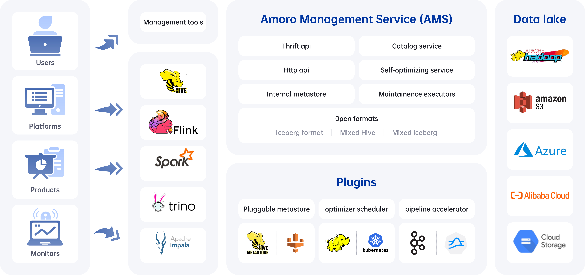

The core components of Amoro include:

- AMS: Amoro Management Service provides Lakehouse management features, like self-optimizing, data expiration, etc.
  It also provides a unified catalog service for all compute engines, which can also be combined with existing metadata services.
- Plugins: Amoro provides a wide selection of external plugins to meet different scenarios.
  - Optimizers: The self-optimizing execution engine plugin asynchronously performs merging, sorting, deduplication,
    layout optimization, and other operations on all type table format tables.
  - Terminal: SQL command-line tools, provide various implementations like local Spark and Kyuubi.
  - LogStore: Provide millisecond to second level SLAs for real-time data processing based on message queues like Kafka and Pulsar.

<a id="index--supported-table-formats"></a>

## Supported table formats

Amoro can manage tables of different table formats, similar to how MySQL/ClickHouse can choose different storage engines.
Amoro meets diverse user needs by using different table formats. Currently, Amoro supports three table formats:

- Iceberg format: means using the native table format of the Apache Iceberg, which has all the features and characteristics of Iceberg.
- Mixed-Iceberg format: built on top of Iceberg format, which can accelerate data processing using LogStore
  and provides more efficient query performance and streaming read capability in CDC scenarios.
- Mixed-Hive format: has the same features as the Mixed-Iceberg tables but is compatible with a Hive table.
  Support upgrading Hive tables to Mixed-Hive tables, and allow Hive’s native read and write methods after upgrading.

<a id="index--supported-engines"></a>

## Supported engines

<a id="index--iceberg-format"></a>

### Iceberg format

Iceberg format tables use the engine integration method provided by the Iceberg community.
For details, please refer to: [Iceberg Docs](https://iceberg.apache.org/docs/latest/).

<a id="index--paimon-format"></a>

### Paimon format

Paimon format tables use the engine integration method provided by the Paimon community.
For details, please refer to: [Paimon Docs](https://paimon.apache.org/docs/master/).

<a id="index--mixed-format"></a>

### Mixed format

Amoro support multiple processing engines for Mixed format as below:

| Processing Engine | Version | Batch Read | Batch Write | Batch Overwrite | Streaming Read | Streaming Write | Create Table | Alter Table |
| --- | --- | --- | --- | --- | --- | --- | --- | --- |
| Flink | 1.18.x, 1.19.x | ✔ | ✔ | ✖ | ✔ | ✔ | ✔ | ✖ |
| Spark | 3.3, 3.4, 3.5 | ✔ | ✔ | ✔ | ✖ | ✖ | ✔ | ✔ |
| Hive | 2.x, 3.x | ✔ | ✖ | ✔ | ✖ | ✖ | ✖ | ✔ |
| Trino | 406 | ✔ | ✖ | ✔ | ✖ | ✖ | ✖ | ✔ |

<a id="index--user-cases"></a>

## User cases

<a id="index--self-managed-streaming-lakehouse"></a>

### Self-managed streaming Lakehouse

Amoro makes it easier for users to handle the challenges of writing to a real-time data lake, such as ingesting append-only event logs or CDC data from databases.
In these scenarios, the rapid increase of fragment and redundant files cannot be ignored.
To address this issue, Amoro provides a pluggable streaming data self-optimizing mechanism that automatically compacts fragment files and removes expired data, ensuring high-quality table queries while reducing system costs.

<a id="index--stream-and-batch-fused-data-pipeline"></a>

### Stream-and-batch-fused data pipeline

Whether in the AI or BI business field , the requirement for real-time analysis is becoming increasingly high. The traditional approach of using one streaming job to complete all data processing from the source to the end is no longer applicable. There is an increasing demand for layered construction of streaming data pipeline, and the traditional layered construction approach based on message queues can cause a inconsistency problem between the streaming and batch data processing. Building a unified stream-and-batch-fused pipeline based on new data lake formats is the future direction for solving these problems. Amoro fully leverages the characteristics of the new data lake table formats about unified streaming and batch processing, not only ensuring the quality of data in the streaming pileline but also enhancing critical features such as incremental reading for CDC data and streaming dimension table association, helping users to build a stream-and-batch-fused data pipeline.

<a id="index--cloud-native-lakehouse"></a>

### Cloud-native Lakehouse

Currently, most data platforms and products are tightly coupled with their underlying infrastructure(such as the storage layer). The migration of infrastructure, such as switching to cloud-native OSS, may require extensive adaptation efforts or even be impossible. However, Amoro provides an infra-decoupled, lake-native architecture built on top of the infrastructure. This allows products based on Amoro to interact with the underlying infrastructure through a unified interface (Amoro Catalog service), protecting upper-layer products from the impact of infrastructure switch.

- [Architecture](#index--architecture)
- [Supported table formats](#index--supported-table-formats)
- [Supported engines](#index--supported-engines)
  - [Iceberg format](#index--iceberg-format)
  - [Paimon format](#index--paimon-format)
  - [Mixed format](#index--mixed-format)
- [User cases](#index--user-cases)
  - [Self-managed streaming Lakehouse](#index--self-managed-streaming-lakehouse)
  - [Stream-and-batch-fused data pipeline](#index--stream-and-batch-fused-data-pipeline)
  - [Cloud-native Lakehouse](#index--cloud-native-lakehouse)

---

<a id="catalogs"></a>

<!-- source_url: https://amoro.apache.org/docs/latest/catalogs/ -->

<!-- page_index: 2 -->

# Catalogs

This documentation reflects the `latest` development version and may change before the next official release.

For the latest stable documentation, see
[**0.8.1-incubating**](https://amoro.apache.org/docs/0.8.1/).

<a id="catalogs--catalogs"></a>

# Catalogs

<a id="catalogs--introduce-multi-catalog"></a>

## Introduce multi-catalog

A catalog is a metadata namespace that stores information about databases, tables, views, indexes, users, and UDFs. It provides a higher-level
namespace for `table` and `database`. Typically, a catalog is associated with a specific type of data source or cluster. In Flink, Spark and Trino, the multi-catalog feature can be used to support SQL across data sources, such as:

```SQL
SELECT c.ID, c.NAME, c.AGE, o.AMOUNT
FROM ${CATALOG_A}.ONLINE.CUSTOMERS c JOIN ${CATALOG_B}.OFFLINE.ORDERS o
ON (c.ID = o.CUSTOMER_ID)
```

In the past, data lakes were managed using the Hive Metastore (HMS) to handle metadata. Unfortunately, HMS does not support multi-catalog, which
limits the capabilities of engines on the data lake. For example, some users may want to use Spark to perform federated computation across different
Hive clusters by specifying the catalog name, requiring them to develop a Hive catalog plugin in the upper layer. Additionally, data lake formats are
moving from a single Hive-centric approach to a landscape of competing formats such as Iceberg, Delta, and Hudi. These new data lake formats are more
cloud-friendly and will facilitate the migration of data lakes to the cloud. In this context, a management system that supports multi-catalog is
needed to help users govern data lakes with different environments and formats.

Users can create catalogs in Amoro for different environments, clusters, and table formats, and leverage the multi-catalog feature in Flink, Spark
and Trino to enable federated computation across multiple clusters and formats. Additionally, properties configured in catalogs can be shared by all
tables and users, avoiding duplication. By leveraging the multi-catalog design, Amoro provides support for a metadata center in data platforms.

When AMS and HMS are used together, HMS serves as the storage foundation for AMS. With the [Iceberg Format](#iceberg-format), users can leverage the
multi-catalog management functionality of AMS without introducing any Amoro dependencies.

<a id="catalogs--how-to-use"></a>

## How to use

Amoro v0.4 introduced the catalog management feature, where table creation is performed under a catalog. Users can create, edit, and delete catalogs
in the catalogs module, which requires configuration of metastore, table format, and environment information upon creation. For more information, please refer to the documentation: [Managing catalogs](#managing-catalogs).

<a id="catalogs--future-work"></a>

## Future work

AMS will focus on two goals to enhance the value of the metadata center in the future:

- Expand data sources: In addition to data lakes, message queues, databases, and data warehouses can all be managed as objects in the catalog.
  Through metadata center and SQL-based federated computing of the computing engine, AMS will provide infrastructure solutions for data platforms
  such as DataOps and DataFabric
- Automatic catalog detection: In compute engines like Spark and Flink, it is possible to automatically detect the creation and changes of a
  catalog, enabling a one-time configuration for permanent scalability.

- [Introduce multi-catalog](#catalogs--introduce-multi-catalog)
- [How to use](#catalogs--how-to-use)
- [Future work](#catalogs--future-work)

---

<a id="self-optimizing"></a>

<!-- source_url: https://amoro.apache.org/docs/latest/self-optimizing/ -->

<!-- page_index: 3 -->

# Self-optimizing

This documentation reflects the `latest` development version and may change before the next official release.

For the latest stable documentation, see
[**0.8.1-incubating**](https://amoro.apache.org/docs/0.8.1/).

<a id="self-optimizing--self-optimizing"></a>

# Self-optimizing

<a id="self-optimizing--introduction"></a>

## Introduction

Lakehouse is characterized by its openness and loose coupling, with data and files maintained by users through various engines. While this
architecture appears to be well-suited for T+1 scenarios, as more attention is paid to applying Lakehouse to streaming data warehouses and real-time
analysis scenarios, challenges arise. For example:

- Streaming writes bring a massive amount of fragment files
- CDC ingestion and streaming updates generate excessive redundant data
- Using the new data lake format leads to orphan files and expired snapshots.

These issues can significantly affect the performance and cost of data analysis. Therefore, Amoro has introduced a Self-optimizing mechanism to
create an out-of-the-box Streaming Lakehouse management service that is as user-friendly as a traditional database or data warehouse. The new table
format is used for this purpose. Self-optimizing involves various procedures such as file compaction, deduplication, and sorting.

The architecture and working mechanism of Self-optimizing are shown in the figure below:

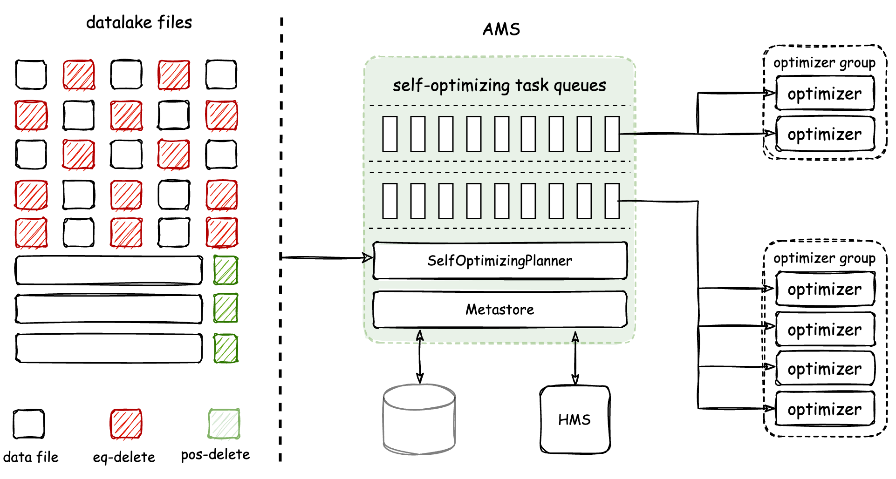

The Optimizer is a component responsible for executing Self-optimizing tasks. It is a resident process managed by AMS. AMS is responsible for
detecting and planning Self-optimizing tasks for tables, and then scheduling them to Optimizers for distributed execution in real-time. Finally, AMS
is responsible for submitting the optimizing results. Amoro achieves physical isolation of Optimizers through the Optimizer Group.

The core features of Amoro’s Self-optimizing are:

- Automated, Asynchronous and Transparent — Continuous background detecting of file changes, asynchronous distributed execution of optimizing tasks,
  transparent and imperceptible to users
- Resource Isolation and Sharing — Allow resources to be isolated and shared at the table level, as well as setting resource quotas
- Flexible and Scalable Deployment — Optimizers support various deployment methods and convenient scaling

<a id="self-optimizing--self-optimizing-mechanism"></a>

## Self-optimizing mechanism

During the process of writing data, there may be two types of amplification: read amplification and write amplification:

- Read amplification — If an excessive amount of fragment files are generated during the writing process, or if there is an excessive mapping of
  delete and insert files (which may be a familiar issue for users of the Iceberg v2 format), and the optimizing cannot keep up with the rate of
  fragment file generation, it can significantly degrade reading performance.
- Write amplification — Frequently scheduling optimizing can lead to frequent compaction and rewriting of existing files, which causes resource
  competition and waste of CPU/IO/Memory, slows down the optimization speed, and further intensify read amplification.

Frequent execution of optimizing is necessary to alleviate read amplification, but it can lead to write amplification. The design of self-optimizing
needs trade off between read and write amplification. Amoro’s Self-optimizing takes inspiration from the Generational Garbage Collection algorithm
in the JVM. Files are divided into Fragments and Segments based on their sizes, and different Self-optimizing processes executed on Fragments and
Segments are classified into two types: minor and major. Therefore, Amoro v0.4 introduces two parameters to define Fragments and Segments:

```SQL
-- Target file Size for Self-optimizing 
self-optimizing.target-size = 134217728(128MB)
-- The fragment file size threshold for Self-optimizing
self-optimizing.fragment-ratio = 8
```

`self-optimizing.target-size` defines the target output size for major optimizing, which is set to 128 MB by default. `self-optimizing.fragment-ratio`
defines the ratio of the fragment file threshold to the target-size, with a value of 8 indicating that the default fragment threshold is 1/8 of the
target-size, or 16 MB for a default target-size of 128 MB. Files smaller than 16 MB are considered fragments, while files larger than 16 MB are
considered segments, as shown in the diagram below:

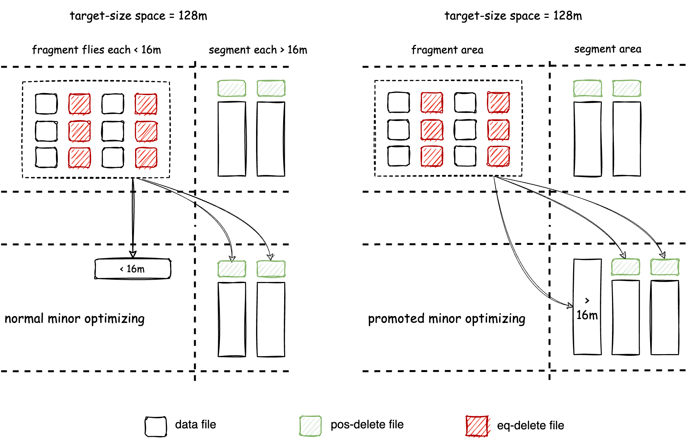

The goal of Minor optimizing is to alleviate read amplification issues, which entails two tasks：

- Compact fragment files into segment files as quickly as possible. Minor optimizing will be executed more frequently when fragment files are rapidly
  generated.
- Converting from a write-friendly file format to a read-friendly file format, which involves transitioning ChangeStore to BaseStore for the
  Mixed Format, and eq-delete files to pos-delete files for the Iceberg Format.

After executing Minor optimizing multiple times, there will be many Segment files in the tablespace. Although in most cases, the read efficiency
of Segment files can meet performance requirements, however:

- There may be a significant amount of accumulated delete data on each Segment file
- There may be a lot of duplicate data on primary keys between different Segment files

At this stage, the reading performance problem is no longer caused by the read amplification issue resulting from small file size and file format.
Instead, it is due to the presence of excessive redundant data that needs to be merged and cleaned up during merge-on-read. To address this problem, Amoro introduces major optimizing which merges Segment files to clean up redundant data and control its amount to a level that is favorable to
reading. Minor optimizing has already performed multiple rounds of deduplication, and major optimizing is not scheduled frequently to avoid write
amplification issues. Additionally, Full optimizing merges all files in the target space into a single file, which is a special case of
major optimizing.

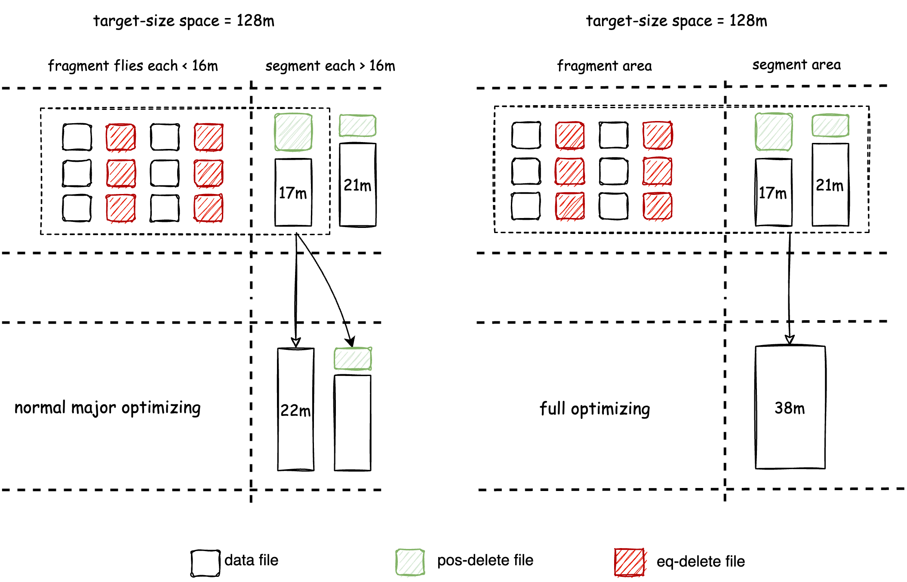

The design of Major optimizing and Minor optimizing takes inspiration from the Generational Garbage Collection algorithm of JVM. The execution
logic of both optimizing is consistent, as they both involve file compaction, data deduplication, and conversion from write-friendly format to
read-friendly format. The input-output relationships of Minor, Major, and Full optimizing are shown in the following table:

| Self-optimizing type | Input space | Output space | Input file types | Output file types |
| --- | --- | --- | --- | --- |
| minor | fragment | fragment/segment | insert, eq-delete, pos-delete | insert, pos-delete |
| major | fragment, segment | segment | insert, eq-delete, pos-delete | insert, pos-delete |
| full | fragment, segment | segment | insert, eq-delete, pos-delete | insert |

<a id="self-optimizing--self-optimizing-scheduling-policy"></a>

## Self-optimizing scheduling policy

AMS determines the Scheduling Policy to sequence the self-optimization process for different tables. The actual resources allocated for
Self-optimizing for each table are determined based on the chosen Scheduling Policy. Quota is used by Amoro to define the expected resource usage for
each table, while Quota occupation represents the percentage of actual resource usage compared to the expected usage. The AMS page allows viewing of
the Quota and Quota occupation for each table’s Self-optimizing:

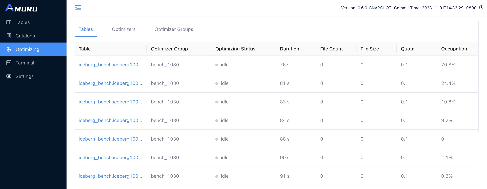

Different optimizer groups can be configured with different scheduling policies to meet various optimization requirements.
See: [Optimizer Group Configuration](#managing-optimizers--optimizer-group)。

Users can also disable the Self-optimizing for a table by configuring the following settings on the table, which will prevent it from being scheduled
for optimizing.

```SQL
self-optimizing.enabled = false;
```

If you are working with non-updatable tables like logs or sensor data and are used to utilizing the Spark Rewrite Action offered by Iceberg, you can
turn off the Self-optimizing.

However, if the table is configured with a primary key and supports CDC ingestion and streaming updates (e.g., database synchronization tables or
dimensionally aggregated tables), it is advisable to enable the Self-optimizing.

Currently, there are two main scheduling policies available: `Quota` and `Balanced`.

<a id="self-optimizing--quota"></a>

### Quota

The `Quota` strategy is a scheduling policy that schedules based on resource usage. The Self-optimizing resource usage of a single table is managed
by configuring the quota configuration on the table. Quota specifies the maximum number of optimizer resources that can be allocated to each table.
Quotas can be specified as either a decimal (representing a percentage) or an integer (representing a fixed number of resources):

```SQL
-- Set quota as a percentage of total optimizer resources
self-optimizing.quota = 0.5;
```

A decimal quota (e.g., 0.5) limits the table to a percentage of the total available optimizer resources.

```SQL
-- Set quota as a fixed number of optimizer resources
self-optimizing.quota = 10;
```

An integer quota (e.g., 10) restricts the table to a specific number of optimizer resources.

This flexible configuration prevents resource underutilization and allows users to tailor resource allocation to their needs.

The `Quota` strategy schedules tables based on their Occupation metric, which is calculated as the ratio of the actual optimizer thread execution time used
by a table to its quota execution time within the QUOTA\_LOOK\_BACK\_TIME window. Tables with lower Occupation are given higher scheduling priority.

<a id="self-optimizing--balanced"></a>

### Balanced

The `Balanced` strategy is a scheduling strategy based on time progression, where tables that have not been Self-optimized for a longer time have a
higher scheduling priority. This strategy aims to keep the self-optimizing progress of each table at a similar level, which can avoid the situation
where tables with high resource consumption do not perform Self-optimizing for a long time, thus affecting the overall query efficiency in the quota
scheduling strategy.

If there is no special requirement for resource usage among the tables in an optimizer group, and all tables are expected to have decent query
efficiency, then the `Balanced` strategy is a good choice.

- [Introduction](#self-optimizing--introduction)
- [Self-optimizing mechanism](#self-optimizing--self-optimizing-mechanism)
- [Self-optimizing scheduling policy](#self-optimizing--self-optimizing-scheduling-policy)

---

<a id="table-watermark"></a>

<!-- source_url: https://amoro.apache.org/docs/latest/table-watermark/ -->

<!-- page_index: 4 -->

# Table Watermark

This documentation reflects the `latest` development version and may change before the next official release.

For the latest stable documentation, see
[**0.8.1-incubating**](https://amoro.apache.org/docs/0.8.1/).

<a id="table-watermark--table-watermark"></a>

# Table Watermark

<a id="table-watermark--table-freshness"></a>

## Table freshness

Data freshness represents timeliness, and in many discussions, freshness is considered one of the important indicators of data quality. In traditional
offline data warehouses, higher cost typically means better performance, creating a typical binary paradox in terms of cost-performance trade-off.
However, in high-freshness streaming data warehouses, massive small files and frequent updates can lead to performance degradation. The higher the
freshness, the greater the impact on performance. To achieve the required performance, users must incur higher costs. Thus, for streaming data
warehouses, data freshness, query performance, and cost form a tripartite paradox.


Amoro offers a resolution to the tripartite paradox for users by utilizing AMS management functionality and a self-optimizing mechanism. Unlike
traditional data warehouses, Lakehouse tables are utilized in a multitude of data pipelines, AI, and BI scenarios. Measuring data freshness is
crucially important for data developers, analysts, and administrators, and Amoro addresses this challenge by adopting the watermark concept in stream
computing to gauge table freshness.

<a id="table-watermark--table-watermark-1"></a>
<a id="table-watermark--table-watermark-2"></a>

## Table watermark

In the Mixed Format, data freshness is measured through table watermark.

Strictly speaking, table watermark is used to describe the writing progress of a table. Specifically, it is a timestamp attribute on the table that
indicates that data with timestamps earlier than this watermark have been written to the table. It is typically used to monitor the progress of table
writes and can also serve as a trigger indicator for downstream batch computing tasks.

Mixed Format uses the following configurations to configure watermark:

```sql
  'table.event-time-field' = 'op_time',
  'table.watermark-allowed-lateness-second' = '60'
```

In the example above, `op_time` is set as the event time field for the table, and the watermark for the table is calculated using the `op_time` of the
data being written. To handle out-of-order writes, a maximum delay of 60 seconds is allowed for calculating the watermark. Unlike in stream
processing, data with event\_time values smaller than the watermark will not be rejected, but they will not affect the advancement of the watermark
either.

You can view the current watermark of a table in the AMS Dashboard’s table details, or you can use the following SQL query in the terminal to query
the watermark of a table:

```SQL
SHOW TBLPROPERTIES test_db.test_log_store ('watermark.table');
```

You can also query the table watermark of the BaseStore using the following command, which can be combined with native reads from Hive or Iceberg for
greater flexibility:

```SQL
SHOW TBLPROPERTIES test_db.test_log_store ('watermark.base');
```

You can learn about how to use Watermark in detail by referring to [Using tables](#using-tables).

- [Table freshness](#table-watermark--table-freshness)
- [Table watermark](#table-watermark--table-watermark-1)

---

<a id="ams-config"></a>

<!-- source_url: https://amoro.apache.org/docs/latest/ams-config/ -->

<!-- page_index: 5 -->

# AMS Configuration

This documentation reflects the `latest` development version and may change before the next official release.

For the latest stable documentation, see
[**0.8.1-incubating**](https://amoro.apache.org/docs/0.8.1/).

<a id="ams-config--ams-configuration"></a>

# AMS Configuration

<a id="ams-config--amoro-management-service-configuration"></a>

## Amoro Management Service Configuration

The configuration options for Amoro Management Service (AMS).

| Key | Default | Description |
| --- | --- | --- |
| admin-password | admin | The administrator password |
| admin-username | admin | The administrator account name. |
| auto-create-tags.enabled | true | Enable creating tags. |
| auto-create-tags.interval | 1 min | Interval for creating tags. |
| auto-create-tags.thread-count | 3 | The number of threads used for creating tags. |
| blocker.timeout | 1 min | Session timeout. Default unit is milliseconds if not specified. |
| catalog-meta-cache.expiration-interval | 1 min | TTL for catalog metadata. |
| clean-dangling-delete-files.enabled | true | Enable dangling delete files cleaning. |
| clean-dangling-delete-files.interval | 1 d | Interval for cleaning dangling delete files. |
| clean-dangling-delete-files.thread-count | 10 | The number of threads used for dangling delete files cleaning. |
| clean-orphan-files.enabled | true | Enable orphan files cleaning. |
| clean-orphan-files.interval | 1 d | Interval for cleaning orphan files. |
| clean-orphan-files.thread-count | 10 | The number of threads used for orphan files cleaning. |
| data-expiration.enabled | true | Enable data expiration |
| data-expiration.interval | 1 d | Execute interval for data expiration |
| data-expiration.thread-count | 10 | The number of threads used for data expiring |
| database.auto-create-tables | true | Auto init table schema when started |
| database.connection-pool-max-idle | 16 | Max idle connect count of database connect pool. |
| database.connection-pool-max-total | 20 | Max connect count of database connect pool. |
| database.connection-pool-max-wait-millis | 30000 | Max wait time before getting a connection timeout. |
| database.jdbc-driver-class | org.apache.derby.jdbc.EmbeddedDriver | The JDBC driver class name for connecting to the database. |
| database.password |  | The password for connecting to the database. |
| database.type | derby | Database type. |
| database.url | jdbc:derby:/tmp/amoro/derby;create=true | Database connection address |
| database.username | root | The username for connecting to the database. |
| expire-snapshots.enabled | true | Enable snapshots expiring. |
| expire-snapshots.interval | 1 h | Interval for expiring snapshots. |
| expire-snapshots.thread-count | 10 | The number of threads used for snapshots expiring. |
| ha.bucket-assign.interval | 1 min | Interval for bucket assignment service to detect node changes and redistribute bucket IDs. |
| ha.bucket-id.total-count | 100 | Total count of bucket IDs for assignment. Bucket IDs range from 1 to this value. |
| ha.bucket-table-sync.interval | 1 min | Interval for syncing tables assigned to bucket IDs in master-slave mode. Each node periodically loads tables from database based on its assigned bucket IDs. |
| ha.cluster-name | default | Amoro management service cluster name. |
| ha.connection-timeout | 5 min | The Zookeeper connection timeout in milliseconds. |
| ha.enabled | false | Whether to enable high availability mode. |
| ha.heartbeat-interval | 10 s | HA heartbeat interval. |
| ha.lease-ttl | 30 s | TTL of HA lease. |
| ha.node-offline.timeout | 5 min | Timeout duration to determine if a node is offline. After this duration, the node’s bucket IDs will be reassigned. |
| ha.session-timeout | 30 s | The Zookeeper session timeout in milliseconds. |
| ha.type | zk | High availability implementation type: zk or database. |
| ha.use-master-slave-mode | false | This setting controls whether to enable the AMS horizontal scaling feature, which is currently under development and testing. |
| ha.zookeeper-address |  | The Zookeeper address used for high availability. |
| ha.zookeeper-auth-keytab |  | The Zookeeper authentication keytab file path when auth type is KERBEROS. |
| ha.zookeeper-auth-principal |  | The Zookeeper authentication principal when auth type is KERBEROS. |
| ha.zookeeper-auth-type | NONE | The Zookeeper authentication type, NONE or KERBEROS. |
| http-server.auth-basic-provider | org.apache.amoro.server.authentication.DefaultPasswdAuthenticationProvider | User-defined password authentication implementation of org.apache.amoro.authentication.PasswdAuthenticationProvider |
| http-server.auth-jwt-provider | <undefined> | User-defined JWT (JSON Web Token) authentication implementation of org.apache.amoro.authentication.TokenAuthenticationProvider |
| http-server.authorization.default-role | <undefined> | Optional default dashboard role for authenticated users without an LDAP role mapping. |
| http-server.authorization.enabled | false | Whether to enable dashboard RBAC authorization. |
| http-server.authorization.ldap-role-mapping.bind-dn |  | Optional LDAP bind DN used when querying role-mapping groups. |
| http-server.authorization.ldap-role-mapping.bind-password |  | Optional LDAP bind password used when querying role-mapping groups. |
| http-server.authorization.ldap-role-mapping.enabled | false | Whether to resolve dashboard roles from LDAP group membership. |
| http-server.authorization.ldap-role-mapping.group-member-attribute | member | LDAP group attribute that stores member references. |
| http-server.authorization.ldap-role-mapping.groups | <undefined> | LDAP group-to-role mapping entries containing group-dn and role fields. |
| http-server.authorization.ldap-role-mapping.user-dn-pattern | <undefined> | LDAP user DN pattern used to match group members. Use {0} as the username placeholder. |
| http-server.bind-port | 19090 | Port that the Http server is bound to. |
| http-server.login-auth-ldap-url | <undefined> | LDAP connection URL(s), value could be a SPACE separated list of URLs to multiple LDAP servers for resiliency. URLs are tried in the order specified until the connection is successful |
| http-server.login-auth-ldap-user-pattern | <undefined> | LDAP user pattern for authentication. The pattern defines how to construct the user’s distinguished name (DN) in the LDAP directory. Use {0} as a placeholder for the username. For example, ‘cn={0},ou=people,dc=example,dc=com’ will search for users in the specified organizational unit. |
| http-server.login-auth-provider | org.apache.amoro.server.authentication.DefaultPasswdAuthenticationProvider | User-defined login authentication implementation of org.apache.amoro.authentication.PasswdAuthenticationProvider |
| http-server.proxy-client-ip-header | X-Real-IP | The HTTP header to record the real client IP address. If your server is behind a load balancer or other proxy, the server will see this load balancer or proxy IP address as the client IP address, to get around this common issue, most load balancers or proxies offer the ability to record the real remote IP address in an HTTP header that will be added to the request for other devices to use. |
| http-server.rest-auth-type | token | The authentication used by REST APIs, token (default), basic or jwt. |
| http-server.session-timeout | 7 d | Timeout for http session. |
| optimizer-group.max-keeping-attempts | 3 | The maximum number of consecutive attempts to keep the optimizer group at its current parallelism. |
| optimizer-group.min-parallelism-check-interval | 5 min | The interval for checking and ensuring the optimizer group meets its minimum parallelism requirement. When the current parallelism falls below the configured min-parallelism, the system will attempt to scale out optimizers at this interval. The actual scale-out timing is calculated as: consecutive keeping attempts \* this interval. |
| optimizer.heart-beat-timeout | 1 min | Timeout duration for Optimizer heartbeat. |
| optimizer.max-planning-parallelism | 1 | Max planning parallelism in one optimizer group. |
| optimizer.polling-timeout | 3 s | Optimizer polling task timeout. |
| optimizer.task-ack-timeout | 30 s | Timeout duration for task acknowledgment. |
| optimizer.task-execute-timeout | 2147483647 s | Timeout duration for task execution, default to Integer.MAX\_VALUE seconds(about 24,855 days). |
| overview-cache.max-size | 3360 | Max size of overview cache. |
| overview-cache.refresh-interval | 3 min | Interval for refreshing overview cache. |
| process.history-data-keep-days | 7 | Deprecated: use ‘process.history-data-keep-time’ instead. The number of days that process history data is retained. |
| process.history-data-keep-time | 7 d | Duration that process history data is retained. Expired terminal process records will be deleted automatically. |
| refresh-external-catalogs.interval | 3 min | Interval to refresh the external catalog. |
| refresh-external-catalogs.queue-size | 1000000 | The queue size of the executors of the external catalog explorer. |
| refresh-external-catalogs.thread-count | 10 | The number of threads used for discovering tables in external catalogs. |
| refresh-tables.interval | 1 min | Interval for refreshing table metadata. |
| refresh-tables.max-pending-partition-count | 100 | Filters will not be used beyond that number of partitions. |
| refresh-tables.thread-count | 10 | The number of threads used for refreshing tables. |
| self-optimizing.break-quota-limit-enabled | true | Allow the table to break the quota limit when the resource is sufficient. |
| self-optimizing.commit-manifest-io-thread-count | 10 | Sets the size of the worker pool. The worker pool limits the number of tasks concurrently processing manifests in the base table implementation across all concurrent commit operations. |
| self-optimizing.commit-thread-count | 10 | The number of threads that self-optimizing uses to submit results. |
| self-optimizing.plan-manifest-io-thread-count | 10 | Sets the size of the worker pool. The worker pool limits the number of tasks concurrently processing manifests in the base table implementation across all concurrent planning operations. |
| self-optimizing.refresh-group-interval | 30 s | Optimizer group refresh interval. |
| self-optimizing.runtime-data-expire-interval | 1 h | Interval between self-optimizing runtime data expiration runs. |
| self-optimizing.runtime-data-expire-interval-hours | 1 | Deprecated: use ‘self-optimizing.runtime-data-expire-interval’ instead. The number of hours that self-optimizing runtime data expire interval. |
| self-optimizing.runtime-data-keep-days | 30 | Deprecated: use ‘self-optimizing.runtime-data-keep-time’ instead. The number of days that self-optimizing runtime data keeps the runtime. |
| self-optimizing.runtime-data-keep-time | 30 d | Duration that self-optimizing runtime data is retained. |
| server-bind-host | 0.0.0.0 | The host bound to the server. |
| server-expose-host |  | The exposed host of the server. |
| sync-hive-tables.enabled | false | Enable synchronizing Hive tables. |
| sync-hive-tables.thread-count | 10 | The number of threads used for synchronizing Hive tables. |
| table-manifest-io.thread-count | 20 | Sets the size of the worker pool. The worker pool limits the number of tasks concurrently processing manifests in the base table implementation across all concurrent planning or commit operations. |
| terminal.backend | local | Terminal backend implementation. local, kyuubi and custom are valid values. |
| terminal.factory | <undefined> | Session factory implement of terminal, `terminal.backend` must be `custom` if this is set. |
| terminal.result.limit | 1000 | Row limit of result-set |
| terminal.sensitive-conf-keys |  | Comma-separated list of sensitive conf keys used to desensitize related value. |
| terminal.session.timeout | 30 min | Session timeout. Default unit is milliseconds if not specified (\*\* Note: default units are minutes when version < 0.8). |
| terminal.stop-on-error | false | When a statement fails to execute, stop execution or continue executing the remaining statements. |
| thrift-server.max-message-size | 100 mb | Maximum message size that the Thrift server can accept. Default unit is bytes if not specified. |
| thrift-server.optimizing-service.bind-port | 1261 | Port that the optimizing service thrift server is bound to. |
| thrift-server.selector-queue-size | 4 | The number of queue size per selector thread for the Thrift server |
| thrift-server.selector-thread-count | 2 | The number of selector threads for the Thrift server. |
| thrift-server.table-service.bind-port | 1260 | Port that the table service thrift server is bound to. |
| thrift-server.table-service.worker-thread-count | 20 | The number of worker threads for the Thrift server. |

<a id="ams-config--rbac-example"></a>

## RBAC Example

Enable RBAC only when you need role separation for dashboard users.

The current RBAC model uses:

- string-based roles
- LDAP group-to-role mapping as the primary role source
- built-in Casbin policy to translate roles into privileges
- privilege-driven frontend authorization

Amoro provides two built-in roles by default:

| Role | Description | Default Privileges |
| --- | --- | --- |
| `SERVICE_ADMIN` | Platform administrator | All privileges |
| `VIEWER` | Read-only resource viewer | `VIEW_CATALOG`, `VIEW_TABLE`, `VIEW_OPTIMIZER` |

`VIEWER` does not include `VIEW_SYSTEM`, so it cannot access `Overview` or `Terminal`.
After login succeeds, `/login/current` returns both `roles` and effective `privileges`.

If you need additional roles, define them by Casbin policy and map LDAP groups to those
role names. The role name itself does not need to be added to Java enum code.

```yaml
ams:
  http-server:
    authorization:
      enabled: true
```

```yaml
ams:
  http-server:
    login-auth-provider: org.apache.amoro.server.authentication.LdapPasswdAuthenticationProvider
    login-auth-ldap-url: "ldap://ldap.example.com:389"
    login-auth-ldap-user-pattern: "uid={0},ou=people,dc=example,dc=com"
    authorization:
      enabled: true
      ldap-role-mapping:
        enabled: true
        group-member-attribute: "member"
        user-dn-pattern: "uid={0},ou=people,dc=example,dc=com"
        bind-dn: "cn=service-account,dc=example,dc=com"
        bind-password: "service-password"
        groups:
          - group-dn: "cn=amoro-service-admins,ou=groups,dc=example,dc=com"
            role: SERVICE_ADMIN
          - group-dn: "cn=amoro-viewers,ou=groups,dc=example,dc=com"
            role: VIEWER
          - group-dn: "cn=amoro-catalog-admins,ou=groups,dc=example,dc=com"
            role: CATALOG_ADMIN
```

Example `/login/current` response:

```json
{
  "userName": "alice",
  "roles": ["CATALOG_ADMIN"],
  "privileges": [
    "VIEW_CATALOG",
    "MANAGE_CATALOG",
    "VIEW_TABLE",
    "MANAGE_TABLE"
  ]
}
```

Example custom role policy:

```csv
p, CATALOG_ADMIN, CATALOG, GLOBAL, VIEW_CATALOG, allow
p, CATALOG_ADMIN, CATALOG, GLOBAL, MANAGE_CATALOG, allow
p, CATALOG_ADMIN, TABLE, GLOBAL, VIEW_TABLE, allow
p, CATALOG_ADMIN, TABLE, GLOBAL, MANAGE_TABLE, allow
```

Notes:

- Recommended production setup is explicit role assignment only.
- `default-role` is optional. If it is not set, users who do not match any role mapping get no business role.
- Use `default-role: VIEWER` only if you intentionally want authenticated users without a matched role mapping to receive read-only access.
- Casbin model and default policy are built into the service and loaded from classpath.
- Dashboard request-to-privilege mapping is also built into the service and loaded from a resource configuration file.

<a id="ams-config--shade-utils-configuration"></a>

## Shade Utils Configuration

The configuration options for Amoro Configuration Shade Utils.

| Key | Default | Description |
| --- | --- | --- |
| shade.identifier | default | The identifier of the encryption method for decryption. Defaults to “default”, indicating no encryption |
| shade.sensitive-keywords | admin-password;database.password | A semicolon-separated list of keywords for the configuration items to be decrypted. |

- [Amoro Management Service Configuration](#ams-config--amoro-management-service-configuration)
- [RBAC Example](#ams-config--rbac-example)
- [Shade Utils Configuration](#ams-config--shade-utils-configuration)

---

<a id="deployment"></a>

<!-- source_url: https://amoro.apache.org/docs/latest/deployment/ -->

<!-- page_index: 6 -->

# Deployment

This documentation reflects the `latest` development version and may change before the next official release.

For the latest stable documentation, see
[**0.8.1-incubating**](https://amoro.apache.org/docs/0.8.1/).

<a id="deployment--deployment"></a>

# Deployment

You can choose to download the stable release package from [download page](https://amoro.apache.org/download/), or the source code form [Github](https://github.com/apache/amoro) and compile it according to the README.

<a id="deployment--system-requirements"></a>

## System requirements

- Java 11 is required.
- Optional: A RDBMS (PostgreSQL 14.x or higher, MySQL 5.5 or higher)
- Optional: ZooKeeper 3.4.x or higher

<a id="deployment--download-the-distribution"></a>

## Download the distribution

All released package can be downloaded from [download page](https://amoro.apache.org/download/).
You can download apache-amoro-x.y.z-bin.tar.gz (x.y.z is the release number), and you can also download the runtime packages for each engine version according to the engine you are using.
Unzip it to create the amoro-x.y.z directory in the same directory, and then go to the amoro-x.y.z directory.

<a id="deployment--source-code-compilation"></a>

## Source code compilation

You can build based on the master branch without compiling Trino. The compilation method and the directory of results are described below:

```shell
$ git clone https://github.com/apache/amoro.git
$ cd amoro
$ base_dir=$(pwd)
$ ./mvnw clean package -DskipTests
$ cd dist/target/
$ ls amoro-x.y.z-bin.zip # AMS release package

$ cd ${base_dir}/amoro-format-mixed/amoro-mixed-flink/v1.18/amoro-mixed-flink-runtime-1.18/target
$ ls amoro-format-mixed-flink-runtime-1.18-x.y.z.jar # Flink 1.18 runtime package

$ cd ${base_dir}/amoro-format-mixed/amoro-mixed-spark/v3.3/amoro-mixed-spark-runtime-3.3/target
$ ls amoro-format-mixed-spark-runtime-3.3-x.y.z.jar # Spark v3.3 runtime package
```

More build guide can be found in the project’s [README](https://github.com/apache/amoro?tab=readme-ov-file#building).

<a id="deployment--configuration"></a>

## Configuration

If you want to use AMS in a production environment, it is recommended to modify `{AMORO_HOME}/conf/config.yaml` by referring to the following configuration steps.

<a id="deployment--configure-the-service-address"></a>

### Configure the service address

- The `ams.server-bind-host` configuration specifies the host to which AMS is bound. The default value, `0.0.0.0,` indicates binding to all network interfaces.
- The `ams.server-expose-host` configuration specifies the host exposed by AMS that the compute engines and optimizers used to connect to AMS. You can configure a specific IP address on the machine, or an IP prefix. When AMS starts up, it will find the first host that matches this prefix.
- The `ams.thrift-server.table-service.bind-port` configuration specifies the binding port of the Thrift Server that provides the table service. The compute engines access AMS through this port, and the default value is 1260.
- The `ams.thrift-server.optimizing-service.bind-port` configuration specifies the binding port of the Thrift Server that provides the optimizing service. The optimizers access AMS through this port, and the default value is 1261.
- The `ams.http-server.bind-port` configuration specifies the port to which the HTTP service is bound. The Dashboard and Open API are bound to this port, and the default value is 1630.
- The `ams.http-server.rest-auth-type` configuration specifies the REST API auth type, which could be token(default), basic or jwt (JSON Web Token).
- The `ams.http-server.auth-basic-provider` configuration specifies the REST API basic authentication provider. By default, it uses `ams.admin-username` and `ams.admin-password` for authentication. You can also specify a custom implementation by providing the fully qualified class name of a class that implements the `org.apache.amoro.authentication.PasswdAuthenticationProvider` interface.
- The `ams.http-server.login-auth-provider` configuration specifies the Dashboard login authentication provider. By default, it uses `org.apache.amoro.server.authentication.DefaultPasswdAuthenticationProvider` (admin username/password login).
- To enable LDAP login for Dashboard, set `ams.http-server.login-auth-provider` to `org.apache.amoro.server.authentication.LdapPasswdAuthenticationProvider`, and configure `ams.http-server.login-auth-ldap-url` and `ams.http-server.login-auth-ldap-user-pattern`.
- The `ams.http-server.auth-jwt-provider` configuration specifies the REST API JWT authentication provider. Set this to the fully qualified class name of your custom provider implementing the `org.apache.amoro.authentication.TokenAuthenticationProvider` interface. This is required when `ams.http-server.rest-auth-type` is set to `jwt`.
- The `ams.http-server.proxy-client-ip-header` configuration specifies the HTTP header to use for extracting the real client IP address when AMS is deployed behind a reverse proxy (such as Nginx or a load balancer). Common values include `X-Forwarded-For` or `X-Real-IP`. If not set, AMS will use the remote address from the connection.

```yaml
ams:
  server-bind-host: "0.0.0.0" #The IP address for service listening, default is 0.0.0.0.
  server-expose-host: "127.0.0.1" #The IP address for service external exposure, default is 127.0.0.1.
  
  thrift-server:
    table-service:
      bind-port: 1260 #The port for accessing AMS table service.
    optimizing-service:
      bind-port: 1261 #The port for accessing AMS optimizing service.

  http-server:
    session-timeout: 7d #Re-login after 7days
    bind-port: 1630 #The port for accessing AMS Dashboard.
    login-auth-provider: org.apache.amoro.server.authentication.DefaultPasswdAuthenticationProvider
    # Enable LDAP login for Dashboard:
    # login-auth-provider: org.apache.amoro.server.authentication.LdapPasswdAuthenticationProvider
    # login-auth-ldap-url: "ldap://ldap.example.com:389"
    # login-auth-ldap-user-pattern: "uid={0},ou=people,dc=example,dc=com"
```

Make sure the port is not used before configuring it.

<a id="deployment--configure-system-database"></a>

### Configure system database

AMS uses embedded [Apache Derby](https://db.apache.org/derby/) as the backend storage by default, so you can use `Derby` directly without any additional configuration.

You can also configure a relational backend storage as you needed.

> If you would like to use MySQL as the system database, you need to manually download the [MySQL JDBC Connector](https://repo1.maven.org/maven2/com/mysql/mysql-connector-j/8.1.0/mysql-connector-j-8.1.0.jar)
> and move it into the `${AMORO_HOME}/lib/` directory.

You need to create an empty database in the RDBMS before to start the server, then AMS will automatically create tables in the database when it first started.

One thing you need to do is adding configuration under `config.yaml` of Ams:

```yaml
ams:
  database:
    type: ${database_type} # postgres or mysql
    jdbc-driver-class: ${your_driver_name}
    url: ${your_jdbc_url}
    username: ${your_username}
    password: ${your_password}
    auto-create-tables: true
```

<a id="deployment--configure-high-availability"></a>

### Configure high availability

To improve stability, AMS supports a one-master-multi-backup HA mode. Zookeeper is used to implement leader election, and the AMS cluster name and Zookeeper address are specified. The AMS cluster name is used to bind different AMS clusters
on the same Zookeeper cluster to avoid mutual interference.

```yaml
ams:
  ha:
    enabled: true  #Enable HA
    cluster-name: default # Differentiating binding multiple sets of AMS on the same ZooKeeper.
    zookeeper-address: 127.0.0.1:2181,127.0.0.1:2182,127.0.0.1:2183 # ZooKeeper server address.
```

<a id="deployment--configure-optimizer-containers"></a>

### Configure optimizer containers

To scale out the optimizer through AMS, container configuration is required.
If you choose to manually start an external optimizer, no additional container configuration is required. AMS will initialize a container named `external` by default to store all externally started optimizers.
AMS provides implementations of `LocalContainer` and `FlinkContainer` by default. Configuration for both container types can be found below:

```yaml
containers:
  - name: localContainer
    container-impl: org.apache.amoro.server.manager.LocalOptimizerContainer
    properties:
      export.JAVA_HOME: "/opt/java"   # JDK environment
  
  - name: flinkContainer
    container-impl: org.apache.amoro.server.manager.FlinkOptimizerContainer
    properties:
      flink-home: "/opt/flink/"                                     # The installation directory of Flink
      export.JVM_ARGS: "-Djava.security.krb5.conf=/opt/krb5.conf"   # Submitting Flink jobs with Java parameters, such as Kerberos parameters.
      export.HADOOP_CONF_DIR: "/etc/hadoop/conf/"                   # Hadoop configuration file directory
      export.HADOOP_USER_NAME: "hadoop"                             # Hadoop user
      export.FLINK_CONF_DIR: "/etc/hadoop/conf/"                    # Flink configuration file directory

  - name: sparkContainer
    container-impl: org.apache.amoro.server.manager.SparkOptimizerContainer
    properties:
      spark-home: /opt/spark/                                     # Spark install home
      master: yarn                                                # The cluster manager to connect to. See the list of https://spark.apache.org/docs/latest/submitting-applications.html#master-urls.
      deploy-mode: cluster                                        # Spark deploy mode, client or cluster
      export.JVM_ARGS: -Djava.security.krb5.conf=/opt/krb5.conf   # Spark launch jvm args, like kerberos config when ues kerberos
      export.HADOOP_CONF_DIR: /etc/hadoop/conf/                   # Hadoop config dir
      export.HADOOP_USER_NAME: hadoop                             # Hadoop user submit on yarn
      export.SPARK_CONF_DIR: /opt/spark/conf/                     # Spark config dir
```

More optimizer container configurations can be found in [managing optimizers](#managing-optimizers).

<a id="deployment--configure-terminal"></a>

### Configure terminal

The Terminal module in the AMS Dashboard allows users to execute SQL directly on the platform. Currently, the Terminal backend supports two implementations: `local` and `kyuubi`.
In local mode, an embedded Spark environment will be started in AMS. In kyuubi mode, an additional kyuubi service needs to be deployed.
The configuration for kyuubi mode can refer to: [Using Kyuubi with Terminal](#using-kyuubi). Below is the configuration for the local mode:

```yaml
ams:
  terminal:
    backend: local
    local.spark.sql.iceberg.handle-timestamp-without-timezone: false
    # When the catalog type is Hive, it automatically uses the Spark session catalog to access Hive tables.
    local.using-session-catalog-for-hive: true
```

More properties the terminal supports including:

| Key | Default | Description |
| --- | --- | --- |
| terminal.backend | local | Terminal backend implementation. local, kyuubi and custom are valid values. |
| terminal.factory | - | Session factory implement of terminal, `terminal.backend` must be `custom` if this is set. |
| terminal.result.limit | 1000 | Row limit of result-set |
| terminal.stop-on-error | false | When a statement fails to execute, stop execution or continue executing the remaining statements. |
| terminal.session.timeout | 30 | Session timeout in minutes. |

<a id="deployment--configure-metric-reporter"></a>

### Configure metric reporter

Amoro provides metric reporters by plugin mechanism to connect to external metric systems.

All metric-reporter plugins are configured in `$AMORO_CONF_DIR/plugins/metric-repoters.yaml` .

The configuration format of the plug-in is:

```yaml

metric-reporters:
  - name:                 # the unified plugin name.
    enabled:              # if this plugin is enabled, default is true.
    properties:           # a map defines properties of plugin.
```

Currently, there is only one reporter is available.

<a id="deployment--prometheus-exporter"></a>

#### Prometheus Exporter

By enable the `prometheus-exporter` plugin, the AMS will start a prometheus http exporter server.

```yaml
metric-reporters:
  - name: prometheus-exporter            # configs for prometheus exporter
    enabled: true
    properties:
       port: 9090                        # the port that the prometheus-exporter listens on.
```

You can add a scrape job in your prometheus configs

```yaml
# Your prometheus configs file.
scrape_configs:
  - job_name: 'amoro-exporter'
    scrape_interval: 15s
    static_configs:
      - targets: ['localhost:9090']  # The host and port that you configured in Amoro plugins configs file.
```

<a id="deployment--configure-encrypted-configuration-items"></a>

### Configure encrypted configuration items

For enhanced security, AMS supports encrypted values for sensitive configuration items such as passwords within `config.yaml`. This prevents plaintext passwords and other critical information from being directly exposed in the configuration file.
Currently, AMS provides built-in support for base64 decryption, and users can also implement custom decryption algorithms if needed (see [Using Customized Encryption Method for Configurations](#using-customized-encryption-method)).

To enable encrypted sensitive configuration items, add the following configurations under `config.yaml` of AMS:

- The `ams.shade.identifier` configuration specifies the encryption method used for the sensitive values. The default value is `default`, which means no encryption is applied. To enable encrypted values, set it to `base64` or another supported encryption method.
- The `ams.shade.sensitive-keywords` configuration specifies which configuration items under `ams` are encrypted. The default value is `admin-password;database.password`, and multiple keywords should be separated by semicolons (`;`). The values of these items must be replaced with their encrypted counterparts.

Example Configuration (Partial):

```yaml
ams:
  admin-username: admin
  admin-password: YWRtaW4=    # Ciphertext for "admin"
  server-bind-host: "0.0.0.0"
  server-expose-host: "127.0.0.1"

  shade:
    identifier: base64
    sensitive-keywords: admin-password;database.password

  database:
    type: mysql
    jdbc-driver-class: com.mysql.cj.jdbc.Driver
    url: jdbc:mysql://127.0.0.1:3306/amoro?useUnicode=true&characterEncoding=UTF8&autoReconnect=true&useAffectedRows=true&allowPublicKeyRetrieval=true&useSSL=false
    username: root
    password: cGFzc3dvcmQ=    # Ciphertext for "password"
```

<a id="deployment--environments-variables"></a>

### Environments variables

The following environment variables take effect during the startup process of AMS, you can set up those environments to overwrite the default value.

| Environments variable name | Default value | Description |
| --- | --- | --- |
| AMORO\_CONF\_DIR | ${AMORO\_HOME}/conf | location where Amoro loading config files. |
| AMORO\_LOG\_DIR | ${AMORO\_HOME}/logs | location where the logs files output |

Note: `$AMORO_HOME` can’t be overwritten from environment variable. It always points to the parent dir of `./bin`.

<a id="deployment--configure-ams-jvm"></a>

### Configure AMS JVM

The following JVM options could be set in `${AMORO_CONF_DIR}/jvm.properties`.

| Property Name | Related Jvm option | Description |
| --- | --- | --- |
| xms | “-Xms${value}m | Xms config for jvm |
| xmx | “-Xmx${value}m | Xmx config for jvm |
| jmx.remote.port | “-Dcom.sun.management.jmxremote.port=${value} | Enable remote debug |
| extra.options | “JAVA\_OPTS="${JAVA\_OPTS} ${JVM\_EXTRA\_CONFIG}” | The addition jvm options |

<a id="deployment--start-ams"></a>

## Start AMS

Enter the directory amoro-x.y.z and execute bin/ams.sh start to start AMS.

```shell
$ cd amoro-x.y.z
$ bin/ams.sh start
```

Then, access http://localhost:1630 through a browser to see the login page. If it appears, it means that the startup is
successful. The default username and password for login are both “admin”.

You can also restart/stop AMS with the following command:

```shell
$ bin/ams.sh restart
$ bin/ams.sh stop
```

<a id="deployment--upgrade-ams"></a>

## Upgrade AMS

<a id="deployment--upgrade-system-databases"></a>

### Upgrade system databases

You can find all the upgrade SQL scripts under `${AMORO_HOME}/conf/${db_type}/` with name pattern `upgrade-a.b.c-to-x.y.z.sql`.
Execute the upgrade SQL scripts one by one to your system database based on your starting and target versions.

<a id="deployment--replace-all-libs-and-plugins"></a>

### Replace all libs and plugins

Replace all contents in the original `{AMORO_HOME}/lib` directory with the contents in the lib directory of the new installation package.
Replace all contents in the original `{AMORO_HOME}/plugin` directory with the contents in the plugin directory of the new installation package.

Backup the old content before replacing it, so that you can roll back the upgrade operation if necessary.

<a id="deployment--configure-new-properties"></a>

### Configure new properties

The old configuration file `{AMORO_HOME}/conf/config.yaml` is usually compatible with the new version, but the new version may introduce new parameters. Try to compare the configuration files of the old and new versions, and reconfigure the parameters if necessary.

<a id="deployment--restart-ams"></a>

### Restart AMS

Restart AMS with the following commands:

```shell
bin/ams.sh restart
```

- [System requirements](#deployment--system-requirements)
- [Download the distribution](#deployment--download-the-distribution)
- [Source code compilation](#deployment--source-code-compilation)
- [Configuration](#deployment--configuration)
  - [Configure the service address](#deployment--configure-the-service-address)
  - [Configure system database](#deployment--configure-system-database)
  - [Configure high availability](#deployment--configure-high-availability)
  - [Configure optimizer containers](#deployment--configure-optimizer-containers)
  - [Configure terminal](#deployment--configure-terminal)
  - [Configure metric reporter](#deployment--configure-metric-reporter)
  - [Configure encrypted configuration items](#deployment--configure-encrypted-configuration-items)
  - [Environments variables](#deployment--environments-variables)
  - [Configure AMS JVM](#deployment--configure-ams-jvm)
- [Start AMS](#deployment--start-ams)
- [Upgrade AMS](#deployment--upgrade-ams)
  - [Upgrade system databases](#deployment--upgrade-system-databases)
  - [Replace all libs and plugins](#deployment--replace-all-libs-and-plugins)
  - [Configure new properties](#deployment--configure-new-properties)
  - [Restart AMS](#deployment--restart-ams)

---

<a id="deployment-on-kubernetes"></a>

<!-- source_url: https://amoro.apache.org/docs/latest/deployment-on-kubernetes/ -->

<!-- page_index: 7 -->

# Deploy AMS On Kubernetes

This documentation reflects the `latest` development version and may change before the next official release.

For the latest stable documentation, see
[**0.8.1-incubating**](https://amoro.apache.org/docs/0.8.1/).

<a id="deployment-on-kubernetes--deploy-ams-on-kubernetes"></a>

# Deploy AMS On Kubernetes

<a id="deployment-on-kubernetes--requirements"></a>

## Requirements

If you want to deploy AMS on Kubernetes, you’d better get a sense of the following things.

- Use AMS official docker image or build AMS docker image
- [An active Kubernetes cluster](https://kubernetes.io/docs/setup/)
- [Kubectl](https://kubernetes.io/docs/tasks/tools/#kubectl)
- [Helm3+](https://helm.sh/docs/intro/quickstart/)

<a id="deployment-on-kubernetes--amoro-official-docker-image"></a>

## Amoro Official Docker Image

You can find the official docker image at [Amoro Docker Hub](https://hub.docker.com/u/apache).

The following are images that can be used in a production environment.

**apache/amoro**

This is an image built based on the Amoro binary distribution package for deploying AMS.

**apache/amoro-flink-optimizer**

This is an image built based on the official version of Flink for deploying the Flink optimizer.

**apache/amoro-spark-optimizer**

This is an image built based on the official version of Spark for deploying the Spark optimizer.

<a id="deployment-on-kubernetes--build-ams-docker-image"></a>

## Build AMS Docker Image

If you want to build images locally, you can find the `build.sh` script in the docker folder of the project and pass the following command:

```shell
./docker/build.sh amoro
```

or build the `amoro-flink-optimizer` image by:

```shell
./docker/build.sh amoro-flink-optimizer --flink-version <flink-version>
```

or build the `amoro-spark-optimizer` image by:

```shell
./docker/build.sh amoro-spark-optimizer --spark-version <spark-version>
```

<a id="deployment-on-kubernetes--get-helm-charts"></a>

## Get Helm Charts

You can find the latest charts directly from the Github source code.

```shell
$ git clone https://github.com/apache/amoro.git
$ cd amoro/charts
$ helm dependency build ./amoro
```

<a id="deployment-on-kubernetes--install"></a>

## Install

When you are ready, you can use the following helm command to start

```shell
$ helm install <deployment-name> ./amoro
```

After successful installation, you can access WebUI through the following command.

```shell
$ kubectl port-forward services/<deployment-name>-amoro-rest 1630:1630
```

Open browser to go web: http://localhost:1630

<a id="deployment-on-kubernetes--access-logs"></a>

## Access logs

Then, use pod name to get logs:

```shell
$ kubectl get pod
$ kubectl logs {amoro-pod-name}
```

<a id="deployment-on-kubernetes--uninstall"></a>

## Uninstall

```shell
$ helm uninstall <deployment-name>
```

<a id="deployment-on-kubernetes--configuring-helm-application"></a>
<a id="deployment-on-kubernetes--configuring-helm-application."></a>

## Configuring Helm application.

Helm uses `<chart>/values.yaml` files as configuration files, and you can also copy this file for separate maintenance.

```shell
$ cp amoro/values.yaml my-values.yaml
$ vim my-values.yaml
```

And deploy Helm applications using independent configuration files.

```shell
$ helm install <deployment-name> ./amoro -f my-values.yaml
```

<a id="deployment-on-kubernetes--enable-ingress"></a>

### Enable Ingress

Ingress is not enabled by default. In production environments, it is recommended to enable Ingress to access the AMS Dashboard from outside the cluster.

```yaml
ingress:
  enabled: true
  ingressClassName: "nginx"
  hostname: minikube.amoro.com
```

<a id="deployment-on-kubernetes--configure-the-database"></a>
<a id="deployment-on-kubernetes--configure-the-database."></a>

### Configure the database.

AMS uses embedded [Apache Derby](https://db.apache.org/derby/) as its backend storage by default.
In production environments, we recommend using a RDBMS(Relational Database Management System) with higher availability guarantees as the storage for system data, you can ref to [Database Configuration](#deployment--configure-system-database) for more detail.

```yaml
amoroConf: 
  database:
    type: ${your_database_type}
    driver: ${your_database_driver}
    url: ${your_jdbc_url}
    username: ${your_username}
    password: ${your_password}
```

<a id="deployment-on-kubernetes--configure-the-images"></a>

### Configure the Images

Helm charts deploy images by default using the latest tag.
If you need to modify the image address, such as using a private repository or building your own image

```yaml
image:
  repository: <your repository>
  pullPolicy: IfNotPresent
  tag: <your tag>
imagePullSecrets: [ ]
```

<a id="deployment-on-kubernetes--configure-the-flink-optimizer-container"></a>

### Configure the Flink Optimizer Container

By default, the Flink Optimizer Container is enabled.
You can modify the container configuration by changing the `optimizer.flink` section.

```yaml
optimizer: 
  flink: 
    enabled: true
    ## container name, default is flink
    name: ~ 
    image:
      ## the image repository
      repository: apache/amoro-flink-optimizer
      ## the image tag, if not set, the default value is the same with amoro image tag.
      tag: ~
      pullPolicy: IfNotPresent
      ## the location of flink optimizer jar in image.
      jobUri: "local:///opt/flink/usrlib/optimizer-job.jar"
    properties: {
      "flink-conf.taskmanager.memory.managed.size": "32mb",
      "flink-conf.taskmanager.memory.network.max": "32mb",
      "flink-conf.taskmanager.memory.network.min": "32mb"
    }
```

<a id="deployment-on-kubernetes--configure-the-kubernetes-optimizer-container"></a>

### Configure the Kubernetes Optimizer Container

By default, the Kubernetes Optimizer Container is enabled.
You can modify the container configuration by changing the `optimizer.Kubernetes` section.

```yaml
optimizer:
  kubernetes:
    # enable the kubernetes optimizer container
    enabled: true
    properties:
      namespace: "default"
      kube-config-path: "~/.kube/config"
      image: "apache/amoro:latest"
      pullPolicy: "IfNotPresent"
      # configure additional parameters by using the extra. prefix
      # extra.jvm.heap.ratio: "0.8"
```

To use PodTemplate, you need to copy and paste the following into the `kubernetes.properties`.

This is the default podTemplate, and when the user doesn’t specify any additional parameters, the default is to use the template’s parameters

Therefore, there will be a priority issue that needs to be elaborated: *Resource(WebUi) > Independent User Profile Configuration > PodTemplate*

```yaml
podTemplate: |
  apiVersion: apps/v1
  kind: PodTemplate
  metadata:
    name: <NAME_PREFIX><resourceId>
  template:
    metadata:
      labels:
        app: <NAME_PREFIX><resourceId>
        AmoroOptimizerGroup: <groupName>
        AmoroResourceId: <resourceId>
    spec:
      containers:
        - name: optimizer
          image: apache/amoro:0.6
          imagePullPolicy: IfNotPresent
          command: [ "sh", "-c", "echo 'Hello, World!'" ]
          resources:
            limits:
              memory: 2048Mi
              cpu: 2
            requests:
              memory: 2048Mi
              cpu: 2
```

<a id="deployment-on-kubernetes--configure-the-rbac"></a>

### Configure the RBAC

By default, Helm Chart creates a service account, role, and role bind for Amoro deploy.
You can also modify this configuration to use an existing account.

```yaml
# ServiceAccount of Amoro to schedule optimizer.
serviceAccount:
  # Specifies whether a service account should be created or using an existed account
  create: true
  # Annotations to add to the service account
  annotations: { }
  # Specifies ServiceAccount name to be used if `create: false`
  name: ~
  # if `serviceAccount.create` == true. role and role-bind will be created
  rbac:
    # create a role/role-bind if automatically create service account
    create: true
    # create a cluster-role and cluster-role-bind if cluster := true
    cluster: false
```

Notes:

- If `serviceAccount.create` is false, you must provide a `serviceAccount.name` and create the `serviceAccount` beforehand.
- If `serviceAccount.rbac.create` is false, the role and role-bind will not be created automatically.
- You can set `serviceAccount.rbac.cluster` to true, which will create a `cluster-role` and `cluster-role-bind` instead of a `role` and `role-bind`.

By default, the `serviceAccount` will be used to create the flink-optimizer.
Therefore, if you need to schedule the flink-optimizer across namespaces, please create a `cluster-role` or use your own created `serviceAccount`.

- [Requirements](#deployment-on-kubernetes--requirements)
- [Amoro Official Docker Image](#deployment-on-kubernetes--amoro-official-docker-image)
- [Build AMS Docker Image](#deployment-on-kubernetes--build-ams-docker-image)
- [Get Helm Charts](#deployment-on-kubernetes--get-helm-charts)
- [Install](#deployment-on-kubernetes--install)
- [Access logs](#deployment-on-kubernetes--access-logs)
- [Uninstall](#deployment-on-kubernetes--uninstall)
- [Configuring Helm application.](#deployment-on-kubernetes--configuring-helm-application)
  - [Enable Ingress](#deployment-on-kubernetes--enable-ingress)
  - [Configure the database.](#deployment-on-kubernetes--configure-the-database)
  - [Configure the Images](#deployment-on-kubernetes--configure-the-images)
  - [Configure the Flink Optimizer Container](#deployment-on-kubernetes--configure-the-flink-optimizer-container)
  - [Configure the Kubernetes Optimizer Container](#deployment-on-kubernetes--configure-the-kubernetes-optimizer-container)
  - [Configure the RBAC](#deployment-on-kubernetes--configure-the-rbac)

---

<a id="managing-catalogs"></a>

<!-- source_url: https://amoro.apache.org/docs/latest/managing-catalogs/ -->

<!-- page_index: 8 -->

# Managing Catalogs

This documentation reflects the `latest` development version and may change before the next official release.

For the latest stable documentation, see
[**0.8.1-incubating**](https://amoro.apache.org/docs/0.8.1/).

<a id="managing-catalogs--managing-catalogs"></a>

# Managing Catalogs

Users can import your test or online clusters through the catalog management function provided by the AMS Dashboard. Before adding a new Catalog, please read the following guidelines and select the appropriate creation according to your actual needs.

<a id="managing-catalogs--create-catalog"></a>

## Create catalog

In Amoro, the catalog is a namespace for a group of libraries and tables. Under the catalog, it is further divided into different databases, and under each database, there are different tables. The name of a table in Amoro is uniquely identified by the format `catalog.database.table`. In practical applications, a catalog generally corresponds to a metadata service, such as the commonly used Hive Metastore in big data.

AMS can also serve as a metadata service. In order to differentiate the storage method of metadata, Amoro classifies the catalog type into `Internal Catalog` and `External Catalog`. Catalogs that use AMS as the metadata service are internal catalogs, while others are external catalogs. When creating an external catalog, you need to select the storage backend for its metadata, such as Hive, Hadoop, or Custom.

In addition, when defining a catalog, you also need to select the table format used under it. Currently, Amoro supports the following table formats:
[Iceberg](#iceberg-format) 、[Paimon](#paimon-format)、[Mixed-Hive](#mixed-hive-format)、[Mixed-Iceberg](#mixed-iceberg-format).

You can create a catalog in the AMS frontend:
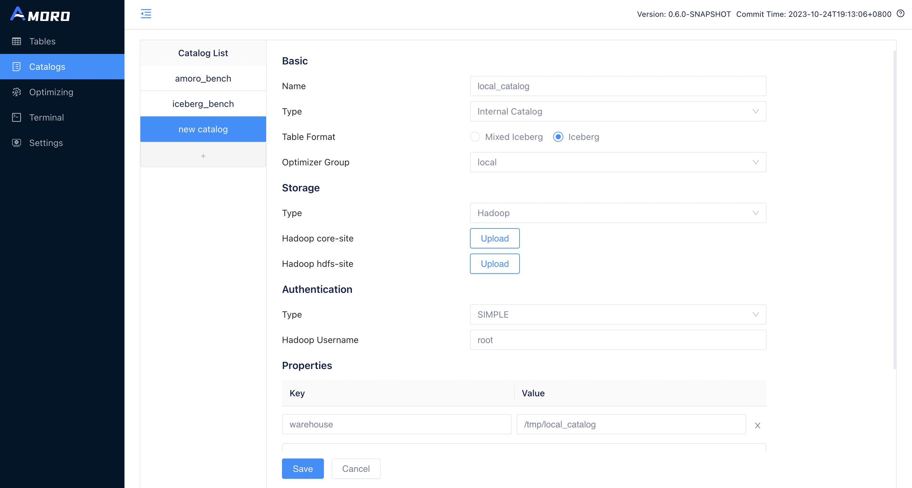

<a id="managing-catalogs--configure-basic-information"></a>

### Configure basic information

- name: catalog name, only numbers, letters, \_, - , starting with letters are supported (lower case letters are recommended)
- type: Internal Catalog or External Catalog
- metastore: storage type for table metadata. Hive Metastore (for using HMS to store metadata), Hadoop (corresponding to iceberg’s Hadoop catalog), Glue (for using AWS Glue to store metadata), Custom (other iceberg catalog implementations).
- table format: Iceberg 、Paimon、Mixed-Hive、Mixed-Iceberg.
- optimizer group: tables under the catalog will automatically perform self-optimizing within this group.

<a id="managing-catalogs--configure-storage"></a>

### Configure storage

- Type: Hadoop or S3
- core-site: the core-site.xml of the hadoop cluster
- hdfs-site: the hdfs-site.xml of the hadoop cluster
- hive-site: the hive-site.xml for Hive
- Region: region of the S3 bucket
- Endpoint: endpoint of the S3 bucket

<a id="managing-catalogs--configure-authentication"></a>

### Configure authentication

- Type: SIMPLE, KERBEROS, AK/SK or CUSTOM
- hadoop username: username of the hadoop cluster
- keytab: keytab file
- principal: principal of keytab
- krb5: Kerberos krb5.conf configuration file
- Access Key: Access Key for S3
- Secret Key: Secret Access Key for S3

<a id="managing-catalogs--configure-properties"></a>

### Configure properties

Common properties include:

- warehouse: Warehouse **must be configured** for ams/hadoop/glue catalog, as it determines where our database and table files should be placed
- catalog-impl: when the metastore is **Custom**, an additional catalog-impl must be defined, and the user must put the jar package for the custom catalog implementation into the **{AMORO\_HOME}/lib** directory, **and the service must be restarted to take effect**
- clients: Hive Catalog connection pool size for accessing HiveMetaStore, default configuration is 20, requires restarting Amoro to take effect.
- database-filter: Configure a regular expression to filter databases in the catalog. If not set then all databases will be displayed in table menu.
- table-filter: Configure a regular expression to filter tables in the catalog. The matching will be done in the format of `database.table`. For example, if it is set to `(A\.a)|(B\.b)`, it will ignore all tables except for table `a` in database `A` and table `b` in database `B`

<a id="managing-catalogs--configure-table-properties"></a>

### Configure table properties

If you want to add the same table properties to all tables under a catalog, you can add these table properties here on the catalog level. If you also configure this property on the table level, the property on the table will take effect.

<a id="managing-catalogs--rest-catalog"></a>

## REST Catalog

When a user needs to create a Iceberg REST Catalog, they can choose **External Catalog Type**、**Custom Metastore Type**、**Iceberg Table Format**, configure properties include:
**catalog-impl=org.apache.iceberg.rest.RESTCatalog**, **uri=$restCatalog\_uri**.

After configuring the above parameters, the final result in the AMS frontend will look like this:
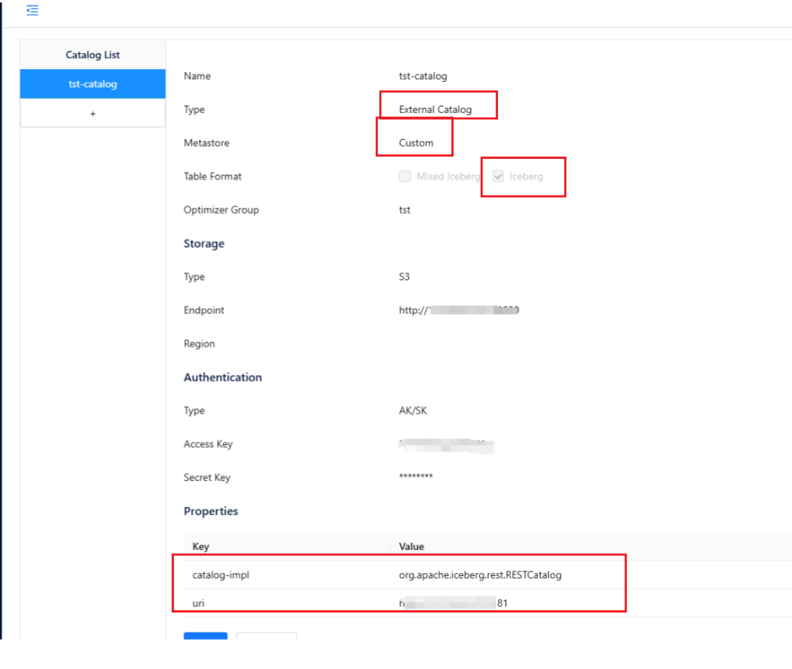

<a id="managing-catalogs--nessies-rest-catalog"></a>
<a id="managing-catalogs--nessie-s-rest-catalog"></a>

### Nessie’s REST Catalog

When a user needs to create a Nessie Rest Catalog, they can also set **catalog-impl=org.apache.iceberg.nessie.NessieCatalog** on top of the above parameters.

<a id="managing-catalogs--delete-catalog"></a>

## Delete catalog

When a user needs to delete a Catalog, they can go to the details page of the Catalog and click the Remove button at the bottom of the page to perform the deletion.

Before deleting an internal catalog, AMS will verify whether there is metadata for tables under that Catalog.
If there are still tables under that Catalog, AMS will prompt that the deletion failed.

- [Create catalog](#managing-catalogs--create-catalog)
  - [Configure basic information](#managing-catalogs--configure-basic-information)
  - [Configure storage](#managing-catalogs--configure-storage)
  - [Configure authentication](#managing-catalogs--configure-authentication)
  - [Configure properties](#managing-catalogs--configure-properties)
  - [Configure table properties](#managing-catalogs--configure-table-properties)
- [REST Catalog](#managing-catalogs--rest-catalog)
- [Delete catalog](#managing-catalogs--delete-catalog)

---

<a id="managing-optimizers"></a>

<!-- source_url: https://amoro.apache.org/docs/latest/managing-optimizers/ -->

<!-- page_index: 9 -->

# Managing Optimizers

This documentation reflects the `latest` development version and may change before the next official release.

For the latest stable documentation, see
[**0.8.1-incubating**](https://amoro.apache.org/docs/0.8.1/).

<a id="managing-optimizers--managing-optimizers"></a>

# Managing Optimizers

The optimizer is the execution unit for performing self-optimizing tasks on a table. To isolate optimizing tasks on different tables and support the deployment of optimizers in different environments, Amoro has proposed the concepts of optimizer containers and optimizer groups:

- Optimizer container: Encapsulate the deployment method of optimizers, there are four implementations for now: `flink container` based on Flink streaming job, `spark container` based on Spark job, `local container` based on Java Application, and `external container` based on manually started by users.
- Optimizer group: A collection of optimizers, where each table must select an optimizer group to perform optimizing tasks on it. Tables under the same optimizer group contribute resources to each other, and tables under different optimizer groups can be isolated in terms of optimizer resources.
- Optimizer: The specific unit that performs optimizing tasks, usually with multiple concurrent units.

<a id="managing-optimizers--optimizer-container"></a>

## Optimizer container

Before start exploring self-optimizing, you need to configure the container information in the configuration file. Optimizer container represents a specific set of runtime environment configuration. The supported container types include: local, kubernetes, flink, spark, and external.

<a id="managing-optimizers--local-container"></a>

### Local container

Local container is a way to start Optimizer by local process and supports multi-threaded execution of Optimizer tasks. It is recommended to be used only in demo or local deployment scenarios. If the environment variable for jdk is not configured, the user can configure java\_home to point to the jdk root directory. If already configured, this configuration item can be ignored.

Local container support the following properties:

| Property Name | Required | Default Value | Description |
| --- | --- | --- | --- |
| ams-optimizing-uri | false | N/A | URI of AMS thrift self-optimizing endpoint. This could be used if the ams.server-expose-host is not available |
| export.JAVA\_HOME | false | N/A | Java runtime location |

```yaml
containers:
  - name: localContainer
    container-impl: org.apache.amoro.server.manager.LocalOptimizerContainer
    properties:
      export.JAVA_HOME: "/opt/java"   # JDK environment
```

The format for optimizing URI is `thrift://{host}:{port}?parameter1=value2&parameter2=value2`.
The supported parameters include:

| Parameter Name | Default Value | Description |
| --- | --- | --- |
| autoReconnect | true | If reconnect the server when the connection is broken |
| maxReconnects | 5 | Retry times when reconnecting |
| connectTimeout | 0 (Forever) | Timeout in milliseconds when connecting the server |
| socketTimeout | 0 (Forever) | Timeout in milliseconds when communicating with the server |
| maxMessageSize | 104856600 (100MB) | Max message size when communicating with the server |
| maxMessageSize | 104856600 (100MB) | Max message size when communicating with the server |
| minIdle | 0 | Minimal idle clients in the pool |
| maxIdle | 5 | Maximal idle clients in the pool |

<a id="managing-optimizers--kubernetes-container"></a>

### Kubernetes container

Kubernetes container is a way to start Optimizer On K8s with standalone Optimizer.
To use Kubernetes container, you need to add a new container configuration.
with container-impl as `org.apache.amoro.server.manager.KubernetesOptimizerContainer`

Kubernetes container support the following properties:

| Property Name | Required | Default Value | Description |
| --- | --- | --- | --- |
| kube-config-path | true | N/A | Kubernetes config location |
| image | true | N/A | Optimizer Image name |
| pullPolicy | false | IfNotPresent | Specify the imagePullPolicy in the container spec |
| namespace | false | “default” | The namespace of optimizer to deploy |
| ams-optimizing-uri | false | N/A | URI of AMS thrift self-optimizing endpoint. This could be used if the ams.server-expose-host is not available |
| cpu.factor | false | “1.0” | CPU factor when request kubernetes resource. Default 1 Cpu pre thread |
| memory | true | N/A | Memory usage for pre thread |
| extra.jvm.heap.ratio | false | 0.8 | The ratio of JVM heap memory to total pod memory |

```yaml
containers:
  - name: KubernetesContainer
    container-impl: org.apache.amoro.server.manager.KubernetesOptimizerContainer
    properties:
      kube-config-path: ~/.kube/config
      image: apache/amoro:{version}
      pullPolicy: IfNotPresent
```

<a id="managing-optimizers--flink-container"></a>

### Flink container

Flink container is a way to start Optimizer through Flink jobs. With Flink, you can easily deploy Optimizer
on yarn clusters or kubernetes clusters to support large-scale data scenarios. To use flink container, you need to add a new container configuration. with container-impl as `org.apache.amoro.server.manager.FlinkOptimizerContainer`

Flink container support the following properties:

| Property Name | Required | Default Value | Description |
| --- | --- | --- | --- |
| flink-home | true | N/A | Flink installation location |
| target | true | yarn-per-job | flink job deployed target, available values `yarn-per-job`, `yarn-application`, `kubernetes-application`, `session` |
| job-uri | false | N/A | The jar uri of flink optimizer job. This is required if target is application mode. |
| ams-optimizing-uri | false | N/A | uri of AMS thrift self-optimizing endpoint. This could be used if the ams.server-expose-host is not available |
| export.<key> | false | N/A | environment variables will be exported during job submit |
| export.JAVA\_HOME | false | N/A | Java runtime location |
| export.HADOOP\_CONF\_DIR | false | N/A | Direction which holds the configuration files for the hadoop cluster (including hdfs-site.xml, core-site.xml, yarn-site.xml ). If the hadoop cluster has kerberos authentication enabled, you need to prepare an additional krb5.conf and a keytab file for the user to submit tasks |
| export.JVM\_ARGS | false | N/A | you can configure flink to run additional configuration parameters, here is an example of configuring krb5.conf, specify the address of krb5.conf to be used by Flink when committing via `-Djava.security.krb5.conf=/opt/krb5.conf` |
| export.HADOOP\_USER\_NAME | false | N/A | the username used to submit tasks to yarn, used for simple authentication |
| export.FLINK\_CONF\_DIR | false | N/A | the directory where flink\_conf.yaml is located |
| flink-conf.<key> | false | N/A | [Flink Configuration Options](https://nightlies.apache.org/flink/flink-docs-master/docs/deployment/config/) will be passed to cli by `-Dkey=value`, |

To better utilize the resources of Flink Optimizer, it is recommended to add the following configuration to the Flink Optimizer Group:

- Set `flink-conf.taskmanager.memory.managed.size` to `32mb` as Flink optimizer does not have any computation logic, it does not need to occupy managed memory.
- Set `flink-conf.taskmanager.memory.network.max` to `32mb` as there is no need for communication between operators in Flink Optimizer.
- Set `flink-conf.taskmanager.memory.network.min` to `32mb` as there is no need for communication between operators in Flink Optimizer.

An example for yarn-per-job mode:

```yaml
containers:
  - name: flinkContainer
    container-impl: org.apache.amoro.server.manager.FlinkOptimizerContainer
    properties:
      flink-home: /opt/flink/                                         #flink install home
      export.HADOOP_CONF_DIR: /etc/hadoop/conf/                       #hadoop config dir
      export.HADOOP_USER_NAME: hadoop                                 #hadoop user submit on yarn
      export.JVM_ARGS: -Djava.security.krb5.conf=/opt/krb5.conf       #flink launch jvm args, like kerberos config when ues kerberos
      export.FLINK_CONF_DIR: /etc/hadoop/conf/                        #flink config dir
```

An example for kubernetes-application mode:

```yaml
containers:
  - name: flinkContainer
    container-impl: org.apache.amoro.server.manager.FlinkOptimizerContainer
    properties:
      flink-home: /opt/flink/                                                        # Flink install home
      target: kubernetes-application                                                 # Flink run as native kubernetes
      pullPolicy: IfNotPresent                                                       # Specify the imagePullPolicy in the container spec  
      job-uri: "local:///opt/flink/usrlib/optimizer-job.jar"                         # Optimizer job main jar for kubernetes application
      ams-optimizing-uri: thrift://ams.amoro.service.local:1261                      # AMS optimizing uri 
      export.FLINK_CONF_DIR: /opt/flink/conf/                                        # Flink config dir
      flink-conf.kubernetes.container.image: "apache/amoro-flink-optimizer:{version}"   # Optimizer image ref
      flink-conf.kubernetes.service-account: flink                                   # Service account that is used within kubernetes cluster.
```

An example for flink session mode:

```yaml
containers:
  - name: flinkContainer
    container-impl: org.apache.amoro.server.manager.FlinkOptimizerContainer
    properties:
      target: session                                                                # Flink run in session cluster
      job-uri: "local:///opt/flink/usrlib/optimizer-job.jar"                         # Optimizer job main jar
      ams-optimizing-uri: thrift://ams.amoro.service.local:1261                      # AMS optimizing uri 
      export.FLINK_CONF_DIR: /opt/flink/conf/                                        # Flink config dir, flink-conf.yaml should e in this dir, contains the rest connection parameters of the session cluster
      flink-conf.high-availability: zookeeper                                        # Flink high availability mode, reference: https://nightlies.apache.org/flink/flink-docs-release-1.18/docs/deployment/config/#high-availability
      flink-conf.high-availability.zookeeper.quorum: xxx:2181
      flink-conf.high-availability.zookeeper.path.root: /flink
      flink-conf.high-availability.cluster-id: amoro-optimizer-cluster
      flink-conf.high-availability.storageDir: hdfs://xxx/xxx/xxx
      flink-conf.rest.address: localhost:8081                                        # If the session cluster is not high availability mode, please configure the restaddress of jobmanager
```

<a id="managing-optimizers--spark-container"></a>

### Spark container

Spark container is another way to start Optimizer through Spark jobs. With Spark, you can easily deploy Optimizer
on yarn clusters or kubernetes clusters to support large-scale data scenarios. To use spark container, you need to add a new container configuration. with container-impl as `org.apache.amoro.server.manager.SparkOptimizerContainer`

Spark container support the following properties:

| Property Name | Required | Default Value | Description |
| --- | --- | --- | --- |
| spark-home | true | N/A | Spark installation location |
| master | true | yarn | The cluster manager to connect to, available values `yarn`, `k8s://HOST:PORT` |
| deploy-mode | true | client | Spark job deploy mode, available values `client`, `cluster` |
| job-uri | false | N/A | The jar uri of spark optimizer job. This is required if deploy mode is cluster mode. |
| ams-optimizing-uri | false | N/A | uri of AMS thrift self-optimizing endpoint. This could be used if the ams.server-expose-host is not available |
| export.<key> | false | N/A | Environment variables will be exported during job submit |
| export.JAVA\_HOME | false | N/A | Java runtime location |
| export.HADOOP\_CONF\_DIR | false | N/A | Direction which holds the configuration files for the hadoop cluster (including hdfs-site.xml, core-site.xml, yarn-site.xml ). If the hadoop cluster has kerberos authentication enabled, you need to prepare an additional krb5.conf and a keytab file for the user to submit tasks |
| export.JVM\_ARGS | false | N/A | You can configure spark to run additional configuration parameters, here is an example of configuring krb5.conf, specify the address of krb5.conf to be used by Spark when committing via `-Djava.security.krb5.conf=/opt/krb5.conf` |
| export.HADOOP\_USER\_NAME | false | N/A | The username used to submit tasks to yarn, used for simple authentication |
| export.SPARK\_CONF\_DIR | false | N/A | The directory where spark\_conf.yaml is located |
| spark-conf.<key> | false | N/A | [Spark Configuration Options](https://spark.apache.org/docs/latest/configuration.html) will be passed to cli by `-conf key=value`, |

To better utilize the resources of Spark Optimizer, the DRA(Dynamic Resource Allocation) feature is switched on, and the optimizer parallelism equals `spark.dynamicAllocation.maxExecutors.
If you don’t want this feature, you can use these settings:

- Set `spark-conf.spark.dynamicAllocation.enabled` to `false` as you need allocate proper driver/executor resources Using [Spark Configuration Options](https://spark.apache.org/docs/latest/configuration.html).
- Set `spark-conf.spark.dynamicAllocation.maxExecutors` to `10` as optimizer parallelism can only affect parallelism polling optimizing tasks from AMS.

The spark optimizer may fail due to class conflicts sometimes, you can try to fix by following the steps below：

- Set `spark-conf.spark.driver.userClassPathFirst` to `true`.
- Set `spark-conf.spark.executor.userClassPathFirst` to `true`.

An example for yarn client mode:

```yaml
containers:
  - name: sparkContainer
    container-impl: org.apache.amoro.server.manager.SparkOptimizerContainer
    properties:
      spark-home: /opt/spark/                                         # Spark install home
      master: yarn                                                    # The k8s cluster manager to connect to
      deploy-mode: client                                             # Spark run as client mode 
      export.HADOOP_CONF_DIR: /etc/hadoop/conf/                       # Hadoop config dir
      export.HADOOP_USER_NAME: hadoop                                 # Hadoop user submits on yarn
      export.JVM_ARGS: -Djava.security.krb5.conf=/opt/krb5.conf       # Spark launch jvm args, like kerberos config when ues kerberos
      export.SPARK_CONF_DIR: /etc/hadoop/conf/                        # Spark config dir
```

An example for kubernetes cluster mode:

```yaml
containers:
  - name: sparkContainer
    container-impl: org.apache.amoro.server.manager.SparkOptimizerContainer
    properties:
      spark-home: /opt/spark/                                                                 # Spark install home
      master: k8s://https://<k8s-apiserver-host>:<k8s-apiserver-port>                         # The k8s cluster manager to connect to
      deploy-mode: cluster                                                                    # Spark deploy mode, client or cluster
      pullPolicy: IfNotPresent                                                                # Specify the imagePullPolicy in the container spec 
      job-uri: "local:///opt/spark/usrlib/optimizer-job.jar"                                  # Optimizer job main jar for kubernetes application
      ams-optimizing-uri: thrift://ams.amoro.service.local:1261                               # AMS optimizing uri 
      export.HADOOP_USER_NAME: hadoop                                                         # Hadoop user submits on yarn
      export.HADOOP_CONF_DIR: /etc/hadoop/conf/                                               # Hadoop config dir
      export.SPARK_CONF_DIR: /opt/spark/conf/                                                 # Spark config dir
      spark-conf.spark.kubernetes.container.image: "apache/amoro-spark-optimizer:{version}"   # Optimizer image ref
      spark-conf.spark.dynamicAllocation.enabled: "true"                                      # Enabling DRA feature can make full use of computing resources
      spark-conf.spark.shuffle.service.enabled: "false"                                       # If spark DRA is used on kubernetes, we should set it false
      spark-conf.spark.dynamicAllocation.shuffleTracking.enabled: "true"                      # Enables shuffle file tracking for executors, which allows dynamic allocation without the need for an ESS
      spark-conf.spark.kubernetes.namespace: <spark-namespace>                                # Namespace that is used within kubernetes cluster
      spark-conf.spark.kubernetes.authenticate.driver.serviceAccountName: <spark-sa>          # Service account that is used within kubernetes cluster
```

<a id="managing-optimizers--external-container"></a>

### External container

External container refers to the way in which the user manually starts the optimizer. The system has a built-in external container called `external`, so you don’t need to configure it manually.

<a id="managing-optimizers--optimizer-group"></a>

## Optimizer group

Optimizer group (optimizer resource group) is a concept introduced to divide Optimizer resources. An Optimizer Group can
contain several optimizers with the same container implementation to facilitate the expansion and contraction of the resource group.

<a id="managing-optimizers--add-optimizer-group"></a>

### Add optimizer group

You can add an optimizer group on the Amoro dashboard by following these steps:

1.Click the “Add Group” button in the top left corner of the `Optimizer Groups` page.
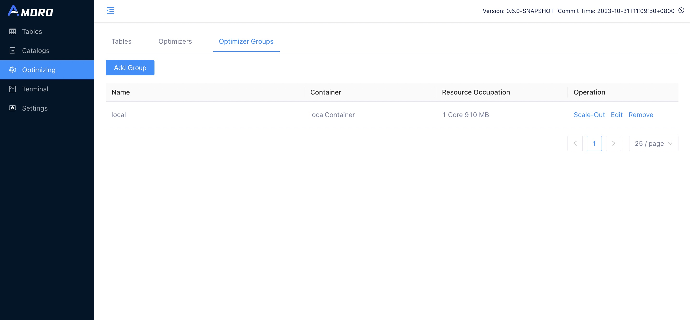

2.Configure the newly added Optimizer group.
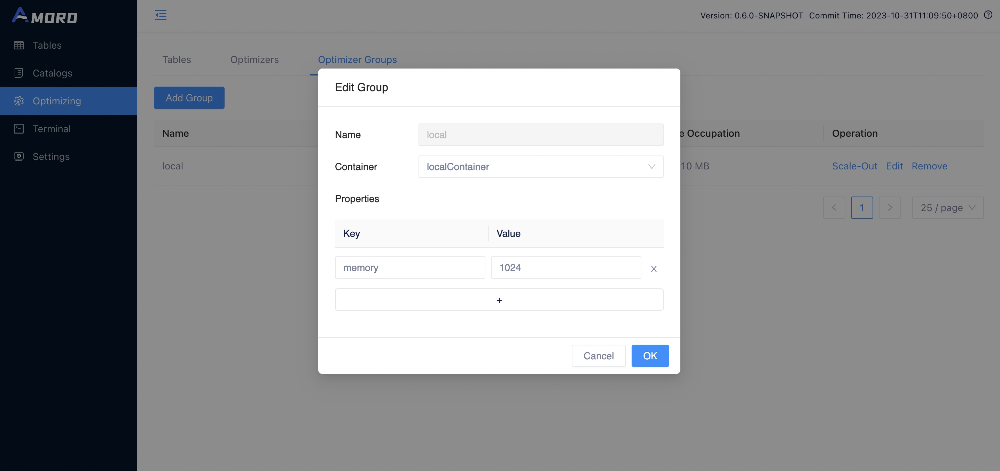

The following configuration needs to be filled in:

- name: the name of the optimizer group, which can be seen in the list of optimizer groups on the front-end page.
- container: the name of a container configured in containers.
- properties: the default configuration under this group, is used as a configuration parameter for tasks when the optimize page is scaled out. Supports native parameters for `flink on yarn`, and users can set parameters using the `flink-conf.<property>=<value>` or use `flink-conf.yaml` to configure parameters. Supports native parameters for `spark on yarn`, and users can set parameters using the `spark-conf.<property>=<value>` or use `spark-defaults.conf` to configure parameters.

The optimizer group supports the following properties:

| Property | Container type | Required | Default | Description |
| --- | --- | --- | --- | --- |
| scheduling-policy | All | No | quota | The scheduler group scheduling policy, the default value is `quota`, it will be scheduled according to the quota resources configured for each table, the larger the table quota is, the more optimizer resources it can take. There is also a configuration `balanced` that will balance the scheduling of each table, the longer the table has not been optimized, the higher the scheduling priority will be. |
| max-input-file-size-per-thread | All | No | 536870912(512MB) | Max input file size per optimize thread. |
| ams-optimizing-uri | All | No | thrift://{ams.server-expose-host}:{ams.thrift-server.optimizing-service.binding-port} | Table optimizing service endpoint. This is used when the default service endpoint is not visitable. |
| cache-enabled | All | No | false | Whether enable cache in optimizer. |
| cache-max-total-size | All | No | 128mb | Max total size in optimier cache. |
| cache-max-entry-size | All | No | 64mb | Max entry size in optimizer cache. |
| cache-timeout | All | No | 10min | Timeout in optimizer cache. |
| min-parallelism | All | No | 0 | The minimum total parallelism (CPU cores) that the optimizer group should maintain. When the total cores of running optimizers fall below this value, `OptimizerGroupKeeper` will automatically scale out new optimizers. Set to `0` to disable auto-scaling. Note: The behavior of the auto-scaling mechanism is controlled by the AMS-level configurations `optimizer-group.min-parallelism-check-interval` and `optimizer-group.max-keeping-attempts`. |
| memory | Local | Yes | N/A | The max memory of JVM for local optimizer, in MBs. |
| flink-conf.<key> | Flink | No | N/A | Any flink config options could be overwritten, priority is optimizing-group > optimizing-container > flink-conf.yaml. |
| spark-conf.<key> | Spark | No | N/A | Any spark config options could be overwritten, priority is optimizing-group > optimizing-container > spark-defaults.conf. |

To better utilize the resources of Flink Optimizer, it is recommended to add the following configuration to the Flink Optimizer Group:

- Set `flink-conf.taskmanager.memory.managed.size` to `32mb` as Flink optimizer does not have any computation logic, it does not need to occupy managed memory.
- Set `flink-conf.taskmanager.memory.network.max` to `32mb` as there is no need for communication between operators in Flink Optimizer.
- Set `flink-conf.taskmanager.memory.network.min` to `32mb` as there is no need for communication between operators in Flink Optimizer.

<a id="managing-optimizers--edit-optimizer-group"></a>

### Edit optimizer group

You can click the `edit` button on the `Optimizer Groups` page to modify the configuration of the Optimizer group.

<a id="managing-optimizers--remove-optimizer-group"></a>

### Remove optimizer group

You can click the `remove` button on the `Optimizer Groups` page to delete the optimizer group, but only if the group is
not referenced by any catalog or table and no optimizer belonging to this group is running.

<a id="managing-optimizers--optimizer-create-and-release"></a>

## Optimizer Create and Release

<a id="managing-optimizers--create-optimizer"></a>

### Create optimizer

You can click the `Create Optimizer` button on the `Optimizers` page to create the optimizer for the corresponding optimizer
group, and then click `OK` to start the optimizer for this optimizer group according to the parallelism configuration.
If the optimizer runs normally, you will see an optimizer with the status `RUNNING` on the `Optimizers` page.

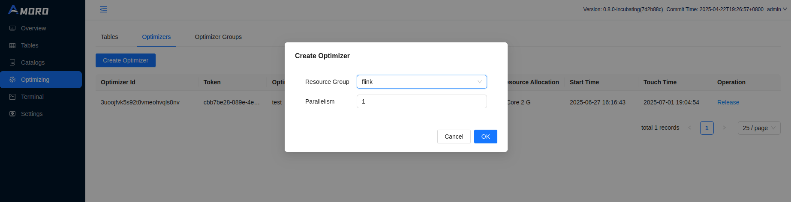

<a id="managing-optimizers--release-optimizer"></a>

### Release optimizer

You can click the `Release` button on the `Optimizer` page to release the optimizer.

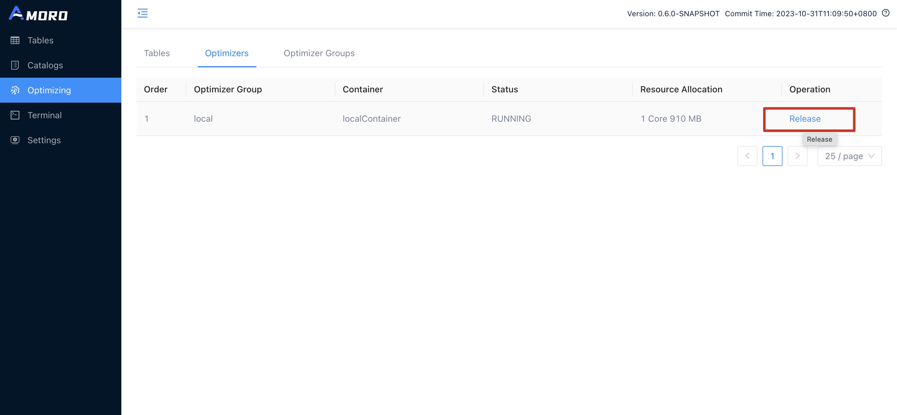

Currently, only optimizer scaled through the dashboard can be released on dashboard.

<a id="managing-optimizers--deploy-external-optimizer"></a>

### Deploy external optimizer

You can submit optimizer in your own Flink task development platform or local Flink environment with the following configuration. The main parameters include:

```shell
./bin/flink run-application -t yarn-application \
 -Djobmanager.memory.process.size=1024mb \
 -Dtaskmanager.memory.process.size=2048mb \
 -Dtaskmanager.memory.managed.size=32mb \
 -Dtaskmanager.memory.network.max=32mb \
 -Dtaskmanager.memory.network.min=32mb \
 -c org.apache.amoro.optimizer.flink.FlinkOptimizer \
 ${AMORO_HOME}/plugin/optimizer/flink/optimizer-job.jar \
 -a thrift://127.0.0.1:1261 \
 -g flinkGroup \
 -p 1
```

The description of the relevant parameters is shown in the following table:

| Property | Required | Description |
| --- | --- | --- |
| -a | Yes | The address of the AMS thrift service, for example: thrift://127.0.0.1:1261, can be obtained from the config.yaml configuration. |
| -g | Yes | Group name created in advance under external container. |
| -p | Yes | Optimizer parallelism usage. |
| -hb | No | Heart beat interval with ams, should be smaller than configuration ams.optimizer.heart-beat-timeout in AMS configuration conf/config.yaml which is 60000 milliseconds by default, default 10000(ms). |
| -eds | No | Whether extend storage to disk, default false. |
| -dsp | No | Defines the directory where the storage files are saved, the default temporary-file directory is specified by the system property `java.io.tmpdir`. On UNIX systems the default value of this property is typically “/tmp” or “/var/tmp”. |
| -msz | No | Memory storage size limit when extending disk storage(MB), default 512(MB). |
| -ce | No | Whether enable cache in optimizer, default false. |
| -cmts | No | Max total size in optimier cache, default 128MB. |
| -cmes | No | Max entry size in optimizer cache, default 64MB. |
| -ct | No | Timeout in optimizer cache, default 10Min. |

Or you can submit optimizer in your own Spark task development platform or local Spark environment with the following configuration. The main parameters include:

```shell
./bin/spark-submit --master yarn --deploy-mode cluster \
 --conf "spark.driver.cores=1" \
 --conf "spark.driver.memory=g" \
 --conf "spark.executor.cores=1" \
 --conf "spark.executor.memory=2g" \
 --class org.apache.amoro.optimizer.spark.SparkOptimizer \
 ${AMORO_HOME}/plugin/optimizer/spark/optimizer-job.jar \
 -a thrift://127.0.0.1:1261 \
 -g sparkGroup \
 -p 1
```

The description of the relevant parameters is shown in the following table:

| Property | Required | Description |
| --- | --- | --- |
| -a | Yes | The address of the AMS thrift service, for example: thrift://127.0.0.1:1261, can be obtained from the config.yaml configuration. |
| -g | Yes | Group name created in advance under external container. |
| -p | Yes | Optimizer parallelism usage. |
| -hb | No | Heart beat interval with ams, should be smaller than configuration ams.optimizer.heart-beat-timeout in AMS configuration conf/config.yaml which is 60000 milliseconds by default, default 10000(ms). |
| -eds | No | Whether extend storage to disk, default false. |
| -dsp | No | Defines the directory where the storage files are saved, the default temporary-file directory is specified by the system property `java.io.tmpdir`. On UNIX systems the default value of this property is typically “/tmp” or “/var/tmp”. |
| -msz | No | Memory storage size limit when extending disk storage(MB), default 512(MB). |
| -ce | No | Whether enable cache in optimizer, default false. |
| -cmts | No | Max total size in optimier cache, default 128MB. |
| -cmes | No | Max entry size in optimizer cache, default 64MB. |
| -ct | No | Timeout in optimizer cache, default 10Min. |

- [Optimizer container](#managing-optimizers--optimizer-container)
  - [Local container](#managing-optimizers--local-container)
  - [Kubernetes container](#managing-optimizers--kubernetes-container)
  - [Flink container](#managing-optimizers--flink-container)
  - [Spark container](#managing-optimizers--spark-container)
  - [External container](#managing-optimizers--external-container)
- [Optimizer group](#managing-optimizers--optimizer-group)
  - [Add optimizer group](#managing-optimizers--add-optimizer-group)
  - [Edit optimizer group](#managing-optimizers--edit-optimizer-group)
  - [Remove optimizer group](#managing-optimizers--remove-optimizer-group)
- [Optimizer Create and Release](#managing-optimizers--optimizer-create-and-release)
  - [Create optimizer](#managing-optimizers--create-optimizer)
  - [Release optimizer](#managing-optimizers--release-optimizer)
  - [Deploy external optimizer](#managing-optimizers--deploy-external-optimizer)

---

<a id="using-customized-encryption-method"></a>

<!-- source_url: https://amoro.apache.org/docs/latest/using-customized-encryption-method/ -->

<!-- page_index: 10 -->

# Using Customized Encryption Method for Configurations

This documentation reflects the `latest` development version and may change before the next official release.

For the latest stable documentation, see
[**0.8.1-incubating**](https://amoro.apache.org/docs/0.8.1/).

<a id="using-customized-encryption-method--using-customized-encryption-method-for-configurations"></a>

# Using Customized Encryption Method for Configurations

To enhance security, AMS allows encrypted sensitive configuration items such as passwords. Currently, AMS only supports the built-in base64 encryption algorithm (see [Configure encrypted configuration items](#deployment--configure-encrypted-sensitive-configuration-items) for details). If you require a stronger or customized encryption method, AMS also provides the flexibility to implement your own encryption algorithm.

<a id="using-customized-encryption-method--develop-the-custom-implementation"></a>

## Develop the Custom Implementation

To integrate a custom encryption algorithm, you need to create a Java class that implements the `ConfigShade` interface and package it as a service.

<a id="using-customized-encryption-method--add-maven-dependency"></a>

### Add Maven Dependency

If using a Maven project, add the following dependency to your `pom.xml`:

```xml
<dependency>
    <groupId>org.apache.amoro</groupId>
    <artifactId>amoro-common</artifactId>
    <version>${amoro.version}</version>
    <scope>provided</scope>
</dependency>
```

<a id="using-customized-encryption-method--implement-the-configshade-interface"></a>

### Implement the `ConfigShade` Interface

Create a Java class that implements the `ConfigShade` interface. This class will handle decryption for sensitive configuration values.

```java
/**
 * The interface that provides the ability to decrypt {@link
 * org.apache.amoro.config.Configurations}.
 */
public interface ConfigShade {
  /**
   * Initializes the custom instance using the service configurations.
   *
   * This method can be useful when decryption requires an external file (e.g. a key file)
   * defined in the service configs.
   */
  default void initialize(Configurations serviceConfig) throws Exception {}

  /**
   * The unique identifier of the current interface, used it to select the correct {@link
   * ConfigShade}.
   */
  String getIdentifier();

  /**
   * Decrypt the content.
   *
   * @param content The content to decrypt
   */
  String decrypt(String content);
}
```

In this interface:

- `getIdentifier()`: Returns a **unique** identifier for your encryption algorithm, which is used to configure the `ams.shade.identifier`. Avoid using “default” (which disables encryption) or “base64” (which refers to AMS’s built-in Base64 support).
- `decrypt(String content)`: Implements the decryption logic for converting encrypted values back to plaintext.

Here is an example implementation:

```java
package com.example.shade;

import org.apache.amoro.config.Configurations;
import org.apache.amoro.config.shade.ConfigShade;
import java.util.Base64;

/**
 * Custom Base64 decryption implementation for AMS.
 */
public class Base64CustomConfigShade implements ConfigShade {
    @Override
    public String getIdentifier() {
        return "base64-custom"; // Use this identifier in shade.identifier
    }

    @Override
    public String decrypt(String content) {
        return new String(Base64.getDecoder().decode(content));
    }
}
```

<a id="using-customized-encryption-method--register-the-custom-implementation"></a>

### Register the Custom Implementation

Create a file named `org.apache.amoro.config.shade.ConfigShade` under `resources/META-INF/services/` and add the fully qualified class name of your implementation:

```j
com.example.shade.Base64CustomConfigShade
```

<a id="using-customized-encryption-method--build-the-jar"></a>

### Build the JAR

Package your implementation into a JAR file using Maven:

```shell
./mvnw clean package
```

<a id="using-customized-encryption-method--deploy-the-custom-implementation"></a>

## Deploy the Custom Implementation

Once you’ve developed and packaged the custom encryption algorithm, you can deploy it to AMS by following these steps.

<a id="using-customized-encryption-method--copy-the-jar-to-ams"></a>

### Copy the JAR to AMS

Move the generated JAR file to the `${AMORO_HOME}/lib/` directory.

<a id="using-customized-encryption-method--configure-ams-to-use-the-custom-encryption"></a>

### Configure AMS to Use the Custom Encryption

Modify `${AMORO_HOME}/conf/config.yaml` to specify the custom encryption algorithm by setting the `ams.shade.identifier` to match the value returned by `getIdentifier()` in your Java class.
Then, replace sensitive configuration values with their encrypted versions.

```yaml
ams:
  shade:
    identifier: base64-custom  # Use the custom encryption algorithm
    sensitive-keywords: admin-password;database.password
```

<a id="using-customized-encryption-method--restart-ams"></a>

### Restart AMS

Restart the AMS service to apply the new encryption settings.

```shell
bin/ams restart
```

By following these steps, you can successfully integrate and deploy a custom encryption algorithm in AMS, ensuring that sensitive information is securely stored in the configuration file.

- [Develop the Custom Implementation](#using-customized-encryption-method--develop-the-custom-implementation)
  - [Add Maven Dependency](#using-customized-encryption-method--add-maven-dependency)
  - [Implement the `ConfigShade` Interface](#using-customized-encryption-method--implement-the-configshade-interface)
  - [Register the Custom Implementation](#using-customized-encryption-method--register-the-custom-implementation)
  - [Build the JAR](#using-customized-encryption-method--build-the-jar)
- [Deploy the Custom Implementation](#using-customized-encryption-method--deploy-the-custom-implementation)
  - [Copy the JAR to AMS](#using-customized-encryption-method--copy-the-jar-to-ams)
  - [Configure AMS to Use the Custom Encryption](#using-customized-encryption-method--configure-ams-to-use-the-custom-encryption)
  - [Restart AMS](#using-customized-encryption-method--restart-ams)

---

<a id="using-kyuubi"></a>

<!-- source_url: https://amoro.apache.org/docs/latest/using-kyuubi/ -->

<!-- page_index: 11 -->

# Using Kyuubi By Terminal

This documentation reflects the `latest` development version and may change before the next official release.

For the latest stable documentation, see
[**0.8.1-incubating**](https://amoro.apache.org/docs/0.8.1/).

<a id="using-kyuubi--using-kyuubi-by-terminal"></a>

# Using Kyuubi By Terminal

**Prerequisites**:

- There must be a running Kyuubi. To deploy and run Kyuubi, please refer to [Kyuubi doc](https://kyuubi.readthedocs.io/en/master/)

Terminal supports interfacing with Kyuubi to submit SQL to Kyuubi for execution. All you need to do is add the Kyuubi configuration as instructed below:

```shell
ams:
    terminal:
      backend: kyuubi
      kyuubi.jdbc.url: jdbc:hive2://127.0.0.1:10009/ # kyuubi Connection Address
```

<a id="using-kyuubi--kerberos-authentication"></a>

## Kerberos Authentication

Amoro terminal uses the Kerberos authentication information from the catalog to connect to Kyuubi. When configuring the Kyuubi JDBC URL, you only need to configure the connection information and do not need to configure Kerberos authentication information (e.g. principal).

Without configuring Kyuubi, Terminal executes in memory in AMS.

To execute SQL in Terminal, you can refer to the following steps:：

- Please switch Catalog first
- Before writing SQL, you can use the provided SQL Shortcuts function to help you build SQL quickly.
- Writing SQL
- Click the Execute button to run the SQL;

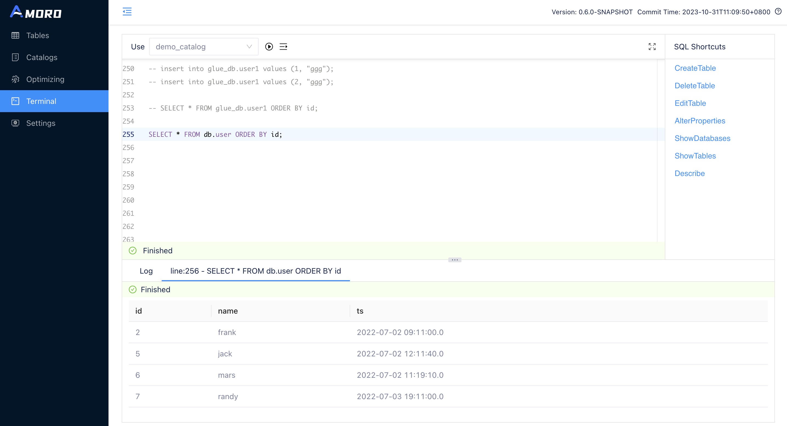

<a id="using-kyuubi--ldap-authentication"></a>

## LDAP Authentication

Except for the configuration of Kerberos authentication, everything else is the same. You can integrate with LDAP using the following configuration:
set kyuubi.ldap.enabled to true, and then specify the username and password for LDAP in the URL.

```shell
ams:
    terminal:
      backend: kyuubi
      kyuubi.ldap.enabled: true
      kyuubi.jdbc.url: jdbc:hive2://127.0.0.1:10009/default;user=test;password=test # kyuubi Connection Address
```

- [Kerberos Authentication](#using-kyuubi--kerberos-authentication)
- [LDAP Authentication](#using-kyuubi--ldap-authentication)

---

<a id="using-tables"></a>

<!-- source_url: https://amoro.apache.org/docs/latest/using-tables/ -->

<!-- page_index: 12 -->

# Using Tables

This documentation reflects the `latest` development version and may change before the next official release.

For the latest stable documentation, see
[**0.8.1-incubating**](https://amoro.apache.org/docs/0.8.1/).

<a id="using-tables--using-tables"></a>

# Using Tables

The SQL execution tool `Terminal` is provided in AMS dashboard to help users quickly create, modify and delete tables.
It is also available in [Spark](#spark-ddl) and [Flink](#flink-ddl) and other engines to manage tables using SQL.

<a id="using-tables--create-table"></a>

## Create table

After logging into AMS dashboard, go to `Terminal`, enter the table creation statement and execute it to complete the table creation.
The following is an example of table creation:

```sql
create table test_db.test_log_store(
  id int,
  name string,
  op_time timestamp,
  primary key(id)
) using mixed_iceberg
partitioned by(days(op_time))
tblproperties(
  'log-store.enable' = 'true',
  'log-store.type' = 'kafka',
  'log-store.address' = '127.0.0.1:9092',
  'log-store.topic' = 'local_catalog.test_db.test_log_store.log_store',
  'table.event-time-field' = 'op_time',
  'table.watermark-allowed-lateness-second' = '60');
```

Currently, terminal uses Spark Engine for SQL execution. For more information on the syntax of creating tables, refer to [Spark DDL](#spark-ddl--create-table). Different Catalogs create different table formats, refer to [Create Catalog](#managing-catalogs--create-catalog)

<a id="using-tables--configure-logstore"></a>

### Configure LogStore

As described in [Mixed-Iceberg format](#mixed-iceberg-format), Mixed-Iceberg format may consist of several components, and BaseStore and ChangeStore will be automatically created upon table creation.
LogStore, as an optional component, requires separate configuration to specify, The complete configuration for LogStore can be found in [LogStore Configuration](#configurations--logstore-configurations).

In the example above, the Kafka cluster 127.0.0.1:9092 and the topic local\_catalog.test\_db.test\_log\_store.log\_store are used as the LogStore for the new table.
Before executing the above statement, you need to manually create the corresponding topic in the Kafka cluster or enable the automatic creation of topics feature for the cluster.

<a id="using-tables--configure-watermark"></a>

### Configure watermark

Watermark is used to describe the write progress of a table. Specifically, it is a timestamp attribute on the table, indicating that all data with a timestamp smaller than the watermark has been written to the table.
It is generally used to observe the write progress of a table and can also serve as a trigger metric for downstream batch computing tasks.

In the example above, op\_time is set as the event time field of the table, and the op\_time of the written data is used to calculate the watermark of the table.
To handle out-of-order writes, the permitted lateness of data when calculating the watermark is set to one minute.
You can view the current watermark of the table in the table details on the AMS Dashboard at AMS dashboard.

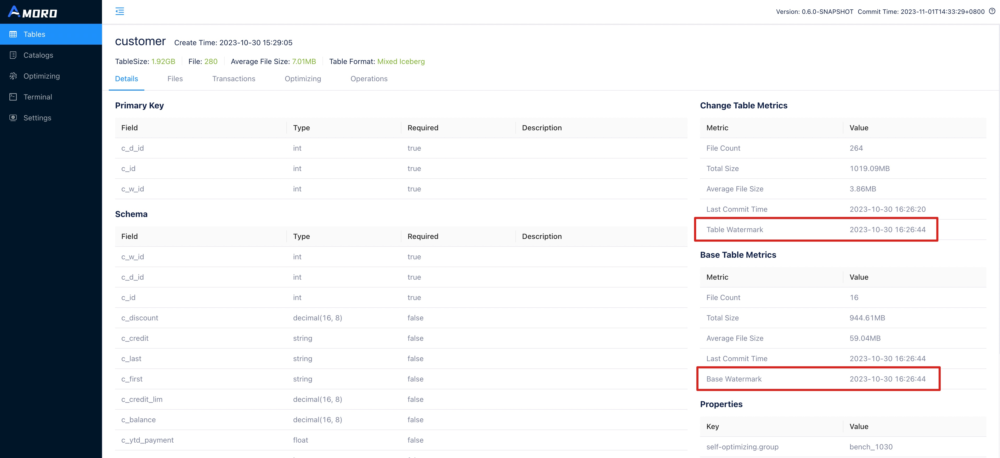

You can also use the following SQL statement in the `Terminal` to query the watermark of a table:

```sql
SHOW TBLPROPERTIES test_db.test_log_store ('watermark.table');
```

You can expect to get the following results:

```text
+-----------------+---------------+
| key             | value         |
+-----------------+---------------+
| watermark.table | 1668579055000 |
+-----------------+---------------+
```

Watermark configuration is only supported in Mixed-Hive format and Mixed-Iceberg format, and is not supported in Iceberg format for now.

<a id="using-tables--modify-table"></a>

## Modify table

After logging into the AMS dashboard, go to the `Terminal` and enter the
modification statement to complete the table modification. The current `Terminal` uses Spark Engine to execute SQL. For
more information on modifying tables, please refer to the syntax guide [Spark DDL](#spark-ddl--alter-statement).

<a id="using-tables--upgrade-a-hive-table"></a>

## Upgrade a Hive table

Amoro supports [Mixed-Hive format](#mixed-hive-format) table, which combines the capabilities of Hive formats to directly implement new table formats on top of Hive.

After logging into the AMS dashboard, select a table under a certain Hive Catalog from the `Tables` menu to perform the upgrade operation.

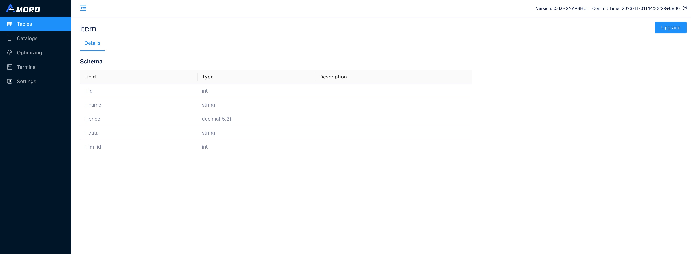

Click the `Upgrade` button in the upper right corner of the table details (this button is not displayed for Hive tables that have already been upgraded).

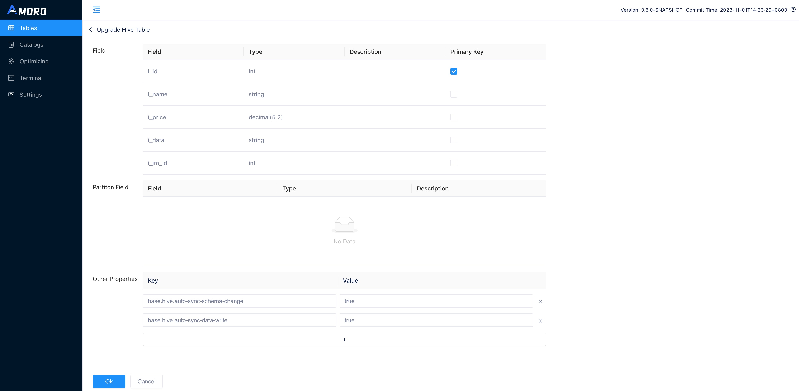

On the upgrade page, select the primary key for the table and add additional parameters, then click `OK` to complete the upgrade of the Hive table.

<a id="using-tables--configure-self-optimizing"></a>

## Configure self-optimizing

Amoro provides a self-optimizing feature, which requires an active optimizer in the Optimizer Group configured for the table.

<a id="using-tables--modify-optimizer-group"></a>

### Modify optimizer group

To use an optimizer launched under a specific optimizer group to perform self-optimizing, you need to modify the `self-optimizing.group` parameter of the table to specify a specific resource pool for the table.
The setting method is as follows:

```sql
ALTER TABLE test_db.test_log_store set tblproperties (
    'self-optimizing.group' = 'group_name');
```

In default，`'self-optimizing.group' = 'default'`。

<a id="using-tables--adjust-optimizing-resources"></a>

### Adjust optimizing resources

If there are multiple tables to be optimized under the same Optimizer Group, you can manually adjust the resource proportion of each table by adjusting the `quota`.

```sql
ALTER TABLE test_db.test_log_store set tblproperties (
    'self-optimizing.quota' = '0.1');
```

For more information, please refer to [Self-optimizing quota](#self-optimizing--quota)。

<a id="using-tables--adjust-optimizing-parameters"></a>

### Adjust optimizing parameters

You can manually set parameters such as execution interval, task size, and execution timeout for different types of Optimize.
For example, to set the execution interval for minor optimizing, you can do the following:

```sql
ALTER TABLE test_db.test_log_store set tblproperties (
    'self-optimizing.minor.trigger.interval' = '3600000');
```

More optimization parameter adjustment refer to [Self-optimizing configuration](#configurations--self-optimizing-configurations)。

<a id="using-tables--enable-or-disable-self-optimizing"></a>

### Enable or disable self-optimizing

The Optimize of the table is enabled by default. If you want to disable the Optimize feature, execute the following command.
Conversely, you can re-enable it:

```sql
ALTER TABLE test_db.test_log_store set tblproperties (
    'self-optimizing.enabled' = 'false');
```

<a id="using-tables--configure-data-expiration"></a>

## Configure data expiration

Amoro can periodically clean data based on the table’s expiration policy, which includes properties such as whether to enable expiration, retention duration, expiration level, and the selection of the field for expiration.
it’s also necessary for AMS to have the data expiration thread enabled. You can enable the ‘data-expiration’ property in the configuration file

<a id="using-tables--enable-or-disable-data-expiration"></a>

### Enable or disable data expiration

By default, Amoro has data expiration disabled. If you want to enable data expiration, please execute the following command.

```sql
ALTER TABLE test_db.test_log_store set tblproperties (
    'data-expire.enabled' = 'true');
```

<a id="using-tables--set-retention-period"></a>

### Set retention period

The configuration for data retention duration consists of a number and a unit. For example, ‘90d’ represents retaining data for 90 days, and ‘12h’ indicates 12 hours.

```sql
ALTER TABLE test_db.test_log_store set tblproperties (
    'data-expire.retention-time' = '90d');
```

<a id="using-tables--select-expiration-field"></a>

### Select expiration field

Data expiration requires users to specify a field for determining expiration.
In addition to supporting timestampz/timestamp field types for this purpose, it also supports string and long field type.
String field require a date pattern for proper parsing, with the default format being ‘yyyy-MM-dd’. Additionally, long fields can be chosen as the expiration event time, but you need to specify the timestamp’s unit, which can be in `TIMESTAMP_MS` or `TIMESTAMP_S`.
Note that timestamp, timestampz, and long field types use UTC, while others use the local time zone.

```sql
ALTER TABLE test_db.test_log_store set tblproperties (
    'data-expire.field' = 'op_time');

-- select string field
ALTER TABLE test_db.test_log_store set tblproperties (
    'data-expire.field' = 'op_time',
    'data-expire.datetime-string-pattern' = 'yyyy-MM-dd');

-- select long field
ALTER TABLE test_db.test_log_store set tblproperties (
    'data-expire.field' = 'op_time',
    'data-expire.datetime-number-format' = 'TIMESTAMP_MS');
```

<a id="using-tables--adjust-expiration-level"></a>

### Adjust expiration level

Data expiration supports two levels, including `PARTITION` and `FILE`. The default level is `PARTITION`, which means that AMS deletes files only when all the files within a partition have expired.

```sql
ALTER TABLE test_db.test_log_store set tblproperties (
    'data-expire.level' = 'partition');
```

<a id="using-tables--specify-start-time"></a>

### Specify start time

Amoro expire data since `LAST_COMMIT_TIME` or `CURRENT_TIME`. `LAST_COMMIT_TIME` will follow the timestamp of the table’s most recent snapshot as the start time of the expiration, which ensures that the table has `data-expire.retention-time` data; while `CURRENT_TIME` will follow the current time of the service.

```sql
ALTER TABLE test_db.test_log_store set tblproperties (
    'data-expire.base-on-rule' = 'CURRENT_TIME');
```

<a id="using-tables--delete-table"></a>

## Delete table

After logging into the AMS Dashboard. To modify a table, enter the modification statement in the `terminal` and execute it.

Here is an example of how to delete a table：

```sql
DROP TABLE test_db.test_log_store;
```

The current terminal is using the Spark engine to execute SQL. For more information about deleting tables, you can refer to [Spark DDL](#spark-ddl--drop-table).

<a id="using-tables--explore-table-details"></a>

## Explore table details

The Amoro Tables details page provides multiple tabs to display the status of the table from various dimensions, mainly including:

| **Tab Name** | **Description** |
| --- | --- |
| Details | Display the table’s schema, primary key configuration, partition configuration, properties; as well as the metric information of the files stored in ChangeStore and BaseStore, including the number of files and average file size, as well as the latest submission time of the files. |
| Files | Display all partitions and files of the table. |
| Snapshots | Display all snapshots of the table, which can be filtered by branch and tag. |
| Optimizing | Display all the self-optimizing processes of the table, each record shows the number and average size of files before and after Optimize, as well as the execution time of each process. |
| Operations | Display the current table’s DDL historical change records. |

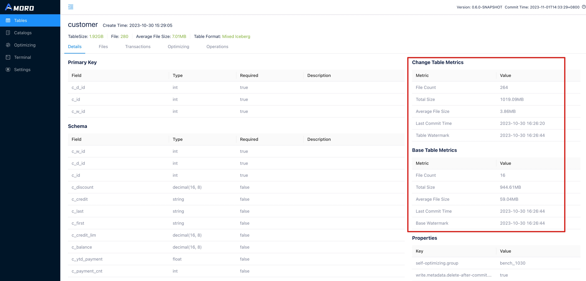

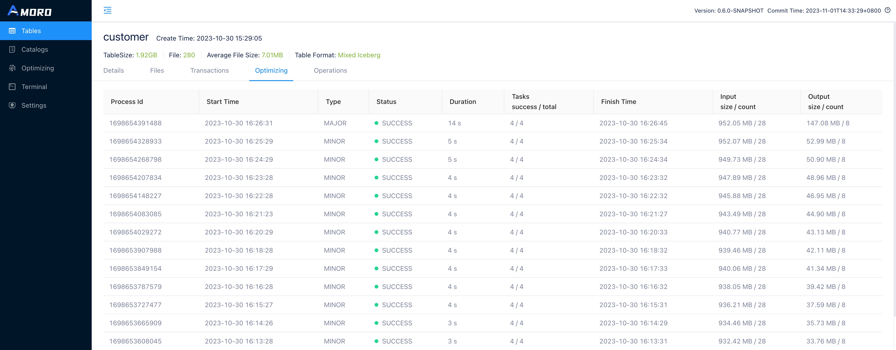

<a id="using-tables--explore-self-optimizing-status"></a>

## Explore self-optimizing status

The Optimizing page displays self-optimizing status of all tables.
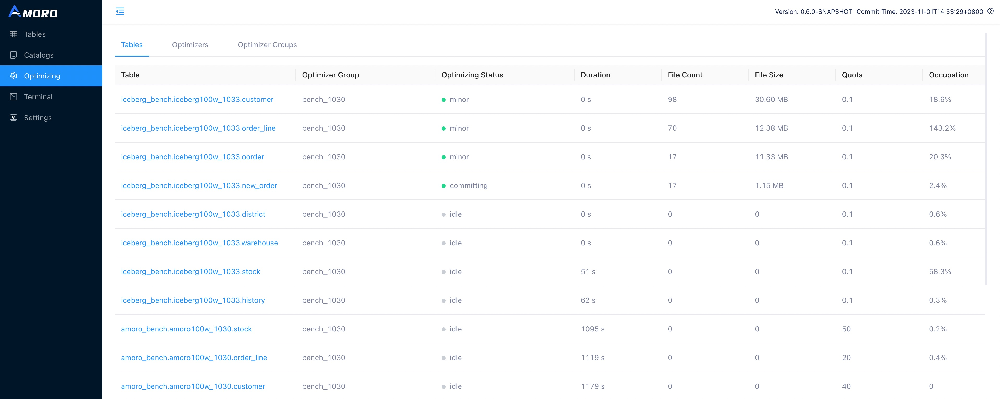

- **Optimizing Status**: The current optimizing status of the table, including idle, pending, planning, minor, major, full, committing.
  - idle: means that self-optimizing is not required on the table.
  - pending: means that self-optimizing is required on the table and is waiting for resources.
  - planning: means that self-optimizing process is being planed.
  - minor: means that minor optimizing is being executed on the table.
  - major: means that major optimizing is being executed on the table.
  - full: means that full optimizing is being executed on the table.
  - committing: means that self-optimizing process is being committed.
- **Duration**: The duration of the current status.
- **File Count**: The total number of files involved in the current Self-optimizing, including base, insert, eq-delete, and pos-delete file types.
- **File Size**: The total size of files involved in the current self-optimizing.
- **Quota**: The maximum number of optimizer resources that can be allocated to each table.
- **Quota Occupation**: The ratio of the actual optimizer thread execution time used by a table to its quota execution time within the QUOTA\_LOOK\_BACK\_TIME window (one hour).

- [Create table](#using-tables--create-table)
- [Modify table](#using-tables--modify-table)
- [Upgrade a Hive table](#using-tables--upgrade-a-hive-table)
- [Configure self-optimizing](#using-tables--configure-self-optimizing)
  - [Modify optimizer group](#using-tables--modify-optimizer-group)
  - [Adjust optimizing resources](#using-tables--adjust-optimizing-resources)
  - [Adjust optimizing parameters](#using-tables--adjust-optimizing-parameters)
  - [Enable or disable self-optimizing](#using-tables--enable-or-disable-self-optimizing)
- [Configure data expiration](#using-tables--configure-data-expiration)
  - [Enable or disable data expiration](#using-tables--enable-or-disable-data-expiration)
  - [Set retention period](#using-tables--set-retention-period)
  - [Select expiration field](#using-tables--select-expiration-field)
  - [Adjust expiration level](#using-tables--adjust-expiration-level)
  - [Specify start time](#using-tables--specify-start-time)
- [Delete table](#using-tables--delete-table)
- [Explore table details](#using-tables--explore-table-details)
- [Explore self-optimizing status](#using-tables--explore-self-optimizing-status)

---

<a id="configurations"></a>

<!-- source_url: https://amoro.apache.org/docs/latest/configurations/ -->

<!-- page_index: 13 -->

# Table Configurations

This documentation reflects the `latest` development version and may change before the next official release.

For the latest stable documentation, see
[**0.8.1-incubating**](https://amoro.apache.org/docs/0.8.1/).

<a id="configurations--table-configurations"></a>

# Table Configurations

<a id="configurations--multi-level-configuration-management"></a>

## Multi-level configuration management

Amoro provides configurations that can be configured at the `Catalog`, `Table`, and `Engine` levels. The configuration
priority is given first to the `Engine`, followed by the `Table`, and finally by the `Catalog`.

<a id="configurations--self-optimizing-configurations"></a>

## Self-optimizing configurations

Self-optimizing configurations are applicable to both Iceberg Format and Mixed streaming Format.

| Key | Default | Description |
| --- | --- | --- |
| self-optimizing.enabled | true | Enables Self-optimizing |
| self-optimizing.allow-partial-commit | false | Whether to allow partial commit when self-optimizing fails or process is cancelled |
| self-optimizing.group | default | Optimizer group for Self-optimizing |
| self-optimizing.quota | 0.5 | Quota for Self-optimizing, indicating the optimizer resources the table can take up |
| self-optimizing.execute.num-retries | 5 | Number of retries after failure of Self-optimizing |
| self-optimizing.target-size | 134217728(128MB) | Target size for Self-optimizing |
| self-optimizing.max-file-count | 10000 | Maximum number of files processed by a Self-optimizing process |
| self-optimizing.max-task-size-bytes | 134217728(128MB) | Maximum file size bytes in a single task for splitting tasks |
| self-optimizing.fragment-ratio | 8 | The fragment file size threshold. We could divide self-optimizing.target-size by this ratio to get the actual fragment file size |
| self-optimizing.min-target-size-ratio | 0.75 | The undersized segment file size threshold. Segment files under this threshold will be considered for rewriting |
| self-optimizing.minor.trigger.file-count | 12 | The minimum number of files to trigger minor optimizing is determined by the sum of fragment file count and equality delete file count |
| self-optimizing.minor.trigger.interval | 3600000(1 hour) | The time interval in milliseconds to trigger minor optimizing |
| self-optimizing.major.trigger.duplicate-ratio | 0.1 | The ratio of duplicate data of segment files to trigger major optimizing |
| self-optimizing.full.trigger.interval | -1(closed) | The time interval in milliseconds to trigger full optimizing |
| self-optimizing.full.rewrite-all-files | true | Whether full optimizing rewrites all files or skips files that do not need to be optimized |
| self-optimizing.min-plan-interval | 60000 | The minimum time interval between two self-optimizing planning action |
| self-optimizing.filter | NULL | Filter conditions for self-optimizing, using SQL conditional expressions, without supporting any functions. For the timestamp column condition, the ISO date-time formatter must be used. For example: op\_time > ‘2007-12-03T10:15:30’. |
| self-optimizing.refresh-table.adaptive.max-interval-ms | 0 | The maximum time interval in milliseconds to refresh table metadata. 0 means disable adaptive refresh. When enabled, the value must be greater than ‘refresh-tables.interval’ and may exceed ‘self-optimizing.minor.trigger.interval’ \* 4/5; if not, adaptive refresh will be automatically disabled. |
| self-optimizing.refresh-table.adaptive.increase-step-ms | 30000(30s) | The time interval increase step in milliseconds to refresh table metadata |

<a id="configurations--data-cleaning-configurations"></a>

## Data-cleaning configurations

Data-cleaning configurations are applicable to both Iceberg Format and Mixed streaming Format.

| Key | Default | Description |
| --- | --- | --- |
| table-expire.enabled | true | Enables periodically expire table |
| change.data.ttl.minutes | 10080(7 days) | Time to live in minutes for data of ChangeStore |
| snapshot.keep.duration | 720min(12 hours) | Table-Expiration keeps the latest snapshots within a specified duration |
| snapshot.keep.min-count | 1 | Minimum number of snapshots retained for table expiration |
| snapshot.keep.flink.checkpoint-retention | 7d(7 days) | The retention period for snapshots created by Flink checkpoints. Snapshots older than this duration may be cleaned up. The value should be specified as a duration string (e.g., “7d”, “168h”, “10080min”) |
| clean-orphan-file.enabled | false | Enables periodically clean orphan files |
| clean-orphan-file.min-existing-time-minutes | 2880(2 days) | Cleaning orphan files keeps the files modified within a specified time in minutes |
| clean-dangling-delete-files.enabled | true | Whether to enable cleaning of dangling delete files |
| data-expire.enabled | false | Whether to enable data expiration |
| data-expire.level | partition | Level of data expiration. Including partition and file |
| data-expire.field | NULL | Field used to determine data expiration, supporting timestamp/timestampz/long type and string type field in date format |
| data-expire.datetime-string-pattern | yyyy-MM-dd | Pattern used for matching string datetime |
| data-expire.datetime-number-format | TIMESTAMP\_MS | Timestamp unit for long field. Including TIMESTAMP\_MS and TIMESTAMP\_S |
| data-expire.retention-time | NULL | Retention period for data expiration. For example, 1d means retaining data for 1 day. Other supported units include h (hour), min (minute), s (second), ms (millisecond), etc. |
| data-expire.base-on-rule | LAST\_COMMIT\_TIME | A rule to indicate how to start expire data. Including LAST\_COMMIT\_TIME and CURRENT\_TIME. LAST\_COMMIT\_TIME uses the timestamp of latest commit snapshot which is not optimized as the start of the expiration, which ensures that the table has `retention-time` data |

<a id="configurations--tags-configurations"></a>

## Tags configurations

Tags configurations are applicable to Iceberg Format only now, and will be supported in Mixed Format
soon.

| Key | Default | Description |
| --- | --- | --- |
| tag.auto-create.enabled | false | Enables automatically creating tags |
| tag.auto-create.trigger.period | daily | Period of creating tags, support `daily`,`hourly` now |
| tag.auto-create.trigger.offset.minutes | 0 | The minutes by which the tag is created after midnight (00:00) |
| tag.auto-create.trigger.max-delay.minutes | 60 | The maximum delay time for creating a tag |
| tag.auto-create.tag-format | ’tag-‘yyyyMMdd for daily and ’tag-‘yyyyMMddHH for hourly periods | The format of the name for tag. Modifying this configuration will not take effect on old tags |
| tag.auto-create.max-age-ms | -1 | Time of automatically created Tag to retain, -1 means keep it forever. Modifying this configuration will not take effect on old tags |

<a id="configurations--mixed-format-configurations"></a>

## Mixed Format configurations

If using Iceberg Format，please refer to [Iceberg configurations](https://iceberg.apache.org/docs/latest/configuration/)，the following configurations are only applicable to Mixed Format.

<a id="configurations--reading-configurations"></a>

### Reading configurations

| Key | Default | Description |
| --- | --- | --- |
| read.split.open-file-cost | 4194304(4MB) | The estimated cost to open a file |
| read.split.planning-lookback | 10 | Number of bins to consider when combining input splits |
| read.split.target-size | 134217728(128MB) | Target size when combining data input splits |
| read.split.delete-ratio | 0.05 | When the ratio of delete files is below this threshold, the read task will be split into more tasks to improve query speed |

<a id="configurations--writing-configurations"></a>

### Writing configurations

| Key | Default | Description |
| --- | --- | --- |
| base.write.format | parquet | File format for the table for BaseStore, applicable to KeyedTable |
| change.write.format | parquet | File format for the table for ChangeStore, applicable to KeyedTable |
| write.format.default | parquet | Default file format for the table, applicable to UnkeyedTable |
| base.file-index.hash-bucket | 4 | Initial number of buckets for BaseStore auto-bucket |
| change.file-index.hash-bucket | 4 | Initial number of buckets for ChangeStore auto-bucket |
| write.target-file-size-bytes | 134217728(128MB) | Target size when writing |
| write.upsert.enabled | false | Enable upsert mode, multiple insert data with the same primary key will be merged if enabled |
| write.distribution-mode | hash | Shuffle rules for writing. UnkeyedTable can choose between none and hash, while KeyedTable can only choose hash |
| write.distribution.hash-mode | auto | Auto-bucket mode, which supports primary-key, partition-key, primary-partition-key, and auto |
| base.refresh-interval | -1 (Closed) | The interval for refreshing the BaseStore |

<a id="configurations--logstore-configurations"></a>

### LogStore configurations

| Key | Default | Description |
| --- | --- | --- |
| log-store.enabled | false | Enables LogStore |
| log-store.type | kafka | Type of LogStore, which supports ‘kafka’ and ‘pulsar’ |
| log-store.address | NULL | Address of LogStore, required when LogStore enabled. For Kafka, this is the Kafka bootstrap servers. For Pulsar, this is the Pulsar Service URL, such as ‘pulsar://localhost:6650’ |
| log-store.topic | NULL | Topic of LogStore, required when LogStore enabled |
| properties.pulsar.admin.adminUrl | NULL | HTTP URL of Pulsar admin, such as ‘<http://my-broker.example.com:8080>’. Only required when log-store.type=pulsar |
| properties.XXX | NULL | Other configurations of LogStore. For Kafka, all the configurations supported by Kafka Consumer/Producer can be set by prefixing them with `properties.`， such as `'properties.batch.size'='16384'`， refer to [Kafka Consumer Configurations](https://kafka.apache.org/documentation/#consumerconfigs), [Kafka Producer Configurations](https://kafka.apache.org/documentation/#producerconfigs) for more details. For Pulsar，all the configurations supported by Pulsar can be set by prefixing them with `properties.`, such as `'properties.pulsar.client.requestTimeoutMs'='60000'`， refer to [Flink-Pulsar-Connector](https://nightlies.apache.org/flink/flink-docs-release-1.18/docs/connectors/datastream/pulsar) for more details |

<a id="configurations--watermark-configurations"></a>

### Watermark configurations

| Key | Default | Description |
| --- | --- | --- |
| table.event-time-field | \_ingest\_time | The event time field for calculating the watermark. The default `_ingest_time` indicates calculating with the time when the data was written |
| table.watermark-allowed-lateness-second | 0 | The allowed lateness time in seconds when calculating watermark |
| table.event-time-field.datetime-string-format | `yyyy-MM-dd HH:mm:ss` | The format of event time when it is in string format |
| table.event-time-field.datetime-number-format | TIMESTAMP\_MS | The format of event time when it is in numeric format, which supports TIMESTAMP\_MS (timestamp in milliseconds) and TIMESTAMP\_S (timestamp in seconds) |

<a id="configurations--mixed-hive-format-configurations"></a>

### Mixed-Hive format configurations

| Key | Default | Description |
| --- | --- | --- |
| base.hive.auto-sync-schema-change | true | Whether synchronize schema changes of Hive Table from HMS |
| base.hive.auto-sync-data-write | false | Whether synchronize data changes of Hive Table from HMS, this should be true when writing to Hive |
| base.hive.consistent-write.enabled | true | To avoid writing dirty data, the files written to the Hive directory will be hidden files and renamed to visible files upon commit. |

- [Multi-level configuration management](#configurations--multi-level-configuration-management)
- [Self-optimizing configurations](#configurations--self-optimizing-configurations)
- [Data-cleaning configurations](#configurations--data-cleaning-configurations)
- [Tags configurations](#configurations--tags-configurations)
- [Mixed Format configurations](#configurations--mixed-format-configurations)
  - [Reading configurations](#configurations--reading-configurations)
  - [Writing configurations](#configurations--writing-configurations)
  - [LogStore configurations](#configurations--logstore-configurations)
  - [Watermark configurations](#configurations--watermark-configurations)
  - [Mixed-Hive format configurations](#configurations--mixed-hive-format-configurations)

---

<a id="cdc-ingestion"></a>

<!-- source_url: https://amoro.apache.org/docs/latest/cdc-ingestion/ -->

<!-- page_index: 14 -->

# CDC Ingestion

This documentation reflects the `latest` development version and may change before the next official release.

For the latest stable documentation, see
[**0.8.1-incubating**](https://amoro.apache.org/docs/0.8.1/).

<a id="cdc-ingestion--cdc-ingestion"></a>

# CDC Ingestion

CDC stands for Change Data Capture, which is a broad concept, as long as it can capture the change data, it can be called CDC.
[Flink CDC](https://github.com/apache/flink-cdc) is a Log message-based data capture tool, all the inventory
and incremental data can be captured. Taking MySQL as an example, it can easily capture Binlog data through
[Debezium](https://debezium.io/)、[Flink CDC](https://github.com/apache/flink-cdc) and process the calculations in real time to send them to the data lake. The data lake can then be
queried by other engines.

This section will show how to ingest one table or multiple tables into the data lake for both [Iceberg](#iceberg-format) format and [Mixed-Iceberg](#mixed-iceberg-format) format.

<a id="cdc-ingestion--apache-flink-cdc"></a>

## Apache Flink CDC

[**Apache Flink CDC**](https://nightlies.apache.org/flink/flink-cdc-docs-stable/) is a distributed data integration
tool for real time data and batch data. Flink CDC brings the
simplicity and elegance of data integration via YAML to describe the data movement and transformation.

Amoro provides the relevant code case reference how to complete cdc data to different lakehouse table format, see
[**flink-cdc-ingestion**](#flink-cdc-ingestion) doc

At the same time, we provide [**Mixed-Iceberg**](#iceberg-format) format, which you can understand as
**STREAMING** For iceberg, which will enhance your real-time processing scene for you

<a id="cdc-ingestion--debezium"></a>

## Debezium

Debezium is an open source distributed platform for change data capture. Start it up, point it at your databases, and your apps can start responding to all of the inserts, updates, and deletes that other apps commit to your databases. Debezium is durable and fast, so your apps can respond quickly and never miss an event, even when things go wrong.

<a id="cdc-ingestion--demo"></a>

### Demo

Coming Soon

<a id="cdc-ingestion--airbyte"></a>

## Airbyte

Airbyte is Data integration platform for ELT pipelines from APIs, databases & files to databases, warehouses & lakes

<a id="cdc-ingestion--demo-1"></a>
<a id="cdc-ingestion--demo-2"></a>

### Demo

Coming Soon

- [Apache Flink CDC](#cdc-ingestion--apache-flink-cdc)
- [Debezium](#cdc-ingestion--debezium)
- [Airbyte](#cdc-ingestion--airbyte)
  - [Demo](#cdc-ingestion--demo-1)

---

<a id="metrics"></a>

<!-- source_url: https://amoro.apache.org/docs/latest/metrics/ -->

<!-- page_index: 15 -->

# Metrics

This documentation reflects the `latest` development version and may change before the next official release.

For the latest stable documentation, see
[**0.8.1-incubating**](https://amoro.apache.org/docs/0.8.1/).

<a id="metrics--metrics"></a>

# Metrics

Amoro build a metrics system to measure the behaviours of table management processes, like how long has it been since a table last performed self-optimizing process, and how much resources does a optimizer group currently has?

There are two types of metrics provided in the Amoro metric system: Gauge and Counter.

- Gauge: Provides a value of any type at a point in time.
- Counter: Used to count values by incrementing and decrementing.

Amoro has supported built-in metrics to measure status of table self-optimizing processes and optimizer resources, which can be [reported to external metric system like Prometheus etc](#deployment--configure-metric-reporter).

<a id="metrics--self-optimizing-metrics"></a>

## Self-optimizing metrics

| Metric Name | Type | Tags | Description |
| --- | --- | --- | --- |
| table\_optimizing\_status\_idle\_duration\_mills | Gauge | catalog, database, table, group | Duration in milliseconds after table be in idle status |
| table\_optimizing\_status\_pending\_duration\_mills | Gauge | catalog, database, table, group | Duration in milliseconds after table be in pending status |
| table\_optimizing\_status\_planning\_duration\_mills | Gauge | catalog, database, table, group | Duration in milliseconds after table be in planning status |
| table\_optimizing\_status\_executing\_duration\_mills | Gauge | catalog, database, table, group | Duration in milliseconds after table be in executing status |
| table\_optimizing\_status\_committing\_duration\_mills | Gauge | catalog, database, table, group | Duration in milliseconds after table be in committing status |
| table\_optimizing\_process\_total\_count | Counter | catalog, database, table, group | Count of all optimizing process since ams started |
| table\_optimizing\_process\_failed\_count | Counter | catalog, database, table, group | Count of failed optimizing process since ams started |
| table\_optimizing\_minor\_total\_count | Counter | catalog, database, table, group | Count of minor optimizing process since ams started |
| table\_optimizing\_minor\_failed\_count | Counter | catalog, database, table, group | Count of failed minor optimizing process since ams started |
| table\_optimizing\_major\_total\_count | Counter | catalog, database, table, group | Count of major optimizing process since ams started |
| table\_optimizing\_major\_failed\_count | Counter | catalog, database, table, group | Count of failed major optimizing process since ams started |
| table\_optimizing\_full\_total\_count | Counter | catalog, database, table, group | Count of full optimizing process since ams started |
| table\_optimizing\_full\_failed\_count | Counter | catalog, database, table, group | Count of failed full optimizing process since ams started |
| table\_optimizing\_status\_in\_idle | Gauge | catalog, database, table, group | If currently table is in idle status |
| table\_optimizing\_status\_in\_pending | Gauge | catalog, database, table, group | If currently table is in pending status |
| table\_optimizing\_status\_in\_planning | Gauge | catalog, database, table, group | If currently table is in planning status |
| table\_optimizing\_status\_in\_executing | Gauge | catalog, database, table, group | If currently table is in executing status |
| table\_optimizing\_status\_in\_committing | Gauge | catalog, database, table, group | If currently table is in committing status |
| table\_optimizing\_since\_last\_minor\_optimization\_mills | Gauge | catalog, database, table, group | Duration in milliseconds since last successful minor optimization |
| table\_optimizing\_since\_last\_major\_optimization\_mills | Gauge | catalog, database, table, group | Duration in milliseconds since last successful major optimization |
| table\_optimizing\_since\_last\_full\_optimization\_mills | Gauge | catalog, database, table, group | Duration in milliseconds since last successful full optimization |
| table\_optimizing\_since\_last\_optimization\_mills | Gauge | catalog, database, table, group | Duration in milliseconds since last successful optimization |
| table\_optimizing\_lag\_duration\_mills | Gauge | catalog, database, table, group | Duration in milliseconds between last self-optimizing snapshot and refreshed snapshot |

<a id="metrics--optimizer-group-metrics"></a>

## Optimizer Group metrics

| Metric Name | Type | Tags | Description |
| --- | --- | --- | --- |
| optimizer\_group\_pending\_tasks | Gauge | group | Number of pending tasks in optimizer group |
| optimizer\_group\_executing\_tasks | Gauge | group | Number of executing tasks in optimizer group |
| optimizer\_group\_planing\_tables | Gauge | group | Number of planing tables in optimizer group |
| optimizer\_group\_pending\_tables | Gauge | group | Number of pending tables in optimizer group |
| optimizer\_group\_executing\_tables | Gauge | group | Number of executing tables in optimizer group |
| optimizer\_group\_idle\_tables | Gauge | group | Number of idle tables in optimizer group |
| optimizer\_group\_committing\_tables | Gauge | group | Number of committing tables in optimizer group |
| optimizer\_group\_optimizer\_instances | Gauge | group | Number of optimizer instances in optimizer group |
| optimizer\_group\_memory\_bytes\_allocated | Gauge | group | Memory bytes allocated in optimizer group |
| optimizer\_group\_threads | Gauge | group | Number of total threads in optimizer group |

<a id="metrics--orphan-files-cleaning-metrics"></a>

## Orphan Files Cleaning metrics

| Metric Name | Type | Tags | Description |
| --- | --- | --- | --- |
| table\_orphan\_content\_file\_cleaning\_count | Counter | catalog, database, table | Count of orphan content files cleaned in the table since ams started |
| table\_orphan\_metadata\_file\_cleaning\_count | Counter | catalog, database, table | Count of orphan metadata files cleaned in the table since ams started |
| table\_expected\_orphan\_content\_file\_cleaning\_count | Counter | catalog, database, table | Expected Count of orphan content files cleaned in the table since ams started |
| table\_expected\_orphan\_metadata\_file\_cleaning\_count | Counter | catalog, database, table | Expected Count of orphan metadata files cleaned in the table since ams started |

<a id="metrics--ams-service-metrics"></a>

## Ams service metrics

| Metric Name | Type | Tags | Description |
| --- | --- | --- | --- |
| ams\_jvm\_cpu\_load | Gauge |  | The recent CPU usage of the AMS |
| ams\_jvm\_cpu\_time | Gauge |  | The CPU time used by the AMS |
| ams\_jvm\_memory\_heap\_used | Gauge |  | The amount of heap memory currently used (in bytes) by the AMS |
| ams\_jvm\_memory\_heap\_committed | Gauge |  | The amount of memory in the heap committed for JVM use (bytes) |
| ams\_jvm\_memory\_heap\_max | Gauge |  | The maximum heap memory (bytes), set by -Xmx JVM argument |
| ams\_jvm\_threads\_count | Gauge |  | The total number of live threads used by the AMS |
| ams\_jvm\_garbage\_collector\_count | Gauge | garbage\_collector | The count of the JVM’s Garbage Collector, such as G1 Young |
| ams\_jvm\_garbage\_collector\_time | Gauge | garbage\_collector | The time spent by the JVM’s Garbage Collector, such as G1 Young |

<a id="metrics--table-summary-metrics"></a>

## table summary metrics

| Metric Name | Type | Tags | Description |
| --- | --- | --- | --- |
| table\_summary\_total\_files | Gauge | catalog, database, table | Total number of files in the table |
| table\_summary\_data\_files | Gauge | catalog, database, table | Number of data files in the table |
| table\_summary\_equality\_delete\_files | Gauge | catalog, database, table | Number of equality delete files in the table |
| table\_summary\_position\_delete\_files | Gauge | catalog, database, table | Number of position delete files in the table |
| table\_summary\_dangling\_delete\_files | Gauge | catalog, database, table | Number of dangling delete files in the table |
| table\_summary\_total\_files\_size | Gauge | catalog, database, table | Total size of files in the table |
| table\_summary\_data\_files\_size | Gauge | catalog, database, table | Size of data files in the table |
| table\_summary\_equality\_delete\_files\_size | Gauge | catalog, database, table | Size of equality delete files in the table |
| table\_summary\_position\_delete\_files\_size | Gauge | catalog, database, table | Size of position delete files in the table |
| table\_summary\_total\_records | Gauge | catalog, database, table | Total records in the table |
| table\_summary\_data\_files\_records | Gauge | catalog, database, table | Records of data files in the table |
| table\_summary\_equality\_delete\_files\_records | Gauge | catalog, database, table | Records of equality delete files in the table |
| table\_summary\_position\_delete\_files\_records | Gauge | catalog, database, table | Records of position delete files in the table |
| table\_summary\_snapshots | Gauge | catalog, database, table | Number of snapshots in the table |
| table\_summary\_health\_score | Gauge | catalog, database, table | Health score of the table |

- [Self-optimizing metrics](#metrics--self-optimizing-metrics)
- [Optimizer Group metrics](#metrics--optimizer-group-metrics)
- [Orphan Files Cleaning metrics](#metrics--orphan-files-cleaning-metrics)
- [Ams service metrics](#metrics--ams-service-metrics)
- [table summary metrics](#metrics--table-summary-metrics)

---

<a id="rest-api"></a>

<!-- source_url: https://amoro.apache.org/docs/latest/rest-api/ -->

<!-- page_index: 16 -->

# REST API

This documentation reflects the `latest` development version and may change before the next official release.

For the latest stable documentation, see
[**0.8.1-incubating**](https://amoro.apache.org/docs/0.8.1/).

<a id="rest-api--rest-api"></a>

# REST API

<a id="rest-api--accessing-swagger-ui"></a>

## Accessing Swagger UI

Access the Swagger UI at:

```
http://<host>:<port>/#/openapi-ui
```

You can also view the OpenAPI specification YAML in the repository at `amoro-ams/src/main/resources/openapi/openapi.yaml`, or use the [Swagger Editor](https://editor-next.swagger.io/?url=https://raw.githubusercontent.com/apache/amoro/master/amoro-ams/src/main/resources/openapi/openapi.yaml) online.

<a id="rest-api--building-the-openapi-sdk"></a>

## Building the OpenAPI SDK

Build the OpenAPI SDK using Maven:

```bash
./mvnw clean package -pl amoro-openapi-sdk -am -Popenapi-sdk
```

- [Accessing Swagger UI](#rest-api--accessing-swagger-ui)
- [Building the OpenAPI SDK](#rest-api--building-the-openapi-sdk)

---

<a id="formats-overview"></a>

<!-- source_url: https://amoro.apache.org/docs/latest/formats-overview/ -->

<!-- page_index: 17 -->

# Formats Overview

This documentation reflects the `latest` development version and may change before the next official release.

For the latest stable documentation, see
[**0.8.1-incubating**](https://amoro.apache.org/docs/0.8.1/).

<a id="formats-overview--formats-overview"></a>

# Formats Overview

Table format (aka. format) was first proposed by Iceberg, which can be described as follows:

- It defines the relationship between tables and files, and any engine can query and retrieve data files according to the table format.
- New formats such as Iceberg/Delta/Hudi further define the relationship between tables and snapshots, and the relationship between snapshots and files.
  All write operations on the table will generate new snapshots, and all read operations on the table are based on snapshots.
  Snapshots bring MVCC, ACID, and Transaction capabilities to data lakes.

In addition, new table formats such as [Iceberg](https://Iceberg.apache.org/) also provide many advanced features such as schema evolve, hidden partition, and data skip.
[Hudi](https://hudi.apache.org/) and [Delta](https://delta.io/) may have some differences in specific functions, but we see that the standard of table formats is gradually established with the functional convergence of these three open-source projects in the past two years.

For users, the design goal of Amoro is to provide an out-of-the-box data lake system. Internally, Amoro’s design philosophy is to use different table formats as storage engines for data lakes.
This design pattern is more common in open-source systems such as MySQL and ClickHouse.

Currently, Amoro mainly provides the following four table formats:

- **Iceberg format:** Users can directly entrust their Iceberg tables to Amoro for maintenance, so that users can not only use all the functions of Iceberg tables, but also enjoy the performance and stability improvements brought by Amoro.
- **Mixed-Iceberg format:** Amoro provides a set of more optimized formats for streaming update scenarios on top of the Iceberg format. If users have high performance requirements for streaming updates or have demands for CDC incremental data reading functions, they can choose to use the Mixed-Iceberg format.
- **Mixed-Hive format:** Many users do not want to affect the business originally built on Hive while using data lakes. Therefore, Amoro provides the Mixed-Hive format, which can upgrade Hive tables to Mixed-Hive format only through metadata migration, and the original Hive tables can still be used normally. This ensures business stability and benefits from the advantages of data lake computing.
- **Paimon format:** Amoro supports displaying metadata information in the Paimon format, including Schema, Options, Files, Snapshots, DDLs, and Compaction information.

---

<a id="iceberg-format"></a>

<!-- source_url: https://amoro.apache.org/docs/latest/iceberg-format/ -->

<!-- page_index: 18 -->

# Iceberg Format

This documentation reflects the `latest` development version and may change before the next official release.

For the latest stable documentation, see
[**0.8.1-incubating**](https://amoro.apache.org/docs/0.8.1/).

<a id="iceberg-format--iceberg-format"></a>

# Iceberg Format

Iceberg format refers to [Apache Iceberg](https://iceberg.apache.org) table, which is an open table format for large analytical datasets designed to provide scalable, efficient, and secure data storage and query solutions.
It supports data operations on multiple storage backends and provides features such as ACID transactions, multi-version control, and schema evolution, making data management and querying more flexible and convenient.

With the release of [Iceberg v2](https://iceberg.apache.org/spec/), Iceberg addresses the shortcomings of row-level updates through the MOR (Merge On Read) mechanism, which better supports streaming updates.
However, as data and delete files are written, the read performance and availability of the table will decrease, and if not maintained in time, the table will quickly become unusable.


Starting from Amoro v0.4, Iceberg format including v1 and v2 is supported. Users only need to register Iceberg’s catalog in Amoro to host the table for Amoro maintenance. For detailed operation steps, please refer to [Managing Catalogs](#managing-catalogs).
Amoro maintains the performance and economic availability of Iceberg tables with minimal read/write costs through means such as small file merging, eq-delete file conversion to pos-delete files, duplicate data elimination, and file cleaning, and Amoro has no intrusive impact on the functionality of Iceberg.

Iceberg format has full upward and downward compatibility features, and in general, users do not have to worry about the compatibility of the Iceberg version used by the engine client with the Iceberg version on which Amoro depends.

Amoro supports all catalog types supported by Iceberg, including but not limited to: Hadoop, Hive, Glue, JDBC, Nessie, Snowflake, and so on.

Amoro supports all storage types supported by Iceberg, including but not limited to: Hadoop, S3, AliyunOSS, GCS, ECS, and so on.

---

<a id="paimon-format"></a>

<!-- source_url: https://amoro.apache.org/docs/latest/paimon-format/ -->

<!-- page_index: 19 -->

# Paimon Format

This documentation reflects the `latest` development version and may change before the next official release.

For the latest stable documentation, see
[**0.8.1-incubating**](https://amoro.apache.org/docs/0.8.1/).

<a id="paimon-format--paimon-format"></a>

# Paimon Format

Paimon format refers to [Apache Paimon](https://paimon.apache.org/) table.
Paimon is a streaming data lake platform with high-speed data ingestion, changelog tracking and efficient real-time analytics.

By registering Paimon’s catalog with Amoro, users can view information such as Schema, Options, Files, Snapshots, DDLs, Compaction information, and more for Paimon tables.
Furthermore, they can operate on Paimon tables using Spark SQL in the Terminal. The current supported catalog types and file system types for Paimon are all supported.

For registering catalog operation steps, please refer to [Managing Catalogs](#managing-catalogs).

If you want to use S3 or OSS, please download the
[S3](https://repo.maven.apache.org/maven2/org/apache/paimon/paimon-s3/0.5.0-incubating/paimon-s3-0.5.0-incubating.jar), [OSS](https://repo.maven.apache.org/maven2/org/apache/paimon/paimon-oss/0.5.0-incubating/paimon-oss-0.5.0-incubating.jar)
package and put it in the ’lib’ directory of the Amoro installation package.

---

<a id="mixed-iceberg-format"></a>

<!-- source_url: https://amoro.apache.org/docs/latest/mixed-iceberg-format/ -->

<!-- page_index: 20 -->

# Mixed-Iceberg Format

This documentation reflects the `latest` development version and may change before the next official release.

For the latest stable documentation, see
[**0.8.1-incubating**](https://amoro.apache.org/docs/0.8.1/).

<a id="mixed-iceberg-format--mixed-iceberg-format"></a>

# Mixed-Iceberg Format

Compared with Iceberg format, Mixed-Iceberg format provides more features:

- Stronger primary key constraints that also apply to Spark
- OLAP performance that is production-ready for real-time data warehouses through the auto-bucket mechanism
- LogStore configuration that can reduce data pipeline latency from minutes to milliseconds/seconds
- Transaction conflict resolution mechanism that enables concurrent writes with the same primary key

The design intention of Mixed-Iceberg format is to provide a storage layer for stream-batch integration and offline-real-time unified data warehouses for big data platforms based on data lakes.
Under this goal-driven approach, Amoro designs Mixed-Iceberg format as a three-tier structure, with each level named after a different TableStore:

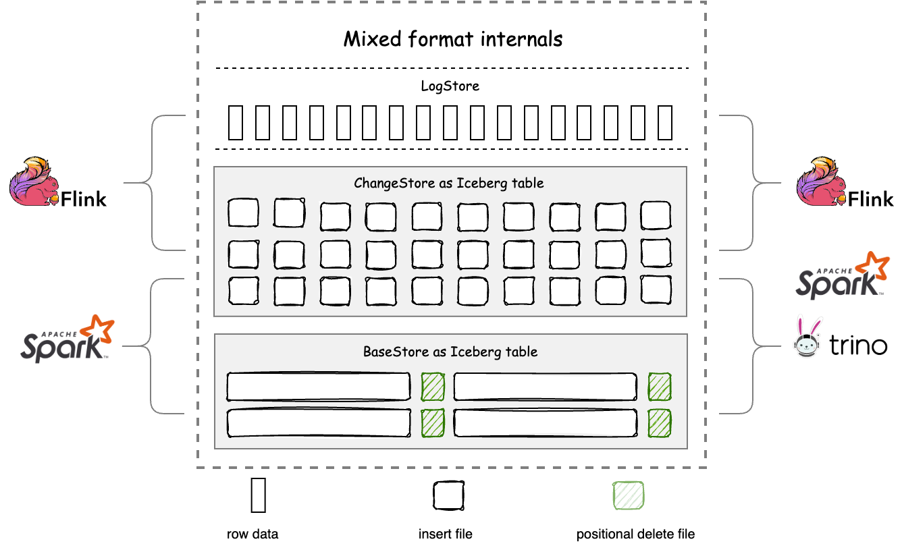

- BaseStore — stores the stock data of the table, usually generated by batch computing or optimizing processes, and is more friendly to ReadStore for reading.
- ChangeStore — stores the flow and change data of the table, usually written in real-time by streaming computing, and can also be used for downstream CDC consumption, and is more friendly to WriteStore for writing.
- LogStore — serves as a cache layer for ChangeStore to accelerate stream processing. Amoro manages the consistency between LogStore and ChangeStore.

The design philosophy of TableStore in Mixed-Iceberg format is similar to that of clustered indexes in databases. Each TableStore can use different table formats. Mixed-Iceberg format provides high freshness OLAP through merge-on-read between BaseStore and ChangeStore.
To provide high-performance merge-on-read, BaseStore and ChangeStore use completely consistent partition and layout, and both support auto-bucket.

The Auto-bucket feature helps the self-optimizing process control the file size of BaseStore within the target-size, and dynamically scale the data volume through bucket splitting and merging while maintaining the base file size as much as possible.
Auto-bucket divides the data under a partition into sets of non-intersecting primary keys in a hash-based manner, greatly reducing the amount of data that needs to be scanned during optimizing and merge-on-read, and improving performance. For more details, please refer to [benchmark](https://amoro.apache.org/benchmark-report/)

The auto-bucket feature of the Mixed-Iceberg format references the paper: [Scalable, Distributed Data Structures for Internet Service Construction](https://people.eecs.berkeley.edu/~culler/papers/dds.pdf)

There are some limitations in using the Mixed-Iceberg format:

- Compatibility limited — In scenarios where Hive and Iceberg are compatible, there may be a violation of primary key uniqueness or the failure of conflict resolution.
- Primary key constraint — When the primary key does not include partition keys and there are no updates to the stream data, normalized operators or other methods need to be used to restore the previous data to ensure primary key uniqueness.
- Engines integrated — Currently supports reading and writing with Flink and Spark, and querying data with Trino.

The BaseStore and ChangeStore of the Mixed-Iceberg format both use the Iceberg format and are consistent with Iceberg in schema, types, and partition usage.
While possessing the features of the Mixed-Iceberg format, the BaseStore and ChangeStore can be read and written using the native Iceberg connector, thus having all the functional features of the Iceberg format.
Taking Spark as an example, this paper describes how to operate on the Mixed-Iceberg format table created by Quick demo using the Iceberg connector. We can use the following command to open a Spark SQL client:

```shell
spark-sql --packages org.apache.Iceberg:Iceberg-spark-runtime-3.2_2.12:0.14.0\
    --conf spark.sql.extensions=org.apache.Iceberg.spark.extensions.IcebergSparkSessionExtensions \
    --conf spark.sql.catalog.local=org.apache.Iceberg.spark.SparkCatalog \
    --conf spark.sql.catalog.local.type=hadoop \
    --conf spark.sql.catalog.local.warehouse=/tmp/Amoro/warehouse
```

After that, we can use the following command to read from or write to the Iceberg tables managed by Amoro:

```shell
-- Switch to Iceberg catalog
use local;

-- Show all Iceberg tables
show tables;

-- Query BaseStore
select * from local.test_db.test_table.base;

-- Query ChangeStore
select * from local.test_db.test_table.change;

-- Insert BaseStore
insert into local.test_db.test_table.base value(10, 'tony', timestamp('2022-07-03 12:10:30'));
```

More Iceberg-compatible usage can be found in the [Iceberg docs](https://Iceberg.apache.org/docs/latest/).

The Minor optimizing feature of Amoro generally ensures that the data freshness of the Iceberg BaseStore is maintained at the minute level.

---

<a id="mixed-hive-format"></a>

<!-- source_url: https://amoro.apache.org/docs/latest/mixed-hive-format/ -->

<!-- page_index: 21 -->

# Mixed-Hive Format

This documentation reflects the `latest` development version and may change before the next official release.

For the latest stable documentation, see
[**0.8.1-incubating**](https://amoro.apache.org/docs/0.8.1/).

<a id="mixed-hive-format--mixed-hive-format"></a>

# Mixed-Hive Format

Mixed-Hive format is a format that has better compatibility with Hive than Mixed-Iceberg format.
Mixed-Hive format uses a Hive table as the BaseStore and an Iceberg table as the ChangeStore. Mixed-Hive format supports:

- schema, partition, and types consistent with Hive format
- Using the Hive connector to read and write Mixed-Hive format tables as Hive tables
- Upgrading a Hive table in-place to a Mixed-Hive format table without data rewriting or migration, with a response time in seconds
- All the functional features of Mixed-Iceberg format

The structure of Mixed-Hive format is shown below:

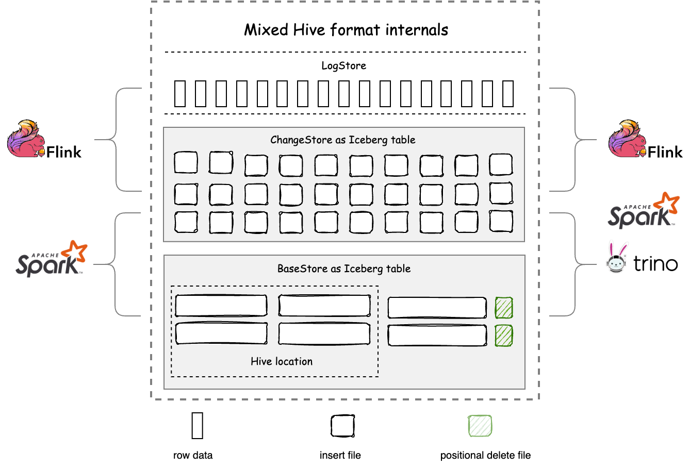

In the BaseStore, files under the Hive location are also indexed by the Iceberg manifest, avoiding data redundancy between the two formats.
Mixed-Hive format combines the snapshot, ACID, and MVCC features of Iceberg, and provides a great degree of compatibility with Hive, offering flexible selection and extension options for data platforms, processes, and products built around Hive format in the past.

The freshness of data under the Hive location is guaranteed by Full optimizing.
Therefore, the timeliness of native Hive reads is significantly different from that of Mixed-Iceberg tables.
It is recommended to use Merge-on-read to read data with freshness in the order of minutes in Mixed-Hive format.

---

<a id="flink-getting-started"></a>

<!-- source_url: https://amoro.apache.org/docs/latest/flink-getting-started/ -->

<!-- page_index: 22 -->

# Flink Getting Started

This documentation reflects the `latest` development version and may change before the next official release.

For the latest stable documentation, see
[**0.8.1-incubating**](https://amoro.apache.org/docs/0.8.1/).

<a id="flink-getting-started--flink-getting-started"></a>

# Flink Getting Started

<a id="flink-getting-started--iceberg-format"></a>

## Iceberg format

The Iceberg Format can be accessed using the Connector provided by Iceberg.
Refer to the documentation at [Iceberg Flink user manual](https://iceberg.apache.org/docs/latest/flink-connector/)
for more information.

<a id="flink-getting-started--paimon-format"></a>

## Paimon format

The Paimon Format can be accessed using the Connector provided by Paimon.
Refer to the documentation at [Paimon Flink user manual](https://paimon.apache.org/docs/master/engines/flink/)
for more information.

<a id="flink-getting-started--mixed-format"></a>

## Mixed format

The Apache Flink engine can process Amoro table data in batch and streaming mode. The Flink on Amoro connector provides the ability to read and write to the Amoro data lake while ensuring data consistency. To meet the high real-time data requirements of businesses, the Amoro data lake’s underlying storage structure is designed with LogStore, which stores the latest changelog or append-only real-time data.

Amoro integrates the DataStream API and Table API of [Apache Flink](https://flink.apache.org/) to facilitate the use of Flink to read data from Amoro tables or write data to Amoro tables.

Flink Connector includes:

- `Flink SQL Select` reads Amoro table data through Apache Flink SQL.
- `Flink SQL Insert` writes data to Amoro tables through Apache Flink SQL.
- `Flink SQL DDL` creates/modifies/deletes libraries and tables through Apache Flink DDL statements.
- `FlinkSource` reads Amoro table data through Apache Flink DS API.
- `FlinkSink` writes data to Amoro tables through Apache Flink DS API.
- `Flink Lookup Join` performs real-time read of Amoro table data for association calculation through Apache Flink Temporal Join grammar.

The Amoro project can be self-compiled to obtain the runtime jar.

`./mvnw clean package -pl ':amoro-mixed-flink-runtime-1.18' -am -DskipTests`

The Flink Runtime Jar is located in the `amoro-format-mixed/amoro-mixed-flink/v1.18/amoro-mixed-flink-runtime-1.18/target` directory.

<a id="flink-getting-started--environment-preparation"></a>

## Environment preparation

Download Flink and related dependencies, and download Flink 1.18/1.19 as needed. Taking Flink 1.18 as an example:

```shell
# Replace version value with the latest Amoro version if needed
AMORO_VERSION=0.9.0-incubating
FLINK_VERSION=1.18.1
FLINK_MAJOR_VERSION=1.18
FLINK_HADOOP_SHADE_VERSION=2.7.5
APACHE_FLINK_URL=archive.apache.org/dist/flink
MAVEN_URL=https://repo1.maven.org/maven2
FLINK_CONNECTOR_URL=${MAVEN_URL}/org/apache/flink
AMORO_CONNECTOR_URL=${MAVEN_URL}/org/apache/amoro

# Download FLink binary package wget ${APACHE_FLINK_URL}/flink-${FLINK_VERSION}/flink-${FLINK_VERSION}-bin-scala_2.12.tgz
# Unzip Flink binary package tar -zxvf flink-${FLINK_VERSION}-bin-scala_2.12.tgz

cd flink-${FLINK_VERSION}
# Download Flink Hadoop dependency wget ${FLINK_CONNECTOR_URL}/flink-shaded-hadoop-2-uber/${FLINK_HADOOP_SHADE_VERSION}-10.0/flink-shaded-hadoop-2-uber-${FLINK_HADOOP_SHADE_VERSION}-10.0.jar
# Download Flink Amoro Connector wget ${AMORO_CONNECTOR_URL}/amoro-mixed-format-flink-runtime-${FLINK_MAJOR_VERSION}/${AMORO_VERSION}/amoro-mixed-format-flink-runtime-${FLINK_MAJOR_VERSION}-${AMORO_VERSION}.jar

# Copy the necessary JAR files to the lib directory mv flink-shaded-hadoop-2-uber-${FLINK_HADOOP_SHADE_VERSION}-10.0.jar lib mv amoro-mixed-format-flink-runtime-${FLINK_MAJOR_VERSION}-${AMORO_VERSION}.jar lib
```

Modify Flink related configuration files:

```shell
cd flink-1.18.1
vim conf/flink-conf.yaml
```

Modify the following settings:

```yaml
# Increase the number of slots to run two streaming tasks simultaneously
taskmanager.numberOfTaskSlots: 4
# Enable Checkpoint. Only when Checkpoint is enabled, the data written to the file is visible
execution.checkpointing.interval: 10s
```

Move the dependencies to the lib directory of Flink:

```shell
# Used to create a socket connector for inputting CDC data via sockets. Not necessary for non-quickstart examples. cp examples/table/ChangelogSocketExample.jar lib

cp ../amoro-mixed-flink-runtime-${FLINK_MAJOR_VERSION}-${AMORO_VERSION}.jar lib
cp ../flink-shaded-hadoop-2-uber-${FLINK_HADOOP_SHADE_VERSION}-10.0.jar lib
```

<a id="flink-getting-started--mixed-hive-format"></a>

### Mixed-Hive format

Starting from Amoro version 0.3.1, Mixed-Hive format is supported, and data in Amoro Mixed-Hive format tables can be read/written through Flink. When operating on Mixed-Hive format tables through Flink, the following points should be noted:

1. Flink Runtime Jar does not include the content of the Jar packages that Hive depends on. You need to manually put the [Hive-dependent Jar package](https://repo1.maven.org/maven2/org/apache/hive/hive-exec/2.1.1/hive-exec-2.1.1.jar) in the flink/lib directory;
2. When creating partitioned tables, the partition field needs to be placed in the last column; when there are multiple partition fields, they need to be placed at the end;

<a id="flink-getting-started--frequently-asked-questions"></a>

## Frequently Asked Questions

**1. Data written to Amoro table is not visible**

You need to enable Flink checkpoint and modify the [Flink checkpoint configuration](https://nightlies.apache.org/flink/flink-docs-release-1.12/deployment/config.html#execution-checkpointing-interval) in Flink conf. The data will only be committed during checkpoint.

**2. When using Flink SQL-Client to read Amoro tables with write.upsert feature enabled, there are still duplicate primary key data**

The query results obtained through Flink SQL-Client cannot provide MOR semantics based on primary keys. If you need to obtain merged results through Flink engine queries, you can write the content of Amoro tables to a MySQL table through JDBC connector for viewing.

**3. When writing to Amoro tables with write.upsert feature enabled through SQL-Client under Flink 1.18, there are still duplicate primary key data**

You need to execute the command `set table.exec.sink.upsert-materialize = none` in SQL-Client to turn off the upsert materialize operator generated upsert view. This operator will affect the AmoroWriter’s generation of delete data when the write.upsert feature is enabled, causing duplicate primary key data to not be merged.

- [Iceberg format](#flink-getting-started--iceberg-format)
- [Paimon format](#flink-getting-started--paimon-format)
- [Mixed format](#flink-getting-started--mixed-format)
- [Environment preparation](#flink-getting-started--environment-preparation)
- [Frequently Asked Questions](#flink-getting-started--frequently-asked-questions)

---

<a id="flink-ddl"></a>

<!-- source_url: https://amoro.apache.org/docs/latest/flink-ddl/ -->

<!-- page_index: 23 -->

# Flink DDL

This documentation reflects the `latest` development version and may change before the next official release.

For the latest stable documentation, see
[**0.8.1-incubating**](https://amoro.apache.org/docs/0.8.1/).

<a id="flink-ddl--flink-ddl"></a>

# Flink DDL

<a id="flink-ddl--create-catalogs"></a>

## Create catalogs

<a id="flink-ddl--flink-sql"></a>

### Flink SQL

The following statement can be executed to create a Flink catalog:

```sql
CREATE CATALOG <catalog_name> WITH (
  'type'='mixed_iceberg',
  `<config_key>`=`<config_value>`
); 
```

Where `<catalog_name>` is the user-defined name of the Flink catalog, and `<config_key>`=`<config_value>` has the following configurations:

| Key | Default Value | Type | Required | Description |
| --- | --- | --- | --- | --- |
| type | N/A | String | Yes | Catalog type, validate values are mixed\_iceberg and mixed\_hive |
| ams.uri | (none) | String | No | The URI for Amoro Metastore is thrift://`<ip>`:`<port>`/`<catalog_name_in_metastore>`. If high availability is enabled for AMS, it can also be specified in the form of zookeeper://{zookeeper-server}/{cluster-name}/{catalog-name}. |
| default-database | default | String | No | The default database to use |
| property-version | 1 | Integer | No | Catalog properties version, this option is for future backward compatibility |
| catalog-type | N/A | String | No | Metastore type of the catalog, validate values are hadoop, hive, rest, custom |

The authentication information of AMS catalog can upload configuration files on AMS website, or specify the authentication information and configuration file paths when creating catalogs with Flink DDL

| Key | Default Value | Type | Required | Description |
| --- | --- | --- | --- | --- |
| properties.auth.load-from-ams | True | BOOLEAN | No | Whether to load security verification configuration from AMS. True: load from AMS; false: do not use AMS configuration. Note: regardless of whether this parameter is configured, as long as the user has configured the auth.\*\*\* related parameters below, this configuration will be used for access. |
| properties.auth.type | (none) | String | No | Table security verification type, valid values: simple, kerberos, or not configured. Default not configured, no permission check is required. simple: use the hadoop username, used in conjunction with the parameter ‘properties.auth.simple.hadoop\_username’; kerberos: configure kerberos permission verification, used in conjunction with the parameters ‘properties.auth.kerberos.principal’, ‘properties.auth.kerberos.keytab’, ‘properties.auth.kerberos.krb’ |
| properties.auth.simple.hadoop\_username | (none) | String | No | Access using this hadoop username, required when ‘properties.auth.type’=‘simple’. |
| properties.auth.kerberos.principal | (none) | String | No | Configuration of kerberos principal, required when ‘properties.auth.type’=‘kerberos’. |
| properties.auth.kerberos.krb.path | (none) | String | No | The absolute path to the krb5.conf configuration file for kerberos (the local file path of the Flink SQL submission machine, if the SQL task is submitted with the Flink SQL Client, the path is the local path of the same node, e.g. /XXX/XXX/krb5.conf).’ required if ‘properties.auth.type’ = ‘kerberos’. |
| properties.auth.kerberos.keytab.path | (none) | String | No | The absolute path to the XXX.keytab configuration file for kerberos (the local file path of the Flink SQL submission machine, if the SQL task is submitted with the Flink SQL Client, the path is the local path of the same node, e.g. /XXX/XXX/XXX.keytab).’ required if ‘properties.auth.type’ = ‘kerberos’. |

<a id="flink-ddl--yaml-configuration"></a>

### YAML configuration

Refer to the Flink SQL Client [official configuration](https://nightlies.apache.org/flink/flink-docs-release-1.12/dev/table/sqlClient.html#environment-files).
Modify the `conf/sql-client-defaults.yaml` file in the Flink directory.

```yaml
catalogs:
- name: <catalog_name>
  type: mixed_iceberg
  ams.uri: ...
  ...
```

<a id="flink-ddl--create-statement"></a>

## CREATE statement

<a id="flink-ddl--create-database"></a>

### CREATE DATABASE

By default, the default-database configuration (default value: default) when creating catalog is used. You can create a database using the following example:

```sql
CREATE DATABASE [catalog_name.]mixed_db;

USE mixed_db;
```

<a id="flink-ddl--create-table"></a>

### CREATE TABLE

```sql
CREATE TABLE `mixed_catalog`.`mixed_db`.`test_table` (
    id BIGINT,
    name STRING,
    op_time TIMESTAMP,
    ts3 AS CAST(op_time as TIMESTAMP(3)),
    watermark FOR ts3 AS ts3 - INTERVAL '5' SECOND,
    proc AS PROCTIME(),
    PRIMARY KEY (id) NOT ENFORCED
) WITH (
    'key' = 'value'
);
```

Currently, most of the syntax supported by [Flink SQL create table](https://nightlies.apache.org/flink/flink-docs-release-1.12/dev/table/sql/create.html#create-table) is supported, including:

- PARTITION BY (column1, column2, …): configure Flink partition fields, but Flink does not yet support hidden partitions.
- PRIMARY KEY (column1, column2, …): configure primary keys.
- WITH (‘key’=‘value’, …): configure Amoro Table properties.
- computed\_column\_definition: column\_name AS computed\_column\_expression. Currently, compute column must be listed after all physical columns.
- watermark\_definition: WATERMARK FOR rowtime\_column\_name AS watermark\_strategy\_expression, rowtime\_column\_name must be of type TIMESTAMP(3).

<a id="flink-ddl--partitioned-by"></a>

#### PARTITIONED BY

Create a partitioned table using PARTITIONED BY.

```sql
CREATE TABLE `mixed_catalog`.`new`.`test_table` (
    id BIGINT,
    name STRING,
    op_time TIMESTAMP
) PARTITIONED BY(op_time) WITH (
    'key' = 'value'
);
```

Amoro tables support hidden partitions, but Flink does not support function-based partitions. Therefore, currently only partitions with the same value can be created through Flink SQL.

Alternatively, tables can be created without creating a Flink catalog:

```sql
CREATE TABLE `test_table` (
    id BIGINT,
    name STRING,
    op_time TIMESTAMP,
    proc as PROCTIME(),
    PRIMARY KEY (id) NOT ENFORCED
) WITH (
    'connector' = 'mixed-format',
    'ams.uri' = '',
    'mixed_format.catalog' = '',
    'mixed_format.database' = '',
    'mixed_format.table' = ''
);
```

where `<ams.uri>` is the URI of the Amoro Metastore, and `mixed_format.catalog`, `mixed_format.database` and `mixed_format.table` are the catalog name, database name and table name of this table under the AMS, respectively.

<a id="flink-ddl--create-table-like"></a>

### CREATE TABLE LIKE

Create a table with the same table structure, partitions, and table properties as an existing table. This can be achieved using CREATE TABLE LIKE.

```sql
CREATE TABLE `mixed_catalog`.`mixed_db`.`test_table` (
    id BIGINT,
    name STRING,
    op_time TIMESTAMP
);

CREATE TABLE  `mixed_catalog`.`mixed_db`.`test_table_like` 
    LIKE `mixed_catalog`.`mixed_db`.`test_table`;
```

Further details can be found in [Flink create table like](https://nightlies.apache.org/flink/flink-docs-release-1.12/dev/table/sql/create.html#like)

<a id="flink-ddl--drop-statement"></a>

## DROP statement

<a id="flink-ddl--drop-database"></a>

### DROP DATABASE

```sql
DROP DATABASE catalog_name.mixed_db
```

<a id="flink-ddl--drop-table"></a>

### DROP TABLE

```sql
DROP TABLE `mixed_catalog`.`mixed_db`.`test_table`;
```

<a id="flink-ddl--show-statement"></a>

## SHOW statement

<a id="flink-ddl--show-databases"></a>

### SHOW DATABASES

View all database names under the current catalog:

```sql
SHOW DATABASES;
```

<a id="flink-ddl--show-tables"></a>

### SHOW TABLES

View all table names in the current database:

```sql
SHOW TABLES;
```

<a id="flink-ddl--show-create-table"></a>

### SHOW CREATE TABLE

View table details:

```sql
SHOW CREATE TABLE;
```

<a id="flink-ddl--desc-statement"></a>

## DESC statement

View table description:

```sql
DESC TABLE;
```

<a id="flink-ddl--alter-statement"></a>

## ALTER statement

Not supported at the moment

<a id="flink-ddl--supported-types"></a>

## Supported types

<a id="flink-ddl--mixed-hive-data-types"></a>

### Mixed-Hive data types

| Flink Data Type | Hive Data Type |
| --- | --- |
| STRING | CHAR(p) |
| STRING | VARCHAR(p) |
| STRING | STRING |
| BOOLEAN | BOOLEAN |
| INT | TINYINT |
| INT | SMALLINT |
| INT | INT |
| BIGINT | BIGINT |
| FLOAT | FLOAT |
| DOUBLE | DOUBLE |
| DECIMAL(p, s) | DECIMAL(p, s) |
| DATE | DATE |
| TIMESTAMP(6) | TIMESTAMP |
| VARBINARY | BINARY |
| ARRAY | ARRAY |
| MAP<K, V> | MAP<K, V> |
| ROW | STRUCT |

<a id="flink-ddl--mixed_iceberg-data-types"></a>

### mixed\_iceberg data types

| Flink Data Type | Mixed-Iceberg Data Type |
| --- | --- |
| CHAR(p) | STRING |
| VARCHAR(p) | STRING |
| STRING | STRING |
| BOOLEAN | BOOLEAN |
| TINYINT | INT |
| SMALLINT | INT |
| INT | INT |
| BIGINT | LONG |
| FLOAT | FLOAT |
| DOUBLE | DOUBLE |
| DECIMAL(p, s) | DECIMAL(p, s) |
| DATE | DATE |
| TIMESTAMP(6) | TIMESTAMP |
| TIMESTAMP(6) WITH LOCAL TIME ZONE | TIMESTAMPTZ |
| BINARY(p) | FIXED(p) |
| BINARY(16) | UUID |
| VARBINARY | BINARY |
| ARRAY | ARRAY |
| MAP<K, V> | MAP<K, V> |
| ROW | STRUCT |
| MULTISET | MAP<T, INT> |

- [Create catalogs](#flink-ddl--create-catalogs)
  - [Flink SQL](#flink-ddl--flink-sql)
  - [YAML configuration](#flink-ddl--yaml-configuration)
- [CREATE statement](#flink-ddl--create-statement)
  - [CREATE DATABASE](#flink-ddl--create-database)
  - [CREATE TABLE](#flink-ddl--create-table)
  - [CREATE TABLE LIKE](#flink-ddl--create-table-like)
- [DROP statement](#flink-ddl--drop-statement)
- [SHOW statement](#flink-ddl--show-statement)
  - [SHOW DATABASES](#flink-ddl--show-databases)
  - [SHOW TABLES](#flink-ddl--show-tables)
  - [SHOW CREATE TABLE](#flink-ddl--show-create-table)
- [DESC statement](#flink-ddl--desc-statement)
- [ALTER statement](#flink-ddl--alter-statement)
- [Supported types](#flink-ddl--supported-types)
  - [Mixed-Hive data types](#flink-ddl--mixed-hive-data-types)
  - [mixed\_iceberg data types](#flink-ddl--mixed_iceberg-data-types)

---

<a id="flink-dml"></a>

<!-- source_url: https://amoro.apache.org/docs/latest/flink-dml/ -->

<!-- page_index: 24 -->

# Flink DML

This documentation reflects the `latest` development version and may change before the next official release.

For the latest stable documentation, see
[**0.8.1-incubating**](https://amoro.apache.org/docs/0.8.1/).

<a id="flink-dml--flink-dml"></a>

# Flink DML

<a id="flink-dml--querying-with-sql"></a>

## Querying with SQL

Amoro tables support reading data in stream or batch mode through Flink SQL. You can switch modes using the following methods:

```sql
-- Run Flink tasks in streaming mode in the current session
SET execution.runtime-mode = streaming;

-- Run Flink tasks in batch mode in the current session
SET execution.runtime-mode = batch;
```

The following Hint Options are supported:

| Key | Default Value | Type | Required | Description |
| --- | --- | --- | --- | --- |
| source.parallelism | (none) | Integer | No | Defines a custom parallelism for the source. By default, if this option is not defined, the planner will derive the parallelism for each statement individually by also considering the global configuration. |

<a id="flink-dml--batch-mode"></a>

### Batch mode

Use batch mode to read full and incremental data from FileStore.

> **TIPS**
>
> LogStore does not support bounded reading.

```sql
-- Run Flink tasks in batch mode in the current session
SET execution.runtime-mode = batch;

-- Enable dynamic table parameter configuration to make hint options configured in Flink SQL effective
SET table.dynamic-table-options.enabled=true;
```

<a id="flink-dml--batch-mode-non-primary-key-table"></a>

### Batch mode (non-primary key table)

Non-primary key tables support reading full data in batch mode, specifying snapshot data with snapshot-id or timestamp, and specifying the incremental data of the snapshot interval.

```sql
-- Read full data
SELECT * FROM unkeyed /*+ OPTIONS('streaming'='false')*/;

-- Read specified snapshot data
SELECT * FROM unkeyed /*+ OPTIONS('snapshot-id'='4411985347497777546')*/;
```

The supported parameters for bounded reads of non-primary-key tables in BaseStore include:

| Key | Default Value | Type | Required | Description |
| --- | --- | --- | --- | --- |
| snapshot-id | (none) | Long | No | Reading the full data of a specific snapshot only works when streaming is set to false. |
| as-of-timestamp | (none) | Long | No | Reading the full data of the latest snapshot taken before the specified timestamp only works when streaming is set to false. |
| start-snapshot-id | (none) | Long | No | When streaming is set to false, you need to specify the end-snapshot-id to read the incremental data within two intervals (snapshot1, snapshot2]. When streaming is set to true, you can read the incremental data after the specified snapshot. If not specified, it will read the incremental data after the current snapshot (excluding the current one). |
| end-snapshot-id | (none) | Long | No | When streaming is set to false, you need to specify the start-snapshot-id to read the incremental data within two intervals (snapshot1, snapshot2]. |
| other table parameters | (none) | String | No | All parameters of an Amoro table can be dynamically modified through SQL Hint, but only for the current task. For a list of specific parameters, please refer to [Table Configurations](#configurations). For permissions-related configurations on the catalog, they can also be configured in Hint using parameters such as [properties.auth.XXX in catalog DDL](#flink-ddl--flink-sql) |

<a id="flink-dml--batch-mode-primary-key-table"></a>

### Batch mode (primary key table)

```sql
-- Merge on Read the current mixed-format table and return append-only data.
SELECT * FROM keyed /*+ OPTIONS('streaming'='false', 'scan.startup.mode'='earliest')*/;
```

<a id="flink-dml--streaming-mode"></a>

### Streaming mode

Amoro supports reading incremental data from FileStore or LogStore in streaming mode.

<a id="flink-dml--streaming-mode-logstore"></a>

### Streaming mode (LogStore)

```sql
-- Run Flink tasks in streaming mode in the current session
SET execution.runtime-mode = streaming;

-- Enable dynamic table parameter configuration to make hint options configured in Flink SQL effective
SET table.dynamic-table-options.enabled=true;

SELECT * FROM test_table /*+ OPTIONS('mixed-format.read.mode'='log') */;
```

The following Hint Options are supported:

| Key | Default Value | Type | Required | Description |
| --- | --- | --- | --- | --- |
| mixed-format.read.mode | file | String | No | To specify the type of data to read from an Amoro table, either File or Log, use the mixed-format.read.mode parameter. If the value is set to log, the Log configuration must be enabled. |
| scan.startup.mode | latest | String | No | The valid values are ’earliest’, ’latest’, ’timestamp’, ‘group-offsets’ and ‘specific-offsets’. ’earliest’ reads the data from the earliest offset possible. ’latest’ reads the data from the latest offset. ‘timestamp’ reads from a specified time position, which requires configuring the ‘scan.startup.timestamp-millis’ parameter. ‘group-offsets’ reads the data from committed offsets in ZK / Kafka brokers of a specific consumer group. ‘specific-offsets’ read the data from user-supplied specific offsets for each partition, which requires configuring the ‘scan.startup.specific-offsets’ parameter. |
| scan.startup.timestamp-millis | (none) | Long | No | Valid when ‘scan.startup.mode’ = ’timestamp’, reads data from the specified Kafka time with a millisecond timestamp starting at 00:00:00.000 GMT on 1 Jan 1970 |
| scan.startup.specific-offsets | (none) | String | No | specify offsets for each partition in case of ‘specific-offsets’ startup mode, e.g. ‘partition:0,offset:42;partition:1,offset:300’. |
| properties.group.id | (none) | String | If the LogStore for an Amoro table is Kafka, it is mandatory to provide its details while querying the table. Otherwise, it can be left empty. | The group id used to read the Kafka Topic |
| properties.pulsar.admin.adminUrl | (none) | String | Required if LogStore is pulsar, otherwise not required | Pulsar admin’s HTTP URL， e.g. <http://my-broker.example.com:8080> |
| properties.\* | (none) | String | No | Parameters for Logstore: For Logstore with Kafka (’log-store.type’=‘kafka’ default value), all other parameters supported by the Kafka Consumer can be set by prefixing properties. to the parameter name, for example, ‘properties.batch.size’=‘16384’. The complete parameter information can be found in the [Kafka official documentation](https://kafka.apache.org/documentation/#consumerconfigs); For LogStore set to Pulsar (’log-store.type’=‘pulsar’), all relevant configurations supported by Pulsar can be set by prefixing properties. to the parameter name, for example: ‘properties.pulsar.client.requestTimeoutMs’=‘60000’. For complete parameter information, refer to the [Flink-Pulsar-Connector documentation](https://nightlies.apache.org/flink/flink-docs-release-1.18/docs/connectors/datastream/pulsar) |
| log.consumer.changelog.modes | all-kinds | String | No | The type of RowKind that will be generated when reading log data, supports: all-kinds, append-only. all-kinds: will read cdc data, including +I/-D/-U/+U; append-only: will only generate Insert data, recommended to use this configuration when reading without primary key. |

> **Notes**
>
> - When log-store.type = pulsar, the parallelism of the Flink task cannot be less than the number of partitions in the Pulsar topic, otherwise some partition data cannot be read.
> - When the number of topic partitions in log-store is less than the parallelism of the Flink task, some Flink subtasks will be idle. At this time, if the task has a watermark, the parameter table.exec.source.idle-timeout must be configured, otherwise the watermark will not advance. See [official documentation](https://nightlies.apache.org/flink/flink-docs-release-1.18/docs/dev/table/config/#table-exec-source-idle-timeout) for details.

<a id="flink-dml--streaming-mode-filestore-non-primary-key-table"></a>

### Streaming mode (FileStore non-primary key table)

```sql
-- Run Flink tasks in streaming mode in the current session
SET execution.runtime-mode = streaming;

-- Enable dynamic table parameter configuration to make hint options configured in Flink SQL effective
SET table.dynamic-table-options.enabled = true;

-- Read incremental data after the current snapshot.
SELECT * FROM unkeyed /*+ OPTIONS('monitor-interval'='1s')*/ ;
```

Hint Options

| Key | Default Value | Type | Required | Description |
| --- | --- | --- | --- | --- |
| streaming | true | Boolean | No | Reads bounded data or unbounded data in a streaming mode, false: reads bounded data, true: reads unbounded data |
| mixed-format.read.mode | file | String | No | To specify the type of data to read from an Amoro table, either File or Log, use the mixed-format.read.mode parameter. If the value is set to log, the Log configuration must be enabled. |
| monitor-interval | 10s | Duration | No | The mixed-format.read.mode = file parameter needs to be set for this to take effect. The time interval for monitoring newly added data files |
| start-snapshot-id | (none) | Long | No | To read incremental data starting from a specified snapshot (excluding the data in the start-snapshot-id snapshot), specify the snapshot ID using the start-snapshot-id parameter. If not specified, the reader will start reading from the snapshot after the current one (excluding the data in the current snapshot). |
| other table parameters | (none) | String | No | All parameters of an Amoro table can be dynamically modified through SQL Hints, but they only take effect for this specific task. For the specific parameter list, please refer to the [Table Configuration](#configurations). For permissions-related configurations on the catalog, they can also be configured in Hint using parameters such as [properties.auth.XXX in catalog DDL](#flink-ddl--flink-sql) |

<a id="flink-dml--streaming-mode-filestore-primary-key-table"></a>

### Streaming Mode (FileStore primary key table)

After using CDC (Change Data Capture) to ingest data into the lake, you can use the Flink engine to read both stock data and incremental data in the same task without restarting the task, and ensure consistent data reading. Amoro Source will save the file offset information in the Flink state.

In this way, the task can continue to read data from the last read offset position, ensuring data consistency and being able to process newly arrived incremental data.

```sql
-- Run Flink tasks in streaming mode in the current session
SET execution.runtime-mode = streaming;

-- Enable dynamic table parameter configuration to make hint options configured in Flink SQL effective
SET table.dynamic-table-options.enabled = true;

-- Incremental unified reading of BaseStore and ChangeStore
SELECT * FROM keyed /*+ OPTIONS('streaming'='true', 'scan.startup.mode'='earliest')*/;
```

Hint Options

| Key | Default Value | Type | Required | Description |
| --- | --- | --- | --- | --- |
| streaming | true | String | No | Reads bounded data or unbounded data in a streaming mode, false: reads bounded data, true: reads unbounded data |
| mixed-format.read.mode | file | String | No | Specifies the data to read from an Amoro table, either file or log. If the value is “log”, Log configuration must be enabled |
| monitor-interval | 10s | String | No | This parameter only takes effect when mixed-format.read.mode = file. It sets the time interval for monitoring newly added data files |
| scan.startup.mode | latest | String | No | The valid values are ’earliest’, ’latest’. ’earliest’ reads the full table data and will continue to read incremental data when streaming=true. ’latest’ reads only the data after the current snapshot, not including the data in the current snapshot. |
| other table parameters | (none) | String | No | All parameters of an Amoro table can be dynamically modified through SQL Hints, but they only take effect for this specific task. For the specific parameter list, please refer to the [Table Configuration](#configurations). For permissions-related configurations on the catalog, they can also be configured in Hint using parameters such as [properties.auth.XXX in catalog DDL](#flink-ddl--flink-sql) |

<a id="flink-dml--writing-with-sql"></a>

## Writing With SQL

Amoro tables support writing data to LogStore or FileStore using Flink SQL.

<a id="flink-dml--insert-overwrite"></a>

### INSERT OVERWRITE

Currently, INSERT OVERWRITE is only supported for non-primary key tables. It replaces the data in the table, and the overwrite operation is atomic. Partitions are dynamically generated from the query statement, and the data in these partitions will be fully replaced.

INSERT OVERWRITE only allows running in Flink Batch mode.

```sql
INSERT OVERWRITE unkeyed VALUES (1, 'a', '2022-07-01');
```

```sql
-- It is also possible to overwrite data for a specific partition:

INSERT OVERWRITE `mixed_catalog`.`mixed_db`.`unkeyed` PARTITION(data='2022-07-01') SELECT 5, 'b';
```

For non-partitioned tables, INSERT OVERWRITE will overwrite the entire data in the table.

<a id="flink-dml--insert-into"></a>

### INSERT INTO

For Amoro tables, it is possible to specify whether to write data to FileStore or LogStore.

For Amoro primary key tables, writing to FileStore will also write CDC data to the ChangeStore.

```sql
INSERT INTO `mixed_catalog`.`mixed_db`.`test_table` 
    /*+ OPTIONS('mixed-format.emit.mode'='log,file') */
SELECT id, name from `source`;
```

Hint Options

| Key | Default Value | Type | Required | Description |
| --- | --- | --- | --- | --- |
| mixed-format.emit.mode | auto | String | No | Data writing modes currently supported are: file, log, and auto. For example: ‘file’ means data is only written to the Filestore. ’log’ means data is only written to the Logstore. ‘file,log’ means data is written to both the Filestore and the Logstore. ‘auto’ means data is written only to the Filestore if the Logstore for the Amoro table is disabled. If the Logstore for the Amoro table is enabled, it means data is written to both the Filestore and the Logstore. It is recommended to use ‘auto’. |
| mixed-format.emit.auto-write-to-logstore.watermark-gap | (none) | Duration | No | This feature is only enabled when ‘mixed-format.emit.mode’=‘auto’. If the watermark of the Amoro writers is greater than the current system timestamp minus a specific value, the writers will also write data to the Logstore. The default setting is to enable the Logstore writer immediately after the job starts. The value for this feature must be greater than 0. |
| log.version | v1 | String | No | The log data format currently has only one version, so it can be left empty |
| sink.parallelism | (none) | String | No | The parallelism for writing to the Filestore and Logstore is determined separately. The parallelism for submitting the file operator is always 1. |
| write.distribution-mode | hash | String | No | The distribution modes for writing to the Amoro table include: none and hash. |
| write.distribution.hash-mode | auto | String | No | The hash strategy for writing to an Amoro table only takes effect when write.distribution-mode=hash. The available options are: primary-key, partition-key, primary-partition-key, and auto. primary-key: Shuffle by primary key partition-key: Shuffle by partition key primary-partition-key: Shuffle by primary key and partition key auto: If the table has both a primary key and partitions, use primary-partition-key; if the table has a primary key but no partitions, use primary-key; if the table has partitions but no primary key, use partition-key. Otherwise, use none. |
| properties.pulsar.admin.adminUrl | (none) | String | If the LogStore is Pulsar and it is required for querying, it must be filled in, otherwise it can be left empty. | The HTTP URL for Pulsar Admin is in the format: <http://my-broker.example.com:8080>. |
| properties.\* | (none) | String | No | Parameters for Logstore: For Logstore with Kafka (’log-store.type’=‘kafka’ default value), all other parameters supported by the Kafka Consumer can be set by prefixing properties. to the parameter name, for example, ‘properties.batch.size’=‘16384’. The complete parameter information can be found in the [Kafka official documentation](https://kafka.apache.org/documentation/#consumerconfigs); For LogStore set to Pulsar (’log-store.type’=‘pulsar’), all relevant configurations supported by Pulsar can be set by prefixing properties. to the parameter name, for example: ‘properties.pulsar.client.requestTimeoutMs’=‘60000’. For complete parameter information, refer to the [Flink-Pulsar-Connector documentation](https://nightlies.apache.org/flink/flink-docs-release-1.18/docs/connectors/datastream/pulsar) |
| other table parameters | (none) | String | No | All parameters of an Amoro table can be dynamically modified through SQL Hints, but they only take effect for this specific task. For the specific parameter list, please refer to the [Table Configuration](#configurations). For permissions-related configurations on the catalog, they can also be configured in Hint using parameters such as [properties.auth.XXX in catalog DDL](#flink-ddl--flink-sql) |

<a id="flink-dml--lookup-join-with-sql"></a>

## Lookup join with SQL

A Lookup Join is used to enrich a table with data that is queried from Amoro Table. The join requires one table to have a processing time attribute and the other table to be backed by a lookup source connector.

The following example shows the syntax to specify a lookup join.

```sql
-- amoro flink connector and can be used for lookup joins
CREATE TEMPORARY TABLE Customers (
    id INT,
    name STRING,
    country STRING,
    zip STRING
) WITH (
    'connector' = 'mixed-format',
    'ams.uri' = '',
    'mixed-format.catalog' = '',
    'mixed-format.database' = '',
    'mixed-format.table' = '',
    'lookup.cache.max-rows' = ''
);
       
-- Create a temporary left table, like from kafka
CREATE TEMPORARY TABLE orders (
    order_id INT,
    total INT,
    customer_id INT,
    proc_time AS PROCTIME()
) WITH (
    'connector' = 'kafka',
    'topic' = '...',
    'properties.bootstrap.servers' = '...',
    'format' = 'json'
    ...
);

-- enrich each order with customer information
SELECT o.order_id, o.total, c.country, c.zip
FROM Orders AS o
JOIN Customers FOR SYSTEM_TIME AS OF o.proc_time AS c
ON o.customer_id = c.id;
```

Lookup Options

| Key | Default Value | Type | Required | Description |
| --- | --- | --- | --- | --- |
| lookup.cache.max-rows | 10000 | Long | No | The maximum number of rows in the lookup cache, beyond which the oldest row will expire. |
| lookup.reloading.interval | 10s | Duration | No | Configuration option for specifying the interval in seconds to reload lookup data in RocksDB. |
| lookup.cache.ttl-after-write | 0s | Duration | No | The TTL after which the row will expire in the lookup cache. |
| rocksdb.auto-compactions | false | Boolean | No | Enable automatic compactions during the initialization process. After the initialization completed, will enable the auto\_compaction. |
| rocksdb.writing-threads | 5 | Int | No | Writing data into rocksDB thread number. |
| rocksdb.block-cache.capacity | 1048576 | Long | No | Use the LRUCache strategy for blocks, the size of the BlockCache can be configured based on your memory requirements and available system resources. |
| rocksdb.block-cache.numShardBits | -1 | Int | No | Use the LRUCache strategy for blocks. The cache is sharded to 2^numShardBits shards, by hash of the key. Default is -1, means it is automatically determined: every shard will be at least 512KB and number of shard bits will not exceed 6. |
| other table parameters | (none) | String | No | All parameters of an Amoro table can be dynamically modified through SQL Hints, but they only take effect for this specific task. For the specific parameter list, please refer to the [Table Configuration](#configurations). For permissions-related configurations on the catalog, they can also be configured in Hint using parameters such as [properties.auth.XXX in catalog DDL](#flink-ddl--flink-sql) |

- [Querying with SQL](#flink-dml--querying-with-sql)
  - [Batch mode](#flink-dml--batch-mode)
  - [Batch mode (non-primary key table)](#flink-dml--batch-mode-non-primary-key-table)
  - [Batch mode (primary key table)](#flink-dml--batch-mode-primary-key-table)
  - [Streaming mode](#flink-dml--streaming-mode)
  - [Streaming mode (LogStore)](#flink-dml--streaming-mode-logstore)
  - [Streaming mode (FileStore non-primary key table)](#flink-dml--streaming-mode-filestore-non-primary-key-table)
  - [Streaming Mode (FileStore primary key table)](#flink-dml--streaming-mode-filestore-primary-key-table)
- [Writing With SQL](#flink-dml--writing-with-sql)
- [Lookup join with SQL](#flink-dml--lookup-join-with-sql)

---

<a id="flink-cdc-ingestion"></a>

<!-- source_url: https://amoro.apache.org/docs/latest/flink-cdc-ingestion/ -->

<!-- page_index: 25 -->

# Apache CDC Ingestion

This documentation reflects the `latest` development version and may change before the next official release.

For the latest stable documentation, see
[**0.8.1-incubating**](https://amoro.apache.org/docs/0.8.1/).

<a id="flink-cdc-ingestion--apache-cdc-ingestion"></a>

# Apache CDC Ingestion

CDC stands for Change Data Capture, which is a broad concept, as long as it can capture the change data, it can be called CDC. [Flink CDC](https://github.com/apache/flink-cdc) is a Log message-based data capture tool, all the inventory and incremental data can be captured. Taking MySQL as an example, it can easily capture Binlog data through Debezium and process the calculations in real time to send them to the data lake. The data lake can then be queried by other engines.

This section will show how to ingest one table or multiple tables into the data lake for both [Iceberg](#iceberg-format) format and [Mixed-Iceberg](#mixed-iceberg-format) format.

<a id="flink-cdc-ingestion--ingest-into-one-table"></a>

## Ingest into one table

<a id="flink-cdc-ingestion--iceberg-format"></a>

### Iceberg format

The following example will show how [MySQL CDC](https://nightlies.apache.org/flink/flink-cdc-docs-release-3.1/docs/) data is written to an Iceberg table.

**Requirements**

Please add [Flink SQL Connector MySQL CDC](https://mvnrepository.com/artifact/org.apache.flink/flink-connector-mysql-cdc) and [Iceberg](https://repo1.maven.org/maven2/org/apache/iceberg/iceberg-flink-1.18/1.7.2/iceberg-flink-1.18-1.7.2.jar) Jars to the lib directory of the Flink engine package.

```sql
CREATE TABLE products (
    id INT,
    name STRING,
    description STRING,
    PRIMARY KEY (id) NOT ENFORCED
) WITH (
    'connector' = 'mysql-cdc',
    'hostname' = 'localhost',
    'port' = '3306',
    'username' = 'root',
    'password' = '123456',
    'database-name' = 'mydb',
    'table-name' = 'products'
);
  
CREATE CATALOG iceberg_hadoop_catalog WITH (
    'type'='iceberg',
    'catalog-type'='hadoop',
    'warehouse'='hdfs://nn:8020/warehouse/path',
    'property-version'='1'
);

CREATE TABLE IF NOT EXISTS `iceberg_hadoop_catalog`.`default`.`sample` (
    id INT,
    name STRING,
    description STRING,
    PRIMARY KEY (id) NOT ENFORCED
);

INSERT INTO `iceberg_hadoop_catalog`.`default`.`sample` SELECT * FROM products;
```

<a id="flink-cdc-ingestion--mixed-iceberg-format"></a>

### Mixed-Iceberg format

The following example will show how MySQL CDC data is written to a Mixed-Iceberg table.

**Requirements**

Please add [Flink SQL Connector MySQL CDC](https://mvnrepository.com/artifact/org.apache.flink/flink-connector-mysql-cdc/3.1.1) and [Amoro](https://amoro.apache.org/download/) Jars to the lib directory of the Flink engine package.

```sql
CREATE TABLE products (
    id INT,
    name STRING,
    description STRING,
    PRIMARY KEY (id) NOT ENFORCED
) WITH (
    'connector' = 'mysql-cdc',
    'hostname' = 'localhost',
    'port' = '3306',
    'username' = 'root',
    'password' = '123456',
    'database-name' = 'mydb',
    'table-name' = 'products'
);

CREATE CATALOG amoro_catalog WITH (
    'type'='amoro',
    'ams.uri'='thrift://<ip>:<port>/<catalog_name_in_metastore>'
); 

CREATE TABLE IF NOT EXISTS `amoro_catalog`.`db`.`test_tb`(
    id INT,
    name STRING,
    description STRING,
    PRIMARY KEY (id) NOT ENFORCED
);

INSERT INTO `amoro_catalog`.`db`.`test_tb` SELECT * FROM products;
```

<a id="flink-cdc-ingestion--ingest-into-multiple-tables"></a>

## Ingest Into multiple tables

<a id="flink-cdc-ingestion--iceberg-format-1"></a>
<a id="flink-cdc-ingestion--iceberg-format-2"></a>

### Iceberg format

The following example will show how to write CDC data from multiple MySQL tables into the corresponding Iceberg table.

**Requirements**

Please add [Flink Connector MySQL CDC](https://mvnrepository.com/artifact/org.apache.flink/flink-connector-mysql-cdc/3.1.1)
and [Iceberg](https://mvnrepository.com/artifact/org.apache.iceberg/iceberg-flink-1.18/1.7.2) dependencies to your
Maven project’s pom.xml file.

```java
import static java.util.stream.Collectors.toMap;
import static org.apache.flink.cdc.connectors.mysql.table.MySqlReadableMetadata.DATABASE_NAME;
import static org.apache.flink.cdc.connectors.mysql.table.MySqlReadableMetadata.TABLE_NAME;

import org.apache.amoro.shade.guava32.com.google.common.collect.Maps;
import org.apache.flink.api.common.eventtime.WatermarkStrategy;
import org.apache.flink.api.common.typeinfo.TypeInformation;
import org.apache.flink.api.java.tuple.Tuple2;
import org.apache.flink.cdc.connectors.mysql.source.MySqlSource;
import org.apache.flink.cdc.connectors.mysql.table.MySqlDeserializationConverterFactory;
import org.apache.flink.cdc.debezium.DebeziumDeserializationSchema;
import org.apache.flink.cdc.debezium.table.MetadataConverter;
import org.apache.flink.cdc.debezium.table.RowDataDebeziumDeserializeSchema;
import org.apache.flink.streaming.api.datastream.SingleOutputStreamOperator;
import org.apache.flink.streaming.api.environment.StreamExecutionEnvironment;
import org.apache.flink.streaming.api.functions.ProcessFunction;
import org.apache.flink.table.api.DataTypes;
import org.apache.flink.table.api.Schema;
import org.apache.flink.table.api.TableSchema;
import org.apache.flink.table.catalog.CatalogTable;
import org.apache.flink.table.catalog.Column;
import org.apache.flink.table.catalog.ObjectPath;
import org.apache.flink.table.catalog.ResolvedCatalogTable;
import org.apache.flink.table.catalog.ResolvedSchema;
import org.apache.flink.table.data.RowData;
import org.apache.flink.table.data.conversion.RowRowConverter;
import org.apache.flink.table.data.utils.JoinedRowData;
import org.apache.flink.table.types.logical.RowType;
import org.apache.flink.util.Collector;
import org.apache.flink.util.OutputTag;
import org.apache.hadoop.conf.Configuration;
import org.apache.iceberg.CatalogProperties;
import org.apache.iceberg.Table;
import org.apache.iceberg.catalog.Catalog;
import org.apache.iceberg.catalog.Namespace;
import org.apache.iceberg.catalog.TableIdentifier;
import org.apache.iceberg.flink.CatalogLoader;
import org.apache.iceberg.flink.TableLoader;
import org.apache.iceberg.flink.sink.FlinkSink;
import org.apache.kafka.connect.data.Struct;
import org.apache.kafka.connect.source.SourceRecord;

import java.util.ArrayList;
import java.util.Collections;
import java.util.HashMap;
import java.util.List;
import java.util.Map;
import java.util.stream.Collectors;
import java.util.stream.Stream;

public class MySqlCDC2IcebergExample {
  public static void main(String[] args) throws Exception {
    List<Tuple2<ObjectPath, ResolvedCatalogTable>> pathAndTable = initSourceTables();
    Map<String, RowDataDebeziumDeserializeSchema> debeziumDeserializeSchemas = getDebeziumDeserializeSchemas(pathAndTable);
    MySqlSource<RowData> mySqlSource = MySqlSource.<RowData>builder()
      .hostname("yourHostname")
      .port(yourPort)
      .databaseList("test_db")
      // setting up tables to be captured
      .tableList("test_db.user", "test_db.product")
      .username("yourUsername")
      .password("yourPassword")
      .deserializer(new CompositeDebeziumDeserializationSchema(debeziumDeserializeSchemas))
      .build();

    StreamExecutionEnvironment env = StreamExecutionEnvironment.getExecutionEnvironment();

    // enable checkpoint
    env.enableCheckpointing(60000);
    
    // Split CDC streams by table name
    SingleOutputStreamOperator<Void> process = env
      .fromSource(mySqlSource, WatermarkStrategy.noWatermarks(), "MySQL Source")
      .setParallelism(4)
      .process(new SplitCdcStreamFunction(pathAndTable.stream()
          .collect(toMap(e -> e.f0.toString(),
              e -> RowRowConverter.create(e.f1.getResolvedSchema().toPhysicalRowDataType())))))
      .name("split stream");

    // create Iceberg sink and insert into CDC data
    Map<String, String> properties = Maps.newHashMap();
    properties.put(CatalogProperties.WAREHOUSE_LOCATION, "yourWarehouseLocation");
    properties.put(CatalogProperties.URI, "yourThriftUri");
    CatalogLoader catalogLoader = CatalogLoader.hadoop("hadoop_catalog", new Configuration(), properties);
    Catalog icebergHadoopCatalog = catalogLoader.loadCatalog();
    Map<String, TableSchema> sinkTableSchemas = new HashMap<>();
    sinkTableSchemas.put("user", TableSchema.builder().field("id", DataTypes.INT())
      .field("name", DataTypes.STRING()).field("op_time", DataTypes.TIMESTAMP()).build());
    sinkTableSchemas.put("product", TableSchema.builder().field("productId", DataTypes.INT())
      .field("price", DataTypes.DECIMAL(12, 6)).field("saleCount", DataTypes.INT()).build());

    for (Map.Entry<String, TableSchema> entry : sinkTableSchemas.entrySet()) {
      TableIdentifier identifier = TableIdentifier.of(Namespace.of("test_db"), entry.getKey());
      Table table = icebergHadoopCatalog.loadTable(identifier);
      TableLoader tableLoader = TableLoader.fromCatalog(catalogLoader, identifier);

      FlinkSink.forRowData(process.getSideOutput(new OutputTag<RowData>(entry.getKey()){}))
        .tableLoader(tableLoader)
        .table(table)
        .append();
    }

    env.execute("Sync MySQL to the Iceberg table");
  }

  static class CompositeDebeziumDeserializationSchema
    implements DebeziumDeserializationSchema<RowData> {

    private final Map<String, RowDataDebeziumDeserializeSchema> deserializationSchemaMap;

    public CompositeDebeziumDeserializationSchema(
      final Map<String, RowDataDebeziumDeserializeSchema> deserializationSchemaMap) {
      this.deserializationSchemaMap = deserializationSchemaMap;
    }

    @Override
    public void deserialize(final SourceRecord record, final Collector<RowData> out)
      throws Exception {
      final Struct value = (Struct) record.value();
      final Struct source = value.getStruct("source");
      final String db = source.getString("db");
      final String table = source.getString("table");
      if (deserializationSchemaMap == null) {
        throw new IllegalStateException("deserializationSchemaMap can not be null!");
      }
      deserializationSchemaMap.get(db + "." + table).deserialize(record, out);
    }

    @Override
    public TypeInformation<RowData> getProducedType() {
      return TypeInformation.of(RowData.class);
    }
  }

  static class SplitCdcStreamFunction extends ProcessFunction<RowData, Void> {
    private final Map<String, RowRowConverter> converters;

    public SplitCdcStreamFunction(final Map<String, RowRowConverter> converterMap) {
      this.converters = converterMap;
    }

    @Override
    public void processElement(final RowData rowData,
                               final ProcessFunction<RowData, Void>.Context ctx, final Collector<Void> out)
      throws Exception {
      // JoinedRowData like +I{row1=+I(1,2.340000,3), row2=+I(product,test_db)}
      // so rowData.getArity() - 2 is the tableName field index
      final String tableName = rowData.getString(rowData.getArity() - 2).toString();
      ctx.output(new OutputTag<RowData>(tableName) {},
        getField(JoinedRowData.class, (JoinedRowData) rowData, "row1"));
    }

    private static <O, V> V getField(Class<O> clazz, O obj, String fieldName) {
      try {
        java.lang.reflect.Field field = clazz.getDeclaredField(fieldName);
        field.setAccessible(true);
        Object v = field.get(obj);
        return v == null ? null : (V) v;
      } catch (NoSuchFieldException | IllegalAccessException e) {
        throw new RuntimeException(e);
      }
    }
  }

  private static List<Tuple2<ObjectPath, ResolvedCatalogTable>> initSourceTables() {
    List<Tuple2<ObjectPath, ResolvedCatalogTable>> pathAndTable = new ArrayList<>();
    // build table "user"
    Schema userSchema = Schema.newBuilder()
      .column("id", DataTypes.INT().notNull())
      .column("name", DataTypes.STRING())
      .column("op_time", DataTypes.TIMESTAMP())
      .primaryKey("id")
      .build();
    List<Column> userTableCols = Stream.of(
      Column.physical("id", DataTypes.INT().notNull()),
      Column.physical("name", DataTypes.STRING()),
      Column.physical("op_time", DataTypes.TIMESTAMP())).collect(Collectors.toList());
    Schema.UnresolvedPrimaryKey userPrimaryKey = userSchema.getPrimaryKey().orElseThrow(() -> new RuntimeException("table user required pk "));
    ResolvedSchema userResolvedSchema = new ResolvedSchema(userTableCols, Collections.emptyList(), UniqueConstraint.primaryKey(
      userPrimaryKey.getConstraintName(), userPrimaryKey.getColumnNames()));
    ResolvedCatalogTable userTable = new ResolvedCatalogTable(
      CatalogTable.of(userSchema, "", Collections.emptyList(), new HashMap<>()), userResolvedSchema);
    pathAndTable.add(Tuple2.of(new ObjectPath("test_db", "user"), userTable));

    // build table "product"
    Schema productSchema = Schema.newBuilder()
      .column("productId", DataTypes.INT().notNull())
      .column("price", DataTypes.DECIMAL(12, 6))
      .column("saleCount", DataTypes.INT())
      .primaryKey("productId")
      .build();
    List<Column> productTableCols = Stream.of(
      Column.physical("productId", DataTypes.INT().notNull()),
      Column.physical("price", DataTypes.DECIMAL(12, 6)),
      Column.physical("saleCount", DataTypes.INT())).collect(Collectors.toList());
    Schema.UnresolvedPrimaryKey productPrimaryKey = productSchema.getPrimaryKey().orElseThrow(() -> new RuntimeException("table product required pk "));
    ResolvedSchema productResolvedSchema = new ResolvedSchema(productTableCols, Collections.emptyList(), UniqueConstraint.primaryKey(
      productPrimaryKey.getConstraintName(), productPrimaryKey.getColumnNames()));
    ResolvedCatalogTable productTable = new ResolvedCatalogTable(
      CatalogTable.of(productSchema, "", Collections.emptyList(), new HashMap<>()), productResolvedSchema);
    pathAndTable.add(Tuple2.of(new ObjectPath("test_db", "product"), productTable));
    return pathAndTable;
  }

  private static Map<String, RowDataDebeziumDeserializeSchema> getDebeziumDeserializeSchemas(
    final List<Tuple2<ObjectPath, ResolvedCatalogTable>> pathAndTable) {
    return pathAndTable.stream()
      .collect(toMap(e -> e.f0.toString(), e -> RowDataDebeziumDeserializeSchema.newBuilder()
        .setPhysicalRowType(
          (RowType) e.f1.getResolvedSchema().toPhysicalRowDataType().getLogicalType())
        .setUserDefinedConverterFactory(MySqlDeserializationConverterFactory.instance())
        .setMetadataConverters(
          new MetadataConverter[] {TABLE_NAME.getConverter(), DATABASE_NAME.getConverter()})
        .setResultTypeInfo(TypeInformation.of(RowData.class)).build()));
  }
}
```

<a id="flink-cdc-ingestion--mixed-iceberg-format-1"></a>
<a id="flink-cdc-ingestion--mixed-iceberg-format-2"></a>

### Mixed-Iceberg format

The following example will show how to write CDC data from multiple MySQL tables into the corresponding Mixed-Iceberg table.

**Requirements**

Please add [Flink Connector MySQL CDC](https://mvnrepository.com/artifact/org.apache.flink/flink-connector-mysql-cdc/3.1.1) and [Amoro](https://mvnrepository.com/artifact/org.apache.amoro/amoro-format-mixed-flink-1.18/0.9.0-incubating) dependencies to your Maven project’s pom.xml file.

```java
import org.apache.amoro.flink.InternalCatalogBuilder;
import org.apache.amoro.flink.table.MixedFormatTableLoader;
import org.apache.amoro.flink.util.MixedFormatUtils;
import org.apache.amoro.flink.write.FlinkSink;
import org.apache.amoro.table.TableIdentifier;
import org.apache.flink.api.common.eventtime.WatermarkStrategy;
import org.apache.flink.api.common.typeinfo.TypeInformation;
import org.apache.flink.api.java.tuple.Tuple2;
import org.apache.flink.cdc.connectors.mysql.source.MySqlSource;
import org.apache.flink.cdc.connectors.mysql.table.MySqlDeserializationConverterFactory;
import org.apache.flink.cdc.debezium.DebeziumDeserializationSchema;
import org.apache.flink.cdc.debezium.table.MetadataConverter;
import org.apache.flink.cdc.debezium.table.RowDataDebeziumDeserializeSchema;
import org.apache.flink.streaming.api.datastream.SingleOutputStreamOperator;
import org.apache.flink.streaming.api.environment.StreamExecutionEnvironment;
import org.apache.flink.streaming.api.functions.ProcessFunction;
import org.apache.flink.table.api.*;
import org.apache.flink.table.catalog.*;
import org.apache.flink.table.data.RowData;
import org.apache.flink.table.data.conversion.RowRowConverter;
import org.apache.flink.table.data.utils.JoinedRowData;
import org.apache.flink.table.types.logical.RowType;
import org.apache.flink.util.Collector;
import org.apache.flink.util.OutputTag;
import org.apache.kafka.connect.data.Struct;
import org.apache.kafka.connect.source.SourceRecord;

import java.util.*;
import java.util.stream.Collectors;
import java.util.stream.Stream;

import static java.util.stream.Collectors.toMap;
import static org.apache.flink.cdc.connectors.mysql.table.MySqlReadableMetadata.DATABASE_NAME;
import static org.apache.flink.cdc.connectors.mysql.table.MySqlReadableMetadata.TABLE_NAME;

public class MySqlCDC2MixedIcebergExample {
    public static void main(String[] args) throws Exception {
        List<Tuple2<ObjectPath, ResolvedCatalogTable>> pathAndTable = initSourceTables();
        Map<String, RowDataDebeziumDeserializeSchema> debeziumDeserializeSchemas = getDebeziumDeserializeSchemas(
                pathAndTable);
        MySqlSource<RowData> mySqlSource = MySqlSource.<RowData>builder()
                .hostname("yourHostname")
                .port(3306)
                .databaseList("test_db")
                // setting up tables to be captured
                .tableList("test_db.user", "test_db.product")
                .username("yourUsername")
                .password("yourPassword")
                .deserializer(new CompositeDebeziumDeserializationSchema(debeziumDeserializeSchemas))
                .build();

        StreamExecutionEnvironment env = StreamExecutionEnvironment.getExecutionEnvironment();

        // enable checkpoint
        env.enableCheckpointing(60000);

        // Split CDC streams by table name
        SingleOutputStreamOperator<Void> process = env
                .fromSource(mySqlSource, WatermarkStrategy.noWatermarks(), "MySQL Source").setParallelism(4)
                .process(new SplitCdcStreamFunction(pathAndTable.stream()
                        .collect(toMap(e -> e.f0.toString(),
                                e -> RowRowConverter.create(e.f1.getResolvedSchema().toPhysicalRowDataType())))))
                .name("split stream");

        // create Amoro sink and insert into cdc data
        InternalCatalogBuilder catalogBuilder = InternalCatalogBuilder.builder().metastoreUrl(
                "thrift://<ip>:<port>/<catalog_name_in_metastore>");
        Map<String, TableSchema> sinkTableSchemas = new HashMap<>();
        sinkTableSchemas.put("user", TableSchema.builder().field("id", DataTypes.INT())
                .field("name", DataTypes.STRING()).field("op_time", DataTypes.TIMESTAMP()).build());
        sinkTableSchemas.put("product", TableSchema.builder().field("productId", DataTypes.INT())
                .field("price", DataTypes.DECIMAL(12, 6)).field("saleCount", DataTypes.INT()).build());

        for (Map.Entry<String, TableSchema> entry : sinkTableSchemas.entrySet()) {
            TableIdentifier tableId =
                    TableIdentifier.of("yourCatalogName", "yourDatabaseName", entry.getKey());
            MixedFormatTableLoader tableLoader = MixedFormatTableLoader.of(tableId, catalogBuilder);

            FlinkSink.forRowData(process.getSideOutput(new OutputTag<RowData>(entry.getKey()) {
                    }))
                    .flinkSchema(entry.getValue())
                    .table(MixedFormatUtils.loadMixedTable(tableLoader))
                    .tableLoader(tableLoader).build();
        }

        env.execute("Sync MySQL to Mixed-Iceberg table");
    }

    static class CompositeDebeziumDeserializationSchema
            implements DebeziumDeserializationSchema<RowData> {

        private final Map<String, RowDataDebeziumDeserializeSchema> deserializationSchemaMap;

        public CompositeDebeziumDeserializationSchema(
                final Map<String, RowDataDebeziumDeserializeSchema> deserializationSchemaMap) {
            this.deserializationSchemaMap = deserializationSchemaMap;
        }

        @Override
        public void deserialize(final SourceRecord record, final Collector<RowData> out)
                throws Exception {
            final Struct value = (Struct) record.value();
            final Struct source = value.getStruct("source");
            final String db = source.getString("db");
            final String table = source.getString("table");
            if (deserializationSchemaMap == null) {
                throw new IllegalStateException("deserializationSchemaMap can not be null!");
            }
            deserializationSchemaMap.get(db + "." + table).deserialize(record, out);
        }

        @Override
        public TypeInformation<RowData> getProducedType() {
            return TypeInformation.of(RowData.class);
        }
    }

    static class SplitCdcStreamFunction extends ProcessFunction<RowData, Void> {
        private final Map<String, RowRowConverter> converters;

        public SplitCdcStreamFunction(final Map<String, RowRowConverter> converterMap) {
            this.converters = converterMap;
        }

        @Override
        public void processElement(final RowData rowData,
                                   final ProcessFunction<RowData, Void>.Context ctx, final Collector<Void> out)
                throws Exception {
            // JoinedRowData like +I{row1=+I(1,2.340000,3), row2=+I(product,test_db)}
            // so rowData.getArity() - 2 is the tableName field index
            final String tableName = rowData.getString(rowData.getArity() - 2).toString();
            ctx.output(new OutputTag<RowData>(tableName) {
                       },
                    getField(JoinedRowData.class, (JoinedRowData) rowData, "row1"));
        }

        private static <O, V> V getField(Class<O> clazz, O obj, String fieldName) {
            try {
                java.lang.reflect.Field field = clazz.getDeclaredField(fieldName);
                field.setAccessible(true);
                Object v = field.get(obj);
                return v == null ? null : (V) v;
            } catch (NoSuchFieldException | IllegalAccessException e) {
                throw new RuntimeException(e);
            }
        }
    }

    private static List<Tuple2<ObjectPath, ResolvedCatalogTable>> initSourceTables() {
        List<Tuple2<ObjectPath, ResolvedCatalogTable>> pathAndTable = new ArrayList<>();
        // build table "user"
        Schema userSchema = Schema.newBuilder()
                .column("id", DataTypes.INT().notNull())
                .column("name", DataTypes.STRING())
                .column("op_time", DataTypes.TIMESTAMP())
                .primaryKey("id")
                .build();
        List<Column> userTableCols = Stream.of(
                Column.physical("id", DataTypes.INT().notNull()),
                Column.physical("name", DataTypes.STRING()),
                Column.physical("op_time", DataTypes.TIMESTAMP())).collect(Collectors.toList());
        Schema.UnresolvedPrimaryKey userPrimaryKey = userSchema.getPrimaryKey().orElseThrow(() -> new RuntimeException("table user required pk "));
        ResolvedSchema userResolvedSchema = new ResolvedSchema(userTableCols, Collections.emptyList(), UniqueConstraint.primaryKey(
                userPrimaryKey.getConstraintName(), userPrimaryKey.getColumnNames()));
        ResolvedCatalogTable userTable = new ResolvedCatalogTable(
                CatalogTable.of(userSchema, "", Collections.emptyList(), new HashMap<>()), userResolvedSchema);
        pathAndTable.add(Tuple2.of(new ObjectPath("test_db", "user"), userTable));

        // build table "product"
        Schema productSchema = Schema.newBuilder()
                .column("productId", DataTypes.INT().notNull())
                .column("price", DataTypes.DECIMAL(12, 6))
                .column("saleCount", DataTypes.INT())
                .primaryKey("productId")
                .build();
        List<Column> productTableCols = Stream.of(
                Column.physical("productId", DataTypes.INT().notNull()),
                Column.physical("price", DataTypes.DECIMAL(12, 6)),
                Column.physical("saleCount", DataTypes.INT())).collect(Collectors.toList());
        Schema.UnresolvedPrimaryKey productPrimaryKey = productSchema.getPrimaryKey().orElseThrow(() -> new RuntimeException("table product required pk "));
        ResolvedSchema productResolvedSchema = new ResolvedSchema(productTableCols, Collections.emptyList(), UniqueConstraint.primaryKey(
                productPrimaryKey.getConstraintName(), productPrimaryKey.getColumnNames()));
        ResolvedCatalogTable productTable = new ResolvedCatalogTable(
                CatalogTable.of(productSchema, "", Collections.emptyList(), new HashMap<>()), productResolvedSchema);
        pathAndTable.add(Tuple2.of(new ObjectPath("test_db", "product"), productTable));
        return pathAndTable;
    }

    private static Map<String, RowDataDebeziumDeserializeSchema> getDebeziumDeserializeSchemas(
            final List<Tuple2<ObjectPath, ResolvedCatalogTable>> pathAndTable) {
        return pathAndTable.stream()
                .collect(toMap(e -> e.f0.toString(), e -> RowDataDebeziumDeserializeSchema.newBuilder()
                        .setPhysicalRowType(
                                (RowType) e.f1.getResolvedSchema().toPhysicalRowDataType().getLogicalType())
                        .setUserDefinedConverterFactory(MySqlDeserializationConverterFactory.instance())
                        .setMetadataConverters(
                                new MetadataConverter[]{TABLE_NAME.getConverter(), DATABASE_NAME.getConverter()})
                        .setResultTypeInfo(TypeInformation.of(RowData.class)).build()));
    }
}
```

- [Ingest into one table](#flink-cdc-ingestion--ingest-into-one-table)
- [Ingest Into multiple tables](#flink-cdc-ingestion--ingest-into-multiple-tables)
  - [Iceberg format](#flink-cdc-ingestion--iceberg-format-1)
  - [Mixed-Iceberg format](#flink-cdc-ingestion--mixed-iceberg-format-1)

---

<a id="flink-datastream"></a>

<!-- source_url: https://amoro.apache.org/docs/latest/flink-datastream/ -->

<!-- page_index: 26 -->

# Flink DataStream

This documentation reflects the `latest` development version and may change before the next official release.

For the latest stable documentation, see
[**0.8.1-incubating**](https://amoro.apache.org/docs/0.8.1/).

<a id="flink-datastream--flink-datastream"></a>

# Flink DataStream

<a id="flink-datastream--add-maven-dependency"></a>

## Add maven dependency

To add a dependency on Mixed-format flink connector in Maven, add the following to your pom.xml:

```xml
<dependencies>
  ...
  <dependency>
    <groupId>org.apache.amoro</groupId>
    <!-- For example: amoro-format-mixed-flink-runtime-1.18 -->
    <artifactId>amoro-format-mixed-flink-runtime-${flink.minor-version}</artifactId>
    <!-- For example: 0.7.0-incubating -->
    <version>${amoro-format-mixed-flink.version}</version>
  </dependency>
  ...
</dependencies>
```

<a id="flink-datastream--reading-with-datastream"></a>

## Reading with DataStream

Amoro supports reading data in Batch or Streaming mode through Java API.

<a id="flink-datastream--batch-mode"></a>

### Batch mode

Using Batch mode to read the full and incremental data in the FileStore.

- Non-primary key tables support reading full data in batch mode, snapshot data with a specified snapshot-id or timestamp, and incremental data with a specified snapshot interval.
- The primary key table temporarily only supports reading the current full amount and later CDC data.

```java
import org.apache.amoro.flink.InternalCatalogBuilder;
import org.apache.amoro.flink.table.FlinkSource;
import org.apache.amoro.flink.table.MixedFormatTableLoader;
import org.apache.amoro.table.TableIdentifier;
import org.apache.flink.streaming.api.datastream.DataStream;
import org.apache.flink.streaming.api.environment.StreamExecutionEnvironment;
import org.apache.flink.table.data.RowData;

import java.util.HashMap;
import java.util.Map;

public class Main {
    public static void main(String[] args) throws Exception {
        StreamExecutionEnvironment env = StreamExecutionEnvironment.createLocalEnvironment();
        InternalCatalogBuilder catalogBuilder =
                InternalCatalogBuilder
                        .builder()
                        .metastoreUrl("thrift://<url>:<port>/<catalog_name>");

        TableIdentifier tableId = TableIdentifier.of("catalog_name", "database_name", "test_table");
        MixedFormatTableLoader tableLoader = MixedFormatTableLoader.of(tableId, catalogBuilder);

        Map<String, String> properties = new HashMap<>();
        // Default is true
        properties.put("streaming", "false");

        DataStream<RowData> batch =
                FlinkSource.forRowData()
                        .env(env)
                        .tableLoader(tableLoader)
                        .properties(properties)
                        .build();

        // print all data read
        batch.print();

        // Submit and execute the task
        env.execute("Test Mixed-format table batch read");
    }
}
```

The map properties contain below keys, **currently only valid for non-primary key tables**:

| Key | Default | Type | Required | Description |
| --- | --- | --- | --- | --- |
| case-sensitive | false | Boolean | No | Case-sensitive |
| snapshot-id | (none) | Long | No | Read the full amount of data of the specified snapshot, only effective when streaming is false or not configured |
| as-of-timestamp | (none) | String | No | Read the last time less than the timestamp The full amount of snapshot data is valid only when streaming is false or not configured |
| start-snapshot-id | (none) | String | No | When streaming is false, end-snapshot-id needs to be used to read the two intervals Incremental data (snapshot1, snapshot2]. When streaming is true, read the incremental data after the snapshot, if not specified, read the incremental data after the current snapshot (not including the current one) |
| end-snapshot-id | (none ) | String | No | Need to cooperate with start-snapshot-id to read incremental data in two intervals (snapshot1, snapshot2] |

<a id="flink-datastream--streaming-mode"></a>

### Streaming mode

Amoro supports reading incremental data in FileStore or LogStore through Java API in Streaming mode

<a id="flink-datastream--streaming-mode-logstore"></a>

### Streaming mode (LogStore)

```java
import org.apache.amoro.flink.InternalCatalogBuilder;
import org.apache.amoro.flink.read.source.log.kafka.LogKafkaSource;
import org.apache.amoro.flink.table.MixedFormatTableLoader;
import org.apache.amoro.flink.util.MixedFormatUtils;
import org.apache.amoro.shade.org.apache.iceberg.Schema;
import org.apache.amoro.table.MixedTable;
import org.apache.amoro.table.TableIdentifier;
import org.apache.flink.api.common.eventtime.WatermarkStrategy;
import org.apache.flink.streaming.api.datastream.DataStream;
import org.apache.flink.streaming.api.environment.StreamExecutionEnvironment;
import org.apache.flink.table.data.RowData;


public class Main {
    public static void main(String[] args) throws Exception {
        StreamExecutionEnvironment env = StreamExecutionEnvironment.createLocalEnvironment();
        InternalCatalogBuilder catalogBuilder =
                InternalCatalogBuilder
                        .builder()
                        .metastoreUrl("thrift://<url>:<port>/<catalog_name>");

        TableIdentifier tableId = TableIdentifier.of("catalog_name", "database_name", "test_table");
        MixedFormatTableLoader tableLoader = MixedFormatTableLoader.of(tableId, catalogBuilder);

        MixedTable table = MixedFormatUtils.loadMixedTable(tableLoader);
        // Read table All fields. If you only read some fields, you can construct the schema yourself, for example:
        // Schema userSchema = new Schema(new ArrayList<Types.NestedField>() {{
        //   add(Types.NestedField.optional(0, "f_boolean", Types.BooleanType.get()));
        //   add(Types.NestedField.optional(1, "f_int", Types.IntegerType.get()));
        // }});
        Schema schema = table.schema();

        // -----------Hidden Kafka--------------
        LogKafkaSource source = LogKafkaSource.builder(schema, table.properties()).build();

        DataStream<RowData> stream = env.fromSource(source, WatermarkStrategy.noWatermarks(), "Log Source");

        // Print all the read data
        stream.print();

        // Submit and execute the task
        env.execute("Test Mixed-format table streaming read");
    }
}
```

<a id="flink-datastream--streaming-mode-filestore"></a>

### Streaming mode (FileStore)

```java
import org.apache.amoro.flink.InternalCatalogBuilder;
import org.apache.amoro.flink.table.FlinkSource;
import org.apache.amoro.flink.table.MixedFormatTableLoader;
import org.apache.amoro.table.TableIdentifier;
import org.apache.flink.streaming.api.datastream.DataStream;
import org.apache.flink.streaming.api.environment.StreamExecutionEnvironment;
import org.apache.flink.table.data.RowData;

import java.util.HashMap;
import java.util.Map;


public class Main {
    public static void main(String[] args) throws Exception {
        StreamExecutionEnvironment env = StreamExecutionEnvironment.createLocalEnvironment();
        InternalCatalogBuilder catalogBuilder =
                InternalCatalogBuilder
                        .builder()
                        .metastoreUrl("thrift://<url>:<port>/<catalog_name>");

        TableIdentifier tableId = TableIdentifier.of("catalog_name", "database_name", "test_table");
        MixedFormatTableLoader tableLoader = MixedFormatTableLoader.of(tableId, catalogBuilder);

        Map<String, String> properties = new HashMap<>();
        // Default value is true
        properties.put("streaming", "true");

        DataStream<RowData> stream =
                FlinkSource.forRowData()
                        .env(env)
                        .tableLoader(tableLoader)
                        .properties(properties)
                        .build();

        // Print all read data
        stream.print();

        // Submit and execute the task
        env.execute("Test Mixed-format table streaming Read");
    }
}
```

DataStream API supports reading primary key tables and non-primary key tables. The configuration items supported by properties can refer to Querying With SQL [chapter Hint Option](#flink-dml)

<a id="flink-datastream--writing-with-datastream"></a>

## Writing with DataStream

Amoro table supports writing data to LogStore or FileStore through Java API

<a id="flink-datastream--overwrite-data"></a>

### Overwrite data

Amoro table currently Only supports the existing data in the dynamic Overwrite table of the non-primary key table

```java
import org.apache.amoro.flink.InternalCatalogBuilder;
import org.apache.amoro.flink.table.MixedFormatTableLoader;
import org.apache.amoro.flink.write.FlinkSink;
import org.apache.amoro.table.TableIdentifier;
import org.apache.flink.streaming.api.datastream.DataStream;
import org.apache.flink.streaming.api.environment.StreamExecutionEnvironment;
import org.apache.flink.table.api.DataTypes;
import org.apache.flink.table.api.TableSchema;
import org.apache.flink.table.data.RowData;


public class Main {
    public static void main(String[] args) throws Exception {
        // Build your data stream
        DataStream<RowData> input = null;
        StreamExecutionEnvironment env = StreamExecutionEnvironment.createLocalEnvironment();
        InternalCatalogBuilder catalogBuilder =
                InternalCatalogBuilder
                        .builder()
                        .metastoreUrl("thrift://<url>:<port>/<catalog_name>");

        TableIdentifier tableId = TableIdentifier.of("catalog_name", "database_name", "test_table");
        MixedFormatTableLoader tableLoader = MixedFormatTableLoader.of(tableId, catalogBuilder);

        TableSchema flinkSchema = TableSchema.builder()
                .field("id", DataTypes.INT())
                .field("name", DataTypes.STRING())
                .field("op_time", DataTypes.TIMESTAMP_WITH_LOCAL_TIME_ZONE())
                .build();

        FlinkSink
                .forRowData(input)
                .tableLoader(tableLoader)
                .overwrite(true)
                .flinkSchema(flinkSchema)
                .build();

        // Submit and execute the task
        env.execute("Test Mixed-format table overwrite");
    }
} 
```

<a id="flink-datastream--appending-data"></a>

### Appending data

For the Amoro table, it supports specifying to write data to FileStore or LogStore through Java API.

```java
import org.apache.amoro.flink.InternalCatalogBuilder;
import org.apache.amoro.flink.table.MixedFormatTableLoader;
import org.apache.amoro.flink.util.MixedFormatUtils;
import org.apache.amoro.flink.write.FlinkSink;
import org.apache.amoro.table.MixedTable;
import org.apache.amoro.table.TableIdentifier;
import org.apache.flink.streaming.api.datastream.DataStream;
import org.apache.flink.streaming.api.environment.StreamExecutionEnvironment;
import org.apache.flink.table.api.DataTypes;
import org.apache.flink.table.api.TableSchema;
import org.apache.flink.table.data.RowData;


public class Main {
    public static void main(String[] args) throws Exception {
        // Build your data stream
        DataStream<RowData> input = null;
        StreamExecutionEnvironment env = StreamExecutionEnvironment.createLocalEnvironment();
        InternalCatalogBuilder catalogBuilder =
                InternalCatalogBuilder
                        .builder()
                        .metastoreUrl("thrift://<url>:<port>/<catalog_name>");

        TableIdentifier tableId = TableIdentifier.of("catalog_name", "database_name", "test_table");
        MixedFormatTableLoader tableLoader = MixedFormatTableLoader.of(tableId, catalogBuilder);

        TableSchema flinkSchema = TableSchema.builder()
                .field("id", DataTypes.INT())
                .field("name", DataTypes.STRING())
                .field("op_time", DataTypes.TIMESTAMP_WITH_LOCAL_TIME_ZONE())
                .build();

        MixedTable table = MixedFormatUtils.loadMixedTable(tableLoader);

        table.properties().put("mixed-format.emit.mode", "log,file");

        FlinkSink
                .forRowData(input)
                .table(table)
                .tableLoader(tableLoader)
                .flinkSchema(flinkSchema)
                .build();

        env.execute("Test Mixed-format table append");
    }
}
```

The DataStream API supports writing to primary key tables and non-primary key tables. The configuration items supported by properties can refer to Writing With SQL [chapter Hint Options](#flink-dml)

> **TIPS**
>
> mixed-format.emit.mode contains log, you need to configure log-store.enabled = true [Enable Log Configuration](#flink-dml)
>
> mixed-format.emit.mode When file is included, the primary key table will only be written to ChangeStore, and the non-primary key table will be directly written to BaseStore.

- [Add maven dependency](#flink-datastream--add-maven-dependency)
- [Reading with DataStream](#flink-datastream--reading-with-datastream)
  - [Batch mode](#flink-datastream--batch-mode)
  - [Streaming mode](#flink-datastream--streaming-mode)
  - [Streaming mode (LogStore)](#flink-datastream--streaming-mode-logstore)
  - [Streaming mode (FileStore)](#flink-datastream--streaming-mode-filestore)
- [Writing with DataStream](#flink-datastream--writing-with-datastream)

---

<a id="flink-using-logstore"></a>

<!-- source_url: https://amoro.apache.org/docs/latest/flink-using-logstore/ -->

<!-- page_index: 27 -->

# Using Logstore

This documentation reflects the `latest` development version and may change before the next official release.

For the latest stable documentation, see
[**0.8.1-incubating**](https://amoro.apache.org/docs/0.8.1/).

<a id="flink-using-logstore--using-logstore"></a>

# Using Logstore

Due to the limitations of traditional offline data warehouse architectures in supporting real-time business needs, real-time data warehousing has experienced rapid evolution in recent years. In the architecture of real-time data warehousing, Apache Kafka is often used as the storage system for real-time data. However, this also brings about the issue of data disconnection between offline data warehouses.

Developers often need to pay attention to data stored in HDFS as well as data in Kafka, which increases the complexity of business development. Therefore, Amoro proposes the addition of an optional parameter, “LogStore enabled” (`log-store.enabled`), to the table configuration. This allows for retrieving data with sub-second and minute-level latency by operating on a single table while ensuring the eventual consistency of data from both sources.

<a id="flink-using-logstore--real-time-data-in-logstore"></a>

## Real-Time data in LogStore

Amoro tables provide two types of storage: FileStore and LogStore. FileStore stores massive full data, while LogStore stores real-time incremental data.

Real-time data can provide second-level data visibility and ensure data consistency without enabling LogStore transactions.

Its underlying storage system can be connected to external message queuing middleware, currently supporting only Kafka and Pulsar.

Users can enable LogStore by configuring the following parameters when creating an Amoro table. For specific configurations, please refer to [LogStore related configurations](#configurations--logstore-configurations).

<a id="flink-using-logstore--overview"></a>

## Overview

| Flink | Kafka |
| --- | --- |
| Flink 1.18 | ✔ |
| Flink 1.19 | ✔ |

Kafka as LogStore Version Description:

| Flink Version | Kafka Versions |
| --- | --- |
| 1.18.x | 0.10.2.\* 0.11.\* 1.\* 2.\* 3.\* |
| 1.19.x | 0.10.2.\* 0.11.\* 1.\* 2.\* 3.\* |

<a id="flink-using-logstore--prerequisites-for-using-logstore"></a>

### Prerequisites for using LogStore

When creating an Amoro table, LogStore needs to be enabled.

- You can create a table after selecting a specific Catalog on the Amoro [Dashboard](http://localhost:1630) - Terminal page

```sql
CREATE TABLE db.log_table (
    id int,
    name string,
    ts timestamp,
    primary key (id)
) using mixed_iceberg
tblproperties (
"log-store.enabled" = "true",
"log-store.topic"="topic_log_test",
"log-store.address"="localhost:9092"
);
```

- You can also use Flink SQL to create tables in Flink-SQL-Client

```sql
-- First use the use catalog command to switch to the mixed-format catalog.
CREATE TABLE db.log_table (
    id int,
    name string,
    ts timestamp,
    primary key (id) not enforced
) WITH (
    'log-store.enabled' = 'true',
    'log-store.topic'='topic_log_test',
    'log-store.address'='localhost:9092');
```

<a id="flink-using-logstore--double-write-logstore-and-filestore"></a>

### Double write LogStore and FileStore


Amoro Connector writes data to LogStore and ChangeStore at the same time through double-write operations, without opening Kafka transactions to ensure data consistency between the two, because opening transactions will bring a few minutes of delay to downstream tasks (the specific delay time depends on upstream tasks checkpoint interval).

```sql
INSERT INTO db.log_table /*+ OPTIONS('mixed-format.emit.mode'='log') */
SELECT id, name, ts from sourceTable;
```

> Currently, only the Apache Flink engine implements the dual-write LogStore and FileStore.

- [Real-Time data in LogStore](#flink-using-logstore--real-time-data-in-logstore)
- [Overview](#flink-using-logstore--overview)

---

<a id="spark-getting-started"></a>

<!-- source_url: https://amoro.apache.org/docs/latest/spark-getting-started/ -->

<!-- page_index: 28 -->

# Spark Getting Started

This documentation reflects the `latest` development version and may change before the next official release.

For the latest stable documentation, see
[**0.8.1-incubating**](https://amoro.apache.org/docs/0.8.1/).

<a id="spark-getting-started--spark-getting-started"></a>

# Spark Getting Started

<a id="spark-getting-started--iceberg-format"></a>

# Iceberg Format

The Iceberg Format can be accessed using the Connector provided by Iceberg.
Refer to the documentation at [Iceberg Spark Connector](https://iceberg.apache.org/docs/latest/getting-started/)
for more information.

<a id="spark-getting-started--paimon-format"></a>

# Paimon Format

The Paimon Format can be accessed using the Connector provided by Paimon.
Refer to the documentation at [Paimon Spark Connector](https://paimon.apache.org/docs/master/engines/spark3/)
for more information.

<a id="spark-getting-started--mixed-format"></a>

# Mixed Format

To use Amoro in a Spark shell, use the –packages option:

```bash
spark-shell --packages org.apache.amoro:amoro-mixed-spark-3.3-runtime:0.7.0
```

> If you want to include the connector in your Spark installation, add the `amoro-mixed-spark-3.3-runtime` Jar to
> Spark’s `jars` folder.

<a id="spark-getting-started--adding-catalogs"></a>

## Adding catalogs

```
${SPARK_HOME}/bin/spark-sql \
    --conf spark.sql.extensions=org.apache.amoro.spark.MixedFormatSparkExtensions \
    --conf spark.sql.catalog.local_catalog=org.apache.amoro.spark.MixedFormatSparkCatalog \
    --conf spark.sql.catalog.local_catalog.ams.uri=thrift://${AMS_HOST}:${AMS_PORT}/${AMS_CATALOG_NAME}
```

> Amoro manages the Catalog through AMS, and Spark catalog needs to be mapped to Amoro Catalog via URI,
> in the following format:
> `thrift://${AMS_HOST}:${AMS_PORT}/${AMS_CATALOG_NAME}`,
> The mixed-format-spark-connector will automatically download the Hadoop site configuration file through
> the thrift protocol for accessing the HDFS cluster

> The AMS\_PORT is the port number of the AMS service’s thrift API interface, with a default value of 1260
> The AMS\_CATALOG\_NAME is the name of the Catalog you want to access on AMS.

Regarding detailed configurations for Spark, please refer to [Spark Configurations](#spark-configuration)

<a id="spark-getting-started--creating-a-table"></a>

## Creating a table

In Spark SQL command line, you can execute a create table command using the `CREATE TABLE` statement.

Before executing a create table operation, please make sure to create the `database` first.

```
-- switch to mixed catalog defined in spark conf
use local_catalog;

-- create databsae first 
create database if not exists test_db;
```

Then switch to the newly created database and perform the create table operation.

```
use test_db;

-- create a table with 3 columns
create table test1 (id int, data string, ts timestamp) using mixed_iceberg;

-- create a table with hidden partition
create table test2 (id int, data string, ts timestamp) using mixed_iceberg partitioned by (days(ts));

-- create a table with hidden partition and primary key
create table test3 (id int, data string, ts timestamp, primary key(id)) using mixed_iceberg partitioned by (days(ts));
```

For more information on Spark DDL related to tables, please refer to [Spark DDL](#spark-ddl)

<a id="spark-getting-started--writing-to-the-table"></a>

## Writing to the table

If you are using Spark SQL, you can use the `INSERT OVERWRITE` or `INSERT` SQL statement to write data to an Amoro table.

```
-- insert values into unkeyed table
insert into test2 values 
( 1, "aaa", timestamp('2022-1-1 00:00:00')),
( 2, "bbb", timestamp('2022-1-2 00:00:00')),
( 3, "bbb", timestamp('2022-1-3 00:00:00'));

-- dynamic overwrite table 
insert overwrite test3 values 
( 1, "aaa", timestamp('2022-1-1 00:00:00')),
( 2, "bbb", timestamp('2022-1-2 00:00:00')),
( 3, "bbb", timestamp('2022-1-3 00:00:00'));
```

> If you are using Static Overwrite, you cannot define transforms on partition fields.

Alternatively, you can use the DataFrame API to write data to an Amoro table within a JAR job.

```
val df = spark.read().load("/path-to-table")
df.writeTo('test_db.table1').overwritePartitions()
```

For more information on writing to tables, please refer to [Spark Writes](#spark-writes)

<a id="spark-getting-started--reading-from-the-table"></a>

## Reading from the table

To query the table using `SELECT` SQL statements

```
select count(1) as count, data 
from test2 
group by data;
```

For table with primary keys defined, you can query on `ChangeStore` by `.change`

```
select count(1) as count, data
from test_db.test3.change group by data;
```

For more information on reading from tables, please refer to [Spark Queries](#spark-queries)

- [Adding catalogs](#spark-getting-started--adding-catalogs)
- [Creating a table](#spark-getting-started--creating-a-table)
- [Writing to the table](#spark-getting-started--writing-to-the-table)
- [Reading from the table](#spark-getting-started--reading-from-the-table)

---

<a id="spark-configuration"></a>

<!-- source_url: https://amoro.apache.org/docs/latest/spark-configuration/ -->

<!-- page_index: 29 -->

# Spark Configuration

This documentation reflects the `latest` development version and may change before the next official release.

For the latest stable documentation, see
[**0.8.1-incubating**](https://amoro.apache.org/docs/0.8.1/).

<a id="spark-configuration--spark-configuration"></a>

# Spark Configuration

<a id="spark-configuration--catalogs-configuration"></a>

## Catalogs configuration

<a id="spark-configuration--using-mixed-format-in-a-standalone-catalog"></a>

### Using Mixed-Format in a standalone catalog

Starting from version 3.x, Spark supports configuring an independent Catalog.
If you want to use a Mixed-Format table in a standalone Catalog, you can create a mixed\_catalog and load catalog
metadata from AMS with following properties:

```properties
spark.sql.catalog.mixed_catalog=org.apache.amoro.spark.MixedFormatSparkCatalog
spark.sql.catalog.mixed_catalog.ams.uri=thrift://${AMS_HOST}:${AMS_PORT}/${AMS_CATALOG_NAME_HIVE}
```

Or create a mixed\_catalog with local configurations with following properties:

```properties
spark.sql.catalog.mixed_catalog=org.apache.amoro.spark.MixedFormatSparkCatalog
# Configure mixed catalog type as you needed
spark.sql.catalog.mixed_catalog.type=hadoop
spark.sql.catalog.mixed_catalog.warehouse=/warehouse/hadoop_mixed_catalog
```

Then, execute the following SQL in the Spark SQL Client to switch to the corresponding catalog.

```sql
use mixed_catalog;
```

Of course, you can also access Mixed-Format tables by directly using the triplet
`mixed_catalog.{db_name}.{table_name}`.

You can also set Spark’s default catalog to your configured catalog using the following properties.
In this way, you don’t need to use the `use {catalog}` command to switch the default catalog.

```properties
spark.sql.defaultCatalog=mixed_catalog
spark.sql.catalog.mixed_catalog=org.apache.amoro.spark.MixedFormatSparkCatalog
spark.sql.catalog.mixed_catalog.ams.uri=thrift://${AMS_HOST}:${AMS_PORT}/${AMS_CATALOG_NAME_HIVE}
```

In a standalone AmoroSparkCatalog scenario, only Mixed-Format tables can be created and accessed in the corresponding
catalog

<a id="spark-configuration--using-mixed-format-in-session-catalog"></a>

### Using Mixed-Format in session catalog

If you want to access both existing Hive tables or Spark datasource tables and Mixed-Format tables in Spark, you can use the AmoroSparkSessionCatalog as the implementation of the Spark default session catalog.
The configuration method is as follows.

```properties
spark.sql.catalog.spark_catalog=org.apache.amoro.spark.MixedFormatSparkSessionCatalog
spark.sql.catalog.spark_catalog.ams.uri=thrift://${AMS_HOST}:${AMS_PORT}/${AMS_CATALOG_NAME_HIVE}
```

When using the `MixedFormatSparkSessionCatalog` as the implementation of the `spark_catalog`, it behaves as follows

- Load Table: When resolving a `db_name.table_name` identifier, it will load the table metadata by Spark’s built-in
  session catalog implementation, and then checking the MixedFormat flag defined in table properties. If the table has
  the MixedFormat flag, it will be loaded by `MixedFormatSparkCatalog` again.
- Create Table: The behavior of `CREATE TABLE` is determined by the `using {provider}` clause in the DDL statement. If
  the clause contains `using mixed_iceberg` or `using mixed_hive`, a Mixed-Format table will be created. Otherwise, the default Spark implementation
  will be used to create the table.

When using the `MixedFormatSparkSessionCatalog`, there are several points to keep in mind:

- `MixedFormatSparkSessionCatalog` can only be configured under the `spark_catalog`
- The `spark.sql.catalogImplementation` must be configured as `HIVE`
- Catalogs registered on AMS must use a Metastore of the `Hive` type.

<a id="spark-configuration--the-high-availability-configuration"></a>

## The high availability configuration

If AMS is configured with high availability, you can configure the `spark.sql.catalog.{catalog_name}.ams.uri` property in
the following way to achieve higher availability.

```properties
spark.sql.catalog.mixed_catalog=org.apache.amoro.spark.MixedFormatSparkCatalog
spark.sql.catalog.mixed_catalog.ams.uri=zookeeper://{zookeeper-endpoint-list}/{cluster-name}/{catalog-name}
```

Among above:

- zookeeper-endpoint-list: a list of host:port pairs separated by commas. A valid value could
  be `192.168.1.1:2181,192.168.1.2:2181,192.168.1.3:2181`
- cluster-name: is the value of `ams.cluster.name` configured in the configuration file `config.yml` of AMS, which is
  used to identify the user space on ZooKeeper.
- catalog-name: the name of the Catalog on AMS.

- [Catalogs configuration](#spark-configuration--catalogs-configuration)
- [The high availability configuration](#spark-configuration--the-high-availability-configuration)

---

<a id="spark-ddl"></a>

<!-- source_url: https://amoro.apache.org/docs/latest/spark-ddl/ -->

<!-- page_index: 30 -->

# Spark DDL

This documentation reflects the `latest` development version and may change before the next official release.

For the latest stable documentation, see
[**0.8.1-incubating**](https://amoro.apache.org/docs/0.8.1/).

<a id="spark-ddl--spark-ddl"></a>

# Spark DDL

<a id="spark-ddl--create-table"></a>

## CREATE TABLE

To create an MixedFormat table under an Amoro Catalog, you can use `using mixed_iceberg` or `using mixed_hive` to specify the provider in the
`CREATE TABLE` statement. If the Catalog type is Hive, the created table will be a Hive-compatible table.

```sql
CREATE TABLE mixed_catalog.db.sample (
    id bigint  COMMENT "unique id",
    data string
) USING mixed_iceberg 
```

<a id="spark-ddl--primary-key"></a>

### PRIMARY KEY

You can use `PRIMARY KEY` in the `CREATE TABLE` statement to specify the primary key column.
MixedFormat ensures the uniqueness of the primary key column through MOR (Merge on Read) and Self-Optimizing.

```sql
CREATE TABLE mixed_catalog.db.sample (
    id bigint  COMMENT "unique id",
    data string ,
    PRIMARY KEY (id)
) USING mixed_iceberg 
```

<a id="spark-ddl--partitioned-by"></a>

### PARTITIONED BY

Using `PARTITIONED BY` in the `CREATE TABLE` statement to create a table with partition spec.

```sql
CREATE TABLE mixed_catalog.db.sample (
    id bigint,
    data string,
    category string)
USING mixed_iceberg
PARTITIONED BY (category)
```

In the `PARTITIONED BY` clause, you can define partition expressions, and Mixed-Iceberg format supports all partition
expressions in Iceberg.

```sql
CREATE TABLE mixed_catalog.db.sample (
    id bigint,
    data string,
    category string,
    ts timestamp, 
    PRIMARY KEY (id) )
USING mixed_iceberg
PARTITIONED BY (bucket(16, id), days(ts), category)
```

Supported transformations are:

- years(ts): partition by year
- months(ts): partition by month
- days(ts) or date(ts): equivalent to dating partitioning
- hours(ts) or date\_hour(ts): equivalent to dating and hour partitioning
- bucket(N, col): partition by hashed value mod N buckets
- truncate(L, col): partition by value truncated to L


```
Strings are truncated to the given length

Integers and longs truncate to bins: truncate(10, i) produces partitions 0, 10, 20, 30, …
```

> Mixed-Hive format doesn’t support transform.

<a id="spark-ddl--create-table-as-select"></a>

## CREATE TABLE … AS SELECT

```
CREATE TABLE mixed_catalog.db.sample
USING mixed_iceberg
AS SELECT ...
```

> The `CREATE TABLE ... AS SELECT` syntax is used to create a table and write the query results to the table. Primary
> keys, partitions, and properties are not inherited from the source table and need to be configured separately.

> You can enable uniqueness check for the primary key in the source table by setting set
> `spark.sql.mixed-format.check-source-data-uniqueness.enabled = true` in Spark SQL. If there are duplicate primary keys, an
> error will be raised during the write operation.

You can use the following syntax to create a table with primary keys, partitions, and properties:

```
CREATE TABLE mixed_catalog.db.sample
PRIMARY KEY(id) USING mixed_iceberg 
PARTITIONED BY (pt)  
TBLPROPERTIES (''prop1''=''val1'', ''prop2''=''val2'')
AS SELECT ...
```

In the current version, `CREATE TABLE ... AS SELECT` does not provide atomicity guarantees.

<a id="spark-ddl--create-table-like"></a>

## CREATE TABLE … LIKE

The `CREATE TABLE ... LIKE` syntax copies the structure of a table, including primary keys and partitions, to a new
table, but it does not copy the data.

```
USE mixed_catalog;
CREATE TABLE db.sample
LIKE db.sample2
USING mixed_iceberg
TBLPROPERTIES ('owner'='xxxx');
```

> Since `PRIMARY KEY` is not a standard Spark syntax, if the source table is a MixedFormat table with primary keys, the
> new table can copy the schema information with the primary keys. Otherwise, only schema could be copied.

`Create Table Like` only supports the binary form of `db.table` and in the same catalog

<a id="spark-ddl--replace-table-as-select"></a>

## REPLACE TABLE … AS SELECT

> The `REPLACE TABLE ... AS SELECT` syntax only supports tables without primary keys in the current version.

```
REPLACE TABLE mixed_catalog.db.sample
USING mixed_iceberg
AS SELECT ...
```

> In the current version, `REPLACE TABLE ... AS SELECT` does not provide atomicity guarantees.

<a id="spark-ddl--drop-table"></a>

## DROP TABLE

```sql
DROP TABLE mixed_catalog.db.sample;
```

<a id="spark-ddl--truncate-table"></a>

## TRUNCATE TABLE

The `TRUNCATE TABLE` statement could delete all data in the table.

```sql
TRUNCATE TABLE mixed_catalog.db.sample;
```

<a id="spark-ddl--alter-table"></a>

## ALTER TABLE

The ALTER TABLE syntax supported by Mixed-Format includes:

- ALTER TABLE … SET TBLPROPERTIES
- ALTER TABLE … ADD COLUMN
- ALTER TABLE … RENAME COLUMN
- ALTER TABLE … ALTER COLUMN
- ALTER TABLE … DROP COLUMN
- ALTER TABLE … DROP PARTITION

<a id="spark-ddl--alter-table-set-tblproperties"></a>

### ALTER TABLE … SET TBLPROPERTIES

```sql
ALTER TABLE mixed_catalog.db.sample SET TBLPROPERTIES (
    'read.split.target-size'='268435456'
);
```

Using `UNSET` to remove properties:

```sql
ALTER TABLE mixed_catalog.db.sample UNSET TBLPROPERTIES ('read.split.target-size');
```

<a id="spark-ddl--alter-table-add-column"></a>

### ALTER TABLE … ADD COLUMN

```sql
ALTER TABLE mixed_catalog.db.sample
ADD COLUMNS (
    new_column string comment 'new_column docs'
  );
```

You can add multiple columns at once, separated by commas.

```sql
-- create a struct column
ALTER TABLE mixed_catalog.db.sample
ADD COLUMN point struct<x: double, y: double>;

-- add a field to the struct
ALTER TABLE mixed_catalog.db.sample
ADD COLUMN point.z double;
```

```sql
-- create a nested array column of struct
ALTER TABLE mixed_catalog.db.sample
ADD COLUMN points array<struct<x: double, y: double>>;

-- add a field to the struct within an array. Using keyword 'element' to access the array's element column.
ALTER TABLE mixed_catalog.db.sample
ADD COLUMN points.element.z double;
```

```sql
-- create a map column of struct key and struct value
ALTER TABLE mixed_catalog.db.sample
ADD COLUMN points map<struct<x: int>, struct<a: int>>;

-- add a field to the value struct in a map. Using keyword 'value' to access the map's value column.
ALTER TABLE mixed_catalog.db.sample
ADD COLUMN points.value.b int;
```

You can add columns at any position by using the `FIRST` or `AFTER` clause.

```sql
ALTER TABLE mixed_catalog.db.sample
ADD COLUMN new_column bigint AFTER other_column;
```

```sql
ALTER TABLEmixed_catalog.db.sample
ADD COLUMN nested.new_column bigint FIRST;
```

<a id="spark-ddl--alter-table-rename-column"></a>

### ALTER TABLE … RENAME COLUMN

```sql
ALTER TABLE mixed_catalog.db.sample RENAME COLUMN data TO payload;
```

<a id="spark-ddl--alter-table-alter-column"></a>

### ALTER TABLE … ALTER COLUMN

`"`ALTER COLUMN` can be used to widen types, make fields nullable, set comments, and reorder fields.

```sql
ALTER TABLE mixed_catalog.db.sample ALTER COLUMN measurement TYPE double;
```

To add or remove columns from a structure, use `ADD COLUMN` or `DROP COLUMN` with nested column names.

Column comments can also be updated using `ALTER COLUMN`.

```sql
ALTER TABLE mixed_catalog.db.sample ALTER COLUMN measurement TYPE double COMMENT 'unit is bytes per second';
ALTER TABLE mixed_catalog.db.sample ALTER COLUMN measurement COMMENT 'unit is kilobytes per second';
```

You can use the `FIRST` and `AFTER` clauses to reorder top-level or nested columns within a structure.

```sql
ALTER TABLE mixed_catalog.db.sample ALTER COLUMN col FIRST;
```

```sql
ALTER TABLE mixed_catalog.db.sample ALTER COLUMN nested.col AFTER other_col;
```

<a id="spark-ddl--alter-table-drop-column"></a>

### ALTER TABLE … DROP COLUMN

```sql
ALTER TABLE mixed_catalog.db.sample DROP COLUMN id;
ALTER TABLE mixed_catalog.db.sample DROP COLUMN point.z;
```

<a id="spark-ddl--alter-table-drop-partition"></a>

### ALTER TABLE … DROP PARTITION

```sql
ALTER TABLE mixed_catalog.db.sample DROP IF EXISTS PARTITION (dt=2022);
```

<a id="spark-ddl--desc-table"></a>

## DESC TABLE

`DESCRIBE TABLE` returns basic metadata information about a table, including the primary key information for tables that
have a primary key

```sql
 { DESC | DESCRIBE }  TABLE  mixed_catalog.db.sample;
```

- [CREATE TABLE](#spark-ddl--create-table)
- [CREATE TABLE … AS SELECT](#spark-ddl--create-table-as-select)
- [CREATE TABLE … LIKE](#spark-ddl--create-table-like)
- [REPLACE TABLE … AS SELECT](#spark-ddl--replace-table-as-select)
- [DROP TABLE](#spark-ddl--drop-table)
- [TRUNCATE TABLE](#spark-ddl--truncate-table)
- [ALTER TABLE](#spark-ddl--alter-table)
  - [ALTER TABLE … SET TBLPROPERTIES](#spark-ddl--alter-table-set-tblproperties)
  - [ALTER TABLE … ADD COLUMN](#spark-ddl--alter-table-add-column)
  - [ALTER TABLE … RENAME COLUMN](#spark-ddl--alter-table-rename-column)
  - [ALTER TABLE … ALTER COLUMN](#spark-ddl--alter-table-alter-column)
  - [ALTER TABLE … DROP COLUMN](#spark-ddl--alter-table-drop-column)
  - [ALTER TABLE … DROP PARTITION](#spark-ddl--alter-table-drop-partition)
- [DESC TABLE](#spark-ddl--desc-table)

---

<a id="spark-queries"></a>

<!-- source_url: https://amoro.apache.org/docs/latest/spark-queries/ -->

<!-- page_index: 31 -->

# Spark Queries

This documentation reflects the `latest` development version and may change before the next official release.

For the latest stable documentation, see
[**0.8.1-incubating**](https://amoro.apache.org/docs/0.8.1/).

<a id="spark-queries--spark-queries"></a>

# Spark Queries

<a id="spark-queries--querying-with-sql"></a>

## Querying with SQL

<a id="spark-queries--querying-mixed-format-table-by-merge-on-read"></a>

### Querying Mixed-Format table by merge on read

Using `Select` statement to query on Mixed-Format tables.

```sql
SELECT * FROM mixed_catalog.db.sample
```

The Mixed-Format connector will merge the data from `BaseStore` and `ChangeStore`.

<a id="spark-queries--query-on-change-store"></a>

### Query on change store

For a Mixed-Format table with primary keys. you can query on `ChangeStore` by `.change`.

```sql
SELECT * FROM mixed_catalog.db.sample.change

+---+----+----+---------------+------------+--------------+
| id|name|data|_transaction_id|_file_offset|_change_action|
+---+----+----+---------------+------------+--------------+
|  1|dddd|abcd|              3|           1|        INSERT|
|  1|dddd|abcd|              3|           2|        DELETE|
+---+----+----+---------------+------------+--------------+
```

The addition columns are:

- \_transaction\_id: The transaction ID allocated by AMS during data write is assigned per SQL execution in batch mode and
  per checkpoint in streaming mode.
- \_file\_offset：The order of data written with the same `_transaction_id`.
- \_change\_action：The type of change record, `INSERT` or `DELETE`.

<a id="spark-queries--querying-with-dataframes"></a>

## Querying with DataFrames

You can read the Mixed-Format table by Spark DataFrames:

```scala
val df = spark.read.table("mixed_catalog.db.sample")
df.count
```

And visit the `ChangeStore` by `.change`.

```scala
val df = spark.read.table("mixed_catalog.db.sample.change")
df.count
```

- [Querying with SQL](#spark-queries--querying-with-sql)
- [Querying with DataFrames](#spark-queries--querying-with-dataframes)

---

<a id="spark-writes"></a>

<!-- source_url: https://amoro.apache.org/docs/latest/spark-writes/ -->

<!-- page_index: 32 -->

# Spark Writes

This documentation reflects the `latest` development version and may change before the next official release.

For the latest stable documentation, see
[**0.8.1-incubating**](https://amoro.apache.org/docs/0.8.1/).

<a id="spark-writes--spark-writes"></a>

# Spark Writes

<a id="spark-writes--writing-with-sql"></a>

## Writing with SQL

<a id="spark-writes--insert-overwrite"></a>

### INSERT OVERWRITE

`INSERT OVERWRITE` can replace the partition in a table with the results of a query.

The default overwrite mode of Spark is `Static`, you can change the overwrite mode by

```
SET spark.sql.sources.partitionOverwriteMode=dynamic
```

To demonstrate the behavior of dynamic and static overwrites, a test table is defined using the following DDL:

```sql
CREATE TABLE mixed_catalog.db.sample (
    id int,
    data string,
    ts timestamp,
    primary key (id))
USING mixed_iceberg
PARTITIONED BY (days(ts))
```

When Spark’s overwrite mode is dynamic, the partitions of the rows generated by the SELECT query will be replaced.

```sql
INSERT OVERWRITE mixed_catalog.db.sample values 
(1, 'aaa',  timestamp(' 2022-1-1 09:00:00 ')), 
(2, 'bbb',  timestamp(' 2022-1-2 09:00:00 ')), 
(3, 'ccc',  timestamp(' 2022-1-3 09:00:00 '))
```

When Spark’s overwrite mode is static, the PARTITION clause will be translated into the result set of the SELECT from
the table. If the PARTITION clause is omitted, all partitions will be replaced.

```sql
INSERT OVERWRITE mixed_catalog.db.sample 
partition( dt = '2021-1-1')  values 
(1, 'aaa'), (2, 'bbb'), (3, 'ccc') 
```

> In Static mode, it is not supported to define transforms on partitioning columns.

> You can enable uniqueness check of the primary key on the source table by setting
> `spark.sql.mixed-format.check-source-data-uniqueness.enabled = true` in SPARK SQL. If there are duplicate primary keys,
> an error will be thrown during the write operation.

<a id="spark-writes--insert-into"></a>

### INSERT INTO

To append new data to a table, use `INSERT INTO`.

```sql
INSERT INTO mixed_catalog.db.sample VALUES (1, 'a'), (2, 'b')

INSERT INTO prod.db.table SELECT ...
```

<a id="spark-writes--upsert-to-table-with-primary-keys"></a>
<a id="spark-writes--upsert-to-table-with-primary-keys."></a>

#### Upsert to table with primary keys.

To add new data to a table with a primary key, you can control whether to enable the `UPSERT` function by setting
the `write.upsert.enabled parameter`.

When `UPSERT` is enabled, if a row with the same primary key already exists, an `UPDATE` operation will be performed, and if it does not exist, an INSERT operation will be performed.

When `UPSERT` is disabled, only `INSERT` operation will be performed, even if there are rows with the same primary key in the table.

```sql
CREATE TABLE mixed_catalog.db.keyedTable (
    id int,
    data string,
    primary key (id))
USING mixed_iceberg
TBLPROPERTIES ('write.upsert.enabled' = 'true')
```

```sql
INSERT INTO mixed_catalog.db.keyedTable VALUES (1, 'a'), (2, 'b')

INSERT INTO prod.db.keyedTable SELECT ...
```

> You can enable uniqueness check of the primary key on the source table by setting
> `spark.sql.mixed-format.check-source-data-uniqueness.enabled = true` in SPARK SQL. If there are duplicate primary keys,
> an error will be thrown during the write operation.

<a id="spark-writes--delete-from"></a>

### DELETE FROM

The `DELETE FROM` statements delete rows from table.

```sql
DELETE FROM mixed_catalog.db.sample
WHERE ts >= '2020-05-01 00:00:00' and ts < '2020-06-01 00:00:00'

DELETE FROM mixed_catalog.db.sample
WHERE session_time < (SELECT min(session_time) FROM prod.db.good_events)

DELETE FROM mixed_catalog.db.sample AS t1
WHERE EXISTS (SELECT oid FROM prod.db.returned_orders WHERE t1.oid = oid)
```

<a id="spark-writes--update"></a>

### UPDATE

The `UPDATE` statement modifies rows in the table.

```sql
UPDATE mixed_catalog.db.sample
SET c1 = 'update_c1', c2 = 'update_c2'
WHERE ts >= '2020-05-01 00:00:00' and ts < '2020-06-01 00:00:00'

UPDATE mixed_catalog.db.sample
SET session_time = 0, ignored = true
WHERE session_time < (SELECT min(session_time) FROM prod.db.good_events)

UPDATE mixed_catalog.db.sample AS t1
SET order_status = 'returned'
WHERE EXISTS (SELECT oid FROM prod.db.returned_orders WHERE t1.oid = oid)
```

<a id="spark-writes--merge-into"></a>

### MERGE INTO

```sql
MERGE INTO prod.db.target t   -- a target table
USING (SELECT ...) s          -- the source updates
ON t.id = s.id                -- condition to find updates for target rows
WHEN ...                      -- updates
```

The `MERGE INTO` statement supports multi action `WHEN MATCHED ... THEN ...` to execute `UPDATE`, `DELETE`, `INSERT`.

```sql

MERGE INTO prod.db.target t   
USING prod.db.source s       
ON t.id = s.id             
WHEN MATCHED AND s.op = 'delete' THEN DELETE
WHEN MATCHED AND t.count IS NULL AND s.op = 'increment' THEN UPDATE SET t.count = 0
WHEN MATCHED AND s.op = 'increment' THEN UPDATE SET t.count = t.count + 1          
WHEN NOT MATCHED THEN INSERT *
```

<a id="spark-writes--writing-with-dataframes"></a>

## Writing with DataFrames

<a id="spark-writes--appending-data"></a>

### Appending data

Using `append()` to add data to a MixedFormat table.

```sql
val data: DataFrame = ...
data.writeTo("mixed_catalog.db.sample").append()
```

<a id="spark-writes--overwriting-data"></a>

### Overwriting data

Using `overwritePartitions()` to overwriting data.

```sql
val data: DataFrame = ...
data.writeTo("mixed_catalog.db.sample").overwritePartitions()
```

<a id="spark-writes--creating-tables"></a>

### Creating tables

The `create()` will create a table and write data to the table, just like `CREATE TABLE AS SELECT`

```sql
val data: DataFrame = ...
data.writeTo("mixed_catalog.db.sample").create()
```

The primary keys and partition keys could be specified by `partitionBy()` and `option("primary.keys", "'xxx'")`.

```sql
val data: DataFrame = ...
data.write().format("mixed_iceberg")
    .partitionBy("data")
    .option("primary.keys", "'xxx'")
    .save("mixed_catalog.db.sample")
```

- [Writing with SQL](#spark-writes--writing-with-sql)
  - [INSERT OVERWRITE](#spark-writes--insert-overwrite)
  - [INSERT INTO](#spark-writes--insert-into)
  - [DELETE FROM](#spark-writes--delete-from)
  - [UPDATE](#spark-writes--update)
  - [MERGE INTO](#spark-writes--merge-into)
- [Writing with DataFrames](#spark-writes--writing-with-dataframes)
  - [Appending data](#spark-writes--appending-data)
  - [Overwriting data](#spark-writes--overwriting-data)
  - [Creating tables](#spark-writes--creating-tables)

---

<a id="trino"></a>

<!-- source_url: https://amoro.apache.org/docs/latest/trino/ -->

<!-- page_index: 33 -->

# Trino

This documentation reflects the `latest` development version and may change before the next official release.

For the latest stable documentation, see
[**0.8.1-incubating**](https://amoro.apache.org/docs/0.8.1/).

<a id="trino--trino"></a>

# Trino

<a id="trino--iceberg-format"></a>

## Iceberg format

Iceberg format can be accessed using the Iceberg Connector provided by Trino.
please refer to the documentation at [Iceberg Trino user manual](https://trino.io/docs/current/connector/iceberg.html#) for more information.

<a id="trino--paimon-format"></a>

## Paimon format

Paimon format can be accessed using the Paimon Connector provided by Trino.
please refer to the documentation at [Paimon Trino user manual](https://paimon.apache.org/docs/master/engines/trino/) for more information.

<a id="trino--mixed-format"></a>

## Mixed format

<a id="trino--install"></a>

### Install

- Create the {trino\_home}/plugin/amoro directory in the Trino installation package,
  and extract the contents of the amoro-trino package amoro-mixed-trino-xx.tar.gz to the {trino\_home}/plugin/amoro directory.
- Configure the Catalog configuration file for Amoro in the {trino\_home}/etc/catalog directory, for example:

```tex
connector.name=mixed-format
amoro.url=thrift://{ip}:{port}/{catalogName}
```

- Configure the JVM configuration file for Trino in the {trino\_home}/etc directory named `jvm.config` :

```tex
--add-exports=java.security.jgss/sun.security.krb5=ALL-UNNAMED
```

<a id="trino--support-sql-statement"></a>

### Support SQL statement

<a id="trino--query-table"></a>

#### Query Table

By adopting the Merge-On-Read approach to read Mixed Format, the latest data of the table can be read, for example:

```sql
SELECT * FROM "{TABLE_NAME}"
```

<a id="trino--query-basestore-of-table"></a>

#### Query BaseStore of Table

Directly querying the BaseStore in a table with a primary key is supported. The BaseStore stores the stock data of the table, which is usually generated by batch job or optimization.
The queried data is static, and the query efficiency is very high, but the timeliness is not good. The syntax is as follows:

```sql
SELECT * FROM "{TABLE_NAME}#BASE"
```

<a id="trino--query-changestore-of-table"></a>

#### Query ChangeStore of Table

Directly querying the ChangeStore in a table with a primary key is supported. The ChangeStore stores the stream and change data of the table, which is usually written in real time by stream job.
The change records of the table can be queried through the ChangeStore, and the expiry time of the data in the ChangeStore determines how long ago the change records can be queried.

```sql
SELECT * FROM "{TABLE_NAME}#CHANGE"
```

Three additional columns will be included in the query result, which are:

- \_transaction\_id: The transaction ID allocated by AMS when the data is written. In batch mode, it is allocated for each SQL execution, and in stream mode, it is allocated for each checkpoint.
- \_file\_offset：Indicates the order in which the data was written in the same batch of \_transaction\_id.
- \_change\_action：Indicates the type of data, which can be either INSERT or DELETE.

<a id="trino--trino-and-amoro-type-mapping"></a>
<a id="trino--trino-and-amoro-type-mapping:"></a>

#### Trino and Amoro Type Mapping:

| Amoro type | Trino type |
| --- | --- |
| `BOOLEAN` | `BOOLEAN` |
| `INT` | `INTEGER` |
| `LONG` | `BIGINT` |
| `FLOAT` | `REAL` |
| `DOUBLE` | `DOUBLE` |
| `DECIMAL(p,s)` | `DECIMAL(p,s)` |
| `DATE` | `DATE` |
| `TIME` | `TIME(6)` |
| `TIMESTAMP` | `TIMESTAMP(6)` |
| `TIMESTAMPTZ` | `TIMESTAMP(6) WITH TIME ZONE` |
| `STRING` | `VARCHAR` |
| `UUID` | `UUID` |
| `BINARY` | `VARBINARY` |
| `STRUCT(...)` | `ROW(...)` |
| `LIST(e)` | `ARRAY(e)` |
| `MAP(k,v)` | `MAP(k,v)` |

<a id="trino--trino-uses-proxy-user-to-access-hadoop-cluster"></a>
<a id="trino--trino-uses-proxy-user-to-access-hadoop-cluster."></a>

### Trino uses proxy user to access Hadoop cluster.

By default, when Trino queries Amoro, it uses the Hadoop user configured in the [catalog creation](#managing-catalogs--create-catalog) to access the Hadoop cluster.
To use Trino’s user to access the Hadoop cluster, you need enable Hadoop impersonation by adding the mixed-format.hdfs.impersonation.enabled=true parameter in the Amoro catalog configuration file located in the {trino\_home}/etc/catalog directory, as follows.

```tex
connector.name=mixed-format
amoro.url=thrift://{ip}:{port}/{catalogName}
mixed-format.hdfs.impersonation.enabled=true
```

`mixed-format.hdfs.impersonation.enabled` default false

To use Hadoop impersonation, you need to enable the proxy feature for the Hadoop user configured in the [catalog creation](#managing-catalogs--create-catalog) in the Hadoop cluster beforehand，
and make sure that it can proxy the Trino querying user. Please refer to [Hadoop Proxy User](https://hadoop.apache.org/docs/current/hadoop-project-dist/hadoop-common/Superusers.html#Configurations) for more information.

- [Iceberg format](#trino--iceberg-format)
- [Paimon format](#trino--paimon-format)
- [Mixed format](#trino--mixed-format)
  - [Install](#trino--install)
  - [Support SQL statement](#trino--support-sql-statement)
  - [Trino uses proxy user to access Hadoop cluster.](#trino--trino-uses-proxy-user-to-access-hadoop-cluster)

---
