# Apache Aries

## Navigation

- Documentation
  - [Community](#community-overview)
    - [Community](#community-overview)
      - [Board Reports](#community-boardreports)
        - [April 2011 Board report](#community-boardreports-april-2011)
        - [April 2012 Board report](#community-boardreports-april-2012)
        - [April 2013 Board report](#community-boardreports-april-2013)
        - [April 2014 Board report](#community-boardreports-april-2014)
        - [April 2015 Board report](#community-boardreports-april-2015)
        - [April 2016 Board report](#community-boardreports-april-2016)
        - [April 2018 Board report](#community-boardreports-april-2018)
        - [December 2009 Board Report](#community-boardreports-december-2009)
        - [December 2010 Board report](#community-boardreports-december-2010)
        - [February 2011 Board report](#community-boardreports-february-2011)
        - [February 2015 Board report](#community-boardreports-feb-2015)
        - [January 2011 Board report](#community-boardreports-january-2011)
        - [January 2012 Board report](#community-boardreports-january-2012)
        - [January 2013 Board report](#community-boardreports-january-2013)
        - [January 2014 Board report](#community-boardreports-january-2014)
        - [January 2016 Board report](#community-boardreports-jan-2016)
        - [January 2017 Board report](#community-boardreports-jan-2017)
        - [January 2018 Board report](#community-boardreports-jan-2018)
        - [July 2011 Board report](#community-boardreports-july-2011)
        - [July 2012 Board report](#community-boardreports-july-2012)
        - [July 2013 Board report](#community-boardreports-july-2013)
        - [July 2014 Board report](#community-boardreports-july-2014)
        - [July 2015 Board report](#community-boardreports-july-2015)
        - [July 2016 Board report](#community-boardreports-july-2016)
        - [July 2017 Board report](#community-boardreports-july-2017)
        - [July 2018 Board report](#community-boardreports-july-2018)
        - [June 2010 Board Report](#community-boardreports-june-2010)
        - [March 2010 Board Report](#community-boardreports-march-2010)
        - [March 2011 Board report](#community-boardreports-march-2011)
        - [May 2017 Board report](#community-boardreports-may-2017)
        - [November 2009 Board Report](#community-boardreports-november-2009)
        - [November 2015 Board report](#community-boardreports-nov-2015)
        - [October 2009 Board Report](#community-boardreports-october-2009)
        - [October 2011 Board report](#community-boardreports-october-2011)
        - [October 2012 Board report](#community-boardreports-october-2012)
        - [October 2013 Board report](#community-boardreports-oct-2013)
        - [October 2014 Board report](#community-boardreports-oct-2014)
        - [October 2015 Report from the Apache Aries committee [Jeremy Hughes]](#community-boardreports-september-2015)
        - [October 2016 Board report](#community-boardreports-oct-2016)
        - [October 2017 Board report](#community-boardreports-oct-2017)
        - [September 2010 Board Report](#community-boardreports-september-2010)
      - [Community](#community-overview)
      - [Community Resources](#community-resources)
      - [Getting Involved](#community-gettinginvolved)
      - [Logos](#community-logos)
      - [MailingLists](#community-mailinglists)
      - [People](#community-people)
    - Development
      - [Aries versioning policy](#development-versionpolicy)
      - [BuildingAries](#development-buildingaries)
      - [Coding guidelines](#development-guidelines)
      - [ComplianceTesting](#development-compliancetesting)
      - [Developer Resources](#development-resources)
      - [Maintaining The Web Site](#development-maintainingthewebpages)
      - [Module build time dependencies](#development-architecture)
      - [Release process requirements](#development-releaseprocessrequirements)
      - [ReleasingAries](#development-releasingaries)
      - [Verifying Release Artifacts](#development-verifyingrelease)
    - Documentation
      - [Aries Application Modules](#documentation-application-dependencies)
      - [Articles](#documentation-articles)
      - [Integrators guide](#documentation-integrators-guide)
      - [Tools](#documentation-tools)
        - [Repository Generator Tool](#documentation-tools-repositorygenerator)
      - [Tutorials](#documentation-tutorials)
        - [BlueprintHelloWorldTutorial](#documentation-tutorials-blueprinthelloworldtutorial)
        - [Greeter: Another Blueprint Tutorial](#documentation-tutorials-greetertutorial)
    - [Downloads](#downloads-currentreleases)
      - [0.3 Javadocs](#downloads-javadoc)
      - [Apache Aries Downloads](#downloads-currentrelease)
      - [Archived releases](#downloads-archived-releases)
        - 0.1-incubating
          - [Apache Aries 0.1-incubating release](#downloads-archived-releases-0.1-incubating-0.1-incubating)
          - [The AriesTrader Sample](#downloads-archived-releases-0.1-incubating-ariestrader-0.1-incubating)
          - [The Blog Sample - version 0.1-incubating.](#downloads-archived-releases-0.1-incubating-blogsample-0.1-incubating)
        - 0.2-incubating
          - [Apache Aries Downloads](#downloads-archived-releases-0.2-incubating-0.2-incubating)
          - [Release Notes](#downloads-archived-releases-0.2-incubating-0.2-incubating-releasenotes)
          - [TestResults](#downloads-archived-releases-0.2-incubating-0.2-incubating-testresults)
          - [The AriesTrader Sample](#downloads-archived-releases-0.2-incubating-ariestrader-0.2-incubating)
          - [The Blog Sample](#downloads-archived-releases-0.2-incubating-blogsample-0.2-incubating)
        - 0.3-incubating
          - [Apache Aries Downloads](#downloads-archived-releases-0.3-0.3)
          - [Release Notes](#downloads-archived-releases-0.3-0.3-releasenotes)
          - [The AriesTrader Sample](#downloads-archived-releases-0.3-ariestrader-0.3)
          - [The Blog Sample](#downloads-archived-releases-0.3-blogsample-0.3)
      - [Downloads](#downloads-currentreleases)
      - [TestResults](#downloads-testresults)
      - [The AriesTrader Sample](#downloads-ariestrader-1.0.0)
      - [The Blog Sample](#downloads-blogsample-1.0.0)
      - CT
        - 0.2-incubating
          - [master@documentation:ROOT:downloads/ct/0.2-incubating/org.osgi.test.cases.blueprint.adoc](#downloads-ct-0.2-incubating-org.osgi.test.cases.blueprint)
          - [master@documentation:ROOT:downloads/ct/0.2-incubating/org.osgi.test.cases.blueprint.java5.adoc](#downloads-ct-0.2-incubating-org.osgi.test.cases.blueprint.java5)
          - [master@documentation:ROOT:downloads/ct/0.2-incubating/org.osgi.test.cases.blueprint.secure.adoc](#downloads-ct-0.2-incubating-org.osgi.test.cases.blueprint.secure)
          - [master@documentation:ROOT:downloads/ct/0.2-incubating/org.osgi.test.cases.jmx.adoc](#downloads-ct-0.2-incubating-org.osgi.test.cases.jmx)
          - [master@documentation:ROOT:downloads/ct/0.2-incubating/org.osgi.test.cases.jndi.adoc](#downloads-ct-0.2-incubating-org.osgi.test.cases.jndi)
          - [master@documentation:ROOT:downloads/ct/0.2-incubating/org.osgi.test.cases.transaction.adoc](#downloads-ct-0.2-incubating-org.osgi.test.cases.transaction)
          - [TestResults](#downloads-ct-0.2-incubating-testresults)
        - 0.3
          - [master@documentation:ROOT:downloads/ct/0.3/org.osgi.test.cases.blueprint.adoc](#downloads-ct-0.3-org.osgi.test.cases.blueprint)
          - [master@documentation:ROOT:downloads/ct/0.3/org.osgi.test.cases.blueprint.java5.adoc](#downloads-ct-0.3-org.osgi.test.cases.blueprint.java5)
          - [master@documentation:ROOT:downloads/ct/0.3/org.osgi.test.cases.blueprint.secure.adoc](#downloads-ct-0.3-org.osgi.test.cases.blueprint.secure)
          - [master@documentation:ROOT:downloads/ct/0.3/org.osgi.test.cases.jmx.adoc](#downloads-ct-0.3-org.osgi.test.cases.jmx)
          - [master@documentation:ROOT:downloads/ct/0.3/org.osgi.test.cases.jndi.adoc](#downloads-ct-0.3-org.osgi.test.cases.jndi)
          - [master@documentation:ROOT:downloads/ct/0.3/org.osgi.test.cases.jndi.secure.adoc](#downloads-ct-0.3-org.osgi.test.cases.jndi.secure)
          - [master@documentation:ROOT:downloads/ct/0.3/org.osgi.test.cases.transaction.adoc](#downloads-ct-0.3-org.osgi.test.cases.transaction)
          - [TestResults](#downloads-ct-0.3-testresults)
        - 1.0.0
          - [master@documentation:ROOT:downloads/ct/1.0.0/org.osgi.test.cases.blueprint.adoc](#downloads-ct-1.0.0-org.osgi.test.cases.blueprint)
          - [master@documentation:ROOT:downloads/ct/1.0.0/org.osgi.test.cases.blueprint.java5.adoc](#downloads-ct-1.0.0-org.osgi.test.cases.blueprint.java5)
          - [master@documentation:ROOT:downloads/ct/1.0.0/org.osgi.test.cases.blueprint.secure.adoc](#downloads-ct-1.0.0-org.osgi.test.cases.blueprint.secure)
          - [master@documentation:ROOT:downloads/ct/1.0.0/org.osgi.test.cases.jmx.adoc](#downloads-ct-1.0.0-org.osgi.test.cases.jmx)
          - [master@documentation:ROOT:downloads/ct/1.0.0/org.osgi.test.cases.jndi.43.adoc](#downloads-ct-1.0.0-org.osgi.test.cases.jndi.43)
          - [master@documentation:ROOT:downloads/ct/1.0.0/org.osgi.test.cases.jndi.adoc](#downloads-ct-1.0.0-org.osgi.test.cases.jndi)
          - [master@documentation:ROOT:downloads/ct/1.0.0/org.osgi.test.cases.jndi.secure.adoc](#downloads-ct-1.0.0-org.osgi.test.cases.jndi.secure)
          - [master@documentation:ROOT:downloads/ct/1.0.0/org.osgi.test.cases.jpa.adoc](#downloads-ct-1.0.0-org.osgi.test.cases.jpa)
          - [master@documentation:ROOT:downloads/ct/1.0.0/org.osgi.test.cases.transaction.adoc](#downloads-ct-1.0.0-org.osgi.test.cases.transaction)
        - current-release (1.0??)
          - [master@documentation:ROOT:downloads/ct/current-release/org.osgi.test.cases.blueprint.adoc](#downloads-ct-current-release-org.osgi.test.cases.blueprint)
          - [master@documentation:ROOT:downloads/ct/current-release/org.osgi.test.cases.blueprint.java5.adoc](#downloads-ct-current-release-org.osgi.test.cases.blueprint.java5)
          - [master@documentation:ROOT:downloads/ct/current-release/org.osgi.test.cases.blueprint.secure.adoc](#downloads-ct-current-release-org.osgi.test.cases.blueprint.secure)
          - [master@documentation:ROOT:downloads/ct/current-release/org.osgi.test.cases.jmx.adoc](#downloads-ct-current-release-org.osgi.test.cases.jmx)
          - [master@documentation:ROOT:downloads/ct/current-release/org.osgi.test.cases.jndi.adoc](#downloads-ct-current-release-org.osgi.test.cases.jndi)
          - [master@documentation:ROOT:downloads/ct/current-release/org.osgi.test.cases.transaction.adoc](#downloads-ct-current-release-org.osgi.test.cases.transaction)
    - Modules
      - [Aries Applications](#modules-applications)
      - [Aries Containers](#modules-containers)
      - [Aries JPA](#modules-jpaproject)
      - [Aries Transaction Control Service](#modules-transactioncontrol)
      - [Asynchronous Services](#modules-async-svcs)
      - [Blueprint](#modules-blueprint)
      - [Blueprint No-OSGi](#modules-blueprintnoosgi)
      - [blueprint-maven-plugin](#modules-blueprint-maven-plugin)
      - [BlueprintAnnotation](#modules-blueprintannotation)
      - [BlueprintWeb](#modules-blueprintweb)
      - [EBA Maven Plugin](#modules-ebamavenpluginproject)
      - [ESA Ant Task](#modules-esaanttask)
      - [ESA Maven Plugin](#modules-esamavenpluginproject)
      - [JMX](#modules-jmx)
      - [JNDI](#modules-jndiproject)
      - [OSGi Subsystems](#modules-subsystems)
      - [RSA (Remote Service Admin)](#modules-rsa)
      - [Samples](#modules-samples)
        - [GOAT Sample](#modules-samples-goatsample)
        - [The AriesTrader Sample](#modules-samples-ariestrader)
        - [The Blog Sample](#modules-samples-blog-sample)
      - [SPI Fly](#modules-spi-fly)
      - [Transactions Project](#modules-transactionsproject)
      - Transaction Control
        - [Advanced Scope control](#modules-tx-control-advancedscopes)
        - [Aries Local Transaction Control implementation](#modules-tx-control-localtransactions)
        - [Aries OSGi Transaction Control JDBC Provider (Local)](#modules-tx-control-localjdbc)
        - [Aries OSGi Transaction Control JDBC Provider (XA)](#modules-tx-control-xajdbc)
        - [Aries Transaction Control JPA Provider (Local)](#modules-tx-control-localjpa)
        - [Aries Transaction Control JPA Provider (XA)](#modules-tx-control-xajpa)
        - [Aries XA Transaction Control implementation](#modules-tx-control-xatransactions)
        - [Exception Management](#modules-tx-control-exceptionmanagement)
        - [Getting started with the Transaction Control Service](#modules-tx-control-quickstart)
        - [Making your own Resource Provider](#modules-tx-control-advancedresourceproviders)
        - [Migrating from declarative transactions](#modules-tx-control-spring-tx)
        - [The Transaction Control service](#modules-tx-control)
        - [Using the Coordinator to optimise Transactions](#modules-tx-control-coordinator)
        - [Using the Last Resource Gambit](#modules-tx-control-lastresourcegambit)
- Other pages
  - [Apache Aries](#index)

## Content

<a id="community-overview"></a>

<!-- source_url: https://aries.apache.org/documentation/community/overview.html -->

<!-- page_index: 1 -->

# Community

Documentation
master

- Documentation
  - [master](#index)

[Edit this Page](https://github.com/apache/aries-antora-site/edit/master/modules/ROOT/pages/community/overview.adoc)

<a id="community-overview--community"></a>

# Community

There are many ways to be part of the Apache Aries community.
You will find suggestions under [getting involved](#community-gettinginvolved) .

- [Getting Involved](#community-gettinginvolved)
- [Who we are](#community-people)
- [Mailing lists](#community-mailinglists)
- [Aries Group Blog](http://blogs.apache.org/aries/)

You can also find us on IRC, attach freenode and join #apache-aries.
Our channel is [being logged here](http://irclogs.dankulp.com/logs/irclogger_logs/apache-aries).

Our twitter tag is #apache-aries.

---

<a id="community-boardreports"></a>

<!-- source_url: https://aries.apache.org/documentation/community/boardreports.html -->

<!-- page_index: 2 -->

# Board Reports

Documentation
master

- Documentation
  - [master](#index)

[Edit this Page](https://github.com/apache/aries-antora-site/edit/master/modules/ROOT/pages/community/boardreports.adoc)

<a id="community-boardreports--board-reports"></a>

# Board Reports

<a id="community-boardreports--_2018"></a>
<a id="community-boardreports--2018"></a>

## 2018

- [July 2018](#community-boardreports-july-2018)
- [April 2018](#community-boardreports-april-2018)
- [January 2018](#community-boardreports-jan-2018)

<a id="community-boardreports--_2017"></a>
<a id="community-boardreports--2017"></a>

## 2017

- [October 2017](#community-boardreports-oct-2017)
- [July 2017](#community-boardreports-july-2017)
- [May 2017](#community-boardreports-may-2017)
- [January 2017](#community-boardreports-jan-2017)

<a id="community-boardreports--_2016"></a>
<a id="community-boardreports--2016"></a>

## 2016

- [October 2016](#community-boardreports-oct-2016)
- [July 2016](#community-boardreports-july-2016)
- [April 2016](#community-boardreports-april-2016)
- [January 2016](#community-boardreports-jan-2016)

<a id="community-boardreports--_2015"></a>
<a id="community-boardreports--2015"></a>

## 2015

- [November 2015](#community-boardreports-nov-2015)
- [July 2015](#community-boardreports-july-2015)
- [April 2015](#community-boardreports-april-2015)
- [February 2015](#community-boardreports-feb-2015)

<a id="community-boardreports--_2014"></a>
<a id="community-boardreports--2014"></a>

## 2014

- [October 2014](#community-boardreports-oct-2014)
- [July 2014](#community-boardreports-july-2014)
- [April 2014](#community-boardreports-april-2014)
- [January 2014](#community-boardreports-january-2014)

<a id="community-boardreports--_2013"></a>
<a id="community-boardreports--2013"></a>

## 2013

- [October 2013](#community-boardreports-oct-2013)
- [July 2013](#community-boardreports-july-2013)
- [April 2013](#community-boardreports-april-2013)
- [January 2013](#community-boardreports-january-2013)

<a id="community-boardreports--_2012"></a>
<a id="community-boardreports--2012"></a>

## 2012

- [October 2012](#community-boardreports-october-2012)
- [July 2012](#community-boardreports-july-2012)
- [April 2012](#community-boardreports-april-2012)
- [January 2012](#community-boardreports-january-2012)

<a id="community-boardreports--_2011"></a>
<a id="community-boardreports--2011"></a>

## 2011

- [October 2011](#community-boardreports-october-2011)
- [July 2011](#community-boardreports-july-2011)
- [April 2011](#community-boardreports-april-2011)
- [March 2011](#community-boardreports-march-2011)
- [February 2011](#community-boardreports-february-2011)
- [January 2011](#community-boardreports-january-2011)

<a id="community-boardreports--_2010"></a>
<a id="community-boardreports--2010"></a>

## 2010

- [December 2010](#community-boardreports-december-2010)
- [September 2010](#community-boardreports-september-2010)
- [June 2010](#community-boardreports-june-2010)
- [March 2010](#community-boardreports-march-2010)

<a id="community-boardreports--_2009"></a>
<a id="community-boardreports--2009"></a>

## 2009

- [December 2009](#community-boardreports-december-2009)
- [November 2009](#community-boardreports-november-2009)
- [October 2009](#community-boardreports-october-2009)

---

<a id="community-boardreports-april-2011"></a>

<!-- source_url: https://aries.apache.org/documentation/community/boardreports/april-2011.html -->

<!-- page_index: 3 -->

# April 2011 Board report

Documentation
master

- Documentation
  - [master](#index)

[Edit this Page](https://github.com/apache/aries-antora-site/edit/master/modules/ROOT/pages/community/boardreports/april-2011.adoc)

<a id="community-boardreports-april-2011--april-2011-board-report"></a>

# April 2011 Board report

Aries delivers a set of pluggable Java components enabling an enterprise OSGi application programming model.

Since the last board report, there have been enhancements to the 'proxy' module to which has improved its performance by making use of the new 'Weaving Hook Service' OSGi specification (in 4.3) as an alternative to ASM.
This also removes some restrictions on final classes/methods imposed by use the use of ASM.
The 'spi-fly' module’s OSGi service approach to META-INF/services has also been updated to make use of the Weavking Hook Service gaining similar benefits.

Some more documentation on the new release-by-bundle release process has been written.
This positions us nicely to demonstrate and make use of the OSGi Semantic Versioning scheme.
Now that the parent-0.4 module has been released, we are in a position to use it for the next release.

<a id="community-boardreports-april-2011--_community_update"></a>
<a id="community-boardreports-april-2011--community-update"></a>

## Community update

Small increase in since last month dev@ 118 subscribers, user@ 134 subscribers.
There has been a slight increase in user list traffic.
The dev@ list continues to be active with less traffic on the user@ list.
No new committers or PMC members.

There are no board level issues.

---

<a id="community-boardreports-april-2012"></a>

<!-- source_url: https://aries.apache.org/documentation/community/boardreports/april-2012.html -->

<!-- page_index: 4 -->

# April 2012 Board report

Documentation
master

- Documentation
  - [master](#index)

[Edit this Page](https://github.com/apache/aries-antora-site/edit/master/modules/ROOT/pages/community/boardreports/april-2012.adoc)

<a id="community-boardreports-april-2012--april-2012-board-report"></a>

# April 2012 Board report

Apache Aries delivers a set of pluggable Java components enabling an enterprise OSGi application programming model.

<a id="community-boardreports-april-2012--_releases"></a>
<a id="community-boardreports-april-2012--releases"></a>

## Releases

After the significant number of releases last quarter there were no new releases this quarter.
Work is going on in a branch in preparation for a 1.0 release.
Bundles and packages will be brought up from 0.x to 1.0 to better reflect the stability and level of confidence we have in them.
This will also bring our versioning policy inline with that described in the OSGi Alliance semantic versioning whitepaper.

<a id="community-boardreports-april-2012--_project_branding_board_report_checklist"></a>
<a id="community-boardreports-april-2012--project-branding-board-report-checklist"></a>

## Project Branding Board Report Checklist

Little progress:

- Project Website Basics : homepage is aries.apache.org (done)
- Project Naming And Descriptions : use proper Apache forms, describe product, etc.
  (pending)
- Website Navigation Links : navbar links included, link to www.apache.org included (pending - feather link done)
- Trademark Attributions : attribution for all ASF marks included in footers, etc.
  (pending)
- Logos and Graphics : include TM, use consistent product logo on your site (pending)
- Project Metadata : DOAP file checkedin and up to date (done)

<a id="community-boardreports-april-2012--_community_update"></a>
<a id="community-boardreports-april-2012--community-update"></a>

## Community update

No new committers since the last report.
The user/dev lists and JIRAs continue to be moderately active.

There are no board level issues.

---

<a id="community-boardreports-april-2013"></a>

<!-- source_url: https://aries.apache.org/documentation/community/boardreports/april-2013.html -->

<!-- page_index: 5 -->

# April 2013 Board report

Documentation
master

- Documentation
  - [master](#index)

[Edit this Page](https://github.com/apache/aries-antora-site/edit/master/modules/ROOT/pages/community/boardreports/april-2013.adoc)

<a id="community-boardreports-april-2013--april-2013-board-report"></a>

# April 2013 Board report

Apache Aries delivers a set of pluggable Java components enabling an enterprise OSGi application programming model.

<a id="community-boardreports-april-2013--_releases"></a>
<a id="community-boardreports-april-2013--releases"></a>

## Releases

- Apache Aries Subsystem 1.0.0

> This is the reference implementation of the OSGi Subsystem Service Specification which "provides a declarative model for defining resource collections, including bundles, and an API for installing and managing those collections of resources." See OSGi Enterprise Release 5 specification chapter 134.
> subsystem-api, subsystem-core, and subsystem-obr 1.0.0 were released.

- Apache Aries SPI-Fly 1.0.0

> This is the reference implementation of the OSGi Service Loader Mediator Specification which "defines a mediator that ensures that the Java SE 6 Service Loader is useful in an OSGi Framework, allowing programs that leverage the Service Loader to be used in OSGi frameworks almost as-is." See OSGi Enterprise Release 5 specification chapter 133.
> All the spi-fly bundles were released.

- Apache Aries Blueprint no-OSGi 1.0.0

> Provides the ability to use Blueprint Schema, xml and injection outside of the OSGi environment.

- Apache Aries Blueprint Web 1.0.0

> Provides a web context listener to bootstrap the no-OSGi Blueprint container inside a WAR.

- Apache Aries JMX 1.1.0 & 1.1.1

> This implements the OSGi JMX Management Model Specification and has been updated to V1.1 of that spec (which requires V1.2 of JMX).

- Apache Aries Semantic Versioning Checker 0.1.0

> This compares the bytecode of a module’s previous release, with that being built to determine whether the package and bundle versions are semantically versioned correctly.

<a id="community-boardreports-april-2013--_project_update"></a>
<a id="community-boardreports-april-2013--project-update"></a>

## Project update

No new committers since the last report.
Contributions are coming through on the dev list through git pull requests and patches to JIRAs and we continue to have varied discussions across the variety of our sub components.

There are no board level issues.

---

<a id="community-boardreports-april-2014"></a>

<!-- source_url: https://aries.apache.org/documentation/community/boardreports/april-2014.html -->

<!-- page_index: 6 -->

# April 2014 Board report

Documentation
master

- Documentation
  - [master](#index)

[Edit this Page](https://github.com/apache/aries-antora-site/edit/master/modules/ROOT/pages/community/boardreports/april-2014.adoc)

<a id="community-boardreports-april-2014--april-2014-board-report"></a>

# April 2014 Board report

Apache Aries delivers a set of pluggable Java components enabling an enterprise OSGi application programming model.

<a id="community-boardreports-april-2014--_releases"></a>
<a id="community-boardreports-april-2014--releases"></a>

## Releases

- No releases done this quarter.

<a id="community-boardreports-april-2014--_project_update"></a>
<a id="community-boardreports-april-2014--project-update"></a>

## Project update

- The Aries Subsystem implementation now works on Apache Felix 4.4.0.
- Discussion held about decoupling Subsystems from Blueprint.
- Discussion held about the process of applying Github pull requests.

<a id="community-boardreports-april-2014--_jira_issues"></a>
<a id="community-boardreports-april-2014--jira-issues"></a>

## JIRA Issues

- Issues created: 26
- Issues resolved: 8

<a id="community-boardreports-april-2014--_community"></a>
<a id="community-boardreports-april-2014--community"></a>

## Community

- PMC: No changes.
  The last PMC member was added on 28th July 2013.
- A number of issues originally filed as Github Pull Requests have been applied to the Apache Aries codebase.

There are no issues requiring board attention at this time.

---

<a id="community-boardreports-april-2015"></a>

<!-- source_url: https://aries.apache.org/documentation/community/boardreports/april-2015.html -->

<!-- page_index: 7 -->

# April 2015 Board report

Documentation
master

- Documentation
  - [master](#index)

[Edit this Page](https://github.com/apache/aries-antora-site/edit/master/modules/ROOT/pages/community/boardreports/april-2015.adoc)

<a id="community-boardreports-april-2015--april-2015-board-report"></a>

# April 2015 Board report

Apache Aries delivers a set of pluggable Java components enabling an enterprise OSGi application programming model.

<a id="community-boardreports-april-2015--_releases"></a>
<a id="community-boardreports-april-2015--releases"></a>

## Releases

Last report was February.
The following releases have been created with promotion to maven central dates:

- Apache Aries Blueprint Core (blueprint-core) 1.4.3 2015/02/23
- Apache Aries Blueprint CM (blueprint-cm) 1.0.6 2015/02/23
- Apache Aries Blueprint Maven Plugin (blueprint-maven-plugin) 1.1.0 2015/03/03
- Apache Aries Blueprint no-OSGI (blueprint-noosgi) 1.1.0 2015/03/03
- Apache Aries Blueprint Web (blueprint-web) 1.1.0 2015/03/03
- Apache Aries JMX Core (jmx-core) 1.1.3 2015/03/09
- Apache Aries Transaction Enlisting JDBC Datasource (transaction-jdbc) 2.1.1 2015/03/09
- Apache Aries SPI Fly Core (internal module) (spi-fly-core) 1.0.2 2015/03/24?
- Apache Aries SPI Fly Dynamic Weaving Bundle (spi-fly-dynamic-bundle) 1.0.2 2015/03/24?
- Apache Aries SPI Fly Static Weaving Bundle (spi-fly-static-bundle) 1.0.2 2015/03/24?
- Apache Aries SPI Fly Static Weaving Tool (spi-fly-static-tool) 1.0.2 2015/03/24?

  Together the new SPI Fly releases pass the OSGi Enterprise R5 Service Loader Mediator 1.0 CT tests
- Apache Aries Subsystem API (subsystem-api) 1.1.0 2015/03/24
- Apache Aries Subsystem Core (subsystem-core) 1.2.0 2015/03/24
- Apache Aries Subsystem OBR (subsystem-obr) 1.0.1 2015/03/24
- Apache Aries Subsystems Bundle (subsystem-bundle) 1.2.0 2015/03/24

  Along with enhanced documentation.

<a id="community-boardreports-april-2015--_project_update"></a>
<a id="community-boardreports-april-2015--project-update"></a>

## Project update

User questions across many of the Aries modules continue on the users@ list.
Discussions about the refactoring of JPA and Quiesce modules on the dev@ list.
A new contribution from a non-committer: esa-ant-plugin for building Enterprise Subsystem Archives (ESAs), made it into trunk.

The SPI Fly releases were successfully voted, but the voting thread wasn’t closed off in the usual way with a results tally.
It looks like it was closed on 2015/03/24 as stated above.

There are no issues requiring board attention at this time.

---

<a id="community-boardreports-april-2016"></a>

<!-- source_url: https://aries.apache.org/documentation/community/boardreports/april-2016.html -->

<!-- page_index: 8 -->

# April 2016 Board report

Documentation
master

- Documentation
  - [master](#index)

[Edit this Page](https://github.com/apache/aries-antora-site/edit/master/modules/ROOT/pages/community/boardreports/april-2016.adoc)

<a id="community-boardreports-april-2016--april-2016-board-report"></a>

# April 2016 Board report

Apache Aries delivers a set of pluggable Java components enabling an enterprise OSGi application programming model.

<a id="community-boardreports-april-2016--_issues"></a>
<a id="community-boardreports-april-2016--issues:"></a>

## Issues:

- There are no issues requiring board attention at this time

<a id="community-boardreports-april-2016--_activity"></a>
<a id="community-boardreports-april-2016--activity:"></a>

## Activity:

- New module: Aries Remote Service Admin seeded from Apache CXF DOSGi for providing an implementation of the OSGi Remote Service Admin specification with pluggable transports.
  <http://aries.apache.org/modules/rsa.html>
- New module: Aries Transaction Control Service.
  An implementation of the in development RFC221 at the OSGi Alliance.
- 8 releases since the last report in January

<a id="community-boardreports-april-2016--_health_report"></a>
<a id="community-boardreports-april-2016--health-report:"></a>

## Health report:

- Mailing list discussion and project contributions continue to be healthy.

<a id="community-boardreports-april-2016--_pmc_changes"></a>
<a id="community-boardreports-april-2016--pmc-changes:"></a>

## PMC changes:

- Currently 37 PMC members.
- No new PMC members added in the last 3 months
- Last PMC addition was Christian Schneider on Fri Apr 10 2015

<a id="community-boardreports-april-2016--_committer_base_changes"></a>
<a id="community-boardreports-april-2016--committer-base-changes:"></a>

## Committer base changes:

- Currently 49 committers.
- No new committers added in the last 3 months
- Last committer addition was Sam Bratton at Mon Dec 21 2015

<a id="community-boardreports-april-2016--_releases"></a>
<a id="community-boardreports-april-2016--releases:"></a>

## Releases:

- Aries JPA container (jpa-container) 1.0.4 2016-03-08
- Apache Aries Proxy Service (proxy-impl) 1.0.5 2016-03-25
- Apache Aries JMX Core (jmx-core) 1.1.6 2016-03-25
- Aries Blueprint Core (blueprint-core) 1.6.0 2016-03-25
- Aries Blueprint Spring Support (blueprint-spring) 0.2.0 2016-03-25
- Aries Blueprint Spring Extender Support (blueprint-spring-extender) 0.2.0 2016-03-25
- Aries Blueprint no-OSGI (blueprint-noosgi) 1.1.2 2016-03-25
- Aries Blueprint CM (blueprint-cm) 1.0.8 2016-03-25

<a id="community-boardreports-april-2016--_mailing_list_activity"></a>
<a id="community-boardreports-april-2016--mailing-list-activity:"></a>

## Mailing list activity:

- [dev@aries.apache.org](mailto:dev@aries.apache.org):

  - 131 subscribers (down -4 in the last 3 months):
  - 488 emails sent to list (527 in previous quarter)
- [user@aries.apache.org](mailto:user@aries.apache.org):

  - 236 subscribers (up 0 in the last 3 months):
  - 37 emails sent to list (37 in previous quarter)

<a id="community-boardreports-april-2016--_jira_activity"></a>
<a id="community-boardreports-april-2016--jira-activity:"></a>

## JIRA activity:

- 44 JIRA tickets created in the last 3 months
- 50 JIRA tickets closed/resolved in the last 3 months

---

<a id="community-boardreports-april-2018"></a>

<!-- source_url: https://aries.apache.org/documentation/community/boardreports/april-2018.html -->

<!-- page_index: 9 -->

# April 2018 Board report

Documentation
master

- Documentation
  - [master](#index)

[Edit this Page](https://github.com/apache/aries-antora-site/edit/master/modules/ROOT/pages/community/boardreports/april-2018.adoc)

<a id="community-boardreports-april-2018--april-2018-board-report"></a>

# April 2018 Board report

<a id="community-boardreports-april-2018--_description"></a>
<a id="community-boardreports-april-2018--description:"></a>

## Description:

- Apache Aries delivers a set of pluggable Java components enabling an enterprise OSGi application programming model.

<a id="community-boardreports-april-2018--_issues"></a>
<a id="community-boardreports-april-2018--issues:"></a>

## Issues:

- No issues to report.

<a id="community-boardreports-april-2018--_activity"></a>
<a id="community-boardreports-april-2018--activity:"></a>

## Activity:

- As a community we made 5 releases in the last reporting period around updates to Aries Blueprint with a mix of bug fixes and functional enhancements.

<a id="community-boardreports-april-2018--_health_report"></a>
<a id="community-boardreports-april-2018--health-report:"></a>

## Health report:

- Mailing list activity up slightly on the last reporting period.
  Stable.

<a id="community-boardreports-april-2018--_pmc_changes"></a>
<a id="community-boardreports-april-2018--pmc-changes:"></a>

## PMC changes:

- Currently 38 PMC members.
- No new PMC members added in the last 3 months
- Last PMC addition was Dominik Przybysz on Tue May 30 2017

<a id="community-boardreports-april-2018--_committer_base_changes"></a>
<a id="community-boardreports-april-2018--committer-base-changes:"></a>

## Committer base changes:

- Currently 55 committers.
- No new committers added in the last 3 months
- Last committer addition was Tom De Wolf at Wed May 03 2017

<a id="community-boardreports-april-2018--_releases"></a>
<a id="community-boardreports-april-2018--releases:"></a>

## Releases:

- Aries Blueprint Parser (blueprint-parser) 1.5.0 on 2018-02-14
- Aries Blueprint Core (blueprint-core) 1.9.0 on 2018-02-14
- Aries Blueprint CM (blueprint-cm) 1.2.0 on 2018-02-14
- Aries Blueprint Spring (blueprint-spring) 0.6.0 on 2018-02-14
- Aries Blueprint Spring Extender (blueprint-spring-extender) 0.4.0 on 2018-02-14

<a id="community-boardreports-april-2018--_dist_errors_195"></a>
<a id="community-boardreports-april-2018--dist-errors:-195"></a>

## /dist/ errors: 195

- In progress - all are old releases but some are still the most recent.
  We’ve requested the signer to extend their key expiration and will review the list to see which can be archived.

<a id="community-boardreports-april-2018--_jira_activity"></a>
<a id="community-boardreports-april-2018--jira-activity:"></a>

## JIRA activity:

- 24 JIRA tickets created in the last 3 months
- 72 JIRA tickets closed/resolved in the last 3 months

---

<a id="community-boardreports-december-2009"></a>

<!-- source_url: https://aries.apache.org/documentation/community/boardreports/december-2009.html -->

<!-- page_index: 10 -->

# December 2009 Board Report

Documentation
master

- Documentation
  - [master](#index)

[Edit this Page](https://github.com/apache/aries-antora-site/edit/master/modules/ROOT/pages/community/boardreports/december-2009.adoc)

<a id="community-boardreports-december-2009--december-2009-board-report"></a>

# December 2009 Board Report

Aries will deliver a set of pluggable Java components enabling an enterprise OSGi application programming model.

Aries entered incubation on September 22, 2009.

There are currently no issues requiring IPMC or Board attention .

The svn area has been organized with a single trunk for now, though we still need to settle the discussion about components lifecycle and the svn layout.

The following sub-components are actively being developed:

- Application
- Blueprint
- JMX

There has been a lot of activity on the mailing list this month indicating a vibrant community is being built.

Top 2 or 3 things to resolve before graduation:

- Build community
- Create a release
- Address project scope concerns raised during acceptance vote

---

<a id="community-boardreports-december-2010"></a>

<!-- source_url: https://aries.apache.org/documentation/community/boardreports/december-2010.html -->

<!-- page_index: 11 -->

# December 2010 Board report

Documentation
master

- Documentation
  - [master](#index)

[Edit this Page](https://github.com/apache/aries-antora-site/edit/master/modules/ROOT/pages/community/boardreports/december-2010.adoc)

<a id="community-boardreports-december-2010--december-2010-board-report"></a>

# December 2010 Board report

Aries delivers a set of pluggable Java components enabling an enterprise OSGi application programming model.

Aries entered incubation on September 22, 2009.

The Aries community and Incubator PMC have voted for Aries to graduate as a TLP.
This is an agenda item in the Dec 15th 2010 Board meeting.

There is discussion about making a release, which Karaf and Geronimo would consume, as soon as we have a decision from the board.

There continues to be a vibrant community as shown by the activity on the mailing list in the last quarter.
The Aries sub-components continue to be actively developed.
Since the last board report we have 3 new committers (Bartosz Kowalewski, Chris Wilkinson and Emily Jiang) and one new PPMC member (Holly Cummins).

We are close to moving our site from Confluence over to CMS.
All that remains is for the site to be switched over.
The CMS based site will allow us to update the site immediately after a change is made and more easily blend in non-wiki content such as that generated by the OSGi Enterprise Compliance Tests.

There are no further issues to resolve before graduation - the Aries and Incubator communities have voted to graduate Aries to a TLP.

---

<a id="community-boardreports-february-2011"></a>

<!-- source_url: https://aries.apache.org/documentation/community/boardreports/february-2011.html -->

<!-- page_index: 12 -->

# February 2011 Board report

Documentation
master

- Documentation
  - [master](#index)

[Edit this Page](https://github.com/apache/aries-antora-site/edit/master/modules/ROOT/pages/community/boardreports/february-2011.adoc)

<a id="community-boardreports-february-2011--february-2011-board-report"></a>

# February 2011 Board report

Aries delivers a set of pluggable Java components enabling an enterprise OSGi application programming model.

Aries 0.3 has now been released.
Aries Application 0.2.1 is being released to assist Geronimo.
This is the first time Aries has released a single module.

Now that the first full Aries release since graduation has happened, and that there is a desire to consider OSGi semantic versioning guidelines we are discussing whether releasing at a finer grained level is more appropriate.
There is much good discussion about what makes sense for Aries, with input from what happens in Felix, Sling and ACE.

Community update: largely unchanged since last month dev@ 117 subscribers, user@ 127 subscribers.
The dev@ list continues to be active with less traffic on the user@ list.
No new committers or PMC members since the January report.

There are no board level issues.

---

<a id="community-boardreports-feb-2015"></a>

<!-- source_url: https://aries.apache.org/documentation/community/boardreports/feb-2015.html -->

<!-- page_index: 13 -->

# February 2015 Board report

Documentation
master

- Documentation
  - [master](#index)

[Edit this Page](https://github.com/apache/aries-antora-site/edit/master/modules/ROOT/pages/community/boardreports/feb-2015.adoc)

<a id="community-boardreports-feb-2015--february-2015-board-report"></a>

# February 2015 Board report

Apache Aries delivers a set of pluggable Java components enabling an enterprise OSGi application programming model.

<a id="community-boardreports-feb-2015--_releases"></a>
<a id="community-boardreports-feb-2015--releases"></a>

## Releases

The votes for these releases closed on 2014/10/21

- Apache Aries Maven ESA Plugin (esa-maven-plugin) 1.0.0
- Apache Aries JNDI Core (jndi-core) 1.0.2
- Apache Aries JNDI URL Handler (jndi-url) 1.1.0
- Apache Aries Transaction Manager (transaction-manager) 1.0.2
- Apache Aries Transaction Blueprint (transaction-blueprint) 1.0.2
- Apache Aries Transaction Enlisting JDBC Datasource (transaction-jdbc) 2.1.0
- Apache Aries JMS Pool (transaction-jms) 2.0.0

The votes for these releases closed on 2014/11/04

- Apache Aries JPA Container (jpa-container) 1.0.2
- Apache Aries JPA Container Managed Contexts (jpa-container-context) 1.0.4

The votes for these releases closed on 2014/12/05

- **New** Apache Aries Blueprint Maven Plugin (blueprint-maven-plugin) 1.0.0 (2014/12/05)
- Apache Aries Blueprint Annotation based authorization (blueprint-authz) 1.0.0 (2014/12/05)

<a id="community-boardreports-feb-2015--_project_update"></a>
<a id="community-boardreports-feb-2015--project-update"></a>

## Project update

Creation of a new project: blueprint-maven-plugin: for generating OSGi an blueprint.xml from CDI, JEE and Spring annotations.

Contributions continue to come in from non-committers via GitHub.

Newest PMC member voted in on 28th July 2013.

There are no issues requiring board attention at this time.

---

<a id="community-boardreports-january-2011"></a>

<!-- source_url: https://aries.apache.org/documentation/community/boardreports/january-2011.html -->

<!-- page_index: 14 -->

# January 2011 Board report

Documentation
master

- Documentation
  - [master](#index)

[Edit this Page](https://github.com/apache/aries-antora-site/edit/master/modules/ROOT/pages/community/boardreports/january-2011.adoc)

<a id="community-boardreports-january-2011--january-2011-board-report"></a>

# January 2011 Board report

Aries delivers a set of pluggable Java components enabling an enterprise OSGi application programming model.

Aries graduated from the Incubator on 15th December 2010.
The majority of the items on the Incubator transfer to TLP list have been completed but not all.

We are preparing our 0.3 release and are at the stage of removing snapshot dependencies by working with the projects Aries depends on to cut releases themselves.
This is making good progress.

The Aries web site has now moved from Confluence to CMS.
The speed to put a page into production is much improved and very welcome.

Community update: dev@ 118 subscribers, user@ 127 subscribers.
The dev@ list continues to be active with less traffic on the user@ list.
No new committers or PMC members since the December report.

There are no board level issues.

---

<a id="community-boardreports-january-2012"></a>

<!-- source_url: https://aries.apache.org/documentation/community/boardreports/january-2012.html -->

<!-- page_index: 15 -->

# January 2012 Board report

Documentation
master

- Documentation
  - [master](#index)

[Edit this Page](https://github.com/apache/aries-antora-site/edit/master/modules/ROOT/pages/community/boardreports/january-2012.adoc)

<a id="community-boardreports-january-2012--january-2012-board-report"></a>

# January 2012 Board report

Apache Aries delivers a set of pluggable Java components enabling an enterprise OSGi application programming model.

We have successfully executed on our 'release by bundle' approach.
This will help our users who would like to take updates of individual bundles: "Small releases".
Distribution releases containing sets of bundles that combine well together will come later: "Big releases".

<a id="community-boardreports-january-2012--_releases"></a>
<a id="community-boardreports-january-2012--releases"></a>

## Releases

- Apache Aries Unit Test Support 0.4
- Apache Aries Util 0.4
- Apache Aries Proxy:

  - Apache Aries Proxy API 0.4
  - Apache Aries Proxy Service 0.4
  - Apache Aries Proxy iTests 0.4
  - Apache Aries Proxy Bundle 0.4
- Apache Aries Quiesce

  - Apache Aries Quiesce Manager 0.3.1
  - Apache Aries Quiesce Manager iTests 0.3.1
- Apache Aries Blueprint

  - Apache Aries Blueprint Annotation API 0.3.2
  - Apache Aries Blueprint Annotation Impl 0.3.2
  - Apache Aries Blueprint Annotation iTests 0.3.2
  - Apache Aries Blueprint CM 0.3.2
  - Apache Aries Blueprint Core 0.4
  - Apache Aries Blueprint iTests 0.4
  - Apache Aries Blueprint JEXL evaluator 0.1.0
  - Apache Aries Blueprint Sample 0.4
  - Apache Aries Blueprint Sample for Testing Annotation 0.3.2
  - Apache Aries Blueprint Sample Fragment for Testing Annotation 0.3.2
  - Apache Aries Blueprint Test Bundle A 0.3.2
  - Apache Aries Blueprint Test Bundle B 0.3.2
  - Apache Aries Blueprint Test Quiesce Bundle 0.3.2
  - Apache Aries Blueprint Bundle 0.4
  - Apache Aries Blueprint Parser 0.4
- Apache Aries JNDI

  - Apache Aries JNDI Core 0.3.1
  - Apache Aries JNDI URL Handler 0.3.1
  - Apache Aries JNDI RMI Handler 0.3.1
  - Apache Aries JNDI Bundle 0.3.1
  - Apache Aries JNDI Support for Legacy Runtimes 0.3.1
  - Apache Aries JNDI "business logic" test bundle for Aries jndi-url iTests 0.3.1
  - Apache Aries JNDI Test Bundle for Aries jndi-url iTests 0.3.1
  - Apache Aries JNDI iTests for jndi-url 0.3.1

<a id="community-boardreports-january-2012--_project_branding_board_report_checklist"></a>
<a id="community-boardreports-january-2012--project-branding-board-report-checklist"></a>

## Project Branding Board Report Checklist

- Project Website Basics : homepage is aries.apache.org (done)
- Project Naming And Descriptions : use proper Apache forms, describe product, etc.
  (pending)
- Website Navigation Links : navbar links included, link to www.apache.org included (pending - feather link done)
- Trademark Attributions : attribution for all ASF marks included in footers, etc.
  (pending)
- Logos and Graphics : include TM, use consistent product logo on your site (pending)
- Project Metadata : DOAP file checkedin and up to date (done)

<a id="community-boardreports-january-2012--_community_update"></a>
<a id="community-boardreports-january-2012--community-update"></a>

## Community update

No new committers since the last report.

There are no board level issues.

---

<a id="community-boardreports-january-2013"></a>

<!-- source_url: https://aries.apache.org/documentation/community/boardreports/january-2013.html -->

<!-- page_index: 16 -->

# January 2013 Board report

Documentation
master

- Documentation
  - [master](#index)

[Edit this Page](https://github.com/apache/aries-antora-site/edit/master/modules/ROOT/pages/community/boardreports/january-2013.adoc)

<a id="community-boardreports-january-2013--january-2013-board-report"></a>

# January 2013 Board report

Apache Aries delivers a set of pluggable Java components enabling an enterprise OSGi application programming model.

<a id="community-boardreports-january-2013--_project_update"></a>
<a id="community-boardreports-january-2013--project-update"></a>

## Project update

- The SPI Fly component now fully implements the ServiceLoader Mediator Specification 1.0 from the OSGi Enterprise R5 spec (chapter 133).
  It is the Reference Implementation of this spec and passes all the OSGi TCK tests for it.
- The JMX component in Aries now fully implements OSGi/JMX 1.1 from the OSGi Enterprise R5 spec (chapter 124).
  As of this version it is the Reference Implementation of this spec and passes all the OSGi TCK tests for JMX.

  Both components are available in SNAPSHOT versions in the Aries code base.
  They are waiting to be released.
- The Semantic Versioning maven plugin component is now being used in our own builds - for modules that have 1.0 or above releases.
  For those modules, the bytecode output to the target directory will be checked for semantic changes since the last release.
  If the semantic version is incorrect, the build will fail.
- Apache Karaf 2.3.0 - one of our significant consumers - has moved up to include Apache Aries 1.0.0 releases.

No releases this quarter.

<a id="community-boardreports-january-2013--_project_branding_board_report_checklist"></a>
<a id="community-boardreports-january-2013--project-branding-board-report-checklist"></a>

## Project Branding Board Report Checklist

- Project Website Basics : homepage is aries.apache.org (done)
- Project Naming And Descriptions : use proper Apache forms, describe product, etc.
  (pending)
- Website Navigation Links : navbar links included, link to www.apache.org included (pending - feather link done)
- Trademark Attributions : attribution for all ASF marks included in footers, etc.
  (pending)
- Logos and Graphics : include TM, use consistent product logo on your site (pending)
- Project Metadata : DOAP file checkedin and up to date (done)

<a id="community-boardreports-january-2013--_community_update"></a>
<a id="community-boardreports-january-2013--community-update"></a>

## Community update

No new committers since the last report.
The user/dev lists and JIRAs have had some varied discussions across the Aries modules.

There are no board level issues.

---

<a id="community-boardreports-january-2014"></a>

<!-- source_url: https://aries.apache.org/documentation/community/boardreports/january-2014.html -->

<!-- page_index: 17 -->

# January 2014 Board report

Documentation
master

- Documentation
  - [master](#index)

[Edit this Page](https://github.com/apache/aries-antora-site/edit/master/modules/ROOT/pages/community/boardreports/january-2014.adoc)

<a id="community-boardreports-january-2014--january-2014-board-report"></a>

# January 2014 Board report

Apache Aries delivers a set of pluggable Java components enabling an enterprise OSGi application programming model.

<a id="community-boardreports-january-2014--_releases"></a>
<a id="community-boardreports-january-2014--releases"></a>

## Releases

- Apache Aries Blueprint Core 1.3.0 [25Oct2013]

Fix to a problem when looking up the container and that resulting in a not-found exception during refresh.

- Apache Aries Blueprint Core 1.4.0 [23Dec2013]

Custom namespace extensions to allow a service reference to implement multiple interfaces

- Apache Aries Blueprint Parser 1.2.0 [23Dec2013]

Custom namespace extensions to allow a service reference to implement multiple interfaces

- Apache Aries Blueprint Web OSGi 1.0.0 [25Oct2013]

An OSGi-aware Servlet ContextListener for bootstrapping Blueprint inside web-bundle containers.

- Apache Aries Blueprint Web OSGi 1.0.1 [08Nov2013]

Bug fix release.

- Apache Aries Blueprint CM 1.0.2 [14Oct2013]

Integration of OSGi Blueprint with the OSGi Configuration Admin Service.
Bug fix.

- Apache Aries Blueprint CM 1.0.3 [25Oct2013]

Bug fix release

- Apache Aries Proxy Service 1.0.2 [25Oct2013]

Proxy service implementation bug fixes.

- Apache Aries Transaction Enlisting JDBC Datasource 2.0.0 [23Dec2013]

Provide a correct JDBC wrapping for XA datasources & bug fixes.

- Apache Aries Transaction Manager 1.1.0 [23Dec2013]

Bug fix release

<a id="community-boardreports-january-2014--_project_update"></a>
<a id="community-boardreports-january-2014--project-update"></a>

## Project update

The last time the PMC roster was updated was with the addition of John Ross on 28th July 2013.
Discussions on both dev@ and user@ lists continue to be varied.
After 3 quarters of user@ mailing list membership growth, it has plateau’d over the last quarter.

There are no board level issues.

---

<a id="community-boardreports-jan-2016"></a>

<!-- source_url: https://aries.apache.org/documentation/community/boardreports/jan-2016.html -->

<!-- page_index: 18 -->

# January 2016 Board report

Documentation
master

- Documentation
  - [master](#index)

[Edit this Page](https://github.com/apache/aries-antora-site/edit/master/modules/ROOT/pages/community/boardreports/jan-2016.adoc)

<a id="community-boardreports-jan-2016--january-2016-board-report"></a>

# January 2016 Board report

Apache Aries delivers a set of pluggable Java components enabling an enterprise OSGi application programming model.

<a id="community-boardreports-jan-2016--_issues"></a>
<a id="community-boardreports-jan-2016--issues:"></a>

## Issues:

- There are no issues requiring board attention at this time

<a id="community-boardreports-jan-2016--_activity"></a>
<a id="community-boardreports-jan-2016--activity:"></a>

## Activity:

- 12 releases since the last report in November.
- Aries added to the Sonar analysis on analysis.apache.org
- A good flow of contributions via GitHub.

<a id="community-boardreports-jan-2016--_pmc_changes"></a>
<a id="community-boardreports-jan-2016--pmc-changes:"></a>

## PMC changes:

- Currently 38 PMC members.
- No new PMC members added in the last 3 months
- Last PMC addition was Jean-Baptiste Onofre on Fri Apr 10 2015

<a id="community-boardreports-jan-2016--_committer_base_changes"></a>
<a id="community-boardreports-jan-2016--committer-base-changes:"></a>

## Committer base changes:

- Currently 49 committers.
- Sam Bratton was added as a committer on Mon Dec 21 2015

<a id="community-boardreports-jan-2016--_releases"></a>
<a id="community-boardreports-jan-2016--releases:"></a>

## Releases:

- Aries Subsystems Bundle (subsystem-bundle) 2.0.8 2015-11-30
- Aries Subsystem API (subsystem-api) 2.0.8 2015-11-30
- Aries Subsystem Core (subsystem-core) 2.0.8 2015-11-30
- Aries SPI-Fly (spi-fly) 1.0.8 2015-12-12
- Aries JPA (jpa) 2.3.0 2015-12-16
- Aries Transaction Blueprint (transaction-blueprint) 2.1.0 2015-12-16
- Aries Blueprint Maven Plugin (blueprint-maven-plugin) 1.2.0 2015-12-16
- Aries Blueprint Parser (blueprint-parser) 1.4.0 2015-12-18
- Aries Blueprint Core (blueprint-core) 1.5.0 2015-12-18
- Aries Blueprint Spring Support (blueprint-spring) 0.1.0 2015-12-18
- Aries Blueprint Spring Extender Support (blueprint-spring-extender) 0.1.0 2015-12-18
- Aries JPA Container 1.0.3 2015-12-21

<a id="community-boardreports-jan-2016--_mailing_list_activity"></a>
<a id="community-boardreports-jan-2016--mailing-list-activity:"></a>

## Mailing list activity:

- [dev@aries.apache.org](mailto:dev@aries.apache.org):

  - 136 subscribers (up 4 in the last 3 months):
  - 824 emails sent to list (533 in previous quarter)
- [user@aries.apache.org](mailto:user@aries.apache.org):

  - 233 subscribers (down -1 in the last 3 months):
  - 98 emails sent to list (29 in previous quarter)

<a id="community-boardreports-jan-2016--_jira_activity"></a>
<a id="community-boardreports-jan-2016--jira-activity:"></a>

## JIRA activity:

- 72 JIRA tickets created in the last 3 months
- 74 JIRA tickets closed/resolved in the last 3 months

---

<a id="community-boardreports-jan-2017"></a>

<!-- source_url: https://aries.apache.org/documentation/community/boardreports/jan-2017.html -->

<!-- page_index: 19 -->

# January 2017 Board report

Documentation
master

- Documentation
  - [master](#index)

[Edit this Page](https://github.com/apache/aries-antora-site/edit/master/modules/ROOT/pages/community/boardreports/jan-2017.adoc)

<a id="community-boardreports-jan-2017--january-2017-board-report"></a>

# January 2017 Board report

Apache Aries delivers a set of pluggable Java components enabling an enterprise OSGi application programming model.

<a id="community-boardreports-jan-2017--_issues"></a>
<a id="community-boardreports-jan-2017--issues:"></a>

## Issues:

- There are no issues requiring board attention at this time.

<a id="community-boardreports-jan-2017--_activity"></a>
<a id="community-boardreports-jan-2017--activity:"></a>

## Activity:

- As a community we made 3 releases this quarter and 3 further releases currently under vote, and added Johannes Utzig as a new committer.

<a id="community-boardreports-jan-2017--_health_report"></a>
<a id="community-boardreports-jan-2017--health-report:"></a>

## Health report:

- The PMC were requested by the board to consider if there are any potential PMC candidates among the current committers.
  There was some discussion, but no people were decided upon.
  This will be discussed again in the coming days.
- A new contribution of the JAX-RS Services OSGi specification Reference Implementation has been contributed from Carlos Sierra Andrés.
  This specification is currently in draft.
- The number of subscribers to the dev@ user@ private@ and commits@ lists are roughly consistent (down by 0-3 in the last 3 months).
- The dev@ list traffic is consistent, while the user@ traffic has been down over last three months.
  However, there has been a wide variety of discussion across the different modules within Aries.
- Despite 32 issues being closed off, the number opened was slightly higher in the past 3 months.

<a id="community-boardreports-jan-2017--_pmc_changes"></a>
<a id="community-boardreports-jan-2017--pmc-changes:"></a>

## PMC changes:

- Currently 37 PMC members.
- No new PMC members added in the last 3 months
- Last PMC addition was Christian Schneider on Fri Apr 10 2015

<a id="community-boardreports-jan-2017--_committer_base_changes"></a>
<a id="community-boardreports-jan-2017--committer-base-changes:"></a>

## Committer base changes:

- Currently 52 committers.
- No new committers added in the last 3 months
- Last committer addition was Johannes Utzig at Wed Sep 14 2016

<a id="community-boardreports-jan-2017--_releases"></a>
<a id="community-boardreports-jan-2017--releases:"></a>

## Releases:

- Aries Blueprint Core 1.7.1 (blueprint-core) 2016-10-19
- Aries JMX Core 1.1.7 (jmx-core) 2016-10-19
- Aries Util 1.1.3 (util) 2016-10-20
- Aries Transaction Control service (tx-control) 2016-10-21
- Aries JPA 2.5.0 (jpa) 2016-10-31
- Aries Apache Aries Blueprint Plugin SPI 1.0.0 (blueprint-maven-plugin-spi) 2016-12-05
- Aries Blueprint Plugin Annotations 1.0.0 (blueprint-maven-plugin-annotation) 2016-12-05
- Aries Blueprint Maven Plugin 1.5.0 (blueprint-maven-plugin) 2016-12-05
- Aries Transaction Manager 1.3.2 (transaction-manager) 2017-01-03
- Aries Proxy Service 1.0.6 (proxy-impl) 2017-01-03

<a id="community-boardreports-jan-2017--_mailing_list_activity"></a>
<a id="community-boardreports-jan-2017--mailing-list-activity:"></a>

## Mailing list activity:

- [dev@aries.apache.org](mailto:dev@aries.apache.org):

  - 135 subscribers (up 1 in the last 3 months):
  - 481 emails sent to list (546 in previous quarter)
- [user@aries.apache.org](mailto:user@aries.apache.org):

  - 239 subscribers (up 0 in the last 3 months):
  - 269 emails sent to list (91 in previous quarter)

---

<a id="community-boardreports-jan-2018"></a>

<!-- source_url: https://aries.apache.org/documentation/community/boardreports/jan-2018.html -->

<!-- page_index: 20 -->

# January 2018 Board report

Documentation
master

- Documentation
  - [master](#index)

[Edit this Page](https://github.com/apache/aries-antora-site/edit/master/modules/ROOT/pages/community/boardreports/jan-2018.adoc)

<a id="community-boardreports-jan-2018--january-2018-board-report"></a>

# January 2018 Board report

- Apache Aries delivers a set of pluggable Java components enabling an enterprise OSGi application programming model.

<a id="community-boardreports-jan-2018--_issues"></a>
<a id="community-boardreports-jan-2018--issues:"></a>

## Issues:

- None to report this quarter.

<a id="community-boardreports-jan-2018--_activity"></a>
<a id="community-boardreports-jan-2018--activity:"></a>

## Activity:

- As a community we made 10 releases this quarter.
- After some discussion, the tx-control module is being moved into gitbox.apache.org.

<a id="community-boardreports-jan-2018--_health_report"></a>
<a id="community-boardreports-jan-2018--health-report:"></a>

## Health report:

- the net number of JIRA tickets has crept up slightly this month, but generally under control.

<a id="community-boardreports-jan-2018--_pmc_changes"></a>
<a id="community-boardreports-jan-2018--pmc-changes:"></a>

## PMC changes:

- Currently 38 PMC members.
- No new PMC members added in the last 3 months
- Last PMC addition was Dominik Przybysz on Tue May 30 2017

<a id="community-boardreports-jan-2018--_committer_base_changes"></a>
<a id="community-boardreports-jan-2018--committer-base-changes:"></a>

## Committer base changes:

- Currently 55 committers.
- No new committers added in the last 3 months
- Last committer addition was Tom De Wolf at Wed May 03 2017

<a id="community-boardreports-jan-2018--_releases"></a>
<a id="community-boardreports-jan-2018--releases:"></a>

## Releases:

- Aries Blueprint Core (blueprint-core) 1.8.3 on 2017-10-19
- Aries SPI Fly (spi-fly) 1.0.10 on 2017-11-28
- Aries JMX Core (jmx-core) 1.1.8 on 2018-01-09
- Aries JMX Core via Whiteboards (jmx-core-whiteboard) 1.1.6 on 2018-01-09
- Aries JMX Blueprint API (jmx-blueprint-api) 1.2.0 on 2018-01-09
- Aries JMX Blueprint Core (jmx-blueprint-core) 1.2.0 on 2018-01-09
- Aries Whiteboard support for JMX DynamicMBean services (jmx-whiteboard) 1.2.0 on 2018-01-09

<a id="community-boardreports-jan-2018--_jira_activity"></a>
<a id="community-boardreports-jan-2018--jira-activity:"></a>

## JIRA activity:

- 20 JIRA tickets created in the last 3 months
- 7 JIRA tickets closed/resolved in the last 3 months

---

<a id="community-boardreports-july-2011"></a>

<!-- source_url: https://aries.apache.org/documentation/community/boardreports/july-2011.html -->

<!-- page_index: 21 -->

# July 2011 Board report

Documentation
master

- Documentation
  - [master](#index)

[Edit this Page](https://github.com/apache/aries-antora-site/edit/master/modules/ROOT/pages/community/boardreports/july-2011.adoc)

<a id="community-boardreports-july-2011--july-2011-board-report"></a>

# July 2011 Board report

Apache Aries delivers a set of pluggable Java components enabling an enterprise OSGi application programming model.

Users have asked for a release of the Aries JPA bundles and hence the snapshot bundles it depends on (Aries Util) - in particular due to:

- the new 'runtime enhancer' that will mean entities can be enhanced as they are used in the runtime, rather than at development time.
- the support for EclipseLink (in addition to Apache OpenJPA) as a JPA provider

The release process has just started.
This will exercise our per bundle release process adhering to the OSGi Alliance Semantic Versioning recommendations.

There have also been enhancements to the Aries JMX (whiteboard pattern) and Aries Subsystem (to use OSGi Core 4.3).

Apache Geronimo, which consumes Apache Aries to implement its enterprise OSGi application programming model, has been readying a release.
The performance enhancements in the Aries Proxy module which now makes use of the new Weaving Hooks OSGi specification, has had a few teething problems for Geronimo.
All known problems are now resolved.

<a id="community-boardreports-july-2011--_project_branding_board_report_checklist"></a>
<a id="community-boardreports-july-2011--project-branding-board-report-checklist"></a>

## Project Branding Board Report Checklist

We’ve been reminded of this work and are reporting this checklist for the first time.
We appreciate we’re a bit behind the curve here, and are doing our best to catch up.

- Project Website Basics : homepage is aries.apache.org (done)
- Project Naming And Descriptions : use proper Apache forms, describe product, etc.
  (pending)
- Website Navigation Links : navbar links included, link to www.apache.org included (pending - feather link done)
- Trademark Attributions : attribution for all ASF marks included in footers, etc.
  (pending)
- Logos and Graphics : include TM, use consistent product logo on your site (pending)
- Project Metadata : DOAP file checkedin and up to date (pending - some minor updates needed)

<a id="community-boardreports-july-2011--_community_update"></a>
<a id="community-boardreports-july-2011--community-update"></a>

## Community update

Roughly same number of dev@ subscribers at 119, user@ 148 subscribers up 14 since last report.
John Ross was voted in as a committer after his significant work to the 'subsystem' module.

There are no board level issues.

---

<a id="community-boardreports-july-2012"></a>

<!-- source_url: https://aries.apache.org/documentation/community/boardreports/july-2012.html -->

<!-- page_index: 22 -->

# July 2012 Board report

Documentation
master

- Documentation
  - [master](#index)

[Edit this Page](https://github.com/apache/aries-antora-site/edit/master/modules/ROOT/pages/community/boardreports/july-2012.adoc)

<a id="community-boardreports-july-2012--july-2012-board-report"></a>

# July 2012 Board report

Apache Aries delivers a set of pluggable Java components enabling an enterprise OSGi application programming model.

<a id="community-boardreports-july-2012--_releases"></a>
<a id="community-boardreports-july-2012--releases"></a>

## Releases

The following bug fix releases:

- Apache Aries Proxy 0.3.1
- Apache Aries Proxy 0.4.1

As indicated in the last report, bundles and packages are now being brought up from 0.x to 1.0 to better reflect the stability and level of confidence we have in them.
This will also bring our versioning policy inline with that described in the OSGi Alliance semantic versioning whitepaper.
The 1.0 releases have started.
We have approx 118 OSGi bundles so these are being done in logical phases.
These have completed:

- Apache Aries Test Support 1.0.0
- Apache Aries JNDI API 1.0.0
- Apache Aries JMX API 1.0.0
- Apache Aries JPA Container API 1.0.0
- Apache Aries Quiesce API 1.0.0

In addition there has been significant activity in the Aries Subsystems module which will be an implementation of the OSGi Subsystem Service Specification.

<a id="community-boardreports-july-2012--_project_branding_board_report_checklist"></a>
<a id="community-boardreports-july-2012--project-branding-board-report-checklist"></a>

## Project Branding Board Report Checklist

- Project Website Basics : homepage is aries.apache.org (done)
- Project Naming And Descriptions : use proper Apache forms, describe product, etc.
  (pending)
- Website Navigation Links : navbar links included, link to www.apache.org included (pending - feather link done)
- Trademark Attributions : attribution for all ASF marks included in footers, etc.
  (pending)
- Logos and Graphics : include TM, use consistent product logo on your site (pending)
- Project Metadata : DOAP file checkedin and up to date (done)

<a id="community-boardreports-july-2012--_community_update"></a>
<a id="community-boardreports-july-2012--community-update"></a>

## Community update

No new committers since the last report.
The user/dev lists and JIRAs continue to be moderately active, with new patches being posted by contributors.

There are no board level issues.

---

<a id="community-boardreports-july-2013"></a>

<!-- source_url: https://aries.apache.org/documentation/community/boardreports/july-2013.html -->

<!-- page_index: 23 -->

# July 2013 Board report

Documentation
master

- Documentation
  - [master](#index)

[Edit this Page](https://github.com/apache/aries-antora-site/edit/master/modules/ROOT/pages/community/boardreports/july-2013.adoc)

<a id="community-boardreports-july-2013--july-2013-board-report"></a>

# July 2013 Board report

Apache Aries delivers a set of pluggable Java components enabling an enterprise OSGi application programming model.

<a id="community-boardreports-july-2013--_releases"></a>
<a id="community-boardreports-july-2013--releases"></a>

## Releases

- Apache Aries Subsystems Bundle 1.0.0

> This is an 'uber' bundle form of the API and implementation (core) bundles of Aries Subsystems.
> Together these are the reference implementation of the OSGi Subsystem Service Specification which "provides a declarative model for defining resource collections, including bundles, and an API for installing and managing those collections of resources." See OSGi Enterprise Release 5 specification chapter 134.
> The 'uber' bundle is released for a convenience for people starting out with Subsystems.

<a id="community-boardreports-july-2013--_project_update"></a>
<a id="community-boardreports-july-2013--project-update"></a>

## Project update

We have voted in John Ross as a member of the PMC.
No new committers since the last report.
Usage questions and interactions with other non-ASF projects continue to be asked on the user list, showing users are putting Aries to use in real world scenarios.

There are no board level issues.

---

<a id="community-boardreports-july-2014"></a>

<!-- source_url: https://aries.apache.org/documentation/community/boardreports/july-2014.html -->

<!-- page_index: 24 -->

# July 2014 Board report

Documentation
master

- Documentation
  - [master](#index)

[Edit this Page](https://github.com/apache/aries-antora-site/edit/master/modules/ROOT/pages/community/boardreports/july-2014.adoc)

<a id="community-boardreports-july-2014--july-2014-board-report"></a>

# July 2014 Board report

Apache Aries delivers a set of pluggable Java components enabling an enterprise OSGi application programming model.

<a id="community-boardreports-july-2014--_releases"></a>
<a id="community-boardreports-july-2014--releases"></a>

## Releases

There was a significant amount of release activity this quarter.
In particular, contributions for Java 7 enablement and Pax Exam 3.x usage - modernizing testing.

- Apache Aries Semantic Versioning Checker 0.2.0 and 0.3.0
- Apache Aries Parent Pom release (simplification)
- Apache Aries Proxy API 1.0.1
- Apache Aries Proxy Service 1.0.3
- Apache Aries JMX API 1.1.1
- Apache Aries JMX Core 1.1.2

<a id="community-boardreports-july-2014--_apache_aries_blueprint_releases"></a>
<a id="community-boardreports-july-2014--apache-aries-blueprint-releases:"></a>

### Apache Aries Blueprint releases:

- Blueprint API 1.0.1
- Blueprint Parser 1.2.1
- Blueprint Annotation API 1.0.1
- Blueprint Annotation Impl 1.0.1
- Blueprint CM 1.0.4
- Blueprint Core 1.4.1

A new release of the Aries SPI fly bundles is currently being voted on.

<a id="community-boardreports-july-2014--_project_update"></a>
<a id="community-boardreports-july-2014--project-update"></a>

## Project update

We’re see almost all of our contributions from non-committers coming as pull requests from GitHub.
The last PMC member was added 28th July 2013.

<a id="community-boardreports-july-2014--_community"></a>
<a id="community-boardreports-july-2014--community"></a>

## Community

- We voted in the following new committers:
- Jean-Baptiste Onofré
- Christian Schneider
- Tom Watson

There are no issues requiring board attention at this time.

---

<a id="community-boardreports-july-2015"></a>

<!-- source_url: https://aries.apache.org/documentation/community/boardreports/july-2015.html -->

<!-- page_index: 25 -->

# July 2015 Board report

Documentation
master

- Documentation
  - [master](#index)

[Edit this Page](https://github.com/apache/aries-antora-site/edit/master/modules/ROOT/pages/community/boardreports/july-2015.adoc)

<a id="community-boardreports-july-2015--july-2015-board-report"></a>

# July 2015 Board report

Apache Aries delivers a set of pluggable Java components enabling an enterprise OSGi application programming model.

<a id="community-boardreports-july-2015--_releases"></a>
<a id="community-boardreports-july-2015--releases"></a>

## Releases

After some discussion at the end of May, we resolved to alter our release process.
The new process means we’ll be compromising slightly on OSGi semantic versioning at the bundle level in favour of making the release process simpler and easier to do often.

The following releases have been created with dates they were promoted to maven central:

- Apache Aries Transaction Manager (transaction-manager) 1.2.0 2015/05/09
- Apache Aries Parent POM (parent) 2.0.1 2015/06/08
- Apache Aries JPA 2.0.0 (jpa) 2015/06/19
- Apache Aries Subsystems API 2.0.1 (subsystem-api) 2015/06/29
- Apache Aries Subsystems Core 2.0.1 (subsystem-core) 2015/06/29
- Apache Aries Subsystems Bundle 2.0.1 (subsystem-bundle) 2015/06/29
- Apache Aries Blueprint Parser (blueprint-parser) 1.3.1 2015/06/02
- Apache Aries Blueprint Web (blueprint-web) 1.1.1 2015/06/02
- Apache Aries Blueprint no-OSGI (blueprint-noosgi) 1.1.1 2015/06/02
- Apache Aries Subsystems API 2.0.2 (subsystem-api) 2015/07/03
- Apache Aries Subsystems Core 2.0.2 (subsystem-core) 2015/07/03
- Apache Aries Subsystems Bundle 2.0.2 (subsystem-bundle) 2015/07/03
- Apache Aries Transaction Manager (transaction-manager) 1.2.1 2015/07/10

<a id="community-boardreports-july-2015--_project_update"></a>
<a id="community-boardreports-july-2015--project-update"></a>

## Project update

A new module containing an implementation of the OSGi Async service has been contributed.

Jean-Baptiste Onofre & Christian Schneider added to the PMC on 2015/04/10

New committers: Giuseppe Gerla 2015/05/26

User list activity has decreased over the past few months, whereas the dev@ traffic remains fairly consistent.
This may be due to Aries 'library' nature.

There are no issues requiring board attention at this time.

---

<a id="community-boardreports-july-2016"></a>

<!-- source_url: https://aries.apache.org/documentation/community/boardreports/july-2016.html -->

<!-- page_index: 26 -->

# July 2016 Board report

Documentation
master

- Documentation
  - [master](#index)

[Edit this Page](https://github.com/apache/aries-antora-site/edit/master/modules/ROOT/pages/community/boardreports/july-2016.adoc)

<a id="community-boardreports-july-2016--july-2016-board-report"></a>

# July 2016 Board report

Apache Aries delivers a set of pluggable Java components enabling an enterprise OSGi application programming model.

<a id="community-boardreports-july-2016--_activity"></a>
<a id="community-boardreports-july-2016--activity:"></a>

## Activity:

- As a community we made 8 releases this quarter: one was the initial release of Aries Transaction Control, the were 4 function releases and 3 fix releases.
- We welcome two new committers: Dominik Przybysz and Carlos Sierra Andrés.

<a id="community-boardreports-july-2016--_health_report"></a>
<a id="community-boardreports-july-2016--health-report:"></a>

## Health report:

- Mailing list discussion and project contributions continue to be healthy.

<a id="community-boardreports-july-2016--_pmc_changes"></a>
<a id="community-boardreports-july-2016--pmc-changes:"></a>

## PMC changes:

- Currently 37 PMC members.
- No new PMC members added in the last 3 months
- Last PMC addition was Christian Schneider on Fri Apr 10 2015

<a id="community-boardreports-july-2016--_committer_base_changes"></a>
<a id="community-boardreports-july-2016--committer-base-changes:"></a>

## Committer base changes:

- Currently 51 committers.
- New commmitters:

  - Dominik Przybysz was added as a committer on Mon May 30 2016
  - Carlos Sierra Andrés was added as a committer on Fri Jun 17 2016

<a id="community-boardreports-july-2016--_releases"></a>
<a id="community-boardreports-july-2016--releases:"></a>

## Releases:

- Aries Remote Service Admin (aries-rsa) 1.8.0 2016-04-04
- Aries Blueprint Core (blueprint-core) 1.6.1 2016-04-17
- Aries Blueprint Core (blueprint-core) 1.6.2 2016-05-03
- Aries Blueprint Maven Plugin 1.4.0 2016-05-07
- Aries Transaction Enlisting JDBC Datasource 2.1.2 2016-06-02
- Aries JPA 2.4.0 2016-06-14
- Aries Transaction Control Service 0.0.1 2016-06-21
- Aries Remote Service Admin (aries-rsa) 1.9.0 2016-07-12

<a id="community-boardreports-july-2016--_mailing_list_activity"></a>
<a id="community-boardreports-july-2016--mailing-list-activity:"></a>

## Mailing list activity:

- [dev@aries.apache.org](mailto:dev@aries.apache.org):

  - 134 subscribers (up 4 in the last 3 months):
  - 552 emails sent to list (399 in previous quarter)
- [user@aries.apache.org](mailto:user@aries.apache.org):

  - 241 subscribers (up 4 in the last 3 months):
  - 193 emails sent to list (36 in previous quarter)

<a id="community-boardreports-july-2016--_jira_activity"></a>
<a id="community-boardreports-july-2016--jira-activity:"></a>

## JIRA activity:

- 56 JIRA tickets created in the last 3 months
- 46 JIRA tickets closed/resolved in the last 3 months

---

<a id="community-boardreports-july-2017"></a>

<!-- source_url: https://aries.apache.org/documentation/community/boardreports/july-2017.html -->

<!-- page_index: 27 -->

# July 2017 Board report

Documentation
master

- Documentation
  - [master](#index)

[Edit this Page](https://github.com/apache/aries-antora-site/edit/master/modules/ROOT/pages/community/boardreports/july-2017.adoc)

<a id="community-boardreports-july-2017--july-2017-board-report"></a>

# July 2017 Board report

- Apache Aries delivers a set of pluggable Java components enabling an enterprise OSGi application programming model.

<a id="community-boardreports-july-2017--_issues"></a>
<a id="community-boardreports-july-2017--issues:"></a>

## Issues:

- None to report this quarter.

<a id="community-boardreports-july-2017--_activity"></a>
<a id="community-boardreports-july-2017--activity:"></a>

## Activity:

- As a community we made 9 releases this quarter.
- We have added a new project: Aries Containers for manage container deployments from a Java API.

<a id="community-boardreports-july-2017--_health_report"></a>
<a id="community-boardreports-july-2017--health-report:"></a>

## Health report:

- The dev@ list traffic is back to the level from 2 quarters after a spike last quarter.
- The dev@ mailing list seems to be the channel most people communicate over.

<a id="community-boardreports-july-2017--_pmc_changes"></a>
<a id="community-boardreports-july-2017--pmc-changes:"></a>

## PMC changes:

- Currently 38 PMC members.
- Dominik Przybysz was added to the PMC on Tue May 30 2017

<a id="community-boardreports-july-2017--_committer_base_changes"></a>
<a id="community-boardreports-july-2017--committer-base-changes:"></a>

## Committer base changes:

- Currently 55 committers.
- New commmitters:

  - Raymond Augé was added as a committer on Mon Apr 24 2017
  - Tom De Wolf was added as a committer on Wed May 03 2017

<a id="community-boardreports-july-2017--_releases"></a>
<a id="community-boardreports-july-2017--releases:"></a>

## Releases:

- aries-rsa 1.11.0 was released on Fri Jul 07 2017
- blueprint-core 1.8.1 was released on Fri May 12 2017
- blueprint-core 1.8.2 was released on Thu Jul 06 2017
- blueprint-maven-plugin 1.7.0 was released on Fri May 19 2017
- blueprint-maven-plugin-spring-handlers 1.0.0 was released on Fri May 19 2017
- blueprint-spring 0.4.0 was released on Thu Jul 06 2017
- proxy-impl 1.1.1 was released on Fri May 12 2017
- transaction-manager 1.3.3 was released on Fri May 12 2017
- tx-control 0.0.3 was released on Mon Jun 26 2017

<a id="community-boardreports-july-2017--_mailing_list_activity"></a>
<a id="community-boardreports-july-2017--mailing-list-activity:"></a>

## Mailing list activity:

- [dev@aries.apache.org](mailto:dev@aries.apache.org):

  - 137 subscribers (up 0 in the last 3 months):
  - 324 emails sent to list (586 in previous quarter)
- [user@aries.apache.org](mailto:user@aries.apache.org):

  - 241 subscribers (up 4 in the last 3 months):
  - 34 emails sent to list (38 in previous quarter)

<a id="community-boardreports-july-2017--_jira_activity"></a>
<a id="community-boardreports-july-2017--jira-activity:"></a>

## JIRA activity:

- 15 JIRA tickets created in the last 3 months
- 22 JIRA tickets closed/resolved in the last 3 months

---

<a id="community-boardreports-july-2018"></a>

<!-- source_url: https://aries.apache.org/documentation/community/boardreports/july-2018.html -->

<!-- page_index: 28 -->

# July 2018 Board report

Documentation
master

- Documentation
  - [master](#index)

[Edit this Page](https://github.com/apache/aries-antora-site/edit/master/modules/ROOT/pages/community/boardreports/july-2018.adoc)

<a id="community-boardreports-july-2018--july-2018-board-report"></a>

# July 2018 Board report

<a id="community-boardreports-july-2018--_description"></a>
<a id="community-boardreports-july-2018--description:"></a>

## Description:

- Apache Aries delivers a set of pluggable Java components enabling an enterprise OSGi application programming model.

<a id="community-boardreports-july-2018--_issues"></a>
<a id="community-boardreports-july-2018--issues:"></a>

## Issues:

- No issues to report.

<a id="community-boardreports-july-2018--_activity"></a>
<a id="community-boardreports-july-2018--activity:"></a>

## Activity:

- As a community we made 13 releases in the last reporting period.
  This is up significantly on last quarter due to the release of OSGi R7

<a id="community-boardreports-july-2018--_health_report"></a>
<a id="community-boardreports-july-2018--health-report:"></a>

## Health report:

- Dev mailing list activity up on previous reporting period.
  Stable.

<a id="community-boardreports-july-2018--_pmc_changes"></a>
<a id="community-boardreports-july-2018--pmc-changes:"></a>

## PMC changes:

- Currently 41 PMC members.
- New PMC members:

  - Carlos Sierra Andrés was added to the PMC on Tue Jul 03 2018
  - Grzegorz Grzybek was added to the PMC on Tue Jul 03 2018
  - Raymond Augé was added to the PMC on Tue Jul 03 2018

<a id="community-boardreports-july-2018--_committer_base_changes"></a>
<a id="community-boardreports-july-2018--committer-base-changes:"></a>

## Committer base changes:

- Currently 55 committers.
- No new committers added in the last 3 months
- Last committer addition was Tom De Wolf at Wed May 03 2017

<a id="community-boardreports-july-2018--_releases"></a>
<a id="community-boardreports-july-2018--releases:"></a>

## Releases:

- Aries JPA (jpa) 2.7.0 on 2018-04-30
- Aries Remote Service Admin (aries-rsa) 1.12.0l on 2018-05-03
- Aries Tx Control (tx-control) 1.0.0 on 2018-05-03
- Aries Component-DSL (component-dsl) on 2018-05-04
- Aries Blueprint Maven Plugin (blueprint-maven-plugin) 1.10.0 on 2018-05-15
- Aries Transaction Blueprint (transaction-blueprint) 2.2.0 on 2018-05-18
- Aries SPI-Fly (spi-fly) 1.0.12 on 2018-06-05
- Aries Component-DSL (component-dsl) 1.1.0 on 2018-06-05
- Aries Transaction JDBC (transaction-jdbc) 2.1.3 on 2018-06-07
- Aries Blueprint (blueprint) 1.10 on 2018-06-07
- Aries Proxy Impl (proxy-impl) 1.1.2 on 2018-06-10
- Aries Component-DSL (component-dsl) 1.2.0 on 2018-06-25
- Aries JAX-RS Whiteboard 1.0.0 (aries-jax-rs-whiteboard) on 2018-06-29

<a id="community-boardreports-july-2018--_dist_errors_195"></a>
<a id="community-boardreports-july-2018--dist-errors:-195"></a>

## /dist/ errors: 195

- Still in progress - no response yet.
  Trying again.
  All are old releases but some are still the most recent.
  We’ve requested the signer to extend their key expiration and will review the list to see which can be archived.

<a id="community-boardreports-july-2018--_jira_activity"></a>
<a id="community-boardreports-july-2018--jira-activity:"></a>

## JIRA activity:

- 26 JIRA tickets created in the last 3 months
- 29 JIRA tickets closed/resolved in the last 3 months

---

<a id="community-boardreports-june-2010"></a>

<!-- source_url: https://aries.apache.org/documentation/community/boardreports/june-2010.html -->

<!-- page_index: 29 -->

# June 2010 Board Report

Documentation
master

- Documentation
  - [master](#index)

[Edit this Page](https://github.com/apache/aries-antora-site/edit/master/modules/ROOT/pages/community/boardreports/june-2010.adoc)

<a id="community-boardreports-june-2010--june-2010-board-report"></a>

# June 2010 Board Report

Aries will deliver a set of pluggable Java components enabling an enterprise OSGi application programming model.

Aries entered incubation on September 22, 2009.

There are currently no issues requiring IPMC or Board attention.

The following sub-components are actively being developed:

- Application
- Subsystems
- Blueprint
- JMX
- JPA

Several new sample applications have been developed to demonstrate the Aries functionality.

There continues to be a vibrant community as shown by the activity on the mailing list this year.

On May 26th we released Apache Aries 0.1-incubating, our first release.

Top 2 or 3 things to resolve before graduation:

- Build community [done](https://aries.apache.org/documentation/community/boardreports/done.html)
- Create a release [done](https://aries.apache.org/documentation/community/boardreports/done.html)
- Address project scope concerns raised during acceptance vote

---

<a id="community-boardreports-march-2010"></a>

<!-- source_url: https://aries.apache.org/documentation/community/boardreports/march-2010.html -->

<!-- page_index: 30 -->

# March 2010 Board Report

Documentation
master

- Documentation
  - [master](#index)

[Edit this Page](https://github.com/apache/aries-antora-site/edit/master/modules/ROOT/pages/community/boardreports/march-2010.adoc)

<a id="community-boardreports-march-2010--march-2010-board-report"></a>

# March 2010 Board Report

Aries will deliver a set of pluggable Java components enabling an enterprise OSGi application programming model.

Aries entered incubation on September 22, 2009.

There are currently no issues requiring IPMC or Board attention .

The following sub-components are actively being developed:

- Application
- Blueprint
- JMX
- JPA

Several new sample applications have been developed to demonstrate the Aries functionality.

A new component has been created to feed experience into the OSGi standards process.

There has been a lot of activity on the mailing list this year indicating a vibrant community is being built.

One new committer, Rex Wang, has been added.
Redhat have started to participate in the project.

We have begun the process of doing a 0.1.0 release and aim to release shortly.

Top 2 or 3 things to resolve before graduation:

- Build community
- Create a release
- Address project scope concerns raised during acceptance vote

---

<a id="community-boardreports-march-2011"></a>

<!-- source_url: https://aries.apache.org/documentation/community/boardreports/march-2011.html -->

<!-- page_index: 31 -->

# March 2011 Board report

Documentation
master

- Documentation
  - [master](#index)

[Edit this Page](https://github.com/apache/aries-antora-site/edit/master/modules/ROOT/pages/community/boardreports/march-2011.adoc)

<a id="community-boardreports-march-2011--march-2011-board-report"></a>

# March 2011 Board report

Aries delivers a set of pluggable Java components enabling an enterprise OSGi application programming model.

<a id="community-boardreports-march-2011--_new_releases"></a>
<a id="community-boardreports-march-2011--new-releases"></a>

## New releases

These bug fix releases have been completed since the last board report:

- Aries Application 0.2.1
- Aries Blueprint 0.2.1
- Aries Blueprint 0.3.1

<a id="community-boardreports-march-2011--_release_by_bundle"></a>
<a id="community-boardreports-march-2011--release-by-bundle"></a>

## Release by bundle

After some significant investigation and discussion, we recently concluded a vote to switch to a release-by-bundle scheme.
This is to enable us to follow the guidance set out in the OSGi Alliance Semantic Versioning white paper.

<a id="community-boardreports-march-2011--_community_update"></a>
<a id="community-boardreports-march-2011--community-update"></a>

## Community update

Largely unchanged since last month dev@ 117 subscribers, user@ 129 subscribers.
The dev@ list continues to be active with less traffic on the user@ list.
No new committers or PMC members.

There are no board level issues.

---

<a id="community-boardreports-may-2017"></a>

<!-- source_url: https://aries.apache.org/documentation/community/boardreports/may-2017.html -->

<!-- page_index: 32 -->

# May 2017 Board report

Documentation
master

- Documentation
  - [master](#index)

[Edit this Page](https://github.com/apache/aries-antora-site/edit/master/modules/ROOT/pages/community/boardreports/may-2017.adoc)

<a id="community-boardreports-may-2017--may-2017-board-report"></a>

# May 2017 Board report

- Apache Aries delivers a set of pluggable Java components enabling an enterprise OSGi application programming model.
- The PMC apologises for missing the April 2017 board report deadline and offers this report to cover the period between the April board meeting and now in addition to the months of the previous reporting period (mid Jan to mid Apr).

<a id="community-boardreports-may-2017--_issues"></a>
<a id="community-boardreports-may-2017--issues:"></a>

## Issues:

- One issue for the Board to consider is how to add new committers when the PMC lead is not available, see below in committer base changes.

<a id="community-boardreports-may-2017--_activity"></a>
<a id="community-boardreports-may-2017--activity:"></a>

## Activity:

- As a community we made 12 releases this quarter.
- Raymond Augé and Tom de Wolf have been voted in as new committers.

<a id="community-boardreports-may-2017--_health_report"></a>
<a id="community-boardreports-may-2017--health-report:"></a>

## Health report:

- The PMC were requested by the board to consider if there are any potential PMC candidates among the current committers.
  The PMC have invited Dominik Przybysz and will continue to consider new PMC members.
- A new contribution of CDI integration has been donated by Raymond Augé.
- The dev@ list traffic is increasing, user@ traffic has been quite low.
- The dev@ mailing list seems to be the channel most people communicate over.

<a id="community-boardreports-may-2017--_pmc_changes"></a>
<a id="community-boardreports-may-2017--pmc-changes:"></a>

## PMC changes:

- Currently 37 PMC members.
- No new PMC members added in the last 3 months
- Last PMC addition was Christian Schneider on Fri Apr 10 2015
- Dominik Przybysz has accepted an invitation and is in the process of being added

<a id="community-boardreports-may-2017--_committer_base_changes"></a>
<a id="community-boardreports-may-2017--committer-base-changes:"></a>

## Committer base changes:

- Currently 55 committers.
- New commmitters:
- Grzegorz Grzybek was added as a committer on Tue Feb 28 2017
- Raymond Augé was added as a committer on Mon Apr 24 2017
- Tom De Wolf was added as a committer on Wed May 03 2017
- We voted Raymond Augé and Tom de Wolf in as committers, but it took *some time* for Raymond (already a committer) to be added to the committer group and for Tom’s ID to be created while the PMC chair was unavailable for 4 weeks.

  In retrospect, <https://www.apache.org/dev/pmc.html#newcommitter> indicates Tom could have had his ID created in the absence of the Chair:

  "…ASF member can use the same form in his/her stead.
  ...
  If the ICLA included the PMC name, normally the account will already have been set up in the correct LDAP group that will grant access to the project source repository."

  But Raymond, who already has an Apache ID, couldn’t be added to the aries unix group without an action by the Chair:

  "To grant or deny access to directories in SVN, the PMC chair needs to update the appropriate [group] entry."

  This seems like an anomaly and we’ll start a discussion to see what we can do to resolve.

<a id="community-boardreports-may-2017--_releases"></a>
<a id="community-boardreports-may-2017--releases:"></a>

## Releases:

- Aries JPA (jpa) 2.6.1 - 3-Apr-2017
- Aries Proxy API (proxy-api) 1.1.0 - 24-Mar-2017
- Aries Proxy (proxy) 1.1.0 - 24-Mar-2017
- Aries Blueprint Core (blueprint-core) 1.8.0 - 24-Mar-2017
- Aries Blueprint CM (blueprint-cm) 1.1.0 - 24-Mar-2017
- Aries ESA Maven Plugin (esa-maven-plugin) 1.0.2 - 15-Mar-2017
- Aries JPA (jpa) 2.6.0 - 27-Feb-2017
- Aries Blueprint Maven Plugin Annotations (blueprint-maven-plugin-annotation) 1.1.0 - 27-Feb-2017
- Aries Blueprint Maven Plugin (blueprint-maven-plugin) 1.6.0 - 27-Feb-2017
- Aries Remote Service Admin 1.10.0 (aries-rsa) 27-Feb-2017
- Aries Blueprint Spring (blueprint-spring) 0.3.0 - 7-Feb-2017
- Aries Aries Blueprint Spring Extender Support (blueprint-spring-extender) 0.3.0 - 1-Feb-2017

<a id="community-boardreports-may-2017--_mailing_list_activity"></a>
<a id="community-boardreports-may-2017--mailing-list-activity:"></a>

## Mailing list activity:

- [dev@aries.apache.org](mailto:dev@aries.apache.org):

  - 137 subscribers (up 2 in the last 3 months):
  - 539 emails sent to list (398 in previous quarter)
- [user@aries.apache.org](mailto:user@aries.apache.org):

  - 237 subscribers (up 0 in the last 3 months):
  - 30 emails sent to list (99 in previous quarter)

<a id="community-boardreports-may-2017--_jira_activity"></a>
<a id="community-boardreports-may-2017--jira-activity:"></a>

## JIRA activity:

- 40 JIRA tickets created in the last 3 months
- 47 JIRA tickets closed/resolved in the last 3 months

---

<a id="community-boardreports-november-2009"></a>

<!-- source_url: https://aries.apache.org/documentation/community/boardreports/november-2009.html -->

<!-- page_index: 33 -->

# November 2009 Board Report

Documentation
master

- Documentation
  - [master](#index)

[Edit this Page](https://github.com/apache/aries-antora-site/edit/master/modules/ROOT/pages/community/boardreports/november-2009.adoc)

<a id="community-boardreports-november-2009--november-2009-board-report"></a>

# November 2009 Board Report

Aries will deliver a set of pluggable Java components enabling an enterprise OSGi application programming model.

Aries entered incubation on September 22, 2009.
This is our second board report.

There are currently no issues requiring IPMC or Board attention .

The svn area has been organized with a single trunk for now, though we still need to settle the discussion about components lifecycle and the svn layout.

The application manifest component of the IBM contribution has been moved out into the trunk.
The blueprint component has undergone some further enhancement and work is starting on an implementation of the OSGi JMX specification.

The mailing lists was quieter this month, probably due to the apache conference.

Top 2 or 3 things to resolve before graduation:

Build community Create a release Address project scope concerns raised during acceptance vote

---

<a id="community-boardreports-nov-2015"></a>

<!-- source_url: https://aries.apache.org/documentation/community/boardreports/nov-2015.html -->

<!-- page_index: 34 -->

# November 2015 Board report

Documentation
master

- Documentation
  - [master](#index)

[Edit this Page](https://github.com/apache/aries-antora-site/edit/master/modules/ROOT/pages/community/boardreports/nov-2015.adoc)

<a id="community-boardreports-nov-2015--november-2015-board-report"></a>

# November 2015 Board report

Apache Aries delivers a set of pluggable Java components enabling an enterprise OSGi application programming model.

<a id="community-boardreports-nov-2015--_issues"></a>
<a id="community-boardreports-nov-2015--issues:"></a>

## Issues:

- There are no issues requiring board attention at this time

<a id="community-boardreports-nov-2015--_activity"></a>
<a id="community-boardreports-nov-2015--activity:"></a>

## Activity:

- 23 releases since the last report in July.
- Increasingly, contributions come in via GitHub pull requests.
- Good discussions on both user@ and dev@ lists.

<a id="community-boardreports-nov-2015--_pmc_changes"></a>
<a id="community-boardreports-nov-2015--pmc-changes:"></a>

## PMC changes:

- Currently 38 PMC members.
- No new PMC members added in the last 3 months
- Last PMC addition was Jean-Baptiste Onofre on Fri Apr 10 2015

<a id="community-boardreports-nov-2015--_committer_base_changes"></a>
<a id="community-boardreports-nov-2015--committer-base-changes:"></a>

## Committer base changes:

- Currently 48 committers.
- No new committers added in the last 3 months
- Last committer addition was Giuseppe Gerla at Wed May 27 2015

<a id="community-boardreports-nov-2015--_releases"></a>
<a id="community-boardreports-nov-2015--releases:"></a>

## Releases:

- Aries Versioning 0.3.1 2015-07-16
- Aries Blueprint Core (blueprint-core) 1.4.4 2015-07-16
- Aries Blueprint CM (blueprint-cm) 1.0.7 2015-07-16
- Aries Transaction Manager (transaction-manager) 1.3.0 2015-08-10
- Aries Util (util) 1.1.1 2015-08-10
- Aries Asynchronous OSGi Services 1.0.1 2015-08-10
- Aries JPA (jpa) 2.1.0 2015-08-10
- Aries Transaction Blueprint (transaction-blueprint) 1.1.1 2015-08-11
- Aries JMX (jmx) 1.1.5 2015-08-30
- Aries Blueprint Maven Plugin (blueprint-maven-plugin) 1.2.0 2015-09-25
- Aries Transaction Blueprint (transaction-blueprint) 2.0.0 2015-09-25
- Aries JPA (jpa) 2.2.0 2015-09-26
- Aries Subsystem Gogo Command (subsystem-gogo-command) 1.0.0 2015-10-05
- Aries Subsystems Bundle (subsystem-bundle) 2.0.4 2015-10-07
- Aries Subsystem API (subsystem-api) 2.0.4 2015-10-07
- Aries Subsystem Core (subsystem-core) 2.0.4 2015-10-07
- Aries Subsystem OBR (subsystem-obr) 1.0.4 2015-10-07
- Aries Blueprint Core (blueprint-core) 1.4.5 2015-10-26
- Aries Blueprint Parser (blueprint-parser) 1.3.2 2015-10-26
- Aries Subsystems Bundle (subsystem-bundle) 2.0.6 2015-11-01
- Aries Subsystem API (subsystem-api) 2.0.6 2015-11-01
- Aries Subsystem Core (subsystem-core) 2.0.6 2015-11-01
- Aries SPI-Fly (spi-fly) 1.0.6 2015-11-09

<a id="community-boardreports-nov-2015--_mailing_list_activity"></a>
<a id="community-boardreports-nov-2015--mailing-list-activity:"></a>

## Mailing list activity:

- [dev@aries.apache.org](mailto:dev@aries.apache.org):

  - 136 subscribers (up 4 in the last 3 months):
  - 824 emails sent to list (533 in previous quarter)
- [user@aries.apache.org](mailto:user@aries.apache.org):

  - 233 subscribers (down -1 in the last 3 months):
  - 98 emails sent to list (29 in previous quarter)

<a id="community-boardreports-nov-2015--_jira_activity"></a>
<a id="community-boardreports-nov-2015--jira-activity:"></a>

## JIRA activity:

- 72 JIRA tickets created in the last 3 months
- 74 JIRA tickets closed/resolved in the last 3 months

---

<a id="community-boardreports-october-2009"></a>

<!-- source_url: https://aries.apache.org/documentation/community/boardreports/october-2009.html -->

<!-- page_index: 35 -->

# October 2009 Board Report

Documentation
master

- Documentation
  - [master](#index)

[Edit this Page](https://github.com/apache/aries-antora-site/edit/master/modules/ROOT/pages/community/boardreports/october-2009.adoc)

<a id="community-boardreports-october-2009--october-2009-board-report"></a>

# October 2009 Board Report

Aries will deliver a set of pluggable Java components enabling an enterprise OSGi application programming model.

Aries entered incubation on September 22, 2009.
This is our first board report.

There are currently no issues requiring IPMC or Board attention .

All infra resources have been set up (svn / site / mailing lists) very quickly.
The svn area has been organized with a single trunk for now, though we still need to settle the discussion about components lifecycle and the svn layout.
IBM has contributed some code that has been imported into svn and the JNDI modules have already been imported into trunk.
Both Geronimo contribution (OSGi Blueprint Services) and ServiceMix contribution (OSGi Transaction Manager) have been imported into trunk.

On the community side, we’ve already voted 3 additional committers (Adam Wojtuniak, Alan Keane and Niclas Hedhman) who had expressed their interest in joining the project just after the acceptance vote on the proposal was launched.

There is a lot of discussions and activity on the mailing lists.

Top 2 or 3 things to resolve before graduation:

- Build community
- Create a release
- Address project scope concerns raised during acceptance vote

---

<a id="community-boardreports-october-2011"></a>

<!-- source_url: https://aries.apache.org/documentation/community/boardreports/october-2011.html -->

<!-- page_index: 36 -->

# October 2011 Board report

Documentation
master

- Documentation
  - [master](#index)

[Edit this Page](https://github.com/apache/aries-antora-site/edit/master/modules/ROOT/pages/community/boardreports/october-2011.adoc)

<a id="community-boardreports-october-2011--october-2011-board-report"></a>

# October 2011 Board report

Apache Aries delivers a set of pluggable Java components enabling an enterprise OSGi application programming model.

A new module called versionsing has been created for a utility to byte code analyse latest binaries with the last release of those binaries to find changes that should cause an OSGi Export-Package version attribute change, according to the OSGi Semantic Versioning whitepaper.

It looks as though Apache Aries JMX will become the reference implementation of the update to the OSGi JMX spec for which an early draft was released by the OSGi Alliance in September.

<a id="community-boardreports-october-2011--_releases"></a>
<a id="community-boardreports-october-2011--releases"></a>

## Releases

Bug fix releases:

- Apache Aries Application 0.2.2
- Apache Aries Util 0.2.1

We have been putting together a functional release from trunk but it’s taking longer than we’d hoped.
Due to our objective of getting the OSGi versioning correct, we’re having to release more modules and correct more OSGi version ranges than we had hoped.
A fully staged release of Apache Aries Blueprint and its dependencies is imminent.

<a id="community-boardreports-october-2011--_project_branding_board_report_checklist"></a>
<a id="community-boardreports-october-2011--project-branding-board-report-checklist"></a>

## Project Branding Board Report Checklist

A little progress here.
Unfortunately there’s been little progress here.

- Project Website Basics : homepage is aries.apache.org (done)
- Project Naming And Descriptions : use proper Apache forms, describe product, etc.
  (pending)
- Website Navigation Links : navbar links included, link to www.apache.org included (pending - feather link done)
- Trademark Attributions : attribution for all ASF marks included in footers, etc.
  (pending)
- Logos and Graphics : include TM, use consistent product logo on your site (pending)
- Project Metadata : DOAP file checkedin and up to date (done)

<a id="community-boardreports-october-2011--_community_update"></a>
<a id="community-boardreports-october-2011--community-update"></a>

## Community update

No new committers since the last report.

There are no board level issues.

---

<a id="community-boardreports-october-2012"></a>

<!-- source_url: https://aries.apache.org/documentation/community/boardreports/october-2012.html -->

<!-- page_index: 37 -->

# October 2012 Board report

Documentation
master

- Documentation
  - [master](#index)

[Edit this Page](https://github.com/apache/aries-antora-site/edit/master/modules/ROOT/pages/community/boardreports/october-2012.adoc)

<a id="community-boardreports-october-2012--october-2012-board-report"></a>

# October 2012 Board report

Apache Aries delivers a set of pluggable Java components enabling an enterprise OSGi application programming model.

<a id="community-boardreports-october-2012--_releases"></a>
<a id="community-boardreports-october-2012--releases"></a>

## Releases

Several release vote threads during the last three months saw the release of 88 bundles at version 1.0.
These can be found from the [downloads link on the Aries home page](http://aries.apache.org/downloads/currentrelease.html).
Subsequently, the following micro version update bundles have been released:

- Apache Aries Blueprint Core 1.0.1
- Apache Aries JMX Core 1.0.1
- Apache Aries Transaction Manager 1.0.1
- Apache Aries JPA Container Managed Contexts 1.0.1

In addition, these new bundles were released.

- Apache Aries JMS Pool 1.0.0
- Apache Aries Transaction Enlisting JDBC Datasource 1.0.0

Many thanks to the release managers for their persistence in getting these important releases out.

<a id="community-boardreports-october-2012--_project_branding_board_report_checklist"></a>
<a id="community-boardreports-october-2012--project-branding-board-report-checklist"></a>

## Project Branding Board Report Checklist

- Project Website Basics : homepage is aries.apache.org (done)
- Project Naming And Descriptions : use proper Apache forms, describe product, etc.
  (pending)
- Website Navigation Links : navbar links included, link to www.apache.org included (pending - feather link done)
- Trademark Attributions : attribution for all ASF marks included in footers, etc.
  (pending)
- Logos and Graphics : include TM, use consistent product logo on your site (pending)
- Project Metadata : DOAP file checkedin and up to date (done)

<a id="community-boardreports-october-2012--_community_update"></a>
<a id="community-boardreports-october-2012--community-update"></a>

## Community update

Jeremias Maerki has proposed, and posted a patch for, an addition to the spi-fly module called SPI Catcher.
Its objective is along the lines of the OSGi Connect work in the OSGi Alliance to make it easier to get started with OSGi dynamic services technology.
The SPI Catch approach is complementary by introducing OSGi APIs much later, if at all, ensuring "runnability totally outside of OSGi" is preserved.

No new committers since the last report.
The user/dev lists and JIRAs have had some varied discussions across the Aries modules.

There are no board level issues.

---

<a id="community-boardreports-oct-2013"></a>

<!-- source_url: https://aries.apache.org/documentation/community/boardreports/oct-2013.html -->

<!-- page_index: 38 -->

# October 2013 Board report

Documentation
master

- Documentation
  - [master](#index)

[Edit this Page](https://github.com/apache/aries-antora-site/edit/master/modules/ROOT/pages/community/boardreports/oct-2013.adoc)

<a id="community-boardreports-oct-2013--october-2013-board-report"></a>

# October 2013 Board report

Apache Aries delivers a set of pluggable Java components enabling an enterprise OSGi application programming model.

<a id="community-boardreports-oct-2013--_releases"></a>
<a id="community-boardreports-oct-2013--releases"></a>

## Releases

- Apache Aries Blueprint Parser 1.1.0

Reusable component for parsing Blueprint xmls.

- Apache Aries Blueprint Core 1.2.0 Core of the implementation of the OSGi Blueprint Container Specification

Currently being voted on:

- Apache Aries Blueprint CM 1.0.2

Integration of OSGi Blueprint with the OSGi Configuration Admin Service.

<a id="community-boardreports-oct-2013--_project_update"></a>
<a id="community-boardreports-oct-2013--project-update"></a>

## Project update

There has been a variety of discussion traffic on the dev and user lists primarily across blueprint, trasnaction, esa-maven-plugin, jpa, subsystem.

There are no board level issues.

---

<a id="community-boardreports-oct-2014"></a>

<!-- source_url: https://aries.apache.org/documentation/community/boardreports/oct-2014.html -->

<!-- page_index: 39 -->

# October 2014 Board report

Documentation
master

- Documentation
  - [master](#index)

[Edit this Page](https://github.com/apache/aries-antora-site/edit/master/modules/ROOT/pages/community/boardreports/oct-2014.adoc)

<a id="community-boardreports-oct-2014--october-2014-board-report"></a>

# October 2014 Board report

Apache Aries delivers a set of pluggable Java components enabling an enterprise OSGi application programming model.

<a id="community-boardreports-oct-2014--_new_modules"></a>
<a id="community-boardreports-oct-2014--new-modules"></a>

## New modules

Aries Blueprint Authz: An Aries Blueprint extension that supports role based access control based on a JAAS login and the JEE @RolesAllowed annotation.

<a id="community-boardreports-oct-2014--_releases"></a>
<a id="community-boardreports-oct-2014--releases"></a>

## Releases

<a id="community-boardreports-oct-2014--_apache_aries_spi_fly_releases"></a>
<a id="community-boardreports-oct-2014--apache-aries-spi-fly-releases"></a>

### Apache Aries Spi-Fly releases

Aries SPI Fly provides OSGi support for the JRE SPI mechanisms, including the usage of java.util.ServiceLoader, META-INF/services and similar methods.
It is the Reference Implementation of the OSGi ServiceLoader Mediator specification, chapter 133 in the OSGi Enterprise Specification R5.

The votes for these releases closed on 2014/7/15

- Aries SPI Fly Core 1.0.1
- Aries SPI Fly Dynamic Weaving Bundle 1.0.1
- Aries SPI Fly Static Weaving Bundle 1.0.1
- Aries SPI Fly Static Weaving Tool 1.0.1
- Aries SPI Fly Weaver (internal module) 1.0.1

<a id="community-boardreports-oct-2014--_apache_aries_jpa_releases"></a>
<a id="community-boardreports-oct-2014--apache-aries-jpa-releases:"></a>

### Apache Aries JPA releases:

Aries JPA makes it easy for JPA persistence providers to be used in an OSGi environment.

- Aries JPA API 1.0.1 closed on 2014/7/19
- Aries JPA Container 1.0.1 closed on 2014/7/19
- Aries JPA Container Context 1.0.2 closed on 2014/7/19
- Aries JPA Blueprint Aries 1.0.2 closed on 2014/7/19
- Aries JPA Container API 1.0.2 closed on 2014/9/22
- Aries JPA Container Managed Contexts 1.0.3 closed on 2014/9/22
- Aries JPA Container blueprint integration for Aries blueprint 1.0.3 closed on 2014/9/22

<a id="community-boardreports-oct-2014--_other_releases"></a>
<a id="community-boardreports-oct-2014--other-releases:"></a>

### Other releases:

- Aries Blueprint Parser 1.3.0 closed on 2014/9/22
- Aries Blueprint Core 1.4.2 closed on 2014/9/22
- Aries Blueprint CM 1.0.5 closed on 2014/10/10
- Aries JNDI API 1.1.0 closed on 2014/9/22
- Aries JNDI Core 1.0.1 closed on 2014/9/22
- Aries Proxy Service 1.0.4 closed on 2014/9/22
- Aries Subsystem Core 1.1.0 closed on 2014/10/1

<a id="community-boardreports-oct-2014--_project_update"></a>
<a id="community-boardreports-oct-2014--project-update"></a>

## Project update

Discussions on the user@ list are becoming more sophisticated and contributions continue to come via GitHub.
The last PMC member was added 28th July 2013.

There are no issues requiring board attention at this time.

---

<a id="community-boardreports-september-2015"></a>

<!-- source_url: https://aries.apache.org/documentation/community/boardreports/september-2015.html -->

<!-- page_index: 40 -->

# October 2015 Report from the Apache Aries committee [Jeremy Hughes]

Documentation
master

- Documentation
  - [master](#index)

[Edit this Page](https://github.com/apache/aries-antora-site/edit/master/modules/ROOT/pages/community/boardreports/september-2015.adoc)

<a id="community-boardreports-september-2015--october-2015-report-from-the-apache-aries-committee-jeremy-hughes"></a>

# October 2015 Report from the Apache Aries committee [Jeremy Hughes]

<a id="community-boardreports-september-2015--_description"></a>
<a id="community-boardreports-september-2015--description:"></a>

## Description:

OSGi Enterprise Programming Model

<a id="community-boardreports-september-2015--_issues"></a>
<a id="community-boardreports-september-2015--issues:"></a>

## Issues:

There are no issues requiring board attention at this time

<a id="community-boardreports-september-2015--_activity"></a>
<a id="community-boardreports-september-2015--activity:"></a>

## Activity:

Rising activity on mailing lists.
At the moment very few active committers.
Main development areas are subsystems, transaction and jpa.

<a id="community-boardreports-september-2015--_health_report"></a>
<a id="community-boardreports-september-2015--health-report:"></a>

## Health report:

<a id="community-boardreports-september-2015--_pmc_changes"></a>
<a id="community-boardreports-september-2015--pmc-changes:"></a>

## PMC changes:

- Currently 38 PMC members.
- No new PMC members added in the last 3 months
- Last PMC addition was Jean-Baptiste Onofre at Fri Apr 10 2015

<a id="community-boardreports-september-2015--_ldap_changes"></a>
<a id="community-boardreports-september-2015--ldap-changes:"></a>

## LDAP changes:

- Currently 48 committers and 38 committee group members.
- No new committee group members added in the last 3 months
- Last committee group addition was Jean-Baptiste Onofre at Sat Apr 11 2015
- No new committers added in the last 3 months
- Last committer addition was Giuseppe Gerla at Wed May 27 2015

<a id="community-boardreports-september-2015--_releases"></a>
<a id="community-boardreports-september-2015--releases:"></a>

## Releases:

- Versioning 0.3.1 2015-07-16
- Blueprint Core 1.4.4 2015-07-16
- Blueprint CM 1.0.7 2015-07-16
- subsystem-bundle:2.0.4 2015-10-07
- subsystem-api:2.0.4 2015-10-07
- subsystem-core:2.0.4 2015-10-07
- subsystem-obr:1.0.4 2015-10-07
- transaction blueprint 1.1.1 2015-08-11
- JPA 2.2.0 2015-09-26
- transaction blueprint 2.0.0 2015-09-25
- blueprint-maven-plugin 1.2.0 2015-09-25
- Subsystem Gogo Command 1.0.0 2015-10-05
- transaction manager 1.3.0 2015-08-10
- JPA 2.1.0 2015-08-10
- Aries Asynchronous OSGi Services 1.0.1 2015-08-10
- Aries Util 1.1.1 2015-08-10
- JMX 1.1.5 2015-08-30

<a id="community-boardreports-september-2015--_mailing_list_activity"></a>
<a id="community-boardreports-september-2015--mailing-list-activity:"></a>

## Mailing list activity:

- [dev@aries.apache.org](mailto:dev@aries.apache.org):

  - 136 subscribers (up 5 in the last 3 months):
  - 833 emails sent to list (394 in previous quarter)
- [user@aries.apache.org](mailto:user@aries.apache.org):

  - 232 subscribers (down -1 in the last 3 months):
  - 106 emails sent to list (11 in previous quarter)

<a id="community-boardreports-september-2015--_jira_activity"></a>
<a id="community-boardreports-september-2015--jira-activity:"></a>

## JIRA activity:

- 79 JIRA tickets created in the last 3 months
- 90 JIRA tickets closed/resolved in the last 3 months

---

<a id="community-boardreports-oct-2016"></a>

<!-- source_url: https://aries.apache.org/documentation/community/boardreports/oct-2016.html -->

<!-- page_index: 41 -->

# October 2016 Board report

Documentation
master

- Documentation
  - [master](#index)

[Edit this Page](https://github.com/apache/aries-antora-site/edit/master/modules/ROOT/pages/community/boardreports/oct-2016.adoc)

<a id="community-boardreports-oct-2016--october-2016-board-report"></a>

# October 2016 Board report

Apache Aries delivers a set of pluggable Java components enabling an enterprise OSGi application programming model.

<a id="community-boardreports-oct-2016--_issues"></a>
<a id="community-boardreports-oct-2016--issues:"></a>

## Issues:

- There are no issues requiring board attention at this time.

<a id="community-boardreports-oct-2016--_activity"></a>
<a id="community-boardreports-oct-2016--activity:"></a>

## Activity:

- As a community we made 3 releases this quarter and 3 further releases currently under vote, and added Johannes Utzig as a new committer.

<a id="community-boardreports-oct-2016--_health_report"></a>
<a id="community-boardreports-oct-2016--health-report:"></a>

## Health report:

- The number of subscribes has remained consistent over the last three months.
  The user@ traffic has been significantly greater than the previous three months with a wide range of discussion across the Aries sub-modules.
- Despite 32 issues being closed off, the number opened was slightly higher in the past 3 months.

<a id="community-boardreports-oct-2016--_pmc_changes"></a>
<a id="community-boardreports-oct-2016--pmc-changes:"></a>

## PMC changes:

- Currently 37 PMC members.
- No new PMC members added in the last 3 months
- Last PMC addition was Christian Schneider on Fri Apr 10 2015

<a id="community-boardreports-oct-2016--_committer_base_changes"></a>
<a id="community-boardreports-oct-2016--committer-base-changes:"></a>

## Committer base changes:

- Currently 52 committers.
- Johannes Utzig was added as a committer on Wed Sep 14 2016

<a id="community-boardreports-oct-2016--_releases"></a>
<a id="community-boardreports-oct-2016--releases:"></a>

## Releases:

- Aries Blueprint Core 1.7.0 (blueprint-core) 2016-09-19
- Aries Blueprint CM 1.0.9 (blueprint-cm) 2016-09-19
- Aries Transaction Manager (transaction-manager) 1.3.1 2016-10-07
- Aries Blueprint Core 1.7.1 (blueprint-core) voting in progres
- Aries JMX Core 1.1.7 (jmx-core) voting in progress
- Aries Util 1.1.3 (util) voting in progress

<a id="community-boardreports-oct-2016--_mailing_list_activity"></a>
<a id="community-boardreports-oct-2016--mailing-list-activity:"></a>

## Mailing list activity:

- [dev@aries.apache.org](mailto:dev@aries.apache.org):

  - 135 subscribers (up 1 in the last 3 months):
  - 481 emails sent to list (546 in previous quarter)
- [user@aries.apache.org](mailto:user@aries.apache.org):

  - 239 subscribers (up 0 in the last 3 months):
  - 269 emails sent to list (91 in previous quarter)

<a id="community-boardreports-oct-2016--_jira_activity"></a>
<a id="community-boardreports-oct-2016--jira-activity:"></a>

## JIRA activity:

- 42 JIRA tickets created in the last 3 months
- 32 JIRA tickets closed/resolved in the last 3 months

---

<a id="community-boardreports-oct-2017"></a>

<!-- source_url: https://aries.apache.org/documentation/community/boardreports/oct-2017.html -->

<!-- page_index: 42 -->

# October 2017 Board report

Documentation
master

- Documentation
  - [master](#index)

[Edit this Page](https://github.com/apache/aries-antora-site/edit/master/modules/ROOT/pages/community/boardreports/oct-2017.adoc)

<a id="community-boardreports-oct-2017--october-2017-board-report"></a>

# October 2017 Board report

- Apache Aries delivers a set of pluggable Java components enabling an enterprise OSGi application programming model.

<a id="community-boardreports-oct-2017--_issues"></a>
<a id="community-boardreports-oct-2017--issues:"></a>

## Issues:

- None to report this quarter.

<a id="community-boardreports-oct-2017--_activity_health_report"></a>
<a id="community-boardreports-oct-2017--activity-health-report:"></a>

## Activity & Health report:

- As a community we made 10 releases this quarter.
- Mailing list activity and pull request contribution remains broadly the same.
- Release Distribution Policy update: .sha1 and .md5 files for all released files.

<a id="community-boardreports-oct-2017--_pmc_changes"></a>
<a id="community-boardreports-oct-2017--pmc-changes:"></a>

## PMC changes:

- Currently 38 PMC members.
- No new PMC members added in the last 3 months
- Last PMC addition was Dominik Przybysz on Tue May 30 2017

<a id="community-boardreports-oct-2017--_committer_base_changes"></a>
<a id="community-boardreports-oct-2017--committer-base-changes:"></a>

## Committer base changes:

- Currently 55 committers.
- No new committers added in the last 3 months
- Last committer addition was Tom De Wolf at Wed May 03 2017

<a id="community-boardreports-oct-2017--_releases"></a>
<a id="community-boardreports-oct-2017--releases:"></a>

## Releases:

- subsystem (uber bundle) 2.0.10 was released on Tue Aug 08 2017
- subsystem-api 2.0.10 was released on Tue Aug 08 2017
- subsystem-core 2.0.10 was released on Tue Aug 08 2017
- blueprint-maven-plugin 1.8.0 was released on Thu Aug 17 2017
- blueprint-maven-plugin 1.9.0 was released on Tue Oct 10 2017
- blueprint-maven-plugin-spi 1.1.0 was released on Thu Aug 17 2017
- blueprint-maven-plugin-annotation 1.2.0 was released on Thu Aug 17 2017
- blueprint-maven-plugin-annotation 1.3.0 was released on Tue Oct 10 2017
- blueprint-maven-plugin-pax-cdi-handlers 1.9.0 was released on Tue Oct 10 2017
- blueprint-spring 1.2.0 was released on Mon Oct 2 2017

<a id="community-boardreports-oct-2017--_mailing_list_activity"></a>
<a id="community-boardreports-oct-2017--mailing-list-activity:"></a>

## Mailing list activity:

- [dev@aries.apache.org](mailto:dev@aries.apache.org):

  - 136 subscribers (down -1 in the last 3 months):
  - 200 emails sent to list (310 in previous quarter)
- [user@aries.apache.org](mailto:user@aries.apache.org):

  - 243 subscribers (up 0 in the last 3 months):
  - 27 emails sent to list (34 in previous quarter)

<a id="community-boardreports-oct-2017--_jira_activity"></a>
<a id="community-boardreports-oct-2017--jira-activity:"></a>

## JIRA activity:

- 16 JIRA tickets created in the last 3 months
- 16 JIRA tickets closed/resolved in the last 3 months

---

<a id="community-boardreports-september-2010"></a>

<!-- source_url: https://aries.apache.org/documentation/community/boardreports/september-2010.html -->

<!-- page_index: 43 -->

# September 2010 Board Report

Documentation
master

- Documentation
  - [master](#index)

[Edit this Page](https://github.com/apache/aries-antora-site/edit/master/modules/ROOT/pages/community/boardreports/september-2010.adoc)

<a id="community-boardreports-september-2010--september-2010-board-report"></a>

# September 2010 Board Report

Aries will deliver a set of pluggable Java components enabling an enterprise OSGi application programming model.

Aries entered incubation on September 22, 2009.

There are currently no issues requiring IPMC or Board attention.

The following sub-components are actively being developed:

- Application
- Subsystems
- Blueprint
- JPA
- JNDI
- Transaction
- Quiesce
- Samples

There continues to be a vibrant community as shown by the activity on the mailing list this year.

We have recently completed our 0.2-incubating release.
This is our second release since entering incubation.
This release is in support of Geronimo 3.0 which uses Apache Aries.

The OSGi Enterprise Compliance Tests have been run against Blueprint, JMX, JNDI and transactions modules and the results have been published to the aries-dev mailing list and are available from the [Aries web site](https://aries.apache.org/downloads/testresults.html)

Top 2 or 3 things to resolve before graduation:

- Build community [done](https://aries.apache.org/documentation/community/boardreports/done.html)
- Create a release [done](https://aries.apache.org/documentation/community/boardreports/done.html)
- Address project scope concerns raised during acceptance vote

---

<a id="community-resources"></a>

<!-- source_url: https://aries.apache.org/documentation/community/resources.html -->

<!-- page_index: 44 -->

# Community Resources

Documentation
master

- Documentation
  - [master](#index)

[Edit this Page](https://github.com/apache/aries-antora-site/edit/master/modules/ROOT/pages/community/resources.adoc)

<a id="community-resources--community-resources"></a>

# Community Resources

- [Source](https://svn.apache.org/repos/asf/aries/)
- [Github Mirror](https://github.com/apache/aries/)
- [Issue Tracker](https://issues.apache.org/jira/browse/ARIES)
- [Automated Builds](https://builds.apache.org/view/A-D/view/Aries2/)

<a id="community-resources--_mailing_lists"></a>
<a id="community-resources--mailing-lists"></a>

## Mailing lists

| List | Subscribe | Unsubscribe | Scope |
| --- | --- | --- | --- |
| [user@aries.apache.org](http://mail-archives.apache.org/mod_mbox/aries-user/) | [Subscribe](mailto:user-subscribe@aries.apache.org) | [Unsubscribe](mailto:user-unsubscribe@aries.apache.org) | For all users of Aries. General discussion and questions |
| [dev@aries.apache.org](http://mail-archives.apache.org/mod_mbox/aries-dev/) | [Subscribe](mailto:dev-subscribe@aries.apache.org) | [Unsubscribe](mailto:dev-unsubscribe@aries.apache.org) | For developers working on Aries code base. Discuss ongoing work, make decisions and vote on technical issues |
| [commits@aries.apache.org](http://mail-archives.apache.org/mod_mbox/aries-commits/) | [Subscribe](mailto:commits-subscribe@aries.apache.org) | [Unsubscribe](mailto:commits-unsubscribe@aries.apache.org) | Receives notifications for all commits |

You need to subscribe to a list before you can post.

---

<a id="community-gettinginvolved"></a>

<!-- source_url: https://aries.apache.org/documentation/community/gettinginvolved.html -->

<!-- page_index: 45 -->

# Getting Involved

Documentation
master

- Documentation
  - [master](#index)

[Edit this Page](https://github.com/apache/aries-antora-site/edit/master/modules/ROOT/pages/community/gettinginvolved.adoc)

<a id="community-gettinginvolved--getting-involved"></a>

# Getting Involved

Getting involved with Aries is easy.
First, any help is welcome and we welcome you on board.
Here are some suggestions for how you can get involved in Aries:

- Take a look at the existing modules to identify what areas you are interested in.
- Take a look at the [Aries proposal](http://wiki.apache.org/incubator/AriesProposal) to see if there are things there that you are interested in but we haven’t created subprojects for yet.
  If you’re not sure whether something is in scope for Aries or not, send a mail to the developers [mailing list|MailingLists] and ask.
- Try out the [tutorials](https://aries.apache.org/documentation/tutorials/blueprinthelloworldtutorial.html) to get a feel for what Aries is about.
- Subscribe to one (or more) of the [mailing lists](#community-mailinglists) . If you want to get involved as a *user*, subscribe to user mailing list.
  If you want to get involved as a *contributer*, in the development of Aries, subscribe to the developer list.
- Help answer questions posted to the user mailing list for areas that you are familiar with.
  Your real usage experience can be very valuable to other users as well as developers on the project.
- Would like to get involved in development?
  Have new ideas?
  Start with the mailing list and share your thoughts.
- Contribute to feature development.
  Just let the community know what you’d like to work on.
  It is as easy as that.
- Identify [JIRA](https://issues.apache.org/jira/browse/ARIES) s and browse the [source](https://svn.apache.org/repos/asf/aries/trunk) in the area that you are interested in and provide patches.
- If in doubt about where to start, send a note to the mailing list and mention your area of interest.
  Any question is welcomed.
  We’d like you to be involved!

---

<a id="community-logos"></a>

<!-- source_url: https://aries.apache.org/documentation/community/logos.html -->

<!-- page_index: 46 -->

<a id="community-logos--logos"></a>

# Logos

There are a number of logos that you can use if you have embedded Apache Aries in your software.


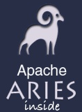


---

<a id="community-mailinglists"></a>

<!-- source_url: https://aries.apache.org/documentation/community/mailinglists.html -->

<!-- page_index: 47 -->

# MailingLists

Documentation
master

- Documentation
  - [master](#index)

[Edit this Page](https://github.com/apache/aries-antora-site/edit/master/modules/ROOT/pages/community/mailinglists.adoc)

<a id="community-mailinglists--mailinglists"></a>

# MailingLists

The Aries User list is for general discussion or questions on using any of the Aries sub-projects.
Aries developers monitor this list and provide assistance when needed.

- [Subscribe](mailto:user-subscribe@aries.apache.org) to the Aries User list
- [Unsubscribe](mailto:user-unsubscribe@aries.apache.org) from the Aries User list
- [Post](mailto:user@aries.apache.org) to the Aries User list
- [View](http://mail-archives.apache.org/mod_mbox/aries-user/) to the Aries User list archive

The Aries Developer list is for developers to discuss ongoing work, make decisions and vote on technical issues.
There is one list for all Aries sub-projects.

- [Subscribe](mailto:dev-subscribe@aries.apache.org) to the Aries Developer list
- [Unsubscribe](mailto:dev-unsubscribe@aries.apache.org) from the Aries Developer list
- [Post](mailto:dev@aries.apache.org) to the Aries Developer list
- [View](http://mail-archives.apache.org/mod_mbox/aries-dev/) to the Aries Developer list archive

The Aries Commits list receives notifications when changes are committed to the Aries source tree.

- [Subscribe](mailto:commits-subscribe@aries.apache.org) to the Aries Commits list
- [Unsubscribe](mailto:commits-unsubscribe@aries.apache.org) from the Aries Commits list
- [Post](mailto:commits@aries.apache.org) to the Aries Commits list
- [View](http://mail-archives.apache.org/mod_mbox/aries-commits/) to the Aries Commits list archive

---

<a id="community-people"></a>

<!-- source_url: https://aries.apache.org/documentation/community/people.html -->

<!-- page_index: 48 -->

# People

Documentation
master

- Documentation
  - [master](#index)

[Edit this Page](https://github.com/apache/aries-antora-site/edit/master/modules/ROOT/pages/community/people.adoc)

<a id="community-people--people"></a>

# People

This is a list of the people involved in the Apache Aries Incubator and their roles.

|  |  |  |
| --- | --- | --- |
| Name | Organization | PMC Member |
| Adam Wojtuniak | Ericsson |  |
| Alan Cabrera | LinkedIn |  |
| Alan Keane | Ericsson |  |
| Alasdair Nottingham | IBM | check |
| Andrew Osborne | IBM | check |
| Bartosz Kowalewski |  |  |
| Bernd Kolb | SAP | check |
| Bertrand Delacretaz |  |  |
| Carlos Sierra Andrés |  | check |
| Carsten Ziegeler |  | check |
| Chris Wilkinson | IBM |  |
| Christian Schneider | Talend | check |
| Dan Kulp | Talend | check |
| David Bosschaert | Adobe | check |
| David Jencks | IBM | check |
| Davanum Srinivas (Dims) | IBM | check |
| Dimo Stoilov | SAP | check |
| Dominik Przybysz | TouK | check |
| Emily Jiang | IBM | check |
| Eoghan Glynn |  | check |
| Felix Meschberger | Adobe |  |
| Giuseppe Gerla |  |  |
| Graham Charters | IBM | check |
| Grzegorz Grzybek |  | check |
| Guillaume Nodet | Progress | check |
| Hiram Chirino | Progress | check |
| Holly Cummins | IBM | check |
| Ian Robinson | IBM | check |
| James Strachan | Progress | check |
| Jarek Gawor | IBM | check |
| Jean-Baptiste Onofré | Talend | check |
| Jean-Sebastien Delfino | IBM | check |
| Jeremy Hughes | IBM | check |
| Joe Bohn | IBM | check |
| John Ross | IBM | check |
| Kevan Miller |  | check |
| Lei "Rex" Wang | IBM |  |
| Lin Sun | IBM | check |
| Kiril Mitov | SAP | check |
| Mark Nuttall | IBM | check |
| Niclas Hedhman |  |  |
| Niklas Gustavsson |  | check |
| Nikolai Tankov | SAP | check |
| Oisin Hurley |  | check |
| Peter Peshev | SAP | check |
| Raymond Augé |  | check |
| Raymond Feng | IBM | check |
| Rick McGuire |  | check |
| Roman Roelofsen | ProSyst | check |
| Sabine Heider | SAP | check |
| Sergey Beryozkin | Talend | check |
| Stuart McCulloch |  | check |
| Timothy Ward |  | check |
| Todor Boev | ProSyst | check |
| Tom De Wolf |  |  |
| Tom Watson | IBM |  |
| Valentin Mahrwald |  | check |
| Violeta Georgieva | SAP | check |
| Zoe Slattery |  | check |

---

<a id="development-versionpolicy"></a>

<!-- source_url: https://aries.apache.org/documentation/development/versionpolicy.html -->

<!-- page_index: 49 -->

# Aries versioning policy

Documentation
master

- Documentation
  - [master](#index)

[Edit this Page](https://github.com/apache/aries-antora-site/edit/master/modules/ROOT/pages/development/versionpolicy.adoc)

<a id="development-versionpolicy--aries-versioning-policy"></a>

# Aries versioning policy

The Aries project aims to implement OSGi semantic versioning as described [here](http://www.osgi.org/wiki/uploads/Links/SemanticVersioning.pdf).

The implementation of semantic versioning has a number of practical implications for managing a project.
These are outlined in this section.

<a id="development-versionpolicy--_package_versions"></a>
<a id="development-versionpolicy--package-versions"></a>

## Package versions

<a id="development-versionpolicy--_exported_packages_versions_are_usually_specified_in_packageinfo_files_with_the_source_code"></a>
<a id="development-versionpolicy--exported-packages-versions-are-usually-specified-in-packageinfo-files-with-the-source-code."></a>

### Exported packages Versions are usually specified in packageinfo files with the source code.

The default-parent pom is configures (in the build resources section) to expect packageinfo files.
If your pom has a build resources section it replaces what is inherited from the default-parent, so you may need to reproduce the section which specifies where packageinfo can be found.

Developers **must** increment the versions in packageinfo files in strict accordance with OSGi semantic versioning when they make changes to a package.
The version should relate to the **most recent release of the package** and not to the version found in trunk.
For example:

<a id="development-versionpolicy--_scenario_1_making_changes_to_a_package_with_released_version_a_b_c"></a>
<a id="development-versionpolicy--scenario-1-making-changes-to-a-package-with-released-version-a.b.c"></a>

#### Scenario 1, making changes to a package with released version a.b.c

- Developer A fixes a bug in the package and increments it’s version to a.b.c+1
- Developer B fixes another bug in the package but leaves the version at a.b.c+1

<a id="development-versionpolicy--_scenario_2_making_changes_to_a_package_with_released_version_a_b_c"></a>
<a id="development-versionpolicy--scenario-2-making-changes-to-a-package-with-released-version-a.b.c"></a>

#### Scenario 2, making changes to a package with released version a.b.c

- Developer A adds a method to an interface in the package and increments it’s version to a.b+1.0
- Developer B fixes a bug in the package, leaves its version at a.b+1.0

<a id="development-versionpolicy--_scenario_3_making_changes_to_a_package_with_released_version_a_b_c"></a>
<a id="development-versionpolicy--scenario-3-making-changes-to-a-package-with-released-version-a.b.c"></a>

#### Scenario 3, making changes to a package with released version a.b.c

- Developer A fixes a bug in the package, and increments its version to a.b.c+1
- Developer B deletes a method from an interface and increases the package version to a+1.0.0.
  Note the final '0' here, developer B’s change is more significant so there is no need to reflect Developer A’s change with a micro version of '1'.
  Indeed, a version of a+1.0.1 would imply a bug fix to version a+1.0.0.

<a id="development-versionpolicy--_importing_packages"></a>
<a id="development-versionpolicy--importing-packages"></a>

### Importing packages

The bnd default version range policy for imports is the consumer policy (==, ).
Implementers of interfaces will need to override this.
For example as an implementer of an interface the version range would be the provider policy (==,=).
The policy can be set by using the Maven property `<aries.osgi.version.policy>`, see the default-parent pom for an example.

<a id="development-versionpolicy--_bundle_versions"></a>
<a id="development-versionpolicy--bundle-versions"></a>

## Bundle versions

**Note: Bundle versions are changed at release time and only by the release manager.
Bundle versions are not updated during development.**

OSGi semantic versioning applies to bundles as well as packages.
When releasing a new version of a bundle the change in the bundle version should give some indication of nature of the changes to the bundle.
In Aries the bundle version is the same as version of the Maven artifact version.
During development, in trunk, the Maven artifact version will be:

- x.y.(z+1)-SNAPSHOT

Where x.y.z is the most recent release of the bundle

During the release process the Maven release plugin asks for a the subsequent version to use in the module’s pom after the release has taken place.
The default is to increment the last digit and add -SNAPSHOT.

For example, if proxy is released at version 1.0.0, the development version of proxy in trunk will become 1.0.1-SNAPSHOT.

In addition, after a release, modules dependencies should refer to the lowest released version providing enough exported functionality the bundle requires.
This ensures the import version is automatically set correctly to allow for loose coupling supported by OSGi.

For example, bundles which depend on proxy (e.g.
blueprint) will be set to depend on the released version of proxy.
Immediately after a release of proxy at say 1.0.0 and a release of blueprint at 1.2.0, the development version of blueprint in trunk will be 1.2.1-SNAPSHOT but the version of proxy that it depends on will be 1.0.0.

<a id="development-versionpolicy--_assigning_a_bundle_version_number_at_release_time"></a>
<a id="development-versionpolicy--assigning-a-bundle-version-number-at-release-time"></a>

### Assigning a bundle version number at release time

At release time the release version of the bundle must be assigned by the release manager after reviewing the changes to the bundle’s package versions since the last release.
This is not a particularly time consuming task as long as packageinfo files are used for versioning packages.

So, for example, if proxy has a version of 1.0.1-SNAPSHOT in trunk but one of the API’s that is exported by proxy has changed its package version from 1.3.4 to 2.0.0 in trunk, the bundle version would be incremented to 2.0.0 on release to indicate an incompatible change in (at least) one of its packages.

Bundles that don’t export any packages will still change version when bugs are fixed.
In this case the new release version will be x.y.(z+1) if the last release was x.y.z.

---

<a id="development-buildingaries"></a>

<!-- source_url: https://aries.apache.org/documentation/development/buildingaries.html -->

<!-- page_index: 50 -->

# BuildingAries

Documentation
master

- Documentation
  - [master](#index)

[Edit this Page](https://github.com/apache/aries-antora-site/edit/master/modules/ROOT/pages/development/buildingaries.adoc)

<a id="development-buildingaries--buildingaries"></a>

# BuildingAries

<a id="development-buildingaries--_prereqs"></a>
<a id="development-buildingaries--prereqs"></a>

## Prereqs

- Maven 3.2.5 (mvn --version).
  Current maven 3.3.x has an error with parent poms
- Subversion client >= 1.8.x
- Eclipse Luna <http://www.eclipse.org/downloads/packages/eclipse-ide-java-developers/lunasr2>

<a id="development-buildingaries--_checkout_and_build_on_the_command_line"></a>
<a id="development-buildingaries--checkout-and-build-on-the-command-line"></a>

## Checkout and build on the command line

- Check out sources: svn co <https://svn.apache.org/repos/asf/aries/trunk> aries
- cd aries
- mvn clean install -DskipTests=true

You should now have succesfully compiled aries trunk.
As a next step you can run the tests too.

- mvn clean install -fae

<a id="development-buildingaries--_import_into_eclipse_using_m2e"></a>
<a id="development-buildingaries--import-into-eclipse-using-m2e"></a>

## Import into eclipse using m2e

- Start eclipse.
  Use a workspace directory separate from your source checkout of aries
- File -> Import -> Maven -> Existing maven projects -> Browse to aries directory -> Select the projects to import -> Finish
- At some projects you might see some markers that m2e does not know how to work with certain maven plugins.
  Use the Ctrl-1 shortcut on these markers and set them to be ignored and let eclipse store this in the eclipse preferences.
  Do not select to add the ignore to the maven poms.

After these steps you should have imported your selected aries projects into eclipse.

<a id="development-buildingaries--_out_of_memory_errors"></a>
<a id="development-buildingaries--out-of-memory-errors"></a>

## Out of memory errors

You may find that building Aries fails with out of memory exceptions on some systems (eg Mac) if you use the standard Java settings.
Setting the two environment variables as shown below may help.

export MAVEN\_OPTS="-XX:MaxPermSize=128m -Xms512m -Xmx512m"

---

<a id="development-guidelines"></a>

<!-- source_url: https://aries.apache.org/documentation/development/guidelines.html -->

<!-- page_index: 51 -->

# Coding guidelines

Documentation
master

- Documentation
  - [master](#index)

[Edit this Page](https://github.com/apache/aries-antora-site/edit/master/modules/ROOT/pages/development/guidelines.adoc)

<a id="development-guidelines--coding-guidelines"></a>

# Coding guidelines

<a id="development-guidelines--_code_style"></a>
<a id="development-guidelines--code-style"></a>

## Code Style

There are not yet complete code formatters and checkstyle rules for aries.
In the mean time you can set these rules.

- 4 spaces instead of tabs
- Line width 130 characters

<a id="development-guidelines--_maven_best_practice_in_aries_development"></a>
<a id="development-guidelines--maven-best-practice-in-aries-development"></a>

## Maven best practice in Aries development

<a id="development-guidelines--_overall_structure"></a>
<a id="development-guidelines--overall-structure"></a>

### Overall structure

The Aries project is a collection of loosely couple bundles, therefore it must be possible to build each bundle on its own.
This implies:

1. A parent pom that isn’t at the root of the SVN trunk.
2. Each bundle has enough pom info so that it can be released independently.
3. parent/default-parent has dependency management for basic osgi-dependencies that all projects are almost certain to use (this includes PAX dependencies for testing).
4. Each bundle has legal files in its checkout root.
5. Each bundle has an SCM element in its top level pom.
6. Bundles do not (except samples) have sub-modules.

<a id="development-guidelines--_good_practice_in_the_pom"></a>
<a id="development-guidelines--good-practice-in-the-pom"></a>

### Good practice in the pom

1. Alphabetic ordering in dependency management is helpful
2. Include a brief description of the project
3. Commenting in platform dependencies, see samples assembly projects.
4. Use ${project.version} *not* ${version} for Maven 3 compatibility.

<a id="development-guidelines--_group_and_artifact_names"></a>
<a id="development-guidelines--group-and-artifact-names"></a>

### Group and Artifact names

1. The Bundle Symbolic Name is explicitly set to the Maven artifactId.
   For projects which deliver bundles, the artifactID will therefore completely describe the jar and must begin org.apache.aries.{subproject}.
   For projects which do not deliver bundles (for example agregator projects) it is acceptable to use a short descriptive artifactID.
2. The group ID will overlap with the artifactId and will normally be of the form org.apache.aries.{subproject}

---

<a id="development-compliancetesting"></a>

<!-- source_url: https://aries.apache.org/documentation/development/compliancetesting.html -->

<!-- page_index: 52 -->

# ComplianceTesting

Documentation
master

- Documentation
  - [master](#index)

[Edit this Page](https://github.com/apache/aries-antora-site/edit/master/modules/ROOT/pages/development/compliancetesting.adoc)

<a id="development-compliancetesting--compliancetesting"></a>

# ComplianceTesting

<a id="development-compliancetesting--_enterprise_osgi_compliance_tests"></a>
<a id="development-compliancetesting--enterprise-osgi-compliance-tests"></a>

## Enterprise OSGi Compliance Tests

The Enterprise OSGi compliance tests are provided byt the [OSGi Alliance](http://www.osgi.org) to Apache committers who have signed the appropriate Non Disclosure Agreement.

The tests are supplied with the BND configuration files used to run the tests against the OSGi implementation of the Enterprise Specification.
The configuration files require some modification to run the tests against Aries components.

Instructions for obtaining and running the tests are given [here](http://felix.apache.org/site/using-the-osgi-compliance-tests.html), or see below.

<a id="development-compliancetesting--_test_results"></a>
<a id="development-compliancetesting--test-results"></a>

## Test results

At each Aries release the tests are run against Aries components.
The results for the most recent release can be found [here](https://aries.apache.org/downloads/testresults.html) .

<a id="development-compliancetesting--_how_to_run_the_tests_for_aries_components"></a>
<a id="development-compliancetesting--how-to-run-the-tests-for-aries-components"></a>

## How to run the tests for Aries components

<a id="development-compliancetesting--_legal_stuff"></a>
<a id="development-compliancetesting--legal-stuff"></a>

### Legal stuff

Complete an Apache [Non Disclosure Agreement](http://apache.org/jcp/ApacheNDA.pdf) and email it to [secretary@apache.org](mailto:secretary@apache.org)

Write a note to [jcp-open@apache.org](mailto:jcp-open@apache.org) with the subject "OSGi CT access" which contains (something like) the following text:

"I’m a committer on the Apache Aries project and would like access to the OSGi CT.
I’ve submitted an NDA."

> [!NOTE]
> |  |  |
> | --- | --- |
> |  | You should subscribe to [jcp-open@apache.org](mailto:jcp-open@apache.org) first. If you don’t your note will languish in 'moderation' forever :-) |

<a id="development-compliancetesting--_get_the_tests"></a>
<a id="development-compliancetesting--get-the-tests"></a>

### Get the tests

Anyone with an NDA on file should be able to get access to the tests [here](https://svn.apache.org/repos/tck/osgi-cts/) .

The group of tests that are required for Aries is called osgi.enterprise.tests.
Download the jar for the appropriate level - currently 4.2.0.

<a id="development-compliancetesting--_running_the_tests"></a>
<a id="development-compliancetesting--running-the-tests"></a>

### Running the tests

Extract the jar into a test directory, say ~/AriesTests.
After you have extracted the file you will find:

- A subdirectory call 'jar' which contains all the tests
- A set of \*.bnd files which are used to run the tests

The tests are run using bnd, the command line used to run a set of tests looks like this:

```
java -jar jar/bnd.jar runtests -title osgi.ct
org.osgi.test.cases.blueprint.bnd
```

The command above would, for example, run the blueprint tests.

Before running the tests it will be necessary to make some changes to the bnd files, to download some additional pre-reqs and to assemble the aries components to be tested.
The [Felix](http://felix.apache.org/site/using-the-osgi-compliance-tests.html) pages give a good indication of what is necessary.

<a id="development-compliancetesting--_debugging_the_tests"></a>
<a id="development-compliancetesting--debugging-the-tests"></a>

### Debugging the tests

If you want to debug the code then you need to add the following line to the .bnd file:

```
-runvm=-Xdebug,"-Xrunjdwp:transport=dt_socket,server=y,address=localhost:7777"
```

You can change 7777 to any number you want.

<a id="development-compliancetesting--_modifying_the_bnd_files"></a>
<a id="development-compliancetesting--modifying-the-bnd-files"></a>

### Modifying the bnd files

<a id="development-compliancetesting--_general"></a>
<a id="development-compliancetesting--general"></a>

#### General

First, it is necessary to add a couple of lines, like this:

```
-runpath = \
    commonjars/osgi-3.5.0.v20090520.jar;version=file, \
```

```
commonjars/com.springsource.junit-3.8.2.jar;version=file;export="junit.framework;version=3.8",
```

Secondly, if you are using the Eclipse Framework, it is necessary to remove the line

```
osgi.resolverMode="strict", \
```

from the 'runproperties' section.

It’s convenient (but not necessary) to keep the the jars required to run the test jars and the code being tested in separate subdirectories.
Create:

- commonjars - any common dependencies, eg pax-logging
- ariesjars - the aries code to be tested

The easiest way to find most of the aries jars and their dependencies is to copy every aries jar in the ~/samples/blog/blog-assembly/target folder into ariesjars and every non-aries jar from the same directory into 'commonjars'.

The *.bnd files that are used to run the tests assume that the person running the tests has access to org.osgi.impl* jars.
In general this is not the case - so wherever an org.osgi.impl\* jar has been used it must be replaced with an equivalent implementation.
Such implementations can usually be found in either [Felix](http://felix.apache.org/site/downloads.cgi), [Equinox](http://download.eclipse.org/equinox/) or [Knopflerfish](http://www.knopflerfish.org/releases/3.0.0/osgi/jars/).

<a id="development-compliancetesting--_blueprint"></a>
<a id="development-compliancetesting--blueprint"></a>

#### Blueprint

There are four other dependencies needed to run the tests, download these:

- org.osgi.compendium-4.2.0.jar
- osgi-3.5.0.v20090520.jar
- org.eclipse.equinox.event-1.1.100.jar
- org.apache.felix.configadmin-1.2.4.jar

from Maven and put them in commonjars.

After modifications the bnd configuration file to run the blueprint tests will look like this:

```
-include= ~shared.inc
build=.

-target = \
    jar/org.osgi.test.cases.blueprint-4.2.0.jar;version=file,

-runpath = \
    commonjars/osgi-3.5.0.v20090520.jar;version=file, \

commonjars/com.springsource.junit-3.8.2.jar;version=file;export="junit.framework;version=3.8",


-runbundles = \

    commonjars/org.osgi.compendium-4.2.0.jar;version=file;strategy="lowest", \
    commonjars/pax-logging-api-1.4.jar;version=file, \
    commonjars/pax-logging-service-1.4.jar;version=file, \
    commonjars/cm-3.2.0-v20070116.jar;version=file, \
    commonjars/org.eclipse.equinox.event-1.1.100.jar;version=file, \
    commonjars/org.apache.felix.configadmin-1.2.4.jar;version=file, \
    ariesjars/org.apache.aries.blueprint-0.2-incubating.jar;version=file

-runproperties = \
    report="true", \
    osgi.compatibility.bootdelegation="false", \
    osgi.support.multipleHosts="true"
```

<a id="development-compliancetesting--_jndi"></a>
<a id="development-compliancetesting--jndi"></a>

#### JNDI

The only additional bundle required for these tests is:

- osgi.enterprise.jar

which can be found at the [OSGi Alliance](http://www.osgi.org/Main/HomePage) site.

The .bnd file required to run the JNDI tests looks like this:

```
-include= ~shared.inc
build=.

-target = \
    jar/org.osgi.test.cases.jndi-4.2.0.jar;version=file,

-runpath = \
    commonjars/osgi-3.5.0.v20090520.jar;version=file, \

commonjars/com.springsource.junit-3.8.2.jar;version=file;export="junit.framework;version=3.8",

-runbundles = \
    commonjars/osgi.enterprise-4.2.0.jar;version=file;strategy="lowest", \
    ariesjars/org.apache.aries.util-0.2-incubating.jar;version=file, \
    ariesjars/org.apache.aries.jndi-0.2-incubating.jar;version=file

-runproperties = \
    report="true", \
    osgi.compatibility.bootdelegation="false", \
    osgi.support.multipleHosts="true", \
    org.osgi.framework.bootdelegation="com.sun.*"
```

<a id="development-compliancetesting--_jmx"></a>
<a id="development-compliancetesting--jmx"></a>

#### JMX

It is necessary to download the following:

- <http://www.knopflerfish.org/releases/3.0.0/osgi/jars/useradmin/useradmin_all-3.0.1.jar>
- <http://www.knopflerfish.org/releases/3.0.0/osgi/jars/log/log_api-3.0.1.jar>
- org.apache.felix.log-1.0.0.jar
- org.apache.felix.http.bundle-2.0.4.jar

and use them to replace the three org.osgi.impl\* jars in the runbundles section.

```
-include= ~shared.inc
build=.

-target = \
    jar/org.osgi.test.cases.jmx-4.2.0.jar;version=file,

-runpath = \
    commonjars/osgi-3.5.0.v20090520.jar;version=file, \

jar/com.springsource.junit-3.8.2.jar;version=file;export="junit.framework;version=3.8",

-runbundles = \
    commonjars/osgi.enterprise-4.2.0.jar;version=file;strategy="lowest", \
    commonjars/org.apache.felix.configadmin-1.2.4.jar;version=file, \
    ariesjars/org.apache.aries.jmx-0.2-incubating.jar;version=file, \
    commonjars/useradmin_all-3.0.1.jar;version=file, \
    commonjars/log_api-3.0.1.jar;version=file, \
    commonjars/org.apache.felix.log-1.0.0.jar;version=file, \
    commonjars/org.osgi.compendium-4.2.0.jar;version=file, \
    commonjars/org.eclipse.equinox.ip_1.1.100.v20100503.jar;version=file, \
    commonjars/org.eclipse.equinox.util_1.0.200.v20100503.jar;version=file, \
    commonjars/org.apache.felix.http.bundle-2.0.4.jar;version=file

-runproperties = \
    report="true", \
    osgi.compatibility.bootdelegation="false", \
    osgi.support.multipleHosts="true", \
    osgi.console="1111", \

    org.osgi.test.cases.jmx.system.packages.extra="junit.framework;version=3.8", \

    org.osgi.test.cases.jmx.bundles="jar/osgi.enterprise-4.2.0.jar,jar/org.apache.aries.jmx-0.2-incubating.jar"
```

<a id="development-compliancetesting--_transaction"></a>
<a id="development-compliancetesting--transaction"></a>

#### Transaction

Nothing more to download here.
Here is the configuration file:

```
-include= ~shared.inc
build=.

-target = \
    jar/org.osgi.test.cases.transaction-4.2.0.jar;version=file,

-runpath = \
    commonjars/osgi-3.5.0.v20090520.jar;version=file, \

commonjars/com.springsource.junit-3.8.2.jar;version=file;export="junit.framework;version=3.8",

-runbundles = \
    commonjars/osgi.enterprise-4.2.0.jar;version=file;strategy="lowest", \
    commonjars/pax-logging-api-1.4.jar;version=file, \
    commonjars/pax-logging-service-1.4.jar;version=file, \
    commonjars/geronimo-jta_1.1_spec-1.1.1.jar;version=file, \
    commonjars/geronimo-transaction-2.1.3.jar;version=file, \
    commonjars/geronimo-j2ee-connector_1.5_spec-2.0.0.jar;version=file, \
    commonjars/org.apache.felix.configadmin-1.2.4.jar;version=file, \
    ariesjars/org.apache.aries.blueprint-0.2-incubating.jar;version=file, \
    ariesjars/org.apache.aries.transaction.blueprint-0.2-incubating.jar;version=file, \
    ariesjars/org.apache.aries.transaction.manager-0.2-incubating.jar;version=file, \
    ariesjars/org.apache.aries.transaction.wrappers-0.2-incubating.jar;version=file

-runproperties = \
    report="true", \
    osgi.compatibility.bootdelegation="false", \
    osgi.support.multipleHosts="true", \
    org.osgi.test.cases.transaction.waittime="30"
```

---

<a id="development-resources"></a>

<!-- source_url: https://aries.apache.org/documentation/development/resources.html -->

<!-- page_index: 53 -->

# Developer Resources

Documentation
master

- Documentation
  - [master](#index)

[Edit this Page](https://github.com/apache/aries-antora-site/edit/master/modules/ROOT/pages/development/resources.adoc)

<a id="development-resources--developer-resources"></a>

# Developer Resources

<a id="development-resources--_source"></a>
<a id="development-resources--source"></a>

## Source

<https://svn.apache.org/repos/asf/aries/>

<a id="development-resources--_issue_tracker"></a>
<a id="development-resources--issue-tracker"></a>

## Issue Tracker

<https://issues.apache.org/jira/browse/ARIES>

<a id="development-resources--_automated_builds"></a>
<a id="development-resources--automated-builds"></a>

## Automated Builds

<https://builds.apache.org/view/A-D/view/Aries2/>

---

<a id="development-maintainingthewebpages"></a>

<!-- source_url: https://aries.apache.org/documentation/development/maintainingthewebpages.html -->

<!-- page_index: 54 -->

# Maintaining The Web Site

Documentation
master

- Documentation
  - [master](#index)

[Edit this Page](https://github.com/apache/aries-antora-site/edit/master/modules/ROOT/pages/development/maintainingthewebpages.adoc)

<a id="development-maintainingthewebpages--maintaining-the-web-site"></a>

# Maintaining The Web Site

The web site is built with [Antora](https://antora.org) run through [Apache Jenkins CI](https://ci-builds.apache.org) and published to a [dedicated git repository](https://gitbox.apache.org/repos/asf?p=aries-site-pub.git;a=shortlog;h=refs/heads/asf-site) with an [.asf.yaml](https://cwiki.apache.org/confluence/display/INFRA/Git+-+.asf.yaml+features#Git.asf.yamlfeatures-WebSiteDeploymentServiceforGitRepositories) [configuration file](https://gitbox.apache.org/repos/asf?p=aries-site-pub.git;a=blob;f=.asf.yaml;hb=HEAD).

<a id="development-maintainingthewebpages--_overall_organization"></a>
<a id="development-maintainingthewebpages--overall-organization"></a>

## Overall organization

For simplicity, this references the GitHub mirrors of the Apache gitbox repos.

General content
:   Content not specific to a particular subproject and unmigrated content is in the [aries-antora-site](https://github.com/apache/aries-antora-site) repository.
    At the moment there is only one Antora component, version, and module, so the content is all under `modules/ROOT/pages`.

Subproject-specific content
:   Content specific to a subproject may be put in the subproject repo in the standard Antora layout.
    For instance, SCR content could be in `aries` under `scr/docs/modules/ROOT/pages`.
    This feature is not yet used.

Antora playbook
:   The Antora playbook together with the Node project to fetch and set up the required dependencies is in the [aries-antora](https://github.com/apache/aries-antora) repository.

Antora UI
:   The UI for this website is in the [aries-antora-ui](https://github.com/apache/aries-antora-ui) repository.
    For simplicity this is currently set up as an extension of the Antora default UI using <https://gitlab.com/djencks/antora-ui-builder>.

Published site content
:   The website build publishes the content to [aries-site-pub](https://github.com/apache/aries-site-pub) in the `asf-site` branch.
    The `.asf.yaml` file is configured to publish the content to Apache servers.

Automated site build
:   The site is built using Jenkins jobs [aries/website-build](https://ci-builds.apache.org/job/Aries/job/website-build) and [Aries/website-content-trigger](https://ci-builds.apache.org/job/Aries/job/website-content-trigger).
    Committing to the `aries-antora-site` or `aries-antora` repositories will trigger a website build and publish.
    Changes to the UI will not trigger an automated build, but PMC members may trigger a build manually with the [Build Now](https://ci-builds.apache.org/job/Aries/job/website-build/build?delay=0sec) button.
    If subproject content is moved to subproject repositories more trigger jobs will be needed.

<a id="development-maintainingthewebpages--_extensions_currently_in_use"></a>
<a id="development-maintainingthewebpages--extensions-currently-in-use"></a>

## Extensions currently in use

[asciidoctor-antora-indexer](https://gitlab.com/djencks/asciidoctor-antora-indexer)
:   This queries the Antora content catalog and renders the results as lists, tables, etc.
    It is currently used in the [Temporary auto-index page](https://aries.apache.org/documentation/auto-index.html) page to partially automate generation.

<a id="development-maintainingthewebpages--_basic_asciidoc"></a>
<a id="development-maintainingthewebpages--basic-asciidoc"></a>

## Basic AsciiDoc

The Intellij AsciiDoc plugin provides extensive syntax checking, side-by-side rendering, and a lot of other help.

Consult the Asciidoctor and Antora documentation for complete coverage of syntax and features.

Please use "ventilated prose", with one sentence per line.

- A blank line indicates a new paragraph.
- A page starts with a title, indicated by `= Title`.
- Sections are marked with `==`, `===`, etc, the number of `=` indicating section nesting.
- Sections are automatically assigned ids that can be used as the fragment in links.
  To manually specify an id, precede the section line with `[#my-id]` on a separate line.
- Code blocks look like this:

```
[source,java] (1)
----  (2)
class Foo {
...
}
----
```

|  |  |
| --- | --- |
| **1** | Any language you want: highlighting is available for most. |
| **2** | Block separator `----` |

<a id="development-maintainingthewebpages--_page_links"></a>
<a id="development-maintainingthewebpages--page-links"></a>

### Page links

Between pages
:   Use the `xref:` inline macro:
    `xref:other-page.adoc[]`.

    - The path to the other page starts from the `pages` directory: it is not relative to the current page.
    - For a non-fragment reference, the default link text is the other page title.
      Custom text may be specified inside the `[]` brackets.
    - For fragment references you must specify the link text.

Within a page
:   Use the form `<<#_fragment_name, link text>>`.
    For a link to a section, the default link text is the section title.

> [!NOTE]
> |  |  |
> | --- | --- |
> |  | The Intellij asciidoc plugin has Antora-aware syntax checking and auto-complete, including the generated section ids. |

<a id="development-maintainingthewebpages--_local_build"></a>
<a id="development-maintainingthewebpages--local-build"></a>

## Local build

You need Node and npm installed.
You also need git to clone the repositories locally, but the build itself does not use git.

I do not recommend following the instructions on the Antora site, which advise installing Antora globally.
The playbook project is instead set up to use an npm script to install Antora and all required dependencies locally
At a minimum:

- Clone the `aries-antora` playbook project.
- Run `npm run plain-install`.
- Run `npm run build`.

This will build the site locally into build/site, using the remote content sources, such as `aries-antora-site`.

Most likely you will want to modify content sources locally, and build using your local sources, before committing and pushing your changes.
To enable this:

- Clone the `aries-antora-site` repository and any other content repositories you wish to work with next to the playbook project.
- Modify the `antora-playbook.yml` to point to the local clones rather than the remote repositories.
  Be sure to specify `branches: HEAD` to use the worktree content rather than the local committed repository content.
  The appropriate changes are already in the playbook, commented out, with comments, for the `aries-antora-site` repository.
- Build the site as above.

<a id="development-maintainingthewebpages--_working_with_the_ui"></a>
<a id="development-maintainingthewebpages--working-with-the-ui"></a>

### Working with the UI

- Clone the `aries-antora-ui` project next to the playbook project.
- Run `npm i`.
- Run `./node_modules/gulp/bin/gulp.js` to assemble the UI.
- To see the results, run `cp build/aries-antora-ui-bundle.zip ../aries-antora/node_modules/@apache-aries/aries-antora-ui/build/aries-antora-ui-bundle.zip` and build the playbook project.
- When you are satisfied with your changes, commit both source changes and the assembled UI bundle and push to the remote repository.
- UI bundle changes do not trigger a site build; you’ll need to start one manually.

Most likely making changes to src/partials/\* templates will be fairly self-explanatory.
Other changes are likely to need a fairly detailed understanding of the Antora default UI.

---

<a id="development-architecture"></a>

<!-- source_url: https://aries.apache.org/documentation/development/architecture.html -->

<!-- page_index: 55 -->

<a id="development-architecture--module-build-time-dependencies"></a>

# Module build time dependencies

There are build time dependencies between Aries modules.
This diagram shows the dependencies.
For example, if you need to build 0.2-incubating JPA module you will find that you need to have built (or have available) parent, testsupport, util, blueprint, quiesce and transaction at the level specified in the pom.xml for the JPA module.

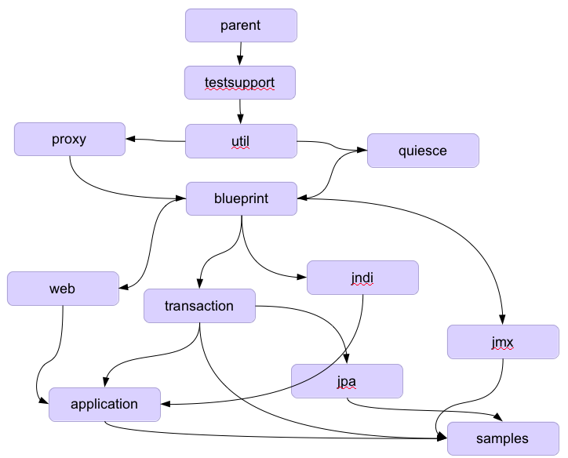

---

<a id="development-releaseprocessrequirements"></a>

<!-- source_url: https://aries.apache.org/documentation/development/ReleaseProcessRequirements.html -->

<!-- page_index: 56 -->

# Release process requirements

Documentation
master

- Documentation
  - [master](#index)

[Edit this Page](https://github.com/apache/aries-antora-site/edit/master/modules/ROOT/pages/development/ReleaseProcessRequirements.adoc)

<a id="development-releaseprocessrequirements--release-process-requirements"></a>

# Release process requirements

Up to release 0.3 of Aries we released all of the modules at once, along with a set of samples which demonstrated how the Aries components could be used together.

After release 0.3 we wanted to rexamine the release process, the primary motivation for this was the observation that our current process did not use semantic versioning, and, as an OSGi project we should be demonstrating best OSGi practice.

We started with the following set of requirements for any Aries release:

|  |
| --- |
| Id |
| Description |
| Met currently |
| 1 |
| Follows OSGi semantic versioning |
| No |
| 2 |
| Must have a buildable source distribution |
| Yes |
| 3 |
| Must have release notes |
| Yes |
| 4 |
| Must be publicly announced |
| Yes |
| 5 |
| An easy way for users to download the bundles for a given component |
| Yes |
| 6 |
| Easy tagging/branching mechanism |
| Yes |
| 7 |
| A way to provide bug fixes |
| Yes |
| 8 |
| A way to ensure that a given component doesn’t have conflicting dependencies |
| ? |

<a id="development-releaseprocessrequirements--_release_all_aries_components_at_once"></a>
<a id="development-releaseprocessrequirements--release-all-aries-components-at-once."></a>

## Release all Aries components at once.

<a id="development-releaseprocessrequirements--_advantages_of_releasing_everything_at_once_and_at_the_same_level"></a>
<a id="development-releaseprocessrequirements--advantages-of-releasing-everything-at-once-and-at-the-same-level"></a>

### Advantages of releasing everything at once and at the same level

1. Conceptually very simple of consumers.
   For example, if as a consumer I pick up something called Blueprint version 0.4 I know that I will need to get Util version 0.4 to go with it.
2. A relatively simple release process, one JIRA component, one set of release notes.
3. We can release a set of samples at the same version with some guarentee that the samples all work with the release.

<a id="development-releaseprocessrequirements--_disadvantages_of_releasing_everything_at_once"></a>
<a id="development-releaseprocessrequirements--disadvantages-of-releasing-everything-at-once"></a>

### Disadvantages of releasing everything at once

1. Not using of OSGi semantic versioning of bundles.
   After every we release we bump the major versions of all bundles in trunk.

Package versions are managed separately (correctly) and the Maven bundle plugin will ensure packages are imported in the correct range based of the projects dependencies.
Implementers need to use "provide:=true" to get the correct range.
Package export version should be maintained either using package.info or in the pom.xml.

<a id="development-releaseprocessrequirements--_releasing_by_module"></a>
<a id="development-releaseprocessrequirements--releasing-by-module"></a>

## Releasing by module

Our ideal for a release process would involve to release by module, this is really just an evolution of the process that we already use but it would involve using semantic versioning of bundles.
One might visualise the process like this:


In this case, we have a module version (independent of the version of its sub-modules) and a set of sub-modules which may each be independently versioned.

<a id="development-releaseprocessrequirements--_advantages_of_release_by_module"></a>
<a id="development-releaseprocessrequirements--advantages-of-release-by-module"></a>

### Advantages of release by module

1. Releasing a coherent set of bundles that have been built and run together
2. Releasing a buildable set of source for all constituent bundles in one zip file
3. A more consumable unit than a set of single bundles - easier for Aries consumers.
   A smaller number of discrete downloads.

<a id="development-releaseprocessrequirements--_disadvantages_of_the_release_by_module_process"></a>
<a id="development-releaseprocessrequirements--disadvantages-of-the-release-by-module-process"></a>

### Disadvantages of the release by module process

1. We would have to release a whole module at once, this would mean re-releasing bundles at the same level (and with the same content) as a previous release.
   This is not a major issue but we would probably not want them in the www.apache.org/dist/aries directory.
2. Developer would need to be careful to version submodules poms independently from the parent/reactor pom.
   Again, not a major issue but a change from the way we work at the moment.
3. The Maven release plugin will not cope with having different levels of snapshot in the same release.
   Therefore we would either require changes in the Maven release plugin or we would have to stop using it and maintain our own alternative, to allow us to release by module.
4. It’s not all clear what the strategy for branching would be.
   For example, consider the following scenario: 

In this case a release of the blueprint module at version 1.5 contains bundles blueprint-core at version 1.0.1 and blueprint-cm at version 1.0.2.

Over a period of time, development in trunk continues and a change is made to blueprint-core which mandates an increase in the major version.
Another release of blueprint (version 1.6) is made containing blueprint-cm at version 1.0i.3 and blueprint-core at version 1.1.0.

Meanwhile a customer finds a problem in blueprint module version 1.5 in the blueprint-cm module.
They would like a release of the blueprint module at version 1.5.1 with blueprint-cm at 1.0.3.
Unfortunately this is impossible because we have already released blueprint-cm at 1.0.3 and it works with blueprint-core 1.1.0.
So, we have no way to meet the requirement

<a id="development-releaseprocessrequirements--_releasing_by_bundle"></a>
<a id="development-releaseprocessrequirements--releasing-by-bundle"></a>

## Releasing by bundle

Other OSGi projects, for example Sling and Felix, release by bundle.

<a id="development-releaseprocessrequirements--_advantages_of_releasing_by_bundle"></a>
<a id="development-releaseprocessrequirements--advantages-of-releasing-by-bundle"></a>

### Advantages of releasing by bundle

1. Other projects already do it so there is a well understood model
2. All the existing tools work
3. OSGi semantic versioning can be used properly

<a id="development-releaseprocessrequirements--_disadvantages_of_releasing_by_bundle"></a>
<a id="development-releaseprocessrequirements--disadvantages-of-releasing-by-bundle"></a>

### Disadvantages of releasing by bundle

1. It is more difficult for a consumer of Aries modules to understand which bundles form a logical grouping
2. There are a lot of bundles to manage independently.
   This has implications:

   - Releasing - mvn release:prepare, and so on, needs to be run for each bundle separately.
     However, many bundles could be rolled up into one vote.
   - Each bundle has to have its own JIRA component
   - Our svn tree would need to be restructured - probably in a similar way to the Sling tree.
     Each bundle would have its own trunk & branches.
3. There are still some issues with branching and it is still possible to get into a situation similar to that described above.

---

<a id="development-releasingaries"></a>

<!-- source_url: https://aries.apache.org/documentation/development/releasingaries.html -->

<!-- page_index: 57 -->

# ReleasingAries

Documentation
master

- Documentation
  - [master](#index)

[Edit this Page](https://github.com/apache/aries-antora-site/edit/master/modules/ROOT/pages/development/releasingaries.adoc)

<a id="development-releasingaries--releasingaries"></a>

# ReleasingAries

<a id="development-releasingaries--_how_to_do_an_aries_release"></a>
<a id="development-releasingaries--how-to-do-an-aries-release"></a>

## How to do an Aries Release

There are three types of Aries release:

1. Releasing a single Aries bundle (or group of bundles)
2. Releasing a distribution - a group of bundles that work together
3. Releasing the samples

The outline process is the same in all three cases, further on down this page there are details about how the Apache release process works and how to get set up to run it, read those sections first if this is your first release.
If you are already familiar with the Apache process just use the high level descriptions in the next few paragraphs to perform releases.

<a id="development-releasingaries--_releasing_a_single_bundle_or_group_of_bundles"></a>
<a id="development-releasingaries--releasing-a-single-bundle-or-group-of-bundles."></a>

## Releasing a single bundle or group of bundles.

<a id="development-releasingaries--_what_to_release_make_a_list"></a>
<a id="development-releasingaries--what-to-release-make-a-list"></a>

### What to release? Make a list

The Apache release process will not release any bundle that has dependencies on -SNAPSHOTS.
If, for example, a release of the blueprint API bundle is required the first step is to find and release any of its -SNAPSHOT dependencies.
Because Aries bundles are quite interdependent (see broken link to 'moduledependencies' here) for an idea of how the modules relate to each other, it may be necessary to release quite a large number of bundles.
So, step one is to make a list.

<a id="development-releasingaries--_choosing_a_strategy_for_the_release"></a>
<a id="development-releasingaries--choosing-a-strategy-for-the-release"></a>

### Choosing a strategy for the release

Even when releasing a large number of bundles, in Aries we release bundles individually.
If there are dependencies between the bundles you want to release, you have four strategies for how to release them.

- **Release incrementally.**

  - Release bundles in dependency order, updating dependencies only after releases are promoted.
  - This has the advantage that trunk always builds cleanly.
  - The disadvantage is that each release needs to be open for voting for at least 72 hours, so the elapsed time for a large release can be very long.
  - The list may get fed up of voting on multiple vote threads, although the [verification script](http://aries.apache.org/development/verifyingrelease.html) may help.
- **Release all at once, then patch up trunk, then fix trunk**

  - Release api bundles release and have them uploaded to nexus, then upgrade the implementations and all other components to use those releases, commit, release those other projects, then close the staging repo and call for a vote.
  - Bundles in the staging repo will need to compiled in a set order, which makes the verification script less useful.
  - Trunk will be broken, unless you back out everything which you changed to use the released version back to using the old snapshot (*not* the new snapshot created by the release plugin).
    Then once the release has been promoted, change everything using the old snapshot back to using the released version.
  - Doing a release this way can really reduce the amount of time spent waiting for votes.
  - However, getting everything right without breaking trunk can be complex.
- **Release all at once, and use profiles to keep trunk building**

  - This is similar to the second procedure, except instead of backing everything out, you just provide a maven profile which people can use until the release is promoted
  - Once the release is promoted, cleaning up is easy - just delete the profile
  - You will also need to temporarily change the Jenkins build instructions
  - If people don’t notice they need to build using a profile, they may be confused about why things are broken
- **Release from a branch**

  - This is similar to the second procedure, except there’s no need to patch trunk up to keep it compiling
  - You will need to merge the branch across once the release has been promoted, which is extra complexity
  - Doing mainline releases from branches plays havoc with git mirroring, so we promised to try and avoid doing it
  - See below for extra instructions on releasing from a branch

In many cases with semantically versioned bundles there won’t be dependencies on the latest and greatest snapshots, which makes everything much easier.

<a id="development-releasingaries--_how_to_deal_with_jira"></a>
<a id="development-releasingaries--how-to-deal-with-jira"></a>

### How to deal with JIRA

Before actually doing any releasing work through the list of bundles and understand what defects have been fixed (add more about JIRA versions here)

<a id="development-releasingaries--_what_version_will_be_released"></a>
<a id="development-releasingaries--what-version-will-be-released"></a>

### What version will be released?

For each bundle on the list check how its package versions have changed since the last release.
Based on this, use the [versioning policy](#development-versionpolicy) to determine the version of the bundle that should be released.

<a id="development-releasingaries--_releasing_bundles"></a>
<a id="development-releasingaries--releasing-bundles"></a>

### Releasing bundles

For each bundle:

- Deploy a SNAPSHOT to the maven snapshot repository (mvn deploy)
- Build each module and run RAT checks
- Create the release artifacts (mvn release:prepare)
- Upload release artifacts to a staging repository (mvn release:perform)

<a id="development-releasingaries--_complete_the_process"></a>
<a id="development-releasingaries--complete-the-process"></a>

### Complete the process

Once the bundles are in the staging repository, start a vote on the release.
After 72 hours close the vote.
To complete the release process it is necessary to copy the new bundles to the dist dir and update table on the web pages.

<a id="development-releasingaries--_releasing_a_distribution"></a>
<a id="development-releasingaries--releasing-a-distribution"></a>

## Releasing a distribution

A distribution is just a collection of Aries bundles which have already been released.
The distribution is just a convenient way for consumers to download aries bundles and all of the Aries bundles that they depend on.
There are three distributions:

- Blueprint
- Application (isolating framework)
- Application (non-isolating framework)

The release process is just the same as for everything else, again, the right time to release these is immediately after a bundle(s) release when you have a collection of artifacts that work together.

<a id="development-releasingaries--_releasing_the_samples"></a>
<a id="development-releasingaries--releasing-the-samples"></a>

## Releasing the samples

The Aries samples are designed to work across all the Aries modules.
Samples are released as a single module.
All of the Aries dependencies are listed in the top level samples pom.
*It is very important the versions are set **only** in the top level sample pom*.
Both sub-modules and filtered resources need the version information, setting it in one place is the only way to avoid a mess.

The best time to do a samples release is usually at the end of a bundle release.

It is critically important that the samples are all tested before making release.
Some have itests but others (blueprint) are only tested manually.
In fact it’s wise to run through a quick manual check for the blog and aries trader samples as the itests do not catch everything.

<a id="development-releasingaries--_background_information_on_the_apache_release_process"></a>
<a id="development-releasingaries--background-information-on-the-apache-release-process"></a>

## Background information on the Apache Release process

To create a release you will need to create the release artifacts and move then to various places (ultimately the Maven central repository).
The Maven commands and general outline of the process looks like this:

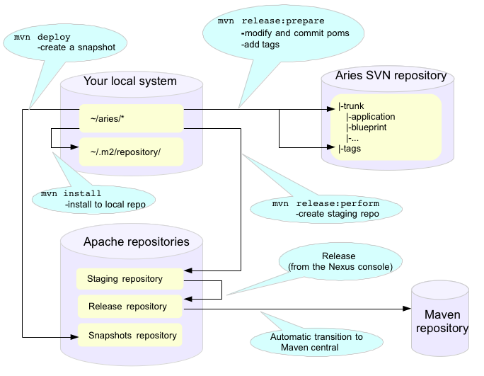

The full maven commands are not shown - the intention is just to give an indication of which maven commands you will need to use to create release artifacts in different places.

Performing a release is described in detail [here](http://apache.org/dev/publishing-maven-artifacts.html) . This document It covers all the steps listed above so on these pages we will only add things which are specific to the Apache Aries release.

There are a few steps to the process:

1. Discussion of the release and its content on the dev@aries mailing list.
2. Creating and storing GPG keys
3. Setting up your environment
4. JIRA preparation
5. Checking the release version of the bundle
6. Checking release artifacts on your local system
7. Creating a snapshot release
8. Releasing to a staging repository (uses mvn release:prepare and mvn release:perform)
9. Running a vote
10. Promoting the release artifacts to the Apache release repository
11. Making the release artifacts available from the Aries web pages
12. What to do when people find problems with the release artifacts

The best current documentation for releases is [here](http://apache.org/dev/publishing-maven-artifacts.html).
It covers all the steps listed above so on these pages we will only add things which are specific to the Apache Aries release.

<a id="development-releasingaries--_discussion_of_the_release_and_its_content_on_the_aries_mailing_list"></a>
<a id="development-releasingaries--discussion-of-the-release-and-its-content-on-the-aries-mailing-list"></a>

### Discussion of the release and its content on the Aries mailing list

Before starting off the release process it is essential to gain consensus on the dev@aries list that this is the right time for a release and to agree its content.
Allow at least a week for this discussion.

<a id="development-releasingaries--_creating_and_storing_gpg_keys"></a>
<a id="development-releasingaries--creating-and-storing-gpg-keys"></a>

### Creating and storing GPG keys

For Aries your GPG key will need to be in this file: <https://svn.apache.org/repos/asf/aries/KEYS> (follow the instructions in the file) and checkin.
Then ensure the file is mirrored to <http://www.apache.org/dist/aries/KEYS> by following the instructions [here](http://www.apache.org/dev/release.html#upload-scp).

<a id="development-releasingaries--_setting_up_your_environment"></a>
<a id="development-releasingaries--setting-up-your-environment"></a>

### Setting up your environment

Follow the general instructions linked to above.

<a id="development-releasingaries--_creating_a_branch_to_release_from_if_needed"></a>
<a id="development-releasingaries--creating-a-branch-to-release-from-if-needed"></a>

### Creating a branch to release from (if needed)

It is strongly recomended that releases are made from trunk and NEVER from a branch.
But, if you have to release from a branch this is what you will need to do:

```
svn copy https://svn.apache.org/repos/asf/aries/trunk \

https://svn.apache.org/repos/asf/aries/branches/0.X-RCx \

  -m "Creating a release branch of /aries/trunk."
```

Where '0.X' is the number of the release.

Checkout the new branch, for example, for the 0.2-incubating release:

```
svn co https://svn.apache.org/repos/asf/aries/branches/0.2-RCx aries-0.2-candidate
```

*IMPORTANT* If you are using a branch to release you **must** edit the pom.xml for **each** bundle to change the SCM references to point to the branch and not to trunk.
For example:

```
<connection>scm:svn:http://svn.apache.org/repos/asf/aries/branches/0.2-RCx/parent</connection>
```

```
<developerConnection>scm:svn:https://svn.apache.org/repos/asf/aries/branches/0.2-RCx/parent</developerConnection>
```

```
<url>scm:svn:http://svn.apache.org/repos/asf/aries/branches/0.2-RCx/parent</url>
```

The consequence of forgetting this is that the commands that create the release (mvn release:prepare, mvn release:perform) will declare SUCCESS but will not create a staging repository and will add stuff to the snapshot repository :-/.

After taking the branch, change the pom versions in trunk to, say, 0.3-incubating or whatever you want to call the next development version.

<a id="development-releasingaries--_checking_which_version_of_the_bundle_to_release"></a>
<a id="development-releasingaries--checking-which-version-of-the-bundle-to-release"></a>

### Checking which version of the bundle to release

If the Maven version of the bundle ends -SNAPSHOT then some change has been made which may require a release.
To get a summary of the changes, use svn to compare with the most recently released tag, for example:

```
svn diff https://svn.apache.org/repos/asf/aries/tags/testsupport-0.3/  https://svn.apache.org/repos/asf/aries/trunk/testsupport/ --summarize
```

In general, if no Java files have changed only the micro version of the bundle will need to be incremented on release.
If Java code has changed it is important to check the packageinfo files to see whether package versions have changed.
If so these might lead to the requirement to increment the major or minor versions the bundle.

<a id="development-releasingaries--_checking_release_artifacts"></a>
<a id="development-releasingaries--checking-release-artifacts"></a>

### Checking release artifacts

Delete everything under …org/apache/aries in your local Maven repo.
For linux/Mac users you will find this under ~/.m2/repository/.

Check that the code builds using the usual [sequence](#development-buildingaries) of commands, but add the following arguments to the 'mvn install' command:

```
mvn install -Papache-release -DcreateChecksum=true
```

This should build and install release artifacts in your local repo.

Check the [0.1 release](https://repository.apache.org/content/repositories/releases/org/apache/aries/parent/0.1-incubating/) to understand what files should be created.

To perform legal checks, in each subproject, run:

```
mvn rat:check -fn
```

This will run through the project and its sub projects generating a file called rat.txt in each target directory.
The 'fn' means it will carry on even if it find a failure.
To inspect the failures, use:

```
find . -name rat.txt | xargs grep \!\?\?
```

This will pick out the failing file names.
Some of the files that rat fails do not require an Apache license, eg MANIFEST.MF, but any \*.java or \*.js file does need one.
As an alternative you can use 'mvn -Prat install'.

<a id="development-releasingaries--_creating_a_snapshot_release"></a>
<a id="development-releasingaries--creating-a-snapshot-release"></a>

### Creating a snapshot release

This is important to do when releasing from trunk as other bundles may want to continue to depend on the -SNAPSHOT version while the release is voted through.

mvn deploy (check exact format)

<a id="development-releasingaries--_jira_preparation"></a>
<a id="development-releasingaries--jira-preparation"></a>

### JIRA preparation

- After initial release discussion on the mailing list you should have a list of JIRA issues that are required in the release.
  If not, the default assumption is 'everything that has been fixed since the last release'.
- Make sure that there is a JIRA version that matches the name of the release, if not, create one.
- Check through defects, make sure that anything that is included in the release has been closed.
  If there are open issues move them to the next release.

<a id="development-releasingaries--_creating_the_release"></a>
<a id="development-releasingaries--creating-the-release"></a>

### Creating the release

<a id="development-releasingaries--_creating_the_release_artifacts_in_a_staging_repository"></a>
<a id="development-releasingaries--creating-the-release-artifacts-in-a-staging-repository"></a>

#### Creating the release artifacts in a staging repository

The release is created by releasing each bundle separately and in a specific order.
It is also desirable to maintain the same IP address for the entire process (the staging repository is associated with your IP address, changing it results in the creation of a second staging repository).

Short summary: Use a wired ether net connection and allow about 4 hours for the next few steps.

From the top level directory in your branch run:

```
mvn clean
```

Note
:   The prepare step will make some assumptions about the version of the development stream that is left after the release has been made.
    When releasing from a branch it may not be a good idea to accept the default for this, it will very likely conflict with the development version in use in trunk.

For each bundle that needs to be release perform the following commands:

```
Check that there are no depndencies on -SNAPSHOT versions.
Ensure that everything is committed in SVN
mvn release:prepare -Papache-release -DpreparationGoals="clean install" -DwaitBeforeTagging="10" -DscmCommentPrefix="[ARIES-xxx][maven-release-plugin]"
mvn release:perform -Papache-release
```

- Note 1: Use the -DdryRun option to check that release-prepare works.
- Note 2: mvn release:prepare makes and commits changes in SVN.
  You’ll be asked three questions.
  Here they are with answers for the 'parent' module release:

  1. What is the release version for "Aries :: Top Parent POM"?
     (org.apache.aries:parent) 0.5: :
  2. What is SCM release tag or label for "Aries :: Top Parent POM"?
     (org.apache.aries:parent) parent-0.5: :
  3. What is the new development version for "Aries :: Top Parent POM"?
     (org.apache.aries:parent) 0.6-SNAPSHOT: : 0.5.1

  i.e.
  take the defaults for the last two questions, but change the release version if required.
  The last person doing a release didn’t know whether the next version released from the trunk would have a major, minor or micro version number change - they couldn’t know until those changes were made!

  - but they had to make a guess.
    Now is the time to correct their guess.
    Similarly, you won’t know what the next release number should be, but you need to use *something*, so accept the default.
- Note 3: Since the release plugin makes changes in SCM, use a JIRA for the release (ARIES-XXX here) in the commit comment to make it easier to see what’s changed.
- Note 4: The task will appear to hang at the end.
  It’s waiting ten seconds to do the tagging, to ensure everything works in Europe, where svn is mirrored from a US master.
- Note 5: mvn release:clean will do *most* of the cleaning up in the event of failures.
- Note 6: If on mvn release:prepare you get an error from SVN similar to <https://svn.apache.org/repos/asf/!svn/bc/1182408/aries/tags/parent-0.5/default-parent/java5-parent/org.apache.aries.bundle.i.am.releasing> does not exist then it’s because there’s no scm element in the pom.xml for the module you’re releasing.

This will put release artifacts into an Apache [staging repository](https://repository.apache.org/index.html#view-repositories;staging.html).
You will need to log in to see it.
If nothing appears in a staging repo you should stop here and work out why.
If you have made a mistake it’s quite easy to revert.
The release commands make and commit changes to the project’s pom.xml files and they create a tag in SVN.
To revert the changes you will need to revert the pom.xml files and delete the tag from svn.

<a id="development-releasingaries--_closing_the_staging_repository"></a>
<a id="development-releasingaries--closing-the-staging-repository"></a>

### Closing the staging repository

After checking that the staging repository contains the artifacts that you expect you should close the staging repository.
This will make it available so that people can check the release.

<a id="development-releasingaries--_running_the_vote"></a>
<a id="development-releasingaries--running-the-vote."></a>

### Running the vote.

At this point you should write two notes to the [dev@aries.apache.org](mailto:dev@aries.apache.org) mailing list.
You may wish to ensure they have slightly different subjects, since googlemail seems to ignore anything in brackets when threading.

- Subject [VOTE] Apache Aries release candidate 0N

The the source archive files should be explicitly called out by release manager in any release vote.
From an Apache legal standpoint, this is what the project is "releasing" and what the community should be voting on.
In this [sample note](https://aries.apache.org/documentation/development/devlistvote.txt) , there is a link to each modules' source\*.zip file.

- Subject [DISCUSS] Apache Aries release candidate 0X

The content should just indicate that the note starts a thread to discuss the Aries release.

After 72 hours, if no problems have been found in the release artifacts, the dev@aries vote can be summarised and closed.
Note that at least three +1 votes from Aries PMC members are required.

<a id="development-releasingaries--_promoting_the_release_artifacts"></a>
<a id="development-releasingaries--promoting-the-release-artifacts"></a>

### Promoting the release artifacts

From the [Nexus pages](https://repository.apache.org/index.html#stagingRepositories) , select the staging repository and select 'release' from the top menu.
This moves the release artifacts into an Apache releases repository, from there they will be automatically moved to the Maven repository.

<a id="development-releasingaries--_making_the_release_artifacts_available_from_the_aries_web_pages"></a>
<a id="development-releasingaries--making-the-release-artifacts-available-from-the-aries-web-pages."></a>

### Making the release artifacts available from the Aries web pages.

Anything that is to be downloaded must be put in /www/www.apache.org/dist/aries on minotaur.
Don’t forget to changes the file permissions to '664' so that other members of the group can access them.
The distributions are archived here /www/archive.apache.org/dist/aries.

First, delete the artifacts of the previous release from the distribution directory.
You don’t need to worry about putting the previous release artifacts in the archive as they will already have been rsync’d from the distribution directory.

Then, put new release artifacts in the distribution directory.
This is best done using a script, the script can be generated using the perl script [download\_release\_artifacts.pl](http://svn.apache.org/repos/asf/aries/scripts/download_release_artifacts.pl).

Next, update the Aries Downloads pages to refer to the new artifacts.
The the perl script [create\_modules\_table.pl](http://svn.apache.org/repos/asf/aries/scripts/create_modules_table.pl) can do this automatically.

<a id="development-releasingaries--_updating_dependencies"></a>
<a id="development-releasingaries--updating-dependencies"></a>

### Updating dependencies

Once the release is promoted, change all the bundles which depend on the SNAPSHOT to depend on the released version.
Deployed snapshots get regularly cleaned from the repositories if there’s a released version available, so building against them isn’t reliable.

Don’t move bundles which depend on earlier releases to depend on the new release, or they won’t be able to run in an environment with the older bundles.

<a id="development-releasingaries--_tidying_up_tasks"></a>
<a id="development-releasingaries--tidying-up-tasks"></a>

### Tidying up tasks

- Get the [compliance tests](http://aries.apache.org/development/compliancetesting.html) run
- Release notes
- Release the component in JIRA (manage components), check the JIRA release notes.

<a id="development-releasingaries--_what_to_do_when_people_find_problems_with_the_release"></a>
<a id="development-releasingaries--what-to-do-when-people-find-problems-with-the-release"></a>

### What to do when people find problems with the release

- Cancel the vote [CANCELLED] [VOTE]
- Clean up, fix and re-release.
  The good news here is that it isn’t necessarily essential to re-release every module.

---

<a id="development-verifyingrelease"></a>

<!-- source_url: https://aries.apache.org/documentation/development/verifyingrelease.html -->

<!-- page_index: 58 -->

# Verifying Release Artifacts

Documentation
master

- Documentation
  - [master](#index)

[Edit this Page](https://github.com/apache/aries-antora-site/edit/master/modules/ROOT/pages/development/verifyingrelease.adoc)

<a id="development-verifyingrelease--verifying-release-artifacts"></a>

# Verifying Release Artifacts

This page provides some help for anyone who wants to verify release candidate artifacts so they feel they can genuinely vote on the related vote thread on the dev list.
It is not intended to be exhaustive instructions.
It’s a list of things people have generally found to be useful to do when checking the artifacts.

It is essential that the signatures and hashsums are good.
Please do read [Verifying Apache HTTP Server Releases](http://httpd.apache.org/dev/verification.html) for information on why you should verify releases..

These instructions have been rolled up into a script, which you can run instead.
Cut and paste the following:

```
wget --no-check-certificate https://svn.apache.org/repos/asf/aries/scripts/verify_staged_release.sh
chmod a+x verify_staged_release.sh
./verify_staged_release.sh [RELEASE-NUM] mytempdirectory 2>&1 | tee verifyresults.txt
grep FAIL verifyresults.txt
grep ERROR verifyresults.txt
```

<a id="development-verifyingrelease--_have_i_got_the_keys"></a>
<a id="development-verifyingrelease--have-i-got-the-keys"></a>

## Have I got the KEYS?

To verify Aries release artifacts you need the public keys for the Aries committers.
The master KEYS file is in Subversion.
The easiest way of getting it from the command line is to non-recursively check-out the files in the top level of the Aries location using:

```
svn checkout -N https://svn.apache.org/repos/asf/aries
```

You then need to import the keys into PGP:

```
gpg --import KEYS
```

<a id="development-verifyingrelease--_download_artifacts"></a>
<a id="development-verifyingrelease--download-artifacts"></a>

## Download artifacts

For each 'useful' file there are several others created to help you determine whether it’s genuine.
The PGP signature .asc file shows who created the 'useful' file.
Then there are checksum files (.md5 and .sha1) for both the 'useful' file and the .asc file.
To download the content for the repository you’re verifying try this:

```
wget -e robots=off --no-check-certificate -np -r -nH https://repository.apache.org/content/repositories/orgapachearies-xxx/org/apache/aries/
```

where xxx is the number of the repository you’re verifying.

wget will download the files into a directory called content.
The following use of the 'find' command assumes the downloads are in the 'content' directory.

<a id="development-verifyingrelease--_verify_the_artifacts"></a>
<a id="development-verifyingrelease--verify-the-artifacts"></a>

## Verify the artifacts

Ensure the checksums are right for the released files.
Copy/paste this into the command line:

```
for i in `find content -type f | egrep -v '.md5$|.sha1$|index.html|maven-metadata.xml'`
do
    mymd5=`md5sum $i|cut -c1-32`
    repomd5=`cat $i.md5`
    if [ "$mymd5" == "$repomd5" ]
    then
        echo "GOOD MD5 for $i"
    else
        echo "*BAD MD5 for $i *****"
    fi
done
```

(On the Mac, use `md5 -q` instead of `md5sum` and the cut.)

Do something similar for sha1:

```
for i in `find content -type f | egrep -v '.md5$|.sha1$|index.html|maven-metadata.xml'`
do
    mysha1=`sha1sum $i|cut -c1-40`
    reposha1=`cat $i.sha1`
    if [ "$mysha1" == "$reposha1" ]
    then
        echo "GOOD SHA1 for $i"
    else
        echo "*BAD SHA1 for $i *****"
    fi
done
```

(On the Mac, use `openssl sha1` instead of `sha1sum`.)

Ensure the PGP signature files are good.
See the [Validating section of Verifying Apache HTTP Server Releases](http://httpd.apache.org/dev/verification.html#Validating) for background on validating the authenticity of a key.

```
for i in `find content -type f | egrep '.asc$'`
do
    gpg $i
done
```

You shouldn’t get any errors.

<a id="development-verifyingrelease--_build_the_code"></a>
<a id="development-verifyingrelease--build-the-code"></a>

## Build the code

It’s a good idea to check the source release zip builds.
Unzip it first:

```
find . -name *-source-release.zip |xargs -n 1 unzip
```

Go into each subdir created and run:

```
mvn clean install
```

<a id="development-verifyingrelease--_rat_check"></a>
<a id="development-verifyingrelease--rat-check"></a>

## RAT check

It’s also a good idea to run the [Apache RAT (Release Audit Tool)](http://incubator.apache.org/rat/).
The Aries POMs are set up so you can do:

```
mvn -fn -Prat
```

> [!NOTE]
> |  |  |
> | --- | --- |
> |  | currently RAT fails due to the generated DEPENDENCIES file not containing a license. It’s safe to ignore this as the file is generated. So in order to ensure RAT checks all subdirectories, use the -fn. Then check any failures with |

```
find . -name \*.rat | xargs grep \!\?\?
```

---

<a id="documentation-application-dependencies"></a>

<!-- source_url: https://aries.apache.org/documentation/documentation/application-dependencies.html -->

<!-- page_index: 59 -->

# Aries Application Modules

Documentation
master

- Documentation
  - [master](#index)

[Edit this Page](https://github.com/apache/aries-antora-site/edit/master/modules/ROOT/pages/documentation/application-dependencies.adoc)

<a id="documentation-application-dependencies--aries-application-modules"></a>

# Aries Application Modules

Below are the list of bundles in the format of mavenBundle(groupId, artifactId) required if using Apache Aries application module.

<a id="documentation-application-dependencies--_core_runtime_bundles"></a>
<a id="documentation-application-dependencies--core-runtime-bundles"></a>

## Core Runtime bundles

mavenBundle("org.apache.aries.blueprint", "org.apache.aries.blueprint" ), + mavenBundle("org.apache.aries", "org.apache.aries.util" ), + mavenBundle("org.apache.felix", "org.apache.felix.bundlerepository"), + mavenBundle("org.apache.aries.application","org.apache.aries.application.resolver.obr"), + mavenBundle("org.apache.aries.application","org.apache.aries.application.install" ), + mavenBundle("org.apache.aries.application","org.apache.aries.application.api" ), + mavenBundle("org.apache.aries.application","org.apache.aries.application.management" ), + mavenBundle("org.apache.aries.application","org.apache.aries.application.utils" ), + mavenBundle("org.apache.aries.application","org.apache.aries.application.modeller"), + mavenBundle("org.apache.aries.application","org.apache.aries.application.default.local.platform"), + mavenBundle("org.apache.aries.application","org.apache.aries.application.noop.platform.repo"), ←- This module no longer exists in 0.3.1-SNAPSHOT + mavenBundle("org.apache.aries.application","org.apache.aries.application.noop.postresolve.process"), ←- This module no longer exists in 0.3.1-SNAPSHOT + mavenBundle("org.apache.aries.application","org.apache.aries.application.deployment.management"),

Besides the above bundles, either the non-isolated runtime or isolated runtime is also required.

<a id="documentation-application-dependencies--_non_isolated_runtime"></a>
<a id="documentation-application-dependencies--non-isolated-runtime"></a>

## Non-isolated Runtime

mavenBundle("org.apache.aries.application","org.apache.aries.application.runtime" ),

<a id="documentation-application-dependencies--_isolated_runtime"></a>
<a id="documentation-application-dependencies--isolated-runtime"></a>

## Isolated Runtime

mavenBundle("org.apache.aries.application","org.apache.aries.application.runtime.isolated"), + mavenBundle("org.apache.aries.application","org.apache.aries.application.runtime.framework"), + mavenBundle("org.apache.aries.application","org.apache.aries.application.runtime.framework.management"), + mavenBundle("org.apache.aries.application","org.apache.aries.application.runtime.repository"),

<a id="documentation-application-dependencies--_replaceable_bundles"></a>
<a id="documentation-application-dependencies--replaceable-bundles"></a>

## Replaceable bundles

If the application modules are used in a application server, the following bundles should/can be replaced and the services should/can be implemented by the application server.

<a id="documentation-application-dependencies--_org_apache_aries_application_default_local_platform"></a>
<a id="documentation-application-dependencies--org.apache.aries.application.default.local.platform"></a>

### org.apache.aries.application.default.local.platform

This bundle should be replaced with an alternative bundle by the application server.
This bundle provides the temp directory location.

Note - The following two bundles no longer exist in 0.3.1-SNAPSHOT

The following two bundles can be replaced by the application server if necessary.

<a id="documentation-application-dependencies--_org_apache_aries_application_noop_platform_repo"></a>
<a id="documentation-application-dependencies--org.apache.aries.application.noop.platform.repo"></a>

### org.apache.aries.application.noop.platform.repo

The above bundle provides the URL location for the application server runtime capabilities, which are xml file understood by the Felix OBR resolver.

<a id="documentation-application-dependencies--_org_apache_aries_application_noop_postresolve_process"></a>
<a id="documentation-application-dependencies--org.apache.aries.application.noop.postresolve.process"></a>

### org.apache.aries.application.noop.postresolve.process

The above bundle provides the post resolve process.
It can be replaced if the application server need to modify the deployment manifest generated by the application moduels.

---

<a id="documentation-articles"></a>

<!-- source_url: https://aries.apache.org/documentation/documentation/articles.html -->

<!-- page_index: 60 -->

# Articles

Documentation
master

- Documentation
  - [master](#index)

[Edit this Page](https://github.com/apache/aries-antora-site/edit/master/modules/ROOT/pages/documentation/articles.adoc)

<a id="documentation-articles--articles"></a>

# Articles

- [Jarek Gawor’s article on Blueprint](http://www.ibm.com/developerworks/opensource/library/os-osgiblueprint/index.html)

---

<a id="documentation-integrators-guide"></a>

<!-- source_url: https://aries.apache.org/documentation/documentation/integrators-guide.html -->

<!-- page_index: 61 -->

# Integrators guide

Documentation
master

- Documentation
  - [master](#index)

[Edit this Page](https://github.com/apache/aries-antora-site/edit/master/modules/ROOT/pages/documentation/integrators-guide.adoc)

<a id="documentation-integrators-guide--integrators-guide"></a>

# Integrators guide

This page describes things that should be considered when integrating the Apache Aries project into a runtime.

<a id="documentation-integrators-guide--_installing_applications"></a>
<a id="documentation-integrators-guide--installing-applications"></a>

## Installing Applications

An application is installed using the AriesApplicationManager service.
A client looks up the AriesApplicationManager and calls one of the createApplication methods.
There are two createApplication methods.
The first takes a URL that identifies the application.
When this is called the application is archive is downloaded from the specified URL and stored in a temporary location.
The second takes an IDirectory.
The application utils project contains two implementations of IDirectory, one that maps onto directories and the other maps onto a zip.
This method creates applications with no downloads.
The createApplication method will attempt to convert non bundle content into bundles and will resolve the application in order to find all the dependencies.
This does not affect the original application.
To get a converted, resolved application the returned AriesApplication can be stored elsewhere.
Storing the AriesApplication will store an application archive.

Once the AriesApplication has been created it can be installed into a framework using the install method of the AriesApplicationManager.
The install method returns an ApplicationContext which represents the runtime state of the application.

<a id="documentation-integrators-guide--_starting_and_stopping_an_application"></a>
<a id="documentation-integrators-guide--starting-and-stopping-an-application"></a>

## Starting and Stopping an Application

The application can be started and stopped by calling the start and stop methods on the ApplicationContext.

<a id="documentation-integrators-guide--_uninstalling_an_application"></a>
<a id="documentation-integrators-guide--uninstalling-an-application"></a>

## Uninstalling an Application

The application can be uninstalled by passing the ApplicationContext to the uninstall method on the AriesApplicationManager.

<a id="documentation-integrators-guide--_felix_fileinstall"></a>
<a id="documentation-integrators-guide--felix-fileinstall"></a>

## Felix FileInstall

The aries application project contains an example application installer that hooks into the felix file install project.
It automatically installs and uninstalls .eba archives found by FileInstall.

<a id="documentation-integrators-guide--_bundleconverters"></a>
<a id="documentation-integrators-guide--bundleconverters"></a>

## BundleConverters

A BundleConverter is a service that can convert an artefact into an OSGi Bundle.
The interface is provided an IFile indicating the artefact in the application and an IDirectory for the root of the aries application.
If the artefact can be converted then an InputStream is returned that contains the bytes for the bundle.

The Aries application project contains a converter for turning war files into web application bundles.

<a id="documentation-integrators-guide--_ariesapplicationresolvers"></a>
<a id="documentation-integrators-guide--ariesapplicationresolvers"></a>

## AriesApplicationResolvers

The Application-Content header in the application does not denote the full content of the application.
When the application is created the runtime will use an AriesApplicationResolver service to work out what extra bundles are needed to run the application.

The aries project contains two resolvers:

1. The NoOpResolver.
   This resolver assumes that all the required bundles are contained by value in the application and simply returns the information about the bundles in the application.
2. The OBRAriesResolver.
   This resolver makes use of OBR to resolve the applications

The AriesApplicationManager service picks up any resolver in the service registry, so alternatives can be provided if the default resolvers do not provide the desired behaviour.

<a id="documentation-integrators-guide--_applicationcontextmanagers"></a>
<a id="documentation-integrators-guide--applicationcontextmanagers"></a>

## ApplicationContextManagers

The AriesApplicationManager does not itself know how to put an application into an OSGi framework.
To do this it calls out to an ApplicationContextManager.

The aries project contains a single simple application context manager which installs the application into a flat framework.
This does not provide the isolation expected for the application content and is provided as a simple sample.

---

<a id="documentation-tools"></a>

<!-- source_url: https://aries.apache.org/documentation/documentation/tools.html -->

<!-- page_index: 62 -->

# Tools

Documentation
master

- Documentation
  - [master](#index)

[Edit this Page](https://github.com/apache/aries-antora-site/edit/master/modules/ROOT/pages/documentation/tools.adoc)

<a id="documentation-tools--tools"></a>

# Tools

1. [Repository Generator Tool](#documentation-tools-repositorygenerator)

---

<a id="documentation-tools-repositorygenerator"></a>

<!-- source_url: https://aries.apache.org/documentation/documentation/tools/repositoryGenerator.html -->

<!-- page_index: 63 -->

# Repository Generator Tool

Documentation
master

- Documentation
  - [master](#index)

[Edit this Page](https://github.com/apache/aries-antora-site/edit/master/modules/ROOT/pages/documentation/tools/repositoryGenerator.adoc)

<a id="documentation-tools-repositorygenerator--repository-generator-tool"></a>

# Repository Generator Tool

It is a command line tool to generate a repository xml for a list of bundles.
The instruction is as follows.

1. Obtain the tool + a) Build the tool from Aries trunk.
   + The easiest way to obtain the tool is to download the aries trunk, navigate to the '*application->application-tooling-repository-generator*', and then run *mvn install*, copy all jars from the the target directory.
   +
2. Execute the command line tool

   > *java -jar org.apache.aries.application.tooling.repository.generator-xxx.jar [repository xml location] url1 [url2…]*

> [!NOTE]
> |  |  |
> | --- | --- |
> |  | The text under the [] is optional. If [repository xml loaction] is absent, the repository.xml file will be generated under the current directory. |

The xxx is the maven version of bundle org.apache.aries.application.tooling.repository.generator, e.g.
0.1.0-SNAPSHOT.
+ The file: protocol - url can be a file or a directory, all valid bundles under that directory or subdirectory will be included in the repository xml (no need to list every single jar).
+ + Following is an example of generating a repository xml for all the bundles under the directory of c:\temp\test\jars recursively and a bundle located under <http://aaa.com/public/Aries/obr/test.b1/test.b1_1.0.0.jar>.
The repository xml is saved under c:\temp\test with the file name of repo.xml.

> *java -jar org.apache.aries.application.tooling.repository.generator-0.1.0-SNAPSHOT.jar c:\temp\test\repo.xml <file:///C:/temp/test/jars> <http://aaa.com/public/Aries/obr/test.b1/test.b1_1.0.0.jar>*

---

<a id="documentation-tutorials"></a>

<!-- source_url: https://aries.apache.org/documentation/documentation/tutorials.html -->

<!-- page_index: 64 -->

# Tutorials

Documentation
master

- Documentation
  - [master](#index)

[Edit this Page](https://github.com/apache/aries-antora-site/edit/master/modules/ROOT/pages/documentation/tutorials.adoc)

<a id="documentation-tutorials--tutorials"></a>

# Tutorials

- [BlueprintHelloWorldTutorial](#documentation-tutorials-blueprinthelloworldtutorial)
- [Greeter: Another Blueprint Tutorial](#documentation-tutorials-greetertutorial)
- [Apache Karaf Tutorials](http://liquid-reality.de/display/liquid/Karaf+Tutorials) - Touch blueprint, jndi, jpa, transaction

---

<a id="documentation-tutorials-blueprinthelloworldtutorial"></a>

<!-- source_url: https://aries.apache.org/documentation/documentation/tutorials/blueprinthelloworldtutorial.html -->

<!-- page_index: 65 -->

# BlueprintHelloWorldTutorial

Documentation
master

- Documentation
  - [master](#index)

[Edit this Page](https://github.com/apache/aries-antora-site/edit/master/modules/ROOT/pages/documentation/tutorials/blueprinthelloworldtutorial.adoc)

<a id="documentation-tutorials-blueprinthelloworldtutorial--blueprinthelloworldtutorial"></a>

# BlueprintHelloWorldTutorial

<a id="documentation-tutorials-blueprinthelloworldtutorial--_blueprint_tutorial"></a>
<a id="documentation-tutorials-blueprinthelloworldtutorial--blueprint-tutorial"></a>

## Blueprint tutorial

<a id="documentation-tutorials-blueprinthelloworldtutorial--_introduction"></a>
<a id="documentation-tutorials-blueprinthelloworldtutorial--introduction"></a>

### Introduction

This tutorial is designed for people who are starting to use the Apache Aries Blueprint implementation.
After you have worked through the tutorial you will

- be able to run a very simple piece of code in the Aries Blueprint container
- understand bean, service and reference definitions in Blueprint

The tutorial assumes a basic working knowledge of Java development, Eclipse and some understanding of OSGi.

In order to work through the tutorial you will need to do checkout and build copy of Aries, the instructions are [here](https://aries.apache.org/development/buildingaries.html) . This tutorial assumes that you have built Aries and imported the samples/helloworld projects into Eclipse.

<a id="documentation-tutorials-blueprinthelloworldtutorial--_the_api_server_and_client_projects"></a>
<a id="documentation-tutorials-blueprinthelloworldtutorial--the-api-server-and-client-projects"></a>

### The API, Server and Client projects

When you have checked out and built the Aries code your workspace will contain the four projects highlighted in the picture below.
This is a screen shot taken from my Eclipse package explorer:

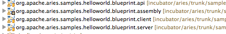

The project called org.apache.aries.samples.helloworld.blueprint.assembly contains no Java code and is just used to pull together the minimal OSGi platform that is needed to run the sample.
Expanding the org.apache.aries.samples.helloworld.blueprint.api project shows this:

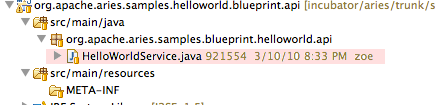

There are two interesting features of this project, the HelloWorldService.java interface and empty META-INF directory.
HelloWorldService.java is the interface for the Helloworld service.
It is good OSGi practice to keep interfaces and implementation classes in separate bundles.
This allows implementations to be replaced independently of their interfaces.
The META-INF directory is where you would expect to see a file called MANIFEST.MF.
You don’t see it because we are using a Maven plugin (look at the pom.xml) to generate the bundle manifest automatically.

Expanding the org.apache.aries.samples.helloworld.blueprint.server project shows

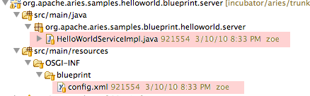

There are again two interesting files.
HelloWorldServiceImpl.java is an implementation of the HelloWorldService interface in the first blueprint-helloworld-api project.
The file config.xml is the Blueprint configuration for this package.

The org.apache.aries.samples.helloworld.blueprint.client project looks like this

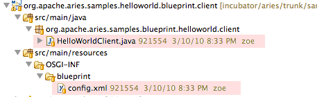

The client implementation is in HelloWorldClient.java.
The file config.xml contains the Blueprint for the client.

<a id="documentation-tutorials-blueprinthelloworldtutorial--_the_blueprint_xml"></a>
<a id="documentation-tutorials-blueprinthelloworldtutorial--the-blueprint-xml"></a>

### The Blueprint XML

Blueprint xml files contain all the information that the Blueprint runtime needs to internally wire a bundle’s components.
They also contain the information that the Blueprint runtime needs to register and locate services in the OSGi service registry.
This allows for service-based interactions between bundles.

This is a view of what the xml in the two config.xml files is describing:

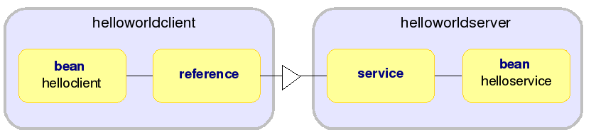

The client configuration file has one bean definition which names the Java class that it requires and gives the name of the method that will be run when the bean has been initialised.
The bean definition also describes a property, helloWorldService, which points (see the arrow) to the reference definition.
This is telling Blueprint that the bean (helloclient) needs the container to supply a service matched by the 'helloservice' reference, which in turns specifies the interface to be implemented by that service.

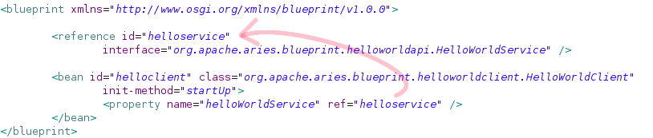

The server configuration file is similar - with one bean definition which points to the Java class that implements HelloWorldService.
The second element in this file is the service definition.
This registers a service under the HelloWorldService interface, implemented by the 'helloservice' bean.

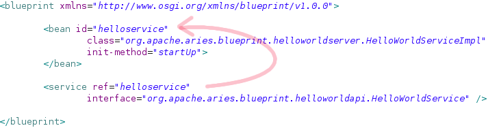

<a id="documentation-tutorials-blueprinthelloworldtutorial--_the_java_classes"></a>
<a id="documentation-tutorials-blueprinthelloworldtutorial--the-java-classes"></a>

### The Java classes

Both the Java classes are very simple, there are just a couple of minor points to make about each one.
The HelloWorldClient class looks like this:

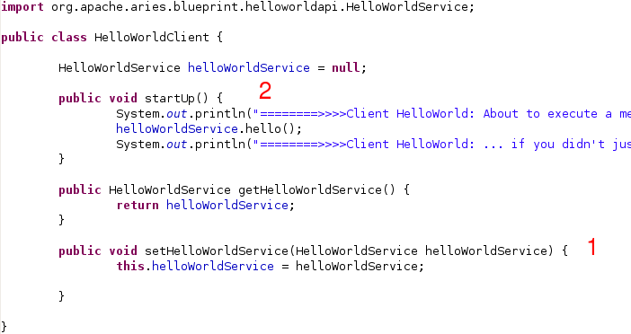

1. The setHelloWorldService() method will be called by the Blueprint container in order to inject an object implementing the HelloWorldService interface.
2. The startUp() method will be run when the bundle is started: remember that this was specified in the Blueprint.
   This method executes a hello() method which must be supplied by an implementation of HelloWorldService.
   The startUp() method in this case will only be run after dependencies have been injected.
   This is the default Blueprint behaviour.

The HelloWorldServiceImpl class is even simpler.
It has two methods:

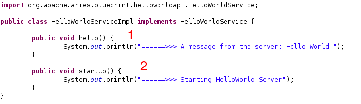

1. A startUp() method which writes a message to say that the bundle is being started
2. A hello() method which writes a 'hello' message

<a id="documentation-tutorials-blueprinthelloworldtutorial--_running_the_code"></a>
<a id="documentation-tutorials-blueprinthelloworldtutorial--running-the-code"></a>

### Running the code

The code can be run on an Equinox (or Felix) framework.
The org.apache.aries.samples.helloworld.blueprint.assembly package assembles an Equinox based platform that contains all of the OSGi bundles you need.
To start it up go to the target directory in org.apache.aries.samples.helloworld.blueprint.assembly, and from command line, type:

```
java -jar osgi-3.5.0.v20090520.jar -console
```

You will see some messages, after which you should get the 'osgi>' prompt;
sometimes you will need to press return to see it.
At the prompt, type 'ss' to see the status of the bundles:

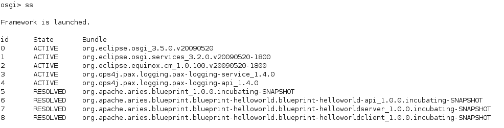

Next, start the Blueprint container bundle by typing 'start 5' at the osgi prompt.
You will see many debug messages in the code, this is because the target/configuration/config.ini specifies the message level to be DEBUG, if there are too many messages you can change this to 'INFO'.
The debug messages are quite interesting to look through in themselves, but a little beyond the scope of this tutorial.
The last debug message should indicate that a Blueprint container is running in state 'created'.
After that, start the blueprint-helloworld-api in the same way by typing 'start 6' at the prompt.

The next step is to start the blueprint-helloworld-server bundle.
In amongst the DEBUG messages you should see the single line of output from the startUp() method if the HelloWorldServiceImpl class:

```
======>>> Starting HelloWorld Server
```

At this point it is possible to see if the HelloWorldService is registered, like this:

```
osgi> services (objectClass=org.apache.aries.samples.blueprint.helloworld.api.HelloWorldService)
```

running this command will tell you that a service is registered but that nothing is using it.

Finally, start the blueprint-helloworld-client bundle.
If things have gone according to plan you should see a sequence of 3 messages from the startUp() method, the second message will be a 'hello' from HelloWorldService:

```
========>>>>Client HelloWorld: About to execute a method from the Hello World server
======>>> A message from the server: Hello World!
========>>>>Client HelloWorld: ... if you didn't just see a Hello World message something went wrong
```

If you re-run the services command above it will tell you that the blueprint-helloworldclient bundle is using the blueprint-helloworldservice.

One interesting experiment is to start the blueprint-helloworldclient bundle before the blueprint-helloworldserver bunde.
When you do this, you will see no output until the second bundle is started because the 'helloclient' bean cannot be initialised until that point.
If you wait more than five minutes by default, there will be a timeout and the client will not be initialised at all.

<a id="documentation-tutorials-blueprinthelloworldtutorial--_summary"></a>
<a id="documentation-tutorials-blueprinthelloworldtutorial--summary"></a>

### Summary

In the tutorial you have seen how to construct three simple Blueprint bundles.
The client bundle depends directly on the api and indirectly on the server bundle.
Blueprint takes care of registering a service from the server bundle so that the client bundle can use it.
You will have some appreciation of the classes and XML that form a Blueprint application, and you have seen a simple example working.
Of course, this tutorial barely touches on many of the features provided by the Aries Blueprint implementation.
Anyone keen to explore the features of Blueprint should look at this [article](http://www.ibm.com/developerworks/opensource/library/os-osgiblueprint/index.html) and continue by reading the [OSGi specification|http://www.osgi.org/Download/Release4V42] (see the 4.2 Compendium spec, section 121, "Blueprint Container Specification") and making modifications to the sample code.

---

<a id="documentation-tutorials-greetertutorial"></a>

<!-- source_url: https://aries.apache.org/documentation/documentation/tutorials/greetertutorial.html -->

<!-- page_index: 66 -->

# Greeter: Another Blueprint Tutorial

Documentation
master

- Documentation
  - [master](#index)

[Edit this Page](https://github.com/apache/aries-antora-site/edit/master/modules/ROOT/pages/documentation/tutorials/greetertutorial.adoc)

<a id="documentation-tutorials-greetertutorial--greeter:-another-blueprint-tutorial"></a>

# Greeter: Another Blueprint Tutorial

This tutorial takes a slightly longer look at Blueprint and works through the process of converting an OSGi project to use use Blueprint.
It is aimed at people who already have some familiarity with OSGi.

The tutorial is assembled and distributed as a zip or tar.gz file.
All of the documentation is included in the zip or tar.gz file.
The intention was to build a tutorial that could be used in a classroom or conference.
The only pre-reqs (in addition to the zip/tar.gz) are:

- Maven 2.2+
- Java 1.6
- A network connection

To build the tutorial zip/tar.gz you will need to:

- Check out and build Aries, see [here](https://aries.apache.org/development/buildingaries.html)
- cd trunk/tutorials/blueprint/tutorial-modules
- mvn clean install
- cd ../tutorial-assembly
- mvn assembly:assembly

This final step will generate a zip and a tar.gz file in the target directory.
To run through the tutorial, extract either the zip or tar.gz into some temporary space ([toplevel](toplevel.html) ) and point your web browser at [toplevel]/docs/instructions.html.

---

<a id="downloads-currentreleases"></a>

<!-- source_url: https://aries.apache.org/documentation/downloads/currentreleases.html -->

<!-- page_index: 67 -->

# Downloads

Documentation
master

- Documentation
  - [master](#index)

[Edit this Page](https://github.com/apache/aries-antora-site/edit/master/modules/ROOT/pages/downloads/currentreleases.adoc)

<a id="downloads-currentreleases--downloads"></a>

# Downloads

<a id="downloads-currentreleases--_general_information"></a>
<a id="downloads-currentreleases--general-information"></a>

## General information

Apache Aries modules are distributed in source and binary form.
These [KEYS](https://www.apache.org/dist/aries/KEYS) can be used to verify the releases.

All Apache Aries products are distributed under the terms of The Apache Software License (version 2.0).
See the LICENSE file included in each distribution for additional license information.

<a id="downloads-currentreleases--_official_downloads"></a>
<a id="downloads-currentreleases--official-downloads"></a>

## Official downloads

The official downloads for Apache projects are hosted at Apache.
For maven users we recommend to simply refer to the individual maven artifacts instead of downloading by hand.

[Official Aries Downloads](https://www.apache.org/dist/aries/)

<a id="downloads-currentreleases--_maven_central"></a>
<a id="downloads-currentreleases--maven-central"></a>

## Maven central

All Aries modules are released to [maven central](https://search.maven.org).

The Aries subprojects can be found at these locations

- [async](https://search.maven.org/#search|ga|1|g%3Aorg.apache.aries.async)
- [blueprint](https://search.maven.org/#search|ga|1|g%3Aorg.apache.aries.blueprint)
- [eba-maven-plugin](https://search.maven.org/#artifactdetails|org.apache.aries|eba-maven-plugin|1.0.0|maven-plugin)
- [ejb](https://search.maven.org/#search|ga|1|g%3Aorg.apache.aries.ejb)
- [jmx](https://search.maven.org/#search|ga|1|g%3Aorg.apache.aries.jmx)
- [jndi](https://search.maven.org/#search|ga|1|g%3Aorg.apache.aries.jndi)
- [jpa](https://search.maven.org/#search|ga|1|g%3Aorg.apache.aries.jpa)
- [proxy](https://search.maven.org/#search|ga|1|g%3Aorg.apache.aries.proxy)
- [quiesce](https://search.maven.org/#search|ga|1|g%3Aorg.apache.aries.quiesce)
- [subsystem](https://search.maven.org/#search|ga|1|g%3Aorg.apache.aries.subsystem)
- [testsupport](https://search.maven.org/#search|ga|1|g%3Aorg.apache.aries.testsupport)
- [transaction](https://search.maven.org/#search|ga|1|g%3Aorg.apache.aries.transaction)
- [typed events](https://search.maven.org/#search|ga|1|g%3Aorg.apache.aries.typedevent)
- [util](https://search.maven.org/#search|ga|1|g%3Aorg.apache.aries.util)
- [web](https://search.maven.org/#search|ga|1|g%3Aorg.apache.aries.web)

<a id="downloads-currentreleases--_apache_karaf"></a>
<a id="downloads-currentreleases--apache-karaf"></a>

## Apache Karaf

[Apache Karaf](https://karaf.apache.org) is a modular OSGi server that integrates very well with Aries.
Most aries subprojects can be installed into Apache Karaf using features.
For example **feature:install jndi** installs the Aries jndi modules.

<a id="downloads-currentreleases--_samples"></a>
<a id="downloads-currentreleases--samples"></a>

## Samples

The easiest way to use the samples is to download the source zip, navigate to the appropriate 'assembly' module and run mvn install to download all the released binary artifacts.
Alternatively you can build the entire source.

[Aries Samples](https://www.apache.org/dyn/closer.cgi/aries/samples-1.0.0-source-release.zip)

---

<a id="downloads-javadoc"></a>

<!-- source_url: https://aries.apache.org/documentation/downloads/javadoc.html -->

<!-- page_index: 68 -->

# 0.3 Javadocs

Documentation
master

- Documentation
  - [master](#index)

[Edit this Page](https://github.com/apache/aries-antora-site/edit/master/modules/ROOT/pages/downloads/javadoc.adoc)

<a id="downloads-javadoc--0.3-javadocs"></a>

# 0.3 Javadocs

- [Application 0.3](https://aries.apache.org/documentation/_attachments/javadocs/application/0.3/index.html)
- [Blueprint 0.3](https://aries.apache.org/documentation/_attachments/javadocs/blueprint/0.3/index.html)
- [JNDI 0.3](https://aries.apache.org/documentation/_attachments/javadocs/jndi/0.3/index.html)
- [JPA 0.3](https://aries.apache.org/documentation/_attachments/javadocs/jpa/0.3/index.html)
- [Proxy 0.3](https://aries.apache.org/documentation/_attachments/javadocs/proxy/0.3/index.html)
- [Quiesce 0.3](https://aries.apache.org/documentation/_attachments/javadocs/quiesce/0.3/index.html)
- [Util 0.3](https://aries.apache.org/documentation/_attachments/javadocs/util/0.3/index.html)
- Typed Event [Bus](https://aries.apache.org/documentation/_attachments/javadocs/typedevent/0.0.2/bus/index.html), [Remote API](https://aries.apache.org/documentation/_attachments/javadocs/typedevent/0.0.2/remote-api/index.html), [Remote SPI](https://aries.apache.org/documentation/_attachments/javadocs/typedevent/0.0.2/remote-spi/index.html), [Remote Services](https://aries.apache.org/documentation/_attachments/javadocs/typedevent/0.0.2/remote-remoteservices/index.html)

---

<a id="downloads-currentrelease"></a>

<!-- source_url: https://aries.apache.org/documentation/downloads/currentrelease.html -->

<!-- page_index: 69 -->

# Apache Aries Downloads

Documentation
master

- Documentation
  - [master](#index)

[Edit this Page](https://github.com/apache/aries-antora-site/edit/master/modules/ROOT/pages/downloads/currentrelease.adoc)

<a id="downloads-currentrelease--apache-aries-downloads"></a>

# Apache Aries Downloads

Apache Aries delivers a set of pluggable Java components enabling an enterprise OSGi application programming model.

Apache Aries modules are distributed in source and binary form.
Alternatively you may checkout the source from Subversion and build Aries yourself.
Otherwise, the releases below are available for download.
These [KEYS](http://www.apache.org/dist/aries/KEYS) can be used to verify the release archive.

All Apache Aries products are distributed under the terms of The Apache Software License (version 2.0).
See the LICENSE file included in each distribution for additional license information.

The release notes for the current release are [here](https://aries.apache.org/documentation/downloads/releasenotes.html) .

<a id="downloads-currentrelease--_samples"></a>
<a id="downloads-currentrelease--samples"></a>

## Samples

The easiest way to use the samples is to download the source zip, navigate to the appropriate 'assembly' module and run mvn install to download all the released binary artifacts.
Alternatively you can build the entire source.

|  |  |  |  |  |
| --- | --- | --- | --- | --- |
| Sub project | Module | Version | Download | Comments |
| Aries Samples |  | 1.0.0 | [zip](http://www.apache.org/dyn/closer.cgi/aries/samples-1.0.0-source-release.zip) ([asc](http://www.apache.org/dist/aries/samples-1.0.0-source-release.zip.asc), [md5](http://www.apache.org/dist/aries/samples-1.0.0-source-release.zip.md5), [sha1](http://www.apache.org/dist/aries/samples-1.0.0-source-release.zip.sha1)) | Source, ready to build |
|  | AriesTrader | 1.0.0 | - | [AriesTrader sample instructions](#downloads-ariestrader-1.0.0) |
|  | AriesTrader JDBC app | 1.0.0 | [sources](http://www.apache.org/dyn/closer.cgi/aries/org.apache.aries.samples.ariestrader.jdbc-1.0.0-sources.jar) ([asc](http://www.apache.org/dist/aries/org.apache.aries.samples.ariestrader.jdbc-1.0.0-sources.jar.asc), [md5](http://www.apache.org/dist/aries/org.apache.aries.samples.ariestrader.jdbc-1.0.0-sources.jar.md5), [sha1](http://www.apache.org/dist/aries/org.apache.aries.samples.ariestrader.jdbc-1.0.0-sources.jar.sha1)) | AriesTrader app with JDBC persistence only |
|  | AriesTrader JPA & JDBC app | 1.0.0 | [sources](http://www.apache.org/dyn/closer.cgi/aries/org.apache.aries.samples.ariestrader.all-1.0.0-sources.jar) ([asc](http://www.apache.org/dist/aries/org.apache.aries.samples.ariestrader.all-1.0.0-sources.jar.asc), [md5](http://www.apache.org/dist/aries/org.apache.aries.samples.ariestrader.all-1.0.0-sources.jar.md5), [sha1](http://www.apache.org/dist/aries/org.apache.aries.samples.ariestrader.all-1.0.0-sources.jar.sha1)) | AriesTrader app with all available persistence methods |
|  | Blog | 1.0.0 | - | [Blog Sample instructions](#downloads-blogsample-1.0.0) |
|  | Blog JDBC app | 1.0.0 | [sources](http://www.apache.org/dyn/closer.cgi/aries/org.apache.aries.samples.blog.jdbc-sources.jar-1.0.0-sources.jar) ([asc](http://www.apache.org/dist/aries/org.apache.aries.samples.blog.jdbc-sources.jar-1.0.0-sources.jar.asc), [md5](http://www.apache.org/dist/aries/org.apache.aries.samples.blog.jdbc-sources.jar-1.0.0-sources.jar.md5), [sha1](http://www.apache.org/dist/aries/org.apache.aries.samples.blog.jdbc-sources.jar-1.0.0-sources.jar.sha1)) | Blog app based on JDBC |
|  | Blog JPA app | 1.0.0 | [sources](http://www.apache.org/dyn/closer.cgi/aries/org.apache.aries.samples.blog.jpa-sources.jar-1.0.0-sources.jar) ([asc](http://www.apache.org/dist/aries/org.apache.aries.samples.blog.jpa-sources.jar-1.0.0-sources.jar.asc), [md5](http://www.apache.org/dist/aries/org.apache.aries.samples.blog.jpa-sources.jar-1.0.0-sources.jar.md5), [sha1](http://www.apache.org/dist/aries/org.apache.aries.samples.blog.jpa-sources.jar-1.0.0-sources.jar.sha1)) | Blog app based on JPA |
|  | Blueprint HelloWorld | 1.0.0 | - |  |
|  | Blueprint ID Verifier | 1.0.0 | - |  |

<a id="downloads-currentrelease--_eba_maven_plugin"></a>
<a id="downloads-currentrelease--eba-maven-plugin"></a>

## EBA Maven Plugin

|  |  |  |  |  |  |
| --- | --- | --- | --- | --- | --- |
| Sub project | Module | Version | Binary | Source | Comments |
| eba-maven-plugin |  | 1.0.0 | - | [zip](http://www.apache.org/dyn/closer.cgi/aries/eba-maven-plugin-1.0.0-source-release.zip) ([asc](http://www.apache.org/dist/aries/eba-maven-plugin-1.0.0-source-release.zip.asc), [md5](http://www.apache.org/dist/aries/eba-maven-plugin-1.0.0-source-release.zip.md5), [sha1](http://www.apache.org/dist/aries/eba-maven-plugin-1.0.0-source-release.zip.sha1)) |  |
|  | - | 1.0.0 | [jar](http://www.apache.org/dyn/closer.cgi/aries/eba-maven-plugin-1.0.0.jar) ([asc](http://www.apache.org/dist/aries/eba-maven-plugin-1.0.0.jar.asc), [md5](http://www.apache.org/dist/aries/eba-maven-plugin-1.0.0.jar.md5), [sha1](http://www.apache.org/dist/aries/eba-maven-plugin-1.0.0.jar.sha1)) | [jar](http://www.apache.org/dyn/closer.cgi/aries/eba-maven-plugin-1.0.0-sources.jar) ([asc](http://www.apache.org/dist/aries/eba-maven-plugin-1.0.0-sources.jar.asc), [md5](http://www.apache.org/dist/aries/eba-maven-plugin-1.0.0-sources.jar.md5), [sha1](http://www.apache.org/dist/aries/eba-maven-plugin-1.0.0-sources.jar.sha1)) |  |

<a id="downloads-currentrelease--_project_components"></a>
<a id="downloads-currentrelease--project-components"></a>

## Project components

|  |  |  |  |  |  |  |
| --- | --- | --- | --- | --- | --- | --- |
| Sub project | Module | Version | Binary | Source | Buildable | Comments |
| application |  | - | - | - | - |  |
|  | org.apache.aries.application | 1.0.0 | [jar](http://www.apache.org/dyn/closer.cgi/aries/org.apache.aries.application-1.0.0.jar) ([asc](http://www.apache.org/dist/aries/org.apache.aries.application-1.0.0.jar.asc), [md5](http://www.apache.org/dist/aries/org.apache.aries.application-1.0.0.jar.md5), [sha1](http://www.apache.org/dist/aries/org.apache.aries.application-1.0.0.jar.sha1)) | - | [zip](http://www.apache.org/dyn/closer.cgi/aries/org.apache.aries.application-1.0.0-source-release.zip) ([asc](http://www.apache.org/dist/aries/org.apache.aries.application-1.0.0-source-release.zip.asc), [md5](http://www.apache.org/dist/aries/org.apache.aries.application-1.0.0-source-release.zip.md5), [sha1](http://www.apache.org/dist/aries/org.apache.aries.application-1.0.0-source-release.zip.sha1)) |  |
|  | org.apache.aries.application.api | 1.0.0 | [jar](http://www.apache.org/dyn/closer.cgi/aries/org.apache.aries.application.api-1.0.0.jar) ([asc](http://www.apache.org/dist/aries/org.apache.aries.application.api-1.0.0.jar.asc), [md5](http://www.apache.org/dist/aries/org.apache.aries.application.api-1.0.0.jar.md5), [sha1](http://www.apache.org/dist/aries/org.apache.aries.application.api-1.0.0.jar.sha1)) | - | [zip](http://www.apache.org/dyn/closer.cgi/aries/org.apache.aries.application.api-1.0.0-source-release.zip) ([asc](http://www.apache.org/dist/aries/org.apache.aries.application.api-1.0.0-source-release.zip.asc), [md5](http://www.apache.org/dist/aries/org.apache.aries.application.api-1.0.0-source-release.zip.md5), [sha1](http://www.apache.org/dist/aries/org.apache.aries.application.api-1.0.0-source-release.zip.sha1)) |  |
|  | org.apache.aries.application.converters | 1.0.0 | [jar](http://www.apache.org/dyn/closer.cgi/aries/org.apache.aries.application.converters-1.0.0.jar) ([asc](http://www.apache.org/dist/aries/org.apache.aries.application.converters-1.0.0.jar.asc), [md5](http://www.apache.org/dist/aries/org.apache.aries.application.converters-1.0.0.jar.md5), [sha1](http://www.apache.org/dist/aries/org.apache.aries.application.converters-1.0.0.jar.sha1)) | - | [zip](http://www.apache.org/dyn/closer.cgi/aries/org.apache.aries.application.converters-1.0.0-source-release.zip) ([asc](http://www.apache.org/dist/aries/org.apache.aries.application.converters-1.0.0-source-release.zip.asc), [md5](http://www.apache.org/dist/aries/org.apache.aries.application.converters-1.0.0-source-release.zip.md5), [sha1](http://www.apache.org/dist/aries/org.apache.aries.application.converters-1.0.0-source-release.zip.sha1)) |  |
|  | org.apache.aries.application.default.local.platform | 1.0.0 | [jar](http://www.apache.org/dyn/closer.cgi/aries/org.apache.aries.application.default.local.platform-1.0.0.jar) ([asc](http://www.apache.org/dist/aries/org.apache.aries.application.default.local.platform-1.0.0.jar.asc), [md5](http://www.apache.org/dist/aries/org.apache.aries.application.default.local.platform-1.0.0.jar.md5), [sha1](http://www.apache.org/dist/aries/org.apache.aries.application.default.local.platform-1.0.0.jar.sha1)) | - | [zip](http://www.apache.org/dyn/closer.cgi/aries/org.apache.aries.application.default.local.platform-1.0.0-source-release.zip) ([asc](http://www.apache.org/dist/aries/org.apache.aries.application.default.local.platform-1.0.0-source-release.zip.asc), [md5](http://www.apache.org/dist/aries/org.apache.aries.application.default.local.platform-1.0.0-source-release.zip.md5), [sha1](http://www.apache.org/dist/aries/org.apache.aries.application.default.local.platform-1.0.0-source-release.zip.sha1)) |  |
|  | org.apache.aries.application.deployment.management | 1.0.0 | [jar](http://www.apache.org/dyn/closer.cgi/aries/org.apache.aries.application.deployment.management-1.0.0.jar) ([asc](http://www.apache.org/dist/aries/org.apache.aries.application.deployment.management-1.0.0.jar.asc), [md5](http://www.apache.org/dist/aries/org.apache.aries.application.deployment.management-1.0.0.jar.md5), [sha1](http://www.apache.org/dist/aries/org.apache.aries.application.deployment.management-1.0.0.jar.sha1)) | - | [zip](http://www.apache.org/dyn/closer.cgi/aries/org.apache.aries.application.deployment.management-1.0.0-source-release.zip) ([asc](http://www.apache.org/dist/aries/org.apache.aries.application.deployment.management-1.0.0-source-release.zip.asc), [md5](http://www.apache.org/dist/aries/org.apache.aries.application.deployment.management-1.0.0-source-release.zip.md5), [sha1](http://www.apache.org/dist/aries/org.apache.aries.application.deployment.management-1.0.0-source-release.zip.sha1)) |  |
|  | org.apache.aries.application.install | 1.0.0 | [jar](http://www.apache.org/dyn/closer.cgi/aries/org.apache.aries.application.install-1.0.0.jar) ([asc](http://www.apache.org/dist/aries/org.apache.aries.application.install-1.0.0.jar.asc), [md5](http://www.apache.org/dist/aries/org.apache.aries.application.install-1.0.0.jar.md5), [sha1](http://www.apache.org/dist/aries/org.apache.aries.application.install-1.0.0.jar.sha1)) | - | [zip](http://www.apache.org/dyn/closer.cgi/aries/org.apache.aries.application.install-1.0.0-source-release.zip) ([asc](http://www.apache.org/dist/aries/org.apache.aries.application.install-1.0.0-source-release.zip.asc), [md5](http://www.apache.org/dist/aries/org.apache.aries.application.install-1.0.0-source-release.zip.md5), [sha1](http://www.apache.org/dist/aries/org.apache.aries.application.install-1.0.0-source-release.zip.sha1)) |  |
|  | org.apache.aries.application.management | 1.0.0 | [jar](http://www.apache.org/dyn/closer.cgi/aries/org.apache.aries.application.management-1.0.0.jar) ([asc](http://www.apache.org/dist/aries/org.apache.aries.application.management-1.0.0.jar.asc), [md5](http://www.apache.org/dist/aries/org.apache.aries.application.management-1.0.0.jar.md5), [sha1](http://www.apache.org/dist/aries/org.apache.aries.application.management-1.0.0.jar.sha1)) | - | [zip](http://www.apache.org/dyn/closer.cgi/aries/org.apache.aries.application.management-1.0.0-source-release.zip) ([asc](http://www.apache.org/dist/aries/org.apache.aries.application.management-1.0.0-source-release.zip.asc), [md5](http://www.apache.org/dist/aries/org.apache.aries.application.management-1.0.0-source-release.zip.md5), [sha1](http://www.apache.org/dist/aries/org.apache.aries.application.management-1.0.0-source-release.zip.sha1)) |  |
|  | org.apache.aries.application.modeller | 1.0.0 | [jar](http://www.apache.org/dyn/closer.cgi/aries/org.apache.aries.application.modeller-1.0.0.jar) ([asc](http://www.apache.org/dist/aries/org.apache.aries.application.modeller-1.0.0.jar.asc), [md5](http://www.apache.org/dist/aries/org.apache.aries.application.modeller-1.0.0.jar.md5), [sha1](http://www.apache.org/dist/aries/org.apache.aries.application.modeller-1.0.0.jar.sha1)) | - | [zip](http://www.apache.org/dyn/closer.cgi/aries/org.apache.aries.application.modeller-1.0.0-source-release.zip) ([asc](http://www.apache.org/dist/aries/org.apache.aries.application.modeller-1.0.0-source-release.zip.asc), [md5](http://www.apache.org/dist/aries/org.apache.aries.application.modeller-1.0.0-source-release.zip.md5), [sha1](http://www.apache.org/dist/aries/org.apache.aries.application.modeller-1.0.0-source-release.zip.sha1)) |  |
|  | org.apache.aries.application.resolve.transform.cm | 1.0.0 | [jar](http://www.apache.org/dyn/closer.cgi/aries/org.apache.aries.application.resolve.transform.cm-1.0.0.jar) ([asc](http://www.apache.org/dist/aries/org.apache.aries.application.resolve.transform.cm-1.0.0.jar.asc), [md5](http://www.apache.org/dist/aries/org.apache.aries.application.resolve.transform.cm-1.0.0.jar.md5), [sha1](http://www.apache.org/dist/aries/org.apache.aries.application.resolve.transform.cm-1.0.0.jar.sha1)) | - | [zip](http://www.apache.org/dyn/closer.cgi/aries/org.apache.aries.application.resolve.transform.cm-1.0.0-source-release.zip) ([asc](http://www.apache.org/dist/aries/org.apache.aries.application.resolve.transform.cm-1.0.0-source-release.zip.asc), [md5](http://www.apache.org/dist/aries/org.apache.aries.application.resolve.transform.cm-1.0.0-source-release.zip.md5), [sha1](http://www.apache.org/dist/aries/org.apache.aries.application.resolve.transform.cm-1.0.0-source-release.zip.sha1)) |  |
|  | org.apache.aries.application.resolve.transform.cm.itests | 1.0.0 | [jar](http://www.apache.org/dyn/closer.cgi/aries/org.apache.aries.application.resolve.transform.cm.itests-1.0.0.jar) ([asc](http://www.apache.org/dist/aries/org.apache.aries.application.resolve.transform.cm.itests-1.0.0.jar.asc), [md5](http://www.apache.org/dist/aries/org.apache.aries.application.resolve.transform.cm.itests-1.0.0.jar.md5), [sha1](http://www.apache.org/dist/aries/org.apache.aries.application.resolve.transform.cm.itests-1.0.0.jar.sha1)) | - | [zip](http://www.apache.org/dyn/closer.cgi/aries/org.apache.aries.application.resolve.transform.cm.itests-1.0.0-source-release.zip) ([asc](http://www.apache.org/dist/aries/org.apache.aries.application.resolve.transform.cm.itests-1.0.0-source-release.zip.asc), [md5](http://www.apache.org/dist/aries/org.apache.aries.application.resolve.transform.cm.itests-1.0.0-source-release.zip.md5), [sha1](http://www.apache.org/dist/aries/org.apache.aries.application.resolve.transform.cm.itests-1.0.0-source-release.zip.sha1)) |  |
|  | org.apache.aries.application.resolver.noop | 1.0.0 | [jar](http://www.apache.org/dyn/closer.cgi/aries/org.apache.aries.application.resolver.noop-1.0.0.jar) ([asc](http://www.apache.org/dist/aries/org.apache.aries.application.resolver.noop-1.0.0.jar.asc), [md5](http://www.apache.org/dist/aries/org.apache.aries.application.resolver.noop-1.0.0.jar.md5), [sha1](http://www.apache.org/dist/aries/org.apache.aries.application.resolver.noop-1.0.0.jar.sha1)) | - | [zip](http://www.apache.org/dyn/closer.cgi/aries/org.apache.aries.application.resolver.noop-1.0.0-source-release.zip) ([asc](http://www.apache.org/dist/aries/org.apache.aries.application.resolver.noop-1.0.0-source-release.zip.asc), [md5](http://www.apache.org/dist/aries/org.apache.aries.application.resolver.noop-1.0.0-source-release.zip.md5), [sha1](http://www.apache.org/dist/aries/org.apache.aries.application.resolver.noop-1.0.0-source-release.zip.sha1)) |  |
|  | org.apache.aries.application.resolver.obr | 1.0.0 | [jar](http://www.apache.org/dyn/closer.cgi/aries/org.apache.aries.application.resolver.obr-1.0.0.jar) ([asc](http://www.apache.org/dist/aries/org.apache.aries.application.resolver.obr-1.0.0.jar.asc), [md5](http://www.apache.org/dist/aries/org.apache.aries.application.resolver.obr-1.0.0.jar.md5), [sha1](http://www.apache.org/dist/aries/org.apache.aries.application.resolver.obr-1.0.0.jar.sha1)) | - | [zip](http://www.apache.org/dyn/closer.cgi/aries/org.apache.aries.application.resolver.obr-1.0.0-source-release.zip) ([asc](http://www.apache.org/dist/aries/org.apache.aries.application.resolver.obr-1.0.0-source-release.zip.asc), [md5](http://www.apache.org/dist/aries/org.apache.aries.application.resolver.obr-1.0.0-source-release.zip.md5), [sha1](http://www.apache.org/dist/aries/org.apache.aries.application.resolver.obr-1.0.0-source-release.zip.sha1)) |  |
|  | org.apache.aries.application.runtime | 1.0.0 | [jar](http://www.apache.org/dyn/closer.cgi/aries/org.apache.aries.application.runtime-1.0.0.jar) ([asc](http://www.apache.org/dist/aries/org.apache.aries.application.runtime-1.0.0.jar.asc), [md5](http://www.apache.org/dist/aries/org.apache.aries.application.runtime-1.0.0.jar.md5), [sha1](http://www.apache.org/dist/aries/org.apache.aries.application.runtime-1.0.0.jar.sha1)) | - | [zip](http://www.apache.org/dyn/closer.cgi/aries/org.apache.aries.application.runtime-1.0.0-source-release.zip) ([asc](http://www.apache.org/dist/aries/org.apache.aries.application.runtime-1.0.0-source-release.zip.asc), [md5](http://www.apache.org/dist/aries/org.apache.aries.application.runtime-1.0.0-source-release.zip.md5), [sha1](http://www.apache.org/dist/aries/org.apache.aries.application.runtime-1.0.0-source-release.zip.sha1)) |  |
|  | org.apache.aries.application.runtime.framework | 1.0.0 | [jar](http://www.apache.org/dyn/closer.cgi/aries/org.apache.aries.application.runtime.framework-1.0.0.jar) ([asc](http://www.apache.org/dist/aries/org.apache.aries.application.runtime.framework-1.0.0.jar.asc), [md5](http://www.apache.org/dist/aries/org.apache.aries.application.runtime.framework-1.0.0.jar.md5), [sha1](http://www.apache.org/dist/aries/org.apache.aries.application.runtime.framework-1.0.0.jar.sha1)) | - | [zip](http://www.apache.org/dyn/closer.cgi/aries/org.apache.aries.application.runtime.framework-1.0.0-source-release.zip) ([asc](http://www.apache.org/dist/aries/org.apache.aries.application.runtime.framework-1.0.0-source-release.zip.asc), [md5](http://www.apache.org/dist/aries/org.apache.aries.application.runtime.framework-1.0.0-source-release.zip.md5), [sha1](http://www.apache.org/dist/aries/org.apache.aries.application.runtime.framework-1.0.0-source-release.zip.sha1)) |  |
|  | org.apache.aries.application.runtime.framework.management | 1.0.0 | [jar](http://www.apache.org/dyn/closer.cgi/aries/org.apache.aries.application.runtime.framework.management-1.0.0.jar) ([asc](http://www.apache.org/dist/aries/org.apache.aries.application.runtime.framework.management-1.0.0.jar.asc), [md5](http://www.apache.org/dist/aries/org.apache.aries.application.runtime.framework.management-1.0.0.jar.md5), [sha1](http://www.apache.org/dist/aries/org.apache.aries.application.runtime.framework.management-1.0.0.jar.sha1)) | - | [zip](http://www.apache.org/dyn/closer.cgi/aries/org.apache.aries.application.runtime.framework.management-1.0.0-source-release.zip) ([asc](http://www.apache.org/dist/aries/org.apache.aries.application.runtime.framework.management-1.0.0-source-release.zip.asc), [md5](http://www.apache.org/dist/aries/org.apache.aries.application.runtime.framework.management-1.0.0-source-release.zip.md5), [sha1](http://www.apache.org/dist/aries/org.apache.aries.application.runtime.framework.management-1.0.0-source-release.zip.sha1)) |  |
|  | org.apache.aries.application.runtime.isolated | 1.0.0 | [jar](http://www.apache.org/dyn/closer.cgi/aries/org.apache.aries.application.runtime.isolated-1.0.0.jar) ([asc](http://www.apache.org/dist/aries/org.apache.aries.application.runtime.isolated-1.0.0.jar.asc), [md5](http://www.apache.org/dist/aries/org.apache.aries.application.runtime.isolated-1.0.0.jar.md5), [sha1](http://www.apache.org/dist/aries/org.apache.aries.application.runtime.isolated-1.0.0.jar.sha1)) | - | [zip](http://www.apache.org/dyn/closer.cgi/aries/org.apache.aries.application.runtime.isolated-1.0.0-source-release.zip) ([asc](http://www.apache.org/dist/aries/org.apache.aries.application.runtime.isolated-1.0.0-source-release.zip.asc), [md5](http://www.apache.org/dist/aries/org.apache.aries.application.runtime.isolated-1.0.0-source-release.zip.md5), [sha1](http://www.apache.org/dist/aries/org.apache.aries.application.runtime.isolated-1.0.0-source-release.zip.sha1)) |  |
|  | org.apache.aries.application.runtime.isolated.itests | 1.0.0 | [jar](http://www.apache.org/dyn/closer.cgi/aries/org.apache.aries.application.runtime.isolated.itests-1.0.0.jar) ([asc](http://www.apache.org/dist/aries/org.apache.aries.application.runtime.isolated.itests-1.0.0.jar.asc), [md5](http://www.apache.org/dist/aries/org.apache.aries.application.runtime.isolated.itests-1.0.0.jar.md5), [sha1](http://www.apache.org/dist/aries/org.apache.aries.application.runtime.isolated.itests-1.0.0.jar.sha1)) | - | [zip](http://www.apache.org/dyn/closer.cgi/aries/org.apache.aries.application.runtime.isolated.itests-1.0.0-source-release.zip) ([asc](http://www.apache.org/dist/aries/org.apache.aries.application.runtime.isolated.itests-1.0.0-source-release.zip.asc), [md5](http://www.apache.org/dist/aries/org.apache.aries.application.runtime.isolated.itests-1.0.0-source-release.zip.md5), [sha1](http://www.apache.org/dist/aries/org.apache.aries.application.runtime.isolated.itests-1.0.0-source-release.zip.sha1)) |  |
|  | org.apache.aries.application.runtime.itest.interfaces | 1.0.0 | [jar](http://www.apache.org/dyn/closer.cgi/aries/org.apache.aries.application.runtime.itest.interfaces-1.0.0.jar) ([asc](http://www.apache.org/dist/aries/org.apache.aries.application.runtime.itest.interfaces-1.0.0.jar.asc), [md5](http://www.apache.org/dist/aries/org.apache.aries.application.runtime.itest.interfaces-1.0.0.jar.md5), [sha1](http://www.apache.org/dist/aries/org.apache.aries.application.runtime.itest.interfaces-1.0.0.jar.sha1)) | - | [zip](http://www.apache.org/dyn/closer.cgi/aries/org.apache.aries.application.runtime.itest.interfaces-1.0.0-source-release.zip) ([asc](http://www.apache.org/dist/aries/org.apache.aries.application.runtime.itest.interfaces-1.0.0-source-release.zip.asc), [md5](http://www.apache.org/dist/aries/org.apache.aries.application.runtime.itest.interfaces-1.0.0-source-release.zip.md5), [sha1](http://www.apache.org/dist/aries/org.apache.aries.application.runtime.itest.interfaces-1.0.0-source-release.zip.sha1)) |  |
|  | org.apache.aries.application.runtime.repository | 1.0.0 | [jar](http://www.apache.org/dyn/closer.cgi/aries/org.apache.aries.application.runtime.repository-1.0.0.jar) ([asc](http://www.apache.org/dist/aries/org.apache.aries.application.runtime.repository-1.0.0.jar.asc), [md5](http://www.apache.org/dist/aries/org.apache.aries.application.runtime.repository-1.0.0.jar.md5), [sha1](http://www.apache.org/dist/aries/org.apache.aries.application.runtime.repository-1.0.0.jar.sha1)) | - | [zip](http://www.apache.org/dyn/closer.cgi/aries/org.apache.aries.application.runtime.repository-1.0.0-source-release.zip) ([asc](http://www.apache.org/dist/aries/org.apache.aries.application.runtime.repository-1.0.0-source-release.zip.asc), [md5](http://www.apache.org/dist/aries/org.apache.aries.application.runtime.repository-1.0.0-source-release.zip.md5), [sha1](http://www.apache.org/dist/aries/org.apache.aries.application.runtime.repository-1.0.0-source-release.zip.sha1)) |  |
|  | org.apache.aries.application.tooling.repository.generator | 1.0.0 | [jar](http://www.apache.org/dyn/closer.cgi/aries/org.apache.aries.application.tooling.repository.generator-1.0.0.jar) ([asc](http://www.apache.org/dist/aries/org.apache.aries.application.tooling.repository.generator-1.0.0.jar.asc), [md5](http://www.apache.org/dist/aries/org.apache.aries.application.tooling.repository.generator-1.0.0.jar.md5), [sha1](http://www.apache.org/dist/aries/org.apache.aries.application.tooling.repository.generator-1.0.0.jar.sha1)) | - | [zip](http://www.apache.org/dyn/closer.cgi/aries/org.apache.aries.application.tooling.repository.generator-1.0.0-source-release.zip) ([asc](http://www.apache.org/dist/aries/org.apache.aries.application.tooling.repository.generator-1.0.0-source-release.zip.asc), [md5](http://www.apache.org/dist/aries/org.apache.aries.application.tooling.repository.generator-1.0.0-source-release.zip.md5), [sha1](http://www.apache.org/dist/aries/org.apache.aries.application.tooling.repository.generator-1.0.0-source-release.zip.sha1)) |  |
|  | org.apache.aries.application.utils | 1.0.0 | [jar](http://www.apache.org/dyn/closer.cgi/aries/org.apache.aries.application.utils-1.0.0.jar) ([asc](http://www.apache.org/dist/aries/org.apache.aries.application.utils-1.0.0.jar.asc), [md5](http://www.apache.org/dist/aries/org.apache.aries.application.utils-1.0.0.jar.md5), [sha1](http://www.apache.org/dist/aries/org.apache.aries.application.utils-1.0.0.jar.sha1)) | - | [zip](http://www.apache.org/dyn/closer.cgi/aries/org.apache.aries.application.utils-1.0.0-source-release.zip) ([asc](http://www.apache.org/dist/aries/org.apache.aries.application.utils-1.0.0-source-release.zip.asc), [md5](http://www.apache.org/dist/aries/org.apache.aries.application.utils-1.0.0-source-release.zip.md5), [sha1](http://www.apache.org/dist/aries/org.apache.aries.application.utils-1.0.0-source-release.zip.sha1)) |  |
| blueprint |  | - | - | - | - |  |
|  | org.apache.aries.blueprint | 1.1.0 | [jar](http://www.apache.org/dyn/closer.cgi/aries/org.apache.aries.blueprint-1.1.0.jar) ([asc](http://www.apache.org/dist/aries/org.apache.aries.blueprint-1.1.0.jar.asc), [md5](http://www.apache.org/dist/aries/org.apache.aries.blueprint-1.1.0.jar.md5), [sha1](http://www.apache.org/dist/aries/org.apache.aries.blueprint-1.1.0.jar.sha1)) | - | [zip](http://www.apache.org/dyn/closer.cgi/aries/org.apache.aries.blueprint-1.1.0-source-release.zip) ([asc](http://www.apache.org/dist/aries/org.apache.aries.blueprint-1.1.0-source-release.zip.asc), [md5](http://www.apache.org/dist/aries/org.apache.aries.blueprint-1.1.0-source-release.zip.md5), [sha1](http://www.apache.org/dist/aries/org.apache.aries.blueprint-1.1.0-source-release.zip.sha1)) |  |
|  | org.apache.aries.blueprint.annotation.api | 1.0.0 | [jar](http://www.apache.org/dyn/closer.cgi/aries/org.apache.aries.blueprint.annotation.api-1.0.0.jar) ([asc](http://www.apache.org/dist/aries/org.apache.aries.blueprint.annotation.api-1.0.0.jar.asc), [md5](http://www.apache.org/dist/aries/org.apache.aries.blueprint.annotation.api-1.0.0.jar.md5), [sha1](http://www.apache.org/dist/aries/org.apache.aries.blueprint.annotation.api-1.0.0.jar.sha1)) | - | [zip](http://www.apache.org/dyn/closer.cgi/aries/org.apache.aries.blueprint.annotation.api-1.0.0-source-release.zip) ([asc](http://www.apache.org/dist/aries/org.apache.aries.blueprint.annotation.api-1.0.0-source-release.zip.asc), [md5](http://www.apache.org/dist/aries/org.apache.aries.blueprint.annotation.api-1.0.0-source-release.zip.md5), [sha1](http://www.apache.org/dist/aries/org.apache.aries.blueprint.annotation.api-1.0.0-source-release.zip.sha1)) |  |
|  | org.apache.aries.blueprint.annotation.impl | 1.0.0 | [jar](http://www.apache.org/dyn/closer.cgi/aries/org.apache.aries.blueprint.annotation.impl-1.0.0.jar) ([asc](http://www.apache.org/dist/aries/org.apache.aries.blueprint.annotation.impl-1.0.0.jar.asc), [md5](http://www.apache.org/dist/aries/org.apache.aries.blueprint.annotation.impl-1.0.0.jar.md5), [sha1](http://www.apache.org/dist/aries/org.apache.aries.blueprint.annotation.impl-1.0.0.jar.sha1)) | - | [zip](http://www.apache.org/dyn/closer.cgi/aries/org.apache.aries.blueprint.annotation.impl-1.0.0-source-release.zip) ([asc](http://www.apache.org/dist/aries/org.apache.aries.blueprint.annotation.impl-1.0.0-source-release.zip.asc), [md5](http://www.apache.org/dist/aries/org.apache.aries.blueprint.annotation.impl-1.0.0-source-release.zip.md5), [sha1](http://www.apache.org/dist/aries/org.apache.aries.blueprint.annotation.impl-1.0.0-source-release.zip.sha1)) |  |
|  | org.apache.aries.blueprint.annotation.itests | 1.0.0 | [jar](http://www.apache.org/dyn/closer.cgi/aries/org.apache.aries.blueprint.annotation.itests-1.0.0.jar) ([asc](http://www.apache.org/dist/aries/org.apache.aries.blueprint.annotation.itests-1.0.0.jar.asc), [md5](http://www.apache.org/dist/aries/org.apache.aries.blueprint.annotation.itests-1.0.0.jar.md5), [sha1](http://www.apache.org/dist/aries/org.apache.aries.blueprint.annotation.itests-1.0.0.jar.sha1)) | - | [zip](http://www.apache.org/dyn/closer.cgi/aries/org.apache.aries.blueprint.annotation.itests-1.0.0-source-release.zip) ([asc](http://www.apache.org/dist/aries/org.apache.aries.blueprint.annotation.itests-1.0.0-source-release.zip.asc), [md5](http://www.apache.org/dist/aries/org.apache.aries.blueprint.annotation.itests-1.0.0-source-release.zip.md5), [sha1](http://www.apache.org/dist/aries/org.apache.aries.blueprint.annotation.itests-1.0.0-source-release.zip.sha1)) |  |
|  | org.apache.aries.blueprint.api | 1.0.0 | [jar](http://www.apache.org/dyn/closer.cgi/aries/org.apache.aries.blueprint.api-1.0.0.jar) ([asc](http://www.apache.org/dist/aries/org.apache.aries.blueprint.api-1.0.0.jar.asc), [md5](http://www.apache.org/dist/aries/org.apache.aries.blueprint.api-1.0.0.jar.md5), [sha1](http://www.apache.org/dist/aries/org.apache.aries.blueprint.api-1.0.0.jar.sha1)) | - | [zip](http://www.apache.org/dyn/closer.cgi/aries/org.apache.aries.blueprint.api-1.0.0-source-release.zip) ([asc](http://www.apache.org/dist/aries/org.apache.aries.blueprint.api-1.0.0-source-release.zip.asc), [md5](http://www.apache.org/dist/aries/org.apache.aries.blueprint.api-1.0.0-source-release.zip.md5), [sha1](http://www.apache.org/dist/aries/org.apache.aries.blueprint.api-1.0.0-source-release.zip.sha1)) |  |
|  | org.apache.aries.blueprint.cm | 1.0.7 | [jar](http://www.apache.org/dyn/closer.cgi/aries/org.apache.aries.blueprint.cm-1.0.7.jar) ([asc](http://www.apache.org/dist/aries/org.apache.aries.blueprint.cm-1.0.7.jar.asc), [md5](http://www.apache.org/dist/aries/org.apache.aries.blueprint.cm-1.0.7.jar.md5), [sha1](http://www.apache.org/dist/aries/org.apache.aries.blueprint.cm-1.0.7.jar.sha1)) | [jar](http://www.apache.org/dyn/closer.cgi/aries/org.apache.aries.blueprint.cm-1.0.7-sources.jar) ([asc](http://www.apache.org/dist/aries/org.apache.aries.blueprint.cm-1.0.7-sources.jar.asc), [md5](http://www.apache.org/dist/aries/org.apache.aries.blueprint.cm-1.0.7-sources.jar.md5), [sha1](http://www.apache.org/dist/aries/org.apache.aries.blueprint.cm-1.0.7-sources.jar.sha1)) | [zip](http://www.apache.org/dyn/closer.cgi/aries/org.apache.aries.blueprint.cm-1.0.7-source-release.zip) ([asc](http://www.apache.org/dist/aries/org.apache.aries.blueprint.cm-1.0.7-source-release.zip.asc), [md5](http://www.apache.org/dist/aries/org.apache.aries.blueprint.cm-1.0.7-source-release.zip.md5), [sha1](http://www.apache.org/dist/aries/org.apache.aries.blueprint.cm-1.0.7-source-release.zip.sha1)) |  |
|  | org.apache.aries.blueprint.compatibility | 1.0.0 | [jar](http://www.apache.org/dyn/closer.cgi/aries/org.apache.aries.blueprint.compatibility-1.0.0.jar) ([asc](http://www.apache.org/dist/aries/org.apache.aries.blueprint.compatibility-1.0.0.jar.asc), [md5](http://www.apache.org/dist/aries/org.apache.aries.blueprint.compatibility-1.0.0.jar.md5), [sha1](http://www.apache.org/dist/aries/org.apache.aries.blueprint.compatibility-1.0.0.jar.sha1)) | - | [zip](http://www.apache.org/dyn/closer.cgi/aries/org.apache.aries.blueprint.compatibility-1.0.0-source-release.zip) ([asc](http://www.apache.org/dist/aries/org.apache.aries.blueprint.compatibility-1.0.0-source-release.zip.asc), [md5](http://www.apache.org/dist/aries/org.apache.aries.blueprint.compatibility-1.0.0-source-release.zip.md5), [sha1](http://www.apache.org/dist/aries/org.apache.aries.blueprint.compatibility-1.0.0-source-release.zip.sha1)) |  |
|  | org.apache.aries.blueprint.core | 1.4.4 | [jar](http://www.apache.org/dyn/closer.cgi/aries/org.apache.aries.blueprint.core-1.4.4.jar) ([asc](http://www.apache.org/dist/aries/org.apache.aries.blueprint.core-1.4.4.jar.asc), [md5](http://www.apache.org/dist/aries/org.apache.aries.blueprint.core-1.4.4.jar.md5), [sha1](http://www.apache.org/dist/aries/org.apache.aries.blueprint.core-1.4.4.jar.sha1)) | [jar](http://www.apache.org/dyn/closer.cgi/aries/org.apache.aries.blueprint.core-1.4.4-sources.jar) ([asc](http://www.apache.org/dist/aries/org.apache.aries.blueprint.core-1.4.4-sources.jar.asc), [md5](http://www.apache.org/dist/aries/org.apache.aries.blueprint.core-1.4.4-sources.jar.md5), [sha1](http://www.apache.org/dist/aries/org.apache.aries.blueprint.core-1.4.4-sources.jar.sha1)) | [zip](http://www.apache.org/dyn/closer.cgi/aries/org.apache.aries.blueprint.core-1.4.4-source-release.zip) ([asc](http://www.apache.org/dist/aries/org.apache.aries.blueprint.core-1.4.4-source-release.zip.asc), [md5](http://www.apache.org/dist/aries/org.apache.aries.blueprint.core-1.4.4-source-release.zip.md5), [sha1](http://www.apache.org/dist/aries/org.apache.aries.blueprint.core-1.4.4-source-release.zip.sha1)) |  |
|  | org.apache.aries.blueprint.core.compatibility | 1.0.0 | [jar](http://www.apache.org/dyn/closer.cgi/aries/org.apache.aries.blueprint.core.compatibility-1.0.0.jar) ([asc](http://www.apache.org/dist/aries/org.apache.aries.blueprint.core.compatibility-1.0.0.jar.asc), [md5](http://www.apache.org/dist/aries/org.apache.aries.blueprint.core.compatibility-1.0.0.jar.md5), [sha1](http://www.apache.org/dist/aries/org.apache.aries.blueprint.core.compatibility-1.0.0.jar.sha1)) | - | [zip](http://www.apache.org/dyn/closer.cgi/aries/org.apache.aries.blueprint.core.compatibility-1.0.0-source-release.zip) ([asc](http://www.apache.org/dist/aries/org.apache.aries.blueprint.core.compatibility-1.0.0-source-release.zip.asc), [md5](http://www.apache.org/dist/aries/org.apache.aries.blueprint.core.compatibility-1.0.0-source-release.zip.md5), [sha1](http://www.apache.org/dist/aries/org.apache.aries.blueprint.core.compatibility-1.0.0-source-release.zip.sha1)) |  |
|  | org.apache.aries.blueprint.itests | 1.0.0 | [jar](http://www.apache.org/dyn/closer.cgi/aries/org.apache.aries.blueprint.itests-1.0.0.jar) ([asc](http://www.apache.org/dist/aries/org.apache.aries.blueprint.itests-1.0.0.jar.asc), [md5](http://www.apache.org/dist/aries/org.apache.aries.blueprint.itests-1.0.0.jar.md5), [sha1](http://www.apache.org/dist/aries/org.apache.aries.blueprint.itests-1.0.0.jar.sha1)) | - | [zip](http://www.apache.org/dyn/closer.cgi/aries/org.apache.aries.blueprint.itests-1.0.0-source-release.zip) ([asc](http://www.apache.org/dist/aries/org.apache.aries.blueprint.itests-1.0.0-source-release.zip.asc), [md5](http://www.apache.org/dist/aries/org.apache.aries.blueprint.itests-1.0.0-source-release.zip.md5), [sha1](http://www.apache.org/dist/aries/org.apache.aries.blueprint.itests-1.0.0-source-release.zip.sha1)) |  |
|  | org.apache.aries.blueprint.jexl.evaluator | 1.0.0 | [jar](http://www.apache.org/dyn/closer.cgi/aries/org.apache.aries.blueprint.jexl.evaluator-1.0.0.jar) ([asc](http://www.apache.org/dist/aries/org.apache.aries.blueprint.jexl.evaluator-1.0.0.jar.asc), [md5](http://www.apache.org/dist/aries/org.apache.aries.blueprint.jexl.evaluator-1.0.0.jar.md5), [sha1](http://www.apache.org/dist/aries/org.apache.aries.blueprint.jexl.evaluator-1.0.0.jar.sha1)) | - | [zip](http://www.apache.org/dyn/closer.cgi/aries/org.apache.aries.blueprint.jexl.evaluator-1.0.0-source-release.zip) ([asc](http://www.apache.org/dist/aries/org.apache.aries.blueprint.jexl.evaluator-1.0.0-source-release.zip.asc), [md5](http://www.apache.org/dist/aries/org.apache.aries.blueprint.jexl.evaluator-1.0.0-source-release.zip.md5), [sha1](http://www.apache.org/dist/aries/org.apache.aries.blueprint.jexl.evaluator-1.0.0-source-release.zip.sha1)) |  |
|  | org.apache.aries.blueprint.noosgi | 1.1.0 | [jar](http://www.apache.org/dyn/closer.cgi/aries/org.apache.aries.blueprint.noosgi-1.1.0.jar) ([asc](http://www.apache.org/dist/aries/org.apache.aries.blueprint.noosgi-1.1.0.jar.asc), [md5](http://www.apache.org/dist/aries/org.apache.aries.blueprint.noosgi-1.1.0.jar.md5), [sha1](http://www.apache.org/dist/aries/org.apache.aries.blueprint.noosgi-1.1.0.jar.sha1)) | - | [zip](http://www.apache.org/dyn/closer.cgi/aries/org.apache.aries.blueprint.noosgi-1.1.0-source-release.zip) ([asc](http://www.apache.org/dist/aries/org.apache.aries.blueprint.noosgi-1.1.0-source-release.zip.asc), [md5](http://www.apache.org/dist/aries/org.apache.aries.blueprint.noosgi-1.1.0-source-release.zip.md5), [sha1](http://www.apache.org/dist/aries/org.apache.aries.blueprint.noosgi-1.1.0-source-release.zip.sha1)) |  |
|  | org.apache.aries.blueprint.sample | 1.0.0 | [jar](http://www.apache.org/dyn/closer.cgi/aries/org.apache.aries.blueprint.sample-1.0.0.jar) ([asc](http://www.apache.org/dist/aries/org.apache.aries.blueprint.sample-1.0.0.jar.asc), [md5](http://www.apache.org/dist/aries/org.apache.aries.blueprint.sample-1.0.0.jar.md5), [sha1](http://www.apache.org/dist/aries/org.apache.aries.blueprint.sample-1.0.0.jar.sha1)) | - | [zip](http://www.apache.org/dyn/closer.cgi/aries/org.apache.aries.blueprint.sample-1.0.0-source-release.zip) ([asc](http://www.apache.org/dist/aries/org.apache.aries.blueprint.sample-1.0.0-source-release.zip.asc), [md5](http://www.apache.org/dist/aries/org.apache.aries.blueprint.sample-1.0.0-source-release.zip.md5), [sha1](http://www.apache.org/dist/aries/org.apache.aries.blueprint.sample-1.0.0-source-release.zip.sha1)) |  |
|  | org.apache.aries.blueprint.sample-annotation | 1.0.0 | [jar](http://www.apache.org/dyn/closer.cgi/aries/org.apache.aries.blueprint.sample-annotation-1.0.0.jar) ([asc](http://www.apache.org/dist/aries/org.apache.aries.blueprint.sample-annotation-1.0.0.jar.asc), [md5](http://www.apache.org/dist/aries/org.apache.aries.blueprint.sample-annotation-1.0.0.jar.md5), [sha1](http://www.apache.org/dist/aries/org.apache.aries.blueprint.sample-annotation-1.0.0.jar.sha1)) | - | [zip](http://www.apache.org/dyn/closer.cgi/aries/org.apache.aries.blueprint.sample-annotation-1.0.0-source-release.zip) ([asc](http://www.apache.org/dist/aries/org.apache.aries.blueprint.sample-annotation-1.0.0-source-release.zip.asc), [md5](http://www.apache.org/dist/aries/org.apache.aries.blueprint.sample-annotation-1.0.0-source-release.zip.md5), [sha1](http://www.apache.org/dist/aries/org.apache.aries.blueprint.sample-annotation-1.0.0-source-release.zip.sha1)) |  |
|  | org.apache.aries.blueprint.sample-fragment | 1.0.0 | [jar](http://www.apache.org/dyn/closer.cgi/aries/org.apache.aries.blueprint.sample-fragment-1.0.0.jar) ([asc](http://www.apache.org/dist/aries/org.apache.aries.blueprint.sample-fragment-1.0.0.jar.asc), [md5](http://www.apache.org/dist/aries/org.apache.aries.blueprint.sample-fragment-1.0.0.jar.md5), [sha1](http://www.apache.org/dist/aries/org.apache.aries.blueprint.sample-fragment-1.0.0.jar.sha1)) | - | [zip](http://www.apache.org/dyn/closer.cgi/aries/org.apache.aries.blueprint.sample-fragment-1.0.0-source-release.zip) ([asc](http://www.apache.org/dist/aries/org.apache.aries.blueprint.sample-fragment-1.0.0-source-release.zip.asc), [md5](http://www.apache.org/dist/aries/org.apache.aries.blueprint.sample-fragment-1.0.0-source-release.zip.md5), [sha1](http://www.apache.org/dist/aries/org.apache.aries.blueprint.sample-fragment-1.0.0-source-release.zip.sha1)) |  |
|  | org.apache.aries.blueprint.testbundlea | 1.0.0 | [jar](http://www.apache.org/dyn/closer.cgi/aries/org.apache.aries.blueprint.testbundlea-1.0.0.jar) ([asc](http://www.apache.org/dist/aries/org.apache.aries.blueprint.testbundlea-1.0.0.jar.asc), [md5](http://www.apache.org/dist/aries/org.apache.aries.blueprint.testbundlea-1.0.0.jar.md5), [sha1](http://www.apache.org/dist/aries/org.apache.aries.blueprint.testbundlea-1.0.0.jar.sha1)) | - | [zip](http://www.apache.org/dyn/closer.cgi/aries/org.apache.aries.blueprint.testbundlea-1.0.0-source-release.zip) ([asc](http://www.apache.org/dist/aries/org.apache.aries.blueprint.testbundlea-1.0.0-source-release.zip.asc), [md5](http://www.apache.org/dist/aries/org.apache.aries.blueprint.testbundlea-1.0.0-source-release.zip.md5), [sha1](http://www.apache.org/dist/aries/org.apache.aries.blueprint.testbundlea-1.0.0-source-release.zip.sha1)) |  |
|  | org.apache.aries.blueprint.testbundleb | 1.0.0 | [jar](http://www.apache.org/dyn/closer.cgi/aries/org.apache.aries.blueprint.testbundleb-1.0.0.jar) ([asc](http://www.apache.org/dist/aries/org.apache.aries.blueprint.testbundleb-1.0.0.jar.asc), [md5](http://www.apache.org/dist/aries/org.apache.aries.blueprint.testbundleb-1.0.0.jar.md5), [sha1](http://www.apache.org/dist/aries/org.apache.aries.blueprint.testbundleb-1.0.0.jar.sha1)) | - | [zip](http://www.apache.org/dyn/closer.cgi/aries/org.apache.aries.blueprint.testbundleb-1.0.0-source-release.zip) ([asc](http://www.apache.org/dist/aries/org.apache.aries.blueprint.testbundleb-1.0.0-source-release.zip.asc), [md5](http://www.apache.org/dist/aries/org.apache.aries.blueprint.testbundleb-1.0.0-source-release.zip.md5), [sha1](http://www.apache.org/dist/aries/org.apache.aries.blueprint.testbundleb-1.0.0-source-release.zip.sha1)) |  |
|  | org.apache.aries.blueprint.testquiescebundle | 1.0.0 | [jar](http://www.apache.org/dyn/closer.cgi/aries/org.apache.aries.blueprint.testquiescebundle-1.0.0.jar) ([asc](http://www.apache.org/dist/aries/org.apache.aries.blueprint.testquiescebundle-1.0.0.jar.asc), [md5](http://www.apache.org/dist/aries/org.apache.aries.blueprint.testquiescebundle-1.0.0.jar.md5), [sha1](http://www.apache.org/dist/aries/org.apache.aries.blueprint.testquiescebundle-1.0.0.jar.sha1)) | - | [zip](http://www.apache.org/dyn/closer.cgi/aries/org.apache.aries.blueprint.testquiescebundle-1.0.0-source-release.zip) ([asc](http://www.apache.org/dist/aries/org.apache.aries.blueprint.testquiescebundle-1.0.0-source-release.zip.asc), [md5](http://www.apache.org/dist/aries/org.apache.aries.blueprint.testquiescebundle-1.0.0-source-release.zip.md5), [sha1](http://www.apache.org/dist/aries/org.apache.aries.blueprint.testquiescebundle-1.0.0-source-release.zip.sha1)) |  |
|  | org.apache.aries.blueprint.web | 1.1.0 | [jar](http://www.apache.org/dyn/closer.cgi/aries/org.apache.aries.blueprint.web-1.1.0.jar) ([asc](http://www.apache.org/dist/aries/org.apache.aries.blueprint.web-1.1.0.jar.asc), [md5](http://www.apache.org/dist/aries/org.apache.aries.blueprint.web-1.1.0.jar.md5), [sha1](http://www.apache.org/dist/aries/org.apache.aries.blueprint.web-1.1.0.jar.sha1)) | - | [zip](http://www.apache.org/dyn/closer.cgi/aries/org.apache.aries.blueprint.web-1.1.0-source-release.zip) ([asc](http://www.apache.org/dist/aries/org.apache.aries.blueprint.web-1.1.0-source-release.zip.asc), [md5](http://www.apache.org/dist/aries/org.apache.aries.blueprint.web-1.1.0-source-release.zip.md5), [sha1](http://www.apache.org/dist/aries/org.apache.aries.blueprint.web-1.1.0-source-release.zip.sha1)) |  |
| ejb |  | - | - | - | - |  |
|  | org.apache.aries.ejb.modeller | 1.0.0 | [jar](http://www.apache.org/dyn/closer.cgi/aries/org.apache.aries.ejb.modeller-1.0.0.jar) ([asc](http://www.apache.org/dist/aries/org.apache.aries.ejb.modeller-1.0.0.jar.asc), [md5](http://www.apache.org/dist/aries/org.apache.aries.ejb.modeller-1.0.0.jar.md5), [sha1](http://www.apache.org/dist/aries/org.apache.aries.ejb.modeller-1.0.0.jar.sha1)) | - | [zip](http://www.apache.org/dyn/closer.cgi/aries/org.apache.aries.ejb.modeller-1.0.0-source-release.zip) ([asc](http://www.apache.org/dist/aries/org.apache.aries.ejb.modeller-1.0.0-source-release.zip.asc), [md5](http://www.apache.org/dist/aries/org.apache.aries.ejb.modeller-1.0.0-source-release.zip.md5), [sha1](http://www.apache.org/dist/aries/org.apache.aries.ejb.modeller-1.0.0-source-release.zip.sha1)) |  |
|  | org.apache.aries.ejb.openejb.extender | 1.0.0 | [jar](http://www.apache.org/dyn/closer.cgi/aries/org.apache.aries.ejb.openejb.extender-1.0.0.jar) ([asc](http://www.apache.org/dist/aries/org.apache.aries.ejb.openejb.extender-1.0.0.jar.asc), [md5](http://www.apache.org/dist/aries/org.apache.aries.ejb.openejb.extender-1.0.0.jar.md5), [sha1](http://www.apache.org/dist/aries/org.apache.aries.ejb.openejb.extender-1.0.0.jar.sha1)) | - | [zip](http://www.apache.org/dyn/closer.cgi/aries/org.apache.aries.ejb.openejb.extender-1.0.0-source-release.zip) ([asc](http://www.apache.org/dist/aries/org.apache.aries.ejb.openejb.extender-1.0.0-source-release.zip.asc), [md5](http://www.apache.org/dist/aries/org.apache.aries.ejb.openejb.extender-1.0.0-source-release.zip.md5), [sha1](http://www.apache.org/dist/aries/org.apache.aries.ejb.openejb.extender-1.0.0-source-release.zip.sha1)) |  |
| jmx |  | - | - | - | - |  |
|  | org.apache.aries.jmx | 1.1.0 | [jar](http://www.apache.org/dyn/closer.cgi/aries/org.apache.aries.jmx-1.1.0.jar) ([asc](http://www.apache.org/dist/aries/org.apache.aries.jmx-1.1.0.jar.asc), [md5](http://www.apache.org/dist/aries/org.apache.aries.jmx-1.1.0.jar.md5), [sha1](http://www.apache.org/dist/aries/org.apache.aries.jmx-1.1.0.jar.sha1)) | - | [zip](http://www.apache.org/dyn/closer.cgi/aries/org.apache.aries.jmx-1.1.0-source-release.zip) ([asc](http://www.apache.org/dist/aries/org.apache.aries.jmx-1.1.0-source-release.zip.asc), [md5](http://www.apache.org/dist/aries/org.apache.aries.jmx-1.1.0-source-release.zip.md5), [sha1](http://www.apache.org/dist/aries/org.apache.aries.jmx-1.1.0-source-release.zip.sha1)) |  |
|  | org.apache.aries.jmx.api | 1.1.0 | [jar](http://www.apache.org/dyn/closer.cgi/aries/org.apache.aries.jmx.api-1.1.0.jar) ([asc](http://www.apache.org/dist/aries/org.apache.aries.jmx.api-1.1.0.jar.asc), [md5](http://www.apache.org/dist/aries/org.apache.aries.jmx.api-1.1.0.jar.md5), [sha1](http://www.apache.org/dist/aries/org.apache.aries.jmx.api-1.1.0.jar.sha1)) | - | [zip](http://www.apache.org/dyn/closer.cgi/aries/org.apache.aries.jmx.api-1.1.0-source-release.zip) ([asc](http://www.apache.org/dist/aries/org.apache.aries.jmx.api-1.1.0-source-release.zip.asc), [md5](http://www.apache.org/dist/aries/org.apache.aries.jmx.api-1.1.0-source-release.zip.md5), [sha1](http://www.apache.org/dist/aries/org.apache.aries.jmx.api-1.1.0-source-release.zip.sha1)) |  |
|  | org.apache.aries.jmx.blueprint | 1.1.0 | [jar](http://www.apache.org/dyn/closer.cgi/aries/org.apache.aries.jmx.blueprint-1.1.0.jar) ([asc](http://www.apache.org/dist/aries/org.apache.aries.jmx.blueprint-1.1.0.jar.asc), [md5](http://www.apache.org/dist/aries/org.apache.aries.jmx.blueprint-1.1.0.jar.md5), [sha1](http://www.apache.org/dist/aries/org.apache.aries.jmx.blueprint-1.1.0.jar.sha1)) | - | [zip](http://www.apache.org/dyn/closer.cgi/aries/org.apache.aries.jmx.blueprint-1.1.0-source-release.zip) ([asc](http://www.apache.org/dist/aries/org.apache.aries.jmx.blueprint-1.1.0-source-release.zip.asc), [md5](http://www.apache.org/dist/aries/org.apache.aries.jmx.blueprint-1.1.0-source-release.zip.md5), [sha1](http://www.apache.org/dist/aries/org.apache.aries.jmx.blueprint-1.1.0-source-release.zip.sha1)) |  |
|  | org.apache.aries.jmx.blueprint.api | 1.1.0 | [jar](http://www.apache.org/dyn/closer.cgi/aries/org.apache.aries.jmx.blueprint.api-1.1.0.jar) ([asc](http://www.apache.org/dist/aries/org.apache.aries.jmx.blueprint.api-1.1.0.jar.asc), [md5](http://www.apache.org/dist/aries/org.apache.aries.jmx.blueprint.api-1.1.0.jar.md5), [sha1](http://www.apache.org/dist/aries/org.apache.aries.jmx.blueprint.api-1.1.0.jar.sha1)) | - | [zip](http://www.apache.org/dyn/closer.cgi/aries/org.apache.aries.jmx.blueprint.api-1.1.0-source-release.zip) ([asc](http://www.apache.org/dist/aries/org.apache.aries.jmx.blueprint.api-1.1.0-source-release.zip.asc), [md5](http://www.apache.org/dist/aries/org.apache.aries.jmx.blueprint.api-1.1.0-source-release.zip.md5), [sha1](http://www.apache.org/dist/aries/org.apache.aries.jmx.blueprint.api-1.1.0-source-release.zip.sha1)) |  |
|  | org.apache.aries.jmx.blueprint.core | 1.1.0 | [jar](http://www.apache.org/dyn/closer.cgi/aries/org.apache.aries.jmx.blueprint.core-1.1.0.jar) ([asc](http://www.apache.org/dist/aries/org.apache.aries.jmx.blueprint.core-1.1.0.jar.asc), [md5](http://www.apache.org/dist/aries/org.apache.aries.jmx.blueprint.core-1.1.0.jar.md5), [sha1](http://www.apache.org/dist/aries/org.apache.aries.jmx.blueprint.core-1.1.0.jar.sha1)) | - | [zip](http://www.apache.org/dyn/closer.cgi/aries/org.apache.aries.jmx.blueprint.core-1.1.0-source-release.zip) ([asc](http://www.apache.org/dist/aries/org.apache.aries.jmx.blueprint.core-1.1.0-source-release.zip.asc), [md5](http://www.apache.org/dist/aries/org.apache.aries.jmx.blueprint.core-1.1.0-source-release.zip.md5), [sha1](http://www.apache.org/dist/aries/org.apache.aries.jmx.blueprint.core-1.1.0-source-release.zip.sha1)) |  |
|  | org.apache.aries.jmx.core | 1.1.0 | [jar](http://www.apache.org/dyn/closer.cgi/aries/org.apache.aries.jmx.core-1.1.0.jar) ([asc](http://www.apache.org/dist/aries/org.apache.aries.jmx.core-1.1.0.jar.asc), [md5](http://www.apache.org/dist/aries/org.apache.aries.jmx.core-1.1.0.jar.md5), [sha1](http://www.apache.org/dist/aries/org.apache.aries.jmx.core-1.1.0.jar.sha1)) | - | [zip](http://www.apache.org/dyn/closer.cgi/aries/org.apache.aries.jmx.core-1.1.0-source-release.zip) ([asc](http://www.apache.org/dist/aries/org.apache.aries.jmx.core-1.1.0-source-release.zip.asc), [md5](http://www.apache.org/dist/aries/org.apache.aries.jmx.core-1.1.0-source-release.zip.md5), [sha1](http://www.apache.org/dist/aries/org.apache.aries.jmx.core-1.1.0-source-release.zip.sha1)) |  |
|  | org.apache.aries.jmx.core.whiteboard | 1.1.0 | [jar](http://www.apache.org/dyn/closer.cgi/aries/org.apache.aries.jmx.core.whiteboard-1.1.0.jar) ([asc](http://www.apache.org/dist/aries/org.apache.aries.jmx.core.whiteboard-1.1.0.jar.asc), [md5](http://www.apache.org/dist/aries/org.apache.aries.jmx.core.whiteboard-1.1.0.jar.md5), [sha1](http://www.apache.org/dist/aries/org.apache.aries.jmx.core.whiteboard-1.1.0.jar.sha1)) | - | [zip](http://www.apache.org/dyn/closer.cgi/aries/org.apache.aries.jmx.core.whiteboard-1.1.0-source-release.zip) ([asc](http://www.apache.org/dist/aries/org.apache.aries.jmx.core.whiteboard-1.1.0-source-release.zip.asc), [md5](http://www.apache.org/dist/aries/org.apache.aries.jmx.core.whiteboard-1.1.0-source-release.zip.md5), [sha1](http://www.apache.org/dist/aries/org.apache.aries.jmx.core.whiteboard-1.1.0-source-release.zip.sha1)) |  |
|  | org.apache.aries.jmx.itests | 1.0.0 | [jar](http://www.apache.org/dyn/closer.cgi/aries/org.apache.aries.jmx.itests-1.0.0.jar) ([asc](http://www.apache.org/dist/aries/org.apache.aries.jmx.itests-1.0.0.jar.asc), [md5](http://www.apache.org/dist/aries/org.apache.aries.jmx.itests-1.0.0.jar.md5), [sha1](http://www.apache.org/dist/aries/org.apache.aries.jmx.itests-1.0.0.jar.sha1)) | - | [zip](http://www.apache.org/dyn/closer.cgi/aries/org.apache.aries.jmx.itests-1.0.0-source-release.zip) ([asc](http://www.apache.org/dist/aries/org.apache.aries.jmx.itests-1.0.0-source-release.zip.asc), [md5](http://www.apache.org/dist/aries/org.apache.aries.jmx.itests-1.0.0-source-release.zip.md5), [sha1](http://www.apache.org/dist/aries/org.apache.aries.jmx.itests-1.0.0-source-release.zip.sha1)) |  |
|  | org.apache.aries.jmx.whiteboard | 1.0.0 | [jar](http://www.apache.org/dyn/closer.cgi/aries/org.apache.aries.jmx.whiteboard-1.0.0.jar) ([asc](http://www.apache.org/dist/aries/org.apache.aries.jmx.whiteboard-1.0.0.jar.asc), [md5](http://www.apache.org/dist/aries/org.apache.aries.jmx.whiteboard-1.0.0.jar.md5), [sha1](http://www.apache.org/dist/aries/org.apache.aries.jmx.whiteboard-1.0.0.jar.sha1)) | - | [zip](http://www.apache.org/dyn/closer.cgi/aries/org.apache.aries.jmx.whiteboard-1.0.0-source-release.zip) ([asc](http://www.apache.org/dist/aries/org.apache.aries.jmx.whiteboard-1.0.0-source-release.zip.asc), [md5](http://www.apache.org/dist/aries/org.apache.aries.jmx.whiteboard-1.0.0-source-release.zip.md5), [sha1](http://www.apache.org/dist/aries/org.apache.aries.jmx.whiteboard-1.0.0-source-release.zip.sha1)) |  |
| jndi |  | - | - | - | - |  |
|  | org.apache.aries.jndi | 1.0.0 | [jar](http://www.apache.org/dyn/closer.cgi/aries/org.apache.aries.jndi-1.0.0.jar) ([asc](http://www.apache.org/dist/aries/org.apache.aries.jndi-1.0.0.jar.asc), [md5](http://www.apache.org/dist/aries/org.apache.aries.jndi-1.0.0.jar.md5), [sha1](http://www.apache.org/dist/aries/org.apache.aries.jndi-1.0.0.jar.sha1)) | - | [zip](http://www.apache.org/dyn/closer.cgi/aries/org.apache.aries.jndi-1.0.0-source-release.zip) ([asc](http://www.apache.org/dist/aries/org.apache.aries.jndi-1.0.0-source-release.zip.asc), [md5](http://www.apache.org/dist/aries/org.apache.aries.jndi-1.0.0-source-release.zip.md5), [sha1](http://www.apache.org/dist/aries/org.apache.aries.jndi-1.0.0-source-release.zip.sha1)) |  |
|  | org.apache.aries.jndi.api | 1.0.0 | [jar](http://www.apache.org/dyn/closer.cgi/aries/org.apache.aries.jndi.api-1.0.0.jar) ([asc](http://www.apache.org/dist/aries/org.apache.aries.jndi.api-1.0.0.jar.asc), [md5](http://www.apache.org/dist/aries/org.apache.aries.jndi.api-1.0.0.jar.md5), [sha1](http://www.apache.org/dist/aries/org.apache.aries.jndi.api-1.0.0.jar.sha1)) | - | [zip](http://www.apache.org/dyn/closer.cgi/aries/org.apache.aries.jndi.api-1.0.0-source-release.zip) ([asc](http://www.apache.org/dist/aries/org.apache.aries.jndi.api-1.0.0-source-release.zip.asc), [md5](http://www.apache.org/dist/aries/org.apache.aries.jndi.api-1.0.0-source-release.zip.md5), [sha1](http://www.apache.org/dist/aries/org.apache.aries.jndi.api-1.0.0-source-release.zip.sha1)) |  |
|  | org.apache.aries.jndi.core | 1.0.0 | [jar](http://www.apache.org/dyn/closer.cgi/aries/org.apache.aries.jndi.core-1.0.0.jar) ([asc](http://www.apache.org/dist/aries/org.apache.aries.jndi.core-1.0.0.jar.asc), [md5](http://www.apache.org/dist/aries/org.apache.aries.jndi.core-1.0.0.jar.md5), [sha1](http://www.apache.org/dist/aries/org.apache.aries.jndi.core-1.0.0.jar.sha1)) | - | [zip](http://www.apache.org/dyn/closer.cgi/aries/org.apache.aries.jndi.core-1.0.0-source-release.zip) ([asc](http://www.apache.org/dist/aries/org.apache.aries.jndi.core-1.0.0-source-release.zip.asc), [md5](http://www.apache.org/dist/aries/org.apache.aries.jndi.core-1.0.0-source-release.zip.md5), [sha1](http://www.apache.org/dist/aries/org.apache.aries.jndi.core-1.0.0-source-release.zip.sha1)) |  |
|  | org.apache.aries.jndi.legacy.support | 1.0.0 | [jar](http://www.apache.org/dyn/closer.cgi/aries/org.apache.aries.jndi.legacy.support-1.0.0.jar) ([asc](http://www.apache.org/dist/aries/org.apache.aries.jndi.legacy.support-1.0.0.jar.asc), [md5](http://www.apache.org/dist/aries/org.apache.aries.jndi.legacy.support-1.0.0.jar.md5), [sha1](http://www.apache.org/dist/aries/org.apache.aries.jndi.legacy.support-1.0.0.jar.sha1)) | - | [zip](http://www.apache.org/dyn/closer.cgi/aries/org.apache.aries.jndi.legacy.support-1.0.0-source-release.zip) ([asc](http://www.apache.org/dist/aries/org.apache.aries.jndi.legacy.support-1.0.0-source-release.zip.asc), [md5](http://www.apache.org/dist/aries/org.apache.aries.jndi.legacy.support-1.0.0-source-release.zip.md5), [sha1](http://www.apache.org/dist/aries/org.apache.aries.jndi.legacy.support-1.0.0-source-release.zip.sha1)) |  |
|  | org.apache.aries.jndi.rmi | 1.0.0 | [jar](http://www.apache.org/dyn/closer.cgi/aries/org.apache.aries.jndi.rmi-1.0.0.jar) ([asc](http://www.apache.org/dist/aries/org.apache.aries.jndi.rmi-1.0.0.jar.asc), [md5](http://www.apache.org/dist/aries/org.apache.aries.jndi.rmi-1.0.0.jar.md5), [sha1](http://www.apache.org/dist/aries/org.apache.aries.jndi.rmi-1.0.0.jar.sha1)) | - | [zip](http://www.apache.org/dyn/closer.cgi/aries/org.apache.aries.jndi.rmi-1.0.0-source-release.zip) ([asc](http://www.apache.org/dist/aries/org.apache.aries.jndi.rmi-1.0.0-source-release.zip.asc), [md5](http://www.apache.org/dist/aries/org.apache.aries.jndi.rmi-1.0.0-source-release.zip.md5), [sha1](http://www.apache.org/dist/aries/org.apache.aries.jndi.rmi-1.0.0-source-release.zip.sha1)) |  |
|  | org.apache.aries.jndi.url | 1.0.0 | [jar](http://www.apache.org/dyn/closer.cgi/aries/org.apache.aries.jndi.url-1.0.0.jar) ([asc](http://www.apache.org/dist/aries/org.apache.aries.jndi.url-1.0.0.jar.asc), [md5](http://www.apache.org/dist/aries/org.apache.aries.jndi.url-1.0.0.jar.md5), [sha1](http://www.apache.org/dist/aries/org.apache.aries.jndi.url-1.0.0.jar.sha1)) | - | [zip](http://www.apache.org/dyn/closer.cgi/aries/org.apache.aries.jndi.url-1.0.0-source-release.zip) ([asc](http://www.apache.org/dist/aries/org.apache.aries.jndi.url-1.0.0-source-release.zip.asc), [md5](http://www.apache.org/dist/aries/org.apache.aries.jndi.url-1.0.0-source-release.zip.md5), [sha1](http://www.apache.org/dist/aries/org.apache.aries.jndi.url-1.0.0-source-release.zip.sha1)) |  |
|  | org.apache.aries.jndi.url.itest | 1.0.0 | [jar](http://www.apache.org/dyn/closer.cgi/aries/org.apache.aries.jndi.url.itest-1.0.0.jar) ([asc](http://www.apache.org/dist/aries/org.apache.aries.jndi.url.itest-1.0.0.jar.asc), [md5](http://www.apache.org/dist/aries/org.apache.aries.jndi.url.itest-1.0.0.jar.md5), [sha1](http://www.apache.org/dist/aries/org.apache.aries.jndi.url.itest-1.0.0.jar.sha1)) | - | [zip](http://www.apache.org/dyn/closer.cgi/aries/org.apache.aries.jndi.url.itest-1.0.0-source-release.zip) ([asc](http://www.apache.org/dist/aries/org.apache.aries.jndi.url.itest-1.0.0-source-release.zip.asc), [md5](http://www.apache.org/dist/aries/org.apache.aries.jndi.url.itest-1.0.0-source-release.zip.md5), [sha1](http://www.apache.org/dist/aries/org.apache.aries.jndi.url.itest-1.0.0-source-release.zip.sha1)) |  |
|  | org.apache.aries.jndi.url.itest.biz | 1.0.0 | [jar](http://www.apache.org/dyn/closer.cgi/aries/org.apache.aries.jndi.url.itest.biz-1.0.0.jar) ([asc](http://www.apache.org/dist/aries/org.apache.aries.jndi.url.itest.biz-1.0.0.jar.asc), [md5](http://www.apache.org/dist/aries/org.apache.aries.jndi.url.itest.biz-1.0.0.jar.md5), [sha1](http://www.apache.org/dist/aries/org.apache.aries.jndi.url.itest.biz-1.0.0.jar.sha1)) | - | [zip](http://www.apache.org/dyn/closer.cgi/aries/org.apache.aries.jndi.url.itest.biz-1.0.0-source-release.zip) ([asc](http://www.apache.org/dist/aries/org.apache.aries.jndi.url.itest.biz-1.0.0-source-release.zip.asc), [md5](http://www.apache.org/dist/aries/org.apache.aries.jndi.url.itest.biz-1.0.0-source-release.zip.md5), [sha1](http://www.apache.org/dist/aries/org.apache.aries.jndi.url.itest.biz-1.0.0-source-release.zip.sha1)) |  |
|  | org.apache.aries.jndi.url.itest.web | 1.0.0 | [jar](http://www.apache.org/dyn/closer.cgi/aries/org.apache.aries.jndi.url.itest.web-1.0.0.jar) ([asc](http://www.apache.org/dist/aries/org.apache.aries.jndi.url.itest.web-1.0.0.jar.asc), [md5](http://www.apache.org/dist/aries/org.apache.aries.jndi.url.itest.web-1.0.0.jar.md5), [sha1](http://www.apache.org/dist/aries/org.apache.aries.jndi.url.itest.web-1.0.0.jar.sha1)) | - | [zip](http://www.apache.org/dyn/closer.cgi/aries/org.apache.aries.jndi.url.itest.web-1.0.0-source-release.zip) ([asc](http://www.apache.org/dist/aries/org.apache.aries.jndi.url.itest.web-1.0.0-source-release.zip.asc), [md5](http://www.apache.org/dist/aries/org.apache.aries.jndi.url.itest.web-1.0.0-source-release.zip.md5), [sha1](http://www.apache.org/dist/aries/org.apache.aries.jndi.url.itest.web-1.0.0-source-release.zip.sha1)) |  |
| jpa |  | - | - | - | - |  |
|  | org.apache.aries.jpa.main | 2.7.0 | - | - | [zip](http://www.apache.org/dyn/closer.cgi/aries/org.apache.aries.jpa.main-2.7.0-source-release.zip) ([asc](http://www.apache.org/dist/aries/org.apache.aries.jpa.main-2.7.0-source-release.zip.asc), [md5](http://www.apache.org/dist/aries/org.apache.aries.jpa.main-2.7.0-source-release.zip.md5), [sha1](http://www.apache.org/dist/aries/org.apache.aries.jpa.main-2.7.0-source-release.zip.sha1)) |  |
| proxy |  | - | - | - | - |  |
|  | org.apache.aries.proxy | 1.0.0 | [jar](http://www.apache.org/dyn/closer.cgi/aries/org.apache.aries.proxy-1.0.0.jar) ([asc](http://www.apache.org/dist/aries/org.apache.aries.proxy-1.0.0.jar.asc), [md5](http://www.apache.org/dist/aries/org.apache.aries.proxy-1.0.0.jar.md5), [sha1](http://www.apache.org/dist/aries/org.apache.aries.proxy-1.0.0.jar.sha1)) | - | [zip](http://www.apache.org/dyn/closer.cgi/aries/org.apache.aries.proxy-1.0.0-source-release.zip) ([asc](http://www.apache.org/dist/aries/org.apache.aries.proxy-1.0.0-source-release.zip.asc), [md5](http://www.apache.org/dist/aries/org.apache.aries.proxy-1.0.0-source-release.zip.md5), [sha1](http://www.apache.org/dist/aries/org.apache.aries.proxy-1.0.0-source-release.zip.sha1)) |  |
|  | org.apache.aries.proxy.api | 1.0.0 | [jar](http://www.apache.org/dyn/closer.cgi/aries/org.apache.aries.proxy.api-1.0.0.jar) ([asc](http://www.apache.org/dist/aries/org.apache.aries.proxy.api-1.0.0.jar.asc), [md5](http://www.apache.org/dist/aries/org.apache.aries.proxy.api-1.0.0.jar.md5), [sha1](http://www.apache.org/dist/aries/org.apache.aries.proxy.api-1.0.0.jar.sha1)) | - | [zip](http://www.apache.org/dyn/closer.cgi/aries/org.apache.aries.proxy.api-1.0.0-source-release.zip) ([asc](http://www.apache.org/dist/aries/org.apache.aries.proxy.api-1.0.0-source-release.zip.asc), [md5](http://www.apache.org/dist/aries/org.apache.aries.proxy.api-1.0.0-source-release.zip.md5), [sha1](http://www.apache.org/dist/aries/org.apache.aries.proxy.api-1.0.0-source-release.zip.sha1)) |  |
|  | org.apache.aries.proxy.impl | 1.0.0 | [jar](http://www.apache.org/dyn/closer.cgi/aries/org.apache.aries.proxy.impl-1.0.0.jar) ([asc](http://www.apache.org/dist/aries/org.apache.aries.proxy.impl-1.0.0.jar.asc), [md5](http://www.apache.org/dist/aries/org.apache.aries.proxy.impl-1.0.0.jar.md5), [sha1](http://www.apache.org/dist/aries/org.apache.aries.proxy.impl-1.0.0.jar.sha1)) | - | [zip](http://www.apache.org/dyn/closer.cgi/aries/org.apache.aries.proxy.impl-1.0.0-source-release.zip) ([asc](http://www.apache.org/dist/aries/org.apache.aries.proxy.impl-1.0.0-source-release.zip.asc), [md5](http://www.apache.org/dist/aries/org.apache.aries.proxy.impl-1.0.0-source-release.zip.md5), [sha1](http://www.apache.org/dist/aries/org.apache.aries.proxy.impl-1.0.0-source-release.zip.sha1)) |  |
|  | org.apache.aries.proxy.itests | 1.0.0 | [jar](http://www.apache.org/dyn/closer.cgi/aries/org.apache.aries.proxy.itests-1.0.0.jar) ([asc](http://www.apache.org/dist/aries/org.apache.aries.proxy.itests-1.0.0.jar.asc), [md5](http://www.apache.org/dist/aries/org.apache.aries.proxy.itests-1.0.0.jar.md5), [sha1](http://www.apache.org/dist/aries/org.apache.aries.proxy.itests-1.0.0.jar.sha1)) | - | [zip](http://www.apache.org/dyn/closer.cgi/aries/org.apache.aries.proxy.itests-1.0.0-source-release.zip) ([asc](http://www.apache.org/dist/aries/org.apache.aries.proxy.itests-1.0.0-source-release.zip.asc), [md5](http://www.apache.org/dist/aries/org.apache.aries.proxy.itests-1.0.0-source-release.zip.md5), [sha1](http://www.apache.org/dist/aries/org.apache.aries.proxy.itests-1.0.0-source-release.zip.sha1)) |  |
| quiesce |  | - | - | - | - |  |
|  | org.apache.aries.quiesce.api | 1.0.0 | [jar](http://www.apache.org/dyn/closer.cgi/aries/org.apache.aries.quiesce.api-1.0.0.jar) ([asc](http://www.apache.org/dist/aries/org.apache.aries.quiesce.api-1.0.0.jar.asc), [md5](http://www.apache.org/dist/aries/org.apache.aries.quiesce.api-1.0.0.jar.md5), [sha1](http://www.apache.org/dist/aries/org.apache.aries.quiesce.api-1.0.0.jar.sha1)) | - | [zip](http://www.apache.org/dyn/closer.cgi/aries/org.apache.aries.quiesce.api-1.0.0-source-release.zip) ([asc](http://www.apache.org/dist/aries/org.apache.aries.quiesce.api-1.0.0-source-release.zip.asc), [md5](http://www.apache.org/dist/aries/org.apache.aries.quiesce.api-1.0.0-source-release.zip.md5), [sha1](http://www.apache.org/dist/aries/org.apache.aries.quiesce.api-1.0.0-source-release.zip.sha1)) |  |
|  | org.apache.aries.quiesce.manager | 1.0.0 | [jar](http://www.apache.org/dyn/closer.cgi/aries/org.apache.aries.quiesce.manager-1.0.0.jar) ([asc](http://www.apache.org/dist/aries/org.apache.aries.quiesce.manager-1.0.0.jar.asc), [md5](http://www.apache.org/dist/aries/org.apache.aries.quiesce.manager-1.0.0.jar.md5), [sha1](http://www.apache.org/dist/aries/org.apache.aries.quiesce.manager-1.0.0.jar.sha1)) | - | [zip](http://www.apache.org/dyn/closer.cgi/aries/org.apache.aries.quiesce.manager-1.0.0-source-release.zip) ([asc](http://www.apache.org/dist/aries/org.apache.aries.quiesce.manager-1.0.0-source-release.zip.asc), [md5](http://www.apache.org/dist/aries/org.apache.aries.quiesce.manager-1.0.0-source-release.zip.md5), [sha1](http://www.apache.org/dist/aries/org.apache.aries.quiesce.manager-1.0.0-source-release.zip.sha1)) |  |
|  | org.apache.aries.quiesce.manager.itest | 1.0.0 | [jar](http://www.apache.org/dyn/closer.cgi/aries/org.apache.aries.quiesce.manager.itest-1.0.0.jar) ([asc](http://www.apache.org/dist/aries/org.apache.aries.quiesce.manager.itest-1.0.0.jar.asc), [md5](http://www.apache.org/dist/aries/org.apache.aries.quiesce.manager.itest-1.0.0.jar.md5), [sha1](http://www.apache.org/dist/aries/org.apache.aries.quiesce.manager.itest-1.0.0.jar.sha1)) | - | [zip](http://www.apache.org/dyn/closer.cgi/aries/org.apache.aries.quiesce.manager.itest-1.0.0-source-release.zip) ([asc](http://www.apache.org/dist/aries/org.apache.aries.quiesce.manager.itest-1.0.0-source-release.zip.asc), [md5](http://www.apache.org/dist/aries/org.apache.aries.quiesce.manager.itest-1.0.0-source-release.zip.md5), [sha1](http://www.apache.org/dist/aries/org.apache.aries.quiesce.manager.itest-1.0.0-source-release.zip.sha1)) |  |
| spifly |  | - | - | - | - |  |
|  | org.apache.aries.spifly.core-internal | 1.0.14 | [jar](http://www.apache.org/dyn/closer.cgi/aries/org.apache.aries.spifly.core-internal-1.0.14.jar) ([asc](http://www.apache.org/dist/aries/org.apache.aries.spifly.core-internal-1.0.14.jar.asc), [md5](http://www.apache.org/dist/aries/org.apache.aries.spifly.core-internal-1.0.14.jar.md5), [sha1](http://www.apache.org/dist/aries/org.apache.aries.spifly.core-internal-1.0.14.jar.sha1)) | [jar](http://www.apache.org/dyn/closer.cgi/aries/org.apache.aries.spifly.core-internal-1.0.14-sources.jar) ([asc](http://www.apache.org/dist/aries/org.apache.aries.spifly.core-internal-1.0.14-sources.jar.asc), [md5](http://www.apache.org/dist/aries/org.apache.aries.spifly.core-internal-1.0.14-sources.jar.md5), [sha1](http://www.apache.org/dist/aries/org.apache.aries.spifly.core-internal-1.0.14-sources.jar.sha1)) | [zip](http://www.apache.org/dyn/closer.cgi/aries/org.apache.aries.spifly.core-internal-1.0.14-source-release.zip) ([asc](http://www.apache.org/dist/aries/org.apache.aries.spifly.core-internal-1.0.14-source-release.zip.asc), [md5](http://www.apache.org/dist/aries/org.apache.aries.spifly.core-internal-1.0.14-source-release.zip.md5), [sha1](http://www.apache.org/dist/aries/org.apache.aries.spifly.core-internal-1.0.14-source-release.zip.sha1)) |  |
|  | org.apache.aries.spifly.dynamic.bundle | 1.0.14 | [jar](http://www.apache.org/dyn/closer.cgi/aries/org.apache.aries.spifly.dynamic.bundle-1.0.14.jar) ([asc](http://www.apache.org/dist/aries/org.apache.aries.spifly.dynamic.bundle-1.0.14.jar.asc), [md5](http://www.apache.org/dist/aries/org.apache.aries.spifly.dynamic.bundle-1.0.14.jar.md5), [sha1](http://www.apache.org/dist/aries/org.apache.aries.spifly.dynamic.bundle-1.0.14.jar.sha1)) | [jar](http://www.apache.org/dyn/closer.cgi/aries/org.apache.aries.spifly.dynamic.bundle-1.0.14-sources.jar) ([asc](http://www.apache.org/dist/aries/org.apache.aries.spifly.dynamic.bundle-1.0.14-sources.jar.asc), [md5](http://www.apache.org/dist/aries/org.apache.aries.spifly.dynamic.bundle-1.0.14-sources.jar.md5), [sha1](http://www.apache.org/dist/aries/org.apache.aries.spifly.dynamic.bundle-1.0.14-sources.jar.sha1)) | [zip](http://www.apache.org/dyn/closer.cgi/aries/org.apache.aries.spifly.dynamic.bundle-1.0.14-source-release.zip) ([asc](http://www.apache.org/dist/aries/org.apache.aries.spifly.dynamic.bundle-1.0.14-source-release.zip.asc), [md5](http://www.apache.org/dist/aries/org.apache.aries.spifly.dynamic.bundle-1.0.14-source-release.zip.md5), [sha1](http://www.apache.org/dist/aries/org.apache.aries.spifly.dynamic.bundle-1.0.14-source-release.zip.sha1)) |  |
|  | org.apache.aries.spifly.dynamic.framework.extension | 1.0.14 | [jar](http://www.apache.org/dyn/closer.cgi/aries/org.apache.aries.spifly.dynamic.framework.extension-1.0.14.jar) ([asc](http://www.apache.org/dist/aries/org.apache.aries.spifly.dynamic.framework.extension-1.0.14.jar.asc), [md5](http://www.apache.org/dist/aries/org.apache.aries.spifly.dynamic.framework.extension-1.0.14.jar.md5), [sha1](http://www.apache.org/dist/aries/org.apache.aries.spifly.dynamic.framework.extension-1.0.14.jar.sha1)) | [jar](http://www.apache.org/dyn/closer.cgi/aries/org.apache.aries.spifly.dynamic.framework.extension-1.0.14-sources.jar) ([asc](http://www.apache.org/dist/aries/org.apache.aries.spifly.dynamic.framework.extension-1.0.14-sources.jar.asc), [md5](http://www.apache.org/dist/aries/org.apache.aries.spifly.dynamic.framework.extension-1.0.14-sources.jar.md5), [sha1](http://www.apache.org/dist/aries/org.apache.aries.spifly.dynamic.framework.extension-1.0.14-sources.jar.sha1)) | [zip](http://www.apache.org/dyn/closer.cgi/aries/org.apache.aries.spifly.dynamic.framework.extension-1.0.14-source-release.zip) ([asc](http://www.apache.org/dist/aries/org.apache.aries.spifly.dynamic.framework.extension-1.0.14-source-release.zip.asc), [md5](http://www.apache.org/dist/aries/org.apache.aries.spifly.dynamic.framework.extension-1.0.14-source-release.zip.md5), [sha1](http://www.apache.org/dist/aries/org.apache.aries.spifly.dynamic.framework.extension-1.0.14-source-release.zip.sha1)) |  |
|  | org.apache.aries.spifly.static.bundle | 1.0.14 | [jar](http://www.apache.org/dyn/closer.cgi/aries/org.apache.aries.spifly.static.bundle-1.0.14.jar) ([asc](http://www.apache.org/dist/aries/org.apache.aries.spifly.static.bundle-1.0.14.jar.asc), [md5](http://www.apache.org/dist/aries/org.apache.aries.spifly.static.bundle-1.0.14.jar.md5), [sha1](http://www.apache.org/dist/aries/org.apache.aries.spifly.static.bundle-1.0.14.jar.sha1)) | [jar](http://www.apache.org/dyn/closer.cgi/aries/org.apache.aries.spifly.static.bundle-1.0.14-sources.jar) ([asc](http://www.apache.org/dist/aries/org.apache.aries.spifly.static.bundle-1.0.14-sources.jar.asc), [md5](http://www.apache.org/dist/aries/org.apache.aries.spifly.static.bundle-1.0.14-sources.jar.md5), [sha1](http://www.apache.org/dist/aries/org.apache.aries.spifly.static.bundle-1.0.14-sources.jar.sha1)) | [zip](http://www.apache.org/dyn/closer.cgi/aries/org.apache.aries.spifly.static.bundle-1.0.14-source-release.zip) ([asc](http://www.apache.org/dist/aries/org.apache.aries.spifly.static.bundle-1.0.14-source-release.zip.asc), [md5](http://www.apache.org/dist/aries/org.apache.aries.spifly.static.bundle-1.0.14-source-release.zip.md5), [sha1](http://www.apache.org/dist/aries/org.apache.aries.spifly.static.bundle-1.0.14-source-release.zip.sha1)) |  |
|  | org.apache.aries.spifly.static.tool | 1.0.14 | [jar](http://www.apache.org/dyn/closer.cgi/aries/org.apache.aries.spifly.static.tool-1.0.14.jar) ([asc](http://www.apache.org/dist/aries/org.apache.aries.spifly.static.tool-1.0.14.jar.asc), [md5](http://www.apache.org/dist/aries/org.apache.aries.spifly.static.tool-1.0.14.jar.md5), [sha1](http://www.apache.org/dist/aries/org.apache.aries.spifly.static.tool-1.0.14.jar.sha1)) | [jar](http://www.apache.org/dyn/closer.cgi/aries/org.apache.aries.spifly.static.tool-1.0.14-sources.jar) ([asc](http://www.apache.org/dist/aries/org.apache.aries.spifly.static.tool-1.0.14-sources.jar.asc), [md5](http://www.apache.org/dist/aries/org.apache.aries.spifly.static.tool-1.0.14-sources.jar.md5), [sha1](http://www.apache.org/dist/aries/org.apache.aries.spifly.static.tool-1.0.14-sources.jar.sha1)) | [zip](http://www.apache.org/dyn/closer.cgi/aries/org.apache.aries.spifly.static.tool-1.0.14-source-release.zip) ([asc](http://www.apache.org/dist/aries/org.apache.aries.spifly.static.tool-1.0.14-source-release.zip.asc), [md5](http://www.apache.org/dist/aries/org.apache.aries.spifly.static.tool-1.0.14-source-release.zip.md5), [sha1](http://www.apache.org/dist/aries/org.apache.aries.spifly.static.tool-1.0.14-source-release.zip.sha1)) |  |
|  | org.apache.aries.spifly.weaver-internal | 1.0.14 | [jar](http://www.apache.org/dyn/closer.cgi/aries/org.apache.aries.spifly.weaver-internal-1.0.14.jar) ([asc](http://www.apache.org/dist/aries/org.apache.aries.spifly.weaver-internal-1.0.14.jar.asc), [md5](http://www.apache.org/dist/aries/org.apache.aries.spifly.weaver-internal-1.0.14.jar.md5), [sha1](http://www.apache.org/dist/aries/org.apache.aries.spifly.weaver-internal-1.0.14.jar.sha1)) | [jar](http://www.apache.org/dyn/closer.cgi/aries/org.apache.aries.spifly.weaver-internal-1.0.14-sources.jar) ([asc](http://www.apache.org/dist/aries/org.apache.aries.spifly.weaver-internal-1.0.14-sources.jar.asc), [md5](http://www.apache.org/dist/aries/org.apache.aries.spifly.weaver-internal-1.0.14-sources.jar.md5), [sha1](http://www.apache.org/dist/aries/org.apache.aries.spifly.weaver-internal-1.0.14-sources.jar.sha1)) | [zip](http://www.apache.org/dyn/closer.cgi/aries/org.apache.aries.spifly.weaver-internal-1.0.14-source-release.zip) ([asc](http://www.apache.org/dist/aries/org.apache.aries.spifly.weaver-internal-1.0.14-source-release.zip.asc), [md5](http://www.apache.org/dist/aries/org.apache.aries.spifly.weaver-internal-1.0.14-source-release.zip.md5), [sha1](http://www.apache.org/dist/aries/org.apache.aries.spifly.weaver-internal-1.0.14-source-release.zip.sha1)) |  |
| subsystem |  | - | - | - | - |  |
|  | org.apache.aries.subsystem | 1.0.0 | [jar](http://www.apache.org/dyn/closer.cgi/aries/org.apache.aries.subsystem-1.0.0.jar) ([asc](http://www.apache.org/dist/aries/org.apache.aries.subsystem-1.0.0.jar.asc), [md5](http://www.apache.org/dist/aries/org.apache.aries.subsystem-1.0.0.jar.md5), [sha1](http://www.apache.org/dist/aries/org.apache.aries.subsystem-1.0.0.jar.sha1)) | [jar](http://www.apache.org/dyn/closer.cgi/aries/org.apache.aries.subsystem-1.0.0-sources.jar) ([asc](http://www.apache.org/dist/aries/org.apache.aries.subsystem-1.0.0-sources.jar.asc), [md5](http://www.apache.org/dist/aries/org.apache.aries.subsystem-1.0.0-sources.jar.md5), [sha1](http://www.apache.org/dist/aries/org.apache.aries.subsystem-1.0.0-sources.jar.sha1)) | [zip](http://www.apache.org/dyn/closer.cgi/aries/org.apache.aries.subsystem-1.0.0-source-release.zip) ([asc](http://www.apache.org/dist/aries/org.apache.aries.subsystem-1.0.0-source-release.zip.asc), [md5](http://www.apache.org/dist/aries/org.apache.aries.subsystem-1.0.0-source-release.zip.md5), [sha1](http://www.apache.org/dist/aries/org.apache.aries.subsystem-1.0.0-source-release.zip.sha1)) |  |
|  | org.apache.aries.subsystem.api | 1.0.0 | [jar](http://www.apache.org/dyn/closer.cgi/aries/org.apache.aries.subsystem.api-1.0.0.jar) ([asc](http://www.apache.org/dist/aries/org.apache.aries.subsystem.api-1.0.0.jar.asc), [md5](http://www.apache.org/dist/aries/org.apache.aries.subsystem.api-1.0.0.jar.md5), [sha1](http://www.apache.org/dist/aries/org.apache.aries.subsystem.api-1.0.0.jar.sha1)) | [jar](http://www.apache.org/dyn/closer.cgi/aries/org.apache.aries.subsystem.api-1.0.0-sources.jar) ([asc](http://www.apache.org/dist/aries/org.apache.aries.subsystem.api-1.0.0-sources.jar.asc), [md5](http://www.apache.org/dist/aries/org.apache.aries.subsystem.api-1.0.0-sources.jar.md5), [sha1](http://www.apache.org/dist/aries/org.apache.aries.subsystem.api-1.0.0-sources.jar.sha1)) | [zip](http://www.apache.org/dyn/closer.cgi/aries/org.apache.aries.subsystem.api-1.0.0-source-release.zip) ([asc](http://www.apache.org/dist/aries/org.apache.aries.subsystem.api-1.0.0-source-release.zip.asc), [md5](http://www.apache.org/dist/aries/org.apache.aries.subsystem.api-1.0.0-source-release.zip.md5), [sha1](http://www.apache.org/dist/aries/org.apache.aries.subsystem.api-1.0.0-source-release.zip.sha1)) |  |
|  | org.apache.aries.subsystem.core | 1.0.0 | [jar](http://www.apache.org/dyn/closer.cgi/aries/org.apache.aries.subsystem.core-1.0.0.jar) ([asc](http://www.apache.org/dist/aries/org.apache.aries.subsystem.core-1.0.0.jar.asc), [md5](http://www.apache.org/dist/aries/org.apache.aries.subsystem.core-1.0.0.jar.md5), [sha1](http://www.apache.org/dist/aries/org.apache.aries.subsystem.core-1.0.0.jar.sha1)) | [jar](http://www.apache.org/dyn/closer.cgi/aries/org.apache.aries.subsystem.core-1.0.0-sources.jar) ([asc](http://www.apache.org/dist/aries/org.apache.aries.subsystem.core-1.0.0-sources.jar.asc), [md5](http://www.apache.org/dist/aries/org.apache.aries.subsystem.core-1.0.0-sources.jar.md5), [sha1](http://www.apache.org/dist/aries/org.apache.aries.subsystem.core-1.0.0-sources.jar.sha1)) | [zip](http://www.apache.org/dyn/closer.cgi/aries/org.apache.aries.subsystem.core-1.0.0-source-release.zip) ([asc](http://www.apache.org/dist/aries/org.apache.aries.subsystem.core-1.0.0-source-release.zip.asc), [md5](http://www.apache.org/dist/aries/org.apache.aries.subsystem.core-1.0.0-source-release.zip.md5), [sha1](http://www.apache.org/dist/aries/org.apache.aries.subsystem.core-1.0.0-source-release.zip.sha1)) |  |
|  | org.apache.aries.subsystem.obr | 1.0.0 | [jar](http://www.apache.org/dyn/closer.cgi/aries/org.apache.aries.subsystem.obr-1.0.0.jar) ([asc](http://www.apache.org/dist/aries/org.apache.aries.subsystem.obr-1.0.0.jar.asc), [md5](http://www.apache.org/dist/aries/org.apache.aries.subsystem.obr-1.0.0.jar.md5), [sha1](http://www.apache.org/dist/aries/org.apache.aries.subsystem.obr-1.0.0.jar.sha1)) | [jar](http://www.apache.org/dyn/closer.cgi/aries/org.apache.aries.subsystem.obr-1.0.0-sources.jar) ([asc](http://www.apache.org/dist/aries/org.apache.aries.subsystem.obr-1.0.0-sources.jar.asc), [md5](http://www.apache.org/dist/aries/org.apache.aries.subsystem.obr-1.0.0-sources.jar.md5), [sha1](http://www.apache.org/dist/aries/org.apache.aries.subsystem.obr-1.0.0-sources.jar.sha1)) | [zip](http://www.apache.org/dyn/closer.cgi/aries/org.apache.aries.subsystem.obr-1.0.0-source-release.zip) ([asc](http://www.apache.org/dist/aries/org.apache.aries.subsystem.obr-1.0.0-source-release.zip.asc), [md5](http://www.apache.org/dist/aries/org.apache.aries.subsystem.obr-1.0.0-source-release.zip.md5), [sha1](http://www.apache.org/dist/aries/org.apache.aries.subsystem.obr-1.0.0-source-release.zip.sha1)) |  |
| testsupport |  | - | - | - | - |  |
|  | org.apache.aries.testsupport.unit | 1.0.0 | [jar](http://www.apache.org/dyn/closer.cgi/aries/org.apache.aries.testsupport.unit-1.0.0.jar) ([asc](http://www.apache.org/dist/aries/org.apache.aries.testsupport.unit-1.0.0.jar.asc), [md5](http://www.apache.org/dist/aries/org.apache.aries.testsupport.unit-1.0.0.jar.md5), [sha1](http://www.apache.org/dist/aries/org.apache.aries.testsupport.unit-1.0.0.jar.sha1)) | - | [zip](http://www.apache.org/dyn/closer.cgi/aries/org.apache.aries.testsupport.unit-1.0.0-source-release.zip) ([asc](http://www.apache.org/dist/aries/org.apache.aries.testsupport.unit-1.0.0-source-release.zip.asc), [md5](http://www.apache.org/dist/aries/org.apache.aries.testsupport.unit-1.0.0-source-release.zip.md5), [sha1](http://www.apache.org/dist/aries/org.apache.aries.testsupport.unit-1.0.0-source-release.zip.sha1)) |  |
| transaction |  | - | - | - | - |  |
|  | org.apache.aries.transaction.blueprint | 1.0.0 | [jar](http://www.apache.org/dyn/closer.cgi/aries/org.apache.aries.transaction.blueprint-1.0.0.jar) ([asc](http://www.apache.org/dist/aries/org.apache.aries.transaction.blueprint-1.0.0.jar.asc), [md5](http://www.apache.org/dist/aries/org.apache.aries.transaction.blueprint-1.0.0.jar.md5), [sha1](http://www.apache.org/dist/aries/org.apache.aries.transaction.blueprint-1.0.0.jar.sha1)) | - | [zip](http://www.apache.org/dyn/closer.cgi/aries/org.apache.aries.transaction.blueprint-1.0.0-source-release.zip) ([asc](http://www.apache.org/dist/aries/org.apache.aries.transaction.blueprint-1.0.0-source-release.zip.asc), [md5](http://www.apache.org/dist/aries/org.apache.aries.transaction.blueprint-1.0.0-source-release.zip.md5), [sha1](http://www.apache.org/dist/aries/org.apache.aries.transaction.blueprint-1.0.0-source-release.zip.sha1)) |  |
|  | org.apache.aries.transaction.itests | 1.0.0 | [jar](http://www.apache.org/dyn/closer.cgi/aries/org.apache.aries.transaction.itests-1.0.0.jar) ([asc](http://www.apache.org/dist/aries/org.apache.aries.transaction.itests-1.0.0.jar.asc), [md5](http://www.apache.org/dist/aries/org.apache.aries.transaction.itests-1.0.0.jar.md5), [sha1](http://www.apache.org/dist/aries/org.apache.aries.transaction.itests-1.0.0.jar.sha1)) | - | [zip](http://www.apache.org/dyn/closer.cgi/aries/org.apache.aries.transaction.itests-1.0.0-source-release.zip) ([asc](http://www.apache.org/dist/aries/org.apache.aries.transaction.itests-1.0.0-source-release.zip.asc), [md5](http://www.apache.org/dist/aries/org.apache.aries.transaction.itests-1.0.0-source-release.zip.md5), [sha1](http://www.apache.org/dist/aries/org.apache.aries.transaction.itests-1.0.0-source-release.zip.sha1)) |  |
|  | org.apache.aries.transaction.jdbc | 2.1.1 | [jar](http://www.apache.org/dyn/closer.cgi/aries/org.apache.aries.transaction.jdbc-2.1.1.jar) ([asc](http://www.apache.org/dist/aries/org.apache.aries.transaction.jdbc-2.1.1.jar.asc), [md5](http://www.apache.org/dist/aries/org.apache.aries.transaction.jdbc-2.1.1.jar.md5), [sha1](http://www.apache.org/dist/aries/org.apache.aries.transaction.jdbc-2.1.1.jar.sha1)) | - | [zip](http://www.apache.org/dyn/closer.cgi/aries/org.apache.aries.transaction.jdbc-2.1.1-source-release.zip) ([asc](http://www.apache.org/dist/aries/org.apache.aries.transaction.jdbc-2.1.1-source-release.zip.asc), [md5](http://www.apache.org/dist/aries/org.apache.aries.transaction.jdbc-2.1.1-source-release.zip.md5), [sha1](http://www.apache.org/dist/aries/org.apache.aries.transaction.jdbc-2.1.1-source-release.zip.sha1)) |  |
|  | org.apache.aries.transaction.jms | 1.0.0 | [jar](http://www.apache.org/dyn/closer.cgi/aries/org.apache.aries.transaction.jms-1.0.0.jar) ([asc](http://www.apache.org/dist/aries/org.apache.aries.transaction.jms-1.0.0.jar.asc), [md5](http://www.apache.org/dist/aries/org.apache.aries.transaction.jms-1.0.0.jar.md5), [sha1](http://www.apache.org/dist/aries/org.apache.aries.transaction.jms-1.0.0.jar.sha1)) | - | [zip](http://www.apache.org/dyn/closer.cgi/aries/org.apache.aries.transaction.jms-1.0.0-source-release.zip) ([asc](http://www.apache.org/dist/aries/org.apache.aries.transaction.jms-1.0.0-source-release.zip.asc), [md5](http://www.apache.org/dist/aries/org.apache.aries.transaction.jms-1.0.0-source-release.zip.md5), [sha1](http://www.apache.org/dist/aries/org.apache.aries.transaction.jms-1.0.0-source-release.zip.sha1)) |  |
|  | org.apache.aries.transaction.manager | 1.2.1 | [jar](http://www.apache.org/dyn/closer.cgi/aries/org.apache.aries.transaction.manager-1.2.1.jar) ([asc](http://www.apache.org/dist/aries/org.apache.aries.transaction.manager-1.2.1.jar.asc), [md5](http://www.apache.org/dist/aries/org.apache.aries.transaction.manager-1.2.1.jar.md5), [sha1](http://www.apache.org/dist/aries/org.apache.aries.transaction.manager-1.2.1.jar.sha1)) | [jar](http://www.apache.org/dyn/closer.cgi/aries/org.apache.aries.transaction.manager-1.2.1-sources.jar) ([asc](http://www.apache.org/dist/aries/org.apache.aries.transaction.manager-1.2.1-sources.jar.asc), [md5](http://www.apache.org/dist/aries/org.apache.aries.transaction.manager-1.2.1-sources.jar.md5), [sha1](http://www.apache.org/dist/aries/org.apache.aries.transaction.manager-1.2.1-sources.jar.sha1)) | [zip](http://www.apache.org/dyn/closer.cgi/aries/org.apache.aries.transaction.manager-1.2.1-source-release.zip) ([asc](http://www.apache.org/dist/aries/org.apache.aries.transaction.manager-1.2.1-source-release.zip.asc), [md5](http://www.apache.org/dist/aries/org.apache.aries.transaction.manager-1.2.1-source-release.zip.md5), [sha1](http://www.apache.org/dist/aries/org.apache.aries.transaction.manager-1.2.1-source-release.zip.sha1)) |  |
|  | org.apache.aries.transaction.testbundle | 1.0.0 | [jar](http://www.apache.org/dyn/closer.cgi/aries/org.apache.aries.transaction.testbundle-1.0.0.jar) ([asc](http://www.apache.org/dist/aries/org.apache.aries.transaction.testbundle-1.0.0.jar.asc), [md5](http://www.apache.org/dist/aries/org.apache.aries.transaction.testbundle-1.0.0.jar.md5), [sha1](http://www.apache.org/dist/aries/org.apache.aries.transaction.testbundle-1.0.0.jar.sha1)) | - | [zip](http://www.apache.org/dyn/closer.cgi/aries/org.apache.aries.transaction.testbundle-1.0.0-source-release.zip) ([asc](http://www.apache.org/dist/aries/org.apache.aries.transaction.testbundle-1.0.0-source-release.zip.asc), [md5](http://www.apache.org/dist/aries/org.apache.aries.transaction.testbundle-1.0.0-source-release.zip.md5), [sha1](http://www.apache.org/dist/aries/org.apache.aries.transaction.testbundle-1.0.0-source-release.zip.sha1)) |  |
|  | org.apache.aries.transaction.testds | 1.0.0 | [jar](http://www.apache.org/dyn/closer.cgi/aries/org.apache.aries.transaction.testds-1.0.0.jar) ([asc](http://www.apache.org/dist/aries/org.apache.aries.transaction.testds-1.0.0.jar.asc), [md5](http://www.apache.org/dist/aries/org.apache.aries.transaction.testds-1.0.0.jar.md5), [sha1](http://www.apache.org/dist/aries/org.apache.aries.transaction.testds-1.0.0.jar.sha1)) | - | [zip](http://www.apache.org/dyn/closer.cgi/aries/org.apache.aries.transaction.testds-1.0.0-source-release.zip) ([asc](http://www.apache.org/dist/aries/org.apache.aries.transaction.testds-1.0.0-source-release.zip.asc), [md5](http://www.apache.org/dist/aries/org.apache.aries.transaction.testds-1.0.0-source-release.zip.md5), [sha1](http://www.apache.org/dist/aries/org.apache.aries.transaction.testds-1.0.0-source-release.zip.sha1)) |  |
|  | org.apache.aries.transaction.wrappers | 1.0.0 | [jar](http://www.apache.org/dyn/closer.cgi/aries/org.apache.aries.transaction.wrappers-1.0.0.jar) ([asc](http://www.apache.org/dist/aries/org.apache.aries.transaction.wrappers-1.0.0.jar.asc), [md5](http://www.apache.org/dist/aries/org.apache.aries.transaction.wrappers-1.0.0.jar.md5), [sha1](http://www.apache.org/dist/aries/org.apache.aries.transaction.wrappers-1.0.0.jar.sha1)) | - | [zip](http://www.apache.org/dyn/closer.cgi/aries/org.apache.aries.transaction.wrappers-1.0.0-source-release.zip) ([asc](http://www.apache.org/dist/aries/org.apache.aries.transaction.wrappers-1.0.0-source-release.zip.asc), [md5](http://www.apache.org/dist/aries/org.apache.aries.transaction.wrappers-1.0.0-source-release.zip.md5), [sha1](http://www.apache.org/dist/aries/org.apache.aries.transaction.wrappers-1.0.0-source-release.zip.sha1)) |  |
| util |  | - | - | - | - |  |
|  | org.apache.aries.util | 1.0.0 | [jar](http://www.apache.org/dyn/closer.cgi/aries/org.apache.aries.util-1.0.0.jar) ([asc](http://www.apache.org/dist/aries/org.apache.aries.util-1.0.0.jar.asc), [md5](http://www.apache.org/dist/aries/org.apache.aries.util-1.0.0.jar.md5), [sha1](http://www.apache.org/dist/aries/org.apache.aries.util-1.0.0.jar.sha1)) | - | - |  |
| versioning |  | - | - | - | - |  |
|  | org.apache.aries.versioning.checker | 0.3.1 | [jar](http://www.apache.org/dyn/closer.cgi/aries/org.apache.aries.versioning.checker-0.3.1.jar) ([asc](http://www.apache.org/dist/aries/org.apache.aries.versioning.checker-0.3.1.jar.asc), [md5](http://www.apache.org/dist/aries/org.apache.aries.versioning.checker-0.3.1.jar.md5), [sha1](http://www.apache.org/dist/aries/org.apache.aries.versioning.checker-0.3.1.jar.sha1)) | [jar](http://www.apache.org/dyn/closer.cgi/aries/org.apache.aries.versioning.checker-0.3.1-sources.jar) ([asc](http://www.apache.org/dist/aries/org.apache.aries.versioning.checker-0.3.1-sources.jar.asc), [md5](http://www.apache.org/dist/aries/org.apache.aries.versioning.checker-0.3.1-sources.jar.md5), [sha1](http://www.apache.org/dist/aries/org.apache.aries.versioning.checker-0.3.1-sources.jar.sha1)) | [zip](http://www.apache.org/dyn/closer.cgi/aries/org.apache.aries.versioning.checker-0.3.1-source-release.zip) ([asc](http://www.apache.org/dist/aries/org.apache.aries.versioning.checker-0.3.1-source-release.zip.asc), [md5](http://www.apache.org/dist/aries/org.apache.aries.versioning.checker-0.3.1-source-release.zip.md5), [sha1](http://www.apache.org/dist/aries/org.apache.aries.versioning.checker-0.3.1-source-release.zip.sha1)) |  |
|  | org.apache.aries.versioning.plugin | 0.3.1 | [jar](http://www.apache.org/dyn/closer.cgi/aries/org.apache.aries.versioning.plugin-0.3.1.jar) ([asc](http://www.apache.org/dist/aries/org.apache.aries.versioning.plugin-0.3.1.jar.asc), [md5](http://www.apache.org/dist/aries/org.apache.aries.versioning.plugin-0.3.1.jar.md5), [sha1](http://www.apache.org/dist/aries/org.apache.aries.versioning.plugin-0.3.1.jar.sha1)) | [jar](http://www.apache.org/dyn/closer.cgi/aries/org.apache.aries.versioning.plugin-0.3.1-sources.jar) ([asc](http://www.apache.org/dist/aries/org.apache.aries.versioning.plugin-0.3.1-sources.jar.asc), [md5](http://www.apache.org/dist/aries/org.apache.aries.versioning.plugin-0.3.1-sources.jar.md5), [sha1](http://www.apache.org/dist/aries/org.apache.aries.versioning.plugin-0.3.1-sources.jar.sha1)) | [zip](http://www.apache.org/dyn/closer.cgi/aries/org.apache.aries.versioning.plugin-0.3.1-source-release.zip) ([asc](http://www.apache.org/dist/aries/org.apache.aries.versioning.plugin-0.3.1-source-release.zip.asc), [md5](http://www.apache.org/dist/aries/org.apache.aries.versioning.plugin-0.3.1-source-release.zip.md5), [sha1](http://www.apache.org/dist/aries/org.apache.aries.versioning.plugin-0.3.1-source-release.zip.sha1)) |  |
| web |  | - | - | - | - |  |
|  | org.apache.aries.web.itests | 1.0.0 | [jar](http://www.apache.org/dyn/closer.cgi/aries/org.apache.aries.web.itests-1.0.0.jar) ([asc](http://www.apache.org/dist/aries/org.apache.aries.web.itests-1.0.0.jar.asc), [md5](http://www.apache.org/dist/aries/org.apache.aries.web.itests-1.0.0.jar.md5), [sha1](http://www.apache.org/dist/aries/org.apache.aries.web.itests-1.0.0.jar.sha1)) | - | [zip](http://www.apache.org/dyn/closer.cgi/aries/org.apache.aries.web.itests-1.0.0-source-release.zip) ([asc](http://www.apache.org/dist/aries/org.apache.aries.web.itests-1.0.0-source-release.zip.asc), [md5](http://www.apache.org/dist/aries/org.apache.aries.web.itests-1.0.0-source-release.zip.md5), [sha1](http://www.apache.org/dist/aries/org.apache.aries.web.itests-1.0.0-source-release.zip.sha1)) |  |
|  | org.apache.aries.web.urlhandler | 1.0.0 | [jar](http://www.apache.org/dyn/closer.cgi/aries/org.apache.aries.web.urlhandler-1.0.0.jar) ([asc](http://www.apache.org/dist/aries/org.apache.aries.web.urlhandler-1.0.0.jar.asc), [md5](http://www.apache.org/dist/aries/org.apache.aries.web.urlhandler-1.0.0.jar.md5), [sha1](http://www.apache.org/dist/aries/org.apache.aries.web.urlhandler-1.0.0.jar.sha1)) | - | [zip](http://www.apache.org/dyn/closer.cgi/aries/org.apache.aries.web.urlhandler-1.0.0-source-release.zip) ([asc](http://www.apache.org/dist/aries/org.apache.aries.web.urlhandler-1.0.0-source-release.zip.asc), [md5](http://www.apache.org/dist/aries/org.apache.aries.web.urlhandler-1.0.0-source-release.zip.md5), [sha1](http://www.apache.org/dist/aries/org.apache.aries.web.urlhandler-1.0.0-source-release.zip.sha1)) |  |

---

<a id="downloads-archived-releases"></a>

<!-- source_url: https://aries.apache.org/documentation/downloads/archived-releases.html -->

<!-- page_index: 70 -->

# Archived releases

Documentation
master

- Documentation
  - [master](#index)

[Edit this Page](https://github.com/apache/aries-antora-site/edit/master/modules/ROOT/pages/downloads/archived-releases.adoc)

<a id="downloads-archived-releases--archived-releases"></a>

# Archived releases

<a id="downloads-archived-releases--_0_3"></a>
<a id="downloads-archived-releases--0.3"></a>

## 0.3

- [Downloads](#downloads-archived-releases-0.3-0.3)
- [Release Notes](#downloads-archived-releases-0.3-0.3-releasenotes)
- [Compliance Tests](#downloads-ct-0.3-testresults)

<a id="downloads-archived-releases--_0_2_incubating"></a>
<a id="downloads-archived-releases--0.2-incubating"></a>

## 0.2-incubating

- [Downloads](#downloads-archived-releases-0.2-incubating-0.2-incubating)
- [Release Notes](#downloads-archived-releases-0.2-incubating-0.2-incubating-releasenotes)
- [Compliance Tests](#downloads-ct-0.2-incubating-testresults)

<a id="downloads-archived-releases--_0_1_incubating"></a>
<a id="downloads-archived-releases--0.1-incubating"></a>

## 0.1-incubating

- [Downloads](#downloads-archived-releases-0.1-incubating-0.1-incubating)

---

<a id="downloads-archived-releases-0.1-incubating-0.1-incubating"></a>

<!-- source_url: https://aries.apache.org/documentation/downloads/archived-releases/0.1-incubating/0.1-incubating.html -->

<!-- page_index: 71 -->

# Apache Aries 0.1-incubating release

Documentation
master

- Documentation
  - [master](#index)

[Edit this Page](https://github.com/apache/aries-antora-site/edit/master/modules/ROOT/pages/downloads/archived-releases/0.1-incubating/0.1-incubating.adoc)

<a id="downloads-archived-releases-0.1-incubating-0.1-incubating--apache-aries-0.1-incubating-release"></a>

# Apache Aries 0.1-incubating release

Apache Aries delivers a set of pluggable Java components enabling an enterprise OSGi application programming model.
Apache Aries modules are distributed in source and binary form.
Alternatively you may checkout the source from Subversion and build Aries yourself.
Otherwise, the releases below are available for download.
These [KEYS](http://www.apache.org/dist/incubator/aries/KEYS) can be used to verify the release archive.
All Apache Aries products are distributed under the terms of The Apache Software License (version 2.0).
See the LICENSE file included in each distribution for additional license information.

<a id="downloads-archived-releases-0.1-incubating-0.1-incubating--_samples"></a>
<a id="downloads-archived-releases-0.1-incubating-0.1-incubating--samples"></a>

## Samples

The easiest way to use the samples is to download the source zip, navigate to the appropriate 'assembly' module and run mvn install to download all the released binary artifacts.
Alternatively you can build the entire source.

|  |  |  |  |  |
| --- | --- | --- | --- | --- |
| Sub project | Module | Version | Download | Comments |
| Aries Samples |  | 0.1 | [zip](http://archive.apache.org/dist/incubator/aries/samples-0.1-incubating-source-release.zip) ([asc](http://archive.apache.org/dist/incubator/aries/samples-0.1-incubating-source-release.zip.asc), [md5](http://archive.apache.org/dist/incubator/aries/samples-0.1-incubating-source-release.zip.md5), [sha1](http://archive.apache.org/dist/incubator/aries/samples-0.1-incubating-source-release.zip.sha1)) | Source, ready to build |
|  | AriesTrader | 0.1 | \- | [AriesTrader sample instructions](https://aries.apache.org/downloads/archived-releases/0.1-incubating/ariestrader-0.1-incubating.html) |
|  | AriesTrader JDBC app | 0.1 | [eba](http://archive.apache.org/dist/incubator/aries/org.apache.aries.samples.ariestrader.jdbc-0.1-incubating.eba) ([asc](http://archive.apache.org/dist/incubator/aries/org.apache.aries.samples.ariestrader.jdbc-0.1-incubating.eba.asc), [md5](http://archive.apache.org/dist/incubator/aries/org.apache.aries.samples.ariestrader.jdbc-0.1-incubating.eba.md5), [sha1](http://archive.apache.org/dist/incubator/aries/org.apache.aries.samples.ariestrader.jdbc-0.1-incubating.eba.sha1)) | AriesTrader app with JDBC persistence only |
|  | AriesTrader JPA & JDBC app | 0.1 | [eba](http://archive.apache.org/dist/incubator/aries/org.apache.aries.samples.ariestrader.all-0.1-incubating.eba) ([asc](http://archive.apache.org/dist/incubator/aries/org.apache.aries.samples.ariestrader.all-0.1-incubating.eba.asc), [md5](http://archive.apache.org/dist/incubator/aries/org.apache.aries.samples.ariestrader.all-0.1-incubating.eba.md5), [sha1](http://archive.apache.org/dist/incubator/aries/org.apache.aries.samples.ariestrader.all-0.1-incubating.eba.sha1)) | AriesTrader app with all available persistence methods |
|  | Blog | 0.1 | \- | [Blog Sample instructions](https://aries.apache.org/downloads/archived-releases/0.1-incubating/blogsample-0.1-incubating.html) |
|  | Blog JDBC app | 0.1 | [eba](http://archive.apache.org/dist/incubator/aries/org.apache.aries.samples.blog.jdbc.eba-0.1-incubating.eba) ([asc](http://archive.apache.org/dist/incubator/aries/org.apache.aries.samples.blog.jdbc.eba-0.1-incubating.eba.asc), [md5](http://archive.apache.org/dist/incubator/aries/org.apache.aries.samples.blog.jdbc.eba-0.1-incubating.eba.md5), [sha1](http://archive.apache.org/dist/incubator/aries/org.apache.aries.samples.blog.jdbc.eba-0.1-incubating.eba.sha1)) | Blog app based on JDBC |
|  | Blog JPA app | 0.1 | [eba](http://archive.apache.org/dist/incubator/aries/org.apache.aries.samples.blog.jpa.eba-0.1-incubating.eba) ([asc](http://archive.apache.org/dist/incubator/aries/org.apache.aries.samples.blog.jpa.eba-0.1-incubating.eba.asc), [md5](http://archive.apache.org/dist/incubator/aries/org.apache.aries.samples.blog.jpa.eba-0.1-incubating.eba.md5), [sha1](http://archive.apache.org/dist/incubator/aries/org.apache.aries.samples.blog.jpa.eba-0.1-incubating.eba.sha1)) | Blog app based on JPA |
|  | Blueprint HelloWorld | 0.1 | \- |  |
|  | Blueprint ID Verifier | 0.1 | \- |  |

<a id="downloads-archived-releases-0.1-incubating-0.1-incubating--_project_components"></a>
<a id="downloads-archived-releases-0.1-incubating-0.1-incubating--project-components"></a>

## Project components

|  |  |  |  |  |
| --- | --- | --- | --- | --- |
| Sub project | Module | Version | Binary | Source |
| Application |  | 0.1 | \- | [zip](http://archive.apache.org/dist/incubator/aries/application-0.1-incubating-source-release.zip) ([asc](http://archive.apache.org/dist/incubator/aries/application-0.1-incubating-source-release.zip.asc), [md5](http://archive.apache.org/dist/incubator/aries/application-0.1-incubating-source-release.zip.md5), [sha1](http://archive.apache.org/dist/incubator/aries/application-0.1-incubating-source-release.zip.sha1)) |
|  | application-api | 0.1 | [jar](http://archive.apache.org/dist/incubator/aries/org.apache.aries.application.api-0.1-incubating.jar) ([asc](http://archive.apache.org/dist/incubator/aries/org.apache.aries.application.api-0.1-incubating.jar.asc), [md5](http://archive.apache.org/dist/incubator/aries/org.apache.aries.application.api-0.1-incubating.jar.md5), [sha1](http://archive.apache.org/dist/incubator/aries/org.apache.aries.application.api-0.1-incubating.jar.sha1)) | [jar](http://archive.apache.org/dist/incubator/aries/org.apache.aries.application.api-0.1-incubating-sources.jar) ([asc](http://archive.apache.org/dist/incubator/aries/org.apache.aries.application.api-0.1-incubating-sources.jar.asc), [md5](http://archive.apache.org/dist/incubator/aries/org.apache.aries.application.api-0.1-incubating-sources.jar.md5), [sha1](http://archive.apache.org/dist/incubator/aries/org.apache.aries.application.api-0.1-incubating-sources.jar.sha1)) |
|  | application-bundle | 0.1 | [jar](http://archive.apache.org/dist/incubator/aries/org.apache.aries.application-0.1-incubating.jar) ([asc](http://archive.apache.org/dist/incubator/aries/org.apache.aries.application-0.1-incubating.jar.asc), [md5](http://archive.apache.org/dist/incubator/aries/org.apache.aries.application-0.1-incubating.jar.md5), [sha1](http://archive.apache.org/dist/incubator/aries/org.apache.aries.application-0.1-incubating.jar.sha1)) | [jar](http://archive.apache.org/dist/incubator/aries/org.apache.aries.application-0.1-incubating-sources.jar) ([asc](http://archive.apache.org/dist/incubator/aries/org.apache.aries.application-0.1-incubating-sources.jar.asc), [md5](http://archive.apache.org/dist/incubator/aries/org.apache.aries.application-0.1-incubating-sources.jar.md5), [sha1](http://archive.apache.org/dist/incubator/aries/org.apache.aries.application-0.1-incubating-sources.jar.sha1)) |
|  | application-converters | 0.1 | [jar](http://archive.apache.org/dist/incubator/aries/org.apache.aries.application.converters-0.1-incubating.jar) ([asc](http://archive.apache.org/dist/incubator/aries/org.apache.aries.application.converters-0.1-incubating.jar.asc), [md5](http://archive.apache.org/dist/incubator/aries/org.apache.aries.application.converters-0.1-incubating.jar.md5), [sha1](http://archive.apache.org/dist/incubator/aries/org.apache.aries.application.converters-0.1-incubating.jar.sha1)) | [jar](http://archive.apache.org/dist/incubator/aries/org.apache.aries.application.converters-0.1-incubating-sources.jar) ([asc](http://archive.apache.org/dist/incubator/aries/org.apache.aries.application.converters-0.1-incubating-sources.jar.asc), [md5](http://archive.apache.org/dist/incubator/aries/org.apache.aries.application.converters-0.1-incubating-sources.jar.md5), [sha1](http://archive.apache.org/dist/incubator/aries/org.apache.aries.application.converters-0.1-incubating-sources.jar.sha1)) |
|  | application-install | 0.1 | [jar](http://archive.apache.org/dist/incubator/aries/org.apache.aries.application.install-0.1-incubating.jar) ([asc](http://archive.apache.org/dist/incubator/aries/org.apache.aries.application.install-0.1-incubating.jar.asc), [md5](http://archive.apache.org/dist/incubator/aries/org.apache.aries.application.install-0.1-incubating.jar.md5), [sha1](http://archive.apache.org/dist/incubator/aries/org.apache.aries.application.install-0.1-incubating.jar.sha1)) | [jar](http://archive.apache.org/dist/incubator/aries/org.apache.aries.application.install-0.1-incubating-sources.jar) ([asc](http://archive.apache.org/dist/incubator/aries/org.apache.aries.application.install-0.1-incubating-sources.jar.asc), [md5](http://archive.apache.org/dist/incubator/aries/org.apache.aries.application.install-0.1-incubating-sources.jar.md5), [sha1](http://archive.apache.org/dist/incubator/aries/org.apache.aries.application.install-0.1-incubating-sources.jar.sha1)) |
|  | application-management | 0.1 | [jar](http://archive.apache.org/dist/incubator/aries/org.apache.aries.application.management-0.1-incubating.jar) ([asc](http://archive.apache.org/dist/incubator/aries/org.apache.aries.application.management-0.1-incubating.jar.asc), [md5](http://archive.apache.org/dist/incubator/aries/org.apache.aries.application.management-0.1-incubating.jar.md5), [sha1](http://archive.apache.org/dist/incubator/aries/org.apache.aries.application.management-0.1-incubating.jar.sha1)) | [jar](http://archive.apache.org/dist/incubator/aries/org.apache.aries.application.management-0.1-incubating-sources.jar) ([asc](http://archive.apache.org/dist/incubator/aries/org.apache.aries.application.management-0.1-incubating-sources.jar.asc), [md5](http://archive.apache.org/dist/incubator/aries/org.apache.aries.application.management-0.1-incubating-sources.jar.md5), [sha1](http://archive.apache.org/dist/incubator/aries/org.apache.aries.application.management-0.1-incubating-sources.jar.sha1)) |
|  | application-obr-resolver | 0.1 | [jar](http://archive.apache.org/dist/incubator/aries/org.apache.aries.application.resolver.obr-0.1-incubating.jar) ([asc](http://archive.apache.org/dist/incubator/aries/org.apache.aries.application.resolver.obr-0.1-incubating.jar.asc), [md5](http://archive.apache.org/dist/incubator/aries/org.apache.aries.application.resolver.obr-0.1-incubating.jar.md5), [sha1](http://archive.apache.org/dist/incubator/aries/org.apache.aries.application.resolver.obr-0.1-incubating.jar.sha1)) | [jar](http://archive.apache.org/dist/incubator/aries/org.apache.aries.application.resolver.obr-0.1-incubating-sources.jar) ([asc](http://archive.apache.org/dist/incubator/aries/org.apache.aries.application.resolver.obr-0.1-incubating-sources.jar.asc), [md5](http://archive.apache.org/dist/incubator/aries/org.apache.aries.application.resolver.obr-0.1-incubating-sources.jar.md5), [sha1](http://archive.apache.org/dist/incubator/aries/org.apache.aries.application.resolver.obr-0.1-incubating-sources.jar.sha1)) |
|  | application-runtime | 0.1 | [jar](http://archive.apache.org/dist/incubator/aries/org.apache.aries.application.runtime-0.1-incubating.jar) ([asc](http://archive.apache.org/dist/incubator/aries/org.apache.aries.application.runtime-0.1-incubating.jar.asc), [md5](http://archive.apache.org/dist/incubator/aries/org.apache.aries.application.runtime-0.1-incubating.jar.md5), [sha1](http://archive.apache.org/dist/incubator/aries/org.apache.aries.application.runtime-0.1-incubating.jar.sha1)) | [jar](http://archive.apache.org/dist/incubator/aries/org.apache.aries.application.runtime-0.1-incubating-sources.jar) ([asc](http://archive.apache.org/dist/incubator/aries/org.apache.aries.application.runtime-0.1-incubating-sources.jar.asc), [md5](http://archive.apache.org/dist/incubator/aries/org.apache.aries.application.runtime-0.1-incubating-sources.jar.md5), [sha1](http://archive.apache.org/dist/incubator/aries/org.apache.aries.application.runtime-0.1-incubating-sources.jar.sha1)) |
|  | application-utils | 0.1 | [jar](http://archive.apache.org/dist/incubator/aries/org.apache.aries.application.utils-0.1-incubating.jar) ([asc](http://archive.apache.org/dist/incubator/aries/org.apache.aries.application.utils-0.1-incubating.jar.asc), [md5](http://archive.apache.org/dist/incubator/aries/org.apache.aries.application.utils-0.1-incubating.jar.md5), [sha1](http://archive.apache.org/dist/incubator/aries/org.apache.aries.application.utils-0.1-incubating.jar.sha1)) | [jar](http://archive.apache.org/dist/incubator/aries/org.apache.aries.application.utils-0.1-incubating-sources.jar) ([asc](http://archive.apache.org/dist/incubator/aries/org.apache.aries.application.utils-0.1-incubating-sources.jar.asc), [md5](http://archive.apache.org/dist/incubator/aries/org.apache.aries.application.utils-0.1-incubating-sources.jar.md5), [sha1](http://archive.apache.org/dist/incubator/aries/org.apache.aries.application.utils-0.1-incubating-sources.jar.sha1)) |
| Blueprint |  | 0.1 | \- | [zip](http://archive.apache.org/dist/incubator/aries/blueprint-0.1-incubating-source-release.zip) ([asc](http://archive.apache.org/dist/incubator/aries/blueprint-0.1-incubating-source-release.zip.asc), [md5](http://archive.apache.org/dist/incubator/aries/blueprint-0.1-incubating-source-release.zip.md5), [sha1](http://archive.apache.org/dist/incubator/aries/blueprint-0.1-incubating-source-release.zip.sha1)) |
|  | blueprint-api | 0.1 | [jar](http://archive.apache.org/dist/incubator/aries/org.apache.aries.blueprint.api-0.1-incubating.jar) ([asc](http://archive.apache.org/dist/incubator/aries/org.apache.aries.blueprint.api-0.1-incubating.jar.asc), [md5](http://archive.apache.org/dist/incubator/aries/org.apache.aries.blueprint.api-0.1-incubating.jar.md5), [sha1](http://archive.apache.org/dist/incubator/aries/org.apache.aries.blueprint.api-0.1-incubating.jar.sha1)) | [jar](http://archive.apache.org/dist/incubator/aries/org.apache.aries.blueprint.api-0.1-incubating-sources.jar) ([asc](http://archive.apache.org/dist/incubator/aries/org.apache.aries.blueprint.api-0.1-incubating-sources.jar.asc), [md5](http://archive.apache.org/dist/incubator/aries/org.apache.aries.blueprint.api-0.1-incubating-sources.jar.md5), [sha1](http://archive.apache.org/dist/incubator/aries/org.apache.aries.blueprint.api-0.1-incubating-sources.jar.sha1)) |
|  | blueprint-bundle | 0.1 | [jar](http://archive.apache.org/dist/incubator/aries/org.apache.aries.blueprint-0.1-incubating.jar) ([asc](http://archive.apache.org/dist/incubator/aries/org.apache.aries.blueprint-0.1-incubating.jar.asc), [md5](http://archive.apache.org/dist/incubator/aries/org.apache.aries.blueprint-0.1-incubating.jar.md5), [sha1](http://archive.apache.org/dist/incubator/aries/org.apache.aries.blueprint-0.1-incubating.jar.sha1)) | [jar](http://archive.apache.org/dist/incubator/aries/org.apache.aries.blueprint-0.1-incubating-sources.jar) ([asc](http://archive.apache.org/dist/incubator/aries/org.apache.aries.blueprint-0.1-incubating-sources.jar.asc), [md5](http://archive.apache.org/dist/incubator/aries/org.apache.aries.blueprint-0.1-incubating-sources.jar.md5), [sha1](http://archive.apache.org/dist/incubator/aries/org.apache.aries.blueprint-0.1-incubating-sources.jar.sha1)) |
|  | blueprint-cm | 0.1 | [jar](http://archive.apache.org/dist/incubator/aries/org.apache.aries.blueprint.cm-0.1-incubating.jar) ([asc](http://archive.apache.org/dist/incubator/aries/org.apache.aries.blueprint.cm-0.1-incubating.jar.asc), [md5](http://archive.apache.org/dist/incubator/aries/org.apache.aries.blueprint.cm-0.1-incubating.jar.md5), [sha1](http://archive.apache.org/dist/incubator/aries/org.apache.aries.blueprint.cm-0.1-incubating.jar.sha1)) | [jar](http://archive.apache.org/dist/incubator/aries/org.apache.aries.blueprint.cm-0.1-incubating-sources.jar) ([asc](http://archive.apache.org/dist/incubator/aries/org.apache.aries.blueprint.cm-0.1-incubating-sources.jar.asc), [md5](http://archive.apache.org/dist/incubator/aries/org.apache.aries.blueprint.cm-0.1-incubating-sources.jar.md5), [sha1](http://archive.apache.org/dist/incubator/aries/org.apache.aries.blueprint.cm-0.1-incubating-sources.jar.sha1)) |
|  | blueprint-core | 0.1 | [jar](http://archive.apache.org/dist/incubator/aries/org.apache.aries.blueprint.core-0.1-incubating.jar) ([asc](http://archive.apache.org/dist/incubator/aries/org.apache.aries.blueprint.core-0.1-incubating.jar.asc), [md5](http://archive.apache.org/dist/incubator/aries/org.apache.aries.blueprint.core-0.1-incubating.jar.md5), [sha1](http://archive.apache.org/dist/incubator/aries/org.apache.aries.blueprint.core-0.1-incubating.jar.sha1)) | [jar](http://archive.apache.org/dist/incubator/aries/org.apache.aries.blueprint.core-0.1-incubating-sources.jar) ([asc](http://archive.apache.org/dist/incubator/aries/org.apache.aries.blueprint.core-0.1-incubating-sources.jar.asc), [md5](http://archive.apache.org/dist/incubator/aries/org.apache.aries.blueprint.core-0.1-incubating-sources.jar.md5), [sha1](http://archive.apache.org/dist/incubator/aries/org.apache.aries.blueprint.core-0.1-incubating-sources.jar.sha1)) |
| eba-maven-plugin |  | 0.1 | \- | [zip](http://archive.apache.org/dist/incubator/aries/eba-maven-plugin-0.1-incubating-source-release.zip) ([asc](http://archive.apache.org/dist/incubator/aries/eba-maven-plugin-0.1-incubating-source-release.zip.asc), [md5](http://archive.apache.org/dist/incubator/aries/eba-maven-plugin-0.1-incubating-source-release.zip.md5), [sha1](http://archive.apache.org/dist/incubator/aries/eba-maven-plugin-0.1-incubating-source-release.zip.sha1)) |
|  | \- | 0.1 | [jar](http://archive.apache.org/dist/incubator/aries/eba-maven-plugin-0.1-incubating.jar) ([asc](http://archive.apache.org/dist/incubator/aries/eba-maven-plugin-0.1-incubating.jar.asc), [md5](http://archive.apache.org/dist/incubator/aries/eba-maven-plugin-0.1-incubating.jar.md5), [sha1](http://archive.apache.org/dist/incubator/aries/eba-maven-plugin-0.1-incubating.jar.sha1)) | [jar](http://archive.apache.org/dist/incubator/aries/eba-maven-plugin-0.1-incubating-sources.jar) ([asc](http://archive.apache.org/dist/incubator/aries/eba-maven-plugin-0.1-incubating-sources.jar.asc), [md5](http://archive.apache.org/dist/incubator/aries/eba-maven-plugin-0.1-incubating-sources.jar.md5), [sha1](http://archive.apache.org/dist/incubator/aries/eba-maven-plugin-0.1-incubating-sources.jar.sha1)) |
| JMX |  | 0.1 | \- | [zip](http://archive.apache.org/dist/incubator/aries/jmx-0.1-incubating-source-release.zip) ([asc](http://archive.apache.org/dist/incubator/aries/jmx-0.1-incubating-source-release.zip.asc), [md5](http://archive.apache.org/dist/incubator/aries/jmx-0.1-incubating-source-release.zip.md5), [sha1](http://archive.apache.org/dist/incubator/aries/jmx-0.1-incubating-source-release.zip.sha1)) |
|  | jmx-api | 0.1 | [jar](http://archive.apache.org/dist/incubator/aries/org.apache.aries.jmx.api-0.1-incubating.jar) ([asc](http://archive.apache.org/dist/incubator/aries/org.apache.aries.jmx.api-0.1-incubating.jar.asc), [md5](http://archive.apache.org/dist/incubator/aries/org.apache.aries.jmx.api-0.1-incubating.jar.md5), [sha1](http://archive.apache.org/dist/incubator/aries/org.apache.aries.jmx.api-0.1-incubating.jar.sha1)) | [jar](http://archive.apache.org/dist/incubator/aries/org.apache.aries.jmx.api-0.1-incubating-sources.jar) ([asc](http://archive.apache.org/dist/incubator/aries/org.apache.aries.jmx.api-0.1-incubating-sources.jar.asc), [md5](http://archive.apache.org/dist/incubator/aries/org.apache.aries.jmx.api-0.1-incubating-sources.jar.md5), [sha1](http://archive.apache.org/dist/incubator/aries/org.apache.aries.jmx.api-0.1-incubating-sources.jar.sha1)) |
|  | jmx-blueprint-api | 0.1 | [jar](http://archive.apache.org/dist/incubator/aries/org.apache.aries.jmx.blueprint.api-0.1-incubating.jar) ([asc](http://archive.apache.org/dist/incubator/aries/org.apache.aries.jmx.blueprint.api-0.1-incubating.jar.asc), [md5](http://archive.apache.org/dist/incubator/aries/org.apache.aries.jmx.blueprint.api-0.1-incubating.jar.md5), [sha1](http://archive.apache.org/dist/incubator/aries/org.apache.aries.jmx.blueprint.api-0.1-incubating.jar.sha1)) | [jar](http://archive.apache.org/dist/incubator/aries/org.apache.aries.jmx.blueprint.api-0.1-incubating-sources.jar) ([asc](http://archive.apache.org/dist/incubator/aries/org.apache.aries.jmx.blueprint.api-0.1-incubating-sources.jar.asc), [md5](http://archive.apache.org/dist/incubator/aries/org.apache.aries.jmx.blueprint.api-0.1-incubating-sources.jar.md5), [sha1](http://archive.apache.org/dist/incubator/aries/org.apache.aries.jmx.blueprint.api-0.1-incubating-sources.jar.sha1)) |
|  | jmx-blueprint-bundle | 0.1 | [jar](http://archive.apache.org/dist/incubator/aries/org.apache.aries.jmx.blueprint-0.1-incubating.jar) ([asc](http://archive.apache.org/dist/incubator/aries/org.apache.aries.jmx.blueprint-0.1-incubating.jar.asc), [md5](http://archive.apache.org/dist/incubator/aries/org.apache.aries.jmx.blueprint-0.1-incubating.jar.md5), [sha1](http://archive.apache.org/dist/incubator/aries/org.apache.aries.jmx.blueprint-0.1-incubating.jar.sha1)) | [jar](http://archive.apache.org/dist/incubator/aries/org.apache.aries.jmx.blueprint-0.1-incubating-sources.jar) ([asc](http://archive.apache.org/dist/incubator/aries/org.apache.aries.jmx.blueprint-0.1-incubating-sources.jar.asc), [md5](http://archive.apache.org/dist/incubator/aries/org.apache.aries.jmx.blueprint-0.1-incubating-sources.jar.md5), [sha1](http://archive.apache.org/dist/incubator/aries/org.apache.aries.jmx.blueprint-0.1-incubating-sources.jar.sha1)) |
|  | jmx-blueprint-core | 0.1 | [jar](http://archive.apache.org/dist/incubator/aries/org.apache.aries.jmx.blueprint.core-0.1-incubating.jar) ([asc](http://archive.apache.org/dist/incubator/aries/org.apache.aries.jmx.blueprint.core-0.1-incubating.jar.asc), [md5](http://archive.apache.org/dist/incubator/aries/org.apache.aries.jmx.blueprint.core-0.1-incubating.jar.md5), [sha1](http://archive.apache.org/dist/incubator/aries/org.apache.aries.jmx.blueprint.core-0.1-incubating.jar.sha1)) | [jar](http://archive.apache.org/dist/incubator/aries/org.apache.aries.jmx.blueprint.core-0.1-incubating-sources.jar) ([asc](http://archive.apache.org/dist/incubator/aries/org.apache.aries.jmx.blueprint.core-0.1-incubating-sources.jar.asc), [md5](http://archive.apache.org/dist/incubator/aries/org.apache.aries.jmx.blueprint.core-0.1-incubating-sources.jar.md5), [sha1](http://archive.apache.org/dist/incubator/aries/org.apache.aries.jmx.blueprint.core-0.1-incubating-sources.jar.sha1)) |
|  | jmx-bundle | 0.1 | [jar](http://archive.apache.org/dist/incubator/aries/org.apache.aries.jmx-0.1-incubating.jar) ([asc](http://archive.apache.org/dist/incubator/aries/org.apache.aries.jmx-0.1-incubating.jar.asc), [md5](http://archive.apache.org/dist/incubator/aries/org.apache.aries.jmx-0.1-incubating.jar.md5), [sha1](http://archive.apache.org/dist/incubator/aries/org.apache.aries.jmx-0.1-incubating.jar.sha1)) | [jar](http://archive.apache.org/dist/incubator/aries/org.apache.aries.jmx-0.1-incubating-sources.jar) ([asc](http://archive.apache.org/dist/incubator/aries/org.apache.aries.jmx-0.1-incubating-sources.jar.asc), [md5](http://archive.apache.org/dist/incubator/aries/org.apache.aries.jmx-0.1-incubating-sources.jar.md5), [sha1](http://archive.apache.org/dist/incubator/aries/org.apache.aries.jmx-0.1-incubating-sources.jar.sha1)) |
|  | jmx-core | 0.1 | [jar](http://archive.apache.org/dist/incubator/aries/org.apache.aries.jmx.core-0.1-incubating.jar) ([asc](http://archive.apache.org/dist/incubator/aries/org.apache.aries.jmx.core-0.1-incubating.jar.asc), [md5](http://archive.apache.org/dist/incubator/aries/org.apache.aries.jmx.core-0.1-incubating.jar.md5), [sha1](http://archive.apache.org/dist/incubator/aries/org.apache.aries.jmx.core-0.1-incubating.jar.sha1)) | [jar](http://archive.apache.org/dist/incubator/aries/org.apache.aries.jmx.core-0.1-incubating-sources.jar) ([asc](http://archive.apache.org/dist/incubator/aries/org.apache.aries.jmx.core-0.1-incubating-sources.jar.asc), [md5](http://archive.apache.org/dist/incubator/aries/org.apache.aries.jmx.core-0.1-incubating-sources.jar.md5), [sha1](http://archive.apache.org/dist/incubator/aries/org.apache.aries.jmx.core-0.1-incubating-sources.jar.sha1)) |
| JNDI |  | 0.1 | \- | [zip](http://archive.apache.org/dist/incubator/aries/jndi-0.1-incubating-source-release.zip) ([asc](http://archive.apache.org/dist/incubator/aries/jndi-0.1-incubating-source-release.zip.asc), [md5](http://archive.apache.org/dist/incubator/aries/jndi-0.1-incubating-source-release.zip.md5), [sha1](http://archive.apache.org/dist/incubator/aries/jndi-0.1-incubating-source-release.zip.sha1)) |
|  | jndi-bundle | 0.1 | [jar](http://archive.apache.org/dist/incubator/aries/org.apache.aries.jndi-0.1-incubating.jar) ([asc](http://archive.apache.org/dist/incubator/aries/org.apache.aries.jndi-0.1-incubating.jar.asc), [md5](http://archive.apache.org/dist/incubator/aries/org.apache.aries.jndi-0.1-incubating.jar.md5), [sha1](http://archive.apache.org/dist/incubator/aries/org.apache.aries.jndi-0.1-incubating.jar.sha1)) | [jar](http://archive.apache.org/dist/incubator/aries/org.apache.aries.jndi-0.1-incubating-sources.jar) ([asc](http://archive.apache.org/dist/incubator/aries/org.apache.aries.jndi-0.1-incubating-sources.jar.asc), [md5](http://archive.apache.org/dist/incubator/aries/org.apache.aries.jndi-0.1-incubating-sources.jar.md5), [sha1](http://archive.apache.org/dist/incubator/aries/org.apache.aries.jndi-0.1-incubating-sources.jar.sha1)) |
|  | jndi-core | 0.1 | [jar](http://archive.apache.org/dist/incubator/aries/org.apache.aries.jndi.core-0.1-incubating.jar) ([asc](http://archive.apache.org/dist/incubator/aries/org.apache.aries.jndi.core-0.1-incubating.jar.asc), [md5](http://archive.apache.org/dist/incubator/aries/org.apache.aries.jndi.core-0.1-incubating.jar.md5), [sha1](http://archive.apache.org/dist/incubator/aries/org.apache.aries.jndi.core-0.1-incubating.jar.sha1)) | [jar](http://archive.apache.org/dist/incubator/aries/org.apache.aries.jndi.core-0.1-incubating-sources.jar) ([asc](http://archive.apache.org/dist/incubator/aries/org.apache.aries.jndi.core-0.1-incubating-sources.jar.asc), [md5](http://archive.apache.org/dist/incubator/aries/org.apache.aries.jndi.core-0.1-incubating-sources.jar.md5), [sha1](http://archive.apache.org/dist/incubator/aries/org.apache.aries.jndi.core-0.1-incubating-sources.jar.sha1)) |
|  | jndi-url | 0.1 | [jar](http://archive.apache.org/dist/incubator/aries/org.apache.aries.jndi.url-0.1-incubating.jar) ([asc](http://archive.apache.org/dist/incubator/aries/org.apache.aries.jndi.url-0.1-incubating.jar.asc), [md5](http://archive.apache.org/dist/incubator/aries/org.apache.aries.jndi.url-0.1-incubating.jar.md5), [sha1](http://archive.apache.org/dist/incubator/aries/org.apache.aries.jndi.url-0.1-incubating.jar.sha1)) | [jar](http://archive.apache.org/dist/incubator/aries/org.apache.aries.jndi.url-0.1-incubating-sources.jar) ([asc](http://archive.apache.org/dist/incubator/aries/org.apache.aries.jndi.url-0.1-incubating-sources.jar.asc), [md5](http://archive.apache.org/dist/incubator/aries/org.apache.aries.jndi.url-0.1-incubating-sources.jar.md5), [sha1](http://archive.apache.org/dist/incubator/aries/org.apache.aries.jndi.url-0.1-incubating-sources.jar.sha1)) |
| JPA |  | 0.1 | \- | [zip](http://archive.apache.org/dist/incubator/aries/jpa-0.1-incubating-source-release.zip) ([asc](http://archive.apache.org/dist/incubator/aries/jpa-0.1-incubating-source-release.zip.asc), [md5](http://archive.apache.org/dist/incubator/aries/jpa-0.1-incubating-source-release.zip.md5), [sha1](http://archive.apache.org/dist/incubator/aries/jpa-0.1-incubating-source-release.zip.sha1)) |
|  | jpa-api | 0.1 | [jar](http://archive.apache.org/dist/incubator/aries/org.apache.aries.jpa.api-0.1-incubating.jar) ([asc](http://archive.apache.org/dist/incubator/aries/org.apache.aries.jpa.api-0.1-incubating.jar.asc), [md5](http://archive.apache.org/dist/incubator/aries/org.apache.aries.jpa.api-0.1-incubating.jar.md5), [sha1](http://archive.apache.org/dist/incubator/aries/org.apache.aries.jpa.api-0.1-incubating.jar.sha1)) | [jar](http://archive.apache.org/dist/incubator/aries/org.apache.aries.jpa.api-0.1-incubating-sources.jar) ([asc](http://archive.apache.org/dist/incubator/aries/org.apache.aries.jpa.api-0.1-incubating-sources.jar.asc), [md5](http://archive.apache.org/dist/incubator/aries/org.apache.aries.jpa.api-0.1-incubating-sources.jar.md5), [sha1](http://archive.apache.org/dist/incubator/aries/org.apache.aries.jpa.api-0.1-incubating-sources.jar.sha1)) |
|  | jpa-blueprint-aries | 0.1 | [jar](http://archive.apache.org/dist/incubator/aries/org.apache.aries.jpa.blueprint.aries-0.1-incubating.jar) ([asc](http://archive.apache.org/dist/incubator/aries/org.apache.aries.jpa.blueprint.aries-0.1-incubating.jar.asc), [md5](http://archive.apache.org/dist/incubator/aries/org.apache.aries.jpa.blueprint.aries-0.1-incubating.jar.md5), [sha1](http://archive.apache.org/dist/incubator/aries/org.apache.aries.jpa.blueprint.aries-0.1-incubating.jar.sha1)) | [jar](http://archive.apache.org/dist/incubator/aries/org.apache.aries.jpa.blueprint.aries-0.1-incubating-sources.jar) ([asc](http://archive.apache.org/dist/incubator/aries/org.apache.aries.jpa.blueprint.aries-0.1-incubating-sources.jar.asc), [md5](http://archive.apache.org/dist/incubator/aries/org.apache.aries.jpa.blueprint.aries-0.1-incubating-sources.jar.md5), [sha1](http://archive.apache.org/dist/incubator/aries/org.apache.aries.jpa.blueprint.aries-0.1-incubating-sources.jar.sha1)) |
|  | jpa-container | 0.1 | [jar](http://archive.apache.org/dist/incubator/aries/org.apache.aries.jpa.container-0.1-incubating.jar) ([asc](http://archive.apache.org/dist/incubator/aries/org.apache.aries.jpa.container-0.1-incubating.jar.asc), [md5](http://archive.apache.org/dist/incubator/aries/org.apache.aries.jpa.container-0.1-incubating.jar.md5), [sha1](http://archive.apache.org/dist/incubator/aries/org.apache.aries.jpa.container-0.1-incubating.jar.sha1)) | [jar](http://archive.apache.org/dist/incubator/aries/org.apache.aries.jpa.container-0.1-incubating-sources.jar) ([asc](http://archive.apache.org/dist/incubator/aries/org.apache.aries.jpa.container-0.1-incubating-sources.jar.asc), [md5](http://archive.apache.org/dist/incubator/aries/org.apache.aries.jpa.container-0.1-incubating-sources.jar.md5), [sha1](http://archive.apache.org/dist/incubator/aries/org.apache.aries.jpa.container-0.1-incubating-sources.jar.sha1)) |
|  | jpa-container-context | 0.1 | [jar](http://archive.apache.org/dist/incubator/aries/org.apache.aries.jpa.container.context-0.1-incubating.jar) ([asc](http://archive.apache.org/dist/incubator/aries/org.apache.aries.jpa.container.context-0.1-incubating.jar.asc), [md5](http://archive.apache.org/dist/incubator/aries/org.apache.aries.jpa.container.context-0.1-incubating.jar.md5), [sha1](http://archive.apache.org/dist/incubator/aries/org.apache.aries.jpa.container.context-0.1-incubating.jar.sha1)) | [jar](http://archive.apache.org/dist/incubator/aries/org.apache.aries.jpa.container.context-0.1-incubating-sources.jar) ([asc](http://archive.apache.org/dist/incubator/aries/org.apache.aries.jpa.container.context-0.1-incubating-sources.jar.asc), [md5](http://archive.apache.org/dist/incubator/aries/org.apache.aries.jpa.container.context-0.1-incubating-sources.jar.md5), [sha1](http://archive.apache.org/dist/incubator/aries/org.apache.aries.jpa.container.context-0.1-incubating-sources.jar.sha1)) |
| Transaction |  | 0.1 | \- | [zip](http://archive.apache.org/dist/incubator/aries/transaction-0.1-incubating-source-release.zip) ([asc](http://archive.apache.org/dist/incubator/aries/transaction-0.1-incubating-source-release.zip.asc), [md5](http://archive.apache.org/dist/incubator/aries/transaction-0.1-incubating-source-release.zip.md5), [sha1](http://archive.apache.org/dist/incubator/aries/transaction-0.1-incubating-source-release.zip.sha1)) |
|  | transaction-blueprint | 0.1 | [jar](http://archive.apache.org/dist/incubator/aries/org.apache.aries.transaction.blueprint-0.1-incubating.jar) ([asc](http://archive.apache.org/dist/incubator/aries/org.apache.aries.transaction.blueprint-0.1-incubating.jar.asc), [md5](http://archive.apache.org/dist/incubator/aries/org.apache.aries.transaction.blueprint-0.1-incubating.jar.md5), [sha1](http://archive.apache.org/dist/incubator/aries/org.apache.aries.transaction.blueprint-0.1-incubating.jar.sha1)) | [jar](http://archive.apache.org/dist/incubator/aries/org.apache.aries.transaction.blueprint-0.1-incubating-sources.jar) ([asc](http://archive.apache.org/dist/incubator/aries/org.apache.aries.transaction.blueprint-0.1-incubating-sources.jar.asc), [md5](http://archive.apache.org/dist/incubator/aries/org.apache.aries.transaction.blueprint-0.1-incubating-sources.jar.md5), [sha1](http://archive.apache.org/dist/incubator/aries/org.apache.aries.transaction.blueprint-0.1-incubating-sources.jar.sha1)) |
|  | transaction-manager | 0.1 | [jar](http://archive.apache.org/dist/incubator/aries/org.apache.aries.transaction.manager-0.1-incubating.jar) ([asc](http://archive.apache.org/dist/incubator/aries/org.apache.aries.transaction.manager-0.1-incubating.jar.asc), [md5](http://archive.apache.org/dist/incubator/aries/org.apache.aries.transaction.manager-0.1-incubating.jar.md5), [sha1](http://archive.apache.org/dist/incubator/aries/org.apache.aries.transaction.manager-0.1-incubating.jar.sha1)) | [jar](http://archive.apache.org/dist/incubator/aries/org.apache.aries.transaction.manager-0.1-incubating-sources.jar) ([asc](http://archive.apache.org/dist/incubator/aries/org.apache.aries.transaction.manager-0.1-incubating-sources.jar.asc), [md5](http://archive.apache.org/dist/incubator/aries/org.apache.aries.transaction.manager-0.1-incubating-sources.jar.md5), [sha1](http://archive.apache.org/dist/incubator/aries/org.apache.aries.transaction.manager-0.1-incubating-sources.jar.sha1)) |
|  | transaction-wrappers | 0.1 | [jar](http://archive.apache.org/dist/incubator/aries/org.apache.aries.transaction.wrappers-0.1-incubating.jar) ([asc](http://archive.apache.org/dist/incubator/aries/org.apache.aries.transaction.wrappers-0.1-incubating.jar.asc), [md5](http://archive.apache.org/dist/incubator/aries/org.apache.aries.transaction.wrappers-0.1-incubating.jar.md5), [sha1](http://archive.apache.org/dist/incubator/aries/org.apache.aries.transaction.wrappers-0.1-incubating.jar.sha1)) | [jar](http://archive.apache.org/dist/incubator/aries/org.apache.aries.transaction.wrappers-0.1-incubating-sources.jar) ([asc](http://archive.apache.org/dist/incubator/aries/org.apache.aries.transaction.wrappers-0.1-incubating-sources.jar.asc), [md5](http://archive.apache.org/dist/incubator/aries/org.apache.aries.transaction.wrappers-0.1-incubating-sources.jar.md5), [sha1](http://archive.apache.org/dist/incubator/aries/org.apache.aries.transaction.wrappers-0.1-incubating-sources.jar.sha1)) |
| Util |  | 0.1 | \- | [zip](http://archive.apache.org/dist/incubator/aries/org.apache.aries.util-0.1-incubating-source-release.zip) ([asc](http://archive.apache.org/dist/incubator/aries/org.apache.aries.util-0.1-incubating-source-release.zip.asc), [md5](http://archive.apache.org/dist/incubator/aries/org.apache.aries.util-0.1-incubating-source-release.zip.md5), [sha1](http://archive.apache.org/dist/incubator/aries/org.apache.aries.util-0.1-incubating-source-release.zip.sha1)) |
|  | \- | 0.1 | [jar](http://archive.apache.org/dist/incubator/aries/org.apache.aries.util-0.1-incubating.jar) ([asc](http://archive.apache.org/dist/incubator/aries/org.apache.aries.util-0.1-incubating.jar.asc), [md5](http://archive.apache.org/dist/incubator/aries/org.apache.aries.util-0.1-incubating.jar.md5), [sha1](http://archive.apache.org/dist/incubator/aries/org.apache.aries.util-0.1-incubating.jar.sha1)) | [jar](http://archive.apache.org/dist/incubator/aries/org.apache.aries.util-0.1-incubating-sources.jar) ([asc](http://archive.apache.org/dist/incubator/aries/org.apache.aries.util-0.1-incubating-sources.jar.asc), [md5](http://archive.apache.org/dist/incubator/aries/org.apache.aries.util-0.1-incubating-sources.jar.md5), [sha1](http://archive.apache.org/dist/incubator/aries/org.apache.aries.util-0.1-incubating-sources.jar.sha1)) |

---

<a id="downloads-archived-releases-0.1-incubating-ariestrader-0.1-incubating"></a>

<!-- source_url: https://aries.apache.org/documentation/downloads/archived-releases/0.1-incubating/ariestrader-0.1-incubating.html -->

<!-- page_index: 72 -->

# The AriesTrader Sample

Documentation
master

- Documentation
  - [master](#index)

[Edit this Page](https://github.com/apache/aries-antora-site/edit/master/modules/ROOT/pages/downloads/archived-releases/0.1-incubating/ariestrader-0.1-incubating.adoc)

<a id="downloads-archived-releases-0.1-incubating-ariestrader-0.1-incubating--the-ariestrader-sample"></a>

# The AriesTrader Sample

<a id="downloads-archived-releases-0.1-incubating-ariestrader-0.1-incubating--_prereqs"></a>
<a id="downloads-archived-releases-0.1-incubating-ariestrader-0.1-incubating--prereqs"></a>

## Prereqs

---

NOTE
:   The Derby installation prereq is only required when using the 0.1-incubating released version of the sample.
    Subsequent releases will not require the installation of Derby.

Also note that the version of Derby used by the 0.1-incubating release and development versions of the AriesTrader Sample is 10.5.3.0.
Since May 2010 the Derby tutorial points to the latest Derby release (10.6.x) - if this is installed the AriesTrader sample will not work.
See [ARIES-317](https://issues.apache.org/jira/browse/ARIES-317) . For the present the best solution is to install Derby 10.5.3.

---

Follow the instructions [here](http://db.apache.org/derby/papers/DerbyTut/install_software.html#derby) to complete the following actions: Download Derby, Install Derby, Set DERBY\_INSTALL, Configure Embedded Derby and then Verify Derby.

<a id="downloads-archived-releases-0.1-incubating-ariestrader-0.1-incubating--_creating_the_osgi_platform_equinox_test_harness_for_ariestrader"></a>
<a id="downloads-archived-releases-0.1-incubating-ariestrader-0.1-incubating--creating-the-osgi-platform-equinox-test-harness-for-ariestrader"></a>

### Creating the OSGi platform (equinox-test-harness) for AriesTrader

Download and unzip the source zip for the [latest release](aries:downloads.html) of Aries Samples and build the equinox-test-harness module under ariestrader:

```
cd samples-0.1-incubating/ariestrader/assemblies/equinox-test-harness
mvn install
```

This procedure will pull in the binaries from the latest release and its dependencies.

<a id="downloads-archived-releases-0.1-incubating-ariestrader-0.1-incubating--_alternative_build_using_apache_aries_trunk"></a>
<a id="downloads-archived-releases-0.1-incubating-ariestrader-0.1-incubating--alternative-build-using-apache-aries-trunk."></a>

### Alternative build using Apache Aries trunk.

As an alternative to using the released version you can also choose to work with the latest, unreleased code.
This will require the use of subversion to checkout the code followed by building the entire Apache Aries project.
Directions are provided here: [Building Aries instructions](aries:buildingaries.html) .

<a id="downloads-archived-releases-0.1-incubating-ariestrader-0.1-incubating--_starting_the_equinox_test_harness_to_run_the_ariestrader_sample"></a>
<a id="downloads-archived-releases-0.1-incubating-ariestrader-0.1-incubating--starting-the-equinox-test-harness-to-run-the-ariestrader-sample"></a>

### Starting the Equinox Test Harness to run the AriesTrader sample

AriesTrader needs a test harness to run in.
For this purpose we are using an Equinox assembly that pulls in all of the necessary dependencies.

The first task is to create the database necessary for AriesTrader:

```
cd [your_aries_installation] /ariestrader-sample/assemblies/equinox-test-harness/target
export CLASSPATH=$DERBY_INSTALL/lib/derby.jar:$DERBY_INSTALL/lib/derbytools.jar:.
java org.apache.derby.tools.ij tradeDB.sql
```

Next, start Aries in an OSGi framework using the Eclipse Equinox test harness

```
java -jar osgi-3.5.0.v20090520.jar -console
```

The OSGi console should start up, the 'ss' command should show the active bundles but the AriesTrader application is not yet installed (with the exception of the ariestrader derby datasource which is started with the test harness for convenience).

<a id="downloads-archived-releases-0.1-incubating-ariestrader-0.1-incubating--_installing_ariestrader_in_the_equinox_test_harness"></a>
<a id="downloads-archived-releases-0.1-incubating-ariestrader-0.1-incubating--installing-ariestrader-in-the-equinox-test-harness"></a>

### Installing AriesTrader in the Equinox Test Harness

To install the AriesTrader application simply copy the eba for AriesTrader into the target/load directory which was created when test harness containing Aries was started.
For convenience the AriesTraders EBAs are copied into the target directory as part of creating the OSGi Equinox test harness.

When using the "JDBC" only AriesTrader configuration which supports only jdbc persistence:

```
cp org.apache.aries.samples.ariestrader.jdbc-*.eba load/
```

When using the "All" AriesTrader configuration which supports all currently available persistence modes:

```
cp org.apache.aries.samples.ariestrader.all-*.eba load/
```

Now the 'ss' command should show all of the AriesTrader bundles in state 'ACTIVE'.

If you subsequently delete org.apache.aries.samples.ariestrader.jdbc-*.eba or org.apache.aries.samples.ariestrader.all-*.eba from the target/load directory the application will be uninstalled.

<a id="downloads-archived-releases-0.1-incubating-ariestrader-0.1-incubating--_accessing_and_using_the_ariestrader_sample"></a>
<a id="downloads-archived-releases-0.1-incubating-ariestrader-0.1-incubating--accessing-and-using-the-ariestrader-sample"></a>

### Accessing and using the AriesTrader sample

Point your browser at <http://localhost:8080/org.apache.aries.samples.ariestrader.web/>

Select the "Configuration" tab and the "Configure AriesTrader run-time parameters" choice.
Then select from among the available runtime modes (defauls to JDBC).
Be sure to click "update config" to save your selection.

At the moment the following persistence modes are available when using the "all" EBA:

- JDBC persistence
- JPA application managed entity manager persistence
- JPA container managed entity managers using declarative transaction support

By default, the sample starts with JDBC persistence.
To select another persistence mechanism see the directions under "Accessing and using the AriesTrader sample.

After selecting the persistence mode you must create the AriesTrader Database tables and indexs.
Select the "Configuration" tab and the "(Re)-create AriesTrader Tables and Indexes".

Next, you must seed the database with test content.
Once again go to the "Configuration" tab but this time select "(Re)-populate AriesTrader Database" from the available choices to seed the database with a default set of users and stock quotes.
You will see a number of quotes (default is 400) and users (default is 200) created.

Select the "Trading & Portfolios" tab to use the mock trade application or the "Primitives" tab to run some of the web primitive tests (PingJSPEL is not currently working).
You can also run the "Test AriesTrader Scenario" from the "Configuration" tab which will launch a new browser window and step through a trading scenario with each reload of the page.

<a id="downloads-archived-releases-0.1-incubating-ariestrader-0.1-incubating--_about_the_ariestrader_sample"></a>
<a id="downloads-archived-releases-0.1-incubating-ariestrader-0.1-incubating--about-the-ariestrader-sample"></a>

### About the AriesTrader Sample

The AriesTrader sample is a modified version of the Apache Geronimo DayTrader sample.
It has been somewhat simplified and reorganized to support the Apache Aries programming model.

The AriesTrader sample bundles are organized like this:

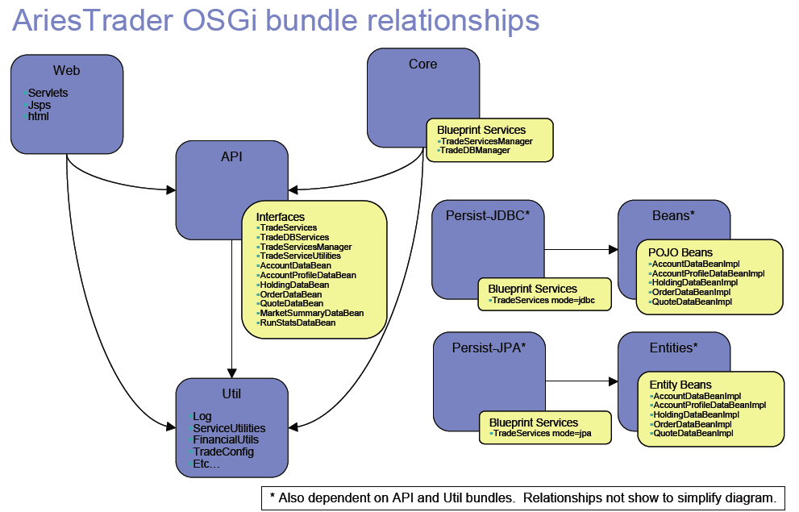

---

<a id="downloads-archived-releases-0.1-incubating-blogsample-0.1-incubating"></a>

<!-- source_url: https://aries.apache.org/documentation/downloads/archived-releases/0.1-incubating/blogsample-0.1-incubating.html -->

<!-- page_index: 73 -->

# The Blog Sample - version 0.1-incubating.

Documentation
master

- Documentation
  - [master](#index)

[Edit this Page](https://github.com/apache/aries-antora-site/edit/master/modules/ROOT/pages/downloads/archived-releases/0.1-incubating/blogsample-0.1-incubating.adoc)

<a id="downloads-archived-releases-0.1-incubating-blogsample-0.1-incubating--the-blog-sample-version-0.1-incubating."></a>

# The Blog Sample - version 0.1-incubating.

<a id="downloads-archived-releases-0.1-incubating-blogsample-0.1-incubating--_running_the_blog_sample"></a>
<a id="downloads-archived-releases-0.1-incubating-blogsample-0.1-incubating--running-the-blog-sample"></a>

## Running the Blog Sample

<a id="downloads-archived-releases-0.1-incubating-blogsample-0.1-incubating--_prereqs"></a>
<a id="downloads-archived-releases-0.1-incubating-blogsample-0.1-incubating--prereqs"></a>

### Prereqs

Follow the instructions [here](http://db.apache.org/derby/papers/DerbyTut/install_software.html#derby) to complete the following actions: Download Derby, Install Derby, Set DERBY\_INSTALL, Configure Embedded Derby and then Verify Derby.

---

> [!NOTE]
> |  |  |
> | --- | --- |
> |  | The version of Derby used by the current release and development versions of the Blog Sample is 10.5.3.0. Since May 2010 the Derby tutorial points to the latest Derby release (10.6.x) - if this is installed the Blog sample will not work. See [ARIES-317](https://issues.apache.org/jira/browse/ARIES-317) . For the present the best solution is to install Derby 10.5.3. |

---

<a id="downloads-archived-releases-0.1-incubating-blogsample-0.1-incubating--_create_the_osgi_platform_for_the_blog_sample"></a>
<a id="downloads-archived-releases-0.1-incubating-blogsample-0.1-incubating--create-the-osgi-platform-for-the-blog-sample"></a>

### Create the OSGi platform for the Blog sample

Download and unzip the source zip for the [latest release](aries:downloads.html) of Aries Samples and build the blog-assembly module:

```
cd samples-0.1-incubating/blog/blog-assembly
mvn install
```

This procedure will pull in the binaries from the latest release and its dependencies.

<a id="downloads-archived-releases-0.1-incubating-blogsample-0.1-incubating--_running_the_blog_sample_2"></a>
<a id="downloads-archived-releases-0.1-incubating-blogsample-0.1-incubating--running-the-blog-sample-2"></a>

### Running the Blog sample

Download the JDBC based Blog sample application (.eba file) from the [latest release](aries:downloads.html) .

Create the database

```
cd samples-0.1-incubating/blog-sample/blog-assembly/target
export
CLASSPATH=$DERBY_INSTALL/lib/derby.jar:$DERBY_INSTALL/lib/derbytools.jar:.
java org.apache.derby.tools.ij blogDB.sql
```

now start Aries in an OSGi framework (we’re using Eclipse Equinox in this case)

```
java -jar osgi-3.5.0.v20090520.jar -console
```

The OSGi console should start up, the 'ss' command should show all of the Blog bundles in state 'ACTIVE'.

Now start the blog application (.eba file) you downloaded earlier, by copying it into the load directory which was created when Aries started.

Point your browser to <http://localhost:8080/org.apache.aries.samples.blog.web/>

If you subsequently delete the .eba from the load directory the application will be uninstalled.

<a id="downloads-archived-releases-0.1-incubating-blogsample-0.1-incubating--_running_the_sample_using_a_jpa_persistence_layer"></a>
<a id="downloads-archived-releases-0.1-incubating-blogsample-0.1-incubating--running-the-sample-using-a-jpa-persistence-layer"></a>

### Running the sample using a JPA persistence layer

The first blog sample application was written to use a JDBC persistence layer.
There is a second application implemented to demonstrate the JPA capability

To run the blog sample which uses the JPA persistence layer, start the OSGi framework, remove any previous copies of the blog sample from the target/load directory, then copy the Blog sample JPA .eba file into the load directory.

Finally, after typing 'refresh' at the OSGi console, point your browser at <http://localhost:8080/org.apache.aries.samples.blog.web/> . You should see something that looks precisely the same as the blog sample running with the JDBC persistence layer, but this time running using the JPA persistence layer.

<a id="downloads-archived-releases-0.1-incubating-blogsample-0.1-incubating--_using_the_latest_unreleased_code"></a>
<a id="downloads-archived-releases-0.1-incubating-blogsample-0.1-incubating--using-the-latest-unreleased-code"></a>

## Using the latest, unreleased code

If you prefer to use the very latest code from subversion, checkout and build the Aries trunk by following the [Building Aries instructions](aries:buildingaries.html) .

<a id="downloads-archived-releases-0.1-incubating-blogsample-0.1-incubating--_about_the_blog_sample"></a>
<a id="downloads-archived-releases-0.1-incubating-blogsample-0.1-incubating--about-the-blog-sample"></a>

## About the Blog sample

The blog sample components can be visualised like this:


---

<a id="downloads-archived-releases-0.2-incubating-0.2-incubating"></a>

<!-- source_url: https://aries.apache.org/documentation/downloads/archived-releases/0.2-incubating/0.2-incubating.html -->

<!-- page_index: 74 -->

# Apache Aries Downloads

Documentation
master

- Documentation
  - [master](#index)

[Edit this Page](https://github.com/apache/aries-antora-site/edit/master/modules/ROOT/pages/downloads/archived-releases/0.2-incubating/0.2-incubating.adoc)

<a id="downloads-archived-releases-0.2-incubating-0.2-incubating--apache-aries-downloads"></a>

# Apache Aries Downloads

Apache Aries delivers a set of pluggable Java components enabling an enterprise OSGi application programming model.

Apache Aries modules are distributed in source and binary form.
Alternatively you may checkout the source from Subversion and build Aries yourself.
Otherwise, the releases below are available for download.
These [KEYS](http://www.apache.org/dist/incubator/aries/KEYS) can be used to verify the release archive.

All Apache Aries products are distributed under the terms of The Apache Software License (version 2.0).
See the LICENSE file included in each distribution for additional license information.

The release notes for the current release are [here](#downloads-archived-releases-0.2-incubating-0.2-incubating-releasenotes) .

<a id="downloads-archived-releases-0.2-incubating-0.2-incubating--_samples"></a>
<a id="downloads-archived-releases-0.2-incubating-0.2-incubating--samples"></a>

## Samples

The easiest way to use the samples is to download the source zip, navigate to the appropriate 'assembly' module and run mvn install to download all the released binary artifacts.
Alternatively you can build the entire source.

|  |  |  |  |  |
| --- | --- | --- | --- | --- |
| Sub project | Module | Version | Download | Comments |
| Aries Samples |  | 0.2 | [zip](http://archive.apache.org/dist/incubator/aries/samples-0.2-incubating-source-release.zip) ([asc](http://archive.apache.org/dist/incubator/aries/samples-0.2-incubating-source-release.zip.asc), [md5](http://archive.apache.org/dist/incubator/aries/samples-0.2-incubating-source-release.zip.md5), [sha1](http://archive.apache.org/dist/incubator/aries/samples-0.2-incubating-source-release.zip.sha1)) | Source, ready to build |
|  | AriesTrader | 0.2 | - | [AriesTrader sample instructions](#downloads-archived-releases-0.2-incubating-ariestrader-0.2-incubating) |
|  | AriesTrader JDBC app | 0.2 | [eba](http://archive.apache.org/dist/incubator/aries/org.apache.aries.samples.ariestrader.jdbc-0.2-incubating.eba) ([asc](http://archive.apache.org/dist/incubator/aries/org.apache.aries.samples.ariestrader.jdbc-0.2-incubating.eba.asc), [md5](http://archive.apache.org/dist/incubator/aries/org.apache.aries.samples.ariestrader.jdbc-0.2-incubating.eba.md5), [sha1](http://archive.apache.org/dist/incubator/aries/org.apache.aries.samples.ariestrader.jdbc-0.2-incubating.eba.sha1)) | AriesTrader app with JDBC persistence only |
|  | AriesTrader JPA & JDBC app | 0.2 | [eba](http://archive.apache.org/dist/incubator/aries/org.apache.aries.samples.ariestrader.all-0.2-incubating.eba) ([asc](http://archive.apache.org/dist/incubator/aries/org.apache.aries.samples.ariestrader.all-0.2-incubating.eba.asc), [md5](http://archive.apache.org/dist/incubator/aries/org.apache.aries.samples.ariestrader.all-0.2-incubating.eba.md5), [sha1](http://archive.apache.org/dist/incubator/aries/org.apache.aries.samples.ariestrader.all-0.2-incubating.eba.sha1)) | AriesTrader app with all available persistence methods |
|  | Blog | 0.2 | - | [Blog Sample instructions](#downloads-archived-releases-0.2-incubating-blogsample-0.2-incubating) |
|  | Blog JDBC app | 0.2 | [eba](http://archive.apache.org/dist/incubator/aries/org.apache.aries.samples.blog.jdbc.eba-0.2-incubating.eba) ([asc](http://archive.apache.org/dist/incubator/aries/org.apache.aries.samples.blog.jdbc.eba-0.2-incubating.eba.asc), [md5](http://archive.apache.org/dist/incubator/aries/org.apache.aries.samples.blog.jdbc.eba-0.2-incubating.eba.md5), [sha1](http://archive.apache.org/dist/incubator/aries/org.apache.aries.samples.blog.jdbc.eba-0.2-incubating.eba.sha1)) | Blog app based on JDBC |
|  | Blog JPA app | 0.2 | [eba](http://archive.apache.org/dist/incubator/aries/org.apache.aries.samples.blog.jpa.eba-0.2-incubating.eba) ([asc](http://archive.apache.org/dist/incubator/aries/org.apache.aries.samples.blog.jpa.eba-0.2-incubating.eba.asc), [md5](http://archive.apache.org/dist/incubator/aries/org.apache.aries.samples.blog.jpa.eba-0.2-incubating.eba.md5), [sha1](http://archive.apache.org/dist/incubator/aries/org.apache.aries.samples.blog.jpa.eba-0.2-incubating.eba.sha1)) | Blog app based on JPA |
|  | Blueprint HelloWorld | 0.2 | - |  |
|  | Blueprint ID Verifier | 0.2 | - |  |

<a id="downloads-archived-releases-0.2-incubating-0.2-incubating--_project_components"></a>
<a id="downloads-archived-releases-0.2-incubating-0.2-incubating--project-components"></a>

## Project components

|  |  |  |  |  |  |
| --- | --- | --- | --- | --- | --- |
| Sub project | Module | Version | Binary | Source | Comments |
| Application |  | 0.2 | - | [zip](http://archive.apache.org/dist/incubator/aries/application-0.2-incubating-source-release.zip) ([asc](http://archive.apache.org/dist/incubator/aries/application-0.2-incubating-source-release.zip.asc), [md5](http://archive.apache.org/dist/incubator/aries/application-0.2-incubating-source-release.zip.md5), [sha1](http://archive.apache.org/dist/incubator/aries/application-0.2-incubating-source-release.zip.sha1)) |  |
|  | application-api | 0.2 | [jar](http://archive.apache.org/dist/incubator/aries/org.apache.aries.application.api-0.2-incubating.jar) ([asc](http://archive.apache.org/dist/incubator/aries/org.apache.aries.application.api-0.2-incubating.jar.asc), [md5](http://archive.apache.org/dist/incubator/aries/org.apache.aries.application.api-0.2-incubating.jar.md5), [sha1](http://archive.apache.org/dist/incubator/aries/org.apache.aries.application.api-0.2-incubating.jar.sha1)) | [jar](http://archive.apache.org/dist/incubator/aries/org.apache.aries.application.api-0.2-incubating-sources.jar) ([asc](http://archive.apache.org/dist/incubator/aries/org.apache.aries.application.api-0.2-incubating-sources.jar.asc), [md5](http://archive.apache.org/dist/incubator/aries/org.apache.aries.application.api-0.2-incubating-sources.jar.md5), [sha1](http://archive.apache.org/dist/incubator/aries/org.apache.aries.application.api-0.2-incubating-sources.jar.sha1)) |  |
|  | application-bundle | 0.2 | [jar](http://archive.apache.org/dist/incubator/aries/org.apache.aries.application-0.2-incubating.jar) ([asc](http://archive.apache.org/dist/incubator/aries/org.apache.aries.application-0.2-incubating.jar.asc), [md5](http://archive.apache.org/dist/incubator/aries/org.apache.aries.application-0.2-incubating.jar.md5), [sha1](http://archive.apache.org/dist/incubator/aries/org.apache.aries.application-0.2-incubating.jar.sha1)) | [jar](http://archive.apache.org/dist/incubator/aries/org.apache.aries.application-0.2-incubating-sources.jar) ([asc](http://archive.apache.org/dist/incubator/aries/org.apache.aries.application-0.2-incubating-sources.jar.asc), [md5](http://archive.apache.org/dist/incubator/aries/org.apache.aries.application-0.2-incubating-sources.jar.md5), [sha1](http://archive.apache.org/dist/incubator/aries/org.apache.aries.application-0.2-incubating-sources.jar.sha1)) |  |
|  | application-converters | 0.2 | [jar](http://archive.apache.org/dist/incubator/aries/org.apache.aries.application.converters-0.2-incubating.jar) ([asc](http://archive.apache.org/dist/incubator/aries/org.apache.aries.application.converters-0.2-incubating.jar.asc), [md5](http://archive.apache.org/dist/incubator/aries/org.apache.aries.application.converters-0.2-incubating.jar.md5), [sha1](http://archive.apache.org/dist/incubator/aries/org.apache.aries.application.converters-0.2-incubating.jar.sha1)) | [jar](http://archive.apache.org/dist/incubator/aries/org.apache.aries.application.converters-0.2-incubating-sources.jar) ([asc](http://archive.apache.org/dist/incubator/aries/org.apache.aries.application.converters-0.2-incubating-sources.jar.asc), [md5](http://archive.apache.org/dist/incubator/aries/org.apache.aries.application.converters-0.2-incubating-sources.jar.md5), [sha1](http://archive.apache.org/dist/incubator/aries/org.apache.aries.application.converters-0.2-incubating-sources.jar.sha1)) |  |
|  | application-install | 0.2 | [jar](http://archive.apache.org/dist/incubator/aries/org.apache.aries.application.install-0.2-incubating.jar) ([asc](http://archive.apache.org/dist/incubator/aries/org.apache.aries.application.install-0.2-incubating.jar.asc), [md5](http://archive.apache.org/dist/incubator/aries/org.apache.aries.application.install-0.2-incubating.jar.md5), [sha1](http://archive.apache.org/dist/incubator/aries/org.apache.aries.application.install-0.2-incubating.jar.sha1)) | [jar](http://archive.apache.org/dist/incubator/aries/org.apache.aries.application.install-0.2-incubating-sources.jar) ([asc](http://archive.apache.org/dist/incubator/aries/org.apache.aries.application.install-0.2-incubating-sources.jar.asc), [md5](http://archive.apache.org/dist/incubator/aries/org.apache.aries.application.install-0.2-incubating-sources.jar.md5), [sha1](http://archive.apache.org/dist/incubator/aries/org.apache.aries.application.install-0.2-incubating-sources.jar.sha1)) |  |
|  | application-management | 0.2 | [jar](http://archive.apache.org/dist/incubator/aries/org.apache.aries.application.management-0.2-incubating.jar) ([asc](http://archive.apache.org/dist/incubator/aries/org.apache.aries.application.management-0.2-incubating.jar.asc), [md5](http://archive.apache.org/dist/incubator/aries/org.apache.aries.application.management-0.2-incubating.jar.md5), [sha1](http://archive.apache.org/dist/incubator/aries/org.apache.aries.application.management-0.2-incubating.jar.sha1)) | [jar](http://archive.apache.org/dist/incubator/aries/org.apache.aries.application.management-0.2-incubating-sources.jar) ([asc](http://archive.apache.org/dist/incubator/aries/org.apache.aries.application.management-0.2-incubating-sources.jar.asc), [md5](http://archive.apache.org/dist/incubator/aries/org.apache.aries.application.management-0.2-incubating-sources.jar.md5), [sha1](http://archive.apache.org/dist/incubator/aries/org.apache.aries.application.management-0.2-incubating-sources.jar.sha1)) |  |
|  | application-obr-resolver | 0.2 | [jar](http://archive.apache.org/dist/incubator/aries/org.apache.aries.application.resolver.obr-0.2-incubating.jar) ([asc](http://archive.apache.org/dist/incubator/aries/org.apache.aries.application.resolver.obr-0.2-incubating.jar.asc), [md5](http://archive.apache.org/dist/incubator/aries/org.apache.aries.application.resolver.obr-0.2-incubating.jar.md5), [sha1](http://archive.apache.org/dist/incubator/aries/org.apache.aries.application.resolver.obr-0.2-incubating.jar.sha1)) | [jar](http://archive.apache.org/dist/incubator/aries/org.apache.aries.application.resolver.obr-0.2-incubating-sources.jar) ([asc](http://archive.apache.org/dist/incubator/aries/org.apache.aries.application.resolver.obr-0.2-incubating-sources.jar.asc), [md5](http://archive.apache.org/dist/incubator/aries/org.apache.aries.application.resolver.obr-0.2-incubating-sources.jar.md5), [sha1](http://archive.apache.org/dist/incubator/aries/org.apache.aries.application.resolver.obr-0.2-incubating-sources.jar.sha1)) |  |
|  | application-runtime | 0.2 | [jar](http://archive.apache.org/dist/incubator/aries/org.apache.aries.application.runtime-0.2-incubating.jar) ([asc](http://archive.apache.org/dist/incubator/aries/org.apache.aries.application.runtime-0.2-incubating.jar.asc), [md5](http://archive.apache.org/dist/incubator/aries/org.apache.aries.application.runtime-0.2-incubating.jar.md5), [sha1](http://archive.apache.org/dist/incubator/aries/org.apache.aries.application.runtime-0.2-incubating.jar.sha1)) | [jar](http://archive.apache.org/dist/incubator/aries/org.apache.aries.application.runtime-0.2-incubating-sources.jar) ([asc](http://archive.apache.org/dist/incubator/aries/org.apache.aries.application.runtime-0.2-incubating-sources.jar.asc), [md5](http://archive.apache.org/dist/incubator/aries/org.apache.aries.application.runtime-0.2-incubating-sources.jar.md5), [sha1](http://archive.apache.org/dist/incubator/aries/org.apache.aries.application.runtime-0.2-incubating-sources.jar.sha1)) |  |
|  | application-utils | 0.2 | [jar](http://archive.apache.org/dist/incubator/aries/org.apache.aries.application.utils-0.2-incubating.jar) ([asc](http://archive.apache.org/dist/incubator/aries/org.apache.aries.application.utils-0.2-incubating.jar.asc), [md5](http://archive.apache.org/dist/incubator/aries/org.apache.aries.application.utils-0.2-incubating.jar.md5), [sha1](http://archive.apache.org/dist/incubator/aries/org.apache.aries.application.utils-0.2-incubating.jar.sha1)) | [jar](http://archive.apache.org/dist/incubator/aries/org.apache.aries.application.utils-0.2-incubating-sources.jar) ([asc](http://archive.apache.org/dist/incubator/aries/org.apache.aries.application.utils-0.2-incubating-sources.jar.asc), [md5](http://archive.apache.org/dist/incubator/aries/org.apache.aries.application.utils-0.2-incubating-sources.jar.md5), [sha1](http://archive.apache.org/dist/incubator/aries/org.apache.aries.application.utils-0.2-incubating-sources.jar.sha1)) |  |
| Blueprint |  | 0.2 | - | [zip](http://archive.apache.org/dist/incubator/aries/blueprint-0.2-incubating-source-release.zip) ([asc](http://archive.apache.org/dist/incubator/aries/blueprint-0.2-incubating-source-release.zip.asc), [md5](http://archive.apache.org/dist/incubator/aries/blueprint-0.2-incubating-source-release.zip.md5), [sha1](http://archive.apache.org/dist/incubator/aries/blueprint-0.2-incubating-source-release.zip.sha1)) |  |
|  | blueprint-api | 0.2 | [jar](http://archive.apache.org/dist/incubator/aries/org.apache.aries.blueprint.api-0.2-incubating.jar) ([asc](http://archive.apache.org/dist/incubator/aries/org.apache.aries.blueprint.api-0.2-incubating.jar.asc), [md5](http://archive.apache.org/dist/incubator/aries/org.apache.aries.blueprint.api-0.2-incubating.jar.md5), [sha1](http://archive.apache.org/dist/incubator/aries/org.apache.aries.blueprint.api-0.2-incubating.jar.sha1)) | [jar](http://archive.apache.org/dist/incubator/aries/org.apache.aries.blueprint.api-0.2-incubating-sources.jar) ([asc](http://archive.apache.org/dist/incubator/aries/org.apache.aries.blueprint.api-0.2-incubating-sources.jar.asc), [md5](http://archive.apache.org/dist/incubator/aries/org.apache.aries.blueprint.api-0.2-incubating-sources.jar.md5), [sha1](http://archive.apache.org/dist/incubator/aries/org.apache.aries.blueprint.api-0.2-incubating-sources.jar.sha1)) |  |
|  | blueprint-bundle | 0.2 | [jar](http://archive.apache.org/dist/incubator/aries/org.apache.aries.blueprint-0.2-incubating.jar) ([asc](http://archive.apache.org/dist/incubator/aries/org.apache.aries.blueprint-0.2-incubating.jar.asc), [md5](http://archive.apache.org/dist/incubator/aries/org.apache.aries.blueprint-0.2-incubating.jar.md5), [sha1](http://archive.apache.org/dist/incubator/aries/org.apache.aries.blueprint-0.2-incubating.jar.sha1)) | [jar](http://archive.apache.org/dist/incubator/aries/org.apache.aries.blueprint-0.2-incubating-sources.jar) ([asc](http://archive.apache.org/dist/incubator/aries/org.apache.aries.blueprint-0.2-incubating-sources.jar.asc), [md5](http://archive.apache.org/dist/incubator/aries/org.apache.aries.blueprint-0.2-incubating-sources.jar.md5), [sha1](http://archive.apache.org/dist/incubator/aries/org.apache.aries.blueprint-0.2-incubating-sources.jar.sha1)) | An Uber bundle collecting all the required sub-modules that provide the blueprint implementation |
|  | blueprint-cm | 0.2 | [jar](http://archive.apache.org/dist/incubator/aries/org.apache.aries.blueprint.cm-0.2-incubating.jar) ([asc](http://archive.apache.org/dist/incubator/aries/org.apache.aries.blueprint.cm-0.2-incubating.jar.asc), [md5](http://archive.apache.org/dist/incubator/aries/org.apache.aries.blueprint.cm-0.2-incubating.jar.md5), [sha1](http://archive.apache.org/dist/incubator/aries/org.apache.aries.blueprint.cm-0.2-incubating.jar.sha1)) | [jar](http://archive.apache.org/dist/incubator/aries/org.apache.aries.blueprint.cm-0.2-incubating-sources.jar) ([asc](http://archive.apache.org/dist/incubator/aries/org.apache.aries.blueprint.cm-0.2-incubating-sources.jar.asc), [md5](http://archive.apache.org/dist/incubator/aries/org.apache.aries.blueprint.cm-0.2-incubating-sources.jar.md5), [sha1](http://archive.apache.org/dist/incubator/aries/org.apache.aries.blueprint.cm-0.2-incubating-sources.jar.sha1)) |  |
|  | blueprint-core | 0.2 | [jar](http://archive.apache.org/dist/incubator/aries/org.apache.aries.blueprint.core-0.2-incubating.jar) ([asc](http://archive.apache.org/dist/incubator/aries/org.apache.aries.blueprint.core-0.2-incubating.jar.asc), [md5](http://archive.apache.org/dist/incubator/aries/org.apache.aries.blueprint.core-0.2-incubating.jar.md5), [sha1](http://archive.apache.org/dist/incubator/aries/org.apache.aries.blueprint.core-0.2-incubating.jar.sha1)) | [jar](http://archive.apache.org/dist/incubator/aries/org.apache.aries.blueprint.core-0.2-incubating-sources.jar) ([asc](http://archive.apache.org/dist/incubator/aries/org.apache.aries.blueprint.core-0.2-incubating-sources.jar.asc), [md5](http://archive.apache.org/dist/incubator/aries/org.apache.aries.blueprint.core-0.2-incubating-sources.jar.md5), [sha1](http://archive.apache.org/dist/incubator/aries/org.apache.aries.blueprint.core-0.2-incubating-sources.jar.sha1)) |  |
| eba-maven-plugin |  | 0.2 | - | [zip](http://archive.apache.org/dist/incubator/aries/eba-maven-plugin-0.2-incubating-source-release.zip) ([asc](http://archive.apache.org/dist/incubator/aries/eba-maven-plugin-0.2-incubating-source-release.zip.asc), [md5](http://archive.apache.org/dist/incubator/aries/eba-maven-plugin-0.2-incubating-source-release.zip.md5), [sha1](http://archive.apache.org/dist/incubator/aries/eba-maven-plugin-0.2-incubating-source-release.zip.sha1)) |  |
|  | - | 0.2 | [jar](http://archive.apache.org/dist/incubator/aries/eba-maven-plugin-0.2-incubating.jar) ([asc](http://archive.apache.org/dist/incubator/aries/eba-maven-plugin-0.2-incubating.jar.asc), [md5](http://archive.apache.org/dist/incubator/aries/eba-maven-plugin-0.2-incubating.jar.md5), [sha1](http://archive.apache.org/dist/incubator/aries/eba-maven-plugin-0.2-incubating.jar.sha1)) | [jar](http://archive.apache.org/dist/incubator/aries/eba-maven-plugin-0.2-incubating-sources.jar) ([asc](http://archive.apache.org/dist/incubator/aries/eba-maven-plugin-0.2-incubating-sources.jar.asc), [md5](http://archive.apache.org/dist/incubator/aries/eba-maven-plugin-0.2-incubating-sources.jar.md5), [sha1](http://archive.apache.org/dist/incubator/aries/eba-maven-plugin-0.2-incubating-sources.jar.sha1)) |  |
| JMX |  | 0.2 | - | [zip](http://archive.apache.org/dist/incubator/aries/jmx-0.2-incubating-source-release.zip) ([asc](http://archive.apache.org/dist/incubator/aries/jmx-0.2-incubating-source-release.zip.asc), [md5](http://archive.apache.org/dist/incubator/aries/jmx-0.2-incubating-source-release.zip.md5), [sha1](http://archive.apache.org/dist/incubator/aries/jmx-0.2-incubating-source-release.zip.sha1)) |  |
|  | jmx-api | 0.2 | [jar](http://archive.apache.org/dist/incubator/aries/org.apache.aries.jmx.api-0.2-incubating.jar) ([asc](http://archive.apache.org/dist/incubator/aries/org.apache.aries.jmx.api-0.2-incubating.jar.asc), [md5](http://archive.apache.org/dist/incubator/aries/org.apache.aries.jmx.api-0.2-incubating.jar.md5), [sha1](http://archive.apache.org/dist/incubator/aries/org.apache.aries.jmx.api-0.2-incubating.jar.sha1)) | [jar](http://archive.apache.org/dist/incubator/aries/org.apache.aries.jmx.api-0.2-incubating-sources.jar) ([asc](http://archive.apache.org/dist/incubator/aries/org.apache.aries.jmx.api-0.2-incubating-sources.jar.asc), [md5](http://archive.apache.org/dist/incubator/aries/org.apache.aries.jmx.api-0.2-incubating-sources.jar.md5), [sha1](http://archive.apache.org/dist/incubator/aries/org.apache.aries.jmx.api-0.2-incubating-sources.jar.sha1)) |  |
|  | jmx-blueprint-api | 0.2 | [jar](http://archive.apache.org/dist/incubator/aries/org.apache.aries.jmx.blueprint.api-0.2-incubating.jar) ([asc](http://archive.apache.org/dist/incubator/aries/org.apache.aries.jmx.blueprint.api-0.2-incubating.jar.asc), [md5](http://archive.apache.org/dist/incubator/aries/org.apache.aries.jmx.blueprint.api-0.2-incubating.jar.md5), [sha1](http://archive.apache.org/dist/incubator/aries/org.apache.aries.jmx.blueprint.api-0.2-incubating.jar.sha1)) | [jar](http://archive.apache.org/dist/incubator/aries/org.apache.aries.jmx.blueprint.api-0.2-incubating-sources.jar) ([asc](http://archive.apache.org/dist/incubator/aries/org.apache.aries.jmx.blueprint.api-0.2-incubating-sources.jar.asc), [md5](http://archive.apache.org/dist/incubator/aries/org.apache.aries.jmx.blueprint.api-0.2-incubating-sources.jar.md5), [sha1](http://archive.apache.org/dist/incubator/aries/org.apache.aries.jmx.blueprint.api-0.2-incubating-sources.jar.sha1)) |  |
|  | jmx-blueprint-bundle | 0.2 | [jar](http://archive.apache.org/dist/incubator/aries/org.apache.aries.jmx.blueprint-0.2-incubating.jar) ([asc](http://archive.apache.org/dist/incubator/aries/org.apache.aries.jmx.blueprint-0.2-incubating.jar.asc), [md5](http://archive.apache.org/dist/incubator/aries/org.apache.aries.jmx.blueprint-0.2-incubating.jar.md5), [sha1](http://archive.apache.org/dist/incubator/aries/org.apache.aries.jmx.blueprint-0.2-incubating.jar.sha1)) | [jar](http://archive.apache.org/dist/incubator/aries/org.apache.aries.jmx.blueprint-0.2-incubating-sources.jar) ([asc](http://archive.apache.org/dist/incubator/aries/org.apache.aries.jmx.blueprint-0.2-incubating-sources.jar.asc), [md5](http://archive.apache.org/dist/incubator/aries/org.apache.aries.jmx.blueprint-0.2-incubating-sources.jar.md5), [sha1](http://archive.apache.org/dist/incubator/aries/org.apache.aries.jmx.blueprint-0.2-incubating-sources.jar.sha1)) |  |
|  | jmx-blueprint-core | 0.2 | [jar](http://archive.apache.org/dist/incubator/aries/org.apache.aries.jmx.blueprint.core-0.2-incubating.jar) ([asc](http://archive.apache.org/dist/incubator/aries/org.apache.aries.jmx.blueprint.core-0.2-incubating.jar.asc), [md5](http://archive.apache.org/dist/incubator/aries/org.apache.aries.jmx.blueprint.core-0.2-incubating.jar.md5), [sha1](http://archive.apache.org/dist/incubator/aries/org.apache.aries.jmx.blueprint.core-0.2-incubating.jar.sha1)) | [jar](http://archive.apache.org/dist/incubator/aries/org.apache.aries.jmx.blueprint.core-0.2-incubating-sources.jar) ([asc](http://archive.apache.org/dist/incubator/aries/org.apache.aries.jmx.blueprint.core-0.2-incubating-sources.jar.asc), [md5](http://archive.apache.org/dist/incubator/aries/org.apache.aries.jmx.blueprint.core-0.2-incubating-sources.jar.md5), [sha1](http://archive.apache.org/dist/incubator/aries/org.apache.aries.jmx.blueprint.core-0.2-incubating-sources.jar.sha1)) |  |
|  | jmx-bundle | 0.2 | [jar](http://archive.apache.org/dist/incubator/aries/org.apache.aries.jmx-0.2-incubating.jar) ([asc](http://archive.apache.org/dist/incubator/aries/org.apache.aries.jmx-0.2-incubating.jar.asc), [md5](http://archive.apache.org/dist/incubator/aries/org.apache.aries.jmx-0.2-incubating.jar.md5), [sha1](http://archive.apache.org/dist/incubator/aries/org.apache.aries.jmx-0.2-incubating.jar.sha1)) | [jar](http://archive.apache.org/dist/incubator/aries/org.apache.aries.jmx-0.2-incubating-sources.jar) ([asc](http://archive.apache.org/dist/incubator/aries/org.apache.aries.jmx-0.2-incubating-sources.jar.asc), [md5](http://archive.apache.org/dist/incubator/aries/org.apache.aries.jmx-0.2-incubating-sources.jar.md5), [sha1](http://archive.apache.org/dist/incubator/aries/org.apache.aries.jmx-0.2-incubating-sources.jar.sha1)) |  |
|  | jmx-core | 0.2 | [jar](http://archive.apache.org/dist/incubator/aries/org.apache.aries.jmx.core-0.2-incubating.jar) ([asc](http://archive.apache.org/dist/incubator/aries/org.apache.aries.jmx.core-0.2-incubating.jar.asc), [md5](http://archive.apache.org/dist/incubator/aries/org.apache.aries.jmx.core-0.2-incubating.jar.md5), [sha1](http://archive.apache.org/dist/incubator/aries/org.apache.aries.jmx.core-0.2-incubating.jar.sha1)) | [jar](http://archive.apache.org/dist/incubator/aries/org.apache.aries.jmx.core-0.2-incubating-sources.jar) ([asc](http://archive.apache.org/dist/incubator/aries/org.apache.aries.jmx.core-0.2-incubating-sources.jar.asc), [md5](http://archive.apache.org/dist/incubator/aries/org.apache.aries.jmx.core-0.2-incubating-sources.jar.md5), [sha1](http://archive.apache.org/dist/incubator/aries/org.apache.aries.jmx.core-0.2-incubating-sources.jar.sha1)) |  |
| JNDI |  | 0.2 | - | [zip](http://archive.apache.org/dist/incubator/aries/jndi-0.2-incubating-source-release.zip) ([asc](http://archive.apache.org/dist/incubator/aries/jndi-0.2-incubating-source-release.zip.asc), [md5](http://archive.apache.org/dist/incubator/aries/jndi-0.2-incubating-source-release.zip.md5), [sha1](http://archive.apache.org/dist/incubator/aries/jndi-0.2-incubating-source-release.zip.sha1)) |  |
|  | jndi-bundle | 0.2 | [jar](http://archive.apache.org/dist/incubator/aries/org.apache.aries.jndi-0.2-incubating.jar) ([asc](http://archive.apache.org/dist/incubator/aries/org.apache.aries.jndi-0.2-incubating.jar.asc), [md5](http://archive.apache.org/dist/incubator/aries/org.apache.aries.jndi-0.2-incubating.jar.md5), [sha1](http://archive.apache.org/dist/incubator/aries/org.apache.aries.jndi-0.2-incubating.jar.sha1)) | [jar](http://archive.apache.org/dist/incubator/aries/org.apache.aries.jndi-0.2-incubating-sources.jar) ([asc](http://archive.apache.org/dist/incubator/aries/org.apache.aries.jndi-0.2-incubating-sources.jar.asc), [md5](http://archive.apache.org/dist/incubator/aries/org.apache.aries.jndi-0.2-incubating-sources.jar.md5), [sha1](http://archive.apache.org/dist/incubator/aries/org.apache.aries.jndi-0.2-incubating-sources.jar.sha1)) | An Uber bundle that collects the jndi-api, jndi-core and jndi-url bundles into one |
|  | jndi-core | 0.2 | [jar](http://archive.apache.org/dist/incubator/aries/org.apache.aries.jndi.core-0.2-incubating.jar) ([asc](http://archive.apache.org/dist/incubator/aries/org.apache.aries.jndi.core-0.2-incubating.jar.asc), [md5](http://archive.apache.org/dist/incubator/aries/org.apache.aries.jndi.core-0.2-incubating.jar.md5), [sha1](http://archive.apache.org/dist/incubator/aries/org.apache.aries.jndi.core-0.2-incubating.jar.sha1)) | [jar](http://archive.apache.org/dist/incubator/aries/org.apache.aries.jndi.core-0.2-incubating-sources.jar) ([asc](http://archive.apache.org/dist/incubator/aries/org.apache.aries.jndi.core-0.2-incubating-sources.jar.asc), [md5](http://archive.apache.org/dist/incubator/aries/org.apache.aries.jndi.core-0.2-incubating-sources.jar.md5), [sha1](http://archive.apache.org/dist/incubator/aries/org.apache.aries.jndi.core-0.2-incubating-sources.jar.sha1)) |  |
|  | jndi-url | 0.2 | [jar](http://archive.apache.org/dist/incubator/aries/org.apache.aries.jndi.url-0.2-incubating.jar) ([asc](http://archive.apache.org/dist/incubator/aries/org.apache.aries.jndi.url-0.2-incubating.jar.asc), [md5](http://archive.apache.org/dist/incubator/aries/org.apache.aries.jndi.url-0.2-incubating.jar.md5), [sha1](http://archive.apache.org/dist/incubator/aries/org.apache.aries.jndi.url-0.2-incubating.jar.sha1)) | [jar](http://archive.apache.org/dist/incubator/aries/org.apache.aries.jndi.url-0.2-incubating-sources.jar) ([asc](http://archive.apache.org/dist/incubator/aries/org.apache.aries.jndi.url-0.2-incubating-sources.jar.asc), [md5](http://archive.apache.org/dist/incubator/aries/org.apache.aries.jndi.url-0.2-incubating-sources.jar.md5), [sha1](http://archive.apache.org/dist/incubator/aries/org.apache.aries.jndi.url-0.2-incubating-sources.jar.sha1)) |  |
| JPA |  | 0.2 | - | [zip](http://archive.apache.org/dist/incubator/aries/jpa-0.2-incubating-source-release.zip) ([asc](http://archive.apache.org/dist/incubator/aries/jpa-0.2-incubating-source-release.zip.asc), [md5](http://archive.apache.org/dist/incubator/aries/jpa-0.2-incubating-source-release.zip.md5), [sha1](http://archive.apache.org/dist/incubator/aries/jpa-0.2-incubating-source-release.zip.sha1)) |  |
|  | jpa-api | 0.2 | [jar](http://archive.apache.org/dist/incubator/aries/org.apache.aries.jpa.api-0.2-incubating.jar) ([asc](http://archive.apache.org/dist/incubator/aries/org.apache.aries.jpa.api-0.2-incubating.jar.asc), [md5](http://archive.apache.org/dist/incubator/aries/org.apache.aries.jpa.api-0.2-incubating.jar.md5), [sha1](http://archive.apache.org/dist/incubator/aries/org.apache.aries.jpa.api-0.2-incubating.jar.sha1)) [jar](http://archive.apache.org/dist/incubator/aries/org.apache.aries.jpa.api-0.2-incubating-sources.jar) ([asc](http://archive.apache.org/dist/incubator/aries/org.apache.aries.jpa.api-0.2-incubating-sources.jar.asc), [md5](http://archive.apache.org/dist/incubator/aries/org.apache.aries.jpa.api-0.2-incubating-sources.jar.md5), [sha1](http://archive.apache.org/dist/incubator/aries/org.apache.aries.jpa.api-0.2-incubating-sources.jar.sha1)) |  |  |
| jpa-blueprint-aries | 0.2 | [jar](http://archive.apache.org/dist/incubator/aries/org.apache.aries.jpa.blueprint.aries-0.2-incubating.jar) ([asc](http://archive.apache.org/dist/incubator/aries/org.apache.aries.jpa.blueprint.aries-0.2-incubating.jar.asc), [md5](http://archive.apache.org/dist/incubator/aries/org.apache.aries.jpa.blueprint.aries-0.2-incubating.jar.md5), [sha1](http://archive.apache.org/dist/incubator/aries/org.apache.aries.jpa.blueprint.aries-0.2-incubating.jar.sha1)) | [jar](http://archive.apache.org/dist/incubator/aries/org.apache.aries.jpa.blueprint.aries-0.2-incubating-sources.jar) ([asc](http://archive.apache.org/dist/incubator/aries/org.apache.aries.jpa.blueprint.aries-0.2-incubating-sources.jar.asc), [md5](http://archive.apache.org/dist/incubator/aries/org.apache.aries.jpa.blueprint.aries-0.2-incubating-sources.jar.md5), [sha1](http://archive.apache.org/dist/incubator/aries/org.apache.aries.jpa.blueprint.aries-0.2-incubating-sources.jar.sha1)) |  |  |
| jpa-container | 0.2 | [jar](http://archive.apache.org/dist/incubator/aries/org.apache.aries.jpa.container-0.2-incubating.jar) ([asc](http://archive.apache.org/dist/incubator/aries/org.apache.aries.jpa.container-0.2-incubating.jar.asc), [md5](http://archive.apache.org/dist/incubator/aries/org.apache.aries.jpa.container-0.2-incubating.jar.md5), [sha1](http://archive.apache.org/dist/incubator/aries/org.apache.aries.jpa.container-0.2-incubating.jar.sha1)) | [jar](http://archive.apache.org/dist/incubator/aries/org.apache.aries.jpa.container-0.2-incubating-sources.jar) ([asc](http://archive.apache.org/dist/incubator/aries/org.apache.aries.jpa.container-0.2-incubating-sources.jar.asc), [md5](http://archive.apache.org/dist/incubator/aries/org.apache.aries.jpa.container-0.2-incubating-sources.jar.md5), [sha1](http://archive.apache.org/dist/incubator/aries/org.apache.aries.jpa.container-0.2-incubating-sources.jar.sha1)) |  |  |
| jpa-container-context | 0.2 | [jar](http://archive.apache.org/dist/incubator/aries/org.apache.aries.jpa.container.context-0.2-incubating.jar) ([asc](http://archive.apache.org/dist/incubator/aries/org.apache.aries.jpa.container.context-0.2-incubating.jar.asc), [md5](http://archive.apache.org/dist/incubator/aries/org.apache.aries.jpa.container.context-0.2-incubating.jar.md5), [sha1](http://archive.apache.org/dist/incubator/aries/org.apache.aries.jpa.container.context-0.2-incubating.jar.sha1)) | [jar](http://archive.apache.org/dist/incubator/aries/org.apache.aries.jpa.container.context-0.2-incubating-sources.jar) ([asc](http://archive.apache.org/dist/incubator/aries/org.apache.aries.jpa.container.context-0.2-incubating-sources.jar.asc), [md5](http://archive.apache.org/dist/incubator/aries/org.apache.aries.jpa.container.context-0.2-incubating-sources.jar.md5), [sha1](http://archive.apache.org/dist/incubator/aries/org.apache.aries.jpa.container.context-0.2-incubating-sources.jar.sha1)) |  | Quiesce |
|  | 0.2 | - | [zip](http://archive.apache.org/dist/incubator/aries/quiesce-0.2-incubating-source-release.zip) ([asc](http://archive.apache.org/dist/incubator/aries/quiesce-0.2-incubating-source-release.zip.asc), [md5](http://archive.apache.org/dist/incubator/aries/quiesce-0.2-incubating-source-release.zip.md5), [sha1](http://archive.apache.org/dist/incubator/aries/quiesce-0.2-incubating-source-release.zip.sha1)) |  |  |
| quiesce-api | 0.2 | [jar](http://archive.apache.org/dist/incubator/aries/org.apache.aries.quiesce.api-0.2-incubating.jar) ([asc](http://archive.apache.org/dist/incubator/aries/org.apache.aries.quiesce.api-0.2-incubating.jar.asc), [md5](http://archive.apache.org/dist/incubator/aries/org.apache.aries.quiesce.api-0.2-incubating.jar.md5), [sha1](http://archive.apache.org/dist/incubator/aries/org.apache.aries.quiesce.api-0.2-incubating.jar.sha1)) | [jar](http://archive.apache.org/dist/incubator/aries/org.apache.aries.quiesce.api-0.2-incubating-sources.jar) ([asc](http://archive.apache.org/dist/incubator/aries/org.apache.aries.quiesce.api-0.2-incubating-sources.jar.asc), [md5](http://archive.apache.org/dist/incubator/aries/org.apache.aries.quiesce.api-0.2-incubating-sources.jar.md5), [sha1](http://archive.apache.org/dist/incubator/aries/org.apache.aries.quiesce.api-0.2-incubating-sources.jar.sha1)) |  |  |
| quiesce-manager | 0.2 | [jar](http://archive.apache.org/dist/incubator/aries/org.apache.aries.quiesce.manager-0.2-incubating.jar) ([asc](http://archive.apache.org/dist/incubator/aries/org.apache.aries.quiesce.manager-0.2-incubating.jar.asc), [md5](http://archive.apache.org/dist/incubator/aries/org.apache.aries.quiesce.manager-0.2-incubating.jar.md5), [sha1](http://archive.apache.org/dist/incubator/aries/org.apache.aries.quiesce.manager-0.2-incubating.jar.sha1)) | [jar](http://archive.apache.org/dist/incubator/aries/org.apache.aries.quiesce.manager-0.2-incubating-sources.jar) ([asc](http://archive.apache.org/dist/incubator/aries/org.apache.aries.quiesce.manager-0.2-incubating-sources.jar.asc), [md5](http://archive.apache.org/dist/incubator/aries/org.apache.aries.quiesce.manager-0.2-incubating-sources.jar.md5), [sha1](http://archive.apache.org/dist/incubator/aries/org.apache.aries.quiesce.manager-0.2-incubating-sources.jar.sha1)) |  | Transaction |
|  | 0.2 | - | [zip](http://archive.apache.org/dist/incubator/aries/transaction-0.2-incubating-source-release.zip) ([asc](http://archive.apache.org/dist/incubator/aries/transaction-0.2-incubating-source-release.zip.asc), [md5](http://archive.apache.org/dist/incubator/aries/transaction-0.2-incubating-source-release.zip.md5), [sha1](http://archive.apache.org/dist/incubator/aries/transaction-0.2-incubating-source-release.zip.sha1)) |  |  |
| transaction-blueprint | 0.2 | [jar](http://archive.apache.org/dist/incubator/aries/org.apache.aries.transaction.blueprint-0.2-incubating.jar) ([asc](http://archive.apache.org/dist/incubator/aries/org.apache.aries.transaction.blueprint-0.2-incubating.jar.asc), [md5](http://archive.apache.org/dist/incubator/aries/org.apache.aries.transaction.blueprint-0.2-incubating.jar.md5), [sha1](http://archive.apache.org/dist/incubator/aries/org.apache.aries.transaction.blueprint-0.2-incubating.jar.sha1)) | [jar](http://archive.apache.org/dist/incubator/aries/org.apache.aries.transaction.blueprint-0.2-incubating-sources.jar) ([asc](http://archive.apache.org/dist/incubator/aries/org.apache.aries.transaction.blueprint-0.2-incubating-sources.jar.asc), [md5](http://archive.apache.org/dist/incubator/aries/org.apache.aries.transaction.blueprint-0.2-incubating-sources.jar.md5), [sha1](http://archive.apache.org/dist/incubator/aries/org.apache.aries.transaction.blueprint-0.2-incubating-sources.jar.sha1)) |  |  |
| transaction-manager | 0.2 | [jar](http://archive.apache.org/dist/incubator/aries/org.apache.aries.transaction.manager-0.2-incubating.jar) ([asc](http://archive.apache.org/dist/incubator/aries/org.apache.aries.transaction.manager-0.2-incubating.jar.asc), [md5](http://archive.apache.org/dist/incubator/aries/org.apache.aries.transaction.manager-0.2-incubating.jar.md5), [sha1](http://archive.apache.org/dist/incubator/aries/org.apache.aries.transaction.manager-0.2-incubating.jar.sha1)) | [jar](http://archive.apache.org/dist/incubator/aries/org.apache.aries.transaction.manager-0.2-incubating-sources.jar) ([asc](http://archive.apache.org/dist/incubator/aries/org.apache.aries.transaction.manager-0.2-incubating-sources.jar.asc), [md5](http://archive.apache.org/dist/incubator/aries/org.apache.aries.transaction.manager-0.2-incubating-sources.jar.md5), [sha1](http://archive.apache.org/dist/incubator/aries/org.apache.aries.transaction.manager-0.2-incubating-sources.jar.sha1)) |  |  |
| transaction-wrappers | 0.2 | [jar](http://archive.apache.org/dist/incubator/aries/org.apache.aries.transaction.wrappers-0.2-incubating.jar) ([asc](http://archive.apache.org/dist/incubator/aries/org.apache.aries.transaction.wrappers-0.2-incubating.jar.asc), [md5](http://archive.apache.org/dist/incubator/aries/org.apache.aries.transaction.wrappers-0.2-incubating.jar.md5), [sha1](http://archive.apache.org/dist/incubator/aries/org.apache.aries.transaction.wrappers-0.2-incubating.jar.sha1)) | [jar](http://archive.apache.org/dist/incubator/aries/org.apache.aries.transaction.wrappers-0.2-incubating-sources.jar) ([asc](http://archive.apache.org/dist/incubator/aries/org.apache.aries.transaction.wrappers-0.2-incubating-sources.jar.asc), [md5](http://archive.apache.org/dist/incubator/aries/org.apache.aries.transaction.wrappers-0.2-incubating-sources.jar.md5), [sha1](http://archive.apache.org/dist/incubator/aries/org.apache.aries.transaction.wrappers-0.2-incubating-sources.jar.sha1)) |  | Util |
|  | 0.2 | - | [zip](http://archive.apache.org/dist/incubator/aries/org.apache.aries.util-0.2-incubating-source-release.zip) ([asc](http://archive.apache.org/dist/incubator/aries/org.apache.aries.util-0.2-incubating-source-release.zip.asc), [md5](http://archive.apache.org/dist/incubator/aries/org.apache.aries.util-0.2-incubating-source-release.zip.md5), [sha1](http://archive.apache.org/dist/incubator/aries/org.apache.aries.util-0.2-incubating-source-release.zip.sha1)) |  |  |

---

<a id="downloads-archived-releases-0.2-incubating-0.2-incubating-releasenotes"></a>

<!-- source_url: https://aries.apache.org/documentation/downloads/archived-releases/0.2-incubating/0.2-incubating-releasenotes.html -->

<!-- page_index: 75 -->

# Release Notes

Documentation
master

- Documentation
  - [master](#index)

[Edit this Page](https://github.com/apache/aries-antora-site/edit/master/modules/ROOT/pages/downloads/archived-releases/0.2-incubating/0.2-incubating-releasenotes.adoc)

<a id="downloads-archived-releases-0.2-incubating-0.2-incubating-releasenotes--release-notes"></a>

# Release Notes

<a id="downloads-archived-releases-0.2-incubating-0.2-incubating-releasenotes--_new_and_noteworthy"></a>
<a id="downloads-archived-releases-0.2-incubating-0.2-incubating-releasenotes--new-and-noteworthy"></a>

## New and Noteworthy

Welcome to the 0.2-incubating release.
For this release we started running the OSGi Enterprise Compliance tests for relevant components.

- [Test Results](https://aries.apache.org/downloads/archived-releases/0.2-incubating/0.2-incubating-testresults.html)
- [JIRA Release Notes](https://issues.apache.org/jira/secure/releasenote.jspa?projectid=12310981&stylename=html&version=12314941.html)

<a id="downloads-archived-releases-0.2-incubating-0.2-incubating-releasenotes--_new_components"></a>
<a id="downloads-archived-releases-0.2-incubating-0.2-incubating-releasenotes--new-components"></a>

## New Components

Quiesce.
The Quiesce component co-ordinates a graceful shutdown across a number of bundles.
Quiesce participants respond to quiesce operations and clean up resources.
In this release, only the JPA component implements a quiesce participant.

<a id="downloads-archived-releases-0.2-incubating-0.2-incubating-releasenotes--_modules_in_this_release"></a>
<a id="downloads-archived-releases-0.2-incubating-0.2-incubating-releasenotes--modules-in-this-release"></a>

## Modules in this release

|  |  |  |  |
| --- | --- | --- | --- |
| Module | Version | Depends (build) on Aries module | Version |
| Application | 0.2-incubating | Util | 0.2-incubating |
| - | - | Blueprint | 0.2-incubating |
| - | - | Testsupport | 0.2-incubating |
| - | - | Web | 0.2-incubating |
| Blueprint | 0.2-incubating | Util | 0.2-incubating |
| Eba-maven-plugin | 0.2-incubating |  |  |
| JMX | 0.2-incubating | Util | 0.2-incubating |
| - | - | Blueprint | 0.2-incubating |
| JNDI | 0.2-incubating | Util | 0.2-incubating |
| - | - | Testsupport | 0.2-incubating |
| JPA | 0.2-incubating | Util | 0.2-incubating |
| - | - | Blueprint | 0.2-incubating |
| - | - | Testsupport | 0.2-incubating |
| - | - | Quiesce | 0.2-incubating |
| Quiesce | 0.2-incubating | Util | 0.2-incubating |
| - | - | Testsupport | 0.2-incubating |
| Transaction | 0.2-incubating | Blueprint | 0.2-incubating |
| - | - | Testsupport | 0.2-incubating |
| Util | 0.2-incubating | Testsupport | 0.2-incubating |

<a id="downloads-archived-releases-0.2-incubating-0.2-incubating-releasenotes--_new_samples"></a>
<a id="downloads-archived-releases-0.2-incubating-0.2-incubating-releasenotes--new-samples"></a>

## New samples

No new samples but we changed the Blog Sample and Aries Trader samples so that no database initialisation is required prior to running the sample.

<a id="downloads-archived-releases-0.2-incubating-0.2-incubating-releasenotes--_new_tutorials"></a>
<a id="downloads-archived-releases-0.2-incubating-0.2-incubating-releasenotes--new-tutorials"></a>

## New Tutorials

None

<a id="downloads-archived-releases-0.2-incubating-0.2-incubating-releasenotes--_api_breaking"></a>
<a id="downloads-archived-releases-0.2-incubating-0.2-incubating-releasenotes--api-breaking"></a>

## API breaking

None.

<a id="downloads-archived-releases-0.2-incubating-0.2-incubating-releasenotes--_known_issues"></a>
<a id="downloads-archived-releases-0.2-incubating-0.2-incubating-releasenotes--known-issues"></a>

## Known Issues

[JIRA query for known issues in the 0.2-incubating release](https://aries.apache.org/documentation/downloads/archived-releases/0.2-incubating/-https:/issues.apache.org/jira/secure/issuenavigator.jspa?mode=hide&requestid=12314569.html)

<a id="downloads-archived-releases-0.2-incubating-0.2-incubating-releasenotes--_important_changes_to_consider_when_upgrading"></a>
<a id="downloads-archived-releases-0.2-incubating-0.2-incubating-releasenotes--important-changes-to-consider-when-upgrading"></a>

## Important changes to consider when upgrading

---

<a id="downloads-archived-releases-0.2-incubating-0.2-incubating-testresults"></a>

<!-- source_url: https://aries.apache.org/documentation/downloads/archived-releases/0.2-incubating/0.2-incubating-testresults.html -->

<!-- page_index: 76 -->

# TestResults

Documentation
master

- Documentation
  - [master](#index)

[Edit this Page](https://github.com/apache/aries-antora-site/edit/master/modules/ROOT/pages/downloads/archived-releases/0.2-incubating/0.2-incubating-testresults.adoc)

<a id="downloads-archived-releases-0.2-incubating-0.2-incubating-testresults--testresults"></a>

# TestResults

These are the test results for the current Aries release.

<a id="downloads-archived-releases-0.2-incubating-0.2-incubating-testresults--_blueprint"></a>
<a id="downloads-archived-releases-0.2-incubating-0.2-incubating-testresults--blueprint"></a>

## Blueprint

- [Blueprint](https://aries.apache.org/downloads/ct/0.2-incubating/org.osgi.test.cases.blueprint.html)
- [Blueprint-java5](https://aries.apache.org/downloads/ct/0.2-incubating/org.osgi.test.cases.blueprint.java5.html)
- [Blueprint-security](https://aries.apache.org/downloads/ct/0.2-incubating/org.osgi.test.cases.blueprint.security.html)

<a id="downloads-archived-releases-0.2-incubating-0.2-incubating-testresults--_jndi"></a>
<a id="downloads-archived-releases-0.2-incubating-0.2-incubating-testresults--jndi"></a>

## JNDI

- [JNDI](https://aries.apache.org/downloads/ct/0.2-incubating/org.osgi.test.cases.jndi.html)

<a id="downloads-archived-releases-0.2-incubating-0.2-incubating-testresults--_jmx"></a>
<a id="downloads-archived-releases-0.2-incubating-0.2-incubating-testresults--jmx"></a>

## JMX

- [JMX](https://aries.apache.org/downloads/ct/0.2-incubating/org.osgi.test.cases.jmx.html)

<a id="downloads-archived-releases-0.2-incubating-0.2-incubating-testresults--_jpa"></a>
<a id="downloads-archived-releases-0.2-incubating-0.2-incubating-testresults--jpa"></a>

## JPA

Not run.
The Aries container managed JPA implementation is not expected to pass the existing compliance tests for user managed JPA.

<a id="downloads-archived-releases-0.2-incubating-0.2-incubating-testresults--_transaction"></a>
<a id="downloads-archived-releases-0.2-incubating-0.2-incubating-testresults--transaction"></a>

## Transaction

- [Transaction](https://aries.apache.org/downloads/ct/0.2-incubating/org.osgi.test.cases.transaction.html)

---

<a id="downloads-archived-releases-0.2-incubating-ariestrader-0.2-incubating"></a>

<!-- source_url: https://aries.apache.org/documentation/downloads/archived-releases/0.2-incubating/ariestrader-0.2-incubating.html -->

<!-- page_index: 77 -->

# The AriesTrader Sample

Documentation
master

- Documentation
  - [master](#index)

[Edit this Page](https://github.com/apache/aries-antora-site/edit/master/modules/ROOT/pages/downloads/archived-releases/0.2-incubating/ariestrader-0.2-incubating.adoc)

<a id="downloads-archived-releases-0.2-incubating-ariestrader-0.2-incubating--the-ariestrader-sample"></a>

# The AriesTrader Sample

<a id="downloads-archived-releases-0.2-incubating-ariestrader-0.2-incubating--_prereqs"></a>
<a id="downloads-archived-releases-0.2-incubating-ariestrader-0.2-incubating--prereqs"></a>

## Prereqs

NOTE
:   These instructions are for the 0.2-incubating release of Aries.
    Instructions for older releases can be found [here](https://aries.apache.org/documentation/downloads/archived-releases/0.2-incubating/archiveinstructions.html) . In the 0.2-incubating release the AriesTrader sample was changed such that it is no longer required for you to install Derby independently.
    The Derby version included in the sample is fully leveraged internally in the sample and therefore no additional Derby installation is required.
    However, there are steps required to initialize the Database from within the sample itself (see instructions below).

<a id="downloads-archived-releases-0.2-incubating-ariestrader-0.2-incubating--_creating_the_osgi_platform_equinox_test_harness_for_ariestrader"></a>
<a id="downloads-archived-releases-0.2-incubating-ariestrader-0.2-incubating--creating-the-osgi-platform-equinox-test-harness-for-ariestrader"></a>

## Creating the OSGi platform (equinox-test-harness) for AriesTrader

Download and unzip the source zip for the [latest release](aries:downloads.html) of Aries Samples and build the equinox-test-harness module under ariestrader:

```
cd samples-0.2-incubating/ariestrader/assemblies/equinox-test-harness
mvn install
```

This procedure will pull in the binaries from the latest release and its dependencies.

<a id="downloads-archived-releases-0.2-incubating-ariestrader-0.2-incubating--_alternative_build_using_apache_aries_trunk"></a>
<a id="downloads-archived-releases-0.2-incubating-ariestrader-0.2-incubating--alternative-build-using-apache-aries-trunk."></a>

## Alternative build using Apache Aries trunk.

As an alternative to using the released version you can also choose to work with the latest, unreleased code.
This will require the use of subversion to checkout the code followed by building the entire Apache Aries project.
Directions are provided here: [Building Aries instructions](aries:buildingaries.html) .

<a id="downloads-archived-releases-0.2-incubating-ariestrader-0.2-incubating--_starting_the_equinox_test_harness_to_run_the_ariestrader_sample"></a>
<a id="downloads-archived-releases-0.2-incubating-ariestrader-0.2-incubating--starting-the-equinox-test-harness-to-run-the-ariestrader-sample"></a>

## Starting the Equinox Test Harness to run the AriesTrader sample

AriesTrader needs a test harness to run in.
For this purpose we are using an Equinox assembly that pulls in all of the necessary dependencies.

The first task is to start the Apache Aries modules in an OSGi framework using the Eclipse Equinox test harness

```
java -jar osgi-3.5.0.v20090520.jar -console
```

The OSGi console should start up, the 'ss' command should show the active bundles but the AriesTrader application is not yet installed (with the exception of the ariestrader derby datasource which is started with the test harness for convenience).

<a id="downloads-archived-releases-0.2-incubating-ariestrader-0.2-incubating--_installing_ariestrader_in_the_equinox_test_harness"></a>
<a id="downloads-archived-releases-0.2-incubating-ariestrader-0.2-incubating--installing-ariestrader-in-the-equinox-test-harness"></a>

## Installing AriesTrader in the Equinox Test Harness

To install the AriesTrader application simply copy the eba for AriesTrader into the target/load directory which was created when test harness containing Aries was started.
For convenience the AriesTraders EBAs are copied into the target directory as part of creating the OSGi Equinox test harness.

When using the "JDBC" only AriesTrader configuration which supports only jdbc persistence:

```
cp org.apache.aries.samples.ariestrader.jdbc-*.eba load/
```

When using the "All" AriesTrader configuration which supports all currently available persistence modes:

```
cp org.apache.aries.samples.ariestrader.all-*.eba load/
```

Now the 'ss' command should show all of the AriesTrader bundles in state 'ACTIVE'.

If you subsequently delete org.apache.aries.samples.ariestrader.jdbc-*.eba or org.apache.aries.samples.ariestrader.all-*.eba from the target/load directory the application will be uninstalled.

<a id="downloads-archived-releases-0.2-incubating-ariestrader-0.2-incubating--_accessing_and_using_the_ariestrader_sample"></a>
<a id="downloads-archived-releases-0.2-incubating-ariestrader-0.2-incubating--accessing-and-using-the-ariestrader-sample"></a>

## Accessing and using the AriesTrader sample

Point your browser at <http://localhost:8080/org.apache.aries.samples.ariestrader.web/>

Select the "Configuration" tab and the "Configure AriesTrader run-time parameters" choice.
Then select from among the available runtime modes (defauls to JDBC).
Be sure to click "update config" to save your selection.

At the moment the following persistence modes are available when using the "all" EBA:

- JDBC persistence
- JPA application managed entity manager persistence
- JPA container managed entity managers using declarative transaction support

By default, the sample starts with JDBC persistence.
To select another persistence mechanism see the directions under "Accessing and using the AriesTrader sample.

After selecting the persistence mode you must create the AriesTrader Database tables and indexs.
Select the "Configuration" tab and the "(Re)-create AriesTrader Tables and Indexes".

Next, you must seed the database with test content.
Once again go to the "Configuration" tab but this time select "(Re)-populate AriesTrader Database" from the available choices to seed the database with a default set of users and stock quotes.
You will see a number of quotes (default is 400) and users (default is 200) created.

Select the "Trading & Portfolios" tab to use the mock trade application or the "Primitives" tab to run some of the web primitive tests (PingJSPEL is not currently working).
You can also run the "Test AriesTrader Scenario" from the "Configuration" tab which will launch a new browser window and step through a trading scenario with each reload of the page.

<a id="downloads-archived-releases-0.2-incubating-ariestrader-0.2-incubating--_about_the_ariestrader_sample"></a>
<a id="downloads-archived-releases-0.2-incubating-ariestrader-0.2-incubating--about-the-ariestrader-sample"></a>

## About the AriesTrader Sample

The AriesTrader sample is a modified version of the Apache Geronimo DayTrader sample.
It has been somewhat simplified and reorganized to support the Apache Aries programming model.

The AriesTrader sample bundles are organized like this:


---

<a id="downloads-archived-releases-0.2-incubating-blogsample-0.2-incubating"></a>

<!-- source_url: https://aries.apache.org/documentation/downloads/archived-releases/0.2-incubating/blogsample-0.2-incubating.html -->

<!-- page_index: 78 -->

# The Blog Sample

Documentation
master

- Documentation
  - [master](#index)

[Edit this Page](https://github.com/apache/aries-antora-site/edit/master/modules/ROOT/pages/downloads/archived-releases/0.2-incubating/blogsample-0.2-incubating.adoc)

<a id="downloads-archived-releases-0.2-incubating-blogsample-0.2-incubating--the-blog-sample"></a>

# The Blog Sample

<a id="downloads-archived-releases-0.2-incubating-blogsample-0.2-incubating--_running_the_blog_sample"></a>
<a id="downloads-archived-releases-0.2-incubating-blogsample-0.2-incubating--running-the-blog-sample"></a>

## Running the Blog Sample

NOTE
:   These instructions are for the 0.2-incubating release of Aries.
    In the 0.2-incubating release the sample was changed to use an in-memory database to avoid dependency on an explicit version of Derby.
    If you would prefer to use a database on disk check the instructions for the 0.1-incubating release.
    You will also need to modify datasource.xml (under blog-datasource) as indicated in the comments and then rebuild the sample.

<a id="downloads-archived-releases-0.2-incubating-blogsample-0.2-incubating--_create_the_osgi_platform_for_the_blog_sample"></a>
<a id="downloads-archived-releases-0.2-incubating-blogsample-0.2-incubating--create-the-osgi-platform-for-the-blog-sample"></a>

### Create the OSGi platform for the Blog sample

Download and unzip the source zip for the [latest release](aries:downloads.html) of Aries Samples and build the blog-assembly module:

```
cd samples-0.2-incubating/blog/blog-assembly
mvn install
```

This procedure will pull in the binaries from the latest release and its dependencies.

<a id="downloads-archived-releases-0.2-incubating-blogsample-0.2-incubating--_running_the_blog_sample_2"></a>
<a id="downloads-archived-releases-0.2-incubating-blogsample-0.2-incubating--running-the-blog-sample-2"></a>

### Running the Blog sample

Download the JDBC based Blog sample application (.eba file) from the [latest release](aries:downloads.html) . Change directory to the blog-assembly target directory:

```
cd samples-0.2-incubating/blog-sample/blog-assembly/target
```

now start Aries in an OSGi framework (we’re using Eclipse Equinox in this case)

```
java -jar osgi-3.5.0.v20090520.jar -console
```

The OSGi console should start up, the 'ss' command should show all of the Blog bundles in state 'ACTIVE'.

Now start the blog application (.eba file) you downloaded earlier, by copying it into the load directory which was created when Aries started.

Point your browser to <http://localhost:8080/org.apache.aries.samples.blog.web/>

If you subsequently delete the .eba from the load directory the application will be uninstalled.

<a id="downloads-archived-releases-0.2-incubating-blogsample-0.2-incubating--_running_the_sample_using_a_jpa_persistence_layer"></a>
<a id="downloads-archived-releases-0.2-incubating-blogsample-0.2-incubating--running-the-sample-using-a-jpa-persistence-layer"></a>

### Running the sample using a JPA persistence layer

The first blog sample application was written to use a JDBC persistence layer.
There is a second application implemented to demonstrate the JPA capability

To run the blog sample which uses the JPA persistence layer, start the OSGi framework, remove any previous copies of the blog sample from the target/load directory, then copy the Blog sample JPA .eba file into the load directory.

Finally, after typing 'refresh' at the OSGi console, point your browser at <http://localhost:8080/org.apache.aries.samples.blog.web/> . You should see something that looks precisely the same as the blog sample running with the JDBC persistence layer, but this time running using the JPA persistence layer.

<a id="downloads-archived-releases-0.2-incubating-blogsample-0.2-incubating--_using_the_latest_unreleased_code"></a>
<a id="downloads-archived-releases-0.2-incubating-blogsample-0.2-incubating--using-the-latest-unreleased-code"></a>

## Using the latest, unreleased code

If you prefer to use the very latest code from subversion, checkout and build the Aries trunk by following the [Building Aries instructions](aries:buildingaries.html) .

<a id="downloads-archived-releases-0.2-incubating-blogsample-0.2-incubating--_about_the_blog_sample"></a>
<a id="downloads-archived-releases-0.2-incubating-blogsample-0.2-incubating--about-the-blog-sample"></a>

## About the Blog sample

The blog sample components can be visualised like this:


---

<a id="downloads-archived-releases-0.3-0.3"></a>

<!-- source_url: https://aries.apache.org/documentation/downloads/archived-releases/0.3/0.3.html -->

<!-- page_index: 79 -->

# Apache Aries Downloads

Documentation
master

- Documentation
  - [master](#index)

[Edit this Page](https://github.com/apache/aries-antora-site/edit/master/modules/ROOT/pages/downloads/archived-releases/0.3/0.3.adoc)

<a id="downloads-archived-releases-0.3-0.3--apache-aries-downloads"></a>

# Apache Aries Downloads

Apache Aries delivers a set of pluggable Java components enabling an enterprise OSGi application programming model.

Apache Aries modules are distributed in source and binary form.
Alternatively you may checkout the source from Subversion and build Aries yourself.
Otherwise, the releases below are available for download.
These [KEYS](http://archive.apache.org/dist/aries/KEYS) can be used to verify the release archive.

All Apache Aries products are distributed under the terms of The Apache Software License (version 2.0).
See the LICENSE file included in each distribution for additional license information.

The release notes for the current release are [here](https://aries.apache.org/documentation/downloads/archived-releases/0.3/releasenotes.html) .

<a id="downloads-archived-releases-0.3-0.3--_samples"></a>
<a id="downloads-archived-releases-0.3-0.3--samples"></a>

## Samples

The easiest way to use the samples is to download the source zip, navigate to the appropriate 'assembly' module and run mvn install to download all the released binary artifacts.
Alternatively you can build the entire source.

|  |  |  |  |  |
| --- | --- | --- | --- | --- |
| Sub project | Module | Version | Download | Comments |
| Aries Samples |  | 0.3 | [zip](http://archive.apache.org/dist/aries/samples-0.3-source-release.zip) ([asc](http://archive.apache.org/dist/aries/samples-0.3-source-release.zip.asc), [md5](http://archive.apache.org/dist/aries/samples-0.3-source-release.zip.md5), [sha1](http://archive.apache.org/dist/aries/samples-0.3-source-release.zip.sha1)) | Source, ready to build |
|  | AriesTrader | 0.3 | - | [AriesTrader sample instructions](#downloads-archived-releases-0.3-ariestrader-0.3) |
|  | AriesTrader JDBC app | 0.3 | [eba](http://archive.apache.org/dist/aries/org.apache.aries.samples.ariestrader.jdbc-0.3.eba) ([asc](http://archive.apache.org/dist/aries/org.apache.aries.samples.ariestrader.jdbc-0.3.eba.asc), [md5](http://archive.apache.org/dist/aries/org.apache.aries.samples.ariestrader.jdbc-0.3.eba.md5), [sha1](http://archive.apache.org/dist/aries/org.apache.aries.samples.ariestrader.jdbc-0.3.eba.sha1)) | AriesTrader app with JDBC persistence only |
|  | AriesTrader JPA & JDBC app | 0.3 | [eba](http://archive.apache.org/dist/aries/org.apache.aries.samples.ariestrader.all-0.3.eba) ([asc](http://archive.apache.org/dist/aries/org.apache.aries.samples.ariestrader.all-0.3.eba.asc), [md5](http://archive.apache.org/dist/aries/org.apache.aries.samples.ariestrader.all-0.3.eba.md5), [sha1](http://archive.apache.org/dist/aries/org.apache.aries.samples.ariestrader.all-0.3.eba.sha1)) | AriesTrader app with all available persistence methods |
|  | Blog | 0.3 | - | [Blog Sample instructions](#downloads-archived-releases-0.3-blogsample-0.3) |
|  | Blog JDBC app | 0.3 | [eba](http://archive.apache.org/dist/aries/org.apache.aries.samples.blog.jdbc.eba-0.3.eba) ([asc](http://archive.apache.org/dist/aries/org.apache.aries.samples.blog.jdbc.eba-0.3.eba.asc), [md5](http://archive.apache.org/dist/aries/org.apache.aries.samples.blog.jdbc.eba-0.3.eba.md5), [sha1](http://archive.apache.org/dist/aries/org.apache.aries.samples.blog.jdbc.eba-0.3.eba.sha1)) | Blog app based on JDBC |
|  | Blog JPA app | 0.3 | [eba](http://archive.apache.org/dist/aries/org.apache.aries.samples.blog.jpa.eba-0.3.eba) ([asc](http://archive.apache.org/dist/aries/org.apache.aries.samples.blog.jpa.eba-0.3.eba.asc), [md5](http://archive.apache.org/dist/aries/org.apache.aries.samples.blog.jpa.eba-0.3.eba.md5), [sha1](http://archive.apache.org/dist/aries/org.apache.aries.samples.blog.jpa.eba-0.3.eba.sha1)) | Blog app based on JPA |
|  | Blueprint HelloWorld | 0.3 | - |  |
|  | Blueprint ID Verifier | 0.3 | - |  |

<a id="downloads-archived-releases-0.3-0.3--_eba_maven_plugin"></a>
<a id="downloads-archived-releases-0.3-0.3--eba-maven-plugin"></a>

## EBA Maven Plugin

|  |  |  |  |  |  |
| --- | --- | --- | --- | --- | --- |
| Sub project | Module | Version | Binary | Source | Comments |
| eba-maven-plugin |  | 0.3 | - | [zip](http://archive.apache.org/dist/aries/eba-maven-plugin-0.3-source-release.zip) ([asc](http://archive.apache.org/dist/aries/eba-maven-plugin-0.3-source-release.zip.asc), [md5](http://archive.apache.org/dist/aries/eba-maven-plugin-0.3-source-release.zip.md5), [sha1](http://archive.apache.org/dist/aries/eba-maven-plugin-0.3-source-release.zip.sha1)) |  |
|  | - | 0.3 | [jar](http://archive.apache.org/dist/aries/eba-maven-plugin-0.3.jar) ([asc](http://archive.apache.org/dist/aries/eba-maven-plugin-0.3.jar.asc), [md5](http://archive.apache.org/dist/aries/eba-maven-plugin-0.3.jar.md5), [sha1](http://archive.apache.org/dist/aries/eba-maven-plugin-0.3.jar.sha1)) | [jar](http://archive.apache.org/dist/aries/eba-maven-plugin-0.3-sources.jar) ([asc](http://archive.apache.org/dist/aries/eba-maven-plugin-0.3-sources.jar.asc), [md5](http://archive.apache.org/dist/aries/eba-maven-plugin-0.3-sources.jar.md5), [sha1](http://archive.apache.org/dist/aries/eba-maven-plugin-0.3-sources.jar.sha1)) |  |

<a id="downloads-archived-releases-0.3-0.3--_project_components"></a>
<a id="downloads-archived-releases-0.3-0.3--project-components"></a>

## Project components

|  |  |  |  |  |  |  |
| --- | --- | --- | --- | --- | --- | --- |
| Sub project | Module | Version | Binary | Source | Buildable src | Comments |
| application |  | - | - | - | - |  |
|  | org.apache.aries.application.api | 0.3 | [jar](http://archive.apache.org/dist/aries/org.apache.aries.application.api-0.3.jar) ([asc](http://archive.apache.org/dist/aries/org.apache.aries.application.api-0.3.jar.asc), [md5](http://archive.apache.org/dist/aries/org.apache.aries.application.api-0.3.jar.md5), [sha1](http://archive.apache.org/dist/aries/org.apache.aries.application.api-0.3.jar.sha1)) | [jar](http://archive.apache.org/dist/aries/org.apache.aries.application.api-0.3.sources.jar) ([asc](http://archive.apache.org/dist/aries/org.apache.aries.application.api-0.3.sources.jar.asc), [md5](http://archive.apache.org/dist/aries/org.apache.aries.application.api-0.3.sources.jar.md5), [sha1](http://archive.apache.org/dist/aries/org.apache.aries.application.api-0.3.sources.jar.sha1)) | - |  |
|  | org.apache.aries.application | 0.3 | [jar](http://archive.apache.org/dist/aries/org.apache.aries.application-0.3.jar) ([asc](http://archive.apache.org/dist/aries/org.apache.aries.application-0.3.jar.asc), [md5](http://archive.apache.org/dist/aries/org.apache.aries.application-0.3.jar.md5), [sha1](http://archive.apache.org/dist/aries/org.apache.aries.application-0.3.jar.sha1)) | [jar](http://archive.apache.org/dist/aries/org.apache.aries.application-0.3.sources.jar) ([asc](http://archive.apache.org/dist/aries/org.apache.aries.application-0.3.sources.jar.asc), [md5](http://archive.apache.org/dist/aries/org.apache.aries.application-0.3.sources.jar.md5), [sha1](http://archive.apache.org/dist/aries/org.apache.aries.application-0.3.sources.jar.sha1)) | - |  |
|  | org.apache.aries.application.converters | 0.3 | [jar](http://archive.apache.org/dist/aries/org.apache.aries.application.converters-0.3.jar) ([asc](http://archive.apache.org/dist/aries/org.apache.aries.application.converters-0.3.jar.asc), [md5](http://archive.apache.org/dist/aries/org.apache.aries.application.converters-0.3.jar.md5), [sha1](http://archive.apache.org/dist/aries/org.apache.aries.application.converters-0.3.jar.sha1)) | [jar](http://archive.apache.org/dist/aries/org.apache.aries.application.converters-0.3.sources.jar) ([asc](http://archive.apache.org/dist/aries/org.apache.aries.application.converters-0.3.sources.jar.asc), [md5](http://archive.apache.org/dist/aries/org.apache.aries.application.converters-0.3.sources.jar.md5), [sha1](http://archive.apache.org/dist/aries/org.apache.aries.application.converters-0.3.sources.jar.sha1)) | - |  |
|  | org.apache.aries.application.default.local.platform | 0.3 | [jar](http://archive.apache.org/dist/aries/org.apache.aries.application.default.local.platform-0.3.jar) ([asc](http://archive.apache.org/dist/aries/org.apache.aries.application.default.local.platform-0.3.jar.asc), [md5](http://archive.apache.org/dist/aries/org.apache.aries.application.default.local.platform-0.3.jar.md5), [sha1](http://archive.apache.org/dist/aries/org.apache.aries.application.default.local.platform-0.3.jar.sha1)) | [jar](http://archive.apache.org/dist/aries/org.apache.aries.application.default.local.platform-0.3.sources.jar) ([asc](http://archive.apache.org/dist/aries/org.apache.aries.application.default.local.platform-0.3.sources.jar.asc), [md5](http://archive.apache.org/dist/aries/org.apache.aries.application.default.local.platform-0.3.sources.jar.md5), [sha1](http://archive.apache.org/dist/aries/org.apache.aries.application.default.local.platform-0.3.sources.jar.sha1)) | - |  |
|  | org.apache.aries.application.deployment.management | 0.3 | [jar](http://archive.apache.org/dist/aries/org.apache.aries.application.deployment.management-0.3.jar) ([asc](http://archive.apache.org/dist/aries/org.apache.aries.application.deployment.management-0.3.jar.asc), [md5](http://archive.apache.org/dist/aries/org.apache.aries.application.deployment.management-0.3.jar.md5), [sha1](http://archive.apache.org/dist/aries/org.apache.aries.application.deployment.management-0.3.jar.sha1)) | [jar](http://archive.apache.org/dist/aries/org.apache.aries.application.deployment.management-0.3.sources.jar) ([asc](http://archive.apache.org/dist/aries/org.apache.aries.application.deployment.management-0.3.sources.jar.asc), [md5](http://archive.apache.org/dist/aries/org.apache.aries.application.deployment.management-0.3.sources.jar.md5), [sha1](http://archive.apache.org/dist/aries/org.apache.aries.application.deployment.management-0.3.sources.jar.sha1)) | - |  |
|  | org.apache.aries.application.install | 0.3 | [jar](http://archive.apache.org/dist/aries/org.apache.aries.application.install-0.3.jar) ([asc](http://archive.apache.org/dist/aries/org.apache.aries.application.install-0.3.jar.asc), [md5](http://archive.apache.org/dist/aries/org.apache.aries.application.install-0.3.jar.md5), [sha1](http://archive.apache.org/dist/aries/org.apache.aries.application.install-0.3.jar.sha1)) | [jar](http://archive.apache.org/dist/aries/org.apache.aries.application.install-0.3.sources.jar) ([asc](http://archive.apache.org/dist/aries/org.apache.aries.application.install-0.3.sources.jar.asc), [md5](http://archive.apache.org/dist/aries/org.apache.aries.application.install-0.3.sources.jar.md5), [sha1](http://archive.apache.org/dist/aries/org.apache.aries.application.install-0.3.sources.jar.sha1)) | - |  |
|  | org.apache.aries.application.runtime.itest.interfaces | 0.3 | [jar](http://archive.apache.org/dist/aries/org.apache.aries.application.runtime.itest.interfaces-0.3.jar) ([asc](http://archive.apache.org/dist/aries/org.apache.aries.application.runtime.itest.interfaces-0.3.jar.asc), [md5](http://archive.apache.org/dist/aries/org.apache.aries.application.runtime.itest.interfaces-0.3.jar.md5), [sha1](http://archive.apache.org/dist/aries/org.apache.aries.application.runtime.itest.interfaces-0.3.jar.sha1)) | [jar](http://archive.apache.org/dist/aries/org.apache.aries.application.runtime.itest.interfaces-0.3.sources.jar) ([asc](http://archive.apache.org/dist/aries/org.apache.aries.application.runtime.itest.interfaces-0.3.sources.jar.asc), [md5](http://archive.apache.org/dist/aries/org.apache.aries.application.runtime.itest.interfaces-0.3.sources.jar.md5), [sha1](http://archive.apache.org/dist/aries/org.apache.aries.application.runtime.itest.interfaces-0.3.sources.jar.sha1)) | - |  |
|  | org.apache.aries.application.runtime.isolated.itests | 0.3 | [jar](http://archive.apache.org/dist/aries/org.apache.aries.application.runtime.isolated.itests-0.3.jar) ([asc](http://archive.apache.org/dist/aries/org.apache.aries.application.runtime.isolated.itests-0.3.jar.asc), [md5](http://archive.apache.org/dist/aries/org.apache.aries.application.runtime.isolated.itests-0.3.jar.md5), [sha1](http://archive.apache.org/dist/aries/org.apache.aries.application.runtime.isolated.itests-0.3.jar.sha1)) | [jar](http://archive.apache.org/dist/aries/org.apache.aries.application.runtime.isolated.itests-0.3.sources.jar) ([asc](http://archive.apache.org/dist/aries/org.apache.aries.application.runtime.isolated.itests-0.3.sources.jar.asc), [md5](http://archive.apache.org/dist/aries/org.apache.aries.application.runtime.isolated.itests-0.3.sources.jar.md5), [sha1](http://archive.apache.org/dist/aries/org.apache.aries.application.runtime.isolated.itests-0.3.sources.jar.sha1)) | - |  |
|  | org.apache.aries.application.management | 0.3 | [jar](http://archive.apache.org/dist/aries/org.apache.aries.application.management-0.3.jar) ([asc](http://archive.apache.org/dist/aries/org.apache.aries.application.management-0.3.jar.asc), [md5](http://archive.apache.org/dist/aries/org.apache.aries.application.management-0.3.jar.md5), [sha1](http://archive.apache.org/dist/aries/org.apache.aries.application.management-0.3.jar.sha1)) | [jar](http://archive.apache.org/dist/aries/org.apache.aries.application.management-0.3.sources.jar) ([asc](http://archive.apache.org/dist/aries/org.apache.aries.application.management-0.3.sources.jar.asc), [md5](http://archive.apache.org/dist/aries/org.apache.aries.application.management-0.3.sources.jar.md5), [sha1](http://archive.apache.org/dist/aries/org.apache.aries.application.management-0.3.sources.jar.sha1)) | - |  |
|  | org.apache.aries.application.modeller | 0.3 | [jar](http://archive.apache.org/dist/aries/org.apache.aries.application.modeller-0.3.jar) ([asc](http://archive.apache.org/dist/aries/org.apache.aries.application.modeller-0.3.jar.asc), [md5](http://archive.apache.org/dist/aries/org.apache.aries.application.modeller-0.3.jar.md5), [sha1](http://archive.apache.org/dist/aries/org.apache.aries.application.modeller-0.3.jar.sha1)) | [jar](http://archive.apache.org/dist/aries/org.apache.aries.application.modeller-0.3.sources.jar) ([asc](http://archive.apache.org/dist/aries/org.apache.aries.application.modeller-0.3.sources.jar.asc), [md5](http://archive.apache.org/dist/aries/org.apache.aries.application.modeller-0.3.sources.jar.md5), [sha1](http://archive.apache.org/dist/aries/org.apache.aries.application.modeller-0.3.sources.jar.sha1)) | - |  |
|  | org.apache.aries.application.noop.platform.repo | 0.3 | [jar](http://archive.apache.org/dist/aries/org.apache.aries.application.noop.platform.repo-0.3.jar) ([asc](http://archive.apache.org/dist/aries/org.apache.aries.application.noop.platform.repo-0.3.jar.asc), [md5](http://archive.apache.org/dist/aries/org.apache.aries.application.noop.platform.repo-0.3.jar.md5), [sha1](http://archive.apache.org/dist/aries/org.apache.aries.application.noop.platform.repo-0.3.jar.sha1)) | [jar](http://archive.apache.org/dist/aries/org.apache.aries.application.noop.platform.repo-0.3.sources.jar) ([asc](http://archive.apache.org/dist/aries/org.apache.aries.application.noop.platform.repo-0.3.sources.jar.asc), [md5](http://archive.apache.org/dist/aries/org.apache.aries.application.noop.platform.repo-0.3.sources.jar.md5), [sha1](http://archive.apache.org/dist/aries/org.apache.aries.application.noop.platform.repo-0.3.sources.jar.sha1)) | - |  |
|  | org.apache.aries.application.noop.postresolve.process | 0.3 | [jar](http://archive.apache.org/dist/aries/org.apache.aries.application.noop.postresolve.process-0.3.jar) ([asc](http://archive.apache.org/dist/aries/org.apache.aries.application.noop.postresolve.process-0.3.jar.asc), [md5](http://archive.apache.org/dist/aries/org.apache.aries.application.noop.postresolve.process-0.3.jar.md5), [sha1](http://archive.apache.org/dist/aries/org.apache.aries.application.noop.postresolve.process-0.3.jar.sha1)) | [jar](http://archive.apache.org/dist/aries/org.apache.aries.application.noop.postresolve.process-0.3.sources.jar) ([asc](http://archive.apache.org/dist/aries/org.apache.aries.application.noop.postresolve.process-0.3.sources.jar.asc), [md5](http://archive.apache.org/dist/aries/org.apache.aries.application.noop.postresolve.process-0.3.sources.jar.md5), [sha1](http://archive.apache.org/dist/aries/org.apache.aries.application.noop.postresolve.process-0.3.sources.jar.sha1)) | - |  |
|  | org.apache.aries.application.resolver.noop | 0.3 | [jar](http://archive.apache.org/dist/aries/org.apache.aries.application.resolver.noop-0.3.jar) ([asc](http://archive.apache.org/dist/aries/org.apache.aries.application.resolver.noop-0.3.jar.asc), [md5](http://archive.apache.org/dist/aries/org.apache.aries.application.resolver.noop-0.3.jar.md5), [sha1](http://archive.apache.org/dist/aries/org.apache.aries.application.resolver.noop-0.3.jar.sha1)) | [jar](http://archive.apache.org/dist/aries/org.apache.aries.application.resolver.noop-0.3.sources.jar) ([asc](http://archive.apache.org/dist/aries/org.apache.aries.application.resolver.noop-0.3.sources.jar.asc), [md5](http://archive.apache.org/dist/aries/org.apache.aries.application.resolver.noop-0.3.sources.jar.md5), [sha1](http://archive.apache.org/dist/aries/org.apache.aries.application.resolver.noop-0.3.sources.jar.sha1)) | - |  |
|  | org.apache.aries.application.resolver.obr | 0.3 | [jar](http://archive.apache.org/dist/aries/org.apache.aries.application.resolver.obr-0.3.jar) ([asc](http://archive.apache.org/dist/aries/org.apache.aries.application.resolver.obr-0.3.jar.asc), [md5](http://archive.apache.org/dist/aries/org.apache.aries.application.resolver.obr-0.3.jar.md5), [sha1](http://archive.apache.org/dist/aries/org.apache.aries.application.resolver.obr-0.3.jar.sha1)) | [jar](http://archive.apache.org/dist/aries/org.apache.aries.application.resolver.obr-0.3.sources.jar) ([asc](http://archive.apache.org/dist/aries/org.apache.aries.application.resolver.obr-0.3.sources.jar.asc), [md5](http://archive.apache.org/dist/aries/org.apache.aries.application.resolver.obr-0.3.sources.jar.md5), [sha1](http://archive.apache.org/dist/aries/org.apache.aries.application.resolver.obr-0.3.sources.jar.sha1)) | - |  |
|  | org.apache.aries.application.runtime | 0.3 | [jar](http://archive.apache.org/dist/aries/org.apache.aries.application.runtime-0.3.jar) ([asc](http://archive.apache.org/dist/aries/org.apache.aries.application.runtime-0.3.jar.asc), [md5](http://archive.apache.org/dist/aries/org.apache.aries.application.runtime-0.3.jar.md5), [sha1](http://archive.apache.org/dist/aries/org.apache.aries.application.runtime-0.3.jar.sha1)) | [jar](http://archive.apache.org/dist/aries/org.apache.aries.application.runtime-0.3.sources.jar) ([asc](http://archive.apache.org/dist/aries/org.apache.aries.application.runtime-0.3.sources.jar.asc), [md5](http://archive.apache.org/dist/aries/org.apache.aries.application.runtime-0.3.sources.jar.md5), [sha1](http://archive.apache.org/dist/aries/org.apache.aries.application.runtime-0.3.sources.jar.sha1)) | - |  |
|  | org.apache.aries.application.runtime.framework | 0.3 | [jar](http://archive.apache.org/dist/aries/org.apache.aries.application.runtime.framework-0.3.jar) ([asc](http://archive.apache.org/dist/aries/org.apache.aries.application.runtime.framework-0.3.jar.asc), [md5](http://archive.apache.org/dist/aries/org.apache.aries.application.runtime.framework-0.3.jar.md5), [sha1](http://archive.apache.org/dist/aries/org.apache.aries.application.runtime.framework-0.3.jar.sha1)) | [jar](http://archive.apache.org/dist/aries/org.apache.aries.application.runtime.framework-0.3.sources.jar) ([asc](http://archive.apache.org/dist/aries/org.apache.aries.application.runtime.framework-0.3.sources.jar.asc), [md5](http://archive.apache.org/dist/aries/org.apache.aries.application.runtime.framework-0.3.sources.jar.md5), [sha1](http://archive.apache.org/dist/aries/org.apache.aries.application.runtime.framework-0.3.sources.jar.sha1)) | - |  |
|  | org.apache.aries.application.runtime.framework.management | 0.3 | [jar](http://archive.apache.org/dist/aries/org.apache.aries.application.runtime.framework.management-0.3.jar) ([asc](http://archive.apache.org/dist/aries/org.apache.aries.application.runtime.framework.management-0.3.jar.asc), [md5](http://archive.apache.org/dist/aries/org.apache.aries.application.runtime.framework.management-0.3.jar.md5), [sha1](http://archive.apache.org/dist/aries/org.apache.aries.application.runtime.framework.management-0.3.jar.sha1)) | [jar](http://archive.apache.org/dist/aries/org.apache.aries.application.runtime.framework.management-0.3.sources.jar) ([asc](http://archive.apache.org/dist/aries/org.apache.aries.application.runtime.framework.management-0.3.sources.jar.asc), [md5](http://archive.apache.org/dist/aries/org.apache.aries.application.runtime.framework.management-0.3.sources.jar.md5), [sha1](http://archive.apache.org/dist/aries/org.apache.aries.application.runtime.framework.management-0.3.sources.jar.sha1)) | - |  |
|  | org.apache.aries.application.runtime.isolated | 0.3 | [jar](http://archive.apache.org/dist/aries/org.apache.aries.application.runtime.isolated-0.3.jar) ([asc](http://archive.apache.org/dist/aries/org.apache.aries.application.runtime.isolated-0.3.jar.asc), [md5](http://archive.apache.org/dist/aries/org.apache.aries.application.runtime.isolated-0.3.jar.md5), [sha1](http://archive.apache.org/dist/aries/org.apache.aries.application.runtime.isolated-0.3.jar.sha1)) | [jar](http://archive.apache.org/dist/aries/org.apache.aries.application.runtime.isolated-0.3.sources.jar) ([asc](http://archive.apache.org/dist/aries/org.apache.aries.application.runtime.isolated-0.3.sources.jar.asc), [md5](http://archive.apache.org/dist/aries/org.apache.aries.application.runtime.isolated-0.3.sources.jar.md5), [sha1](http://archive.apache.org/dist/aries/org.apache.aries.application.runtime.isolated-0.3.sources.jar.sha1)) | - |  |
|  | org.apache.aries.application.runtime.repository | 0.3 | [jar](http://archive.apache.org/dist/aries/org.apache.aries.application.runtime.repository-0.3.jar) ([asc](http://archive.apache.org/dist/aries/org.apache.aries.application.runtime.repository-0.3.jar.asc), [md5](http://archive.apache.org/dist/aries/org.apache.aries.application.runtime.repository-0.3.jar.md5), [sha1](http://archive.apache.org/dist/aries/org.apache.aries.application.runtime.repository-0.3.jar.sha1)) | [jar](http://archive.apache.org/dist/aries/org.apache.aries.application.runtime.repository-0.3.sources.jar) ([asc](http://archive.apache.org/dist/aries/org.apache.aries.application.runtime.repository-0.3.sources.jar.asc), [md5](http://archive.apache.org/dist/aries/org.apache.aries.application.runtime.repository-0.3.sources.jar.md5), [sha1](http://archive.apache.org/dist/aries/org.apache.aries.application.runtime.repository-0.3.sources.jar.sha1)) | - |  |
|  | org.apache.aries.application.utils | 0.3 | [jar](http://archive.apache.org/dist/aries/org.apache.aries.application.utils-0.3.jar) ([asc](http://archive.apache.org/dist/aries/org.apache.aries.application.utils-0.3.jar.asc), [md5](http://archive.apache.org/dist/aries/org.apache.aries.application.utils-0.3.jar.md5), [sha1](http://archive.apache.org/dist/aries/org.apache.aries.application.utils-0.3.jar.sha1)) | [jar](http://archive.apache.org/dist/aries/org.apache.aries.application.utils-0.3.sources.jar) ([asc](http://archive.apache.org/dist/aries/org.apache.aries.application.utils-0.3.sources.jar.asc), [md5](http://archive.apache.org/dist/aries/org.apache.aries.application.utils-0.3.sources.jar.md5), [sha1](http://archive.apache.org/dist/aries/org.apache.aries.application.utils-0.3.sources.jar.sha1)) | - |  |
| blueprint |  | - | - | - | - |  |
|  | blueprint-parser | 0.4 | [jar](http://archive.apache.org/dist/aries/blueprint-parser-0.4.jar) ([asc](http://archive.apache.org/dist/aries/blueprint-parser-0.4.jar.asc), [md5](http://archive.apache.org/dist/aries/blueprint-parser-0.4.jar.md5), [sha1](http://archive.apache.org/dist/aries/blueprint-parser-0.4.jar.sha1)) | [jar](http://archive.apache.org/dist/aries/blueprint-parser-0.4.sources.jar) ([asc](http://archive.apache.org/dist/aries/blueprint-parser-0.4.sources.jar.asc), [md5](http://archive.apache.org/dist/aries/blueprint-parser-0.4.sources.jar.md5), [sha1](http://archive.apache.org/dist/aries/blueprint-parser-0.4.sources.jar.sha1)) | - |  |
|  | org.apache.aries.blueprint.annotation.api | 0.3.2 | [jar](http://archive.apache.org/dist/aries/org.apache.aries.blueprint.annotation.api-0.3.2.jar) ([asc](http://archive.apache.org/dist/aries/org.apache.aries.blueprint.annotation.api-0.3.2.jar.asc), [md5](http://archive.apache.org/dist/aries/org.apache.aries.blueprint.annotation.api-0.3.2.jar.md5), [sha1](http://archive.apache.org/dist/aries/org.apache.aries.blueprint.annotation.api-0.3.2.jar.sha1)) | [jar](http://archive.apache.org/dist/aries/org.apache.aries.blueprint.annotation.api-0.3.2.sources.jar) ([asc](http://archive.apache.org/dist/aries/org.apache.aries.blueprint.annotation.api-0.3.2.sources.jar.asc), [md5](http://archive.apache.org/dist/aries/org.apache.aries.blueprint.annotation.api-0.3.2.sources.jar.md5), [sha1](http://archive.apache.org/dist/aries/org.apache.aries.blueprint.annotation.api-0.3.2.sources.jar.sha1)) | [zip](http://archive.apache.org/dist/aries/org.apache.aries.blueprint.annotation.api-0.3.2-source-release.zip) ([asc](http://archive.apache.org/dist/aries/org.apache.aries.blueprint.annotation.api-0.3.2-source-release.zip.asc), [md5](http://archive.apache.org/dist/aries/org.apache.aries.blueprint.annotation.api-0.3.2-source-release.zip.md5), [sha1](http://archive.apache.org/dist/aries/org.apache.aries.blueprint.annotation.api-0.3.2-source-release.zip.sha1)) |  |
|  | org.apache.aries.blueprint.annotation.impl | 0.3.2 | [jar](http://archive.apache.org/dist/aries/org.apache.aries.blueprint.annotation.impl-0.3.2.jar) ([asc](http://archive.apache.org/dist/aries/org.apache.aries.blueprint.annotation.impl-0.3.2.jar.asc), [md5](http://archive.apache.org/dist/aries/org.apache.aries.blueprint.annotation.impl-0.3.2.jar.md5), [sha1](http://archive.apache.org/dist/aries/org.apache.aries.blueprint.annotation.impl-0.3.2.jar.sha1)) | [jar](http://archive.apache.org/dist/aries/org.apache.aries.blueprint.annotation.impl-0.3.2.sources.jar) ([asc](http://archive.apache.org/dist/aries/org.apache.aries.blueprint.annotation.impl-0.3.2.sources.jar.asc), [md5](http://archive.apache.org/dist/aries/org.apache.aries.blueprint.annotation.impl-0.3.2.sources.jar.md5), [sha1](http://archive.apache.org/dist/aries/org.apache.aries.blueprint.annotation.impl-0.3.2.sources.jar.sha1)) | [zip](http://archive.apache.org/dist/aries/org.apache.aries.blueprint.annotation.impl-0.3.2-source-release.zip) ([asc](http://archive.apache.org/dist/aries/org.apache.aries.blueprint.annotation.impl-0.3.2-source-release.zip.asc), [md5](http://archive.apache.org/dist/aries/org.apache.aries.blueprint.annotation.impl-0.3.2-source-release.zip.md5), [sha1](http://archive.apache.org/dist/aries/org.apache.aries.blueprint.annotation.impl-0.3.2-source-release.zip.sha1)) |  |
|  | org.apache.aries.blueprint.annotation.itests | 0.3.2 | [jar](http://archive.apache.org/dist/aries/org.apache.aries.blueprint.annotation.itests-0.3.2.jar) ([asc](http://archive.apache.org/dist/aries/org.apache.aries.blueprint.annotation.itests-0.3.2.jar.asc), [md5](http://archive.apache.org/dist/aries/org.apache.aries.blueprint.annotation.itests-0.3.2.jar.md5), [sha1](http://archive.apache.org/dist/aries/org.apache.aries.blueprint.annotation.itests-0.3.2.jar.sha1)) | [jar](http://archive.apache.org/dist/aries/org.apache.aries.blueprint.annotation.itests-0.3.2.sources.jar) ([asc](http://archive.apache.org/dist/aries/org.apache.aries.blueprint.annotation.itests-0.3.2.sources.jar.asc), [md5](http://archive.apache.org/dist/aries/org.apache.aries.blueprint.annotation.itests-0.3.2.sources.jar.md5), [sha1](http://archive.apache.org/dist/aries/org.apache.aries.blueprint.annotation.itests-0.3.2.sources.jar.sha1)) | [zip](http://archive.apache.org/dist/aries/org.apache.aries.blueprint.annotation.itests-0.3.2-source-release.zip) ([asc](http://archive.apache.org/dist/aries/org.apache.aries.blueprint.annotation.itests-0.3.2-source-release.zip.asc), [md5](http://archive.apache.org/dist/aries/org.apache.aries.blueprint.annotation.itests-0.3.2-source-release.zip.md5), [sha1](http://archive.apache.org/dist/aries/org.apache.aries.blueprint.annotation.itests-0.3.2-source-release.zip.sha1)) |  |
|  | org.apache.aries.blueprint.api | 0.3 | [jar](http://archive.apache.org/dist/aries/org.apache.aries.blueprint.api-0.3.jar) ([asc](http://archive.apache.org/dist/aries/org.apache.aries.blueprint.api-0.3.jar.asc), [md5](http://archive.apache.org/dist/aries/org.apache.aries.blueprint.api-0.3.jar.md5), [sha1](http://archive.apache.org/dist/aries/org.apache.aries.blueprint.api-0.3.jar.sha1)) | [jar](http://archive.apache.org/dist/aries/org.apache.aries.blueprint.api-0.3.sources.jar) ([asc](http://archive.apache.org/dist/aries/org.apache.aries.blueprint.api-0.3.sources.jar.asc), [md5](http://archive.apache.org/dist/aries/org.apache.aries.blueprint.api-0.3.sources.jar.md5), [sha1](http://archive.apache.org/dist/aries/org.apache.aries.blueprint.api-0.3.sources.jar.sha1)) | [zip](http://archive.apache.org/dist/aries/org.apache.aries.blueprint.api-0.3-source-release.zip) ([asc](http://archive.apache.org/dist/aries/org.apache.aries.blueprint.api-0.3-source-release.zip.asc), [md5](http://archive.apache.org/dist/aries/org.apache.aries.blueprint.api-0.3-source-release.zip.md5), [sha1](http://archive.apache.org/dist/aries/org.apache.aries.blueprint.api-0.3-source-release.zip.sha1)) |  |
|  | org.apache.aries.blueprint | 0.4 | [jar](http://archive.apache.org/dist/aries/org.apache.aries.blueprint-0.4.jar) ([asc](http://archive.apache.org/dist/aries/org.apache.aries.blueprint-0.4.jar.asc), [md5](http://archive.apache.org/dist/aries/org.apache.aries.blueprint-0.4.jar.md5), [sha1](http://archive.apache.org/dist/aries/org.apache.aries.blueprint-0.4.jar.sha1)) | [jar](http://archive.apache.org/dist/aries/org.apache.aries.blueprint-0.4.sources.jar) ([asc](http://archive.apache.org/dist/aries/org.apache.aries.blueprint-0.4.sources.jar.asc), [md5](http://archive.apache.org/dist/aries/org.apache.aries.blueprint-0.4.sources.jar.md5), [sha1](http://archive.apache.org/dist/aries/org.apache.aries.blueprint-0.4.sources.jar.sha1)) | [zip](http://archive.apache.org/dist/aries/org.apache.aries.blueprint-0.4-source-release.zip) ([asc](http://archive.apache.org/dist/aries/org.apache.aries.blueprint-0.4-source-release.zip.asc), [md5](http://archive.apache.org/dist/aries/org.apache.aries.blueprint-0.4-source-release.zip.md5), [sha1](http://archive.apache.org/dist/aries/org.apache.aries.blueprint-0.4-source-release.zip.sha1)) |  |
|  | org.apache.aries.blueprint.cm | 0.3.2 | [jar](http://archive.apache.org/dist/aries/org.apache.aries.blueprint.cm-0.3.2.jar) ([asc](http://archive.apache.org/dist/aries/org.apache.aries.blueprint.cm-0.3.2.jar.asc), [md5](http://archive.apache.org/dist/aries/org.apache.aries.blueprint.cm-0.3.2.jar.md5), [sha1](http://archive.apache.org/dist/aries/org.apache.aries.blueprint.cm-0.3.2.jar.sha1)) | [jar](http://archive.apache.org/dist/aries/org.apache.aries.blueprint.cm-0.3.2.sources.jar) ([asc](http://archive.apache.org/dist/aries/org.apache.aries.blueprint.cm-0.3.2.sources.jar.asc), [md5](http://archive.apache.org/dist/aries/org.apache.aries.blueprint.cm-0.3.2.sources.jar.md5), [sha1](http://archive.apache.org/dist/aries/org.apache.aries.blueprint.cm-0.3.2.sources.jar.sha1)) | [zip](http://archive.apache.org/dist/aries/org.apache.aries.blueprint.cm-0.3.2-source-release.zip) ([asc](http://archive.apache.org/dist/aries/org.apache.aries.blueprint.cm-0.3.2-source-release.zip.asc), [md5](http://archive.apache.org/dist/aries/org.apache.aries.blueprint.cm-0.3.2-source-release.zip.md5), [sha1](http://archive.apache.org/dist/aries/org.apache.aries.blueprint.cm-0.3.2-source-release.zip.sha1)) |  |
|  | org.apache.aries.blueprint.core | 0.4 | [jar](http://archive.apache.org/dist/aries/org.apache.aries.blueprint.core-0.4.jar) ([asc](http://archive.apache.org/dist/aries/org.apache.aries.blueprint.core-0.4.jar.asc), [md5](http://archive.apache.org/dist/aries/org.apache.aries.blueprint.core-0.4.jar.md5), [sha1](http://archive.apache.org/dist/aries/org.apache.aries.blueprint.core-0.4.jar.sha1)) | [jar](http://archive.apache.org/dist/aries/org.apache.aries.blueprint.core-0.4.sources.jar) ([asc](http://archive.apache.org/dist/aries/org.apache.aries.blueprint.core-0.4.sources.jar.asc), [md5](http://archive.apache.org/dist/aries/org.apache.aries.blueprint.core-0.4.sources.jar.md5), [sha1](http://archive.apache.org/dist/aries/org.apache.aries.blueprint.core-0.4.sources.jar.sha1)) | [zip](http://archive.apache.org/dist/aries/org.apache.aries.blueprint.core-0.4-source-release.zip) ([asc](http://archive.apache.org/dist/aries/org.apache.aries.blueprint.core-0.4-source-release.zip.asc), [md5](http://archive.apache.org/dist/aries/org.apache.aries.blueprint.core-0.4-source-release.zip.md5), [sha1](http://archive.apache.org/dist/aries/org.apache.aries.blueprint.core-0.4-source-release.zip.sha1)) |  |
|  | org.apache.aries.blueprint.itests | 0.4 | [jar](http://archive.apache.org/dist/aries/org.apache.aries.blueprint.itests-0.4.jar) ([asc](http://archive.apache.org/dist/aries/org.apache.aries.blueprint.itests-0.4.jar.asc), [md5](http://archive.apache.org/dist/aries/org.apache.aries.blueprint.itests-0.4.jar.md5), [sha1](http://archive.apache.org/dist/aries/org.apache.aries.blueprint.itests-0.4.jar.sha1)) | [jar](http://archive.apache.org/dist/aries/org.apache.aries.blueprint.itests-0.4.sources.jar) ([asc](http://archive.apache.org/dist/aries/org.apache.aries.blueprint.itests-0.4.sources.jar.asc), [md5](http://archive.apache.org/dist/aries/org.apache.aries.blueprint.itests-0.4.sources.jar.md5), [sha1](http://archive.apache.org/dist/aries/org.apache.aries.blueprint.itests-0.4.sources.jar.sha1)) | [zip](http://archive.apache.org/dist/aries/org.apache.aries.blueprint.itests-0.4-source-release.zip) ([asc](http://archive.apache.org/dist/aries/org.apache.aries.blueprint.itests-0.4-source-release.zip.asc), [md5](http://archive.apache.org/dist/aries/org.apache.aries.blueprint.itests-0.4-source-release.zip.md5), [sha1](http://archive.apache.org/dist/aries/org.apache.aries.blueprint.itests-0.4-source-release.zip.sha1)) |  |
|  | org.apache.aries.blueprint.jexl.evaluator | 0.1.0 | [jar](http://archive.apache.org/dist/aries/org.apache.aries.blueprint.jexl.evaluator-0.1.0.jar) ([asc](http://archive.apache.org/dist/aries/org.apache.aries.blueprint.jexl.evaluator-0.1.0.jar.asc), [md5](http://archive.apache.org/dist/aries/org.apache.aries.blueprint.jexl.evaluator-0.1.0.jar.md5), [sha1](http://archive.apache.org/dist/aries/org.apache.aries.blueprint.jexl.evaluator-0.1.0.jar.sha1)) | [jar](http://archive.apache.org/dist/aries/org.apache.aries.blueprint.jexl.evaluator-0.1.0.sources.jar) ([asc](http://archive.apache.org/dist/aries/org.apache.aries.blueprint.jexl.evaluator-0.1.0.sources.jar.asc), [md5](http://archive.apache.org/dist/aries/org.apache.aries.blueprint.jexl.evaluator-0.1.0.sources.jar.md5), [sha1](http://archive.apache.org/dist/aries/org.apache.aries.blueprint.jexl.evaluator-0.1.0.sources.jar.sha1)) | [zip](http://archive.apache.org/dist/aries/org.apache.aries.blueprint.jexl.evaluator-0.1.0-source-release.zip) ([asc](http://archive.apache.org/dist/aries/org.apache.aries.blueprint.jexl.evaluator-0.1.0-source-release.zip.asc), [md5](http://archive.apache.org/dist/aries/org.apache.aries.blueprint.jexl.evaluator-0.1.0-source-release.zip.md5), [sha1](http://archive.apache.org/dist/aries/org.apache.aries.blueprint.jexl.evaluator-0.1.0-source-release.zip.sha1)) |  |
|  | org.apache.aries.blueprint.sample | 0.4 | [jar](http://archive.apache.org/dist/aries/org.apache.aries.blueprint.sample-0.4.jar) ([asc](http://archive.apache.org/dist/aries/org.apache.aries.blueprint.sample-0.4.jar.asc), [md5](http://archive.apache.org/dist/aries/org.apache.aries.blueprint.sample-0.4.jar.md5), [sha1](http://archive.apache.org/dist/aries/org.apache.aries.blueprint.sample-0.4.jar.sha1)) | [jar](http://archive.apache.org/dist/aries/org.apache.aries.blueprint.sample-0.4.sources.jar) ([asc](http://archive.apache.org/dist/aries/org.apache.aries.blueprint.sample-0.4.sources.jar.asc), [md5](http://archive.apache.org/dist/aries/org.apache.aries.blueprint.sample-0.4.sources.jar.md5), [sha1](http://archive.apache.org/dist/aries/org.apache.aries.blueprint.sample-0.4.sources.jar.sha1)) | [zip](http://archive.apache.org/dist/aries/org.apache.aries.blueprint.sample-0.4-source-release.zip) ([asc](http://archive.apache.org/dist/aries/org.apache.aries.blueprint.sample-0.4-source-release.zip.asc), [md5](http://archive.apache.org/dist/aries/org.apache.aries.blueprint.sample-0.4-source-release.zip.md5), [sha1](http://archive.apache.org/dist/aries/org.apache.aries.blueprint.sample-0.4-source-release.zip.sha1)) |  |
|  | org.apache.aries.blueprint.sample-annotation | 0.3.2 | [jar](http://archive.apache.org/dist/aries/org.apache.aries.blueprint.sample-annotation-0.3.2.jar) ([asc](http://archive.apache.org/dist/aries/org.apache.aries.blueprint.sample-annotation-0.3.2.jar.asc), [md5](http://archive.apache.org/dist/aries/org.apache.aries.blueprint.sample-annotation-0.3.2.jar.md5), [sha1](http://archive.apache.org/dist/aries/org.apache.aries.blueprint.sample-annotation-0.3.2.jar.sha1)) | [jar](http://archive.apache.org/dist/aries/org.apache.aries.blueprint.sample-annotation-0.3.2.sources.jar) ([asc](http://archive.apache.org/dist/aries/org.apache.aries.blueprint.sample-annotation-0.3.2.sources.jar.asc), [md5](http://archive.apache.org/dist/aries/org.apache.aries.blueprint.sample-annotation-0.3.2.sources.jar.md5), [sha1](http://archive.apache.org/dist/aries/org.apache.aries.blueprint.sample-annotation-0.3.2.sources.jar.sha1)) | [zip](http://archive.apache.org/dist/aries/org.apache.aries.blueprint.sample-annotation-0.3.2-source-release.zip) ([asc](http://archive.apache.org/dist/aries/org.apache.aries.blueprint.sample-annotation-0.3.2-source-release.zip.asc), [md5](http://archive.apache.org/dist/aries/org.apache.aries.blueprint.sample-annotation-0.3.2-source-release.zip.md5), [sha1](http://archive.apache.org/dist/aries/org.apache.aries.blueprint.sample-annotation-0.3.2-source-release.zip.sha1)) |  |
|  | org.apache.aries.blueprint.sample-fragment | 0.3.2 | [jar](http://archive.apache.org/dist/aries/org.apache.aries.blueprint.sample-fragment-0.3.2.jar) ([asc](http://archive.apache.org/dist/aries/org.apache.aries.blueprint.sample-fragment-0.3.2.jar.asc), [md5](http://archive.apache.org/dist/aries/org.apache.aries.blueprint.sample-fragment-0.3.2.jar.md5), [sha1](http://archive.apache.org/dist/aries/org.apache.aries.blueprint.sample-fragment-0.3.2.jar.sha1)) | [jar](http://archive.apache.org/dist/aries/org.apache.aries.blueprint.sample-fragment-0.3.2.sources.jar) ([asc](http://archive.apache.org/dist/aries/org.apache.aries.blueprint.sample-fragment-0.3.2.sources.jar.asc), [md5](http://archive.apache.org/dist/aries/org.apache.aries.blueprint.sample-fragment-0.3.2.sources.jar.md5), [sha1](http://archive.apache.org/dist/aries/org.apache.aries.blueprint.sample-fragment-0.3.2.sources.jar.sha1)) | [zip](http://archive.apache.org/dist/aries/org.apache.aries.blueprint.sample-fragment-0.3.2-source-release.zip) ([asc](http://archive.apache.org/dist/aries/org.apache.aries.blueprint.sample-fragment-0.3.2-source-release.zip.asc), [md5](http://archive.apache.org/dist/aries/org.apache.aries.blueprint.sample-fragment-0.3.2-source-release.zip.md5), [sha1](http://archive.apache.org/dist/aries/org.apache.aries.blueprint.sample-fragment-0.3.2-source-release.zip.sha1)) |  |
|  | org.apache.aries.blueprint.testbundlea | 0.3.2 | [jar](http://archive.apache.org/dist/aries/org.apache.aries.blueprint.testbundlea-0.3.2.jar) ([asc](http://archive.apache.org/dist/aries/org.apache.aries.blueprint.testbundlea-0.3.2.jar.asc), [md5](http://archive.apache.org/dist/aries/org.apache.aries.blueprint.testbundlea-0.3.2.jar.md5), [sha1](http://archive.apache.org/dist/aries/org.apache.aries.blueprint.testbundlea-0.3.2.jar.sha1)) | [jar](http://archive.apache.org/dist/aries/org.apache.aries.blueprint.testbundlea-0.3.2.sources.jar) ([asc](http://archive.apache.org/dist/aries/org.apache.aries.blueprint.testbundlea-0.3.2.sources.jar.asc), [md5](http://archive.apache.org/dist/aries/org.apache.aries.blueprint.testbundlea-0.3.2.sources.jar.md5), [sha1](http://archive.apache.org/dist/aries/org.apache.aries.blueprint.testbundlea-0.3.2.sources.jar.sha1)) | [zip](http://archive.apache.org/dist/aries/org.apache.aries.blueprint.testbundlea-0.3.2-source-release.zip) ([asc](http://archive.apache.org/dist/aries/org.apache.aries.blueprint.testbundlea-0.3.2-source-release.zip.asc), [md5](http://archive.apache.org/dist/aries/org.apache.aries.blueprint.testbundlea-0.3.2-source-release.zip.md5), [sha1](http://archive.apache.org/dist/aries/org.apache.aries.blueprint.testbundlea-0.3.2-source-release.zip.sha1)) |  |
|  | org.apache.aries.blueprint.testbundleb | 0.3.2 | [jar](http://archive.apache.org/dist/aries/org.apache.aries.blueprint.testbundleb-0.3.2.jar) ([asc](http://archive.apache.org/dist/aries/org.apache.aries.blueprint.testbundleb-0.3.2.jar.asc), [md5](http://archive.apache.org/dist/aries/org.apache.aries.blueprint.testbundleb-0.3.2.jar.md5), [sha1](http://archive.apache.org/dist/aries/org.apache.aries.blueprint.testbundleb-0.3.2.jar.sha1)) | [jar](http://archive.apache.org/dist/aries/org.apache.aries.blueprint.testbundleb-0.3.2.sources.jar) ([asc](http://archive.apache.org/dist/aries/org.apache.aries.blueprint.testbundleb-0.3.2.sources.jar.asc), [md5](http://archive.apache.org/dist/aries/org.apache.aries.blueprint.testbundleb-0.3.2.sources.jar.md5), [sha1](http://archive.apache.org/dist/aries/org.apache.aries.blueprint.testbundleb-0.3.2.sources.jar.sha1)) | [zip](http://archive.apache.org/dist/aries/org.apache.aries.blueprint.testbundleb-0.3.2-source-release.zip) ([asc](http://archive.apache.org/dist/aries/org.apache.aries.blueprint.testbundleb-0.3.2-source-release.zip.asc), [md5](http://archive.apache.org/dist/aries/org.apache.aries.blueprint.testbundleb-0.3.2-source-release.zip.md5), [sha1](http://archive.apache.org/dist/aries/org.apache.aries.blueprint.testbundleb-0.3.2-source-release.zip.sha1)) |  |
|  | org.apache.aries.blueprint.testquiescebundle | 0.3.2 | [jar](http://archive.apache.org/dist/aries/org.apache.aries.blueprint.testquiescebundle-0.3.2.jar) ([asc](http://archive.apache.org/dist/aries/org.apache.aries.blueprint.testquiescebundle-0.3.2.jar.asc), [md5](http://archive.apache.org/dist/aries/org.apache.aries.blueprint.testquiescebundle-0.3.2.jar.md5), [sha1](http://archive.apache.org/dist/aries/org.apache.aries.blueprint.testquiescebundle-0.3.2.jar.sha1)) | [jar](http://archive.apache.org/dist/aries/org.apache.aries.blueprint.testquiescebundle-0.3.2.sources.jar) ([asc](http://archive.apache.org/dist/aries/org.apache.aries.blueprint.testquiescebundle-0.3.2.sources.jar.asc), [md5](http://archive.apache.org/dist/aries/org.apache.aries.blueprint.testquiescebundle-0.3.2.sources.jar.md5), [sha1](http://archive.apache.org/dist/aries/org.apache.aries.blueprint.testquiescebundle-0.3.2.sources.jar.sha1)) | [zip](http://archive.apache.org/dist/aries/org.apache.aries.blueprint.testquiescebundle-0.3.2-source-release.zip) ([asc](http://archive.apache.org/dist/aries/org.apache.aries.blueprint.testquiescebundle-0.3.2-source-release.zip.asc), [md5](http://archive.apache.org/dist/aries/org.apache.aries.blueprint.testquiescebundle-0.3.2-source-release.zip.md5), [sha1](http://archive.apache.org/dist/aries/org.apache.aries.blueprint.testquiescebundle-0.3.2-source-release.zip.sha1)) |  |
| jmx |  | - | - | - | - |  |
|  | org.apache.aries.jmx.api | 0.3 | [jar](http://archive.apache.org/dist/aries/org.apache.aries.jmx.api-0.3.jar) ([asc](http://archive.apache.org/dist/aries/org.apache.aries.jmx.api-0.3.jar.asc), [md5](http://archive.apache.org/dist/aries/org.apache.aries.jmx.api-0.3.jar.md5), [sha1](http://archive.apache.org/dist/aries/org.apache.aries.jmx.api-0.3.jar.sha1)) | [jar](http://archive.apache.org/dist/aries/org.apache.aries.jmx.api-0.3.sources.jar) ([asc](http://archive.apache.org/dist/aries/org.apache.aries.jmx.api-0.3.sources.jar.asc), [md5](http://archive.apache.org/dist/aries/org.apache.aries.jmx.api-0.3.sources.jar.md5), [sha1](http://archive.apache.org/dist/aries/org.apache.aries.jmx.api-0.3.sources.jar.sha1)) | - |  |
|  | org.apache.aries.jmx.blueprint.api | 0.3 | [jar](http://archive.apache.org/dist/aries/org.apache.aries.jmx.blueprint.api-0.3.jar) ([asc](http://archive.apache.org/dist/aries/org.apache.aries.jmx.blueprint.api-0.3.jar.asc), [md5](http://archive.apache.org/dist/aries/org.apache.aries.jmx.blueprint.api-0.3.jar.md5), [sha1](http://archive.apache.org/dist/aries/org.apache.aries.jmx.blueprint.api-0.3.jar.sha1)) | [jar](http://archive.apache.org/dist/aries/org.apache.aries.jmx.blueprint.api-0.3.sources.jar) ([asc](http://archive.apache.org/dist/aries/org.apache.aries.jmx.blueprint.api-0.3.sources.jar.asc), [md5](http://archive.apache.org/dist/aries/org.apache.aries.jmx.blueprint.api-0.3.sources.jar.md5), [sha1](http://archive.apache.org/dist/aries/org.apache.aries.jmx.blueprint.api-0.3.sources.jar.sha1)) | - |  |
|  | org.apache.aries.jmx.blueprint | 0.3 | [jar](http://archive.apache.org/dist/aries/org.apache.aries.jmx.blueprint-0.3.jar) ([asc](http://archive.apache.org/dist/aries/org.apache.aries.jmx.blueprint-0.3.jar.asc), [md5](http://archive.apache.org/dist/aries/org.apache.aries.jmx.blueprint-0.3.jar.md5), [sha1](http://archive.apache.org/dist/aries/org.apache.aries.jmx.blueprint-0.3.jar.sha1)) | [jar](http://archive.apache.org/dist/aries/org.apache.aries.jmx.blueprint-0.3.sources.jar) ([asc](http://archive.apache.org/dist/aries/org.apache.aries.jmx.blueprint-0.3.sources.jar.asc), [md5](http://archive.apache.org/dist/aries/org.apache.aries.jmx.blueprint-0.3.sources.jar.md5), [sha1](http://archive.apache.org/dist/aries/org.apache.aries.jmx.blueprint-0.3.sources.jar.sha1)) | - |  |
|  | org.apache.aries.jmx.blueprint.core | 0.3 | [jar](http://archive.apache.org/dist/aries/org.apache.aries.jmx.blueprint.core-0.3.jar) ([asc](http://archive.apache.org/dist/aries/org.apache.aries.jmx.blueprint.core-0.3.jar.asc), [md5](http://archive.apache.org/dist/aries/org.apache.aries.jmx.blueprint.core-0.3.jar.md5), [sha1](http://archive.apache.org/dist/aries/org.apache.aries.jmx.blueprint.core-0.3.jar.sha1)) | [jar](http://archive.apache.org/dist/aries/org.apache.aries.jmx.blueprint.core-0.3.sources.jar) ([asc](http://archive.apache.org/dist/aries/org.apache.aries.jmx.blueprint.core-0.3.sources.jar.asc), [md5](http://archive.apache.org/dist/aries/org.apache.aries.jmx.blueprint.core-0.3.sources.jar.md5), [sha1](http://archive.apache.org/dist/aries/org.apache.aries.jmx.blueprint.core-0.3.sources.jar.sha1)) | - |  |
|  | org.apache.aries.jmx | 0.3 | [jar](http://archive.apache.org/dist/aries/org.apache.aries.jmx-0.3.jar) ([asc](http://archive.apache.org/dist/aries/org.apache.aries.jmx-0.3.jar.asc), [md5](http://archive.apache.org/dist/aries/org.apache.aries.jmx-0.3.jar.md5), [sha1](http://archive.apache.org/dist/aries/org.apache.aries.jmx-0.3.jar.sha1)) | [jar](http://archive.apache.org/dist/aries/org.apache.aries.jmx-0.3.sources.jar) ([asc](http://archive.apache.org/dist/aries/org.apache.aries.jmx-0.3.sources.jar.asc), [md5](http://archive.apache.org/dist/aries/org.apache.aries.jmx-0.3.sources.jar.md5), [sha1](http://archive.apache.org/dist/aries/org.apache.aries.jmx-0.3.sources.jar.sha1)) | - |  |
|  | org.apache.aries.jmx.core | 0.3 | [jar](http://archive.apache.org/dist/aries/org.apache.aries.jmx.core-0.3.jar) ([asc](http://archive.apache.org/dist/aries/org.apache.aries.jmx.core-0.3.jar.asc), [md5](http://archive.apache.org/dist/aries/org.apache.aries.jmx.core-0.3.jar.md5), [sha1](http://archive.apache.org/dist/aries/org.apache.aries.jmx.core-0.3.jar.sha1)) | [jar](http://archive.apache.org/dist/aries/org.apache.aries.jmx.core-0.3.sources.jar) ([asc](http://archive.apache.org/dist/aries/org.apache.aries.jmx.core-0.3.sources.jar.asc), [md5](http://archive.apache.org/dist/aries/org.apache.aries.jmx.core-0.3.sources.jar.md5), [sha1](http://archive.apache.org/dist/aries/org.apache.aries.jmx.core-0.3.sources.jar.sha1)) | - |  |
|  | org.apache.aries.jmx.itests | 0.3 | [jar](http://archive.apache.org/dist/aries/org.apache.aries.jmx.itests-0.3.jar) ([asc](http://archive.apache.org/dist/aries/org.apache.aries.jmx.itests-0.3.jar.asc), [md5](http://archive.apache.org/dist/aries/org.apache.aries.jmx.itests-0.3.jar.md5), [sha1](http://archive.apache.org/dist/aries/org.apache.aries.jmx.itests-0.3.jar.sha1)) | [jar](http://archive.apache.org/dist/aries/org.apache.aries.jmx.itests-0.3.sources.jar) ([asc](http://archive.apache.org/dist/aries/org.apache.aries.jmx.itests-0.3.sources.jar.asc), [md5](http://archive.apache.org/dist/aries/org.apache.aries.jmx.itests-0.3.sources.jar.md5), [sha1](http://archive.apache.org/dist/aries/org.apache.aries.jmx.itests-0.3.sources.jar.sha1)) | - |  |
|  | org.apache.aries.jmx.whiteboard | 0.3 | [jar](http://archive.apache.org/dist/aries/org.apache.aries.jmx.whiteboard-0.3.jar) ([asc](http://archive.apache.org/dist/aries/org.apache.aries.jmx.whiteboard-0.3.jar.asc), [md5](http://archive.apache.org/dist/aries/org.apache.aries.jmx.whiteboard-0.3.jar.md5), [sha1](http://archive.apache.org/dist/aries/org.apache.aries.jmx.whiteboard-0.3.jar.sha1)) | [jar](http://archive.apache.org/dist/aries/org.apache.aries.jmx.whiteboard-0.3.sources.jar) ([asc](http://archive.apache.org/dist/aries/org.apache.aries.jmx.whiteboard-0.3.sources.jar.asc), [md5](http://archive.apache.org/dist/aries/org.apache.aries.jmx.whiteboard-0.3.sources.jar.md5), [sha1](http://archive.apache.org/dist/aries/org.apache.aries.jmx.whiteboard-0.3.sources.jar.sha1)) | - |  |
| jndi |  | - | - | - | - |  |
|  | org.apache.aries.jndi.api | 0.3 | [jar](http://archive.apache.org/dist/aries/org.apache.aries.jndi.api-0.3.jar) ([asc](http://archive.apache.org/dist/aries/org.apache.aries.jndi.api-0.3.jar.asc), [md5](http://archive.apache.org/dist/aries/org.apache.aries.jndi.api-0.3.jar.md5), [sha1](http://archive.apache.org/dist/aries/org.apache.aries.jndi.api-0.3.jar.sha1)) | [jar](http://archive.apache.org/dist/aries/org.apache.aries.jndi.api-0.3.sources.jar) ([asc](http://archive.apache.org/dist/aries/org.apache.aries.jndi.api-0.3.sources.jar.asc), [md5](http://archive.apache.org/dist/aries/org.apache.aries.jndi.api-0.3.sources.jar.md5), [sha1](http://archive.apache.org/dist/aries/org.apache.aries.jndi.api-0.3.sources.jar.sha1)) | [zip](http://archive.apache.org/dist/aries/org.apache.aries.jndi.api-0.3-source-release.zip) ([asc](http://archive.apache.org/dist/aries/org.apache.aries.jndi.api-0.3-source-release.zip.asc), [md5](http://archive.apache.org/dist/aries/org.apache.aries.jndi.api-0.3-source-release.zip.md5), [sha1](http://archive.apache.org/dist/aries/org.apache.aries.jndi.api-0.3-source-release.zip.sha1)) |  |
|  | org.apache.aries.jndi | 0.3.1 | [jar](http://archive.apache.org/dist/aries/org.apache.aries.jndi-0.3.1.jar) ([asc](http://archive.apache.org/dist/aries/org.apache.aries.jndi-0.3.1.jar.asc), [md5](http://archive.apache.org/dist/aries/org.apache.aries.jndi-0.3.1.jar.md5), [sha1](http://archive.apache.org/dist/aries/org.apache.aries.jndi-0.3.1.jar.sha1)) | [jar](http://archive.apache.org/dist/aries/org.apache.aries.jndi-0.3.1.sources.jar) ([asc](http://archive.apache.org/dist/aries/org.apache.aries.jndi-0.3.1.sources.jar.asc), [md5](http://archive.apache.org/dist/aries/org.apache.aries.jndi-0.3.1.sources.jar.md5), [sha1](http://archive.apache.org/dist/aries/org.apache.aries.jndi-0.3.1.sources.jar.sha1)) | [zip](http://archive.apache.org/dist/aries/org.apache.aries.jndi-0.3.1-source-release.zip) ([asc](http://archive.apache.org/dist/aries/org.apache.aries.jndi-0.3.1-source-release.zip.asc), [md5](http://archive.apache.org/dist/aries/org.apache.aries.jndi-0.3.1-source-release.zip.md5), [sha1](http://archive.apache.org/dist/aries/org.apache.aries.jndi-0.3.1-source-release.zip.sha1)) |  |
|  | org.apache.aries.jndi.core | 0.3.1 | [jar](http://archive.apache.org/dist/aries/org.apache.aries.jndi.core-0.3.1.jar) ([asc](http://archive.apache.org/dist/aries/org.apache.aries.jndi.core-0.3.1.jar.asc), [md5](http://archive.apache.org/dist/aries/org.apache.aries.jndi.core-0.3.1.jar.md5), [sha1](http://archive.apache.org/dist/aries/org.apache.aries.jndi.core-0.3.1.jar.sha1)) | [jar](http://archive.apache.org/dist/aries/org.apache.aries.jndi.core-0.3.1.sources.jar) ([asc](http://archive.apache.org/dist/aries/org.apache.aries.jndi.core-0.3.1.sources.jar.asc), [md5](http://archive.apache.org/dist/aries/org.apache.aries.jndi.core-0.3.1.sources.jar.md5), [sha1](http://archive.apache.org/dist/aries/org.apache.aries.jndi.core-0.3.1.sources.jar.sha1)) | [zip](http://archive.apache.org/dist/aries/org.apache.aries.jndi.core-0.3.1-source-release.zip) ([asc](http://archive.apache.org/dist/aries/org.apache.aries.jndi.core-0.3.1-source-release.zip.asc), [md5](http://archive.apache.org/dist/aries/org.apache.aries.jndi.core-0.3.1-source-release.zip.md5), [sha1](http://archive.apache.org/dist/aries/org.apache.aries.jndi.core-0.3.1-source-release.zip.sha1)) |  |
|  | org.apache.aries.jndi.legacy.support | 0.3.1 | [jar](http://archive.apache.org/dist/aries/org.apache.aries.jndi.legacy.support-0.3.1.jar) ([asc](http://archive.apache.org/dist/aries/org.apache.aries.jndi.legacy.support-0.3.1.jar.asc), [md5](http://archive.apache.org/dist/aries/org.apache.aries.jndi.legacy.support-0.3.1.jar.md5), [sha1](http://archive.apache.org/dist/aries/org.apache.aries.jndi.legacy.support-0.3.1.jar.sha1)) | [jar](http://archive.apache.org/dist/aries/org.apache.aries.jndi.legacy.support-0.3.1.sources.jar) ([asc](http://archive.apache.org/dist/aries/org.apache.aries.jndi.legacy.support-0.3.1.sources.jar.asc), [md5](http://archive.apache.org/dist/aries/org.apache.aries.jndi.legacy.support-0.3.1.sources.jar.md5), [sha1](http://archive.apache.org/dist/aries/org.apache.aries.jndi.legacy.support-0.3.1.sources.jar.sha1)) | [zip](http://archive.apache.org/dist/aries/org.apache.aries.jndi.legacy.support-0.3.1-source-release.zip) ([asc](http://archive.apache.org/dist/aries/org.apache.aries.jndi.legacy.support-0.3.1-source-release.zip.asc), [md5](http://archive.apache.org/dist/aries/org.apache.aries.jndi.legacy.support-0.3.1-source-release.zip.md5), [sha1](http://archive.apache.org/dist/aries/org.apache.aries.jndi.legacy.support-0.3.1-source-release.zip.sha1)) |  |
|  | org.apache.aries.jndi.rmi | 0.3.1 | [jar](http://archive.apache.org/dist/aries/org.apache.aries.jndi.rmi-0.3.1.jar) ([asc](http://archive.apache.org/dist/aries/org.apache.aries.jndi.rmi-0.3.1.jar.asc), [md5](http://archive.apache.org/dist/aries/org.apache.aries.jndi.rmi-0.3.1.jar.md5), [sha1](http://archive.apache.org/dist/aries/org.apache.aries.jndi.rmi-0.3.1.jar.sha1)) | [jar](http://archive.apache.org/dist/aries/org.apache.aries.jndi.rmi-0.3.1.sources.jar) ([asc](http://archive.apache.org/dist/aries/org.apache.aries.jndi.rmi-0.3.1.sources.jar.asc), [md5](http://archive.apache.org/dist/aries/org.apache.aries.jndi.rmi-0.3.1.sources.jar.md5), [sha1](http://archive.apache.org/dist/aries/org.apache.aries.jndi.rmi-0.3.1.sources.jar.sha1)) | [zip](http://archive.apache.org/dist/aries/org.apache.aries.jndi.rmi-0.3.1-source-release.zip) ([asc](http://archive.apache.org/dist/aries/org.apache.aries.jndi.rmi-0.3.1-source-release.zip.asc), [md5](http://archive.apache.org/dist/aries/org.apache.aries.jndi.rmi-0.3.1-source-release.zip.md5), [sha1](http://archive.apache.org/dist/aries/org.apache.aries.jndi.rmi-0.3.1-source-release.zip.sha1)) |  |
|  | org.apache.aries.jndi.url | 0.3.1 | [jar](http://archive.apache.org/dist/aries/org.apache.aries.jndi.url-0.3.1.jar) ([asc](http://archive.apache.org/dist/aries/org.apache.aries.jndi.url-0.3.1.jar.asc), [md5](http://archive.apache.org/dist/aries/org.apache.aries.jndi.url-0.3.1.jar.md5), [sha1](http://archive.apache.org/dist/aries/org.apache.aries.jndi.url-0.3.1.jar.sha1)) | [jar](http://archive.apache.org/dist/aries/org.apache.aries.jndi.url-0.3.1.sources.jar) ([asc](http://archive.apache.org/dist/aries/org.apache.aries.jndi.url-0.3.1.sources.jar.asc), [md5](http://archive.apache.org/dist/aries/org.apache.aries.jndi.url-0.3.1.sources.jar.md5), [sha1](http://archive.apache.org/dist/aries/org.apache.aries.jndi.url-0.3.1.sources.jar.sha1)) | [zip](http://archive.apache.org/dist/aries/org.apache.aries.jndi.url-0.3.1-source-release.zip) ([asc](http://archive.apache.org/dist/aries/org.apache.aries.jndi.url-0.3.1-source-release.zip.asc), [md5](http://archive.apache.org/dist/aries/org.apache.aries.jndi.url-0.3.1-source-release.zip.md5), [sha1](http://archive.apache.org/dist/aries/org.apache.aries.jndi.url-0.3.1-source-release.zip.sha1)) |  |
|  | org.apache.aries.jndi.url.itest | 0.3.1 | [jar](http://archive.apache.org/dist/aries/org.apache.aries.jndi.url.itest-0.3.1.jar) ([asc](http://archive.apache.org/dist/aries/org.apache.aries.jndi.url.itest-0.3.1.jar.asc), [md5](http://archive.apache.org/dist/aries/org.apache.aries.jndi.url.itest-0.3.1.jar.md5), [sha1](http://archive.apache.org/dist/aries/org.apache.aries.jndi.url.itest-0.3.1.jar.sha1)) | [jar](http://archive.apache.org/dist/aries/org.apache.aries.jndi.url.itest-0.3.1.sources.jar) ([asc](http://archive.apache.org/dist/aries/org.apache.aries.jndi.url.itest-0.3.1.sources.jar.asc), [md5](http://archive.apache.org/dist/aries/org.apache.aries.jndi.url.itest-0.3.1.sources.jar.md5), [sha1](http://archive.apache.org/dist/aries/org.apache.aries.jndi.url.itest-0.3.1.sources.jar.sha1)) | [zip](http://archive.apache.org/dist/aries/org.apache.aries.jndi.url.itest-0.3.1-source-release.zip) ([asc](http://archive.apache.org/dist/aries/org.apache.aries.jndi.url.itest-0.3.1-source-release.zip.asc), [md5](http://archive.apache.org/dist/aries/org.apache.aries.jndi.url.itest-0.3.1-source-release.zip.md5), [sha1](http://archive.apache.org/dist/aries/org.apache.aries.jndi.url.itest-0.3.1-source-release.zip.sha1)) |  |
|  | org.apache.aries.jndi.url.itest.biz | 0.3.1 | [jar](http://archive.apache.org/dist/aries/org.apache.aries.jndi.url.itest.biz-0.3.1.jar) ([asc](http://archive.apache.org/dist/aries/org.apache.aries.jndi.url.itest.biz-0.3.1.jar.asc), [md5](http://archive.apache.org/dist/aries/org.apache.aries.jndi.url.itest.biz-0.3.1.jar.md5), [sha1](http://archive.apache.org/dist/aries/org.apache.aries.jndi.url.itest.biz-0.3.1.jar.sha1)) | [jar](http://archive.apache.org/dist/aries/org.apache.aries.jndi.url.itest.biz-0.3.1.sources.jar) ([asc](http://archive.apache.org/dist/aries/org.apache.aries.jndi.url.itest.biz-0.3.1.sources.jar.asc), [md5](http://archive.apache.org/dist/aries/org.apache.aries.jndi.url.itest.biz-0.3.1.sources.jar.md5), [sha1](http://archive.apache.org/dist/aries/org.apache.aries.jndi.url.itest.biz-0.3.1.sources.jar.sha1)) | [zip](http://archive.apache.org/dist/aries/org.apache.aries.jndi.url.itest.biz-0.3.1-source-release.zip) ([asc](http://archive.apache.org/dist/aries/org.apache.aries.jndi.url.itest.biz-0.3.1-source-release.zip.asc), [md5](http://archive.apache.org/dist/aries/org.apache.aries.jndi.url.itest.biz-0.3.1-source-release.zip.md5), [sha1](http://archive.apache.org/dist/aries/org.apache.aries.jndi.url.itest.biz-0.3.1-source-release.zip.sha1)) |  |
|  | org.apache.aries.jndi.url.itest.web | 0.3.1 | [jar](http://archive.apache.org/dist/aries/org.apache.aries.jndi.url.itest.web-0.3.1.jar) ([asc](http://archive.apache.org/dist/aries/org.apache.aries.jndi.url.itest.web-0.3.1.jar.asc), [md5](http://archive.apache.org/dist/aries/org.apache.aries.jndi.url.itest.web-0.3.1.jar.md5), [sha1](http://archive.apache.org/dist/aries/org.apache.aries.jndi.url.itest.web-0.3.1.jar.sha1)) | [jar](http://archive.apache.org/dist/aries/org.apache.aries.jndi.url.itest.web-0.3.1.sources.jar) ([asc](http://archive.apache.org/dist/aries/org.apache.aries.jndi.url.itest.web-0.3.1.sources.jar.asc), [md5](http://archive.apache.org/dist/aries/org.apache.aries.jndi.url.itest.web-0.3.1.sources.jar.md5), [sha1](http://archive.apache.org/dist/aries/org.apache.aries.jndi.url.itest.web-0.3.1.sources.jar.sha1)) | [zip](http://archive.apache.org/dist/aries/org.apache.aries.jndi.url.itest.web-0.3.1-source-release.zip) ([asc](http://archive.apache.org/dist/aries/org.apache.aries.jndi.url.itest.web-0.3.1-source-release.zip.asc), [md5](http://archive.apache.org/dist/aries/org.apache.aries.jndi.url.itest.web-0.3.1-source-release.zip.md5), [sha1](http://archive.apache.org/dist/aries/org.apache.aries.jndi.url.itest.web-0.3.1-source-release.zip.sha1)) |  |
| jpa |  | - | - | - | - |  |
|  | org.apache.aries.jpa.api | 0.3 | [jar](http://archive.apache.org/dist/aries/org.apache.aries.jpa.api-0.3.jar) ([asc](http://archive.apache.org/dist/aries/org.apache.aries.jpa.api-0.3.jar.asc), [md5](http://archive.apache.org/dist/aries/org.apache.aries.jpa.api-0.3.jar.md5), [sha1](http://archive.apache.org/dist/aries/org.apache.aries.jpa.api-0.3.jar.sha1)) | [jar](http://archive.apache.org/dist/aries/org.apache.aries.jpa.api-0.3.sources.jar) ([asc](http://archive.apache.org/dist/aries/org.apache.aries.jpa.api-0.3.sources.jar.asc), [md5](http://archive.apache.org/dist/aries/org.apache.aries.jpa.api-0.3.sources.jar.md5), [sha1](http://archive.apache.org/dist/aries/org.apache.aries.jpa.api-0.3.sources.jar.sha1)) | - |  |
|  | org.apache.aries.jpa.blueprint.aries | 0.3 | [jar](http://archive.apache.org/dist/aries/org.apache.aries.jpa.blueprint.aries-0.3.jar) ([asc](http://archive.apache.org/dist/aries/org.apache.aries.jpa.blueprint.aries-0.3.jar.asc), [md5](http://archive.apache.org/dist/aries/org.apache.aries.jpa.blueprint.aries-0.3.jar.md5), [sha1](http://archive.apache.org/dist/aries/org.apache.aries.jpa.blueprint.aries-0.3.jar.sha1)) | [jar](http://archive.apache.org/dist/aries/org.apache.aries.jpa.blueprint.aries-0.3.sources.jar) ([asc](http://archive.apache.org/dist/aries/org.apache.aries.jpa.blueprint.aries-0.3.sources.jar.asc), [md5](http://archive.apache.org/dist/aries/org.apache.aries.jpa.blueprint.aries-0.3.sources.jar.md5), [sha1](http://archive.apache.org/dist/aries/org.apache.aries.jpa.blueprint.aries-0.3.sources.jar.sha1)) | - |  |
|  | org.apache.aries.jpa.blueprint.itest.bundle | 0.3 | [jar](http://archive.apache.org/dist/aries/org.apache.aries.jpa.blueprint.itest.bundle-0.3.jar) ([asc](http://archive.apache.org/dist/aries/org.apache.aries.jpa.blueprint.itest.bundle-0.3.jar.asc), [md5](http://archive.apache.org/dist/aries/org.apache.aries.jpa.blueprint.itest.bundle-0.3.jar.md5), [sha1](http://archive.apache.org/dist/aries/org.apache.aries.jpa.blueprint.itest.bundle-0.3.jar.sha1)) | [jar](http://archive.apache.org/dist/aries/org.apache.aries.jpa.blueprint.itest.bundle-0.3.sources.jar) ([asc](http://archive.apache.org/dist/aries/org.apache.aries.jpa.blueprint.itest.bundle-0.3.sources.jar.asc), [md5](http://archive.apache.org/dist/aries/org.apache.aries.jpa.blueprint.itest.bundle-0.3.sources.jar.md5), [sha1](http://archive.apache.org/dist/aries/org.apache.aries.jpa.blueprint.itest.bundle-0.3.sources.jar.sha1)) | - |  |
|  | org.apache.aries.jpa.container | 0.3 | [jar](http://archive.apache.org/dist/aries/org.apache.aries.jpa.container-0.3.jar) ([asc](http://archive.apache.org/dist/aries/org.apache.aries.jpa.container-0.3.jar.asc), [md5](http://archive.apache.org/dist/aries/org.apache.aries.jpa.container-0.3.jar.md5), [sha1](http://archive.apache.org/dist/aries/org.apache.aries.jpa.container-0.3.jar.sha1)) | [jar](http://archive.apache.org/dist/aries/org.apache.aries.jpa.container-0.3.sources.jar) ([asc](http://archive.apache.org/dist/aries/org.apache.aries.jpa.container-0.3.sources.jar.asc), [md5](http://archive.apache.org/dist/aries/org.apache.aries.jpa.container-0.3.sources.jar.md5), [sha1](http://archive.apache.org/dist/aries/org.apache.aries.jpa.container-0.3.sources.jar.sha1)) | - |  |
|  | org.apache.aries.jpa.container.context | 0.3 | [jar](http://archive.apache.org/dist/aries/org.apache.aries.jpa.container.context-0.3.jar) ([asc](http://archive.apache.org/dist/aries/org.apache.aries.jpa.container.context-0.3.jar.asc), [md5](http://archive.apache.org/dist/aries/org.apache.aries.jpa.container.context-0.3.jar.md5), [sha1](http://archive.apache.org/dist/aries/org.apache.aries.jpa.container.context-0.3.jar.sha1)) | [jar](http://archive.apache.org/dist/aries/org.apache.aries.jpa.container.context-0.3.sources.jar) ([asc](http://archive.apache.org/dist/aries/org.apache.aries.jpa.container.context-0.3.sources.jar.asc), [md5](http://archive.apache.org/dist/aries/org.apache.aries.jpa.container.context-0.3.sources.jar.md5), [sha1](http://archive.apache.org/dist/aries/org.apache.aries.jpa.container.context-0.3.sources.jar.sha1)) | - |  |
|  | org.apache.aries.jpa.container.itest | 0.3 | [jar](http://archive.apache.org/dist/aries/org.apache.aries.jpa.container.itest-0.3.jar) ([asc](http://archive.apache.org/dist/aries/org.apache.aries.jpa.container.itest-0.3.jar.asc), [md5](http://archive.apache.org/dist/aries/org.apache.aries.jpa.container.itest-0.3.jar.md5), [sha1](http://archive.apache.org/dist/aries/org.apache.aries.jpa.container.itest-0.3.jar.sha1)) | [jar](http://archive.apache.org/dist/aries/org.apache.aries.jpa.container.itest-0.3.sources.jar) ([asc](http://archive.apache.org/dist/aries/org.apache.aries.jpa.container.itest-0.3.sources.jar.asc), [md5](http://archive.apache.org/dist/aries/org.apache.aries.jpa.container.itest-0.3.sources.jar.md5), [sha1](http://archive.apache.org/dist/aries/org.apache.aries.jpa.container.itest-0.3.sources.jar.sha1)) | - |  |
|  | org.apache.aries.jpa.container.itest.bundle | 0.3 | [jar](http://archive.apache.org/dist/aries/org.apache.aries.jpa.container.itest.bundle-0.3.jar) ([asc](http://archive.apache.org/dist/aries/org.apache.aries.jpa.container.itest.bundle-0.3.jar.asc), [md5](http://archive.apache.org/dist/aries/org.apache.aries.jpa.container.itest.bundle-0.3.jar.md5), [sha1](http://archive.apache.org/dist/aries/org.apache.aries.jpa.container.itest.bundle-0.3.jar.sha1)) | [jar](http://archive.apache.org/dist/aries/org.apache.aries.jpa.container.itest.bundle-0.3.sources.jar) ([asc](http://archive.apache.org/dist/aries/org.apache.aries.jpa.container.itest.bundle-0.3.sources.jar.asc), [md5](http://archive.apache.org/dist/aries/org.apache.aries.jpa.container.itest.bundle-0.3.sources.jar.md5), [sha1](http://archive.apache.org/dist/aries/org.apache.aries.jpa.container.itest.bundle-0.3.sources.jar.sha1)) | - |  |
| proxy |  | - | - | - | - |  |
|  | org.apache.aries.proxy.api | 0.4 | [jar](http://archive.apache.org/dist/aries/org.apache.aries.proxy.api-0.4.jar) ([asc](http://archive.apache.org/dist/aries/org.apache.aries.proxy.api-0.4.jar.asc), [md5](http://archive.apache.org/dist/aries/org.apache.aries.proxy.api-0.4.jar.md5), [sha1](http://archive.apache.org/dist/aries/org.apache.aries.proxy.api-0.4.jar.sha1)) | [jar](http://archive.apache.org/dist/aries/org.apache.aries.proxy.api-0.4.sources.jar) ([asc](http://archive.apache.org/dist/aries/org.apache.aries.proxy.api-0.4.sources.jar.asc), [md5](http://archive.apache.org/dist/aries/org.apache.aries.proxy.api-0.4.sources.jar.md5), [sha1](http://archive.apache.org/dist/aries/org.apache.aries.proxy.api-0.4.sources.jar.sha1)) | [zip](http://archive.apache.org/dist/aries/org.apache.aries.proxy.api-0.4-source-release.zip) ([asc](http://archive.apache.org/dist/aries/org.apache.aries.proxy.api-0.4-source-release.zip.asc), [md5](http://archive.apache.org/dist/aries/org.apache.aries.proxy.api-0.4-source-release.zip.md5), [sha1](http://archive.apache.org/dist/aries/org.apache.aries.proxy.api-0.4-source-release.zip.sha1)) |  |
|  | org.apache.aries.proxy | 0.4 | [jar](http://archive.apache.org/dist/aries/org.apache.aries.proxy-0.4.jar) ([asc](http://archive.apache.org/dist/aries/org.apache.aries.proxy-0.4.jar.asc), [md5](http://archive.apache.org/dist/aries/org.apache.aries.proxy-0.4.jar.md5), [sha1](http://archive.apache.org/dist/aries/org.apache.aries.proxy-0.4.jar.sha1)) | [jar](http://archive.apache.org/dist/aries/org.apache.aries.proxy-0.4.sources.jar) ([asc](http://archive.apache.org/dist/aries/org.apache.aries.proxy-0.4.sources.jar.asc), [md5](http://archive.apache.org/dist/aries/org.apache.aries.proxy-0.4.sources.jar.md5), [sha1](http://archive.apache.org/dist/aries/org.apache.aries.proxy-0.4.sources.jar.sha1)) | [zip](http://archive.apache.org/dist/aries/org.apache.aries.proxy-0.4-source-release.zip) ([asc](http://archive.apache.org/dist/aries/org.apache.aries.proxy-0.4-source-release.zip.asc), [md5](http://archive.apache.org/dist/aries/org.apache.aries.proxy-0.4-source-release.zip.md5), [sha1](http://archive.apache.org/dist/aries/org.apache.aries.proxy-0.4-source-release.zip.sha1)) |  |
|  | org.apache.aries.proxy.impl | 0.4 | [jar](http://archive.apache.org/dist/aries/org.apache.aries.proxy.impl-0.4.jar) ([asc](http://archive.apache.org/dist/aries/org.apache.aries.proxy.impl-0.4.jar.asc), [md5](http://archive.apache.org/dist/aries/org.apache.aries.proxy.impl-0.4.jar.md5), [sha1](http://archive.apache.org/dist/aries/org.apache.aries.proxy.impl-0.4.jar.sha1)) | [jar](http://archive.apache.org/dist/aries/org.apache.aries.proxy.impl-0.4.sources.jar) ([asc](http://archive.apache.org/dist/aries/org.apache.aries.proxy.impl-0.4.sources.jar.asc), [md5](http://archive.apache.org/dist/aries/org.apache.aries.proxy.impl-0.4.sources.jar.md5), [sha1](http://archive.apache.org/dist/aries/org.apache.aries.proxy.impl-0.4.sources.jar.sha1)) | [zip](http://archive.apache.org/dist/aries/org.apache.aries.proxy.impl-0.4-source-release.zip) ([asc](http://archive.apache.org/dist/aries/org.apache.aries.proxy.impl-0.4-source-release.zip.asc), [md5](http://archive.apache.org/dist/aries/org.apache.aries.proxy.impl-0.4-source-release.zip.md5), [sha1](http://archive.apache.org/dist/aries/org.apache.aries.proxy.impl-0.4-source-release.zip.sha1)) |  |
|  | org.apache.aries.proxy.itests | 0.4 | [jar](http://archive.apache.org/dist/aries/org.apache.aries.proxy.itests-0.4.jar) ([asc](http://archive.apache.org/dist/aries/org.apache.aries.proxy.itests-0.4.jar.asc), [md5](http://archive.apache.org/dist/aries/org.apache.aries.proxy.itests-0.4.jar.md5), [sha1](http://archive.apache.org/dist/aries/org.apache.aries.proxy.itests-0.4.jar.sha1)) | [jar](http://archive.apache.org/dist/aries/org.apache.aries.proxy.itests-0.4.sources.jar) ([asc](http://archive.apache.org/dist/aries/org.apache.aries.proxy.itests-0.4.sources.jar.asc), [md5](http://archive.apache.org/dist/aries/org.apache.aries.proxy.itests-0.4.sources.jar.md5), [sha1](http://archive.apache.org/dist/aries/org.apache.aries.proxy.itests-0.4.sources.jar.sha1)) | [zip](http://archive.apache.org/dist/aries/org.apache.aries.proxy.itests-0.4-source-release.zip) ([asc](http://archive.apache.org/dist/aries/org.apache.aries.proxy.itests-0.4-source-release.zip.asc), [md5](http://archive.apache.org/dist/aries/org.apache.aries.proxy.itests-0.4-source-release.zip.md5), [sha1](http://archive.apache.org/dist/aries/org.apache.aries.proxy.itests-0.4-source-release.zip.sha1)) |  |
| quiesce |  | - | - | - | - |  |
|  | org.apache.aries.quiesce.api | 0.3 | [jar](http://archive.apache.org/dist/aries/org.apache.aries.quiesce.api-0.3.jar) ([asc](http://archive.apache.org/dist/aries/org.apache.aries.quiesce.api-0.3.jar.asc), [md5](http://archive.apache.org/dist/aries/org.apache.aries.quiesce.api-0.3.jar.md5), [sha1](http://archive.apache.org/dist/aries/org.apache.aries.quiesce.api-0.3.jar.sha1)) | [jar](http://archive.apache.org/dist/aries/org.apache.aries.quiesce.api-0.3.sources.jar) ([asc](http://archive.apache.org/dist/aries/org.apache.aries.quiesce.api-0.3.sources.jar.asc), [md5](http://archive.apache.org/dist/aries/org.apache.aries.quiesce.api-0.3.sources.jar.md5), [sha1](http://archive.apache.org/dist/aries/org.apache.aries.quiesce.api-0.3.sources.jar.sha1)) | - |  |
|  | org.apache.aries.quiesce.manager | 0.3.1 | [jar](http://archive.apache.org/dist/aries/org.apache.aries.quiesce.manager-0.3.1.jar) ([asc](http://archive.apache.org/dist/aries/org.apache.aries.quiesce.manager-0.3.1.jar.asc), [md5](http://archive.apache.org/dist/aries/org.apache.aries.quiesce.manager-0.3.1.jar.md5), [sha1](http://archive.apache.org/dist/aries/org.apache.aries.quiesce.manager-0.3.1.jar.sha1)) | [jar](http://archive.apache.org/dist/aries/org.apache.aries.quiesce.manager-0.3.1.sources.jar) ([asc](http://archive.apache.org/dist/aries/org.apache.aries.quiesce.manager-0.3.1.sources.jar.asc), [md5](http://archive.apache.org/dist/aries/org.apache.aries.quiesce.manager-0.3.1.sources.jar.md5), [sha1](http://archive.apache.org/dist/aries/org.apache.aries.quiesce.manager-0.3.1.sources.jar.sha1)) | [zip](http://archive.apache.org/dist/aries/org.apache.aries.quiesce.manager-0.3.1-source-release.zip) ([asc](http://archive.apache.org/dist/aries/org.apache.aries.quiesce.manager-0.3.1-source-release.zip.asc), [md5](http://archive.apache.org/dist/aries/org.apache.aries.quiesce.manager-0.3.1-source-release.zip.md5), [sha1](http://archive.apache.org/dist/aries/org.apache.aries.quiesce.manager-0.3.1-source-release.zip.sha1)) |  |
|  | org.apache.aries.quiesce.manager.itest | 0.3.1 | [jar](http://archive.apache.org/dist/aries/org.apache.aries.quiesce.manager.itest-0.3.1.jar) ([asc](http://archive.apache.org/dist/aries/org.apache.aries.quiesce.manager.itest-0.3.1.jar.asc), [md5](http://archive.apache.org/dist/aries/org.apache.aries.quiesce.manager.itest-0.3.1.jar.md5), [sha1](http://archive.apache.org/dist/aries/org.apache.aries.quiesce.manager.itest-0.3.1.jar.sha1)) | [jar](http://archive.apache.org/dist/aries/org.apache.aries.quiesce.manager.itest-0.3.1.sources.jar) ([asc](http://archive.apache.org/dist/aries/org.apache.aries.quiesce.manager.itest-0.3.1.sources.jar.asc), [md5](http://archive.apache.org/dist/aries/org.apache.aries.quiesce.manager.itest-0.3.1.sources.jar.md5), [sha1](http://archive.apache.org/dist/aries/org.apache.aries.quiesce.manager.itest-0.3.1.sources.jar.sha1)) | [zip](http://archive.apache.org/dist/aries/org.apache.aries.quiesce.manager.itest-0.3.1-source-release.zip) ([asc](http://archive.apache.org/dist/aries/org.apache.aries.quiesce.manager.itest-0.3.1-source-release.zip.asc), [md5](http://archive.apache.org/dist/aries/org.apache.aries.quiesce.manager.itest-0.3.1-source-release.zip.md5), [sha1](http://archive.apache.org/dist/aries/org.apache.aries.quiesce.manager.itest-0.3.1-source-release.zip.sha1)) |  |
| testsupport |  | - | - | - | - |  |
|  | org.apache.aries.testsupport.unit | 0.4 | [jar](http://archive.apache.org/dist/aries/org.apache.aries.testsupport.unit-0.4.jar) ([asc](http://archive.apache.org/dist/aries/org.apache.aries.testsupport.unit-0.4.jar.asc), [md5](http://archive.apache.org/dist/aries/org.apache.aries.testsupport.unit-0.4.jar.md5), [sha1](http://archive.apache.org/dist/aries/org.apache.aries.testsupport.unit-0.4.jar.sha1)) | [jar](http://archive.apache.org/dist/aries/org.apache.aries.testsupport.unit-0.4.sources.jar) ([asc](http://archive.apache.org/dist/aries/org.apache.aries.testsupport.unit-0.4.sources.jar.asc), [md5](http://archive.apache.org/dist/aries/org.apache.aries.testsupport.unit-0.4.sources.jar.md5), [sha1](http://archive.apache.org/dist/aries/org.apache.aries.testsupport.unit-0.4.sources.jar.sha1)) | [zip](http://archive.apache.org/dist/aries/org.apache.aries.testsupport.unit-0.4-source-release.zip) ([asc](http://archive.apache.org/dist/aries/org.apache.aries.testsupport.unit-0.4-source-release.zip.asc), [md5](http://archive.apache.org/dist/aries/org.apache.aries.testsupport.unit-0.4-source-release.zip.md5), [sha1](http://archive.apache.org/dist/aries/org.apache.aries.testsupport.unit-0.4-source-release.zip.sha1)) |  |
| transaction |  | - | - | - | - |  |
|  | org.apache.aries.transaction.blueprint | 0.3 | [jar](http://archive.apache.org/dist/aries/org.apache.aries.transaction.blueprint-0.3.jar) ([asc](http://archive.apache.org/dist/aries/org.apache.aries.transaction.blueprint-0.3.jar.asc), [md5](http://archive.apache.org/dist/aries/org.apache.aries.transaction.blueprint-0.3.jar.md5), [sha1](http://archive.apache.org/dist/aries/org.apache.aries.transaction.blueprint-0.3.jar.sha1)) | [jar](http://archive.apache.org/dist/aries/org.apache.aries.transaction.blueprint-0.3.sources.jar) ([asc](http://archive.apache.org/dist/aries/org.apache.aries.transaction.blueprint-0.3.sources.jar.asc), [md5](http://archive.apache.org/dist/aries/org.apache.aries.transaction.blueprint-0.3.sources.jar.md5), [sha1](http://archive.apache.org/dist/aries/org.apache.aries.transaction.blueprint-0.3.sources.jar.sha1)) | - |  |
|  | org.apache.aries.transaction.itests | 0.3 | [jar](http://archive.apache.org/dist/aries/org.apache.aries.transaction.itests-0.3.jar) ([asc](http://archive.apache.org/dist/aries/org.apache.aries.transaction.itests-0.3.jar.asc), [md5](http://archive.apache.org/dist/aries/org.apache.aries.transaction.itests-0.3.jar.md5), [sha1](http://archive.apache.org/dist/aries/org.apache.aries.transaction.itests-0.3.jar.sha1)) | [jar](http://archive.apache.org/dist/aries/org.apache.aries.transaction.itests-0.3.sources.jar) ([asc](http://archive.apache.org/dist/aries/org.apache.aries.transaction.itests-0.3.sources.jar.asc), [md5](http://archive.apache.org/dist/aries/org.apache.aries.transaction.itests-0.3.sources.jar.md5), [sha1](http://archive.apache.org/dist/aries/org.apache.aries.transaction.itests-0.3.sources.jar.sha1)) | - |  |
|  | org.apache.aries.transaction.manager | 0.3 | [jar](http://archive.apache.org/dist/aries/org.apache.aries.transaction.manager-0.3.jar) ([asc](http://archive.apache.org/dist/aries/org.apache.aries.transaction.manager-0.3.jar.asc), [md5](http://archive.apache.org/dist/aries/org.apache.aries.transaction.manager-0.3.jar.md5), [sha1](http://archive.apache.org/dist/aries/org.apache.aries.transaction.manager-0.3.jar.sha1)) | [jar](http://archive.apache.org/dist/aries/org.apache.aries.transaction.manager-0.3.sources.jar) ([asc](http://archive.apache.org/dist/aries/org.apache.aries.transaction.manager-0.3.sources.jar.asc), [md5](http://archive.apache.org/dist/aries/org.apache.aries.transaction.manager-0.3.sources.jar.md5), [sha1](http://archive.apache.org/dist/aries/org.apache.aries.transaction.manager-0.3.sources.jar.sha1)) | - |  |
|  | org.apache.aries.transaction.manager | 0.3 | [jar](http://archive.apache.org/dist/aries/org.apache.aries.transaction.manager-0.3.jar) ([asc](http://archive.apache.org/dist/aries/org.apache.aries.transaction.manager-0.3.jar.asc), [md5](http://archive.apache.org/dist/aries/org.apache.aries.transaction.manager-0.3.jar.md5), [sha1](http://archive.apache.org/dist/aries/org.apache.aries.transaction.manager-0.3.jar.sha1)) | [jar](http://archive.apache.org/dist/aries/org.apache.aries.transaction.manager-0.3.sources.jar) ([asc](http://archive.apache.org/dist/aries/org.apache.aries.transaction.manager-0.3.sources.jar.asc), [md5](http://archive.apache.org/dist/aries/org.apache.aries.transaction.manager-0.3.sources.jar.md5), [sha1](http://archive.apache.org/dist/aries/org.apache.aries.transaction.manager-0.3.sources.jar.sha1)) | - |  |
|  | org.apache.aries.transaction.testbundle | 0.3 | [jar](http://archive.apache.org/dist/aries/org.apache.aries.transaction.testbundle-0.3.jar) ([asc](http://archive.apache.org/dist/aries/org.apache.aries.transaction.testbundle-0.3.jar.asc), [md5](http://archive.apache.org/dist/aries/org.apache.aries.transaction.testbundle-0.3.jar.md5), [sha1](http://archive.apache.org/dist/aries/org.apache.aries.transaction.testbundle-0.3.jar.sha1)) | [jar](http://archive.apache.org/dist/aries/org.apache.aries.transaction.testbundle-0.3.sources.jar) ([asc](http://archive.apache.org/dist/aries/org.apache.aries.transaction.testbundle-0.3.sources.jar.asc), [md5](http://archive.apache.org/dist/aries/org.apache.aries.transaction.testbundle-0.3.sources.jar.md5), [sha1](http://archive.apache.org/dist/aries/org.apache.aries.transaction.testbundle-0.3.sources.jar.sha1)) | - |  |
|  | org.apache.aries.transaction.testds | 0.3 | [jar](http://archive.apache.org/dist/aries/org.apache.aries.transaction.testds-0.3.jar) ([asc](http://archive.apache.org/dist/aries/org.apache.aries.transaction.testds-0.3.jar.asc), [md5](http://archive.apache.org/dist/aries/org.apache.aries.transaction.testds-0.3.jar.md5), [sha1](http://archive.apache.org/dist/aries/org.apache.aries.transaction.testds-0.3.jar.sha1)) | [jar](http://archive.apache.org/dist/aries/org.apache.aries.transaction.testds-0.3.sources.jar) ([asc](http://archive.apache.org/dist/aries/org.apache.aries.transaction.testds-0.3.sources.jar.asc), [md5](http://archive.apache.org/dist/aries/org.apache.aries.transaction.testds-0.3.sources.jar.md5), [sha1](http://archive.apache.org/dist/aries/org.apache.aries.transaction.testds-0.3.sources.jar.sha1)) | - |  |
|  | org.apache.aries.transaction.wrappers | 0.3 | [jar](http://archive.apache.org/dist/aries/org.apache.aries.transaction.wrappers-0.3.jar) ([asc](http://archive.apache.org/dist/aries/org.apache.aries.transaction.wrappers-0.3.jar.asc), [md5](http://archive.apache.org/dist/aries/org.apache.aries.transaction.wrappers-0.3.jar.md5), [sha1](http://archive.apache.org/dist/aries/org.apache.aries.transaction.wrappers-0.3.jar.sha1)) | [jar](http://archive.apache.org/dist/aries/org.apache.aries.transaction.wrappers-0.3.sources.jar) ([asc](http://archive.apache.org/dist/aries/org.apache.aries.transaction.wrappers-0.3.sources.jar.asc), [md5](http://archive.apache.org/dist/aries/org.apache.aries.transaction.wrappers-0.3.sources.jar.md5), [sha1](http://archive.apache.org/dist/aries/org.apache.aries.transaction.wrappers-0.3.sources.jar.sha1)) | - |  |
| util |  | - | - | - | - |  |
|  | org.apache.aries.util | 0.4 | [jar](http://archive.apache.org/dist/aries/org.apache.aries.util-0.4.jar) ([asc](http://archive.apache.org/dist/aries/org.apache.aries.util-0.4.jar.asc), [md5](http://archive.apache.org/dist/aries/org.apache.aries.util-0.4.jar.md5), [sha1](http://archive.apache.org/dist/aries/org.apache.aries.util-0.4.jar.sha1)) | [jar](http://archive.apache.org/dist/aries/org.apache.aries.util-0.4.sources.jar) ([asc](http://archive.apache.org/dist/aries/org.apache.aries.util-0.4.sources.jar.asc), [md5](http://archive.apache.org/dist/aries/org.apache.aries.util-0.4.sources.jar.md5), [sha1](http://archive.apache.org/dist/aries/org.apache.aries.util-0.4.sources.jar.sha1)) | [zip](http://archive.apache.org/dist/aries/org.apache.aries.util-0.4-source-release.zip) ([asc](http://archive.apache.org/dist/aries/org.apache.aries.util-0.4-source-release.zip.asc), [md5](http://archive.apache.org/dist/aries/org.apache.aries.util-0.4-source-release.zip.md5), [sha1](http://archive.apache.org/dist/aries/org.apache.aries.util-0.4-source-release.zip.sha1)) |  |
| web |  | - | - | - | - |  |
|  | org.apache.aries.web.itests | 0.3 | [jar](http://archive.apache.org/dist/aries/org.apache.aries.web.itests-0.3.jar) ([asc](http://archive.apache.org/dist/aries/org.apache.aries.web.itests-0.3.jar.asc), [md5](http://archive.apache.org/dist/aries/org.apache.aries.web.itests-0.3.jar.md5), [sha1](http://archive.apache.org/dist/aries/org.apache.aries.web.itests-0.3.jar.sha1)) | [jar](http://archive.apache.org/dist/aries/org.apache.aries.web.itests-0.3.sources.jar) ([asc](http://archive.apache.org/dist/aries/org.apache.aries.web.itests-0.3.sources.jar.asc), [md5](http://archive.apache.org/dist/aries/org.apache.aries.web.itests-0.3.sources.jar.md5), [sha1](http://archive.apache.org/dist/aries/org.apache.aries.web.itests-0.3.sources.jar.sha1)) | - |  |
|  | org.apache.aries.web.urlhandler | 0.3 | [jar](http://archive.apache.org/dist/aries/org.apache.aries.web.urlhandler-0.3.jar) ([asc](http://archive.apache.org/dist/aries/org.apache.aries.web.urlhandler-0.3.jar.asc), [md5](http://archive.apache.org/dist/aries/org.apache.aries.web.urlhandler-0.3.jar.md5), [sha1](http://archive.apache.org/dist/aries/org.apache.aries.web.urlhandler-0.3.jar.sha1)) | [jar](http://archive.apache.org/dist/aries/org.apache.aries.web.urlhandler-0.3.sources.jar) ([asc](http://archive.apache.org/dist/aries/org.apache.aries.web.urlhandler-0.3.sources.jar.asc), [md5](http://archive.apache.org/dist/aries/org.apache.aries.web.urlhandler-0.3.sources.jar.md5), [sha1](http://archive.apache.org/dist/aries/org.apache.aries.web.urlhandler-0.3.sources.jar.sha1)) | - |  |

---

<a id="downloads-archived-releases-0.3-0.3-releasenotes"></a>

<!-- source_url: https://aries.apache.org/documentation/downloads/archived-releases/0.3/0.3-releasenotes.html -->

<!-- page_index: 80 -->

# Release Notes

Documentation
master

- Documentation
  - [master](#index)

[Edit this Page](https://github.com/apache/aries-antora-site/edit/master/modules/ROOT/pages/downloads/archived-releases/0.3/0.3-releasenotes.adoc)

<a id="downloads-archived-releases-0.3-0.3-releasenotes--release-notes"></a>

# Release Notes

<a id="downloads-archived-releases-0.3-0.3-releasenotes--_new_and_noteworthy"></a>
<a id="downloads-archived-releases-0.3-0.3-releasenotes--new-and-noteworthy"></a>

## New and Noteworthy

Welcome to the 0.3 release.

- Compliance tests (TBD)
- [JIRA Release Notes](https://issues.apache.org/jira/secure/ReleaseNote.jspa?projectId=12310981&version=12315310)

<a id="downloads-archived-releases-0.3-0.3-releasenotes--_new_components"></a>
<a id="downloads-archived-releases-0.3-0.3-releasenotes--new-components"></a>

## New Components

<a id="downloads-archived-releases-0.3-0.3-releasenotes--_proxy"></a>
<a id="downloads-archived-releases-0.3-0.3-releasenotes--proxy"></a>

### Proxy

The proxy component was added in 0.3.
Proxy allows you to generate proxyies based on interfaces or classes, eg object damping.
Proxy provides a service to both blueprint and JNDI.

<a id="downloads-archived-releases-0.3-0.3-releasenotes--_major_updates"></a>
<a id="downloads-archived-releases-0.3-0.3-releasenotes--major-updates"></a>

## Major updates

<a id="downloads-archived-releases-0.3-0.3-releasenotes--_application"></a>
<a id="downloads-archived-releases-0.3-0.3-releasenotes--application"></a>

### Application

The application component in 0.3 provides a runtime in which OSGi applications are isolated from each other, and the provisioning support that it requires.
These changes mean that the 0.3 release of aplication is significantly different from the 0.2 release.

The resolver also supports external bundle repositories in 0.3.

<a id="downloads-archived-releases-0.3-0.3-releasenotes--_blueprint"></a>
<a id="downloads-archived-releases-0.3-0.3-releasenotes--blueprint"></a>

### Blueprint

Blueprint namespace support has been added.
This makes it possible to look up Blueprint components from Web or Persistence bundles.

<a id="downloads-archived-releases-0.3-0.3-releasenotes--_modules_in_this_release"></a>
<a id="downloads-archived-releases-0.3-0.3-releasenotes--modules-in-this-release"></a>

## Modules in this release

- testsupport
- util
- proxy
- quiesce
- application
- blueprint
- transaction
- jpa
- jndi
- jmx
- web
- samples

<a id="downloads-archived-releases-0.3-0.3-releasenotes--_new_samples"></a>
<a id="downloads-archived-releases-0.3-0.3-releasenotes--new-samples"></a>

### New samples

No new samples but we changed the Blog Sample and Aries Trader samples so that no database initialisation is required prior to running the sample.

<a id="downloads-archived-releases-0.3-0.3-releasenotes--_new_tutorials"></a>
<a id="downloads-archived-releases-0.3-0.3-releasenotes--new-tutorials"></a>

### New Tutorials

None

<a id="downloads-archived-releases-0.3-0.3-releasenotes--_api_breaking"></a>
<a id="downloads-archived-releases-0.3-0.3-releasenotes--api-breaking"></a>

### API breaking

None.

<a id="downloads-archived-releases-0.3-0.3-releasenotes--_known_issues"></a>
<a id="downloads-archived-releases-0.3-0.3-releasenotes--known-issues"></a>

### Known Issues

None.

<a id="downloads-archived-releases-0.3-0.3-releasenotes--_important_changes_to_consider_when_upgrading"></a>
<a id="downloads-archived-releases-0.3-0.3-releasenotes--important-changes-to-consider-when-upgrading"></a>

### Important changes to consider when upgrading

---

<a id="downloads-archived-releases-0.3-ariestrader-0.3"></a>

<!-- source_url: https://aries.apache.org/documentation/downloads/archived-releases/0.3/ariestrader-0.3.html -->

<!-- page_index: 81 -->

# The AriesTrader Sample

Documentation
master

- Documentation
  - [master](#index)

[Edit this Page](https://github.com/apache/aries-antora-site/edit/master/modules/ROOT/pages/downloads/archived-releases/0.3/ariestrader-0.3.adoc)

<a id="downloads-archived-releases-0.3-ariestrader-0.3--the-ariestrader-sample"></a>

# The AriesTrader Sample

<a id="downloads-archived-releases-0.3-ariestrader-0.3--_prereqs"></a>
<a id="downloads-archived-releases-0.3-ariestrader-0.3--prereqs"></a>

## Prereqs

NOTE:;
These instructions are for the 0.2-incubating release of Aries.
Instructions for older releases can be found [here](https://aries.apache.org/documentation/downloads/archived-releases/0.3/archiveinstructions.html) . In the 0.2-incubating release the AriesTrader sample was changed such that it is no longer required for you to install Derby independently.
The Derby version included in the sample is fully leveraged internally in the sample and therefore no additional Derby installation is required.
However, there are steps required to initialize the Database from within the sample itself (see instructions below).

<a id="downloads-archived-releases-0.3-ariestrader-0.3--_creating_the_osgi_platform_equinox_test_harness_for_ariestrader"></a>
<a id="downloads-archived-releases-0.3-ariestrader-0.3--creating-the-osgi-platform-equinox-test-harness-for-ariestrader"></a>

### Creating the OSGi platform (equinox-test-harness) for AriesTrader

Download and unzip the source zip for the [latest release](aries:downloads.html) of Aries Samples and build the equinox-test-harness module under ariestrader:

```
cd samples-0.2-incubating/ariestrader/assemblies/equinox-test-harness
mvn install
```

This procedure will pull in the binaries from the latest release and its dependencies.

<a id="downloads-archived-releases-0.3-ariestrader-0.3--_alternative_build_using_apache_aries_trunk"></a>
<a id="downloads-archived-releases-0.3-ariestrader-0.3--alternative-build-using-apache-aries-trunk."></a>

### Alternative build using Apache Aries trunk.

As an alternative to using the released version you can also choose to work with the latest, unreleased code.
This will require the use of subversion to checkout the code followed by building the entire Apache Aries project.
Directions are provided here: [Building Aries instructions](aries:buildingaries.html) .

<a id="downloads-archived-releases-0.3-ariestrader-0.3--_starting_the_equinox_test_harness_to_run_the_ariestrader_sample"></a>
<a id="downloads-archived-releases-0.3-ariestrader-0.3--starting-the-equinox-test-harness-to-run-the-ariestrader-sample"></a>

### Starting the Equinox Test Harness to run the AriesTrader sample

AriesTrader needs a test harness to run in.
For this purpose we are using an Equinox assembly that pulls in all of the necessary dependencies.

The first task is to start the Apache Aries modules in an OSGi framework using the Eclipse Equinox test harness

```
cd samples-0.2-incubating/ariestrader/assemblies/equinox-test-harness/target
java -jar osgi-3.5.0.v20090520.jar -console
```

The OSGi console should start up, the 'ss' command should show the active bundles but the AriesTrader application is not yet installed (with the exception of the ariestrader derby datasource which is started with the test harness for convenience).

<a id="downloads-archived-releases-0.3-ariestrader-0.3--_installing_ariestrader_in_the_equinox_test_harness"></a>
<a id="downloads-archived-releases-0.3-ariestrader-0.3--installing-ariestrader-in-the-equinox-test-harness"></a>

### Installing AriesTrader in the Equinox Test Harness

To install the AriesTrader application simply copy the eba for AriesTrader into the target/load directory, you will need to create this directory first.
+ For convenience the AriesTraders EBAs are copied into the target directory as part of creating the OSGi Equinox test harness.

When using the "JDBC" only AriesTrader configuration which supports only jdbc persistence:

```
cp org.apache.aries.samples.ariestrader.jdbc-*.eba load/
```

When using the "All" AriesTrader configuration which supports all currently available persistence modes:

```
cp org.apache.aries.samples.ariestrader.all-*.eba load/
```

Now the 'ss' command should show all of the AriesTrader bundles in state 'ACTIVE'.

If you subsequently delete org.apache.aries.samples.ariestrader.jdbc-*.eba or org.apache.aries.samples.ariestrader.all-*.eba from the target/load directory the application will be uninstalled.

<a id="downloads-archived-releases-0.3-ariestrader-0.3--_accessing_and_using_the_ariestrader_sample"></a>
<a id="downloads-archived-releases-0.3-ariestrader-0.3--accessing-and-using-the-ariestrader-sample"></a>

### Accessing and using the AriesTrader sample

Point your browser at <http://localhost:8080/ariestrader/>

Select the "Configuration" tab and the "Configure AriesTrader run-time parameters" choice.
Then select from among the available runtime modes (defauls to JDBC).
Be sure to click "update config" to save your selection.

At the moment the following persistence modes are available when using the "all" EBA:

- JDBC persistence
- JPA application managed entity manager persistence
- JPA container managed entity managers using declarative transaction support

By default, the sample starts with JDBC persistence.
To select another persistence mechanism see the directions under "Accessing and using the AriesTrader sample.

After selecting the persistence mode you must create the AriesTrader Database tables and indexs.
Select the "Configuration" tab and the "(Re)-create AriesTrader Tables and Indexes".

Next, you must seed the database with test content.
Once again go to the "Configuration" tab but this time select "(Re)-populate AriesTrader Database" from the available choices to seed the database with a default set of users and stock quotes.
You will see a number of quotes (default is 400) and users (default is 200) created.

Select the "Trading & Portfolios" tab to use the mock trade application or the "Primitives" tab to run some of the web primitive tests (PingJSPEL is not currently working).
You can also run the "Test AriesTrader Scenario" from the "Configuration" tab which will launch a new browser window and step through a trading scenario with each reload of the page.

<a id="downloads-archived-releases-0.3-ariestrader-0.3--_about_the_ariestrader_sample"></a>
<a id="downloads-archived-releases-0.3-ariestrader-0.3--about-the-ariestrader-sample"></a>

### About the AriesTrader Sample

The AriesTrader sample is a modified version of the Apache Geronimo DayTrader sample.
It has been somewhat simplified and reorganized to support the Apache Aries programming model.

The AriesTrader sample bundles are organized like this:


---

<a id="downloads-archived-releases-0.3-blogsample-0.3"></a>

<!-- source_url: https://aries.apache.org/documentation/downloads/archived-releases/0.3/blogsample-0.3.html -->

<!-- page_index: 82 -->

# The Blog Sample

Documentation
master

- Documentation
  - [master](#index)

[Edit this Page](https://github.com/apache/aries-antora-site/edit/master/modules/ROOT/pages/downloads/archived-releases/0.3/blogsample-0.3.adoc)

<a id="downloads-archived-releases-0.3-blogsample-0.3--the-blog-sample"></a>

# The Blog Sample

<a id="downloads-archived-releases-0.3-blogsample-0.3--_running_the_blog_sample"></a>
<a id="downloads-archived-releases-0.3-blogsample-0.3--running-the-blog-sample"></a>

## Running the Blog Sample

NOTE
:   These instructions are for the 0.3 release of Aries.
    Instructions for older releases can be found [here](https://aries.apache.org/downloads/archivedrelease.html) . In the 0.2-incubating release the sample was changed to use an in-memory database to avoid dependency on an explicit version of Derby.
    If you would prefer to use a database on disk check the instructions for the 0.1-incubating release.
    You will also need to modify datasource.xml (under blog-datasource) as indicated in the comments and then rebuild the sample.

<a id="downloads-archived-releases-0.3-blogsample-0.3--_create_the_osgi_platform_for_the_blog_sample"></a>
<a id="downloads-archived-releases-0.3-blogsample-0.3--create-the-osgi-platform-for-the-blog-sample"></a>

### Create the OSGi platform for the Blog sample

Download and unzip the source zip for the [latest release](https://aries.apache.org/downloads/currentrelease.html) of Aries Samples and build the blog-assembly module:

```
cd samples-0.3/blog/blog-assembly
mvn install
```

This procedure will pull in the binaries from the latest release and its dependencies.

<a id="downloads-archived-releases-0.3-blogsample-0.3--_running_the_blog_sample_2"></a>
<a id="downloads-archived-releases-0.3-blogsample-0.3--running-the-blog-sample-2"></a>

### Running the Blog sample

Download the JDBC based Blog sample application (.eba file) from the [latest release](https://aries.apache.org/downloads/currentrelrease.html) . Change directory to the blog-assembly target directory:

```
cd samples-0.3/blog-sample/blog-assembly/target
```

now start Aries in an OSGi framework (we’re using Eclipse Equinox in this case)

```
java -jar osgi-3.5.0.v20090520.jar -console
```

The OSGi console should start up, the 'ss' command should show all of the Blog bundles in state 'ACTIVE'.

To start the blog application (.eba file) you downloaded earlier, create a directory call load and copying it into the load directory.

Point your browser to <http://localhost:8080/blog/>

If you subsequently delete the .eba from the load directory the application will be uninstalled.

<a id="downloads-archived-releases-0.3-blogsample-0.3--_running_the_sample_using_a_jpa_persistence_layer"></a>
<a id="downloads-archived-releases-0.3-blogsample-0.3--running-the-sample-using-a-jpa-persistence-layer"></a>

### Running the sample using a JPA persistence layer

The first blog sample application was written to use a JDBC persistence layer.
There is a second application implemented to demonstrate the JPA capability

To run the blog sample which uses the JPA persistence layer, start the OSGi framework, remove any previous copies of the blog sample from the target/load directory, then copy the Blog sample JPA .eba file into the load directory.

Finally, after typing 'refresh' at the OSGi console, point your browser at <http://localhost:8080/blog/> . You should see something that looks precisely the same as the blog sample running with the JDBC persistence layer, but this time running using the JPA persistence layer.

<a id="downloads-archived-releases-0.3-blogsample-0.3--_using_the_latest_unreleased_code"></a>
<a id="downloads-archived-releases-0.3-blogsample-0.3--using-the-latest-unreleased-code"></a>

## Using the latest, unreleased code

If you prefer to use the very latest code from subversion, checkout and build the Aries trunk by following the [Building Aries instructions](aries:buildingaries.html) .

<a id="downloads-archived-releases-0.3-blogsample-0.3--_about_the_blog_sample"></a>
<a id="downloads-archived-releases-0.3-blogsample-0.3--about-the-blog-sample"></a>

## About the Blog sample

The blog sample components can be visualised like this:


---

<a id="downloads-testresults"></a>

<!-- source_url: https://aries.apache.org/documentation/downloads/testresults.html -->

<!-- page_index: 83 -->

# TestResults

Documentation
master

- Documentation
  - [master](#index)

[Edit this Page](https://github.com/apache/aries-antora-site/edit/master/modules/ROOT/pages/downloads/testresults.adoc)

<a id="downloads-testresults--testresults"></a>

# TestResults

These are the test results for the current Aries release.

[Blueprint](#downloads-ct-1.0.0-org.osgi.test.cases.blueprint) - 7 failures

[Blueprint Secure](#downloads-ct-1.0.0-org.osgi.test.cases.blueprint.secure) - 0 failures

[Blueprint Java 5](#downloads-ct-1.0.0-org.osgi.test.cases.blueprint.java5) - 0 failures

[JMX](#downloads-ct-1.0.0-org.osgi.test.cases.jmx) - 18 failures

JPA - Not run

[JNDI](#downloads-ct-1.0.0-org.osgi.test.cases.jndi) - 7 failures

[JNDI Secure](#downloads-ct-1.0.0-org.osgi.test.cases.jndi.secure) - 0 failures

[Transaction](#downloads-ct-1.0.0-org.osgi.test.cases.transaction) - 0 failures

---

<a id="downloads-ariestrader-1.0.0"></a>

<!-- source_url: https://aries.apache.org/documentation/downloads/ariestrader-1.0.0.html -->

<!-- page_index: 84 -->

# The AriesTrader Sample

Documentation
master

- Documentation
  - [master](#index)

[Edit this Page](https://github.com/apache/aries-antora-site/edit/master/modules/ROOT/pages/downloads/ariestrader-1.0.0.adoc)

<a id="downloads-ariestrader-1.0.0--the-ariestrader-sample"></a>

# The AriesTrader Sample

<a id="downloads-ariestrader-1.0.0--_prereqs"></a>
<a id="downloads-ariestrader-1.0.0--prereqs"></a>

## Prereqs

NOTE
:   These instructions are for the 1.0.0 release of Aries.
    Instructions for older releases can be found [here](https://aries.apache.org/documentation/downloads/archiveinstructions.html) . In the 0.2-incubating release the AriesTrader sample was changed such that it is no longer required for you to install Derby independently.
    The Derby version included in the sample is fully leveraged internally in the sample and therefore no additional Derby installation is required.
    However, there are steps required to initialize the Database from within the sample itself (see instructions below).

<a id="downloads-ariestrader-1.0.0--_creating_the_osgi_platform_equinox_test_harness_for_ariestrader"></a>
<a id="downloads-ariestrader-1.0.0--creating-the-osgi-platform-equinox-test-harness-for-ariestrader"></a>

### Creating the OSGi platform (equinox-test-harness) for AriesTrader

Download and unzip the source zip for the [latest release](aries:downloads.html) of Aries Samples and build the equinox-test-harness module under ariestrader:

```
cd samples-1.0.0-incubating/ariestrader/assemblies/equinox-test-harness
mvn install
```

This procedure will pull in the binaries from the latest release and its dependencies.

<a id="downloads-ariestrader-1.0.0--_alternative_build_using_apache_aries_trunk"></a>
<a id="downloads-ariestrader-1.0.0--alternative-build-using-apache-aries-trunk."></a>

### Alternative build using Apache Aries trunk.

As an alternative to using the released version you can also choose to work with the latest, unreleased code.
This will require the use of subversion to checkout the code followed by building the entire Apache Aries project.
Directions are provided here: [Building Aries instructions](aries:buildingaries.html) .

<a id="downloads-ariestrader-1.0.0--_starting_the_equinox_test_harness_to_run_the_ariestrader_sample"></a>
<a id="downloads-ariestrader-1.0.0--starting-the-equinox-test-harness-to-run-the-ariestrader-sample"></a>

### Starting the Equinox Test Harness to run the AriesTrader sample

AriesTrader needs a test harness to run in.
For this purpose we are using an Equinox assembly that pulls in all of the necessary dependencies.

The first task is to start the Apache Aries modules in an OSGi framework using the Eclipse Equinox test harness

```
cd samples-1.0.0-incubating/ariestrader/assemblies/equinox-test-harness/target
java -jar osgi-3.5.0.v20090520.jar -console
```

The OSGi console should start up, the 'ss' command should show the active bundles but the AriesTrader application is not yet installed (with the exception of the ariestrader derby datasource which is started with the test harness for convenience).

<a id="downloads-ariestrader-1.0.0--_installing_ariestrader_in_the_equinox_test_harness"></a>
<a id="downloads-ariestrader-1.0.0--installing-ariestrader-in-the-equinox-test-harness"></a>

### Installing AriesTrader in the Equinox Test Harness

To install the AriesTrader application simply copy the eba for AriesTrader into the target/load directory, you will need to create this directory first.
+ For convenience the AriesTraders EBAs are copied into the target directory as part of creating the OSGi Equinox test harness.

When using the "JDBC" only AriesTrader configuration which supports only jdbc persistence:

```
cp org.apache.aries.samples.ariestrader.jdbc-*.eba load/
```

When using the "All" AriesTrader configuration which supports all currently available persistence modes:

```
cp org.apache.aries.samples.ariestrader.all-*.eba load/
```

Now the 'ss' command should show all of the AriesTrader bundles in state 'ACTIVE'.

If you subsequently delete org.apache.aries.samples.ariestrader.jdbc-*.eba or org.apache.aries.samples.ariestrader.all-*.eba from the target/load directory the application will be uninstalled.

<a id="downloads-ariestrader-1.0.0--_accessing_and_using_the_ariestrader_sample"></a>
<a id="downloads-ariestrader-1.0.0--accessing-and-using-the-ariestrader-sample"></a>

### Accessing and using the AriesTrader sample

Point your browser at <http://localhost:8080/ariestrader/>

Select the "Configuration" tab and the "Configure AriesTrader run-time parameters" choice.
Then select from among the available runtime modes (defauls to JDBC).
Be sure to click "update config" to save your selection.

At the moment the following persistence modes are available when using the "all" EBA:

- JDBC persistence
- JPA application managed entity manager persistence
- JPA container managed entity managers using declarative transaction support

By default, the sample starts with JDBC persistence.
To select another persistence mechanism see the directions under "Accessing and using the AriesTrader sample.

After selecting the persistence mode you must create the AriesTrader Database tables and indexs.
Select the "Configuration" tab and the "(Re)-create AriesTrader Tables and Indexes".

Next, you must seed the database with test content.
Once again go to the "Configuration" tab but this time select "(Re)-populate AriesTrader Database" from the available choices to seed the database with a default set of users and stock quotes.
You will see a number of quotes (default is 400) and users (default is 200) created.

Select the "Trading & Portfolios" tab to use the mock trade application or the "Primitives" tab to run some of the web primitive tests (PingJSPEL is not currently working).
You can also run the "Test AriesTrader Scenario" from the "Configuration" tab which will launch a new browser window and step through a trading scenario with each reload of the page.

<a id="downloads-ariestrader-1.0.0--_about_the_ariestrader_sample"></a>
<a id="downloads-ariestrader-1.0.0--about-the-ariestrader-sample"></a>

### About the AriesTrader Sample

The AriesTrader sample is a modified version of the Apache Geronimo DayTrader sample.
It has been somewhat simplified and reorganized to support the Apache Aries programming model.

The AriesTrader sample bundles are organized like this:


---

<a id="downloads-blogsample-1.0.0"></a>

<!-- source_url: https://aries.apache.org/documentation/downloads/blogsample-1.0.0.html -->

<!-- page_index: 85 -->

# The Blog Sample

Documentation
master

- Documentation
  - [master](#index)

[Edit this Page](https://github.com/apache/aries-antora-site/edit/master/modules/ROOT/pages/downloads/blogsample-1.0.0.adoc)

<a id="downloads-blogsample-1.0.0--the-blog-sample"></a>

# The Blog Sample

<a id="downloads-blogsample-1.0.0--_running_the_blog_sample"></a>
<a id="downloads-blogsample-1.0.0--running-the-blog-sample"></a>

## Running the Blog Sample

NOTE
:   These instructions are for the 1.0.0 release of Aries.
    Instructions for older releases can be found [here](https://aries.apache.org/downloads/archivedrelease.html) . In the 0.2-incubating release the sample was changed to use an in-memory database to avoid dependency on an explicit version of Derby.
    If you would prefer to use a database on disk check the instructions for the 0.1-incubating release.
    You will also need to modify datasource.xml (under blog-datasource) as indicated in the comments and then rebuild the sample.

<a id="downloads-blogsample-1.0.0--_create_the_osgi_platform_for_the_blog_sample"></a>
<a id="downloads-blogsample-1.0.0--create-the-osgi-platform-for-the-blog-sample"></a>

### Create the OSGi platform for the Blog sample

Download and unzip the source zip for the [latest release](https://aries.apache.org/downloads/currentrelease.html) of Aries Samples and build the blog-assembly module:

```
cd samples-1.0.0/blog/blog-assembly
mvn install
```

This procedure will pull in the binaries from the latest release and its dependencies.

<a id="downloads-blogsample-1.0.0--_running_the_blog_sample_2"></a>
<a id="downloads-blogsample-1.0.0--running-the-blog-sample-2"></a>

### Running the Blog sample

Build the JPA based Blog sample application (.eba file) from the [latest release](https://aries.apache.org/downloads/currentrelrease.html)

```
cd samples-1.0.0/blog/blog-jpa-eba
mvn install
```

1. Change directory to the blog-assembly target directory:


```
cd samples-1.0.0/blog-sample/blog-assembly/target
```

now start Aries in an OSGi framework (we’re using Eclipse Equinox in this case)

```
java -jar org.eclipse.osgi-3.7.0.v20110613.jar -console
```

The OSGi console should start up, the 'ss' command should show all of the Blog bundles in state 'ACTIVE'.

To start the blog application (.eba file) you built earlier, create a directory call load and copying it into the load directory.

Point your browser to <http://localhost:8080/blog/>

If you subsequently delete the .eba from the load directory the application will be uninstalled.

<a id="downloads-blogsample-1.0.0--_running_the_sample_using_a_jpa_persistence_layer"></a>
<a id="downloads-blogsample-1.0.0--running-the-sample-using-a-jpa-persistence-layer"></a>

### Running the sample using a JPA persistence layer

The first blog sample application is written to use a JPA persistence layer.
There is an earlier application implemented to demonstrate the JDBC capability

To run the blog sample which uses the JDBC persistence layer, start the OSGi framework, remove any previous copies of the blog sample from the target/load directory, then build and copy the Blog sample JDBC .eba file into the load directory.

Finally, after typing 'refresh' at the OSGi console, point your browser at <http://localhost:8080/blog/> . You should see something that looks precisely the same as the blog sample running with the JPA persistence layer, but this time running using the JDBC layer.

<a id="downloads-blogsample-1.0.0--_using_the_latest_unreleased_code"></a>
<a id="downloads-blogsample-1.0.0--using-the-latest-unreleased-code"></a>

## Using the latest, unreleased code

If you prefer to use the very latest code from subversion, checkout and build the Aries trunk by following the [Building Aries instructions](aries:buildingaries.html) .

<a id="downloads-blogsample-1.0.0--_about_the_blog_sample"></a>
<a id="downloads-blogsample-1.0.0--about-the-blog-sample"></a>

## About the Blog sample

The blog sample components can be visualised like this:

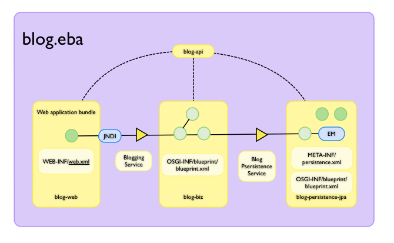

---

<a id="downloads-ct-0.2-incubating-org.osgi.test.cases.blueprint"></a>

<!-- source_url: https://aries.apache.org/documentation/downloads/ct/0.2-incubating/org.osgi.test.cases.blueprint.html -->

<!-- page_index: 86 -->

# Untitled :: Apache Aries

Documentation
master

- Documentation
  - [master](#index)

[Edit this Page](https://github.com/apache/aries-antora-site/edit/master/modules/ROOT/pages/downloads/ct/0.2-incubating/org.osgi.test.cases.blueprint.adoc)

Test

<a id="downloads-ct-0.2-incubating-org.osgi.test.cases.blueprint--summary"></a>

## Summary

The following table provides a sumary of the test information.

<table>
<tr>
<th>Property Key</th><th>Property Value</th>
</tr>
<tr>
<td width="50%">Target</td><td>/Users/zoe/Workspaces/aries/ComplianceTests/ApacheAriesTests/jar/org.osgi.test.cases.blueprint-4.2.0.jar</td>
</tr>
<tr>
<td width="50%">Framework</td><td>org.eclipse.osgi.launch.Equinox@bf5555</td>
</tr>
<tr>
<td width="50%">Testrun</td><td>Wed Sep 01 16:59:17 BST 2010</td>
</tr>
<tr>
<th colspan="2">Bundles</th>
</tr>
<tr>
<td>org.eclipse.osgi</td><td>3.5.0.v20090520</td>
</tr>
<tr>
<td>osgi.cmpn</td><td>4.2.0.200908310645</td>
</tr>
<tr>
<td>org.ops4j.pax.logging.pax-logging-api</td><td>1.4</td>
</tr>
<tr>
<td>org.ops4j.pax.logging.pax-logging-service</td><td>1.4</td>
</tr>
<tr>
<td>org.eclipse.equinox.cm</td><td>3.2.0.v20070116</td>
</tr>
<tr>
<td>org.eclipse.equinox.event</td><td>1.1.100.v20090520-1800</td>
</tr>
<tr>
<td>org.apache.felix.configadmin</td><td>1.2.4</td>
</tr>
<tr>
<td>org.apache.aries.blueprint</td><td>0.2.0.incubating</td>
</tr>
<tr>
<td>org.osgi.test.cases.blueprint</td><td>4.2.0.201004301237</td>
</tr>
</table>

<a id="downloads-ct-0.2-incubating-org.osgi.test.cases.blueprint--testcases"></a>

## Testcases

The following table shows the results of each test. A red icon indicates that the
test failed or had an error. A green icon
indicates success. Any errors or failure messages
will be displayed as a list beneath the test name. To see the
exception, click on the info icon on the right.

<table width="100%">
<tr>
<th width="15px"></th><th>Test</th><th>Failures</th><th>Error</th><th>Info</th>
</tr>
<tr>
<td width="15px"></td><td>testSignature</td><td>0</td><td>0</td><td></td>
</tr>
<tr>
<td width="15px"></td><td>testConstructorInjection</td><td>0</td><td>0</td><td></td>
</tr>
<tr>
<td width="15px"></td><td>testInstanceFactoryConstructorInjection</td><td>0</td><td>0</td><td></td>
</tr>
<tr>
<td width="15px"></td><td>testStaticFactoryConstructorInjection</td><td>0</td><td>0</td><td></td>
</tr>
<tr>
<td width="15px"></td><td>testPropertyInjection</td><td>0</td><td>0</td><td></td>
</tr>
<tr>
<td width="15px"></td><td>testInstanceFactoryPropertyInjection</td><td>0</td><td>0</td><td></td>
</tr>
<tr>
<td width="15px"></td><td>testStaticFactoryPropertyInjection</td><td>0</td><td>0</td><td></td>
</tr>
<tr>
<td width="15px"></td><td>testCompoundProperty</td><td>0</td><td>0</td><td></td>
</tr>
<tr>
<td width="15px"></td><td>testCompoundPropertyMissingName</td><td>0</td><td>0</td><td></td>
</tr>
<tr>
<td width="15px"></td><td>testCompoundPropertyMissingValue</td><td>0</td><td>0</td><td></td>
</tr>
<tr>
<td width="15px"></td><td>testServicePropertiesReevaluation</td><td>0</td><td>0</td><td></td>
</tr>
<tr>
<td width="15px"></td><td>testComponentDirectDependency</td><td>0</td><td>0</td><td></td>
</tr>
<tr>
<td width="15px"></td><td>testComponentDependsOnDependency</td><td>0</td><td>0</td><td></td>
</tr>
<tr>
<td width="15px"></td><td>testServiceDependsOnDependency</td><td>0</td><td>0</td><td></td>
</tr>
<tr>
<td width="15px"></td><td>testComponentWaitingDependency</td><td>0</td><td>0</td><td></td>
</tr>
<tr>
<td width="15px"></td><td>testMultipleGracePeriod</td><td>0</td><td>0</td><td></td>
</tr>
<tr>
<td width="15px"></td><td>testComponentNowaitDependency</td><td>0</td><td>0</td><td></td>
</tr>
<tr>
<td width="15px"></td><td>testComponentTimeoutDependency</td><td>0</td><td>0</td><td></td>
</tr>
<tr>
<td width="15px"></td><td>testInfiniteComponentTimeoutDependency</td><td>0</td><td>0</td><td></td>
</tr>
<tr>
<td width="15px"></td><td>testServiceRequestInitialization</td><td>0</td><td>0</td><td></td>
</tr>
<tr>
<td width="15px"></td><td>testServiceRequestActivation</td><td>0</td><td>0</td><td></td>
</tr>
<tr>
<td width="15px"></td><td>testEagerServiceRequestInitialization</td><td>0</td><td>0</td><td></td>
</tr>
<tr>
<td width="15px"></td><td>testServiceReferenceExport</td><td>0</td><td>0</td><td></td>
</tr>
<tr>
<td width="15px"></td><td>testInlineServiceReferenceExport</td><td>0</td><td>0</td><td></td>
</tr>
<tr>
<td width="15px"></td><td>testIndirectServiceReferenceExport</td><td>0</td><td>0</td><td></td>
</tr>
<tr>
<td width="15px"></td><td>testCustomTypeInjection</td><td>0</td><td>0</td><td></td>
</tr>
<tr>
<td width="15px"></td><td>testMultiRegisteredConverter</td><td>0</td><td>0</td><td></td>
</tr>
<tr>
<td width="15px"></td><td>testCustomBooleanConverter</td><td>0</td><td>0</td><td></td>
</tr>
<tr>
<td width="15px"></td><td>testServiceBooleanConverter</td><td>0</td><td>0</td><td></td>
</tr>
<tr>
<td width="15px"></td><td>testSubclassConverterInstead</td><td>0</td><td>0</td><td></td>
</tr>
<tr>
<td width="15px"></td><td>testConverterCalled</td><td>0</td><td>0</td><td></td>
</tr>
<tr>
<td width="15px"></td><td>testConversionServiceInjection</td><td>0</td><td>0</td><td></td>
</tr>
<tr>
<td width="15px"></td><td>testConversionServiceInjectionOverride</td><td>0</td><td>0</td><td></td>
</tr>
<tr>
<td width="15px"></td><td>testConstructorShortArgs</td><td>0</td><td>0</td><td></td>
</tr>
<tr>
<td width="15px"></td><td>testConstructorLongArgs</td><td>0</td><td>0</td><td></td>
</tr>
<tr>
<td width="15px"></td><td>testStaticFactoryShortArgs</td><td>0</td><td>0</td><td></td>
</tr>
<tr>
<td width="15px"></td><td>testStaticFactoryLongArgs</td><td>0</td><td>0</td><td></td>
</tr>
<tr>
<td width="15px"></td><td>testInstanceFactoryShortArgs</td><td>0</td><td>0</td><td></td>
</tr>
<tr>
<td width="15px"></td><td>testInstanceFactoryLongArgs</td><td>0</td><td>0</td><td></td>
</tr>
<tr>
<td width="15px"></td><td>testStringTypeConstructor</td><td>0</td><td>0</td><td></td>
</tr>
<tr>
<td width="15px"></td><td>testWrapperPrimitiveAmbiguity</td><td>0</td><td>0</td><td></td>
</tr>
<tr>
<td width="15px"></td><td>testInstanceWrapperPrimitiveAmbiguity</td><td>0</td><td>0</td><td></td>
</tr>
<tr>
<td width="15px"></td><td>testStaticWrapperPrimitiveAmbiguity</td><td>0</td><td>0</td><td></td>
</tr>
<tr>
<td width="15px"></td><td>testPrimitiveWrapperAmbiguity</td><td>0</td><td>0</td><td></td>
</tr>
<tr>
<td width="15px"></td><td>testInstancePrimitiveWrapperAmbiguity</td><td>0</td><td>0</td><td></td>
</tr>
<tr>
<td width="15px"></td><td>testStaticPrimitiveWrapperAmbiguity</td><td>0</td><td>0</td><td></td>
</tr>
<tr>
<td width="15px"></td><td>testAssignabilityAmbiguity</td><td>0</td><td>0</td><td></td>
</tr>
<tr>
<td width="15px"></td><td>testInstanceAssignabilityAmbiguity</td><td>0</td><td>0</td><td></td>
</tr>
<tr>
<td width="15px"></td><td>testStaticAssignabilityAmbiguity</td><td>0</td><td>0</td><td></td>
</tr>
<tr>
<td width="15px"></td><td>testStringConversionAmbiguity</td><td>0</td><td>0</td><td></td>
</tr>
<tr>
<td width="15px"></td><td>testInstanceStringConversionAmbiguity</td><td>0</td><td>0</td><td></td>
</tr>
<tr>
<td width="15px"></td><td>testStaticStringConversionAmbiguity</td><td>0</td><td>0</td><td></td>
</tr>
<tr>
<td width="15px"></td><td>testCollectionConversionAmbiguity</td><td>0</td><td>0</td><td></td>
</tr>
<tr>
<td width="15px"></td><td>testInstanceCollectionConversionAmbiguity</td><td>0</td><td>0</td><td></td>
</tr>
<tr>
<td width="15px"></td><td>testStaticCollectionConversionAmbiguity</td><td>0</td><td>0</td><td></td>
</tr>
<tr>
<td width="15px"></td><td>testMapConversionAmbiguity</td><td>0</td><td>0</td><td></td>
</tr>
<tr>
<td width="15px"></td><td>testInstanceMapConversionAmbiguity</td><td>0</td><td>0</td><td></td>
</tr>
<tr>
<td width="15px"></td><td>testStaticMapConversionAmbiguity</td><td>0</td><td>0</td><td></td>
</tr>
<tr>
<td width="15px"></td><td>testExtenderStart</td><td>0</td><td>0</td><td></td>
</tr>
<tr>
<td width="15px"></td><td>testExtenderStop<ul>
<li>Unexpected event BlueprintContainerEvent org/osgi/test/cases/blueprint/BlueprintContainer/FAILURE for bundle org.osgi.test.cases.blueprint.circular_ref_one with properties: [bundle.id=76, bundle.version=4.2.0, cause=org.osgi.service.blueprint.container.ComponentDefinitionException: Error setting property: PropertyDescriptor &lt;name: two, getter: null, setter: [public void org.osgi.test.cases.blueprint.components.serviceimport.ServiceProxyChecker.setTwo(org.osgi.test.cases.blueprint.services.TestServiceTwo)], event=org.osgi.service.blueprint.container.BlueprintEvent@16a8823, event.topics=org/osgi/test/cases/blueprint/BlueprintContainer/FAILURE, bundle=org.osgi.test.cases.blueprint.circular_ref_one_4.2.0 [76], bundle.symbolicName=org.osgi.test.cases.blueprint.circular_ref_one, extender.bundle=org.apache.aries.blueprint_0.2.0.incubating [7] ] was received:</li>
</ul>
<pre id="testExtenderStop">
<div>

junit.framework.AssertionFailedError: Unexpected event BlueprintContainerEvent org/osgi/test/cases/blueprint/BlueprintContainer/FAILURE for bundle org.osgi.test.cases.blueprint.circular_ref_one with properties: [bundle.id=76, bundle.version=4.2.0, cause=org.osgi.service.blueprint.container.ComponentDefinitionException: Error setting property: PropertyDescriptor &lt;name: two, getter: null, setter: [public void org.osgi.test.cases.blueprint.components.serviceimport.ServiceProxyChecker.setTwo(org.osgi.test.cases.blueprint.services.TestServiceTwo)], event=org.osgi.service.blueprint.container.BlueprintEvent@16a8823, event.topics=org/osgi/test/cases/blueprint/BlueprintContainer/FAILURE, bundle=org.osgi.test.cases.blueprint.circular_ref_one_4.2.0 [76], bundle.symbolicName=org.osgi.test.cases.blueprint.circular_ref_one, extender.bundle=org.apache.aries.blueprint_0.2.0.incubating [7] ] was received:
	at org.osgi.test.cases.blueprint.framework.AdminTestEvent.failUnexpected(AdminTestEvent.java:99)
	at org.osgi.test.cases.blueprint.framework.TestPhase.checkEventResults(TestPhase.java:184)
	at org.osgi.test.cases.blueprint.framework.TestPhase.runTest(TestPhase.java:245)
	at org.osgi.test.cases.blueprint.framework.BaseTestController.runTest(BaseTestController.java:294)
	at org.osgi.test.cases.blueprint.framework.BaseTestController.run(BaseTestController.java:407)
	at org.osgi.test.cases.blueprint.tests.TestExtenderLifeCycle.testExtenderStop(TestExtenderLifeCycle.java:172)
	at sun.reflect.NativeMethodAccessorImpl.invoke0(Native Method)
	at sun.reflect.NativeMethodAccessorImpl.invoke(NativeMethodAccessorImpl.java:39)
	at sun.reflect.DelegatingMethodAccessorImpl.invoke(DelegatingMethodAccessorImpl.java:25)
	at java.lang.reflect.Method.invoke(Method.java:597)
	at junit.framework.TestCase.runTest(TestCase.java:164)
	at junit.framework.TestCase.runBare(TestCase.java:130)
	at junit.framework.TestResult$1.protect(TestResult.java:106)
	at junit.framework.TestResult.runProtected(TestResult.java:124)
	at junit.framework.TestResult.run(TestResult.java:109)
	at junit.framework.TestCase.run(TestCase.java:120)
	at junit.framework.TestSuite.runTest(TestSuite.java:230)
	at junit.framework.TestSuite.run(TestSuite.java:225)
	at junit.framework.TestSuite.runTest(TestSuite.java:230)
	at junit.framework.TestSuite.run(TestSuite.java:225)
	at aQute.junit.runtime.Target.doTesting(Target.java:234)
	at aQute.junit.runtime.Target.run(Target.java:57)
	at aQute.junit.runtime.Target.main(Target.java:37)
Caused by: org.osgi.service.blueprint.container.ComponentDefinitionException: Error setting property: PropertyDescriptor &lt;name: two, getter: null, setter: [public void org.osgi.test.cases.blueprint.components.serviceimport.ServiceProxyChecker.setTwo(org.osgi.test.cases.blueprint.services.TestServiceTwo)]
	at org.apache.aries.blueprint.container.BeanRecipe.setProperty(BeanRecipe.java:827)
	at org.apache.aries.blueprint.container.BeanRecipe.setProperties(BeanRecipe.java:793)
	at org.apache.aries.blueprint.container.BeanRecipe.setProperties(BeanRecipe.java:774)
	at org.apache.aries.blueprint.container.BeanRecipe.internalCreate(BeanRecipe.java:740)
	at org.apache.aries.blueprint.di.AbstractRecipe.create(AbstractRecipe.java:64)
	at org.apache.aries.blueprint.container.BlueprintRepository.createInstances(BlueprintRepository.java:219)
	at org.apache.aries.blueprint.container.BlueprintRepository.createAll(BlueprintRepository.java:147)
	at org.apache.aries.blueprint.container.BlueprintContainerImpl.instantiateEagerComponents(BlueprintContainerImpl.java:624)
	at org.apache.aries.blueprint.container.BlueprintContainerImpl.doRun(BlueprintContainerImpl.java:315)
	at org.apache.aries.blueprint.container.BlueprintContainerImpl.run(BlueprintContainerImpl.java:213)
	at java.util.concurrent.Executors$RunnableAdapter.call(Executors.java:441)
	at java.util.concurrent.FutureTask$Sync.innerRun(FutureTask.java:303)
	at java.util.concurrent.FutureTask.run(FutureTask.java:138)
	at java.util.concurrent.ScheduledThreadPoolExecutor$ScheduledFutureTask.access$301(ScheduledThreadPoolExecutor.java:98)
	at java.util.concurrent.ScheduledThreadPoolExecutor$ScheduledFutureTask.run(ScheduledThreadPoolExecutor.java:207)
	at java.util.concurrent.ThreadPoolExecutor$Worker.runTask(ThreadPoolExecutor.java:886)
	at java.util.concurrent.ThreadPoolExecutor$Worker.run(ThreadPoolExecutor.java:908)
	at java.lang.Thread.run(Thread.java:637)
Caused by: org.osgi.service.blueprint.container.ServiceUnavailableException: Timeout expired when waiting for OSGi service
	at org.apache.aries.blueprint.container.ReferenceRecipe.getService(ReferenceRecipe.java:181)
	at org.apache.aries.blueprint.container.ReferenceRecipe.access$000(ReferenceRecipe.java:52)
	at org.apache.aries.blueprint.container.ReferenceRecipe$ServiceDispatcher.call(ReferenceRecipe.java:208)
	at org.apache.aries.blueprint.container.AbstractServiceReferenceRecipe$JdkProxyFactory$1.invoke(AbstractServiceReferenceRecipe.java:632)
	at $Proxy17.testTwo(Unknown Source)
	at org.osgi.test.cases.blueprint.components.serviceimport.ServiceProxyChecker.setTwo(ServiceProxyChecker.java:58)
	at sun.reflect.NativeMethodAccessorImpl.invoke0(Native Method)
	at sun.reflect.NativeMethodAccessorImpl.invoke(NativeMethodAccessorImpl.java:39)
	at sun.reflect.DelegatingMethodAccessorImpl.invoke(DelegatingMethodAccessorImpl.java:25)
	at java.lang.reflect.Method.invoke(Method.java:597)
	at org.apache.aries.blueprint.utils.ReflectionUtils$MethodPropertyDescriptor.internalSet(ReflectionUtils.java:416)
	at org.apache.aries.blueprint.utils.ReflectionUtils$PropertyDescriptor.set(ReflectionUtils.java:302)
	at org.apache.aries.blueprint.container.BeanRecipe.setProperty(BeanRecipe.java:825)
	... 17 more

 </div>
</pre>
</td><td>1</td><td>0</td><td></td>
</tr>
<tr>
<td width="15px"></td><td>testExtenderRankedStop<ul>
<li>Unexpected event BlueprintContainerEvent org/osgi/test/cases/blueprint/BlueprintContainer/FAILURE for bundle org.osgi.test.cases.blueprint.circular_ref_two with properties: [bundle.id=82, bundle.version=4.2.0, cause=org.osgi.service.blueprint.container.ComponentDefinitionException: Error setting property: PropertyDescriptor &lt;name: one, getter: null, setter: [public void org.osgi.test.cases.blueprint.components.serviceimport.ServiceProxyChecker.setOne(org.osgi.test.cases.blueprint.services.TestServiceOne)], event=org.osgi.service.blueprint.container.BlueprintEvent@914a0a, event.topics=org/osgi/test/cases/blueprint/BlueprintContainer/FAILURE, bundle=org.osgi.test.cases.blueprint.circular_ref_two_4.2.0 [82], bundle.symbolicName=org.osgi.test.cases.blueprint.circular_ref_two, extender.bundle=org.apache.aries.blueprint_0.2.0.incubating [7] ] was received:</li>
</ul>
<pre id="testExtenderRankedStop">
<div>

junit.framework.AssertionFailedError: Unexpected event BlueprintContainerEvent org/osgi/test/cases/blueprint/BlueprintContainer/FAILURE for bundle org.osgi.test.cases.blueprint.circular_ref_two with properties: [bundle.id=82, bundle.version=4.2.0, cause=org.osgi.service.blueprint.container.ComponentDefinitionException: Error setting property: PropertyDescriptor &lt;name: one, getter: null, setter: [public void org.osgi.test.cases.blueprint.components.serviceimport.ServiceProxyChecker.setOne(org.osgi.test.cases.blueprint.services.TestServiceOne)], event=org.osgi.service.blueprint.container.BlueprintEvent@914a0a, event.topics=org/osgi/test/cases/blueprint/BlueprintContainer/FAILURE, bundle=org.osgi.test.cases.blueprint.circular_ref_two_4.2.0 [82], bundle.symbolicName=org.osgi.test.cases.blueprint.circular_ref_two, extender.bundle=org.apache.aries.blueprint_0.2.0.incubating [7] ] was received:
	at org.osgi.test.cases.blueprint.framework.AdminTestEvent.failUnexpected(AdminTestEvent.java:99)
	at org.osgi.test.cases.blueprint.framework.TestPhase.checkEventResults(TestPhase.java:184)
	at org.osgi.test.cases.blueprint.framework.TestPhase.runTest(TestPhase.java:245)
	at org.osgi.test.cases.blueprint.framework.BaseTestController.runTest(BaseTestController.java:294)
	at org.osgi.test.cases.blueprint.framework.BaseTestController.run(BaseTestController.java:407)
	at org.osgi.test.cases.blueprint.tests.TestExtenderLifeCycle.testExtenderRankedStop(TestExtenderLifeCycle.java:274)
	at sun.reflect.NativeMethodAccessorImpl.invoke0(Native Method)
	at sun.reflect.NativeMethodAccessorImpl.invoke(NativeMethodAccessorImpl.java:39)
	at sun.reflect.DelegatingMethodAccessorImpl.invoke(DelegatingMethodAccessorImpl.java:25)
	at java.lang.reflect.Method.invoke(Method.java:597)
	at junit.framework.TestCase.runTest(TestCase.java:164)
	at junit.framework.TestCase.runBare(TestCase.java:130)
	at junit.framework.TestResult$1.protect(TestResult.java:106)
	at junit.framework.TestResult.runProtected(TestResult.java:124)
	at junit.framework.TestResult.run(TestResult.java:109)
	at junit.framework.TestCase.run(TestCase.java:120)
	at junit.framework.TestSuite.runTest(TestSuite.java:230)
	at junit.framework.TestSuite.run(TestSuite.java:225)
	at junit.framework.TestSuite.runTest(TestSuite.java:230)
	at junit.framework.TestSuite.run(TestSuite.java:225)
	at aQute.junit.runtime.Target.doTesting(Target.java:234)
	at aQute.junit.runtime.Target.run(Target.java:57)
	at aQute.junit.runtime.Target.main(Target.java:37)
Caused by: org.osgi.service.blueprint.container.ComponentDefinitionException: Error setting property: PropertyDescriptor &lt;name: one, getter: null, setter: [public void org.osgi.test.cases.blueprint.components.serviceimport.ServiceProxyChecker.setOne(org.osgi.test.cases.blueprint.services.TestServiceOne)]
	at org.apache.aries.blueprint.container.BeanRecipe.setProperty(BeanRecipe.java:827)
	at org.apache.aries.blueprint.container.BeanRecipe.setProperties(BeanRecipe.java:793)
	at org.apache.aries.blueprint.container.BeanRecipe.setProperties(BeanRecipe.java:774)
	at org.apache.aries.blueprint.container.BeanRecipe.internalCreate(BeanRecipe.java:740)
	at org.apache.aries.blueprint.di.AbstractRecipe.create(AbstractRecipe.java:64)
	at org.apache.aries.blueprint.container.BlueprintRepository.createInstances(BlueprintRepository.java:219)
	at org.apache.aries.blueprint.container.BlueprintRepository.createAll(BlueprintRepository.java:147)
	at org.apache.aries.blueprint.container.BlueprintContainerImpl.instantiateEagerComponents(BlueprintContainerImpl.java:624)
	at org.apache.aries.blueprint.container.BlueprintContainerImpl.doRun(BlueprintContainerImpl.java:315)
	at org.apache.aries.blueprint.container.BlueprintContainerImpl.run(BlueprintContainerImpl.java:213)
	at java.util.concurrent.Executors$RunnableAdapter.call(Executors.java:441)
	at java.util.concurrent.FutureTask$Sync.innerRun(FutureTask.java:303)
	at java.util.concurrent.FutureTask.run(FutureTask.java:138)
	at java.util.concurrent.ScheduledThreadPoolExecutor$ScheduledFutureTask.access$301(ScheduledThreadPoolExecutor.java:98)
	at java.util.concurrent.ScheduledThreadPoolExecutor$ScheduledFutureTask.run(ScheduledThreadPoolExecutor.java:207)
	at java.util.concurrent.ThreadPoolExecutor$Worker.runTask(ThreadPoolExecutor.java:886)
	at java.util.concurrent.ThreadPoolExecutor$Worker.run(ThreadPoolExecutor.java:908)
	at java.lang.Thread.run(Thread.java:637)
Caused by: org.osgi.service.blueprint.container.ServiceUnavailableException: Timeout expired when waiting for OSGi service
	at org.apache.aries.blueprint.container.ReferenceRecipe.getService(ReferenceRecipe.java:181)
	at org.apache.aries.blueprint.container.ReferenceRecipe.access$000(ReferenceRecipe.java:52)
	at org.apache.aries.blueprint.container.ReferenceRecipe$ServiceDispatcher.call(ReferenceRecipe.java:208)
	at org.apache.aries.blueprint.container.AbstractServiceReferenceRecipe$JdkProxyFactory$1.invoke(AbstractServiceReferenceRecipe.java:632)
	at $Proxy22.testOne(Unknown Source)
	at org.osgi.test.cases.blueprint.components.serviceimport.ServiceProxyChecker.setOne(ServiceProxyChecker.java:46)
	at sun.reflect.NativeMethodAccessorImpl.invoke0(Native Method)
	at sun.reflect.NativeMethodAccessorImpl.invoke(NativeMethodAccessorImpl.java:39)
	at sun.reflect.DelegatingMethodAccessorImpl.invoke(DelegatingMethodAccessorImpl.java:25)
	at java.lang.reflect.Method.invoke(Method.java:597)
	at org.apache.aries.blueprint.utils.ReflectionUtils$MethodPropertyDescriptor.internalSet(ReflectionUtils.java:416)
	at org.apache.aries.blueprint.utils.ReflectionUtils$PropertyDescriptor.set(ReflectionUtils.java:302)
	at org.apache.aries.blueprint.container.BeanRecipe.setProperty(BeanRecipe.java:825)
	... 17 more

 </div>
</pre>
</td><td>1</td><td>0</td><td></td>
</tr>
<tr>
<td width="15px"></td><td>testSingleInterfaceExport</td><td>0</td><td>0</td><td></td>
</tr>
<tr>
<td width="15px"></td><td>testNoGracePeriod</td><td>0</td><td>0</td><td></td>
</tr>
<tr>
<td width="15px"></td><td>testReferenceDependsOn</td><td>0</td><td>0</td><td></td>
</tr>
<tr>
<td width="15px"></td><td>testSingleInterfacePrototypeExport</td><td>0</td><td>0</td><td></td>
</tr>
<tr>
<td width="15px"></td><td>testComponentQualifier</td><td>0</td><td>0</td><td></td>
</tr>
<tr>
<td width="15px"></td><td>testRankingExport</td><td>0</td><td>0</td><td></td>
</tr>
<tr>
<td width="15px"></td><td>testRankingImport</td><td>0</td><td>0</td><td></td>
</tr>
<tr>
<td width="15px"></td><td>testServicePropertyQualifier</td><td>0</td><td>0</td><td></td>
</tr>
<tr>
<td width="15px"></td><td>testComplexServiceProperty</td><td>0</td><td>0</td><td></td>
</tr>
<tr>
<td width="15px"></td><td>testDependsOnQualifier</td><td>0</td><td>0</td><td></td>
</tr>
<tr>
<td width="15px"></td><td>testMultipleInterface</td><td>0</td><td>0</td><td></td>
</tr>
<tr>
<td width="15px"></td><td>testRegistrationListenerImport</td><td>0</td><td>0</td><td></td>
</tr>
<tr>
<td width="15px"></td><td>testInlineRegistrationListenerImport</td><td>0</td><td>0</td><td></td>
</tr>
<tr>
<td width="15px"></td><td>testConcreteInterface</td><td>0</td><td>0</td><td></td>
</tr>
<tr>
<td width="15px"></td><td>testAutoInterface</td><td>0</td><td>0</td><td></td>
</tr>
<tr>
<td width="15px"></td><td>testAutoHierarchy</td><td>0</td><td>0</td><td></td>
</tr>
<tr>
<td width="15px"></td><td>testConcreteClassImport</td><td>0</td><td>0</td><td></td>
</tr>
<tr>
<td width="15px"></td><td>testAutoAll</td><td>0</td><td>0</td><td></td>
</tr>
<tr>
<td width="15px"></td><td>testFactoryExport</td><td>0</td><td>0</td><td></td>
</tr>
<tr>
<td width="15px"></td><td>testPrototypeFactoryExport</td><td>0</td><td>0</td><td></td>
</tr>
<tr>
<td width="15px"></td><td>testRegistrationInjection</td><td>0</td><td>0</td><td></td>
</tr>
<tr>
<td width="15px"></td><td>testInlineRegistrationInjection</td><td>0</td><td>0</td><td></td>
</tr>
<tr>
<td width="15px"></td><td>testDependencyWait</td><td>0</td><td>0</td><td></td>
</tr>
<tr>
<td width="15px"></td><td>testListenerExport</td><td>0</td><td>0</td><td></td>
</tr>
<tr>
<td width="15px"></td><td>testRegistrationListenerSingletonSignature</td><td>0</td><td>0</td><td></td>
</tr>
<tr>
<td width="15px"></td><td>testListenerRegisteredExport</td><td>0</td><td>0</td><td></td>
</tr>
<tr>
<td width="15px"></td><td>testListenerUnregisteredExport</td><td>0</td><td>0</td><td></td>
</tr>
<tr>
<td width="15px"></td><td>testPrototypeListenerExport</td><td>0</td><td>0</td><td></td>
</tr>
<tr>
<td width="15px"></td><td>testInlineListenerExport</td><td>0</td><td>0</td><td></td>
</tr>
<tr>
<td width="15px"></td><td>testCircularListenerExport</td><td>0</td><td>0</td><td></td>
</tr>
<tr>
<td width="15px"></td><td>testMultipleListenerExport</td><td>0</td><td>0</td><td></td>
</tr>
<tr>
<td width="15px"></td><td>testMultipleListenerMethodExport</td><td>0</td><td>0</td><td></td>
</tr>
<tr>
<td width="15px"></td><td>testServiceImportedListenerImport</td><td>0</td><td>0</td><td></td>
</tr>
<tr>
<td width="15px"></td><td>testInlineServiceImportedListenerImport</td><td>0</td><td>0</td><td></td>
</tr>
<tr>
<td width="15px"></td><td>testReferenceListenerBindOnly</td><td>0</td><td>0</td><td></td>
</tr>
<tr>
<td width="15px"></td><td>testReferenceListenerUnbindOnly</td><td>0</td><td>0</td><td></td>
</tr>
<tr>
<td width="15px"></td><td>testCircularServiceListenerImport</td><td>0</td><td>0</td><td></td>
</tr>
<tr>
<td width="15px"></td><td>testServiceMultipleListenerImport</td><td>0</td><td>0</td><td></td>
</tr>
<tr>
<td width="15px"></td><td>testServiceMultipleListenerMethodImport</td><td>0</td><td>0</td><td></td>
</tr>
<tr>
<td width="15px"></td><td>testServiceListenerReferenceMethodImport</td><td>0</td><td>0</td><td></td>
</tr>
<tr>
<td width="15px"></td><td>testServiceListenerNoMapMethodImport</td><td>0</td><td>0</td><td></td>
</tr>
<tr>
<td width="15px"></td><td>testUnregisteredServiceDependency</td><td>0</td><td>0</td><td></td>
</tr>
<tr>
<td width="15px"></td><td>testReplacementServiceDependency</td><td>0</td><td>0</td><td></td>
</tr>
<tr>
<td width="15px"></td><td>testWaitingServiceDependency</td><td>0</td><td>0</td><td></td>
</tr>
<tr>
<td width="15px"></td><td>testUnavailableServiceDependency</td><td>0</td><td>0</td><td></td>
</tr>
<tr>
<td width="15px"></td><td>testUnavailableServiceDefaultDependency</td><td>0</td><td>0</td><td></td>
</tr>
<tr>
<td width="15px"></td><td>testServiceRebind</td><td>0</td><td>0</td><td></td>
</tr>
<tr>
<td width="15px"></td><td>testServiceRankingRebind</td><td>0</td><td>0</td><td></td>
</tr>
<tr>
<td width="15px"></td><td>testServiceRegistrationProxy</td><td>0</td><td>0</td><td></td>
</tr>
<tr>
<td width="15px"></td><td>testLazyServiceRegistration</td><td>0</td><td>0</td><td></td>
</tr>
<tr>
<td width="15px"></td><td>testLazyReference</td><td>0</td><td>0</td><td></td>
</tr>
<tr>
<td width="15px"></td><td>testLazyServiceGet</td><td>0</td><td>0</td><td></td>
</tr>
<tr>
<td width="15px"></td><td>testInterfacelessReference</td><td>0</td><td>0</td><td></td>
</tr>
<tr>
<td width="15px"></td><td>testRegistrationListenerInitialState</td><td>0</td><td>0</td><td></td>
</tr>
<tr>
<td width="15px"></td><td>testStartComponentDefault</td><td>0</td><td>0</td><td></td>
</tr>
<tr>
<td width="15px"></td><td>testWildcardHeader</td><td>0</td><td>0</td><td></td>
</tr>
<tr>
<td width="15px"></td><td>testStartComponentMultiple</td><td>0</td><td>0</td><td></td>
</tr>
<tr>
<td width="15px"></td><td>testStartComponentExplicit</td><td>0</td><td>0</td><td></td>
</tr>
<tr>
<td width="15px"></td><td>testStartComponentAttributes</td><td>0</td><td>0</td><td></td>
</tr>
<tr>
<td width="15px"></td><td>testSinglePathMultipleDir</td><td>0</td><td>0</td><td></td>
</tr>
<tr>
<td width="15px"></td><td>testMultiplePathMultipleDir</td><td>0</td><td>0</td><td></td>
</tr>
<tr>
<td width="15px"></td><td>testStartComponentAttributes2</td><td>0</td><td>0</td><td></td>
</tr>
<tr>
<td width="15px"></td><td>testStartComponentDifferentDir</td><td>0</td><td>0</td><td></td>
</tr>
<tr>
<td width="15px"></td><td>testStartComponentDirOnly</td><td>0</td><td>0</td><td></td>
</tr>
<tr>
<td width="15px"></td><td>testNoNameDefault</td><td>0</td><td>0</td><td></td>
</tr>
<tr>
<td width="15px"></td><td>testInitDestroy</td><td>0</td><td>0</td><td></td>
</tr>
<tr>
<td width="15px"></td><td>testStaticFactory</td><td>0</td><td>0</td><td></td>
</tr>
<tr>
<td width="15px"></td><td>testPrimitiveStaticFactory</td><td>0</td><td>0</td><td></td>
</tr>
<tr>
<td width="15px"></td><td>testComponentFactory</td><td>0</td><td>0</td><td></td>
</tr>
<tr>
<td width="15px"></td><td>testServiceFactory</td><td>0</td><td>0</td><td></td>
</tr>
<tr>
<td width="15px"></td><td>testPrimitiveInstanceFactory</td><td>0</td><td>0</td><td></td>
</tr>
<tr>
<td width="15px"></td><td>testModuleContextAware</td><td>0</td><td>0</td><td></td>
</tr>
<tr>
<td width="15px"></td><td>testComponentIdCase</td><td>0</td><td>0</td><td></td>
</tr>
<tr>
<td width="15px"></td><td>testBlueprintId</td><td>0</td><td>0</td><td></td>
</tr>
<tr>
<td width="15px"></td><td>testNonBlueprintBundle</td><td>0</td><td>0</td><td></td>
</tr>
<tr>
<td width="15px"></td><td>testNonBlueprintBundleEmptyDir</td><td>0</td><td>0</td><td></td>
</tr>
<tr>
<td width="15px"></td><td>testBlueprintBundleWildcardNoMatch</td><td>0</td><td>0</td><td></td>
</tr>
<tr>
<td width="15px"></td><td>testEmptyBlueprintBundleHeader</td><td>0</td><td>0</td><td></td>
</tr>
<tr>
<td width="15px"></td><td>testIncompatibleVersion</td><td>0</td><td>0</td><td></td>
</tr>
<tr>
<td width="15px"></td><td>testBlueprintListenerReplay</td><td>0</td><td>0</td><td></td>
</tr>
<tr>
<td width="15px"></td><td>testFragmentDefault</td><td>0</td><td>0</td><td></td>
</tr>
<tr>
<td width="15px"></td><td>testConcreteClassImport</td><td>0</td><td>0</td><td></td>
</tr>
<tr>
<td width="15px"></td><td>testNoConfigFile</td><td>0</td><td>0</td><td></td>
</tr>
<tr>
<td width="15px"></td><td>testMissingConfigFile</td><td>0</td><td>0</td><td></td>
</tr>
<tr>
<td width="15px"></td><td>testDuplicateComponentName</td><td>0</td><td>0</td><td></td>
</tr>
<tr>
<td width="15px"></td><td>testMissingComponentClass</td><td>0</td><td>0</td><td></td>
</tr>
<tr>
<td width="15px"></td><td>testNoComponentClass</td><td>0</td><td>0</td><td></td>
</tr>
<tr>
<td width="15px"></td><td>testStaticFactoryMissingClass</td><td>0</td><td>0</td><td></td>
</tr>
<tr>
<td width="15px"></td><td>testStaticFactoryMissingMethod</td><td>0</td><td>0</td><td></td>
</tr>
<tr>
<td width="15px"></td><td>testStaticFactoryNonPublicClass</td><td>0</td><td>0</td><td></td>
</tr>
<tr>
<td width="15px"></td><td>testStaticFactoryNonPublicMethod</td><td>0</td><td>0</td><td></td>
</tr>
<tr>
<td width="15px"></td><td>testStaticFactoryNonStaticMethod</td><td>0</td><td>0</td><td></td>
</tr>
<tr>
<td width="15px"></td><td>testStaticFactoryNoClass</td><td>0</td><td>0</td><td></td>
</tr>
<tr>
<td width="15px"></td><td>testInstanceFactoryMissingMethod</td><td>0</td><td>0</td><td></td>
</tr>
<tr>
<td width="15px"></td><td>testInstanceFactoryNoMethod</td><td>0</td><td>0</td><td></td>
</tr>
<tr>
<td width="15px"></td><td>testStaticFactoryNoComponent</td><td>0</td><td>0</td><td></td>
</tr>
<tr>
<td width="15px"></td><td>testConstructorException</td><td>0</td><td>0</td><td></td>
</tr>
<tr>
<td width="15px"></td><td>testLazyConstructorException</td><td>0</td><td>0</td><td></td>
</tr>
<tr>
<td width="15px"></td><td>testInstanceFactoryException</td><td>0</td><td>0</td><td></td>
</tr>
<tr>
<td width="15px"></td><td>testStaticFactoryException</td><td>0</td><td>0</td><td></td>
</tr>
<tr>
<td width="15px"></td><td>testPropertyException</td><td>0</td><td>0</td><td></td>
</tr>
<tr>
<td width="15px"></td><td>testInitMethodException</td><td>0</td><td>0</td><td></td>
</tr>
<tr>
<td width="15px"></td><td>testDestroyMethodException</td><td>0</td><td>0</td><td></td>
</tr>
<tr>
<td width="15px"></td><td>testNoConstructorMatch</td><td>0</td><td>0</td><td></td>
</tr>
<tr>
<td width="15px"></td><td>testConstructorTypeMismatch</td><td>0</td><td>0</td><td></td>
</tr>
<tr>
<td width="15px"></td><td>testConstructorInvalidType</td><td>0</td><td>0</td><td></td>
</tr>
<tr>
<td width="15px"></td><td>testConstructorNonPrivate</td><td>0</td><td>0</td><td></td>
</tr>
<tr>
<td width="15px"></td><td>testConversionError</td><td>0</td><td>0</td><td></td>
</tr>
<tr>
<td width="15px"></td><td>testIncompatibleType</td><td>0</td><td>0</td><td></td>
</tr>
<tr>
<td width="15px"></td><td>testConversionServiceError</td><td>0</td><td>0</td><td></td>
</tr>
<tr>
<td width="15px"></td><td>testConversionServiceOverrideError</td><td>0</td><td>0</td><td></td>
</tr>
<tr>
<td width="15px"></td><td>testTypeConverterError</td><td>0</td><td>0</td><td></td>
</tr>
<tr>
<td width="15px"></td><td>testMissingReferenceError</td><td>0</td><td>0</td><td></td>
</tr>
<tr>
<td width="15px"></td><td>testMissingIdrefError</td><td>0</td><td>0</td><td></td>
</tr>
<tr>
<td width="15px"></td><td>testCircularReferenceError</td><td>0</td><td>0</td><td></td>
</tr>
<tr>
<td width="15px"></td><td>testPrimitiveNull</td><td>0</td><td>0</td><td></td>
</tr>
<tr>
<td width="15px"></td><td>testMissingProperty</td><td>0</td><td>0</td><td></td>
</tr>
<tr>
<td width="15px"></td><td>testProtectedProperty</td><td>0</td><td>0</td><td></td>
</tr>
<tr>
<td width="15px"></td><td>testPrivateProperty</td><td>0</td><td>0</td><td></td>
</tr>
<tr>
<td width="15px"></td><td>testBadProperty</td><td>0</td><td>0</td><td></td>
</tr>
<tr>
<td width="15px"></td><td>testSkippedIndex</td><td>0</td><td>0</td><td></td>
</tr>
<tr>
<td width="15px"></td><td>testDuplicateIndex</td><td>0</td><td>0</td><td></td>
</tr>
<tr>
<td width="15px"></td><td>testPartialIndex</td><td>0</td><td>0</td><td></td>
</tr>
<tr>
<td width="15px"></td><td>testInitNoMethod</td><td>0</td><td>0</td><td></td>
</tr>
<tr>
<td width="15px"></td><td>testDestroyNoMethod</td><td>0</td><td>0</td><td></td>
</tr>
<tr>
<td width="15px"></td><td>testInitBadMethod</td><td>0</td><td>0</td><td></td>
</tr>
<tr>
<td width="15px"></td><td>testDestroyBadMethod</td><td>0</td><td>0</td><td></td>
</tr>
<tr>
<td width="15px"></td><td>testServiceBadComponent</td><td>0</td><td>0</td><td></td>
</tr>
<tr>
<td width="15px"></td><td>testServiceBadInterface</td><td>0</td><td>0</td><td></td>
</tr>
<tr>
<td width="15px"></td><td>testServiceNoComponent</td><td>0</td><td>0</td><td></td>
</tr>
<tr>
<td width="15px"></td><td>testServiceNoInterface</td><td>0</td><td>0</td><td></td>
</tr>
<tr>
<td width="15px"></td><td>testServiceWrongInterface</td><td>0</td><td>0</td><td></td>
</tr>
<tr>
<td width="15px"></td><td>testServiceDupInterface</td><td>0</td><td>0</td><td></td>
</tr>
<tr>
<td width="15px"></td><td>testServiceListenerBadComponent</td><td>0</td><td>0</td><td></td>
</tr>
<tr>
<td width="15px"></td><td>testServiceListenerBadRegister</td><td>0</td><td>0</td><td></td>
</tr>
<tr>
<td width="15px"></td><td>testServiceListenerBadUnregister</td><td>0</td><td>0</td><td></td>
</tr>
<tr>
<td width="15px"></td><td>testServiceListenerNonPublicRegistered</td><td>0</td><td>0</td><td></td>
</tr>
<tr>
<td width="15px"></td><td>testServiceListenerNonPublicUnregistered</td><td>0</td><td>0</td><td></td>
</tr>
<tr>
<td width="15px"></td><td>testServiceListenerNoComponent</td><td>0</td><td>0</td><td></td>
</tr>
<tr>
<td width="15px"></td><td>testServiceListenerNoMethods</td><td>0</td><td>0</td><td></td>
</tr>
<tr>
<td width="15px"></td><td>testServiceListenerNoRegister</td><td>0</td><td>0</td><td></td>
</tr>
<tr>
<td width="15px"></td><td>testServiceListenerRefInline</td><td>0</td><td>0</td><td></td>
</tr>
<tr>
<td width="15px"></td><td>testServiceListenerNoUnregister</td><td>0</td><td>0</td><td></td>
</tr>
<tr>
<td width="15px"></td><td>testComponentBadDependson</td><td>0</td><td>0</td><td></td>
</tr>
<tr>
<td width="15px"></td><td>testServiceBadDependson</td><td>0</td><td>0</td><td></td>
</tr>
<tr>
<td width="15px"></td><td>testReferenceBadInterface</td><td>0</td><td>0</td><td></td>
</tr>
<tr>
<td width="15px"></td><td>testRefListBadInterface</td><td>0</td><td>0</td><td></td>
</tr>
<tr>
<td width="15px"></td><td>testReferenceListenerBadComponent</td><td>0</td><td>0</td><td></td>
</tr>
<tr>
<td width="15px"></td><td>testReferenceListenerBadBind</td><td>0</td><td>0</td><td></td>
</tr>
<tr>
<td width="15px"></td><td>testReferenceListenerBadUnbind</td><td>0</td><td>0</td><td></td>
</tr>
<tr>
<td width="15px"></td><td>testReferenceListenerNonPublicBind</td><td>0</td><td>0</td><td></td>
</tr>
<tr>
<td width="15px"></td><td>testReferenceListenerNonPublicUnbind</td><td>0</td><td>0</td><td></td>
</tr>
<tr>
<td width="15px"></td><td>testReferenceListenerNoComponent</td><td>0</td><td>0</td><td></td>
</tr>
<tr>
<td width="15px"></td><td>testReferenceListenerNoMethods</td><td>0</td><td>0</td><td></td>
</tr>
<tr>
<td width="15px"></td><td>testReferenceListenerNobind</td><td>0</td><td>0</td><td></td>
</tr>
<tr>
<td width="15px"></td><td>testReferenceListenerNoUnbind</td><td>0</td><td>0</td><td></td>
</tr>
<tr>
<td width="15px"></td><td>testMapBadKeyRef</td><td>0</td><td>0</td><td></td>
</tr>
<tr>
<td width="15px"></td><td>testMapBadValueRef</td><td>0</td><td>0</td><td></td>
</tr>
<tr>
<td width="15px"></td><td>testMapBadValueType</td><td>0</td><td>0</td><td></td>
</tr>
<tr>
<td width="15px"></td><td>testMapBadKeyType</td><td>0</td><td>0</td><td></td>
</tr>
<tr>
<td width="15px"></td><td>testMapPrimitiveKeyType</td><td>0</td><td>0</td><td></td>
</tr>
<tr>
<td width="15px"></td><td>testMapDupValueRef</td><td>0</td><td>0</td><td></td>
</tr>
<tr>
<td width="15px"></td><td>testMapDupKeyRef</td><td>0</td><td>0</td><td></td>
</tr>
<tr>
<td width="15px"></td><td>testMapDupKey</td><td>0</td><td>0</td><td></td>
</tr>
<tr>
<td width="15px"></td><td>testMapDupValue</td><td>0</td><td>0</td><td></td>
</tr>
<tr>
<td width="15px"></td><td>testListBadValueRef</td><td>0</td><td>0</td><td></td>
</tr>
<tr>
<td width="15px"></td><td>testConverterWrongType</td><td>0</td><td>0</td><td></td>
</tr>
<tr>
<td width="15px"></td><td>testAmbiguousConstructor</td><td>0</td><td>0</td><td></td>
</tr>
<tr>
<td width="15px"></td><td>testAmbiguousFactoryConstructor</td><td>0</td><td>0</td><td></td>
</tr>
<tr>
<td width="15px"></td><td>testAmbiguousStaticFactoryConstructor</td><td>0</td><td>0</td><td></td>
</tr>
<tr>
<td width="15px"></td><td>testInnerBeanId</td><td>0</td><td>0</td><td></td>
</tr>
<tr>
<td width="15px"></td><td>testInnerBeanInitialization</td><td>0</td><td>0</td><td></td>
</tr>
<tr>
<td width="15px"></td><td>testInnerBeanDestroy</td><td>0</td><td>0</td><td></td>
</tr>
<tr>
<td width="15px"></td><td>testInlineServiceId</td><td>0</td><td>0</td><td></td>
</tr>
<tr>
<td width="15px"></td><td>testInlineReferenceId</td><td>0</td><td>0</td><td></td>
</tr>
<tr>
<td width="15px"></td><td>testInlineRefListId</td><td>0</td><td>0</td><td></td>
</tr>
<tr>
<td width="15px"></td><td>testReferenceBadDependsOn</td><td>0</td><td>0</td><td></td>
</tr>
<tr>
<td width="15px"></td><td>testRefListBadDependsOn</td><td>0</td><td>0</td><td></td>
</tr>
<tr>
<td width="15px"></td><td>testServiceServiceTarget</td><td>0</td><td>0</td><td></td>
</tr>
<tr>
<td width="15px"></td><td>testServiceRefListTarget</td><td>0</td><td>0</td><td></td>
</tr>
<tr>
<td width="15px"></td><td>testListenerServiceTarget</td><td>0</td><td>0</td><td></td>
</tr>
<tr>
<td width="15px"></td><td>testListenerRefListTarget</td><td>0</td><td>0</td><td></td>
</tr>
<tr>
<td width="15px"></td><td>testRegistrationListenerServiceTarget</td><td>0</td><td>0</td><td></td>
</tr>
<tr>
<td width="15px"></td><td>testRegistrationListenerRefListTarget</td><td>0</td><td>0</td><td></td>
</tr>
<tr>
<td width="15px"></td><td>testBlueprintBundleOverride</td><td>0</td><td>0</td><td></td>
</tr>
<tr>
<td width="15px"></td><td>testBlueprintBundleContextOverride</td><td>0</td><td>0</td><td></td>
</tr>
<tr>
<td width="15px"></td><td>testBlueprintContainerOverride</td><td>0</td><td>0</td><td></td>
</tr>
<tr>
<td width="15px"></td><td>testBlueprintConverterOverride</td><td>0</td><td>0</td><td></td>
</tr>
<tr>
<td width="15px"></td><td>testExtraNamespace<ul>
<li>Expected event BlueprintContainerEvent org/osgi/test/cases/blueprint/BlueprintContainer/FAILURE for bundle org.osgi.test.cases.blueprint.comp1_extra_namespace was not received</li>
</ul>
<pre id="testExtraNamespace">
<div>

junit.framework.AssertionFailedError: Expected event BlueprintContainerEvent org/osgi/test/cases/blueprint/BlueprintContainer/FAILURE for bundle org.osgi.test.cases.blueprint.comp1_extra_namespace was not received
	at org.osgi.test.cases.blueprint.framework.AdminTestEvent.failExpected(AdminTestEvent.java:89)
	at org.osgi.test.cases.blueprint.framework.EventSet.checkMissing(EventSet.java:281)
	at org.osgi.test.cases.blueprint.framework.TestPhase.checkEventResults(TestPhase.java:190)
	at org.osgi.test.cases.blueprint.framework.TestPhase.runTest(TestPhase.java:245)
	at org.osgi.test.cases.blueprint.framework.BaseTestController.runTest(BaseTestController.java:294)
	at org.osgi.test.cases.blueprint.framework.BaseTestController.run(BaseTestController.java:407)
	at org.osgi.test.cases.blueprint.tests.TestConfigErrors.testExtraNamespace(TestConfigErrors.java:1221)
	at sun.reflect.NativeMethodAccessorImpl.invoke0(Native Method)
	at sun.reflect.NativeMethodAccessorImpl.invoke(NativeMethodAccessorImpl.java:39)
	at sun.reflect.DelegatingMethodAccessorImpl.invoke(DelegatingMethodAccessorImpl.java:25)
	at java.lang.reflect.Method.invoke(Method.java:597)
	at junit.framework.TestCase.runTest(TestCase.java:164)
	at junit.framework.TestCase.runBare(TestCase.java:130)
	at junit.framework.TestResult$1.protect(TestResult.java:106)
	at junit.framework.TestResult.runProtected(TestResult.java:124)
	at junit.framework.TestResult.run(TestResult.java:109)
	at junit.framework.TestCase.run(TestCase.java:120)
	at junit.framework.TestSuite.runTest(TestSuite.java:230)
	at junit.framework.TestSuite.run(TestSuite.java:225)
	at junit.framework.TestSuite.runTest(TestSuite.java:230)
	at junit.framework.TestSuite.run(TestSuite.java:225)
	at aQute.junit.runtime.Target.doTesting(Target.java:234)
	at aQute.junit.runtime.Target.run(Target.java:57)
	at aQute.junit.runtime.Target.main(Target.java:37)

 </div>
</pre>
</td><td>1</td><td>0</td><td></td>
</tr>
<tr>
<td width="15px"></td><td>testPropertyValueValue</td><td>0</td><td>0</td><td></td>
</tr>
<tr>
<td width="15px"></td><td>testPropertyRefValue</td><td>0</td><td>0</td><td></td>
</tr>
<tr>
<td width="15px"></td><td>testPropertyValueRef</td><td>0</td><td>0</td><td></td>
</tr>
<tr>
<td width="15px"></td><td>testArgumentValueValue</td><td>0</td><td>0</td><td></td>
</tr>
<tr>
<td width="15px"></td><td>testArgumentRefValue</td><td>0</td><td>0</td><td></td>
</tr>
<tr>
<td width="15px"></td><td>testArgumentValueRef</td><td>0</td><td>0</td><td></td>
</tr>
<tr>
<td width="15px"></td><td>testAutoExportInterface</td><td>0</td><td>0</td><td></td>
</tr>
<tr>
<td width="15px"></td><td>testAutoExportInterfaces</td><td>0</td><td>0</td><td></td>
</tr>
<tr>
<td width="15px"></td><td>testAutoRefInline</td><td>0</td><td>0</td><td></td>
</tr>
<tr>
<td width="15px"></td><td>testReferenceNegativeTimeout</td><td>0</td><td>0</td><td></td>
</tr>
<tr>
<td width="15px"></td><td>testReferenceNegativeDefaultTimeout</td><td>0</td><td>0</td><td></td>
</tr>
<tr>
<td width="15px"></td><td>testReferenceListenerRefInline</td><td>0</td><td>0</td><td></td>
</tr>
<tr>
<td width="15px"></td><td>testBlueprintConverter</td><td>0</td><td>0</td><td></td>
</tr>
<tr>
<td width="15px"></td><td>testBuiltinTypeConversions</td><td>0</td><td>0</td><td></td>
</tr>
<tr>
<td width="15px"></td><td>testArrayTargetBadSource</td><td>0</td><td>0</td><td></td>
</tr>
<tr>
<td width="15px"></td><td>testArrayTargetBadElement</td><td>0</td><td>0</td><td></td>
</tr>
<tr>
<td width="15px"></td><td>testCollectionTargetBadSource</td><td>0</td><td>0</td><td></td>
</tr>
<tr>
<td width="15px"></td><td>testCollectionTargetInterfaceOnly</td><td>0</td><td>0</td><td></td>
</tr>
<tr>
<td width="15px"></td><td>testCollectionTargetBadSubType</td><td>0</td><td>0</td><td></td>
</tr>
<tr>
<td width="15px"></td><td>testMapTargetBadSource</td><td>0</td><td>0</td><td></td>
</tr>
<tr>
<td width="15px"></td><td>testMapTargetInterfaceOnly</td><td>0</td><td>0</td><td></td>
</tr>
<tr>
<td width="15px"></td><td>testMapTargetBadSubType</td><td>0</td><td>0</td><td></td>
</tr>
<tr>
<td width="15px"></td><td>testDictionaryTargetBadSubType</td><td>0</td><td>0</td><td></td>
</tr>
<tr>
<td width="15px"></td><td>testNonStringSource</td><td>0</td><td>0</td><td></td>
</tr>
<tr>
<td width="15px"></td><td>testStringSourceNoConstructor</td><td>0</td><td>0</td><td></td>
</tr>
<tr>
<td width="15px"></td><td>testConstructorInjection</td><td>0</td><td>0</td><td></td>
</tr>
<tr>
<td width="15px"></td><td>testInstanceFactoryConstructorInjection</td><td>0</td><td>0</td><td></td>
</tr>
<tr>
<td width="15px"></td><td>testStaticFactoryConstructorInjection</td><td>0</td><td>0</td><td></td>
</tr>
<tr>
<td width="15px"></td><td>testPropertyInjection</td><td>0</td><td>0</td><td></td>
</tr>
<tr>
<td width="15px"></td><td>testInstanceFactoryPropertyInjection</td><td>0</td><td>0</td><td></td>
</tr>
<tr>
<td width="15px"></td><td>testStaticFactoryPropertyInjection</td><td>0</td><td>0</td><td></td>
</tr>
<tr>
<td width="15px"></td><td>testBasic</td><td>0</td><td>0</td><td></td>
</tr>
<tr>
<td width="15px"></td><td>testCollectionInjection</td><td>0</td><td>0</td><td></td>
</tr>
<tr>
<td width="15px"></td><td>testStaticListCollectionImport</td><td>0</td><td>0</td><td></td>
</tr>
<tr>
<td width="15px"></td><td>testListCollectionDependson</td><td>0</td><td>0</td><td></td>
</tr>
<tr>
<td width="15px"></td><td>testLazyReferenceList</td><td>0</td><td>0</td><td></td>
</tr>
<tr>
<td width="15px"></td><td>testStaticListCollectionReferenceImport</td><td>0</td><td>0</td><td></td>
</tr>
<tr>
<td width="15px"></td><td>testListCollectionImport</td><td>0</td><td>0</td><td></td>
</tr>
<tr>
<td width="15px"></td><td>testListCollectionReferenceImport</td><td>0</td><td>0</td><td></td>
</tr>
<tr>
<td width="15px"></td><td>testCircularListCollectionImport</td><td>0</td><td>0</td><td></td>
</tr>
<tr>
<td width="15px"></td><td>testEmptyListCollectionImport</td><td>0</td><td>0</td><td></td>
</tr>
<tr>
<td width="15px"></td><td>testEmptyListCollectionDefaultImport</td><td>0</td><td>0</td><td></td>
</tr>
<tr>
<td width="15px"></td><td>testEmptyListCollectionServiceListener</td><td>0</td><td>0</td><td></td>
</tr>
<tr>
<td width="15px"></td><td>testEmptyListCollectionReferenceImport</td><td>0</td><td>0</td><td></td>
</tr>
<tr>
<td width="15px"></td><td>testBindUnbindListImport</td><td>0</td><td>0</td><td></td>
</tr>
<tr>
<td width="15px"></td><td>testUnregisteredListServiceDependency</td><td>0</td><td>0</td><td></td>
</tr>
<tr>
<td width="15px"></td><td>testRefListIterator</td><td>0</td><td>0</td><td></td>
</tr>
<tr>
<td width="15px"></td><td>testArrayInjection</td><td>0</td><td>0</td><td></td>
</tr>
<tr>
<td width="15px"></td><td>testArrayArgConstructor</td><td>0</td><td>0</td><td></td>
</tr>
<tr>
<td width="15px"></td><td>testArrayArgStaticFactoryConstructor</td><td>0</td><td>0</td><td></td>
</tr>
<tr>
<td width="15px"></td><td>testArrayArgInstanceFactoryConstructor</td><td>0</td><td>0</td><td></td>
</tr>
<tr>
<td width="15px"></td><td>testArrayArgProperty</td><td>0</td><td>0</td><td></td>
</tr>
<tr>
<td width="15px"></td><td>testStaticFactoryArrayArgProperty</td><td>0</td><td>0</td><td></td>
</tr>
<tr>
<td width="15px"></td><td>testInstanceFactoryArrayArgProperty</td><td>0</td><td>0</td><td></td>
</tr>
<tr>
<td width="15px"></td><td>testStringTypeConstructor</td><td>0</td><td>0</td><td></td>
</tr>
<tr>
<td width="15px"></td><td>testStaticFactoryStringTypeConstructor</td><td>0</td><td>0</td><td></td>
</tr>
<tr>
<td width="15px"></td><td>testInstanceFactoryStringTypeConstructor</td><td>0</td><td>0</td><td></td>
</tr>
<tr>
<td width="15px"></td><td>testStringTypeProperty</td><td>0</td><td>0</td><td></td>
</tr>
<tr>
<td width="15px"></td><td>testStaticFactoryStringTypeProperty</td><td>0</td><td>0</td><td></td>
</tr>
<tr>
<td width="15px"></td><td>testInstanceFactoryStringTypeProperty</td><td>0</td><td>0</td><td></td>
</tr>
<tr>
<td width="15px"></td><td>testPropertyBoxing</td><td>0</td><td>0</td><td></td>
</tr>
<tr>
<td width="15px"></td><td>testReferenceInjection</td><td>0</td><td>0</td><td></td>
</tr>
<tr>
<td width="15px"></td><td>testPrototypeDestroy_Method</td><td>0</td><td>0</td><td></td>
</tr>
<tr>
<td width="15px"></td><td>testEagerPrototype</td><td>0</td><td>0</td><td></td>
</tr>
<tr>
<td width="15px"></td><td>testCycleBreaking</td><td>0</td><td>0</td><td></td>
</tr>
<tr>
<td width="15px"></td><td>testSingletonCycle</td><td>0</td><td>0</td><td></td>
</tr>
<tr>
<td width="15px"></td><td>testPrototypeCycle</td><td>0</td><td>0</td><td></td>
</tr>
<tr>
<td width="15px"></td><td>testRecursiveConstructor</td><td>0</td><td>0</td><td></td>
</tr>
<tr>
<td width="15px"></td><td>testRecursivePropertyInjection</td><td>0</td><td>0</td><td></td>
</tr>
<tr>
<td width="15px"></td><td>testRecursiveInitMethod</td><td>0</td><td>0</td><td></td>
</tr>
<tr>
<td width="15px"></td><td>testRecursivePrototypePropertyInjection</td><td>0</td><td>0</td><td></td>
</tr>
<tr>
<td width="15px"></td><td>testRecursivePrototypeInitMethod</td><td>0</td><td>0</td><td></td>
</tr>
<tr>
<td width="15px"></td><td>testMetadataSampler</td><td>0</td><td>0</td><td></td>
</tr>
<tr>
<td width="15px"></td><td>testIdrefInjection</td><td>0</td><td>0</td><td></td>
</tr>
<tr>
<td width="15px"></td><td>testListConstructor</td><td>0</td><td>0</td><td></td>
</tr>
<tr>
<td width="15px"></td><td>testListStaticFactoryConstructor</td><td>0</td><td>0</td><td></td>
</tr>
<tr>
<td width="15px"></td><td>testListInstanceFactoryConstructor</td><td>0</td><td>0</td><td></td>
</tr>
<tr>
<td width="15px"></td><td>testListProperty</td><td>0</td><td>0</td><td></td>
</tr>
<tr>
<td width="15px"></td><td>testConvertedList</td><td>0</td><td>0</td><td></td>
</tr>
<tr>
<td width="15px"></td><td>testConvertedSet</td><td>0</td><td>0</td><td></td>
</tr>
<tr>
<td width="15px"></td><td>testConvertedMap</td><td>0</td><td>0</td><td></td>
</tr>
<tr>
<td width="15px"></td><td>testStaticFactoryListProperty</td><td>0</td><td>0</td><td></td>
</tr>
<tr>
<td width="15px"></td><td>testInstanceFactoryListProperty</td><td>0</td><td>0</td><td></td>
</tr>
<tr>
<td width="15px"></td><td>testSetConstructor</td><td>0</td><td>0</td><td></td>
</tr>
<tr>
<td width="15px"></td><td>testSetStaticFactoryConstructor</td><td>0</td><td>0</td><td></td>
</tr>
<tr>
<td width="15px"></td><td>testSetInstanceFactoryConstructor</td><td>0</td><td>0</td><td></td>
</tr>
<tr>
<td width="15px"></td><td>testSetProperty</td><td>0</td><td>0</td><td></td>
</tr>
<tr>
<td width="15px"></td><td>testStaticFactorySetProperty</td><td>0</td><td>0</td><td></td>
</tr>
<tr>
<td width="15px"></td><td>testInstanceFactorySetProperty</td><td>0</td><td>0</td><td></td>
</tr>
<tr>
<td width="15px"></td><td>testMapConstructor</td><td>0</td><td>0</td><td></td>
</tr>
<tr>
<td width="15px"></td><td>testFactoryMapConstructor</td><td>0</td><td>0</td><td></td>
</tr>
<tr>
<td width="15px"></td><td>testStaticFactoryMapConstructor</td><td>0</td><td>0</td><td></td>
</tr>
<tr>
<td width="15px"></td><td>testMapProperty</td><td>0</td><td>0</td><td></td>
</tr>
<tr>
<td width="15px"></td><td>testStaticFactoryMapProperty</td><td>0</td><td>0</td><td></td>
</tr>
<tr>
<td width="15px"></td><td>testFactoryMapProperty</td><td>0</td><td>0</td><td></td>
</tr>
<tr>
<td width="15px"></td><td>testPropsConstructor</td><td>0</td><td>0</td><td></td>
</tr>
<tr>
<td width="15px"></td><td>testInstanceFactoryPropsConstructor</td><td>0</td><td>0</td><td></td>
</tr>
<tr>
<td width="15px"></td><td>testStaticFactoryPropsConstructor</td><td>0</td><td>0</td><td></td>
</tr>
<tr>
<td width="15px"></td><td>testPropsProperty</td><td>0</td><td>0</td><td></td>
</tr>
<tr>
<td width="15px"></td><td>testInstanceFactoryPropsProperty</td><td>0</td><td>0</td><td></td>
</tr>
<tr>
<td width="15px"></td><td>testStaticFactoryPropsProperty</td><td>0</td><td>0</td><td></td>
</tr>
<tr>
<td width="15px"></td><td>testBuiltinCollectionConversion</td><td>0</td><td>0</td><td></td>
</tr>
<tr>
<td width="15px"></td><td>testBuiltinMapConversion</td><td>0</td><td>0</td><td></td>
</tr>
</table>

<a id="downloads-ct-0.2-incubating-org.osgi.test.cases.blueprint--coverage"></a>

## Coverage

The following table provides a sumary of the coverage based on static analysis.
A red icon indicates the method is never referred. An orange icon indicates there is
only one method referring to the method and a green icon indicates there are 2 or more
references. The references are shown by clicking on the info icon. This table is based on static analysis so it is not possible to see
how often the method is called and with what parameters.

|  | org.osgi.service.blueprint.container.BlueprintContainer |  |  |
| --- | --- | --- | --- |
|  | Set BlueprintContainer.getComponentIds() ComponentMetadata BlueprintMetadata.getComponentMetadata(TestComponentMetadata) Set BlueprintMetadata.getComponentIds() void MetadataSamplerValidator.validate(BundleContext) | 3 |  |
|  | Object BlueprintContainer.getComponentInstance(String) void NoSuchComponentExceptionValidator.validate(BundleContext) void ComponentMetadataAbsenceValidator.validate(BundleContext) void GetComponentExceptionValidator.validate(BundleContext) Object BlueprintMetadata.getComponent(String) void MetadataSamplerValidator.validate(BundleContext) RecursiveRequestor(String,BlueprintContainer,String) void RecursiveRequestor.setMyId(String) void RecursiveRequestor.init() void RecursiveRequestor.setMyPrototypeId(String) void RecursiveRequestor.prototypeInit() void BlueprintContainerAwareComponent.init() void BlueprintContainerAwareComponent.init() | 12 |  |
|  | ComponentMetadata BlueprintContainer.getComponentMetadata(String) void NoSuchComponentExceptionValidator.validate(BundleContext) ComponentMetadata BlueprintMetadata.getComponentMetadata(TestComponentMetadata) ComponentMetadata BlueprintMetadata.getComponentMetadata(String) void BlueprintMetadata.validateLifeCycle(String,String,String,String) void BlueprintMetadata.validateArgumentMetadata(String,TestArgument[]) void BlueprintMetadata.validatePartialConstructorMetadata(String,TestArgument[]) void BlueprintMetadata.validateFactoryMetadata(String,String,String,TestValue) void BlueprintMetadata.validatePropertyMetadata(String,TestProperty[]) List BlueprintMetadata.getComponentDependencies(String) void MetadataSamplerValidator.validate(BundleContext) | 10 |  |
|  | Collection BlueprintContainer.getMetadata(Class) void GetBeanMetadataValidator.validate(BundleContext) void GetReferencedServicesMetadataValidator.validate(BundleContext) void BlueprintMetadata.validateExportedServices(ExportedService[]) void BlueprintMetadata.validateReferencedServices(ReferencedService[]) void MetadataSamplerValidator.validate(BundleContext) void MetadataSamplerValidator.validate(BundleContext) void MetadataSamplerValidator.validate(BundleContext) void MetadataSamplerValidator.validate(BundleContext) void MetadataSamplerValidator.validate(BundleContext) void MetadataSamplerValidator.validate(BundleContext) void GetExportedServicesMetadataValidator.validate(BundleContext) | 11 |  |
|  | org.osgi.service.blueprint.container.BlueprintEvent |  |  |
|  | BlueprintEvent(int,Bundle,Bundle) | 0 |  |
|  | BlueprintEvent(int,Bundle,Bundle,Throwable) | 0 |  |
|  | BlueprintEvent(int,Bundle,Bundle,String[]) | 0 |  |
|  | BlueprintEvent(int,Bundle,Bundle,String[],Throwable) | 0 |  |
|  | BlueprintEvent(BlueprintEvent,boolean) | 0 |  |
|  | Bundle BlueprintEvent.getBundle() Event BlueprintContainerEvent.createEvent(BlueprintEvent) | 1 |  |
|  | Throwable BlueprintEvent.getCause() Event BlueprintContainerEvent.createEvent(BlueprintEvent) Event BlueprintContainerEvent.createEvent(BlueprintEvent) | 2 |  |
|  | String[] BlueprintEvent.getDependencies() Event BlueprintContainerEvent.createEvent(BlueprintEvent) Event BlueprintContainerEvent.createEvent(BlueprintEvent) | 2 |  |
|  | Bundle BlueprintEvent.getExtenderBundle() Event BlueprintContainerEvent.createEvent(BlueprintEvent) | 1 |  |
|  | long BlueprintEvent.getTimestamp() | 0 |  |
|  | int BlueprintEvent.getType() Event BlueprintContainerEvent.createEvent(BlueprintEvent) | 1 |  |
|  | boolean BlueprintEvent.isReplay() TestEvent BlueprintContainerEvent.validate(TestEvent) TestEvent BlueprintAdminEvent.validate(TestEvent) void ReplayListener.blueprintEvent(BlueprintEvent) | 3 |  |
|  | org.osgi.service.blueprint.container.BlueprintListener |  |  |
|  | void BlueprintListener.blueprintEvent(BlueprintEvent) void BaseTestController.<implements>() void ReplayListener.<implements>() | 2 |  |
|  | org.osgi.service.blueprint.container.ComponentDefinitionException |  |  |
|  | ComponentDefinitionException() | 0 |  |
|  | ComponentDefinitionException(String) | 0 |  |
|  | ComponentDefinitionException(String,Throwable) | 0 |  |
|  | ComponentDefinitionException(Throwable) | 0 |  |
|  | org.osgi.service.blueprint.container.Converter |  |  |
|  | boolean Converter.canConvert(Object,ReifiedType) void HashtableConverter.<implements>() void CustomBooleanConverter.<implements>() void ArrayListConverter.<implements>() void SecurityTestBean.<implements>() void VectorConverter.<implements>() void EuropeanRegionCodeConverter.<implements>() Object ConversionServiceChecker.convert(Object,ReifiedType) void LinkedHashSetConverter.<implements>() void AsianRegionCodeConverter.<implements>() void TreeSetConverter.<implements>() void HashMapConverter.<implements>() void TreeMapConverter.<implements>() void LinkedListConverter.<implements>() void RegionCodeConverter.<implements>() void HashSetConverter.<implements>() | 15 |  |
|  | Object Converter.convert(Object,ReifiedType) void HashtableConverter.<implements>() void CustomBooleanConverter.<implements>() void ArrayListConverter.<implements>() void SecurityTestBean.<implements>() void VectorConverter.<implements>() void EuropeanRegionCodeConverter.<implements>() void ConversionServiceComponent.setConversion(String) Object ConversionServiceChecker.convert(Object,ReifiedType) void ConversionServiceChecker.convertFailure(Object,ReifiedType) void LinkedHashSetConverter.<implements>() void AsianRegionCodeConverter.<implements>() void TreeSetConverter.<implements>() void HashMapConverter.<implements>() void TreeMapConverter.<implements>() void LinkedListConverter.<implements>() void RegionCodeConverter.<implements>() void HashSetConverter.<implements>() | 17 |  |
|  | org.osgi.service.blueprint.container.NoSuchComponentException |  |  |
|  | NoSuchComponentException(String) | 0 |  |
|  | NoSuchComponentException(String,String) | 0 |  |
|  | String NoSuchComponentException.getComponentId() void NoSuchComponentExceptionValidator.validate(BundleContext) void NoSuchComponentExceptionValidator.validate(BundleContext) | 2 |  |
|  | org.osgi.service.blueprint.container.ReifiedType |  |  |
|  | ReifiedType(Class) ConversionServiceChecker$CheckerReifiedType(ConversionServiceChecker,Class,Class[]) ReifiedType ConversionServiceChecker$CheckerReifiedType.getActualTypeArgument(int) void ConversionServiceComponent.setConversion(String) void ConversionServiceChecker.init() void ConversionServiceChecker.init() void ConversionServiceChecker.init() void ConversionServiceChecker.init() void ConversionServiceChecker.init() void ConversionServiceChecker.init() void ConversionServiceChecker.init() void ConversionServiceChecker.init() void ConversionServiceChecker.init() void ConversionServiceChecker.init() void ConversionServiceChecker.init() void ConversionServiceChecker.init() void ConversionServiceChecker.init() void ConversionServiceChecker.init() void ConversionServiceChecker.init() void ConversionServiceChecker.init() void ConversionServiceChecker.init() void ConversionServiceChecker.init() void ConversionServiceChecker.init() void ConversionServiceChecker.init() void ConversionServiceChecker.init() void ConversionServiceChecker.init() void ConversionServiceChecker.init() void ConversionServiceChecker.init() void ConversionServiceChecker.init() void ConversionServiceChecker.init() void ConversionServiceChecker.init() void ConversionServiceChecker.init() void ConversionServiceChecker.init() void ConversionServiceChecker.init() void ConversionServiceChecker.init() void ConversionServiceChecker.init() void ConversionServiceChecker.init() void ConversionServiceChecker.init() void ConversionServiceChecker.init() void ConversionServiceChecker.init() void ConversionServiceChecker.init() void ConversionServiceChecker.init() void ConversionServiceChecker.init() void ConversionServiceChecker.init() void ConversionServiceChecker.init() void ConversionServiceChecker.init() void ConversionServiceChecker.init() void ConversionServiceChecker.init() void ConversionServiceChecker.init() void ConversionServiceChecker.init() void ConversionServiceChecker.init() void ConversionServiceChecker.init() void ConversionServiceChecker.init() void ConversionServiceChecker.init() void ConversionServiceChecker.init() void ConversionServiceChecker.init() void ConversionServiceChecker.init() void ConversionServiceChecker.init() void ConversionServiceChecker.init() void ConversionServiceChecker.init() void ConversionServiceChecker.init() void ConversionServiceChecker.init() void ConversionServiceChecker.init() void ConversionServiceChecker.init() void ConversionServiceChecker.init() void ConversionServiceChecker.init() void ConversionServiceChecker.init() void ConversionServiceChecker.init() void ConversionServiceChecker.init() void ConversionServiceChecker.init() void ConversionServiceChecker.init() void ConversionServiceChecker.init() void ConversionServiceChecker.init() void ConversionServiceChecker.init() void ConversionServiceChecker.init() void ConversionServiceChecker.init() void ConversionServiceChecker.init() | 76 |  |
|  | ReifiedType ReifiedType.getActualTypeArgument(int) | 0 |  |
|  | Class ReifiedType.getRawClass() Object HashtableConverter.convert(Object,ReifiedType) boolean HashtableConverter.canConvert(Object,ReifiedType) Object CustomBooleanConverter.convert(Object,ReifiedType) boolean CustomBooleanConverter.canConvert(Object,ReifiedType) Object ArrayListConverter.convert(Object,ReifiedType) boolean ArrayListConverter.canConvert(Object,ReifiedType) boolean SecurityTestBean.canConvert(Object,ReifiedType) Object VectorConverter.convert(Object,ReifiedType) boolean VectorConverter.canConvert(Object,ReifiedType) Object EuropeanRegionCodeConverter.convert(Object,ReifiedType) boolean EuropeanRegionCodeConverter.canConvert(Object,ReifiedType) Object LinkedHashSetConverter.convert(Object,ReifiedType) boolean LinkedHashSetConverter.canConvert(Object,ReifiedType) Object AsianRegionCodeConverter.convert(Object,ReifiedType) boolean AsianRegionCodeConverter.canConvert(Object,ReifiedType) Object TreeSetConverter.convert(Object,ReifiedType) boolean TreeSetConverter.canConvert(Object,ReifiedType) Object HashMapConverter.convert(Object,ReifiedType) boolean HashMapConverter.canConvert(Object,ReifiedType) Object TreeMapConverter.convert(Object,ReifiedType) boolean TreeMapConverter.canConvert(Object,ReifiedType) Object LinkedListConverter.convert(Object,ReifiedType) boolean LinkedListConverter.canConvert(Object,ReifiedType) Object RegionCodeConverter.convert(Object,ReifiedType) boolean RegionCodeConverter.canConvert(Object,ReifiedType) Object HashSetConverter.convert(Object,ReifiedType) boolean HashSetConverter.canConvert(Object,ReifiedType) | 27 |  |
|  | int ReifiedType.size() | 0 |  |
|  | org.osgi.service.blueprint.container.ServiceUnavailableException |  |  |
|  | ServiceUnavailableException(String,String) | 0 |  |
|  | ServiceUnavailableException(String,String,Throwable) | 0 |  |
|  | String ServiceUnavailableException.getFilter() void UnregisteredCollectionDependencyChecker.init() void UnregisteredCollectionDependencyChecker.init() void UnavailableDependencyChecker.init() void UnavailableDependencyChecker.init() | 4 |  |
|  | org.osgi.service.blueprint.reflect.BeanArgument |  |  |
|  | int BeanArgument.getIndex() void TestArgument.validate(BlueprintMetadata,BeanArgument) | 1 |  |
|  | Metadata BeanArgument.getValue() void TestArgument.validate(BlueprintMetadata,BeanArgument) | 1 |  |
|  | String BeanArgument.getValueType() void TestArgument.validate(BlueprintMetadata,BeanArgument) | 1 |  |
|  | org.osgi.service.blueprint.reflect.BeanMetadata |  |  |
|  | List BeanMetadata.getArguments() void BlueprintMetadata.validateArgumentMetadata(BeanMetadata,TestArgument[]) void BlueprintMetadata.validatePartialConstructorMetadata(BeanMetadata,TestArgument[]) | 2 |  |
|  | String BeanMetadata.getClassName() void BeanComponent.validate(BlueprintMetadata,ComponentMetadata) boolean BeanComponent.matches(ComponentMetadata) boolean BeanComponent.matches(ComponentMetadata) boolean BeanComponent.matches(ComponentMetadata) void BlueprintMetadata.validateLifeCycle(String,String,String,String) void BlueprintMetadata.validateFactoryMetadata(BeanMetadata,String,String,TestValue) | 6 |  |
|  | String BeanMetadata.getDestroyMethod() void BeanComponent.validate(BlueprintMetadata,ComponentMetadata) void BlueprintMetadata.validateLifeCycle(String,String,String,String) | 2 |  |
|  | Target BeanMetadata.getFactoryComponent() void BeanComponent.validate(BlueprintMetadata,ComponentMetadata) void BlueprintMetadata.validateFactoryMetadata(BeanMetadata,String,String,TestValue) | 2 |  |
|  | String BeanMetadata.getFactoryMethod() void BeanComponent.validate(BlueprintMetadata,ComponentMetadata) void BlueprintMetadata.validateFactoryMetadata(BeanMetadata,String,String,TestValue) | 2 |  |
|  | String BeanMetadata.getInitMethod() void BeanComponent.validate(BlueprintMetadata,ComponentMetadata) void BlueprintMetadata.validateLifeCycle(String,String,String,String) | 2 |  |
|  | List BeanMetadata.getProperties() void BlueprintMetadata.validatePropertyMetadata(BeanMetadata,TestProperty[]) | 1 |  |
|  | String BeanMetadata.getScope() void BeanComponent.validate(BlueprintMetadata,ComponentMetadata) | 1 |  |
|  | org.osgi.service.blueprint.reflect.BeanProperty |  |  |
|  | String BeanProperty.getName() void TestProperty.validate(BlueprintMetadata,BeanProperty) BeanProperty BlueprintMetadata.locateProperty(List,TestProperty) | 2 |  |
|  | Metadata BeanProperty.getValue() void TestProperty.validate(BlueprintMetadata,BeanProperty) | 1 |  |
|  | org.osgi.service.blueprint.reflect.CollectionMetadata |  |  |
|  | Class CollectionMetadata.getCollectionClass() void TestCollectionValue.validate(BlueprintMetadata,Metadata) boolean TestCollectionValue.equals(Metadata) | 2 |  |
|  | String CollectionMetadata.getValueType() void TestCollectionValue.validate(BlueprintMetadata,Metadata) | 1 |  |
|  | List CollectionMetadata.getValues() boolean TestMapValue.equals(Metadata) void TestCollectionValue.validate(BlueprintMetadata,Metadata) boolean TestCollectionValue.equals(Metadata) | 3 |  |
|  | org.osgi.service.blueprint.reflect.ComponentMetadata |  |  |
|  | int ComponentMetadata.getActivation() | 0 |  |
|  | List ComponentMetadata.getDependsOn() | 0 |  |
|  | String ComponentMetadata.getId() void MetadataSamplerValidator.validate(BundleContext) void MetadataSamplerValidator.validate(BundleContext) | 2 |  |
|  | org.osgi.service.blueprint.reflect.IdRefMetadata |  |  |
|  | String IdRefMetadata.getComponentId() void TestIdRefValue.validate(BlueprintMetadata,Metadata) boolean TestIdRefValue.equals(Metadata) | 2 |  |
|  | org.osgi.service.blueprint.reflect.MapEntry |  |  |
|  | NonNullMetadata MapEntry.getKey() boolean MapValueEntry.equals(MapEntry) void MapValueEntry.validate(BlueprintMetadata,MapEntry) | 2 |  |
|  | Metadata MapEntry.getValue() boolean MapValueEntry.equals(MapEntry) void MapValueEntry.validate(BlueprintMetadata,MapEntry) | 2 |  |
|  | org.osgi.service.blueprint.reflect.MapMetadata |  |  |
|  | List MapMetadata.getEntries() void TestMapValue.validate(BlueprintMetadata,Metadata) | 1 |  |
|  | String MapMetadata.getKeyType() void TestMapValue.validate(BlueprintMetadata,Metadata) | 1 |  |
|  | String MapMetadata.getValueType() void TestMapValue.validate(BlueprintMetadata,Metadata) | 1 |  |
|  | org.osgi.service.blueprint.reflect.PropsMetadata |  |  |
|  | List PropsMetadata.getEntries() void TestPropsValue.validate(BlueprintMetadata,Metadata) boolean TestPropsValue.equals(Metadata) | 2 |  |
|  | org.osgi.service.blueprint.reflect.RefMetadata |  |  |
|  | String RefMetadata.getComponentId() void TestRefValue.validate(BlueprintMetadata,Metadata) boolean TestRefValue.equals(Metadata) boolean TestRegistrationListener.matches(RegistrationListener) | 3 |  |
|  | org.osgi.service.blueprint.reflect.ReferenceListMetadata |  |  |
|  | int ReferenceListMetadata.getMemberType() void ReferenceCollection.validate(BlueprintMetadata,ServiceReferenceMetadata) boolean ReferenceCollection.matches(ComponentMetadata) | 2 |  |
|  | org.osgi.service.blueprint.reflect.ReferenceListener |  |  |
|  | String ReferenceListener.getBindMethod() void BindingListener.validate(BlueprintMetadata,ReferenceListener) | 1 |  |
|  | Target ReferenceListener.getListenerComponent() boolean BindingListener.matches(ReferenceListener) void BindingListener.validate(BlueprintMetadata,ReferenceListener) | 2 |  |
|  | String ReferenceListener.getUnbindMethod() void BindingListener.validate(BlueprintMetadata,ReferenceListener) | 1 |  |
|  | org.osgi.service.blueprint.reflect.ReferenceMetadata |  |  |
|  | long ReferenceMetadata.getTimeout() void ReferencedService.validate(BlueprintMetadata,ServiceReferenceMetadata) | 1 |  |
|  | org.osgi.service.blueprint.reflect.RegistrationListener |  |  |
|  | Target RegistrationListener.getListenerComponent() boolean TestRegistrationListener.matches(RegistrationListener) | 1 |  |
|  | String RegistrationListener.getRegistrationMethod() boolean TestRegistrationListener.matches(RegistrationListener) | 1 |  |
|  | String RegistrationListener.getUnregistrationMethod() boolean TestRegistrationListener.matches(RegistrationListener) | 1 |  |
|  | org.osgi.service.blueprint.reflect.ServiceMetadata |  |  |
|  | int ServiceMetadata.getAutoExport() void ExportedService.validate(BlueprintMetadata,ComponentMetadata) | 1 |  |
|  | List ServiceMetadata.getInterfaces() boolean ExportedService.matches(ComponentMetadata) | 1 |  |
|  | int ServiceMetadata.getRanking() void ExportedService.validate(BlueprintMetadata,ComponentMetadata) | 1 |  |
|  | Collection ServiceMetadata.getRegistrationListeners() void ExportedService.validate(BlueprintMetadata,ComponentMetadata) | 1 |  |
|  | Target ServiceMetadata.getServiceComponent() boolean ExportedService.matches(ComponentMetadata) | 1 |  |
|  | List ServiceMetadata.getServiceProperties() void ExportedService.validate(BlueprintMetadata,ComponentMetadata) | 1 |  |
|  | org.osgi.service.blueprint.reflect.ServiceReferenceMetadata |  |  |
|  | int ServiceReferenceMetadata.getAvailability() void ReferencedServiceBase.validate(BlueprintMetadata,ComponentMetadata) | 1 |  |
|  | String ServiceReferenceMetadata.getComponentName() boolean ReferencedServiceBase.matches(ComponentMetadata) boolean ReferencedServiceBase.matches(ComponentMetadata) void ReferencedServiceBase.validate(BlueprintMetadata,ComponentMetadata) | 3 |  |
|  | String ServiceReferenceMetadata.getFilter() boolean ReferencedServiceBase.matches(ComponentMetadata) boolean ReferencedServiceBase.matches(ComponentMetadata) void ReferencedServiceBase.validate(BlueprintMetadata,ComponentMetadata) | 3 |  |
|  | String ServiceReferenceMetadata.getInterface() boolean ReferencedServiceBase.matches(ComponentMetadata) boolean ReferencedServiceBase.matches(ComponentMetadata) void ReferencedServiceBase.validate(BlueprintMetadata,ComponentMetadata) | 3 |  |
|  | Collection ServiceReferenceMetadata.getReferenceListeners() void ReferencedServiceBase.validate(BlueprintMetadata,ComponentMetadata) | 1 |  |
|  | org.osgi.service.blueprint.reflect.ValueMetadata |  |  |
|  | String ValueMetadata.getStringValue() void TestStringValue.validate(BlueprintMetadata,Metadata) boolean TestStringValue.equals(Metadata) | 2 |  |
|  | String ValueMetadata.getType() void TestStringValue.validate(BlueprintMetadata,Metadata) boolean TestStringValue.equals(Metadata) boolean TestStringValue.equals(Metadata) | 3 |  |

---

<a id="downloads-ct-0.2-incubating-org.osgi.test.cases.blueprint.java5"></a>

<!-- source_url: https://aries.apache.org/documentation/downloads/ct/0.2-incubating/org.osgi.test.cases.blueprint.java5.html -->

<!-- page_index: 87 -->

# Untitled :: Apache Aries

Test

<a id="downloads-ct-0.2-incubating-org.osgi.test.cases.blueprint.java5--summary"></a>

## Summary

The following table provides a sumary of the test information.

<table>
<tr>
<th>Property Key</th><th>Property Value</th>
</tr>
<tr>
<td width="50%">Target</td><td>/Users/zoe/Workspaces/aries/ComplianceTests/ApacheAriesTests/jar/org.osgi.test.cases.blueprint.java5-4.2.0.jar</td>
</tr>
<tr>
<td width="50%">Framework</td><td>org.eclipse.osgi.launch.Equinox@1b4a74b</td>
</tr>
<tr>
<td width="50%">Testrun</td><td>Wed Sep 01 17:23:50 BST 2010</td>
</tr>
<tr>
<th colspan="2">Bundles</th>
</tr>
<tr>
<td>org.eclipse.osgi</td><td>3.5.0.v20090520</td>
</tr>
<tr>
<td>osgi.cmpn</td><td>4.2.0.200908310645</td>
</tr>
<tr>
<td>org.ops4j.pax.logging.pax-logging-api</td><td>1.4</td>
</tr>
<tr>
<td>org.ops4j.pax.logging.pax-logging-service</td><td>1.4</td>
</tr>
<tr>
<td>org.eclipse.equinox.cm</td><td>3.2.0.v20070116</td>
</tr>
<tr>
<td>org.eclipse.equinox.event</td><td>1.1.100.v20090520-1800</td>
</tr>
<tr>
<td>org.apache.felix.configadmin</td><td>1.2.4</td>
</tr>
<tr>
<td>org.osgi.test.cases.blueprint</td><td>4.2.0.201004301237</td>
</tr>
<tr>
<td>org.apache.aries.blueprint</td><td>0.2.0.incubating</td>
</tr>
<tr>
<td>org.osgi.test.cases.blueprint.java5</td><td>4.2.0.201004301237</td>
</tr>
</table>

<a id="downloads-ct-0.2-incubating-org.osgi.test.cases.blueprint.java5--testcases"></a>

## Testcases

The following table shows the results of each test. A red icon indicates that the
test failed or had an error. A green icon
indicates success. Any errors or failure messages
will be displayed as a list beneath the test name. To see the
exception, click on the info icon on the right.

|  | Test | Failures | Error | Info |
| --- | --- | --- | --- | --- |
|  | testGenericCollectionInjection | 0 | 0 |  |
|  | testGenericPropertyInjection | 0 | 0 |  |
|  | testListCollectionReferenceImport | 0 | 0 |  |
|  | testListCollectionServiceImport | 0 | 0 |  |
|  | testCollectionReferenceImport | 0 | 0 |  |
|  | testPatternInjection | 0 | 0 |  |
|  | testGenericConversionError | 0 | 0 |  |
|  | testGenericRawClassError | 0 | 0 |  |
|  | testReferenceListServiceError | 0 | 0 |  |
|  | testReferenceListError | 0 | 0 |  |
|  | testEnumConversionError | 0 | 0 |  |

---

<a id="downloads-ct-0.2-incubating-org.osgi.test.cases.blueprint.secure"></a>

<!-- source_url: https://aries.apache.org/documentation/downloads/ct/0.2-incubating/org.osgi.test.cases.blueprint.secure.html -->

<!-- page_index: 88 -->

# Untitled :: Apache Aries

Test

<a id="downloads-ct-0.2-incubating-org.osgi.test.cases.blueprint.secure--summary"></a>

## Summary

The following table provides a sumary of the test information.

<table>
<tr>
<th>Property Key</th><th>Property Value</th>
</tr>
<tr>
<td width="50%">Target</td><td>/Users/zoe/Workspaces/aries/ComplianceTests/ApacheAriesTests/jar/org.osgi.test.cases.blueprint.secure-4.2.0.jar</td>
</tr>
<tr>
<td width="50%">Framework</td><td>org.eclipse.osgi.launch.Equinox@1dee400</td>
</tr>
<tr>
<td width="50%">Testrun</td><td>Wed Sep 01 20:28:05 BST 2010</td>
</tr>
<tr>
<th colspan="2">Bundles</th>
</tr>
<tr>
<td>org.eclipse.osgi</td><td>3.5.0.v20090520</td>
</tr>
<tr>
<td>osgi.cmpn</td><td>4.2.0.200908310645</td>
</tr>
<tr>
<td>org.ops4j.pax.logging.pax-logging-api</td><td>1.4</td>
</tr>
<tr>
<td>org.ops4j.pax.logging.pax-logging-service</td><td>1.4</td>
</tr>
<tr>
<td>org.eclipse.equinox.cm</td><td>3.2.0.v20070116</td>
</tr>
<tr>
<td>org.eclipse.equinox.event</td><td>1.1.100.v20090520-1800</td>
</tr>
<tr>
<td>org.apache.felix.configadmin</td><td>1.2.4</td>
</tr>
<tr>
<td>org.osgi.test.cases.blueprint</td><td>4.2.0.201004301237</td>
</tr>
<tr>
<td>org.apache.aries.blueprint</td><td>0.2.0.incubating</td>
</tr>
<tr>
<td>org.osgi.test.cases.blueprint.secure</td><td>4.2.0.201004301237</td>
</tr>
</table>

<a id="downloads-ct-0.2-incubating-org.osgi.test.cases.blueprint.secure--testcases"></a>

## Testcases

The following table shows the results of each test. A red icon indicates that the
test failed or had an error. A green icon
indicates success. Any errors or failure messages
will be displayed as a list beneath the test name. To see the
exception, click on the info icon on the right.

|  | Test | Failures | Error | Info |
| --- | --- | --- | --- | --- |
|  | testNoBlueprintPermission | 0 | 0 |  |
|  | testNoSystemPermission | 0 | 0 |  |
|  | testBeanConstructorPermission | 0 | 0 |  |
|  | testBeanInstanceFactoryPermission | 0 | 0 |  |
|  | testBeanStaticFactoryPermission | 0 | 0 |  |
|  | testBeanInitMethodPermission | 0 | 0 |  |
|  | testBeanDestroyMethodPermission | 0 | 0 |  |
|  | testNoExportPermission | 0 | 0 |  |
|  | testNoImportPermission | 0 | 0 |  |
|  | testBindMethodPermission | 0 | 0 |  |
|  | testUnbindMethodPermission | 0 | 0 |  |
|  | testRegistrationMethodPermission | 0 | 0 |  |
|  | testUnegistrationMethodPermission | 0 | 0 |  |
|  | testCanConvertPermission | 0 | 0 |  |
|  | testConvertPermission | 0 | 0 |  |
|  | testImportExportPermission | 0 | 0 |  |
|  | testSingleInterfaceExport | 0 | 0 |  |

---

<a id="downloads-ct-0.2-incubating-org.osgi.test.cases.jmx"></a>

<!-- source_url: https://aries.apache.org/documentation/downloads/ct/0.2-incubating/org.osgi.test.cases.jmx.html -->

<!-- page_index: 89 -->

# Untitled :: Apache Aries

Documentation
master

- Documentation
  - [master](#index)

[Edit this Page](https://github.com/apache/aries-antora-site/edit/master/modules/ROOT/pages/downloads/ct/0.2-incubating/org.osgi.test.cases.jmx.adoc)

Test

<a id="downloads-ct-0.2-incubating-org.osgi.test.cases.jmx--summary"></a>

## Summary

The following table provides a sumary of the test information.

<table>
<tr>
<th>Property Key</th><th>Property Value</th>
</tr>
<tr>
<td width="50%">Target</td><td>/Users/zoe/Workspaces/aries/ComplianceTests/ApacheAriesTests/jar/org.osgi.test.cases.jmx-4.2.0.jar</td>
</tr>
<tr>
<td width="50%">Framework</td><td>org.eclipse.osgi.launch.Equinox@fb6354</td>
</tr>
<tr>
<td width="50%">Testrun</td><td>Wed Sep 01 20:28:48 BST 2010</td>
</tr>
<tr>
<th colspan="2">Bundles</th>
</tr>
<tr>
<td>org.eclipse.osgi</td><td>3.5.0.v20090520</td>
</tr>
<tr>
<td>org.apache.felix.configadmin</td><td>1.2.4</td>
</tr>
<tr>
<td>org.apache.aries.jmx</td><td>0.2.0.incubating</td>
</tr>
<tr>
<td>org.knopflerfish.bundle.useradmin</td><td>3.0.1</td>
</tr>
<tr>
<td>org.knopflerfish.log-API</td><td>3.0.1</td>
</tr>
<tr>
<td>org.apache.felix.log</td><td>1.0.0</td>
</tr>
<tr>
<td>osgi.cmpn</td><td>4.2.0.200908310645</td>
</tr>
<tr>
<td>org.eclipse.equinox.ip</td><td>1.1.100.v20100503</td>
</tr>
<tr>
<td>org.eclipse.equinox.util</td><td>1.0.200.v20100503</td>
</tr>
<tr>
<td>org.apache.felix.http.bundle</td><td>2.0.4</td>
</tr>
<tr>
<td>org.osgi.test.cases.jmx</td><td>4.2.0.201004301238</td>
</tr>
</table>

<a id="downloads-ct-0.2-incubating-org.osgi.test.cases.jmx--testcases"></a>

## Testcases

The following table shows the results of each test. A red icon indicates that the
test failed or had an error. A green icon
indicates success. Any errors or failure messages
will be displayed as a list beneath the test name. To see the
exception, click on the info icon on the right.

<table width="100%">
<tr>
<th width="15px"></th><th>Test</th><th>Failures</th><th>Error</th><th>Info</th>
</tr>
<tr>
<td width="15px"></td><td>testConfigurationGetBundleLocation<ul>
<li></li>
</ul>
<pre id="testConfigurationGetBundleLocation">
<div>

java.io.IOException: Invalid TabularType [javax.management.openmbean.TabularType(name=Properties,rowType=javax.management.openmbean.CompositeType(name=Property,items=((itemName=Key,itemType=javax.management.openmbean.SimpleType(name=java.lang.String)),(itemName=Type,itemType=javax.management.openmbean.SimpleType(name=java.lang.String)),(itemName=Value,itemType=javax.management.openmbean.SimpleType(name=java.lang.String)))),indexNames=(Key))]
	at org.apache.aries.jmx.cm.ConfigurationAdmin.updateForLocation(ConfigurationAdmin.java:225)
	at sun.reflect.NativeMethodAccessorImpl.invoke0(Native Method)
	at sun.reflect.NativeMethodAccessorImpl.invoke(NativeMethodAccessorImpl.java:39)
	at sun.reflect.DelegatingMethodAccessorImpl.invoke(DelegatingMethodAccessorImpl.java:25)
	at java.lang.reflect.Method.invoke(Method.java:597)
	at com.sun.jmx.mbeanserver.StandardMBeanIntrospector.invokeM2(StandardMBeanIntrospector.java:93)
	at com.sun.jmx.mbeanserver.StandardMBeanIntrospector.invokeM2(StandardMBeanIntrospector.java:27)
	at com.sun.jmx.mbeanserver.MBeanIntrospector.invokeM(MBeanIntrospector.java:208)
	at com.sun.jmx.mbeanserver.PerInterface.invoke(PerInterface.java:120)
	at com.sun.jmx.mbeanserver.MBeanSupport.invoke(MBeanSupport.java:262)
	at javax.management.StandardMBean.invoke(StandardMBean.java:391)
	at com.sun.jmx.interceptor.DefaultMBeanServerInterceptor.invoke(DefaultMBeanServerInterceptor.java:836)
	at com.sun.jmx.mbeanserver.JmxMBeanServer.invoke(JmxMBeanServer.java:761)
	at javax.management.MBeanServerInvocationHandler.invoke(MBeanServerInvocationHandler.java:288)
	at $Proxy0.updateForLocation(Unknown Source)
	at org.osgi.test.cases.jmx.junit.ConfigurationAdminMBeanTestCase.testConfigurationGetBundleLocation(ConfigurationAdminMBeanTestCase.java:46)
	at sun.reflect.NativeMethodAccessorImpl.invoke0(Native Method)
	at sun.reflect.NativeMethodAccessorImpl.invoke(NativeMethodAccessorImpl.java:39)
	at sun.reflect.DelegatingMethodAccessorImpl.invoke(DelegatingMethodAccessorImpl.java:25)
	at java.lang.reflect.Method.invoke(Method.java:597)
	at junit.framework.TestCase.runTest(TestCase.java:164)
	at junit.framework.TestCase.runBare(TestCase.java:130)
	at junit.framework.TestResult$1.protect(TestResult.java:106)
	at junit.framework.TestResult.runProtected(TestResult.java:124)
	at junit.framework.TestResult.run(TestResult.java:109)
	at junit.framework.TestCase.run(TestCase.java:120)
	at junit.framework.TestSuite.runTest(TestSuite.java:230)
	at junit.framework.TestSuite.run(TestSuite.java:225)
	at junit.framework.TestSuite.runTest(TestSuite.java:230)
	at junit.framework.TestSuite.run(TestSuite.java:225)
	at aQute.junit.runtime.Target.doTesting(Target.java:234)
	at aQute.junit.runtime.Target.run(Target.java:57)
	at aQute.junit.runtime.Target.main(Target.java:37)

 </div>
</pre>
</td><td>0</td><td>1</td><td></td>
</tr>
<tr>
<td width="15px"></td><td>testConfigurationSetBundleLocation<ul>
<li></li>
</ul>
<pre id="testConfigurationSetBundleLocation">
<div>

java.io.IOException: Invalid TabularType [javax.management.openmbean.TabularType(name=Properties,rowType=javax.management.openmbean.CompositeType(name=Property,items=((itemName=Key,itemType=javax.management.openmbean.SimpleType(name=java.lang.String)),(itemName=Type,itemType=javax.management.openmbean.SimpleType(name=java.lang.String)),(itemName=Value,itemType=javax.management.openmbean.SimpleType(name=java.lang.String)))),indexNames=(Key))]
	at org.apache.aries.jmx.cm.ConfigurationAdmin.updateForLocation(ConfigurationAdmin.java:225)
	at org.apache.aries.jmx.cm.ConfigurationAdmin.update(ConfigurationAdmin.java:209)
	at sun.reflect.NativeMethodAccessorImpl.invoke0(Native Method)
	at sun.reflect.NativeMethodAccessorImpl.invoke(NativeMethodAccessorImpl.java:39)
	at sun.reflect.DelegatingMethodAccessorImpl.invoke(DelegatingMethodAccessorImpl.java:25)
	at java.lang.reflect.Method.invoke(Method.java:597)
	at com.sun.jmx.mbeanserver.StandardMBeanIntrospector.invokeM2(StandardMBeanIntrospector.java:93)
	at com.sun.jmx.mbeanserver.StandardMBeanIntrospector.invokeM2(StandardMBeanIntrospector.java:27)
	at com.sun.jmx.mbeanserver.MBeanIntrospector.invokeM(MBeanIntrospector.java:208)
	at com.sun.jmx.mbeanserver.PerInterface.invoke(PerInterface.java:120)
	at com.sun.jmx.mbeanserver.MBeanSupport.invoke(MBeanSupport.java:262)
	at javax.management.StandardMBean.invoke(StandardMBean.java:391)
	at com.sun.jmx.interceptor.DefaultMBeanServerInterceptor.invoke(DefaultMBeanServerInterceptor.java:836)
	at com.sun.jmx.mbeanserver.JmxMBeanServer.invoke(JmxMBeanServer.java:761)
	at javax.management.MBeanServerInvocationHandler.invoke(MBeanServerInvocationHandler.java:288)
	at $Proxy0.update(Unknown Source)
	at org.osgi.test.cases.jmx.junit.ConfigurationAdminMBeanTestCase.testConfigurationSetBundleLocation(ConfigurationAdminMBeanTestCase.java:61)
	at sun.reflect.NativeMethodAccessorImpl.invoke0(Native Method)
	at sun.reflect.NativeMethodAccessorImpl.invoke(NativeMethodAccessorImpl.java:39)
	at sun.reflect.DelegatingMethodAccessorImpl.invoke(DelegatingMethodAccessorImpl.java:25)
	at java.lang.reflect.Method.invoke(Method.java:597)
	at junit.framework.TestCase.runTest(TestCase.java:164)
	at junit.framework.TestCase.runBare(TestCase.java:130)
	at junit.framework.TestResult$1.protect(TestResult.java:106)
	at junit.framework.TestResult.runProtected(TestResult.java:124)
	at junit.framework.TestResult.run(TestResult.java:109)
	at junit.framework.TestCase.run(TestCase.java:120)
	at junit.framework.TestSuite.runTest(TestSuite.java:230)
	at junit.framework.TestSuite.run(TestSuite.java:225)
	at junit.framework.TestSuite.runTest(TestSuite.java:230)
	at junit.framework.TestSuite.run(TestSuite.java:225)
	at aQute.junit.runtime.Target.doTesting(Target.java:234)
	at aQute.junit.runtime.Target.run(Target.java:57)
	at aQute.junit.runtime.Target.main(Target.java:37)

 </div>
</pre>
</td><td>0</td><td>1</td><td></td>
</tr>
<tr>
<td width="15px"></td><td>testConfigurationUpdate<ul>
<li></li>
</ul>
<pre id="testConfigurationUpdate">
<div>

java.io.IOException: Invalid TabularType [javax.management.openmbean.TabularType(name=Properties,rowType=javax.management.openmbean.CompositeType(name=Property,items=((itemName=Key,itemType=javax.management.openmbean.SimpleType(name=java.lang.String)),(itemName=Type,itemType=javax.management.openmbean.SimpleType(name=java.lang.String)),(itemName=Value,itemType=javax.management.openmbean.SimpleType(name=java.lang.String)))),indexNames=(Key))]
	at org.apache.aries.jmx.cm.ConfigurationAdmin.updateForLocation(ConfigurationAdmin.java:225)
	at sun.reflect.NativeMethodAccessorImpl.invoke0(Native Method)
	at sun.reflect.NativeMethodAccessorImpl.invoke(NativeMethodAccessorImpl.java:39)
	at sun.reflect.DelegatingMethodAccessorImpl.invoke(DelegatingMethodAccessorImpl.java:25)
	at java.lang.reflect.Method.invoke(Method.java:597)
	at com.sun.jmx.mbeanserver.StandardMBeanIntrospector.invokeM2(StandardMBeanIntrospector.java:93)
	at com.sun.jmx.mbeanserver.StandardMBeanIntrospector.invokeM2(StandardMBeanIntrospector.java:27)
	at com.sun.jmx.mbeanserver.MBeanIntrospector.invokeM(MBeanIntrospector.java:208)
	at com.sun.jmx.mbeanserver.PerInterface.invoke(PerInterface.java:120)
	at com.sun.jmx.mbeanserver.MBeanSupport.invoke(MBeanSupport.java:262)
	at javax.management.StandardMBean.invoke(StandardMBean.java:391)
	at com.sun.jmx.interceptor.DefaultMBeanServerInterceptor.invoke(DefaultMBeanServerInterceptor.java:836)
	at com.sun.jmx.mbeanserver.JmxMBeanServer.invoke(JmxMBeanServer.java:761)
	at javax.management.MBeanServerInvocationHandler.invoke(MBeanServerInvocationHandler.java:288)
	at $Proxy0.updateForLocation(Unknown Source)
	at org.osgi.test.cases.jmx.junit.ConfigurationAdminMBeanTestCase.testConfigurationUpdate(ConfigurationAdminMBeanTestCase.java:74)
	at sun.reflect.NativeMethodAccessorImpl.invoke0(Native Method)
	at sun.reflect.NativeMethodAccessorImpl.invoke(NativeMethodAccessorImpl.java:39)
	at sun.reflect.DelegatingMethodAccessorImpl.invoke(DelegatingMethodAccessorImpl.java:25)
	at java.lang.reflect.Method.invoke(Method.java:597)
	at junit.framework.TestCase.runTest(TestCase.java:164)
	at junit.framework.TestCase.runBare(TestCase.java:130)
	at junit.framework.TestResult$1.protect(TestResult.java:106)
	at junit.framework.TestResult.runProtected(TestResult.java:124)
	at junit.framework.TestResult.run(TestResult.java:109)
	at junit.framework.TestCase.run(TestCase.java:120)
	at junit.framework.TestSuite.runTest(TestSuite.java:230)
	at junit.framework.TestSuite.run(TestSuite.java:225)
	at junit.framework.TestSuite.runTest(TestSuite.java:230)
	at junit.framework.TestSuite.run(TestSuite.java:225)
	at aQute.junit.runtime.Target.doTesting(Target.java:234)
	at aQute.junit.runtime.Target.run(Target.java:57)
	at aQute.junit.runtime.Target.main(Target.java:37)

 </div>
</pre>
</td><td>0</td><td>1</td><td></td>
</tr>
<tr>
<td width="15px"></td><td>testConfigurationUpdateForLocation<ul>
<li></li>
</ul>
<pre id="testConfigurationUpdateForLocation">
<div>

java.io.IOException: Invalid TabularType [javax.management.openmbean.TabularType(name=Properties,rowType=javax.management.openmbean.CompositeType(name=Property,items=((itemName=Key,itemType=javax.management.openmbean.SimpleType(name=java.lang.String)),(itemName=Type,itemType=javax.management.openmbean.SimpleType(name=java.lang.String)),(itemName=Value,itemType=javax.management.openmbean.SimpleType(name=java.lang.String)))),indexNames=(Key))]
	at org.apache.aries.jmx.cm.ConfigurationAdmin.updateForLocation(ConfigurationAdmin.java:225)
	at sun.reflect.NativeMethodAccessorImpl.invoke0(Native Method)
	at sun.reflect.NativeMethodAccessorImpl.invoke(NativeMethodAccessorImpl.java:39)
	at sun.reflect.DelegatingMethodAccessorImpl.invoke(DelegatingMethodAccessorImpl.java:25)
	at java.lang.reflect.Method.invoke(Method.java:597)
	at com.sun.jmx.mbeanserver.StandardMBeanIntrospector.invokeM2(StandardMBeanIntrospector.java:93)
	at com.sun.jmx.mbeanserver.StandardMBeanIntrospector.invokeM2(StandardMBeanIntrospector.java:27)
	at com.sun.jmx.mbeanserver.MBeanIntrospector.invokeM(MBeanIntrospector.java:208)
	at com.sun.jmx.mbeanserver.PerInterface.invoke(PerInterface.java:120)
	at com.sun.jmx.mbeanserver.MBeanSupport.invoke(MBeanSupport.java:262)
	at javax.management.StandardMBean.invoke(StandardMBean.java:391)
	at com.sun.jmx.interceptor.DefaultMBeanServerInterceptor.invoke(DefaultMBeanServerInterceptor.java:836)
	at com.sun.jmx.mbeanserver.JmxMBeanServer.invoke(JmxMBeanServer.java:761)
	at javax.management.MBeanServerInvocationHandler.invoke(MBeanServerInvocationHandler.java:288)
	at $Proxy0.updateForLocation(Unknown Source)
	at org.osgi.test.cases.jmx.junit.ConfigurationAdminMBeanTestCase.testConfigurationUpdateForLocation(ConfigurationAdminMBeanTestCase.java:86)
	at sun.reflect.NativeMethodAccessorImpl.invoke0(Native Method)
	at sun.reflect.NativeMethodAccessorImpl.invoke(NativeMethodAccessorImpl.java:39)
	at sun.reflect.DelegatingMethodAccessorImpl.invoke(DelegatingMethodAccessorImpl.java:25)
	at java.lang.reflect.Method.invoke(Method.java:597)
	at junit.framework.TestCase.runTest(TestCase.java:164)
	at junit.framework.TestCase.runBare(TestCase.java:130)
	at junit.framework.TestResult$1.protect(TestResult.java:106)
	at junit.framework.TestResult.runProtected(TestResult.java:124)
	at junit.framework.TestResult.run(TestResult.java:109)
	at junit.framework.TestCase.run(TestCase.java:120)
	at junit.framework.TestSuite.runTest(TestSuite.java:230)
	at junit.framework.TestSuite.run(TestSuite.java:225)
	at junit.framework.TestSuite.runTest(TestSuite.java:230)
	at junit.framework.TestSuite.run(TestSuite.java:225)
	at aQute.junit.runtime.Target.doTesting(Target.java:234)
	at aQute.junit.runtime.Target.run(Target.java:57)
	at aQute.junit.runtime.Target.main(Target.java:37)

 </div>
</pre>
</td><td>0</td><td>1</td><td></td>
</tr>
<tr>
<td width="15px"></td><td>testConfigurationGetProperties<ul>
<li></li>
</ul>
<pre id="testConfigurationGetProperties">
<div>

java.io.IOException: Invalid TabularType [javax.management.openmbean.TabularType(name=Properties,rowType=javax.management.openmbean.CompositeType(name=Property,items=((itemName=Key,itemType=javax.management.openmbean.SimpleType(name=java.lang.String)),(itemName=Type,itemType=javax.management.openmbean.SimpleType(name=java.lang.String)),(itemName=Value,itemType=javax.management.openmbean.SimpleType(name=java.lang.String)))),indexNames=(Key))]
	at org.apache.aries.jmx.cm.ConfigurationAdmin.updateForLocation(ConfigurationAdmin.java:225)
	at sun.reflect.NativeMethodAccessorImpl.invoke0(Native Method)
	at sun.reflect.NativeMethodAccessorImpl.invoke(NativeMethodAccessorImpl.java:39)
	at sun.reflect.DelegatingMethodAccessorImpl.invoke(DelegatingMethodAccessorImpl.java:25)
	at java.lang.reflect.Method.invoke(Method.java:597)
	at com.sun.jmx.mbeanserver.StandardMBeanIntrospector.invokeM2(StandardMBeanIntrospector.java:93)
	at com.sun.jmx.mbeanserver.StandardMBeanIntrospector.invokeM2(StandardMBeanIntrospector.java:27)
	at com.sun.jmx.mbeanserver.MBeanIntrospector.invokeM(MBeanIntrospector.java:208)
	at com.sun.jmx.mbeanserver.PerInterface.invoke(PerInterface.java:120)
	at com.sun.jmx.mbeanserver.MBeanSupport.invoke(MBeanSupport.java:262)
	at javax.management.StandardMBean.invoke(StandardMBean.java:391)
	at com.sun.jmx.interceptor.DefaultMBeanServerInterceptor.invoke(DefaultMBeanServerInterceptor.java:836)
	at com.sun.jmx.mbeanserver.JmxMBeanServer.invoke(JmxMBeanServer.java:761)
	at javax.management.MBeanServerInvocationHandler.invoke(MBeanServerInvocationHandler.java:288)
	at $Proxy0.updateForLocation(Unknown Source)
	at org.osgi.test.cases.jmx.junit.ConfigurationAdminMBeanTestCase.testConfigurationGetProperties(ConfigurationAdminMBeanTestCase.java:101)
	at sun.reflect.NativeMethodAccessorImpl.invoke0(Native Method)
	at sun.reflect.NativeMethodAccessorImpl.invoke(NativeMethodAccessorImpl.java:39)
	at sun.reflect.DelegatingMethodAccessorImpl.invoke(DelegatingMethodAccessorImpl.java:25)
	at java.lang.reflect.Method.invoke(Method.java:597)
	at junit.framework.TestCase.runTest(TestCase.java:164)
	at junit.framework.TestCase.runBare(TestCase.java:130)
	at junit.framework.TestResult$1.protect(TestResult.java:106)
	at junit.framework.TestResult.runProtected(TestResult.java:124)
	at junit.framework.TestResult.run(TestResult.java:109)
	at junit.framework.TestCase.run(TestCase.java:120)
	at junit.framework.TestSuite.runTest(TestSuite.java:230)
	at junit.framework.TestSuite.run(TestSuite.java:225)
	at junit.framework.TestSuite.runTest(TestSuite.java:230)
	at junit.framework.TestSuite.run(TestSuite.java:225)
	at aQute.junit.runtime.Target.doTesting(Target.java:234)
	at aQute.junit.runtime.Target.run(Target.java:57)
	at aQute.junit.runtime.Target.main(Target.java:37)

 </div>
</pre>
</td><td>0</td><td>1</td><td></td>
</tr>
<tr>
<td width="15px"></td><td>testConfigurationGetPropertiesForLocation<ul>
<li></li>
</ul>
<pre id="testConfigurationGetPropertiesForLocation">
<div>

java.io.IOException: Invalid TabularType [javax.management.openmbean.TabularType(name=Properties,rowType=javax.management.openmbean.CompositeType(name=Property,items=((itemName=Key,itemType=javax.management.openmbean.SimpleType(name=java.lang.String)),(itemName=Type,itemType=javax.management.openmbean.SimpleType(name=java.lang.String)),(itemName=Value,itemType=javax.management.openmbean.SimpleType(name=java.lang.String)))),indexNames=(Key))]
	at org.apache.aries.jmx.cm.ConfigurationAdmin.updateForLocation(ConfigurationAdmin.java:225)
	at sun.reflect.NativeMethodAccessorImpl.invoke0(Native Method)
	at sun.reflect.NativeMethodAccessorImpl.invoke(NativeMethodAccessorImpl.java:39)
	at sun.reflect.DelegatingMethodAccessorImpl.invoke(DelegatingMethodAccessorImpl.java:25)
	at java.lang.reflect.Method.invoke(Method.java:597)
	at com.sun.jmx.mbeanserver.StandardMBeanIntrospector.invokeM2(StandardMBeanIntrospector.java:93)
	at com.sun.jmx.mbeanserver.StandardMBeanIntrospector.invokeM2(StandardMBeanIntrospector.java:27)
	at com.sun.jmx.mbeanserver.MBeanIntrospector.invokeM(MBeanIntrospector.java:208)
	at com.sun.jmx.mbeanserver.PerInterface.invoke(PerInterface.java:120)
	at com.sun.jmx.mbeanserver.MBeanSupport.invoke(MBeanSupport.java:262)
	at javax.management.StandardMBean.invoke(StandardMBean.java:391)
	at com.sun.jmx.interceptor.DefaultMBeanServerInterceptor.invoke(DefaultMBeanServerInterceptor.java:836)
	at com.sun.jmx.mbeanserver.JmxMBeanServer.invoke(JmxMBeanServer.java:761)
	at javax.management.MBeanServerInvocationHandler.invoke(MBeanServerInvocationHandler.java:288)
	at $Proxy0.updateForLocation(Unknown Source)
	at org.osgi.test.cases.jmx.junit.ConfigurationAdminMBeanTestCase.testConfigurationGetPropertiesForLocation(ConfigurationAdminMBeanTestCase.java:118)
	at sun.reflect.NativeMethodAccessorImpl.invoke0(Native Method)
	at sun.reflect.NativeMethodAccessorImpl.invoke(NativeMethodAccessorImpl.java:39)
	at sun.reflect.DelegatingMethodAccessorImpl.invoke(DelegatingMethodAccessorImpl.java:25)
	at java.lang.reflect.Method.invoke(Method.java:597)
	at junit.framework.TestCase.runTest(TestCase.java:164)
	at junit.framework.TestCase.runBare(TestCase.java:130)
	at junit.framework.TestResult$1.protect(TestResult.java:106)
	at junit.framework.TestResult.runProtected(TestResult.java:124)
	at junit.framework.TestResult.run(TestResult.java:109)
	at junit.framework.TestCase.run(TestCase.java:120)
	at junit.framework.TestSuite.runTest(TestSuite.java:230)
	at junit.framework.TestSuite.run(TestSuite.java:225)
	at junit.framework.TestSuite.runTest(TestSuite.java:230)
	at junit.framework.TestSuite.run(TestSuite.java:225)
	at aQute.junit.runtime.Target.doTesting(Target.java:234)
	at aQute.junit.runtime.Target.run(Target.java:57)
	at aQute.junit.runtime.Target.main(Target.java:37)

 </div>
</pre>
</td><td>0</td><td>1</td><td></td>
</tr>
<tr>
<td width="15px"></td><td>testConfigurationDelete<ul>
<li></li>
</ul>
<pre id="testConfigurationDelete">
<div>

java.io.IOException: Invalid TabularType [javax.management.openmbean.TabularType(name=Properties,rowType=javax.management.openmbean.CompositeType(name=Property,items=((itemName=Key,itemType=javax.management.openmbean.SimpleType(name=java.lang.String)),(itemName=Type,itemType=javax.management.openmbean.SimpleType(name=java.lang.String)),(itemName=Value,itemType=javax.management.openmbean.SimpleType(name=java.lang.String)))),indexNames=(Key))]
	at org.apache.aries.jmx.cm.ConfigurationAdmin.updateForLocation(ConfigurationAdmin.java:225)
	at sun.reflect.NativeMethodAccessorImpl.invoke0(Native Method)
	at sun.reflect.NativeMethodAccessorImpl.invoke(NativeMethodAccessorImpl.java:39)
	at sun.reflect.DelegatingMethodAccessorImpl.invoke(DelegatingMethodAccessorImpl.java:25)
	at java.lang.reflect.Method.invoke(Method.java:597)
	at com.sun.jmx.mbeanserver.StandardMBeanIntrospector.invokeM2(StandardMBeanIntrospector.java:93)
	at com.sun.jmx.mbeanserver.StandardMBeanIntrospector.invokeM2(StandardMBeanIntrospector.java:27)
	at com.sun.jmx.mbeanserver.MBeanIntrospector.invokeM(MBeanIntrospector.java:208)
	at com.sun.jmx.mbeanserver.PerInterface.invoke(PerInterface.java:120)
	at com.sun.jmx.mbeanserver.MBeanSupport.invoke(MBeanSupport.java:262)
	at javax.management.StandardMBean.invoke(StandardMBean.java:391)
	at com.sun.jmx.interceptor.DefaultMBeanServerInterceptor.invoke(DefaultMBeanServerInterceptor.java:836)
	at com.sun.jmx.mbeanserver.JmxMBeanServer.invoke(JmxMBeanServer.java:761)
	at javax.management.MBeanServerInvocationHandler.invoke(MBeanServerInvocationHandler.java:288)
	at $Proxy0.updateForLocation(Unknown Source)
	at org.osgi.test.cases.jmx.junit.ConfigurationAdminMBeanTestCase.testConfigurationDelete(ConfigurationAdminMBeanTestCase.java:136)
	at sun.reflect.NativeMethodAccessorImpl.invoke0(Native Method)
	at sun.reflect.NativeMethodAccessorImpl.invoke(NativeMethodAccessorImpl.java:39)
	at sun.reflect.DelegatingMethodAccessorImpl.invoke(DelegatingMethodAccessorImpl.java:25)
	at java.lang.reflect.Method.invoke(Method.java:597)
	at junit.framework.TestCase.runTest(TestCase.java:164)
	at junit.framework.TestCase.runBare(TestCase.java:130)
	at junit.framework.TestResult$1.protect(TestResult.java:106)
	at junit.framework.TestResult.runProtected(TestResult.java:124)
	at junit.framework.TestResult.run(TestResult.java:109)
	at junit.framework.TestCase.run(TestCase.java:120)
	at junit.framework.TestSuite.runTest(TestSuite.java:230)
	at junit.framework.TestSuite.run(TestSuite.java:225)
	at junit.framework.TestSuite.runTest(TestSuite.java:230)
	at junit.framework.TestSuite.run(TestSuite.java:225)
	at aQute.junit.runtime.Target.doTesting(Target.java:234)
	at aQute.junit.runtime.Target.run(Target.java:57)
	at aQute.junit.runtime.Target.main(Target.java:37)

 </div>
</pre>
</td><td>0</td><td>1</td><td></td>
</tr>
<tr>
<td width="15px"></td><td>testConfigurationDeleteForLocation<ul>
<li></li>
</ul>
<pre id="testConfigurationDeleteForLocation">
<div>

java.io.IOException: Invalid TabularType [javax.management.openmbean.TabularType(name=Properties,rowType=javax.management.openmbean.CompositeType(name=Property,items=((itemName=Key,itemType=javax.management.openmbean.SimpleType(name=java.lang.String)),(itemName=Type,itemType=javax.management.openmbean.SimpleType(name=java.lang.String)),(itemName=Value,itemType=javax.management.openmbean.SimpleType(name=java.lang.String)))),indexNames=(Key))]
	at org.apache.aries.jmx.cm.ConfigurationAdmin.updateForLocation(ConfigurationAdmin.java:225)
	at sun.reflect.NativeMethodAccessorImpl.invoke0(Native Method)
	at sun.reflect.NativeMethodAccessorImpl.invoke(NativeMethodAccessorImpl.java:39)
	at sun.reflect.DelegatingMethodAccessorImpl.invoke(DelegatingMethodAccessorImpl.java:25)
	at java.lang.reflect.Method.invoke(Method.java:597)
	at com.sun.jmx.mbeanserver.StandardMBeanIntrospector.invokeM2(StandardMBeanIntrospector.java:93)
	at com.sun.jmx.mbeanserver.StandardMBeanIntrospector.invokeM2(StandardMBeanIntrospector.java:27)
	at com.sun.jmx.mbeanserver.MBeanIntrospector.invokeM(MBeanIntrospector.java:208)
	at com.sun.jmx.mbeanserver.PerInterface.invoke(PerInterface.java:120)
	at com.sun.jmx.mbeanserver.MBeanSupport.invoke(MBeanSupport.java:262)
	at javax.management.StandardMBean.invoke(StandardMBean.java:391)
	at com.sun.jmx.interceptor.DefaultMBeanServerInterceptor.invoke(DefaultMBeanServerInterceptor.java:836)
	at com.sun.jmx.mbeanserver.JmxMBeanServer.invoke(JmxMBeanServer.java:761)
	at javax.management.MBeanServerInvocationHandler.invoke(MBeanServerInvocationHandler.java:288)
	at $Proxy0.updateForLocation(Unknown Source)
	at org.osgi.test.cases.jmx.junit.ConfigurationAdminMBeanTestCase.testConfigurationDeleteForLocation(ConfigurationAdminMBeanTestCase.java:149)
	at sun.reflect.NativeMethodAccessorImpl.invoke0(Native Method)
	at sun.reflect.NativeMethodAccessorImpl.invoke(NativeMethodAccessorImpl.java:39)
	at sun.reflect.DelegatingMethodAccessorImpl.invoke(DelegatingMethodAccessorImpl.java:25)
	at java.lang.reflect.Method.invoke(Method.java:597)
	at junit.framework.TestCase.runTest(TestCase.java:164)
	at junit.framework.TestCase.runBare(TestCase.java:130)
	at junit.framework.TestResult$1.protect(TestResult.java:106)
	at junit.framework.TestResult.runProtected(TestResult.java:124)
	at junit.framework.TestResult.run(TestResult.java:109)
	at junit.framework.TestCase.run(TestCase.java:120)
	at junit.framework.TestSuite.runTest(TestSuite.java:230)
	at junit.framework.TestSuite.run(TestSuite.java:225)
	at junit.framework.TestSuite.runTest(TestSuite.java:230)
	at junit.framework.TestSuite.run(TestSuite.java:225)
	at aQute.junit.runtime.Target.doTesting(Target.java:234)
	at aQute.junit.runtime.Target.run(Target.java:57)
	at aQute.junit.runtime.Target.main(Target.java:37)

 </div>
</pre>
</td><td>0</td><td>1</td><td></td>
</tr>
<tr>
<td width="15px"></td><td>testDeleteConfigurationsFilter<ul>
<li></li>
</ul>
<pre id="testDeleteConfigurationsFilter">
<div>

java.io.IOException: Invalid TabularType [javax.management.openmbean.TabularType(name=Properties,rowType=javax.management.openmbean.CompositeType(name=Property,items=((itemName=Key,itemType=javax.management.openmbean.SimpleType(name=java.lang.String)),(itemName=Type,itemType=javax.management.openmbean.SimpleType(name=java.lang.String)),(itemName=Value,itemType=javax.management.openmbean.SimpleType(name=java.lang.String)))),indexNames=(Key))]
	at org.apache.aries.jmx.cm.ConfigurationAdmin.updateForLocation(ConfigurationAdmin.java:225)
	at sun.reflect.NativeMethodAccessorImpl.invoke0(Native Method)
	at sun.reflect.NativeMethodAccessorImpl.invoke(NativeMethodAccessorImpl.java:39)
	at sun.reflect.DelegatingMethodAccessorImpl.invoke(DelegatingMethodAccessorImpl.java:25)
	at java.lang.reflect.Method.invoke(Method.java:597)
	at com.sun.jmx.mbeanserver.StandardMBeanIntrospector.invokeM2(StandardMBeanIntrospector.java:93)
	at com.sun.jmx.mbeanserver.StandardMBeanIntrospector.invokeM2(StandardMBeanIntrospector.java:27)
	at com.sun.jmx.mbeanserver.MBeanIntrospector.invokeM(MBeanIntrospector.java:208)
	at com.sun.jmx.mbeanserver.PerInterface.invoke(PerInterface.java:120)
	at com.sun.jmx.mbeanserver.MBeanSupport.invoke(MBeanSupport.java:262)
	at javax.management.StandardMBean.invoke(StandardMBean.java:391)
	at com.sun.jmx.interceptor.DefaultMBeanServerInterceptor.invoke(DefaultMBeanServerInterceptor.java:836)
	at com.sun.jmx.mbeanserver.JmxMBeanServer.invoke(JmxMBeanServer.java:761)
	at javax.management.MBeanServerInvocationHandler.invoke(MBeanServerInvocationHandler.java:288)
	at $Proxy0.updateForLocation(Unknown Source)
	at org.osgi.test.cases.jmx.junit.ConfigurationAdminMBeanTestCase.testDeleteConfigurationsFilter(ConfigurationAdminMBeanTestCase.java:163)
	at sun.reflect.NativeMethodAccessorImpl.invoke0(Native Method)
	at sun.reflect.NativeMethodAccessorImpl.invoke(NativeMethodAccessorImpl.java:39)
	at sun.reflect.DelegatingMethodAccessorImpl.invoke(DelegatingMethodAccessorImpl.java:25)
	at java.lang.reflect.Method.invoke(Method.java:597)
	at junit.framework.TestCase.runTest(TestCase.java:164)
	at junit.framework.TestCase.runBare(TestCase.java:130)
	at junit.framework.TestResult$1.protect(TestResult.java:106)
	at junit.framework.TestResult.runProtected(TestResult.java:124)
	at junit.framework.TestResult.run(TestResult.java:109)
	at junit.framework.TestCase.run(TestCase.java:120)
	at junit.framework.TestSuite.runTest(TestSuite.java:230)
	at junit.framework.TestSuite.run(TestSuite.java:225)
	at junit.framework.TestSuite.runTest(TestSuite.java:230)
	at junit.framework.TestSuite.run(TestSuite.java:225)
	at aQute.junit.runtime.Target.doTesting(Target.java:234)
	at aQute.junit.runtime.Target.run(Target.java:57)
	at aQute.junit.runtime.Target.main(Target.java:37)

 </div>
</pre>
</td><td>0</td><td>1</td><td></td>
</tr>
<tr>
<td width="15px"></td><td>testGetFactoryPid</td><td>0</td><td>0</td><td></td>
</tr>
<tr>
<td width="15px"></td><td>testGetFactoryPidForLocation</td><td>0</td><td>0</td><td></td>
</tr>
<tr>
<td width="15px"></td><td>testGetConfigurationsFilter<ul>
<li></li>
</ul>
<pre id="testGetConfigurationsFilter">
<div>

java.io.IOException: Invalid TabularType [javax.management.openmbean.TabularType(name=Properties,rowType=javax.management.openmbean.CompositeType(name=Property,items=((itemName=Key,itemType=javax.management.openmbean.SimpleType(name=java.lang.String)),(itemName=Type,itemType=javax.management.openmbean.SimpleType(name=java.lang.String)),(itemName=Value,itemType=javax.management.openmbean.SimpleType(name=java.lang.String)))),indexNames=(Key))]
	at org.apache.aries.jmx.cm.ConfigurationAdmin.updateForLocation(ConfigurationAdmin.java:225)
	at sun.reflect.NativeMethodAccessorImpl.invoke0(Native Method)
	at sun.reflect.NativeMethodAccessorImpl.invoke(NativeMethodAccessorImpl.java:39)
	at sun.reflect.DelegatingMethodAccessorImpl.invoke(DelegatingMethodAccessorImpl.java:25)
	at java.lang.reflect.Method.invoke(Method.java:597)
	at com.sun.jmx.mbeanserver.StandardMBeanIntrospector.invokeM2(StandardMBeanIntrospector.java:93)
	at com.sun.jmx.mbeanserver.StandardMBeanIntrospector.invokeM2(StandardMBeanIntrospector.java:27)
	at com.sun.jmx.mbeanserver.MBeanIntrospector.invokeM(MBeanIntrospector.java:208)
	at com.sun.jmx.mbeanserver.PerInterface.invoke(PerInterface.java:120)
	at com.sun.jmx.mbeanserver.MBeanSupport.invoke(MBeanSupport.java:262)
	at javax.management.StandardMBean.invoke(StandardMBean.java:391)
	at com.sun.jmx.interceptor.DefaultMBeanServerInterceptor.invoke(DefaultMBeanServerInterceptor.java:836)
	at com.sun.jmx.mbeanserver.JmxMBeanServer.invoke(JmxMBeanServer.java:761)
	at javax.management.MBeanServerInvocationHandler.invoke(MBeanServerInvocationHandler.java:288)
	at $Proxy0.updateForLocation(Unknown Source)
	at org.osgi.test.cases.jmx.junit.ConfigurationAdminMBeanTestCase.testGetConfigurationsFilter(ConfigurationAdminMBeanTestCase.java:205)
	at sun.reflect.NativeMethodAccessorImpl.invoke0(Native Method)
	at sun.reflect.NativeMethodAccessorImpl.invoke(NativeMethodAccessorImpl.java:39)
	at sun.reflect.DelegatingMethodAccessorImpl.invoke(DelegatingMethodAccessorImpl.java:25)
	at java.lang.reflect.Method.invoke(Method.java:597)
	at junit.framework.TestCase.runTest(TestCase.java:164)
	at junit.framework.TestCase.runBare(TestCase.java:130)
	at junit.framework.TestResult$1.protect(TestResult.java:106)
	at junit.framework.TestResult.runProtected(TestResult.java:124)
	at junit.framework.TestResult.run(TestResult.java:109)
	at junit.framework.TestCase.run(TestCase.java:120)
	at junit.framework.TestSuite.runTest(TestSuite.java:230)
	at junit.framework.TestSuite.run(TestSuite.java:225)
	at junit.framework.TestSuite.runTest(TestSuite.java:230)
	at junit.framework.TestSuite.run(TestSuite.java:225)
	at aQute.junit.runtime.Target.doTesting(Target.java:234)
	at aQute.junit.runtime.Target.run(Target.java:57)
	at aQute.junit.runtime.Target.main(Target.java:37)

 </div>
</pre>
</td><td>0</td><td>1</td><td></td>
</tr>
<tr>
<td width="15px"></td><td>testCreateFactoryConfigurationForLocation<ul>
<li></li>
</ul>
<pre id="testCreateFactoryConfigurationForLocation">
<div>

java.io.IOException: Invalid TabularType [javax.management.openmbean.TabularType(name=Properties,rowType=javax.management.openmbean.CompositeType(name=Property,items=((itemName=Key,itemType=javax.management.openmbean.SimpleType(name=java.lang.String)),(itemName=Type,itemType=javax.management.openmbean.SimpleType(name=java.lang.String)),(itemName=Value,itemType=javax.management.openmbean.SimpleType(name=java.lang.String)))),indexNames=(Key))]
	at org.apache.aries.jmx.cm.ConfigurationAdmin.updateForLocation(ConfigurationAdmin.java:225)
	at org.apache.aries.jmx.cm.ConfigurationAdmin.update(ConfigurationAdmin.java:209)
	at sun.reflect.NativeMethodAccessorImpl.invoke0(Native Method)
	at sun.reflect.NativeMethodAccessorImpl.invoke(NativeMethodAccessorImpl.java:39)
	at sun.reflect.DelegatingMethodAccessorImpl.invoke(DelegatingMethodAccessorImpl.java:25)
	at java.lang.reflect.Method.invoke(Method.java:597)
	at com.sun.jmx.mbeanserver.StandardMBeanIntrospector.invokeM2(StandardMBeanIntrospector.java:93)
	at com.sun.jmx.mbeanserver.StandardMBeanIntrospector.invokeM2(StandardMBeanIntrospector.java:27)
	at com.sun.jmx.mbeanserver.MBeanIntrospector.invokeM(MBeanIntrospector.java:208)
	at com.sun.jmx.mbeanserver.PerInterface.invoke(PerInterface.java:120)
	at com.sun.jmx.mbeanserver.MBeanSupport.invoke(MBeanSupport.java:262)
	at javax.management.StandardMBean.invoke(StandardMBean.java:391)
	at com.sun.jmx.interceptor.DefaultMBeanServerInterceptor.invoke(DefaultMBeanServerInterceptor.java:836)
	at com.sun.jmx.mbeanserver.JmxMBeanServer.invoke(JmxMBeanServer.java:761)
	at javax.management.MBeanServerInvocationHandler.invoke(MBeanServerInvocationHandler.java:288)
	at $Proxy0.update(Unknown Source)
	at org.osgi.test.cases.jmx.junit.ConfigurationAdminMBeanTestCase.testCreateFactoryConfigurationForLocation(ConfigurationAdminMBeanTestCase.java:243)
	at sun.reflect.NativeMethodAccessorImpl.invoke0(Native Method)
	at sun.reflect.NativeMethodAccessorImpl.invoke(NativeMethodAccessorImpl.java:39)
	at sun.reflect.DelegatingMethodAccessorImpl.invoke(DelegatingMethodAccessorImpl.java:25)
	at java.lang.reflect.Method.invoke(Method.java:597)
	at junit.framework.TestCase.runTest(TestCase.java:164)
	at junit.framework.TestCase.runBare(TestCase.java:130)
	at junit.framework.TestResult$1.protect(TestResult.java:106)
	at junit.framework.TestResult.runProtected(TestResult.java:124)
	at junit.framework.TestResult.run(TestResult.java:109)
	at junit.framework.TestCase.run(TestCase.java:120)
	at junit.framework.TestSuite.runTest(TestSuite.java:230)
	at junit.framework.TestSuite.run(TestSuite.java:225)
	at junit.framework.TestSuite.runTest(TestSuite.java:230)
	at junit.framework.TestSuite.run(TestSuite.java:225)
	at aQute.junit.runtime.Target.doTesting(Target.java:234)
	at aQute.junit.runtime.Target.run(Target.java:57)
	at aQute.junit.runtime.Target.main(Target.java:37)

 </div>
</pre>
</td><td>0</td><td>1</td><td></td>
</tr>
<tr>
<td width="15px"></td><td>testCreateFactoryConfiguration<ul>
<li></li>
</ul>
<pre id="testCreateFactoryConfiguration">
<div>

java.io.IOException: Invalid TabularType [javax.management.openmbean.TabularType(name=Properties,rowType=javax.management.openmbean.CompositeType(name=Property,items=((itemName=Key,itemType=javax.management.openmbean.SimpleType(name=java.lang.String)),(itemName=Type,itemType=javax.management.openmbean.SimpleType(name=java.lang.String)),(itemName=Value,itemType=javax.management.openmbean.SimpleType(name=java.lang.String)))),indexNames=(Key))]
	at org.apache.aries.jmx.cm.ConfigurationAdmin.updateForLocation(ConfigurationAdmin.java:225)
	at org.apache.aries.jmx.cm.ConfigurationAdmin.update(ConfigurationAdmin.java:209)
	at sun.reflect.NativeMethodAccessorImpl.invoke0(Native Method)
	at sun.reflect.NativeMethodAccessorImpl.invoke(NativeMethodAccessorImpl.java:39)
	at sun.reflect.DelegatingMethodAccessorImpl.invoke(DelegatingMethodAccessorImpl.java:25)
	at java.lang.reflect.Method.invoke(Method.java:597)
	at com.sun.jmx.mbeanserver.StandardMBeanIntrospector.invokeM2(StandardMBeanIntrospector.java:93)
	at com.sun.jmx.mbeanserver.StandardMBeanIntrospector.invokeM2(StandardMBeanIntrospector.java:27)
	at com.sun.jmx.mbeanserver.MBeanIntrospector.invokeM(MBeanIntrospector.java:208)
	at com.sun.jmx.mbeanserver.PerInterface.invoke(PerInterface.java:120)
	at com.sun.jmx.mbeanserver.MBeanSupport.invoke(MBeanSupport.java:262)
	at javax.management.StandardMBean.invoke(StandardMBean.java:391)
	at com.sun.jmx.interceptor.DefaultMBeanServerInterceptor.invoke(DefaultMBeanServerInterceptor.java:836)
	at com.sun.jmx.mbeanserver.JmxMBeanServer.invoke(JmxMBeanServer.java:761)
	at javax.management.MBeanServerInvocationHandler.invoke(MBeanServerInvocationHandler.java:288)
	at $Proxy0.update(Unknown Source)
	at org.osgi.test.cases.jmx.junit.ConfigurationAdminMBeanTestCase.testCreateFactoryConfiguration(ConfigurationAdminMBeanTestCase.java:284)
	at sun.reflect.NativeMethodAccessorImpl.invoke0(Native Method)
	at sun.reflect.NativeMethodAccessorImpl.invoke(NativeMethodAccessorImpl.java:39)
	at sun.reflect.DelegatingMethodAccessorImpl.invoke(DelegatingMethodAccessorImpl.java:25)
	at java.lang.reflect.Method.invoke(Method.java:597)
	at junit.framework.TestCase.runTest(TestCase.java:164)
	at junit.framework.TestCase.runBare(TestCase.java:130)
	at junit.framework.TestResult$1.protect(TestResult.java:106)
	at junit.framework.TestResult.runProtected(TestResult.java:124)
	at junit.framework.TestResult.run(TestResult.java:109)
	at junit.framework.TestCase.run(TestCase.java:120)
	at junit.framework.TestSuite.runTest(TestSuite.java:230)
	at junit.framework.TestSuite.run(TestSuite.java:225)
	at junit.framework.TestSuite.runTest(TestSuite.java:230)
	at junit.framework.TestSuite.run(TestSuite.java:225)
	at aQute.junit.runtime.Target.doTesting(Target.java:234)
	at aQute.junit.runtime.Target.run(Target.java:57)
	at aQute.junit.runtime.Target.main(Target.java:37)

 </div>
</pre>
</td><td>0</td><td>1</td><td></td>
</tr>
<tr>
<td width="15px"></td><td>testExceptions</td><td>0</td><td>0</td><td></td>
</tr>
<tr>
<td width="15px"></td><td>testExceptions</td><td>0</td><td>0</td><td></td>
</tr>
<tr>
<td width="15px"></td><td>testGetDependencies</td><td>0</td><td>0</td><td></td>
</tr>
<tr>
<td width="15px"></td><td>testGetRequiringBundles</td><td>0</td><td>0</td><td></td>
</tr>
<tr>
<td width="15px"></td><td>testGetBundles</td><td>0</td><td>0</td><td></td>
</tr>
<tr>
<td width="15px"></td><td>testGetExportedPackages</td><td>0</td><td>0</td><td></td>
</tr>
<tr>
<td width="15px"></td><td>testGetImportedPackages</td><td>0</td><td>0</td><td></td>
</tr>
<tr>
<td width="15px"></td><td>testGetFragments</td><td>0</td><td>0</td><td></td>
</tr>
<tr>
<td width="15px"></td><td>testGetHeaders</td><td>0</td><td>0</td><td></td>
</tr>
<tr>
<td width="15px"></td><td>testGetRegisteredServices</td><td>0</td><td>0</td><td></td>
</tr>
<tr>
<td width="15px"></td><td>testGetServicesInUse</td><td>0</td><td>0</td><td></td>
</tr>
<tr>
<td width="15px"></td><td>testGetLocation</td><td>0</td><td>0</td><td></td>
</tr>
<tr>
<td width="15px"></td><td>testGetState</td><td>0</td><td>0</td><td></td>
</tr>
<tr>
<td width="15px"></td><td>testGetSymbolicName</td><td>0</td><td>0</td><td></td>
</tr>
<tr>
<td width="15px"></td><td>testGetVersion</td><td>0</td><td>0</td><td></td>
</tr>
<tr>
<td width="15px"></td><td>testIsFragment</td><td>0</td><td>0</td><td></td>
</tr>
<tr>
<td width="15px"></td><td>testIsRemovalPending</td><td>0</td><td>0</td><td></td>
</tr>
<tr>
<td width="15px"></td><td>testIsRequired</td><td>0</td><td>0</td><td></td>
</tr>
<tr>
<td width="15px"></td><td>testIsPersistentlyStarted</td><td>0</td><td>0</td><td></td>
</tr>
<tr>
<td width="15px"></td><td>testGetHosts</td><td>0</td><td>0</td><td></td>
</tr>
<tr>
<td width="15px"></td><td>testExceptions</td><td>0</td><td>0</td><td></td>
</tr>
<tr>
<td width="15px"></td><td>testGetServiceInterfaces</td><td>0</td><td>0</td><td></td>
</tr>
<tr>
<td width="15px"></td><td>testGetBundle</td><td>0</td><td>0</td><td></td>
</tr>
<tr>
<td width="15px"></td><td>testGetProperties</td><td>0</td><td>0</td><td></td>
</tr>
<tr>
<td width="15px"></td><td>testGetServices</td><td>0</td><td>0</td><td></td>
</tr>
<tr>
<td width="15px"></td><td>testGetUsingBundles</td><td>0</td><td>0</td><td></td>
</tr>
<tr>
<td width="15px"></td><td>testExceptions</td><td>0</td><td>0</td><td></td>
</tr>
<tr>
<td width="15px"></td><td>testGetInformation</td><td>0</td><td>0</td><td></td>
</tr>
<tr>
<td width="15px"></td><td>testAddInformation<ul>
<li></li>
</ul>
<pre id="testAddInformation">
<div>

java.lang.IllegalArgumentException: Invalid CompositeType [javax.management.openmbean.CompositeType(name=Property,items=((itemName=Key,itemType=javax.management.openmbean.SimpleType(name=java.lang.String)),(itemName=Type,itemType=javax.management.openmbean.SimpleType(name=java.lang.String)),(itemName=Value,itemType=javax.management.openmbean.SimpleType(name=java.lang.String))))]
	at org.apache.aries.jmx.codec.PropertyData.from(PropertyData.java:260)
	at org.apache.aries.jmx.provisioning.ProvisioningService.extractProvisioningDictionary(ProvisioningService.java:110)
	at org.apache.aries.jmx.provisioning.ProvisioningService.addInformation(ProvisioningService.java:74)
	at sun.reflect.NativeMethodAccessorImpl.invoke0(Native Method)
	at sun.reflect.NativeMethodAccessorImpl.invoke(NativeMethodAccessorImpl.java:39)
	at sun.reflect.DelegatingMethodAccessorImpl.invoke(DelegatingMethodAccessorImpl.java:25)
	at java.lang.reflect.Method.invoke(Method.java:597)
	at com.sun.jmx.mbeanserver.StandardMBeanIntrospector.invokeM2(StandardMBeanIntrospector.java:93)
	at com.sun.jmx.mbeanserver.StandardMBeanIntrospector.invokeM2(StandardMBeanIntrospector.java:27)
	at com.sun.jmx.mbeanserver.MBeanIntrospector.invokeM(MBeanIntrospector.java:208)
	at com.sun.jmx.mbeanserver.PerInterface.invoke(PerInterface.java:120)
	at com.sun.jmx.mbeanserver.MBeanSupport.invoke(MBeanSupport.java:262)
	at javax.management.StandardMBean.invoke(StandardMBean.java:391)
	at com.sun.jmx.interceptor.DefaultMBeanServerInterceptor.invoke(DefaultMBeanServerInterceptor.java:836)
	at com.sun.jmx.mbeanserver.JmxMBeanServer.invoke(JmxMBeanServer.java:761)
	at javax.management.MBeanServerInvocationHandler.invoke(MBeanServerInvocationHandler.java:288)
	at $Proxy3.addInformation(Unknown Source)
	at org.osgi.test.cases.jmx.junit.ProvisioningServiceMBeanTestCase.testAddInformation(ProvisioningServiceMBeanTestCase.java:48)
	at sun.reflect.NativeMethodAccessorImpl.invoke0(Native Method)
	at sun.reflect.NativeMethodAccessorImpl.invoke(NativeMethodAccessorImpl.java:39)
	at sun.reflect.DelegatingMethodAccessorImpl.invoke(DelegatingMethodAccessorImpl.java:25)
	at java.lang.reflect.Method.invoke(Method.java:597)
	at junit.framework.TestCase.runTest(TestCase.java:164)
	at junit.framework.TestCase.runBare(TestCase.java:130)
	at junit.framework.TestResult$1.protect(TestResult.java:106)
	at junit.framework.TestResult.runProtected(TestResult.java:124)
	at junit.framework.TestResult.run(TestResult.java:109)
	at junit.framework.TestCase.run(TestCase.java:120)
	at junit.framework.TestSuite.runTest(TestSuite.java:230)
	at junit.framework.TestSuite.run(TestSuite.java:225)
	at junit.framework.TestSuite.runTest(TestSuite.java:230)
	at junit.framework.TestSuite.run(TestSuite.java:225)
	at aQute.junit.runtime.Target.doTesting(Target.java:234)
	at aQute.junit.runtime.Target.run(Target.java:57)
	at aQute.junit.runtime.Target.main(Target.java:37)

 </div>
</pre>
</td><td>0</td><td>1</td><td></td>
</tr>
<tr>
<td width="15px"></td><td>testSetInformation<ul>
<li></li>
</ul>
<pre id="testSetInformation">
<div>

java.lang.IllegalArgumentException: Invalid CompositeType [javax.management.openmbean.CompositeType(name=Property,items=((itemName=Key,itemType=javax.management.openmbean.SimpleType(name=java.lang.String)),(itemName=Type,itemType=javax.management.openmbean.SimpleType(name=java.lang.String)),(itemName=Value,itemType=javax.management.openmbean.SimpleType(name=java.lang.String))))]
	at org.apache.aries.jmx.codec.PropertyData.from(PropertyData.java:260)
	at org.apache.aries.jmx.provisioning.ProvisioningService.extractProvisioningDictionary(ProvisioningService.java:110)
	at org.apache.aries.jmx.provisioning.ProvisioningService.addInformation(ProvisioningService.java:74)
	at sun.reflect.NativeMethodAccessorImpl.invoke0(Native Method)
	at sun.reflect.NativeMethodAccessorImpl.invoke(NativeMethodAccessorImpl.java:39)
	at sun.reflect.DelegatingMethodAccessorImpl.invoke(DelegatingMethodAccessorImpl.java:25)
	at java.lang.reflect.Method.invoke(Method.java:597)
	at com.sun.jmx.mbeanserver.StandardMBeanIntrospector.invokeM2(StandardMBeanIntrospector.java:93)
	at com.sun.jmx.mbeanserver.StandardMBeanIntrospector.invokeM2(StandardMBeanIntrospector.java:27)
	at com.sun.jmx.mbeanserver.MBeanIntrospector.invokeM(MBeanIntrospector.java:208)
	at com.sun.jmx.mbeanserver.PerInterface.invoke(PerInterface.java:120)
	at com.sun.jmx.mbeanserver.MBeanSupport.invoke(MBeanSupport.java:262)
	at javax.management.StandardMBean.invoke(StandardMBean.java:391)
	at com.sun.jmx.interceptor.DefaultMBeanServerInterceptor.invoke(DefaultMBeanServerInterceptor.java:836)
	at com.sun.jmx.mbeanserver.JmxMBeanServer.invoke(JmxMBeanServer.java:761)
	at javax.management.MBeanServerInvocationHandler.invoke(MBeanServerInvocationHandler.java:288)
	at $Proxy3.addInformation(Unknown Source)
	at org.osgi.test.cases.jmx.junit.ProvisioningServiceMBeanTestCase.testSetInformation(ProvisioningServiceMBeanTestCase.java:61)
	at sun.reflect.NativeMethodAccessorImpl.invoke0(Native Method)
	at sun.reflect.NativeMethodAccessorImpl.invoke(NativeMethodAccessorImpl.java:39)
	at sun.reflect.DelegatingMethodAccessorImpl.invoke(DelegatingMethodAccessorImpl.java:25)
	at java.lang.reflect.Method.invoke(Method.java:597)
	at junit.framework.TestCase.runTest(TestCase.java:164)
	at junit.framework.TestCase.runBare(TestCase.java:130)
	at junit.framework.TestResult$1.protect(TestResult.java:106)
	at junit.framework.TestResult.runProtected(TestResult.java:124)
	at junit.framework.TestResult.run(TestResult.java:109)
	at junit.framework.TestCase.run(TestCase.java:120)
	at junit.framework.TestSuite.runTest(TestSuite.java:230)
	at junit.framework.TestSuite.run(TestSuite.java:225)
	at junit.framework.TestSuite.runTest(TestSuite.java:230)
	at junit.framework.TestSuite.run(TestSuite.java:225)
	at aQute.junit.runtime.Target.doTesting(Target.java:234)
	at aQute.junit.runtime.Target.run(Target.java:57)
	at aQute.junit.runtime.Target.main(Target.java:37)

 </div>
</pre>
</td><td>0</td><td>1</td><td></td>
</tr>
<tr>
<td width="15px"></td><td>testAddInformationFromZip</td><td>0</td><td>0</td><td></td>
</tr>
<tr>
<td width="15px"></td><td>testShutdown<ul>
<li></li>
</ul>
<pre id="testShutdown">
<div>

org.osgi.framework.BundleException: An error occurred trying to read the bundle
	at org.eclipse.osgi.internal.baseadaptor.BundleInstall.begin(BundleInstall.java:94)
	at org.eclipse.osgi.framework.internal.core.Framework.installWorkerPrivileged(Framework.java:922)
	at org.eclipse.osgi.framework.internal.core.Framework$1.run(Framework.java:838)
	at java.security.AccessController.doPrivileged(Native Method)
	at org.eclipse.osgi.framework.internal.core.Framework.installWorker(Framework.java:889)
	at org.eclipse.osgi.framework.internal.core.Framework.installBundle(Framework.java:833)
	at org.eclipse.osgi.framework.internal.core.BundleContextImpl.installBundle(BundleContextImpl.java:166)
	at org.eclipse.osgi.framework.internal.core.BundleContextImpl.installBundle(BundleContextImpl.java:160)
	at org.osgi.test.cases.jmx.junit.FrameworkMBeanLifecycleTestCase.installFramework(FrameworkMBeanLifecycleTestCase.java:424)
	at org.osgi.test.cases.jmx.junit.FrameworkMBeanLifecycleTestCase.setUp(FrameworkMBeanLifecycleTestCase.java:82)
	at junit.framework.TestCase.runBare(TestCase.java:128)
	at junit.framework.TestResult$1.protect(TestResult.java:106)
	at junit.framework.TestResult.runProtected(TestResult.java:124)
	at junit.framework.TestResult.run(TestResult.java:109)
	at junit.framework.TestCase.run(TestCase.java:120)
	at junit.framework.TestSuite.runTest(TestSuite.java:230)
	at junit.framework.TestSuite.run(TestSuite.java:225)
	at junit.framework.TestSuite.runTest(TestSuite.java:230)
	at junit.framework.TestSuite.run(TestSuite.java:225)
	at aQute.junit.runtime.Target.doTesting(Target.java:234)
	at aQute.junit.runtime.Target.run(Target.java:57)
	at aQute.junit.runtime.Target.main(Target.java:37)
Caused by: java.io.FileNotFoundException: jar/osgi.enterprise-4.2.0.jar (No such file or directory)
	at java.io.FileInputStream.open(Native Method)
	at java.io.FileInputStream.&lt;init&gt;(FileInputStream.java:106)
	at java.io.FileInputStream.&lt;init&gt;(FileInputStream.java:66)
	at sun.net.www.protocol.file.FileURLConnection.connect(FileURLConnection.java:70)
	at sun.net.www.protocol.file.FileURLConnection.getInputStream(FileURLConnection.java:161)
	at org.eclipse.osgi.internal.baseadaptor.BundleInstall.begin(BundleInstall.java:56)
	... 21 more

 </div>
</pre>
</td><td>0</td><td>1</td><td></td>
</tr>
<tr>
<td width="15px"></td><td>testRestart<ul>
<li></li>
</ul>
<pre id="testRestart">
<div>

org.osgi.framework.BundleException: An error occurred trying to read the bundle
	at org.eclipse.osgi.internal.baseadaptor.BundleInstall.begin(BundleInstall.java:94)
	at org.eclipse.osgi.framework.internal.core.Framework.installWorkerPrivileged(Framework.java:922)
	at org.eclipse.osgi.framework.internal.core.Framework$1.run(Framework.java:838)
	at java.security.AccessController.doPrivileged(Native Method)
	at org.eclipse.osgi.framework.internal.core.Framework.installWorker(Framework.java:889)
	at org.eclipse.osgi.framework.internal.core.Framework.installBundle(Framework.java:833)
	at org.eclipse.osgi.framework.internal.core.BundleContextImpl.installBundle(BundleContextImpl.java:166)
	at org.eclipse.osgi.framework.internal.core.BundleContextImpl.installBundle(BundleContextImpl.java:160)
	at org.osgi.test.cases.jmx.junit.FrameworkMBeanLifecycleTestCase.installFramework(FrameworkMBeanLifecycleTestCase.java:424)
	at org.osgi.test.cases.jmx.junit.FrameworkMBeanLifecycleTestCase.setUp(FrameworkMBeanLifecycleTestCase.java:82)
	at junit.framework.TestCase.runBare(TestCase.java:128)
	at junit.framework.TestResult$1.protect(TestResult.java:106)
	at junit.framework.TestResult.runProtected(TestResult.java:124)
	at junit.framework.TestResult.run(TestResult.java:109)
	at junit.framework.TestCase.run(TestCase.java:120)
	at junit.framework.TestSuite.runTest(TestSuite.java:230)
	at junit.framework.TestSuite.run(TestSuite.java:225)
	at junit.framework.TestSuite.runTest(TestSuite.java:230)
	at junit.framework.TestSuite.run(TestSuite.java:225)
	at aQute.junit.runtime.Target.doTesting(Target.java:234)
	at aQute.junit.runtime.Target.run(Target.java:57)
	at aQute.junit.runtime.Target.main(Target.java:37)
Caused by: java.io.FileNotFoundException: jar/osgi.enterprise-4.2.0.jar (No such file or directory)
	at java.io.FileInputStream.open(Native Method)
	at java.io.FileInputStream.&lt;init&gt;(FileInputStream.java:106)
	at java.io.FileInputStream.&lt;init&gt;(FileInputStream.java:66)
	at sun.net.www.protocol.file.FileURLConnection.connect(FileURLConnection.java:70)
	at sun.net.www.protocol.file.FileURLConnection.getInputStream(FileURLConnection.java:161)
	at org.eclipse.osgi.internal.baseadaptor.BundleInstall.begin(BundleInstall.java:56)
	... 21 more

 </div>
</pre>
</td><td>0</td><td>1</td><td></td>
</tr>
<tr>
<td width="15px"></td><td>testUpdate<ul>
<li></li>
</ul>
<pre id="testUpdate">
<div>

org.osgi.framework.BundleException: An error occurred trying to read the bundle
	at org.eclipse.osgi.internal.baseadaptor.BundleInstall.begin(BundleInstall.java:94)
	at org.eclipse.osgi.framework.internal.core.Framework.installWorkerPrivileged(Framework.java:922)
	at org.eclipse.osgi.framework.internal.core.Framework$1.run(Framework.java:838)
	at java.security.AccessController.doPrivileged(Native Method)
	at org.eclipse.osgi.framework.internal.core.Framework.installWorker(Framework.java:889)
	at org.eclipse.osgi.framework.internal.core.Framework.installBundle(Framework.java:833)
	at org.eclipse.osgi.framework.internal.core.BundleContextImpl.installBundle(BundleContextImpl.java:166)
	at org.eclipse.osgi.framework.internal.core.BundleContextImpl.installBundle(BundleContextImpl.java:160)
	at org.osgi.test.cases.jmx.junit.FrameworkMBeanLifecycleTestCase.installFramework(FrameworkMBeanLifecycleTestCase.java:424)
	at org.osgi.test.cases.jmx.junit.FrameworkMBeanLifecycleTestCase.setUp(FrameworkMBeanLifecycleTestCase.java:82)
	at junit.framework.TestCase.runBare(TestCase.java:128)
	at junit.framework.TestResult$1.protect(TestResult.java:106)
	at junit.framework.TestResult.runProtected(TestResult.java:124)
	at junit.framework.TestResult.run(TestResult.java:109)
	at junit.framework.TestCase.run(TestCase.java:120)
	at junit.framework.TestSuite.runTest(TestSuite.java:230)
	at junit.framework.TestSuite.run(TestSuite.java:225)
	at junit.framework.TestSuite.runTest(TestSuite.java:230)
	at junit.framework.TestSuite.run(TestSuite.java:225)
	at aQute.junit.runtime.Target.doTesting(Target.java:234)
	at aQute.junit.runtime.Target.run(Target.java:57)
	at aQute.junit.runtime.Target.main(Target.java:37)
Caused by: java.io.FileNotFoundException: jar/osgi.enterprise-4.2.0.jar (No such file or directory)
	at java.io.FileInputStream.open(Native Method)
	at java.io.FileInputStream.&lt;init&gt;(FileInputStream.java:106)
	at java.io.FileInputStream.&lt;init&gt;(FileInputStream.java:66)
	at sun.net.www.protocol.file.FileURLConnection.connect(FileURLConnection.java:70)
	at sun.net.www.protocol.file.FileURLConnection.getInputStream(FileURLConnection.java:161)
	at org.eclipse.osgi.internal.baseadaptor.BundleInstall.begin(BundleInstall.java:56)
	... 21 more

 </div>
</pre>
</td><td>0</td><td>1</td><td></td>
</tr>
<tr>
<td width="15px"></td><td>testAll<ul>
<li></li>
</ul>
<pre id="testAll">
<div>

org.osgi.framework.BundleException: An error occurred trying to read the bundle
	at org.eclipse.osgi.internal.baseadaptor.BundleInstall.begin(BundleInstall.java:94)
	at org.eclipse.osgi.framework.internal.core.Framework.installWorkerPrivileged(Framework.java:922)
	at org.eclipse.osgi.framework.internal.core.Framework$1.run(Framework.java:838)
	at java.security.AccessController.doPrivileged(Native Method)
	at org.eclipse.osgi.framework.internal.core.Framework.installWorker(Framework.java:889)
	at org.eclipse.osgi.framework.internal.core.Framework.installBundle(Framework.java:833)
	at org.eclipse.osgi.framework.internal.core.BundleContextImpl.installBundle(BundleContextImpl.java:166)
	at org.eclipse.osgi.framework.internal.core.BundleContextImpl.installBundle(BundleContextImpl.java:160)
	at org.osgi.test.cases.jmx.junit.FrameworkMBeanLifecycleTestCase.installFramework(FrameworkMBeanLifecycleTestCase.java:424)
	at org.osgi.test.cases.jmx.junit.FrameworkMBeanLifecycleTestCase.setUp(FrameworkMBeanLifecycleTestCase.java:82)
	at junit.framework.TestCase.runBare(TestCase.java:128)
	at junit.framework.TestResult$1.protect(TestResult.java:106)
	at junit.framework.TestResult.runProtected(TestResult.java:124)
	at junit.framework.TestResult.run(TestResult.java:109)
	at junit.framework.TestCase.run(TestCase.java:120)
	at junit.framework.TestSuite.runTest(TestSuite.java:230)
	at junit.framework.TestSuite.run(TestSuite.java:225)
	at junit.framework.TestSuite.runTest(TestSuite.java:230)
	at junit.framework.TestSuite.run(TestSuite.java:225)
	at aQute.junit.runtime.Target.doTesting(Target.java:234)
	at aQute.junit.runtime.Target.run(Target.java:57)
	at aQute.junit.runtime.Target.main(Target.java:37)
Caused by: java.io.FileNotFoundException: jar/osgi.enterprise-4.2.0.jar (No such file or directory)
	at java.io.FileInputStream.open(Native Method)
	at java.io.FileInputStream.&lt;init&gt;(FileInputStream.java:106)
	at java.io.FileInputStream.&lt;init&gt;(FileInputStream.java:66)
	at sun.net.www.protocol.file.FileURLConnection.connect(FileURLConnection.java:70)
	at sun.net.www.protocol.file.FileURLConnection.getInputStream(FileURLConnection.java:161)
	at org.eclipse.osgi.internal.baseadaptor.BundleInstall.begin(BundleInstall.java:56)
	... 21 more

 </div>
</pre>
</td><td>0</td><td>1</td><td></td>
</tr>
<tr>
<td width="15px"></td><td>testExceptions</td><td>0</td><td>0</td><td></td>
</tr>
<tr>
<td width="15px"></td><td>testListLocations</td><td>0</td><td>0</td><td></td>
</tr>
<tr>
<td width="15px"></td><td>testListDefaultPermissions</td><td>0</td><td>0</td><td></td>
</tr>
<tr>
<td width="15px"></td><td>testGetPermissions</td><td>0</td><td>0</td><td></td>
</tr>
<tr>
<td width="15px"></td><td>testSetPermissions</td><td>0</td><td>0</td><td></td>
</tr>
<tr>
<td width="15px"></td><td>testSetDefaultPermissions</td><td>0</td><td>0</td><td></td>
</tr>
<tr>
<td width="15px"></td><td>testSignature</td><td>0</td><td>0</td><td></td>
</tr>
<tr>
<td width="15px"></td><td>testExceptions</td><td>0</td><td>0</td><td></td>
</tr>
<tr>
<td width="15px"></td><td>testGetProperties</td><td>0</td><td>0</td><td></td>
</tr>
<tr>
<td width="15px"></td><td>testCreateUser</td><td>0</td><td>0</td><td></td>
</tr>
<tr>
<td width="15px"></td><td>testCreateGroup</td><td>0</td><td>0</td><td></td>
</tr>
<tr>
<td width="15px"></td><td>testAddRequiredMember</td><td>0</td><td>0</td><td></td>
</tr>
<tr>
<td width="15px"></td><td>testAddAndRemoveGroupMember</td><td>0</td><td>0</td><td></td>
</tr>
<tr>
<td width="15px"></td><td>testGetGroup</td><td>0</td><td>0</td><td></td>
</tr>
<tr>
<td width="15px"></td><td>testGetAuthorization</td><td>0</td><td>0</td><td></td>
</tr>
<tr>
<td width="15px"></td><td>testListGroups</td><td>0</td><td>0</td><td></td>
</tr>
<tr>
<td width="15px"></td><td>testGetImpliedRoles</td><td>0</td><td>0</td><td></td>
</tr>
<tr>
<td width="15px"></td><td>testGetMembers</td><td>0</td><td>0</td><td></td>
</tr>
<tr>
<td width="15px"></td><td>testGetRequiredMembers</td><td>0</td><td>0</td><td></td>
</tr>
<tr>
<td width="15px"></td><td>testGetUser</td><td>0</td><td>0</td><td></td>
</tr>
<tr>
<td width="15px"></td><td>testListUsers</td><td>0</td><td>0</td><td></td>
</tr>
<tr>
<td width="15px"></td><td>testRemoveRole</td><td>0</td><td>0</td><td></td>
</tr>
<tr>
<td width="15px"></td><td>testAddPropertyString</td><td>0</td><td>0</td><td></td>
</tr>
<tr>
<td width="15px"></td><td>testAddProperty</td><td>0</td><td>0</td><td></td>
</tr>
<tr>
<td width="15px"></td><td>testAddAndRemoveCredentialString</td><td>0</td><td>0</td><td></td>
</tr>
<tr>
<td width="15px"></td><td>testAddAndRemoveCredential</td><td>0</td><td>0</td><td></td>
</tr>
<tr>
<td width="15px"></td><td>testGetCredentials</td><td>0</td><td>0</td><td></td>
</tr>
<tr>
<td width="15px"></td><td>testGetRole</td><td>0</td><td>0</td><td></td>
</tr>
<tr>
<td width="15px"></td><td>testGetRoleFilter</td><td>0</td><td>0</td><td></td>
</tr>
<tr>
<td width="15px"></td><td>testGetUserFilter</td><td>0</td><td>0</td><td></td>
</tr>
<tr>
<td width="15px"></td><td>testGetGroupFilter</td><td>0</td><td>0</td><td></td>
</tr>
<tr>
<td width="15px"></td><td>testGetUserWithProperty</td><td>0</td><td>0</td><td></td>
</tr>
<tr>
<td width="15px"></td><td>testListRoles</td><td>0</td><td>0</td><td></td>
</tr>
<tr>
<td width="15px"></td><td>testRemoveGroup</td><td>0</td><td>0</td><td></td>
</tr>
<tr>
<td width="15px"></td><td>testRemoveUser</td><td>0</td><td>0</td><td></td>
</tr>
<tr>
<td width="15px"></td><td>testRemoveProperty</td><td>0</td><td>0</td><td></td>
</tr>
<tr>
<td width="15px"></td><td>testExceptions</td><td>0</td><td>0</td><td></td>
</tr>
<tr>
<td width="15px"></td><td>testFrameworkMBeanExists</td><td>0</td><td>0</td><td></td>
</tr>
<tr>
<td width="15px"></td><td>testFrameworkStartLevel</td><td>0</td><td>0</td><td></td>
</tr>
<tr>
<td width="15px"></td><td>testBundleStartLevel</td><td>0</td><td>0</td><td></td>
</tr>
<tr>
<td width="15px"></td><td>testBundleInstallFromURL</td><td>0</td><td>0</td><td></td>
</tr>
<tr>
<td width="15px"></td><td>testBundleUpdateFromURL</td><td>0</td><td>0</td><td></td>
</tr>
<tr>
<td width="15px"></td><td>testBundleResolve</td><td>0</td><td>0</td><td></td>
</tr>
<tr>
<td width="15px"></td><td>testBundleStartStop</td><td>0</td><td>0</td><td></td>
</tr>
<tr>
<td width="15px"></td><td>testBundleRefresh</td><td>0</td><td>0</td><td></td>
</tr>
<tr>
<td width="15px"></td><td>testItem</td><td>0</td><td>0</td><td></td>
</tr>
<tr>
<td width="15px"></td><td>testItemArrayType</td><td>0</td><td>0</td><td></td>
</tr>
<tr>
<td width="15px"></td><td>testItemCompositeType</td><td>0</td><td>0</td><td></td>
</tr>
<tr>
<td width="15px"></td><td>testItemExtend</td><td>0</td><td>0</td><td></td>
</tr>
<tr>
<td width="15px"></td><td>testItemTabularType</td><td>0</td><td>0</td><td></td>
</tr>
<tr>
<td width="15px"></td><td>testItemComplex</td><td>0</td><td>0</td><td></td>
</tr>
<tr>
<td width="15px"></td><td>testBundleInstallAndUpdate</td><td>0</td><td>0</td><td></td>
</tr>
<tr>
<td width="15px"></td><td>testBundlesInstallAndUpdate</td><td>0</td><td>0</td><td></td>
</tr>
<tr>
<td width="15px"></td><td>testExceptions</td><td>0</td><td>0</td><td></td>
</tr>
<tr>
<td width="15px"></td><td>testIsRemovalPending</td><td>0</td><td>0</td><td></td>
</tr>
<tr>
<td width="15px"></td><td>testGetExportingBundle</td><td>0</td><td>0</td><td></td>
</tr>
<tr>
<td width="15px"></td><td>testGetImportingBundles</td><td>0</td><td>0</td><td></td>
</tr>
<tr>
<td width="15px"></td><td>testGetPackages</td><td>0</td><td>0</td><td></td>
</tr>
<tr>
<td width="15px"></td><td>testMBeanServerExistence</td><td>0</td><td>0</td><td></td>
</tr>
</table>

<a id="downloads-ct-0.2-incubating-org.osgi.test.cases.jmx--coverage"></a>

## Coverage

The following table provides a sumary of the coverage based on static analysis.
A red icon indicates the method is never referred. An orange icon indicates there is
only one method referring to the method and a green icon indicates there are 2 or more
references. The references are shown by clicking on the info icon. This table is based on static analysis so it is not possible to see
how often the method is called and with what parameters.

|  | org.osgi.jmx.Item |  |  |
| --- | --- | --- | --- |
|  | Item(String,String,OpenType,String[]) void FrameworkMBeanTestCase.testItem() void FrameworkMBeanTestCase.testItemCompositeType() void FrameworkMBeanTestCase.testItemCompositeType() void FrameworkMBeanTestCase.testItemExtend() void FrameworkMBeanTestCase.testItemExtend() void FrameworkMBeanTestCase.testItemExtend() void FrameworkMBeanTestCase.testItemTabularType() void FrameworkMBeanTestCase.testItemTabularType() void FrameworkMBeanTestCase.testItemComplex() void FrameworkMBeanTestCase.testItemComplex() | 10 |  |
|  | ArrayType Item.arrayType(int,OpenType) void FrameworkMBeanTestCase.testItemArrayType() void FrameworkMBeanTestCase.testItemComplex() | 2 |  |
|  | CompositeType Item.compositeType(String,String,Item[]) void FrameworkMBeanTestCase.testItem() void FrameworkMBeanTestCase.testItemCompositeType() void FrameworkMBeanTestCase.testItemExtend() void FrameworkMBeanTestCase.testItemTabularType() void FrameworkMBeanTestCase.testItemComplex() | 5 |  |
|  | CompositeType Item.extend(CompositeType,String,String,Item[]) void FrameworkMBeanTestCase.testItemExtend() void FrameworkMBeanTestCase.testItemComplex() | 2 |  |
|  | TabularType Item.tabularType(String,String,CompositeType,String[]) void FrameworkMBeanTestCase.testItemTabularType() void FrameworkMBeanTestCase.testItemComplex() | 2 |  |
|  | org.osgi.jmx.framework.BundleStateMBean |  |  |
|  | String[] BundleStateMBean.getExportedPackages(long) void BundleStateMBeanTestCase.testGetExportedPackages() void BundleStateMBeanTestCase.testExceptions() void BundleStateMBeanTestCase.testExceptions() | 3 |  |
|  | long[] BundleStateMBean.getFragments(long) void BundleStateMBeanTestCase.testGetFragments() void BundleStateMBeanTestCase.testGetFragments() void BundleStateMBeanTestCase.testExceptions() void BundleStateMBeanTestCase.testExceptions() | 4 |  |
|  | TabularData BundleStateMBean.getHeaders(long) void BundleStateMBeanTestCase.testGetHeaders() void BundleStateMBeanTestCase.testExceptions() void BundleStateMBeanTestCase.testExceptions() | 3 |  |
|  | long[] BundleStateMBean.getHosts(long) void BundleStateMBeanTestCase.testGetHosts() void BundleStateMBeanTestCase.testGetHosts() void BundleStateMBeanTestCase.testExceptions() void BundleStateMBeanTestCase.testExceptions() | 4 |  |
|  | String[] BundleStateMBean.getImportedPackages(long) void BundleStateMBeanTestCase.testGetImportedPackages() void BundleStateMBeanTestCase.testExceptions() void BundleStateMBeanTestCase.testExceptions() | 3 |  |
|  | long BundleStateMBean.getLastModified(long) void BundleStateMBeanTestCase.testExceptions() void BundleStateMBeanTestCase.testExceptions() void FrameworkMBeanTestCase.testBundleUpdateFromURL() void FrameworkMBeanTestCase.testBundleUpdateFromURL() void FrameworkMBeanTestCase.testBundleUpdateFromURL() void FrameworkMBeanTestCase.testBundleUpdateFromURL() void FrameworkMBeanTestCase.testBundleUpdateFromURL() void FrameworkMBeanTestCase.testBundleUpdateFromURL() void FrameworkMBeanTestCase.testBundleInstallAndUpdate() void FrameworkMBeanTestCase.testBundleInstallAndUpdate() void FrameworkMBeanTestCase.testBundlesInstallAndUpdate() void FrameworkMBeanTestCase.testBundlesInstallAndUpdate() void FrameworkMBeanTestCase.testBundlesInstallAndUpdate() void FrameworkMBeanTestCase.testBundlesInstallAndUpdate() | 14 |  |
|  | String BundleStateMBean.getLocation(long) void BundleStateMBeanTestCase.testGetLocation() void BundleStateMBeanTestCase.testExceptions() void BundleStateMBeanTestCase.testExceptions() | 3 |  |
|  | long[] BundleStateMBean.getRegisteredServices(long) void BundleStateMBeanTestCase.testGetRegisteredServices() void BundleStateMBeanTestCase.testGetRegisteredServices() void BundleStateMBeanTestCase.testExceptions() void BundleStateMBeanTestCase.testExceptions() | 4 |  |
|  | long[] BundleStateMBean.getRequiredBundles(long) void BundleStateMBeanTestCase.testGetDependencies() void BundleStateMBeanTestCase.testGetDependencies() void BundleStateMBeanTestCase.testExceptions() void BundleStateMBeanTestCase.testExceptions() | 4 |  |
|  | long[] BundleStateMBean.getRequiringBundles(long) void BundleStateMBeanTestCase.testGetRequiringBundles() void BundleStateMBeanTestCase.testExceptions() void BundleStateMBeanTestCase.testExceptions() | 3 |  |
|  | long[] BundleStateMBean.getServicesInUse(long) void BundleStateMBeanTestCase.testGetServicesInUse() void BundleStateMBeanTestCase.testExceptions() void BundleStateMBeanTestCase.testExceptions() | 3 |  |
|  | int BundleStateMBean.getStartLevel(long) void BundleStateMBeanTestCase.testGetBundles() void BundleStateMBeanTestCase.testGetBundles() void BundleStateMBeanTestCase.testExceptions() void BundleStateMBeanTestCase.testExceptions() void FrameworkMBeanTestCase.testFrameworkStartLevel() void FrameworkMBeanTestCase.testBundleStartLevel() void FrameworkMBeanTestCase.testBundleStartLevel() void FrameworkMBeanTestCase.testBundleStartLevel() | 8 |  |
|  | String BundleStateMBean.getState(long) void BundleStateMBeanTestCase.testGetBundles() void BundleStateMBeanTestCase.testGetBundles() void BundleStateMBeanTestCase.testGetState() void BundleStateMBeanTestCase.testExceptions() void BundleStateMBeanTestCase.testExceptions() boolean FrameworkMBeanTestCase.waitBundleStateChange(long,String) | 6 |  |
|  | String BundleStateMBean.getSymbolicName(long) void BundleStateMBeanTestCase.testGetSymbolicName() void BundleStateMBeanTestCase.testExceptions() void BundleStateMBeanTestCase.testExceptions() | 3 |  |
|  | String BundleStateMBean.getVersion(long) void BundleStateMBeanTestCase.testGetVersion() void BundleStateMBeanTestCase.testExceptions() void BundleStateMBeanTestCase.testExceptions() | 3 |  |
|  | boolean BundleStateMBean.isFragment(long) void BundleStateMBeanTestCase.testIsFragment() void BundleStateMBeanTestCase.testExceptions() void BundleStateMBeanTestCase.testExceptions() | 3 |  |
|  | boolean BundleStateMBean.isPersistentlyStarted(long) void BundleStateMBeanTestCase.testIsPersistentlyStarted() void BundleStateMBeanTestCase.testExceptions() void BundleStateMBeanTestCase.testExceptions() | 3 |  |
|  | boolean BundleStateMBean.isRemovalPending(long) void BundleStateMBeanTestCase.testIsRemovalPending() void BundleStateMBeanTestCase.testExceptions() void BundleStateMBeanTestCase.testExceptions() | 3 |  |
|  | boolean BundleStateMBean.isRequired(long) void BundleStateMBeanTestCase.testIsRequired() void BundleStateMBeanTestCase.testExceptions() void BundleStateMBeanTestCase.testExceptions() | 3 |  |
|  | TabularData BundleStateMBean.listBundles() void BundleStateMBeanTestCase.testGetBundles() void BundleStateMBeanTestCase.testGetHosts() void BundleStateMBeanTestCase.testExceptions() | 3 |  |
|  | org.osgi.jmx.framework.FrameworkMBean |  |  |
|  | int FrameworkMBean.getFrameworkStartLevel() void FrameworkMBeanTestCase.testFrameworkStartLevel() void FrameworkMBeanTestCase.testExceptions() | 2 |  |
|  | int FrameworkMBean.getInitialBundleStartLevel() void FrameworkMBeanTestCase.testBundleStartLevel() void FrameworkMBeanTestCase.testBundleStartLevel() void FrameworkMBeanTestCase.testExceptions() | 3 |  |
|  | long FrameworkMBean.installBundle(String) void FrameworkMBeanTestCase.testBundleInstallAndUpdate() void FrameworkMBeanTestCase.testExceptions() void FrameworkMBeanTestCase.testExceptions() void FrameworkMBeanTestCase.testExceptions() | 4 |  |
|  | long FrameworkMBean.installBundleFromURL(String,String) void FrameworkMBeanTestCase.testFrameworkStartLevel() void FrameworkMBeanTestCase.testBundleStartLevel() void FrameworkMBeanTestCase.testBundleStartLevel() void FrameworkMBeanTestCase.testBundleInstallFromURL() void FrameworkMBeanTestCase.testBundleUpdateFromURL() void FrameworkMBeanTestCase.testBundleUpdateFromURL() void FrameworkMBeanTestCase.testBundleUpdateFromURL() void FrameworkMBeanTestCase.testBundleResolve() void FrameworkMBeanTestCase.testBundleResolve() void FrameworkMBeanTestCase.testBundleResolve() void FrameworkMBeanTestCase.testBundleStartStop() void FrameworkMBeanTestCase.testBundleStartStop() void FrameworkMBeanTestCase.testBundleRefresh() void FrameworkMBeanTestCase.testBundleRefresh() void FrameworkMBeanTestCase.testBundleRefresh() void FrameworkMBeanTestCase.testBundleRefresh() void FrameworkMBeanTestCase.testExceptions() void FrameworkMBeanTestCase.testExceptions() void FrameworkMBeanTestCase.testExceptions() void FrameworkMBeanTestCase.testExceptions() void FrameworkMBeanTestCase.testExceptions() void FrameworkMBeanTestCase.testExceptions() | 22 |  |
|  | CompositeData FrameworkMBean.installBundles(String[]) void FrameworkMBeanTestCase.testBundlesInstallAndUpdate() void FrameworkMBeanTestCase.testExceptions() void FrameworkMBeanTestCase.testExceptions() void FrameworkMBeanTestCase.testExceptions() void FrameworkMBeanTestCase.testExceptions() void FrameworkMBeanTestCase.testExceptions() void FrameworkMBeanTestCase.testExceptions() | 7 |  |
|  | CompositeData FrameworkMBean.installBundlesFromURL(String[],String[]) void FrameworkMBeanTestCase.testBundleInstallFromURL() void FrameworkMBeanTestCase.testExceptions() void FrameworkMBeanTestCase.testExceptions() void FrameworkMBeanTestCase.testExceptions() void FrameworkMBeanTestCase.testExceptions() void FrameworkMBeanTestCase.testExceptions() void FrameworkMBeanTestCase.testExceptions() | 7 |  |
|  | void FrameworkMBean.refreshBundle(long) void FrameworkMBeanTestCase.testBundleRefresh() void FrameworkMBeanTestCase.testBundleRefresh() void FrameworkMBeanTestCase.testExceptions() void FrameworkMBeanTestCase.testExceptions() | 4 |  |
|  | void FrameworkMBean.refreshBundles(long[]) void FrameworkMBeanTestCase.testBundleRefresh() void FrameworkMBeanTestCase.testExceptions() void FrameworkMBeanTestCase.testExceptions() void FrameworkMBeanTestCase.testExceptions() | 4 |  |
|  | boolean FrameworkMBean.resolveBundle(long) void FrameworkMBeanTestCase.testBundleResolve() void FrameworkMBeanTestCase.testExceptions() void FrameworkMBeanTestCase.testExceptions() | 3 |  |
|  | boolean FrameworkMBean.resolveBundles(long[]) void FrameworkMBeanTestCase.testBundleResolve() void FrameworkMBeanTestCase.testExceptions() void FrameworkMBeanTestCase.testExceptions() void FrameworkMBeanTestCase.testExceptions() | 4 |  |
|  | void FrameworkMBean.restartFramework() void FrameworkMBeanLifecycleTestCase.testRestart() void FrameworkMBeanLifecycleTestCase.testAll() | 2 |  |
|  | void FrameworkMBean.setBundleStartLevel(long,int) void FrameworkMBeanTestCase.testFrameworkStartLevel() void FrameworkMBeanTestCase.testBundleStartLevel() void FrameworkMBeanTestCase.testBundleStartLevel() void FrameworkMBeanTestCase.testExceptions() void FrameworkMBeanTestCase.testExceptions() void FrameworkMBeanTestCase.testExceptions() | 6 |  |
|  | CompositeData FrameworkMBean.setBundleStartLevels(long[],int[]) void FrameworkMBeanTestCase.testBundleStartLevel() void FrameworkMBeanTestCase.testBundleStartLevel() void FrameworkMBeanTestCase.testExceptions() void FrameworkMBeanTestCase.testExceptions() void FrameworkMBeanTestCase.testExceptions() void FrameworkMBeanTestCase.testExceptions() void FrameworkMBeanTestCase.testExceptions() | 7 |  |
|  | void FrameworkMBean.setFrameworkStartLevel(int) void FrameworkMBeanTestCase.testFrameworkStartLevel() void FrameworkMBeanTestCase.testFrameworkStartLevel() void FrameworkMBeanTestCase.testBundleStartLevel() void FrameworkMBeanTestCase.testExceptions() | 4 |  |
|  | void FrameworkMBean.setInitialBundleStartLevel(int) void FrameworkMBeanTestCase.testBundleStartLevel() void FrameworkMBeanTestCase.testExceptions() | 2 |  |
|  | void FrameworkMBean.shutdownFramework() void FrameworkMBeanLifecycleTestCase.testShutdown() void FrameworkMBeanLifecycleTestCase.testAll() | 2 |  |
|  | void FrameworkMBean.startBundle(long) void FrameworkMBeanTestCase.testFrameworkStartLevel() void FrameworkMBeanTestCase.testBundleStartLevel() void FrameworkMBeanTestCase.testBundleStartLevel() void FrameworkMBeanTestCase.testBundleInstallFromURL() void FrameworkMBeanTestCase.testBundleInstallFromURL() void FrameworkMBeanTestCase.testBundleInstallFromURL() void FrameworkMBeanTestCase.testBundleStartStop() void FrameworkMBeanTestCase.testBundleStartStop() void FrameworkMBeanTestCase.testExceptions() void FrameworkMBeanTestCase.testExceptions() | 10 |  |
|  | CompositeData FrameworkMBean.startBundles(long[]) void FrameworkMBeanTestCase.testBundleStartStop() void FrameworkMBeanTestCase.testExceptions() void FrameworkMBeanTestCase.testExceptions() void FrameworkMBeanTestCase.testExceptions() | 4 |  |
|  | void FrameworkMBean.stopBundle(long) void FrameworkMBeanTestCase.testBundleStartStop() void FrameworkMBeanTestCase.testBundleStartStop() void FrameworkMBeanTestCase.testExceptions() void FrameworkMBeanTestCase.testExceptions() | 4 |  |
|  | CompositeData FrameworkMBean.stopBundles(long[]) void FrameworkMBeanTestCase.testBundleStartStop() void FrameworkMBeanTestCase.testExceptions() void FrameworkMBeanTestCase.testExceptions() void FrameworkMBeanTestCase.testExceptions() | 4 |  |
|  | void FrameworkMBean.uninstallBundle(long) void FrameworkMBeanTestCase.testFrameworkStartLevel() void FrameworkMBeanTestCase.testFrameworkStartLevel() void FrameworkMBeanTestCase.testFrameworkStartLevel() void FrameworkMBeanTestCase.testBundleStartLevel() void FrameworkMBeanTestCase.testBundleStartLevel() void FrameworkMBeanTestCase.testBundleStartLevel() void FrameworkMBeanTestCase.testBundleStartLevel() void FrameworkMBeanTestCase.testBundleStartLevel() void FrameworkMBeanTestCase.testBundleStartLevel() void FrameworkMBeanTestCase.testBundleInstallFromURL() void FrameworkMBeanTestCase.testBundleInstallFromURL() void FrameworkMBeanTestCase.testBundleInstallFromURL() void FrameworkMBeanTestCase.testBundleUpdateFromURL() void FrameworkMBeanTestCase.testBundleUpdateFromURL() void FrameworkMBeanTestCase.testBundleUpdateFromURL() void FrameworkMBeanTestCase.testBundleUpdateFromURL() void FrameworkMBeanTestCase.testBundleUpdateFromURL() void FrameworkMBeanTestCase.testBundleUpdateFromURL() void FrameworkMBeanTestCase.testBundleUpdateFromURL() void FrameworkMBeanTestCase.testBundleUpdateFromURL() void FrameworkMBeanTestCase.testBundleUpdateFromURL() void FrameworkMBeanTestCase.testBundleResolve() void FrameworkMBeanTestCase.testBundleResolve() void FrameworkMBeanTestCase.testBundleResolve() void FrameworkMBeanTestCase.testBundleResolve() void FrameworkMBeanTestCase.testBundleResolve() void FrameworkMBeanTestCase.testBundleResolve() void FrameworkMBeanTestCase.testBundleResolve() void FrameworkMBeanTestCase.testBundleResolve() void FrameworkMBeanTestCase.testBundleResolve() void FrameworkMBeanTestCase.testBundleStartStop() void FrameworkMBeanTestCase.testBundleStartStop() void FrameworkMBeanTestCase.testBundleStartStop() void FrameworkMBeanTestCase.testBundleStartStop() void FrameworkMBeanTestCase.testBundleStartStop() void FrameworkMBeanTestCase.testBundleStartStop() void FrameworkMBeanTestCase.testBundleRefresh() void FrameworkMBeanTestCase.testBundleRefresh() void FrameworkMBeanTestCase.testBundleRefresh() void FrameworkMBeanTestCase.testBundleRefresh() void FrameworkMBeanTestCase.testBundleRefresh() void FrameworkMBeanTestCase.testBundleRefresh() void FrameworkMBeanTestCase.testBundleRefresh() void FrameworkMBeanTestCase.testBundleRefresh() void FrameworkMBeanTestCase.testBundleInstallAndUpdate() void FrameworkMBeanTestCase.testBundleInstallAndUpdate() void FrameworkMBeanTestCase.testBundleInstallAndUpdate() void FrameworkMBeanTestCase.testBundleInstallAndUpdate() void FrameworkMBeanTestCase.testBundlesInstallAndUpdate() void FrameworkMBeanTestCase.testBundlesInstallAndUpdate() void FrameworkMBeanTestCase.testExceptions() void FrameworkMBeanTestCase.testExceptions() | 52 |  |
|  | CompositeData FrameworkMBean.uninstallBundles(long[]) void FrameworkMBeanTestCase.testBundleInstallFromURL() void FrameworkMBeanTestCase.testExceptions() void FrameworkMBeanTestCase.testExceptions() void FrameworkMBeanTestCase.testExceptions() | 4 |  |
|  | void FrameworkMBean.updateBundle(long) void FrameworkMBeanTestCase.testBundleInstallAndUpdate() void FrameworkMBeanTestCase.testExceptions() void FrameworkMBeanTestCase.testExceptions() | 3 |  |
|  | void FrameworkMBean.updateBundleFromURL(long,String) void FrameworkMBeanTestCase.testBundleUpdateFromURL() void FrameworkMBeanTestCase.testExceptions() void FrameworkMBeanTestCase.testExceptions() void FrameworkMBeanTestCase.testExceptions() | 4 |  |
|  | CompositeData FrameworkMBean.updateBundles(long[]) void FrameworkMBeanTestCase.testBundlesInstallAndUpdate() void FrameworkMBeanTestCase.testExceptions() void FrameworkMBeanTestCase.testExceptions() void FrameworkMBeanTestCase.testExceptions() | 4 |  |
|  | CompositeData FrameworkMBean.updateBundlesFromURL(long[],String[]) void FrameworkMBeanTestCase.testBundleUpdateFromURL() void FrameworkMBeanTestCase.testExceptions() void FrameworkMBeanTestCase.testExceptions() | 3 |  |
|  | void FrameworkMBean.updateFramework() void FrameworkMBeanLifecycleTestCase.testUpdate() void FrameworkMBeanLifecycleTestCase.testAll() | 2 |  |
|  | org.osgi.jmx.framework.PackageStateMBean |  |  |
|  | long[] PackageStateMBean.getExportingBundles(String,String) void PackageStateMBeanTestCase.testGetExportingBundle() void PackageStateMBeanTestCase.testExceptions() void PackageStateMBeanTestCase.testExceptions() void PackageStateMBeanTestCase.testExceptions() | 4 |  |
|  | long[] PackageStateMBean.getImportingBundles(String,String,long) void PackageStateMBeanTestCase.testGetImportingBundles() void PackageStateMBeanTestCase.testExceptions() void PackageStateMBeanTestCase.testExceptions() | 3 |  |
|  | boolean PackageStateMBean.isRemovalPending(String,String,long) void PackageStateMBeanTestCase.testIsRemovalPending() void PackageStateMBeanTestCase.testExceptions() void PackageStateMBeanTestCase.testExceptions() | 3 |  |
|  | TabularData PackageStateMBean.listPackages() void PackageStateMBeanTestCase.testGetPackages() void PackageStateMBeanTestCase.testExceptions() | 2 |  |
|  | org.osgi.jmx.framework.ServiceStateMBean |  |  |
|  | long ServiceStateMBean.getBundleIdentifier(long) void ServiceStateMBeanTestCase.testGetBundle() void ServiceStateMBeanTestCase.testExceptions() void ServiceStateMBeanTestCase.testExceptions() | 3 |  |
|  | String[] ServiceStateMBean.getObjectClass(long) void ServiceStateMBeanTestCase.testGetServiceInterfaces() void ServiceStateMBeanTestCase.testExceptions() void ServiceStateMBeanTestCase.testExceptions() | 3 |  |
|  | TabularData ServiceStateMBean.getProperties(long) void ServiceStateMBeanTestCase.testGetProperties() void ServiceStateMBeanTestCase.testExceptions() void ServiceStateMBeanTestCase.testExceptions() | 3 |  |
|  | long[] ServiceStateMBean.getUsingBundles(long) void ServiceStateMBeanTestCase.testGetUsingBundles() void ServiceStateMBeanTestCase.testExceptions() void ServiceStateMBeanTestCase.testExceptions() | 3 |  |
|  | TabularData ServiceStateMBean.listServices() void ServiceStateMBeanTestCase.testGetServices() void ServiceStateMBeanTestCase.testExceptions() | 2 |  |
|  | org.osgi.jmx.service.cm.ConfigurationAdminMBean |  |  |
|  | String ConfigurationAdminMBean.createFactoryConfiguration(String) void ConfigurationAdminMBeanTestCase.testCreateFactoryConfiguration() void ConfigurationAdminMBeanTestCase.testExceptions() void ConfigurationAdminMBeanTestCase.testExceptions() void ConfigurationAdminMBeanTestCase.testExceptions() | 4 |  |
|  | String ConfigurationAdminMBean.createFactoryConfigurationForLocation(String,String) void ConfigurationAdminMBeanTestCase.testCreateFactoryConfigurationForLocation() void ConfigurationAdminMBeanTestCase.testExceptions() void ConfigurationAdminMBeanTestCase.testExceptions() void ConfigurationAdminMBeanTestCase.testExceptions() | 4 |  |
|  | void ConfigurationAdminMBean.delete(String) void ConfigurationAdminMBeanTestCase.testConfigurationDelete() void ConfigurationAdminMBeanTestCase.testExceptions() void ConfigurationAdminMBeanTestCase.testExceptions() void ConfigurationAdminMBeanTestCase.testExceptions() | 4 |  |
|  | void ConfigurationAdminMBean.deleteConfigurations(String) void ConfigurationAdminMBeanTestCase.testDeleteConfigurationsFilter() void ConfigurationAdminMBeanTestCase.testExceptions() void ConfigurationAdminMBeanTestCase.testExceptions() void ConfigurationAdminMBeanTestCase.testExceptions() | 4 |  |
|  | void ConfigurationAdminMBean.deleteForLocation(String,String) void ConfigurationAdminMBeanTestCase.testConfigurationDeleteForLocation() void ConfigurationAdminMBeanTestCase.testExceptions() void ConfigurationAdminMBeanTestCase.testExceptions() void ConfigurationAdminMBeanTestCase.testExceptions() | 4 |  |
|  | String ConfigurationAdminMBean.getBundleLocation(String) void ConfigurationAdminMBeanTestCase.testConfigurationGetBundleLocation() void ConfigurationAdminMBeanTestCase.testConfigurationSetBundleLocation() void ConfigurationAdminMBeanTestCase.testExceptions() void ConfigurationAdminMBeanTestCase.testExceptions() void ConfigurationAdminMBeanTestCase.testExceptions() | 5 |  |
|  | String[] ConfigurationAdminMBean.getConfigurations(String) void ConfigurationAdminMBeanTestCase.testGetConfigurationsFilter() void ConfigurationAdminMBeanTestCase.testExceptions() void ConfigurationAdminMBeanTestCase.testExceptions() void ConfigurationAdminMBeanTestCase.testExceptions() | 4 |  |
|  | String ConfigurationAdminMBean.getFactoryPid(String) void ConfigurationAdminMBeanTestCase.testGetFactoryPid() void ConfigurationAdminMBeanTestCase.testCreateFactoryConfiguration() void ConfigurationAdminMBeanTestCase.testExceptions() void ConfigurationAdminMBeanTestCase.testExceptions() void ConfigurationAdminMBeanTestCase.testExceptions() | 5 |  |
|  | String ConfigurationAdminMBean.getFactoryPidForLocation(String,String) void ConfigurationAdminMBeanTestCase.testGetFactoryPidForLocation() void ConfigurationAdminMBeanTestCase.testCreateFactoryConfigurationForLocation() void ConfigurationAdminMBeanTestCase.testCreateFactoryConfigurationForLocation() void ConfigurationAdminMBeanTestCase.testExceptions() void ConfigurationAdminMBeanTestCase.testExceptions() void ConfigurationAdminMBeanTestCase.testExceptions() | 6 |  |
|  | TabularData ConfigurationAdminMBean.getProperties(String) void ConfigurationAdminMBeanTestCase.testConfigurationUpdate() void ConfigurationAdminMBeanTestCase.testConfigurationGetProperties() void ConfigurationAdminMBeanTestCase.testConfigurationDelete() void ConfigurationAdminMBeanTestCase.testConfigurationDelete() void ConfigurationAdminMBeanTestCase.testConfigurationDeleteForLocation() void ConfigurationAdminMBeanTestCase.testConfigurationDeleteForLocation() void ConfigurationAdminMBeanTestCase.testDeleteConfigurationsFilter() void ConfigurationAdminMBeanTestCase.testDeleteConfigurationsFilter() void ConfigurationAdminMBeanTestCase.testExceptions() void ConfigurationAdminMBeanTestCase.testExceptions() void ConfigurationAdminMBeanTestCase.testExceptions() | 11 |  |
|  | TabularData ConfigurationAdminMBean.getPropertiesForLocation(String,String) void ConfigurationAdminMBeanTestCase.testConfigurationUpdateForLocation() void ConfigurationAdminMBeanTestCase.testConfigurationGetPropertiesForLocation() void ConfigurationAdminMBeanTestCase.testExceptions() void ConfigurationAdminMBeanTestCase.testExceptions() void ConfigurationAdminMBeanTestCase.testExceptions() | 5 |  |
|  | void ConfigurationAdminMBean.setBundleLocation(String,String) void ConfigurationAdminMBeanTestCase.testConfigurationSetBundleLocation() void ConfigurationAdminMBeanTestCase.testExceptions() void ConfigurationAdminMBeanTestCase.testExceptions() void ConfigurationAdminMBeanTestCase.testExceptions() | 4 |  |
|  | void ConfigurationAdminMBean.update(String,TabularData) void ConfigurationAdminMBeanTestCase.testConfigurationSetBundleLocation() void ConfigurationAdminMBeanTestCase.testCreateFactoryConfigurationForLocation() void ConfigurationAdminMBeanTestCase.testCreateFactoryConfiguration() void ConfigurationAdminMBeanTestCase.testExceptions() void ConfigurationAdminMBeanTestCase.testExceptions() void ConfigurationAdminMBeanTestCase.testExceptions() | 6 |  |
|  | void ConfigurationAdminMBean.updateForLocation(String,String,TabularData) void ConfigurationAdminMBeanTestCase.testConfigurationGetBundleLocation() void ConfigurationAdminMBeanTestCase.testConfigurationUpdate() void ConfigurationAdminMBeanTestCase.testConfigurationUpdateForLocation() void ConfigurationAdminMBeanTestCase.testConfigurationGetProperties() void ConfigurationAdminMBeanTestCase.testConfigurationGetPropertiesForLocation() void ConfigurationAdminMBeanTestCase.testConfigurationDelete() void ConfigurationAdminMBeanTestCase.testConfigurationDeleteForLocation() void ConfigurationAdminMBeanTestCase.testDeleteConfigurationsFilter() void ConfigurationAdminMBeanTestCase.testGetConfigurationsFilter() void ConfigurationAdminMBeanTestCase.testExceptions() void ConfigurationAdminMBeanTestCase.testExceptions() void ConfigurationAdminMBeanTestCase.testExceptions() | 12 |  |
|  | org.osgi.jmx.service.permissionadmin.PermissionAdminMBean |  |  |
|  | String[] PermissionAdminMBean.getPermissions(String) void PermissionAdminMBeanTestCase.testGetPermissions() void PermissionAdminMBeanTestCase.testSetPermissions() void PermissionAdminMBeanTestCase.testExceptions() void PermissionAdminMBeanTestCase.testExceptions() void PermissionAdminMBeanTestCase.testExceptions() | 5 |  |
|  | String[] PermissionAdminMBean.listDefaultPermissions() void PermissionAdminMBeanTestCase.testListDefaultPermissions() void PermissionAdminMBeanTestCase.testSetDefaultPermissions() void PermissionAdminMBeanTestCase.testExceptions() | 3 |  |
|  | String[] PermissionAdminMBean.listLocations() void PermissionAdminMBeanTestCase.testListLocations() void PermissionAdminMBeanTestCase.testExceptions() | 2 |  |
|  | void PermissionAdminMBean.setDefaultPermissions(String[]) void PermissionAdminMBeanTestCase.testSetDefaultPermissions() void PermissionAdminMBeanTestCase.testExceptions() void PermissionAdminMBeanTestCase.testExceptions() void PermissionAdminMBeanTestCase.testExceptions() void PermissionAdminMBeanTestCase.testExceptions() void PermissionAdminMBeanTestCase.testExceptions() | 6 |  |
|  | void PermissionAdminMBean.setPermissions(String,String[]) void PermissionAdminMBeanTestCase.testSetPermissions() void PermissionAdminMBeanTestCase.testExceptions() void PermissionAdminMBeanTestCase.testExceptions() void PermissionAdminMBeanTestCase.testExceptions() void PermissionAdminMBeanTestCase.testExceptions() void PermissionAdminMBeanTestCase.testExceptions() void PermissionAdminMBeanTestCase.testExceptions() void PermissionAdminMBeanTestCase.testExceptions() | 8 |  |
|  | org.osgi.jmx.service.provisioning.ProvisioningServiceMBean |  |  |
|  | void ProvisioningServiceMBean.addInformation(TabularData) void ProvisioningServiceMBeanTestCase.testAddInformation() void ProvisioningServiceMBeanTestCase.testSetInformation() void ProvisioningServiceMBeanTestCase.testExceptions() | 3 |  |
|  | void ProvisioningServiceMBean.addInformationFromZip(String) void ProvisioningServiceMBeanTestCase.testAddInformationFromZip() void ProvisioningServiceMBeanTestCase.testExceptions() void ProvisioningServiceMBeanTestCase.testExceptions() void ProvisioningServiceMBeanTestCase.testExceptions() | 4 |  |
|  | TabularData ProvisioningServiceMBean.listInformation() void ProvisioningServiceMBeanTestCase.testGetInformation() void ProvisioningServiceMBeanTestCase.testGetInformation() void ProvisioningServiceMBeanTestCase.testAddInformation() void ProvisioningServiceMBeanTestCase.testSetInformation() void ProvisioningServiceMBeanTestCase.testSetInformation() void ProvisioningServiceMBeanTestCase.testAddInformationFromZip() void ProvisioningServiceMBeanTestCase.testExceptions() | 7 |  |
|  | void ProvisioningServiceMBean.setInformation(TabularData) void ProvisioningServiceMBeanTestCase.testSetInformation() void ProvisioningServiceMBeanTestCase.testExceptions() | 2 |  |
|  | org.osgi.jmx.service.useradmin.UserAdminMBean |  |  |
|  | void UserAdminMBean.addCredential(String,byte[],String) void UserAdminMBeanTestCase.testAddAndRemoveCredential() void UserAdminMBeanTestCase.testExceptions() void UserAdminMBeanTestCase.testExceptions() void UserAdminMBeanTestCase.testExceptions() | 4 |  |
|  | void UserAdminMBean.addCredentialString(String,String,String) void UserAdminMBeanTestCase.testAddAndRemoveCredentialString() void UserAdminMBeanTestCase.testGetCredentials() void UserAdminMBeanTestCase.testExceptions() void UserAdminMBeanTestCase.testExceptions() void UserAdminMBeanTestCase.testExceptions() | 5 |  |
|  | boolean UserAdminMBean.addMember(String,String) void UserAdminMBeanTestCase.testAddAndRemoveGroupMember() void UserAdminMBeanTestCase.testGetMembers() void UserAdminMBeanTestCase.testGetMembers() void UserAdminMBeanTestCase.testGetMembers() void UserAdminMBeanTestCase.testExceptions() void UserAdminMBeanTestCase.testExceptions() void UserAdminMBeanTestCase.testExceptions() | 7 |  |
|  | void UserAdminMBean.addProperty(String,byte[],String) void UserAdminMBeanTestCase.testAddProperty() void UserAdminMBeanTestCase.testExceptions() void UserAdminMBeanTestCase.testExceptions() void UserAdminMBeanTestCase.testExceptions() | 4 |  |
|  | void UserAdminMBean.addPropertyString(String,String,String) void UserAdminMBeanTestCase.testAddPropertyString() void UserAdminMBeanTestCase.testGetProperties() void UserAdminMBeanTestCase.testGetRoleFilter() void UserAdminMBeanTestCase.testGetUserFilter() void UserAdminMBeanTestCase.testGetGroupFilter() void UserAdminMBeanTestCase.testGetUserWithProperty() void UserAdminMBeanTestCase.testRemoveProperty() void UserAdminMBeanTestCase.testExceptions() void UserAdminMBeanTestCase.testExceptions() void UserAdminMBeanTestCase.testExceptions() | 10 |  |
|  | boolean UserAdminMBean.addRequiredMember(String,String) void UserAdminMBeanTestCase.testAddRequiredMember() void UserAdminMBeanTestCase.testGetRequiredMembers() void UserAdminMBeanTestCase.testGetRequiredMembers() void UserAdminMBeanTestCase.testExceptions() void UserAdminMBeanTestCase.testExceptions() void UserAdminMBeanTestCase.testExceptions() | 6 |  |
|  | void UserAdminMBean.createGroup(String) void UserAdminMBeanTestCase.testCreateGroup() void UserAdminMBeanTestCase.testAddRequiredMember() void UserAdminMBeanTestCase.testGetGroup() void UserAdminMBeanTestCase.testListGroups() void UserAdminMBeanTestCase.testListGroups() void UserAdminMBeanTestCase.testGetMembers() void UserAdminMBeanTestCase.testGetRequiredMembers() void UserAdminMBeanTestCase.testGetGroupFilter() void UserAdminMBeanTestCase.testListRoles() void UserAdminMBeanTestCase.testListRoles() void UserAdminMBeanTestCase.testRemoveGroup() void UserAdminMBeanTestCase.testExceptions() void UserAdminMBeanTestCase.testExceptions() void UserAdminMBeanTestCase.testExceptions() | 14 |  |
|  | void UserAdminMBean.createRole(String) | 0 |  |
|  | void UserAdminMBean.createUser(String) void UserAdminMBeanTestCase.testCreateUser() void UserAdminMBeanTestCase.testCreateUser() void UserAdminMBeanTestCase.testCreateUser() void UserAdminMBeanTestCase.testAddRequiredMember() void UserAdminMBeanTestCase.testGetAuthorization() void UserAdminMBeanTestCase.testGetImpliedRoles() void UserAdminMBeanTestCase.testGetMembers() void UserAdminMBeanTestCase.testGetMembers() void UserAdminMBeanTestCase.testGetMembers() void UserAdminMBeanTestCase.testGetRequiredMembers() void UserAdminMBeanTestCase.testGetRequiredMembers() void UserAdminMBeanTestCase.testGetUser() void UserAdminMBeanTestCase.testListUsers() void UserAdminMBeanTestCase.testListUsers() void UserAdminMBeanTestCase.testListUsers() void UserAdminMBeanTestCase.testRemoveRole() void UserAdminMBeanTestCase.testRemoveRole() void UserAdminMBeanTestCase.testRemoveRole() void UserAdminMBeanTestCase.testAddPropertyString() void UserAdminMBeanTestCase.testAddProperty() void UserAdminMBeanTestCase.testAddAndRemoveCredentialString() void UserAdminMBeanTestCase.testAddAndRemoveCredential() void UserAdminMBeanTestCase.testGetCredentials() void UserAdminMBeanTestCase.testGetProperties() void UserAdminMBeanTestCase.testGetRole() void UserAdminMBeanTestCase.testGetRoleFilter() void UserAdminMBeanTestCase.testGetUserFilter() void UserAdminMBeanTestCase.testGetUserWithProperty() void UserAdminMBeanTestCase.testRemoveUser() void UserAdminMBeanTestCase.testRemoveProperty() void UserAdminMBeanTestCase.testExceptions() void UserAdminMBeanTestCase.testExceptions() void UserAdminMBeanTestCase.testExceptions() | 33 |  |
|  | CompositeData UserAdminMBean.getAuthorization(String) void UserAdminMBeanTestCase.testGetAuthorization() void UserAdminMBeanTestCase.testGetAuthorization() void UserAdminMBeanTestCase.testExceptions() void UserAdminMBeanTestCase.testExceptions() void UserAdminMBeanTestCase.testExceptions() | 5 |  |
|  | TabularData UserAdminMBean.getCredentials(String) void UserAdminMBeanTestCase.testAddAndRemoveCredentialString() void UserAdminMBeanTestCase.testAddAndRemoveCredentialString() void UserAdminMBeanTestCase.testAddAndRemoveCredential() void UserAdminMBeanTestCase.testAddAndRemoveCredential() void UserAdminMBeanTestCase.testGetCredentials() void UserAdminMBeanTestCase.testExceptions() void UserAdminMBeanTestCase.testExceptions() void UserAdminMBeanTestCase.testExceptions() | 8 |  |
|  | CompositeData UserAdminMBean.getGroup(String) void UserAdminMBeanTestCase.testCreateGroup() void UserAdminMBeanTestCase.testAddAndRemoveGroupMember() void UserAdminMBeanTestCase.testAddAndRemoveGroupMember() void UserAdminMBeanTestCase.testAddAndRemoveGroupMember() void UserAdminMBeanTestCase.testGetGroup() void UserAdminMBeanTestCase.testRemoveGroup() void UserAdminMBeanTestCase.testExceptions() void UserAdminMBeanTestCase.testExceptions() void UserAdminMBeanTestCase.testExceptions() | 9 |  |
|  | String[] UserAdminMBean.getGroups(String) void UserAdminMBeanTestCase.testGetGroupFilter() void UserAdminMBeanTestCase.testExceptions() void UserAdminMBeanTestCase.testExceptions() void UserAdminMBeanTestCase.testExceptions() | 4 |  |
|  | String[] UserAdminMBean.getImpliedRoles(String) void UserAdminMBeanTestCase.testGetImpliedRoles() void UserAdminMBeanTestCase.testGetImpliedRoles() void UserAdminMBeanTestCase.testExceptions() void UserAdminMBeanTestCase.testExceptions() void UserAdminMBeanTestCase.testExceptions() | 5 |  |
|  | String[] UserAdminMBean.getMembers(String) void UserAdminMBeanTestCase.testGetMembers() void UserAdminMBeanTestCase.testExceptions() void UserAdminMBeanTestCase.testExceptions() void UserAdminMBeanTestCase.testExceptions() | 4 |  |
|  | TabularData UserAdminMBean.getProperties(String) void UserAdminMBeanTestCase.testAddPropertyString() void UserAdminMBeanTestCase.testAddPropertyString() void UserAdminMBeanTestCase.testAddProperty() void UserAdminMBeanTestCase.testAddProperty() void UserAdminMBeanTestCase.testAddProperty() void UserAdminMBeanTestCase.testGetProperties() void UserAdminMBeanTestCase.testRemoveProperty() void UserAdminMBeanTestCase.testRemoveProperty() void UserAdminMBeanTestCase.testExceptions() void UserAdminMBeanTestCase.testExceptions() void UserAdminMBeanTestCase.testExceptions() | 11 |  |
|  | String[] UserAdminMBean.getRequiredMembers(String) void UserAdminMBeanTestCase.testAddRequiredMember() void UserAdminMBeanTestCase.testGetRequiredMembers() void UserAdminMBeanTestCase.testExceptions() void UserAdminMBeanTestCase.testExceptions() void UserAdminMBeanTestCase.testExceptions() | 5 |  |
|  | CompositeData UserAdminMBean.getRole(String) void UserAdminMBeanTestCase.testGetRole() void UserAdminMBeanTestCase.testExceptions() void UserAdminMBeanTestCase.testExceptions() void UserAdminMBeanTestCase.testExceptions() | 4 |  |
|  | String[] UserAdminMBean.getRoles(String) void UserAdminMBeanTestCase.testGetRoleFilter() void UserAdminMBeanTestCase.testExceptions() void UserAdminMBeanTestCase.testExceptions() void UserAdminMBeanTestCase.testExceptions() | 4 |  |
|  | CompositeData UserAdminMBean.getUser(String) void UserAdminMBeanTestCase.testCreateUser() void UserAdminMBeanTestCase.testCreateUser() void UserAdminMBeanTestCase.testCreateUser() void UserAdminMBeanTestCase.testGetUser() void UserAdminMBeanTestCase.testRemoveUser() void UserAdminMBeanTestCase.testExceptions() void UserAdminMBeanTestCase.testExceptions() void UserAdminMBeanTestCase.testExceptions() | 8 |  |
|  | String UserAdminMBean.getUserWithProperty(String,String) void UserAdminMBeanTestCase.testGetUserWithProperty() void UserAdminMBeanTestCase.testExceptions() void UserAdminMBeanTestCase.testExceptions() void UserAdminMBeanTestCase.testExceptions() | 4 |  |
|  | String[] UserAdminMBean.getUsers(String) void UserAdminMBeanTestCase.testGetUserFilter() void UserAdminMBeanTestCase.testExceptions() void UserAdminMBeanTestCase.testExceptions() void UserAdminMBeanTestCase.testExceptions() | 4 |  |
|  | String[] UserAdminMBean.listGroups() void UserAdminMBeanTestCase.testListGroups() void UserAdminMBeanTestCase.testExceptions() | 2 |  |
|  | String[] UserAdminMBean.listRoles() void UserAdminMBeanTestCase.testListRoles() void UserAdminMBeanTestCase.testExceptions() | 2 |  |
|  | String[] UserAdminMBean.listUsers() void UserAdminMBeanTestCase.testCreateUser() void UserAdminMBeanTestCase.testCreateUser() void UserAdminMBeanTestCase.testCreateUser() void UserAdminMBeanTestCase.testListUsers() void UserAdminMBeanTestCase.testListUsers() void UserAdminMBeanTestCase.testRemoveRole() void UserAdminMBeanTestCase.testRemoveRole() void UserAdminMBeanTestCase.testExceptions() | 8 |  |
|  | void UserAdminMBean.removeCredential(String,String) void UserAdminMBeanTestCase.testAddAndRemoveCredentialString() void UserAdminMBeanTestCase.testAddAndRemoveCredential() void UserAdminMBeanTestCase.testExceptions() void UserAdminMBeanTestCase.testExceptions() void UserAdminMBeanTestCase.testExceptions() | 5 |  |
|  | boolean UserAdminMBean.removeGroup(String) void UserAdminMBeanTestCase.testRemoveGroup() void UserAdminMBeanTestCase.testExceptions() void UserAdminMBeanTestCase.testExceptions() void UserAdminMBeanTestCase.testExceptions() | 4 |  |
|  | boolean UserAdminMBean.removeMember(String,String) void UserAdminMBeanTestCase.testAddAndRemoveGroupMember() void UserAdminMBeanTestCase.testAddAndRemoveGroupMember() void UserAdminMBeanTestCase.testExceptions() void UserAdminMBeanTestCase.testExceptions() void UserAdminMBeanTestCase.testExceptions() | 5 |  |
|  | void UserAdminMBean.removeProperty(String,String) void UserAdminMBeanTestCase.testRemoveProperty() void UserAdminMBeanTestCase.testExceptions() void UserAdminMBeanTestCase.testExceptions() void UserAdminMBeanTestCase.testExceptions() | 4 |  |
|  | boolean UserAdminMBean.removeRole(String) void UserAdminMBeanTestCase.testGetAuthorization() void UserAdminMBeanTestCase.testRemoveRole() void UserAdminMBeanTestCase.testExceptions() void UserAdminMBeanTestCase.testExceptions() void UserAdminMBeanTestCase.testExceptions() | 5 |  |
|  | boolean UserAdminMBean.removeUser(String) void UserAdminMBeanTestCase.testRemoveUser() void UserAdminMBeanTestCase.testExceptions() void UserAdminMBeanTestCase.testExceptions() void UserAdminMBeanTestCase.testExceptions() | 4 |  |

---

<a id="downloads-ct-0.2-incubating-org.osgi.test.cases.jndi"></a>

<!-- source_url: https://aries.apache.org/documentation/downloads/ct/0.2-incubating/org.osgi.test.cases.jndi.html -->

<!-- page_index: 90 -->

# Untitled :: Apache Aries

Documentation
master

- Documentation
  - [master](#index)

[Edit this Page](https://github.com/apache/aries-antora-site/edit/master/modules/ROOT/pages/downloads/ct/0.2-incubating/org.osgi.test.cases.jndi.adoc)

Test

<a id="downloads-ct-0.2-incubating-org.osgi.test.cases.jndi--summary"></a>

## Summary

The following table provides a sumary of the test information.

<table>
<tr>
<th>Property Key</th><th>Property Value</th>
</tr>
<tr>
<td width="50%">Target</td><td>/Users/zoe/Workspaces/aries/ComplianceTests/ApacheAriesTests/jar/org.osgi.test.cases.jndi-4.2.0.jar</td>
</tr>
<tr>
<td width="50%">Framework</td><td>org.eclipse.osgi.launch.Equinox@11ca803</td>
</tr>
<tr>
<td width="50%">Testrun</td><td>Wed Sep 01 20:30:52 BST 2010</td>
</tr>
<tr>
<th colspan="2">Bundles</th>
</tr>
<tr>
<td>org.eclipse.osgi</td><td>3.5.0.v20090520</td>
</tr>
<tr>
<td>org.apache.aries.util</td><td>0.2.0.incubating</td>
</tr>
<tr>
<td>org.apache.aries.jndi</td><td>0.2.0.incubating</td>
</tr>
<tr>
<td>org.osgi.test.cases.jndi</td><td>4.2.0.201004301238</td>
</tr>
</table>

<a id="downloads-ct-0.2-incubating-org.osgi.test.cases.jndi--testcases"></a>

## Testcases

The following table shows the results of each test. A red icon indicates that the
test failed or had an error. A green icon
indicates success. Any errors or failure messages
will be displayed as a list beneath the test name. To see the
exception, click on the info icon on the right.

<table width="100%">
<tr>
<th width="15px"></th><th>Test</th><th>Failures</th><th>Error</th><th>Info</th>
</tr>
<tr>
<td width="15px"></td><td>testReferenceableLookup</td><td>0</td><td>0</td><td></td>
</tr>
<tr>
<td width="15px"></td><td>testReferenceableLookupWithAttributes</td><td>0</td><td>0</td><td></td>
</tr>
<tr>
<td width="15px"></td><td>testReferenceLookup</td><td>0</td><td>0</td><td></td>
</tr>
<tr>
<td width="15px"></td><td>testReferenceLookupWithAttributes</td><td>0</td><td>0</td><td></td>
</tr>
<tr>
<td width="15px"></td><td>testReferenceLookupWithNoFactory</td><td>0</td><td>0</td><td></td>
</tr>
<tr>
<td width="15px"></td><td>testReferenceLookupWithNoFactoryAndAttributes</td><td>0</td><td>0</td><td></td>
</tr>
<tr>
<td width="15px"></td><td>testReferenceLookupWithBuilder</td><td>0</td><td>0</td><td></td>
</tr>
<tr>
<td width="15px"></td><td>testReferenceLookupWithBuilderAndAttributes</td><td>0</td><td>0</td><td></td>
</tr>
<tr>
<td width="15px"></td><td>testReferenceLookupWithBuilderAndNoFactory</td><td>0</td><td>0</td><td></td>
</tr>
<tr>
<td width="15px"></td><td>testReferenceLookupWithBuilderAndNoFactoryAndAttributes</td><td>0</td><td>0</td><td></td>
</tr>
<tr>
<td width="15px"></td><td>testObjectFactoryRemoval</td><td>0</td><td>0</td><td></td>
</tr>
<tr>
<td width="15px"></td><td>testObjectFactoryBuilderRemoval</td><td>0</td><td>0</td><td></td>
</tr>
<tr>
<td width="15px"></td><td>testLookupOfJREProvidedContexts</td><td>0</td><td>0</td><td></td>
</tr>
<tr>
<td width="15px"></td><td>testLookupWithSpecificInitialContextFactory</td><td>0</td><td>0</td><td></td>
</tr>
<tr>
<td width="15px"></td><td>testLookupWithSpecificInitialDirContextFactory</td><td>0</td><td>0</td><td></td>
</tr>
<tr>
<td width="15px"></td><td>testDefaultLookupWithInitialContextFactory</td><td>0</td><td>0</td><td></td>
</tr>
<tr>
<td width="15px"></td><td>testDefaultLookupWithInitialDirContextFactory</td><td>0</td><td>0</td><td></td>
</tr>
<tr>
<td width="15px"></td><td>testLookupWithInitialContextFactoryBuilder</td><td>0</td><td>0</td><td></td>
</tr>
<tr>
<td width="15px"></td><td>testLookupWithInitialDirContextFactoryBuilder</td><td>0</td><td>0</td><td></td>
</tr>
<tr>
<td width="15px"></td><td>testDefaultLookupWithInitialContextFactoryBuilder</td><td>0</td><td>0</td><td></td>
</tr>
<tr>
<td width="15px"></td><td>testDefaultLookupWithInitialDirContextFactoryBuilder</td><td>0</td><td>0</td><td></td>
</tr>
<tr>
<td width="15px"></td><td>testLookupWithJndiPropertiesFile</td><td>0</td><td>0</td><td></td>
</tr>
<tr>
<td width="15px"></td><td>testLookupWithNoMatchingContext</td><td>0</td><td>0</td><td></td>
</tr>
<tr>
<td width="15px"></td><td>testDefaultLookupWithNoMatchingContext</td><td>0</td><td>0</td><td></td>
</tr>
<tr>
<td width="15px"></td><td>testInitialContextFactoryBuilderExceptionHandling</td><td>0</td><td>0</td><td></td>
</tr>
<tr>
<td width="15px"></td><td>testProviderUnregistration</td><td>0</td><td>0</td><td></td>
</tr>
<tr>
<td width="15px"></td><td>testProviderUnregistrationWithBuilder</td><td>0</td><td>0</td><td></td>
</tr>
<tr>
<td width="15px"></td><td>testContextRebinding</td><td>0</td><td>0</td><td></td>
</tr>
<tr>
<td width="15px"></td><td>testUngetContextManager</td><td>0</td><td>0</td><td></td>
</tr>
<tr>
<td width="15px"></td><td>testServiceRanking<ul>
<li></li>
</ul>
<pre id="testServiceRanking">
<div>

java.lang.IllegalArgumentException: org.osgi.test.cases.jndi.provider.CTInitialContextFactory is not an interface
	at java.lang.reflect.Proxy.getProxyClass(Proxy.java:362)
	at java.lang.reflect.Proxy.newProxyInstance(Proxy.java:581)
	at org.apache.aries.jndi.services.JdkProxyFactory.createProxy(JdkProxyFactory.java:35)
	at org.apache.aries.jndi.services.ServiceHelper.proxyPriviledged(ServiceHelper.java:339)
	at org.apache.aries.jndi.services.ServiceHelper.access$700(ServiceHelper.java:62)
	at org.apache.aries.jndi.services.ServiceHelper$1.run(ServiceHelper.java:264)
	at java.security.AccessController.doPrivileged(Native Method)
	at org.apache.aries.jndi.services.ServiceHelper.proxy(ServiceHelper.java:261)
	at org.apache.aries.jndi.services.ServiceHelper.getService(ServiceHelper.java:235)
	at org.apache.aries.jndi.url.ServiceRegistryContext.lookup(ServiceRegistryContext.java:99)
	at org.apache.aries.jndi.url.ServiceRegistryContext.lookup(ServiceRegistryContext.java:141)
	at org.apache.aries.jndi.DelegateContext.lookup(DelegateContext.java:148)
	at org.osgi.test.cases.jndi.tests.TestJNDIContextManager.testServiceRanking(TestJNDIContextManager.java:576)
	at sun.reflect.NativeMethodAccessorImpl.invoke0(Native Method)
	at sun.reflect.NativeMethodAccessorImpl.invoke(NativeMethodAccessorImpl.java:39)
	at sun.reflect.DelegatingMethodAccessorImpl.invoke(DelegatingMethodAccessorImpl.java:25)
	at java.lang.reflect.Method.invoke(Method.java:597)
	at junit.framework.TestCase.runTest(TestCase.java:164)
	at junit.framework.TestCase.runBare(TestCase.java:130)
	at junit.framework.TestResult$1.protect(TestResult.java:106)
	at junit.framework.TestResult.runProtected(TestResult.java:124)
	at junit.framework.TestResult.run(TestResult.java:109)
	at junit.framework.TestCase.run(TestCase.java:120)
	at junit.framework.TestSuite.runTest(TestSuite.java:230)
	at junit.framework.TestSuite.run(TestSuite.java:225)
	at junit.framework.TestSuite.runTest(TestSuite.java:230)
	at junit.framework.TestSuite.run(TestSuite.java:225)
	at aQute.junit.runtime.Target.doTesting(Target.java:234)
	at aQute.junit.runtime.Target.run(Target.java:57)
	at aQute.junit.runtime.Target.main(Target.java:37)

 </div>
</pre>
</td><td>0</td><td>1</td><td></td>
</tr>
<tr>
<td width="15px"></td><td>testServiceRankingOnContextCreation</td><td>0</td><td>0</td><td></td>
</tr>
<tr>
<td width="15px"></td><td>testServiceRanking<ul>
<li></li>
</ul>
<pre id="testServiceRanking">
<div>

java.lang.IllegalArgumentException: org.osgi.test.cases.jndi.provider.CTInitialContextFactory is not an interface
	at java.lang.reflect.Proxy.getProxyClass(Proxy.java:362)
	at java.lang.reflect.Proxy.newProxyInstance(Proxy.java:581)
	at org.apache.aries.jndi.services.JdkProxyFactory.createProxy(JdkProxyFactory.java:35)
	at org.apache.aries.jndi.services.ServiceHelper.proxyPriviledged(ServiceHelper.java:339)
	at org.apache.aries.jndi.services.ServiceHelper.access$700(ServiceHelper.java:62)
	at org.apache.aries.jndi.services.ServiceHelper$1.run(ServiceHelper.java:264)
	at java.security.AccessController.doPrivileged(Native Method)
	at org.apache.aries.jndi.services.ServiceHelper.proxy(ServiceHelper.java:261)
	at org.apache.aries.jndi.services.ServiceHelper.getService(ServiceHelper.java:235)
	at org.apache.aries.jndi.url.ServiceRegistryContext.lookup(ServiceRegistryContext.java:99)
	at org.apache.aries.jndi.url.ServiceRegistryContext.lookup(ServiceRegistryContext.java:141)
	at org.apache.aries.jndi.DelegateContext.lookup(DelegateContext.java:148)
	at javax.naming.InitialContext.lookup(InitialContext.java:392)
	at org.osgi.test.cases.jndi.tests.TestInitialContextFactory.testServiceRanking(TestInitialContextFactory.java:389)
	at sun.reflect.NativeMethodAccessorImpl.invoke0(Native Method)
	at sun.reflect.NativeMethodAccessorImpl.invoke(NativeMethodAccessorImpl.java:39)
	at sun.reflect.DelegatingMethodAccessorImpl.invoke(DelegatingMethodAccessorImpl.java:25)
	at java.lang.reflect.Method.invoke(Method.java:597)
	at junit.framework.TestCase.runTest(TestCase.java:164)
	at junit.framework.TestCase.runBare(TestCase.java:130)
	at junit.framework.TestResult$1.protect(TestResult.java:106)
	at junit.framework.TestResult.runProtected(TestResult.java:124)
	at junit.framework.TestResult.run(TestResult.java:109)
	at junit.framework.TestCase.run(TestCase.java:120)
	at junit.framework.TestSuite.runTest(TestSuite.java:230)
	at junit.framework.TestSuite.run(TestSuite.java:225)
	at junit.framework.TestSuite.runTest(TestSuite.java:230)
	at junit.framework.TestSuite.run(TestSuite.java:225)
	at aQute.junit.runtime.Target.doTesting(Target.java:234)
	at aQute.junit.runtime.Target.run(Target.java:57)
	at aQute.junit.runtime.Target.main(Target.java:37)

 </div>
</pre>
</td><td>0</td><td>1</td><td></td>
</tr>
<tr>
<td width="15px"></td><td>testServiceRankingOnContextCreation</td><td>0</td><td>0</td><td></td>
</tr>
<tr>
<td width="15px"></td><td>testSpecificInitialContextFactory</td><td>0</td><td>0</td><td></td>
</tr>
<tr>
<td width="15px"></td><td>testSpecificInitialDirContextFactory</td><td>0</td><td>0</td><td></td>
</tr>
<tr>
<td width="15px"></td><td>testUnspecifiedInitialContextFactory</td><td>0</td><td>0</td><td></td>
</tr>
<tr>
<td width="15px"></td><td>testUnspecifiedInitialDirContextFactory</td><td>0</td><td>0</td><td></td>
</tr>
<tr>
<td width="15px"></td><td>testInitialContextFactoryBuilderWithFactory</td><td>0</td><td>0</td><td></td>
</tr>
<tr>
<td width="15px"></td><td>testInitialDirContextFactoryBuilderWithFactory</td><td>0</td><td>0</td><td></td>
</tr>
<tr>
<td width="15px"></td><td>testInitialContextFactoryBuilderWithNoFactory</td><td>0</td><td>0</td><td></td>
</tr>
<tr>
<td width="15px"></td><td>testInitialDirContextFactoryBuilderWithNoFactory</td><td>0</td><td>0</td><td></td>
</tr>
<tr>
<td width="15px"></td><td>testInitialContextFactoryFromPropertiesFile</td><td>0</td><td>0</td><td></td>
</tr>
<tr>
<td width="15px"></td><td>testInitialContextFactoryRemoval</td><td>0</td><td>0</td><td></td>
</tr>
<tr>
<td width="15px"></td><td>testInitialContextFactoryBuilderRemoval</td><td>0</td><td>0</td><td></td>
</tr>
<tr>
<td width="15px"></td><td>testNoInitialContextFound</td><td>0</td><td>0</td><td></td>
</tr>
<tr>
<td width="15px"></td><td>testURLContextFactoryRegistration</td><td>0</td><td>0</td><td></td>
</tr>
<tr>
<td width="15px"></td><td>testURLContextFactoryRemoval</td><td>0</td><td>0</td><td></td>
</tr>
<tr>
<td width="15px"></td><td>testGetObjectInstanceWithReferenceable</td><td>0</td><td>0</td><td></td>
</tr>
<tr>
<td width="15px"></td><td>testGetObjectInstanceWithReferencableAndAttributes</td><td>0</td><td>0</td><td></td>
</tr>
<tr>
<td width="15px"></td><td>testGetObjectInstanceWithNoReference</td><td>0</td><td>0</td><td></td>
</tr>
<tr>
<td width="15px"></td><td>testGetObjectInstanceWithNoReferenceAndAttributes</td><td>0</td><td>0</td><td></td>
</tr>
<tr>
<td width="15px"></td><td>testGetObjectInstanceWithFactoryName</td><td>0</td><td>0</td><td></td>
</tr>
<tr>
<td width="15px"></td><td>testGetObjectInstanceWithFactoryNameAndAttributes</td><td>0</td><td>0</td><td></td>
</tr>
<tr>
<td width="15px"></td><td>testGetObjectInstanceWithNoFactoryName</td><td>0</td><td>0</td><td></td>
</tr>
<tr>
<td width="15px"></td><td>testGetObjectInstanceWithNoFactoryNameAndAttributes</td><td>0</td><td>0</td><td></td>
</tr>
<tr>
<td width="15px"></td><td>testGetObjectInstanceWithNoFactoryNameAndURL</td><td>0</td><td>0</td><td></td>
</tr>
<tr>
<td width="15px"></td><td>testGetObjectInstanceWithBuilder</td><td>0</td><td>0</td><td></td>
</tr>
<tr>
<td width="15px"></td><td>testGetObjectInstanceWithBuilderAndAttributes</td><td>0</td><td>0</td><td></td>
</tr>
<tr>
<td width="15px"></td><td>testGetObjectInstanceWithMissingFactory</td><td>0</td><td>0</td><td></td>
</tr>
<tr>
<td width="15px"></td><td>testGetObjectInstanceWithMissingFactoryAndAttributes</td><td>0</td><td>0</td><td></td>
</tr>
<tr>
<td width="15px"></td><td>testGetObjectInstanceWithAttributesAndNoDirObjectFactory</td><td>0</td><td>0</td><td></td>
</tr>
<tr>
<td width="15px"></td><td>testSignature</td><td>0</td><td>0</td><td></td>
</tr>
<tr>
<td width="15px"></td><td>testServiceLookup</td><td>0</td><td>0</td><td></td>
</tr>
<tr>
<td width="15px"></td><td>testServiceLookupWithRebinding</td><td>0</td><td>0</td><td></td>
</tr>
<tr>
<td width="15px"></td><td>testServiceLookupWithoutRebinding</td><td>0</td><td>0</td><td></td>
</tr>
<tr>
<td width="15px"></td><td>testMultipleServiceLookupWithListBindings</td><td>0</td><td>0</td><td></td>
</tr>
<tr>
<td width="15px"></td><td>testMultipleServiceLookupWithList</td><td>0</td><td>0</td><td></td>
</tr>
<tr>
<td width="15px"></td><td>testMultipleServiceLookupWithRebinding</td><td>0</td><td>0</td><td></td>
</tr>
<tr>
<td width="15px"></td><td>testBundleContextLookup</td><td>0</td><td>0</td><td></td>
</tr>
<tr>
<td width="15px"></td><td>testServiceNameProperty</td><td>0</td><td>0</td><td></td>
</tr>
</table>

<a id="downloads-ct-0.2-incubating-org.osgi.test.cases.jndi--coverage"></a>

## Coverage

The following table provides a sumary of the coverage based on static analysis.
A red icon indicates the method is never referred. An orange icon indicates there is
only one method referring to the method and a green icon indicates there are 2 or more
references. The references are shown by clicking on the info icon. This table is based on static analysis so it is not possible to see
how often the method is called and with what parameters.

|  | org.osgi.service.jndi.JNDIContextManager |  |  |
| --- | --- | --- | --- |
|  | Context JNDIContextManager.newInitialContext() void TestJNDIContextManager.testDefaultLookupWithInitialContextFactory() void TestJNDIContextManager.testDefaultLookupWithInitialContextFactoryBuilder() void TestJNDIContextManager.testLookupWithJndiPropertiesFile() void TestJNDIContextManager.testDefaultLookupWithNoMatchingContext() void TestJNDIContextManager.testInitialContextFactoryBuilderExceptionHandling() void TestJNDIContextManager.testServiceRanking() void TestJNDIContextManager.testServiceRankingOnContextCreation() | 7 |  |
|  | Context JNDIContextManager.newInitialContext(Map) void TestJNDIProviderAdmin.testGetObjectInstanceWithNoFactoryNameAndURL() void TestJNDIContextManager.testLookupOfJREProvidedContexts() void TestJNDIContextManager.testLookupWithSpecificInitialContextFactory() void TestJNDIContextManager.testLookupWithInitialContextFactoryBuilder() void TestJNDIContextManager.testLookupWithNoMatchingContext() void TestJNDIContextManager.testProviderUnregistration() void TestJNDIContextManager.testProviderUnregistrationWithBuilder() void TestJNDIContextManager.testContextRebinding() void TestJNDIContextManager.testUngetContextManager() | 9 |  |
|  | DirContext JNDIContextManager.newInitialDirContext() void TestJNDIContextManager.testDefaultLookupWithInitialDirContextFactory() void TestJNDIContextManager.testDefaultLookupWithInitialDirContextFactoryBuilder() | 2 |  |
|  | DirContext JNDIContextManager.newInitialDirContext(Map) void TestJNDIContextManager.testLookupWithSpecificInitialDirContextFactory() void TestJNDIContextManager.testLookupWithInitialDirContextFactoryBuilder() | 2 |  |
|  | org.osgi.service.jndi.JNDIProviderAdmin |  |  |
|  | Object JNDIProviderAdmin.getObjectInstance(Object,Name,Context,Map) void TestJNDIProviderAdmin.testGetObjectInstanceWithReferenceable() void TestJNDIProviderAdmin.testGetObjectInstanceWithNoReference() void TestJNDIProviderAdmin.testGetObjectInstanceWithFactoryName() void TestJNDIProviderAdmin.testGetObjectInstanceWithNoFactoryName() void TestJNDIProviderAdmin.testGetObjectInstanceWithNoFactoryNameAndURL() void TestJNDIProviderAdmin.testGetObjectInstanceWithBuilder() void TestJNDIProviderAdmin.testGetObjectInstanceWithMissingFactory() | 7 |  |
|  | Object JNDIProviderAdmin.getObjectInstance(Object,Name,Context,Map,Attributes) void TestJNDIProviderAdmin.testGetObjectInstanceWithReferencableAndAttributes() void TestJNDIProviderAdmin.testGetObjectInstanceWithNoReferenceAndAttributes() void TestJNDIProviderAdmin.testGetObjectInstanceWithFactoryNameAndAttributes() void TestJNDIProviderAdmin.testGetObjectInstanceWithNoFactoryNameAndAttributes() void TestJNDIProviderAdmin.testGetObjectInstanceWithBuilderAndAttributes() void TestJNDIProviderAdmin.testGetObjectInstanceWithMissingFactoryAndAttributes() void TestJNDIProviderAdmin.testGetObjectInstanceWithAttributesAndNoDirObjectFactory() | 7 |  |

---

<a id="downloads-ct-0.2-incubating-org.osgi.test.cases.transaction"></a>

<!-- source_url: https://aries.apache.org/documentation/downloads/ct/0.2-incubating/org.osgi.test.cases.transaction.html -->

<!-- page_index: 91 -->

# Untitled :: Apache Aries

Documentation
master

- Documentation
  - [master](#index)

[Edit this Page](https://github.com/apache/aries-antora-site/edit/master/modules/ROOT/pages/downloads/ct/0.2-incubating/org.osgi.test.cases.transaction.adoc)

Test

<a id="downloads-ct-0.2-incubating-org.osgi.test.cases.transaction--summary"></a>

## Summary

The following table provides a sumary of the test information.

<table>
<tr>
<th>Property Key</th><th>Property Value</th>
</tr>
<tr>
<td width="50%">Target</td><td>/Users/zoe/Workspaces/aries/ComplianceTests/ApacheAriesTests/jar/org.osgi.test.cases.transaction-4.2.0.jar</td>
</tr>
<tr>
<td width="50%">Framework</td><td>org.eclipse.osgi.launch.Equinox@1412e75</td>
</tr>
<tr>
<td width="50%">Testrun</td><td>Fri Sep 03 09:58:42 BST 2010</td>
</tr>
<tr>
<th colspan="2">Bundles</th>
</tr>
<tr>
<td>org.eclipse.osgi</td><td>3.5.0.v20090520</td>
</tr>
<tr>
<td>org.ops4j.pax.logging.pax-logging-api</td><td>1.4</td>
</tr>
<tr>
<td>org.ops4j.pax.logging.pax-logging-service</td><td>1.4</td>
</tr>
<tr>
<td>org.apache.geronimo.specs.geronimo-jta_1.1_spec</td><td>1.1.1</td>
</tr>
<tr>
<td>org.apache.geronimo.components.geronimo-transaction</td><td>2.1.3</td>
</tr>
<tr>
<td>org.apache.geronimo.specs.geronimo-j2ee-connector_1.5_spec</td><td>2.0.0</td>
</tr>
<tr>
<td>org.apache.felix.configadmin</td><td>1.2.4</td>
</tr>
<tr>
<td>org.apache.aries.blueprint</td><td>0.2.0.incubating</td>
</tr>
<tr>
<td>org.apache.aries.transaction.blueprint</td><td>0.2.0.incubating</td>
</tr>
<tr>
<td>org.apache.aries.transaction.manager</td><td>0.2.0.incubating</td>
</tr>
<tr>
<td>org.apache.aries.transaction.wrappers</td><td>0.2.0.incubating</td>
</tr>
<tr>
<td>org.osgi.test.cases.transaction</td><td>4.2.0.201004301238</td>
</tr>
</table>

<a id="downloads-ct-0.2-incubating-org.osgi.test.cases.transaction--testcases"></a>

## Testcases

The following table shows the results of each test. A red icon indicates that the
test failed or had an error. A green icon
indicates success. Any errors or failure messages
will be displayed as a list beneath the test name. To see the
exception, click on the info icon on the right.

|  | Test | Failures | Error | Info |
| --- | --- | --- | --- | --- |
|  | testEX001 | 0 | 0 |  |
|  | testEX002 | 0 | 0 |  |
|  | testEX008 | 0 | 0 |  |
|  | testEX013 | 0 | 0 |  |
|  | testEX014 | 0 | 0 |  |
|  | testEX015 | 0 | 0 |  |
|  | testEX016 | 0 | 0 |  |
|  | testEX017 | 0 | 0 |  |
|  | testEX018 | 0 | 0 |  |
|  | testEX019 | 0 | 0 |  |
|  | testEX020 | 0 | 0 |  |
|  | testEX021 | 0 | 0 |  |
|  | testEX022 | 0 | 0 |  |
|  | testEX023 | 0 | 0 |  |
|  | testEX024 | 0 | 0 |  |
|  | testEX025 | 0 | 0 |  |
|  | testEX026 | 0 | 0 |  |
|  | testEX027 | 0 | 0 |  |
|  | testEX028 | 0 | 0 |  |
|  | testEX029 | 0 | 0 |  |
|  | testEX030 | 0 | 0 |  |
|  | testEX031 | 0 | 0 |  |
|  | testEX032 | 0 | 0 |  |
|  | testEX033 | 0 | 0 |  |
|  | testEX034 | 0 | 0 |  |
|  | testEX035 | 0 | 0 |  |
|  | testEX036 | 0 | 0 |  |
|  | testEX040 | 0 | 0 |  |
|  | testEX041 | 0 | 0 |  |
|  | testEX042 | 0 | 0 |  |
|  | testEX043 | 0 | 0 |  |
|  | testEX044 | 0 | 0 |  |
|  | testEX045 | 0 | 0 |  |
|  | testEX046 | 0 | 0 |  |
|  | testEX047 | 0 | 0 |  |
|  | testEX048 | 0 | 0 |  |
|  | testEX049 | 0 | 0 |  |
|  | testEX050 | 0 | 0 |  |
|  | testEX051 | 0 | 0 |  |
|  | testEX052 | 0 | 0 |  |
|  | testEX053 | 0 | 0 |  |
|  | testEX054 | 0 | 0 |  |
|  | testEX055 | 0 | 0 |  |
|  | testEX056 | 0 | 0 |  |
|  | testEX057 | 0 | 0 |  |
|  | testEX058 | 0 | 0 |  |
|  | testEX059 | 0 | 0 |  |
|  | testEX060 | 0 | 0 |  |
|  | testEX061 | 0 | 0 |  |
|  | testEX062 | 0 | 0 |  |
|  | testEX063 | 0 | 0 |  |
|  | testEX064 | 0 | 0 |  |
|  | testEX065 | 0 | 0 |  |
|  | testEX066 | 0 | 0 |  |
|  | testEX067 | 0 | 0 |  |
|  | testEX068 | 0 | 0 |  |
|  | testEX069 | 0 | 0 |  |
|  | testEX070 | 0 | 0 |  |
|  | testEX071 | 0 | 0 |  |
|  | testEX072 | 0 | 0 |  |
|  | testEX073 | 0 | 0 |  |
|  | testEX074 | 0 | 0 |  |
|  | testEX075 | 0 | 0 |  |
|  | testEX076 | 0 | 0 |  |
|  | testEX077 | 0 | 0 |  |
|  | testEX078 | 0 | 0 |  |
|  | testEX079 | 0 | 0 |  |
|  | testEX080 | 0 | 0 |  |
|  | testEX081 | 0 | 0 |  |
|  | testEX082 | 0 | 0 |  |
|  | testEX083 | 0 | 0 |  |
|  | testEX084 | 0 | 0 |  |
|  | testEX085 | 0 | 0 |  |
|  | testEX086 | 0 | 0 |  |
|  | testEX087 | 0 | 0 |  |
|  | testEX088 | 0 | 0 |  |
|  | testEX089 | 0 | 0 |  |
|  | testEX090 | 0 | 0 |  |
|  | testEX091 | 0 | 0 |  |
|  | testEX092 | 0 | 0 |  |
|  | testEX093 | 0 | 0 |  |
|  | testEX094 | 0 | 0 |  |
|  | testEX095 | 0 | 0 |  |
|  | testEX096 | 0 | 0 |  |
|  | testEX097 | 0 | 0 |  |
|  | testEX098 | 0 | 0 |  |
|  | testEX099 | 0 | 0 |  |
|  | testEX100 | 0 | 0 |  |
|  | testEX101 | 0 | 0 |  |
|  | testEX102 | 0 | 0 |  |
|  | testEX103 | 0 | 0 |  |
|  | testEX104 | 0 | 0 |  |
|  | testEX105 | 0 | 0 |  |
|  | testEX107 | 0 | 0 |  |
|  | testEX108 | 0 | 0 |  |
|  | testEX109 | 0 | 0 |  |
|  | testEX110 | 0 | 0 |  |
|  | testEX111 | 0 | 0 |  |
|  | testEX112 | 0 | 0 |  |
|  | testEX113 | 0 | 0 |  |
|  | testEX114 | 0 | 0 |  |
|  | testEX115 | 0 | 0 |  |
|  | testEX116 | 0 | 0 |  |
|  | testEX117 | 0 | 0 |  |
|  | testEX118 | 0 | 0 |  |
|  | testEX119 | 0 | 0 |  |
|  | testEX120 | 0 | 0 |  |
|  | testEX121 | 0 | 0 |  |
|  | testEX122 | 0 | 0 |  |
|  | testEX123 | 0 | 0 |  |
|  | testEX124 | 0 | 0 |  |
|  | testTM035 | 0 | 0 |  |
|  | testTM036 | 0 | 0 |  |
|  | testUT028 | 0 | 0 |  |
|  | testUT029 | 0 | 0 |  |
|  | testTO001 | 0 | 0 |  |
|  | testTO002 | 0 | 0 |  |
|  | testTO003 | 0 | 0 |  |
|  | testTO004 | 0 | 0 |  |
|  | testTO005 | 0 | 0 |  |
|  | testTO006 | 0 | 0 |  |
|  | testTO007 | 0 | 0 |  |
|  | testTO008 | 0 | 0 |  |
|  | testTransactionManager1 | 0 | 0 |  |
|  | testTransactionManager2 | 0 | 0 |  |
|  | testTransactionManager3 | 0 | 0 |  |
|  | testTransactionManager4 | 0 | 0 |  |
|  | testTransactionManager5 | 0 | 0 |  |
|  | testTransactionManager6 | 0 | 0 |  |
|  | testTransactionManagerNested | 0 | 0 |  |
|  | testTransactionManager10 | 0 | 0 |  |
|  | testHE001 | 0 | 0 |  |
|  | testHE002 | 0 | 0 |  |
|  | testHE003 | 0 | 0 |  |
|  | testHE005 | 0 | 0 |  |
|  | testHE006 | 0 | 0 |  |
|  | testHE007 | 0 | 0 |  |
|  | testHE009 | 0 | 0 |  |
|  | testHE010 | 0 | 0 |  |
|  | testHE011 | 0 | 0 |  |
|  | testHE013 | 0 | 0 |  |
|  | testHE014 | 0 | 0 |  |
|  | testHE016 | 0 | 0 |  |
|  | testHE019 | 0 | 0 |  |
|  | testHE023 | 0 | 0 |  |
|  | testHE027 | 0 | 0 |  |
|  | testHE046 | 0 | 0 |  |
|  | testHE062 | 0 | 0 |  |
|  | testTI001 | 0 | 0 |  |
|  | testTI002 | 0 | 0 |  |
|  | testTI003 | 0 | 0 |  |
|  | testTI004 | 0 | 0 |  |
|  | testTI005 | 0 | 0 |  |
|  | testTI007 | 0 | 0 |  |
|  | testTI008 | 0 | 0 |  |
|  | testTI010 | 0 | 0 |  |
|  | testTI011 | 0 | 0 |  |
|  | testTI012 | 0 | 0 |  |
|  | testTI013 | 0 | 0 |  |
|  | testTI014 | 0 | 0 |  |
|  | testTI015 | 0 | 0 |  |
|  | testTI017 | 0 | 0 |  |
|  | testTI018 | 0 | 0 |  |
|  | testTI019 | 0 | 0 |  |
|  | testTI020 | 0 | 0 |  |
|  | testTI021 | 0 | 0 |  |
|  | testTI022 | 0 | 0 |  |
|  | testTI023 | 0 | 0 |  |
|  | testTI024 | 0 | 0 |  |
|  | testTransactionSynchronizationRegistry1 | 0 | 0 |  |
|  | testTransactionSynchronizationRegistry2 | 0 | 0 |  |
|  | testTransactionSynchronizationRegistry3 | 0 | 0 |  |
|  | testTransactionSynchronizationRegistry4 | 0 | 0 |  |
|  | testTSR001 | 0 | 0 |  |
|  | testTSR002 | 0 | 0 |  |
|  | testTSR003 | 0 | 0 |  |
|  | testTSR004 | 0 | 0 |  |
|  | testTSR005 | 0 | 0 |  |
|  | testTSR006 | 0 | 0 |  |
|  | testTSR007 | 0 | 0 |  |
|  | testTransactionManagerFactory | 0 | 0 |  |
|  | testTM001 | 0 | 0 |  |
|  | testTM003 | 0 | 0 |  |
|  | testTM004 | 0 | 0 |  |
|  | testTM005 | 0 | 0 |  |
|  | testTM006 | 0 | 0 |  |
|  | testTM007 | 0 | 0 |  |
|  | testTM008 | 0 | 0 |  |
|  | testTM009 | 0 | 0 |  |
|  | testTM010 | 0 | 0 |  |
|  | testTM011 | 0 | 0 |  |
|  | testTM012 | 0 | 0 |  |
|  | testTM013 | 0 | 0 |  |
|  | testTM014 | 0 | 0 |  |
|  | testTM015 | 0 | 0 |  |
|  | testTM016 | 0 | 0 |  |
|  | testTM017 | 0 | 0 |  |
|  | testTM018 | 0 | 0 |  |
|  | testTM019 | 0 | 0 |  |
|  | testTM020 | 0 | 0 |  |
|  | testTM021 | 0 | 0 |  |
|  | testTM022 | 0 | 0 |  |
|  | testTM023 | 0 | 0 |  |
|  | testTM024 | 0 | 0 |  |
|  | testTM025 | 0 | 0 |  |
|  | testTM026 | 0 | 0 |  |
|  | testTM027 | 0 | 0 |  |
|  | testTM028 | 0 | 0 |  |
|  | testTM029 | 0 | 0 |  |
|  | testTM030 | 0 | 0 |  |
|  | testTM031 | 0 | 0 |  |
|  | testTM032 | 0 | 0 |  |
|  | testTM033 | 0 | 0 |  |
|  | testTM034 | 0 | 0 |  |
|  | testTM040 | 0 | 0 |  |
|  | testTM041 | 0 | 0 |  |
|  | testTM042 | 0 | 0 |  |
|  | testUserTransaction1 | 0 | 0 |  |
|  | testUserTransaction2 | 0 | 0 |  |
|  | testUserTransaction3 | 0 | 0 |  |
|  | testUserTransaction4 | 0 | 0 |  |
|  | testUserTransaction5 | 0 | 0 |  |
|  | testUserTransaction6 | 0 | 0 |  |
|  | testUserTransactionNested | 0 | 0 |  |
|  | testXA001 | 0 | 0 |  |
|  | testXA002 | 0 | 0 |  |
|  | testXA003 | 0 | 0 |  |
|  | testXA004 | 0 | 0 |  |
|  | testXA005 | 0 | 0 |  |
|  | testXA006 | 0 | 0 |  |
|  | testXA007 | 0 | 0 |  |
|  | testXA008 | 0 | 0 |  |
|  | testXA009 | 0 | 0 |  |
|  | testXA010 | 0 | 0 |  |
|  | testXA011 | 0 | 0 |  |
|  | testXA013 | 0 | 0 |  |
|  | testUT001 | 0 | 0 |  |
|  | testUT003 | 0 | 0 |  |
|  | testUT004 | 0 | 0 |  |
|  | testUT005 | 0 | 0 |  |
|  | testUT006 | 0 | 0 |  |
|  | testUT007 | 0 | 0 |  |
|  | testUT008 | 0 | 0 |  |
|  | testUT009 | 0 | 0 |  |
|  | testUT010 | 0 | 0 |  |
|  | testUT011 | 0 | 0 |  |
|  | testUT012 | 0 | 0 |  |
|  | testUT013 | 0 | 0 |  |
|  | testUT014 | 0 | 0 |  |
|  | testUT015 | 0 | 0 |  |
|  | testUT016 | 0 | 0 |  |
|  | testUT017 | 0 | 0 |  |
|  | testUT018 | 0 | 0 |  |
|  | testUT019 | 0 | 0 |  |
|  | testUT020 | 0 | 0 |  |
|  | testUT021 | 0 | 0 |  |
|  | testUT022 | 0 | 0 |  |
|  | testUT023 | 0 | 0 |  |
|  | testUT024 | 0 | 0 |  |
|  | testUT025 | 0 | 0 |  |
|  | testUT026 | 0 | 0 |  |
|  | testUT027 | 0 | 0 |  |
|  | testUT033 | 0 | 0 |  |

---

<a id="downloads-ct-0.2-incubating-testresults"></a>

<!-- source_url: https://aries.apache.org/documentation/downloads/ct/0.2-incubating/testresults.html -->

<!-- page_index: 92 -->

# TestResults

Documentation
master

- Documentation
  - [master](#index)

[Edit this Page](https://github.com/apache/aries-antora-site/edit/master/modules/ROOT/pages/downloads/ct/0.2-incubating/testresults.adoc)

<a id="downloads-ct-0.2-incubating-testresults--testresults"></a>

# TestResults

These are the test results for the current Aries release.

[Blueprint](#downloads-ct-0.2-incubating-org.osgi.test.cases.blueprint) - 3 failures

[Blueprint Secure](#downloads-ct-0.2-incubating-org.osgi.test.cases.blueprint.secure) - 0 failures

[Blueprint Java 5](#downloads-ct-0.2-incubating-org.osgi.test.cases.blueprint.java5) - 0 failures

[JNDI](#downloads-ct-0.2-incubating-org.osgi.test.cases.jndi) - 2 failures

[Transaction](#downloads-ct-0.2-incubating-org.osgi.test.cases.transaction) - 0 failures

[JMX](#downloads-ct-0.2-incubating-org.osgi.test.cases.jmx) - 18 failures

---

<a id="downloads-ct-0.3-org.osgi.test.cases.blueprint"></a>

<!-- source_url: https://aries.apache.org/documentation/downloads/ct/0.3/org.osgi.test.cases.blueprint.html -->

<!-- page_index: 93 -->

# Untitled :: Apache Aries

Documentation
master

- Documentation
  - [master](#index)

[Edit this Page](https://github.com/apache/aries-antora-site/edit/master/modules/ROOT/pages/downloads/ct/0.3/org.osgi.test.cases.blueprint.adoc)

Test

<a id="downloads-ct-0.3-org.osgi.test.cases.blueprint--summary"></a>

## Summary

The following table provides a sumary of the test information.

<table>
<tr>
<th>Property Key</th><th>Property Value</th>
</tr>
<tr>
<td width="50%">Target</td><td>/Users/nottinga/Downloads/osgict/jar/org.osgi.test.cases.blueprint-4.2.0.jar</td>
</tr>
<tr>
<td width="50%">Framework</td><td>org.eclipse.osgi.launch.Equinox@c163956</td>
</tr>
<tr>
<td width="50%">Testrun</td><td>Mon May 16 19:31:45 BST 2011</td>
</tr>
<tr>
<th colspan="2">Bundles</th>
</tr>
<tr>
<td>org.eclipse.osgi</td><td>3.5.0.v20090520</td>
</tr>
<tr>
<td>osgi.cmpn</td><td>4.2.0.200908310645</td>
</tr>
<tr>
<td>org.ops4j.pax.logging.pax-logging-api</td><td>1.4</td>
</tr>
<tr>
<td>org.ops4j.pax.logging.pax-logging-service</td><td>1.4</td>
</tr>
<tr>
<td>org.eclipse.equinox.cm</td><td>3.2.0.v20070116</td>
</tr>
<tr>
<td>org.eclipse.equinox.event</td><td>1.2.0.v20100503</td>
</tr>
<tr>
<td>org.apache.felix.configadmin</td><td>1.2.8</td>
</tr>
<tr>
<td>org.apache.aries.blueprint</td><td>0.3.0</td>
</tr>
<tr>
<td>org.apache.aries.proxy</td><td>0.3.0</td>
</tr>
<tr>
<td>org.apache.aries.util</td><td>0.3.0</td>
</tr>
<tr>
<td>org.objectweb.asm.all</td><td>3.2</td>
</tr>
<tr>
<td>org.osgi.test.cases.blueprint</td><td>4.2.0.201004301237</td>
</tr>
</table>

<a id="downloads-ct-0.3-org.osgi.test.cases.blueprint--testcases"></a>

## Testcases

The following table shows the results of each test. A red icon indicates that the
test failed or had an error. A green icon
indicates success. Any errors or failure messages
will be displayed as a list beneath the test name. To see the
exception, click on the info icon on the right.

<table width="100%">
<tr>
<th width="15px"></th><th>Test</th><th>Failures</th><th>Error</th><th>Info</th>
</tr>
<tr>
<td width="15px"></td><td>testSignature</td><td>0</td><td>0</td><td></td>
</tr>
<tr>
<td width="15px"></td><td>testConstructorInjection</td><td>0</td><td>0</td><td></td>
</tr>
<tr>
<td width="15px"></td><td>testInstanceFactoryConstructorInjection</td><td>0</td><td>0</td><td></td>
</tr>
<tr>
<td width="15px"></td><td>testStaticFactoryConstructorInjection</td><td>0</td><td>0</td><td></td>
</tr>
<tr>
<td width="15px"></td><td>testPropertyInjection</td><td>0</td><td>0</td><td></td>
</tr>
<tr>
<td width="15px"></td><td>testInstanceFactoryPropertyInjection</td><td>0</td><td>0</td><td></td>
</tr>
<tr>
<td width="15px"></td><td>testStaticFactoryPropertyInjection</td><td>0</td><td>0</td><td></td>
</tr>
<tr>
<td width="15px"></td><td>testCompoundProperty</td><td>0</td><td>0</td><td></td>
</tr>
<tr>
<td width="15px"></td><td>testCompoundPropertyMissingName</td><td>0</td><td>0</td><td></td>
</tr>
<tr>
<td width="15px"></td><td>testCompoundPropertyMissingValue</td><td>0</td><td>0</td><td></td>
</tr>
<tr>
<td width="15px"></td><td>testServicePropertiesReevaluation</td><td>0</td><td>0</td><td></td>
</tr>
<tr>
<td width="15px"></td><td>testComponentDirectDependency</td><td>0</td><td>0</td><td></td>
</tr>
<tr>
<td width="15px"></td><td>testComponentDependsOnDependency</td><td>0</td><td>0</td><td></td>
</tr>
<tr>
<td width="15px"></td><td>testServiceDependsOnDependency</td><td>0</td><td>0</td><td></td>
</tr>
<tr>
<td width="15px"></td><td>testComponentWaitingDependency</td><td>0</td><td>0</td><td></td>
</tr>
<tr>
<td width="15px"></td><td>testMultipleGracePeriod</td><td>0</td><td>0</td><td></td>
</tr>
<tr>
<td width="15px"></td><td>testComponentNowaitDependency</td><td>0</td><td>0</td><td></td>
</tr>
<tr>
<td width="15px"></td><td>testComponentTimeoutDependency</td><td>0</td><td>0</td><td></td>
</tr>
<tr>
<td width="15px"></td><td>testInfiniteComponentTimeoutDependency</td><td>0</td><td>0</td><td></td>
</tr>
<tr>
<td width="15px"></td><td>testServiceRequestInitialization</td><td>0</td><td>0</td><td></td>
</tr>
<tr>
<td width="15px"></td><td>testServiceRequestActivation</td><td>0</td><td>0</td><td></td>
</tr>
<tr>
<td width="15px"></td><td>testEagerServiceRequestInitialization</td><td>0</td><td>0</td><td></td>
</tr>
<tr>
<td width="15px"></td><td>testServiceReferenceExport</td><td>0</td><td>0</td><td></td>
</tr>
<tr>
<td width="15px"></td><td>testInlineServiceReferenceExport</td><td>0</td><td>0</td><td></td>
</tr>
<tr>
<td width="15px"></td><td>testIndirectServiceReferenceExport</td><td>0</td><td>0</td><td></td>
</tr>
<tr>
<td width="15px"></td><td>testCustomTypeInjection</td><td>0</td><td>0</td><td></td>
</tr>
<tr>
<td width="15px"></td><td>testMultiRegisteredConverter</td><td>0</td><td>0</td><td></td>
</tr>
<tr>
<td width="15px"></td><td>testCustomBooleanConverter</td><td>0</td><td>0</td><td></td>
</tr>
<tr>
<td width="15px"></td><td>testServiceBooleanConverter</td><td>0</td><td>0</td><td></td>
</tr>
<tr>
<td width="15px"></td><td>testSubclassConverterInstead</td><td>0</td><td>0</td><td></td>
</tr>
<tr>
<td width="15px"></td><td>testConverterCalled</td><td>0</td><td>0</td><td></td>
</tr>
<tr>
<td width="15px"></td><td>testConversionServiceInjection</td><td>0</td><td>0</td><td></td>
</tr>
<tr>
<td width="15px"></td><td>testConversionServiceInjectionOverride</td><td>0</td><td>0</td><td></td>
</tr>
<tr>
<td width="15px"></td><td>testConstructorShortArgs</td><td>0</td><td>0</td><td></td>
</tr>
<tr>
<td width="15px"></td><td>testConstructorLongArgs</td><td>0</td><td>0</td><td></td>
</tr>
<tr>
<td width="15px"></td><td>testStaticFactoryShortArgs</td><td>0</td><td>0</td><td></td>
</tr>
<tr>
<td width="15px"></td><td>testStaticFactoryLongArgs</td><td>0</td><td>0</td><td></td>
</tr>
<tr>
<td width="15px"></td><td>testInstanceFactoryShortArgs</td><td>0</td><td>0</td><td></td>
</tr>
<tr>
<td width="15px"></td><td>testInstanceFactoryLongArgs</td><td>0</td><td>0</td><td></td>
</tr>
<tr>
<td width="15px"></td><td>testStringTypeConstructor</td><td>0</td><td>0</td><td></td>
</tr>
<tr>
<td width="15px"></td><td>testWrapperPrimitiveAmbiguity</td><td>0</td><td>0</td><td></td>
</tr>
<tr>
<td width="15px"></td><td>testInstanceWrapperPrimitiveAmbiguity</td><td>0</td><td>0</td><td></td>
</tr>
<tr>
<td width="15px"></td><td>testStaticWrapperPrimitiveAmbiguity</td><td>0</td><td>0</td><td></td>
</tr>
<tr>
<td width="15px"></td><td>testPrimitiveWrapperAmbiguity</td><td>0</td><td>0</td><td></td>
</tr>
<tr>
<td width="15px"></td><td>testInstancePrimitiveWrapperAmbiguity</td><td>0</td><td>0</td><td></td>
</tr>
<tr>
<td width="15px"></td><td>testStaticPrimitiveWrapperAmbiguity</td><td>0</td><td>0</td><td></td>
</tr>
<tr>
<td width="15px"></td><td>testAssignabilityAmbiguity</td><td>0</td><td>0</td><td></td>
</tr>
<tr>
<td width="15px"></td><td>testInstanceAssignabilityAmbiguity</td><td>0</td><td>0</td><td></td>
</tr>
<tr>
<td width="15px"></td><td>testStaticAssignabilityAmbiguity</td><td>0</td><td>0</td><td></td>
</tr>
<tr>
<td width="15px"></td><td>testStringConversionAmbiguity</td><td>0</td><td>0</td><td></td>
</tr>
<tr>
<td width="15px"></td><td>testInstanceStringConversionAmbiguity</td><td>0</td><td>0</td><td></td>
</tr>
<tr>
<td width="15px"></td><td>testStaticStringConversionAmbiguity</td><td>0</td><td>0</td><td></td>
</tr>
<tr>
<td width="15px"></td><td>testCollectionConversionAmbiguity</td><td>0</td><td>0</td><td></td>
</tr>
<tr>
<td width="15px"></td><td>testInstanceCollectionConversionAmbiguity</td><td>0</td><td>0</td><td></td>
</tr>
<tr>
<td width="15px"></td><td>testStaticCollectionConversionAmbiguity</td><td>0</td><td>0</td><td></td>
</tr>
<tr>
<td width="15px"></td><td>testMapConversionAmbiguity</td><td>0</td><td>0</td><td></td>
</tr>
<tr>
<td width="15px"></td><td>testInstanceMapConversionAmbiguity</td><td>0</td><td>0</td><td></td>
</tr>
<tr>
<td width="15px"></td><td>testStaticMapConversionAmbiguity</td><td>0</td><td>0</td><td></td>
</tr>
<tr>
<td width="15px"></td><td>testExtenderStart</td><td>0</td><td>0</td><td></td>
</tr>
<tr>
<td width="15px"></td><td>testExtenderStop<ul>
<li>Unexpected event BlueprintContainerEvent org/osgi/test/cases/blueprint/BlueprintContainer/FAILURE for bundle org.osgi.test.cases.blueprint.circular_ref_one with properties: [bundle.id=79, bundle.version=4.2.0, cause=org.osgi.service.blueprint.container.ComponentDefinitionException: Error setting property: PropertyDescriptor &lt;name: two, getter: null, setter: [public void org.osgi.test.cases.blueprint.components.serviceimport.ServiceProxyChecker.setTwo(org.osgi.test.cases.blueprint.services.TestServiceTwo)], event=org.osgi.service.blueprint.container.BlueprintEvent@3b3e3940, event.topics=org/osgi/test/cases/blueprint/BlueprintContainer/FAILURE, bundle=org.osgi.test.cases.blueprint.circular_ref_one_4.2.0 [79], bundle.symbolicName=org.osgi.test.cases.blueprint.circular_ref_one, extender.bundle=org.apache.aries.blueprint_0.3.0 [7] ] was received:</li>
</ul>
<pre id="testExtenderStop">
<div>

junit.framework.AssertionFailedError: Unexpected event BlueprintContainerEvent org/osgi/test/cases/blueprint/BlueprintContainer/FAILURE for bundle org.osgi.test.cases.blueprint.circular_ref_one with properties: [bundle.id=79, bundle.version=4.2.0, cause=org.osgi.service.blueprint.container.ComponentDefinitionException: Error setting property: PropertyDescriptor &lt;name: two, getter: null, setter: [public void org.osgi.test.cases.blueprint.components.serviceimport.ServiceProxyChecker.setTwo(org.osgi.test.cases.blueprint.services.TestServiceTwo)], event=org.osgi.service.blueprint.container.BlueprintEvent@3b3e3940, event.topics=org/osgi/test/cases/blueprint/BlueprintContainer/FAILURE, bundle=org.osgi.test.cases.blueprint.circular_ref_one_4.2.0 [79], bundle.symbolicName=org.osgi.test.cases.blueprint.circular_ref_one, extender.bundle=org.apache.aries.blueprint_0.3.0 [7] ] was received:
	at org.osgi.test.cases.blueprint.framework.AdminTestEvent.failUnexpected(AdminTestEvent.java:99)
	at org.osgi.test.cases.blueprint.framework.TestPhase.checkEventResults(TestPhase.java:184)
	at org.osgi.test.cases.blueprint.framework.TestPhase.runTest(TestPhase.java:245)
	at org.osgi.test.cases.blueprint.framework.BaseTestController.runTest(BaseTestController.java:294)
	at org.osgi.test.cases.blueprint.framework.BaseTestController.run(BaseTestController.java:407)
	at org.osgi.test.cases.blueprint.tests.TestExtenderLifeCycle.testExtenderStop(TestExtenderLifeCycle.java:172)
	at sun.reflect.NativeMethodAccessorImpl.invoke0(Native Method)
	at sun.reflect.NativeMethodAccessorImpl.invoke(NativeMethodAccessorImpl.java:39)
	at sun.reflect.DelegatingMethodAccessorImpl.invoke(DelegatingMethodAccessorImpl.java:25)
	at java.lang.reflect.Method.invoke(Method.java:597)
	at junit.framework.TestCase.runTest(TestCase.java:164)
	at junit.framework.TestCase.runBare(TestCase.java:130)
	at junit.framework.TestResult$1.protect(TestResult.java:106)
	at junit.framework.TestResult.runProtected(TestResult.java:124)
	at junit.framework.TestResult.run(TestResult.java:109)
	at junit.framework.TestCase.run(TestCase.java:120)
	at junit.framework.TestSuite.runTest(TestSuite.java:230)
	at junit.framework.TestSuite.run(TestSuite.java:225)
	at junit.framework.TestSuite.runTest(TestSuite.java:230)
	at junit.framework.TestSuite.run(TestSuite.java:225)
	at aQute.junit.runtime.Target.doTesting(Target.java:234)
	at aQute.junit.runtime.Target.run(Target.java:57)
	at aQute.junit.runtime.Target.main(Target.java:37)
Caused by: org.osgi.service.blueprint.container.ComponentDefinitionException: Error setting property: PropertyDescriptor &lt;name: two, getter: null, setter: [public void org.osgi.test.cases.blueprint.components.serviceimport.ServiceProxyChecker.setTwo(org.osgi.test.cases.blueprint.services.TestServiceTwo)]
	at org.apache.aries.blueprint.container.BeanRecipe.setProperty(BeanRecipe.java:807)
	at org.apache.aries.blueprint.container.BeanRecipe.setProperties(BeanRecipe.java:773)
	at org.apache.aries.blueprint.container.BeanRecipe.setProperties(BeanRecipe.java:754)
	at org.apache.aries.blueprint.container.BeanRecipe.internalCreate(BeanRecipe.java:720)
	at org.apache.aries.blueprint.di.AbstractRecipe.create(AbstractRecipe.java:64)
	at org.apache.aries.blueprint.container.BlueprintRepository.createInstances(BlueprintRepository.java:219)
	at org.apache.aries.blueprint.container.BlueprintRepository.createAll(BlueprintRepository.java:147)
	at org.apache.aries.blueprint.container.BlueprintContainerImpl.instantiateEagerComponents(BlueprintContainerImpl.java:640)
	at org.apache.aries.blueprint.container.BlueprintContainerImpl.doRun(BlueprintContainerImpl.java:331)
	at org.apache.aries.blueprint.container.BlueprintContainerImpl.run(BlueprintContainerImpl.java:227)
	at java.util.concurrent.Executors$RunnableAdapter.call(Executors.java:441)
	at java.util.concurrent.FutureTask$Sync.innerRun(FutureTask.java:303)
	at java.util.concurrent.FutureTask.run(FutureTask.java:138)
	at java.util.concurrent.ScheduledThreadPoolExecutor$ScheduledFutureTask.access$301(ScheduledThreadPoolExecutor.java:98)
	at java.util.concurrent.ScheduledThreadPoolExecutor$ScheduledFutureTask.run(ScheduledThreadPoolExecutor.java:206)
	at java.util.concurrent.ThreadPoolExecutor$Worker.runTask(ThreadPoolExecutor.java:886)
	at java.util.concurrent.ThreadPoolExecutor$Worker.run(ThreadPoolExecutor.java:908)
	at java.lang.Thread.run(Thread.java:680)
Caused by: org.osgi.service.blueprint.container.ServiceUnavailableException: Timeout expired when waiting for OSGi service
	at org.apache.aries.blueprint.container.ReferenceRecipe.getService(ReferenceRecipe.java:174)
	at org.apache.aries.blueprint.container.ReferenceRecipe.access$000(ReferenceRecipe.java:49)
	at org.apache.aries.blueprint.container.ReferenceRecipe$ServiceDispatcher.call(ReferenceRecipe.java:201)
	at org.apache.aries.proxy.impl.ProxyHandler$1.invoke(ProxyHandler.java:50)
	at org.apache.aries.proxy.impl.DefaultWrapper.invoke(DefaultWrapper.java:31)
	at org.apache.aries.proxy.impl.ProxyHandler.invoke(ProxyHandler.java:78)
	at $Proxy4.testTwo(Unknown Source)
	at org.osgi.test.cases.blueprint.components.serviceimport.ServiceProxyChecker.setTwo(ServiceProxyChecker.java:58)
	at sun.reflect.NativeMethodAccessorImpl.invoke0(Native Method)
	at sun.reflect.NativeMethodAccessorImpl.invoke(NativeMethodAccessorImpl.java:39)
	at sun.reflect.DelegatingMethodAccessorImpl.invoke(DelegatingMethodAccessorImpl.java:25)
	at java.lang.reflect.Method.invoke(Method.java:597)
	at org.apache.aries.blueprint.utils.ReflectionUtils$MethodPropertyDescriptor.internalSet(ReflectionUtils.java:476)
	at org.apache.aries.blueprint.utils.ReflectionUtils$PropertyDescriptor.set(ReflectionUtils.java:307)
	at org.apache.aries.blueprint.container.BeanRecipe.setProperty(BeanRecipe.java:805)
	... 17 more

 </div>
</pre>
</td><td>1</td><td>0</td><td></td>
</tr>
<tr>
<td width="15px"></td><td>testExtenderRankedStop<ul>
<li>Unexpected event BlueprintContainerEvent org/osgi/test/cases/blueprint/BlueprintContainer/FAILURE for bundle org.osgi.test.cases.blueprint.circular_ref_two with properties: [bundle.id=85, bundle.version=4.2.0, cause=org.osgi.service.blueprint.container.ComponentDefinitionException: Error setting property: PropertyDescriptor &lt;name: one, getter: null, setter: [public void org.osgi.test.cases.blueprint.components.serviceimport.ServiceProxyChecker.setOne(org.osgi.test.cases.blueprint.services.TestServiceOne)], event=org.osgi.service.blueprint.container.BlueprintEvent@7d0e6cbd, event.topics=org/osgi/test/cases/blueprint/BlueprintContainer/FAILURE, bundle=org.osgi.test.cases.blueprint.circular_ref_two_4.2.0 [85], bundle.symbolicName=org.osgi.test.cases.blueprint.circular_ref_two, extender.bundle=org.apache.aries.blueprint_0.3.0 [7] ] was received:</li>
</ul>
<pre id="testExtenderRankedStop">
<div>

junit.framework.AssertionFailedError: Unexpected event BlueprintContainerEvent org/osgi/test/cases/blueprint/BlueprintContainer/FAILURE for bundle org.osgi.test.cases.blueprint.circular_ref_two with properties: [bundle.id=85, bundle.version=4.2.0, cause=org.osgi.service.blueprint.container.ComponentDefinitionException: Error setting property: PropertyDescriptor &lt;name: one, getter: null, setter: [public void org.osgi.test.cases.blueprint.components.serviceimport.ServiceProxyChecker.setOne(org.osgi.test.cases.blueprint.services.TestServiceOne)], event=org.osgi.service.blueprint.container.BlueprintEvent@7d0e6cbd, event.topics=org/osgi/test/cases/blueprint/BlueprintContainer/FAILURE, bundle=org.osgi.test.cases.blueprint.circular_ref_two_4.2.0 [85], bundle.symbolicName=org.osgi.test.cases.blueprint.circular_ref_two, extender.bundle=org.apache.aries.blueprint_0.3.0 [7] ] was received:
	at org.osgi.test.cases.blueprint.framework.AdminTestEvent.failUnexpected(AdminTestEvent.java:99)
	at org.osgi.test.cases.blueprint.framework.TestPhase.checkEventResults(TestPhase.java:184)
	at org.osgi.test.cases.blueprint.framework.TestPhase.runTest(TestPhase.java:245)
	at org.osgi.test.cases.blueprint.framework.BaseTestController.runTest(BaseTestController.java:294)
	at org.osgi.test.cases.blueprint.framework.BaseTestController.run(BaseTestController.java:407)
	at org.osgi.test.cases.blueprint.tests.TestExtenderLifeCycle.testExtenderRankedStop(TestExtenderLifeCycle.java:274)
	at sun.reflect.NativeMethodAccessorImpl.invoke0(Native Method)
	at sun.reflect.NativeMethodAccessorImpl.invoke(NativeMethodAccessorImpl.java:39)
	at sun.reflect.DelegatingMethodAccessorImpl.invoke(DelegatingMethodAccessorImpl.java:25)
	at java.lang.reflect.Method.invoke(Method.java:597)
	at junit.framework.TestCase.runTest(TestCase.java:164)
	at junit.framework.TestCase.runBare(TestCase.java:130)
	at junit.framework.TestResult$1.protect(TestResult.java:106)
	at junit.framework.TestResult.runProtected(TestResult.java:124)
	at junit.framework.TestResult.run(TestResult.java:109)
	at junit.framework.TestCase.run(TestCase.java:120)
	at junit.framework.TestSuite.runTest(TestSuite.java:230)
	at junit.framework.TestSuite.run(TestSuite.java:225)
	at junit.framework.TestSuite.runTest(TestSuite.java:230)
	at junit.framework.TestSuite.run(TestSuite.java:225)
	at aQute.junit.runtime.Target.doTesting(Target.java:234)
	at aQute.junit.runtime.Target.run(Target.java:57)
	at aQute.junit.runtime.Target.main(Target.java:37)
Caused by: org.osgi.service.blueprint.container.ComponentDefinitionException: Error setting property: PropertyDescriptor &lt;name: one, getter: null, setter: [public void org.osgi.test.cases.blueprint.components.serviceimport.ServiceProxyChecker.setOne(org.osgi.test.cases.blueprint.services.TestServiceOne)]
	at org.apache.aries.blueprint.container.BeanRecipe.setProperty(BeanRecipe.java:807)
	at org.apache.aries.blueprint.container.BeanRecipe.setProperties(BeanRecipe.java:773)
	at org.apache.aries.blueprint.container.BeanRecipe.setProperties(BeanRecipe.java:754)
	at org.apache.aries.blueprint.container.BeanRecipe.internalCreate(BeanRecipe.java:720)
	at org.apache.aries.blueprint.di.AbstractRecipe.create(AbstractRecipe.java:64)
	at org.apache.aries.blueprint.container.BlueprintRepository.createInstances(BlueprintRepository.java:219)
	at org.apache.aries.blueprint.container.BlueprintRepository.createAll(BlueprintRepository.java:147)
	at org.apache.aries.blueprint.container.BlueprintContainerImpl.instantiateEagerComponents(BlueprintContainerImpl.java:640)
	at org.apache.aries.blueprint.container.BlueprintContainerImpl.doRun(BlueprintContainerImpl.java:331)
	at org.apache.aries.blueprint.container.BlueprintContainerImpl.run(BlueprintContainerImpl.java:227)
	at java.util.concurrent.Executors$RunnableAdapter.call(Executors.java:441)
	at java.util.concurrent.FutureTask$Sync.innerRun(FutureTask.java:303)
	at java.util.concurrent.FutureTask.run(FutureTask.java:138)
	at java.util.concurrent.ScheduledThreadPoolExecutor$ScheduledFutureTask.access$301(ScheduledThreadPoolExecutor.java:98)
	at java.util.concurrent.ScheduledThreadPoolExecutor$ScheduledFutureTask.run(ScheduledThreadPoolExecutor.java:206)
	at java.util.concurrent.ThreadPoolExecutor$Worker.runTask(ThreadPoolExecutor.java:886)
	at java.util.concurrent.ThreadPoolExecutor$Worker.run(ThreadPoolExecutor.java:908)
	at java.lang.Thread.run(Thread.java:680)
Caused by: org.osgi.service.blueprint.container.ServiceUnavailableException: Timeout expired when waiting for OSGi service
	at org.apache.aries.blueprint.container.ReferenceRecipe.getService(ReferenceRecipe.java:174)
	at org.apache.aries.blueprint.container.ReferenceRecipe.access$000(ReferenceRecipe.java:49)
	at org.apache.aries.blueprint.container.ReferenceRecipe$ServiceDispatcher.call(ReferenceRecipe.java:201)
	at org.apache.aries.proxy.impl.ProxyHandler$1.invoke(ProxyHandler.java:50)
	at org.apache.aries.proxy.impl.DefaultWrapper.invoke(DefaultWrapper.java:31)
	at org.apache.aries.proxy.impl.ProxyHandler.invoke(ProxyHandler.java:78)
	at $Proxy1.testOne(Unknown Source)
	at org.osgi.test.cases.blueprint.components.serviceimport.ServiceProxyChecker.setOne(ServiceProxyChecker.java:46)
	at sun.reflect.NativeMethodAccessorImpl.invoke0(Native Method)
	at sun.reflect.NativeMethodAccessorImpl.invoke(NativeMethodAccessorImpl.java:39)
	at sun.reflect.DelegatingMethodAccessorImpl.invoke(DelegatingMethodAccessorImpl.java:25)
	at java.lang.reflect.Method.invoke(Method.java:597)
	at org.apache.aries.blueprint.utils.ReflectionUtils$MethodPropertyDescriptor.internalSet(ReflectionUtils.java:476)
	at org.apache.aries.blueprint.utils.ReflectionUtils$PropertyDescriptor.set(ReflectionUtils.java:307)
	at org.apache.aries.blueprint.container.BeanRecipe.setProperty(BeanRecipe.java:805)
	... 17 more

 </div>
</pre>
</td><td>1</td><td>0</td><td></td>
</tr>
<tr>
<td width="15px"></td><td>testSingleInterfaceExport</td><td>0</td><td>0</td><td></td>
</tr>
<tr>
<td width="15px"></td><td>testNoGracePeriod</td><td>0</td><td>0</td><td></td>
</tr>
<tr>
<td width="15px"></td><td>testReferenceDependsOn</td><td>0</td><td>0</td><td></td>
</tr>
<tr>
<td width="15px"></td><td>testSingleInterfacePrototypeExport</td><td>0</td><td>0</td><td></td>
</tr>
<tr>
<td width="15px"></td><td>testComponentQualifier</td><td>0</td><td>0</td><td></td>
</tr>
<tr>
<td width="15px"></td><td>testRankingExport</td><td>0</td><td>0</td><td></td>
</tr>
<tr>
<td width="15px"></td><td>testRankingImport</td><td>0</td><td>0</td><td></td>
</tr>
<tr>
<td width="15px"></td><td>testServicePropertyQualifier</td><td>0</td><td>0</td><td></td>
</tr>
<tr>
<td width="15px"></td><td>testComplexServiceProperty</td><td>0</td><td>0</td><td></td>
</tr>
<tr>
<td width="15px"></td><td>testDependsOnQualifier</td><td>0</td><td>0</td><td></td>
</tr>
<tr>
<td width="15px"></td><td>testMultipleInterface</td><td>0</td><td>0</td><td></td>
</tr>
<tr>
<td width="15px"></td><td>testRegistrationListenerImport</td><td>0</td><td>0</td><td></td>
</tr>
<tr>
<td width="15px"></td><td>testInlineRegistrationListenerImport</td><td>0</td><td>0</td><td></td>
</tr>
<tr>
<td width="15px"></td><td>testConcreteInterface</td><td>0</td><td>0</td><td></td>
</tr>
<tr>
<td width="15px"></td><td>testAutoInterface</td><td>0</td><td>0</td><td></td>
</tr>
<tr>
<td width="15px"></td><td>testAutoHierarchy</td><td>0</td><td>0</td><td></td>
</tr>
<tr>
<td width="15px"></td><td>testConcreteClassImport<ul>
<li>Unexpected event ServiceTestEvent org/osgi/framework/ServiceEvent/REGISTERED for bundle org.osgi.test.cases.blueprint.Service_auto_hierarchy_import for interfaces {org.osgi.service.blueprint.container.BlueprintContainer} was received:</li>
</ul>
<pre id="testConcreteClassImport">
<div>

junit.framework.AssertionFailedError: Unexpected event ServiceTestEvent org/osgi/framework/ServiceEvent/REGISTERED for bundle org.osgi.test.cases.blueprint.Service_auto_hierarchy_import for interfaces {org.osgi.service.blueprint.container.BlueprintContainer} was received:
	at org.osgi.test.cases.blueprint.framework.AdminTestEvent.failUnexpected(AdminTestEvent.java:99)
	at org.osgi.test.cases.blueprint.framework.TestPhase.checkEventResults(TestPhase.java:184)
	at org.osgi.test.cases.blueprint.framework.TestPhase.runTest(TestPhase.java:245)
	at org.osgi.test.cases.blueprint.framework.BaseTestController.runTest(BaseTestController.java:294)
	at org.osgi.test.cases.blueprint.framework.BaseTestController.run(BaseTestController.java:407)
	at org.osgi.test.cases.blueprint.tests.TestServiceImportExport.testConcreteClassImport(TestServiceImportExport.java:1027)
	at sun.reflect.NativeMethodAccessorImpl.invoke0(Native Method)
	at sun.reflect.NativeMethodAccessorImpl.invoke(NativeMethodAccessorImpl.java:39)
	at sun.reflect.DelegatingMethodAccessorImpl.invoke(DelegatingMethodAccessorImpl.java:25)
	at java.lang.reflect.Method.invoke(Method.java:597)
	at junit.framework.TestCase.runTest(TestCase.java:164)
	at junit.framework.TestCase.runBare(TestCase.java:130)
	at junit.framework.TestResult$1.protect(TestResult.java:106)
	at junit.framework.TestResult.runProtected(TestResult.java:124)
	at junit.framework.TestResult.run(TestResult.java:109)
	at junit.framework.TestCase.run(TestCase.java:120)
	at junit.framework.TestSuite.runTest(TestSuite.java:230)
	at junit.framework.TestSuite.run(TestSuite.java:225)
	at junit.framework.TestSuite.runTest(TestSuite.java:230)
	at junit.framework.TestSuite.run(TestSuite.java:225)
	at aQute.junit.runtime.Target.doTesting(Target.java:234)
	at aQute.junit.runtime.Target.run(Target.java:57)
	at aQute.junit.runtime.Target.main(Target.java:37)

 </div>
</pre>
</td><td>1</td><td>0</td><td></td>
</tr>
<tr>
<td width="15px"></td><td>testAutoAll</td><td>0</td><td>0</td><td></td>
</tr>
<tr>
<td width="15px"></td><td>testFactoryExport</td><td>0</td><td>0</td><td></td>
</tr>
<tr>
<td width="15px"></td><td>testPrototypeFactoryExport</td><td>0</td><td>0</td><td></td>
</tr>
<tr>
<td width="15px"></td><td>testRegistrationInjection</td><td>0</td><td>0</td><td></td>
</tr>
<tr>
<td width="15px"></td><td>testInlineRegistrationInjection</td><td>0</td><td>0</td><td></td>
</tr>
<tr>
<td width="15px"></td><td>testDependencyWait</td><td>0</td><td>0</td><td></td>
</tr>
<tr>
<td width="15px"></td><td>testListenerExport</td><td>0</td><td>0</td><td></td>
</tr>
<tr>
<td width="15px"></td><td>testRegistrationListenerSingletonSignature</td><td>0</td><td>0</td><td></td>
</tr>
<tr>
<td width="15px"></td><td>testListenerRegisteredExport</td><td>0</td><td>0</td><td></td>
</tr>
<tr>
<td width="15px"></td><td>testListenerUnregisteredExport</td><td>0</td><td>0</td><td></td>
</tr>
<tr>
<td width="15px"></td><td>testPrototypeListenerExport</td><td>0</td><td>0</td><td></td>
</tr>
<tr>
<td width="15px"></td><td>testInlineListenerExport</td><td>0</td><td>0</td><td></td>
</tr>
<tr>
<td width="15px"></td><td>testCircularListenerExport</td><td>0</td><td>0</td><td></td>
</tr>
<tr>
<td width="15px"></td><td>testMultipleListenerExport</td><td>0</td><td>0</td><td></td>
</tr>
<tr>
<td width="15px"></td><td>testMultipleListenerMethodExport</td><td>0</td><td>0</td><td></td>
</tr>
<tr>
<td width="15px"></td><td>testServiceImportedListenerImport</td><td>0</td><td>0</td><td></td>
</tr>
<tr>
<td width="15px"></td><td>testInlineServiceImportedListenerImport</td><td>0</td><td>0</td><td></td>
</tr>
<tr>
<td width="15px"></td><td>testReferenceListenerBindOnly</td><td>0</td><td>0</td><td></td>
</tr>
<tr>
<td width="15px"></td><td>testReferenceListenerUnbindOnly</td><td>0</td><td>0</td><td></td>
</tr>
<tr>
<td width="15px"></td><td>testCircularServiceListenerImport</td><td>0</td><td>0</td><td></td>
</tr>
<tr>
<td width="15px"></td><td>testServiceMultipleListenerImport</td><td>0</td><td>0</td><td></td>
</tr>
<tr>
<td width="15px"></td><td>testServiceMultipleListenerMethodImport</td><td>0</td><td>0</td><td></td>
</tr>
<tr>
<td width="15px"></td><td>testServiceListenerReferenceMethodImport</td><td>0</td><td>0</td><td></td>
</tr>
<tr>
<td width="15px"></td><td>testServiceListenerNoMapMethodImport</td><td>0</td><td>0</td><td></td>
</tr>
<tr>
<td width="15px"></td><td>testUnregisteredServiceDependency</td><td>0</td><td>0</td><td></td>
</tr>
<tr>
<td width="15px"></td><td>testReplacementServiceDependency</td><td>0</td><td>0</td><td></td>
</tr>
<tr>
<td width="15px"></td><td>testWaitingServiceDependency</td><td>0</td><td>0</td><td></td>
</tr>
<tr>
<td width="15px"></td><td>testUnavailableServiceDependency</td><td>0</td><td>0</td><td></td>
</tr>
<tr>
<td width="15px"></td><td>testUnavailableServiceDefaultDependency</td><td>0</td><td>0</td><td></td>
</tr>
<tr>
<td width="15px"></td><td>testServiceRebind</td><td>0</td><td>0</td><td></td>
</tr>
<tr>
<td width="15px"></td><td>testServiceRankingRebind</td><td>0</td><td>0</td><td></td>
</tr>
<tr>
<td width="15px"></td><td>testServiceRegistrationProxy</td><td>0</td><td>0</td><td></td>
</tr>
<tr>
<td width="15px"></td><td>testLazyServiceRegistration</td><td>0</td><td>0</td><td></td>
</tr>
<tr>
<td width="15px"></td><td>testLazyReference</td><td>0</td><td>0</td><td></td>
</tr>
<tr>
<td width="15px"></td><td>testLazyServiceGet</td><td>0</td><td>0</td><td></td>
</tr>
<tr>
<td width="15px"></td><td>testInterfacelessReference</td><td>0</td><td>0</td><td></td>
</tr>
<tr>
<td width="15px"></td><td>testRegistrationListenerInitialState</td><td>0</td><td>0</td><td></td>
</tr>
<tr>
<td width="15px"></td><td>testStartComponentDefault</td><td>0</td><td>0</td><td></td>
</tr>
<tr>
<td width="15px"></td><td>testWildcardHeader</td><td>0</td><td>0</td><td></td>
</tr>
<tr>
<td width="15px"></td><td>testStartComponentMultiple</td><td>0</td><td>0</td><td></td>
</tr>
<tr>
<td width="15px"></td><td>testStartComponentExplicit</td><td>0</td><td>0</td><td></td>
</tr>
<tr>
<td width="15px"></td><td>testStartComponentAttributes</td><td>0</td><td>0</td><td></td>
</tr>
<tr>
<td width="15px"></td><td>testSinglePathMultipleDir</td><td>0</td><td>0</td><td></td>
</tr>
<tr>
<td width="15px"></td><td>testMultiplePathMultipleDir</td><td>0</td><td>0</td><td></td>
</tr>
<tr>
<td width="15px"></td><td>testStartComponentAttributes2</td><td>0</td><td>0</td><td></td>
</tr>
<tr>
<td width="15px"></td><td>testStartComponentDifferentDir</td><td>0</td><td>0</td><td></td>
</tr>
<tr>
<td width="15px"></td><td>testStartComponentDirOnly</td><td>0</td><td>0</td><td></td>
</tr>
<tr>
<td width="15px"></td><td>testNoNameDefault</td><td>0</td><td>0</td><td></td>
</tr>
<tr>
<td width="15px"></td><td>testInitDestroy</td><td>0</td><td>0</td><td></td>
</tr>
<tr>
<td width="15px"></td><td>testStaticFactory</td><td>0</td><td>0</td><td></td>
</tr>
<tr>
<td width="15px"></td><td>testPrimitiveStaticFactory</td><td>0</td><td>0</td><td></td>
</tr>
<tr>
<td width="15px"></td><td>testComponentFactory</td><td>0</td><td>0</td><td></td>
</tr>
<tr>
<td width="15px"></td><td>testServiceFactory</td><td>0</td><td>0</td><td></td>
</tr>
<tr>
<td width="15px"></td><td>testPrimitiveInstanceFactory</td><td>0</td><td>0</td><td></td>
</tr>
<tr>
<td width="15px"></td><td>testModuleContextAware</td><td>0</td><td>0</td><td></td>
</tr>
<tr>
<td width="15px"></td><td>testComponentIdCase</td><td>0</td><td>0</td><td></td>
</tr>
<tr>
<td width="15px"></td><td>testBlueprintId</td><td>0</td><td>0</td><td></td>
</tr>
<tr>
<td width="15px"></td><td>testNonBlueprintBundle</td><td>0</td><td>0</td><td></td>
</tr>
<tr>
<td width="15px"></td><td>testNonBlueprintBundleEmptyDir</td><td>0</td><td>0</td><td></td>
</tr>
<tr>
<td width="15px"></td><td>testBlueprintBundleWildcardNoMatch</td><td>0</td><td>0</td><td></td>
</tr>
<tr>
<td width="15px"></td><td>testEmptyBlueprintBundleHeader</td><td>0</td><td>0</td><td></td>
</tr>
<tr>
<td width="15px"></td><td>testIncompatibleVersion</td><td>0</td><td>0</td><td></td>
</tr>
<tr>
<td width="15px"></td><td>testBlueprintListenerReplay</td><td>0</td><td>0</td><td></td>
</tr>
<tr>
<td width="15px"></td><td>testFragmentDefault</td><td>0</td><td>0</td><td></td>
</tr>
<tr>
<td width="15px"></td><td>testConcreteClassImport<ul>
<li>Unexpected event ServiceTestEvent org/osgi/framework/ServiceEvent/REGISTERED for bundle org.osgi.test.cases.blueprint.GoodService_import for interfaces {org.osgi.service.blueprint.container.BlueprintContainer} was received:</li>
</ul>
<pre id="testConcreteClassImport">
<div>

junit.framework.AssertionFailedError: Unexpected event ServiceTestEvent org/osgi/framework/ServiceEvent/REGISTERED for bundle org.osgi.test.cases.blueprint.GoodService_import for interfaces {org.osgi.service.blueprint.container.BlueprintContainer} was received:
	at org.osgi.test.cases.blueprint.framework.AdminTestEvent.failUnexpected(AdminTestEvent.java:99)
	at org.osgi.test.cases.blueprint.framework.TestPhase.checkEventResults(TestPhase.java:184)
	at org.osgi.test.cases.blueprint.framework.TestPhase.runTest(TestPhase.java:245)
	at org.osgi.test.cases.blueprint.framework.BaseTestController.runTest(BaseTestController.java:294)
	at org.osgi.test.cases.blueprint.framework.BaseTestController.run(BaseTestController.java:407)
	at org.osgi.test.cases.blueprint.tests.TestConfigErrors.testConcreteClassImport(TestConfigErrors.java:1166)
	at sun.reflect.NativeMethodAccessorImpl.invoke0(Native Method)
	at sun.reflect.NativeMethodAccessorImpl.invoke(NativeMethodAccessorImpl.java:39)
	at sun.reflect.DelegatingMethodAccessorImpl.invoke(DelegatingMethodAccessorImpl.java:25)
	at java.lang.reflect.Method.invoke(Method.java:597)
	at junit.framework.TestCase.runTest(TestCase.java:164)
	at junit.framework.TestCase.runBare(TestCase.java:130)
	at junit.framework.TestResult$1.protect(TestResult.java:106)
	at junit.framework.TestResult.runProtected(TestResult.java:124)
	at junit.framework.TestResult.run(TestResult.java:109)
	at junit.framework.TestCase.run(TestCase.java:120)
	at junit.framework.TestSuite.runTest(TestSuite.java:230)
	at junit.framework.TestSuite.run(TestSuite.java:225)
	at junit.framework.TestSuite.runTest(TestSuite.java:230)
	at junit.framework.TestSuite.run(TestSuite.java:225)
	at aQute.junit.runtime.Target.doTesting(Target.java:234)
	at aQute.junit.runtime.Target.run(Target.java:57)
	at aQute.junit.runtime.Target.main(Target.java:37)

 </div>
</pre>
</td><td>1</td><td>0</td><td></td>
</tr>
<tr>
<td width="15px"></td><td>testNoConfigFile</td><td>0</td><td>0</td><td></td>
</tr>
<tr>
<td width="15px"></td><td>testMissingConfigFile</td><td>0</td><td>0</td><td></td>
</tr>
<tr>
<td width="15px"></td><td>testDuplicateComponentName</td><td>0</td><td>0</td><td></td>
</tr>
<tr>
<td width="15px"></td><td>testMissingComponentClass</td><td>0</td><td>0</td><td></td>
</tr>
<tr>
<td width="15px"></td><td>testNoComponentClass</td><td>0</td><td>0</td><td></td>
</tr>
<tr>
<td width="15px"></td><td>testStaticFactoryMissingClass</td><td>0</td><td>0</td><td></td>
</tr>
<tr>
<td width="15px"></td><td>testStaticFactoryMissingMethod</td><td>0</td><td>0</td><td></td>
</tr>
<tr>
<td width="15px"></td><td>testStaticFactoryNonPublicClass</td><td>0</td><td>0</td><td></td>
</tr>
<tr>
<td width="15px"></td><td>testStaticFactoryNonPublicMethod</td><td>0</td><td>0</td><td></td>
</tr>
<tr>
<td width="15px"></td><td>testStaticFactoryNonStaticMethod</td><td>0</td><td>0</td><td></td>
</tr>
<tr>
<td width="15px"></td><td>testStaticFactoryNoClass</td><td>0</td><td>0</td><td></td>
</tr>
<tr>
<td width="15px"></td><td>testInstanceFactoryMissingMethod</td><td>0</td><td>0</td><td></td>
</tr>
<tr>
<td width="15px"></td><td>testInstanceFactoryNoMethod</td><td>0</td><td>0</td><td></td>
</tr>
<tr>
<td width="15px"></td><td>testStaticFactoryNoComponent</td><td>0</td><td>0</td><td></td>
</tr>
<tr>
<td width="15px"></td><td>testConstructorException</td><td>0</td><td>0</td><td></td>
</tr>
<tr>
<td width="15px"></td><td>testLazyConstructorException</td><td>0</td><td>0</td><td></td>
</tr>
<tr>
<td width="15px"></td><td>testInstanceFactoryException</td><td>0</td><td>0</td><td></td>
</tr>
<tr>
<td width="15px"></td><td>testStaticFactoryException</td><td>0</td><td>0</td><td></td>
</tr>
<tr>
<td width="15px"></td><td>testPropertyException</td><td>0</td><td>0</td><td></td>
</tr>
<tr>
<td width="15px"></td><td>testInitMethodException</td><td>0</td><td>0</td><td></td>
</tr>
<tr>
<td width="15px"></td><td>testDestroyMethodException</td><td>0</td><td>0</td><td></td>
</tr>
<tr>
<td width="15px"></td><td>testNoConstructorMatch</td><td>0</td><td>0</td><td></td>
</tr>
<tr>
<td width="15px"></td><td>testConstructorTypeMismatch</td><td>0</td><td>0</td><td></td>
</tr>
<tr>
<td width="15px"></td><td>testConstructorInvalidType</td><td>0</td><td>0</td><td></td>
</tr>
<tr>
<td width="15px"></td><td>testConstructorNonPrivate</td><td>0</td><td>0</td><td></td>
</tr>
<tr>
<td width="15px"></td><td>testConversionError</td><td>0</td><td>0</td><td></td>
</tr>
<tr>
<td width="15px"></td><td>testIncompatibleType</td><td>0</td><td>0</td><td></td>
</tr>
<tr>
<td width="15px"></td><td>testConversionServiceError</td><td>0</td><td>0</td><td></td>
</tr>
<tr>
<td width="15px"></td><td>testConversionServiceOverrideError</td><td>0</td><td>0</td><td></td>
</tr>
<tr>
<td width="15px"></td><td>testTypeConverterError</td><td>0</td><td>0</td><td></td>
</tr>
<tr>
<td width="15px"></td><td>testMissingReferenceError</td><td>0</td><td>0</td><td></td>
</tr>
<tr>
<td width="15px"></td><td>testMissingIdrefError</td><td>0</td><td>0</td><td></td>
</tr>
<tr>
<td width="15px"></td><td>testCircularReferenceError</td><td>0</td><td>0</td><td></td>
</tr>
<tr>
<td width="15px"></td><td>testPrimitiveNull</td><td>0</td><td>0</td><td></td>
</tr>
<tr>
<td width="15px"></td><td>testMissingProperty</td><td>0</td><td>0</td><td></td>
</tr>
<tr>
<td width="15px"></td><td>testProtectedProperty</td><td>0</td><td>0</td><td></td>
</tr>
<tr>
<td width="15px"></td><td>testPrivateProperty</td><td>0</td><td>0</td><td></td>
</tr>
<tr>
<td width="15px"></td><td>testBadProperty</td><td>0</td><td>0</td><td></td>
</tr>
<tr>
<td width="15px"></td><td>testSkippedIndex</td><td>0</td><td>0</td><td></td>
</tr>
<tr>
<td width="15px"></td><td>testDuplicateIndex</td><td>0</td><td>0</td><td></td>
</tr>
<tr>
<td width="15px"></td><td>testPartialIndex</td><td>0</td><td>0</td><td></td>
</tr>
<tr>
<td width="15px"></td><td>testInitNoMethod</td><td>0</td><td>0</td><td></td>
</tr>
<tr>
<td width="15px"></td><td>testDestroyNoMethod</td><td>0</td><td>0</td><td></td>
</tr>
<tr>
<td width="15px"></td><td>testInitBadMethod</td><td>0</td><td>0</td><td></td>
</tr>
<tr>
<td width="15px"></td><td>testDestroyBadMethod</td><td>0</td><td>0</td><td></td>
</tr>
<tr>
<td width="15px"></td><td>testServiceBadComponent</td><td>0</td><td>0</td><td></td>
</tr>
<tr>
<td width="15px"></td><td>testServiceBadInterface</td><td>0</td><td>0</td><td></td>
</tr>
<tr>
<td width="15px"></td><td>testServiceNoComponent</td><td>0</td><td>0</td><td></td>
</tr>
<tr>
<td width="15px"></td><td>testServiceNoInterface</td><td>0</td><td>0</td><td></td>
</tr>
<tr>
<td width="15px"></td><td>testServiceWrongInterface</td><td>0</td><td>0</td><td></td>
</tr>
<tr>
<td width="15px"></td><td>testServiceDupInterface</td><td>0</td><td>0</td><td></td>
</tr>
<tr>
<td width="15px"></td><td>testServiceListenerBadComponent</td><td>0</td><td>0</td><td></td>
</tr>
<tr>
<td width="15px"></td><td>testServiceListenerBadRegister</td><td>0</td><td>0</td><td></td>
</tr>
<tr>
<td width="15px"></td><td>testServiceListenerBadUnregister</td><td>0</td><td>0</td><td></td>
</tr>
<tr>
<td width="15px"></td><td>testServiceListenerNonPublicRegistered</td><td>0</td><td>0</td><td></td>
</tr>
<tr>
<td width="15px"></td><td>testServiceListenerNonPublicUnregistered</td><td>0</td><td>0</td><td></td>
</tr>
<tr>
<td width="15px"></td><td>testServiceListenerNoComponent</td><td>0</td><td>0</td><td></td>
</tr>
<tr>
<td width="15px"></td><td>testServiceListenerNoMethods</td><td>0</td><td>0</td><td></td>
</tr>
<tr>
<td width="15px"></td><td>testServiceListenerNoRegister</td><td>0</td><td>0</td><td></td>
</tr>
<tr>
<td width="15px"></td><td>testServiceListenerRefInline</td><td>0</td><td>0</td><td></td>
</tr>
<tr>
<td width="15px"></td><td>testServiceListenerNoUnregister</td><td>0</td><td>0</td><td></td>
</tr>
<tr>
<td width="15px"></td><td>testComponentBadDependson</td><td>0</td><td>0</td><td></td>
</tr>
<tr>
<td width="15px"></td><td>testServiceBadDependson</td><td>0</td><td>0</td><td></td>
</tr>
<tr>
<td width="15px"></td><td>testReferenceBadInterface</td><td>0</td><td>0</td><td></td>
</tr>
<tr>
<td width="15px"></td><td>testRefListBadInterface</td><td>0</td><td>0</td><td></td>
</tr>
<tr>
<td width="15px"></td><td>testReferenceListenerBadComponent</td><td>0</td><td>0</td><td></td>
</tr>
<tr>
<td width="15px"></td><td>testReferenceListenerBadBind</td><td>0</td><td>0</td><td></td>
</tr>
<tr>
<td width="15px"></td><td>testReferenceListenerBadUnbind</td><td>0</td><td>0</td><td></td>
</tr>
<tr>
<td width="15px"></td><td>testReferenceListenerNonPublicBind</td><td>0</td><td>0</td><td></td>
</tr>
<tr>
<td width="15px"></td><td>testReferenceListenerNonPublicUnbind</td><td>0</td><td>0</td><td></td>
</tr>
<tr>
<td width="15px"></td><td>testReferenceListenerNoComponent</td><td>0</td><td>0</td><td></td>
</tr>
<tr>
<td width="15px"></td><td>testReferenceListenerNoMethods</td><td>0</td><td>0</td><td></td>
</tr>
<tr>
<td width="15px"></td><td>testReferenceListenerNobind</td><td>0</td><td>0</td><td></td>
</tr>
<tr>
<td width="15px"></td><td>testReferenceListenerNoUnbind</td><td>0</td><td>0</td><td></td>
</tr>
<tr>
<td width="15px"></td><td>testMapBadKeyRef</td><td>0</td><td>0</td><td></td>
</tr>
<tr>
<td width="15px"></td><td>testMapBadValueRef</td><td>0</td><td>0</td><td></td>
</tr>
<tr>
<td width="15px"></td><td>testMapBadValueType</td><td>0</td><td>0</td><td></td>
</tr>
<tr>
<td width="15px"></td><td>testMapBadKeyType</td><td>0</td><td>0</td><td></td>
</tr>
<tr>
<td width="15px"></td><td>testMapPrimitiveKeyType</td><td>0</td><td>0</td><td></td>
</tr>
<tr>
<td width="15px"></td><td>testMapDupValueRef</td><td>0</td><td>0</td><td></td>
</tr>
<tr>
<td width="15px"></td><td>testMapDupKeyRef</td><td>0</td><td>0</td><td></td>
</tr>
<tr>
<td width="15px"></td><td>testMapDupKey</td><td>0</td><td>0</td><td></td>
</tr>
<tr>
<td width="15px"></td><td>testMapDupValue</td><td>0</td><td>0</td><td></td>
</tr>
<tr>
<td width="15px"></td><td>testListBadValueRef</td><td>0</td><td>0</td><td></td>
</tr>
<tr>
<td width="15px"></td><td>testConverterWrongType</td><td>0</td><td>0</td><td></td>
</tr>
<tr>
<td width="15px"></td><td>testAmbiguousConstructor</td><td>0</td><td>0</td><td></td>
</tr>
<tr>
<td width="15px"></td><td>testAmbiguousFactoryConstructor</td><td>0</td><td>0</td><td></td>
</tr>
<tr>
<td width="15px"></td><td>testAmbiguousStaticFactoryConstructor</td><td>0</td><td>0</td><td></td>
</tr>
<tr>
<td width="15px"></td><td>testInnerBeanId</td><td>0</td><td>0</td><td></td>
</tr>
<tr>
<td width="15px"></td><td>testInnerBeanInitialization</td><td>0</td><td>0</td><td></td>
</tr>
<tr>
<td width="15px"></td><td>testInnerBeanDestroy</td><td>0</td><td>0</td><td></td>
</tr>
<tr>
<td width="15px"></td><td>testInlineServiceId</td><td>0</td><td>0</td><td></td>
</tr>
<tr>
<td width="15px"></td><td>testInlineReferenceId</td><td>0</td><td>0</td><td></td>
</tr>
<tr>
<td width="15px"></td><td>testInlineRefListId</td><td>0</td><td>0</td><td></td>
</tr>
<tr>
<td width="15px"></td><td>testReferenceBadDependsOn</td><td>0</td><td>0</td><td></td>
</tr>
<tr>
<td width="15px"></td><td>testRefListBadDependsOn</td><td>0</td><td>0</td><td></td>
</tr>
<tr>
<td width="15px"></td><td>testServiceServiceTarget</td><td>0</td><td>0</td><td></td>
</tr>
<tr>
<td width="15px"></td><td>testServiceRefListTarget</td><td>0</td><td>0</td><td></td>
</tr>
<tr>
<td width="15px"></td><td>testListenerServiceTarget</td><td>0</td><td>0</td><td></td>
</tr>
<tr>
<td width="15px"></td><td>testListenerRefListTarget</td><td>0</td><td>0</td><td></td>
</tr>
<tr>
<td width="15px"></td><td>testRegistrationListenerServiceTarget</td><td>0</td><td>0</td><td></td>
</tr>
<tr>
<td width="15px"></td><td>testRegistrationListenerRefListTarget</td><td>0</td><td>0</td><td></td>
</tr>
<tr>
<td width="15px"></td><td>testBlueprintBundleOverride</td><td>0</td><td>0</td><td></td>
</tr>
<tr>
<td width="15px"></td><td>testBlueprintBundleContextOverride</td><td>0</td><td>0</td><td></td>
</tr>
<tr>
<td width="15px"></td><td>testBlueprintContainerOverride</td><td>0</td><td>0</td><td></td>
</tr>
<tr>
<td width="15px"></td><td>testBlueprintConverterOverride</td><td>0</td><td>0</td><td></td>
</tr>
<tr>
<td width="15px"></td><td>testExtraNamespace<ul>
<li>Expected event BlueprintContainerEvent org/osgi/test/cases/blueprint/BlueprintContainer/FAILURE for bundle org.osgi.test.cases.blueprint.comp1_extra_namespace was not received</li>
</ul>
<pre id="testExtraNamespace">
<div>

junit.framework.AssertionFailedError: Expected event BlueprintContainerEvent org/osgi/test/cases/blueprint/BlueprintContainer/FAILURE for bundle org.osgi.test.cases.blueprint.comp1_extra_namespace was not received
	at org.osgi.test.cases.blueprint.framework.AdminTestEvent.failExpected(AdminTestEvent.java:89)
	at org.osgi.test.cases.blueprint.framework.EventSet.checkMissing(EventSet.java:281)
	at org.osgi.test.cases.blueprint.framework.TestPhase.checkEventResults(TestPhase.java:190)
	at org.osgi.test.cases.blueprint.framework.TestPhase.runTest(TestPhase.java:245)
	at org.osgi.test.cases.blueprint.framework.BaseTestController.runTest(BaseTestController.java:294)
	at org.osgi.test.cases.blueprint.framework.BaseTestController.run(BaseTestController.java:407)
	at org.osgi.test.cases.blueprint.tests.TestConfigErrors.testExtraNamespace(TestConfigErrors.java:1221)
	at sun.reflect.NativeMethodAccessorImpl.invoke0(Native Method)
	at sun.reflect.NativeMethodAccessorImpl.invoke(NativeMethodAccessorImpl.java:39)
	at sun.reflect.DelegatingMethodAccessorImpl.invoke(DelegatingMethodAccessorImpl.java:25)
	at java.lang.reflect.Method.invoke(Method.java:597)
	at junit.framework.TestCase.runTest(TestCase.java:164)
	at junit.framework.TestCase.runBare(TestCase.java:130)
	at junit.framework.TestResult$1.protect(TestResult.java:106)
	at junit.framework.TestResult.runProtected(TestResult.java:124)
	at junit.framework.TestResult.run(TestResult.java:109)
	at junit.framework.TestCase.run(TestCase.java:120)
	at junit.framework.TestSuite.runTest(TestSuite.java:230)
	at junit.framework.TestSuite.run(TestSuite.java:225)
	at junit.framework.TestSuite.runTest(TestSuite.java:230)
	at junit.framework.TestSuite.run(TestSuite.java:225)
	at aQute.junit.runtime.Target.doTesting(Target.java:234)
	at aQute.junit.runtime.Target.run(Target.java:57)
	at aQute.junit.runtime.Target.main(Target.java:37)

 </div>
</pre>
</td><td>1</td><td>0</td><td></td>
</tr>
<tr>
<td width="15px"></td><td>testPropertyValueValue</td><td>0</td><td>0</td><td></td>
</tr>
<tr>
<td width="15px"></td><td>testPropertyRefValue</td><td>0</td><td>0</td><td></td>
</tr>
<tr>
<td width="15px"></td><td>testPropertyValueRef</td><td>0</td><td>0</td><td></td>
</tr>
<tr>
<td width="15px"></td><td>testArgumentValueValue</td><td>0</td><td>0</td><td></td>
</tr>
<tr>
<td width="15px"></td><td>testArgumentRefValue</td><td>0</td><td>0</td><td></td>
</tr>
<tr>
<td width="15px"></td><td>testArgumentValueRef</td><td>0</td><td>0</td><td></td>
</tr>
<tr>
<td width="15px"></td><td>testAutoExportInterface</td><td>0</td><td>0</td><td></td>
</tr>
<tr>
<td width="15px"></td><td>testAutoExportInterfaces</td><td>0</td><td>0</td><td></td>
</tr>
<tr>
<td width="15px"></td><td>testAutoRefInline</td><td>0</td><td>0</td><td></td>
</tr>
<tr>
<td width="15px"></td><td>testReferenceNegativeTimeout</td><td>0</td><td>0</td><td></td>
</tr>
<tr>
<td width="15px"></td><td>testReferenceNegativeDefaultTimeout</td><td>0</td><td>0</td><td></td>
</tr>
<tr>
<td width="15px"></td><td>testReferenceListenerRefInline</td><td>0</td><td>0</td><td></td>
</tr>
<tr>
<td width="15px"></td><td>testBlueprintConverter</td><td>0</td><td>0</td><td></td>
</tr>
<tr>
<td width="15px"></td><td>testBuiltinTypeConversions</td><td>0</td><td>0</td><td></td>
</tr>
<tr>
<td width="15px"></td><td>testArrayTargetBadSource</td><td>0</td><td>0</td><td></td>
</tr>
<tr>
<td width="15px"></td><td>testArrayTargetBadElement</td><td>0</td><td>0</td><td></td>
</tr>
<tr>
<td width="15px"></td><td>testCollectionTargetBadSource</td><td>0</td><td>0</td><td></td>
</tr>
<tr>
<td width="15px"></td><td>testCollectionTargetInterfaceOnly</td><td>0</td><td>0</td><td></td>
</tr>
<tr>
<td width="15px"></td><td>testCollectionTargetBadSubType</td><td>0</td><td>0</td><td></td>
</tr>
<tr>
<td width="15px"></td><td>testMapTargetBadSource</td><td>0</td><td>0</td><td></td>
</tr>
<tr>
<td width="15px"></td><td>testMapTargetInterfaceOnly</td><td>0</td><td>0</td><td></td>
</tr>
<tr>
<td width="15px"></td><td>testMapTargetBadSubType</td><td>0</td><td>0</td><td></td>
</tr>
<tr>
<td width="15px"></td><td>testDictionaryTargetBadSubType</td><td>0</td><td>0</td><td></td>
</tr>
<tr>
<td width="15px"></td><td>testNonStringSource</td><td>0</td><td>0</td><td></td>
</tr>
<tr>
<td width="15px"></td><td>testStringSourceNoConstructor</td><td>0</td><td>0</td><td></td>
</tr>
<tr>
<td width="15px"></td><td>testConstructorInjection</td><td>0</td><td>0</td><td></td>
</tr>
<tr>
<td width="15px"></td><td>testInstanceFactoryConstructorInjection</td><td>0</td><td>0</td><td></td>
</tr>
<tr>
<td width="15px"></td><td>testStaticFactoryConstructorInjection</td><td>0</td><td>0</td><td></td>
</tr>
<tr>
<td width="15px"></td><td>testPropertyInjection</td><td>0</td><td>0</td><td></td>
</tr>
<tr>
<td width="15px"></td><td>testInstanceFactoryPropertyInjection</td><td>0</td><td>0</td><td></td>
</tr>
<tr>
<td width="15px"></td><td>testStaticFactoryPropertyInjection</td><td>0</td><td>0</td><td></td>
</tr>
<tr>
<td width="15px"></td><td>testBasic</td><td>0</td><td>0</td><td></td>
</tr>
<tr>
<td width="15px"></td><td>testCollectionInjection</td><td>0</td><td>0</td><td></td>
</tr>
<tr>
<td width="15px"></td><td>testStaticListCollectionImport</td><td>0</td><td>0</td><td></td>
</tr>
<tr>
<td width="15px"></td><td>testListCollectionDependson</td><td>0</td><td>0</td><td></td>
</tr>
<tr>
<td width="15px"></td><td>testLazyReferenceList</td><td>0</td><td>0</td><td></td>
</tr>
<tr>
<td width="15px"></td><td>testStaticListCollectionReferenceImport</td><td>0</td><td>0</td><td></td>
</tr>
<tr>
<td width="15px"></td><td>testListCollectionImport</td><td>0</td><td>0</td><td></td>
</tr>
<tr>
<td width="15px"></td><td>testListCollectionReferenceImport</td><td>0</td><td>0</td><td></td>
</tr>
<tr>
<td width="15px"></td><td>testCircularListCollectionImport</td><td>0</td><td>0</td><td></td>
</tr>
<tr>
<td width="15px"></td><td>testEmptyListCollectionImport</td><td>0</td><td>0</td><td></td>
</tr>
<tr>
<td width="15px"></td><td>testEmptyListCollectionDefaultImport</td><td>0</td><td>0</td><td></td>
</tr>
<tr>
<td width="15px"></td><td>testEmptyListCollectionServiceListener</td><td>0</td><td>0</td><td></td>
</tr>
<tr>
<td width="15px"></td><td>testEmptyListCollectionReferenceImport</td><td>0</td><td>0</td><td></td>
</tr>
<tr>
<td width="15px"></td><td>testBindUnbindListImport</td><td>0</td><td>0</td><td></td>
</tr>
<tr>
<td width="15px"></td><td>testUnregisteredListServiceDependency</td><td>0</td><td>0</td><td></td>
</tr>
<tr>
<td width="15px"></td><td>testRefListIterator</td><td>0</td><td>0</td><td></td>
</tr>
<tr>
<td width="15px"></td><td>testArrayInjection</td><td>0</td><td>0</td><td></td>
</tr>
<tr>
<td width="15px"></td><td>testArrayArgConstructor</td><td>0</td><td>0</td><td></td>
</tr>
<tr>
<td width="15px"></td><td>testArrayArgStaticFactoryConstructor</td><td>0</td><td>0</td><td></td>
</tr>
<tr>
<td width="15px"></td><td>testArrayArgInstanceFactoryConstructor</td><td>0</td><td>0</td><td></td>
</tr>
<tr>
<td width="15px"></td><td>testArrayArgProperty</td><td>0</td><td>0</td><td></td>
</tr>
<tr>
<td width="15px"></td><td>testStaticFactoryArrayArgProperty</td><td>0</td><td>0</td><td></td>
</tr>
<tr>
<td width="15px"></td><td>testInstanceFactoryArrayArgProperty</td><td>0</td><td>0</td><td></td>
</tr>
<tr>
<td width="15px"></td><td>testStringTypeConstructor</td><td>0</td><td>0</td><td></td>
</tr>
<tr>
<td width="15px"></td><td>testStaticFactoryStringTypeConstructor</td><td>0</td><td>0</td><td></td>
</tr>
<tr>
<td width="15px"></td><td>testInstanceFactoryStringTypeConstructor</td><td>0</td><td>0</td><td></td>
</tr>
<tr>
<td width="15px"></td><td>testStringTypeProperty</td><td>0</td><td>0</td><td></td>
</tr>
<tr>
<td width="15px"></td><td>testStaticFactoryStringTypeProperty</td><td>0</td><td>0</td><td></td>
</tr>
<tr>
<td width="15px"></td><td>testInstanceFactoryStringTypeProperty</td><td>0</td><td>0</td><td></td>
</tr>
<tr>
<td width="15px"></td><td>testPropertyBoxing</td><td>0</td><td>0</td><td></td>
</tr>
<tr>
<td width="15px"></td><td>testReferenceInjection</td><td>0</td><td>0</td><td></td>
</tr>
<tr>
<td width="15px"></td><td>testPrototypeDestroy_Method</td><td>0</td><td>0</td><td></td>
</tr>
<tr>
<td width="15px"></td><td>testEagerPrototype</td><td>0</td><td>0</td><td></td>
</tr>
<tr>
<td width="15px"></td><td>testCycleBreaking</td><td>0</td><td>0</td><td></td>
</tr>
<tr>
<td width="15px"></td><td>testSingletonCycle</td><td>0</td><td>0</td><td></td>
</tr>
<tr>
<td width="15px"></td><td>testPrototypeCycle</td><td>0</td><td>0</td><td></td>
</tr>
<tr>
<td width="15px"></td><td>testRecursiveConstructor</td><td>0</td><td>0</td><td></td>
</tr>
<tr>
<td width="15px"></td><td>testRecursivePropertyInjection</td><td>0</td><td>0</td><td></td>
</tr>
<tr>
<td width="15px"></td><td>testRecursiveInitMethod</td><td>0</td><td>0</td><td></td>
</tr>
<tr>
<td width="15px"></td><td>testRecursivePrototypePropertyInjection</td><td>0</td><td>0</td><td></td>
</tr>
<tr>
<td width="15px"></td><td>testRecursivePrototypeInitMethod</td><td>0</td><td>0</td><td></td>
</tr>
<tr>
<td width="15px"></td><td>testMetadataSampler</td><td>0</td><td>0</td><td></td>
</tr>
<tr>
<td width="15px"></td><td>testIdrefInjection</td><td>0</td><td>0</td><td></td>
</tr>
<tr>
<td width="15px"></td><td>testListConstructor</td><td>0</td><td>0</td><td></td>
</tr>
<tr>
<td width="15px"></td><td>testListStaticFactoryConstructor</td><td>0</td><td>0</td><td></td>
</tr>
<tr>
<td width="15px"></td><td>testListInstanceFactoryConstructor</td><td>0</td><td>0</td><td></td>
</tr>
<tr>
<td width="15px"></td><td>testListProperty</td><td>0</td><td>0</td><td></td>
</tr>
<tr>
<td width="15px"></td><td>testConvertedList</td><td>0</td><td>0</td><td></td>
</tr>
<tr>
<td width="15px"></td><td>testConvertedSet</td><td>0</td><td>0</td><td></td>
</tr>
<tr>
<td width="15px"></td><td>testConvertedMap</td><td>0</td><td>0</td><td></td>
</tr>
<tr>
<td width="15px"></td><td>testStaticFactoryListProperty</td><td>0</td><td>0</td><td></td>
</tr>
<tr>
<td width="15px"></td><td>testInstanceFactoryListProperty</td><td>0</td><td>0</td><td></td>
</tr>
<tr>
<td width="15px"></td><td>testSetConstructor</td><td>0</td><td>0</td><td></td>
</tr>
<tr>
<td width="15px"></td><td>testSetStaticFactoryConstructor</td><td>0</td><td>0</td><td></td>
</tr>
<tr>
<td width="15px"></td><td>testSetInstanceFactoryConstructor</td><td>0</td><td>0</td><td></td>
</tr>
<tr>
<td width="15px"></td><td>testSetProperty</td><td>0</td><td>0</td><td></td>
</tr>
<tr>
<td width="15px"></td><td>testStaticFactorySetProperty</td><td>0</td><td>0</td><td></td>
</tr>
<tr>
<td width="15px"></td><td>testInstanceFactorySetProperty</td><td>0</td><td>0</td><td></td>
</tr>
<tr>
<td width="15px"></td><td>testMapConstructor</td><td>0</td><td>0</td><td></td>
</tr>
<tr>
<td width="15px"></td><td>testFactoryMapConstructor</td><td>0</td><td>0</td><td></td>
</tr>
<tr>
<td width="15px"></td><td>testStaticFactoryMapConstructor</td><td>0</td><td>0</td><td></td>
</tr>
<tr>
<td width="15px"></td><td>testMapProperty</td><td>0</td><td>0</td><td></td>
</tr>
<tr>
<td width="15px"></td><td>testStaticFactoryMapProperty</td><td>0</td><td>0</td><td></td>
</tr>
<tr>
<td width="15px"></td><td>testFactoryMapProperty</td><td>0</td><td>0</td><td></td>
</tr>
<tr>
<td width="15px"></td><td>testPropsConstructor</td><td>0</td><td>0</td><td></td>
</tr>
<tr>
<td width="15px"></td><td>testInstanceFactoryPropsConstructor</td><td>0</td><td>0</td><td></td>
</tr>
<tr>
<td width="15px"></td><td>testStaticFactoryPropsConstructor</td><td>0</td><td>0</td><td></td>
</tr>
<tr>
<td width="15px"></td><td>testPropsProperty</td><td>0</td><td>0</td><td></td>
</tr>
<tr>
<td width="15px"></td><td>testInstanceFactoryPropsProperty</td><td>0</td><td>0</td><td></td>
</tr>
<tr>
<td width="15px"></td><td>testStaticFactoryPropsProperty</td><td>0</td><td>0</td><td></td>
</tr>
<tr>
<td width="15px"></td><td>testBuiltinCollectionConversion</td><td>0</td><td>0</td><td></td>
</tr>
<tr>
<td width="15px"></td><td>testBuiltinMapConversion</td><td>0</td><td>0</td><td></td>
</tr>
</table>

<a id="downloads-ct-0.3-org.osgi.test.cases.blueprint--coverage"></a>

## Coverage

The following table provides a sumary of the coverage based on static analysis.
A red icon indicates the method is never referred. An orange icon indicates there is
only one method referring to the method and a green icon indicates there are 2 or more
references. The references are shown by clicking on the info icon. This table is based on static analysis so it is not possible to see
how often the method is called and with what parameters.

|  | org.osgi.service.blueprint.container.BlueprintContainer |  |  |
| --- | --- | --- | --- |
|  | Set BlueprintContainer.getComponentIds() ComponentMetadata BlueprintMetadata.getComponentMetadata(TestComponentMetadata) Set BlueprintMetadata.getComponentIds() void MetadataSamplerValidator.validate(BundleContext) | 3 |  |
|  | Object BlueprintContainer.getComponentInstance(String) void NoSuchComponentExceptionValidator.validate(BundleContext) void ComponentMetadataAbsenceValidator.validate(BundleContext) void GetComponentExceptionValidator.validate(BundleContext) Object BlueprintMetadata.getComponent(String) void MetadataSamplerValidator.validate(BundleContext) RecursiveRequestor(String,BlueprintContainer,String) void RecursiveRequestor.setMyId(String) void RecursiveRequestor.init() void RecursiveRequestor.setMyPrototypeId(String) void RecursiveRequestor.prototypeInit() void BlueprintContainerAwareComponent.init() void BlueprintContainerAwareComponent.init() | 12 |  |
|  | ComponentMetadata BlueprintContainer.getComponentMetadata(String) void NoSuchComponentExceptionValidator.validate(BundleContext) ComponentMetadata BlueprintMetadata.getComponentMetadata(TestComponentMetadata) ComponentMetadata BlueprintMetadata.getComponentMetadata(String) void BlueprintMetadata.validateLifeCycle(String,String,String,String) void BlueprintMetadata.validateArgumentMetadata(String,TestArgument[]) void BlueprintMetadata.validatePartialConstructorMetadata(String,TestArgument[]) void BlueprintMetadata.validateFactoryMetadata(String,String,String,TestValue) void BlueprintMetadata.validatePropertyMetadata(String,TestProperty[]) List BlueprintMetadata.getComponentDependencies(String) void MetadataSamplerValidator.validate(BundleContext) | 10 |  |
|  | Collection BlueprintContainer.getMetadata(Class) void GetBeanMetadataValidator.validate(BundleContext) void GetReferencedServicesMetadataValidator.validate(BundleContext) void BlueprintMetadata.validateExportedServices(ExportedService[]) void BlueprintMetadata.validateReferencedServices(ReferencedService[]) void MetadataSamplerValidator.validate(BundleContext) void MetadataSamplerValidator.validate(BundleContext) void MetadataSamplerValidator.validate(BundleContext) void MetadataSamplerValidator.validate(BundleContext) void MetadataSamplerValidator.validate(BundleContext) void MetadataSamplerValidator.validate(BundleContext) void GetExportedServicesMetadataValidator.validate(BundleContext) | 11 |  |
|  | org.osgi.service.blueprint.container.BlueprintEvent |  |  |
|  | BlueprintEvent(int,Bundle,Bundle) | 0 |  |
|  | BlueprintEvent(int,Bundle,Bundle,Throwable) | 0 |  |
|  | BlueprintEvent(int,Bundle,Bundle,String[]) | 0 |  |
|  | BlueprintEvent(int,Bundle,Bundle,String[],Throwable) | 0 |  |
|  | BlueprintEvent(BlueprintEvent,boolean) | 0 |  |
|  | Bundle BlueprintEvent.getBundle() Event BlueprintContainerEvent.createEvent(BlueprintEvent) | 1 |  |
|  | Throwable BlueprintEvent.getCause() Event BlueprintContainerEvent.createEvent(BlueprintEvent) Event BlueprintContainerEvent.createEvent(BlueprintEvent) | 2 |  |
|  | String[] BlueprintEvent.getDependencies() Event BlueprintContainerEvent.createEvent(BlueprintEvent) Event BlueprintContainerEvent.createEvent(BlueprintEvent) | 2 |  |
|  | Bundle BlueprintEvent.getExtenderBundle() Event BlueprintContainerEvent.createEvent(BlueprintEvent) | 1 |  |
|  | long BlueprintEvent.getTimestamp() | 0 |  |
|  | int BlueprintEvent.getType() Event BlueprintContainerEvent.createEvent(BlueprintEvent) | 1 |  |
|  | boolean BlueprintEvent.isReplay() TestEvent BlueprintContainerEvent.validate(TestEvent) TestEvent BlueprintAdminEvent.validate(TestEvent) void ReplayListener.blueprintEvent(BlueprintEvent) | 3 |  |
|  | org.osgi.service.blueprint.container.BlueprintListener |  |  |
|  | void BlueprintListener.blueprintEvent(BlueprintEvent) void BaseTestController.<implements>() void ReplayListener.<implements>() | 2 |  |
|  | org.osgi.service.blueprint.container.ComponentDefinitionException |  |  |
|  | ComponentDefinitionException() | 0 |  |
|  | ComponentDefinitionException(String) | 0 |  |
|  | ComponentDefinitionException(String,Throwable) | 0 |  |
|  | ComponentDefinitionException(Throwable) | 0 |  |
|  | org.osgi.service.blueprint.container.Converter |  |  |
|  | boolean Converter.canConvert(Object,ReifiedType) void HashtableConverter.<implements>() void CustomBooleanConverter.<implements>() void ArrayListConverter.<implements>() void SecurityTestBean.<implements>() void VectorConverter.<implements>() void EuropeanRegionCodeConverter.<implements>() Object ConversionServiceChecker.convert(Object,ReifiedType) void LinkedHashSetConverter.<implements>() void AsianRegionCodeConverter.<implements>() void TreeSetConverter.<implements>() void HashMapConverter.<implements>() void TreeMapConverter.<implements>() void LinkedListConverter.<implements>() void RegionCodeConverter.<implements>() void HashSetConverter.<implements>() | 15 |  |
|  | Object Converter.convert(Object,ReifiedType) void HashtableConverter.<implements>() void CustomBooleanConverter.<implements>() void ArrayListConverter.<implements>() void SecurityTestBean.<implements>() void VectorConverter.<implements>() void EuropeanRegionCodeConverter.<implements>() void ConversionServiceComponent.setConversion(String) Object ConversionServiceChecker.convert(Object,ReifiedType) void ConversionServiceChecker.convertFailure(Object,ReifiedType) void LinkedHashSetConverter.<implements>() void AsianRegionCodeConverter.<implements>() void TreeSetConverter.<implements>() void HashMapConverter.<implements>() void TreeMapConverter.<implements>() void LinkedListConverter.<implements>() void RegionCodeConverter.<implements>() void HashSetConverter.<implements>() | 17 |  |
|  | org.osgi.service.blueprint.container.NoSuchComponentException |  |  |
|  | NoSuchComponentException(String) | 0 |  |
|  | NoSuchComponentException(String,String) | 0 |  |
|  | String NoSuchComponentException.getComponentId() void NoSuchComponentExceptionValidator.validate(BundleContext) void NoSuchComponentExceptionValidator.validate(BundleContext) | 2 |  |
|  | org.osgi.service.blueprint.container.ReifiedType |  |  |
|  | ReifiedType(Class) ConversionServiceChecker$CheckerReifiedType(ConversionServiceChecker,Class,Class[]) ReifiedType ConversionServiceChecker$CheckerReifiedType.getActualTypeArgument(int) void ConversionServiceComponent.setConversion(String) void ConversionServiceChecker.init() void ConversionServiceChecker.init() void ConversionServiceChecker.init() void ConversionServiceChecker.init() void ConversionServiceChecker.init() void ConversionServiceChecker.init() void ConversionServiceChecker.init() void ConversionServiceChecker.init() void ConversionServiceChecker.init() void ConversionServiceChecker.init() void ConversionServiceChecker.init() void ConversionServiceChecker.init() void ConversionServiceChecker.init() void ConversionServiceChecker.init() void ConversionServiceChecker.init() void ConversionServiceChecker.init() void ConversionServiceChecker.init() void ConversionServiceChecker.init() void ConversionServiceChecker.init() void ConversionServiceChecker.init() void ConversionServiceChecker.init() void ConversionServiceChecker.init() void ConversionServiceChecker.init() void ConversionServiceChecker.init() void ConversionServiceChecker.init() void ConversionServiceChecker.init() void ConversionServiceChecker.init() void ConversionServiceChecker.init() void ConversionServiceChecker.init() void ConversionServiceChecker.init() void ConversionServiceChecker.init() void ConversionServiceChecker.init() void ConversionServiceChecker.init() void ConversionServiceChecker.init() void ConversionServiceChecker.init() void ConversionServiceChecker.init() void ConversionServiceChecker.init() void ConversionServiceChecker.init() void ConversionServiceChecker.init() void ConversionServiceChecker.init() void ConversionServiceChecker.init() void ConversionServiceChecker.init() void ConversionServiceChecker.init() void ConversionServiceChecker.init() void ConversionServiceChecker.init() void ConversionServiceChecker.init() void ConversionServiceChecker.init() void ConversionServiceChecker.init() void ConversionServiceChecker.init() void ConversionServiceChecker.init() void ConversionServiceChecker.init() void ConversionServiceChecker.init() void ConversionServiceChecker.init() void ConversionServiceChecker.init() void ConversionServiceChecker.init() void ConversionServiceChecker.init() void ConversionServiceChecker.init() void ConversionServiceChecker.init() void ConversionServiceChecker.init() void ConversionServiceChecker.init() void ConversionServiceChecker.init() void ConversionServiceChecker.init() void ConversionServiceChecker.init() void ConversionServiceChecker.init() void ConversionServiceChecker.init() void ConversionServiceChecker.init() void ConversionServiceChecker.init() void ConversionServiceChecker.init() void ConversionServiceChecker.init() void ConversionServiceChecker.init() void ConversionServiceChecker.init() void ConversionServiceChecker.init() void ConversionServiceChecker.init() | 76 |  |
|  | ReifiedType ReifiedType.getActualTypeArgument(int) | 0 |  |
|  | Class ReifiedType.getRawClass() Object HashtableConverter.convert(Object,ReifiedType) boolean HashtableConverter.canConvert(Object,ReifiedType) Object CustomBooleanConverter.convert(Object,ReifiedType) boolean CustomBooleanConverter.canConvert(Object,ReifiedType) Object ArrayListConverter.convert(Object,ReifiedType) boolean ArrayListConverter.canConvert(Object,ReifiedType) boolean SecurityTestBean.canConvert(Object,ReifiedType) Object VectorConverter.convert(Object,ReifiedType) boolean VectorConverter.canConvert(Object,ReifiedType) Object EuropeanRegionCodeConverter.convert(Object,ReifiedType) boolean EuropeanRegionCodeConverter.canConvert(Object,ReifiedType) Object LinkedHashSetConverter.convert(Object,ReifiedType) boolean LinkedHashSetConverter.canConvert(Object,ReifiedType) Object AsianRegionCodeConverter.convert(Object,ReifiedType) boolean AsianRegionCodeConverter.canConvert(Object,ReifiedType) Object TreeSetConverter.convert(Object,ReifiedType) boolean TreeSetConverter.canConvert(Object,ReifiedType) Object HashMapConverter.convert(Object,ReifiedType) boolean HashMapConverter.canConvert(Object,ReifiedType) Object TreeMapConverter.convert(Object,ReifiedType) boolean TreeMapConverter.canConvert(Object,ReifiedType) Object LinkedListConverter.convert(Object,ReifiedType) boolean LinkedListConverter.canConvert(Object,ReifiedType) Object RegionCodeConverter.convert(Object,ReifiedType) boolean RegionCodeConverter.canConvert(Object,ReifiedType) Object HashSetConverter.convert(Object,ReifiedType) boolean HashSetConverter.canConvert(Object,ReifiedType) | 27 |  |
|  | int ReifiedType.size() | 0 |  |
|  | org.osgi.service.blueprint.container.ServiceUnavailableException |  |  |
|  | ServiceUnavailableException(String,String) | 0 |  |
|  | ServiceUnavailableException(String,String,Throwable) | 0 |  |
|  | String ServiceUnavailableException.getFilter() void UnregisteredCollectionDependencyChecker.init() void UnregisteredCollectionDependencyChecker.init() void UnavailableDependencyChecker.init() void UnavailableDependencyChecker.init() | 4 |  |
|  | org.osgi.service.blueprint.reflect.BeanArgument |  |  |
|  | int BeanArgument.getIndex() void TestArgument.validate(BlueprintMetadata,BeanArgument) | 1 |  |
|  | Metadata BeanArgument.getValue() void TestArgument.validate(BlueprintMetadata,BeanArgument) | 1 |  |
|  | String BeanArgument.getValueType() void TestArgument.validate(BlueprintMetadata,BeanArgument) | 1 |  |
|  | org.osgi.service.blueprint.reflect.BeanMetadata |  |  |
|  | List BeanMetadata.getArguments() void BlueprintMetadata.validateArgumentMetadata(BeanMetadata,TestArgument[]) void BlueprintMetadata.validatePartialConstructorMetadata(BeanMetadata,TestArgument[]) | 2 |  |
|  | String BeanMetadata.getClassName() void BeanComponent.validate(BlueprintMetadata,ComponentMetadata) boolean BeanComponent.matches(ComponentMetadata) boolean BeanComponent.matches(ComponentMetadata) boolean BeanComponent.matches(ComponentMetadata) void BlueprintMetadata.validateLifeCycle(String,String,String,String) void BlueprintMetadata.validateFactoryMetadata(BeanMetadata,String,String,TestValue) | 6 |  |
|  | String BeanMetadata.getDestroyMethod() void BeanComponent.validate(BlueprintMetadata,ComponentMetadata) void BlueprintMetadata.validateLifeCycle(String,String,String,String) | 2 |  |
|  | Target BeanMetadata.getFactoryComponent() void BeanComponent.validate(BlueprintMetadata,ComponentMetadata) void BlueprintMetadata.validateFactoryMetadata(BeanMetadata,String,String,TestValue) | 2 |  |
|  | String BeanMetadata.getFactoryMethod() void BeanComponent.validate(BlueprintMetadata,ComponentMetadata) void BlueprintMetadata.validateFactoryMetadata(BeanMetadata,String,String,TestValue) | 2 |  |
|  | String BeanMetadata.getInitMethod() void BeanComponent.validate(BlueprintMetadata,ComponentMetadata) void BlueprintMetadata.validateLifeCycle(String,String,String,String) | 2 |  |
|  | List BeanMetadata.getProperties() void BlueprintMetadata.validatePropertyMetadata(BeanMetadata,TestProperty[]) | 1 |  |
|  | String BeanMetadata.getScope() void BeanComponent.validate(BlueprintMetadata,ComponentMetadata) | 1 |  |
|  | org.osgi.service.blueprint.reflect.BeanProperty |  |  |
|  | String BeanProperty.getName() void TestProperty.validate(BlueprintMetadata,BeanProperty) BeanProperty BlueprintMetadata.locateProperty(List,TestProperty) | 2 |  |
|  | Metadata BeanProperty.getValue() void TestProperty.validate(BlueprintMetadata,BeanProperty) | 1 |  |
|  | org.osgi.service.blueprint.reflect.CollectionMetadata |  |  |
|  | Class CollectionMetadata.getCollectionClass() void TestCollectionValue.validate(BlueprintMetadata,Metadata) boolean TestCollectionValue.equals(Metadata) | 2 |  |
|  | String CollectionMetadata.getValueType() void TestCollectionValue.validate(BlueprintMetadata,Metadata) | 1 |  |
|  | List CollectionMetadata.getValues() boolean TestMapValue.equals(Metadata) void TestCollectionValue.validate(BlueprintMetadata,Metadata) boolean TestCollectionValue.equals(Metadata) | 3 |  |
|  | org.osgi.service.blueprint.reflect.ComponentMetadata |  |  |
|  | int ComponentMetadata.getActivation() | 0 |  |
|  | List ComponentMetadata.getDependsOn() | 0 |  |
|  | String ComponentMetadata.getId() void MetadataSamplerValidator.validate(BundleContext) void MetadataSamplerValidator.validate(BundleContext) | 2 |  |
|  | org.osgi.service.blueprint.reflect.IdRefMetadata |  |  |
|  | String IdRefMetadata.getComponentId() void TestIdRefValue.validate(BlueprintMetadata,Metadata) boolean TestIdRefValue.equals(Metadata) | 2 |  |
|  | org.osgi.service.blueprint.reflect.MapEntry |  |  |
|  | NonNullMetadata MapEntry.getKey() boolean MapValueEntry.equals(MapEntry) void MapValueEntry.validate(BlueprintMetadata,MapEntry) | 2 |  |
|  | Metadata MapEntry.getValue() boolean MapValueEntry.equals(MapEntry) void MapValueEntry.validate(BlueprintMetadata,MapEntry) | 2 |  |
|  | org.osgi.service.blueprint.reflect.MapMetadata |  |  |
|  | List MapMetadata.getEntries() void TestMapValue.validate(BlueprintMetadata,Metadata) | 1 |  |
|  | String MapMetadata.getKeyType() void TestMapValue.validate(BlueprintMetadata,Metadata) | 1 |  |
|  | String MapMetadata.getValueType() void TestMapValue.validate(BlueprintMetadata,Metadata) | 1 |  |
|  | org.osgi.service.blueprint.reflect.PropsMetadata |  |  |
|  | List PropsMetadata.getEntries() void TestPropsValue.validate(BlueprintMetadata,Metadata) boolean TestPropsValue.equals(Metadata) | 2 |  |
|  | org.osgi.service.blueprint.reflect.RefMetadata |  |  |
|  | String RefMetadata.getComponentId() void TestRefValue.validate(BlueprintMetadata,Metadata) boolean TestRefValue.equals(Metadata) boolean TestRegistrationListener.matches(RegistrationListener) | 3 |  |
|  | org.osgi.service.blueprint.reflect.ReferenceListMetadata |  |  |
|  | int ReferenceListMetadata.getMemberType() void ReferenceCollection.validate(BlueprintMetadata,ServiceReferenceMetadata) boolean ReferenceCollection.matches(ComponentMetadata) | 2 |  |
|  | org.osgi.service.blueprint.reflect.ReferenceListener |  |  |
|  | String ReferenceListener.getBindMethod() void BindingListener.validate(BlueprintMetadata,ReferenceListener) | 1 |  |
|  | Target ReferenceListener.getListenerComponent() boolean BindingListener.matches(ReferenceListener) void BindingListener.validate(BlueprintMetadata,ReferenceListener) | 2 |  |
|  | String ReferenceListener.getUnbindMethod() void BindingListener.validate(BlueprintMetadata,ReferenceListener) | 1 |  |
|  | org.osgi.service.blueprint.reflect.ReferenceMetadata |  |  |
|  | long ReferenceMetadata.getTimeout() void ReferencedService.validate(BlueprintMetadata,ServiceReferenceMetadata) | 1 |  |
|  | org.osgi.service.blueprint.reflect.RegistrationListener |  |  |
|  | Target RegistrationListener.getListenerComponent() boolean TestRegistrationListener.matches(RegistrationListener) | 1 |  |
|  | String RegistrationListener.getRegistrationMethod() boolean TestRegistrationListener.matches(RegistrationListener) | 1 |  |
|  | String RegistrationListener.getUnregistrationMethod() boolean TestRegistrationListener.matches(RegistrationListener) | 1 |  |
|  | org.osgi.service.blueprint.reflect.ServiceMetadata |  |  |
|  | int ServiceMetadata.getAutoExport() void ExportedService.validate(BlueprintMetadata,ComponentMetadata) | 1 |  |
|  | List ServiceMetadata.getInterfaces() boolean ExportedService.matches(ComponentMetadata) | 1 |  |
|  | int ServiceMetadata.getRanking() void ExportedService.validate(BlueprintMetadata,ComponentMetadata) | 1 |  |
|  | Collection ServiceMetadata.getRegistrationListeners() void ExportedService.validate(BlueprintMetadata,ComponentMetadata) | 1 |  |
|  | Target ServiceMetadata.getServiceComponent() boolean ExportedService.matches(ComponentMetadata) | 1 |  |
|  | List ServiceMetadata.getServiceProperties() void ExportedService.validate(BlueprintMetadata,ComponentMetadata) | 1 |  |
|  | org.osgi.service.blueprint.reflect.ServiceReferenceMetadata |  |  |
|  | int ServiceReferenceMetadata.getAvailability() void ReferencedServiceBase.validate(BlueprintMetadata,ComponentMetadata) | 1 |  |
|  | String ServiceReferenceMetadata.getComponentName() boolean ReferencedServiceBase.matches(ComponentMetadata) boolean ReferencedServiceBase.matches(ComponentMetadata) void ReferencedServiceBase.validate(BlueprintMetadata,ComponentMetadata) | 3 |  |
|  | String ServiceReferenceMetadata.getFilter() boolean ReferencedServiceBase.matches(ComponentMetadata) boolean ReferencedServiceBase.matches(ComponentMetadata) void ReferencedServiceBase.validate(BlueprintMetadata,ComponentMetadata) | 3 |  |
|  | String ServiceReferenceMetadata.getInterface() boolean ReferencedServiceBase.matches(ComponentMetadata) boolean ReferencedServiceBase.matches(ComponentMetadata) void ReferencedServiceBase.validate(BlueprintMetadata,ComponentMetadata) | 3 |  |
|  | Collection ServiceReferenceMetadata.getReferenceListeners() void ReferencedServiceBase.validate(BlueprintMetadata,ComponentMetadata) | 1 |  |
|  | org.osgi.service.blueprint.reflect.ValueMetadata |  |  |
|  | String ValueMetadata.getStringValue() void TestStringValue.validate(BlueprintMetadata,Metadata) boolean TestStringValue.equals(Metadata) | 2 |  |
|  | String ValueMetadata.getType() void TestStringValue.validate(BlueprintMetadata,Metadata) boolean TestStringValue.equals(Metadata) boolean TestStringValue.equals(Metadata) | 3 |  |

---

<a id="downloads-ct-0.3-org.osgi.test.cases.blueprint.java5"></a>

<!-- source_url: https://aries.apache.org/documentation/downloads/ct/0.3/org.osgi.test.cases.blueprint.java5.html -->

<!-- page_index: 94 -->

# Untitled :: Apache Aries

Test

<a id="downloads-ct-0.3-org.osgi.test.cases.blueprint.java5--summary"></a>

## Summary

The following table provides a sumary of the test information.

<table>
<tr>
<th>Property Key</th><th>Property Value</th>
</tr>
<tr>
<td width="50%">Target</td><td>/Users/nottinga/Downloads/osgict/jar/org.osgi.test.cases.blueprint.java5-4.2.0.jar</td>
</tr>
<tr>
<td width="50%">Framework</td><td>org.eclipse.osgi.launch.Equinox@45e67e6a</td>
</tr>
<tr>
<td width="50%">Testrun</td><td>Tue May 17 20:12:59 BST 2011</td>
</tr>
<tr>
<th colspan="2">Bundles</th>
</tr>
<tr>
<td>org.eclipse.osgi</td><td>3.5.0.v20090520</td>
</tr>
<tr>
<td>osgi.cmpn</td><td>4.2.0.200908310645</td>
</tr>
<tr>
<td>org.ops4j.pax.logging.pax-logging-api</td><td>1.4</td>
</tr>
<tr>
<td>org.ops4j.pax.logging.pax-logging-service</td><td>1.4</td>
</tr>
<tr>
<td>org.eclipse.equinox.cm</td><td>3.2.0.v20070116</td>
</tr>
<tr>
<td>org.eclipse.equinox.event</td><td>1.2.0.v20100503</td>
</tr>
<tr>
<td>org.apache.felix.configadmin</td><td>1.2.8</td>
</tr>
<tr>
<td>org.apache.aries.blueprint</td><td>0.3.0</td>
</tr>
<tr>
<td>org.apache.aries.proxy</td><td>0.3.0</td>
</tr>
<tr>
<td>org.apache.aries.util</td><td>0.3.0</td>
</tr>
<tr>
<td>org.objectweb.asm.all</td><td>3.2</td>
</tr>
<tr>
<td>org.osgi.test.cases.blueprint</td><td>4.2.0.201004301237</td>
</tr>
<tr>
<td>org.osgi.test.cases.blueprint.java5</td><td>4.2.0.201004301237</td>
</tr>
</table>

<a id="downloads-ct-0.3-org.osgi.test.cases.blueprint.java5--testcases"></a>

## Testcases

The following table shows the results of each test. A red icon indicates that the
test failed or had an error. A green icon
indicates success. Any errors or failure messages
will be displayed as a list beneath the test name. To see the
exception, click on the info icon on the right.

|  | Test | Failures | Error | Info |
| --- | --- | --- | --- | --- |
|  | testGenericCollectionInjection | 0 | 0 |  |
|  | testGenericPropertyInjection | 0 | 0 |  |
|  | testListCollectionReferenceImport | 0 | 0 |  |
|  | testListCollectionServiceImport | 0 | 0 |  |
|  | testCollectionReferenceImport | 0 | 0 |  |
|  | testPatternInjection | 0 | 0 |  |
|  | testGenericConversionError | 0 | 0 |  |
|  | testGenericRawClassError | 0 | 0 |  |
|  | testReferenceListServiceError | 0 | 0 |  |
|  | testReferenceListError | 0 | 0 |  |
|  | testEnumConversionError | 0 | 0 |  |

---

<a id="downloads-ct-0.3-org.osgi.test.cases.blueprint.secure"></a>

<!-- source_url: https://aries.apache.org/documentation/downloads/ct/0.3/org.osgi.test.cases.blueprint.secure.html -->

<!-- page_index: 95 -->

# Untitled :: Apache Aries

Test

<a id="downloads-ct-0.3-org.osgi.test.cases.blueprint.secure--summary"></a>

## Summary

The following table provides a sumary of the test information.

<table>
<tr>
<th>Property Key</th><th>Property Value</th>
</tr>
<tr>
<td width="50%">Target</td><td>/Users/nottinga/Downloads/osgict/jar/org.osgi.test.cases.blueprint.secure-4.2.0.jar</td>
</tr>
<tr>
<td width="50%">Framework</td><td>org.eclipse.osgi.launch.Equinox@3d7dc1cb</td>
</tr>
<tr>
<td width="50%">Testrun</td><td>Mon May 16 23:03:37 BST 2011</td>
</tr>
<tr>
<th colspan="2">Bundles</th>
</tr>
<tr>
<td>org.eclipse.osgi</td><td>3.5.0.v20090520</td>
</tr>
<tr>
<td>osgi.cmpn</td><td>4.2.0.200908310645</td>
</tr>
<tr>
<td>org.ops4j.pax.logging.pax-logging-api</td><td>1.4</td>
</tr>
<tr>
<td>org.ops4j.pax.logging.pax-logging-service</td><td>1.4</td>
</tr>
<tr>
<td>org.eclipse.equinox.cm</td><td>3.2.0.v20070116</td>
</tr>
<tr>
<td>org.eclipse.equinox.event</td><td>1.2.0.v20100503</td>
</tr>
<tr>
<td>org.apache.felix.configadmin</td><td>1.2.8</td>
</tr>
<tr>
<td>org.apache.aries.blueprint</td><td>0.3.0</td>
</tr>
<tr>
<td>org.apache.aries.proxy</td><td>0.3.0</td>
</tr>
<tr>
<td>org.apache.aries.util</td><td>0.3.0</td>
</tr>
<tr>
<td>org.objectweb.asm.all</td><td>3.2</td>
</tr>
<tr>
<td>org.osgi.test.cases.blueprint</td><td>4.2.0.201004301237</td>
</tr>
<tr>
<td>org.osgi.test.cases.blueprint.secure</td><td>4.2.0.201004301237</td>
</tr>
</table>

<a id="downloads-ct-0.3-org.osgi.test.cases.blueprint.secure--testcases"></a>

## Testcases

The following table shows the results of each test. A red icon indicates that the
test failed or had an error. A green icon
indicates success. Any errors or failure messages
will be displayed as a list beneath the test name. To see the
exception, click on the info icon on the right.

|  | Test | Failures | Error | Info |
| --- | --- | --- | --- | --- |
|  | testNoBlueprintPermission | 0 | 0 |  |
|  | testNoSystemPermission | 0 | 0 |  |
|  | testBeanConstructorPermission | 0 | 0 |  |
|  | testBeanInstanceFactoryPermission | 0 | 0 |  |
|  | testBeanStaticFactoryPermission | 0 | 0 |  |
|  | testBeanInitMethodPermission | 0 | 0 |  |
|  | testBeanDestroyMethodPermission | 0 | 0 |  |
|  | testNoExportPermission | 0 | 0 |  |
|  | testNoImportPermission | 0 | 0 |  |
|  | testBindMethodPermission | 0 | 0 |  |
|  | testUnbindMethodPermission | 0 | 0 |  |
|  | testRegistrationMethodPermission | 0 | 0 |  |
|  | testUnegistrationMethodPermission | 0 | 0 |  |
|  | testCanConvertPermission | 0 | 0 |  |
|  | testConvertPermission | 0 | 0 |  |
|  | testImportExportPermission | 0 | 0 |  |
|  | testSingleInterfaceExport | 0 | 0 |  |

---

<a id="downloads-ct-0.3-org.osgi.test.cases.jmx"></a>

<!-- source_url: https://aries.apache.org/documentation/downloads/ct/0.3/org.osgi.test.cases.jmx.html -->

<!-- page_index: 96 -->

# Untitled :: Apache Aries

Documentation
master

- Documentation
  - [master](#index)

[Edit this Page](https://github.com/apache/aries-antora-site/edit/master/modules/ROOT/pages/downloads/ct/0.3/org.osgi.test.cases.jmx.adoc)

Test

<a id="downloads-ct-0.3-org.osgi.test.cases.jmx--summary"></a>

## Summary

The following table provides a sumary of the test information.

<table>
<tr>
<th>Property Key</th><th>Property Value</th>
</tr>
<tr>
<td width="50%">Target</td><td>/Users/nottinga/Downloads/osgict/jar/org.osgi.test.cases.jmx-4.2.0.jar</td>
</tr>
<tr>
<td width="50%">Framework</td><td>org.eclipse.osgi.launch.Equinox@235dd910</td>
</tr>
<tr>
<td width="50%">Testrun</td><td>Tue Aug 30 10:57:56 PDT 2011</td>
</tr>
<tr>
<th colspan="2">Bundles</th>
</tr>
<tr>
<td>org.eclipse.osgi</td><td>3.5.0.v20090520</td>
</tr>
<tr>
<td>osgi.enterprise</td><td>4.2.0.201003190513</td>
</tr>
<tr>
<td>org.ops4j.pax.logging.pax-logging-api</td><td>1.4</td>
</tr>
<tr>
<td>org.ops4j.pax.logging.pax-logging-service</td><td>1.4</td>
</tr>
<tr>
<td>org.apache.felix.configadmin</td><td>1.2.8</td>
</tr>
<tr>
<td>org.apache.aries.jmx</td><td>0.3.0</td>
</tr>
<tr>
<td>org.apache.aries.util</td><td>0.3.0</td>
</tr>
<tr>
<td>org.knopflerfish.bundle.useradmin</td><td>3.0.1</td>
</tr>
<tr>
<td>org.knopflerfish.log-API</td><td>3.0.1</td>
</tr>
<tr>
<td>org.apache.felix.log</td><td>1.0.1</td>
</tr>
<tr>
<td>org.eclipse.equinox.ip</td><td>1.1.200.v20110502</td>
</tr>
<tr>
<td>org.eclipse.equinox.util</td><td>1.0.300.v20110502</td>
</tr>
<tr>
<td>org.apache.felix.http.bundle</td><td>2.2.0</td>
</tr>
<tr>
<td>org.osgi.test.cases.jmx</td><td>4.2.0.201004301238</td>
</tr>
</table>

<a id="downloads-ct-0.3-org.osgi.test.cases.jmx--testcases"></a>

## Testcases

The following table shows the results of each test. A red icon indicates that the
test failed or had an error. A green icon
indicates success. Any errors or failure messages
will be displayed as a list beneath the test name. To see the
exception, click on the info icon on the right.

<table width="100%">
<tr>
<th width="15px"></th><th>Test</th><th>Failures</th><th>Error</th><th>Info</th>
</tr>
<tr>
<td width="15px"></td><td>testConfigurationGetBundleLocation<ul>
<li></li>
</ul>
<pre id="testConfigurationGetBundleLocation">
<div>

java.io.IOException: Invalid TabularType [javax.management.openmbean.TabularType(name=Properties,rowType=javax.management.openmbean.CompositeType(name=Property,items=((itemName=Key,itemType=javax.management.openmbean.SimpleType(name=java.lang.String)),(itemName=Type,itemType=javax.management.openmbean.SimpleType(name=java.lang.String)),(itemName=Value,itemType=javax.management.openmbean.SimpleType(name=java.lang.String)))),indexNames=(Key))]
	at org.apache.aries.jmx.cm.ConfigurationAdmin.updateForLocation(ConfigurationAdmin.java:225)
	at sun.reflect.NativeMethodAccessorImpl.invoke0(Native Method)
	at sun.reflect.NativeMethodAccessorImpl.invoke(NativeMethodAccessorImpl.java:39)
	at sun.reflect.DelegatingMethodAccessorImpl.invoke(DelegatingMethodAccessorImpl.java:25)
	at java.lang.reflect.Method.invoke(Method.java:597)
	at com.sun.jmx.mbeanserver.StandardMBeanIntrospector.invokeM2(StandardMBeanIntrospector.java:93)
	at com.sun.jmx.mbeanserver.StandardMBeanIntrospector.invokeM2(StandardMBeanIntrospector.java:27)
	at com.sun.jmx.mbeanserver.MBeanIntrospector.invokeM(MBeanIntrospector.java:208)
	at com.sun.jmx.mbeanserver.PerInterface.invoke(PerInterface.java:120)
	at com.sun.jmx.mbeanserver.MBeanSupport.invoke(MBeanSupport.java:262)
	at javax.management.StandardMBean.invoke(StandardMBean.java:391)
	at com.sun.jmx.interceptor.DefaultMBeanServerInterceptor.invoke(DefaultMBeanServerInterceptor.java:836)
	at com.sun.jmx.mbeanserver.JmxMBeanServer.invoke(JmxMBeanServer.java:761)
	at javax.management.MBeanServerInvocationHandler.invoke(MBeanServerInvocationHandler.java:288)
	at $Proxy0.updateForLocation(Unknown Source)
	at org.osgi.test.cases.jmx.junit.ConfigurationAdminMBeanTestCase.testConfigurationGetBundleLocation(ConfigurationAdminMBeanTestCase.java:46)
	at sun.reflect.NativeMethodAccessorImpl.invoke0(Native Method)
	at sun.reflect.NativeMethodAccessorImpl.invoke(NativeMethodAccessorImpl.java:39)
	at sun.reflect.DelegatingMethodAccessorImpl.invoke(DelegatingMethodAccessorImpl.java:25)
	at java.lang.reflect.Method.invoke(Method.java:597)
	at junit.framework.TestCase.runTest(TestCase.java:164)
	at junit.framework.TestCase.runBare(TestCase.java:130)
	at junit.framework.TestResult$1.protect(TestResult.java:106)
	at junit.framework.TestResult.runProtected(TestResult.java:124)
	at junit.framework.TestResult.run(TestResult.java:109)
	at junit.framework.TestCase.run(TestCase.java:120)
	at junit.framework.TestSuite.runTest(TestSuite.java:230)
	at junit.framework.TestSuite.run(TestSuite.java:225)
	at junit.framework.TestSuite.runTest(TestSuite.java:230)
	at junit.framework.TestSuite.run(TestSuite.java:225)
	at aQute.junit.runtime.Target.doTesting(Target.java:234)
	at aQute.junit.runtime.Target.run(Target.java:57)
	at aQute.junit.runtime.Target.main(Target.java:37)

 </div>
</pre>
</td><td>0</td><td>1</td><td></td>
</tr>
<tr>
<td width="15px"></td><td>testConfigurationSetBundleLocation<ul>
<li></li>
</ul>
<pre id="testConfigurationSetBundleLocation">
<div>

java.io.IOException: Invalid TabularType [javax.management.openmbean.TabularType(name=Properties,rowType=javax.management.openmbean.CompositeType(name=Property,items=((itemName=Key,itemType=javax.management.openmbean.SimpleType(name=java.lang.String)),(itemName=Type,itemType=javax.management.openmbean.SimpleType(name=java.lang.String)),(itemName=Value,itemType=javax.management.openmbean.SimpleType(name=java.lang.String)))),indexNames=(Key))]
	at org.apache.aries.jmx.cm.ConfigurationAdmin.updateForLocation(ConfigurationAdmin.java:225)
	at org.apache.aries.jmx.cm.ConfigurationAdmin.update(ConfigurationAdmin.java:209)
	at sun.reflect.NativeMethodAccessorImpl.invoke0(Native Method)
	at sun.reflect.NativeMethodAccessorImpl.invoke(NativeMethodAccessorImpl.java:39)
	at sun.reflect.DelegatingMethodAccessorImpl.invoke(DelegatingMethodAccessorImpl.java:25)
	at java.lang.reflect.Method.invoke(Method.java:597)
	at com.sun.jmx.mbeanserver.StandardMBeanIntrospector.invokeM2(StandardMBeanIntrospector.java:93)
	at com.sun.jmx.mbeanserver.StandardMBeanIntrospector.invokeM2(StandardMBeanIntrospector.java:27)
	at com.sun.jmx.mbeanserver.MBeanIntrospector.invokeM(MBeanIntrospector.java:208)
	at com.sun.jmx.mbeanserver.PerInterface.invoke(PerInterface.java:120)
	at com.sun.jmx.mbeanserver.MBeanSupport.invoke(MBeanSupport.java:262)
	at javax.management.StandardMBean.invoke(StandardMBean.java:391)
	at com.sun.jmx.interceptor.DefaultMBeanServerInterceptor.invoke(DefaultMBeanServerInterceptor.java:836)
	at com.sun.jmx.mbeanserver.JmxMBeanServer.invoke(JmxMBeanServer.java:761)
	at javax.management.MBeanServerInvocationHandler.invoke(MBeanServerInvocationHandler.java:288)
	at $Proxy0.update(Unknown Source)
	at org.osgi.test.cases.jmx.junit.ConfigurationAdminMBeanTestCase.testConfigurationSetBundleLocation(ConfigurationAdminMBeanTestCase.java:61)
	at sun.reflect.NativeMethodAccessorImpl.invoke0(Native Method)
	at sun.reflect.NativeMethodAccessorImpl.invoke(NativeMethodAccessorImpl.java:39)
	at sun.reflect.DelegatingMethodAccessorImpl.invoke(DelegatingMethodAccessorImpl.java:25)
	at java.lang.reflect.Method.invoke(Method.java:597)
	at junit.framework.TestCase.runTest(TestCase.java:164)
	at junit.framework.TestCase.runBare(TestCase.java:130)
	at junit.framework.TestResult$1.protect(TestResult.java:106)
	at junit.framework.TestResult.runProtected(TestResult.java:124)
	at junit.framework.TestResult.run(TestResult.java:109)
	at junit.framework.TestCase.run(TestCase.java:120)
	at junit.framework.TestSuite.runTest(TestSuite.java:230)
	at junit.framework.TestSuite.run(TestSuite.java:225)
	at junit.framework.TestSuite.runTest(TestSuite.java:230)
	at junit.framework.TestSuite.run(TestSuite.java:225)
	at aQute.junit.runtime.Target.doTesting(Target.java:234)
	at aQute.junit.runtime.Target.run(Target.java:57)
	at aQute.junit.runtime.Target.main(Target.java:37)

 </div>
</pre>
</td><td>0</td><td>1</td><td></td>
</tr>
<tr>
<td width="15px"></td><td>testConfigurationUpdate<ul>
<li></li>
</ul>
<pre id="testConfigurationUpdate">
<div>

java.io.IOException: Invalid TabularType [javax.management.openmbean.TabularType(name=Properties,rowType=javax.management.openmbean.CompositeType(name=Property,items=((itemName=Key,itemType=javax.management.openmbean.SimpleType(name=java.lang.String)),(itemName=Type,itemType=javax.management.openmbean.SimpleType(name=java.lang.String)),(itemName=Value,itemType=javax.management.openmbean.SimpleType(name=java.lang.String)))),indexNames=(Key))]
	at org.apache.aries.jmx.cm.ConfigurationAdmin.updateForLocation(ConfigurationAdmin.java:225)
	at sun.reflect.NativeMethodAccessorImpl.invoke0(Native Method)
	at sun.reflect.NativeMethodAccessorImpl.invoke(NativeMethodAccessorImpl.java:39)
	at sun.reflect.DelegatingMethodAccessorImpl.invoke(DelegatingMethodAccessorImpl.java:25)
	at java.lang.reflect.Method.invoke(Method.java:597)
	at com.sun.jmx.mbeanserver.StandardMBeanIntrospector.invokeM2(StandardMBeanIntrospector.java:93)
	at com.sun.jmx.mbeanserver.StandardMBeanIntrospector.invokeM2(StandardMBeanIntrospector.java:27)
	at com.sun.jmx.mbeanserver.MBeanIntrospector.invokeM(MBeanIntrospector.java:208)
	at com.sun.jmx.mbeanserver.PerInterface.invoke(PerInterface.java:120)
	at com.sun.jmx.mbeanserver.MBeanSupport.invoke(MBeanSupport.java:262)
	at javax.management.StandardMBean.invoke(StandardMBean.java:391)
	at com.sun.jmx.interceptor.DefaultMBeanServerInterceptor.invoke(DefaultMBeanServerInterceptor.java:836)
	at com.sun.jmx.mbeanserver.JmxMBeanServer.invoke(JmxMBeanServer.java:761)
	at javax.management.MBeanServerInvocationHandler.invoke(MBeanServerInvocationHandler.java:288)
	at $Proxy0.updateForLocation(Unknown Source)
	at org.osgi.test.cases.jmx.junit.ConfigurationAdminMBeanTestCase.testConfigurationUpdate(ConfigurationAdminMBeanTestCase.java:74)
	at sun.reflect.NativeMethodAccessorImpl.invoke0(Native Method)
	at sun.reflect.NativeMethodAccessorImpl.invoke(NativeMethodAccessorImpl.java:39)
	at sun.reflect.DelegatingMethodAccessorImpl.invoke(DelegatingMethodAccessorImpl.java:25)
	at java.lang.reflect.Method.invoke(Method.java:597)
	at junit.framework.TestCase.runTest(TestCase.java:164)
	at junit.framework.TestCase.runBare(TestCase.java:130)
	at junit.framework.TestResult$1.protect(TestResult.java:106)
	at junit.framework.TestResult.runProtected(TestResult.java:124)
	at junit.framework.TestResult.run(TestResult.java:109)
	at junit.framework.TestCase.run(TestCase.java:120)
	at junit.framework.TestSuite.runTest(TestSuite.java:230)
	at junit.framework.TestSuite.run(TestSuite.java:225)
	at junit.framework.TestSuite.runTest(TestSuite.java:230)
	at junit.framework.TestSuite.run(TestSuite.java:225)
	at aQute.junit.runtime.Target.doTesting(Target.java:234)
	at aQute.junit.runtime.Target.run(Target.java:57)
	at aQute.junit.runtime.Target.main(Target.java:37)

 </div>
</pre>
</td><td>0</td><td>1</td><td></td>
</tr>
<tr>
<td width="15px"></td><td>testConfigurationUpdateForLocation<ul>
<li></li>
</ul>
<pre id="testConfigurationUpdateForLocation">
<div>

java.io.IOException: Invalid TabularType [javax.management.openmbean.TabularType(name=Properties,rowType=javax.management.openmbean.CompositeType(name=Property,items=((itemName=Key,itemType=javax.management.openmbean.SimpleType(name=java.lang.String)),(itemName=Type,itemType=javax.management.openmbean.SimpleType(name=java.lang.String)),(itemName=Value,itemType=javax.management.openmbean.SimpleType(name=java.lang.String)))),indexNames=(Key))]
	at org.apache.aries.jmx.cm.ConfigurationAdmin.updateForLocation(ConfigurationAdmin.java:225)
	at sun.reflect.NativeMethodAccessorImpl.invoke0(Native Method)
	at sun.reflect.NativeMethodAccessorImpl.invoke(NativeMethodAccessorImpl.java:39)
	at sun.reflect.DelegatingMethodAccessorImpl.invoke(DelegatingMethodAccessorImpl.java:25)
	at java.lang.reflect.Method.invoke(Method.java:597)
	at com.sun.jmx.mbeanserver.StandardMBeanIntrospector.invokeM2(StandardMBeanIntrospector.java:93)
	at com.sun.jmx.mbeanserver.StandardMBeanIntrospector.invokeM2(StandardMBeanIntrospector.java:27)
	at com.sun.jmx.mbeanserver.MBeanIntrospector.invokeM(MBeanIntrospector.java:208)
	at com.sun.jmx.mbeanserver.PerInterface.invoke(PerInterface.java:120)
	at com.sun.jmx.mbeanserver.MBeanSupport.invoke(MBeanSupport.java:262)
	at javax.management.StandardMBean.invoke(StandardMBean.java:391)
	at com.sun.jmx.interceptor.DefaultMBeanServerInterceptor.invoke(DefaultMBeanServerInterceptor.java:836)
	at com.sun.jmx.mbeanserver.JmxMBeanServer.invoke(JmxMBeanServer.java:761)
	at javax.management.MBeanServerInvocationHandler.invoke(MBeanServerInvocationHandler.java:288)
	at $Proxy0.updateForLocation(Unknown Source)
	at org.osgi.test.cases.jmx.junit.ConfigurationAdminMBeanTestCase.testConfigurationUpdateForLocation(ConfigurationAdminMBeanTestCase.java:86)
	at sun.reflect.NativeMethodAccessorImpl.invoke0(Native Method)
	at sun.reflect.NativeMethodAccessorImpl.invoke(NativeMethodAccessorImpl.java:39)
	at sun.reflect.DelegatingMethodAccessorImpl.invoke(DelegatingMethodAccessorImpl.java:25)
	at java.lang.reflect.Method.invoke(Method.java:597)
	at junit.framework.TestCase.runTest(TestCase.java:164)
	at junit.framework.TestCase.runBare(TestCase.java:130)
	at junit.framework.TestResult$1.protect(TestResult.java:106)
	at junit.framework.TestResult.runProtected(TestResult.java:124)
	at junit.framework.TestResult.run(TestResult.java:109)
	at junit.framework.TestCase.run(TestCase.java:120)
	at junit.framework.TestSuite.runTest(TestSuite.java:230)
	at junit.framework.TestSuite.run(TestSuite.java:225)
	at junit.framework.TestSuite.runTest(TestSuite.java:230)
	at junit.framework.TestSuite.run(TestSuite.java:225)
	at aQute.junit.runtime.Target.doTesting(Target.java:234)
	at aQute.junit.runtime.Target.run(Target.java:57)
	at aQute.junit.runtime.Target.main(Target.java:37)

 </div>
</pre>
</td><td>0</td><td>1</td><td></td>
</tr>
<tr>
<td width="15px"></td><td>testConfigurationGetProperties<ul>
<li></li>
</ul>
<pre id="testConfigurationGetProperties">
<div>

java.io.IOException: Invalid TabularType [javax.management.openmbean.TabularType(name=Properties,rowType=javax.management.openmbean.CompositeType(name=Property,items=((itemName=Key,itemType=javax.management.openmbean.SimpleType(name=java.lang.String)),(itemName=Type,itemType=javax.management.openmbean.SimpleType(name=java.lang.String)),(itemName=Value,itemType=javax.management.openmbean.SimpleType(name=java.lang.String)))),indexNames=(Key))]
	at org.apache.aries.jmx.cm.ConfigurationAdmin.updateForLocation(ConfigurationAdmin.java:225)
	at sun.reflect.NativeMethodAccessorImpl.invoke0(Native Method)
	at sun.reflect.NativeMethodAccessorImpl.invoke(NativeMethodAccessorImpl.java:39)
	at sun.reflect.DelegatingMethodAccessorImpl.invoke(DelegatingMethodAccessorImpl.java:25)
	at java.lang.reflect.Method.invoke(Method.java:597)
	at com.sun.jmx.mbeanserver.StandardMBeanIntrospector.invokeM2(StandardMBeanIntrospector.java:93)
	at com.sun.jmx.mbeanserver.StandardMBeanIntrospector.invokeM2(StandardMBeanIntrospector.java:27)
	at com.sun.jmx.mbeanserver.MBeanIntrospector.invokeM(MBeanIntrospector.java:208)
	at com.sun.jmx.mbeanserver.PerInterface.invoke(PerInterface.java:120)
	at com.sun.jmx.mbeanserver.MBeanSupport.invoke(MBeanSupport.java:262)
	at javax.management.StandardMBean.invoke(StandardMBean.java:391)
	at com.sun.jmx.interceptor.DefaultMBeanServerInterceptor.invoke(DefaultMBeanServerInterceptor.java:836)
	at com.sun.jmx.mbeanserver.JmxMBeanServer.invoke(JmxMBeanServer.java:761)
	at javax.management.MBeanServerInvocationHandler.invoke(MBeanServerInvocationHandler.java:288)
	at $Proxy0.updateForLocation(Unknown Source)
	at org.osgi.test.cases.jmx.junit.ConfigurationAdminMBeanTestCase.testConfigurationGetProperties(ConfigurationAdminMBeanTestCase.java:101)
	at sun.reflect.NativeMethodAccessorImpl.invoke0(Native Method)
	at sun.reflect.NativeMethodAccessorImpl.invoke(NativeMethodAccessorImpl.java:39)
	at sun.reflect.DelegatingMethodAccessorImpl.invoke(DelegatingMethodAccessorImpl.java:25)
	at java.lang.reflect.Method.invoke(Method.java:597)
	at junit.framework.TestCase.runTest(TestCase.java:164)
	at junit.framework.TestCase.runBare(TestCase.java:130)
	at junit.framework.TestResult$1.protect(TestResult.java:106)
	at junit.framework.TestResult.runProtected(TestResult.java:124)
	at junit.framework.TestResult.run(TestResult.java:109)
	at junit.framework.TestCase.run(TestCase.java:120)
	at junit.framework.TestSuite.runTest(TestSuite.java:230)
	at junit.framework.TestSuite.run(TestSuite.java:225)
	at junit.framework.TestSuite.runTest(TestSuite.java:230)
	at junit.framework.TestSuite.run(TestSuite.java:225)
	at aQute.junit.runtime.Target.doTesting(Target.java:234)
	at aQute.junit.runtime.Target.run(Target.java:57)
	at aQute.junit.runtime.Target.main(Target.java:37)

 </div>
</pre>
</td><td>0</td><td>1</td><td></td>
</tr>
<tr>
<td width="15px"></td><td>testConfigurationGetPropertiesForLocation<ul>
<li></li>
</ul>
<pre id="testConfigurationGetPropertiesForLocation">
<div>

java.io.IOException: Invalid TabularType [javax.management.openmbean.TabularType(name=Properties,rowType=javax.management.openmbean.CompositeType(name=Property,items=((itemName=Key,itemType=javax.management.openmbean.SimpleType(name=java.lang.String)),(itemName=Type,itemType=javax.management.openmbean.SimpleType(name=java.lang.String)),(itemName=Value,itemType=javax.management.openmbean.SimpleType(name=java.lang.String)))),indexNames=(Key))]
	at org.apache.aries.jmx.cm.ConfigurationAdmin.updateForLocation(ConfigurationAdmin.java:225)
	at sun.reflect.NativeMethodAccessorImpl.invoke0(Native Method)
	at sun.reflect.NativeMethodAccessorImpl.invoke(NativeMethodAccessorImpl.java:39)
	at sun.reflect.DelegatingMethodAccessorImpl.invoke(DelegatingMethodAccessorImpl.java:25)
	at java.lang.reflect.Method.invoke(Method.java:597)
	at com.sun.jmx.mbeanserver.StandardMBeanIntrospector.invokeM2(StandardMBeanIntrospector.java:93)
	at com.sun.jmx.mbeanserver.StandardMBeanIntrospector.invokeM2(StandardMBeanIntrospector.java:27)
	at com.sun.jmx.mbeanserver.MBeanIntrospector.invokeM(MBeanIntrospector.java:208)
	at com.sun.jmx.mbeanserver.PerInterface.invoke(PerInterface.java:120)
	at com.sun.jmx.mbeanserver.MBeanSupport.invoke(MBeanSupport.java:262)
	at javax.management.StandardMBean.invoke(StandardMBean.java:391)
	at com.sun.jmx.interceptor.DefaultMBeanServerInterceptor.invoke(DefaultMBeanServerInterceptor.java:836)
	at com.sun.jmx.mbeanserver.JmxMBeanServer.invoke(JmxMBeanServer.java:761)
	at javax.management.MBeanServerInvocationHandler.invoke(MBeanServerInvocationHandler.java:288)
	at $Proxy0.updateForLocation(Unknown Source)
	at org.osgi.test.cases.jmx.junit.ConfigurationAdminMBeanTestCase.testConfigurationGetPropertiesForLocation(ConfigurationAdminMBeanTestCase.java:118)
	at sun.reflect.NativeMethodAccessorImpl.invoke0(Native Method)
	at sun.reflect.NativeMethodAccessorImpl.invoke(NativeMethodAccessorImpl.java:39)
	at sun.reflect.DelegatingMethodAccessorImpl.invoke(DelegatingMethodAccessorImpl.java:25)
	at java.lang.reflect.Method.invoke(Method.java:597)
	at junit.framework.TestCase.runTest(TestCase.java:164)
	at junit.framework.TestCase.runBare(TestCase.java:130)
	at junit.framework.TestResult$1.protect(TestResult.java:106)
	at junit.framework.TestResult.runProtected(TestResult.java:124)
	at junit.framework.TestResult.run(TestResult.java:109)
	at junit.framework.TestCase.run(TestCase.java:120)
	at junit.framework.TestSuite.runTest(TestSuite.java:230)
	at junit.framework.TestSuite.run(TestSuite.java:225)
	at junit.framework.TestSuite.runTest(TestSuite.java:230)
	at junit.framework.TestSuite.run(TestSuite.java:225)
	at aQute.junit.runtime.Target.doTesting(Target.java:234)
	at aQute.junit.runtime.Target.run(Target.java:57)
	at aQute.junit.runtime.Target.main(Target.java:37)

 </div>
</pre>
</td><td>0</td><td>1</td><td></td>
</tr>
<tr>
<td width="15px"></td><td>testConfigurationDelete<ul>
<li></li>
</ul>
<pre id="testConfigurationDelete">
<div>

java.io.IOException: Invalid TabularType [javax.management.openmbean.TabularType(name=Properties,rowType=javax.management.openmbean.CompositeType(name=Property,items=((itemName=Key,itemType=javax.management.openmbean.SimpleType(name=java.lang.String)),(itemName=Type,itemType=javax.management.openmbean.SimpleType(name=java.lang.String)),(itemName=Value,itemType=javax.management.openmbean.SimpleType(name=java.lang.String)))),indexNames=(Key))]
	at org.apache.aries.jmx.cm.ConfigurationAdmin.updateForLocation(ConfigurationAdmin.java:225)
	at sun.reflect.NativeMethodAccessorImpl.invoke0(Native Method)
	at sun.reflect.NativeMethodAccessorImpl.invoke(NativeMethodAccessorImpl.java:39)
	at sun.reflect.DelegatingMethodAccessorImpl.invoke(DelegatingMethodAccessorImpl.java:25)
	at java.lang.reflect.Method.invoke(Method.java:597)
	at com.sun.jmx.mbeanserver.StandardMBeanIntrospector.invokeM2(StandardMBeanIntrospector.java:93)
	at com.sun.jmx.mbeanserver.StandardMBeanIntrospector.invokeM2(StandardMBeanIntrospector.java:27)
	at com.sun.jmx.mbeanserver.MBeanIntrospector.invokeM(MBeanIntrospector.java:208)
	at com.sun.jmx.mbeanserver.PerInterface.invoke(PerInterface.java:120)
	at com.sun.jmx.mbeanserver.MBeanSupport.invoke(MBeanSupport.java:262)
	at javax.management.StandardMBean.invoke(StandardMBean.java:391)
	at com.sun.jmx.interceptor.DefaultMBeanServerInterceptor.invoke(DefaultMBeanServerInterceptor.java:836)
	at com.sun.jmx.mbeanserver.JmxMBeanServer.invoke(JmxMBeanServer.java:761)
	at javax.management.MBeanServerInvocationHandler.invoke(MBeanServerInvocationHandler.java:288)
	at $Proxy0.updateForLocation(Unknown Source)
	at org.osgi.test.cases.jmx.junit.ConfigurationAdminMBeanTestCase.testConfigurationDelete(ConfigurationAdminMBeanTestCase.java:136)
	at sun.reflect.NativeMethodAccessorImpl.invoke0(Native Method)
	at sun.reflect.NativeMethodAccessorImpl.invoke(NativeMethodAccessorImpl.java:39)
	at sun.reflect.DelegatingMethodAccessorImpl.invoke(DelegatingMethodAccessorImpl.java:25)
	at java.lang.reflect.Method.invoke(Method.java:597)
	at junit.framework.TestCase.runTest(TestCase.java:164)
	at junit.framework.TestCase.runBare(TestCase.java:130)
	at junit.framework.TestResult$1.protect(TestResult.java:106)
	at junit.framework.TestResult.runProtected(TestResult.java:124)
	at junit.framework.TestResult.run(TestResult.java:109)
	at junit.framework.TestCase.run(TestCase.java:120)
	at junit.framework.TestSuite.runTest(TestSuite.java:230)
	at junit.framework.TestSuite.run(TestSuite.java:225)
	at junit.framework.TestSuite.runTest(TestSuite.java:230)
	at junit.framework.TestSuite.run(TestSuite.java:225)
	at aQute.junit.runtime.Target.doTesting(Target.java:234)
	at aQute.junit.runtime.Target.run(Target.java:57)
	at aQute.junit.runtime.Target.main(Target.java:37)

 </div>
</pre>
</td><td>0</td><td>1</td><td></td>
</tr>
<tr>
<td width="15px"></td><td>testConfigurationDeleteForLocation<ul>
<li></li>
</ul>
<pre id="testConfigurationDeleteForLocation">
<div>

java.io.IOException: Invalid TabularType [javax.management.openmbean.TabularType(name=Properties,rowType=javax.management.openmbean.CompositeType(name=Property,items=((itemName=Key,itemType=javax.management.openmbean.SimpleType(name=java.lang.String)),(itemName=Type,itemType=javax.management.openmbean.SimpleType(name=java.lang.String)),(itemName=Value,itemType=javax.management.openmbean.SimpleType(name=java.lang.String)))),indexNames=(Key))]
	at org.apache.aries.jmx.cm.ConfigurationAdmin.updateForLocation(ConfigurationAdmin.java:225)
	at sun.reflect.NativeMethodAccessorImpl.invoke0(Native Method)
	at sun.reflect.NativeMethodAccessorImpl.invoke(NativeMethodAccessorImpl.java:39)
	at sun.reflect.DelegatingMethodAccessorImpl.invoke(DelegatingMethodAccessorImpl.java:25)
	at java.lang.reflect.Method.invoke(Method.java:597)
	at com.sun.jmx.mbeanserver.StandardMBeanIntrospector.invokeM2(StandardMBeanIntrospector.java:93)
	at com.sun.jmx.mbeanserver.StandardMBeanIntrospector.invokeM2(StandardMBeanIntrospector.java:27)
	at com.sun.jmx.mbeanserver.MBeanIntrospector.invokeM(MBeanIntrospector.java:208)
	at com.sun.jmx.mbeanserver.PerInterface.invoke(PerInterface.java:120)
	at com.sun.jmx.mbeanserver.MBeanSupport.invoke(MBeanSupport.java:262)
	at javax.management.StandardMBean.invoke(StandardMBean.java:391)
	at com.sun.jmx.interceptor.DefaultMBeanServerInterceptor.invoke(DefaultMBeanServerInterceptor.java:836)
	at com.sun.jmx.mbeanserver.JmxMBeanServer.invoke(JmxMBeanServer.java:761)
	at javax.management.MBeanServerInvocationHandler.invoke(MBeanServerInvocationHandler.java:288)
	at $Proxy0.updateForLocation(Unknown Source)
	at org.osgi.test.cases.jmx.junit.ConfigurationAdminMBeanTestCase.testConfigurationDeleteForLocation(ConfigurationAdminMBeanTestCase.java:149)
	at sun.reflect.NativeMethodAccessorImpl.invoke0(Native Method)
	at sun.reflect.NativeMethodAccessorImpl.invoke(NativeMethodAccessorImpl.java:39)
	at sun.reflect.DelegatingMethodAccessorImpl.invoke(DelegatingMethodAccessorImpl.java:25)
	at java.lang.reflect.Method.invoke(Method.java:597)
	at junit.framework.TestCase.runTest(TestCase.java:164)
	at junit.framework.TestCase.runBare(TestCase.java:130)
	at junit.framework.TestResult$1.protect(TestResult.java:106)
	at junit.framework.TestResult.runProtected(TestResult.java:124)
	at junit.framework.TestResult.run(TestResult.java:109)
	at junit.framework.TestCase.run(TestCase.java:120)
	at junit.framework.TestSuite.runTest(TestSuite.java:230)
	at junit.framework.TestSuite.run(TestSuite.java:225)
	at junit.framework.TestSuite.runTest(TestSuite.java:230)
	at junit.framework.TestSuite.run(TestSuite.java:225)
	at aQute.junit.runtime.Target.doTesting(Target.java:234)
	at aQute.junit.runtime.Target.run(Target.java:57)
	at aQute.junit.runtime.Target.main(Target.java:37)

 </div>
</pre>
</td><td>0</td><td>1</td><td></td>
</tr>
<tr>
<td width="15px"></td><td>testDeleteConfigurationsFilter<ul>
<li></li>
</ul>
<pre id="testDeleteConfigurationsFilter">
<div>

java.io.IOException: Invalid TabularType [javax.management.openmbean.TabularType(name=Properties,rowType=javax.management.openmbean.CompositeType(name=Property,items=((itemName=Key,itemType=javax.management.openmbean.SimpleType(name=java.lang.String)),(itemName=Type,itemType=javax.management.openmbean.SimpleType(name=java.lang.String)),(itemName=Value,itemType=javax.management.openmbean.SimpleType(name=java.lang.String)))),indexNames=(Key))]
	at org.apache.aries.jmx.cm.ConfigurationAdmin.updateForLocation(ConfigurationAdmin.java:225)
	at sun.reflect.NativeMethodAccessorImpl.invoke0(Native Method)
	at sun.reflect.NativeMethodAccessorImpl.invoke(NativeMethodAccessorImpl.java:39)
	at sun.reflect.DelegatingMethodAccessorImpl.invoke(DelegatingMethodAccessorImpl.java:25)
	at java.lang.reflect.Method.invoke(Method.java:597)
	at com.sun.jmx.mbeanserver.StandardMBeanIntrospector.invokeM2(StandardMBeanIntrospector.java:93)
	at com.sun.jmx.mbeanserver.StandardMBeanIntrospector.invokeM2(StandardMBeanIntrospector.java:27)
	at com.sun.jmx.mbeanserver.MBeanIntrospector.invokeM(MBeanIntrospector.java:208)
	at com.sun.jmx.mbeanserver.PerInterface.invoke(PerInterface.java:120)
	at com.sun.jmx.mbeanserver.MBeanSupport.invoke(MBeanSupport.java:262)
	at javax.management.StandardMBean.invoke(StandardMBean.java:391)
	at com.sun.jmx.interceptor.DefaultMBeanServerInterceptor.invoke(DefaultMBeanServerInterceptor.java:836)
	at com.sun.jmx.mbeanserver.JmxMBeanServer.invoke(JmxMBeanServer.java:761)
	at javax.management.MBeanServerInvocationHandler.invoke(MBeanServerInvocationHandler.java:288)
	at $Proxy0.updateForLocation(Unknown Source)
	at org.osgi.test.cases.jmx.junit.ConfigurationAdminMBeanTestCase.testDeleteConfigurationsFilter(ConfigurationAdminMBeanTestCase.java:163)
	at sun.reflect.NativeMethodAccessorImpl.invoke0(Native Method)
	at sun.reflect.NativeMethodAccessorImpl.invoke(NativeMethodAccessorImpl.java:39)
	at sun.reflect.DelegatingMethodAccessorImpl.invoke(DelegatingMethodAccessorImpl.java:25)
	at java.lang.reflect.Method.invoke(Method.java:597)
	at junit.framework.TestCase.runTest(TestCase.java:164)
	at junit.framework.TestCase.runBare(TestCase.java:130)
	at junit.framework.TestResult$1.protect(TestResult.java:106)
	at junit.framework.TestResult.runProtected(TestResult.java:124)
	at junit.framework.TestResult.run(TestResult.java:109)
	at junit.framework.TestCase.run(TestCase.java:120)
	at junit.framework.TestSuite.runTest(TestSuite.java:230)
	at junit.framework.TestSuite.run(TestSuite.java:225)
	at junit.framework.TestSuite.runTest(TestSuite.java:230)
	at junit.framework.TestSuite.run(TestSuite.java:225)
	at aQute.junit.runtime.Target.doTesting(Target.java:234)
	at aQute.junit.runtime.Target.run(Target.java:57)
	at aQute.junit.runtime.Target.main(Target.java:37)

 </div>
</pre>
</td><td>0</td><td>1</td><td></td>
</tr>
<tr>
<td width="15px"></td><td>testGetFactoryPid</td><td>0</td><td>0</td><td></td>
</tr>
<tr>
<td width="15px"></td><td>testGetFactoryPidForLocation</td><td>0</td><td>0</td><td></td>
</tr>
<tr>
<td width="15px"></td><td>testGetConfigurationsFilter<ul>
<li></li>
</ul>
<pre id="testGetConfigurationsFilter">
<div>

java.io.IOException: Invalid TabularType [javax.management.openmbean.TabularType(name=Properties,rowType=javax.management.openmbean.CompositeType(name=Property,items=((itemName=Key,itemType=javax.management.openmbean.SimpleType(name=java.lang.String)),(itemName=Type,itemType=javax.management.openmbean.SimpleType(name=java.lang.String)),(itemName=Value,itemType=javax.management.openmbean.SimpleType(name=java.lang.String)))),indexNames=(Key))]
	at org.apache.aries.jmx.cm.ConfigurationAdmin.updateForLocation(ConfigurationAdmin.java:225)
	at sun.reflect.NativeMethodAccessorImpl.invoke0(Native Method)
	at sun.reflect.NativeMethodAccessorImpl.invoke(NativeMethodAccessorImpl.java:39)
	at sun.reflect.DelegatingMethodAccessorImpl.invoke(DelegatingMethodAccessorImpl.java:25)
	at java.lang.reflect.Method.invoke(Method.java:597)
	at com.sun.jmx.mbeanserver.StandardMBeanIntrospector.invokeM2(StandardMBeanIntrospector.java:93)
	at com.sun.jmx.mbeanserver.StandardMBeanIntrospector.invokeM2(StandardMBeanIntrospector.java:27)
	at com.sun.jmx.mbeanserver.MBeanIntrospector.invokeM(MBeanIntrospector.java:208)
	at com.sun.jmx.mbeanserver.PerInterface.invoke(PerInterface.java:120)
	at com.sun.jmx.mbeanserver.MBeanSupport.invoke(MBeanSupport.java:262)
	at javax.management.StandardMBean.invoke(StandardMBean.java:391)
	at com.sun.jmx.interceptor.DefaultMBeanServerInterceptor.invoke(DefaultMBeanServerInterceptor.java:836)
	at com.sun.jmx.mbeanserver.JmxMBeanServer.invoke(JmxMBeanServer.java:761)
	at javax.management.MBeanServerInvocationHandler.invoke(MBeanServerInvocationHandler.java:288)
	at $Proxy0.updateForLocation(Unknown Source)
	at org.osgi.test.cases.jmx.junit.ConfigurationAdminMBeanTestCase.testGetConfigurationsFilter(ConfigurationAdminMBeanTestCase.java:205)
	at sun.reflect.NativeMethodAccessorImpl.invoke0(Native Method)
	at sun.reflect.NativeMethodAccessorImpl.invoke(NativeMethodAccessorImpl.java:39)
	at sun.reflect.DelegatingMethodAccessorImpl.invoke(DelegatingMethodAccessorImpl.java:25)
	at java.lang.reflect.Method.invoke(Method.java:597)
	at junit.framework.TestCase.runTest(TestCase.java:164)
	at junit.framework.TestCase.runBare(TestCase.java:130)
	at junit.framework.TestResult$1.protect(TestResult.java:106)
	at junit.framework.TestResult.runProtected(TestResult.java:124)
	at junit.framework.TestResult.run(TestResult.java:109)
	at junit.framework.TestCase.run(TestCase.java:120)
	at junit.framework.TestSuite.runTest(TestSuite.java:230)
	at junit.framework.TestSuite.run(TestSuite.java:225)
	at junit.framework.TestSuite.runTest(TestSuite.java:230)
	at junit.framework.TestSuite.run(TestSuite.java:225)
	at aQute.junit.runtime.Target.doTesting(Target.java:234)
	at aQute.junit.runtime.Target.run(Target.java:57)
	at aQute.junit.runtime.Target.main(Target.java:37)

 </div>
</pre>
</td><td>0</td><td>1</td><td></td>
</tr>
<tr>
<td width="15px"></td><td>testCreateFactoryConfigurationForLocation<ul>
<li></li>
</ul>
<pre id="testCreateFactoryConfigurationForLocation">
<div>

java.io.IOException: Invalid TabularType [javax.management.openmbean.TabularType(name=Properties,rowType=javax.management.openmbean.CompositeType(name=Property,items=((itemName=Key,itemType=javax.management.openmbean.SimpleType(name=java.lang.String)),(itemName=Type,itemType=javax.management.openmbean.SimpleType(name=java.lang.String)),(itemName=Value,itemType=javax.management.openmbean.SimpleType(name=java.lang.String)))),indexNames=(Key))]
	at org.apache.aries.jmx.cm.ConfigurationAdmin.updateForLocation(ConfigurationAdmin.java:225)
	at org.apache.aries.jmx.cm.ConfigurationAdmin.update(ConfigurationAdmin.java:209)
	at sun.reflect.NativeMethodAccessorImpl.invoke0(Native Method)
	at sun.reflect.NativeMethodAccessorImpl.invoke(NativeMethodAccessorImpl.java:39)
	at sun.reflect.DelegatingMethodAccessorImpl.invoke(DelegatingMethodAccessorImpl.java:25)
	at java.lang.reflect.Method.invoke(Method.java:597)
	at com.sun.jmx.mbeanserver.StandardMBeanIntrospector.invokeM2(StandardMBeanIntrospector.java:93)
	at com.sun.jmx.mbeanserver.StandardMBeanIntrospector.invokeM2(StandardMBeanIntrospector.java:27)
	at com.sun.jmx.mbeanserver.MBeanIntrospector.invokeM(MBeanIntrospector.java:208)
	at com.sun.jmx.mbeanserver.PerInterface.invoke(PerInterface.java:120)
	at com.sun.jmx.mbeanserver.MBeanSupport.invoke(MBeanSupport.java:262)
	at javax.management.StandardMBean.invoke(StandardMBean.java:391)
	at com.sun.jmx.interceptor.DefaultMBeanServerInterceptor.invoke(DefaultMBeanServerInterceptor.java:836)
	at com.sun.jmx.mbeanserver.JmxMBeanServer.invoke(JmxMBeanServer.java:761)
	at javax.management.MBeanServerInvocationHandler.invoke(MBeanServerInvocationHandler.java:288)
	at $Proxy0.update(Unknown Source)
	at org.osgi.test.cases.jmx.junit.ConfigurationAdminMBeanTestCase.testCreateFactoryConfigurationForLocation(ConfigurationAdminMBeanTestCase.java:243)
	at sun.reflect.NativeMethodAccessorImpl.invoke0(Native Method)
	at sun.reflect.NativeMethodAccessorImpl.invoke(NativeMethodAccessorImpl.java:39)
	at sun.reflect.DelegatingMethodAccessorImpl.invoke(DelegatingMethodAccessorImpl.java:25)
	at java.lang.reflect.Method.invoke(Method.java:597)
	at junit.framework.TestCase.runTest(TestCase.java:164)
	at junit.framework.TestCase.runBare(TestCase.java:130)
	at junit.framework.TestResult$1.protect(TestResult.java:106)
	at junit.framework.TestResult.runProtected(TestResult.java:124)
	at junit.framework.TestResult.run(TestResult.java:109)
	at junit.framework.TestCase.run(TestCase.java:120)
	at junit.framework.TestSuite.runTest(TestSuite.java:230)
	at junit.framework.TestSuite.run(TestSuite.java:225)
	at junit.framework.TestSuite.runTest(TestSuite.java:230)
	at junit.framework.TestSuite.run(TestSuite.java:225)
	at aQute.junit.runtime.Target.doTesting(Target.java:234)
	at aQute.junit.runtime.Target.run(Target.java:57)
	at aQute.junit.runtime.Target.main(Target.java:37)

 </div>
</pre>
</td><td>0</td><td>1</td><td></td>
</tr>
<tr>
<td width="15px"></td><td>testCreateFactoryConfiguration<ul>
<li></li>
</ul>
<pre id="testCreateFactoryConfiguration">
<div>

java.io.IOException: Invalid TabularType [javax.management.openmbean.TabularType(name=Properties,rowType=javax.management.openmbean.CompositeType(name=Property,items=((itemName=Key,itemType=javax.management.openmbean.SimpleType(name=java.lang.String)),(itemName=Type,itemType=javax.management.openmbean.SimpleType(name=java.lang.String)),(itemName=Value,itemType=javax.management.openmbean.SimpleType(name=java.lang.String)))),indexNames=(Key))]
	at org.apache.aries.jmx.cm.ConfigurationAdmin.updateForLocation(ConfigurationAdmin.java:225)
	at org.apache.aries.jmx.cm.ConfigurationAdmin.update(ConfigurationAdmin.java:209)
	at sun.reflect.NativeMethodAccessorImpl.invoke0(Native Method)
	at sun.reflect.NativeMethodAccessorImpl.invoke(NativeMethodAccessorImpl.java:39)
	at sun.reflect.DelegatingMethodAccessorImpl.invoke(DelegatingMethodAccessorImpl.java:25)
	at java.lang.reflect.Method.invoke(Method.java:597)
	at com.sun.jmx.mbeanserver.StandardMBeanIntrospector.invokeM2(StandardMBeanIntrospector.java:93)
	at com.sun.jmx.mbeanserver.StandardMBeanIntrospector.invokeM2(StandardMBeanIntrospector.java:27)
	at com.sun.jmx.mbeanserver.MBeanIntrospector.invokeM(MBeanIntrospector.java:208)
	at com.sun.jmx.mbeanserver.PerInterface.invoke(PerInterface.java:120)
	at com.sun.jmx.mbeanserver.MBeanSupport.invoke(MBeanSupport.java:262)
	at javax.management.StandardMBean.invoke(StandardMBean.java:391)
	at com.sun.jmx.interceptor.DefaultMBeanServerInterceptor.invoke(DefaultMBeanServerInterceptor.java:836)
	at com.sun.jmx.mbeanserver.JmxMBeanServer.invoke(JmxMBeanServer.java:761)
	at javax.management.MBeanServerInvocationHandler.invoke(MBeanServerInvocationHandler.java:288)
	at $Proxy0.update(Unknown Source)
	at org.osgi.test.cases.jmx.junit.ConfigurationAdminMBeanTestCase.testCreateFactoryConfiguration(ConfigurationAdminMBeanTestCase.java:284)
	at sun.reflect.NativeMethodAccessorImpl.invoke0(Native Method)
	at sun.reflect.NativeMethodAccessorImpl.invoke(NativeMethodAccessorImpl.java:39)
	at sun.reflect.DelegatingMethodAccessorImpl.invoke(DelegatingMethodAccessorImpl.java:25)
	at java.lang.reflect.Method.invoke(Method.java:597)
	at junit.framework.TestCase.runTest(TestCase.java:164)
	at junit.framework.TestCase.runBare(TestCase.java:130)
	at junit.framework.TestResult$1.protect(TestResult.java:106)
	at junit.framework.TestResult.runProtected(TestResult.java:124)
	at junit.framework.TestResult.run(TestResult.java:109)
	at junit.framework.TestCase.run(TestCase.java:120)
	at junit.framework.TestSuite.runTest(TestSuite.java:230)
	at junit.framework.TestSuite.run(TestSuite.java:225)
	at junit.framework.TestSuite.runTest(TestSuite.java:230)
	at junit.framework.TestSuite.run(TestSuite.java:225)
	at aQute.junit.runtime.Target.doTesting(Target.java:234)
	at aQute.junit.runtime.Target.run(Target.java:57)
	at aQute.junit.runtime.Target.main(Target.java:37)

 </div>
</pre>
</td><td>0</td><td>1</td><td></td>
</tr>
<tr>
<td width="15px"></td><td>testExceptions</td><td>0</td><td>0</td><td></td>
</tr>
<tr>
<td width="15px"></td><td>testExceptions</td><td>0</td><td>0</td><td></td>
</tr>
<tr>
<td width="15px"></td><td>testGetDependencies</td><td>0</td><td>0</td><td></td>
</tr>
<tr>
<td width="15px"></td><td>testGetRequiringBundles</td><td>0</td><td>0</td><td></td>
</tr>
<tr>
<td width="15px"></td><td>testGetBundles</td><td>0</td><td>0</td><td></td>
</tr>
<tr>
<td width="15px"></td><td>testGetExportedPackages</td><td>0</td><td>0</td><td></td>
</tr>
<tr>
<td width="15px"></td><td>testGetImportedPackages</td><td>0</td><td>0</td><td></td>
</tr>
<tr>
<td width="15px"></td><td>testGetFragments</td><td>0</td><td>0</td><td></td>
</tr>
<tr>
<td width="15px"></td><td>testGetHeaders</td><td>0</td><td>0</td><td></td>
</tr>
<tr>
<td width="15px"></td><td>testGetRegisteredServices</td><td>0</td><td>0</td><td></td>
</tr>
<tr>
<td width="15px"></td><td>testGetServicesInUse</td><td>0</td><td>0</td><td></td>
</tr>
<tr>
<td width="15px"></td><td>testGetLocation</td><td>0</td><td>0</td><td></td>
</tr>
<tr>
<td width="15px"></td><td>testGetState</td><td>0</td><td>0</td><td></td>
</tr>
<tr>
<td width="15px"></td><td>testGetSymbolicName</td><td>0</td><td>0</td><td></td>
</tr>
<tr>
<td width="15px"></td><td>testGetVersion</td><td>0</td><td>0</td><td></td>
</tr>
<tr>
<td width="15px"></td><td>testIsFragment</td><td>0</td><td>0</td><td></td>
</tr>
<tr>
<td width="15px"></td><td>testIsRemovalPending</td><td>0</td><td>0</td><td></td>
</tr>
<tr>
<td width="15px"></td><td>testIsRequired</td><td>0</td><td>0</td><td></td>
</tr>
<tr>
<td width="15px"></td><td>testIsPersistentlyStarted</td><td>0</td><td>0</td><td></td>
</tr>
<tr>
<td width="15px"></td><td>testGetHosts</td><td>0</td><td>0</td><td></td>
</tr>
<tr>
<td width="15px"></td><td>testExceptions</td><td>0</td><td>0</td><td></td>
</tr>
<tr>
<td width="15px"></td><td>testGetServiceInterfaces</td><td>0</td><td>0</td><td></td>
</tr>
<tr>
<td width="15px"></td><td>testGetBundle</td><td>0</td><td>0</td><td></td>
</tr>
<tr>
<td width="15px"></td><td>testGetProperties</td><td>0</td><td>0</td><td></td>
</tr>
<tr>
<td width="15px"></td><td>testGetServices</td><td>0</td><td>0</td><td></td>
</tr>
<tr>
<td width="15px"></td><td>testGetUsingBundles</td><td>0</td><td>0</td><td></td>
</tr>
<tr>
<td width="15px"></td><td>testExceptions</td><td>0</td><td>0</td><td></td>
</tr>
<tr>
<td width="15px"></td><td>testGetInformation</td><td>0</td><td>0</td><td></td>
</tr>
<tr>
<td width="15px"></td><td>testAddInformation<ul>
<li></li>
</ul>
<pre id="testAddInformation">
<div>

java.lang.IllegalArgumentException: Invalid CompositeType [javax.management.openmbean.CompositeType(name=Property,items=((itemName=Key,itemType=javax.management.openmbean.SimpleType(name=java.lang.String)),(itemName=Type,itemType=javax.management.openmbean.SimpleType(name=java.lang.String)),(itemName=Value,itemType=javax.management.openmbean.SimpleType(name=java.lang.String))))]
	at org.apache.aries.jmx.codec.PropertyData.from(PropertyData.java:260)
	at org.apache.aries.jmx.provisioning.ProvisioningService.extractProvisioningDictionary(ProvisioningService.java:110)
	at org.apache.aries.jmx.provisioning.ProvisioningService.addInformation(ProvisioningService.java:74)
	at sun.reflect.NativeMethodAccessorImpl.invoke0(Native Method)
	at sun.reflect.NativeMethodAccessorImpl.invoke(NativeMethodAccessorImpl.java:39)
	at sun.reflect.DelegatingMethodAccessorImpl.invoke(DelegatingMethodAccessorImpl.java:25)
	at java.lang.reflect.Method.invoke(Method.java:597)
	at com.sun.jmx.mbeanserver.StandardMBeanIntrospector.invokeM2(StandardMBeanIntrospector.java:93)
	at com.sun.jmx.mbeanserver.StandardMBeanIntrospector.invokeM2(StandardMBeanIntrospector.java:27)
	at com.sun.jmx.mbeanserver.MBeanIntrospector.invokeM(MBeanIntrospector.java:208)
	at com.sun.jmx.mbeanserver.PerInterface.invoke(PerInterface.java:120)
	at com.sun.jmx.mbeanserver.MBeanSupport.invoke(MBeanSupport.java:262)
	at javax.management.StandardMBean.invoke(StandardMBean.java:391)
	at com.sun.jmx.interceptor.DefaultMBeanServerInterceptor.invoke(DefaultMBeanServerInterceptor.java:836)
	at com.sun.jmx.mbeanserver.JmxMBeanServer.invoke(JmxMBeanServer.java:761)
	at javax.management.MBeanServerInvocationHandler.invoke(MBeanServerInvocationHandler.java:288)
	at $Proxy3.addInformation(Unknown Source)
	at org.osgi.test.cases.jmx.junit.ProvisioningServiceMBeanTestCase.testAddInformation(ProvisioningServiceMBeanTestCase.java:48)
	at sun.reflect.NativeMethodAccessorImpl.invoke0(Native Method)
	at sun.reflect.NativeMethodAccessorImpl.invoke(NativeMethodAccessorImpl.java:39)
	at sun.reflect.DelegatingMethodAccessorImpl.invoke(DelegatingMethodAccessorImpl.java:25)
	at java.lang.reflect.Method.invoke(Method.java:597)
	at junit.framework.TestCase.runTest(TestCase.java:164)
	at junit.framework.TestCase.runBare(TestCase.java:130)
	at junit.framework.TestResult$1.protect(TestResult.java:106)
	at junit.framework.TestResult.runProtected(TestResult.java:124)
	at junit.framework.TestResult.run(TestResult.java:109)
	at junit.framework.TestCase.run(TestCase.java:120)
	at junit.framework.TestSuite.runTest(TestSuite.java:230)
	at junit.framework.TestSuite.run(TestSuite.java:225)
	at junit.framework.TestSuite.runTest(TestSuite.java:230)
	at junit.framework.TestSuite.run(TestSuite.java:225)
	at aQute.junit.runtime.Target.doTesting(Target.java:234)
	at aQute.junit.runtime.Target.run(Target.java:57)
	at aQute.junit.runtime.Target.main(Target.java:37)

 </div>
</pre>
</td><td>0</td><td>1</td><td></td>
</tr>
<tr>
<td width="15px"></td><td>testSetInformation<ul>
<li></li>
</ul>
<pre id="testSetInformation">
<div>

java.lang.IllegalArgumentException: Invalid CompositeType [javax.management.openmbean.CompositeType(name=Property,items=((itemName=Key,itemType=javax.management.openmbean.SimpleType(name=java.lang.String)),(itemName=Type,itemType=javax.management.openmbean.SimpleType(name=java.lang.String)),(itemName=Value,itemType=javax.management.openmbean.SimpleType(name=java.lang.String))))]
	at org.apache.aries.jmx.codec.PropertyData.from(PropertyData.java:260)
	at org.apache.aries.jmx.provisioning.ProvisioningService.extractProvisioningDictionary(ProvisioningService.java:110)
	at org.apache.aries.jmx.provisioning.ProvisioningService.addInformation(ProvisioningService.java:74)
	at sun.reflect.NativeMethodAccessorImpl.invoke0(Native Method)
	at sun.reflect.NativeMethodAccessorImpl.invoke(NativeMethodAccessorImpl.java:39)
	at sun.reflect.DelegatingMethodAccessorImpl.invoke(DelegatingMethodAccessorImpl.java:25)
	at java.lang.reflect.Method.invoke(Method.java:597)
	at com.sun.jmx.mbeanserver.StandardMBeanIntrospector.invokeM2(StandardMBeanIntrospector.java:93)
	at com.sun.jmx.mbeanserver.StandardMBeanIntrospector.invokeM2(StandardMBeanIntrospector.java:27)
	at com.sun.jmx.mbeanserver.MBeanIntrospector.invokeM(MBeanIntrospector.java:208)
	at com.sun.jmx.mbeanserver.PerInterface.invoke(PerInterface.java:120)
	at com.sun.jmx.mbeanserver.MBeanSupport.invoke(MBeanSupport.java:262)
	at javax.management.StandardMBean.invoke(StandardMBean.java:391)
	at com.sun.jmx.interceptor.DefaultMBeanServerInterceptor.invoke(DefaultMBeanServerInterceptor.java:836)
	at com.sun.jmx.mbeanserver.JmxMBeanServer.invoke(JmxMBeanServer.java:761)
	at javax.management.MBeanServerInvocationHandler.invoke(MBeanServerInvocationHandler.java:288)
	at $Proxy3.addInformation(Unknown Source)
	at org.osgi.test.cases.jmx.junit.ProvisioningServiceMBeanTestCase.testSetInformation(ProvisioningServiceMBeanTestCase.java:61)
	at sun.reflect.NativeMethodAccessorImpl.invoke0(Native Method)
	at sun.reflect.NativeMethodAccessorImpl.invoke(NativeMethodAccessorImpl.java:39)
	at sun.reflect.DelegatingMethodAccessorImpl.invoke(DelegatingMethodAccessorImpl.java:25)
	at java.lang.reflect.Method.invoke(Method.java:597)
	at junit.framework.TestCase.runTest(TestCase.java:164)
	at junit.framework.TestCase.runBare(TestCase.java:130)
	at junit.framework.TestResult$1.protect(TestResult.java:106)
	at junit.framework.TestResult.runProtected(TestResult.java:124)
	at junit.framework.TestResult.run(TestResult.java:109)
	at junit.framework.TestCase.run(TestCase.java:120)
	at junit.framework.TestSuite.runTest(TestSuite.java:230)
	at junit.framework.TestSuite.run(TestSuite.java:225)
	at junit.framework.TestSuite.runTest(TestSuite.java:230)
	at junit.framework.TestSuite.run(TestSuite.java:225)
	at aQute.junit.runtime.Target.doTesting(Target.java:234)
	at aQute.junit.runtime.Target.run(Target.java:57)
	at aQute.junit.runtime.Target.main(Target.java:37)

 </div>
</pre>
</td><td>0</td><td>1</td><td></td>
</tr>
<tr>
<td width="15px"></td><td>testAddInformationFromZip</td><td>0</td><td>0</td><td></td>
</tr>
<tr>
<td width="15px"></td><td>testShutdown<ul>
<li></li>
</ul>
<pre id="testShutdown">
<div>

org.osgi.framework.BundleException: An error occurred trying to read the bundle
	at org.eclipse.osgi.internal.baseadaptor.BundleInstall.begin(BundleInstall.java:94)
	at org.eclipse.osgi.framework.internal.core.Framework.installWorkerPrivileged(Framework.java:922)
	at org.eclipse.osgi.framework.internal.core.Framework$1.run(Framework.java:838)
	at java.security.AccessController.doPrivileged(Native Method)
	at org.eclipse.osgi.framework.internal.core.Framework.installWorker(Framework.java:889)
	at org.eclipse.osgi.framework.internal.core.Framework.installBundle(Framework.java:833)
	at org.eclipse.osgi.framework.internal.core.BundleContextImpl.installBundle(BundleContextImpl.java:166)
	at org.eclipse.osgi.framework.internal.core.BundleContextImpl.installBundle(BundleContextImpl.java:160)
	at org.osgi.test.cases.jmx.junit.FrameworkMBeanLifecycleTestCase.installFramework(FrameworkMBeanLifecycleTestCase.java:424)
	at org.osgi.test.cases.jmx.junit.FrameworkMBeanLifecycleTestCase.setUp(FrameworkMBeanLifecycleTestCase.java:82)
	at junit.framework.TestCase.runBare(TestCase.java:128)
	at junit.framework.TestResult$1.protect(TestResult.java:106)
	at junit.framework.TestResult.runProtected(TestResult.java:124)
	at junit.framework.TestResult.run(TestResult.java:109)
	at junit.framework.TestCase.run(TestCase.java:120)
	at junit.framework.TestSuite.runTest(TestSuite.java:230)
	at junit.framework.TestSuite.run(TestSuite.java:225)
	at junit.framework.TestSuite.runTest(TestSuite.java:230)
	at junit.framework.TestSuite.run(TestSuite.java:225)
	at aQute.junit.runtime.Target.doTesting(Target.java:234)
	at aQute.junit.runtime.Target.run(Target.java:57)
	at aQute.junit.runtime.Target.main(Target.java:37)
Caused by: java.io.FileNotFoundException: jar/org.osgi.impl.bundle.jmx-4.2.0.jar (No such file or directory)
	at java.io.FileInputStream.open(Native Method)
	at java.io.FileInputStream.&lt;init&gt;(FileInputStream.java:120)
	at java.io.FileInputStream.&lt;init&gt;(FileInputStream.java:79)
	at sun.net.www.protocol.file.FileURLConnection.connect(FileURLConnection.java:70)
	at sun.net.www.protocol.file.FileURLConnection.getInputStream(FileURLConnection.java:161)
	at org.eclipse.osgi.internal.baseadaptor.BundleInstall.begin(BundleInstall.java:56)
	... 21 more

 </div>
</pre>
</td><td>0</td><td>1</td><td></td>
</tr>
<tr>
<td width="15px"></td><td>testRestart<ul>
<li></li>
</ul>
<pre id="testRestart">
<div>

org.osgi.framework.BundleException: An error occurred trying to read the bundle
	at org.eclipse.osgi.internal.baseadaptor.BundleInstall.begin(BundleInstall.java:94)
	at org.eclipse.osgi.framework.internal.core.Framework.installWorkerPrivileged(Framework.java:922)
	at org.eclipse.osgi.framework.internal.core.Framework$1.run(Framework.java:838)
	at java.security.AccessController.doPrivileged(Native Method)
	at org.eclipse.osgi.framework.internal.core.Framework.installWorker(Framework.java:889)
	at org.eclipse.osgi.framework.internal.core.Framework.installBundle(Framework.java:833)
	at org.eclipse.osgi.framework.internal.core.BundleContextImpl.installBundle(BundleContextImpl.java:166)
	at org.eclipse.osgi.framework.internal.core.BundleContextImpl.installBundle(BundleContextImpl.java:160)
	at org.osgi.test.cases.jmx.junit.FrameworkMBeanLifecycleTestCase.installFramework(FrameworkMBeanLifecycleTestCase.java:424)
	at org.osgi.test.cases.jmx.junit.FrameworkMBeanLifecycleTestCase.setUp(FrameworkMBeanLifecycleTestCase.java:82)
	at junit.framework.TestCase.runBare(TestCase.java:128)
	at junit.framework.TestResult$1.protect(TestResult.java:106)
	at junit.framework.TestResult.runProtected(TestResult.java:124)
	at junit.framework.TestResult.run(TestResult.java:109)
	at junit.framework.TestCase.run(TestCase.java:120)
	at junit.framework.TestSuite.runTest(TestSuite.java:230)
	at junit.framework.TestSuite.run(TestSuite.java:225)
	at junit.framework.TestSuite.runTest(TestSuite.java:230)
	at junit.framework.TestSuite.run(TestSuite.java:225)
	at aQute.junit.runtime.Target.doTesting(Target.java:234)
	at aQute.junit.runtime.Target.run(Target.java:57)
	at aQute.junit.runtime.Target.main(Target.java:37)
Caused by: java.io.FileNotFoundException: jar/org.osgi.impl.bundle.jmx-4.2.0.jar (No such file or directory)
	at java.io.FileInputStream.open(Native Method)
	at java.io.FileInputStream.&lt;init&gt;(FileInputStream.java:120)
	at java.io.FileInputStream.&lt;init&gt;(FileInputStream.java:79)
	at sun.net.www.protocol.file.FileURLConnection.connect(FileURLConnection.java:70)
	at sun.net.www.protocol.file.FileURLConnection.getInputStream(FileURLConnection.java:161)
	at org.eclipse.osgi.internal.baseadaptor.BundleInstall.begin(BundleInstall.java:56)
	... 21 more

 </div>
</pre>
</td><td>0</td><td>1</td><td></td>
</tr>
<tr>
<td width="15px"></td><td>testUpdate<ul>
<li></li>
</ul>
<pre id="testUpdate">
<div>

org.osgi.framework.BundleException: An error occurred trying to read the bundle
	at org.eclipse.osgi.internal.baseadaptor.BundleInstall.begin(BundleInstall.java:94)
	at org.eclipse.osgi.framework.internal.core.Framework.installWorkerPrivileged(Framework.java:922)
	at org.eclipse.osgi.framework.internal.core.Framework$1.run(Framework.java:838)
	at java.security.AccessController.doPrivileged(Native Method)
	at org.eclipse.osgi.framework.internal.core.Framework.installWorker(Framework.java:889)
	at org.eclipse.osgi.framework.internal.core.Framework.installBundle(Framework.java:833)
	at org.eclipse.osgi.framework.internal.core.BundleContextImpl.installBundle(BundleContextImpl.java:166)
	at org.eclipse.osgi.framework.internal.core.BundleContextImpl.installBundle(BundleContextImpl.java:160)
	at org.osgi.test.cases.jmx.junit.FrameworkMBeanLifecycleTestCase.installFramework(FrameworkMBeanLifecycleTestCase.java:424)
	at org.osgi.test.cases.jmx.junit.FrameworkMBeanLifecycleTestCase.setUp(FrameworkMBeanLifecycleTestCase.java:82)
	at junit.framework.TestCase.runBare(TestCase.java:128)
	at junit.framework.TestResult$1.protect(TestResult.java:106)
	at junit.framework.TestResult.runProtected(TestResult.java:124)
	at junit.framework.TestResult.run(TestResult.java:109)
	at junit.framework.TestCase.run(TestCase.java:120)
	at junit.framework.TestSuite.runTest(TestSuite.java:230)
	at junit.framework.TestSuite.run(TestSuite.java:225)
	at junit.framework.TestSuite.runTest(TestSuite.java:230)
	at junit.framework.TestSuite.run(TestSuite.java:225)
	at aQute.junit.runtime.Target.doTesting(Target.java:234)
	at aQute.junit.runtime.Target.run(Target.java:57)
	at aQute.junit.runtime.Target.main(Target.java:37)
Caused by: java.io.FileNotFoundException: jar/org.osgi.impl.bundle.jmx-4.2.0.jar (No such file or directory)
	at java.io.FileInputStream.open(Native Method)
	at java.io.FileInputStream.&lt;init&gt;(FileInputStream.java:120)
	at java.io.FileInputStream.&lt;init&gt;(FileInputStream.java:79)
	at sun.net.www.protocol.file.FileURLConnection.connect(FileURLConnection.java:70)
	at sun.net.www.protocol.file.FileURLConnection.getInputStream(FileURLConnection.java:161)
	at org.eclipse.osgi.internal.baseadaptor.BundleInstall.begin(BundleInstall.java:56)
	... 21 more

 </div>
</pre>
</td><td>0</td><td>1</td><td></td>
</tr>
<tr>
<td width="15px"></td><td>testAll<ul>
<li></li>
</ul>
<pre id="testAll">
<div>

org.osgi.framework.BundleException: An error occurred trying to read the bundle
	at org.eclipse.osgi.internal.baseadaptor.BundleInstall.begin(BundleInstall.java:94)
	at org.eclipse.osgi.framework.internal.core.Framework.installWorkerPrivileged(Framework.java:922)
	at org.eclipse.osgi.framework.internal.core.Framework$1.run(Framework.java:838)
	at java.security.AccessController.doPrivileged(Native Method)
	at org.eclipse.osgi.framework.internal.core.Framework.installWorker(Framework.java:889)
	at org.eclipse.osgi.framework.internal.core.Framework.installBundle(Framework.java:833)
	at org.eclipse.osgi.framework.internal.core.BundleContextImpl.installBundle(BundleContextImpl.java:166)
	at org.eclipse.osgi.framework.internal.core.BundleContextImpl.installBundle(BundleContextImpl.java:160)
	at org.osgi.test.cases.jmx.junit.FrameworkMBeanLifecycleTestCase.installFramework(FrameworkMBeanLifecycleTestCase.java:424)
	at org.osgi.test.cases.jmx.junit.FrameworkMBeanLifecycleTestCase.setUp(FrameworkMBeanLifecycleTestCase.java:82)
	at junit.framework.TestCase.runBare(TestCase.java:128)
	at junit.framework.TestResult$1.protect(TestResult.java:106)
	at junit.framework.TestResult.runProtected(TestResult.java:124)
	at junit.framework.TestResult.run(TestResult.java:109)
	at junit.framework.TestCase.run(TestCase.java:120)
	at junit.framework.TestSuite.runTest(TestSuite.java:230)
	at junit.framework.TestSuite.run(TestSuite.java:225)
	at junit.framework.TestSuite.runTest(TestSuite.java:230)
	at junit.framework.TestSuite.run(TestSuite.java:225)
	at aQute.junit.runtime.Target.doTesting(Target.java:234)
	at aQute.junit.runtime.Target.run(Target.java:57)
	at aQute.junit.runtime.Target.main(Target.java:37)
Caused by: java.io.FileNotFoundException: jar/org.osgi.impl.bundle.jmx-4.2.0.jar (No such file or directory)
	at java.io.FileInputStream.open(Native Method)
	at java.io.FileInputStream.&lt;init&gt;(FileInputStream.java:120)
	at java.io.FileInputStream.&lt;init&gt;(FileInputStream.java:79)
	at sun.net.www.protocol.file.FileURLConnection.connect(FileURLConnection.java:70)
	at sun.net.www.protocol.file.FileURLConnection.getInputStream(FileURLConnection.java:161)
	at org.eclipse.osgi.internal.baseadaptor.BundleInstall.begin(BundleInstall.java:56)
	... 21 more

 </div>
</pre>
</td><td>0</td><td>1</td><td></td>
</tr>
<tr>
<td width="15px"></td><td>testExceptions</td><td>0</td><td>0</td><td></td>
</tr>
<tr>
<td width="15px"></td><td>testListLocations</td><td>0</td><td>0</td><td></td>
</tr>
<tr>
<td width="15px"></td><td>testListDefaultPermissions</td><td>0</td><td>0</td><td></td>
</tr>
<tr>
<td width="15px"></td><td>testGetPermissions</td><td>0</td><td>0</td><td></td>
</tr>
<tr>
<td width="15px"></td><td>testSetPermissions</td><td>0</td><td>0</td><td></td>
</tr>
<tr>
<td width="15px"></td><td>testSetDefaultPermissions</td><td>0</td><td>0</td><td></td>
</tr>
<tr>
<td width="15px"></td><td>testSignature</td><td>0</td><td>0</td><td></td>
</tr>
<tr>
<td width="15px"></td><td>testExceptions</td><td>0</td><td>0</td><td></td>
</tr>
<tr>
<td width="15px"></td><td>testGetProperties</td><td>0</td><td>0</td><td></td>
</tr>
<tr>
<td width="15px"></td><td>testCreateUser</td><td>0</td><td>0</td><td></td>
</tr>
<tr>
<td width="15px"></td><td>testCreateGroup</td><td>0</td><td>0</td><td></td>
</tr>
<tr>
<td width="15px"></td><td>testAddRequiredMember</td><td>0</td><td>0</td><td></td>
</tr>
<tr>
<td width="15px"></td><td>testAddAndRemoveGroupMember</td><td>0</td><td>0</td><td></td>
</tr>
<tr>
<td width="15px"></td><td>testGetGroup</td><td>0</td><td>0</td><td></td>
</tr>
<tr>
<td width="15px"></td><td>testGetAuthorization</td><td>0</td><td>0</td><td></td>
</tr>
<tr>
<td width="15px"></td><td>testListGroups</td><td>0</td><td>0</td><td></td>
</tr>
<tr>
<td width="15px"></td><td>testGetImpliedRoles</td><td>0</td><td>0</td><td></td>
</tr>
<tr>
<td width="15px"></td><td>testGetMembers</td><td>0</td><td>0</td><td></td>
</tr>
<tr>
<td width="15px"></td><td>testGetRequiredMembers</td><td>0</td><td>0</td><td></td>
</tr>
<tr>
<td width="15px"></td><td>testGetUser</td><td>0</td><td>0</td><td></td>
</tr>
<tr>
<td width="15px"></td><td>testListUsers</td><td>0</td><td>0</td><td></td>
</tr>
<tr>
<td width="15px"></td><td>testRemoveRole</td><td>0</td><td>0</td><td></td>
</tr>
<tr>
<td width="15px"></td><td>testAddPropertyString</td><td>0</td><td>0</td><td></td>
</tr>
<tr>
<td width="15px"></td><td>testAddProperty</td><td>0</td><td>0</td><td></td>
</tr>
<tr>
<td width="15px"></td><td>testAddAndRemoveCredentialString</td><td>0</td><td>0</td><td></td>
</tr>
<tr>
<td width="15px"></td><td>testAddAndRemoveCredential</td><td>0</td><td>0</td><td></td>
</tr>
<tr>
<td width="15px"></td><td>testGetCredentials</td><td>0</td><td>0</td><td></td>
</tr>
<tr>
<td width="15px"></td><td>testGetRole</td><td>0</td><td>0</td><td></td>
</tr>
<tr>
<td width="15px"></td><td>testGetRoleFilter</td><td>0</td><td>0</td><td></td>
</tr>
<tr>
<td width="15px"></td><td>testGetUserFilter</td><td>0</td><td>0</td><td></td>
</tr>
<tr>
<td width="15px"></td><td>testGetGroupFilter</td><td>0</td><td>0</td><td></td>
</tr>
<tr>
<td width="15px"></td><td>testGetUserWithProperty</td><td>0</td><td>0</td><td></td>
</tr>
<tr>
<td width="15px"></td><td>testListRoles</td><td>0</td><td>0</td><td></td>
</tr>
<tr>
<td width="15px"></td><td>testRemoveGroup</td><td>0</td><td>0</td><td></td>
</tr>
<tr>
<td width="15px"></td><td>testRemoveUser</td><td>0</td><td>0</td><td></td>
</tr>
<tr>
<td width="15px"></td><td>testRemoveProperty</td><td>0</td><td>0</td><td></td>
</tr>
<tr>
<td width="15px"></td><td>testExceptions</td><td>0</td><td>0</td><td></td>
</tr>
<tr>
<td width="15px"></td><td>testFrameworkMBeanExists</td><td>0</td><td>0</td><td></td>
</tr>
<tr>
<td width="15px"></td><td>testFrameworkStartLevel</td><td>0</td><td>0</td><td></td>
</tr>
<tr>
<td width="15px"></td><td>testBundleStartLevel</td><td>0</td><td>0</td><td></td>
</tr>
<tr>
<td width="15px"></td><td>testBundleInstallFromURL</td><td>0</td><td>0</td><td></td>
</tr>
<tr>
<td width="15px"></td><td>testBundleUpdateFromURL</td><td>0</td><td>0</td><td></td>
</tr>
<tr>
<td width="15px"></td><td>testBundleResolve</td><td>0</td><td>0</td><td></td>
</tr>
<tr>
<td width="15px"></td><td>testBundleStartStop</td><td>0</td><td>0</td><td></td>
</tr>
<tr>
<td width="15px"></td><td>testBundleRefresh</td><td>0</td><td>0</td><td></td>
</tr>
<tr>
<td width="15px"></td><td>testItem</td><td>0</td><td>0</td><td></td>
</tr>
<tr>
<td width="15px"></td><td>testItemArrayType</td><td>0</td><td>0</td><td></td>
</tr>
<tr>
<td width="15px"></td><td>testItemCompositeType</td><td>0</td><td>0</td><td></td>
</tr>
<tr>
<td width="15px"></td><td>testItemExtend</td><td>0</td><td>0</td><td></td>
</tr>
<tr>
<td width="15px"></td><td>testItemTabularType</td><td>0</td><td>0</td><td></td>
</tr>
<tr>
<td width="15px"></td><td>testItemComplex</td><td>0</td><td>0</td><td></td>
</tr>
<tr>
<td width="15px"></td><td>testBundleInstallAndUpdate</td><td>0</td><td>0</td><td></td>
</tr>
<tr>
<td width="15px"></td><td>testBundlesInstallAndUpdate</td><td>0</td><td>0</td><td></td>
</tr>
<tr>
<td width="15px"></td><td>testExceptions</td><td>0</td><td>0</td><td></td>
</tr>
<tr>
<td width="15px"></td><td>testIsRemovalPending</td><td>0</td><td>0</td><td></td>
</tr>
<tr>
<td width="15px"></td><td>testGetExportingBundle</td><td>0</td><td>0</td><td></td>
</tr>
<tr>
<td width="15px"></td><td>testGetImportingBundles</td><td>0</td><td>0</td><td></td>
</tr>
<tr>
<td width="15px"></td><td>testGetPackages</td><td>0</td><td>0</td><td></td>
</tr>
<tr>
<td width="15px"></td><td>testMBeanServerExistence</td><td>0</td><td>0</td><td></td>
</tr>
</table>

<a id="downloads-ct-0.3-org.osgi.test.cases.jmx--coverage"></a>

## Coverage

The following table provides a sumary of the coverage based on static analysis.
A red icon indicates the method is never referred. An orange icon indicates there is
only one method referring to the method and a green icon indicates there are 2 or more
references. The references are shown by clicking on the info icon. This table is based on static analysis so it is not possible to see
how often the method is called and with what parameters.

|  | org.osgi.jmx.Item |  |  |
| --- | --- | --- | --- |
|  | Item(String,String,OpenType,String[]) void FrameworkMBeanTestCase.testItem() void FrameworkMBeanTestCase.testItemCompositeType() void FrameworkMBeanTestCase.testItemCompositeType() void FrameworkMBeanTestCase.testItemExtend() void FrameworkMBeanTestCase.testItemExtend() void FrameworkMBeanTestCase.testItemExtend() void FrameworkMBeanTestCase.testItemTabularType() void FrameworkMBeanTestCase.testItemTabularType() void FrameworkMBeanTestCase.testItemComplex() void FrameworkMBeanTestCase.testItemComplex() | 10 |  |
|  | ArrayType Item.arrayType(int,OpenType) void FrameworkMBeanTestCase.testItemArrayType() void FrameworkMBeanTestCase.testItemComplex() | 2 |  |
|  | CompositeType Item.compositeType(String,String,Item[]) void FrameworkMBeanTestCase.testItem() void FrameworkMBeanTestCase.testItemCompositeType() void FrameworkMBeanTestCase.testItemExtend() void FrameworkMBeanTestCase.testItemTabularType() void FrameworkMBeanTestCase.testItemComplex() | 5 |  |
|  | CompositeType Item.extend(CompositeType,String,String,Item[]) void FrameworkMBeanTestCase.testItemExtend() void FrameworkMBeanTestCase.testItemComplex() | 2 |  |
|  | TabularType Item.tabularType(String,String,CompositeType,String[]) void FrameworkMBeanTestCase.testItemTabularType() void FrameworkMBeanTestCase.testItemComplex() | 2 |  |
|  | org.osgi.jmx.framework.BundleStateMBean |  |  |
|  | String[] BundleStateMBean.getExportedPackages(long) void BundleStateMBeanTestCase.testGetExportedPackages() void BundleStateMBeanTestCase.testExceptions() void BundleStateMBeanTestCase.testExceptions() | 3 |  |
|  | long[] BundleStateMBean.getFragments(long) void BundleStateMBeanTestCase.testGetFragments() void BundleStateMBeanTestCase.testGetFragments() void BundleStateMBeanTestCase.testExceptions() void BundleStateMBeanTestCase.testExceptions() | 4 |  |
|  | TabularData BundleStateMBean.getHeaders(long) void BundleStateMBeanTestCase.testGetHeaders() void BundleStateMBeanTestCase.testExceptions() void BundleStateMBeanTestCase.testExceptions() | 3 |  |
|  | long[] BundleStateMBean.getHosts(long) void BundleStateMBeanTestCase.testGetHosts() void BundleStateMBeanTestCase.testGetHosts() void BundleStateMBeanTestCase.testExceptions() void BundleStateMBeanTestCase.testExceptions() | 4 |  |
|  | String[] BundleStateMBean.getImportedPackages(long) void BundleStateMBeanTestCase.testGetImportedPackages() void BundleStateMBeanTestCase.testExceptions() void BundleStateMBeanTestCase.testExceptions() | 3 |  |
|  | long BundleStateMBean.getLastModified(long) void BundleStateMBeanTestCase.testExceptions() void BundleStateMBeanTestCase.testExceptions() void FrameworkMBeanTestCase.testBundleUpdateFromURL() void FrameworkMBeanTestCase.testBundleUpdateFromURL() void FrameworkMBeanTestCase.testBundleUpdateFromURL() void FrameworkMBeanTestCase.testBundleUpdateFromURL() void FrameworkMBeanTestCase.testBundleUpdateFromURL() void FrameworkMBeanTestCase.testBundleUpdateFromURL() void FrameworkMBeanTestCase.testBundleInstallAndUpdate() void FrameworkMBeanTestCase.testBundleInstallAndUpdate() void FrameworkMBeanTestCase.testBundlesInstallAndUpdate() void FrameworkMBeanTestCase.testBundlesInstallAndUpdate() void FrameworkMBeanTestCase.testBundlesInstallAndUpdate() void FrameworkMBeanTestCase.testBundlesInstallAndUpdate() | 14 |  |
|  | String BundleStateMBean.getLocation(long) void BundleStateMBeanTestCase.testGetLocation() void BundleStateMBeanTestCase.testExceptions() void BundleStateMBeanTestCase.testExceptions() | 3 |  |
|  | long[] BundleStateMBean.getRegisteredServices(long) void BundleStateMBeanTestCase.testGetRegisteredServices() void BundleStateMBeanTestCase.testGetRegisteredServices() void BundleStateMBeanTestCase.testExceptions() void BundleStateMBeanTestCase.testExceptions() | 4 |  |
|  | long[] BundleStateMBean.getRequiredBundles(long) void BundleStateMBeanTestCase.testGetDependencies() void BundleStateMBeanTestCase.testGetDependencies() void BundleStateMBeanTestCase.testExceptions() void BundleStateMBeanTestCase.testExceptions() | 4 |  |
|  | long[] BundleStateMBean.getRequiringBundles(long) void BundleStateMBeanTestCase.testGetRequiringBundles() void BundleStateMBeanTestCase.testExceptions() void BundleStateMBeanTestCase.testExceptions() | 3 |  |
|  | long[] BundleStateMBean.getServicesInUse(long) void BundleStateMBeanTestCase.testGetServicesInUse() void BundleStateMBeanTestCase.testExceptions() void BundleStateMBeanTestCase.testExceptions() | 3 |  |
|  | int BundleStateMBean.getStartLevel(long) void BundleStateMBeanTestCase.testGetBundles() void BundleStateMBeanTestCase.testGetBundles() void BundleStateMBeanTestCase.testExceptions() void BundleStateMBeanTestCase.testExceptions() void FrameworkMBeanTestCase.testFrameworkStartLevel() void FrameworkMBeanTestCase.testBundleStartLevel() void FrameworkMBeanTestCase.testBundleStartLevel() void FrameworkMBeanTestCase.testBundleStartLevel() | 8 |  |
|  | String BundleStateMBean.getState(long) void BundleStateMBeanTestCase.testGetBundles() void BundleStateMBeanTestCase.testGetBundles() void BundleStateMBeanTestCase.testGetState() void BundleStateMBeanTestCase.testExceptions() void BundleStateMBeanTestCase.testExceptions() boolean FrameworkMBeanTestCase.waitBundleStateChange(long,String) | 6 |  |
|  | String BundleStateMBean.getSymbolicName(long) void BundleStateMBeanTestCase.testGetSymbolicName() void BundleStateMBeanTestCase.testExceptions() void BundleStateMBeanTestCase.testExceptions() | 3 |  |
|  | String BundleStateMBean.getVersion(long) void BundleStateMBeanTestCase.testGetVersion() void BundleStateMBeanTestCase.testExceptions() void BundleStateMBeanTestCase.testExceptions() | 3 |  |
|  | boolean BundleStateMBean.isFragment(long) void BundleStateMBeanTestCase.testIsFragment() void BundleStateMBeanTestCase.testExceptions() void BundleStateMBeanTestCase.testExceptions() | 3 |  |
|  | boolean BundleStateMBean.isPersistentlyStarted(long) void BundleStateMBeanTestCase.testIsPersistentlyStarted() void BundleStateMBeanTestCase.testExceptions() void BundleStateMBeanTestCase.testExceptions() | 3 |  |
|  | boolean BundleStateMBean.isRemovalPending(long) void BundleStateMBeanTestCase.testIsRemovalPending() void BundleStateMBeanTestCase.testExceptions() void BundleStateMBeanTestCase.testExceptions() | 3 |  |
|  | boolean BundleStateMBean.isRequired(long) void BundleStateMBeanTestCase.testIsRequired() void BundleStateMBeanTestCase.testExceptions() void BundleStateMBeanTestCase.testExceptions() | 3 |  |
|  | TabularData BundleStateMBean.listBundles() void BundleStateMBeanTestCase.testGetBundles() void BundleStateMBeanTestCase.testGetHosts() void BundleStateMBeanTestCase.testExceptions() | 3 |  |
|  | org.osgi.jmx.framework.FrameworkMBean |  |  |
|  | int FrameworkMBean.getFrameworkStartLevel() void FrameworkMBeanTestCase.testFrameworkStartLevel() void FrameworkMBeanTestCase.testExceptions() | 2 |  |
|  | int FrameworkMBean.getInitialBundleStartLevel() void FrameworkMBeanTestCase.testBundleStartLevel() void FrameworkMBeanTestCase.testBundleStartLevel() void FrameworkMBeanTestCase.testExceptions() | 3 |  |
|  | long FrameworkMBean.installBundle(String) void FrameworkMBeanTestCase.testBundleInstallAndUpdate() void FrameworkMBeanTestCase.testExceptions() void FrameworkMBeanTestCase.testExceptions() void FrameworkMBeanTestCase.testExceptions() | 4 |  |
|  | long FrameworkMBean.installBundleFromURL(String,String) void FrameworkMBeanTestCase.testFrameworkStartLevel() void FrameworkMBeanTestCase.testBundleStartLevel() void FrameworkMBeanTestCase.testBundleStartLevel() void FrameworkMBeanTestCase.testBundleInstallFromURL() void FrameworkMBeanTestCase.testBundleUpdateFromURL() void FrameworkMBeanTestCase.testBundleUpdateFromURL() void FrameworkMBeanTestCase.testBundleUpdateFromURL() void FrameworkMBeanTestCase.testBundleResolve() void FrameworkMBeanTestCase.testBundleResolve() void FrameworkMBeanTestCase.testBundleResolve() void FrameworkMBeanTestCase.testBundleStartStop() void FrameworkMBeanTestCase.testBundleStartStop() void FrameworkMBeanTestCase.testBundleRefresh() void FrameworkMBeanTestCase.testBundleRefresh() void FrameworkMBeanTestCase.testBundleRefresh() void FrameworkMBeanTestCase.testBundleRefresh() void FrameworkMBeanTestCase.testExceptions() void FrameworkMBeanTestCase.testExceptions() void FrameworkMBeanTestCase.testExceptions() void FrameworkMBeanTestCase.testExceptions() void FrameworkMBeanTestCase.testExceptions() void FrameworkMBeanTestCase.testExceptions() | 22 |  |
|  | CompositeData FrameworkMBean.installBundles(String[]) void FrameworkMBeanTestCase.testBundlesInstallAndUpdate() void FrameworkMBeanTestCase.testExceptions() void FrameworkMBeanTestCase.testExceptions() void FrameworkMBeanTestCase.testExceptions() void FrameworkMBeanTestCase.testExceptions() void FrameworkMBeanTestCase.testExceptions() void FrameworkMBeanTestCase.testExceptions() | 7 |  |
|  | CompositeData FrameworkMBean.installBundlesFromURL(String[],String[]) void FrameworkMBeanTestCase.testBundleInstallFromURL() void FrameworkMBeanTestCase.testExceptions() void FrameworkMBeanTestCase.testExceptions() void FrameworkMBeanTestCase.testExceptions() void FrameworkMBeanTestCase.testExceptions() void FrameworkMBeanTestCase.testExceptions() void FrameworkMBeanTestCase.testExceptions() | 7 |  |
|  | void FrameworkMBean.refreshBundle(long) void FrameworkMBeanTestCase.testBundleRefresh() void FrameworkMBeanTestCase.testBundleRefresh() void FrameworkMBeanTestCase.testExceptions() void FrameworkMBeanTestCase.testExceptions() | 4 |  |
|  | void FrameworkMBean.refreshBundles(long[]) void FrameworkMBeanTestCase.testBundleRefresh() void FrameworkMBeanTestCase.testExceptions() void FrameworkMBeanTestCase.testExceptions() void FrameworkMBeanTestCase.testExceptions() | 4 |  |
|  | boolean FrameworkMBean.resolveBundle(long) void FrameworkMBeanTestCase.testBundleResolve() void FrameworkMBeanTestCase.testExceptions() void FrameworkMBeanTestCase.testExceptions() | 3 |  |
|  | boolean FrameworkMBean.resolveBundles(long[]) void FrameworkMBeanTestCase.testBundleResolve() void FrameworkMBeanTestCase.testExceptions() void FrameworkMBeanTestCase.testExceptions() void FrameworkMBeanTestCase.testExceptions() | 4 |  |
|  | void FrameworkMBean.restartFramework() void FrameworkMBeanLifecycleTestCase.testRestart() void FrameworkMBeanLifecycleTestCase.testAll() | 2 |  |
|  | void FrameworkMBean.setBundleStartLevel(long,int) void FrameworkMBeanTestCase.testFrameworkStartLevel() void FrameworkMBeanTestCase.testBundleStartLevel() void FrameworkMBeanTestCase.testBundleStartLevel() void FrameworkMBeanTestCase.testExceptions() void FrameworkMBeanTestCase.testExceptions() void FrameworkMBeanTestCase.testExceptions() | 6 |  |
|  | CompositeData FrameworkMBean.setBundleStartLevels(long[],int[]) void FrameworkMBeanTestCase.testBundleStartLevel() void FrameworkMBeanTestCase.testBundleStartLevel() void FrameworkMBeanTestCase.testExceptions() void FrameworkMBeanTestCase.testExceptions() void FrameworkMBeanTestCase.testExceptions() void FrameworkMBeanTestCase.testExceptions() void FrameworkMBeanTestCase.testExceptions() | 7 |  |
|  | void FrameworkMBean.setFrameworkStartLevel(int) void FrameworkMBeanTestCase.testFrameworkStartLevel() void FrameworkMBeanTestCase.testFrameworkStartLevel() void FrameworkMBeanTestCase.testBundleStartLevel() void FrameworkMBeanTestCase.testExceptions() | 4 |  |
|  | void FrameworkMBean.setInitialBundleStartLevel(int) void FrameworkMBeanTestCase.testBundleStartLevel() void FrameworkMBeanTestCase.testExceptions() | 2 |  |
|  | void FrameworkMBean.shutdownFramework() void FrameworkMBeanLifecycleTestCase.testShutdown() void FrameworkMBeanLifecycleTestCase.testAll() | 2 |  |
|  | void FrameworkMBean.startBundle(long) void FrameworkMBeanTestCase.testFrameworkStartLevel() void FrameworkMBeanTestCase.testBundleStartLevel() void FrameworkMBeanTestCase.testBundleStartLevel() void FrameworkMBeanTestCase.testBundleInstallFromURL() void FrameworkMBeanTestCase.testBundleInstallFromURL() void FrameworkMBeanTestCase.testBundleInstallFromURL() void FrameworkMBeanTestCase.testBundleStartStop() void FrameworkMBeanTestCase.testBundleStartStop() void FrameworkMBeanTestCase.testExceptions() void FrameworkMBeanTestCase.testExceptions() | 10 |  |
|  | CompositeData FrameworkMBean.startBundles(long[]) void FrameworkMBeanTestCase.testBundleStartStop() void FrameworkMBeanTestCase.testExceptions() void FrameworkMBeanTestCase.testExceptions() void FrameworkMBeanTestCase.testExceptions() | 4 |  |
|  | void FrameworkMBean.stopBundle(long) void FrameworkMBeanTestCase.testBundleStartStop() void FrameworkMBeanTestCase.testBundleStartStop() void FrameworkMBeanTestCase.testExceptions() void FrameworkMBeanTestCase.testExceptions() | 4 |  |
|  | CompositeData FrameworkMBean.stopBundles(long[]) void FrameworkMBeanTestCase.testBundleStartStop() void FrameworkMBeanTestCase.testExceptions() void FrameworkMBeanTestCase.testExceptions() void FrameworkMBeanTestCase.testExceptions() | 4 |  |
|  | void FrameworkMBean.uninstallBundle(long) void FrameworkMBeanTestCase.testFrameworkStartLevel() void FrameworkMBeanTestCase.testFrameworkStartLevel() void FrameworkMBeanTestCase.testFrameworkStartLevel() void FrameworkMBeanTestCase.testBundleStartLevel() void FrameworkMBeanTestCase.testBundleStartLevel() void FrameworkMBeanTestCase.testBundleStartLevel() void FrameworkMBeanTestCase.testBundleStartLevel() void FrameworkMBeanTestCase.testBundleStartLevel() void FrameworkMBeanTestCase.testBundleStartLevel() void FrameworkMBeanTestCase.testBundleInstallFromURL() void FrameworkMBeanTestCase.testBundleInstallFromURL() void FrameworkMBeanTestCase.testBundleInstallFromURL() void FrameworkMBeanTestCase.testBundleUpdateFromURL() void FrameworkMBeanTestCase.testBundleUpdateFromURL() void FrameworkMBeanTestCase.testBundleUpdateFromURL() void FrameworkMBeanTestCase.testBundleUpdateFromURL() void FrameworkMBeanTestCase.testBundleUpdateFromURL() void FrameworkMBeanTestCase.testBundleUpdateFromURL() void FrameworkMBeanTestCase.testBundleUpdateFromURL() void FrameworkMBeanTestCase.testBundleUpdateFromURL() void FrameworkMBeanTestCase.testBundleUpdateFromURL() void FrameworkMBeanTestCase.testBundleResolve() void FrameworkMBeanTestCase.testBundleResolve() void FrameworkMBeanTestCase.testBundleResolve() void FrameworkMBeanTestCase.testBundleResolve() void FrameworkMBeanTestCase.testBundleResolve() void FrameworkMBeanTestCase.testBundleResolve() void FrameworkMBeanTestCase.testBundleResolve() void FrameworkMBeanTestCase.testBundleResolve() void FrameworkMBeanTestCase.testBundleResolve() void FrameworkMBeanTestCase.testBundleStartStop() void FrameworkMBeanTestCase.testBundleStartStop() void FrameworkMBeanTestCase.testBundleStartStop() void FrameworkMBeanTestCase.testBundleStartStop() void FrameworkMBeanTestCase.testBundleStartStop() void FrameworkMBeanTestCase.testBundleStartStop() void FrameworkMBeanTestCase.testBundleRefresh() void FrameworkMBeanTestCase.testBundleRefresh() void FrameworkMBeanTestCase.testBundleRefresh() void FrameworkMBeanTestCase.testBundleRefresh() void FrameworkMBeanTestCase.testBundleRefresh() void FrameworkMBeanTestCase.testBundleRefresh() void FrameworkMBeanTestCase.testBundleRefresh() void FrameworkMBeanTestCase.testBundleRefresh() void FrameworkMBeanTestCase.testBundleInstallAndUpdate() void FrameworkMBeanTestCase.testBundleInstallAndUpdate() void FrameworkMBeanTestCase.testBundleInstallAndUpdate() void FrameworkMBeanTestCase.testBundleInstallAndUpdate() void FrameworkMBeanTestCase.testBundlesInstallAndUpdate() void FrameworkMBeanTestCase.testBundlesInstallAndUpdate() void FrameworkMBeanTestCase.testExceptions() void FrameworkMBeanTestCase.testExceptions() | 52 |  |
|  | CompositeData FrameworkMBean.uninstallBundles(long[]) void FrameworkMBeanTestCase.testBundleInstallFromURL() void FrameworkMBeanTestCase.testExceptions() void FrameworkMBeanTestCase.testExceptions() void FrameworkMBeanTestCase.testExceptions() | 4 |  |
|  | void FrameworkMBean.updateBundle(long) void FrameworkMBeanTestCase.testBundleInstallAndUpdate() void FrameworkMBeanTestCase.testExceptions() void FrameworkMBeanTestCase.testExceptions() | 3 |  |
|  | void FrameworkMBean.updateBundleFromURL(long,String) void FrameworkMBeanTestCase.testBundleUpdateFromURL() void FrameworkMBeanTestCase.testExceptions() void FrameworkMBeanTestCase.testExceptions() void FrameworkMBeanTestCase.testExceptions() | 4 |  |
|  | CompositeData FrameworkMBean.updateBundles(long[]) void FrameworkMBeanTestCase.testBundlesInstallAndUpdate() void FrameworkMBeanTestCase.testExceptions() void FrameworkMBeanTestCase.testExceptions() void FrameworkMBeanTestCase.testExceptions() | 4 |  |
|  | CompositeData FrameworkMBean.updateBundlesFromURL(long[],String[]) void FrameworkMBeanTestCase.testBundleUpdateFromURL() void FrameworkMBeanTestCase.testExceptions() void FrameworkMBeanTestCase.testExceptions() | 3 |  |
|  | void FrameworkMBean.updateFramework() void FrameworkMBeanLifecycleTestCase.testUpdate() void FrameworkMBeanLifecycleTestCase.testAll() | 2 |  |
|  | org.osgi.jmx.framework.PackageStateMBean |  |  |
|  | long[] PackageStateMBean.getExportingBundles(String,String) void PackageStateMBeanTestCase.testGetExportingBundle() void PackageStateMBeanTestCase.testExceptions() void PackageStateMBeanTestCase.testExceptions() void PackageStateMBeanTestCase.testExceptions() | 4 |  |
|  | long[] PackageStateMBean.getImportingBundles(String,String,long) void PackageStateMBeanTestCase.testGetImportingBundles() void PackageStateMBeanTestCase.testExceptions() void PackageStateMBeanTestCase.testExceptions() | 3 |  |
|  | boolean PackageStateMBean.isRemovalPending(String,String,long) void PackageStateMBeanTestCase.testIsRemovalPending() void PackageStateMBeanTestCase.testExceptions() void PackageStateMBeanTestCase.testExceptions() | 3 |  |
|  | TabularData PackageStateMBean.listPackages() void PackageStateMBeanTestCase.testGetPackages() void PackageStateMBeanTestCase.testExceptions() | 2 |  |
|  | org.osgi.jmx.framework.ServiceStateMBean |  |  |
|  | long ServiceStateMBean.getBundleIdentifier(long) void ServiceStateMBeanTestCase.testGetBundle() void ServiceStateMBeanTestCase.testExceptions() void ServiceStateMBeanTestCase.testExceptions() | 3 |  |
|  | String[] ServiceStateMBean.getObjectClass(long) void ServiceStateMBeanTestCase.testGetServiceInterfaces() void ServiceStateMBeanTestCase.testExceptions() void ServiceStateMBeanTestCase.testExceptions() | 3 |  |
|  | TabularData ServiceStateMBean.getProperties(long) void ServiceStateMBeanTestCase.testGetProperties() void ServiceStateMBeanTestCase.testExceptions() void ServiceStateMBeanTestCase.testExceptions() | 3 |  |
|  | long[] ServiceStateMBean.getUsingBundles(long) void ServiceStateMBeanTestCase.testGetUsingBundles() void ServiceStateMBeanTestCase.testExceptions() void ServiceStateMBeanTestCase.testExceptions() | 3 |  |
|  | TabularData ServiceStateMBean.listServices() void ServiceStateMBeanTestCase.testGetServices() void ServiceStateMBeanTestCase.testExceptions() | 2 |  |
|  | org.osgi.jmx.service.cm.ConfigurationAdminMBean |  |  |
|  | String ConfigurationAdminMBean.createFactoryConfiguration(String) void ConfigurationAdminMBeanTestCase.testCreateFactoryConfiguration() void ConfigurationAdminMBeanTestCase.testExceptions() void ConfigurationAdminMBeanTestCase.testExceptions() void ConfigurationAdminMBeanTestCase.testExceptions() | 4 |  |
|  | String ConfigurationAdminMBean.createFactoryConfigurationForLocation(String,String) void ConfigurationAdminMBeanTestCase.testCreateFactoryConfigurationForLocation() void ConfigurationAdminMBeanTestCase.testExceptions() void ConfigurationAdminMBeanTestCase.testExceptions() void ConfigurationAdminMBeanTestCase.testExceptions() | 4 |  |
|  | void ConfigurationAdminMBean.delete(String) void ConfigurationAdminMBeanTestCase.testConfigurationDelete() void ConfigurationAdminMBeanTestCase.testExceptions() void ConfigurationAdminMBeanTestCase.testExceptions() void ConfigurationAdminMBeanTestCase.testExceptions() | 4 |  |
|  | void ConfigurationAdminMBean.deleteConfigurations(String) void ConfigurationAdminMBeanTestCase.testDeleteConfigurationsFilter() void ConfigurationAdminMBeanTestCase.testExceptions() void ConfigurationAdminMBeanTestCase.testExceptions() void ConfigurationAdminMBeanTestCase.testExceptions() | 4 |  |
|  | void ConfigurationAdminMBean.deleteForLocation(String,String) void ConfigurationAdminMBeanTestCase.testConfigurationDeleteForLocation() void ConfigurationAdminMBeanTestCase.testExceptions() void ConfigurationAdminMBeanTestCase.testExceptions() void ConfigurationAdminMBeanTestCase.testExceptions() | 4 |  |
|  | String ConfigurationAdminMBean.getBundleLocation(String) void ConfigurationAdminMBeanTestCase.testConfigurationGetBundleLocation() void ConfigurationAdminMBeanTestCase.testConfigurationSetBundleLocation() void ConfigurationAdminMBeanTestCase.testExceptions() void ConfigurationAdminMBeanTestCase.testExceptions() void ConfigurationAdminMBeanTestCase.testExceptions() | 5 |  |
|  | String[] ConfigurationAdminMBean.getConfigurations(String) void ConfigurationAdminMBeanTestCase.testGetConfigurationsFilter() void ConfigurationAdminMBeanTestCase.testExceptions() void ConfigurationAdminMBeanTestCase.testExceptions() void ConfigurationAdminMBeanTestCase.testExceptions() | 4 |  |
|  | String ConfigurationAdminMBean.getFactoryPid(String) void ConfigurationAdminMBeanTestCase.testGetFactoryPid() void ConfigurationAdminMBeanTestCase.testCreateFactoryConfiguration() void ConfigurationAdminMBeanTestCase.testExceptions() void ConfigurationAdminMBeanTestCase.testExceptions() void ConfigurationAdminMBeanTestCase.testExceptions() | 5 |  |
|  | String ConfigurationAdminMBean.getFactoryPidForLocation(String,String) void ConfigurationAdminMBeanTestCase.testGetFactoryPidForLocation() void ConfigurationAdminMBeanTestCase.testCreateFactoryConfigurationForLocation() void ConfigurationAdminMBeanTestCase.testCreateFactoryConfigurationForLocation() void ConfigurationAdminMBeanTestCase.testExceptions() void ConfigurationAdminMBeanTestCase.testExceptions() void ConfigurationAdminMBeanTestCase.testExceptions() | 6 |  |
|  | TabularData ConfigurationAdminMBean.getProperties(String) void ConfigurationAdminMBeanTestCase.testConfigurationUpdate() void ConfigurationAdminMBeanTestCase.testConfigurationGetProperties() void ConfigurationAdminMBeanTestCase.testConfigurationDelete() void ConfigurationAdminMBeanTestCase.testConfigurationDelete() void ConfigurationAdminMBeanTestCase.testConfigurationDeleteForLocation() void ConfigurationAdminMBeanTestCase.testConfigurationDeleteForLocation() void ConfigurationAdminMBeanTestCase.testDeleteConfigurationsFilter() void ConfigurationAdminMBeanTestCase.testDeleteConfigurationsFilter() void ConfigurationAdminMBeanTestCase.testExceptions() void ConfigurationAdminMBeanTestCase.testExceptions() void ConfigurationAdminMBeanTestCase.testExceptions() | 11 |  |
|  | TabularData ConfigurationAdminMBean.getPropertiesForLocation(String,String) void ConfigurationAdminMBeanTestCase.testConfigurationUpdateForLocation() void ConfigurationAdminMBeanTestCase.testConfigurationGetPropertiesForLocation() void ConfigurationAdminMBeanTestCase.testExceptions() void ConfigurationAdminMBeanTestCase.testExceptions() void ConfigurationAdminMBeanTestCase.testExceptions() | 5 |  |
|  | void ConfigurationAdminMBean.setBundleLocation(String,String) void ConfigurationAdminMBeanTestCase.testConfigurationSetBundleLocation() void ConfigurationAdminMBeanTestCase.testExceptions() void ConfigurationAdminMBeanTestCase.testExceptions() void ConfigurationAdminMBeanTestCase.testExceptions() | 4 |  |
|  | void ConfigurationAdminMBean.update(String,TabularData) void ConfigurationAdminMBeanTestCase.testConfigurationSetBundleLocation() void ConfigurationAdminMBeanTestCase.testCreateFactoryConfigurationForLocation() void ConfigurationAdminMBeanTestCase.testCreateFactoryConfiguration() void ConfigurationAdminMBeanTestCase.testExceptions() void ConfigurationAdminMBeanTestCase.testExceptions() void ConfigurationAdminMBeanTestCase.testExceptions() | 6 |  |
|  | void ConfigurationAdminMBean.updateForLocation(String,String,TabularData) void ConfigurationAdminMBeanTestCase.testConfigurationGetBundleLocation() void ConfigurationAdminMBeanTestCase.testConfigurationUpdate() void ConfigurationAdminMBeanTestCase.testConfigurationUpdateForLocation() void ConfigurationAdminMBeanTestCase.testConfigurationGetProperties() void ConfigurationAdminMBeanTestCase.testConfigurationGetPropertiesForLocation() void ConfigurationAdminMBeanTestCase.testConfigurationDelete() void ConfigurationAdminMBeanTestCase.testConfigurationDeleteForLocation() void ConfigurationAdminMBeanTestCase.testDeleteConfigurationsFilter() void ConfigurationAdminMBeanTestCase.testGetConfigurationsFilter() void ConfigurationAdminMBeanTestCase.testExceptions() void ConfigurationAdminMBeanTestCase.testExceptions() void ConfigurationAdminMBeanTestCase.testExceptions() | 12 |  |
|  | org.osgi.jmx.service.permissionadmin.PermissionAdminMBean |  |  |
|  | String[] PermissionAdminMBean.getPermissions(String) void PermissionAdminMBeanTestCase.testGetPermissions() void PermissionAdminMBeanTestCase.testSetPermissions() void PermissionAdminMBeanTestCase.testExceptions() void PermissionAdminMBeanTestCase.testExceptions() void PermissionAdminMBeanTestCase.testExceptions() | 5 |  |
|  | String[] PermissionAdminMBean.listDefaultPermissions() void PermissionAdminMBeanTestCase.testListDefaultPermissions() void PermissionAdminMBeanTestCase.testSetDefaultPermissions() void PermissionAdminMBeanTestCase.testExceptions() | 3 |  |
|  | String[] PermissionAdminMBean.listLocations() void PermissionAdminMBeanTestCase.testListLocations() void PermissionAdminMBeanTestCase.testExceptions() | 2 |  |
|  | void PermissionAdminMBean.setDefaultPermissions(String[]) void PermissionAdminMBeanTestCase.testSetDefaultPermissions() void PermissionAdminMBeanTestCase.testExceptions() void PermissionAdminMBeanTestCase.testExceptions() void PermissionAdminMBeanTestCase.testExceptions() void PermissionAdminMBeanTestCase.testExceptions() void PermissionAdminMBeanTestCase.testExceptions() | 6 |  |
|  | void PermissionAdminMBean.setPermissions(String,String[]) void PermissionAdminMBeanTestCase.testSetPermissions() void PermissionAdminMBeanTestCase.testExceptions() void PermissionAdminMBeanTestCase.testExceptions() void PermissionAdminMBeanTestCase.testExceptions() void PermissionAdminMBeanTestCase.testExceptions() void PermissionAdminMBeanTestCase.testExceptions() void PermissionAdminMBeanTestCase.testExceptions() void PermissionAdminMBeanTestCase.testExceptions() | 8 |  |
|  | org.osgi.jmx.service.provisioning.ProvisioningServiceMBean |  |  |
|  | void ProvisioningServiceMBean.addInformation(TabularData) void ProvisioningServiceMBeanTestCase.testAddInformation() void ProvisioningServiceMBeanTestCase.testSetInformation() void ProvisioningServiceMBeanTestCase.testExceptions() | 3 |  |
|  | void ProvisioningServiceMBean.addInformationFromZip(String) void ProvisioningServiceMBeanTestCase.testAddInformationFromZip() void ProvisioningServiceMBeanTestCase.testExceptions() void ProvisioningServiceMBeanTestCase.testExceptions() void ProvisioningServiceMBeanTestCase.testExceptions() | 4 |  |
|  | TabularData ProvisioningServiceMBean.listInformation() void ProvisioningServiceMBeanTestCase.testGetInformation() void ProvisioningServiceMBeanTestCase.testGetInformation() void ProvisioningServiceMBeanTestCase.testAddInformation() void ProvisioningServiceMBeanTestCase.testSetInformation() void ProvisioningServiceMBeanTestCase.testSetInformation() void ProvisioningServiceMBeanTestCase.testAddInformationFromZip() void ProvisioningServiceMBeanTestCase.testExceptions() | 7 |  |
|  | void ProvisioningServiceMBean.setInformation(TabularData) void ProvisioningServiceMBeanTestCase.testSetInformation() void ProvisioningServiceMBeanTestCase.testExceptions() | 2 |  |
|  | org.osgi.jmx.service.useradmin.UserAdminMBean |  |  |
|  | void UserAdminMBean.addCredential(String,byte[],String) void UserAdminMBeanTestCase.testAddAndRemoveCredential() void UserAdminMBeanTestCase.testExceptions() void UserAdminMBeanTestCase.testExceptions() void UserAdminMBeanTestCase.testExceptions() | 4 |  |
|  | void UserAdminMBean.addCredentialString(String,String,String) void UserAdminMBeanTestCase.testAddAndRemoveCredentialString() void UserAdminMBeanTestCase.testGetCredentials() void UserAdminMBeanTestCase.testExceptions() void UserAdminMBeanTestCase.testExceptions() void UserAdminMBeanTestCase.testExceptions() | 5 |  |
|  | boolean UserAdminMBean.addMember(String,String) void UserAdminMBeanTestCase.testAddAndRemoveGroupMember() void UserAdminMBeanTestCase.testGetMembers() void UserAdminMBeanTestCase.testGetMembers() void UserAdminMBeanTestCase.testGetMembers() void UserAdminMBeanTestCase.testExceptions() void UserAdminMBeanTestCase.testExceptions() void UserAdminMBeanTestCase.testExceptions() | 7 |  |
|  | void UserAdminMBean.addProperty(String,byte[],String) void UserAdminMBeanTestCase.testAddProperty() void UserAdminMBeanTestCase.testExceptions() void UserAdminMBeanTestCase.testExceptions() void UserAdminMBeanTestCase.testExceptions() | 4 |  |
|  | void UserAdminMBean.addPropertyString(String,String,String) void UserAdminMBeanTestCase.testAddPropertyString() void UserAdminMBeanTestCase.testGetProperties() void UserAdminMBeanTestCase.testGetRoleFilter() void UserAdminMBeanTestCase.testGetUserFilter() void UserAdminMBeanTestCase.testGetGroupFilter() void UserAdminMBeanTestCase.testGetUserWithProperty() void UserAdminMBeanTestCase.testRemoveProperty() void UserAdminMBeanTestCase.testExceptions() void UserAdminMBeanTestCase.testExceptions() void UserAdminMBeanTestCase.testExceptions() | 10 |  |
|  | boolean UserAdminMBean.addRequiredMember(String,String) void UserAdminMBeanTestCase.testAddRequiredMember() void UserAdminMBeanTestCase.testGetRequiredMembers() void UserAdminMBeanTestCase.testGetRequiredMembers() void UserAdminMBeanTestCase.testExceptions() void UserAdminMBeanTestCase.testExceptions() void UserAdminMBeanTestCase.testExceptions() | 6 |  |
|  | void UserAdminMBean.createGroup(String) void UserAdminMBeanTestCase.testCreateGroup() void UserAdminMBeanTestCase.testAddRequiredMember() void UserAdminMBeanTestCase.testGetGroup() void UserAdminMBeanTestCase.testListGroups() void UserAdminMBeanTestCase.testListGroups() void UserAdminMBeanTestCase.testGetMembers() void UserAdminMBeanTestCase.testGetRequiredMembers() void UserAdminMBeanTestCase.testGetGroupFilter() void UserAdminMBeanTestCase.testListRoles() void UserAdminMBeanTestCase.testListRoles() void UserAdminMBeanTestCase.testRemoveGroup() void UserAdminMBeanTestCase.testExceptions() void UserAdminMBeanTestCase.testExceptions() void UserAdminMBeanTestCase.testExceptions() | 14 |  |
|  | void UserAdminMBean.createRole(String) | 0 |  |
|  | void UserAdminMBean.createUser(String) void UserAdminMBeanTestCase.testCreateUser() void UserAdminMBeanTestCase.testCreateUser() void UserAdminMBeanTestCase.testCreateUser() void UserAdminMBeanTestCase.testAddRequiredMember() void UserAdminMBeanTestCase.testGetAuthorization() void UserAdminMBeanTestCase.testGetImpliedRoles() void UserAdminMBeanTestCase.testGetMembers() void UserAdminMBeanTestCase.testGetMembers() void UserAdminMBeanTestCase.testGetMembers() void UserAdminMBeanTestCase.testGetRequiredMembers() void UserAdminMBeanTestCase.testGetRequiredMembers() void UserAdminMBeanTestCase.testGetUser() void UserAdminMBeanTestCase.testListUsers() void UserAdminMBeanTestCase.testListUsers() void UserAdminMBeanTestCase.testListUsers() void UserAdminMBeanTestCase.testRemoveRole() void UserAdminMBeanTestCase.testRemoveRole() void UserAdminMBeanTestCase.testRemoveRole() void UserAdminMBeanTestCase.testAddPropertyString() void UserAdminMBeanTestCase.testAddProperty() void UserAdminMBeanTestCase.testAddAndRemoveCredentialString() void UserAdminMBeanTestCase.testAddAndRemoveCredential() void UserAdminMBeanTestCase.testGetCredentials() void UserAdminMBeanTestCase.testGetProperties() void UserAdminMBeanTestCase.testGetRole() void UserAdminMBeanTestCase.testGetRoleFilter() void UserAdminMBeanTestCase.testGetUserFilter() void UserAdminMBeanTestCase.testGetUserWithProperty() void UserAdminMBeanTestCase.testRemoveUser() void UserAdminMBeanTestCase.testRemoveProperty() void UserAdminMBeanTestCase.testExceptions() void UserAdminMBeanTestCase.testExceptions() void UserAdminMBeanTestCase.testExceptions() | 33 |  |
|  | CompositeData UserAdminMBean.getAuthorization(String) void UserAdminMBeanTestCase.testGetAuthorization() void UserAdminMBeanTestCase.testGetAuthorization() void UserAdminMBeanTestCase.testExceptions() void UserAdminMBeanTestCase.testExceptions() void UserAdminMBeanTestCase.testExceptions() | 5 |  |
|  | TabularData UserAdminMBean.getCredentials(String) void UserAdminMBeanTestCase.testAddAndRemoveCredentialString() void UserAdminMBeanTestCase.testAddAndRemoveCredentialString() void UserAdminMBeanTestCase.testAddAndRemoveCredential() void UserAdminMBeanTestCase.testAddAndRemoveCredential() void UserAdminMBeanTestCase.testGetCredentials() void UserAdminMBeanTestCase.testExceptions() void UserAdminMBeanTestCase.testExceptions() void UserAdminMBeanTestCase.testExceptions() | 8 |  |
|  | CompositeData UserAdminMBean.getGroup(String) void UserAdminMBeanTestCase.testCreateGroup() void UserAdminMBeanTestCase.testAddAndRemoveGroupMember() void UserAdminMBeanTestCase.testAddAndRemoveGroupMember() void UserAdminMBeanTestCase.testAddAndRemoveGroupMember() void UserAdminMBeanTestCase.testGetGroup() void UserAdminMBeanTestCase.testRemoveGroup() void UserAdminMBeanTestCase.testExceptions() void UserAdminMBeanTestCase.testExceptions() void UserAdminMBeanTestCase.testExceptions() | 9 |  |
|  | String[] UserAdminMBean.getGroups(String) void UserAdminMBeanTestCase.testGetGroupFilter() void UserAdminMBeanTestCase.testExceptions() void UserAdminMBeanTestCase.testExceptions() void UserAdminMBeanTestCase.testExceptions() | 4 |  |
|  | String[] UserAdminMBean.getImpliedRoles(String) void UserAdminMBeanTestCase.testGetImpliedRoles() void UserAdminMBeanTestCase.testGetImpliedRoles() void UserAdminMBeanTestCase.testExceptions() void UserAdminMBeanTestCase.testExceptions() void UserAdminMBeanTestCase.testExceptions() | 5 |  |
|  | String[] UserAdminMBean.getMembers(String) void UserAdminMBeanTestCase.testGetMembers() void UserAdminMBeanTestCase.testExceptions() void UserAdminMBeanTestCase.testExceptions() void UserAdminMBeanTestCase.testExceptions() | 4 |  |
|  | TabularData UserAdminMBean.getProperties(String) void UserAdminMBeanTestCase.testAddPropertyString() void UserAdminMBeanTestCase.testAddPropertyString() void UserAdminMBeanTestCase.testAddProperty() void UserAdminMBeanTestCase.testAddProperty() void UserAdminMBeanTestCase.testAddProperty() void UserAdminMBeanTestCase.testGetProperties() void UserAdminMBeanTestCase.testRemoveProperty() void UserAdminMBeanTestCase.testRemoveProperty() void UserAdminMBeanTestCase.testExceptions() void UserAdminMBeanTestCase.testExceptions() void UserAdminMBeanTestCase.testExceptions() | 11 |  |
|  | String[] UserAdminMBean.getRequiredMembers(String) void UserAdminMBeanTestCase.testAddRequiredMember() void UserAdminMBeanTestCase.testGetRequiredMembers() void UserAdminMBeanTestCase.testExceptions() void UserAdminMBeanTestCase.testExceptions() void UserAdminMBeanTestCase.testExceptions() | 5 |  |
|  | CompositeData UserAdminMBean.getRole(String) void UserAdminMBeanTestCase.testGetRole() void UserAdminMBeanTestCase.testExceptions() void UserAdminMBeanTestCase.testExceptions() void UserAdminMBeanTestCase.testExceptions() | 4 |  |
|  | String[] UserAdminMBean.getRoles(String) void UserAdminMBeanTestCase.testGetRoleFilter() void UserAdminMBeanTestCase.testExceptions() void UserAdminMBeanTestCase.testExceptions() void UserAdminMBeanTestCase.testExceptions() | 4 |  |
|  | CompositeData UserAdminMBean.getUser(String) void UserAdminMBeanTestCase.testCreateUser() void UserAdminMBeanTestCase.testCreateUser() void UserAdminMBeanTestCase.testCreateUser() void UserAdminMBeanTestCase.testGetUser() void UserAdminMBeanTestCase.testRemoveUser() void UserAdminMBeanTestCase.testExceptions() void UserAdminMBeanTestCase.testExceptions() void UserAdminMBeanTestCase.testExceptions() | 8 |  |
|  | String UserAdminMBean.getUserWithProperty(String,String) void UserAdminMBeanTestCase.testGetUserWithProperty() void UserAdminMBeanTestCase.testExceptions() void UserAdminMBeanTestCase.testExceptions() void UserAdminMBeanTestCase.testExceptions() | 4 |  |
|  | String[] UserAdminMBean.getUsers(String) void UserAdminMBeanTestCase.testGetUserFilter() void UserAdminMBeanTestCase.testExceptions() void UserAdminMBeanTestCase.testExceptions() void UserAdminMBeanTestCase.testExceptions() | 4 |  |
|  | String[] UserAdminMBean.listGroups() void UserAdminMBeanTestCase.testListGroups() void UserAdminMBeanTestCase.testExceptions() | 2 |  |
|  | String[] UserAdminMBean.listRoles() void UserAdminMBeanTestCase.testListRoles() void UserAdminMBeanTestCase.testExceptions() | 2 |  |
|  | String[] UserAdminMBean.listUsers() void UserAdminMBeanTestCase.testCreateUser() void UserAdminMBeanTestCase.testCreateUser() void UserAdminMBeanTestCase.testCreateUser() void UserAdminMBeanTestCase.testListUsers() void UserAdminMBeanTestCase.testListUsers() void UserAdminMBeanTestCase.testRemoveRole() void UserAdminMBeanTestCase.testRemoveRole() void UserAdminMBeanTestCase.testExceptions() | 8 |  |
|  | void UserAdminMBean.removeCredential(String,String) void UserAdminMBeanTestCase.testAddAndRemoveCredentialString() void UserAdminMBeanTestCase.testAddAndRemoveCredential() void UserAdminMBeanTestCase.testExceptions() void UserAdminMBeanTestCase.testExceptions() void UserAdminMBeanTestCase.testExceptions() | 5 |  |
|  | boolean UserAdminMBean.removeGroup(String) void UserAdminMBeanTestCase.testRemoveGroup() void UserAdminMBeanTestCase.testExceptions() void UserAdminMBeanTestCase.testExceptions() void UserAdminMBeanTestCase.testExceptions() | 4 |  |
|  | boolean UserAdminMBean.removeMember(String,String) void UserAdminMBeanTestCase.testAddAndRemoveGroupMember() void UserAdminMBeanTestCase.testAddAndRemoveGroupMember() void UserAdminMBeanTestCase.testExceptions() void UserAdminMBeanTestCase.testExceptions() void UserAdminMBeanTestCase.testExceptions() | 5 |  |
|  | void UserAdminMBean.removeProperty(String,String) void UserAdminMBeanTestCase.testRemoveProperty() void UserAdminMBeanTestCase.testExceptions() void UserAdminMBeanTestCase.testExceptions() void UserAdminMBeanTestCase.testExceptions() | 4 |  |
|  | boolean UserAdminMBean.removeRole(String) void UserAdminMBeanTestCase.testGetAuthorization() void UserAdminMBeanTestCase.testRemoveRole() void UserAdminMBeanTestCase.testExceptions() void UserAdminMBeanTestCase.testExceptions() void UserAdminMBeanTestCase.testExceptions() | 5 |  |
|  | boolean UserAdminMBean.removeUser(String) void UserAdminMBeanTestCase.testRemoveUser() void UserAdminMBeanTestCase.testExceptions() void UserAdminMBeanTestCase.testExceptions() void UserAdminMBeanTestCase.testExceptions() | 4 |  |

---

<a id="downloads-ct-0.3-org.osgi.test.cases.jndi"></a>

<!-- source_url: https://aries.apache.org/documentation/downloads/ct/0.3/org.osgi.test.cases.jndi.html -->

<!-- page_index: 97 -->

# Untitled :: Apache Aries

Documentation
master

- Documentation
  - [master](#index)

[Edit this Page](https://github.com/apache/aries-antora-site/edit/master/modules/ROOT/pages/downloads/ct/0.3/org.osgi.test.cases.jndi.adoc)

Test

<a id="downloads-ct-0.3-org.osgi.test.cases.jndi--summary"></a>

## Summary

The following table provides a sumary of the test information.

<table>
<tr>
<th>Property Key</th><th>Property Value</th>
</tr>
<tr>
<td width="50%">Target</td><td>/Users/nottinga/Downloads/osgict/jar/org.osgi.test.cases.jndi-4.2.0.jar</td>
</tr>
<tr>
<td width="50%">Framework</td><td>org.eclipse.osgi.launch.Equinox@43a6684f</td>
</tr>
<tr>
<td width="50%">Testrun</td><td>Tue May 17 20:16:04 BST 2011</td>
</tr>
<tr>
<th colspan="2">Bundles</th>
</tr>
<tr>
<td>org.eclipse.osgi</td><td>3.5.0.v20090520</td>
</tr>
<tr>
<td>osgi.enterprise</td><td>4.2.0.201003190513</td>
</tr>
<tr>
<td>org.apache.aries.util</td><td>0.3.0</td>
</tr>
<tr>
<td>org.apache.aries.proxy</td><td>0.3.0</td>
</tr>
<tr>
<td>org.apache.aries.jndi</td><td>0.3.0</td>
</tr>
<tr>
<td>slf4j.api</td><td>1.5.11</td>
</tr>
<tr>
<td>slf4j.simple</td><td>1.5.11</td>
</tr>
<tr>
<td>org.objectweb.asm.all</td><td>3.2</td>
</tr>
<tr>
<td>org.osgi.test.cases.jndi</td><td>4.2.0.201004301238</td>
</tr>
</table>

<a id="downloads-ct-0.3-org.osgi.test.cases.jndi--testcases"></a>

## Testcases

The following table shows the results of each test. A red icon indicates that the
test failed or had an error. A green icon
indicates success. Any errors or failure messages
will be displayed as a list beneath the test name. To see the
exception, click on the info icon on the right.

<table width="100%">
<tr>
<th width="15px"></th><th>Test</th><th>Failures</th><th>Error</th><th>Info</th>
</tr>
<tr>
<td width="15px"></td><td>testReferenceableLookup<ul>
<li></li>
</ul>
<pre id="testReferenceableLookup">
<div>

javax.naming.NamingException: Unable to retrieve reference
	at org.osgi.test.cases.jndi.provider.CTContext.lookup(CTContext.java:176)
	at org.osgi.test.cases.jndi.provider.CTContext.lookup(CTContext.java:159)
	at org.apache.aries.jndi.DelegateContext.lookup(DelegateContext.java:161)
	at javax.naming.InitialContext.lookup(InitialContext.java:392)
	at org.osgi.test.cases.jndi.tests.TestObjectFactory.testReferenceableLookup(TestObjectFactory.java:62)
	at sun.reflect.NativeMethodAccessorImpl.invoke0(Native Method)
	at sun.reflect.NativeMethodAccessorImpl.invoke(NativeMethodAccessorImpl.java:39)
	at sun.reflect.DelegatingMethodAccessorImpl.invoke(DelegatingMethodAccessorImpl.java:25)
	at java.lang.reflect.Method.invoke(Method.java:597)
	at junit.framework.TestCase.runTest(TestCase.java:164)
	at junit.framework.TestCase.runBare(TestCase.java:130)
	at junit.framework.TestResult$1.protect(TestResult.java:106)
	at junit.framework.TestResult.runProtected(TestResult.java:124)
	at junit.framework.TestResult.run(TestResult.java:109)
	at junit.framework.TestCase.run(TestCase.java:120)
	at junit.framework.TestSuite.runTest(TestSuite.java:230)
	at junit.framework.TestSuite.run(TestSuite.java:225)
	at junit.framework.TestSuite.runTest(TestSuite.java:230)
	at junit.framework.TestSuite.run(TestSuite.java:225)
	at aQute.junit.runtime.Target.doTesting(Target.java:234)
	at aQute.junit.runtime.Target.run(Target.java:57)
	at aQute.junit.runtime.Target.main(Target.java:37)

 </div>
</pre>
</td><td>0</td><td>1</td><td></td>
</tr>
<tr>
<td width="15px"></td><td>testReferenceableLookupWithAttributes</td><td>0</td><td>0</td><td></td>
</tr>
<tr>
<td width="15px"></td><td>testReferenceLookup</td><td>0</td><td>0</td><td></td>
</tr>
<tr>
<td width="15px"></td><td>testReferenceLookupWithAttributes</td><td>0</td><td>0</td><td></td>
</tr>
<tr>
<td width="15px"></td><td>testReferenceLookupWithNoFactory<ul>
<li></li>
</ul>
<pre id="testReferenceLookupWithNoFactory">
<div>

javax.naming.NamingException: Unable to retrieve reference
	at org.osgi.test.cases.jndi.provider.CTContext.lookup(CTContext.java:176)
	at org.osgi.test.cases.jndi.provider.CTContext.lookup(CTContext.java:159)
	at org.apache.aries.jndi.DelegateContext.lookup(DelegateContext.java:161)
	at javax.naming.InitialContext.lookup(InitialContext.java:392)
	at org.osgi.test.cases.jndi.tests.TestObjectFactory.testReferenceLookupWithNoFactory(TestObjectFactory.java:166)
	at sun.reflect.NativeMethodAccessorImpl.invoke0(Native Method)
	at sun.reflect.NativeMethodAccessorImpl.invoke(NativeMethodAccessorImpl.java:39)
	at sun.reflect.DelegatingMethodAccessorImpl.invoke(DelegatingMethodAccessorImpl.java:25)
	at java.lang.reflect.Method.invoke(Method.java:597)
	at junit.framework.TestCase.runTest(TestCase.java:164)
	at junit.framework.TestCase.runBare(TestCase.java:130)
	at junit.framework.TestResult$1.protect(TestResult.java:106)
	at junit.framework.TestResult.runProtected(TestResult.java:124)
	at junit.framework.TestResult.run(TestResult.java:109)
	at junit.framework.TestCase.run(TestCase.java:120)
	at junit.framework.TestSuite.runTest(TestSuite.java:230)
	at junit.framework.TestSuite.run(TestSuite.java:225)
	at junit.framework.TestSuite.runTest(TestSuite.java:230)
	at junit.framework.TestSuite.run(TestSuite.java:225)
	at aQute.junit.runtime.Target.doTesting(Target.java:234)
	at aQute.junit.runtime.Target.run(Target.java:57)
	at aQute.junit.runtime.Target.main(Target.java:37)

 </div>
</pre>
</td><td>0</td><td>1</td><td></td>
</tr>
<tr>
<td width="15px"></td><td>testReferenceLookupWithNoFactoryAndAttributes</td><td>0</td><td>0</td><td></td>
</tr>
<tr>
<td width="15px"></td><td>testReferenceLookupWithBuilder</td><td>0</td><td>0</td><td></td>
</tr>
<tr>
<td width="15px"></td><td>testReferenceLookupWithBuilderAndAttributes</td><td>0</td><td>0</td><td></td>
</tr>
<tr>
<td width="15px"></td><td>testReferenceLookupWithBuilderAndNoFactory</td><td>0</td><td>0</td><td></td>
</tr>
<tr>
<td width="15px"></td><td>testReferenceLookupWithBuilderAndNoFactoryAndAttributes</td><td>0</td><td>0</td><td></td>
</tr>
<tr>
<td width="15px"></td><td>testObjectFactoryRemoval</td><td>0</td><td>0</td><td></td>
</tr>
<tr>
<td width="15px"></td><td>testObjectFactoryBuilderRemoval</td><td>0</td><td>0</td><td></td>
</tr>
<tr>
<td width="15px"></td><td>testLookupOfJREProvidedContexts</td><td>0</td><td>0</td><td></td>
</tr>
<tr>
<td width="15px"></td><td>testLookupWithSpecificInitialContextFactory</td><td>0</td><td>0</td><td></td>
</tr>
<tr>
<td width="15px"></td><td>testLookupWithSpecificInitialDirContextFactory</td><td>0</td><td>0</td><td></td>
</tr>
<tr>
<td width="15px"></td><td>testDefaultLookupWithInitialContextFactory</td><td>0</td><td>0</td><td></td>
</tr>
<tr>
<td width="15px"></td><td>testDefaultLookupWithInitialDirContextFactory</td><td>0</td><td>0</td><td></td>
</tr>
<tr>
<td width="15px"></td><td>testLookupWithInitialContextFactoryBuilder</td><td>0</td><td>0</td><td></td>
</tr>
<tr>
<td width="15px"></td><td>testLookupWithInitialDirContextFactoryBuilder</td><td>0</td><td>0</td><td></td>
</tr>
<tr>
<td width="15px"></td><td>testDefaultLookupWithInitialContextFactoryBuilder</td><td>0</td><td>0</td><td></td>
</tr>
<tr>
<td width="15px"></td><td>testDefaultLookupWithInitialDirContextFactoryBuilder</td><td>0</td><td>0</td><td></td>
</tr>
<tr>
<td width="15px"></td><td>testLookupWithJndiPropertiesFile</td><td>0</td><td>0</td><td></td>
</tr>
<tr>
<td width="15px"></td><td>testLookupWithNoMatchingContext</td><td>0</td><td>0</td><td></td>
</tr>
<tr>
<td width="15px"></td><td>testDefaultLookupWithNoMatchingContext</td><td>0</td><td>0</td><td></td>
</tr>
<tr>
<td width="15px"></td><td>testInitialContextFactoryBuilderExceptionHandling</td><td>0</td><td>0</td><td></td>
</tr>
<tr>
<td width="15px"></td><td>testProviderUnregistration</td><td>0</td><td>0</td><td></td>
</tr>
<tr>
<td width="15px"></td><td>testProviderUnregistrationWithBuilder</td><td>0</td><td>0</td><td></td>
</tr>
<tr>
<td width="15px"></td><td>testContextRebinding</td><td>0</td><td>0</td><td></td>
</tr>
<tr>
<td width="15px"></td><td>testUngetContextManager</td><td>0</td><td>0</td><td></td>
</tr>
<tr>
<td width="15px"></td><td>testServiceRanking</td><td>0</td><td>0</td><td></td>
</tr>
<tr>
<td width="15px"></td><td>testServiceRankingOnContextCreation</td><td>0</td><td>0</td><td></td>
</tr>
<tr>
<td width="15px"></td><td>testServiceRanking</td><td>0</td><td>0</td><td></td>
</tr>
<tr>
<td width="15px"></td><td>testServiceRankingOnContextCreation</td><td>0</td><td>0</td><td></td>
</tr>
<tr>
<td width="15px"></td><td>testSpecificInitialContextFactory</td><td>0</td><td>0</td><td></td>
</tr>
<tr>
<td width="15px"></td><td>testSpecificInitialDirContextFactory</td><td>0</td><td>0</td><td></td>
</tr>
<tr>
<td width="15px"></td><td>testUnspecifiedInitialContextFactory</td><td>0</td><td>0</td><td></td>
</tr>
<tr>
<td width="15px"></td><td>testUnspecifiedInitialDirContextFactory</td><td>0</td><td>0</td><td></td>
</tr>
<tr>
<td width="15px"></td><td>testInitialContextFactoryBuilderWithFactory</td><td>0</td><td>0</td><td></td>
</tr>
<tr>
<td width="15px"></td><td>testInitialDirContextFactoryBuilderWithFactory</td><td>0</td><td>0</td><td></td>
</tr>
<tr>
<td width="15px"></td><td>testInitialContextFactoryBuilderWithNoFactory</td><td>0</td><td>0</td><td></td>
</tr>
<tr>
<td width="15px"></td><td>testInitialDirContextFactoryBuilderWithNoFactory</td><td>0</td><td>0</td><td></td>
</tr>
<tr>
<td width="15px"></td><td>testInitialContextFactoryFromPropertiesFile</td><td>0</td><td>0</td><td></td>
</tr>
<tr>
<td width="15px"></td><td>testInitialContextFactoryRemoval</td><td>0</td><td>0</td><td></td>
</tr>
<tr>
<td width="15px"></td><td>testInitialContextFactoryBuilderRemoval</td><td>0</td><td>0</td><td></td>
</tr>
<tr>
<td width="15px"></td><td>testNoInitialContextFound</td><td>0</td><td>0</td><td></td>
</tr>
<tr>
<td width="15px"></td><td>testURLContextFactoryRegistration</td><td>0</td><td>0</td><td></td>
</tr>
<tr>
<td width="15px"></td><td>testURLContextFactoryRemoval</td><td>0</td><td>0</td><td></td>
</tr>
<tr>
<td width="15px"></td><td>testGetObjectInstanceWithReferenceable</td><td>0</td><td>0</td><td></td>
</tr>
<tr>
<td width="15px"></td><td>testGetObjectInstanceWithReferencableAndAttributes</td><td>0</td><td>0</td><td></td>
</tr>
<tr>
<td width="15px"></td><td>testGetObjectInstanceWithNoReference</td><td>0</td><td>0</td><td></td>
</tr>
<tr>
<td width="15px"></td><td>testGetObjectInstanceWithNoReferenceAndAttributes</td><td>0</td><td>0</td><td></td>
</tr>
<tr>
<td width="15px"></td><td>testGetObjectInstanceWithFactoryName</td><td>0</td><td>0</td><td></td>
</tr>
<tr>
<td width="15px"></td><td>testGetObjectInstanceWithFactoryNameAndAttributes</td><td>0</td><td>0</td><td></td>
</tr>
<tr>
<td width="15px"></td><td>testGetObjectInstanceWithNoFactoryName</td><td>0</td><td>0</td><td></td>
</tr>
<tr>
<td width="15px"></td><td>testGetObjectInstanceWithNoFactoryNameAndAttributes</td><td>0</td><td>0</td><td></td>
</tr>
<tr>
<td width="15px"></td><td>testGetObjectInstanceWithNoFactoryNameAndURL<ul>
<li></li>
</ul>
<pre id="testGetObjectInstanceWithNoFactoryNameAndURL">
<div>

javax.naming.NamingException: Unable to retrieve reference
	at org.osgi.test.cases.jndi.provider.CTContext.lookup(CTContext.java:176)
	at org.osgi.test.cases.jndi.provider.CTContext.lookup(CTContext.java:159)
	at org.osgi.test.cases.jndi.provider.ct.ctURLContext.lookup(ctURLContext.java:147)
	at org.osgi.test.cases.jndi.provider.ct.ctURLContextFactory.getObjectInstance(ctURLContextFactory.java:41)
	at org.apache.aries.jndi.ObjectFactoryHelper.getObjectInstanceUsingRefAddress(ObjectFactoryHelper.java:166)
	at org.apache.aries.jndi.ObjectFactoryHelper.doGetObjectInstance(ObjectFactoryHelper.java:83)
	at org.apache.aries.jndi.ObjectFactoryHelper.access$000(ObjectFactoryHelper.java:40)
	at org.apache.aries.jndi.ObjectFactoryHelper$1.run(ObjectFactoryHelper.java:56)
	at java.security.AccessController.doPrivileged(Native Method)
	at org.apache.aries.jndi.Utils.doPrivileged(Utils.java:146)
	at org.apache.aries.jndi.ObjectFactoryHelper.getObjectInstance(ObjectFactoryHelper.java:54)
	at org.apache.aries.jndi.ProviderAdminService.getObjectInstance(ProviderAdminService.java:45)
	at org.osgi.test.cases.jndi.tests.TestJNDIProviderAdmin.testGetObjectInstanceWithNoFactoryNameAndURL(TestJNDIProviderAdmin.java:209)
	at sun.reflect.NativeMethodAccessorImpl.invoke0(Native Method)
	at sun.reflect.NativeMethodAccessorImpl.invoke(NativeMethodAccessorImpl.java:39)
	at sun.reflect.DelegatingMethodAccessorImpl.invoke(DelegatingMethodAccessorImpl.java:25)
	at java.lang.reflect.Method.invoke(Method.java:597)
	at junit.framework.TestCase.runTest(TestCase.java:164)
	at junit.framework.TestCase.runBare(TestCase.java:130)
	at junit.framework.TestResult$1.protect(TestResult.java:106)
	at junit.framework.TestResult.runProtected(TestResult.java:124)
	at junit.framework.TestResult.run(TestResult.java:109)
	at junit.framework.TestCase.run(TestCase.java:120)
	at junit.framework.TestSuite.runTest(TestSuite.java:230)
	at junit.framework.TestSuite.run(TestSuite.java:225)
	at junit.framework.TestSuite.runTest(TestSuite.java:230)
	at junit.framework.TestSuite.run(TestSuite.java:225)
	at aQute.junit.runtime.Target.doTesting(Target.java:234)
	at aQute.junit.runtime.Target.run(Target.java:57)
	at aQute.junit.runtime.Target.main(Target.java:37)

 </div>
</pre>
</td><td>0</td><td>1</td><td></td>
</tr>
<tr>
<td width="15px"></td><td>testGetObjectInstanceWithBuilder</td><td>0</td><td>0</td><td></td>
</tr>
<tr>
<td width="15px"></td><td>testGetObjectInstanceWithBuilderAndAttributes</td><td>0</td><td>0</td><td></td>
</tr>
<tr>
<td width="15px"></td><td>testGetObjectInstanceWithMissingFactory</td><td>0</td><td>0</td><td></td>
</tr>
<tr>
<td width="15px"></td><td>testGetObjectInstanceWithMissingFactoryAndAttributes</td><td>0</td><td>0</td><td></td>
</tr>
<tr>
<td width="15px"></td><td>testGetObjectInstanceWithAttributesAndNoDirObjectFactory</td><td>0</td><td>0</td><td></td>
</tr>
<tr>
<td width="15px"></td><td>testSignature</td><td>0</td><td>0</td><td></td>
</tr>
<tr>
<td width="15px"></td><td>testServiceLookup</td><td>0</td><td>0</td><td></td>
</tr>
<tr>
<td width="15px"></td><td>testServiceLookupWithRebinding</td><td>0</td><td>0</td><td></td>
</tr>
<tr>
<td width="15px"></td><td>testServiceLookupWithoutRebinding</td><td>0</td><td>0</td><td></td>
</tr>
<tr>
<td width="15px"></td><td>testMultipleServiceLookupWithListBindings</td><td>0</td><td>0</td><td></td>
</tr>
<tr>
<td width="15px"></td><td>testMultipleServiceLookupWithList</td><td>0</td><td>0</td><td></td>
</tr>
<tr>
<td width="15px"></td><td>testMultipleServiceLookupWithRebinding</td><td>0</td><td>0</td><td></td>
</tr>
<tr>
<td width="15px"></td><td>testBundleContextLookup</td><td>0</td><td>0</td><td></td>
</tr>
<tr>
<td width="15px"></td><td>testServiceNameProperty</td><td>0</td><td>0</td><td></td>
</tr>
</table>

<a id="downloads-ct-0.3-org.osgi.test.cases.jndi--coverage"></a>

## Coverage

The following table provides a sumary of the coverage based on static analysis.
A red icon indicates the method is never referred. An orange icon indicates there is
only one method referring to the method and a green icon indicates there are 2 or more
references. The references are shown by clicking on the info icon. This table is based on static analysis so it is not possible to see
how often the method is called and with what parameters.

|  | org.osgi.service.jndi.JNDIContextManager |  |  |
| --- | --- | --- | --- |
|  | Context JNDIContextManager.newInitialContext() void TestJNDIContextManager.testDefaultLookupWithInitialContextFactory() void TestJNDIContextManager.testDefaultLookupWithInitialContextFactoryBuilder() void TestJNDIContextManager.testLookupWithJndiPropertiesFile() void TestJNDIContextManager.testDefaultLookupWithNoMatchingContext() void TestJNDIContextManager.testInitialContextFactoryBuilderExceptionHandling() void TestJNDIContextManager.testServiceRanking() void TestJNDIContextManager.testServiceRankingOnContextCreation() | 7 |  |
|  | Context JNDIContextManager.newInitialContext(Map) void TestJNDIProviderAdmin.testGetObjectInstanceWithNoFactoryNameAndURL() void TestJNDIContextManager.testLookupOfJREProvidedContexts() void TestJNDIContextManager.testLookupWithSpecificInitialContextFactory() void TestJNDIContextManager.testLookupWithInitialContextFactoryBuilder() void TestJNDIContextManager.testLookupWithNoMatchingContext() void TestJNDIContextManager.testProviderUnregistration() void TestJNDIContextManager.testProviderUnregistrationWithBuilder() void TestJNDIContextManager.testContextRebinding() void TestJNDIContextManager.testUngetContextManager() | 9 |  |
|  | DirContext JNDIContextManager.newInitialDirContext() void TestJNDIContextManager.testDefaultLookupWithInitialDirContextFactory() void TestJNDIContextManager.testDefaultLookupWithInitialDirContextFactoryBuilder() | 2 |  |
|  | DirContext JNDIContextManager.newInitialDirContext(Map) void TestJNDIContextManager.testLookupWithSpecificInitialDirContextFactory() void TestJNDIContextManager.testLookupWithInitialDirContextFactoryBuilder() | 2 |  |
|  | org.osgi.service.jndi.JNDIProviderAdmin |  |  |
|  | Object JNDIProviderAdmin.getObjectInstance(Object,Name,Context,Map) void TestJNDIProviderAdmin.testGetObjectInstanceWithReferenceable() void TestJNDIProviderAdmin.testGetObjectInstanceWithNoReference() void TestJNDIProviderAdmin.testGetObjectInstanceWithFactoryName() void TestJNDIProviderAdmin.testGetObjectInstanceWithNoFactoryName() void TestJNDIProviderAdmin.testGetObjectInstanceWithNoFactoryNameAndURL() void TestJNDIProviderAdmin.testGetObjectInstanceWithBuilder() void TestJNDIProviderAdmin.testGetObjectInstanceWithMissingFactory() | 7 |  |
|  | Object JNDIProviderAdmin.getObjectInstance(Object,Name,Context,Map,Attributes) void TestJNDIProviderAdmin.testGetObjectInstanceWithReferencableAndAttributes() void TestJNDIProviderAdmin.testGetObjectInstanceWithNoReferenceAndAttributes() void TestJNDIProviderAdmin.testGetObjectInstanceWithFactoryNameAndAttributes() void TestJNDIProviderAdmin.testGetObjectInstanceWithNoFactoryNameAndAttributes() void TestJNDIProviderAdmin.testGetObjectInstanceWithBuilderAndAttributes() void TestJNDIProviderAdmin.testGetObjectInstanceWithMissingFactoryAndAttributes() void TestJNDIProviderAdmin.testGetObjectInstanceWithAttributesAndNoDirObjectFactory() | 7 |  |

---

<a id="downloads-ct-0.3-org.osgi.test.cases.jndi.secure"></a>

<!-- source_url: https://aries.apache.org/documentation/downloads/ct/0.3/org.osgi.test.cases.jndi.secure.html -->

<!-- page_index: 98 -->

# Untitled :: Apache Aries

Test

<a id="downloads-ct-0.3-org.osgi.test.cases.jndi.secure--summary"></a>

## Summary

The following table provides a sumary of the test information.

<table>
<tr>
<th>Property Key</th><th>Property Value</th>
</tr>
<tr>
<td width="50%">Target</td><td>/Users/nottinga/Downloads/osgict/jar/org.osgi.test.cases.jndi.secure-4.2.0.jar</td>
</tr>
<tr>
<td width="50%">Framework</td><td>org.eclipse.osgi.launch.Equinox@6f9ec4ed</td>
</tr>
<tr>
<td width="50%">Testrun</td><td>Tue May 17 20:18:55 BST 2011</td>
</tr>
<tr>
<th colspan="2">Bundles</th>
</tr>
<tr>
<td>org.eclipse.osgi</td><td>3.5.0.v20090520</td>
</tr>
<tr>
<td>osgi.enterprise</td><td>4.2.0.201003190513</td>
</tr>
<tr>
<td>org.apache.aries.util</td><td>0.3.0</td>
</tr>
<tr>
<td>org.apache.aries.proxy</td><td>0.3.0</td>
</tr>
<tr>
<td>org.apache.aries.jndi</td><td>0.3.0</td>
</tr>
<tr>
<td>slf4j.api</td><td>1.5.11</td>
</tr>
<tr>
<td>slf4j.simple</td><td>1.5.11</td>
</tr>
<tr>
<td>org.objectweb.asm.all</td><td>3.2</td>
</tr>
<tr>
<td>org.osgi.test.cases.jndi.secure</td><td>4.2.0.201004301238</td>
</tr>
</table>

<a id="downloads-ct-0.3-org.osgi.test.cases.jndi.secure--testcases"></a>

## Testcases

The following table shows the results of each test. A red icon indicates that the
test failed or had an error. A green icon
indicates success. Any errors or failure messages
will be displayed as a list beneath the test name. To see the
exception, click on the info icon on the right.

|  | Test | Failures | Error | Info |
| --- | --- | --- | --- | --- |
|  | testLookupAccessRestrictions | 0 | 0 |  |
|  | testBundleContextAccessRestrictions | 0 | 0 |  |
|  | testSecureLookupWithSpecificInitialContextFactory | 0 | 0 |  |
|  | testSecureLookupWithInitialContextFactoryBuilder | 0 | 0 |  |
|  | testSecureGetObjectInstanceWithFactoryName | 0 | 0 |  |
|  | testSecureGetObjectInstanceWithFactoryNameAndAttributes | 0 | 0 |  |
|  | testSecureGetObjectInstanceWithBuilder | 0 | 0 |  |

---

<a id="downloads-ct-0.3-org.osgi.test.cases.transaction"></a>

<!-- source_url: https://aries.apache.org/documentation/downloads/ct/0.3/org.osgi.test.cases.transaction.html -->

<!-- page_index: 99 -->

# Untitled :: Apache Aries

Documentation
master

- Documentation
  - [master](#index)

[Edit this Page](https://github.com/apache/aries-antora-site/edit/master/modules/ROOT/pages/downloads/ct/0.3/org.osgi.test.cases.transaction.adoc)

Test

<a id="downloads-ct-0.3-org.osgi.test.cases.transaction--summary"></a>

## Summary

The following table provides a sumary of the test information.

<table>
<tr>
<th>Property Key</th><th>Property Value</th>
</tr>
<tr>
<td width="50%">Target</td><td>/Users/nottinga/Downloads/osgict/jar/org.osgi.test.cases.transaction-4.2.0.jar</td>
</tr>
<tr>
<td width="50%">Framework</td><td>org.eclipse.osgi.launch.Equinox@1ee29820</td>
</tr>
<tr>
<td width="50%">Testrun</td><td>Tue May 17 20:48:26 BST 2011</td>
</tr>
<tr>
<th colspan="2">Bundles</th>
</tr>
<tr>
<td>org.eclipse.osgi</td><td>3.5.0.v20090520</td>
</tr>
<tr>
<td>osgi.enterprise</td><td>4.2.0.201003190513</td>
</tr>
<tr>
<td>org.ops4j.pax.logging.pax-logging-api</td><td>1.4</td>
</tr>
<tr>
<td>org.ops4j.pax.logging.pax-logging-service</td><td>1.4</td>
</tr>
<tr>
<td>org.apache.geronimo.specs.geronimo-jta_1.1_spec</td><td>1.1.1</td>
</tr>
<tr>
<td>org.apache.geronimo.components.geronimo-transaction</td><td>2.1.3</td>
</tr>
<tr>
<td>org.apache.geronimo.specs.geronimo-j2ee-connector_1.5_spec</td><td>2.0.0</td>
</tr>
<tr>
<td>org.apache.felix.configadmin</td><td>1.2.8</td>
</tr>
<tr>
<td>org.apache.aries.transaction.manager</td><td>0.3.0</td>
</tr>
<tr>
<td>org.osgi.test.cases.transaction</td><td>4.2.0.201004301238</td>
</tr>
</table>

<a id="downloads-ct-0.3-org.osgi.test.cases.transaction--testcases"></a>

## Testcases

The following table shows the results of each test. A red icon indicates that the
test failed or had an error. A green icon
indicates success. Any errors or failure messages
will be displayed as a list beneath the test name. To see the
exception, click on the info icon on the right.

|  | Test | Failures | Error | Info |
| --- | --- | --- | --- | --- |
|  | testEX001 | 0 | 0 |  |
|  | testEX002 | 0 | 0 |  |
|  | testEX008 | 0 | 0 |  |
|  | testEX013 | 0 | 0 |  |
|  | testEX014 | 0 | 0 |  |
|  | testEX015 | 0 | 0 |  |
|  | testEX016 | 0 | 0 |  |
|  | testEX017 | 0 | 0 |  |
|  | testEX018 | 0 | 0 |  |
|  | testEX019 | 0 | 0 |  |
|  | testEX020 | 0 | 0 |  |
|  | testEX021 | 0 | 0 |  |
|  | testEX022 | 0 | 0 |  |
|  | testEX023 | 0 | 0 |  |
|  | testEX024 | 0 | 0 |  |
|  | testEX025 | 0 | 0 |  |
|  | testEX026 | 0 | 0 |  |
|  | testEX027 | 0 | 0 |  |
|  | testEX028 | 0 | 0 |  |
|  | testEX029 | 0 | 0 |  |
|  | testEX030 | 0 | 0 |  |
|  | testEX031 | 0 | 0 |  |
|  | testEX032 | 0 | 0 |  |
|  | testEX033 | 0 | 0 |  |
|  | testEX034 | 0 | 0 |  |
|  | testEX035 | 0 | 0 |  |
|  | testEX036 | 0 | 0 |  |
|  | testEX040 | 0 | 0 |  |
|  | testEX041 | 0 | 0 |  |
|  | testEX042 | 0 | 0 |  |
|  | testEX043 | 0 | 0 |  |
|  | testEX044 | 0 | 0 |  |
|  | testEX045 | 0 | 0 |  |
|  | testEX046 | 0 | 0 |  |
|  | testEX047 | 0 | 0 |  |
|  | testEX048 | 0 | 0 |  |
|  | testEX049 | 0 | 0 |  |
|  | testEX050 | 0 | 0 |  |
|  | testEX051 | 0 | 0 |  |
|  | testEX052 | 0 | 0 |  |
|  | testEX053 | 0 | 0 |  |
|  | testEX054 | 0 | 0 |  |
|  | testEX055 | 0 | 0 |  |
|  | testEX056 | 0 | 0 |  |
|  | testEX057 | 0 | 0 |  |
|  | testEX058 | 0 | 0 |  |
|  | testEX059 | 0 | 0 |  |
|  | testEX060 | 0 | 0 |  |
|  | testEX061 | 0 | 0 |  |
|  | testEX062 | 0 | 0 |  |
|  | testEX063 | 0 | 0 |  |
|  | testEX064 | 0 | 0 |  |
|  | testEX065 | 0 | 0 |  |
|  | testEX066 | 0 | 0 |  |
|  | testEX067 | 0 | 0 |  |
|  | testEX068 | 0 | 0 |  |
|  | testEX069 | 0 | 0 |  |
|  | testEX070 | 0 | 0 |  |
|  | testEX071 | 0 | 0 |  |
|  | testEX072 | 0 | 0 |  |
|  | testEX073 | 0 | 0 |  |
|  | testEX074 | 0 | 0 |  |
|  | testEX075 | 0 | 0 |  |
|  | testEX076 | 0 | 0 |  |
|  | testEX077 | 0 | 0 |  |
|  | testEX078 | 0 | 0 |  |
|  | testEX079 | 0 | 0 |  |
|  | testEX080 | 0 | 0 |  |
|  | testEX081 | 0 | 0 |  |
|  | testEX082 | 0 | 0 |  |
|  | testEX083 | 0 | 0 |  |
|  | testEX084 | 0 | 0 |  |
|  | testEX085 | 0 | 0 |  |
|  | testEX086 | 0 | 0 |  |
|  | testEX087 | 0 | 0 |  |
|  | testEX088 | 0 | 0 |  |
|  | testEX089 | 0 | 0 |  |
|  | testEX090 | 0 | 0 |  |
|  | testEX091 | 0 | 0 |  |
|  | testEX092 | 0 | 0 |  |
|  | testEX093 | 0 | 0 |  |
|  | testEX094 | 0 | 0 |  |
|  | testEX095 | 0 | 0 |  |
|  | testEX096 | 0 | 0 |  |
|  | testEX097 | 0 | 0 |  |
|  | testEX098 | 0 | 0 |  |
|  | testEX099 | 0 | 0 |  |
|  | testEX100 | 0 | 0 |  |
|  | testEX101 | 0 | 0 |  |
|  | testEX102 | 0 | 0 |  |
|  | testEX103 | 0 | 0 |  |
|  | testEX104 | 0 | 0 |  |
|  | testEX105 | 0 | 0 |  |
|  | testEX107 | 0 | 0 |  |
|  | testEX108 | 0 | 0 |  |
|  | testEX109 | 0 | 0 |  |
|  | testEX110 | 0 | 0 |  |
|  | testEX111 | 0 | 0 |  |
|  | testEX112 | 0 | 0 |  |
|  | testEX113 | 0 | 0 |  |
|  | testEX114 | 0 | 0 |  |
|  | testEX115 | 0 | 0 |  |
|  | testEX116 | 0 | 0 |  |
|  | testEX117 | 0 | 0 |  |
|  | testEX118 | 0 | 0 |  |
|  | testEX119 | 0 | 0 |  |
|  | testEX120 | 0 | 0 |  |
|  | testEX121 | 0 | 0 |  |
|  | testEX122 | 0 | 0 |  |
|  | testEX123 | 0 | 0 |  |
|  | testEX124 | 0 | 0 |  |
|  | testTM035 | 0 | 0 |  |
|  | testTM036 | 0 | 0 |  |
|  | testUT028 | 0 | 0 |  |
|  | testUT029 | 0 | 0 |  |
|  | testTO001 | 0 | 0 |  |
|  | testTO002 | 0 | 0 |  |
|  | testTO003 | 0 | 0 |  |
|  | testTO004 | 0 | 0 |  |
|  | testTO005 | 0 | 0 |  |
|  | testTO006 | 0 | 0 |  |
|  | testTO007 | 0 | 0 |  |
|  | testTO008 | 0 | 0 |  |
|  | testTransactionManager1 | 0 | 0 |  |
|  | testTransactionManager2 | 0 | 0 |  |
|  | testTransactionManager3 | 0 | 0 |  |
|  | testTransactionManager4 | 0 | 0 |  |
|  | testTransactionManager5 | 0 | 0 |  |
|  | testTransactionManager6 | 0 | 0 |  |
|  | testTransactionManagerNested | 0 | 0 |  |
|  | testTransactionManager10 | 0 | 0 |  |
|  | testHE001 | 0 | 0 |  |
|  | testHE002 | 0 | 0 |  |
|  | testHE003 | 0 | 0 |  |
|  | testHE005 | 0 | 0 |  |
|  | testHE006 | 0 | 0 |  |
|  | testHE007 | 0 | 0 |  |
|  | testHE009 | 0 | 0 |  |
|  | testHE010 | 0 | 0 |  |
|  | testHE011 | 0 | 0 |  |
|  | testHE013 | 0 | 0 |  |
|  | testHE014 | 0 | 0 |  |
|  | testHE016 | 0 | 0 |  |
|  | testHE019 | 0 | 0 |  |
|  | testHE023 | 0 | 0 |  |
|  | testHE027 | 0 | 0 |  |
|  | testHE046 | 0 | 0 |  |
|  | testHE062 | 0 | 0 |  |
|  | testTI001 | 0 | 0 |  |
|  | testTI002 | 0 | 0 |  |
|  | testTI003 | 0 | 0 |  |
|  | testTI004 | 0 | 0 |  |
|  | testTI005 | 0 | 0 |  |
|  | testTI007 | 0 | 0 |  |
|  | testTI008 | 0 | 0 |  |
|  | testTI010 | 0 | 0 |  |
|  | testTI011 | 0 | 0 |  |
|  | testTI012 | 0 | 0 |  |
|  | testTI013 | 0 | 0 |  |
|  | testTI014 | 0 | 0 |  |
|  | testTI015 | 0 | 0 |  |
|  | testTI017 | 0 | 0 |  |
|  | testTI018 | 0 | 0 |  |
|  | testTI019 | 0 | 0 |  |
|  | testTI020 | 0 | 0 |  |
|  | testTI021 | 0 | 0 |  |
|  | testTI022 | 0 | 0 |  |
|  | testTI023 | 0 | 0 |  |
|  | testTI024 | 0 | 0 |  |
|  | testTransactionSynchronizationRegistry1 | 0 | 0 |  |
|  | testTransactionSynchronizationRegistry2 | 0 | 0 |  |
|  | testTransactionSynchronizationRegistry3 | 0 | 0 |  |
|  | testTransactionSynchronizationRegistry4 | 0 | 0 |  |
|  | testTSR001 | 0 | 0 |  |
|  | testTSR002 | 0 | 0 |  |
|  | testTSR003 | 0 | 0 |  |
|  | testTSR004 | 0 | 0 |  |
|  | testTSR005 | 0 | 0 |  |
|  | testTSR006 | 0 | 0 |  |
|  | testTSR007 | 0 | 0 |  |
|  | testTransactionManagerFactory | 0 | 0 |  |
|  | testTM001 | 0 | 0 |  |
|  | testTM003 | 0 | 0 |  |
|  | testTM004 | 0 | 0 |  |
|  | testTM005 | 0 | 0 |  |
|  | testTM006 | 0 | 0 |  |
|  | testTM007 | 0 | 0 |  |
|  | testTM008 | 0 | 0 |  |
|  | testTM009 | 0 | 0 |  |
|  | testTM010 | 0 | 0 |  |
|  | testTM011 | 0 | 0 |  |
|  | testTM012 | 0 | 0 |  |
|  | testTM013 | 0 | 0 |  |
|  | testTM014 | 0 | 0 |  |
|  | testTM015 | 0 | 0 |  |
|  | testTM016 | 0 | 0 |  |
|  | testTM017 | 0 | 0 |  |
|  | testTM018 | 0 | 0 |  |
|  | testTM019 | 0 | 0 |  |
|  | testTM020 | 0 | 0 |  |
|  | testTM021 | 0 | 0 |  |
|  | testTM022 | 0 | 0 |  |
|  | testTM023 | 0 | 0 |  |
|  | testTM024 | 0 | 0 |  |
|  | testTM025 | 0 | 0 |  |
|  | testTM026 | 0 | 0 |  |
|  | testTM027 | 0 | 0 |  |
|  | testTM028 | 0 | 0 |  |
|  | testTM029 | 0 | 0 |  |
|  | testTM030 | 0 | 0 |  |
|  | testTM031 | 0 | 0 |  |
|  | testTM032 | 0 | 0 |  |
|  | testTM033 | 0 | 0 |  |
|  | testTM034 | 0 | 0 |  |
|  | testTM040 | 0 | 0 |  |
|  | testTM041 | 0 | 0 |  |
|  | testTM042 | 0 | 0 |  |
|  | testUserTransaction1 | 0 | 0 |  |
|  | testUserTransaction2 | 0 | 0 |  |
|  | testUserTransaction3 | 0 | 0 |  |
|  | testUserTransaction4 | 0 | 0 |  |
|  | testUserTransaction5 | 0 | 0 |  |
|  | testUserTransaction6 | 0 | 0 |  |
|  | testUserTransactionNested | 0 | 0 |  |
|  | testXA001 | 0 | 0 |  |
|  | testXA002 | 0 | 0 |  |
|  | testXA003 | 0 | 0 |  |
|  | testXA004 | 0 | 0 |  |
|  | testXA005 | 0 | 0 |  |
|  | testXA006 | 0 | 0 |  |
|  | testXA007 | 0 | 0 |  |
|  | testXA008 | 0 | 0 |  |
|  | testXA009 | 0 | 0 |  |
|  | testXA010 | 0 | 0 |  |
|  | testXA011 | 0 | 0 |  |
|  | testXA013 | 0 | 0 |  |
|  | testUT001 | 0 | 0 |  |
|  | testUT003 | 0 | 0 |  |
|  | testUT004 | 0 | 0 |  |
|  | testUT005 | 0 | 0 |  |
|  | testUT006 | 0 | 0 |  |
|  | testUT007 | 0 | 0 |  |
|  | testUT008 | 0 | 0 |  |
|  | testUT009 | 0 | 0 |  |
|  | testUT010 | 0 | 0 |  |
|  | testUT011 | 0 | 0 |  |
|  | testUT012 | 0 | 0 |  |
|  | testUT013 | 0 | 0 |  |
|  | testUT014 | 0 | 0 |  |
|  | testUT015 | 0 | 0 |  |
|  | testUT016 | 0 | 0 |  |
|  | testUT017 | 0 | 0 |  |
|  | testUT018 | 0 | 0 |  |
|  | testUT019 | 0 | 0 |  |
|  | testUT020 | 0 | 0 |  |
|  | testUT021 | 0 | 0 |  |
|  | testUT022 | 0 | 0 |  |
|  | testUT023 | 0 | 0 |  |
|  | testUT024 | 0 | 0 |  |
|  | testUT025 | 0 | 0 |  |
|  | testUT026 | 0 | 0 |  |
|  | testUT027 | 0 | 0 |  |
|  | testUT033 | 0 | 0 |  |

---

<a id="downloads-ct-0.3-testresults"></a>

<!-- source_url: https://aries.apache.org/documentation/downloads/ct/0.3/testresults.html -->

<!-- page_index: 100 -->

# TestResults

Documentation
master

- Documentation
  - [master](#index)

[Edit this Page](https://github.com/apache/aries-antora-site/edit/master/modules/ROOT/pages/downloads/ct/0.3/testresults.adoc)

<a id="downloads-ct-0.3-testresults--testresults"></a>

# TestResults

These are the test results for the current Aries release.

[Blueprint](#downloads-ct-0.3-org.osgi.test.cases.blueprint) - 5 failures

[Blueprint Secure](#downloads-ct-0.3-org.osgi.test.cases.blueprint.secure) - 0 failures

[Blueprint Java 5](#downloads-ct-0.3-org.osgi.test.cases.blueprint.java5) - 0 failures

[JNDI](#downloads-ct-0.3-org.osgi.test.cases.jndi) - 3 failures

[JNDI Secure](#downloads-ct-0.3-org.osgi.test.cases.jndi.secure) - 0 failures

[Transaction](#downloads-ct-0.3-org.osgi.test.cases.transaction) - 0 failures

[JMX](#downloads-ct-0.3-org.osgi.test.cases.jmx) - 18 failures

---

<a id="downloads-ct-1.0.0-org.osgi.test.cases.blueprint"></a>

<!-- source_url: https://aries.apache.org/documentation/downloads/ct/1.0.0/org.osgi.test.cases.blueprint.html -->

<!-- page_index: 101 -->

# Untitled :: Apache Aries

Documentation
master

- Documentation
  - [master](#index)

[Edit this Page](https://github.com/apache/aries-antora-site/edit/master/modules/ROOT/pages/downloads/ct/1.0.0/org.osgi.test.cases.blueprint.adoc)

Test

<a id="downloads-ct-1.0.0-org.osgi.test.cases.blueprint--summary"></a>

## Summary

The following table provides a sumary of the test information.

<table>
<tr>
<th>Property Key</th><th>Property Value</th>
</tr>
<tr>
<td width="50%">Target</td><td>/Users/holly/Documents/aries/ct/jar/org.osgi.test.cases.blueprint-4.2.0.jar</td>
</tr>
<tr>
<td width="50%">Framework</td><td>org.eclipse.osgi.launch.Equinox@5773ec72</td>
</tr>
<tr>
<td width="50%">Testrun</td><td>Sun Jul 15 17:42:23 BST 2012</td>
</tr>
<tr>
<th colspan="2">Bundles</th>
</tr>
<tr>
<td>org.eclipse.osgi</td><td>3.5.0.v20090520</td>
</tr>
<tr>
<td>osgi.cmpn</td><td>4.2.0.200908310645</td>
</tr>
<tr>
<td>org.eclipse.equinox.cm</td><td>3.2.0.v20070116</td>
</tr>
<tr>
<td>org.eclipse.equinox.event</td><td>1.1.100.v20090513</td>
</tr>
<tr>
<td>org.ops4j.pax.logging.pax-logging-api</td><td>1.5.0</td>
</tr>
<tr>
<td>org.apache.aries.util</td><td>1.0.0.SNAPSHOT</td>
</tr>
<tr>
<td>org.apache.aries.proxy</td><td>1.0.0.SNAPSHOT</td>
</tr>
<tr>
<td>org.apache.aries.blueprint</td><td>1.0.0.SNAPSHOT</td>
</tr>
<tr>
<td>org.osgi.test.cases.blueprint</td><td>4.2.0.201004301237</td>
</tr>
</table>

<a id="downloads-ct-1.0.0-org.osgi.test.cases.blueprint--testcases"></a>

## Testcases

The following table shows the results of each test. A red icon indicates that the
test failed or had an error. A green icon
indicates success. Any errors or failure messages
will be displayed as a list beneath the test name. To see the
exception, click on the info icon on the right.

<table width="100%">
<tr>
<th width="15px"></th><th>Test</th><th>Failures</th><th>Error</th><th>Info</th>
</tr>
<tr>
<td width="15px"></td><td>testSignature</td><td>0</td><td>0</td><td></td>
</tr>
<tr>
<td width="15px"></td><td>testConstructorInjection</td><td>0</td><td>0</td><td></td>
</tr>
<tr>
<td width="15px"></td><td>testInstanceFactoryConstructorInjection</td><td>0</td><td>0</td><td></td>
</tr>
<tr>
<td width="15px"></td><td>testStaticFactoryConstructorInjection</td><td>0</td><td>0</td><td></td>
</tr>
<tr>
<td width="15px"></td><td>testPropertyInjection</td><td>0</td><td>0</td><td></td>
</tr>
<tr>
<td width="15px"></td><td>testInstanceFactoryPropertyInjection</td><td>0</td><td>0</td><td></td>
</tr>
<tr>
<td width="15px"></td><td>testStaticFactoryPropertyInjection</td><td>0</td><td>0</td><td></td>
</tr>
<tr>
<td width="15px"></td><td>testCompoundProperty</td><td>0</td><td>0</td><td></td>
</tr>
<tr>
<td width="15px"></td><td>testCompoundPropertyMissingName</td><td>0</td><td>0</td><td></td>
</tr>
<tr>
<td width="15px"></td><td>testCompoundPropertyMissingValue</td><td>0</td><td>0</td><td></td>
</tr>
<tr>
<td width="15px"></td><td>testServicePropertiesReevaluation</td><td>0</td><td>0</td><td></td>
</tr>
<tr>
<td width="15px"></td><td>testComponentDirectDependency</td><td>0</td><td>0</td><td></td>
</tr>
<tr>
<td width="15px"></td><td>testComponentDependsOnDependency</td><td>0</td><td>0</td><td></td>
</tr>
<tr>
<td width="15px"></td><td>testServiceDependsOnDependency</td><td>0</td><td>0</td><td></td>
</tr>
<tr>
<td width="15px"></td><td>testComponentWaitingDependency</td><td>0</td><td>0</td><td></td>
</tr>
<tr>
<td width="15px"></td><td>testMultipleGracePeriod</td><td>0</td><td>0</td><td></td>
</tr>
<tr>
<td width="15px"></td><td>testComponentNowaitDependency</td><td>0</td><td>0</td><td></td>
</tr>
<tr>
<td width="15px"></td><td>testComponentTimeoutDependency</td><td>0</td><td>0</td><td></td>
</tr>
<tr>
<td width="15px"></td><td>testInfiniteComponentTimeoutDependency</td><td>0</td><td>0</td><td></td>
</tr>
<tr>
<td width="15px"></td><td>testServiceRequestInitialization</td><td>0</td><td>0</td><td></td>
</tr>
<tr>
<td width="15px"></td><td>testServiceRequestActivation</td><td>0</td><td>0</td><td></td>
</tr>
<tr>
<td width="15px"></td><td>testEagerServiceRequestInitialization</td><td>0</td><td>0</td><td></td>
</tr>
<tr>
<td width="15px"></td><td>testServiceReferenceExport</td><td>0</td><td>0</td><td></td>
</tr>
<tr>
<td width="15px"></td><td>testInlineServiceReferenceExport</td><td>0</td><td>0</td><td></td>
</tr>
<tr>
<td width="15px"></td><td>testIndirectServiceReferenceExport</td><td>0</td><td>0</td><td></td>
</tr>
<tr>
<td width="15px"></td><td>testCustomTypeInjection</td><td>0</td><td>0</td><td></td>
</tr>
<tr>
<td width="15px"></td><td>testMultiRegisteredConverter</td><td>0</td><td>0</td><td></td>
</tr>
<tr>
<td width="15px"></td><td>testCustomBooleanConverter</td><td>0</td><td>0</td><td></td>
</tr>
<tr>
<td width="15px"></td><td>testServiceBooleanConverter</td><td>0</td><td>0</td><td></td>
</tr>
<tr>
<td width="15px"></td><td>testSubclassConverterInstead</td><td>0</td><td>0</td><td></td>
</tr>
<tr>
<td width="15px"></td><td>testConverterCalled</td><td>0</td><td>0</td><td></td>
</tr>
<tr>
<td width="15px"></td><td>testConversionServiceInjection</td><td>0</td><td>0</td><td></td>
</tr>
<tr>
<td width="15px"></td><td>testConversionServiceInjectionOverride</td><td>0</td><td>0</td><td></td>
</tr>
<tr>
<td width="15px"></td><td>testConstructorShortArgs</td><td>0</td><td>0</td><td></td>
</tr>
<tr>
<td width="15px"></td><td>testConstructorLongArgs</td><td>0</td><td>0</td><td></td>
</tr>
<tr>
<td width="15px"></td><td>testStaticFactoryShortArgs</td><td>0</td><td>0</td><td></td>
</tr>
<tr>
<td width="15px"></td><td>testStaticFactoryLongArgs</td><td>0</td><td>0</td><td></td>
</tr>
<tr>
<td width="15px"></td><td>testInstanceFactoryShortArgs</td><td>0</td><td>0</td><td></td>
</tr>
<tr>
<td width="15px"></td><td>testInstanceFactoryLongArgs</td><td>0</td><td>0</td><td></td>
</tr>
<tr>
<td width="15px"></td><td>testStringTypeConstructor</td><td>0</td><td>0</td><td></td>
</tr>
<tr>
<td width="15px"></td><td>testWrapperPrimitiveAmbiguity</td><td>0</td><td>0</td><td></td>
</tr>
<tr>
<td width="15px"></td><td>testInstanceWrapperPrimitiveAmbiguity</td><td>0</td><td>0</td><td></td>
</tr>
<tr>
<td width="15px"></td><td>testStaticWrapperPrimitiveAmbiguity</td><td>0</td><td>0</td><td></td>
</tr>
<tr>
<td width="15px"></td><td>testPrimitiveWrapperAmbiguity</td><td>0</td><td>0</td><td></td>
</tr>
<tr>
<td width="15px"></td><td>testInstancePrimitiveWrapperAmbiguity</td><td>0</td><td>0</td><td></td>
</tr>
<tr>
<td width="15px"></td><td>testStaticPrimitiveWrapperAmbiguity</td><td>0</td><td>0</td><td></td>
</tr>
<tr>
<td width="15px"></td><td>testAssignabilityAmbiguity</td><td>0</td><td>0</td><td></td>
</tr>
<tr>
<td width="15px"></td><td>testInstanceAssignabilityAmbiguity</td><td>0</td><td>0</td><td></td>
</tr>
<tr>
<td width="15px"></td><td>testStaticAssignabilityAmbiguity</td><td>0</td><td>0</td><td></td>
</tr>
<tr>
<td width="15px"></td><td>testStringConversionAmbiguity</td><td>0</td><td>0</td><td></td>
</tr>
<tr>
<td width="15px"></td><td>testInstanceStringConversionAmbiguity</td><td>0</td><td>0</td><td></td>
</tr>
<tr>
<td width="15px"></td><td>testStaticStringConversionAmbiguity</td><td>0</td><td>0</td><td></td>
</tr>
<tr>
<td width="15px"></td><td>testCollectionConversionAmbiguity</td><td>0</td><td>0</td><td></td>
</tr>
<tr>
<td width="15px"></td><td>testInstanceCollectionConversionAmbiguity</td><td>0</td><td>0</td><td></td>
</tr>
<tr>
<td width="15px"></td><td>testStaticCollectionConversionAmbiguity</td><td>0</td><td>0</td><td></td>
</tr>
<tr>
<td width="15px"></td><td>testMapConversionAmbiguity</td><td>0</td><td>0</td><td></td>
</tr>
<tr>
<td width="15px"></td><td>testInstanceMapConversionAmbiguity</td><td>0</td><td>0</td><td></td>
</tr>
<tr>
<td width="15px"></td><td>testStaticMapConversionAmbiguity</td><td>0</td><td>0</td><td></td>
</tr>
<tr>
<td width="15px"></td><td>testExtenderStart</td><td>0</td><td>0</td><td></td>
</tr>
<tr>
<td width="15px"></td><td>testExtenderStop<ul>
<li>Unexpected event BlueprintContainerEvent org/osgi/test/cases/blueprint/BlueprintContainer/FAILURE for bundle org.osgi.test.cases.blueprint.circular_ref_one with properties: [bundle.id=76, bundle.version=4.2.0, cause=org.osgi.service.blueprint.container.ComponentDefinitionException: Error setting property: PropertyDescriptor &lt;name: two, getter: null, setter: [class org.osgi.test.cases.blueprint.components.serviceimport.ServiceProxyChecker.setTwo(interface org.osgi.test.cases.blueprint.services.TestServiceTwo], event=org.osgi.service.blueprint.container.BlueprintEvent@71292d12, event.topics=org/osgi/test/cases/blueprint/BlueprintContainer/FAILURE, bundle=org.osgi.test.cases.blueprint.circular_ref_one_4.2.0 [76], bundle.symbolicName=org.osgi.test.cases.blueprint.circular_ref_one, extender.bundle=org.apache.aries.blueprint_1.0.0.SNAPSHOT [7] ] was received:</li>
</ul>
<pre id="testExtenderStop">
<div>

junit.framework.AssertionFailedError: Unexpected event BlueprintContainerEvent org/osgi/test/cases/blueprint/BlueprintContainer/FAILURE for bundle org.osgi.test.cases.blueprint.circular_ref_one with properties: [bundle.id=76, bundle.version=4.2.0, cause=org.osgi.service.blueprint.container.ComponentDefinitionException: Error setting property: PropertyDescriptor &lt;name: two, getter: null, setter: [class org.osgi.test.cases.blueprint.components.serviceimport.ServiceProxyChecker.setTwo(interface org.osgi.test.cases.blueprint.services.TestServiceTwo], event=org.osgi.service.blueprint.container.BlueprintEvent@71292d12, event.topics=org/osgi/test/cases/blueprint/BlueprintContainer/FAILURE, bundle=org.osgi.test.cases.blueprint.circular_ref_one_4.2.0 [76], bundle.symbolicName=org.osgi.test.cases.blueprint.circular_ref_one, extender.bundle=org.apache.aries.blueprint_1.0.0.SNAPSHOT [7] ] was received:
	at org.osgi.test.cases.blueprint.framework.AdminTestEvent.failUnexpected(AdminTestEvent.java:99)
	at org.osgi.test.cases.blueprint.framework.TestPhase.checkEventResults(TestPhase.java:184)
	at org.osgi.test.cases.blueprint.framework.TestPhase.runTest(TestPhase.java:245)
	at org.osgi.test.cases.blueprint.framework.BaseTestController.runTest(BaseTestController.java:294)
	at org.osgi.test.cases.blueprint.framework.BaseTestController.run(BaseTestController.java:407)
	at org.osgi.test.cases.blueprint.tests.TestExtenderLifeCycle.testExtenderStop(TestExtenderLifeCycle.java:172)
	at sun.reflect.NativeMethodAccessorImpl.invoke0(Native Method)
	at sun.reflect.NativeMethodAccessorImpl.invoke(NativeMethodAccessorImpl.java:39)
	at sun.reflect.DelegatingMethodAccessorImpl.invoke(DelegatingMethodAccessorImpl.java:25)
	at java.lang.reflect.Method.invoke(Method.java:597)
	at junit.framework.TestCase.runTest(TestCase.java:164)
	at junit.framework.TestCase.runBare(TestCase.java:130)
	at junit.framework.TestResult$1.protect(TestResult.java:106)
	at junit.framework.TestResult.runProtected(TestResult.java:124)
	at junit.framework.TestResult.run(TestResult.java:109)
	at junit.framework.TestCase.run(TestCase.java:120)
	at junit.framework.TestSuite.runTest(TestSuite.java:230)
	at junit.framework.TestSuite.run(TestSuite.java:225)
	at junit.framework.TestSuite.runTest(TestSuite.java:230)
	at junit.framework.TestSuite.run(TestSuite.java:225)
	at aQute.junit.runtime.Target.doTesting(Target.java:234)
	at aQute.junit.runtime.Target.run(Target.java:57)
	at aQute.junit.runtime.Target.main(Target.java:37)
Caused by: org.osgi.service.blueprint.container.ComponentDefinitionException: Error setting property: PropertyDescriptor &lt;name: two, getter: null, setter: [class org.osgi.test.cases.blueprint.components.serviceimport.ServiceProxyChecker.setTwo(interface org.osgi.test.cases.blueprint.services.TestServiceTwo]
	at org.apache.aries.blueprint.container.BeanRecipe.setProperty(BeanRecipe.java:937)
	at org.apache.aries.blueprint.container.BeanRecipe.setProperties(BeanRecipe.java:903)
	at org.apache.aries.blueprint.container.BeanRecipe.setProperties(BeanRecipe.java:884)
	at org.apache.aries.blueprint.container.BeanRecipe.internalCreate2(BeanRecipe.java:816)
	at org.apache.aries.blueprint.container.BeanRecipe.internalCreate(BeanRecipe.java:783)
	at org.apache.aries.blueprint.di.AbstractRecipe$1.call(AbstractRecipe.java:79)
	at java.util.concurrent.FutureTask$Sync.innerRun(FutureTask.java:303)
	at java.util.concurrent.FutureTask.run(FutureTask.java:138)
	at org.apache.aries.blueprint.di.AbstractRecipe.create(AbstractRecipe.java:88)
	at org.apache.aries.blueprint.container.BlueprintRepository.createInstances(BlueprintRepository.java:245)
	at org.apache.aries.blueprint.container.BlueprintRepository.createAll(BlueprintRepository.java:183)
	at org.apache.aries.blueprint.container.BlueprintContainerImpl.instantiateEagerComponents(BlueprintContainerImpl.java:648)
	at org.apache.aries.blueprint.container.BlueprintContainerImpl.doRun(BlueprintContainerImpl.java:340)
	at org.apache.aries.blueprint.container.BlueprintContainerImpl.run(BlueprintContainerImpl.java:242)
	at org.apache.aries.blueprint.utils.threading.impl.DiscardableRunnable.run(DiscardableRunnable.java:48)
	at java.util.concurrent.Executors$RunnableAdapter.call(Executors.java:441)
	at java.util.concurrent.FutureTask$Sync.innerRun(FutureTask.java:303)
	at java.util.concurrent.FutureTask.run(FutureTask.java:138)
	at java.util.concurrent.ScheduledThreadPoolExecutor$ScheduledFutureTask.access$301(ScheduledThreadPoolExecutor.java:98)
	at java.util.concurrent.ScheduledThreadPoolExecutor$ScheduledFutureTask.run(ScheduledThreadPoolExecutor.java:206)
	at java.util.concurrent.ThreadPoolExecutor$Worker.runTask(ThreadPoolExecutor.java:886)
	at java.util.concurrent.ThreadPoolExecutor$Worker.run(ThreadPoolExecutor.java:908)
	at java.lang.Thread.run(Thread.java:680)
Caused by: org.osgi.service.blueprint.container.ServiceUnavailableException: No matching service for optional OSGi service reference: (&amp;(objectClass=org.osgi.test.cases.blueprint.services.TestServiceTwo)(osgi.service.blueprint.compname=ServiceTwoCircular))
	at org.apache.aries.blueprint.container.ReferenceRecipe.getService(ReferenceRecipe.java:228)
	at org.apache.aries.blueprint.container.ReferenceRecipe.access$000(ReferenceRecipe.java:56)
	at org.apache.aries.blueprint.container.ReferenceRecipe$ServiceDispatcher.call(ReferenceRecipe.java:290)
	at org.apache.aries.proxy.impl.ProxyHandler$1.invoke(ProxyHandler.java:54)
	at org.apache.aries.proxy.impl.ProxyHandler.invoke(ProxyHandler.java:119)
	at $Proxy3.testTwo(Unknown Source)
	at org.osgi.test.cases.blueprint.components.serviceimport.ServiceProxyChecker.setTwo(ServiceProxyChecker.java:58)
	at sun.reflect.NativeMethodAccessorImpl.invoke0(Native Method)
	at sun.reflect.NativeMethodAccessorImpl.invoke(NativeMethodAccessorImpl.java:39)
	at sun.reflect.DelegatingMethodAccessorImpl.invoke(DelegatingMethodAccessorImpl.java:25)
	at java.lang.reflect.Method.invoke(Method.java:597)
	at org.apache.aries.blueprint.utils.ReflectionUtils$MethodPropertyDescriptor.internalSet(ReflectionUtils.java:568)
	at org.apache.aries.blueprint.utils.ReflectionUtils$PropertyDescriptor.set(ReflectionUtils.java:319)
	at org.apache.aries.blueprint.container.BeanRecipe.setProperty(BeanRecipe.java:935)
	... 22 more

 </div>
</pre>
</td><td>1</td><td>0</td><td></td>
</tr>
<tr>
<td width="15px"></td><td>testExtenderRankedStop<ul>
<li>Unexpected event BlueprintContainerEvent org/osgi/test/cases/blueprint/BlueprintContainer/FAILURE for bundle org.osgi.test.cases.blueprint.circular_ref_two with properties: [bundle.id=82, bundle.version=4.2.0, cause=org.osgi.service.blueprint.container.ComponentDefinitionException: Error setting property: PropertyDescriptor &lt;name: one, getter: null, setter: [class org.osgi.test.cases.blueprint.components.serviceimport.ServiceProxyChecker.setOne(interface org.osgi.test.cases.blueprint.services.TestServiceOne], event=org.osgi.service.blueprint.container.BlueprintEvent@864dfeb, event.topics=org/osgi/test/cases/blueprint/BlueprintContainer/FAILURE, bundle=org.osgi.test.cases.blueprint.circular_ref_two_4.2.0 [82], bundle.symbolicName=org.osgi.test.cases.blueprint.circular_ref_two, extender.bundle=org.apache.aries.blueprint_1.0.0.SNAPSHOT [7] ] was received:</li>
</ul>
<pre id="testExtenderRankedStop">
<div>

junit.framework.AssertionFailedError: Unexpected event BlueprintContainerEvent org/osgi/test/cases/blueprint/BlueprintContainer/FAILURE for bundle org.osgi.test.cases.blueprint.circular_ref_two with properties: [bundle.id=82, bundle.version=4.2.0, cause=org.osgi.service.blueprint.container.ComponentDefinitionException: Error setting property: PropertyDescriptor &lt;name: one, getter: null, setter: [class org.osgi.test.cases.blueprint.components.serviceimport.ServiceProxyChecker.setOne(interface org.osgi.test.cases.blueprint.services.TestServiceOne], event=org.osgi.service.blueprint.container.BlueprintEvent@864dfeb, event.topics=org/osgi/test/cases/blueprint/BlueprintContainer/FAILURE, bundle=org.osgi.test.cases.blueprint.circular_ref_two_4.2.0 [82], bundle.symbolicName=org.osgi.test.cases.blueprint.circular_ref_two, extender.bundle=org.apache.aries.blueprint_1.0.0.SNAPSHOT [7] ] was received:
	at org.osgi.test.cases.blueprint.framework.AdminTestEvent.failUnexpected(AdminTestEvent.java:99)
	at org.osgi.test.cases.blueprint.framework.TestPhase.checkEventResults(TestPhase.java:184)
	at org.osgi.test.cases.blueprint.framework.TestPhase.runTest(TestPhase.java:245)
	at org.osgi.test.cases.blueprint.framework.BaseTestController.runTest(BaseTestController.java:294)
	at org.osgi.test.cases.blueprint.framework.BaseTestController.run(BaseTestController.java:407)
	at org.osgi.test.cases.blueprint.tests.TestExtenderLifeCycle.testExtenderRankedStop(TestExtenderLifeCycle.java:274)
	at sun.reflect.NativeMethodAccessorImpl.invoke0(Native Method)
	at sun.reflect.NativeMethodAccessorImpl.invoke(NativeMethodAccessorImpl.java:39)
	at sun.reflect.DelegatingMethodAccessorImpl.invoke(DelegatingMethodAccessorImpl.java:25)
	at java.lang.reflect.Method.invoke(Method.java:597)
	at junit.framework.TestCase.runTest(TestCase.java:164)
	at junit.framework.TestCase.runBare(TestCase.java:130)
	at junit.framework.TestResult$1.protect(TestResult.java:106)
	at junit.framework.TestResult.runProtected(TestResult.java:124)
	at junit.framework.TestResult.run(TestResult.java:109)
	at junit.framework.TestCase.run(TestCase.java:120)
	at junit.framework.TestSuite.runTest(TestSuite.java:230)
	at junit.framework.TestSuite.run(TestSuite.java:225)
	at junit.framework.TestSuite.runTest(TestSuite.java:230)
	at junit.framework.TestSuite.run(TestSuite.java:225)
	at aQute.junit.runtime.Target.doTesting(Target.java:234)
	at aQute.junit.runtime.Target.run(Target.java:57)
	at aQute.junit.runtime.Target.main(Target.java:37)
Caused by: org.osgi.service.blueprint.container.ComponentDefinitionException: Error setting property: PropertyDescriptor &lt;name: one, getter: null, setter: [class org.osgi.test.cases.blueprint.components.serviceimport.ServiceProxyChecker.setOne(interface org.osgi.test.cases.blueprint.services.TestServiceOne]
	at org.apache.aries.blueprint.container.BeanRecipe.setProperty(BeanRecipe.java:937)
	at org.apache.aries.blueprint.container.BeanRecipe.setProperties(BeanRecipe.java:903)
	at org.apache.aries.blueprint.container.BeanRecipe.setProperties(BeanRecipe.java:884)
	at org.apache.aries.blueprint.container.BeanRecipe.internalCreate2(BeanRecipe.java:816)
	at org.apache.aries.blueprint.container.BeanRecipe.internalCreate(BeanRecipe.java:783)
	at org.apache.aries.blueprint.di.AbstractRecipe$1.call(AbstractRecipe.java:79)
	at java.util.concurrent.FutureTask$Sync.innerRun(FutureTask.java:303)
	at java.util.concurrent.FutureTask.run(FutureTask.java:138)
	at org.apache.aries.blueprint.di.AbstractRecipe.create(AbstractRecipe.java:88)
	at org.apache.aries.blueprint.container.BlueprintRepository.createInstances(BlueprintRepository.java:245)
	at org.apache.aries.blueprint.container.BlueprintRepository.createAll(BlueprintRepository.java:183)
	at org.apache.aries.blueprint.container.BlueprintContainerImpl.instantiateEagerComponents(BlueprintContainerImpl.java:648)
	at org.apache.aries.blueprint.container.BlueprintContainerImpl.doRun(BlueprintContainerImpl.java:340)
	at org.apache.aries.blueprint.container.BlueprintContainerImpl.run(BlueprintContainerImpl.java:242)
	at org.apache.aries.blueprint.utils.threading.impl.DiscardableRunnable.run(DiscardableRunnable.java:48)
	at java.util.concurrent.Executors$RunnableAdapter.call(Executors.java:441)
	at java.util.concurrent.FutureTask$Sync.innerRun(FutureTask.java:303)
	at java.util.concurrent.FutureTask.run(FutureTask.java:138)
	at java.util.concurrent.ScheduledThreadPoolExecutor$ScheduledFutureTask.access$301(ScheduledThreadPoolExecutor.java:98)
	at java.util.concurrent.ScheduledThreadPoolExecutor$ScheduledFutureTask.run(ScheduledThreadPoolExecutor.java:206)
	at java.util.concurrent.ThreadPoolExecutor$Worker.runTask(ThreadPoolExecutor.java:886)
	at java.util.concurrent.ThreadPoolExecutor$Worker.run(ThreadPoolExecutor.java:908)
	at java.lang.Thread.run(Thread.java:680)
Caused by: org.osgi.service.blueprint.container.ServiceUnavailableException: No matching service for optional OSGi service reference: (&amp;(objectClass=org.osgi.test.cases.blueprint.services.TestServiceOne)(osgi.service.blueprint.compname=ServiceOneCircular))
	at org.apache.aries.blueprint.container.ReferenceRecipe.getService(ReferenceRecipe.java:228)
	at org.apache.aries.blueprint.container.ReferenceRecipe.access$000(ReferenceRecipe.java:56)
	at org.apache.aries.blueprint.container.ReferenceRecipe$ServiceDispatcher.call(ReferenceRecipe.java:290)
	at org.apache.aries.proxy.impl.ProxyHandler$1.invoke(ProxyHandler.java:54)
	at org.apache.aries.proxy.impl.ProxyHandler.invoke(ProxyHandler.java:119)
	at $Proxy0.testOne(Unknown Source)
	at org.osgi.test.cases.blueprint.components.serviceimport.ServiceProxyChecker.setOne(ServiceProxyChecker.java:46)
	at sun.reflect.NativeMethodAccessorImpl.invoke0(Native Method)
	at sun.reflect.NativeMethodAccessorImpl.invoke(NativeMethodAccessorImpl.java:39)
	at sun.reflect.DelegatingMethodAccessorImpl.invoke(DelegatingMethodAccessorImpl.java:25)
	at java.lang.reflect.Method.invoke(Method.java:597)
	at org.apache.aries.blueprint.utils.ReflectionUtils$MethodPropertyDescriptor.internalSet(ReflectionUtils.java:568)
	at org.apache.aries.blueprint.utils.ReflectionUtils$PropertyDescriptor.set(ReflectionUtils.java:319)
	at org.apache.aries.blueprint.container.BeanRecipe.setProperty(BeanRecipe.java:935)
	... 22 more

 </div>
</pre>
</td><td>1</td><td>0</td><td></td>
</tr>
<tr>
<td width="15px"></td><td>testSingleInterfaceExport</td><td>0</td><td>0</td><td></td>
</tr>
<tr>
<td width="15px"></td><td>testNoGracePeriod</td><td>0</td><td>0</td><td></td>
</tr>
<tr>
<td width="15px"></td><td>testReferenceDependsOn</td><td>0</td><td>0</td><td></td>
</tr>
<tr>
<td width="15px"></td><td>testSingleInterfacePrototypeExport</td><td>0</td><td>0</td><td></td>
</tr>
<tr>
<td width="15px"></td><td>testComponentQualifier</td><td>0</td><td>0</td><td></td>
</tr>
<tr>
<td width="15px"></td><td>testRankingExport</td><td>0</td><td>0</td><td></td>
</tr>
<tr>
<td width="15px"></td><td>testRankingImport</td><td>0</td><td>0</td><td></td>
</tr>
<tr>
<td width="15px"></td><td>testServicePropertyQualifier</td><td>0</td><td>0</td><td></td>
</tr>
<tr>
<td width="15px"></td><td>testComplexServiceProperty</td><td>0</td><td>0</td><td></td>
</tr>
<tr>
<td width="15px"></td><td>testDependsOnQualifier</td><td>0</td><td>0</td><td></td>
</tr>
<tr>
<td width="15px"></td><td>testMultipleInterface</td><td>0</td><td>0</td><td></td>
</tr>
<tr>
<td width="15px"></td><td>testRegistrationListenerImport</td><td>0</td><td>0</td><td></td>
</tr>
<tr>
<td width="15px"></td><td>testInlineRegistrationListenerImport</td><td>0</td><td>0</td><td></td>
</tr>
<tr>
<td width="15px"></td><td>testConcreteInterface</td><td>0</td><td>0</td><td></td>
</tr>
<tr>
<td width="15px"></td><td>testAutoInterface</td><td>0</td><td>0</td><td></td>
</tr>
<tr>
<td width="15px"></td><td>testAutoHierarchy</td><td>0</td><td>0</td><td></td>
</tr>
<tr>
<td width="15px"></td><td>testConcreteClassImport</td><td>0</td><td>0</td><td></td>
</tr>
<tr>
<td width="15px"></td><td>testAutoAll</td><td>0</td><td>0</td><td></td>
</tr>
<tr>
<td width="15px"></td><td>testFactoryExport<ul>
<li>Unexpected event BlueprintContainerEvent org/osgi/test/cases/blueprint/BlueprintContainer/FAILURE for bundle org.osgi.test.cases.blueprint.ServiceOne_property_import with properties: [bundle.id=118, bundle.version=4.2.0, cause=org.osgi.service.blueprint.container.ComponentDefinitionException: Error setting property: PropertyDescriptor &lt;name: one, getter: null, setter: [class org.osgi.test.cases.blueprint.components.serviceimport.ServiceReferenceChecker.setOne(interface org.osgi.test.cases.blueprint.services.TestServiceOne], event=org.osgi.service.blueprint.container.BlueprintEvent@324a4e31, event.topics=org/osgi/test/cases/blueprint/BlueprintContainer/FAILURE, bundle=org.osgi.test.cases.blueprint.ServiceOne_property_import_4.2.0 [118], bundle.symbolicName=org.osgi.test.cases.blueprint.ServiceOne_property_import, extender.bundle=org.apache.aries.blueprint_1.0.0.SNAPSHOT [7] ] was received:</li>
</ul>
<pre id="testFactoryExport">
<div>

junit.framework.AssertionFailedError: Unexpected event BlueprintContainerEvent org/osgi/test/cases/blueprint/BlueprintContainer/FAILURE for bundle org.osgi.test.cases.blueprint.ServiceOne_property_import with properties: [bundle.id=118, bundle.version=4.2.0, cause=org.osgi.service.blueprint.container.ComponentDefinitionException: Error setting property: PropertyDescriptor &lt;name: one, getter: null, setter: [class org.osgi.test.cases.blueprint.components.serviceimport.ServiceReferenceChecker.setOne(interface org.osgi.test.cases.blueprint.services.TestServiceOne], event=org.osgi.service.blueprint.container.BlueprintEvent@324a4e31, event.topics=org/osgi/test/cases/blueprint/BlueprintContainer/FAILURE, bundle=org.osgi.test.cases.blueprint.ServiceOne_property_import_4.2.0 [118], bundle.symbolicName=org.osgi.test.cases.blueprint.ServiceOne_property_import, extender.bundle=org.apache.aries.blueprint_1.0.0.SNAPSHOT [7] ] was received:
	at org.osgi.test.cases.blueprint.framework.AdminTestEvent.failUnexpected(AdminTestEvent.java:99)
	at org.osgi.test.cases.blueprint.framework.TestPhase.checkEventResults(TestPhase.java:184)
	at org.osgi.test.cases.blueprint.framework.TestPhase.runTest(TestPhase.java:245)
	at org.osgi.test.cases.blueprint.framework.BaseTestController.runTest(BaseTestController.java:294)
	at org.osgi.test.cases.blueprint.framework.BaseTestController.run(BaseTestController.java:407)
	at org.osgi.test.cases.blueprint.tests.TestServiceImportExport.testFactoryExport(TestServiceImportExport.java:1147)
	at sun.reflect.NativeMethodAccessorImpl.invoke0(Native Method)
	at sun.reflect.NativeMethodAccessorImpl.invoke(NativeMethodAccessorImpl.java:39)
	at sun.reflect.DelegatingMethodAccessorImpl.invoke(DelegatingMethodAccessorImpl.java:25)
	at java.lang.reflect.Method.invoke(Method.java:597)
	at junit.framework.TestCase.runTest(TestCase.java:164)
	at junit.framework.TestCase.runBare(TestCase.java:130)
	at junit.framework.TestResult$1.protect(TestResult.java:106)
	at junit.framework.TestResult.runProtected(TestResult.java:124)
	at junit.framework.TestResult.run(TestResult.java:109)
	at junit.framework.TestCase.run(TestCase.java:120)
	at junit.framework.TestSuite.runTest(TestSuite.java:230)
	at junit.framework.TestSuite.run(TestSuite.java:225)
	at junit.framework.TestSuite.runTest(TestSuite.java:230)
	at junit.framework.TestSuite.run(TestSuite.java:225)
	at aQute.junit.runtime.Target.doTesting(Target.java:234)
	at aQute.junit.runtime.Target.run(Target.java:57)
	at aQute.junit.runtime.Target.main(Target.java:37)
Caused by: org.osgi.service.blueprint.container.ComponentDefinitionException: Error setting property: PropertyDescriptor &lt;name: one, getter: null, setter: [class org.osgi.test.cases.blueprint.components.serviceimport.ServiceReferenceChecker.setOne(interface org.osgi.test.cases.blueprint.services.TestServiceOne]
	at org.apache.aries.blueprint.container.BeanRecipe.setProperty(BeanRecipe.java:937)
	at org.apache.aries.blueprint.container.BeanRecipe.setProperties(BeanRecipe.java:903)
	at org.apache.aries.blueprint.container.BeanRecipe.setProperties(BeanRecipe.java:884)
	at org.apache.aries.blueprint.container.BeanRecipe.internalCreate2(BeanRecipe.java:816)
	at org.apache.aries.blueprint.container.BeanRecipe.internalCreate(BeanRecipe.java:783)
	at org.apache.aries.blueprint.di.AbstractRecipe$1.call(AbstractRecipe.java:79)
	at java.util.concurrent.FutureTask$Sync.innerRun(FutureTask.java:303)
	at java.util.concurrent.FutureTask.run(FutureTask.java:138)
	at org.apache.aries.blueprint.di.AbstractRecipe.create(AbstractRecipe.java:88)
	at org.apache.aries.blueprint.container.BlueprintRepository.createInstances(BlueprintRepository.java:245)
	at org.apache.aries.blueprint.container.BlueprintRepository.createAll(BlueprintRepository.java:183)
	at org.apache.aries.blueprint.container.BlueprintContainerImpl.instantiateEagerComponents(BlueprintContainerImpl.java:648)
	at org.apache.aries.blueprint.container.BlueprintContainerImpl.doRun(BlueprintContainerImpl.java:340)
	at org.apache.aries.blueprint.container.BlueprintContainerImpl.run(BlueprintContainerImpl.java:242)
	at org.apache.aries.blueprint.utils.threading.impl.DiscardableRunnable.run(DiscardableRunnable.java:48)
	at java.util.concurrent.Executors$RunnableAdapter.call(Executors.java:441)
	at java.util.concurrent.FutureTask$Sync.innerRun(FutureTask.java:303)
	at java.util.concurrent.FutureTask.run(FutureTask.java:138)
	at java.util.concurrent.ScheduledThreadPoolExecutor$ScheduledFutureTask.access$301(ScheduledThreadPoolExecutor.java:98)
	at java.util.concurrent.ScheduledThreadPoolExecutor$ScheduledFutureTask.run(ScheduledThreadPoolExecutor.java:206)
	at java.util.concurrent.ThreadPoolExecutor$Worker.runTask(ThreadPoolExecutor.java:886)
	at java.util.concurrent.ThreadPoolExecutor$Worker.run(ThreadPoolExecutor.java:908)
	at java.lang.Thread.run(Thread.java:680)
Caused by: java.lang.IllegalStateException: getService() returned null for {org.osgi.test.cases.blueprint.services.TestServiceOne}={osgi.service.blueprint.compname=ServiceOneFactory, service.id=347}
	at org.apache.aries.blueprint.container.ReferenceRecipe.getService(ReferenceRecipe.java:241)
	at org.apache.aries.blueprint.container.ReferenceRecipe.access$000(ReferenceRecipe.java:56)
	at org.apache.aries.blueprint.container.ReferenceRecipe$ServiceDispatcher.call(ReferenceRecipe.java:290)
	at org.apache.aries.proxy.impl.ProxyHandler$1.invoke(ProxyHandler.java:54)
	at org.apache.aries.proxy.impl.ProxyHandler.invoke(ProxyHandler.java:119)
	at $Proxy0.testOne(Unknown Source)
	at org.osgi.test.cases.blueprint.components.serviceimport.ServiceReferenceChecker.setOne(ServiceReferenceChecker.java:115)
	at sun.reflect.NativeMethodAccessorImpl.invoke0(Native Method)
	at sun.reflect.NativeMethodAccessorImpl.invoke(NativeMethodAccessorImpl.java:39)
	at sun.reflect.DelegatingMethodAccessorImpl.invoke(DelegatingMethodAccessorImpl.java:25)
	at java.lang.reflect.Method.invoke(Method.java:597)
	at org.apache.aries.blueprint.utils.ReflectionUtils$MethodPropertyDescriptor.internalSet(ReflectionUtils.java:568)
	at org.apache.aries.blueprint.utils.ReflectionUtils$PropertyDescriptor.set(ReflectionUtils.java:319)
	at org.apache.aries.blueprint.container.BeanRecipe.setProperty(BeanRecipe.java:935)
	... 22 more

 </div>
</pre>
</td><td>1</td><td>0</td><td></td>
</tr>
<tr>
<td width="15px"></td><td>testPrototypeFactoryExport<ul>
<li>Unexpected event org/osgi/test/cases/blueprint/BEAN_CREATED for ServiceOneFactory was received: null</li>
</ul>
<pre id="testPrototypeFactoryExport">
<div>

junit.framework.AssertionFailedError: Unexpected event org/osgi/test/cases/blueprint/BEAN_CREATED for ServiceOneFactory was received: null
	at org.osgi.test.cases.blueprint.framework.ComponentAssertion.failUnexpected(ComponentAssertion.java:221)
	at org.osgi.test.cases.blueprint.framework.TestPhase.checkEventResults(TestPhase.java:184)
	at org.osgi.test.cases.blueprint.framework.TestPhase.runTest(TestPhase.java:245)
	at org.osgi.test.cases.blueprint.framework.BaseTestController.runTest(BaseTestController.java:294)
	at org.osgi.test.cases.blueprint.framework.BaseTestController.run(BaseTestController.java:407)
	at org.osgi.test.cases.blueprint.tests.TestServiceImportExport.testPrototypeFactoryExport(TestServiceImportExport.java:1213)
	at sun.reflect.NativeMethodAccessorImpl.invoke0(Native Method)
	at sun.reflect.NativeMethodAccessorImpl.invoke(NativeMethodAccessorImpl.java:39)
	at sun.reflect.DelegatingMethodAccessorImpl.invoke(DelegatingMethodAccessorImpl.java:25)
	at java.lang.reflect.Method.invoke(Method.java:597)
	at junit.framework.TestCase.runTest(TestCase.java:164)
	at junit.framework.TestCase.runBare(TestCase.java:130)
	at junit.framework.TestResult$1.protect(TestResult.java:106)
	at junit.framework.TestResult.runProtected(TestResult.java:124)
	at junit.framework.TestResult.run(TestResult.java:109)
	at junit.framework.TestCase.run(TestCase.java:120)
	at junit.framework.TestSuite.runTest(TestSuite.java:230)
	at junit.framework.TestSuite.run(TestSuite.java:225)
	at junit.framework.TestSuite.runTest(TestSuite.java:230)
	at junit.framework.TestSuite.run(TestSuite.java:225)
	at aQute.junit.runtime.Target.doTesting(Target.java:234)
	at aQute.junit.runtime.Target.run(Target.java:57)
	at aQute.junit.runtime.Target.main(Target.java:37)

 </div>
</pre>
</td><td>1</td><td>0</td><td></td>
</tr>
<tr>
<td width="15px"></td><td>testRegistrationInjection</td><td>0</td><td>0</td><td></td>
</tr>
<tr>
<td width="15px"></td><td>testInlineRegistrationInjection</td><td>0</td><td>0</td><td></td>
</tr>
<tr>
<td width="15px"></td><td>testDependencyWait</td><td>0</td><td>0</td><td></td>
</tr>
<tr>
<td width="15px"></td><td>testListenerExport</td><td>0</td><td>0</td><td></td>
</tr>
<tr>
<td width="15px"></td><td>testRegistrationListenerSingletonSignature</td><td>0</td><td>0</td><td></td>
</tr>
<tr>
<td width="15px"></td><td>testListenerRegisteredExport</td><td>0</td><td>0</td><td></td>
</tr>
<tr>
<td width="15px"></td><td>testListenerUnregisteredExport</td><td>0</td><td>0</td><td></td>
</tr>
<tr>
<td width="15px"></td><td>testPrototypeListenerExport</td><td>0</td><td>0</td><td></td>
</tr>
<tr>
<td width="15px"></td><td>testInlineListenerExport</td><td>0</td><td>0</td><td></td>
</tr>
<tr>
<td width="15px"></td><td>testCircularListenerExport</td><td>0</td><td>0</td><td></td>
</tr>
<tr>
<td width="15px"></td><td>testMultipleListenerExport</td><td>0</td><td>0</td><td></td>
</tr>
<tr>
<td width="15px"></td><td>testMultipleListenerMethodExport</td><td>0</td><td>0</td><td></td>
</tr>
<tr>
<td width="15px"></td><td>testServiceImportedListenerImport</td><td>0</td><td>0</td><td></td>
</tr>
<tr>
<td width="15px"></td><td>testInlineServiceImportedListenerImport</td><td>0</td><td>0</td><td></td>
</tr>
<tr>
<td width="15px"></td><td>testReferenceListenerBindOnly</td><td>0</td><td>0</td><td></td>
</tr>
<tr>
<td width="15px"></td><td>testReferenceListenerUnbindOnly</td><td>0</td><td>0</td><td></td>
</tr>
<tr>
<td width="15px"></td><td>testCircularServiceListenerImport</td><td>0</td><td>0</td><td></td>
</tr>
<tr>
<td width="15px"></td><td>testServiceMultipleListenerImport</td><td>0</td><td>0</td><td></td>
</tr>
<tr>
<td width="15px"></td><td>testServiceMultipleListenerMethodImport</td><td>0</td><td>0</td><td></td>
</tr>
<tr>
<td width="15px"></td><td>testServiceListenerReferenceMethodImport</td><td>0</td><td>0</td><td></td>
</tr>
<tr>
<td width="15px"></td><td>testServiceListenerNoMapMethodImport</td><td>0</td><td>0</td><td></td>
</tr>
<tr>
<td width="15px"></td><td>testUnregisteredServiceDependency</td><td>0</td><td>0</td><td></td>
</tr>
<tr>
<td width="15px"></td><td>testReplacementServiceDependency</td><td>0</td><td>0</td><td></td>
</tr>
<tr>
<td width="15px"></td><td>testWaitingServiceDependency</td><td>0</td><td>0</td><td></td>
</tr>
<tr>
<td width="15px"></td><td>testUnavailableServiceDependency</td><td>0</td><td>0</td><td></td>
</tr>
<tr>
<td width="15px"></td><td>testUnavailableServiceDefaultDependency</td><td>0</td><td>0</td><td></td>
</tr>
<tr>
<td width="15px"></td><td>testServiceRebind</td><td>0</td><td>0</td><td></td>
</tr>
<tr>
<td width="15px"></td><td>testServiceRankingRebind</td><td>0</td><td>0</td><td></td>
</tr>
<tr>
<td width="15px"></td><td>testServiceRegistrationProxy</td><td>0</td><td>0</td><td></td>
</tr>
<tr>
<td width="15px"></td><td>testLazyServiceRegistration</td><td>0</td><td>0</td><td></td>
</tr>
<tr>
<td width="15px"></td><td>testLazyReference</td><td>0</td><td>0</td><td></td>
</tr>
<tr>
<td width="15px"></td><td>testLazyServiceGet<ul>
<li>Unexpected event BlueprintContainerEvent org/osgi/test/cases/blueprint/BlueprintContainer/FAILURE for bundle org.osgi.test.cases.blueprint.ServiceOne_factory_export with properties: [bundle.id=173, bundle.version=4.2.0, cause=org.osgi.service.blueprint.container.ComponentDefinitionException: org.osgi.service.blueprint.container.ComponentDefinitionException: The service implementation does not implement the required interfaces: [org.osgi.test.cases.blueprint.services.TestServiceOne], event=org.osgi.service.blueprint.container.BlueprintEvent@74d4db38, event.topics=org/osgi/test/cases/blueprint/BlueprintContainer/FAILURE, bundle=org.osgi.test.cases.blueprint.ServiceOne_factory_export_4.2.0 [173], bundle.symbolicName=org.osgi.test.cases.blueprint.ServiceOne_factory_export, extender.bundle=org.apache.aries.blueprint_1.0.0.SNAPSHOT [7] ] was received:</li>
</ul>
<pre id="testLazyServiceGet">
<div>

junit.framework.AssertionFailedError: Unexpected event BlueprintContainerEvent org/osgi/test/cases/blueprint/BlueprintContainer/FAILURE for bundle org.osgi.test.cases.blueprint.ServiceOne_factory_export with properties: [bundle.id=173, bundle.version=4.2.0, cause=org.osgi.service.blueprint.container.ComponentDefinitionException: org.osgi.service.blueprint.container.ComponentDefinitionException: The service implementation does not implement the required interfaces: [org.osgi.test.cases.blueprint.services.TestServiceOne], event=org.osgi.service.blueprint.container.BlueprintEvent@74d4db38, event.topics=org/osgi/test/cases/blueprint/BlueprintContainer/FAILURE, bundle=org.osgi.test.cases.blueprint.ServiceOne_factory_export_4.2.0 [173], bundle.symbolicName=org.osgi.test.cases.blueprint.ServiceOne_factory_export, extender.bundle=org.apache.aries.blueprint_1.0.0.SNAPSHOT [7] ] was received:
	at org.osgi.test.cases.blueprint.framework.AdminTestEvent.failUnexpected(AdminTestEvent.java:99)
	at org.osgi.test.cases.blueprint.framework.TestPhase.checkEventResults(TestPhase.java:184)
	at org.osgi.test.cases.blueprint.framework.TestPhase.runTest(TestPhase.java:245)
	at org.osgi.test.cases.blueprint.framework.BaseTestController.runTest(BaseTestController.java:294)
	at org.osgi.test.cases.blueprint.framework.BaseTestController.run(BaseTestController.java:407)
	at org.osgi.test.cases.blueprint.tests.TestServiceImportExport.testLazyServiceGet(TestServiceImportExport.java:2557)
	at sun.reflect.NativeMethodAccessorImpl.invoke0(Native Method)
	at sun.reflect.NativeMethodAccessorImpl.invoke(NativeMethodAccessorImpl.java:39)
	at sun.reflect.DelegatingMethodAccessorImpl.invoke(DelegatingMethodAccessorImpl.java:25)
	at java.lang.reflect.Method.invoke(Method.java:597)
	at junit.framework.TestCase.runTest(TestCase.java:164)
	at junit.framework.TestCase.runBare(TestCase.java:130)
	at junit.framework.TestResult$1.protect(TestResult.java:106)
	at junit.framework.TestResult.runProtected(TestResult.java:124)
	at junit.framework.TestResult.run(TestResult.java:109)
	at junit.framework.TestCase.run(TestCase.java:120)
	at junit.framework.TestSuite.runTest(TestSuite.java:230)
	at junit.framework.TestSuite.run(TestSuite.java:225)
	at junit.framework.TestSuite.runTest(TestSuite.java:230)
	at junit.framework.TestSuite.run(TestSuite.java:225)
	at aQute.junit.runtime.Target.doTesting(Target.java:234)
	at aQute.junit.runtime.Target.run(Target.java:57)
	at aQute.junit.runtime.Target.main(Target.java:37)
Caused by: org.osgi.service.blueprint.container.ComponentDefinitionException: org.osgi.service.blueprint.container.ComponentDefinitionException: The service implementation does not implement the required interfaces: [org.osgi.test.cases.blueprint.services.TestServiceOne]
	at org.apache.aries.blueprint.container.ServiceRecipe.createService(ServiceRecipe.java:295)
	at org.apache.aries.blueprint.container.ServiceRecipe.internalGetService(ServiceRecipe.java:247)
	at org.apache.aries.blueprint.container.ServiceRecipe.internalCreate(ServiceRecipe.java:147)
	at org.apache.aries.blueprint.di.AbstractRecipe$1.call(AbstractRecipe.java:79)
	at java.util.concurrent.FutureTask$Sync.innerRun(FutureTask.java:303)
	at java.util.concurrent.FutureTask.run(FutureTask.java:138)
	at org.apache.aries.blueprint.di.AbstractRecipe.create(AbstractRecipe.java:88)
	at org.apache.aries.blueprint.di.RefRecipe.internalCreate(RefRecipe.java:62)
	at org.apache.aries.blueprint.di.AbstractRecipe.create(AbstractRecipe.java:106)
	at org.apache.aries.blueprint.container.BeanRecipe.setProperty(BeanRecipe.java:929)
	at org.apache.aries.blueprint.container.BeanRecipe.setProperties(BeanRecipe.java:903)
	at org.apache.aries.blueprint.container.BeanRecipe.setProperties(BeanRecipe.java:884)
	at org.apache.aries.blueprint.container.BeanRecipe.internalCreate2(BeanRecipe.java:816)
	at org.apache.aries.blueprint.container.BeanRecipe.internalCreate(BeanRecipe.java:783)
	at org.apache.aries.blueprint.di.AbstractRecipe$1.call(AbstractRecipe.java:79)
	at java.util.concurrent.FutureTask$Sync.innerRun(FutureTask.java:303)
	at java.util.concurrent.FutureTask.run(FutureTask.java:138)
	at org.apache.aries.blueprint.di.AbstractRecipe.create(AbstractRecipe.java:88)
	at org.apache.aries.blueprint.container.BlueprintRepository.createInstances(BlueprintRepository.java:245)
	at org.apache.aries.blueprint.container.BlueprintRepository.createAll(BlueprintRepository.java:183)
	at org.apache.aries.blueprint.container.BlueprintContainerImpl.instantiateEagerComponents(BlueprintContainerImpl.java:648)
	at org.apache.aries.blueprint.container.BlueprintContainerImpl.doRun(BlueprintContainerImpl.java:340)
	at org.apache.aries.blueprint.container.BlueprintContainerImpl.run(BlueprintContainerImpl.java:242)
	at org.apache.aries.blueprint.utils.threading.impl.DiscardableRunnable.run(DiscardableRunnable.java:48)
	at java.util.concurrent.Executors$RunnableAdapter.call(Executors.java:441)
	at java.util.concurrent.FutureTask$Sync.innerRun(FutureTask.java:303)
	at java.util.concurrent.FutureTask.run(FutureTask.java:138)
	at java.util.concurrent.ScheduledThreadPoolExecutor$ScheduledFutureTask.access$301(ScheduledThreadPoolExecutor.java:98)
	at java.util.concurrent.ScheduledThreadPoolExecutor$ScheduledFutureTask.run(ScheduledThreadPoolExecutor.java:206)
	at java.util.concurrent.ThreadPoolExecutor$Worker.runTask(ThreadPoolExecutor.java:886)
	at java.util.concurrent.ThreadPoolExecutor$Worker.run(ThreadPoolExecutor.java:908)
	at java.lang.Thread.run(Thread.java:680)
Caused by: org.osgi.service.blueprint.container.ComponentDefinitionException: The service implementation does not implement the required interfaces: [org.osgi.test.cases.blueprint.services.TestServiceOne]
	at org.apache.aries.blueprint.container.ServiceRecipe.validateClasses(ServiceRecipe.java:338)
	at org.apache.aries.blueprint.container.ServiceRecipe.createService(ServiceRecipe.java:287)
	... 31 more

 </div>
</pre>
</td><td>1</td><td>0</td><td></td>
</tr>
<tr>
<td width="15px"></td><td>testInterfacelessReference<ul>
<li>Unexpected event BlueprintContainerEvent org/osgi/test/cases/blueprint/BlueprintContainer/FAILURE for bundle org.osgi.test.cases.blueprint.ServiceOne_factory_export with properties: [bundle.id=175, bundle.version=4.2.0, cause=org.osgi.service.blueprint.container.ComponentDefinitionException: org.osgi.service.blueprint.container.ComponentDefinitionException: The service implementation does not implement the required interfaces: [org.osgi.test.cases.blueprint.services.TestServiceOne], event=org.osgi.service.blueprint.container.BlueprintEvent@3cec7c94, event.topics=org/osgi/test/cases/blueprint/BlueprintContainer/FAILURE, bundle=org.osgi.test.cases.blueprint.ServiceOne_factory_export_4.2.0 [175], bundle.symbolicName=org.osgi.test.cases.blueprint.ServiceOne_factory_export, extender.bundle=org.apache.aries.blueprint_1.0.0.SNAPSHOT [7] ] was received:</li>
</ul>
<pre id="testInterfacelessReference">
<div>

junit.framework.AssertionFailedError: Unexpected event BlueprintContainerEvent org/osgi/test/cases/blueprint/BlueprintContainer/FAILURE for bundle org.osgi.test.cases.blueprint.ServiceOne_factory_export with properties: [bundle.id=175, bundle.version=4.2.0, cause=org.osgi.service.blueprint.container.ComponentDefinitionException: org.osgi.service.blueprint.container.ComponentDefinitionException: The service implementation does not implement the required interfaces: [org.osgi.test.cases.blueprint.services.TestServiceOne], event=org.osgi.service.blueprint.container.BlueprintEvent@3cec7c94, event.topics=org/osgi/test/cases/blueprint/BlueprintContainer/FAILURE, bundle=org.osgi.test.cases.blueprint.ServiceOne_factory_export_4.2.0 [175], bundle.symbolicName=org.osgi.test.cases.blueprint.ServiceOne_factory_export, extender.bundle=org.apache.aries.blueprint_1.0.0.SNAPSHOT [7] ] was received:
	at org.osgi.test.cases.blueprint.framework.AdminTestEvent.failUnexpected(AdminTestEvent.java:99)
	at org.osgi.test.cases.blueprint.framework.TestPhase.checkEventResults(TestPhase.java:184)
	at org.osgi.test.cases.blueprint.framework.TestPhase.runTest(TestPhase.java:245)
	at org.osgi.test.cases.blueprint.framework.BaseTestController.runTest(BaseTestController.java:294)
	at org.osgi.test.cases.blueprint.framework.BaseTestController.run(BaseTestController.java:407)
	at org.osgi.test.cases.blueprint.tests.TestServiceImportExport.testInterfacelessReference(TestServiceImportExport.java:2630)
	at sun.reflect.NativeMethodAccessorImpl.invoke0(Native Method)
	at sun.reflect.NativeMethodAccessorImpl.invoke(NativeMethodAccessorImpl.java:39)
	at sun.reflect.DelegatingMethodAccessorImpl.invoke(DelegatingMethodAccessorImpl.java:25)
	at java.lang.reflect.Method.invoke(Method.java:597)
	at junit.framework.TestCase.runTest(TestCase.java:164)
	at junit.framework.TestCase.runBare(TestCase.java:130)
	at junit.framework.TestResult$1.protect(TestResult.java:106)
	at junit.framework.TestResult.runProtected(TestResult.java:124)
	at junit.framework.TestResult.run(TestResult.java:109)
	at junit.framework.TestCase.run(TestCase.java:120)
	at junit.framework.TestSuite.runTest(TestSuite.java:230)
	at junit.framework.TestSuite.run(TestSuite.java:225)
	at junit.framework.TestSuite.runTest(TestSuite.java:230)
	at junit.framework.TestSuite.run(TestSuite.java:225)
	at aQute.junit.runtime.Target.doTesting(Target.java:234)
	at aQute.junit.runtime.Target.run(Target.java:57)
	at aQute.junit.runtime.Target.main(Target.java:37)
Caused by: org.osgi.service.blueprint.container.ComponentDefinitionException: org.osgi.service.blueprint.container.ComponentDefinitionException: The service implementation does not implement the required interfaces: [org.osgi.test.cases.blueprint.services.TestServiceOne]
	at org.apache.aries.blueprint.container.ServiceRecipe.createService(ServiceRecipe.java:295)
	at org.apache.aries.blueprint.container.ServiceRecipe.internalGetService(ServiceRecipe.java:247)
	at org.apache.aries.blueprint.container.ServiceRecipe.internalCreate(ServiceRecipe.java:147)
	at org.apache.aries.blueprint.di.AbstractRecipe$1.call(AbstractRecipe.java:79)
	at java.util.concurrent.FutureTask$Sync.innerRun(FutureTask.java:303)
	at java.util.concurrent.FutureTask.run(FutureTask.java:138)
	at org.apache.aries.blueprint.di.AbstractRecipe.create(AbstractRecipe.java:88)
	at org.apache.aries.blueprint.di.RefRecipe.internalCreate(RefRecipe.java:62)
	at org.apache.aries.blueprint.di.AbstractRecipe.create(AbstractRecipe.java:106)
	at org.apache.aries.blueprint.container.BeanRecipe.setProperty(BeanRecipe.java:929)
	at org.apache.aries.blueprint.container.BeanRecipe.setProperties(BeanRecipe.java:903)
	at org.apache.aries.blueprint.container.BeanRecipe.setProperties(BeanRecipe.java:884)
	at org.apache.aries.blueprint.container.BeanRecipe.internalCreate2(BeanRecipe.java:816)
	at org.apache.aries.blueprint.container.BeanRecipe.internalCreate(BeanRecipe.java:783)
	at org.apache.aries.blueprint.di.AbstractRecipe$1.call(AbstractRecipe.java:79)
	at java.util.concurrent.FutureTask$Sync.innerRun(FutureTask.java:303)
	at java.util.concurrent.FutureTask.run(FutureTask.java:138)
	at org.apache.aries.blueprint.di.AbstractRecipe.create(AbstractRecipe.java:88)
	at org.apache.aries.blueprint.container.BlueprintRepository.createInstances(BlueprintRepository.java:245)
	at org.apache.aries.blueprint.container.BlueprintRepository.createAll(BlueprintRepository.java:183)
	at org.apache.aries.blueprint.container.BlueprintContainerImpl.instantiateEagerComponents(BlueprintContainerImpl.java:648)
	at org.apache.aries.blueprint.container.BlueprintContainerImpl.doRun(BlueprintContainerImpl.java:340)
	at org.apache.aries.blueprint.container.BlueprintContainerImpl.run(BlueprintContainerImpl.java:242)
	at org.apache.aries.blueprint.utils.threading.impl.DiscardableRunnable.run(DiscardableRunnable.java:48)
	at java.util.concurrent.Executors$RunnableAdapter.call(Executors.java:441)
	at java.util.concurrent.FutureTask$Sync.innerRun(FutureTask.java:303)
	at java.util.concurrent.FutureTask.run(FutureTask.java:138)
	at java.util.concurrent.ScheduledThreadPoolExecutor$ScheduledFutureTask.access$301(ScheduledThreadPoolExecutor.java:98)
	at java.util.concurrent.ScheduledThreadPoolExecutor$ScheduledFutureTask.run(ScheduledThreadPoolExecutor.java:206)
	at java.util.concurrent.ThreadPoolExecutor$Worker.runTask(ThreadPoolExecutor.java:886)
	at java.util.concurrent.ThreadPoolExecutor$Worker.run(ThreadPoolExecutor.java:908)
	at java.lang.Thread.run(Thread.java:680)
Caused by: org.osgi.service.blueprint.container.ComponentDefinitionException: The service implementation does not implement the required interfaces: [org.osgi.test.cases.blueprint.services.TestServiceOne]
	at org.apache.aries.blueprint.container.ServiceRecipe.validateClasses(ServiceRecipe.java:338)
	at org.apache.aries.blueprint.container.ServiceRecipe.createService(ServiceRecipe.java:287)
	... 31 more

 </div>
</pre>
</td><td>1</td><td>0</td><td></td>
</tr>
<tr>
<td width="15px"></td><td>testRegistrationListenerInitialState</td><td>0</td><td>0</td><td></td>
</tr>
<tr>
<td width="15px"></td><td>testStartComponentDefault</td><td>0</td><td>0</td><td></td>
</tr>
<tr>
<td width="15px"></td><td>testWildcardHeader</td><td>0</td><td>0</td><td></td>
</tr>
<tr>
<td width="15px"></td><td>testStartComponentMultiple</td><td>0</td><td>0</td><td></td>
</tr>
<tr>
<td width="15px"></td><td>testStartComponentExplicit</td><td>0</td><td>0</td><td></td>
</tr>
<tr>
<td width="15px"></td><td>testStartComponentAttributes</td><td>0</td><td>0</td><td></td>
</tr>
<tr>
<td width="15px"></td><td>testSinglePathMultipleDir</td><td>0</td><td>0</td><td></td>
</tr>
<tr>
<td width="15px"></td><td>testMultiplePathMultipleDir</td><td>0</td><td>0</td><td></td>
</tr>
<tr>
<td width="15px"></td><td>testStartComponentAttributes2</td><td>0</td><td>0</td><td></td>
</tr>
<tr>
<td width="15px"></td><td>testStartComponentDifferentDir</td><td>0</td><td>0</td><td></td>
</tr>
<tr>
<td width="15px"></td><td>testStartComponentDirOnly</td><td>0</td><td>0</td><td></td>
</tr>
<tr>
<td width="15px"></td><td>testNoNameDefault</td><td>0</td><td>0</td><td></td>
</tr>
<tr>
<td width="15px"></td><td>testInitDestroy</td><td>0</td><td>0</td><td></td>
</tr>
<tr>
<td width="15px"></td><td>testStaticFactory</td><td>0</td><td>0</td><td></td>
</tr>
<tr>
<td width="15px"></td><td>testPrimitiveStaticFactory</td><td>0</td><td>0</td><td></td>
</tr>
<tr>
<td width="15px"></td><td>testComponentFactory</td><td>0</td><td>0</td><td></td>
</tr>
<tr>
<td width="15px"></td><td>testServiceFactory</td><td>0</td><td>0</td><td></td>
</tr>
<tr>
<td width="15px"></td><td>testPrimitiveInstanceFactory</td><td>0</td><td>0</td><td></td>
</tr>
<tr>
<td width="15px"></td><td>testModuleContextAware</td><td>0</td><td>0</td><td></td>
</tr>
<tr>
<td width="15px"></td><td>testComponentIdCase</td><td>0</td><td>0</td><td></td>
</tr>
<tr>
<td width="15px"></td><td>testBlueprintId</td><td>0</td><td>0</td><td></td>
</tr>
<tr>
<td width="15px"></td><td>testNonBlueprintBundle</td><td>0</td><td>0</td><td></td>
</tr>
<tr>
<td width="15px"></td><td>testNonBlueprintBundleEmptyDir</td><td>0</td><td>0</td><td></td>
</tr>
<tr>
<td width="15px"></td><td>testBlueprintBundleWildcardNoMatch</td><td>0</td><td>0</td><td></td>
</tr>
<tr>
<td width="15px"></td><td>testEmptyBlueprintBundleHeader</td><td>0</td><td>0</td><td></td>
</tr>
<tr>
<td width="15px"></td><td>testIncompatibleVersion</td><td>0</td><td>0</td><td></td>
</tr>
<tr>
<td width="15px"></td><td>testBlueprintListenerReplay</td><td>0</td><td>0</td><td></td>
</tr>
<tr>
<td width="15px"></td><td>testFragmentDefault</td><td>0</td><td>0</td><td></td>
</tr>
<tr>
<td width="15px"></td><td>testConcreteClassImport</td><td>0</td><td>0</td><td></td>
</tr>
<tr>
<td width="15px"></td><td>testNoConfigFile</td><td>0</td><td>0</td><td></td>
</tr>
<tr>
<td width="15px"></td><td>testMissingConfigFile</td><td>0</td><td>0</td><td></td>
</tr>
<tr>
<td width="15px"></td><td>testDuplicateComponentName</td><td>0</td><td>0</td><td></td>
</tr>
<tr>
<td width="15px"></td><td>testMissingComponentClass</td><td>0</td><td>0</td><td></td>
</tr>
<tr>
<td width="15px"></td><td>testNoComponentClass</td><td>0</td><td>0</td><td></td>
</tr>
<tr>
<td width="15px"></td><td>testStaticFactoryMissingClass</td><td>0</td><td>0</td><td></td>
</tr>
<tr>
<td width="15px"></td><td>testStaticFactoryMissingMethod</td><td>0</td><td>0</td><td></td>
</tr>
<tr>
<td width="15px"></td><td>testStaticFactoryNonPublicClass</td><td>0</td><td>0</td><td></td>
</tr>
<tr>
<td width="15px"></td><td>testStaticFactoryNonPublicMethod</td><td>0</td><td>0</td><td></td>
</tr>
<tr>
<td width="15px"></td><td>testStaticFactoryNonStaticMethod</td><td>0</td><td>0</td><td></td>
</tr>
<tr>
<td width="15px"></td><td>testStaticFactoryNoClass</td><td>0</td><td>0</td><td></td>
</tr>
<tr>
<td width="15px"></td><td>testInstanceFactoryMissingMethod</td><td>0</td><td>0</td><td></td>
</tr>
<tr>
<td width="15px"></td><td>testInstanceFactoryNoMethod</td><td>0</td><td>0</td><td></td>
</tr>
<tr>
<td width="15px"></td><td>testStaticFactoryNoComponent</td><td>0</td><td>0</td><td></td>
</tr>
<tr>
<td width="15px"></td><td>testConstructorException</td><td>0</td><td>0</td><td></td>
</tr>
<tr>
<td width="15px"></td><td>testLazyConstructorException</td><td>0</td><td>0</td><td></td>
</tr>
<tr>
<td width="15px"></td><td>testInstanceFactoryException</td><td>0</td><td>0</td><td></td>
</tr>
<tr>
<td width="15px"></td><td>testStaticFactoryException</td><td>0</td><td>0</td><td></td>
</tr>
<tr>
<td width="15px"></td><td>testPropertyException</td><td>0</td><td>0</td><td></td>
</tr>
<tr>
<td width="15px"></td><td>testInitMethodException</td><td>0</td><td>0</td><td></td>
</tr>
<tr>
<td width="15px"></td><td>testDestroyMethodException</td><td>0</td><td>0</td><td></td>
</tr>
<tr>
<td width="15px"></td><td>testNoConstructorMatch</td><td>0</td><td>0</td><td></td>
</tr>
<tr>
<td width="15px"></td><td>testConstructorTypeMismatch</td><td>0</td><td>0</td><td></td>
</tr>
<tr>
<td width="15px"></td><td>testConstructorInvalidType</td><td>0</td><td>0</td><td></td>
</tr>
<tr>
<td width="15px"></td><td>testConstructorNonPrivate</td><td>0</td><td>0</td><td></td>
</tr>
<tr>
<td width="15px"></td><td>testConversionError</td><td>0</td><td>0</td><td></td>
</tr>
<tr>
<td width="15px"></td><td>testIncompatibleType</td><td>0</td><td>0</td><td></td>
</tr>
<tr>
<td width="15px"></td><td>testConversionServiceError</td><td>0</td><td>0</td><td></td>
</tr>
<tr>
<td width="15px"></td><td>testConversionServiceOverrideError</td><td>0</td><td>0</td><td></td>
</tr>
<tr>
<td width="15px"></td><td>testTypeConverterError</td><td>0</td><td>0</td><td></td>
</tr>
<tr>
<td width="15px"></td><td>testMissingReferenceError</td><td>0</td><td>0</td><td></td>
</tr>
<tr>
<td width="15px"></td><td>testMissingIdrefError</td><td>0</td><td>0</td><td></td>
</tr>
<tr>
<td width="15px"></td><td>testCircularReferenceError</td><td>0</td><td>0</td><td></td>
</tr>
<tr>
<td width="15px"></td><td>testPrimitiveNull</td><td>0</td><td>0</td><td></td>
</tr>
<tr>
<td width="15px"></td><td>testMissingProperty</td><td>0</td><td>0</td><td></td>
</tr>
<tr>
<td width="15px"></td><td>testProtectedProperty</td><td>0</td><td>0</td><td></td>
</tr>
<tr>
<td width="15px"></td><td>testPrivateProperty</td><td>0</td><td>0</td><td></td>
</tr>
<tr>
<td width="15px"></td><td>testBadProperty</td><td>0</td><td>0</td><td></td>
</tr>
<tr>
<td width="15px"></td><td>testSkippedIndex</td><td>0</td><td>0</td><td></td>
</tr>
<tr>
<td width="15px"></td><td>testDuplicateIndex</td><td>0</td><td>0</td><td></td>
</tr>
<tr>
<td width="15px"></td><td>testPartialIndex</td><td>0</td><td>0</td><td></td>
</tr>
<tr>
<td width="15px"></td><td>testInitNoMethod</td><td>0</td><td>0</td><td></td>
</tr>
<tr>
<td width="15px"></td><td>testDestroyNoMethod</td><td>0</td><td>0</td><td></td>
</tr>
<tr>
<td width="15px"></td><td>testInitBadMethod</td><td>0</td><td>0</td><td></td>
</tr>
<tr>
<td width="15px"></td><td>testDestroyBadMethod</td><td>0</td><td>0</td><td></td>
</tr>
<tr>
<td width="15px"></td><td>testServiceBadComponent</td><td>0</td><td>0</td><td></td>
</tr>
<tr>
<td width="15px"></td><td>testServiceBadInterface</td><td>0</td><td>0</td><td></td>
</tr>
<tr>
<td width="15px"></td><td>testServiceNoComponent</td><td>0</td><td>0</td><td></td>
</tr>
<tr>
<td width="15px"></td><td>testServiceNoInterface</td><td>0</td><td>0</td><td></td>
</tr>
<tr>
<td width="15px"></td><td>testServiceWrongInterface</td><td>0</td><td>0</td><td></td>
</tr>
<tr>
<td width="15px"></td><td>testServiceDupInterface</td><td>0</td><td>0</td><td></td>
</tr>
<tr>
<td width="15px"></td><td>testServiceListenerBadComponent</td><td>0</td><td>0</td><td></td>
</tr>
<tr>
<td width="15px"></td><td>testServiceListenerBadRegister</td><td>0</td><td>0</td><td></td>
</tr>
<tr>
<td width="15px"></td><td>testServiceListenerBadUnregister</td><td>0</td><td>0</td><td></td>
</tr>
<tr>
<td width="15px"></td><td>testServiceListenerNonPublicRegistered</td><td>0</td><td>0</td><td></td>
</tr>
<tr>
<td width="15px"></td><td>testServiceListenerNonPublicUnregistered</td><td>0</td><td>0</td><td></td>
</tr>
<tr>
<td width="15px"></td><td>testServiceListenerNoComponent</td><td>0</td><td>0</td><td></td>
</tr>
<tr>
<td width="15px"></td><td>testServiceListenerNoMethods</td><td>0</td><td>0</td><td></td>
</tr>
<tr>
<td width="15px"></td><td>testServiceListenerNoRegister</td><td>0</td><td>0</td><td></td>
</tr>
<tr>
<td width="15px"></td><td>testServiceListenerRefInline</td><td>0</td><td>0</td><td></td>
</tr>
<tr>
<td width="15px"></td><td>testServiceListenerNoUnregister</td><td>0</td><td>0</td><td></td>
</tr>
<tr>
<td width="15px"></td><td>testComponentBadDependson</td><td>0</td><td>0</td><td></td>
</tr>
<tr>
<td width="15px"></td><td>testServiceBadDependson</td><td>0</td><td>0</td><td></td>
</tr>
<tr>
<td width="15px"></td><td>testReferenceBadInterface</td><td>0</td><td>0</td><td></td>
</tr>
<tr>
<td width="15px"></td><td>testRefListBadInterface</td><td>0</td><td>0</td><td></td>
</tr>
<tr>
<td width="15px"></td><td>testReferenceListenerBadComponent</td><td>0</td><td>0</td><td></td>
</tr>
<tr>
<td width="15px"></td><td>testReferenceListenerBadBind</td><td>0</td><td>0</td><td></td>
</tr>
<tr>
<td width="15px"></td><td>testReferenceListenerBadUnbind</td><td>0</td><td>0</td><td></td>
</tr>
<tr>
<td width="15px"></td><td>testReferenceListenerNonPublicBind</td><td>0</td><td>0</td><td></td>
</tr>
<tr>
<td width="15px"></td><td>testReferenceListenerNonPublicUnbind</td><td>0</td><td>0</td><td></td>
</tr>
<tr>
<td width="15px"></td><td>testReferenceListenerNoComponent</td><td>0</td><td>0</td><td></td>
</tr>
<tr>
<td width="15px"></td><td>testReferenceListenerNoMethods</td><td>0</td><td>0</td><td></td>
</tr>
<tr>
<td width="15px"></td><td>testReferenceListenerNobind</td><td>0</td><td>0</td><td></td>
</tr>
<tr>
<td width="15px"></td><td>testReferenceListenerNoUnbind</td><td>0</td><td>0</td><td></td>
</tr>
<tr>
<td width="15px"></td><td>testMapBadKeyRef</td><td>0</td><td>0</td><td></td>
</tr>
<tr>
<td width="15px"></td><td>testMapBadValueRef</td><td>0</td><td>0</td><td></td>
</tr>
<tr>
<td width="15px"></td><td>testMapBadValueType</td><td>0</td><td>0</td><td></td>
</tr>
<tr>
<td width="15px"></td><td>testMapBadKeyType</td><td>0</td><td>0</td><td></td>
</tr>
<tr>
<td width="15px"></td><td>testMapPrimitiveKeyType</td><td>0</td><td>0</td><td></td>
</tr>
<tr>
<td width="15px"></td><td>testMapDupValueRef</td><td>0</td><td>0</td><td></td>
</tr>
<tr>
<td width="15px"></td><td>testMapDupKeyRef</td><td>0</td><td>0</td><td></td>
</tr>
<tr>
<td width="15px"></td><td>testMapDupKey</td><td>0</td><td>0</td><td></td>
</tr>
<tr>
<td width="15px"></td><td>testMapDupValue</td><td>0</td><td>0</td><td></td>
</tr>
<tr>
<td width="15px"></td><td>testListBadValueRef</td><td>0</td><td>0</td><td></td>
</tr>
<tr>
<td width="15px"></td><td>testConverterWrongType</td><td>0</td><td>0</td><td></td>
</tr>
<tr>
<td width="15px"></td><td>testAmbiguousConstructor</td><td>0</td><td>0</td><td></td>
</tr>
<tr>
<td width="15px"></td><td>testAmbiguousFactoryConstructor</td><td>0</td><td>0</td><td></td>
</tr>
<tr>
<td width="15px"></td><td>testAmbiguousStaticFactoryConstructor</td><td>0</td><td>0</td><td></td>
</tr>
<tr>
<td width="15px"></td><td>testInnerBeanId</td><td>0</td><td>0</td><td></td>
</tr>
<tr>
<td width="15px"></td><td>testInnerBeanInitialization</td><td>0</td><td>0</td><td></td>
</tr>
<tr>
<td width="15px"></td><td>testInnerBeanDestroy</td><td>0</td><td>0</td><td></td>
</tr>
<tr>
<td width="15px"></td><td>testInlineServiceId</td><td>0</td><td>0</td><td></td>
</tr>
<tr>
<td width="15px"></td><td>testInlineReferenceId</td><td>0</td><td>0</td><td></td>
</tr>
<tr>
<td width="15px"></td><td>testInlineRefListId</td><td>0</td><td>0</td><td></td>
</tr>
<tr>
<td width="15px"></td><td>testReferenceBadDependsOn</td><td>0</td><td>0</td><td></td>
</tr>
<tr>
<td width="15px"></td><td>testRefListBadDependsOn</td><td>0</td><td>0</td><td></td>
</tr>
<tr>
<td width="15px"></td><td>testServiceServiceTarget</td><td>0</td><td>0</td><td></td>
</tr>
<tr>
<td width="15px"></td><td>testServiceRefListTarget</td><td>0</td><td>0</td><td></td>
</tr>
<tr>
<td width="15px"></td><td>testListenerServiceTarget</td><td>0</td><td>0</td><td></td>
</tr>
<tr>
<td width="15px"></td><td>testListenerRefListTarget</td><td>0</td><td>0</td><td></td>
</tr>
<tr>
<td width="15px"></td><td>testRegistrationListenerServiceTarget</td><td>0</td><td>0</td><td></td>
</tr>
<tr>
<td width="15px"></td><td>testRegistrationListenerRefListTarget</td><td>0</td><td>0</td><td></td>
</tr>
<tr>
<td width="15px"></td><td>testBlueprintBundleOverride</td><td>0</td><td>0</td><td></td>
</tr>
<tr>
<td width="15px"></td><td>testBlueprintBundleContextOverride</td><td>0</td><td>0</td><td></td>
</tr>
<tr>
<td width="15px"></td><td>testBlueprintContainerOverride</td><td>0</td><td>0</td><td></td>
</tr>
<tr>
<td width="15px"></td><td>testBlueprintConverterOverride</td><td>0</td><td>0</td><td></td>
</tr>
<tr>
<td width="15px"></td><td>testExtraNamespace<ul>
<li>Expected event BlueprintContainerEvent org/osgi/test/cases/blueprint/BlueprintContainer/FAILURE for bundle org.osgi.test.cases.blueprint.comp1_extra_namespace was not received</li>
</ul>
<pre id="testExtraNamespace">
<div>

junit.framework.AssertionFailedError: Expected event BlueprintContainerEvent org/osgi/test/cases/blueprint/BlueprintContainer/FAILURE for bundle org.osgi.test.cases.blueprint.comp1_extra_namespace was not received
	at org.osgi.test.cases.blueprint.framework.AdminTestEvent.failExpected(AdminTestEvent.java:89)
	at org.osgi.test.cases.blueprint.framework.EventSet.checkMissing(EventSet.java:281)
	at org.osgi.test.cases.blueprint.framework.TestPhase.checkEventResults(TestPhase.java:190)
	at org.osgi.test.cases.blueprint.framework.TestPhase.runTest(TestPhase.java:245)
	at org.osgi.test.cases.blueprint.framework.BaseTestController.runTest(BaseTestController.java:294)
	at org.osgi.test.cases.blueprint.framework.BaseTestController.run(BaseTestController.java:407)
	at org.osgi.test.cases.blueprint.tests.TestConfigErrors.testExtraNamespace(TestConfigErrors.java:1221)
	at sun.reflect.NativeMethodAccessorImpl.invoke0(Native Method)
	at sun.reflect.NativeMethodAccessorImpl.invoke(NativeMethodAccessorImpl.java:39)
	at sun.reflect.DelegatingMethodAccessorImpl.invoke(DelegatingMethodAccessorImpl.java:25)
	at java.lang.reflect.Method.invoke(Method.java:597)
	at junit.framework.TestCase.runTest(TestCase.java:164)
	at junit.framework.TestCase.runBare(TestCase.java:130)
	at junit.framework.TestResult$1.protect(TestResult.java:106)
	at junit.framework.TestResult.runProtected(TestResult.java:124)
	at junit.framework.TestResult.run(TestResult.java:109)
	at junit.framework.TestCase.run(TestCase.java:120)
	at junit.framework.TestSuite.runTest(TestSuite.java:230)
	at junit.framework.TestSuite.run(TestSuite.java:225)
	at junit.framework.TestSuite.runTest(TestSuite.java:230)
	at junit.framework.TestSuite.run(TestSuite.java:225)
	at aQute.junit.runtime.Target.doTesting(Target.java:234)
	at aQute.junit.runtime.Target.run(Target.java:57)
	at aQute.junit.runtime.Target.main(Target.java:37)

 </div>
</pre>
</td><td>1</td><td>0</td><td></td>
</tr>
<tr>
<td width="15px"></td><td>testPropertyValueValue</td><td>0</td><td>0</td><td></td>
</tr>
<tr>
<td width="15px"></td><td>testPropertyRefValue</td><td>0</td><td>0</td><td></td>
</tr>
<tr>
<td width="15px"></td><td>testPropertyValueRef</td><td>0</td><td>0</td><td></td>
</tr>
<tr>
<td width="15px"></td><td>testArgumentValueValue</td><td>0</td><td>0</td><td></td>
</tr>
<tr>
<td width="15px"></td><td>testArgumentRefValue</td><td>0</td><td>0</td><td></td>
</tr>
<tr>
<td width="15px"></td><td>testArgumentValueRef</td><td>0</td><td>0</td><td></td>
</tr>
<tr>
<td width="15px"></td><td>testAutoExportInterface</td><td>0</td><td>0</td><td></td>
</tr>
<tr>
<td width="15px"></td><td>testAutoExportInterfaces</td><td>0</td><td>0</td><td></td>
</tr>
<tr>
<td width="15px"></td><td>testAutoRefInline</td><td>0</td><td>0</td><td></td>
</tr>
<tr>
<td width="15px"></td><td>testReferenceNegativeTimeout</td><td>0</td><td>0</td><td></td>
</tr>
<tr>
<td width="15px"></td><td>testReferenceNegativeDefaultTimeout</td><td>0</td><td>0</td><td></td>
</tr>
<tr>
<td width="15px"></td><td>testReferenceListenerRefInline</td><td>0</td><td>0</td><td></td>
</tr>
<tr>
<td width="15px"></td><td>testBlueprintConverter</td><td>0</td><td>0</td><td></td>
</tr>
<tr>
<td width="15px"></td><td>testBuiltinTypeConversions</td><td>0</td><td>0</td><td></td>
</tr>
<tr>
<td width="15px"></td><td>testArrayTargetBadSource</td><td>0</td><td>0</td><td></td>
</tr>
<tr>
<td width="15px"></td><td>testArrayTargetBadElement</td><td>0</td><td>0</td><td></td>
</tr>
<tr>
<td width="15px"></td><td>testCollectionTargetBadSource</td><td>0</td><td>0</td><td></td>
</tr>
<tr>
<td width="15px"></td><td>testCollectionTargetInterfaceOnly</td><td>0</td><td>0</td><td></td>
</tr>
<tr>
<td width="15px"></td><td>testCollectionTargetBadSubType</td><td>0</td><td>0</td><td></td>
</tr>
<tr>
<td width="15px"></td><td>testMapTargetBadSource</td><td>0</td><td>0</td><td></td>
</tr>
<tr>
<td width="15px"></td><td>testMapTargetInterfaceOnly</td><td>0</td><td>0</td><td></td>
</tr>
<tr>
<td width="15px"></td><td>testMapTargetBadSubType</td><td>0</td><td>0</td><td></td>
</tr>
<tr>
<td width="15px"></td><td>testDictionaryTargetBadSubType</td><td>0</td><td>0</td><td></td>
</tr>
<tr>
<td width="15px"></td><td>testNonStringSource</td><td>0</td><td>0</td><td></td>
</tr>
<tr>
<td width="15px"></td><td>testStringSourceNoConstructor</td><td>0</td><td>0</td><td></td>
</tr>
<tr>
<td width="15px"></td><td>testConstructorInjection</td><td>0</td><td>0</td><td></td>
</tr>
<tr>
<td width="15px"></td><td>testInstanceFactoryConstructorInjection</td><td>0</td><td>0</td><td></td>
</tr>
<tr>
<td width="15px"></td><td>testStaticFactoryConstructorInjection</td><td>0</td><td>0</td><td></td>
</tr>
<tr>
<td width="15px"></td><td>testPropertyInjection</td><td>0</td><td>0</td><td></td>
</tr>
<tr>
<td width="15px"></td><td>testInstanceFactoryPropertyInjection</td><td>0</td><td>0</td><td></td>
</tr>
<tr>
<td width="15px"></td><td>testStaticFactoryPropertyInjection</td><td>0</td><td>0</td><td></td>
</tr>
<tr>
<td width="15px"></td><td>testBasic</td><td>0</td><td>0</td><td></td>
</tr>
<tr>
<td width="15px"></td><td>testCollectionInjection</td><td>0</td><td>0</td><td></td>
</tr>
<tr>
<td width="15px"></td><td>testStaticListCollectionImport</td><td>0</td><td>0</td><td></td>
</tr>
<tr>
<td width="15px"></td><td>testListCollectionDependson</td><td>0</td><td>0</td><td></td>
</tr>
<tr>
<td width="15px"></td><td>testLazyReferenceList</td><td>0</td><td>0</td><td></td>
</tr>
<tr>
<td width="15px"></td><td>testStaticListCollectionReferenceImport</td><td>0</td><td>0</td><td></td>
</tr>
<tr>
<td width="15px"></td><td>testListCollectionImport</td><td>0</td><td>0</td><td></td>
</tr>
<tr>
<td width="15px"></td><td>testListCollectionReferenceImport</td><td>0</td><td>0</td><td></td>
</tr>
<tr>
<td width="15px"></td><td>testCircularListCollectionImport</td><td>0</td><td>0</td><td></td>
</tr>
<tr>
<td width="15px"></td><td>testEmptyListCollectionImport</td><td>0</td><td>0</td><td></td>
</tr>
<tr>
<td width="15px"></td><td>testEmptyListCollectionDefaultImport</td><td>0</td><td>0</td><td></td>
</tr>
<tr>
<td width="15px"></td><td>testEmptyListCollectionServiceListener</td><td>0</td><td>0</td><td></td>
</tr>
<tr>
<td width="15px"></td><td>testEmptyListCollectionReferenceImport</td><td>0</td><td>0</td><td></td>
</tr>
<tr>
<td width="15px"></td><td>testBindUnbindListImport</td><td>0</td><td>0</td><td></td>
</tr>
<tr>
<td width="15px"></td><td>testUnregisteredListServiceDependency</td><td>0</td><td>0</td><td></td>
</tr>
<tr>
<td width="15px"></td><td>testRefListIterator</td><td>0</td><td>0</td><td></td>
</tr>
<tr>
<td width="15px"></td><td>testArrayInjection</td><td>0</td><td>0</td><td></td>
</tr>
<tr>
<td width="15px"></td><td>testArrayArgConstructor</td><td>0</td><td>0</td><td></td>
</tr>
<tr>
<td width="15px"></td><td>testArrayArgStaticFactoryConstructor</td><td>0</td><td>0</td><td></td>
</tr>
<tr>
<td width="15px"></td><td>testArrayArgInstanceFactoryConstructor</td><td>0</td><td>0</td><td></td>
</tr>
<tr>
<td width="15px"></td><td>testArrayArgProperty</td><td>0</td><td>0</td><td></td>
</tr>
<tr>
<td width="15px"></td><td>testStaticFactoryArrayArgProperty</td><td>0</td><td>0</td><td></td>
</tr>
<tr>
<td width="15px"></td><td>testInstanceFactoryArrayArgProperty</td><td>0</td><td>0</td><td></td>
</tr>
<tr>
<td width="15px"></td><td>testStringTypeConstructor</td><td>0</td><td>0</td><td></td>
</tr>
<tr>
<td width="15px"></td><td>testStaticFactoryStringTypeConstructor</td><td>0</td><td>0</td><td></td>
</tr>
<tr>
<td width="15px"></td><td>testInstanceFactoryStringTypeConstructor</td><td>0</td><td>0</td><td></td>
</tr>
<tr>
<td width="15px"></td><td>testStringTypeProperty</td><td>0</td><td>0</td><td></td>
</tr>
<tr>
<td width="15px"></td><td>testStaticFactoryStringTypeProperty</td><td>0</td><td>0</td><td></td>
</tr>
<tr>
<td width="15px"></td><td>testInstanceFactoryStringTypeProperty</td><td>0</td><td>0</td><td></td>
</tr>
<tr>
<td width="15px"></td><td>testPropertyBoxing</td><td>0</td><td>0</td><td></td>
</tr>
<tr>
<td width="15px"></td><td>testReferenceInjection</td><td>0</td><td>0</td><td></td>
</tr>
<tr>
<td width="15px"></td><td>testPrototypeDestroy_Method</td><td>0</td><td>0</td><td></td>
</tr>
<tr>
<td width="15px"></td><td>testEagerPrototype</td><td>0</td><td>0</td><td></td>
</tr>
<tr>
<td width="15px"></td><td>testCycleBreaking</td><td>0</td><td>0</td><td></td>
</tr>
<tr>
<td width="15px"></td><td>testSingletonCycle</td><td>0</td><td>0</td><td></td>
</tr>
<tr>
<td width="15px"></td><td>testPrototypeCycle</td><td>0</td><td>0</td><td></td>
</tr>
<tr>
<td width="15px"></td><td>testRecursiveConstructor</td><td>0</td><td>0</td><td></td>
</tr>
<tr>
<td width="15px"></td><td>testRecursivePropertyInjection</td><td>0</td><td>0</td><td></td>
</tr>
<tr>
<td width="15px"></td><td>testRecursiveInitMethod</td><td>0</td><td>0</td><td></td>
</tr>
<tr>
<td width="15px"></td><td>testRecursivePrototypePropertyInjection</td><td>0</td><td>0</td><td></td>
</tr>
<tr>
<td width="15px"></td><td>testRecursivePrototypeInitMethod</td><td>0</td><td>0</td><td></td>
</tr>
<tr>
<td width="15px"></td><td>testMetadataSampler</td><td>0</td><td>0</td><td></td>
</tr>
<tr>
<td width="15px"></td><td>testIdrefInjection</td><td>0</td><td>0</td><td></td>
</tr>
<tr>
<td width="15px"></td><td>testListConstructor</td><td>0</td><td>0</td><td></td>
</tr>
<tr>
<td width="15px"></td><td>testListStaticFactoryConstructor</td><td>0</td><td>0</td><td></td>
</tr>
<tr>
<td width="15px"></td><td>testListInstanceFactoryConstructor</td><td>0</td><td>0</td><td></td>
</tr>
<tr>
<td width="15px"></td><td>testListProperty</td><td>0</td><td>0</td><td></td>
</tr>
<tr>
<td width="15px"></td><td>testConvertedList</td><td>0</td><td>0</td><td></td>
</tr>
<tr>
<td width="15px"></td><td>testConvertedSet</td><td>0</td><td>0</td><td></td>
</tr>
<tr>
<td width="15px"></td><td>testConvertedMap</td><td>0</td><td>0</td><td></td>
</tr>
<tr>
<td width="15px"></td><td>testStaticFactoryListProperty</td><td>0</td><td>0</td><td></td>
</tr>
<tr>
<td width="15px"></td><td>testInstanceFactoryListProperty</td><td>0</td><td>0</td><td></td>
</tr>
<tr>
<td width="15px"></td><td>testSetConstructor</td><td>0</td><td>0</td><td></td>
</tr>
<tr>
<td width="15px"></td><td>testSetStaticFactoryConstructor</td><td>0</td><td>0</td><td></td>
</tr>
<tr>
<td width="15px"></td><td>testSetInstanceFactoryConstructor</td><td>0</td><td>0</td><td></td>
</tr>
<tr>
<td width="15px"></td><td>testSetProperty</td><td>0</td><td>0</td><td></td>
</tr>
<tr>
<td width="15px"></td><td>testStaticFactorySetProperty</td><td>0</td><td>0</td><td></td>
</tr>
<tr>
<td width="15px"></td><td>testInstanceFactorySetProperty</td><td>0</td><td>0</td><td></td>
</tr>
<tr>
<td width="15px"></td><td>testMapConstructor</td><td>0</td><td>0</td><td></td>
</tr>
<tr>
<td width="15px"></td><td>testFactoryMapConstructor</td><td>0</td><td>0</td><td></td>
</tr>
<tr>
<td width="15px"></td><td>testStaticFactoryMapConstructor</td><td>0</td><td>0</td><td></td>
</tr>
<tr>
<td width="15px"></td><td>testMapProperty</td><td>0</td><td>0</td><td></td>
</tr>
<tr>
<td width="15px"></td><td>testStaticFactoryMapProperty</td><td>0</td><td>0</td><td></td>
</tr>
<tr>
<td width="15px"></td><td>testFactoryMapProperty</td><td>0</td><td>0</td><td></td>
</tr>
<tr>
<td width="15px"></td><td>testPropsConstructor</td><td>0</td><td>0</td><td></td>
</tr>
<tr>
<td width="15px"></td><td>testInstanceFactoryPropsConstructor</td><td>0</td><td>0</td><td></td>
</tr>
<tr>
<td width="15px"></td><td>testStaticFactoryPropsConstructor</td><td>0</td><td>0</td><td></td>
</tr>
<tr>
<td width="15px"></td><td>testPropsProperty</td><td>0</td><td>0</td><td></td>
</tr>
<tr>
<td width="15px"></td><td>testInstanceFactoryPropsProperty</td><td>0</td><td>0</td><td></td>
</tr>
<tr>
<td width="15px"></td><td>testStaticFactoryPropsProperty</td><td>0</td><td>0</td><td></td>
</tr>
<tr>
<td width="15px"></td><td>testBuiltinCollectionConversion</td><td>0</td><td>0</td><td></td>
</tr>
<tr>
<td width="15px"></td><td>testBuiltinMapConversion</td><td>0</td><td>0</td><td></td>
</tr>
</table>

<a id="downloads-ct-1.0.0-org.osgi.test.cases.blueprint--coverage"></a>

## Coverage

The following table provides a sumary of the coverage based on static analysis.
A red icon indicates the method is never referred. An orange icon indicates there is
only one method referring to the method and a green icon indicates there are 2 or more
references. The references are shown by clicking on the info icon. This table is based on static analysis so it is not possible to see
how often the method is called and with what parameters.

|  | org.osgi.service.blueprint.container.BlueprintContainer |  |  |
| --- | --- | --- | --- |
|  | Set BlueprintContainer.getComponentIds() ComponentMetadata BlueprintMetadata.getComponentMetadata(TestComponentMetadata) Set BlueprintMetadata.getComponentIds() void MetadataSamplerValidator.validate(BundleContext) | 3 |  |
|  | Object BlueprintContainer.getComponentInstance(String) void NoSuchComponentExceptionValidator.validate(BundleContext) void ComponentMetadataAbsenceValidator.validate(BundleContext) void GetComponentExceptionValidator.validate(BundleContext) Object BlueprintMetadata.getComponent(String) void MetadataSamplerValidator.validate(BundleContext) RecursiveRequestor(String,BlueprintContainer,String) void RecursiveRequestor.setMyId(String) void RecursiveRequestor.init() void RecursiveRequestor.setMyPrototypeId(String) void RecursiveRequestor.prototypeInit() void BlueprintContainerAwareComponent.init() void BlueprintContainerAwareComponent.init() | 12 |  |
|  | ComponentMetadata BlueprintContainer.getComponentMetadata(String) void NoSuchComponentExceptionValidator.validate(BundleContext) ComponentMetadata BlueprintMetadata.getComponentMetadata(TestComponentMetadata) ComponentMetadata BlueprintMetadata.getComponentMetadata(String) void BlueprintMetadata.validateLifeCycle(String,String,String,String) void BlueprintMetadata.validateArgumentMetadata(String,TestArgument[]) void BlueprintMetadata.validatePartialConstructorMetadata(String,TestArgument[]) void BlueprintMetadata.validateFactoryMetadata(String,String,String,TestValue) void BlueprintMetadata.validatePropertyMetadata(String,TestProperty[]) List BlueprintMetadata.getComponentDependencies(String) void MetadataSamplerValidator.validate(BundleContext) | 10 |  |
|  | Collection BlueprintContainer.getMetadata(Class) void GetBeanMetadataValidator.validate(BundleContext) void GetReferencedServicesMetadataValidator.validate(BundleContext) void BlueprintMetadata.validateExportedServices(ExportedService[]) void BlueprintMetadata.validateReferencedServices(ReferencedService[]) void MetadataSamplerValidator.validate(BundleContext) void MetadataSamplerValidator.validate(BundleContext) void MetadataSamplerValidator.validate(BundleContext) void MetadataSamplerValidator.validate(BundleContext) void MetadataSamplerValidator.validate(BundleContext) void MetadataSamplerValidator.validate(BundleContext) void GetExportedServicesMetadataValidator.validate(BundleContext) | 11 |  |
|  | org.osgi.service.blueprint.container.BlueprintEvent |  |  |
|  | BlueprintEvent(int,Bundle,Bundle) | 0 |  |
|  | BlueprintEvent(int,Bundle,Bundle,Throwable) | 0 |  |
|  | BlueprintEvent(int,Bundle,Bundle,String[]) | 0 |  |
|  | BlueprintEvent(int,Bundle,Bundle,String[],Throwable) | 0 |  |
|  | BlueprintEvent(BlueprintEvent,boolean) | 0 |  |
|  | Bundle BlueprintEvent.getBundle() Event BlueprintContainerEvent.createEvent(BlueprintEvent) | 1 |  |
|  | Throwable BlueprintEvent.getCause() Event BlueprintContainerEvent.createEvent(BlueprintEvent) Event BlueprintContainerEvent.createEvent(BlueprintEvent) | 2 |  |
|  | String[] BlueprintEvent.getDependencies() Event BlueprintContainerEvent.createEvent(BlueprintEvent) Event BlueprintContainerEvent.createEvent(BlueprintEvent) | 2 |  |
|  | Bundle BlueprintEvent.getExtenderBundle() Event BlueprintContainerEvent.createEvent(BlueprintEvent) | 1 |  |
|  | long BlueprintEvent.getTimestamp() | 0 |  |
|  | int BlueprintEvent.getType() Event BlueprintContainerEvent.createEvent(BlueprintEvent) | 1 |  |
|  | boolean BlueprintEvent.isReplay() TestEvent BlueprintContainerEvent.validate(TestEvent) TestEvent BlueprintAdminEvent.validate(TestEvent) void ReplayListener.blueprintEvent(BlueprintEvent) | 3 |  |
|  | org.osgi.service.blueprint.container.BlueprintListener |  |  |
|  | void BlueprintListener.blueprintEvent(BlueprintEvent) void BaseTestController.<implements>() void ReplayListener.<implements>() | 2 |  |
|  | org.osgi.service.blueprint.container.ComponentDefinitionException |  |  |
|  | ComponentDefinitionException() | 0 |  |
|  | ComponentDefinitionException(String) | 0 |  |
|  | ComponentDefinitionException(String,Throwable) | 0 |  |
|  | ComponentDefinitionException(Throwable) | 0 |  |
|  | org.osgi.service.blueprint.container.Converter |  |  |
|  | boolean Converter.canConvert(Object,ReifiedType) void HashtableConverter.<implements>() void CustomBooleanConverter.<implements>() void ArrayListConverter.<implements>() void SecurityTestBean.<implements>() void VectorConverter.<implements>() void EuropeanRegionCodeConverter.<implements>() Object ConversionServiceChecker.convert(Object,ReifiedType) void LinkedHashSetConverter.<implements>() void AsianRegionCodeConverter.<implements>() void TreeSetConverter.<implements>() void HashMapConverter.<implements>() void TreeMapConverter.<implements>() void LinkedListConverter.<implements>() void RegionCodeConverter.<implements>() void HashSetConverter.<implements>() | 15 |  |
|  | Object Converter.convert(Object,ReifiedType) void HashtableConverter.<implements>() void CustomBooleanConverter.<implements>() void ArrayListConverter.<implements>() void SecurityTestBean.<implements>() void VectorConverter.<implements>() void EuropeanRegionCodeConverter.<implements>() void ConversionServiceComponent.setConversion(String) Object ConversionServiceChecker.convert(Object,ReifiedType) void ConversionServiceChecker.convertFailure(Object,ReifiedType) void LinkedHashSetConverter.<implements>() void AsianRegionCodeConverter.<implements>() void TreeSetConverter.<implements>() void HashMapConverter.<implements>() void TreeMapConverter.<implements>() void LinkedListConverter.<implements>() void RegionCodeConverter.<implements>() void HashSetConverter.<implements>() | 17 |  |
|  | org.osgi.service.blueprint.container.NoSuchComponentException |  |  |
|  | NoSuchComponentException(String) | 0 |  |
|  | NoSuchComponentException(String,String) | 0 |  |
|  | String NoSuchComponentException.getComponentId() void NoSuchComponentExceptionValidator.validate(BundleContext) void NoSuchComponentExceptionValidator.validate(BundleContext) | 2 |  |
|  | org.osgi.service.blueprint.container.ReifiedType |  |  |
|  | ReifiedType(Class) ConversionServiceChecker$CheckerReifiedType(ConversionServiceChecker,Class,Class[]) ReifiedType ConversionServiceChecker$CheckerReifiedType.getActualTypeArgument(int) void ConversionServiceComponent.setConversion(String) void ConversionServiceChecker.init() void ConversionServiceChecker.init() void ConversionServiceChecker.init() void ConversionServiceChecker.init() void ConversionServiceChecker.init() void ConversionServiceChecker.init() void ConversionServiceChecker.init() void ConversionServiceChecker.init() void ConversionServiceChecker.init() void ConversionServiceChecker.init() void ConversionServiceChecker.init() void ConversionServiceChecker.init() void ConversionServiceChecker.init() void ConversionServiceChecker.init() void ConversionServiceChecker.init() void ConversionServiceChecker.init() void ConversionServiceChecker.init() void ConversionServiceChecker.init() void ConversionServiceChecker.init() void ConversionServiceChecker.init() void ConversionServiceChecker.init() void ConversionServiceChecker.init() void ConversionServiceChecker.init() void ConversionServiceChecker.init() void ConversionServiceChecker.init() void ConversionServiceChecker.init() void ConversionServiceChecker.init() void ConversionServiceChecker.init() void ConversionServiceChecker.init() void ConversionServiceChecker.init() void ConversionServiceChecker.init() void ConversionServiceChecker.init() void ConversionServiceChecker.init() void ConversionServiceChecker.init() void ConversionServiceChecker.init() void ConversionServiceChecker.init() void ConversionServiceChecker.init() void ConversionServiceChecker.init() void ConversionServiceChecker.init() void ConversionServiceChecker.init() void ConversionServiceChecker.init() void ConversionServiceChecker.init() void ConversionServiceChecker.init() void ConversionServiceChecker.init() void ConversionServiceChecker.init() void ConversionServiceChecker.init() void ConversionServiceChecker.init() void ConversionServiceChecker.init() void ConversionServiceChecker.init() void ConversionServiceChecker.init() void ConversionServiceChecker.init() void ConversionServiceChecker.init() void ConversionServiceChecker.init() void ConversionServiceChecker.init() void ConversionServiceChecker.init() void ConversionServiceChecker.init() void ConversionServiceChecker.init() void ConversionServiceChecker.init() void ConversionServiceChecker.init() void ConversionServiceChecker.init() void ConversionServiceChecker.init() void ConversionServiceChecker.init() void ConversionServiceChecker.init() void ConversionServiceChecker.init() void ConversionServiceChecker.init() void ConversionServiceChecker.init() void ConversionServiceChecker.init() void ConversionServiceChecker.init() void ConversionServiceChecker.init() void ConversionServiceChecker.init() void ConversionServiceChecker.init() void ConversionServiceChecker.init() void ConversionServiceChecker.init() | 76 |  |
|  | ReifiedType ReifiedType.getActualTypeArgument(int) | 0 |  |
|  | Class ReifiedType.getRawClass() Object HashtableConverter.convert(Object,ReifiedType) boolean HashtableConverter.canConvert(Object,ReifiedType) Object CustomBooleanConverter.convert(Object,ReifiedType) boolean CustomBooleanConverter.canConvert(Object,ReifiedType) Object ArrayListConverter.convert(Object,ReifiedType) boolean ArrayListConverter.canConvert(Object,ReifiedType) boolean SecurityTestBean.canConvert(Object,ReifiedType) Object VectorConverter.convert(Object,ReifiedType) boolean VectorConverter.canConvert(Object,ReifiedType) Object EuropeanRegionCodeConverter.convert(Object,ReifiedType) boolean EuropeanRegionCodeConverter.canConvert(Object,ReifiedType) Object LinkedHashSetConverter.convert(Object,ReifiedType) boolean LinkedHashSetConverter.canConvert(Object,ReifiedType) Object AsianRegionCodeConverter.convert(Object,ReifiedType) boolean AsianRegionCodeConverter.canConvert(Object,ReifiedType) Object TreeSetConverter.convert(Object,ReifiedType) boolean TreeSetConverter.canConvert(Object,ReifiedType) Object HashMapConverter.convert(Object,ReifiedType) boolean HashMapConverter.canConvert(Object,ReifiedType) Object TreeMapConverter.convert(Object,ReifiedType) boolean TreeMapConverter.canConvert(Object,ReifiedType) Object LinkedListConverter.convert(Object,ReifiedType) boolean LinkedListConverter.canConvert(Object,ReifiedType) Object RegionCodeConverter.convert(Object,ReifiedType) boolean RegionCodeConverter.canConvert(Object,ReifiedType) Object HashSetConverter.convert(Object,ReifiedType) boolean HashSetConverter.canConvert(Object,ReifiedType) | 27 |  |
|  | int ReifiedType.size() | 0 |  |
|  | org.osgi.service.blueprint.container.ServiceUnavailableException |  |  |
|  | ServiceUnavailableException(String,String) | 0 |  |
|  | ServiceUnavailableException(String,String,Throwable) | 0 |  |
|  | String ServiceUnavailableException.getFilter() void UnregisteredCollectionDependencyChecker.init() void UnregisteredCollectionDependencyChecker.init() void UnavailableDependencyChecker.init() void UnavailableDependencyChecker.init() | 4 |  |
|  | org.osgi.service.blueprint.reflect.BeanArgument |  |  |
|  | int BeanArgument.getIndex() void TestArgument.validate(BlueprintMetadata,BeanArgument) | 1 |  |
|  | Metadata BeanArgument.getValue() void TestArgument.validate(BlueprintMetadata,BeanArgument) | 1 |  |
|  | String BeanArgument.getValueType() void TestArgument.validate(BlueprintMetadata,BeanArgument) | 1 |  |
|  | org.osgi.service.blueprint.reflect.BeanMetadata |  |  |
|  | List BeanMetadata.getArguments() void BlueprintMetadata.validateArgumentMetadata(BeanMetadata,TestArgument[]) void BlueprintMetadata.validatePartialConstructorMetadata(BeanMetadata,TestArgument[]) | 2 |  |
|  | String BeanMetadata.getClassName() void BeanComponent.validate(BlueprintMetadata,ComponentMetadata) boolean BeanComponent.matches(ComponentMetadata) boolean BeanComponent.matches(ComponentMetadata) boolean BeanComponent.matches(ComponentMetadata) void BlueprintMetadata.validateLifeCycle(String,String,String,String) void BlueprintMetadata.validateFactoryMetadata(BeanMetadata,String,String,TestValue) | 6 |  |
|  | String BeanMetadata.getDestroyMethod() void BeanComponent.validate(BlueprintMetadata,ComponentMetadata) void BlueprintMetadata.validateLifeCycle(String,String,String,String) | 2 |  |
|  | Target BeanMetadata.getFactoryComponent() void BeanComponent.validate(BlueprintMetadata,ComponentMetadata) void BlueprintMetadata.validateFactoryMetadata(BeanMetadata,String,String,TestValue) | 2 |  |
|  | String BeanMetadata.getFactoryMethod() void BeanComponent.validate(BlueprintMetadata,ComponentMetadata) void BlueprintMetadata.validateFactoryMetadata(BeanMetadata,String,String,TestValue) | 2 |  |
|  | String BeanMetadata.getInitMethod() void BeanComponent.validate(BlueprintMetadata,ComponentMetadata) void BlueprintMetadata.validateLifeCycle(String,String,String,String) | 2 |  |
|  | List BeanMetadata.getProperties() void BlueprintMetadata.validatePropertyMetadata(BeanMetadata,TestProperty[]) | 1 |  |
|  | String BeanMetadata.getScope() void BeanComponent.validate(BlueprintMetadata,ComponentMetadata) | 1 |  |
|  | org.osgi.service.blueprint.reflect.BeanProperty |  |  |
|  | String BeanProperty.getName() void TestProperty.validate(BlueprintMetadata,BeanProperty) BeanProperty BlueprintMetadata.locateProperty(List,TestProperty) | 2 |  |
|  | Metadata BeanProperty.getValue() void TestProperty.validate(BlueprintMetadata,BeanProperty) | 1 |  |
|  | org.osgi.service.blueprint.reflect.CollectionMetadata |  |  |
|  | Class CollectionMetadata.getCollectionClass() void TestCollectionValue.validate(BlueprintMetadata,Metadata) boolean TestCollectionValue.equals(Metadata) | 2 |  |
|  | String CollectionMetadata.getValueType() void TestCollectionValue.validate(BlueprintMetadata,Metadata) | 1 |  |
|  | List CollectionMetadata.getValues() boolean TestMapValue.equals(Metadata) void TestCollectionValue.validate(BlueprintMetadata,Metadata) boolean TestCollectionValue.equals(Metadata) | 3 |  |
|  | org.osgi.service.blueprint.reflect.ComponentMetadata |  |  |
|  | int ComponentMetadata.getActivation() | 0 |  |
|  | List ComponentMetadata.getDependsOn() | 0 |  |
|  | String ComponentMetadata.getId() void MetadataSamplerValidator.validate(BundleContext) void MetadataSamplerValidator.validate(BundleContext) | 2 |  |
|  | org.osgi.service.blueprint.reflect.IdRefMetadata |  |  |
|  | String IdRefMetadata.getComponentId() void TestIdRefValue.validate(BlueprintMetadata,Metadata) boolean TestIdRefValue.equals(Metadata) | 2 |  |
|  | org.osgi.service.blueprint.reflect.MapEntry |  |  |
|  | NonNullMetadata MapEntry.getKey() boolean MapValueEntry.equals(MapEntry) void MapValueEntry.validate(BlueprintMetadata,MapEntry) | 2 |  |
|  | Metadata MapEntry.getValue() boolean MapValueEntry.equals(MapEntry) void MapValueEntry.validate(BlueprintMetadata,MapEntry) | 2 |  |
|  | org.osgi.service.blueprint.reflect.MapMetadata |  |  |
|  | List MapMetadata.getEntries() void TestMapValue.validate(BlueprintMetadata,Metadata) | 1 |  |
|  | String MapMetadata.getKeyType() void TestMapValue.validate(BlueprintMetadata,Metadata) | 1 |  |
|  | String MapMetadata.getValueType() void TestMapValue.validate(BlueprintMetadata,Metadata) | 1 |  |
|  | org.osgi.service.blueprint.reflect.PropsMetadata |  |  |
|  | List PropsMetadata.getEntries() void TestPropsValue.validate(BlueprintMetadata,Metadata) boolean TestPropsValue.equals(Metadata) | 2 |  |
|  | org.osgi.service.blueprint.reflect.RefMetadata |  |  |
|  | String RefMetadata.getComponentId() void TestRefValue.validate(BlueprintMetadata,Metadata) boolean TestRefValue.equals(Metadata) boolean TestRegistrationListener.matches(RegistrationListener) | 3 |  |
|  | org.osgi.service.blueprint.reflect.ReferenceListMetadata |  |  |
|  | int ReferenceListMetadata.getMemberType() void ReferenceCollection.validate(BlueprintMetadata,ServiceReferenceMetadata) boolean ReferenceCollection.matches(ComponentMetadata) | 2 |  |
|  | org.osgi.service.blueprint.reflect.ReferenceListener |  |  |
|  | String ReferenceListener.getBindMethod() void BindingListener.validate(BlueprintMetadata,ReferenceListener) | 1 |  |
|  | Target ReferenceListener.getListenerComponent() boolean BindingListener.matches(ReferenceListener) void BindingListener.validate(BlueprintMetadata,ReferenceListener) | 2 |  |
|  | String ReferenceListener.getUnbindMethod() void BindingListener.validate(BlueprintMetadata,ReferenceListener) | 1 |  |
|  | org.osgi.service.blueprint.reflect.ReferenceMetadata |  |  |
|  | long ReferenceMetadata.getTimeout() void ReferencedService.validate(BlueprintMetadata,ServiceReferenceMetadata) | 1 |  |
|  | org.osgi.service.blueprint.reflect.RegistrationListener |  |  |
|  | Target RegistrationListener.getListenerComponent() boolean TestRegistrationListener.matches(RegistrationListener) | 1 |  |
|  | String RegistrationListener.getRegistrationMethod() boolean TestRegistrationListener.matches(RegistrationListener) | 1 |  |
|  | String RegistrationListener.getUnregistrationMethod() boolean TestRegistrationListener.matches(RegistrationListener) | 1 |  |
|  | org.osgi.service.blueprint.reflect.ServiceMetadata |  |  |
|  | int ServiceMetadata.getAutoExport() void ExportedService.validate(BlueprintMetadata,ComponentMetadata) | 1 |  |
|  | List ServiceMetadata.getInterfaces() boolean ExportedService.matches(ComponentMetadata) | 1 |  |
|  | int ServiceMetadata.getRanking() void ExportedService.validate(BlueprintMetadata,ComponentMetadata) | 1 |  |
|  | Collection ServiceMetadata.getRegistrationListeners() void ExportedService.validate(BlueprintMetadata,ComponentMetadata) | 1 |  |
|  | Target ServiceMetadata.getServiceComponent() boolean ExportedService.matches(ComponentMetadata) | 1 |  |
|  | List ServiceMetadata.getServiceProperties() void ExportedService.validate(BlueprintMetadata,ComponentMetadata) | 1 |  |
|  | org.osgi.service.blueprint.reflect.ServiceReferenceMetadata |  |  |
|  | int ServiceReferenceMetadata.getAvailability() void ReferencedServiceBase.validate(BlueprintMetadata,ComponentMetadata) | 1 |  |
|  | String ServiceReferenceMetadata.getComponentName() boolean ReferencedServiceBase.matches(ComponentMetadata) boolean ReferencedServiceBase.matches(ComponentMetadata) void ReferencedServiceBase.validate(BlueprintMetadata,ComponentMetadata) | 3 |  |
|  | String ServiceReferenceMetadata.getFilter() boolean ReferencedServiceBase.matches(ComponentMetadata) boolean ReferencedServiceBase.matches(ComponentMetadata) void ReferencedServiceBase.validate(BlueprintMetadata,ComponentMetadata) | 3 |  |
|  | String ServiceReferenceMetadata.getInterface() boolean ReferencedServiceBase.matches(ComponentMetadata) boolean ReferencedServiceBase.matches(ComponentMetadata) void ReferencedServiceBase.validate(BlueprintMetadata,ComponentMetadata) | 3 |  |
|  | Collection ServiceReferenceMetadata.getReferenceListeners() void ReferencedServiceBase.validate(BlueprintMetadata,ComponentMetadata) | 1 |  |
|  | org.osgi.service.blueprint.reflect.ValueMetadata |  |  |
|  | String ValueMetadata.getStringValue() void TestStringValue.validate(BlueprintMetadata,Metadata) boolean TestStringValue.equals(Metadata) | 2 |  |
|  | String ValueMetadata.getType() void TestStringValue.validate(BlueprintMetadata,Metadata) boolean TestStringValue.equals(Metadata) boolean TestStringValue.equals(Metadata) | 3 |  |

---

<a id="downloads-ct-1.0.0-org.osgi.test.cases.blueprint.java5"></a>

<!-- source_url: https://aries.apache.org/documentation/downloads/ct/1.0.0/org.osgi.test.cases.blueprint.java5.html -->

<!-- page_index: 102 -->

# Untitled :: Apache Aries

Test

<a id="downloads-ct-1.0.0-org.osgi.test.cases.blueprint.java5--summary"></a>

## Summary

The following table provides a sumary of the test information.

<table>
<tr>
<th>Property Key</th><th>Property Value</th>
</tr>
<tr>
<td width="50%">Target</td><td>/Users/holly/Documents/aries/ct/jar/org.osgi.test.cases.blueprint.java5-4.2.0.jar</td>
</tr>
<tr>
<td width="50%">Framework</td><td>org.eclipse.osgi.launch.Equinox@6855a338</td>
</tr>
<tr>
<td width="50%">Testrun</td><td>Wed Jun 20 10:52:21 BST 2012</td>
</tr>
<tr>
<th colspan="2">Bundles</th>
</tr>
<tr>
<td>org.eclipse.osgi</td><td>3.5.0.v20090520</td>
</tr>
<tr>
<td>org.osgi.test.cases.blueprint</td><td>4.2.0.201004301237</td>
</tr>
<tr>
<td>osgi.cmpn</td><td>4.2.0.200908310645</td>
</tr>
<tr>
<td>org.eclipse.equinox.cm</td><td>3.2.0.v20070116</td>
</tr>
<tr>
<td>org.knopflerfish.log-API</td><td>3.0.1</td>
</tr>
<tr>
<td>org.eclipse.equinox.event</td><td>1.1.100.v20090513</td>
</tr>
<tr>
<td>org.ops4j.pax.logging.pax-logging-api</td><td>1.5.0</td>
</tr>
<tr>
<td>org.apache.aries.util</td><td>1.0.0.SNAPSHOT</td>
</tr>
<tr>
<td>org.apache.aries.proxy</td><td>1.0.0.SNAPSHOT</td>
</tr>
<tr>
<td>org.apache.aries.blueprint</td><td>1.0.0.SNAPSHOT</td>
</tr>
<tr>
<td>org.osgi.test.cases.blueprint.java5</td><td>4.2.0.201004301237</td>
</tr>
</table>

<a id="downloads-ct-1.0.0-org.osgi.test.cases.blueprint.java5--testcases"></a>

## Testcases

The following table shows the results of each test. A red icon indicates that the
test failed or had an error. A green icon
indicates success. Any errors or failure messages
will be displayed as a list beneath the test name. To see the
exception, click on the info icon on the right.

|  | Test | Failures | Error | Info |
| --- | --- | --- | --- | --- |
|  | testGenericCollectionInjection | 0 | 0 |  |
|  | testGenericPropertyInjection | 0 | 0 |  |
|  | testListCollectionReferenceImport | 0 | 0 |  |
|  | testListCollectionServiceImport | 0 | 0 |  |
|  | testCollectionReferenceImport | 0 | 0 |  |
|  | testPatternInjection | 0 | 0 |  |
|  | testGenericConversionError | 0 | 0 |  |
|  | testGenericRawClassError | 0 | 0 |  |
|  | testReferenceListServiceError | 0 | 0 |  |
|  | testReferenceListError | 0 | 0 |  |
|  | testEnumConversionError | 0 | 0 |  |

---

<a id="downloads-ct-1.0.0-org.osgi.test.cases.blueprint.secure"></a>

<!-- source_url: https://aries.apache.org/documentation/downloads/ct/1.0.0/org.osgi.test.cases.blueprint.secure.html -->

<!-- page_index: 103 -->

# Untitled :: Apache Aries

Test

<a id="downloads-ct-1.0.0-org.osgi.test.cases.blueprint.secure--summary"></a>

## Summary

The following table provides a sumary of the test information.

<table>
<tr>
<th>Property Key</th><th>Property Value</th>
</tr>
<tr>
<td width="50%">Target</td><td>/Users/holly/Documents/aries/ct/jar/org.osgi.test.cases.blueprint.secure-4.2.0.jar</td>
</tr>
<tr>
<td width="50%">Framework</td><td>org.eclipse.osgi.launch.Equinox@38c52200</td>
</tr>
<tr>
<td width="50%">Testrun</td><td>Fri Jun 22 14:14:38 BST 2012</td>
</tr>
<tr>
<th colspan="2">Bundles</th>
</tr>
<tr>
<td>org.eclipse.osgi</td><td>3.5.0.v20090520</td>
</tr>
<tr>
<td>osgi.cmpn</td><td>4.2.0.200908310645</td>
</tr>
<tr>
<td>org.eclipse.equinox.cm</td><td>3.2.0.v20070116</td>
</tr>
<tr>
<td>org.eclipse.equinox.event</td><td>1.1.100.v20090513</td>
</tr>
<tr>
<td>org.apache.felix.configadmin</td><td>1.2.8</td>
</tr>
<tr>
<td>org.ops4j.pax.logging.pax-logging-api</td><td>1.5.0</td>
</tr>
<tr>
<td>org.objectweb.asm.all</td><td>3.2</td>
</tr>
<tr>
<td>org.apache.aries.util</td><td>1.0.0.SNAPSHOT</td>
</tr>
<tr>
<td>org.apache.aries.proxy</td><td>1.0.0.SNAPSHOT</td>
</tr>
<tr>
<td>org.apache.aries.blueprint</td><td>1.0.0.SNAPSHOT</td>
</tr>
<tr>
<td>org.osgi.test.cases.blueprint</td><td>4.2.0.201004301237</td>
</tr>
<tr>
<td>org.osgi.test.cases.blueprint.secure</td><td>4.2.0.201004301237</td>
</tr>
</table>

<a id="downloads-ct-1.0.0-org.osgi.test.cases.blueprint.secure--testcases"></a>

## Testcases

The following table shows the results of each test. A red icon indicates that the
test failed or had an error. A green icon
indicates success. Any errors or failure messages
will be displayed as a list beneath the test name. To see the
exception, click on the info icon on the right.

|  | Test | Failures | Error | Info |
| --- | --- | --- | --- | --- |
|  | testNoBlueprintPermission | 0 | 0 |  |
|  | testNoSystemPermission | 0 | 0 |  |
|  | testBeanConstructorPermission | 0 | 0 |  |
|  | testBeanInstanceFactoryPermission | 0 | 0 |  |
|  | testBeanStaticFactoryPermission | 0 | 0 |  |
|  | testBeanInitMethodPermission | 0 | 0 |  |
|  | testBeanDestroyMethodPermission | 0 | 0 |  |
|  | testNoExportPermission | 0 | 0 |  |
|  | testNoImportPermission | 0 | 0 |  |
|  | testBindMethodPermission | 0 | 0 |  |
|  | testUnbindMethodPermission | 0 | 0 |  |
|  | testRegistrationMethodPermission | 0 | 0 |  |
|  | testUnegistrationMethodPermission | 0 | 0 |  |
|  | testCanConvertPermission | 0 | 0 |  |
|  | testConvertPermission | 0 | 0 |  |
|  | testImportExportPermission | 0 | 0 |  |
|  | testSingleInterfaceExport | 0 | 0 |  |

---

<a id="downloads-ct-1.0.0-org.osgi.test.cases.jmx"></a>

<!-- source_url: https://aries.apache.org/documentation/downloads/ct/1.0.0/org.osgi.test.cases.jmx.html -->

<!-- page_index: 104 -->

# Untitled :: Apache Aries

Documentation
master

- Documentation
  - [master](#index)

[Edit this Page](https://github.com/apache/aries-antora-site/edit/master/modules/ROOT/pages/downloads/ct/1.0.0/org.osgi.test.cases.jmx.adoc)

Test

<a id="downloads-ct-1.0.0-org.osgi.test.cases.jmx--summary"></a>

## Summary

The following table provides a sumary of the test information.

<table>
<tr>
<th>Property Key</th><th>Property Value</th>
</tr>
<tr>
<td width="50%">Target</td><td>/Users/holly/Documents/aries/ct/jar/org.osgi.test.cases.jmx-4.2.0.jar</td>
</tr>
<tr>
<td width="50%">Framework</td><td>org.eclipse.osgi.launch.Equinox@177ba38f</td>
</tr>
<tr>
<td width="50%">Testrun</td><td>Wed Jun 20 20:11:03 BST 2012</td>
</tr>
<tr>
<th colspan="2">Bundles</th>
</tr>
<tr>
<td>org.eclipse.osgi</td><td>3.5.0.v20090520</td>
</tr>
<tr>
<td>osgi.enterprise</td><td>4.2.0.201003190513</td>
</tr>
<tr>
<td>org.apache.aries.jmx</td><td>1.0.0.SNAPSHOT</td>
</tr>
<tr>
<td>osgi.cmpn</td><td>4.2.0.200908310645</td>
</tr>
<tr>
<td>org.eclipse.equinox.cm</td><td>3.2.0.v20070116</td>
</tr>
<tr>
<td>org.eclipse.equinox.event</td><td>1.1.100.v20090513</td>
</tr>
<tr>
<td>org.ops4j.pax.logging.pax-logging-api</td><td>1.5.0</td>
</tr>
<tr>
<td>org.knopflerfish.bundle.useradmin</td><td>3.0.1</td>
</tr>
<tr>
<td>org.apache.felix.configadmin</td><td>1.2.4</td>
</tr>
<tr>
<td>org.eclipse.equinox.ip</td><td>1.1.100.v20100503</td>
</tr>
<tr>
<td>org.eclipse.equinox.util</td><td>1.0.100.v20090520-1800</td>
</tr>
<tr>
<td>org.apache.geronimo.specs.geronimo-servlet_2.5_spec</td><td>1.2</td>
</tr>
<tr>
<td>org.apache.aries.util</td><td>1.0.0.SNAPSHOT</td>
</tr>
<tr>
<td>org.apache.aries.proxy</td><td>1.0.0.SNAPSHOT</td>
</tr>
<tr>
<td>org.osgi.test.cases.jmx</td><td>4.2.0.201004301238</td>
</tr>
</table>

<a id="downloads-ct-1.0.0-org.osgi.test.cases.jmx--testcases"></a>

## Testcases

The following table shows the results of each test. A red icon indicates that the
test failed or had an error. A green icon
indicates success. Any errors or failure messages
will be displayed as a list beneath the test name. To see the
exception, click on the info icon on the right.

<table width="100%">
<tr>
<th width="15px"></th><th>Test</th><th>Failures</th><th>Error</th><th>Info</th>
</tr>
<tr>
<td width="15px"></td><td>testConfigurationGetBundleLocation<ul>
<li></li>
</ul>
<pre id="testConfigurationGetBundleLocation">
<div>

java.io.IOException: Invalid TabularType [javax.management.openmbean.TabularType(name=Properties,rowType=javax.management.openmbean.CompositeType(name=Property,items=((itemName=Key,itemType=javax.management.openmbean.SimpleType(name=java.lang.String)),(itemName=Type,itemType=javax.management.openmbean.SimpleType(name=java.lang.String)),(itemName=Value,itemType=javax.management.openmbean.SimpleType(name=java.lang.String)))),indexNames=(Key))]
	at org.apache.aries.jmx.cm.ConfigurationAdmin.updateForLocation(ConfigurationAdmin.java:225)
	at sun.reflect.NativeMethodAccessorImpl.invoke0(Native Method)
	at sun.reflect.NativeMethodAccessorImpl.invoke(NativeMethodAccessorImpl.java:39)
	at sun.reflect.DelegatingMethodAccessorImpl.invoke(DelegatingMethodAccessorImpl.java:25)
	at java.lang.reflect.Method.invoke(Method.java:597)
	at com.sun.jmx.mbeanserver.StandardMBeanIntrospector.invokeM2(StandardMBeanIntrospector.java:93)
	at com.sun.jmx.mbeanserver.StandardMBeanIntrospector.invokeM2(StandardMBeanIntrospector.java:27)
	at com.sun.jmx.mbeanserver.MBeanIntrospector.invokeM(MBeanIntrospector.java:208)
	at com.sun.jmx.mbeanserver.PerInterface.invoke(PerInterface.java:120)
	at com.sun.jmx.mbeanserver.MBeanSupport.invoke(MBeanSupport.java:262)
	at javax.management.StandardMBean.invoke(StandardMBean.java:391)
	at com.sun.jmx.interceptor.DefaultMBeanServerInterceptor.invoke(DefaultMBeanServerInterceptor.java:836)
	at com.sun.jmx.mbeanserver.JmxMBeanServer.invoke(JmxMBeanServer.java:761)
	at javax.management.MBeanServerInvocationHandler.invoke(MBeanServerInvocationHandler.java:288)
	at $Proxy0.updateForLocation(Unknown Source)
	at org.osgi.test.cases.jmx.junit.ConfigurationAdminMBeanTestCase.testConfigurationGetBundleLocation(ConfigurationAdminMBeanTestCase.java:46)
	at sun.reflect.NativeMethodAccessorImpl.invoke0(Native Method)
	at sun.reflect.NativeMethodAccessorImpl.invoke(NativeMethodAccessorImpl.java:39)
	at sun.reflect.DelegatingMethodAccessorImpl.invoke(DelegatingMethodAccessorImpl.java:25)
	at java.lang.reflect.Method.invoke(Method.java:597)
	at junit.framework.TestCase.runTest(TestCase.java:164)
	at junit.framework.TestCase.runBare(TestCase.java:130)
	at junit.framework.TestResult$1.protect(TestResult.java:106)
	at junit.framework.TestResult.runProtected(TestResult.java:124)
	at junit.framework.TestResult.run(TestResult.java:109)
	at junit.framework.TestCase.run(TestCase.java:120)
	at junit.framework.TestSuite.runTest(TestSuite.java:230)
	at junit.framework.TestSuite.run(TestSuite.java:225)
	at junit.framework.TestSuite.runTest(TestSuite.java:230)
	at junit.framework.TestSuite.run(TestSuite.java:225)
	at aQute.junit.runtime.Target.doTesting(Target.java:234)
	at aQute.junit.runtime.Target.run(Target.java:57)
	at aQute.junit.runtime.Target.main(Target.java:37)

 </div>
</pre>
</td><td>0</td><td>1</td><td></td>
</tr>
<tr>
<td width="15px"></td><td>testConfigurationSetBundleLocation<ul>
<li></li>
</ul>
<pre id="testConfigurationSetBundleLocation">
<div>

java.io.IOException: Invalid TabularType [javax.management.openmbean.TabularType(name=Properties,rowType=javax.management.openmbean.CompositeType(name=Property,items=((itemName=Key,itemType=javax.management.openmbean.SimpleType(name=java.lang.String)),(itemName=Type,itemType=javax.management.openmbean.SimpleType(name=java.lang.String)),(itemName=Value,itemType=javax.management.openmbean.SimpleType(name=java.lang.String)))),indexNames=(Key))]
	at org.apache.aries.jmx.cm.ConfigurationAdmin.updateForLocation(ConfigurationAdmin.java:225)
	at org.apache.aries.jmx.cm.ConfigurationAdmin.update(ConfigurationAdmin.java:209)
	at sun.reflect.NativeMethodAccessorImpl.invoke0(Native Method)
	at sun.reflect.NativeMethodAccessorImpl.invoke(NativeMethodAccessorImpl.java:39)
	at sun.reflect.DelegatingMethodAccessorImpl.invoke(DelegatingMethodAccessorImpl.java:25)
	at java.lang.reflect.Method.invoke(Method.java:597)
	at com.sun.jmx.mbeanserver.StandardMBeanIntrospector.invokeM2(StandardMBeanIntrospector.java:93)
	at com.sun.jmx.mbeanserver.StandardMBeanIntrospector.invokeM2(StandardMBeanIntrospector.java:27)
	at com.sun.jmx.mbeanserver.MBeanIntrospector.invokeM(MBeanIntrospector.java:208)
	at com.sun.jmx.mbeanserver.PerInterface.invoke(PerInterface.java:120)
	at com.sun.jmx.mbeanserver.MBeanSupport.invoke(MBeanSupport.java:262)
	at javax.management.StandardMBean.invoke(StandardMBean.java:391)
	at com.sun.jmx.interceptor.DefaultMBeanServerInterceptor.invoke(DefaultMBeanServerInterceptor.java:836)
	at com.sun.jmx.mbeanserver.JmxMBeanServer.invoke(JmxMBeanServer.java:761)
	at javax.management.MBeanServerInvocationHandler.invoke(MBeanServerInvocationHandler.java:288)
	at $Proxy0.update(Unknown Source)
	at org.osgi.test.cases.jmx.junit.ConfigurationAdminMBeanTestCase.testConfigurationSetBundleLocation(ConfigurationAdminMBeanTestCase.java:61)
	at sun.reflect.NativeMethodAccessorImpl.invoke0(Native Method)
	at sun.reflect.NativeMethodAccessorImpl.invoke(NativeMethodAccessorImpl.java:39)
	at sun.reflect.DelegatingMethodAccessorImpl.invoke(DelegatingMethodAccessorImpl.java:25)
	at java.lang.reflect.Method.invoke(Method.java:597)
	at junit.framework.TestCase.runTest(TestCase.java:164)
	at junit.framework.TestCase.runBare(TestCase.java:130)
	at junit.framework.TestResult$1.protect(TestResult.java:106)
	at junit.framework.TestResult.runProtected(TestResult.java:124)
	at junit.framework.TestResult.run(TestResult.java:109)
	at junit.framework.TestCase.run(TestCase.java:120)
	at junit.framework.TestSuite.runTest(TestSuite.java:230)
	at junit.framework.TestSuite.run(TestSuite.java:225)
	at junit.framework.TestSuite.runTest(TestSuite.java:230)
	at junit.framework.TestSuite.run(TestSuite.java:225)
	at aQute.junit.runtime.Target.doTesting(Target.java:234)
	at aQute.junit.runtime.Target.run(Target.java:57)
	at aQute.junit.runtime.Target.main(Target.java:37)

 </div>
</pre>
</td><td>0</td><td>1</td><td></td>
</tr>
<tr>
<td width="15px"></td><td>testConfigurationUpdate<ul>
<li></li>
</ul>
<pre id="testConfigurationUpdate">
<div>

java.io.IOException: Invalid TabularType [javax.management.openmbean.TabularType(name=Properties,rowType=javax.management.openmbean.CompositeType(name=Property,items=((itemName=Key,itemType=javax.management.openmbean.SimpleType(name=java.lang.String)),(itemName=Type,itemType=javax.management.openmbean.SimpleType(name=java.lang.String)),(itemName=Value,itemType=javax.management.openmbean.SimpleType(name=java.lang.String)))),indexNames=(Key))]
	at org.apache.aries.jmx.cm.ConfigurationAdmin.updateForLocation(ConfigurationAdmin.java:225)
	at sun.reflect.NativeMethodAccessorImpl.invoke0(Native Method)
	at sun.reflect.NativeMethodAccessorImpl.invoke(NativeMethodAccessorImpl.java:39)
	at sun.reflect.DelegatingMethodAccessorImpl.invoke(DelegatingMethodAccessorImpl.java:25)
	at java.lang.reflect.Method.invoke(Method.java:597)
	at com.sun.jmx.mbeanserver.StandardMBeanIntrospector.invokeM2(StandardMBeanIntrospector.java:93)
	at com.sun.jmx.mbeanserver.StandardMBeanIntrospector.invokeM2(StandardMBeanIntrospector.java:27)
	at com.sun.jmx.mbeanserver.MBeanIntrospector.invokeM(MBeanIntrospector.java:208)
	at com.sun.jmx.mbeanserver.PerInterface.invoke(PerInterface.java:120)
	at com.sun.jmx.mbeanserver.MBeanSupport.invoke(MBeanSupport.java:262)
	at javax.management.StandardMBean.invoke(StandardMBean.java:391)
	at com.sun.jmx.interceptor.DefaultMBeanServerInterceptor.invoke(DefaultMBeanServerInterceptor.java:836)
	at com.sun.jmx.mbeanserver.JmxMBeanServer.invoke(JmxMBeanServer.java:761)
	at javax.management.MBeanServerInvocationHandler.invoke(MBeanServerInvocationHandler.java:288)
	at $Proxy0.updateForLocation(Unknown Source)
	at org.osgi.test.cases.jmx.junit.ConfigurationAdminMBeanTestCase.testConfigurationUpdate(ConfigurationAdminMBeanTestCase.java:74)
	at sun.reflect.NativeMethodAccessorImpl.invoke0(Native Method)
	at sun.reflect.NativeMethodAccessorImpl.invoke(NativeMethodAccessorImpl.java:39)
	at sun.reflect.DelegatingMethodAccessorImpl.invoke(DelegatingMethodAccessorImpl.java:25)
	at java.lang.reflect.Method.invoke(Method.java:597)
	at junit.framework.TestCase.runTest(TestCase.java:164)
	at junit.framework.TestCase.runBare(TestCase.java:130)
	at junit.framework.TestResult$1.protect(TestResult.java:106)
	at junit.framework.TestResult.runProtected(TestResult.java:124)
	at junit.framework.TestResult.run(TestResult.java:109)
	at junit.framework.TestCase.run(TestCase.java:120)
	at junit.framework.TestSuite.runTest(TestSuite.java:230)
	at junit.framework.TestSuite.run(TestSuite.java:225)
	at junit.framework.TestSuite.runTest(TestSuite.java:230)
	at junit.framework.TestSuite.run(TestSuite.java:225)
	at aQute.junit.runtime.Target.doTesting(Target.java:234)
	at aQute.junit.runtime.Target.run(Target.java:57)
	at aQute.junit.runtime.Target.main(Target.java:37)

 </div>
</pre>
</td><td>0</td><td>1</td><td></td>
</tr>
<tr>
<td width="15px"></td><td>testConfigurationUpdateForLocation<ul>
<li></li>
</ul>
<pre id="testConfigurationUpdateForLocation">
<div>

java.io.IOException: Invalid TabularType [javax.management.openmbean.TabularType(name=Properties,rowType=javax.management.openmbean.CompositeType(name=Property,items=((itemName=Key,itemType=javax.management.openmbean.SimpleType(name=java.lang.String)),(itemName=Type,itemType=javax.management.openmbean.SimpleType(name=java.lang.String)),(itemName=Value,itemType=javax.management.openmbean.SimpleType(name=java.lang.String)))),indexNames=(Key))]
	at org.apache.aries.jmx.cm.ConfigurationAdmin.updateForLocation(ConfigurationAdmin.java:225)
	at sun.reflect.NativeMethodAccessorImpl.invoke0(Native Method)
	at sun.reflect.NativeMethodAccessorImpl.invoke(NativeMethodAccessorImpl.java:39)
	at sun.reflect.DelegatingMethodAccessorImpl.invoke(DelegatingMethodAccessorImpl.java:25)
	at java.lang.reflect.Method.invoke(Method.java:597)
	at com.sun.jmx.mbeanserver.StandardMBeanIntrospector.invokeM2(StandardMBeanIntrospector.java:93)
	at com.sun.jmx.mbeanserver.StandardMBeanIntrospector.invokeM2(StandardMBeanIntrospector.java:27)
	at com.sun.jmx.mbeanserver.MBeanIntrospector.invokeM(MBeanIntrospector.java:208)
	at com.sun.jmx.mbeanserver.PerInterface.invoke(PerInterface.java:120)
	at com.sun.jmx.mbeanserver.MBeanSupport.invoke(MBeanSupport.java:262)
	at javax.management.StandardMBean.invoke(StandardMBean.java:391)
	at com.sun.jmx.interceptor.DefaultMBeanServerInterceptor.invoke(DefaultMBeanServerInterceptor.java:836)
	at com.sun.jmx.mbeanserver.JmxMBeanServer.invoke(JmxMBeanServer.java:761)
	at javax.management.MBeanServerInvocationHandler.invoke(MBeanServerInvocationHandler.java:288)
	at $Proxy0.updateForLocation(Unknown Source)
	at org.osgi.test.cases.jmx.junit.ConfigurationAdminMBeanTestCase.testConfigurationUpdateForLocation(ConfigurationAdminMBeanTestCase.java:86)
	at sun.reflect.NativeMethodAccessorImpl.invoke0(Native Method)
	at sun.reflect.NativeMethodAccessorImpl.invoke(NativeMethodAccessorImpl.java:39)
	at sun.reflect.DelegatingMethodAccessorImpl.invoke(DelegatingMethodAccessorImpl.java:25)
	at java.lang.reflect.Method.invoke(Method.java:597)
	at junit.framework.TestCase.runTest(TestCase.java:164)
	at junit.framework.TestCase.runBare(TestCase.java:130)
	at junit.framework.TestResult$1.protect(TestResult.java:106)
	at junit.framework.TestResult.runProtected(TestResult.java:124)
	at junit.framework.TestResult.run(TestResult.java:109)
	at junit.framework.TestCase.run(TestCase.java:120)
	at junit.framework.TestSuite.runTest(TestSuite.java:230)
	at junit.framework.TestSuite.run(TestSuite.java:225)
	at junit.framework.TestSuite.runTest(TestSuite.java:230)
	at junit.framework.TestSuite.run(TestSuite.java:225)
	at aQute.junit.runtime.Target.doTesting(Target.java:234)
	at aQute.junit.runtime.Target.run(Target.java:57)
	at aQute.junit.runtime.Target.main(Target.java:37)

 </div>
</pre>
</td><td>0</td><td>1</td><td></td>
</tr>
<tr>
<td width="15px"></td><td>testConfigurationGetProperties<ul>
<li></li>
</ul>
<pre id="testConfigurationGetProperties">
<div>

java.io.IOException: Invalid TabularType [javax.management.openmbean.TabularType(name=Properties,rowType=javax.management.openmbean.CompositeType(name=Property,items=((itemName=Key,itemType=javax.management.openmbean.SimpleType(name=java.lang.String)),(itemName=Type,itemType=javax.management.openmbean.SimpleType(name=java.lang.String)),(itemName=Value,itemType=javax.management.openmbean.SimpleType(name=java.lang.String)))),indexNames=(Key))]
	at org.apache.aries.jmx.cm.ConfigurationAdmin.updateForLocation(ConfigurationAdmin.java:225)
	at sun.reflect.NativeMethodAccessorImpl.invoke0(Native Method)
	at sun.reflect.NativeMethodAccessorImpl.invoke(NativeMethodAccessorImpl.java:39)
	at sun.reflect.DelegatingMethodAccessorImpl.invoke(DelegatingMethodAccessorImpl.java:25)
	at java.lang.reflect.Method.invoke(Method.java:597)
	at com.sun.jmx.mbeanserver.StandardMBeanIntrospector.invokeM2(StandardMBeanIntrospector.java:93)
	at com.sun.jmx.mbeanserver.StandardMBeanIntrospector.invokeM2(StandardMBeanIntrospector.java:27)
	at com.sun.jmx.mbeanserver.MBeanIntrospector.invokeM(MBeanIntrospector.java:208)
	at com.sun.jmx.mbeanserver.PerInterface.invoke(PerInterface.java:120)
	at com.sun.jmx.mbeanserver.MBeanSupport.invoke(MBeanSupport.java:262)
	at javax.management.StandardMBean.invoke(StandardMBean.java:391)
	at com.sun.jmx.interceptor.DefaultMBeanServerInterceptor.invoke(DefaultMBeanServerInterceptor.java:836)
	at com.sun.jmx.mbeanserver.JmxMBeanServer.invoke(JmxMBeanServer.java:761)
	at javax.management.MBeanServerInvocationHandler.invoke(MBeanServerInvocationHandler.java:288)
	at $Proxy0.updateForLocation(Unknown Source)
	at org.osgi.test.cases.jmx.junit.ConfigurationAdminMBeanTestCase.testConfigurationGetProperties(ConfigurationAdminMBeanTestCase.java:101)
	at sun.reflect.NativeMethodAccessorImpl.invoke0(Native Method)
	at sun.reflect.NativeMethodAccessorImpl.invoke(NativeMethodAccessorImpl.java:39)
	at sun.reflect.DelegatingMethodAccessorImpl.invoke(DelegatingMethodAccessorImpl.java:25)
	at java.lang.reflect.Method.invoke(Method.java:597)
	at junit.framework.TestCase.runTest(TestCase.java:164)
	at junit.framework.TestCase.runBare(TestCase.java:130)
	at junit.framework.TestResult$1.protect(TestResult.java:106)
	at junit.framework.TestResult.runProtected(TestResult.java:124)
	at junit.framework.TestResult.run(TestResult.java:109)
	at junit.framework.TestCase.run(TestCase.java:120)
	at junit.framework.TestSuite.runTest(TestSuite.java:230)
	at junit.framework.TestSuite.run(TestSuite.java:225)
	at junit.framework.TestSuite.runTest(TestSuite.java:230)
	at junit.framework.TestSuite.run(TestSuite.java:225)
	at aQute.junit.runtime.Target.doTesting(Target.java:234)
	at aQute.junit.runtime.Target.run(Target.java:57)
	at aQute.junit.runtime.Target.main(Target.java:37)

 </div>
</pre>
</td><td>0</td><td>1</td><td></td>
</tr>
<tr>
<td width="15px"></td><td>testConfigurationGetPropertiesForLocation<ul>
<li></li>
</ul>
<pre id="testConfigurationGetPropertiesForLocation">
<div>

java.io.IOException: Invalid TabularType [javax.management.openmbean.TabularType(name=Properties,rowType=javax.management.openmbean.CompositeType(name=Property,items=((itemName=Key,itemType=javax.management.openmbean.SimpleType(name=java.lang.String)),(itemName=Type,itemType=javax.management.openmbean.SimpleType(name=java.lang.String)),(itemName=Value,itemType=javax.management.openmbean.SimpleType(name=java.lang.String)))),indexNames=(Key))]
	at org.apache.aries.jmx.cm.ConfigurationAdmin.updateForLocation(ConfigurationAdmin.java:225)
	at sun.reflect.NativeMethodAccessorImpl.invoke0(Native Method)
	at sun.reflect.NativeMethodAccessorImpl.invoke(NativeMethodAccessorImpl.java:39)
	at sun.reflect.DelegatingMethodAccessorImpl.invoke(DelegatingMethodAccessorImpl.java:25)
	at java.lang.reflect.Method.invoke(Method.java:597)
	at com.sun.jmx.mbeanserver.StandardMBeanIntrospector.invokeM2(StandardMBeanIntrospector.java:93)
	at com.sun.jmx.mbeanserver.StandardMBeanIntrospector.invokeM2(StandardMBeanIntrospector.java:27)
	at com.sun.jmx.mbeanserver.MBeanIntrospector.invokeM(MBeanIntrospector.java:208)
	at com.sun.jmx.mbeanserver.PerInterface.invoke(PerInterface.java:120)
	at com.sun.jmx.mbeanserver.MBeanSupport.invoke(MBeanSupport.java:262)
	at javax.management.StandardMBean.invoke(StandardMBean.java:391)
	at com.sun.jmx.interceptor.DefaultMBeanServerInterceptor.invoke(DefaultMBeanServerInterceptor.java:836)
	at com.sun.jmx.mbeanserver.JmxMBeanServer.invoke(JmxMBeanServer.java:761)
	at javax.management.MBeanServerInvocationHandler.invoke(MBeanServerInvocationHandler.java:288)
	at $Proxy0.updateForLocation(Unknown Source)
	at org.osgi.test.cases.jmx.junit.ConfigurationAdminMBeanTestCase.testConfigurationGetPropertiesForLocation(ConfigurationAdminMBeanTestCase.java:118)
	at sun.reflect.NativeMethodAccessorImpl.invoke0(Native Method)
	at sun.reflect.NativeMethodAccessorImpl.invoke(NativeMethodAccessorImpl.java:39)
	at sun.reflect.DelegatingMethodAccessorImpl.invoke(DelegatingMethodAccessorImpl.java:25)
	at java.lang.reflect.Method.invoke(Method.java:597)
	at junit.framework.TestCase.runTest(TestCase.java:164)
	at junit.framework.TestCase.runBare(TestCase.java:130)
	at junit.framework.TestResult$1.protect(TestResult.java:106)
	at junit.framework.TestResult.runProtected(TestResult.java:124)
	at junit.framework.TestResult.run(TestResult.java:109)
	at junit.framework.TestCase.run(TestCase.java:120)
	at junit.framework.TestSuite.runTest(TestSuite.java:230)
	at junit.framework.TestSuite.run(TestSuite.java:225)
	at junit.framework.TestSuite.runTest(TestSuite.java:230)
	at junit.framework.TestSuite.run(TestSuite.java:225)
	at aQute.junit.runtime.Target.doTesting(Target.java:234)
	at aQute.junit.runtime.Target.run(Target.java:57)
	at aQute.junit.runtime.Target.main(Target.java:37)

 </div>
</pre>
</td><td>0</td><td>1</td><td></td>
</tr>
<tr>
<td width="15px"></td><td>testConfigurationDelete<ul>
<li></li>
</ul>
<pre id="testConfigurationDelete">
<div>

java.io.IOException: Invalid TabularType [javax.management.openmbean.TabularType(name=Properties,rowType=javax.management.openmbean.CompositeType(name=Property,items=((itemName=Key,itemType=javax.management.openmbean.SimpleType(name=java.lang.String)),(itemName=Type,itemType=javax.management.openmbean.SimpleType(name=java.lang.String)),(itemName=Value,itemType=javax.management.openmbean.SimpleType(name=java.lang.String)))),indexNames=(Key))]
	at org.apache.aries.jmx.cm.ConfigurationAdmin.updateForLocation(ConfigurationAdmin.java:225)
	at sun.reflect.NativeMethodAccessorImpl.invoke0(Native Method)
	at sun.reflect.NativeMethodAccessorImpl.invoke(NativeMethodAccessorImpl.java:39)
	at sun.reflect.DelegatingMethodAccessorImpl.invoke(DelegatingMethodAccessorImpl.java:25)
	at java.lang.reflect.Method.invoke(Method.java:597)
	at com.sun.jmx.mbeanserver.StandardMBeanIntrospector.invokeM2(StandardMBeanIntrospector.java:93)
	at com.sun.jmx.mbeanserver.StandardMBeanIntrospector.invokeM2(StandardMBeanIntrospector.java:27)
	at com.sun.jmx.mbeanserver.MBeanIntrospector.invokeM(MBeanIntrospector.java:208)
	at com.sun.jmx.mbeanserver.PerInterface.invoke(PerInterface.java:120)
	at com.sun.jmx.mbeanserver.MBeanSupport.invoke(MBeanSupport.java:262)
	at javax.management.StandardMBean.invoke(StandardMBean.java:391)
	at com.sun.jmx.interceptor.DefaultMBeanServerInterceptor.invoke(DefaultMBeanServerInterceptor.java:836)
	at com.sun.jmx.mbeanserver.JmxMBeanServer.invoke(JmxMBeanServer.java:761)
	at javax.management.MBeanServerInvocationHandler.invoke(MBeanServerInvocationHandler.java:288)
	at $Proxy0.updateForLocation(Unknown Source)
	at org.osgi.test.cases.jmx.junit.ConfigurationAdminMBeanTestCase.testConfigurationDelete(ConfigurationAdminMBeanTestCase.java:136)
	at sun.reflect.NativeMethodAccessorImpl.invoke0(Native Method)
	at sun.reflect.NativeMethodAccessorImpl.invoke(NativeMethodAccessorImpl.java:39)
	at sun.reflect.DelegatingMethodAccessorImpl.invoke(DelegatingMethodAccessorImpl.java:25)
	at java.lang.reflect.Method.invoke(Method.java:597)
	at junit.framework.TestCase.runTest(TestCase.java:164)
	at junit.framework.TestCase.runBare(TestCase.java:130)
	at junit.framework.TestResult$1.protect(TestResult.java:106)
	at junit.framework.TestResult.runProtected(TestResult.java:124)
	at junit.framework.TestResult.run(TestResult.java:109)
	at junit.framework.TestCase.run(TestCase.java:120)
	at junit.framework.TestSuite.runTest(TestSuite.java:230)
	at junit.framework.TestSuite.run(TestSuite.java:225)
	at junit.framework.TestSuite.runTest(TestSuite.java:230)
	at junit.framework.TestSuite.run(TestSuite.java:225)
	at aQute.junit.runtime.Target.doTesting(Target.java:234)
	at aQute.junit.runtime.Target.run(Target.java:57)
	at aQute.junit.runtime.Target.main(Target.java:37)

 </div>
</pre>
</td><td>0</td><td>1</td><td></td>
</tr>
<tr>
<td width="15px"></td><td>testConfigurationDeleteForLocation<ul>
<li></li>
</ul>
<pre id="testConfigurationDeleteForLocation">
<div>

java.io.IOException: Invalid TabularType [javax.management.openmbean.TabularType(name=Properties,rowType=javax.management.openmbean.CompositeType(name=Property,items=((itemName=Key,itemType=javax.management.openmbean.SimpleType(name=java.lang.String)),(itemName=Type,itemType=javax.management.openmbean.SimpleType(name=java.lang.String)),(itemName=Value,itemType=javax.management.openmbean.SimpleType(name=java.lang.String)))),indexNames=(Key))]
	at org.apache.aries.jmx.cm.ConfigurationAdmin.updateForLocation(ConfigurationAdmin.java:225)
	at sun.reflect.NativeMethodAccessorImpl.invoke0(Native Method)
	at sun.reflect.NativeMethodAccessorImpl.invoke(NativeMethodAccessorImpl.java:39)
	at sun.reflect.DelegatingMethodAccessorImpl.invoke(DelegatingMethodAccessorImpl.java:25)
	at java.lang.reflect.Method.invoke(Method.java:597)
	at com.sun.jmx.mbeanserver.StandardMBeanIntrospector.invokeM2(StandardMBeanIntrospector.java:93)
	at com.sun.jmx.mbeanserver.StandardMBeanIntrospector.invokeM2(StandardMBeanIntrospector.java:27)
	at com.sun.jmx.mbeanserver.MBeanIntrospector.invokeM(MBeanIntrospector.java:208)
	at com.sun.jmx.mbeanserver.PerInterface.invoke(PerInterface.java:120)
	at com.sun.jmx.mbeanserver.MBeanSupport.invoke(MBeanSupport.java:262)
	at javax.management.StandardMBean.invoke(StandardMBean.java:391)
	at com.sun.jmx.interceptor.DefaultMBeanServerInterceptor.invoke(DefaultMBeanServerInterceptor.java:836)
	at com.sun.jmx.mbeanserver.JmxMBeanServer.invoke(JmxMBeanServer.java:761)
	at javax.management.MBeanServerInvocationHandler.invoke(MBeanServerInvocationHandler.java:288)
	at $Proxy0.updateForLocation(Unknown Source)
	at org.osgi.test.cases.jmx.junit.ConfigurationAdminMBeanTestCase.testConfigurationDeleteForLocation(ConfigurationAdminMBeanTestCase.java:149)
	at sun.reflect.NativeMethodAccessorImpl.invoke0(Native Method)
	at sun.reflect.NativeMethodAccessorImpl.invoke(NativeMethodAccessorImpl.java:39)
	at sun.reflect.DelegatingMethodAccessorImpl.invoke(DelegatingMethodAccessorImpl.java:25)
	at java.lang.reflect.Method.invoke(Method.java:597)
	at junit.framework.TestCase.runTest(TestCase.java:164)
	at junit.framework.TestCase.runBare(TestCase.java:130)
	at junit.framework.TestResult$1.protect(TestResult.java:106)
	at junit.framework.TestResult.runProtected(TestResult.java:124)
	at junit.framework.TestResult.run(TestResult.java:109)
	at junit.framework.TestCase.run(TestCase.java:120)
	at junit.framework.TestSuite.runTest(TestSuite.java:230)
	at junit.framework.TestSuite.run(TestSuite.java:225)
	at junit.framework.TestSuite.runTest(TestSuite.java:230)
	at junit.framework.TestSuite.run(TestSuite.java:225)
	at aQute.junit.runtime.Target.doTesting(Target.java:234)
	at aQute.junit.runtime.Target.run(Target.java:57)
	at aQute.junit.runtime.Target.main(Target.java:37)

 </div>
</pre>
</td><td>0</td><td>1</td><td></td>
</tr>
<tr>
<td width="15px"></td><td>testDeleteConfigurationsFilter<ul>
<li></li>
</ul>
<pre id="testDeleteConfigurationsFilter">
<div>

java.io.IOException: Invalid TabularType [javax.management.openmbean.TabularType(name=Properties,rowType=javax.management.openmbean.CompositeType(name=Property,items=((itemName=Key,itemType=javax.management.openmbean.SimpleType(name=java.lang.String)),(itemName=Type,itemType=javax.management.openmbean.SimpleType(name=java.lang.String)),(itemName=Value,itemType=javax.management.openmbean.SimpleType(name=java.lang.String)))),indexNames=(Key))]
	at org.apache.aries.jmx.cm.ConfigurationAdmin.updateForLocation(ConfigurationAdmin.java:225)
	at sun.reflect.NativeMethodAccessorImpl.invoke0(Native Method)
	at sun.reflect.NativeMethodAccessorImpl.invoke(NativeMethodAccessorImpl.java:39)
	at sun.reflect.DelegatingMethodAccessorImpl.invoke(DelegatingMethodAccessorImpl.java:25)
	at java.lang.reflect.Method.invoke(Method.java:597)
	at com.sun.jmx.mbeanserver.StandardMBeanIntrospector.invokeM2(StandardMBeanIntrospector.java:93)
	at com.sun.jmx.mbeanserver.StandardMBeanIntrospector.invokeM2(StandardMBeanIntrospector.java:27)
	at com.sun.jmx.mbeanserver.MBeanIntrospector.invokeM(MBeanIntrospector.java:208)
	at com.sun.jmx.mbeanserver.PerInterface.invoke(PerInterface.java:120)
	at com.sun.jmx.mbeanserver.MBeanSupport.invoke(MBeanSupport.java:262)
	at javax.management.StandardMBean.invoke(StandardMBean.java:391)
	at com.sun.jmx.interceptor.DefaultMBeanServerInterceptor.invoke(DefaultMBeanServerInterceptor.java:836)
	at com.sun.jmx.mbeanserver.JmxMBeanServer.invoke(JmxMBeanServer.java:761)
	at javax.management.MBeanServerInvocationHandler.invoke(MBeanServerInvocationHandler.java:288)
	at $Proxy0.updateForLocation(Unknown Source)
	at org.osgi.test.cases.jmx.junit.ConfigurationAdminMBeanTestCase.testDeleteConfigurationsFilter(ConfigurationAdminMBeanTestCase.java:163)
	at sun.reflect.NativeMethodAccessorImpl.invoke0(Native Method)
	at sun.reflect.NativeMethodAccessorImpl.invoke(NativeMethodAccessorImpl.java:39)
	at sun.reflect.DelegatingMethodAccessorImpl.invoke(DelegatingMethodAccessorImpl.java:25)
	at java.lang.reflect.Method.invoke(Method.java:597)
	at junit.framework.TestCase.runTest(TestCase.java:164)
	at junit.framework.TestCase.runBare(TestCase.java:130)
	at junit.framework.TestResult$1.protect(TestResult.java:106)
	at junit.framework.TestResult.runProtected(TestResult.java:124)
	at junit.framework.TestResult.run(TestResult.java:109)
	at junit.framework.TestCase.run(TestCase.java:120)
	at junit.framework.TestSuite.runTest(TestSuite.java:230)
	at junit.framework.TestSuite.run(TestSuite.java:225)
	at junit.framework.TestSuite.runTest(TestSuite.java:230)
	at junit.framework.TestSuite.run(TestSuite.java:225)
	at aQute.junit.runtime.Target.doTesting(Target.java:234)
	at aQute.junit.runtime.Target.run(Target.java:57)
	at aQute.junit.runtime.Target.main(Target.java:37)

 </div>
</pre>
</td><td>0</td><td>1</td><td></td>
</tr>
<tr>
<td width="15px"></td><td>testGetFactoryPid</td><td>0</td><td>0</td><td></td>
</tr>
<tr>
<td width="15px"></td><td>testGetFactoryPidForLocation</td><td>0</td><td>0</td><td></td>
</tr>
<tr>
<td width="15px"></td><td>testGetConfigurationsFilter<ul>
<li></li>
</ul>
<pre id="testGetConfigurationsFilter">
<div>

java.io.IOException: Invalid TabularType [javax.management.openmbean.TabularType(name=Properties,rowType=javax.management.openmbean.CompositeType(name=Property,items=((itemName=Key,itemType=javax.management.openmbean.SimpleType(name=java.lang.String)),(itemName=Type,itemType=javax.management.openmbean.SimpleType(name=java.lang.String)),(itemName=Value,itemType=javax.management.openmbean.SimpleType(name=java.lang.String)))),indexNames=(Key))]
	at org.apache.aries.jmx.cm.ConfigurationAdmin.updateForLocation(ConfigurationAdmin.java:225)
	at sun.reflect.NativeMethodAccessorImpl.invoke0(Native Method)
	at sun.reflect.NativeMethodAccessorImpl.invoke(NativeMethodAccessorImpl.java:39)
	at sun.reflect.DelegatingMethodAccessorImpl.invoke(DelegatingMethodAccessorImpl.java:25)
	at java.lang.reflect.Method.invoke(Method.java:597)
	at com.sun.jmx.mbeanserver.StandardMBeanIntrospector.invokeM2(StandardMBeanIntrospector.java:93)
	at com.sun.jmx.mbeanserver.StandardMBeanIntrospector.invokeM2(StandardMBeanIntrospector.java:27)
	at com.sun.jmx.mbeanserver.MBeanIntrospector.invokeM(MBeanIntrospector.java:208)
	at com.sun.jmx.mbeanserver.PerInterface.invoke(PerInterface.java:120)
	at com.sun.jmx.mbeanserver.MBeanSupport.invoke(MBeanSupport.java:262)
	at javax.management.StandardMBean.invoke(StandardMBean.java:391)
	at com.sun.jmx.interceptor.DefaultMBeanServerInterceptor.invoke(DefaultMBeanServerInterceptor.java:836)
	at com.sun.jmx.mbeanserver.JmxMBeanServer.invoke(JmxMBeanServer.java:761)
	at javax.management.MBeanServerInvocationHandler.invoke(MBeanServerInvocationHandler.java:288)
	at $Proxy0.updateForLocation(Unknown Source)
	at org.osgi.test.cases.jmx.junit.ConfigurationAdminMBeanTestCase.testGetConfigurationsFilter(ConfigurationAdminMBeanTestCase.java:205)
	at sun.reflect.NativeMethodAccessorImpl.invoke0(Native Method)
	at sun.reflect.NativeMethodAccessorImpl.invoke(NativeMethodAccessorImpl.java:39)
	at sun.reflect.DelegatingMethodAccessorImpl.invoke(DelegatingMethodAccessorImpl.java:25)
	at java.lang.reflect.Method.invoke(Method.java:597)
	at junit.framework.TestCase.runTest(TestCase.java:164)
	at junit.framework.TestCase.runBare(TestCase.java:130)
	at junit.framework.TestResult$1.protect(TestResult.java:106)
	at junit.framework.TestResult.runProtected(TestResult.java:124)
	at junit.framework.TestResult.run(TestResult.java:109)
	at junit.framework.TestCase.run(TestCase.java:120)
	at junit.framework.TestSuite.runTest(TestSuite.java:230)
	at junit.framework.TestSuite.run(TestSuite.java:225)
	at junit.framework.TestSuite.runTest(TestSuite.java:230)
	at junit.framework.TestSuite.run(TestSuite.java:225)
	at aQute.junit.runtime.Target.doTesting(Target.java:234)
	at aQute.junit.runtime.Target.run(Target.java:57)
	at aQute.junit.runtime.Target.main(Target.java:37)

 </div>
</pre>
</td><td>0</td><td>1</td><td></td>
</tr>
<tr>
<td width="15px"></td><td>testCreateFactoryConfigurationForLocation<ul>
<li></li>
</ul>
<pre id="testCreateFactoryConfigurationForLocation">
<div>

java.io.IOException: Invalid TabularType [javax.management.openmbean.TabularType(name=Properties,rowType=javax.management.openmbean.CompositeType(name=Property,items=((itemName=Key,itemType=javax.management.openmbean.SimpleType(name=java.lang.String)),(itemName=Type,itemType=javax.management.openmbean.SimpleType(name=java.lang.String)),(itemName=Value,itemType=javax.management.openmbean.SimpleType(name=java.lang.String)))),indexNames=(Key))]
	at org.apache.aries.jmx.cm.ConfigurationAdmin.updateForLocation(ConfigurationAdmin.java:225)
	at org.apache.aries.jmx.cm.ConfigurationAdmin.update(ConfigurationAdmin.java:209)
	at sun.reflect.NativeMethodAccessorImpl.invoke0(Native Method)
	at sun.reflect.NativeMethodAccessorImpl.invoke(NativeMethodAccessorImpl.java:39)
	at sun.reflect.DelegatingMethodAccessorImpl.invoke(DelegatingMethodAccessorImpl.java:25)
	at java.lang.reflect.Method.invoke(Method.java:597)
	at com.sun.jmx.mbeanserver.StandardMBeanIntrospector.invokeM2(StandardMBeanIntrospector.java:93)
	at com.sun.jmx.mbeanserver.StandardMBeanIntrospector.invokeM2(StandardMBeanIntrospector.java:27)
	at com.sun.jmx.mbeanserver.MBeanIntrospector.invokeM(MBeanIntrospector.java:208)
	at com.sun.jmx.mbeanserver.PerInterface.invoke(PerInterface.java:120)
	at com.sun.jmx.mbeanserver.MBeanSupport.invoke(MBeanSupport.java:262)
	at javax.management.StandardMBean.invoke(StandardMBean.java:391)
	at com.sun.jmx.interceptor.DefaultMBeanServerInterceptor.invoke(DefaultMBeanServerInterceptor.java:836)
	at com.sun.jmx.mbeanserver.JmxMBeanServer.invoke(JmxMBeanServer.java:761)
	at javax.management.MBeanServerInvocationHandler.invoke(MBeanServerInvocationHandler.java:288)
	at $Proxy0.update(Unknown Source)
	at org.osgi.test.cases.jmx.junit.ConfigurationAdminMBeanTestCase.testCreateFactoryConfigurationForLocation(ConfigurationAdminMBeanTestCase.java:243)
	at sun.reflect.NativeMethodAccessorImpl.invoke0(Native Method)
	at sun.reflect.NativeMethodAccessorImpl.invoke(NativeMethodAccessorImpl.java:39)
	at sun.reflect.DelegatingMethodAccessorImpl.invoke(DelegatingMethodAccessorImpl.java:25)
	at java.lang.reflect.Method.invoke(Method.java:597)
	at junit.framework.TestCase.runTest(TestCase.java:164)
	at junit.framework.TestCase.runBare(TestCase.java:130)
	at junit.framework.TestResult$1.protect(TestResult.java:106)
	at junit.framework.TestResult.runProtected(TestResult.java:124)
	at junit.framework.TestResult.run(TestResult.java:109)
	at junit.framework.TestCase.run(TestCase.java:120)
	at junit.framework.TestSuite.runTest(TestSuite.java:230)
	at junit.framework.TestSuite.run(TestSuite.java:225)
	at junit.framework.TestSuite.runTest(TestSuite.java:230)
	at junit.framework.TestSuite.run(TestSuite.java:225)
	at aQute.junit.runtime.Target.doTesting(Target.java:234)
	at aQute.junit.runtime.Target.run(Target.java:57)
	at aQute.junit.runtime.Target.main(Target.java:37)

 </div>
</pre>
</td><td>0</td><td>1</td><td></td>
</tr>
<tr>
<td width="15px"></td><td>testCreateFactoryConfiguration<ul>
<li></li>
</ul>
<pre id="testCreateFactoryConfiguration">
<div>

java.io.IOException: Invalid TabularType [javax.management.openmbean.TabularType(name=Properties,rowType=javax.management.openmbean.CompositeType(name=Property,items=((itemName=Key,itemType=javax.management.openmbean.SimpleType(name=java.lang.String)),(itemName=Type,itemType=javax.management.openmbean.SimpleType(name=java.lang.String)),(itemName=Value,itemType=javax.management.openmbean.SimpleType(name=java.lang.String)))),indexNames=(Key))]
	at org.apache.aries.jmx.cm.ConfigurationAdmin.updateForLocation(ConfigurationAdmin.java:225)
	at org.apache.aries.jmx.cm.ConfigurationAdmin.update(ConfigurationAdmin.java:209)
	at sun.reflect.NativeMethodAccessorImpl.invoke0(Native Method)
	at sun.reflect.NativeMethodAccessorImpl.invoke(NativeMethodAccessorImpl.java:39)
	at sun.reflect.DelegatingMethodAccessorImpl.invoke(DelegatingMethodAccessorImpl.java:25)
	at java.lang.reflect.Method.invoke(Method.java:597)
	at com.sun.jmx.mbeanserver.StandardMBeanIntrospector.invokeM2(StandardMBeanIntrospector.java:93)
	at com.sun.jmx.mbeanserver.StandardMBeanIntrospector.invokeM2(StandardMBeanIntrospector.java:27)
	at com.sun.jmx.mbeanserver.MBeanIntrospector.invokeM(MBeanIntrospector.java:208)
	at com.sun.jmx.mbeanserver.PerInterface.invoke(PerInterface.java:120)
	at com.sun.jmx.mbeanserver.MBeanSupport.invoke(MBeanSupport.java:262)
	at javax.management.StandardMBean.invoke(StandardMBean.java:391)
	at com.sun.jmx.interceptor.DefaultMBeanServerInterceptor.invoke(DefaultMBeanServerInterceptor.java:836)
	at com.sun.jmx.mbeanserver.JmxMBeanServer.invoke(JmxMBeanServer.java:761)
	at javax.management.MBeanServerInvocationHandler.invoke(MBeanServerInvocationHandler.java:288)
	at $Proxy0.update(Unknown Source)
	at org.osgi.test.cases.jmx.junit.ConfigurationAdminMBeanTestCase.testCreateFactoryConfiguration(ConfigurationAdminMBeanTestCase.java:284)
	at sun.reflect.NativeMethodAccessorImpl.invoke0(Native Method)
	at sun.reflect.NativeMethodAccessorImpl.invoke(NativeMethodAccessorImpl.java:39)
	at sun.reflect.DelegatingMethodAccessorImpl.invoke(DelegatingMethodAccessorImpl.java:25)
	at java.lang.reflect.Method.invoke(Method.java:597)
	at junit.framework.TestCase.runTest(TestCase.java:164)
	at junit.framework.TestCase.runBare(TestCase.java:130)
	at junit.framework.TestResult$1.protect(TestResult.java:106)
	at junit.framework.TestResult.runProtected(TestResult.java:124)
	at junit.framework.TestResult.run(TestResult.java:109)
	at junit.framework.TestCase.run(TestCase.java:120)
	at junit.framework.TestSuite.runTest(TestSuite.java:230)
	at junit.framework.TestSuite.run(TestSuite.java:225)
	at junit.framework.TestSuite.runTest(TestSuite.java:230)
	at junit.framework.TestSuite.run(TestSuite.java:225)
	at aQute.junit.runtime.Target.doTesting(Target.java:234)
	at aQute.junit.runtime.Target.run(Target.java:57)
	at aQute.junit.runtime.Target.main(Target.java:37)

 </div>
</pre>
</td><td>0</td><td>1</td><td></td>
</tr>
<tr>
<td width="15px"></td><td>testExceptions</td><td>0</td><td>0</td><td></td>
</tr>
<tr>
<td width="15px"></td><td>testExceptions</td><td>0</td><td>0</td><td></td>
</tr>
<tr>
<td width="15px"></td><td>testGetDependencies</td><td>0</td><td>0</td><td></td>
</tr>
<tr>
<td width="15px"></td><td>testGetRequiringBundles</td><td>0</td><td>0</td><td></td>
</tr>
<tr>
<td width="15px"></td><td>testGetBundles</td><td>0</td><td>0</td><td></td>
</tr>
<tr>
<td width="15px"></td><td>testGetExportedPackages</td><td>0</td><td>0</td><td></td>
</tr>
<tr>
<td width="15px"></td><td>testGetImportedPackages</td><td>0</td><td>0</td><td></td>
</tr>
<tr>
<td width="15px"></td><td>testGetFragments</td><td>0</td><td>0</td><td></td>
</tr>
<tr>
<td width="15px"></td><td>testGetHeaders</td><td>0</td><td>0</td><td></td>
</tr>
<tr>
<td width="15px"></td><td>testGetRegisteredServices</td><td>0</td><td>0</td><td></td>
</tr>
<tr>
<td width="15px"></td><td>testGetServicesInUse</td><td>0</td><td>0</td><td></td>
</tr>
<tr>
<td width="15px"></td><td>testGetLocation</td><td>0</td><td>0</td><td></td>
</tr>
<tr>
<td width="15px"></td><td>testGetState</td><td>0</td><td>0</td><td></td>
</tr>
<tr>
<td width="15px"></td><td>testGetSymbolicName</td><td>0</td><td>0</td><td></td>
</tr>
<tr>
<td width="15px"></td><td>testGetVersion</td><td>0</td><td>0</td><td></td>
</tr>
<tr>
<td width="15px"></td><td>testIsFragment</td><td>0</td><td>0</td><td></td>
</tr>
<tr>
<td width="15px"></td><td>testIsRemovalPending</td><td>0</td><td>0</td><td></td>
</tr>
<tr>
<td width="15px"></td><td>testIsRequired</td><td>0</td><td>0</td><td></td>
</tr>
<tr>
<td width="15px"></td><td>testIsPersistentlyStarted</td><td>0</td><td>0</td><td></td>
</tr>
<tr>
<td width="15px"></td><td>testGetHosts</td><td>0</td><td>0</td><td></td>
</tr>
<tr>
<td width="15px"></td><td>testExceptions</td><td>0</td><td>0</td><td></td>
</tr>
<tr>
<td width="15px"></td><td>testGetServiceInterfaces</td><td>0</td><td>0</td><td></td>
</tr>
<tr>
<td width="15px"></td><td>testGetBundle</td><td>0</td><td>0</td><td></td>
</tr>
<tr>
<td width="15px"></td><td>testGetProperties</td><td>0</td><td>0</td><td></td>
</tr>
<tr>
<td width="15px"></td><td>testGetServices</td><td>0</td><td>0</td><td></td>
</tr>
<tr>
<td width="15px"></td><td>testGetUsingBundles</td><td>0</td><td>0</td><td></td>
</tr>
<tr>
<td width="15px"></td><td>testExceptions</td><td>0</td><td>0</td><td></td>
</tr>
<tr>
<td width="15px"></td><td>testGetInformation</td><td>0</td><td>0</td><td></td>
</tr>
<tr>
<td width="15px"></td><td>testAddInformation<ul>
<li></li>
</ul>
<pre id="testAddInformation">
<div>

java.lang.IllegalArgumentException: Invalid CompositeType [javax.management.openmbean.CompositeType(name=Property,items=((itemName=Key,itemType=javax.management.openmbean.SimpleType(name=java.lang.String)),(itemName=Type,itemType=javax.management.openmbean.SimpleType(name=java.lang.String)),(itemName=Value,itemType=javax.management.openmbean.SimpleType(name=java.lang.String))))]
	at org.apache.aries.jmx.codec.PropertyData.from(PropertyData.java:260)
	at org.apache.aries.jmx.provisioning.ProvisioningService.extractProvisioningDictionary(ProvisioningService.java:110)
	at org.apache.aries.jmx.provisioning.ProvisioningService.addInformation(ProvisioningService.java:74)
	at sun.reflect.NativeMethodAccessorImpl.invoke0(Native Method)
	at sun.reflect.NativeMethodAccessorImpl.invoke(NativeMethodAccessorImpl.java:39)
	at sun.reflect.DelegatingMethodAccessorImpl.invoke(DelegatingMethodAccessorImpl.java:25)
	at java.lang.reflect.Method.invoke(Method.java:597)
	at com.sun.jmx.mbeanserver.StandardMBeanIntrospector.invokeM2(StandardMBeanIntrospector.java:93)
	at com.sun.jmx.mbeanserver.StandardMBeanIntrospector.invokeM2(StandardMBeanIntrospector.java:27)
	at com.sun.jmx.mbeanserver.MBeanIntrospector.invokeM(MBeanIntrospector.java:208)
	at com.sun.jmx.mbeanserver.PerInterface.invoke(PerInterface.java:120)
	at com.sun.jmx.mbeanserver.MBeanSupport.invoke(MBeanSupport.java:262)
	at javax.management.StandardMBean.invoke(StandardMBean.java:391)
	at com.sun.jmx.interceptor.DefaultMBeanServerInterceptor.invoke(DefaultMBeanServerInterceptor.java:836)
	at com.sun.jmx.mbeanserver.JmxMBeanServer.invoke(JmxMBeanServer.java:761)
	at javax.management.MBeanServerInvocationHandler.invoke(MBeanServerInvocationHandler.java:288)
	at $Proxy3.addInformation(Unknown Source)
	at org.osgi.test.cases.jmx.junit.ProvisioningServiceMBeanTestCase.testAddInformation(ProvisioningServiceMBeanTestCase.java:48)
	at sun.reflect.NativeMethodAccessorImpl.invoke0(Native Method)
	at sun.reflect.NativeMethodAccessorImpl.invoke(NativeMethodAccessorImpl.java:39)
	at sun.reflect.DelegatingMethodAccessorImpl.invoke(DelegatingMethodAccessorImpl.java:25)
	at java.lang.reflect.Method.invoke(Method.java:597)
	at junit.framework.TestCase.runTest(TestCase.java:164)
	at junit.framework.TestCase.runBare(TestCase.java:130)
	at junit.framework.TestResult$1.protect(TestResult.java:106)
	at junit.framework.TestResult.runProtected(TestResult.java:124)
	at junit.framework.TestResult.run(TestResult.java:109)
	at junit.framework.TestCase.run(TestCase.java:120)
	at junit.framework.TestSuite.runTest(TestSuite.java:230)
	at junit.framework.TestSuite.run(TestSuite.java:225)
	at junit.framework.TestSuite.runTest(TestSuite.java:230)
	at junit.framework.TestSuite.run(TestSuite.java:225)
	at aQute.junit.runtime.Target.doTesting(Target.java:234)
	at aQute.junit.runtime.Target.run(Target.java:57)
	at aQute.junit.runtime.Target.main(Target.java:37)

 </div>
</pre>
</td><td>0</td><td>1</td><td></td>
</tr>
<tr>
<td width="15px"></td><td>testSetInformation<ul>
<li></li>
</ul>
<pre id="testSetInformation">
<div>

java.lang.IllegalArgumentException: Invalid CompositeType [javax.management.openmbean.CompositeType(name=Property,items=((itemName=Key,itemType=javax.management.openmbean.SimpleType(name=java.lang.String)),(itemName=Type,itemType=javax.management.openmbean.SimpleType(name=java.lang.String)),(itemName=Value,itemType=javax.management.openmbean.SimpleType(name=java.lang.String))))]
	at org.apache.aries.jmx.codec.PropertyData.from(PropertyData.java:260)
	at org.apache.aries.jmx.provisioning.ProvisioningService.extractProvisioningDictionary(ProvisioningService.java:110)
	at org.apache.aries.jmx.provisioning.ProvisioningService.addInformation(ProvisioningService.java:74)
	at sun.reflect.NativeMethodAccessorImpl.invoke0(Native Method)
	at sun.reflect.NativeMethodAccessorImpl.invoke(NativeMethodAccessorImpl.java:39)
	at sun.reflect.DelegatingMethodAccessorImpl.invoke(DelegatingMethodAccessorImpl.java:25)
	at java.lang.reflect.Method.invoke(Method.java:597)
	at com.sun.jmx.mbeanserver.StandardMBeanIntrospector.invokeM2(StandardMBeanIntrospector.java:93)
	at com.sun.jmx.mbeanserver.StandardMBeanIntrospector.invokeM2(StandardMBeanIntrospector.java:27)
	at com.sun.jmx.mbeanserver.MBeanIntrospector.invokeM(MBeanIntrospector.java:208)
	at com.sun.jmx.mbeanserver.PerInterface.invoke(PerInterface.java:120)
	at com.sun.jmx.mbeanserver.MBeanSupport.invoke(MBeanSupport.java:262)
	at javax.management.StandardMBean.invoke(StandardMBean.java:391)
	at com.sun.jmx.interceptor.DefaultMBeanServerInterceptor.invoke(DefaultMBeanServerInterceptor.java:836)
	at com.sun.jmx.mbeanserver.JmxMBeanServer.invoke(JmxMBeanServer.java:761)
	at javax.management.MBeanServerInvocationHandler.invoke(MBeanServerInvocationHandler.java:288)
	at $Proxy3.addInformation(Unknown Source)
	at org.osgi.test.cases.jmx.junit.ProvisioningServiceMBeanTestCase.testSetInformation(ProvisioningServiceMBeanTestCase.java:61)
	at sun.reflect.NativeMethodAccessorImpl.invoke0(Native Method)
	at sun.reflect.NativeMethodAccessorImpl.invoke(NativeMethodAccessorImpl.java:39)
	at sun.reflect.DelegatingMethodAccessorImpl.invoke(DelegatingMethodAccessorImpl.java:25)
	at java.lang.reflect.Method.invoke(Method.java:597)
	at junit.framework.TestCase.runTest(TestCase.java:164)
	at junit.framework.TestCase.runBare(TestCase.java:130)
	at junit.framework.TestResult$1.protect(TestResult.java:106)
	at junit.framework.TestResult.runProtected(TestResult.java:124)
	at junit.framework.TestResult.run(TestResult.java:109)
	at junit.framework.TestCase.run(TestCase.java:120)
	at junit.framework.TestSuite.runTest(TestSuite.java:230)
	at junit.framework.TestSuite.run(TestSuite.java:225)
	at junit.framework.TestSuite.runTest(TestSuite.java:230)
	at junit.framework.TestSuite.run(TestSuite.java:225)
	at aQute.junit.runtime.Target.doTesting(Target.java:234)
	at aQute.junit.runtime.Target.run(Target.java:57)
	at aQute.junit.runtime.Target.main(Target.java:37)

 </div>
</pre>
</td><td>0</td><td>1</td><td></td>
</tr>
<tr>
<td width="15px"></td><td>testAddInformationFromZip</td><td>0</td><td>0</td><td></td>
</tr>
<tr>
<td width="15px"></td><td>testShutdown<ul>
<li></li>
</ul>
<pre id="testShutdown">
<div>

org.osgi.framework.BundleException: The bundle could not be resolved. Reason: Missing Constraint: Import-Package: org.apache.aries.util; version="[1.0.0,2.0.0)"
	at org.eclipse.osgi.framework.internal.core.AbstractBundle.getResolverError(AbstractBundle.java:1313)
	at org.eclipse.osgi.framework.internal.core.AbstractBundle.getResolutionFailureException(AbstractBundle.java:1297)
	at org.eclipse.osgi.framework.internal.core.BundleHost.startWorker(BundleHost.java:309)
	at org.eclipse.osgi.framework.internal.core.AbstractBundle.start(AbstractBundle.java:280)
	at org.eclipse.osgi.framework.internal.core.AbstractBundle.start(AbstractBundle.java:272)
	at org.osgi.test.cases.jmx.junit.FrameworkMBeanLifecycleTestCase.installFramework(FrameworkMBeanLifecycleTestCase.java:436)
	at org.osgi.test.cases.jmx.junit.FrameworkMBeanLifecycleTestCase.setUp(FrameworkMBeanLifecycleTestCase.java:82)
	at junit.framework.TestCase.runBare(TestCase.java:128)
	at junit.framework.TestResult$1.protect(TestResult.java:106)
	at junit.framework.TestResult.runProtected(TestResult.java:124)
	at junit.framework.TestResult.run(TestResult.java:109)
	at junit.framework.TestCase.run(TestCase.java:120)
	at junit.framework.TestSuite.runTest(TestSuite.java:230)
	at junit.framework.TestSuite.run(TestSuite.java:225)
	at junit.framework.TestSuite.runTest(TestSuite.java:230)
	at junit.framework.TestSuite.run(TestSuite.java:225)
	at aQute.junit.runtime.Target.doTesting(Target.java:234)
	at aQute.junit.runtime.Target.run(Target.java:57)
	at aQute.junit.runtime.Target.main(Target.java:37)

 </div>
</pre>
</td><td>0</td><td>1</td><td></td>
</tr>
<tr>
<td width="15px"></td><td>testRestart<ul>
<li></li>
</ul>
<pre id="testRestart">
<div>

org.osgi.framework.BundleException: The bundle could not be resolved. Reason: Missing Constraint: Import-Package: org.apache.aries.util; version="[1.0.0,2.0.0)"
	at org.eclipse.osgi.framework.internal.core.AbstractBundle.getResolverError(AbstractBundle.java:1313)
	at org.eclipse.osgi.framework.internal.core.AbstractBundle.getResolutionFailureException(AbstractBundle.java:1297)
	at org.eclipse.osgi.framework.internal.core.BundleHost.startWorker(BundleHost.java:309)
	at org.eclipse.osgi.framework.internal.core.AbstractBundle.start(AbstractBundle.java:280)
	at org.eclipse.osgi.framework.internal.core.AbstractBundle.start(AbstractBundle.java:272)
	at org.osgi.test.cases.jmx.junit.FrameworkMBeanLifecycleTestCase.installFramework(FrameworkMBeanLifecycleTestCase.java:436)
	at org.osgi.test.cases.jmx.junit.FrameworkMBeanLifecycleTestCase.setUp(FrameworkMBeanLifecycleTestCase.java:82)
	at junit.framework.TestCase.runBare(TestCase.java:128)
	at junit.framework.TestResult$1.protect(TestResult.java:106)
	at junit.framework.TestResult.runProtected(TestResult.java:124)
	at junit.framework.TestResult.run(TestResult.java:109)
	at junit.framework.TestCase.run(TestCase.java:120)
	at junit.framework.TestSuite.runTest(TestSuite.java:230)
	at junit.framework.TestSuite.run(TestSuite.java:225)
	at junit.framework.TestSuite.runTest(TestSuite.java:230)
	at junit.framework.TestSuite.run(TestSuite.java:225)
	at aQute.junit.runtime.Target.doTesting(Target.java:234)
	at aQute.junit.runtime.Target.run(Target.java:57)
	at aQute.junit.runtime.Target.main(Target.java:37)

 </div>
</pre>
</td><td>0</td><td>1</td><td></td>
</tr>
<tr>
<td width="15px"></td><td>testUpdate<ul>
<li></li>
</ul>
<pre id="testUpdate">
<div>

org.osgi.framework.BundleException: The bundle could not be resolved. Reason: Missing Constraint: Import-Package: org.apache.aries.util; version="[1.0.0,2.0.0)"
	at org.eclipse.osgi.framework.internal.core.AbstractBundle.getResolverError(AbstractBundle.java:1313)
	at org.eclipse.osgi.framework.internal.core.AbstractBundle.getResolutionFailureException(AbstractBundle.java:1297)
	at org.eclipse.osgi.framework.internal.core.BundleHost.startWorker(BundleHost.java:309)
	at org.eclipse.osgi.framework.internal.core.AbstractBundle.start(AbstractBundle.java:280)
	at org.eclipse.osgi.framework.internal.core.AbstractBundle.start(AbstractBundle.java:272)
	at org.osgi.test.cases.jmx.junit.FrameworkMBeanLifecycleTestCase.installFramework(FrameworkMBeanLifecycleTestCase.java:436)
	at org.osgi.test.cases.jmx.junit.FrameworkMBeanLifecycleTestCase.setUp(FrameworkMBeanLifecycleTestCase.java:82)
	at junit.framework.TestCase.runBare(TestCase.java:128)
	at junit.framework.TestResult$1.protect(TestResult.java:106)
	at junit.framework.TestResult.runProtected(TestResult.java:124)
	at junit.framework.TestResult.run(TestResult.java:109)
	at junit.framework.TestCase.run(TestCase.java:120)
	at junit.framework.TestSuite.runTest(TestSuite.java:230)
	at junit.framework.TestSuite.run(TestSuite.java:225)
	at junit.framework.TestSuite.runTest(TestSuite.java:230)
	at junit.framework.TestSuite.run(TestSuite.java:225)
	at aQute.junit.runtime.Target.doTesting(Target.java:234)
	at aQute.junit.runtime.Target.run(Target.java:57)
	at aQute.junit.runtime.Target.main(Target.java:37)

 </div>
</pre>
</td><td>0</td><td>1</td><td></td>
</tr>
<tr>
<td width="15px"></td><td>testAll<ul>
<li></li>
</ul>
<pre id="testAll">
<div>

org.osgi.framework.BundleException: The bundle could not be resolved. Reason: Missing Constraint: Import-Package: org.apache.aries.util; version="[1.0.0,2.0.0)"
	at org.eclipse.osgi.framework.internal.core.AbstractBundle.getResolverError(AbstractBundle.java:1313)
	at org.eclipse.osgi.framework.internal.core.AbstractBundle.getResolutionFailureException(AbstractBundle.java:1297)
	at org.eclipse.osgi.framework.internal.core.BundleHost.startWorker(BundleHost.java:309)
	at org.eclipse.osgi.framework.internal.core.AbstractBundle.start(AbstractBundle.java:280)
	at org.eclipse.osgi.framework.internal.core.AbstractBundle.start(AbstractBundle.java:272)
	at org.osgi.test.cases.jmx.junit.FrameworkMBeanLifecycleTestCase.installFramework(FrameworkMBeanLifecycleTestCase.java:436)
	at org.osgi.test.cases.jmx.junit.FrameworkMBeanLifecycleTestCase.setUp(FrameworkMBeanLifecycleTestCase.java:82)
	at junit.framework.TestCase.runBare(TestCase.java:128)
	at junit.framework.TestResult$1.protect(TestResult.java:106)
	at junit.framework.TestResult.runProtected(TestResult.java:124)
	at junit.framework.TestResult.run(TestResult.java:109)
	at junit.framework.TestCase.run(TestCase.java:120)
	at junit.framework.TestSuite.runTest(TestSuite.java:230)
	at junit.framework.TestSuite.run(TestSuite.java:225)
	at junit.framework.TestSuite.runTest(TestSuite.java:230)
	at junit.framework.TestSuite.run(TestSuite.java:225)
	at aQute.junit.runtime.Target.doTesting(Target.java:234)
	at aQute.junit.runtime.Target.run(Target.java:57)
	at aQute.junit.runtime.Target.main(Target.java:37)

 </div>
</pre>
</td><td>0</td><td>1</td><td></td>
</tr>
<tr>
<td width="15px"></td><td>testExceptions</td><td>0</td><td>0</td><td></td>
</tr>
<tr>
<td width="15px"></td><td>testListLocations</td><td>0</td><td>0</td><td></td>
</tr>
<tr>
<td width="15px"></td><td>testListDefaultPermissions</td><td>0</td><td>0</td><td></td>
</tr>
<tr>
<td width="15px"></td><td>testGetPermissions</td><td>0</td><td>0</td><td></td>
</tr>
<tr>
<td width="15px"></td><td>testSetPermissions</td><td>0</td><td>0</td><td></td>
</tr>
<tr>
<td width="15px"></td><td>testSetDefaultPermissions</td><td>0</td><td>0</td><td></td>
</tr>
<tr>
<td width="15px"></td><td>testSignature</td><td>0</td><td>0</td><td></td>
</tr>
<tr>
<td width="15px"></td><td>testExceptions</td><td>0</td><td>0</td><td></td>
</tr>
<tr>
<td width="15px"></td><td>testGetProperties</td><td>0</td><td>0</td><td></td>
</tr>
<tr>
<td width="15px"></td><td>testCreateUser</td><td>0</td><td>0</td><td></td>
</tr>
<tr>
<td width="15px"></td><td>testCreateGroup</td><td>0</td><td>0</td><td></td>
</tr>
<tr>
<td width="15px"></td><td>testAddRequiredMember</td><td>0</td><td>0</td><td></td>
</tr>
<tr>
<td width="15px"></td><td>testAddAndRemoveGroupMember</td><td>0</td><td>0</td><td></td>
</tr>
<tr>
<td width="15px"></td><td>testGetGroup</td><td>0</td><td>0</td><td></td>
</tr>
<tr>
<td width="15px"></td><td>testGetAuthorization</td><td>0</td><td>0</td><td></td>
</tr>
<tr>
<td width="15px"></td><td>testListGroups</td><td>0</td><td>0</td><td></td>
</tr>
<tr>
<td width="15px"></td><td>testGetImpliedRoles</td><td>0</td><td>0</td><td></td>
</tr>
<tr>
<td width="15px"></td><td>testGetMembers</td><td>0</td><td>0</td><td></td>
</tr>
<tr>
<td width="15px"></td><td>testGetRequiredMembers</td><td>0</td><td>0</td><td></td>
</tr>
<tr>
<td width="15px"></td><td>testGetUser</td><td>0</td><td>0</td><td></td>
</tr>
<tr>
<td width="15px"></td><td>testListUsers</td><td>0</td><td>0</td><td></td>
</tr>
<tr>
<td width="15px"></td><td>testRemoveRole</td><td>0</td><td>0</td><td></td>
</tr>
<tr>
<td width="15px"></td><td>testAddPropertyString</td><td>0</td><td>0</td><td></td>
</tr>
<tr>
<td width="15px"></td><td>testAddProperty</td><td>0</td><td>0</td><td></td>
</tr>
<tr>
<td width="15px"></td><td>testAddAndRemoveCredentialString</td><td>0</td><td>0</td><td></td>
</tr>
<tr>
<td width="15px"></td><td>testAddAndRemoveCredential</td><td>0</td><td>0</td><td></td>
</tr>
<tr>
<td width="15px"></td><td>testGetCredentials</td><td>0</td><td>0</td><td></td>
</tr>
<tr>
<td width="15px"></td><td>testGetRole</td><td>0</td><td>0</td><td></td>
</tr>
<tr>
<td width="15px"></td><td>testGetRoleFilter</td><td>0</td><td>0</td><td></td>
</tr>
<tr>
<td width="15px"></td><td>testGetUserFilter</td><td>0</td><td>0</td><td></td>
</tr>
<tr>
<td width="15px"></td><td>testGetGroupFilter</td><td>0</td><td>0</td><td></td>
</tr>
<tr>
<td width="15px"></td><td>testGetUserWithProperty</td><td>0</td><td>0</td><td></td>
</tr>
<tr>
<td width="15px"></td><td>testListRoles</td><td>0</td><td>0</td><td></td>
</tr>
<tr>
<td width="15px"></td><td>testRemoveGroup</td><td>0</td><td>0</td><td></td>
</tr>
<tr>
<td width="15px"></td><td>testRemoveUser</td><td>0</td><td>0</td><td></td>
</tr>
<tr>
<td width="15px"></td><td>testRemoveProperty</td><td>0</td><td>0</td><td></td>
</tr>
<tr>
<td width="15px"></td><td>testExceptions</td><td>0</td><td>0</td><td></td>
</tr>
<tr>
<td width="15px"></td><td>testFrameworkMBeanExists</td><td>0</td><td>0</td><td></td>
</tr>
<tr>
<td width="15px"></td><td>testFrameworkStartLevel</td><td>0</td><td>0</td><td></td>
</tr>
<tr>
<td width="15px"></td><td>testBundleStartLevel</td><td>0</td><td>0</td><td></td>
</tr>
<tr>
<td width="15px"></td><td>testBundleInstallFromURL</td><td>0</td><td>0</td><td></td>
</tr>
<tr>
<td width="15px"></td><td>testBundleUpdateFromURL</td><td>0</td><td>0</td><td></td>
</tr>
<tr>
<td width="15px"></td><td>testBundleResolve</td><td>0</td><td>0</td><td></td>
</tr>
<tr>
<td width="15px"></td><td>testBundleStartStop</td><td>0</td><td>0</td><td></td>
</tr>
<tr>
<td width="15px"></td><td>testBundleRefresh</td><td>0</td><td>0</td><td></td>
</tr>
<tr>
<td width="15px"></td><td>testItem</td><td>0</td><td>0</td><td></td>
</tr>
<tr>
<td width="15px"></td><td>testItemArrayType</td><td>0</td><td>0</td><td></td>
</tr>
<tr>
<td width="15px"></td><td>testItemCompositeType</td><td>0</td><td>0</td><td></td>
</tr>
<tr>
<td width="15px"></td><td>testItemExtend</td><td>0</td><td>0</td><td></td>
</tr>
<tr>
<td width="15px"></td><td>testItemTabularType</td><td>0</td><td>0</td><td></td>
</tr>
<tr>
<td width="15px"></td><td>testItemComplex</td><td>0</td><td>0</td><td></td>
</tr>
<tr>
<td width="15px"></td><td>testBundleInstallAndUpdate</td><td>0</td><td>0</td><td></td>
</tr>
<tr>
<td width="15px"></td><td>testBundlesInstallAndUpdate</td><td>0</td><td>0</td><td></td>
</tr>
<tr>
<td width="15px"></td><td>testExceptions</td><td>0</td><td>0</td><td></td>
</tr>
<tr>
<td width="15px"></td><td>testIsRemovalPending</td><td>0</td><td>0</td><td></td>
</tr>
<tr>
<td width="15px"></td><td>testGetExportingBundle</td><td>0</td><td>0</td><td></td>
</tr>
<tr>
<td width="15px"></td><td>testGetImportingBundles</td><td>0</td><td>0</td><td></td>
</tr>
<tr>
<td width="15px"></td><td>testGetPackages</td><td>0</td><td>0</td><td></td>
</tr>
<tr>
<td width="15px"></td><td>testMBeanServerExistence</td><td>0</td><td>0</td><td></td>
</tr>
</table>

<a id="downloads-ct-1.0.0-org.osgi.test.cases.jmx--coverage"></a>

## Coverage

The following table provides a sumary of the coverage based on static analysis.
A red icon indicates the method is never referred. An orange icon indicates there is
only one method referring to the method and a green icon indicates there are 2 or more
references. The references are shown by clicking on the info icon. This table is based on static analysis so it is not possible to see
how often the method is called and with what parameters.

|  | org.osgi.jmx.Item |  |  |
| --- | --- | --- | --- |
|  | Item(String,String,OpenType,String[]) void FrameworkMBeanTestCase.testItem() void FrameworkMBeanTestCase.testItemCompositeType() void FrameworkMBeanTestCase.testItemCompositeType() void FrameworkMBeanTestCase.testItemExtend() void FrameworkMBeanTestCase.testItemExtend() void FrameworkMBeanTestCase.testItemExtend() void FrameworkMBeanTestCase.testItemTabularType() void FrameworkMBeanTestCase.testItemTabularType() void FrameworkMBeanTestCase.testItemComplex() void FrameworkMBeanTestCase.testItemComplex() | 10 |  |
|  | ArrayType Item.arrayType(int,OpenType) void FrameworkMBeanTestCase.testItemArrayType() void FrameworkMBeanTestCase.testItemComplex() | 2 |  |
|  | CompositeType Item.compositeType(String,String,Item[]) void FrameworkMBeanTestCase.testItem() void FrameworkMBeanTestCase.testItemCompositeType() void FrameworkMBeanTestCase.testItemExtend() void FrameworkMBeanTestCase.testItemTabularType() void FrameworkMBeanTestCase.testItemComplex() | 5 |  |
|  | CompositeType Item.extend(CompositeType,String,String,Item[]) void FrameworkMBeanTestCase.testItemExtend() void FrameworkMBeanTestCase.testItemComplex() | 2 |  |
|  | TabularType Item.tabularType(String,String,CompositeType,String[]) void FrameworkMBeanTestCase.testItemTabularType() void FrameworkMBeanTestCase.testItemComplex() | 2 |  |
|  | org.osgi.jmx.framework.BundleStateMBean |  |  |
|  | String[] BundleStateMBean.getExportedPackages(long) void BundleStateMBeanTestCase.testGetExportedPackages() void BundleStateMBeanTestCase.testExceptions() void BundleStateMBeanTestCase.testExceptions() | 3 |  |
|  | long[] BundleStateMBean.getFragments(long) void BundleStateMBeanTestCase.testGetFragments() void BundleStateMBeanTestCase.testGetFragments() void BundleStateMBeanTestCase.testExceptions() void BundleStateMBeanTestCase.testExceptions() | 4 |  |
|  | TabularData BundleStateMBean.getHeaders(long) void BundleStateMBeanTestCase.testGetHeaders() void BundleStateMBeanTestCase.testExceptions() void BundleStateMBeanTestCase.testExceptions() | 3 |  |
|  | long[] BundleStateMBean.getHosts(long) void BundleStateMBeanTestCase.testGetHosts() void BundleStateMBeanTestCase.testGetHosts() void BundleStateMBeanTestCase.testExceptions() void BundleStateMBeanTestCase.testExceptions() | 4 |  |
|  | String[] BundleStateMBean.getImportedPackages(long) void BundleStateMBeanTestCase.testGetImportedPackages() void BundleStateMBeanTestCase.testExceptions() void BundleStateMBeanTestCase.testExceptions() | 3 |  |
|  | long BundleStateMBean.getLastModified(long) void BundleStateMBeanTestCase.testExceptions() void BundleStateMBeanTestCase.testExceptions() void FrameworkMBeanTestCase.testBundleUpdateFromURL() void FrameworkMBeanTestCase.testBundleUpdateFromURL() void FrameworkMBeanTestCase.testBundleUpdateFromURL() void FrameworkMBeanTestCase.testBundleUpdateFromURL() void FrameworkMBeanTestCase.testBundleUpdateFromURL() void FrameworkMBeanTestCase.testBundleUpdateFromURL() void FrameworkMBeanTestCase.testBundleInstallAndUpdate() void FrameworkMBeanTestCase.testBundleInstallAndUpdate() void FrameworkMBeanTestCase.testBundlesInstallAndUpdate() void FrameworkMBeanTestCase.testBundlesInstallAndUpdate() void FrameworkMBeanTestCase.testBundlesInstallAndUpdate() void FrameworkMBeanTestCase.testBundlesInstallAndUpdate() | 14 |  |
|  | String BundleStateMBean.getLocation(long) void BundleStateMBeanTestCase.testGetLocation() void BundleStateMBeanTestCase.testExceptions() void BundleStateMBeanTestCase.testExceptions() | 3 |  |
|  | long[] BundleStateMBean.getRegisteredServices(long) void BundleStateMBeanTestCase.testGetRegisteredServices() void BundleStateMBeanTestCase.testGetRegisteredServices() void BundleStateMBeanTestCase.testExceptions() void BundleStateMBeanTestCase.testExceptions() | 4 |  |
|  | long[] BundleStateMBean.getRequiredBundles(long) void BundleStateMBeanTestCase.testGetDependencies() void BundleStateMBeanTestCase.testGetDependencies() void BundleStateMBeanTestCase.testExceptions() void BundleStateMBeanTestCase.testExceptions() | 4 |  |
|  | long[] BundleStateMBean.getRequiringBundles(long) void BundleStateMBeanTestCase.testGetRequiringBundles() void BundleStateMBeanTestCase.testExceptions() void BundleStateMBeanTestCase.testExceptions() | 3 |  |
|  | long[] BundleStateMBean.getServicesInUse(long) void BundleStateMBeanTestCase.testGetServicesInUse() void BundleStateMBeanTestCase.testExceptions() void BundleStateMBeanTestCase.testExceptions() | 3 |  |
|  | int BundleStateMBean.getStartLevel(long) void BundleStateMBeanTestCase.testGetBundles() void BundleStateMBeanTestCase.testGetBundles() void BundleStateMBeanTestCase.testExceptions() void BundleStateMBeanTestCase.testExceptions() void FrameworkMBeanTestCase.testFrameworkStartLevel() void FrameworkMBeanTestCase.testBundleStartLevel() void FrameworkMBeanTestCase.testBundleStartLevel() void FrameworkMBeanTestCase.testBundleStartLevel() | 8 |  |
|  | String BundleStateMBean.getState(long) void BundleStateMBeanTestCase.testGetBundles() void BundleStateMBeanTestCase.testGetBundles() void BundleStateMBeanTestCase.testGetState() void BundleStateMBeanTestCase.testExceptions() void BundleStateMBeanTestCase.testExceptions() boolean FrameworkMBeanTestCase.waitBundleStateChange(long,String) | 6 |  |
|  | String BundleStateMBean.getSymbolicName(long) void BundleStateMBeanTestCase.testGetSymbolicName() void BundleStateMBeanTestCase.testExceptions() void BundleStateMBeanTestCase.testExceptions() | 3 |  |
|  | String BundleStateMBean.getVersion(long) void BundleStateMBeanTestCase.testGetVersion() void BundleStateMBeanTestCase.testExceptions() void BundleStateMBeanTestCase.testExceptions() | 3 |  |
|  | boolean BundleStateMBean.isFragment(long) void BundleStateMBeanTestCase.testIsFragment() void BundleStateMBeanTestCase.testExceptions() void BundleStateMBeanTestCase.testExceptions() | 3 |  |
|  | boolean BundleStateMBean.isPersistentlyStarted(long) void BundleStateMBeanTestCase.testIsPersistentlyStarted() void BundleStateMBeanTestCase.testExceptions() void BundleStateMBeanTestCase.testExceptions() | 3 |  |
|  | boolean BundleStateMBean.isRemovalPending(long) void BundleStateMBeanTestCase.testIsRemovalPending() void BundleStateMBeanTestCase.testExceptions() void BundleStateMBeanTestCase.testExceptions() | 3 |  |
|  | boolean BundleStateMBean.isRequired(long) void BundleStateMBeanTestCase.testIsRequired() void BundleStateMBeanTestCase.testExceptions() void BundleStateMBeanTestCase.testExceptions() | 3 |  |
|  | TabularData BundleStateMBean.listBundles() void BundleStateMBeanTestCase.testGetBundles() void BundleStateMBeanTestCase.testGetHosts() void BundleStateMBeanTestCase.testExceptions() | 3 |  |
|  | org.osgi.jmx.framework.FrameworkMBean |  |  |
|  | int FrameworkMBean.getFrameworkStartLevel() void FrameworkMBeanTestCase.testFrameworkStartLevel() void FrameworkMBeanTestCase.testExceptions() | 2 |  |
|  | int FrameworkMBean.getInitialBundleStartLevel() void FrameworkMBeanTestCase.testBundleStartLevel() void FrameworkMBeanTestCase.testBundleStartLevel() void FrameworkMBeanTestCase.testExceptions() | 3 |  |
|  | long FrameworkMBean.installBundle(String) void FrameworkMBeanTestCase.testBundleInstallAndUpdate() void FrameworkMBeanTestCase.testExceptions() void FrameworkMBeanTestCase.testExceptions() void FrameworkMBeanTestCase.testExceptions() | 4 |  |
|  | long FrameworkMBean.installBundleFromURL(String,String) void FrameworkMBeanTestCase.testFrameworkStartLevel() void FrameworkMBeanTestCase.testBundleStartLevel() void FrameworkMBeanTestCase.testBundleStartLevel() void FrameworkMBeanTestCase.testBundleInstallFromURL() void FrameworkMBeanTestCase.testBundleUpdateFromURL() void FrameworkMBeanTestCase.testBundleUpdateFromURL() void FrameworkMBeanTestCase.testBundleUpdateFromURL() void FrameworkMBeanTestCase.testBundleResolve() void FrameworkMBeanTestCase.testBundleResolve() void FrameworkMBeanTestCase.testBundleResolve() void FrameworkMBeanTestCase.testBundleStartStop() void FrameworkMBeanTestCase.testBundleStartStop() void FrameworkMBeanTestCase.testBundleRefresh() void FrameworkMBeanTestCase.testBundleRefresh() void FrameworkMBeanTestCase.testBundleRefresh() void FrameworkMBeanTestCase.testBundleRefresh() void FrameworkMBeanTestCase.testExceptions() void FrameworkMBeanTestCase.testExceptions() void FrameworkMBeanTestCase.testExceptions() void FrameworkMBeanTestCase.testExceptions() void FrameworkMBeanTestCase.testExceptions() void FrameworkMBeanTestCase.testExceptions() | 22 |  |
|  | CompositeData FrameworkMBean.installBundles(String[]) void FrameworkMBeanTestCase.testBundlesInstallAndUpdate() void FrameworkMBeanTestCase.testExceptions() void FrameworkMBeanTestCase.testExceptions() void FrameworkMBeanTestCase.testExceptions() void FrameworkMBeanTestCase.testExceptions() void FrameworkMBeanTestCase.testExceptions() void FrameworkMBeanTestCase.testExceptions() | 7 |  |
|  | CompositeData FrameworkMBean.installBundlesFromURL(String[],String[]) void FrameworkMBeanTestCase.testBundleInstallFromURL() void FrameworkMBeanTestCase.testExceptions() void FrameworkMBeanTestCase.testExceptions() void FrameworkMBeanTestCase.testExceptions() void FrameworkMBeanTestCase.testExceptions() void FrameworkMBeanTestCase.testExceptions() void FrameworkMBeanTestCase.testExceptions() | 7 |  |
|  | void FrameworkMBean.refreshBundle(long) void FrameworkMBeanTestCase.testBundleRefresh() void FrameworkMBeanTestCase.testBundleRefresh() void FrameworkMBeanTestCase.testExceptions() void FrameworkMBeanTestCase.testExceptions() | 4 |  |
|  | void FrameworkMBean.refreshBundles(long[]) void FrameworkMBeanTestCase.testBundleRefresh() void FrameworkMBeanTestCase.testExceptions() void FrameworkMBeanTestCase.testExceptions() void FrameworkMBeanTestCase.testExceptions() | 4 |  |
|  | boolean FrameworkMBean.resolveBundle(long) void FrameworkMBeanTestCase.testBundleResolve() void FrameworkMBeanTestCase.testExceptions() void FrameworkMBeanTestCase.testExceptions() | 3 |  |
|  | boolean FrameworkMBean.resolveBundles(long[]) void FrameworkMBeanTestCase.testBundleResolve() void FrameworkMBeanTestCase.testExceptions() void FrameworkMBeanTestCase.testExceptions() void FrameworkMBeanTestCase.testExceptions() | 4 |  |
|  | void FrameworkMBean.restartFramework() void FrameworkMBeanLifecycleTestCase.testRestart() void FrameworkMBeanLifecycleTestCase.testAll() | 2 |  |
|  | void FrameworkMBean.setBundleStartLevel(long,int) void FrameworkMBeanTestCase.testFrameworkStartLevel() void FrameworkMBeanTestCase.testBundleStartLevel() void FrameworkMBeanTestCase.testBundleStartLevel() void FrameworkMBeanTestCase.testExceptions() void FrameworkMBeanTestCase.testExceptions() void FrameworkMBeanTestCase.testExceptions() | 6 |  |
|  | CompositeData FrameworkMBean.setBundleStartLevels(long[],int[]) void FrameworkMBeanTestCase.testBundleStartLevel() void FrameworkMBeanTestCase.testBundleStartLevel() void FrameworkMBeanTestCase.testExceptions() void FrameworkMBeanTestCase.testExceptions() void FrameworkMBeanTestCase.testExceptions() void FrameworkMBeanTestCase.testExceptions() void FrameworkMBeanTestCase.testExceptions() | 7 |  |
|  | void FrameworkMBean.setFrameworkStartLevel(int) void FrameworkMBeanTestCase.testFrameworkStartLevel() void FrameworkMBeanTestCase.testFrameworkStartLevel() void FrameworkMBeanTestCase.testBundleStartLevel() void FrameworkMBeanTestCase.testExceptions() | 4 |  |
|  | void FrameworkMBean.setInitialBundleStartLevel(int) void FrameworkMBeanTestCase.testBundleStartLevel() void FrameworkMBeanTestCase.testExceptions() | 2 |  |
|  | void FrameworkMBean.shutdownFramework() void FrameworkMBeanLifecycleTestCase.testShutdown() void FrameworkMBeanLifecycleTestCase.testAll() | 2 |  |
|  | void FrameworkMBean.startBundle(long) void FrameworkMBeanTestCase.testFrameworkStartLevel() void FrameworkMBeanTestCase.testBundleStartLevel() void FrameworkMBeanTestCase.testBundleStartLevel() void FrameworkMBeanTestCase.testBundleInstallFromURL() void FrameworkMBeanTestCase.testBundleInstallFromURL() void FrameworkMBeanTestCase.testBundleInstallFromURL() void FrameworkMBeanTestCase.testBundleStartStop() void FrameworkMBeanTestCase.testBundleStartStop() void FrameworkMBeanTestCase.testExceptions() void FrameworkMBeanTestCase.testExceptions() | 10 |  |
|  | CompositeData FrameworkMBean.startBundles(long[]) void FrameworkMBeanTestCase.testBundleStartStop() void FrameworkMBeanTestCase.testExceptions() void FrameworkMBeanTestCase.testExceptions() void FrameworkMBeanTestCase.testExceptions() | 4 |  |
|  | void FrameworkMBean.stopBundle(long) void FrameworkMBeanTestCase.testBundleStartStop() void FrameworkMBeanTestCase.testBundleStartStop() void FrameworkMBeanTestCase.testExceptions() void FrameworkMBeanTestCase.testExceptions() | 4 |  |
|  | CompositeData FrameworkMBean.stopBundles(long[]) void FrameworkMBeanTestCase.testBundleStartStop() void FrameworkMBeanTestCase.testExceptions() void FrameworkMBeanTestCase.testExceptions() void FrameworkMBeanTestCase.testExceptions() | 4 |  |
|  | void FrameworkMBean.uninstallBundle(long) void FrameworkMBeanTestCase.testFrameworkStartLevel() void FrameworkMBeanTestCase.testFrameworkStartLevel() void FrameworkMBeanTestCase.testFrameworkStartLevel() void FrameworkMBeanTestCase.testBundleStartLevel() void FrameworkMBeanTestCase.testBundleStartLevel() void FrameworkMBeanTestCase.testBundleStartLevel() void FrameworkMBeanTestCase.testBundleStartLevel() void FrameworkMBeanTestCase.testBundleStartLevel() void FrameworkMBeanTestCase.testBundleStartLevel() void FrameworkMBeanTestCase.testBundleInstallFromURL() void FrameworkMBeanTestCase.testBundleInstallFromURL() void FrameworkMBeanTestCase.testBundleInstallFromURL() void FrameworkMBeanTestCase.testBundleUpdateFromURL() void FrameworkMBeanTestCase.testBundleUpdateFromURL() void FrameworkMBeanTestCase.testBundleUpdateFromURL() void FrameworkMBeanTestCase.testBundleUpdateFromURL() void FrameworkMBeanTestCase.testBundleUpdateFromURL() void FrameworkMBeanTestCase.testBundleUpdateFromURL() void FrameworkMBeanTestCase.testBundleUpdateFromURL() void FrameworkMBeanTestCase.testBundleUpdateFromURL() void FrameworkMBeanTestCase.testBundleUpdateFromURL() void FrameworkMBeanTestCase.testBundleResolve() void FrameworkMBeanTestCase.testBundleResolve() void FrameworkMBeanTestCase.testBundleResolve() void FrameworkMBeanTestCase.testBundleResolve() void FrameworkMBeanTestCase.testBundleResolve() void FrameworkMBeanTestCase.testBundleResolve() void FrameworkMBeanTestCase.testBundleResolve() void FrameworkMBeanTestCase.testBundleResolve() void FrameworkMBeanTestCase.testBundleResolve() void FrameworkMBeanTestCase.testBundleStartStop() void FrameworkMBeanTestCase.testBundleStartStop() void FrameworkMBeanTestCase.testBundleStartStop() void FrameworkMBeanTestCase.testBundleStartStop() void FrameworkMBeanTestCase.testBundleStartStop() void FrameworkMBeanTestCase.testBundleStartStop() void FrameworkMBeanTestCase.testBundleRefresh() void FrameworkMBeanTestCase.testBundleRefresh() void FrameworkMBeanTestCase.testBundleRefresh() void FrameworkMBeanTestCase.testBundleRefresh() void FrameworkMBeanTestCase.testBundleRefresh() void FrameworkMBeanTestCase.testBundleRefresh() void FrameworkMBeanTestCase.testBundleRefresh() void FrameworkMBeanTestCase.testBundleRefresh() void FrameworkMBeanTestCase.testBundleInstallAndUpdate() void FrameworkMBeanTestCase.testBundleInstallAndUpdate() void FrameworkMBeanTestCase.testBundleInstallAndUpdate() void FrameworkMBeanTestCase.testBundleInstallAndUpdate() void FrameworkMBeanTestCase.testBundlesInstallAndUpdate() void FrameworkMBeanTestCase.testBundlesInstallAndUpdate() void FrameworkMBeanTestCase.testExceptions() void FrameworkMBeanTestCase.testExceptions() | 52 |  |
|  | CompositeData FrameworkMBean.uninstallBundles(long[]) void FrameworkMBeanTestCase.testBundleInstallFromURL() void FrameworkMBeanTestCase.testExceptions() void FrameworkMBeanTestCase.testExceptions() void FrameworkMBeanTestCase.testExceptions() | 4 |  |
|  | void FrameworkMBean.updateBundle(long) void FrameworkMBeanTestCase.testBundleInstallAndUpdate() void FrameworkMBeanTestCase.testExceptions() void FrameworkMBeanTestCase.testExceptions() | 3 |  |
|  | void FrameworkMBean.updateBundleFromURL(long,String) void FrameworkMBeanTestCase.testBundleUpdateFromURL() void FrameworkMBeanTestCase.testExceptions() void FrameworkMBeanTestCase.testExceptions() void FrameworkMBeanTestCase.testExceptions() | 4 |  |
|  | CompositeData FrameworkMBean.updateBundles(long[]) void FrameworkMBeanTestCase.testBundlesInstallAndUpdate() void FrameworkMBeanTestCase.testExceptions() void FrameworkMBeanTestCase.testExceptions() void FrameworkMBeanTestCase.testExceptions() | 4 |  |
|  | CompositeData FrameworkMBean.updateBundlesFromURL(long[],String[]) void FrameworkMBeanTestCase.testBundleUpdateFromURL() void FrameworkMBeanTestCase.testExceptions() void FrameworkMBeanTestCase.testExceptions() | 3 |  |
|  | void FrameworkMBean.updateFramework() void FrameworkMBeanLifecycleTestCase.testUpdate() void FrameworkMBeanLifecycleTestCase.testAll() | 2 |  |
|  | org.osgi.jmx.framework.PackageStateMBean |  |  |
|  | long[] PackageStateMBean.getExportingBundles(String,String) void PackageStateMBeanTestCase.testGetExportingBundle() void PackageStateMBeanTestCase.testExceptions() void PackageStateMBeanTestCase.testExceptions() void PackageStateMBeanTestCase.testExceptions() | 4 |  |
|  | long[] PackageStateMBean.getImportingBundles(String,String,long) void PackageStateMBeanTestCase.testGetImportingBundles() void PackageStateMBeanTestCase.testExceptions() void PackageStateMBeanTestCase.testExceptions() | 3 |  |
|  | boolean PackageStateMBean.isRemovalPending(String,String,long) void PackageStateMBeanTestCase.testIsRemovalPending() void PackageStateMBeanTestCase.testExceptions() void PackageStateMBeanTestCase.testExceptions() | 3 |  |
|  | TabularData PackageStateMBean.listPackages() void PackageStateMBeanTestCase.testGetPackages() void PackageStateMBeanTestCase.testExceptions() | 2 |  |
|  | org.osgi.jmx.framework.ServiceStateMBean |  |  |
|  | long ServiceStateMBean.getBundleIdentifier(long) void ServiceStateMBeanTestCase.testGetBundle() void ServiceStateMBeanTestCase.testExceptions() void ServiceStateMBeanTestCase.testExceptions() | 3 |  |
|  | String[] ServiceStateMBean.getObjectClass(long) void ServiceStateMBeanTestCase.testGetServiceInterfaces() void ServiceStateMBeanTestCase.testExceptions() void ServiceStateMBeanTestCase.testExceptions() | 3 |  |
|  | TabularData ServiceStateMBean.getProperties(long) void ServiceStateMBeanTestCase.testGetProperties() void ServiceStateMBeanTestCase.testExceptions() void ServiceStateMBeanTestCase.testExceptions() | 3 |  |
|  | long[] ServiceStateMBean.getUsingBundles(long) void ServiceStateMBeanTestCase.testGetUsingBundles() void ServiceStateMBeanTestCase.testExceptions() void ServiceStateMBeanTestCase.testExceptions() | 3 |  |
|  | TabularData ServiceStateMBean.listServices() void ServiceStateMBeanTestCase.testGetServices() void ServiceStateMBeanTestCase.testExceptions() | 2 |  |
|  | org.osgi.jmx.service.cm.ConfigurationAdminMBean |  |  |
|  | String ConfigurationAdminMBean.createFactoryConfiguration(String) void ConfigurationAdminMBeanTestCase.testCreateFactoryConfiguration() void ConfigurationAdminMBeanTestCase.testExceptions() void ConfigurationAdminMBeanTestCase.testExceptions() void ConfigurationAdminMBeanTestCase.testExceptions() | 4 |  |
|  | String ConfigurationAdminMBean.createFactoryConfigurationForLocation(String,String) void ConfigurationAdminMBeanTestCase.testCreateFactoryConfigurationForLocation() void ConfigurationAdminMBeanTestCase.testExceptions() void ConfigurationAdminMBeanTestCase.testExceptions() void ConfigurationAdminMBeanTestCase.testExceptions() | 4 |  |
|  | void ConfigurationAdminMBean.delete(String) void ConfigurationAdminMBeanTestCase.testConfigurationDelete() void ConfigurationAdminMBeanTestCase.testExceptions() void ConfigurationAdminMBeanTestCase.testExceptions() void ConfigurationAdminMBeanTestCase.testExceptions() | 4 |  |
|  | void ConfigurationAdminMBean.deleteConfigurations(String) void ConfigurationAdminMBeanTestCase.testDeleteConfigurationsFilter() void ConfigurationAdminMBeanTestCase.testExceptions() void ConfigurationAdminMBeanTestCase.testExceptions() void ConfigurationAdminMBeanTestCase.testExceptions() | 4 |  |
|  | void ConfigurationAdminMBean.deleteForLocation(String,String) void ConfigurationAdminMBeanTestCase.testConfigurationDeleteForLocation() void ConfigurationAdminMBeanTestCase.testExceptions() void ConfigurationAdminMBeanTestCase.testExceptions() void ConfigurationAdminMBeanTestCase.testExceptions() | 4 |  |
|  | String ConfigurationAdminMBean.getBundleLocation(String) void ConfigurationAdminMBeanTestCase.testConfigurationGetBundleLocation() void ConfigurationAdminMBeanTestCase.testConfigurationSetBundleLocation() void ConfigurationAdminMBeanTestCase.testExceptions() void ConfigurationAdminMBeanTestCase.testExceptions() void ConfigurationAdminMBeanTestCase.testExceptions() | 5 |  |
|  | String[] ConfigurationAdminMBean.getConfigurations(String) void ConfigurationAdminMBeanTestCase.testGetConfigurationsFilter() void ConfigurationAdminMBeanTestCase.testExceptions() void ConfigurationAdminMBeanTestCase.testExceptions() void ConfigurationAdminMBeanTestCase.testExceptions() | 4 |  |
|  | String ConfigurationAdminMBean.getFactoryPid(String) void ConfigurationAdminMBeanTestCase.testGetFactoryPid() void ConfigurationAdminMBeanTestCase.testCreateFactoryConfiguration() void ConfigurationAdminMBeanTestCase.testExceptions() void ConfigurationAdminMBeanTestCase.testExceptions() void ConfigurationAdminMBeanTestCase.testExceptions() | 5 |  |
|  | String ConfigurationAdminMBean.getFactoryPidForLocation(String,String) void ConfigurationAdminMBeanTestCase.testGetFactoryPidForLocation() void ConfigurationAdminMBeanTestCase.testCreateFactoryConfigurationForLocation() void ConfigurationAdminMBeanTestCase.testCreateFactoryConfigurationForLocation() void ConfigurationAdminMBeanTestCase.testExceptions() void ConfigurationAdminMBeanTestCase.testExceptions() void ConfigurationAdminMBeanTestCase.testExceptions() | 6 |  |
|  | TabularData ConfigurationAdminMBean.getProperties(String) void ConfigurationAdminMBeanTestCase.testConfigurationUpdate() void ConfigurationAdminMBeanTestCase.testConfigurationGetProperties() void ConfigurationAdminMBeanTestCase.testConfigurationDelete() void ConfigurationAdminMBeanTestCase.testConfigurationDelete() void ConfigurationAdminMBeanTestCase.testConfigurationDeleteForLocation() void ConfigurationAdminMBeanTestCase.testConfigurationDeleteForLocation() void ConfigurationAdminMBeanTestCase.testDeleteConfigurationsFilter() void ConfigurationAdminMBeanTestCase.testDeleteConfigurationsFilter() void ConfigurationAdminMBeanTestCase.testExceptions() void ConfigurationAdminMBeanTestCase.testExceptions() void ConfigurationAdminMBeanTestCase.testExceptions() | 11 |  |
|  | TabularData ConfigurationAdminMBean.getPropertiesForLocation(String,String) void ConfigurationAdminMBeanTestCase.testConfigurationUpdateForLocation() void ConfigurationAdminMBeanTestCase.testConfigurationGetPropertiesForLocation() void ConfigurationAdminMBeanTestCase.testExceptions() void ConfigurationAdminMBeanTestCase.testExceptions() void ConfigurationAdminMBeanTestCase.testExceptions() | 5 |  |
|  | void ConfigurationAdminMBean.setBundleLocation(String,String) void ConfigurationAdminMBeanTestCase.testConfigurationSetBundleLocation() void ConfigurationAdminMBeanTestCase.testExceptions() void ConfigurationAdminMBeanTestCase.testExceptions() void ConfigurationAdminMBeanTestCase.testExceptions() | 4 |  |
|  | void ConfigurationAdminMBean.update(String,TabularData) void ConfigurationAdminMBeanTestCase.testConfigurationSetBundleLocation() void ConfigurationAdminMBeanTestCase.testCreateFactoryConfigurationForLocation() void ConfigurationAdminMBeanTestCase.testCreateFactoryConfiguration() void ConfigurationAdminMBeanTestCase.testExceptions() void ConfigurationAdminMBeanTestCase.testExceptions() void ConfigurationAdminMBeanTestCase.testExceptions() | 6 |  |
|  | void ConfigurationAdminMBean.updateForLocation(String,String,TabularData) void ConfigurationAdminMBeanTestCase.testConfigurationGetBundleLocation() void ConfigurationAdminMBeanTestCase.testConfigurationUpdate() void ConfigurationAdminMBeanTestCase.testConfigurationUpdateForLocation() void ConfigurationAdminMBeanTestCase.testConfigurationGetProperties() void ConfigurationAdminMBeanTestCase.testConfigurationGetPropertiesForLocation() void ConfigurationAdminMBeanTestCase.testConfigurationDelete() void ConfigurationAdminMBeanTestCase.testConfigurationDeleteForLocation() void ConfigurationAdminMBeanTestCase.testDeleteConfigurationsFilter() void ConfigurationAdminMBeanTestCase.testGetConfigurationsFilter() void ConfigurationAdminMBeanTestCase.testExceptions() void ConfigurationAdminMBeanTestCase.testExceptions() void ConfigurationAdminMBeanTestCase.testExceptions() | 12 |  |
|  | org.osgi.jmx.service.permissionadmin.PermissionAdminMBean |  |  |
|  | String[] PermissionAdminMBean.getPermissions(String) void PermissionAdminMBeanTestCase.testGetPermissions() void PermissionAdminMBeanTestCase.testSetPermissions() void PermissionAdminMBeanTestCase.testExceptions() void PermissionAdminMBeanTestCase.testExceptions() void PermissionAdminMBeanTestCase.testExceptions() | 5 |  |
|  | String[] PermissionAdminMBean.listDefaultPermissions() void PermissionAdminMBeanTestCase.testListDefaultPermissions() void PermissionAdminMBeanTestCase.testSetDefaultPermissions() void PermissionAdminMBeanTestCase.testExceptions() | 3 |  |
|  | String[] PermissionAdminMBean.listLocations() void PermissionAdminMBeanTestCase.testListLocations() void PermissionAdminMBeanTestCase.testExceptions() | 2 |  |
|  | void PermissionAdminMBean.setDefaultPermissions(String[]) void PermissionAdminMBeanTestCase.testSetDefaultPermissions() void PermissionAdminMBeanTestCase.testExceptions() void PermissionAdminMBeanTestCase.testExceptions() void PermissionAdminMBeanTestCase.testExceptions() void PermissionAdminMBeanTestCase.testExceptions() void PermissionAdminMBeanTestCase.testExceptions() | 6 |  |
|  | void PermissionAdminMBean.setPermissions(String,String[]) void PermissionAdminMBeanTestCase.testSetPermissions() void PermissionAdminMBeanTestCase.testExceptions() void PermissionAdminMBeanTestCase.testExceptions() void PermissionAdminMBeanTestCase.testExceptions() void PermissionAdminMBeanTestCase.testExceptions() void PermissionAdminMBeanTestCase.testExceptions() void PermissionAdminMBeanTestCase.testExceptions() void PermissionAdminMBeanTestCase.testExceptions() | 8 |  |
|  | org.osgi.jmx.service.provisioning.ProvisioningServiceMBean |  |  |
|  | void ProvisioningServiceMBean.addInformation(TabularData) void ProvisioningServiceMBeanTestCase.testAddInformation() void ProvisioningServiceMBeanTestCase.testSetInformation() void ProvisioningServiceMBeanTestCase.testExceptions() | 3 |  |
|  | void ProvisioningServiceMBean.addInformationFromZip(String) void ProvisioningServiceMBeanTestCase.testAddInformationFromZip() void ProvisioningServiceMBeanTestCase.testExceptions() void ProvisioningServiceMBeanTestCase.testExceptions() void ProvisioningServiceMBeanTestCase.testExceptions() | 4 |  |
|  | TabularData ProvisioningServiceMBean.listInformation() void ProvisioningServiceMBeanTestCase.testGetInformation() void ProvisioningServiceMBeanTestCase.testGetInformation() void ProvisioningServiceMBeanTestCase.testAddInformation() void ProvisioningServiceMBeanTestCase.testSetInformation() void ProvisioningServiceMBeanTestCase.testSetInformation() void ProvisioningServiceMBeanTestCase.testAddInformationFromZip() void ProvisioningServiceMBeanTestCase.testExceptions() | 7 |  |
|  | void ProvisioningServiceMBean.setInformation(TabularData) void ProvisioningServiceMBeanTestCase.testSetInformation() void ProvisioningServiceMBeanTestCase.testExceptions() | 2 |  |
|  | org.osgi.jmx.service.useradmin.UserAdminMBean |  |  |
|  | void UserAdminMBean.addCredential(String,byte[],String) void UserAdminMBeanTestCase.testAddAndRemoveCredential() void UserAdminMBeanTestCase.testExceptions() void UserAdminMBeanTestCase.testExceptions() void UserAdminMBeanTestCase.testExceptions() | 4 |  |
|  | void UserAdminMBean.addCredentialString(String,String,String) void UserAdminMBeanTestCase.testAddAndRemoveCredentialString() void UserAdminMBeanTestCase.testGetCredentials() void UserAdminMBeanTestCase.testExceptions() void UserAdminMBeanTestCase.testExceptions() void UserAdminMBeanTestCase.testExceptions() | 5 |  |
|  | boolean UserAdminMBean.addMember(String,String) void UserAdminMBeanTestCase.testAddAndRemoveGroupMember() void UserAdminMBeanTestCase.testGetMembers() void UserAdminMBeanTestCase.testGetMembers() void UserAdminMBeanTestCase.testGetMembers() void UserAdminMBeanTestCase.testExceptions() void UserAdminMBeanTestCase.testExceptions() void UserAdminMBeanTestCase.testExceptions() | 7 |  |
|  | void UserAdminMBean.addProperty(String,byte[],String) void UserAdminMBeanTestCase.testAddProperty() void UserAdminMBeanTestCase.testExceptions() void UserAdminMBeanTestCase.testExceptions() void UserAdminMBeanTestCase.testExceptions() | 4 |  |
|  | void UserAdminMBean.addPropertyString(String,String,String) void UserAdminMBeanTestCase.testAddPropertyString() void UserAdminMBeanTestCase.testGetProperties() void UserAdminMBeanTestCase.testGetRoleFilter() void UserAdminMBeanTestCase.testGetUserFilter() void UserAdminMBeanTestCase.testGetGroupFilter() void UserAdminMBeanTestCase.testGetUserWithProperty() void UserAdminMBeanTestCase.testRemoveProperty() void UserAdminMBeanTestCase.testExceptions() void UserAdminMBeanTestCase.testExceptions() void UserAdminMBeanTestCase.testExceptions() | 10 |  |
|  | boolean UserAdminMBean.addRequiredMember(String,String) void UserAdminMBeanTestCase.testAddRequiredMember() void UserAdminMBeanTestCase.testGetRequiredMembers() void UserAdminMBeanTestCase.testGetRequiredMembers() void UserAdminMBeanTestCase.testExceptions() void UserAdminMBeanTestCase.testExceptions() void UserAdminMBeanTestCase.testExceptions() | 6 |  |
|  | void UserAdminMBean.createGroup(String) void UserAdminMBeanTestCase.testCreateGroup() void UserAdminMBeanTestCase.testAddRequiredMember() void UserAdminMBeanTestCase.testGetGroup() void UserAdminMBeanTestCase.testListGroups() void UserAdminMBeanTestCase.testListGroups() void UserAdminMBeanTestCase.testGetMembers() void UserAdminMBeanTestCase.testGetRequiredMembers() void UserAdminMBeanTestCase.testGetGroupFilter() void UserAdminMBeanTestCase.testListRoles() void UserAdminMBeanTestCase.testListRoles() void UserAdminMBeanTestCase.testRemoveGroup() void UserAdminMBeanTestCase.testExceptions() void UserAdminMBeanTestCase.testExceptions() void UserAdminMBeanTestCase.testExceptions() | 14 |  |
|  | void UserAdminMBean.createRole(String) | 0 |  |
|  | void UserAdminMBean.createUser(String) void UserAdminMBeanTestCase.testCreateUser() void UserAdminMBeanTestCase.testCreateUser() void UserAdminMBeanTestCase.testCreateUser() void UserAdminMBeanTestCase.testAddRequiredMember() void UserAdminMBeanTestCase.testGetAuthorization() void UserAdminMBeanTestCase.testGetImpliedRoles() void UserAdminMBeanTestCase.testGetMembers() void UserAdminMBeanTestCase.testGetMembers() void UserAdminMBeanTestCase.testGetMembers() void UserAdminMBeanTestCase.testGetRequiredMembers() void UserAdminMBeanTestCase.testGetRequiredMembers() void UserAdminMBeanTestCase.testGetUser() void UserAdminMBeanTestCase.testListUsers() void UserAdminMBeanTestCase.testListUsers() void UserAdminMBeanTestCase.testListUsers() void UserAdminMBeanTestCase.testRemoveRole() void UserAdminMBeanTestCase.testRemoveRole() void UserAdminMBeanTestCase.testRemoveRole() void UserAdminMBeanTestCase.testAddPropertyString() void UserAdminMBeanTestCase.testAddProperty() void UserAdminMBeanTestCase.testAddAndRemoveCredentialString() void UserAdminMBeanTestCase.testAddAndRemoveCredential() void UserAdminMBeanTestCase.testGetCredentials() void UserAdminMBeanTestCase.testGetProperties() void UserAdminMBeanTestCase.testGetRole() void UserAdminMBeanTestCase.testGetRoleFilter() void UserAdminMBeanTestCase.testGetUserFilter() void UserAdminMBeanTestCase.testGetUserWithProperty() void UserAdminMBeanTestCase.testRemoveUser() void UserAdminMBeanTestCase.testRemoveProperty() void UserAdminMBeanTestCase.testExceptions() void UserAdminMBeanTestCase.testExceptions() void UserAdminMBeanTestCase.testExceptions() | 33 |  |
|  | CompositeData UserAdminMBean.getAuthorization(String) void UserAdminMBeanTestCase.testGetAuthorization() void UserAdminMBeanTestCase.testGetAuthorization() void UserAdminMBeanTestCase.testExceptions() void UserAdminMBeanTestCase.testExceptions() void UserAdminMBeanTestCase.testExceptions() | 5 |  |
|  | TabularData UserAdminMBean.getCredentials(String) void UserAdminMBeanTestCase.testAddAndRemoveCredentialString() void UserAdminMBeanTestCase.testAddAndRemoveCredentialString() void UserAdminMBeanTestCase.testAddAndRemoveCredential() void UserAdminMBeanTestCase.testAddAndRemoveCredential() void UserAdminMBeanTestCase.testGetCredentials() void UserAdminMBeanTestCase.testExceptions() void UserAdminMBeanTestCase.testExceptions() void UserAdminMBeanTestCase.testExceptions() | 8 |  |
|  | CompositeData UserAdminMBean.getGroup(String) void UserAdminMBeanTestCase.testCreateGroup() void UserAdminMBeanTestCase.testAddAndRemoveGroupMember() void UserAdminMBeanTestCase.testAddAndRemoveGroupMember() void UserAdminMBeanTestCase.testAddAndRemoveGroupMember() void UserAdminMBeanTestCase.testGetGroup() void UserAdminMBeanTestCase.testRemoveGroup() void UserAdminMBeanTestCase.testExceptions() void UserAdminMBeanTestCase.testExceptions() void UserAdminMBeanTestCase.testExceptions() | 9 |  |
|  | String[] UserAdminMBean.getGroups(String) void UserAdminMBeanTestCase.testGetGroupFilter() void UserAdminMBeanTestCase.testExceptions() void UserAdminMBeanTestCase.testExceptions() void UserAdminMBeanTestCase.testExceptions() | 4 |  |
|  | String[] UserAdminMBean.getImpliedRoles(String) void UserAdminMBeanTestCase.testGetImpliedRoles() void UserAdminMBeanTestCase.testGetImpliedRoles() void UserAdminMBeanTestCase.testExceptions() void UserAdminMBeanTestCase.testExceptions() void UserAdminMBeanTestCase.testExceptions() | 5 |  |
|  | String[] UserAdminMBean.getMembers(String) void UserAdminMBeanTestCase.testGetMembers() void UserAdminMBeanTestCase.testExceptions() void UserAdminMBeanTestCase.testExceptions() void UserAdminMBeanTestCase.testExceptions() | 4 |  |
|  | TabularData UserAdminMBean.getProperties(String) void UserAdminMBeanTestCase.testAddPropertyString() void UserAdminMBeanTestCase.testAddPropertyString() void UserAdminMBeanTestCase.testAddProperty() void UserAdminMBeanTestCase.testAddProperty() void UserAdminMBeanTestCase.testAddProperty() void UserAdminMBeanTestCase.testGetProperties() void UserAdminMBeanTestCase.testRemoveProperty() void UserAdminMBeanTestCase.testRemoveProperty() void UserAdminMBeanTestCase.testExceptions() void UserAdminMBeanTestCase.testExceptions() void UserAdminMBeanTestCase.testExceptions() | 11 |  |
|  | String[] UserAdminMBean.getRequiredMembers(String) void UserAdminMBeanTestCase.testAddRequiredMember() void UserAdminMBeanTestCase.testGetRequiredMembers() void UserAdminMBeanTestCase.testExceptions() void UserAdminMBeanTestCase.testExceptions() void UserAdminMBeanTestCase.testExceptions() | 5 |  |
|  | CompositeData UserAdminMBean.getRole(String) void UserAdminMBeanTestCase.testGetRole() void UserAdminMBeanTestCase.testExceptions() void UserAdminMBeanTestCase.testExceptions() void UserAdminMBeanTestCase.testExceptions() | 4 |  |
|  | String[] UserAdminMBean.getRoles(String) void UserAdminMBeanTestCase.testGetRoleFilter() void UserAdminMBeanTestCase.testExceptions() void UserAdminMBeanTestCase.testExceptions() void UserAdminMBeanTestCase.testExceptions() | 4 |  |
|  | CompositeData UserAdminMBean.getUser(String) void UserAdminMBeanTestCase.testCreateUser() void UserAdminMBeanTestCase.testCreateUser() void UserAdminMBeanTestCase.testCreateUser() void UserAdminMBeanTestCase.testGetUser() void UserAdminMBeanTestCase.testRemoveUser() void UserAdminMBeanTestCase.testExceptions() void UserAdminMBeanTestCase.testExceptions() void UserAdminMBeanTestCase.testExceptions() | 8 |  |
|  | String UserAdminMBean.getUserWithProperty(String,String) void UserAdminMBeanTestCase.testGetUserWithProperty() void UserAdminMBeanTestCase.testExceptions() void UserAdminMBeanTestCase.testExceptions() void UserAdminMBeanTestCase.testExceptions() | 4 |  |
|  | String[] UserAdminMBean.getUsers(String) void UserAdminMBeanTestCase.testGetUserFilter() void UserAdminMBeanTestCase.testExceptions() void UserAdminMBeanTestCase.testExceptions() void UserAdminMBeanTestCase.testExceptions() | 4 |  |
|  | String[] UserAdminMBean.listGroups() void UserAdminMBeanTestCase.testListGroups() void UserAdminMBeanTestCase.testExceptions() | 2 |  |
|  | String[] UserAdminMBean.listRoles() void UserAdminMBeanTestCase.testListRoles() void UserAdminMBeanTestCase.testExceptions() | 2 |  |
|  | String[] UserAdminMBean.listUsers() void UserAdminMBeanTestCase.testCreateUser() void UserAdminMBeanTestCase.testCreateUser() void UserAdminMBeanTestCase.testCreateUser() void UserAdminMBeanTestCase.testListUsers() void UserAdminMBeanTestCase.testListUsers() void UserAdminMBeanTestCase.testRemoveRole() void UserAdminMBeanTestCase.testRemoveRole() void UserAdminMBeanTestCase.testExceptions() | 8 |  |
|  | void UserAdminMBean.removeCredential(String,String) void UserAdminMBeanTestCase.testAddAndRemoveCredentialString() void UserAdminMBeanTestCase.testAddAndRemoveCredential() void UserAdminMBeanTestCase.testExceptions() void UserAdminMBeanTestCase.testExceptions() void UserAdminMBeanTestCase.testExceptions() | 5 |  |
|  | boolean UserAdminMBean.removeGroup(String) void UserAdminMBeanTestCase.testRemoveGroup() void UserAdminMBeanTestCase.testExceptions() void UserAdminMBeanTestCase.testExceptions() void UserAdminMBeanTestCase.testExceptions() | 4 |  |
|  | boolean UserAdminMBean.removeMember(String,String) void UserAdminMBeanTestCase.testAddAndRemoveGroupMember() void UserAdminMBeanTestCase.testAddAndRemoveGroupMember() void UserAdminMBeanTestCase.testExceptions() void UserAdminMBeanTestCase.testExceptions() void UserAdminMBeanTestCase.testExceptions() | 5 |  |
|  | void UserAdminMBean.removeProperty(String,String) void UserAdminMBeanTestCase.testRemoveProperty() void UserAdminMBeanTestCase.testExceptions() void UserAdminMBeanTestCase.testExceptions() void UserAdminMBeanTestCase.testExceptions() | 4 |  |
|  | boolean UserAdminMBean.removeRole(String) void UserAdminMBeanTestCase.testGetAuthorization() void UserAdminMBeanTestCase.testRemoveRole() void UserAdminMBeanTestCase.testExceptions() void UserAdminMBeanTestCase.testExceptions() void UserAdminMBeanTestCase.testExceptions() | 5 |  |
|  | boolean UserAdminMBean.removeUser(String) void UserAdminMBeanTestCase.testRemoveUser() void UserAdminMBeanTestCase.testExceptions() void UserAdminMBeanTestCase.testExceptions() void UserAdminMBeanTestCase.testExceptions() | 4 |  |

---

<a id="downloads-ct-1.0.0-org.osgi.test.cases.jndi.43"></a>

<!-- source_url: https://aries.apache.org/documentation/downloads/ct/1.0.0/org.osgi.test.cases.jndi.43.html -->

<!-- page_index: 105 -->

# Untitled :: Apache Aries

Documentation
master

- Documentation
  - [master](#index)

[Edit this Page](https://github.com/apache/aries-antora-site/edit/master/modules/ROOT/pages/downloads/ct/1.0.0/org.osgi.test.cases.jndi.43.adoc)

Test

<a id="downloads-ct-1.0.0-org.osgi.test.cases.jndi.43--summary"></a>

## Summary

The following table provides a sumary of the test information.

<table>
<tr>
<th>Property Key</th><th>Property Value</th>
</tr>
<tr>
<td width="50%">Target</td><td>/Users/holly/Documents/aries/ct/jar/org.osgi.test.cases.jndi-4.2.0.jar</td>
</tr>
<tr>
<td width="50%">Framework</td><td>org.eclipse.osgi.launch.Equinox@f9da4fc</td>
</tr>
<tr>
<td width="50%">Testrun</td><td>Wed Jun 20 20:24:06 BST 2012</td>
</tr>
<tr>
<th colspan="2">Bundles</th>
</tr>
<tr>
<td>org.eclipse.osgi</td><td>3.7.0.v20110613</td>
</tr>
<tr>
<td>osgi.enterprise</td><td>4.2.0.201003190513</td>
</tr>
<tr>
<td>org.ops4j.pax.logging.pax-logging-api</td><td>1.5.0</td>
</tr>
<tr>
<td>org.apache.aries.util</td><td>1.0.0.SNAPSHOT</td>
</tr>
<tr>
<td>org.apache.aries.proxy</td><td>1.0.0.SNAPSHOT</td>
</tr>
<tr>
<td>org.apache.aries.jndi</td><td>1.0.0.SNAPSHOT</td>
</tr>
<tr>
<td>org.osgi.test.cases.jndi</td><td>4.2.0.201004301238</td>
</tr>
</table>

<a id="downloads-ct-1.0.0-org.osgi.test.cases.jndi.43--testcases"></a>

## Testcases

The following table shows the results of each test. A red icon indicates that the
test failed or had an error. A green icon
indicates success. Any errors or failure messages
will be displayed as a list beneath the test name. To see the
exception, click on the info icon on the right.

<table width="100%">
<tr>
<th width="15px"></th><th>Test</th><th>Failures</th><th>Error</th><th>Info</th>
</tr>
<tr>
<td width="15px"></td><td>testReferenceableLookup<ul>
<li></li>
</ul>
<pre id="testReferenceableLookup">
<div>

javax.naming.NamingException: Unable to retrieve reference
	at org.osgi.test.cases.jndi.provider.CTContext.lookup(CTContext.java:176)
	at org.osgi.test.cases.jndi.provider.CTContext.lookup(CTContext.java:159)
	at org.apache.aries.jndi.DelegateContext.lookup(DelegateContext.java:161)
	at javax.naming.InitialContext.lookup(InitialContext.java:392)
	at org.osgi.test.cases.jndi.tests.TestObjectFactory.testReferenceableLookup(TestObjectFactory.java:62)
	at sun.reflect.NativeMethodAccessorImpl.invoke0(Native Method)
	at sun.reflect.NativeMethodAccessorImpl.invoke(NativeMethodAccessorImpl.java:39)
	at sun.reflect.DelegatingMethodAccessorImpl.invoke(DelegatingMethodAccessorImpl.java:25)
	at java.lang.reflect.Method.invoke(Method.java:597)
	at junit.framework.TestCase.runTest(TestCase.java:164)
	at junit.framework.TestCase.runBare(TestCase.java:130)
	at junit.framework.TestResult$1.protect(TestResult.java:106)
	at junit.framework.TestResult.runProtected(TestResult.java:124)
	at junit.framework.TestResult.run(TestResult.java:109)
	at junit.framework.TestCase.run(TestCase.java:120)
	at junit.framework.TestSuite.runTest(TestSuite.java:230)
	at junit.framework.TestSuite.run(TestSuite.java:225)
	at junit.framework.TestSuite.runTest(TestSuite.java:230)
	at junit.framework.TestSuite.run(TestSuite.java:225)
	at aQute.junit.runtime.Target.doTesting(Target.java:234)
	at aQute.junit.runtime.Target.run(Target.java:57)
	at aQute.junit.runtime.Target.main(Target.java:37)

 </div>
</pre>
</td><td>0</td><td>1</td><td></td>
</tr>
<tr>
<td width="15px"></td><td>testReferenceableLookupWithAttributes</td><td>0</td><td>0</td><td></td>
</tr>
<tr>
<td width="15px"></td><td>testReferenceLookup</td><td>0</td><td>0</td><td></td>
</tr>
<tr>
<td width="15px"></td><td>testReferenceLookupWithAttributes</td><td>0</td><td>0</td><td></td>
</tr>
<tr>
<td width="15px"></td><td>testReferenceLookupWithNoFactory<ul>
<li></li>
</ul>
<pre id="testReferenceLookupWithNoFactory">
<div>

javax.naming.NamingException: Unable to retrieve reference
	at org.osgi.test.cases.jndi.provider.CTContext.lookup(CTContext.java:176)
	at org.osgi.test.cases.jndi.provider.CTContext.lookup(CTContext.java:159)
	at org.apache.aries.jndi.DelegateContext.lookup(DelegateContext.java:161)
	at javax.naming.InitialContext.lookup(InitialContext.java:392)
	at org.osgi.test.cases.jndi.tests.TestObjectFactory.testReferenceLookupWithNoFactory(TestObjectFactory.java:166)
	at sun.reflect.NativeMethodAccessorImpl.invoke0(Native Method)
	at sun.reflect.NativeMethodAccessorImpl.invoke(NativeMethodAccessorImpl.java:39)
	at sun.reflect.DelegatingMethodAccessorImpl.invoke(DelegatingMethodAccessorImpl.java:25)
	at java.lang.reflect.Method.invoke(Method.java:597)
	at junit.framework.TestCase.runTest(TestCase.java:164)
	at junit.framework.TestCase.runBare(TestCase.java:130)
	at junit.framework.TestResult$1.protect(TestResult.java:106)
	at junit.framework.TestResult.runProtected(TestResult.java:124)
	at junit.framework.TestResult.run(TestResult.java:109)
	at junit.framework.TestCase.run(TestCase.java:120)
	at junit.framework.TestSuite.runTest(TestSuite.java:230)
	at junit.framework.TestSuite.run(TestSuite.java:225)
	at junit.framework.TestSuite.runTest(TestSuite.java:230)
	at junit.framework.TestSuite.run(TestSuite.java:225)
	at aQute.junit.runtime.Target.doTesting(Target.java:234)
	at aQute.junit.runtime.Target.run(Target.java:57)
	at aQute.junit.runtime.Target.main(Target.java:37)

 </div>
</pre>
</td><td>0</td><td>1</td><td></td>
</tr>
<tr>
<td width="15px"></td><td>testReferenceLookupWithNoFactoryAndAttributes</td><td>0</td><td>0</td><td></td>
</tr>
<tr>
<td width="15px"></td><td>testReferenceLookupWithBuilder</td><td>0</td><td>0</td><td></td>
</tr>
<tr>
<td width="15px"></td><td>testReferenceLookupWithBuilderAndAttributes</td><td>0</td><td>0</td><td></td>
</tr>
<tr>
<td width="15px"></td><td>testReferenceLookupWithBuilderAndNoFactory</td><td>0</td><td>0</td><td></td>
</tr>
<tr>
<td width="15px"></td><td>testReferenceLookupWithBuilderAndNoFactoryAndAttributes</td><td>0</td><td>0</td><td></td>
</tr>
<tr>
<td width="15px"></td><td>testObjectFactoryRemoval<ul>
<li></li>
</ul>
<pre id="testObjectFactoryRemoval">
<div>

javax.naming.NamingException: Unable to retrieve reference
	at org.osgi.test.cases.jndi.provider.CTContext.lookup(CTContext.java:176)
	at org.osgi.test.cases.jndi.provider.CTContext.lookup(CTContext.java:159)
	at org.apache.aries.jndi.DelegateContext.lookup(DelegateContext.java:161)
	at javax.naming.InitialContext.lookup(InitialContext.java:392)
	at org.osgi.test.cases.jndi.tests.TestObjectFactory.testObjectFactoryRemoval(TestObjectFactory.java:326)
	at sun.reflect.NativeMethodAccessorImpl.invoke0(Native Method)
	at sun.reflect.NativeMethodAccessorImpl.invoke(NativeMethodAccessorImpl.java:39)
	at sun.reflect.DelegatingMethodAccessorImpl.invoke(DelegatingMethodAccessorImpl.java:25)
	at java.lang.reflect.Method.invoke(Method.java:597)
	at junit.framework.TestCase.runTest(TestCase.java:164)
	at junit.framework.TestCase.runBare(TestCase.java:130)
	at junit.framework.TestResult$1.protect(TestResult.java:106)
	at junit.framework.TestResult.runProtected(TestResult.java:124)
	at junit.framework.TestResult.run(TestResult.java:109)
	at junit.framework.TestCase.run(TestCase.java:120)
	at junit.framework.TestSuite.runTest(TestSuite.java:230)
	at junit.framework.TestSuite.run(TestSuite.java:225)
	at junit.framework.TestSuite.runTest(TestSuite.java:230)
	at junit.framework.TestSuite.run(TestSuite.java:225)
	at aQute.junit.runtime.Target.doTesting(Target.java:234)
	at aQute.junit.runtime.Target.run(Target.java:57)
	at aQute.junit.runtime.Target.main(Target.java:37)

 </div>
</pre>
</td><td>0</td><td>1</td><td></td>
</tr>
<tr>
<td width="15px"></td><td>testObjectFactoryBuilderRemoval<ul>
<li></li>
</ul>
<pre id="testObjectFactoryBuilderRemoval">
<div>

javax.naming.NamingException: Unable to retrieve reference
	at org.osgi.test.cases.jndi.provider.CTContext.lookup(CTContext.java:176)
	at org.osgi.test.cases.jndi.provider.CTContext.lookup(CTContext.java:159)
	at org.apache.aries.jndi.DelegateContext.lookup(DelegateContext.java:161)
	at javax.naming.InitialContext.lookup(InitialContext.java:392)
	at org.osgi.test.cases.jndi.tests.TestObjectFactory.testObjectFactoryBuilderRemoval(TestObjectFactory.java:353)
	at sun.reflect.NativeMethodAccessorImpl.invoke0(Native Method)
	at sun.reflect.NativeMethodAccessorImpl.invoke(NativeMethodAccessorImpl.java:39)
	at sun.reflect.DelegatingMethodAccessorImpl.invoke(DelegatingMethodAccessorImpl.java:25)
	at java.lang.reflect.Method.invoke(Method.java:597)
	at junit.framework.TestCase.runTest(TestCase.java:164)
	at junit.framework.TestCase.runBare(TestCase.java:130)
	at junit.framework.TestResult$1.protect(TestResult.java:106)
	at junit.framework.TestResult.runProtected(TestResult.java:124)
	at junit.framework.TestResult.run(TestResult.java:109)
	at junit.framework.TestCase.run(TestCase.java:120)
	at junit.framework.TestSuite.runTest(TestSuite.java:230)
	at junit.framework.TestSuite.run(TestSuite.java:225)
	at junit.framework.TestSuite.runTest(TestSuite.java:230)
	at junit.framework.TestSuite.run(TestSuite.java:225)
	at aQute.junit.runtime.Target.doTesting(Target.java:234)
	at aQute.junit.runtime.Target.run(Target.java:57)
	at aQute.junit.runtime.Target.main(Target.java:37)

 </div>
</pre>
</td><td>0</td><td>1</td><td></td>
</tr>
<tr>
<td width="15px"></td><td>testLookupOfJREProvidedContexts</td><td>0</td><td>0</td><td></td>
</tr>
<tr>
<td width="15px"></td><td>testLookupWithSpecificInitialContextFactory</td><td>0</td><td>0</td><td></td>
</tr>
<tr>
<td width="15px"></td><td>testLookupWithSpecificInitialDirContextFactory</td><td>0</td><td>0</td><td></td>
</tr>
<tr>
<td width="15px"></td><td>testDefaultLookupWithInitialContextFactory</td><td>0</td><td>0</td><td></td>
</tr>
<tr>
<td width="15px"></td><td>testDefaultLookupWithInitialDirContextFactory</td><td>0</td><td>0</td><td></td>
</tr>
<tr>
<td width="15px"></td><td>testLookupWithInitialContextFactoryBuilder</td><td>0</td><td>0</td><td></td>
</tr>
<tr>
<td width="15px"></td><td>testLookupWithInitialDirContextFactoryBuilder</td><td>0</td><td>0</td><td></td>
</tr>
<tr>
<td width="15px"></td><td>testDefaultLookupWithInitialContextFactoryBuilder</td><td>0</td><td>0</td><td></td>
</tr>
<tr>
<td width="15px"></td><td>testDefaultLookupWithInitialDirContextFactoryBuilder</td><td>0</td><td>0</td><td></td>
</tr>
<tr>
<td width="15px"></td><td>testLookupWithJndiPropertiesFile</td><td>0</td><td>0</td><td></td>
</tr>
<tr>
<td width="15px"></td><td>testLookupWithNoMatchingContext</td><td>0</td><td>0</td><td></td>
</tr>
<tr>
<td width="15px"></td><td>testDefaultLookupWithNoMatchingContext</td><td>0</td><td>0</td><td></td>
</tr>
<tr>
<td width="15px"></td><td>testInitialContextFactoryBuilderExceptionHandling</td><td>0</td><td>0</td><td></td>
</tr>
<tr>
<td width="15px"></td><td>testProviderUnregistration</td><td>0</td><td>0</td><td></td>
</tr>
<tr>
<td width="15px"></td><td>testProviderUnregistrationWithBuilder</td><td>0</td><td>0</td><td></td>
</tr>
<tr>
<td width="15px"></td><td>testContextRebinding</td><td>0</td><td>0</td><td></td>
</tr>
<tr>
<td width="15px"></td><td>testUngetContextManager</td><td>0</td><td>0</td><td></td>
</tr>
<tr>
<td width="15px"></td><td>testServiceRanking<ul>
<li></li>
</ul>
<pre id="testServiceRanking">
<div>

java.lang.IllegalArgumentException: org.apache.aries.proxy.UnableToProxyException: The class org.osgi.test.cases.jndi.provider.CTInitialContextFactory is not an interface and therefore a proxy cannot be generated.
	at org.apache.aries.jndi.services.ServiceHelper.proxyPriviledged(ServiceHelper.java:363)
	at org.apache.aries.jndi.services.ServiceHelper.access$700(ServiceHelper.java:66)
	at org.apache.aries.jndi.services.ServiceHelper$1.run(ServiceHelper.java:287)
	at java.security.AccessController.doPrivileged(Native Method)
	at org.apache.aries.jndi.services.ServiceHelper.proxy(ServiceHelper.java:284)
	at org.apache.aries.jndi.services.ServiceHelper.getService(ServiceHelper.java:258)
	at org.apache.aries.jndi.url.ServiceRegistryContext.lookup(ServiceRegistryContext.java:102)
	at org.apache.aries.jndi.url.ServiceRegistryContext.lookup(ServiceRegistryContext.java:144)
	at org.apache.aries.jndi.DelegateContext.lookup(DelegateContext.java:161)
	at org.osgi.test.cases.jndi.tests.TestJNDIContextManager.testServiceRanking(TestJNDIContextManager.java:576)
	at sun.reflect.NativeMethodAccessorImpl.invoke0(Native Method)
	at sun.reflect.NativeMethodAccessorImpl.invoke(NativeMethodAccessorImpl.java:39)
	at sun.reflect.DelegatingMethodAccessorImpl.invoke(DelegatingMethodAccessorImpl.java:25)
	at java.lang.reflect.Method.invoke(Method.java:597)
	at junit.framework.TestCase.runTest(TestCase.java:164)
	at junit.framework.TestCase.runBare(TestCase.java:130)
	at junit.framework.TestResult$1.protect(TestResult.java:106)
	at junit.framework.TestResult.runProtected(TestResult.java:124)
	at junit.framework.TestResult.run(TestResult.java:109)
	at junit.framework.TestCase.run(TestCase.java:120)
	at junit.framework.TestSuite.runTest(TestSuite.java:230)
	at junit.framework.TestSuite.run(TestSuite.java:225)
	at junit.framework.TestSuite.runTest(TestSuite.java:230)
	at junit.framework.TestSuite.run(TestSuite.java:225)
	at aQute.junit.runtime.Target.doTesting(Target.java:234)
	at aQute.junit.runtime.Target.run(Target.java:57)
	at aQute.junit.runtime.Target.main(Target.java:37)
Caused by: org.apache.aries.proxy.UnableToProxyException: The class org.osgi.test.cases.jndi.provider.CTInitialContextFactory is not an interface and therefore a proxy cannot be generated.
	at org.apache.aries.proxy.impl.JdkProxyManager.getInterfaces(JdkProxyManager.java:43)
	at org.apache.aries.proxy.impl.JdkProxyManager.createNewProxy(JdkProxyManager.java:36)
	at org.apache.aries.proxy.impl.AbstractProxyManager.createDelegatingInterceptingProxy(AbstractProxyManager.java:75)
	at org.apache.aries.proxy.impl.AbstractProxyManager.createDelegatingProxy(AbstractProxyManager.java:40)
	at org.apache.aries.jndi.services.ServiceHelper.proxyPriviledged(ServiceHelper.java:361)
	... 26 more

 </div>
</pre>
</td><td>0</td><td>1</td><td></td>
</tr>
<tr>
<td width="15px"></td><td>testServiceRankingOnContextCreation</td><td>0</td><td>0</td><td></td>
</tr>
<tr>
<td width="15px"></td><td>testServiceRanking<ul>
<li></li>
</ul>
<pre id="testServiceRanking">
<div>

java.lang.IllegalArgumentException: org.apache.aries.proxy.UnableToProxyException: The class org.osgi.test.cases.jndi.provider.CTInitialContextFactory is not an interface and therefore a proxy cannot be generated.
	at org.apache.aries.jndi.services.ServiceHelper.proxyPriviledged(ServiceHelper.java:363)
	at org.apache.aries.jndi.services.ServiceHelper.access$700(ServiceHelper.java:66)
	at org.apache.aries.jndi.services.ServiceHelper$1.run(ServiceHelper.java:287)
	at java.security.AccessController.doPrivileged(Native Method)
	at org.apache.aries.jndi.services.ServiceHelper.proxy(ServiceHelper.java:284)
	at org.apache.aries.jndi.services.ServiceHelper.getService(ServiceHelper.java:258)
	at org.apache.aries.jndi.url.ServiceRegistryContext.lookup(ServiceRegistryContext.java:102)
	at org.apache.aries.jndi.url.ServiceRegistryContext.lookup(ServiceRegistryContext.java:144)
	at org.apache.aries.jndi.DelegateContext.lookup(DelegateContext.java:161)
	at javax.naming.InitialContext.lookup(InitialContext.java:392)
	at org.osgi.test.cases.jndi.tests.TestInitialContextFactory.testServiceRanking(TestInitialContextFactory.java:389)
	at sun.reflect.NativeMethodAccessorImpl.invoke0(Native Method)
	at sun.reflect.NativeMethodAccessorImpl.invoke(NativeMethodAccessorImpl.java:39)
	at sun.reflect.DelegatingMethodAccessorImpl.invoke(DelegatingMethodAccessorImpl.java:25)
	at java.lang.reflect.Method.invoke(Method.java:597)
	at junit.framework.TestCase.runTest(TestCase.java:164)
	at junit.framework.TestCase.runBare(TestCase.java:130)
	at junit.framework.TestResult$1.protect(TestResult.java:106)
	at junit.framework.TestResult.runProtected(TestResult.java:124)
	at junit.framework.TestResult.run(TestResult.java:109)
	at junit.framework.TestCase.run(TestCase.java:120)
	at junit.framework.TestSuite.runTest(TestSuite.java:230)
	at junit.framework.TestSuite.run(TestSuite.java:225)
	at junit.framework.TestSuite.runTest(TestSuite.java:230)
	at junit.framework.TestSuite.run(TestSuite.java:225)
	at aQute.junit.runtime.Target.doTesting(Target.java:234)
	at aQute.junit.runtime.Target.run(Target.java:57)
	at aQute.junit.runtime.Target.main(Target.java:37)
Caused by: org.apache.aries.proxy.UnableToProxyException: The class org.osgi.test.cases.jndi.provider.CTInitialContextFactory is not an interface and therefore a proxy cannot be generated.
	at org.apache.aries.proxy.impl.JdkProxyManager.getInterfaces(JdkProxyManager.java:43)
	at org.apache.aries.proxy.impl.JdkProxyManager.createNewProxy(JdkProxyManager.java:36)
	at org.apache.aries.proxy.impl.AbstractProxyManager.createDelegatingInterceptingProxy(AbstractProxyManager.java:75)
	at org.apache.aries.proxy.impl.AbstractProxyManager.createDelegatingProxy(AbstractProxyManager.java:40)
	at org.apache.aries.jndi.services.ServiceHelper.proxyPriviledged(ServiceHelper.java:361)
	... 27 more

 </div>
</pre>
</td><td>0</td><td>1</td><td></td>
</tr>
<tr>
<td width="15px"></td><td>testServiceRankingOnContextCreation</td><td>0</td><td>0</td><td></td>
</tr>
<tr>
<td width="15px"></td><td>testSpecificInitialContextFactory</td><td>0</td><td>0</td><td></td>
</tr>
<tr>
<td width="15px"></td><td>testSpecificInitialDirContextFactory</td><td>0</td><td>0</td><td></td>
</tr>
<tr>
<td width="15px"></td><td>testUnspecifiedInitialContextFactory</td><td>0</td><td>0</td><td></td>
</tr>
<tr>
<td width="15px"></td><td>testUnspecifiedInitialDirContextFactory</td><td>0</td><td>0</td><td></td>
</tr>
<tr>
<td width="15px"></td><td>testInitialContextFactoryBuilderWithFactory</td><td>0</td><td>0</td><td></td>
</tr>
<tr>
<td width="15px"></td><td>testInitialDirContextFactoryBuilderWithFactory</td><td>0</td><td>0</td><td></td>
</tr>
<tr>
<td width="15px"></td><td>testInitialContextFactoryBuilderWithNoFactory</td><td>0</td><td>0</td><td></td>
</tr>
<tr>
<td width="15px"></td><td>testInitialDirContextFactoryBuilderWithNoFactory</td><td>0</td><td>0</td><td></td>
</tr>
<tr>
<td width="15px"></td><td>testInitialContextFactoryFromPropertiesFile</td><td>0</td><td>0</td><td></td>
</tr>
<tr>
<td width="15px"></td><td>testInitialContextFactoryRemoval</td><td>0</td><td>0</td><td></td>
</tr>
<tr>
<td width="15px"></td><td>testInitialContextFactoryBuilderRemoval</td><td>0</td><td>0</td><td></td>
</tr>
<tr>
<td width="15px"></td><td>testNoInitialContextFound</td><td>0</td><td>0</td><td></td>
</tr>
<tr>
<td width="15px"></td><td>testURLContextFactoryRegistration</td><td>0</td><td>0</td><td></td>
</tr>
<tr>
<td width="15px"></td><td>testURLContextFactoryRemoval</td><td>0</td><td>0</td><td></td>
</tr>
<tr>
<td width="15px"></td><td>testGetObjectInstanceWithReferenceable</td><td>0</td><td>0</td><td></td>
</tr>
<tr>
<td width="15px"></td><td>testGetObjectInstanceWithReferencableAndAttributes</td><td>0</td><td>0</td><td></td>
</tr>
<tr>
<td width="15px"></td><td>testGetObjectInstanceWithNoReference</td><td>0</td><td>0</td><td></td>
</tr>
<tr>
<td width="15px"></td><td>testGetObjectInstanceWithNoReferenceAndAttributes</td><td>0</td><td>0</td><td></td>
</tr>
<tr>
<td width="15px"></td><td>testGetObjectInstanceWithFactoryName</td><td>0</td><td>0</td><td></td>
</tr>
<tr>
<td width="15px"></td><td>testGetObjectInstanceWithFactoryNameAndAttributes</td><td>0</td><td>0</td><td></td>
</tr>
<tr>
<td width="15px"></td><td>testGetObjectInstanceWithNoFactoryName</td><td>0</td><td>0</td><td></td>
</tr>
<tr>
<td width="15px"></td><td>testGetObjectInstanceWithNoFactoryNameAndAttributes</td><td>0</td><td>0</td><td></td>
</tr>
<tr>
<td width="15px"></td><td>testGetObjectInstanceWithNoFactoryNameAndURL<ul>
<li></li>
</ul>
<pre id="testGetObjectInstanceWithNoFactoryNameAndURL">
<div>

javax.naming.NamingException: Unable to retrieve reference
	at org.osgi.test.cases.jndi.provider.CTContext.lookup(CTContext.java:176)
	at org.osgi.test.cases.jndi.provider.CTContext.lookup(CTContext.java:159)
	at org.osgi.test.cases.jndi.provider.ct.ctURLContext.lookup(ctURLContext.java:147)
	at org.osgi.test.cases.jndi.provider.ct.ctURLContextFactory.getObjectInstance(ctURLContextFactory.java:41)
	at org.apache.aries.jndi.ObjectFactoryHelper.getObjectInstanceUsingRefAddress(ObjectFactoryHelper.java:229)
	at org.apache.aries.jndi.ObjectFactoryHelper.getObjectInstance(ObjectFactoryHelper.java:79)
	at org.apache.aries.jndi.ProviderAdminService.getObjectInstance(ProviderAdminService.java:45)
	at org.osgi.test.cases.jndi.tests.TestJNDIProviderAdmin.testGetObjectInstanceWithNoFactoryNameAndURL(TestJNDIProviderAdmin.java:209)
	at sun.reflect.NativeMethodAccessorImpl.invoke0(Native Method)
	at sun.reflect.NativeMethodAccessorImpl.invoke(NativeMethodAccessorImpl.java:39)
	at sun.reflect.DelegatingMethodAccessorImpl.invoke(DelegatingMethodAccessorImpl.java:25)
	at java.lang.reflect.Method.invoke(Method.java:597)
	at junit.framework.TestCase.runTest(TestCase.java:164)
	at junit.framework.TestCase.runBare(TestCase.java:130)
	at junit.framework.TestResult$1.protect(TestResult.java:106)
	at junit.framework.TestResult.runProtected(TestResult.java:124)
	at junit.framework.TestResult.run(TestResult.java:109)
	at junit.framework.TestCase.run(TestCase.java:120)
	at junit.framework.TestSuite.runTest(TestSuite.java:230)
	at junit.framework.TestSuite.run(TestSuite.java:225)
	at junit.framework.TestSuite.runTest(TestSuite.java:230)
	at junit.framework.TestSuite.run(TestSuite.java:225)
	at aQute.junit.runtime.Target.doTesting(Target.java:234)
	at aQute.junit.runtime.Target.run(Target.java:57)
	at aQute.junit.runtime.Target.main(Target.java:37)

 </div>
</pre>
</td><td>0</td><td>1</td><td></td>
</tr>
<tr>
<td width="15px"></td><td>testGetObjectInstanceWithBuilder</td><td>0</td><td>0</td><td></td>
</tr>
<tr>
<td width="15px"></td><td>testGetObjectInstanceWithBuilderAndAttributes</td><td>0</td><td>0</td><td></td>
</tr>
<tr>
<td width="15px"></td><td>testGetObjectInstanceWithMissingFactory</td><td>0</td><td>0</td><td></td>
</tr>
<tr>
<td width="15px"></td><td>testGetObjectInstanceWithMissingFactoryAndAttributes</td><td>0</td><td>0</td><td></td>
</tr>
<tr>
<td width="15px"></td><td>testGetObjectInstanceWithAttributesAndNoDirObjectFactory</td><td>0</td><td>0</td><td></td>
</tr>
<tr>
<td width="15px"></td><td>testSignature</td><td>0</td><td>0</td><td></td>
</tr>
<tr>
<td width="15px"></td><td>testServiceLookup</td><td>0</td><td>0</td><td></td>
</tr>
<tr>
<td width="15px"></td><td>testServiceLookupWithRebinding</td><td>0</td><td>0</td><td></td>
</tr>
<tr>
<td width="15px"></td><td>testServiceLookupWithoutRebinding</td><td>0</td><td>0</td><td></td>
</tr>
<tr>
<td width="15px"></td><td>testMultipleServiceLookupWithListBindings</td><td>0</td><td>0</td><td></td>
</tr>
<tr>
<td width="15px"></td><td>testMultipleServiceLookupWithList</td><td>0</td><td>0</td><td></td>
</tr>
<tr>
<td width="15px"></td><td>testMultipleServiceLookupWithRebinding</td><td>0</td><td>0</td><td></td>
</tr>
<tr>
<td width="15px"></td><td>testBundleContextLookup</td><td>0</td><td>0</td><td></td>
</tr>
<tr>
<td width="15px"></td><td>testServiceNameProperty</td><td>0</td><td>0</td><td></td>
</tr>
</table>

<a id="downloads-ct-1.0.0-org.osgi.test.cases.jndi.43--coverage"></a>

## Coverage

The following table provides a sumary of the coverage based on static analysis.
A red icon indicates the method is never referred. An orange icon indicates there is
only one method referring to the method and a green icon indicates there are 2 or more
references. The references are shown by clicking on the info icon. This table is based on static analysis so it is not possible to see
how often the method is called and with what parameters.

|  | org.osgi.service.jndi.JNDIContextManager |  |  |
| --- | --- | --- | --- |
|  | Context JNDIContextManager.newInitialContext() void TestJNDIContextManager.testDefaultLookupWithInitialContextFactory() void TestJNDIContextManager.testDefaultLookupWithInitialContextFactoryBuilder() void TestJNDIContextManager.testLookupWithJndiPropertiesFile() void TestJNDIContextManager.testDefaultLookupWithNoMatchingContext() void TestJNDIContextManager.testInitialContextFactoryBuilderExceptionHandling() void TestJNDIContextManager.testServiceRanking() void TestJNDIContextManager.testServiceRankingOnContextCreation() | 7 |  |
|  | Context JNDIContextManager.newInitialContext(Map) void TestJNDIProviderAdmin.testGetObjectInstanceWithNoFactoryNameAndURL() void TestJNDIContextManager.testLookupOfJREProvidedContexts() void TestJNDIContextManager.testLookupWithSpecificInitialContextFactory() void TestJNDIContextManager.testLookupWithInitialContextFactoryBuilder() void TestJNDIContextManager.testLookupWithNoMatchingContext() void TestJNDIContextManager.testProviderUnregistration() void TestJNDIContextManager.testProviderUnregistrationWithBuilder() void TestJNDIContextManager.testContextRebinding() void TestJNDIContextManager.testUngetContextManager() | 9 |  |
|  | DirContext JNDIContextManager.newInitialDirContext() void TestJNDIContextManager.testDefaultLookupWithInitialDirContextFactory() void TestJNDIContextManager.testDefaultLookupWithInitialDirContextFactoryBuilder() | 2 |  |
|  | DirContext JNDIContextManager.newInitialDirContext(Map) void TestJNDIContextManager.testLookupWithSpecificInitialDirContextFactory() void TestJNDIContextManager.testLookupWithInitialDirContextFactoryBuilder() | 2 |  |
|  | org.osgi.service.jndi.JNDIProviderAdmin |  |  |
|  | Object JNDIProviderAdmin.getObjectInstance(Object,Name,Context,Map) void TestJNDIProviderAdmin.testGetObjectInstanceWithReferenceable() void TestJNDIProviderAdmin.testGetObjectInstanceWithNoReference() void TestJNDIProviderAdmin.testGetObjectInstanceWithFactoryName() void TestJNDIProviderAdmin.testGetObjectInstanceWithNoFactoryName() void TestJNDIProviderAdmin.testGetObjectInstanceWithNoFactoryNameAndURL() void TestJNDIProviderAdmin.testGetObjectInstanceWithBuilder() void TestJNDIProviderAdmin.testGetObjectInstanceWithMissingFactory() | 7 |  |
|  | Object JNDIProviderAdmin.getObjectInstance(Object,Name,Context,Map,Attributes) void TestJNDIProviderAdmin.testGetObjectInstanceWithReferencableAndAttributes() void TestJNDIProviderAdmin.testGetObjectInstanceWithNoReferenceAndAttributes() void TestJNDIProviderAdmin.testGetObjectInstanceWithFactoryNameAndAttributes() void TestJNDIProviderAdmin.testGetObjectInstanceWithNoFactoryNameAndAttributes() void TestJNDIProviderAdmin.testGetObjectInstanceWithBuilderAndAttributes() void TestJNDIProviderAdmin.testGetObjectInstanceWithMissingFactoryAndAttributes() void TestJNDIProviderAdmin.testGetObjectInstanceWithAttributesAndNoDirObjectFactory() | 7 |  |

---

<a id="downloads-ct-1.0.0-org.osgi.test.cases.jndi"></a>

<!-- source_url: https://aries.apache.org/documentation/downloads/ct/1.0.0/org.osgi.test.cases.jndi.html -->

<!-- page_index: 106 -->

# Untitled :: Apache Aries

Documentation
master

- Documentation
  - [master](#index)

[Edit this Page](https://github.com/apache/aries-antora-site/edit/master/modules/ROOT/pages/downloads/ct/1.0.0/org.osgi.test.cases.jndi.adoc)

Test

<a id="downloads-ct-1.0.0-org.osgi.test.cases.jndi--summary"></a>

## Summary

The following table provides a sumary of the test information.

<table>
<tr>
<th>Property Key</th><th>Property Value</th>
</tr>
<tr>
<td width="50%">Target</td><td>/Users/holly/Documents/aries/ct/jar/org.osgi.test.cases.jndi-4.2.0.jar</td>
</tr>
<tr>
<td width="50%">Framework</td><td>org.eclipse.osgi.launch.Equinox@97d01f</td>
</tr>
<tr>
<td width="50%">Testrun</td><td>Wed Jun 20 20:18:52 BST 2012</td>
</tr>
<tr>
<th colspan="2">Bundles</th>
</tr>
<tr>
<td>org.eclipse.osgi</td><td>3.5.0.v20090520</td>
</tr>
<tr>
<td>osgi.enterprise</td><td>4.2.0.201003190513</td>
</tr>
<tr>
<td>org.ops4j.pax.logging.pax-logging-api</td><td>1.5.0</td>
</tr>
<tr>
<td>org.apache.aries.util</td><td>1.0.0.SNAPSHOT</td>
</tr>
<tr>
<td>org.apache.aries.proxy</td><td>1.0.0.SNAPSHOT</td>
</tr>
<tr>
<td>org.apache.aries.jndi</td><td>1.0.0.SNAPSHOT</td>
</tr>
<tr>
<td>org.osgi.test.cases.jndi</td><td>4.2.0.201004301238</td>
</tr>
</table>

<a id="downloads-ct-1.0.0-org.osgi.test.cases.jndi--testcases"></a>

## Testcases

The following table shows the results of each test. A red icon indicates that the
test failed or had an error. A green icon
indicates success. Any errors or failure messages
will be displayed as a list beneath the test name. To see the
exception, click on the info icon on the right.

<table width="100%">
<tr>
<th width="15px"></th><th>Test</th><th>Failures</th><th>Error</th><th>Info</th>
</tr>
<tr>
<td width="15px"></td><td>testReferenceableLookup<ul>
<li></li>
</ul>
<pre id="testReferenceableLookup">
<div>

javax.naming.NamingException: Unable to retrieve reference
	at org.osgi.test.cases.jndi.provider.CTContext.lookup(CTContext.java:176)
	at org.osgi.test.cases.jndi.provider.CTContext.lookup(CTContext.java:159)
	at org.apache.aries.jndi.DelegateContext.lookup(DelegateContext.java:161)
	at javax.naming.InitialContext.lookup(InitialContext.java:392)
	at org.osgi.test.cases.jndi.tests.TestObjectFactory.testReferenceableLookup(TestObjectFactory.java:62)
	at sun.reflect.NativeMethodAccessorImpl.invoke0(Native Method)
	at sun.reflect.NativeMethodAccessorImpl.invoke(NativeMethodAccessorImpl.java:39)
	at sun.reflect.DelegatingMethodAccessorImpl.invoke(DelegatingMethodAccessorImpl.java:25)
	at java.lang.reflect.Method.invoke(Method.java:597)
	at junit.framework.TestCase.runTest(TestCase.java:164)
	at junit.framework.TestCase.runBare(TestCase.java:130)
	at junit.framework.TestResult$1.protect(TestResult.java:106)
	at junit.framework.TestResult.runProtected(TestResult.java:124)
	at junit.framework.TestResult.run(TestResult.java:109)
	at junit.framework.TestCase.run(TestCase.java:120)
	at junit.framework.TestSuite.runTest(TestSuite.java:230)
	at junit.framework.TestSuite.run(TestSuite.java:225)
	at junit.framework.TestSuite.runTest(TestSuite.java:230)
	at junit.framework.TestSuite.run(TestSuite.java:225)
	at aQute.junit.runtime.Target.doTesting(Target.java:234)
	at aQute.junit.runtime.Target.run(Target.java:57)
	at aQute.junit.runtime.Target.main(Target.java:37)

 </div>
</pre>
</td><td>0</td><td>1</td><td></td>
</tr>
<tr>
<td width="15px"></td><td>testReferenceableLookupWithAttributes</td><td>0</td><td>0</td><td></td>
</tr>
<tr>
<td width="15px"></td><td>testReferenceLookup</td><td>0</td><td>0</td><td></td>
</tr>
<tr>
<td width="15px"></td><td>testReferenceLookupWithAttributes</td><td>0</td><td>0</td><td></td>
</tr>
<tr>
<td width="15px"></td><td>testReferenceLookupWithNoFactory<ul>
<li></li>
</ul>
<pre id="testReferenceLookupWithNoFactory">
<div>

javax.naming.NamingException: Unable to retrieve reference
	at org.osgi.test.cases.jndi.provider.CTContext.lookup(CTContext.java:176)
	at org.osgi.test.cases.jndi.provider.CTContext.lookup(CTContext.java:159)
	at org.apache.aries.jndi.DelegateContext.lookup(DelegateContext.java:161)
	at javax.naming.InitialContext.lookup(InitialContext.java:392)
	at org.osgi.test.cases.jndi.tests.TestObjectFactory.testReferenceLookupWithNoFactory(TestObjectFactory.java:166)
	at sun.reflect.NativeMethodAccessorImpl.invoke0(Native Method)
	at sun.reflect.NativeMethodAccessorImpl.invoke(NativeMethodAccessorImpl.java:39)
	at sun.reflect.DelegatingMethodAccessorImpl.invoke(DelegatingMethodAccessorImpl.java:25)
	at java.lang.reflect.Method.invoke(Method.java:597)
	at junit.framework.TestCase.runTest(TestCase.java:164)
	at junit.framework.TestCase.runBare(TestCase.java:130)
	at junit.framework.TestResult$1.protect(TestResult.java:106)
	at junit.framework.TestResult.runProtected(TestResult.java:124)
	at junit.framework.TestResult.run(TestResult.java:109)
	at junit.framework.TestCase.run(TestCase.java:120)
	at junit.framework.TestSuite.runTest(TestSuite.java:230)
	at junit.framework.TestSuite.run(TestSuite.java:225)
	at junit.framework.TestSuite.runTest(TestSuite.java:230)
	at junit.framework.TestSuite.run(TestSuite.java:225)
	at aQute.junit.runtime.Target.doTesting(Target.java:234)
	at aQute.junit.runtime.Target.run(Target.java:57)
	at aQute.junit.runtime.Target.main(Target.java:37)

 </div>
</pre>
</td><td>0</td><td>1</td><td></td>
</tr>
<tr>
<td width="15px"></td><td>testReferenceLookupWithNoFactoryAndAttributes</td><td>0</td><td>0</td><td></td>
</tr>
<tr>
<td width="15px"></td><td>testReferenceLookupWithBuilder</td><td>0</td><td>0</td><td></td>
</tr>
<tr>
<td width="15px"></td><td>testReferenceLookupWithBuilderAndAttributes</td><td>0</td><td>0</td><td></td>
</tr>
<tr>
<td width="15px"></td><td>testReferenceLookupWithBuilderAndNoFactory</td><td>0</td><td>0</td><td></td>
</tr>
<tr>
<td width="15px"></td><td>testReferenceLookupWithBuilderAndNoFactoryAndAttributes</td><td>0</td><td>0</td><td></td>
</tr>
<tr>
<td width="15px"></td><td>testObjectFactoryRemoval<ul>
<li></li>
</ul>
<pre id="testObjectFactoryRemoval">
<div>

javax.naming.NamingException: Unable to retrieve reference
	at org.osgi.test.cases.jndi.provider.CTContext.lookup(CTContext.java:176)
	at org.osgi.test.cases.jndi.provider.CTContext.lookup(CTContext.java:159)
	at org.apache.aries.jndi.DelegateContext.lookup(DelegateContext.java:161)
	at javax.naming.InitialContext.lookup(InitialContext.java:392)
	at org.osgi.test.cases.jndi.tests.TestObjectFactory.testObjectFactoryRemoval(TestObjectFactory.java:326)
	at sun.reflect.NativeMethodAccessorImpl.invoke0(Native Method)
	at sun.reflect.NativeMethodAccessorImpl.invoke(NativeMethodAccessorImpl.java:39)
	at sun.reflect.DelegatingMethodAccessorImpl.invoke(DelegatingMethodAccessorImpl.java:25)
	at java.lang.reflect.Method.invoke(Method.java:597)
	at junit.framework.TestCase.runTest(TestCase.java:164)
	at junit.framework.TestCase.runBare(TestCase.java:130)
	at junit.framework.TestResult$1.protect(TestResult.java:106)
	at junit.framework.TestResult.runProtected(TestResult.java:124)
	at junit.framework.TestResult.run(TestResult.java:109)
	at junit.framework.TestCase.run(TestCase.java:120)
	at junit.framework.TestSuite.runTest(TestSuite.java:230)
	at junit.framework.TestSuite.run(TestSuite.java:225)
	at junit.framework.TestSuite.runTest(TestSuite.java:230)
	at junit.framework.TestSuite.run(TestSuite.java:225)
	at aQute.junit.runtime.Target.doTesting(Target.java:234)
	at aQute.junit.runtime.Target.run(Target.java:57)
	at aQute.junit.runtime.Target.main(Target.java:37)

 </div>
</pre>
</td><td>0</td><td>1</td><td></td>
</tr>
<tr>
<td width="15px"></td><td>testObjectFactoryBuilderRemoval<ul>
<li></li>
</ul>
<pre id="testObjectFactoryBuilderRemoval">
<div>

javax.naming.NamingException: Unable to retrieve reference
	at org.osgi.test.cases.jndi.provider.CTContext.lookup(CTContext.java:176)
	at org.osgi.test.cases.jndi.provider.CTContext.lookup(CTContext.java:159)
	at org.apache.aries.jndi.DelegateContext.lookup(DelegateContext.java:161)
	at javax.naming.InitialContext.lookup(InitialContext.java:392)
	at org.osgi.test.cases.jndi.tests.TestObjectFactory.testObjectFactoryBuilderRemoval(TestObjectFactory.java:353)
	at sun.reflect.NativeMethodAccessorImpl.invoke0(Native Method)
	at sun.reflect.NativeMethodAccessorImpl.invoke(NativeMethodAccessorImpl.java:39)
	at sun.reflect.DelegatingMethodAccessorImpl.invoke(DelegatingMethodAccessorImpl.java:25)
	at java.lang.reflect.Method.invoke(Method.java:597)
	at junit.framework.TestCase.runTest(TestCase.java:164)
	at junit.framework.TestCase.runBare(TestCase.java:130)
	at junit.framework.TestResult$1.protect(TestResult.java:106)
	at junit.framework.TestResult.runProtected(TestResult.java:124)
	at junit.framework.TestResult.run(TestResult.java:109)
	at junit.framework.TestCase.run(TestCase.java:120)
	at junit.framework.TestSuite.runTest(TestSuite.java:230)
	at junit.framework.TestSuite.run(TestSuite.java:225)
	at junit.framework.TestSuite.runTest(TestSuite.java:230)
	at junit.framework.TestSuite.run(TestSuite.java:225)
	at aQute.junit.runtime.Target.doTesting(Target.java:234)
	at aQute.junit.runtime.Target.run(Target.java:57)
	at aQute.junit.runtime.Target.main(Target.java:37)

 </div>
</pre>
</td><td>0</td><td>1</td><td></td>
</tr>
<tr>
<td width="15px"></td><td>testLookupOfJREProvidedContexts</td><td>0</td><td>0</td><td></td>
</tr>
<tr>
<td width="15px"></td><td>testLookupWithSpecificInitialContextFactory</td><td>0</td><td>0</td><td></td>
</tr>
<tr>
<td width="15px"></td><td>testLookupWithSpecificInitialDirContextFactory</td><td>0</td><td>0</td><td></td>
</tr>
<tr>
<td width="15px"></td><td>testDefaultLookupWithInitialContextFactory</td><td>0</td><td>0</td><td></td>
</tr>
<tr>
<td width="15px"></td><td>testDefaultLookupWithInitialDirContextFactory</td><td>0</td><td>0</td><td></td>
</tr>
<tr>
<td width="15px"></td><td>testLookupWithInitialContextFactoryBuilder</td><td>0</td><td>0</td><td></td>
</tr>
<tr>
<td width="15px"></td><td>testLookupWithInitialDirContextFactoryBuilder</td><td>0</td><td>0</td><td></td>
</tr>
<tr>
<td width="15px"></td><td>testDefaultLookupWithInitialContextFactoryBuilder</td><td>0</td><td>0</td><td></td>
</tr>
<tr>
<td width="15px"></td><td>testDefaultLookupWithInitialDirContextFactoryBuilder</td><td>0</td><td>0</td><td></td>
</tr>
<tr>
<td width="15px"></td><td>testLookupWithJndiPropertiesFile</td><td>0</td><td>0</td><td></td>
</tr>
<tr>
<td width="15px"></td><td>testLookupWithNoMatchingContext</td><td>0</td><td>0</td><td></td>
</tr>
<tr>
<td width="15px"></td><td>testDefaultLookupWithNoMatchingContext</td><td>0</td><td>0</td><td></td>
</tr>
<tr>
<td width="15px"></td><td>testInitialContextFactoryBuilderExceptionHandling</td><td>0</td><td>0</td><td></td>
</tr>
<tr>
<td width="15px"></td><td>testProviderUnregistration</td><td>0</td><td>0</td><td></td>
</tr>
<tr>
<td width="15px"></td><td>testProviderUnregistrationWithBuilder</td><td>0</td><td>0</td><td></td>
</tr>
<tr>
<td width="15px"></td><td>testContextRebinding</td><td>0</td><td>0</td><td></td>
</tr>
<tr>
<td width="15px"></td><td>testUngetContextManager</td><td>0</td><td>0</td><td></td>
</tr>
<tr>
<td width="15px"></td><td>testServiceRanking<ul>
<li></li>
</ul>
<pre id="testServiceRanking">
<div>

java.lang.IllegalArgumentException: org.apache.aries.proxy.UnableToProxyException: The class org.osgi.test.cases.jndi.provider.CTInitialContextFactory is not an interface and therefore a proxy cannot be generated.
	at org.apache.aries.jndi.services.ServiceHelper.proxyPriviledged(ServiceHelper.java:363)
	at org.apache.aries.jndi.services.ServiceHelper.access$700(ServiceHelper.java:66)
	at org.apache.aries.jndi.services.ServiceHelper$1.run(ServiceHelper.java:287)
	at java.security.AccessController.doPrivileged(Native Method)
	at org.apache.aries.jndi.services.ServiceHelper.proxy(ServiceHelper.java:284)
	at org.apache.aries.jndi.services.ServiceHelper.getService(ServiceHelper.java:258)
	at org.apache.aries.jndi.url.ServiceRegistryContext.lookup(ServiceRegistryContext.java:102)
	at org.apache.aries.jndi.url.ServiceRegistryContext.lookup(ServiceRegistryContext.java:144)
	at org.apache.aries.jndi.DelegateContext.lookup(DelegateContext.java:161)
	at org.osgi.test.cases.jndi.tests.TestJNDIContextManager.testServiceRanking(TestJNDIContextManager.java:576)
	at sun.reflect.NativeMethodAccessorImpl.invoke0(Native Method)
	at sun.reflect.NativeMethodAccessorImpl.invoke(NativeMethodAccessorImpl.java:39)
	at sun.reflect.DelegatingMethodAccessorImpl.invoke(DelegatingMethodAccessorImpl.java:25)
	at java.lang.reflect.Method.invoke(Method.java:597)
	at junit.framework.TestCase.runTest(TestCase.java:164)
	at junit.framework.TestCase.runBare(TestCase.java:130)
	at junit.framework.TestResult$1.protect(TestResult.java:106)
	at junit.framework.TestResult.runProtected(TestResult.java:124)
	at junit.framework.TestResult.run(TestResult.java:109)
	at junit.framework.TestCase.run(TestCase.java:120)
	at junit.framework.TestSuite.runTest(TestSuite.java:230)
	at junit.framework.TestSuite.run(TestSuite.java:225)
	at junit.framework.TestSuite.runTest(TestSuite.java:230)
	at junit.framework.TestSuite.run(TestSuite.java:225)
	at aQute.junit.runtime.Target.doTesting(Target.java:234)
	at aQute.junit.runtime.Target.run(Target.java:57)
	at aQute.junit.runtime.Target.main(Target.java:37)
Caused by: org.apache.aries.proxy.UnableToProxyException: The class org.osgi.test.cases.jndi.provider.CTInitialContextFactory is not an interface and therefore a proxy cannot be generated.
	at org.apache.aries.proxy.impl.JdkProxyManager.getInterfaces(JdkProxyManager.java:43)
	at org.apache.aries.proxy.impl.JdkProxyManager.createNewProxy(JdkProxyManager.java:36)
	at org.apache.aries.proxy.impl.AbstractProxyManager.createDelegatingInterceptingProxy(AbstractProxyManager.java:75)
	at org.apache.aries.proxy.impl.AbstractProxyManager.createDelegatingProxy(AbstractProxyManager.java:40)
	at org.apache.aries.jndi.services.ServiceHelper.proxyPriviledged(ServiceHelper.java:361)
	... 26 more

 </div>
</pre>
</td><td>0</td><td>1</td><td></td>
</tr>
<tr>
<td width="15px"></td><td>testServiceRankingOnContextCreation</td><td>0</td><td>0</td><td></td>
</tr>
<tr>
<td width="15px"></td><td>testServiceRanking<ul>
<li></li>
</ul>
<pre id="testServiceRanking">
<div>

java.lang.IllegalArgumentException: org.apache.aries.proxy.UnableToProxyException: The class org.osgi.test.cases.jndi.provider.CTInitialContextFactory is not an interface and therefore a proxy cannot be generated.
	at org.apache.aries.jndi.services.ServiceHelper.proxyPriviledged(ServiceHelper.java:363)
	at org.apache.aries.jndi.services.ServiceHelper.access$700(ServiceHelper.java:66)
	at org.apache.aries.jndi.services.ServiceHelper$1.run(ServiceHelper.java:287)
	at java.security.AccessController.doPrivileged(Native Method)
	at org.apache.aries.jndi.services.ServiceHelper.proxy(ServiceHelper.java:284)
	at org.apache.aries.jndi.services.ServiceHelper.getService(ServiceHelper.java:258)
	at org.apache.aries.jndi.url.ServiceRegistryContext.lookup(ServiceRegistryContext.java:102)
	at org.apache.aries.jndi.url.ServiceRegistryContext.lookup(ServiceRegistryContext.java:144)
	at org.apache.aries.jndi.DelegateContext.lookup(DelegateContext.java:161)
	at javax.naming.InitialContext.lookup(InitialContext.java:392)
	at org.osgi.test.cases.jndi.tests.TestInitialContextFactory.testServiceRanking(TestInitialContextFactory.java:389)
	at sun.reflect.NativeMethodAccessorImpl.invoke0(Native Method)
	at sun.reflect.NativeMethodAccessorImpl.invoke(NativeMethodAccessorImpl.java:39)
	at sun.reflect.DelegatingMethodAccessorImpl.invoke(DelegatingMethodAccessorImpl.java:25)
	at java.lang.reflect.Method.invoke(Method.java:597)
	at junit.framework.TestCase.runTest(TestCase.java:164)
	at junit.framework.TestCase.runBare(TestCase.java:130)
	at junit.framework.TestResult$1.protect(TestResult.java:106)
	at junit.framework.TestResult.runProtected(TestResult.java:124)
	at junit.framework.TestResult.run(TestResult.java:109)
	at junit.framework.TestCase.run(TestCase.java:120)
	at junit.framework.TestSuite.runTest(TestSuite.java:230)
	at junit.framework.TestSuite.run(TestSuite.java:225)
	at junit.framework.TestSuite.runTest(TestSuite.java:230)
	at junit.framework.TestSuite.run(TestSuite.java:225)
	at aQute.junit.runtime.Target.doTesting(Target.java:234)
	at aQute.junit.runtime.Target.run(Target.java:57)
	at aQute.junit.runtime.Target.main(Target.java:37)
Caused by: org.apache.aries.proxy.UnableToProxyException: The class org.osgi.test.cases.jndi.provider.CTInitialContextFactory is not an interface and therefore a proxy cannot be generated.
	at org.apache.aries.proxy.impl.JdkProxyManager.getInterfaces(JdkProxyManager.java:43)
	at org.apache.aries.proxy.impl.JdkProxyManager.createNewProxy(JdkProxyManager.java:36)
	at org.apache.aries.proxy.impl.AbstractProxyManager.createDelegatingInterceptingProxy(AbstractProxyManager.java:75)
	at org.apache.aries.proxy.impl.AbstractProxyManager.createDelegatingProxy(AbstractProxyManager.java:40)
	at org.apache.aries.jndi.services.ServiceHelper.proxyPriviledged(ServiceHelper.java:361)
	... 27 more

 </div>
</pre>
</td><td>0</td><td>1</td><td></td>
</tr>
<tr>
<td width="15px"></td><td>testServiceRankingOnContextCreation</td><td>0</td><td>0</td><td></td>
</tr>
<tr>
<td width="15px"></td><td>testSpecificInitialContextFactory</td><td>0</td><td>0</td><td></td>
</tr>
<tr>
<td width="15px"></td><td>testSpecificInitialDirContextFactory</td><td>0</td><td>0</td><td></td>
</tr>
<tr>
<td width="15px"></td><td>testUnspecifiedInitialContextFactory</td><td>0</td><td>0</td><td></td>
</tr>
<tr>
<td width="15px"></td><td>testUnspecifiedInitialDirContextFactory</td><td>0</td><td>0</td><td></td>
</tr>
<tr>
<td width="15px"></td><td>testInitialContextFactoryBuilderWithFactory</td><td>0</td><td>0</td><td></td>
</tr>
<tr>
<td width="15px"></td><td>testInitialDirContextFactoryBuilderWithFactory</td><td>0</td><td>0</td><td></td>
</tr>
<tr>
<td width="15px"></td><td>testInitialContextFactoryBuilderWithNoFactory</td><td>0</td><td>0</td><td></td>
</tr>
<tr>
<td width="15px"></td><td>testInitialDirContextFactoryBuilderWithNoFactory</td><td>0</td><td>0</td><td></td>
</tr>
<tr>
<td width="15px"></td><td>testInitialContextFactoryFromPropertiesFile</td><td>0</td><td>0</td><td></td>
</tr>
<tr>
<td width="15px"></td><td>testInitialContextFactoryRemoval</td><td>0</td><td>0</td><td></td>
</tr>
<tr>
<td width="15px"></td><td>testInitialContextFactoryBuilderRemoval</td><td>0</td><td>0</td><td></td>
</tr>
<tr>
<td width="15px"></td><td>testNoInitialContextFound</td><td>0</td><td>0</td><td></td>
</tr>
<tr>
<td width="15px"></td><td>testURLContextFactoryRegistration</td><td>0</td><td>0</td><td></td>
</tr>
<tr>
<td width="15px"></td><td>testURLContextFactoryRemoval</td><td>0</td><td>0</td><td></td>
</tr>
<tr>
<td width="15px"></td><td>testGetObjectInstanceWithReferenceable</td><td>0</td><td>0</td><td></td>
</tr>
<tr>
<td width="15px"></td><td>testGetObjectInstanceWithReferencableAndAttributes</td><td>0</td><td>0</td><td></td>
</tr>
<tr>
<td width="15px"></td><td>testGetObjectInstanceWithNoReference</td><td>0</td><td>0</td><td></td>
</tr>
<tr>
<td width="15px"></td><td>testGetObjectInstanceWithNoReferenceAndAttributes</td><td>0</td><td>0</td><td></td>
</tr>
<tr>
<td width="15px"></td><td>testGetObjectInstanceWithFactoryName</td><td>0</td><td>0</td><td></td>
</tr>
<tr>
<td width="15px"></td><td>testGetObjectInstanceWithFactoryNameAndAttributes</td><td>0</td><td>0</td><td></td>
</tr>
<tr>
<td width="15px"></td><td>testGetObjectInstanceWithNoFactoryName</td><td>0</td><td>0</td><td></td>
</tr>
<tr>
<td width="15px"></td><td>testGetObjectInstanceWithNoFactoryNameAndAttributes</td><td>0</td><td>0</td><td></td>
</tr>
<tr>
<td width="15px"></td><td>testGetObjectInstanceWithNoFactoryNameAndURL<ul>
<li></li>
</ul>
<pre id="testGetObjectInstanceWithNoFactoryNameAndURL">
<div>

javax.naming.NamingException: Unable to retrieve reference
	at org.osgi.test.cases.jndi.provider.CTContext.lookup(CTContext.java:176)
	at org.osgi.test.cases.jndi.provider.CTContext.lookup(CTContext.java:159)
	at org.osgi.test.cases.jndi.provider.ct.ctURLContext.lookup(ctURLContext.java:147)
	at org.osgi.test.cases.jndi.provider.ct.ctURLContextFactory.getObjectInstance(ctURLContextFactory.java:41)
	at org.apache.aries.jndi.ObjectFactoryHelper.getObjectInstanceUsingRefAddress(ObjectFactoryHelper.java:229)
	at org.apache.aries.jndi.ObjectFactoryHelper.getObjectInstance(ObjectFactoryHelper.java:79)
	at org.apache.aries.jndi.ProviderAdminService.getObjectInstance(ProviderAdminService.java:45)
	at org.osgi.test.cases.jndi.tests.TestJNDIProviderAdmin.testGetObjectInstanceWithNoFactoryNameAndURL(TestJNDIProviderAdmin.java:209)
	at sun.reflect.NativeMethodAccessorImpl.invoke0(Native Method)
	at sun.reflect.NativeMethodAccessorImpl.invoke(NativeMethodAccessorImpl.java:39)
	at sun.reflect.DelegatingMethodAccessorImpl.invoke(DelegatingMethodAccessorImpl.java:25)
	at java.lang.reflect.Method.invoke(Method.java:597)
	at junit.framework.TestCase.runTest(TestCase.java:164)
	at junit.framework.TestCase.runBare(TestCase.java:130)
	at junit.framework.TestResult$1.protect(TestResult.java:106)
	at junit.framework.TestResult.runProtected(TestResult.java:124)
	at junit.framework.TestResult.run(TestResult.java:109)
	at junit.framework.TestCase.run(TestCase.java:120)
	at junit.framework.TestSuite.runTest(TestSuite.java:230)
	at junit.framework.TestSuite.run(TestSuite.java:225)
	at junit.framework.TestSuite.runTest(TestSuite.java:230)
	at junit.framework.TestSuite.run(TestSuite.java:225)
	at aQute.junit.runtime.Target.doTesting(Target.java:234)
	at aQute.junit.runtime.Target.run(Target.java:57)
	at aQute.junit.runtime.Target.main(Target.java:37)

 </div>
</pre>
</td><td>0</td><td>1</td><td></td>
</tr>
<tr>
<td width="15px"></td><td>testGetObjectInstanceWithBuilder</td><td>0</td><td>0</td><td></td>
</tr>
<tr>
<td width="15px"></td><td>testGetObjectInstanceWithBuilderAndAttributes</td><td>0</td><td>0</td><td></td>
</tr>
<tr>
<td width="15px"></td><td>testGetObjectInstanceWithMissingFactory</td><td>0</td><td>0</td><td></td>
</tr>
<tr>
<td width="15px"></td><td>testGetObjectInstanceWithMissingFactoryAndAttributes</td><td>0</td><td>0</td><td></td>
</tr>
<tr>
<td width="15px"></td><td>testGetObjectInstanceWithAttributesAndNoDirObjectFactory</td><td>0</td><td>0</td><td></td>
</tr>
<tr>
<td width="15px"></td><td>testSignature</td><td>0</td><td>0</td><td></td>
</tr>
<tr>
<td width="15px"></td><td>testServiceLookup</td><td>0</td><td>0</td><td></td>
</tr>
<tr>
<td width="15px"></td><td>testServiceLookupWithRebinding</td><td>0</td><td>0</td><td></td>
</tr>
<tr>
<td width="15px"></td><td>testServiceLookupWithoutRebinding</td><td>0</td><td>0</td><td></td>
</tr>
<tr>
<td width="15px"></td><td>testMultipleServiceLookupWithListBindings</td><td>0</td><td>0</td><td></td>
</tr>
<tr>
<td width="15px"></td><td>testMultipleServiceLookupWithList</td><td>0</td><td>0</td><td></td>
</tr>
<tr>
<td width="15px"></td><td>testMultipleServiceLookupWithRebinding</td><td>0</td><td>0</td><td></td>
</tr>
<tr>
<td width="15px"></td><td>testBundleContextLookup</td><td>0</td><td>0</td><td></td>
</tr>
<tr>
<td width="15px"></td><td>testServiceNameProperty</td><td>0</td><td>0</td><td></td>
</tr>
</table>

<a id="downloads-ct-1.0.0-org.osgi.test.cases.jndi--coverage"></a>

## Coverage

The following table provides a sumary of the coverage based on static analysis.
A red icon indicates the method is never referred. An orange icon indicates there is
only one method referring to the method and a green icon indicates there are 2 or more
references. The references are shown by clicking on the info icon. This table is based on static analysis so it is not possible to see
how often the method is called and with what parameters.

|  | org.osgi.service.jndi.JNDIContextManager |  |  |
| --- | --- | --- | --- |
|  | Context JNDIContextManager.newInitialContext() void TestJNDIContextManager.testDefaultLookupWithInitialContextFactory() void TestJNDIContextManager.testDefaultLookupWithInitialContextFactoryBuilder() void TestJNDIContextManager.testLookupWithJndiPropertiesFile() void TestJNDIContextManager.testDefaultLookupWithNoMatchingContext() void TestJNDIContextManager.testInitialContextFactoryBuilderExceptionHandling() void TestJNDIContextManager.testServiceRanking() void TestJNDIContextManager.testServiceRankingOnContextCreation() | 7 |  |
|  | Context JNDIContextManager.newInitialContext(Map) void TestJNDIProviderAdmin.testGetObjectInstanceWithNoFactoryNameAndURL() void TestJNDIContextManager.testLookupOfJREProvidedContexts() void TestJNDIContextManager.testLookupWithSpecificInitialContextFactory() void TestJNDIContextManager.testLookupWithInitialContextFactoryBuilder() void TestJNDIContextManager.testLookupWithNoMatchingContext() void TestJNDIContextManager.testProviderUnregistration() void TestJNDIContextManager.testProviderUnregistrationWithBuilder() void TestJNDIContextManager.testContextRebinding() void TestJNDIContextManager.testUngetContextManager() | 9 |  |
|  | DirContext JNDIContextManager.newInitialDirContext() void TestJNDIContextManager.testDefaultLookupWithInitialDirContextFactory() void TestJNDIContextManager.testDefaultLookupWithInitialDirContextFactoryBuilder() | 2 |  |
|  | DirContext JNDIContextManager.newInitialDirContext(Map) void TestJNDIContextManager.testLookupWithSpecificInitialDirContextFactory() void TestJNDIContextManager.testLookupWithInitialDirContextFactoryBuilder() | 2 |  |
|  | org.osgi.service.jndi.JNDIProviderAdmin |  |  |
|  | Object JNDIProviderAdmin.getObjectInstance(Object,Name,Context,Map) void TestJNDIProviderAdmin.testGetObjectInstanceWithReferenceable() void TestJNDIProviderAdmin.testGetObjectInstanceWithNoReference() void TestJNDIProviderAdmin.testGetObjectInstanceWithFactoryName() void TestJNDIProviderAdmin.testGetObjectInstanceWithNoFactoryName() void TestJNDIProviderAdmin.testGetObjectInstanceWithNoFactoryNameAndURL() void TestJNDIProviderAdmin.testGetObjectInstanceWithBuilder() void TestJNDIProviderAdmin.testGetObjectInstanceWithMissingFactory() | 7 |  |
|  | Object JNDIProviderAdmin.getObjectInstance(Object,Name,Context,Map,Attributes) void TestJNDIProviderAdmin.testGetObjectInstanceWithReferencableAndAttributes() void TestJNDIProviderAdmin.testGetObjectInstanceWithNoReferenceAndAttributes() void TestJNDIProviderAdmin.testGetObjectInstanceWithFactoryNameAndAttributes() void TestJNDIProviderAdmin.testGetObjectInstanceWithNoFactoryNameAndAttributes() void TestJNDIProviderAdmin.testGetObjectInstanceWithBuilderAndAttributes() void TestJNDIProviderAdmin.testGetObjectInstanceWithMissingFactoryAndAttributes() void TestJNDIProviderAdmin.testGetObjectInstanceWithAttributesAndNoDirObjectFactory() | 7 |  |

---

<a id="downloads-ct-1.0.0-org.osgi.test.cases.jndi.secure"></a>

<!-- source_url: https://aries.apache.org/documentation/downloads/ct/1.0.0/org.osgi.test.cases.jndi.secure.html -->

<!-- page_index: 107 -->

# Untitled :: Apache Aries

Test

<a id="downloads-ct-1.0.0-org.osgi.test.cases.jndi.secure--summary"></a>

## Summary

The following table provides a sumary of the test information.

<table>
<tr>
<th>Property Key</th><th>Property Value</th>
</tr>
<tr>
<td width="50%">Target</td><td>/Users/holly/Documents/aries/ct/jar/org.osgi.test.cases.jndi.secure-4.2.0.jar</td>
</tr>
<tr>
<td width="50%">Framework</td><td>org.eclipse.osgi.launch.Equinox@212bcd4b</td>
</tr>
<tr>
<td width="50%">Testrun</td><td>Wed Jun 20 20:28:33 BST 2012</td>
</tr>
<tr>
<th colspan="2">Bundles</th>
</tr>
<tr>
<td>org.eclipse.osgi</td><td>3.5.0.v20090520</td>
</tr>
<tr>
<td>osgi.enterprise</td><td>4.2.0.201003190513</td>
</tr>
<tr>
<td>org.ops4j.pax.logging.pax-logging-api</td><td>1.5.0</td>
</tr>
<tr>
<td>org.apache.aries.util</td><td>1.0.0.SNAPSHOT</td>
</tr>
<tr>
<td>org.apache.aries.proxy</td><td>1.0.0.SNAPSHOT</td>
</tr>
<tr>
<td>org.apache.aries.jndi</td><td>1.0.0.SNAPSHOT</td>
</tr>
<tr>
<td>org.osgi.test.cases.jndi.secure</td><td>4.2.0.201004301238</td>
</tr>
</table>

<a id="downloads-ct-1.0.0-org.osgi.test.cases.jndi.secure--testcases"></a>

## Testcases

The following table shows the results of each test. A red icon indicates that the
test failed or had an error. A green icon
indicates success. Any errors or failure messages
will be displayed as a list beneath the test name. To see the
exception, click on the info icon on the right.

|  | Test | Failures | Error | Info |
| --- | --- | --- | --- | --- |
|  | testLookupAccessRestrictions | 0 | 0 |  |
|  | testBundleContextAccessRestrictions | 0 | 0 |  |
|  | testSecureLookupWithSpecificInitialContextFactory | 0 | 0 |  |
|  | testSecureLookupWithInitialContextFactoryBuilder | 0 | 0 |  |
|  | testSecureGetObjectInstanceWithFactoryName | 0 | 0 |  |
|  | testSecureGetObjectInstanceWithFactoryNameAndAttributes | 0 | 0 |  |
|  | testSecureGetObjectInstanceWithBuilder | 0 | 0 |  |

---

<a id="downloads-ct-1.0.0-org.osgi.test.cases.jpa"></a>

<!-- source_url: https://aries.apache.org/documentation/downloads/ct/1.0.0/org.osgi.test.cases.jpa.html -->

<!-- page_index: 108 -->

# Untitled :: Apache Aries

Documentation
master

- Documentation
  - [master](#index)

[Edit this Page](https://github.com/apache/aries-antora-site/edit/master/modules/ROOT/pages/downloads/ct/1.0.0/org.osgi.test.cases.jpa.adoc)

Test

<a id="downloads-ct-1.0.0-org.osgi.test.cases.jpa--summary"></a>

## Summary

The following table provides a sumary of the test information.

<table>
<tr>
<th>Property Key</th><th>Property Value</th>
</tr>
<tr>
<td width="50%">Target</td><td>/Users/holly/Documents/aries/ct/jar/org.osgi.test.cases.jpa-4.2.0.jar</td>
</tr>
<tr>
<td width="50%">Framework</td><td>org.eclipse.osgi.launch.Equinox@2980f96c</td>
</tr>
<tr>
<td width="50%">Testrun</td><td>Wed Jun 20 21:33:24 BST 2012</td>
</tr>
<tr>
<th colspan="2">Bundles</th>
</tr>
<tr>
<td>org.eclipse.osgi</td><td>3.5.0.v20090520</td>
</tr>
<tr>
<td>osgi.enterprise</td><td>4.2.0.201003190513</td>
</tr>
<tr>
<td>org.apache.geronimo.specs.geronimo-jpa_2.0_spec</td><td>1.1</td>
</tr>
<tr>
<td>org.eclipse.persistence.asm</td><td>2.3.2.v20111125-r10461</td>
</tr>
<tr>
<td>org.ops4j.pax.logging.pax-logging-api</td><td>1.5.0</td>
</tr>
<tr>
<td>org.apache.commons.pool</td><td>1.5.4</td>
</tr>
<tr>
<td>org.apache.commons.lang</td><td>2.5</td>
</tr>
<tr>
<td>org.apache.commons.collections</td><td>3.2.1</td>
</tr>
<tr>
<td>org.apache.openjpa</td><td>2.0.0</td>
</tr>
<tr>
<td>org.apache.aries.util</td><td>1.0.0.SNAPSHOT</td>
</tr>
<tr>
<td>org.apache.aries.proxy</td><td>1.0.0.SNAPSHOT</td>
</tr>
<tr>
<td>org.apache.aries.transaction.manager</td><td>1.0.0.SNAPSHOT</td>
</tr>
<tr>
<td>org.apache.aries.transaction.wrappers</td><td>1.0.0.SNAPSHOT</td>
</tr>
<tr>
<td>org.apache.aries.jpa.api</td><td>1.0.0.SNAPSHOT</td>
</tr>
<tr>
<td>org.apache.aries.jpa.container</td><td>1.0.0.SNAPSHOT</td>
</tr>
<tr>
<td>org.apache.aries.jpa.container.context</td><td>1.0.0.SNAPSHOT</td>
</tr>
<tr>
<td>org.osgi.test.cases.jpa</td><td>4.2.0.201004301238</td>
</tr>
</table>

<a id="downloads-ct-1.0.0-org.osgi.test.cases.jpa--testcases"></a>

## Testcases

The following table shows the results of each test. A red icon indicates that the
test failed or had an error. A green icon
indicates success. Any errors or failure messages
will be displayed as a list beneath the test name. To see the
exception, click on the info icon on the right.

<table width="100%">
<tr>
<th width="15px"></th><th>Test</th><th>Failures</th><th>Error</th><th>Info</th>
</tr>
<tr>
<td width="15px"></td><td>testDefaultPersistenceLocation<ul>
<li>Service for org.osgi.service.jpa.EntityManagerFactoryBuilder was not registered after waiting 5000 milliseconds</li>
</ul>
<pre id="testDefaultPersistenceLocation">
<div>

junit.framework.AssertionFailedError: Service for org.osgi.service.jpa.EntityManagerFactoryBuilder was not registered after waiting 5000 milliseconds
	at junit.framework.Assert.fail(Assert.java:47)
	at junit.framework.Assert.assertTrue(Assert.java:20)
	at junit.framework.Assert.assertNotNull(Assert.java:217)
	at org.osgi.test.cases.jpa.junit.PersistenceUnitTests.waitForService(PersistenceUnitTests.java:223)
	at org.osgi.test.cases.jpa.junit.PersistenceUnitTests.testDefaultPersistenceLocation(PersistenceUnitTests.java:43)
	at sun.reflect.NativeMethodAccessorImpl.invoke0(Native Method)
	at sun.reflect.NativeMethodAccessorImpl.invoke(NativeMethodAccessorImpl.java:39)
	at sun.reflect.DelegatingMethodAccessorImpl.invoke(DelegatingMethodAccessorImpl.java:25)
	at java.lang.reflect.Method.invoke(Method.java:597)
	at junit.framework.TestCase.runTest(TestCase.java:164)
	at junit.framework.TestCase.runBare(TestCase.java:130)
	at junit.framework.TestResult$1.protect(TestResult.java:106)
	at junit.framework.TestResult.runProtected(TestResult.java:124)
	at junit.framework.TestResult.run(TestResult.java:109)
	at junit.framework.TestCase.run(TestCase.java:120)
	at junit.framework.TestSuite.runTest(TestSuite.java:230)
	at junit.framework.TestSuite.run(TestSuite.java:225)
	at junit.framework.TestSuite.runTest(TestSuite.java:230)
	at junit.framework.TestSuite.run(TestSuite.java:225)
	at aQute.junit.runtime.Target.doTesting(Target.java:234)
	at aQute.junit.runtime.Target.run(Target.java:57)
	at aQute.junit.runtime.Target.main(Target.java:37)

 </div>
</pre>
</td><td>1</td><td>0</td><td></td>
</tr>
<tr>
<td width="15px"></td><td>testNonStandardPersistenceLocation<ul>
<li>Service for org.osgi.service.jpa.EntityManagerFactoryBuilder was not registered after waiting 5000 milliseconds</li>
</ul>
<pre id="testNonStandardPersistenceLocation">
<div>

junit.framework.AssertionFailedError: Service for org.osgi.service.jpa.EntityManagerFactoryBuilder was not registered after waiting 5000 milliseconds
	at junit.framework.Assert.fail(Assert.java:47)
	at junit.framework.Assert.assertTrue(Assert.java:20)
	at junit.framework.Assert.assertNotNull(Assert.java:217)
	at org.osgi.test.cases.jpa.junit.PersistenceUnitTests.waitForService(PersistenceUnitTests.java:223)
	at org.osgi.test.cases.jpa.junit.PersistenceUnitTests.testNonStandardPersistenceLocation(PersistenceUnitTests.java:60)
	at sun.reflect.NativeMethodAccessorImpl.invoke0(Native Method)
	at sun.reflect.NativeMethodAccessorImpl.invoke(NativeMethodAccessorImpl.java:39)
	at sun.reflect.DelegatingMethodAccessorImpl.invoke(DelegatingMethodAccessorImpl.java:25)
	at java.lang.reflect.Method.invoke(Method.java:597)
	at junit.framework.TestCase.runTest(TestCase.java:164)
	at junit.framework.TestCase.runBare(TestCase.java:130)
	at junit.framework.TestResult$1.protect(TestResult.java:106)
	at junit.framework.TestResult.runProtected(TestResult.java:124)
	at junit.framework.TestResult.run(TestResult.java:109)
	at junit.framework.TestCase.run(TestCase.java:120)
	at junit.framework.TestSuite.runTest(TestSuite.java:230)
	at junit.framework.TestSuite.run(TestSuite.java:225)
	at junit.framework.TestSuite.runTest(TestSuite.java:230)
	at junit.framework.TestSuite.run(TestSuite.java:225)
	at aQute.junit.runtime.Target.doTesting(Target.java:234)
	at aQute.junit.runtime.Target.run(Target.java:57)
	at aQute.junit.runtime.Target.main(Target.java:37)

 </div>
</pre>
</td><td>1</td><td>0</td><td></td>
</tr>
<tr>
<td width="15px"></td><td>testMultiplePersistenceLocations<ul>
<li>Service for org.osgi.service.jpa.EntityManagerFactoryBuilder was not registered after waiting 5000 milliseconds</li>
</ul>
<pre id="testMultiplePersistenceLocations">
<div>

junit.framework.AssertionFailedError: Service for org.osgi.service.jpa.EntityManagerFactoryBuilder was not registered after waiting 5000 milliseconds
	at junit.framework.Assert.fail(Assert.java:47)
	at junit.framework.Assert.assertTrue(Assert.java:20)
	at junit.framework.Assert.assertNotNull(Assert.java:217)
	at org.osgi.test.cases.jpa.junit.PersistenceUnitTests.waitForService(PersistenceUnitTests.java:223)
	at org.osgi.test.cases.jpa.junit.PersistenceUnitTests.testMultiplePersistenceLocations(PersistenceUnitTests.java:78)
	at sun.reflect.NativeMethodAccessorImpl.invoke0(Native Method)
	at sun.reflect.NativeMethodAccessorImpl.invoke(NativeMethodAccessorImpl.java:39)
	at sun.reflect.DelegatingMethodAccessorImpl.invoke(DelegatingMethodAccessorImpl.java:25)
	at java.lang.reflect.Method.invoke(Method.java:597)
	at junit.framework.TestCase.runTest(TestCase.java:164)
	at junit.framework.TestCase.runBare(TestCase.java:130)
	at junit.framework.TestResult$1.protect(TestResult.java:106)
	at junit.framework.TestResult.runProtected(TestResult.java:124)
	at junit.framework.TestResult.run(TestResult.java:109)
	at junit.framework.TestCase.run(TestCase.java:120)
	at junit.framework.TestSuite.runTest(TestSuite.java:230)
	at junit.framework.TestSuite.run(TestSuite.java:225)
	at junit.framework.TestSuite.runTest(TestSuite.java:230)
	at junit.framework.TestSuite.run(TestSuite.java:225)
	at aQute.junit.runtime.Target.doTesting(Target.java:234)
	at aQute.junit.runtime.Target.run(Target.java:57)
	at aQute.junit.runtime.Target.main(Target.java:37)

 </div>
</pre>
</td><td>1</td><td>0</td><td></td>
</tr>
<tr>
<td width="15px"></td><td>testNestedJarPersistenceLocation<ul>
<li>Service for org.osgi.service.jpa.EntityManagerFactoryBuilder was not registered after waiting 5000 milliseconds</li>
</ul>
<pre id="testNestedJarPersistenceLocation">
<div>

junit.framework.AssertionFailedError: Service for org.osgi.service.jpa.EntityManagerFactoryBuilder was not registered after waiting 5000 milliseconds
	at junit.framework.Assert.fail(Assert.java:47)
	at junit.framework.Assert.assertTrue(Assert.java:20)
	at junit.framework.Assert.assertNotNull(Assert.java:217)
	at org.osgi.test.cases.jpa.junit.PersistenceUnitTests.waitForService(PersistenceUnitTests.java:223)
	at org.osgi.test.cases.jpa.junit.PersistenceUnitTests.testNestedJarPersistenceLocation(PersistenceUnitTests.java:103)
	at sun.reflect.NativeMethodAccessorImpl.invoke0(Native Method)
	at sun.reflect.NativeMethodAccessorImpl.invoke(NativeMethodAccessorImpl.java:39)
	at sun.reflect.DelegatingMethodAccessorImpl.invoke(DelegatingMethodAccessorImpl.java:25)
	at java.lang.reflect.Method.invoke(Method.java:597)
	at junit.framework.TestCase.runTest(TestCase.java:164)
	at junit.framework.TestCase.runBare(TestCase.java:130)
	at junit.framework.TestResult$1.protect(TestResult.java:106)
	at junit.framework.TestResult.runProtected(TestResult.java:124)
	at junit.framework.TestResult.run(TestResult.java:109)
	at junit.framework.TestCase.run(TestCase.java:120)
	at junit.framework.TestSuite.runTest(TestSuite.java:230)
	at junit.framework.TestSuite.run(TestSuite.java:225)
	at junit.framework.TestSuite.runTest(TestSuite.java:230)
	at junit.framework.TestSuite.run(TestSuite.java:225)
	at aQute.junit.runtime.Target.doTesting(Target.java:234)
	at aQute.junit.runtime.Target.run(Target.java:57)
	at aQute.junit.runtime.Target.main(Target.java:37)

 </div>
</pre>
</td><td>1</td><td>0</td><td></td>
</tr>
<tr>
<td width="15px"></td><td>testPersistenceBundleWithNoHeader</td><td>0</td><td>0</td><td></td>
</tr>
<tr>
<td width="15px"></td><td>testPersistenceWithUnavailableDatasource<ul>
<li>Service for org.osgi.service.jpa.EntityManagerFactoryBuilder was not registered after waiting 5000 milliseconds</li>
</ul>
<pre id="testPersistenceWithUnavailableDatasource">
<div>

junit.framework.AssertionFailedError: Service for org.osgi.service.jpa.EntityManagerFactoryBuilder was not registered after waiting 5000 milliseconds
	at junit.framework.Assert.fail(Assert.java:47)
	at junit.framework.Assert.assertTrue(Assert.java:20)
	at junit.framework.Assert.assertNotNull(Assert.java:217)
	at org.osgi.test.cases.jpa.junit.PersistenceUnitTests.waitForService(PersistenceUnitTests.java:223)
	at org.osgi.test.cases.jpa.junit.PersistenceUnitTests.testPersistenceWithUnavailableDatasource(PersistenceUnitTests.java:142)
	at sun.reflect.NativeMethodAccessorImpl.invoke0(Native Method)
	at sun.reflect.NativeMethodAccessorImpl.invoke(NativeMethodAccessorImpl.java:39)
	at sun.reflect.DelegatingMethodAccessorImpl.invoke(DelegatingMethodAccessorImpl.java:25)
	at java.lang.reflect.Method.invoke(Method.java:597)
	at junit.framework.TestCase.runTest(TestCase.java:164)
	at junit.framework.TestCase.runBare(TestCase.java:130)
	at junit.framework.TestResult$1.protect(TestResult.java:106)
	at junit.framework.TestResult.runProtected(TestResult.java:124)
	at junit.framework.TestResult.run(TestResult.java:109)
	at junit.framework.TestCase.run(TestCase.java:120)
	at junit.framework.TestSuite.runTest(TestSuite.java:230)
	at junit.framework.TestSuite.run(TestSuite.java:225)
	at junit.framework.TestSuite.runTest(TestSuite.java:230)
	at junit.framework.TestSuite.run(TestSuite.java:225)
	at aQute.junit.runtime.Target.doTesting(Target.java:234)
	at aQute.junit.runtime.Target.run(Target.java:57)
	at aQute.junit.runtime.Target.main(Target.java:37)

 </div>
</pre>
</td><td>1</td><td>0</td><td></td>
</tr>
<tr>
<td width="15px"></td><td>testPersistenceBundleWithProviderDependency</td><td>0</td><td>0</td><td></td>
</tr>
<tr>
<td width="15px"></td><td>testPesistenceUnitServiceProperties<ul>
<li>Service for org.osgi.service.jpa.EntityManagerFactoryBuilder was not registered after waiting 5000 milliseconds</li>
</ul>
<pre id="testPesistenceUnitServiceProperties">
<div>

junit.framework.AssertionFailedError: Service for org.osgi.service.jpa.EntityManagerFactoryBuilder was not registered after waiting 5000 milliseconds
	at junit.framework.Assert.fail(Assert.java:47)
	at junit.framework.Assert.assertTrue(Assert.java:20)
	at junit.framework.Assert.assertNotNull(Assert.java:217)
	at org.osgi.test.cases.jpa.junit.PersistenceUnitTests.waitForService(PersistenceUnitTests.java:223)
	at org.osgi.test.cases.jpa.junit.PersistenceUnitTests.testPesistenceUnitServiceProperties(PersistenceUnitTests.java:177)
	at sun.reflect.NativeMethodAccessorImpl.invoke0(Native Method)
	at sun.reflect.NativeMethodAccessorImpl.invoke(NativeMethodAccessorImpl.java:39)
	at sun.reflect.DelegatingMethodAccessorImpl.invoke(DelegatingMethodAccessorImpl.java:25)
	at java.lang.reflect.Method.invoke(Method.java:597)
	at junit.framework.TestCase.runTest(TestCase.java:164)
	at junit.framework.TestCase.runBare(TestCase.java:130)
	at junit.framework.TestResult$1.protect(TestResult.java:106)
	at junit.framework.TestResult.runProtected(TestResult.java:124)
	at junit.framework.TestResult.run(TestResult.java:109)
	at junit.framework.TestCase.run(TestCase.java:120)
	at junit.framework.TestSuite.runTest(TestSuite.java:230)
	at junit.framework.TestSuite.run(TestSuite.java:225)
	at junit.framework.TestSuite.runTest(TestSuite.java:230)
	at junit.framework.TestSuite.run(TestSuite.java:225)
	at aQute.junit.runtime.Target.doTesting(Target.java:234)
	at aQute.junit.runtime.Target.run(Target.java:57)
	at aQute.junit.runtime.Target.main(Target.java:37)

 </div>
</pre>
</td><td>1</td><td>0</td><td></td>
</tr>
<tr>
<td width="15px"></td><td>testPersistenceClass<ul>
<li>Service for javax.persistence.EntityManagerFactory was not registered after waiting 5000 milliseconds</li>
</ul>
<pre id="testPersistenceClass">
<div>

junit.framework.AssertionFailedError: Service for javax.persistence.EntityManagerFactory was not registered after waiting 5000 milliseconds
	at junit.framework.Assert.fail(Assert.java:47)
	at junit.framework.Assert.assertTrue(Assert.java:20)
	at junit.framework.Assert.assertNotNull(Assert.java:217)
	at org.osgi.test.cases.jpa.junit.JPATestCase.waitForService(JPATestCase.java:314)
	at org.osgi.test.cases.jpa.junit.JPATestCase.testPersistenceClass(JPATestCase.java:46)
	at sun.reflect.NativeMethodAccessorImpl.invoke0(Native Method)
	at sun.reflect.NativeMethodAccessorImpl.invoke(NativeMethodAccessorImpl.java:39)
	at sun.reflect.DelegatingMethodAccessorImpl.invoke(DelegatingMethodAccessorImpl.java:25)
	at java.lang.reflect.Method.invoke(Method.java:597)
	at junit.framework.TestCase.runTest(TestCase.java:164)
	at junit.framework.TestCase.runBare(TestCase.java:130)
	at junit.framework.TestResult$1.protect(TestResult.java:106)
	at junit.framework.TestResult.runProtected(TestResult.java:124)
	at junit.framework.TestResult.run(TestResult.java:109)
	at junit.framework.TestCase.run(TestCase.java:120)
	at junit.framework.TestSuite.runTest(TestSuite.java:230)
	at junit.framework.TestSuite.run(TestSuite.java:225)
	at junit.framework.TestSuite.runTest(TestSuite.java:230)
	at junit.framework.TestSuite.run(TestSuite.java:225)
	at aQute.junit.runtime.Target.doTesting(Target.java:234)
	at aQute.junit.runtime.Target.run(Target.java:57)
	at aQute.junit.runtime.Target.main(Target.java:37)

 </div>
</pre>
</td><td>1</td><td>0</td><td></td>
</tr>
<tr>
<td width="15px"></td><td>testPersistenceClassWithMap<ul>
<li>Service for org.osgi.service.jpa.EntityManagerFactoryBuilder was not registered after waiting 5000 milliseconds</li>
</ul>
<pre id="testPersistenceClassWithMap">
<div>

junit.framework.AssertionFailedError: Service for org.osgi.service.jpa.EntityManagerFactoryBuilder was not registered after waiting 5000 milliseconds
	at junit.framework.Assert.fail(Assert.java:47)
	at junit.framework.Assert.assertTrue(Assert.java:20)
	at junit.framework.Assert.assertNotNull(Assert.java:217)
	at org.osgi.test.cases.jpa.junit.JPATestCase.waitForService(JPATestCase.java:314)
	at org.osgi.test.cases.jpa.junit.JPATestCase.testPersistenceClassWithMap(JPATestCase.java:63)
	at sun.reflect.NativeMethodAccessorImpl.invoke0(Native Method)
	at sun.reflect.NativeMethodAccessorImpl.invoke(NativeMethodAccessorImpl.java:39)
	at sun.reflect.DelegatingMethodAccessorImpl.invoke(DelegatingMethodAccessorImpl.java:25)
	at java.lang.reflect.Method.invoke(Method.java:597)
	at junit.framework.TestCase.runTest(TestCase.java:164)
	at junit.framework.TestCase.runBare(TestCase.java:130)
	at junit.framework.TestResult$1.protect(TestResult.java:106)
	at junit.framework.TestResult.runProtected(TestResult.java:124)
	at junit.framework.TestResult.run(TestResult.java:109)
	at junit.framework.TestCase.run(TestCase.java:120)
	at junit.framework.TestSuite.runTest(TestSuite.java:230)
	at junit.framework.TestSuite.run(TestSuite.java:225)
	at junit.framework.TestSuite.runTest(TestSuite.java:230)
	at junit.framework.TestSuite.run(TestSuite.java:225)
	at aQute.junit.runtime.Target.doTesting(Target.java:234)
	at aQute.junit.runtime.Target.run(Target.java:57)
	at aQute.junit.runtime.Target.main(Target.java:37)

 </div>
</pre>
</td><td>1</td><td>0</td><td></td>
</tr>
<tr>
<td width="15px"></td><td>testEntityManagerFactory<ul>
<li>Service for javax.persistence.EntityManagerFactory was not registered after waiting 5000 milliseconds</li>
</ul>
<pre id="testEntityManagerFactory">
<div>

junit.framework.AssertionFailedError: Service for javax.persistence.EntityManagerFactory was not registered after waiting 5000 milliseconds
	at junit.framework.Assert.fail(Assert.java:47)
	at junit.framework.Assert.assertTrue(Assert.java:20)
	at junit.framework.Assert.assertNotNull(Assert.java:217)
	at org.osgi.test.cases.jpa.junit.JPATestCase.waitForService(JPATestCase.java:314)
	at org.osgi.test.cases.jpa.junit.JPATestCase.testEntityManagerFactory(JPATestCase.java:84)
	at sun.reflect.NativeMethodAccessorImpl.invoke0(Native Method)
	at sun.reflect.NativeMethodAccessorImpl.invoke(NativeMethodAccessorImpl.java:39)
	at sun.reflect.DelegatingMethodAccessorImpl.invoke(DelegatingMethodAccessorImpl.java:25)
	at java.lang.reflect.Method.invoke(Method.java:597)
	at junit.framework.TestCase.runTest(TestCase.java:164)
	at junit.framework.TestCase.runBare(TestCase.java:130)
	at junit.framework.TestResult$1.protect(TestResult.java:106)
	at junit.framework.TestResult.runProtected(TestResult.java:124)
	at junit.framework.TestResult.run(TestResult.java:109)
	at junit.framework.TestCase.run(TestCase.java:120)
	at junit.framework.TestSuite.runTest(TestSuite.java:230)
	at junit.framework.TestSuite.run(TestSuite.java:225)
	at junit.framework.TestSuite.runTest(TestSuite.java:230)
	at junit.framework.TestSuite.run(TestSuite.java:225)
	at aQute.junit.runtime.Target.doTesting(Target.java:234)
	at aQute.junit.runtime.Target.run(Target.java:57)
	at aQute.junit.runtime.Target.main(Target.java:37)

 </div>
</pre>
</td><td>1</td><td>0</td><td></td>
</tr>
<tr>
<td width="15px"></td><td>testEntityManagerFactoryWithIncompletePersistenceUnit<ul>
<li>Service for org.osgi.service.jpa.EntityManagerFactoryBuilder was not registered after waiting 5000 milliseconds</li>
</ul>
<pre id="testEntityManagerFactoryWithIncompletePersistenceUnit">
<div>

junit.framework.AssertionFailedError: Service for org.osgi.service.jpa.EntityManagerFactoryBuilder was not registered after waiting 5000 milliseconds
	at junit.framework.Assert.fail(Assert.java:47)
	at junit.framework.Assert.assertTrue(Assert.java:20)
	at junit.framework.Assert.assertNotNull(Assert.java:217)
	at org.osgi.test.cases.jpa.junit.JPATestCase.waitForService(JPATestCase.java:314)
	at org.osgi.test.cases.jpa.junit.JPATestCase.testEntityManagerFactoryWithIncompletePersistenceUnit(JPATestCase.java:101)
	at sun.reflect.NativeMethodAccessorImpl.invoke0(Native Method)
	at sun.reflect.NativeMethodAccessorImpl.invoke(NativeMethodAccessorImpl.java:39)
	at sun.reflect.DelegatingMethodAccessorImpl.invoke(DelegatingMethodAccessorImpl.java:25)
	at java.lang.reflect.Method.invoke(Method.java:597)
	at junit.framework.TestCase.runTest(TestCase.java:164)
	at junit.framework.TestCase.runBare(TestCase.java:130)
	at junit.framework.TestResult$1.protect(TestResult.java:106)
	at junit.framework.TestResult.runProtected(TestResult.java:124)
	at junit.framework.TestResult.run(TestResult.java:109)
	at junit.framework.TestCase.run(TestCase.java:120)
	at junit.framework.TestSuite.runTest(TestSuite.java:230)
	at junit.framework.TestSuite.run(TestSuite.java:225)
	at junit.framework.TestSuite.runTest(TestSuite.java:230)
	at junit.framework.TestSuite.run(TestSuite.java:225)
	at aQute.junit.runtime.Target.doTesting(Target.java:234)
	at aQute.junit.runtime.Target.run(Target.java:57)
	at aQute.junit.runtime.Target.main(Target.java:37)

 </div>
</pre>
</td><td>1</td><td>0</td><td></td>
</tr>
<tr>
<td width="15px"></td><td>testEntityManagerFactoryBuilder<ul>
<li>Service for org.osgi.service.jpa.EntityManagerFactoryBuilder was not registered after waiting 5000 milliseconds</li>
</ul>
<pre id="testEntityManagerFactoryBuilder">
<div>

junit.framework.AssertionFailedError: Service for org.osgi.service.jpa.EntityManagerFactoryBuilder was not registered after waiting 5000 milliseconds
	at junit.framework.Assert.fail(Assert.java:47)
	at junit.framework.Assert.assertTrue(Assert.java:20)
	at junit.framework.Assert.assertNotNull(Assert.java:217)
	at org.osgi.test.cases.jpa.junit.JPATestCase.waitForService(JPATestCase.java:314)
	at org.osgi.test.cases.jpa.junit.JPATestCase.testEntityManagerFactoryBuilder(JPATestCase.java:115)
	at sun.reflect.NativeMethodAccessorImpl.invoke0(Native Method)
	at sun.reflect.NativeMethodAccessorImpl.invoke(NativeMethodAccessorImpl.java:39)
	at sun.reflect.DelegatingMethodAccessorImpl.invoke(DelegatingMethodAccessorImpl.java:25)
	at java.lang.reflect.Method.invoke(Method.java:597)
	at junit.framework.TestCase.runTest(TestCase.java:164)
	at junit.framework.TestCase.runBare(TestCase.java:130)
	at junit.framework.TestResult$1.protect(TestResult.java:106)
	at junit.framework.TestResult.runProtected(TestResult.java:124)
	at junit.framework.TestResult.run(TestResult.java:109)
	at junit.framework.TestCase.run(TestCase.java:120)
	at junit.framework.TestSuite.runTest(TestSuite.java:230)
	at junit.framework.TestSuite.run(TestSuite.java:225)
	at junit.framework.TestSuite.runTest(TestSuite.java:230)
	at junit.framework.TestSuite.run(TestSuite.java:225)
	at aQute.junit.runtime.Target.doTesting(Target.java:234)
	at aQute.junit.runtime.Target.run(Target.java:57)
	at aQute.junit.runtime.Target.main(Target.java:37)

 </div>
</pre>
</td><td>1</td><td>0</td><td></td>
</tr>
<tr>
<td width="15px"></td><td>testEntityManagerFactoryBuilderRebinding<ul>
<li>Service for org.osgi.service.jpa.EntityManagerFactoryBuilder was not registered after waiting 5000 milliseconds</li>
</ul>
<pre id="testEntityManagerFactoryBuilderRebinding">
<div>

junit.framework.AssertionFailedError: Service for org.osgi.service.jpa.EntityManagerFactoryBuilder was not registered after waiting 5000 milliseconds
	at junit.framework.Assert.fail(Assert.java:47)
	at junit.framework.Assert.assertTrue(Assert.java:20)
	at junit.framework.Assert.assertNotNull(Assert.java:217)
	at org.osgi.test.cases.jpa.junit.JPATestCase.waitForService(JPATestCase.java:314)
	at org.osgi.test.cases.jpa.junit.JPATestCase.testEntityManagerFactoryBuilderRebinding(JPATestCase.java:142)
	at sun.reflect.NativeMethodAccessorImpl.invoke0(Native Method)
	at sun.reflect.NativeMethodAccessorImpl.invoke(NativeMethodAccessorImpl.java:39)
	at sun.reflect.DelegatingMethodAccessorImpl.invoke(DelegatingMethodAccessorImpl.java:25)
	at java.lang.reflect.Method.invoke(Method.java:597)
	at junit.framework.TestCase.runTest(TestCase.java:164)
	at junit.framework.TestCase.runBare(TestCase.java:130)
	at junit.framework.TestResult$1.protect(TestResult.java:106)
	at junit.framework.TestResult.runProtected(TestResult.java:124)
	at junit.framework.TestResult.run(TestResult.java:109)
	at junit.framework.TestCase.run(TestCase.java:120)
	at junit.framework.TestSuite.runTest(TestSuite.java:230)
	at junit.framework.TestSuite.run(TestSuite.java:225)
	at junit.framework.TestSuite.runTest(TestSuite.java:230)
	at junit.framework.TestSuite.run(TestSuite.java:225)
	at aQute.junit.runtime.Target.doTesting(Target.java:234)
	at aQute.junit.runtime.Target.run(Target.java:57)
	at aQute.junit.runtime.Target.main(Target.java:37)

 </div>
</pre>
</td><td>1</td><td>0</td><td></td>
</tr>
<tr>
<td width="15px"></td><td>testEntityManagerFactoryRebindingWithBuilder<ul>
<li>Service for javax.persistence.EntityManagerFactory was not registered after waiting 5000 milliseconds</li>
</ul>
<pre id="testEntityManagerFactoryRebindingWithBuilder">
<div>

junit.framework.AssertionFailedError: Service for javax.persistence.EntityManagerFactory was not registered after waiting 5000 milliseconds
	at junit.framework.Assert.fail(Assert.java:47)
	at junit.framework.Assert.assertTrue(Assert.java:20)
	at junit.framework.Assert.assertNotNull(Assert.java:217)
	at org.osgi.test.cases.jpa.junit.JPATestCase.waitForService(JPATestCase.java:314)
	at org.osgi.test.cases.jpa.junit.JPATestCase.testEntityManagerFactoryRebindingWithBuilder(JPATestCase.java:173)
	at sun.reflect.NativeMethodAccessorImpl.invoke0(Native Method)
	at sun.reflect.NativeMethodAccessorImpl.invoke(NativeMethodAccessorImpl.java:39)
	at sun.reflect.DelegatingMethodAccessorImpl.invoke(DelegatingMethodAccessorImpl.java:25)
	at java.lang.reflect.Method.invoke(Method.java:597)
	at junit.framework.TestCase.runTest(TestCase.java:164)
	at junit.framework.TestCase.runBare(TestCase.java:130)
	at junit.framework.TestResult$1.protect(TestResult.java:106)
	at junit.framework.TestResult.runProtected(TestResult.java:124)
	at junit.framework.TestResult.run(TestResult.java:109)
	at junit.framework.TestCase.run(TestCase.java:120)
	at junit.framework.TestSuite.runTest(TestSuite.java:230)
	at junit.framework.TestSuite.run(TestSuite.java:225)
	at junit.framework.TestSuite.runTest(TestSuite.java:230)
	at junit.framework.TestSuite.run(TestSuite.java:225)
	at aQute.junit.runtime.Target.doTesting(Target.java:234)
	at aQute.junit.runtime.Target.run(Target.java:57)
	at aQute.junit.runtime.Target.main(Target.java:37)

 </div>
</pre>
</td><td>1</td><td>0</td><td></td>
</tr>
<tr>
<td width="15px"></td><td>testConfigPropertiesWithEntityManagerFactoryBuilder<ul>
<li>Service for org.osgi.service.jpa.EntityManagerFactoryBuilder was not registered after waiting 5000 milliseconds</li>
</ul>
<pre id="testConfigPropertiesWithEntityManagerFactoryBuilder">
<div>

junit.framework.AssertionFailedError: Service for org.osgi.service.jpa.EntityManagerFactoryBuilder was not registered after waiting 5000 milliseconds
	at junit.framework.Assert.fail(Assert.java:47)
	at junit.framework.Assert.assertTrue(Assert.java:20)
	at junit.framework.Assert.assertNotNull(Assert.java:217)
	at org.osgi.test.cases.jpa.junit.JPATestCase.waitForService(JPATestCase.java:314)
	at org.osgi.test.cases.jpa.junit.JPATestCase.testConfigPropertiesWithEntityManagerFactoryBuilder(JPATestCase.java:207)
	at sun.reflect.NativeMethodAccessorImpl.invoke0(Native Method)
	at sun.reflect.NativeMethodAccessorImpl.invoke(NativeMethodAccessorImpl.java:39)
	at sun.reflect.DelegatingMethodAccessorImpl.invoke(DelegatingMethodAccessorImpl.java:25)
	at java.lang.reflect.Method.invoke(Method.java:597)
	at junit.framework.TestCase.runTest(TestCase.java:164)
	at junit.framework.TestCase.runBare(TestCase.java:130)
	at junit.framework.TestResult$1.protect(TestResult.java:106)
	at junit.framework.TestResult.runProtected(TestResult.java:124)
	at junit.framework.TestResult.run(TestResult.java:109)
	at junit.framework.TestCase.run(TestCase.java:120)
	at junit.framework.TestSuite.runTest(TestSuite.java:230)
	at junit.framework.TestSuite.run(TestSuite.java:225)
	at junit.framework.TestSuite.runTest(TestSuite.java:230)
	at junit.framework.TestSuite.run(TestSuite.java:225)
	at aQute.junit.runtime.Target.doTesting(Target.java:234)
	at aQute.junit.runtime.Target.run(Target.java:57)
	at aQute.junit.runtime.Target.main(Target.java:37)

 </div>
</pre>
</td><td>1</td><td>0</td><td></td>
</tr>
<tr>
<td width="15px"></td><td>testDataSourceFactoryUnregistration<ul>
<li>Service for javax.persistence.EntityManagerFactory was not registered after waiting 5000 milliseconds</li>
</ul>
<pre id="testDataSourceFactoryUnregistration">
<div>

junit.framework.AssertionFailedError: Service for javax.persistence.EntityManagerFactory was not registered after waiting 5000 milliseconds
	at junit.framework.Assert.fail(Assert.java:47)
	at junit.framework.Assert.assertTrue(Assert.java:20)
	at junit.framework.Assert.assertNotNull(Assert.java:217)
	at org.osgi.test.cases.jpa.junit.JPATestCase.waitForService(JPATestCase.java:314)
	at org.osgi.test.cases.jpa.junit.JPATestCase.testDataSourceFactoryUnregistration(JPATestCase.java:235)
	at sun.reflect.NativeMethodAccessorImpl.invoke0(Native Method)
	at sun.reflect.NativeMethodAccessorImpl.invoke(NativeMethodAccessorImpl.java:39)
	at sun.reflect.DelegatingMethodAccessorImpl.invoke(DelegatingMethodAccessorImpl.java:25)
	at java.lang.reflect.Method.invoke(Method.java:597)
	at junit.framework.TestCase.runTest(TestCase.java:164)
	at junit.framework.TestCase.runBare(TestCase.java:130)
	at junit.framework.TestResult$1.protect(TestResult.java:106)
	at junit.framework.TestResult.runProtected(TestResult.java:124)
	at junit.framework.TestResult.run(TestResult.java:109)
	at junit.framework.TestCase.run(TestCase.java:120)
	at junit.framework.TestSuite.runTest(TestSuite.java:230)
	at junit.framework.TestSuite.run(TestSuite.java:225)
	at junit.framework.TestSuite.runTest(TestSuite.java:230)
	at junit.framework.TestSuite.run(TestSuite.java:225)
	at aQute.junit.runtime.Target.doTesting(Target.java:234)
	at aQute.junit.runtime.Target.run(Target.java:57)
	at aQute.junit.runtime.Target.main(Target.java:37)

 </div>
</pre>
</td><td>1</td><td>0</td><td></td>
</tr>
<tr>
<td width="15px"></td><td>testPersistenceBundleStopping<ul>
<li>Service for javax.persistence.EntityManagerFactory was not registered after waiting 5000 milliseconds</li>
</ul>
<pre id="testPersistenceBundleStopping">
<div>

junit.framework.AssertionFailedError: Service for javax.persistence.EntityManagerFactory was not registered after waiting 5000 milliseconds
	at junit.framework.Assert.fail(Assert.java:47)
	at junit.framework.Assert.assertTrue(Assert.java:20)
	at junit.framework.Assert.assertNotNull(Assert.java:217)
	at org.osgi.test.cases.jpa.junit.JPATestCase.waitForService(JPATestCase.java:314)
	at org.osgi.test.cases.jpa.junit.JPATestCase.testPersistenceBundleStopping(JPATestCase.java:261)
	at sun.reflect.NativeMethodAccessorImpl.invoke0(Native Method)
	at sun.reflect.NativeMethodAccessorImpl.invoke(NativeMethodAccessorImpl.java:39)
	at sun.reflect.DelegatingMethodAccessorImpl.invoke(DelegatingMethodAccessorImpl.java:25)
	at java.lang.reflect.Method.invoke(Method.java:597)
	at junit.framework.TestCase.runTest(TestCase.java:164)
	at junit.framework.TestCase.runBare(TestCase.java:130)
	at junit.framework.TestResult$1.protect(TestResult.java:106)
	at junit.framework.TestResult.runProtected(TestResult.java:124)
	at junit.framework.TestResult.run(TestResult.java:109)
	at junit.framework.TestCase.run(TestCase.java:120)
	at junit.framework.TestSuite.runTest(TestSuite.java:230)
	at junit.framework.TestSuite.run(TestSuite.java:225)
	at junit.framework.TestSuite.runTest(TestSuite.java:230)
	at junit.framework.TestSuite.run(TestSuite.java:225)
	at aQute.junit.runtime.Target.doTesting(Target.java:234)
	at aQute.junit.runtime.Target.run(Target.java:57)
	at aQute.junit.runtime.Target.main(Target.java:37)

 </div>
</pre>
</td><td>1</td><td>0</td><td></td>
</tr>
<tr>
<td width="15px"></td><td>testPersistenceProviderRegistration</td><td>0</td><td>0</td><td></td>
</tr>
<tr>
<td width="15px"></td><td>testSignature</td><td>0</td><td>0</td><td></td>
</tr>
</table>

<a id="downloads-ct-1.0.0-org.osgi.test.cases.jpa--coverage"></a>

## Coverage

The following table provides a sumary of the coverage based on static analysis.
A red icon indicates the method is never referred. An orange icon indicates there is
only one method referring to the method and a green icon indicates there are 2 or more
references. The references are shown by clicking on the info icon. This table is based on static analysis so it is not possible to see
how often the method is called and with what parameters.

|  | org.osgi.service.jpa.EntityManagerFactoryBuilder |  |  |
| --- | --- | --- | --- |
|  | EntityManagerFactory EntityManagerFactoryBuilder.createEntityManagerFactory(Map) void JPATestCase.testEntityManagerFactoryBuilder() void JPATestCase.testEntityManagerFactoryBuilderRebinding() void JPATestCase.testEntityManagerFactoryBuilderRebinding() void JPATestCase.testEntityManagerFactoryRebindingWithBuilder() void JPATestCase.testConfigPropertiesWithEntityManagerFactoryBuilder() | 5 |  |

---

<a id="downloads-ct-1.0.0-org.osgi.test.cases.transaction"></a>

<!-- source_url: https://aries.apache.org/documentation/downloads/ct/1.0.0/org.osgi.test.cases.transaction.html -->

<!-- page_index: 109 -->

# Untitled :: Apache Aries

Documentation
master

- Documentation
  - [master](#index)

[Edit this Page](https://github.com/apache/aries-antora-site/edit/master/modules/ROOT/pages/downloads/ct/1.0.0/org.osgi.test.cases.transaction.adoc)

Test

<a id="downloads-ct-1.0.0-org.osgi.test.cases.transaction--summary"></a>

## Summary

The following table provides a sumary of the test information.

<table>
<tr>
<th>Property Key</th><th>Property Value</th>
</tr>
<tr>
<td width="50%">Target</td><td>/Users/holly/Documents/aries/ct/jar/org.osgi.test.cases.transaction-4.2.0.jar</td>
</tr>
<tr>
<td width="50%">Framework</td><td>org.eclipse.osgi.launch.Equinox@403ef810</td>
</tr>
<tr>
<td width="50%">Testrun</td><td>Wed Jun 20 20:32:20 BST 2012</td>
</tr>
<tr>
<th colspan="2">Bundles</th>
</tr>
<tr>
<td>org.eclipse.osgi</td><td>3.5.0.v20090520</td>
</tr>
<tr>
<td>osgi.enterprise</td><td>4.2.0.201003190513</td>
</tr>
<tr>
<td>org.ops4j.pax.logging.pax-logging-api</td><td>1.5.0</td>
</tr>
<tr>
<td>org.apache.aries.util</td><td>1.0.0.SNAPSHOT</td>
</tr>
<tr>
<td>org.apache.aries.transaction.manager</td><td>1.0.0.SNAPSHOT</td>
</tr>
<tr>
<td>org.osgi.test.cases.transaction</td><td>4.2.0.201004301238</td>
</tr>
</table>

<a id="downloads-ct-1.0.0-org.osgi.test.cases.transaction--testcases"></a>

## Testcases

The following table shows the results of each test. A red icon indicates that the
test failed or had an error. A green icon
indicates success. Any errors or failure messages
will be displayed as a list beneath the test name. To see the
exception, click on the info icon on the right.

|  | Test | Failures | Error | Info |
| --- | --- | --- | --- | --- |
|  | testEX001 | 0 | 0 |  |
|  | testEX002 | 0 | 0 |  |
|  | testEX008 | 0 | 0 |  |
|  | testEX013 | 0 | 0 |  |
|  | testEX014 | 0 | 0 |  |
|  | testEX015 | 0 | 0 |  |
|  | testEX016 | 0 | 0 |  |
|  | testEX017 | 0 | 0 |  |
|  | testEX018 | 0 | 0 |  |
|  | testEX019 | 0 | 0 |  |
|  | testEX020 | 0 | 0 |  |
|  | testEX021 | 0 | 0 |  |
|  | testEX022 | 0 | 0 |  |
|  | testEX023 | 0 | 0 |  |
|  | testEX024 | 0 | 0 |  |
|  | testEX025 | 0 | 0 |  |
|  | testEX026 | 0 | 0 |  |
|  | testEX027 | 0 | 0 |  |
|  | testEX028 | 0 | 0 |  |
|  | testEX029 | 0 | 0 |  |
|  | testEX030 | 0 | 0 |  |
|  | testEX031 | 0 | 0 |  |
|  | testEX032 | 0 | 0 |  |
|  | testEX033 | 0 | 0 |  |
|  | testEX034 | 0 | 0 |  |
|  | testEX035 | 0 | 0 |  |
|  | testEX036 | 0 | 0 |  |
|  | testEX040 | 0 | 0 |  |
|  | testEX041 | 0 | 0 |  |
|  | testEX042 | 0 | 0 |  |
|  | testEX043 | 0 | 0 |  |
|  | testEX044 | 0 | 0 |  |
|  | testEX045 | 0 | 0 |  |
|  | testEX046 | 0 | 0 |  |
|  | testEX047 | 0 | 0 |  |
|  | testEX048 | 0 | 0 |  |
|  | testEX049 | 0 | 0 |  |
|  | testEX050 | 0 | 0 |  |
|  | testEX051 | 0 | 0 |  |
|  | testEX052 | 0 | 0 |  |
|  | testEX053 | 0 | 0 |  |
|  | testEX054 | 0 | 0 |  |
|  | testEX055 | 0 | 0 |  |
|  | testEX056 | 0 | 0 |  |
|  | testEX057 | 0 | 0 |  |
|  | testEX058 | 0 | 0 |  |
|  | testEX059 | 0 | 0 |  |
|  | testEX060 | 0 | 0 |  |
|  | testEX061 | 0 | 0 |  |
|  | testEX062 | 0 | 0 |  |
|  | testEX063 | 0 | 0 |  |
|  | testEX064 | 0 | 0 |  |
|  | testEX065 | 0 | 0 |  |
|  | testEX066 | 0 | 0 |  |
|  | testEX067 | 0 | 0 |  |
|  | testEX068 | 0 | 0 |  |
|  | testEX069 | 0 | 0 |  |
|  | testEX070 | 0 | 0 |  |
|  | testEX071 | 0 | 0 |  |
|  | testEX072 | 0 | 0 |  |
|  | testEX073 | 0 | 0 |  |
|  | testEX074 | 0 | 0 |  |
|  | testEX075 | 0 | 0 |  |
|  | testEX076 | 0 | 0 |  |
|  | testEX077 | 0 | 0 |  |
|  | testEX078 | 0 | 0 |  |
|  | testEX079 | 0 | 0 |  |
|  | testEX080 | 0 | 0 |  |
|  | testEX081 | 0 | 0 |  |
|  | testEX082 | 0 | 0 |  |
|  | testEX083 | 0 | 0 |  |
|  | testEX084 | 0 | 0 |  |
|  | testEX085 | 0 | 0 |  |
|  | testEX086 | 0 | 0 |  |
|  | testEX087 | 0 | 0 |  |
|  | testEX088 | 0 | 0 |  |
|  | testEX089 | 0 | 0 |  |
|  | testEX090 | 0 | 0 |  |
|  | testEX091 | 0 | 0 |  |
|  | testEX092 | 0 | 0 |  |
|  | testEX093 | 0 | 0 |  |
|  | testEX094 | 0 | 0 |  |
|  | testEX095 | 0 | 0 |  |
|  | testEX096 | 0 | 0 |  |
|  | testEX097 | 0 | 0 |  |
|  | testEX098 | 0 | 0 |  |
|  | testEX099 | 0 | 0 |  |
|  | testEX100 | 0 | 0 |  |
|  | testEX101 | 0 | 0 |  |
|  | testEX102 | 0 | 0 |  |
|  | testEX103 | 0 | 0 |  |
|  | testEX104 | 0 | 0 |  |
|  | testEX105 | 0 | 0 |  |
|  | testEX107 | 0 | 0 |  |
|  | testEX108 | 0 | 0 |  |
|  | testEX109 | 0 | 0 |  |
|  | testEX110 | 0 | 0 |  |
|  | testEX111 | 0 | 0 |  |
|  | testEX112 | 0 | 0 |  |
|  | testEX113 | 0 | 0 |  |
|  | testEX114 | 0 | 0 |  |
|  | testEX115 | 0 | 0 |  |
|  | testEX116 | 0 | 0 |  |
|  | testEX117 | 0 | 0 |  |
|  | testEX118 | 0 | 0 |  |
|  | testEX119 | 0 | 0 |  |
|  | testEX120 | 0 | 0 |  |
|  | testEX121 | 0 | 0 |  |
|  | testEX122 | 0 | 0 |  |
|  | testEX123 | 0 | 0 |  |
|  | testEX124 | 0 | 0 |  |
|  | testTM035 | 0 | 0 |  |
|  | testTM036 | 0 | 0 |  |
|  | testUT028 | 0 | 0 |  |
|  | testUT029 | 0 | 0 |  |
|  | testTO001 | 0 | 0 |  |
|  | testTO002 | 0 | 0 |  |
|  | testTO003 | 0 | 0 |  |
|  | testTO004 | 0 | 0 |  |
|  | testTO005 | 0 | 0 |  |
|  | testTO006 | 0 | 0 |  |
|  | testTO007 | 0 | 0 |  |
|  | testTO008 | 0 | 0 |  |
|  | testTransactionManager1 | 0 | 0 |  |
|  | testTransactionManager2 | 0 | 0 |  |
|  | testTransactionManager3 | 0 | 0 |  |
|  | testTransactionManager4 | 0 | 0 |  |
|  | testTransactionManager5 | 0 | 0 |  |
|  | testTransactionManager6 | 0 | 0 |  |
|  | testTransactionManagerNested | 0 | 0 |  |
|  | testTransactionManager10 | 0 | 0 |  |
|  | testHE001 | 0 | 0 |  |
|  | testHE002 | 0 | 0 |  |
|  | testHE003 | 0 | 0 |  |
|  | testHE005 | 0 | 0 |  |
|  | testHE006 | 0 | 0 |  |
|  | testHE007 | 0 | 0 |  |
|  | testHE009 | 0 | 0 |  |
|  | testHE010 | 0 | 0 |  |
|  | testHE011 | 0 | 0 |  |
|  | testHE013 | 0 | 0 |  |
|  | testHE014 | 0 | 0 |  |
|  | testHE016 | 0 | 0 |  |
|  | testHE019 | 0 | 0 |  |
|  | testHE023 | 0 | 0 |  |
|  | testHE027 | 0 | 0 |  |
|  | testHE046 | 0 | 0 |  |
|  | testHE062 | 0 | 0 |  |
|  | testTI001 | 0 | 0 |  |
|  | testTI002 | 0 | 0 |  |
|  | testTI003 | 0 | 0 |  |
|  | testTI004 | 0 | 0 |  |
|  | testTI005 | 0 | 0 |  |
|  | testTI007 | 0 | 0 |  |
|  | testTI008 | 0 | 0 |  |
|  | testTI010 | 0 | 0 |  |
|  | testTI011 | 0 | 0 |  |
|  | testTI012 | 0 | 0 |  |
|  | testTI013 | 0 | 0 |  |
|  | testTI014 | 0 | 0 |  |
|  | testTI015 | 0 | 0 |  |
|  | testTI017 | 0 | 0 |  |
|  | testTI018 | 0 | 0 |  |
|  | testTI019 | 0 | 0 |  |
|  | testTI020 | 0 | 0 |  |
|  | testTI021 | 0 | 0 |  |
|  | testTI022 | 0 | 0 |  |
|  | testTI023 | 0 | 0 |  |
|  | testTI024 | 0 | 0 |  |
|  | testTransactionSynchronizationRegistry1 | 0 | 0 |  |
|  | testTransactionSynchronizationRegistry2 | 0 | 0 |  |
|  | testTransactionSynchronizationRegistry3 | 0 | 0 |  |
|  | testTransactionSynchronizationRegistry4 | 0 | 0 |  |
|  | testTSR001 | 0 | 0 |  |
|  | testTSR002 | 0 | 0 |  |
|  | testTSR003 | 0 | 0 |  |
|  | testTSR004 | 0 | 0 |  |
|  | testTSR005 | 0 | 0 |  |
|  | testTSR006 | 0 | 0 |  |
|  | testTSR007 | 0 | 0 |  |
|  | testTransactionManagerFactory | 0 | 0 |  |
|  | testTM001 | 0 | 0 |  |
|  | testTM003 | 0 | 0 |  |
|  | testTM004 | 0 | 0 |  |
|  | testTM005 | 0 | 0 |  |
|  | testTM006 | 0 | 0 |  |
|  | testTM007 | 0 | 0 |  |
|  | testTM008 | 0 | 0 |  |
|  | testTM009 | 0 | 0 |  |
|  | testTM010 | 0 | 0 |  |
|  | testTM011 | 0 | 0 |  |
|  | testTM012 | 0 | 0 |  |
|  | testTM013 | 0 | 0 |  |
|  | testTM014 | 0 | 0 |  |
|  | testTM015 | 0 | 0 |  |
|  | testTM016 | 0 | 0 |  |
|  | testTM017 | 0 | 0 |  |
|  | testTM018 | 0 | 0 |  |
|  | testTM019 | 0 | 0 |  |
|  | testTM020 | 0 | 0 |  |
|  | testTM021 | 0 | 0 |  |
|  | testTM022 | 0 | 0 |  |
|  | testTM023 | 0 | 0 |  |
|  | testTM024 | 0 | 0 |  |
|  | testTM025 | 0 | 0 |  |
|  | testTM026 | 0 | 0 |  |
|  | testTM027 | 0 | 0 |  |
|  | testTM028 | 0 | 0 |  |
|  | testTM029 | 0 | 0 |  |
|  | testTM030 | 0 | 0 |  |
|  | testTM031 | 0 | 0 |  |
|  | testTM032 | 0 | 0 |  |
|  | testTM033 | 0 | 0 |  |
|  | testTM034 | 0 | 0 |  |
|  | testTM040 | 0 | 0 |  |
|  | testTM041 | 0 | 0 |  |
|  | testTM042 | 0 | 0 |  |
|  | testUserTransaction1 | 0 | 0 |  |
|  | testUserTransaction2 | 0 | 0 |  |
|  | testUserTransaction3 | 0 | 0 |  |
|  | testUserTransaction4 | 0 | 0 |  |
|  | testUserTransaction5 | 0 | 0 |  |
|  | testUserTransaction6 | 0 | 0 |  |
|  | testUserTransactionNested | 0 | 0 |  |
|  | testXA001 | 0 | 0 |  |
|  | testXA002 | 0 | 0 |  |
|  | testXA003 | 0 | 0 |  |
|  | testXA004 | 0 | 0 |  |
|  | testXA005 | 0 | 0 |  |
|  | testXA006 | 0 | 0 |  |
|  | testXA007 | 0 | 0 |  |
|  | testXA008 | 0 | 0 |  |
|  | testXA009 | 0 | 0 |  |
|  | testXA010 | 0 | 0 |  |
|  | testXA011 | 0 | 0 |  |
|  | testXA013 | 0 | 0 |  |
|  | testUT001 | 0 | 0 |  |
|  | testUT003 | 0 | 0 |  |
|  | testUT004 | 0 | 0 |  |
|  | testUT005 | 0 | 0 |  |
|  | testUT006 | 0 | 0 |  |
|  | testUT007 | 0 | 0 |  |
|  | testUT008 | 0 | 0 |  |
|  | testUT009 | 0 | 0 |  |
|  | testUT010 | 0 | 0 |  |
|  | testUT011 | 0 | 0 |  |
|  | testUT012 | 0 | 0 |  |
|  | testUT013 | 0 | 0 |  |
|  | testUT014 | 0 | 0 |  |
|  | testUT015 | 0 | 0 |  |
|  | testUT016 | 0 | 0 |  |
|  | testUT017 | 0 | 0 |  |
|  | testUT018 | 0 | 0 |  |
|  | testUT019 | 0 | 0 |  |
|  | testUT020 | 0 | 0 |  |
|  | testUT021 | 0 | 0 |  |
|  | testUT022 | 0 | 0 |  |
|  | testUT023 | 0 | 0 |  |
|  | testUT024 | 0 | 0 |  |
|  | testUT025 | 0 | 0 |  |
|  | testUT026 | 0 | 0 |  |
|  | testUT027 | 0 | 0 |  |
|  | testUT033 | 0 | 0 |  |

---

<a id="downloads-ct-current-release-org.osgi.test.cases.blueprint"></a>

<!-- source_url: https://aries.apache.org/documentation/downloads/ct/current-release/org.osgi.test.cases.blueprint.html -->

<!-- page_index: 110 -->

# Untitled :: Apache Aries

Documentation
master

- Documentation
  - [master](#index)

[Edit this Page](https://github.com/apache/aries-antora-site/edit/master/modules/ROOT/pages/downloads/ct/current-release/org.osgi.test.cases.blueprint.adoc)

Test

<a id="downloads-ct-current-release-org.osgi.test.cases.blueprint--summary"></a>

## Summary

The following table provides a sumary of the test information.

<table>
<tr>
<th>Property Key</th><th>Property Value</th>
</tr>
<tr>
<td width="50%">Target</td><td>/Users/zoe/Workspaces/aries/ComplianceTests/ApacheAriesTests/jar/org.osgi.test.cases.blueprint-4.2.0.jar</td>
</tr>
<tr>
<td width="50%">Framework</td><td>org.eclipse.osgi.launch.Equinox@bf5555</td>
</tr>
<tr>
<td width="50%">Testrun</td><td>Wed Sep 01 16:59:17 BST 2010</td>
</tr>
<tr>
<th colspan="2">Bundles</th>
</tr>
<tr>
<td>org.eclipse.osgi</td><td>3.5.0.v20090520</td>
</tr>
<tr>
<td>osgi.cmpn</td><td>4.2.0.200908310645</td>
</tr>
<tr>
<td>org.ops4j.pax.logging.pax-logging-api</td><td>1.4</td>
</tr>
<tr>
<td>org.ops4j.pax.logging.pax-logging-service</td><td>1.4</td>
</tr>
<tr>
<td>org.eclipse.equinox.cm</td><td>3.2.0.v20070116</td>
</tr>
<tr>
<td>org.eclipse.equinox.event</td><td>1.1.100.v20090520-1800</td>
</tr>
<tr>
<td>org.apache.felix.configadmin</td><td>1.2.4</td>
</tr>
<tr>
<td>org.apache.aries.blueprint</td><td>0.2.0.incubating</td>
</tr>
<tr>
<td>org.osgi.test.cases.blueprint</td><td>4.2.0.201004301237</td>
</tr>
</table>

<a id="downloads-ct-current-release-org.osgi.test.cases.blueprint--testcases"></a>

## Testcases

The following table shows the results of each test. A red icon indicates that the
test failed or had an error. A green icon
indicates success. Any errors or failure messages
will be displayed as a list beneath the test name. To see the
exception, click on the info icon on the right.

<table width="100%">
<tr>
<th width="15px"></th><th>Test</th><th>Failures</th><th>Error</th><th>Info</th>
</tr>
<tr>
<td width="15px"></td><td>testSignature</td><td>0</td><td>0</td><td></td>
</tr>
<tr>
<td width="15px"></td><td>testConstructorInjection</td><td>0</td><td>0</td><td></td>
</tr>
<tr>
<td width="15px"></td><td>testInstanceFactoryConstructorInjection</td><td>0</td><td>0</td><td></td>
</tr>
<tr>
<td width="15px"></td><td>testStaticFactoryConstructorInjection</td><td>0</td><td>0</td><td></td>
</tr>
<tr>
<td width="15px"></td><td>testPropertyInjection</td><td>0</td><td>0</td><td></td>
</tr>
<tr>
<td width="15px"></td><td>testInstanceFactoryPropertyInjection</td><td>0</td><td>0</td><td></td>
</tr>
<tr>
<td width="15px"></td><td>testStaticFactoryPropertyInjection</td><td>0</td><td>0</td><td></td>
</tr>
<tr>
<td width="15px"></td><td>testCompoundProperty</td><td>0</td><td>0</td><td></td>
</tr>
<tr>
<td width="15px"></td><td>testCompoundPropertyMissingName</td><td>0</td><td>0</td><td></td>
</tr>
<tr>
<td width="15px"></td><td>testCompoundPropertyMissingValue</td><td>0</td><td>0</td><td></td>
</tr>
<tr>
<td width="15px"></td><td>testServicePropertiesReevaluation</td><td>0</td><td>0</td><td></td>
</tr>
<tr>
<td width="15px"></td><td>testComponentDirectDependency</td><td>0</td><td>0</td><td></td>
</tr>
<tr>
<td width="15px"></td><td>testComponentDependsOnDependency</td><td>0</td><td>0</td><td></td>
</tr>
<tr>
<td width="15px"></td><td>testServiceDependsOnDependency</td><td>0</td><td>0</td><td></td>
</tr>
<tr>
<td width="15px"></td><td>testComponentWaitingDependency</td><td>0</td><td>0</td><td></td>
</tr>
<tr>
<td width="15px"></td><td>testMultipleGracePeriod</td><td>0</td><td>0</td><td></td>
</tr>
<tr>
<td width="15px"></td><td>testComponentNowaitDependency</td><td>0</td><td>0</td><td></td>
</tr>
<tr>
<td width="15px"></td><td>testComponentTimeoutDependency</td><td>0</td><td>0</td><td></td>
</tr>
<tr>
<td width="15px"></td><td>testInfiniteComponentTimeoutDependency</td><td>0</td><td>0</td><td></td>
</tr>
<tr>
<td width="15px"></td><td>testServiceRequestInitialization</td><td>0</td><td>0</td><td></td>
</tr>
<tr>
<td width="15px"></td><td>testServiceRequestActivation</td><td>0</td><td>0</td><td></td>
</tr>
<tr>
<td width="15px"></td><td>testEagerServiceRequestInitialization</td><td>0</td><td>0</td><td></td>
</tr>
<tr>
<td width="15px"></td><td>testServiceReferenceExport</td><td>0</td><td>0</td><td></td>
</tr>
<tr>
<td width="15px"></td><td>testInlineServiceReferenceExport</td><td>0</td><td>0</td><td></td>
</tr>
<tr>
<td width="15px"></td><td>testIndirectServiceReferenceExport</td><td>0</td><td>0</td><td></td>
</tr>
<tr>
<td width="15px"></td><td>testCustomTypeInjection</td><td>0</td><td>0</td><td></td>
</tr>
<tr>
<td width="15px"></td><td>testMultiRegisteredConverter</td><td>0</td><td>0</td><td></td>
</tr>
<tr>
<td width="15px"></td><td>testCustomBooleanConverter</td><td>0</td><td>0</td><td></td>
</tr>
<tr>
<td width="15px"></td><td>testServiceBooleanConverter</td><td>0</td><td>0</td><td></td>
</tr>
<tr>
<td width="15px"></td><td>testSubclassConverterInstead</td><td>0</td><td>0</td><td></td>
</tr>
<tr>
<td width="15px"></td><td>testConverterCalled</td><td>0</td><td>0</td><td></td>
</tr>
<tr>
<td width="15px"></td><td>testConversionServiceInjection</td><td>0</td><td>0</td><td></td>
</tr>
<tr>
<td width="15px"></td><td>testConversionServiceInjectionOverride</td><td>0</td><td>0</td><td></td>
</tr>
<tr>
<td width="15px"></td><td>testConstructorShortArgs</td><td>0</td><td>0</td><td></td>
</tr>
<tr>
<td width="15px"></td><td>testConstructorLongArgs</td><td>0</td><td>0</td><td></td>
</tr>
<tr>
<td width="15px"></td><td>testStaticFactoryShortArgs</td><td>0</td><td>0</td><td></td>
</tr>
<tr>
<td width="15px"></td><td>testStaticFactoryLongArgs</td><td>0</td><td>0</td><td></td>
</tr>
<tr>
<td width="15px"></td><td>testInstanceFactoryShortArgs</td><td>0</td><td>0</td><td></td>
</tr>
<tr>
<td width="15px"></td><td>testInstanceFactoryLongArgs</td><td>0</td><td>0</td><td></td>
</tr>
<tr>
<td width="15px"></td><td>testStringTypeConstructor</td><td>0</td><td>0</td><td></td>
</tr>
<tr>
<td width="15px"></td><td>testWrapperPrimitiveAmbiguity</td><td>0</td><td>0</td><td></td>
</tr>
<tr>
<td width="15px"></td><td>testInstanceWrapperPrimitiveAmbiguity</td><td>0</td><td>0</td><td></td>
</tr>
<tr>
<td width="15px"></td><td>testStaticWrapperPrimitiveAmbiguity</td><td>0</td><td>0</td><td></td>
</tr>
<tr>
<td width="15px"></td><td>testPrimitiveWrapperAmbiguity</td><td>0</td><td>0</td><td></td>
</tr>
<tr>
<td width="15px"></td><td>testInstancePrimitiveWrapperAmbiguity</td><td>0</td><td>0</td><td></td>
</tr>
<tr>
<td width="15px"></td><td>testStaticPrimitiveWrapperAmbiguity</td><td>0</td><td>0</td><td></td>
</tr>
<tr>
<td width="15px"></td><td>testAssignabilityAmbiguity</td><td>0</td><td>0</td><td></td>
</tr>
<tr>
<td width="15px"></td><td>testInstanceAssignabilityAmbiguity</td><td>0</td><td>0</td><td></td>
</tr>
<tr>
<td width="15px"></td><td>testStaticAssignabilityAmbiguity</td><td>0</td><td>0</td><td></td>
</tr>
<tr>
<td width="15px"></td><td>testStringConversionAmbiguity</td><td>0</td><td>0</td><td></td>
</tr>
<tr>
<td width="15px"></td><td>testInstanceStringConversionAmbiguity</td><td>0</td><td>0</td><td></td>
</tr>
<tr>
<td width="15px"></td><td>testStaticStringConversionAmbiguity</td><td>0</td><td>0</td><td></td>
</tr>
<tr>
<td width="15px"></td><td>testCollectionConversionAmbiguity</td><td>0</td><td>0</td><td></td>
</tr>
<tr>
<td width="15px"></td><td>testInstanceCollectionConversionAmbiguity</td><td>0</td><td>0</td><td></td>
</tr>
<tr>
<td width="15px"></td><td>testStaticCollectionConversionAmbiguity</td><td>0</td><td>0</td><td></td>
</tr>
<tr>
<td width="15px"></td><td>testMapConversionAmbiguity</td><td>0</td><td>0</td><td></td>
</tr>
<tr>
<td width="15px"></td><td>testInstanceMapConversionAmbiguity</td><td>0</td><td>0</td><td></td>
</tr>
<tr>
<td width="15px"></td><td>testStaticMapConversionAmbiguity</td><td>0</td><td>0</td><td></td>
</tr>
<tr>
<td width="15px"></td><td>testExtenderStart</td><td>0</td><td>0</td><td></td>
</tr>
<tr>
<td width="15px"></td><td>testExtenderStop<ul>
<li>Unexpected event BlueprintContainerEvent org/osgi/test/cases/blueprint/BlueprintContainer/FAILURE for bundle org.osgi.test.cases.blueprint.circular_ref_one with properties: [bundle.id=76, bundle.version=4.2.0, cause=org.osgi.service.blueprint.container.ComponentDefinitionException: Error setting property: PropertyDescriptor &lt;name: two, getter: null, setter: [public void org.osgi.test.cases.blueprint.components.serviceimport.ServiceProxyChecker.setTwo(org.osgi.test.cases.blueprint.services.TestServiceTwo)], event=org.osgi.service.blueprint.container.BlueprintEvent@16a8823, event.topics=org/osgi/test/cases/blueprint/BlueprintContainer/FAILURE, bundle=org.osgi.test.cases.blueprint.circular_ref_one_4.2.0 [76], bundle.symbolicName=org.osgi.test.cases.blueprint.circular_ref_one, extender.bundle=org.apache.aries.blueprint_0.2.0.incubating [7] ] was received:</li>
</ul>
<pre id="testExtenderStop">
<div>

junit.framework.AssertionFailedError: Unexpected event BlueprintContainerEvent org/osgi/test/cases/blueprint/BlueprintContainer/FAILURE for bundle org.osgi.test.cases.blueprint.circular_ref_one with properties: [bundle.id=76, bundle.version=4.2.0, cause=org.osgi.service.blueprint.container.ComponentDefinitionException: Error setting property: PropertyDescriptor &lt;name: two, getter: null, setter: [public void org.osgi.test.cases.blueprint.components.serviceimport.ServiceProxyChecker.setTwo(org.osgi.test.cases.blueprint.services.TestServiceTwo)], event=org.osgi.service.blueprint.container.BlueprintEvent@16a8823, event.topics=org/osgi/test/cases/blueprint/BlueprintContainer/FAILURE, bundle=org.osgi.test.cases.blueprint.circular_ref_one_4.2.0 [76], bundle.symbolicName=org.osgi.test.cases.blueprint.circular_ref_one, extender.bundle=org.apache.aries.blueprint_0.2.0.incubating [7] ] was received:
	at org.osgi.test.cases.blueprint.framework.AdminTestEvent.failUnexpected(AdminTestEvent.java:99)
	at org.osgi.test.cases.blueprint.framework.TestPhase.checkEventResults(TestPhase.java:184)
	at org.osgi.test.cases.blueprint.framework.TestPhase.runTest(TestPhase.java:245)
	at org.osgi.test.cases.blueprint.framework.BaseTestController.runTest(BaseTestController.java:294)
	at org.osgi.test.cases.blueprint.framework.BaseTestController.run(BaseTestController.java:407)
	at org.osgi.test.cases.blueprint.tests.TestExtenderLifeCycle.testExtenderStop(TestExtenderLifeCycle.java:172)
	at sun.reflect.NativeMethodAccessorImpl.invoke0(Native Method)
	at sun.reflect.NativeMethodAccessorImpl.invoke(NativeMethodAccessorImpl.java:39)
	at sun.reflect.DelegatingMethodAccessorImpl.invoke(DelegatingMethodAccessorImpl.java:25)
	at java.lang.reflect.Method.invoke(Method.java:597)
	at junit.framework.TestCase.runTest(TestCase.java:164)
	at junit.framework.TestCase.runBare(TestCase.java:130)
	at junit.framework.TestResult$1.protect(TestResult.java:106)
	at junit.framework.TestResult.runProtected(TestResult.java:124)
	at junit.framework.TestResult.run(TestResult.java:109)
	at junit.framework.TestCase.run(TestCase.java:120)
	at junit.framework.TestSuite.runTest(TestSuite.java:230)
	at junit.framework.TestSuite.run(TestSuite.java:225)
	at junit.framework.TestSuite.runTest(TestSuite.java:230)
	at junit.framework.TestSuite.run(TestSuite.java:225)
	at aQute.junit.runtime.Target.doTesting(Target.java:234)
	at aQute.junit.runtime.Target.run(Target.java:57)
	at aQute.junit.runtime.Target.main(Target.java:37)
Caused by: org.osgi.service.blueprint.container.ComponentDefinitionException: Error setting property: PropertyDescriptor &lt;name: two, getter: null, setter: [public void org.osgi.test.cases.blueprint.components.serviceimport.ServiceProxyChecker.setTwo(org.osgi.test.cases.blueprint.services.TestServiceTwo)]
	at org.apache.aries.blueprint.container.BeanRecipe.setProperty(BeanRecipe.java:827)
	at org.apache.aries.blueprint.container.BeanRecipe.setProperties(BeanRecipe.java:793)
	at org.apache.aries.blueprint.container.BeanRecipe.setProperties(BeanRecipe.java:774)
	at org.apache.aries.blueprint.container.BeanRecipe.internalCreate(BeanRecipe.java:740)
	at org.apache.aries.blueprint.di.AbstractRecipe.create(AbstractRecipe.java:64)
	at org.apache.aries.blueprint.container.BlueprintRepository.createInstances(BlueprintRepository.java:219)
	at org.apache.aries.blueprint.container.BlueprintRepository.createAll(BlueprintRepository.java:147)
	at org.apache.aries.blueprint.container.BlueprintContainerImpl.instantiateEagerComponents(BlueprintContainerImpl.java:624)
	at org.apache.aries.blueprint.container.BlueprintContainerImpl.doRun(BlueprintContainerImpl.java:315)
	at org.apache.aries.blueprint.container.BlueprintContainerImpl.run(BlueprintContainerImpl.java:213)
	at java.util.concurrent.Executors$RunnableAdapter.call(Executors.java:441)
	at java.util.concurrent.FutureTask$Sync.innerRun(FutureTask.java:303)
	at java.util.concurrent.FutureTask.run(FutureTask.java:138)
	at java.util.concurrent.ScheduledThreadPoolExecutor$ScheduledFutureTask.access$301(ScheduledThreadPoolExecutor.java:98)
	at java.util.concurrent.ScheduledThreadPoolExecutor$ScheduledFutureTask.run(ScheduledThreadPoolExecutor.java:207)
	at java.util.concurrent.ThreadPoolExecutor$Worker.runTask(ThreadPoolExecutor.java:886)
	at java.util.concurrent.ThreadPoolExecutor$Worker.run(ThreadPoolExecutor.java:908)
	at java.lang.Thread.run(Thread.java:637)
Caused by: org.osgi.service.blueprint.container.ServiceUnavailableException: Timeout expired when waiting for OSGi service
	at org.apache.aries.blueprint.container.ReferenceRecipe.getService(ReferenceRecipe.java:181)
	at org.apache.aries.blueprint.container.ReferenceRecipe.access$000(ReferenceRecipe.java:52)
	at org.apache.aries.blueprint.container.ReferenceRecipe$ServiceDispatcher.call(ReferenceRecipe.java:208)
	at org.apache.aries.blueprint.container.AbstractServiceReferenceRecipe$JdkProxyFactory$1.invoke(AbstractServiceReferenceRecipe.java:632)
	at $Proxy17.testTwo(Unknown Source)
	at org.osgi.test.cases.blueprint.components.serviceimport.ServiceProxyChecker.setTwo(ServiceProxyChecker.java:58)
	at sun.reflect.NativeMethodAccessorImpl.invoke0(Native Method)
	at sun.reflect.NativeMethodAccessorImpl.invoke(NativeMethodAccessorImpl.java:39)
	at sun.reflect.DelegatingMethodAccessorImpl.invoke(DelegatingMethodAccessorImpl.java:25)
	at java.lang.reflect.Method.invoke(Method.java:597)
	at org.apache.aries.blueprint.utils.ReflectionUtils$MethodPropertyDescriptor.internalSet(ReflectionUtils.java:416)
	at org.apache.aries.blueprint.utils.ReflectionUtils$PropertyDescriptor.set(ReflectionUtils.java:302)
	at org.apache.aries.blueprint.container.BeanRecipe.setProperty(BeanRecipe.java:825)
	... 17 more

 </div>
</pre>
</td><td>1</td><td>0</td><td></td>
</tr>
<tr>
<td width="15px"></td><td>testExtenderRankedStop<ul>
<li>Unexpected event BlueprintContainerEvent org/osgi/test/cases/blueprint/BlueprintContainer/FAILURE for bundle org.osgi.test.cases.blueprint.circular_ref_two with properties: [bundle.id=82, bundle.version=4.2.0, cause=org.osgi.service.blueprint.container.ComponentDefinitionException: Error setting property: PropertyDescriptor &lt;name: one, getter: null, setter: [public void org.osgi.test.cases.blueprint.components.serviceimport.ServiceProxyChecker.setOne(org.osgi.test.cases.blueprint.services.TestServiceOne)], event=org.osgi.service.blueprint.container.BlueprintEvent@914a0a, event.topics=org/osgi/test/cases/blueprint/BlueprintContainer/FAILURE, bundle=org.osgi.test.cases.blueprint.circular_ref_two_4.2.0 [82], bundle.symbolicName=org.osgi.test.cases.blueprint.circular_ref_two, extender.bundle=org.apache.aries.blueprint_0.2.0.incubating [7] ] was received:</li>
</ul>
<pre id="testExtenderRankedStop">
<div>

junit.framework.AssertionFailedError: Unexpected event BlueprintContainerEvent org/osgi/test/cases/blueprint/BlueprintContainer/FAILURE for bundle org.osgi.test.cases.blueprint.circular_ref_two with properties: [bundle.id=82, bundle.version=4.2.0, cause=org.osgi.service.blueprint.container.ComponentDefinitionException: Error setting property: PropertyDescriptor &lt;name: one, getter: null, setter: [public void org.osgi.test.cases.blueprint.components.serviceimport.ServiceProxyChecker.setOne(org.osgi.test.cases.blueprint.services.TestServiceOne)], event=org.osgi.service.blueprint.container.BlueprintEvent@914a0a, event.topics=org/osgi/test/cases/blueprint/BlueprintContainer/FAILURE, bundle=org.osgi.test.cases.blueprint.circular_ref_two_4.2.0 [82], bundle.symbolicName=org.osgi.test.cases.blueprint.circular_ref_two, extender.bundle=org.apache.aries.blueprint_0.2.0.incubating [7] ] was received:
	at org.osgi.test.cases.blueprint.framework.AdminTestEvent.failUnexpected(AdminTestEvent.java:99)
	at org.osgi.test.cases.blueprint.framework.TestPhase.checkEventResults(TestPhase.java:184)
	at org.osgi.test.cases.blueprint.framework.TestPhase.runTest(TestPhase.java:245)
	at org.osgi.test.cases.blueprint.framework.BaseTestController.runTest(BaseTestController.java:294)
	at org.osgi.test.cases.blueprint.framework.BaseTestController.run(BaseTestController.java:407)
	at org.osgi.test.cases.blueprint.tests.TestExtenderLifeCycle.testExtenderRankedStop(TestExtenderLifeCycle.java:274)
	at sun.reflect.NativeMethodAccessorImpl.invoke0(Native Method)
	at sun.reflect.NativeMethodAccessorImpl.invoke(NativeMethodAccessorImpl.java:39)
	at sun.reflect.DelegatingMethodAccessorImpl.invoke(DelegatingMethodAccessorImpl.java:25)
	at java.lang.reflect.Method.invoke(Method.java:597)
	at junit.framework.TestCase.runTest(TestCase.java:164)
	at junit.framework.TestCase.runBare(TestCase.java:130)
	at junit.framework.TestResult$1.protect(TestResult.java:106)
	at junit.framework.TestResult.runProtected(TestResult.java:124)
	at junit.framework.TestResult.run(TestResult.java:109)
	at junit.framework.TestCase.run(TestCase.java:120)
	at junit.framework.TestSuite.runTest(TestSuite.java:230)
	at junit.framework.TestSuite.run(TestSuite.java:225)
	at junit.framework.TestSuite.runTest(TestSuite.java:230)
	at junit.framework.TestSuite.run(TestSuite.java:225)
	at aQute.junit.runtime.Target.doTesting(Target.java:234)
	at aQute.junit.runtime.Target.run(Target.java:57)
	at aQute.junit.runtime.Target.main(Target.java:37)
Caused by: org.osgi.service.blueprint.container.ComponentDefinitionException: Error setting property: PropertyDescriptor &lt;name: one, getter: null, setter: [public void org.osgi.test.cases.blueprint.components.serviceimport.ServiceProxyChecker.setOne(org.osgi.test.cases.blueprint.services.TestServiceOne)]
	at org.apache.aries.blueprint.container.BeanRecipe.setProperty(BeanRecipe.java:827)
	at org.apache.aries.blueprint.container.BeanRecipe.setProperties(BeanRecipe.java:793)
	at org.apache.aries.blueprint.container.BeanRecipe.setProperties(BeanRecipe.java:774)
	at org.apache.aries.blueprint.container.BeanRecipe.internalCreate(BeanRecipe.java:740)
	at org.apache.aries.blueprint.di.AbstractRecipe.create(AbstractRecipe.java:64)
	at org.apache.aries.blueprint.container.BlueprintRepository.createInstances(BlueprintRepository.java:219)
	at org.apache.aries.blueprint.container.BlueprintRepository.createAll(BlueprintRepository.java:147)
	at org.apache.aries.blueprint.container.BlueprintContainerImpl.instantiateEagerComponents(BlueprintContainerImpl.java:624)
	at org.apache.aries.blueprint.container.BlueprintContainerImpl.doRun(BlueprintContainerImpl.java:315)
	at org.apache.aries.blueprint.container.BlueprintContainerImpl.run(BlueprintContainerImpl.java:213)
	at java.util.concurrent.Executors$RunnableAdapter.call(Executors.java:441)
	at java.util.concurrent.FutureTask$Sync.innerRun(FutureTask.java:303)
	at java.util.concurrent.FutureTask.run(FutureTask.java:138)
	at java.util.concurrent.ScheduledThreadPoolExecutor$ScheduledFutureTask.access$301(ScheduledThreadPoolExecutor.java:98)
	at java.util.concurrent.ScheduledThreadPoolExecutor$ScheduledFutureTask.run(ScheduledThreadPoolExecutor.java:207)
	at java.util.concurrent.ThreadPoolExecutor$Worker.runTask(ThreadPoolExecutor.java:886)
	at java.util.concurrent.ThreadPoolExecutor$Worker.run(ThreadPoolExecutor.java:908)
	at java.lang.Thread.run(Thread.java:637)
Caused by: org.osgi.service.blueprint.container.ServiceUnavailableException: Timeout expired when waiting for OSGi service
	at org.apache.aries.blueprint.container.ReferenceRecipe.getService(ReferenceRecipe.java:181)
	at org.apache.aries.blueprint.container.ReferenceRecipe.access$000(ReferenceRecipe.java:52)
	at org.apache.aries.blueprint.container.ReferenceRecipe$ServiceDispatcher.call(ReferenceRecipe.java:208)
	at org.apache.aries.blueprint.container.AbstractServiceReferenceRecipe$JdkProxyFactory$1.invoke(AbstractServiceReferenceRecipe.java:632)
	at $Proxy22.testOne(Unknown Source)
	at org.osgi.test.cases.blueprint.components.serviceimport.ServiceProxyChecker.setOne(ServiceProxyChecker.java:46)
	at sun.reflect.NativeMethodAccessorImpl.invoke0(Native Method)
	at sun.reflect.NativeMethodAccessorImpl.invoke(NativeMethodAccessorImpl.java:39)
	at sun.reflect.DelegatingMethodAccessorImpl.invoke(DelegatingMethodAccessorImpl.java:25)
	at java.lang.reflect.Method.invoke(Method.java:597)
	at org.apache.aries.blueprint.utils.ReflectionUtils$MethodPropertyDescriptor.internalSet(ReflectionUtils.java:416)
	at org.apache.aries.blueprint.utils.ReflectionUtils$PropertyDescriptor.set(ReflectionUtils.java:302)
	at org.apache.aries.blueprint.container.BeanRecipe.setProperty(BeanRecipe.java:825)
	... 17 more

 </div>
</pre>
</td><td>1</td><td>0</td><td></td>
</tr>
<tr>
<td width="15px"></td><td>testSingleInterfaceExport</td><td>0</td><td>0</td><td></td>
</tr>
<tr>
<td width="15px"></td><td>testNoGracePeriod</td><td>0</td><td>0</td><td></td>
</tr>
<tr>
<td width="15px"></td><td>testReferenceDependsOn</td><td>0</td><td>0</td><td></td>
</tr>
<tr>
<td width="15px"></td><td>testSingleInterfacePrototypeExport</td><td>0</td><td>0</td><td></td>
</tr>
<tr>
<td width="15px"></td><td>testComponentQualifier</td><td>0</td><td>0</td><td></td>
</tr>
<tr>
<td width="15px"></td><td>testRankingExport</td><td>0</td><td>0</td><td></td>
</tr>
<tr>
<td width="15px"></td><td>testRankingImport</td><td>0</td><td>0</td><td></td>
</tr>
<tr>
<td width="15px"></td><td>testServicePropertyQualifier</td><td>0</td><td>0</td><td></td>
</tr>
<tr>
<td width="15px"></td><td>testComplexServiceProperty</td><td>0</td><td>0</td><td></td>
</tr>
<tr>
<td width="15px"></td><td>testDependsOnQualifier</td><td>0</td><td>0</td><td></td>
</tr>
<tr>
<td width="15px"></td><td>testMultipleInterface</td><td>0</td><td>0</td><td></td>
</tr>
<tr>
<td width="15px"></td><td>testRegistrationListenerImport</td><td>0</td><td>0</td><td></td>
</tr>
<tr>
<td width="15px"></td><td>testInlineRegistrationListenerImport</td><td>0</td><td>0</td><td></td>
</tr>
<tr>
<td width="15px"></td><td>testConcreteInterface</td><td>0</td><td>0</td><td></td>
</tr>
<tr>
<td width="15px"></td><td>testAutoInterface</td><td>0</td><td>0</td><td></td>
</tr>
<tr>
<td width="15px"></td><td>testAutoHierarchy</td><td>0</td><td>0</td><td></td>
</tr>
<tr>
<td width="15px"></td><td>testConcreteClassImport</td><td>0</td><td>0</td><td></td>
</tr>
<tr>
<td width="15px"></td><td>testAutoAll</td><td>0</td><td>0</td><td></td>
</tr>
<tr>
<td width="15px"></td><td>testFactoryExport</td><td>0</td><td>0</td><td></td>
</tr>
<tr>
<td width="15px"></td><td>testPrototypeFactoryExport</td><td>0</td><td>0</td><td></td>
</tr>
<tr>
<td width="15px"></td><td>testRegistrationInjection</td><td>0</td><td>0</td><td></td>
</tr>
<tr>
<td width="15px"></td><td>testInlineRegistrationInjection</td><td>0</td><td>0</td><td></td>
</tr>
<tr>
<td width="15px"></td><td>testDependencyWait</td><td>0</td><td>0</td><td></td>
</tr>
<tr>
<td width="15px"></td><td>testListenerExport</td><td>0</td><td>0</td><td></td>
</tr>
<tr>
<td width="15px"></td><td>testRegistrationListenerSingletonSignature</td><td>0</td><td>0</td><td></td>
</tr>
<tr>
<td width="15px"></td><td>testListenerRegisteredExport</td><td>0</td><td>0</td><td></td>
</tr>
<tr>
<td width="15px"></td><td>testListenerUnregisteredExport</td><td>0</td><td>0</td><td></td>
</tr>
<tr>
<td width="15px"></td><td>testPrototypeListenerExport</td><td>0</td><td>0</td><td></td>
</tr>
<tr>
<td width="15px"></td><td>testInlineListenerExport</td><td>0</td><td>0</td><td></td>
</tr>
<tr>
<td width="15px"></td><td>testCircularListenerExport</td><td>0</td><td>0</td><td></td>
</tr>
<tr>
<td width="15px"></td><td>testMultipleListenerExport</td><td>0</td><td>0</td><td></td>
</tr>
<tr>
<td width="15px"></td><td>testMultipleListenerMethodExport</td><td>0</td><td>0</td><td></td>
</tr>
<tr>
<td width="15px"></td><td>testServiceImportedListenerImport</td><td>0</td><td>0</td><td></td>
</tr>
<tr>
<td width="15px"></td><td>testInlineServiceImportedListenerImport</td><td>0</td><td>0</td><td></td>
</tr>
<tr>
<td width="15px"></td><td>testReferenceListenerBindOnly</td><td>0</td><td>0</td><td></td>
</tr>
<tr>
<td width="15px"></td><td>testReferenceListenerUnbindOnly</td><td>0</td><td>0</td><td></td>
</tr>
<tr>
<td width="15px"></td><td>testCircularServiceListenerImport</td><td>0</td><td>0</td><td></td>
</tr>
<tr>
<td width="15px"></td><td>testServiceMultipleListenerImport</td><td>0</td><td>0</td><td></td>
</tr>
<tr>
<td width="15px"></td><td>testServiceMultipleListenerMethodImport</td><td>0</td><td>0</td><td></td>
</tr>
<tr>
<td width="15px"></td><td>testServiceListenerReferenceMethodImport</td><td>0</td><td>0</td><td></td>
</tr>
<tr>
<td width="15px"></td><td>testServiceListenerNoMapMethodImport</td><td>0</td><td>0</td><td></td>
</tr>
<tr>
<td width="15px"></td><td>testUnregisteredServiceDependency</td><td>0</td><td>0</td><td></td>
</tr>
<tr>
<td width="15px"></td><td>testReplacementServiceDependency</td><td>0</td><td>0</td><td></td>
</tr>
<tr>
<td width="15px"></td><td>testWaitingServiceDependency</td><td>0</td><td>0</td><td></td>
</tr>
<tr>
<td width="15px"></td><td>testUnavailableServiceDependency</td><td>0</td><td>0</td><td></td>
</tr>
<tr>
<td width="15px"></td><td>testUnavailableServiceDefaultDependency</td><td>0</td><td>0</td><td></td>
</tr>
<tr>
<td width="15px"></td><td>testServiceRebind</td><td>0</td><td>0</td><td></td>
</tr>
<tr>
<td width="15px"></td><td>testServiceRankingRebind</td><td>0</td><td>0</td><td></td>
</tr>
<tr>
<td width="15px"></td><td>testServiceRegistrationProxy</td><td>0</td><td>0</td><td></td>
</tr>
<tr>
<td width="15px"></td><td>testLazyServiceRegistration</td><td>0</td><td>0</td><td></td>
</tr>
<tr>
<td width="15px"></td><td>testLazyReference</td><td>0</td><td>0</td><td></td>
</tr>
<tr>
<td width="15px"></td><td>testLazyServiceGet</td><td>0</td><td>0</td><td></td>
</tr>
<tr>
<td width="15px"></td><td>testInterfacelessReference</td><td>0</td><td>0</td><td></td>
</tr>
<tr>
<td width="15px"></td><td>testRegistrationListenerInitialState</td><td>0</td><td>0</td><td></td>
</tr>
<tr>
<td width="15px"></td><td>testStartComponentDefault</td><td>0</td><td>0</td><td></td>
</tr>
<tr>
<td width="15px"></td><td>testWildcardHeader</td><td>0</td><td>0</td><td></td>
</tr>
<tr>
<td width="15px"></td><td>testStartComponentMultiple</td><td>0</td><td>0</td><td></td>
</tr>
<tr>
<td width="15px"></td><td>testStartComponentExplicit</td><td>0</td><td>0</td><td></td>
</tr>
<tr>
<td width="15px"></td><td>testStartComponentAttributes</td><td>0</td><td>0</td><td></td>
</tr>
<tr>
<td width="15px"></td><td>testSinglePathMultipleDir</td><td>0</td><td>0</td><td></td>
</tr>
<tr>
<td width="15px"></td><td>testMultiplePathMultipleDir</td><td>0</td><td>0</td><td></td>
</tr>
<tr>
<td width="15px"></td><td>testStartComponentAttributes2</td><td>0</td><td>0</td><td></td>
</tr>
<tr>
<td width="15px"></td><td>testStartComponentDifferentDir</td><td>0</td><td>0</td><td></td>
</tr>
<tr>
<td width="15px"></td><td>testStartComponentDirOnly</td><td>0</td><td>0</td><td></td>
</tr>
<tr>
<td width="15px"></td><td>testNoNameDefault</td><td>0</td><td>0</td><td></td>
</tr>
<tr>
<td width="15px"></td><td>testInitDestroy</td><td>0</td><td>0</td><td></td>
</tr>
<tr>
<td width="15px"></td><td>testStaticFactory</td><td>0</td><td>0</td><td></td>
</tr>
<tr>
<td width="15px"></td><td>testPrimitiveStaticFactory</td><td>0</td><td>0</td><td></td>
</tr>
<tr>
<td width="15px"></td><td>testComponentFactory</td><td>0</td><td>0</td><td></td>
</tr>
<tr>
<td width="15px"></td><td>testServiceFactory</td><td>0</td><td>0</td><td></td>
</tr>
<tr>
<td width="15px"></td><td>testPrimitiveInstanceFactory</td><td>0</td><td>0</td><td></td>
</tr>
<tr>
<td width="15px"></td><td>testModuleContextAware</td><td>0</td><td>0</td><td></td>
</tr>
<tr>
<td width="15px"></td><td>testComponentIdCase</td><td>0</td><td>0</td><td></td>
</tr>
<tr>
<td width="15px"></td><td>testBlueprintId</td><td>0</td><td>0</td><td></td>
</tr>
<tr>
<td width="15px"></td><td>testNonBlueprintBundle</td><td>0</td><td>0</td><td></td>
</tr>
<tr>
<td width="15px"></td><td>testNonBlueprintBundleEmptyDir</td><td>0</td><td>0</td><td></td>
</tr>
<tr>
<td width="15px"></td><td>testBlueprintBundleWildcardNoMatch</td><td>0</td><td>0</td><td></td>
</tr>
<tr>
<td width="15px"></td><td>testEmptyBlueprintBundleHeader</td><td>0</td><td>0</td><td></td>
</tr>
<tr>
<td width="15px"></td><td>testIncompatibleVersion</td><td>0</td><td>0</td><td></td>
</tr>
<tr>
<td width="15px"></td><td>testBlueprintListenerReplay</td><td>0</td><td>0</td><td></td>
</tr>
<tr>
<td width="15px"></td><td>testFragmentDefault</td><td>0</td><td>0</td><td></td>
</tr>
<tr>
<td width="15px"></td><td>testConcreteClassImport</td><td>0</td><td>0</td><td></td>
</tr>
<tr>
<td width="15px"></td><td>testNoConfigFile</td><td>0</td><td>0</td><td></td>
</tr>
<tr>
<td width="15px"></td><td>testMissingConfigFile</td><td>0</td><td>0</td><td></td>
</tr>
<tr>
<td width="15px"></td><td>testDuplicateComponentName</td><td>0</td><td>0</td><td></td>
</tr>
<tr>
<td width="15px"></td><td>testMissingComponentClass</td><td>0</td><td>0</td><td></td>
</tr>
<tr>
<td width="15px"></td><td>testNoComponentClass</td><td>0</td><td>0</td><td></td>
</tr>
<tr>
<td width="15px"></td><td>testStaticFactoryMissingClass</td><td>0</td><td>0</td><td></td>
</tr>
<tr>
<td width="15px"></td><td>testStaticFactoryMissingMethod</td><td>0</td><td>0</td><td></td>
</tr>
<tr>
<td width="15px"></td><td>testStaticFactoryNonPublicClass</td><td>0</td><td>0</td><td></td>
</tr>
<tr>
<td width="15px"></td><td>testStaticFactoryNonPublicMethod</td><td>0</td><td>0</td><td></td>
</tr>
<tr>
<td width="15px"></td><td>testStaticFactoryNonStaticMethod</td><td>0</td><td>0</td><td></td>
</tr>
<tr>
<td width="15px"></td><td>testStaticFactoryNoClass</td><td>0</td><td>0</td><td></td>
</tr>
<tr>
<td width="15px"></td><td>testInstanceFactoryMissingMethod</td><td>0</td><td>0</td><td></td>
</tr>
<tr>
<td width="15px"></td><td>testInstanceFactoryNoMethod</td><td>0</td><td>0</td><td></td>
</tr>
<tr>
<td width="15px"></td><td>testStaticFactoryNoComponent</td><td>0</td><td>0</td><td></td>
</tr>
<tr>
<td width="15px"></td><td>testConstructorException</td><td>0</td><td>0</td><td></td>
</tr>
<tr>
<td width="15px"></td><td>testLazyConstructorException</td><td>0</td><td>0</td><td></td>
</tr>
<tr>
<td width="15px"></td><td>testInstanceFactoryException</td><td>0</td><td>0</td><td></td>
</tr>
<tr>
<td width="15px"></td><td>testStaticFactoryException</td><td>0</td><td>0</td><td></td>
</tr>
<tr>
<td width="15px"></td><td>testPropertyException</td><td>0</td><td>0</td><td></td>
</tr>
<tr>
<td width="15px"></td><td>testInitMethodException</td><td>0</td><td>0</td><td></td>
</tr>
<tr>
<td width="15px"></td><td>testDestroyMethodException</td><td>0</td><td>0</td><td></td>
</tr>
<tr>
<td width="15px"></td><td>testNoConstructorMatch</td><td>0</td><td>0</td><td></td>
</tr>
<tr>
<td width="15px"></td><td>testConstructorTypeMismatch</td><td>0</td><td>0</td><td></td>
</tr>
<tr>
<td width="15px"></td><td>testConstructorInvalidType</td><td>0</td><td>0</td><td></td>
</tr>
<tr>
<td width="15px"></td><td>testConstructorNonPrivate</td><td>0</td><td>0</td><td></td>
</tr>
<tr>
<td width="15px"></td><td>testConversionError</td><td>0</td><td>0</td><td></td>
</tr>
<tr>
<td width="15px"></td><td>testIncompatibleType</td><td>0</td><td>0</td><td></td>
</tr>
<tr>
<td width="15px"></td><td>testConversionServiceError</td><td>0</td><td>0</td><td></td>
</tr>
<tr>
<td width="15px"></td><td>testConversionServiceOverrideError</td><td>0</td><td>0</td><td></td>
</tr>
<tr>
<td width="15px"></td><td>testTypeConverterError</td><td>0</td><td>0</td><td></td>
</tr>
<tr>
<td width="15px"></td><td>testMissingReferenceError</td><td>0</td><td>0</td><td></td>
</tr>
<tr>
<td width="15px"></td><td>testMissingIdrefError</td><td>0</td><td>0</td><td></td>
</tr>
<tr>
<td width="15px"></td><td>testCircularReferenceError</td><td>0</td><td>0</td><td></td>
</tr>
<tr>
<td width="15px"></td><td>testPrimitiveNull</td><td>0</td><td>0</td><td></td>
</tr>
<tr>
<td width="15px"></td><td>testMissingProperty</td><td>0</td><td>0</td><td></td>
</tr>
<tr>
<td width="15px"></td><td>testProtectedProperty</td><td>0</td><td>0</td><td></td>
</tr>
<tr>
<td width="15px"></td><td>testPrivateProperty</td><td>0</td><td>0</td><td></td>
</tr>
<tr>
<td width="15px"></td><td>testBadProperty</td><td>0</td><td>0</td><td></td>
</tr>
<tr>
<td width="15px"></td><td>testSkippedIndex</td><td>0</td><td>0</td><td></td>
</tr>
<tr>
<td width="15px"></td><td>testDuplicateIndex</td><td>0</td><td>0</td><td></td>
</tr>
<tr>
<td width="15px"></td><td>testPartialIndex</td><td>0</td><td>0</td><td></td>
</tr>
<tr>
<td width="15px"></td><td>testInitNoMethod</td><td>0</td><td>0</td><td></td>
</tr>
<tr>
<td width="15px"></td><td>testDestroyNoMethod</td><td>0</td><td>0</td><td></td>
</tr>
<tr>
<td width="15px"></td><td>testInitBadMethod</td><td>0</td><td>0</td><td></td>
</tr>
<tr>
<td width="15px"></td><td>testDestroyBadMethod</td><td>0</td><td>0</td><td></td>
</tr>
<tr>
<td width="15px"></td><td>testServiceBadComponent</td><td>0</td><td>0</td><td></td>
</tr>
<tr>
<td width="15px"></td><td>testServiceBadInterface</td><td>0</td><td>0</td><td></td>
</tr>
<tr>
<td width="15px"></td><td>testServiceNoComponent</td><td>0</td><td>0</td><td></td>
</tr>
<tr>
<td width="15px"></td><td>testServiceNoInterface</td><td>0</td><td>0</td><td></td>
</tr>
<tr>
<td width="15px"></td><td>testServiceWrongInterface</td><td>0</td><td>0</td><td></td>
</tr>
<tr>
<td width="15px"></td><td>testServiceDupInterface</td><td>0</td><td>0</td><td></td>
</tr>
<tr>
<td width="15px"></td><td>testServiceListenerBadComponent</td><td>0</td><td>0</td><td></td>
</tr>
<tr>
<td width="15px"></td><td>testServiceListenerBadRegister</td><td>0</td><td>0</td><td></td>
</tr>
<tr>
<td width="15px"></td><td>testServiceListenerBadUnregister</td><td>0</td><td>0</td><td></td>
</tr>
<tr>
<td width="15px"></td><td>testServiceListenerNonPublicRegistered</td><td>0</td><td>0</td><td></td>
</tr>
<tr>
<td width="15px"></td><td>testServiceListenerNonPublicUnregistered</td><td>0</td><td>0</td><td></td>
</tr>
<tr>
<td width="15px"></td><td>testServiceListenerNoComponent</td><td>0</td><td>0</td><td></td>
</tr>
<tr>
<td width="15px"></td><td>testServiceListenerNoMethods</td><td>0</td><td>0</td><td></td>
</tr>
<tr>
<td width="15px"></td><td>testServiceListenerNoRegister</td><td>0</td><td>0</td><td></td>
</tr>
<tr>
<td width="15px"></td><td>testServiceListenerRefInline</td><td>0</td><td>0</td><td></td>
</tr>
<tr>
<td width="15px"></td><td>testServiceListenerNoUnregister</td><td>0</td><td>0</td><td></td>
</tr>
<tr>
<td width="15px"></td><td>testComponentBadDependson</td><td>0</td><td>0</td><td></td>
</tr>
<tr>
<td width="15px"></td><td>testServiceBadDependson</td><td>0</td><td>0</td><td></td>
</tr>
<tr>
<td width="15px"></td><td>testReferenceBadInterface</td><td>0</td><td>0</td><td></td>
</tr>
<tr>
<td width="15px"></td><td>testRefListBadInterface</td><td>0</td><td>0</td><td></td>
</tr>
<tr>
<td width="15px"></td><td>testReferenceListenerBadComponent</td><td>0</td><td>0</td><td></td>
</tr>
<tr>
<td width="15px"></td><td>testReferenceListenerBadBind</td><td>0</td><td>0</td><td></td>
</tr>
<tr>
<td width="15px"></td><td>testReferenceListenerBadUnbind</td><td>0</td><td>0</td><td></td>
</tr>
<tr>
<td width="15px"></td><td>testReferenceListenerNonPublicBind</td><td>0</td><td>0</td><td></td>
</tr>
<tr>
<td width="15px"></td><td>testReferenceListenerNonPublicUnbind</td><td>0</td><td>0</td><td></td>
</tr>
<tr>
<td width="15px"></td><td>testReferenceListenerNoComponent</td><td>0</td><td>0</td><td></td>
</tr>
<tr>
<td width="15px"></td><td>testReferenceListenerNoMethods</td><td>0</td><td>0</td><td></td>
</tr>
<tr>
<td width="15px"></td><td>testReferenceListenerNobind</td><td>0</td><td>0</td><td></td>
</tr>
<tr>
<td width="15px"></td><td>testReferenceListenerNoUnbind</td><td>0</td><td>0</td><td></td>
</tr>
<tr>
<td width="15px"></td><td>testMapBadKeyRef</td><td>0</td><td>0</td><td></td>
</tr>
<tr>
<td width="15px"></td><td>testMapBadValueRef</td><td>0</td><td>0</td><td></td>
</tr>
<tr>
<td width="15px"></td><td>testMapBadValueType</td><td>0</td><td>0</td><td></td>
</tr>
<tr>
<td width="15px"></td><td>testMapBadKeyType</td><td>0</td><td>0</td><td></td>
</tr>
<tr>
<td width="15px"></td><td>testMapPrimitiveKeyType</td><td>0</td><td>0</td><td></td>
</tr>
<tr>
<td width="15px"></td><td>testMapDupValueRef</td><td>0</td><td>0</td><td></td>
</tr>
<tr>
<td width="15px"></td><td>testMapDupKeyRef</td><td>0</td><td>0</td><td></td>
</tr>
<tr>
<td width="15px"></td><td>testMapDupKey</td><td>0</td><td>0</td><td></td>
</tr>
<tr>
<td width="15px"></td><td>testMapDupValue</td><td>0</td><td>0</td><td></td>
</tr>
<tr>
<td width="15px"></td><td>testListBadValueRef</td><td>0</td><td>0</td><td></td>
</tr>
<tr>
<td width="15px"></td><td>testConverterWrongType</td><td>0</td><td>0</td><td></td>
</tr>
<tr>
<td width="15px"></td><td>testAmbiguousConstructor</td><td>0</td><td>0</td><td></td>
</tr>
<tr>
<td width="15px"></td><td>testAmbiguousFactoryConstructor</td><td>0</td><td>0</td><td></td>
</tr>
<tr>
<td width="15px"></td><td>testAmbiguousStaticFactoryConstructor</td><td>0</td><td>0</td><td></td>
</tr>
<tr>
<td width="15px"></td><td>testInnerBeanId</td><td>0</td><td>0</td><td></td>
</tr>
<tr>
<td width="15px"></td><td>testInnerBeanInitialization</td><td>0</td><td>0</td><td></td>
</tr>
<tr>
<td width="15px"></td><td>testInnerBeanDestroy</td><td>0</td><td>0</td><td></td>
</tr>
<tr>
<td width="15px"></td><td>testInlineServiceId</td><td>0</td><td>0</td><td></td>
</tr>
<tr>
<td width="15px"></td><td>testInlineReferenceId</td><td>0</td><td>0</td><td></td>
</tr>
<tr>
<td width="15px"></td><td>testInlineRefListId</td><td>0</td><td>0</td><td></td>
</tr>
<tr>
<td width="15px"></td><td>testReferenceBadDependsOn</td><td>0</td><td>0</td><td></td>
</tr>
<tr>
<td width="15px"></td><td>testRefListBadDependsOn</td><td>0</td><td>0</td><td></td>
</tr>
<tr>
<td width="15px"></td><td>testServiceServiceTarget</td><td>0</td><td>0</td><td></td>
</tr>
<tr>
<td width="15px"></td><td>testServiceRefListTarget</td><td>0</td><td>0</td><td></td>
</tr>
<tr>
<td width="15px"></td><td>testListenerServiceTarget</td><td>0</td><td>0</td><td></td>
</tr>
<tr>
<td width="15px"></td><td>testListenerRefListTarget</td><td>0</td><td>0</td><td></td>
</tr>
<tr>
<td width="15px"></td><td>testRegistrationListenerServiceTarget</td><td>0</td><td>0</td><td></td>
</tr>
<tr>
<td width="15px"></td><td>testRegistrationListenerRefListTarget</td><td>0</td><td>0</td><td></td>
</tr>
<tr>
<td width="15px"></td><td>testBlueprintBundleOverride</td><td>0</td><td>0</td><td></td>
</tr>
<tr>
<td width="15px"></td><td>testBlueprintBundleContextOverride</td><td>0</td><td>0</td><td></td>
</tr>
<tr>
<td width="15px"></td><td>testBlueprintContainerOverride</td><td>0</td><td>0</td><td></td>
</tr>
<tr>
<td width="15px"></td><td>testBlueprintConverterOverride</td><td>0</td><td>0</td><td></td>
</tr>
<tr>
<td width="15px"></td><td>testExtraNamespace<ul>
<li>Expected event BlueprintContainerEvent org/osgi/test/cases/blueprint/BlueprintContainer/FAILURE for bundle org.osgi.test.cases.blueprint.comp1_extra_namespace was not received</li>
</ul>
<pre id="testExtraNamespace">
<div>

junit.framework.AssertionFailedError: Expected event BlueprintContainerEvent org/osgi/test/cases/blueprint/BlueprintContainer/FAILURE for bundle org.osgi.test.cases.blueprint.comp1_extra_namespace was not received
	at org.osgi.test.cases.blueprint.framework.AdminTestEvent.failExpected(AdminTestEvent.java:89)
	at org.osgi.test.cases.blueprint.framework.EventSet.checkMissing(EventSet.java:281)
	at org.osgi.test.cases.blueprint.framework.TestPhase.checkEventResults(TestPhase.java:190)
	at org.osgi.test.cases.blueprint.framework.TestPhase.runTest(TestPhase.java:245)
	at org.osgi.test.cases.blueprint.framework.BaseTestController.runTest(BaseTestController.java:294)
	at org.osgi.test.cases.blueprint.framework.BaseTestController.run(BaseTestController.java:407)
	at org.osgi.test.cases.blueprint.tests.TestConfigErrors.testExtraNamespace(TestConfigErrors.java:1221)
	at sun.reflect.NativeMethodAccessorImpl.invoke0(Native Method)
	at sun.reflect.NativeMethodAccessorImpl.invoke(NativeMethodAccessorImpl.java:39)
	at sun.reflect.DelegatingMethodAccessorImpl.invoke(DelegatingMethodAccessorImpl.java:25)
	at java.lang.reflect.Method.invoke(Method.java:597)
	at junit.framework.TestCase.runTest(TestCase.java:164)
	at junit.framework.TestCase.runBare(TestCase.java:130)
	at junit.framework.TestResult$1.protect(TestResult.java:106)
	at junit.framework.TestResult.runProtected(TestResult.java:124)
	at junit.framework.TestResult.run(TestResult.java:109)
	at junit.framework.TestCase.run(TestCase.java:120)
	at junit.framework.TestSuite.runTest(TestSuite.java:230)
	at junit.framework.TestSuite.run(TestSuite.java:225)
	at junit.framework.TestSuite.runTest(TestSuite.java:230)
	at junit.framework.TestSuite.run(TestSuite.java:225)
	at aQute.junit.runtime.Target.doTesting(Target.java:234)
	at aQute.junit.runtime.Target.run(Target.java:57)
	at aQute.junit.runtime.Target.main(Target.java:37)

 </div>
</pre>
</td><td>1</td><td>0</td><td></td>
</tr>
<tr>
<td width="15px"></td><td>testPropertyValueValue</td><td>0</td><td>0</td><td></td>
</tr>
<tr>
<td width="15px"></td><td>testPropertyRefValue</td><td>0</td><td>0</td><td></td>
</tr>
<tr>
<td width="15px"></td><td>testPropertyValueRef</td><td>0</td><td>0</td><td></td>
</tr>
<tr>
<td width="15px"></td><td>testArgumentValueValue</td><td>0</td><td>0</td><td></td>
</tr>
<tr>
<td width="15px"></td><td>testArgumentRefValue</td><td>0</td><td>0</td><td></td>
</tr>
<tr>
<td width="15px"></td><td>testArgumentValueRef</td><td>0</td><td>0</td><td></td>
</tr>
<tr>
<td width="15px"></td><td>testAutoExportInterface</td><td>0</td><td>0</td><td></td>
</tr>
<tr>
<td width="15px"></td><td>testAutoExportInterfaces</td><td>0</td><td>0</td><td></td>
</tr>
<tr>
<td width="15px"></td><td>testAutoRefInline</td><td>0</td><td>0</td><td></td>
</tr>
<tr>
<td width="15px"></td><td>testReferenceNegativeTimeout</td><td>0</td><td>0</td><td></td>
</tr>
<tr>
<td width="15px"></td><td>testReferenceNegativeDefaultTimeout</td><td>0</td><td>0</td><td></td>
</tr>
<tr>
<td width="15px"></td><td>testReferenceListenerRefInline</td><td>0</td><td>0</td><td></td>
</tr>
<tr>
<td width="15px"></td><td>testBlueprintConverter</td><td>0</td><td>0</td><td></td>
</tr>
<tr>
<td width="15px"></td><td>testBuiltinTypeConversions</td><td>0</td><td>0</td><td></td>
</tr>
<tr>
<td width="15px"></td><td>testArrayTargetBadSource</td><td>0</td><td>0</td><td></td>
</tr>
<tr>
<td width="15px"></td><td>testArrayTargetBadElement</td><td>0</td><td>0</td><td></td>
</tr>
<tr>
<td width="15px"></td><td>testCollectionTargetBadSource</td><td>0</td><td>0</td><td></td>
</tr>
<tr>
<td width="15px"></td><td>testCollectionTargetInterfaceOnly</td><td>0</td><td>0</td><td></td>
</tr>
<tr>
<td width="15px"></td><td>testCollectionTargetBadSubType</td><td>0</td><td>0</td><td></td>
</tr>
<tr>
<td width="15px"></td><td>testMapTargetBadSource</td><td>0</td><td>0</td><td></td>
</tr>
<tr>
<td width="15px"></td><td>testMapTargetInterfaceOnly</td><td>0</td><td>0</td><td></td>
</tr>
<tr>
<td width="15px"></td><td>testMapTargetBadSubType</td><td>0</td><td>0</td><td></td>
</tr>
<tr>
<td width="15px"></td><td>testDictionaryTargetBadSubType</td><td>0</td><td>0</td><td></td>
</tr>
<tr>
<td width="15px"></td><td>testNonStringSource</td><td>0</td><td>0</td><td></td>
</tr>
<tr>
<td width="15px"></td><td>testStringSourceNoConstructor</td><td>0</td><td>0</td><td></td>
</tr>
<tr>
<td width="15px"></td><td>testConstructorInjection</td><td>0</td><td>0</td><td></td>
</tr>
<tr>
<td width="15px"></td><td>testInstanceFactoryConstructorInjection</td><td>0</td><td>0</td><td></td>
</tr>
<tr>
<td width="15px"></td><td>testStaticFactoryConstructorInjection</td><td>0</td><td>0</td><td></td>
</tr>
<tr>
<td width="15px"></td><td>testPropertyInjection</td><td>0</td><td>0</td><td></td>
</tr>
<tr>
<td width="15px"></td><td>testInstanceFactoryPropertyInjection</td><td>0</td><td>0</td><td></td>
</tr>
<tr>
<td width="15px"></td><td>testStaticFactoryPropertyInjection</td><td>0</td><td>0</td><td></td>
</tr>
<tr>
<td width="15px"></td><td>testBasic</td><td>0</td><td>0</td><td></td>
</tr>
<tr>
<td width="15px"></td><td>testCollectionInjection</td><td>0</td><td>0</td><td></td>
</tr>
<tr>
<td width="15px"></td><td>testStaticListCollectionImport</td><td>0</td><td>0</td><td></td>
</tr>
<tr>
<td width="15px"></td><td>testListCollectionDependson</td><td>0</td><td>0</td><td></td>
</tr>
<tr>
<td width="15px"></td><td>testLazyReferenceList</td><td>0</td><td>0</td><td></td>
</tr>
<tr>
<td width="15px"></td><td>testStaticListCollectionReferenceImport</td><td>0</td><td>0</td><td></td>
</tr>
<tr>
<td width="15px"></td><td>testListCollectionImport</td><td>0</td><td>0</td><td></td>
</tr>
<tr>
<td width="15px"></td><td>testListCollectionReferenceImport</td><td>0</td><td>0</td><td></td>
</tr>
<tr>
<td width="15px"></td><td>testCircularListCollectionImport</td><td>0</td><td>0</td><td></td>
</tr>
<tr>
<td width="15px"></td><td>testEmptyListCollectionImport</td><td>0</td><td>0</td><td></td>
</tr>
<tr>
<td width="15px"></td><td>testEmptyListCollectionDefaultImport</td><td>0</td><td>0</td><td></td>
</tr>
<tr>
<td width="15px"></td><td>testEmptyListCollectionServiceListener</td><td>0</td><td>0</td><td></td>
</tr>
<tr>
<td width="15px"></td><td>testEmptyListCollectionReferenceImport</td><td>0</td><td>0</td><td></td>
</tr>
<tr>
<td width="15px"></td><td>testBindUnbindListImport</td><td>0</td><td>0</td><td></td>
</tr>
<tr>
<td width="15px"></td><td>testUnregisteredListServiceDependency</td><td>0</td><td>0</td><td></td>
</tr>
<tr>
<td width="15px"></td><td>testRefListIterator</td><td>0</td><td>0</td><td></td>
</tr>
<tr>
<td width="15px"></td><td>testArrayInjection</td><td>0</td><td>0</td><td></td>
</tr>
<tr>
<td width="15px"></td><td>testArrayArgConstructor</td><td>0</td><td>0</td><td></td>
</tr>
<tr>
<td width="15px"></td><td>testArrayArgStaticFactoryConstructor</td><td>0</td><td>0</td><td></td>
</tr>
<tr>
<td width="15px"></td><td>testArrayArgInstanceFactoryConstructor</td><td>0</td><td>0</td><td></td>
</tr>
<tr>
<td width="15px"></td><td>testArrayArgProperty</td><td>0</td><td>0</td><td></td>
</tr>
<tr>
<td width="15px"></td><td>testStaticFactoryArrayArgProperty</td><td>0</td><td>0</td><td></td>
</tr>
<tr>
<td width="15px"></td><td>testInstanceFactoryArrayArgProperty</td><td>0</td><td>0</td><td></td>
</tr>
<tr>
<td width="15px"></td><td>testStringTypeConstructor</td><td>0</td><td>0</td><td></td>
</tr>
<tr>
<td width="15px"></td><td>testStaticFactoryStringTypeConstructor</td><td>0</td><td>0</td><td></td>
</tr>
<tr>
<td width="15px"></td><td>testInstanceFactoryStringTypeConstructor</td><td>0</td><td>0</td><td></td>
</tr>
<tr>
<td width="15px"></td><td>testStringTypeProperty</td><td>0</td><td>0</td><td></td>
</tr>
<tr>
<td width="15px"></td><td>testStaticFactoryStringTypeProperty</td><td>0</td><td>0</td><td></td>
</tr>
<tr>
<td width="15px"></td><td>testInstanceFactoryStringTypeProperty</td><td>0</td><td>0</td><td></td>
</tr>
<tr>
<td width="15px"></td><td>testPropertyBoxing</td><td>0</td><td>0</td><td></td>
</tr>
<tr>
<td width="15px"></td><td>testReferenceInjection</td><td>0</td><td>0</td><td></td>
</tr>
<tr>
<td width="15px"></td><td>testPrototypeDestroy_Method</td><td>0</td><td>0</td><td></td>
</tr>
<tr>
<td width="15px"></td><td>testEagerPrototype</td><td>0</td><td>0</td><td></td>
</tr>
<tr>
<td width="15px"></td><td>testCycleBreaking</td><td>0</td><td>0</td><td></td>
</tr>
<tr>
<td width="15px"></td><td>testSingletonCycle</td><td>0</td><td>0</td><td></td>
</tr>
<tr>
<td width="15px"></td><td>testPrototypeCycle</td><td>0</td><td>0</td><td></td>
</tr>
<tr>
<td width="15px"></td><td>testRecursiveConstructor</td><td>0</td><td>0</td><td></td>
</tr>
<tr>
<td width="15px"></td><td>testRecursivePropertyInjection</td><td>0</td><td>0</td><td></td>
</tr>
<tr>
<td width="15px"></td><td>testRecursiveInitMethod</td><td>0</td><td>0</td><td></td>
</tr>
<tr>
<td width="15px"></td><td>testRecursivePrototypePropertyInjection</td><td>0</td><td>0</td><td></td>
</tr>
<tr>
<td width="15px"></td><td>testRecursivePrototypeInitMethod</td><td>0</td><td>0</td><td></td>
</tr>
<tr>
<td width="15px"></td><td>testMetadataSampler</td><td>0</td><td>0</td><td></td>
</tr>
<tr>
<td width="15px"></td><td>testIdrefInjection</td><td>0</td><td>0</td><td></td>
</tr>
<tr>
<td width="15px"></td><td>testListConstructor</td><td>0</td><td>0</td><td></td>
</tr>
<tr>
<td width="15px"></td><td>testListStaticFactoryConstructor</td><td>0</td><td>0</td><td></td>
</tr>
<tr>
<td width="15px"></td><td>testListInstanceFactoryConstructor</td><td>0</td><td>0</td><td></td>
</tr>
<tr>
<td width="15px"></td><td>testListProperty</td><td>0</td><td>0</td><td></td>
</tr>
<tr>
<td width="15px"></td><td>testConvertedList</td><td>0</td><td>0</td><td></td>
</tr>
<tr>
<td width="15px"></td><td>testConvertedSet</td><td>0</td><td>0</td><td></td>
</tr>
<tr>
<td width="15px"></td><td>testConvertedMap</td><td>0</td><td>0</td><td></td>
</tr>
<tr>
<td width="15px"></td><td>testStaticFactoryListProperty</td><td>0</td><td>0</td><td></td>
</tr>
<tr>
<td width="15px"></td><td>testInstanceFactoryListProperty</td><td>0</td><td>0</td><td></td>
</tr>
<tr>
<td width="15px"></td><td>testSetConstructor</td><td>0</td><td>0</td><td></td>
</tr>
<tr>
<td width="15px"></td><td>testSetStaticFactoryConstructor</td><td>0</td><td>0</td><td></td>
</tr>
<tr>
<td width="15px"></td><td>testSetInstanceFactoryConstructor</td><td>0</td><td>0</td><td></td>
</tr>
<tr>
<td width="15px"></td><td>testSetProperty</td><td>0</td><td>0</td><td></td>
</tr>
<tr>
<td width="15px"></td><td>testStaticFactorySetProperty</td><td>0</td><td>0</td><td></td>
</tr>
<tr>
<td width="15px"></td><td>testInstanceFactorySetProperty</td><td>0</td><td>0</td><td></td>
</tr>
<tr>
<td width="15px"></td><td>testMapConstructor</td><td>0</td><td>0</td><td></td>
</tr>
<tr>
<td width="15px"></td><td>testFactoryMapConstructor</td><td>0</td><td>0</td><td></td>
</tr>
<tr>
<td width="15px"></td><td>testStaticFactoryMapConstructor</td><td>0</td><td>0</td><td></td>
</tr>
<tr>
<td width="15px"></td><td>testMapProperty</td><td>0</td><td>0</td><td></td>
</tr>
<tr>
<td width="15px"></td><td>testStaticFactoryMapProperty</td><td>0</td><td>0</td><td></td>
</tr>
<tr>
<td width="15px"></td><td>testFactoryMapProperty</td><td>0</td><td>0</td><td></td>
</tr>
<tr>
<td width="15px"></td><td>testPropsConstructor</td><td>0</td><td>0</td><td></td>
</tr>
<tr>
<td width="15px"></td><td>testInstanceFactoryPropsConstructor</td><td>0</td><td>0</td><td></td>
</tr>
<tr>
<td width="15px"></td><td>testStaticFactoryPropsConstructor</td><td>0</td><td>0</td><td></td>
</tr>
<tr>
<td width="15px"></td><td>testPropsProperty</td><td>0</td><td>0</td><td></td>
</tr>
<tr>
<td width="15px"></td><td>testInstanceFactoryPropsProperty</td><td>0</td><td>0</td><td></td>
</tr>
<tr>
<td width="15px"></td><td>testStaticFactoryPropsProperty</td><td>0</td><td>0</td><td></td>
</tr>
<tr>
<td width="15px"></td><td>testBuiltinCollectionConversion</td><td>0</td><td>0</td><td></td>
</tr>
<tr>
<td width="15px"></td><td>testBuiltinMapConversion</td><td>0</td><td>0</td><td></td>
</tr>
</table>

<a id="downloads-ct-current-release-org.osgi.test.cases.blueprint--coverage"></a>

## Coverage

The following table provides a sumary of the coverage based on static analysis.
A red icon indicates the method is never referred. An orange icon indicates there is
only one method referring to the method and a green icon indicates there are 2 or more
references. The references are shown by clicking on the info icon. This table is based on static analysis so it is not possible to see
how often the method is called and with what parameters.

|  | org.osgi.service.blueprint.container.BlueprintContainer |  |  |
| --- | --- | --- | --- |
|  | Set BlueprintContainer.getComponentIds() ComponentMetadata BlueprintMetadata.getComponentMetadata(TestComponentMetadata) Set BlueprintMetadata.getComponentIds() void MetadataSamplerValidator.validate(BundleContext) | 3 |  |
|  | Object BlueprintContainer.getComponentInstance(String) void NoSuchComponentExceptionValidator.validate(BundleContext) void ComponentMetadataAbsenceValidator.validate(BundleContext) void GetComponentExceptionValidator.validate(BundleContext) Object BlueprintMetadata.getComponent(String) void MetadataSamplerValidator.validate(BundleContext) RecursiveRequestor(String,BlueprintContainer,String) void RecursiveRequestor.setMyId(String) void RecursiveRequestor.init() void RecursiveRequestor.setMyPrototypeId(String) void RecursiveRequestor.prototypeInit() void BlueprintContainerAwareComponent.init() void BlueprintContainerAwareComponent.init() | 12 |  |
|  | ComponentMetadata BlueprintContainer.getComponentMetadata(String) void NoSuchComponentExceptionValidator.validate(BundleContext) ComponentMetadata BlueprintMetadata.getComponentMetadata(TestComponentMetadata) ComponentMetadata BlueprintMetadata.getComponentMetadata(String) void BlueprintMetadata.validateLifeCycle(String,String,String,String) void BlueprintMetadata.validateArgumentMetadata(String,TestArgument[]) void BlueprintMetadata.validatePartialConstructorMetadata(String,TestArgument[]) void BlueprintMetadata.validateFactoryMetadata(String,String,String,TestValue) void BlueprintMetadata.validatePropertyMetadata(String,TestProperty[]) List BlueprintMetadata.getComponentDependencies(String) void MetadataSamplerValidator.validate(BundleContext) | 10 |  |
|  | Collection BlueprintContainer.getMetadata(Class) void GetBeanMetadataValidator.validate(BundleContext) void GetReferencedServicesMetadataValidator.validate(BundleContext) void BlueprintMetadata.validateExportedServices(ExportedService[]) void BlueprintMetadata.validateReferencedServices(ReferencedService[]) void MetadataSamplerValidator.validate(BundleContext) void MetadataSamplerValidator.validate(BundleContext) void MetadataSamplerValidator.validate(BundleContext) void MetadataSamplerValidator.validate(BundleContext) void MetadataSamplerValidator.validate(BundleContext) void MetadataSamplerValidator.validate(BundleContext) void GetExportedServicesMetadataValidator.validate(BundleContext) | 11 |  |
|  | org.osgi.service.blueprint.container.BlueprintEvent |  |  |
|  | BlueprintEvent(int,Bundle,Bundle) | 0 |  |
|  | BlueprintEvent(int,Bundle,Bundle,Throwable) | 0 |  |
|  | BlueprintEvent(int,Bundle,Bundle,String[]) | 0 |  |
|  | BlueprintEvent(int,Bundle,Bundle,String[],Throwable) | 0 |  |
|  | BlueprintEvent(BlueprintEvent,boolean) | 0 |  |
|  | Bundle BlueprintEvent.getBundle() Event BlueprintContainerEvent.createEvent(BlueprintEvent) | 1 |  |
|  | Throwable BlueprintEvent.getCause() Event BlueprintContainerEvent.createEvent(BlueprintEvent) Event BlueprintContainerEvent.createEvent(BlueprintEvent) | 2 |  |
|  | String[] BlueprintEvent.getDependencies() Event BlueprintContainerEvent.createEvent(BlueprintEvent) Event BlueprintContainerEvent.createEvent(BlueprintEvent) | 2 |  |
|  | Bundle BlueprintEvent.getExtenderBundle() Event BlueprintContainerEvent.createEvent(BlueprintEvent) | 1 |  |
|  | long BlueprintEvent.getTimestamp() | 0 |  |
|  | int BlueprintEvent.getType() Event BlueprintContainerEvent.createEvent(BlueprintEvent) | 1 |  |
|  | boolean BlueprintEvent.isReplay() TestEvent BlueprintContainerEvent.validate(TestEvent) TestEvent BlueprintAdminEvent.validate(TestEvent) void ReplayListener.blueprintEvent(BlueprintEvent) | 3 |  |
|  | org.osgi.service.blueprint.container.BlueprintListener |  |  |
|  | void BlueprintListener.blueprintEvent(BlueprintEvent) void BaseTestController.<implements>() void ReplayListener.<implements>() | 2 |  |
|  | org.osgi.service.blueprint.container.ComponentDefinitionException |  |  |
|  | ComponentDefinitionException() | 0 |  |
|  | ComponentDefinitionException(String) | 0 |  |
|  | ComponentDefinitionException(String,Throwable) | 0 |  |
|  | ComponentDefinitionException(Throwable) | 0 |  |
|  | org.osgi.service.blueprint.container.Converter |  |  |
|  | boolean Converter.canConvert(Object,ReifiedType) void HashtableConverter.<implements>() void CustomBooleanConverter.<implements>() void ArrayListConverter.<implements>() void SecurityTestBean.<implements>() void VectorConverter.<implements>() void EuropeanRegionCodeConverter.<implements>() Object ConversionServiceChecker.convert(Object,ReifiedType) void LinkedHashSetConverter.<implements>() void AsianRegionCodeConverter.<implements>() void TreeSetConverter.<implements>() void HashMapConverter.<implements>() void TreeMapConverter.<implements>() void LinkedListConverter.<implements>() void RegionCodeConverter.<implements>() void HashSetConverter.<implements>() | 15 |  |
|  | Object Converter.convert(Object,ReifiedType) void HashtableConverter.<implements>() void CustomBooleanConverter.<implements>() void ArrayListConverter.<implements>() void SecurityTestBean.<implements>() void VectorConverter.<implements>() void EuropeanRegionCodeConverter.<implements>() void ConversionServiceComponent.setConversion(String) Object ConversionServiceChecker.convert(Object,ReifiedType) void ConversionServiceChecker.convertFailure(Object,ReifiedType) void LinkedHashSetConverter.<implements>() void AsianRegionCodeConverter.<implements>() void TreeSetConverter.<implements>() void HashMapConverter.<implements>() void TreeMapConverter.<implements>() void LinkedListConverter.<implements>() void RegionCodeConverter.<implements>() void HashSetConverter.<implements>() | 17 |  |
|  | org.osgi.service.blueprint.container.NoSuchComponentException |  |  |
|  | NoSuchComponentException(String) | 0 |  |
|  | NoSuchComponentException(String,String) | 0 |  |
|  | String NoSuchComponentException.getComponentId() void NoSuchComponentExceptionValidator.validate(BundleContext) void NoSuchComponentExceptionValidator.validate(BundleContext) | 2 |  |
|  | org.osgi.service.blueprint.container.ReifiedType |  |  |
|  | ReifiedType(Class) ConversionServiceChecker$CheckerReifiedType(ConversionServiceChecker,Class,Class[]) ReifiedType ConversionServiceChecker$CheckerReifiedType.getActualTypeArgument(int) void ConversionServiceComponent.setConversion(String) void ConversionServiceChecker.init() void ConversionServiceChecker.init() void ConversionServiceChecker.init() void ConversionServiceChecker.init() void ConversionServiceChecker.init() void ConversionServiceChecker.init() void ConversionServiceChecker.init() void ConversionServiceChecker.init() void ConversionServiceChecker.init() void ConversionServiceChecker.init() void ConversionServiceChecker.init() void ConversionServiceChecker.init() void ConversionServiceChecker.init() void ConversionServiceChecker.init() void ConversionServiceChecker.init() void ConversionServiceChecker.init() void ConversionServiceChecker.init() void ConversionServiceChecker.init() void ConversionServiceChecker.init() void ConversionServiceChecker.init() void ConversionServiceChecker.init() void ConversionServiceChecker.init() void ConversionServiceChecker.init() void ConversionServiceChecker.init() void ConversionServiceChecker.init() void ConversionServiceChecker.init() void ConversionServiceChecker.init() void ConversionServiceChecker.init() void ConversionServiceChecker.init() void ConversionServiceChecker.init() void ConversionServiceChecker.init() void ConversionServiceChecker.init() void ConversionServiceChecker.init() void ConversionServiceChecker.init() void ConversionServiceChecker.init() void ConversionServiceChecker.init() void ConversionServiceChecker.init() void ConversionServiceChecker.init() void ConversionServiceChecker.init() void ConversionServiceChecker.init() void ConversionServiceChecker.init() void ConversionServiceChecker.init() void ConversionServiceChecker.init() void ConversionServiceChecker.init() void ConversionServiceChecker.init() void ConversionServiceChecker.init() void ConversionServiceChecker.init() void ConversionServiceChecker.init() void ConversionServiceChecker.init() void ConversionServiceChecker.init() void ConversionServiceChecker.init() void ConversionServiceChecker.init() void ConversionServiceChecker.init() void ConversionServiceChecker.init() void ConversionServiceChecker.init() void ConversionServiceChecker.init() void ConversionServiceChecker.init() void ConversionServiceChecker.init() void ConversionServiceChecker.init() void ConversionServiceChecker.init() void ConversionServiceChecker.init() void ConversionServiceChecker.init() void ConversionServiceChecker.init() void ConversionServiceChecker.init() void ConversionServiceChecker.init() void ConversionServiceChecker.init() void ConversionServiceChecker.init() void ConversionServiceChecker.init() void ConversionServiceChecker.init() void ConversionServiceChecker.init() void ConversionServiceChecker.init() void ConversionServiceChecker.init() void ConversionServiceChecker.init() | 76 |  |
|  | ReifiedType ReifiedType.getActualTypeArgument(int) | 0 |  |
|  | Class ReifiedType.getRawClass() Object HashtableConverter.convert(Object,ReifiedType) boolean HashtableConverter.canConvert(Object,ReifiedType) Object CustomBooleanConverter.convert(Object,ReifiedType) boolean CustomBooleanConverter.canConvert(Object,ReifiedType) Object ArrayListConverter.convert(Object,ReifiedType) boolean ArrayListConverter.canConvert(Object,ReifiedType) boolean SecurityTestBean.canConvert(Object,ReifiedType) Object VectorConverter.convert(Object,ReifiedType) boolean VectorConverter.canConvert(Object,ReifiedType) Object EuropeanRegionCodeConverter.convert(Object,ReifiedType) boolean EuropeanRegionCodeConverter.canConvert(Object,ReifiedType) Object LinkedHashSetConverter.convert(Object,ReifiedType) boolean LinkedHashSetConverter.canConvert(Object,ReifiedType) Object AsianRegionCodeConverter.convert(Object,ReifiedType) boolean AsianRegionCodeConverter.canConvert(Object,ReifiedType) Object TreeSetConverter.convert(Object,ReifiedType) boolean TreeSetConverter.canConvert(Object,ReifiedType) Object HashMapConverter.convert(Object,ReifiedType) boolean HashMapConverter.canConvert(Object,ReifiedType) Object TreeMapConverter.convert(Object,ReifiedType) boolean TreeMapConverter.canConvert(Object,ReifiedType) Object LinkedListConverter.convert(Object,ReifiedType) boolean LinkedListConverter.canConvert(Object,ReifiedType) Object RegionCodeConverter.convert(Object,ReifiedType) boolean RegionCodeConverter.canConvert(Object,ReifiedType) Object HashSetConverter.convert(Object,ReifiedType) boolean HashSetConverter.canConvert(Object,ReifiedType) | 27 |  |
|  | int ReifiedType.size() | 0 |  |
|  | org.osgi.service.blueprint.container.ServiceUnavailableException |  |  |
|  | ServiceUnavailableException(String,String) | 0 |  |
|  | ServiceUnavailableException(String,String,Throwable) | 0 |  |
|  | String ServiceUnavailableException.getFilter() void UnregisteredCollectionDependencyChecker.init() void UnregisteredCollectionDependencyChecker.init() void UnavailableDependencyChecker.init() void UnavailableDependencyChecker.init() | 4 |  |
|  | org.osgi.service.blueprint.reflect.BeanArgument |  |  |
|  | int BeanArgument.getIndex() void TestArgument.validate(BlueprintMetadata,BeanArgument) | 1 |  |
|  | Metadata BeanArgument.getValue() void TestArgument.validate(BlueprintMetadata,BeanArgument) | 1 |  |
|  | String BeanArgument.getValueType() void TestArgument.validate(BlueprintMetadata,BeanArgument) | 1 |  |
|  | org.osgi.service.blueprint.reflect.BeanMetadata |  |  |
|  | List BeanMetadata.getArguments() void BlueprintMetadata.validateArgumentMetadata(BeanMetadata,TestArgument[]) void BlueprintMetadata.validatePartialConstructorMetadata(BeanMetadata,TestArgument[]) | 2 |  |
|  | String BeanMetadata.getClassName() void BeanComponent.validate(BlueprintMetadata,ComponentMetadata) boolean BeanComponent.matches(ComponentMetadata) boolean BeanComponent.matches(ComponentMetadata) boolean BeanComponent.matches(ComponentMetadata) void BlueprintMetadata.validateLifeCycle(String,String,String,String) void BlueprintMetadata.validateFactoryMetadata(BeanMetadata,String,String,TestValue) | 6 |  |
|  | String BeanMetadata.getDestroyMethod() void BeanComponent.validate(BlueprintMetadata,ComponentMetadata) void BlueprintMetadata.validateLifeCycle(String,String,String,String) | 2 |  |
|  | Target BeanMetadata.getFactoryComponent() void BeanComponent.validate(BlueprintMetadata,ComponentMetadata) void BlueprintMetadata.validateFactoryMetadata(BeanMetadata,String,String,TestValue) | 2 |  |
|  | String BeanMetadata.getFactoryMethod() void BeanComponent.validate(BlueprintMetadata,ComponentMetadata) void BlueprintMetadata.validateFactoryMetadata(BeanMetadata,String,String,TestValue) | 2 |  |
|  | String BeanMetadata.getInitMethod() void BeanComponent.validate(BlueprintMetadata,ComponentMetadata) void BlueprintMetadata.validateLifeCycle(String,String,String,String) | 2 |  |
|  | List BeanMetadata.getProperties() void BlueprintMetadata.validatePropertyMetadata(BeanMetadata,TestProperty[]) | 1 |  |
|  | String BeanMetadata.getScope() void BeanComponent.validate(BlueprintMetadata,ComponentMetadata) | 1 |  |
|  | org.osgi.service.blueprint.reflect.BeanProperty |  |  |
|  | String BeanProperty.getName() void TestProperty.validate(BlueprintMetadata,BeanProperty) BeanProperty BlueprintMetadata.locateProperty(List,TestProperty) | 2 |  |
|  | Metadata BeanProperty.getValue() void TestProperty.validate(BlueprintMetadata,BeanProperty) | 1 |  |
|  | org.osgi.service.blueprint.reflect.CollectionMetadata |  |  |
|  | Class CollectionMetadata.getCollectionClass() void TestCollectionValue.validate(BlueprintMetadata,Metadata) boolean TestCollectionValue.equals(Metadata) | 2 |  |
|  | String CollectionMetadata.getValueType() void TestCollectionValue.validate(BlueprintMetadata,Metadata) | 1 |  |
|  | List CollectionMetadata.getValues() boolean TestMapValue.equals(Metadata) void TestCollectionValue.validate(BlueprintMetadata,Metadata) boolean TestCollectionValue.equals(Metadata) | 3 |  |
|  | org.osgi.service.blueprint.reflect.ComponentMetadata |  |  |
|  | int ComponentMetadata.getActivation() | 0 |  |
|  | List ComponentMetadata.getDependsOn() | 0 |  |
|  | String ComponentMetadata.getId() void MetadataSamplerValidator.validate(BundleContext) void MetadataSamplerValidator.validate(BundleContext) | 2 |  |
|  | org.osgi.service.blueprint.reflect.IdRefMetadata |  |  |
|  | String IdRefMetadata.getComponentId() void TestIdRefValue.validate(BlueprintMetadata,Metadata) boolean TestIdRefValue.equals(Metadata) | 2 |  |
|  | org.osgi.service.blueprint.reflect.MapEntry |  |  |
|  | NonNullMetadata MapEntry.getKey() boolean MapValueEntry.equals(MapEntry) void MapValueEntry.validate(BlueprintMetadata,MapEntry) | 2 |  |
|  | Metadata MapEntry.getValue() boolean MapValueEntry.equals(MapEntry) void MapValueEntry.validate(BlueprintMetadata,MapEntry) | 2 |  |
|  | org.osgi.service.blueprint.reflect.MapMetadata |  |  |
|  | List MapMetadata.getEntries() void TestMapValue.validate(BlueprintMetadata,Metadata) | 1 |  |
|  | String MapMetadata.getKeyType() void TestMapValue.validate(BlueprintMetadata,Metadata) | 1 |  |
|  | String MapMetadata.getValueType() void TestMapValue.validate(BlueprintMetadata,Metadata) | 1 |  |
|  | org.osgi.service.blueprint.reflect.PropsMetadata |  |  |
|  | List PropsMetadata.getEntries() void TestPropsValue.validate(BlueprintMetadata,Metadata) boolean TestPropsValue.equals(Metadata) | 2 |  |
|  | org.osgi.service.blueprint.reflect.RefMetadata |  |  |
|  | String RefMetadata.getComponentId() void TestRefValue.validate(BlueprintMetadata,Metadata) boolean TestRefValue.equals(Metadata) boolean TestRegistrationListener.matches(RegistrationListener) | 3 |  |
|  | org.osgi.service.blueprint.reflect.ReferenceListMetadata |  |  |
|  | int ReferenceListMetadata.getMemberType() void ReferenceCollection.validate(BlueprintMetadata,ServiceReferenceMetadata) boolean ReferenceCollection.matches(ComponentMetadata) | 2 |  |
|  | org.osgi.service.blueprint.reflect.ReferenceListener |  |  |
|  | String ReferenceListener.getBindMethod() void BindingListener.validate(BlueprintMetadata,ReferenceListener) | 1 |  |
|  | Target ReferenceListener.getListenerComponent() boolean BindingListener.matches(ReferenceListener) void BindingListener.validate(BlueprintMetadata,ReferenceListener) | 2 |  |
|  | String ReferenceListener.getUnbindMethod() void BindingListener.validate(BlueprintMetadata,ReferenceListener) | 1 |  |
|  | org.osgi.service.blueprint.reflect.ReferenceMetadata |  |  |
|  | long ReferenceMetadata.getTimeout() void ReferencedService.validate(BlueprintMetadata,ServiceReferenceMetadata) | 1 |  |
|  | org.osgi.service.blueprint.reflect.RegistrationListener |  |  |
|  | Target RegistrationListener.getListenerComponent() boolean TestRegistrationListener.matches(RegistrationListener) | 1 |  |
|  | String RegistrationListener.getRegistrationMethod() boolean TestRegistrationListener.matches(RegistrationListener) | 1 |  |
|  | String RegistrationListener.getUnregistrationMethod() boolean TestRegistrationListener.matches(RegistrationListener) | 1 |  |
|  | org.osgi.service.blueprint.reflect.ServiceMetadata |  |  |
|  | int ServiceMetadata.getAutoExport() void ExportedService.validate(BlueprintMetadata,ComponentMetadata) | 1 |  |
|  | List ServiceMetadata.getInterfaces() boolean ExportedService.matches(ComponentMetadata) | 1 |  |
|  | int ServiceMetadata.getRanking() void ExportedService.validate(BlueprintMetadata,ComponentMetadata) | 1 |  |
|  | Collection ServiceMetadata.getRegistrationListeners() void ExportedService.validate(BlueprintMetadata,ComponentMetadata) | 1 |  |
|  | Target ServiceMetadata.getServiceComponent() boolean ExportedService.matches(ComponentMetadata) | 1 |  |
|  | List ServiceMetadata.getServiceProperties() void ExportedService.validate(BlueprintMetadata,ComponentMetadata) | 1 |  |
|  | org.osgi.service.blueprint.reflect.ServiceReferenceMetadata |  |  |
|  | int ServiceReferenceMetadata.getAvailability() void ReferencedServiceBase.validate(BlueprintMetadata,ComponentMetadata) | 1 |  |
|  | String ServiceReferenceMetadata.getComponentName() boolean ReferencedServiceBase.matches(ComponentMetadata) boolean ReferencedServiceBase.matches(ComponentMetadata) void ReferencedServiceBase.validate(BlueprintMetadata,ComponentMetadata) | 3 |  |
|  | String ServiceReferenceMetadata.getFilter() boolean ReferencedServiceBase.matches(ComponentMetadata) boolean ReferencedServiceBase.matches(ComponentMetadata) void ReferencedServiceBase.validate(BlueprintMetadata,ComponentMetadata) | 3 |  |
|  | String ServiceReferenceMetadata.getInterface() boolean ReferencedServiceBase.matches(ComponentMetadata) boolean ReferencedServiceBase.matches(ComponentMetadata) void ReferencedServiceBase.validate(BlueprintMetadata,ComponentMetadata) | 3 |  |
|  | Collection ServiceReferenceMetadata.getReferenceListeners() void ReferencedServiceBase.validate(BlueprintMetadata,ComponentMetadata) | 1 |  |
|  | org.osgi.service.blueprint.reflect.ValueMetadata |  |  |
|  | String ValueMetadata.getStringValue() void TestStringValue.validate(BlueprintMetadata,Metadata) boolean TestStringValue.equals(Metadata) | 2 |  |
|  | String ValueMetadata.getType() void TestStringValue.validate(BlueprintMetadata,Metadata) boolean TestStringValue.equals(Metadata) boolean TestStringValue.equals(Metadata) | 3 |  |

---

<a id="downloads-ct-current-release-org.osgi.test.cases.blueprint.java5"></a>

<!-- source_url: https://aries.apache.org/documentation/downloads/ct/current-release/org.osgi.test.cases.blueprint.java5.html -->

<!-- page_index: 111 -->

# Untitled :: Apache Aries

Test

<a id="downloads-ct-current-release-org.osgi.test.cases.blueprint.java5--summary"></a>

## Summary

The following table provides a sumary of the test information.

<table>
<tr>
<th>Property Key</th><th>Property Value</th>
</tr>
<tr>
<td width="50%">Target</td><td>/Users/zoe/Workspaces/aries/ComplianceTests/ApacheAriesTests/jar/org.osgi.test.cases.blueprint.java5-4.2.0.jar</td>
</tr>
<tr>
<td width="50%">Framework</td><td>org.eclipse.osgi.launch.Equinox@1b4a74b</td>
</tr>
<tr>
<td width="50%">Testrun</td><td>Wed Sep 01 17:23:50 BST 2010</td>
</tr>
<tr>
<th colspan="2">Bundles</th>
</tr>
<tr>
<td>org.eclipse.osgi</td><td>3.5.0.v20090520</td>
</tr>
<tr>
<td>osgi.cmpn</td><td>4.2.0.200908310645</td>
</tr>
<tr>
<td>org.ops4j.pax.logging.pax-logging-api</td><td>1.4</td>
</tr>
<tr>
<td>org.ops4j.pax.logging.pax-logging-service</td><td>1.4</td>
</tr>
<tr>
<td>org.eclipse.equinox.cm</td><td>3.2.0.v20070116</td>
</tr>
<tr>
<td>org.eclipse.equinox.event</td><td>1.1.100.v20090520-1800</td>
</tr>
<tr>
<td>org.apache.felix.configadmin</td><td>1.2.4</td>
</tr>
<tr>
<td>org.osgi.test.cases.blueprint</td><td>4.2.0.201004301237</td>
</tr>
<tr>
<td>org.apache.aries.blueprint</td><td>0.2.0.incubating</td>
</tr>
<tr>
<td>org.osgi.test.cases.blueprint.java5</td><td>4.2.0.201004301237</td>
</tr>
</table>

<a id="downloads-ct-current-release-org.osgi.test.cases.blueprint.java5--testcases"></a>

## Testcases

The following table shows the results of each test. A red icon indicates that the
test failed or had an error. A green icon
indicates success. Any errors or failure messages
will be displayed as a list beneath the test name. To see the
exception, click on the info icon on the right.

|  | Test | Failures | Error | Info |
| --- | --- | --- | --- | --- |
|  | testGenericCollectionInjection | 0 | 0 |  |
|  | testGenericPropertyInjection | 0 | 0 |  |
|  | testListCollectionReferenceImport | 0 | 0 |  |
|  | testListCollectionServiceImport | 0 | 0 |  |
|  | testCollectionReferenceImport | 0 | 0 |  |
|  | testPatternInjection | 0 | 0 |  |
|  | testGenericConversionError | 0 | 0 |  |
|  | testGenericRawClassError | 0 | 0 |  |
|  | testReferenceListServiceError | 0 | 0 |  |
|  | testReferenceListError | 0 | 0 |  |
|  | testEnumConversionError | 0 | 0 |  |

---

<a id="downloads-ct-current-release-org.osgi.test.cases.blueprint.secure"></a>

<!-- source_url: https://aries.apache.org/documentation/downloads/ct/current-release/org.osgi.test.cases.blueprint.secure.html -->

<!-- page_index: 112 -->

# Untitled :: Apache Aries

Test

<a id="downloads-ct-current-release-org.osgi.test.cases.blueprint.secure--summary"></a>

## Summary

The following table provides a sumary of the test information.

<table>
<tr>
<th>Property Key</th><th>Property Value</th>
</tr>
<tr>
<td width="50%">Target</td><td>/Users/zoe/Workspaces/aries/ComplianceTests/ApacheAriesTests/jar/org.osgi.test.cases.blueprint.secure-4.2.0.jar</td>
</tr>
<tr>
<td width="50%">Framework</td><td>org.eclipse.osgi.launch.Equinox@1dee400</td>
</tr>
<tr>
<td width="50%">Testrun</td><td>Wed Sep 01 20:28:05 BST 2010</td>
</tr>
<tr>
<th colspan="2">Bundles</th>
</tr>
<tr>
<td>org.eclipse.osgi</td><td>3.5.0.v20090520</td>
</tr>
<tr>
<td>osgi.cmpn</td><td>4.2.0.200908310645</td>
</tr>
<tr>
<td>org.ops4j.pax.logging.pax-logging-api</td><td>1.4</td>
</tr>
<tr>
<td>org.ops4j.pax.logging.pax-logging-service</td><td>1.4</td>
</tr>
<tr>
<td>org.eclipse.equinox.cm</td><td>3.2.0.v20070116</td>
</tr>
<tr>
<td>org.eclipse.equinox.event</td><td>1.1.100.v20090520-1800</td>
</tr>
<tr>
<td>org.apache.felix.configadmin</td><td>1.2.4</td>
</tr>
<tr>
<td>org.osgi.test.cases.blueprint</td><td>4.2.0.201004301237</td>
</tr>
<tr>
<td>org.apache.aries.blueprint</td><td>0.2.0.incubating</td>
</tr>
<tr>
<td>org.osgi.test.cases.blueprint.secure</td><td>4.2.0.201004301237</td>
</tr>
</table>

<a id="downloads-ct-current-release-org.osgi.test.cases.blueprint.secure--testcases"></a>

## Testcases

The following table shows the results of each test. A red icon indicates that the
test failed or had an error. A green icon
indicates success. Any errors or failure messages
will be displayed as a list beneath the test name. To see the
exception, click on the info icon on the right.

|  | Test | Failures | Error | Info |
| --- | --- | --- | --- | --- |
|  | testNoBlueprintPermission | 0 | 0 |  |
|  | testNoSystemPermission | 0 | 0 |  |
|  | testBeanConstructorPermission | 0 | 0 |  |
|  | testBeanInstanceFactoryPermission | 0 | 0 |  |
|  | testBeanStaticFactoryPermission | 0 | 0 |  |
|  | testBeanInitMethodPermission | 0 | 0 |  |
|  | testBeanDestroyMethodPermission | 0 | 0 |  |
|  | testNoExportPermission | 0 | 0 |  |
|  | testNoImportPermission | 0 | 0 |  |
|  | testBindMethodPermission | 0 | 0 |  |
|  | testUnbindMethodPermission | 0 | 0 |  |
|  | testRegistrationMethodPermission | 0 | 0 |  |
|  | testUnegistrationMethodPermission | 0 | 0 |  |
|  | testCanConvertPermission | 0 | 0 |  |
|  | testConvertPermission | 0 | 0 |  |
|  | testImportExportPermission | 0 | 0 |  |
|  | testSingleInterfaceExport | 0 | 0 |  |

---

<a id="downloads-ct-current-release-org.osgi.test.cases.jmx"></a>

<!-- source_url: https://aries.apache.org/documentation/downloads/ct/current-release/org.osgi.test.cases.jmx.html -->

<!-- page_index: 113 -->

# Untitled :: Apache Aries

Documentation
master

- Documentation
  - [master](#index)

[Edit this Page](https://github.com/apache/aries-antora-site/edit/master/modules/ROOT/pages/downloads/ct/current-release/org.osgi.test.cases.jmx.adoc)

Test

<a id="downloads-ct-current-release-org.osgi.test.cases.jmx--summary"></a>

## Summary

The following table provides a sumary of the test information.

<table>
<tr>
<th>Property Key</th><th>Property Value</th>
</tr>
<tr>
<td width="50%">Target</td><td>/Users/zoe/Workspaces/aries/ComplianceTests/ApacheAriesTests/jar/org.osgi.test.cases.jmx-4.2.0.jar</td>
</tr>
<tr>
<td width="50%">Framework</td><td>org.eclipse.osgi.launch.Equinox@fb6354</td>
</tr>
<tr>
<td width="50%">Testrun</td><td>Wed Sep 01 20:28:48 BST 2010</td>
</tr>
<tr>
<th colspan="2">Bundles</th>
</tr>
<tr>
<td>org.eclipse.osgi</td><td>3.5.0.v20090520</td>
</tr>
<tr>
<td>org.apache.felix.configadmin</td><td>1.2.4</td>
</tr>
<tr>
<td>org.apache.aries.jmx</td><td>0.2.0.incubating</td>
</tr>
<tr>
<td>org.knopflerfish.bundle.useradmin</td><td>3.0.1</td>
</tr>
<tr>
<td>org.knopflerfish.log-API</td><td>3.0.1</td>
</tr>
<tr>
<td>org.apache.felix.log</td><td>1.0.0</td>
</tr>
<tr>
<td>osgi.cmpn</td><td>4.2.0.200908310645</td>
</tr>
<tr>
<td>org.eclipse.equinox.ip</td><td>1.1.100.v20100503</td>
</tr>
<tr>
<td>org.eclipse.equinox.util</td><td>1.0.200.v20100503</td>
</tr>
<tr>
<td>org.apache.felix.http.bundle</td><td>2.0.4</td>
</tr>
<tr>
<td>org.osgi.test.cases.jmx</td><td>4.2.0.201004301238</td>
</tr>
</table>

<a id="downloads-ct-current-release-org.osgi.test.cases.jmx--testcases"></a>

## Testcases

The following table shows the results of each test. A red icon indicates that the
test failed or had an error. A green icon
indicates success. Any errors or failure messages
will be displayed as a list beneath the test name. To see the
exception, click on the info icon on the right.

<table width="100%">
<tr>
<th width="15px"></th><th>Test</th><th>Failures</th><th>Error</th><th>Info</th>
</tr>
<tr>
<td width="15px"></td><td>testConfigurationGetBundleLocation<ul>
<li></li>
</ul>
<pre id="testConfigurationGetBundleLocation">
<div>

java.io.IOException: Invalid TabularType [javax.management.openmbean.TabularType(name=Properties,rowType=javax.management.openmbean.CompositeType(name=Property,items=((itemName=Key,itemType=javax.management.openmbean.SimpleType(name=java.lang.String)),(itemName=Type,itemType=javax.management.openmbean.SimpleType(name=java.lang.String)),(itemName=Value,itemType=javax.management.openmbean.SimpleType(name=java.lang.String)))),indexNames=(Key))]
	at org.apache.aries.jmx.cm.ConfigurationAdmin.updateForLocation(ConfigurationAdmin.java:225)
	at sun.reflect.NativeMethodAccessorImpl.invoke0(Native Method)
	at sun.reflect.NativeMethodAccessorImpl.invoke(NativeMethodAccessorImpl.java:39)
	at sun.reflect.DelegatingMethodAccessorImpl.invoke(DelegatingMethodAccessorImpl.java:25)
	at java.lang.reflect.Method.invoke(Method.java:597)
	at com.sun.jmx.mbeanserver.StandardMBeanIntrospector.invokeM2(StandardMBeanIntrospector.java:93)
	at com.sun.jmx.mbeanserver.StandardMBeanIntrospector.invokeM2(StandardMBeanIntrospector.java:27)
	at com.sun.jmx.mbeanserver.MBeanIntrospector.invokeM(MBeanIntrospector.java:208)
	at com.sun.jmx.mbeanserver.PerInterface.invoke(PerInterface.java:120)
	at com.sun.jmx.mbeanserver.MBeanSupport.invoke(MBeanSupport.java:262)
	at javax.management.StandardMBean.invoke(StandardMBean.java:391)
	at com.sun.jmx.interceptor.DefaultMBeanServerInterceptor.invoke(DefaultMBeanServerInterceptor.java:836)
	at com.sun.jmx.mbeanserver.JmxMBeanServer.invoke(JmxMBeanServer.java:761)
	at javax.management.MBeanServerInvocationHandler.invoke(MBeanServerInvocationHandler.java:288)
	at $Proxy0.updateForLocation(Unknown Source)
	at org.osgi.test.cases.jmx.junit.ConfigurationAdminMBeanTestCase.testConfigurationGetBundleLocation(ConfigurationAdminMBeanTestCase.java:46)
	at sun.reflect.NativeMethodAccessorImpl.invoke0(Native Method)
	at sun.reflect.NativeMethodAccessorImpl.invoke(NativeMethodAccessorImpl.java:39)
	at sun.reflect.DelegatingMethodAccessorImpl.invoke(DelegatingMethodAccessorImpl.java:25)
	at java.lang.reflect.Method.invoke(Method.java:597)
	at junit.framework.TestCase.runTest(TestCase.java:164)
	at junit.framework.TestCase.runBare(TestCase.java:130)
	at junit.framework.TestResult$1.protect(TestResult.java:106)
	at junit.framework.TestResult.runProtected(TestResult.java:124)
	at junit.framework.TestResult.run(TestResult.java:109)
	at junit.framework.TestCase.run(TestCase.java:120)
	at junit.framework.TestSuite.runTest(TestSuite.java:230)
	at junit.framework.TestSuite.run(TestSuite.java:225)
	at junit.framework.TestSuite.runTest(TestSuite.java:230)
	at junit.framework.TestSuite.run(TestSuite.java:225)
	at aQute.junit.runtime.Target.doTesting(Target.java:234)
	at aQute.junit.runtime.Target.run(Target.java:57)
	at aQute.junit.runtime.Target.main(Target.java:37)

 </div>
</pre>
</td><td>0</td><td>1</td><td></td>
</tr>
<tr>
<td width="15px"></td><td>testConfigurationSetBundleLocation<ul>
<li></li>
</ul>
<pre id="testConfigurationSetBundleLocation">
<div>

java.io.IOException: Invalid TabularType [javax.management.openmbean.TabularType(name=Properties,rowType=javax.management.openmbean.CompositeType(name=Property,items=((itemName=Key,itemType=javax.management.openmbean.SimpleType(name=java.lang.String)),(itemName=Type,itemType=javax.management.openmbean.SimpleType(name=java.lang.String)),(itemName=Value,itemType=javax.management.openmbean.SimpleType(name=java.lang.String)))),indexNames=(Key))]
	at org.apache.aries.jmx.cm.ConfigurationAdmin.updateForLocation(ConfigurationAdmin.java:225)
	at org.apache.aries.jmx.cm.ConfigurationAdmin.update(ConfigurationAdmin.java:209)
	at sun.reflect.NativeMethodAccessorImpl.invoke0(Native Method)
	at sun.reflect.NativeMethodAccessorImpl.invoke(NativeMethodAccessorImpl.java:39)
	at sun.reflect.DelegatingMethodAccessorImpl.invoke(DelegatingMethodAccessorImpl.java:25)
	at java.lang.reflect.Method.invoke(Method.java:597)
	at com.sun.jmx.mbeanserver.StandardMBeanIntrospector.invokeM2(StandardMBeanIntrospector.java:93)
	at com.sun.jmx.mbeanserver.StandardMBeanIntrospector.invokeM2(StandardMBeanIntrospector.java:27)
	at com.sun.jmx.mbeanserver.MBeanIntrospector.invokeM(MBeanIntrospector.java:208)
	at com.sun.jmx.mbeanserver.PerInterface.invoke(PerInterface.java:120)
	at com.sun.jmx.mbeanserver.MBeanSupport.invoke(MBeanSupport.java:262)
	at javax.management.StandardMBean.invoke(StandardMBean.java:391)
	at com.sun.jmx.interceptor.DefaultMBeanServerInterceptor.invoke(DefaultMBeanServerInterceptor.java:836)
	at com.sun.jmx.mbeanserver.JmxMBeanServer.invoke(JmxMBeanServer.java:761)
	at javax.management.MBeanServerInvocationHandler.invoke(MBeanServerInvocationHandler.java:288)
	at $Proxy0.update(Unknown Source)
	at org.osgi.test.cases.jmx.junit.ConfigurationAdminMBeanTestCase.testConfigurationSetBundleLocation(ConfigurationAdminMBeanTestCase.java:61)
	at sun.reflect.NativeMethodAccessorImpl.invoke0(Native Method)
	at sun.reflect.NativeMethodAccessorImpl.invoke(NativeMethodAccessorImpl.java:39)
	at sun.reflect.DelegatingMethodAccessorImpl.invoke(DelegatingMethodAccessorImpl.java:25)
	at java.lang.reflect.Method.invoke(Method.java:597)
	at junit.framework.TestCase.runTest(TestCase.java:164)
	at junit.framework.TestCase.runBare(TestCase.java:130)
	at junit.framework.TestResult$1.protect(TestResult.java:106)
	at junit.framework.TestResult.runProtected(TestResult.java:124)
	at junit.framework.TestResult.run(TestResult.java:109)
	at junit.framework.TestCase.run(TestCase.java:120)
	at junit.framework.TestSuite.runTest(TestSuite.java:230)
	at junit.framework.TestSuite.run(TestSuite.java:225)
	at junit.framework.TestSuite.runTest(TestSuite.java:230)
	at junit.framework.TestSuite.run(TestSuite.java:225)
	at aQute.junit.runtime.Target.doTesting(Target.java:234)
	at aQute.junit.runtime.Target.run(Target.java:57)
	at aQute.junit.runtime.Target.main(Target.java:37)

 </div>
</pre>
</td><td>0</td><td>1</td><td></td>
</tr>
<tr>
<td width="15px"></td><td>testConfigurationUpdate<ul>
<li></li>
</ul>
<pre id="testConfigurationUpdate">
<div>

java.io.IOException: Invalid TabularType [javax.management.openmbean.TabularType(name=Properties,rowType=javax.management.openmbean.CompositeType(name=Property,items=((itemName=Key,itemType=javax.management.openmbean.SimpleType(name=java.lang.String)),(itemName=Type,itemType=javax.management.openmbean.SimpleType(name=java.lang.String)),(itemName=Value,itemType=javax.management.openmbean.SimpleType(name=java.lang.String)))),indexNames=(Key))]
	at org.apache.aries.jmx.cm.ConfigurationAdmin.updateForLocation(ConfigurationAdmin.java:225)
	at sun.reflect.NativeMethodAccessorImpl.invoke0(Native Method)
	at sun.reflect.NativeMethodAccessorImpl.invoke(NativeMethodAccessorImpl.java:39)
	at sun.reflect.DelegatingMethodAccessorImpl.invoke(DelegatingMethodAccessorImpl.java:25)
	at java.lang.reflect.Method.invoke(Method.java:597)
	at com.sun.jmx.mbeanserver.StandardMBeanIntrospector.invokeM2(StandardMBeanIntrospector.java:93)
	at com.sun.jmx.mbeanserver.StandardMBeanIntrospector.invokeM2(StandardMBeanIntrospector.java:27)
	at com.sun.jmx.mbeanserver.MBeanIntrospector.invokeM(MBeanIntrospector.java:208)
	at com.sun.jmx.mbeanserver.PerInterface.invoke(PerInterface.java:120)
	at com.sun.jmx.mbeanserver.MBeanSupport.invoke(MBeanSupport.java:262)
	at javax.management.StandardMBean.invoke(StandardMBean.java:391)
	at com.sun.jmx.interceptor.DefaultMBeanServerInterceptor.invoke(DefaultMBeanServerInterceptor.java:836)
	at com.sun.jmx.mbeanserver.JmxMBeanServer.invoke(JmxMBeanServer.java:761)
	at javax.management.MBeanServerInvocationHandler.invoke(MBeanServerInvocationHandler.java:288)
	at $Proxy0.updateForLocation(Unknown Source)
	at org.osgi.test.cases.jmx.junit.ConfigurationAdminMBeanTestCase.testConfigurationUpdate(ConfigurationAdminMBeanTestCase.java:74)
	at sun.reflect.NativeMethodAccessorImpl.invoke0(Native Method)
	at sun.reflect.NativeMethodAccessorImpl.invoke(NativeMethodAccessorImpl.java:39)
	at sun.reflect.DelegatingMethodAccessorImpl.invoke(DelegatingMethodAccessorImpl.java:25)
	at java.lang.reflect.Method.invoke(Method.java:597)
	at junit.framework.TestCase.runTest(TestCase.java:164)
	at junit.framework.TestCase.runBare(TestCase.java:130)
	at junit.framework.TestResult$1.protect(TestResult.java:106)
	at junit.framework.TestResult.runProtected(TestResult.java:124)
	at junit.framework.TestResult.run(TestResult.java:109)
	at junit.framework.TestCase.run(TestCase.java:120)
	at junit.framework.TestSuite.runTest(TestSuite.java:230)
	at junit.framework.TestSuite.run(TestSuite.java:225)
	at junit.framework.TestSuite.runTest(TestSuite.java:230)
	at junit.framework.TestSuite.run(TestSuite.java:225)
	at aQute.junit.runtime.Target.doTesting(Target.java:234)
	at aQute.junit.runtime.Target.run(Target.java:57)
	at aQute.junit.runtime.Target.main(Target.java:37)

 </div>
</pre>
</td><td>0</td><td>1</td><td></td>
</tr>
<tr>
<td width="15px"></td><td>testConfigurationUpdateForLocation<ul>
<li></li>
</ul>
<pre id="testConfigurationUpdateForLocation">
<div>

java.io.IOException: Invalid TabularType [javax.management.openmbean.TabularType(name=Properties,rowType=javax.management.openmbean.CompositeType(name=Property,items=((itemName=Key,itemType=javax.management.openmbean.SimpleType(name=java.lang.String)),(itemName=Type,itemType=javax.management.openmbean.SimpleType(name=java.lang.String)),(itemName=Value,itemType=javax.management.openmbean.SimpleType(name=java.lang.String)))),indexNames=(Key))]
	at org.apache.aries.jmx.cm.ConfigurationAdmin.updateForLocation(ConfigurationAdmin.java:225)
	at sun.reflect.NativeMethodAccessorImpl.invoke0(Native Method)
	at sun.reflect.NativeMethodAccessorImpl.invoke(NativeMethodAccessorImpl.java:39)
	at sun.reflect.DelegatingMethodAccessorImpl.invoke(DelegatingMethodAccessorImpl.java:25)
	at java.lang.reflect.Method.invoke(Method.java:597)
	at com.sun.jmx.mbeanserver.StandardMBeanIntrospector.invokeM2(StandardMBeanIntrospector.java:93)
	at com.sun.jmx.mbeanserver.StandardMBeanIntrospector.invokeM2(StandardMBeanIntrospector.java:27)
	at com.sun.jmx.mbeanserver.MBeanIntrospector.invokeM(MBeanIntrospector.java:208)
	at com.sun.jmx.mbeanserver.PerInterface.invoke(PerInterface.java:120)
	at com.sun.jmx.mbeanserver.MBeanSupport.invoke(MBeanSupport.java:262)
	at javax.management.StandardMBean.invoke(StandardMBean.java:391)
	at com.sun.jmx.interceptor.DefaultMBeanServerInterceptor.invoke(DefaultMBeanServerInterceptor.java:836)
	at com.sun.jmx.mbeanserver.JmxMBeanServer.invoke(JmxMBeanServer.java:761)
	at javax.management.MBeanServerInvocationHandler.invoke(MBeanServerInvocationHandler.java:288)
	at $Proxy0.updateForLocation(Unknown Source)
	at org.osgi.test.cases.jmx.junit.ConfigurationAdminMBeanTestCase.testConfigurationUpdateForLocation(ConfigurationAdminMBeanTestCase.java:86)
	at sun.reflect.NativeMethodAccessorImpl.invoke0(Native Method)
	at sun.reflect.NativeMethodAccessorImpl.invoke(NativeMethodAccessorImpl.java:39)
	at sun.reflect.DelegatingMethodAccessorImpl.invoke(DelegatingMethodAccessorImpl.java:25)
	at java.lang.reflect.Method.invoke(Method.java:597)
	at junit.framework.TestCase.runTest(TestCase.java:164)
	at junit.framework.TestCase.runBare(TestCase.java:130)
	at junit.framework.TestResult$1.protect(TestResult.java:106)
	at junit.framework.TestResult.runProtected(TestResult.java:124)
	at junit.framework.TestResult.run(TestResult.java:109)
	at junit.framework.TestCase.run(TestCase.java:120)
	at junit.framework.TestSuite.runTest(TestSuite.java:230)
	at junit.framework.TestSuite.run(TestSuite.java:225)
	at junit.framework.TestSuite.runTest(TestSuite.java:230)
	at junit.framework.TestSuite.run(TestSuite.java:225)
	at aQute.junit.runtime.Target.doTesting(Target.java:234)
	at aQute.junit.runtime.Target.run(Target.java:57)
	at aQute.junit.runtime.Target.main(Target.java:37)

 </div>
</pre>
</td><td>0</td><td>1</td><td></td>
</tr>
<tr>
<td width="15px"></td><td>testConfigurationGetProperties<ul>
<li></li>
</ul>
<pre id="testConfigurationGetProperties">
<div>

java.io.IOException: Invalid TabularType [javax.management.openmbean.TabularType(name=Properties,rowType=javax.management.openmbean.CompositeType(name=Property,items=((itemName=Key,itemType=javax.management.openmbean.SimpleType(name=java.lang.String)),(itemName=Type,itemType=javax.management.openmbean.SimpleType(name=java.lang.String)),(itemName=Value,itemType=javax.management.openmbean.SimpleType(name=java.lang.String)))),indexNames=(Key))]
	at org.apache.aries.jmx.cm.ConfigurationAdmin.updateForLocation(ConfigurationAdmin.java:225)
	at sun.reflect.NativeMethodAccessorImpl.invoke0(Native Method)
	at sun.reflect.NativeMethodAccessorImpl.invoke(NativeMethodAccessorImpl.java:39)
	at sun.reflect.DelegatingMethodAccessorImpl.invoke(DelegatingMethodAccessorImpl.java:25)
	at java.lang.reflect.Method.invoke(Method.java:597)
	at com.sun.jmx.mbeanserver.StandardMBeanIntrospector.invokeM2(StandardMBeanIntrospector.java:93)
	at com.sun.jmx.mbeanserver.StandardMBeanIntrospector.invokeM2(StandardMBeanIntrospector.java:27)
	at com.sun.jmx.mbeanserver.MBeanIntrospector.invokeM(MBeanIntrospector.java:208)
	at com.sun.jmx.mbeanserver.PerInterface.invoke(PerInterface.java:120)
	at com.sun.jmx.mbeanserver.MBeanSupport.invoke(MBeanSupport.java:262)
	at javax.management.StandardMBean.invoke(StandardMBean.java:391)
	at com.sun.jmx.interceptor.DefaultMBeanServerInterceptor.invoke(DefaultMBeanServerInterceptor.java:836)
	at com.sun.jmx.mbeanserver.JmxMBeanServer.invoke(JmxMBeanServer.java:761)
	at javax.management.MBeanServerInvocationHandler.invoke(MBeanServerInvocationHandler.java:288)
	at $Proxy0.updateForLocation(Unknown Source)
	at org.osgi.test.cases.jmx.junit.ConfigurationAdminMBeanTestCase.testConfigurationGetProperties(ConfigurationAdminMBeanTestCase.java:101)
	at sun.reflect.NativeMethodAccessorImpl.invoke0(Native Method)
	at sun.reflect.NativeMethodAccessorImpl.invoke(NativeMethodAccessorImpl.java:39)
	at sun.reflect.DelegatingMethodAccessorImpl.invoke(DelegatingMethodAccessorImpl.java:25)
	at java.lang.reflect.Method.invoke(Method.java:597)
	at junit.framework.TestCase.runTest(TestCase.java:164)
	at junit.framework.TestCase.runBare(TestCase.java:130)
	at junit.framework.TestResult$1.protect(TestResult.java:106)
	at junit.framework.TestResult.runProtected(TestResult.java:124)
	at junit.framework.TestResult.run(TestResult.java:109)
	at junit.framework.TestCase.run(TestCase.java:120)
	at junit.framework.TestSuite.runTest(TestSuite.java:230)
	at junit.framework.TestSuite.run(TestSuite.java:225)
	at junit.framework.TestSuite.runTest(TestSuite.java:230)
	at junit.framework.TestSuite.run(TestSuite.java:225)
	at aQute.junit.runtime.Target.doTesting(Target.java:234)
	at aQute.junit.runtime.Target.run(Target.java:57)
	at aQute.junit.runtime.Target.main(Target.java:37)

 </div>
</pre>
</td><td>0</td><td>1</td><td></td>
</tr>
<tr>
<td width="15px"></td><td>testConfigurationGetPropertiesForLocation<ul>
<li></li>
</ul>
<pre id="testConfigurationGetPropertiesForLocation">
<div>

java.io.IOException: Invalid TabularType [javax.management.openmbean.TabularType(name=Properties,rowType=javax.management.openmbean.CompositeType(name=Property,items=((itemName=Key,itemType=javax.management.openmbean.SimpleType(name=java.lang.String)),(itemName=Type,itemType=javax.management.openmbean.SimpleType(name=java.lang.String)),(itemName=Value,itemType=javax.management.openmbean.SimpleType(name=java.lang.String)))),indexNames=(Key))]
	at org.apache.aries.jmx.cm.ConfigurationAdmin.updateForLocation(ConfigurationAdmin.java:225)
	at sun.reflect.NativeMethodAccessorImpl.invoke0(Native Method)
	at sun.reflect.NativeMethodAccessorImpl.invoke(NativeMethodAccessorImpl.java:39)
	at sun.reflect.DelegatingMethodAccessorImpl.invoke(DelegatingMethodAccessorImpl.java:25)
	at java.lang.reflect.Method.invoke(Method.java:597)
	at com.sun.jmx.mbeanserver.StandardMBeanIntrospector.invokeM2(StandardMBeanIntrospector.java:93)
	at com.sun.jmx.mbeanserver.StandardMBeanIntrospector.invokeM2(StandardMBeanIntrospector.java:27)
	at com.sun.jmx.mbeanserver.MBeanIntrospector.invokeM(MBeanIntrospector.java:208)
	at com.sun.jmx.mbeanserver.PerInterface.invoke(PerInterface.java:120)
	at com.sun.jmx.mbeanserver.MBeanSupport.invoke(MBeanSupport.java:262)
	at javax.management.StandardMBean.invoke(StandardMBean.java:391)
	at com.sun.jmx.interceptor.DefaultMBeanServerInterceptor.invoke(DefaultMBeanServerInterceptor.java:836)
	at com.sun.jmx.mbeanserver.JmxMBeanServer.invoke(JmxMBeanServer.java:761)
	at javax.management.MBeanServerInvocationHandler.invoke(MBeanServerInvocationHandler.java:288)
	at $Proxy0.updateForLocation(Unknown Source)
	at org.osgi.test.cases.jmx.junit.ConfigurationAdminMBeanTestCase.testConfigurationGetPropertiesForLocation(ConfigurationAdminMBeanTestCase.java:118)
	at sun.reflect.NativeMethodAccessorImpl.invoke0(Native Method)
	at sun.reflect.NativeMethodAccessorImpl.invoke(NativeMethodAccessorImpl.java:39)
	at sun.reflect.DelegatingMethodAccessorImpl.invoke(DelegatingMethodAccessorImpl.java:25)
	at java.lang.reflect.Method.invoke(Method.java:597)
	at junit.framework.TestCase.runTest(TestCase.java:164)
	at junit.framework.TestCase.runBare(TestCase.java:130)
	at junit.framework.TestResult$1.protect(TestResult.java:106)
	at junit.framework.TestResult.runProtected(TestResult.java:124)
	at junit.framework.TestResult.run(TestResult.java:109)
	at junit.framework.TestCase.run(TestCase.java:120)
	at junit.framework.TestSuite.runTest(TestSuite.java:230)
	at junit.framework.TestSuite.run(TestSuite.java:225)
	at junit.framework.TestSuite.runTest(TestSuite.java:230)
	at junit.framework.TestSuite.run(TestSuite.java:225)
	at aQute.junit.runtime.Target.doTesting(Target.java:234)
	at aQute.junit.runtime.Target.run(Target.java:57)
	at aQute.junit.runtime.Target.main(Target.java:37)

 </div>
</pre>
</td><td>0</td><td>1</td><td></td>
</tr>
<tr>
<td width="15px"></td><td>testConfigurationDelete<ul>
<li></li>
</ul>
<pre id="testConfigurationDelete">
<div>

java.io.IOException: Invalid TabularType [javax.management.openmbean.TabularType(name=Properties,rowType=javax.management.openmbean.CompositeType(name=Property,items=((itemName=Key,itemType=javax.management.openmbean.SimpleType(name=java.lang.String)),(itemName=Type,itemType=javax.management.openmbean.SimpleType(name=java.lang.String)),(itemName=Value,itemType=javax.management.openmbean.SimpleType(name=java.lang.String)))),indexNames=(Key))]
	at org.apache.aries.jmx.cm.ConfigurationAdmin.updateForLocation(ConfigurationAdmin.java:225)
	at sun.reflect.NativeMethodAccessorImpl.invoke0(Native Method)
	at sun.reflect.NativeMethodAccessorImpl.invoke(NativeMethodAccessorImpl.java:39)
	at sun.reflect.DelegatingMethodAccessorImpl.invoke(DelegatingMethodAccessorImpl.java:25)
	at java.lang.reflect.Method.invoke(Method.java:597)
	at com.sun.jmx.mbeanserver.StandardMBeanIntrospector.invokeM2(StandardMBeanIntrospector.java:93)
	at com.sun.jmx.mbeanserver.StandardMBeanIntrospector.invokeM2(StandardMBeanIntrospector.java:27)
	at com.sun.jmx.mbeanserver.MBeanIntrospector.invokeM(MBeanIntrospector.java:208)
	at com.sun.jmx.mbeanserver.PerInterface.invoke(PerInterface.java:120)
	at com.sun.jmx.mbeanserver.MBeanSupport.invoke(MBeanSupport.java:262)
	at javax.management.StandardMBean.invoke(StandardMBean.java:391)
	at com.sun.jmx.interceptor.DefaultMBeanServerInterceptor.invoke(DefaultMBeanServerInterceptor.java:836)
	at com.sun.jmx.mbeanserver.JmxMBeanServer.invoke(JmxMBeanServer.java:761)
	at javax.management.MBeanServerInvocationHandler.invoke(MBeanServerInvocationHandler.java:288)
	at $Proxy0.updateForLocation(Unknown Source)
	at org.osgi.test.cases.jmx.junit.ConfigurationAdminMBeanTestCase.testConfigurationDelete(ConfigurationAdminMBeanTestCase.java:136)
	at sun.reflect.NativeMethodAccessorImpl.invoke0(Native Method)
	at sun.reflect.NativeMethodAccessorImpl.invoke(NativeMethodAccessorImpl.java:39)
	at sun.reflect.DelegatingMethodAccessorImpl.invoke(DelegatingMethodAccessorImpl.java:25)
	at java.lang.reflect.Method.invoke(Method.java:597)
	at junit.framework.TestCase.runTest(TestCase.java:164)
	at junit.framework.TestCase.runBare(TestCase.java:130)
	at junit.framework.TestResult$1.protect(TestResult.java:106)
	at junit.framework.TestResult.runProtected(TestResult.java:124)
	at junit.framework.TestResult.run(TestResult.java:109)
	at junit.framework.TestCase.run(TestCase.java:120)
	at junit.framework.TestSuite.runTest(TestSuite.java:230)
	at junit.framework.TestSuite.run(TestSuite.java:225)
	at junit.framework.TestSuite.runTest(TestSuite.java:230)
	at junit.framework.TestSuite.run(TestSuite.java:225)
	at aQute.junit.runtime.Target.doTesting(Target.java:234)
	at aQute.junit.runtime.Target.run(Target.java:57)
	at aQute.junit.runtime.Target.main(Target.java:37)

 </div>
</pre>
</td><td>0</td><td>1</td><td></td>
</tr>
<tr>
<td width="15px"></td><td>testConfigurationDeleteForLocation<ul>
<li></li>
</ul>
<pre id="testConfigurationDeleteForLocation">
<div>

java.io.IOException: Invalid TabularType [javax.management.openmbean.TabularType(name=Properties,rowType=javax.management.openmbean.CompositeType(name=Property,items=((itemName=Key,itemType=javax.management.openmbean.SimpleType(name=java.lang.String)),(itemName=Type,itemType=javax.management.openmbean.SimpleType(name=java.lang.String)),(itemName=Value,itemType=javax.management.openmbean.SimpleType(name=java.lang.String)))),indexNames=(Key))]
	at org.apache.aries.jmx.cm.ConfigurationAdmin.updateForLocation(ConfigurationAdmin.java:225)
	at sun.reflect.NativeMethodAccessorImpl.invoke0(Native Method)
	at sun.reflect.NativeMethodAccessorImpl.invoke(NativeMethodAccessorImpl.java:39)
	at sun.reflect.DelegatingMethodAccessorImpl.invoke(DelegatingMethodAccessorImpl.java:25)
	at java.lang.reflect.Method.invoke(Method.java:597)
	at com.sun.jmx.mbeanserver.StandardMBeanIntrospector.invokeM2(StandardMBeanIntrospector.java:93)
	at com.sun.jmx.mbeanserver.StandardMBeanIntrospector.invokeM2(StandardMBeanIntrospector.java:27)
	at com.sun.jmx.mbeanserver.MBeanIntrospector.invokeM(MBeanIntrospector.java:208)
	at com.sun.jmx.mbeanserver.PerInterface.invoke(PerInterface.java:120)
	at com.sun.jmx.mbeanserver.MBeanSupport.invoke(MBeanSupport.java:262)
	at javax.management.StandardMBean.invoke(StandardMBean.java:391)
	at com.sun.jmx.interceptor.DefaultMBeanServerInterceptor.invoke(DefaultMBeanServerInterceptor.java:836)
	at com.sun.jmx.mbeanserver.JmxMBeanServer.invoke(JmxMBeanServer.java:761)
	at javax.management.MBeanServerInvocationHandler.invoke(MBeanServerInvocationHandler.java:288)
	at $Proxy0.updateForLocation(Unknown Source)
	at org.osgi.test.cases.jmx.junit.ConfigurationAdminMBeanTestCase.testConfigurationDeleteForLocation(ConfigurationAdminMBeanTestCase.java:149)
	at sun.reflect.NativeMethodAccessorImpl.invoke0(Native Method)
	at sun.reflect.NativeMethodAccessorImpl.invoke(NativeMethodAccessorImpl.java:39)
	at sun.reflect.DelegatingMethodAccessorImpl.invoke(DelegatingMethodAccessorImpl.java:25)
	at java.lang.reflect.Method.invoke(Method.java:597)
	at junit.framework.TestCase.runTest(TestCase.java:164)
	at junit.framework.TestCase.runBare(TestCase.java:130)
	at junit.framework.TestResult$1.protect(TestResult.java:106)
	at junit.framework.TestResult.runProtected(TestResult.java:124)
	at junit.framework.TestResult.run(TestResult.java:109)
	at junit.framework.TestCase.run(TestCase.java:120)
	at junit.framework.TestSuite.runTest(TestSuite.java:230)
	at junit.framework.TestSuite.run(TestSuite.java:225)
	at junit.framework.TestSuite.runTest(TestSuite.java:230)
	at junit.framework.TestSuite.run(TestSuite.java:225)
	at aQute.junit.runtime.Target.doTesting(Target.java:234)
	at aQute.junit.runtime.Target.run(Target.java:57)
	at aQute.junit.runtime.Target.main(Target.java:37)

 </div>
</pre>
</td><td>0</td><td>1</td><td></td>
</tr>
<tr>
<td width="15px"></td><td>testDeleteConfigurationsFilter<ul>
<li></li>
</ul>
<pre id="testDeleteConfigurationsFilter">
<div>

java.io.IOException: Invalid TabularType [javax.management.openmbean.TabularType(name=Properties,rowType=javax.management.openmbean.CompositeType(name=Property,items=((itemName=Key,itemType=javax.management.openmbean.SimpleType(name=java.lang.String)),(itemName=Type,itemType=javax.management.openmbean.SimpleType(name=java.lang.String)),(itemName=Value,itemType=javax.management.openmbean.SimpleType(name=java.lang.String)))),indexNames=(Key))]
	at org.apache.aries.jmx.cm.ConfigurationAdmin.updateForLocation(ConfigurationAdmin.java:225)
	at sun.reflect.NativeMethodAccessorImpl.invoke0(Native Method)
	at sun.reflect.NativeMethodAccessorImpl.invoke(NativeMethodAccessorImpl.java:39)
	at sun.reflect.DelegatingMethodAccessorImpl.invoke(DelegatingMethodAccessorImpl.java:25)
	at java.lang.reflect.Method.invoke(Method.java:597)
	at com.sun.jmx.mbeanserver.StandardMBeanIntrospector.invokeM2(StandardMBeanIntrospector.java:93)
	at com.sun.jmx.mbeanserver.StandardMBeanIntrospector.invokeM2(StandardMBeanIntrospector.java:27)
	at com.sun.jmx.mbeanserver.MBeanIntrospector.invokeM(MBeanIntrospector.java:208)
	at com.sun.jmx.mbeanserver.PerInterface.invoke(PerInterface.java:120)
	at com.sun.jmx.mbeanserver.MBeanSupport.invoke(MBeanSupport.java:262)
	at javax.management.StandardMBean.invoke(StandardMBean.java:391)
	at com.sun.jmx.interceptor.DefaultMBeanServerInterceptor.invoke(DefaultMBeanServerInterceptor.java:836)
	at com.sun.jmx.mbeanserver.JmxMBeanServer.invoke(JmxMBeanServer.java:761)
	at javax.management.MBeanServerInvocationHandler.invoke(MBeanServerInvocationHandler.java:288)
	at $Proxy0.updateForLocation(Unknown Source)
	at org.osgi.test.cases.jmx.junit.ConfigurationAdminMBeanTestCase.testDeleteConfigurationsFilter(ConfigurationAdminMBeanTestCase.java:163)
	at sun.reflect.NativeMethodAccessorImpl.invoke0(Native Method)
	at sun.reflect.NativeMethodAccessorImpl.invoke(NativeMethodAccessorImpl.java:39)
	at sun.reflect.DelegatingMethodAccessorImpl.invoke(DelegatingMethodAccessorImpl.java:25)
	at java.lang.reflect.Method.invoke(Method.java:597)
	at junit.framework.TestCase.runTest(TestCase.java:164)
	at junit.framework.TestCase.runBare(TestCase.java:130)
	at junit.framework.TestResult$1.protect(TestResult.java:106)
	at junit.framework.TestResult.runProtected(TestResult.java:124)
	at junit.framework.TestResult.run(TestResult.java:109)
	at junit.framework.TestCase.run(TestCase.java:120)
	at junit.framework.TestSuite.runTest(TestSuite.java:230)
	at junit.framework.TestSuite.run(TestSuite.java:225)
	at junit.framework.TestSuite.runTest(TestSuite.java:230)
	at junit.framework.TestSuite.run(TestSuite.java:225)
	at aQute.junit.runtime.Target.doTesting(Target.java:234)
	at aQute.junit.runtime.Target.run(Target.java:57)
	at aQute.junit.runtime.Target.main(Target.java:37)

 </div>
</pre>
</td><td>0</td><td>1</td><td></td>
</tr>
<tr>
<td width="15px"></td><td>testGetFactoryPid</td><td>0</td><td>0</td><td></td>
</tr>
<tr>
<td width="15px"></td><td>testGetFactoryPidForLocation</td><td>0</td><td>0</td><td></td>
</tr>
<tr>
<td width="15px"></td><td>testGetConfigurationsFilter<ul>
<li></li>
</ul>
<pre id="testGetConfigurationsFilter">
<div>

java.io.IOException: Invalid TabularType [javax.management.openmbean.TabularType(name=Properties,rowType=javax.management.openmbean.CompositeType(name=Property,items=((itemName=Key,itemType=javax.management.openmbean.SimpleType(name=java.lang.String)),(itemName=Type,itemType=javax.management.openmbean.SimpleType(name=java.lang.String)),(itemName=Value,itemType=javax.management.openmbean.SimpleType(name=java.lang.String)))),indexNames=(Key))]
	at org.apache.aries.jmx.cm.ConfigurationAdmin.updateForLocation(ConfigurationAdmin.java:225)
	at sun.reflect.NativeMethodAccessorImpl.invoke0(Native Method)
	at sun.reflect.NativeMethodAccessorImpl.invoke(NativeMethodAccessorImpl.java:39)
	at sun.reflect.DelegatingMethodAccessorImpl.invoke(DelegatingMethodAccessorImpl.java:25)
	at java.lang.reflect.Method.invoke(Method.java:597)
	at com.sun.jmx.mbeanserver.StandardMBeanIntrospector.invokeM2(StandardMBeanIntrospector.java:93)
	at com.sun.jmx.mbeanserver.StandardMBeanIntrospector.invokeM2(StandardMBeanIntrospector.java:27)
	at com.sun.jmx.mbeanserver.MBeanIntrospector.invokeM(MBeanIntrospector.java:208)
	at com.sun.jmx.mbeanserver.PerInterface.invoke(PerInterface.java:120)
	at com.sun.jmx.mbeanserver.MBeanSupport.invoke(MBeanSupport.java:262)
	at javax.management.StandardMBean.invoke(StandardMBean.java:391)
	at com.sun.jmx.interceptor.DefaultMBeanServerInterceptor.invoke(DefaultMBeanServerInterceptor.java:836)
	at com.sun.jmx.mbeanserver.JmxMBeanServer.invoke(JmxMBeanServer.java:761)
	at javax.management.MBeanServerInvocationHandler.invoke(MBeanServerInvocationHandler.java:288)
	at $Proxy0.updateForLocation(Unknown Source)
	at org.osgi.test.cases.jmx.junit.ConfigurationAdminMBeanTestCase.testGetConfigurationsFilter(ConfigurationAdminMBeanTestCase.java:205)
	at sun.reflect.NativeMethodAccessorImpl.invoke0(Native Method)
	at sun.reflect.NativeMethodAccessorImpl.invoke(NativeMethodAccessorImpl.java:39)
	at sun.reflect.DelegatingMethodAccessorImpl.invoke(DelegatingMethodAccessorImpl.java:25)
	at java.lang.reflect.Method.invoke(Method.java:597)
	at junit.framework.TestCase.runTest(TestCase.java:164)
	at junit.framework.TestCase.runBare(TestCase.java:130)
	at junit.framework.TestResult$1.protect(TestResult.java:106)
	at junit.framework.TestResult.runProtected(TestResult.java:124)
	at junit.framework.TestResult.run(TestResult.java:109)
	at junit.framework.TestCase.run(TestCase.java:120)
	at junit.framework.TestSuite.runTest(TestSuite.java:230)
	at junit.framework.TestSuite.run(TestSuite.java:225)
	at junit.framework.TestSuite.runTest(TestSuite.java:230)
	at junit.framework.TestSuite.run(TestSuite.java:225)
	at aQute.junit.runtime.Target.doTesting(Target.java:234)
	at aQute.junit.runtime.Target.run(Target.java:57)
	at aQute.junit.runtime.Target.main(Target.java:37)

 </div>
</pre>
</td><td>0</td><td>1</td><td></td>
</tr>
<tr>
<td width="15px"></td><td>testCreateFactoryConfigurationForLocation<ul>
<li></li>
</ul>
<pre id="testCreateFactoryConfigurationForLocation">
<div>

java.io.IOException: Invalid TabularType [javax.management.openmbean.TabularType(name=Properties,rowType=javax.management.openmbean.CompositeType(name=Property,items=((itemName=Key,itemType=javax.management.openmbean.SimpleType(name=java.lang.String)),(itemName=Type,itemType=javax.management.openmbean.SimpleType(name=java.lang.String)),(itemName=Value,itemType=javax.management.openmbean.SimpleType(name=java.lang.String)))),indexNames=(Key))]
	at org.apache.aries.jmx.cm.ConfigurationAdmin.updateForLocation(ConfigurationAdmin.java:225)
	at org.apache.aries.jmx.cm.ConfigurationAdmin.update(ConfigurationAdmin.java:209)
	at sun.reflect.NativeMethodAccessorImpl.invoke0(Native Method)
	at sun.reflect.NativeMethodAccessorImpl.invoke(NativeMethodAccessorImpl.java:39)
	at sun.reflect.DelegatingMethodAccessorImpl.invoke(DelegatingMethodAccessorImpl.java:25)
	at java.lang.reflect.Method.invoke(Method.java:597)
	at com.sun.jmx.mbeanserver.StandardMBeanIntrospector.invokeM2(StandardMBeanIntrospector.java:93)
	at com.sun.jmx.mbeanserver.StandardMBeanIntrospector.invokeM2(StandardMBeanIntrospector.java:27)
	at com.sun.jmx.mbeanserver.MBeanIntrospector.invokeM(MBeanIntrospector.java:208)
	at com.sun.jmx.mbeanserver.PerInterface.invoke(PerInterface.java:120)
	at com.sun.jmx.mbeanserver.MBeanSupport.invoke(MBeanSupport.java:262)
	at javax.management.StandardMBean.invoke(StandardMBean.java:391)
	at com.sun.jmx.interceptor.DefaultMBeanServerInterceptor.invoke(DefaultMBeanServerInterceptor.java:836)
	at com.sun.jmx.mbeanserver.JmxMBeanServer.invoke(JmxMBeanServer.java:761)
	at javax.management.MBeanServerInvocationHandler.invoke(MBeanServerInvocationHandler.java:288)
	at $Proxy0.update(Unknown Source)
	at org.osgi.test.cases.jmx.junit.ConfigurationAdminMBeanTestCase.testCreateFactoryConfigurationForLocation(ConfigurationAdminMBeanTestCase.java:243)
	at sun.reflect.NativeMethodAccessorImpl.invoke0(Native Method)
	at sun.reflect.NativeMethodAccessorImpl.invoke(NativeMethodAccessorImpl.java:39)
	at sun.reflect.DelegatingMethodAccessorImpl.invoke(DelegatingMethodAccessorImpl.java:25)
	at java.lang.reflect.Method.invoke(Method.java:597)
	at junit.framework.TestCase.runTest(TestCase.java:164)
	at junit.framework.TestCase.runBare(TestCase.java:130)
	at junit.framework.TestResult$1.protect(TestResult.java:106)
	at junit.framework.TestResult.runProtected(TestResult.java:124)
	at junit.framework.TestResult.run(TestResult.java:109)
	at junit.framework.TestCase.run(TestCase.java:120)
	at junit.framework.TestSuite.runTest(TestSuite.java:230)
	at junit.framework.TestSuite.run(TestSuite.java:225)
	at junit.framework.TestSuite.runTest(TestSuite.java:230)
	at junit.framework.TestSuite.run(TestSuite.java:225)
	at aQute.junit.runtime.Target.doTesting(Target.java:234)
	at aQute.junit.runtime.Target.run(Target.java:57)
	at aQute.junit.runtime.Target.main(Target.java:37)

 </div>
</pre>
</td><td>0</td><td>1</td><td></td>
</tr>
<tr>
<td width="15px"></td><td>testCreateFactoryConfiguration<ul>
<li></li>
</ul>
<pre id="testCreateFactoryConfiguration">
<div>

java.io.IOException: Invalid TabularType [javax.management.openmbean.TabularType(name=Properties,rowType=javax.management.openmbean.CompositeType(name=Property,items=((itemName=Key,itemType=javax.management.openmbean.SimpleType(name=java.lang.String)),(itemName=Type,itemType=javax.management.openmbean.SimpleType(name=java.lang.String)),(itemName=Value,itemType=javax.management.openmbean.SimpleType(name=java.lang.String)))),indexNames=(Key))]
	at org.apache.aries.jmx.cm.ConfigurationAdmin.updateForLocation(ConfigurationAdmin.java:225)
	at org.apache.aries.jmx.cm.ConfigurationAdmin.update(ConfigurationAdmin.java:209)
	at sun.reflect.NativeMethodAccessorImpl.invoke0(Native Method)
	at sun.reflect.NativeMethodAccessorImpl.invoke(NativeMethodAccessorImpl.java:39)
	at sun.reflect.DelegatingMethodAccessorImpl.invoke(DelegatingMethodAccessorImpl.java:25)
	at java.lang.reflect.Method.invoke(Method.java:597)
	at com.sun.jmx.mbeanserver.StandardMBeanIntrospector.invokeM2(StandardMBeanIntrospector.java:93)
	at com.sun.jmx.mbeanserver.StandardMBeanIntrospector.invokeM2(StandardMBeanIntrospector.java:27)
	at com.sun.jmx.mbeanserver.MBeanIntrospector.invokeM(MBeanIntrospector.java:208)
	at com.sun.jmx.mbeanserver.PerInterface.invoke(PerInterface.java:120)
	at com.sun.jmx.mbeanserver.MBeanSupport.invoke(MBeanSupport.java:262)
	at javax.management.StandardMBean.invoke(StandardMBean.java:391)
	at com.sun.jmx.interceptor.DefaultMBeanServerInterceptor.invoke(DefaultMBeanServerInterceptor.java:836)
	at com.sun.jmx.mbeanserver.JmxMBeanServer.invoke(JmxMBeanServer.java:761)
	at javax.management.MBeanServerInvocationHandler.invoke(MBeanServerInvocationHandler.java:288)
	at $Proxy0.update(Unknown Source)
	at org.osgi.test.cases.jmx.junit.ConfigurationAdminMBeanTestCase.testCreateFactoryConfiguration(ConfigurationAdminMBeanTestCase.java:284)
	at sun.reflect.NativeMethodAccessorImpl.invoke0(Native Method)
	at sun.reflect.NativeMethodAccessorImpl.invoke(NativeMethodAccessorImpl.java:39)
	at sun.reflect.DelegatingMethodAccessorImpl.invoke(DelegatingMethodAccessorImpl.java:25)
	at java.lang.reflect.Method.invoke(Method.java:597)
	at junit.framework.TestCase.runTest(TestCase.java:164)
	at junit.framework.TestCase.runBare(TestCase.java:130)
	at junit.framework.TestResult$1.protect(TestResult.java:106)
	at junit.framework.TestResult.runProtected(TestResult.java:124)
	at junit.framework.TestResult.run(TestResult.java:109)
	at junit.framework.TestCase.run(TestCase.java:120)
	at junit.framework.TestSuite.runTest(TestSuite.java:230)
	at junit.framework.TestSuite.run(TestSuite.java:225)
	at junit.framework.TestSuite.runTest(TestSuite.java:230)
	at junit.framework.TestSuite.run(TestSuite.java:225)
	at aQute.junit.runtime.Target.doTesting(Target.java:234)
	at aQute.junit.runtime.Target.run(Target.java:57)
	at aQute.junit.runtime.Target.main(Target.java:37)

 </div>
</pre>
</td><td>0</td><td>1</td><td></td>
</tr>
<tr>
<td width="15px"></td><td>testExceptions</td><td>0</td><td>0</td><td></td>
</tr>
<tr>
<td width="15px"></td><td>testExceptions</td><td>0</td><td>0</td><td></td>
</tr>
<tr>
<td width="15px"></td><td>testGetDependencies</td><td>0</td><td>0</td><td></td>
</tr>
<tr>
<td width="15px"></td><td>testGetRequiringBundles</td><td>0</td><td>0</td><td></td>
</tr>
<tr>
<td width="15px"></td><td>testGetBundles</td><td>0</td><td>0</td><td></td>
</tr>
<tr>
<td width="15px"></td><td>testGetExportedPackages</td><td>0</td><td>0</td><td></td>
</tr>
<tr>
<td width="15px"></td><td>testGetImportedPackages</td><td>0</td><td>0</td><td></td>
</tr>
<tr>
<td width="15px"></td><td>testGetFragments</td><td>0</td><td>0</td><td></td>
</tr>
<tr>
<td width="15px"></td><td>testGetHeaders</td><td>0</td><td>0</td><td></td>
</tr>
<tr>
<td width="15px"></td><td>testGetRegisteredServices</td><td>0</td><td>0</td><td></td>
</tr>
<tr>
<td width="15px"></td><td>testGetServicesInUse</td><td>0</td><td>0</td><td></td>
</tr>
<tr>
<td width="15px"></td><td>testGetLocation</td><td>0</td><td>0</td><td></td>
</tr>
<tr>
<td width="15px"></td><td>testGetState</td><td>0</td><td>0</td><td></td>
</tr>
<tr>
<td width="15px"></td><td>testGetSymbolicName</td><td>0</td><td>0</td><td></td>
</tr>
<tr>
<td width="15px"></td><td>testGetVersion</td><td>0</td><td>0</td><td></td>
</tr>
<tr>
<td width="15px"></td><td>testIsFragment</td><td>0</td><td>0</td><td></td>
</tr>
<tr>
<td width="15px"></td><td>testIsRemovalPending</td><td>0</td><td>0</td><td></td>
</tr>
<tr>
<td width="15px"></td><td>testIsRequired</td><td>0</td><td>0</td><td></td>
</tr>
<tr>
<td width="15px"></td><td>testIsPersistentlyStarted</td><td>0</td><td>0</td><td></td>
</tr>
<tr>
<td width="15px"></td><td>testGetHosts</td><td>0</td><td>0</td><td></td>
</tr>
<tr>
<td width="15px"></td><td>testExceptions</td><td>0</td><td>0</td><td></td>
</tr>
<tr>
<td width="15px"></td><td>testGetServiceInterfaces</td><td>0</td><td>0</td><td></td>
</tr>
<tr>
<td width="15px"></td><td>testGetBundle</td><td>0</td><td>0</td><td></td>
</tr>
<tr>
<td width="15px"></td><td>testGetProperties</td><td>0</td><td>0</td><td></td>
</tr>
<tr>
<td width="15px"></td><td>testGetServices</td><td>0</td><td>0</td><td></td>
</tr>
<tr>
<td width="15px"></td><td>testGetUsingBundles</td><td>0</td><td>0</td><td></td>
</tr>
<tr>
<td width="15px"></td><td>testExceptions</td><td>0</td><td>0</td><td></td>
</tr>
<tr>
<td width="15px"></td><td>testGetInformation</td><td>0</td><td>0</td><td></td>
</tr>
<tr>
<td width="15px"></td><td>testAddInformation<ul>
<li></li>
</ul>
<pre id="testAddInformation">
<div>

java.lang.IllegalArgumentException: Invalid CompositeType [javax.management.openmbean.CompositeType(name=Property,items=((itemName=Key,itemType=javax.management.openmbean.SimpleType(name=java.lang.String)),(itemName=Type,itemType=javax.management.openmbean.SimpleType(name=java.lang.String)),(itemName=Value,itemType=javax.management.openmbean.SimpleType(name=java.lang.String))))]
	at org.apache.aries.jmx.codec.PropertyData.from(PropertyData.java:260)
	at org.apache.aries.jmx.provisioning.ProvisioningService.extractProvisioningDictionary(ProvisioningService.java:110)
	at org.apache.aries.jmx.provisioning.ProvisioningService.addInformation(ProvisioningService.java:74)
	at sun.reflect.NativeMethodAccessorImpl.invoke0(Native Method)
	at sun.reflect.NativeMethodAccessorImpl.invoke(NativeMethodAccessorImpl.java:39)
	at sun.reflect.DelegatingMethodAccessorImpl.invoke(DelegatingMethodAccessorImpl.java:25)
	at java.lang.reflect.Method.invoke(Method.java:597)
	at com.sun.jmx.mbeanserver.StandardMBeanIntrospector.invokeM2(StandardMBeanIntrospector.java:93)
	at com.sun.jmx.mbeanserver.StandardMBeanIntrospector.invokeM2(StandardMBeanIntrospector.java:27)
	at com.sun.jmx.mbeanserver.MBeanIntrospector.invokeM(MBeanIntrospector.java:208)
	at com.sun.jmx.mbeanserver.PerInterface.invoke(PerInterface.java:120)
	at com.sun.jmx.mbeanserver.MBeanSupport.invoke(MBeanSupport.java:262)
	at javax.management.StandardMBean.invoke(StandardMBean.java:391)
	at com.sun.jmx.interceptor.DefaultMBeanServerInterceptor.invoke(DefaultMBeanServerInterceptor.java:836)
	at com.sun.jmx.mbeanserver.JmxMBeanServer.invoke(JmxMBeanServer.java:761)
	at javax.management.MBeanServerInvocationHandler.invoke(MBeanServerInvocationHandler.java:288)
	at $Proxy3.addInformation(Unknown Source)
	at org.osgi.test.cases.jmx.junit.ProvisioningServiceMBeanTestCase.testAddInformation(ProvisioningServiceMBeanTestCase.java:48)
	at sun.reflect.NativeMethodAccessorImpl.invoke0(Native Method)
	at sun.reflect.NativeMethodAccessorImpl.invoke(NativeMethodAccessorImpl.java:39)
	at sun.reflect.DelegatingMethodAccessorImpl.invoke(DelegatingMethodAccessorImpl.java:25)
	at java.lang.reflect.Method.invoke(Method.java:597)
	at junit.framework.TestCase.runTest(TestCase.java:164)
	at junit.framework.TestCase.runBare(TestCase.java:130)
	at junit.framework.TestResult$1.protect(TestResult.java:106)
	at junit.framework.TestResult.runProtected(TestResult.java:124)
	at junit.framework.TestResult.run(TestResult.java:109)
	at junit.framework.TestCase.run(TestCase.java:120)
	at junit.framework.TestSuite.runTest(TestSuite.java:230)
	at junit.framework.TestSuite.run(TestSuite.java:225)
	at junit.framework.TestSuite.runTest(TestSuite.java:230)
	at junit.framework.TestSuite.run(TestSuite.java:225)
	at aQute.junit.runtime.Target.doTesting(Target.java:234)
	at aQute.junit.runtime.Target.run(Target.java:57)
	at aQute.junit.runtime.Target.main(Target.java:37)

 </div>
</pre>
</td><td>0</td><td>1</td><td></td>
</tr>
<tr>
<td width="15px"></td><td>testSetInformation<ul>
<li></li>
</ul>
<pre id="testSetInformation">
<div>

java.lang.IllegalArgumentException: Invalid CompositeType [javax.management.openmbean.CompositeType(name=Property,items=((itemName=Key,itemType=javax.management.openmbean.SimpleType(name=java.lang.String)),(itemName=Type,itemType=javax.management.openmbean.SimpleType(name=java.lang.String)),(itemName=Value,itemType=javax.management.openmbean.SimpleType(name=java.lang.String))))]
	at org.apache.aries.jmx.codec.PropertyData.from(PropertyData.java:260)
	at org.apache.aries.jmx.provisioning.ProvisioningService.extractProvisioningDictionary(ProvisioningService.java:110)
	at org.apache.aries.jmx.provisioning.ProvisioningService.addInformation(ProvisioningService.java:74)
	at sun.reflect.NativeMethodAccessorImpl.invoke0(Native Method)
	at sun.reflect.NativeMethodAccessorImpl.invoke(NativeMethodAccessorImpl.java:39)
	at sun.reflect.DelegatingMethodAccessorImpl.invoke(DelegatingMethodAccessorImpl.java:25)
	at java.lang.reflect.Method.invoke(Method.java:597)
	at com.sun.jmx.mbeanserver.StandardMBeanIntrospector.invokeM2(StandardMBeanIntrospector.java:93)
	at com.sun.jmx.mbeanserver.StandardMBeanIntrospector.invokeM2(StandardMBeanIntrospector.java:27)
	at com.sun.jmx.mbeanserver.MBeanIntrospector.invokeM(MBeanIntrospector.java:208)
	at com.sun.jmx.mbeanserver.PerInterface.invoke(PerInterface.java:120)
	at com.sun.jmx.mbeanserver.MBeanSupport.invoke(MBeanSupport.java:262)
	at javax.management.StandardMBean.invoke(StandardMBean.java:391)
	at com.sun.jmx.interceptor.DefaultMBeanServerInterceptor.invoke(DefaultMBeanServerInterceptor.java:836)
	at com.sun.jmx.mbeanserver.JmxMBeanServer.invoke(JmxMBeanServer.java:761)
	at javax.management.MBeanServerInvocationHandler.invoke(MBeanServerInvocationHandler.java:288)
	at $Proxy3.addInformation(Unknown Source)
	at org.osgi.test.cases.jmx.junit.ProvisioningServiceMBeanTestCase.testSetInformation(ProvisioningServiceMBeanTestCase.java:61)
	at sun.reflect.NativeMethodAccessorImpl.invoke0(Native Method)
	at sun.reflect.NativeMethodAccessorImpl.invoke(NativeMethodAccessorImpl.java:39)
	at sun.reflect.DelegatingMethodAccessorImpl.invoke(DelegatingMethodAccessorImpl.java:25)
	at java.lang.reflect.Method.invoke(Method.java:597)
	at junit.framework.TestCase.runTest(TestCase.java:164)
	at junit.framework.TestCase.runBare(TestCase.java:130)
	at junit.framework.TestResult$1.protect(TestResult.java:106)
	at junit.framework.TestResult.runProtected(TestResult.java:124)
	at junit.framework.TestResult.run(TestResult.java:109)
	at junit.framework.TestCase.run(TestCase.java:120)
	at junit.framework.TestSuite.runTest(TestSuite.java:230)
	at junit.framework.TestSuite.run(TestSuite.java:225)
	at junit.framework.TestSuite.runTest(TestSuite.java:230)
	at junit.framework.TestSuite.run(TestSuite.java:225)
	at aQute.junit.runtime.Target.doTesting(Target.java:234)
	at aQute.junit.runtime.Target.run(Target.java:57)
	at aQute.junit.runtime.Target.main(Target.java:37)

 </div>
</pre>
</td><td>0</td><td>1</td><td></td>
</tr>
<tr>
<td width="15px"></td><td>testAddInformationFromZip</td><td>0</td><td>0</td><td></td>
</tr>
<tr>
<td width="15px"></td><td>testShutdown<ul>
<li></li>
</ul>
<pre id="testShutdown">
<div>

org.osgi.framework.BundleException: An error occurred trying to read the bundle
	at org.eclipse.osgi.internal.baseadaptor.BundleInstall.begin(BundleInstall.java:94)
	at org.eclipse.osgi.framework.internal.core.Framework.installWorkerPrivileged(Framework.java:922)
	at org.eclipse.osgi.framework.internal.core.Framework$1.run(Framework.java:838)
	at java.security.AccessController.doPrivileged(Native Method)
	at org.eclipse.osgi.framework.internal.core.Framework.installWorker(Framework.java:889)
	at org.eclipse.osgi.framework.internal.core.Framework.installBundle(Framework.java:833)
	at org.eclipse.osgi.framework.internal.core.BundleContextImpl.installBundle(BundleContextImpl.java:166)
	at org.eclipse.osgi.framework.internal.core.BundleContextImpl.installBundle(BundleContextImpl.java:160)
	at org.osgi.test.cases.jmx.junit.FrameworkMBeanLifecycleTestCase.installFramework(FrameworkMBeanLifecycleTestCase.java:424)
	at org.osgi.test.cases.jmx.junit.FrameworkMBeanLifecycleTestCase.setUp(FrameworkMBeanLifecycleTestCase.java:82)
	at junit.framework.TestCase.runBare(TestCase.java:128)
	at junit.framework.TestResult$1.protect(TestResult.java:106)
	at junit.framework.TestResult.runProtected(TestResult.java:124)
	at junit.framework.TestResult.run(TestResult.java:109)
	at junit.framework.TestCase.run(TestCase.java:120)
	at junit.framework.TestSuite.runTest(TestSuite.java:230)
	at junit.framework.TestSuite.run(TestSuite.java:225)
	at junit.framework.TestSuite.runTest(TestSuite.java:230)
	at junit.framework.TestSuite.run(TestSuite.java:225)
	at aQute.junit.runtime.Target.doTesting(Target.java:234)
	at aQute.junit.runtime.Target.run(Target.java:57)
	at aQute.junit.runtime.Target.main(Target.java:37)
Caused by: java.io.FileNotFoundException: jar/osgi.enterprise-4.2.0.jar (No such file or directory)
	at java.io.FileInputStream.open(Native Method)
	at java.io.FileInputStream.&lt;init&gt;(FileInputStream.java:106)
	at java.io.FileInputStream.&lt;init&gt;(FileInputStream.java:66)
	at sun.net.www.protocol.file.FileURLConnection.connect(FileURLConnection.java:70)
	at sun.net.www.protocol.file.FileURLConnection.getInputStream(FileURLConnection.java:161)
	at org.eclipse.osgi.internal.baseadaptor.BundleInstall.begin(BundleInstall.java:56)
	... 21 more

 </div>
</pre>
</td><td>0</td><td>1</td><td></td>
</tr>
<tr>
<td width="15px"></td><td>testRestart<ul>
<li></li>
</ul>
<pre id="testRestart">
<div>

org.osgi.framework.BundleException: An error occurred trying to read the bundle
	at org.eclipse.osgi.internal.baseadaptor.BundleInstall.begin(BundleInstall.java:94)
	at org.eclipse.osgi.framework.internal.core.Framework.installWorkerPrivileged(Framework.java:922)
	at org.eclipse.osgi.framework.internal.core.Framework$1.run(Framework.java:838)
	at java.security.AccessController.doPrivileged(Native Method)
	at org.eclipse.osgi.framework.internal.core.Framework.installWorker(Framework.java:889)
	at org.eclipse.osgi.framework.internal.core.Framework.installBundle(Framework.java:833)
	at org.eclipse.osgi.framework.internal.core.BundleContextImpl.installBundle(BundleContextImpl.java:166)
	at org.eclipse.osgi.framework.internal.core.BundleContextImpl.installBundle(BundleContextImpl.java:160)
	at org.osgi.test.cases.jmx.junit.FrameworkMBeanLifecycleTestCase.installFramework(FrameworkMBeanLifecycleTestCase.java:424)
	at org.osgi.test.cases.jmx.junit.FrameworkMBeanLifecycleTestCase.setUp(FrameworkMBeanLifecycleTestCase.java:82)
	at junit.framework.TestCase.runBare(TestCase.java:128)
	at junit.framework.TestResult$1.protect(TestResult.java:106)
	at junit.framework.TestResult.runProtected(TestResult.java:124)
	at junit.framework.TestResult.run(TestResult.java:109)
	at junit.framework.TestCase.run(TestCase.java:120)
	at junit.framework.TestSuite.runTest(TestSuite.java:230)
	at junit.framework.TestSuite.run(TestSuite.java:225)
	at junit.framework.TestSuite.runTest(TestSuite.java:230)
	at junit.framework.TestSuite.run(TestSuite.java:225)
	at aQute.junit.runtime.Target.doTesting(Target.java:234)
	at aQute.junit.runtime.Target.run(Target.java:57)
	at aQute.junit.runtime.Target.main(Target.java:37)
Caused by: java.io.FileNotFoundException: jar/osgi.enterprise-4.2.0.jar (No such file or directory)
	at java.io.FileInputStream.open(Native Method)
	at java.io.FileInputStream.&lt;init&gt;(FileInputStream.java:106)
	at java.io.FileInputStream.&lt;init&gt;(FileInputStream.java:66)
	at sun.net.www.protocol.file.FileURLConnection.connect(FileURLConnection.java:70)
	at sun.net.www.protocol.file.FileURLConnection.getInputStream(FileURLConnection.java:161)
	at org.eclipse.osgi.internal.baseadaptor.BundleInstall.begin(BundleInstall.java:56)
	... 21 more

 </div>
</pre>
</td><td>0</td><td>1</td><td></td>
</tr>
<tr>
<td width="15px"></td><td>testUpdate<ul>
<li></li>
</ul>
<pre id="testUpdate">
<div>

org.osgi.framework.BundleException: An error occurred trying to read the bundle
	at org.eclipse.osgi.internal.baseadaptor.BundleInstall.begin(BundleInstall.java:94)
	at org.eclipse.osgi.framework.internal.core.Framework.installWorkerPrivileged(Framework.java:922)
	at org.eclipse.osgi.framework.internal.core.Framework$1.run(Framework.java:838)
	at java.security.AccessController.doPrivileged(Native Method)
	at org.eclipse.osgi.framework.internal.core.Framework.installWorker(Framework.java:889)
	at org.eclipse.osgi.framework.internal.core.Framework.installBundle(Framework.java:833)
	at org.eclipse.osgi.framework.internal.core.BundleContextImpl.installBundle(BundleContextImpl.java:166)
	at org.eclipse.osgi.framework.internal.core.BundleContextImpl.installBundle(BundleContextImpl.java:160)
	at org.osgi.test.cases.jmx.junit.FrameworkMBeanLifecycleTestCase.installFramework(FrameworkMBeanLifecycleTestCase.java:424)
	at org.osgi.test.cases.jmx.junit.FrameworkMBeanLifecycleTestCase.setUp(FrameworkMBeanLifecycleTestCase.java:82)
	at junit.framework.TestCase.runBare(TestCase.java:128)
	at junit.framework.TestResult$1.protect(TestResult.java:106)
	at junit.framework.TestResult.runProtected(TestResult.java:124)
	at junit.framework.TestResult.run(TestResult.java:109)
	at junit.framework.TestCase.run(TestCase.java:120)
	at junit.framework.TestSuite.runTest(TestSuite.java:230)
	at junit.framework.TestSuite.run(TestSuite.java:225)
	at junit.framework.TestSuite.runTest(TestSuite.java:230)
	at junit.framework.TestSuite.run(TestSuite.java:225)
	at aQute.junit.runtime.Target.doTesting(Target.java:234)
	at aQute.junit.runtime.Target.run(Target.java:57)
	at aQute.junit.runtime.Target.main(Target.java:37)
Caused by: java.io.FileNotFoundException: jar/osgi.enterprise-4.2.0.jar (No such file or directory)
	at java.io.FileInputStream.open(Native Method)
	at java.io.FileInputStream.&lt;init&gt;(FileInputStream.java:106)
	at java.io.FileInputStream.&lt;init&gt;(FileInputStream.java:66)
	at sun.net.www.protocol.file.FileURLConnection.connect(FileURLConnection.java:70)
	at sun.net.www.protocol.file.FileURLConnection.getInputStream(FileURLConnection.java:161)
	at org.eclipse.osgi.internal.baseadaptor.BundleInstall.begin(BundleInstall.java:56)
	... 21 more

 </div>
</pre>
</td><td>0</td><td>1</td><td></td>
</tr>
<tr>
<td width="15px"></td><td>testAll<ul>
<li></li>
</ul>
<pre id="testAll">
<div>

org.osgi.framework.BundleException: An error occurred trying to read the bundle
	at org.eclipse.osgi.internal.baseadaptor.BundleInstall.begin(BundleInstall.java:94)
	at org.eclipse.osgi.framework.internal.core.Framework.installWorkerPrivileged(Framework.java:922)
	at org.eclipse.osgi.framework.internal.core.Framework$1.run(Framework.java:838)
	at java.security.AccessController.doPrivileged(Native Method)
	at org.eclipse.osgi.framework.internal.core.Framework.installWorker(Framework.java:889)
	at org.eclipse.osgi.framework.internal.core.Framework.installBundle(Framework.java:833)
	at org.eclipse.osgi.framework.internal.core.BundleContextImpl.installBundle(BundleContextImpl.java:166)
	at org.eclipse.osgi.framework.internal.core.BundleContextImpl.installBundle(BundleContextImpl.java:160)
	at org.osgi.test.cases.jmx.junit.FrameworkMBeanLifecycleTestCase.installFramework(FrameworkMBeanLifecycleTestCase.java:424)
	at org.osgi.test.cases.jmx.junit.FrameworkMBeanLifecycleTestCase.setUp(FrameworkMBeanLifecycleTestCase.java:82)
	at junit.framework.TestCase.runBare(TestCase.java:128)
	at junit.framework.TestResult$1.protect(TestResult.java:106)
	at junit.framework.TestResult.runProtected(TestResult.java:124)
	at junit.framework.TestResult.run(TestResult.java:109)
	at junit.framework.TestCase.run(TestCase.java:120)
	at junit.framework.TestSuite.runTest(TestSuite.java:230)
	at junit.framework.TestSuite.run(TestSuite.java:225)
	at junit.framework.TestSuite.runTest(TestSuite.java:230)
	at junit.framework.TestSuite.run(TestSuite.java:225)
	at aQute.junit.runtime.Target.doTesting(Target.java:234)
	at aQute.junit.runtime.Target.run(Target.java:57)
	at aQute.junit.runtime.Target.main(Target.java:37)
Caused by: java.io.FileNotFoundException: jar/osgi.enterprise-4.2.0.jar (No such file or directory)
	at java.io.FileInputStream.open(Native Method)
	at java.io.FileInputStream.&lt;init&gt;(FileInputStream.java:106)
	at java.io.FileInputStream.&lt;init&gt;(FileInputStream.java:66)
	at sun.net.www.protocol.file.FileURLConnection.connect(FileURLConnection.java:70)
	at sun.net.www.protocol.file.FileURLConnection.getInputStream(FileURLConnection.java:161)
	at org.eclipse.osgi.internal.baseadaptor.BundleInstall.begin(BundleInstall.java:56)
	... 21 more

 </div>
</pre>
</td><td>0</td><td>1</td><td></td>
</tr>
<tr>
<td width="15px"></td><td>testExceptions</td><td>0</td><td>0</td><td></td>
</tr>
<tr>
<td width="15px"></td><td>testListLocations</td><td>0</td><td>0</td><td></td>
</tr>
<tr>
<td width="15px"></td><td>testListDefaultPermissions</td><td>0</td><td>0</td><td></td>
</tr>
<tr>
<td width="15px"></td><td>testGetPermissions</td><td>0</td><td>0</td><td></td>
</tr>
<tr>
<td width="15px"></td><td>testSetPermissions</td><td>0</td><td>0</td><td></td>
</tr>
<tr>
<td width="15px"></td><td>testSetDefaultPermissions</td><td>0</td><td>0</td><td></td>
</tr>
<tr>
<td width="15px"></td><td>testSignature</td><td>0</td><td>0</td><td></td>
</tr>
<tr>
<td width="15px"></td><td>testExceptions</td><td>0</td><td>0</td><td></td>
</tr>
<tr>
<td width="15px"></td><td>testGetProperties</td><td>0</td><td>0</td><td></td>
</tr>
<tr>
<td width="15px"></td><td>testCreateUser</td><td>0</td><td>0</td><td></td>
</tr>
<tr>
<td width="15px"></td><td>testCreateGroup</td><td>0</td><td>0</td><td></td>
</tr>
<tr>
<td width="15px"></td><td>testAddRequiredMember</td><td>0</td><td>0</td><td></td>
</tr>
<tr>
<td width="15px"></td><td>testAddAndRemoveGroupMember</td><td>0</td><td>0</td><td></td>
</tr>
<tr>
<td width="15px"></td><td>testGetGroup</td><td>0</td><td>0</td><td></td>
</tr>
<tr>
<td width="15px"></td><td>testGetAuthorization</td><td>0</td><td>0</td><td></td>
</tr>
<tr>
<td width="15px"></td><td>testListGroups</td><td>0</td><td>0</td><td></td>
</tr>
<tr>
<td width="15px"></td><td>testGetImpliedRoles</td><td>0</td><td>0</td><td></td>
</tr>
<tr>
<td width="15px"></td><td>testGetMembers</td><td>0</td><td>0</td><td></td>
</tr>
<tr>
<td width="15px"></td><td>testGetRequiredMembers</td><td>0</td><td>0</td><td></td>
</tr>
<tr>
<td width="15px"></td><td>testGetUser</td><td>0</td><td>0</td><td></td>
</tr>
<tr>
<td width="15px"></td><td>testListUsers</td><td>0</td><td>0</td><td></td>
</tr>
<tr>
<td width="15px"></td><td>testRemoveRole</td><td>0</td><td>0</td><td></td>
</tr>
<tr>
<td width="15px"></td><td>testAddPropertyString</td><td>0</td><td>0</td><td></td>
</tr>
<tr>
<td width="15px"></td><td>testAddProperty</td><td>0</td><td>0</td><td></td>
</tr>
<tr>
<td width="15px"></td><td>testAddAndRemoveCredentialString</td><td>0</td><td>0</td><td></td>
</tr>
<tr>
<td width="15px"></td><td>testAddAndRemoveCredential</td><td>0</td><td>0</td><td></td>
</tr>
<tr>
<td width="15px"></td><td>testGetCredentials</td><td>0</td><td>0</td><td></td>
</tr>
<tr>
<td width="15px"></td><td>testGetRole</td><td>0</td><td>0</td><td></td>
</tr>
<tr>
<td width="15px"></td><td>testGetRoleFilter</td><td>0</td><td>0</td><td></td>
</tr>
<tr>
<td width="15px"></td><td>testGetUserFilter</td><td>0</td><td>0</td><td></td>
</tr>
<tr>
<td width="15px"></td><td>testGetGroupFilter</td><td>0</td><td>0</td><td></td>
</tr>
<tr>
<td width="15px"></td><td>testGetUserWithProperty</td><td>0</td><td>0</td><td></td>
</tr>
<tr>
<td width="15px"></td><td>testListRoles</td><td>0</td><td>0</td><td></td>
</tr>
<tr>
<td width="15px"></td><td>testRemoveGroup</td><td>0</td><td>0</td><td></td>
</tr>
<tr>
<td width="15px"></td><td>testRemoveUser</td><td>0</td><td>0</td><td></td>
</tr>
<tr>
<td width="15px"></td><td>testRemoveProperty</td><td>0</td><td>0</td><td></td>
</tr>
<tr>
<td width="15px"></td><td>testExceptions</td><td>0</td><td>0</td><td></td>
</tr>
<tr>
<td width="15px"></td><td>testFrameworkMBeanExists</td><td>0</td><td>0</td><td></td>
</tr>
<tr>
<td width="15px"></td><td>testFrameworkStartLevel</td><td>0</td><td>0</td><td></td>
</tr>
<tr>
<td width="15px"></td><td>testBundleStartLevel</td><td>0</td><td>0</td><td></td>
</tr>
<tr>
<td width="15px"></td><td>testBundleInstallFromURL</td><td>0</td><td>0</td><td></td>
</tr>
<tr>
<td width="15px"></td><td>testBundleUpdateFromURL</td><td>0</td><td>0</td><td></td>
</tr>
<tr>
<td width="15px"></td><td>testBundleResolve</td><td>0</td><td>0</td><td></td>
</tr>
<tr>
<td width="15px"></td><td>testBundleStartStop</td><td>0</td><td>0</td><td></td>
</tr>
<tr>
<td width="15px"></td><td>testBundleRefresh</td><td>0</td><td>0</td><td></td>
</tr>
<tr>
<td width="15px"></td><td>testItem</td><td>0</td><td>0</td><td></td>
</tr>
<tr>
<td width="15px"></td><td>testItemArrayType</td><td>0</td><td>0</td><td></td>
</tr>
<tr>
<td width="15px"></td><td>testItemCompositeType</td><td>0</td><td>0</td><td></td>
</tr>
<tr>
<td width="15px"></td><td>testItemExtend</td><td>0</td><td>0</td><td></td>
</tr>
<tr>
<td width="15px"></td><td>testItemTabularType</td><td>0</td><td>0</td><td></td>
</tr>
<tr>
<td width="15px"></td><td>testItemComplex</td><td>0</td><td>0</td><td></td>
</tr>
<tr>
<td width="15px"></td><td>testBundleInstallAndUpdate</td><td>0</td><td>0</td><td></td>
</tr>
<tr>
<td width="15px"></td><td>testBundlesInstallAndUpdate</td><td>0</td><td>0</td><td></td>
</tr>
<tr>
<td width="15px"></td><td>testExceptions</td><td>0</td><td>0</td><td></td>
</tr>
<tr>
<td width="15px"></td><td>testIsRemovalPending</td><td>0</td><td>0</td><td></td>
</tr>
<tr>
<td width="15px"></td><td>testGetExportingBundle</td><td>0</td><td>0</td><td></td>
</tr>
<tr>
<td width="15px"></td><td>testGetImportingBundles</td><td>0</td><td>0</td><td></td>
</tr>
<tr>
<td width="15px"></td><td>testGetPackages</td><td>0</td><td>0</td><td></td>
</tr>
<tr>
<td width="15px"></td><td>testMBeanServerExistence</td><td>0</td><td>0</td><td></td>
</tr>
</table>

<a id="downloads-ct-current-release-org.osgi.test.cases.jmx--coverage"></a>

## Coverage

The following table provides a sumary of the coverage based on static analysis.
A red icon indicates the method is never referred. An orange icon indicates there is
only one method referring to the method and a green icon indicates there are 2 or more
references. The references are shown by clicking on the info icon. This table is based on static analysis so it is not possible to see
how often the method is called and with what parameters.

|  | org.osgi.jmx.Item |  |  |
| --- | --- | --- | --- |
|  | Item(String,String,OpenType,String[]) void FrameworkMBeanTestCase.testItem() void FrameworkMBeanTestCase.testItemCompositeType() void FrameworkMBeanTestCase.testItemCompositeType() void FrameworkMBeanTestCase.testItemExtend() void FrameworkMBeanTestCase.testItemExtend() void FrameworkMBeanTestCase.testItemExtend() void FrameworkMBeanTestCase.testItemTabularType() void FrameworkMBeanTestCase.testItemTabularType() void FrameworkMBeanTestCase.testItemComplex() void FrameworkMBeanTestCase.testItemComplex() | 10 |  |
|  | ArrayType Item.arrayType(int,OpenType) void FrameworkMBeanTestCase.testItemArrayType() void FrameworkMBeanTestCase.testItemComplex() | 2 |  |
|  | CompositeType Item.compositeType(String,String,Item[]) void FrameworkMBeanTestCase.testItem() void FrameworkMBeanTestCase.testItemCompositeType() void FrameworkMBeanTestCase.testItemExtend() void FrameworkMBeanTestCase.testItemTabularType() void FrameworkMBeanTestCase.testItemComplex() | 5 |  |
|  | CompositeType Item.extend(CompositeType,String,String,Item[]) void FrameworkMBeanTestCase.testItemExtend() void FrameworkMBeanTestCase.testItemComplex() | 2 |  |
|  | TabularType Item.tabularType(String,String,CompositeType,String[]) void FrameworkMBeanTestCase.testItemTabularType() void FrameworkMBeanTestCase.testItemComplex() | 2 |  |
|  | org.osgi.jmx.framework.BundleStateMBean |  |  |
|  | String[] BundleStateMBean.getExportedPackages(long) void BundleStateMBeanTestCase.testGetExportedPackages() void BundleStateMBeanTestCase.testExceptions() void BundleStateMBeanTestCase.testExceptions() | 3 |  |
|  | long[] BundleStateMBean.getFragments(long) void BundleStateMBeanTestCase.testGetFragments() void BundleStateMBeanTestCase.testGetFragments() void BundleStateMBeanTestCase.testExceptions() void BundleStateMBeanTestCase.testExceptions() | 4 |  |
|  | TabularData BundleStateMBean.getHeaders(long) void BundleStateMBeanTestCase.testGetHeaders() void BundleStateMBeanTestCase.testExceptions() void BundleStateMBeanTestCase.testExceptions() | 3 |  |
|  | long[] BundleStateMBean.getHosts(long) void BundleStateMBeanTestCase.testGetHosts() void BundleStateMBeanTestCase.testGetHosts() void BundleStateMBeanTestCase.testExceptions() void BundleStateMBeanTestCase.testExceptions() | 4 |  |
|  | String[] BundleStateMBean.getImportedPackages(long) void BundleStateMBeanTestCase.testGetImportedPackages() void BundleStateMBeanTestCase.testExceptions() void BundleStateMBeanTestCase.testExceptions() | 3 |  |
|  | long BundleStateMBean.getLastModified(long) void BundleStateMBeanTestCase.testExceptions() void BundleStateMBeanTestCase.testExceptions() void FrameworkMBeanTestCase.testBundleUpdateFromURL() void FrameworkMBeanTestCase.testBundleUpdateFromURL() void FrameworkMBeanTestCase.testBundleUpdateFromURL() void FrameworkMBeanTestCase.testBundleUpdateFromURL() void FrameworkMBeanTestCase.testBundleUpdateFromURL() void FrameworkMBeanTestCase.testBundleUpdateFromURL() void FrameworkMBeanTestCase.testBundleInstallAndUpdate() void FrameworkMBeanTestCase.testBundleInstallAndUpdate() void FrameworkMBeanTestCase.testBundlesInstallAndUpdate() void FrameworkMBeanTestCase.testBundlesInstallAndUpdate() void FrameworkMBeanTestCase.testBundlesInstallAndUpdate() void FrameworkMBeanTestCase.testBundlesInstallAndUpdate() | 14 |  |
|  | String BundleStateMBean.getLocation(long) void BundleStateMBeanTestCase.testGetLocation() void BundleStateMBeanTestCase.testExceptions() void BundleStateMBeanTestCase.testExceptions() | 3 |  |
|  | long[] BundleStateMBean.getRegisteredServices(long) void BundleStateMBeanTestCase.testGetRegisteredServices() void BundleStateMBeanTestCase.testGetRegisteredServices() void BundleStateMBeanTestCase.testExceptions() void BundleStateMBeanTestCase.testExceptions() | 4 |  |
|  | long[] BundleStateMBean.getRequiredBundles(long) void BundleStateMBeanTestCase.testGetDependencies() void BundleStateMBeanTestCase.testGetDependencies() void BundleStateMBeanTestCase.testExceptions() void BundleStateMBeanTestCase.testExceptions() | 4 |  |
|  | long[] BundleStateMBean.getRequiringBundles(long) void BundleStateMBeanTestCase.testGetRequiringBundles() void BundleStateMBeanTestCase.testExceptions() void BundleStateMBeanTestCase.testExceptions() | 3 |  |
|  | long[] BundleStateMBean.getServicesInUse(long) void BundleStateMBeanTestCase.testGetServicesInUse() void BundleStateMBeanTestCase.testExceptions() void BundleStateMBeanTestCase.testExceptions() | 3 |  |
|  | int BundleStateMBean.getStartLevel(long) void BundleStateMBeanTestCase.testGetBundles() void BundleStateMBeanTestCase.testGetBundles() void BundleStateMBeanTestCase.testExceptions() void BundleStateMBeanTestCase.testExceptions() void FrameworkMBeanTestCase.testFrameworkStartLevel() void FrameworkMBeanTestCase.testBundleStartLevel() void FrameworkMBeanTestCase.testBundleStartLevel() void FrameworkMBeanTestCase.testBundleStartLevel() | 8 |  |
|  | String BundleStateMBean.getState(long) void BundleStateMBeanTestCase.testGetBundles() void BundleStateMBeanTestCase.testGetBundles() void BundleStateMBeanTestCase.testGetState() void BundleStateMBeanTestCase.testExceptions() void BundleStateMBeanTestCase.testExceptions() boolean FrameworkMBeanTestCase.waitBundleStateChange(long,String) | 6 |  |
|  | String BundleStateMBean.getSymbolicName(long) void BundleStateMBeanTestCase.testGetSymbolicName() void BundleStateMBeanTestCase.testExceptions() void BundleStateMBeanTestCase.testExceptions() | 3 |  |
|  | String BundleStateMBean.getVersion(long) void BundleStateMBeanTestCase.testGetVersion() void BundleStateMBeanTestCase.testExceptions() void BundleStateMBeanTestCase.testExceptions() | 3 |  |
|  | boolean BundleStateMBean.isFragment(long) void BundleStateMBeanTestCase.testIsFragment() void BundleStateMBeanTestCase.testExceptions() void BundleStateMBeanTestCase.testExceptions() | 3 |  |
|  | boolean BundleStateMBean.isPersistentlyStarted(long) void BundleStateMBeanTestCase.testIsPersistentlyStarted() void BundleStateMBeanTestCase.testExceptions() void BundleStateMBeanTestCase.testExceptions() | 3 |  |
|  | boolean BundleStateMBean.isRemovalPending(long) void BundleStateMBeanTestCase.testIsRemovalPending() void BundleStateMBeanTestCase.testExceptions() void BundleStateMBeanTestCase.testExceptions() | 3 |  |
|  | boolean BundleStateMBean.isRequired(long) void BundleStateMBeanTestCase.testIsRequired() void BundleStateMBeanTestCase.testExceptions() void BundleStateMBeanTestCase.testExceptions() | 3 |  |
|  | TabularData BundleStateMBean.listBundles() void BundleStateMBeanTestCase.testGetBundles() void BundleStateMBeanTestCase.testGetHosts() void BundleStateMBeanTestCase.testExceptions() | 3 |  |
|  | org.osgi.jmx.framework.FrameworkMBean |  |  |
|  | int FrameworkMBean.getFrameworkStartLevel() void FrameworkMBeanTestCase.testFrameworkStartLevel() void FrameworkMBeanTestCase.testExceptions() | 2 |  |
|  | int FrameworkMBean.getInitialBundleStartLevel() void FrameworkMBeanTestCase.testBundleStartLevel() void FrameworkMBeanTestCase.testBundleStartLevel() void FrameworkMBeanTestCase.testExceptions() | 3 |  |
|  | long FrameworkMBean.installBundle(String) void FrameworkMBeanTestCase.testBundleInstallAndUpdate() void FrameworkMBeanTestCase.testExceptions() void FrameworkMBeanTestCase.testExceptions() void FrameworkMBeanTestCase.testExceptions() | 4 |  |
|  | long FrameworkMBean.installBundleFromURL(String,String) void FrameworkMBeanTestCase.testFrameworkStartLevel() void FrameworkMBeanTestCase.testBundleStartLevel() void FrameworkMBeanTestCase.testBundleStartLevel() void FrameworkMBeanTestCase.testBundleInstallFromURL() void FrameworkMBeanTestCase.testBundleUpdateFromURL() void FrameworkMBeanTestCase.testBundleUpdateFromURL() void FrameworkMBeanTestCase.testBundleUpdateFromURL() void FrameworkMBeanTestCase.testBundleResolve() void FrameworkMBeanTestCase.testBundleResolve() void FrameworkMBeanTestCase.testBundleResolve() void FrameworkMBeanTestCase.testBundleStartStop() void FrameworkMBeanTestCase.testBundleStartStop() void FrameworkMBeanTestCase.testBundleRefresh() void FrameworkMBeanTestCase.testBundleRefresh() void FrameworkMBeanTestCase.testBundleRefresh() void FrameworkMBeanTestCase.testBundleRefresh() void FrameworkMBeanTestCase.testExceptions() void FrameworkMBeanTestCase.testExceptions() void FrameworkMBeanTestCase.testExceptions() void FrameworkMBeanTestCase.testExceptions() void FrameworkMBeanTestCase.testExceptions() void FrameworkMBeanTestCase.testExceptions() | 22 |  |
|  | CompositeData FrameworkMBean.installBundles(String[]) void FrameworkMBeanTestCase.testBundlesInstallAndUpdate() void FrameworkMBeanTestCase.testExceptions() void FrameworkMBeanTestCase.testExceptions() void FrameworkMBeanTestCase.testExceptions() void FrameworkMBeanTestCase.testExceptions() void FrameworkMBeanTestCase.testExceptions() void FrameworkMBeanTestCase.testExceptions() | 7 |  |
|  | CompositeData FrameworkMBean.installBundlesFromURL(String[],String[]) void FrameworkMBeanTestCase.testBundleInstallFromURL() void FrameworkMBeanTestCase.testExceptions() void FrameworkMBeanTestCase.testExceptions() void FrameworkMBeanTestCase.testExceptions() void FrameworkMBeanTestCase.testExceptions() void FrameworkMBeanTestCase.testExceptions() void FrameworkMBeanTestCase.testExceptions() | 7 |  |
|  | void FrameworkMBean.refreshBundle(long) void FrameworkMBeanTestCase.testBundleRefresh() void FrameworkMBeanTestCase.testBundleRefresh() void FrameworkMBeanTestCase.testExceptions() void FrameworkMBeanTestCase.testExceptions() | 4 |  |
|  | void FrameworkMBean.refreshBundles(long[]) void FrameworkMBeanTestCase.testBundleRefresh() void FrameworkMBeanTestCase.testExceptions() void FrameworkMBeanTestCase.testExceptions() void FrameworkMBeanTestCase.testExceptions() | 4 |  |
|  | boolean FrameworkMBean.resolveBundle(long) void FrameworkMBeanTestCase.testBundleResolve() void FrameworkMBeanTestCase.testExceptions() void FrameworkMBeanTestCase.testExceptions() | 3 |  |
|  | boolean FrameworkMBean.resolveBundles(long[]) void FrameworkMBeanTestCase.testBundleResolve() void FrameworkMBeanTestCase.testExceptions() void FrameworkMBeanTestCase.testExceptions() void FrameworkMBeanTestCase.testExceptions() | 4 |  |
|  | void FrameworkMBean.restartFramework() void FrameworkMBeanLifecycleTestCase.testRestart() void FrameworkMBeanLifecycleTestCase.testAll() | 2 |  |
|  | void FrameworkMBean.setBundleStartLevel(long,int) void FrameworkMBeanTestCase.testFrameworkStartLevel() void FrameworkMBeanTestCase.testBundleStartLevel() void FrameworkMBeanTestCase.testBundleStartLevel() void FrameworkMBeanTestCase.testExceptions() void FrameworkMBeanTestCase.testExceptions() void FrameworkMBeanTestCase.testExceptions() | 6 |  |
|  | CompositeData FrameworkMBean.setBundleStartLevels(long[],int[]) void FrameworkMBeanTestCase.testBundleStartLevel() void FrameworkMBeanTestCase.testBundleStartLevel() void FrameworkMBeanTestCase.testExceptions() void FrameworkMBeanTestCase.testExceptions() void FrameworkMBeanTestCase.testExceptions() void FrameworkMBeanTestCase.testExceptions() void FrameworkMBeanTestCase.testExceptions() | 7 |  |
|  | void FrameworkMBean.setFrameworkStartLevel(int) void FrameworkMBeanTestCase.testFrameworkStartLevel() void FrameworkMBeanTestCase.testFrameworkStartLevel() void FrameworkMBeanTestCase.testBundleStartLevel() void FrameworkMBeanTestCase.testExceptions() | 4 |  |
|  | void FrameworkMBean.setInitialBundleStartLevel(int) void FrameworkMBeanTestCase.testBundleStartLevel() void FrameworkMBeanTestCase.testExceptions() | 2 |  |
|  | void FrameworkMBean.shutdownFramework() void FrameworkMBeanLifecycleTestCase.testShutdown() void FrameworkMBeanLifecycleTestCase.testAll() | 2 |  |
|  | void FrameworkMBean.startBundle(long) void FrameworkMBeanTestCase.testFrameworkStartLevel() void FrameworkMBeanTestCase.testBundleStartLevel() void FrameworkMBeanTestCase.testBundleStartLevel() void FrameworkMBeanTestCase.testBundleInstallFromURL() void FrameworkMBeanTestCase.testBundleInstallFromURL() void FrameworkMBeanTestCase.testBundleInstallFromURL() void FrameworkMBeanTestCase.testBundleStartStop() void FrameworkMBeanTestCase.testBundleStartStop() void FrameworkMBeanTestCase.testExceptions() void FrameworkMBeanTestCase.testExceptions() | 10 |  |
|  | CompositeData FrameworkMBean.startBundles(long[]) void FrameworkMBeanTestCase.testBundleStartStop() void FrameworkMBeanTestCase.testExceptions() void FrameworkMBeanTestCase.testExceptions() void FrameworkMBeanTestCase.testExceptions() | 4 |  |
|  | void FrameworkMBean.stopBundle(long) void FrameworkMBeanTestCase.testBundleStartStop() void FrameworkMBeanTestCase.testBundleStartStop() void FrameworkMBeanTestCase.testExceptions() void FrameworkMBeanTestCase.testExceptions() | 4 |  |
|  | CompositeData FrameworkMBean.stopBundles(long[]) void FrameworkMBeanTestCase.testBundleStartStop() void FrameworkMBeanTestCase.testExceptions() void FrameworkMBeanTestCase.testExceptions() void FrameworkMBeanTestCase.testExceptions() | 4 |  |
|  | void FrameworkMBean.uninstallBundle(long) void FrameworkMBeanTestCase.testFrameworkStartLevel() void FrameworkMBeanTestCase.testFrameworkStartLevel() void FrameworkMBeanTestCase.testFrameworkStartLevel() void FrameworkMBeanTestCase.testBundleStartLevel() void FrameworkMBeanTestCase.testBundleStartLevel() void FrameworkMBeanTestCase.testBundleStartLevel() void FrameworkMBeanTestCase.testBundleStartLevel() void FrameworkMBeanTestCase.testBundleStartLevel() void FrameworkMBeanTestCase.testBundleStartLevel() void FrameworkMBeanTestCase.testBundleInstallFromURL() void FrameworkMBeanTestCase.testBundleInstallFromURL() void FrameworkMBeanTestCase.testBundleInstallFromURL() void FrameworkMBeanTestCase.testBundleUpdateFromURL() void FrameworkMBeanTestCase.testBundleUpdateFromURL() void FrameworkMBeanTestCase.testBundleUpdateFromURL() void FrameworkMBeanTestCase.testBundleUpdateFromURL() void FrameworkMBeanTestCase.testBundleUpdateFromURL() void FrameworkMBeanTestCase.testBundleUpdateFromURL() void FrameworkMBeanTestCase.testBundleUpdateFromURL() void FrameworkMBeanTestCase.testBundleUpdateFromURL() void FrameworkMBeanTestCase.testBundleUpdateFromURL() void FrameworkMBeanTestCase.testBundleResolve() void FrameworkMBeanTestCase.testBundleResolve() void FrameworkMBeanTestCase.testBundleResolve() void FrameworkMBeanTestCase.testBundleResolve() void FrameworkMBeanTestCase.testBundleResolve() void FrameworkMBeanTestCase.testBundleResolve() void FrameworkMBeanTestCase.testBundleResolve() void FrameworkMBeanTestCase.testBundleResolve() void FrameworkMBeanTestCase.testBundleResolve() void FrameworkMBeanTestCase.testBundleStartStop() void FrameworkMBeanTestCase.testBundleStartStop() void FrameworkMBeanTestCase.testBundleStartStop() void FrameworkMBeanTestCase.testBundleStartStop() void FrameworkMBeanTestCase.testBundleStartStop() void FrameworkMBeanTestCase.testBundleStartStop() void FrameworkMBeanTestCase.testBundleRefresh() void FrameworkMBeanTestCase.testBundleRefresh() void FrameworkMBeanTestCase.testBundleRefresh() void FrameworkMBeanTestCase.testBundleRefresh() void FrameworkMBeanTestCase.testBundleRefresh() void FrameworkMBeanTestCase.testBundleRefresh() void FrameworkMBeanTestCase.testBundleRefresh() void FrameworkMBeanTestCase.testBundleRefresh() void FrameworkMBeanTestCase.testBundleInstallAndUpdate() void FrameworkMBeanTestCase.testBundleInstallAndUpdate() void FrameworkMBeanTestCase.testBundleInstallAndUpdate() void FrameworkMBeanTestCase.testBundleInstallAndUpdate() void FrameworkMBeanTestCase.testBundlesInstallAndUpdate() void FrameworkMBeanTestCase.testBundlesInstallAndUpdate() void FrameworkMBeanTestCase.testExceptions() void FrameworkMBeanTestCase.testExceptions() | 52 |  |
|  | CompositeData FrameworkMBean.uninstallBundles(long[]) void FrameworkMBeanTestCase.testBundleInstallFromURL() void FrameworkMBeanTestCase.testExceptions() void FrameworkMBeanTestCase.testExceptions() void FrameworkMBeanTestCase.testExceptions() | 4 |  |
|  | void FrameworkMBean.updateBundle(long) void FrameworkMBeanTestCase.testBundleInstallAndUpdate() void FrameworkMBeanTestCase.testExceptions() void FrameworkMBeanTestCase.testExceptions() | 3 |  |
|  | void FrameworkMBean.updateBundleFromURL(long,String) void FrameworkMBeanTestCase.testBundleUpdateFromURL() void FrameworkMBeanTestCase.testExceptions() void FrameworkMBeanTestCase.testExceptions() void FrameworkMBeanTestCase.testExceptions() | 4 |  |
|  | CompositeData FrameworkMBean.updateBundles(long[]) void FrameworkMBeanTestCase.testBundlesInstallAndUpdate() void FrameworkMBeanTestCase.testExceptions() void FrameworkMBeanTestCase.testExceptions() void FrameworkMBeanTestCase.testExceptions() | 4 |  |
|  | CompositeData FrameworkMBean.updateBundlesFromURL(long[],String[]) void FrameworkMBeanTestCase.testBundleUpdateFromURL() void FrameworkMBeanTestCase.testExceptions() void FrameworkMBeanTestCase.testExceptions() | 3 |  |
|  | void FrameworkMBean.updateFramework() void FrameworkMBeanLifecycleTestCase.testUpdate() void FrameworkMBeanLifecycleTestCase.testAll() | 2 |  |
|  | org.osgi.jmx.framework.PackageStateMBean |  |  |
|  | long[] PackageStateMBean.getExportingBundles(String,String) void PackageStateMBeanTestCase.testGetExportingBundle() void PackageStateMBeanTestCase.testExceptions() void PackageStateMBeanTestCase.testExceptions() void PackageStateMBeanTestCase.testExceptions() | 4 |  |
|  | long[] PackageStateMBean.getImportingBundles(String,String,long) void PackageStateMBeanTestCase.testGetImportingBundles() void PackageStateMBeanTestCase.testExceptions() void PackageStateMBeanTestCase.testExceptions() | 3 |  |
|  | boolean PackageStateMBean.isRemovalPending(String,String,long) void PackageStateMBeanTestCase.testIsRemovalPending() void PackageStateMBeanTestCase.testExceptions() void PackageStateMBeanTestCase.testExceptions() | 3 |  |
|  | TabularData PackageStateMBean.listPackages() void PackageStateMBeanTestCase.testGetPackages() void PackageStateMBeanTestCase.testExceptions() | 2 |  |
|  | org.osgi.jmx.framework.ServiceStateMBean |  |  |
|  | long ServiceStateMBean.getBundleIdentifier(long) void ServiceStateMBeanTestCase.testGetBundle() void ServiceStateMBeanTestCase.testExceptions() void ServiceStateMBeanTestCase.testExceptions() | 3 |  |
|  | String[] ServiceStateMBean.getObjectClass(long) void ServiceStateMBeanTestCase.testGetServiceInterfaces() void ServiceStateMBeanTestCase.testExceptions() void ServiceStateMBeanTestCase.testExceptions() | 3 |  |
|  | TabularData ServiceStateMBean.getProperties(long) void ServiceStateMBeanTestCase.testGetProperties() void ServiceStateMBeanTestCase.testExceptions() void ServiceStateMBeanTestCase.testExceptions() | 3 |  |
|  | long[] ServiceStateMBean.getUsingBundles(long) void ServiceStateMBeanTestCase.testGetUsingBundles() void ServiceStateMBeanTestCase.testExceptions() void ServiceStateMBeanTestCase.testExceptions() | 3 |  |
|  | TabularData ServiceStateMBean.listServices() void ServiceStateMBeanTestCase.testGetServices() void ServiceStateMBeanTestCase.testExceptions() | 2 |  |
|  | org.osgi.jmx.service.cm.ConfigurationAdminMBean |  |  |
|  | String ConfigurationAdminMBean.createFactoryConfiguration(String) void ConfigurationAdminMBeanTestCase.testCreateFactoryConfiguration() void ConfigurationAdminMBeanTestCase.testExceptions() void ConfigurationAdminMBeanTestCase.testExceptions() void ConfigurationAdminMBeanTestCase.testExceptions() | 4 |  |
|  | String ConfigurationAdminMBean.createFactoryConfigurationForLocation(String,String) void ConfigurationAdminMBeanTestCase.testCreateFactoryConfigurationForLocation() void ConfigurationAdminMBeanTestCase.testExceptions() void ConfigurationAdminMBeanTestCase.testExceptions() void ConfigurationAdminMBeanTestCase.testExceptions() | 4 |  |
|  | void ConfigurationAdminMBean.delete(String) void ConfigurationAdminMBeanTestCase.testConfigurationDelete() void ConfigurationAdminMBeanTestCase.testExceptions() void ConfigurationAdminMBeanTestCase.testExceptions() void ConfigurationAdminMBeanTestCase.testExceptions() | 4 |  |
|  | void ConfigurationAdminMBean.deleteConfigurations(String) void ConfigurationAdminMBeanTestCase.testDeleteConfigurationsFilter() void ConfigurationAdminMBeanTestCase.testExceptions() void ConfigurationAdminMBeanTestCase.testExceptions() void ConfigurationAdminMBeanTestCase.testExceptions() | 4 |  |
|  | void ConfigurationAdminMBean.deleteForLocation(String,String) void ConfigurationAdminMBeanTestCase.testConfigurationDeleteForLocation() void ConfigurationAdminMBeanTestCase.testExceptions() void ConfigurationAdminMBeanTestCase.testExceptions() void ConfigurationAdminMBeanTestCase.testExceptions() | 4 |  |
|  | String ConfigurationAdminMBean.getBundleLocation(String) void ConfigurationAdminMBeanTestCase.testConfigurationGetBundleLocation() void ConfigurationAdminMBeanTestCase.testConfigurationSetBundleLocation() void ConfigurationAdminMBeanTestCase.testExceptions() void ConfigurationAdminMBeanTestCase.testExceptions() void ConfigurationAdminMBeanTestCase.testExceptions() | 5 |  |
|  | String[] ConfigurationAdminMBean.getConfigurations(String) void ConfigurationAdminMBeanTestCase.testGetConfigurationsFilter() void ConfigurationAdminMBeanTestCase.testExceptions() void ConfigurationAdminMBeanTestCase.testExceptions() void ConfigurationAdminMBeanTestCase.testExceptions() | 4 |  |
|  | String ConfigurationAdminMBean.getFactoryPid(String) void ConfigurationAdminMBeanTestCase.testGetFactoryPid() void ConfigurationAdminMBeanTestCase.testCreateFactoryConfiguration() void ConfigurationAdminMBeanTestCase.testExceptions() void ConfigurationAdminMBeanTestCase.testExceptions() void ConfigurationAdminMBeanTestCase.testExceptions() | 5 |  |
|  | String ConfigurationAdminMBean.getFactoryPidForLocation(String,String) void ConfigurationAdminMBeanTestCase.testGetFactoryPidForLocation() void ConfigurationAdminMBeanTestCase.testCreateFactoryConfigurationForLocation() void ConfigurationAdminMBeanTestCase.testCreateFactoryConfigurationForLocation() void ConfigurationAdminMBeanTestCase.testExceptions() void ConfigurationAdminMBeanTestCase.testExceptions() void ConfigurationAdminMBeanTestCase.testExceptions() | 6 |  |
|  | TabularData ConfigurationAdminMBean.getProperties(String) void ConfigurationAdminMBeanTestCase.testConfigurationUpdate() void ConfigurationAdminMBeanTestCase.testConfigurationGetProperties() void ConfigurationAdminMBeanTestCase.testConfigurationDelete() void ConfigurationAdminMBeanTestCase.testConfigurationDelete() void ConfigurationAdminMBeanTestCase.testConfigurationDeleteForLocation() void ConfigurationAdminMBeanTestCase.testConfigurationDeleteForLocation() void ConfigurationAdminMBeanTestCase.testDeleteConfigurationsFilter() void ConfigurationAdminMBeanTestCase.testDeleteConfigurationsFilter() void ConfigurationAdminMBeanTestCase.testExceptions() void ConfigurationAdminMBeanTestCase.testExceptions() void ConfigurationAdminMBeanTestCase.testExceptions() | 11 |  |
|  | TabularData ConfigurationAdminMBean.getPropertiesForLocation(String,String) void ConfigurationAdminMBeanTestCase.testConfigurationUpdateForLocation() void ConfigurationAdminMBeanTestCase.testConfigurationGetPropertiesForLocation() void ConfigurationAdminMBeanTestCase.testExceptions() void ConfigurationAdminMBeanTestCase.testExceptions() void ConfigurationAdminMBeanTestCase.testExceptions() | 5 |  |
|  | void ConfigurationAdminMBean.setBundleLocation(String,String) void ConfigurationAdminMBeanTestCase.testConfigurationSetBundleLocation() void ConfigurationAdminMBeanTestCase.testExceptions() void ConfigurationAdminMBeanTestCase.testExceptions() void ConfigurationAdminMBeanTestCase.testExceptions() | 4 |  |
|  | void ConfigurationAdminMBean.update(String,TabularData) void ConfigurationAdminMBeanTestCase.testConfigurationSetBundleLocation() void ConfigurationAdminMBeanTestCase.testCreateFactoryConfigurationForLocation() void ConfigurationAdminMBeanTestCase.testCreateFactoryConfiguration() void ConfigurationAdminMBeanTestCase.testExceptions() void ConfigurationAdminMBeanTestCase.testExceptions() void ConfigurationAdminMBeanTestCase.testExceptions() | 6 |  |
|  | void ConfigurationAdminMBean.updateForLocation(String,String,TabularData) void ConfigurationAdminMBeanTestCase.testConfigurationGetBundleLocation() void ConfigurationAdminMBeanTestCase.testConfigurationUpdate() void ConfigurationAdminMBeanTestCase.testConfigurationUpdateForLocation() void ConfigurationAdminMBeanTestCase.testConfigurationGetProperties() void ConfigurationAdminMBeanTestCase.testConfigurationGetPropertiesForLocation() void ConfigurationAdminMBeanTestCase.testConfigurationDelete() void ConfigurationAdminMBeanTestCase.testConfigurationDeleteForLocation() void ConfigurationAdminMBeanTestCase.testDeleteConfigurationsFilter() void ConfigurationAdminMBeanTestCase.testGetConfigurationsFilter() void ConfigurationAdminMBeanTestCase.testExceptions() void ConfigurationAdminMBeanTestCase.testExceptions() void ConfigurationAdminMBeanTestCase.testExceptions() | 12 |  |
|  | org.osgi.jmx.service.permissionadmin.PermissionAdminMBean |  |  |
|  | String[] PermissionAdminMBean.getPermissions(String) void PermissionAdminMBeanTestCase.testGetPermissions() void PermissionAdminMBeanTestCase.testSetPermissions() void PermissionAdminMBeanTestCase.testExceptions() void PermissionAdminMBeanTestCase.testExceptions() void PermissionAdminMBeanTestCase.testExceptions() | 5 |  |
|  | String[] PermissionAdminMBean.listDefaultPermissions() void PermissionAdminMBeanTestCase.testListDefaultPermissions() void PermissionAdminMBeanTestCase.testSetDefaultPermissions() void PermissionAdminMBeanTestCase.testExceptions() | 3 |  |
|  | String[] PermissionAdminMBean.listLocations() void PermissionAdminMBeanTestCase.testListLocations() void PermissionAdminMBeanTestCase.testExceptions() | 2 |  |
|  | void PermissionAdminMBean.setDefaultPermissions(String[]) void PermissionAdminMBeanTestCase.testSetDefaultPermissions() void PermissionAdminMBeanTestCase.testExceptions() void PermissionAdminMBeanTestCase.testExceptions() void PermissionAdminMBeanTestCase.testExceptions() void PermissionAdminMBeanTestCase.testExceptions() void PermissionAdminMBeanTestCase.testExceptions() | 6 |  |
|  | void PermissionAdminMBean.setPermissions(String,String[]) void PermissionAdminMBeanTestCase.testSetPermissions() void PermissionAdminMBeanTestCase.testExceptions() void PermissionAdminMBeanTestCase.testExceptions() void PermissionAdminMBeanTestCase.testExceptions() void PermissionAdminMBeanTestCase.testExceptions() void PermissionAdminMBeanTestCase.testExceptions() void PermissionAdminMBeanTestCase.testExceptions() void PermissionAdminMBeanTestCase.testExceptions() | 8 |  |
|  | org.osgi.jmx.service.provisioning.ProvisioningServiceMBean |  |  |
|  | void ProvisioningServiceMBean.addInformation(TabularData) void ProvisioningServiceMBeanTestCase.testAddInformation() void ProvisioningServiceMBeanTestCase.testSetInformation() void ProvisioningServiceMBeanTestCase.testExceptions() | 3 |  |
|  | void ProvisioningServiceMBean.addInformationFromZip(String) void ProvisioningServiceMBeanTestCase.testAddInformationFromZip() void ProvisioningServiceMBeanTestCase.testExceptions() void ProvisioningServiceMBeanTestCase.testExceptions() void ProvisioningServiceMBeanTestCase.testExceptions() | 4 |  |
|  | TabularData ProvisioningServiceMBean.listInformation() void ProvisioningServiceMBeanTestCase.testGetInformation() void ProvisioningServiceMBeanTestCase.testGetInformation() void ProvisioningServiceMBeanTestCase.testAddInformation() void ProvisioningServiceMBeanTestCase.testSetInformation() void ProvisioningServiceMBeanTestCase.testSetInformation() void ProvisioningServiceMBeanTestCase.testAddInformationFromZip() void ProvisioningServiceMBeanTestCase.testExceptions() | 7 |  |
|  | void ProvisioningServiceMBean.setInformation(TabularData) void ProvisioningServiceMBeanTestCase.testSetInformation() void ProvisioningServiceMBeanTestCase.testExceptions() | 2 |  |
|  | org.osgi.jmx.service.useradmin.UserAdminMBean |  |  |
|  | void UserAdminMBean.addCredential(String,byte[],String) void UserAdminMBeanTestCase.testAddAndRemoveCredential() void UserAdminMBeanTestCase.testExceptions() void UserAdminMBeanTestCase.testExceptions() void UserAdminMBeanTestCase.testExceptions() | 4 |  |
|  | void UserAdminMBean.addCredentialString(String,String,String) void UserAdminMBeanTestCase.testAddAndRemoveCredentialString() void UserAdminMBeanTestCase.testGetCredentials() void UserAdminMBeanTestCase.testExceptions() void UserAdminMBeanTestCase.testExceptions() void UserAdminMBeanTestCase.testExceptions() | 5 |  |
|  | boolean UserAdminMBean.addMember(String,String) void UserAdminMBeanTestCase.testAddAndRemoveGroupMember() void UserAdminMBeanTestCase.testGetMembers() void UserAdminMBeanTestCase.testGetMembers() void UserAdminMBeanTestCase.testGetMembers() void UserAdminMBeanTestCase.testExceptions() void UserAdminMBeanTestCase.testExceptions() void UserAdminMBeanTestCase.testExceptions() | 7 |  |
|  | void UserAdminMBean.addProperty(String,byte[],String) void UserAdminMBeanTestCase.testAddProperty() void UserAdminMBeanTestCase.testExceptions() void UserAdminMBeanTestCase.testExceptions() void UserAdminMBeanTestCase.testExceptions() | 4 |  |
|  | void UserAdminMBean.addPropertyString(String,String,String) void UserAdminMBeanTestCase.testAddPropertyString() void UserAdminMBeanTestCase.testGetProperties() void UserAdminMBeanTestCase.testGetRoleFilter() void UserAdminMBeanTestCase.testGetUserFilter() void UserAdminMBeanTestCase.testGetGroupFilter() void UserAdminMBeanTestCase.testGetUserWithProperty() void UserAdminMBeanTestCase.testRemoveProperty() void UserAdminMBeanTestCase.testExceptions() void UserAdminMBeanTestCase.testExceptions() void UserAdminMBeanTestCase.testExceptions() | 10 |  |
|  | boolean UserAdminMBean.addRequiredMember(String,String) void UserAdminMBeanTestCase.testAddRequiredMember() void UserAdminMBeanTestCase.testGetRequiredMembers() void UserAdminMBeanTestCase.testGetRequiredMembers() void UserAdminMBeanTestCase.testExceptions() void UserAdminMBeanTestCase.testExceptions() void UserAdminMBeanTestCase.testExceptions() | 6 |  |
|  | void UserAdminMBean.createGroup(String) void UserAdminMBeanTestCase.testCreateGroup() void UserAdminMBeanTestCase.testAddRequiredMember() void UserAdminMBeanTestCase.testGetGroup() void UserAdminMBeanTestCase.testListGroups() void UserAdminMBeanTestCase.testListGroups() void UserAdminMBeanTestCase.testGetMembers() void UserAdminMBeanTestCase.testGetRequiredMembers() void UserAdminMBeanTestCase.testGetGroupFilter() void UserAdminMBeanTestCase.testListRoles() void UserAdminMBeanTestCase.testListRoles() void UserAdminMBeanTestCase.testRemoveGroup() void UserAdminMBeanTestCase.testExceptions() void UserAdminMBeanTestCase.testExceptions() void UserAdminMBeanTestCase.testExceptions() | 14 |  |
|  | void UserAdminMBean.createRole(String) | 0 |  |
|  | void UserAdminMBean.createUser(String) void UserAdminMBeanTestCase.testCreateUser() void UserAdminMBeanTestCase.testCreateUser() void UserAdminMBeanTestCase.testCreateUser() void UserAdminMBeanTestCase.testAddRequiredMember() void UserAdminMBeanTestCase.testGetAuthorization() void UserAdminMBeanTestCase.testGetImpliedRoles() void UserAdminMBeanTestCase.testGetMembers() void UserAdminMBeanTestCase.testGetMembers() void UserAdminMBeanTestCase.testGetMembers() void UserAdminMBeanTestCase.testGetRequiredMembers() void UserAdminMBeanTestCase.testGetRequiredMembers() void UserAdminMBeanTestCase.testGetUser() void UserAdminMBeanTestCase.testListUsers() void UserAdminMBeanTestCase.testListUsers() void UserAdminMBeanTestCase.testListUsers() void UserAdminMBeanTestCase.testRemoveRole() void UserAdminMBeanTestCase.testRemoveRole() void UserAdminMBeanTestCase.testRemoveRole() void UserAdminMBeanTestCase.testAddPropertyString() void UserAdminMBeanTestCase.testAddProperty() void UserAdminMBeanTestCase.testAddAndRemoveCredentialString() void UserAdminMBeanTestCase.testAddAndRemoveCredential() void UserAdminMBeanTestCase.testGetCredentials() void UserAdminMBeanTestCase.testGetProperties() void UserAdminMBeanTestCase.testGetRole() void UserAdminMBeanTestCase.testGetRoleFilter() void UserAdminMBeanTestCase.testGetUserFilter() void UserAdminMBeanTestCase.testGetUserWithProperty() void UserAdminMBeanTestCase.testRemoveUser() void UserAdminMBeanTestCase.testRemoveProperty() void UserAdminMBeanTestCase.testExceptions() void UserAdminMBeanTestCase.testExceptions() void UserAdminMBeanTestCase.testExceptions() | 33 |  |
|  | CompositeData UserAdminMBean.getAuthorization(String) void UserAdminMBeanTestCase.testGetAuthorization() void UserAdminMBeanTestCase.testGetAuthorization() void UserAdminMBeanTestCase.testExceptions() void UserAdminMBeanTestCase.testExceptions() void UserAdminMBeanTestCase.testExceptions() | 5 |  |
|  | TabularData UserAdminMBean.getCredentials(String) void UserAdminMBeanTestCase.testAddAndRemoveCredentialString() void UserAdminMBeanTestCase.testAddAndRemoveCredentialString() void UserAdminMBeanTestCase.testAddAndRemoveCredential() void UserAdminMBeanTestCase.testAddAndRemoveCredential() void UserAdminMBeanTestCase.testGetCredentials() void UserAdminMBeanTestCase.testExceptions() void UserAdminMBeanTestCase.testExceptions() void UserAdminMBeanTestCase.testExceptions() | 8 |  |
|  | CompositeData UserAdminMBean.getGroup(String) void UserAdminMBeanTestCase.testCreateGroup() void UserAdminMBeanTestCase.testAddAndRemoveGroupMember() void UserAdminMBeanTestCase.testAddAndRemoveGroupMember() void UserAdminMBeanTestCase.testAddAndRemoveGroupMember() void UserAdminMBeanTestCase.testGetGroup() void UserAdminMBeanTestCase.testRemoveGroup() void UserAdminMBeanTestCase.testExceptions() void UserAdminMBeanTestCase.testExceptions() void UserAdminMBeanTestCase.testExceptions() | 9 |  |
|  | String[] UserAdminMBean.getGroups(String) void UserAdminMBeanTestCase.testGetGroupFilter() void UserAdminMBeanTestCase.testExceptions() void UserAdminMBeanTestCase.testExceptions() void UserAdminMBeanTestCase.testExceptions() | 4 |  |
|  | String[] UserAdminMBean.getImpliedRoles(String) void UserAdminMBeanTestCase.testGetImpliedRoles() void UserAdminMBeanTestCase.testGetImpliedRoles() void UserAdminMBeanTestCase.testExceptions() void UserAdminMBeanTestCase.testExceptions() void UserAdminMBeanTestCase.testExceptions() | 5 |  |
|  | String[] UserAdminMBean.getMembers(String) void UserAdminMBeanTestCase.testGetMembers() void UserAdminMBeanTestCase.testExceptions() void UserAdminMBeanTestCase.testExceptions() void UserAdminMBeanTestCase.testExceptions() | 4 |  |
|  | TabularData UserAdminMBean.getProperties(String) void UserAdminMBeanTestCase.testAddPropertyString() void UserAdminMBeanTestCase.testAddPropertyString() void UserAdminMBeanTestCase.testAddProperty() void UserAdminMBeanTestCase.testAddProperty() void UserAdminMBeanTestCase.testAddProperty() void UserAdminMBeanTestCase.testGetProperties() void UserAdminMBeanTestCase.testRemoveProperty() void UserAdminMBeanTestCase.testRemoveProperty() void UserAdminMBeanTestCase.testExceptions() void UserAdminMBeanTestCase.testExceptions() void UserAdminMBeanTestCase.testExceptions() | 11 |  |
|  | String[] UserAdminMBean.getRequiredMembers(String) void UserAdminMBeanTestCase.testAddRequiredMember() void UserAdminMBeanTestCase.testGetRequiredMembers() void UserAdminMBeanTestCase.testExceptions() void UserAdminMBeanTestCase.testExceptions() void UserAdminMBeanTestCase.testExceptions() | 5 |  |
|  | CompositeData UserAdminMBean.getRole(String) void UserAdminMBeanTestCase.testGetRole() void UserAdminMBeanTestCase.testExceptions() void UserAdminMBeanTestCase.testExceptions() void UserAdminMBeanTestCase.testExceptions() | 4 |  |
|  | String[] UserAdminMBean.getRoles(String) void UserAdminMBeanTestCase.testGetRoleFilter() void UserAdminMBeanTestCase.testExceptions() void UserAdminMBeanTestCase.testExceptions() void UserAdminMBeanTestCase.testExceptions() | 4 |  |
|  | CompositeData UserAdminMBean.getUser(String) void UserAdminMBeanTestCase.testCreateUser() void UserAdminMBeanTestCase.testCreateUser() void UserAdminMBeanTestCase.testCreateUser() void UserAdminMBeanTestCase.testGetUser() void UserAdminMBeanTestCase.testRemoveUser() void UserAdminMBeanTestCase.testExceptions() void UserAdminMBeanTestCase.testExceptions() void UserAdminMBeanTestCase.testExceptions() | 8 |  |
|  | String UserAdminMBean.getUserWithProperty(String,String) void UserAdminMBeanTestCase.testGetUserWithProperty() void UserAdminMBeanTestCase.testExceptions() void UserAdminMBeanTestCase.testExceptions() void UserAdminMBeanTestCase.testExceptions() | 4 |  |
|  | String[] UserAdminMBean.getUsers(String) void UserAdminMBeanTestCase.testGetUserFilter() void UserAdminMBeanTestCase.testExceptions() void UserAdminMBeanTestCase.testExceptions() void UserAdminMBeanTestCase.testExceptions() | 4 |  |
|  | String[] UserAdminMBean.listGroups() void UserAdminMBeanTestCase.testListGroups() void UserAdminMBeanTestCase.testExceptions() | 2 |  |
|  | String[] UserAdminMBean.listRoles() void UserAdminMBeanTestCase.testListRoles() void UserAdminMBeanTestCase.testExceptions() | 2 |  |
|  | String[] UserAdminMBean.listUsers() void UserAdminMBeanTestCase.testCreateUser() void UserAdminMBeanTestCase.testCreateUser() void UserAdminMBeanTestCase.testCreateUser() void UserAdminMBeanTestCase.testListUsers() void UserAdminMBeanTestCase.testListUsers() void UserAdminMBeanTestCase.testRemoveRole() void UserAdminMBeanTestCase.testRemoveRole() void UserAdminMBeanTestCase.testExceptions() | 8 |  |
|  | void UserAdminMBean.removeCredential(String,String) void UserAdminMBeanTestCase.testAddAndRemoveCredentialString() void UserAdminMBeanTestCase.testAddAndRemoveCredential() void UserAdminMBeanTestCase.testExceptions() void UserAdminMBeanTestCase.testExceptions() void UserAdminMBeanTestCase.testExceptions() | 5 |  |
|  | boolean UserAdminMBean.removeGroup(String) void UserAdminMBeanTestCase.testRemoveGroup() void UserAdminMBeanTestCase.testExceptions() void UserAdminMBeanTestCase.testExceptions() void UserAdminMBeanTestCase.testExceptions() | 4 |  |
|  | boolean UserAdminMBean.removeMember(String,String) void UserAdminMBeanTestCase.testAddAndRemoveGroupMember() void UserAdminMBeanTestCase.testAddAndRemoveGroupMember() void UserAdminMBeanTestCase.testExceptions() void UserAdminMBeanTestCase.testExceptions() void UserAdminMBeanTestCase.testExceptions() | 5 |  |
|  | void UserAdminMBean.removeProperty(String,String) void UserAdminMBeanTestCase.testRemoveProperty() void UserAdminMBeanTestCase.testExceptions() void UserAdminMBeanTestCase.testExceptions() void UserAdminMBeanTestCase.testExceptions() | 4 |  |
|  | boolean UserAdminMBean.removeRole(String) void UserAdminMBeanTestCase.testGetAuthorization() void UserAdminMBeanTestCase.testRemoveRole() void UserAdminMBeanTestCase.testExceptions() void UserAdminMBeanTestCase.testExceptions() void UserAdminMBeanTestCase.testExceptions() | 5 |  |
|  | boolean UserAdminMBean.removeUser(String) void UserAdminMBeanTestCase.testRemoveUser() void UserAdminMBeanTestCase.testExceptions() void UserAdminMBeanTestCase.testExceptions() void UserAdminMBeanTestCase.testExceptions() | 4 |  |

---

<a id="downloads-ct-current-release-org.osgi.test.cases.jndi"></a>

<!-- source_url: https://aries.apache.org/documentation/downloads/ct/current-release/org.osgi.test.cases.jndi.html -->

<!-- page_index: 114 -->

# Untitled :: Apache Aries

Documentation
master

- Documentation
  - [master](#index)

[Edit this Page](https://github.com/apache/aries-antora-site/edit/master/modules/ROOT/pages/downloads/ct/current-release/org.osgi.test.cases.jndi.adoc)

Test

<a id="downloads-ct-current-release-org.osgi.test.cases.jndi--summary"></a>

## Summary

The following table provides a sumary of the test information.

<table>
<tr>
<th>Property Key</th><th>Property Value</th>
</tr>
<tr>
<td width="50%">Target</td><td>/Users/zoe/Workspaces/aries/ComplianceTests/ApacheAriesTests/jar/org.osgi.test.cases.jndi-4.2.0.jar</td>
</tr>
<tr>
<td width="50%">Framework</td><td>org.eclipse.osgi.launch.Equinox@11ca803</td>
</tr>
<tr>
<td width="50%">Testrun</td><td>Wed Sep 01 20:30:52 BST 2010</td>
</tr>
<tr>
<th colspan="2">Bundles</th>
</tr>
<tr>
<td>org.eclipse.osgi</td><td>3.5.0.v20090520</td>
</tr>
<tr>
<td>org.apache.aries.util</td><td>0.2.0.incubating</td>
</tr>
<tr>
<td>org.apache.aries.jndi</td><td>0.2.0.incubating</td>
</tr>
<tr>
<td>org.osgi.test.cases.jndi</td><td>4.2.0.201004301238</td>
</tr>
</table>

<a id="downloads-ct-current-release-org.osgi.test.cases.jndi--testcases"></a>

## Testcases

The following table shows the results of each test. A red icon indicates that the
test failed or had an error. A green icon
indicates success. Any errors or failure messages
will be displayed as a list beneath the test name. To see the
exception, click on the info icon on the right.

<table width="100%">
<tr>
<th width="15px"></th><th>Test</th><th>Failures</th><th>Error</th><th>Info</th>
</tr>
<tr>
<td width="15px"></td><td>testReferenceableLookup</td><td>0</td><td>0</td><td></td>
</tr>
<tr>
<td width="15px"></td><td>testReferenceableLookupWithAttributes</td><td>0</td><td>0</td><td></td>
</tr>
<tr>
<td width="15px"></td><td>testReferenceLookup</td><td>0</td><td>0</td><td></td>
</tr>
<tr>
<td width="15px"></td><td>testReferenceLookupWithAttributes</td><td>0</td><td>0</td><td></td>
</tr>
<tr>
<td width="15px"></td><td>testReferenceLookupWithNoFactory</td><td>0</td><td>0</td><td></td>
</tr>
<tr>
<td width="15px"></td><td>testReferenceLookupWithNoFactoryAndAttributes</td><td>0</td><td>0</td><td></td>
</tr>
<tr>
<td width="15px"></td><td>testReferenceLookupWithBuilder</td><td>0</td><td>0</td><td></td>
</tr>
<tr>
<td width="15px"></td><td>testReferenceLookupWithBuilderAndAttributes</td><td>0</td><td>0</td><td></td>
</tr>
<tr>
<td width="15px"></td><td>testReferenceLookupWithBuilderAndNoFactory</td><td>0</td><td>0</td><td></td>
</tr>
<tr>
<td width="15px"></td><td>testReferenceLookupWithBuilderAndNoFactoryAndAttributes</td><td>0</td><td>0</td><td></td>
</tr>
<tr>
<td width="15px"></td><td>testObjectFactoryRemoval</td><td>0</td><td>0</td><td></td>
</tr>
<tr>
<td width="15px"></td><td>testObjectFactoryBuilderRemoval</td><td>0</td><td>0</td><td></td>
</tr>
<tr>
<td width="15px"></td><td>testLookupOfJREProvidedContexts</td><td>0</td><td>0</td><td></td>
</tr>
<tr>
<td width="15px"></td><td>testLookupWithSpecificInitialContextFactory</td><td>0</td><td>0</td><td></td>
</tr>
<tr>
<td width="15px"></td><td>testLookupWithSpecificInitialDirContextFactory</td><td>0</td><td>0</td><td></td>
</tr>
<tr>
<td width="15px"></td><td>testDefaultLookupWithInitialContextFactory</td><td>0</td><td>0</td><td></td>
</tr>
<tr>
<td width="15px"></td><td>testDefaultLookupWithInitialDirContextFactory</td><td>0</td><td>0</td><td></td>
</tr>
<tr>
<td width="15px"></td><td>testLookupWithInitialContextFactoryBuilder</td><td>0</td><td>0</td><td></td>
</tr>
<tr>
<td width="15px"></td><td>testLookupWithInitialDirContextFactoryBuilder</td><td>0</td><td>0</td><td></td>
</tr>
<tr>
<td width="15px"></td><td>testDefaultLookupWithInitialContextFactoryBuilder</td><td>0</td><td>0</td><td></td>
</tr>
<tr>
<td width="15px"></td><td>testDefaultLookupWithInitialDirContextFactoryBuilder</td><td>0</td><td>0</td><td></td>
</tr>
<tr>
<td width="15px"></td><td>testLookupWithJndiPropertiesFile</td><td>0</td><td>0</td><td></td>
</tr>
<tr>
<td width="15px"></td><td>testLookupWithNoMatchingContext</td><td>0</td><td>0</td><td></td>
</tr>
<tr>
<td width="15px"></td><td>testDefaultLookupWithNoMatchingContext</td><td>0</td><td>0</td><td></td>
</tr>
<tr>
<td width="15px"></td><td>testInitialContextFactoryBuilderExceptionHandling</td><td>0</td><td>0</td><td></td>
</tr>
<tr>
<td width="15px"></td><td>testProviderUnregistration</td><td>0</td><td>0</td><td></td>
</tr>
<tr>
<td width="15px"></td><td>testProviderUnregistrationWithBuilder</td><td>0</td><td>0</td><td></td>
</tr>
<tr>
<td width="15px"></td><td>testContextRebinding</td><td>0</td><td>0</td><td></td>
</tr>
<tr>
<td width="15px"></td><td>testUngetContextManager</td><td>0</td><td>0</td><td></td>
</tr>
<tr>
<td width="15px"></td><td>testServiceRanking<ul>
<li></li>
</ul>
<pre id="testServiceRanking">
<div>

java.lang.IllegalArgumentException: org.osgi.test.cases.jndi.provider.CTInitialContextFactory is not an interface
	at java.lang.reflect.Proxy.getProxyClass(Proxy.java:362)
	at java.lang.reflect.Proxy.newProxyInstance(Proxy.java:581)
	at org.apache.aries.jndi.services.JdkProxyFactory.createProxy(JdkProxyFactory.java:35)
	at org.apache.aries.jndi.services.ServiceHelper.proxyPriviledged(ServiceHelper.java:339)
	at org.apache.aries.jndi.services.ServiceHelper.access$700(ServiceHelper.java:62)
	at org.apache.aries.jndi.services.ServiceHelper$1.run(ServiceHelper.java:264)
	at java.security.AccessController.doPrivileged(Native Method)
	at org.apache.aries.jndi.services.ServiceHelper.proxy(ServiceHelper.java:261)
	at org.apache.aries.jndi.services.ServiceHelper.getService(ServiceHelper.java:235)
	at org.apache.aries.jndi.url.ServiceRegistryContext.lookup(ServiceRegistryContext.java:99)
	at org.apache.aries.jndi.url.ServiceRegistryContext.lookup(ServiceRegistryContext.java:141)
	at org.apache.aries.jndi.DelegateContext.lookup(DelegateContext.java:148)
	at org.osgi.test.cases.jndi.tests.TestJNDIContextManager.testServiceRanking(TestJNDIContextManager.java:576)
	at sun.reflect.NativeMethodAccessorImpl.invoke0(Native Method)
	at sun.reflect.NativeMethodAccessorImpl.invoke(NativeMethodAccessorImpl.java:39)
	at sun.reflect.DelegatingMethodAccessorImpl.invoke(DelegatingMethodAccessorImpl.java:25)
	at java.lang.reflect.Method.invoke(Method.java:597)
	at junit.framework.TestCase.runTest(TestCase.java:164)
	at junit.framework.TestCase.runBare(TestCase.java:130)
	at junit.framework.TestResult$1.protect(TestResult.java:106)
	at junit.framework.TestResult.runProtected(TestResult.java:124)
	at junit.framework.TestResult.run(TestResult.java:109)
	at junit.framework.TestCase.run(TestCase.java:120)
	at junit.framework.TestSuite.runTest(TestSuite.java:230)
	at junit.framework.TestSuite.run(TestSuite.java:225)
	at junit.framework.TestSuite.runTest(TestSuite.java:230)
	at junit.framework.TestSuite.run(TestSuite.java:225)
	at aQute.junit.runtime.Target.doTesting(Target.java:234)
	at aQute.junit.runtime.Target.run(Target.java:57)
	at aQute.junit.runtime.Target.main(Target.java:37)

 </div>
</pre>
</td><td>0</td><td>1</td><td></td>
</tr>
<tr>
<td width="15px"></td><td>testServiceRankingOnContextCreation</td><td>0</td><td>0</td><td></td>
</tr>
<tr>
<td width="15px"></td><td>testServiceRanking<ul>
<li></li>
</ul>
<pre id="testServiceRanking">
<div>

java.lang.IllegalArgumentException: org.osgi.test.cases.jndi.provider.CTInitialContextFactory is not an interface
	at java.lang.reflect.Proxy.getProxyClass(Proxy.java:362)
	at java.lang.reflect.Proxy.newProxyInstance(Proxy.java:581)
	at org.apache.aries.jndi.services.JdkProxyFactory.createProxy(JdkProxyFactory.java:35)
	at org.apache.aries.jndi.services.ServiceHelper.proxyPriviledged(ServiceHelper.java:339)
	at org.apache.aries.jndi.services.ServiceHelper.access$700(ServiceHelper.java:62)
	at org.apache.aries.jndi.services.ServiceHelper$1.run(ServiceHelper.java:264)
	at java.security.AccessController.doPrivileged(Native Method)
	at org.apache.aries.jndi.services.ServiceHelper.proxy(ServiceHelper.java:261)
	at org.apache.aries.jndi.services.ServiceHelper.getService(ServiceHelper.java:235)
	at org.apache.aries.jndi.url.ServiceRegistryContext.lookup(ServiceRegistryContext.java:99)
	at org.apache.aries.jndi.url.ServiceRegistryContext.lookup(ServiceRegistryContext.java:141)
	at org.apache.aries.jndi.DelegateContext.lookup(DelegateContext.java:148)
	at javax.naming.InitialContext.lookup(InitialContext.java:392)
	at org.osgi.test.cases.jndi.tests.TestInitialContextFactory.testServiceRanking(TestInitialContextFactory.java:389)
	at sun.reflect.NativeMethodAccessorImpl.invoke0(Native Method)
	at sun.reflect.NativeMethodAccessorImpl.invoke(NativeMethodAccessorImpl.java:39)
	at sun.reflect.DelegatingMethodAccessorImpl.invoke(DelegatingMethodAccessorImpl.java:25)
	at java.lang.reflect.Method.invoke(Method.java:597)
	at junit.framework.TestCase.runTest(TestCase.java:164)
	at junit.framework.TestCase.runBare(TestCase.java:130)
	at junit.framework.TestResult$1.protect(TestResult.java:106)
	at junit.framework.TestResult.runProtected(TestResult.java:124)
	at junit.framework.TestResult.run(TestResult.java:109)
	at junit.framework.TestCase.run(TestCase.java:120)
	at junit.framework.TestSuite.runTest(TestSuite.java:230)
	at junit.framework.TestSuite.run(TestSuite.java:225)
	at junit.framework.TestSuite.runTest(TestSuite.java:230)
	at junit.framework.TestSuite.run(TestSuite.java:225)
	at aQute.junit.runtime.Target.doTesting(Target.java:234)
	at aQute.junit.runtime.Target.run(Target.java:57)
	at aQute.junit.runtime.Target.main(Target.java:37)

 </div>
</pre>
</td><td>0</td><td>1</td><td></td>
</tr>
<tr>
<td width="15px"></td><td>testServiceRankingOnContextCreation</td><td>0</td><td>0</td><td></td>
</tr>
<tr>
<td width="15px"></td><td>testSpecificInitialContextFactory</td><td>0</td><td>0</td><td></td>
</tr>
<tr>
<td width="15px"></td><td>testSpecificInitialDirContextFactory</td><td>0</td><td>0</td><td></td>
</tr>
<tr>
<td width="15px"></td><td>testUnspecifiedInitialContextFactory</td><td>0</td><td>0</td><td></td>
</tr>
<tr>
<td width="15px"></td><td>testUnspecifiedInitialDirContextFactory</td><td>0</td><td>0</td><td></td>
</tr>
<tr>
<td width="15px"></td><td>testInitialContextFactoryBuilderWithFactory</td><td>0</td><td>0</td><td></td>
</tr>
<tr>
<td width="15px"></td><td>testInitialDirContextFactoryBuilderWithFactory</td><td>0</td><td>0</td><td></td>
</tr>
<tr>
<td width="15px"></td><td>testInitialContextFactoryBuilderWithNoFactory</td><td>0</td><td>0</td><td></td>
</tr>
<tr>
<td width="15px"></td><td>testInitialDirContextFactoryBuilderWithNoFactory</td><td>0</td><td>0</td><td></td>
</tr>
<tr>
<td width="15px"></td><td>testInitialContextFactoryFromPropertiesFile</td><td>0</td><td>0</td><td></td>
</tr>
<tr>
<td width="15px"></td><td>testInitialContextFactoryRemoval</td><td>0</td><td>0</td><td></td>
</tr>
<tr>
<td width="15px"></td><td>testInitialContextFactoryBuilderRemoval</td><td>0</td><td>0</td><td></td>
</tr>
<tr>
<td width="15px"></td><td>testNoInitialContextFound</td><td>0</td><td>0</td><td></td>
</tr>
<tr>
<td width="15px"></td><td>testURLContextFactoryRegistration</td><td>0</td><td>0</td><td></td>
</tr>
<tr>
<td width="15px"></td><td>testURLContextFactoryRemoval</td><td>0</td><td>0</td><td></td>
</tr>
<tr>
<td width="15px"></td><td>testGetObjectInstanceWithReferenceable</td><td>0</td><td>0</td><td></td>
</tr>
<tr>
<td width="15px"></td><td>testGetObjectInstanceWithReferencableAndAttributes</td><td>0</td><td>0</td><td></td>
</tr>
<tr>
<td width="15px"></td><td>testGetObjectInstanceWithNoReference</td><td>0</td><td>0</td><td></td>
</tr>
<tr>
<td width="15px"></td><td>testGetObjectInstanceWithNoReferenceAndAttributes</td><td>0</td><td>0</td><td></td>
</tr>
<tr>
<td width="15px"></td><td>testGetObjectInstanceWithFactoryName</td><td>0</td><td>0</td><td></td>
</tr>
<tr>
<td width="15px"></td><td>testGetObjectInstanceWithFactoryNameAndAttributes</td><td>0</td><td>0</td><td></td>
</tr>
<tr>
<td width="15px"></td><td>testGetObjectInstanceWithNoFactoryName</td><td>0</td><td>0</td><td></td>
</tr>
<tr>
<td width="15px"></td><td>testGetObjectInstanceWithNoFactoryNameAndAttributes</td><td>0</td><td>0</td><td></td>
</tr>
<tr>
<td width="15px"></td><td>testGetObjectInstanceWithNoFactoryNameAndURL</td><td>0</td><td>0</td><td></td>
</tr>
<tr>
<td width="15px"></td><td>testGetObjectInstanceWithBuilder</td><td>0</td><td>0</td><td></td>
</tr>
<tr>
<td width="15px"></td><td>testGetObjectInstanceWithBuilderAndAttributes</td><td>0</td><td>0</td><td></td>
</tr>
<tr>
<td width="15px"></td><td>testGetObjectInstanceWithMissingFactory</td><td>0</td><td>0</td><td></td>
</tr>
<tr>
<td width="15px"></td><td>testGetObjectInstanceWithMissingFactoryAndAttributes</td><td>0</td><td>0</td><td></td>
</tr>
<tr>
<td width="15px"></td><td>testGetObjectInstanceWithAttributesAndNoDirObjectFactory</td><td>0</td><td>0</td><td></td>
</tr>
<tr>
<td width="15px"></td><td>testSignature</td><td>0</td><td>0</td><td></td>
</tr>
<tr>
<td width="15px"></td><td>testServiceLookup</td><td>0</td><td>0</td><td></td>
</tr>
<tr>
<td width="15px"></td><td>testServiceLookupWithRebinding</td><td>0</td><td>0</td><td></td>
</tr>
<tr>
<td width="15px"></td><td>testServiceLookupWithoutRebinding</td><td>0</td><td>0</td><td></td>
</tr>
<tr>
<td width="15px"></td><td>testMultipleServiceLookupWithListBindings</td><td>0</td><td>0</td><td></td>
</tr>
<tr>
<td width="15px"></td><td>testMultipleServiceLookupWithList</td><td>0</td><td>0</td><td></td>
</tr>
<tr>
<td width="15px"></td><td>testMultipleServiceLookupWithRebinding</td><td>0</td><td>0</td><td></td>
</tr>
<tr>
<td width="15px"></td><td>testBundleContextLookup</td><td>0</td><td>0</td><td></td>
</tr>
<tr>
<td width="15px"></td><td>testServiceNameProperty</td><td>0</td><td>0</td><td></td>
</tr>
</table>

<a id="downloads-ct-current-release-org.osgi.test.cases.jndi--coverage"></a>

## Coverage

The following table provides a sumary of the coverage based on static analysis.
A red icon indicates the method is never referred. An orange icon indicates there is
only one method referring to the method and a green icon indicates there are 2 or more
references. The references are shown by clicking on the info icon. This table is based on static analysis so it is not possible to see
how often the method is called and with what parameters.

|  | org.osgi.service.jndi.JNDIContextManager |  |  |
| --- | --- | --- | --- |
|  | Context JNDIContextManager.newInitialContext() void TestJNDIContextManager.testDefaultLookupWithInitialContextFactory() void TestJNDIContextManager.testDefaultLookupWithInitialContextFactoryBuilder() void TestJNDIContextManager.testLookupWithJndiPropertiesFile() void TestJNDIContextManager.testDefaultLookupWithNoMatchingContext() void TestJNDIContextManager.testInitialContextFactoryBuilderExceptionHandling() void TestJNDIContextManager.testServiceRanking() void TestJNDIContextManager.testServiceRankingOnContextCreation() | 7 |  |
|  | Context JNDIContextManager.newInitialContext(Map) void TestJNDIProviderAdmin.testGetObjectInstanceWithNoFactoryNameAndURL() void TestJNDIContextManager.testLookupOfJREProvidedContexts() void TestJNDIContextManager.testLookupWithSpecificInitialContextFactory() void TestJNDIContextManager.testLookupWithInitialContextFactoryBuilder() void TestJNDIContextManager.testLookupWithNoMatchingContext() void TestJNDIContextManager.testProviderUnregistration() void TestJNDIContextManager.testProviderUnregistrationWithBuilder() void TestJNDIContextManager.testContextRebinding() void TestJNDIContextManager.testUngetContextManager() | 9 |  |
|  | DirContext JNDIContextManager.newInitialDirContext() void TestJNDIContextManager.testDefaultLookupWithInitialDirContextFactory() void TestJNDIContextManager.testDefaultLookupWithInitialDirContextFactoryBuilder() | 2 |  |
|  | DirContext JNDIContextManager.newInitialDirContext(Map) void TestJNDIContextManager.testLookupWithSpecificInitialDirContextFactory() void TestJNDIContextManager.testLookupWithInitialDirContextFactoryBuilder() | 2 |  |
|  | org.osgi.service.jndi.JNDIProviderAdmin |  |  |
|  | Object JNDIProviderAdmin.getObjectInstance(Object,Name,Context,Map) void TestJNDIProviderAdmin.testGetObjectInstanceWithReferenceable() void TestJNDIProviderAdmin.testGetObjectInstanceWithNoReference() void TestJNDIProviderAdmin.testGetObjectInstanceWithFactoryName() void TestJNDIProviderAdmin.testGetObjectInstanceWithNoFactoryName() void TestJNDIProviderAdmin.testGetObjectInstanceWithNoFactoryNameAndURL() void TestJNDIProviderAdmin.testGetObjectInstanceWithBuilder() void TestJNDIProviderAdmin.testGetObjectInstanceWithMissingFactory() | 7 |  |
|  | Object JNDIProviderAdmin.getObjectInstance(Object,Name,Context,Map,Attributes) void TestJNDIProviderAdmin.testGetObjectInstanceWithReferencableAndAttributes() void TestJNDIProviderAdmin.testGetObjectInstanceWithNoReferenceAndAttributes() void TestJNDIProviderAdmin.testGetObjectInstanceWithFactoryNameAndAttributes() void TestJNDIProviderAdmin.testGetObjectInstanceWithNoFactoryNameAndAttributes() void TestJNDIProviderAdmin.testGetObjectInstanceWithBuilderAndAttributes() void TestJNDIProviderAdmin.testGetObjectInstanceWithMissingFactoryAndAttributes() void TestJNDIProviderAdmin.testGetObjectInstanceWithAttributesAndNoDirObjectFactory() | 7 |  |

---

<a id="downloads-ct-current-release-org.osgi.test.cases.transaction"></a>

<!-- source_url: https://aries.apache.org/documentation/downloads/ct/current-release/org.osgi.test.cases.transaction.html -->

<!-- page_index: 115 -->

# Untitled :: Apache Aries

Documentation
master

- Documentation
  - [master](#index)

[Edit this Page](https://github.com/apache/aries-antora-site/edit/master/modules/ROOT/pages/downloads/ct/current-release/org.osgi.test.cases.transaction.adoc)

Test

<a id="downloads-ct-current-release-org.osgi.test.cases.transaction--summary"></a>

## Summary

The following table provides a sumary of the test information.

<table>
<tr>
<th>Property Key</th><th>Property Value</th>
</tr>
<tr>
<td width="50%">Target</td><td>/Users/zoe/Workspaces/aries/ComplianceTests/ApacheAriesTests/jar/org.osgi.test.cases.transaction-4.2.0.jar</td>
</tr>
<tr>
<td width="50%">Framework</td><td>org.eclipse.osgi.launch.Equinox@1412e75</td>
</tr>
<tr>
<td width="50%">Testrun</td><td>Fri Sep 03 09:58:42 BST 2010</td>
</tr>
<tr>
<th colspan="2">Bundles</th>
</tr>
<tr>
<td>org.eclipse.osgi</td><td>3.5.0.v20090520</td>
</tr>
<tr>
<td>org.ops4j.pax.logging.pax-logging-api</td><td>1.4</td>
</tr>
<tr>
<td>org.ops4j.pax.logging.pax-logging-service</td><td>1.4</td>
</tr>
<tr>
<td>org.apache.geronimo.specs.geronimo-jta_1.1_spec</td><td>1.1.1</td>
</tr>
<tr>
<td>org.apache.geronimo.components.geronimo-transaction</td><td>2.1.3</td>
</tr>
<tr>
<td>org.apache.geronimo.specs.geronimo-j2ee-connector_1.5_spec</td><td>2.0.0</td>
</tr>
<tr>
<td>org.apache.felix.configadmin</td><td>1.2.4</td>
</tr>
<tr>
<td>org.apache.aries.blueprint</td><td>0.2.0.incubating</td>
</tr>
<tr>
<td>org.apache.aries.transaction.blueprint</td><td>0.2.0.incubating</td>
</tr>
<tr>
<td>org.apache.aries.transaction.manager</td><td>0.2.0.incubating</td>
</tr>
<tr>
<td>org.apache.aries.transaction.wrappers</td><td>0.2.0.incubating</td>
</tr>
<tr>
<td>org.osgi.test.cases.transaction</td><td>4.2.0.201004301238</td>
</tr>
</table>

<a id="downloads-ct-current-release-org.osgi.test.cases.transaction--testcases"></a>

## Testcases

The following table shows the results of each test. A red icon indicates that the
test failed or had an error. A green icon
indicates success. Any errors or failure messages
will be displayed as a list beneath the test name. To see the
exception, click on the info icon on the right.

|  | Test | Failures | Error | Info |
| --- | --- | --- | --- | --- |
|  | testEX001 | 0 | 0 |  |
|  | testEX002 | 0 | 0 |  |
|  | testEX008 | 0 | 0 |  |
|  | testEX013 | 0 | 0 |  |
|  | testEX014 | 0 | 0 |  |
|  | testEX015 | 0 | 0 |  |
|  | testEX016 | 0 | 0 |  |
|  | testEX017 | 0 | 0 |  |
|  | testEX018 | 0 | 0 |  |
|  | testEX019 | 0 | 0 |  |
|  | testEX020 | 0 | 0 |  |
|  | testEX021 | 0 | 0 |  |
|  | testEX022 | 0 | 0 |  |
|  | testEX023 | 0 | 0 |  |
|  | testEX024 | 0 | 0 |  |
|  | testEX025 | 0 | 0 |  |
|  | testEX026 | 0 | 0 |  |
|  | testEX027 | 0 | 0 |  |
|  | testEX028 | 0 | 0 |  |
|  | testEX029 | 0 | 0 |  |
|  | testEX030 | 0 | 0 |  |
|  | testEX031 | 0 | 0 |  |
|  | testEX032 | 0 | 0 |  |
|  | testEX033 | 0 | 0 |  |
|  | testEX034 | 0 | 0 |  |
|  | testEX035 | 0 | 0 |  |
|  | testEX036 | 0 | 0 |  |
|  | testEX040 | 0 | 0 |  |
|  | testEX041 | 0 | 0 |  |
|  | testEX042 | 0 | 0 |  |
|  | testEX043 | 0 | 0 |  |
|  | testEX044 | 0 | 0 |  |
|  | testEX045 | 0 | 0 |  |
|  | testEX046 | 0 | 0 |  |
|  | testEX047 | 0 | 0 |  |
|  | testEX048 | 0 | 0 |  |
|  | testEX049 | 0 | 0 |  |
|  | testEX050 | 0 | 0 |  |
|  | testEX051 | 0 | 0 |  |
|  | testEX052 | 0 | 0 |  |
|  | testEX053 | 0 | 0 |  |
|  | testEX054 | 0 | 0 |  |
|  | testEX055 | 0 | 0 |  |
|  | testEX056 | 0 | 0 |  |
|  | testEX057 | 0 | 0 |  |
|  | testEX058 | 0 | 0 |  |
|  | testEX059 | 0 | 0 |  |
|  | testEX060 | 0 | 0 |  |
|  | testEX061 | 0 | 0 |  |
|  | testEX062 | 0 | 0 |  |
|  | testEX063 | 0 | 0 |  |
|  | testEX064 | 0 | 0 |  |
|  | testEX065 | 0 | 0 |  |
|  | testEX066 | 0 | 0 |  |
|  | testEX067 | 0 | 0 |  |
|  | testEX068 | 0 | 0 |  |
|  | testEX069 | 0 | 0 |  |
|  | testEX070 | 0 | 0 |  |
|  | testEX071 | 0 | 0 |  |
|  | testEX072 | 0 | 0 |  |
|  | testEX073 | 0 | 0 |  |
|  | testEX074 | 0 | 0 |  |
|  | testEX075 | 0 | 0 |  |
|  | testEX076 | 0 | 0 |  |
|  | testEX077 | 0 | 0 |  |
|  | testEX078 | 0 | 0 |  |
|  | testEX079 | 0 | 0 |  |
|  | testEX080 | 0 | 0 |  |
|  | testEX081 | 0 | 0 |  |
|  | testEX082 | 0 | 0 |  |
|  | testEX083 | 0 | 0 |  |
|  | testEX084 | 0 | 0 |  |
|  | testEX085 | 0 | 0 |  |
|  | testEX086 | 0 | 0 |  |
|  | testEX087 | 0 | 0 |  |
|  | testEX088 | 0 | 0 |  |
|  | testEX089 | 0 | 0 |  |
|  | testEX090 | 0 | 0 |  |
|  | testEX091 | 0 | 0 |  |
|  | testEX092 | 0 | 0 |  |
|  | testEX093 | 0 | 0 |  |
|  | testEX094 | 0 | 0 |  |
|  | testEX095 | 0 | 0 |  |
|  | testEX096 | 0 | 0 |  |
|  | testEX097 | 0 | 0 |  |
|  | testEX098 | 0 | 0 |  |
|  | testEX099 | 0 | 0 |  |
|  | testEX100 | 0 | 0 |  |
|  | testEX101 | 0 | 0 |  |
|  | testEX102 | 0 | 0 |  |
|  | testEX103 | 0 | 0 |  |
|  | testEX104 | 0 | 0 |  |
|  | testEX105 | 0 | 0 |  |
|  | testEX107 | 0 | 0 |  |
|  | testEX108 | 0 | 0 |  |
|  | testEX109 | 0 | 0 |  |
|  | testEX110 | 0 | 0 |  |
|  | testEX111 | 0 | 0 |  |
|  | testEX112 | 0 | 0 |  |
|  | testEX113 | 0 | 0 |  |
|  | testEX114 | 0 | 0 |  |
|  | testEX115 | 0 | 0 |  |
|  | testEX116 | 0 | 0 |  |
|  | testEX117 | 0 | 0 |  |
|  | testEX118 | 0 | 0 |  |
|  | testEX119 | 0 | 0 |  |
|  | testEX120 | 0 | 0 |  |
|  | testEX121 | 0 | 0 |  |
|  | testEX122 | 0 | 0 |  |
|  | testEX123 | 0 | 0 |  |
|  | testEX124 | 0 | 0 |  |
|  | testTM035 | 0 | 0 |  |
|  | testTM036 | 0 | 0 |  |
|  | testUT028 | 0 | 0 |  |
|  | testUT029 | 0 | 0 |  |
|  | testTO001 | 0 | 0 |  |
|  | testTO002 | 0 | 0 |  |
|  | testTO003 | 0 | 0 |  |
|  | testTO004 | 0 | 0 |  |
|  | testTO005 | 0 | 0 |  |
|  | testTO006 | 0 | 0 |  |
|  | testTO007 | 0 | 0 |  |
|  | testTO008 | 0 | 0 |  |
|  | testTransactionManager1 | 0 | 0 |  |
|  | testTransactionManager2 | 0 | 0 |  |
|  | testTransactionManager3 | 0 | 0 |  |
|  | testTransactionManager4 | 0 | 0 |  |
|  | testTransactionManager5 | 0 | 0 |  |
|  | testTransactionManager6 | 0 | 0 |  |
|  | testTransactionManagerNested | 0 | 0 |  |
|  | testTransactionManager10 | 0 | 0 |  |
|  | testHE001 | 0 | 0 |  |
|  | testHE002 | 0 | 0 |  |
|  | testHE003 | 0 | 0 |  |
|  | testHE005 | 0 | 0 |  |
|  | testHE006 | 0 | 0 |  |
|  | testHE007 | 0 | 0 |  |
|  | testHE009 | 0 | 0 |  |
|  | testHE010 | 0 | 0 |  |
|  | testHE011 | 0 | 0 |  |
|  | testHE013 | 0 | 0 |  |
|  | testHE014 | 0 | 0 |  |
|  | testHE016 | 0 | 0 |  |
|  | testHE019 | 0 | 0 |  |
|  | testHE023 | 0 | 0 |  |
|  | testHE027 | 0 | 0 |  |
|  | testHE046 | 0 | 0 |  |
|  | testHE062 | 0 | 0 |  |
|  | testTI001 | 0 | 0 |  |
|  | testTI002 | 0 | 0 |  |
|  | testTI003 | 0 | 0 |  |
|  | testTI004 | 0 | 0 |  |
|  | testTI005 | 0 | 0 |  |
|  | testTI007 | 0 | 0 |  |
|  | testTI008 | 0 | 0 |  |
|  | testTI010 | 0 | 0 |  |
|  | testTI011 | 0 | 0 |  |
|  | testTI012 | 0 | 0 |  |
|  | testTI013 | 0 | 0 |  |
|  | testTI014 | 0 | 0 |  |
|  | testTI015 | 0 | 0 |  |
|  | testTI017 | 0 | 0 |  |
|  | testTI018 | 0 | 0 |  |
|  | testTI019 | 0 | 0 |  |
|  | testTI020 | 0 | 0 |  |
|  | testTI021 | 0 | 0 |  |
|  | testTI022 | 0 | 0 |  |
|  | testTI023 | 0 | 0 |  |
|  | testTI024 | 0 | 0 |  |
|  | testTransactionSynchronizationRegistry1 | 0 | 0 |  |
|  | testTransactionSynchronizationRegistry2 | 0 | 0 |  |
|  | testTransactionSynchronizationRegistry3 | 0 | 0 |  |
|  | testTransactionSynchronizationRegistry4 | 0 | 0 |  |
|  | testTSR001 | 0 | 0 |  |
|  | testTSR002 | 0 | 0 |  |
|  | testTSR003 | 0 | 0 |  |
|  | testTSR004 | 0 | 0 |  |
|  | testTSR005 | 0 | 0 |  |
|  | testTSR006 | 0 | 0 |  |
|  | testTSR007 | 0 | 0 |  |
|  | testTransactionManagerFactory | 0 | 0 |  |
|  | testTM001 | 0 | 0 |  |
|  | testTM003 | 0 | 0 |  |
|  | testTM004 | 0 | 0 |  |
|  | testTM005 | 0 | 0 |  |
|  | testTM006 | 0 | 0 |  |
|  | testTM007 | 0 | 0 |  |
|  | testTM008 | 0 | 0 |  |
|  | testTM009 | 0 | 0 |  |
|  | testTM010 | 0 | 0 |  |
|  | testTM011 | 0 | 0 |  |
|  | testTM012 | 0 | 0 |  |
|  | testTM013 | 0 | 0 |  |
|  | testTM014 | 0 | 0 |  |
|  | testTM015 | 0 | 0 |  |
|  | testTM016 | 0 | 0 |  |
|  | testTM017 | 0 | 0 |  |
|  | testTM018 | 0 | 0 |  |
|  | testTM019 | 0 | 0 |  |
|  | testTM020 | 0 | 0 |  |
|  | testTM021 | 0 | 0 |  |
|  | testTM022 | 0 | 0 |  |
|  | testTM023 | 0 | 0 |  |
|  | testTM024 | 0 | 0 |  |
|  | testTM025 | 0 | 0 |  |
|  | testTM026 | 0 | 0 |  |
|  | testTM027 | 0 | 0 |  |
|  | testTM028 | 0 | 0 |  |
|  | testTM029 | 0 | 0 |  |
|  | testTM030 | 0 | 0 |  |
|  | testTM031 | 0 | 0 |  |
|  | testTM032 | 0 | 0 |  |
|  | testTM033 | 0 | 0 |  |
|  | testTM034 | 0 | 0 |  |
|  | testTM040 | 0 | 0 |  |
|  | testTM041 | 0 | 0 |  |
|  | testTM042 | 0 | 0 |  |
|  | testUserTransaction1 | 0 | 0 |  |
|  | testUserTransaction2 | 0 | 0 |  |
|  | testUserTransaction3 | 0 | 0 |  |
|  | testUserTransaction4 | 0 | 0 |  |
|  | testUserTransaction5 | 0 | 0 |  |
|  | testUserTransaction6 | 0 | 0 |  |
|  | testUserTransactionNested | 0 | 0 |  |
|  | testXA001 | 0 | 0 |  |
|  | testXA002 | 0 | 0 |  |
|  | testXA003 | 0 | 0 |  |
|  | testXA004 | 0 | 0 |  |
|  | testXA005 | 0 | 0 |  |
|  | testXA006 | 0 | 0 |  |
|  | testXA007 | 0 | 0 |  |
|  | testXA008 | 0 | 0 |  |
|  | testXA009 | 0 | 0 |  |
|  | testXA010 | 0 | 0 |  |
|  | testXA011 | 0 | 0 |  |
|  | testXA013 | 0 | 0 |  |
|  | testUT001 | 0 | 0 |  |
|  | testUT003 | 0 | 0 |  |
|  | testUT004 | 0 | 0 |  |
|  | testUT005 | 0 | 0 |  |
|  | testUT006 | 0 | 0 |  |
|  | testUT007 | 0 | 0 |  |
|  | testUT008 | 0 | 0 |  |
|  | testUT009 | 0 | 0 |  |
|  | testUT010 | 0 | 0 |  |
|  | testUT011 | 0 | 0 |  |
|  | testUT012 | 0 | 0 |  |
|  | testUT013 | 0 | 0 |  |
|  | testUT014 | 0 | 0 |  |
|  | testUT015 | 0 | 0 |  |
|  | testUT016 | 0 | 0 |  |
|  | testUT017 | 0 | 0 |  |
|  | testUT018 | 0 | 0 |  |
|  | testUT019 | 0 | 0 |  |
|  | testUT020 | 0 | 0 |  |
|  | testUT021 | 0 | 0 |  |
|  | testUT022 | 0 | 0 |  |
|  | testUT023 | 0 | 0 |  |
|  | testUT024 | 0 | 0 |  |
|  | testUT025 | 0 | 0 |  |
|  | testUT026 | 0 | 0 |  |
|  | testUT027 | 0 | 0 |  |
|  | testUT033 | 0 | 0 |  |

---

<a id="modules-applications"></a>

<!-- source_url: https://aries.apache.org/documentation/modules/applications.html -->

<!-- page_index: 116 -->

# Aries Applications

Documentation
master

- Documentation
  - [master](#index)

[Edit this Page](https://github.com/apache/aries-antora-site/edit/master/modules/ROOT/pages/modules/applications.adoc)

<a id="modules-applications--aries-applications"></a>

# Aries Applications

An Aries application is a collection of one or more OSGi modules that together provide a coherent business function.
An Aries application can consist of modules of many different types.
For example, a Aries application providing Web banking might consist of bundles with Web content (Web Application Bundles), bundles with Blueprint contexts, and bundles with JPA entities and persistence configuration (Persistence Bundles).

An Aries application isolates the OSGi services offered by its contained modules so that they are not visible outside the application unless explicitly configured to be exported from the application.
Aries applications have several ways of accepting workloads: an Aries applications may include Web bundles for processing HTTP workloads;
it may export one or more of the services offered by its contained modules to other Aries applications or for distribution as a Web service.

With the isolation runtime, each Aries application runs in its own isolated OSGi framework instance with its own OSGi service registry.
Bundles in one Aries application cannot see bundles, services, or packages that are defined in another OSGi application, unless the bundles, services, or packages are explicitly shared by both applications.
An Aries application can also load packages and consume OSGi services from a shared bundle space, that is, the OSGi framework instance that is the parent of all the isolated framework instances of the OSGi applications.

<a id="modules-applications--_structure_of_an_aries_application"></a>
<a id="modules-applications--structure-of-an-aries-application"></a>

## Structure of an Aries application

An Aries application is packaged as a zip file with a '.eba' suffix.
Its structure is as follows:

Sample Aries application structure

```
META-INF/APPLICATION.MF
bundle1.jar
bundle2.jar
bundle3.jar
```

The file must contain either an APPLICATION.MF with at least one bundle listed in its Application-Content header (see below), or at least one bundle 'by value' within the .eba.
No 'by value' bundles are required if a valid APPLICATION.MF is present.

Application metadata, APPLICATION.MF, stored in the .eba file defines the isolation scope of the bundles that the OSGi application uses.
An Aries applicaiton can also use metadata to permit some of its constituent bundles to be shared.
Sharing in this way can reduce the memory and resource requirements of a system.
Shared bundles must be provided by reference rather than contained directly in an application.

<a id="modules-applications--_aries_application_manifest"></a>
<a id="modules-applications--aries-application-manifest"></a>

## Aries Application Manifest

An Aries Application is defined using a Manifest.
The Aries manifest is located at META-INF/APPLICATION.MF and describes modularity at the application level.
The manifest enumerates the modules that comprise the Aries application along with any OSGi services exported from, or referenced by, those modules.
The following is an example of an Aries manifest:

APPLICATION.MF

```
Manifest-Version: 1.0
Application-ManifestVersion: 1.0
Application-Name: Bank Account
Application-SymbolicName: com.mybank.account.app
Application-Version: 1.0
Application-Content: com.mybank.account.bankWeb;version=1.0.0,
com.mybank.account.bankAccount;version=1.0.0,
com.mybank.account.common;version=1.0.0,
com.mybank.account.utility;version=1.0.0
Use-Bundle: com.mybank.account.admin;version="[1.0.0,2.0.0)"
Application-ExportService: com.mybank.account.service.AccountService
Application-ImportService:
com.mybank.security.UserAuthService;filter="(security=strong)"
```

The manifest headers are as follows:

- Manifest-Version - a version number for the manifest format.
- Application-ManifestVersion - identifies the application manifest version to which this manifest conforms
- Application-Name - a human readable name for the application
- Application-SymbolicName - a name to uniquely identify the application.
  Follows the same scheme as Bundle-SymbolicName.
- Application-Version - uniquely identify the version of the application.
  The combination of symbolic name and version must be unique within an Aries application runtime.
- Application-Content - a list of 'root' bundles to provision for the application.
  'Version' identifies a version range for the bundle to be provisioned thus allowing flexibility.
  The version format is identical to that used for OSGi import (e.g.
  Import-Package).
- Use-Bundle - a list of bundles bundles to use to satisfy the package dependencies of bundles in the Application-Content list.
  Each bundle in the Use-Bundle list must provide at least one package to at least one bundle in the Application-Content list.
  These bundles will be provisioned into the shared bundle space at run time.
- Application-ExportService - a list of service interface names and optional filters identifying services provided by the application which can be accessed outside the application.
- Application-ImportService - a list of service interface names and optional filters identifying services which the application would like to consume from outside the application.

Often, you do not require a Use-Bundle header, but there are some situations where it is useful.
You can use it to restrict the level at which sharing is possible.
For example, you can ensure that an application uses the same bundle for package imports that it was tested with.
Alternatively, you can ensure that two applications use the same bundle for package imports.
By setting the restriction at application level, the bundle can remain flexible.

<a id="modules-applications--_aries_deployment_manifest"></a>
<a id="modules-applications--aries-deployment-manifest"></a>

## Aries Deployment Manifest

The Aries application model allows for the possibility that the bundles listed in APPLICATION.MF’s Application-Content header, plus those optionally included within a .eba file, may have unsatisfied package or service dependencies.
Such missing dependencies may be obtained ('provisioned') from one or more bundle repositories.
Aries will provide a generic 'Resolver' API which may be backed by technology such as [Felix OBR](http://felix.apache.org/site/apache-felix-osgi-bundle-repository.html) or [Equinox p2|http://wiki.eclipse.org/Equinox\_p2\_Getting\_Started] . Although it is possible to re-resolve an application every time it is installed, or even started, this may result in inconsistent behaviour as the contents of an associated bundle repository changes.
Aries uses a second file, META-INF/DEPLOYMENT.MF to record a single consistent set of bundles that fully satisfy an application’s dependencies.
The bundles recorded in DEPLOYMENT.MF will be loaded into the runtime each time the application is installed.
A DEPLOYMENT.MF file will be generated if one does not exist, or honoured if provided.
Here’s an example:

DEPLOYMENT.MF

```
Manifest-Version: 1.0
Application-Version: 1.0
Application-SymbolicName: com.mybank.account.app
Deployed-Content: com.mybank.account.bankWeb;deployed-version=1.0.0,
com.mybank.account.bankAccount;deployed-version=1.0.0,
com.mybank.account.common;deployed-version=1.2.0,
com.mybank.account.utility;deployed-version=1.0.0,
com.mybank.utils.logging;deployed-version=1.3.1
Provision-Bundle: com.mybank.account.delivery;deployed-version=1.0.1
Import-Package: com.mybank.account.admin.login;version="1.0.1";bundle-symbolic-name="com.mybank.account.admin";bundle-version="[1.0.1,1.0.1]",com.mybank.account.delivery.bycar;version="[1.0.0,2.0.0)",javax.servlet;version="2.5.0"
Deployed-Use-Bundle: com.mybank.account.admin;deployed-version=1.0.1
```

The manifest headers are as follows:

- Manifest-Version - a version number for the manifest format.
- Application-Version - uniquely identify the version of the application.
  Must match that in the associated APPLICATION.MF.
- Application-SymbolicName - a name to uniquely identify the application.
  Follows the same scheme as Bundle-SymbolicName.
  Must match that in the associated APPLICATION.MF.
- Deployed-Content: the complete list of bundles, with exact version numbers, that comprise the application and its dependencies.
- Deployed-Use-Bundle - a list of bundles that satisfy the package dependencies of bundles in the Deployed-Content list.
  Each element in the Deployed-Use-Bundle list must provide at least one package to at least one bundle in the Deployed-Content list.
  The Deployed-Use-Bundle list is an exact subset of the Use-Bundle list in the APPLICATION.MF.
  These bundles will be loaded into the shared bundle space at run time.
  Each bundle in the Deployed-Use-Bundle list is guaranteed to be wired to its dependent bundles in the Deployed-Content list at run time.
- Provision-Bundle - a list of additional bundles that are required as a result of resolving the OSGi application.
  Each bundle is loaded into the shared bundle space at run time.
- Import-Package - a list of the packages that the bundles in the Deployed-Content list consume from the bundles in the Deployed-Use-Bundle and Provision-Bundle lists.
  For packages that are consumed from the Deployed-Use-Bundle list, the package import has ;bundle-symbolic-name and ;bundle-version attributes.

Versions in APPLICATION.MF are ranges: in DEPLOYMENT.MF they are exact.
Hence we see Application-Content: com.mybank.account.common;
version=1.0.0 having been interpreted as '1.0.0 or higher' and so resolved to 1.2.0.
Also a common logging bundle at version 1.3.1 will be deployed with the application.

---

<a id="modules-containers"></a>

<!-- source_url: https://aries.apache.org/documentation/modules/containers.html -->

<!-- page_index: 117 -->

# Aries Containers

Documentation
master

- Documentation
  - [master](#index)

[Edit this Page](https://github.com/apache/aries-antora-site/edit/master/modules/ROOT/pages/modules/containers.adoc)

<a id="modules-containers--aries-containers"></a>

# Aries Containers

Aries Containers is an Apache Aries subproject to manage container deployments, such as docker-based microservices, from a Java API.

Many technologies exist to manage container deployments.
Examples include Kubernetes, Marathon/Mesos, Docker Swarm, Amazon ECS and others.
While each technology provides specific features, many of these management technologies share common behaviour.
Aries Containers provides an abstraction that allows users to easily switch between these technologies.

Benefits:

- Requirements change - container deployers may find that they need to change target platforms at short notice.
  Using an abstraction API helps making such changes without too much additional work.
- Testing - many container management systems require cluster of machines or otherwise large setup which may make testing during development difficult.
  Aries Containers also contains a `docker.local` binding which makes it possible to run the same code with using a local docker installation on the developer’s machine.

Current Aries Containers modules:

- `containers-api` - the API implemented by the various bindings.
- `containers-docker-local` - Binding that uses the local docker installation.
- `containers-marathon` - Marathon binding.
- `containers-parent` - Parent pom.
- `containers-examples` - Examples.
- …

This project could influence the design process of the [OSGi RFP 179](https://github.com/osgi/design/blob/master/rfps/rfp-0179-ComputeManagementService.pdf).

<a id="modules-containers--_source"></a>
<a id="modules-containers--source"></a>

## Source

The Aries RSA source is in a separate [git repository aries-containers](https://git-wip-us.apache.org/repos/asf/aries-containers.git) there is also a [mirror on github](https://github.com/apache/aries-containers).

To build the source, just run:

`mvn install`

Java 1.8 or higher is required.
Maven 3.3.9+ is recommended.

<a id="modules-containers--_quick_start"></a>
<a id="modules-containers--quick-start"></a>

## Quick Start

The easiest way to get started is with the examples and the local docker binding.
Aries Containers work well in an OSGi environment where bindings are provided as OSGi services.

As an alternative, Aries Containers can also be used in a plain Java environment.
Instead of obtaining the bindings from the service registry, they need to be instantiated directly in this case.

<a id="modules-containers--_osgi_example"></a>
<a id="modules-containers--osgi-example"></a>

## OSGi example

The OSGi example uses the Felix SCR implementation to get the currently active ServiceManager injected into a simple servlet.
The servlet provides a simple UI to perform some of the management operations.

The servlet is written using OSGi Declarative Service annotations and OSGi Http Whiteboard annotations and can be found here: [ServiceManagerServlet.java](https://git-wip-us.apache.org/repos/asf?p=aries-containers.git;a=blob;f=containers-examples/containers-example-osgiservlet/src/main/java/org/apache/aries/containers/examples/osgiservlet/ServiceManagerServlet.java;hb=HEAD)

Main functionality of the servlet can be summarized as follows:

```
@Component(service = Servlet.class,
    property = {HttpWhiteboardConstants.HTTP_WHITEBOARD_SERVLET_PATTERN + "=/manager"})
public class ServiceManagerServlet extends HttpServlet {

@Reference
ServiceManager serviceManager;

@Override
protected void doGet(HttpServletRequest req, HttpServletResponse resp) throws ServletException, IOException {
    PrintWriter pw = resp.getWriter();
    pw.println("<BODY><H1>Service Deployments</H1>");

    pw.println("<UL>");
    for (String dep : serviceManager.listServices()) {
        pw.println("<LI>" + dep);
    }
```

In short - an OSGi Declarative Service Component is registered as a HTTP Whiteboard Servet.
The Aries Containers Service Manager is injected into the `serviceManager` field and then used in the servlet to manage services.

This demo can be launched in any OSGi framework that supports Declarative Services and the HTTP Whiteboard.
For example, to run this demo with the Apache Felix OSGi framework, add:

- [The Felix SCR Declarative Services Implementation](http://www-us.apache.org/dist/felix/org.apache.felix.scr-2.0.10.jar)
- [Felix Configuration Admin Service Implementation](http://www-us.apache.org/dist/felix/org.apache.felix.configadmin-1.8.14.jar)
- [Felix Event Admin Service Implementation](http://www-us.apache.org/dist/felix/org.apache.felix.eventadmin-1.4.8.jar)
- [Felix Http Whiteboard bundle](http://www-us.apache.org/dist/felix/org.apache.felix.http.whiteboard-3.0.0.jar) with [Felix Jetty](http://www-us.apache.org/dist/felix/org.apache.felix.http.jetty-3.4.2.jar) and the [Servlet API](http://www-us.apache.org/dist/felix/org.apache.felix.http.servlet-api-1.1.2.jar).

Then add the Aries Containers implementation with the appropriate binding and their dependencies.
To run with the Docker Local binding, add

- Aries Containers API
- Aries Containers Docker Local
- [SLF4J API](http://repo2.maven.org/maven2/org/slf4j/slf4j-api/1.7.25/slf4j-api-1.7.25.jar) and [implementation](http://repo2.maven.org/maven2/org/slf4j/slf4j-simple/1.7.25/slf4j-simple-1.7.25.jar).

Finally add the OSGi demo bundle itself.
The resulting bundle list will look like this:

```
lb
START LEVEL 1
   ID|State      |Level|Name
    0|Active     |    0|System Bundle (5.6.4)|5.6.4
    1|Active     |    1|jansi (1.16.0)|1.16.0
    2|Active     |    1|JLine Bundle (3.3.0)|3.3.0
    3|Active     |    1|Apache Felix Bundle Repository (2.0.10)|2.0.10
    4|Active     |    1|Apache Felix Gogo Command (1.0.2)|1.0.2
    5|Active     |    1|Apache Felix Gogo JLine Shell (1.0.6)|1.0.6
    6|Active     |    1|Apache Felix Gogo Runtime (1.0.6)|1.0.6
    7|Active     |    1|Apache Felix Declarative Services (2.0.10)|2.0.10
    8|Active     |    1|Apache Felix Http Jetty (3.4.2)|3.4.2
    9|Active     |    1|Apache Felix Servlet API (1.1.2)|1.1.2
   10|Active     |    1|Apache Felix Http Whiteboard (3.0.0)|3.0.0
   11|Active     |    1|Apache Felix Configuration Admin Service (1.8.14)|1.8.14
   12|Active     |    1|Apache Felix EventAdmin (1.4.8)|1.4.8
   13|Active     |    1|Apache Aries Containers API (0.0.1.201705261547)|0.0.1.201705261547
   14|Active     |    1|Apache Aries Containers impl for local Docker use (0.0.1.201705291452)|0.0.1.201705291452
   15|Active     |    1|slf4j-api (1.7.25)|1.7.25
   16|Resolved   |    1|slf4j-simple (1.7.25)|1.7.25
   17|Active     |    1|Container Example OSGi Servlet (0.0.1.201705291444)|0.0.1.201705291444
```

Now you can access the servlet at <http://localhost:8080/containers/manager>

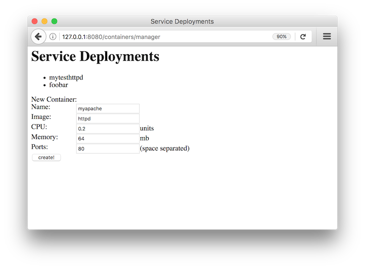

After adding a container you can inspect its result by querying `docker` for its running containers:

```
$ docker ps CONTAINER ID IMAGE COMMAND STATUS PORTS NAMES 7cc5c753777e httpd "httpd-foreground" Up 4 seconds 0.0.0.0:51467->80/tcp myapache
```

<a id="modules-containers--_plain_java_example"></a>
<a id="modules-containers--plain-java-example"></a>

## Plain Java example

This example launches a small Java Application to create a service deployment.
Initially a single container is deployed.
The user can modify the number of replicas from within the application.

The code can be found here: [Main.java](https://git-wip-us.apache.org/repos/asf?p=aries-containers.git;a=blob;f=containers-examples/containers-example-javaapp/src/main/java/org/apache/aries/containers/examples/javaapp/Main.java;hb=HEAD)

The main functionality is:

```
        ServiceManager sm = new LocalDockerServiceManager();

        // If you want to run with Marathon, use the following line
        // ServiceManager sm = new MarathonServiceManager("http://192.168.99.100:8080/");

        ServiceConfig sc = ServiceConfig.builder("mytesthttpd", "httpd").
            cpu(0.2).memory(32).port(80).build();
        Service svc = sm.getService(sc);
        // The service is now created
```

If you are running this the Docker local binding, you can see the docker container created:

```
$ docker ps CONTAINER ID IMAGE COMMAND STATUS PORTS NAMES 7cc5c753777e httpd "httpd-foreground" Up 4 seconds 0.0.0.0:51467->80/tcp mytesthttpd
```

The example also allows scaling up and down of replica containers for this service.

<a id="modules-containers--_bindings"></a>
<a id="modules-containers--bindings"></a>

## Bindings

<a id="modules-containers--_docker_local"></a>
<a id="modules-containers--docker-local"></a>

### Docker Local

This binding works by issuing `docker` commands on the local machine and is very useful for testing.
Make sure the environment variables normally provided via `docker-machine env <myenv>` are set.

OSGi ServiceManager identifier property: `container.factory.binding = docker.local`

Constructor, for use outside of OSGi: `org.apache.aries.containers.docker.local.impl.LocalDockerServiceManager`

<a id="modules-containers--_marathon"></a>
<a id="modules-containers--marathon"></a>

### Marathon

This binding uses Marathon as the underlying container manager.
It requires the following configuration to be set:

```
service.pid: org.apache.aries.containers.marathon
  marathon.url=<the URL where marathon can be contacted>
```

Once configured, the Marathon binding will register its OSGi service.

OSGi ServiceManager identifier property: `container.factory.binding = marathon`

Constructors, for use outside of OSGi: `org.apache.aries.containers.marathon.impl.MarathonServiceManager`

```
/**
 * Create the Marathon Service Manager.
 *
 * @param marathonURL The Marathon URL
 */
public MarathonServiceManager(String marathonURL);

/**
 * Create the Marathon Service Manager for use with DC/OS.
 *
 * @param marathonURL The Marathon URL.
 * @param dcosUser The DCOS user or service-user.
 * @param passToken The password or token to use.
 * @param serviceAcct `true` if this is a service account `false` if this is a plain user.
 */
public MarathonServiceManager(String marathonURL, String dcosUser, String passToken, boolean serviceAcct);
```

---

<a id="modules-jpaproject"></a>

<!-- source_url: https://aries.apache.org/documentation/modules/jpaproject.html -->

<!-- page_index: 118 -->

# Aries JPA

Documentation
master

- Documentation
  - [master](#index)

[Edit this Page](https://github.com/apache/aries-antora-site/edit/master/modules/ROOT/pages/modules/jpaproject.adoc)

<a id="modules-jpaproject--aries-jpa"></a>

# Aries JPA

The Aries JPA project allows allows to use container managed persistence in OSGi in a modular and clean way.

The core is the jpa.container module.
It implements the "JPA Service Specification Version 1.0" from the OSGi Enterprise Specification available for public download from the [OSGi Alliance](http://www.osgi.org/Download/Release4V42).
The jpa.blueprint module implements container managed persistence for Aries Blueprint using a programming model like in JEE.
The jpa.support module provides support for container managed persistence for DS and other injection frameworks using the JPATemplate interface.

See how it looks like in the See the [Aries JPA examples](https://github.com/apache/aries-jpa/tree/master/examples).

<a id="modules-jpaproject--_source_repository"></a>
<a id="modules-jpaproject--source-repository"></a>

## Source repository

[Git repository aries-jpa](https://git-wip-us.apache.org/repos/asf/aries-jpa.git) at apache.
[Mirror of aries-jpa at github](https://github.com/apache/aries-jpa).

<a id="modules-jpaproject--_persistence_bundles"></a>
<a id="modules-jpaproject--persistence-bundles"></a>

## Persistence bundles

A bundle is regarded as a persistence bundle if it contains the header **Meta-Persistence:** in it’s Manifest.
The value of the Meta-Persistence: header is a comma separated list of locations where JPA persistence descriptors can be found.
If the header value is empty then a default of META-INF/persistence.xml is used.
The persistence bundle typically also contains the JPA entities.

For example:

```
Meta-Persistence:
```

means that META-INF/persistence.xml will be searched for.
For non standard locations:

```
Meta-Persistence: persistence/myPu.xml, pUnit.jar!/someFolder/anotherPu.xml
```

means that the locations "persistence/myPu.xml" (relative to the root of the bundle), and "someFolder/anotherPu.xml" (relative to the root of pUnit.jar, which is in the root of the bundle) will be searched.

<a id="modules-jpaproject--_the_aries_jpa_2_modules"></a>
<a id="modules-jpaproject--the-aries-jpa-2-modules"></a>

## The Aries JPA 2 modules

Aries JPA consists of four bundles.

<a id="modules-jpaproject--_aries_jpa_container_org_apache_aries_jpa_container"></a>
<a id="modules-jpaproject--aries-jpa-container-org.apache.aries.jpa.container"></a>

### Aries JPA container (org.apache.aries.jpa.container)

The Aries JPA container bundle implements the OSGi JPA service specification.
It tracks persistence unit bundles and creates an EntityManagerFactory service as soon as all dependencies are met.

<a id="modules-jpaproject--_specifying_the_persistenceprovider"></a>
<a id="modules-jpaproject--specifying-the-persistenceprovider"></a>

#### Specifying the PersistenceProvider

For each persistence unit jpa container first determines which persistence provider to use by analyzing the "provider" property of persistence.xml.
It will track a PersistenceProvider service that matches this name.
If no such property is defined then the first PersistenceProvider service found will be used.

<a id="modules-jpaproject--_specifying_a_datasource"></a>
<a id="modules-jpaproject--specifying-a-datasource"></a>

#### Specifying a DataSource

The next step is to configure a DataSource.
There are two ways to do this.
The spec conform way is to use the database properties to determine which DataSourceFactory service to use and to configure it.

Additionally aries jpa supports refering to a DataSource service using the jta-datasource or non-jta-datasource properties.
The syntax is the aries jndi syntax to search for services.

<a id="modules-jpaproject--_properties_of_the_published_entitymanagerfactory_service"></a>
<a id="modules-jpaproject--properties-of-the-published-entitymanagerfactory-service"></a>

#### Properties of the published EntityManagerFactory service

The EntityManagerFactory services will be registered with the following properties:

- osgi.unit.name: this is the name of the persistence unit
- osgi.unit.provider: this is the class name of the JPA PersistenceProvider that was used to create the EntityManagerFactory
- org.apache.aries.jpa.container.managed: this property will be set to true, indicating this is a managed EntityManagerFactory.

<a id="modules-jpaproject--_useful_notes"></a>
<a id="modules-jpaproject--useful-notes"></a>

#### Useful notes

- If using a JTA persistence unit keep in mind that you still have to supply a javax.sql.DataSource not an XADataSource.
  This DataSource must wrap an XADataSource and provide XA resource enlistment.
  The simplest way to achieve this is to use pax-jdbc.
- As soon as PersistenceProvider and DataSource are available the EntityManagerFactory service is created.
  Aries JPA container also supports classpath scanning and load time weaving of JPA entities.
- You should never call close on the EntityManagerFactory service.
  This call will be made by the container when the persistence bundle is removed or refreshed.
  If you do close the EntityManagerFactory service then it will be closed for **all** users of the service.

<a id="modules-jpaproject--_aries_jpa_api_org_apache_aries_jpa_api"></a>
<a id="modules-jpaproject--aries-jpa-api-org.apache.aries.jpa.api"></a>

### Aries JPA API (org.apache.aries.jpa.api)

A set of interfaces to make it easier to use JPA in OSGi.
It contains two main interfaces:

- EmSupplier (**deprecated**): Allows to get a thread safe EntityManager and mark entry and exit of blocks that access the EntityManager.
  This is rather low level and meant to be used mainly by frameworks.
- JpaTemplate: Allows to write closures that can safely access an EntityManager and are executed inside a transaction.

<a id="modules-jpaproject--_aries_jpa_supportorg_apache_aries_jpa_support"></a>
<a id="modules-jpaproject--aries-jpa-support-org.apache.aries.jpa.support"></a>

### Aries JPA support(org.apache.aries.jpa.support)

For each EntityManagerFactory service this bundle provides additional services not defined in the OSGi spec that make it easier to use JPA without blueprint.

- EmSuppler (**deprectaed**): Use the new thread safe EntityManager instead.
- EntityManager: Thread safe EntityManager.
  Requires to be run inside a Coordination
- JPATemplate: Is used similar to the spring JPATemplate.
  it takes care of the EntityManager lifecycle and transaction handling

<a id="modules-jpaproject--_thread_safe_entitymanager"></a>
<a id="modules-jpaproject--thread-safe-entitymanager"></a>

#### Thread safe EntityManager

The plain EntityManager provided by the PersistenceProvider may only be used by one thread at a time.
This is ok for EJB where there is a thread pool but not for OSGi where tpyically each class is just instantiated once and meant to be used multi threaded.

So Aries JPA provides a thread safe EntityManager that can be safely used.
An OSGi Coordinator service is used to bind the EntityManager to a thread and to manage its lifecycle.
So to use the EntityManager service you need to make sure you only call it inside a Coordination.
The EntityManager will be created on first access and bound to the Coordination.
When the outermost Coordination of the current thread exits the EntityManager will be closed.
So typically the EntityManager is created per Request.

Most users will not use the EntityManager service directly and instead either use the blueprint based Annotations or the JPATemplate.
Both of these approaches take care of the transaction and Coordination handling transparently.

<a id="modules-jpaproject--_aries_jpa_blueprint_extension_org_apache_aries_jpa_blueprint"></a>
<a id="modules-jpaproject--aries-jpa-blueprint-extension-org.apache.aries.jpa.blueprint"></a>

### Aries JPA blueprint extension (org.apache.aries.jpa.blueprint)

Provides a blueprint extension for @PersistenceUnit and @PersistenceContext injection.
To use the extension add this namespace to your blueprint

```
xmlns:jpa="http://aries.apache.org/xmlns/jpa/v2.0.0"
```

and enable annotation support using the element <jpa:enable> on top level.
Typically this namespace is used together with the transaction namespace to also provide annoation based transactions.

For more details see the [Aries JPA blueprint example](https://svn.apache.org/repos/asf/aries/trunk/jpa/examples/tasklist-blueprint/).

<a id="modules-jpaproject--_creation_of_a_jpa_project_using_maven"></a>
<a id="modules-jpaproject--creation-of-a-jpa-project-using-maven"></a>

## Creation of a JPA project using Maven

The first step consist in to create a maven module and make the following modifications to allow to deploy it as OSGI bundle on the platform and reference where the persistence XML file must loaded by the classpath to allow to the JPA container to configure the project accordingly.

**Step 1 : Create a bundle**

OSGi bundles are mostly regular jars but they need to contain some special OSGi headers in the Manifest.
The two changes make sure your maven project creates a valid OSGi bundle.

```
<packaging>bundle</packaging>
```

and that you must configure the maven-bundle-plugin (<http://felix.apache.org/site/apache-felix-maven-bundle-plugin-bnd.html>) to generate the MANIFEST.MF file required by OSGI platform.

```
<plugin>
  <groupId>org.apache.felix</groupId>
  <artifactId>maven-bundle-plugin</artifactId>
  <version>2.5.4</version>
  <extensions>true</extensions>
  <inherited>true</inherited>
  <configuration>
    <instructions>
          <!-- Only needed for the persistence bundle containing the jpa Entities -->
      <Meta-Persistence>META-INF/persistence.xml</Meta-Persistence>
      <!-- Needed for runtime enhancement when using hibernate -->
          <Dynamic-Import-Package>*, org.hibernate.proxy, javassist.util.proxy</Dynamic-Import-Package>
    </instructions>
  </configuration>
</plugin>
```

**Step 2 : Adapt the persistence file**

We will cover here how to modify a persistence.xml for OSGi usage.
For the most part only the access to the DataSource has to be adapted for OSGi.
With J2EE applications, you simply use the jdbc key with the name of the datasource associated (jdbc/reportincidentdb).
In OSGi jndi support is provided by aries jndi (<http://aries.apache.org/modules/jndiproject.html>).
It bridges jndi names to OSGi services.
We must define two parameters, the "osgi:service" wich will allow to lookup OSGI services, the interface "javax.sql.DataSource" and the name of the service "osgi.jndi.service.name", which is a filter property, with its jndi name associated.

To access to the datasource, you must provide within the <jta-data-source> or <non-jta-data-source> depending if you use transaction type JTA or RESOURCE\_LOCAL.

```
<persistence-unit name="tasklist" transaction-type="JTA">
<jta-data-source>osgi:service/javax.sql.DataSource/(osgi.jndi.service.name=jdbc/tasklist)</jta-data-source>
```

The other elements of the xml file are defined according to JPA specification.

**Step 3.1 : Inject EntityManager into a bean and make it transactional**

The goal of this step is to provide a DAO layer that looks like JEE code on the java level.
For this we need to inject a thread safe EntityManager and ensure the DAO code is run inside a transational context.

Aries JPA 1.x used a xml element inside each DAO bean to inject the EntityManager.
This syntax is not suppoerted for Aries JPA 2.x anymore.
Instead simply enable standard @PesistenceContext and @PersistenceUnit annotation support with the xml element <jpa:enable> on top level.

The transactional context is established using the xml element <tx:transaction> on the bean level.
In the example below we enable transactions for all DAO methods.
The scope of the transaction can be defined using the attribute value.

Example blueprint follows showing the full breadth of allowable injection syntax:

```
<blueprint xmlns="http://www.osgi.org/xmlns/blueprint/v1.0.0"
  xmlns:tx="http://aries.apache.org/xmlns/transactions/v1.2.0"
  xmlns:jpa="http://aries.apache.org/xmlns/jpa/v2.0.0">
  <jpa:enable />
  <service ref="taskService" interface="org.apache.aries.jpa.example.tasklist.model.TaskService"/>
  <bean class="org.apache.aries.jpa.example.tasklist.blueprint.impl.TaskServiceImpl"/>
    <tx:transaction method="*"/>
  </bean>
</blueprint>
```

Make sure you inject the EntityManager in your DAO class like this:

```
@PersistenceContext(unitName="tasklist")
EntityManager em;
```

See tasklist-blueprint example for details.

**Step 3.2 : Use JPATemplate to work with JPA in declarative services**

Inject the JPATemplate using a service reference:

```
@Reference(target = "(osgi.unit.name=tasklist)")
public void setJpaTemplate(JpaTemplate jpa) { ... }
```

Use the JPATemplate to work with JPA Entities inside closures.

```
// txExpr if you need to return an object
return jpa.txExpr(TransactionType.Required, em -> em.find(Task.class, id));

// tx if you just execute code
jpa.tx(em -> em.persist(task));
```

See the tasklist-ds example for details.

**Step 4 : Package the solution**

To package the solution, execute a "maven clean install" instruction.
Installing Aries JPA and Aries Transaction into arbitrary containers is beyond the scope of this document.

<a id="modules-jpaproject--_example"></a>
<a id="modules-jpaproject--example"></a>

## Example

To keep the installation instructions small we only cover installation into Apache Karaf 4.x.
Karaf provides features for Aries JPA, Aries Transaction, Hibernate and Pax-jdbc so installation is very easy.

See the [README of the Aries JPA examples](https://github.com/apache/aries-jpa/tree/master/examples).

---

<a id="modules-transactioncontrol"></a>

<!-- source_url: https://aries.apache.org/documentation/modules/transactioncontrol.html -->

<!-- page_index: 119 -->

# Aries Transaction Control Service

Documentation
master

- Documentation
  - [master](#index)

[Edit this Page](https://github.com/apache/aries-antora-site/edit/master/modules/ROOT/pages/modules/transactioncontrol.adoc)

<a id="modules-transactioncontrol--aries-transaction-control-service"></a>

# Aries Transaction Control Service

<a id="modules-transactioncontrol--_osgi_transaction_control_service"></a>
<a id="modules-transactioncontrol--osgi-transaction-control-service"></a>

## OSGi Transaction Control Service

This set of modules is an implementation of the proposed OSGi Transaction Control Service and related services, such as JDBC and JPA resource providers.

The Transaction Control Service (RFC-221) is an in-progress RFC publicly available from the OSGi Alliance: <https://github.com/osgi/design/blob/master/rfcs/rfc0221/rfc-0221-TransactionControl.pdf>

Given that the RFC is non-final the OSGi API declared in this project is subject to change at any time up to its official release.
Also the behaviour of this implementation may not always be up-to-date with the latest wording in the RFC.
The project maintainers will, however try to keep pace with the RFC, and to ensure that the implementations are compliant with any OSGi specifications that result from the RFC.

<a id="modules-transactioncontrol--_getting_started"></a>
<a id="modules-transactioncontrol--getting-started"></a>

## Getting started

The current released version of Transaction Control is 0.0.1, and it is available in [Maven Central](https://mvnrepository.com/artifact/org.apache.aries.tx-control)

If you’re new to the Transaction Control service then we recommend that you read the [quickstart documentation first](#modules-tx-control-quickstart).

More detailed documentation is available in the [Aries Transaction Control Project](#modules-tx-control)

<a id="modules-transactioncontrol--_why_use_the_transaction_control_service"></a>
<a id="modules-transactioncontrol--why-use-the-transaction-control-service"></a>

## Why use the Transaction Control service?

Simply put the Transaction Control service makes resource access easy!
There’s no need to worry about transaction lifecycle or closing connections, and there’s built in support for useful features like connection pooling.

In addition to being simple the Transaction Control service also makes transaction management explicit.
As a result it is easier to follow the transactions flowing throughout your code, and it protects you from the [proxy problem](#modules-tx-control-spring-tx) that declarative transaction strategies often suffer from.

<a id="modules-transactioncontrol--_modules"></a>
<a id="modules-transactioncontrol--modules"></a>

## Modules

The following modules are available for use in OSGi

1. [tx-control-service-local](#modules-tx-control-localtransactions) :- A purely local transaction control service implementation.
   This can be used with any resource-local capable ResourceProvider
2. [tx-control-service-xa](#modules-tx-control-xatransactions) :- An XA-capable transaction control service implementation based on the Geronimo Transaction Manager.
   This can be used with XA capable resources, or with local resources.
   Local resources will make use of the last-participant gambit.
3. [tx-control-provider-jdbc-local](#modules-tx-control-localjdbc) :- A JDBC resource provider that provides connection pooling and that can integrate with local transactions.
   The JDBCConnectionProviderFactory service may be used directly, or a service may be configured using the *org.apache.aries.tx.control.jdbc.local* pid
4. [tx-control-provider-jdbc-xa](#modules-tx-control-xajdbc) :- A JDBC resource provider that provides connection pooling and that can integrate with local or XA transactions.
   The JDBCConnectionProviderFactory service may be used directly, or a service may be configured using the *org.apache.aries.tx.control.jdbc.xa* pid
5. [tx-control-provider-jpa-local](#modules-tx-control-localjpa) :- A JPA resource provider that can integrate with local transactions.
   The JPAEntityManagerProviderFactory service may be used directly, or a service may be configured using the *org.apache.aries.tx.control.jpa.local* pid.
   The implementation can also provide connection pooling if required
6. [tx-control-provider-jpa-xa](#modules-tx-control-xajpa) :- A JDBC resource provider that integrates with XA transactions.
   The JPAEntityManagerProviderFactory service may be used directly, or a service may be configured using the *org.apache.aries.tx.control.jpa.xa* pid.
   The implementation can also provide connection pooling if required

<a id="modules-transactioncontrol--_which_modules_should_i_use"></a>
<a id="modules-transactioncontrol--which-modules-should-i-use"></a>

### Which modules should I use?

If you wish to use entirely lightweight, resource-local transactions then it is best to pair the tx-control-service-local and tx-control-provider-jdbc-local or tx-control-provider-jpa-local bundles.
This will give transactional behaviour, but the result is *not guaranteed to be ACID if more than one resource is used*.

If ACID behaviour is needed across multiple resources then the tx-control-service-xa *must* be used.
This service also provides an XA enabled two-phase commit algorithm, and also allows for ACID behaviour when *one* of the resources only supports local transactions by using the last participant gambit.

When using the XA Transaction control service then the tx-control-provider-jdbc-xa or tx-control-provider-jpa-xa resource provider bundles should be used.

**IT IS NOT RECOMMENDED** to use both tx-control-service-xa and tx-control-service-local at the same time.
This will be confusing, and may lead to problems if different parts of the application bind to different service implementations.

**NOTE:** There is also no reason to use the tx-control-provider-jdbc-local in addition to the tx-control-provider-jdbc-xa service.
Using both together is not typically harmful, however the tx-control-provider-jdbc-xa bundle supports all of the same features as the tx-control-provider-jdbc-local bundle.
The same is **not** true of the JPA provider implementations.

<a id="modules-transactioncontrol--_pre_release_apis"></a>
<a id="modules-transactioncontrol--pre-release-apis"></a>

## Pre-release APIs

As part of the Aries Transaction Control implementations pre-release versions of the OSGi Transaction Control API are provided.
Rather than putting the API into the wrong package namespace, or outputting them at the wrong version, they will be exported with a mandatory attribute of `api.status=aries.prerelease`.

By setting this attribute on their API imports users accept that the API may change without a change to the package version(s).
These changes may, or may not, be binary compatible.
Once the specification is final the attribute will be removed from the export.

---

<a id="modules-async-svcs"></a>

<!-- source_url: https://aries.apache.org/documentation/modules/async-svcs.html -->

<!-- page_index: 120 -->

# Asynchronous Services

Documentation
master

- Documentation
  - [master](#index)

[Edit this Page](https://github.com/apache/aries-antora-site/edit/master/modules/ROOT/pages/modules/async-svcs.adoc)

<a id="modules-async-svcs--asynchronous-services"></a>

# Asynchronous Services

<a id="modules-async-svcs--_introduction"></a>
<a id="modules-async-svcs--introduction"></a>

## Introduction

The R6 OSGi specifications include support for Asynchronous programming using OSGi services.
Apache Aries aims to provide small, compliant implementations of these specifications to enable asynchronous programming in enterprise applications.
The two key specifications are OSGi Promises and the Async service.

<a id="modules-async-svcs--_osgi_promises"></a>
<a id="modules-async-svcs--osgi-promises"></a>

## OSGi Promises

One of the fundamental pieces of an asynchronous programming system is the *Promise*.
A Promise is a holder type that represents an asynchronous calculation or computation.
Since Java 5 the JDK has contained *java.util.concurrent.Future* to perform this function.
Java’s Future type is, however, fatally flawed as it has no callback to notify the user when it resolves.
Instead the user must make a blocking call to *get()*.

OSGi promises fix this problem by defining a Promise interface which allows the user to register callbacks which will be called when the promise *resolves*.
These callbacks are lambda friendly SAM types, but the Promise API itself has no dependencies on Java 8.
The Aries version (org.apache.aries.async.promise.api) has a minimum requirement of JDK 6.

<a id="modules-async-svcs--_creating_osgi_promises"></a>
<a id="modules-async-svcs--creating-osgi-promises"></a>

### Creating OSGi Promises

Creating a Promise is easy.
The *org.osgi.util.promise.Deferred* type is a factory for a single promise, and can also be used to resolve or fail the promise:

```
Deferred<Integer> deferred = new Deferred<>();
new Thread(() -> {
		int result = calculateReallyHardSum();
		deferred.resolve(result);
	}).start();

Promise<Integer> p = deferred.getPromise();
...
```

But wait - what if something goes wrong?
How do we signal to the user that there was a problem and the result is never coming?
The answer is very easy - Promises have the concept of *failure*.
A promise will *either* resolve *or* fail at most once.
For well written code this rule is usually the same as "A promise will either resolve or fail *exactly* once".
Promises are thread safe and effectively immutable, meaning they can be shared with other code.

```
Deferred<Integer> deferred = new Deferred<>();
new Thread(() -> {
		try {
			int result = calculateErrorProneSum();
			deferred.resolve(result);
		} catch (Exception e) {
			deferred.fail(e);
		}
	}).start();

Promise<Integer> p = deferred.getPromise();
...
```

<a id="modules-async-svcs--_using_osgi_promises"></a>
<a id="modules-async-svcs--using-osgi-promises"></a>

### Using OSGi Promises

Once you have a promise, what do you do with it?
It’s easy to get the value from a promise using the *getValue()* method, or you can use the *getFailure()* method to get the failure cause.
Unfortunately both of these methods block until the promise resolves, and whilst the *isDone()* method does tell you if the Promise has completed they really aren’t the right way to use a Promise.

Promises work best when you register callbacks and/or transformations.
The Promise API has a variety of useful methods for doing work with the Promise when it resolves.
For example we can run a task after the promise completes successfully:

```
Promise<Integer> promise = ...
promise.then(p -> {
		System.out.println("The calculator returned " + p.getValue());
		return null;
	});
```

We can also register callbacks to handle failures:

```
Promise<Integer> promise = ...
promise.then(p -> {
		System.out.println("The calculator returned " + p.getValue());
		return null;
	}, p -> p.getFailure().printStackTrace());
```

<a id="modules-async-svcs--_chaining_osgi_promises"></a>
<a id="modules-async-svcs--chaining-osgi-promises"></a>

### Chaining OSGi Promises

In the previous examples our success callback returned *null* - why?
Well the return value from a success callback is always a promise (null is a shortcut for a promise resolved with null).
The promise returned by the callback represents an asynchronous execution flow in a process known as "chaining".
The overall completion of this chain is represented by a third promise, returned to the caller of the *then()* method.

1. The caller registers a success callback, and receives a "chained" promise
2. The original promise completes successfully
3. The success callback runs and returns a promise representing another piece of asynchronous work
4. The promise returned by the success callback completes successfully
5. The "chained" promise completes with the same value as the promise from step 4.

<a id="modules-async-svcs--_other_promise_behaviours"></a>
<a id="modules-async-svcs--other-promise-behaviours"></a>

### Other Promise behaviours

As well as simple callbacks Promises also provide advanced mapping and recovery features.
For example a promise can be wrapped so that if the original work fails then a new value can be supplied using a recovery function.

The *org.osgi.util.promise.Promises* utility class also provides useful functions for working with promises.
For example helper methods to wrap an existing value or failure in a Promise, or a way of aggregating a group of promises into a single promise.

#The Async service

Most OSGi services have a synchronous API.
This is usually the easiest way to think about, write, and use services.
The main problem with this is that long running service calls can cause applications to run slowly, and making the calls asynchronous is both verbose and error-prone.

The Async service is designed to take away the boilerplate code needed to invoke a service asynchronously, and to convert any synchronous API into an asynchronous API, returning promises instead of values.

<a id="modules-async-svcs--_using_the_async_service"></a>
<a id="modules-async-svcs--using-the-async-service"></a>

## Using the Async service

The Async service is available in the service registry and is very easy to use - first we need to mediate the service.
Mediating is a bit like creating a mock object, the mediator records method calls made against it so that they can be transformed into asynchronous calls.
Mediating can apply to a concrete object, or to a ServiceReference.
It is better to use a ServiceReference when one is available, as the Async service can track the availability of the backing service.

```
Async async = ...;
ServiceReference<MyService> ref = ...;
MyService mediator = async.mediate(ref, MyService.class);
```

*or*

```
Async async = ...;
MyService svc = ...;
MyService mediator = async.mediate(svc, MyService.class);
```

Once a service has been mediated the mediator should be called just like the real service object, and the return value passed to the Async service’s *call()* method.
This returns a promise representing the asynchronous work.

```
Promise<Integer> promise =  async.call(mediator.calculateReallyHardSum());
```

<a id="modules-async-svcs--_void_methods"></a>
<a id="modules-async-svcs--void-methods"></a>

### Void methods

Void methods don’t have a return value to pass to the async service, and should use the no-args version of call instead.

```
mediator.longRunningVoidMethod()
Promise<?> promise =  async.call();
```

<a id="modules-async-svcs--_fire_and_forget_calls"></a>
<a id="modules-async-svcs--fire-and-forget-calls"></a>

### Fire and Forget calls

Sometimes the user does not care when a piece of work finishes, or what value it returns, or even whether it was successful.
These sorts of calls are called "fire and forget" calls, and are also supported by the async service using the *execute()* method.

The execute method still returns a promise, however this promise represents whether the fire and forget call successfully started or not, not whether it has completed.

<a id="modules-async-svcs--_getting_started"></a>
<a id="modules-async-svcs--getting-started"></a>

## Getting Started

Releases of the Async implementation can be found in Maven Central [in the org.apache.aries.async group](http://search.maven.org/#search%7Cga%7C1%7Cg%3A%22org.apache.aries.async%22).
[This bundle](http://search.maven.org/#search%7Cga%7C1%7Ca%3A%22org.apache.aries.async%22) provides a convenient all-in-one download.

The Asynchronous Services source code can be found in the Apache Aries codebase in the `async` directory: <https://svn.apache.org/repos/asf/aries/trunk/async>

---

<a id="modules-blueprint"></a>

<!-- source_url: https://aries.apache.org/documentation/modules/blueprint.html -->

<!-- page_index: 121 -->

# Blueprint

Documentation
master

- Documentation
  - [master](#index)

[Edit this Page](https://github.com/apache/aries-antora-site/edit/master/modules/ROOT/pages/modules/blueprint.adoc)

<a id="modules-blueprint--blueprint"></a>

# Blueprint

<a id="modules-blueprint--_introduction"></a>
<a id="modules-blueprint--introduction"></a>

## Introduction

Blueprint provides a dependency injection framework for OSGi and was standardized by the OSGi Alliance in OSGi Compendium R4.2.
It is designed to deal with the dynamic nature of OSGi, where services can become available and unavailable at any time.
The specification is also designed to work with plain old Java objects (POJOs) enabling simple components to be written and unit tested in a JSE environment without needing to be aware of how they are assembled.
The Blueprint XML files that define and describe the assembly of various components are key to the Blueprint programming model.
The specification describes how the components get instantiated and wired together to form a running module.

The following documentation covers the 80:20 usage of Blueprint.
For further details, please refer to the OSGi Compendium R4.2 specification.

<a id="modules-blueprint--_blueprint_bundles"></a>
<a id="modules-blueprint--blueprint-bundles"></a>

## Blueprint Bundles

The Blueprint Container specification uses an extender pattern, whereby an extender bundle monitors the state of bundles in the framework and performs actions on behalf of those bundles based on their state.
The Blueprint extender bundle waits for the bundles to be activated and checks whether they are Blueprint bundles.
A bundle is considered to be a Blueprint bundle when it contains one or more Blueprint XML files.
These XML files are at a fixed location under the OSGI-INF/blueprint/ directory or are specified explicitly in the Bundle-Blueprint manifest header.

Once the extender determines that a bundle is a Blueprint bundle, it creates a Blueprint Container on behalf of that bundle.
The Blueprint Container is responsible for:

- Parsing the Blueprint XML files
- Instantiating the components
- Wiring the components together
- Registering services
- Looking up service references

During initialization, the Blueprint Container ensures that mandatory service references are satisfied, registers all the services into the service registry, and creates initial component instances.
The Blueprint extender bundle also destroys the Blueprint Container for a bundle when the bundle is stopped.

<a id="modules-blueprint--_blueprint_xml"></a>
<a id="modules-blueprint--blueprint-xml"></a>

## Blueprint XML

The Blueprint XML file is identified by a top-level blueprint element, as shown below:

```
<?xml version="1.0" encoding="UTF-8"?>
<blueprint xmlns="http://www.osgi.org/xmlns/blueprint/v1.0.0">
    ...
</blueprint>
```

The XML namespace identifies the document as conforming to the Blueprint version 1.0.0.
The top-level blueprint element identifies the document as a blueprint module definition.

*TODO:* ensure id, activation and dependsOn get documented somewhere.

<a id="modules-blueprint--_beans"></a>
<a id="modules-blueprint--beans"></a>

## Beans

Beans are declared using the bean element.
The following defines a single bean called *accountOne* implemented by the POJO *org.apache.aries.simple.Account*.

```
<?xml version="1.0" encoding="UTF-8"?>
<blueprint xmlns="http://www.osgi.org/xmlns/blueprint/v1.0.0">
   <bean id="accountOne" class="org.apache.aries.simple.Account" />
</blueprint>
```

<a id="modules-blueprint--_bean_construction"></a>
<a id="modules-blueprint--bean-construction"></a>

### Bean Construction

During object construction, the Blueprint Container must first find the right constructor or a factory method with a compatible set of parameters that matches the arguments specified in the XML.
By default, the Blueprint Container uses the number and order of the argument elements in XML to find the right constructor or method.
If the argument elements cannot be mapped to the parameters in the order they are in, the Blueprint Container will attempt to reorder the argument elements and find the best-fitting arrangement.

To help the Blueprint Container pick the right constructor, method, or parameter arrangement, additional attributes, such as index or type, can be specified on the argument element.
For example, the type attribute specifies a class name used to match the argument element to a parameter by the exact type.

A bean can be constructed using a class constructor.
In the following example, the *class* attribute specifies the name of the Java class to instantiate.
The Blueprint Container will create the *Account* object by passing *1* as the argument to the constructor.

```
   :::java
   public class Account {
       public Account(long number) {
          ...
       }
       ...
   }


   <bean id="accountOne" class="org.apache.aries.simple.Account">
       <argument value="1"/>
   </bean>
```

A bean can be constructed using a static factory method.
In this example, the *class* attribute specifies the name of the class that contains a static factory method.
The name of the static factory method is specified by the *factory-method* attribute.
The Blueprint Container will call the *createAccount()* static method on the *StaticAccountFactory* class and pass 2 as the argument to create the Account object.

```
   public class StaticAccountFactory {
       public static Account createAccount(long number) {
      return new Account(number);
       }
   }


   <bean id="accountTwo"
    class="org.apache.aries.simple.StaticAccountFactory"
     factory-method="createAccount">
       <argument value="2"/>
   </bean>
```

A bean can be constructed using an instance factory method.
In the example, the *accountFactory* bean is the factory.
The Blueprint Container will first create the *AccountFactory* instance with its own arguments and properties.
In this case, only a single argument is specified: the factory name.
The Blueprint Container will then call the *createAccount()* method on the *AccountFactory* instance and pass 3 as the argument to create the Account object.

public class AccountFactory { + public AccountFactory(String factoryName) { …
} public Account createAccount(long number) { return new Account(number);
} }

```
   <bean id="accountFactory"
    class="org.apache.aries.simple.AccountFactory">
       <argument value="account factory"/>
   </bean>

   <bean id="accountThree"
     factory-ref="accountFactory"
     factory-method="createAccount">
       <argument value="3"/>
   </bean>
```

<a id="modules-blueprint--_bean_properties"></a>
<a id="modules-blueprint--bean-properties"></a>

### Bean Properties

Beans can have property values injected.
Injection is performed immediately after the bean is constructed.
The following example creates the Account bean and then sets the description property using the Java Beans naming convention.

public class Account { + public Account(long number) { …
} public String getDescription() { …
} }

```
<bean id="accountOne" class="org.apache.aries.simple.Account">
    <argument value="1"/>
    <property name="description" value="#1 account"/>
</bean>
```

<a id="modules-blueprint--_bean_wiring"></a>
<a id="modules-blueprint--bean-wiring"></a>

#### Bean Wiring

Property injection is used for wiring beans together.
In the following example *accountOne* is injected with a *Currency* bean.

```
   public class Account {
       public Account() {
      ...
       }
       public void setCurrency(Currency currency) {
      ...
       }
   }


   public class Currency {
       public Currency() {
      ...
       }
   }


   <bean id="accountOne" class="org.apache.aries.simple.Account">
       <property name="currency" ref="currency" />
   </bean>

   <bean id="currency" class="org.apache.aries.simple.Currency" />
```

<a id="modules-blueprint--_services"></a>
<a id="modules-blueprint--services"></a>

## Services

In Blueprint XML, a service element defines the registration of a service in the OSGi service registry.

The bean that provides the service object can be referenced using the *ref* attribute.
The interfaces under which the service is registered can be specified using the *interface* attribute:

```
   public class AccountImpl implements Account {
       public Account() {
      ...
       }
       public void setCurrency(Currency currency) {
      ...
       }
   }


   <service id="serviceOne" ref="account"
    interface="org.apache.aries.simple.Account" />

   <bean id="account" class="org.apache.aries.simple.AccountImpl" />
```

The bean that provides the service object can be inlined in the service element as follows:

```
<service id="serviceTwo"  interface="org.apache.aries.simple.Account">
   <bean class="org.apache.aries.simple.AccountImpl" />
</service>
```

The interfaces under which a service is registered can be determined by Blueprint using *auto-export*.
The following registers the service under all the bean’s interfaces:

```
   <service id="serviceOne" ref="account" auto-export="interfaces" />

   <bean id="account" class="org.apache.aries.simple.AccountImpl" />
```

Other values for *auto-export* are *disabled* (the default) *class-hierarchy* and *all-classes*.

<a id="modules-blueprint--_service_properties"></a>
<a id="modules-blueprint--service-properties"></a>

### Service Properties

A service can also be registered with a set of properties that can be specified using the *service-properties* sub-element.
The *service-properties* element contains multiple *entry* sub-elements that represent the individual properties.
The property key is specified using a *key* attribute, but the property value can be specified as a *value* attribute or inlined within the element.
The service property values can be of different types, but only OSGi service property types are permitted: primitives, primitive wrapper classes, collections, or arrays of primitive types.

The following is an example of a service registration with two service properties.
The *active* service property has type of *java.lang.Boolean*.
The *mode* property is of the default type, *String*.

```
<service id="serviceFour" ref="account" autoExport="all-classes">
   <service-properties>
   <entry key="active">
       <value type="java.lang.Boolean">true</value>
   </entry>
   <entry key="mode" value="shared"/>
   </service-properties>
</service>
```

<a id="modules-blueprint--_service_ranking"></a>
<a id="modules-blueprint--service-ranking"></a>

### Service Ranking

Service ranking can be used to affect the choice of service when there are multiple matches.
When choosing between two services, the higher ranked service will be returned ahead of the lower.
The default ranking value is

1. Service ranking is specified using the *ranking* attributes as follows:


```
<service id="serviceFive" ref="account" auto-export="all-classes"
 ranking="3" />
```

<a id="modules-blueprint--_references"></a>
<a id="modules-blueprint--references"></a>

## References

Services are found in the service registry using the reference element.
The following shows a reference named *accountRef* to an *Account* service.
If a service matching this reference is found in the service registry then it is set on the *accountClient* bean through the *account* property.

```
   <bean id="accountClient" class="...">
       <property name="account" ref="accountRef" />
   </bean>

   <reference id="accountRef" interface="org.apache.aries.simple.Account"
/>
```

<a id="modules-blueprint--_reference_dynamism"></a>
<a id="modules-blueprint--reference-dynamism"></a>

### Reference Dynamism

The object that is injected for a reference is actually a proxy to the service registered in the service registry.
A proxy enables the injected object to remain the same while the backing service can come and go or be replaced with another service.
Calls on a proxy that does not have a backing service will block until a service becomes available or a timeout occurs at which point a ServiceUnavailableException will be thrown.

```
try {
   balance = account.getBalance();
} catch (ServiceUnavailableException e) {
   ...
}
```

The default timeout Blueprint will wait for is 300000 milliseconds (5 minutes).
This value can be changed on a per bundle basis using directives on the Bundle-SymbolicName.
The following switches the timeout off completely (the default is true):

```
Bundle-SymbolicName: org.apache.aries.simple.account;
 blueprint.graceperiod:=false
```

The following sets the timeout to 10000 milliseconds (10 seconds):

```
Bundle-SymbolicName: org.apache.aries.simple.account;
 blueprint.graceperiod:=false; blueprint.timeout=10000;
```

The timeout can also be set on an individual reference using the *timeout* attribute.
The following sets the timeout for the account reference to 20000 milliseconds (20 seconds).

```
<reference id="accountRef" timeout="20000"
 interface="org.apache.aries.simple.Account" />
```

In all cases, a value of 0 means wait indefinitely for the reference to become satisfied.

<a id="modules-blueprint--_reference_lists"></a>
<a id="modules-blueprint--reference-lists"></a>

### Reference Lists

Multiple matching services can be found using the *reference-list* element.
The *reference-list* provides a *List* object that contains the service proxy objects or *ServiceReference* objects, depending on the *member-type* setting.
The provided *List* object is dynamic, as it can grow and shrink as matching services are added or removed from the service registry.
The *List* object is read-only and only supports a subset of the *List* API.

The proxies in a *reference-list* are different from the proxies for a reference.
The *reference-list* proxies target a specific service, do not have a *timeout*, and throw *ServiceUnavailableException* immediately if their service becomes unavailable.

The following example shows a reference-list that returns a list of service objects (proxies).
This is the default value for the *member-type* attribute

```
<reference-list id="accountRefs" member-type="service-object"
 interface="org.apache.aries.simple.Account" />
```

The following shows an example of a reference-list that returns a list of ServiceReferences:

```
<reference-list id="accountRefs" member-type="service-reference"
 interface="org.apache.aries.simple.Account" />
```

Example showing mandatory or optional references (availability)

Example showing use of filter

<a id="modules-blueprint--_bean_properties_2"></a>
<a id="modules-blueprint--bean-properties-2"></a>

## Bean Properties

Example showing use of bean properties

<a id="modules-blueprint--_scopes"></a>
<a id="modules-blueprint--scopes"></a>

## Scopes

Example showing singleton scope

Example showing prototype scope for beans

Example showing prototype scope for services

<a id="modules-blueprint--_object_values"></a>
<a id="modules-blueprint--object-values"></a>

## Object Values

Intro to Object Values

Examples showing the use of the various different object value types - ref, map, props collection (list, array, set).

<a id="modules-blueprint--_lifecycle"></a>
<a id="modules-blueprint--lifecycle"></a>

## Lifecycle

Example showing use of init/destroy-method

<a id="modules-blueprint--_lazy_and_eager_activiation"></a>
<a id="modules-blueprint--lazy-and-eager-activiation"></a>

## Lazy and Eager Activiation

Example showing lazy activiation.

Example showing eager activation.

<a id="modules-blueprint--_dynamism"></a>
<a id="modules-blueprint--dynamism"></a>

## Dynamism

Example showing service-listener

Example showing reference-listener

<a id="modules-blueprint--_type_converters"></a>
<a id="modules-blueprint--type-converters"></a>

## Type Converters

---

<a id="modules-blueprintnoosgi"></a>

<!-- source_url: https://aries.apache.org/documentation/modules/blueprintnoosgi.html -->

<!-- page_index: 122 -->

# Blueprint No-OSGi

Documentation
master

- Documentation
  - [master](#index)

[Edit this Page](https://github.com/apache/aries-antora-site/edit/master/modules/ROOT/pages/modules/blueprintnoosgi.adoc)

<a id="modules-blueprintnoosgi--blueprint-no-osgi"></a>

# Blueprint No-OSGi

The Blueprint No-OSGi module makes it easy to use OSGi Blueprint as a dependency injection framework outside of OSGi containers such as inside any Servlet Engine.

You can then use Blueprint as a small standards base alternative to the Spring Framework’s XML dependency injection files.

<a id="modules-blueprintnoosgi--_how_to_use_blueprint_no_osgi"></a>
<a id="modules-blueprintnoosgi--how-to-use-blueprint-no-osgi"></a>

## How to use Blueprint No-OSGi

Just create the blueprint container giving the urls of the xml descriptors

```
BlueprintContainerImpl container = new BlueprintContainerImpl(classLoader, resourcePaths);
```

You can then access the instantiated beans using the blueprint api

```
Foo foo = (Foo) container.getComponentInstance("foo");
```

When you’re done with the container, you need to destroy it

```
container.destroy();
```

<a id="modules-blueprintnoosgi--_limitations"></a>
<a id="modules-blueprintnoosgi--limitations"></a>

## Limitations

The Blueprint No-OSGi module has limitations due to the fact that OSGi is not available.
The use of `<reference>` and `<reference-list>` and `<service>` elements are not supported.

<a id="modules-blueprintnoosgi--_configuring_blueprint_through_properties"></a>
<a id="modules-blueprintnoosgi--configuring-blueprint-through-properties"></a>

## Configuring blueprint through properties

Blueprint beans can be configured using the variable substitutions.
You need to declare the ext namespace and add the property placeholder bean in your blueprint xml

```
<blueprint xmlns="http://www.osgi.org/xmlns/blueprint/v1.0.0"
           xmlns:ext="http://aries.apache.org/blueprint/xmlns/blueprint-ext/v1.2.0">
	<ext:property-placeholder>
    	<ext:default-properties>
        	<ext:property name="myProperty" value="defaultValue" />
    	</ext:default-properties>
	</ext:property-placeholder>
	...
	<bean ...>
		<property name="myProperty" value="${myProperty}" />
	</bean>
</blueprint>
```

Default values can be specified by passing a **Map<String,String>** object at container creation time.
Note that the default values for system override (compared to standard blueprint use in OSGi) has been changed so that the properties passed to the container and system properties will override default values.

---

<a id="modules-blueprint-maven-plugin"></a>

<!-- source_url: https://aries.apache.org/documentation/modules/blueprint-maven-plugin.html -->

<!-- page_index: 123 -->

# blueprint-maven-plugin

Documentation
master

- Documentation
  - [master](#index)

[Edit this Page](https://github.com/apache/aries-antora-site/edit/master/modules/ROOT/pages/modules/blueprint-maven-plugin.adoc)

<a id="modules-blueprint-maven-plugin--blueprint-maven-plugin"></a>

# blueprint-maven-plugin

Writing blueprint xml is quite verbose and large blueprint xmls are difficult to keep in sync with code changes and especially refactorings.
So you would like to do most declarations using annoations and ideally these annotations should be standardized.

<a id="modules-blueprint-maven-plugin--_blueprint_maven_plugin"></a>
<a id="modules-blueprint-maven-plugin--blueprint-maven-plugin-2"></a>

## blueprint-maven-plugin

The blueprint-maven-plugin allows to configure blueprint using annotations.
It scans one or more paths for annotated classes and creates a blueprint.xml in target/generated-sources/blueprint/OSGI-INF/blueprint.
So at runtime the bundle behaves like a normal blueprint bundle.
The generated blueprint can also be used together with a manually created blueprint file.
So for example cxf services can be created in xml while most of the beans are automatically generated.

Usage:

```
<plugin>
    <groupId>org.apache.aries.blueprint</groupId>
    <artifactId>blueprint-maven-plugin</artifactId>
    <version>1.10.0</version>
    <configuration>
        <scanPaths>
            <scanPath>org.my.package</scanPath>
        </scanPaths>
    </configuration>
    <executions>
        <executions>
            <execution>
                <goals>
                    <goal>add-resource-dir</goal>
                    <goal>blueprint-generate</goal>
                </goals>
            </execution>
        </executions>
    </executions>
</plugin>
```

<a id="modules-blueprint-maven-plugin--_goals"></a>
<a id="modules-blueprint-maven-plugin--goals"></a>

## Goals

<a id="modules-blueprint-maven-plugin--_add_resource_dir"></a>
<a id="modules-blueprint-maven-plugin--add-resource-dir"></a>

### add-resource-dir

Creates target/generated-sources/blueprint folder and register it as a maven resource directory in generate-resources phase, so IDEs like IntelliJ IDEA could find it automatically.

<a id="modules-blueprint-maven-plugin--_blueprint_generate"></a>
<a id="modules-blueprint-maven-plugin--blueprint-generate"></a>

### blueprint-generate

Creates blueprint xml from annotations in process-classes phase and put file in target/generated-sources/blueprint/OSGI-INF/blueprint/autowire.xml.
Destination directory (OSGI-INF/blueprint) and file name (autowire.xml) could be change via configuration properties: generatedDir and generatedFileName.

<a id="modules-blueprint-maven-plugin--_annotations"></a>
<a id="modules-blueprint-maven-plugin--annotations"></a>

## Annotations

<a id="modules-blueprint-maven-plugin--_javax_inject_jsr_330"></a>
<a id="modules-blueprint-maven-plugin--javax.inject-jsr-330"></a>

### javax.inject (JSR 330)

- @Inject Inject a bean by type and optionally further qualifiers
- @Singleton Mark a class as being a bean
- @Named("Myname") Names a @Singleton and qualifies an @Inject to limit it to matches with the same bean id
- @Qualifier Annotation on your own annotation

<a id="modules-blueprint-maven-plugin--_javax_enterprise"></a>
<a id="modules-blueprint-maven-plugin--javax.enterprise"></a>

### javax.enterprise

- @Produces Create bean using factory method

<a id="modules-blueprint-maven-plugin--_javax_transaction"></a>
<a id="modules-blueprint-maven-plugin--javax.transaction"></a>

### javax.transaction

- @Transactional mark the class as transactional.

<a id="modules-blueprint-maven-plugin--_javax_transaction_cdi"></a>
<a id="modules-blueprint-maven-plugin--javax.transaction.cdi"></a>

### javax.transaction.cdi

- @Transactional mark the class as transactional.

<a id="modules-blueprint-maven-plugin--_javax_annotation_jsr_250"></a>
<a id="modules-blueprint-maven-plugin--javax.annotation-jsr-250"></a>

### javax.annotation (JSR 250)

- @PostConstruct Marks a method to be called after DI is finished (init-method)
- @PreDestroy Marks a method to be called before the bean is destroyed (destroy-method)

<a id="modules-blueprint-maven-plugin--_javax_persistence"></a>
<a id="modules-blueprint-maven-plugin--javax.persistence"></a>

### javax.persistence

- @PersistenceContext(unitName="tasklist") inject a managed EntityManager for the given persistence unit into a field
- @PersistenceUnit(unitName="tasklist") inject an unmanaged EntityManagerFactory for the given persistence unit into a field

<a id="modules-blueprint-maven-plugin--_configuration_annotations_org_apache_aries_blueprint_annotation_config"></a>
<a id="modules-blueprint-maven-plugin--configuration-annotations-org.apache.aries.blueprint.annotation.config"></a>

### Configuration annotations (org.apache.aries.blueprint.annotation.config)

- @ConfigProperty Inject value as property from property-placeholder or constant
- @Config Creates cm:property-placehoder
- @DefaultProperty Configure default values for properties in property-placeholder

<a id="modules-blueprint-maven-plugin--_collection_annotations_org_apache_aries_blueprint_annotation_collection"></a>
<a id="modules-blueprint-maven-plugin--collection-annotations-org.apache.aries.blueprint.annotation.collection"></a>

### Collection annotations (org.apache.aries.blueprint.annotation.collection)

- @CollectionInject Inject list, set or array of existing beans of provided interface

<a id="modules-blueprint-maven-plugin--_bean_annotations_org_apache_aries_blueprint_annotation_bean"></a>
<a id="modules-blueprint-maven-plugin--bean-annotations-org.apache.aries.blueprint.annotation.bean"></a>

### Bean annotations (org.apache.aries.blueprint.annotation.bean)

- @Bean Mark a class as a bean or method as factory of bean

<a id="modules-blueprint-maven-plugin--_reference_listener_annotations_org_apache_aries_blueprint_annotation_referencelistener"></a>
<a id="modules-blueprint-maven-plugin--reference-listener-annotations-org.apache.aries.blueprint.annotation.referencelistener"></a>

### Reference listener annotations (org.apache.aries.blueprint.annotation.referencelistener)

- @ReferenceListener Marks bean as reference listener
- @Bind Method of referenence listener to be called when service registers
- @Unbind Method of referenence listener to be called when service unregisters

<a id="modules-blueprint-maven-plugin--_service_annotations_org_apache_aries_blueprint_annotation_service"></a>
<a id="modules-blueprint-maven-plugin--service-annotations-org.apache.aries.blueprint.annotation.service"></a>

### Service annotations (org.apache.aries.blueprint.annotation.service)

- @Service Publishes a bean as an OSGi service with the given interfaces
- @ServiceProperty Defines a service property
- @Reference Creates a reference to an OSGi service
- @ReferenceList Creates a list of references of an OSGi services

<a id="modules-blueprint-maven-plugin--_pax_cdi_supported_in_version_1_x_probably_dropped_in_next_major_versions"></a>
<a id="modules-blueprint-maven-plugin--pax-cdi-supported-in-version-1.x-probably-dropped-in-next-major-versions"></a>

### pax-cdi (supported in version 1.x, probably dropped in next major versions)

- @OsgiServiceProvider(classes={TaskService.class}) Publishes a bean as an OSGi service with the given interfaces
- @OsgiService creates a reference to an OSGi service.
  On optional filter is also possible
- @Properties Defines service properties for OSGiServiceProvider
- @Property Defines a service property

<a id="modules-blueprint-maven-plugin--_spring_supported_in_version_1_x_probably_dropped_in_next_major_versions"></a>
<a id="modules-blueprint-maven-plugin--spring-supported-in-version-1.x-probably-dropped-in-next-major-versions"></a>

### Spring (supported in version 1.x, probably dropped in next major versions)

- @Autowired Inject a bean by type and optionally further qualifiers
- @Component Creates bean witd default or given name
- @DependsOn Make bean depending on another bean
- @Lazy Make bean lazy
- @Qualifier Name injected bean
- @Transactional mark the class as transactional
- @Value Inject value or constant

<a id="modules-blueprint-maven-plugin--_dependencies_for_annotations"></a>
<a id="modules-blueprint-maven-plugin--dependencies-for-annotations"></a>

## Dependencies for annotations

```
<dependency>
    <groupId>javax.inject</groupId>
    <artifactId>javax.inject</artifactId>
    <version>1</version>
    <optional>true</optional>
</dependency>
<dependency>
    <groupId>javax.enterprise</groupId>
    <artifactId>cdi-api</artifactId>
    <version>1.2</version>
    <optional>true</optional>
</dependency>
<dependency>
    <groupId>javax.persistence</groupId>
    <artifactId>persistence-api</artifactId>
    <version>1.0.2</version>
    <optional>true</optional>
</dependency>
<dependency>
    <groupId>javax.transaction</groupId>
    <artifactId>javax.transaction-api</artifactId>
    <version>1.2</version>
    <optional>true</optional>
</dependency>
<dependency>
    <groupId>org.apache.aries.blueprint</groupId>
    <artifactId>blueprint-maven-plugin-annotation</artifactId>
    <version>1.3.0</version>
    <optional>true</optional>
</dependency>
<dependency>
    <groupId>org.ops4j.pax.cdi</groupId>
    <artifactId>pax-cdi-api</artifactId>
    <version>0.8.0</version>
    <optional>true</optional>
</dependency>
<dependency>
    <groupId>org.apache.servicemix.bundles</groupId>
    <artifactId>org.apache.servicemix.bundles.spring-beans</artifactId>
    <version>3.2.11.RELEASE_1</version>
    <optional>true</optional>
</dependency>
```

Note that the annotations are needed only during build run, so you can exclude them or mark optional in Import-Package header of your bundle.

<a id="modules-blueprint-maven-plugin--_spi"></a>
<a id="modules-blueprint-maven-plugin--spi"></a>

## SPI

Whole plugin is written using 'plugin architecture', so your own annotations could be configured for bleuprint generation.
All you need to do, is to implement one of interfaces from blueprint-maven-plugin-spi:

```
<dependency>
    <groupId>org.apache.aries.blueprint</groupId>
    <artifactId>blueprint-maven-plugin-spi</artifactId>
    <version>1.1.0</version>
</dependency>
```

Next add file (or files) to META-INF/services directory describing which interface implementation your artifact provides and add such artifact as plugin dependency

```
<plugin>
    <groupId>org.apache.aries.blueprint</groupId>
    <artifactId>blueprint-maven-plugin</artifactId>
    <version>1.9.0</version>
    ...
    <dependencies>
        <dependency>
            <groupId>org.apache.aries.blueprint.example</groupId>
            <artifactId>blueprint-maven-plugin-my-extension</artifactId>
            <version>1.0.0</version>
        </dependency>
    </dependencies>
    ...
</plugin>
```

<a id="modules-blueprint-maven-plugin--_artifacts_scanning_configuration"></a>
<a id="modules-blueprint-maven-plugin--artifacts-scanning-configuration"></a>

## Artifacts scanning configuration

All artifacts are scaned for bean classes by default.
It could be limited by includeArtifacts and excludeArtifacts parameters, e.
g.

```
<includeArtifacts>
    <includeArtifact>org.my.group.id:.*</includeArtifact>
    <includeArtifact>org.another.group.id:another.artifact.id:.*</includeArtifact>
</includeArtifacts>
<excludeArtifacts>
    <excludeArtifact>org.my.group.id:unwanted.artifact.id:.*</excludeArtifact>
</excludeArtifacts>
```

<a id="modules-blueprint-maven-plugin--_additional_configuration"></a>
<a id="modules-blueprint-maven-plugin--additional-configuration"></a>

## Additional configuration

Bean from factories are named by bean class nams or as defined in @Named or @Bean annotations.
If you want to name such beans after producing method name then add configuration parameter:

```
<configuration>
    <customParameters>
        <blueprint.beanFromFactory.nameFromFactoryMethodName>true</blueprint.beanFromFactory.nameFromFactoryMethodName>
    </customParameters>
</configuration>
```

<a id="modules-blueprint-maven-plugin--_example"></a>
<a id="modules-blueprint-maven-plugin--example"></a>

## Example

For a complete example see [tasklist-blueprint-cdi](https://github.com/cschneider/Karaf-Tutorial/tree/master/tasklist-blueprint-cdi) on github or [tests of blueprint-maven-plugin](http://svn.apache.org/repos/asf/aries/trunk/blueprint/plugin/blueprint-maven-plugin/src/test/).

---

<a id="modules-blueprintannotation"></a>

<!-- source_url: https://aries.apache.org/documentation/modules/blueprintannotation.html -->

<!-- page_index: 124 -->

# BlueprintAnnotation

Documentation
master

- Documentation
  - [master](#index)

[Edit this Page](https://github.com/apache/aries-antora-site/edit/master/modules/ROOT/pages/modules/blueprintannotation.adoc)

<a id="modules-blueprintannotation--blueprintannotation"></a>

# BlueprintAnnotation

<a id="modules-blueprintannotation--_introduction"></a>
<a id="modules-blueprintannotation--introduction"></a>

## Introduction

Blueprint annotation is being prototyped in Apache Aries in trunk/blueprint.
The blueprint annotation service is an optional service to the blueprint core and should not affect the blueprint core if annotation supported is not required.
If the blueprint annotation service is available, the bundle contains no blueprint definition XML and the bundle contains the manifest header *Bundle-Blueprint-Annotation* with the value set to true, the blueprint annotation service will attempt to scan the bundle for blueprint annotations, such as @Blueprint, @Bean, @Service, @Reference, @ReferenceList, etc.
The blueprint annotation api is available in trunk/blueprint/blueprint-annotation-api module, while the blueprint implementation is available in trunk/blueprint/blueprint-annotatiom-impl module.
A blueprint annotated sample is also provided in trunk/blueprint/blueprint-sample-annotation.

<a id="modules-blueprintannotation--_overview_of_available_blueprint_annotations"></a>
<a id="modules-blueprintannotation--overview-of-available-blueprint-annotations"></a>

## Overview of Available blueprint Annotations

<a id="modules-blueprintannotation--_inject_annotation"></a>
<a id="modules-blueprintannotation--inject-annotation"></a>

### @Inject Annotation

@Inject annotation can be used to inject fields or methods.

```
@Bean(id="bar")
public class Bar {

    @Inject(value="Hello FooBar")
    private String value;

    @Inject(ref="blueprintBundleContext")
    private BundleContext context;
    ...
}
```

<a id="modules-blueprintannotation--_bean_annotation"></a>
<a id="modules-blueprintannotation--bean-annotation"></a>

### @Bean Annotation

You can annotate a bean using @Bean annotation.
The bean id is currently required, even tho it is possible we may want to the annotation service to auto generate one in the future.
Optionally, you can also specify activation, dependsOn, description, scope, factoryRef, factoryMethod and args of the bean.

- Example of using args property for the @Bean annotation.

```
@Bean(id="accountOne", args=@Arg(value="1"))
public class Account {

    private long accountNumber;

    public Account(long number) {
    this.accountNumber = number;
    }
}
```

- Example of using factoryMethod and args properties for the @Bean annotation

```
@Bean(id="accountTwo",
      factoryMethod="createAccount",
      args = @Arg(value="2"))
public class StaticAccountFactory {

    public static Account createAccount(long number) {
	return new Account(number);
     }
}
```

- Example of using factoryRef, factoryMethod, and args properties for the @Bean annotation

```
@Bean(id="accountThree",
      factoryRef="accountFactory",
      factoryMethod="createAccount",
      args=@Arg(value="3"))
public class NewAccount {

    private long accountNumber;

    public NewAccount(long number) {
	this.accountNumber = number;
    }
    ...
}
```

<a id="modules-blueprintannotation--_service_registrationlistener_register_unregister_annotations"></a>
<a id="modules-blueprintannotation--service-registrationlistener-register-unregister-annotations"></a>

### @Service, @RegistrationListener, @Register, @Unregister Annotations

If you want to register a bean as a service, you can use @Service annotation to do so.
You can specify ranking, autoExport, interfaces, serviceProperties and registrationListeners for the service.

```
@Bean(id="foo")
@Service(autoExport="all-classes",
	serviceProperties =
@ServiceProperty(key="blueprint.annotation.sample", value="true"),
	registerationListeners =
@RegistrationListener(ref="fooRegistrationListener"),
	ranking=0)
public class Foo implements Serializable {
   ...
}
```

To annotation a class as registration listener, you can use the @RegistrationListener annotation.
@Register can be used to annotate the register-method for the registration listener and @Unregister annotation can be used on the unregister-method for the registration listener.

```
@Bean(id="fooRegistrationListener")
@RegistrationListener
public class FooRegistrationListener {

    @Register
    public void serviceRegistered(Serializable foo, Map props) {
	System.out.println("Service registration notification: " + foo + "
    " + props);
    }

    @Unregister
    public void serviceUnregistered(Foo foo, Map props) {
	System.out.println("Service unregistration notification: " + foo +
    " " + props);
    }

}
```

<a id="modules-blueprintannotation--_reference_referencelist_referencelistener_annotations"></a>
<a id="modules-blueprintannotation--reference-referencelist-referencelistener-annotations"></a>

### @Reference, @ReferenceList, @ReferenceListener Annotations

For a bean that you want to act as a ReferenceListener, you can use @ReferenceListener to annotate the bean class.

For the service that you want to inject the reference, you can use the @Inject and @Reference annotation, with the id, serviceInterface, timeout and referenceListeners properties specified for the reference.

```
@Bean(id="bindingListener")
@ReferenceListener
public class BindingListener {

    @Inject @Reference (id="ref2",
	    serviceInterface = InterfaceA.class,
	    timeout=100,
referenceListeners=@ReferenceListener(ref="bindingListener"))
    private InterfaceA a;
    ...
    @Init
    public void init() {
    }

    @Bind
    public void bind(InterfaceA a, Map props) {
	this.a = a;
	this.props = props;
    }

    @Unbind
    public void unbind(InterfaceA a, Map props) {
	this.a = null;
	this.props = null;
    }

}
```

@ReferenceList is very similar as @Reference, except that the timeout property is not supported in @ReferenceList, while the memberType property is supported in @ReferenceList.
This is same as the blueprint XML schema.

```
@Bean(id="listBindingListener")
@ReferenceListener
public class ListBindingListener {

    @Inject @ReferenceList (id="ref-list",
        serviceInterface = InterfaceA.class,

referenceListeners=@ReferenceListener(ref="listBindingListener"))
    private InterfaceA a;
    ...
}
```

<a id="modules-blueprintannotation--_blueprint_annotation"></a>
<a id="modules-blueprintannotation--blueprint-annotation"></a>

### @Blueprint annotation

@Blueprint annotation can be used on any class to annotate the global property of the blueprint bundle, such as defaultActivation, defaultTimeout, defaultAvailability.

```
@Blueprint(defaultActivation="eager", defaultTimeout=300,
defaultAvailability="optional")
@Bean(id="bar")
public class Bar {
    ...
}
```

<a id="modules-blueprintannotation--_type_converters"></a>
<a id="modules-blueprintannotation--type-converters"></a>

### Type converters

If type converters are desired, you can use the @Bean annotation for it.
The blueprint annotation service will recognize it as a type converter if it implements the *org.osgi.service.blueprint.container.Converter* interface

```
@Bean(id="converter1")
public class DateTypeConverter implements Converter {

    @Inject(name="format", value="yyyy.MM.dd")
    DateFormat dateFormat;
    ...
}
```

<a id="modules-blueprintannotation--_limitation"></a>
<a id="modules-blueprintannotation--limitation"></a>

### Limitation

Blueprint Annotation is still prototype work and currently only runtime annotation scanning is supported.
While it provides some basic useful functions, there are still many things that you cannot do using annotation, such as inject a list with values, inject inline beans, etc.

---

<a id="modules-blueprintweb"></a>

<!-- source_url: https://aries.apache.org/documentation/modules/blueprintweb.html -->

<!-- page_index: 125 -->

# BlueprintWeb

Documentation
master

- Documentation
  - [master](#index)

[Edit this Page](https://github.com/apache/aries-antora-site/edit/master/modules/ROOT/pages/modules/blueprintweb.adoc)

<a id="modules-blueprintweb--blueprintweb"></a>

# BlueprintWeb

The Blueprint Web module makes it easy to use OSGi Blueprint as a dependency injection framework outside of OSGi containers such as inside any Servlet Engine.

You can then use Blueprint as a small standards base alternative to the Spring Framework’s XML dependency injection files.

<a id="modules-blueprintweb--_how_to_use_blueprint_web"></a>
<a id="modules-blueprintweb--how-to-use-blueprint-web"></a>

## How to use Blueprint Web

Just add the following to your web.xml

```
<listener>
    <listener-class>org.apache.aries.blueprint.web.BlueprintContextListener</listener-class>
</listener>
```

This will then make your web application look in the classpath for all files called **META-INF/blueprint.xml**.
Each one will then be loaded and created in a single BlueprintContainer for your web application.

Then in each jar or in the web application itself, just create a file called **src/main/resources/META-INF/blueprint.xml** which will then get included into jars or into your WAR.

If you wish to use a different name for the location of the blueprint files you can specify the **blueprintLocation** property as a context parameter as follows:

```
<context-param>
    <param-name>blueprintLocation</param-name>
    <param-value>META-INF/myName.xml</param-value>
</context-param>
```

<a id="modules-blueprintweb--_configuring_blueprint_through_properties"></a>
<a id="modules-blueprintweb--configuring-blueprint-through-properties"></a>

## Configuring blueprint through properties

Blueprint beans can be configured using the variable substitutions.
You need to declare the ext namespace and add the property placeholder bean in your blueprint xml

```
<blueprint xmlns="http://www.osgi.org/xmlns/blueprint/v1.0.0"
           xmlns:ext="http://aries.apache.org/blueprint/xmlns/blueprint-ext/v1.2.0">
	<ext:property-placeholder>
    	<ext:default-properties>
        	<ext:property name="myProperty" value="defaultValue" />
    	</ext:default-properties>
	</ext:property-placeholder>
	...
	<bean ...>
		<property name="myProperty" value="${myProperty}" />
	</bean>
</blueprint>
```

The default value can be overriden by specifying an the blueprintProperties property as a context parameter in the web.xml:

```
<context-param>
	<param-name>blueprintProperties</param-name>
	<param-value>myConfigFile.properties</param-value>
</context-param>
```

The value of this parameter is a comma separated list of properties file loaded from the class loader.
In this case, adding a file called **src/main/resources/myConfigFile.properties** will do the trick.

---

<a id="modules-ebamavenpluginproject"></a>

<!-- source_url: https://aries.apache.org/documentation/modules/ebamavenpluginproject.html -->

<!-- page_index: 126 -->

# EBA Maven Plugin

Documentation
master

- Documentation
  - [master](#index)

[Edit this Page](https://github.com/apache/aries-antora-site/edit/master/modules/ROOT/pages/modules/ebamavenpluginproject.adoc)

<a id="modules-ebamavenpluginproject--eba-maven-plugin"></a>

# EBA Maven Plugin

The EBA Maven Plugin provides the ability to generate EBA archives using Maven.
The EBA archive format is described in [Applications](#modules-applications) . An EBA archive can optionally contain an Application manifest (APPLICATION.MF).
This can be added in one of two ways

1. Hand written and added into the archive.
2. Generated based on pom configuration.

<a id="modules-ebamavenpluginproject--_using_the_plugin"></a>
<a id="modules-ebamavenpluginproject--using-the-plugin"></a>

## Using the Plugin

The plugin is included by as follows:

```
   <build>
<plugins>
    <plugin>
	<groupId>org.apache.aries</groupId>
	<artifactId>eba-maven-plugin</artifactId>
    </plugin>
</plugins>
   </build>
```

By default it will not generate a manifest, so in the above example it will attempt to copy a pre-defined APPLICATION.MF from src/main/resources/META-INF.
If that file does not exist, then no application manifest will be included.

<a id="modules-ebamavenpluginproject--_generating_an_application_mf"></a>
<a id="modules-ebamavenpluginproject--generating-an-application.mf"></a>

## Generating an APPLICATION.MF

The following example shows how to get the plugin to generate an APPLICATION.MF based on the pom configuration:

```
   <build>
<plugins>
    <plugin>
	<groupId>org.apache.aries</groupId>
	<artifactId>eba-maven-plugin</artifactId>
	<configuration>
	    <generateManifest>true</generateManifest>
	</configuration>
    </plugin>
</plugins>
   </build>
```

The pom to application manfiest header mapping is as follows:

- Pom <groupId>.<artifactId> -> Application-SymbolicName
- Pom <name> -> Application-Name
- Pom <version> -> Application-Version (cleaned up for OSGi)
- Pom <description> -> Application-Description
- Pom <dependencies> -> Application-Content

<a id="modules-ebamavenpluginproject--_overriding_application_symbolicname"></a>
<a id="modules-ebamavenpluginproject--overriding-application-symbolicname"></a>

## Overriding Application-SymbolicName

The application symbolic name defaults to the ${project.groupId}.${project.artifaceId}.
The following shows how to override this:

```
<configuration>
  <instructions>
    <Application-SymbolicName>${project.artifaceId}</Application-SymbolicName>
  </instructions>
</configuration>
```

<a id="modules-ebamavenpluginproject--_adding_application_exportservice_and_application_importservice_headers"></a>
<a id="modules-ebamavenpluginproject--adding-application-exportservice-and-application-importservice-headers"></a>

## Adding Application-ExportService and Application-ImportService headers

The application import service and export service headers can be set as follows.
The text inside the elements is included as-is.

```
<configuration>
  <instructions>
    <Application-ExportService>...</Application-ExportService>
    <Application-ImportService>...</Application-ImportService>
  </instructions>
</configuration>
```

<a id="modules-ebamavenpluginproject--_adding_the_use_bundle_header"></a>
<a id="modules-ebamavenpluginproject--adding-the-use-bundle-header"></a>

## Adding the Use-Bundle header

The application Use-Bundle header can be set as follows.
The text inside the elements is included as-is.

```
<configuration>
  <instructions>
    <Use-Bundle>...</Use-Bundle>
  </instructions>
</configuration>
```

<a id="modules-ebamavenpluginproject--_including_transitive_dependencies_deprecated"></a>
<a id="modules-ebamavenpluginproject--including-transitive-dependencies-deprecated"></a>

## Including transitive dependencies (deprecated)

This configuration option is deprecated in favor of <archiveContent>.

By default, the archive will only include the direct dependencies of the project.
Transitive dependencies can be includes as follows:

```
<configuration>
  <useTransitiveDependencies>true</useTransitiveDependencies>
</configuration>
```

<a id="modules-ebamavenpluginproject--_including_bundles_in_the_archive"></a>
<a id="modules-ebamavenpluginproject--including-bundles-in-the-archive"></a>

## Including bundles in the archive

By default, the archive will only include the direct dependencies of the project.
The `<archiveContent/>` element can be used to control the archive artifact contents.
The following shows how to include all direct and transitive dependencies.

```
<configuration>
  <archiveContent>all</archiveContent>
</configuration>
```

The following shows how to exclude all dependencies from the archive.
This is useful if you just want the application definition and will use a bundle repository to provision the bundles during deployment.

```
<configuration>
  <archiveContent>none</archiveContent>
</configuration>
```

The following specifies the default of including only the direct dependencies (assumes the application contents and direct dependencies are the same).

```
<configuration>
  <archiveContent>applicationContent</archiveContent>
</configuration>
```

---

<a id="modules-esaanttask"></a>

<!-- source_url: https://aries.apache.org/documentation/modules/esaanttask.html -->

<!-- page_index: 127 -->

# ESA Ant Task

Documentation
master

- Documentation
  - [master](#index)

[Edit this Page](https://github.com/apache/aries-antora-site/edit/master/modules/ROOT/pages/modules/esaanttask.adoc)

<a id="modules-esaanttask--esa-ant-task"></a>

# ESA Ant Task

This ant taskdef will help you to generate the Enterprise Subsystem Archive (\*.esa) bundles, this could be used in traditional ant `taskdef` way in to the existing ant build scripts.

<a id="modules-esaanttask--_getting_started"></a>
<a id="modules-esaanttask--getting-started"></a>

## Getting Started

Check out **Aries** project and from *esa-ant-task* project run `mvn clean install`, add the generated jar from the `target` directory to your ant classpath e.g.
~/.ant/lib , or $ANT\_HOME/lib etc.,

The following example shows how this task could be integrated into an existing ant build script,

```
<project name="An ant example for esa-ant" default="default">
```

```
<description>
             A simple build file to demonstrate the use of esa-ant task
  </description>
```

```
<taskdef name="esa" classname="org.apache.aries.ant.taskdefs.EsaTask" />
```

```
   	<target name="default" description="builds esa with supplied SUBSYSTEM.MF">
		<esa destfile="demo.esa" symbolicname="test-esa" manifest="${basedir}/SUBSYSTEM.MF">
			<fileset dir="/tmp/esa-ant-demo">
				<include name="*.jar" />
			</fileset>
		</esa>
</target>
```

```
<target name="default2" description="generates the SUSBYSTEM.MF based on esa contents">
		<esa destfile="demo2.esa" symbolicname="test-esa" generatemanifest="true">
			<fileset dir="/tmp/esa-ant-demo">
				<include name="*.jar" />
			</fileset>
		</esa>
</target>
```

```
</project>
```

---

<a id="modules-esamavenpluginproject"></a>

<!-- source_url: https://aries.apache.org/documentation/modules/esamavenpluginproject.html -->

<!-- page_index: 128 -->

# ESA Maven Plugin

Documentation
master

- Documentation
  - [master](#index)

[Edit this Page](https://github.com/apache/aries-antora-site/edit/master/modules/ROOT/pages/modules/esamavenpluginproject.adoc)

<a id="modules-esamavenpluginproject--esa-maven-plugin"></a>

# ESA Maven Plugin

This page describes the `esa-maven-plugin` version 1.0.0 which is available from Maven Central.

The ESA Maven Plugin provides the ability to generate ESA archives using Maven.
The ESA archive format is defined in the Subsystems Service Specification which was part of [OSGi Enterprise R5](http://www.osgi.org/Specifications/HomePage).
An ESA archive can optionally contain an Subsystem manifest (`SUBSYSTEM.MF`).
This can be added in one of two ways

1. Hand written and added into the archive.
2. Generated based on pom configuration.

<a id="modules-esamavenpluginproject--_using_the_plugin"></a>
<a id="modules-esamavenpluginproject--using-the-plugin"></a>

## Using the Plugin

The plugin is included by as follows:

```
<project>
  ...
  <packaging>esa</packaging> <!-- set packaging type to esa -->

  <build>
	<plugins>
	  <plugin>
	    <groupId>org.apache.aries</groupId>
	    <artifactId>esa-maven-plugin</artifactId>
	    <version>1.0.0</version>
        <extensions>true</extensions>
	  </plugin>
	</plugins>
  </build>
</project>
```

By default it will not generate a manifest, so in the above example it will attempt to copy a pre-defined `SUBSYSTEM.MF` from `src/main/resources/META-INF`.
If that file does not exist, then no Subsystem manifest will be included.

<a id="modules-esamavenpluginproject--_generating_an_subsystem_mf"></a>
<a id="modules-esamavenpluginproject--generating-an-subsystem.mf"></a>

## Generating an SUBSYSTEM.MF

The following example `pom.xml` shows how to get the plugin to generate an `SUBSYSTEM.MF` based on the pom configuration:

```
<project>
  <modelVersion>4.0.0</modelVersion>

  <groupId>org.something</groupId>
  <artifactId>esa-maven-plugin-test</artifactId>
  <version>1.0.0-SNAPSHOT</version>
  <packaging>esa</packaging>

  <dependencies>
    <!-- Put some dependencies in here -->
  </dependencies>

  <build>
    <plugins>
      <plugin>
        <groupId>org.apache.aries</groupId>
        <artifactId>esa-maven-plugin</artifactId>
        <version>1.0.0</version>
        <extensions>true</extensions>
        <configuration>
          <generateManifest>true</generateManifest>
        </configuration>
      </plugin>
    </plugins>
  </build>
</project>
```

The pom to subsystem manfiest header mapping is as follows:

- Pom <groupId/>.<artifactId/> -> Subsystem-SymbolicName
- Pom <name/> -> Subsystem-Name
- Pom <version/> -> Subsystem-Version (cleaned up for OSGi)
- Pom <description/> -> Subsystem-Description
- Pom <dependencies/> -> Subsystem-Content

<a id="modules-esamavenpluginproject--_overriding_subsystem_symbolicname"></a>
<a id="modules-esamavenpluginproject--overriding-subsystem-symbolicname"></a>

## Overriding Subsystem-SymbolicName

The subsystem symbolic name defaults to the ${project.groupId}.${project.artifactId}.
The following shows how to override this:

```
<configuration>
  <instructions>
    <Subsystem-SymbolicName>${project.artifaceId}</Subsystem-SymbolicName>
  </instructions>
</configuration>
```

<a id="modules-esamavenpluginproject--_including_bundles_in_the_archive"></a>
<a id="modules-esamavenpluginproject--including-bundles-in-the-archive"></a>

## Including bundles in the archive

By default, the archive will only include the direct dependencies of the project.
The `<archiveContent/>` element can be used to control the archive artifact contents.
The following shows how to include all direct and transitive dependencies.

```
<configuration>
  <archiveContent>all</archiveContent>
</configuration>
```

The following shows how to exclude all dependencies from the archive.
This is useful if you just want the subsystem definition and will use a bundle repository to provision the bundles during deployment.

```
<configuration>
  <archiveContent>none</archiveContent>
</configuration>
```

The following specifies the default of including only the direct dependencies (assumes the subsystem contents and direct dependencies are the same).

```
<configuration>
  <archiveContent>content</archiveContent>
</configuration>
```

<a id="modules-esamavenpluginproject--_content_bundle_start_ordering"></a>
<a id="modules-esamavenpluginproject--content-bundle-start-ordering"></a>

## Content Bundle Start Ordering

By default, the Subsystem runtime can start content bundles in any order.
The OSGi start level service is not applicable to subsystems.
You can specify the start order of the bundles based on the order in which they’re expressed as dependencies in the maven pom using the following:

```
<configuration>
  <startOrder>dependencies</startOrder>
</configuration>
```

<a id="modules-esamavenpluginproject--_including_an_existing_subsystem_manifest"></a>
<a id="modules-esamavenpluginproject--including-an-existing-subsystem-manifest"></a>

## Including an Existing Subsystem manifest

If you don’t wish to generate the Subsystem manifest based on the pom configuration, you can add an existing one as follows:

```
<configuration>
  <subsystemManifestFile>${basedir}/src/main/resources/OSGI-INF/SUBSYSTEM.MF</subsystemManifestFile>
</configuration>
```

<a id="modules-esamavenpluginproject--_including_other_headers"></a>
<a id="modules-esamavenpluginproject--including-other-headers"></a>

## Including Other Headers

You can add any other headers in addition to those calculated from the pom configuration.
For example, the following specifies the Subsystem Use-Bundle header and sets the Subsystem-Type to be a feature:

```
<instructions>
    <Use-Bundle>org.apache.aries.test.Bundle;version=1.0.0-SNAPSHOT</Use-Bundle>
    <Subsystem-Type>osgi.subsystem.feature</Subsystem-Type>
</instructions>
```

---

<a id="modules-jmx"></a>

<!-- source_url: https://aries.apache.org/documentation/modules/jmx.html -->

<!-- page_index: 129 -->

# JMX

Documentation
master

- Documentation
  - [master](#index)

[Edit this Page](https://github.com/apache/aries-antora-site/edit/master/modules/ROOT/pages/modules/jmx.adoc)

<a id="modules-jmx--jmx"></a>

# JMX

This page describes the Aries JMX component.

The Aries JMX component is the Reference Implementation of the OSGi JMX Management Model Specification, chapter 124 in the [OSGi Enterprise Specification](http://www.osgi.org/Download/Release5).

<a id="modules-jmx--_getting_started"></a>
<a id="modules-jmx--getting-started"></a>

## Getting Started

To use the Aries JMX component, obtain the following:

- The Aries JMX bundle, e.g.
  from Maven Central: [org.apache.aries.jmx](http://search.maven.org/#search%7Cga%7C1%7Ca%3A%22org.apache.aries.jmx%22)
- The Aries Util bundle, e.g.
  from Maven Central: [org.apache.aries.util](http://search.maven.org/#search%7Cga%7C1%7Ca%3A%22org.apache.aries.util%22)

As prescribed by the OSGi JMX specification, to hook it in with an MBean Server the relevant MBean Server needs to be registered in the OSGi Service Registry. A simple bundle that registers the Platform MBean Server is available on Maven Central: [org.apache.aries.jmx.mbeanserver-platform](https://mvnrepository.com/artifact/org.apache.aries.jmx/org.apache.aries.jmx.mbeanserver-platform).

You can also create a simple bundle that contains the following Bundle Activator:

```
import java.lang.management.ManagementFactory;
import javax.management.MBeanServer;
import org.osgi.framework.BundleActivator;
import org.osgi.framework.BundleContext;

public class Activator implements BundleActivator {
  public void start(BundleContext context) throws Exception {
    MBeanServer mbs = ManagementFactory.getPlatformMBeanServer();
    context.registerService(MBeanServer.class.getName(), mbs, null);
  }

  public void stop(BundleContext context) throws Exception {}
}
```

Then install the Aries JMX Bundle and the Aries Util Bundle and start everything:

```
g! lb
START LEVEL 1
   ID|State      |Level|Name
    0|Active     |    0|System Bundle (4.2.1)
    1|Active     |    1|Apache Felix Bundle Repository (1.6.6)
    2|Active     |    1|Apache Felix Gogo Command (0.12.0)
    3|Active     |    1|Apache Felix Gogo Runtime (0.10.0)
    4|Active     |    1|Apache Felix Gogo Shell (0.10.0)
    5|Active     |    1|My Glue Activator (1.0.0)
    6|Active     |    1|Apache Aries JMX Bundle (1.1.1)
    7|Active     |    1|Apache Aries Util (1.1.0)
```

Now you can access the OSGi functionality through MBeans, for example via jconsole: 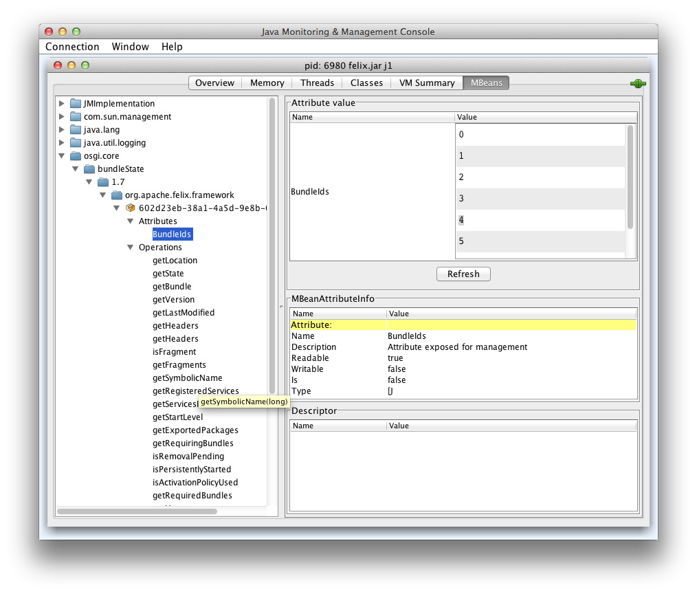

<a id="modules-jmx--_blueprint_integration"></a>
<a id="modules-jmx--blueprint-integration"></a>

## Blueprint Integration

TODO

<a id="modules-jmx--_whiteboard_support"></a>
<a id="modules-jmx--whiteboard-support"></a>

## Whiteboard support

The JMX Whiteboard support bundle allows registration of JMX MBeans through the OSGi service registry.
As a prerequisite the Apache Aries JMX Whiteboard Bundle has to be installed.

Once this is installed, register your services with the `jmx.objectname` service registration property.
This is either a JMX `ObjectName` or a single String.
The value is used as the JMX Object Name to register the MBean.
If the property is of some other type a message is logged and the MBean is still registered if the service implements the `MBeanRegistration` interface and the implmentation provides the actual JMX Object Name to use for the registration.

The name of the service as which the MBean service is registered is ignored by the Whiteboard.

The service object, though, must be a valid JMX MBean: It has to either implement the `DynamicMBean` interface or implement an interface whose name is the object’s (simple) class name with the `MBean` suffix.

Additional Service Properties supported:

- `warning.exceptions` (String+): One or more exception class names can be specified in this service property.
  If an exception occurs during the MBean registration and the exception is of one of these types mentioned, then this exception is logged as a warning.
  Otherwise the exception is logged as an error.

---

<a id="modules-jndiproject"></a>

<!-- source_url: https://aries.apache.org/documentation/modules/jndiproject.html -->

<!-- page_index: 130 -->

# JNDI

Documentation
master

- Documentation
  - [master](#index)

[Edit this Page](https://github.com/apache/aries-antora-site/edit/master/modules/ROOT/pages/modules/jndiproject.adoc)

<a id="modules-jndiproject--jndi"></a>

# JNDI

The Aries JNDI project aims to provide a fully compliant implementation of the OSGi Alliance JNDI Service Specification.
This specification details how to advertise InitialContextFactory and ObjectFactories in an OSGi environment.
It also defines how to obtain services from the service registry via JNDI.

<a id="modules-jndiproject--_service_registry_access_from_jndi"></a>
<a id="modules-jndiproject--service-registry-access-from-jndi"></a>

## Service Registry access from JNDI

The OSGi service registry provides a centralised register/query capability for OSGi services.
A common pattern outside of OSGi is to make use of the JNDI API to access services from a directory system.
The OSGi service registry can be viewed as an example of such a system.
The Aries JNDI project provides two URL lookup mechanisms via JNDI that can be used to access the service registry.

<a id="modules-jndiproject--_osgiservice"></a>
<a id="modules-jndiproject--osgi:service"></a>

## osgi:service

The osgi:service lookup scheme is defined by the JNDI Service Specification and follows the scheme:

```
osgi:service/<interface>[/<filter>](/<filter>.html)
```

The interface part is an interface name, like javax.sql.DataSource, or javax.jms.ConnectionFactory.
The filter allows selection based on the properties of the service.

This example:

```
Context ctx = new InitialContext();

Runnable r = (Runnable)ctx.lookup("osgi:service/java.lang.Runnable");
```

is equivalent to this code written to the OSGi service registry API.

```
BundleContext ctx = getABundleContext();
ServiceReference ref = ctx.getServiceReference("java.lang.Runnable");
if (ref != null) {
    Runnable r = ctx.getService(ref);
}
```

Lets say you wanted to filter for a Runnable with a property called *fred* which was mapped to *wilma*.
You could write

```
Context ctx = new InitialContext();

Runnable r =
(Runnable)ctx.lookup("osgi:service/java.lang.Runnable/(fred=wilma)");
```

which is equivalent to:

```
BundleContext ctx = getABundleContext();
ServiceReference[](.html)
 refs = ctx.getServiceReference("java.lang.Runnable", "(fred=wilma)");
if (refs != null) {
  Runnable r = ctx.getService(refs[refs.length - 1](refs.length---1.html)
); }
```

The osgi:service namepsace returns proxies, so if the Runnable was unregistered the proxy would switch to an equivalent alternative.
If no such alternative exists then an org.osgi.framework.ServiceException with a type of ServiceException.UNREGISTERED.

<a id="modules-jndiproject--_osgiservicelist"></a>
<a id="modules-jndiproject--osgi:servicelist"></a>

## osgi:servicelist

It is possible that there are multiple services in the registry that match.
In this case the osgi:servicelist lookup scheme can be used.
It has the same format as osgi:service, but it is designed to return multiple.

<a id="modules-jndiproject--_ariesservices"></a>
<a id="modules-jndiproject--aries:services"></a>

## aries:services

The aries:services scheme works in the same way as the osgi:service scheme, but does not perform proxying.
You get the actual object back.
Care must be taken with this approach as the service could be unregistered, but the client cannot tell to stop using it.
As a result it should only be used if the service is to be used for a short period of time.
In addition their is no way to indicate that the client is no longer using the service, so clean up cannot occur.

<a id="modules-jndiproject--_more_information"></a>
<a id="modules-jndiproject--more-information"></a>

## More Information

For more information, check out section "126 JNDI Services Specification Version 1.0" in the "OSGi Service Platform Enterprise Specification, Release 4, Version 4.2" available for public download from the [OSGi Alliance](http://www.osgi.org/Download/Release4V42) .

---

<a id="modules-subsystems"></a>

<!-- source_url: https://aries.apache.org/documentation/modules/subsystems.html -->

<!-- page_index: 131 -->

# OSGi Subsystems

Documentation
master

- Documentation
  - [master](#index)

[Edit this Page](https://github.com/apache/aries-antora-site/edit/master/modules/ROOT/pages/modules/subsystems.adoc)

<a id="modules-subsystems--osgi-subsystems"></a>

# OSGi Subsystems

<a id="modules-subsystems--_introduction"></a>
<a id="modules-subsystems--introduction"></a>

## Introduction

Apache Aries Subsystems is the Reference Implementation of the OSGi Subsystems Specification, chapter 134 of the [OSGi Enterprise specifications](http://www.osgi.org/Specifications/HomePage).
The Aries 1.x components implement the 1.0 version of the Subsystem spec.
Aries 2.x and newer implement the 1.1 version of OSGi Subsystems.

<a id="modules-subsystems--_getting_started"></a>
<a id="modules-subsystems--getting-started"></a>

## Getting started

This section shows the bundles to install to get the Subsystems implementation running in your favourite OSGi Framework.

The Aries Subsystem implementation uses the OSGi Coordination service, the OSGi Resolver service, the OSGi Repository service and integrates with the OSGi Configuration Admin service.
Additional dependencies are the Aries Util bundle, the Equinox Region bundle and SLF4J for logging.

The following are downloadable links (from Maven central) that provide all the required components to get subsystems up and running with Apache Felix.
Note that the Felix Framework distribution comes with OSGi Repository and Resolver implementations so these do not need to be added.
(When running Aries Subsystems with another OSGi Framework these must be provided.)

- [org.apache.aries.subsystem.api](https://repo1.maven.org/maven2/org/apache/aries/subsystem/org.apache.aries.subsystem.api/2.0.6/org.apache.aries.subsystem.api-2.0.6.jar)
- [org.apache.aries.subsystem.core](https://repo1.maven.org/maven2/org/apache/aries/subsystem/org.apache.aries.subsystem.core/2.0.6/org.apache.aries.subsystem.core-2.0.6.jar)
- [org.apache.aries.util](http://repo1.maven.org/maven2/org/apache/aries/org.apache.aries.util/1.1.1/org.apache.aries.util-1.1.1.jar)
- [org.apache.felix.configadmin](https://repo1.maven.org/maven2/org/apache/felix/org.apache.felix.configadmin/1.8.8/org.apache.felix.configadmin-1.8.8.jar)
- [org.apache.felix.coordinator](http://repo1.maven.org/maven2/org/apache/felix/org.apache.felix.coordinator/1.0.0/org.apache.felix.coordinator-1.0.0.jar)
- [org.eclipse.equinox.region](http://repo1.maven.org/maven2/org/eclipse/equinox/org.eclipse.equinox.region/1.2.101.v20150831-1342/org.eclipse.equinox.region-1.2.101.v20150831-1342.jar)
- [slf4j-api](http://repo1.maven.org/maven2/org/slf4j/slf4j-api/1.7.12/slf4j-api-1.7.12.jar)
- [slf4j-simple](http://repo1.maven.org/maven2/org/slf4j/slf4j-simple/1.7.12/slf4j-simple-1.7.12.jar) (or another slf4j binding)

After installing and starting all these components the Felix runtime looks like this:

```
g! lb
START LEVEL 1
   ID|State      |Level|Name
    0|Active     |    0|System Bundle (5.4.0)|5.4.0
    1|Active     |    1|Apache Felix Bundle Repository (2.0.6)|2.0.6
    2|Active     |    1|Apache Felix Gogo Command (0.16.0)|0.16.0
    3|Active     |    1|Apache Felix Gogo Runtime (0.16.2)|0.16.2
    4|Active     |    1|Apache Felix Gogo Shell (0.10.0)|0.10.0
    5|Active     |    1|Apache Aries Subsystem API (2.0.6)|2.0.6
    6|Active     |    1|Apache Aries Subsystem Core (2.0.6)|2.0.6
    7|Active     |    1|Apache Aries Util (1.1.1)|1.1.1
    8|Active     |    1|Apache Felix Configuration Admin Service (1.8.8)|1.8.8
    9|Active     |    1|Apache Felix Coordinator Service (1.0.0)|1.0.0
   10|Resolved   |    1|Region Digraph (1.2.101.v20150831-1342)|1.2.101.v20150831-1342
   11|Active     |    1|slf4j-api (1.7.12)|1.7.12
   12|Resolved   |    1|slf4j-simple (1.7.12)|1.7.12
   13|Active     |    1|org.osgi.service.subsystem.region.context.0 (1.0.0)|1.0.0
```

The Region Digraph and slf4j-simple bundles are fragments, so they can not be started.
You can see that the Subsystems implementation is operational as it created a synthesized bundle (13) to represent the root context.
The subsystems implementation sometimes synthesizes a bundle to represent a subsystem.
Whether or not this happens depends on the isolation model of a subsystem.

You can also see that the Subsystem service for the root subsystem has been registered by looking at the services registered by the Subsystem Core bundle (6):

```
g! inspect cap service 6
org.apache.aries.subsystem.core [6] provides:
---------------------------------------------
service; org.osgi.service.subsystem.Subsystem, org.apache.aries.subsystem.AriesSubsystem with properties:
   org.apache.aries.subsystem.service.regions = [org.eclipse.equinox.region.kernel]
   subsystem.id = 0
   subsystem.state = ACTIVE
   subsystem.symbolicName = org.osgi.service.subsystem.root
   subsystem.type = osgi.subsystem.application
   subsystem.version = 1.0.0
   ... other properties and services
```

Each installed subsystem is represented by a serparate service.

##Tools

The Apache Aries community provides a number of tools that facilitate working with OSGi Subsystems:

- Subsystem Gogo Command - a Gogo command to work with subsystems, for more info see below.
- [esa-ant-task](http://aries.apache.org/modules/esaanttask.html) - an Ant task to create .esa archives.
- [eas-maven-plugin](http://aries.apache.org/modules/esamavenpluginproject.html) - a Maven plugin to create .esa archives.

<a id="modules-subsystems--_subsystem_gogo_command"></a>
<a id="modules-subsystems--subsystem-gogo-command"></a>

### Subsystem Gogo Command

<https://svn.apache.org/repos/asf/aries/trunk/subsystem/subsystem-gogo-command> contains a simple bundle with Gogo commands to control subsystems.
This bundle can also be downloaded from [Maven Central here](https://repo1.maven.org/maven2/org/apache/aries/subsystem/org.apache.aries.subsystem.gogo-command/1.0.0/org.apache.aries.subsystem.gogo-command-1.0.0.jar).

After installing the gogo command bundle you can execute subsystem commands, for example:

```
g! subsystem:list
0	ACTIVE	org.osgi.service.subsystem.root 1.0.0
```

Use `subsystem:install` to install additional subsystems, for example one that is part of the `subsystem-itests` module:

```
g! subsystem:install file:/checkouts/aries/subsystem/subsystem-itests/target/feature1.esa
...
Subsystem successfully installed: org.apache.aries.subsystem.feature1; id: 1
```

This subsystem embeds another subsystem which automatically gets installed too.
When you list all subsystems you can see both:

```
g! subsystem:list
0	ACTIVE	org.osgi.service.subsystem.root 1.0.0
1	INSTALLED	org.apache.aries.subsystem.feature1 1.0.0
2	INSTALLED	org.apache.aries.subsystem.feature2 1.0.0
```

Together, these subsystems contain 3 bundles:

```
g! lb
START LEVEL 1
   ID|State      |Level|Name
    0|Active     |    0|System Bundle (5.0.1)
   ...
   16|Installed  |    1|TB3 (1.0.0)
   17|Installed  |    1|TB1 (1.0.0)
   18|Installed  |    1|TB2 (2.0.0)
```

Use `subsystem:start` to start a subsystem.
This will start all its bundles and all the bundles of dependent subsystems.
So the following single command, starts 3 bundles:

```
g! subsystem:start 1
g! lb
START LEVEL 1
   ID|State      |Level|Name
    0|Active     |    0|System Bundle (5.0.1)
    ...
   16|Active     |    1|TB3 (1.0.0)
   17|Active     |    1|TB1 (1.0.0)
   18|Active     |    1|TB2 (2.0.0)
```

<a id="modules-subsystems--_subsystem_gogo_commands"></a>
<a id="modules-subsystems--subsystem-gogo-commands"></a>

### Subsystem gogo commands

The following commands are available from the subsystem-gogo-command bundle:

- `subsystem:install <url>` - Install and resolve a subsystem.
- `subsystem:list <subsystemId>` - List installed subsystems.
- `subsystem:start <subsystemId>` - Start a subsystem and its dependencies.
- `subsystem:stop <subsystemId>` - Stop a subsystem and its dependencies.
- `subsystem:uninstall <subsystemId>` - Uninstall a subsystem and its dependencies.

Note that, following the OSGi Subsystem specification, dependent subsystems are only stopped and uninstalled when the last using subsystem is stopped/uninstalled.

<a id="modules-subsystems--_development"></a>
<a id="modules-subsystems--development"></a>

## Development

The Aries Subsystems code base can be found at the following location: <https://svn.apache.org/repos/asf/aries/trunk/subsystem>

---

<a id="modules-rsa"></a>

<!-- source_url: https://aries.apache.org/documentation/modules/rsa.html -->

<!-- page_index: 132 -->

# RSA (Remote Service Admin)

Documentation
master

- Documentation
  - [master](#index)

[Edit this Page](https://github.com/apache/aries-antora-site/edit/master/modules/ROOT/pages/modules/rsa.adoc)

<a id="modules-rsa--rsa-remote-service-admin"></a>

# RSA (Remote Service Admin)

The Aries Remote Service Admin (RSA) project allows to transparently use OSGi services for remote communication.
OSGi services can be marked for export by adding a service property `service.exported.interfaces=*`.
Various other properties can be used to customize how the service is to be exposed.

For more information, check out section "122 JPA Service Specification Version 1.0" in the "OSGi Service Platform Enterprise Specification, Release 4, Version 4.2" available for public download from the [OSGi Alliance](http://www.osgi.org/Download/Release4V43).

<a id="modules-rsa--_source"></a>
<a id="modules-rsa--source"></a>

## Source

The Aries RSA source is in a separate [git repository aries-rsa](https://git-wip-us.apache.org/repos/asf/aries-rsa.git) there is also a [mirror on github](https://github.com/apache/aries-rsa).

<a id="modules-rsa--_build"></a>
<a id="modules-rsa--build"></a>

## Build

```
mvn clean install
```

<a id="modules-rsa--_architecture"></a>
<a id="modules-rsa--architecture"></a>

## Architecture


<a id="modules-rsa--_some_definitions"></a>
<a id="modules-rsa--some-definitions"></a>

### Some definitions

- EndpointDescription Describes a remote service using service interfaces, remote url and all other properties to import the remote service.
- EndpointListener a service that is to be notified when remote Endpoints described by OSGi filters appear or disappear.

<a id="modules-rsa--_topology_manager"></a>
<a id="modules-rsa--topology-manager"></a>

### [Topology Manager](https://github.com/apache/aries-rsa/tree/master/topology-manager)

- Listens to local services and decides which to expose.
  It can also add properties to change the way services are exposed.
  For the services to be exported it calls RemoteServiceAdmin.exportService to do the actual export.
  Then notifies EndpointListeners about the new Endpoint.
- Listens for service requests from consumers and creates EndpointListeners for these interests.

The TopologyManager by default exposes all suitably marked local services for export and imports all service interests with matching remote Endpoints.

It is the best place to implement system wide governance rules.
Some examples what can be done:

- Enhancing all exposed remote endpoints with SSL, basic auth, logging
- Exporting OSGi services with annotations for JAX-WS or JAX-RS even when not specially marked for export

According to its role the TopologyManager of course does not directly implement the enhancements above.
It simply creates the necessary calls to a suitable RemoteServiceAdmin.

<a id="modules-rsa--_remote_service_admin"></a>
<a id="modules-rsa--remote-service-admin"></a>

### [Remote Service Admin](https://github.com/apache/aries-rsa/tree/master/rsa)

Is called by the Topology Manager to expose local services as remote endpoints and create local proxy services as clients for remote endpoints.

Aries RSA has a custom SPI [DistributionProvider](https://github.com/apache/aries-rsa/blob/master/spi/src/main/java/org/apache/aries/rsa/spi/DistributionProvider.java) that allows to easily create new transports and serializations.
Existing providers are:

- [CXF-DOSGi](http://cxf.apache.org/distributed-osgi.html)

  - uses Apache CXF for transport
  - service endpoints consumable with non-java software (XML/JSON)
- [TCP](https://github.com/apache/aries-rsa/tree/master/provider/tcp)

  - Java serialization over TCP (one port per service)
  - very few dependencies
  - easy to comprehend blueprint for own transport implementations
- [Fastbin](https://github.com/apache/aries-rsa/tree/master/provider/fastbin)

  - tuned Java serialization (or Protobuf) over TCP using NIO
  - multiplexing over a single port
  - transparently handles InputSteams and OutputStreams in remote services
  - synchronous and asnychronous calls supported

<a id="modules-rsa--_discovery"></a>
<a id="modules-rsa--discovery"></a>

### Discovery

A discovery implementation uses EndpointListeners to listen for local Endpoints and publishs them for other containers.
It also listens to remote Endpoints and notifies EndpointListeners about their presence.

Existing implementations:

- [Local discovery](https://github.com/apache/aries-rsa/tree/master/discovery/local) using xml descriptors
- [Zookeeper based discovery](https://github.com/apache/aries-rsa/tree/master/discovery/zookeeper)

<a id="modules-rsa--_a_simple_example_using_apache_karaf"></a>
<a id="modules-rsa--a-simple-example-using-apache-karaf"></a>

## A simple example using Apache Karaf

See [EchoTCP example](https://github.com/apache/aries-rsa/tree/master/examples/echotcp).
Follow the Readme to install the example in Apache Karaf.

The EchoTCP example implements a simple echo service that can be called remotely.
The example uses declarative services to publish and bind services.

<a id="modules-rsa--_modules"></a>
<a id="modules-rsa--modules"></a>

### Modules

- api : EchoService interface
- service : EchoService implementation
- consumer : Small consumer that uses the EchoService

The example installation uses the tcp transport to do the remoting but the example code is not tied to any transport.

<a id="modules-rsa--_example_using_fastbin_transport"></a>
<a id="modules-rsa--example-using-fastbin-transport"></a>

## Example using fastbin transport

A similar [example](https://github.com/apache/aries-rsa/tree/master/examples/echofastbin) exists for the fastbin transport . Follow the Readme to install the example in Apache Karaf.

The example implements an echo service that showcases synchronous calls, asnychronous calls and InputStream as parameter and return value.

---

<a id="modules-samples"></a>

<!-- source_url: https://aries.apache.org/documentation/modules/samples.html -->

<!-- page_index: 133 -->

# Samples

Documentation
master

- Documentation
  - [master](#index)

[Edit this Page](https://github.com/apache/aries-antora-site/edit/master/modules/ROOT/pages/modules/samples.adoc)

<a id="modules-samples--samples"></a>

# Samples

<a id="modules-samples--_blogsample"></a>
<a id="modules-samples--blogsample"></a>

## [BlogSample](#modules-samples-blog-sample)

Includes Blueprint, WAB and JPA concepts delivered in a EBA.

<a id="modules-samples--_ariestradersample"></a>
<a id="modules-samples--ariestradersample"></a>

## [AriesTraderSample](#modules-samples-ariestrader)

Includes Blueprint, WAB and JPA concepts delivered in a EBA.
You may also know this as the [Apache Geronimo Daytrader](https://cwiki.apache.org/GMOxDOC22/daytrader-a-more-complex-application.html) application, which has been migrated from a pure Java EE environment to a OSGi Blueprint model.

<a id="modules-samples--_goatsample"></a>
<a id="modules-samples--goatsample"></a>

## [GOATSample](#modules-samples-goatsample)

A graphical tool for displaying the status of, and relationships between, OSGi bundles running in an OSGi framework.

---

<a id="modules-samples-goatsample"></a>

<!-- source_url: https://aries.apache.org/documentation/modules/samples/goatsample.html -->

<!-- page_index: 134 -->

# GOAT Sample

Documentation
master

- Documentation
  - [master](#index)

[Edit this Page](https://github.com/apache/aries-antora-site/edit/master/modules/ROOT/pages/modules/samples/goatsample.adoc)

<a id="modules-samples-goatsample--goat-sample"></a>

# GOAT Sample

The Graphical OSGi Analysis Tool gives a way of displaying the status of bundles running in an OSGi framework.

<a id="modules-samples-goatsample--_goat_architecture"></a>
<a id="modules-samples-goatsample--goat-architecture"></a>

## GOAT Architecture

See charts here: <https://svn.apache.org/repos/asf/incubator/aries/documentation/samples/goat/>

<a id="modules-samples-goatsample--_model_assumptions_and_constraints"></a>
<a id="modules-samples-goatsample--model-assumptions-and-constraints"></a>

## Model - assumptions and constraints

<a id="modules-samples-goatsample--_development_to_do_list"></a>
<a id="modules-samples-goatsample--development-to-do-list"></a>

## Development to-do list

- Add RelationshipInfoListener to ServerSideClass.
  Should be similar to ComponenInfoListener (Done)
- Move the ComponentInfoImpl and RelationshipInfoImpl classes out of Web bundle into API bundle.
  They don’t really belong in the web bundle but had to be put here because DWR didn’t work when they were in the info-provider bundle (Done).
- Work out why the info-enhancer bundle doesn’t start and fix it.(Done)
- TwistieSection and TwistieAggregation need to merge to form one class (under elements) (Done)
- We need to implement a loading dialog for first load.
- Minor bug fix needed save coords (saving default doesn’t work)
- Investgate/recreate DWR bug

---

<a id="modules-samples-ariestrader"></a>

<!-- source_url: https://aries.apache.org/documentation/modules/samples/ariestrader.html -->

<!-- page_index: 135 -->

# The AriesTrader Sample

Documentation
master

- Documentation
  - [master](#index)

[Edit this Page](https://github.com/apache/aries-antora-site/edit/master/modules/ROOT/pages/modules/samples/ariestrader.adoc)

<a id="modules-samples-ariestrader--the-ariestrader-sample"></a>

# The AriesTrader Sample

<a id="modules-samples-ariestrader--_prereqs"></a>
<a id="modules-samples-ariestrader--prereqs"></a>

## Prereqs

---

NOTE
:   These instructions are for the 0.2-incubating release of Aries.
    Instructions for older releases can be found [here](https://aries.apache.org/documentation/modules/samples/archiveinstructions.html) . In the 0.2-incubating release the AriesTrader sample was changed such that it is no longer required for you to install Derby independently.
    The Derby version included in the sample is fully leveraged internally in the sample and therefore no additional Derby installation is required.
    However, there are steps required to initialize the Database from within the sample itself (see instructions below).

---

<a id="modules-samples-ariestrader--_creating_the_osgi_platform_equinox_test_harness_for_ariestrader"></a>
<a id="modules-samples-ariestrader--creating-the-osgi-platform-equinox-test-harness-for-ariestrader"></a>

### Creating the OSGi platform (equinox-test-harness) for AriesTrader

Download and unzip the source zip for the [latest release](#downloads-currentrelease) of Aries Samples and build the equinox-test-harness module under ariestrader:

```
cd samples-0.2-incubating/ariestrader/assemblies/equinox-test-harness
mvn install
```

This procedure will pull in the binaries from the latest release and its dependencies.

<a id="modules-samples-ariestrader--_alternative_build_using_apache_aries_trunk"></a>
<a id="modules-samples-ariestrader--alternative-build-using-apache-aries-trunk."></a>

### Alternative build using Apache Aries trunk.

As an alternative to using the released version you can also choose to work with the latest, unreleased code.
This will require the use of subversion to checkout the code followed by building the entire Apache Aries project.
Directions are provided here: [Building Aries instructions](aries:buildingaries.html) .

<a id="modules-samples-ariestrader--_starting_the_equinox_test_harness_to_run_the_ariestrader_sample"></a>
<a id="modules-samples-ariestrader--starting-the-equinox-test-harness-to-run-the-ariestrader-sample"></a>

### Starting the Equinox Test Harness to run the AriesTrader sample

AriesTrader needs a test harness to run in.
For this purpose we are using an Equinox assembly that pulls in all of the necessary dependencies.

The first task is to start the Apache Aries modules in an OSGi framework using the Eclipse Equinox test harness

```
cd samples-0.2-incubating/ariestrader/assemblies/equinox-test-harness/target
java -jar osgi-3.5.0.v20090520.jar -console
```

The OSGi console should start up, the 'ss' command should show the active bundles but the AriesTrader application is not yet installed (with the exception of the ariestrader derby datasource which is started with the test harness for convenience).

<a id="modules-samples-ariestrader--_installing_ariestrader_in_the_equinox_test_harness"></a>
<a id="modules-samples-ariestrader--installing-ariestrader-in-the-equinox-test-harness"></a>

### Installing AriesTrader in the Equinox Test Harness

To install the AriesTrader application simply copy the eba for AriesTrader into the target/load directory, you will need to create this directory first.
+ For convenience the AriesTraders EBAs are copied into the target directory as part of creating the OSGi Equinox test harness.

When using the "JDBC" only AriesTrader configuration which supports only jdbc persistence:

```
cp org.apache.aries.samples.ariestrader.jdbc-*.eba load/
```

When using the "All" AriesTrader configuration which supports all currently available persistence modes:

```
cp org.apache.aries.samples.ariestrader.all-*.eba load/
```

Now the 'ss' command should show all of the AriesTrader bundles in state 'ACTIVE'.

If you subsequently delete org.apache.aries.samples.ariestrader.jdbc-*.eba or org.apache.aries.samples.ariestrader.all-*.eba from the target/load directory the application will be uninstalled.

<a id="modules-samples-ariestrader--_accessing_and_using_the_ariestrader_sample"></a>
<a id="modules-samples-ariestrader--accessing-and-using-the-ariestrader-sample"></a>

### Accessing and using the AriesTrader sample

Point your browser at <http://localhost:8080/ariestrader/>

Select the "Configuration" tab and the "Configure AriesTrader run-time parameters" choice.
Then select from among the available runtime modes (defauls to JDBC).
Be sure to click "update config" to save your selection.

At the moment the following persistence modes are available when using the "all" EBA:

- JDBC persistence
- JPA application managed entity manager persistence
- JPA container managed entity managers using declarative transaction support

By default, the sample starts with JDBC persistence.
To select another persistence mechanism see the directions under "Accessing and using the AriesTrader sample.

After selecting the persistence mode you must create the AriesTrader Database tables and indexs.
Select the "Configuration" tab and the "(Re)-create AriesTrader Tables and Indexes".

Next, you must seed the database with test content.
Once again go to the "Configuration" tab but this time select "(Re)-populate AriesTrader Database" from the available choices to seed the database with a default set of users and stock quotes.
You will see a number of quotes (default is 400) and users (default is 200) created.

Select the "Trading & Portfolios" tab to use the mock trade application or the "Primitives" tab to run some of the web primitive tests (PingJSPEL is not currently working).
You can also run the "Test AriesTrader Scenario" from the "Configuration" tab which will launch a new browser window and step through a trading scenario with each reload of the page.

<a id="modules-samples-ariestrader--_about_the_ariestrader_sample"></a>
<a id="modules-samples-ariestrader--about-the-ariestrader-sample"></a>

### About the AriesTrader Sample

The AriesTrader sample is a modified version of the Apache Geronimo DayTrader sample.
It has been somewhat simplified and reorganized to support the Apache Aries programming model.

The AriesTrader sample bundles are organized like this:


---

<a id="modules-samples-blog-sample"></a>

<!-- source_url: https://aries.apache.org/documentation/modules/samples/blog-sample.html -->

<!-- page_index: 136 -->

# The Blog Sample

Documentation
master

- Documentation
  - [master](#index)

[Edit this Page](https://github.com/apache/aries-antora-site/edit/master/modules/ROOT/pages/modules/samples/blog-sample.adoc)

<a id="modules-samples-blog-sample--the-blog-sample"></a>

# The Blog Sample

<a id="modules-samples-blog-sample--_running_the_blog_sample"></a>
<a id="modules-samples-blog-sample--running-the-blog-sample"></a>

## Running the Blog Sample

---

> [!NOTE]
> |  |  |
> | --- | --- |
> |  | These instructions are for the current development stream of Aries. Instructions for older releases can be found [here](https://aries.apache.org/downloads/archived-releases.html) Instructions for the current release of Aries can be found [here](https://aries.apache.org/downloads/blogsample-0.3.html) |

---

<a id="modules-samples-blog-sample--_create_the_osgi_platform_for_the_blog_sample"></a>
<a id="modules-samples-blog-sample--create-the-osgi-platform-for-the-blog-sample"></a>

### Create the OSGi platform for the Blog sample

Download and build the development stream of Aries, see [here](https://aries.apache.org/development/buildingaries.html)

```
cd samples/blog/blog-assembly/target
mkdir load
```

The full Aries build builds the blog sample by default, all of the platform pre-reqs will be available in the target directory.
Create the load directory.
This used to be done automatically by Felix file install, but in more recent versions yo have to create your own.

<a id="modules-samples-blog-sample--_running_the_blog_sample_2"></a>
<a id="modules-samples-blog-sample--running-the-blog-sample-2"></a>

### Running the Blog sample

Start Aries in an OSGi framework (we’re using Eclipse Equinox in this case)

```
java -jar osgi-3.5.0.v20090520.jar -console
```

The OSGi console should start up, the 'ss' command should show all of the platform bundles in state 'ACTIVE'.

To run the blog application (.eba file) copy

```
samples/blog/blog-jdbc-eba/target/*.eba
```

into the load directory.

Point your browser to <http://localhost:8080/blog/>

If you subsequently delete the .eba from the load directory the application will be uninstalled.

<a id="modules-samples-blog-sample--_running_the_sample_using_a_jpa_persistence_layer"></a>
<a id="modules-samples-blog-sample--running-the-sample-using-a-jpa-persistence-layer"></a>

### Running the sample using a JPA persistence layer

The first blog sample application was written to use a JDBC persistence layer.
There is a second application implemented to demonstrate the JPA capability

To run the blog sample which uses the JPA persistence layer, start the OSGi framework as before, remove any previous copies of the blog sample from the target/load directory, then copy

```
samples/blog/blog-jpa-eba/target/*.eba
```

into the load directory.

Finally, after typing 'refresh' at the OSGi console, point your browser at <http://localhost:8080/blog/> . You should see something that looks precisely the same as the blog sample running with the JDBC persistence layer, but this time running using the JPA persistence layer.

<a id="modules-samples-blog-sample--_about_the_blog_sample"></a>
<a id="modules-samples-blog-sample--about-the-blog-sample"></a>

## About the Blog sample

The blog sample components can be visualised like this:


---

<a id="modules-spi-fly"></a>

<!-- source_url: https://aries.apache.org/documentation/modules/spi-fly.html -->

<!-- page_index: 137 -->

# SPI Fly

Documentation
master

- Documentation
  - [master](#index)

[Edit this Page](https://github.com/apache/aries-antora-site/edit/master/modules/ROOT/pages/modules/spi-fly.adoc)

<a id="modules-spi-fly--spi-fly"></a>

# SPI Fly

[](https://github.com/apache/aries/actions/workflows/spi-fly.yml)
[](https://search.maven.org/search?q=g:org.apache.aries.spifly)

This page describes the SPI Fly component.
The SPI Fly component is aimed at providing OSGi support for JRE SPI mechanisms, including the usage of `java.util.ServiceLoader`, `META-INF/services` and similar methods.

SPI Fly is the Reference Implementation of the OSGi ServiceLoader Mediator specification, chapter 133 in the [OSGi Enterprise Specification](https://docs.osgi.org/specification/osgi.enterprise/7.0.0/service.loader.html), available from version 5.

<a id="modules-spi-fly--_the_problem"></a>
<a id="modules-spi-fly--the-problem"></a>

## The Problem

Java’s `java.util.ServiceLoader.load()`, other similar methods such as `sun.misc.Service.providers()` and also other static finder methods such as the `FactoryFinder.find()` methods try to locate 'service' implementations by looking for resources in the `META-INF/services` directory of all the jars visible to the ***Thread Context ClassLoader*** (TCCL).

There are a number of issues with the above mechanisms when used in OSGi:

1. The Thread Context ClassLoader is not defined in general in an OSGi context.
   It can and has to be set by the caller and OSGi cannot generally enforce that.
2. A bundle can’t `Import-Package` `META-INF/services` as potentially many bundles will contain this pseudo-package and the OSGi framework will only bind a single exporter to an importer for a given package.
3. Instantiating an SPI provider generally requires access to internal implementation classes, by exporting these classes an implementing bundle would break its encapsulation.
4. Even if an implementation class was exported, importing this class in a consumer bundle would bind it to the specific implementation package provided, which violates the principle of loose coupling.
5. Bundles have a dynamic life-cycle which means that provided services could disappear when a bundle is updated or uninstalled.
   The java.util.ServiceLoader API does not provide a mechanism to inform service consumers of such an event.

The SPI Fly project makes it possible to use existing code that uses `ServiceLoader.load()` and similar mechanisms under OSGi.

<a id="modules-spi-fly--_making_it_work"></a>
<a id="modules-spi-fly--making-it-work"></a>

## Making it Work

In order to make ServiceLoader (and other similar SPI or plugin mechanisms) work under OSGi, calling code can be woven to set the TCCL to the appropriate providers very briefly, only for the duration of the call.
The SPI Fly component does precisely this.

SPI Fly supports two modes of operation:

- OSGi Specification compliant configuration.
  This is based on OSGi generic requirements and capabilities and provides portability across implementations of this specification.
  However, it only covers `java.util.ServiceLoader`.
  [Find it here](#modules-spi-fly--specconf).
- If you need to handle cases other than `java.util.ServiceLoader`, such as the various FactoryFinders, `javax.imageio.spi.ServiceRegistry`, `javax.sound.sampled.AudioSystem` or others that use the TCCL to find an implementation, you can use the [SPI Fly-specific configuration](#modules-spi-fly--specificconf).

Additionally, services found in the `META-INF/services` location in opted-in bundles will be registered in the OSGi Service Registry so that OSGi-aware consumers can simply find them there. This is supported in both the spec-compliant as well as the proprietary configuration modes. Each such service is registered in the OSGi Service Registry with the *serviceloader.mediator* service registration property set.

<a id="modules-spi-fly--_getting_spi_fly"></a>
<a id="modules-spi-fly--getting-spi-fly"></a>

## Getting SPI Fly

The latest release of the SPI-Fly components [can be found on Maven Central](https://search.maven.org/#search%7Cga%7C1%7Cg%3A%22org.apache.aries.spifly%22).

To use SPI Fly you need to decide whether to use the dynamic weaving bundle, dynamic weaving framework extension or static weaving version.
More information about this can be found in the [usage section](#modules-spi-fly--usage).

To use the dynamic weaving bundle

```xml
<dependency>
    <groupId>org.apache.aries.spifly</groupId>
    <artifactId>org.apache.aries.spifly.dynamic.bundle</artifactId>
    <version>${spifly.version}</version>
</dependency>
<dependency>
    <groupId>org.ow2.asm</groupId>
    <artifactId>asm</artifactId>
    <version>${asm.version}</version>
</dependency>
<dependency>
    <groupId>org.ow2.asm</groupId>
    <artifactId>asm-commons</artifactId>
    <version>${asm.version}</version>
</dependency>
<dependency>
    <groupId>org.ow2.asm</groupId>
    <artifactId>asm-util</artifactId>
    <version>${asm.version}</version>
</dependency>
```

To use the dynamic weaving framework extension

```xml
<dependency>
    <groupId>org.apache.aries.spifly</groupId>
    <artifactId>org.apache.aries.spifly.dynamic.framework.extension</artifactId>
    <version>${spifly.version}</version>
</dependency>
```

To use the static weaving bundle

```xml
<dependency>
    <groupId>org.apache.aries.spifly</groupId>
    <artifactId>org.apache.aries.spifly.static.bundle</artifactId>
    <version>${spifly.version}</version>
</dependency>
```

<a id="modules-spi-fly--_building_the_code"></a>
<a id="modules-spi-fly--building-the-code"></a>

### Building the code

The code can be found in <https://github.com/apache/aries/tree/trunk/spi-fly>.

To build, use Maven 3.x and run `mvn install`

<a id="modules-spi-fly--specconf"></a>
<a id="modules-spi-fly--configuration:-osgi-spec-compliant"></a>

### Configuration: OSGi Spec-compliant

All the details surrounding this type of configuration are covered in the [OSGi Enterprise Specification](https://docs.osgi.org/specification/osgi.enterprise/7.0.0/service.loader.html), chapter 133.
This section provides a short overview.

<a id="modules-spi-fly--_providers"></a>
<a id="modules-spi-fly--providers"></a>

#### Providers

SPI provider bundles opt in to being registered by specifying a requirement on the `osgi.serviceloader.registrar` extender.
This is done by adding the following Bundle Manifest header.
Without this they will not be considered by SPI Fly:

```properties
Require-Capability: \
  osgi.extender; \
    filter:="(osgi.extender=osgi.serviceloader.registrar)"
```

Additionally, they need to provide capabilities for all the APIs that are exposed through this mechanism, for example:

```properties
Provide-Capability: \
  osgi.serviceloader; \
    osgi.serviceloader=org.apache.aries.spifly.mysvc.MySPIProvider
```

While this example omits it, it is advisable to specify `uses` constraints on the `Provide-Capability` header, to ensure consistent class spaces.

See the [`spi-fly-example-provider2-bundle`](#modules-spi-fly--examples) for an example of a spec-compliant provider.

<a id="modules-spi-fly--_consumers"></a>
<a id="modules-spi-fly--consumers"></a>

#### Consumers

An SPI consumer (i.e. a bundle using the `java.util.ServiceLoader.load()` API) needs to specify required capabilities in the `Required-Capability` header. Two different types of requirements must be specified:

- A requirement on the SPI Fly processing mechanism. This is stated as follows:


```properties
  osgi.extender; \
    filter:="(osgi.extender=osgi.serviceloader.processor)"
```

  Without this requirement the bundle will not be considered for processing.
- A requirement on the SPI that needs to be provided through this mechanism, for example:


```properties
  osgi.serviceloader; \
    filter:="(osgi.serviceloader=org.apache.aries.spifly.mysvc.MySPIProvider)";cardinality:=multiple
```

  Note that the `cardinality` directive is specified to allow multiple bundles to provide the requested capability, allowing provided services to come from more than one provider bundle.

All requirements are combined into a single Require-Capability header:

```properties
Require-Capability: \
  osgi.serviceloader; \
    filter:="(osgi.serviceloader=org.apache.aries.spifly.mysvc.MySPIProvider)"; \
    cardinality:=multiple, \
  osgi.extender; \
    filter:="(osgi.extender=osgi.serviceloader.processor)"
```

See the [`spi-fly-example-client2-bundle`](#modules-spi-fly--examples) for an example of a spec-compliant consumer.

<a id="modules-spi-fly--specificconf"></a>
<a id="modules-spi-fly--configuration:-spi-fly-specific"></a>

### Configuration: SPI Fly-specific

This section describes how to use SPI Fly’s proprietary configuration mechanism. It provides more features, but doesn’t provide the portability that spec-compliance configuration gives. If you are only using SPI Fly with `java.util.ServiceLoader` or you are only using the provided services through the OSGi Service Registry, then consider using the [spec-compliant](#modules-spi-fly--specconf) configuration for portability.

<a id="modules-spi-fly--_providers_2"></a>
<a id="modules-spi-fly--providers-2"></a>

#### Providers

First for all, SPI Fly needs to be made aware of any bundles that provide the services. These bundles are made visible through the TCCL for the duration of the `ServiceLoader.load()` (or similar) call.

To mark a bundle as a Provider, set the **`SPI-Provider`** manifest header:

- `SPI-Provider: *` will consider all providers found in the `META-INF/services` directory and register them.
- `SPI-Provider: org.acme.MySvc1, org.acme.MySvc2` will only consider `MySvc1` and `MySvc2`.

Additionally services found in `META-INF/services` are registered in the OSGi Service Registry.

The `SPI-Provider` header can either be set in the providing bundle itself or in a wrapper bundle that holds the original unmodified jar containing the provider internally as a on the `Bundle-ClassPath`.

See the [`spi-fly-example-provider1-bundle`](#modules-spi-fly--examples) for an example of a provider using this type of configuration.

<a id="modules-spi-fly--_consumers_2"></a>
<a id="modules-spi-fly--consumers-2"></a>

#### Consumers

Service consumers also need to opt in to the process.

To specify a consumer, add the `SPI-Consumer` manifest header to the client bundle.
This header will opt-in the bundle to the weaving process where for the duration of the specified call the TCCL will be set to the matching provider bundle(s).

Some example SPI-Consumer headers are:

- `SPI-Consumer: *` is a shorthand for `java.util.ServiceLoader#load(java.lang.Class)` and will automatically weave all `ServiceLoader.load(Class)` calls.
- `SPI-Consumer: java.util.ServiceLoader#load(java.lang.Class[org.apache.aries.mytest.MySPI])` Only process calls to `ServiceLoader.load(Class)` when it is called with `MySPI.class` as argument.
- `SPI-Consumer: javax.xml.parsers.DocumentBuilderFactory#newInstance()` weave clients that call `DocumentBuilderFactory.newInstance()`.
- `SPI-Consumer: org.foo.Foo#someMthd(),org.bar.Bar#myMethod()` weave calls to `Foo.someMthd()` and `Bar.myMethod()`.

See the [`spi-fly-example-client1-bundle`](#modules-spi-fly--examples) for an example of a consumer using this type of configuration.

<a id="modules-spi-fly--_service_properties"></a>
<a id="modules-spi-fly--service-properties"></a>

### Service Properties

When a provider is published as an OSGi service it will gain some automatic service properties.

Table 1. Default Service Properties

|  |  |
| --- | --- |
| Property | Value |
| `serviceloader.mediator` | The bundle Id of the SPI bundle (SPI Fly) |
| `.org.apache.aries.spifly.provider.implclass` | The implementation class of the registered service |
| `.org.apache.aries.spifly.provider.discovery.mode` | The mode which was used to discover the service; `SPI_PROVIDER_HEADER` `AUTO_PROVIDERS_PROPERTY` or `SERVICELOADER_CAPABILITIES` |

Any additional attributes found on the `SPI-Provider` header, or the capability will be used as service properties allowing great flexibility for identifying registered services.

<a id="modules-spi-fly--_prototype_scope_service"></a>
<a id="modules-spi-fly--prototype-scope-service"></a>

#### Prototype Scope Service

By default services provided are registered using an `org.osgi.framework.ServiceFactory`. This means that by default services are `bundle` scoped. However, it is possible to provide `prototype` scoped services by adding a service property `service.scope=prototype` which will cause SPI Fly to register the service using a `org.osgi.framework.PrototypeServiceFactory`.

<a id="modules-spi-fly--_special_cases"></a>
<a id="modules-spi-fly--special-cases"></a>

### Special Cases

SPI Fly can be used for most SPI provider/lookup systems that use the TCCL pattern to obtain implementations. However, in some cases *special treatment* is needed. This special treatment is often needed when the API itself does not match the name of the resources in `META-INF/services`, `java.util.ServiceLoader` is such a case, however SPI-Fly has built-in knowledge of ServiceLoader. Known APIs that require special treatment are listed below:

- `javax.imageio.spi.ServiceRegistry`: This class is very much like `java.util.ServiceLoader` in that it can load any kind of API implementation. While SPI Fly knows about ServiceLoader and treats it specially, the ServiceRegistry class currently does not have special treatment.
  It can still be made to work but this requires the following header in the provider bundle:


```
SPI-Provider: javax.imageio.spi.ServiceRegistry
```

  on the client side you can use


```
SPI-Consumer: javax.imageio.spi.ServiceRegistry#lookupProviders(java.lang.Class)
```

  or


```
SPI-Consumer: javax.imageio.spi.ServiceRegistry#lookupProviders
```

- `javax.sound.sampled.AudioSystem`: This class uses `sun.misc.Service` under the covers (via `com.sun.media.sound.JDK13Services`) which is a predecessor to `java.util.ServiceLoader`.
  There is no special treatment for `sun.misc.Service` in SPI Fly (yet), but the `AudioSystem.getAudioInputStream()` API can be made to work by explicitly listing it in the provider bundle (the one that contains the relevant `META-INF/services` resources):


```
SPI-Provider: javax.sound.sampled.AudioSystem
```

  on the consumer side you can use


```
SPI-Consumer: javax.sound.sampled.AudioSystem#getAudioInputStream
```

<a id="modules-spi-fly--_usage_there_are_currently_two_ways_to_use_the_spi_fly_component"></a>
<a id="modules-spi-fly--usage:-there-are-currently-two-ways-to-use-the-spi-fly-component."></a>

### Usage: There are currently two ways to use the SPI Fly component.

1. If you have an OSGi 4.3 (or higher) compliant framework that supports WeavingHooks you can use the dynamic weaving approach for which you have 3 options:

   1. dynamic weaving bundle
   2. dynamic weaving framework extension
   3. dynamic weaving auto properties
2. If you have an pre-4.3 OSGi framework or don’t want to use bytecode weaving at runtime you can use the static weaving approach.

<a id="modules-spi-fly--_dynamic_weaving_bundle"></a>
<a id="modules-spi-fly--dynamic-weaving-bundle"></a>

### Dynamic Weaving Bundle

Install and start the [`org.apache.aries.spifly.dynamic.bundle`](#modules-spi-fly--releases) into the system (see [dependencies](#modules-spi-fly--dynamicweavingbundledependencies)).

```
g! lb
START LEVEL 1
   ID|State      |Level|Name
    0|Active     |    0|System Bundle
    ...
    5|Active     |    1|ASM all classes
    7|Active     |    1|Apache Aries SPI Fly Dynamic Weaving Bundle
```

Note that, as with any OSGi Bundle that uses the OSGi 4.3 WeavingHooks, the weaver bundle (`org.apache.aries.spifly.dynamic.bundle` in the SPI Fly case) needs to be active before any bundles that need to be dynamically woven. OSGi Start Levels can provide a mechanism to control this.

<a id="modules-spi-fly--_dynamic_weaving_framework_extension"></a>
<a id="modules-spi-fly--dynamic-weaving-framework-extension"></a>

### Dynamic Weaving Framework Extension

Install and start the [`org.apache.aries.spifly.dynamic.framework.extension`](#modules-spi-fly--releases) into the system (see [dependencies](#modules-spi-fly--dynamicweavingfedependencies)).

```
g! lb
START LEVEL 1
   ID|State      |Level|Name
    0|Active     |    0|System Bundle
    ...
    7|Active     |    1|Apache Aries SPI Fly Dynamic Framework Extension
```

Note that, the framework extension bundle (`org.apache.aries.spifly.dynamic.framework.extension` in the SPI Fly case) attaches to and extends the `system.bundle`. As such it will always be active before any consumer or provider bundles that have a requirement on it (via the `osgi.serviceloader.processor` or `osgi.serviceloader.registrar` requirements.)

<a id="modules-spi-fly--_dynamic_weaving_by_auto_properties"></a>
<a id="modules-spi-fly--dynamic-weaving-by-auto-properties"></a>

### Dynamic Weaving by auto properties

Install and start either the `bundle` or `framework.extension` as described above, then provide the following framework properties:

- `org.apache.aries.spifly.auto.consumers` - Provide a comma delimited list of `Bundle-SymbolicName` globs (ant style) which should be woven as consumers. Only ServiceLoader is supported by this mechanism.

  For example, the following tells SPI Fly that all bundles with `Bundle-SymbolicName` matching `jakarta.*` should have their ServiceLoader calls be woven:


```properties
org.apache.aries.spifly.auto.consumers=jakarta.*
```

- `org.apache.aries.spifly.auto.providers` - Provide a comma delimited list of `Bundle-SymbolicName` globs (ant style) which should be registered as providers. Any `META-INF/services` located in matching bundles will have those made available as providers and published as services. Any additional attributes found associated with a given entry will be added as service properties.

  For example, the following tells SPI Fly that all bundles with `Bundle-SymbolicName` matching `com.sun.*` should have their services registered as providers. At the same time the service property `vendor=Oracle` will be added to registred services. Meanwhile a bundle matching `my.provider` will have its services registered as providers with the service property `vendor=Me` and as `prototype` scoped in the service registry:


```properties
org.apache.aries.spifly.auto.providers=" \
    com.sun.*;vendor=Oracle, \
    my.provider;vendor=Me;service.scope=prototype"
```

**Note:** The syntax for these two properties matches the [Common Header Syntax](https://osgi.github.io/osgi/core/framework.module.html#framework.common.header.syntax) defined by the OSGi Core specification.

<a id="modules-spi-fly--_use_with_static_weaving"></a>
<a id="modules-spi-fly--use-with-static-weaving"></a>

### Use with Static Weaving

For static use, you need to weave the client bundle before installing it into the system. The modification changes the byte code around `java.util.ServiceLoader.load()` or other calls in the bundle and inserts calls to set the correct ThreadContextClassLoader around it. Provider bundles are still handled dynamically.

<a id="modules-spi-fly--_to_statically_weave_a_bundle"></a>
<a id="modules-spi-fly--to-statically-weave-a-bundle"></a>

#### To statically weave a bundle

The easiest way to invoke the static weaver is to take the [`org.apache.aries.spifly.static.tool`](#modules-spi-fly--releases) jar with dependencies. Then run the static tool on any bundle that needs processing:

```shell
java -jar org.apache.aries.spifly.static.tool-1.0.2-jar-with-dependencies.jar mybundle.jar
```

This will produce a second bundle with the same name with the `_spifly` suffix appended, so in this case the generated bundle will be called mybundle\_spifly.jar.

At runtime, install the [`org.apache.aries.spifly.static.bundle`](#modules-spi-fly--releases) into the system:

```
g! lb
START LEVEL 1
   ID|State      |Level|Name
    0|Active     |    0|System Bundle
    ...
    6|Active     |    1|Apache Aries SPI Fly Static Weaving Bundle
```

Then install and start the statically woven bundle into the system.

<a id="modules-spi-fly--examples"></a>

## Examples

The `spi-fly-examples` directory contains a number of example bundles that can be used for testing or experimenting.

The following modules can be found in this directory:

- **spi-fly-example-spi-bundle** - a bundle providing an SPI interface used by the other example bundles. [source](https://github.com/apache/aries/tree/trunk/spi-fly/spi-fly-examples/spi-fly-example-spi-bundle/)
- **spi-fly-example-provider1-jar** - a plain jar file providing an implementation of the SPI (via `META-INF/services`). [source](https://github.com/apache/aries/tree/trunk/spi-fly/spi-fly-examples/spi-fly-example-provider1-jar/)
- **spi-fly-example-provider1-bundle** - a bundle that wraps the jar file from the previous bullet and specifies it in its `Bundle-ClassPath`. This example represents the common case where an existing SPI provider is wrapped as-is in an OSGi bundle. This example uses the SPI Fly proprietary configuration. [source](https://github.com/apache/aries/tree/trunk/spi-fly/spi-fly-examples/spi-fly-example-provider1-bundle/)
- **spi-fly-example-provider2-bundle** - a bundle that directly provides an SPI service (via `META-INF/services`). This example uses OSGi specification compliant configuration. [source](https://github.com/apache/aries/tree/trunk/spi-fly/spi-fly-examples/spi-fly-example-provider2-bundle/)
- **spi-fly-example-client1-jar** - a plain jar using `java.util.ServiceLoader.load()` to obtain and invoke all services provided of a certain SPI. [source](https://github.com/apache/aries/tree/trunk/spi-fly/spi-fly-examples/spi-fly-example-client1-jar/)
- **spi-fly-example-client1-bundle** - a bundle that wraps the jar file from the previous bullet and lists it in its `Bundle-ClassPath`. This example represents the common case where an existing SPI consumer is wrapped as-is in an OSGi bundle. This example uses SPI Fly proprietary configuration. [source](https://github.com/apache/aries/tree/trunk/spi-fly/spi-fly-examples/spi-fly-example-client1-bundle/)
- **spi-fly-example-client2-bundle** - a bundle that has code that invokes `java.util.ServiceLoader.load()` directly. This example uses OSGi specification compliant configuration. [source](https://github.com/apache/aries/tree/trunk/spi-fly/spi-fly-examples/spi-fly-example-client2-bundle/)
- **spi-fly-example-provider-consumer-bundle** - a bundle that is both a provider and a consumer at the same time. [source](https://github.com/apache/aries/tree/trunk/spi-fly/spi-fly-examples/spi-fly-example-provider-consumer-bundle/)
- **spi-fly-example-resource-provider-bundle** and **spi-fly-example-resource-client-bundle** - these bundles show that SPI Fly can be used to control the TCCL in OSGi for any situation, in this case applied to resource loading via the TCCL. The provider bundle provides a resource used by the `Foo.doit()` API. The client bundle contains `Foo.doit()` and in there calls `Thread.getContextClassLoader().getResource()` to obtain the resource. The TCCL has visibility of the provider bundle because both bundles have the appropriate values set in the `SPI-Provider` and `SPI-Consumer` headers. [source](https://github.com/apache/aries/tree/trunk/spi-fly/spi-fly-examples/spi-fly-example-resource-provider-bundle/) and [source](https://github.com/apache/aries/tree/trunk/spi-fly/spi-fly-examples/spi-fly-example-resource-client-bundle/).

<a id="modules-spi-fly--_more_information"></a>
<a id="modules-spi-fly--more-information"></a>

## More Information

More information can be found at the following resources:

- OSGi Service Loader Mediator specification.
  [OSGi Enterprise specification](https://docs.osgi.org/specification/osgi.enterprise/7.0.0/service.loader.html), Chapter 133.
- OSGi Blog article: [java.util.ServiceLoader in OSGi](https://blog.osgi.org/2013/02/javautilserviceloader-in-osgi.html)

---

<a id="modules-transactionsproject"></a>

<!-- source_url: https://aries.apache.org/documentation/modules/transactionsproject.html -->

<!-- page_index: 138 -->

# Transactions Project

Documentation
master

- Documentation
  - [master](#index)

[Edit this Page](https://github.com/apache/aries-antora-site/edit/master/modules/ROOT/pages/modules/transactionsproject.adoc)

<a id="modules-transactionsproject--transactions-project"></a>

# Transactions Project

The Aries JTA project focuses on making container managed transactions available as OSGi services.

For more information, check out section "123 JTA Transaction Services Specification 1.0" in the "OSGi Service Platform Enterprise Specification, Release 4, Version 4.2" available for public download from the [OSGi Alliance](http://www.osgi.org/Download/Release4V42)

Some of the aspects of working with Aries JTA are already covered in the [JPA module](#modules-jpaproject).

---

<a id="modules-tx-control-advancedscopes"></a>

<!-- source_url: https://aries.apache.org/documentation/modules/tx-control/advancedScopes.html -->

<!-- page_index: 139 -->

# Advanced Scope control

Documentation
master

- Documentation
  - [master](#index)

[Edit this Page](https://github.com/apache/aries-antora-site/edit/master/modules/ROOT/pages/modules/tx-control/advancedScopes.adoc)

<a id="modules-tx-control-advancedscopes--advanced-scope-control"></a>

# Advanced Scope control

There are a number of useful ways to interact with the scopes created by the Transaction Control Service

<a id="modules-tx-control-advancedscopes--_determining_the_current_scope"></a>
<a id="modules-tx-control-advancedscopes--determining-the-current-scope"></a>

## Determining the current scope

The Transaction Control Service has methods which can be used to work out whether a scope is in effect:

- `txControl.activeScope();` - When `true` there is a scope in effect and resources can be accessed.
  The scope may, or may not, be transactional.
  When false there is no current scope and `txControl.getCurrentContext();` will return `null`.
- `txControl.activeTransaction()` - When `true` there is a transactional scope in effect and resources can be accessed transactionally.
  When false there may, or may not, be a "No Transaction" scope in effect.

Note that `assert txControl.activeTransaction();` can be used to enforce the presence of a transaction.
This is equivalent to a "Mandatory" transaction in Spring or Java EE.

<a id="modules-tx-control-advancedscopes--_avoiding_rollback"></a>
<a id="modules-tx-control-advancedscopes--avoiding-rollback"></a>

## Avoiding rollback

When setting up a transaction certain exception types can be marked as not triggering rollback:

```
txControl.build()
    .noRollbackFor(MyCustomException.class)
    .required(() -> {
            // A MyCustomException thrown here will not trigger rollback
        });
```

<a id="modules-tx-control-advancedscopes--_nesting_a_transaction"></a>
<a id="modules-tx-control-advancedscopes--nesting-a-transaction"></a>

## Nesting a transaction

Nesting a Transaction can easily be managed using `requiresNew()`

```
txControl.required(() -> {
        // Do some work...
```

```
    return txControl.requiresNew(() -> {
            // Do some more work
        });
});
```

<a id="modules-tx-control-advancedscopes--_suspending_a_transaction"></a>
<a id="modules-tx-control-advancedscopes--suspending-a-transaction"></a>

## Suspending a transaction

Suspending a Transaction can easily be managed using `notSupported()`

```
txControl.required(() -> {
        // Do some work...
```

```
    return txControl.notSupported(() -> {
            // Do some more work
        });
});
```

---

<a id="modules-tx-control-localtransactions"></a>

<!-- source_url: https://aries.apache.org/documentation/modules/tx-control/localTransactions.html -->

<!-- page_index: 140 -->

# Aries Local Transaction Control implementation

Documentation
master

- Documentation
  - [master](#index)

[Edit this Page](https://github.com/apache/aries-antora-site/edit/master/modules/ROOT/pages/modules/tx-control/localTransactions.adoc)

<a id="modules-tx-control-localtransactions--aries-local-transaction-control-implementation"></a>

# Aries Local Transaction Control implementation

The Aries Local Transaction control implementation is available at the following maven coordinates:

```
<dependency>
    <groupId>org.apache.aries.tx-control</groupId>
    <artifactId>tx-control-service-local</artifactId>
    <version>${aries.tx.control.version}</version>
</dependency>
```

<a id="modules-tx-control-localtransactions--_using_the_transaction_control_service"></a>
<a id="modules-tx-control-localtransactions--using-the-transaction-control-service"></a>

## Using the Transaction Control Service

For the basics of using the Transaction Control Service see the [Quick Start Documentation](#modules-tx-control-quickstart)

As per the Transaction Control specification the Aries Local implementation registers a TransactionControl service in the OSGi Service Registry with the `osgi.local.enabled` property set to `true`

<a id="modules-tx-control-localtransactions--_local_transactions"></a>
<a id="modules-tx-control-localtransactions--local-transactions"></a>

## Local Transactions

Local transactions occur purely in-memory, and do not coordinate between resources.

This means that Local Transactions are *not recoverable* in the event of failure, and also that Local Transactions are *not* atomic across multiple resources.
In particular, if two resources are accessed in a transaction (for example two different databases are modified) then it is possible that one resource will be committed and the other rolled back.

Local transactions are therefore best suited to scenarios where only a single resource is accessed within the transaction, or where consistency between resources is not important.

<a id="modules-tx-control-localtransactions--_working_with_local_transactions"></a>
<a id="modules-tx-control-localtransactions--working-with-local-transactions"></a>

## Working with local transactions

The Local Transaction Control Service supports participants in ongoing transactions via the `registerLocalResource(LocalResource)` method.
It does not support XA resources and will throw an `IllegalStateException` if `registerXAResource(XAResource)` is called.

Lifecycle callbacks can be registered against the current scope using the `preCompletion(Runnable)` and `postCompletion(Consumer)</code> methods.`

---

<a id="modules-tx-control-localjdbc"></a>

<!-- source_url: https://aries.apache.org/documentation/modules/tx-control/localJDBC.html -->

<!-- page_index: 141 -->

# Aries OSGi Transaction Control JDBC Provider (Local)

Documentation
master

- Documentation
  - [master](#index)

[Edit this Page](https://github.com/apache/aries-antora-site/edit/master/modules/ROOT/pages/modules/tx-control/localJDBC.adoc)

<a id="modules-tx-control-localjdbc--aries-osgi-transaction-control-jdbc-provider-local"></a>

# Aries OSGi Transaction Control JDBC Provider (Local)

The Aries Local JDBC provider implementation is available at the following maven coordinates:

```
<dependency>
    <groupId>org.apache.aries.tx-control</groupId>
    <artifactId>tx-control-provider-jdbc-local</artifactId>
    <version>${aries.tx.control.version}</version>
</dependency>
```

This module is a prototype implementation of the OSGi Transaction Control JDBC resource provider.
It supports Local transactions only.
The provider also has built-in support for Database connection pooling using Hikari CP.

<a id="modules-tx-control-localjdbc--_when_should_i_use_this_module"></a>
<a id="modules-tx-control-localjdbc--when-should-i-use-this-module"></a>

## When should I use this module?

If you wish to use entirely lightweight, resource-local transactions then it is best to pair this module with the Aries Local Transaction Control service bundle.

If two-phase commit is needed across multiple resources then an XA capable Resource Provider should be used instead if possible.

<a id="modules-tx-control-localjdbc--_quick_start"></a>
<a id="modules-tx-control-localjdbc--quick-start"></a>

## Quick Start

A configured JDBCConnectionProvider can be created quickly using Configuration Admin and the OSGi JDBC Service.

1. Find and install a JDBC Service implementation for your chosen database (e.g.
   the org.h2 bundle for H2)
2. Create a factory configuration using the factory pid `org.apache.aries.tx.control.jdbc.local` and add the following properties:

   - *osgi.jdbc.driver.class* :- The driver class name (e.g.
     org.h2.Driver)
   - *url* :- The JDBC URL to use to connect to the database

When the DataSourceFactory for the named `osgi.jdbc.driver.class` becomes available the Local JDBC Resource Provider will create a JDBCConnectionProvider and register it in the OSGi service registry.
All configuration properties (apart from the database password) will be registered as properties of the JDBCConnectionProvider service.
These properties can be used to select a ResourceProvider if more than one is present in the Service Registry.

<a id="modules-tx-control-localjdbc--_using_the_local_jdbc_provider_bundle_details"></a>
<a id="modules-tx-control-localjdbc--using-the-local-jdbc-provider-bundle-details"></a>

## Using the Local JDBC Provider bundle (details)

This Resource Provider is used in conjunction with a TransactionControl service to provide scoped access to a JDBC connection with support for Local Transactions.

When using local transactions the JDBC API is used to commit or rollback the Database connection.
There is no need for client code to call commit, rollback, or close on the connection.

<a id="modules-tx-control-localjdbc--_creating_a_resource_programmatically"></a>
<a id="modules-tx-control-localjdbc--creating-a-resource-programmatically"></a>

## Creating a resource programmatically

Preparing a resource for use is very simple.
Create a `JDBCConnectionProvider` using the `JDBCConnectionProviderFactory` service from the service registry, then connect that provider to a `TransactionControl` service.
This will return a thread-safe JDBC connection that can then be used in any ongoing scoped work.

The normal inputs to a JDBCConnectionProviderFactory are a DataSourceFactory, some JDBC properties to connect to the database with, and some properties to control the resource provider (such as connection pooling).

<a id="modules-tx-control-localjdbc--_declarative_services_example"></a>
<a id="modules-tx-control-localjdbc--declarative-services-example"></a>

### Declarative Services Example

```
@Component
public class TransactionalJDBCComponent {
    @Reference
    TransactionControl txControl;

    @Reference
    DataSourceFactory dsf;

    @Reference
    JDBCConnectionProviderFactory providerFactory;

    Connection conn;

    @Activate
    void start(Config config) {

        Properties jdbcProps = new Properties();
        jdbcProps.put(JDBC_URL, config.url());
        jdbcProps.put(JDBC_USER, config.user());
        jdbcProps.put(JDBC_PASSWORD, config._password());

        Map<String, Object> providerProps = new HashMap<>();
        providerProps.put(MAX_POOL_SIZE, 8);

        conn = providerFactory.getProviderFor(dsf,
        jdbcProps, providerProps).getResource(txControl);
    }

    public void findUserName(String id) {
        txControl.required(() -> {
                // Use the connection in here
            });
    }
}
```

If a JDBC DataSource/Driver is already configured then it can be passed in to the JDBCConnectionProviderFactory instead of a DataSourceFactory and JDBC configuration.

<a id="modules-tx-control-localjdbc--_creating_a_resource_using_a_factory_configuration"></a>
<a id="modules-tx-control-localjdbc--creating-a-resource-using-a-factory-configuration"></a>

## Creating a resource using a factory configuration

Whilst it is simple to use a `JDBCConnectionProviderFactory` it does require some lifecycle code to be written.
It is therefore possible to directly create JDBC resources using factory configurations.
When created, the factory service will listen for an applicable DataSourceFactory.
Once a suitable DataSourceFactory is available then a JDBCConnectionProvider service will be published.

Configuration properties (except the JDBC password) are set as service properties for the registered `JDBCConnectionProvider`.
These properties may therefore be used in filters to select a particular provider.

<a id="modules-tx-control-localjdbc--_declarative_services_example_2"></a>
<a id="modules-tx-control-localjdbc--declarative-services-example-2"></a>

### Declarative Services Example

```
@Component
public class TransactionalJDBCComponent {

    @Reference
    TransactionControl control;

    Connection conn;

    @Reference(target="(dataSourceName=myDataSource)")
    void setProvider(JDBCConnectionProvider provider) {
         conn = provider.getResource(control);
    }

    public void findUserName(String id) {
        control.required(() -> {
                // Use the connection in here
            });
    }
}
```

The factory pid is *org.apache.aries.tx.control.jdbc.local* and it may use the following properties (all optional):

<a id="modules-tx-control-localjdbc--_resource_provider_properties"></a>
<a id="modules-tx-control-localjdbc--resource-provider-properties"></a>

### Resource Provider properties

- *aries.dsf.target.filter* : The target filter to use when searching for a DataSourceFactory.
  If not specified then *osgi.jdbc.driver.class* must be specified.
- *aries.jdbc.property.names* : The names of the properties to pass to the DataSourceFactory when creating the JDBC resources
- *osgi.jdbc.driver.class* : Used to locate the DataSourceFactory service if the *aries.dsf.target.filter* is not set.
- *osgi.local.enabled* : Defaults to true.
  If false then resource creation will fail
- *osgi.xa.enabled* : Defaults to false.
  If true then resource creation will fail
- *osgi.connection.pooling.enabled* : Defaults to true.
  If true then the Database connections will be pooled.
- *osgi.connection.max* : Defaults to 10.
  The maximum number of connections that should be kept in the pool
- *osgi.connection.min* : Defaults to 10.
  The minimum number of connections that should be kept in the pool
- *osgi.connection.timeout* : Defaults to 30,000 (30 seconds).
  The maximum time in milliseconds to block when waiting for a database connection
- *osgi.idle.timeout* : Defaults to 180,000 (3 minutes).
  The time in milliseconds before an idle connection is eligible to be closed.
- *osgi.connection.timeout* : Defaults to 10,800,000 (3 hours).
  The maximum time in milliseconds that a connection may remain open before being closed.
- *osgi.use.driver* : Defaults to false.
  If true then use the createDriver method to connect to the database.

<a id="modules-tx-control-localjdbc--_jdbc_properties"></a>
<a id="modules-tx-control-localjdbc--jdbc-properties"></a>

### JDBC properties

The following properties will automatically be passed to the DataSourceFactory if they are present.
The list of properties may be overridden using the *aries.jdbc.property.names* property if necessary.

- *databaseName* : The name of the database
- *dataSourceName* : The name of the dataSource that will be created
- *description* : A description of the dataSource being created
- *networkProtocol* : The network protocol to use.
- *portNumber* : The port number to use
- *roleName* : The name of the JDBC role
- *serverName* : The name of the database server
- *url* : The JDBC url to use (often used instead of other properties such as *serverName*, *portNumber* and *databaseName*).
- *user* : The JDBC user
- *password* : The JDBC password

---

<a id="modules-tx-control-xajdbc"></a>

<!-- source_url: https://aries.apache.org/documentation/modules/tx-control/xaJDBC.html -->

<!-- page_index: 142 -->

# Aries OSGi Transaction Control JDBC Provider (XA)

Documentation
master

- Documentation
  - [master](#index)

[Edit this Page](https://github.com/apache/aries-antora-site/edit/master/modules/ROOT/pages/modules/tx-control/xaJDBC.adoc)

<a id="modules-tx-control-xajdbc--aries-osgi-transaction-control-jdbc-provider-xa"></a>

# Aries OSGi Transaction Control JDBC Provider (XA)

The Aries Local JDBC provider implementation is available at the following maven coordinates:

```
<dependency>
    <groupId>org.apache.aries.tx-control</groupId>
    <artifactId>tx-control-provider-jdbc-xa</artifactId>
    <version>${aries.tx.control.version}</version>
</dependency>
```

This module is a prototype implementation of the OSGi Transaction Control JDBC resource provider.
It supports both XA transactions and Local Transactions.
The provider also has built-in support for Database connection pooling using Hikari CP.

<a id="modules-tx-control-xajdbc--_when_should_i_use_this_module"></a>
<a id="modules-tx-control-xajdbc--when-should-i-use-this-module"></a>

## When should I use this module?

If two-phase commit is needed across multiple resources then it is best to pair this module with the tx-control-service-xa bundle.

If you wish to use entirely lightweight, resource-local transactions then then the tx-control-service-local and tx-control-provider-jdbc-local bundles can be used instead.

<a id="modules-tx-control-xajdbc--_quick_start"></a>
<a id="modules-tx-control-xajdbc--quick-start"></a>

## Quick Start

A configured JDBCConnectionProvider can be created quickly using Configuration Admin and the OSGi JDBC Service.

1. Find and install a JDBC Service implementation for your chosen database (e.g.
   the org.h2 bundle for H2)
2. Create a factory configuration using the factory pid `org.apache.aries.tx.control.jdbc.xa` and add the following properties:

   - *osgi.jdbc.driver.class* :- The driver class name (e.g.
     org.h2.Driver)
   - *url* :- The JDBC URL to use to connect to the database

When the DataSourceFactory for the named `osgi.jdbc.driver.class` becomes available the Local JDBC Resource Provider will create a JDBCConnectionProvider and register it in the OSGi service registry.
All configuration properties (apart from the database password) will be registered as properties of the JDBCConnectionProvider service.
These properties can be used to select a ResourceProvider if more than one is present in the Service Registry.

<a id="modules-tx-control-xajdbc--_using_the_xa_jdbc_provider_bundle_details"></a>
<a id="modules-tx-control-xajdbc--using-the-xa-jdbc-provider-bundle-details"></a>

## Using the XA JDBC Provider bundle (details)

This Resource Provider is used in conjunction with a TransactionControl service to provide scoped access to a JDBC connection with support for XA Transactions and Local Transactions.

When using XA transactions the XAResource from the Database provider is used to integrate with an ongoing XA transaction.
When using local transactions the JDBC API is used to commit or rollback the Database connection.

<a id="modules-tx-control-xajdbc--_creating_a_resource_programmatically"></a>
<a id="modules-tx-control-xajdbc--creating-a-resource-programmatically"></a>

## Creating a resource programmatically

Preparing a resource for use is very simple.
Create a `JDBCConnectionProvider` using the `JDBCConnectionProviderFactory` service from the service registry, then connect that provider to a `TransactionControl` service.
This will return a thread-safe JDBC connection that can then be used in any ongoing scoped work.
The JDBCConnectionProviderFactory service is registered with the `osgi.xa.enabled` property set to `true`.

The normal inputs to a JDBCConnectionProviderFactory are a DataSourceFactory, some JDBC properties to connect to the database with, and some properties to control the resource provider (such as connection pooling).

<a id="modules-tx-control-xajdbc--_declarative_services_example"></a>
<a id="modules-tx-control-xajdbc--declarative-services-example"></a>

### Declarative Services Example

```
@Component
public class TransactionalJDBCComponent {
    @Reference
    TransactionControl txControl;

    @Reference
    DataSourceFactory dsf;

    @Reference
    JDBCConnectionProviderFactory providerFactory;

    Connection conn;

    @Activate
    void start(Config config) {

        Properties jdbcProps = new Properties();
        jdbcProps.put(JDBC_URL, config.url());
        jdbcProps.put(JDBC_USER, config.user());
        jdbcProps.put(JDBC_PASSWORD, config._password());

        Map<String, Object> providerProps = new HashMap<>();
        providerProps.put(MAX_POOL_SIZE, 8);

        conn = providerFactory.getProviderFor(dsf,
        jdbcProps, providerProps).getResource(txControl);
    }

    public void findUserName(String id) {
        txControl.required(() -> {
                // Use the connection in here
            });
    }
}
```

If a JDBC DataSource/Driver is already configured then it can be passed in to the JDBCConnectionProviderFactory instead of a DataSourceFactory and JDBC configuration.

<a id="modules-tx-control-xajdbc--_creating_a_resource_using_a_factory_configuration"></a>
<a id="modules-tx-control-xajdbc--creating-a-resource-using-a-factory-configuration"></a>

## Creating a resource using a factory configuration

Whilst it is simple to use a `JDBCConnectionProviderFactory` it does require some lifecycle code to be written.
It is therefore possible to directly create JDBC resources using factory configurations.
When created, the factory service will listen for an applicable DataSourceFactory.
Once a suitable DataSourceFactory is available then a JDBCConnectionProvider service will be published.

Configuration properties (except the JDBC password) are set as service properties for the registered `JDBCConnectionProvider`.
These properties may therefore be used in filters to select a particular provider.

<a id="modules-tx-control-xajdbc--_declarative_services_example_2"></a>
<a id="modules-tx-control-xajdbc--declarative-services-example-2"></a>

### Declarative Services Example

```
@Component
public class TransactionalJDBCComponent {

    @Reference
    TransactionControl control;

    Connection conn;

    @Reference(target="(dataSourceName=myDataSource)")
    void setProvider(JDBCConnectionProvider provider) {
         conn = provider.getResource(control);
    }

    public void findUserName(String id) {
        control.required(() -> {
                // Use the connection in here
            });
    }
}
```

The factory pid is *org.apache.aries.tx.control.jdbc.xa* and it may use the following properties (all optional):

<a id="modules-tx-control-xajdbc--_resource_provider_properties"></a>
<a id="modules-tx-control-xajdbc--resource-provider-properties"></a>

### Resource Provider properties

- *aries.dsf.target.filter* : The target filter to use when searching for a DataSourceFactory.
  If not specified then *osgi.jdbc.driver.class* must be specified.
- *aries.jdbc.property.names* : The names of the properties to pass to the DataSourceFactory when creating the JDBC resources
- *osgi.jdbc.driver.class* : Used to locate the DataSourceFactory service if the *aries.dsf.target.filter* is not set.
- *osgi.local.enabled* : Defaults to true.
  If false then this resource will not participate in local transactions, and will fail if used within one.
  One of *osgi.local.enabled* and *osgi.xa.enabled* must be true.
- *osgi.xa.enabled* : Defaults to true.
  If false then this resource will not participate in xa transactions, and will fail if used within one.
  One of *osgi.local.enabled* and *osgi.xa.enabled* must be true.
- *osgi.connection.pooling.enabled* : Defaults to true.
  If true then the Database connections will be pooled.
- *osgi.connection.max* : Defaults to 10.
  The maximum number of connections that should be kept in the pool
- *osgi.connection.min* : Defaults to 10.
  The minimum number of connections that should be kept in the pool
- *osgi.connection.timeout* : Defaults to 30,000 (30 seconds).
  The maximum time in milliseconds to block when waiting for a database connection
- *osgi.idle.timeout* : Defaults to 180,000 (3 minutes).
  The time in milliseconds before an idle connection is eligible to be closed.
- *osgi.connection.timeout* : Defaults to 10,800,000 (3 hours).
  The maximum time in milliseconds that a connection may remain open before being closed.
- *osgi.use.driver* : Defaults to false.
  If true then use the createDriver method to connect to the database.
  Cannot be true if *osgi.xa.enabled* is true.

<a id="modules-tx-control-xajdbc--_jdbc_properties"></a>
<a id="modules-tx-control-xajdbc--jdbc-properties"></a>

### JDBC properties

The following properties will automatically be passed to the DataSourceFactory if they are present.
The list of properties may be overridden using the *aries.jdbc.property.names* property if necessary.

- *databaseName* : The name of the database
- *dataSourceName* : The name of the dataSource that will be created
- *description* : A description of the dataSource being created
- *networkProtocol* : The network protocol to use.
- *portNumber* : The port number to use
- *roleName* : The name of the JDBC role
- *serverName* : The name of the database server
- *url* : The JDBC url to use (often used instead of other properties such as *serverName*, *portNumber* and *databaseName*).
- *user* : The JDBC user
- *password* : The JDBC password

---

<a id="modules-tx-control-localjpa"></a>

<!-- source_url: https://aries.apache.org/documentation/modules/tx-control/localJPA.html -->

<!-- page_index: 143 -->

# Aries Transaction Control JPA Provider (Local)

Documentation
master

- Documentation
  - [master](#index)

[Edit this Page](https://github.com/apache/aries-antora-site/edit/master/modules/ROOT/pages/modules/tx-control/localJPA.adoc)

<a id="modules-tx-control-localjpa--aries-transaction-control-jpa-provider-local"></a>

# Aries Transaction Control JPA Provider (Local)

The Aries Local JPA provider implementation is available at the following maven coordinates:

```
<dependency>
    <groupId>org.apache.aries.tx-control</groupId>
    <artifactId>tx-control-provider-jpa-local</artifactId>
    <version>${aries.tx.control.version}</version>
</dependency>
```

This module is a prototype implementation of the OSGi Transaction Control JPA resource provider using Local transactions.
It supports JPA 2.1, and is tested against Hibernate 5.0.9 and EclipseLink 2.6.0.
It also supports JPA 2.0, and is tested against OpenJPA 2.4.1.

<a id="modules-tx-control-localjpa--_quick_start"></a>
<a id="modules-tx-control-localjpa--quick-start"></a>

## Quick Start

A configured `JPAEntityManagerProvider` can be created quickly using Configuration Admin, the OSGi JPA Service, and the OSGi JDBC Service.

1. Package the persistence unit in a persistence bundle
2. Find and install a JPA provider (for example Hibernate)
3. Find and install a JDBC Service implementation for your chosen database (e.g.
   the org.h2 bundle for H2)
4. Install a JPA service extender, such as the Apache Aries JPA container
5. Create a factory configuration using the factory pid `org.apache.aries.tx.control.jpa.local` and add the following properties:

   - *osgi.jdbc.driver.class* :- The driver class name for your database(e.g.
     org.h2.Driver)
   - *url* :- The JDBC URL to use to connect to the database
   - *osgi.unit.name* :- The name of the persistence unit

When the DataSourceFactory for the named `osgi.jdbc.driver.class` and the `EntityManagerFactoryBuilder` for the named `osgi.unit.name` become available the Local JPA Resource Provider will create a JPAEntityManagerProvider and register it in the OSGi service registry.
All configuration properties (apart from the database password) will be registered as properties of the JPAEntityManagerProvider service.
These properties can be used to select a ResourceProvider if more than one is present in the Service Registry.

<a id="modules-tx-control-localjpa--_when_should_i_use_this_module"></a>
<a id="modules-tx-control-localjpa--when-should-i-use-this-module"></a>

## When should I use this module?

If you wish to use entirely lightweight, resource-local transactions then it is best to pair this module with the `tx-control-service-local` bundle.

If two-phase commit is needed across multiple resources then the `tx-control-service-xa` and `tx-control-provider-jpa-xa` bundles should be used.

<a id="modules-tx-control-localjpa--_using_the_jpa_provider_bundle"></a>
<a id="modules-tx-control-localjpa--using-the-jpa-provider-bundle"></a>

## Using the JPA Provider bundle

This Resource Provider is used in conjunction with a TransactionControl service to provide scoped access to a JPA EntityManager.

<a id="modules-tx-control-localjpa--_prerequisites"></a>
<a id="modules-tx-control-localjpa--prerequisites"></a>

## Prerequisites

In order to use scoped JPA access the runtime must contain a JPA provider (for example Hibernate), an implementation of the OSGi JPA service (e.g.
Aries JPA), and a persistence bundle.

<a id="modules-tx-control-localjpa--_suitable_persistence_bundles"></a>
<a id="modules-tx-control-localjpa--suitable-persistence-bundles"></a>

### Suitable Persistence bundles

OSGi Persistence bundles contain the persistence descriptor (typically an XML file called META-INF/persistence.xml), all of the JPA Entities, and a Meta-Persistence header pointing at the persistence descriptor.
(See the JPA service specification for more details).

Unlike "normal" JPA it is usually best not to fully declare the persistence unit in the persistence descriptor.
In particular it is a good idea to avoid putting any database configuration in the persistence unit.
By not configuring the database inside the bundle the persistence unit remains decoupled, and can be reconfigured for any database at runtime.

For example the following persistence unit:

```
<persistence-unit name="test-unit"/>
```

can be reconfigured to use any database and to create/drop tables as appropriate.
Configuration for the persistence unit can be provided using Configuration Admin and the EntityManagerFactoryBuilder.

<a id="modules-tx-control-localjpa--_creating_a_resource_programmatically"></a>
<a id="modules-tx-control-localjpa--creating-a-resource-programmatically"></a>

## Creating a resource programmatically

Preparing a resource for use is very simple.
Create a JPAEntityManagerProvider using the the JPAEntityManagerProviderFactory, then connect the provider to a TransactionControl service.
This will return a thread-safe JPA EntityManager that can then be used in any ongoing scoped work.

The normal inputs to a JPAEntityManagerProviderFactory are an EntityManagerFactoryBuilder, some JPA properties to connect to the database with, and some properties to control the resource provider.

<a id="modules-tx-control-localjpa--_declarative_services_example"></a>
<a id="modules-tx-control-localjpa--declarative-services-example"></a>

### Declarative Services Example

```
@Component
public class TransactionalJPAComponent {
    @Reference
    TransactionControl txControl;

    @Reference
    DataSourceFactory dsf;

    @Reference
    EntityManagerFactoryBuilder emfb;

    @Reference
    JPAEntityManagerProviderFactory providerFactory;

    EntityManager em;

    @Activate
    void start(Config config) {

        Properties jdbcProps = new Properties();
        jdbcProps.put(JDBC_URL, config.url());
        jdbcProps.put(JDBC_USER, config.user());
        jdbcProps.put(JDBC_PASSWORD, config._password());

        Map<String, Object> jpaProps = new HashMap<>();
        jpaProps.put("javax.persistence.nonJtaDataSource",
                    dsf.createDataSource(jdbcProps));

        em = providerFactory.getProviderFor(emfb, jpaProps,
                    null).getResource(txControl);
    }

    public void findUserName(String id) {
        txControl.required(() -> {
                // Use the EntityManager in here
            });
    }  }
```

If the JPA EntityManagerFactory is already configured then it can be passed into the JPAEntityManagerProviderFactory instead of an EntityManagerFactoryBuilder and JPA configuration.

<a id="modules-tx-control-localjpa--_creating_a_resource_using_a_factory_configuration"></a>
<a id="modules-tx-control-localjpa--creating-a-resource-using-a-factory-configuration"></a>

## Creating a resource using a factory configuration

Whilst it is simple to use a EntityManagerFactoryBuilder it does require some lifecycle code to be written.
It is therefore possible to directly create JPA resources using factory configurations.
When created, the factory service will listen for an applicable EntityManagerFactoryBuilder and potentially also a DataSourceFactory.
Once suitable services are available then a JPAEntityManagerProvider service will be published.

Configuration properties (except the JPA/JDBC password) are set as service properties for the registered JPAEntityManagerProvider.
These properties may therefore be used in filters to select a particular provider.

```
@Component
public class TransactionalJDBCComponent {
    @Reference
    TransactionControl control;

    EntityManager em;

    @Reference(target="(osgi.unit.name=test-unit)")
    void setProvider(JPAEntityManagerProvider provider) {
        em = provider.getResource(control);
    }

    public void findUserName(String id) {
        txControl.required(() -> {
                // Use the connection in here
            });
    }  }
```

The factory pid is *org.apache.aries.tx.control.jpa.local* and it may use the following properties (all optional aside from *osgi.unit.name*):

<a id="modules-tx-control-localjpa--_resource_provider_properties"></a>
<a id="modules-tx-control-localjpa--resource-provider-properties"></a>

### Resource Provider properties

- *osgi.unit.name* : The name of the persistence unit that this configuration relates to.
- *aries.emf.builder.target.filter* : The target filter to use when searching for an EntityManagerFactoryBuilder.
  If not specified then any builder for the named persistence unit will be used.
- *aries.jpa.property.names* : The names of the properties to pass to the EntityManagerFactoryBuilder when creating the EntityManagerFactory.
  By default all properties are copied.
- *aries.dsf.target.filter* : The target filter to use when searching for a DataSourceFactory.
  If not specified then *osgi.jdbc.driver.class* must be specified.
- *aries.jdbc.property.names* : The names of the properties to pass to the DataSourceFactory when creating the JDBC resources.
- *osgi.jdbc.driver.class* : Used to locate the DataSourceFactory service if the *aries.dsf.target.filter* is not set.
- *osgi.local.enabled* : Defaults to true.
  If false then resource creation will fail
- *osgi.xa.enabled* : Defaults to false.
  If true then resource creation will fail
- *osgi.connection.pooling.enabled* : Defaults to true.
  If true then the Database connections will be pooled.
- *osgi.connection.max* : Defaults to 10.
  The maximum number of connections that should be kept in the pool
- *osgi.connection.min* : Defaults to 10.
  The minimum number of connections that should be kept in the pool
- *osgi.connection.timeout* : Defaults to 30,000 (30 seconds).
  The maximum time in milliseconds to block when waiting for a database connection
- *osgi.idle.timeout* : Defaults to 180,000 (3 minutes).
  The time in milliseconds before an idle connection is eligible to be closed.
- *osgi.connection.timeout* : Defaults to 10,800,000 (3 hours).
  The maximum time in milliseconds that a connection may remain open before being closed.
- *osgi.use.driver* : Defaults to false.
  If true then use the createDriver method to connect to the database.

<a id="modules-tx-control-localjpa--_jdbc_properties"></a>
<a id="modules-tx-control-localjpa--jdbc-properties"></a>

### JDBC properties

The following properties will automatically be passed to the DataSourceFactory if they are present.
The list of properties may be overridden using the *aries.jdbc.property.names* property if necessary.

- *databaseName* : The name of the database
- *dataSourceName* : The name of the dataSource that will be created
- *description* : A description of the dataSource being created
- *networkProtocol* : The network protocol to use.
- *portNumber* : The port number to use
- *roleName* : The name of the JDBC role
- *serverName* : The name of the database server
- *url* : The JDBC url to use (often used instead of other properties such as *serverName*, *portNumber* and *databaseName*).
- *user* : The JDBC user
- *password* : The JDBC password

<a id="modules-tx-control-localjpa--_jpa_properties"></a>
<a id="modules-tx-control-localjpa--jpa-properties"></a>

### JPA properties

The following properties are potentially useful when configuring JPA:

*javax.persistence.schema-generation.database.action* : May be used to automatically create the database tables (see the OSGi spec)

- Other provider specific properties, for example configuring second-level caching.

---

<a id="modules-tx-control-xajpa"></a>

<!-- source_url: https://aries.apache.org/documentation/modules/tx-control/xaJPA.html -->

<!-- page_index: 144 -->

# Aries Transaction Control JPA Provider (XA)

Documentation
master

- Documentation
  - [master](#index)

[Edit this Page](https://github.com/apache/aries-antora-site/edit/master/modules/ROOT/pages/modules/tx-control/xaJPA.adoc)

<a id="modules-tx-control-xajpa--aries-transaction-control-jpa-provider-xa"></a>

# Aries Transaction Control JPA Provider (XA)

The Aries XA JPA provider implementation is available at the following maven coordinates:

```
<dependency>
    <groupId>org.apache.aries.tx-control</groupId>
    <artifactId>tx-control-provider-jpa-xa</artifactId>
    <version>${aries.tx.control.version}</version>
</dependency>
```

This module is a prototype implementation of the OSGi Transaction Control JPA resource provider using XA transactions.
It supports JPA 2.1, and is tested against Hibernate 5.0.9 and EclipseLink 2.6.0.
It also supports JPA 2.0, and is tested against OpenJPA 2.4.1.

<a id="modules-tx-control-xajpa--_quick_start"></a>
<a id="modules-tx-control-xajpa--quick-start"></a>

## Quick Start

A configured `JPAEntityManagerProvider` can be created quickly using Configuration Admin, the OSGi JPA Service, and the OSGi JDBC Service.

1. Package the persistence unit in a persistence bundle
2. Find and install a JPA provider (for example Hibernate)
3. Find and install a JDBC Service implementation for your chosen database (e.g.
   the org.h2 bundle for H2)
4. Install a JPA service extender, such as the Apache Aries JPA container
5. Create a factory configuration using the factory pid `org.apache.aries.tx.control.jpa.local` and add the following properties:

   - *osgi.jdbc.driver.class* :- The driver class name for your database(e.g.
     org.h2.Driver)
   - *url* :- The JDBC URL to use to connect to the database
   - *osgi.unit.name* :- The name of the persistence unit

When the DataSourceFactory for the named `osgi.jdbc.driver.class` and the `EntityManagerFactoryBuilder` for the named `osgi.unit.name` become available the Local JPA Resource Provider will create a JPAEntityManagerProvider and register it in the OSGi service registry.
All configuration properties (apart from the database password) will be registered as properties of the JPAEntityManagerProvider service.
These properties can be used to select a ResourceProvider if more than one is present in the Service Registry.

<a id="modules-tx-control-xajpa--_when_should_i_use_this_module"></a>
<a id="modules-tx-control-xajpa--when-should-i-use-this-module"></a>

## When should I use this module?

If you wish to use entirely lightweight, resource-local transactions then it is best to pair this module with the `tx-control-service-local` bundle.

If two-phase commit is needed across multiple resources then the `tx-control-service-xa` and `tx-control-provider-jpa-xa` bundles should be used.

Note that when using the JDBC Service to obtain a database connection this implementation must be able to create an XADataSource.

<a id="modules-tx-control-xajpa--_using_the_jpa_provider_bundle"></a>
<a id="modules-tx-control-xajpa--using-the-jpa-provider-bundle"></a>

## Using the JPA Provider bundle

This Resource Provider is used in conjunction with an XA TransactionControl service to provide scoped access to a JPA EntityManager.

<a id="modules-tx-control-xajpa--_prerequisites"></a>
<a id="modules-tx-control-xajpa--prerequisites"></a>

### Prerequisites

In order to use scoped JPA access the runtime must contain a JPA provider (for example Hibernate), an implementation of the OSGi JPA service (e.g.
Aries JPA), and a persistence bundle.

<a id="modules-tx-control-xajpa--_suitable_persistence_bundles"></a>
<a id="modules-tx-control-xajpa--suitable-persistence-bundles"></a>

### Suitable Persistence bundles

OSGi Persistence bundles contain the persistence descriptor (typically an XML file called META-INF/persistence.xml), all of the JPA Entities, and a Meta-Persistence header pointing at the persistence descriptor.
(See the JPA service specification for more details).

Unlike "normal" JPA it is usually best not to fully declare the persistence unit in the persistence descriptor.
In particular it is a good idea to avoid putting any database configuration in the persistence unit.
By not configuring the database inside the bundle the persistence unit remains decoupled, and can be reconfigured for any database at runtime.

For example the following persistence unit:

```
<persistence-unit name="test-unit"/>
```

can be reconfigured to use any database and to create/drop tables as appropriate.
Configuration for the persistence unit can be provided using Configuration Admin and the EntityManagerFactoryBuilder.

<a id="modules-tx-control-xajpa--_creating_a_resource_programmatically"></a>
<a id="modules-tx-control-xajpa--creating-a-resource-programmatically"></a>

## Creating a resource programmatically

Preparing a resource for use is very simple.
Create a JPAEntityManagerProvider using the the JPAEntityManagerProviderFactory, then connect the provider to a TransactionControl service.
This will return a thread-safe JPA EntityManager that can then be used in any ongoing scoped work.

The normal inputs to a JPAEntityManagerProviderFactory are an EntityManagerFactoryBuilder, some JPA properties to connect to the database with, and some properties to control the resource provider.

<a id="modules-tx-control-xajpa--_declarative_services_example"></a>
<a id="modules-tx-control-xajpa--declarative-services-example"></a>

### Declarative Services Example

```
@Component
public class TransactionalJPAComponent {
    @Reference
    TransactionControl txControl;

    @Reference
    DataSourceFactory dsf;

    @Reference
    EntityManagerFactoryBuilder emfb;

    @Reference
    JPAEntityManagerProviderFactory providerFactory;

    EntityManager em;

    @Activate
    void start(Config config) {

        Properties jdbcProps = new Properties();
        jdbcProps.put(JDBC_URL, config.url());
        jdbcProps.put(JDBC_USER, config.user());
        jdbcProps.put(JDBC_PASSWORD, config._password());

        Map<String, Object> jpaProps = new HashMap<>();
        jpaProps.put("javax.persistence.nonJtaDataSource",
                    dsf.createDataSource(jdbcProps));

        em = providerFactory.getProviderFor(emfb, jpaProps,
                    null).getResource(txControl);
    }

    public void findUserName(String id) {
        txControl.required(() -> {
                // Use the EntityManager in here
            });
    }  }
```

If the JPA EntityManagerFactory is already configured then it can be passed into the JPAEntityManagerProviderFactory instead of an EntityManagerFactoryBuilder and JPA configuration.

<a id="modules-tx-control-xajpa--_creating_a_resource_using_a_factory_configuration"></a>
<a id="modules-tx-control-xajpa--creating-a-resource-using-a-factory-configuration"></a>

## Creating a resource using a factory configuration

Whilst it is simple to use a EntityManagerFactoryBuilder it does require some lifecycle code to be written.
It is therefore possible to directly create JPA resources using factory configurations.
When created, the factory service will listen for an applicable EntityManagerFactoryBuilder and potentially also a DataSourceFactory.
Once suitable services are available then a JPAEntityManagerProvider service will be published.

Configuration properties (except the JPA/JDBC password) are set as service properties for the registered JPAEntityManagerProvider.
These properties may therefore be used in filters to select a particular provider.

```
@Component
public class TransactionalJDBCComponent {
    @Reference
    TransactionControl control;

    EntityManager em;

    @Reference(target="(osgi.unit.name=test-unit)")
    void setProvider(JPAEntityManagerProvider provider) {
        em = provider.getResource(control);
    }

    public void findUserName(String id) {
        txControl.required(() -> {
                // Use the connection in here
            });
    }  }
```

The factory pid is *org.apache.aries.tx.control.jpa.local* and it may use the following properties (all optional aside from *osgi.unit.name*):

<a id="modules-tx-control-xajpa--_resource_provider_properties"></a>
<a id="modules-tx-control-xajpa--resource-provider-properties"></a>

### Resource Provider properties

- *osgi.unit.name* : The name of the persistence unit that this configuration relates to.
- *aries.emf.builder.target.filter* : The target filter to use when searching for an EntityManagerFactoryBuilder.
  If not specified then any builder for the named persistence unit will be used.
- *aries.jpa.property.names* : The names of the properties to pass to the EntityManagerFactoryBuilder when creating the EntityManagerFactory.
  By default all properties are copied.
- *aries.dsf.target.filter* : The target filter to use when searching for a DataSourceFactory.
  If not specified then *osgi.jdbc.driver.class* must be specified.
- *aries.jdbc.property.names* : The names of the properties to pass to the DataSourceFactory when creating the JDBC resources.
- *osgi.jdbc.driver.class* : Used to locate the DataSourceFactory service if the *aries.dsf.target.filter* is not set.
- *osgi.local.enabled* : Defaults to false.
  If true then resource creation will fail
- *osgi.xa.enabled* : Defaults to true.
  If false then resource creation will fail
- *osgi.connection.pooling.enabled* : Defaults to true.
  If true then the Database connections will be pooled.
- *osgi.connection.max* : Defaults to 10.
  The maximum number of connections that should be kept in the pool
- *osgi.connection.min* : Defaults to 10.
  The minimum number of connections that should be kept in the pool
- *osgi.connection.timeout* : Defaults to 30,000 (30 seconds).
  The maximum time in milliseconds to block when waiting for a database connection
- *osgi.idle.timeout* : Defaults to 180,000 (3 minutes).
  The time in milliseconds before an idle connection is eligible to be closed.
- *osgi.connection.timeout* : Defaults to 10,800,000 (3 hours).
  The maximum time in milliseconds that a connection may remain open before being closed.
- *osgi.use.driver* : Defaults to false.
  If true then use the createDriver method to connect to the database.

<a id="modules-tx-control-xajpa--_jdbc_properties"></a>
<a id="modules-tx-control-xajpa--jdbc-properties"></a>

### JDBC properties

The following properties will automatically be passed to the DataSourceFactory if they are present.
The list of properties may be overridden using the *aries.jdbc.property.names* property if necessary.

- *databaseName* : The name of the database
- *dataSourceName* : The name of the dataSource that will be created
- *description* : A description of the dataSource being created
- *networkProtocol* : The network protocol to use.
- *portNumber* : The port number to use
- *roleName* : The name of the JDBC role
- *serverName* : The name of the database server
- *url* : The JDBC url to use (often used instead of other properties such as *serverName*, *portNumber* and *databaseName*).
- *user* : The JDBC user
- *password* : The JDBC password

<a id="modules-tx-control-xajpa--_jpa_properties"></a>
<a id="modules-tx-control-xajpa--jpa-properties"></a>

### JPA properties

The following properties are potentially useful when configuring JPA:

*javax.persistence.schema-generation.database.action* : May be used to automatically create the database tables (see the OSGi spec)

- Other provider specific properties, for example configuring second-level caching.

---

<a id="modules-tx-control-xatransactions"></a>

<!-- source_url: https://aries.apache.org/documentation/modules/tx-control/xaTransactions.html -->

<!-- page_index: 145 -->

# Aries XA Transaction Control implementation

Documentation
master

- Documentation
  - [master](#index)

[Edit this Page](https://github.com/apache/aries-antora-site/edit/master/modules/ROOT/pages/modules/tx-control/xaTransactions.adoc)

<a id="modules-tx-control-xatransactions--aries-xa-transaction-control-implementation"></a>

# Aries XA Transaction Control implementation

The Aries XA Transaction control implementation is available at the following maven coordinates:

```
<dependency>
    <groupId>org.apache.aries.tx-control</groupId>
    <artifactId>tx-control-service-xa</artifactId>
    <version>${aries.tx.control.version}</version>
</dependency>
```

It is based on the JTA transaction manager provided by Apache Geronimo.

<a id="modules-tx-control-xatransactions--_using_the_transaction_control_service"></a>
<a id="modules-tx-control-xatransactions--using-the-transaction-control-service"></a>

## Using the Transaction Control Service

For the basics of using the Transaction Control Service see the [Quick Start Documentation](#modules-tx-control-quickstart--todo)

As per the Transaction Control specification the Aries XA implementation registers a TransactionControl service in the OSGi Service Registry.

The Aries XA Transaction Control implementation is able to support the use of both XA and Local Resources within the same transaction.
The service is therefore registered with the `osgi.local.enabled` *and* `osgi.xa.enabled` properties set to `true`.

<a id="modules-tx-control-xatransactions--_xa_transactions"></a>
<a id="modules-tx-control-xatransactions--xa-transactions"></a>

## XA Transactions

The XA transactions created by the XA Transaction Control implementation are not configured to create a transaction log.
Therefore the XA Transactions are *not recoverable* in the event of failure.
This may change in the future if transaction log support is added to the implementation.

The primary difference between XA and Local Transactions is that XA transactions *are* atomic across multiple resources.
In particular, if two resources.
This means that all resources in the transaction will be committed or rolled back together.

XA transactions are therefore best suited to scenarios where multiple resources are accessed within the transaction, particularly if consistency between the resources is important.

<a id="modules-tx-control-xatransactions--_working_with_xa_transactions"></a>
<a id="modules-tx-control-xatransactions--working-with-xa-transactions"></a>

## Working with XA transactions

The XA Transaction Control Service supports participants in ongoing transactions via the `registerXAResource(XAResource)` method.

Lifecycle callbacks can be registered against the current scope using the `preCompletion(Runnable)` and `postCompletion(Consumer)</code> methods.`

<a id="modules-tx-control-xatransactions--_local_resources_and_the_last_participant_gambit"></a>
<a id="modules-tx-control-xatransactions--local-resources-and-the-last-participant-gambit"></a>

## Local Resources and the Last Participant Gambit

In addition to supporting XA resources the XA Aries Transaction Control implementation also supports Local Resources which can be added using the `registerLocalResource(LocalResource)` method.

When local resources are added to the XA transaction they are processed in a special way.
When the two-phase commit is preparing resources it first prepares all of the registered `XAResources`, then the Local resources are committed or rolled back as appropriate, then the XAResources are completed.
This is known as the *Last Resource Gambit*.

The value of the Last Resource Gambit is highest when there is exactly one Local resource in the transaction.
In this case the Local resource is effectively doing a prepare and commit/rollback in one step, but as all of the other resources have been prepared already there is *almost* no risk of inconsistency across the resources.
As the number of Local Resources involved in the transaction rises the risk of inconsistency becomes much greater.
It is therefore recommended that XA transactions contain *zero* or *one* Local resources, although any number may be registered.

---

<a id="modules-tx-control-exceptionmanagement"></a>

<!-- source_url: https://aries.apache.org/documentation/modules/tx-control/exceptionManagement.html -->

<!-- page_index: 146 -->

# Exception Management

Documentation
master

- Documentation
  - [master](#index)

[Edit this Page](https://github.com/apache/aries-antora-site/edit/master/modules/ROOT/pages/modules/tx-control/exceptionManagement.adoc)

<a id="modules-tx-control-exceptionmanagement--exception-management"></a>

# Exception Management

Managing Exceptions should not be a core part of your business logic.
In fact with the Transaction Control Service is doing its job you shouldn’t need to worry about exceptions at all!
A key design goal for the Transaction Control Service is to avoid the need for try/catch/finally blocks as far as possible.

<a id="modules-tx-control-exceptionmanagement--_throwing_exceptions_from_scoped_work"></a>
<a id="modules-tx-control-exceptionmanagement--throwing-exceptions-from-scoped-work"></a>

## Throwing Exceptions from scoped work

Resources can be tempramental sometimes, and usually have defined exceptions that are thrown in certain error cases.
These can be generic, like `SQLException` or `JMSException`, or specific like `EntityNotFoundException`.

In any event - exceptions indicate that a problem has occurred.
By default an exception thrown from inside a transactional scope will cause the transaction to roll back.
This means that the code can safely ignore any updates that were made.
Furthermore, because a piece of scoped work is defined as a `Callable` it is not necessary to catch or wrap an Exception raised in a scope.

```
// An SQLException may be raised by the query,
// but we don't need to catch it
txControl.required(() -> connection.createStatement()
    .executeQuery("Insert into TEST_TABLE values ( 'Hello World!' )"));
```

<a id="modules-tx-control-exceptionmanagement--_catching_exceptions_thrown_from_scoped_work"></a>
<a id="modules-tx-control-exceptionmanagement--catching-exceptions-thrown-from-scoped-work"></a>

## Catching Exceptions thrown from scoped work

In general Exceptions should not form part of your client API, so catching an Exception from a piece of scoped work is rarely necessary.
Usually exceptions generated by scoped work are eventually handled by catch all collectors at the incoming request point (for example a servlet) and do not require special handling.

Sometimes, however, we have to work within an existing API that *does* use an Exception as a type of return value.
In that case it is important to know what happened to the Exception.

<a id="modules-tx-control-exceptionmanagement--_the_scopedworkexception"></a>
<a id="modules-tx-control-exceptionmanagement--the-scopedworkexception"></a>

### The `ScopedWorkException`

Scoped work is free to throw checked or unchecked Exceptions, however these Exceptions cannot be directly thrown on by the TransactionControl implementation.
The primary reason for this is that directly rethrowing the Exception would force users of the Transaction Control Service to either *always* declare `throws Exception` on their methods or to add try/catch blocks around every call.

Exceptions generated as part of Scoped Work are therefore wrapped by the Transaction Control Service in a `ScopedWorkException`.
`ScopedWorkException` is an *unchecked exception* and so can be ignored by your component if it does not require special handling (the typical case).

<a id="modules-tx-control-exceptionmanagement--_unwrapping_the_scopedworkexception"></a>
<a id="modules-tx-control-exceptionmanagement--unwrapping-the-scopedworkexception"></a>

### Unwrapping the `ScopedWorkException`

As mentioned above, sometimes it is necessary for an API to throw a particular type of Exception as a return value.

This model can be supported by unwrapping the ScopedWorkException.

```
try {
    txControl.required(() -> connection.createStatement()
        .executeQuery("Insert into TEST_TABLE values ( 'Hello World!' )"));
} catch (ScopedWorkException swe) {
    // This line throws the cause of the ScopedWorkException as
    // an SQLException or as a RuntimeException if appropriate
    throw swe.as(SQLException.class);
}
```

This mechanism also supports multiple Exception types:

```
try {
    txControl.required(() -> connection.createStatement()
        .executeQuery("Insert into TEST_TABLE values ( 'Hello World!' )"));
} catch (ScopedWorkException swe) {
    // This line throws the cause of the ScopedWorkException
    // as one of the two SQLException types or as a
    // RuntimeException if appropriate
    throw swe.asOneOf(SQLRecoverableException.class, SQLTransientException.class);
}
```

Note that if you unwrap a `ScopedWorkException` into a checked exception then you will have to list that Exception in your `throws` clause.

---

<a id="modules-tx-control-quickstart"></a>

<!-- source_url: https://aries.apache.org/documentation/modules/tx-control/quickstart.html -->

<!-- page_index: 147 -->

# Getting started with the Transaction Control Service

Documentation
master

- Documentation
  - [master](#index)

[Edit this Page](https://github.com/apache/aries-antora-site/edit/master/modules/ROOT/pages/modules/tx-control/quickstart.adoc)

<a id="modules-tx-control-quickstart--getting-started-with-the-transaction-control-service"></a>

# Getting started with the Transaction Control Service

To make use of scoped resources and transactions using the transaction control service you need two things:

- A `org.osgi.service.transaction.control.TransactionControl` implementation (found in the service registry).
  You may want to start with [local transactions](#modules-tx-control-localtransactions).
- A `org.osgi.service.transaction.control.ResourceProvider` for each of the resources that you want to use.
  You may want to start with [local JDBC](#modules-tx-control-localjdbc).

<a id="modules-tx-control-quickstart--_scoping_work_using_transactioncontrol"></a>
<a id="modules-tx-control-quickstart--scoping-work-using-transactioncontrol"></a>

## Scoping Work using TransactionControl

The Transaction Control Service defines three different scopes:

- Unscoped - There is no scope associated with the current thread
- *No Transaction Scope* - There is a scope associated with the current thread, but no ongoing transaction
- *Transactional Scope* - There is an ongoing transaction associated with the current thread

Scoped resources have different behaviours in each of these three scopes:

- Unscoped - The resource is generally not usable and will throw exceptions
- *No Transaction* Scope - The same physical resource will be used throughout the scope, and will be automatically tidied up at the end of the scope (e.g.
  closed or returned to a pool)
- *Transactional Scope* - The same physical resource will be used throughout the scope, will be automatically committed or rolled back up at the end of the transaction, and then tidied up afterwards

<a id="modules-tx-control-quickstart--_starting_and_finishing_scopes"></a>
<a id="modules-tx-control-quickstart--starting-and-finishing-scopes"></a>

### Starting and Finishing scopes

A scope is defined using a piece of work wrapped in a `Callable`.
This means that it is lambda-friendly.

```
Integer result = txControl.required(() -> {
        //Work goes in here
        return 42;
    });
```

The scope starts immediately before the work is executed, and finishes immediately afterwards.
The `required` and `requiresNew` methods can be used to ensure that a *Transactional* scope has been started.
The `supports` and `notSupported` methods can be used to ensure that a *No Transaction* scope has been started.

Simple scope management is perfect in most situations, but you may also wish to read about [more advanced scope control techniques](#modules-tx-control-advancedscopes) or [exception management](#modules-tx-control-exceptionmanagement) once you’ve mastered the basics.
There are also some things to consider if you’re [migrating from Spring or Java EE](#modules-tx-control-spring-tx).

<a id="modules-tx-control-quickstart--_accessing_resources"></a>
<a id="modules-tx-control-quickstart--accessing-resources"></a>

## Accessing Resources

A `ResourceProvider` is a generic factory for scoped resources.
Typically you will use a more specific interface for type safety.
For example the Transaction Control specification defines `JDBCConnectionProvider` and `JPAEntityManagerProvider` interfaces.
If needed you can [make your own ResourceProvider](#modules-tx-control-advancedresourceproviders).

To create your scoped resource you make one call to `getResource` passing in the `TransactionControl` service that the resource should integrate with.
The returned object is thread-safe, and can be cached for use in any scope.

<a id="modules-tx-control-quickstart--_declarative_services_example"></a>
<a id="modules-tx-control-quickstart--declarative-services-example"></a>

### Declarative Services Example

The following component provides read and write access using JDBC to a list of messages created by a user.
The transactionality and lifecycle of the database resources is automatically managed.

```
@Component
public class MyDaoImpl implements MyDao {

    @Reference
    TransactionControl control;

    Connection dbConn;

    @Reference
    void setResource(JDBCConnectionProvder provider) {
        dbConn = provider.getResource(control);
    }

    @Override
    public void saveMessage(String user, String message) {
        txControl.required(() -> {
                PreparedStatement ps = connection.prepareStatement(
                        "Insert into MESSAGES values ( ?, ? )");
                ps.setString(1, user);
                ps.setString(2, message);
                return ps.executeUpdate();
            });
    }

    @Override
    public void getMessagesForUser(String user) {
        return txControl.supports(() -> {
                PreparedStatement ps = connection.prepareStatement(
                        "Select MESSAGE FROM MESSAGES WHERE USER = ?");
                ps.setString(1, user);

                List<String> result = new ArrayList<>();

                ResultSet rs = ps.executeQuery();

                while(rs.next()) {
                    result.add(rs.getString(1));
                }

                return result;
            });
    }
}
```

---

<a id="modules-tx-control-advancedresourceproviders"></a>

<!-- source_url: https://aries.apache.org/documentation/modules/tx-control/advancedResourceProviders.html -->

<!-- page_index: 148 -->

# Making your own Resource Provider

Documentation
master

- Documentation
  - [master](#index)

[Edit this Page](https://github.com/apache/aries-antora-site/edit/master/modules/ROOT/pages/modules/tx-control/advancedResourceProviders.adoc)

<a id="modules-tx-control-advancedresourceproviders--making-your-own-resource-provider"></a>

# Making your own Resource Provider

The `TransactionControl` service is based around the use of `ResourceProvider` instances.
When combined the client receives a thread-safe resource instance that they can use.

Resource Provider implementations already exist for [JDBC](#modules-tx-control-localjdbc), [XA JDBC](#modules-tx-control-xajdbc), [JPA](#modules-tx-control-localjpa) and [XA JPA](#modules-tx-control-xajpa)

<a id="modules-tx-control-advancedresourceproviders--_create_an_interface"></a>
<a id="modules-tx-control-advancedresourceproviders--create-an-interface"></a>

## Create an interface

If you need to create your own Resource Provider then you should define a sub-interface which declares the type of the resource.
This allows clients type-safe access to the resources, and makes it easier to identify the right Resource Provider at runtime.

```
public interface MyCustomResourceProvider extends
                    ResourceProvider<MyCustomResource> {}
```

<a id="modules-tx-control-advancedresourceproviders--_create_an_implementation"></a>
<a id="modules-tx-control-advancedresourceproviders--create-an-implementation"></a>

## Create an implementation

The implementation of a ResourceProvider should return a thread-safe delegating proxy.
This may be a dynamic proxy or a static one.
The proxy delegates to the real resource, and is responsible for ensuring that the thread consistently accesses the same physical resource throughout the scope.
Note that even when multiple proxies are created they should share the same physical resource throughout the life of the context.

<a id="modules-tx-control-advancedresourceproviders--_lifecycle_first_access"></a>
<a id="modules-tx-control-advancedresourceproviders--lifecycle-first-access"></a>

### Lifecycle - first access

Whenever the resource is accessed then it must check to see whether it has already been accessed within the current scope.
If not then a resource should be selected and associated with the scope.
This physical resource must then be used for the rest of the scope.

Note that if there is no active scope when the resource is accessed then the resource access should fail with a TransactionException.

```
/**
 *  A resource method
 */
@Override
public boolean doSomething() {
    if(!txControl.activeScope()) {
        throw new TransactionException("There is no scope currently active");
    }

    // Locate, or create and associate
    MyCustomResource delegate = locateDelegate(txControl.getCurrentContext());

    return delegate.doSomething();
}
```

<a id="modules-tx-control-advancedresourceproviders--_lifecycle_enlisting"></a>
<a id="modules-tx-control-advancedresourceproviders--lifecycle-enlisting"></a>

### Lifecycle - enlisting

If a transaction is active then the resource should enlist with it when it is first used.
If the resource is usable with XA transactions then it should register an XAResource.

```
private MyCustomResource locateDelegate(TransactionContext context) {
    MyCustomResource resource = findExisting(context);

    if(resource != null) {
        resource = getNewDelegate(context);

        if(context.activeTransaction()) {
            if(context.supportsXA()) {
                context.registerXAResource(resource.getXAResource());
            } else {
                throw new TransactionException("The transaction does not support XA resources");
            }
        }
        // Other resource preparation
        ...
    }

    return resource;
}
```

Local resources are similar, but they register a LocalResource, not an XAResource.

```
private MyCustomResource locateDelegate(TransactionContext context) {
    MyCustomResource resource = findExisting(context);

    if(resource != null) {
        resource = getNewDelegate(context);

        if(context.activeTransaction()) {
            if(context.supportsLocal()) {
                context.registerLocalResource(resource.getLocalesource());
            } else {
                throw new TransactionException("The transaction does not support Local resources");
            }
        }
        // Other resource preparation
        ...
    }

    return resource;
}
```

<a id="modules-tx-control-advancedresourceproviders--_lifecycle_tidying_up"></a>
<a id="modules-tx-control-advancedresourceproviders--lifecycle-tidying-up"></a>

### Lifecycle - Tidying up

In addition to registering with an active transaction the resource should also register for cleanup at the end of the scope.
This may involve closing the physical resource, or returning it to a pool.

```
// Other resource preparation

context.postCompletion(s -> resource.release());
```

<a id="modules-tx-control-advancedresourceproviders--_other_things_to_look_out_for"></a>
<a id="modules-tx-control-advancedresourceproviders--other-things-to-look-out-for"></a>

## Other things to look out for…

1. A client must have a friendly way to access the ResourceProvider.
   This may be directly via the OSGi Service Registry or via a factory service of some kind.
2. A resource must remain valid throughout a scope, therefore clients should not be able to close or return the resource by making calls on the thread-safe proxy.
   Typically calls to close should be a silent no-op (the actual close will occur when the scope ends).
3. When a transaction is active clients must not be able to manually commit or rollback the resource.
   Methods like `commit`, `rollback` and `setRollbackOnly` must fail with a TransactionException indicating the incorrect usage.
   This is different from `close` behaviour because unlike deferring a `close` ignoring a `rollback` results in a different overall result from the client’s perspective.
4. Resources must not rely on the Transaction Control service recognising duplicate enlistments.
   A resource should be enlisted at most once.

---

<a id="modules-tx-control-spring-tx"></a>

<!-- source_url: https://aries.apache.org/documentation/modules/tx-control/spring-tx.html -->

<!-- page_index: 149 -->

# Migrating from declarative transactions

Documentation
master

- Documentation
  - [master](#index)

[Edit this Page](https://github.com/apache/aries-antora-site/edit/master/modules/ROOT/pages/modules/tx-control/spring-tx.adoc)

<a id="modules-tx-control-spring-tx--migrating-from-declarative-transactions"></a>

# Migrating from declarative transactions

Many popular application containers, such as Spring or Java EE, offer declarative transaction management.
Specifically, the container offers a model where transaction boundaries are defined using metadata, usually as annotations on public methods.

<a id="modules-tx-control-spring-tx--_the_basics"></a>
<a id="modules-tx-control-spring-tx--the-basics"></a>

## The Basics

A typical transactional method in a declarative model might look like this:

```
@Transactional
public Long getCustomerId(String email) {
    // Some business logic in here...
}
```

Using Transaction control the same thing would look like:

```
public Long getCustomerId(String email) {
    txControl.required(() -> {
            // Some business logic in here...
        });
}
```

The main change is that the transactions have moved from being metadata defined, and started by the container, to being code defined and started by the Transaction Control service.
This gives several significant advantages.

<a id="modules-tx-control-spring-tx--_the_scoping_problem"></a>
<a id="modules-tx-control-spring-tx--the-scoping-problem"></a>

## The Scoping Problem

When using method-level metadata to define transaction boundaries it is not possible to manage transactions on a finer level.
This makes it difficult to suspend or nest transactions unless you create a new method to hold the extra logic.

<a id="modules-tx-control-spring-tx--_a_simple_example"></a>
<a id="modules-tx-control-spring-tx--a-simple-example"></a>

### A Simple Example

If we want to write an audit message it usually needs to occur in a new transaction, as typically it should persist even if the overall action fails.
In a declarative model this requires a separate method with a new boundary, even if the audit function is a private implementation detail of the Object.

```
@Transactional
public void changePassword(String email, String password) {

    auditPasswordChangeAttempt(email);

    // Some business logic in here...
}

@Transactional(REQUIRES_NEW)
public void auditPasswordChangeAttempt(String email) {
    // One line to write the audit message
}
```

With transaction control there is no need to create a method just for the internal audit function.

@Transactional public void changePassword(String email, String password) {

```
    txControl.required(() -> {

            txControl.requiresNew(() -> {
                    // One line to write the audit message
                });

            // Some business logic in here...
        });
}
```

<a id="modules-tx-control-spring-tx--_the_proxy_problem"></a>
<a id="modules-tx-control-spring-tx--the-proxy-problem"></a>

## The Proxy Problem

The Proxy problem is a rather insidious issue that affects declarative transactions, and it is a result of how they are implemented.
If bytecode weaving is used to directly add transactional behaviour to an object then it will always work the same way.
Most solutions, however, do not use bytecode weaving, but instead use a proxy pattern.
When a call is made on the proxy the proxy will perform any necessary transaction management before and after delegating the call to the real object.
This works well, except if the object makes any internal method calls.

In the general case proxying is unsafe because you cannot rely on a method’s metadata to decide what transaction state will exist when it is called!

<a id="modules-tx-control-spring-tx--_examples_of_the_proxy_problem"></a>
<a id="modules-tx-control-spring-tx--examples-of-the-proxy-problem"></a>

### Examples of the Proxy Problem

The following examples are all based on real code migrated from Spring to Transaction Control.

<a id="modules-tx-control-spring-tx--_a_simple_example_2"></a>
<a id="modules-tx-control-spring-tx--a-simple-example-2"></a>

#### A Simple Example

```
AbstractPersistenceDataManagerImpl {

    @Transactional(propagation = SUPPORTS, readOnly = true)
    public <T> T search(Class<T> entityClass, Object pk, Object params) {
        return (T) find(entityClass, pk, params);
    }

    @Transactional(readOnly = true)
    public UniWorksSuperDBEntity find(Class entityClass, Object pk, Object params) {
        return (UniWorksSuperDBEntity) em.find(entityClass, pk);
    }
}
```

In this case the `search` method does not require a transaction, but delegates to the `find` method which does.
If proxying is used then the `find` method will sometimes run in a transaction and sometimes not.
On the other hand, if weaving is used then the `find` method will *always* run under a transaction This may seem innocuous, but it can cause big problems.
We always want to be certain about where a transaction will start and stop!

<a id="modules-tx-control-spring-tx--_extending_the_simple_example"></a>
<a id="modules-tx-control-spring-tx--extending-the-simple-example"></a>

#### Extending the Simple Example

The following type is part of the same project as the previous example, and interacts with it.

```
AbstractDataManager {

    @Transactional(propagation = NOT_SUPPORTED, readOnly = true)
    public UniWorksSuperDTO search(Object pk, Object params) {

        UniWorksSuperDBEntity entity = persistenceDataManager
                .search(getEntityClass(), createNewPKFromDTOPK(pk), null);

        loadLinkedTablesTop(entity, params);
    }

    protected final void loadLinkedTablesTop(UniWorksSuperDBEntity entity, Object params) {
        loadLinkedTables(entity, params);
    }

    @Transactional(readOnly = true)
    public void loadLinkedTables(UniWorksSuperDBEntity entity, Object params) {
        loadLinkedTablesGenerated(entity, params);
        loadLinkedTransients(entity, params);
    }
}
```

Now lets imagine that a call comes in to the `search` method of this class from some client.

<a id="modules-tx-control-spring-tx--_proxied"></a>
<a id="modules-tx-control-spring-tx--proxied"></a>

##### Proxied

1. The container proxy for the data manager halts any ongoing transaction due to the `NOT_SUPPORTED` metadata, entering an undefined scope.
2. The code calls search on the persistenceDataManager
3. The container proxy for the persistence data manager does not start or stop a transaction due to the `SUPPORTS` scope.
4. The code calls `find` on the persistenceDataManager, but without touching the proxy.
5. The code accesses the entity outside a transaction
6. The code returns the entity, and no transaction change is necessary
7. The code calls loadLinkedTablesTop, which calls loadLinkedTables.
   No proxy is touched therefore no transaction is started.
8. The Tables are populated with data from the entity.
   Lazy loading is possible as the entity is still attached.

<a id="modules-tx-control-spring-tx--_woven"></a>
<a id="modules-tx-control-spring-tx--woven"></a>

##### Woven

1. The weaving code for the data manager halts any ongoing transaction due to the `NOT_SUPPORTED` metadata, entering an undefined scope.
2. The code calls search on the persistenceDataManager
3. The weaving code for the persistence data manager does not start or stop a transaction due to the `SUPPORTS` scope.
4. The code calls `find` on the persistenceDataManager, at this point the weaving code starts a transaction.
5. The code accesses the entity inside the transaction
6. The code returns the entity, and the transaction completes.
   This detaches the entity and prevents lazy loading.
7. The code calls loadLinkedTablesTop, which calls loadLinkedTables.
   The weaving code starts a new transaction.
8. The Code fails as the entity is not able to access its lazily loaded data.

<a id="modules-tx-control-spring-tx--_strategies_for_managing_transaction_states"></a>
<a id="modules-tx-control-spring-tx--strategies-for-managing-transaction-states"></a>

### Strategies for Managing Transaction States

Ensuring consistency is vital when writing code that uses transactions.
It is therefore usually a good idea to ensure that any reused code is captured in a private method, and that it asserts the correct transaction state before it begins.

```
AbstractDataManager {

    public UniWorksSuperDTO search(Object pk, Object params) {

        txControl.build().readOnly().notSupported(() -> {
                UniWorksSuperDBEntity entity = persistenceDataManager
                        .search(getEntityClass(), createNewPKFromDTOPK(pk), null);

                loadLinkedTablesTop(entity, params);
                return entity;
        }
    }

    protected final void loadLinkedTablesTop(UniWorksSuperDBEntity entity, Object params) {
        loadLinkedTables(entity, params);
    }

    public void loadLinkedTables(UniWorksSuperDBEntity entity, Object params) {
        txControl.build().readOnly().required(() -> {
                loadLinkedTables(entity, params);
            });
    }

    /**
     * This method does not need a transaction, but does need a scope
     */
    private void loadLinkedTablesInternal(UniWorksSuperDBEntity entity, Object params) {
        assert txControl.activeScope();

        loadLinkedTablesGenerated(entity, params);
        loadLinkedTransients(entity, params);
    }
}
```

Writing code in this way ensures that even when a mixture of transactional and non transactional actions are needed, there will always be a consistent expectation of the transaction scope in each method.

<a id="modules-tx-control-spring-tx--_exception_management"></a>
<a id="modules-tx-control-spring-tx--exception-management"></a>

## Exception management

The final significant difference between declarative models and the Transaction Control Service is in how much work your application code needs to do when managing exceptions.
More detail about managing exceptions [is available here](#modules-tx-control-exceptionmanagement).

---

<a id="modules-tx-control"></a>

<!-- source_url: https://aries.apache.org/documentation/modules/tx-control/index.html -->

<!-- page_index: 150 -->

# The Transaction Control service

Documentation
master

- Documentation
  - [master](#index)

[Edit this Page](https://github.com/apache/aries-antora-site/edit/master/modules/ROOT/pages/modules/tx-control/index.adoc)

<a id="modules-tx-control--the-transaction-control-service"></a>

# The Transaction Control service

If you’re new to the Transaction Control service then we suggest that you read the [Quick Start Page](#modules-tx-control-quickstart) first.

<a id="modules-tx-control--_why_use_the_transaction_control_service"></a>
<a id="modules-tx-control--why-use-the-transaction-control-service"></a>

## Why use the Transaction Control service?

Simply put the Transaction Control service makes resource access easy!
There’s no need to worry about transaction lifecycle or closing connections, and there’s built in support for useful features like connection pooling.

<a id="modules-tx-control--_the_aries_transaction_control_implementations"></a>
<a id="modules-tx-control--the-aries-transaction-control-implementations"></a>

### The Aries Transaction Control implementations

These modules provide implementations of the TransactionControl service

- [The Local Transaction Control Service](#modules-tx-control-localtransactions)
- [The XA Transaction Control Service and Last Participant support](#modules-tx-control--modules-tx-control-xatransactions)

<a id="modules-tx-control--_configuring_jdbc_access"></a>
<a id="modules-tx-control--configuring-jdbc-access"></a>

### Configuring JDBC access

These modules provide portable JDBC resource providers with built in connection pooling and transactional resource access

- [JDBC with Local Transactions](#modules-tx-control-localjdbc)
- [JDBC with XA Transactions](#modules-tx-control-xajdbc)

<a id="modules-tx-control--_configuring_jpa_access"></a>
<a id="modules-tx-control--configuring-jpa-access"></a>

### Configuring JPA access

These modules provide portable JPA resource providers for transactional resource access

- [JPA with Local Transactions](#modules-tx-control-localjpa)
- [JPA with XA Transactions](#modules-tx-control-xajpa)

<a id="modules-tx-control--_advanced_topics"></a>
<a id="modules-tx-control--advanced-topics"></a>

### Advanced topics

- [Using the Coordinator to optimise Transactions](#modules-tx-control-coordinator)
- [Making use of the Last Resource Gambit](#modules-tx-control-lastresourcegambit)
- [Custom Resource Providers](#modules-tx-control-advancedresourceproviders)
- [Advanced Scope control](#modules-tx-control-advancedscopes)
- [Exception Management](#modules-tx-control-exceptionmanagement)
- [Migrating from Spring and Java EE Declarative Transactions](#modules-tx-control-spring-tx)

---

<a id="modules-tx-control-coordinator"></a>

<!-- source_url: https://aries.apache.org/documentation/modules/tx-control/coordinator.html -->

<!-- page_index: 151 -->

# Using the Coordinator to optimise Transactions

Documentation
master

- Documentation
  - [master](#index)

[Edit this Page](https://github.com/apache/aries-antora-site/edit/master/modules/ROOT/pages/modules/tx-control/coordinator.adoc)

<a id="modules-tx-control-coordinator--using-the-coordinator-to-optimise-transactions"></a>

# Using the Coordinator to optimise Transactions

The transaction control service provides a transactional scope around resource access, but sometimes it makes sense to delay doing this work until it can be batched efficiently together in a single transaction:

<a id="modules-tx-control-coordinator--_bulk_resource_access"></a>
<a id="modules-tx-control-coordinator--bulk-resource-access"></a>

## Bulk resource access

In this case we simply do each insert in a separate transaction:

```
public void persistMessage(String message) {
    txControl.required(() -> {
            PreparedStatement ps = connection.prepareStatement(
                    "Insert into TEST_TABLE values ( ? )");
            ps.setString(1, message);
            return ps.executeUpdate();
        });
}
```

If called a large number of times from an external service:

```
List<String> messages = getMessages();

messages.stream()
        .forEach(svc::persistMessage);
```

Then this code can be quite slow as the message list becomes large

<a id="modules-tx-control-coordinator--_the_naive_approach"></a>
<a id="modules-tx-control-coordinator--the-naive-approach"></a>

## The naive approach

The obvious way to reduce overhead is to batch all of the inserts into a single transaction:

```
List<String> messages = getMessages();

txControl.required(() -> {
        messages.stream()
            .forEach(svc::persistMessage);
        return null;
    });
```

This reuses the same physical connection each time, and it avoids repeated commits, so it should be faster right?

Actually it turns out that this approach can be slower for some databases.
By building up a very large transaction it can actually slow down the rate at which data can be insterted.

<a id="modules-tx-control-coordinator--_using_the_coordinator"></a>
<a id="modules-tx-control-coordinator--using-the-coordinator"></a>

## Using the coordinator

By adding in the Coordinator we can **dramatically** improve our performance:

```
public void persistMessage(String message) {
    if(coordinator.addParticipant(this)) {
        ((List<String>)coordinator.peek().getVariables()
            .computeIfAbsent(getClass(), k -> new ArrayList<String>()))
            .add(message);
    } else {
        txControl.required(() -> {
                PreparedStatement ps = connection.prepareStatement(
                        "Insert into TEST_TABLE values ( ? )");
                ps.setString(1, message);
                return ps.executeUpdate();
            });
    }
}

@Override
public void ended(Coordination coord) throws Exception {
    txControl.required(() -> {
            List<String> l = (List<String>) coord.getVariables()
                            .get(getClass());

            PreparedStatement ps = connection.prepareStatement(
                    "Insert into TEST_TABLE values ( ? )");

            l.stream().forEach(s -> {
            	 	try {
                        ps.setString(1, s);
                        ps.addBatch();
            	 	} catch (SQLException sqle) {
            	 		throw new RuntimeException(sqle);
            	 	}
                });

            return ps.executeBatch();
        });
}
```

Now, if we do our bulk add inside a coordination:

```
coordinator.begin("foo", MINUTES.toMillis(5));
try {
    messages.stream()
            .forEach(this::persistMessage);
} finally {
    coordinator.peek().end();
}
```

Then we find that it is **much** faster!
This is because we can make use of more efficient JDBC API, and because we can batch up a suitable number of inserts in a single transaction.

---

<a id="modules-tx-control-lastresourcegambit"></a>

<!-- source_url: https://aries.apache.org/documentation/modules/tx-control/lastResourceGambit.html -->

<!-- page_index: 152 -->

# Using the Last Resource Gambit

Documentation
master

- Documentation
  - [master](#index)

[Edit this Page](https://github.com/apache/aries-antora-site/edit/master/modules/ROOT/pages/modules/tx-control/lastResourceGambit.adoc)

<a id="modules-tx-control-lastresourcegambit--using-the-last-resource-gambit"></a>

# Using the Last Resource Gambit

The Last Resource Gambit is a technique by which a non-XA capable resource may be (relatively) safely included in a two-phase commit transaction containing multiple resources.

Importantly:

- The transaction must be 2-phase (typically XA)
- All but one of the resources must be XA capable
- The Transaction Manager must support the Last Resource Gambit

<a id="modules-tx-control-lastresourcegambit--_how_does_it_work"></a>
<a id="modules-tx-control-lastresourcegambit--how-does-it-work"></a>

## How does it work?

In a two phase commit/rollback the Transaction Manager prepares all of the resources before calling commit.
This means that the resources have the opportunity to do any constraint checking and buffer flushing before committing, so that they know that a commit will succeed.
If any of the prepare calls fail then all of the resources (including the ones that were already prepared) may be rolled back to ensure consistency.

If a "local" (i.e.
one phase) resource is included in the transaction then this model breaks.
It is not possible to prepare a one-phase resource, so typically a transaction manager must "commit and hope" expecting that all other resources will commit successfully.

In the case of the Last Resource Gambit this possiblity can be reduced to near zero by including the local resource as the "last resource".
Specifically all of the XA resources are prepared, and if the prepare succeeds then the local resource is committed.
If the commit succeeds then all of the XA resources are committed, otherwise the XA resources are rolled back.
This model means that the overall transaction is robust to resource failures.

<a id="modules-tx-control-lastresourcegambit--_taking_advantage_of_the_last_resource_gambit"></a>
<a id="modules-tx-control-lastresourcegambit--taking-advantage-of-the-last-resource-gambit"></a>

## Taking advantage of the Last Resource Gambit

The [Aries XA Transaction Control service](#modules-tx-control-xatransactions) implements the last resource gambit automatically, so there is nothing that needs to be explicitly done by the client to enable the behaviour, other than to use a local resource alongside XA resources.

For example, if one database in use is HSQLDB, which does not support XA, but two others use H2, which does support XA, then the following configurations would be used:

*org.apache.aries.tx.control.jdbc.xa*

```
osgi.jdbc.driver.class=org.h2.Driver
url=jdbc:h2:tcp://192.168.1.31:12345/path/to/db
```

*org.apache.aries.tx.control.jdbc.xa*

```
osgi.jdbc.driver.class=org.h2.Driver
url=jdbc:h2:tcp://192.168.1.63:23456/path/to/another/db
```

*org.apache.aries.tx.control.jpa.local*

```
osgi.jdbc.driver.class=org.hsqldb.jdbc.JDBCDriver
url=jdbc:hsqldb:hsql://192.168.1.127/xdb"
osgi.unit.name=jpa-workspace
```

If these three resource providers are used in the same transaction then the Last Resource Gambit will ensure that the one-phase resource is committed reliably.

---

<a id="index"></a>

<!-- source_url: https://aries.apache.org/documentation/index.html -->

<!-- page_index: 153 -->

# Apache Aries

Documentation
master

- Documentation
  - [master](#index)

[Edit this Page](https://github.com/apache/aries-antora-site/edit/master/modules/ROOT/pages/index.adoc)

<a id="index--apache-aries"></a>

# Apache Aries

The Aries project consists of a set of pluggable Java components enabling an enterprise OSGi application programming model.
This includes implementations (and extensions) of the following Enterprise OSGi specifications:

- [**Asynchronous Services**](https://osgi.org/specification/osgi.enterprise/7.0.0/service.async.html) and [**Promises Specification**](https://osgi.org/specification/osgi.enterprise/7.0.0/util.promise.html)
- [**Blueprint Specification**](https://osgi.org/specification/osgi.cmpn/7.0.0/service.blueprint.html)
- [**CDI Integration Specification**](https://osgi.org/specification/osgi.enterprise/7.0.0/service.cdi.html)
- [**JAX-RS Whiteboard Specification**](https://osgi.org/specification/osgi.enterprise/7.0.0/service.jaxrs.html)
- [**JMX Management Model Specification**](https://osgi.org/specification/osgi.enterprise/7.0.0/service.jmx.html)
- [**JNDI Services Specification**](https://osgi.org/specification/osgi.enterprise/7.0.0/service.jndi.html)
- [**JPA Service Specification**](https://osgi.org/specification/osgi.enterprise/7.0.0/service.jpa.html)
- [**JTA Transaction Services Specification**](https://osgi.org/specification/osgi.enterprise/7.0.0/service.jta.html)
- [**Push Stream Specification**](https://osgi.org/specification/osgi.enterprise/7.0.0/util.pushstream.html)
- [**Remote Service Admin Service Specification**](https://osgi.org/specification/osgi.enterprise/7.0.0/service.remoteserviceadmin.html)
- [**Service Loader Mediator Specification**](https://osgi.org/specification/osgi.enterprise/7.0.0/service.loader.html)
- [**Subsystem Service Specification**](https://osgi.org/specification/osgi.enterprise/7.0.0/service.subsystem.html)
- [**Transaction Control Service Specification**](https://osgi.org/specification/osgi.enterprise/7.0.0/service.transaction.control.html)

The specifications are defined in the OSGi Alliance Enterprise Expert Group (EEG) for deployment to a variety of OSGi based runtimes.
The OSGi R7 Enterprise Specification can be found here:

[OSGi Enterprise Release 7](https://osgi.org/specification/osgi.enterprise/7.0.0/)

<a id="index--_additional_projects"></a>
<a id="index--additional-projects"></a>

## Additional projects

Additionally, Apache Aries provides the following projects:

**Component DSL**
:   an embedable, micro, functional-style component DSL for working with OSGi services and configuration

**Container Management**
:   API and implementations of the Apache Aries Container Management subcomponent

**Proxy**
:   a library for working with object proxies in OSGi

**Util**
:   a library containing reusable bits of functionality in OSGi

To understand the complete scope of the Aries project, see the Aries proposal document on the [incubator wiki](http://wiki.apache.org/incubator/AriesProposal).

To understand how to *use* Aries Blueprint components, take a look at the [BlueprintHelloWorldTutorial](#documentation-tutorials-blueprinthelloworldtutorial) pages which guides you through how to build the Aries code, provides sample applications and describes how to set up an environment in which to run the consuming application.

---
