# AsterixDB

## Navigation

- Get Started - Installation
  - [Option 1: using NCService](#ncservice)
  - [Option 2: using Ansible](#ansible)
  - [Option 3: using Amazon Web Services](#aws)
- AsterixDB Primer
  - [Using SQL++](#sqlpp-primer-sqlpp)
- Data Model
  - [The Asterix Data Model](#datamodel)
- Queries
  - [The SQL++ Query Language](#sqlpp-manual)
  - [Raw SQL++ Grammar](#sqlpp)
  - [Builtin Functions](#sqlpp-builtins)
- API/SDK
  - [HTTP API](#api)
  - [CSV Output](#csv)
- Advanced Features
  - [Accessing External Data](#aql-externaldata)
  - [Data Ingestion with Feeds](#feeds)
  - [User Defined Functions](#udf)
  - [Filter-Based LSM Index Acceleration](#sqlpp-filters)
  - [Support of Full-text Queries](#sqlpp-fulltext)
  - [Support of Similarity Queries](#sqlpp-similarity)
  - [GIS Support Overview](#geo-quickstart)
  - [GIS Functions](#geo-functions)
  - [Support of Interval Joins](#interval_join)
  - [Support of Array Indexes](#sqlpp-arrayindex)
- Deprecated
  - [AsterixDB Primer: Using AQL](#aql-primer)
  - [Queries: The Asterix Query Language (AQL)](#aql-manual)
  - [Queries: Builtin Functions (AQL)](#aql-builtins)
- [AsterixDB](#index)

## Content

<a id="ncservice"></a>

<!-- source_url: https://asterixdb.apache.org/docs/0.9.9/ncservice.html -->

<!-- page_index: 1 -->

<a id="ncservice--installation-using-ncservice"></a>

# Installation using NCService

<a id="ncservice--table-of-contents"></a>

## Table of Contents

- [Quick Start](#ncservice--quickstart)
- [Starting a small single-machine cluster using the NCService](#ncservice--small_cluster)
- [Deploying AsterixDB via NCService in a multi-machine setup](#ncservice--multi_machine)
- [Available Configuration Parameters](#ncservice--parameters)

<a id="ncservice--quick-start"></a>

# Quick Start

The fastest way to get set up with a single-machine sample instance of AsterixDB is to use the included sample helper scripts. To do so, in the extracted asterix-server directory, navigate to opt/local/bin/

```
user@localhost:~/
$cd asterix-server/
user@localhost:~/asterix-server
$cd opt/local/bin
```

This folder should contain 4 scripts, two pairs of .sh and .bat files respectively. start-sample-cluster.sh will simply start a basic sample cluster using the configuration files located in opt/local/conf/.

```
user@localhost:~/a/o/l/bin
$./start-sample-cluster.sh
CLUSTERDIR=/home/user/asterix-server/opt/local
INSTALLDIR=/home/user/asterix-server
LOGSDIR=/home/user/asterix-server/samples/opt/logs

INFO: Starting sample cluster...
INFO: Waiting up to 30 seconds for cluster 127.0.0.1:19002 to be available.
INFO: Cluster started and is ACTIVE.
user@localhost:~/a/o/l/bin
$
```

Now, there should be a running AsterixDB cluster on the machine. To go to the Web Interface, visit <http://localhost:19001>

```


Fig. 1: The AsterixDB Web Interface
```

<a id="ncservice--starting-a-small-single-machine-cluster-using-ncservice"></a>

# Starting a small single-machine cluster using NCService

The above cluster was started using a script, but below is a description in detail of how precisely this was achieved. The config files here are analagous to the ones within samples/local/conf.

When running a cluster using the NCService there are 3 different kinds of processes involved:

- NCDriver, also known as the Node Controller or NC for short. This is the process that does the actual work of queries and data management within the AsterixDB cluster
- NCService configures and starts the NCDriver process. It is a simple daemon whose only purpose is to wait for the CCDriver process to call upon it to initiate cluster bootup.
- CCDriver, which is the Cluster Controller process, also known as the CC. This process manages the distribution of tasks to all NCs, as well as providing the parameters of each NC to the NCService upon cluster startup. It also hosts the Web interface and query compiler and optimizer.

The cluster startup follows a particular sequence, which is as follows:

1. Each host on which an NC is desired and is mentioned in the configuration, the NCService daemon is started first. It will listen and wait for the CC to contact it.
2. The one host on which the CC is to be placed is started with an appropriate configuration file.
3. The CC contacts all NCService daemons and the NCService subsequently starts and NCDriver process with the configration supplied by the CC
4. Each NCDriver then contacts the CC to register itself as started

This process is briefly illustrated in the diagram below:

```


Fig. 2: NCService startup sequence
```

To start a small cluster consisting of 2 NodeControllers (red and blue) and 1 ClusterController (cc) on a single machine only 2 configuration files are required. The first one is

blue.conf:

```
[ncservice]
port=9091
```

It is a configuration file for the second NCService. This contains only the port that the NCService of the second NodeControllers listens to as it is non-standard. The first NCService does not need a configuration file, as it only uses default parameters. In a distributed environment with 1 NodeController per machine, no NCService needs a configuration file.

The second configuration file is

cc.conf:

```
[nc/red]
txn.log.dir=/tmp/asterix/red/txnlog
core.dump.dir=/tmp/asterix/red/coredump
iodevices=/tmp/asterix/red

[nc/blue]
port=9091
txn.log.dir=/tmp/asterix/blue/txnlog
core.dump.dir=/tmp/asterix/blue/coredump
iodevices=/tmp/asterix/blue

[nc]
app.class=org.apache.asterix.hyracks.bootstrap.NCApplicationEntryPoint
address=127.0.0.1
command=asterixnc

[cc]
address = 127.0.0.1
console.listen.port = 12345
```

This is the configuration file for the cluster and it contains information that each NCService will use when starting the corresponding NCDriver as well as information for the CCDriver.

To start the cluster simply use the following steps

1. Change directory into the asterix-server binary folder


```
user@localhost:~/
$cd asterix-server/
user@localhost:~/asterix-server
$cd samples/local/bin
```

2. Start the 2 NCServices for red and blue.


```
user@localhost:~/asterix-server
$bin/asterixncservice -config-file blue.conf > blue-service.log 2>&1 &
user@localhost:~/asterix-server
$bin/asterixncservice >red-service.log 2>&1 &
```

3. Start the CCDriver.


```
user@localhost:~/asterix-server
$bin/asterixcc -config-file cc.conf > cc.log 2>&1 &
```

The CCDriver will connect to the NCServices and thus initiate the configuration and the start of the NCDrivers. After running these scripts, jps should show a result similar to this:

```
user@localhost:~/asterix-server
$jps
13184 NCService
13200 NCDriver
13185 NCService
13186 CCDriver
13533 Jps
13198 NCDriver
```

The logs for the NCDrivers will be in $BASEDIR/logs.

To stop the cluster again simply run

```
$ kill `jps | egrep '(CDriver|NCService)' | awk '{print $1}'`
```

to kill all processes.

<a id="ncservice--deploying-asterixdb-via-ncservice-in-a-multi-machine-setup"></a>

# Deploying AsterixDB via NCService in a multi-machine setup

Deploying on multiple machines only differs in the configuration file and where each process is actually resident. Take for example a deployment on 3 machines, cacofonix-1,cacofonix-2,and cacofonix-3. cacofonix-1 will be the CC, and cacofonix-2 and cacofonix-3 will be the two NCs, respectively. The configuration would be as follows:

cc.conf:

```
[nc/red]
txn.log.dir=/lv_scratch/asterix/red/txnlog
core.dump.dir=/lv_scratch/asterix/red/coredump
iodevices=/lv_scratch/asterix/red
address=cacofonix-2

[nc/blue]
txn.log.dir=/lv_scratch/asterix/blue/txnlog
core.dump.dir=/lv_scratch/asterix/blue/coredump
iodevices=/lv_scratch/asterix/blue
address=cacofonix-3

[nc]
app.class=org.apache.asterix.hyracks.bootstrap.NCApplicationEntryPoint
storagedir=storage
command=asterixnc

[cc]
address = cacofonix-1
```

To deploy, first the asterix-server binary must be present on each machine. Any method to transfer the archive to each machine will work, but here scp will be used for simplicity’s sake.

```
user@localhost:~
$for f in {1,2,3}; scp asterix-server.zip cacofonix-$f:~/; end
```

Then unzip the binary on each machine. First, start the NCService processes on each of the slave machines. Any way of getting a shell on the machine is fine, be it physical or via ssh.

```
user@cacofonix-2 12:41:42 ~/asterix-server/
$ bin/asterixncservice > red-service.log 2>&1 &


user@cacofonix-3 12:41:42 ~/asterix-server/
$ bin/asterixncservice > blue-service.log 2>&1 &
```

Now that each NCService is waiting, the CC can be started.

```
user@cacofonix-1 12:41:42 ~/asterix-server/
$ bin/asterixcc -config-file cc.conf > cc.log 2>&1 &
```

The cluster should now be started and the Web UI available on the CC host at the default port.

<a id="ncservice--available-configuration-parameters"></a>

# Available Configuration Parameters

The following parameters are for the master process, under the “[cc]” section.

| Section | Parameter | Meaning | Default |
| --- | --- | --- | --- |
| cc | active.port | The listen port of the active server | 19003 |
| cc | address | Default bind address for all services on this cluster controller | 127.0.0.1 |
| cc | api.port | The listen port of the API server | 19002 |
| cc | app.class | Application CC main class | org.apache.asterix.hyracks.bootstrap.CCApplication |
| cc | client.listen.address | Sets the IP Address to listen for connections from clients | same as address |
| cc | client.listen.port | Sets the port to listen for connections from clients | 1098 |
| cc | cluster.listen.address | Sets the IP Address to listen for connections from NCs | same as address |
| cc | cluster.listen.port | Sets the port to listen for connections from node controllers | 1099 |
| cc | cluster.public.address | Address that NCs should use to contact this CC | same as cluster.listen.address |
| cc | cluster.public.port | Port that NCs should use to contact this CC | same as cluster.listen.port |
| cc | cluster.topology | Sets the XML file that defines the cluster topology | <undefined> |
| cc | console.listen.address | Sets the listen address for the Cluster Controller | same as address |
| cc | console.listen.port | Sets the http port for the Cluster Controller) | 16001 |
| cc | cores.multiplier | The factor to multiply by the number of cores to determine maximum query concurrent execution level | 3 |
| cc | heartbeat.max.misses | Sets the maximum number of missed heartbeats before a node is marked as dead | 5 |
| cc | heartbeat.period | Sets the time duration between two heartbeats from each node controller in milliseconds | 10000 |
| cc | job.history.size | Limits the number of historical jobs remembered by the system to the specified value | 10 |
| cc | job.manager.class | Specify the implementation class name for the job manager | org.apache.hyracks.control.cc.job.JobManager |
| cc | job.queue.capacity | The maximum number of jobs to queue before rejecting new jobs | 4096 |
| cc | job.queue.class | Specify the implementation class name for the job queue | org.apache.hyracks.control.cc.scheduler.FIFOJobQueue |
| cc | profile.dump.period | Sets the time duration between two profile dumps from each node controller in milliseconds; 0 to disable | 0 |
| cc | result.sweep.threshold | The duration within which an instance of the result cleanup should be invoked in milliseconds | 60000 |
| cc | result.ttl | Limits the amount of time results for asynchronous jobs should be retained by the system in milliseconds | 86400000 |
| cc | root.dir | Sets the root folder used for file operations | ${java.io.tmpdir}/asterixdb/ClusterControllerService |
| cc | web.port | The listen port of the legacy query interface | 19001 |
| cc | web.queryinterface.port | The listen port of the query web interface | 19006 |

The following parameters for slave processes, under “[nc]” sections.

| Section | Parameter | Meaning | Default |
| --- | --- | --- | --- |
| nc | address | Default IP Address to bind listeners on this NC. All services will bind on this address unless a service-specific listen address is supplied. | 127.0.0.1 |
| nc | app.class | Application NC Main Class | org.apache.asterix.hyracks.bootstrap.NCApplication |
| nc | cluster.address | Cluster Controller address (required unless specified in config file) | <undefined> |
| nc | cluster.connect.retries | Number of attempts to contact CC before giving up | 5 |
| nc | cluster.listen.address | IP Address to bind cluster listener on this NC | same as address |
| nc | cluster.listen.port | IP port to bind cluster listener | 0 |
| nc | cluster.port | Cluster Controller port | 1099 |
| nc | cluster.public.address | Public IP Address to announce cluster listener | same as public.address |
| nc | cluster.public.port | Public IP port to announce cluster listener | same as cluster.listen.port |
| nc | command | Command NCService should invoke to start the NCDriver | hyracksnc |
| nc | core.dump.dir | The directory where node core dumps should be written | ${java.io.tmpdir}/asterixdb/coredump |
| nc | data.listen.address | IP Address to bind data listener | same as address |
| nc | data.listen.port | IP port to bind data listener | 0 |
| nc | data.public.address | Public IP Address to announce data listener | same as public.address |
| nc | data.public.port | Public IP port to announce data listener | same as data.listen.port |
| nc | iodevices | Comma separated list of IO Device mount points | ${java.io.tmpdir}/asterixdb/iodevice |
| nc | jvm.args | JVM args to pass to the NCDriver | <undefined> |
| nc | messaging.listen.address | IP Address to bind messaging listener | same as address |
| nc | messaging.listen.port | IP port to bind messaging listener | 0 |
| nc | messaging.public.address | Public IP Address to announce messaging listener | same as public.address |
| nc | messaging.public.port | Public IP port to announce messaging listener | same as messaging.listen.port |
| nc | ncservice.address | Address the CC should use to contact the NCService associated with this NC | same as public.address |
| nc | ncservice.pid | PID of the NCService which launched this NCDriver | -1 |
| nc | ncservice.port | Port the CC should use to contact the NCService associated with this NC | 9090 |
| nc | net.buffer.count | Number of network buffers per input/output channel | 1 |
| nc | net.thread.count | Number of threads to use for Network I/O | 1 |
| nc | public.address | Default public address that other processes should use to contact this NC. All services will advertise this address unless a service-specific public address is supplied. | same as address |
| nc | result.listen.address | IP Address to bind dataset result distribution listener | same as address |
| nc | result.listen.port | IP port to bind dataset result distribution listener | 0 |
| nc | result.manager.memory | Memory usable for result caching at this Node Controller in bytes | -1 (-1 B) |
| nc | result.public.address | Public IP Address to announce dataset result distribution listener | same as public.address |
| nc | result.public.port | Public IP port to announce dataset result distribution listener | same as result.listen.port |
| nc | result.sweep.threshold | The duration within which an instance of the result cleanup should be invoked in milliseconds | 60000 |
| nc | result.ttl | Limits the amount of time results for asynchronous jobs should be retained by the system in milliseconds | 86400000 |
| nc | storage.buffercache.maxopenfiles | The maximum number of open files in the buffer cache | 2147483647 |
| nc | storage.buffercache.pagesize | The page size in bytes for pages in the buffer cache | 131072 (128 kB) |
| nc | storage.buffercache.size | The size of memory allocated to the disk buffer cache. The value should be a multiple of the buffer cache page size. | 1/4 of the JVM allocated memory |
| nc | storage.lsm.bloomfilter.falsepositiverate | The maximum acceptable false positive rate for bloom filters associated with LSM indexes | 0.01 |
| nc | storage.memorycomponent.globalbudget | The size of memory allocated to the memory components. The value should be a multiple of the memory component page size | 1/4 of the JVM allocated memory |
| nc | storage.memorycomponent.numcomponents | The number of memory components to be used per lsm index | 2 |
| nc | storage.memorycomponent.pagesize | The page size in bytes for pages allocated to memory components | 131072 (128 kB) |
| nc | storage.metadata.memorycomponent.numpages | The number of pages to allocate for a metadata memory component | 8 |
| nc | txn.log.dir | The directory where transaction logs should be stored | ${java.io.tmpdir}/asterixdb/txn-log |

The following parameters are configured under the “[common]” section.

| Section | Parameter | Meaning | Default |
| --- | --- | --- | --- |
| common | active.memory.global.budget | The memory budget (in bytes) for the active runtime | 67108864 (64 MB) |
| common | compiler.framesize | The page size (in bytes) for computation | 32768 (32 kB) |
| common | compiler.groupmemory | The memory budget (in bytes) for a group by operator instance in a partition | 33554432 (32 MB) |
| common | compiler.joinmemory | The memory budget (in bytes) for a join operator instance in a partition | 33554432 (32 MB) |
| common | compiler.parallelism | The degree of parallelism for query execution. Zero means to use the storage parallelism as the query execution parallelism, while other integer values dictate the number of query execution parallel partitions. The system will fall back to use the number of all available CPU cores in the cluster as the degree of parallelism if the number set by a user is too large or too small | 0 |
| common | compiler.sortmemory | The memory budget (in bytes) for a sort operator instance in a partition | 33554432 (32 MB) |
| common | compiler.sort.parallel | Enable full parallel sort for queries | true |
| common | compiler.sort.samples | The number of samples taken from each partition to guide the sort operation when full parallel sort is enabled | 100 |
| common | compiler.textsearchmemory | The memory budget (in bytes) for an inverted-index-search operator instance in a partition | 33554432 (32 MB) |
| common | compiler.windowmemory | The memory budget (in bytes) for a window operator instance in a partition | 33554432 (32 MB) |
| common | log.level | The logging level for master and slave processes | WARNING |
| common | max.wait.active.cluster | The max pending time (in seconds) for cluster startup. After the threshold, if the cluster still is not up and running, it is considered unavailable | 60 |
| common | messaging.frame.count | Number of reusable frames for NC to NC messaging | 512 |
| common | messaging.frame.size | The frame size to be used for NC to NC messaging | 4096 (4 kB) |
| common | metadata.callback.port | IP port to bind metadata callback listener (0 = random port) | 0 |
| common | metadata.listen.port | IP port to bind metadata listener (0 = random port) | 0 |
| common | metadata.node | the node which should serve as the metadata node | <undefined> |
| common | metadata.registration.timeout.secs | how long in seconds to wait for the metadata node to register with the CC | 60 |
| common | replication.log.batchsize | The size in bytes to replicate in each batch | 4096 (4 kB) |
| common | replication.log.buffer.numpages | The number of log buffer pages | 8 |
| common | replication.log.buffer.pagesize | The size in bytes of each log buffer page | 131072 (128 kB) |
| common | replication.max.remote.recovery.attempts | The maximum number of times to attempt to recover from a replica on failure before giving up | 5 |
| common | replication.timeout | The time in seconds to timeout when trying to contact a replica, before assuming it is dead | 15 |
| common | storage.max.active.writable.datasets | The maximum number of datasets that can be concurrently modified | 8 |
| common | txn.commitprofiler.enabled | Enable output of commit profiler logs | false |
| common | txn.commitprofiler.reportinterval | Interval (in seconds) to report commit profiler logs | 5 |
| common | txn.job.recovery.memorysize | The memory budget for each job job (in bytes) used for recovery | 67108864 (64 MB) |
| common | txn.lock.escalationthreshold | The maximum number of entity locks to obtain before upgrading to a dataset lock | 1000 |
| common | txn.lock.shrinktimer | The time (in milliseconds) where under utilization of resources will trigger a shrink phase | 5000 |
| common | txn.lock.timeout.sweepthreshold | Interval (in milliseconds) for checking lock timeout | 10000 |
| common | txn.lock.timeout.waitthreshold | Time out (in milliseconds) of waiting for a lock | 60000 |
| common | txn.log.buffer.numpages | The number of pages in the transaction log tail | 8 |
| common | txn.log.buffer.pagesize | The page size (in bytes) for transaction log buffer | 4194304 (4MB) |
| common | txn.log.checkpoint.history | The number of checkpoints to keep in the transaction log | 0 |
| common | txn.log.checkpoint.lsnthreshold | The checkpoint threshold (in terms of LSNs (log sequence numbers) that have been written to the transaction log, i.e., the length of the transaction log) for transaction logs | 67108864 (64 MB) |
| common | txn.log.checkpoint.pollfrequency | The frequency (in seconds) the checkpoint thread should check to see if a checkpoint should be written | 120 |
| common | txn.log.partitionsize | The maximum size (in bytes) of each transaction log file | 268435456 (256 MB) |

For the optional NCService process configuration file, the following parameters, under “[ncservice]” section.

| Parameter | Meaning | Default |
| --- | --- | --- |
| address | The address the NCService listens on for commands from the CC | (all addresses) |
| port | The port for the NCService listens on for commands from the CC | 9090 |
| logdir | Directory where NCService logs should be written (‘-’ indicates that output should go to stdout) | ${app.home}/logs (${user.home} if ‘app.home’ not present in NCService Java system properties. |

---

<a id="ansible"></a>

<!-- source_url: https://asterixdb.apache.org/docs/0.9.9/ansible.html -->

<!-- page_index: 2 -->

<a id="ansible--installation-using-ansible"></a>

# Installation using Ansible

<a id="ansible--table-of-contents"></a>

## Table of Contents

- [Introduction](#ansible--introduction)
- [Prerequisites](#ansible--prerequisites)
- [Cluster Configuration](#ansible--config)
- [Cluster Lifecycle Management](#ansible--lifecycle)

<a id="ansible--introduction"></a>

## Introduction

This installation option provides several wrapped [Ansible](https://www.ansible.com/)-based scripts to deploy, start, stop, and erase an AsterixDB instance on a multi-node cluster without requiring users to interact with each individual node in the cluster.

<a id="ansible--prerequisites"></a>

## Prerequisites

- Supported operating systems: **Linux** and **MacOS**
- Install pip on your client machine:

  CentOS


```
 $ sudo yum install python-pip
```

  Ubuntu


```
 $ sudo apt-get install python-pip
```

  macOS


```
 $ brew install pip
```

- Install Ansible, boto, and boto3 on your client machine:


```
 $ pip install ansible
 $ pip install boto
 $ pip install boto3
```

  Note that you might need sudo depending on your system configuration.

  **Make sure that the version of Ansible is no less than 2.2.1.0**:


```
$ ansible --version ansible 2.2.1.0
```

- Download the AsterixDB distribution package, unzip it, and navigate to opt/ansible/


```
 $ cd opt/ansible
```

  The following files and directories are in the directory opt/ansible:


```
 README  bin  conf  yaml
```

  bin contains scripts that deploy, start, stop and erase a multi-node AsterixDB cluster, according to the configuration specified in files under conf, and yaml contains internal Ansible scripts that the shell scripts in bin use.

<a id="ansible--cluster-configuration"></a>

## Cluster Configuration

- **Nodes and account**. Edit the inventory file conf/inventory when necessary. You mostly only need to specify the node DNS names (or IPs) for the cluster controller, i.e., the master node, in the **[cc]** section, and node controllers, i.e., slave nodes, in the **[ncs]** section. The following example configures a cluster with two slave nodes (172.0.1.11 and 172.0.1.12) and one master node (172.0.1.10).


```
 [cc]
 172.0.1.10

 [ncs]
 172.0.1.11
 172.0.1.12
```

  **Configure passwordless ssh from your current client that runs the scripts to all nodes listed in conf/inventory as well as localhost.** If the ssh user account for target machines is different from your current username, please uncomment and edit the following two lines:


```
 ;[all:vars]
 ;ansible_ssh_user=<fill with your ssh account username>
```

  If you want to specify advanced Ansible builtin variables, please refer to the [Ansible documentation](http://docs.ansible.com/ansible/intro_inventory.html).
- **Remote working directories**. Edit conf/instance\_settings.yml to change the remote binary directory (the variable “binarydir”) when necessary. By default, the binary directory will be under the home directory (as the value of Ansible builtin variable ansible\_env.HOME) of the ssh user account on each node.

<a id="ansible--cluster-lifecycle-management"></a>

## Cluster Lifecycle Management

- Deploy the binary to all nodes:


```
 $ bin/deploy.sh
```

- Every time before starting the AsterixDB cluster, you can edit the instance configuration file conf/instance/cc.conf, except that IP addresses/DNS names are generated and cannot be changed. All available parameters and their usage can be found [here](#ncservice--parameters).
- Launch your AsterixDB cluster:


```
 $ bin/start.sh
```

  Now you can use the multi-node AsterixDB cluster by opening the master node listed in conf/inventory at port 19001 (which can be customized in conf/instance/cc.conf) in your browser.
- If you want to stop the the multi-node AsterixDB cluster, run the following script:


```
 $ bin/stop.sh
```

- If you want to remove the binary on all nodes, run the following script:


```
 $ bin/erase.sh
```

---

<a id="aws"></a>

<!-- source_url: https://asterixdb.apache.org/docs/0.9.9/aws.html -->

<!-- page_index: 3 -->

<a id="aws--installation-using-amazon-web-services"></a>

# Installation using Amazon Web Services

<a id="aws--table-of-contents"></a>

## Table of Contents

- [Introduction](#aws--introduction)
- [Prerequisites](#aws--prerequisites)
- [Cluster Configuration](#aws--config)
- [Cluster Lifecycle Management](#aws--lifecycle)

<a id="aws--introduction"></a>

## Introduction

Note that you can always manually launch a number of Amazon Web Services EC2 instances and then run the Ansible cluster installation scripts as described [here](#ansible) separately to manage the lifecycle of an AsterixDB cluster on those EC2 instances.

However, via this installation option, we provide a combo solution for automating both AWS EC2 and AsterixDB, where you can run only one script to deploy, start, stop, and terminate an AsterixDB cluster on AWS.

<a id="aws--prerequisites"></a>

## Prerequisites

- Supported operating systems for the client: **Linux** and **MacOS**
- Supported operating systems for Amazon Web Services instances: **Linux**
- Install pip on your client machine:

  CentOS


```
 $ sudo yum install python-pip
```

  Ubuntu


```
 $ sudo apt-get install python-pip
```

  macOS


```
 $ brew install pip
```

- Install Ansible, boto, and boto3 on your client machine:


```
 $ pip install ansible
 $ pip install boto
 $ pip install boto3
```

  Note that you might need sudo depending on your system configuration.

  **Make sure that the version of Ansible is no less than 2.2.1.0**:


```
$ ansible --version ansible 2.2.1.0
```

  **For users with macOS 10.11+**, please create a user-level Ansible configuration file at:


```
 ~/.ansible.cfg
```

  and add the following configuration:


```
 [ssh_connection]
 control_path = %(directory)s/%%C
```

- Download the AsterixDB distribution package, unzip it, navigate to opt/aws/


```
 $ cd opt/aws
```

  The following files and directories are in the directory opt/aws:


```
 README  bin  conf  yaml
```

  bin contains scripts that start and terminate an AWS-based cluster instance, according to the configuration specified in files under conf, and yaml contains internal Ansible scripts that the shell scripts in bin use.
- Create an AWS account and an IAM user.

  Set up a security group that you’d like to use for your AWS cluster. **The security group should at least allow all TCP connections from anywhere.** Provide the name of the security group as the value for the group field in conf/aws\_settings.yml.
- Retrieve your AWS EC2 key pair name and use that as the keypair in conf/aws\_settings.yml;

  retrieve your AWS IAM access key ID and use that as the access\_key\_id in conf/aws\_settings.yml;

  retrieve your AWS IAM secret access key and use that as the secret\_access\_key in conf/aws\_settings.yml.

  Note that you can only read or download access key ID and secret access key once from your AWS console. If you forget them, you have to create new keys and delete the old ones.
- Configure your ssh setting by editing ~/.ssh/config and adding the following entry:


```
 Host *.amazonaws.com
      IdentityFile <path_of_private_key>
```

  Note that <path\_of\_private\_key> should be replaced by the path to the file that stores the private key for the key pair that you uploaded to AWS and used in conf/aws\_settings. For example:


```
 Host *.amazonaws.com
      IdentityFile ~/.ssh/id_rsa
```

<a id="aws--cluster-configuration"></a>

## Cluster Configuration

- **AWS settings**. Edit conf/instance\_settings.yml. The meaning of each parameter is listed as follows:


```
# The OS image id for ec2 instances. image: ami-76fa4116

# The data center region for ec2 instances. region: us-west-2

# The tag for each ec2 machine. Use different tags for isolation. tag: scale_test

# The name of a security group that appears in your AWS console. group: default

# The name of a key pair that appears in your AWS console. keypair: <to be filled>

# The AWS access key id for your IAM user. access_key_id: <to be filled>

# The AWS secret key for your IAM user. secret_access_key: <to be filled>

 # The AWS instance type. A full list of available types are listed at:
# https://aws.amazon.com/ec2/instance-types/instance_type: t2.micro

# The number of ec2 instances that construct a cluster. count: 3

# The user name. user: ec2-user

# Whether to reuse one slave machine to host the master process. cc_on_nc: false
```

  **As described in [prerequisites](#aws--prerequisites), the following parameters must be customized:**


```
# The tag for each ec2 machine. Use different tags for isolation. tag: scale_test

# The name of a security group that appears in your AWS console. group: default

# The name of a key pair that appears in your AWS console. keypair: <to be filled>

# The AWS access key id for your IAM user. access_key_id: <to be filled>

# The AWS secrety key for your IAM user. secret_access_key: <to be filled>
```

- **Remote working directories**. Edit conf/instance\_settings.yml to change the remote binary directory (the variable “binarydir”) when necessary. By default, the binary directory will be under the home directory (as the value of Ansible builtin variable ansible\_env.HOME) of the ssh user account on each node.

<a id="aws--cluster-lifecycle-management"></a>

## Cluster Lifecycle Management

- Allocate AWS EC2 nodes (the number of nodes is specified in conf/instance\_settings.yml) and deploy the binary to all allocated EC2 nodes:


```
 bin/deploy.sh
```

- Before starting the AsterixDB cluster, you the instance configuration file conf/instance/cc.conf can be modified with the exception of the IP addresses/DNS names which are are generated and cannot be changed. All available parameters and their usage can be found [here](#ncservice--parameters).
- Launch your AsterixDB cluster on EC2:


```
 bin/start.sh
```

  Now you can use the multi-node AsterixDB cluster on EC2 by by opening the master node listed in conf/instance/inventory at port 19001 (which can be customized in conf/instance/cc.conf) in your browser.
- If you want to stop the AWS-based AsterixDB cluster, run the following script:


```
 bin/stop.sh
```

  Note that this only stops AsterixDB but does not stop the EC2 nodes.
- If you want to terminate the EC2 nodes that run the AsterixDB cluster, run the following script:


```
 bin/terminate.sh
```

  **Note that it will destroy everything in the AsterixDB cluster you installed and terminate all EC2 nodes for the cluster.**

---

<a id="sqlpp-primer-sqlpp"></a>

<!-- source_url: https://asterixdb.apache.org/docs/0.9.9/sqlpp/primer-sqlpp.html -->

<!-- page_index: 4 -->

<a id="sqlpp-primer-sqlpp--asterixdb-101:-an-adm-and-sql-primer"></a>

# AsterixDB 101: An ADM and SQL++ Primer

<a id="sqlpp-primer-sqlpp--welcome-to-asterixdb"></a>

## Welcome to AsterixDB!

This document introduces the main features of AsterixDB’s data model (ADM) and its new SQL-like query language (SQL++) by example. The example is a simple scenario involving (synthetic) sample data modeled after data from the social domain. This document describes a set of sample datasets, together with a set of illustrative queries, to introduce you to the “AsterixDB user experience”. The complete set of steps required to create and load a handful of sample datasets, along with runnable queries and the expected results for each query, are included.

This document assumes that you are at least vaguely familiar with AsterixDB and why you might want to use it. Most importantly, it assumes you already have a running instance of AsterixDB and that you know how to query it using AsterixDB’s basic web interface. For more information on these topics, you should go through the steps in [Installing Asterix Using Managix](https://asterixdb.apache.org/docs/0.9.9/install.html) before reading this document and make sure that you have a running AsterixDB instance ready to go. To get your feet wet, you should probably start with a simple local installation of AsterixDB on your favorite machine, accepting all of the default settings that Managix offers. Later you can graduate to trying AsterixDB on a cluster, its real intended home (since it targets Big Data). (Note: With the exception of specifying the correct locations where you put the source data for this example, there should no changes needed in the SQL++ statements to run the examples locally and/or to run them on a cluster when you are ready to take that step.)

As you read through this document, you should try each step for yourself on your own AsterixDB instance. You will use the AsterixDB web interface to do this, and for SQL++ you will need to select SQL++ instead of AQL as your language of choice in the Query Language box that sits underneath the UI’s query entry area. Once you have reached the end of this tutorial, you will be fully armed and dangerous, with all the basic AsterixDB knowledge that you’ll need to start down the path of modeling, storing, and querying your own semistructured data.

<a id="sqlpp-primer-sqlpp--adm:-modeling-semistructured-data-in-asterixdb"></a>

## ADM: Modeling Semistructured Data in AsterixDB

In this section you will learn all about modeling Big Data using ADM, the data model of the AsterixDB BDMS.

<a id="sqlpp-primer-sqlpp--dataverses-datatypes-and-datasets"></a>

### Dataverses, Datatypes, and Datasets

The top-level organizing concept in the AsterixDB world is the *dataverse*. A dataverse—short for “data universe”—is a place (similar to a database in a relational DBMS) in which to create and manage the types, datasets, functions, and other artifacts for a given AsterixDB application. When you start using an AsterixDB instance for the first time, it starts out “empty”; it contains no data other than the AsterixDB system catalogs (which live in a special dataverse called the Metadata dataverse). To store your data in AsterixDB, you will first create a dataverse and then you use it for the *datatypes* and *datasets* for managing your own data. A datatype tells AsterixDB what you know (or more accurately, what you want it to know) a priori about one of the kinds of data instances that you want AsterixDB to hold for you. A dataset is a collection of data instances of a datatype, and AsterixDB makes sure that the data instances that you put in it conform to its specified type. Since AsterixDB targets semistructured data, you can use *open* datatypes and tell it as little or as much as you wish about your data up front; the more you tell it up front, the less information it will have to store repeatedly in the individual data instances that you give it. Instances of open datatypes are permitted to have additional content, beyond what the datatype says, as long as they at least contain the information prescribed by the datatype definition. Open typing allows data to vary from one instance to another and it leaves wiggle room for application evolution in terms of what might need to be stored in the future. If you want to restrict data instances in a dataset to have only what the datatype says, and nothing extra, you can define a *closed* datatype for that dataset and AsterixDB will keep users from storing objects that have extra data in them. Datatypes are open by default unless you tell AsterixDB otherwise. Let’s put these concepts to work.

Our little sample scenario involves information about users of two hypothetical social networks, Gleambook and Chirp, and their messages. We’ll start by defining a dataverse called “TinySocial” to hold our datatypes and datasets. The AsterixDB data model (ADM) is essentially a superset of JSON—it’s what you get by extending JSON with more data types and additional data modeling constructs borrowed from object databases. The following shows how we can create the TinySocial dataverse plus a set of ADM types for modeling Chirp users, their Chirps, Gleambook users, their users’ employment information, and their messages. (Note: Keep in mind that this is just a tiny and somewhat silly example intended for illustrating some of the key features of AsterixDB. :-)) As a point of information, SQL++ is case-insensitive for both keywords and built-in type names, so the exact style of the examples below is just one of a number of possibilities.

```
    DROP DATAVERSE TinySocial IF EXISTS;
    CREATE DATAVERSE TinySocial;
    USE TinySocial;

    CREATE TYPE ChirpUserType AS {
        screenName: string,
        lang: string,
        friendsCount: int,
        statusesCount: int,
        name: string,
        followersCount: int
    };

    CREATE TYPE ChirpMessageType AS closed {
        chirpId: string,
        user: ChirpUserType,
        senderLocation: point?,
        sendTime: datetime,
        referredTopics: {{ string }},
        messageText: string
    };

    CREATE TYPE EmploymentType AS {
        organizationName: string,
        startDate: date,
        endDate: date?
    };

    CREATE TYPE GleambookUserType AS {
        id: int,
        alias: string,
        name: string,
        userSince: datetime,
        friendIds: {{ int }},
        employment: [EmploymentType]
    };

    CREATE TYPE GleambookMessageType AS {
        messageId: int,
        authorId: int,
        inResponseTo: int?,
        senderLocation: point?,
        message: string
    };
```

The first three lines above tell AsterixDB to drop the old TinySocial dataverse, if one already exists, and then to create a brand new one and make it the focus of the statements that follow. The first *CREATE TYPE* statement creates a datatype for holding information about Chirp users. It is a object type with a mix of integer and string data, very much like a (flat) relational tuple. The indicated fields are all mandatory, but because the type is open, additional fields are welcome. The second statement creates a datatype for Chirp messages; this shows how to specify a closed type. Interestingly (based on one of Chirp’s APIs), each Chirp message actually embeds an instance of the sending user’s information (current as of when the message was sent), so this is an example of a nested object in ADM. Chirp messages can optionally contain the sender’s location, which is modeled via the senderLocation field of spatial type *point*; the question mark following the field type indicates its optionality. An optional field is like a nullable field in SQL—it may be present or missing, but when it’s present, its value’s data type will conform to the datatype’s specification. The sendTime field illustrates the use of a temporal primitive type, *datetime*. Lastly, the referredTopics field illustrates another way that ADM is richer than the relational model; this field holds a bag (*a.k.a.* an unordered list) of strings. Since the overall datatype definition for Chirp messages says “closed”, the fields that it lists are the only fields that instances of this type will be allowed to contain. The next two *CREATE TYPE* statements create a object type for holding information about one component of the employment history of a Gleambook user and then a object type for holding the user information itself. The Gleambook user type highlights a few additional ADM data model features. Its friendIds field is a bag of integers, presumably the Gleambook user ids for this user’s friends, and its employment field is an ordered list of employment objects. The final *CREATE TYPE* statement defines a type for handling the content of a Gleambook message in our hypothetical social data storage scenario.

Before going on, we need to once again emphasize the idea that AsterixDB is aimed at storing and querying not just Big Data, but Big *Semistructured* Data. This means that most of the fields listed in the *CREATE TYPE* statements above could have been omitted without changing anything other than the resulting size of stored data instances on disk. AsterixDB stores its information about the fields defined a priori as separate metadata, whereas the information about other fields that are “just there” in instances of open datatypes is stored with each instance—making for more bits on disk and longer times for operations affected by data size (e.g., dataset scans). The only fields that *must* be specified a priori are the primary key fields of each dataset.

<a id="sqlpp-primer-sqlpp--creating-datasets-and-indexes"></a>

### Creating Datasets and Indexes

Now that we have defined our datatypes, we can move on and create datasets to store the actual data. (If we wanted to, we could even have several named datasets based on any one of these datatypes.) We can do this as follows, utilizing the SQL++ DDL capabilities of AsterixDB.

```
    USE TinySocial;

    CREATE DATASET GleambookUsers(GleambookUserType)
        PRIMARY KEY id;

    CREATE DATASET GleambookMessages(GleambookMessageType)
        PRIMARY KEY messageId;

    CREATE DATASET ChirpUsers(ChirpUserType)
        PRIMARY KEY screenName;

    CREATE DATASET ChirpMessages(ChirpMessageType)
        PRIMARY KEY chirpId
        hints(cardinality=100);

    CREATE INDEX gbUserSinceIdx on GleambookUsers(userSince);
    CREATE INDEX gbAuthorIdx on GleambookMessages(authorId) TYPE btree;
    CREATE INDEX gbSenderLocIndex on GleambookMessages(senderLocation) TYPE rtree;
    CREATE INDEX gbMessageIdx on GleambookMessages(message) TYPE keyword;

    SELECT VALUE ds FROM Metadata.`Dataset` ds;
    SELECT VALUE ix FROM Metadata.`Index` ix;
```

The SQL++ DDL statements above create four datasets for holding our social data in the TinySocial dataverse: GleambookUsers, GleambookMessages, ChirpUsers, and ChirpMessages. The first *CREATE DATASET* statement creates the GleambookUsers data set. It specifies that this dataset will store data instances conforming to GleambookUserType and that it has a primary key which is the id field of each instance. The primary key information is used by AsterixDB to uniquely identify instances for the purpose of later lookup and for use in secondary indexes. Each AsterixDB dataset is stored (and indexed) in the form of a B+ tree on primary key; secondary indexes point to their indexed data by primary key. In AsterixDB clusters, the primary key is also used to hash-partition (*a.k.a.* shard) the dataset across the nodes of the cluster. The next three *CREATE DATASET* statements are similar. The last one illustrates an optional clause for providing useful hints to AsterixDB. In this case, the hint tells AsterixDB that the dataset definer is anticipating that the ChirpMessages dataset will contain roughly 100 objects; knowing this can help AsterixDB to more efficiently manage and query this dataset. (AsterixDB does not yet gather and maintain data statistics; it will currently, abitrarily, assume a cardinality of one million objects per dataset in the absence of such an optional definition-time hint.)

The *CREATE DATASET* statements above are followed by four more DDL statements, each of which creates a secondary index on a field of one of the datasets. The first one indexes the GleambookUsers dataset on its user-since field. This index will be a B+ tree index; its type is unspecified and *btree* is the default type. The other three illustrate how you can explicitly specify the desired type of index. In addition to btree, *rtree* and inverted *keyword* indexes are supported by AsterixDB. Indexes can also have composite keys, and more advanced text indexing is available as well (ngram(k), where k is the desired gram length).

<a id="sqlpp-primer-sqlpp--querying-the-metadata-dataverse"></a>

### Querying the Metadata Dataverse

The last two statements above show how you can use queries in SQL++ to examine the AsterixDB system catalogs and tell what artifacts you have created. Just as relational DBMSs use their own tables to store their catalogs, AsterixDB uses its own datasets to persist descriptions of its datasets, datatypes, indexes, and so on. Running the first of the two queries above will list all of your newly created datasets, and it will also show you a full list of all the metadata datasets. (You can then explore from there on your own if you are curious) These last two queries also illustrate a few other factoids worth knowing: First, AsterixDB allows queries to span dataverses via the use of fully-qualified dataset names (i.e., *dataversename.datasetname*) to reference datasets that live in a dataverse other than the one referenced in the most recently executed *USE* directive. Second, they show how to escape SQL++ keywords (or other special names) in object names by using backquotes. Last but not least, they show that SQL++ supports a *SELECT VALUE* variation of SQL’s traditional *SELECT* statement that returns a single value (or element) from a query instead of constructing a new object as the query’s result like *SELECT* does; here, the returned value is an entire object from the dataset being queried (e.g., *SELECT VALUE ds* in the first statement returns the entire object from the metadata dataset containing the descriptions of all datasets.

<a id="sqlpp-primer-sqlpp--loading-data-into-asterixdb"></a>

## Loading Data Into AsterixDB

Okay, so far so good—AsterixDB is now ready for data, so let’s give it some data to store. Our next task will be to insert some sample data into the four datasets that we just defined. Here we will load a tiny set of objects, defined in ADM format (a superset of JSON), into each dataset. In the boxes below you can see insert statements with a list of the objects to be inserted. The files themselves are also linked. Take a few minutes to look carefully at each of the sample data sets. This will give you a better sense of the nature of the data that we are about to load and query. We should note that ADM format is a textual serialization of what AsterixDB will actually store; when persisted in AsterixDB, the data format will be binary and the data in the predefined fields of the data instances will be stored separately from their associated field name and type metadata.

[Chirp Users](https://asterixdb.apache.org/docs/0.9.9/data/chu.adm)

```
    USE TinySocial;

    INSERT INTO ChirpUsers
    ([
    {"screenName":"NathanGiesen@211","lang":"en","friendsCount":18,"statusesCount":473,"name":"Nathan Giesen","followersCount":49416},
    {"screenName":"ColineGeyer@63","lang":"en","friendsCount":121,"statusesCount":362,"name":"Coline Geyer","followersCount":17159},
    {"screenName":"NilaMilliron_tw","lang":"en","friendsCount":445,"statusesCount":164,"name":"Nila Milliron","followersCount":22649},
    {"screenName":"ChangEwing_573","lang":"en","friendsCount":182,"statusesCount":394,"name":"Chang Ewing","followersCount":32136}
    ]);
```

[Chirp Messages](https://asterixdb.apache.org/docs/0.9.9/data/chm.adm)

```
    USE TinySocial;

    INSERT INTO ChirpMessages
    ([
    {"chirpId":"1","user":{"screenName":"NathanGiesen@211","lang":"en","friendsCount":39339,"statusesCount":473,"name":"Nathan Giesen","followersCount":49416},"senderLocation":point("47.44,80.65"),"sendTime":datetime("2008-04-26T10:10:00"),"referredTopics":{{"product-z","customization"}},"messageText":" love product-z its customization is good:)"},
    {"chirpId":"2","user":{"screenName":"ColineGeyer@63","lang":"en","friendsCount":121,"statusesCount":362,"name":"Coline Geyer","followersCount":17159},"senderLocation":point("32.84,67.14"),"sendTime":datetime("2010-05-13T10:10:00"),"referredTopics":{{"ccast","shortcut-menu"}},"messageText":" like ccast its shortcut-menu is awesome:)"},
    {"chirpId":"3","user":{"screenName":"NathanGiesen@211","lang":"en","friendsCount":39339,"statusesCount":473,"name":"Nathan Giesen","followersCount":49416},"senderLocation":point("29.72,75.8"),"sendTime":datetime("2006-11-04T10:10:00"),"referredTopics":{{"product-w","speed"}},"messageText":" like product-w the speed is good:)"},
    {"chirpId":"4","user":{"screenName":"NathanGiesen@211","lang":"en","friendsCount":39339,"statusesCount":473,"name":"Nathan Giesen","followersCount":49416},"senderLocation":point("39.28,70.48"),"sendTime":datetime("2011-12-26T10:10:00"),"referredTopics":{{"product-b","voice-command"}},"messageText":" like product-b the voice-command is mind-blowing:)"},
    {"chirpId":"5","user":{"screenName":"NathanGiesen@211","lang":"en","friendsCount":39339,"statusesCount":473,"name":"Nathan Giesen","followersCount":49416},"senderLocation":point("40.09,92.69"),"sendTime":datetime("2006-08-04T10:10:00"),"referredTopics":{{"product-w","speed"}},"messageText":" can't stand product-w its speed is terrible:("},
    {"chirpId":"6","user":{"screenName":"ColineGeyer@63","lang":"en","friendsCount":121,"statusesCount":362,"name":"Coline Geyer","followersCount":17159},"senderLocation":point("47.51,83.99"),"sendTime":datetime("2010-05-07T10:10:00"),"referredTopics":{{"x-phone","voice-clarity"}},"messageText":" like x-phone the voice-clarity is good:)"},
    {"chirpId":"7","user":{"screenName":"ChangEwing_573","lang":"en","friendsCount":182,"statusesCount":394,"name":"Chang Ewing","followersCount":32136},"senderLocation":point("36.21,72.6"),"sendTime":datetime("2011-08-25T10:10:00"),"referredTopics":{{"product-y","platform"}},"messageText":" like product-y the platform is good"},
    {"chirpId":"8","user":{"screenName":"NathanGiesen@211","lang":"en","friendsCount":39339,"statusesCount":473,"name":"Nathan Giesen","followersCount":49416},"senderLocation":point("46.05,93.34"),"sendTime":datetime("2005-10-14T10:10:00"),"referredTopics":{{"product-z","shortcut-menu"}},"messageText":" like product-z the shortcut-menu is awesome:)"},
    {"chirpId":"9","user":{"screenName":"NathanGiesen@211","lang":"en","friendsCount":39339,"statusesCount":473,"name":"Nathan Giesen","followersCount":49416},"senderLocation":point("36.86,74.62"),"sendTime":datetime("2012-07-21T10:10:00"),"referredTopics":{{"ccast","voicemail-service"}},"messageText":" love ccast its voicemail-service is awesome"},
    {"chirpId":"10","user":{"screenName":"ColineGeyer@63","lang":"en","friendsCount":121,"statusesCount":362,"name":"Coline Geyer","followersCount":17159},"senderLocation":point("29.15,76.53"),"sendTime":datetime("2008-01-26T10:10:00"),"referredTopics":{{"ccast","voice-clarity"}},"messageText":" hate ccast its voice-clarity is OMG:("},
    {"chirpId":"11","user":{"screenName":"NilaMilliron_tw","lang":"en","friendsCount":445,"statusesCount":164,"name":"Nila Milliron","followersCount":22649},"senderLocation":point("37.59,68.42"),"sendTime":datetime("2008-03-09T10:10:00"),"referredTopics":{{"x-phone","platform"}},"messageText":" can't stand x-phone its platform is terrible"},
    {"chirpId":"12","user":{"screenName":"OliJackson_512","lang":"en","friendsCount":445,"statusesCount":164,"name":"Oli Jackson","followersCount":22649},"senderLocation":point("24.82,94.63"),"sendTime":datetime("2010-02-13T10:10:00"),"referredTopics":{{"product-y","voice-command"}},"messageText":" like product-y the voice-command is amazing:)"}
    ]);
```

[Gleambook Users](https://asterixdb.apache.org/docs/0.9.9/data/gbu.adm)

```
    USE TinySocial;

    INSERT INTO GleambookUsers
    ([
    {"id":1,"alias":"Margarita","name":"MargaritaStoddard","nickname":"Mags","userSince":datetime("2012-08-20T10:10:00"),"friendIds":{{2,3,6,10}},"employment":[{"organizationName":"Codetechno","startDate":date("2006-08-06")},{"organizationName":"geomedia","startDate":date("2010-06-17"),"endDate":date("2010-01-26")}],"gender":"F"},
    {"id":2,"alias":"Isbel","name":"IsbelDull","nickname":"Izzy","userSince":datetime("2011-01-22T10:10:00"),"friendIds":{{1,4}},"employment":[{"organizationName":"Hexviafind","startDate":date("2010-04-27")}]},
    {"id":3,"alias":"Emory","name":"EmoryUnk","userSince":datetime("2012-07-10T10:10:00"),"friendIds":{{1,5,8,9}},"employment":[{"organizationName":"geomedia","startDate":date("2010-06-17"),"endDate":date("2010-01-26")}]},
    {"id":4,"alias":"Nicholas","name":"NicholasStroh","userSince":datetime("2010-12-27T10:10:00"),"friendIds":{{2}},"employment":[{"organizationName":"Zamcorporation","startDate":date("2010-06-08")}]},
    {"id":5,"alias":"Von","name":"VonKemble","userSince":datetime("2010-01-05T10:10:00"),"friendIds":{{3,6,10}},"employment":[{"organizationName":"Kongreen","startDate":date("2010-11-27")}]},
    {"id":6,"alias":"Willis","name":"WillisWynne","userSince":datetime("2005-01-17T10:10:00"),"friendIds":{{1,3,7}},"employment":[{"organizationName":"jaydax","startDate":date("2009-05-15")}]},
    {"id":7,"alias":"Suzanna","name":"SuzannaTillson","userSince":datetime("2012-08-07T10:10:00"),"friendIds":{{6}},"employment":[{"organizationName":"Labzatron","startDate":date("2011-04-19")}]},
    {"id":8,"alias":"Nila","name":"NilaMilliron","userSince":datetime("2008-01-01T10:10:00"),"friendIds":{{3}},"employment":[{"organizationName":"Plexlane","startDate":date("2010-02-28")}]},
    {"id":9,"alias":"Woodrow","name":"WoodrowNehling","nickname":"Woody","userSince":datetime("2005-09-20T10:10:00"),"friendIds":{{3,10}},"employment":[{"organizationName":"Zuncan","startDate":date("2003-04-22"),"endDate":date("2009-12-13")}]},
    {"id":10,"alias":"Bram","name":"BramHatch","userSince":datetime("2010-10-16T10:10:00"),"friendIds":{{1,5,9}},"employment":[{"organizationName":"physcane","startDate":date("2007-06-05"),"endDate":date("2011-11-05")}]}
    ]);
```

[Gleambook Messages](https://asterixdb.apache.org/docs/0.9.9/data/gbm.adm)

```
    USE TinySocial;

    INSERT INTO GleambookMessages
    ([
    {"messageId":1,"authorId":3,"inResponseTo":2,"senderLocation":point("47.16,77.75"),"message":" love product-b its shortcut-menu is awesome:)"},
    {"messageId":2,"authorId":1,"inResponseTo":4,"senderLocation":point("41.66,80.87"),"message":" dislike x-phone its touch-screen is horrible"},
    {"messageId":3,"authorId":2,"inResponseTo":4,"senderLocation":point("48.09,81.01"),"message":" like product-y the plan is amazing"},
    {"messageId":4,"authorId":1,"inResponseTo":2,"senderLocation":point("37.73,97.04"),"message":" can't stand acast the network is horrible:("},
    {"messageId":5,"authorId":6,"inResponseTo":2,"senderLocation":point("34.7,90.76"),"message":" love product-b the customization is mind-blowing"},
    {"messageId":6,"authorId":2,"inResponseTo":1,"senderLocation":point("31.5,75.56"),"message":" like product-z its platform is mind-blowing"},
    {"messageId":7,"authorId":5,"inResponseTo":15,"senderLocation":point("32.91,85.05"),"message":" dislike product-b the speed is horrible"},
    {"messageId":8,"authorId":1,"inResponseTo":11,"senderLocation":point("40.33,80.87"),"message":" like ccast the 3G is awesome:)"},
    {"messageId":9,"authorId":3,"inResponseTo":12,"senderLocation":point("34.45,96.48"),"message":" love ccast its wireless is good"},
    {"messageId":10,"authorId":1,"inResponseTo":12,"senderLocation":point("42.5,70.01"),"message":" can't stand product-w the touch-screen is terrible"},
    {"messageId":11,"authorId":1,"inResponseTo":1,"senderLocation":point("38.97,77.49"),"message":" can't stand acast its plan is terrible"},
    {"messageId":12,"authorId":10,"inResponseTo":6,"senderLocation":point("42.26,77.76"),"message":" can't stand product-z its voicemail-service is OMG:("},
    {"messageId":13,"authorId":10,"inResponseTo":4,"senderLocation":point("42.77,78.92"),"message":" dislike x-phone the voice-command is bad:("},
    {"messageId":14,"authorId":9,"inResponseTo":12,"senderLocation":point("41.33,85.28"),"message":" love acast its 3G is good:)"},
    {"messageId":15,"authorId":7,"inResponseTo":11,"senderLocation":point("44.47,67.11"),"message":" like x-phone the voicemail-service is awesome"}
    ]);
```

<a id="sqlpp-primer-sqlpp--sql-:-querying-your-asterixdb-data"></a>

## SQL++: Querying Your AsterixDB Data

Congratulations! You now have sample social data stored (and indexed) in AsterixDB. (You are part of an elite and adventurous group of individuals. :-)) Now that you have successfully loaded the provided sample data into the datasets that we defined, you can start running queries against them.

AsterixDB currently supports two query languages. The first—AsterixDB’s original query language—is AQL (the Asterix Query Language). The AQL language was inspired by XQuery, the W3C standard language for querying XML data. (There is a version of this tutorial for AQL if you would like to learn more about it.) The query language described in the remainder of this tutorial is SQL++, a SQL-inspired language designed (as AQL was) for working with semistructured data. SQL++ has much in common with SQL, but there are differences due to the data model that SQL++ is designed to serve. SQL was designed in the 1970’s to interact with the flat, schema-ified world of relational databases. SQL++ is designed for the nested, schema-less (or schema-optional, in AsterixDB) world of NoSQL systems. While SQL++ has the same expressive power as AQL, it offers a more familar paradigm for experienced SQL users to use to query and manipulate data in AsterixDB.

In this section we introduce SQL++ via a set of example queries, along with their expected results, based on the data above, to help you get started. Many of the most important features of SQL++ are presented in this set of representative queries. You can find more details in the document on the [Asterix Data Model (ADM)](https://asterixdb.apache.org/docs/0.9.9/sqlpp/datamodel.html), in the [SQL++ Reference Manual](https://asterixdb.apache.org/docs/0.9.9/sqlpp/manual-sqlpp.html), and a complete list of built-in functions is available in the [SQL++ Functions](https://asterixdb.apache.org/docs/0.9.9/sqlpp/functions-sqlpp.html) document.

SQL++ is an expression language. Even the simple expression 1+1 is a valid SQL++ query that evaluates to 2. (Try it for yourself! Okay, maybe that’s *not* the best use of a 512-node shared-nothing compute cluster.) But enough talk! Let’s go ahead and try writing some queries and see about learning SQL++ by example. (Again, don’t forget to choose SQL++ as the query language in the web interface!)

<a id="sqlpp-primer-sqlpp--query-0-a-exact-match-lookup"></a>

### Query 0-A - Exact-Match Lookup

For our first query, let’s find a Gleambook user based on his or her user id. Suppose the user we want is the user whose id is 8:

```
    USE TinySocial;

    SELECT VALUE user
    FROM GleambookUsers user
    WHERE user.id = 8;
```

As in SQL, the query’s *FROM* clause binds the variable user incrementally to the data instances residing in the dataset named GleambookUsers. Its *WHERE* clause selects only those bindings having a user id of interest, filtering out the rest. The *SELECT* *VALUE* clause returns the (entire) data value (a Gleambook user object in this case) for each binding that satisfies the predicate. Since this dataset is indexed on user id (its primary key), this query will be done via a quick index lookup.

The expected result for our sample data is as follows:

```
    { "id": 8, "alias": "Nila", "name": "NilaMilliron", "userSince": datetime("2008-01-01T10:10:00.000Z"), "friendIds": {{ 3 }}, "employment": [ { "organizationName": "Plexlane", "startDate": date("2010-02-28") } ] }
```

<a id="sqlpp-primer-sqlpp--query-0-b-range-scan"></a>

### Query 0-B - Range Scan

SQL++, like SQL, supports a variety of different predicates. For example, for our next query, let’s find the Gleambook users whose ids are in the range between 2 and 4:

```
    USE TinySocial;

    SELECT VALUE user
    FROM GleambookUsers user
    WHERE user.id >= 2 AND user.id <= 4;
```

This query’s expected result, also evaluable using the primary index on user id, is:

```
    { "id": 2, "alias": "Isbel", "name": "IsbelDull", "userSince": datetime("2011-01-22T10:10:00.000Z"), "friendIds": {{ 1, 4 }}, "employment": [ { "organizationName": "Hexviafind", "startDate": date("2010-04-27") } ], "nickname": "Izzy" }
    { "id": 3, "alias": "Emory", "name": "EmoryUnk", "userSince": datetime("2012-07-10T10:10:00.000Z"), "friendIds": {{ 1, 5, 8, 9 }}, "employment": [ { "organizationName": "geomedia", "startDate": date("2010-06-17"), "endDate": date("2010-01-26") } ] }
    { "id": 4, "alias": "Nicholas", "name": "NicholasStroh", "userSince": datetime("2010-12-27T10:10:00.000Z"), "friendIds": {{ 2 }}, "employment": [ { "organizationName": "Zamcorporation", "startDate": date("2010-06-08") } ] }
```

<a id="sqlpp-primer-sqlpp--query-1-other-query-filters"></a>

### Query 1 - Other Query Filters

SQL++ can do range queries on any data type that supports the appropriate set of comparators. As an example, this next query retrieves the Gleambook users who joined between July 22, 2010 and July 29, 2012:

```
    USE TinySocial;

    SELECT VALUE user
    FROM GleambookUsers user
    WHERE user.userSince >= datetime('2010-07-22T00:00:00')
      AND user.userSince <= datetime('2012-07-29T23:59:59');
```

The expected result for this query, also an indexable query, is as follows:

```
    { "id": 10, "alias": "Bram", "name": "BramHatch", "userSince": datetime("2010-10-16T10:10:00.000Z"), "friendIds": {{ 1, 5, 9 }}, "employment": [ { "organizationName": "physcane", "startDate": date("2007-06-05"), "endDate": date("2011-11-05") } ] }
    { "id": 2, "alias": "Isbel", "name": "IsbelDull", "userSince": datetime("2011-01-22T10:10:00.000Z"), "friendIds": {{ 1, 4 }}, "employment": [ { "organizationName": "Hexviafind", "startDate": date("2010-04-27") } ], "nickname": "Izzy" }
    { "id": 3, "alias": "Emory", "name": "EmoryUnk", "userSince": datetime("2012-07-10T10:10:00.000Z"), "friendIds": {{ 1, 5, 8, 9 }}, "employment": [ { "organizationName": "geomedia", "startDate": date("2010-06-17"), "endDate": date("2010-01-26") } ] }
    { "id": 4, "alias": "Nicholas", "name": "NicholasStroh", "userSince": datetime("2010-12-27T10:10:00.000Z"), "friendIds": {{ 2 }}, "employment": [ { "organizationName": "Zamcorporation", "startDate": date("2010-06-08") } ] }
```

<a id="sqlpp-primer-sqlpp--query-2-a-equijoin"></a>

### Query 2-A - Equijoin

In addition to simply binding variables to data instances and returning them “whole”, an SQL++ query can construct new ADM instances to return based on combinations of its variable bindings. This gives SQL++ the power to do projections and joins much like those done using multi-table *FROM* clauses in SQL. For example, suppose we wanted a list of all Gleambook users paired with their associated messages, with the list enumerating the author name and the message text associated with each Gleambook message. We could do this as follows in SQL++:

```
    USE TinySocial;

    SELECT user.name AS uname, msg.message AS message
    FROM GleambookUsers user, GleambookMessages msg
    WHERE msg.authorId = user.id;
```

The result of this query is a sequence of new ADM instances, one for each author/message pair. Each instance in the result will be an ADM object containing two fields, “uname” and “message”, containing the user’s name and the message text, respectively, for each author/message pair. Notice how the use of a traditional SQL-style *SELECT* clause, as opposed to the new SQL++ *SELECT VALUE* clause, automatically results in the construction of a new object value for each result.

The expected result of this example SQL++ join query for our sample data set is:

```
    { "uname": "WillisWynne", "message": " love product-b the customization is mind-blowing" }
    { "uname": "WoodrowNehling", "message": " love acast its 3G is good:)" }
    { "uname": "BramHatch", "message": " can't stand product-z its voicemail-service is OMG:(" }
    { "uname": "BramHatch", "message": " dislike x-phone the voice-command is bad:(" }
    { "uname": "MargaritaStoddard", "message": " like ccast the 3G is awesome:)" }
    { "uname": "MargaritaStoddard", "message": " can't stand product-w the touch-screen is terrible" }
    { "uname": "MargaritaStoddard", "message": " can't stand acast its plan is terrible" }
    { "uname": "MargaritaStoddard", "message": " dislike x-phone its touch-screen is horrible" }
    { "uname": "MargaritaStoddard", "message": " can't stand acast the network is horrible:(" }
    { "uname": "IsbelDull", "message": " like product-z its platform is mind-blowing" }
    { "uname": "IsbelDull", "message": " like product-y the plan is amazing" }
    { "uname": "EmoryUnk", "message": " love ccast its wireless is good" }
    { "uname": "EmoryUnk", "message": " love product-b its shortcut-menu is awesome:)" }
    { "uname": "VonKemble", "message": " dislike product-b the speed is horrible" }
    { "uname": "SuzannaTillson", "message": " like x-phone the voicemail-service is awesome" }
```

If we were feeling lazy, we might use *SELECT \** in SQL++ to return all of the matching user/message data:

```
    USE TinySocial;

    SELECT *
    FROM GleambookUsers user, GleambookMessages msg
    WHERE msg.authorId = user.id;
```

In SQL++, this *SELECT \** query will produce a new nested object for each user/message pair. Each result object contains one field (named after the “user” variable) to hold the user object and another field (named after the “msg” variable) to hold the matching message object. Note that the nested nature of this SQL++ *SELECT \** result is different than traditional SQL, as SQL was not designed to handle the richer, nested data model that underlies the design of SQL++.

The expected result of this version of the SQL++ join query for our sample data set is:

```
    { "user": { "id": 6, "alias": "Willis", "name": "WillisWynne", "userSince": datetime("2005-01-17T10:10:00.000Z"), "friendIds": {{ 1, 3, 7 }}, "employment": [ { "organizationName": "jaydax", "startDate": date("2009-05-15") } ] }, "msg": { "messageId": 5, "authorId": 6, "inResponseTo": 2, "senderLocation": point("34.7,90.76"), "message": " love product-b the customization is mind-blowing" } }
    { "user": { "id": 9, "alias": "Woodrow", "name": "WoodrowNehling", "userSince": datetime("2005-09-20T10:10:00.000Z"), "friendIds": {{ 3, 10 }}, "employment": [ { "organizationName": "Zuncan", "startDate": date("2003-04-22"), "endDate": date("2009-12-13") } ], "nickname": "Woody" }, "msg": { "messageId": 14, "authorId": 9, "inResponseTo": 12, "senderLocation": point("41.33,85.28"), "message": " love acast its 3G is good:)" } }
    { "user": { "id": 10, "alias": "Bram", "name": "BramHatch", "userSince": datetime("2010-10-16T10:10:00.000Z"), "friendIds": {{ 1, 5, 9 }}, "employment": [ { "organizationName": "physcane", "startDate": date("2007-06-05"), "endDate": date("2011-11-05") } ] }, "msg": { "messageId": 12, "authorId": 10, "inResponseTo": 6, "senderLocation": point("42.26,77.76"), "message": " can't stand product-z its voicemail-service is OMG:(" } }
    { "user": { "id": 10, "alias": "Bram", "name": "BramHatch", "userSince": datetime("2010-10-16T10:10:00.000Z"), "friendIds": {{ 1, 5, 9 }}, "employment": [ { "organizationName": "physcane", "startDate": date("2007-06-05"), "endDate": date("2011-11-05") } ] }, "msg": { "messageId": 13, "authorId": 10, "inResponseTo": 4, "senderLocation": point("42.77,78.92"), "message": " dislike x-phone the voice-command is bad:(" } }
    { "user": { "id": 1, "alias": "Margarita", "name": "MargaritaStoddard", "userSince": datetime("2012-08-20T10:10:00.000Z"), "friendIds": {{ 2, 3, 6, 10 }}, "employment": [ { "organizationName": "Codetechno", "startDate": date("2006-08-06") }, { "organizationName": "geomedia", "startDate": date("2010-06-17"), "endDate": date("2010-01-26") } ], "nickname": "Mags", "gender": "F" }, "msg": { "messageId": 8, "authorId": 1, "inResponseTo": 11, "senderLocation": point("40.33,80.87"), "message": " like ccast the 3G is awesome:)" } }
    { "user": { "id": 1, "alias": "Margarita", "name": "MargaritaStoddard", "userSince": datetime("2012-08-20T10:10:00.000Z"), "friendIds": {{ 2, 3, 6, 10 }}, "employment": [ { "organizationName": "Codetechno", "startDate": date("2006-08-06") }, { "organizationName": "geomedia", "startDate": date("2010-06-17"), "endDate": date("2010-01-26") } ], "nickname": "Mags", "gender": "F" }, "msg": { "messageId": 10, "authorId": 1, "inResponseTo": 12, "senderLocation": point("42.5,70.01"), "message": " can't stand product-w the touch-screen is terrible" } }
    { "user": { "id": 1, "alias": "Margarita", "name": "MargaritaStoddard", "userSince": datetime("2012-08-20T10:10:00.000Z"), "friendIds": {{ 2, 3, 6, 10 }}, "employment": [ { "organizationName": "Codetechno", "startDate": date("2006-08-06") }, { "organizationName": "geomedia", "startDate": date("2010-06-17"), "endDate": date("2010-01-26") } ], "nickname": "Mags", "gender": "F" }, "msg": { "messageId": 11, "authorId": 1, "inResponseTo": 1, "senderLocation": point("38.97,77.49"), "message": " can't stand acast its plan is terrible" } }
    { "user": { "id": 1, "alias": "Margarita", "name": "MargaritaStoddard", "userSince": datetime("2012-08-20T10:10:00.000Z"), "friendIds": {{ 2, 3, 6, 10 }}, "employment": [ { "organizationName": "Codetechno", "startDate": date("2006-08-06") }, { "organizationName": "geomedia", "startDate": date("2010-06-17"), "endDate": date("2010-01-26") } ], "nickname": "Mags", "gender": "F" }, "msg": { "messageId": 2, "authorId": 1, "inResponseTo": 4, "senderLocation": point("41.66,80.87"), "message": " dislike x-phone its touch-screen is horrible" } }
    { "user": { "id": 1, "alias": "Margarita", "name": "MargaritaStoddard", "userSince": datetime("2012-08-20T10:10:00.000Z"), "friendIds": {{ 2, 3, 6, 10 }}, "employment": [ { "organizationName": "Codetechno", "startDate": date("2006-08-06") }, { "organizationName": "geomedia", "startDate": date("2010-06-17"), "endDate": date("2010-01-26") } ], "nickname": "Mags", "gender": "F" }, "msg": { "messageId": 4, "authorId": 1, "inResponseTo": 2, "senderLocation": point("37.73,97.04"), "message": " can't stand acast the network is horrible:(" } }
    { "user": { "id": 2, "alias": "Isbel", "name": "IsbelDull", "userSince": datetime("2011-01-22T10:10:00.000Z"), "friendIds": {{ 1, 4 }}, "employment": [ { "organizationName": "Hexviafind", "startDate": date("2010-04-27") } ], "nickname": "Izzy" }, "msg": { "messageId": 6, "authorId": 2, "inResponseTo": 1, "senderLocation": point("31.5,75.56"), "message": " like product-z its platform is mind-blowing" } }
    { "user": { "id": 2, "alias": "Isbel", "name": "IsbelDull", "userSince": datetime("2011-01-22T10:10:00.000Z"), "friendIds": {{ 1, 4 }}, "employment": [ { "organizationName": "Hexviafind", "startDate": date("2010-04-27") } ], "nickname": "Izzy" }, "msg": { "messageId": 3, "authorId": 2, "inResponseTo": 4, "senderLocation": point("48.09,81.01"), "message": " like product-y the plan is amazing" } }
    { "user": { "id": 3, "alias": "Emory", "name": "EmoryUnk", "userSince": datetime("2012-07-10T10:10:00.000Z"), "friendIds": {{ 1, 5, 8, 9 }}, "employment": [ { "organizationName": "geomedia", "startDate": date("2010-06-17"), "endDate": date("2010-01-26") } ] }, "msg": { "messageId": 9, "authorId": 3, "inResponseTo": 12, "senderLocation": point("34.45,96.48"), "message": " love ccast its wireless is good" } }
    { "user": { "id": 3, "alias": "Emory", "name": "EmoryUnk", "userSince": datetime("2012-07-10T10:10:00.000Z"), "friendIds": {{ 1, 5, 8, 9 }}, "employment": [ { "organizationName": "geomedia", "startDate": date("2010-06-17"), "endDate": date("2010-01-26") } ] }, "msg": { "messageId": 1, "authorId": 3, "inResponseTo": 2, "senderLocation": point("47.16,77.75"), "message": " love product-b its shortcut-menu is awesome:)" } }
    { "user": { "id": 5, "alias": "Von", "name": "VonKemble", "userSince": datetime("2010-01-05T10:10:00.000Z"), "friendIds": {{ 3, 6, 10 }}, "employment": [ { "organizationName": "Kongreen", "startDate": date("2010-11-27") } ] }, "msg": { "messageId": 7, "authorId": 5, "inResponseTo": 15, "senderLocation": point("32.91,85.05"), "message": " dislike product-b the speed is horrible" } }
    { "user": { "id": 7, "alias": "Suzanna", "name": "SuzannaTillson", "userSince": datetime("2012-08-07T10:10:00.000Z"), "friendIds": {{ 6 }}, "employment": [ { "organizationName": "Labzatron", "startDate": date("2011-04-19") } ] }, "msg": { "messageId": 15, "authorId": 7, "inResponseTo": 11, "senderLocation": point("44.47,67.11"), "message": " like x-phone the voicemail-service is awesome" } }
```

Finally (for now :-)), another less lazy and more explicit SQL++ way of achieving the result shown above is:

```
    USE TinySocial;

    SELECT VALUE {"user": user, "message": msg}
    FROM GleambookUsers user, GleambookMessages msg
    WHERE msg.authorId = user.id;
```

This version of the query uses an explicit object constructor to build each result object. (Note that “uname” and “message” are both simple SQL++ expressions themselves—so in the most general case, even the resulting field names can be computed as part of the query, making SQL++ a very powerful tool for slicing and dicing semistructured data.)

<a id="sqlpp-primer-sqlpp--query-2-b-index-join"></a>

### Query 2-B - Index join

By default, AsterixDB evaluates equijoin queries using hash-based join methods that work well for doing ad hoc joins of very large data sets (<http://en.wikipedia.org/wiki/Hash_join>). On a cluster, hash partitioning is employed as AsterixDB’s divide-and-conquer strategy for computing large parallel joins. AsterixDB includes other join methods, but in the absence of data statistics and selectivity estimates, it doesn’t (yet) have the know-how to intelligently choose among its alternatives. We therefore asked ourselves the classic question—WWOD?—What Would Oracle Do?—and in the interim, SQL++ includes a clunky (but useful) hint-based mechanism for addressing the occasional need to suggest to AsterixDB which join method it should use for a particular SQL++ query.

The following query is similar to the first version of Query 2-A but includes a suggestion to AsterixDB that it should consider employing an index-based nested-loop join technique to process the query:

```
    USE TinySocial;

    SELECT user.name AS uname, msg.message AS message
    FROM GleambookUsers user, GleambookMessages msg
    WHERE msg.authorId /*+ indexnl */ = user.id;
```

In addition to illustrating the use of a hint, the query also shows how to achieve the same result object format using *SELECT* and *AS* instead of using an explicit object constructor. The expected result is (of course) the same as before, modulo the order of the instances. Result ordering is (intentionally) undefined in SQL++ in the absence of an *ORDER BY* clause. The query result for our sample data in this case is:

```
    { "uname": "IsbelDull", "message": " like product-z its platform is mind-blowing" }
    { "uname": "MargaritaStoddard", "message": " like ccast the 3G is awesome:)" }
    { "uname": "EmoryUnk", "message": " love ccast its wireless is good" }
    { "uname": "MargaritaStoddard", "message": " can't stand product-w the touch-screen is terrible" }
    { "uname": "MargaritaStoddard", "message": " can't stand acast its plan is terrible" }
    { "uname": "BramHatch", "message": " can't stand product-z its voicemail-service is OMG:(" }
    { "uname": "WoodrowNehling", "message": " love acast its 3G is good:)" }
    { "uname": "EmoryUnk", "message": " love product-b its shortcut-menu is awesome:)" }
    { "uname": "MargaritaStoddard", "message": " dislike x-phone its touch-screen is horrible" }
    { "uname": "IsbelDull", "message": " like product-y the plan is amazing" }
    { "uname": "MargaritaStoddard", "message": " can't stand acast the network is horrible:(" }
    { "uname": "WillisWynne", "message": " love product-b the customization is mind-blowing" }
    { "uname": "VonKemble", "message": " dislike product-b the speed is horrible" }
    { "uname": "BramHatch", "message": " dislike x-phone the voice-command is bad:(" }
    { "uname": "SuzannaTillson", "message": " like x-phone the voicemail-service is awesome" }
```

(It is worth knowing, with respect to influencing AsterixDB’s query evaluation, that *FROM* clauses—*a.k.a.* joins— are currently evaluated in order, with the “left” clause probing the data of the “right” clause. SQL++ also supports SQL-style *JOIN* clauses, and the same is true for those.)

<a id="sqlpp-primer-sqlpp--query-3-nested-outer-join"></a>

### Query 3 - Nested Outer Join

In order to support joins between tables with missing/dangling join tuples, the designers of SQL ended up shoe-horning a subset of the relational algebra into SQL’s *FROM* clause syntax—and providing a variety of join types there for users to choose from (which SQL++ supports for SQL compatibility). Left outer joins are particularly important in SQL, e.g., to print a summary of customers and orders, grouped by customer, without omitting those customers who haven’t placed any orders yet.

The SQL++ language supports nesting, both of queries and of query results, and the combination allows for an arguably cleaner/more natural approach to such queries. As an example, supposed we wanted, for each Gleambook user, to produce a object that has his/her name plus a list of the messages written by that user. In SQL, this would involve a left outer join between users and messages, grouping by user, and having the user name repeated along side each message. In SQL++, this sort of use case can be handled (more naturally) as follows:

```
    USE TinySocial;

    SELECT user.name AS uname,
           (SELECT VALUE msg.message
            FROM GleambookMessages msg
            WHERE msg.authorId = user.id) AS messages
    FROM GleambookUsers user;
```

This SQL++ query binds the variable user to the data instances in GleambookUsers; for each user, it constructs a result object containing a “uname” field with the user’s name and a “messages” field with a nested collection of all messages for that user. The nested collection for each user is specified by using a correlated subquery. (Note: While it looks like nested loops could be involved in computing the result, AsterixDB recognizes the equivalence of such a query to an outerjoin, and it will use an efficient hash-based strategy when actually computing the query’s result.)

Here is this example query’s expected output:

```
    { "uname": "WillisWynne", "messages": [ " love product-b the customization is mind-blowing" ] }
    { "uname": "NilaMilliron", "messages": [  ] }
    { "uname": "WoodrowNehling", "messages": [ " love acast its 3G is good:)" ] }
    { "uname": "BramHatch", "messages": [ " dislike x-phone the voice-command is bad:(", " can't stand product-z its voicemail-service is OMG:(" ] }
    { "uname": "MargaritaStoddard", "messages": [ " dislike x-phone its touch-screen is horrible", " can't stand acast the network is horrible:(", " like ccast the 3G is awesome:)", " can't stand product-w the touch-screen is terrible", " can't stand acast its plan is terrible" ] }
    { "uname": "IsbelDull", "messages": [ " like product-y the plan is amazing", " like product-z its platform is mind-blowing" ] }
    { "uname": "EmoryUnk", "messages": [ " love product-b its shortcut-menu is awesome:)", " love ccast its wireless is good" ] }
    { "uname": "NicholasStroh", "messages": [  ] }
    { "uname": "VonKemble", "messages": [ " dislike product-b the speed is horrible" ] }
    { "uname": "SuzannaTillson", "messages": [ " like x-phone the voicemail-service is awesome" ] }
```

<a id="sqlpp-primer-sqlpp--query-4-theta-join"></a>

### Query 4 - Theta Join

Not all joins are expressible as equijoins and computable using equijoin-oriented algorithms. The join predicates for some use cases involve predicates with functions; AsterixDB supports the expression of such queries and will still evaluate them as best it can using nested loop based techniques (and broadcast joins in the parallel case).

As an example of such a use case, suppose that we wanted, for each chirp message C, to find all of the other chirp messages that originated from within a circle of radius of 1 surrounding chirp C’s location. In SQL++, this can be specified in a manner similar to the previous query using one of the built-in functions on the spatial data type instead of id equality in the correlated query’s *WHERE* clause:

```
    USE TinySocial;

    SELECT cm1.messageText AS message,
           (SELECT VALUE cm2.messageText
            FROM ChirpMessages cm2
            WHERE `spatial-distance`(cm1.senderLocation, cm2.senderLocation) <= 1
              AND cm2.chirpId < cm1.chirpId) AS nearbyMessages
    FROM ChirpMessages cm1;
```

Here is the expected result for this query:

```
    { "message": " can't stand x-phone its platform is terrible", "nearbyMessages": [  ] }
    { "message": " like ccast its shortcut-menu is awesome:)", "nearbyMessages": [  ] }
    { "message": " like product-w the speed is good:)", "nearbyMessages": [ " hate ccast its voice-clarity is OMG:(" ] }
    { "message": " like product-b the voice-command is mind-blowing:)", "nearbyMessages": [  ] }
    { "message": " like x-phone the voice-clarity is good:)", "nearbyMessages": [  ] }
    { "message": " like product-y the platform is good", "nearbyMessages": [  ] }
    { "message": " love ccast its voicemail-service is awesome", "nearbyMessages": [  ] }
    { "message": " love product-z its customization is good:)", "nearbyMessages": [  ] }
    { "message": " hate ccast its voice-clarity is OMG:(", "nearbyMessages": [  ] }
    { "message": " like product-y the voice-command is amazing:)", "nearbyMessages": [  ] }
    { "message": " can't stand product-w its speed is terrible:(", "nearbyMessages": [  ] }
    { "message": " like product-z the shortcut-menu is awesome:)", "nearbyMessages": [  ] }
```

<a id="sqlpp-primer-sqlpp--query-5-fuzzy-join"></a>

### Query 5 - Fuzzy Join

As another example of a non-equijoin use case, we could ask AsterixDB to find, for each Gleambook user, all Chirp users with names “similar” to their name. AsterixDB supports a variety of “fuzzy match” functions for use with textual and set-based data. As one example, we could choose to use edit distance with a threshold of 3 as the definition of name similarity, in which case we could write the following query using SQL++’s operator-based syntax (~=) for testing whether or not two values are similar:

```
    USE TinySocial;
    SET simfunction "edit-distance";
    SET simthreshold "3";

    SELECT gbu.id AS id, gbu.name AS name,
           (SELECT cm.user.screenName AS chirpScreenname,
                   cm.user.name AS chirpName
            FROM ChirpMessages cm
            WHERE cm.user.name ~= gbu.name) AS similarUsers
    FROM GleambookUsers gbu;
```

The expected result for this query against our sample data is:

```
    { "id": 6, "name": "WillisWynne", "similarUsers": [  ] }
    { "id": 8, "name": "NilaMilliron", "similarUsers": [ { "chirpScreenname": "NilaMilliron_tw", "chirpName": "Nila Milliron" } ] }
    { "id": 9, "name": "WoodrowNehling", "similarUsers": [  ] }
    { "id": 10, "name": "BramHatch", "similarUsers": [  ] }
    { "id": 1, "name": "MargaritaStoddard", "similarUsers": [  ] }
    { "id": 2, "name": "IsbelDull", "similarUsers": [  ] }
    { "id": 3, "name": "EmoryUnk", "similarUsers": [  ] }
    { "id": 4, "name": "NicholasStroh", "similarUsers": [  ] }
    { "id": 5, "name": "VonKemble", "similarUsers": [  ] }
    { "id": 7, "name": "SuzannaTillson", "similarUsers": [  ] }
```

<a id="sqlpp-primer-sqlpp--query-6-existential-quantification"></a>

### Query 6 - Existential Quantification

The expressive power of SQL++ includes support for queries involving “some” (existentially quantified) and “all” (universally quantified) query semantics. As an example of an existential SQL++ query, here we show a query to list the Gleambook users who are currently employed. Such employees will have an employment history containing a object in which the end-date field is *MISSING* (or it could be there but have the value *NULL*, as JSON unfortunately provides two ways to represent unknown values). This leads us to the following SQL++ query:

```
    USE TinySocial;

    SELECT VALUE gbu
    FROM GleambookUsers gbu
    WHERE (SOME e IN gbu.employment SATISFIES e.endDate IS UNKNOWN);
```

The expected result in this case is:

```
    { "id": 6, "alias": "Willis", "name": "WillisWynne", "userSince": datetime("2005-01-17T10:10:00.000Z"), "friendIds": {{ 1, 3, 7 }}, "employment": [ { "organizationName": "jaydax", "startDate": date("2009-05-15") } ] }
    { "id": 8, "alias": "Nila", "name": "NilaMilliron", "userSince": datetime("2008-01-01T10:10:00.000Z"), "friendIds": {{ 3 }}, "employment": [ { "organizationName": "Plexlane", "startDate": date("2010-02-28") } ] }
    { "id": 1, "alias": "Margarita", "name": "MargaritaStoddard", "userSince": datetime("2012-08-20T10:10:00.000Z"), "friendIds": {{ 2, 3, 6, 10 }}, "employment": [ { "organizationName": "Codetechno", "startDate": date("2006-08-06") }, { "organizationName": "geomedia", "startDate": date("2010-06-17"), "endDate": date("2010-01-26") } ], "nickname": "Mags", "gender": "F" }
    { "id": 2, "alias": "Isbel", "name": "IsbelDull", "userSince": datetime("2011-01-22T10:10:00.000Z"), "friendIds": {{ 1, 4 }}, "employment": [ { "organizationName": "Hexviafind", "startDate": date("2010-04-27") } ], "nickname": "Izzy" }
    { "id": 4, "alias": "Nicholas", "name": "NicholasStroh", "userSince": datetime("2010-12-27T10:10:00.000Z"), "friendIds": {{ 2 }}, "employment": [ { "organizationName": "Zamcorporation", "startDate": date("2010-06-08") } ] }
    { "id": 5, "alias": "Von", "name": "VonKemble", "userSince": datetime("2010-01-05T10:10:00.000Z"), "friendIds": {{ 3, 6, 10 }}, "employment": [ { "organizationName": "Kongreen", "startDate": date("2010-11-27") } ] }
    { "id": 7, "alias": "Suzanna", "name": "SuzannaTillson", "userSince": datetime("2012-08-07T10:10:00.000Z"), "friendIds": {{ 6 }}, "employment": [ { "organizationName": "Labzatron", "startDate": date("2011-04-19") } ] }
```

<a id="sqlpp-primer-sqlpp--query-7-universal-quantification"></a>

### Query 7 - Universal Quantification

As an example of a universal SQL++ query, here we show a query to list the Gleambook users who are currently unemployed. Such employees will have an employment history containing no objects with unknown end-date field values, leading us to the following SQL++ query:

```
    USE TinySocial;

    SELECT VALUE gbu
    FROM GleambookUsers gbu
    WHERE (EVERY e IN gbu.employment SATISFIES e.endDate IS NOT UNKNOWN);
```

Here is the expected result for our sample data:

```
    { "id": 9, "alias": "Woodrow", "name": "WoodrowNehling", "userSince": datetime("2005-09-20T10:10:00.000Z"), "friendIds": {{ 3, 10 }}, "employment": [ { "organizationName": "Zuncan", "startDate": date("2003-04-22"), "endDate": date("2009-12-13") } ], "nickname": "Woody" }
    { "id": 10, "alias": "Bram", "name": "BramHatch", "userSince": datetime("2010-10-16T10:10:00.000Z"), "friendIds": {{ 1, 5, 9 }}, "employment": [ { "organizationName": "physcane", "startDate": date("2007-06-05"), "endDate": date("2011-11-05") } ] }
    { "id": 3, "alias": "Emory", "name": "EmoryUnk", "userSince": datetime("2012-07-10T10:10:00.000Z"), "friendIds": {{ 1, 5, 8, 9 }}, "employment": [ { "organizationName": "geomedia", "startDate": date("2010-06-17"), "endDate": date("2010-01-26") } ] }
```

<a id="sqlpp-primer-sqlpp--query-8-simple-aggregation"></a>

### Query 8 - Simple Aggregation

Like SQL, the SQL++ language of AsterixDB provides support for computing aggregates over large amounts of data. As a very simple example, the following SQL++ query computes the total number of Gleambook users in a SQL-like way:

```
    USE TinySocial;

    SELECT COUNT(gbu) AS numUsers FROM GleambookUsers gbu;
```

This query’s result will be:

```
    { "numUsers": 10 }
```

If an “unwrapped” value is preferred, the following variant could be used instead:

```
    SELECT VALUE COUNT(gbu) FROM GleambookUsers gbu;
```

This time the result will simply be:

```
    10
```

In SQL++, aggregate functions can be applied to arbitrary collections, including subquery results. To illustrate, here is a less SQL-like—and also more explicit—way to express the query above:

```
    SELECT VALUE ARRAY_COUNT((SELECT gbu FROM GleambookUsers gbu));
```

For each traditional SQL aggregate function *F*, SQL++ has a corresponding function *ARRAY\_F* that can be used to perform the desired aggregate calculation. Each such function is a regular function that takes a collection-valued argument to aggregate over. Thus, the query above counts the results produced by the GleambookUsers subquery, and the previous, more SQL-like versions are just syntactic sugar for SQL++ queries that use *ARRAY\_COUNT*. (Note: Subqueries in SQL++ must always be parenthesized.)

<a id="sqlpp-primer-sqlpp--query-9-a-grouping-and-aggregation"></a>

### Query 9-A - Grouping and Aggregation

Also like SQL, SQL++ supports grouped aggregation. For every Chirp user, the following group-by/aggregate query counts the number of chirps sent by that user:

```
    USE TinySocial;

    SELECT uid AS user, COUNT(cm) AS count
    FROM ChirpMessages cm
    GROUP BY cm.user.screenName AS uid;
```

The *FROM* clause incrementally binds the variable *cm* to chirps, and the *GROUP BY* clause groups the chirps by their issuer’s Chirp screen-name. Unlike SQL, where data is tabular—flat—the data model underlying SQL++ allows for nesting. Thus, due to the *GROUP BY* clause, the *SELECT* clause in this query sees a sequence of *cm* groups, with each such group having an associated *uid* variable value (i.e., the chirping user’s screen name). In the context of the *SELECT* clause, *uid* is bound to the chirper’s id and *cm* is now re-bound (due to grouping) to the *set* of chirps issued by that chirper. The *SELECT* clause yields a result object containing the chirper’s user id and the count of the items in the associated chirp set. The query result will contain one such object per screen name. This query also illustrates another feature of SQL++; notice how each user’s screen name is accessed via a path syntax that traverses each chirp’s nested object structure.

Here is the expected result for this query over the sample data:

```
    { "user": "ChangEwing_573", "count": 1 }
    { "user": "OliJackson_512", "count": 1 }
    { "user": "ColineGeyer@63", "count": 3 }
    { "user": "NathanGiesen@211", "count": 6 }
    { "user": "NilaMilliron_tw", "count": 1 }
```

<a id="sqlpp-primer-sqlpp--query-9-b-hash-based-grouping-and-aggregation"></a>

### Query 9-B - (Hash-Based) Grouping and Aggregation

As for joins, AsterixDB has multiple evaluation strategies available for processing grouped aggregate queries. For grouped aggregation, the system knows how to employ both sort-based and hash-based aggregation methods, with sort-based methods being used by default and a hint being available to suggest that a different approach be used in processing a particular SQL++ query.

The following query is similar to Query 9-A, but adds a hash-based aggregation hint:

```
    USE TinySocial;

    SELECT uid AS user, COUNT(cm) AS count
    FROM ChirpMessages cm
     /*+ hash */
    GROUP BY cm.user.screenName AS uid;
```

Here is the expected result (the same result, but in a slightly different order):

```
    { "user": "OliJackson_512", "count": 1 }
    { "user": "ChangEwing_573", "count": 1 }
    { "user": "ColineGeyer@63", "count": 3 }
    { "user": "NathanGiesen@211", "count": 6 }
    { "user": "NilaMilliron_tw", "count": 1 }
```

<a id="sqlpp-primer-sqlpp--query-10-grouping-and-limits"></a>

### Query 10 - Grouping and Limits

In some use cases it is not necessary to compute the entire answer to a query. In some cases, just having the first *N* or top *N* results is sufficient. This is expressible in SQL++ using the *LIMIT* clause combined with the *ORDER BY* clause.

The following SQL++ query returns the top 3 Chirp users based on who has issued the most chirps:

```
    USE TinySocial;

    SELECT uid AS user, c AS count
    FROM ChirpMessages cm
    GROUP BY cm.user.screenName AS uid WITH c AS count(cm)
    ORDER BY c DESC
    LIMIT 3;
```

The expected result for this query is:

```
    { "user": "NathanGiesen@211", "count": 6 }
    { "user": "ColineGeyer@63", "count": 3 }
    { "user": "ChangEwing_573", "count": 1 }
```

<a id="sqlpp-primer-sqlpp--query-11-left-outer-fuzzy-join"></a>

### Query 11 - Left Outer Fuzzy Join

As a last example of SQL++ and its query power, the following query, for each chirp, finds all of the chirps that are similar based on the topics that they refer to:

```
    USE TinySocial;
    SET simfunction "jaccard";
    SET simthreshold "0.3";

    SELECT cm1 AS chirp,
           (SELECT VALUE cm2.chirpId
            FROM ChirpMessages cm2
            WHERE cm2.referredTopics ~= cm1.referredTopics
              AND cm2.chirpId > cm1.chirpId) AS similarChirps
    FROM ChirpMessages cm1;
```

This query illustrates several things worth knowing in order to write fuzzy queries in SQL++. First, as mentioned earlier, SQL++ offers an operator-based syntax (as well as a functional approach, not shown) for seeing whether two values are “similar” to one another or not. Second, recall that the referredTopics field of objects of datatype ChirpMessageType is a bag of strings. This query sets the context for its similarity join by requesting that Jaccard-based similarity semantics (<http://en.wikipedia.org/wiki/Jaccard_index>) be used for the query’s similarity operator and that a similarity index of 0.3 be used as its similarity threshold.

The expected result for this fuzzy join query is:

```
    { "chirp": { "chirpId": "11", "user": { "screenName": "NilaMilliron_tw", "lang": "en", "friendsCount": 445, "statusesCount": 164, "name": "Nila Milliron", "followersCount": 22649 }, "senderLocation": point("37.59,68.42"), "sendTime": datetime("2008-03-09T10:10:00.000Z"), "referredTopics": {{ "x-phone", "platform" }}, "messageText": " can't stand x-phone its platform is terrible" }, "similarChirps": [ "6", "7" ] }
    { "chirp": { "chirpId": "2", "user": { "screenName": "ColineGeyer@63", "lang": "en", "friendsCount": 121, "statusesCount": 362, "name": "Coline Geyer", "followersCount": 17159 }, "senderLocation": point("32.84,67.14"), "sendTime": datetime("2010-05-13T10:10:00.000Z"), "referredTopics": {{ "ccast", "shortcut-menu" }}, "messageText": " like ccast its shortcut-menu is awesome:)" }, "similarChirps": [ "9", "8" ] }
    { "chirp": { "chirpId": "3", "user": { "screenName": "NathanGiesen@211", "lang": "en", "friendsCount": 39339, "statusesCount": 473, "name": "Nathan Giesen", "followersCount": 49416 }, "senderLocation": point("29.72,75.8"), "sendTime": datetime("2006-11-04T10:10:00.000Z"), "referredTopics": {{ "product-w", "speed" }}, "messageText": " like product-w the speed is good:)" }, "similarChirps": [ "5" ] }
    { "chirp": { "chirpId": "4", "user": { "screenName": "NathanGiesen@211", "lang": "en", "friendsCount": 39339, "statusesCount": 473, "name": "Nathan Giesen", "followersCount": 49416 }, "senderLocation": point("39.28,70.48"), "sendTime": datetime("2011-12-26T10:10:00.000Z"), "referredTopics": {{ "product-b", "voice-command" }}, "messageText": " like product-b the voice-command is mind-blowing:)" }, "similarChirps": [  ] }
    { "chirp": { "chirpId": "6", "user": { "screenName": "ColineGeyer@63", "lang": "en", "friendsCount": 121, "statusesCount": 362, "name": "Coline Geyer", "followersCount": 17159 }, "senderLocation": point("47.51,83.99"), "sendTime": datetime("2010-05-07T10:10:00.000Z"), "referredTopics": {{ "x-phone", "voice-clarity" }}, "messageText": " like x-phone the voice-clarity is good:)" }, "similarChirps": [  ] }
    { "chirp": { "chirpId": "7", "user": { "screenName": "ChangEwing_573", "lang": "en", "friendsCount": 182, "statusesCount": 394, "name": "Chang Ewing", "followersCount": 32136 }, "senderLocation": point("36.21,72.6"), "sendTime": datetime("2011-08-25T10:10:00.000Z"), "referredTopics": {{ "product-y", "platform" }}, "messageText": " like product-y the platform is good" }, "similarChirps": [  ] }
    { "chirp": { "chirpId": "9", "user": { "screenName": "NathanGiesen@211", "lang": "en", "friendsCount": 39339, "statusesCount": 473, "name": "Nathan Giesen", "followersCount": 49416 }, "senderLocation": point("36.86,74.62"), "sendTime": datetime("2012-07-21T10:10:00.000Z"), "referredTopics": {{ "ccast", "voicemail-service" }}, "messageText": " love ccast its voicemail-service is awesome" }, "similarChirps": [  ] }
    { "chirp": { "chirpId": "1", "user": { "screenName": "NathanGiesen@211", "lang": "en", "friendsCount": 39339, "statusesCount": 473, "name": "Nathan Giesen", "followersCount": 49416 }, "senderLocation": point("47.44,80.65"), "sendTime": datetime("2008-04-26T10:10:00.000Z"), "referredTopics": {{ "product-z", "customization" }}, "messageText": " love product-z its customization is good:)" }, "similarChirps": [ "8" ] }
    { "chirp": { "chirpId": "10", "user": { "screenName": "ColineGeyer@63", "lang": "en", "friendsCount": 121, "statusesCount": 362, "name": "Coline Geyer", "followersCount": 17159 }, "senderLocation": point("29.15,76.53"), "sendTime": datetime("2008-01-26T10:10:00.000Z"), "referredTopics": {{ "ccast", "voice-clarity" }}, "messageText": " hate ccast its voice-clarity is OMG:(" }, "similarChirps": [ "2", "6", "9" ] }
    { "chirp": { "chirpId": "12", "user": { "screenName": "OliJackson_512", "lang": "en", "friendsCount": 445, "statusesCount": 164, "name": "Oli Jackson", "followersCount": 22649 }, "senderLocation": point("24.82,94.63"), "sendTime": datetime("2010-02-13T10:10:00.000Z"), "referredTopics": {{ "product-y", "voice-command" }}, "messageText": " like product-y the voice-command is amazing:)" }, "similarChirps": [ "4", "7" ] }
    { "chirp": { "chirpId": "5", "user": { "screenName": "NathanGiesen@211", "lang": "en", "friendsCount": 39339, "statusesCount": 473, "name": "Nathan Giesen", "followersCount": 49416 }, "senderLocation": point("40.09,92.69"), "sendTime": datetime("2006-08-04T10:10:00.000Z"), "referredTopics": {{ "product-w", "speed" }}, "messageText": " can't stand product-w its speed is terrible:(" }, "similarChirps": [  ] }
    { "chirp": { "chirpId": "8", "user": { "screenName": "NathanGiesen@211", "lang": "en", "friendsCount": 39339, "statusesCount": 473, "name": "Nathan Giesen", "followersCount": 49416 }, "senderLocation": point("46.05,93.34"), "sendTime": datetime("2005-10-14T10:10:00.000Z"), "referredTopics": {{ "product-z", "shortcut-menu" }}, "messageText": " like product-z the shortcut-menu is awesome:)" }, "similarChirps": [  ] }
```

<a id="sqlpp-primer-sqlpp--inserting-new-data"></a>

## Inserting New Data

In addition to loading and querying data, AsterixDB supports incremental additions to datasets via the SQL++ *INSERT* statement.

The following example adds a new chirp by user “NathanGiesen@211” to the ChirpMessages dataset. (An astute reader may notice that this chirp was issued a half an hour after his last chirp, so his counts have all gone up in the interim, although he appears not to have moved in the last half hour.)

```
    USE TinySocial;

    INSERT INTO ChirpMessages
    (
       {"chirpId": "13",
        "user":
            {"screenName": "NathanGiesen@211",
             "lang": "en",
             "friendsCount": 39345,
             "statusesCount": 479,
             "name": "Nathan Giesen",
             "followersCount": 49420
            },
        "senderLocation": point("47.44,80.65"),
        "sendTime": datetime("2008-04-26T10:10:35"),
        "referredTopics": {{"chirping"}},
        "messageText": "chirpy chirp, my fellow chirpers!"
       }
    );
```

In general, the data to be inserted may be specified using any valid SQL++ query expression. The insertion of a single object instance, as in this example, is just a special case where the query expression happens to be a object constructor involving only constants.

<a id="sqlpp-primer-sqlpp--deleting-existing-data"></a>

### Deleting Existing Data

In addition to inserting new data, AsterixDB supports deletion from datasets via the SQL++ *DELETE* statement. The statement supports “searched delete” semantics, and its *WHERE* clause can involve any valid XQuery expression.

The following example deletes the chirp that we just added from user “NathanGiesen@211”. (Easy come, easy go. :-))

```
    USE TinySocial;
    DELETE FROM ChirpMessages cm WHERE cm.chirpId = "13";
```

It should be noted that one form of data change not yet supported by AsterixDB is in-place data modification (*update*). Currently, only insert and delete operations are supported in SQL++; updates are not. To achieve the effect of an update, two SQL++ statements are currently needed—one to delete the old object from the dataset where it resides, and another to insert the new replacement object (with the same primary key but with different field values for some of the associated data content). AQL additionally supports an upsert operation to either insert a object, if no object with its primary key is currently present in the dataset, or to replace the existing object if one already exists with the primary key value being upserted. SQL++ will soon have *UPSERT* as well.

<a id="sqlpp-primer-sqlpp--transaction-support"></a>

### Transaction Support

AsterixDB supports object-level ACID transactions that begin and terminate implicitly for each object inserted, deleted, or searched while a given SQL++ statement is being executed. This is quite similar to the level of transaction support found in today’s NoSQL stores. AsterixDB does not support multi-statement transactions, and in fact an SQL++ statement that involves multiple objects can itself involve multiple independent object-level transactions. An example consequence of this is that, when an SQL++ statement attempts to insert 1000 objects, it is possible that the first 800 objects could end up being committed while the remaining 200 objects fail to be inserted. This situation could happen, for example, if a duplicate key exception occurs as the 801st insertion is attempted. If this happens, AsterixDB will report the error (e.g., a duplicate key exception) as the result of the offending SQL++ *INSERT* statement, and the application logic above will need to take the appropriate action(s) needed to assess the resulting state and to clean up and/or continue as appropriate.

<a id="sqlpp-primer-sqlpp--loading-new-data-in-bulk"></a>

### Loading New Data in Bulk

In addition to incremental additions to datasets via the SQL++ *insert* statement, the *load* statement can be used to take a file from a given node and load it in a more efficient fashion. Note however that a dataset can currently only be loaded if it is empty.

The following example loads a file in ADM format from “/home/user/gbm.adm” from the node named “nc1” into the GleambookUsers dataset.

```
USE TinySocial;

LOAD DATASET GleambookUsers USING localfs
    (("path"="nc1://home/user/gbu.adm"),("format"="adm"));
```

<a id="sqlpp-primer-sqlpp--further-help"></a>

## Further Help

That’s it! You are now armed and dangerous with respect to semistructured data management using AsterixDB via SQL++. More information about SQL++ is available in the SQL++ Query Language (SQL++) reference document as well as in its companion SQL++ Functions document.

AsterixDB is a powerful new BDMS—Big Data Management System—that we hope may usher in a new era of much more declarative Big Data management. AsterixDB is powerful, so use it wisely, and remember: “With great power comes great responsibility…” :-)

Please e-mail the AsterixDB user group (users (at) asterixdb.apache.org) if you run into any problems or simply have further questions about the AsterixDB system, its features, or their proper use.

---

<a id="datamodel"></a>

<!-- source_url: https://asterixdb.apache.org/docs/0.9.9/datamodel.html -->

<!-- page_index: 5 -->

<a id="datamodel--the-asterix-data-model-adm"></a>

# The Asterix Data Model (ADM)

<a id="datamodel--table-of-contents"></a>

## Table of Contents

- [Primitive Types](#datamodel--primitivetypes)
  - [Boolean](#datamodel--primitivetypesboolean)
  - [String](#datamodel--primitivetypesstring)
  - [Tinyint / Smallint / Integer (Int) / Bigint](#datamodel--primitivetypesint)
  - [Float](#datamodel--primitivetypesfloat)
  - [Double (Double Precision)](#datamodel--primitivetypesdouble)
  - [Binary](#datamodel--primitivetypesbinary)
  - [Point](#datamodel--primitivetypespoint)
  - [Line](#datamodel--primitivetypesline)
  - [Rectangle](#datamodel--primitivetypesrectangle)
  - [Circle](#datamodel--primitivetypescircle)
  - [Polygon](#datamodel--primitivetypespolygon)
  - [Date](#datamodel--primitivetypesdate)
  - [Time](#datamodel--primitivetypestime)
  - [Datetime (Timestamp)](#datamodel--primitivetypesdatetime)
  - [Duration/Year\_month\_duration/Day\_time\_duration](#datamodel--primitivetypesduration)
  - [Interval](#datamodel--primitivetypesinterval)
  - [UUID](#datamodel--primitivetypesuuid)
- [Incomplete Information Types](#datamodel--incompleteinformationtypes)
  - [Null](#datamodel--incompleteinformationtypesnull)
  - [Missing](#datamodel--incompleteinformationtypesmissing)
- [Derived Types](#datamodel--derivedtypes)
  - [Object](#datamodel--derivedtypesobject)
  - [Array](#datamodel--derivedtypesarray)
  - [Multiset](#datamodel--derivedtypesmultiset)

An instance of Asterix data model (ADM) can be a **primitive type** (boolean, tinyint, smallint, integer, bigint, string, float, double, date, time, datetime, etc.), a **special type** (null or missing), or a **derived type**.

The type names are case-insensitive, e.g., both BIGINT and bigint are acceptable.

<a id="datamodel--primitive-types"></a>

## Primitive Types

<a id="datamodel--boolean"></a>

### Boolean

boolean data type can have one of the two values: *true* or *false*.

- Example:


```
{ "true": true, "false": false };
```

- The expected result is:


```
{ "true": true, "false": false }
```

<a id="datamodel--string"></a>

### String

string represents a sequence of characters. The total length of the sequence can be up to 2,147,483,648.

- Example:


```
{ "v1": string("This is a string."), "v2": string("\"This is a quoted string\"") };
```

- The expected result is:


```
{ "v1": "This is a string.", "v2": "\"This is a quoted string\"" }
```

<a id="datamodel--tinyint-smallint-integer-int-bigint"></a>

### Tinyint / Smallint / Integer (Int) / Bigint

Integer types using 8, 16, 32, or 64 bits. The ranges of these types are:

- tinyint: -128 to 127
- smallint: -32768 to 32767
- integer: -2147483648 to 2147483647
- bigint: -9223372036854775808 to 9223372036854775807

int is an abbreviated alias for integer.

- Example:


```
{ "tinyint": tiny("125"), "smallint": smallint("32765"), "integer": 294967295, "bigint": bigint("1700000000000000000")};
```

- The expected result is:


```
{ "tinyint": 125, "smallint": 32765, "integer": 294967295, "bigint": 1700000000000000000 }
```

<a id="datamodel--float"></a>

### Float

float represents approximate numeric data values using 4 bytes. The range of a float value can be from 2^(-149) to (2-2^(-23)·2^(127) for both positive and negative. Beyond these ranges will get INF or -INF.

- Example:


```
{ "v1": float("NaN"), "v2": float("INF"), "v3": float("-INF"), "v4": float("-2013.5") };
```

- The expected result is:


```
{ "v1": "NaN", "v2": "INF", "v3": "-INF", "v4": -2013.5 }
```

<a id="datamodel--double-double-precision"></a>

### Double (double precision)

double represents approximate numeric data values using 8 bytes. The range of a double value can be from (2^(-1022)) to (2-2^(-52))·2^(1023) for both positive and negative. Beyond these ranges will get INF or -INF.

- Example:


```
{ "v1": double("NaN"), "v2": double("INF"), "v3": double("-INF"), "v4": "-2013.593823748327284" };
```

- The expected result is:


```
{ "v1": "NaN", "v2": "INF", "v3": "-INF", "v4": -2013.5938237483274 }
```

Double precision is an alias of double.

<a id="datamodel--binary"></a>

### Binary

binary represents a sequence of bytes. It can be constructed from a hex or a base64 string sequence. The total length of the byte sequence can be up to 2,147,483,648.

- Example:


```
{
  "hex1" : hex("ABCDEF0123456789"),
  "hex2": hex("abcdef0123456789"),
  "base64_1" : base64("0123456789qwertyui+/"),
  "base64_2" : base64('QXN0ZXJpeA==')
};
```

- The default output format is in hex format. Thus, the expected result is:


```
{
  "hex1": hex("ABCDEF0123456789"),
  "hex2": hex("ABCDEF0123456789"),
  "base64_1": hex("D35DB7E39EBBF3DAB07ABB72BA2FBF"),
  "base64_2": hex("41737465726978")
}
```

<a id="datamodel--point"></a>

### Point

point is the fundamental two-dimensional building block for spatial types. It consists of two double coordinates x and y.

- Example:


```
{ "v1": point("80.10d, -10E5"), "v2": point("5.10E-10d, -10E5") };
```

- The expected result is:


```
{ "v1": point("80.1,-1000000.0"), "v2": point("5.1E-10,-1000000.0") }
```

<a id="datamodel--line"></a>

### Line

line consists of two points that represent the start and the end points of a line segment.

- Example:


```
{ "v1": line("10.1234,11.1e-1 +10.2E-2,-11.22"), "v2": line("0.1234,-1.00e-10 +10.5E-2,-01.02") };
```

- The expected result is:


```
{ "v1": line("10.1234,1.11 0.102,-11.22"), "v2": line("0.1234,-1.0E-10 0.105,-1.02") }
```

<a id="datamodel--rectangle"></a>

### Rectangle

rectangle consists of two points that represent the **bottom left** and **upper right** corners of a rectangle.

- Example:


```
{ "v1": rectangle("5.1,11.8 87.6,15.6548"), "v2": rectangle("0.1234,-1.00e-10 5.5487,0.48765") };
```

- The expected result is:


```
{ "v1": rectangle("5.1,11.8 87.6,15.6548"), "v2": rectangle("0.1234,-1.0E-10 5.5487,0.48765") }
```

<a id="datamodel--circle"></a>

### Circle

circle consists of one point that represents the center of the circle and a radius of type double.

- Example:


```
{ "v1": circle("10.1234,11.1e-1 +10.2E-2"), "v2": circle("0.1234,-1.00e-10 +10.5E-2") };
```

- The expected result is:


```
{ "v1": circle("10.1234,1.11 0.102"), "v2": circle("0.1234,-1.0E-10 0.105") }
```

<a id="datamodel--polygon"></a>

### Polygon

polygon consists of **n** points that represent the vertices of a **simple closed** polygon.

- Example:


```
{
  "v1": polygon("-1.2,+1.3e2 -2.14E+5,2.15 -3.5e+2,03.6 -4.6E-3,+4.81"),
  "v2": polygon("-1.0,+10.5e2 -02.15E+50,2.5 -1.0,+3.3e3 -2.50E+05,20.15 +3.5e+2,03.6 -4.60E-3,+4.75 -2,+1.0e2 -2.00E+5,20.10 30.5,03.25 -4.33E-3,+4.75")
};
```

- The expected result is:


```
{
  "v1": polygon("-1.2,130.0 -214000.0,2.15 -350.0,3.6 -0.0046,4.81"),
  "v2": polygon("-1.0,1050.0 -2.15E50,2.5 -1.0,3300.0 -250000.0,20.15 350.0,3.6 -0.0046,4.75 -2.0,100.0 -200000.0,20.1 30.5,3.25 -0.00433,4.75") }
}
```

<a id="datamodel--date"></a>

### Date

date represents a time point along the Gregorian calendar system specified by the year, month and day. ASTERIX supports the date from -9999-01-01 to 9999-12-31.

A date value can be represented in two formats, extended format and basic format.

- Extended format is represented as [-]yyyy-mm-dd for year-month-day. Each field should be padded if there are less digits than the format specified.
- Basic format is in the format of [-]yyyymmdd.
- Example:


```
{ "v1": date("2013-01-01"), "v2": date("-19700101") };
```

- The expected result is:


```
{ "v1": date("2013-01-01"), "v2": date("-1970-01-01") }
```

<a id="datamodel--time"></a>

### Time

time type describes the time within the range of a day. It is represented by three fields: hour, minute and second. Millisecond field is optional as the fraction of the second field. Its extended format is as hh:mm:ss[.mmm] and the basic format is hhmmss[mmm]. The value domain is from 00:00:00.000 to 23:59:59.999.

Timezone field is optional for a time value. Timezone is represented as [+|-]hh:mm for extended format or [+|-]hhmm for basic format. Note that the sign designators cannot be omitted. Z can also be used to represent the UTC local time. If no timezone information is given, it is UTC by default.

- Example:


```
{ "v1": time("12:12:12.039Z"), "v2": time("000000000-0800") };
```

- The expected result is:


```
{ "v1": time("12:12:12.039Z"), "v2": time("08:00:00.000Z") }
```

<a id="datamodel--datetime-timestamp"></a>

### Datetime (Timestamp)

A datetime value is a combination of an date and time, representing a fixed time point along the Gregorian calendar system. The value is among -9999-01-01 00:00:00.000 and 9999-12-31 23:59:59.999.

A datetime value is represented as a combination of the representation of its date part and time part, separated by a separator T. Either extended or basic format can be used, and the two parts should be the same format.

Millisecond field and timezone field are optional, as specified in the time type.

- Example:


```
{ "v1": datetime("2013-01-01T12:12:12.039Z"), "v2": datetime("-19700101T000000000-0800") };
```

- The expected result is:


```
{ "v1": datetime("2013-01-01T12:12:12.039Z"), "v2": datetime("-1970-01-01T08:00:00.000Z") }
```

timestamp is an alias of datetime.

<a id="datamodel--duration-year_month_duration-day_time_duration"></a>

### Duration/Year\_month\_duration/Day\_time\_duration

duration represents a duration of time. A duration value is specified by integers on at least one of the following fields: year, month, day, hour, minute, second, and millisecond.

A duration value is in the format of [-]PnYnMnDTnHnMn.mmmS. The millisecond part (as the fraction of the second field) is optional, and when no millisecond field is used, the decimal point should also be absent.

Negative durations are also supported for the arithmetic operations between time instance types (date, time and datetime), and is used to roll the time back for the given duration. For example date("2012-01-01") + duration("-P3D") will return date("2011-12-29").

There are also two sub-duration types, namely year\_month\_duration and day\_time\_duration. year\_month\_duration represents only the years and months of a duration, while day\_time\_duration represents only the day to millisecond fields. Different from the duration type, both these two subtypes are totally ordered, so they can be used for comparison and index construction.

Note that a canonical representation of the duration is always returned, regardless whether the duration is in the canonical representation or not from the user’s input. More information about canonical representation can be found from [XPath dayTimeDuration Canonical Representation](http://www.w3.org/TR/xpath-functions/#canonical-dayTimeDuration) and [yearMonthDuration Canonical Representation](http://www.w3.org/TR/xpath-functions/#canonical-yearMonthDuration).

- Example:


```
{ "v1": duration("P100Y12MT12M"), "v2": duration("-PT20.943S") };
```

- The expected result is:


```
{ "v1": duration("P101YT12M"), "v2": duration("-PT20.943S") }
```

<a id="datamodel--interval"></a>

### Interval

interval represents inclusive-exclusive ranges of time. It is defined by two time point values with the same temporal type(date, time or datetime).

- Example:


```
{
  "v1": interval(date("2013-01-01"), date("20130505")),
  "v2": interval(time("00:01:01"), time("213901049+0800")),
  "v3": interval(datetime("2013-01-01T00:01:01"), datetime("20130505T213901049+0800"))
};
```

- The expected result is:


```
{
  "v1": interval(date("2013-01-01"), date("2013-05-05")),
  "v2": interval(time("00:01:01.000Z"), time("13:39:01.049Z")),
  "v3": interval(datetime("2013-01-01T00:01:01.000Z"), datetime("2013-05-05T13:39:01.049Z"))
}
```

<a id="datamodel--uuid"></a>

### UUID

uuid represents a UUID value, which stands for Universally unique identifier. It is defined by a canonical format using hexadecimal text with inserted hyphen characters. (E.g.: 5a28ce1e-6a74-4201-9e8f-683256e5706f). This type is generally used to store auto-generated primary key values.

- Example:


```
return { "v1":uuid("5c848e5c-6b6a-498f-8452-8847a2957421") }
```

- The expected result is:


```
{ "v1": uuid("5c848e5c-6b6a-498f-8452-8847a2957421") }
```

<a id="datamodel--incomplete-information-types"></a>

## Incomplete Information Types

<a id="datamodel--null"></a>

### Null

null is a special value that is often used to represent an unknown value. For example, a user might not be able to know the value of a field and let it be null.

- Example:


```
{ "field": null };
```

- The expected result is:


```
{ "field": null }
```

<a id="datamodel--missing"></a>

### Missing

missing indicates that a name-value pair is missing from an object. If a missing name-value pair is accessed, an empty result value is returned by the query.

As neither the data model nor the system enforces homogeneity for datasets or collections, items in a dataset or collection can be of heterogeneous types and so a field can be present in one object and missing in another.

- Example:


```
{ "field": missing };
```

- The expected result is:


```
{  }
```

Since a field with value missing means the field is absent, we get an empty object.

<a id="datamodel--derived-types"></a>

## Derived Types

<a id="datamodel--object"></a>

### Object

An object contains a set of fields, where each field is described by its name and type. An object type may be defined as either open or closed. Open objects (instances of open object types) are permitted to contain fields that are not part of the type definition, while closed objects do not permit their instances to carry extra fields. An example type definition for an object is:

```
    create type SoldierType as open {
        name: string?,
        rank: string,
        serialno: int
    };
```

Syntactically, object constructors are surrounded by curly braces “{…}”. Some examples of legitimate instances of the above type include:

```
    { "name": "Joe Blow", "rank": "Sergeant", "serialno": 1234567 }
    { "rank": "Private", "serialno": 9876543 }
    { "name": "Sally Forth", "rank": "Major", "serialno": 2345678, "gender": "F" }
```

The first instance has all of the type’s prescribed content. The second instance is missing the name field, which is fine because it is optional (due to the ?). The third instance has an extra field; that is fine because the type definition specifies that it is open (which is also true by default, if open is not specified). To more tightly control object content, specifying closed instead of open in the type definition for SoldierType would have made the third example instance an invalid instance of the type.

<a id="datamodel--array"></a>

### Array

An array is a container that holds a fixed number of values. Array constructors are denoted by brackets: “[…]”.

An example would be

```
    ["alice", 123, "bob", null]
```

<a id="datamodel--multiset"></a>

### Multiset

A multiset is a generalization of the concept of a set that, unlike a set, allows multiple instances of the multiset’s elements. Multiset constructors are denoted by two opening curly braces followed by data and two closing curly braces, like “{{…}}”.

An example would be

```
    {{"hello", 9328, "world", [1, 2, null]}}
```

---

<a id="sqlpp-manual"></a>

<!-- source_url: https://asterixdb.apache.org/docs/0.9.9/sqlpp/manual.html -->

<!-- page_index: 6 -->

<a id="sqlpp-manual--the-sql-query-language"></a>

# The SQL++ Query Language

- [1. Introduction](#sqlpp-manual--introduction)
- [2. Expressions](#sqlpp-manual--expressions)
  - [Operator Expressions](#sqlpp-manual--operator_expressions)
    - [Arithmetic Operators](#sqlpp-manual--arithmetic_operators)
    - [Collection Operators](#sqlpp-manual--collection_operators)
    - [Comparison Operators](#sqlpp-manual--comparison_operators)
    - [Logical Operators](#sqlpp-manual--logical_operators)
  - [Quantified Expressions](#sqlpp-manual--quantified_expressions)
  - [Path Expressions](#sqlpp-manual--path_expressions)
  - [Primary Expressions](#sqlpp-manual--primary_expressions)
    - [Literals](#sqlpp-manual--literals)
    - [Identifiers and Variable References](#sqlpp-manual--variable_references)
    - [Parameter References](#sqlpp-manual--parameter_references)
    - [Parenthesized Expressions](#sqlpp-manual--parenthesized_expressions)
    - [Function Calls](#sqlpp-manual--function_call_expressions)
    - [Case Expressions](#sqlpp-manual--case_expressions)
    - [Constructors](#sqlpp-manual--constructors)
- [3. Queries](#sqlpp-manual--queries)
  - [SELECT Clauses](#sqlpp-manual--select_clauses)
    - [Select Value](#sqlpp-manual--select_element)
    - [SQL-style Select](#sqlpp-manual--sql_select)
    - [Select \*](#sqlpp-manual--select_star)
    - [Select Distinct](#sqlpp-manual--select_distinct)
    - [Unnamed Projections](#sqlpp-manual--unnamed_projections)
    - [Abbreviated Field Access Expressions](#sqlpp-manual--abbreviated_field_access_expressions)
  - [FROM clauses](#sqlpp-manual--from_clauses)
    - [Joins](#sqlpp-manual--joins)
  - [LET Clauses](#sqlpp-manual--let_clauses)
  - [WHERE Clause](#sqlpp-manual--where_clause)
  - [Grouping](#sqlpp-manual--grouping)
    - [GROUP BY Clause](#sqlpp-manual--group_by_clause)
    - [HAVING Clause](#sqlpp-manual--having_clause)
    - [Aggregation Pseudo-functions](#sqlpp-manual--aggregation_pseudofunctions)
    - [GROUP AS Clause](#sqlpp-manual--group_as_clause)
  - [Selection and UNION ALL](#sqlpp-manual--union_all)
  - [WITH Clauses](#sqlpp-manual--with_clauses)
  - [ORDER BY, LIMIT, and OFFSET Clauses](#sqlpp-manual--order_by_clauses)
  - [Subqueries](#sqlpp-manual--subqueries)
- [4. Window Functions](#sqlpp-manual--over_clauses)
  - [Window Function Call](#sqlpp-manual--window_function_call)
    - [Window Function Arguments](#sqlpp-manual--window_function_arguments)
    - [Window Function Options](#sqlpp-manual--window_function_options)
    - [Window Frame Variable](#sqlpp-manual--window_frame_variable)
    - [Window Definition](#sqlpp-manual--window_definition)
- [5. Errors](#sqlpp-manual--errors)
  - [Syntax Errors](#sqlpp-manual--syntax_errors)
  - [Identifier Resolution Errors](#sqlpp-manual--identifier_resolution_errors)
  - [Type Errors](#sqlpp-manual--type_errors)
  - [Resource Errors](#sqlpp-manual--resource_errors)
- [6.Differences from SQL-92](#sqlpp-manual--vs_sql-92)
- [7. DDL and DML Statements](#sqlpp-manual--ddl_and_dml_statements)
  - [Lifecycle Management Statements](#sqlpp-manual--lifecycle_management_statements)
    - [Use Statement](#sqlpp-manual--use)
    - [Set Statement](#sqlpp-manual--sets)
    - [Function Declaration](#sqlpp-manual--functions)
    - [Create Statement](#sqlpp-manual--create)
      - [Create Dataverse](#sqlpp-manual--dataverses)
      - [Create Type](#sqlpp-manual--types)
      - [Create Dataset](#sqlpp-manual--datasets)
      - [Create Index](#sqlpp-manual--indices)
      - [Create Synonym](#sqlpp-manual--synonyms)
      - [Create Function](#sqlpp-manual--create_function)
      - [Create View](#sqlpp-manual--create_view)
    - [Drop Statement](#sqlpp-manual--removal)
    - [Load Statement](#sqlpp-manual--load_statement)
  - [Modification Statements](#sqlpp-manual--modification_statements)
    - [Insert Statement](#sqlpp-manual--inserts)
    - [Upsert Statement](#sqlpp-manual--upserts)
    - [Delete Statement](#sqlpp-manual--deletes)
- [Appendix 1. Reserved Keywords](#sqlpp-manual--reserved_keywords)
- [Appendix 2. Performance Tuning](#sqlpp-manual--performance_tuning)
  - [Parallelism Parameter](#sqlpp-manual--parallelism_parameter)
  - [Memory Parameters](#sqlpp-manual--memory_parameters)
  - [Query Hints](#sqlpp-manual--query_hints)
- [Appendix 3. Variable Bindings and Name Resolution](#sqlpp-manual--variable_bindings_and_name_resolution)
- [Appendix 4. Example Data](#sqlpp-manual--manual_data)
  - [Data Definitions](#sqlpp-manual--definition_statements)
  - [Customers Dataset](#sqlpp-manual--customers_data)
  - [Orders Dataset](#sqlpp-manual--orders_data)

<a id="sqlpp-manual--1.-introduction"></a>

# 1. Introduction

This document is intended as a reference guide to the full syntax and semantics of AsterixDB’s query language, a SQL-based language for working with semistructured data. The language is a derivative of SQL++, a declarative query language for JSON data which is largely backwards compatible with SQL. SQL++ originated from research in the FORWARD project at UC San Diego, and it has much in common with SQL; some differences exist due to the different data models that the two languages were designed to serve. SQL was designed for interacting with the flat, schema-ified world of relational databases, while SQL++ generalizes SQL to also handle nested data formats (like JSON) and the schema-optional (or even schema-less) data models of modern NoSQL and BigData systems.

In the context of Apache AsterixDB, SQL++ is intended for working with the Asterix Data Model ([ADM](#datamodel)), a data model based on a superset of JSON with an enriched and flexible type system. New AsterixDB users are encouraged to read and work through the (much friendlier) guide “[AsterixDB 101: An ADM and SQL++ Primer](#sqlpp-primer-sqlpp)” before attempting to make use of this document. In addition, readers are advised to read through the [Asterix Data Model (ADM) reference guide](#datamodel) first as well, as an understanding of the data model is a prerequisite to understanding SQL++.

In what follows, we detail the features of the SQL++ language in a grammar-guided manner. We list and briefly explain each of the productions in the query grammar, offering examples (and results) for clarity. In this manual, we will explain how to use the various features of SQL++ using two datasets named customers and orders. Each dataset is a collection of objects. The contents of the example datasets can be found at the end of this manual in [Appendix 4](#sqlpp-manual--manual_data).

For additional reading on SQL++ and more examples, refer to [SQL++ for SQL Users: A Tutorial](assets/files/sql-book_2d1d1364710e1c18.pdf).

<a id="sqlpp-manual--2.-expressions"></a>

# 2. Expressions

An expression is a language fragment that can be evaluated to return a value. For example, the expression 2 + 3 returns the value 5. Expressions are the building blocks from which queries are constructed. SQL++ supports nearly all of the kinds of expressions in SQL, and adds some new kinds as well.

SQL++ is an orthogonal language, which means that expressions can serve as operands of higher level expressions. By nesting expressions inside other expressions, complex queries can be built up. Any expression can be enclosed in parentheses to establish operator precedence.

In this section, we’ll discuss the various kinds of SQL++ expressions.

<a id="sqlpp-manual--expr"></a>

##### Expr

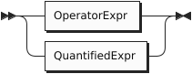

<a id="sqlpp-manual--operator-expressions"></a>

## Operator Expressions

Operators perform a specific operation on the input values or expressions. The syntax of an operator expression is as follows:

<a id="sqlpp-manual--operatorexpr"></a>

##### OperatorExpr

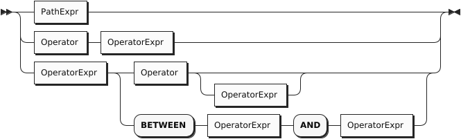

The language provides a full set of operators that you can use within its statements. Here are the categories of operators:

- [Arithmetic Operators](#sqlpp-manual--arithmetic_operators), to perform basic mathematical operations;
- [Collection Operators](#sqlpp-manual--collection_operators), to evaluate expressions on collections or objects;
- [Comparison Operators](#sqlpp-manual--comparison_operators), to compare two expressions;
- [Logical Operators](#sqlpp-manual--logical_operators), to combine operators using Boolean logic.

The following table summarizes the precedence order (from higher to lower) of the major unary and binary operators:

| Operator | Operation |
| --- | --- |
| EXISTS, NOT EXISTS | Collection emptiness testing |
| ^ | Exponentiation |
| \*, /, DIV, MOD (%) | Multiplication, division, modulo |
| +, - | Addition, subtraction |
| || | String concatenation |
| IS NULL, IS NOT NULL, IS MISSING, IS NOT MISSING, IS UNKNOWN, IS NOT UNKNOWN, IS VALUED, IS NOT VALUED | Unknown value comparison |
| BETWEEN, NOT BETWEEN | Range comparison (inclusive on both sides) |
| =, !=, <>, <, >, <=, >=, LIKE, NOT LIKE, IN, NOT IN, IS DISTINCT FROM, IS NOT DISTINCT FROM | Comparison |
| NOT | Logical negation |
| AND | Conjunction |
| OR | Disjunction |

In general, if any operand evaluates to a MISSING value, the enclosing operator will return MISSING; if none of the operands evaluates to a MISSING value but there is an operand which evaluates to a NULL value, the enclosing operator will return NULL. However, there are a few exceptions listed in [comparison operators](#sqlpp-manual--comparison_operators) and [logical operators](#sqlpp-manual--logical_operators).

<a id="sqlpp-manual--arithmetic-operators"></a>

### Arithmetic Operators

Arithmetic operators are used to exponentiate, add, subtract, multiply, and divide numeric values, or concatenate string values.

| Operator | Purpose | Example |
| --- | --- | --- |
| +, - | As unary operators, they denote a positive or negative expression | SELECT VALUE -1; |
| +, - | As binary operators, they add or subtract | SELECT VALUE 1 + 2; |
| \* | Multiply | SELECT VALUE 4 \* 2; |
| / | Divide (returns a value of type double if both operands are integers) | SELECT VALUE 5 / 2; |
| DIV | Divide (returns an integer value if both operands are integers) | SELECT VALUE 5 DIV 2; |
| MOD (%) | Modulo | SELECT VALUE 5 % 2; |
| ^ | Exponentiation | SELECT VALUE 2^3; |
| || | String concatenation | SELECT VALUE “ab”||“c”||“d”; |

<a id="sqlpp-manual--collection-operators"></a>

### Collection Operators

Collection operators are used for membership tests (IN, NOT IN) or empty collection tests (EXISTS, NOT EXISTS).

| Operator | Purpose | Example |
| --- | --- | --- |
| IN | Membership test | FROM customers AS c WHERE c.address.zipcode IN [“02340”, “02115”] SELECT \*; |
| NOT IN | Non-membership test | FROM customers AS c WHERE c.address.zipcode NOT IN [“02340”, “02115”] SELECT \*; |
| EXISTS | Check whether a collection is not empty | FROM orders AS o WHERE EXISTS o.items SELECT \*; |
| NOT EXISTS | Check whether a collection is empty | FROM orders AS o WHERE NOT EXISTS o.items SELECT \*; |

<a id="sqlpp-manual--comparison-operators"></a>

### Comparison Operators

Comparison operators are used to compare values.

The comparison operators fall into one of two sub-categories: missing value comparisons and regular value comparisons. SQL++ (and JSON) has two ways of representing missing information in an object — the presence of the field with a NULL for its value (as in SQL), and the absence of the field (which JSON permits). For example, the first of the following objects represents Jack, whose friend is Jill. In the other examples, Jake is friendless à la SQL, with a friend field that is NULL, while Joe is friendless in a more natural (for JSON) way, i.e., by not having a friend field.

<a id="sqlpp-manual--examples"></a>

##### Examples

```
{"name": "Jack", "friend": "Jill"}

{"name": "Jake", "friend": NULL}

{"name": "Joe"}
```

The following table enumerates all of the comparison operators available in SQL++.

| Operator | Purpose | Example |
| --- | --- | --- |
| IS NULL | Test if a value is NULL | FROM customers AS c WHERE c.name IS NULL SELECT \*; |
| IS NOT NULL | Test if a value is not NULL | FROM customers AS c WHERE c.name IS NOT NULL SELECT \*; |
| IS MISSING | Test if a value is MISSING | FROM customers AS c WHERE c.name IS MISSING SELECT \*; |
| IS NOT MISSING | Test if a value is not MISSING | FROM customers AS c WHERE c.name IS NOT MISSING SELECT \*; |
| IS UNKNOWN | Test if a value is NULL or MISSING | FROM customers AS c WHERE c.name IS UNKNOWN SELECT \*; |
| IS NOT UNKNOWN | Test if a value is neither NULL nor MISSING | FROM customers AS c WHERE c.name IS NOT UNKNOWN SELECT \*; |
| IS KNOWN (IS VALUED) | Test if a value is neither NULL nor MISSING | FROM customers AS c WHERE c.name IS KNOWN SELECT \*; |
| IS NOT KNOWN (IS NOT VALUED) | Test if a value is NULL or MISSING | FROM customers AS c WHERE c.name IS NOT KNOWN SELECT \*; |
| BETWEEN | Test if a value is between a start value and a end value. The comparison is inclusive of both the start and end values. | FROM customers AS c WHERE c.rating BETWEEN 600 AND 700 SELECT \*; |
| = | Equality test | FROM customers AS c WHERE c.rating = 640 SELECT \*; |
| != | Inequality test | FROM customers AS c WHERE c.rating != 640 SELECT \*; |
| <> | Inequality test | FROM customers AS c WHERE c.rating <> 640 SELECT \*; |
| < | Less than | FROM customers AS c WHERE c.rating < 640 SELECT \*; |
| > | Greater than | FROM customers AS c WHERE c.rating > 640 SELECT \*; |
| <= | Less than or equal to | FROM customers AS c WHERE c.rating <= 640 SELECT \*; |
| >= | Greater than or equal to | FROM customers AS c WHERE c.rating >= 640 SELECT \*; |
| LIKE | Test if the left side matches a pattern defined on the right side; in the pattern, “%” matches any string while “\_” matches any character. | FROM customers AS c WHERE c.name LIKE “%Dodge%” SELECT \*; |
| NOT LIKE | Test if the left side does not match a pattern defined on the right side; in the pattern, “%” matches any string while “\_” matches any character. | FROM customers AS c WHERE c.name NOT LIKE “%Dodge%” SELECT \*; |
| IS DISTINCT FROM | Inequality test that that treats NULL values as equal to each other and MISSING values as equal to each other | FROM orders AS o WHERE o.order\_date IS DISTINCT FROM o.ship\_date SELECT \*; |  |
| IS NOT DISTINCT FROM | Equality test that treats NULL values as equal to each other and MISSING values as equal to each other | FROM orders AS o WHERE o.order\_date IS NOT DISTINCT FROM o.ship\_date SELECT \*; |

The following table summarizes how the missing value comparison operators work.

| Operator | Non-NULL/Non-MISSING value | NULL value | MISSING value |
| --- | --- | --- | --- |
| IS NULL | FALSE | TRUE | MISSING |
| IS NOT NULL | TRUE | FALSE | MISSING |
| IS MISSING | FALSE | FALSE | TRUE |
| IS NOT MISSING | TRUE | TRUE | FALSE |
| IS UNKNOWN | FALSE | TRUE | TRUE |
| IS NOT UNKNOWN | TRUE | FALSE | FALSE |
| IS KNOWN (IS VALUED) | TRUE | FALSE | FALSE |
| IS NOT KNOWN (IS NOT VALUED) | FALSE | TRUE | TRUE |

<a id="sqlpp-manual--logical-operators"></a>

### Logical Operators

Logical operators perform logical NOT, AND, and OR operations over Boolean values (TRUE and FALSE) plus NULL and MISSING.

| Operator | Purpose | Example |
| --- | --- | --- |
| NOT | Returns true if the following condition is false, otherwise returns false | SELECT VALUE NOT 1 = 1; Returns FALSE |
| AND | Returns true if both branches are true, otherwise returns false | SELECT VALUE 1 = 2 AND 1 = 1; Returns FALSE |
| OR | Returns true if one branch is true, otherwise returns false | SELECT VALUE 1 = 2 OR 1 = 1; Returns TRUE |

The following table is the truth table for AND and OR.

| A | B | A AND B | A OR B |
| --- | --- | --- | --- |
| TRUE | TRUE | TRUE | TRUE |
| TRUE | FALSE | FALSE | TRUE |
| TRUE | NULL | NULL | TRUE |
| TRUE | MISSING | MISSING | TRUE |
| FALSE | FALSE | FALSE | FALSE |
| FALSE | NULL | FALSE | NULL |
| FALSE | MISSING | FALSE | MISSING |
| NULL | NULL | NULL | NULL |
| NULL | MISSING | MISSING | NULL |
| MISSING | MISSING | MISSING | MISSING |

The following table demonstrates the results of NOT on all possible inputs.

| A | NOT A |
| --- | --- |
| TRUE | FALSE |
| FALSE | TRUE |
| NULL | NULL |
| MISSING | MISSING |

<a id="sqlpp-manual--quantified-expressions"></a>

## Quantified Expressions

<a id="sqlpp-manual--quantifiedexpr"></a>

##### QuantifiedExpr

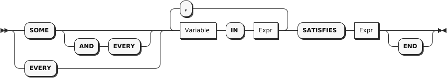

Synonym for SOME: ANY

Quantified expressions are used for expressing existential or universal predicates involving the elements of a collection.

The following pair of examples illustrate the use of a quantified expression to test that every (or some) element in the set [1, 2, 3] of integers is less than three. The first example yields FALSE and second example yields TRUE.

It is useful to note that if the set were instead the empty set, the first expression would yield TRUE (“every” value in an empty set satisfies the condition) while the second expression would yield FALSE (since there isn’t “some” value, as there are no values in the set, that satisfies the condition). To express a universal predicate that yields FALSE with the empty set, we would use the quantifier SOME AND EVERY in lieu of EVERY.

A quantified expression will return a NULL (or MISSING) if the first expression in it evaluates to NULL (or MISSING). Otherwise, a type error will be raised if the first expression in a quantified expression does not return a collection.

<a id="sqlpp-manual--examples-2"></a>

##### Examples

```
EVERY x IN [ 1, 2, 3 ] SATISFIES x < 3 -- ➊
SOME x IN [ 1, 2, 3 ] SATISFIES x < 3  -- ➋
```

➀ Returns FALSE
➁ Returns TRUE

<a id="sqlpp-manual--path-expressions"></a>

## Path Expressions

<a id="sqlpp-manual--pathexpr"></a>

##### PathExpr

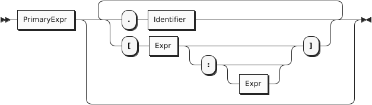

Components of complex types in the data model are accessed via path expressions. Path access can be applied to the result of a query expression that yields an instance of a complex type, for example, an object or an array instance.

For objects, path access is based on field names, and it accesses the field whose name was specified.

For arrays, path access is based on (zero-based) array-style indexing. Array indices can be used to retrieve either a single element from an array, or a whole subset of an array. Accessing a single element is achieved by providing a single index argument (zero-based element position), while obtaining a subset of an array is achieved by providing the start and end (zero-based) index positions; the returned subset is from position start to position end - 1; the end position argument is optional. If a position argument is negative then the element position is counted from the end of the array (-1 addresses the last element, -2 next to last, and so on).

Multisets have similar behavior to arrays, except for retrieving arbitrary items as the order of items is not fixed in multisets.

Attempts to access non-existent fields or out-of-bound array elements produce the special value MISSING. Type errors will be raised for inappropriate use of a path expression, such as applying a field accessor to a numeric value.

The following examples illustrate field access for an object, index-based element access or subset retrieval of an array, and also a composition thereof.

<a id="sqlpp-manual--examples-3"></a>

##### Examples

```
({"name": "MyABCs", "array": [ "a", "b", "c"]}).array    -- ➊
(["a", "b", "c"])[2]                                     -- ➋
(["a", "b", "c"])[-1]                                    -- ➌
({"name": "MyABCs", "array": [ "a", "b", "c"]}).array[2] -- ➍
(["a", "b", "c"])[0:2]                                   -- ➎
(["a", "b", "c"])[0:]                                    -- ➏
(["a", "b", "c"])[-2:-1]                                 -- ➐
```

➀ Returns [["a", "b", "c"]]
➁ Returns ["c"]
➂ Returns ["c"]
➃ Returns ["c"]
➄ Returns [["a", "b"]]
➅ Returns [["a", "b", "c"]]
➆ Returns [["b"]]

<a id="sqlpp-manual--primary-expressions"></a>

## Primary Expressions

<a id="sqlpp-manual--primaryexpr"></a>

##### PrimaryExpr

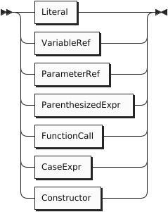

The most basic building block for any expression in SQL++ is Primary Expression. This can be a simple literal (constant) value, a reference to a query variable that is in scope, a parenthesized expression, a function call, or a newly constructed instance of the data model (such as a newly constructed object, array, or multiset of data model instances).

<a id="sqlpp-manual--literals"></a>

### Literals

<a id="sqlpp-manual--literal"></a>

##### Literal

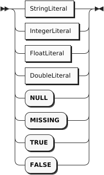

The simplest kind of expression is a literal that directly represents a value in JSON format. Here are some examples:

```
-42
"Hello"
true
false
null
```

Numeric literals may include a sign and an optional decimal point. They may also be written in exponential notation, like this:

```
5e2
-4.73E-2
```

String literals may be enclosed in either single quotes or double quotes. Inside a string literal, the delimiter character for that string must be “escaped” by a backward slash, as in these examples:

```
"I read \"War and Peace\" today."
'I don\'t believe everything I read.'
```

The table below shows how to escape characters in SQL++.

| Character Name | Escape Method |
| --- | --- |
| Single Quote | \' |
| Double Quote | \" |
| Backslash | \\ |
| Slash | \/ |
| Backspace | \b |
| Formfeed | \f |
| Newline | \n |
| CarriageReturn | \r |
| EscapeTab | \t |

<a id="sqlpp-manual--identifiers-and-variable-references"></a>

### Identifiers and Variable References

Like SQL, SQL++ makes use of a language construct called an *identifier*. An identifier starts with an alphabetic character or the underscore character \_ , and contains only case-sensitive alphabetic characters, numeric digits, or the special characters \_ and $. It is also possible for an identifier to include other special characters, or to be the same as a reserved word, by enclosing the identifier in back-ticks (it’s then called a *delimited identifier*). Identifiers are used in variable names and in certain other places in SQL++ syntax, such as in path expressions, which we’ll discuss soon. Here are some examples of identifiers:

```
X
customer_name
`SELECT`
`spaces in here`
`@&#`
```

A very simple kind of SQL++ expression is a variable, which is simply an identifier. As in SQL, a variable can be bound to a value, which may be an input dataset, some intermediate result during processing of a query, or the final result of a query. We’ll learn more about variables when we discuss queries.

Note that the SQL++ rules for delimiting strings and identifiers are different from the SQL rules. In SQL, strings are always enclosed in single quotes, and double quotes are used for delimited identifiers.

<a id="sqlpp-manual--parameter-references"></a>

### Parameter References

A parameter reference is an external variable. Its value is provided using the [statement execution API](#api--queryservice).

Parameter references come in two forms, *Named Parameter References* and *Positional Parameter References*.

Named parameter references consist of the “$” symbol followed by an identifier or delimited identifier.

Positional parameter references can be either a “$” symbol followed by one or more digits or a “?” symbol. If numbered, positional parameters start at 1. “?” parameters are interpreted as $1 to $N based on the order in which they appear in the statement.

Parameter references may appear as shown in the below examples:

<a id="sqlpp-manual--examples-4"></a>

##### Examples

```
$id
$1
?
```

An error will be raised in the parameter is not bound at query execution time.

<a id="sqlpp-manual--parenthesized-expressions"></a>

### Parenthesized Expressions

<a id="sqlpp-manual--parenthesizedexpr"></a>

##### ParenthesizedExpr

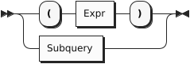

<a id="sqlpp-manual--subquery"></a>

##### Subquery


An expression can be parenthesized to control the precedence order or otherwise clarify a query. A [subquery](#sqlpp-manual--subqueries) (nested [selection](#sqlpp-manual--union_all)) may also be enclosed in parentheses. For more on these topics please see their respective sections.

The following expression evaluates to the value 2.

<a id="sqlpp-manual--example"></a>

##### Example

```
( 1 + 1 )
```

<a id="sqlpp-manual--function-calls"></a>

### Function Calls

<a id="sqlpp-manual--functioncall"></a>

##### FunctionCall

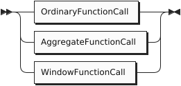

<a id="sqlpp-manual--ordinaryfunctioncall"></a>

##### OrdinaryFunctionCall

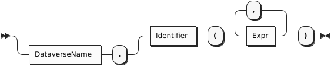

<a id="sqlpp-manual--aggregatefunctioncall"></a>

##### AggregateFunctionCall

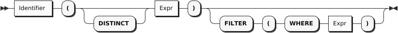

<a id="sqlpp-manual--dataversename"></a>

##### DataverseName

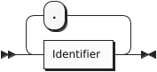

Functions are included in SQL++, like most languages, as a way to package useful functionality or to componentize complicated or reusable computations. A function call is a legal query expression that represents the value resulting from the evaluation of its body expression with the given parameter bindings; the parameter value bindings can themselves be any expressions in SQL++.

Note that Window functions, and aggregate functions used as window functions, have a more complex syntax. Window function calls are described in the section on [Window Queries](#sqlpp-manual--over_clauses).

Also note that FILTER expressions can only be specified when calling [Aggregation Pseudo-Functions](#sqlpp-manual--aggregation_pseudofunctions).

The following example is a function call expression whose value is 8.

<a id="sqlpp-manual--example-2"></a>

##### Example

```
length('a string')
```

<a id="sqlpp-manual--case-expressions"></a>

### Case Expressions

<a id="sqlpp-manual--caseexpr"></a>

##### CaseExpr

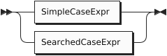

<a id="sqlpp-manual--simplecaseexpr"></a>

##### SimpleCaseExpr

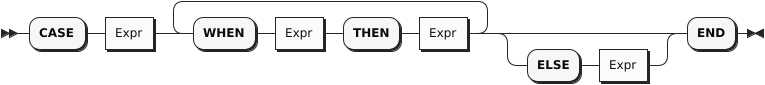

<a id="sqlpp-manual--searchedcaseexpr"></a>

##### SearchedCaseExpr

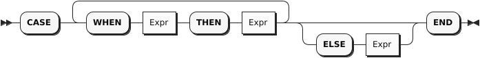

In a simple CASE expression, the query evaluator searches for the first WHEN … THEN pair in which the WHEN expression is equal to the expression following CASE and returns the expression following THEN. If none of the WHEN … THEN pairs meet this condition, and an ELSE branch exists, it returns the ELSE expression. Otherwise, NULL is returned.

In a searched CASE expression, the query evaluator searches from left to right until it finds a WHEN expression that is evaluated to TRUE, and then returns its corresponding THEN expression. If no condition is found to be TRUE, and an ELSE branch exists, it returns the ELSE expression. Otherwise, it returns NULL.

The following example illustrates the form of a case expression.

<a id="sqlpp-manual--example-3"></a>

##### Example

```
CASE (2 < 3) WHEN true THEN "yes" ELSE "no" END
```

<a id="sqlpp-manual--constructors"></a>

### Constructors

<a id="sqlpp-manual--constructor"></a>

##### Constructor

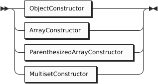

<a id="sqlpp-manual--objectconstructor"></a>

##### ObjectConstructor

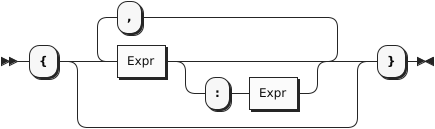

<a id="sqlpp-manual--arrayconstructor"></a>

##### ArrayConstructor

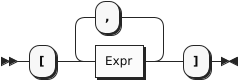

<a id="sqlpp-manual--parenthesizedarrayconstructor"></a>

##### ParenthesizedArrayConstructor


<a id="sqlpp-manual--multisetconstructor"></a>

##### MultisetConstructor

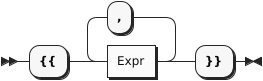

Structured JSON values can be represented by constructors, as in these examples:

```
{ "name": "Bill", "age": 42 } -- ➊
[ 1, 2, "Hello", null ]       -- ➋
```

➀ An object
➁ An array

In a constructed object, the names of the fields must be strings (either literal strings or computed strings), and an object may not contain any duplicate names. Of course, structured literals can be nested, as in this example:

```
[ {"name": "Bill",
   "address":
      {"street": "25 Main St.",
       "city": "Cincinnati, OH"
      }
  },
  {"name": "Mary",
   "address":
      {"street": "107 Market St.",
       "city": "St. Louis, MO"
      }
   }
]
```

The array items in an array constructor, and the field-names and field-values in an object constructor, may be represented by expressions. For example, suppose that the variables firstname, lastname, salary, and bonus are bound to appropriate values. Then structured values might be constructed by the following expressions:

An object:

```
{
  "name": firstname || " " || lastname,
  "income": salary + bonus
}
```

An array:

```
["1984", lastname, salary + bonus, null]
```

If only one expression is specified instead of the field-name/field-value pair in an object constructor then this expression is supposed to provide the field value. The field name is then automatically generated based on the kind of the value expression as in Q2.1:

- If it is a variable reference expression then the generated field name is the name of that variable.
- If it is a field access expression then the generated field name is the last identifier in that expression.
- For all other cases, a compilation error will be raised.

<a id="sqlpp-manual--example-4"></a>

##### Example

(Q2.1)

```
FROM customers AS c
WHERE c.custid = "C47"
SELECT VALUE {c.name, c.rating}
```

This query outputs:

```
[
    {
        "name": "S. Logan",
        "rating": 625
    }
]
```

<a id="sqlpp-manual--3.-queries"></a>

# 3. Queries

A *query* can be an expression, or it can be constructed from blocks of code called *query blocks*. A query block may contain several clauses, including SELECT, FROM, LET, WHERE, GROUP BY, and HAVING.

<a id="sqlpp-manual--query"></a>

##### Query

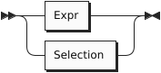

<a id="sqlpp-manual--selection"></a>

##### Selection

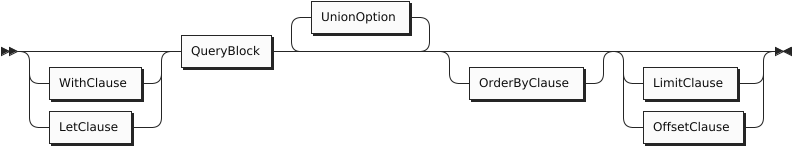

<a id="sqlpp-manual--queryblock"></a>

##### QueryBlock

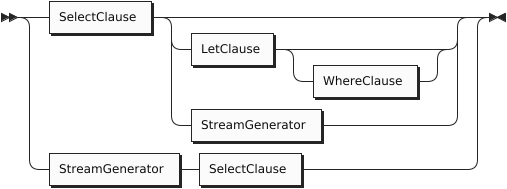

<a id="sqlpp-manual--streamgenerator"></a>

##### StreamGenerator

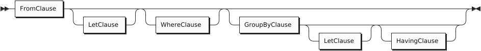

Note that, unlike SQL, SQL++ allows the SELECT clause to appear either at the beginning or at the end of a query block. For some queries, placing the SELECT clause at the end may make a query block easier to understand, because the SELECT clause refers to variables defined in the other clauses.

<a id="sqlpp-manual--select-clause"></a>

## SELECT Clause

<a id="sqlpp-manual--selectclause"></a>

##### SelectClause

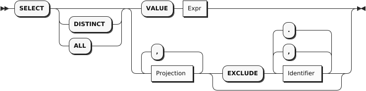

<a id="sqlpp-manual--projection"></a>

##### Projection

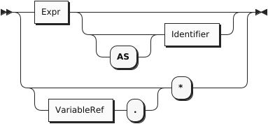

Synonyms for VALUE: ELEMENT, RAW

In a query block, the FROM, WHERE, GROUP BY, and HAVING clauses (if present) are collectively called the Stream Generator. All these clauses, taken together, generate a stream of tuples of bound variables. The SELECT clause then uses these bound variables to generate the output of the query block.

For example, the clause FROM customers AS c scans over the customers collection, binding the variable c to each customer object in turn, producing a stream of bindings.

Here’s a slightly more complex example of a stream generator:

<a id="sqlpp-manual--example-5"></a>

##### Example

```
FROM customers AS c, orders AS o
WHERE c.custid = o.custid
```

In this example, the FROM clause scans over the customers and orders collections, producing a stream of variable pairs (c, o) in which c is bound to a customer object and o is bound to an order object. The WHERE clause then retains only those pairs in which the custid values of the two objects match.

The output of the query block is a collection containing one output item for each tuple produced by the stream generator. If the stream generator produces no tuples, the output of the query block is an empty collection. Depending on the SELECT clause, each output item may be an object or some other kind of value.

In addition to using the variables bound by previous clauses, the SELECT clause may create and bind some additional variables. For example, the clause SELECT salary + bonus AS pay creates the variable pay and binds it to the value of salary + bonus. This variable may then be used in a later ORDER BY clause.

In SQL++, the SELECT clause may appear either at the beginning or at the end of a query block. Since the SELECT clause depends on variables that are bound in the other clauses, the examples in this section place SELECT at the end of the query blocks.

<a id="sqlpp-manual--select-value"></a>

### SELECT VALUE

The SELECT VALUE clause returns an array or multiset that contains the results of evaluating the VALUE expression, with one evaluation being performed per “binding tuple” (i.e., per FROM clause item) satisfying the statement’s selection criteria. If there is no FROM clause, the expression after VALUE is evaluated once with no binding tuples (except those inherited from an outer environment).

<a id="sqlpp-manual--example-6"></a>

##### Example

(Q3.1)

```
SELECT VALUE 1;
```

Result:

```
[
   1
]
```

<a id="sqlpp-manual--example-7"></a>

##### Example

(Q3.2) The following query returns the names of all customers whose rating is above 650.

```
FROM customers AS c
WHERE c.rating > 650
SELECT VALUE name;
```

Result:

```
[
    "T. Cody",
    "M. Sinclair",
    "T. Henry"
]
```

<a id="sqlpp-manual--sql-style-select"></a>

### SQL-style SELECT

Traditional SQL-style SELECT syntax is also supported in SQL++, however the result of a query is not guaranteed to preserve the order of expressions in the SELECT clause.

<a id="sqlpp-manual--example-8"></a>

##### Example

(Q3.3) The following query returns the names and customers ids of any customers whose rating is 750.

```
FROM customers AS c
WHERE c.rating = 750
SELECT c.name AS customer_name, c.custid AS customer_id;
```

Result:

```
[
    {
        "customer_id": "C13",
        "customer_name": "T. Cody"
    },
    {
        "customer_id": "C37",
        "customer_name": "T. Henry"
    }
]
```

<a id="sqlpp-manual--select"></a>

### SELECT \*

As in SQL, the phrase SELECT \* suggests, “select everything.”

For each binding tuple in the stream, SELECT \* produces an output object. For each variable in the binding tuple, the output object contains a field: the name of the field is the name of the variable, and the value of the field is the value of the variable. Essentially, SELECT \* means, “return all the bound variables, with their names and values.”

The effect of SELECT \* can be illustrated by an example based on two small collections named ages and eyes. The contents of the two collections are as follows:

ages:

```
[
    { "name": "Bill", "age": 21 },
    { "name": "Sue", "age": 32 }
]
```

eyes:

```
[
    { "name": "Bill", "eyecolor": "brown" },
    { "name": "Sue", "eyecolor": "blue" }
]
```

The following example applies SELECT \* to a single collection.

<a id="sqlpp-manual--example-9"></a>

##### Example

(Q3.4a) Return all the information in the ages collection.

```
FROM ages AS a
SELECT * ;
```

Result:

```
[
    { "a": { "name": "Bill", "age": 21 },
    },
    { "a": { "name": "Sue", "age": 32}
    }
]
```

Note that the variable-name a appears in the query result. If the FROM clause had been simply FROM ages (omitting AS a), the variable-name in the query result would have been ages.

The next example applies SELECT \* to a join of two collections.

<a id="sqlpp-manual--example-10"></a>

##### Example

(Q3.4b) Return all the information in a join of ages and eyes on matching name fields.

```
FROM ages AS a, eyes AS e
WHERE a.name = e.name
SELECT * ;
```

Result:

```
[
    { "a": { "name": "Bill", "age": 21 },
      "e": { "name": "Bill", "eyecolor": "Brown" }
    },
    { "a": { "name": "Sue", "age": 32 },
      "e": { "name": "Sue", "eyecolor": "Blue" }
    }
]
```

Note that the result of SELECT \* in SQL++ is more complex than the result of SELECT \* in SQL.

<a id="sqlpp-manual--select-variable-."></a>

### SELECT *variable*.\*

SQL++ has an alternative version of SELECT \* in which the star is preceded by a variable.

Whereas the version without a named variable means, “return all the bound variables, with their names and values,” SELECT *variable* .\* means “return only the named variable, and return only its value, not its name.”

The following example can be compared with (Q3.4a) to see the difference between the two versions of SELECT \*:

<a id="sqlpp-manual--example-11"></a>

##### Example

(Q3.4c) Return all information in the ages collection.

```
FROM ages AS a
SELECT a.*
```

Result:

```
[
    { "name": "Bill", "age": 21 },
    { "name": "Sue", "age": 32 }
]
```

Note that, for queries over a single collection, SELECT *variable* .\* returns a simpler result and therefore may be preferable to SELECT \*.

In fact, SELECT *variable* .\*, like SELECT \* in SQL, is equivalent to a SELECT clause that enumerates all the fields of the collection, as in (Q3.4d):

<a id="sqlpp-manual--example-12"></a>

##### Example

(Q3.4d) Return all the information in the ages collection.

```
FROM ages AS a
SELECT a.name, a.age
```

(same result as (Q3.4c))

SELECT *variable* .\* has an additional application. It can be used to return all the fields of a nested object. To illustrate this use, we will use the customers dataset in the example database — see [Appendix 4](#sqlpp-manual--manual_data).

<a id="sqlpp-manual--example-13"></a>

##### Example

(Q3.4e) In the customers dataset, return all the fields of the address objects that have zipcode “02340”.

```
FROM customers AS c
WHERE c.address.zipcode = "02340"
SELECT address.*  ;
```

Result:

```
[
    {
        "street": "690 River St.",
        "city": "Hanover, MA",
        "zipcode": "02340"
    }
]
```

<a id="sqlpp-manual--select-distinct"></a>

### SELECT DISTINCT

The DISTINCT keyword is used to eliminate duplicate items from the results of a query block.

<a id="sqlpp-manual--example-14"></a>

##### Example

(Q3.5a) Returns all of the different cities in the customers dataset.

```
FROM customers AS c
SELECT DISTINCT c.address.city;
```

Result:

```
[
    {
        "city": "Boston, MA"
    },
    {
        "city": "Hanover, MA"
    },
    {
        "city": "St. Louis, MO"
    },
    {
        "city": "Rome, Italy"
    }
]
```

<a id="sqlpp-manual--select-exclude"></a>

### SELECT EXCLUDE

The EXCLUDE keyword is used to remove one or more fields that would otherwise be returned from the SELECT clause. Conceptually, the scope of the EXCLUDE clause is the output of the SELECT clause itself. In a Stream Generator with both DISTINCT and EXCLUDE clauses, the DISTINCT clause is applied after the EXCLUDE clause.

<a id="sqlpp-manual--example-15"></a>

##### Example

(Q3.5b) For the customer with custid = C13, return their information *excluding* the zipcode field inside the address object and the top-level name field.

```
FROM customers AS c
WHERE c.custid = "C13"
SELECT c.* EXCLUDE address.zipcode, name;
```

Result:

```
[
    {
        "custid": "C13",
        "address": {
            "street": "201 Main St.",
            "city": "St. Louis, MO"
        },
        "rating": 750
    }
]
```

<a id="sqlpp-manual--unnamed-projections"></a>

### Unnamed Projections

Similar to standard SQL, the query language supports unnamed projections (a.k.a, unnamed SELECT clause items), for which names are generated rather than user-provided. Name generation has three cases:

- If a projection expression is a variable reference expression, its generated name is the name of the variable.
- If a projection expression is a field access expression, its generated name is the last identifier in the expression.
- For all other cases, the query processor will generate a unique name.

<a id="sqlpp-manual--example-16"></a>

##### Example

(Q3.6) Returns the last digit and the order date of all orders for the customer whose ID is “C41”.

```
FROM orders AS o
WHERE o.custid = "C41"
SELECT o.orderno % 1000,  o.order_date;
```

Result:

```
[
    {
        "$1": 1,
        "order_date": "2020-04-29"
    },
    {
        "$1": 6,
        "order_date": "2020-09-02"
    }
]
```

In the result, $1 is the generated name for o.orderno % 1000, while order\_date is the generated name for o.order\_date. It is good practice, however, to not rely on the randomly generated names which can be confusing and irrelevant. Instead, practice good naming conventions by providing a meaningful and concise name which properly describes the selected item.

<a id="sqlpp-manual--abbreviated-field-access-expressions"></a>

### Abbreviated Field Access Expressions

As in standard SQL, field access expressions can be abbreviated when there is no ambiguity. In the next example, the variable o is the only possible variable reference for fields orderno and order\_date and thus could be omitted in the query. This practice is not recommended, however, as queries may have fields (such as custid) which can be present in multiple datasets. More information on abbreviated field access can be found in the appendix section on Variable Resolution.

<a id="sqlpp-manual--example-17"></a>

##### Example

(Q3.7) Same as Q3.6, omitting the variable reference for the order number and date and providing custom names for SELECT clause items.

```
FROM orders AS o
WHERE o.custid = "C41"
SELECT orderno % 1000 AS last_digit, order_date;
```

Result:

```
[
    {
        "last_digit": 1,
        "order_date": "2020-04-29"
    },
    {
        "last_digit": 6,
        "order_date": "2020-09-02"
    }
]
```

<a id="sqlpp-manual--from-clause"></a>

## FROM Clause

<a id="sqlpp-manual--fromclause"></a>

##### FromClause

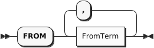

<a id="sqlpp-manual--fromterm"></a>

##### FromTerm

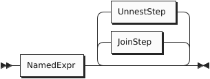

<a id="sqlpp-manual--namedexpr"></a>

##### NamedExpr

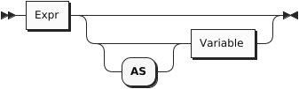

<a id="sqlpp-manual--joinstep"></a>

##### JoinStep

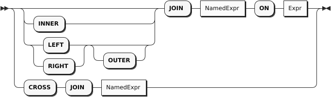

<a id="sqlpp-manual--unneststep"></a>

##### UnnestStep

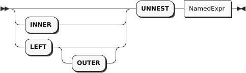

Synonyms for UNNEST: CORRELATE, FLATTEN

The purpose of a FROM clause is to iterate over a collection, binding a variable to each item in turn. Here’s a query that iterates over the customers dataset, choosing certain customers and returning some of their attributes.

<a id="sqlpp-manual--example-18"></a>

##### Example

(Q3.8) List the customer ids and names of the customers in zipcode 63101, in order by their customer IDs.

```
FROM customers
WHERE address.zipcode = "63101"
SELECT custid AS customer_id, name
ORDER BY customer_id;
```

Result:

```
[
    {
        "customer_id": "C13",
        "name": "T. Cody"
    },
    {
        "customer_id": "C31",
        "name": "B. Pruitt"
    },
    {
        "customer_id": "C41",
        "name": "R. Dodge"
    }
]
```

Let’s take a closer look at what this FROM clause is doing. A FROM clause always produces a stream of bindings, in which an iteration variable is bound in turn to each item in a collection. In Q3.8, since no explicit iteration variable is provided, the FROM clause defines an implicit variable named customers, the same name as the dataset that is being iterated over. The implicit iteration variable serves as the object-name for all field-names in the query block that do not have explicit object-names. Thus, address.zipcode really means customers.address.zipcode, custid really means customers.custid, and name really means customers.name.

You may also provide an explicit iteration variable, as in this version of the same query:

<a id="sqlpp-manual--example-19"></a>

##### Example

(Q3.9) Alternative version of Q3.8 (same result).

```
FROM customers AS c
WHERE c.address.zipcode = "63101"
SELECT c.custid AS customer_id, c.name
ORDER BY customer_id;
```

In Q3.9, the variable c is bound to each customer object in turn as the query iterates over the customers dataset. An explicit iteration variable can be used to identify the fields of the referenced object, as in c.name in the SELECT clause of Q3.9. When referencing a field of an object, the iteration variable can be omitted when there is no ambiguity. For example, c.name could be replaced by name in the SELECT clause of Q3.9. That’s why field-names like name and custid could stand by themselves in the Q3.8 version of this query.

In the examples above, the FROM clause iterates over the objects in a dataset. But in general, a FROM clause can iterate over any collection. For example, the objects in the orders dataset each contain a field called items, which is an array of nested objects. In some cases, you will write a FROM clause that iterates over a nested array like items.

The stream of objects (more accurately, variable bindings) that is produced by the FROM clause does not have any particular order. The system will choose the most efficient order for the iteration. If you want your query result to have a specific order, you must use an ORDER BY clause.

It’s good practice to specify an explicit iteration variable for each collection in the FROM clause, and to use these variables to qualify the field-names in other clauses. Here are some reasons for this convention:

- It’s nice to have different names for the collection as a whole and an object in the collection. For example, in the clause FROM customers AS c, the name customers represents the dataset and the name c represents one object in the dataset.
- In some cases, iteration variables are required. For example, when joining a dataset to itself, distinct iteration variables are required to distinguish the left side of the join from the right side.
- In a subquery it’s sometimes necessary to refer to an object in an outer query block (this is called a *correlated subquery*). To avoid confusion in correlated subqueries, it’s best to use explicit variables.

<a id="sqlpp-manual--joins"></a>

### Joins

A FROM clause gets more interesting when there is more than one collection involved. The following query iterates over two collections: customers and orders. The FROM clause produces a stream of binding tuples, each containing two variables, c and o. In each binding tuple, c is bound to an object from customers, and o is bound to an object from orders. Conceptually, at this point, the binding tuple stream contains all possible pairs of a customer and an order (this is called the *Cartesian product* of customers and orders). Of course, we are interested only in pairs where the custid fields match, and that condition is expressed in the WHERE clause, along with the restriction that the order number must be 1001.

<a id="sqlpp-manual--example-20"></a>

##### Example

(Q3.10) Create a packing list for order number 1001, showing the customer name and address and all the items in the order.

```
FROM customers AS c, orders AS o
WHERE c.custid = o.custid
AND o.orderno = 1001
SELECT o.orderno,
    c.name AS customer_name,
    c.address,
    o.items AS items_ordered;
```

Result:

```
[
    {
        "orderno": 1001,
        "customer_name": "R. Dodge",
        "address": {
            "street": "150 Market St.",
            "city": "St. Louis, MO",
            "zipcode": "63101"
        },
        "items_ordered": [
            {
                "itemno": 347,
                "qty": 5,
                "price": 19.99
            },
            {
                "itemno": 193,
                "qty": 2,
                "price": 28.89
            }
        ]
    }
]
```

Q3.10 is called a *join query* because it joins the customers collection and the orders collection, using the join condition c.custid = o.custid. In SQL++, as in SQL, you can express this query more explicitly by a JOIN clause that includes the join condition, as follows:

<a id="sqlpp-manual--example-21"></a>

##### Example

(Q3.11) Alternative statement of Q3.10 (same result).

```
FROM customers AS c JOIN orders AS o
    ON c.custid = o.custid
WHERE o.orderno = 1001
SELECT o.orderno,
    c.name AS customer_name,
    c.address,
    o.items AS items_ordered;
```

Whether you express the join condition in a JOIN clause or in a WHERE clause is a matter of taste; the result is the same. This manual will generally use a comma-separated list of collection-names in the FROM clause, leaving the join condition to be expressed elsewhere. As we’ll soon see, in some query blocks the join condition can be omitted entirely.

There is, however, one case in which an explicit JOIN clause is necessary. That is when you need to join collection A to collection B, and you want to make sure that every item in collection A is present in the query result, even if it doesn’t match any item in collection B. This kind of query is called a *left outer join*, and it is illustrated by the following example.

<a id="sqlpp-manual--example-22"></a>

##### Example

(Q3.12) List the customer ID and name, together with the order numbers and dates of their orders (if any) of customers T. Cody and M. Sinclair.

```
FROM customers AS c LEFT OUTER JOIN orders AS o ON c.custid = o.custid
WHERE c.name = "T. Cody"
   OR c.name = "M. Sinclair"
SELECT c.custid, c.name, o.orderno, o.order_date
ORDER BY c.custid, o.order_date;
```

Result:

```
[
    {
        "custid": "C13",
        "orderno": 1002,
        "name": "T. Cody",
        "order_date": "2020-05-01"
    },
    {
        "custid": "C13",
        "orderno": 1007,
        "name": "T. Cody",
        "order_date": "2020-09-13"
    },
    {
        "custid": "C13",
        "orderno": 1008,
        "name": "T. Cody",
        "order_date": "2020-10-13"
    },
    {
        "custid": "C13",
        "orderno": 1009,
        "name": "T. Cody",
        "order_date": "2020-10-13"
    },
    {
        "custid": "C25",
        "name": "M. Sinclair"
    }
]
```

As you can see from the result of this left outer join, our data includes four orders from customer T. Cody, but no orders from customer M. Sinclair. The behavior of left outer join in SQL++ is different from that of SQL. SQL would have provided M. Sinclair with an order in which all the fields were null. SQL++, on the other hand, deals with schemaless data, which permits it to simply omit the order fields from the outer join.

Now we’re ready to look at a new kind of join that was not provided (or needed) in original SQL. Consider this query:

<a id="sqlpp-manual--example-23"></a>

##### Example

(Q3.13) For every case in which an item is ordered in a quantity greater than 100, show the order number, date, item number, and quantity.

```
FROM orders AS o, o.items AS i
WHERE i.qty > 100
SELECT o.orderno, o.order_date, i.itemno AS item_number,
    i.qty AS quantity
ORDER BY o.orderno, item_number;
```

Result:

```
[
    {
        "orderno": 1002,
        "order_date": "2020-05-01",
        "item_number": 680,
        "quantity": 150
    },
    {
        "orderno": 1005,
        "order_date": "2020-08-30",
        "item_number": 347,
        "quantity": 120
    },
    {
        "orderno": 1006,
        "order_date": "2020-09-02",
        "item_number": 460,
        "quantity": 120
    }
]
```

Q3.13 illustrates a feature called *left-correlation* in the FROM clause. Notice that we are joining orders, which is a dataset, to items, which is an array nested inside each order. In effect, for each order, we are unnesting the items array and joining it to the order as though it were a separate collection. For this reason, this kind of query is sometimes called an *unnesting query*. The keyword UNNEST may be used whenever left-correlation is used in a FROM clause, as shown in this example:

<a id="sqlpp-manual--example-24"></a>

##### Example

(Q3.14) Alternative statement of Q3.13 (same result).

```
FROM orders AS o UNNEST o.items AS i
WHERE i.qty > 100
SELECT o.orderno, o.order_date, i.itemno AS item_number,
        i.qty AS quantity
ORDER BY o.orderno, item_number;
```

The results of Q3.13 and Q3.14 are exactly the same. UNNEST serves as a reminder that left-correlation is being used to join an object with its nested items. The join condition in Q3.14 is expressed by the left-correlation: each order o is joined to its own items, referenced as o.items. The result of the FROM clause is a stream of binding tuples, each containing two variables, o and i. The variable o is bound to an order and the variable i is bound to one item inside that order.

Like JOIN, UNNEST has a LEFT OUTER option. Q3.14 could have specified:

```
FROM orders AS o LEFT OUTER UNNEST o.items AS i
```

In this case, orders that have no nested items would appear in the query result.

<a id="sqlpp-manual--let-clause"></a>

## LET Clause

<a id="sqlpp-manual--letclause"></a>

##### LetClause

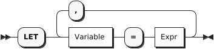

Synonyms for LET: LETTING

LET clauses can be useful when a (complex) expression is used several times within a query, allowing it to be written once to make the query more concise. The word LETTING can also be used, although this is not as common. The next query shows an example.

<a id="sqlpp-manual--example-25"></a>

##### Example

(Q3.15) For each item in an order, the revenue is defined as the quantity times the price of that item. Find individual items for which the revenue is greater than 5000. For each of these, list the order number, item number, and revenue, in descending order by revenue.

```
FROM orders AS o, o.items AS i
LET revenue = i.qty * i.price
WHERE revenue > 5000
SELECT o.orderno, i.itemno, revenue
ORDER by revenue desc;
```

Result:

```
[
    {
        "orderno": 1006,
        "itemno": 460,
        "revenue": 11997.6
    },
    {
        "orderno": 1002,
        "itemno": 460,
        "revenue": 9594.05
    },
    {
        "orderno": 1006,
        "itemno": 120,
        "revenue": 5525
    }
]
```

The expression for computing revenue is defined once in the LET clause and then used three times in the remainder of the query. Avoiding repetition of the revenue expression makes the query shorter and less prone to errors.

<a id="sqlpp-manual--where-clause"></a>

## WHERE Clause

<a id="sqlpp-manual--whereclause"></a>

##### WhereClause


The purpose of a WHERE clause is to operate on the stream of binding tuples generated by the FROM clause, filtering out the tuples that do not satisfy a certain condition. The condition is specified by an expression based on the variable names in the binding tuples. If the expression evaluates to true, the tuple remains in the stream; if it evaluates to anything else, including null or missing, it is filtered out. The surviving tuples are then passed along to the next clause to be processed (usually either GROUP BY or SELECT).

Often, the expression in a WHERE clause is some kind of comparison like quantity > 100. However, any kind of expression is allowed in a WHERE clause. The only thing that matters is whether the expression returns true or not.

<a id="sqlpp-manual--grouping"></a>

## Grouping

Grouping is especially important when manipulating hierarchies like the ones that are often found in JSON data. Often you will want to generate output data that includes both summary data and line items within the summaries. For this purpose, SQL++ supports several important extensions to the traditional grouping features of SQL. The familiar GROUP BY and HAVING clauses are still there, and they are joined by a new clause called GROUP AS. We’ll illustrate these clauses by a series of examples.

<a id="sqlpp-manual--group-by-clause"></a>

### GROUP BY Clause

<a id="sqlpp-manual--groupbyclause"></a>

##### GroupByClause

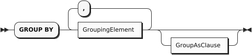

<a id="sqlpp-manual--groupingelement"></a>

##### GroupingElement

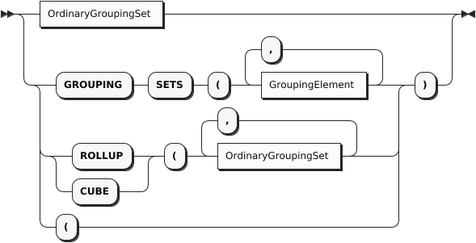

<a id="sqlpp-manual--ordinarygroupingset"></a>

##### OrdinaryGroupingSet

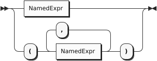

<a id="sqlpp-manual--namedexpr-2"></a>

##### NamedExpr


We’ll begin our discussion of grouping with an example from ordinary SQL.

<a id="sqlpp-manual--example-26"></a>

##### Example

(Q3.16) List the number of orders placed by each customer who has placed an order.

```
SELECT o.custid, COUNT(o.orderno) AS `order count`
FROM orders AS o
GROUP BY o.custid
ORDER BY o.custid;
```

Result:

```
[
    {
        "order count": 4,
        "custid": "C13"
    },
    {
        "order count": 1,
        "custid": "C31"
    },
    {
        "order count": 1,
        "custid": "C35"
    },
    {
        "order count": 1,
        "custid": "C37"
    },
    {
        "order count": 2,
        "custid": "C41"
    }
]
```

The input to a GROUP BY clause is the stream of binding tuples generated by the FROM and WHEREclauses. In this query, before grouping, the variable o is bound to each object in the orders collection in turn.

SQL++ evaluates the expression in the GROUP BY clause, called the grouping expression, once for each of the binding tuples. It then organizes the results into groups in which the grouping expression has a common value (as defined by the = operator). In this example, the grouping expression is o.custid, and each of the resulting groups is a set of orders that have the same custid. If necessary, a group is formed for orders in which custid is null, and another group is formed for orders that have no custid. This query uses the aggregating function COUNT(o.orderno), which counts how many order numbers are in each group. If we are sure that each order object has a distinct orderno, we could also simply count the order objects in each group by using COUNT(\*) in place of COUNT(o.orderno).

In the GROUP BYclause, you may optionally define an alias for the grouping expression. For example, in Q3.16, you could have written GROUP BY o.custid AS cid. The alias cid could then be used in place of the grouping expression in later clauses. In cases where the grouping expression contains an operator, it is especially helpful to define an alias (for example, GROUP BY salary + bonus AS pay).

Q3.16 had a single grouping expression, o.custid. If a query has multiple grouping expressions, the combination of grouping expressions is evaluated for every binding tuple, and the stream of binding tuples is partitioned into groups that have values in common for all of the grouping expressions. We’ll see an example of such a query in Q3.18.

After grouping, the number of binding tuples is reduced: instead of a binding tuple for each of the input objects, there is a binding tuple for each group. The grouping expressions (identified by their aliases, if any) are bound to the results of their evaluations. However, all the non-grouping fields (that is, fields that were not named in the grouping expressions), are accessible only in a special way: as an argument of one of the special aggregation pseudo-functions such as: SUM, AVG, MAX, MIN, STDEV and COUNT. The clauses that come after grouping can access only properties of groups, including the grouping expressions and aggregate properties of the groups such as COUNT(o.orderno) or COUNT(\*). (We’ll see an exception when we discuss the new GROUP AS clause.)

You may notice that the results of Q3.16 do not include customers who have no orders. If we want to include these customers, we need to use an outer join between the customers and orders collections. This is illustrated by the following example, which also includes the name of each customer.

<a id="sqlpp-manual--example-27"></a>

##### Example

(Q3.17) List the number of orders placed by each customer including those customers who have placed no orders.

```
SELECT c.custid, c.name, COUNT(o.orderno) AS `order count`
FROM customers AS c LEFT OUTER JOIN orders AS o ON c.custid = o.custid
GROUP BY c.custid, c.name
ORDER BY c.custid;
```

Result:

```
[
    {
        "custid": "C13",
        "order count": 4,
        "name": "T. Cody"
    },
    {
        "custid": "C25",
        "order count": 0,
        "name": "M. Sinclair"
    },
    {
        "custid": "C31",
        "order count": 1,
        "name": "B. Pruitt"
    },
    {
        "custid": "C35",
        "order count": 1,
        "name": "J. Roberts"
    },
    {
        "custid": "C37",
        "order count": 1,
        "name": "T. Henry"
    },
    {
        "custid": "C41",
        "order count": 2,
        "name": "R. Dodge"
    },
    {
        "custid": "C47",
        "order count": 0,
        "name": "S. Logan"
    }
]
```

Notice in Q3.17 what happens when the special aggregation function COUNT is applied to a collection that does not exist, such as the orders of M. Sinclair: it returns zero. This behavior is unlike that of the other special aggregation functions SUM, AVG, MAX, and MIN, which return null if their operand does not exist. This should make you cautious about the COUNT function: If it returns zero, that may mean that the collection you are counting has zero members, or that it does not exist, or that you have misspelled the collection’s name.

Q3.17 also shows how a query block can have more than one grouping expression. In general, the GROUP BYclause produces a binding tuple for each different combination of values for the grouping expressions. In Q3.17, the c.custid field uniquely identifies a customer, so adding c.name as a grouping expression does not result in any more groups. Nevertheless, c.name must be included as a grouping expression if it is to be referenced outside (after) the GROUP BY clause. If c.name were not included in the GROUP BY clause, it would not be a group property and could not be used in the SELECT clause.

Of course, a grouping expression need not be a simple field-name. In Q3.18, orders are grouped by month, using a temporal function to extract the month component of the order dates. In cases like this, it is helpful to define an alias for the grouping expression so that it can be referenced elsewhere in the query e.g. in the SELECT clause.

<a id="sqlpp-manual--example-28"></a>

##### Example

(Q3.18) Find the months in 2020 that had the largest numbers of orders; list the months and their numbers of orders. (Return the top three.)

```
FROM orders AS o
WHERE get_year(date(o.order_date)) = 2020
GROUP BY get_month(date(o.order_date)) AS month
SELECT month, COUNT(*) AS order_count
ORDER BY order_count DESC, month DESC
LIMIT 3;
```

Result:

```
[
    {
        "month": 10,
        "order_count": 2
    },
    {
        "month": 9,
        "order_count": 2
    },
    {
        "month": 8,
        "order_count": 1
    }
]
```

Groups are commonly formed from named collections like customers and orders. But in some queries you need to form groups from a collection that is nested inside another collection, such as items inside orders. In SQL++ you can do this by using left-correlation in the FROM clause to unnest the inner collection, joining the inner collection with the outer collection, and then performing the grouping on the join, as illustrated in Q3.19.

Q3.19 also shows how a LET clause can be used after a GROUP BY clause to define an expression that is referenced multiple times in later clauses.

<a id="sqlpp-manual--example-29"></a>

##### Example

(Q3.19) For each order, define the total revenue of the order as the sum of quantity times price for all the items in that order. List the total revenue for all the orders placed by the customer with id “C13”, in descending order by total revenue.

```
FROM orders as o, o.items as i
WHERE o.custid = "C13"
GROUP BY o.orderno
LET total_revenue = sum(i.qty * i.price)
SELECT o.orderno, total_revenue
ORDER BY total_revenue desc;
```

Result:

```
[
    {
        "orderno": 1002,
        "total_revenue": 10906.55
    },
    {
        "orderno": 1008,
        "total_revenue": 1999.8
    },
    {
        "orderno": 1007,
        "total_revenue": 130.45
    }
]
```

<a id="sqlpp-manual--rollup"></a>

#### ROLLUP

The ROLLUP subclause is an aggregation feature that extends the functionality of the GROUP BY clause. It returns extra *super-aggregate* items in the query results, giving subtotals and a grand total for the aggregate functions in the query. To illustrate, first consider the following query.

<a id="sqlpp-manual--example-30"></a>

##### Example

(Q3.R1) List the number of orders, grouped by customer region and city.

```
SELECT customer_region AS Region,
       customer_city AS City,
       COUNT(o.orderno) AS `Order Count`
FROM customers AS c LEFT OUTER JOIN orders AS o ON c.custid = o.custid
LET address_line = SPLIT(c.address.city, ","),
    customer_city = TRIM(address_line[0]),
    customer_region = TRIM(address_line[1])
GROUP BY customer_region, customer_city
ORDER BY customer_region ASC, customer_city ASC, `Order Count` DESC;
```

Result:

```
[
  {
    "Region": "Italy",
    "City": "Rome",
    "Order Count": 0
  },
  {
    "Region": "MA",
    "City": "Boston",
    "Order Count": 2
  },
  {
    "Region": "MA",
    "City": "Hanover",
    "Order Count": 0
  },
  {
    "Region": "MO",
    "City": "St. Louis",
    "Order Count": 7
  }
]
```

This query uses string functions to split each customer’s address into city and region. The query then counts the total number of orders placed by each customer, and groups the results first by customer region, then by customer city. The aggregate results (labeled Order Count) are only shown by city, and there are no subtotals or grand total. We can add these using the ROLLUP subclause, as in the following example.

<a id="sqlpp-manual--example-31"></a>

##### Example

(Q3.R2) List the number of orders by customer region and city, including subtotals and a grand total.

```
SELECT customer_region AS Region,
       customer_city AS City,
       COUNT(o.orderno) AS `Order Count`
FROM customers AS c LEFT OUTER JOIN orders AS o ON c.custid = o.custid
LET address_line = SPLIT(c.address.city, ","),
    customer_city = TRIM(address_line[0]),
    customer_region = TRIM(address_line[1])
GROUP BY ROLLUP(customer_region, customer_city)
ORDER BY customer_region ASC, customer_city ASC, `Order Count` DESC;
```

Result:

```
[
  {
    "Region": null,
    "City": null,
    "Order Count": 9
  },
  {
    "Region": "Italy",
    "City": null,
    "Order Count": 0
  },
  {
    "Region": "Italy",
    "City": "Rome",
    "Order Count": 0
  },
  {
    "Region": "MA",
    "City": null,
    "Order Count": 2
  },
  {
    "Region": "MA",
    "City": "Boston",
    "Order Count": 2
  },
  {
    "Region": "MA",
    "City": "Hanover",
    "Order Count": 0
  },
  {
    "Region": "MO",
    "City": null,
    "Order Count": 7
  },
  {
    "Region": "MO",
    "City": "St. Louis",
    "Order Count": 7
  }
]
```

With the addition of the ROLLUP subclause, the results now include an extra item at the start of each region, giving the subtotal for that region. There is also another extra item at the very start of the results, giving the grand total for all regions.

The order of the fields specified by the ROLLUP subclause determines the hierarchy of the super-aggregate items. The customer region is specified first, followed by the customer city; so the results are aggregated by region first, and then by city within each region.

The grand total returns null as a value for the city and the region, and the subtotals return null as the value for the city, which may make the results hard to understand at first glance. A workaround for this is given in the next example.

<a id="sqlpp-manual--example-32"></a>

##### Example

(Q3.R3) List the number of orders by customer region and city, with meaningful subtotals and grand total.

```
SELECT IFNULL(customer_region, "All regions") AS Region,
       IFNULL(customer_city, "All cities") AS City,
       COUNT(o.orderno) AS `Order Count`
FROM customers AS c LEFT OUTER JOIN orders AS o ON c.custid = o.custid
LET address_line = SPLIT(c.address.city, ","),
    customer_city = TRIM(address_line[0]),
    customer_region = TRIM(address_line[1])
GROUP BY ROLLUP(customer_region, customer_city)
ORDER BY customer_region ASC, customer_city ASC, `Order Count` DESC;
```

Result:

```
[
  {
    "Region": "All regions",
    "City": "All cities",
    "Order Count": 9
  },
  {
    "Region": "Italy",
    "City": "All cities",
    "Order Count": 0
  },
  {
    "Region": "Italy",
    "City": "Rome",
    "Order Count": 0
  },
  {
    "Region": "MA",
    "City": "All cities",
    "Order Count": 2
  },
  {
    "Region": "MA",
    "City": "Boston",
    "Order Count": 2
  },
  {
    "Region": "MA",
    "City": "Hanover",
    "Order Count": 0
  },
  {
    "Region": "MO",
    "City": "All cities",
    "Order Count": 7
  },
  {
    "Region": "MO",
    "City": "St. Louis",
    "Order Count": 7
  }
]
```

This query uses the IFNULL function to populate the region and city fields with meaningful values for the super-aggregate items. This makes the results clearer and more readable.

<a id="sqlpp-manual--cube"></a>

#### CUBE

The CUBE subclause is similar to the ROLLUP subclause, in that it returns extra super-aggregate items in the query results, giving subtotals and a grand total for the aggregate functions. Whereas ROLLUP returns a grand total and a hierarchy of subtotals based on the specified fields, the CUBE subclause returns a grand total and subtotals for every possible combination of the specified fields.

The following example is a modification of Q3.R3 which illustrates the CUBE subclause.

<a id="sqlpp-manual--example-33"></a>

##### Example

(Q3.C) List the number of orders by customer region and order date, with all possible subtotals and a grand total.

```
SELECT IFNULL(customer_region, "All regions") AS Region,
       IFNULL(order_month, "All months") AS Month,
       COUNT(o.orderno) AS `Order Count`
FROM customers AS c INNER JOIN orders AS o ON c.custid = o.custid
LET address_line = SPLIT(c.address.city, ","),
    customer_region = TRIM(address_line[1]),
    order_month = get_month(date(o.order_date))
GROUP BY CUBE(customer_region, order_month)
ORDER BY customer_region ASC, order_month ASC;
```

Result:

```
[
  {
    "Region": "All regions",
    "Order Count": 9,
    "Month": "All months"
  },
  {
    "Region": "All regions",
    "Order Count": 1,
    "Month": 4
  },
  {
    "Region": "All regions",
    "Order Count": 1,
    "Month": 5
  },
  {
    "Region": "All regions",
    "Order Count": 1,
    "Month": 6
  },
  {
    "Region": "All regions",
    "Order Count": 1,
    "Month": 7
  },
  {
    "Region": "All regions",
    "Order Count": 1,
    "Month": 8
  },
  {
    "Region": "All regions",
    "Order Count": 2,
    "Month": 9
  },
  {
    "Region": "All regions",
    "Order Count": 2,
    "Month": 10
  },
  {
    "Region": "MA",
    "Order Count": 2,
    "Month": "All months"
  },
  {
    "Region": "MA",
    "Order Count": 1,
    "Month": 7
  },
  {
    "Region": "MA",
    "Order Count": 1,
    "Month": 8
  },
  {
    "Region": "MO",
    "Order Count": 7,
    "Month": "All months"
  },
  {
    "Region": "MO",
    "Order Count": 1,
    "Month": 4
  },
  {
    "Region": "MO",
    "Order Count": 1,
    "Month": 5
  },
  {
    "Region": "MO",
    "Order Count": 1,
    "Month": 6
  },
  {
    "Region": "MO",
    "Order Count": 2,
    "Month": 9
  },
  {
    "Region": "MO",
    "Order Count": 2,
    "Month": 10
  }
]
```

To simplify the results, this query uses an inner join, so that customers who have not placed an order are not included in the totals. The query uses string functions to extract the region from each customer’s address, and a temporal function to extract the year from the order date.

The query uses the CUBE subclause with customer region and order month. This means that there are four possible aggregates to calculate:

- All regions, all months
- All regions, each month
- Each region, all months
- Each region, each month

The results start with the grand total, showing the total number of orders across all regions for all months. This is followed by date subtotals, showing the number of orders across all regions for each month. Following that are the regional subtotals, showing the total number of orders for all months in each region; and the result items, giving the number of orders for each month in each region.

The query also uses the IFNULL function to populate the region and date fields with meaningful values for the super-aggregate items. This makes the results clearer and more readable.

<a id="sqlpp-manual--having-clause"></a>

### HAVING Clause

<a id="sqlpp-manual--havingclause"></a>

##### HavingClause


The HAVING clause is very similar to the WHERE clause, except that it comes after GROUP BY and applies a filter to groups rather than to individual objects. Here’s an example of a HAVING clause that filters orders by applying a condition to their nested arrays of items.

By adding a HAVING clause to Q3.19, we can filter the results to include only those orders whose total revenue is greater than 1000, as shown in Q3.22.

<a id="sqlpp-manual--example-34"></a>

##### Example

(Q3.20) Modify Q3.19 to include only orders whose total revenue is greater than 5000.

```
FROM orders AS o, o.items as i
WHERE o.custid = "C13"
GROUP BY o.orderno
LET total_revenue = sum(i.qty * i.price)
HAVING total_revenue > 5000
SELECT o.orderno, total_revenue
ORDER BY total_revenue desc;
```

Result:

```
[
    {
        "orderno": 1002,
        "total_revenue": 10906.55
    }
]
```

<a id="sqlpp-manual--aggregation-pseudo-functions"></a>

### Aggregation Pseudo-Functions

SQL provides several special functions for performing aggregations on groups including: SUM, AVG, MAX, MIN, and COUNT (some implementations provide more). These same functions are supported in SQL++. However, it’s worth spending some time on these special functions because they don’t behave like ordinary functions. They are called “pseudo-functions” here because they don’t evaluate their operands in the same way as ordinary functions. To see the difference, consider these two examples, which are syntactically similar:

<a id="sqlpp-manual--example-1"></a>

##### Example 1

```
SELECT LENGTH(name) FROM customers
```

In Example 1, LENGTH is an ordinary function. It simply evaluates its operand (name) and then returns a result computed from the operand.

<a id="sqlpp-manual--example-2-2"></a>

##### Example 2

```
SELECT AVG(rating) FROM customers
```

The effect of AVG in Example 2 is quite different. Rather than performing a computation on an individual rating value, AVG has a global effect: it effectively restructures the query. As a pseudo-function, AVG requires its operand to be a group; therefore, it automatically collects all the rating values from the query block and forms them into a group.

The aggregation pseudo-functions always require their operand to be a group. In some queries, the group is explicitly generated by a GROUP BY clause, as in Q3.21:

<a id="sqlpp-manual--example-35"></a>

##### Example

(Q3.21) List the average credit rating of customers by zipcode.

```
FROM customers AS c
GROUP BY c.address.zipcode AS zip
SELECT zip, AVG(c.rating) AS `avg credit rating`
ORDER BY zip;
```

Result:

```
[
    {
        "avg credit rating": 625
    },
    {
        "avg credit rating": 657.5,
        "zip": "02115"
    },
    {
        "avg credit rating": 690,
        "zip": "02340"
    },
    {
        "avg credit rating": 695,
        "zip": "63101"
    }
]
```

Note in the result of Q3.21 that one or more customers had no zipcode. These customers were formed into a group for which the value of the grouping key is missing. When the query results were returned in JSON format, the missing key simply does not appear. Also note that the group whose key is missing appears first because missing is considered to be smaller than any other value. If some customers had had null as a zipcode, they would have been included in another group, appearing after the missing group but before the other groups.

When an aggregation pseudo-function is used without an explicit GROUP BY clause, it implicitly forms the entire query block into a single group, as in Q3.22:

<a id="sqlpp-manual--example-36"></a>

##### Example

(Q3.22) Find the average credit rating among all customers.

```
FROM customers AS c
SELECT AVG(c.rating) AS `avg credit rating`;
```

Result:

```
[
    {
        "avg credit rating": 670
    }
]
```

The aggregation pseudo-function COUNT has a special form in which its operand is \* instead of an expression.

For example, SELECT COUNT(\*) FROM customers simply returns the total number of customers, whereas SELECT COUNT(rating) FROM customers returns the number of customers who have known ratings (that is, their ratings are not null or missing).

Because the aggregation pseudo-functions sometimes restructure their operands, they can be used only in query blocks where (explicit or implicit) grouping is being done. Therefore the pseudo-functions cannot operate directly on arrays or multisets. For operating directly on JSON collections, SQL++ provides a set of ordinary functions for computing aggregations. Each ordinary aggregation function (except the ones corresponding to COUNT and ARRAY\_AGG) has two versions: one that ignores null and missing values and one that returns null if a null or missing value is encountered anywhere in the collection. The names of the aggregation functions are as follows:

| Aggregation pseudo-function; operates on groups only | Ordinary function: Ignores NULL or MISSING values | Ordinary function: Returns NULL if NULL or MISSING are encountered |
| --- | --- | --- |
| SUM | ARRAY\_SUM | STRICT\_SUM |
| AVG | ARRAY\_MAX | STRICT\_MAX |
| MAX | ARRAY\_MIN | STRICT\_MIN |
| MIN | ARRAY\_AVG | STRICT\_AVG |
| COUNT | ARRAY\_COUNT | STRICT\_COUNT (see exception below) |
| STDDEV\_SAMP | ARRAY\_STDDEV\_SAMP | STRICT\_STDDEV\_SAMP |
| STDDEV\_POP | ARRAY\_STDDEV\_POP | STRICT\_STDDEV\_POP |
| VAR\_SAMP | ARRAY\_VAR\_SAMP | STRICT\_VAR\_SAMP |
| VAR\_POP | ARRAY\_VAR\_POP | STRICT\_VAR\_POP |
| SKEWENESS | ARRAY\_SKEWNESS | STRICT\_SKEWNESS |
| KURTOSIS | ARRAY\_KURTOSIS | STRICT\_KURTOSIS |
|  | ARRAY\_AGG |  |

Exception: the ordinary aggregation function STRICT\_COUNT operates on any collection, and returns a count of its items, including null values in the count. In this respect, STRICT\_COUNT is more similar to COUNT(\*) than to COUNT(expression).

Note that the ordinary aggregation functions that ignore null have names beginning with “ARRAY”. This naming convention has historical roots. Despite their names, the functions operate on both arrays and multisets.

Because of the special properties of the aggregation pseudo-functions, SQL (and therefore SQL++) is not a pure functional language. But every query that uses a pseudo-function can be expressed as an equivalent query that uses an ordinary function. Q3.23 is an example of how queries can be expressed without pseudo-functions. A more detailed explanation of all of the functions is also available in the section on [Aggregate Functions](#sqlpp-builtins--aggregatefunctions).

<a id="sqlpp-manual--example-37"></a>

##### Example

(Q3.23) Alternative form of Q3.22, using the ordinary function ARRAY\_AVG rather than the aggregating pseudo-function AVG.

```
SELECT ARRAY_AVG(
    (SELECT VALUE c.rating
    FROM customers AS c) ) AS `avg credit rating`;
```

Result (same as Q3.22):

```
[
    {
        "avg credit rating": 670
    }
]
```

If the function STRICT\_AVG had been used in Q3.23 in place of ARRAY\_AVG, the average credit rating returned by the query would have been null, because at least one customer has no credit rating.

<a id="sqlpp-manual--group-as-clause"></a>

### GROUP AS Clause

<a id="sqlpp-manual--groupasclause"></a>

##### GroupAsClause


JSON is a hierarchical format, and a fully featured JSON query language needs to be able to produce hierarchies of its own, with computed data at every level of the hierarchy. The key feature of SQL++ that makes this possible is the GROUP AS clause.

A query may have a GROUP AS clause only if it has a GROUP BY clause. The GROUP BY clause “hides” the original objects in each group, exposing only the grouping expressions and special aggregation functions on the non-grouping fields. The purpose of the GROUP AS clause is to make the original objects in the group visible to subsequent clauses. Thus the query can generate output data both for the group as a whole and for the individual objects inside the group.

For each group, the GROUP AS clause preserves all the objects in the group, just as they were before grouping, and gives a name to this preserved group. The group name can then be used in the FROM clause of a subquery to process and return the individual objects in the group.

To see how this works, we’ll write some queries that investigate the customers in each zipcode and their credit ratings. This would be a good time to review the sample database in [Appendix 4](#sqlpp-manual--manual_data). A part of the data is summarized below.

```
Customers in zipcode 02115:
    C35, J. Roberts, rating 565
    C37, T. Henry, rating 750

Customers in zipcode 02340:
    C25, M. Sinclair, rating 690

Customers in zipcode 63101:
    C13, T. Cody, rating 750
    C31, B. Pruitt, (no rating)
    C41, R. Dodge, rating 640

Customers with no zipcode:
    C47, S. Logan, rating 625
```

Now let’s consider the effect of the following clauses:

```
FROM customers AS c
GROUP BY c.address.zipcode
GROUP AS g
```

This query fragment iterates over the customers objects, using the iteration variable c. The GROUP BY clause forms the objects into groups, each with a common zipcode (including one group for customers with no zipcode). After the GROUP BY clause, we can see the grouping expression, c.address.zipcode, but other fields such as c.custid and c.name are visible only to special aggregation functions.

The clause GROUP AS g now makes the original objects visible again. For each group in turn, the variable g is bound to a multiset of objects, each of which has a field named c, which in turn contains one of the original objects. Thus after GROUP AS g, for the group with zipcode 02115, g is bound to the following multiset:

```
[
    { "c":
        { "custid": "C35",
          "name": "J. Roberts",
          "address":
            { "street": "420 Green St.",
              "city": "Boston, MA",
              "zipcode": "02115"
            },
          "rating": 565
        }
    },
    { "c":
        { "custid": "C37",
          "name": "T. Henry",
          "address":
            { "street": "120 Harbor Blvd.",
              "city": "St. Louis, MO",
              "zipcode": "02115"
            },
          "rating": 750
        }
    }
]
```

Thus, the clauses following GROUP AS can see the original objects by writing subqueries that iterate over the multiset g.

The extra level named c was introduced into this multiset because the groups might have been formed from a join of two or more collections. Suppose that the FROM clause looked like FROM customers AS c, orders AS o. Then each item in the group would contain both a customers object and an orders object, and these two objects might both have a field with the same name. To avoid ambiguity, each of the original objects is wrapped in an “outer” object that gives it the name of its iteration variable in the FROM clause. Consider this fragment:

```
FROM customers AS c, orders AS o
WHERE c.custid = o.custid
GROUP BY c.address.zipcode
GROUP AS g
```

In this case, following GROUP AS g, the variable g would be bound to the following collection:

```
[
    { "c": { an original customers object },
      "o": { an original orders object }
    },
    { "c": { another customers object },
      "o": { another orders object }
    },
    ...
]
```

After using GROUP AS to make the content of a group accessible, you will probably want to write a subquery to access that content. A subquery for this purpose is written in exactly the same way as any other subquery. The name specified in the GROUP AS clause (g in the above example) is the name of a collection of objects. You can write a FROM clause to iterate over the objects in the collection, and you can specify an iteration variable to represent each object in turn. For GROUP AS queries in this manual, we’ll use gas the name of the reconstituted group, and gi as an iteration variable representing one object inside the group. Of course, you can use any names you like for these purposes.

Now we are ready to take a look at how GROUP AS might be used in a query. Suppose that we want to group customers by zipcode, and for each group we want to see the average credit rating and a list of the individual customers in the group. Here’s a query that does that:

<a id="sqlpp-manual--example-38"></a>

##### Example

(Q3.24) For each zipcode, list the average credit rating in that zipcode, followed by the customer numbers and names in numeric order.

```
FROM customers AS c
GROUP BY c.address.zipcode AS zip
GROUP AS g
SELECT zip, AVG(c.rating) AS `avg credit rating`,
    (FROM g AS gi
     SELECT gi.c.custid, gi.c.name
     ORDER BY gi.c.custid) AS `local customers`
ORDER BY zip;
```

Result:

```
[
    {
        "avg credit rating": 625,
        "local customers": [
            {
                "custid": "C47",
                "name": "S. Logan"
            }
        ]
    },
    {
        "avg credit rating": 657.5,
        "local customers": [
            {
                "custid": "C35",
                "name": "J. Roberts"
            },
            {
                "custid": "C37",
                "name": "T. Henry"
            }
        ],
        "zip": "02115"
    },
    {
        "avg credit rating": 690,
        "local customers": [
            {
                "custid": "C25",
                "name": "M. Sinclair"
            }
        ],
        "zip": "02340"
    },
    {
        "avg credit rating": 695,
        "local customers": [
            {
                "custid": "C13",
                "name": "T. Cody"
            },
            {
                "custid": "C31",
                "name": "B. Pruitt"
            },
            {
                "custid": "C41",
                "name": "R. Dodge"
            }
        ],
        "zip": "63101"
    }
]
```

Note that this query contains two ORDER BY clauses: one in the outer query and one in the subquery. These two clauses govern the ordering of the outer-level list of zipcodes and the inner-level lists of customers, respectively. Also note that the group of customers with no zipcode comes first in the output list.

<a id="sqlpp-manual--selection-and-union-all"></a>

## Selection and UNION ALL

<a id="sqlpp-manual--selection-2"></a>

##### Selection


<a id="sqlpp-manual--unionoption"></a>

##### UnionOption

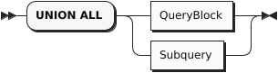

In a SQL++ query, two or more query blocks can be connected by the operator UNION ALL. The result of a UNION ALL between two query blocks contains all the items returned by the first query block, and all the items returned by the second query block. Duplicate items are not eliminated from the query result.

As in SQL, there is no ordering guarantee on the contents of the output stream. However, unlike SQL, the query language does not constrain what the data looks like on the input streams; in particular, it allows heterogeneity on the input and output streams. A type error will be raised if one of the inputs is not a collection.

When two or more query blocks are connected by UNION ALL, they can be followed by ORDER BY, LIMIT, and OFFSET clauses that apply to the UNION query as a whole. For these clauses to be meaningful, the field-names returned by the two query blocks should match. The following example shows a UNION ALL of two query blocks, with an ordering specified for the result.

In this example, a customer might be selected because he has ordered more than two different items (first query block) or because he has a high credit rating (second query block). By adding an explanatory string to each query block, the query writer can cause the output objects to be labeled to distinguish these two cases.

<a id="sqlpp-manual--example-39"></a>

##### Example

(Q3.25a) Find customer ids for customers who have placed orders for more than two different items or who have a credit rating greater than 700, with labels to distinguish these cases.

```
FROM orders AS o, o.items AS i
GROUP BY o.orderno, o.custid
HAVING COUNT(*) > 2
SELECT DISTINCT o.custid AS customer_id, "Big order" AS reason

UNION ALL

FROM customers AS c
WHERE rating > 700
SELECT c.custid AS customer_id, "High rating" AS reason
ORDER BY customer_id;
```

Result:

```
[
    {
        "reason": "High rating",
        "customer_id": "C13"
    },
    {
        "reason": "Big order",
        "customer_id": "C37"
    },
    {
        "reason": "High rating",
        "customer_id": "C37"
    },
    {
        "reason": "Big order",
        "customer_id": "C41"
    }
]
```

If, on the other hand, you simply want a list of the customer ids and you don’t care to preserve the reasons, you can simplify your output by using SELECT VALUE, as follows:

(Q3.25b) Simplify Q3.25a to return a simple list of unlabeled customer ids.

```
FROM orders AS o, o.items AS i
GROUP BY o.orderno, o.custid
HAVING COUNT(*) > 2
SELECT VALUE o.custid

UNION ALL

FROM customers AS c
WHERE rating > 700
SELECT VALUE c.custid;
```

Result:

```
[
    "C37",
    "C41",
    "C13",
    "C37"
]
```

<a id="sqlpp-manual--with-clause"></a>

## WITH Clause

<a id="sqlpp-manual--withclause"></a>

##### WithClause

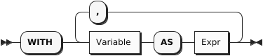

As in standard SQL, a WITH clause can be used to improve the modularity of a query. A WITH clause often contains a subquery that is needed to compute some result that is used later in the main query. In cases like this, you can think of the WITH clause as computing a “temporary view" of the input data. The next example uses a WITH clause to compute the total revenue of each order in 2020; then the main part of the query finds the minimum, maximum, and average revenue for orders in that year.

<a id="sqlpp-manual--example-40"></a>

##### Example

(Q3.26) Find the minimum, maximum, and average revenue among all orders in 2020, rounded to the nearest integer.

```
WITH order_revenue AS
    (FROM orders AS o, o.items AS i
    WHERE get_year(date(o.order_date)) = 2020
    GROUP BY o.orderno
    SELECT o.orderno, SUM(i.qty * i.price) AS revenue
  )
FROM order_revenue
SELECT AVG(revenue) AS average,
       MIN(revenue) AS minimum,
       MAX(revenue) AS maximum;
```

Result:

```
[
    {
        "average": 4669.99,
        "minimum": 130.45,
        "maximum": 18847.58
    }
]
```

WITH can be particularly useful when a value needs to be used several times in a query.

<a id="sqlpp-manual--order-by-limit-and-offset-clauses"></a>

## ORDER BY, LIMIT, and OFFSET Clauses

<a id="sqlpp-manual--orderbyclause"></a>

##### OrderbyClause

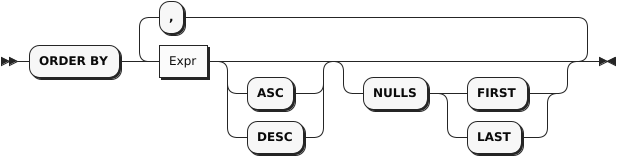

<a id="sqlpp-manual--limitclause"></a>

##### LimitClause

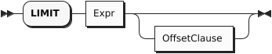

<a id="sqlpp-manual--offsetclause"></a>

##### OffsetClause


The last three (optional) clauses to be processed in a query are ORDER BY, LIMIT, and OFFSET.

The ORDER BY clause is used to globally sort data in either ascending order (i.e., ASC) or descending order (i.e., DESC). During ordering (if the NULLS modifier is not specified), MISSING and NULL are treated as being smaller than any other value if they are encountered in the ordering key(s). MISSING is treated as smaller than NULL if both occur in the data being sorted. The NULLS modifier determines how MISSING and NULL are ordered relative to all other values: first (NULLS FIRST) or last (NULLS LAST). The relative order between MISSING and NULL is not affected by the NULLS modifier (i.e. MISSING is still treated as smaller than NULL). The ordering of values of a given type is consistent with its type’s <= ordering; the ordering of values across types is implementation-defined but stable.

The LIMIT clause is used to limit the result set to a specified maximum size. The optional OFFSET clause is used to specify a number of items in the output stream to be discarded before the query result begins. The OFFSET can also be used as a standalone clause, without the LIMIT.

The following example illustrates use of the ORDER BY and LIMIT clauses.

<a id="sqlpp-manual--example-41"></a>

##### Example

(Q3.27) Return the top three customers by rating.

```
FROM customers AS c
SELECT c.custid, c.name, c.rating
ORDER BY c.rating DESC
LIMIT 3;
```

Result:

```
[
    {
        "custid": "C13",
        "name": "T. Cody",
        "rating": 750
    },
    {
        "custid": "C37",
        "name": "T. Henry",
        "rating": 750
    },
    {
        "custid": "C25",
        "name": "M. Sinclair",
        "rating": 690
    }
]
```

The following example illustrates the use of OFFSET:

<a id="sqlpp-manual--example-42"></a>

##### Example

(Q3.38) Find the customer with the third-highest credit rating.

```
FROM customers AS c
SELECT c.custid, c.name, c.rating
ORDER BY c.rating DESC
LIMIT 1 OFFSET 2;
```

Result:

```
[
    {
        "custid": "C25",
        "name": "M. Sinclair",
        "rating": 690
    }
]
```

<a id="sqlpp-manual--subqueries"></a>

## Subqueries

<a id="sqlpp-manual--subquery-2"></a>

##### Subquery


A subquery is simply a query surrounded by parentheses. In SQL++, a subquery can appear anywhere that an expression can appear. Like any query, a subquery always returns a collection, even if the collection contains only a single value or is empty. If the subquery has a SELECT clause, it returns a collection of objects. If the subquery has a SELECT VALUE clause, it returns a collection of scalar values. If a single scalar value is expected, the indexing operator [0] can be used to extract the single scalar value from the collection.

<a id="sqlpp-manual--example-43"></a>

##### Example

(Q3.29) (Subquery in SELECT clause) For every order that includes item no. 120, find the order number, customer id, and customer name.

Here, the subquery is used to find a customer name, given a customer id. Since the outer query expects a scalar result, the subquery uses SELECT VALUE and is followed by the indexing operator [0].

```
FROM orders AS o, o.items AS i
WHERE i.itemno = 120
SELECT o.orderno, o.custid,
    (FROM customers AS c
     WHERE c.custid = o.custid
     SELECT VALUE c.name)[0] AS name;
```

Result:

```
[
    {
        "orderno": 1003,
        "custid": "C31",
        "name": "B. Pruitt"
    },
    {
        "orderno": 1006,
        "custid": "C41",
        "name": "R. Dodge"
    }
]
```

<a id="sqlpp-manual--example-44"></a>

##### Example

(Q3.30) (Subquery in WHERE clause) Find the customer number, name, and rating of all customers whose rating is greater than the average rating.

Here, the subquery is used to find the average rating among all customers. Once again, SELECT VALUE and indexing [0] have been used to get a single scalar value.

```
FROM customers AS c1
WHERE c1.rating >
   (FROM customers AS c2
    SELECT VALUE AVG(c2.rating))[0]
SELECT c1.custid, c1.name, c1.rating;
```

Result:

```
[
    {
        "custid": "C13",
        "name": "T. Cody",
        "rating": 750
    },
    {
        "custid": "C25",
        "name": "M. Sinclair",
        "rating": 690
    },
    {
        "custid": "C37",
        "name": "T. Henry",
        "rating": 750
    }
]
```

<a id="sqlpp-manual--example-45"></a>

##### Example

(Q3.31) (Subquery in FROM clause) Compute the total revenue (sum over items of quantity time price) for each order, then find the average, maximum, and minimum total revenue over all orders.

Here, the FROM clause expects to iterate over a collection of objects, so the subquery uses an ordinary SELECT and does not need to be indexed. You might think of a FROM clause as a “natural home” for a subquery.

```
FROM
   (FROM orders AS o, o.items AS i
    GROUP BY o.orderno
    SELECT o.orderno, SUM(i.qty * i.price) AS revenue
   ) AS r
SELECT AVG(r.revenue) AS average,
       MIN(r.revenue) AS minimum,
       MAX(r.revenue) AS maximum;
```

Result:

```
[
    {
        "average": 4669.99,
        "minimum": 130.45,
        "maximum": 18847.58
    }
]
```

Note the similarity between Q3.26 and Q3.31. This illustrates how a subquery can often be moved into a WITH clause to improve the modularity and readability of a query.

<a id="sqlpp-manual--4.-window-functions"></a>

# 4. Window Functions

Window functions are special functions that compute aggregate values over a “window” of input data. Like an ordinary function, a window function returns a value for every item in the input dataset. But in the case of a window function, the value returned by the function can depend not only on the argument of the function, but also on other items in the same collection. For example, a window function applied to a set of employees might return the rank of each employee in the set, as measured by salary. As another example, a window function applied to a set of items, ordered by purchase date, might return the running total of the cost of the items.

A window function call is identified by an OVER clause, which can specify three things: partitioning, ordering, and framing. The partitioning specification is like a GROUP BY: it splits the input data into partitions. For example, a set of employees might be partitioned by department. The window function, when applied to a given object, is influenced only by other objects in the same partition. The ordering specification is like an ORDER BY: it determines the ordering of the objects in each partition. The framing specification defines a “frame” that moves through the partition, defining how the result for each object depends on nearby objects. For example, the frame for a current object might consist of the two objects before and after the current one; or it might consist of all the objects before the current one in the same partition. A window function call may also specify some options that control (for example) how nulls are handled by the function.

Here is an example of a window function call:

```
SELECT deptno, purchase_date, item, cost,
    SUM(cost) OVER (
        PARTITION BY deptno
        ORDER BY purchase_date
        ROWS UNBOUNDED PRECEDING) AS running_total_cost
FROM purchases
ORDER BY deptno, purchase_date
```

This example partitions the purchases dataset by department number. Within each department, it orders the purchases by date and computes a running total cost for each item, using the frame specification ROWS UNBOUNDED PRECEDING. Note that the ORDER BY clause in the window function is separate and independent from the ORDER BY clause of the query as a whole.

The general syntax of a window function call is specified in this section. SQL++ has a set of builtin window functions, which are listed and explained in the [Window Functions](#sqlpp-builtins--windowfunctions) section of the builtin functions page. In addition, standard SQL aggregate functions such as SUM and AVG can be used as window functions if they are used with an OVER clause.

<a id="sqlpp-manual--window-function-call"></a>

## Window Function Call

<a id="sqlpp-manual--windowfunctioncall"></a>

##### WindowFunctionCall

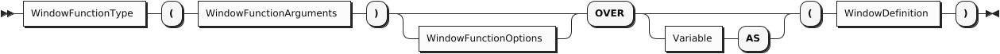

<a id="sqlpp-manual--windowfunctiontype"></a>

##### WindowFunctionType

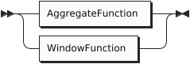

Refer to the [Aggregate Functions](#sqlpp-builtins--aggregatefunctions) section for a list of aggregate functions.

Refer to the [Window Functions](#sqlpp-builtins--windowfunctions) section for a list of window functions.

<a id="sqlpp-manual--window-function-arguments"></a>

### Window Function Arguments

<a id="sqlpp-manual--windowfunctionarguments"></a>

##### WindowFunctionArguments

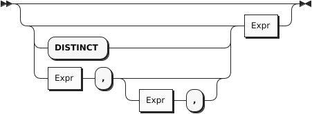

Refer to the [Aggregate Functions](#sqlpp-builtins--aggregatefunctions) section or the [Window Functions](#sqlpp-builtins--windowfunctions) section for details of the arguments for individual functions.

<a id="sqlpp-manual--window-function-options"></a>

### Window Function Options

<a id="sqlpp-manual--windowfunctionoptions"></a>

##### WindowFunctionOptions


Window function options cannot be used with [aggregate functions](#sqlpp-builtins--aggregatefunctions).

Window function options can only be used with some [window functions](#sqlpp-builtins--windowfunctions), as described below.

The *FROM modifier* determines whether the computation begins at the first or last tuple in the window. It is optional and can only be used with the nth\_value() function. If it is omitted, the default setting is FROM FIRST.

The *NULLS modifier* determines whether NULL values are included in the computation, or ignored. MISSING values are treated the same way as NULL values. It is also optional and can only be used with the first\_value(), last\_value(), nth\_value(), lag(), and lead() functions. If omitted, the default setting is RESPECT NULLS.

<a id="sqlpp-manual--window-frame-variable"></a>

### Window Frame Variable

The AS keyword enables you to specify an alias for the window frame contents. It introduces a variable which will be bound to the contents of the frame. When using a built-in [aggregate function](#sqlpp-builtins--aggregatefunctions) as a window function, the function’s argument must be a subquery which refers to this alias, for example:

```
SELECT ARRAY_COUNT(DISTINCT (FROM alias SELECT VALUE alias.src.field))
OVER alias AS (PARTITION BY … ORDER BY …)
FROM source AS src
```

The alias is not necessary when using a [window function](#sqlpp-builtins--windowfunctions), or when using a standard SQL aggregate function with the OVER clause.

<a id="sqlpp-manual--window-definition"></a>

### Window Definition

<a id="sqlpp-manual--windowdefinition"></a>

##### WindowDefinition

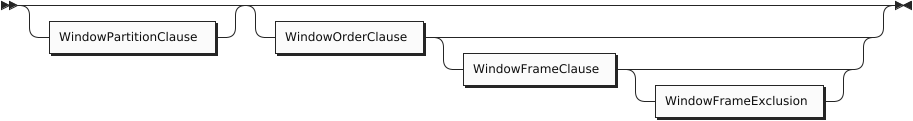

The *window definition* specifies the partitioning, ordering, and framing for window functions.

<a id="sqlpp-manual--window-partition-clause"></a>

#### Window Partition Clause

<a id="sqlpp-manual--windowpartitionclause"></a>

##### WindowPartitionClause

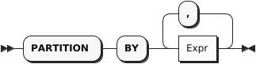

The *window partition clause* divides the tuples into logical partitions using one or more expressions.

This clause may be used with any [window function](#sqlpp-builtins--windowfunctions), or any [aggregate function](#sqlpp-builtins--aggregatefunctions) used as a window function.

This clause is optional. If omitted, all tuples are united in a single partition.

<a id="sqlpp-manual--window-order-clause"></a>

#### Window Order Clause

<a id="sqlpp-manual--windoworderclause"></a>

##### WindowOrderClause

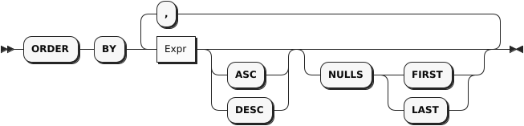

The *window order clause* determines how tuples are ordered within each partition. The window function works on tuples in the order specified by this clause.

This clause may be used with any [window function](#sqlpp-builtins--windowfunctions), or any [aggregate function](#sqlpp-builtins--aggregatefunctions) used as a window function.

This clause is optional. If omitted, all tuples are considered peers, i.e. their order is tied. When tuples in the window partition are tied, each window function behaves differently.

- The row\_number() function returns a distinct number for each tuple. If tuples are tied, the results may be unpredictable.
- The rank(), dense\_rank(), percent\_rank(), and cume\_dist() functions return the same result for each tuple.
- For other functions, if the [window frame](#sqlpp-manual--window_frame_clause) is defined by ROWS, the results may be unpredictable. If the window frame is defined by RANGE or GROUPS, the results are same for each tuple.

**Note:** This clause does not guarantee the overall order of the query results. To guarantee the order of the final results, use the query ORDER BY clause.

<a id="sqlpp-manual--window-frame-clause"></a>

#### Window Frame Clause

<a id="sqlpp-manual--windowframeclause"></a>

##### WindowFrameClause

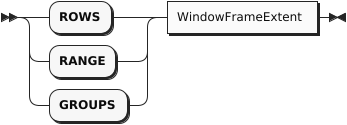

The *window frame clause* defines the window frame. It can be used with all [aggregate functions](#sqlpp-builtins--aggregatefunctions) and some [window functions](#sqlpp-builtins--windowfunctions) — refer to the descriptions of individual functions for more details. It is optional and allowed only when the [window order clause](#sqlpp-manual--window_order_clause) is present.

- If this clause is omitted and there is no [window order clause](#sqlpp-manual--window_order_clause), the window frame is the entire partition.
- If this clause is omitted but there is a [window order clause](#sqlpp-manual--window_order_clause), the window frame becomes all tuples in the partition preceding the current tuple and its peers — the same as RANGE BETWEEN UNBOUNDED PRECEDING AND CURRENT ROW.

The window frame can be defined in the following ways:

- ROWS: Counts the exact number of tuples within the frame. If window ordering doesn’t result in unique ordering, the function may produce unpredictable results. You can add a unique expression or more window ordering expressions to produce unique ordering.
- RANGE: Looks for a value offset within the frame. The function produces deterministic results.
- GROUPS: Counts all groups of tied rows within the frame. The function produces deterministic results.

**Note:** If this clause uses RANGE with either *Expr* PRECEDING or *Expr* FOLLOWING, the [window order clause](#sqlpp-manual--window_order_clause) must have only a single ordering term. The ordering term expression must evaluate to a number. If these conditions are not met, the window frame will be empty, which means the window function will return its default value: in most cases this is null, except for strict\_count() or array\_count(), whose default value is 0. This restriction does not apply when the window frame uses ROWS or GROUPS.

**Tip:** The RANGE window frame is commonly used to define window frames based on date or time. If you want to use RANGE with either *Expr* PRECEDING or *Expr* FOLLOWING, and you want to use an ordering expression based on date or time, the expression in *Expr* PRECEDING or *Expr* FOLLOWING must use a data type that can be added to the ordering expression.

<a id="sqlpp-manual--window-frame-extent"></a>

#### Window Frame Extent

<a id="sqlpp-manual--windowframeextent"></a>

##### WindowFrameExtent

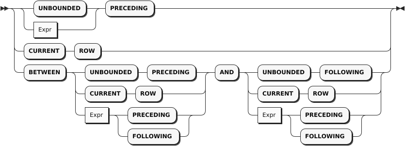

The *window frame extent clause* specifies the start point and end point of the window frame. The expression before AND is the start point and the expression after AND is the end point. If BETWEEN is omitted, you can only specify the start point; the end point becomes CURRENT ROW.

The window frame end point can’t be before the start point. If this clause violates this restriction explicitly, an error will result. If it violates this restriction implicitly, the window frame will be empty, which means the window function will return its default value: in most cases this is null, except for strict\_count() or array\_count(), whose default value is 0.

Window frame extents that result in an explicit violation are:

- BETWEEN CURRENT ROW AND *Expr* PRECEDING
- BETWEEN *Expr* FOLLOWING AND *Expr* PRECEDING
- BETWEEN *Expr* FOLLOWING AND CURRENT ROW

Window frame extents that result in an implicit violation are:

- BETWEEN UNBOUNDED PRECEDING AND *Expr* PRECEDING — if *Expr* is too high, some tuples may generate an empty window frame.
- BETWEEN *Expr* PRECEDING AND *Expr* PRECEDING — if the second *Expr* is greater than or equal to the first *Expr*, all result sets will generate an empty window frame.
- BETWEEN *Expr* FOLLOWING AND *Expr* FOLLOWING — if the first *Expr* is greater than or equal to the second *Expr*, all result sets will generate an empty window frame.
- BETWEEN *Expr* FOLLOWING AND UNBOUNDED FOLLOWING — if *Expr* is too high, some tuples may generate an empty window frame.
- If the [window frame exclusion clause](#sqlpp-manual--window_frame_exclusion) is present, any window frame specification may result in empty window frame.

The *Expr* must be a positive constant or an expression that evaluates as a positive number. For ROWS or GROUPS, the *Expr* must be an integer.

<a id="sqlpp-manual--window-frame-exclusion"></a>

#### Window Frame Exclusion

<a id="sqlpp-manual--windowframeexclusion"></a>

##### WindowFrameExclusion

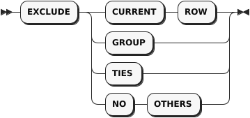

The *window frame exclusion clause* enables you to exclude specified tuples from the window frame.

This clause can be used with all [aggregate functions](#sqlpp-builtins--aggregatefunctions) and some [window functions](#sqlpp-builtins--windowfunctions) — refer to the descriptions of individual functions for more details.

This clause is allowed only when the [window frame clause](#sqlpp-manual--window_frame_clause) is present.

This clause is optional. If this clause is omitted, the default is no exclusion — the same as EXCLUDE NO OTHERS.

- EXCLUDE CURRENT ROW: If the current tuple is still part of the window frame, it is removed from the window frame.
- EXCLUDE GROUP: The current tuple and any peers of the current tuple are removed from the window frame.
- EXCLUDE TIES: Any peers of the current tuple, but not the current tuple itself, are removed from the window frame.
- EXCLUDE NO OTHERS: No additional tuples are removed from the window frame.

If the current tuple is already removed from the window frame, then it remains removed from the window frame.

<a id="sqlpp-manual--5.-errors"></a>

# 5. Errors

A query can potentially result in one of the following errors:

- syntax error,
- identifier resolution error,
- type error,
- resource error.

If the query processor runs into any error, it will terminate the ongoing processing of the query and immediately return an error message to the client.

<a id="sqlpp-manual--syntax-errors"></a>

## Syntax Errors

A valid query must satisfy the grammar rules of the query language. Otherwise, a syntax error will be raised.

<a id="sqlpp-manual--example-46"></a>

##### Example

(Q4.1)

```
customers AS c
SELECT *
```

Since the queryhas no FROM keyword before the dataset customers, we will get a syntax error as follows:

```
ERROR: Code: 1 "ASX1001: Syntax error: In line 2 >>customers AS c<< Encountered \"AS\" at column 11. "
```

<a id="sqlpp-manual--example-47"></a>

##### Example

(Q4.2)

```
 FROM customers AS c
 WHERE type="advertiser"
 SELECT *;
```

Since “type” is a reserved keyword in the query parser, we will get a syntax error as follows:

```
ERROR: Code: 1 "ASX1001: Syntax error: In line 3 >> WHERE type=\"advertiser\"<< Encountered \"type\" at column 8. ";
```

<a id="sqlpp-manual--identifier-resolution-errors"></a>

## Identifier Resolution Errors

Referring to an undefined identifier can cause an error if the identifier cannot be successfully resolved as a valid field access.

<a id="sqlpp-manual--example-48"></a>

##### Example

(Q4.3)

```
 FROM customer AS c
 SELECT *
```

If we have a typo as above in “customers” that misses the dataset name’s ending “s”, we will get an identifier resolution error as follows:

```
ERROR: Code: 1 "ASX1077: Cannot find dataset customer in dataverse Commerce nor an alias with name customer (in line 2, at column 7)"
```

<a id="sqlpp-manual--example-49"></a>

##### Example

(Q4.4)

```
 FROM customers AS c JOIN orders AS o ON c.custid = o.custid
 SELECT name, orderno;
```

If the compiler cannot figure out how to resolve an unqualified field name, which will occur if there is more than one variable in scope (e.g., customers AS c and orders AS o as above), we will get an identifier resolution error as follows:

```
ERROR: Code: 1 "ASX1074: Cannot resolve ambiguous alias reference for identifier name (in line 3, at column 9)"
```

The same can happen when failing to properly identify the GROUP BY expression.

(Q4.5)

```
SELECT o.custid, COUNT(o.orderno) AS `order count`
FROM orders AS o
GROUP BY custid;
```

Result:

```
ERROR: Code: 1 "ASX1073: Cannot resolve alias reference for undefined identifier o (in line 2, at column 8)"
```

<a id="sqlpp-manual--type-errors"></a>

## Type Errors

The query compiler does type checks based on its available type information. In addition, the query runtime also reports type errors if a data model instance it processes does not satisfy the type requirement.

<a id="sqlpp-manual--example-50"></a>

##### Example

(Q4.6)

```
get_day(10/11/2020);
```

Since function get\_day can only process duration, daytimeduration, date, or datetime input values, we will get a type error as follows:

```
ERROR: Code: 1 "ASX0002: Type mismatch: function get-day expects its 1st input parameter to be of type duration, daytimeduration, date or datetime, but the actual input type is double (in line 2, at column 1)"
```

<a id="sqlpp-manual--resource-errors"></a>

## Resource Errors

A query can potentially exhaust system resources, such as the number of open files and disk spaces. For instance, the following two resource errors could be potentially be seen when running the system:

```
Error: no space left on device
Error: too many open files
```

The “no space left on device” issue usually can be fixed by cleaning up disk space and reserving more disk space for the system. The “too many open files” issue usually can be fixed by a system administrator, following the instructions [here](https://easyengine.io/tutorials/linux/increase-open-files-limit/).

<a id="sqlpp-manual--6.-differences-from-sql-92"></a>

# 6. Differences from SQL-92

SQL++ offers the following additional features beyond SQL-92:

- Fully composable and functional: A subquery can iterate over any intermediate collection and can appear anywhere in a query.
- Schema-free: The query language does not assume the existence of a static schema for any data that it processes.
- Correlated FROM terms: A right-side FROM term expression can refer to variables defined by FROM terms on its left.
- Powerful GROUP BY: In addition to a set of aggregate functions as in standard SQL, the groups created by the GROUP BY clause are directly usable in nested queries and/or to obtain nested results.
- Generalized SELECT clause: A SELECT clause can return any type of collection, while in SQL-92, a SELECT clause has to return a (homogeneous) collection of objects.

The following matrix is a quick “SQL-92 compatibility cheat sheet” for SQL++.

| Feature | SQL++ | SQL-92 | Why different? |
| --- | --- | --- | --- |
| SELECT \* | Returns nested objects | Returns flattened concatenated objects | Nested collections are 1st class citizens |
| SELECT list | order not preserved | order preserved | Fields in a JSON object are not ordered |
| Subquery | Returns a collection | The returned collection is cast into a scalar value if the subquery appears in a SELECT list or on one side of a comparison or as input to a function | Nested collections are 1st class citizens |
| LEFT OUTER JOIN | Fills in MISSING(s) for non-matches | Fills in NULL(s) for non-matches | “Absence” is more appropriate than “unknown” here |
| UNION ALL | Allows heterogeneous inputs and output | Input streams must be UNION-compatible and output field names are drawn from the first input stream | Heterogenity and nested collections are common |
| IN constant\_expr | The constant expression has to be an array or multiset, i.e., [..,..,…] | The constant collection can be represented as comma-separated items in a paren pair | Nested collections are 1st class citizens |
| String literal | Double quotes or single quotes | Single quotes only | Double quoted strings are pervasive in JSON |
| Delimited identifiers | Backticks | Double quotes | Double quoted strings are pervasive in JSON |

The following SQL-92 features are not implemented yet. However, SQL++ does not conflict with these features:

- CROSS JOIN, NATURAL JOIN, UNION JOIN
- FULL OUTER JOIN
- INTERSECT, EXCEPT, UNION with set semantics
- CAST expression
- ALL and SOME predicates for linking to subqueries
- UNIQUE predicate (tests a collection for duplicates)
- MATCH predicate (tests for referential integrity)
- Row and Table constructors
- Preserved order for expressions in a SELECT list

<a id="sqlpp-manual--7.-ddl-and-dml-statements"></a>

# 7. DDL and DML statements

<a id="sqlpp-manual--stmnt"></a>

##### Stmnt


<a id="sqlpp-manual--singlestmnt"></a>

##### SingleStmnt

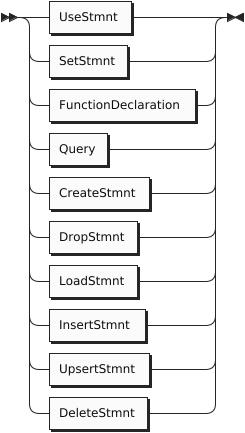

In addition to queries, an implementation of SQL++ needs to support statements for data definition and manipulation purposes as well as controlling the context to be used in evaluating query expressions. This section details the DDL and DML statements supported in SQL++ as realized today in Apache AsterixDB.

<a id="sqlpp-manual--lifecycle-management-statements"></a>

## Lifecycle Management Statements

<a id="sqlpp-manual--use-statement"></a>

### Use Statement

<a id="sqlpp-manual--usestmnt"></a>

##### UseStmnt


<a id="sqlpp-manual--dataversename-2"></a>

##### DataverseName


At the uppermost level, the world of data is organized into data namespaces called **dataverses**. To set the default dataverse for statements, the USE statement is provided.

As an example, the following statement sets the default dataverse to be Commerce.

```
USE Commerce;
```

<a id="sqlpp-manual--set-statement"></a>

### Set Statement

The SET statement can be used to override certain configuration parameters. More information about SET can be found in [Appendix 2](#sqlpp-manual--performance_tuning).

<a id="sqlpp-manual--function-declaration"></a>

### Function Declaration

When writing a complex query, it can sometimes be helpful to define one or more auxiliary functions that each address a sub-piece of the overall query.

The DECLARE FUNCTION statement supports the creation of such helper functions. In general, the function body (expression) can be any legal query expression.

The function named in the DECLARE FUNCTION statement is accessible only in the current query. To create a persistent function for use in multiple queries, use the CREATE FUNCTION statement.

<a id="sqlpp-manual--functiondeclaration"></a>

##### FunctionDeclaration

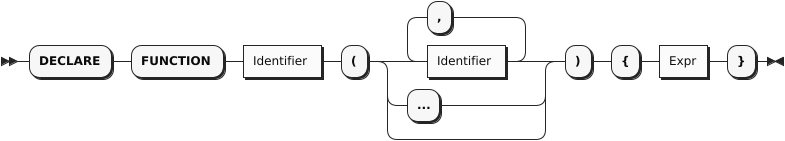

The following is a simple example of a temporary function definition and its use.

<a id="sqlpp-manual--example-51"></a>

##### Example

```
DECLARE FUNCTION nameSearch(customerId){
    (SELECT c.custid, c.name
    FROM customers AS c
    WHERE c.custid = customerId)[0]
 };


SELECT VALUE nameSearch("C25");
```

For our sample data set, this returns:

```
[
  { "custid": "C25", "name": "M. Sinclair" }
]
```

<a id="sqlpp-manual--create-statement"></a>

### Create Statement

<a id="sqlpp-manual--createstmnt"></a>

##### CreateStmnt

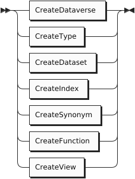

<a id="sqlpp-manual--dataversename-3"></a>

##### DataverseName


<a id="sqlpp-manual--qualifiedname"></a>

##### QualifiedName

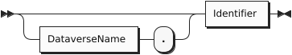

<a id="sqlpp-manual--doublequalifiedname"></a>

##### DoubleQualifiedName


The CREATE statement is used for creating dataverses as well as other persistent artifacts in a dataverse. It can be used to create new dataverses, datatypes, datasets, indexes, and user-defined query functions.

<a id="sqlpp-manual--create-dataverse"></a>

#### Create Dataverse

<a id="sqlpp-manual--createdataverse"></a>

##### CreateDataverse


The CREATE DATAVERSE statement is used to create new dataverses. To ease the authoring of reusable query scripts, an optional IF NOT EXISTS clause is included to allow creation to be requested either unconditionally or only if the dataverse does not already exist. If this clause is absent, an error is returned if a dataverse with the indicated name already exists.

The following example creates a new dataverse named Commerce if one does not already exist.

<a id="sqlpp-manual--example-52"></a>

##### Example

```
CREATE DATAVERSE Commerce IF NOT EXISTS;
```

<a id="sqlpp-manual--create-type"></a>

#### Create Type

<a id="sqlpp-manual--createtype"></a>

##### CreateType


<a id="sqlpp-manual--objecttypedef"></a>

##### ObjectTypeDef


<a id="sqlpp-manual--objectfield"></a>

##### ObjectField


<a id="sqlpp-manual--typeexpr"></a>

##### TypeExpr


<a id="sqlpp-manual--arraytypedef"></a>

##### ArrayTypeDef


<a id="sqlpp-manual--multisettypedef"></a>

##### MultisetTypeDef


<a id="sqlpp-manual--typereference"></a>

##### TypeReference


The CREATE TYPE statement is used to create a new named datatype. This type can then be used to create stored collections or utilized when defining one or more other datatypes. Much more information about the data model is available in the [data model reference guide](#datamodel). A new type can be a object type, a renaming of another type, an array type, or a multiset type. A object type can be defined as being either open or closed. Instances of a closed object type are not permitted to contain fields other than those specified in the create type statement. Instances of an open object type may carry additional fields, and open is the default for new types if neither option is specified.

The following example creates three new object types called addressType, customerType, and itemType. Their fields are essentially traditional typed name/value pairs (much like SQL fields). Since it is defined as (defaulting to) being an open type, instances will be permitted to contain more than what is specified in the type definition. Indeed many of the customer objects contain a rating as well, however this is not necessary for the customer object to be created. As can be seen in the sample data, customers can exist without ratings or with part (or all) of the address missing.

<a id="sqlpp-manual--example-53"></a>

##### Example

```
CREATE TYPE addressType AS {
    street:                     string,
    city:                       string,
    zipcode:                    string?
};

CREATE TYPE customerType AS {
    custid:                     string,
    name:                       string,
    address:                    addressType?
};

CREATE TYPE itemType AS {
    itemno:                     int,
    qty:                        int,
    price:                      int
};
```

Optionally, you may wish to create a type that has an automatically generated primary key field. The example below shows an alternate form of itemType which achieves this by setting its primary key, itemno, to UUID. (Refer to the Datasets section later for more details on such fields.)

<a id="sqlpp-manual--example-54"></a>

##### Example

```
CREATE TYPE itemType AS {
    itemno:                     uuid,
    qty:                        int,
    price:                      int
};
```

Note that the type of the itemno in this example is UUID. This field type can be used if you want to have an autogenerated-PK field. (Refer to the Datasets section later for more details on such fields.)

The next example creates a new object type, closed this time, called orderType. Instances of this closed type will not be permitted to have extra fields, although the ship\_date field is marked as optional and may thus be NULL or MISSING in legal instances of the type. The items field is an array of instances of another object type, itemType.

<a id="sqlpp-manual--example-55"></a>

##### Example

```
CREATE TYPE orderType AS CLOSED {
    orderno:                    int,
    custid:                     string,
    order_date:                 string,
    ship_date:                  string?,
    items:                      [ itemType ]
};
```

<a id="sqlpp-manual--create-dataset"></a>

#### Create Dataset

<a id="sqlpp-manual--createdataset"></a>

##### CreateDataset


<a id="sqlpp-manual--createinternaldataset"></a>

##### CreateInternalDataset


<a id="sqlpp-manual--createexternaldataset"></a>

##### CreateExternalDataset


<a id="sqlpp-manual--datasettypedef"></a>

##### DatasetTypeDef


<a id="sqlpp-manual--datasetfielddef"></a>

##### DatasetFieldDef


<a id="sqlpp-manual--typereference-2"></a>

##### TypeReference


<a id="sqlpp-manual--primarykey"></a>

##### PrimaryKey


<a id="sqlpp-manual--nestedfield"></a>

##### NestedField


<a id="sqlpp-manual--adaptername"></a>

##### AdapterName


<a id="sqlpp-manual--configuration"></a>

##### Configuration


<a id="sqlpp-manual--keyvaluepair"></a>

##### KeyValuePair


<a id="sqlpp-manual--properties"></a>

##### Properties


The CREATE DATASET statement is used to create a new dataset. Datasets are named, multisets of object type instances; they are where data lives persistently and are the usual targets for queries. Datasets are typed, and the system ensures that their contents conform to their type definitions. An Internal dataset (the default kind) is a dataset whose content lives within and is managed by the system. It is required to have a specified unique primary key field which uniquely identifies the contained objects. (The primary key is also used in secondary indexes to identify the indexed primary data objects.)

Internal datasets contain several advanced options that can be specified when appropriate. One such option is that random primary key (UUID) values can be auto-generated by declaring the field to be UUID and putting AUTOGENERATED after the PRIMARY KEY identifier. In this case, unlike other non-optional fields, a value for the auto-generated PK field should not be provided at insertion time by the user since each object’s primary key field value will be auto-generated by the system.

Another advanced option, when creating an Internal dataset, is to specify the merge policy to control which of the underlying LSM storage components to be merged. (The system supports Log-Structured Merge tree based physical storage for Internal datasets.) Currently the system supports four different component merging policies that can be chosen per dataset: no-merge, constant, prefix, and correlated-prefix. The no-merge policy simply never merges disk components. The constant policy merges disk components when the number of components reaches a constant number k that can be configured by the user. The prefix policy relies on both component sizes and the number of components to decide which components to merge. It works by first trying to identify the smallest ordered (oldest to newest) sequence of components such that the sequence does not contain a single component that exceeds some threshold size M and that either the sum of the component’s sizes exceeds M or the number of components in the sequence exceeds another threshold C. If such a sequence exists, the components in the sequence are merged together to form a single component. Finally, the correlated-prefix policy is similar to the prefix policy, but it delegates the decision of merging the disk components of all the indexes in a dataset to the primary index. When the correlated-prefix policy decides that the primary index needs to be merged (using the same decision criteria as for the prefix policy), then it will issue successive merge requests on behalf of all other indexes associated with the same dataset. The system’s default policy is the prefix policy except when there is a filter on a dataset, where the preferred policy for filters is the correlated-prefix.

Another advanced option shown in the syntax above, related to performance and mentioned above, is that a **filter** can optionally be created on a field to further optimize range queries with predicates on the filter’s field. Filters allow some range queries to avoid searching all LSM components when the query conditions match the filter. (Refer to [Filter-Based LSM Index Acceleration](#sqlpp-filters) for more information about filters.)

An External dataset, in contrast to an Internal dataset, has data stored outside of the system’s control. Files living in HDFS or in the local filesystem(s) of a cluster’s nodes are currently supported. External dataset support allows queries to treat foreign data as though it were stored in the system, making it possible to query “legacy” file data (for example, Hive data) without having to physically import it. When defining an External dataset, an appropriate adapter type must be selected for the desired external data. (See the [Guide to External Data](#aql-externaldata) for more information on the available adapters.)

The following example creates an Internal dataset for storing customerType objects. It specifies that their custid field is their primary key.

<a id="sqlpp-manual--example-56"></a>

##### Example

```
CREATE INTERNAL DATASET customers(customerType) PRIMARY KEY custid;
```

The next example creates an Internal dataset (the default kind when no dataset kind is specified) for storing itemType objects might look like. It specifies that the itemno field should be used as the primary key for the dataset. It also specifies that the itemno field is an auto-generated field, meaning that a randomly generated UUID value should be assigned to each incoming object by the system. (A user should therefore not attempt to provide a value for this field.)

Note that the itemno field’s declared type must be UUID in this case.

<a id="sqlpp-manual--example-57"></a>

##### Example

```
CREATE DATASET MyItems(itemType) PRIMARY KEY itemno AUTOGENERATED;
```

Alternatively the dataset object type can be specified using inline type definition syntax.

<a id="sqlpp-manual--example-58"></a>

##### Example

```
CREATE DATASET MyItems(itemno INT NOT UNKNOWN, qty INT NOT UNKNOWN, price INT NOT UNKNOWN) PRIMARY KEY itemno AUTOGENERATED;
```

The next example creates an External dataset for querying LineItemType objects. The choice of the hdfs adapter means that this dataset’s data actually resides in HDFS. The example CREATE statement also provides parameters used by the hdfs adapter: the URL and path needed to locate the data in HDFS and a description of the data format.

<a id="sqlpp-manual--example-59"></a>

##### Example

```
CREATE EXTERNAL DATASET LineItem(LineItemType) USING hdfs (
  ("hdfs"="hdfs://HOST:PORT"),
  ("path"="HDFS_PATH"),
  ("input-format"="text-input-format"),
  ("format"="delimited-text"),
  ("delimiter"="|"));
```

<a id="sqlpp-manual--create-index"></a>

#### Create Index

<a id="sqlpp-manual--createindex"></a>

##### CreateIndex


<a id="sqlpp-manual--createsecondaryindex"></a>

##### CreateSecondaryIndex


<a id="sqlpp-manual--createprimarykeyindex"></a>

##### CreatePrimaryKeyIndex


<a id="sqlpp-manual--indexedelement"></a>

##### IndexedElement

****

<a id="sqlpp-manual--arrayindexelement"></a>

##### ArrayIndexElement

****

<a id="sqlpp-manual--indexfield"></a>

##### IndexField

****

<a id="sqlpp-manual--nestedfield-2"></a>

##### NestedField


<a id="sqlpp-manual--indextype"></a>

##### IndexType


The CREATE INDEX statement creates a secondary index on one or more fields of a specified dataset. Supported index types include BTREE for totally ordered datatypes, RTREE for spatial data, and KEYWORD and NGRAM for textual (string) data. An index can be created on a nested field (or fields) by providing a valid path expression as an index field identifier. An array index can be created on an array or multiset datatype by providing a sequence of UNNEST and SELECTs to identify the field(s) to be indexed.

An indexed field is not required to be part of the datatype associated with a dataset if the dataset’s datatype is declared as open **and** if the field’s type is provided along with its name and if the ENFORCED keyword is specified at the end of the index definition. ENFORCING an open field introduces a check that makes sure that the actual type of the indexed field (if the optional field exists in the object) always matches this specified (open) field type.

The following example creates a btree index called cCustIdx on the custid field of the orders dataset. This index can be useful for accelerating exact-match queries, range search queries, and joins involving the custid field.

<a id="sqlpp-manual--example-60"></a>

##### Example

```
CREATE INDEX cCustIdx ON orders(custid) TYPE BTREE;
```

The following example creates a btree index called oCNameIdx on the cname field of the orders dataset, but does not insert NULL and MISSING values into the index. By default, if INCLUDE/EXCLUDE UNKNOWN KEY is not specified, unknown values will be inserted into btree indexes.

<a id="sqlpp-manual--example-61"></a>

##### Example

```
CREATE INDEX oCNametIdx ON orders(cname) EXCLUDE UNKNOWN KEY;
```

The following example creates an open btree index called oCreatedTimeIdx on the (non-declared) createdTime field of the orders dataset having datetime type. This index can be useful for accelerating exact-match queries, range search queries, and joins involving the createdTime field. The index is enforced so that records that do not have the createdTime field or have a mismatched type on the field cannot be inserted into the dataset.

<a id="sqlpp-manual--example-62"></a>

##### Example

```
CREATE INDEX oCreatedTimeIdx ON orders(createdTime: datetime?) TYPE BTREE ENFORCED;
```

The following example creates an open btree index called cAddedTimeIdx on the (non-declared) addedTime field of the customers dataset having datetime type. This index can be useful for accelerating exact-match queries, range search queries, and joins involving the addedTime field. The index is not enforced so that records that do not have the addedTime field or have a mismatched type on the field can still be inserted into the dataset.

<a id="sqlpp-manual--example-63"></a>

##### Example

```
CREATE INDEX cAddedTimeIdx ON customers(addedTime: datetime?);
```

The following example creates a btree index called oOrderUserNameIdx on orderUserName, a nested field residing within a object-valued user field in the orders dataset. This index can be useful for accelerating exact-match queries, range search queries, and joins involving the nested orderUserName field.

<a id="sqlpp-manual--example-64"></a>

##### Example

```
CREATE INDEX oOrderUserNameIdx ON orders(order.orderUserName) TYPE BTREE;
```

The following example creates an array index called oItemsPriceIdx on the price field inside the items array of the orders dataset. This index can be useful for accelerating membership queries, existential or universal quantification queries, or joins involving the price field inside this array. Unknown values cannot currently be stored inside array indexes, so EXCLUDE UNKNOWN KEY must be specified.

<a id="sqlpp-manual--example-65"></a>

#### Example

```
CREATE INDEX oItemsPriceIdx ON orders(UNNEST items SELECT price) EXCLUDE UNKNOWN KEY;
```

The following example creates an open rtree index called oOrderLocIdx on the order-location field of the orders dataset. This index can be useful for accelerating queries that use the [spatial-intersect function](#sqlpp-builtins--spatial_intersect) in a predicate involving the sender-location field.

<a id="sqlpp-manual--example-66"></a>

##### Example

```
CREATE INDEX oOrderLocIDx ON orders(`order-location` : point?) TYPE RTREE ENFORCED;
```

The following example creates a 3-gram index called cUserIdx on the name field of the customers dataset. This index can be used to accelerate some similarity or substring maching queries on the name field. For details refer to the document on [similarity queries](#sqlpp-similarity--ngram_index).

<a id="sqlpp-manual--example-67"></a>

##### Example

```
CREATE INDEX cUserIdx ON customers(name) TYPE NGRAM(3);
```

The following example creates a keyword index called oCityIdx on the city within the address field of the customers dataset. This keyword index can be used to optimize queries with token-based similarity predicates on the address field. For details refer to the document on [similarity queries](#sqlpp-similarity--keyword_index).

<a id="sqlpp-manual--example-68"></a>

##### Example

```
CREATE INDEX oCityIdx ON customers(address.city) TYPE KEYWORD;
```

The following example creates a special secondary index which holds only the primary keys. This index is useful for speeding up aggregation queries which involve only primary keys. The name of the index is optional. If the name is not specified, the system will generate one. When the user would like to drop this index, the metadata can be queried to find the system-generated name.

<a id="sqlpp-manual--example-69"></a>

##### Example

```
CREATE PRIMARY INDEX cus_pk_idx ON customers;
```

An example query that can be accelerated using the primary-key index:

```
SELECT COUNT(*) FROM customers;
```

To look up the the above primary-key index, issue the following query:

```
SELECT VALUE i
FROM Metadata.`Index` i
WHERE i.DataverseName = "Commerce" AND i.DatasetName = "customers";
```

The query returns:

```
[
    {
        "DataverseName": "Commerce",
        "DatasetName": "customers",
        "IndexName": "cus_pk_idx",
        "IndexStructure": "BTREE",
        "SearchKey": [],
        "IsPrimary": false,
        "Timestamp": "Fri Sep 18 14:15:51 PDT 2020",
        "PendingOp": 0
    },
    {
        "DataverseName": "Commerce",
        "DatasetName": "customers",
        "IndexName": "customers",
        "IndexStructure": "BTREE",
        "SearchKey": [
            [
                "custid"
            ]
        ],
        "IsPrimary": true,
        "Timestamp": "Thu Jul 16 13:07:37 PDT 2020",
        "PendingOp": 0
    }
]
```

Remember that CREATE PRIMARY INDEX creates a secondary index. That is the reason the IsPrimary field is false. The primary-key index can be identified by the fact that the SearchKey field is empty since it only contains primary key fields.

<a id="sqlpp-manual--create-synonym"></a>

#### Create Synonym

<a id="sqlpp-manual--createsynonym"></a>

##### CreateSynonym


The CREATE SYNONYM statement creates a synonym for a given dataset or a view. This synonym may be used instead of the dataset name in SELECT, INSERT, UPSERT, DELETE, and LOAD statements, or instead of the view name in SELECT statements. The target dataset or view does not need to exist when the synonym is created. A synonym may be created for another synonym.

<a id="sqlpp-manual--example-70"></a>

##### Example

```
CREATE DATASET customers(customersType) PRIMARY KEY custid;

CREATE SYNONYM customersSynonym FOR customers;

SELECT * FROM customersSynonym;
```

More information on how synonyms are resolved can be found in [Appendix 3. Variable Bindings and Name Resolution](#sqlpp-manual--variable_bindings_and_name_resolution).

<a id="sqlpp-manual--create-function"></a>

#### Create Function

The CREATE FUNCTION statement creates a **named** function that can then be used and reused in queries. The body of a function can be any query expression involving the function’s parameters.

<a id="sqlpp-manual--createfunction"></a>

##### CreateFunction


<a id="sqlpp-manual--functionparameters"></a>

##### FunctionParameters


<a id="sqlpp-manual--externalfunctiondef"></a>

##### ExternalFunctionDef


The following is an example of a CREATE FUNCTION statement which is similar to our earlier DECLARE FUNCTION example.

It differs from that example in that it results in a function that is persistently registered by name in the specified dataverse (the current dataverse being used, if not otherwise specified).

<a id="sqlpp-manual--example-71"></a>

##### Example

```
CREATE FUNCTION nameSearch(customerId) {
    (SELECT c.custid, c.name
     FROM customers AS c
     WHERE u.custid = customerId)[0]
 };
```

The following is an example of CREATE FUNCTION statement that replaces an existing function.

<a id="sqlpp-manual--example-72"></a>

##### Example

```
CREATE OR REPLACE FUNCTION friendInfo(userId) {
    (SELECT u.id, u.name
     FROM GleambookUsers u
     WHERE u.id = userId)[0]
 };
```

The following is an example of CREATE FUNCTION statement that introduces a function with a variable number of arguments. The arguments are accessible in the function body via args array parameter.

<a id="sqlpp-manual--example-73"></a>

##### Example

```
CREATE FUNCTION strJoin(...) {
    string_join(args, ",")
};
```

External functions can also be loaded into Libraries via the [UDF API](#udf). Given an already loaded library pylib, a function sentiment mapping to a Python method sent\_model.sentiment in sentiment\_mod would be as follows

<a id="sqlpp-manual--example-74"></a>

##### Example

```
CREATE FUNCTION sentiment(a) AS "sentiment_mod", "sent_model.sentiment" AT pylib;
```

<a id="sqlpp-manual--create-view"></a>

#### Create View

The CREATE VIEW statement creates a **named** view that can then be used in queries. The body of a view can be any SELECT statement.

<a id="sqlpp-manual--createview"></a>

##### CreateView


<a id="sqlpp-manual--example-75"></a>

##### Example

```
CREATE DATASET customers(customersType) PRIMARY KEY custid;

CREATE VIEW customersView AS 
    SELECT c.custid, c.name
    FROM customers AS c 
    WHERE c.address.city = "Boston, MA";

SELECT * FROM customersView;
```

<a id="sqlpp-manual--drop-statement"></a>

### Drop Statement

<a id="sqlpp-manual--dropstmnt"></a>

##### DropStmnt


<a id="sqlpp-manual--dataversename-4"></a>

##### DataverseName


<a id="sqlpp-manual--qualifiedname-2"></a>

##### QualifiedName


<a id="sqlpp-manual--doublequalifiedname-2"></a>

##### DoubleQualifiedName


<a id="sqlpp-manual--functionsignature"></a>

##### FunctionSignature


<a id="sqlpp-manual--functionparameters-2"></a>

##### FunctionParameters


The DROP statement is the inverse of the CREATE statement. It can be used to drop dataverses, datatypes, datasets, indexes, functions, and synonyms.

The following examples illustrate some uses of the DROP statement.

<a id="sqlpp-manual--example-76"></a>

##### Example

```
DROP DATASET customers IF EXISTS;

DROP INDEX orders.orderidIndex;

DROP TYPE customers2.customersType;

DROP FUNCTION nameSearch@1;

DROP SYNONYM customersSynonym;

DROP VIEW customersView;

DROP DATAVERSE CommerceData;
```

When an artifact is dropped, it will be droppped from the current dataverse if none is specified (see the DROP DATASET example above) or from the specified dataverse (see the DROP TYPE example above) if one is specified by fully qualifying the artifact name in the DROP statement. When specifying an index to drop, the index name must be qualified by the dataset that it indexes. When specifying a function to drop, since the query language allows functions to be overloaded by their number of arguments, the identifying name of the function to be dropped must explicitly include that information. (nameSearch@1 above denotes the 1-argument function named nameSearch in the current dataverse.)

<a id="sqlpp-manual--load-statement"></a>

### Load Statement

<a id="sqlpp-manual--loadstmnt"></a>

##### LoadStmnt


<a id="sqlpp-manual--adaptername-2"></a>

##### AdapterName


<a id="sqlpp-manual--configuration-2"></a>

##### Configuration


<a id="sqlpp-manual--keyvaluepair-2"></a>

##### KeyValuePair


The LOAD statement is used to initially populate a dataset via bulk loading of data from an external file. An appropriate adapter must be selected to handle the nature of the desired external data. The LOAD statement accepts the same adapters and the same parameters as discussed earlier for External datasets. (See the [guide to external data](#aql-externaldata) for more information on the available adapters.) If a dataset has an auto-generated primary key field, the file to be imported should not include that field in it.

The target dataset name may be a synonym introduced by CREATE SYNONYM statement.

The following example shows how to bulk load the customers dataset from an external file containing data that has been prepared in ADM (Asterix Data Model) format.

<a id="sqlpp-manual--example-77"></a>

##### Example

```
 LOAD DATASET customers USING localfs
    (("path"="127.0.0.1:///Users/bignosqlfan/commercenew/gbu.adm"),("format"="adm"));
```

<a id="sqlpp-manual--modification-statements"></a>

## Modification statements

<a id="sqlpp-manual--insert-statement"></a>

### Insert Statement

<a id="sqlpp-manual--insertstmnt"></a>

##### InsertStmnt


The INSERT statement is used to insert new data into a dataset. The data to be inserted comes from a query expression. This expression can be as simple as a constant expression, or in general it can be any legal query. In case the dataset has an auto-generated primary key, when performing an INSERT operation, the system allows the user to manually add the auto-generated key field in the INSERT statement, or skip that field and the system will automatically generate it and add it. However, it is important to note that if the a record already exists in the dataset with the auto-generated key provided by the user, then that operation is going to fail. As a general rule, insertion will fail if the dataset already has data with the primary key value(s) being inserted.

Inserts are processed transactionally by the system. The transactional scope of each insert transaction is the insertion of a single object plus its affiliated secondary index entries (if any). If the query part of an insert returns a single object, then the INSERT statement will be a single, atomic transaction. If the query part returns multiple objects, each object being inserted will be treated as a separate tranaction.

The target dataset name may be a synonym introduced by CREATE SYNONYM statement.

The following example illustrates a query-based insertion.

<a id="sqlpp-manual--example-78"></a>

##### Example

```
INSERT INTO custCopy (SELECT VALUE c FROM customers c)
```

<a id="sqlpp-manual--upsert-statement"></a>

### Upsert Statement

<a id="sqlpp-manual--upsertstmnt"></a>

##### UpsertStmnt


The UPSERT statement syntactically mirrors the INSERTstatement discussed above. The difference lies in its semantics, which for UPSERT are “add or replace” instead of the INSERT “add if not present, else error” semantics. Whereas an INSERT can fail if another object already exists with the specified key, the analogous UPSERT will replace the previous object’s value with that of the new object in such cases. Like the INSERT statement, the system allows the user to manually provide the auto-generated key for datasets with an auto-generated key as its primary key. This operation will insert the record if no record with that key already exists, but if a record with the key already exists, then the operation will be converted to a replace/update operation.

The target dataset name may be a synonym introduced by CREATE SYNONYM statement.

The following example illustrates a query-based upsert operation.

<a id="sqlpp-manual--example-79"></a>

##### Example

```
UPSERT INTO custCopy (SELECT VALUE c FROM customers c)
```

<a id="sqlpp-manual--delete-statement"></a>

### Delete Statement

<a id="sqlpp-manual--deletestmnt"></a>

##### DeleteStmnt


The DELETE statement is used to delete data from a target dataset. The data to be deleted is identified by a boolean expression involving the variable bound to the target dataset in the DELETE statement.

Deletes are processed transactionally by the system. The transactional scope of each delete transaction is the deletion of a single object plus its affiliated secondary index entries (if any). If the boolean expression for a delete identifies a single object, then the DELETE statement itself will be a single, atomic transaction. If the expression identifies multiple objects, then each object deleted will be handled as a separate transaction.

The target dataset name may be a synonym introduced by CREATE SYNONYM statement.

The following examples illustrate single-object deletions.

<a id="sqlpp-manual--example-80"></a>

##### Example

```
DELETE FROM customers c WHERE c.custid = "C41";
```

<a id="sqlpp-manual--example-81"></a>

##### Example

```
DELETE FROM customers WHERE custid = "C47";
```

<a id="sqlpp-manual--appendix-1.-reserved-keywords"></a>

# Appendix 1. Reserved keywords

All reserved keywords are listed in the following table:

|  |  |  |  |  |  |
| --- | --- | --- | --- | --- | --- |
| ADAPTER | ALL | AND | ANY | APPLY | AS |
| ASC | AT | AUTOGENERATED | BETWEEN | BTREE | BY |
| CASE | CLOSED | COLLECTION | CREATE | COMPACTION | COMPACT |
| CONNECT | CORRELATE | DATASET | DATAVERSE | DECLARE | DEFINITION |
| DELETE | DESC | DISCONNECT | DISTINCT | DIV | DROP |
| ELEMENT | EXPLAIN | ELSE | ENFORCED | END | EVERY |
| EXCEPT | EXIST | EXTERNAL | FEED | FILTER | FLATTEN |
| FOR | FROM | FULL | FULLTEXT | FUNCTION | GROUP |
| HAVING | HINTS | IF | INTO | IN | INDEX |
| INGESTION | INNER | INSERT | INTERNAL | INTERSECT | IS |
| JOIN | KEYWORD | LEFT | LETTING | LET | LIKE |
| LIMIT | LOAD | MISSING | NODEGROUP | NGRAM | NOT |
| NULL | OFFSET | ON | OPEN | OR | ORDER |
| OUTER | OUTPUT | OVER | PATH | POLICY | PRE-SORTED |
| PRIMARY | RAW | REFRESH | RETURN | RETURNING | RIGHT |
| RTREE | RUN | SATISFIES | SECONDARY | SELECT | SET |
| SOME | START | STOP | SYNONYM | TEMPORARY | THEN |
| TO | TRUE | TYPE | UNION | UNKNOWN | UNNEST |
| UPDATE | UPSERT | USE | USING | VALUE | VALUED |
| WHEN | WHERE | WITH | WRITE |  |  |

<a id="sqlpp-manual--appendix-2.-performance-tuning"></a>

## Appendix 2. Performance Tuning

The SET statement can be used to override some cluster-wide configuration parameters for a specific request:

<a id="sqlpp-manual--setstmnt"></a>

##### SetStmnt


As parameter identifiers are qualified names (containing a ‘.’) they have to be escaped using backticks (``). Note that changing query parameters will not affect query correctness but only impact performance characteristics, such as response time and throughput.

<a id="sqlpp-manual--parallelism-parameter"></a>

## Parallelism Parameter

The system can execute each request using multiple cores on multiple machines (a.k.a., partitioned parallelism) in a cluster. A user can manually specify the maximum execution parallelism for a request to scale it up and down using the following parameter:

- **compiler.parallelism**: the maximum number of CPU cores can be used to process a query. There are three cases of the value *p* for compiler.parallelism:
  - *p* < 0 or *p* > the total number of cores in a cluster: the system will use all available cores in the cluster;
  - *p* = 0 (the default): the system will use the storage parallelism (the number of partitions of stored datasets) as the maximum parallelism for query processing;
  - all other cases: the system will use the user-specified number as the maximum number of CPU cores to use for executing the query.

<a id="sqlpp-manual--example-82"></a>

##### Example

```
SET `compiler.parallelism` "16";

SELECT c.name AS cname, o.orderno AS orderno
FROM customers c JOIN orders o ON c.custid = o.custid;
```

<a id="sqlpp-manual--memory-parameters"></a>

## Memory Parameters

In the system, each blocking runtime operator such as join, group-by and order-by works within a fixed memory budget, and can gracefully spill to disks if the memory budget is smaller than the amount of data they have to hold. A user can manually configure the memory budget of those operators within a query. The supported configurable memory parameters are:

- **compiler.groupmemory**: the memory budget that each parallel group-by operator instance can use; 32MB is the default budget.
- **compiler.sortmemory**: the memory budget that each parallel sort operator instance can use; 32MB is the default budget.
- **compiler.joinmemory**: the memory budget that each parallel hash join operator instance can use; 32MB is the default budget.
- **compiler.windowmemory**: the memory budget that each parallel window aggregate operator instance can use; 32MB is the default budget.

For each memory budget value, you can use a 64-bit integer value with a 1024-based binary unit suffix (for example, B, KB, MB, GB). If there is no user-provided suffix, “B” is the default suffix. See the following examples.

<a id="sqlpp-manual--example-83"></a>

##### Example

```
SET `compiler.groupmemory` "64MB";

SELECT c.custid, COUNT(*)
FROM customers c
GROUP BY c.custid;
```

<a id="sqlpp-manual--example-84"></a>

##### Example

```
SET `compiler.sortmemory` "67108864";

SELECT VALUE o
FROM orders AS o
ORDER BY ARRAY_LENGTH(o.items) DESC;
```

<a id="sqlpp-manual--example-85"></a>

##### Example

```
SET `compiler.joinmemory` "132000KB";

SELECT c.name AS cname, o.ordeno AS orderno
FROM customers c JOIN orders o ON c.custid = o.custid;
```

<a id="sqlpp-manual--parallel-sort-parameter"></a>

## Parallel Sort Parameter

The following parameter enables you to activate or deactivate full parallel sort for order-by operations.

When full parallel sort is inactive (false), each existing data partition is sorted (in parallel), and then all data partitions are merged into a single node.

When full parallel sort is active (true), the data is first sampled, and then repartitioned so that each partition contains data that is greater than the previous partition. The data in each partition is then sorted (in parallel), but the sorted partitions are not merged into a single node.

- **compiler.sort.parallel**: A boolean specifying whether full parallel sort is active (true) or inactive (false). The default value is true.

<a id="sqlpp-manual--example-86"></a>

##### Example

```
SET `compiler.sort.parallel` "true";

SELECT VALUE o
FROM orders AS o
ORDER BY ARRAY_LENGTH(o.items) DESC;
```

<a id="sqlpp-manual--controlling-index-only-plan-parameter"></a>

## Controlling Index-Only-Plan Parameter

By default, the system tries to build an index-only plan whenever utilizing a secondary index is possible. For example, if a SELECT or JOIN query can utilize an enforced B+Tree or R-Tree index on a field, the optimizer checks whether a secondary-index search alone can generate the result that the query asks for. It mainly checks two conditions: (1) predicates used in WHERE only uses the primary key field and/or secondary key field and (2) the result does not return any other fields. If these two conditions hold, it builds an index-only plan. Since an index-only plan only searches a secondary-index to answer a query, it is faster than a non-index-only plan that needs to search the primary index. However, this index-only plan can be turned off per query by setting the following parameter.

- **compiler.indexonly**: if this is set to false, the index-only-plan will not be applied; the default value is true.

<a id="sqlpp-manual--example-87"></a>

##### Example

```
set `compiler.indexonly` "false";

SELECT o.order_date AS orderdate
FROM orders o where o.order_date = "2020-05-01";
```

<a id="sqlpp-manual--controlling-array-index-access-method-plan-parameter"></a>

## Controlling Array-Index Access Method Plan Parameter

By default, the system attempts to utilize array indexes as an access method if an array index is present and is applicable. If you believe that your query will not benefit from an array index, toggle the parameter below.

- **compiler.arrayindex**: if this is set to true, array indexes will be considered as an access method for applicable queries; the default value is true.

<a id="sqlpp-manual--example-88"></a>

#### Example

```
set `compiler.arrayindex` "false";

SELECT o.orderno
FROM orders o
WHERE SOME i IN o.items
SATISFIES i.price = 19.91;
```

<a id="sqlpp-manual--query-hints"></a>

##
> [!NOTE]
> Query Hints

<a id="sqlpp-manual--hash-group-by-hint"></a>

#### “hash” GROUP BY hint

The system supports two algorithms for GROUP BY clause evaluation: pre-sorted and hash-based. By default it uses the pre-sorted approach: The input data is first sorted on the grouping fields and then aggregation is performed on that sorted data. The alternative is a hash-based strategy which can be enabled via a /\*+ hash \*/ GROUP BY hint: The data is aggregated using an in-memory hash-table (that can spill to disk if necessary). This approach is recommended for low-cardinality grouping fields.

<a id="sqlpp-manual--example:"></a>

##### Example:

```
SELECT c.address.state, count(*)
FROM Customers AS c
/*+ hash */ GROUP BY c.address.state
```

<a id="sqlpp-manual--hash-bcast-join-hint"></a>

#### “hash-bcast” JOIN hint

By default the system uses a partitioned-parallel hash join strategy to parallelize the execution of an equi-join. In this approach both sides of the join are repartitioned (if necessary) on a hash of the join key; potentially matching data items thus arrive at the same partition to be joined locally. This strategy is robust, but not always the fastest when one of the join sides is low cardinality and the other is high cardinality (since it scans and potentially moves the data from both sides). This special case can be better handled by broadcasting (replicating) the smaller side to all data partitions of the larger side and not moving the data from the other (larger) side. The system provides a join hint to enable this strategy: /\*+ hash-bcast \*/. This hint forces the right side of the join to be replicated while the left side retains its original partitioning.

<a id="sqlpp-manual--example:-2"></a>

##### Example:

```
SELECT *
FROM Orders AS o JOIN Customers AS c
ON o.customer_id /*+ hash-bcast */ = c.customer_id
```

<a id="sqlpp-manual--appendix-3.-variable-bindings-and-name-resolution"></a>

## Appendix 3. Variable Bindings and Name Resolution

In this Appendix, we’ll look at how variables are bound and how names are resolved. Names can appear in every clause of a query. Sometimes a name consists of just a single identifier, e.g., region or revenue. More often a name will consist of two identifiers separated by a dot, e.g., customer.address. Occasionally a name may have more than two identifiers, e.g., policy.owner.address.zipcode. *Resolving* a name means determining exactly what the (possibly multi-part) name refers to. It is necessary to have well-defined rules for how to resolve a name in cases of ambiguity. (In the absence of schemas, such cases arise more commonly, and also differently, than they do in SQL.)

The basic job of each clause in a query block is to bind variables. Each clause sees the variables bound by previous clauses and may bind additional variables. Names are always resolved with respect to the variables that are bound (“in scope”) at the place where the name use in question occurs. It is possible that the name resolution process will fail, which may lead to an empty result or an error message.

One important bit of background: When the system is reading a query and resolving its names, it has a list of all the available dataverses and datasets. As a result, it knows whether a.b is a valid name for dataset b in dataverse a. However, the system does not in general have knowledge of the schemas of the data inside the datasets; remember that this is a much more open world. As a result, in general the system cannot know whether any object in a particular dataset will have a field named c. These assumptions affect how errors are handled. If you try to access dataset a.b and no dataset by that name exists, you will get an error and your query will not run. However, if you try to access a field c in a collection of objects, your query will run and return missing for each object that doesn’t have a field named c - this is because it’s possible that some object (someday) could have such a field.

<a id="sqlpp-manual--binding-variables"></a>

## Binding Variables

Variables can be bound in the following ways:

1. WITH and LET clauses bind a variable to the result of an expression in a straightforward way

   Examples:

   WITH cheap\_parts AS (SELECT partno FROM parts WHERE price < 100) binds the variable cheap\_parts to the result of the subquery.

   LET pay = salary + bonus binds the variable pay to the result of evaluating the expression salary + bonus.
2. FROM, GROUP BY, and SELECT clauses have optional AS subclauses that contain an expression and a name (called an *iteration variable* in a FROM clause, or an alias in GROUP BY or SELECT).

   Examples:

   FROM customer AS c, order AS o

   GROUP BY salary + bonus AS total\_pay

   SELECT MAX(price) AS highest\_price

   An AS subclause always binds the name (as a variable) to the result of the expression (or, in the case of a FROM clause, to the *individual members* of the collection identified by the expression).

   It’s always a good practice to use the keyword AS when defining an alias or iteration variable. However, as in SQL, the syntax allows the keyword AS to be omitted. For example, the FROM clause above could have been written like this:

   FROM customer c, order o

   Omitting the keyword AS does not affect the binding of variables. The FROM clause in this example binds variables c and o whether the keyword AS is used or not.

   In certain cases, a variable is automatically bound even if no alias or variable-name is specified. Whenever an expression could have been followed by an AS subclause, if the expression consists of a simple name or a path expression, that expression binds a variable whose name is the same as the simple name or the last step in the path expression. Here are some examples:

   FROM customer, order binds iteration variables named customer and order

   GROUP BY address.zipcode binds a variable named zipcode

   SELECT item[0].price binds a variable named price

   Note that a FROM clause iterates over a collection (usually a dataset), binding a variable to each member of the collection in turn. The name of the collection remains in scope, but it is not a variable. For example, consider this FROM clause used in a self-join:

   FROM customer AS c1, customer AS c2

   This FROM clause joins the customer dataset to itself, binding the iteration variables c1 and c2 to objects in the left-hand-side and right-hand-side of the join, respectively. After the FROM clause, c1 and c2 are in scope as variables, and customer remains accessible as a dataset name but not as a variable.
3. Special rules for GROUP BY:

   - (3A): If a GROUP BY clause specifies an expression that has no explicit alias, it binds a pseudo-variable that is lexicographically identical to the expression itself. For example:

     GROUP BY salary + bonus binds a pseudo-variable named salary + bonus.

     This rule allows subsequent clauses to refer to the grouping expression (salary + bonus) even though its constituent variables (salary and bonus) are no longer in scope. For example, the following query is valid:


```
FROM employee
GROUP BY salary + bonus
HAVING salary + bonus > 1000
SELECT salary + bonus, COUNT(*) AS how_many
```

     While it might have been more elegant to explicitly require an alias in cases like this, the pseudo-variable rule is retained for SQL compatibility. Note that the expression salary + bonus is not *actually* evaluated in the HAVING and SELECT clauses (and could not be since salary and bonus are no longer individually in scope). Instead, the expression salary + bonus is treated as a reference to the pseudo-variable defined in the GROUP BY clause.
   - (3B): The GROUP BY clause may be followed by a GROUP AS clause that binds a variable to the group. The purpose of this variable is to make the individual objects inside the group visible to subqueries that may need to iterate over them.

     The GROUP AS variable is bound to a multiset of objects. Each object represents one of the members of the group. Since the group may have been formed from a join, each of the member-objects contains a nested object for each variable bound by the nearest FROM clause (and its LET subclause, if any). These nested objects, in turn, contain the actual fields of the group-member. To understand this process, consider the following query fragment:


```
FROM parts AS p, suppliers AS s
WHERE p.suppno = s.suppno
GROUP BY p.color GROUP AS g
```

     Suppose that the objects in parts have fields partno, color, and suppno. Suppose that the objects in suppliers have fields suppno and location.

     Then, for each group formed by the GROUP BY, the variable g will be bound to a multiset with the following structure:


```
[ { "p": { "partno": "p1", "color": "red", "suppno": "s1" },
    "s": { "suppno": "s1", "location": "Denver" } },
  { "p": { "partno": "p2", "color": "red", "suppno": "s2" },
    "s": { "suppno": "s2", "location": "Atlanta" } },
  ...
]
```

<a id="sqlpp-manual--scoping"></a>

## Scoping

In general, the variables that are in scope at a particular position are those variables that were bound earlier in the current query block, in outer (enclosing) query blocks, or in a WITH clause at the beginning of the query. More specific rules follow.

The clauses in a query block are conceptually processed in the following order:

- FROM (followed by LET subclause, if any)
- WHERE
- GROUP BY (followed by LET subclause, if any)
- HAVING
- SELECT or SELECT VALUE
- ORDER BY
- OFFSET
- LIMIT

During processing of each clause, the variables that are in scope are those variables that are bound in the following places:

1. In earlier clauses of the same query block (as defined by the ordering given above).

   Example: FROM orders AS o SELECT o.date The variable o in the SELECT clause is bound, in turn, to each object in the dataset orders.
2. In outer query blocks in which the current query block is nested. In case of duplication, the innermost binding wins.
3. In the WITH clause (if any) at the beginning of the query.

However, in a query block where a GROUP BY clause is present:

1. In clauses processed before GROUP BY, scoping rules are the same as though no GROUP BY were present.
2. In clauses processed after GROUP BY, the variables bound in the nearest FROM-clause (and its LET subclause, if any) are removed from scope and replaced by the variables bound in the GROUP BY clause (and its LET subclause, if any). However, this replacement does not apply inside the arguments of the five SQL special aggregating functions (MIN, MAX, AVG, SUM, and COUNT). These functions still need to see the individual data items over which they are computing an aggregation. For example, after FROM employee AS e GROUP BY deptno, it would not be valid to reference e.salary, but AVG(e.salary) would be valid.

Special case: In an expression inside a FROM clause, a variable is in scope if it was bound in an earlier expression in the same FROM clause. Example:

```
FROM orders AS o, o.items AS i
```

The reason for this special case is to support iteration over nested collections.

Note that, since the SELECT clause comes *after* the WHERE and GROUP BY clauses in conceptual processing order, any variables defined in SELECT are not visible in WHERE or GROUP BY. Therefore the following query will not return what might be the expected result (since in the WHERE clause, pay will be interpreted as a field in the emp object rather than as the computed value salary + bonus):

```
SELECT name, salary + bonus AS pay
FROM emp
WHERE pay > 1000
ORDER BY pay
```

The likely intent of the query above can be accomplished as follows:

```
FROM emp AS e
LET pay = e.salary + e.bonus
WHERE pay > 1000
SELECT e.name, pay
ORDER BY pay
```

Note that in the phrase *expr1* JOIN *expr2* ON *expr3*, variables defined in *expr1* are visible in *expr3* but not in *expr2*. Here’s an example that will not work:

```
FROM orders AS o JOIN o.items AS i ON 1 = 1
```

The variable o, defined in the phrase before JOIN, cannot be used in the phrase immediately following JOIN. The probable intent of this example could be accomplished in either of the following ways:

```
FROM orders AS o UNNEST o.items AS i

FROM orders AS o, o.items AS i
```

To summarize this rule: You may not use left-correlation in an explicit JOIN clause.

<a id="sqlpp-manual--resolving-names"></a>

## Resolving Names

The process of name resolution begins with the leftmost identifier in the name. The rules for resolving the leftmost identifier are:

1. *In a FROM clause*: Names in a FROM clause identify the collections over which the query block will iterate. These collections may be stored datasets, views, synonyms, or may be the results of nested query blocks. A stored dataset may be in a named dataverse or in the default dataverse. Thus, if the two-part name a.b is in a FROM clause, a might represent a dataverse and b might represent a dataset in that dataverse. Another example of a two-part name in a FROM clause is FROM orders AS o, o.items AS i. In o.items, o represents an order object bound earlier in the FROM clause, and items represents the items object inside that order.

   The rules for resolving the leftmost identifier in a FROM clause (including a JOIN subclause), or in the expression following IN in a quantified predicate, are as follows:

   - (1A): If the identifier matches a variable-name that is in scope, it resolves to the binding of that variable. (Note that in the case of a subquery, an in-scope variable might have been bound in an outer query block; this is called a correlated subquery).
   - (1B): Otherwise, if the identifier is the first part of a two-part name like a.b, the name is treated as dataverse.dataset. If the identifier stands alone as a one-part name, it is treated as the name of a dataset in the default dataverse. If the designated dataset exists then the identifier is resolved to that dataset, othwerise if a view with given name exists then the identifier is resolved to that view, otherwise if a synonym with given name exists then the identifier is resolved to the target dataset or the target view of that synonym (potentially recursively if this synonym points to another synonym). An error will result if the designated dataset, view, or a synonym with this name does not exist.

     Datasets and views take precedence over synonyms, so if both a dataset (or a view) and a synonym have the same name then the resolution is to the dataset. Note that there cannot be a dataset and a view with the same name.
2. *Elsewhere in a query block*: In clauses other than FROM, a name typically identifies a field of some object. For example, if the expression a.b is in a SELECT or WHERE clause, it’s likely that a represents an object and b represents a field in that object.

   The rules for resolving the leftmost identifier in clauses other than the ones listed in Rule 1 are:

   - (2A): If the identifier matches a variable-name that is in scope, it resolves to the binding of that variable. (In the case of a correlated subquery, the in-scope variable might have been bound in an outer query block).
   - (2B): (The “Single Variable Rule”): Otherwise, if the FROM clause in the current query block binds exactly one variable, the identifier is treated as a field access on the object bound to that variable. For example, in the query FROM customer SELECT address, the identifier address is treated as a field in the object bound to the variable customer. At runtime, if the object bound to customer has no address field, the address expression will return missing. If the FROM clause in the current query block binds multiple variables, name resolution fails with an “ambiguous name” error. If there’s no FROM clause in the current query block, name resolution fails with an “undefined identifier” error. Note that the Single Variable Rule searches for bound variables only in the current query block, not in outer (containing) blocks. The purpose of this rule is to permit the compiler to resolve field-references unambiguously without relying on any schema information. Also note that variables defined by LET clauses do not participate in the resolution process performed by this rule.

     Exception: In a query that has a GROUP BY clause, the Single Variable Rule does not apply in any clauses that occur after the GROUP BY because, in these clauses, the variables bound by the FROM clause are no longer in scope. In clauses after GROUP BY, only Rule (2A) applies.
3. In an ORDER BY clause following a UNION ALL expression:

   The leftmost identifier is treated as a field-access on the objects that are generated by the UNION ALL. For example:


```
query-block-1
UNION ALL
query-block-2
ORDER BY salary
```

   In the result of this query, objects that have a foo field will be ordered by the value of this field; objects that have no foo field will appear at at the beginning of the query result (in ascending order) or at the end (in descending order.)
4. *In a standalone expression*: If a query consists of a standalone expression then identifiers inside that expression are resolved according to Rule 1. For example, if the whole query is ARRAY\_COUNT(a.b) then a.b will be treated as dataset b contained in dataverse a. Note that this rule only applies to identifiers which are located directly inside a standalone expression. Identifiers inside SELECT statements in a standalone expression are still resolved according to Rules 1-3. For example, if the whole query is ARRAY\_SUM( (FROM employee AS e SELECT VALUE salary) ) then salary is resolved as e.salary following the “Single Variable Rule” (Rule (2B)).
5. Once the leftmost identifier has been resolved, the following dots and identifiers in the name (if any) are treated as a path expression that navigates to a field nested inside that object. The name resolves to the field at the end of the path. If this field does not exist, the value missing is returned.

<a id="sqlpp-manual--appendix-4.-example-data"></a>

## Appendix 4. Example Data

This appendix lists the data definitions and the datasets used for the examples provided throughout this manual.

<a id="sqlpp-manual--data-definitions"></a>

### Data Definitions

```
CREATE DATAVERSE Commerce IF NOT EXISTS;

USE Commerce;

CREATE TYPE addressType AS {
    street:			string,
    city:			string,
    zipcode:			string?
};

CREATE TYPE customerType AS {
    custid:			string,
    name:			string,
    address:			addressType?
};

CREATE DATASET customers(customerType)
    PRIMARY KEY custid;

CREATE TYPE itemType AS {
    itemno:			int,
    qty:			int,
    price:			int
};

CREATE TYPE orderType AS {
    orderno:			int,
    custid:			string,
    order_date:			string,
    ship_date:			string?,
    items:			[ itemType ]
};

CREATE DATASET orders(orderType)
    PRIMARY KEY orderno;
```

<a id="sqlpp-manual--customers-data"></a>

### Customers Data

```
[
    {
        "custid": "C13",
        "name": "T. Cody",
        "address": {
            "street": "201 Main St.",
            "city": "St. Louis, MO",
            "zipcode": "63101"
        },
        "rating": 750
    },
    {
        "custid": "C25",
        "name": "M. Sinclair",
        "address": {
            "street": "690 River St.",
            "city": "Hanover, MA",
            "zipcode": "02340"
        },
        "rating": 690
    },
    {
        "custid": "C31",
        "name": "B. Pruitt",
        "address": {
            "street": "360 Mountain Ave.",
            "city": "St. Louis, MO",
            "zipcode": "63101"
        }
    },
    {
        "custid": "C35",
        "name": "J. Roberts",
        "address": {
            "street": "420 Green St.",
            "city": "Boston, MA",
            "zipcode": "02115"
        },
        "rating": 565
    },
    {
        "custid": "C37",
        "name": "T. Henry",
        "address": {
            "street": "120 Harbor Blvd.",
            "city": "Boston, MA",
            "zipcode": "02115"
        },
        "rating": 750
    },
    {
        "custid": "C41",
        "name": "R. Dodge",
        "address": {
            "street": "150 Market St.",
            "city": "St. Louis, MO",
            "zipcode": "63101"
        },
        "rating": 640
    },
    {
        "custid": "C47",
        "name": "S. Logan",
        "address": {
            "street": "Via del Corso",
            "city": "Rome, Italy"
        },
        "rating": 625
    }
]
```

<a id="sqlpp-manual--orders-data"></a>

### Orders Data

```
[
    {
        "orderno": 1001,
        "custid": "C41",
        "order_date": "2020-04-29",
        "ship_date": "2020-05-03",
        "items": [
            {
                "itemno": 347,
                "qty": 5,
                "price": 19.99
            },
            {
                "itemno": 193,
                "qty": 2,
                "price": 28.89
            }
        ]
    },
    {
        "orderno": 1002,
        "custid": "C13",
        "order_date": "2020-05-01",
        "ship_date": "2020-05-03",
        "items": [
            {
                "itemno": 460,
                "qty": 95,
                "price": 100.99
            },
            {
                "itemno": 680,
                "qty": 150,
                "price": 8.75
            }
        ]
    },
    {
        "orderno": 1003,
        "custid": "C31",
        "order_date": "2020-06-15",
        "ship_date": "2020-06-16",
        "items": [
            {
                "itemno": 120,
                "qty": 2,
                "price": 88.99
            },
            {
                "itemno": 460,
                "qty": 3,
                "price": 99.99
            }
        ]
    },
    {
        "orderno": 1004,
        "custid": "C35",
        "order_date": "2020-07-10",
        "ship_date": "2020-07-15",
        "items": [
            {
                "itemno": 680,
                "qty": 6,
                "price": 9.99
            },
            {
                "itemno": 195,
                "qty": 4,
                "price": 35
            }
        ]
    },
    {
        "orderno": 1005,
        "custid": "C37",
        "order_date": "2020-08-30",
        "items": [
            {
                "itemno": 460,
                "qty": 2,
                "price": 99.98
            },
            {
                "itemno": 347,
                "qty": 120,
                "price": 22
            },
            {
                "itemno": 780,
                "qty": 1,
                "price": 1500
            },
            {
                "itemno": 375,
                "qty": 2,
                "price": 149.98
            }
        ]
    },
    {
        "orderno": 1006,
        "custid": "C41",
        "order_date": "2020-09-02",
        "ship_date": "2020-09-04",
        "items": [
            {
                "itemno": 680,
                "qty": 51,
                "price": 25.98
            },
            {
                "itemno": 120,
                "qty": 65,
                "price": 85
            },
            {
                "itemno": 460,
                "qty": 120,
                "price": 99.98
            }
        ]
    },
    {
        "orderno": 1007,
        "custid": "C13",
        "order_date": "2020-09-13",
        "ship_date": "2020-09-20",
        "items": [
            {
                "itemno": 185,
                "qty": 5,
                "price": 21.99
            },
            {
                "itemno": 680,
                "qty": 1,
                "price": 20.5
            }
        ]
    },
    {
        "orderno": 1008,
        "custid": "C13",
        "order_date": "2020-10-13",
        "items": [
            {
                "itemno": 460,
                "qty": 20,
                "price": 99.99
            }
        ]
    },
    {
        "orderno": 1009,
        "custid": "C13",
        "order_date": "2020-10-13",
        "items": []
    }
]
```

---

<a id="sqlpp"></a>

<!-- source_url: https://asterixdb.apache.org/docs/0.9.9/SQLPP.html -->

<!-- page_index: 7 -->

<a id="sqlpp--bnf-for-sqlpp.jj"></a>

# BNF for SQLPP.jj

<a id="sqlpp--tokens"></a>

## TOKENS

<table>
<tr>
<td>
<pre>
   </pre>
</td>
</tr>
<tr>
<td>
<pre>
   </pre>
</td>
</tr>
<tr>
<td>
<pre>
   </pre>
</td>
</tr>
<tr>
<td>
<pre>
   </pre>
</td>
</tr>
<tr>
<td>
<pre>
   </pre>
</td>
</tr>
<tr>
<td>
<pre>
   </pre>
</td>
</tr>
<tr>
<td>
<pre>
   </pre>
</td>
</tr>
<tr>
<td>
<pre>
   </pre>
</td>
</tr>
<tr>
<td>
<pre>
   </pre>
</td>
</tr>
<tr>
<td>
<pre>
   </pre>
</td>
</tr>
<tr>
<td>
<pre>
   </pre>
</td>
</tr>
<tr>
<td>
<pre>
   </pre>
</td>
</tr>
<tr>
<td>
<pre>
   </pre>
</td>
</tr>
<tr>
<td>
<pre>
   </pre>
</td>
</tr>
<tr>
<td>
<pre>
   </pre>
</td>
</tr>
<tr>
<td>
<pre>
   </pre>
</td>
</tr>
<tr>
<td>
<pre>
   </pre>
</td>
</tr>
<tr>
<td>
<pre>
   </pre>
</td>
</tr>
<tr>
<td>
<pre>
   </pre>
</td>
</tr>
<tr>
<td>
<pre>
   </pre>
</td>
</tr>
<tr>
<td>
<pre>
   </pre>
</td>
</tr>
<tr>
<td>
<pre>
   </pre>
</td>
</tr>
<tr>
<td>
<pre>
   </pre>
</td>
</tr>
<tr>
<td>
<pre>
   </pre>
</td>
</tr>
<tr>
<td>
<pre>
   </pre>
</td>
</tr>
<tr>
<td>
<pre>
   </pre>
</td>
</tr>
<tr>
<td>
<pre>
   </pre>
</td>
</tr>
<tr>
<td>
<pre>
   </pre>
</td>
</tr>
<tr>
<td>
<pre>
   </pre>
</td>
</tr>
<tr>
<td>
<pre>
   </pre>
</td>
</tr>
<tr>
<td>
<pre>
   </pre>
</td>
</tr>
<tr>
<td>
<pre>
   </pre>
</td>
</tr>
<tr>
<td>
<pre>
   </pre>
</td>
</tr>
<tr>
<td>
<pre>
   </pre>
</td>
</tr>
<tr>
<td>
<pre>
   </pre>
</td>
</tr>
<tr>
<td>
<pre>
   </pre>
</td>
</tr>
<tr>
<td>
<pre>
   </pre>
</td>
</tr>
<tr>
<td>
<pre>
   </pre>
</td>
</tr>
<tr>
<td>
<pre>
   </pre>
</td>
</tr>
<tr>
<td>
<pre>
   </pre>
</td>
</tr>
<tr>
<td>
<pre>
   </pre>
</td>
</tr>
<tr>
<td>
<pre>
   </pre>
</td>
</tr>
<tr>
<td>
<pre>
   </pre>
</td>
</tr>
<tr>
<td>
<pre>
   </pre>
</td>
</tr>
<tr>
<td>
<pre>
   </pre>
</td>
</tr>
<tr>
<td>
<pre>
   </pre>
</td>
</tr>
<tr>
<td>
<pre>
   </pre>
</td>
</tr>
<tr>
<td>
<pre>
   </pre>
</td>
</tr>
<tr>
<td>
<pre>
   </pre>
</td>
</tr>
<tr>
<td>
<pre>
   </pre>
</td>
</tr>
<tr>
<td>
<pre>
   </pre>
</td>
</tr>
<tr>
<td>
<pre>
   </pre>
</td>
</tr>
<tr>
<td>
<pre>
   </pre>
</td>
</tr>
<tr>
<td>
<pre>
   </pre>
</td>
</tr>
<tr>
<td>
<pre>
   </pre>
</td>
</tr>
<tr>
<td>
<pre>
   </pre>
</td>
</tr>
<tr>
<td>
<pre>
   </pre>
</td>
</tr>
<tr>
<td>
<pre>
   </pre>
</td>
</tr>
<tr>
<td>
<pre>
   </pre>
</td>
</tr>
<tr>
<td>
<pre>
   </pre>
</td>
</tr>
<tr>
<td>
<pre>
   </pre>
</td>
</tr>
<tr>
<td>
<pre>
   </pre>
</td>
</tr>
<tr>
<td>
<pre>
   </pre>
</td>
</tr>
<tr>
<td>
<pre>
   </pre>
</td>
</tr>
<tr>
<td>
<pre>
   </pre>
</td>
</tr>
<tr>
<td>
<pre>
   </pre>
</td>
</tr>
<tr>
<td>
<pre>
   </pre>
</td>
</tr>
<tr>
<td>
<pre>
   </pre>
</td>
</tr>
<tr>
<td>
<pre>
   </pre>
</td>
</tr>
<tr>
<td>
<pre>
   </pre>
</td>
</tr>
<tr>
<td>
<pre>
   </pre>
</td>
</tr>
<tr>
<td>
<pre>
   </pre>
</td>
</tr>
<tr>
<td>
<pre>
   </pre>
</td>
</tr>
<tr>
<td>
<pre>
   </pre>
</td>
</tr>
<tr>
<td>
<pre>
   </pre>
</td>
</tr>
<tr>
<td>
<pre>
   </pre>
</td>
</tr>
<tr>
<td>
<pre>
   </pre>
</td>
</tr>
<tr>
<td>
<pre>
   </pre>
</td>
</tr>
<tr>
<td>
<pre>
   </pre>
</td>
</tr>
<tr>
<td>
<pre>
   </pre>
</td>
</tr>
<tr>
<td>
<pre>
   </pre>
</td>
</tr>
<tr>
<td>
<pre>
   </pre>
</td>
</tr>
<tr>
<td>
<pre>
   </pre>
</td>
</tr>
<tr>
<td>
<pre>
   </pre>
</td>
</tr>
<tr>
<td>
<pre>
   </pre>
</td>
</tr>
<tr>
<td>
<pre>
   </pre>
</td>
</tr>
<tr>
<td>
<pre>
   </pre>
</td>
</tr>
<tr>
<td>
<pre>
   </pre>
</td>
</tr>
<tr>
<td>
<pre>
   </pre>
</td>
</tr>
<tr>
<td>
<pre>
   </pre>
</td>
</tr>
<tr>
<td>
<pre>
   </pre>
</td>
</tr>
<tr>
<td>
<pre>
   </pre>
</td>
</tr>
<tr>
<td>
<pre>
   </pre>
</td>
</tr>
<tr>
<td>
<pre>
   </pre>
</td>
</tr>
<tr>
<td>
<pre>
   </pre>
</td>
</tr>
<tr>
<td>
<pre>
   </pre>
</td>
</tr>
<tr>
<td>
<pre>
   </pre>
</td>
</tr>
<tr>
<td>
<pre>
   </pre>
</td>
</tr>
<tr>
<td>
<pre>
   </pre>
</td>
</tr>
<tr>
<td>
<pre>
   </pre>
</td>
</tr>
<tr>
<td>
<pre>
   </pre>
</td>
</tr>
<tr>
<td>
<pre>
   </pre>
</td>
</tr>
<tr>
<td>
<pre>
   </pre>
</td>
</tr>
<tr>
<td>
<pre>
   </pre>
</td>
</tr>
<tr>
<td>
<pre>
   </pre>
</td>
</tr>
<tr>
<td>
<pre>
   </pre>
</td>
</tr>
<tr>
<td>
<pre>
   </pre>
</td>
</tr>
<tr>
<td>
<pre>
   </pre>
</td>
</tr>
<tr>
<td>
<pre>
   </pre>
</td>
</tr>
<tr>
<td>
<pre>
   </pre>
</td>
</tr>
<tr>
<td>
<pre>
   </pre>
</td>
</tr>
<tr>
<td>
<pre>
   </pre>
</td>
</tr>
<tr>
<td>
<pre>
   </pre>
</td>
</tr>
<tr>
<td>
<pre>
   </pre>
</td>
</tr>
<tr>
<td>
<pre>
   </pre>
</td>
</tr>
<tr>
<td>
<pre>
   </pre>
</td>
</tr>
<tr>
<td>
<pre>
   </pre>
</td>
</tr>
<tr>
<td>
<pre>
   </pre>
</td>
</tr>
<tr>
<td>
<pre>
   </pre>
</td>
</tr>
<tr>
<td>
<pre>
   </pre>
</td>
</tr>
<tr>
<td>
<pre>
   </pre>
</td>
</tr>
<tr>
<td>
<pre>
   </pre>
</td>
</tr>
<tr>
<td>
<pre>
   </pre>
</td>
</tr>
<tr>
<td>
<pre>
   </pre>
</td>
</tr>
<tr>
<td>
<pre>
   </pre>
</td>
</tr>
<tr>
<td>
<pre>
   </pre>
</td>
</tr>
<tr>
<td>
<pre>
   </pre>
</td>
</tr>
<tr>
<td>
<pre>
   </pre>
</td>
</tr>
<tr>
<td>
<pre>
   </pre>
</td>
</tr>
<tr>
<td>
<pre>
   </pre>
</td>
</tr>
<tr>
<td>
<pre>
   </pre>
</td>
</tr>
<tr>
<td>
<pre>
   </pre>
</td>
</tr>
<tr>
<td>
<pre>
   </pre>
</td>
</tr>
<tr>
<td>
<pre>
   </pre>
</td>
</tr>
<tr>
<td>
<pre>
   </pre>
</td>
</tr>
<tr>
<td>
<pre>
   </pre>
</td>
</tr>
<tr>
<td>
<pre>
   </pre>
</td>
</tr>
<tr>
<td>
<pre>
   </pre>
</td>
</tr>
<tr>
<td>
<pre>
   </pre>
</td>
</tr>
<tr>
<td>
<pre>
   </pre>
</td>
</tr>
<tr>
<td>
<pre>
   </pre>
</td>
</tr>
<tr>
<td>
<pre>
   </pre>
</td>
</tr>
<tr>
<td>
<pre>
   </pre>
</td>
</tr>
<tr>
<td>
<pre>
   </pre>
</td>
</tr>
<tr>
<td>
<pre>
   </pre>
</td>
</tr>
<tr>
<td>
<pre>
   </pre>
</td>
</tr>
<tr>
<td>
<pre>
   </pre>
</td>
</tr>
<tr>
<td>
<pre>
   </pre>
</td>
</tr>
<tr>
<td>
<pre>
   </pre>
</td>
</tr>
<tr>
<td>
<pre>
   </pre>
</td>
</tr>
<tr>
<td>
<pre>
   </pre>
</td>
</tr>
<tr>
<td>
<pre>
   </pre>
</td>
</tr>
<tr>
<td>
<pre>
   </pre>
</td>
</tr>
<tr>
<td>
<pre>
   </pre>
</td>
</tr>
<tr>
<td>
<pre>
   </pre>
</td>
</tr>
<tr>
<td>
<pre>
   </pre>
</td>
</tr>
<tr>
<td>
<pre>
   </pre>
</td>
</tr>
<tr>
<td>
<pre>
   </pre>
</td>
</tr>
<tr>
<td>
<pre>
   </pre>
</td>
</tr>
<tr>
<td>
<pre>
   </pre>
</td>
</tr>
<tr>
<td>
<pre>
   </pre>
</td>
</tr>
<tr>
<td>
<pre>
   </pre>
</td>
</tr>
<tr>
<td>
<pre>
   </pre>
</td>
</tr>
<tr>
<td>
<pre>
   </pre>
</td>
</tr>
<tr>
<td>
<pre>
   </pre>
</td>
</tr>
<tr>
<td>
<pre>
   </pre>
</td>
</tr>
<tr>
<td>
<pre>
   </pre>
</td>
</tr>
<tr>
<td>
<pre>
   </pre>
</td>
</tr>
<tr>
<td>
<pre>
   </pre>
</td>
</tr>
<tr>
<td>
<pre>
   </pre>
</td>
</tr>
<tr>
<td>
<pre>
   </pre>
</td>
</tr>
<tr>
<td>
<pre>
   </pre>
</td>
</tr>
<tr>
<td>
<pre>
   </pre>
</td>
</tr>
<tr>
<td>
<pre>
   </pre>
</td>
</tr>
<tr>
<td>
<pre>
   </pre>
</td>
</tr>
<tr>
<td>
<pre>
   </pre>
</td>
</tr>
<tr>
<td>
<pre>
   </pre>
</td>
</tr>
<tr>
<td>
<pre>
   </pre>
</td>
</tr>
<tr>
<td>
<pre>
   </pre>
</td>
</tr>
<tr>
<td>
<pre>
   </pre>
</td>
</tr>
<tr>
<td>
<pre>
   </pre>
</td>
</tr>
<tr>
<td>
<pre>
   </pre>
</td>
</tr>
<tr>
<td>
<pre>
   </pre>
</td>
</tr>
<tr>
<td>
<pre>
   </pre>
</td>
</tr>
<tr>
<td>
<pre>
   </pre>
</td>
</tr>
<tr>
<td>
<pre>
   </pre>
</td>
</tr>
<tr>
<td>
<pre>
   </pre>
</td>
</tr>
<tr>
<td>
<pre>
   </pre>
</td>
</tr>
<tr>
<td>
<pre>
   </pre>
</td>
</tr>
<tr>
<td>
<pre>
   </pre>
</td>
</tr>
<tr>
<td>
<pre>
   </pre>
</td>
</tr>
<tr>
<td>
<pre>
   </pre>
</td>
</tr>
<tr>
<td>
<pre>
   </pre>
</td>
</tr>
<tr>
<td>
<pre>
   </pre>
</td>
</tr>
<tr>
<td>
<pre>
   </pre>
</td>
</tr>
<tr>
<td>
<pre>
   </pre>
</td>
</tr>
<tr>
<td>
<pre>
   </pre>
</td>
</tr>
<tr>
<td>
<pre>
   </pre>
</td>
</tr>
<tr>
<td>
<pre>
   </pre>
</td>
</tr>
<tr>
<td>
<pre>
   </pre>
</td>
</tr>
<tr>
<td>
<pre>
   </pre>
</td>
</tr>
<tr>
<td>
<pre>
   </pre>
</td>
</tr>
<tr>
<td>
<pre>
   </pre>
</td>
</tr>
<tr>
<td>
<pre>
   </pre>
</td>
</tr>
<tr>
<td>
<pre>
   </pre>
</td>
</tr>
<tr>
<td>
<pre>
   </pre>
</td>
</tr>
<tr>
<td>
<pre>
   </pre>
</td>
</tr>
<tr>
<td>
<pre>
   </pre>
</td>
</tr>
<tr>
<td>
<pre>
   </pre>
</td>
</tr>
<tr>
<td>
<pre>
   </pre>
</td>
</tr>
<tr>
<td>
<pre>
   </pre>
</td>
</tr>
<tr>
<td>
<pre>
   </pre>
</td>
</tr>
<tr>
<td>
<pre>
   </pre>
</td>
</tr>
<tr>
<td>
<pre>
   </pre>
</td>
</tr>
<tr>
<td>
<pre>
   </pre>
</td>
</tr>
<tr>
<td>
<pre>
   </pre>
</td>
</tr>
<tr>
<td>
<pre>
   </pre>
</td>
</tr>
<tr>
<td>
<pre>
   </pre>
</td>
</tr>
<tr>
<td>
<pre>
   </pre>
</td>
</tr>
<tr>
<td>
<pre>
   </pre>
</td>
</tr>
<tr>
<td>
<pre>
   </pre>
</td>
</tr>
<tr>
<td>
<pre>
   </pre>
</td>
</tr>
<tr>
<td>
<pre>
   </pre>
</td>
</tr>
<tr>
<td>
<pre>
   </pre>
</td>
</tr>
<tr>
<td>
<pre>
   </pre>
</td>
</tr>
<tr>
<td>
<pre>
   </pre>
</td>
</tr>
<tr>
<td>
<pre>
   </pre>
</td>
</tr>
<tr>
<td>
<pre>
   </pre>
</td>
</tr>
<tr>
<td>
<pre>
   </pre>
</td>
</tr>
<tr>
<td>
<pre>
   </pre>
</td>
</tr>
<tr>
<td>
<pre>
   </pre>
</td>
</tr>
<tr>
<td>
<pre>
   </pre>
</td>
</tr>
<tr>
<td>
<pre>
   </pre>
</td>
</tr>
<tr>
<td>
<pre>
   </pre>
</td>
</tr>
<tr>
<td>
<pre>
   </pre>
</td>
</tr>
<tr>
<td>
<pre>
   </pre>
</td>
</tr>
<tr>
<td>
<pre>
   </pre>
</td>
</tr>
<tr>
<td>
<pre>
   </pre>
</td>
</tr>
<tr>
<td>
<pre>
   </pre>
</td>
</tr>
<tr>
<td>
<pre>
   </pre>
</td>
</tr>
<tr>
<td>
<pre>
   </pre>
</td>
</tr>
<tr>
<td>
<pre>
   </pre>
</td>
</tr>
<tr>
<td>
<pre>
   </pre>
</td>
</tr>
<tr>
<td>
<pre>
   </pre>
</td>
</tr>
<tr>
<td>
<pre>
   </pre>
</td>
</tr>
<tr>
<td>
<pre>
   </pre>
</td>
</tr>
<tr>
<td>
<pre>
   </pre>
</td>
</tr>
<tr>
<td>
<pre>
   </pre>
</td>
</tr>
<tr>
<td>
<pre>
   </pre>
</td>
</tr>
<tr>
<td>
<pre>
   </pre>
</td>
</tr>
<tr>
<td>
<pre>
   </pre>
</td>
</tr>
<tr>
<td>
<pre>
   </pre>
</td>
</tr>
<tr>
<td>
<pre>
   </pre>
</td>
</tr>
<tr>
<td>
<pre>
   </pre>
</td>
</tr>
<tr>
<td>
<pre>
   </pre>
</td>
</tr>
<tr>
<td>
<pre>
   </pre>
</td>
</tr>
<tr>
<td>
<pre>
   </pre>
</td>
</tr>
<tr>
<td>
<pre>
   </pre>
</td>
</tr>
<tr>
<td>
<pre>
   </pre>
</td>
</tr>
<tr>
<td>
<pre>
   </pre>
</td>
</tr>
<tr>
<td>
<pre>
   </pre>
</td>
</tr>
<tr>
<td>
<pre>
   </pre>
</td>
</tr>
<tr>
<td>
<pre>
   </pre>
</td>
</tr>
<tr>
<td>
<pre>
   </pre>
</td>
</tr>
<tr>
<td>
<pre>
   </pre>
</td>
</tr>
<tr>
<td>
<pre>
   </pre>
</td>
</tr>
<tr>
<td>
<pre>
   </pre>
</td>
</tr>
<tr>
<td>
<pre>
   </pre>
</td>
</tr>
<tr>
<td>
<pre>
   </pre>
</td>
</tr>
<tr>
<td>
<pre>
   </pre>
</td>
</tr>
<tr>
<td>
<pre>
   </pre>
</td>
</tr>
<tr>
<td>
<pre>
   </pre>
</td>
</tr>
<tr>
<td>
<pre>
   </pre>
</td>
</tr>
<tr>
<td>
<pre>
   </pre>
</td>
</tr>
<tr>
<td>
<pre>
   </pre>
</td>
</tr>
<tr>
<td>
<pre>
   </pre>
</td>
</tr>
<tr>
<td>
<pre>
   </pre>
</td>
</tr>
<tr>
<td>
<pre>
   </pre>
</td>
</tr>
<tr>
<td>
<pre>
   </pre>
</td>
</tr>
<tr>
<td>
<pre>
   </pre>
</td>
</tr>
<tr>
<td>
<pre>
   </pre>
</td>
</tr>
<tr>
<td>
<pre>
   </pre>
</td>
</tr>
<tr>
<td>
<pre>
   </pre>
</td>
</tr>
<tr>
<td>
<pre>
   </pre>
</td>
</tr>
<tr>
<td>
<pre>
   </pre>
</td>
</tr>
<tr>
<td>
<pre>
   </pre>
</td>
</tr>
<tr>
<td>
<pre>
   </pre>
</td>
</tr>
<tr>
<td>
<pre>
   </pre>
</td>
</tr>
<tr>
<td>
<pre>
   </pre>
</td>
</tr>
<tr>
<td>
<pre>
   </pre>
</td>
</tr>
<tr>
<td>
<pre>
   </pre>
</td>
</tr>
<tr>
<td>
<pre>
   </pre>
</td>
</tr>
<tr>
<td>
<pre>
   </pre>
</td>
</tr>
<tr>
<td>
<pre>
   </pre>
</td>
</tr>
<tr>
<td>
<pre>
   </pre>
</td>
</tr>
<tr>
<td>
<pre>
   </pre>
</td>
</tr>
<tr>
<td>
<pre>
   </pre>
</td>
</tr>
<tr>
<td>
<pre>
   </pre>
</td>
</tr>
<tr>
<td>
<pre>
   </pre>
</td>
</tr>
<tr>
<td>
<pre>
   </pre>
</td>
</tr>
<tr>
<td>
<pre>
   </pre>
</td>
</tr>
<tr>
<td>
<pre>
   </pre>
</td>
</tr>
<tr>
<td>
<pre>
   </pre>
</td>
</tr>
<tr>
<td>
<pre>
   </pre>
</td>
</tr>
<tr>
<td>
<pre>
   </pre>
</td>
</tr>
<tr>
<td>
<pre>
   </pre>
</td>
</tr>
<tr>
<td>
<pre>
   </pre>
</td>
</tr>
<tr>
<td>
<pre>
   </pre>
</td>
</tr>
<tr>
<td>
<pre>
   </pre>
</td>
</tr>
<tr>
<td>
<pre>
   </pre>
</td>
</tr>
<tr>
<td>
<pre>
   </pre>
</td>
</tr>
<tr>
<td>
<pre>
   </pre>
</td>
</tr>
<tr>
<td>
<pre>
   </pre>
</td>
</tr>
<tr>
<td>
<pre>
   </pre>
</td>
</tr>
<tr>
<td>
<pre>
   </pre>
</td>
</tr>
<tr>
<td>
<pre>
   </pre>
</td>
</tr>
<tr>
<td>
<pre>
   </pre>
</td>
</tr>
<tr>
<td>
<pre>
   </pre>
</td>
</tr>
<tr>
<td>
<pre>
   </pre>
</td>
</tr>
<tr>
<td>
<pre>
   </pre>
</td>
</tr>
<tr>
<td>
<pre>
   </pre>
</td>
</tr>
<tr>
<td>
<pre>
   </pre>
</td>
</tr>
<tr>
<td>
<pre>
   </pre>
</td>
</tr>
<tr>
<td>
<pre>
   </pre>
</td>
</tr>
<tr>
<td>
<pre>
   </pre>
</td>
</tr>
<tr>
<td>
<pre>
   </pre>
</td>
</tr>
<tr>
<td>
<pre>
   </pre>
</td>
</tr>
<tr>
<td>
<pre>
   </pre>
</td>
</tr>
<tr>
<td>
<pre>
   </pre>
</td>
</tr>
<tr>
<td>
<pre>
   </pre>
</td>
</tr>
<tr>
<td>
<pre>
   </pre>
</td>
</tr>
<tr>
<td>
<pre>
   </pre>
</td>
</tr>
<tr>
<td>
<pre>
   </pre>
</td>
</tr>
<tr>
<td>
<pre>
   </pre>
</td>
</tr>
<tr>
<td>
<pre>
   </pre>
</td>
</tr>
<tr>
<td>
<pre>
   </pre>
</td>
</tr>
<tr>
<td>
<pre>
   </pre>
</td>
</tr>
<tr>
<td>
<pre>
   </pre>
</td>
</tr>
<tr>
<td>
<pre>
   </pre>
</td>
</tr>
<tr>
<td>
<pre>
   </pre>
</td>
</tr>
<tr>
<td>
<pre>
   </pre>
</td>
</tr>
<tr>
<td>
<pre>
   </pre>
</td>
</tr>
<tr>
<td>
<pre>
   </pre>
</td>
</tr>
<tr>
<td>
<pre>
   </pre>
</td>
</tr>
<tr>
<td>
<pre>
   </pre>
</td>
</tr>
<tr>
<td>
<pre>
   </pre>
</td>
</tr>
<tr>
<td>
<pre>
   </pre>
</td>
</tr>
<tr>
<td>
<pre>
   </pre>
</td>
</tr>
<tr>
<td>
<pre>
   </pre>
</td>
</tr>
<tr>
<td>
<pre>
   </pre>
</td>
</tr>
<tr>
<td>
<pre>
   </pre>
</td>
</tr>
<tr>
<td>
<pre>
   </pre>
</td>
</tr>
<tr>
<td>
<pre>
   </pre>
</td>
</tr>
<tr>
<td>
<pre>
   </pre>
</td>
</tr>
<tr>
<td>
<pre>
   </pre>
</td>
</tr>
<tr>
<td>
<pre>
   </pre>
</td>
</tr>
<tr>
<td>
<pre>
   </pre>
</td>
</tr>
<tr>
<td>
<pre>
   </pre>
</td>
</tr>
<tr>
<td>
<pre>
   </pre>
</td>
</tr>
<tr>
<td>
<pre>
   </pre>
</td>
</tr>
<tr>
<td>
<pre>
   </pre>
</td>
</tr>
<tr>
<td>
<pre>
   </pre>
</td>
</tr>
<tr>
<td>
<pre>
   </pre>
</td>
</tr>
<tr>
<td>
<pre>
   </pre>
</td>
</tr>
<tr>
<td>
<pre>
   </pre>
</td>
</tr>
<tr>
<td>
<pre>
   </pre>
</td>
</tr>
<tr>
<td>
<pre>
   </pre>
</td>
</tr>
<tr>
<td>
<pre>
   </pre>
</td>
</tr>
<tr>
<td>
<pre>
   </pre>
</td>
</tr>
<tr>
<td>
<pre>
   </pre>
</td>
</tr>
<tr>
<td>
<pre>
   </pre>
</td>
</tr>
<tr>
<td>
<pre>
   </pre>
</td>
</tr>
<tr>
<td>
<pre>
   </pre>
</td>
</tr>
<tr>
<td>
<pre>
   </pre>
</td>
</tr>
<tr>
<td>
<pre>
   </pre>
</td>
</tr>
<tr>
<td>
<pre>
   </pre>
</td>
</tr>
<tr>
<td>
<pre>
   </pre>
</td>
</tr>
<tr>
<td>
<pre>
   </pre>
</td>
</tr>
<tr>
<td>
<pre>
   </pre>
</td>
</tr>
<tr>
<td>
<pre>
   </pre>
</td>
</tr>
<tr>
<td>
<pre>
   </pre>
</td>
</tr>
<tr>
<td>
<pre>
   </pre>
</td>
</tr>
<tr>
<td>
<pre>
   </pre>
</td>
</tr>
<tr>
<td>
<pre>
   </pre>
</td>
</tr>
<tr>
<td>
<pre>
   </pre>
</td>
</tr>
<tr>
<td>
<pre>
   </pre>
</td>
</tr>
<tr>
<td>
<pre>
   </pre>
</td>
</tr>
<tr>
<td>
<pre>
   </pre>
</td>
</tr>
<tr>
<td>
<pre>
   </pre>
</td>
</tr>
<tr>
<td>
<pre>
   </pre>
</td>
</tr>
<tr>
<td>
<pre>
   </pre>
</td>
</tr>
<tr>
<td>
<pre>
   </pre>
</td>
</tr>
<tr>
<td>
<pre>
   </pre>
</td>
</tr>
<tr>
<td>
<pre>
   </pre>
</td>
</tr>
<tr>
<td>
<pre>
   </pre>
</td>
</tr>
<tr>
<td>
<pre>
   </pre>
</td>
</tr>
<tr>
<td>
<pre>
   </pre>
</td>
</tr>
<tr>
<td>
<pre>
   </pre>
</td>
</tr>
<tr>
<td>
<pre>
   </pre>
</td>
</tr>
<tr>
<td>
<pre>
   </pre>
</td>
</tr>
<tr>
<td>
<pre>
   </pre>
</td>
</tr>
<tr>
<td>
<pre>
   </pre>
</td>
</tr>
<tr>
<td>
<pre>
   </pre>
</td>
</tr>
<tr>
<td>
<pre>
   </pre>
</td>
</tr>
<tr>
<td>
<pre>
   </pre>
</td>
</tr>
<tr>
<td>
<pre>
   </pre>
</td>
</tr>
<tr>
<td>
<pre>
   </pre>
</td>
</tr>
<tr>
<td>
<pre>
   </pre>
</td>
</tr>
<tr>
<td>
<pre>
   </pre>
</td>
</tr>
<tr>
<td>
<pre>
   </pre>
</td>
</tr>
<tr>
<td>
<pre>
   </pre>
</td>
</tr>
<tr>
<td>
<pre>
   </pre>
</td>
</tr>
<tr>
<td>
<pre>
   </pre>
</td>
</tr>
<tr>
<td>
<pre>
   </pre>
</td>
</tr>
<tr>
<td>
<pre>
   </pre>
</td>
</tr>
<tr>
<td>
<pre>
   </pre>
</td>
</tr>
<tr>
<td>
<pre>
   </pre>
</td>
</tr>
<tr>
<td>
<pre>
   </pre>
</td>
</tr>
<tr>
<td>
<pre>
   </pre>
</td>
</tr>
<tr>
<td>
<pre>
   </pre>
</td>
</tr>
<tr>
<td>
<pre>
   </pre>
</td>
</tr>
<tr>
<td>
<pre>
   </pre>
</td>
</tr>
<tr>
<td>
<pre>
   </pre>
</td>
</tr>
<tr>
<td>
<pre>
   </pre>
</td>
</tr>
<tr>
<td>
<pre>
   </pre>
</td>
</tr>
<tr>
<td>
<pre>
   </pre>
</td>
</tr>
<tr>
<td>
<pre>
   </pre>
</td>
</tr>
<tr>
<td>
<pre>
   </pre>
</td>
</tr>
<tr>
<td>
<pre>
   </pre>
</td>
</tr>
<tr>
<td>
<pre>
   </pre>
</td>
</tr>
<tr>
<td>
<pre>
   </pre>
</td>
</tr>
<tr>
<td>
<pre>
   </pre>
</td>
</tr>
<tr>
<td>
<pre>
   </pre>
</td>
</tr>
<tr>
<td>
<pre>
   </pre>
</td>
</tr>
<tr>
<td>
<pre>
   </pre>
</td>
</tr>
<tr>
<td>
<pre>
   </pre>
</td>
</tr>
<tr>
<td>
<pre>
   </pre>
</td>
</tr>
<tr>
<td>
<pre>
   </pre>
</td>
</tr>
<tr>
<td>
<pre>
   </pre>
</td>
</tr>
<tr>
<td>
<pre>
   </pre>
</td>
</tr>
<tr>
<td>
<pre>
   </pre>
</td>
</tr>
<tr>
<td>
<pre>
   </pre>
</td>
</tr>
<tr>
<td>
<pre>
   </pre>
</td>
</tr>
<tr>
<td>
<pre>
   </pre>
</td>
</tr>
<tr>
<td>
<pre>
   </pre>
</td>
</tr>
<tr>
<td>
<pre>
   </pre>
</td>
</tr>
<tr>
<td>
<pre>
   </pre>
</td>
</tr>
<tr>
<td>
<pre>
   </pre>
</td>
</tr>
<tr>
<td>
<pre>
   </pre>
</td>
</tr>
<tr>
<td>
<pre>
   </pre>
</td>
</tr>
<tr>
<td>
<pre>
   </pre>
</td>
</tr>
<tr>
<td>
<pre>
   </pre>
</td>
</tr>
<tr>
<td>
<pre>
   </pre>
</td>
</tr>
<tr>
<td>
<pre>
   </pre>
</td>
</tr>
<tr>
<td>
<pre>
   </pre>
</td>
</tr>
<tr>
<td>
<pre>
   </pre>
</td>
</tr>
<tr>
<td>
<pre>
   </pre>
</td>
</tr>
<tr>
<td>
<pre>
   </pre>
</td>
</tr>
<tr>
<td>
<pre>
   </pre>
</td>
</tr>
<tr>
<td>
<pre>
   </pre>
</td>
</tr>
<tr>
<td>
<pre>
   </pre>
</td>
</tr>
<tr>
<td>
<pre>
   </pre>
</td>
</tr>
<tr>
<td>
<pre>
   </pre>
</td>
</tr>
<tr>
<td>
<pre>
   </pre>
</td>
</tr>
<tr>
<td>
<pre>
   </pre>
</td>
</tr>
<tr>
<td>
<pre>
   </pre>
</td>
</tr>
<tr>
<td>
<pre>
   </pre>
</td>
</tr>
<tr>
<td>
<pre>
   </pre>
</td>
</tr>
<tr>
<td>
<pre>
   </pre>
</td>
</tr>
<tr>
<td>
<pre>
   </pre>
</td>
</tr>
<tr>
<td>
<pre>
   </pre>
</td>
</tr>
<tr>
<td>
<pre>
   </pre>
</td>
</tr>
<tr>
<td>
<pre>
   </pre>
</td>
</tr>
<tr>
<td>
<pre>
   </pre>
</td>
</tr>
<tr>
<td>
<pre>
   </pre>
</td>
</tr>
<tr>
<td>
<pre>
   </pre>
</td>
</tr>
<tr>
<td>
<pre>
   </pre>
</td>
</tr>
<tr>
<td>
<pre>
   </pre>
</td>
</tr>
<tr>
<td>
<pre>
   </pre>
</td>
</tr>
<tr>
<td>
<pre>
   </pre>
</td>
</tr>
<tr>
<td>
<pre>
   </pre>
</td>
</tr>
<tr>
<td>
<pre>
   </pre>
</td>
</tr>
<tr>
<td>
<pre>
   </pre>
</td>
</tr>
<tr>
<td>
<pre>
   </pre>
</td>
</tr>
<tr>
<td>
<pre>
   </pre>
</td>
</tr>
<tr>
<td>
<pre>
   </pre>
</td>
</tr>
<tr>
<td>
<pre>
   </pre>
</td>
</tr>
<tr>
<td>
<pre>
   </pre>
</td>
</tr>
<tr>
<td>
<pre>
   </pre>
</td>
</tr>
<tr>
<td>
<pre>
   </pre>
</td>
</tr>
<tr>
<td>
<pre>
   </pre>
</td>
</tr>
<tr>
<td>
<pre>
   </pre>
</td>
</tr>
<tr>
<td>
<pre>
   </pre>
</td>
</tr>
<tr>
<td>
<pre>
   </pre>
</td>
</tr>
<tr>
<td>
<pre>
   </pre>
</td>
</tr>
<tr>
<td>
<pre>
   </pre>
</td>
</tr>
<tr>
<td>
<pre>
   </pre>
</td>
</tr>
<tr>
<td>
<pre>
   </pre>
</td>
</tr>
<tr>
<td>
<pre>
   </pre>
</td>
</tr>
<tr>
<td>
<pre>
   </pre>
</td>
</tr>
<tr>
<td>
<pre>
   </pre>
</td>
</tr>
<tr>
<td>
<pre>
   </pre>
</td>
</tr>
<tr>
<td>
<pre>
   </pre>
</td>
</tr>
<tr>
<td>
<pre>
   </pre>
</td>
</tr>
<tr>
<td>
<pre>
   </pre>
</td>
</tr>
<tr>
<td>
<pre>
   </pre>
</td>
</tr>
<tr>
<td>
<pre>
   </pre>
</td>
</tr>
<tr>
<td>
<pre>
   </pre>
</td>
</tr>
<tr>
<td>
<pre>
   </pre>
</td>
</tr>
<tr>
<td>
<pre>
   </pre>
</td>
</tr>
<tr>
<td>
<pre>
&lt;DEFAULT,IN_DBL_BRACE&gt; TOKEN [IGNORE_CASE] : {
&lt;ADAPTER: "adapter"&gt;
| &lt;ALL: "all"&gt;
| &lt;ANALYZE: "analyze"&gt;
| &lt;AND: "and"&gt;
| &lt;ANY: "any"&gt;
| &lt;APPLY: "apply"&gt;
| &lt;AS: "as"&gt;
| &lt;ASC: "asc"&gt;
| &lt;AT: "at"&gt;
| &lt;AUTOGENERATED: "autogenerated"&gt;
| &lt;BETWEEN: "between"&gt;
| &lt;BTREE: "btree"&gt;
| &lt;BY: "by"&gt;
| &lt;CASE: "case"&gt;
| &lt;CAST: "cast"&gt;
| &lt;CLOSED: "closed"&gt;
| &lt;CREATE: "create"&gt;
| &lt;CROSS: "cross"&gt;
| &lt;COMPACTION: "compaction"&gt;
| &lt;COMPACT: "compact"&gt;
| &lt;CONNECT: "connect"&gt;
| &lt;CORRELATE: "correlate"&gt;
| &lt;DATASET: "dataset"&gt;
| &lt;COLLECTION: "collection"&gt;
| &lt;DATABASE: "database"&gt;
| &lt;DATAVERSE: "dataverse"&gt;
| &lt;DECLARE: "declare"&gt;
| &lt;DEFINITION: "definition"&gt;
| &lt;DELETE: "delete"&gt;
| &lt;DESC: "desc"&gt;
| &lt;DISCONNECT: "disconnect"&gt;
| &lt;DISTINCT: "distinct"&gt;
| &lt;DIV: "div"&gt;
| &lt;DROP: "drop"&gt;
| &lt;ELEMENT: "element"&gt;
| &lt;EXPLAIN: "explain"&gt;
| &lt;ELSE: "else"&gt;
| &lt;ENFORCED: "enforced"&gt;
| &lt;END: "end"&gt;
| &lt;EVERY: "every"&gt;
| &lt;EXCEPT: "except"&gt;
| &lt;EXISTS: "exists"&gt;
| &lt;EXTERNAL: "external"&gt;
| &lt;FALSE: "false"&gt;
| &lt;FEED: "feed"&gt;
| &lt;FILTER: "filter"&gt;
| &lt;FLATTEN: "flatten"&gt;
| &lt;FOR: "for"&gt;
| &lt;FROM: "from"&gt;
| &lt;FULL: "full"&gt;
| &lt;FULLTEXT: "fulltext"&gt;
| &lt;FUNCTION: "function"&gt;
| &lt;GROUP: "group"&gt;
| &lt;HAVING: "having"&gt;
| &lt;HINTS: "hints"&gt;
| &lt;IF: "if"&gt;
| &lt;INTO: "into"&gt;
| &lt;IN: "in"&gt;
| &lt;INDEX: "index"&gt;
| &lt;INGESTION: "ingestion"&gt;
| &lt;INNER: "inner"&gt;
| &lt;INSERT: "insert"&gt;
| &lt;INTERNAL: "internal"&gt;
| &lt;INTERSECT: "intersect"&gt;
| &lt;IS: "is"&gt;
| &lt;JOIN: "join"&gt;
| &lt;KEYWORD: "keyword"&gt;
| &lt;KEY: "key"&gt;
| &lt;KNOWN: "known"&gt;
| &lt;LEFT: "left"&gt;
| &lt;LETTING: "letting"&gt;
| &lt;LET: "let"&gt;
| &lt;LIKE: "like"&gt;
| &lt;LIMIT: "limit"&gt;
| &lt;LOAD: "load"&gt;
| &lt;MISSING: "missing"&gt;
| &lt;MOD: "mod"&gt;
| &lt;NODEGROUP: "nodegroup"&gt;
| &lt;NGRAM: "ngram"&gt;
| &lt;NOT: "not"&gt;
| &lt;NULL: "null"&gt;
| &lt;OFFSET: "offset"&gt;
| &lt;ON: "on"&gt;
| &lt;OPEN: "open"&gt;
| &lt;OR: "or"&gt;
| &lt;ORDER: "order"&gt;
| &lt;OUTER: "outer"&gt;
| &lt;OUTPUT: "output"&gt;
| &lt;OVER: "over"&gt;
| &lt;PATH: "path"&gt;
| &lt;POLICY: "policy"&gt;
| &lt;PRESORTED: "pre-sorted"&gt;
| &lt;PRIMARY: "primary"&gt;
| &lt;RAW: "raw"&gt;
| &lt;RETURN: "return"&gt;
| &lt;RETURNING: "returning"&gt;
| &lt;RIGHT: "right"&gt;
| &lt;RTREE: "rtree"&gt;
| &lt;RUN: "run"&gt;
| &lt;SATISFIES: "satisfies"&gt;
| &lt;SECONDARY: "secondary"&gt;
| &lt;SELECT: "select"&gt;
| &lt;SET: "set"&gt;
| &lt;SOME: "some"&gt;
| &lt;START: "start"&gt;
| &lt;STOP: "stop"&gt;
| &lt;SYNONYM: "synonym"&gt;
| &lt;TEMPORARY: "temporary"&gt;
| &lt;THEN: "then"&gt;
| &lt;TO: "to"&gt;
| &lt;TRUE: "true"&gt;
| &lt;TYPE: "type"&gt;
| &lt;UNION: "union"&gt;
| &lt;UNKNOWN: "unknown"&gt;
| &lt;UNNEST: "unnest"&gt;
| &lt;UPDATE: "update"&gt;
| &lt;UPSERT: "upsert"&gt;
| &lt;USE: "use"&gt;
| &lt;USING: "using"&gt;
| &lt;VALUE: "value"&gt;
| &lt;VALUED: "valued"&gt;
| &lt;VIEW: "view"&gt;
| &lt;WHEN: "when"&gt;
| &lt;WHERE: "where"&gt;
| &lt;WITH: "with"&gt;
| &lt;WRITE: "write"&gt;
| &lt;COPY: "copy"&gt;
}

   </pre>
</td>
</tr>
<tr>
<td>
<pre>
&lt;DEFAULT,IN_DBL_BRACE&gt; TOKEN : {
&lt;CARET: "^"&gt;
| &lt;CONCAT: "||"&gt;
| &lt;DIVIDE: "/"&gt;
| &lt;MINUS: "-"&gt;
| &lt;MUL: "*"&gt;
| &lt;PLUS: "+"&gt;
| &lt;LEFTPAREN: "("&gt;
| &lt;RIGHTPAREN: ")"&gt;
| &lt;LEFTBRACKET: "["&gt;
| &lt;RIGHTBRACKET: "]"&gt;
| &lt;ATT: "@"&gt;
| &lt;COLON: ":"&gt;
| &lt;COMMA: ","&gt;
| &lt;DOT: "."&gt;
| &lt;PERCENT: "%"&gt;
| &lt;QUES: "?"&gt;
| &lt;SEMICOLON: ";"&gt;
| &lt;SHARP: "#"&gt;
| &lt;LT: "&lt;"&gt;
| &lt;GT: "&gt;"&gt;
| &lt;LE: "&lt;="&gt;
| &lt;GE: "&gt;="&gt;
| &lt;EQ: "="&gt;
| &lt;NE: "!="&gt;
| &lt;LG: "&lt;&gt;"&gt;
| &lt;SIMILAR: "~="&gt;
}

   </pre>
</td>
</tr>
<tr>
<td>
<pre>
&lt;DEFAULT,IN_DBL_BRACE&gt; TOKEN : {
&lt;LEFTBRACE: "{"&gt; : DEFAULT
}

   </pre>
</td>
</tr>
<tr>
<td>
<pre>
&lt;DEFAULT&gt; TOKEN : {
&lt;RIGHTBRACE: "}"&gt; : {
}

   </pre>
</td>
</tr>
<tr>
<td>
<pre>
&lt;DEFAULT,IN_DBL_BRACE&gt; TOKEN : {
&lt;LEFTDBLBRACE: "{{"&gt; : IN_DBL_BRACE
}

   </pre>
</td>
</tr>
<tr>
<td>
<pre>
&lt;IN_DBL_BRACE&gt; TOKEN : {
&lt;RIGHTDBLBRACE: "}}"&gt; : {
}

   </pre>
</td>
</tr>
<tr>
<td>
<pre>
&lt;DEFAULT,IN_DBL_BRACE&gt; TOKEN : {
&lt;#DIGIT: ["0"-"9"]&gt;
}

   </pre>
</td>
</tr>
<tr>
<td>
<pre>
&lt;DEFAULT,IN_DBL_BRACE&gt; TOKEN : {
&lt;INTEGER_LITERAL: &lt;DIGITS&gt;&gt;
| &lt;DOUBLE_LITERAL: &lt;DIGITS&gt; "." &lt;DIGITS&gt; (("e" | "E") ("+" | "-")? &lt;DIGITS&gt;)? | &lt;DIGITS&gt; ("e" | "E") ("+" | "-")? &lt;DIGITS&gt; | "." &lt;DIGITS&gt; (("e" | "E") ("+" | "-")? &lt;DIGITS&gt;)?&gt;
| &lt;FLOAT_LITERAL: &lt;DIGITS&gt; ("f" | "F") | &lt;DIGITS&gt; ("." &lt;DIGITS&gt; ("f" | "F"))? | "." &lt;DIGITS&gt; ("f" | "F")&gt;
| &lt;#DIGITS: (&lt;DIGIT&gt;)+&gt;
}

   </pre>
</td>
</tr>
<tr>
<td>
<pre>
&lt;DEFAULT,IN_DBL_BRACE&gt; TOKEN : {
&lt;#LETTER: ["A"-"Z","a"-"z"]&gt;
| &lt;#IDENTIFIER_START_SPECIALCHAR: ["_"]&gt;
| &lt;#IDENTIFIER_REST_SPECIALCHAR: ["$"]&gt;
| &lt;#IDENTIFIER_START: &lt;LETTER&gt; | &lt;IDENTIFIER_START_SPECIALCHAR&gt;&gt;
| &lt;#IDENTIFIER_REST: &lt;LETTER&gt; | &lt;DIGIT&gt; | &lt;IDENTIFIER_START_SPECIALCHAR&gt; | &lt;IDENTIFIER_REST_SPECIALCHAR&gt;&gt;
| &lt;IDENTIFIER: &lt;IDENTIFIER_START&gt; (&lt;IDENTIFIER_REST&gt;)*&gt;
}

   </pre>
</td>
</tr>
<tr>
<td>
<pre>
&lt;DEFAULT,IN_DBL_BRACE&gt; TOKEN : {
&lt;QUOTED_STRING: "`" (&lt;EscapeQuot&gt; | &lt;EscapeBslash&gt; | &lt;EscapeSlash&gt; | &lt;EscapeBspace&gt; | &lt;EscapeFormf&gt; | &lt;EscapeNl&gt; | &lt;EscapeCr&gt; | &lt;EscapeTab&gt; | &lt;EscapeBTickWithBslash&gt; | &lt;EscapeBtickWithBtick&gt; | ~["`","\\"])* "`"&gt;
| &lt;STRING_LITERAL: ("E")? "\"" (&lt;EscapeQuot&gt; | &lt;EscapeBslash&gt; | &lt;EscapeSlash&gt; | &lt;EscapeBspace&gt; | &lt;EscapeFormf&gt; | &lt;EscapeNl&gt; | &lt;EscapeBTickWithBslash&gt; | &lt;EscapeCr&gt; | &lt;EscapeTab&gt; | ~["\"","\\"])* "\"" | ("E")? "\'" (&lt;EscapeApos&gt; | &lt;EscapeBslash&gt; | &lt;EscapeSlash&gt; | &lt;EscapeBspace&gt; | &lt;EscapeFormf&gt; | &lt;EscapeNl&gt; | &lt;EscapeBTickWithBslash&gt; | &lt;EscapeCr&gt; | &lt;EscapeTab&gt; | ~["\'","\\"])* "\'"&gt;
| &lt;#EscapeBTickWithBslash: "\\`"&gt;
| &lt;#EscapeBtickWithBtick: "``"&gt;
| &lt;#EscapeQuot: "\\\""&gt;
| &lt;#EscapeApos: "\\\'"&gt;
| &lt;#EscapeBslash: "\\\\"&gt;
| &lt;#EscapeSlash: "\\/"&gt;
| &lt;#EscapeBspace: "\\b"&gt;
| &lt;#EscapeFormf: "\\f"&gt;
| &lt;#EscapeNl: "\\n"&gt;
| &lt;#EscapeCr: "\\r"&gt;
| &lt;#EscapeTab: "\\t"&gt;
}

   </pre>
</td>
</tr>
<tr>
<td>
<pre>
&lt;DEFAULT,IN_DBL_BRACE&gt; TOKEN : {
&lt;DOLLAR_INTEGER_LITERAL: "$" &lt;INTEGER_LITERAL&gt;&gt;
| &lt;DOLLAR_IDENTIFIER: "$" &lt;IDENTIFIER&gt;&gt;
| &lt;DOLLAR_QUOTED_STRING: "$" &lt;QUOTED_STRING&gt;&gt;
}

   </pre>
</td>
</tr>
<tr>
<td>
<pre>
&lt;DEFAULT,IN_DBL_BRACE&gt; SKIP : {
" "
| "\t"
| "\r"
| "\n"
}

   </pre>
</td>
</tr>
<tr>
<td>
<pre>
&lt;DEFAULT,IN_DBL_BRACE&gt; SKIP : {
&lt;"//" (~["\n"])* "\n"&gt;
}

   </pre>
</td>
</tr>
<tr>
<td>
<pre>
&lt;DEFAULT,IN_DBL_BRACE&gt; SKIP : {
&lt;"//" (~["\n","\r"])* ("\n" | "\r" | "\r\n")?&gt;
}

   </pre>
</td>
</tr>
<tr>
<td>
<pre>
&lt;DEFAULT,IN_DBL_BRACE&gt; SKIP : {
&lt;"--" (~["\n"])* "\n"&gt;
}

   </pre>
</td>
</tr>
<tr>
<td>
<pre>
&lt;DEFAULT,IN_DBL_BRACE&gt; SKIP : {
&lt;"--" (~["\n","\r"])* ("\n" | "\r" | "\r\n")?&gt;
}

   </pre>
</td>
</tr>
<tr>
<td>
<pre>
&lt;DEFAULT,IN_DBL_BRACE&gt; SKIP : {
"/*" : INSIDE_COMMENT
}

   </pre>
</td>
</tr>
<tr>
<td>
<pre>
&lt;INSIDE_COMMENT&gt; SPECIAL : {
&lt;"+" (" ")* (~["*"])*&gt;
}

   </pre>
</td>
</tr>
<tr>
<td>
<pre>
&lt;INSIDE_COMMENT&gt; SKIP : {
"/*" : {
}

   </pre>
</td>
</tr>
<tr>
<td>
<pre>
&lt;INSIDE_COMMENT&gt; SKIP : {
"*/" : {
| &lt;~[]&gt;
}

   </pre>
</td>
</tr>
</table>

<a id="sqlpp--non-terminals"></a>

## NON-TERMINALS

|  |  |  |
| --- | --- | --- |
| Statement | ::= | ( ( [ExplainStatement](#sqlpp--prod2) )? ( <SEMICOLON> )+ )\* <EOF> |
| ExplainStatement | ::= | ( <EXPLAIN> )? [SingleStatement](#sqlpp--prod3) |
| SingleStatement | ::= | ( [DataverseDeclaration](#sqlpp--prod4) | [FunctionDeclaration](#sqlpp--prod5) | [CreateStatement](#sqlpp--prod6) | [LoadStatement](#sqlpp--prod7) | [CopyStatement](#sqlpp--prod8) | [DropStatement](#sqlpp--prod9) | [SetStatement](#sqlpp--prod10) | [InsertStatement](#sqlpp--prod11) | [DeleteStatement](#sqlpp--prod12) | [UpdateStatement](#sqlpp--prod13) | [UpsertStatement](#sqlpp--prod14) | [ConnectionStatement](#sqlpp--prod15) | [CompactStatement](#sqlpp--prod16) | [AnalyzeStatement](#sqlpp--prod17) | [Query](#sqlpp--prod18) ) |
| DataverseDeclaration | ::= | <USE> [MultipartIdentifier](#sqlpp--prod19) |
| CreateStatement | ::= | <CREATE> ( [CreateOrReplaceStatement](#sqlpp--prod20) | [CreateTypeStatement](#sqlpp--prod21) | [CreateNodegroupStatement](#sqlpp--prod22) | [CreateDatasetStatement](#sqlpp--prod23) | [CreateIndexStatement](#sqlpp--prod24) | [CreateDatabaseStatement](#sqlpp--prod25) | [CreateDataverseStatement](#sqlpp--prod26) | [CreateFunctionStatement](#sqlpp--prod27) | [CreateAdapterStatement](#sqlpp--prod28) | [CreateSynonymStatement](#sqlpp--prod29) | [CreateFeedStatement](#sqlpp--prod30) | [CreateFeedPolicyStatement](#sqlpp--prod31) | [CreateFullTextStatement](#sqlpp--prod32) | [CreateViewStatement](#sqlpp--prod33) ) |
| CreateOrReplaceStatement | ::= | <OR> <IDENTIFIER> ( [CreateFunctionStatement](#sqlpp--prod27) | [CreateViewStatement](#sqlpp--prod33) ) |
| CreateTypeStatement | ::= | <TYPE> [TypeSpecification](#sqlpp--prod34) |
| TypeSpecification | ::= | [TypeName](#sqlpp--prod35) [IfNotExists](#sqlpp--prod36) <AS> [RecordTypeDef](#sqlpp--prod37) |
| CreateNodegroupStatement | ::= | <NODEGROUP> [NodegroupSpecification](#sqlpp--prod38) |
| NodegroupSpecification | ::= | [Identifier](#sqlpp--prod39) [IfNotExists](#sqlpp--prod36) <ON> [Identifier](#sqlpp--prod39) ( <COMMA> [Identifier](#sqlpp--prod39) )\* |
| Dataset | ::= | ( <DATASET> | <COLLECTION> ) |
| DatasetToken | ::= | [Dataset](#sqlpp--prod40) |
| CreateDatasetStatement | ::= | ( ( <INTERNAL> )? [Dataset](#sqlpp--prod40) [DatasetSpecification](#sqlpp--prod42) | <EXTERNAL> [Dataset](#sqlpp--prod40) [ExternalDatasetSpecification](#sqlpp--prod43) ) |
| DatasetSpecification | ::= | [QualifiedName](#sqlpp--prod44) ( [DatasetTypeSpecification](#sqlpp--prod45) )? ( <WITH> [Identifier](#sqlpp--prod39) [DatasetTypeSpecification](#sqlpp--prod45) )? [IfNotExists](#sqlpp--prod36) ( [PrimaryKeyWithType](#sqlpp--prod46) | [PrimaryKey](#sqlpp--prod47) ) ( <AUTOGENERATED> )? ( <HINTS> [Properties](#sqlpp--prod48) )? ( <WITH> <FILTER> <ON> [NestedField](#sqlpp--prod49) )? ( <WITH> [RecordConstructor](#sqlpp--prod50) )? ( <AS> [SelectExpression](#sqlpp--prod51) )? |
| ExternalDatasetSpecification | ::= | [QualifiedName](#sqlpp--prod44) [DatasetTypeSpecification](#sqlpp--prod45) [IfNotExists](#sqlpp--prod36) <USING> [AdapterName](#sqlpp--prod52) [Configuration](#sqlpp--prod53) ( <HINTS> [Properties](#sqlpp--prod48) )? ( <WITH> [RecordConstructor](#sqlpp--prod50) )? |
| DatasetTypeSpecification | ::= | ( [DatasetRecordTypeSpecification](#sqlpp--prod54) | [DatasetReferenceTypeSpecification](#sqlpp--prod55) ) |
| DatasetReferenceTypeSpecification | ::= | <LEFTPAREN> [TypeReference](#sqlpp--prod56) <RIGHTPAREN> |
| DatasetRecordTypeSpecification | ::= | <LEFTPAREN> [DatasetRecordTypeDef](#sqlpp--prod57) <RIGHTPAREN> ( [RecordTypeKind](#sqlpp--prod58) <TYPE> )? |
| DatasetRecordTypeDef | ::= | [DatasetRecordField](#sqlpp--prod59) ( <COMMA> [DatasetRecordField](#sqlpp--prod59) )\* |
| DatasetRecordField | ::= | [Identifier](#sqlpp--prod39) [TypeReference](#sqlpp--prod56) ( <NOT> <UNKNOWN> )? |
| CreateIndexStatement | ::= | ( <INDEX> [IndexSpecification](#sqlpp--prod60) | <PRIMARY> <INDEX> [PrimaryIndexSpecification](#sqlpp--prod61) ) |
| IndexSpecification | ::= | ( [Identifier](#sqlpp--prod39) [IfNotExists](#sqlpp--prod36) <ON> [QualifiedName](#sqlpp--prod44) <LEFTPAREN> [IndexedElement](#sqlpp--prod62) ( <COMMA> [IndexedElement](#sqlpp--prod62) )\* <RIGHTPAREN> ( <TYPE> [IndexType](#sqlpp--prod63) )? ( <ENFORCED> )? ( <IDENTIFIER> <UNKNOWN> <KEY> )? ( <CAST> <LEFTPAREN> [CastDefaultNull](#sqlpp--prod64) <RIGHTPAREN> )? ) |
| IndexedElement | ::= | ( [IndexedElementUnnestSelect](#sqlpp--prod65) | ( <IDENTIFIER> <LEFTPAREN> <RIGHTPAREN> <DOT> [IndexedField](#sqlpp--prod66) ) | [IndexedField](#sqlpp--prod66) | <LEFTPAREN> ( [IndexedElementUnnestSelect](#sqlpp--prod65) | [IndexedField](#sqlpp--prod66) ) <RIGHTPAREN> ) |
| IndexedElementUnnestSelect | ::= | <UNNEST> ( ( <IDENTIFIER> <LEFTPAREN> <RIGHTPAREN> <DOT> [IndexedElementUnnestSelectBody](#sqlpp--prod67) ) | [IndexedElementUnnestSelectBody](#sqlpp--prod67) ) |
| IndexedElementUnnestSelectBody | ::= | [MultipartIdentifier](#sqlpp--prod19) ( <UNNEST> [MultipartIdentifier](#sqlpp--prod19) )\* ( ( <COLON> [IndexedTypeExpr](#sqlpp--prod68) ) | ( <SELECT> [MultipartIdentifier](#sqlpp--prod19) ( <COLON> [IndexedTypeExpr](#sqlpp--prod68) )? ( <COMMA> [MultipartIdentifier](#sqlpp--prod19) ( <COLON> [IndexedTypeExpr](#sqlpp--prod68) )? )\* ) )? |
| IndexedField | ::= | [MultipartIdentifier](#sqlpp--prod19) ( <COLON> [IndexedTypeExpr](#sqlpp--prod68) )? |
| PrimaryIndexSpecification | ::= | ( [Identifier](#sqlpp--prod39) )? [IfNotExists](#sqlpp--prod36) <ON> [QualifiedName](#sqlpp--prod44) ( <TYPE> <BTREE> )? |
| FilterField | ::= | [Identifier](#sqlpp--prod39) |
| IndexType | ::= | ( <BTREE> | <RTREE> | <KEYWORD> | <FULLTEXT> ( <USING> [Identifier](#sqlpp--prod39) )? | <NGRAM> <LEFTPAREN> <INTEGER\_LITERAL> <RIGHTPAREN> ) |
| CreateDatabaseStatement | ::= | <DATABASE> [DatabaseSpecification](#sqlpp--prod70) |
| DatabaseSpecification | ::= | [Identifier](#sqlpp--prod39) [IfNotExists](#sqlpp--prod36) |
| CreateDataverseStatement | ::= | <DATAVERSE> [DataverseSpecification](#sqlpp--prod71) |
| DataverseSpecification | ::= | [Namespace](#sqlpp--prod72) [IfNotExists](#sqlpp--prod36) |
| CreateAdapterStatement | ::= | <ADAPTER> [AdapterSpecification](#sqlpp--prod73) |
| AdapterSpecification | ::= | [QualifiedName](#sqlpp--prod44) [IfNotExists](#sqlpp--prod36) <AS> [FunctionExternalIdentifier](#sqlpp--prod74) <AT> [QualifiedName](#sqlpp--prod44) |
| CreateViewStatement | ::= | <VIEW> [ViewSpecification](#sqlpp--prod75) |
| ViewSpecification | ::= | [QualifiedName](#sqlpp--prod44) ( ( [DatasetTypeSpecification](#sqlpp--prod45) [IfNotExists](#sqlpp--prod36) [CastDefaultNull](#sqlpp--prod64) ( <PRIMARY> <KEY> <LEFTPAREN> [PrimaryKeyFields](#sqlpp--prod76) <RIGHTPAREN> <NOT> <ENFORCED> )? ( <IDENTIFIER> <KEY> <LEFTPAREN> [PrimaryKeyFields](#sqlpp--prod76) <RIGHTPAREN> <IDENTIFIER> [QualifiedName](#sqlpp--prod44) <NOT> <ENFORCED> )\* ) | ( [IfNotExists](#sqlpp--prod36) ) ) <AS> [ViewBody](#sqlpp--prod77) |
| ViewBody | ::= | ( ( [VariableRef](#sqlpp--prod78) ( [FieldAccessor](#sqlpp--prod79) )\* ) | [SelectExpression](#sqlpp--prod51) ) |
| CastDefaultNull | ::= | <IDENTIFIER> <NULL> ( <IDENTIFIER> [StringLiteral](#sqlpp--prod80) )\* |
| CreateFunctionStatement | ::= | <FUNCTION> [FunctionSpecification](#sqlpp--prod81) |
| FunctionSpecification | ::= | [FunctionName](#sqlpp--prod82) [FunctionParameters](#sqlpp--prod83) [IfNotExists](#sqlpp--prod36) [FunctionReturnType](#sqlpp--prod84) ( ( <LEFTBRACE> [FunctionBody](#sqlpp--prod85) <RIGHTBRACE> ) | ( <AS> [FunctionExternalIdentifier](#sqlpp--prod74) <AT> [QualifiedName](#sqlpp--prod44) ( <WITH> [RecordConstructor](#sqlpp--prod50) )? ) ) |
| FunctionParameters | ::= | <LEFTPAREN> ( [FunctionParameterList](#sqlpp--prod86) )? <RIGHTPAREN> |
| FunctionParameterList | ::= | ( ( <DOT> <DOT> <DOT> ) | ( [FunctionParameter](#sqlpp--prod87) ( <COMMA> [FunctionParameter](#sqlpp--prod87) )\* ) ) |
| FunctionParameter | ::= | [VariableIdentifier](#sqlpp--prod88) ( ( <COLON> )? [TypeExpr](#sqlpp--prod89) )? |
| FunctionReturnType | ::= | ( <IDENTIFIER> [TypeExpr](#sqlpp--prod89) )? |
| FunctionBody | ::= | ( [SelectExpression](#sqlpp--prod51) | [Expression](#sqlpp--prod90) ) |
| FunctionExternalIdentifier | ::= | [StringLiteral](#sqlpp--prod80) ( <COMMA> [StringLiteral](#sqlpp--prod80) )\* |
| CreateFeedStatement | ::= | <FEED> [FeedSpecification](#sqlpp--prod91) |
| FeedSpecification | ::= | [QualifiedName](#sqlpp--prod44) [IfNotExists](#sqlpp--prod36) <WITH> [RecordConstructor](#sqlpp--prod50) |
| CreateFeedPolicyStatement | ::= | <INGESTION> <POLICY> [FeedPolicySpecification](#sqlpp--prod92) |
| FeedPolicySpecification | ::= | [Identifier](#sqlpp--prod39) [IfNotExists](#sqlpp--prod36) <FROM> ( <POLICY> [Identifier](#sqlpp--prod39) [Configuration](#sqlpp--prod53) ( <DEFINITION> [ConstantString](#sqlpp--prod93) )? | <PATH> [ConstantString](#sqlpp--prod93) ( <DEFINITION> [ConstantString](#sqlpp--prod93) )? ) |
| CreateFullTextStatement | ::= | ( <FULLTEXT> ( <FILTER> [CreateFullTextFilterSpec](#sqlpp--prod94) | ( <IDENTIFIER> [CreateFullTextConfigSpec](#sqlpp--prod95) ) ) ) |
| CreateFullTextFilterSpec | ::= | ( [QualifiedName](#sqlpp--prod44) [IfNotExists](#sqlpp--prod36) <AS> [RecordConstructor](#sqlpp--prod50) ) |
| CreateFullTextConfigSpec | ::= | ( [QualifiedName](#sqlpp--prod44) [IfNotExists](#sqlpp--prod36) <AS> [RecordConstructor](#sqlpp--prod50) ) |
| CreateSynonymStatement | ::= | <SYNONYM> [SynonymSpecification](#sqlpp--prod96) |
| SynonymSpecification | ::= | [QualifiedName](#sqlpp--prod44) [IfNotExists](#sqlpp--prod36) <FOR> [QualifiedName](#sqlpp--prod44) |
| IfNotExists | ::= | ( <IF> <NOT> <EXISTS> )? |
| ApplyFunction | ::= | <APPLY> <FUNCTION> [FunctionName](#sqlpp--prod82) ( <COMMA> [FunctionName](#sqlpp--prod82) )\* |
| GetPolicy | ::= | <USING> <POLICY> [Identifier](#sqlpp--prod39) |
| FunctionSignature | ::= | [FunctionName](#sqlpp--prod82) ( [FunctionParameters](#sqlpp--prod83) | ( <LEFTPAREN> [FunctionArity](#sqlpp--prod100) <RIGHTPAREN> ) | ( <ATT> [FunctionArity](#sqlpp--prod100) ) ) |
| FunctionArity | ::= | <INTEGER\_LITERAL> |
| PrimaryKeyWithType | ::= | <PRIMARY> <KEY> <LEFTPAREN> [PrimaryKeyFieldsWithType](#sqlpp--prod101) <RIGHTPAREN> |
| PrimaryKeyFieldsWithType | ::= | [NestedField](#sqlpp--prod49) <COLON> [TypeReference](#sqlpp--prod56) ( <COMMA> [NestedField](#sqlpp--prod49) <COLON> [TypeReference](#sqlpp--prod56) )\* |
| PrimaryKey | ::= | <PRIMARY> <KEY> [PrimaryKeyFields](#sqlpp--prod76) |
| PrimaryKeyFields | ::= | [NestedField](#sqlpp--prod49) ( <COMMA> [NestedField](#sqlpp--prod49) )\* |
| DropStatement | ::= | <DROP> ( [DropDatasetStatement](#sqlpp--prod102) | [DropIndexStatement](#sqlpp--prod103) | [DropNodeGroupStatement](#sqlpp--prod104) | [DropTypeStatement](#sqlpp--prod105) | [DropDatabaseStatement](#sqlpp--prod106) | [DropDataverseStatement](#sqlpp--prod107) | [DropAdapterStatement](#sqlpp--prod108) | [DropFunctionStatement](#sqlpp--prod109) | [DropFeedStatement](#sqlpp--prod110) | [DropFeedPolicyStatement](#sqlpp--prod111) | [DropSynonymStatement](#sqlpp--prod112) | [DropFullTextStatement](#sqlpp--prod113) | [DropViewStatement](#sqlpp--prod114) ) |
| DropDatasetStatement | ::= | [Dataset](#sqlpp--prod40) [DropDatasetSpecification](#sqlpp--prod115) |
| DropDatasetSpecification | ::= | [QualifiedName](#sqlpp--prod44) [IfExists](#sqlpp--prod116) |
| DropViewStatement | ::= | <VIEW> [DropViewSpecification](#sqlpp--prod117) |
| DropViewSpecification | ::= | [QualifiedName](#sqlpp--prod44) [IfExists](#sqlpp--prod116) |
| DropIndexStatement | ::= | <INDEX> [DropIndexSpecification](#sqlpp--prod118) |
| DropIndexSpecification | ::= | [DoubleQualifiedName](#sqlpp--prod119) [IfExists](#sqlpp--prod116) |
| DropFullTextStatement | ::= | <FULLTEXT> ( <FILTER> [DropFullTextFilterSpec](#sqlpp--prod120) | ( <IDENTIFIER> [DropFullTextConfigSpec](#sqlpp--prod121) ) ) |
| DropFullTextFilterSpec | ::= | [QualifiedName](#sqlpp--prod44) [IfExists](#sqlpp--prod116) |
| DropFullTextConfigSpec | ::= | [QualifiedName](#sqlpp--prod44) [IfExists](#sqlpp--prod116) |
| DropNodeGroupStatement | ::= | <NODEGROUP> [DropNodeGroupSpecification](#sqlpp--prod122) |
| DropNodeGroupSpecification | ::= | [Identifier](#sqlpp--prod39) [IfExists](#sqlpp--prod116) |
| DropTypeStatement | ::= | <TYPE> [DropTypeSpecification](#sqlpp--prod123) |
| DropTypeSpecification | ::= | [TypeName](#sqlpp--prod35) [IfExists](#sqlpp--prod116) |
| DropDatabaseStatement | ::= | <DATABASE> [DropDatabaseSpecification](#sqlpp--prod124) |
| DropDatabaseSpecification | ::= | [Identifier](#sqlpp--prod39) [IfExists](#sqlpp--prod116) |
| DropDataverseStatement | ::= | <DATAVERSE> [DropDataverseSpecification](#sqlpp--prod125) |
| DropDataverseSpecification | ::= | [Namespace](#sqlpp--prod72) [IfExists](#sqlpp--prod116) |
| DropAdapterStatement | ::= | <ADAPTER> [DropAdapterSpecification](#sqlpp--prod126) |
| DropAdapterSpecification | ::= | [QualifiedName](#sqlpp--prod44) [IfExists](#sqlpp--prod116) |
| DropFunctionStatement | ::= | <FUNCTION> [DropFunctionSpecification](#sqlpp--prod127) |
| DropFunctionSpecification | ::= | [FunctionSignature](#sqlpp--prod99) [IfExists](#sqlpp--prod116) |
| DropFeedStatement | ::= | <FEED> [DropFeedSpecification](#sqlpp--prod128) |
| DropFeedSpecification | ::= | [QualifiedName](#sqlpp--prod44) [IfExists](#sqlpp--prod116) |
| DropFeedPolicyStatement | ::= | <INGESTION> <POLICY> [DropFeedPolicySpecification](#sqlpp--prod129) |
| DropFeedPolicySpecification | ::= | [QualifiedName](#sqlpp--prod44) [IfExists](#sqlpp--prod116) |
| DropSynonymStatement | ::= | <SYNONYM> [DropSynonymSpecification](#sqlpp--prod130) |
| DropSynonymSpecification | ::= | [QualifiedName](#sqlpp--prod44) [IfExists](#sqlpp--prod116) |
| IfExists | ::= | ( <IF> <EXISTS> )? |
| InsertStatement | ::= | <INSERT> <INTO> [QualifiedName](#sqlpp--prod44) ( <AS> [Variable](#sqlpp--prod131) )? [Query](#sqlpp--prod18) ( <RETURNING> [Expression](#sqlpp--prod90) )? |
| UpsertStatement | ::= | <UPSERT> <INTO> [QualifiedName](#sqlpp--prod44) ( <AS> [Variable](#sqlpp--prod131) )? [Query](#sqlpp--prod18) ( <RETURNING> [Expression](#sqlpp--prod90) )? |
| DeleteStatement | ::= | <DELETE> <FROM> [QualifiedName](#sqlpp--prod44) ( ( <AS> )? [Variable](#sqlpp--prod131) )? ( <WHERE> [Expression](#sqlpp--prod90) )? |
| UpdateStatement | ::= | <UPDATE> [Variable](#sqlpp--prod131) <IN> [Expression](#sqlpp--prod90) <WHERE> [Expression](#sqlpp--prod90) <LEFTPAREN> ( [UpdateClause](#sqlpp--prod132) ( <COMMA> [UpdateClause](#sqlpp--prod132) )\* ) <RIGHTPAREN> |
| UpdateClause | ::= | ( <SET> [Expression](#sqlpp--prod90) <EQ> [Expression](#sqlpp--prod90) | [InsertStatement](#sqlpp--prod11) | [DeleteStatement](#sqlpp--prod12) | [UpdateStatement](#sqlpp--prod13) | <IF> <LEFTPAREN> [Expression](#sqlpp--prod90) <RIGHTPAREN> <THEN> [UpdateClause](#sqlpp--prod132) ( <ELSE> [UpdateClause](#sqlpp--prod132) )? ) |
| SetStatement | ::= | <SET> [Identifier](#sqlpp--prod39) [ConstantString](#sqlpp--prod93) |
| CopyStatement | ::= | <COPY> ( <INTO> [QualifiedName](#sqlpp--prod44) ( ( <AS> )? ( [DatasetTypeSpecification](#sqlpp--prod45) ) )? [CopyFromStatement](#sqlpp--prod133) | <LEFTPAREN> [Query](#sqlpp--prod18) <RIGHTPAREN> ( <AS> )? [Variable](#sqlpp--prod131) [CopyToStatement](#sqlpp--prod134) | [QualifiedName](#sqlpp--prod44) ( <AS> )? ( [DatasetTypeSpecification](#sqlpp--prod45) | [Variable](#sqlpp--prod131) )? ( [CopyFromStatement](#sqlpp--prod133) | [CopyToStatement](#sqlpp--prod134) ) ) |
| CopyFromStatement | ::= | <FROM> [AdapterName](#sqlpp--prod52) <PATH> <LEFTPAREN> [ConcatenatedStrings](#sqlpp--prod135) <RIGHTPAREN> <WITH> [RecordConstructor](#sqlpp--prod50) |
| CopyToStatement | ::= | <TO> [AdapterName](#sqlpp--prod52) <PATH> <LEFTPAREN> [ExpressionList](#sqlpp--prod136) <RIGHTPAREN> ( [CopyToOverClause](#sqlpp--prod137) )? <WITH> [RecordConstructor](#sqlpp--prod50) |
| CopyToOverClause | ::= | <OVER> <LEFTPAREN> ( <IDENTIFIER> <BY> [Expression](#sqlpp--prod90) ( ( <AS> )? [Variable](#sqlpp--prod131) )? ( <COMMA> [Expression](#sqlpp--prod90) ( ( <AS> )? [Variable](#sqlpp--prod131) )? )\* )? ( [OrderbyClause](#sqlpp--prod138) )? <RIGHTPAREN> |
| LoadStatement | ::= | <LOAD> [Dataset](#sqlpp--prod40) [QualifiedName](#sqlpp--prod44) <USING> [AdapterName](#sqlpp--prod52) [Configuration](#sqlpp--prod53) ( <PRESORTED> )? |
| AdapterName | ::= | [Identifier](#sqlpp--prod39) |
| AnalyzeStatement | ::= | <ANALYZE> [DatasetToken](#sqlpp--prod41) [QualifiedName](#sqlpp--prod44) ( [AnalyzeDatasetDropStatement](#sqlpp--prod139) | [AnalyzeDatasetStatement](#sqlpp--prod140) ) |
| AnalyzeDatasetStatement | ::= | ( <WITH> [RecordConstructor](#sqlpp--prod50) )? |
| AnalyzeDatasetDropStatement | ::= | <DROP> <IDENTIFIER> |
| CompactStatement | ::= | <COMPACT> [Dataset](#sqlpp--prod40) [QualifiedName](#sqlpp--prod44) |
| ConnectionStatement | ::= | ( <CONNECT> [ConnectStatement](#sqlpp--prod141) | <DISCONNECT> [DisconnectStatement](#sqlpp--prod142) | <START> [StartStatement](#sqlpp--prod143) | <STOP> [StopStatement](#sqlpp--prod144) ) |
| StartStatement | ::= | <FEED> [QualifiedName](#sqlpp--prod44) |
| StopStatement | ::= | <FEED> [QualifiedName](#sqlpp--prod44) |
| DisconnectStatement | ::= | ( <FEED> [QualifiedName](#sqlpp--prod44) <FROM> [Dataset](#sqlpp--prod40) [QualifiedName](#sqlpp--prod44) ) |
| ConnectStatement | ::= | ( <FEED> [QualifiedName](#sqlpp--prod44) <TO> [Dataset](#sqlpp--prod40) [QualifiedName](#sqlpp--prod44) ( [ApplyFunction](#sqlpp--prod97) )? ( [GetPolicy](#sqlpp--prod98) )? ( <WHERE> [Expression](#sqlpp--prod90) )? ) |
| Configuration | ::= | <LEFTPAREN> ( [KeyValuePair](#sqlpp--prod145) ( <COMMA> [KeyValuePair](#sqlpp--prod145) )\* )? <RIGHTPAREN> |
| KeyValuePair | ::= | <LEFTPAREN> [ConstantString](#sqlpp--prod93) <EQ> ( [ConstantString](#sqlpp--prod93) | ( <TRUE> | <FALSE> ) ) <RIGHTPAREN> |
| ConcatenatedStrings | ::= | [StringLiteral](#sqlpp--prod80) ( <COMMA> [StringLiteral](#sqlpp--prod80) )\* |
| Properties | ::= | ( <LEFTPAREN> [Property](#sqlpp--prod146) ( <COMMA> [Property](#sqlpp--prod146) )\* <RIGHTPAREN> )? |
| Property | ::= | ( [Identifier](#sqlpp--prod39) | [StringLiteral](#sqlpp--prod80) ) <EQ> ( [ConstantString](#sqlpp--prod93) | <INTEGER\_LITERAL> ) |
| IndexedTypeExpr | ::= | [TypeExpr](#sqlpp--prod89) ( <QUES> )? |
| TypeExpr | ::= | ( [TypeReference](#sqlpp--prod56) | [OrderedListTypeDef](#sqlpp--prod147) | [UnorderedListTypeDef](#sqlpp--prod148) | [RecordTypeDef](#sqlpp--prod37) ) |
| RecordTypeKind | ::= | ( <CLOSED> | <OPEN> ) |
| RecordTypeDef | ::= | ( [RecordTypeKind](#sqlpp--prod58) )? <LEFTBRACE> ( [RecordField](#sqlpp--prod149) ( <COMMA> [RecordField](#sqlpp--prod149) )\* )? <RIGHTBRACE> |
| RecordField | ::= | [Identifier](#sqlpp--prod39) <COLON> [TypeExpr](#sqlpp--prod89) ( <QUES> )? |
| TypeReference | ::= | [QualifiedName](#sqlpp--prod44) |
| OrderedListTypeDef | ::= | <LEFTBRACKET> ( [TypeExpr](#sqlpp--prod89) ) <RIGHTBRACKET> |
| UnorderedListTypeDef | ::= | <LEFTDBLBRACE> ( [TypeExpr](#sqlpp--prod89) ) <RIGHTDBLBRACE> |
| FunctionName | ::= | [MultipartIdentifierWithHints](#sqlpp--prod150) ( <SHARP> [Identifier](#sqlpp--prod39) )? |
| TypeName | ::= | [QualifiedName](#sqlpp--prod44) |
| Identifier | ::= | ( <IDENTIFIER> | [QuotedString](#sqlpp--prod151) ) |
| ParenthesizedIdentifierList | ::= | <LEFTPAREN> [Identifier](#sqlpp--prod39) ( <COMMA> [Identifier](#sqlpp--prod39) )\* <RIGHTPAREN> |
| buildOrProbeParenthesizedIdentifier | ::= | [Identifier](#sqlpp--prod39) <LEFTPAREN> [Identifier](#sqlpp--prod39) <RIGHTPAREN> |
| parenthesizedIdentifier | ::= | <LEFTPAREN> [Identifier](#sqlpp--prod39) <RIGHTPAREN> |
| ParenthesizedLiteralList | ::= | <LEFTPAREN> ( <MINUS> )? [Literal](#sqlpp--prod156) ( <COMMA> ( <MINUS> )? [Literal](#sqlpp--prod156) )\* <RIGHTPAREN> |
| OpenField | ::= | [NestedField](#sqlpp--prod49) ( <COLON> [IndexedTypeExpr](#sqlpp--prod68) )? |
| NestedField | ::= | [Identifier](#sqlpp--prod39) ( <LEFTPAREN> <RIGHTPAREN> )? ( <DOT> [Identifier](#sqlpp--prod39) )\* |
| ConstantString | ::= | ( [QuotedString](#sqlpp--prod151) | [StringLiteral](#sqlpp--prod80) ) |
| QuotedString | ::= | <QUOTED\_STRING> |
| StringLiteral | ::= | ( <STRING\_LITERAL> )+ |
| MultipartIdentifier | ::= | [MultipartIdentifierWithHints](#sqlpp--prod150) |
| MultipartIdentifierWithHints | ::= | [Identifier](#sqlpp--prod39) ( <DOT> [Identifier](#sqlpp--prod39) )\* |
| Namespace | ::= | [MultipartIdentifier](#sqlpp--prod19) |
| DataverseName | ::= | [MultipartIdentifier](#sqlpp--prod19) |
| QualifiedName | ::= | [MultipartIdentifier](#sqlpp--prod19) |
| DoubleQualifiedName | ::= | [Identifier](#sqlpp--prod39) ( <DOT> [Identifier](#sqlpp--prod39) )+ |
| FunctionDeclaration | ::= | <DECLARE> <FUNCTION> [Identifier](#sqlpp--prod39) [FunctionParameters](#sqlpp--prod83) <LEFTBRACE> [FunctionBody](#sqlpp--prod85) <RIGHTBRACE> |
| Query | ::= | ( [Expression](#sqlpp--prod90) | [SelectExpression](#sqlpp--prod51) ) |
| Expression | ::= | ( [OperatorExpr](#sqlpp--prod159) | [QuantifiedExpression](#sqlpp--prod160) ) |
| OperatorExpr | ::= | [AndExpr](#sqlpp--prod161) ( <OR> [AndExpr](#sqlpp--prod161) )\* |
| AndExpr | ::= | [NotExpr](#sqlpp--prod162) ( <AND> [NotExpr](#sqlpp--prod162) )\* |
| NotExpr | ::= | ( <NOT> )? [RelExpr](#sqlpp--prod163) |
| RelExpr | ::= | [BetweenExpr](#sqlpp--prod164) ( ( <LT> | <GT> | <LE> | <GE> | <EQ> | <NE> | <LG> | <SIMILAR> | ( <NOT> )? <IN> | <IS> ( <NOT> )? <DISTINCT> <FROM> ) [BetweenExpr](#sqlpp--prod164) )? |
| BetweenExpr | ::= | [IsExpr](#sqlpp--prod165) ( ( <NOT> )? <BETWEEN> [IsExpr](#sqlpp--prod165) <AND> [IsExpr](#sqlpp--prod165) )? |
| IsExpr | ::= | [LikeExpr](#sqlpp--prod166) ( <IS> ( <NOT> )? ( <NULL> | <MISSING> | <UNKNOWN> | ( <KNOWN> | <VALUED> ) ) )? |
| LikeExpr | ::= | [ConcatExpr](#sqlpp--prod167) ( ( <NOT> )? <LIKE> [ConcatExpr](#sqlpp--prod167) )? |
| ConcatExpr | ::= | [AddExpr](#sqlpp--prod168) ( <CONCAT> [AddExpr](#sqlpp--prod168) )\* |
| AddExpr | ::= | [MultExpr](#sqlpp--prod169) ( ( <PLUS> | <MINUS> ) [MultExpr](#sqlpp--prod169) )\* |
| MultExpr | ::= | [ExponentExpr](#sqlpp--prod170) ( ( <MUL> | <DIVIDE> | <DIV> | ( <MOD> | <PERCENT> ) ) [ExponentExpr](#sqlpp--prod170) )\* |
| ExponentExpr | ::= | [UnaryExpr](#sqlpp--prod171) ( <CARET> [UnaryExpr](#sqlpp--prod171) )? |
| UnaryExpr | ::= | ( ( <PLUS> | <MINUS> | ( <NOT> )? <EXISTS> ) )? [ValueExpr](#sqlpp--prod172) |
| ValueExpr | ::= | [PrimaryExpr](#sqlpp--prod173) ( [FieldAccessor](#sqlpp--prod79) | [IndexAccessor](#sqlpp--prod174) )\* |
| FieldAccessor | ::= | <DOT> [Identifier](#sqlpp--prod39) |
| IndexAccessor | ::= | <LEFTBRACKET> ( <MUL> | ( [Expression](#sqlpp--prod90) ( <COLON> ( [Expression](#sqlpp--prod90) )? )? ) ) <RIGHTBRACKET> |
| PrimaryExpr | ::= | ( [FunctionCallExpr](#sqlpp--prod175) | [CaseExpr](#sqlpp--prod176) | [Literal](#sqlpp--prod156) | [VariableRef](#sqlpp--prod78) | [ExternalVariableRef](#sqlpp--prod177) | [ListConstructor](#sqlpp--prod178) | [RecordConstructor](#sqlpp--prod50) | [ParenthesizedExpression](#sqlpp--prod179) ) |
| Literal | ::= | ( [StringLiteral](#sqlpp--prod80) | <INTEGER\_LITERAL> | <FLOAT\_LITERAL> | <DOUBLE\_LITERAL> | <MISSING> | <NULL> | <TRUE> | <FALSE> ) |
| VariableRef | ::= | [VariableIdentifier](#sqlpp--prod88) |
| Variable | ::= | [VariableIdentifier](#sqlpp--prod88) |
| VariableIdentifier | ::= | ( <IDENTIFIER> | [QuotedString](#sqlpp--prod151) ) |
| VariableWithFieldMap | ::= | [Variable](#sqlpp--prod131) ( <LEFTPAREN> [VariableRef](#sqlpp--prod78) <AS> [Identifier](#sqlpp--prod39) ( <COMMA> [VariableRef](#sqlpp--prod78) <AS> [Identifier](#sqlpp--prod39) )\* <RIGHTPAREN> )? |
| ExternalVariableRef | ::= | ( <DOLLAR\_IDENTIFIER> | <DOLLAR\_INTEGER\_LITERAL> | <DOLLAR\_QUOTED\_STRING> | <QUES> ) |
| ListConstructor | ::= | ( [OrderedListConstructor](#sqlpp--prod181) | [UnorderedListConstructor](#sqlpp--prod182) ) |
| OrderedListConstructor | ::= | <LEFTBRACKET> [ExpressionList](#sqlpp--prod136) <RIGHTBRACKET> |
| UnorderedListConstructor | ::= | <LEFTDBLBRACE> [ExpressionList](#sqlpp--prod136) <RIGHTDBLBRACE> |
| ExpressionList | ::= | ( [Expression](#sqlpp--prod90) ( <COMMA> [Expression](#sqlpp--prod90) )\* )? |
| RecordConstructor | ::= | <LEFTBRACE> ( [FieldBinding](#sqlpp--prod183) ( <COMMA> [FieldBinding](#sqlpp--prod183) )\* )? <RIGHTBRACE> |
| FieldBinding | ::= | [Expression](#sqlpp--prod90) ( <COLON> [Expression](#sqlpp--prod90) )? |
| FunctionCallExpr | ::= | [FunctionName](#sqlpp--prod82) <LEFTPAREN> ( ( <DISTINCT> )? ( [Expression](#sqlpp--prod90) | <MUL> ) ( <COMMA> [Expression](#sqlpp--prod90) )\* )? <RIGHTPAREN> ( <FILTER> <LEFTPAREN> <WHERE> [Expression](#sqlpp--prod90) <RIGHTPAREN> )? ( [WindowExpr](#sqlpp--prod184) )? |
| WindowExpr | ::= | ( <FROM> <IDENTIFIER> )? ( <IDENTIFIER> <IDENTIFIER> )? <OVER> [OverClause](#sqlpp--prod185) |
| OverClause | ::= | ( [VariableWithFieldMap](#sqlpp--prod180) <AS> )? <LEFTPAREN> ( <IDENTIFIER> <BY> [Expression](#sqlpp--prod90) ( <COMMA> [Expression](#sqlpp--prod90) )\* )? ( [OrderbyClause](#sqlpp--prod138) ( [WindowFrameMode](#sqlpp--prod186) ( [WindowFrameBoundary](#sqlpp--prod187) | ( <BETWEEN> [WindowFrameBoundary](#sqlpp--prod187) <AND> [WindowFrameBoundary](#sqlpp--prod187) ) ) ( [WindowFrameExclusion](#sqlpp--prod188) )? )? )? <RIGHTPAREN> |
| WindowFrameMode | ::= | <IDENTIFIER> |
| WindowFrameBoundary | ::= | ( <IDENTIFIER> | [Expression](#sqlpp--prod90) ) <IDENTIFIER> |
| WindowFrameExclusion | ::= | <IDENTIFIER> ( <GROUP> | ( <IDENTIFIER> <IDENTIFIER> ) ) |
| ParenthesizedExpression | ::= | ( <LEFTPAREN> [Expression](#sqlpp--prod90) ( <COMMA> [Expression](#sqlpp--prod90) )\* <RIGHTPAREN> | [Subquery](#sqlpp--prod189) ) |
| CaseExpr | ::= | <CASE> ( [Expression](#sqlpp--prod90) )? ( <WHEN> [Expression](#sqlpp--prod90) <THEN> [Expression](#sqlpp--prod90) )\* ( <ELSE> [Expression](#sqlpp--prod90) )? <END> |
| SelectExpression | ::= | ( [LetClause](#sqlpp--prod190) )? [SelectSetOperation](#sqlpp--prod191) ( [OrderbyClause](#sqlpp--prod138) )? ( [LimitClause](#sqlpp--prod192) )? |
| SelectSetOperation | ::= | [SelectBlock](#sqlpp--prod193) ( ( <UNION> | <INTERSECT> | <EXCEPT> ) ( <ALL> )? ( [SelectBlock](#sqlpp--prod193) | [Subquery](#sqlpp--prod189) ) )\* |
| Subquery | ::= | <LEFTPAREN> [SelectExpression](#sqlpp--prod51) <RIGHTPAREN> |
| SelectBlock | ::= | ( ( [SelectClause](#sqlpp--prod194) ( ( [FromClause](#sqlpp--prod195) ( [LetClause](#sqlpp--prod190) )? ( [WhereClause](#sqlpp--prod196) )? ( [GroupbyClause](#sqlpp--prod197) ( [LetClause](#sqlpp--prod190) )? ( [HavingClause](#sqlpp--prod198) )? )? ) | ( [LetClause](#sqlpp--prod190) ( [WhereClause](#sqlpp--prod196) )? ) )? ) | ( [FromClause](#sqlpp--prod195) ( [LetClause](#sqlpp--prod190) )? ( [WhereClause](#sqlpp--prod196) )? ( [GroupbyClause](#sqlpp--prod197) ( [LetClause](#sqlpp--prod190) )? ( [HavingClause](#sqlpp--prod198) )? )? [SelectClause](#sqlpp--prod194) ) ) |
| SelectClause | ::= | <SELECT> ( <ALL> | <DISTINCT> )? ( ( [SelectRegular](#sqlpp--prod199) ( <IDENTIFIER> [Identifier](#sqlpp--prod39) ( <DOT> [Identifier](#sqlpp--prod39) )\* ( <COMMA> [Identifier](#sqlpp--prod39) ( <DOT> [Identifier](#sqlpp--prod39) )\* )\* )? ) | [SelectElement](#sqlpp--prod200) )? |
| SelectRegular | ::= | [Projection](#sqlpp--prod201) ( <COMMA> [Projection](#sqlpp--prod201) )\* |
| SelectElement | ::= | ( <RAW> | <ELEMENT> | <VALUE> ) [Expression](#sqlpp--prod90) |
| Projection | ::= | ( <MUL> | [VariableRef](#sqlpp--prod78) <DOT> <MUL> | [Expression](#sqlpp--prod90) ( ( <AS> )? [Identifier](#sqlpp--prod39) )? ) |
| FromClause | ::= | <FROM> [FromTerm](#sqlpp--prod202) ( <COMMA> [FromTerm](#sqlpp--prod202) )\* |
| FromTerm | ::= | [Expression](#sqlpp--prod90) ( ( <AS> )? [Variable](#sqlpp--prod131) )? ( <AT> [Variable](#sqlpp--prod131) )? ( ( [JoinOrUnnestClause](#sqlpp--prod203) | ( <INNER> [JoinOrUnnestClause](#sqlpp--prod203) ) | ( <LEFT> ( <OUTER> )? [JoinOrUnnestClause](#sqlpp--prod203) ) | ( <RIGHT> ( <OUTER> )? [JoinClause](#sqlpp--prod204) ) | ( <CROSS> [CrossJoinClause](#sqlpp--prod205) ) ) )\* |
| JoinOrUnnestClause | ::= | ( [JoinClause](#sqlpp--prod204) | [UnnestClause](#sqlpp--prod206) ) |
| JoinClause | ::= | <JOIN> [JoinClauseRightInput](#sqlpp--prod207) <ON> [Expression](#sqlpp--prod90) |
| CrossJoinClause | ::= | <JOIN> [JoinClauseRightInput](#sqlpp--prod207) |
| JoinClauseRightInput | ::= | [Expression](#sqlpp--prod90) ( ( <AS> )? [Variable](#sqlpp--prod131) )? ( <AT> [Variable](#sqlpp--prod131) )? |
| UnnestClause | ::= | ( <UNNEST> | <CORRELATE> | <FLATTEN> ) [Expression](#sqlpp--prod90) ( ( <AS> )? [Variable](#sqlpp--prod131) )? ( <AT> [Variable](#sqlpp--prod131) )? |
| LetClause | ::= | ( ( <LET> | <LETTING> ) [LetElement](#sqlpp--prod208) ( <COMMA> [LetElement](#sqlpp--prod208) )\* | <WITH> [WithElement](#sqlpp--prod209) ( <COMMA> [WithElement](#sqlpp--prod209) )\* ) |
| WhereClause | ::= | <WHERE> [Expression](#sqlpp--prod90) |
| OrderbyClause | ::= | <ORDER> <BY> [OrderByExpression](#sqlpp--prod210) ( <COMMA> [OrderByExpression](#sqlpp--prod210) )\* |
| OrderByExpression | ::= | [Expression](#sqlpp--prod90) ( <ASC> | <DESC> )? ( <IDENTIFIER> <IDENTIFIER> )? |
| GroupbyClause | ::= | <GROUP> <BY> [GroupingElementList](#sqlpp--prod211) ( <GROUP> <AS> [VariableWithFieldMap](#sqlpp--prod180) )? |
| GroupingElementList | ::= | [GroupingElement](#sqlpp--prod212) ( <COMMA> [GroupingElement](#sqlpp--prod212) )\* |
| GroupingElement | ::= | ( <LEFTPAREN> <RIGHTPAREN> | <IDENTIFIER> <LEFTPAREN> [OrdinaryGroupingSetList](#sqlpp--prod213) <RIGHTPAREN> | <IDENTIFIER> <LEFTPAREN> [OrdinaryGroupingSetList](#sqlpp--prod213) <RIGHTPAREN> | <IDENTIFIER> <IDENTIFIER> <LEFTPAREN> [GroupingElementList](#sqlpp--prod211) <RIGHTPAREN> | [OrdinaryGroupingSet](#sqlpp--prod214) ) |
| OrdinaryGroupingSet | ::= | ( <LEFTPAREN> [GbyVariableExpressionPairList](#sqlpp--prod215) <RIGHTPAREN> | [GbyVariableExpressionPair](#sqlpp--prod216) ) |
| OrdinaryGroupingSetList | ::= | [OrdinaryGroupingSet](#sqlpp--prod214) ( <COMMA> [OrdinaryGroupingSet](#sqlpp--prod214) )\* |
| GbyVariableExpressionPairList | ::= | [GbyVariableExpressionPair](#sqlpp--prod216) ( <COMMA> [GbyVariableExpressionPair](#sqlpp--prod216) )\* |
| GbyVariableExpressionPair | ::= | [Expression](#sqlpp--prod90) ( ( <AS> )? [Variable](#sqlpp--prod131) )? |
| HavingClause | ::= | <HAVING> [Expression](#sqlpp--prod90) |
| LimitClause | ::= | ( ( <LIMIT> [Expression](#sqlpp--prod90) ( <OFFSET> [Expression](#sqlpp--prod90) )? ) | ( <OFFSET> [Expression](#sqlpp--prod90) ) ) |
| QuantifiedExpression | ::= | ( ( <ANY> | <SOME> ) <AND> <EVERY> | ( <ANY> | <SOME> ) | <EVERY> ) [Variable](#sqlpp--prod131) <IN> [Expression](#sqlpp--prod90) ( <COMMA> [Variable](#sqlpp--prod131) <IN> [Expression](#sqlpp--prod90) )\* <SATISFIES> [Expression](#sqlpp--prod90) ( <END> )? |
| LetElement | ::= | [Variable](#sqlpp--prod131) <EQ> [Expression](#sqlpp--prod90) |
| WithElement | ::= | [Variable](#sqlpp--prod131) <AS> [Expression](#sqlpp--prod90) |

---

<a id="sqlpp-builtins"></a>

<!-- source_url: https://asterixdb.apache.org/docs/0.9.9/sqlpp/builtins.html -->

<!-- page_index: 8 -->

<a id="sqlpp-builtins--builtin-functions"></a>

# Builtin Functions

<a id="sqlpp-builtins--table-of-contents"></a>

## Table of Contents

- [Numeric Functions](#sqlpp-builtins--numericfunctions)
- [String Functions](#sqlpp-builtins--stringfunctions)
- [Binary Functions](#sqlpp-builtins--binaryfunctions)
- [Spatial Functions](#sqlpp-builtins--spatialfunctions)
- [Similarity Functions](#sqlpp-builtins--similarityfunctions)
- [Tokenizing Functions](#sqlpp-builtins--tokenizingfunctions)
- [Temporal Functions](#sqlpp-builtins--temporalfunctions)
- [Object Functions](#sqlpp-builtins--objectfunctions)
- [Aggregate Functions (Array Functions)](#sqlpp-builtins--aggregatefunctions)
- [Comparison Functions](#sqlpp-builtins--comparisonfunctions)
- [Type Functions](#sqlpp-builtins--typefunctions)
- [Conditional Functions](#sqlpp-builtins--conditionalfunctions)
- [Miscellaneous Functions](#sqlpp-builtins--miscfunctions)
- [Bitwise Functions](#sqlpp-builtins--bitwisefunctions)
- [Window Functions](#sqlpp-builtins--windowfunctions)

The system provides various classes of functions to support operations on numeric, string, spatial, and temporal data. This document explains how to use these functions.

<a id="sqlpp-builtins--numeric-functions"></a>

## Numeric Functions

<a id="sqlpp-builtins--abs"></a>

### abs

- Syntax:


```
abs(numeric_value)
```

- Computes the absolute value of the argument.
- Arguments:
  - numeric\_value: a tinyint/smallint/integer/bigint/float/double value.
- Return Value:
  - The absolute value of the argument with the same type as the input argument,
  - missing if the argument is a missing value,
  - null if the argument is a null value,
  - any other non-numeric input value will cause a type error.
- Example:


```
{ "v1": abs(2013), "v2": abs(-4036), "v3": abs(0), "v4": abs(float("-2013.5")), "v5": abs(double("-2013.593823748327284")) };
```

- The expected result is:


```
{ "v1": 2013, "v2": 4036, "v3": 0, "v4": 2013.5, "v5": 2013.5938237483274 }
```

<a id="sqlpp-builtins--acos"></a>

### acos

- Syntax:


```
acos(numeric_value)
```

- Computes the arc cosine value of the argument.
- Arguments:
  - numeric\_value: a tinyint/smallint/integer/bigint/float/double value.
- Return Value:
  - the double arc cosine in radians for the argument, if the argument is in the range of -1 (inclusive) to 1 (inclusive),
  - missing if the argument is a missing value,
  - null if the argument is a null value,
  - any other non-numeric input value will cause a type error,
  - “NaN” for other legitimate numeric values.
- Example:


```
{ "v1": acos(1), "v2": acos(2), "v3": acos(0), "v4": acos(float("0.5")), "v5": acos(double("-0.5")) };
```

- The expected result is:


```
{ "v1": 0.0, "v2": "NaN", "v3": 1.5707963267948966, "v4": 1.0471975511965979, "v5": 2.0943951023931957 }
```

<a id="sqlpp-builtins--asin"></a>

### asin

- Syntax:


```
asin(numeric_value)
```

- Computes the arc sine value of the argument.
- Arguments:
  - numeric\_value: a tinyint/smallint/integer/bigint/float/double value.
- Return Value:
  - the double arc sin in radians for the argument, if the argument is in the range of -1 (inclusive) to 1 (inclusive),
  - missing if the argument is a missing value,
  - null if the argument is a null value,
  - any other non-numeric input value will cause a type error,
  - “NaN” for other legitimate numeric values.
- Example:


```
{ "v1": asin(1), "v2": asin(2), "v3": asin(0), "v4": asin(float("0.5")), "v5": asin(double("-0.5")) };
```

- The expected result is:


```
{ "v1": 1.5707963267948966, "v2": "NaN", "v3": 0.0, "v4": 0.5235987755982989, "v5": -0.5235987755982989 }
```

<a id="sqlpp-builtins--atan"></a>

### atan

- Syntax:


```
atan(numeric_value)
```

- Computes the arc tangent value of the argument.
- Arguments:
  - numeric\_value: a tinyint/smallint/integer/bigint/float/double value.
- Return Value:
  - the double arc tangent in radians for the argument,
  - missing if the argument is a missing value,
  - null if the argument is a null value,
  - any other non-numeric input value will cause a type error.
- Example:


```
{ "v1": atan(1), "v2": atan(2), "v3": atan(0), "v4": atan(float("0.5")), "v5": atan(double("1000")) };
```

- The expected result is:


```
{ "v1": 0.7853981633974483, "v2": 1.1071487177940904, "v3": 0.0, "v4": 0.4636476090008061, "v5": 1.5697963271282298 }
```

<a id="sqlpp-builtins--atan2"></a>

### atan2

- Syntax:


```
atan2(numeric_value1, numeric_value2)
```

- Computes the arc tangent value of numeric\_value2/numeric\_value1.
- Arguments:
  - numeric\_value1: a tinyint/smallint/integer/bigint/float/double value,
  - numeric\_value2: a tinyint/smallint/integer/bigint/float/double value.
- Return Value:
  - the double arc tangent in radians for numeric\_value1 and numeric\_value2,
  - missing if any argument is a missing value,
  - null if any argument is a null value but no argument is a missing value,
  - any other non-numeric input value will cause a type error.
- Example:


```
{ "v1": atan2(1, 2), "v2": atan2(0, 4), "v3": atan2(float("0.5"), double("-0.5")) };
```

- The expected result is:


```
{ "v1": 0.4636476090008061, "v2": 0.0, "v3": 2.356194490192345 }
```

<a id="sqlpp-builtins--ceil"></a>

### ceil

- Syntax:


```
ceil(numeric_value)
```

- Computes the smallest (closest to negative infinity) number with no fractional part that is not less than the value of the argument. If the argument is already equal to mathematical integer, then the result is the same as the argument.
- Arguments:
  - numeric\_value: a tinyint/smallint/integer/bigint/float/double value.
- Return Value:
  - The ceiling value for the given number in the same type as the input argument,
  - missing if the argument is a missing value,
  - null if the argument is a null value,
  - any other non-numeric input value will cause a type error.
- Example:


```
{
  "v1": ceil(2013),
  "v2": ceil(-4036),
  "v3": ceil(0.3),
  "v4": ceil(float("-2013.2")),
  "v5": ceil(double("-2013.893823748327284"))
};
```

- The expected result is:


```
{ "v1": 2013, "v2": -4036, "v3": 1.0, "v4": -2013.0, "v5": -2013.0 }
```

<a id="sqlpp-builtins--cos"></a>

### cos

- Syntax:


```
cos(numeric_value)
```

- Computes the cosine value of the argument.
- Arguments:
  - numeric\_value: a tinyint/smallint/integer/bigint/float/double value.
- Return Value:
  - the double cosine value for the argument,
  - missing if the argument is a missing value,
  - null if the argument is a null value,
  - any other non-numeric input value will cause a type error.
- Example:


```
{ "v1": cos(1), "v2": cos(2), "v3": cos(0), "v4": cos(float("0.5")), "v5": cos(double("1000")) };
```

- The expected result is:


```
{ "v1": 0.5403023058681398, "v2": -0.4161468365471424, "v3": 1.0, "v4": 0.8775825618903728, "v5": 0.562379076290703 }
```

<a id="sqlpp-builtins--cosh"></a>

### cosh

- Syntax:


```
cosh(numeric_value)
```

- Computes the hyperbolic cosine value of the argument.
- Arguments:
  - numeric\_value: a tinyint/smallint/integer/bigint/float/double value.
- Return Value:
  - the double hyperbolic cosine value for the argument,
  - missing if the argument is a missing value,
  - null if the argument is a null value,
  - any other non-numeric input value will cause a type error.
- Example:


```
{ "v1": cosh(1), "v2": cosh(2), "v3": cosh(0), "v4": cosh(float("0.5")), "v5": cosh(double("8")) };
```

- The expected result is:


```
{ "v1": 1.5430806348152437, "v2": 3.7621956910836314, "v3": 1.0, "v4": 1.1276259652063807, "v5": 1490.479161252178 }
```

<a id="sqlpp-builtins--degrees"></a>

### degrees

- Syntax:


```
degrees(numeric_value)
```

- Converts radians to degrees
- Arguments:
  - numeric\_value: a tinyint/smallint/integer/bigint/float/double value.
- Return Value:
  - The degrees value for the given radians value. The returned value has type double,
  - missing if the argument is a missing value,
  - null if the argument is a null value,
  - any other non-numeric input value will cause a type error.
- Example:


```
{ "v1": degrees(pi()) };
```

- The expected result is:


```
{ "v1": 180.0 }
```

<a id="sqlpp-builtins--e"></a>

### e

- Syntax:


```
e()
```

- Return Value:

  - e (base of the natural logarithm)
- Example:


```
{ "v1": e() };
```

- The expected result is:


```
{ "v1": 2.718281828459045 }
```

<a id="sqlpp-builtins--exp"></a>

### exp

- Syntax:


```
exp(numeric_value)
```

- Computes enumeric\_value.
- Arguments:
  - numeric\_value: a tinyint/smallint/integer/bigint/float/double value.
- Return Value:
  - enumeric\_value,
  - missing if the argument is a missing value,
  - null if the argument is a null value,
  - any other non-numeric input value will cause a type error.
- Example:


```
{ "v1": exp(1), "v2": exp(2), "v3": exp(0), "v4": exp(float("0.5")), "v5": exp(double("1000")) };
```

- The expected result is:


```
{ "v1": 2.718281828459045, "v2": 7.38905609893065, "v3": 1.0, "v4": 1.6487212707001282, "v5": "Infinity" }
```

<a id="sqlpp-builtins--floor"></a>

### floor

- Syntax:


```
floor(numeric_value)
```

- Computes the largest (closest to positive infinity) number with no fractional part that is not greater than the value. If the argument is already equal to mathematical integer, then the result is the same as the argument.
- Arguments:
  - numeric\_value: a tinyint/smallint/integer/bigint/float/double value.
- Return Value:
  - The floor value for the given number in the same type as the input argument,
  - missing if the argument is a missing value,
  - null if the argument is a null value,
  - any other non-numeric input value will cause a type error.
- Example:


```
{
  "v1": floor(2013),
  "v2": floor(-4036),
  "v3": floor(0.8),
  "v4": floor(float("-2013.2")),
  "v5": floor(double("-2013.893823748327284"))
};
```

- The expected result is:


```
{ "v1": 2013, "v2": -4036, "v3": 0.0, "v4": -2014.0, "v5": -2014.0 }
```

<a id="sqlpp-builtins--ln"></a>

### ln

- Syntax:


```
ln(numeric_value)
```

- Computes logenumeric\_value.
- Arguments:
  - numeric\_value: a tinyint/smallint/integer/bigint/float/double value.
- Return Value:
  - logenumeric\_value,
  - missing if the argument is a missing value,
  - null if the argument is a null value,
  - any other non-numeric input value will cause a type error.
- Example:


```
{ "v1": ln(1), "v2": ln(2), "v3": ln(0), "v4": ln(float("0.5")), "v5": ln(double("1000")) };
```

- The expected result is:


```
{ "v1": 0.0, "v2": 0.6931471805599453, "v3": "-Infinity", "v4": -0.6931471805599453, "v5": 6.907755278982137 }
```

<a id="sqlpp-builtins--log"></a>

### log

- Syntax:


```
log(numeric_value)
```

- Computes log10numeric\_value.
- Arguments:
  - numeric\_value: a tinyint/smallint/integer/bigint/float/double value.
- Return Value:
  - log10numeric\_value,
  - missing if the argument is a missing value,
  - null if the argument is a null value,
  - any other non-numeric input value will cause a type error.
- Example:


```
{ "v1": log(1), "v2": log(2), "v3": log(0), "v4": log(float("0.5")), "v5": log(double("1000")) };
```

- The expected result is:


```
{ "v1": 0.0, "v2": 0.3010299956639812, "v3": "-Infinity", "v4": -0.3010299956639812, "v5": 3.0 }
```

<a id="sqlpp-builtins--pi"></a>

### pi

- Syntax:


```
pi()
```

- Return Value:

  - Pi
- Example:


```
{ "v1": pi() };
```

- The expected result is:


```
{ "v1": 3.141592653589793 }
```

<a id="sqlpp-builtins--power"></a>

### power

- Syntax:


```
power(numeric_value1, numeric_value2)
```

- Computes numeric\_value1numeric\_value2.
- Arguments:
  - numeric\_value1: a tinyint/smallint/integer/bigint/float/double value,
  - numeric\_value2: a tinyint/smallint/integer/bigint/float/double value.
- Return Value:
  - numeric\_value1numeric\_value2,
  - missing if any argument is a missing value,
  - null if any argument is a null value but no argument is a missing value,
  - any other non-numeric input value will cause a type error.
- Example:


```
{ "v1": power(1, 2), "v3": power(0, 4), "v4": power(float("0.5"), double("-0.5")) };
```

- The expected result is:


```
{ "v1": 1, "v3": 0, "v4": 1.4142135623730951 }
```

<a id="sqlpp-builtins--radians"></a>

### radians

- Syntax:


```
radians(numeric_value)
```

- Converts degrees to radians
- Arguments:
  - numeric\_value: a tinyint/smallint/integer/bigint/float/double value.
- Return Value:
  - The radians value for the given degrees value. The returned value has type double,
  - missing if the argument is a missing value,
  - null if the argument is a null value,
  - any other non-numeric input value will cause a type error.
- Example:


```
{ "v1": radians(180) };
```

- The expected result is:


```
{ "v1": 3.141592653589793 }
```

<a id="sqlpp-builtins--round"></a>

### round

- Syntax:


```
round(numeric_value[, round_digit])
```

- Rounds the value to the given number of integer digits to the right of the decimal point, or to the left of the decimal point if the number of digits is negative.
- Arguments:

  - numeric\_value: a tinyint/smallint/integer/bigint/float/double value that represents the numeric value to be rounded.
  - round\_digit: (Optional) a tinyint/smallint/integer/bigint/float/double value that specifies the digit to round to. This argument may be positive or negative; positive indicating that rounding needs to be to the right of the decimal point, and negative indicating that rounding needs to be to the left of the decimal point. Values such as 1.0 and 2.0 are acceptable, but values such as 1.3 and 1.5 result in a null. If omitted, the default is 0.
- Return Value:
  - The rounded value for the given number. The returned value has the following type:
    - bigint if the input value has type tinyint, smallint, integer or bigint,
    - float if the input value has type float,
    - double if the input value has type double;
  - missing if the input value is a missing value,
  - null if the input value is a null value,
  - any other non-numeric input value will return a null value.
- Example:


```
{
  "v1": round(2013),
  "v2": round(-4036),
  "v3": round(0.8),
  "v4": round(float("-2013.256")),
  "v5": round(double("-2013.893823748327284"))
  "v6": round(123456, -1),
  "v7": round(456.456, 2),
  "v8": round(456.456, -1),
  "v9": round(-456.456, -2)
};
```

- The expected result is:


```
{ "v1": 2013, "v2": -4036, "v3": 1.0, "v4": -2013.0, "v5": -2014.0, "v6": 123460, "v7": 456.46, "v8": 460, "v9": -500 }
```

<a id="sqlpp-builtins--sign"></a>

### sign

- Syntax:


```
sign(numeric_value)
```

- Computes the sign of the argument.
- Arguments:
  - numeric\_value: a tinyint/smallint/integer/bigint/float/double value.
- Return Value:
  - the sign (a tinyint) of the argument, -1 for negative values, 0 for 0, and 1 for positive values,
  - missing if the argument is a missing value,
  - null if the argument is a null value,
  - any other non-numeric input value will cause a type error.
- Example:


```
{ "v1": sign(1), "v2": sign(2), "v3": sign(0), "v4": sign(float("0.5")), "v5": sign(double("-1000")) };
```

- The expected result is:


```
{ "v1": 1, "v2": 1, "v3": 0, "v4": 1, "v5": -1 }
```

<a id="sqlpp-builtins--sin"></a>

### sin

- Syntax:


```
sin(numeric_value)
```

- Computes the sine value of the argument.
- Arguments:
  - numeric\_value: a tinyint/smallint/integer/bigint/float/double value.
- Return Value:
  - the double sine value for the argument,
  - missing if the argument is a missing value,
  - null if the argument is a null value,
  - any other non-numeric input value will cause a type error.
- Example:


```
{ "v1": sin(1), "v2": sin(2), "v3": sin(0), "v4": sin(float("0.5")), "v5": sin(double("1000")) };
```

- The expected result is:


```
{ "v1": 0.8414709848078965, "v2": 0.9092974268256817, "v3": 0.0, "v4": 0.479425538604203, "v5": 0.8268795405320025 }
```

<a id="sqlpp-builtins--sinh"></a>

### sinh

- Syntax:


```
sinh(numeric_value)
```

- Computes the hyperbolic sine value of the argument.
- Arguments:
  - numeric\_value: a tinyint/smallint/integer/bigint/float/double value.
- Return Value:
  - the double hyperbolic sine value for the argument,
  - missing if the argument is a missing value,
  - null if the argument is a null value,
  - any other non-numeric input value will cause a type error.
- Example:


```
{ "v1": sinh(1), "v2": sinh(2), "v3": sinh(0), "v4": sinh(float("0.5")), "v5": sinh(double("8")) };
```

- The expected result is:


```
{ "v1": 1.1752011936438014, "v2": 3.626860407847019, "v3": 0.0, "v4": 0.5210953054937474, "v5": 1490.4788257895502 }
```

<a id="sqlpp-builtins--sqrt"></a>

### sqrt

- Syntax:


```
sqrt(numeric_value)
```

- Computes the square root of the argument.
- Arguments:
  - numeric\_value: a tinyint/smallint/integer/bigint/float/double value.
- Return Value:
  - the double square root value for the argument,
  - missing if the argument is a missing value,
  - null if the argument is a null value,
  - any other non-numeric input value will cause a type error.
- Example:


```
{ "v1": sqrt(1), "v2": sqrt(2), "v3": sqrt(0), "v4": sqrt(float("0.5")), "v5": sqrt(double("1000")) };
```

- The expected result is:


```
{ "v1": 1.0, "v2": 1.4142135623730951, "v3": 0.0, "v4": 0.7071067811865476, "v5": 31.622776601683793 }
```

<a id="sqlpp-builtins--tan"></a>

### tan

- Syntax:


```
tan(numeric_value)
```

- Computes the tangent value of the argument.
- Arguments:
  - numeric\_value: a tinyint/smallint/integer/bigint/float/double value.
- Return Value:
  - the double tangent value for the argument,
  - missing if the argument is a missing value,
  - null if the argument is a null value,
  - any other non-numeric input value will cause a type error.
- Example:


```
{ "v1": tan(1), "v2": tan(2), "v3": tan(0), "v4": tan(float("0.5")), "v5": tan(double("1000")) };
```

- The expected result is:


```
{ "v1": 1.5574077246549023, "v2": -2.185039863261519, "v3": 0.0, "v4": 0.5463024898437905, "v5": 1.4703241557027185 }
```

<a id="sqlpp-builtins--tanh"></a>

### tanh

- Syntax:


```
tanh(numeric_value)
```

- Computes the hyperbolic tangent value of the argument.
- Arguments:
  - numeric\_value: a tinyint/smallint/integer/bigint/float/double value.
- Return Value:
  - the double hyperbolic tangent value for the argument,
  - missing if the argument is a missing value,
  - null if the argument is a null value,
  - any other non-numeric input value will cause a type error.
- Example:


```
{ "v1": tanh(1), "v2": tanh(2), "v3": tanh(0), "v4": tanh(float("0.5")), "v5": tanh(double("8")) };
```

- The expected result is:


```
{ "v1": 0.7615941559557649, "v2": 0.964027580075817, "v3": 0.0, "v4": 0.4621171572600098, "v5": 0.999999774929676 }
```

<a id="sqlpp-builtins--trunc"></a>

### trunc

- Syntax:


```
trunc(numeric_value, number_digits)
```

- Truncates the number to the given number of integer digits to the right of the decimal point (left if digits is negative). Digits is 0 if not given.
- Arguments:
  - numeric\_value: a tinyint/smallint/integer/bigint/float/double value,
  - number\_digits: a tinyint/smallint/integer/bigint value.
- Return Value:
  - the double tangent value for the argument,
  - missing if any argument is a missing value,
  - null if any argument is a null value but no argument is missing,
  - a type error will be raised if:
    - the first argument is any other non-numeric value,
    - the second argument is any other non-tinyint, non-smallint, non-integer, and non-bigint value.
- Example:


```
{ "v1": trunc(1, 1), "v2": trunc(2, -2), "v3": trunc(0.122, 2), "v4": trunc(float("11.52"), -1), "v5": trunc(double("1000.5252"), 3) };
```

- The expected result is:


```
{ "v1": 1, "v2": 2, "v3": 0.12, "v4": 10.0, "v5": 1000.525 }
```

<a id="sqlpp-builtins--round_half_to_even"></a>

### round\_half\_to\_even

- Syntax:


```
round_half_to_even(numeric_value, [precision])
```

- Computes the closest numeric value to numeric\_value that is a multiple of ten to the power of minus precision. precision is optional and by default value 0 is used.
- Arguments:
  - numeric\_value: a tinyint/smallint/integer/bigint/float/double value.
  - precision: an optional tinyint/smallint/integer/bigint field representing the number of digits in the fraction of the the result
- Return Value:
  - The rounded value for the given number in the same type as the input argument,
  - missing if any argument is a missing value,
  - null if any argument is a null value but no argument is a missing value,
  - a type error will be raised if:
    - the first argument is any other non-numeric value,
    - or, the second argument is any other non-tinyint, non-smallint, non-integer, or non-bigint value.
- Example:


```
{
  "v1": round_half_to_even(2013),
  "v2": round_half_to_even(-4036),
  "v3": round_half_to_even(0.8),
  "v4": round_half_to_even(float("-2013.256")),
  "v5": round_half_to_even(double("-2013.893823748327284")),
  "v6": round_half_to_even(double("-2013.893823748327284"), 2),
  "v7": round_half_to_even(2013, 4),
  "v8": round_half_to_even(float("-2013.256"), 5)
};
```

- The expected result is:


```
{ "v1": 2013, "v2": -4036, "v3": 1.0, "v4": -2013.0, "v5": -2014.0, "v6": -2013.89, "v7": 2013, "v8": -2013.256 }
```

<a id="sqlpp-builtins--string-functions"></a>

## String Functions

<a id="sqlpp-builtins--concat"></a>

### concat

- Syntax:


```
concat(string1, string2, ...)
```

- Returns a concatenated string from arguments.
- Arguments:
  - string1: a string value,
  - string2: a string value,
  - ….
- Return Value:
  - a concatenated string from arguments,
  - missing if any argument is a missing value,
  - null if any argument is a null value but no argument is a missing value,
  - any other non-string input value will cause a type error.
- Example:


```
concat("test ", "driven ", "development");
```

- The expected result is:


```
"test driven development"
```

<a id="sqlpp-builtins--contains"></a>

### contains

- Syntax:


```
contains(string, substring_to_contain)
```

- Checks whether the string string contains the string substring\_to\_contain
- Arguments:
  - string : a string that might contain the given substring,
  - substring\_to\_contain : a target string that might be contained.
- Return Value:
  - a boolean value, true if string contains substring\_to\_contain,
  - missing if any argument is a missing value,
  - null if any argument is a null value but no argument is a missing value,
  - any other non-string input value will cause a type error,
  - false otherwise.
- Note: an [n\_gram index](#sqlpp-similarity--usingindexestosupportsimilarityqueries) can be utilized for this function.
- Example:


```
{ "v1": contains("I like x-phone", "phone"), "v2": contains("one", "phone") };
```

- The expected result is:


```
{ "v1": true, "v2": false }
```

<a id="sqlpp-builtins--ends_with"></a>

### ends\_with

- Syntax:


```
ends_with(string, substring_to_end_with)
```

- Checks whether the string string ends with the string substring\_to\_end\_with.
- Arguments:
  - string : a string that might end with the given string,
  - substring\_to\_end\_with : a string that might be contained as the ending substring.
- Return Value:
  - a boolean value, true if string contains substring\_to\_contain,
  - missing if any argument is a missing value,
  - null if any argument is a null value but no argument is a missing value,
  - any other non-string input value will cause a type error,
  - false otherwise.
- Example:


```
{
  "v1": ends_with(" love product-b its shortcut_menu is awesome:)", ":)"),
  "v2": ends_with(" awsome:)", ":-)")
};
```

- The expected result is:


```
{ "v1": true, "v2": false }
```

<a id="sqlpp-builtins--initcap-or-title"></a>

### initcap (or title)

- Syntax:


```
initcap(string)
```

- Converts a given string string so that the first letter of each word is uppercase and every other letter is lowercase. The function has an alias called “title”.
- Arguments:
  - string : a string to be converted.
- Return Value:
  - a string as the title form of the given string,
  - missing if the argument is a missing value,
  - null if the argument is a null value,
  - any other non-string input value will cause a type error.
- Example:


```
{ "v1": initcap("ASTERIXDB is here!"), "v2": title("ASTERIXDB is here!") };
```

- The expected result is:


```
{ "v1": "Asterixdb Is Here!", "v2": "Asterixdb Is Here!" }
```

<a id="sqlpp-builtins--length"></a>

### length

- Syntax:


```
length(string)
```

- Returns the length of the string string. Note that the length is in the unit of code point. See the following examples for more details.
- Arguments:
  - string : a string or null that represents the string to be checked.
- Return Value:
  - an bigint that represents the length of string,
  - missing if the argument is a missing value,
  - null if the argument is a null value,
  - any other non-string input value will cause a type error.
- Example:


```
length("test string");
```

- The expected result is:


```
11
```

- Example:


```
length("👩👩👧👦");
```

- The expected result is (the emoji character 👩👩👧👦 has 7 code points):


```
7
```

<a id="sqlpp-builtins--lower"></a>

### lower

- Syntax:


```
lower(string)
```

- Converts a given string string to its lowercase form.
- Arguments:
  - string : a string to be converted.
- Return Value:
  - a string as the lowercase form of the given string,
  - missing if the argument is a missing value,
  - null if the argument is a null value,
  - any other non-string input value will cause a type error.
- Example:


```
lower("ASTERIXDB");
```

- The expected result is:


```
"asterixdb"
```

<a id="sqlpp-builtins--ltrim"></a>

### ltrim

- Syntax:


```
ltrim(string[, chars]);
```

- Returns a new string with all leading characters that appear in chars removed. By default, white space is the character to trim. Note that here one character means one code point. For example, the emoji 4-people-family notation “👩👩👧👦” contains 7 code points, and it is possible to trim a few code points (such as a 2-people-family “👨👦”) from it. See the following example for more details.
- Arguments:
  - string : a string to be trimmed,
  - chars : a string that contains characters that are used to trim.
- Return Value:
  - a trimmed, new string,
  - missing if any argument is a missing value,
  - null if any argument is a null value but no argument is a missing value,
  - any other non-string input value will cause a type error.
- Related functions: see trim(), rtrim()
- Example:


```
ltrim("me like x-phone", "eml");
```

- The expected result is:


```
" like x-phone"
```

- Example with multi-codepoint notation (trim the man and boy from the family of man, woman, girl and boy):


```
ltrim("👨👩👧👦", "👨👦")
```

- The expected result is (only woman, girl and boy are left in the family):


```
"👩👧👦"
```

<a id="sqlpp-builtins--position"></a>

### position

- Syntax:


```
position(string, string_pattern)
```

- Returns the first position of string\_pattern within string. The result is counted in the unit of code points. See the following example for more details.
- The function returns the 0-based position. Another version of the function returns the 1-based position. Below are the aliases for each version:

  - 0-based: position, pos, position0, pos0.
  - 1-based: position1, pos1.
- Arguments:

  - string : a string that might contain the pattern.
  - string\_pattern : a pattern string to be matched.
- Return Value:
  - the first position that string\_pattern appears within string (starting at 0), or -1 if it does not appear,
  - missing if any argument is a missing value,
  - null if any argument is a null value but no argument is a missing value,
  - any other non-string input value will return a null.
- Example:


```
{
  "v1": position("ppphonepp", "phone"),
  "v2": position("hone", "phone"),
  "v3": position1("ppphonepp", "phone"),
  "v4": position1("hone", "phone")
};
```

- The expected result is:


```
{ "v1": 2, "v2": -1, v3": 3, "v4": -1 }
```

- Example of multi-code-point character:


```
position("👩👩👧👦🏀", "🏀");
```

- The expected result is (the emoji family character has 7 code points):


```
7
```

<a id="sqlpp-builtins--regexp_contains"></a>

### regexp\_contains

- Syntax:


```
regexp_contains(string, string_pattern[, string_flags])
```

- Checks whether the strings string contains the regular expression pattern string\_pattern (a Java regular expression pattern).
- Aliases:

  - regexp\_contains, regex\_contains, contains\_regexp, contains\_regex.
- Arguments:

  - string : a string that might contain the pattern.
  - string\_pattern : a pattern string to be matched.
  - string\_flag : (Optional) a string with flags to be used during regular expression matching.
    - The following modes are enabled with these flags: dotall (s), multiline (m), case\_insensitive (i), and comments and whitespace (x).
- Return Value:
  - a boolean, returns true if string contains the pattern string\_pattern, false otherwise.
  - missing if any argument is a missing value.
  - null if any argument is a null value but no argument is a missing value.
  - any other non-string input value will return a null.
- Example:


```
{
  "v1": regexp_contains("pphonepp", "p*hone"),
  "v2": regexp_contains("hone", "p+hone")
};
```

- The expected result is:


```
{ "v1": true, "v2": false }
```

<a id="sqlpp-builtins--regexp_like"></a>

### regexp\_like

- Syntax:


```
regexp_like(string, string_pattern[, string_flags])
```

- Checks whether the string string exactly matches the regular expression pattern string\_pattern (a Java regular expression pattern).
- Aliases:

  - regexp\_like, regex\_like.
- Arguments:

  - string : a string that might contain the pattern.
  - string\_pattern : a pattern string that might be contained.
  - string\_flag : (Optional) a string with flags to be used during regular expression matching.
    - The following modes are enabled with these flags: dotall (s), multiline (m), case\_insensitive (i), and comments and whitespace (x).
- Return Value:
  - a boolean value, true if string contains the pattern string\_pattern, false otherwise.
  - missing if any argument is a missing value.
  - null if any argument is a null value but no argument is a missing value.
  - any other non-string input value will return a null.
- Example:


```
{
  "v1": regexp_like(" can't stand acast the network is horrible:(", ".*acast.*"),
  "v2": regexp_like("acast", ".*acst.*")
};
```

- The expected result is:


```
{ "v1": true, "v2": false }
```

<a id="sqlpp-builtins--regexp_position"></a>

### regexp\_position

- Syntax:


```
regexp_position(string, string_pattern[, string_flags])
```

- Returns first position of the regular expression string\_pattern (a Java regular expression pattern) within string. The function returns the 0-based position. Another version of the function returns the 1-based position. Below are the aliases for each version:
- Aliases:

  - 0-Based: regexp\_position, regexp\_pos, regexp\_position0, regexp\_pos0, regex\_position, regex\_pos, regex\_position0, regex\_pos0.
  - 1-Based: regexp\_position1, regexp\_pos1, regex\_position1 regex\_pos1.
- Arguments:

  - string : a string that might contain the pattern.
  - string\_pattern : a pattern string to be matched.
  - string\_flag : (Optional) a string with flags to be used during regular expression matching.
    - The following modes are enabled with these flags: dotall (s), multiline (m), case\_insensitive (i), and comments and whitespace (x).
- Return Value:
  - the first position that the regular expression string\_pattern appears in string (starting at 0), or -1 if it does not appear.
  - missing if any argument is a missing value,
  - null if any argument is a null value but no argument is a missing value,
  - any other non-string input value will return a null.
- Example:


```
{
  "v1": regexp_position("pphonepp", "p*hone"),
  "v2": regexp_position("hone", "p+hone"),
  "v3": regexp_position1("pphonepp", "p*hone"),
  "v4": regexp_position1("hone", "p+hone")
};
```

- The expected result is:


```
{ "v1": 0, "v2": -1, "v3": 1, "v4": -1 }
```

<a id="sqlpp-builtins--regexp_replace"></a>

### regexp\_replace

- Syntax:


```
regexp_replace(string, string_pattern, string_replacement[, string_flags])
regexp_replace(string, string_pattern, string_replacement[, replacement_limit])
```

- Checks whether the string string matches the given regular expression pattern string\_pattern (a Java regular expression pattern), and replaces the matched pattern string\_pattern with the new pattern string\_replacement.
- Aliases:

  - regexp\_replace, regex\_replace.
- Arguments:

  - string : a string that might contain the pattern.
  - string\_pattern : a pattern string to be matched.
  - string\_replacement : a pattern string to be used as the replacement.
  - string\_flag : (Optional) a string with flags to be used during replace.
    - The following modes are enabled with these flags: dotall (s), multiline (m), case\_insensitive (i), and comments and whitespace (x).
  - replacement\_limit: (Optional) an integer specifying the maximum number of replacements to make (if negative then all occurrences will be replaced)
- Return Value:
  - Returns a string that is obtained after the replacements.
  - missing if any argument is a missing value.
  - null if any argument is a null value but no argument is a missing value.
  - any other non-string input value will return a null.
- Example:


```
regexp_replace(" like x-phone the voicemail_service is awesome", " like x-phone", "like product-a");
```

- The expected result is:


```
"like product-a the voicemail_service is awesome"
```

<a id="sqlpp-builtins--repeat"></a>

### repeat

- Syntax:


```
repeat(string, n)
```

- Returns a string formed by repeating the input string n times.
- Arguments:
  - string : a string to be repeated,
  - n : an tinyint/smallint/integer/bigint value - how many times the string should be repeated.
- Return Value:
  - a string that repeats the input string n times,
  - missing if any argument is a missing value,
  - null if any argument is a null value but no argument is a missing value,
  - a type error will be raised if:
    - the first argument is any other non-string value,
    - or, the second argument is not a tinyint, smallint, integer, or bigint.
- Example:


```
repeat("test", 3);
```

- The expected result is:


```
"testtesttest"
```

<a id="sqlpp-builtins--replace"></a>

### replace

- Syntax:


```
replace(string, search_string, replacement_string[, limit])
```

- Finds occurrences of the given substring search\_string in the input string string and replaces them with the new substring replacement\_string.
- Arguments:
  - string : an input string,
  - search\_string : a string substring to be searched for,
  - replacement\_string : a string to be used as the replacement,
  - limit : (Optional) an integer - maximum number of occurrences to be replaced. If not specified or negative then all occurrences will be replaced
- Return Value:
  - Returns a string that is obtained after the replacements,
  - missing if any argument is a missing value,
  - any other non-string input value or non-integer limit will cause a type error,
  - null if any argument is a null value but no argument is a missing value.
- Example:


```
{
  "v1": replace(" like x-phone the voicemail_service is awesome", " like x-phone", "like product-a"),
  "v2": replace("x-phone and x-phone", "x-phone", "product-a", 1)
};
```

- The expected result is:


```
{
  "v1": "like product-a the voicemail_service is awesome",
  "v2": "product-a and x-phone"
}
```

<a id="sqlpp-builtins--reverse"></a>

### reverse

- Syntax:


```
reverse(string)
```

- Returns a string formed by reversing characters in the input string. For characters of multiple code points, code point is the minimal unit to reverse. See the following examples for more details.
- Arguments:
  - string : a string to be reversed
- Return Value:
  - a string containing characters from the the input string in the reverse order,
  - missing if any argument is a missing value,
  - null if any argument is a null value but no argument is a missing value,
  - a type error will be raised if:
    - the first argument is any other non-string value
- Example:


```
reverse("hello");
```

- The expected result is:


```
"olleh"
```

- Example of multi-code-point character (Korean):


```
reverse("한글");
```

- The expected result is (the Korean characters are splitted into code points and then the code points are reversed):


```
"ᆯᅳᄀᆫᅡᄒ"
```

<a id="sqlpp-builtins--rtrim"></a>

### rtrim

- Syntax:


```
rtrim(string[, chars]);
```

- Returns a new string with all trailing characters that appear in chars removed. By default, white space is the character to trim. Note that here one character means one code point. For example, the emoji 4-people-family notation “👩👩👧👦” contains 7 code points, and it is possible to trim a few code points (such as a 2-people-family “👨👦”) from it. See the following example for more details.
- Arguments:
  - string : a string to be trimmed,
  - chars : a string that contains characters that are used to trim.
- Return Value:
  - a trimmed, new string,
  - missing if any argument is a missing value,
  - null if any argument is a null value but no argument is a missing value,
  - any other non-string input value will cause a type error.
- Related functions: see trim(), ltrim()
- Example:


```
{
  "v1": rtrim("i like x-phone", "x-phone"),
  "v2": rtrim("i like x-phone", "onexph")
};
```

- The expected result is:


```
{ "v1": "i like ", "v2": "i like x-" }
```

- Example with multi-codepoint notation (trim the man and boy from the family of man, woman, girl and boy):


```
rtrim("👨👩👧👦", "👨👦")
```

- The expected result is (only man, woman and girl are left in the family):


```
"👨👩👧"
```

<a id="sqlpp-builtins--split"></a>

### split

- Syntax:


```
split(string, sep)
```

- Splits the input string into an array of substrings separated by the string sep.
- Arguments:
  - string : a string to be split.
- Return Value:
  - an array of substrings by splitting the input string by sep,
  - in case of two consecutive seps in the string, the result of splitting the two consecutive seps will be the empty string "",
  - missing if the argument is a missing value,
  - null if the argument is a null value,
  - any other non-string input value will cause a type error.
- Example:


```
split("test driven development", " ");
```

- The expected result is:


```
[ "test", "driven", "development" ]
```

- Example with two consecutive seps in the string:


```
split("123//456", "/");
```

- The expected result is:


```
[ "123", "", "456" ]
```

<a id="sqlpp-builtins--starts_with"></a>

### starts\_with

- Syntax:


```
starts_with(string, substring_to_start_with)
```

- Checks whether the string string starts with the string substring\_to\_start\_with.
- Arguments:
  - string : a string that might start with the given string.
  - substring\_to\_start\_with : a string that might be contained as the starting substring.
- Return Value:
  - a boolean, returns true if string starts with the string substring\_to\_start\_with,
  - missing if any argument is a missing value,
  - null if any argument is a null value but no argument is a missing value,
  - any other non-string input value will cause a type error,
  - false otherwise.
- Example:


```
{
  "v1" : starts_with(" like the plan, amazing", " like"),
  "v2" : starts_with("I like the plan, amazing", " like")
};
```

- The expected result is:


```
{ "v1": true, "v2": false }
```

<a id="sqlpp-builtins--substr"></a>

### substr

- Syntax:


```
substr(string, offset[, length])
```

- Returns the substring from the given string string based on the given start offset offset with the optional length. Note that both of the offset and length are in the unit of code point (e.g. the emoji family 👨👩👧👦 has 7 code points). The function uses the 0-based position. Another version of the function uses the 1-based position. Below are the aliases for each version:
- Aliases:

  - 0-Based: substring, substr, substring0, substr0.
  - 1-Based: substring1, substr1.
- Arguments:

  - string : a string to be extracted.
  - offset : an tinyint/smallint/integer/bigint value as the starting offset of the substring in string (starting at 0). If negative then counted from the end of the string.
  - length : (Optional) an an tinyint/smallint/integer/bigint value as the length of the substring.
- Return Value:
  - a string that represents the substring,
  - missing if any argument is a missing value,
  - null if any argument is a null value but no argument is a missing value, or if the substring could not be obtained because the starting offset is not within string bounds or length is negative.
  - a null will be returned if:
    - the first argument is any other non-string value.
    - the second argument is not a tinyint, smallint, integer, or bigint.
    - the third argument is not a tinyint, smallint, integer, or bigint if the argument is present.
- Example:


```
{ "v1": substr("test string", 6, 3), "v2": substr1("test string", 6, 3) };
```

- The expected result is:


```
{ "v1": "tri", "v2": "str" }
```

The function has an alias substring.

<a id="sqlpp-builtins--trim"></a>

### trim

- Syntax:


```
trim(string[, chars]);
```

- Returns a new string with all leading and trailing characters that appear in chars removed. By default, white space is the character to trim. Note that here one character means one code point. For example, the emoji 4-people-family notation “👩👩👧👦” contains 7 code points, and it is possible to trim a few code points (such as a 2-people-family “👨👦”) from it. See the following example for more details.
- Arguments:
  - string : a string to be trimmed,
  - chars : a string that contains characters that are used to trim.
- Return Value:
  - a trimmed, new string,
  - missing if any argument is a missing value,
  - null if any argument is a null value but no argument is a missing value,
  - any other non-string input value will cause a type error.
- Related functions: see ltrim(), rtrim()
- Example:


```
trim("i like x-phone", "xphoen");
```

- The expected result is:


```
" like "
```

- Example with multi-codepoint notation (trim the man and boy from the family of man, woman, girl and boy):

  trim(“👨👩👧👦”, “👨👦”)
- The expected result is (only woman and girl are left in the family):


```
 "👩👧"
```

<a id="sqlpp-builtins--upper"></a>

### upper

- Syntax:


```
upper(string)
```

- Converts a given string string to its uppercase form.
- Arguments:
  - string : a string to be converted.
- Return Value:
  - a string as the uppercase form of the given string,
  - missing if the argument is a missing value,
  - null if the argument is a null value,
  - any other non-string input value will cause a type error.
- Example:


```
upper("hello")
```

- The expected result is:


```
"HELLO"
```

<a id="sqlpp-builtins--string_concat"></a>

### string\_concat

- Syntax:


```
string_concat(array)
```

- Concatenates an array of strings array into a single string.
- Arguments:
  - array : an array or multiset of strings (could be null or missing) to be concatenated.
- Return Value:
  - the concatenated string value,
  - missing if the argument is a missing value,
  - null if any argument is a null value but no argument is a missing value,
  - missing if any element in the input array is missing,
  - null if any element in the input array is null but no element in the input array is missing,
  - any other non-array input value or non-integer element in the input array will cause a type error.
- Example:


```
string_concat(["ASTERIX", " ", "ROCKS!"]);
```

- The expected result is:


```
"ASTERIX ROCKS!"
```

<a id="sqlpp-builtins--string_join"></a>

### string\_join

- Syntax:


```
string_join(array, string)
```

- Joins an array or multiset of strings array with the given separator string into a single string.
- Arguments:
  - array : an array or multiset of strings (could be null) to be joined.
  - string : a string to serve as the separator.
- Return Value:
  - the joined string,
  - missing if any argument is a missing value,
  - null if any argument is a null value but no argument is a missing value,
  - missing if the first argument array contains a missing,
  - null if the first argument array contains a null but does not contain a missing,
  - a type error will be raised if:
    - the first argument is any other non-array value, or contains any other non-string value,
    - or, the second argument is any other non-string value.
- Example:


```
string_join(["ASTERIX", "ROCKS~"], "!! ");
```

- The expected result is:


```
"ASTERIX!! ROCKS~"
```

<a id="sqlpp-builtins--string_to_codepoint"></a>

### string\_to\_codepoint

- Syntax:


```
string_to_codepoint(string)
```

- Converts the string string to its code\_based representation.
- Arguments:
  - string : a string that will be converted.
- Return Value:
  - an array of the code points for the string string,
  - missing if the argument is a missing value,
  - null if the argument is a null value,
  - any other non-string input value will cause a type error.
- Example:


```
string_to_codepoint("Hello ASTERIX!");
```

- The expected result is:


```
[ 72, 101, 108, 108, 111, 32, 65, 83, 84, 69, 82, 73, 88, 33 ]
```

<a id="sqlpp-builtins--codepoint_to_string"></a>

### codepoint\_to\_string

- Syntax:


```
codepoint_to_string(array)
```

- Converts the ordered code\_based representation array to the corresponding string.
- Arguments:
  - array : an array of integer code\_points.
- Return Value:
  - a string representation of array.
  - missing if the argument is a missing value,
  - null if the argument is a null value,
  - missing if any element in the input array is missing,
  - null if any element in the input array is null but no element in the input array is missing,
  - any other non-array input value or non-integer element in the input array will cause a type error.
- Example:


```
codepoint_to_string([72, 101, 108, 108, 111, 32, 65, 83, 84, 69, 82, 73, 88, 33]);
```

- The expected result is:


```
"Hello ASTERIX!"
```

<a id="sqlpp-builtins--substring_before"></a>

### substring\_before

- Syntax:


```
substring_before(string, string_pattern)
```

- Returns the substring from the given string string before the given pattern string\_pattern.
- Arguments:
  - string : a string to be extracted.
  - string\_pattern : a string pattern to be searched.
- Return Value:
  - a string that represents the substring,
  - missing if any argument is a missing value,
  - null if any argument is a null value but no argument is a missing value,
  - any other non-string input value will cause a type error.
- Example:


```
substring_before(" like x-phone", "x-phone");
```

- The expected result is:


```
" like "
```

<a id="sqlpp-builtins--substring_after"></a>

### substring\_after

- Syntax:

  substring\_after(string, string\_pattern);
- Returns the substring from the given string string after the given pattern string\_pattern.
- Arguments:
  - string : a string to be extracted.
  - string\_pattern : a string pattern to be searched.
- Return Value:
  - a string that represents the substring,
  - missing if any argument is a missing value,
  - null if any argument is a null value but no argument is a missing value,
  - any other non-string input value will cause a type error.
- Example:


```
substring_after(" like x-phone", "xph");
```

- The expected result is:


```
"one"
```

<a id="sqlpp-builtins--binary-functions"></a>

## Binary Functions

<a id="sqlpp-builtins--parse_binary"></a>

### parse\_binary

- Syntax:

  parse\_binary(string, encoding)
- Creates a binary from an string encoded in encoding format.
- Arguments:
  - string : an encoded string,
  - encoding : a string notation specifies the encoding type of the given string. Currently we support hex and base64 format.
- Return Value:
  - a binary that is decoded from the given string,
  - missing if any argument is a missing value,
  - null if any argument is a null value but no argument is a missing value,
  - any other non-string input value will cause a type error.
- Example:

  [ parse\_binary(“ABCDEF0123456789”,“hex”), parse\_binary(“abcdef0123456789”,“HEX”), parse\_binary(‘QXN0ZXJpeAE=’,“base64”) ];
- The expected result is:

  [ hex(“ABCDEF0123456789”), hex(“ABCDEF0123456789”), hex(“4173746572697801”) ]

<a id="sqlpp-builtins--print_binary"></a>

### print\_binary

- Syntax:

  print\_binary(binary, encoding)
- Prints a binary to the required encoding string format.
- Arguments:
  - binary : a binary data need to be printed.
  - encoding : a string notation specifies the expected encoding type. Currently we support hex and base64 format.
- Return Value:
  - a string that represents the encoded format of a binary,
  - missing if any argument is a missing value,
  - null if any argument is a null value but no argument is a missing value,
  - any other non-string input value will cause a type error.
- Example:


```
[ print_binary(hex("ABCDEF0123456789"), "base64"), print_binary(base64("q83vASNFZ4k="), "hex") ]
```

- The expected result are:


```
[ "q83vASNFZ4k=", "ABCDEF0123456789" ]
```

<a id="sqlpp-builtins--binary_length"></a>

### binary\_length

- Syntax:

  binary\_length(binary)
- Returns the number of bytes storing the binary data.
- Arguments:
  - binary : a binary value to be checked.
- Return Value:
  - an bigint that represents the number of bytes,
  - missing if the argument is a missing value,
  - null if the argument is a null value,
  - any other non-binary input value will cause a type error.
- Example:


```
binary_length(hex("00AA"))
```

- The expected result is:

  2

<a id="sqlpp-builtins--sub_binary"></a>

### sub\_binary

- Syntax:

  sub\_binary(binary, offset[, length])
- Returns the sub binary from the given binary based on the given start offset with the optional length.
- Arguments:
  - binary : a binary to be extracted,
  - offset : a tinyint, smallint, integer, or bigint value as the starting offset of the sub binary in binary (starting at 0),
  - length : (Optional) a tinyint, smallint, integer, or bigint value as the length of the sub binary.
- Return Value:
  - a binary that represents the sub binary,
  - missing if any argument is a missing value,
  - null if any argument is a null value but no argument is a missing value,
  - a type error will be raised if:
    - the first argument is any other non-binary value,
    - or, the second argument is any other non-integer value,
    - or, the third argument is any other non-integer value, if it is present.
- Example:


```
sub_binary(hex("AABBCCDD"), 4);
```

- The expected result is


```
hex("DD")
```

<a id="sqlpp-builtins--binary_concat"></a>

### binary\_concat

- Syntax:

  binary\_concat(array)
- Concatenates a binary array or multiset into a single binary.
- Arguments:
  - array : an array or multiset of binaries (could be null or missing) to be concatenated.
- Return Value :
  - the concatenated binary value,
  - missing if the argument is a missing value,
  - null if the argument is a null value,
  - missing if any element in the input array is missing,
  - null if any element in the input array is null but no element in the input array is missing,
  - any other non-array input value or non-binary element in the input array will cause a type error.
- Example:

  binary\_concat([hex(“42”), hex(""), hex(‘42’)]);
- The expected result is

  hex(“4242”)

<a id="sqlpp-builtins--spatial-functions"></a>

## Spatial Functions

<a id="sqlpp-builtins--create_point"></a>

### create\_point

- Syntax:


```
create_point(x, y)
```

- Creates the primitive type point using an x and y value.
- Arguments:
- x : a double that represents the x-coordinate,
- y : a double that represents the y-coordinate.
- Return Value:
- a point representing the ordered pair (x, y),
- missing if any argument is a missing value,
- null if any argument is a null value but no argument is a missing value,
- any other non-double input value will cause a type error.
- Example:


```
{ "point": create_point(30.0,70.0) };
```

- The expected result is:


```
{ "point": point("30.0,70.0") }
```

<a id="sqlpp-builtins--create_line"></a>

### create\_line

- Syntax:


```
create_line(point1, point2)
```

- Creates the primitive type line using point1 and point2.
- Arguments:
  - point1 : a point that represents the start point of the line.
  - point2 : a point that represents the end point of the line.
- Return Value:
  - a spatial line created using the points provided in point1 and point2,
  - missing if any argument is a missing value,
  - null if any argument is a null value but no argument is a missing value,
  - any other non-point input value will cause a type error.
- Example:


```
{ "line": create_line(create_point(30.0,70.0), create_point(50.0,90.0)) };
```

- The expected result is:


```
{ "line": line("30.0,70.0 50.0,90.0") }
```

<a id="sqlpp-builtins--create_rectangle"></a>

### create\_rectangle

- Syntax:


```
create_rectangle(point1, point2)
```

- Creates the primitive type rectangle using point1 and point2.
- Arguments:
  - point1 : a point that represents the lower\_left point of the rectangle.
  - point2 : a point that represents the upper\_right point of the rectangle.
- Return Value:
  - a spatial rectangle created using the points provided in point1 and point2,
  - missing if any argument is a missing value,
  - null if any argument is a null value but no argument is a missing value,
  - any other non-point input value will cause a type error.
- Example:


```
{ "rectangle": create_rectangle(create_point(30.0,70.0), create_point(50.0,90.0)) };
```

- The expected result is:


```
{ "rectangle": rectangle("30.0,70.0 50.0,90.0") }
```

<a id="sqlpp-builtins--create_circle"></a>

### create\_circle

- Syntax:


```
create_circle(point, radius)
```

- Creates the primitive type circle using point and radius.
- Arguments:
  - point : a point that represents the center of the circle.
  - radius : a double that represents the radius of the circle.
- Return Value:
  - a spatial circle created using the center point and the radius provided in point and radius.
  - missing if any argument is a missing value,
  - null if any argument is a null value but no argument is a missing value,
  - a type error will be raised if:
    - the first argument is any other non-point value,
    - or, the second argument is any other non-double value.
- Example:


```
{ "circle": create_circle(create_point(30.0,70.0), 5.0) }
```

- The expected result is:


```
{ "circle": circle("30.0,70.0 5.0") }
```

<a id="sqlpp-builtins--create_polygon"></a>

### create\_polygon

- Syntax:


```
create_polygon(array)
```

- Creates the primitive type polygon using the double values provided in the argument array. Each two consecutive double values represent a point starting from the first double value in the array. Note that at least six double values should be specified, meaning a total of three points.
- Arguments:
  - array : an array of doubles representing the points of the polygon.
- Return Value:
  - a polygon, represents a spatial simple polygon created using the points provided in array.
  - missing if the argument is a missing value,
  - null if the argument is a null value,
  - missing if any element in the input array is missing,
  - null if any element in the input array is null but no element in the input array is missing,
  - any other non-array input value or non-double element in the input array will cause a type error.
- Example:


```
{ "polygon": create_polygon([1.0,1.0,2.0,2.0,3.0,3.0,4.0,4.0]) };
```

- The expected result is:


```
{ "polygon": polygon("1.0,1.0 2.0,2.0 3.0,3.0 4.0,4.0") }
```

<a id="sqlpp-builtins--get_x-get_y"></a>

### get\_x/get\_y

- Syntax:


```
get_x(point) or get_y(point)
```

- Returns the x or y coordinates of a point point.
- Arguments:
  - point : a point.
- Return Value:
  - a double representing the x or y coordinates of the point point,
  - missing if the argument is a missing value,
  - null if the argument is a null value,
  - any other non-point input value will cause a type error.
- Example:


```
{ "x_coordinate": get_x(create_point(2.3,5.0)), "y_coordinate": get_y(create_point(2.3,5.0)) };
```

- The expected result is:


```
{ "x_coordinate": 2.3, "y_coordinate": 5.0 }
```

<a id="sqlpp-builtins--get_points"></a>

### get\_points

- Syntax:


```
get_points(spatial_object)
```

- Returns an ordered array of the points forming the spatial object spatial\_object.
- Arguments:
  - spatial\_object : a point, line, rectangle, circle, or polygon.
- Return Value:
  - an array of the points forming the spatial object spatial\_object,
  - missing if the argument is a missing value,
  - null if the argument is a null value,
  - any other non-spatial-object input value will cause a type error.
- Example:


```
get_points(create_polygon([1.0,1.0,2.0,2.0,3.0,3.0,4.0,4.0]))
```

- The expected result is:


```
[ point("1.0,1.0"), point("2.0,2.0"), point("3.0,3.0"), point("4.0,4.0") ]
```

<a id="sqlpp-builtins--get_center-get_radius"></a>

### get\_center/get\_radius

- Syntax:


```
get_center(circle_expression) or get_radius(circle_expression)
```

- Returns the center and the radius of a circle circle\_expression, respectively.
- Arguments:
  - circle\_expression : a circle.
- Return Value:
  - a point or double, represent the center or radius of the circle circle\_expression.
  - missing if the argument is a missing value,
  - null if the argument is a null value,
  - any other non-circle input value will cause a type error.
- Example:


```
{
  "circle_radius": get_radius(create_circle(create_point(6.0,3.0), 1.0)),
  "circle_center": get_center(create_circle(create_point(6.0,3.0), 1.0))
};
```

- The expected result is:


```
{ "circle_radius": 1.0, "circle_center": point("6.0,3.0") }
```

<a id="sqlpp-builtins--spatial_distance"></a>

### spatial\_distance

- Syntax:


```
spatial_distance(point1, point2)
```

- Returns the Euclidean distance between point1 and point2.
- Arguments:
  - point1 : a point.
  - point2 : a point.
- Return Value:
  - a double as the Euclidean distance between point1 and point2.
  - missing if any argument is a missing value,
  - null if any argument is a null value but no argument is a missing value,
  - any other non-point input value will cause a type error.
- Example:


```
spatial_distance(point("47.44,80.65"), create_point(30.0,70.0));
```

- The expected result is:


```
20.434678857275934
```

<a id="sqlpp-builtins--spatial_area"></a>

### spatial\_area

- Syntax:


```
spatial_area(spatial_2d_expression)
```

- Returns the spatial area of spatial\_2d\_expression.
- Arguments:
  - spatial\_2d\_expression : a rectangle, circle, or polygon.
- Return Value:
  - a double representing the area of spatial\_2d\_expression.
  - missing if the argument is a missing value,
  - null if the argument is a null value,
  - any other non-2d-spatial-object will cause a type error.
- Example:


```
spatial_area(create_circle(create_point(0.0,0.0), 5.0));
```

- The expected result is:


```
78.53981625
```

<a id="sqlpp-builtins--spatial_intersect"></a>

### spatial\_intersect

- Syntax:


```
spatial_intersect(spatial_object1, spatial_object2)
```

- Checks whether @arg1 and @arg2 spatially intersect each other.
- Arguments:
  - spatial\_object1 : a point, line, rectangle, circle, or polygon.
  - spatial\_object2 : a point, line, rectangle, circle, or polygon.
- Return Value:
  - a boolean representing whether spatial\_object1 and spatial\_object2 spatially overlap with each other,
  - missing if any argument is a missing value,
  - null if any argument is a null value but no argument is a missing value,
  - any other non-spatial-object input value will cause a type error.
- Example:


```
spatial_intersect(point("39.28,70.48"), create_rectangle(create_point(30.0,70.0), create_point(40.0,80.0)));
```

- The expected result is:


```
true
```

<a id="sqlpp-builtins--spatial_cell"></a>

### spatial\_cell

- Syntax:


```
spatial_cell(point1, point2, x_increment, y_increment)
```

- Returns the grid cell that point1 belongs to.
- Arguments:
  - point1 : a point representing the point of interest that its grid cell will be returned.
  - point2 : a point representing the origin of the grid.
  - x\_increment : a double, represents X increments.
  - y\_increment : a double, represents Y increments.
- Return Value:
  - a rectangle representing the grid cell that point1 belongs to,
  - missing if any argument is a missing value,
  - null if any argument is a null value but no argument is a missing value,
  - a type error will be raised if:
    - the first or second argument is any other non-point value,
    - or, the second or third argument is any other non-double value.
- Example:


```
spatial_cell(point("39.28,70.48"), create_point(20.0,50.0), 5.5, 6.0);
```

- The expected result is:


```
rectangle("36.5,68.0 42.0,74.0");
```

<a id="sqlpp-builtins--similarity-functions"></a>

## Similarity Functions

AsterixDB supports queries with different similarity functions, including [edit distance](http://en.wikipedia.org/wiki/Levenshtein_distance) and [Jaccard](https://en.wikipedia.org/wiki/Jaccard_index).

<a id="sqlpp-builtins--edit_distance"></a>

### edit\_distance

- Syntax:


```
edit_distance(expression1, expression2)
```

- Returns the edit distance of expression1 and expression2.
- Arguments:
  - expression1 : a string or a homogeneous array of a comparable item type.
  - expression2 : The same type as expression1.
- Return Value:
  - an bigint that represents the edit distance between expression1 and expression2,
  - missing if any argument is a missing value,
  - null if any argument is a null value but no argument is a missing value,
  - any other non-string input value will cause a type error.
- Note: an [n\_gram index](#sqlpp-similarity--usingindexestosupportsimilarityqueries) can be utilized for this function.
- Example:


```
edit_distance("SuzannaTillson", "Suzanna Tilson");
```

- The expected result is:


```
2
```

<a id="sqlpp-builtins--edit_distance_check"></a>

### edit\_distance\_check

- Syntax:


```
edit_distance_check(expression1, expression2, threshold)
```

- Checks whether the edit distance of expression1 and expression2 is within a given threshold.
- Arguments:

  - expression1 : a string or a homogeneous array of a comparable item type.
  - expression2 : The same type as expression1.
  - threshold : a bigint that represents the distance threshold.
- Return Value:
  - an array with two items:
    - The first item contains a boolean value representing whether the edit distance of expression1 and expression2 is within the given threshold.
    - The second item contains an integer that represents the edit distance of expression1 and expression2 if the first item is true.
    - If the first item is false, then the second item is set to 2147483647.
  - missing if any argument is a missing value,
  - null if any argument is a null value but no argument is a missing value,
  - a type error will be raised if:
    - the first or second argument is any other non-string value,
    - or, the third argument is any other non-bigint value.
- Note: an [n\_gram index](#sqlpp-similarity--usingindexestosupportsimilarityqueries) can be utilized for this function.
- Example:


```
edit_distance_check("happy","hapr",2);
```

- The expected result is:


```
[ true, 2 ]
```

<a id="sqlpp-builtins--edit_distance_contains"></a>

### edit\_distance\_contains

- Syntax:


```
edit_distance_contains(expression1, expression2, threshold)
```

- Checks whether expression1 contains expression2 with an [edit distance](http://en.wikipedia.org/wiki/Levenshtein_distance) within a given threshold.
- Arguments:

  - expression1 : a string or a homogeneous array of a comparable item type.
  - expression2 : The same type as expression1.
  - threshold : a bigint that represents the distance threshold.
- Return Value:
  - an array with two items:
    - The first item contains a boolean value representing whether expression1 can contain expression2.
    - The second item contains an integer that represents the required edit distance for expression1 to contain expression2 if the first item is true.
  - missing if any argument is a missing value,
  - null if any argument is a null value but no argument is a missing value,
  - a type error will be raised if:
    - the first or second argument is any other non-string value,
    - or, the third argument is any other non-bigint value.
- Note: an [n\_gram index](#sqlpp-similarity--usingindexestosupportsimilarityqueries) can be utilized for this function.
- Example:


```
edit_distance_contains("happy","hapr",2);
```

- The expected result is:


```
[ true, 1 ]
```

<a id="sqlpp-builtins--similarity_jaccard"></a>

### similarity\_jaccard

- Syntax:


```
similarity_jaccard(array1, array2)
```

- Returns the [Jaccard similarity](http://en.wikipedia.org/wiki/Jaccard_index) of array1 and array2.
- Arguments:
  - array1 : an array or multiset.
  - array2 : an array or multiset.
- Return Value:
  - a float that represents the Jaccard similarity of array1 and array2,
  - missing if any argument is a missing value,
  - null if any argument is a null value but no argument is a missing value,
  - missing if any element in any input array is missing,
  - null if any element in any input array is null but no element in the input array is missing,
  - any other non-array input value or non-integer element in any input array will cause a type error.
- Note: a [keyword index](#sqlpp-similarity--usingindexestosupportsimilarityqueries) can be utilized for this function.
- Example:


```
similarity_jaccard([1,5,8,9], [1,5,9,10]);
```

- The expected result is:


```
0.6
```

<a id="sqlpp-builtins--similarity_jaccard_check"></a>

### similarity\_jaccard\_check

- Syntax:


```
similarity_jaccard_check(array1, array2, threshold)
```

- Checks whether array1 and array2 have a [Jaccard similarity](http://en.wikipedia.org/wiki/Jaccard_index) greater than or equal to threshold. Again, the “check” version of Jaccard is faster than the “non\_check” version.
- Arguments:

  - array1 : an array or multiset.
  - array2 : an array or multiset.
  - threshold : a double that represents the similarity threshold.
- Return Value:
  - an array with two items:
    - The first item contains a boolean value representing whether array1 and array2 are similar.
    - The second item contains a float that represents the Jaccard similarity of array1 and array2 if it is greater than or equal to the threshold, or 0 otherwise.
  - missing if any argument is a missing value,
  - null if any argument is a null value but no argument is a missing value,
  - missing if any element in any input array is missing,
  - null if any element in any input array is null but no element in the input array is missing,
  - a type error will be raised if:
    - the first or second argument is any other non-array value,
      - or, the third argument is any other non-double value.
- Note: a [keyword index](#sqlpp-similarity--usingindexestosupportsimilarityqueries) can be utilized for this function.
- Example:


```
similarity_jaccard_check([1,5,8,9], [1,5,9,10], 0.6);
```

- The expected result is:


```
[ false, 0.0 ]
```

<a id="sqlpp-builtins--tokenizing-functions"></a>

## Tokenizing Functions

<a id="sqlpp-builtins--word_tokens"></a>

### word\_tokens

- Syntax:


```
word_tokens(string)
```

- Returns an array of word tokens of string using non\_alphanumeric characters as delimiters.
- Arguments:
  - string : a string that will be tokenized.
- Return Value:
  - an array of string word tokens,
  - missing if the argument is a missing value,
  - null if the argument is a null value,
  - any other non-string input value will cause a type error.
- Example:


```
word_tokens("I like the phone, awesome!");
```

- The expected result is:


```
[ "i", "like", "the", "phone", "awesome" ]
```

<a id="sqlpp-builtins--temporal-functions"></a>

## Temporal Functions

<a id="sqlpp-builtins--get_year-get_month-get_day-get_hour-get_minute-get_second-get_millisecond"></a>

### get\_year/get\_month/get\_day/get\_hour/get\_minute/get\_second/get\_millisecond

- Syntax:


```
get_year/get_month/get_day/get_hour/get_minute/get_second/get_millisecond(temporal_value)
```

- Accessors for accessing fields in a temporal value
- Arguments:
  - temporal\_value : a temporal value represented as one of the following types: date, datetime, time, and duration.
- Return Value:
  - an bigint value representing the field to be extracted,
  - missing if the argument is a missing value,
  - null if any argument is a null value but no argument is a missing value,
  - any other non-interval input value will cause a type error.
- Example:


```
{
  "year": get_year(date("2010-10-30")),
  "month": get_month(datetime("1987-11-19T23:49:23.938")),
  "day": get_day(date("2010-10-30")),
  "hour": get_hour(time("12:23:34.930")),
  "min": get_minute(duration("P3Y73M632DT49H743M3948.94S")),
  "second": get_second(datetime("1987-11-19T23:49:23.938")),
  "ms": get_millisecond(duration("P3Y73M632DT49H743M3948.94S"))
};
```

- The expected result is:


```
{ "year": 2010, "month": 11, "day": 30, "hour": 12, "min": 28, "second": 23, "ms": 94 }
```

<a id="sqlpp-builtins--adjust_datetime_for_timezone"></a>

### adjust\_datetime\_for\_timezone

- Syntax:


```
adjust_datetime_for_timezone(datetime, string)
```

- Adjusts the given datetime datetime by applying the timezone information string.
- Arguments:
  - datetime : a datetime value to be adjusted.
  - string : a string representing the timezone information.
- Return Value:
  - a string value representing the new datetime after being adjusted by the timezone information,
  - missing if any argument is a missing value,
  - null if any argument is a null value but no argument is a missing value,
  - a type error will be raised if:
    - the first argument is any other non-datetime value,
    - or, the second argument is any other non-string value.
- Example:


```
adjust_datetime_for_timezone(datetime("2008-04-26T10:10:00"), "+08:00");
```

- The expected result is:


```
"2008-04-26T18:10:00.000+08:00"
```

<a id="sqlpp-builtins--adjust_time_for_timezone"></a>

### adjust\_time\_for\_timezone

- Syntax:


```
adjust_time_for_timezone(time, string)
```

- Adjusts the given time time by applying the timezone information string.
- Arguments:
  - time : a time value to be adjusted.
  - string : a string representing the timezone information.
- Return Value:
  - a string value representing the new time after being adjusted by the timezone information,
  - missing if any argument is a missing value,
  - null if any argument is a null value but no argument is a missing value,
  - a type error will be raised if:
    - the first argument is any other non-time value,
    - or, the second argument is any other non-string value.
- Example:


```
adjust_time_for_timezone(get_time_from_datetime(datetime("2008-04-26T10:10:00")), "+08:00");
```

- The expected result is:


```
"18:10:00.000+08:00"
```

<a id="sqlpp-builtins--calendar_duration_from_datetime"></a>

### calendar\_duration\_from\_datetime

- Syntax:


```
calendar_duration_from_datetime(datetime, duration_value)
```

- Gets a user\_friendly representation of the duration duration\_value based on the given datetime datetime.
- Arguments:
  - datetime : a datetime value to be used as the reference time point.
  - duration\_value : a duration value to be converted.
- Return Value:
  - a duration value with the duration as duration\_value but with a user\_friendly representation,
  - missing if any argument is a missing value,
  - null if any argument is a null value but no argument is a missing value,
  - a type error will be raised if:
    - the first argument is any other non-datetime value,
    - or, the second argument is any other non-duration input value.
- Example:


```
calendar_duration_from_datetime(
      datetime("2016-03-26T10:10:00"),
      datetime("2016-03-26T10:10:00") - datetime("2011-01-01T00:00:00")
);
```

- The expected result is:


```
duration("P5Y2M24DT10H10M")
```

<a id="sqlpp-builtins--get_year_month_duration-get_day_time_duration"></a>

### get\_year\_month\_duration/get\_day\_time\_duration

- Syntax:


```
get_year_month_duration/get_day_time_duration(duration_value)
```

- Extracts the correct duration subtype from duration\_value.
- Arguments:
  - duration\_value : a duration value to be converted.
- Return Value:
  - a year\_month\_duration value or a day\_time\_duration value,
  - missing if the argument is a missing value,
  - null if the argument is a null value,
  - any other non-duration input value will cause a type error.
- Example:


```
get_year_month_duration(duration("P12M50DT10H"));
```

- The expected result is:


```
year_month_duration("P1Y")
```

<a id="sqlpp-builtins--months_from_year_month_duration-ms_from_day_time_duration"></a>

### months\_from\_year\_month\_duration/ms\_from\_day\_time\_duration

- Syntax:


```
months_from_year_month_duration/ms_from_day_time_duration(duration_value)
```

- Extracts the number of months or the number of milliseconds from the duration subtype.
- Arguments:
  - duration\_value : a duration of the correct subtype.
- Return Value:
  - a bigint representing the number of months/milliseconds,
  - missing if the argument is a missing value,
  - null if the argument is a null value,
  - any other non-duration input value will cause a type error.
- Example:


```
{
    "months": months_from_year_month_duration(get_year_month_duration(duration("P5Y7MT50M"))),
    "milliseconds": ms_from_day_time_duration(get_day_time_duration(duration("P5Y7MT50M")))
};
```

- The expected result is:


```
{"months": 67, "milliseconds": 3000000}
```

<a id="sqlpp-builtins--duration_from_months-duration_from_ms"></a>

### duration\_from\_months/duration\_from\_ms

- Syntax:


```
duration_from_months/duration_from_ms(number_value)
```

- Creates a duration from number\_value.
- Arguments:
  - number\_value : a bigint representing the number of months/milliseconds
- Return Value:
  - a duration containing number\_value value for months/milliseconds,
  - missing if the argument is a missing value,
  - null if the argument is a null value,
  - any other non-duration input value will cause a type error.
- Example:


```
duration_from_months(8);
```

- The expected result is:


```
duration("P8M")
```

<a id="sqlpp-builtins--duration_from_interval"></a>

### duration\_from\_interval

- Syntax:


```
duration_from_interval(interval_value)
```

- Creates a duration from interval\_value.
- Arguments:
  - interval\_value : an interval value
- Return Value:
  - a duration representing the time in the interval\_value
  - missing if the argument is a missing value,
  - null if the argument is a null value,
  - any other non-duration input value will cause a type error.
- Example:


```
{
  "dr1" : duration_from_interval(interval(date("2010-10-30"), date("2010-12-21"))),
  "dr2" : duration_from_interval(interval(datetime("2012-06-26T01:01:01.111"), datetime("2012-07-27T02:02:02.222"))),
  "dr3" : duration_from_interval(interval(time("12:32:38"), time("20:29:20"))),
  "dr4" : duration_from_interval(null)
};
```

- The expected result is:


```
{
  "dr1": day_time_duration("P52D"),
  "dr2": day_time_duration("P31DT1H1M1.111S"),
  "dr3": day_time_duration("PT7H56M42S"),
  "dr4": null
}
```

<a id="sqlpp-builtins--current_date"></a>

### current\_date

- Syntax:


```
current_date()
```

- Gets the current date.
- Arguments: None
- Return Value:
  - a date value of the date when the function is called.

<a id="sqlpp-builtins--current_time"></a>

### current\_time

- Syntax:


```
current_time()
```

- Get the current time
- Arguments: None
- Return Value:
  - a time value of the time when the function is called.

<a id="sqlpp-builtins--current_datetime"></a>

### current\_datetime

- Syntax:


```
current_datetime()
```

- Get the current datetime
- Arguments: None
- Return Value:
  - a datetime value of the datetime when the function is called.

<a id="sqlpp-builtins--get_date_from_datetime"></a>

### get\_date\_from\_datetime

- Syntax:


```
get_date_from_datetime(datetime)
```

- Gets the date value from the given datetime value datetime.
- Arguments:
  - datetime: a datetime value to be extracted from.
- Return Value:
  - a date value from the datetime,
  - any other non-datetime input value will cause a type error.
- Example:

  get\_date\_from\_datetime(datetime(“2016-03-26T10:10:00”));
- The expected result is:

  date(“2016-03-26”)

<a id="sqlpp-builtins--get_time_from_datetime"></a>

### get\_time\_from\_datetime

- Syntax:


```
get_time_from_datetime(datetime)
```

- Get the time value from the given datetime value datetime
- Arguments:
  - datetime: a datetime value to be extracted from.
- Return Value:
  - a time value from the datetime.
  - missing if the argument is a missing value,
  - null if the argument is a null value,
  - any other non-datetime input value will cause a type error.
- Example:


```
get_time_from_datetime(datetime("2016-03-26T10:10:00"));
```

- The expected result is:


```
time("10:10:00.000")
```

<a id="sqlpp-builtins--day_of_week"></a>

### day\_of\_week

- Syntax:


```
day_of_week(date[, week_start_day])
```

- Finds the day of the week for a given date (1\_7)
- Arguments:
  - date: a date or a datetime value
  - week\_start\_day: (Optional) an integer or a string value (case-insensitive) specifying the day of the week to start counting from: 1=Sun[day], 2=Mon[day], …, 7=Sat[urday]. If omitted, the default is 1 (Sunday).
- Return Value:
  - an bigint representing the day of the week (1\_7),
  - missing if the argument is a missing value,
  - null if the argument is a null value,
  - any other non-date input value will cause a type error.
- Example:


```
{
  "day_1": day_of_week(datetime("2012-12-30T12:12:12.039")),
  "day_2": day_of_week(datetime("2012-12-30T12:12:12.039"), 2),
  "day_3": day_of_week(datetime("2012-12-30T12:12:12.039"), "Monday"),
  "day_4": day_of_week(datetime("2012-12-30T12:12:12.039"), "MON")
};
```

- The expected result is:


```
{ "day_1": 1, "day_2": 7, "day_3": 7, "day_4": 7 }
```

<a id="sqlpp-builtins--day_of_year"></a>

### day\_of\_year

- Syntax:


```
day_of_year(date)
```

- Finds the day of the year for a given date
- Arguments:
  - date: a date or a datetime value
- Return Value:
  - an bigint representing the day of the year,
  - missing if the argument is a missing value,
  - null if the argument is a null value,
  - any other non-date input value will cause a type error.
- Example:


```
day_of_year(date("2011-12-31"));
```

- The expected result is:


```
365
```

<a id="sqlpp-builtins--week_of_year"></a>

### week\_of\_year

- Syntax:


```
week_of_year(date[, week_start_day])
```

- Finds the week of the year for a given date
- Arguments:
  - date: a date or a datetime value
  - week\_start\_day: (Optional) an integer or a string value (case-insensitive) specifying the day of the week to start counting from: 1=Sun[day], 2=Mon[day], …, 7=Sat[urday]. If omitted, the default is 1 (Sunday).
- Return Value:
  - an bigint representing the week of the year,
  - missing if the argument is a missing value,
  - null if the argument is a null value,
  - any other non-date input value will cause a type error.
- Example:


```
{
  "week_1": week_of_year(date("2012-12-01")),
  "week_2": week_of_year(date("2012-12-01"), 2),
  "week_3": week_of_year(date("2012-12-01"), "Monday"),
  "week_4": week_of_year(date("2012-12-01"), "MON")
};
```

- The expected result is:


```
{ "week_1": 48, "week_2": 49, "week_3": 49, "week_4": 49 }
```

<a id="sqlpp-builtins--quarter_of_year"></a>

### quarter\_of\_year

- Syntax:


```
quarter_of_year(date)
```

- Finds the quarter of the year for a given date
- Arguments:
  - date: a date or a datetime value
- Return Value:
  - an bigint representing the quarter of the year (1\_4),
  - missing if the argument is a missing value,
  - null if the argument is a null value,
  - any other non-date input value will cause a type error.
- Example:


```
quarter_of_year(date("2011-12-31"));
```

- The expected result is:


```
4
```

<a id="sqlpp-builtins--datetime_from_date_time"></a>

### datetime\_from\_date\_time

- Syntax:

datetime\_from\_date\_time(date,time)

- Gets a datetime representing the combination of date and time
  - Arguments:
  - date: a date value
  - time a time value
- Return Value:
  - a datetime value by combining date and time,
  - missing if any argument is a missing value,
  - null if any argument is a null value but no argument is a missing value,
  - a type error will be raised if
    - the first argument is any other non-date value,
    - or, the second argument is any other non-time value.

<a id="sqlpp-builtins--date_from_unix_time_in_days"></a>

### date\_from\_unix\_time\_in\_days

- Syntax:


```
date_from_unix_time_in_days(numeric_value)
```

- Gets a date representing the time after numeric\_value days since 1970-01-01.
- Arguments:
  - numeric\_value: a tinyint/smallint/integer/bigint value representing the number of days.
- Return Value:
  - a date value as the time after numeric\_value days since 1970-01-01,
  - missing if the argument is a missing value,
  - null if the argument is a null value,
  - any other non-numeric input value will cause a type error.
- Example:


```
date_from_unix_time_in_days(15800);
```

- The expected result is:

  date(“2013-04-05”)

<a id="sqlpp-builtins--datetime_from_unix_time_in_ms"></a>

### datetime\_from\_unix\_time\_in\_ms

- Syntax:


```
datetime_from_unix_time_in_ms(numeric_value[, string])
```

- Gets a datetime representing the time after numeric\_value milliseconds since 1970-01-01T00:00:00Z.
- Arguments:
  - numeric\_value: a tinyint/smallint/integer/bigint value representing the number of milliseconds.
  - string : (Optional) a string representing the target timezone as defined by IANA Time Zone Database. If omitted, the default is UTC.
- Return Value:
  - a datetime value as the time in the target time zone after numeric\_value milliseconds since 1970-01-01T00:00:00Z,
  - missing if the argument is a missing value,
  - null if the argument is a null value,
  - any other non-numeric input value will cause a type error.
- Example:


```
 {
   "datetime_1": datetime_from_unix_time_in_ms(1365139700000),
   "datetime_2": datetime_from_unix_time_in_ms(1365139700000, "America/Los_Angeles")
 };
```

- The expected result is:

  { “datetime\_1”: datetime(“2013-04-05T05:28:20.000”), “datetime\_2”: datetime(“2013-04-04T22:28:20.000”) }

<a id="sqlpp-builtins--datetime_from_unix_time_in_secs"></a>

### datetime\_from\_unix\_time\_in\_secs

- Syntax:


```
datetime_from_unix_time_in_secs(numeric_value[, string])
```

- Gets a datetime representing the time after numeric\_value seconds since 1970-01-01T00:00:00Z.
- Arguments:
  - numeric\_value: a tinyint/smallint/integer/bigint value representing the number of seconds.
  - string : (Optional) a string representing the target timezone as defined by IANA Time Zone Database. If omitted, the default is UTC.
- Return Value:
  - a datetime value as the time in the target time zone after numeric\_value seconds since 1970-01-01T00:00:00Z,
  - missing if the argument is a missing value,
  - null if the argument is a null value,
  - any other non-numeric input value will cause a type error.
- Example:


```
{
  "datetime_1": datetime_from_unix_time_in_secs(1365139700),
  "datetime_2": datetime_from_unix_time_in_secs(1365139700, "America/Los_Angeles")
};
```

- The expected result is:

  { “datetime\_1”: datetime(“2013-04-05T05:28:20.000”), “datetime\_2”: datetime(“2013-04-04T22:28:20.000”) }

<a id="sqlpp-builtins--time_from_unix_time_in_ms"></a>

### time\_from\_unix\_time\_in\_ms

- Syntax:


```
time_from_unix_time_in_ms(numeric_value)
```

- Gets a time representing the time after numeric\_value milliseconds since 00:00:00.000.
- Arguments:
  - numeric\_value: a tinyint/smallint/integer/bigint value representing the number of milliseconds.
- Return Value:
  - a time value as the time after numeric\_value milliseconds since 00:00:00.000,
  - missing if the argument is a missing value,
  - null if the argument is a null value,
  - any other non-numeric input value will cause a type error.
- Example:


```
time_from_unix_time_in_ms(3748);
```

- The expected result is:


```
time("00:00:03.748")
```

<a id="sqlpp-builtins--unix_time_from_date_in_days"></a>

### unix\_time\_from\_date\_in\_days

- Syntax:


```
unix_time_from_date_in_days(date_value)
```

- Gets an integer value representing the number of days since 1970-01-01 for date\_value.
- Arguments:
  - date\_value: a date value.
- Return Value:
  - a bigint value representing the number of days,
  - missing if the argument is a missing value,
  - null if the argument is a null value,
  - any other non-date input value will cause a type error.
- Example:

  unix\_time\_from\_date\_in\_days(date(“2013-04-05”));
- The expected result is:

  15800

<a id="sqlpp-builtins--unix_time_from_datetime_in_ms"></a>

### unix\_time\_from\_datetime\_in\_ms

- Syntax:


```
unix_time_from_datetime_in_ms(datetime_value[, string])
```

- Gets an integer value representing the time in milliseconds since 1970-01-01T00:00:00Z for datetime\_value.
- Arguments:
  - datetime\_value : a datetime value.
  - string : (Optional) a string representing the source timezone as defined by IANA Time Zone Database. If omitted, the default is UTC.
- Return Value:

  - a bigint value representing the number of milliseconds,
  - missing if the argument is a missing value,
  - null if the argument is a null value,
  - any other non-datetime input value will cause a type error.
- Example:

  { “unix\_time\_1”: unix\_time\_from\_datetime\_in\_ms(datetime(“2013-04-05T05:28:20.000”)), “unix\_time\_2”: unix\_time\_from\_datetime\_in\_ms(datetime(“2013-04-04T22:28:20.000”), “America/Los\_Angeles”) };
- The expected result is:

  { “unix\_time\_1”: 1365139700000, “unix\_time\_2”: 1365139700000 }

<a id="sqlpp-builtins--unix_time_from_datetime_in_secs"></a>

### unix\_time\_from\_datetime\_in\_secs

- Syntax:


```
unix_time_from_datetime_in_secs(datetime_value[, string])
```

- Gets an integer value representing the time in seconds since 1970-01-01T00:00:00Z for datetime\_value.
- Arguments:
  - datetime\_value : a datetime value.
- string : (Optional) a string representing the source timezone as defined by IANA Time Zone Database. If omitted, the default is UTC.
- Return Value:
  - a bigint value representing the number of seconds,
  - missing if the argument is a missing value,
  - null if the argument is a null value,
  - any other non-datetime input value will cause a type error.
- Example:

  { “unix\_time\_1”: unix\_time\_from\_datetime\_in\_secs(datetime(“2013-04-05T05:28:20.000”)), “unix\_time\_2”: unix\_time\_from\_datetime\_in\_secs(datetime(“2013-04-04T22:28:20.000”), “America/Los\_Angeles”) };
- The expected result is:

  { “unix\_time\_1”: 1365139700, “unix\_time\_2”: 1365139700 }

<a id="sqlpp-builtins--unix_time_from_time_in_ms"></a>

### unix\_time\_from\_time\_in\_ms

- Syntax:


```
unix_time_from_time_in_ms(time_value)
```

- Gets an integer value representing the time the milliseconds since 00:00:00.000 for time\_value.
- Arguments:
  - time\_value : a time value.
- Return Value:
  - a bigint value representing the number of milliseconds,
  - missing if the argument is a missing value,
  - null if the argument is a null value,
  - any other non-datetime input value will cause a type error.
- Example:


```
unix_time_from_time_in_ms(time("00:00:03.748"));
```

- The expected result is:


```
3748
```

<a id="sqlpp-builtins--parse_date-parse_time-parse_datetime"></a>

### parse\_date/parse\_time/parse\_datetime

- Syntax:

parse\_date/parse\_time/parse\_datetime(date,formatting\_expression)

- Creates a date/time/date\_time value by treating date with formatting formatting\_expression
- Arguments:
  - date: a string value representing the date/time/datetime.
  - formatting\_expression a string value providing the formatting for date\_expression.Characters used to create date expression:
  - h hours
  - m minutes
  - s seconds
  - n (or S) milliseconds
  - a am/pm
  - z timezone (parsed and ignored)
  - Y year
  - Q quarter of year (1-4)
  - QQ quarter of year (01-04)
  - M month
  - D day
  - EEE weekday (abbreviated name, parsed and ignored)
  - EEEE weekday (full name, parsed and ignored)
  - \_, ', /, ., ,, T seperators for both time and date
- Return Value:
  - a date/time/date\_time value corresponding to date,
  - missing if any argument is a missing value,
  - null if any argument is a null value but no argument is a missing value,
  - a type error will be raised if:
  - the first argument is any other non-date value,
  - the second argument is any other non-string value.
- Example:


```
parse_time("30:30","m:s");
```

- The expected result is:


```
time("00:30:30.000")
```

<a id="sqlpp-builtins--print_date-print_time-print_datetime"></a>

### print\_date/print\_time/print\_datetime

- Syntax:


```
print_date/print_time/print_datetime(date,formatting_expression)
```

- Creates a string representing a date/time/date\_time value of the date using the formatting formatting\_expression
- Arguments:
  - date: a date/time/datetime value.
  - formatting\_expression a string value providing the formatting for date\_expression. Characters used to create date expression:
  - h hours
  - m minutes
  - s seconds
  - n (or S) milliseconds
  - a am/pm
  - Y year
  - Q quarter of year (1-4)
  - QQ quarter of year (01-04)
  - M month
  - MMM month (abbreviated name)
  - MMMM month (full name)
  - D day
  - DDD day of year
  - EEE weekday (abbreviated name)
  - EEEE weekday (full name)
  - \_, ', /, ., ,, T seperators for both time and date
- Return Value:
  - a string value corresponding to date,
  - missing if any argument is a missing value,
  - null if any argument is a null value but no argument is a missing value,
  - a type error will be raised if:
    - the first argument is any other non-date value,
    - the second argument is any other non-string value.
- Example:


```
print_time(time("00:30:30.000"),"m:s");
```

- The expected result is:


```
"30:30"
```

<a id="sqlpp-builtins--get_interval_start-get_interval_end"></a>

### get\_interval\_start, get\_interval\_end

- Syntax:


```
get_interval_start/get_interval_end(interval)
```

- Gets the start/end of the given interval.
- Arguments:
  - interval: the interval to be accessed.
- Return Value:
  - a time, date, or datetime (depending on the time instances of the interval) representing the starting or ending time,
  - missing if the argument is a missing value,
  - null if the argument is a null value,
  - any other non-interval value will cause a type error.
- Example:


```
{
  "start": get_interval_start(interval_start_from_date("1984-01-01", "P1Y")),
  "end": get_interval_end(interval_start_from_date("1984-01-01", "P1Y"))
};
```

- The expected result is:


```
{ "start": date("1984-01-01"), "end": date("1985-01-01") }
```

<a id="sqlpp-builtins--get_interval_start_date-get_interval_start_datetimeget_interval_start_time-get_interval_end_date-get_interval_end_datetime-get_interval_end_time"></a>

### get\_interval\_start\_date/get\_interval\_start\_datetimeget\_interval\_start\_time, get\_interval\_end\_date/get\_interval\_end\_datetime/get\_interval\_end\_time

- Syntax:


```
get_interval_start_date/get_interval_start_datetime/get_interval_start_time/get_interval_end_date/get_interval_end_datetime/get_interval_end_time(interval)
```

- Gets the start/end of the given interval for the specific date/datetime/time type.
- Arguments:
  - interval: the interval to be accessed.
- Return Value:
  - a time, date, or datetime (depending on the function) representing the starting or ending time,
  - missing if the argument is a missing value,
  - null if the argument is a null value,
  - any other non-interval value will cause a type error.
- Example:


```
{
  "start1": get_interval_start_date(interval_start_from_date("1984-01-01", "P1Y")),
  "end1": get_interval_end_date(interval_start_from_date("1984-01-01", "P1Y")),
  "start2": get_interval_start_datetime(interval_start_from_datetime("1984-01-01T08:30:00.000", "P1Y1H")),
  "end2": get_interval_end_datetime(interval_start_from_datetime("1984-01-01T08:30:00.000", "P1Y1H")),
  "start3": get_interval_start_time(interval_start_from_time("08:30:00.000", "P1H")),
  "end3": get_interval_end_time(interval_start_from_time("08:30:00.000", "P1H"))
};
```

- The expected result is:


```
{
  "start1": date("1984-01-01"),
  "end1": date("1985-01-01"),
  "start2": datetime("1984-01-01T08:30:00.000"),
  "end2": datetime("1985-01-01T09:30:00.000"),
  "start3": time("08:30:00.000"),
  "end3": time("09:30:00.000")
}
```

<a id="sqlpp-builtins--get_overlapping_interval"></a>

### get\_overlapping\_interval

- Syntax:


```
get_overlapping_interval(interval1, interval2)
```

- Gets the start/end of the given interval for the specific date/datetime/time type.
- Arguments:
  - interval1: an interval value
  - interval2: an interval value
- Return Value:
  - an interval that is overlapping interval1 and interval2. If interval1 and interval2 do not overlap null is returned. Note each interval must be of the same type.
  - missing if any argument is a missing value,
  - null if any argument is a null value but no argument is a missing value,
  - any other non-interval input value will cause a type error.
- Example:


```
{
  "overlap1": get_overlapping_interval(interval(time("11:23:39"), time("18:27:19")), interval(time("12:23:39"), time("23:18:00"))),
  "overlap2": get_overlapping_interval(interval(time("12:23:39"), time("18:27:19")), interval(time("07:19:39"), time("09:18:00"))),
  "overlap3": get_overlapping_interval(interval(date("1980-11-30"), date("1999-09-09")), interval(date("2013-01-01"), date("2014-01-01"))),
  "overlap4": get_overlapping_interval(interval(date("1980-11-30"), date("2099-09-09")), interval(date("2013-01-01"), date("2014-01-01"))),
  "overlap5": get_overlapping_interval(interval(datetime("1844-03-03T11:19:39"), datetime("2000-10-30T18:27:19")), interval(datetime("1989-03-04T12:23:39"), datetime("2009-10-10T23:18:00"))),
  "overlap6": get_overlapping_interval(interval(datetime("1989-03-04T12:23:39"), datetime("2000-10-30T18:27:19")), interval(datetime("1844-03-03T11:19:39"), datetime("1888-10-10T23:18:00")))
};
```

- The expected result is:


```
{
  "overlap1": interval(time("12:23:39.000"), time("18:27:19.000")),
  "overlap2": null,
  "overlap3": null,
  "overlap4": interval(date("2013-01-01"), date("2014-01-01")),
  "overlap5": interval(datetime("1989-03-04T12:23:39.000"), datetime("2000-10-30T18:27:19.000")),
  "overlap6": null
}
```

<a id="sqlpp-builtins--interval_bin"></a>

### interval\_bin

- Syntax:


```
interval_bin(time_to_bin, time_bin_anchor, duration_bin_size)
```

- Returns the interval value representing the bin containing the time\_to\_bin value.
- Arguments:
  - time\_to\_bin: a date/time/datetime value representing the time to be binned.
  - time\_bin\_anchor: a date/time/datetime value representing an anchor of a bin starts. The type of this argument should be the same as the first time\_to\_bin argument.
  - duration\_bin\_size: the duration value representing the size of the bin, in the type of year\_month\_duration or day\_time\_duration. The type of this duration should be compatible with the type of time\_to\_bin, so that the arithmetic operation between time\_to\_bin and duration\_bin\_size is well\_defined. Currently AsterixDB supports the following arithmetic operations:
    - datetime +|\_ year\_month\_duration
    - datetime +|\_ day\_time\_duration
    - date +|\_ year\_month\_duration
    - date +|\_ day\_time\_duration
    - time +|\_ day\_time\_duration
- Return Value:
- a interval value representing the bin containing the time\_to\_bin value. Note that the internal type of this interval value should be the same as the time\_to\_bin type,
- missing if any argument is a missing value,
- null if any argument is a null value but no argument is a missing value,
- a type error will be raised if:
  - the first argument or the second argument is any other non-date/non-time/non-datetime value,
  - or, the second argument is any other non-year\_month\_duration/non-day\_time\_duration value.
- Example:

  { “bin1”: interval\_bin(date(“2010-10-30”), date(“1990-01-01”), year\_month\_duration(“P1Y”)), “bin2”: interval\_bin(datetime(“1987-11-19T23:49:23.938”), datetime(“1990-01-01T00:00:00.000”), year\_month\_duration(“P6M”)), “bin3”: interval\_bin(time(“12:23:34.930+07:00”), time(“00:00:00”), day\_time\_duration(“PT1M”)), “bin4”: interval\_bin(datetime(“1987-11-19T23:49:23.938”), datetime(“2013-01-01T00:00:00.000”), day\_time\_duration(“PT24H”)) };
- The expected result is:

  { “bin1”: interval(date(“2010-01-01”), date(“2011-01-01”)), “bin2”: interval(datetime(“1987-07-01T00:00:00.000”), datetime(“1988-01-01T00:00:00.000”)), “bin3”: interval(time(“12:23:00.000”), time(“12:24:00.000”)), “bin4”: interval(datetime(“1987-11-19T00:00:00.000”), datetime(“1987-11-20T00:00:00.000”)) }

<a id="sqlpp-builtins--interval_start_from_date-time-datetime"></a>

### interval\_start\_from\_date/time/datetime

- Syntax:


```
interval_start_from_date/time/datetime(date/time/datetime, duration)
```

- Construct an interval value by the given starting date/time/datetime and the duration that the interval lasts.
- Arguments:
  - date/time/datetime: a string representing a date, time or datetime, or a date/time/datetime value, representing the starting time point.
  - duration: a string or duration value representing the duration of the interval. Note that duration cannot be negative value.
- Return Value:
  - an interval value representing the interval starting from the given time point with the length of duration,
  - missing if any argument is a missing value,
  - null if any argument is a null value but no argument is a missing value,
  - a type error will be raised if:
    - the first argument or the second argument is any other non-date/non-time/non-datetime value,
    - or, the second argument is any other non-duration value.
- Example:


```
{
  "interval1": interval_start_from_date("1984-01-01", "P1Y"),
  "interval2": interval_start_from_time(time("02:23:28.394"), "PT3H24M"),
  "interval3": interval_start_from_datetime("1999-09-09T09:09:09.999", duration("P2M30D"))
};
```

- The expected result is:


```
{
  "interval1": interval(date("1984-01-01"), date("1985-01-01")),
  "interval2": interval(time("02:23:28.394"), time("05:47:28.394")),
  "interval3": interval(datetime("1999-09-09T09:09:09.999"), datetime("1999-12-09T09:09:09.999"))
}
```

<a id="sqlpp-builtins--overlap_bins"></a>

### overlap\_bins

- Return Value:

  - a interval value representing the bin containing the time\_to\_bin value. Note that the internal type of this interval value should be the same as the time\_to\_bin type.
- Syntax:


```
 overlap_bins(interval, time_bin_anchor, duration_bin_size)
```

- Returns an ordered list of interval values representing each bin that is overlapping the interval.
- Arguments:
  - interval: an interval value
  - time\_bin\_anchor: a date/time/datetime value representing an anchor of a bin starts. The type of this argument should be the same as the first time\_to\_bin argument.
  - duration\_bin\_size: the duration value representing the size of the bin, in the type of year\_month\_duration or day\_time\_duration. The type of this duration should be compatible with the type of time\_to\_bin, so that the arithmetic operation between time\_to\_bin and duration\_bin\_size is well\_defined. Currently AsterixDB supports the following arithmetic operations:
    - datetime +|\_ year\_month\_duration
    - datetime +|\_ day\_time\_duration
    - date +|\_ year\_month\_duration
    - date +|\_ day\_time\_duration
    - time +|\_ day\_time\_duration
- Return Value:
  - a ordered list of interval values representing each bin that is overlapping the interval. Note that the internal type as time\_to\_bin and duration\_bin\_size.
  - missing if any argument is a missing value,
  - null if any argument is a null value but no argument is a missing value,
  - a type error will be raised if:
    - the first arugment is any other non-interval value,
    - or, the second argument is any other non-date/non-time/non-datetime value,
    - or, the second argument is any other non-year\_month\_duration/non-day\_time\_duration value.
- Example:


```
{
  "timebins": overlap_bins(interval(time("17:23:37"), time("18:30:21")), time("00:00:00"), day_time_duration("PT30M")),
  "datebins": overlap_bins(interval(date("1984-03-17"), date("2013-08-22")), date("1990-01-01"), year_month_duration("P10Y")),
  "datetimebins": overlap_bins(interval(datetime("1800-01-01T23:59:48.938"), datetime("2015-07-26T13:28:30.218")),
                              datetime("1900-01-01T00:00:00.000"), year_month_duration("P100Y"))
};
```

- The expected result is:

  { “timebins”: [ interval(time(“17:00:00.000”), time(“17:30:00.000”)), interval(time(“17:30:00.000”), time(“18:00:00.000”)), interval(time(“18:00:00.000”), time(“18:30:00.000”)), interval(time(“18:30:00.000”), time(“19:00:00.000”)) ], “datebins”: [ interval(date(“1980-01-01”), date(“1990-01-01”)), interval(date(“1990-01-01”), date(“2000-01-01”)), interval(date(“2000-01-01”), date(“2010-01-01”)), interval(date(“2010-01-01”), date(“2020-01-01”)) ], “datetimebins”: [ interval(datetime(“1800-01-01T00:00:00.000”), datetime(“1900-01-01T00:00:00.000”)), interval(datetime(“1900-01-01T00:00:00.000”), datetime(“2000-01-01T00:00:00.000”)), interval(datetime(“2000-01-01T00:00:00.000”), datetime(“2100-01-01T00:00:00.000”)) ] };

<a id="sqlpp-builtins--interval_before-interval_after"></a>

### interval\_before, interval\_after

- Syntax:


```
interval_before(interval1, interval2)
interval_after(interval1, interval2)
```

- These two functions check whether an interval happens before/after another interval.
- Arguments:
  - interval1, interval2: two intervals to be compared
- Return Value:
  - a boolean value. Specifically, interval\_before(interval1, interval2) is true if and only if interval1.end < interval2.start, and interval\_after(interval1, interval2) is true if and only if interval1.start > interval2.end.
  - missing if the argument is a missing value,
  - null if any argument is a null value but no argument is a missing value,
  - any other non-interval input value will cause a type error.
- Examples:


```
{
  "interval_before": interval_before(interval(date("2000-01-01"), date("2005-01-01")),
                                     interval(date("2005-05-01"), date("2012-09-09"))),
  "interval_after": interval_after(interval(date("2005-05-01"), date("2012-09-09")),
                                   interval(date("2000-01-01"), date("2005-01-01")))
};
```

- The expected result is:


```
{ "interval_before": true, "interval_after": true }
```

<a id="sqlpp-builtins--interval_covers-interval_covered_by"></a>

### interval\_covers, interval\_covered\_by

- Syntax:


```
interval_covers(interval1, interval2)
interval_covered_by(interval1, interval2)
```

- These two functions check whether one interval covers the other interval.
- Arguments:
  - interval1, interval2: two intervals to be compared
- Return Value:
  - a boolean value. Specifically, interval\_covers(interval1, interval2) is true if and only if

    interval1.start <= interval2.start AND interval1.end >= interval2.end

    interval\_covered\_by(interval1, interval2) is true if and only if

    interval2.start <= interval1.start AND interval2.end >= interval1.end
  - missing if the argument is a missing value,
  - null if any argument is a null value but no argument is a missing value,
  - any other non-interval input value will cause a type error.
- Examples:


```
{
  "interval_covers": interval_covers(interval(date("2000-01-01"), date("2005-01-01")),
                                     interval(date("2000-03-01"), date("2004-09-09"))),
  "interval_covered_by": interval_covered_by(interval(date("2006-08-01"), date("2007-03-01")),
                                             interval(date("2004-09-10"), date("2012-08-01")))
};
```

- The expected result is:


```
{ "interval_covers": true, "interval_covered_by": true }
```

<a id="sqlpp-builtins--interval_overlaps-interval_overlapped_by"></a>

### interval\_overlaps, interval\_overlapped\_by

- Syntax:


```
interval_overlaps(interval1, interval2)
interval_overlapped_by(interval1, interval2)
```

- These functions check whether two intervals overlap with each other.
- Arguments:
  - interval1, interval2: two intervals to be compared
- Return Value:
  - a boolean value. Specifically, interval\_overlaps(interval1, interval2) is true if and only if

    interval1.start < interval2.start AND interval2.end > interval1.end AND interval1.end > interval2.start

  interval\_overlapped\_by(interval1, interval2) is true if and only if


```
interval2.start < interval1.start
AND interval1.end > interval2.end
AND interval2.end > interval1.start
```

  - missing if the argument is a missing value,
  - null if any argument is a null value but no argument is a missing value,
  - any other non-interval input value will cause a type error.

  Note that interval\_overlaps and interval\_overlapped\_by are following the Allen’s relations on the definition of overlap.
- Examples:


```
{
  "overlaps": interval_overlaps(interval(date("2000-01-01"), date("2005-01-01")),
                                interval(date("2004-05-01"), date("2012-09-09"))),
  "overlapped_by": interval_overlapped_by(interval(date("2006-08-01"), date("2007-03-01")),
                                          interval(date("2004-05-01"), date("2012-09-09"))))
};
```

- The expected result is:


```
{ "overlaps": true, "overlapped_by": true }
```

<a id="sqlpp-builtins--interval_overlapping"></a>

### interval\_overlapping

Note that interval\_overlapping is not an Allen’s Relation, but syntactic sugar we added for the case that the intersect of two intervals is not empty. Basically this function returns true if any of these functions return true: interval\_overlaps, interval\_overlapped\_by, interval\_covers, or interval\_covered\_by.

- Syntax:


```
interval_overlapping(interval1, interval2)
```

- This functions check whether two intervals share any points with each other.
- Arguments:
  - interval1, interval2: two intervals to be compared
- Return Value:
  - a boolean value. Specifically, interval\_overlapping(interval1, interval2) is true if

    interval1.start < interval2.end AND interval1.end > interval2.start
  - missing if the argument is a missing value,
  - null if any argument is a null value but no argument is a missing value,
  - any other non-interval input value will cause a type error.
- Examples:


```
{
  "overlapping1": interval_overlapping(interval(date("2000-01-01"), date("2005-01-01")),
                                       interval(date("2004-05-01"), date("2012-09-09"))),
  "overlapping2": interval_overlapping(interval(date("2006-08-01"), date("2007-03-01")),
                                       interval(date("2004-09-10"), date("2006-12-31")))
};
```

- The expected result is:


```
{ "overlapping1": true, "overlapping2": true }
```

<a id="sqlpp-builtins--interval_meets-interval_met_by"></a>

### interval\_meets, interval\_met\_by

- Syntax:


```
interval_meets(interval1, interval2)
interval_met_by(interval1, interval2)
```

- These two functions check whether an interval meets with another interval.
- Arguments:
  - interval1, interval2: two intervals to be compared
- Return Value:
  - a boolean value. Specifically, interval\_meets(interval1, interval2) is true if and only if interval1.end = interval2.start, and interval\_met\_by(interval1, interval2) is true if and only if interval1.start = interval2.end. If any of the two inputs is null, null is returned.
  - missing if the argument is a missing value,
  - null if any argument is a null value but no argument is a missing value,
  - any other non-interval input value will cause a type error.
- Examples:


```
{
  "meets": interval_meets(interval(date("2000-01-01"), date("2005-01-01")),
                          interval(date("2005-01-01"), date("2012-09-09"))),
  "metby": interval_met_by(interval(date("2006-08-01"), date("2007-03-01")),
                           interval(date("2004-09-10"), date("2006-08-01")))
};
```

- The expected result is:


```
{ "meets": true, "metby": true }
```

<a id="sqlpp-builtins--interval_starts-interval_started_by"></a>

### interval\_starts, interval\_started\_by

- Syntax:


```
interval_starts(interval1, interval2)
interval_started_by(interval1, interval2)
```

- These two functions check whether one interval starts with the other interval.
- Arguments:
  - interval1, interval2: two intervals to be compared
- Return Value:
  - a boolean value. Specifically, interval\_starts(interval1, interval2) returns true if and only if

    interval1.start = interval2.start AND interval1.end <= interval2.end

  interval\_started\_by(interval1, interval2) returns true if and only if


```
interval1.start = interval2.start
AND interval2.end <= interval1.end
```

  - missing if the argument is a missing value,
  - null if any argument is a null value but no argument is a missing value,
  - any other non-interval input value will cause a type error.
- Examples:


```
{
  "interval_starts": interval_starts(interval(date("2000-01-01"), date("2005-01-01")),
                                     interval(date("2000-01-01"), date("2012-09-09"))),
  "interval_started_by": interval_started_by(interval(date("2006-08-01"), date("2007-03-01")),
                                             interval(date("2006-08-01"), date("2006-08-02")))
};
```

- The expected result is:


```
{ "interval_starts": true, "interval_started_by": true }
```

<a id="sqlpp-builtins--interval_ends-interval_ended_by"></a>

### interval\_ends, interval\_ended\_by

- Syntax:


```
interval_ends(interval1, interval2)
interval_ended_by(interval1, interval2)
```

- These two functions check whether one interval ends with the other interval.
- Arguments:
  - interval1, interval2: two intervals to be compared
- Return Value:
  - a boolean value. Specifically, interval\_ends(interval1, interval2) returns true if and only if

    interval1.end = interval2.end AND interval1.start >= interval2.start

    interval\_ended\_by(interval1, interval2) returns true if and only if

    interval2.end = interval1.end AND interval2.start >= interval1.start
  - missing if the argument is a missing value,
  - null if any argument is a null value but no argument is a missing value,
  - any other non-interval input value will cause a type error.
- Examples:


```
{
  "interval_ends": interval_ends(interval(date("2000-01-01"), date("2005-01-01")),
                                 interval(date("1998-01-01"), date("2005-01-01"))),
  "interval_ended_by": interval_ended_by(interval(date("2006-08-01"), date("2007-03-01")),
                                         interval(date("2006-09-10"), date("2007-03-01")))
};
```

- The expected result is:


```
{ "interval_ends": true, "interval_ended_by": true }
```

<a id="sqlpp-builtins--object-functions"></a>

## Object Functions

<a id="sqlpp-builtins--get_object_fields"></a>

### get\_object\_fields

- Syntax:


```
get_object_fields(input_object)
```

- Access the object field names, type and open status for a given object.
- Arguments:
  - input\_object : a object value.
- Return Value:
  - an array of object values that include the field\_name string, field\_type string, is\_open boolean (used for debug purposes only: true if field is open and false otherwise), and optional nested orderedList for the values of a nested object,
  - missing if the argument is a missing value,
  - null if the argument is a null value,
  - any other non-object input value will cause a type error.
- Example:


```
get_object_fields(
                  {
                    "id": 1,
                    "project": "AsterixDB",
                    "address": {"city": "Irvine", "state": "CA"},
                    "related": ["Hivestrix", "Preglix", "Apache VXQuery"]
                  }
                 );
```

- The expected result is:


```
[
  { "field-name": "id", "field-type": "INT64", "is-open": false },
  { "field-name": "project", "field-type": "STRING", "is-open": false },
  { "field-name": "address", "field-type": "RECORD", "is-open": false,
    "nested": [
                { "field-name": "city", "field-type": "STRING", "is-open": false },
                { "field-name": "state", "field-type": "STRING", "is-open": false }
              ]
  },
  { "field-name":
        "related",
        "field-type": "ORDEREDLIST",
        "is-open": false,
        "list": [
                  { "field-type": "STRING" },
                  { "field-type": "STRING" },
                  { "field-type": "STRING" }
                ]
  }
]
```

]

<a id="sqlpp-builtins--get_object_field_value"></a>

### get\_object\_field\_value

- Syntax:


```
get_object_field_value(input_object, string)
```

- Access the field name given in the string\_expression from the object\_expression.
- Arguments:
  - input\_object : a object value.
  - string : a string representing the top level field name.
- Return Value:
  - an any value saved in the designated field of the object,
  - missing if any argument is a missing value,
  - null if any argument is a null value but no argument is a missing value,
  - a type error will be raised if:
    - the first argument is any other non-object value,
    - or, the second argument is any other non-string value.
- Example:


```
get_object_field_value({
                         "id": 1,
                         "project": "AsterixDB",
                         "address": {"city": "Irvine", "state": "CA"},
                         "related": ["Hivestrix", "Preglix", "Apache VXQuery"]
                        },
                        "project"
                       );
```

- The expected result is:


```
"AsterixDB"
```

<a id="sqlpp-builtins--object_remove_fields"></a>

### object\_remove\_fields

- Syntax:


```
object_remove_fields(input_object, field_names)
```

- Remove indicated fields from a object given a list of field names.
- Arguments:
  - input\_object: a object value.
  - field\_names: an array of strings and/or array of array of strings.
- Return Value:

  - a new object value without the fields listed in the second argument,
  - missing if any argument is a missing value,
  - null if any argument is a null value but no argument is a missing value,
  - a type error will be raised if:
    - the first argument is any other non-object value,
    - or, the second argument is any other non-array value or recursively contains non-string items.
- Example:


```
object_remove_fields(
                       {
                         "id":1,
                         "project":"AsterixDB",
                         "address":{"city":"Irvine", "state":"CA"},
                         "related":["Hivestrix", "Preglix", "Apache VXQuery"]
                       },
                       [["address", "city"], "related"]
                     );
```

- The expected result is:


```
{
  "id":1,
  "project":"AsterixDB",
  "address":{ "state": "CA" }
}
```

<a id="sqlpp-builtins--object_add_fields"></a>

### object\_add\_fields

- Syntax:


```
object_add_fields(input_object, fields)
```

- Add fields to a object given a list of field names.
- Arguments:
  - input\_object : a object value.
  - fields: an array of field descriptor objects where each object has field\_name and field\_value.
- Return Value:
  - a new object value with the new fields included,
  - missing if any argument is a missing value,
  - null if any argument is a null value but no argument is a missing value,
  - a type error will be raised if:
    - the first argument is any other non-object value,
    - the second argument is any other non-array value, or contains non-object items.
- Example:


```
object_add_fields(
                   {
                     "id":1,
                     "project":"AsterixDB",
                     "address":{"city":"Irvine", "state":"CA"},
                     "related":["Hivestrix", "Preglix", "Apache VXQuery"]
                    },
                    [{"field-name":"employment_location", "field-value":create_point(30.0,70.0)}]
                  );
```

- The expected result is:


```
{
   "id":1,
   "project":"AsterixDB",
   "address":{"city":"Irvine", "state":"CA"},
   "related":["Hivestrix", "Preglix", "Apache VXQuery"]
   "employment_location": point("30.0,70.0")
 }
```

<a id="sqlpp-builtins--object_merge"></a>

### object\_merge

- Syntax:


```
object_merge(object1, object2)
```

- Merge two different objects into a new object.
- Arguments:
  - object1 : a object value.
  - object2 : a object value.
- Return Value:
  - a new object value with fields from both input objects. If a field’s names in both objects are the same, an exception is issued,
  - missing if any argument is a missing value,
  - null if any argument is a null value but no argument is a missing value,
  - any other non-object input value will cause a type error.
- Example:


```
object_merge(
              {
                "id":1,
                "project":"AsterixDB",
                "address":{"city":"Irvine", "state":"CA"},
                "related":["Hivestrix", "Preglix", "Apache VXQuery"]
              },
              {
                "user_id": 22,
                "employer": "UC Irvine",
                "employment_type": "visitor"
              }
            );
```

- The expected result is:


```
{
  "employment_type": "visitor",
  "address": {
    "city": "Irvine",
    "state": "CA"
  },
  "related": [
    "Hivestrix",
    "Preglix",
    "Apache VXQuery"
  ],
  "user_id": 22,
  "project": "AsterixDB",
  "employer": "UC Irvine",
  "id": 1
}
```

<a id="sqlpp-builtins--object_length"></a>

### object\_length

- Syntax:


```
object_length(input_object)
```

- Returns number of top-level fields in the given object
- Arguments:
  - input\_object : an object value.
- Return Value:
  - an integer that represents the number of top-level fields in the given object,
  - missing if the argument is a missing value,
  - null if the argument is a null value or any other non-object value
- Example:


```
object_length(
               {
                 "id": 1,
                 "project": "AsterixDB",
                 "address": {"city": "Irvine", "state": "CA"},
               }
             );
```

- The expected result is:


```
3
```

<a id="sqlpp-builtins--object_names"></a>

### object\_names

- Syntax:


```
object_names(input_object)
```

- Returns names of top-level fields in the given object
- Arguments:
  - input\_object : an object value.
- Return Value:
  - an array with top-level field names of the given object,
  - missing if the argument is a missing value,
  - null if the argument is a null value or any other non-object value
- Example:


```
object_names(
               {
                 "id": 1,
                 "project": "AsterixDB",
                 "address": {"city": "Irvine", "state": "CA"},
               }
             );
```

- The expected result is:


```
[ "id", "project", "address" ]
```

<a id="sqlpp-builtins--object_remove"></a>

### object\_remove

- Syntax:


```
object_remove(input_object, field_name)
```

- Returns a new object that has the same fields as the input object except the field to be removed
- Arguments:
  - input\_object : an object value.
  - field\_name : a string field name.
- Return Value:
  - A new object that has the same fields as input\_object except the field field\_name,
  - missing if the argument input\_object or field\_name is missing,
  - null if the argument input\_object is null or any other non-object value, or the argument field\_name is null or any other non-string value.
- Example:


```
object_remove(
               {
                 "id": 1,
                 "project": "AsterixDB",
                 "address": {"city": "Irvine", "state": "CA"}
               }
               , "address"
             );
```

- The expected result is:


```
{
  "id": 1,
  "project": "AsterixDB",
}
```

<a id="sqlpp-builtins--object_rename"></a>

### object\_rename

- Syntax:


```
object_rename(input_object, old_field, new_field)
```

- Returns a new object that has the same fields as input\_object with field old\_field replaced by new\_field
- Arguments:
  - input\_object : an object value.
  - old\_field : a string representing the old (original) field name inside the object input\_object.
  - new\_field : a string representing the new field name to replace old\_field inside the object input\_object.
- Return Value:
  - A new object that has the same fields as input\_object with field old\_field replaced by new\_field,
  - missing if any argument is a missing value,
  - null if any argument is null or input\_object is non-object value, or old\_field is non-string value, or new\_field is any non-string value.
- Example:


```
object_rename(
               {
                 "id": 1,
                 "project": "AsterixDB",
                 "address": {"city": "Irvine", "state": "CA"}
               }
               , "address"
               , "location"
             );
```

- The expected result is:


```
{
  "id": 1,
  "project": "AsterixDB",
  "location": {"city": "Irvine", "state": "CA"}
}
```

<a id="sqlpp-builtins--object_unwrap"></a>

### object\_unwrap

- Syntax:


```
object_unwrap(input_object)
```

- Returns the value of the single name-value pair that appears in input\_object.
- Arguments:
  - input\_object : an object value that consists of exactly one name-value pair.
- Return Value:
  - The value of the single name-value pair that appears in input\_object,
  - missing if input\_object is missing,
  - null if input\_object is null, or an empty object, or there is more than one name-value pair in input\_object, or any non-object value.
- Example:


```
object_unwrap(
             {
               "id": 1
             }
           );
```

- The expected result is:


```
{
  1
}
```

<a id="sqlpp-builtins--object_replace"></a>

### object\_replace

- Syntax:


```
object_replace(input_object, old_value, new_value)
```

- Returns a new object that has the same fields as input\_object with all occurrences of value old\_value replaced by new\_value
- Arguments:
  - input\_object : an object value.
  - old\_value : a primitive type value to be replaced by new\_value.
  - new\_value : a value to replace old\_value.
- Return Value:
  - A new object that has the same fields as input\_object with all occurrences of value old\_value replaced by new\_value,
  - missing if any argument is a missing value,
  - null if input\_object or old\_value is null,
  - a type error will be raised if:
    - old\_value is not a primitive type value.
- Example:


```
object_replace(
               {
                 "id": 1,
                 "project": "AsterixDB",
                 "address": {"city": "Irvine", "state": "CA"}
               }
               , "AsterixDB"
               , "Apache AsterixDB"
             );
```

- The expected result is:


```
{
  "id": 1,
  "project": "Apache AsterixDB",
  "location": {"city": "Irvine", "state": "CA"}
}
```

<a id="sqlpp-builtins--object_add"></a>

### object\_add

- Syntax:


```
object_add(input_object, field_name, field_value)
```

- Returns a new object that has the same fields as input\_object as well as the new field field\_name.
- Arguments:
  - input\_object : an object value.
  - field\_name : a string representing a field name to be added.
  - field\_value : a value to be assigned to the new field field\_name.
- Return Value:
  - A new object that has the same fields as input\_object as well as the new field field\_name,
  - missing if input\_object or field\_name is missing,
  - null if input\_object or field\_name is null, or input\_object is not an object, or field\_name is not a string,
  - input\_object if field\_namealready exists in input\_object or field\_value is missing.
- Example:


```
object_add(
               {
                 "id": 1,
                 "project": "AsterixDB",
                 "address": {"city": "Irvine", "state": "CA"}
               }
               , "company"
               , "Apache"
             );
```

- The expected result is:


```
{
  "id": 1,
  "project": "AsterixDB",
  "location": {"city": "Irvine", "state": "CA"},
  "company": "Apache"
}
```

<a id="sqlpp-builtins--object_put"></a>

### object\_put

- Syntax:


```
object_put(input_object, field_name, field_value)
```

- Adds, modifies, or removes a field of an object.
- Arguments:
  - input\_object : an object value.
  - field\_name : a string representing a field name to be added.
  - field\_value : a value to be assigned to the new field field\_name.
- Return Value:
  - a new object that has the same fields as input\_object as well as the new field field\_name, or with updated field\_name value to field\_value if field\_name already exists in input\_object, or with field\_nameremoved if field\_name already exists in input\_object and field\_value is missing,
  - missing if input\_object or field\_name is missing,
  - null if input\_object or field\_name is null, or input\_object is not an object, or field\_name is not not a string.
- Example:


```
object_put(
               {
                 "id": 1,
                 "project": "AsterixDB",
                 "address": {"city": "Irvine", "state": "CA"}
               }
               , "project"
               , "Apache AsterixDB"
             );
```

- The expected result is:


```
{
  "id": 1,
  "project": "Apache AsterixDB",
  "location": {"city": "Irvine", "state": "CA"}
}
```

<a id="sqlpp-builtins--object_values"></a>

### object\_values

- Syntax:


```
object_values(input_object)
```

- Returns an array of the values of the fields in input\_object.
- Arguments:
  - input\_object : an object value.
- Return Value:
  - An array of the values of the fields in input\_object,
  - missing if input\_object is missing,
  - null if input\_object is null or any non-object value.
- Example:


```
object_values(
               {
                 "id": 1,
                 "project": "AsterixDB",
                 "address": {"city": "Irvine", "state": "CA"}
               }
             );
```

- The expected result is:


```
[
  1,
  "AsterixDB",
  {"city": "Irvine", "state": "CA"}
]
```

<a id="sqlpp-builtins--object_pairs"></a>

### object\_pairs

- Syntax:


```
object_pairs(input_object)
```

- Returns an array of objects describing fields of input\_object. For each field of the input\_object the returned array contains an object with two fields name and value which are set to the input\_object’s field name and value.
- Arguments:

  - input\_object : an object value.
- Return Value:
  - An array of the name/value pairs of the fields in input\_object,
  - missing if input\_object is missing,
  - null if input\_object is null or any non-object value.
- Example:


```
object_pairs(
              {
                "id": 1,
                "project": "AsterixDB",
                "address": {"city": "Irvine", "state": "CA"}
              }
            );
```

- The expected result is:


```
[
  { "name": "id", "value": 1 },
  { "name": "project", "value": "AsterixDB" },
  { "name": "address", "value": {"city": "Irvine", "state": "CA"} }
]
```

<a id="sqlpp-builtins--pairs"></a>

### pairs

- Syntax:


```
pairs(input_object)
```

- Returns an array of arrays describing fields of input\_object, including nested fields. For each field of the input\_object the returned array contains an array with two elements. The first element is the name and the second one is the value of the input\_object’s field. The input object is introspected recursively, so all fields of its nested objects are returned. Nested objects contained in arrays and multisets are also processed by this function.
- Arguments:

  - input\_object : an object value (or an array or a multiset)
- Return Value:
  - An array of arrays with name, value pairs of the fields in input\_object, including nested fields. Each inner array has exactly two items: name and value of the input\_object’s field.
  - missing if input\_object is missing,
  - null if input\_object is null or a value of a primitive data type.
- Example:


```
pairs(
       {
         "id": 1,
         "project": "AsterixDB",
         "address": {"city": "Irvine", "state": "CA"}
       }
     );
```

- The expected result is:


```
[
  [ "id", 1 ],
  [ "project", "AsterixDB" ],
  [ "address", { "city": "Irvine", "state": "CA" } ],
  [ "city", "Irvine" ],
  [ "state", "CA" ]
]
```

<a id="sqlpp-builtins--aggregate-functions-array-functions"></a>

## Aggregate Functions (Array Functions)

This section contains detailed descriptions of the built-in aggregate functions in the query language.

The query language also supports standard SQL aggregate functions (e.g., MIN, MAX, SUM, COUNT, and AVG). Note that these are not real functions in the query language, but just syntactic sugars over corresponding builtin aggregate functions (e.g., ARRAY\_MIN, ARRAY\_MAX, ARRAY\_SUM, ARRAY\_COUNT, and ARRAY\_AVG). Refer to [Aggregation Pseudo-Functions](#sqlpp-manual--aggregation_pseudofunctions) for details.

The DISTINCT keyword may be used with built-in aggregate functions and standard SQL aggregate functions. It may also be used with aggregate functions used as window functions. It determines whether the function aggregates all values in the group, or distinct values only. Refer to [Function Calls](#sqlpp-manual--function_call_expressions) for details.

Aggregate functions may be used as window functions when they are used with an OVER clause. Refer to [OVER Clauses](#sqlpp-manual--over_clauses) for details.

<a id="sqlpp-builtins--array_count"></a>

### array\_count

- Syntax:


```
array_count(collection)
```

- Gets the number of non-null and non-missing items in the given collection.
- Arguments:
  - collection could be:
    - an array or multiset to be counted,
    - or, a null value,
    - or, a missing value.
- Return Value:
  - a bigint value representing the number of non-null and non-missing items in the given collection,
  - null is returned if the input is null or missing,
  - any other non-array and non-multiset input value will cause an error.
- Example:


```
array_count( ['hello', 'world', 1, 2, 3, null, missing] );
```

- The expected result is:


```
5
```

<a id="sqlpp-builtins--array_avg"></a>

### array\_avg

- Syntax:


```
array_avg(num_collection)
```

- Gets the average value of the non-null and non-missing numeric items in the given collection.
- Arguments:
  - num\_collection could be:
    - an array or multiset containing numeric values, nulls or missings,
    - or, a null value,
    - or, a missing value.
- Return Value:
  - a double value representing the average of the non-null and non-missing numbers in the given collection,
  - null is returned if the input is null or missing,
  - null is returned if the given collection does not contain any non-null and non-missing items,
  - any other non-array and non-multiset input value will cause a type error,
  - any other non-numeric value in the input collection will cause a type error.
- Example:


```
array_avg( [1.2, 2.3, 3.4, 0, null] );
```

- The expected result is:


```
1.725
```

<a id="sqlpp-builtins--array_sum"></a>

### array\_sum

- Syntax:


```
array_sum(num_collection)
```

- Gets the sum of non-null and non-missing items in the given collection.
- Arguments:
  - num\_collection could be:
    - an array or multiset containing numeric values, nulls or missings,
    - or, a null value,
    - or, a missing value.
- Return Value:
  - the sum of the non-null and non-missing numbers in the given collection. The returning type is decided by the item type with the highest order in the numeric type promotion order (tinyint-> smallint->integer->bigint->float->double) among items.
  - null is returned if the input is null or missing,
  - null is returned if the given collection does not contain any non-null and non-missing items,
  - any other non-array and non-multiset input value will cause a type error,
  - any other non-numeric value in the input collection will cause a type error.
- Example:


```
array_sum( [1.2, 2.3, 3.4, 0, null, missing] );
```

- The expected result is:


```
6.9
```

<a id="sqlpp-builtins--array_min"></a>

### array\_min

- Syntax:


```
array_min(num_collection)
```

- Gets the min value of non-null and non-missing comparable items in the given collection.
- Arguments:
  - num\_collection could be:
    - an array or multiset,
    - or, a null value,
    - or, a missing value.
- Return Value:
  - the min value of non-null and non-missing values in the given collection. The returning type is decided by the item type with the highest order in the type promotion order (tinyint-> smallint->integer->bigint->float->double) among numeric items.
  - null is returned if the input is null or missing,
  - null is returned if the given collection does not contain any non-null and non-missing items,
  - multiple incomparable items in the input array or multiset will cause a type error,
  - any other non-array and non-multiset input value will cause a type error.
- Example:


```
array_min( [1.2, 2.3, 3.4, 0, null, missing] );
```

- The expected result is:


```
0.0
```

<a id="sqlpp-builtins--array_max"></a>

### array\_max

- Syntax:


```
array_max(num_collection)
```

- Gets the max value of the non-null and non-missing comparable items in the given collection.
- Arguments:
  - num\_collection could be:
    - an array or multiset,
    - or, a null value,
    - or, a missing value.
- Return Value:
  - the max value of non-null and non-missing numbers in the given collection. The returning type is decided by the item type with the highest order in the type promotion order (tinyint-> smallint->integer->bigint->float->double) among numeric items.
  - null is returned if the input is null or missing,
  - null is returned if the given collection does not contain any non-null and non-missing items,
  - multiple incomparable items in the input array or multiset will cause a type error,
  - any other non-array and non-multiset input value will cause a type error.
- Example:


```
array_max( [1.2, 2.3, 3.4, 0, null, missing] );
```

- The expected result is:


```
3.4
```

<a id="sqlpp-builtins--array_stddev_samp"></a>

### array\_stddev\_samp

- Syntax:


```
array_stddev_samp(num_collection)
```

- Gets the sample standard deviation value of the non-null and non-missing numeric items in the given collection.
- Arguments:
  - num\_collection could be:
    - an array or multiset containing numeric values, nulls or missings,
    - or, a null value,
    - or, a missing value.
- Return Value:
  - a double value representing the sample standard deviation of the non-null and non-missing numbers in the given collection,
  - null is returned if the input is null or missing,
  - null is returned if the given collection does not contain any non-null and non-missing items,
  - any other non-array and non-multiset input value will cause a type error,
  - any other non-numeric value in the input collection will cause a type error.
- Example:


```
array_stddev_samp( [1.2, 2.3, 3.4, 0, null] );
```

- The expected result is:


```
1.4591664287073858
```

<a id="sqlpp-builtins--array_stddev_pop"></a>

### array\_stddev\_pop

- Syntax:


```
array_stddev_pop(num_collection)
```

- Gets the population standard deviation value of the non-null and non-missing numeric items in the given collection.
- Arguments:
  - num\_collection could be:
    - an array or multiset containing numeric values, nulls or missings,
    - or, a null value,
    - or, a missing value.
- Return Value:
  - a double value representing the population standard deviation of the non-null and non-missing numbers in the given collection,
  - null is returned if the input is null or missing,
  - null is returned if the given collection does not contain any non-null and non-missing items,
  - any other non-array and non-multiset input value will cause a type error,
  - any other non-numeric value in the input collection will cause a type error.
- Example:


```
array_stddev_pop( [1.2, 2.3, 3.4, 0, null] );
```

- The expected result is:


```
1.2636751956100112
```

<a id="sqlpp-builtins--array_var_samp"></a>

### array\_var\_samp

- Syntax:


```
array_var_samp(num_collection)
```

- Gets the sample variance value of the non-null and non-missing numeric items in the given collection.
- Arguments:
  - num\_collection could be:
    - an array or multiset containing numeric values, nulls or missings,
    - or, a null value,
    - or, a missing value.
- Return Value:
  - a double value representing the sample variance of the non-null and non-missing numbers in the given collection,
  - null is returned if the input is null or missing,
  - null is returned if the given collection does not contain any non-null and non-missing items,
  - any other non-array and non-multiset input value will cause a type error,
  - any other non-numeric value in the input collection will cause a type error.
- Example:


```
array_var_samp( [1.2, 2.3, 3.4, 0, null] );
```

- The expected result is:


```
2.1291666666666664
```

<a id="sqlpp-builtins--array_var_pop"></a>

### array\_var\_pop

- Syntax:


```
array_var_pop(num_collection)
```

- Gets the population variance value of the non-null and non-missing numeric items in the given collection.
- Arguments:
  - num\_collection could be:
    - an array or multiset containing numeric values, nulls or missings,
    - or, a null value,
    - or, a missing value.
- Return Value:
  - a double value representing the population variance of the non-null and non-missing numbers in the given collection,
  - null is returned if the input is null or missing,
  - null is returned if the given collection does not contain any non-null and non-missing items,
  - any other non-array and non-multiset input value will cause a type error,
  - any other non-numeric value in the input collection will cause a type error.
- Example:


```
array_var_pop( [1.2, 2.3, 3.4, 0, null] );
```

- The expected result is:


```
1.5968749999999998
```

<a id="sqlpp-builtins--array_skewness"></a>

### array\_skewness

- Syntax:


```
array_skewness(num_collection)
```

- Gets the skewness value of the non-null and non-missing numeric items in the given collection.
- Arguments:
  - num\_collection could be:
    - an array or multiset containing numeric values, nulls or missings,
    - or, a null value,
    - or, a missing value.
- Return Value:
  - a double value representing the skewness of the non-null and non-missing numbers in the given collection,
  - null is returned if the input is null or missing,
  - null is returned if the given collection does not contain any non-null and non-missing items,
  - any other non-array and non-multiset input value will cause a type error,
  - any other non-numeric value in the input collection will cause a type error.
- Example:


```
array_skewness( [1.2, 2.3, 3.4, 0, null] );
```

- The expected result is:


```
-0.04808451539164242
```

<a id="sqlpp-builtins--array_kurtosis"></a>

### array\_kurtosis

- Syntax:


```
array_kurtosis(num_collection)
```

- Gets the kurtosis value from the normal distribution of the non-null and non-missing numeric items in the given collection.
- Arguments:
  - num\_collection could be:
    - an array or multiset containing numeric values, nulls or missings,
    - or, a null value,
    - or, a missing value.
- Return Value:
  - a double value representing the kurtosis from a normal distribution of the non-null and non-missing numbers in the given collection,
  - null is returned if the input is null or missing,
  - null is returned if the given collection does not contain any non-null and non-missing items,
  - any other non-array and non-multiset input value will cause a type error,
  - any other non-numeric value in the input collection will cause a type error.
- Example:


```
array_kurtosis( [1.2, 2.3, 3.4, 0, null] );
```

- The expected result is:


```
-1.342049701096427
```

<a id="sqlpp-builtins--strict_count"></a>

### strict\_count

- Syntax:


```
strict_count(collection)
```

- Gets the number of items in the given collection.
- Arguments:
  - collection could be:
    - an array or multiset containing the items to be counted,
    - or a null value,
    - or a missing value.
- Return Value:
  - a bigint value representing the number of items in the given collection,
  - null is returned if the input is null or missing.
- Example:


```
strict_count( [1, 2, null, missing] );
```

- The expected result is:


```
4
```

<a id="sqlpp-builtins--strict_avg"></a>

### strict\_avg

- Syntax:


```
strict_avg(num_collection)
```

- Gets the average value of the numeric items in the given collection.
- Arguments:
  - num\_collection could be:
    - an array or multiset containing numeric values, nulls or missings,
    - or, a null value,
    - or, a missing value.
- Return Value:
  - a double value representing the average of the numbers in the given collection,
  - null is returned if the input is null or missing,
  - null is returned if there is a null or missing in the input collection,
  - any other non-numeric value in the input collection will cause a type error.
- Example:


```
strict_avg( [100, 200, 300] );
```

- The expected result is:


```
200.0
```

<a id="sqlpp-builtins--strict_sum"></a>

### strict\_sum

- Syntax:


```
strict_sum(num_collection)
```

- Gets the sum of the items in the given collection.
- Arguments:
  - num\_collection could be:
    - an array or multiset containing numeric values, nulls or missings,
    - or, a null value,
    - or, a missing value.
- Return Value:
  - the sum of the numbers in the given collection. The returning type is decided by the item type with the highest order in the numeric type promotion order (tinyint-> smallint->integer->bigint->float->double) among items.
  - null is returned if the input is null or missing,
  - null is returned if there is a null or missing in the input collection,
  - any other non-numeric value in the input collection will cause a type error.
- Example:


```
strict_sum( [100, 200, 300] );
```

- The expected result is:


```
600
```

<a id="sqlpp-builtins--strict_min"></a>

### strict\_min

- Syntax:


```
strict_min(num_collection)
```

- Gets the min value of comparable items in the given collection.
- Arguments:
  - num\_collection could be:
    - an array or multiset,
    - or, a null value,
    - or, a missing value.
- Return Value:
  - the min value of the given collection. The returning type is decided by the item type with the highest order in the type promotion order (tinyint-> smallint->integer->bigint->float->double) among numeric items.
  - null is returned if the input is null or missing,
  - null is returned if there is a null or missing in the input collection,
  - multiple incomparable items in the input array or multiset will cause a type error,
  - any other non-array and non-multiset input value will cause a type error.
- Example:


```
strict_min( [10.2, 100, 5] );
```

- The expected result is:


```
5.0
```

<a id="sqlpp-builtins--strict_max"></a>

### strict\_max

- Syntax:


```
strict_max(num_collection)
```

- Gets the max value of numeric items in the given collection.
- Arguments:
  - num\_collection could be:
    - an array or multiset,
    - or, a null value,
    - or, a missing value.
- Return Value:
  - The max value of the given collection. The returning type is decided by the item type with the highest order in the type promotion order (tinyint-> smallint->integer->bigint->float->double) among numeric items.
  - null is returned if the input is null or missing,
  - null is returned if there is a null or missing in the input collection,
  - multiple incomparable items in the input array or multiset will cause a type error,
  - any other non-array and non-multiset input value will cause a type error.
- Example:


```
strict_max( [10.2, 100, 5] );
```

- The expected result is:


```
100.0
```

<a id="sqlpp-builtins--strict_stddev_samp"></a>

### strict\_stddev\_samp

- Syntax:


```
strict_stddev_samp(num_collection)
```

- Gets the sample standard deviation value of the numeric items in the given collection.
- Arguments:
  - num\_collection could be:
    - an array or multiset containing numeric values, nulls or missings,
    - or, a null value,
    - or, a missing value.
- Return Value:
  - a double value representing the sample standard deviation of the numbers in the given collection,
  - null is returned if the input is null or missing,
  - null is returned if there is a null or missing in the input collection,
  - any other non-numeric value in the input collection will cause a type error.
- Example:


```
strict_stddev_samp( [100, 200, 300] );
```

- The expected result is:


```
100.0
```

<a id="sqlpp-builtins--strict_stddev_pop"></a>

### strict\_stddev\_pop

- Syntax:


```
strict_stddev_pop(num_collection)
```

- Gets the population standard deviation value of the numeric items in the given collection.
- Arguments:
  - num\_collection could be:
    - an array or multiset containing numeric values, nulls or missings,
    - or, a null value,
    - or, a missing value.
- Return Value:
  - a double value representing the population standard deviation of the numbers in the given collection,
  - null is returned if the input is null or missing,
  - null is returned if there is a null or missing in the input collection,
  - any other non-numeric value in the input collection will cause a type error.
- Example:


```
strict_stddev_pop( [100, 200, 300] );
```

- The expected result is:


```
81.64965809277261
```

<a id="sqlpp-builtins--strict_var_samp"></a>

### strict\_var\_samp

- Syntax:


```
strict_var_samp(num_collection)
```

- Gets the sample variance value of the numeric items in the given collection.
- Arguments:
  - num\_collection could be:
    - an array or multiset containing numeric values, nulls or missings,
    - or, a null value,
    - or, a missing value.
- Return Value:
  - a double value representing the sample variance of the numbers in the given collection,
  - null is returned if the input is null or missing,
  - null is returned if there is a null or missing in the input collection,
  - any other non-numeric value in the input collection will cause a type error.
- Example:


```
strict_var_samp( [100, 200, 300] );
```

- The expected result is:


```
10000.0
```

<a id="sqlpp-builtins--strict_var_pop"></a>

### strict\_var\_pop

- Syntax:


```
strict_var_pop(num_collection)
```

- Gets the population variance value of the numeric items in the given collection.
- Arguments:
  - num\_collection could be:
    - an array or multiset containing numeric values, nulls or missings,
    - or, a null value,
    - or, a missing value.
- Return Value:
  - a double value representing the population variance of the numbers in the given collection,
  - null is returned if the input is null or missing,
  - null is returned if there is a null or missing in the input collection,
  - any other non-numeric value in the input collection will cause a type error.
- Example:


```
strict_var_pop( [100, 200, 300] );
```

- The expected result is:


```
6666.666666666667
```

<a id="sqlpp-builtins--strict_skewness"></a>

### strict\_skewness

- Syntax:


```
strict_skewness(num_collection)
```

- Gets the skewness value of the numeric items in the given collection.
- Arguments:
  - num\_collection could be:
    - an array or multiset containing numeric values, nulls or missings,
    - or, a null value,
    - or, a missing value.
- Return Value:
  - a double value representing the skewness of the numbers in the given collection,
  - null is returned if the input is null or missing,
  - null is returned if there is a null or missing in the input collection,
  - any other non-numeric value in the input collection will cause a type error.
- Example:


```
strict_skewness( [100, 200, 300] );
```

- The expected result is:


```
0.0
```

<a id="sqlpp-builtins--strict_kurtosis"></a>

### strict\_kurtosis

- Syntax:


```
strict_kurtosis(num_collection)
```

- Gets the kurtosis value from the normal distribution of the numeric items in the given collection.
- Arguments:
  - num\_collection could be:
    - an array or multiset containing numeric values, nulls or missings,
    - or, a null value,
    - or, a missing value.
- Return Value:
  - a double value representing the kurtosis from a normal distribution of the numbers in the given collection,
  - null is returned if the input is null or missing,
  - null is returned if there is a null or missing in the input collection,
  - any other non-numeric value in the input collection will cause a type error.
- Example:


```
strict_kurtosis( [100, 200, 300] );
```

- The expected result is:


```
-1.5
```

<a id="sqlpp-builtins--comparison-functions"></a>

## Comparison Functions

<a id="sqlpp-builtins--greatest"></a>

### greatest

- Syntax:


```
greatest(numeric_value1, numeric_value2, ...)
```

- Computes the greatest value among arguments.
- Arguments:
  - numeric\_value1: a tinyint/smallint/integer/bigint/float/double value,
  - numeric\_value2: a tinyint/smallint/integer/bigint/float/double value,
  - ….
- Return Value:
  - the greatest values among arguments. The returning type is decided by the item type with the highest order in the numeric type promotion order (tinyint-> smallint->integer->bigint->float->double) among items.
  - null if any argument is a missing value or null value,
  - any other non-numeric input value will cause a type error.
- Example:


```
{ "v1": greatest(1, 2, 3), "v2": greatest(float("0.5"), double("-0.5"), 5000) };
```

- The expected result is:


```
{ "v1": 3, "v2": 5000.0 }
```

<a id="sqlpp-builtins--least"></a>

### least

- Syntax:


```
least(numeric_value1, numeric_value2, ...)
```

- Computes the least value among arguments.
- Arguments:
  - numeric\_value1: a tinyint/smallint/integer/bigint/float/double value,
  - numeric\_value2: a tinyint/smallint/integer/bigint/float/double value,
  - ….
- Return Value:
  - the least values among arguments. The returning type is decided by the item type with the highest order in the numeric type promotion order (tinyint-> smallint->integer->bigint->float->double) among items.
  - null if any argument is a missing value or null value,
  - any other non-numeric input value will cause a type error.
- Example:


```
{ "v1": least(1, 2, 3), "v2": least(float("0.5"), double("-0.5"), 5000) };
```

- The expected result is:


```
{ "v1": 1, "v2": -0.5 }
```

<a id="sqlpp-builtins--type-functions"></a>

## Type Functions

<a id="sqlpp-builtins--is_array"></a>

### is\_array

- Syntax:


```
is_array(expr)
```

- Checks whether the given expression is evaluated to be an array value.
- Arguments:
  - expr : an expression (any type is allowed).
- Return Value:
  - a boolean on whether the argument is an array value or not,
  - a missing if the argument is a missing value,
  - a null if the argument is a null value.
- Example:


```
{
  "a": is_array(true),
  "b": is_array(false),
  "c": isarray(null),
  "d": isarray(missing),
  "e": isarray("d"),
  "f": isarray(4.0),
  "g": isarray(5),
  "h": isarray(["1", 2]),
  "i": isarray({"a":1})
};
```

- The expected result is:


```
{ "a": false, "b": false, "c": null, "e": false, "f": false, "g": false, "h": true, "i": false }
```

The function has an alias isarray.

<a id="sqlpp-builtins--is_multiset"></a>

### is\_multiset

- Syntax:


```
is_multiset(expr)
```

- Checks whether the given expression is evaluated to be an multiset value.
- Arguments:
  - expr : an expression (any type is allowed).
- Return Value:
  - a boolean on whether the argument is an multiset value or not,
  - a missing if the argument is a missing value,
  - a null if the argument is a null value.
- Example:


```
{
  "a": is_multiset(true),
  "b": is_multiset(false),
  "c": is_multiset(null),
  "d": is_multiset(missing),
  "e": is_multiset("d"),
  "f": ismultiset(4.0),
  "g": ismultiset(["1", 2]),
  "h": ismultiset({"a":1}),
  "i": ismultiset({{"hello", 9328, "world", [1, 2, null]}})
};
```

- The expected result is:


```
{ "a": false, "b": false, "c": null, "e": false, "f": false, "g": false, "h": false, "i": true }
```

The function has an alias ismultiset.

<a id="sqlpp-builtins--is_atomic-is_atom"></a>

### is\_atomic (is\_atom)

- Syntax:


```
is_atomic(expr)
```

- Checks whether the given expression is evaluated to be a value of a [primitive](#datamodel--primitivetypes) type.
- Arguments:
  - expr : an expression (any type is allowed).
- Return Value:
  - a boolean on whether the argument is a primitive type or not,
  - a missing if the argument is a missing value,
  - a null if the argument is a null value.
- Example:


```
{
  "a": is_atomic(true),
  "b": is_atomic(false),
  "c": isatomic(null),
  "d": isatomic(missing),
  "e": isatomic("d"),
  "f": isatom(4.0),
  "g": isatom(5),
  "h": isatom(["1", 2]),
  "i": isatom({"a":1})
};
```

- The expected result is:


```
{ "a": true, "b": true, "c": null, "e": true, "f": true, "g": true, "h": false, "i": false }
```

The function has three aliases: isatomic, is\_atom, and isatom.

<a id="sqlpp-builtins--is_boolean-is_bool"></a>

### is\_boolean (is\_bool)

- Syntax:


```
is_boolean(expr)
```

- Checks whether the given expression is evaluated to be a boolean value.
- Arguments:
  - expr : an expression (any type is allowed).
- Return Value:
  - a boolean on whether the argument is a boolean value or not,
  - a missing if the argument is a missing value,
  - a null if the argument is a null value.
- Example:


```
{
  "a": isboolean(true),
  "b": isboolean(false),
  "c": is_boolean(null),
  "d": is_boolean(missing),
  "e": isbool("d"),
  "f": isbool(4.0),
  "g": isbool(5),
  "h": isbool(["1", 2]),
  "i": isbool({"a":1})
};
```

- The expected result is:


```
{ "a": true, "b": true, "c": null, "e": false, "f": false, "g": false, "h": false, "i": false }
```

The function has three aliases: isboolean, is\_bool, and isbool.

<a id="sqlpp-builtins--is_number-is_num"></a>

### is\_number (is\_num)

- Syntax:


```
is_number(expr)
```

- Checks whether the given expression is evaluated to be a numeric value.
- Arguments:
  - expr : an expression (any type is allowed).
- Return Value:
  - a boolean on whether the argument is a smallint/tinyint/integer/bigint/float/double value or not,
  - a missing if the argument is a missing value,
  - a null if the argument is a null value.
- Example:


```
{
  "a": is_number(true),
  "b": is_number(false),
  "c": isnumber(null),
  "d": isnumber(missing),
  "e": isnumber("d"),
  "f": isnum(4.0),
  "g": isnum(5),
  "h": isnum(["1", 2]),
  "i": isnum({"a":1})
};
```

- The expected result is:


```
{ "a": false, "b": false, "c": null, "e": false, "f": true, "g": true, "h": false, "i": false }
```

The function has three aliases: isnumber, is\_num, and isnum.

<a id="sqlpp-builtins--is_object-is_obj"></a>

### is\_object (is\_obj)

- Syntax:


```
is_object(expr)
```

- Checks whether the given expression is evaluated to be a object value.
- Arguments:
  - expr : an expression (any type is allowed).
- Return Value:
  - a boolean on whether the argument is a object value or not,
  - a missing if the argument is a missing value,
  - a null if the argument is a null value.
- Example:


```
{
  "a": is_object(true),
  "b": is_object(false),
  "c": isobject(null),
  "d": isobject(missing),
  "e": isobj("d"),
  "f": isobj(4.0),
  "g": isobj(5),
  "h": isobj(["1", 2]),
  "i": isobj({"a":1})
};
```

- The expected result is:

  { “a”: false, “b”: false, “c”: null, “e”: false, “f”: false, “g”: false, “h”: false, “i”: true }

The function has three aliases: isobject, is\_obj, and isobj.

<a id="sqlpp-builtins--is_string-is_str"></a>

### is\_string (is\_str)

- Syntax:


```
is_string(expr)
```

- Checks whether the given expression is evaluated to be a string value.
- Arguments:
  - expr : an expression (any type is allowed).
- Return Value:
  - a boolean on whether the argument is a string value or not,
  - a missing if the argument is a missing value,
  - a null if the argument is a null value.
- Example:


```
{
  "a": is_string(true),
  "b": isstring(false),
  "c": isstring(null),
  "d": isstr(missing),
  "e": isstr("d"),
  "f": isstr(4.0),
  "g": isstr(5),
  "h": isstr(["1", 2]),
  "i": isstr({"a":1})
};
```

- The expected result is:


```
{ "a": false, "b": false, "c": null, "e": true, "f": false, "g": false, "h": false, "i": false }
```

The function has three aliases: isstring, is\_str, and isstr.

<a id="sqlpp-builtins--is_null"></a>

### is\_null

- Syntax:


```
is_null(expr)
```

- Checks whether the given expression is evaluated to be a null value.
- Arguments:
  - expr : an expression (any type is allowed).
- Return Value:
  - a boolean on whether the variable is a null or not,
  - a missing if the input is missing.
- Example:


```
{ "v1": is_null(null), "v2": is_null(1), "v3": is_null(missing) };
```

- The expected result is:


```
{ "v1": true, "v2": false }
```

The function has an alias isnull.

<a id="sqlpp-builtins--is_missing"></a>

### is\_missing

- Syntax:


```
is_missing(expr)
```

- Checks whether the given expression is evaluated to be a missing value.
- Arguments:
  - expr : an expression (any type is allowed).
- Return Value:
  - a boolean on whether the variable is a missing or not.
- Example:


```
{ "v1": is_missing(null), "v2": is_missing(1), "v3": is_missing(missing) };
```

- The expected result is:


```
{ "v1": false, "v2": false, "v3": true }
```

The function has an alias ismissing.

<a id="sqlpp-builtins--is_unknown"></a>

### is\_unknown

- Syntax:


```
is_unknown(expr)
```

- Checks whether the given variable is a null value or a missing value.
- Arguments:
  - expr : an expression (any type is allowed).
- Return Value:
  - a boolean on whether the variable is a null/``missingvalue (true) or not (false`).
- Example:


```
{ "v1": is_unknown(null), "v2": is_unknown(1), "v3": is_unknown(missing) };
```

- The expected result is:


```
{ "v1": true, "v2": false, "v3": true }
```

The function has an alias isunknown.

<a id="sqlpp-builtins--is_binary-is_bin"></a>

### is\_binary (is\_bin)

- Syntax:


```
is_binary(expr)
```

- Checks whether the given expression is evaluated to be a binary value.
- Arguments:
  - expr : an expression (any type is allowed).
- Return Value:
  - a boolean on whether the argument is a binary value or not,
  - a missing if the argument is a missing value,
  - a null if the argument is a null value.
- Example:


```
{
  "a": is_binary(true),
  "b": is_binary(false),
  "c": isbinary(null),
  "d": isbinary(missing),
  "e": isbin(point("1,2")),
  "f": isbin(hex("ABCDEF0123456789")),
  "g": is_bin(sub_binary(hex("AABBCCDD"), 4)),
  "h": is_bin(2),
  "i": is_bin({"a":1})
};
```

- The expected result is:


```
{ "a": false, "b": false, "c": null, "e": false, "f": true, "g": true, "h": false, "i": false }
```

The function has three aliases: isbinary, is\_bin, and isbin.

<a id="sqlpp-builtins--is_uuid"></a>

### is\_uuid

- Syntax:


```
is_uuid(expr)
```

- Checks whether the given expression is evaluated to be a uuid value.
- Arguments:
  - expr : an expression (any type is allowed).
- Return Value:
  - a boolean on whether the argument is a uuid value or not,
  - a missing if the argument is a missing value,
  - a null if the argument is a null value.
- Example:


```
 {
  "a": is_uuid(true),
  "b": is_uuid(false),
  "c": is_uuid(null),
  "d": is_uuid(missing),
  "e": isuuid(4.0),
  "f": isuuid(date("2013-01-01")),
  "g": isuuid(uuid("5c848e5c-6b6a-498f-8452-8847a2957421"))
};
```

- The expected result is:


```
{ "a": false, "b": false, "c": null, "e": false, "f": false, "g": true }
```

The function has an alias isuuid.

<a id="sqlpp-builtins--is_point"></a>

### is\_point

- Syntax:


```
is_point(expr)
```

- Checks whether the given expression is evaluated to be a point value.
- Arguments:
  - expr : an expression (any type is allowed).
- Return Value:
  - a boolean on whether the argument is a point value or not,
  - a missing if the argument is a missing value,
  - a null if the argument is a null value.
- Example:


```
{
  "a": is_point(true),
  "b": is_point(false),
  "c": is_point(null),
  "d": is_point(missing),
  "e": is_point(point("1,2")),
  "f": ispoint(line("30.0,70.0 50.0,90.0")),
  "g": ispoint(rectangle("30.0,70.0 50.0,90.0")),
  "h": ispoint(circle("30.0,70.0 5.0")),
  "i": ispoint(polygon("1.0,1.0 2.0,2.0 3.0,3.0 4.0,4.0")),
  "j": ispoint(3)
};
```

- The expected result is:


```
{ "a": false, "b": false, "c": null, "e": true, "f": false, "g": false, "h": false, "i": false, "j": false }
```

The function has an alias ispoint.

<a id="sqlpp-builtins--is_line"></a>

### is\_line

- Syntax:


```
is_line(expr)
```

- Checks whether the given expression is evaluated to be a line value.
- Arguments:
  - expr : an expression (any type is allowed).
- Return Value:
  - a boolean on whether the argument is a line value or not,
  - a missing if the argument is a missing value,
  - a null if the argument is a null value.
- Example:


```
{
  "a": is_line(true),
  "b": is_line(false),
  "c": is_line(null),
  "d": is_line(missing),
  "e": is_line(point("1,2")),
  "f": isline(line("30.0,70.0 50.0,90.0")),
  "g": isline(rectangle("30.0,70.0 50.0,90.0")),
  "h": isline(circle("30.0,70.0 5.0")),
  "i": isline(polygon("1.0,1.0 2.0,2.0 3.0,3.0 4.0,4.0")),
  "j": isline(3)
};
```

- The expected result is:


```
{ "a": false, "b": false, "c": null, "e": false, "f": true, "g": false, "h": false, "i": false, "j": false }
```

The function has an alias isline.

<a id="sqlpp-builtins--is_rectangle"></a>

### is\_rectangle

- Syntax:


```
is_rectangle(expr)
```

- Checks whether the given expression is evaluated to be a rectangle value.
- Arguments:
  - expr : an expression (any type is allowed).
- Return Value:
  - a boolean on whether the argument is a rectangle value or not,
  - a missing if the argument is a missing value,
  - a null if the argument is a null value.
- Example:


```
{
  "a": is_rectangle(true),
  "b": is_rectangle(false),
  "c": is_rectangle(null),
  "d": is_rectangle(missing),
  "e": is_rectangle(point("1,2")),
  "f": isrectangle(line("30.0,70.0 50.0,90.0")),
  "g": isrectangle(rectangle("30.0,70.0 50.0,90.0")),
  "h": isrectangle(circle("30.0,70.0 5.0")),
  "i": isrectangle(polygon("1.0,1.0 2.0,2.0 3.0,3.0 4.0,4.0")),
  "j": isrectangle(3)
};
```

- The expected result is:


```
{ "a": false, "b": false, "c": null, "e": false, "f": false, "g": true, "h": false, "i": false, "j": false }
```

The function has an alias isrectangle.

<a id="sqlpp-builtins--is_circle"></a>

### is\_circle

- Syntax:


```
is_circle(expr)
```

- Checks whether the given expression is evaluated to be a circle value.
- Arguments:
  - expr : an expression (any type is allowed).
- Return Value:
  - a boolean on whether the argument is a circle value or not,
  - a missing if the argument is a missing value,
  - a null if the argument is a null value.
- Example:


```
{
  "a": is_circle(true),
  "b": is_circle(false),
  "c": is_circle(null),
  "d": is_circle(missing),
  "e": is_circle(point("1,2")),
  "f": iscircle(line("30.0,70.0 50.0,90.0")),
  "g": iscircle(rectangle("30.0,70.0 50.0,90.0")),
  "h": iscircle(circle("30.0,70.0 5.0")),
  "i": iscircle(polygon("1.0,1.0 2.0,2.0 3.0,3.0 4.0,4.0")),
  "j": iscircle(3)
};
```

- The expected result is:


```
{ "a": false, "b": false, "c": null, "e": false, "f": false, "g": false, "h": true, "i": false, "j": false }
```

The function has an alias iscircle.

<a id="sqlpp-builtins--is_polygon"></a>

### is\_polygon

- Syntax:


```
is_polygon(expr)
```

- Checks whether the given expression is evaluated to be a polygon value.
- Arguments:
  - expr : an expression (any type is allowed).
- Return Value:
  - a boolean on whether the argument is a polygon value or not,
  - a missing if the argument is a missing value,
  - a null if the argument is a null value.
- Example:


```
{
  "a": is_polygon(true),
  "b": is_polygon(false),
  "c": is_polygon(null),
  "d": is_polygon(missing),
  "e": is_polygon(point("1,2")),
  "f": ispolygon(line("30.0,70.0 50.0,90.0")),
  "g": ispolygon(rectangle("30.0,70.0 50.0,90.0")),
  "h": ispolygon(circle("30.0,70.0 5.0")),
  "i": ispolygon(polygon("1.0,1.0 2.0,2.0 3.0,3.0 4.0,4.0")),
  "j": ispolygon(3)
};
```

- The expected result is:


```
{ "a": false, "b": false, "c": null, "e": false, "f": false, "g": false, "h": false, "i": true, "j": false }
```

The function has an alias ispolygon.

<a id="sqlpp-builtins--is_spatial"></a>

### is\_spatial

- Syntax:


```
is_spatial(expr)
```

- Checks whether the given expression is evaluated to be a spatial value.
- Arguments:
  - expr : an expression (any type is allowed).
- Return Value:
  - a boolean on whether the argument is a point/line/rectangle/circle/polygon value or not,
  - a missing if the argument is a missing value,
  - a null if the argument is a null value.
- Example:


```
{
  "a": is_spatial(true),
  "b": is_spatial(false),
  "c": is_spatial(null),
  "d": is_spatial(missing),
  "e": is_spatial(point("1,2")),
  "f": isspatial(line("30.0,70.0 50.0,90.0")),
  "g": isspatial(rectangle("30.0,70.0 50.0,90.0")),
  "h": isspatial(circle("30.0,70.0 5.0")),
  "i": isspatial(polygon("1.0,1.0 2.0,2.0 3.0,3.0 4.0,4.0")),
  "j": isspatial(3)
};
```

- The expected result is:


```
{ "a": false, "b": false, "c": null, "e": true, "f": true, "g": true, "h": true, "i": true, "j": false }
```

The function has an alias isspatial.

<a id="sqlpp-builtins--is_date"></a>

### is\_date

- Syntax:


```
is_date(expr)
```

- Checks whether the given expression is evaluated to be a date value.
- Arguments:
  - expr : an expression (any type is allowed).
- Return Value:
  - a boolean on whether the argument is a date value or not,
  - a missing if the argument is a missing value,
  - a null if the argument is a null value.
- Example:


```
{
  "a": is_date(true),
  "b": is_date(false),
  "c": is_date(null),
  "d": is_date(missing),
  "e": is_date(date("-19700101")),
  "f": isdate(date("2013-01-01")),
  "g": isdate(time("12:12:12.039Z")),
  "h": isdate(datetime("2013-01-01T12:12:12.039Z")),
  "i": isdate(duration("P100Y12MT12M")),
  "j": isdate(interval(date("2013-01-01"), date("20130505"))),
  "k": isdate(3)
};
```

- The expected result is:


```
{ "a": false, "b": false, "c": null, "e": true, "f": true, "g": false, "h": false, "i": false, "j": false, "k": false }
```

The function has an alias isdate.

<a id="sqlpp-builtins--is_datetime-is_timestamp"></a>

### is\_datetime (is\_timestamp)

- Syntax:


```
is_datetime(expr)
```

- Checks whether the given expression is evaluated to be a datetime value.
- Arguments:
  - expr : an expression (any type is allowed).
- Return Value:
  - a boolean on whether the argument is a datetime value or not,
  - a missing if the argument is a missing value,
  - a null if the argument is a null value.
- Example:


```
{
  "a": is_datetime(true),
  "b": is_datetime(false),
  "c": is_datetime(null),
  "d": is_datetime(missing),
  "e": is_datetime(datetime("2016-02-02T12:09:22.023Z")),
  "f": isdatetime(datetime("2011-03-03T12:10:42.011Z")),
  "g": isdatetime(time("12:12:12.039Z")),
  "h": is_timestamp(datetime("2013-01-01T12:12:12.039Z")),
  "i": is_timestamp(duration("P100Y12MT12M")),
  "j": istimestamp(interval(date("2013-01-01"), date("20130505"))),
  "k": istimestamp(3)
};
```

- The expected result is:


```
{ "a": false, "b": false, "c": null, "e": true, "f": true, "g": false, "h": true, "i": false, "j": false, "k": false }
```

The function has three aliases: isdatetime, is\_timestamp, and istimestamp.

<a id="sqlpp-builtins--is_time"></a>

### is\_time

- Syntax:


```
is_time(expr)
```

- Checks whether the given expression is evaluated to be a time value.
- Arguments:
  - expr : an expression (any type is allowed).
- Return Value:
  - a boolean on whether the argument is a time value or not,
  - a missing if the argument is a missing value,
  - a null if the argument is a null value.
- Example:


```
 {
  "a": is_time(true),
  "b": is_time(false),
  "c": is_time(null),
  "d": is_time(missing),
  "e": is_time(time("08:00:00.000Z")),
  "f": istime(date("2013-01-01")),
  "g": istime(time("12:12:12.039Z")),
  "h": istime(datetime("2013-01-01T12:12:12.039Z")),
  "i": istime(duration("P100Y12MT12M")),
  "j": istime(interval(date("2013-01-01"), date("20130505"))),
  "k": istime(3)
};
```

- The expected result is:


```
{ "a": false, "b": false, "c": null, "e": true, "f": false, "g": true, "h": false, "i": false, "j": false, "k": false }
```

The function has an alias istime.

<a id="sqlpp-builtins--is_duration"></a>

### is\_duration

- Syntax:


```
is_duration(expr)
```

- Checks whether the given expression is evaluated to be a duration value.
- Arguments:
  - expr : an expression (any type is allowed).
- Return Value:
  - a boolean on whether the argument is a duration/year\_month\_duration/day\_time\_duration value or not,
  - a missing if the argument is a missing value,
  - a null if the argument is a null value.
- Example:


```
 {
  "a": is_duration(true),
  "b": is_duration(false),
  "c": is_duration(null),
  "d": is_duration(missing),
  "e": is_duration(duration("-PT20.943S")),
  "f": isduration(date("2013-01-01")),
  "g": isduration(time("12:12:12.039Z")),
  "h": isduration(datetime("2013-01-01T12:12:12.039Z")),
  "i": isduration(duration("P100Y12MT12M")),
  "j": isduration(interval(date("2013-01-01"), date("20130505"))),
  "k": isduration(3)
};
```

- The expected result is:


```
{ "a": false, "b": false, "c": null, "e": true, "f": false, "g": false, "h": false, "i": true, "j": false, "k": false }
```

The function has an alias isduration.

<a id="sqlpp-builtins--is_interval"></a>

### is\_interval

- Syntax:


```
is_interval(expr)
```

- Checks whether the given expression is evaluated to be a interval value.
- Arguments:
  - expr : an expression (any type is allowed).
- Return Value:
  - a boolean on whether the argument is a interval value or not,
  - a missing if the argument is a missing value,
  - a null if the argument is a null value.
- Example:


```
 {
  "a": is_interval(true),
  "b": is_interval(false),
  "c": is_interval(null),
  "d": is_interval(missing),
  "e": is_interval(interval(datetime("2013-01-01T00:01:01.000Z"), datetime("2013-05-05T13:39:01.049Z"))),
  "f": isinterval(date("2013-01-01")),
  "g": isinterval(time("12:12:12.039Z")),
  "h": isinterval(datetime("2013-01-01T12:12:12.039Z")),
  "i": isinterval(duration("P100Y12MT12M")),
  "j": isinterval(interval(date("2013-01-01"), date("20130505"))),
  "k": isinterval(3)
};
```

- The expected result is:


```
{ "a": false, "b": false, "c": null, "e": true, "f": false, "g": false, "h": false, "i": false, "j": true, "k": false }
```

The function has an alias isinterval.

<a id="sqlpp-builtins--is_temporal"></a>

### is\_temporal

- Syntax:


```
is_temporal(expr)
```

- Checks whether the given expression is evaluated to be a temporal value.
- Arguments:
  - expr : an expression (any type is allowed).
- Return Value:
  - a boolean on whether the argument is a date/datetime/time/duration/year\_month\_duration/day\_time\_duration/interval value or not,
  - a missing if the argument is a missing value,
  - a null if the argument is a null value.
- Example:


```
 {
  "a": is_temporal(true),
  "b": is_temporal(false),
  "c": is_temporal(null),
  "d": is_temporal(missing),
  "e": is_temporal(duration("-PT20.943S")),
  "f": istemporal(date("2013-01-01")),
  "g": istemporal(time("12:12:12.039Z")),
  "h": istemporal(datetime("2013-01-01T12:12:12.039Z")),
  "i": istemporal(duration("P100Y12MT12M")),
  "j": istemporal(interval(date("2013-01-01"), date("20130505"))),
  "k": istemporal(3)
};
```

- The expected result is:


```
{ "a": false, "b": false, "c": null, "e": true, "f": true, "g": true, "h": true, "i": true, "j": true, "k": false }
```

The function has an alias istemporal.

<a id="sqlpp-builtins--get_type"></a>

### get\_type

- Syntax:


```
get_type(expr)
```

- Returns a string describing the type of the given expr. This includes incomplete information types (i.e. missing and null).
- Arguments:
  - expr : an expression (any type is allowed).
- Example:


```
{
  "a": get_type(true),
  "b": get_type(false),
  "c": get_type(null),
  "d": get_type(missing),
  "e": get_type("d"),
  "f": gettype(4.0),
  "g": gettype(5),
  "h": gettype(["1", 2]),
  "i": gettype({"a":1})
};
```

- The expected result is:


```
{ "a": "boolean", "b": "boolean", "c": "null", "d": "missing", "e": "string", "f": "double", "g": "bigint", "h": "array", "i": "object" }
```

The function has an alias gettype.

<a id="sqlpp-builtins--to_array"></a>

### to\_array

- Syntax:


```
to_array(expr)
```

- Converts input value to an array value
- Arguments:
  - expr : an expression
- Return Value:
  - if the argument is missing then missing is returned
  - if the argument is null then null is returned
  - if the argument is of array type then it is returned as is
  - if the argument is of multiset type then it is returned as an array with elements in an undefined order
  - otherwise an array containing the input expression as its single item is returned
- Example:


```
{
  "v1": to_array("asterix"),
  "v2": to_array(["asterix"]),
};
```

- The expected result is:


```
{ "v1": ["asterix"], "v2": ["asterix"] }
```

The function has an alias toarray.

<a id="sqlpp-builtins--to_atomic-to_atom"></a>

### to\_atomic (to\_atom)

- Syntax:


```
to_atomic(expr)
```

- Converts input value to a [primitive](#datamodel--primitivetypes) value
- Arguments:
  - expr : an expression
- Return Value:
  - if the argument is missing then missing is returned
  - if the argument is null then null is returned
  - if the argument is of primitive type then it is returned as is
  - if the argument is of array or multiset type and has only one element then the result of invoking to\_atomic() on that element is returned
  - if the argument is of object type and has only one field then the result of invoking to\_atomic() on the value of that field is returned
  - otherwise null is returned
- Example:


```
{
  "v1": to_atomic("asterix"),
  "v2": to_atomic(["asterix"]),
  "v3": to_atomic([0, 1]),
  "v4": to_atomic({"value": "asterix"}),
  "v5": to_number({"x": 1, "y": 2})
};
```

- The expected result is:


```
{ "v1": "asterix", "v2": "asterix", "v3": null, "v4": "asterix", "v5": null }
```

The function has three aliases: toatomic, to\_atom, and toatom.

<a id="sqlpp-builtins--to_boolean-to_bool"></a>

### to\_boolean (to\_bool)

- Syntax:


```
to_boolean(expr)
```

- Converts input value to a boolean value
- Arguments:
  - expr : an expression
- Return Value:
  - if the argument is missing then missing is returned
  - if the argument is null then null is returned
  - if the argument is of boolean type then it is returned as is
  - if the argument is of numeric type then false is returned if it is 0 or NaN, otherwise true
  - if the argument is of string type then false is returned if it’s empty, otherwise true
  - if the argument is of array or multiset type then false is returned if it’s size is 0, otherwise true
  - if the argument is of object type then false is returned if it has no fields, otherwise true
  - type error is raised for all other input types
- Example:


```
{
  "v1": to_boolean(0),
  "v2": to_boolean(1),
  "v3": to_boolean(""),
  "v4": to_boolean("asterix")
};
```

- The expected result is:


```
{ "v1": false, "v2": true, "v3": false, "v4": true }
```

The function has three aliases: toboolean, to\_bool, and tobool.

<a id="sqlpp-builtins--to_bigint"></a>

### to\_bigint

- Syntax:


```
to_bigint(expr)
```

- Converts input value to an integer value
- Arguments:
  - expr : an expression
- Return Value:
  - if the argument is missing then missing is returned
  - if the argument is null then null is returned
  - if the argument is of boolean type then 1 is returned if it is true, 0 if it is false
  - if the argument is of numeric integer type then it is returned as the same value of bigint type
  - if the argument is of numeric float/double type then it is converted to bigint type
  - if the argument is of string type and can be parsed as integer then that integer value is returned, otherwise null is returned
  - if the argument is of array/multiset/object type then null is returned
  - type error is raised for all other input types
- Example:


```
{
  "v1": to_bigint(false),
  "v2": to_bigint(true),
  "v3": to_bigint(10),
  "v4": to_bigint(float("1e100")),
  "v5": to_bigint(double("1e1000")),
  "v6": to_bigint("20")
};
```

- The expected result is:


```
{ "v1": 0, "v2": 1, "v3": 10, "v4": 9223372036854775807, "v5": 9223372036854775807, "v6": 20 }
```

The function has an alias tobigint.

<a id="sqlpp-builtins--to_double"></a>

### to\_double

- Syntax:


```
to_double(expr)
```

- Converts input value to a double value
- Arguments:
  - expr : an expression
- Return Value:
  - if the argument is missing then missing is returned
  - if the argument is null then null is returned
  - if the argument is of boolean type then 1.0 is returned if it is true, 0.0 if it is false
  - if the argument is of numeric type then it is returned as the value of double type
  - if the argument is of string type and can be parsed as double then that double value is returned, otherwise null is returned
  - if the argument is of array/multiset/object type then null is returned
  - type error is raised for all other input types
- Example:


```
{
  "v1": to_double(false),
  "v2": to_double(true),
  "v3": to_double(10),
  "v4": to_double(11.5),
  "v5": to_double("12.5")
};
```

- The expected result is:


```
{ "v1": 0.0, "v2": 1.0, "v3": 10.0, "v4": 11.5, "v5": 12.5 }
```

The function has an alias todouble.

<a id="sqlpp-builtins--to_number-to_num"></a>

### to\_number (to\_num)

- Syntax:


```
to_number(expr)
```

- Converts input value to a numeric value
- Arguments:
  - expr : an expression
- Return Value:
  - if the argument is missing then missing is returned
  - if the argument is null then null is returned
  - if the argument is of numeric type then it is returned as is
  - if the argument is of boolean type then 1 is returned if it is true, 0 if it is false
  - if the argument is of string type and can be parsed as bigint then that bigint value is returned, otherwise if it can be parsed as double then that double value is returned, otherwise null is returned
  - if the argument is of array/multiset/object type then null is returned
  - type error is raised for all other input types
- Example:


```
{
  "v1": to_number(false),
  "v2": to_number(true),
  "v3": to_number(10),
  "v4": to_number(11.5),
  "v5": to_number("12.5")
};
```

- The expected result is:


```
{ "v1": 0, "v2": 1, "v3": 10, "v4": 11.5, "v5": 12.5 }
```

The function has three aliases: tonumber, to\_num, and tonum.

<a id="sqlpp-builtins--to_object-to_obj"></a>

### to\_object (to\_obj)

- Syntax:


```
to_object(expr)
```

- Converts input value to an object value
- Arguments:
  - expr : an expression
- Return Value:
  - if the argument is missing then missing is returned
  - if the argument is null then null is returned
  - if the argument is of object type then it is returned as is
  - otherwise an empty object is returned
- Example:


```
{
  "v1": to_object({"value": "asterix"}),
  "v2": to_object("asterix")
};
```

- The expected result is:


```
{ "v1": {"value": "asterix"}, "v2": {} }
```

The function has three aliases: toobject, to\_obj, and toobj.

<a id="sqlpp-builtins--to_string-to_str"></a>

### to\_string (to\_str)

- Syntax:


```
to_string(expr)
```

- Converts input value to a string value
- Arguments:
  - expr : an expression
- Return Value:
  - if the argument is missing then missing is returned
  - if the argument is null then null is returned
  - if the argument is of boolean type then "true" is returned if it is true, "false" if it is false
  - if the argument is of numeric type then its string representation is returned
  - if the argument is of string type then it is returned as is
  - if the argument is of array/multiset/object type then null is returned
  - type error is raised for all other input types
- Example:


```
{
  "v1": to_string(false),
  "v2": to_string(true),
  "v3": to_string(10),
  "v4": to_string(11.5),
  "v5": to_string("asterix")
};
```

- The expected result is:


```
{ "v1": "false", "v2": "true", "v3": "10", "v4": "11.5", "v5": "asterix" }
```

The function has three aliases: tostring, to\_str, and tostr.

<a id="sqlpp-builtins--conditional-functions"></a>

## Conditional Functions

<a id="sqlpp-builtins--if_null-ifnull"></a>

### if\_null (ifnull)

- Syntax:


```
if_null(expression1, expression2, ... expressionN)
```

- Finds first argument which value is not null and returns that value
- Arguments:
  - expressionI : an expression (any type is allowed).
- Return Value:
  - a null if all arguments evaluate to null or no arguments specified
  - a value of the first non-null argument otherwise
- Example:


```
{
    "a": if_null(),
    "b": if_null(null),
    "c": if_null(null, "asterixdb"),
    "d": is_missing(if_null(missing))
};
```

- The expected result is:


```
{ "a": null, "b": null, "c": "asterixdb", "d": true }
```

The function has an alias ifnull.

<a id="sqlpp-builtins--if_missing-ifmissing"></a>

### if\_missing (ifmissing)

- Syntax:


```
if_missing(expression1, expression2, ... expressionN)
```

- Finds first argument which value is not missing and returns that value
- Arguments:
  - expressionI : an expression (any type is allowed).
- Return Value:
  - a null if all arguments evaluate to missing or no arguments specified
  - a value of the first non-missing argument otherwise
- Example:


```
{
    "a": if_missing(),
    "b": if_missing(missing),
    "c": if_missing(missing, "asterixdb"),
    "d": if_missing(null, "asterixdb")
};
```

- The expected result is:


```
{ "a": null, "b": null, "c": "asterixdb", "d": null }
```

The function has an alias ifmissing.

<a id="sqlpp-builtins--if_missing_or_null-ifmissingornull-coalesce"></a>

### if\_missing\_or\_null (ifmissingornull, coalesce)

- Syntax:


```
if_missing_or_null(expression1, expression2, ... expressionN)
```

- Finds first argument which value is not null or missing and returns that value
- Arguments:
  - expressionI : an expression (any type is allowed).
- Return Value:
  - a null if all arguments evaluate to either null or missing, or no arguments specified
  - a value of the first non-null, non-missing argument otherwise
- Example:


```
{
    "a": if_missing_or_null(),
    "b": if_missing_or_null(null, missing),
    "c": if_missing_or_null(null, missing, "asterixdb")
};
```

- The expected result is:


```
{ "a": null, "b": null, "c": "asterixdb" }
```

The function has two aliases: ifmissingornull and coalesce.

<a id="sqlpp-builtins--if_inf-ifinf"></a>

### if\_inf (ifinf)

- Syntax:


```
if_inf(expression1, expression2, ... expressionN)
```

- Finds first argument which is a non-infinite (INF or-INF) number
- Arguments:
  - expressionI : an expression (any type is allowed).
- Return Value:
  - a missing if missing argument was encountered before the first non-infinite number argument
  - a null if null argument or any other non-number argument was encountered before the first non-infinite number argument
  - the first non-infinite number argument otherwise
- Example:


```
{
    "a": is_null(if_inf(null)),
    "b": is_missing(if_inf(missing)),
    "c": is_null(if_inf(double("INF"))),
    "d": if_inf(1, null, missing) ],
    "e": is_null(if_inf(null, missing, 1)) ],
    "f": is_missing(if_inf(missing, null, 1)) ],
    "g": if_inf(float("INF"), 1) ],
    "h": to_string(if_inf(float("INF"), double("NaN"), 1)) ]
};
```

- The expected result is:


```
{ "a": true, "b": true, "c": true, "d": 1, "e": true, "f": true, "g": 1, "h": "NaN" }
```

The function has an alias ifinf.

<a id="sqlpp-builtins--if_nan-ifnan"></a>

### if\_nan (ifnan)

- Syntax:


```
if_nan(expression1, expression2, ... expressionN)
```

- Finds first argument which is a non-NaN number
- Arguments:
  - expressionI : an expression (any type is allowed).
- Return Value:
  - a missing if missing argument was encountered before the first non-NaN number argument
  - a null if null argument or any other non-number argument was encountered before the first non-NaN number argument
  - the first non-NaN number argument otherwise
- Example:


```
{
    "a": is_null(if_nan(null)),
    "b": is_missing(if_nan(missing)),
    "c": is_null(if_nan(double("NaN"))),
    "d": if_nan(1, null, missing) ],
    "e": is_null(if_nan(null, missing, 1)) ],
    "f": is_missing(if_nan(missing, null, 1)) ],
    "g": if_nan(float("NaN"), 1) ],
    "h": to_string(if_nan(float("NaN"), double("INF"), 1)) ]
};
```

- The expected result is:


```
{ "a": true, "b": true, "c": true, "d": 1, "e": true, "f": true, "g": 1, "h": "INF" }
```

The function has an alias ifnan.

<a id="sqlpp-builtins--if_nan_or_inf-ifnanorinf"></a>

### if\_nan\_or\_inf (ifnanorinf)

- Syntax:


```
if_nan_or_inf(expression1, expression2, ... expressionN)
```

- Finds first argument which is a non-infinite (INF or-INF) and non-NaN number
- Arguments:
  - expressionI : an expression (any type is allowed).
- Return Value:
  - a missing if missing argument was encountered before the first non-infinite and non-NaN number argument
  - a null if null argument or any other non-number argument was encountered before the first non-infinite and non-NaN number argument
  - the first non-infinite and non-NaN number argument otherwise
- Example:


```
{
    "a": is_null(if_nan_or_inf(null)),
    "b": is_missing(if_nan_or_inf(missing)),
    "c": is_null(if_nan_or_inf(double("NaN"), double("INF"))),
    "d": if_nan_or_inf(1, null, missing) ],
    "e": is_null(if_nan_or_inf(null, missing, 1)) ],
    "f": is_missing(if_nan_or_inf(missing, null, 1)) ],
    "g": if_nan_or_inf(float("NaN"), float("INF"), 1) ],
};
```

- The expected result is:


```
{ "a": true, "b": true, "c": true, "d": 1, "e": true, "f": true, "g": 1 }
```

The function has an alias ifnanorinf.

<a id="sqlpp-builtins--null_if-nullif"></a>

### null\_if (nullif)

- Syntax:


```
null_if(expression1, expression2)
```

- Compares two arguments and returns null if they are equal, otherwise returns the first argument.
- Arguments:
  - expressionI : an expression (any type is allowed).
- Return Value:
  - missing if any argument is a missing value,
  - null if
    - any argument is a null value but no argument is a missing value, or
    - argument1 = argument2
  - a value of the first argument otherwise
- Example:


```
{
    "a": null_if("asterixdb", "asterixdb"),
    "b": null_if(1, 2)
};
```

- The expected result is:


```
{ "a": null, "b": 1 }
```

The function has an alias nullif.

<a id="sqlpp-builtins--missing_if-missingif"></a>

### missing\_if (missingif)

- Syntax:


```
missing_if(expression1, expression2)
```

- Compares two arguments and returns missing if they are equal, otherwise returns the first argument.
- Arguments:
  - expressionI : an expression (any type is allowed).
- Return Value:
  - missing if
    - any argument is a missing value, or
    - no argument is a null value and argument1 = argument2
  - null if any argument is a null value but no argument is a missing value
  - a value of the first argument otherwise
- Example:


```
{
    "a": missing_if("asterixdb", "asterixdb")
    "b": missing_if(1, 2),
};
```

- The expected result is:


```
{ "b": 1 }
```

The function has an alias missingif.

<a id="sqlpp-builtins--nan_if-nanif"></a>

### nan\_if (nanif)

- Syntax:


```
nan_if(expression1, expression2)
```

- Compares two arguments and returns NaN value if they are equal, otherwise returns the first argument.
- Arguments:
  - expressionI : an expression (any type is allowed).
- Return Value:
  - missing if any argument is a missing value,
  - null if any argument is a null value but no argument is a missing value
  - NaN value of type double if argument1 = argument2
  - a value of the first argument otherwise
- Example:


```
{
    "a": to_string(nan_if("asterixdb", "asterixdb")),
    "b": nan_if(1, 2)
};
```

- The expected result is:


```
{ "a": "NaN", "b": 1 }
```

The function has an alias nanif.

<a id="sqlpp-builtins--posinf_if-posinfif"></a>

### posinf\_if (posinfif)

- Syntax:


```
posinf_if(expression1, expression2)
```

- Compares two arguments and returns +INF value if they are equal, otherwise returns the first argument.
- Arguments:
  - expressionI : an expression (any type is allowed).
- Return Value:
  - missing if any argument is a missing value,
  - null if any argument is a null value but no argument is a missing value
  - +INF value of type double if argument1 = argument2
  - a value of the first argument otherwise
- Example:


```
{
    "a": to_string(posinf_if("asterixdb", "asterixdb")),
    "b": posinf_if(1, 2)
};
```

- The expected result is:


```
{ "a": "+INF", "b": 1 }
```

The function has an alias posinfif.

<a id="sqlpp-builtins--neginf_if-neginfif"></a>

### neginf\_if (neginfif)

- Syntax:


```
neginf_if(expression1, expression2)
```

- Compares two arguments and returns -INF value if they are equal, otherwise returns the first argument.
- Arguments:
  - expressionI : an expression (any type is allowed).
- Return Value:
  - missing if any argument is a missing value,
  - null if any argument is a null value but no argument is a missing value
  - -INF value of type double if argument1 = argument2
  - a value of the first argument otherwise
- Example:


```
{
    "a": to_string(neginf_if("asterixdb", "asterixdb")),
    "b": neginf_if(1, 2)
};
```

- The expected result is:


```
{ "a": "-INF", "b": 1 }
```

The function has an alias neginfif.

<a id="sqlpp-builtins--miscellaneous-functions"></a>

## Miscellaneous Functions

<a id="sqlpp-builtins--uuid"></a>

### uuid

- Syntax:


```
uuid()
```

- Generates a uuid.
- Arguments:
  - none
- Return Value:
  - a generated, random uuid.

<a id="sqlpp-builtins--len"></a>

### len

- Syntax:

  len(array)
- Returns the length of the array array.
- Arguments:
  - array : an array, multiset, null, or missing, represents the collection that needs to be checked.
- Return Value:
  - an integer that represents the length of input array or the size of the input multiset,
  - missing if any argument is a missing value,
  - null if any argument is a null value but no argument is a missing value.
- Example:


```
len(["Hello", "World"])
```

- The expected result is:


```
2
```

<a id="sqlpp-builtins--not"></a>

### not

- Syntax:


```
not(expr)
```

- Inverts a boolean value
- Arguments:
  - expr : an expression
- Return Value:
  - a boolean, the inverse of expr,
  - missing if any argument is a missing value,
  - null if any argument is a null value but no argument is a missing value,
  - other non-boolean argument value will cause a type error.
- Example:


```
{ "v1": `not`(true), "v2": `not`(false), "v3": `not`(null), "v4": `not`(missing) };
```

- The expected result is:


```
{ "v1": false, "v2": true, "v3": null }
```

<a id="sqlpp-builtins--random"></a>

### random

- Syntax:


```
random( [seed_value] )
```

- Returns a random number, accepting an optional seed value
- Arguments:
  - seed\_value: an optional tinyint/smallint/integer/bigint/float/double value representing the seed number.
- Return Value:
  - A random number of type double between 0 and 1,
  - missing if the argument is a missing value,
  - null if the argument is a null value or a non-numeric value.
- Example:


```
{
  "v1": random(),
  "v2": random(unix_time_from_datetime_in_ms(current_datetime()))
};
```

<a id="sqlpp-builtins--range"></a>

### range

- Syntax:


```
range(start_numeric_value, end_numeric_value)
```

- Generates a series of bigint values based start the start\_numeric\_value until the end\_numeric\_value.
- Arguments:
- start\_numeric\_value: a tinyint/smallint/integer/bigint value representing the start value.
- end\_numeric\_value: a tinyint/smallint/integer/bigint value representing the max final value.
- Return Value:
  - an array that starts with the integer value of start\_numeric\_value and ends with the integer value of end\_numeric\_value, where the value of each entry in the array is the integer successor of the value in the preceding entry.
- Example:


```
range(0, 3);
```

- The expected result is:


```
[ 0, 1, 2, 3 ]
```

<a id="sqlpp-builtins--switch_case"></a>

### switch\_case

- Syntax:


```
switch_case(
    condition,
    case1, case1_result,
    case2, case2_result,
    ...,
    default, default_result
)
```

- Switches amongst a sequence of cases and returns the result of the first matching case. If no match is found, the result of the default case is returned.
- Arguments:
  - condition: a variable (any type is allowed).
  - caseI/default: a variable (any type is allowed).
  - caseI/default\_result: a variable (any type is allowed).
- Return Value:
  - caseI\_result if condition matches caseI, otherwise default\_result.
- Example 1:


```
switch_case(
    "a",
    "a", 0,
    "x", 1,
    "y", 2,
    "z", 3
);
```

- The expected result is:


```
0
```

- Example 2:


```
switch_case(
    "a",
    "x", 1,
    "y", 2,
    "z", 3
);
```

- The expected result is:


```
3
```

<a id="sqlpp-builtins--deep_equal"></a>

### deep\_equal

- Syntax:


```
deep_equal(expr1, expr2)
```

- Assess the equality between two expressions of any type (e.g., object, arrays, or multiset). Two objects are deeply equal iff both their types and values are equal.
- Arguments:
  - expr1 : an expression,
  - expr2 : an expression.
- Return Value:
  - true or false depending on the data equality,
  - missing if any argument is a missing value,
  - null if any argument is a null value but no argument is a missing value.
- Example:


```
deep_equal(
           {
             "id":1,
             "project":"AsterixDB",
             "address":{"city":"Irvine", "state":"CA"},
             "related":["Hivestrix", "Preglix", "Apache VXQuery"]
           },
           {
             "id":1,
             "project":"AsterixDB",
             "address":{"city":"San Diego", "state":"CA"},
             "related":["Hivestrix", "Preglix", "Apache VXQuery"]
           }
);
```

- The expected result is:


```
false
```

<a id="sqlpp-builtins--bitwise-functions"></a>

## Bitwise Functions

All Bit/Binary functions can only operate on 64-bit signed integers.

**Note:** All non-integer numbers and other data types result in null.

**Note:** The query language uses two’s complement representation.

When looking at the value in binary form, bit 1 is the Least Significant Bit (LSB) and bit 32 is the Most Significant Bit (MSB).

(MSB) Bit 32 → 0000 0000 0000 0000 0000 0000 0000 0000 ← Bit 1 (LSB)

<a id="sqlpp-builtins--bitand"></a>

### bitand

- Syntax:


```
BITAND(int_value1, int_value2, ... , int_valueN)
```

- Returns the result of a bitwise AND operation performed on all input integer values.

  The bitwise AND operation compares each bit of int\_value1 to the corresponding bit of every other int\_value. If all bits are 1, then the corresponding result bit is set to 1; otherwise it is set to 0 (zero).
- Arguments:

  - int\_valueI: Integers, or any valid expressions which evaluate to integers, that are used to compare.
- Return Value:

  - An integer, representing the bitwise AND between all of the input integers.
- Limitations:

  - Input values must be integers (such as 1 or 1.0) and cannot contain decimals (such as 1.2).
- Example 1:

  Compare 3 (0011 in binary) and 6 (0110 in binary).


```
{ "BitAND": BITAND(3,6) };
```

- The expected result is:


```
{ "BitAND": 2 }
```

  This results in 2 (0010 in binary) because only bit 2 is set in both 3 (00**1**1) and 6 (01**1**0).
- Example 2:

  Compare 4.5 and 3 (0011 in binary).


```
{ "BitAND": BITAND(4.5,3) };
```

- The expected result is:


```
{ "BitAND": null }
```

  The result is null because 4.5 is not an integer.
- Example 3:

  Compare 4.0 (0100 in binary) and 3 (0011 in binary).


```
{ "BitAND": BITAND(4.0,3) };
```

- The expected result is:


```
{ "BitAND": 0 }
```

  This results in 0 (zero) because 4.0 (0100) and 3 (0011) do not share any bits that are both 1.
- Example 4:

  Compare 3 (0011 in binary) and 6 (0110 in binary) and 15 (1111 in binary).


```
{ "BitAND": BITAND(3,6,15) };
```

- The expected result is:


```
{ "BitAND": 2 }
```

  This results in 2 (0010 in binary) because only the 2nd bit from the right is 1 in all three numbers.

<a id="sqlpp-builtins--bitclear"></a>

### bitclear

- Syntax:


```
BITCLEAR(int_value, positions)
```

- Returns the result after clearing the specified bit, or array of bits in int\_value using the given positions.

  **Note:** Specifying a negative or zero bit position makes the function return a null.
- Arguments:

  - int\_value: An integer, or any valid expression which evaluates to an integer, that contains the target bit or bits to clear.
  - positions: An integer or an array of integers specifying the position or positions to be cleared.
- Return Value:

  - An integer, representing the result after clearing the bit or bits specified.
- Limitations:

  - Input values must be integers (such as 1 or 1.0) and cannot contain decimals (such as 1.2).
- Example 1:

  Clear bit 1 from 6 (0110 in binary).


```
{ "BitCLEAR": BITCLEAR(6,1) };
```

- The expected result is:


```
{ "BitCLEAR": 6 }
```

  This results in 6 (011**0** in binary) because bit 1 was already zero.
- Example 2:

  Clear bits 1 and 2 from 6 (01**10** in binary).


```
{ "BitCLEAR": BITCLEAR(6,[1,2]) };
```

- The expected result is:


```
{ "BitCLEAR": 4 }
```

  This results in 4 (01**0**0 in binary) because bit 2 changed to zero.
- Example 3:

  Clear bits 1, 2, 4, and 5 from 31 (0**11**1**11** in binary).


```
{ "BitCLEAR": BITCLEAR(31,[1,2,4,5]) };
```

- The expected result is:


```
{ "BitCLEAR": 4 }
```

  This results in 4 (0**00**1**00**) because bits 1, 2, 4, and 5 changed to zero.

<a id="sqlpp-builtins--bitnot"></a>

### bitnot

- Syntax:


```
BITNOT(int_value)
```

- Returns the results of a bitwise logical NOT operation performed on an integer value.

  The bitwise logical NOT operation reverses the bits in the value. For each value bit that is 1, the corresponding result bit will be set to 0 (zero); and for each value bit that is 0 (zero), the corresponding result bit will be set to 1.

  **Note:** All bits of the integer will be altered by this operation.
- Arguments:

  - int\_value: An integer, or any valid expression which evaluates to an integer, that contains the target bits to reverse.
- Return Value:

  - An integer, representing the result after performing the logical NOT operation.
- Limitations:

  - Input values must be integers (such as 1 or 1.0) and cannot contain decimals (such as 1.2).
- Example 1:

  Perform the NOT operation on 3 (0000 0000 0000 0000 0000 0000 0000 0011 in binary).


```
{ "BitNOT": BITNOT(3) };
```

- The expected result is:


```
{ "BitNOT": -4 }
```

  This results in -4 (**1111 1111 1111 1111 1111 1111 1111 1100** in binary) because all bits changed.

<a id="sqlpp-builtins--bitor"></a>

### bitor

- Syntax:


```
BITOR(int_value1, int_value2, ... , int_valueN)
```

- Returns the result of a bitwise inclusive OR operation performed on all input integer values.

  The bitwise inclusive OR operation compares each bit of int\_value1 to the corresponding bit of every other int\_value. If any bit is 1, the corresponding result bit is set to 1; otherwise, it is set to 0 (zero).
- Arguments:

  - int\_valueI: Integers, or any valid expressions which evaluate to integers, that are used to compare.
- Return Value:

  - An integer, representing the bitwise OR between all of the input integers.
- Limitations:

  - Input values must be integers (such as 1 or 1.0) and cannot contain decimals (such as 1.2).
- Example 1:

  Perform OR on 3 (0011 in binary) and 6 (0110 in binary).


```
{ "BitOR": BITOR(3,6) };
```

- The expected result is:


```
{ "BitOR": 7 }
```

  This results in 7 (0**111** in binary) because at least 1 bit of each (00**11** and 0**11**0) is 1 in bits 1, 2, and 3.
- Example 2:

  Perform OR on 3 (0011 in binary) and -4 (1000 0000 0000 … 0000 1100 in binary).


```
{ "BitOR": BITOR(3,-4) };
```

- The expected result is:


```
{ "BitOR": -1 }
```

  This results in -1 (**1111 1111 1111 … 1111 1111** in binary) because the two 1 bits in 3 fill in the two 0 bits in -4 to turn on all the bits.
- Example 3:

  Perform OR on 3 (0011 in binary) and 6 (0110 in binary) and 15 (1111 in binary).


```
{ "BitOR": BITOR(3,6,15) };
```

- The expected result is:


```
{ "BitOR": 15 }
```

  This results in 15 (1111 in binary) because there is at least one 1 in each of the four rightmost bits.

<a id="sqlpp-builtins--bitset"></a>

### bitset

- Syntax:


```
BITSET(int_value, positions)
```

- Returns the result after setting the specified bit position, or array of bit positions, to 1 in the given int\_value.

  **Note:** Specifying a negative or zero position makes the function return a null.
- Arguments:

  - int\_value: An integer, or any valid expression which evaluates to an integer, that contains the target bit or bits to set.
  - positions: An integer or an array of integers specifying the position or positions to be set.
- Return Value:

  - An integer, representing the result after setting the bit or bits specified. If the bit is already set, then it stays set.
- Limitations:

  - Input values must be integers (such as 1 or 1.0) and cannot contain decimals (such as 1.2).
- Example 1:

  Set bit 1 in the value 6 (011**0** in binary).


```
{ "BitSET": BITSET(6,1) };
```

- The expected result is:


```
{ "BitSET": 7 }
```

  This results in 7 (011**1** in binary) because bit 1 changed to 1.
- Example 2:

  Set bits 1 and 2 in the value 6 (01**10** in binary).


```
{ "BitSET": BITSET(6,[1,2]) };
```

- The expected result is:


```
{ "BitSET": 7 }
```

  This also results in 7 (01**11** in binary) because bit 1 changed while bit 2 remained the same.
- Example 3:

  Set bits 1 and 4 in the value 6 (**0**11**0** in binary).


```
{ "BitSET": BITSET(6,[1,4]) };
```

- The expected result is:


```
{ "BitSET": 15 }
```

  This results in 15 (**1**11**1** in binary) because bit 1 and 4 changed to ones.

<a id="sqlpp-builtins--bitshift"></a>

### bitshift

- Syntax:


```
BITSHIFT(int_value, shift_amount[, rotate])
```

- Returns the result of a bit shift operation performed on the integer value int\_value. The shift\_amount supports left and right shifts. These are logical shifts. The third parameter rotate supports circular shift. This is similar to the BitROTATE function in Oracle.
- Arguments:

  - int\_value: An integer, or any valid expression which evaluates to an integer, that contains the target bit or bits to shift.
  - shift\_amount: An integer, or any valid expression which evaluates to an integer, that contains the number of bits to shift.

    - A positive (+) number means this is a LEFT shift.
    - A negative (-) number means this is a RIGHT shift.
  - rotate: (Optional) A boolean, or any valid expression which evaluates to a boolean, where:

    - FALSE means this is a LOGICAL shift, where bits shifted off the end of a value are considered lost.
    - TRUE means this is a CIRCULAR shift (shift-and-rotate operation), where bits shifted off the end of a value are rotated back onto the value at the *other* end. In other words, the bits rotate in what might be thought of as a circular pattern; therefore, these bits are not lost.

    If omitted, the default is FALSE.

  For comparison, see the below table.


| Input | Shift | Result of Logical Shift (Rotate FALSE) | Result of Circular Shift (Rotate TRUE) |
| --- | --- | --- | --- |
| 6 (0000 0110) | 4 | 96 (0110 0000) | 96 (0110 0000) |
| 6 (0000 0110) | 3 | 48 (0011 0000) | 48 (0011 0000) |
| 6 (0000 0110) | 2 | 24 (0001 1000) | 24 (0001 1000) |
| 6 (0000 0110) | 1 | 12 (0000 1100) | 12 (0000 1100) |
| **6 (0000 0110)** | **0** | **6 (0000 0110)** | **6 (0000 0110)** |
| 6 (0000 0110) | -1 | 3 (0000 0011) | 3 (0000 0011) |
| 6 (0000 0110) | -2 | 1 (0000 0001) | -9223372036854775807 (1000 0000 … 0000 0001) |
| 6 (0000 0110) | -3 | 0 (0000 0000) | -4611686018427387904 (1100 0000 … 0000 0000) |
| 6 (0000 0110) | -4 | 0 (0000 0000) | 6917529027641081856 (0110 0000 … 0000 0000) |

- Return Value:

  - An integer, representing the result of either a logical or circular shift of the given integer.
- Limitations:

  - Input values must be integers (such as 1 or 1.0) and cannot contain decimals (such as 1.2).
- Example 1:

  Logical left shift of the number 6 (0110 in binary) by one bit.


```
{ "BitSHIFT": BITSHIFT(6,1,FALSE) };
```

- The expected result is:


```
{ "BitSHIFT": 12 }
```

  This results in 12 (1100 in binary) because the 1-bits moved from positions 2 and 3 to positions 3 and 4.
- Example 2:

  Logical right shift of the number 6 (0110 in binary) by two bits.


```
{ "BitSHIFT": BITSHIFT(6,-2) };
```

- The expected result is:


```
{ "BitSHIFT": 1 }
```

  This results in 1 (0001 in binary) because the 1-bit in position 3 moved to position 1 and the 1-bit in position 2 was dropped.
- Example 2b:

  Circular right shift of the number 6 (0110 in binary) by two bits.


```
{ "BitSHIFT": BITSHIFT(6,-2,TRUE) };
```

- The expected result is:


```
{ "BitSHIFT": -9223372036854775807 }
```

  This results in -9223372036854775807 (1100 0000 0000 0000 0000 0000 0000 0000 in binary) because the two 1-bits wrapped right, around to the Most Significant Digit position and changed the integer’s sign to negative.
- Example 3:

  Circular left shift of the number 524288 (1000 0000 0000 0000 0000 in binary) by 45 bits.


```
{ "BitSHIFT": BITSHIFT(524288,45,TRUE) };
```

- The expected result is:


```
{ "BitSHIFT": 1 }
```

  This results in 1 because the 1-bit wrapped left, around to the Least Significant Digit position.

<a id="sqlpp-builtins--bittest"></a>

### bittest

- Syntax:


```
BITTEST(int_value, positions [, all_set])
```

- Returns TRUE if the specified bit, or bits, is a 1; otherwise, returns FALSE if the specified bit, or bits, is a 0 (zero).

  **Note:** Specifying a negative or zero bit position will result in null being returned.
- Arguments:

  - int\_value: An integer, or any valid expression which evaluates to an integer, that contains the target bit or bits to test.
  - positions: An integer or an array of integers specifying the position or positions to be tested.
  - all\_set: (Optional) A boolean, or any valid expression which evaluates to a boolean.

    - When all\_set is FALSE, then it returns TRUE even if one bit in one of the positions is set.
    - When all\_set is TRUE, then it returns TRUE only if all input positions are set.

    If omitted, the default is FALSE.
- Return Value:

  - A boolean, that follows the below table:

| int\_value | all\_set | Return Value |
| --- | --- | --- |
| *all* specified bits are TRUE | FALSE | TRUE |
| *all* specified bits are TRUE | TRUE | TRUE |
| *some* specified bits are TRUE | FALSE | TRUE |
| *some* specified bits are TRUE | TRUE | FALSE |

- Limitations:

  - Input values must be integers (such as 1 or 1.0) and cannot contain decimals (such as 1.2).
- Example 1:

  In the number 6 (0110 in binary), is bit 1 set?


```
{ "IsBitSET": ISBITSET(6,1) };
```

- The expected result is:


```
{ "IsBitSET": false }
```

  This returns FALSE because bit 1 of 6 (011**0** in binary) is not set to 1.
- Example 2:

  In the number 1, is either bit 1 or bit 2 set?


```
{ "BitTEST": BITTEST(1,[1,2],FALSE) };
```

- The expected result is:


```
{ "BitTEST": true }
```

  This returns TRUE because bit 1 of the number 1 (000**1** in binary) is set to 1.
- Example 3:

  In the number 6 (0110 in binary), are both bits 2 and 3 set?


```
{ "IsBitSET": ISBITSET(6,[2,3],TRUE) };
```

- The expected result is:


```
{ "IsBitSET": true }
```

  This returns TRUE because both bits 2 and 3 in the number 6 (0**11**0 in binary) are set to 1.
- Example 4:

  In the number 6 (0110 in binary), are all the bits in positions 1 through 3 set?


```
{ "BitTEST": BITTEST(6,[1,3],TRUE) };
```

- The expected result is:


```
{ "BitTEST": false }
```

  This returns FALSE because bit 1 in the number 6 (011**0** in binary) is set to 0 (zero).

The function has an alias isbitset.

<a id="sqlpp-builtins--bitxor"></a>

### bitxor

- Syntax:


```
BITXOR(int_value1, int_value2, ... , int_valueN)
```

- Returns the result of a bitwise Exclusive OR operation performed on two or more integer values.

  The bitwise Exclusive OR operation compares each bit of int\_value1 to the corresponding bit of int\_value2.

  If there are more than two input values, the first two are compared; then their result is compared to the next input value; and so on.

  When the compared bits do not match, the result bit is 1; otherwise, the compared bits do match, and the result bit is 0 (zero), as summarized:


| Bit 1 | Bit 2 | XOR Result Bit |
| --- | --- | --- |
| 0 | 0 | 0 |
| 0 | 1 | 1 |
| 1 | 0 | 1 |
| 1 | 1 | 0 |

- Arguments:

  - int\_valueI: Integers, or any valid expressions which evaluate to integers, that are used to compare.
- Return Value:

  - An integer, representing the bitwise XOR between the input integers.
- Limitations:

  - Input values must be integers (such as 1 or 1.0) and cannot contain decimals (such as 1.2).
- Example 1:

  Perform the XOR operation on 3 (0011 in binary) and 6 (0110 in binary).


```
{ "BitXOR": BITXOR(3,6) };
```

- The expected result is:


```
{ "BitXOR": 5 }
```

  This returns 5 (0101 in binary) because the 1st bit pair and 3rd bit pair are different (resulting in 1) while the 2nd bit pair and 4th bit pair are the same (resulting in 0):


```
0011 (3)
0110 (6)
====
0101 (5)
```

- Example 2:

  Perform the XOR operation on 3 (0011 in binary) and 6 (0110 in binary) and 15 (1111 in binary).


```
{ "BitXOR": BITXOR(3,6,15) };
```

- The expected result is:


```
{ "BitXOR": 10 }
```

  This returns 10 (1010 in binary) because 3 XOR 6 equals 5 (0101 in binary), and then 5 XOR 15 equals 10 (1010 in binary).

<a id="sqlpp-builtins--window-functions"></a>

## Window Functions

Window functions are used to compute an aggregate or cumulative value, based on a portion of the tuples selected by a query. For each input tuple, a movable window of tuples is defined. The window determines the tuples to be used by the window function.

The tuples are not grouped into a single output tuple — each tuple remains separate in the query output.

All window functions must be used with an OVER clause. Refer to [Window Queries](#sqlpp-manual--over_clauses) for details.

Window functions cannot appear in the FROM clause clause or LIMIT clause.

<a id="sqlpp-builtins--cume_dist"></a>

### cume\_dist

- Syntax:


```
CUME_DIST() OVER ([window-partition-clause] [window-order-clause])
```

- Returns the percentile rank of the current tuple as part of the cumulative distribution – that is, the number of tuples ranked lower than or equal to the current tuple, including the current tuple, divided by the total number of tuples in the window partition.

  The window order clause determines the sort order of the tuples. If the window order clause is omitted, the function returns the same result (1.0) for each tuple.
- Arguments:

  - None.
- Clauses:

  - (Optional) [Window Partition Clause](#sqlpp-manual--window_partition_clause).
  - (Optional) [Window Order Clause](#sqlpp-manual--window_order_clause).
- Return Value:

  - A number greater than 0 and less than or equal to 1. The higher the value, the higher the ranking.
- Example:

  For each customer, find the cumulative distribution of all orders by order number.


```
FROM orders AS o
SELECT o.custid, o.orderno, CUME_DIST() OVER (
  PARTITION BY o.custid
  ORDER BY o.orderno
) AS `rank`
ORDER BY o.custid, o.orderno;
```

- The expected result is:


```
[
  {
    "rank": 0.25,
    "custid": "C13",
    "orderno": 1002
  },
  {
    "rank": 0.5,
    "custid": "C13",
    "orderno": 1007
  },
  {
    "rank": 0.75,
    "custid": "C13",
    "orderno": 1008
  },
  {
    "rank": 1,
    "custid": "C13",
    "orderno": 1009
  },
  {
    "rank": 1,
    "custid": "C31",
    "orderno": 1003
  },
  {
    "rank": 1,
    "custid": "C35",
    "orderno": 1004
  },
  {
    "rank": 1,
    "custid": "C37",
    "orderno": 1005
  },
  {
    "rank": 0.5,
    "custid": "C41",
    "orderno": 1001
  },
  {
    "rank": 1,
    "custid": "C41",
    "orderno": 1006
  }
]
```

<a id="sqlpp-builtins--dense_rank"></a>

### dense\_rank

- Syntax:


```
DENSE_RANK() OVER ([window-partition-clause] [window-order-clause])
```

- Returns the dense rank of the current tuple – that is, the number of distinct tuples preceding this tuple in the current window partition, plus one.

  The tuples are ordered by the window order clause. If any tuples are tied, they will have the same rank. If the window order clause is omitted, the function returns the same result (1) for each tuple.

  For this function, when any tuples have the same rank, the rank of the next tuple will be consecutive, so there will not be a gap in the sequence of returned values. For example, if there are five tuples ranked 3, the next dense rank is 4.
- Arguments:

  - None.
- Clauses:

  - (Optional) [Window Partition Clause](#sqlpp-manual--window_partition_clause).
  - (Optional) [Window Order Clause](#sqlpp-manual--window_order_clause).
- Return Value:

  - An integer, greater than or equal to 1.
- Example:

  Find the dense rank of all orders by number of items.


```
FROM orders AS o
SELECT o.orderno, LEN(o.items) AS items,
DENSE_RANK() OVER (
  ORDER BY LEN(o.items)
) AS `rank`
ORDER BY `rank`, o.orderno;
```

- The expected result is:


```
[
  {
    "items": 0,
    "rank": 1,
    "orderno": 1009
  },
  {
    "items": 1,
    "rank": 2,
    "orderno": 1008
  },
  {
    "items": 2,
    "rank": 3,
    "orderno": 1001
  },
  {
    "items": 2,
    "rank": 3,
    "orderno": 1002
  },
  {
    "items": 2,
    "rank": 3,
    "orderno": 1003
  },
  {
    "items": 2,
    "rank": 3,
    "orderno": 1004
  },
  {
    "items": 2,
    "rank": 3,
    "orderno": 1007
  },
  {
    "items": 3,
    "rank": 4,
    "orderno": 1006
  },
  {
    "items": 4,
    "rank": 5,
    "orderno": 1005
  }
]
```

<a id="sqlpp-builtins--first_value"></a>

### first\_value

- Syntax:


```
FIRST_VALUE(expr) [nulls-modifier] OVER (window-definition)
```

- Returns the requested value from the first tuple in the current window frame, where the window frame is specified by the window definition.
- Arguments:

  - expr: The value that you want to return from the first tuple in the window frame. [[1](#sqlpp-builtins--fn_1)]
- Modifiers:

  - [NULLS Modifier](#sqlpp-manual--window_function_options): (Optional) Determines how NULL or MISSING values are treated when finding the first value in the window frame.
    - IGNORE NULLS: If the values for any tuples evaluate to NULL or MISSING, those tuples are ignored when finding the first tuple. In this case, the function returns the first non-NULL, non-MISSING value.
    - RESPECT NULLS: If the values for any tuples evaluate to NULL or MISSING, those tuples are included when finding the first tuple.

    If this modifier is omitted, the default is RESPECT NULLS.
- Clauses:

  - (Optional) [Window Partition Clause](#sqlpp-manual--window_partition_clause).
  - (Optional) [Window Order Clause](#sqlpp-manual--window_order_clause).
  - (Optional) [Window Frame Clause](#sqlpp-manual--window_frame_clause).
- Return Value:

  - The specified value from the first tuple. The order of the tuples is determined by the window order clause.
  - NULL, if the frame was empty or if all values were NULL or MISSING and the IGNORE NULLS modifier was specified.
  - In the following cases, this function may return unpredictable results.

    - If the window order clause is omitted.
    - If the window frame is defined by ROWS, and there are tied tuples in the window frame.
  - To make the function return deterministic results, add a window order clause, or add further ordering terms to the window order clause so that no tuples are tied.
  - If the window frame is defined by RANGE or GROUPS, and there are tied tuples in the window frame, the function returns the first value of the input expression.
- Example:

  For each order, show the customer and the value, including the value of the smallest order from that customer.


```
FROM orders AS o
LET revenue = ROUND((
  FROM o.items
  SELECT VALUE SUM(qty * price)
)[0], 2)
SELECT o.custid, o.orderno, revenue,
FIRST_VALUE(revenue) OVER (
  PARTITION BY o.custid
  ORDER BY revenue
) AS smallest_order;
```

- The expected result is:


```
[
  {
    "custid": "C13",
    "orderno": 1009,
    "revenue": null,
    "smallest_order": null
  },
  {
    "custid": "C13",
    "orderno": 1007,
    "revenue": 130.45,
    "smallest_order": null
  },
  {
    "custid": "C13",
    "orderno": 1008,
    "revenue": 1999.8,
    "smallest_order": null
  },
  {
    "custid": "C13",
    "orderno": 1002,
    "revenue": 10906.55,
    "smallest_order": null
  },
  {
    "custid": "C31",
    "orderno": 1003,
    "revenue": 477.95,
    "smallest_order": 477.95
  },
  {
    "custid": "C35",
    "orderno": 1004,
    "revenue": 199.94,
    "smallest_order": 199.94
  },
  {
    "custid": "C37",
    "orderno": 1005,
    "revenue": 4639.92,
    "smallest_order": 4639.92
  },
  {
    "custid": "C41",
    "orderno": 1001,
    "revenue": 157.73,
    "smallest_order": 157.73
  },
  {
    "custid": "C41",
    "orderno": 1006,
    "revenue": 18847.58,
    "smallest_order": 157.73
  }
]
```

<a id="sqlpp-builtins--lag"></a>

### lag

- Syntax:


```
LAG(expr[, offset[, default]]) [nulls-modifier] OVER ([window-partition-clause] [window-order-clause])
```

- Returns the value from a tuple at a given offset prior to the current tuple position.

  The window order clause determines the sort order of the tuples. If the window order clause is omitted, the return values may be unpredictable.
- Arguments:

  - expr: The value that you want to return from the offset tuple. [[1](#sqlpp-builtins--fn_1)]
  - offset: (Optional) A positive integer. If omitted, the default is 1.
  - default: (Optional) The value to return when the offset goes out of partition scope. If omitted, the default is NULL.
- Modifiers:

  - [NULLS Modifier](#sqlpp-manual--window_function_options): (Optional) Determines how NULL or MISSING values are treated when finding the offset tuple in the window partition.
    - IGNORE NULLS: If the values for any tuples evaluate to NULL or MISSING, those tuples are ignored when finding the offset tuple.
    - RESPECT NULLS: If the values for any tuples evaluate to NULL or MISSING, those tuples are included when finding the offset tuple.

    If this modifier is omitted, the default is RESPECT NULLS.
- Clauses:

  - (Optional) [Window Partition Clause](#sqlpp-manual--window_partition_clause).
  - (Optional) [Window Order Clause](#sqlpp-manual--window_order_clause).
- Return Value:

  - The specified value from the offset tuple.
  - If the offset tuple is out of partition scope, it returns the default value, or NULL if no default is specified.
- Example:

  For each order, show the customer and the value, including the value of the next-smallest order from that customer.


```
FROM orders AS o
LET revenue = ROUND((
  FROM o.items
  SELECT VALUE SUM(qty * price)
)[0], 2)
SELECT o.custid, o.orderno, revenue,
LAG(revenue, 1, "No smaller order") OVER (
  PARTITION BY o.custid
  ORDER BY revenue
) AS next_smallest_order;
```

- The expected result is:


```
[
  {
    "custid": "C13",
    "orderno": 1009,
    "revenue": null,
    "next_smallest_order": "No smaller order"
  },
  {
    "custid": "C13",
    "orderno": 1007,
    "revenue": 130.45,
    "next_smallest_order": null
  },
  {
    "custid": "C13",
    "orderno": 1008,
    "revenue": 1999.8,
    "next_smallest_order": 130.45
  },
  {
    "custid": "C13",
    "orderno": 1002,
    "revenue": 10906.55,
    "next_smallest_order": 1999.8
  },
  {
    "custid": "C31",
    "orderno": 1003,
    "revenue": 477.95,
    "next_smallest_order": "No smaller order"
  },
  {
    "custid": "C35",
    "orderno": 1004,
    "revenue": 199.94,
    "next_smallest_order": "No smaller order"
  },
  {
    "custid": "C37",
    "orderno": 1005,
    "revenue": 4639.92,
    "next_smallest_order": "No smaller order"
  },
  {
    "custid": "C41",
    "orderno": 1001,
    "revenue": 157.73,
    "next_smallest_order": "No smaller order"
  },
  {
    "custid": "C41",
    "orderno": 1006,
    "revenue": 18847.58,
    "next_smallest_order": 157.73
  }
]
```

<a id="sqlpp-builtins--last_value"></a>

### last\_value

- Syntax:


```
LAST_VALUE(expr) [nulls-modifier] OVER (window-definition)
```

- Returns the requested value from the last tuple in the current window frame, where the window frame is specified by the window definition.
- Arguments:

  - expr: The value that you want to return from the last tuple in the window frame. [[1](#sqlpp-builtins--fn_1)]
- Modifiers:

  - [NULLS Modifier](#sqlpp-manual--window_function_options): (Optional) Determines how NULL or MISSING values are treated when finding the last tuple in the window frame.
    - IGNORE NULLS: If the values for any tuples evaluate to NULL or MISSING, those tuples are ignored when finding the last tuple. In this case, the function returns the last non-NULL, non-MISSING value.
    - RESPECT NULLS: If the values for any tuples evaluate to NULL or MISSING, those tuples are included when finding the last tuple.

    If this modifier is omitted, the default is RESPECT NULLS.
- Clauses:

  - (Optional) [Window Partition Clause](#sqlpp-manual--window_partition_clause).
  - (Optional) [Window Order Clause](#sqlpp-manual--window_order_clause).
  - (Optional) [Window Frame Clause](#sqlpp-manual--window_frame_clause).
- Return Value:

  - The specified value from the last tuple. The order of the tuples is determined by the window order clause.
  - NULL, if the frame was empty or if all values were NULL or MISSING and the IGNORE NULLS modifier was specified.
  - In the following cases, this function may return unpredictable results.

    - If the window order clause is omitted.
    - If the window frame clause is omitted.
    - If the window frame is defined by ROWS, and there are tied tuples in the window frame.
  - To make the function return deterministic results, add a window order clause, or add further ordering terms to the window order clause so that no tuples are tied.
  - If the window frame is defined by RANGE or GROUPS, and there are tied tuples in the window frame, the function returns the last value of the input expression.
- Example:

  For each order, show the customer and the value, including the value of the largest order from that customer.


```
FROM orders AS o
LET revenue = ROUND((
  FROM o.items
  SELECT VALUE SUM(qty * price)
)[0], 2)
SELECT o.custid, o.orderno, revenue,
LAST_VALUE(revenue) OVER (
  PARTITION BY o.custid
  ORDER BY revenue
  ROWS BETWEEN UNBOUNDED PRECEDING AND UNBOUNDED FOLLOWING -- ➊
) AS largest_order;
```

- The expected result is:


```
[
  {
    "custid": "C13",
    "orderno": 1009,
    "revenue": null,
    "largest_order": 10906.55
  },
  {
    "custid": "C13",
    "orderno": 1007,
    "revenue": 130.45,
    "largest_order": 10906.55
  },
  {
    "custid": "C13",
    "orderno": 1008,
    "revenue": 1999.8,
    "largest_order": 10906.55
  },
  {
    "custid": "C13",
    "orderno": 1002,
    "revenue": 10906.55,
    "largest_order": 10906.55
  },
  {
    "custid": "C31",
    "orderno": 1003,
    "revenue": 477.95,
    "largest_order": 477.95
  },
  {
    "custid": "C35",
    "orderno": 1004,
    "revenue": 199.94,
    "largest_order": 199.94
  },
  {
    "custid": "C37",
    "orderno": 1005,
    "revenue": 4639.92,
    "largest_order": 4639.92
  },
  {
    "custid": "C41",
    "orderno": 1001,
    "revenue": 157.73,
    "largest_order": 18847.58
  },
  {
    "custid": "C41",
    "orderno": 1006,
    "revenue": 18847.58,
    "largest_order": 18847.58
  }
]
```

  ➀ This clause specifies that the window frame should extend to the end of the window partition. Without this clause, the end point of the window frame would always be the current tuple. This would mean that the largest order would always be the same as the current order.

<a id="sqlpp-builtins--lead"></a>

### lead

- Syntax:


```
LEAD(expr[, offset[, default]]) [nulls-modifier] OVER ([window-partition-clause] [window-order-clause])
```

- Returns the value from a tuple at a given offset ahead of the current tuple position.

  The window order clause determines the sort order of the tuples. If the window order clause is omitted, the return values may be unpredictable.
- Arguments:

  - expr: The value that you want to return from the offset tuple. [[1](#sqlpp-builtins--fn_1)]
  - offset: (Optional) A positive integer. If omitted, the default is 1.
  - default: (Optional) The value to return when the offset goes out of window partition scope. If omitted, the default is NULL.
- Modifiers:

  - [NULLS Modifier](#sqlpp-manual--window_function_options): (Optional) Determines how NULL or MISSING values are treated when finding the offset tuple in the window partition.
    - IGNORE NULLS: If the values for any tuples evaluate to NULL or MISSING, those tuples are ignored when finding the offset tuple.
    - RESPECT NULLS: If the values for any tuples evaluate to NULL or MISSING, those tuples are included when finding the offset tuple.

    If this modifier is omitted, the default is RESPECT NULLS.
- Clauses:

  - (Optional) [Window Partition Clause](#sqlpp-manual--window_partition_clause).
  - (Optional) [Window Order Clause](#sqlpp-manual--window_order_clause).
- Return Value:

  - The specified value from the offset tuple.
  - If the offset tuple is out of partition scope, it returns the default value, or NULL if no default is specified.
- Example:

  For each order, show the customer and the value, including the value of the next-largest order from that customer.


```
FROM orders AS o
LET revenue = ROUND((
  FROM o.items
  SELECT VALUE SUM(qty * price)
)[0], 2)
SELECT o.custid, o.orderno, revenue,
LEAD(revenue, 1, "No larger order") OVER (
  PARTITION BY o.custid
  ORDER BY revenue
) AS next_largest_order;
```

- The expected result is:


```
[
  {
    "custid": "C13",
    "orderno": 1009,
    "revenue": null,
    "next_largest_order": 130.45
  },
  {
    "custid": "C13",
    "orderno": 1007,
    "revenue": 130.45,
    "next_largest_order": 1999.8
  },
  {
    "custid": "C13",
    "orderno": 1008,
    "revenue": 1999.8,
    "next_largest_order": 10906.55
  },
  {
    "custid": "C13",
    "orderno": 1002,
    "revenue": 10906.55,
    "next_largest_order": "No larger order"
  },
  {
    "custid": "C31",
    "orderno": 1003,
    "revenue": 477.95,
    "next_largest_order": "No larger order"
  },
  {
    "custid": "C35",
    "orderno": 1004,
    "revenue": 199.94,
    "next_largest_order": "No larger order"
  },
  {
    "custid": "C37",
    "orderno": 1005,
    "revenue": 4639.92,
    "next_largest_order": "No larger order"
  },
  {
    "custid": "C41",
    "orderno": 1001,
    "revenue": 157.73,
    "next_largest_order": 18847.58
  },
  {
    "custid": "C41",
    "orderno": 1006,
    "revenue": 18847.58,
    "next_largest_order": "No larger order"
  }
]
```

<a id="sqlpp-builtins--nth_value"></a>

### nth\_value

- Syntax:


```
NTH_VALUE(expr, offset) [from-modifier] [nulls-modifier] OVER (window-definition)
```

- Returns the requested value from a tuple in the current window frame, where the window frame is specified by the window definition.
- Arguments:

  - expr: The value that you want to return from the offset tuple in the window frame. [[1](#sqlpp-builtins--fn_1)]
  - offset: The number of the offset tuple within the window frame, counting from 1.
- Modifiers:

  - [FROM Modifier](#sqlpp-manual--window_function_options): (Optional) Determines where the function starts counting the offset.

    - FROM FIRST: Counting starts at the first tuple in the window frame. In this case, an offset of 1 is the first tuple in the window frame, 2 is the second tuple, and so on.
    - FROM LAST: Counting starts at the last tuple in the window frame. In this case, an offset of 1 is the last tuple in the window frame, 2 is the second-to-last tuple, and so on.

    The order of the tuples is determined by the window order clause. If this modifier is omitted, the default is FROM FIRST.
  - [NULLS Modifier](#sqlpp-manual--window_function_options): (Optional) Determines how NULL or MISSING values are treated when finding the offset tuple in the window frame.

    - IGNORE NULLS: If the values for any tuples evaluate to NULL or MISSING, those tuples are ignored when finding the offset tuple.
    - RESPECT NULLS: If the values for any tuples evaluate to NULL or MISSING, those tuples are included when finding the offset tuple.

    If this modifier is omitted, the default is RESPECT NULLS.
- Clauses:

  - (Optional) [Window Partition Clause](#sqlpp-manual--window_partition_clause).
  - (Optional) [Window Order Clause](#sqlpp-manual--window_order_clause).
  - (Optional) [Window Frame Clause](#sqlpp-manual--window_frame_clause).
- Return Value:

  - The specified value from the offset tuple.
  - In the following cases, this function may return unpredictable results.

    - If the window order clause is omitted.
    - If the window frame is defined by ROWS, and there are tied tuples in the window frame.
  - To make the function return deterministic results, add a window order clause, or add further ordering terms to the window order clause so that no tuples are tied.
  - If the window frame is defined by RANGE or GROUPS, and there are tied tuples in the window frame, the function returns the first value of the input expression when counting FROM FIRST, or the last value of the input expression when counting FROM LAST.
- Example 1:

  For each order, show the customer and the value, including the value of the second smallest order from that customer.


```
FROM orders AS o
LET revenue = ROUND((
  FROM o.items
  SELECT VALUE SUM(qty * price)
)[0], 2)
SELECT o.custid, o.orderno, revenue,
NTH_VALUE(revenue, 2) FROM FIRST OVER (
  PARTITION BY o.custid
  ORDER BY revenue
  ROWS BETWEEN UNBOUNDED PRECEDING AND UNBOUNDED FOLLOWING -- ➊
) AS smallest_order_but_1;
```

- The expected result is:


```
[
  {
    "custid": "C13",
    "orderno": 1009,
    "revenue": null,
    "smallest_order_but_1": 130.45
  },
  {
    "custid": "C13",
    "orderno": 1007,
    "revenue": 130.45, // ➋
    "smallest_order_but_1": 130.45
  },
  {
    "custid": "C13",
    "orderno": 1008,
    "revenue": 1999.8,
    "smallest_order_but_1": 130.45
  },
  {
    "custid": "C13",
    "orderno": 1002,
    "revenue": 10906.55,
    "smallest_order_but_1": 130.45
  },
  {
    "custid": "C31",
    "orderno": 1003,
    "revenue": 477.95,
    "smallest_order_but_1": null
  },
  {
    "custid": "C35",
    "orderno": 1004,
    "revenue": 199.94,
    "smallest_order_but_1": null
  },
  {
    "custid": "C37",
    "orderno": 1005,
    "revenue": 4639.92,
    "smallest_order_but_1": null
  },
  {
    "custid": "C41",
    "orderno": 1001,
    "revenue": 157.73,
    "smallest_order_but_1": 18847.58
  },
  {
    "custid": "C41",
    "orderno": 1006,
    "revenue": 18847.58, // ➋
    "smallest_order_but_1": 18847.58
  }
]
```

  ➀ This clause specifies that the window frame should extend to the end of the window partition. Without this clause, the end point of the window frame would always be the current tuple. This would mean that for the smallest order, the function would be unable to find the route with the second smallest order.

  ➁ The second smallest order from this customer.
- Example 2:

  For each order, show the customer and the value, including the value of the second largest order from that customer.


```
FROM orders AS o
LET revenue = ROUND((
  FROM o.items
  SELECT VALUE SUM(qty * price)
)[0], 2)
SELECT o.custid, o.orderno, revenue,
NTH_VALUE(revenue, 2) FROM LAST OVER (
  PARTITION BY o.custid
  ORDER BY revenue
  ROWS BETWEEN UNBOUNDED PRECEDING AND UNBOUNDED FOLLOWING -- ➊
) AS largest_order_but_1;
```

- The expected result is:


```
[
  {
    "custid": "C13",
    "orderno": 1002,
    "revenue": 10906.55,
    "largest_order_but_1": 1999.8
  },
  {
    "custid": "C13",
    "orderno": 1008,
    "revenue": 1999.8, // ➋
    "largest_order_but_1": 1999.8
  },
  {
    "custid": "C13",
    "orderno": 1007,
    "revenue": 130.45,
    "largest_order_but_1": 1999.8
  },
  {
    "custid": "C13",
    "orderno": 1009,
    "revenue": null,
    "largest_order_but_1": 1999.8
  },
  {
    "custid": "C31",
    "orderno": 1003,
    "revenue": 477.95,
    "largest_order_but_1": null
  },
  {
    "custid": "C35",
    "orderno": 1004,
    "revenue": 199.94,
    "largest_order_but_1": null
  },
  {
    "custid": "C37",
    "orderno": 1005,
    "revenue": 4639.92,
    "largest_order_but_1": null
  },
  {
    "custid": "C41",
    "orderno": 1006,
    "revenue": 18847.58,
    "largest_order_but_1": 157.73
  },
  {
    "custid": "C41",
    "orderno": 1001,
    "revenue": 157.73, // ➋
    "largest_order_but_1": 157.73
  }
]
```

  ➀ This clause specifies that the window frame should extend to the end of the window partition. Without this clause, the end point of the window frame would always be the current tuple. This would mean the function would be unable to find the second largest order for smaller orders.

  ➁ The second largest order from this customer.

<a id="sqlpp-builtins--ntile"></a>

### ntile

- Syntax:


```
NTILE(num_tiles) OVER ([window-partition-clause] [window-order-clause])
```

- Divides the window partition into the specified number of tiles, and allocates each tuple in the window partition to a tile, so that as far as possible each tile has an equal number of tuples. When the set of tuples is not equally divisible by the number of tiles, the function puts more tuples into the lower-numbered tiles. For each tuple, the function returns the number of the tile into which that tuple was placed.

  The window order clause determines the sort order of the tuples. If the window order clause is omitted then the tuples are processed in an undefined order.
- Arguments:

  - num\_tiles: The number of tiles into which you want to divide the window partition. This argument can be an expression and must evaluate to a number. If the number is not an integer, it will be truncated.
- Clauses:

  - (Optional) [Window Partition Clause](#sqlpp-manual--window_partition_clause).
  - (Optional) [Window Order Clause](#sqlpp-manual--window_order_clause).
- Return Value:

  - An value greater than or equal to 1 and less than or equal to the number of tiles.
- Example:

  Allocate each order to one of three tiles by value.


```
FROM orders AS o
LET revenue = ROUND((
  FROM o.items
  SELECT VALUE SUM(qty * price)
)[0], 2)
SELECT o.orderno, revenue,
NTILE(3) OVER (
  ORDER BY revenue
) AS `ntile`;
```

- The expected result is:


```
[
  {
    "ntile": 1,
    "orderno": 1009,
    "revenue": null
  },
  {
    "ntile": 1,
    "orderno": 1007,
    "revenue": 130.45
  },
  {
    "ntile": 1,
    "orderno": 1001,
    "revenue": 157.73
  },
  {
    "ntile": 2,
    "orderno": 1004,
    "revenue": 199.94
  },
  {
    "ntile": 2,
    "orderno": 1003,
    "revenue": 477.95
  },
  {
    "ntile": 2,
    "orderno": 1008,
    "revenue": 1999.8
  },
  {
    "ntile": 3,
    "orderno": 1005,
    "revenue": 4639.92
  },
  {
    "ntile": 3,
    "orderno": 1002,
    "revenue": 10906.55
  },
  {
    "ntile": 3,
    "orderno": 1006,
    "revenue": 18847.58
  }
]
```

<a id="sqlpp-builtins--percent_rank"></a>

### percent\_rank

- Syntax:


```
PERCENT_RANK() OVER ([window-partition-clause] [window-order-clause])
```

- Returns the percentile rank of the current tuple – that is, the rank of the tuples minus one, divided by the total number of tuples in the window partition minus one.

  The window order clause determines the sort order of the tuples. If the window order clause is omitted, the function returns the same result (0) for each tuple.
- Arguments:

  - None.
- Clauses:

  - (Optional) [Window Partition Clause](#sqlpp-manual--window_partition_clause).
  - (Optional) [Window Order Clause](#sqlpp-manual--window_order_clause).
- Return Value:

  - A number between 0 and 1. The higher the value, the higher the ranking.
- Example:

  For each customer, find the percentile rank of all orders by order number.


```
FROM orders AS o
SELECT o.custid, o.orderno, PERCENT_RANK() OVER (
  PARTITION BY o.custid
  ORDER BY o.orderno
) AS `rank`;
```

- The expected result is:


```
[
  {
    "rank": 0,
    "custid": "C13",
    "orderno": 1002
  },
  {
    "rank": 0.3333333333333333,
    "custid": "C13",
    "orderno": 1007
  },
  {
    "rank": 0.6666666666666666,
    "custid": "C13",
    "orderno": 1008
  },
  {
    "rank": 1,
    "custid": "C13",
    "orderno": 1009
  },
  {
    "rank": 0,
    "custid": "C31",
    "orderno": 1003
  },
  {
    "rank": 0,
    "custid": "C35",
    "orderno": 1004
  },
  {
    "rank": 0,
    "custid": "C37",
    "orderno": 1005
  },
  {
    "rank": 0,
    "custid": "C41",
    "orderno": 1001
  },
  {
    "rank": 1,
    "custid": "C41",
    "orderno": 1006
  }
]
```

<a id="sqlpp-builtins--rank"></a>

### rank

- Syntax:


```
RANK() OVER ([window-partition-clause] [window-order-clause])
```

- Returns the rank of the current tuple – that is, the number of distinct tuples preceding this tuple in the current window partition, plus one.

  The tuples are ordered by the window order clause. If any tuples are tied, they will have the same rank. If the window order clause is omitted, the function returns the same result (1) for each tuple.

  When any tuples have the same rank, the rank of the next tuple will include all preceding tuples, so there may be a gap in the sequence of returned values. For example, if there are five tuples ranked 3, the next rank is 8.

  To avoid gaps in the returned values, use the DENSE\_RANK() function instead.
- Arguments:

  - None.
- Clauses:

  - (Optional) [Window Partition Clause](#sqlpp-manual--window_partition_clause).
  - (Optional) [Window Order Clause](#sqlpp-manual--window_order_clause).
- Return Value:

  - An integer, greater than or equal to 1.
- Example:

  Find the rank of all orders by number of items.


```
FROM orders AS o
SELECT o.orderno, LEN(o.items) AS items,
RANK() OVER (
  ORDER BY LEN(o.items)
) AS `rank`;
```

- The expected result is:


```
[
  {
    "items": 0,
    "rank": 1,
    "orderno": 1009
  },
  {
    "items": 1,
    "rank": 2,
    "orderno": 1008
  },
  {
    "items": 2,
    "rank": 3,
    "orderno": 1004
  },
  {
    "items": 2,
    "rank": 3,
    "orderno": 1007
  },
  {
    "items": 2,
    "rank": 3,
    "orderno": 1002
  },
  {
    "items": 2,
    "rank": 3,
    "orderno": 1001
  },
  {
    "items": 2,
    "rank": 3,
    "orderno": 1003
  },
  {
    "items": 3,
    "rank": 8,
    "orderno": 1006
  },
  {
    "items": 4,
    "rank": 9,
    "orderno": 1005
  }
]
```

<a id="sqlpp-builtins--ratio_to_report"></a>

### ratio\_to\_report

- Syntax:


```
RATIO_TO_REPORT(expr) OVER (window-definition)
```

- Returns the fractional ratio of the specified value for each tuple to the sum of values for all tuples in the window frame.
- Arguments:

  - expr: The value for which you want to calculate the fractional ratio. [[1](#sqlpp-builtins--fn_1)]
- Clauses:

  - (Optional) [Window Partition Clause](#sqlpp-manual--window_partition_clause).
  - (Optional) [Window Order Clause](#sqlpp-manual--window_order_clause).
  - (Optional) [Window Frame Clause](#sqlpp-manual--window_frame_clause).
- Return Value:

  - A number between 0 and 1, representing the fractional ratio of the value for the current tuple to the sum of values for all tuples in the current window frame. The sum of returned values for all tuples in the current window frame is 1.
  - If the input expression does not evaluate to a number, or the sum of values for all tuples is zero, it returns NULL.
- Example:

  For each customer, calculate the value of each order as a fraction of the total value of all orders.


```
FROM orders AS o
LET revenue = ROUND((
  FROM o.items
  SELECT VALUE SUM(qty * price)
)[0], 2)
SELECT o.custid, o.orderno,
RATIO_TO_REPORT(revenue) OVER (
  PARTITION BY o.custid
) AS fractional_ratio;
```

- The expected result is:


```
[
  {
    "custid": "C13",
    "orderno": 1007,
    "fractional_ratio": 0.010006289887088855
  },
  {
    "custid": "C13",
    "orderno": 1002,
    "fractional_ratio": 0.8365971710849288
  },
  {
    "custid": "C13",
    "orderno": 1009,
    "fractional_ratio": null
  },
  {
    "custid": "C13",
    "orderno": 1008,
    "fractional_ratio": 0.15339653902798234
  },
  {
    "custid": "C31",
    "orderno": 1003,
    "fractional_ratio": 1
  },
  {
    "custid": "C35",
    "orderno": 1004,
    "fractional_ratio": 1
  },
  {
    "custid": "C37",
    "orderno": 1005,
    "fractional_ratio": 1
  },
  {
    "custid": "C41",
    "orderno": 1006,
    "fractional_ratio": 0.9917007404772666
  },
  {
    "custid": "C41",
    "orderno": 1001,
    "fractional_ratio": 0.008299259522733382
  }
]
```

<a id="sqlpp-builtins--row_number"></a>

### row\_number

- Syntax:


```
ROW_NUMBER() OVER ([window-partition-clause] [window-order-clause])
```

- Returns a unique row number for every tuple in every window partition. In each window partition, the row numbering starts at 1.

  The window order clause determines the sort order of the tuples. If the window order clause is omitted, the return values may be unpredictable.
- Arguments:

  - None.
- Clauses:

  - (Optional) [Window Partition Clause](#sqlpp-manual--window_partition_clause).
  - (Optional) [Window Order Clause](#sqlpp-manual--window_order_clause).
- Return Value:

  - An integer, greater than or equal to 1.
- Example:

  For each customer, number all orders by value.


```
FROM orders AS o
LET revenue = ROUND((
  FROM o.items
  SELECT VALUE SUM(qty * price)
)[0], 2)
SELECT o.custid, o.orderno,
ROW_NUMBER() OVER (
  PARTITION BY o.custid
  ORDER BY revenue
) AS `row`;
```

- The expected result is:


```
[
  {
    "row": 1,
    "custid": "C13",
    "orderno": 1009
  },
  {
    "row": 2,
    "custid": "C13",
    "orderno": 1007
  },
  {
    "row": 3,
    "custid": "C13",
    "orderno": 1008
  },
  {
    "row": 4,
    "custid": "C13",
    "orderno": 1002
  },
  {
    "row": 1,
    "custid": "C31",
    "orderno": 1003
  },
  {
    "row": 1,
    "custid": "C35",
    "orderno": 1004
  },
  {
    "row": 1,
    "custid": "C37",
    "orderno": 1005
  },
  {
    "row": 1,
    "custid": "C41",
    "orderno": 1001
  },
  {
    "row": 2,
    "custid": "C41",
    "orderno": 1006
  }
]
```

---

1. If the query contains the GROUP BY clause or any [aggregate functions](#sqlpp-builtins--aggregatefunctions), this expression must only depend on GROUP BY expressions or aggregate functions.

---

<a id="api"></a>

<!-- source_url: https://asterixdb.apache.org/docs/0.9.9/api.html -->

<!-- page_index: 9 -->

<a id="api--http-api-to-asterixdb"></a>

# HTTP API to AsterixDB

<a id="api--table-of-contents"></a>

## Table of Contents

- [Query Service API](#api--queryservice)
- [Query Status API](#api--querystatus)
- [Query Result API](#api--queryresult)

<a id="api--post-query-service-back-to-toc"></a>

## POST /query/service [[Back to TOC]](#api--toc)

**Description** Returns result for query as JSON. The response is a JSON object that contains some result metadata along with either an embedded result or an opaque handle that can be used to navigate to the result (see the decription of the mode parameter for more details).

**Parameters**

- statement - Specifies at least one valid SQL++ statement to run. The statements need to be urlencoded. Required.
- pretty - If the parameter pretty is given with the value true, the result will be indented. (Optional)
- client\_context\_id - A user-defined sequence of characters that the API receives and returns unchanged. This can be used e.g. to match individual requests, jobs, and responses. Another option could be to use it for groups of requests if an application decides to put e.g. an group identifier into that field to route groups of responses to a particular response processor.
- dataverse - Default dataverse for this statement (Optional). If the specified dataverse does not exist then this setting is ignored.
- mode - Result delivery mode. Possible values are immediate, deferred, async (default: immediate). If the delivery mode is immediate the query result is returned with the response. If the delivery mode is deferred the response contains a handle to the [result](#api--queryresult). If the delivery mode is async the response contains a handle to the query’s [status](#api--querystatus).
- readonly - Reject DDL and DML statements, only accept the following kinds: [SELECT](#sqlpp-manual--select_statements), [USE](#sqlpp-manual--declarations), [DECLARE FUNCTION](#sqlpp-manual--declarations), and [SET](#sqlpp-manual--performance_tuning)
- args - (SQL++ only) A JSON array where each item is a value of a [positional query parameter](#sqlpp-manual--parameter_references)
- $parameter\_name - (SQL++ only) a JSON value of a [named query parameter](#sqlpp-manual--parameter_references).

**Command (immediate result delivery)**

```
$ curl -v --data-urlencode "statement=select 1;" \ --data pretty=true \ --data client_context_id=xyz \ http://localhost:19002/query/service
```

**Sample response**

```
> POST /query/service HTTP/1.1
> Host: localhost:19002
> User-Agent: curl/7.43.0
> Accept: */*
> Content-Length: 57
> Content-Type: application/x-www-form-urlencoded > < HTTP/1.1 200 OK < transfer-encoding: chunked < connection: keep-alive < content-type: application/json; charset=utf-8 < {"requestID": "5f72e78c-482a-45bf-b174-6443c8273025","clientContextID": "xyz","signature": "*","results": [ {"$1" : 1} ],"status": "success","metrics": {"elapsedTime": "20.263371ms","executionTime": "19.889389ms","resultCount": 1,"resultSize": 15}}
```

**Command (deferred result delivery)**

```
$ curl -v --data-urlencode "statement=select 1;" \ --data mode=deferred \ http://localhost:19002/query/service
```

**Sample response**

```
> POST /query/service HTTP/1.1
> Host: localhost:19002
> User-Agent: curl/7.43.0
> Accept: */*
> Content-Length: 37
> Content-Type: application/x-www-form-urlencoded > < HTTP/1.1 200 OK < transfer-encoding: chunked < connection: keep-alive < content-type: application/json; charset=utf-8 < {"requestID": "6df7afb4-5f83-49b6-8c4b-f11ec84c4d7e","signature": "*","handle": "http://localhost:19002/query/service/result/7-0","status": "success","metrics": {"elapsedTime": "12.270570ms","executionTime": "11.948343ms","resultCount": 0,"resultSize": 0}}
```

**Command (async result delivery)**

```
$ curl -v --data-urlencode "statement=select 1;" \ --data mode=async \ http://localhost:19002/query/service
```

**Sample response**

```
> POST /query/service HTTP/1.1
> Host: localhost:19002
> User-Agent: curl/7.43.0
> Accept: */*
> Content-Length: 34
> Content-Type: application/x-www-form-urlencoded > < HTTP/1.1 200 OK < transfer-encoding: chunked < connection: keep-alive < content-type: application/json; charset=utf-8 < {"requestID": "c5858420-d821-4c0c-81a4-2364386827c2","signature": "*","status": "running","handle": "http://localhost:19002/query/service/status/9-0","metrics": {"elapsedTime": "9.727006ms","executionTime": "9.402282ms","resultCount": 0,"resultSize": 0}}
```

<a id="api--get-query-service-status-back-to-toc"></a>

## GET /query/service/status [[Back to TOC]](#api--toc)

**Description** Returns status of an async query request. The response is a JSON object that has a similar structure to the responses for the [/query/service](#api--queryservice) endpoint. Possible status values for the status are running, success, timeout, failed, and fatal. If the status value is success, the response also contains a handle to the [result](#api--queryresult). URLs for this endpoint are usually not constructed by the application, they are simply extracted from the handle field of the response to a request to the [/query/service](#api--queryservice) endpoint.

**Command**

This example shows a request/reponse for the (opaque) status handle that was returned by the [async result delivery](#api--async) example.

```
$ curl -v http://localhost:19002/query/service/status/9-0
```

**Sample response**

```
> GET /query/service/status/9-0 HTTP/1.1
> Host: localhost:19002
> User-Agent: curl/7.43.0
> Accept: */* > < HTTP/1.1 200 OK < transfer-encoding: chunked < connection: keep-alive < content-type: application/json; charset=utf-8 < {"status": "success","handle": "http://localhost:19002/query/service/result/9-0"}
```

<a id="api--get-query-service-result-back-to-toc"></a>

## GET /query/service/result [[Back to TOC]](#api--toc)

**Description** Returns result set for an async or deferred query request. The response is a plain result without a wrapping JSON object. URLs for this endpoint are usually not constructed by the application, they are simply extracted from the handle field of the response to a request to the [/query/service](#api--queryservice) or the [/query/service/status](#api--querystatus) endpoint.

**Command**

This example shows a request/reponse for the (opaque) result handle that was returned by the [deferred result delivery](#api--deferred) example.

```
$ curl -v http://localhost:19002/query/service/result/7-0
```

**Sample response**

```
> GET /query/service/result/7-0 HTTP/1.1
> Host: localhost:19002
> User-Agent: curl/7.43.0
> Accept: */* > < HTTP/1.1 200 OK < transfer-encoding: chunked < connection: keep-alive < content-type: application/json < [ { "$1": 1 }]
```

---

<a id="csv"></a>

<!-- source_url: https://asterixdb.apache.org/docs/0.9.9/csv.html -->

<!-- page_index: 10 -->

<a id="csv--csv-support-in-asterixdb"></a>

# CSV Support in AsterixDB

<a id="csv--introduction-defining-a-datatype-for-csv"></a>

## Introduction - Defining a datatype for CSV

AsterixDB supports the CSV format for both data input and query result output. In both cases, the structure of the CSV data must be defined using a named ADM object datatype. The CSV format, limitations, and MIME type are defined by [RFC 4180](https://tools.ietf.org/html/rfc4180).

CSV is not as expressive as the full Asterix Data Model, meaning that not all data which can be represented in ADM can also be represented as CSV. So the form of this datatype is limited. First, obviously it may not contain any nested objects or lists, as CSV has no way to represent nested data structures. All fields in the object type must be primitive. Second, the set of supported primitive types is limited to numerics (int8, int16, int32, int64, float, double) and string. On output, a few additional primitive types (boolean, datetime types) are supported and will be represented as strings.

For the purposes of this document, we will use the following dataverse and datatype definitions:

```
drop dataverse csv if exists;
create dataverse csv;
use dataverse csv;

create type "csv_type" as closed {
    "id": int32,
    "money": float,
    "name": string
};

create dataset "csv_set" ("csv_type") primary key "id";
```

Note: There is no explicit restriction against using an open datatype for CSV purposes, and you may have optional fields in the datatype (eg., id: int32?). However, the CSV format itself is rigid, so using either of these datatype features introduces possible failure modes on output which will be discussed below.

<a id="csv--csv-input"></a>

## CSV Input

CSV data may be loaded into a dataset using the normal “load dataset” mechanisms, utilizing the builtin “delimited-text” format. See [Accessing External Data](#aql-externaldata) for more details. Note that comma is the default value for the “delimiter” parameter, so it does not need to be explicitly specified.

In this case, the datatype used to interpret the CSV data is the datatype associated with the dataset being loaded. So, to load a file that we have stored locally on the NC into our example dataset:

```
use dataverse csv;

load dataset "csv_set" using localfs
(("path"="127.0.0.1:///tmp/my_sample.csv"),
 ("format"="delimited-text"));
```

So, if the file /tmp/my\_sample.csv contained

```
1,18.50,"Peter Krabnitz"
2,74.50,"Jesse Stevens"
```

then the preceding query would load it into the dataset csv\_set.

If your CSV file has a header (that is, the first line contains a set of field names, rather than actual data), you can instruct Asterix to ignore this header by adding the parameter "header"="true", eg.

```
load dataset "csv_set" using localfs
(("path"="127.0.0.1:///tmp/my_header_sample.csv"),
 ("format"="delimited-text"),
 ("header"="true"));
```

CSV data may also be loaded from HDFS; see [Accessing External Data](#aql-externaldata) for details. However please note that CSV files on HDFS cannot have headers. Attempting to specify “header”=“true” when reading from HDFS could result in non-header lines of data being skipped as well.

<a id="csv--csv-output"></a>

## CSV Output

Any query may be rendered as CSV when using AsterixDB’s HTTP interface. To do so, there are two steps required: specify the object type which defines the schema of your CSV, and request that Asterix use the CSV output format.

<a id="csv--output-object-type"></a>

#### Output Object Type

Background: The result of any AQL query is an unordered list of *instances*, where each *instance* is an instance of an AQL datatype. When requesting CSV output, there are some restrictions on the legal datatypes in this unordered list due to the limited expressability of CSV:

1. Each instance must be of a object type.
2. Each instance must be of the *same* object type.
3. The object type must conform to the content and type restrictions mentioned in the introduction.

While it would be possible to structure your query to cast all result instances to a given type, it is not necessary. AQL offers a built-in feature which will automatically cast all top-level instances in the result to a specified named ADM object type. To enable this feature, use a set statement prior to the query to set the parameter output-record-type to the name of an ADM type. This type must have already been defined in the current dataverse.

For example, the following request will ensure that all result instances are cast to the csv\_type type declared earlier:

```
use dataverse csv;
set output-record-type "csv_type";

for $n in dataset "csv_set" return $n;
```

In this case the casting is redundant since by definition every value in csv\_set is already of type csv\_type. But consider a more complex query where the result values are created by joining fields from different underlying datasets, etc.

Two notes about output-record-type:

1. This feature is not strictly related to CSV; it may be used with any output formats (in which case, any object datatype may be specified, not subject to the limitations specified in the introduction of this page).
2. When the CSV output format is requested, output-record-type is in fact required, not optional. This is because the type is used to determine the field names for the CSV header and to ensure that the ordering of fields in the output is consistent (which is obviously vital for the CSV to make any sense).

<a id="csv--request-the-csv-output-format"></a>

#### Request the CSV Output Format

When sending requests to the Asterix HTTP API, Asterix decides what format to use for rendering the results in one of two ways:

- A HTTP query parameter named “output”, which must be set to one of the following values: JSON, CSV, or ADM.
- Based on the [Accept HTTP header](http://www.w3.org/Protocols/rfc2616/rfc2616-sec14.html#sec14.1)

By default, Asterix will produce JSON output. To select CSV output, pass the parameter output=CSV, or set the Accept header on your request to the MIME type text/csv. The details of how to accomplish this will of course depend on what tools you are using to contact the HTTP API. Here is an example from a Unix shell prompt using the command-line utility “curl” and specifying the "output query parameter:

```
curl -G "http://localhost:19002/query" \
    --data-urlencode 'output=CSV' \
    --data-urlencode 'query=use dataverse csv;
          set output-record-type "csv_type";
          for $n in dataset csv_set return $n;'
```

Alternately, the same query using the Accept header:

```
curl -G -H "Accept: text/csv" "http://localhost:19002/query" \
    --data-urlencode 'query=use dataverse csv;
          set output-record-type "csv_type";
          for $n in dataset csv_set return $n;'
```

Similarly, a trivial Java program to execute the above sample query and selecting CSV output via the Accept header would be:

```
import java.net.HttpURLConnection;
import java.net.URL;
import java.net.URLEncoder;
import java.io.BufferedReader;
import java.io.InputStream;
import java.io.InputStreamReader;

public class AsterixExample {
    public static void main(String[] args) throws Exception {
        String query = "use dataverse csv; " +
            "set output-record-type \"csv_type\";" +
            "for $n in dataset csv_set return $n";
        URL asterix = new URL("http://localhost:19002/query?query=" +
                              URLEncoder.encode(query, "UTF-8"));
        HttpURLConnection conn = (HttpURLConnection) asterix.openConnection();
        conn.setRequestProperty("Accept", "text/csv");
        BufferedReader result = new BufferedReader
            (new InputStreamReader(conn.getInputStream()));
        String line;
        while ((line = result.readLine()) != null) {
            System.out.println(line);
        }
        result.close();
    }
}
```

For either of the above examples, the output would be:

```
1,18.5,"Peter Krabnitz"
2,74.5,"Jesse Stevens"
```

assuming you had already run the previous examples to create the dataverse and populate the dataset.

<a id="csv--outputting-csv-with-a-header"></a>

#### Outputting CSV with a Header

By default, AsterixDB will produce CSV results with no header line. If you want a header, you may explicitly request it in one of two ways:

- By passing the HTTP query parameter “header” with the value “present”
- By specifying the MIME type {{text/csv; header=present}} in your HTTP Accept: header. This is consistent with RFC 4180.

<a id="csv--issues-with-open-datatypes-and-optional-fields"></a>

#### Issues with open datatypes and optional fields

As mentioned earlier, CSV is a rigid format. It cannot express objects with different numbers of fields, which ADM allows through both open datatypes and optional fields.

If your output object type contains optional fields, this will not result in any errors. If the output data of a query does not contain values for an optional field, this will be represented in CSV as null.

If your output object type is open, this will also not result in any errors. If the output data of a query contains any open fields, the corresponding rows in the resulting CSV will contain more comma-separated values than the others. On each such row, the data from the closed fields in the type will be output first in the normal order, followed by the data from the open fields in an arbitrary order.

According to RFC 4180 this is not strictly valid CSV (Section 2, rule 4, “Each line *should* contain the same number of fields throughout the file”). Hence it will likely not be handled consistently by all CSV processors. Some may throw a parsing error. If you attempt to load this data into AsterixDB later using load dataset, the extra fields will be silently ignored. For this reason it is recommended that you use only closed datatypes as output object types. AsterixDB allows to use an open object type only to support cases where the type already exists for other parts of your application.

---

<a id="aql-externaldata"></a>

<!-- source_url: https://asterixdb.apache.org/docs/0.9.9/aql/externaldata.html -->

<!-- page_index: 11 -->

<a id="aql-externaldata--accessing-external-data-in-asterixdb"></a>

# Accessing External Data in AsterixDB

<a id="aql-externaldata--table-of-contents"></a>

## Table of Contents

- [Introduction](#aql-externaldata--introduction)
- [Adapter for an External Dataset](#aql-externaldata--introductionadapterforanexternaldataset)
- [Builtin Adapters](#aql-externaldata--builtinadapters)
- [Creating an External Dataset](#aql-externaldata--introductioncreatinganexternaldataset)
- [Writing Queries against an External Dataset](#aql-externaldata--writingqueriesagainstanexternaldataset)
- [Building Indexes over External Datasets](#aql-externaldata--buildingindexesoverexternaldatasets)
- [External Data Snapshots](#aql-externaldata--externaldatasnapshot)
- [Frequently Asked Questions](#aql-externaldata--faq)

<a id="aql-externaldata--introduction-back-to-toc"></a>

## Introduction [[Back to TOC]](#aql-externaldata--toc)

Data that needs to be processed by AsterixDB could be residing outside AsterixDB storage. Examples include data files on a distributed file system such as HDFS or on the local file system of a machine that is part of an AsterixDB cluster. For AsterixDB to process such data, an end-user may create a regular dataset in AsterixDB (a.k.a. an internal dataset) and load the dataset with the data. AsterixDB also supports ‘‘external datasets’’ so that it is not necessary to “load” all data prior to using it. This also avoids creating multiple copies of data and the need to keep the copies in sync.

<a id="aql-externaldata--adapter-for-an-external-dataset-back-to-toc"></a>

### Adapter for an External Dataset [[Back to TOC]](#aql-externaldata--toc)

External data is accessed using wrappers (adapters in AsterixDB) that abstract away the mechanism of connecting with an external service, receiving its data and transforming the data into ADM objects that are understood by AsterixDB. AsterixDB comes with built-in adapters for common storage systems such as HDFS or the local file system.

<a id="aql-externaldata--builtin-adapters-back-to-toc"></a>

### Builtin Adapters [[Back to TOC]](#aql-externaldata--toc)

AsterixDB offers a set of builtin adapters that can be used to query external data or for loading data into an internal dataset using a load statement or a data feed. Each adapter requires specifying the format of the data in order to be able to parse objects correctly. Using adapters with feeds, the parameter output-type must also be specified.

Following is a listing of existing built-in adapters and their configuration parameters:

1. ***localfs***: used for reading data stored in a local filesystem in one or more of the node controllers
   - path: A fully qualified path of the form host://absolute\_path. Comma separated list if there are multiple directories or files
   - expression: A [regular expression](https://docs.oracle.com/javase/8/docs/api/java/util/regex/Pattern.html) to match and filter against file names
2. ***hdfs***: used for reading data stored in an HDFS instance
   - path: A fully qualified path of the form host://absolute\_path. Comma separated list if there are multiple directories or files
   - expression: A [regular expression](https://docs.oracle.com/javase/8/docs/api/java/util/regex/Pattern.html) to match and filter against file names
   - input-format: A fully qualified name or an alias for a class of HDFS input format
   - hdfs: The HDFS name node URL
3. ***socket***: used for listening to connections that sends data streams through one or more sockets
   - sockets: comma separated list of sockets to listen to
   - address-type: either IP if the list uses IP addresses, or NC if the list uses NC names
4. ***socket\_client***: used for connecting to one or more sockets and reading data streams
   - sockets: comma separated list of sockets to connect to
5. ***twitter\_push***: used for establishing a connection and subscribing to a twitter feed
   - consumer.key: access parameter provided by twitter OAuth
   - consumer.secret: access parameter provided by twitter OAuth
   - access.token: access parameter provided by twitter OAuth
   - access.token.secret: access parameter provided by twitter OAuth
6. ***twitter\_pull***: used for polling a twitter feed for tweets based on a configurable frequency
   - consumer.key: access parameter provided by twitter OAuth
   - consumer.secret: access parameter provided by twitter OAuth
   - access.token: access parameter provided by twitter OAuth
   - access.token.secret: access parameter provided by twitter OAuth
   - query: twitter query string
   - interval: poll interval in seconds
7. ***rss***: used for reading RSS feed
   - url: a comma separated list of RSS urls

<a id="aql-externaldata--creating-an-external-dataset-back-to-toc"></a>

### Creating an External Dataset [[Back to TOC]](#aql-externaldata--toc)

As an example we consider the Lineitem dataset from the [TPCH schema](http://www.openlinksw.com/dataspace/doc/dav/wiki/Main/VOSTPCHLinkedData/tpch.sql). We assume that you have successfully created an AsterixDB instance following the instructions at [Installing AsterixDB Using Managix](https://asterixdb.apache.org/docs/0.9.9/install.html). *For constructing an example, we assume a single machine setup..*

Similar to a regular dataset, an external dataset has an associated datatype. We shall first create the datatype associated with each object in Lineitem data. Paste the following in the query textbox on the webpage at <http://127.0.0.1:19001> and hit ‘Execute’.

```
    create dataverse ExternalFileDemo;
    use dataverse ExternalFileDemo;

    create type LineitemType as closed {
      l_orderkey:int32,
      l_partkey: int32,
      l_suppkey: int32,
      l_linenumber: int32,
      l_quantity: double,
      l_extendedprice: double,
      l_discount: double,
      l_tax: double,
      l_returnflag: string,
      l_linestatus: string,
      l_shipdate: string,
      l_commitdate: string,
      l_receiptdate: string,
      l_shipinstruct: string,
      l_shipmode: string,
      l_comment: string}
```

Here, we describe two scenarios.

<a id="aql-externaldata--1-data-file-resides-on-the-local-file-system-of-a-host"></a>

#### 1) Data file resides on the local file system of a host

Prerequisite: The host is a part of the ASTERIX cluster.

Earlier, we assumed a single machine ASTERIX setup. To satisfy the prerequisite, log-in to the machine running ASTERIX.

- Download the [data file](https://asterixdb.apache.org/docs/0.9.9/data/lineitem.tbl) to an appropriate location. We denote this location by SOURCE\_PATH.

ASTERIX provides a built-in adapter for data residing on the local file system. The adapter is referred by its alias- ‘localfs’. We create an external dataset named Lineitem and use the ‘localfs’ adapter.

```
    create external dataset Lineitem(LineitemType)
    using localfs
```

Above, the definition is not complete as we need to provide a set of parameters that are specific to the source file.

|  |  |
| --- | --- |
| Parameter | Description |
| path | A fully qualified path of the form host://<absolute path>. Use a comma separated list if there are multiple files. E.g. host1://<absolute path>, host2://<absolute path> and so forth. |
| format | The format for the content. Use 'adm' for data in ADM (ASTERIX Data Model) or [JSON](http://www.json.org/) format. Use 'delimited-text' if fields are separated by a delimiting character (eg., CSV). |
| delimiter | The delimiting character in the source file if format is 'delimited text' |

As we are using a single single machine ASTERIX instance, we use 127.0.0.1 as host in the path parameter. We *complete the create dataset statement* as follows.

```
    use dataverse ExternalFileDemo;

    create external dataset Lineitem(LineitemType)
    using localfs
    (("path"="127.0.0.1://SOURCE_PATH"),
    ("format"="delimited-text"),
    ("delimiter"="|"));
```

Please substitute SOURCE\_PATH with the absolute path to the source file on the local file system.

<a id="aql-externaldata--common-source-of-error"></a>

#### Common source of error

An incorrect value for the path parameter will give the following exception message when the dataset is used in a query.

```
    org.apache.hyracks.algebricks.common.exceptions.AlgebricksException: org.apache.hyracks.api.exceptions.HyracksDataException: org.apache.hyracks.api.exceptions.HyracksDataException: Job failed.
```

Verify the correctness of the path parameter provided to the localfs adapter. Note that the path parameter must be an absolute path to the data file. For e.g. if you saved your file in your home directory (assume it to be /home/joe), then the path value should be

```
    127.0.0.1:///home/joe/lineitem.tbl.
```

In your web-browser, navigate to 127.0.0.1:19001 and paste the above to the query text box. Finally hit ‘Execute’.

Next we move over to the the section [Writing Queries against an External Dataset](#aql-externaldata--writing_queries_against_an_external_dataset) and try a sample query against the external dataset.

<a id="aql-externaldata--2-data-file-resides-on-an-hdfs-instance"></a>

#### 2) Data file resides on an HDFS instance

rerequisite: It is required that the Namenode and HDFS Datanodes are reachable from the hosts that form the AsterixDB cluster. AsterixDB provides a built-in adapter for data residing on HDFS. The HDFS adapter can be referred (in AQL) by its alias - ‘hdfs’. We can create an external dataset named Lineitem and associate the HDFS adapter with it as follows;

```
    create external dataset Lineitem(LineitemType)
    using hdfs((“hdfs”:”hdfs://localhost:54310”),(“path”:”/asterix/Lineitem.tbl”),...,(“input- format”:”rc-format”));
```

The expected parameters are described below:

|  |  |
| --- | --- |
| Parameter | Description |
| hdfs | The HDFS URL |
| path | The absolute path to the source HDFS file or directory. Use a comma separated list if there are multiple files or directories. |
| input-format | The associated input format. Use 'text-input-format' for text files , 'sequence-input-format' for hadoop sequence files, 'rc-input-format' for Hadoop Object Columnar files, or a fully qualified name of an implementation of org.apache.hadoop.mapred.InputFormat. |
| format | The format of the input content. Use 'adm' for text data in ADM (ASTERIX Data Model) or [JSON](http://www.json.org/) format, 'delimited-text' for text delimited data that has fields separated by a delimiting character, 'binary' for other data. |
| delimiter | The delimiting character in the source file if format is 'delimited text' |
| parser | The parser used to parse HDFS objects if the format is 'binary'. Use 'hive- parser' for data deserialized by a Hive Serde (AsterixDB can understand deserialized Hive objects) or a fully qualified class name of user- implemented parser that implements the interface org.apache.asterix.external.input.InputParser. |
| hive-serde | The Hive serde is used to deserialize HDFS objects if format is binary and the parser is hive-parser. Use a fully qualified name of a class implementation of org.apache.hadoop.hive.serde2.SerDe. |
| local-socket-path | The UNIX domain socket path if local short-circuit reads are enabled in the HDFS instance |

*Difference between ‘input-format’ and ‘format’*

*input-format*: Files stored under HDFS have an associated storage format. For example, TextInputFormat represents plain text files. SequenceFileInputFormat indicates binary compressed files. RCFileInputFormat corresponds to objects stored in a object columnar fashion. The parameter ‘input-format’ is used to distinguish between these and other HDFS input formats.

*format*: The parameter ‘format’ refers to the type of the data contained in the file. For example, data contained in a file could be in json or ADM format, could be in delimited-text with fields separated by a delimiting character or could be in binary format.

As an example. consider the [data file](https://asterixdb.apache.org/docs/0.9.9/data/lineitem.tbl). The file is a text file with each line representing a object. The fields in each object are separated by the ‘|’ character.

We assume the HDFS URL to be <hdfs://localhost:54310>. We further assume that the example data file is copied to HDFS at a path denoted by “/asterix/Lineitem.tbl”.

The complete set of parameters for our example file are as follows. ((“hdfs”=“<hdfs://localhost:54310”,(“path”=“/asterix/Lineitem.tbl”),(“input-format”=“text-> input-format”),(“format”=“delimited-text”),(“delimiter”=“|”))

<a id="aql-externaldata--using-the-hive-parser"></a>

#### Using the Hive Parser

if a user wants to create an external dataset that uses hive-parser to parse HDFS objects, it is important that the datatype associated with the dataset matches the actual data in the Hive table for the correct initialization of the Hive SerDe. Here is the conversion from the supported Hive data types to AsterixDB data types:

|  |  |
| --- | --- |
| Hive | AsterixDB |
| BOOLEAN | Boolean |
| BYTE(TINY INT) | Int8 |
| DOUBLE | Double |
| FLOAT | Float |
| INT | Int32 |
| LONG(BIG INT) | Int64 |
| SHORT(SMALL INT) | Int16 |
| STRING | String |
| TIMESTAMP | Datetime |
| DATE | Date |
| STRUCT | Nested Object |
| LIST | OrderedList or UnorderedList |

<a id="aql-externaldata--examples-of-dataset-definitions-for-external-datasets"></a>

#### Examples of dataset definitions for external datasets

*Example 1*: We can modify the create external dataset statement as follows:

```
    create external dataset Lineitem('LineitemType)
    using hdfs(("hdfs"="hdfs://localhost:54310"),("path"="/asterix/Lineitem.tbl"),("input-format"="text- input-format"),("format"="delimited-text"),("delimiter"="|"));
```

*Example 2*: Here, we create an external dataset of lineitem objects stored in sequence files that has content in ADM format:

```
    create external dataset Lineitem('LineitemType)
    using hdfs(("hdfs"="hdfs://localhost:54310"),("path"="/asterix/SequenceLineitem.tbl"),("input- format"="sequence-input-format"),("format"="adm"));
```

*Example 3*: Here, we create an external dataset of lineitem objects stored in object-columnar files that has content in binary format parsed using hive-parser with hive ColumnarSerde:

```
    create external dataset Lineitem('LineitemType)
    using hdfs(("hdfs"="hdfs://localhost:54310"),("path"="/asterix/RCLineitem.tbl"),("input-format"="rc-input-format"),("format"="binary"),("parser"="hive-parser"),("hive- serde"="org.apache.hadoop.hive.serde2.columnar.ColumnarSerde"));
```

<a id="aql-externaldata--writing-queries-against-an-external-dataset-back-to-toc"></a>

## Writing Queries against an External Dataset [[Back to TOC]](#aql-externaldata--toc)

You may write AQL queries against an external dataset in exactly the same way that queries are written against internal datasets. The following is an example of an AQL query that applies a filter and returns an ordered result.

```
    use dataverse ExternalFileDemo;

    for $c in dataset('Lineitem')
    where $c.l_orderkey <= 3
    order by $c.l_orderkey, $c.l_linenumber
    return $c
```

<a id="aql-externaldata--building-indexes-over-external-datasets-back-to-toc"></a>

## Building Indexes over External Datasets [[Back to TOC]](#aql-externaldata--toc)

AsterixDB supports building B-Tree and R-Tree indexes over static data stored in the Hadoop Distributed File System. To create an index, first create an external dataset over the data as follows

```
    create external dataset Lineitem(LineitemType)
    using hdfs(("hdfs"="hdfs://localhost:54310"),("path"="/asterix/Lineitem.tbl"),("input-format"="text-input- format"),("format"="delimited-text"),("delimiter"="|"));
```

You can then create a B-Tree index on this dataset instance as if the dataset was internally stored as follows:

```
    create index PartkeyIdx on Lineitem(l_partkey);
```

You could also create an R-Tree index as follows:

```
    create index IndexName on DatasetName(attribute-name) type rtree;
```

After building the indexes, the AsterixDB query compiler can use them to access the dataset and answer queries in a more cost effective manner. AsterixDB can read all HDFS input formats, but indexes over external datasets can currently be built only for HDFS datasets with ‘text-input-format’, ‘sequence-input-format’ or ‘rc-input-format’.

<a id="aql-externaldata--external-data-snapshots-back-to-toc"></a>

## External Data Snapshots [[Back to TOC]](#aql-externaldata--toc)

An external data snapshot represents the status of a dataset’s files in HDFS at a point in time. Upon creating the first index over an external dataset, AsterixDB captures and stores a snapshot of the dataset in HDFS. Only objects present at the snapshot capture time are indexed, and any additional indexes created afterwards will only contain data that was present at the snapshot capture time thus preserving consistency across all indexes of a dataset. To update all indexes of an external dataset and advance the snapshot time to be the present time, a user can use the refresh external dataset command as follows:

```
    refresh external dataset DatasetName;
```

After a refresh operation commits, all of the dataset’s indexes will reflect the status of the data as of the new snapshot capture time.

<a id="aql-externaldata--frequently-asked-questions-back-to-toc"></a>

## Frequently Asked Questions [[Back to TOC]](#aql-externaldata--toc)

Q. I added data to my dataset in HDFS, Will the dataset indexes in AsterixDB be updated automatically?

A. No, you must use the refresh external dataset statement to make the indexes aware of any changes in the dataset files in HDFS.

Q. Why doesn’t AsterixDB update external indexes automatically?

A. Since external data is managed by other users/systems with mechanisms that are system dependent, AsterixDB has no way of knowing exactly when data is added or deleted in HDFS, so the responsibility of refreshing indexes are left to the user. A user can use internal datasets for which AsterixDB manages the data and its indexes.

Q. I created an index over an external dataset and then added some data to my HDFS dataset. Will a query that uses the index return different results from a query that doesn’t use the index?

A. No, queries’ results are access path independent and the stored snapshot is used to determines which data are going to be included when processing queries.

Q. I created an index over an external dataset and then deleted some of my dataset’s files in HDFS, Will indexed data access still return the objects in deleted files?

A. No. When AsterixDB accesses external data, with or without the use of indexes, it only access files present in the file system at runtime.

Q. I submitted a refresh command on a an external dataset and a failure occurred, What has happened to my indexes?

A. External Indexes Refreshes are treated as a single transaction. In case of a failure, a rollback occurs and indexes are restored to their previous state. An error message with the cause of failure is returned to the user.

Q. I was trying to refresh an external dataset while some queries were accessing the data using index access method. Will the queries be affected by the refresh operation?

A. Queries have access to external dataset indexes state at the time where the queries are submitted. A query that was submitted before a refresh commits will only access data under the snapshot taken before the refresh; queries that are submitted after the refresh commits will access data under the snapshot taken after the refresh.

Q. What happens when I try to create an additional index while a refresh operation is in progress or vice versa?

A. The create index operation will wait until the refresh commits or aborts and then the index will be built according to the external data snapshot at the end of the refresh operation. Creating indexes and refreshing datasets are mutually exclusive operations and will not be run in parallel. Multiple indexes can be created in parallel, but not multiple refresh operations.

---

<a id="feeds"></a>

<!-- source_url: https://asterixdb.apache.org/docs/0.9.9/feeds.html -->

<!-- page_index: 12 -->

<a id="feeds--data-ingestion-with-feeds"></a>

# Data Ingestion with Feeds

<a id="feeds--table-of-contents"></a>

## Table of Contents

- [Introduction](#feeds--introduction)
- [Feed Adapters](#feeds--feedadapters)
- [Feed Policies](#feeds--feedpolicies)

<a id="feeds--introduction"></a>

## Introduction

In this document, we describe the support for data ingestion in AsterixDB. Data feeds are a new mechanism for having continuous data arrive into a BDMS from external sources and incrementally populate a persisted dataset and associated indexes. We add a new BDMS architectural component, called a data feed, that makes a Big Data system the caretaker for functionality that used to live outside, and we show how it improves users’ lives and system performance.

<a id="feeds--feed-adapters"></a>

## Feed Adapters

The functionality of establishing a connection with a data source and receiving, parsing and translating its data into ADM objects (for storage inside AsterixDB) is contained in a feed adapter. A feed adapter is an implementation of an interface and its details are specific to a given data source. An adapter may optionally be given parameters to configure its runtime behavior. Depending upon the data transfer protocol/APIs offered by the data source, a feed adapter may operate in a push or a pull mode. Push mode involves just one initial request by the adapter to the data source for setting up the connection. Once a connection is authorized, the data source “pushes” data to the adapter without any subsequent requests by the adapter. In contrast, when operating in a pull mode, the adapter makes a separate request each time to receive data. AsterixDB currently provides built-in adapters for several popular data sources such as Twitter and RSS feeds. AsterixDB additionally provides a generic socket-based adapter that can be used to ingest data that is directed at a prescribed socket.

In this tutorial, we shall describe building two example data ingestion pipelines that cover the popular scenarios of ingesting data from (a) Twitter (b) RSS (c) Socket Feed source.

<a id="feeds--ingesting-twitter-stream"></a>

#### Ingesting Twitter Stream

We shall use the built-in push-based Twitter adapter. As a pre-requisite, we must define a Tweet using the AsterixDB Data Model (ADM) and the query language SQL++. Given below are the type definitions in SQL++ that create a Tweet datatype which is representative of a real tweet as obtained from Twitter.

```
    drop dataverse feeds if exists;

    create dataverse feeds;
    use feeds;

    create type TwitterUser as closed {
        screen_name: string,
        lang: string,
        friends_count: int32,
        statuses_count: int32
    };

    create type Tweet as open {
        id: int64,
        user: TwitterUser
    };

    create dataset Tweets (Tweet) primary key id;
```

We also create a dataset that we shall use to persist the tweets in AsterixDB. Next we make use of the create feed SQL++ statement to define our example data feed.

<a id="feeds--using-the-push_twitter-feed-adapter"></a>

##### Using the “push\_twitter” feed adapter

The “push\_twitter” adapter requires setting up an application account with Twitter. To retrieve tweets, Twitter requires registering an application. Registration involves providing a name and a brief description for the application. Each application has associated OAuth authentication credentials that include OAuth keys and tokens. Accessing the Twitter API requires providing the following.

1. Consumer Key (API Key)
2. Consumer Secret (API Secret)
3. Access Token
4. Access Token Secret

The “push\_twitter” adapter takes as configuration the above mentioned parameters. End users are required to obtain the above authentication credentials prior to using the “push\_twitter” adapter. For further information on obtaining OAuth keys and tokens and registering an application with Twitter, please visit <http://apps.twitter.com>.

Note that AsterixDB uses the Twitter4J API for getting data from Twitter. Due to a license conflict, Apache AsterixDB cannot ship the Twitter4J library. To use the Twitter adapter in AsterixDB, please download the necessary dependencies (twitter4j-core-4.0.x.jar and twitter4j-stream-4.0.x.jar) and drop them into the repo/ directory before AsterixDB starts.

Given below is an example SQL++ statement that creates a feed called “TwitterFeed” by using the “push\_twitter” adapter.

```
    use feeds;

    create feed TwitterFeed with {
      "adapter-name": "push_twitter",
      "type-name": "Tweet",
      "format": "twitter-status",
      "consumer.key": "************",
      "consumer.secret": "************",
      "access.token": "**********",
      "access.token.secret": "*************"
    };
```

It is required that the above authentication parameters are provided valid. Note that the create feed statement does not initiate the flow of data from Twitter into the AsterixDB instance. Instead, the create feed statement only results in registering the feed with the instance. The flow of data along a feed is initiated when it is connected to a target dataset using the connect feed statement and activated using the start feed statement.

The Twitter adapter also supports several Twitter streaming APIs as follow:

1. Track filter "keywords": "AsterixDB, Apache"
2. Locations filter "locations": "-29.7, 79.2, 36.7, 72.0; -124.848974,-66.885444, 24.396308, 49.384358"
3. Language filter "language": "en"
4. Filter level "filter-level": "low"

An example of Twitter adapter tracking tweets with keyword “news” can be described using following ddl:

```
    use feeds;

    create feed TwitterFeed with {
      "adapter-name": "push_twitter",
      "type-name": "Tweet",
      "format": "twitter-status",
      "consumer.key": "************",
      "consumer.secret": "************",
      "access.token": "**********",
      "access.token.secret": "*************",
      "keywords": "news"
    };
```

For more details about these APIs, please visit <https://dev.twitter.com/streaming/overview/request-parameters>

<a id="feeds--lifecycle-of-a-feed"></a>

#### Lifecycle of a Feed

A feed is a logical artifact that is brought to life (i.e., its data flow is initiated) only when it is activated using the start feed statement. Before we active a feed, we need to designate the dataset where the data to be persisted using connect feed statement. Subsequent to a connect feed statement, the feed is said to be in the connected state. After that, start feed statement will activate the feed, and start the dataflow from feed to its connected dataset. Multiple feeds can simultaneously be connected to a dataset such that the contents of the dataset represent the union of the connected feeds. Also one feed can be simultaneously connected to multiple target datasets.

```
    use feeds;

    connect feed TwitterFeed to dataset Tweets;

    start feed TwitterFeed;
```

The connect feed statement above directs AsterixDB to persist the data from TwitterFeed feed into the Tweets dataset. The start feed statement will activate the feed and start the dataflow. If it is required (by the high-level application) to also retain the raw tweets obtained from Twitter, the end user may additionally choose to connect TwitterFeed to a different dataset.

Let the feed run for a minute, then run the following query to see the latest tweets that are stored into the data set.

```
    use feeds;

    select * from Tweets limit 10;
```

The dataflow of data from a feed can be terminated explicitly by stop feed statement.

```
    use feeds;

    stop feed TwitterFeed;
```

The disconnnect statement can be used to disconnect the feed from certain dataset.

```
    use feeds;

    disconnect feed TwitterFeed from dataset Tweets;
```

<a id="feeds--ingesting-with-other-adapters"></a>

### Ingesting with Other Adapters

AsterixDB has several builtin feed adapters for data ingestion. User can also implement their own adapters and plug them into AsterixDB. Here we introduce socket\_adapter and localfs feed adapter that cover most of the common application scenarios.

<a id="feeds--using-the-socket_adapter-feed-adapter"></a>

##### Using the “socket\_adapter” feed adapter

socket\_adapter feed opens a web socket on the given node which allows user to push data into AsterixDB directly. Here is an example:

```
    drop dataverse feeds if exists;
    create dataverse feeds;
    use feeds;

    create type TestDataType as open {
       screenName: string
    };

    create dataset TestDataset(TestDataType) primary key screenName;

    create feed TestSocketFeed with {
      "adapter-name": "socket_adapter",
      "sockets": "127.0.0.1:10001",
      "address-type": "IP",
      "type-name": "TestDataType",
      "format": "adm"
    };

    connect feed TestSocketFeed to dataset TestDataset;

    use feeds;
    start feed TestSocketFeed;
```

The above statements create a socket feed which is listening to “10001” port of the host machine. This feed accepts data records in “adm” format. As an example, you can download the sample dataset [Chirp Users](https://asterixdb.apache.org/docs/data/chu.adm) and push them line by line into the socket feed using any socket client you like. Following is a socket client example in Python:

```
    from socket import socket

    ip = '127.0.0.1'
    port1 = 10001
    filePath = 'chu.adm'

    sock1 = socket()
    sock1.connect((ip, port1))

    with open(filePath) as inputData:
        for line in inputData:
            sock1.sendall(line)
        sock1.close()
```

<a id="feeds--using-the-localfs-feed-adapter"></a>

#### Using the “localfs” feed adapter

localfs adapter enables data ingestion from local file system. It allows user to feed data records on local disk into a dataset. A DDL example for creating a localfs feed is given as follow:

```
    use feeds;

    create type TestDataType as open {
       screenName: string
    };

    create dataset TestDataset(TestDataType) primary key screenName;

    create feed TestFileFeed with {
      "adapter-name": "localfs",
      "type-name": "TestDataType",
      "path": "HOSTNAME://LOCAL_FILE_PATH",
      "format": "adm"
    };

    connect feed TestFileFeed to dataset TestDataset;

    start feed TestFileFeed;
```

Similar to previous examples, we need to define the datatype and dataset this feed uses. The “path” parameter refers to the local data file that we want to ingest data from. HOSTNAME can either be the IP address or node name of the machine which holds the file. LOCAL\_FILE\_PATH indicates the absolute path to the file on that machine. Similarly to socket\_adapter, this feed takes adm formatted data records.

<a id="feeds--datatype-for-feed-and-target-dataset"></a>

### Datatype for feed and target dataset

The “type-name” parameter in create feed statement defines the datatype of the datasource. In most use cases, feed will have the same datatype as the target dataset. However, if we want to perform certain preprocess before the data records gets into the target dataset (append autogenerated key, apply user defined functions, etc.), we will need to define the datatypes for feed and dataset separately.

<a id="feeds--ingestion-with-autogenerated-key"></a>

#### Ingestion with autogenerated key

AsterixDB supports using autogenerated uuid as the primary key for dataset. When we use this feature, we will need to define a datatype with the primary key field, and specify that field to be autogenerated when creating the dataset. Use that same datatype in feed definition will cause a type discrepancy since there is no such field in the datasource. Thus, we will need to define two separate datatypes for feed and dataset:

```
    use feeds;

    create type DBLPFeedType as closed {
      dblpid: string,
      title: string,
      authors: string,
      misc: string
    }

    create type DBLPDataSetType as open {
      id: uuid,
      dblpid: string,
      title: string,
      authors: string,
      misc: string
    }
    create dataset DBLPDataset(DBLPDataSetType) primary key id autogenerated;

    create feed DBLPFeed with {
      "adapter-name": "socket_adapter",
      "sockets": "127.0.0.1:10001",
      "address-type": "IP",
      "type-name": "DBLPFeedType",
      "format": "adm"
    };

    connect feed DBLPFeed to dataset DBLPDataset;

    start feed DBLPFeed;
```

<a id="feeds--policies-for-feed-ingestion"></a>

## Policies for Feed Ingestion

Multiple feeds may be concurrently operational on an AsterixDB cluster, each competing for resources (CPU cycles, network bandwidth, disk IO) to maintain pace with their respective data sources. As a data management system, AsterixDB is able to manage a set of concurrent feeds and make dynamic decisions related to the allocation of resources, resolving resource bottlenecks and the handling of failures. Each feed has its own set of constraints, influenced largely by the nature of its data source and the applications that intend to consume and process the ingested data. Consider an application that intends to discover the trending topics on Twitter by analyzing tweets that are being processed. Losing a few tweets may be acceptable. In contrast, when ingesting from a data source that provides a click-stream of ad clicks, losing data would translate to a loss of revenue for an application that tracks revenue by charging advertisers per click.

AsterixDB allows a data feed to have an associated ingestion policy that is expressed as a collection of parameters and associated values. An ingestion policy dictates the runtime behavior of the feed in response to resource bottlenecks and failures. AsterixDB provides a set of policies that help customize the system’s runtime behavior when handling excess objects.

<a id="feeds--policies"></a>

#### Policies

- *Spill*: Objects that cannot be processed by an operator for lack of resources (referred to as excess objects hereafter) should be persisted to the local disk for deferred processing.
- *Discard*: Excess objects should be discarded.

Note that the end user may choose to form a custom policy. For example, it is possible in AsterixDB to create a custom policy that spills excess objects to disk and subsequently resorts to throttling if the spillage crosses a configured threshold. In all cases, the desired ingestion policy is specified as part of the connect feed statement or else the “Basic” policy will be chosen as the default.

```
    use feeds;

    connect feed TwitterFeed to dataset Tweets using policy Basic;
```

---

<a id="udf"></a>

<!-- source_url: https://asterixdb.apache.org/docs/0.9.9/udf.html -->

<!-- page_index: 13 -->

<a id="udf--user-defined-functions"></a>

# User-defined Functions

<a id="udf--table-of-contents"></a>

## Table of Contents

- [Introduction](#udf--introduction)
- [Installing an UDF Library](#udf--installingudf)
- [Attaching an UDF on Data Feeds](#udf--udfonfeeds)
- [A quick look of the UDF configuration](#udf--udfconfiguration)
- [User defined Feed Adapters](#udf--adapter)
- [Unstalling an UDF Library](#udf--uninstall)

<a id="udf--introduction"></a>

## Introduction

Apache AsterixDB supports three languages for writing user-defined functions (UDFs): SQL++, Java, and Python A user can encapsulate data processing logic into a UDF and invoke it later repeatedly. For SQL++ functions, a user can refer to [SQL++ Functions](#sqlpp-manual--functions) for their usages. This document will focus on UDFs in languages other than SQL++

<a id="udf--endpoints-and-authentication"></a>

## Endpoints and Authentication

The UDF API endpoint used to deploy functions is not enabled by default until authentication has been configured properly. Even if the endpoint is enabled, it is only accessible on the loopback interface on each NC to restrict access.

To enable it, we need to set the path to the credential file and populate it with our username and password.

The credential file is a simple /etc/passwd style text file with usernames and corresponding bcrypt hashed and salted passwords. You can populate this on your own if you would like, but the asterixhelper utility can write the entries as well. We can invoke asterixhelper like so:

```
$ bin/asterixhelper -u admin -p admin -cp opt/local/conf add_credential
```

Then, in your cc.conf, in the [cc] section, add the correct credential.file path

```
[nc]
address = 127.0.0.1
...
...
credential.file = conf/passwd
```

Now,restart the cluster if it was already started to allow the Cluster Controller to find the new credentials.

<a id="udf--installing-a-java-udf-library"></a>

## Installing a Java UDF Library

To install a UDF package to the cluster, we need to send a Multipart Form-data HTTP request to the /admin/udf endpoint of the CC at the normal API port (19004 by default). Any suitable tool will do, but for the example here I will use curl which is widely available.

For example, to install a library with the following criteria:

- udfs dataverse name
- with a new Library name of testlib
- from lib.zip in the present working directory
- to the cluster at localhost with API port 19004 of the Asterix CC
- with credentials being a username and password of admin:admin

we would execute

```
curl -v -u admin:admin -X POST -F 'data=@./lib.zip' -F 'type=java' localhost:19004/admin/udf/udfs/testlib
```

Any response other than 200 indicates an error in deployment.

In the AsterixDB source release, we provide several sample UDFs that you can try out. You need to build the AsterixDB source to get the compiled UDF package. It can be found under the asterix-external-data sub-project under the path asterixdb/asterix-external-data/src/test/java/org/apache/asterix/external/library. After compilation, the UDFs will be packed in a zip file at asterixdb/asterix-external-data/target/asterix-external-data-$VERSION-testlib.zip which you can use to upload to the AsterixDB cluster.

Assuming that these UDFs have been installed into the testlib library inudfs dataverse, here is an example that uses the sample UDF mysum to compute the sum of two input integers.

```
USE udfs;

CREATE FUNCTION mysum(a: int32, b: int32)
RETURNS int32
  AS "org.apache.asterix.external.library.MySumFactory" AT testlib;
```

<a id="udf--creating-a-python-udf"></a>

## Creating a Python UDF

Python UDFs need to be rolled into a [shiv](https://github.com/linkedin/shiv) package with all their dependencies. By default AsterixDB will use the Python interpreter located at /usr/bin/python3. This can be changed in the cluster config [common] section using the python.path configuration variable.

First, let’s devise a function that we would like to use in AsterixDB, sentiment\_mod.py

```
import os
from typing import Tuple
class sent_model:

    def __init__(self):
        good_words = os.path.join(os.path.dirname(__file__), 'good.txt')
        with open(good_words) as f:
            self.whitelist = f.read().splitlines()

    def sentiment(self, arg: Tuple[str])-> str:
        words = arg[0].split()
        for word in words:
            if word in self.whitelist:
                return 'great'

        return 'eh'
```

Furthermore, let’s assume ‘good.txt’ contains the following entries

```
spam
eggs
ham
```

Now, in the module directory, execute shiv with all the dependencies of the module listed. We don’t actually use scikit-learn here (our method is obviously better!), but it’s just included as an example of a real dependency.

```
shiv -o lib.pyz --site-packages . scikit-learn
```

Then, deploy it the same as the Java UDF was, with the library name pylib in udfs dataverse

```
curl -v -u admin:admin -X POST -F 'data=@./lib.pyz' -F 'type=python' localhost:19002/admin/udf/udfs/pylib
```

With the library deployed, we can define a function within it for use. For example, to expose the Python function sentiment in the module sentiment\_mod in the class sent\_model, the CREATE FUNCTION would be as follows

```
USE udfs;

CREATE FUNCTION sentiment(a)
RETURNS TweetType
  AS "sentiment_mod", "sent_model.sentiment" AT pylib;
```

By default, AsterixDB will treat all external functions as deterministic. It means the function must return the same result for the same input, irrespective of when or how many times the function is called on that input. This particular function behaves the same on each input, so it satisfies the deterministic property. This enables better optimization of queries including this function. If a function is not deterministic then it should be declared as such by using a WITH sub-clause:

```
USE udfs;

CREATE FUNCTION sentiment(text)
  AS "sentiment_mod", "sent_model.sentiment" AT pylib
  WITH { "deterministic": false }
```

With the function now defined, it can then be used as any other scalar SQL++ function would be. For example:

```
USE udfs;

INSERT INTO Tweets([
  {"id":1, "msg":"spam is great"},
  {"id":2, "msg":"i will not eat green eggs and ham"},
  {"id":3, "msg":"bacon is better"}
]);

SELECT t.msg as msg, sentiment(t.msg) as sentiment
FROM Tweets t;
```

<a id="udf--python-type-mappings"></a>

## Python Type Mappings

Currently only a subset of AsterixDB types are supported in Python UDFs. The supported types are as follows:

- Integer types (int8,16,32,64)
- Floating point types (float, double)
- String
- Boolean
- Arrays, Sets (cast to lists)
- Objects (cast to dict)

Unsupported types can be cast to these in SQL++ first in order to be passed to a Python UDF

<a id="udf--execution-model-for-udfs"></a>

## Execution Model For UDFs

AsterixDB queries are deployed across the cluster as Hyracks jobs. A Hyracks job has a lifecycle that can be simplified for the purposes of UDFs to - A pre-run phase which allocates resources, open - The time during which the job has data flowing through it, nextFrame - Cleanup and shutdown in close.

If a SQL++ function is defined as a member of a class in the library, the class will be instantiated during open. The class will exist in memory for the lifetime of the query. Therefore if your function needs to reference files or other data that would be costly to load per-call, making it a member variable that is initialized in the constructor of the object will greatly increase the performance of the SQL++ function.

For each function invoked during a query, there will be an independent instance of the function per data partition. This means that the function must not assume there is any global state or that it can assume things about the layout of the data. The execution of the function will be parallel to the same degree as the level of data parallelism in the cluster.

After initialization, the function bound in the SQL++ function definition is called once per tuple during the query execution (i.e. nextFrame). Unless the function specifies null-call in the WITH clause, NULL values will be skipped.

At the close of the query, the function is torn down and not re-used in any way. All functions should assume that nothing will persist in-memory outside of the lifetime of a query, and any behavior contrary to this is undefined.

<a id="udf--attaching-a-udf-on-data-feeds"></a>

## Attaching a UDF on Data Feeds

In [Data Ingestion using feeds](#feeds), we introduced an efficient way for users to get data into AsterixDB. In some use cases, users may want to pre-process the incoming data before storing it into the dataset. To meet this need, AsterixDB allows the user to attach a UDF onto the ingestion pipeline. Following the example in [Data Ingestion](#feeds), here we show an example of how to attach a UDF that extracts the user names mentioned from the incoming Tweet text, storing the processed Tweets into a dataset.

We start by creating the datatype and dataset that will be used for the feed and UDF. One thing to keep in mind is that data flows from the feed to the UDF and then to the dataset. This means that the feed’s datatype should be the same as the input type of the UDF, and the output datatype of the UDF should be the same as the dataset’s datatype. Thus, users should make sure that their datatypes are consistent in the UDF configuration. Users can also take advantage of open datatypes in AsterixDB by creating a minimum description of the data for simplicity. Here we use open datatypes:

```
USE udfs;

CREATE TYPE TweetType IF NOT EXISTS AS OPEN {
    id: int64
};

CREATE DATASET ProcessedTweets(TweetType) PRIMARY KEY id;
```

As the TweetType is an open datatype, processed Tweets can be stored into the dataset after they are annotated with an extra attribute. Given the datatype and dataset above, we can create a Twitter Feed with the same datatype. Please refer to section [Data Ingestion](#feeds) if you have any trouble in creating feeds.

```
USE udfs;

CREATE FEED TwitterFeed WITH {
  "adapter-name": "push_twitter",
  "type-name": "TweetType",
  "format": "twitter-status",
  "consumer.key": "************",
  "consumer.secret": "************",
  "access.token": "**********",
  "access.token.secret": "*************"
};
```

Then we define the function we want to apply to the feed

```
USE udfs;

CREATE FUNCTION addMentionedUsers(t: TweetType)
  AS "org.apache.asterix.external.library.AddMentionedUsersFactory" AT testlib
  WITH { "resources": { "textFieldName": "text" } };
```

After creating the feed, we attach the UDF onto the feed pipeline and start the feed with following statements:

```
USE udfs;

CONNECT FEED TwitterFeed TO DATASET ProcessedTweets APPLY FUNCTION addMentionedUsers;

START FEED TwitterFeed;
```

You can check the annotated Tweets by querying the ProcessedTweets dataset:

```
SELECT * FROM ProcessedTweets LIMIT 10;
```

<a id="udf--installing-a-user-defined-feed-adapter"></a>

## Installing a user-defined Feed Adapter

First, upload a zip file packaged the same way as a Java UDF, but also containing the adapter you would like to use. Next, issue a CREATE ADAPTER statement referencing the class name. For example:

```
CREATE ADAPTER TweetAdapter
  AS "org.apache.asterix.external.library.adapter.TestTypedAdapterFactory" AT testlib;
```

Then, the adapter can be used like any other adapter in a feed.

```
CREATE FEED TweetFeed WITH {
  "adapter-name": "TweetAdapter",
  "type-name" : "TweetType",
  "num_output_records": 4
};
```

<a id="udf--unstalling-an-udf-library"></a>

## Unstalling an UDF Library

If you want to uninstall the UDF library, simply issue a DELETE against the endpoint you POSTed against once all functions declared with the library are removed. First we’ll drop the function we declared earlier:

```
USE udfs;
DROP FUNCTION mysum(a,b);
```

Then issue the proper DELETE request

```
curl -u admin:admin -X DELETE localhost:19002/admin/udf/udfs/testlib
```

The library will also be dropped if you drop the dataverse entirely.

---

<a id="sqlpp-filters"></a>

<!-- source_url: https://asterixdb.apache.org/docs/0.9.9/sqlpp/filters.html -->

<!-- page_index: 14 -->

<a id="sqlpp-filters--filter-based-lsm-index-acceleration"></a>

# Filter-Based LSM Index Acceleration

<a id="sqlpp-filters--table-of-contents"></a>

## Table of Contents

- [Motivation](#sqlpp-filters--motivation)
- [Filters in AsterixDB](#sqlpp-filters--filtersinasterixdb)
- [Filters and Merge Policies](#sqlpp-filters--filtersandmergepolicies)

<a id="sqlpp-filters--motivation-back-to-toc"></a>

## Motivation [[Back to TOC]](#sqlpp-filters--toc)

Traditional relational databases usually employ conventional index structures such as B+ trees due to their low read latency. However, such traditional index structures use in-place writes to perform updates, resulting in costly random writes to disk. Today’s emerging applications often involve insert-intensive workloads for which the cost of random writes prohibits efficient ingestion of data. Consequently, popular NoSQL systems such as Cassandra, HBase, LevelDB, BigTable, etc. have adopted Log-Structured Merge (LSM) Trees as their storage structure. LSM-trees avoids the cost of random writes by batching updates into a component of the index that resides in main memory – an *in-memory component*. When the space occupancy of the in-memory component exceeds a specified threshold, its entries are *flushed* to disk forming a new component – a *disk component*. As disk components accumulate on disk, they are periodically merged together subject to a *merge policy* that decides when and what to merge. The benefit of the LSM-trees comes at the cost of possibly sacrificing read efficiency, but, it has been shown in previous studies that these inefficiencies can be mostly mitigated.

AsterixDB has also embraced LSM-trees, not just by using them as primary indexes, but also by using the same LSM-ification technique for all of its secondary index structures. In particular, AsterixDB adopted a generic framework for converting a class of indexes (that includes conventional B+ trees, R trees, and inverted indexes) into LSM-based secondary indexes, allowing higher data ingestion rates. In fact, for certain index structures, our results have shown that using an LSM-based version of an index can be made to significantly outperform its conventional counterpart for *both* ingestion and query speed (an example of such an index being the R-tree for spatial data).

Since an LSM-based index naturally partitions data into multiple disk components, it is possible, when answering certain queries, to exploit partitioning to only access some components and safely filter out the remaining components, thus reducing query times. For instance, referring to our [TinySocial](https://asterixdb.apache.org/docs/0.9.9/sqlpp/primer.html#ADM:_Modeling_Semistructured_Data_in_AsterixDB) example, suppose a user always retrieves tweets from the TweetMessages dataset based on the send-time field (e.g., tweets posted in the last 24 hours). Since there is not a secondary index on the send-time field, the only available option for AsterixDB would be to scan the whole TweetMessages dataset and then apply the predicate as a post-processing step. However, if disk components of the primary index were tagged with the minimum and maximum timestamp values of the objects they contain, we could utilize the tagged information to directly access the primary index and prune components that do not match the query predicate. Thus, we could save substantial cost by avoiding scanning the whole dataset and only access the relevant components. We simply call such tagging information that are associated with components, filters. (Note that even if there were a secondary index on send-time field, using filters could save substantial cost by avoiding accessing the secondary index, followed by probing the primary index for every fetched entry.) Moreover, the same filtering technique can also be used with any secondary LSM index (e.g., an LSM R-tree), in case the query contains multiple predicates (e.g., spatial and temporal predicates), to obtain similar pruning power.

<a id="sqlpp-filters--filters-in-asterixdb-back-to-toc"></a>

## Filters in AsterixDB [[Back to TOC]](#sqlpp-filters--toc)

We have added support for LSM-based filters to all of AsterixDB’s index types. To enable the use of filters, the user must specify the filter’s key when creating a dataset, as shown below:

<a id="sqlpp-filters--creating-a-dataset-with-a-filter"></a>

#### Creating a Dataset with a Filter

```
    create dataset Tweets(TweetType) primary key tweetid with filter on send-time;
```

Filters can be created on any totally ordered datatype (i.e., any field that can be indexed using a B+ -tree), such as integers, doubles, floats, UUIDs, datetimes, etc.

When a dataset with a filter is created, the name of the filter’s key field is persisted in the Metadata.Dataset dataset (which is the metadata dataset that stores the details of each dataset in an AsterixDB instance) so that DML operations against the dataset can recognize the existence of filters and can update them or utilize them accordingly. Creating a dataset with a filter in AsterixDB implies that the primary and all secondary indexes of that dataset will maintain filters on their disk components. Once a filtered dataset is created, the user can use the dataset normally (just like any other dataset). AsterixDB will automatically maintain the filters and will leverage them to efficiently answer queries whenever possible (i.e., when a query has predicates on the filter’s key).

<a id="sqlpp-filters--filters-and-merge-policies-back-to-toc"></a>

## Filters and Merge Policies [[Back to TOC]](#sqlpp-filters--toc)

The AsterixDB default merge policy, the prefix merge policy, relies on component sizes and the number of components to decide which components to merge. This merge policy has proven to provide excellent performance for both ingestion and queries. However, when evaluating our filtering solution with the prefix policy, we observed a behavior that can reduce filter effectiveness. In particular, we noticed that under the prefix merge policy, the disk components of a secondary index tend to be constantly merged into a single component. This is because the prefix policy relies on a single size parameter for all of the indexes of a dataset. This parameter is typically chosen based on the sizes of the disk components of the primary index, which tend to be much larger than the sizes of the secondary indexes’ disk components. This difference caused the prefix merge policy to behave similarly to the constant merge policy (i.e., relatively poorly) when applied to secondary indexes in the sense that the secondary indexes are constantly merged into a single disk component. Consequently, the effectiveness of filters on secondary indexes was greatly reduced under the prefix-merge policy, but they were still effective when probing the primary index. Based on this behavior, we developed a new merge policy, an improved version of the prefix policy, called the correlated-prefix policy. The basic idea of this policy is that it delegates the decision of merging the disk components of all the indexes in a dataset to the primary index. When the policy decides that the primary index needs to be merged (using the same decision criteria as for the prefix policy), then it will issue successive merge requests to the I/O scheduler on behalf of all other indexes associated with the same dataset. The end result is that secondary indexes will always have the same number of disk components as their primary index under the correlated-prefix merge policy. This has improved query performance, since disk components of secondary indexes now have a much better chance of being pruned.

---

<a id="sqlpp-fulltext"></a>

<!-- source_url: https://asterixdb.apache.org/docs/0.9.9/sqlpp/fulltext.html -->

<!-- page_index: 15 -->

<a id="sqlpp-fulltext--asterixdb-support-of-full-text-search-queries"></a>

# AsterixDB Support of Full-text search queries

<a id="sqlpp-fulltext--table-of-contents"></a>

## Table of Contents

- [Motivation](#sqlpp-fulltext--motivation)
- [Syntax](#sqlpp-fulltext--syntax)
- [Creating and utilizing a Full-text index](#sqlpp-fulltext--fulltextindex)

<a id="sqlpp-fulltext--motivation-back-to-toc"></a>

## Motivation [[Back to TOC]](#sqlpp-fulltext--toc)

Full-Text Search (FTS) queries are widely used in applications where users need to find records that satisfy an FTS predicate, i.e., where simple string-based matching is not sufficient. These queries are important when finding documents that contain a certain keyword is crucial. FTS queries are different from substring matching queries in that FTS queries find their query predicates as exact keywords in the given string, rather than treating a query predicate as a sequence of characters. For example, an FTS query that finds “rain” correctly returns a document when it contains “rain” as a word. However, a substring-matching query returns a document whenever it contains “rain” as a substring, for instance, a document with “brain” or “training” would be returned as well.

<a id="sqlpp-fulltext--syntax-back-to-toc"></a>

## Syntax [[Back to TOC]](#sqlpp-fulltext--toc)

The syntax of AsterixDB FTS follows a portion of the XQuery FullText Search syntax. Two basic forms are as follows:

```
    ftcontains(Expression1, Expression2, {FullTextOption})
    ftcontains(Expression1, Expression2)
```

For example, we can execute the following query to find Chirp messages where the messageText field includes “voice” as a word. Please note that an FTS search is case-insensitive. Thus, “Voice” or “voice” will be evaluated as the same word.

```
    use TinySocial;

    select element {"chirpId": msg.chirpId}
    from ChirpMessages msg
    where ftcontains(msg.messageText, "voice", {"mode":"any"});
```

The DDL and DML of TinySocial can be found in [ADM: Modeling Semistructured Data in AsterixDB](#sqlpp-primer-sqlpp--adm:_modeling_semistructured_data_in_asterixdb).

The Expression1 is an expression that should be evaluable as a string at runtime as in the above example where msg.messageText is a string field. The Expression2 can be a string, an (un)ordered list of string value(s), or an expression. In the last case, the given expression should be evaluable into one of the first two types, i.e., into a string value or an (un)ordered list of string value(s).

The following examples are all valid expressions.

```
   ... where ftcontains(msg.messageText, "sound")
   ... where ftcontains(msg.messageText, "sound", {"mode":"any"})
   ... where ftcontains(msg.messageText, ["sound", "system"], {"mode":"any"})
   ... where ftcontains(msg.messageText, {{"speed", "stand", "customization"}}, {"mode":"all"})
```

The last FullTextOption parameter clarifies the given FTS request. If you omit the FullTextOption parameter, then the default value will be set for each possible option. Currently, we only have one option named mode. And as we extend the FTS feature, more options will be added. Please note that the format of FullTextOption is a record, thus you need to put the option(s) in a record {}. The mode option indicates whether the given FTS query is a conjunctive (AND) or disjunctive (OR) search request. This option can be either “all” (AND) or “any” (OR). The default value for mode is “all”. If one specifies “any”, a disjunctive search will be conducted. For example, the following query will find documents whose messageText field contains “sound” or “system”, so a document will be returned if it contains either “sound”, “system”, or both of the keywords.

```
   ... where ftcontains(msg.messageText, ["sound", "system"], {"mode":"any"})
```

The other option parameter,“all”, specifies a conjunctive search. The following examples will find the documents whose messageText field contains both “sound” and “system”. If a document contains only “sound” or “system” but not both, it will not be returned.

```
   ... where ftcontains(msg.messageText, ["sound", "system"], {"mode":"all"})
   ... where ftcontains(msg.messageText, ["sound", "system"])
```

Currently AsterixDB doesn’t (yet) support phrase searches, so the following query will not work.

```
   ... where ftcontains(msg.messageText, "sound system", {"mode":"any"})
```

As a workaround solution, the following query can be used to achieve a roughly similar goal. The difference is that the following queries will find documents where msg.messageText contains both “sound” and “system”, but the order and adjacency of “sound” and “system” are not checked, unlike in a phrase search. As a result, the query below would also return documents with “sound system can be installed.”, “system sound is perfect.”, or “sound is not clear. You may need to install a new system.”

```
   ... where ftcontains(msg.messageText, ["sound", "system"], {"mode":"all"})
   ... where ftcontains(msg.messageText, ["sound", "system"])
```

<a id="sqlpp-fulltext--creating-and-utilizing-a-full-text-index-back-to-toc"></a>

## Creating and utilizing a Full-text index [[Back to TOC]](#sqlpp-fulltext--toc)

When there is a full-text index on the field that is being searched, rather than scanning all records, AsterixDB can utilize that index to expedite the execution of a FTS query. To create a full-text index, you need to specify the index type as fulltext in your DDL statement. For instance, the following DDL statement create a full-text index on the GleambookMessages.message attribute. Note that a full-text index cannot be built on a dataset with the variable-length primary key (e.g., string).

```
use TinySocial;

create index messageFTSIdx on GleambookMessages(message) type fulltext;
```

---

<a id="sqlpp-similarity"></a>

<!-- source_url: https://asterixdb.apache.org/docs/0.9.9/sqlpp/similarity.html -->

<!-- page_index: 16 -->

<a id="sqlpp-similarity--asterixdb-support-of-similarity-queries"></a>

# AsterixDB Support of Similarity Queries

<a id="sqlpp-similarity--table-of-contents"></a>

## Table of Contents

- [Motivation](#sqlpp-similarity--motivation)
- [Data Types and Similarity Functions](#sqlpp-similarity--datatypesandsimilarityfunctions)
- [Similarity Selection Queries](#sqlpp-similarity--similarityselectionqueries)
- [Similarity Join Queries](#sqlpp-similarity--similarityjoinqueries)
- [Using Indexes to Support Similarity Queries](#sqlpp-similarity--usingindexestosupportsimilarityqueries)

<a id="sqlpp-similarity--motivation-back-to-toc"></a>

## Motivation [[Back to TOC]](#sqlpp-similarity--toc)

Similarity queries are widely used in applications where users need to find objects that satisfy a similarity predicate, while exact matching is not sufficient. These queries are especially important for social and Web applications, where errors, abbreviations, and inconsistencies are common. As an example, we may want to find all the movies starring Schwarzenegger, while we don’t know the exact spelling of his last name (despite his popularity in both the movie industry and politics :-)). As another example, we want to find all the Facebook users who have similar friends. To meet this type of needs, AsterixDB supports similarity queries using efficient indexes and algorithms.

<a id="sqlpp-similarity--data-types-and-similarity-functions-back-to-toc"></a>

## Data Types and Similarity Functions [[Back to TOC]](#sqlpp-similarity--toc)

AsterixDB supports [edit distance](http://en.wikipedia.org/wiki/Levenshtein_distance) (on strings) and [Jaccard](http://en.wikipedia.org/wiki/Jaccard_index) (on sets). For instance, in our [TinySocial](#sqlpp-primer-sqlpp--adm:_modeling_semistructured_data_in_asterixdb) example, the friendIds of a Gleambook user forms a set of friends, and we can define a similarity between the sets of friends of two users. We can also convert a string to a set of grams of a length “n” (called “n-grams”) and define the Jaccard similarity between the two gram sets of the two strings. Formally, the “n-grams” of a string are its substrings of length “n”. For instance, the 3-grams of the string schwarzenegger are sch, chw, hwa, …, ger.

AsterixDB provides [tokenization functions](#sqlpp-builtins--tokenizing_functions) to convert strings to sets, and the [similarity functions](#sqlpp-builtins--similarity_functions).

<a id="sqlpp-similarity--similarity-selection-queries-back-to-toc"></a>

## Similarity Selection Queries [[Back to TOC]](#sqlpp-similarity--toc)

The following query asks for all the Gleambook users whose name is similar to Suzanna Tilson, i.e., their edit distance is at most 2.

```
    use TinySocial;

    select u
    from GleambookUsers u
    where edit_distance(u.name, "Suzanna Tilson") <= 2;
```

The following query asks for all the Gleambook users whose set of friend ids is similar to [1,5,9,10], i.e., their Jaccard similarity is at least 0.6.

```
    use TinySocial;

    select u
    from GleambookUsers u
    where similarity_jaccard(u.friendIds, [1,5,9,10]) >= 0.6f;
```

AsterixDB allows a user to use a similarity operator ~= to express a condition by defining the similarity function and threshold using “set” statements earlier. For instance, the above query can be equivalently written as:

```
    use TinySocial;

    set simfunction "jaccard";
    set simthreshold "0.6f";

    select u
    from GleambookUsers u
    where u.friendIds ~= [1,5,9,10];
```

In this query, we first declare Jaccard as the similarity function using simfunction and then specify the threshold 0.6f using simthreshold.

<a id="sqlpp-similarity--similarity-join-queries-back-to-toc"></a>

## Similarity Join Queries [[Back to TOC]](#sqlpp-similarity--toc)

AsterixDB supports fuzzy joins between two sets. The following [query](#sqlpp-primer-sqlpp--query_5_-_fuzzy_join) finds, for each Gleambook user, all Chirp users with names similar to their name based on the edit distance.

```
    use TinySocial;

    set simfunction "edit-distance";
    set simthreshold "3";

    select gbu.id, gbu.name, (select cu.screenName, cu.name
                              from ChirpUsers cu
                              where cu.name ~= gbu.name) as similar_users
    from GleambookUsers gbu;
```

<a id="sqlpp-similarity--using-indexes-to-support-similarity-queries-back-to-toc"></a>

## Using Indexes to Support Similarity Queries [[Back to TOC]](#sqlpp-similarity--toc)

AsterixDB uses two types of indexes to support similarity queries, namely “ngram index” and “keyword index”.

<a id="sqlpp-similarity--ngram-index"></a>

### NGram Index

An “ngram index” is constructed on a set of strings. We generate n-grams for each string, and build an inverted list for each n-gram that includes the ids of the strings with this gram. A similarity query can be answered efficiently by accessing the inverted lists of the grams in the query and counting the number of occurrences of the string ids on these inverted lists. The similar idea can be used to answer queries with Jaccard similarity. A detailed description of these techniques is available at this [paper](http://www.ics.uci.edu/~chenli/pub/icde2009-memreducer.pdf).

For instance, the following DDL statements create an ngram index on the GleambookUsers.name attribute using an inverted index of 3-grams.

```
    use TinySocial;

    create index gbUserIdx on GleambookUsers(name) type ngram(3);
```

The number “3” in “ngram(3)” is the length “n” in the grams. This index can be used to optimize similarity queries on this attribute using [edit\_distance](#sqlpp-builtins--edit_distance), [edit\_distance\_check](#sqlpp-builtins--edit_distance_check), [similarity\_jaccard](#sqlpp-builtins--similarity_jaccard), or [similarity\_jaccard\_check](#sqlpp-builtins--similarity_jaccard_check) queries on this attribute where the similarity is defined on sets of 3-grams. This index can also be used to optimize queries with the “[contains()](https://asterixdb.apache.org/docs/0.9.9/sqlpp/(../sqlpp/builtins.html#contains)” predicate (i.e., substring matching) since it can be also be solved by counting on the inverted lists of the grams in the query string.

<a id="sqlpp-similarity--ngram-index-usage-case-edit_distance"></a>

#### NGram Index usage case - [edit\_distance](#sqlpp-builtins--edit-distance)

```
    use TinySocial;

    select u
    from GleambookUsers u
    where edit_distance(u.name, "Suzanna Tilson") <= 2;
```

<a id="sqlpp-similarity--ngram-index-usage-case-edit_distance_check"></a>

#### NGram Index usage case - [edit\_distance\_check](#sqlpp-builtins--edit_distance_check)

```
    use TinySocial;

    select u
    from GleambookUsers u
    where edit_distance_check(u.name, "Suzanna Tilson", 2)[0];
```

<a id="sqlpp-similarity--ngram-index-usage-case-contains"></a>

#### NGram Index usage case - [contains()](https://asterixdb.apache.org/docs/0.9.9/sqlpp/(../sqlpp/builtins.html#contains)

```
    use TinySocial;

    select m
    from GleambookMessages m
    where contains(m.message, "phone");
```

<a id="sqlpp-similarity--keyword-index"></a>

### Keyword Index

A “keyword index” is constructed on a set of strings or sets (e.g., array, multiset). Instead of generating grams as in an ngram index, we generate tokens (e.g., words) and for each token, construct an inverted list that includes the ids of the objects with this token. The following two examples show how to create keyword index on two different types:

<a id="sqlpp-similarity--keyword-index-on-string-type"></a>

#### Keyword Index on String Type

```
    use TinySocial;

    drop index GleambookMessages.gbMessageIdx if exists;
    create index gbMessageIdx on GleambookMessages(message) type keyword;

    select m
    from GleambookMessages m
    where similarity_jaccard_check(word_tokens(m.message), word_tokens("love like ccast"), 0.2f)[0];
```

<a id="sqlpp-similarity--keyword-index-on-multiset-type"></a>

#### Keyword Index on Multiset Type

```
    use TinySocial;

    create index gbUserIdxFIds on GleambookUsers(friendIds) type keyword;

    select u
    from GleambookUsers u
    where similarity_jaccard_check(u.friendIds, {{3,10}}, 0.5f)[0];
```

As shown above, keyword index can be used to optimize queries with token-based similarity predicates, including [similarity\_jaccard](#sqlpp-builtins--similarity_jaccard) and [similarity\_jaccard\_check](#sqlpp-builtins--similarity_jaccard_check).

<a id="sqlpp-similarity--keyword-index-usage-case-similarity_jaccard"></a>

#### Keyword Index usage case - [similarity\_jaccard](#sqlpp-builtins--similarity_jaccard)

```
    use TinySocial;

    select u
    from GleambookUsers u
    where similarity_jaccard(u.friendIds, [1,5,9,10]) >= 0.6f;
```

<a id="sqlpp-similarity--keyword-index-usage-case-similarity_jaccard_check"></a>

#### Keyword Index usage case - [similarity\_jaccard\_check](#sqlpp-builtins--similarity_jaccard_check)

```
    use TinySocial;

    select u
    from GleambookUsers u
    where similarity_jaccard_check(u.friendIds, [1,5,9,10], 0.6f)[0];
```

---

<a id="geo-quickstart"></a>

<!-- source_url: https://asterixdb.apache.org/docs/0.9.9/geo/quickstart.html -->

<!-- page_index: 17 -->

<a id="geo-quickstart--getting-started-with-gis-in-asterixdb-draft"></a>

# Getting Started with GIS in AsterixDB (DRAFT)

<a id="geo-quickstart--table-of-contents"></a>

## Table of Contents

- [Introduction](#geo-quickstart--introduction)
- [Create a GIS data type](#geo-quickstart--create)
- [Insert geometry data](#geo-quickstart--update)
- [Query geometries](#geo-quickstart--query)
- [Spatial analysis function](#geo-quickstart--query2)
- [Spatial aggregate example](#geo-quickstart--aggre)
- [Range query](#geo-quickstart--range)
- [K Nearest Neighbor (KNN) query](#geo-quickstart--knn)
- [Spatial join query](#geo-quickstart--joint)

<a id="geo-quickstart--introduction"></a>

## Introduction

This page provides a simple guide to the OGC-compliant geometry functionality in AsterixDB. Internally, AsterixDB relies on the open source library [Esri/geometry-api-java](https://github.com/Esri/geometry-api-java) that provides OGC-geometry feature processing. Currently, the AsterixDB geometry library supports [GeoJSON](https://tools.ietf.org/html/rfc7946), [Well known Text](http://docs.opengeospatial.org/is/12-063r5/12-063r5.html) and [Well known Binary formats](http://portal.opengeospatial.org/files/?artifact_id=25354). For a complete list of all the functions, please check the [AsterixDB GIS functions page](https://asterixdb.apache.org/docs/0.9.9/geo/functions.md). Here are some detailed examples.

<a id="geo-quickstart--create-a-gis-data-type"></a>

## Create a GIS data type

```
DROP  DATAVERSE GISTest IF EXISTS;
CREATE  DATAVERSE GISTest;
USE GISTest;
 
CREATE TYPE GeometryType AS{
  id : int,
  myGeometry : geometry
};
 
CREATE DATASET Geometries (GeometryType) PRIMARY KEY id;
```

<a id="geo-quickstart--insert-geometry-data"></a>

## Insert geometry data

```
USE GISTest;

INSERT INTO Geometries ([
{"id": 123, "myGeometry": st_geom_from_geojson({"type":"Point","coordinates":[-118.4,33.93]})},
{"id": 124, "myGeometry": st_geom_from_geojson({"type":"Polygon","coordinates":[[[8.7599721,49.7103028],[8.759997,49.7102752],[8.7600145,49.7102818],[8.7600762,49.7102133],[8.760178,49.7102516],[8.7600914,49.7103478],[8.7599721,49.7103028]]]})},
{"id": 126, "myGeometry": st_geom_from_geojson({"type":"LineString","coordinates":[[-69.1991349,-12.6006222],[-69.199136,-12.599842],[-69.1982979,-12.5998268],[-69.1982598,-12.599869],[-69.1982188,-12.5998698],[-69.19817,-12.5998707],[-69.198125,-12.5998218],[-69.1973024,-12.5998133],[-69.1972972,-12.6003109],[-69.197394,-12.6003514],[-69.1973906,-12.6009231],[-69.1975115,-12.601026],[-69.1975081,-12.6010968]]})},
{"id": 127, "myGeometry": st_geom_from_geojson({"type": "MultiPoint","coordinates": [[10, 40], [40, 30], [20, 20], [30, 10]]})},
{"id": 128, "myGeometry": st_geom_from_geojson({"type": "MultiLineString","coordinates": [[[10, 10], [20, 20], [10, 40]],[[40, 40], [30, 30], [40, 20], [30, 10]]]})},
{"id": 129, "myGeometry": st_geom_from_geojson({"type": "MultiPolygon","coordinates": [[[[40, 40], [20, 45], [45, 30], [40, 40]]],[[[20, 35], [10, 30], [10, 10], [30, 5], [45, 20], [20, 35]],[[30, 20], [20, 15], [20, 25], [30, 20]]]]})},
{"id": 130, "myGeometry": st_make_point(-71.1043443253471, 42.3150676015829)},
{"id": 131, "myGeometry": st_make_point(1.0,2.0,3.0)},
{"id": 132, "myGeometry": st_make_point(1.0,2.0,3.0,4.0)},
{"id": 133, "myGeometry": st_geom_from_text('POLYGON((743238 2967416,743238 2967450,743265 2967450,743265.625 2967416,743238 2967416))')},
{"id": 134, "myGeometry": st_geom_from_wkb(hex("0102000000020000001F85EB51B87E5CC0D34D621058994340105839B4C87E5CC0295C8FC2F5984340"))},
{"id": 135, "myGeometry": st_line_from_multipoint(st_geom_from_text('MULTIPOINT(1 2 , 4 5 , 7 8 )'))},
{"id": 136, "myGeometry": st_make_envelope(10, 10, 11, 11, 4326)},
{"id": 137, "myGeometry": st_geom_from_text("POLYGON ((35 10, 45 45, 15 40, 10 20, 35 10),(20 30, 35 35, 30 20, 20 30))")}
]);
```

<a id="geo-quickstart--query-geometries"></a>

## Query geometries

```
USE GISTest;

FROM Geometries SELECT *;
```

result:

```
{ "Geometries": { "id": 124, "myGeometry": {"type":"Polygon","coordinates":[[[8.7599721,49.7103028],[8.759997,49.7102752],[8.7600145,49.7102818],[8.7600762,49.7102133],[8.760178,49.7102516],[8.7600914,49.7103478],[8.7599721,49.7103028]]],"crs":{"type":"name","properties":{"name":"EPSG:4326"}}} } }
{ "Geometries": { "id": 126, "myGeometry": {"type":"LineString","coordinates":[[-69.1991349,-12.6006222],[-69.199136,-12.599842],[-69.1982979,-12.5998268],[-69.1982598,-12.599869],[-69.1982188,-12.5998698],[-69.19817,-12.5998707],[-69.198125,-12.5998218],[-69.1973024,-12.5998133],[-69.1972972,-12.6003109],[-69.197394,-12.6003514],[-69.1973906,-12.6009231],[-69.1975115,-12.601026],[-69.1975081,-12.6010968]],"crs":{"type":"name","properties":{"name":"EPSG:4326"}}} } }
{ "Geometries": { "id": 128, "myGeometry": {"type":"MultiLineString","coordinates":[[[10,10],[20,20],[10,40]],[[40,40],[30,30],[40,20],[30,10]]],"crs":null} } }
{ "Geometries": { "id": 132, "myGeometry": {"type":"Point","coordinates":[1,2,3,4],"crs":{"type":"name","properties":{"name":"EPSG:4326"}}} } }
{ "Geometries": { "id": 133, "myGeometry": {"type":"Polygon","coordinates":[[[743238,2967416],[743265.625,2967416],[743265,2967450],[743238,2967450],[743238,2967416]]],"crs":{"type":"name","properties":{"name":"EPSG:4326"}}} } }
{ "Geometries": { "id": 134, "myGeometry": {"type":"LineString","coordinates":[[-113.98,39.198],[-113.981,39.195]],"crs":{"type":"name","properties":{"name":"EPSG:4326"}}} } }
{ "Geometries": { "id": 135, "myGeometry": {"type":"LineString","coordinates":[[1,2],[4,5],[7,8]],"crs":{"type":"name","properties":{"name":"EPSG:4326"}}} } }
{ "Geometries": { "id": 136, "myGeometry": {"type":"Polygon","coordinates":[[[10,10],[11,10],[11,11],[10,11],[10,10]]],"crs":{"type":"name","properties":{"name":"EPSG:4326"}}} } }
{ "Geometries": { "id": 123, "myGeometry": {"type":"Point","coordinates":[-118.4,33.93],"crs":{"type":"name","properties":{"name":"EPSG:4326"}}} } }
{ "Geometries": { "id": 127, "myGeometry": {"type":"MultiPoint","coordinates":[[10,40],[40,30],[20,20],[30,10]],"crs":{"type":"name","properties":{"name":"EPSG:4326"}}} } }
{ "Geometries": { "id": 129, "myGeometry": {"type":"MultiPolygon","coordinates":[[[[40,40],[20,45],[45,30],[40,40]]],[[[20,35],[10,30],[10,10],[30,5],[45,20],[20,35]],[[30,20],[20,15],[20,25],[30,20]]]],"crs":null} } }
{ "Geometries": { "id": 130, "myGeometry": {"type":"Point","coordinates":[-71.1043443253471,42.3150676015829],"crs":{"type":"name","properties":{"name":"EPSG:4326"}}} } }
{ "Geometries": { "id": 131, "myGeometry": {"type":"Point","coordinates":[1,2,3],"crs":{"type":"name","properties":{"name":"EPSG:4326"}}} } }
{ "Geometries": { "id": 137, "myGeometry": {"type":"Polygon","coordinates":[[[35,10],[45,45],[15,40],[10,20],[35,10]],[[20,30],[35,35],[30,20],[20,30]]],"crs":{"type":"name","properties":{"name":"EPSG:4326"}}} } }
```

<a id="geo-quickstart--spatial-analysis-functions"></a>

## Spatial analysis functions

The following query filters out only the geometries of type “Polygon” and displays the geometry in the Well known text format along with the area of the relevant geometry.

```
USE GISTest;

FROM Geometries as geo
WHERE geometry_type(geo.myGeometry)='Polygon'
SELECT VALUE {"Polygon":st_as_text(geo.myGeometry), "Area":st_area(geo.myGeometry)};
```

result:

```
{ "Polygon": "POLYGON ((8.7599721 49.7103028, 8.759997 49.7102752, 8.7600145 49.7102818, 8.7600762 49.7102133, 8.760178 49.7102516, 8.7600914 49.7103478, 8.7599721 49.7103028))", "Area": 1.3755215000294761E-8 }
{ "Polygon": "POLYGON ((743238 2967416, 743265.625 2967416, 743265 2967450, 743238 2967450, 743238 2967416))", "Area": 928.625 }
{ "Polygon": "POLYGON ((10 10, 11 10, 11 11, 10 11, 10 10))", "Area": 1.0 }
{ "Polygon": "POLYGON ((35 10, 45 45, 15 40, 10 20, 35 10), (20 30, 35 35, 30 20, 20 30))", "Area": 675.0 }
```

<a id="geo-quickstart--spatial-aggregate-example"></a>

## Spatial aggregate example

st\_union function has been implemented both as a normal and an aggregate function. The following query shows how to query the aggregate version of this function:

```
USE GISTest;

st_union((SELECT VALUE gbu.myGeometry FROM Geometries as gbu));
```

result:

```
{"type":"MultiPolygon","coordinates":[[[[10,10],[30,5],[35,10],[45,20],[38.90243902439025,23.65853658536585],[41.34146341463415,32.19512195121951],[45,30],[42.27272727272727,35.45454545454545],[45,45],[30,42.5],[20,45],[25.434782608695656,41.73913043478261],[15,40],[12.857142857142858,31.428571428571427],[10,30],[10,20],[10,11],[10,10]],[[32.5,27.5],[25.357142857142858,31.785714285714285],[35,35],[32.5,27.5]],[[20,15],[20,16],[21.11111111111111,15.555555555555555],[20,15]]],[[[8.7600762,49.7102133],[8.760178,49.7102516],[8.7600914,49.7103478],[8.7599721,49.7103028],[8.759997,49.7102752],[8.7600145,49.7102818],[8.7600762,49.7102133]]],[[[743238,2967416],[743265.625,2967416],[743265,2967450],[743238,2967450],[743238,2967416]]]],"crs":null}
```

<a id="geo-quickstart--range-query"></a>

## Range query

```
USE GISTest;

FROM Geometries geo
WHERE st_intersects(geo.myGeometry, st_geom_from_text("POLYGON((1 1,5 1,5 5,1 5,1 1),(2 2, 3 2, 3 3, 2 3,2 2))"))
SELECT VALUE geo.myGeometry;
```

result:

```
{"type":"Point","coordinates":[1,2,3,4],"crs":{"type":"name","properties":{"name":"EPSG:4326"}}}
{"type":"LineString","coordinates":[[1,2],[4,5],[7,8]],"crs":{"type":"name","properties":{"name":"EPSG:4326"}}}
{"type":"Point","coordinates":[1,2,3],"crs":{"type":"name","properties":{"name":"EPSG:4326"}}}
```

<a id="geo-quickstart--k-nearest-neighbor-knn-query"></a>

## K Nearest Neighbor (KNN) query

```
USE GISTest;

FROM Geometries geo
SELECT VALUE geo.myGeometry
ORDER BY st_distance(geo.myGeometry, st_make_point(1,2))
LIMIT 5;
```

result:

```
{"type":"Point","coordinates":[1,2,3,4],"crs":{"type":"name","properties":{"name":"EPSG:4326"}}}
{"type":"LineString","coordinates":[[1,2],[4,5],[7,8]],"crs":{"type":"name","properties":{"name":"EPSG:4326"}}}
{"type":"Point","coordinates":[1,2,3],"crs":{"type":"name","properties":{"name":"EPSG:4326"}}}
{"type":"Polygon","coordinates":[[[10,10],[11,10],[11,11],[10,11],[10,10]]],"crs":{"type":"name","properties":{"name":"EPSG:4326"}}}
{"type":"MultiLineString","coordinates":[[[10,10],[20,20],[10,40]],[[40,40],[30,30],[40,20],[30,10]]],"crs":null}
```

<a id="geo-quickstart--spatial-join-query"></a>

## Spatial join query

For the spatial join query let us create a new dataverse and two new data types:

```
DROP  DATAVERSE SJTest IF EXISTS;
CREATE  DATAVERSE SJTest;
USE SJTest;

CREATE TYPE StateType AS{
id : int,
name: string,
boundary : geometry
};

CREATE DATASET States (StateType) PRIMARY KEY id;

CREATE TYPE POIType AS {
id : int,
longitude : double,
latitude : double
};

CREATE DATASET POIS (POIType) PRIMARY KEY id;
```

Insert data into states:

```
USE SJTest;

INSERT INTO States ([
                    {"id": 1, "name": "Nebraska", "boundary": st_geom_from_text("POLYGON ((-104.05341854507101 41.1705389679833, -104.053028 43.000586999999996, -98.49855 42.99856, -98.01304599999999 42.762299, -97.306677 42.867604, -96.38600699999999 42.474495, -96.06487899999999 41.79623, -96.09200799999999 41.53391, -95.87468899999999 41.307097, -95.88534899999999 40.721092999999996, -95.30829 39.999998, -102.051744 40.003077999999995, -102.051614 41.002376999999996, -104.053249 41.001405999999996, -104.05341854507101 41.1705389679833))") },
                    {"id": 2, "name": "Washington", "boundary": st_geom_from_text("MULTIPOLYGON (((-124.732755385025 48.165328947686795, -124.676262 48.391371, -123.981032 48.164761, -123.10189199999999 48.184951999999996, -122.871992 47.993493, -122.75413 48.1447, -122.610341 47.887343, -122.784553 47.686561, -122.864651 47.804669, -123.157948 47.356235999999996, -122.874586 47.413874, -123.119681 47.385532, -122.525329 47.912335999999996, -122.54636949132416 47.317877648507704, -122.324833 47.348521, -122.43694099999999 47.661719, -122.218982 48.020275999999996, -122.383911 48.227486, -122.47892813788141 48.175746487177165, -122.388048 48.30083, -122.57760827271139 48.38291646865838, -122.505828 48.297677, -122.732358 48.226144, -122.3773 47.905941, -122.769939 48.227548, -122.60660653630984 48.395473767832804, -122.674158 48.424726, -122.425271 48.599522, -122.535803 48.776128, -122.673472 48.733081999999996, -122.75802 49.002356999999996, -117.032351 48.999188, -117.062748 46.353623999999996, -116.915989 45.995413, -118.987129 45.999855, -121.145534 45.607886, -121.533106 45.726541, -122.266701 45.543841, -122.67500799999999 45.618038999999996, -123.004233 46.133823, -124.07776799999999 46.272324, -124.06905 46.647258, -123.953699 46.378845, -123.829356 46.713356, -124.092176 46.741623999999995, -124.138225 46.905533999999996, -123.83890000000001 46.953950999999996, -124.122057 47.04165, -124.173877 46.927234999999996, -124.425195 47.738434, -124.732755385025 48.165328947686795), (-122.56199279209496 47.29381043649037, -122.683943 47.365154999999994, -122.76539771783851 47.18116187703539, -122.678476 47.102742, -122.56199279209496 47.29381043649037), (-122.77734484602688 47.19194045282469, -122.82666 47.405806999999996, -122.871472 47.276861, -122.77734484602688 47.19194045282469)), ((-122.4789801236288 48.17567493623048, -122.358963 48.054851, -122.510562 48.132207, -122.4789801236288 48.17567493623048)), ((-122.526031 47.358906, -122.457246 47.505848, -122.373627 47.388718, -122.526031 47.358906)))") },
                    {"id": 3, "name": "New Mexico", "boundary": st_geom_from_text("POLYGON ((-109.050173 31.480003999999997, -109.045223 36.999083999999996, -103.002199 37.000104, -103.064423 32.000518, -106.618486 32.000495, -106.528242 31.783147999999997, -108.208394 31.783599, -108.208573 31.333395, -109.050044 31.332501999999998, -109.050173 31.480003999999997))") },
                    {"id": 4, "name": "South Dakota", "boundary": st_geom_from_text("POLYGON ((-104.057698 44.997431, -104.045443 45.94531, -96.563672 45.935238999999996, -96.857751 45.605962, -96.45306699999999 45.298114999999996, -96.45326 43.500389999999996, -96.60285999999999 43.450907, -96.436589 43.120841999999996, -96.639704 42.737071, -96.44550799999999 42.490629999999996, -97.23786799999999 42.853139, -98.035034 42.764205, -98.49855 42.99856, -104.053028 43.000586999999996, -104.057698 44.997431))") }
                    ]);
```

Insert data into POIS:

```
USE SJTest;

INSERT INTO POIS ([{"id": 477884092592037888, "latitude": 41.1029498, "longitude": -96.2632202 },
                  {"id": 477689754977181696, "latitude": 47.23433434, "longitude": -122.15083003 },
                  {"id": 477697263058157569, "latitude": 35.27988499, "longitude": -106.6787443 },
                  {"id": 477833117374611456, "latitude": 44.11614436, "longitude": -103.06577797 },
                  {"id": 477957785909735424, "latitude": 39.81871193, "longitude": -75.53023171 },
                  {"id": 477890178640384001, "latitude": 37.5688636, "longitude": -77.4540628 },
                  {"id": 478004308827717632, "latitude": 39.14933024, "longitude": -84.43623134 },
                  {"id": 478029048799846401, "latitude": 40.3030824, "longitude": -121.228368 }
                  ]);
```

Now let us perform the spatial join query:

```
USE SJTest;

FROM States, POIS
WHERE st_contains(States.boundary, st_make_point(POIS.longitude, POIS.latitude))
SELECT States.name, POIS.id;
```

result:

```
{ "name": "Nebraska", "id": 477884092592037888 }
{ "name": "Washington", "id": 477689754977181696 }
{ "name": "South Dakota", "id": 477833117374611456 }
{ "name": "New Mexico", "id": 477697263058157569 }
```

You can find a more comprehensive spatial join example [here](https://asterixdb.apache.org/docs/resources/data/SJ.sqlpp).

---

<a id="geo-functions"></a>

<!-- source_url: https://asterixdb.apache.org/docs/0.9.9/geo/functions.html -->

<!-- page_index: 18 -->

<a id="geo-functions--support-the-standard-gis-objects-draft"></a>

# Support the standard GIS objects (DRAFT)

<a id="geo-functions--table-of-contents"></a>

## Table of Contents

- [Introduction](#geo-functions--introduction)
- [Construction functions](#geo-functions--construction)
- [Primitive functions](#geo-functions--primitive)
- [Spatial Predicate](#geo-functions--predicate)
- [Spatial Analysis](#geo-functions--analysis)
- [Spatial Aggregates](#geo-functions--aggregate)

<a id="geo-functions--introduction"></a>

## Introduction

To support standard GIS objects in AsterixDB, you need to use the geometry data type as follows.

```
DROP dataverse GeoJSON if exists;
CREATE  dataverse GeoJSON;

USE GeoJSON;

CREATE TYPE GeometryType AS{
  id : int,
  myGeometry : geometry
};

CREATE DATASET Geometries (GeometryType) PRIMARY KEY id;
```

Please note that even though the [SRID](http://desktop.arcgis.com/en/arcmap/10.3/manage-data/using-sql-with-gdbs/what-is-an-srid.htm) input is supported for certain functions and is represented internally in the correct manner the serialized result (printed in the output) displays the SRID as 4326 always because of the limitations in Esri API.

<a id="geo-functions--construction-functions"></a>

## Construction functions

The Geometry datatype can be created by the constructor functions.

<a id="geo-functions--st_make_point"></a>

### st\_make\_point

- Creates a 2D,3DZ or 4D point geometry.
- Example:
- Create a 2D point at coordinates (x,y) = (-71, 42)
- Command:


```
st_make_point(-71, 42);
```

- Result:


```
{"type":"Point","coordinates":[-71,42],"crs":{"type":"name","properties":{"name":"EPSG:4326"}}}
```

- Example:
- Create a 3D point at coordinates (x,y,z) = (1,2,1.59)
- Command:


```
st_make_point(1,2,1.59);
```

- Result:


```
{"type":"Point","coordinates":[1,2,1.59],"crs":{"type":"name","properties":{"name":"EPSG:4326"}}}
```

<a id="geo-functions--st_geom_from_text"></a>

### st\_geom\_from\_text

- Return a specified ST\_Geometry value from Well-Known Text representation (WKT).
- Example:
- Create a LineString geometry from the WKT format.
- Command:


```
st_geom_from_text("LINESTRING(1 2,3 4,5 6)");
```

- Result:


```
{"type":"LineString","coordinates":[[1,2],[3,4],[5,6]],"crs":{"type":"name","properties":{"name":"EPSG:4326"}}}
```

- Example:
- Create a MultiLineString geometry from the WKT format.
- Command:


```
st_geom_from_text('MULTILINESTRING((1 2,3 4,5 6),(7 8,9 10))');
```

- Result:


```
{"type":"MultiLineString","coordinates":[[[1,2],[3,4],[5,6]],[[7,8],[9,10]]],"crs":null}
```

<a id="geo-functions--st_geom_from_wkb"></a>

### st\_geom\_from\_wkb

- Creates a geometry instance from a Well-Known Binary geometry representation (WKB) and optional SRID.
- Example:
- Command:


```
st_geom_from_wkb(hex("010100000000000000000000400000000000001440"));
```

- Result:


```
{"type":"Point","coordinates":[2,5],"crs":{"type":"name","properties":{"name":"EPSG:4326"}}}
```

<a id="geo-functions--st_geom_from_geojson"></a>

### st\_geom\_from\_geojson

- Creates a geometry instance from its GeoJSON representation
- Example:
- Command:


```
st_geom_from_geojson({"type":"Point","coordinates":[2,5],"crs":{"type":"name","properties":{"name":"EPSG:4326"}}});
```

- Result:


```
{"type":"Point","coordinates":[2,5],"crs":{"type":"name","properties":{"name":"EPSG:4326"}}}
```

<a id="geo-functions--st_make_envelope"></a>

### st\_make\_envelope

- Creates a rectangular Polygon formed from the given minimums and maximums. Input values must be in SRS specified by the SRID.
- Example:
- Command:


```
st_make_envelope(10, 10, 11, 11, 4326);
```

- Result:


```
{"type":"Polygon","coordinates":[[[10,10],[11,10],[11,11],[10,11],[10,10]]],"crs":{"type":"name","properties":{"name":"EPSG:4326"}}}
```

<a id="geo-functions--primitive-functions"></a>

## Primitive functions

There are primitive functions that take as input geometry/es and return a primitive type.

<a id="geo-functions--st_area"></a>

### st\_area

- Return the area of the surface if it is a Polygon or MultiPolygon. For geometry, a 2D Cartesian area is determined with units specified by the SRID. For geography, area is determined on a curved surface with units in square meters.
- Example:
- Command:


```
st_area(st_geom_from_text('POLYGON((7 2,4 9,3 6,2.6 7,8 16))'));
```

- Result:


```
26.500000000000007
```

<a id="geo-functions--st_coord_dim"></a>

### st\_coord\_dim

- Return the coordinate dimension of the Geometry value.
- Example:
- Command:


```
st_coord_dim(st_make_point(1,2));
```

- Result:


```
2
```

<a id="geo-functions--st_dimension"></a>

### st\_dimension

- Return the inherent dimension of this Geometry object, which must be less than or equal to the coordinate dimension.
- Example:
- Command:


```
st_dimension(st_geom_from_text('GEOMETRYCOLLECTION(LINESTRING(1 1,0 0),POINT(0 0))'));
```

- Result:


```
1
```

<a id="geo-functions--geometry_type"></a>

### geometry\_type

- Return the type of the geometry as a string. Eg: ‘LINESTRING’, ‘POLYGON’, ‘MULTIPOINT’, etc.
- Example:
- Command:


```
geometry_type(st_geom_from_text('LINESTRING(77.29 29.07,77.42 29.26,77.27 29.31,77.29 29.07)'));
```

- Result:


```
"LineString"
```

<a id="geo-functions--st_m"></a>

### st\_m

- Return the M coordinate of the point, or NULL if not available. Input must be a point.
- Example:
- Command:


```
st_m(st_make_point(1, 2, 3, 4));
```

- Result:


```
4.0
```

<a id="geo-functions--st_n_points"></a>

### st\_n\_points

- Return the number of points (vertexes) in a geometry.
- Example:
- Command:


```
st_n_points(st_geom_from_text('LINESTRING(77.29 29.07,77.42 29.26,77.27 29.31,77.29 29.07)'));
```

- Result:


```
4
```

<a id="geo-functions--st_n_rings"></a>

### st\_n\_rings

- If the geometry is a polygon or multi-polygon return the number of rings.
- Example:
- Command:


```
st_n_rings(st_geom_from_text('POLYGON((10.689 -25.092, 34.595 -20.170, 38.814 -35.639, 13.502 -39.155, 10.689 -25.092))'));
```

- Result:


```
1
```

<a id="geo-functions--st_num_geometries"></a>

### st\_num\_geometries

- If geometry is a GEOMETRYCOLLECTION (or MULTI\*) return the number of geometries, for single geometries will return 1, otherwise return NULL.
- Example:
- Command:


```
st_num_geometries(st_geom_from_text('LINESTRING(77.29 29.07,77.42 29.26,77.27 29.31,77.29 29.07)'));
```

- Result:


```
1
```

- Example:
- Command:


```
st_num_geometries(st_geom_from_text('GEOMETRYCOLLECTION(MULTIPOINT(-2 3 , -2 2), LINESTRING(5 5 ,10 10), POLYGON((-7 4.2,-7.1 5,-7.1 4.3,-7 4.2)))'));
```

- Result:


```
3
```

<a id="geo-functions--st_num_interiorrings"></a>

### st\_num\_interiorRings

- Return the number of interior rings of a polygon geometry.
- Example:

 \* Command:

```
    st_num_interior_rings(st_geom_from_text("POLYGON ((35 10, 45 45, 15 40, 10 20, 35 10),(20 30, 35 35, 30 20, 20 30))"));
```

- Result:


```
1
```

<a id="geo-functions--st_x"></a>

### st\_x

- Return the X coordinate of the point, or NULL if not available. Input must be a point.
- Example:
- Command:


```
st_x(st_make_point(1, 2, 3, 4));
```

- Result:


```
1.0
```

<a id="geo-functions--st_y"></a>

### st\_y

- Return the Y coordinate of the point, or NULL if not available. Input must be a point.
- Example:
- Command:


```
st_y(st_make_point(1, 2, 3, 4));
```

- Result:


```
1.0
```

<a id="geo-functions--st_x_max"></a>

### st\_x\_max

- Return X maximum of a bounding box 2d or 3d or a geometry.
- Example:
- Command:


```
st_x_max(st_geom_from_text('POLYGON((10.689 -25.092, 34.595 -20.170, 38.814 -35.639, 13.502 -39.155, 10.689 -25.092))'));
```

- Result:


```
38.814
```

<a id="geo-functions--st_x_min"></a>

### st\_x\_min

- Return X minimum of a bounding box 2d or 3d or a geometry.

<a id="geo-functions--st_y_max"></a>

### st\_y\_max

- Return Y maximum of a bounding box 2d or 3d or a geometry.

<a id="geo-functions--st_y_min"></a>

### st\_y\_min

- Return Y minimum of a bounding box 2d or 3d or a geometry.

<a id="geo-functions--st_z"></a>

### st\_z

- Return the Z coordinate of the point, or NULL if not available. Input must be a point.

<a id="geo-functions--st_z_max"></a>

### st\_z\_max

- Return Z maximum of a bounding box 2d or 3d or a geometry.

<a id="geo-functions--st_z_min"></a>

### st\_z\_min

- Return Z minimum of a bounding box 2d or 3d or a geometry.

<a id="geo-functions--st_as_binary"></a>

### st\_as\_binary

- Return the Well-Known Binary (WKB) representation of the geometry/geography without SRID meta data.
- Example:
- Command:


```
st_as_binary(st_geom_from_geojson({"type":"Point","coordinates":[2,5],"crs":{"type":"name","properties":{"name":"EPSG:4326"}}}));
```

- Result:


```
"010100000000000000000000400000000000001440"
```

<a id="geo-functions--st_as_geojson"></a>

### st\_as\_geojson

- Return the geometry as a GeoJSON element.
- Example:
- Command:


```
st_as_geojson(st_geom_from_text('POLYGON((10.689 -25.092, 34.595 -20.170, 38.814 -35.639, 13.502 -39.155, 10.689 -25.092))'));
```

- Result:


```
"{\"type\":\"Polygon\",\"coordinates\":[[[10.689,-25.092],[13.502,-39.155],[38.814,-35.639],[34.595,-20.17],[10.689,-25.092]]],\"crs\":{\"type\":\"name\",\"properties\":{\"name\":\"EPSG:4326\"}}}"
```

<a id="geo-functions--st_distance"></a>

### st\_distance

- For geometry type Return the 2D Cartesian distance between two geometries in projected units (based on spatial ref). For geography type defaults to return minimum geodesic distance between two geographies in meters.
- Example:
- Command:


```
st_distance(st_geom_from_text('POINT(-72.1235 42.3521)'),st_geom_from_text('LINESTRING(-72.1260 42.45, -72.123 42.1546)'));
```

- Result:


```
0.0015056772638282166
```

<a id="geo-functions--st_length"></a>

### st\_length

- Return the 2D length of the geometry if it is a LineString or MultiLineString. geometry are in units of spatial reference and geography are in meters (default spheroid).
- Example:
- Command:


```
st_length(st_geom_from_text('LINESTRING(-72.1260 42.45, -72.1240 42.45666, -72.123 42.1546)'));
```

- Result:


```
0.30901547439030225
```

<a id="geo-functions--spatial-predicate"></a>

## Spatial Predicate

Spatial predicate functions test for a relationship between two geometries and return a Boolean value (true/false).

<a id="geo-functions--st_intersects"></a>

### st\_intersects

- Return TRUE if the Geometries/Geography “spatially intersect in 2D”.
- Example:
- Command:


```
st_intersects(st_geom_from_text('POINT(0 0)'), st_geom_from_text('LINESTRING ( 0 0, 0 2 )'));
```

- Result:


```
true
```

<a id="geo-functions--st_isclosed"></a>

### st\_isclosed

- Return TRUE if the LINESTRING’s start and end points are coincident.
- Example:
- Command:


```
st_is_closed(st_geom_from_text('LINESTRING(0 0, 0 1, 1 1, 0 0)'));
```

- Result:


```
true
```

<a id="geo-functions--st_iscollection"></a>

### st\_iscollection

- Return TRUE if the argument is a collection (MULTI\*, GEOMETRYCOLLECTION, …)
- Example:
- Command:


```
st_is_collection(st_geom_from_text('MULTIPOINT EMPTY'));
```

- Result:


```
true
```

<a id="geo-functions--st_is_empty"></a>

### st\_is\_empty

- Return true if this Geometry is an empty geometrycollection, polygon, point etc.
- Example:
- Command:


```
st_is_empty(st_geom_from_text('POLYGON EMPTY'));
```

- Result:


```
true
```

<a id="geo-functions--st_is_ring"></a>

### st\_is\_ring

- Return TRUE if this LINESTRING is both closed and simple.
- Example:
- Command:


```
st_is_ring(st_geom_from_text('LINESTRING(0 0, 0 1, 1 1, 1 0, 0 0)'));
```

- Result:


```
true
```

<a id="geo-functions--st_is_simple"></a>

### st\_is\_simple

- Return (TRUE) if this Geometry has no anomalous geometric points, such as self intersection or self tangency.
- Example:
- Command:


```
st_is_simple(st_geom_from_text('LINESTRING(1 1,2 2,2 3.5,1 3,1 2,2 1)'));
```

- Result:


```
false
```

<a id="geo-functions--st_contains"></a>

### st\_contains

- Return true if and only if no points of B lie in the exterior of A, and at least one point of the interior of B lies in the interior of A.
- Example:
- Command:


```
st_contains(st_geom_from_text('LINESTRING(1 1,-1 -1,2 3.5,1 3,1 2,2 1)'), st_make_point(-1, -1));
```

- Result:


```
true
```

<a id="geo-functions--st_crosses"></a>

### st\_crosses

- Return TRUE if the supplied geometries have some, but not all, interior points in common.
- Example:
- Command:


```
st_crosses(st_geom_from_text('LINESTRING(1 1,2 2,3 3,4 4, 5 5,6 6)'), st_geom_from_text('LINESTRING(0 2,1 2,2 2,3 2,4 2,5 2)'));
```

- Result:


```
true
```

<a id="geo-functions--st_disjoint"></a>

### st\_disjoint

- Return TRUE if the Geometries do not “spatially intersect” - if they do not share any space together.
- Example:
- Command:


```
st_disjoint(st_geom_from_text('LINESTRING(1 1,2 2,3 3,4 4, 5 5,6 6)'), st_geom_from_text('POINT(0 0)'));
```

- Result:


```
true
```

<a id="geo-functions--st_equals"></a>

### st\_equals

- Return true if the given geometries represent the same geometry. Directionality is ignored.
- Example:
- Command:


```
st_equals(st_geom_from_text('LINESTRING(0 0, 10 10)'), st_geom_from_text('LINESTRING(0 0, 5 5, 10 10)'));
```

- Result:


```
true
```

<a id="geo-functions--st_overlaps"></a>

### st\_overlaps

- Return TRUE if the Geometries share space, are of the same dimension, but are not completely contained by each other.
- Example:
- Command:


```
st_overlaps(st_geom_from_text('LINESTRING(1 1,2 2,3 3,4 4, 5 5,6 6)'), st_geom_from_text('LINESTRING(0 2,1 2,2 2,3 3,4 2,5 2)'));
```

- Result:


```
true
```

<a id="geo-functions--st_relate"></a>

### st\_relate

- Return true if this Geometry is spatially related to anotherGeometry, by testing for intersections between the Interior, Boundary and Exterior of the two geometries as specified by the values in the intersectionMatrixPattern.
- Example:
- Command:


```
st_relate(st_geom_from_text('LINESTRING(1 2, 3 4)'), st_geom_from_text('LINESTRING(5 6, 7 8)'), "FF1FF0102");
```

- Result:


```
true
```

<a id="geo-functions--st_touches"></a>

### st\_touches

- Return TRUE if the geometries have at least one point in common, but their interiors do not intersect.
- Example:
- Command:


```
st_touches(st_geom_from_text('LINESTRING(0 0, 1 1, 0 2)'), st_geom_from_text('POINT(0 2)'));
```

- Result:


```
true
```

<a id="geo-functions--st_within"></a>

### st\_within

- Return true if the geometry A is completely inside geometry B.

<a id="geo-functions--spatial-analysis"></a>

## Spatial Analysis

Spatial analysis functions take as input one or more geometries and return a geometry as output.

<a id="geo-functions--st_union"></a>

### st\_union

- Return a geometry that represents the point set union of the Geometries.
- Example:
- Command:


```
st_union(st_geom_from_text('LINESTRING(0 0, 1 1, 0 2)'), st_geom_from_text('POINT(0 2)'));
```

- Result:


```
{"type":"LineString","coordinates":[[0,0],[1,1],[0,2]],"crs":{"type":"name","properties":{"name":"EPSG:4326"}}}
```

<a id="geo-functions--st_boundary"></a>

### st\_boundary

- Return the closure of the combinatorial boundary of this Geometry.
- Example:
- Command:


```
st_boundary(st_geom_from_text('POLYGON((1 1,0 0, -1 1, 1 1))'));
```

- Result:


```
{"type":"MultiLineString","coordinates":[[[1,1],[-1,1],[0,0],[1,1]]],"crs":null}
```

<a id="geo-functions--st_end_point"></a>

### st\_end\_point

- Return the last point of a LINESTRING or CIRCULARLINESTRING geometry as a POINT.
- Example:
- Command:


```
st_end_point(st_geom_from_text('LINESTRING(1 1, 2 2, 3 3)'));
```

- Result:


```
{"type":"Point","coordinates":[3,3],"crs":{"type":"name","properties":{"name":"EPSG:4326"}}}
```

<a id="geo-functions--st_envelope"></a>

### st\_envelope

- Return a geometry representing the double precision (float8) bounding box of the supplied geometry.
- Example:
- Command:


```
st_envelope(st_geom_from_text('LINESTRING(1 1, 2 2, 3 3)'));
```

- Result:


```
{"type":"Polygon","coordinates":[[[1,1],[3,1],[3,3],[1,3],[1,1]]],"crs":{"type":"name","properties":{"name":"EPSG:4326"}}}
```

<a id="geo-functions--st_exterior_ring"></a>

### st\_exterior\_ring

- Return a line string representing the exterior ring of the POLYGON geometry. Return NULL if the geometry is not a polygon. Will not work with MULTIPOLYGON.
- Example:
- Command:


```
st_exterior_ring(st_geom_from_text("POLYGON ((35 10, 45 45, 15 40, 10 20, 35 10),(20 30, 35 35, 30 20, 20 30))"));
```

- Result:


```
{"type":"LineString","coordinates":[[35,10],[45,45],[15,40],[10,20],[35,10]],"crs":{"type":"name","properties":{"name":"EPSG:4326"}}}
```

<a id="geo-functions--st_geometry_n"></a>

### st\_geometry\_n

- Return the 1-based Nth geometry if the geometry is a GEOMETRYCOLLECTION, (MULTI)POINT, (MULTI)LINESTRING, MULTICURVE or (MULTI)POLYGON, POLYHEDRALSURFACE. Otherwise, return NULL.
- Example:
- Command:


```
st_geometry_n(st_geom_from_text('GEOMETRYCOLLECTION(MULTIPOINT(-2 3 , -2 2),LINESTRING(5 5 ,10 10),POLYGON((-7 4.2,-7.1 5,-7.1 4.3,-7 4.2)))'),2);
```

- Result:


```
{"type":"Polygon","coordinates":[[[-7,4.2],[-7.1,5],[-7.1,4.3],[-7,4.2]]],"crs":{"type":"name","properties":{"name":"EPSG:4326"}}}
```

<a id="geo-functions--st_interior_ring_n"></a>

### st\_interior\_ring\_n

- Return the Nth interior linestring ring of the polygon geometry. Return NULL if the geometry is not a polygon or the given N is out of range.
- Example:
- Command:


```
st_interior_ring_n(st_geom_from_text("POLYGON ((35 10, 45 45, 15 40, 10 20, 35 10),(20 30, 35 35, 30 20, 20 30))"), 0);
```

- Result:


```
{"type":"LineString","coordinates":[[20,30],[35,35],[30,20],[20,30]],"crs":{"type":"name","properties":{"name":"EPSG:4326"}}}
```

<a id="geo-functions--st_point_n"></a>

### st\_point\_n

- Return the Nth point in the first LineString or circular LineString in the geometry. Negative values are counted backwards from the end of the LineString. Return NULL if there is no linestring in the geometry.
- Example:
- Command:


```
st_point_n(st_geom_from_text("LINESTRING(1 1, 2 2, 3 3)"), 1);
```

- Result:


```
{"type":"Point","coordinates":[2,2],"crs":{"type":"name","properties":{"name":"EPSG:4326"}}}
```

<a id="geo-functions--st_start_point"></a>

### st\_start\_point

- Return the first point of a LINESTRING geometry as a POINT.
- Example:
- Command:


```
st_start_point(st_geom_from_text("LINESTRING(1 1, 2 2, 3 3)"));
```

- Result:


```
{"type":"Point","coordinates":[1,1],"crs":{"type":"name","properties":{"name":"EPSG:4326"}}}
```

<a id="geo-functions--st_difference"></a>

### st\_difference

- Return a geometry that represents that part of geometry A that does not intersect with geometry B.
- Example:
- Command:


```
st_difference(st_geom_from_text("LINESTRING(1 1, 2 2, 3 3)"), st_geom_from_text("POLYGON ((35 10, 45 45, 15 40, 10 20, 35 10),(20 30, 35 35, 30 20, 20 30))"));
```

- Result:


```
{"type":"LineString","coordinates":[[1,1],[2,2],[3,3]],"crs":{"type":"name","properties":{"name":"EPSG:4326"}}}
```

<a id="geo-functions--st_intersection"></a>

### st\_intersection

- Return a geometry that represents the shared portion of geomA and geomB.
- Example:
- Command:


```
st_intersection(st_geom_from_text("LINESTRING(1 1,2 2,3 3,4 4, 5 5,6 6)"), st_geom_from_text("LINESTRING(0 2,1 2,2 2,3 3,4 2,5 2)"));
```

- Result:


```
{"type":"LineString","coordinates":[[2,2],[3,3]],"crs":{"type":"name","properties":{"name":"EPSG:4326"}}}
```

<a id="geo-functions--st_sym_difference"></a>

### st\_sym\_difference

- Return a geometry that represents the portions of A and B that do not intersect. It is called a symmetric difference because ST\_SymDifference(A,B) = ST\_SymDifference(B,A).
- Example:
- Command:


```
st_sym_difference(st_geom_from_text("LINESTRING(1 1,2 2,3 3,4 4, 5 5,6 6)"), st_geom_from_text("LINESTRING(0 2,1 2,2 2,3 3,4 2,5 2)"));
```

- Result:


```
{"type":"MultiLineString","coordinates":[[[0,2],[1,2],[2,2],[1,1]],[[5,2],[4,2],[3,3],[4,4],[5,5],[6,6]]],"crs":null}
```

<a id="geo-functions--st_polygonize"></a>

### st\_polygonize

- Aggregate. Creates a GeometryCollection containing possible polygons formed from the constituent linework of a set of geometries.
- Example:
- Command:


```
st_polygonize([st_geom_from_text("LINESTRING(1 1,2 2,3 3,4 4, 5 5,6 6)"), st_geom_from_text("LINESTRING(0 2,1 2,2 2,3 3,4 2,5 2)")]);
```

- Result:


```
{"type":"GeometryCollection","geometries":[{"type":"LineString","coordinates":[[1,1],[2,2],[3,3],[4,4],[5,5],[6,6]]},{"type":"LineString","coordinates":[[0,2],[1,2],[2,2],[3,3],[4,2],[5,2]]}],"crs":{"type":"name","properties":{"name":"EPSG:4326"}}}
```

<a id="geo-functions--spatial-aggregates"></a>

## Spatial Aggregates

spatial aggregate function which takes as input a set of geometries and return one geometry as the result.

<a id="geo-functions--st_union-2"></a>

### st\_union

- Returns a geometry that represents the point set union of the Geometries.
- Example:
- Command:


```
st_union((SELECT VALUE gbu FROM [st_make_point(1.0,1.0),st_make_point(1.0,2.0)] as gbu));
```

- Result:


```
{"type":"MultiPoint","coordinates":[[1,1],[1,2]],"crs":{"type":"name","properties":{"name":"EPSG:4326"}}}
```

---

<a id="interval_join"></a>

<!-- source_url: https://asterixdb.apache.org/docs/0.9.9/interval_join.html -->

<!-- page_index: 19 -->

<a id="interval_join--interval-joins"></a>

# Interval Joins

<a id="interval_join--table-of-contents"></a>

## Table of Contents

- [Introduction](#interval_join--interval_joins)
- [Range Hints](#interval_join--range_hint)

<a id="interval_join--interval-joins-2"></a>

## Interval Joins

This system allows for the 13 types of Allen’s interval-join relations. The default, when using these joins, is either Nested Loop, or Hybrid Hash Join. The optimal algorithm will be automatically selected based on the query. Hybrid Hash Join will be selected in cases where the relation includes an equality; these cases are: interval\_starts(), interval\_started\_by(), interval\_ends(), interval\_ended\_by(), interval\_meets(), and interval\_met\_by(). Otherwise, the system will default to nested loop join. To use interval merge join you must include a range hint. Adding a range hint allows for the system to pick interval merge join.

The 13 interval functions are interval\_after(), interval\_before(), interval\_covers(), interval\_covered\_by(), interval\_ends(), interval\_ended\_by(), interval\_meets(), interval\_met\_by(), interval\_overlaps(), interval\_overlapping(), interval\_overlapped\_by(), interval\_starts(), and interval\_started\_by().

<a id="interval_join--how-to-use-an-interval-join"></a>

##### How to use an interval join

```
select f.name as staff, d.name as student
from Staff as f, Students as d
where interval_after(f.employment, d.attendance)
```

In this scenario, interval\_after() can be replaced with any of the 13 join functions. Here is what each of the functions represent if A represents the first interval parameter, and B represents the second set interval parameter:

| Function | Condition |
| --- | --- |
| Before(A, B) and After(B, A) | A.end < B.start |
| Covers(A, B) and Covered\_by(B, A) | A.start <= B.start and A.end >= B.end |
| Ends(A, B) and Ended\_by(B, A) | A.end = B.end and A.start >= B.start |
| Meets(A, B) and Met\_by(B, A) | A.end = B.start |
| Overlaps(A, B) and Overlapped\_by(B, A) | A.start < B.start and B.start > A.end and A.end > B.start |
| Overlapping(A, B) | (A.start >= B.start and B.start < A.end) or (B.end <= A.end and B.end < A.start) |
| Starts(A, B) and Started\_by(B, A) | A.start = B.start and A.end <= B.end |

<a id="interval_join--using-a-range-hint"></a>

###
> [!NOTE]
> Using a Range Hint

To use an efficient interval join the data must be partitioned with the details in a range hint. Interval joins with a range hint currently work for intervals types of date, datetime, or time; the range hint type must match the interval type. Adding a range hint directly before the interval join function will cause the system to pick interval merge join for these interval functions: interval\_after(), interval\_before(), interval\_covers(), interval\_covered\_by(), interval\_overlaps(), interval\_overlapping(), interval\_overlapped\_by(). The other relations will ignore the range hint and pick Hybrid Hash Join as described earlier.

Here is an example of how interval joins work with a range hint for all the supported data types. Suppose that we have two sets of data, a data set of staff members with an interval for length of employment and an id. The other dataset represents students, which may include an interval for attendance and an id. Each partition receives data based on the split points; The split points in the range hint must be strategically set by the user so that the data divides evenly among partitions. For example, if your query contains 1 split point, and the system is using two partitions, the data before the split point will be sent to the first partition, and the data after the split point will be sent to the second partition. This continues to work respectively based on the number of split points and number of partitions. Ideally, the number of split points should equal the number of partitions - 1.

<a id="interval_join--range-hint-example"></a>

##### Range Hint Example

```
/*+ range [<Expression>, ..., ] */
```

<a id="interval_join--range-hint-example-with-date"></a>

##### Range Hint Example with Date

```
select f.name as staff, d.name as student
from Staff as f, Students as d
where
/*+ range [date("2003-06-30"), date("2005-12-31"), date("2008-06-30")] */
interval_after(f.employment, d.attendance)
order by f.name, d.name;
```

---

<a id="sqlpp-arrayindex"></a>

<!-- source_url: https://asterixdb.apache.org/docs/0.9.9/sqlpp/arrayindex.html -->

<!-- page_index: 20 -->

<a id="sqlpp-arrayindex--asterixdb-support-of-array-indexes"></a>

# AsterixDB Support of Array Indexes

<a id="sqlpp-arrayindex--table-of-contents"></a>

## Table of Contents

- [Overview](#sqlpp-arrayindex--overview)
- [Quantification Queries](#sqlpp-arrayindex--quantificationqueries)
- [Explicit Unnesting Queries](#sqlpp-arrayindex--explicitunnestqueries)
- [Join Queries](#sqlpp-arrayindex--joinqueries)
- [Complex Indexing Examples](#sqlpp-arrayindex--complexindexingexamples)

<a id="sqlpp-arrayindex--overview-back-to-toc"></a>

## Overview [[Back to TOC]](#sqlpp-arrayindex--toc)

Array indexes are used in applications where users want to accelerate a query that involves some array-valued or multiset-valued field. This enables fast evaluation of predicates in queries involving arrays or multisets in datasets. For brevity, all further mentions of array-valued fields are also applicable to multiset-valued fields.

Array-valued fields are a natural data modeling concept for documents. In the traditional inventory management example, it is natural for the line items of an order to exist as a part of the order itself. Previously if an AsterixDB user wanted to optimize a query involving a predicate on the line items of an order, they would a) have to undertake some form of schema migration to separate the line items from the orders into different datasets, b) create an index on the new dataset for line items, and finally c) modify their query to join orders and line items. With the introduction of array indexes in AsterixDB, users can keep their arrays intact and still reap the performance benefits of an index.

It should be noted that in AsterixDB, array indexes are *not* meant to serve as covering indexes. In fact due to AsterixDB’s record-level locking, index-only plans involving multi-valued fields (i.e. array indexes and inverted indexes) are not currently possible. Instead, array indexes are simply meant to accelerate queries involving multi-valued fields.

<a id="sqlpp-arrayindex--quantification-queries-back-to-toc"></a>

## Quantification Queries [[Back to TOC]](#sqlpp-arrayindex--toc)

A common use-case for array indexes involves quantifying some or all elements within an array. Quantification queries have two variants: existential and universal. Existential queries ask if *any* element in some array satisfies a given predicate. Membership queries are a specific type of existential query, asking if any element in some array is equal to a particular value. Universal queries ask if *all* elements in some array satisfy a particular predicate. Empty arrays are not stored in an array index, meaning that a user must additionally specify that the array is non-empty to tell AsterixDB that it is possible to use an array index as an access method for the given query.

All query examples here will use the orders and products datasets below.

```
CREATE TYPE ordersType AS {
    orderno:        int,
    custid:			string,
    items:          [{ itemno: int, productno: int, qty: int, price: float }]
};
CREATE DATASET orders (ordersType) PRIMARY KEY orderno;

CREATE TYPE productsType AS {
    productno:      int,
    categories:     {{ string }}
};
CREATE DATASET products (productsType) PRIMARY KEY productno;
```

Let us now create an index on the categories multiset of the products dataset.

```
CREATE INDEX pCategoriesIdx ON products (UNNEST categories) EXCLUDE UNKNOWN KEY;
```

Suppose we now want to find all products that have the category “Food”. The following membership query will utilize the index we just created.

```
SELECT p
FROM products p
WHERE "Food" IN p.categories;
```

We can also rewrite the query above as an explicit existential quantification query with an equality predicate and the index will be utilized.

```
SELECT p
FROM products p
WHERE SOME c IN p.categories SATISFIES c = "Food";
```

Let us now create an index on the qty and price fields in the items array of the orders dataset.

```
CREATE INDEX oItemsQtyPriceIdx ON orders (UNNEST items SELECT qty, price) EXCLUDE UNKNOWN KEY;
```

Now suppose we want to find all orders that only have items with large quantities and low prices, not counting orders without any items. The following universal quantification query will utilize the index we just created.

```
SELECT o
FROM orders o
WHERE SOME AND EVERY i IN o.items SATISFIES i.qty > 100 AND i.price < 5.00;
```

Take note of the SOME AND EVERY quantifier instead of the EVERY quantifier. Array indexes cannot be used for queries with potentially empty arrays.

<a id="sqlpp-arrayindex--explicit-unnesting-queries-back-to-toc"></a>

## Explicit Unnesting Queries [[Back to TOC]](#sqlpp-arrayindex--toc)

Array indexes can also be used to accelerate queries that involve the explicit unnesting of array fields. We can express the same membership / existential example above using an explicit UNNEST query. (To keep the same cardinality as the query above (i.e. to undo the UNNEST), we add a DISTINCT clause, though the index would be utilized either way.)

```
SELECT DISTINCT p
FROM products p, p.categories c
WHERE c = "Food";
```

As another example, suppose that we want to find all orders that have *some* item with a large quantity. The following query will utilize the oItemsQtyPriceIdx we created, using only the first field in the index qty.

```
SELECT DISTINCT o
FROM orders o, o.items i
WHERE i.qty > 100;
```

<a id="sqlpp-arrayindex--join-queries-back-to-toc"></a>

## Join Queries [[Back to TOC]](#sqlpp-arrayindex--toc)

Finally, array indexes can also be used for index nested-loop joins if the field being joined is located within an array. Let us create another index on the items array of the orders dataset, this time on the productno field.

```
CREATE INDEX oProductIDIdx ON orders (UNNEST items SELECT productno) EXCLUDE UNKNOWN KEY;
```

Now suppose we want to find all products located in a specific order. We can accomplish this with the join query below. Note that we must specify the indexnl join hint to tell AsterixDB that we want to optimize this specific join, as hash joins are the default join method otherwise.

```
SELECT DISTINCT p
FROM products p, orders o
WHERE o.custid = "C41" AND 
      SOME i IN o.items SATISFIES i.productno /*+ indexnl */ = p.productno;
```

<a id="sqlpp-arrayindex--complex-indexing-examples-back-to-toc"></a>

## Complex Indexing Examples [[Back to TOC]](#sqlpp-arrayindex--toc)

<a id="sqlpp-arrayindex--open-indexes"></a>

### Open Indexes

Similar to atomic indexes, array indexes are not limited to closed fields. The following DDLs illustrate how we could express CREATE INDEX statements comparable to those above if the to-be-indexed fields were not included in the their dataset’s type definitions.

```
CREATE INDEX pCategoriesIdx ON products (UNNEST categories : string) EXCLUDE UNKNOWN KEY;
CREATE INDEX oItemsQtyPriceIdx ON orders (UNNEST items SELECT qty : int, price : int) EXCLUDE UNKNOWN KEY;
CREATE INDEX oProductIDIdx ON orders (UNNEST items SELECT productno : int) EXCLUDE UNKNOWN KEY;
```

<a id="sqlpp-arrayindex--composite-atomic-array-indexes"></a>

### Composite Atomic-Array Indexes

Indexed elements within array indexes are also not limited to fields within arrays. The following DDLs demonstrate indexing fields that are within an array and fields that are outside any array.

```
CREATE INDEX oOrderNoItemPriceIdx ON orders (orderno, ( UNNEST items SELECT price )) EXCLUDE UNKNOWN KEY;
CREATE INDEX oOrderItemPriceNoIdx ON orders (( UNNEST items SELECT price ), orderno) EXCLUDE UNKNOWN KEY;
```

<a id="sqlpp-arrayindex--arrays-in-arrays"></a>

### Arrays in Arrays

Array indexes are not just limited to arrays of depth = 1. We can generalize this to arrays of arbitrary depth, as long as an object encapsulates each array. The following DDLs describe indexing the qty field in an items array at various depths.

```
// { orderno: ..., items0: [ { items1: [ { qty: int, ... } ] } ] }
CREATE INDEX oItemItemQtyIdx ON orders (UNNEST items0 UNNEST items1 SELECT qty) EXCLUDE UNKNOWN KEY;

// { orderno: ..., items0: [ { items1: [ { items2: [ { qty: int, ... } ] } ] } ] }
CREATE INDEX oItemItemItemQtyIdx ON orders (UNNEST items0 UNNEST items1 UNNEST items2 SELECT qty) EXCLUDE UNKNOWN KEY;
```

The queries below will utilize the indexes above. The first query utilizes the oItemItemQtyIdx index through nested existential quantification. The second query utilizes the oItemItemItemQtyIdx index with three unnesting clauses.

```
SELECT o
FROM orders o
WHERE SOME o0 IN o.items0 SATISFIES (
    SOME o1 IN o0.items1 SATISFIES o1.qty = 100
);

SELECT DISTINCT o
FROM orders o, o.items0 o0, o0.items1 o1, o1.items2 o2
WHERE o2.qty = 100;
```

---

<a id="aql-primer"></a>

<!-- source_url: https://asterixdb.apache.org/docs/0.9.9/aql/primer.html -->

<!-- page_index: 21 -->

<a id="aql-primer--asterixdb-101:-an-adm-and-aql-primer"></a>

# AsterixDB 101: An ADM and AQL Primer

<a id="aql-primer--welcome-to-asterixdb"></a>

## Welcome to AsterixDB!

This document introduces the main features of AsterixDB’s data model (ADM) and query language (AQL) by example. The example is a simple scenario involving (synthetic) sample data modeled after data from the social domain. This document describes a set of sample ADM datasets, together with a set of illustrative AQL queries, to introduce you to the “AsterixDB user experience”. The complete set of steps required to create and load a handful of sample datasets, along with runnable queries and the expected results for each query, are included.

This document assumes that you are at least vaguely familiar with AsterixDB and why you might want to use it. Most importantly, it assumes you already have a running instance of AsterixDB and that you know how to query it using AsterixDB’s basic web interface. For more information on these topics, you should go through the steps in [Installing Asterix Using Managix](https://asterixdb.apache.org/docs/0.9.9/install.html) before reading this document and make sure that you have a running AsterixDB instance ready to go. To get your feet wet, you should probably start with a simple local installation of AsterixDB on your favorite machine, accepting all of the default settings that Managix offers. Later you can graduate to trying AsterixDB on a cluster, its real intended home (since it targets Big Data). (Note: With the exception of specifying the correct locations where you put the source data for this example, there should no changes needed in your ADM or AQL statements to run the examples locally and/or to run them on a cluster when you are ready to take that step.)

As you read through this document, you should try each step for yourself on your own AsterixDB instance. Once you have reached the end, you will be fully armed and dangerous, with all the basic AsterixDB knowledge that you’ll need to start down the path of modeling, storing, and querying your own semistructured data.

<a id="aql-primer--adm:-modeling-semistructured-data-in-asterixdb"></a>

## ADM: Modeling Semistructured Data in AsterixDB

In this section you will learn all about modeling Big Data using ADM, the data model of the AsterixDB BDMS.

<a id="aql-primer--dataverses-datatypes-and-datasets"></a>

### Dataverses, Datatypes, and Datasets

The top-level organizing concept in the AsterixDB world is the *dataverse*. A dataverse—short for “data universe”—is a place (similar to a database in a relational DBMS) in which to create and manage the types, datasets, functions, and other artifacts for a given AsterixDB application. When you start using an AsterixDB instance for the first time, it starts out “empty”; it contains no data other than the AsterixDB system catalogs (which live in a special dataverse called the Metadata dataverse). To store your data in AsterixDB, you will first create a dataverse and then you use it for the *datatypes* and *datasets* for managing your own data. A datatype tells AsterixDB what you know (or more accurately, what you want it to know) a priori about one of the kinds of data instances that you want AsterixDB to hold for you. A dataset is a collection of data instances of a datatype, and AsterixDB makes sure that the data instances that you put in it conform to its specified type. Since AsterixDB targets semistructured data, you can use *open* datatypes and tell it as little or as much as you wish about your data up front; the more you tell it up front, the less information it will have to store repeatedly in the individual data instances that you give it. Instances of open datatypes are permitted to have additional content, beyond what the datatype says, as long as they at least contain the information prescribed by the datatype definition. Open typing allows data to vary from one instance to another and it leaves wiggle room for application evolution in terms of what might need to be stored in the future. If you want to restrict data instances in a dataset to have only what the datatype says, and nothing extra, you can define a *closed* datatype for that dataset and AsterixDB will keep users from storing objects that have extra data in them. Datatypes are open by default unless you tell AsterixDB otherwise. Let’s put these concepts to work

Our little sample scenario involves information about users of two hypothetical social networks, Gleambook and Chirp, and their messages. We’ll start by defining a dataverse called “TinySocial” to hold our datatypes and datasets. The AsterixDB data model (ADM) is essentially a superset of JSON—it’s what you get by extending JSON with more data types and additional data modeling constructs borrowed from object databases. The following shows how we can create the TinySocial dataverse plus a set of ADM types for modeling Chirp users, their Chirps, Gleambook users, their users’ employment information, and their messages. (Note: Keep in mind that this is just a tiny and somewhat silly example intended for illustrating some of the key features of AsterixDB. :-))

```
    drop dataverse TinySocial if exists;
    create dataverse TinySocial;
    use dataverse TinySocial;

    create type ChirpUserType as {
        screenName: string,
        lang: string,
        friendsCount: int,
        statusesCount: int,
        name: string,
        followersCount: int
    };

    create type ChirpMessageType as closed {
        chirpId: string,
        user: ChirpUserType,
        senderLocation: point?,
        sendTime: datetime,
        referredTopics: {{ string }},
        messageText: string
    };

    create type EmploymentType as {
        organizationName: string,
        startDate: date,
        endDate: date?
    };

    create type GleambookUserType as {
        id: int,
        alias: string,
        name: string,
        userSince: datetime,
        friendIds: {{ int }},
        employment: [EmploymentType]
    };

    create type GleambookMessageType as {
        messageId: int,
        authorId: int,
        inResponseTo: int?,
        senderLocation: point?,
        message: string
    };
```

The first three lines above tell AsterixDB to drop the old TinySocial dataverse, if one already exists, and then to create a brand new one and make it the focus of the statements that follow. The first *create type* statement creates a datatype for holding information about Chirp users. It is a object type with a mix of integer and string data, very much like a (flat) relational tuple. The indicated fields are all mandatory, but because the type is open, additional fields are welcome. The second statement creates a datatype for Chirp messages; this shows how to specify a closed type. Interestingly (based on one of Chirp’s APIs), each Chirp message actually embeds an instance of the sending user’s information (current as of when the message was sent), so this is an example of a nested object in ADM. Chirp messages can optionally contain the sender’s location, which is modeled via the senderLocation field of spatial type *point*; the question mark following the field type indicates its optionality. An optional field is like a nullable field in SQL—it may be present or missing, but when it’s present, its value’s data type will conform to the datatype’s specification. The sendTime field illustrates the use of a temporal primitive type, *datetime*. Lastly, the referredTopics field illustrates another way that ADM is richer than the relational model; this field holds a bag (*a.k.a.* an unordered list) of strings. Since the overall datatype definition for Chirp messages says “closed”, the fields that it lists are the only fields that instances of this type will be allowed to contain. The next two *create type* statements create a object type for holding information about one component of the employment history of a Gleambook user and then a object type for holding the user information itself. The Gleambook user type highlights a few additional ADM data model features. Its friendIds field is a bag of integers, presumably the Gleambook user ids for this user’s friends, and its employment field is an ordered list of employment objects. The final *create type* statement defines a type for handling the content of a Gleambook message in our hypothetical social data storage scenario.

Before going on, we need to once again emphasize the idea that AsterixDB is aimed at storing and querying not just Big Data, but Big *Semistructured* Data. This means that most of the fields listed in the *create type* statements above could have been omitted without changing anything other than the resulting size of stored data instances on disk. AsterixDB stores its information about the fields defined a priori as separate metadata, whereas the information about other fields that are “just there” in instances of open datatypes is stored with each instance—making for more bits on disk and longer times for operations affected by data size (e.g., dataset scans). The only fields that *must* be specified a priori are the primary key fields of each dataset.

<a id="aql-primer--creating-datasets-and-indexes"></a>

### Creating Datasets and Indexes

Now that we have defined our datatypes, we can move on and create datasets to store the actual data. (If we wanted to, we could even have several named datasets based on any one of these datatypes.) We can do this as follows, utilizing the DDL capabilities of AsterixDB.

```
    use dataverse TinySocial;

    create dataset GleambookUsers(GleambookUserType)
        primary key id;

    create dataset GleambookMessages(GleambookMessageType)
        primary key messageId;

    create dataset ChirpUsers(ChirpUserType)
        primary key screenName;

    create dataset ChirpMessages(ChirpMessageType)
        primary key chirpId
        hints(cardinality=100);

    create index gbUserSinceIdx on GleambookUsers(userSince);
    create index gbAuthorIdx on GleambookMessages(authorId) type btree;
    create index gbSenderLocIndex on GleambookMessages(senderLocation) type rtree;
    create index gbMessageIdx on GleambookMessages(message) type keyword;

    for $ds in dataset Metadata.Dataset return $ds;
    for $ix in dataset Metadata.Index return $ix;
```

The DDL statements above create four datasets for holding our social data in the TinySocial dataverse: GleambookUsers, GleambookMessages, ChirpUsers, and ChirpMessages. The first *create dataset* statement creates the GleambookUsers data set. It specifies that this dataset will store data instances conforming to GleambookUserType and that it has a primary key which is the id field of each instance. The primary key information is used by AsterixDB to uniquely identify instances for the purpose of later lookup and for use in secondary indexes. Each AsterixDB dataset is stored (and indexed) in the form of a B+ tree on primary key; secondary indexes point to their indexed data by primary key. In AsterixDB clusters, the primary key is also used to hash-partition (*a.k.a.* shard) the dataset across the nodes of the cluster. The next three *create dataset* statements are similar. The last one illustrates an optional clause for providing useful hints to AsterixDB. In this case, the hint tells AsterixDB that the dataset definer is anticipating that the ChirpMessages dataset will contain roughly 100 objects; knowing this can help AsterixDB to more efficiently manage and query this dataset. (AsterixDB does not yet gather and maintain data statistics; it will currently, abitrarily, assume a cardinality of one million objects per dataset in the absence of such an optional definition-time hint.)

The *create dataset* statements above are followed by four more DDL statements, each of which creates a secondary index on a field of one of the datasets. The first one indexes the GleambookUsers dataset on its userSince field. This index will be a B+ tree index; its type is unspecified and *btree* is the default type. The other three illustrate how you can explicitly specify the desired type of index. In addition to btree, *rtree* and inverted *keyword* indexes are supported by AsterixDB. Indexes can also have composite keys, and more advanced text indexing is available as well (ngram(k), where k is the desired gram length).

<a id="aql-primer--querying-the-metadata-dataverse"></a>

### Querying the Metadata Dataverse

The last two statements above show how you can use queries in AQL to examine the AsterixDB system catalogs and tell what artifacts you have created. Just as relational DBMSs use their own tables to store their catalogs, AsterixDB uses its own datasets to persist descriptions of its datasets, datatypes, indexes, and so on. Running the first of the two queries above will list all of your newly created datasets, and it will also show you a full list of all the metadata datasets. (You can then explore from there on your own if you are curious) These last two queries also illustrate one other factoid worth knowing: AsterixDB allows queries to span dataverses by allowing the optional use of fully-qualified dataset names (i.e., *dataversename.datasetname*) to reference datasets that live in a dataverse other than the one that was named in the most recently executed *use dataverse* directive.

<a id="aql-primer--loading-data-into-asterixdb"></a>

## Loading Data Into AsterixDB

Okay, so far so good—AsterixDB is now ready for data, so let’s give it some data to store. Our next task will be to insert some sample data into the four datasets that we just defined. Here we will load a tiny set of objects, defined in ADM format (a superset of JSON), into each dataset. In the boxes below you can see insert statements with a list of the objects to be inserted. The files themselves are also linked. Take a few minutes to look carefully at each of the sample data sets. This will give you a better sense of the nature of the data that we are about to load and query. We should note that ADM format is a textual serialization of what AsterixDB will actually store; when persisted in AsterixDB, the data format will be binary and the data in the predefined fields of the data instances will be stored separately from their associated field name and type metadata.

[Chirp Users](https://asterixdb.apache.org/docs/0.9.9/data/chu.adm)

```
    use dataverse TinySocial;

    insert into dataset ChirpUsers
    ([
    {"screenName":"NathanGiesen@211","lang":"en","friendsCount":18,"statusesCount":473,"name":"Nathan Giesen","followersCount":49416},
    {"screenName":"ColineGeyer@63","lang":"en","friendsCount":121,"statusesCount":362,"name":"Coline Geyer","followersCount":17159},
    {"screenName":"NilaMilliron_tw","lang":"en","friendsCount":445,"statusesCount":164,"name":"Nila Milliron","followersCount":22649},
    {"screenName":"ChangEwing_573","lang":"en","friendsCount":182,"statusesCount":394,"name":"Chang Ewing","followersCount":32136}
    ]);
```

[Chirp Messages](https://asterixdb.apache.org/docs/0.9.9/data/chm.adm)

```
    use dataverse TinySocial;

    insert into dataset ChirpMessages
    ([
    {"chirpId":"1","user":{"screenName":"NathanGiesen@211","lang":"en","friendsCount":39339,"statusesCount":473,"name":"Nathan Giesen","followersCount":49416},"senderLocation":point("47.44,80.65"),"sendTime":datetime("2008-04-26T10:10:00"),"referredTopics":{{"product-z","customization"}},"messageText":" love product-z its customization is good:)"},
    {"chirpId":"2","user":{"screenName":"ColineGeyer@63","lang":"en","friendsCount":121,"statusesCount":362,"name":"Coline Geyer","followersCount":17159},"senderLocation":point("32.84,67.14"),"sendTime":datetime("2010-05-13T10:10:00"),"referredTopics":{{"ccast","shortcut-menu"}},"messageText":" like ccast its shortcut-menu is awesome:)"},
    {"chirpId":"3","user":{"screenName":"NathanGiesen@211","lang":"en","friendsCount":39339,"statusesCount":473,"name":"Nathan Giesen","followersCount":49416},"senderLocation":point("29.72,75.8"),"sendTime":datetime("2006-11-04T10:10:00"),"referredTopics":{{"product-w","speed"}},"messageText":" like product-w the speed is good:)"},
    {"chirpId":"4","user":{"screenName":"NathanGiesen@211","lang":"en","friendsCount":39339,"statusesCount":473,"name":"Nathan Giesen","followersCount":49416},"senderLocation":point("39.28,70.48"),"sendTime":datetime("2011-12-26T10:10:00"),"referredTopics":{{"product-b","voice-command"}},"messageText":" like product-b the voice-command is mind-blowing:)"},
    {"chirpId":"5","user":{"screenName":"NathanGiesen@211","lang":"en","friendsCount":39339,"statusesCount":473,"name":"Nathan Giesen","followersCount":49416},"senderLocation":point("40.09,92.69"),"sendTime":datetime("2006-08-04T10:10:00"),"referredTopics":{{"product-w","speed"}},"messageText":" can't stand product-w its speed is terrible:("},
    {"chirpId":"6","user":{"screenName":"ColineGeyer@63","lang":"en","friendsCount":121,"statusesCount":362,"name":"Coline Geyer","followersCount":17159},"senderLocation":point("47.51,83.99"),"sendTime":datetime("2010-05-07T10:10:00"),"referredTopics":{{"x-phone","voice-clarity"}},"messageText":" like x-phone the voice-clarity is good:)"},
    {"chirpId":"7","user":{"screenName":"ChangEwing_573","lang":"en","friendsCount":182,"statusesCount":394,"name":"Chang Ewing","followersCount":32136},"senderLocation":point("36.21,72.6"),"sendTime":datetime("2011-08-25T10:10:00"),"referredTopics":{{"product-y","platform"}},"messageText":" like product-y the platform is good"},
    {"chirpId":"8","user":{"screenName":"NathanGiesen@211","lang":"en","friendsCount":39339,"statusesCount":473,"name":"Nathan Giesen","followersCount":49416},"senderLocation":point("46.05,93.34"),"sendTime":datetime("2005-10-14T10:10:00"),"referredTopics":{{"product-z","shortcut-menu"}},"messageText":" like product-z the shortcut-menu is awesome:)"},
    {"chirpId":"9","user":{"screenName":"NathanGiesen@211","lang":"en","friendsCount":39339,"statusesCount":473,"name":"Nathan Giesen","followersCount":49416},"senderLocation":point("36.86,74.62"),"sendTime":datetime("2012-07-21T10:10:00"),"referredTopics":{{"ccast","voicemail-service"}},"messageText":" love ccast its voicemail-service is awesome"},
    {"chirpId":"10","user":{"screenName":"ColineGeyer@63","lang":"en","friendsCount":121,"statusesCount":362,"name":"Coline Geyer","followersCount":17159},"senderLocation":point("29.15,76.53"),"sendTime":datetime("2008-01-26T10:10:00"),"referredTopics":{{"ccast","voice-clarity"}},"messageText":" hate ccast its voice-clarity is OMG:("},
    {"chirpId":"11","user":{"screenName":"NilaMilliron_tw","lang":"en","friendsCount":445,"statusesCount":164,"name":"Nila Milliron","followersCount":22649},"senderLocation":point("37.59,68.42"),"sendTime":datetime("2008-03-09T10:10:00"),"referredTopics":{{"x-phone","platform"}},"messageText":" can't stand x-phone its platform is terrible"},
    {"chirpId":"12","user":{"screenName":"OliJackson_512","lang":"en","friendsCount":445,"statusesCount":164,"name":"Oli Jackson","followersCount":22649},"senderLocation":point("24.82,94.63"),"sendTime":datetime("2010-02-13T10:10:00"),"referredTopics":{{"product-y","voice-command"}},"messageText":" like product-y the voice-command is amazing:)"}
    ]);
```

[Gleambook Users](https://asterixdb.apache.org/docs/0.9.9/data/gbu.adm)

```
    use dataverse TinySocial;

    insert into dataset GleambookUsers
    ([
    {"id":1,"alias":"Margarita","name":"MargaritaStoddard","nickname":"Mags","userSince":datetime("2012-08-20T10:10:00"),"friendIds":{{2,3,6,10}},"employment":[{"organizationName":"Codetechno","startDate":date("2006-08-06")},{"organizationName":"geomedia","startDate":date("2010-06-17"),"endDate":date("2010-01-26")}],"gender":"F"},
    {"id":2,"alias":"Isbel","name":"IsbelDull","nickname":"Izzy","userSince":datetime("2011-01-22T10:10:00"),"friendIds":{{1,4}},"employment":[{"organizationName":"Hexviafind","startDate":date("2010-04-27")}]},
    {"id":3,"alias":"Emory","name":"EmoryUnk","userSince":datetime("2012-07-10T10:10:00"),"friendIds":{{1,5,8,9}},"employment":[{"organizationName":"geomedia","startDate":date("2010-06-17"),"endDate":date("2010-01-26")}]},
    {"id":4,"alias":"Nicholas","name":"NicholasStroh","userSince":datetime("2010-12-27T10:10:00"),"friendIds":{{2}},"employment":[{"organizationName":"Zamcorporation","startDate":date("2010-06-08")}]},
    {"id":5,"alias":"Von","name":"VonKemble","userSince":datetime("2010-01-05T10:10:00"),"friendIds":{{3,6,10}},"employment":[{"organizationName":"Kongreen","startDate":date("2010-11-27")}]},
    {"id":6,"alias":"Willis","name":"WillisWynne","userSince":datetime("2005-01-17T10:10:00"),"friendIds":{{1,3,7}},"employment":[{"organizationName":"jaydax","startDate":date("2009-05-15")}]},
    {"id":7,"alias":"Suzanna","name":"SuzannaTillson","userSince":datetime("2012-08-07T10:10:00"),"friendIds":{{6}},"employment":[{"organizationName":"Labzatron","startDate":date("2011-04-19")}]},
    {"id":8,"alias":"Nila","name":"NilaMilliron","userSince":datetime("2008-01-01T10:10:00"),"friendIds":{{3}},"employment":[{"organizationName":"Plexlane","startDate":date("2010-02-28")}]},
    {"id":9,"alias":"Woodrow","name":"WoodrowNehling","nickname":"Woody","userSince":datetime("2005-09-20T10:10:00"),"friendIds":{{3,10}},"employment":[{"organizationName":"Zuncan","startDate":date("2003-04-22"),"endDate":date("2009-12-13")}]},
    {"id":10,"alias":"Bram","name":"BramHatch","userSince":datetime("2010-10-16T10:10:00"),"friendIds":{{1,5,9}},"employment":[{"organizationName":"physcane","startDate":date("2007-06-05"),"endDate":date("2011-11-05")}]}
    ]);
```

[Gleambook Messages](https://asterixdb.apache.org/docs/0.9.9/data/gbm.adm)

```
    use dataverse TinySocial;

    insert into dataset GleambookMessages
    ([
    {"messageId":1,"authorId":3,"inResponseTo":2,"senderLocation":point("47.16,77.75"),"message":" love product-b its shortcut-menu is awesome:)"},
    {"messageId":2,"authorId":1,"inResponseTo":4,"senderLocation":point("41.66,80.87"),"message":" dislike x-phone its touch-screen is horrible"},
    {"messageId":3,"authorId":2,"inResponseTo":4,"senderLocation":point("48.09,81.01"),"message":" like product-y the plan is amazing"},
    {"messageId":4,"authorId":1,"inResponseTo":2,"senderLocation":point("37.73,97.04"),"message":" can't stand acast the network is horrible:("},
    {"messageId":5,"authorId":6,"inResponseTo":2,"senderLocation":point("34.7,90.76"),"message":" love product-b the customization is mind-blowing"},
    {"messageId":6,"authorId":2,"inResponseTo":1,"senderLocation":point("31.5,75.56"),"message":" like product-z its platform is mind-blowing"},
    {"messageId":7,"authorId":5,"inResponseTo":15,"senderLocation":point("32.91,85.05"),"message":" dislike product-b the speed is horrible"},
    {"messageId":8,"authorId":1,"inResponseTo":11,"senderLocation":point("40.33,80.87"),"message":" like ccast the 3G is awesome:)"},
    {"messageId":9,"authorId":3,"inResponseTo":12,"senderLocation":point("34.45,96.48"),"message":" love ccast its wireless is good"},
    {"messageId":10,"authorId":1,"inResponseTo":12,"senderLocation":point("42.5,70.01"),"message":" can't stand product-w the touch-screen is terrible"},
    {"messageId":11,"authorId":1,"inResponseTo":1,"senderLocation":point("38.97,77.49"),"message":" can't stand acast its plan is terrible"},
    {"messageId":12,"authorId":10,"inResponseTo":6,"senderLocation":point("42.26,77.76"),"message":" can't stand product-z its voicemail-service is OMG:("},
    {"messageId":13,"authorId":10,"inResponseTo":4,"senderLocation":point("42.77,78.92"),"message":" dislike x-phone the voice-command is bad:("},
    {"messageId":14,"authorId":9,"inResponseTo":12,"senderLocation":point("41.33,85.28"),"message":" love acast its 3G is good:)"},
    {"messageId":15,"authorId":7,"inResponseTo":11,"senderLocation":point("44.47,67.11"),"message":" like x-phone the voicemail-service is awesome"}
    ]);
```

<a id="aql-primer--aql:-querying-your-asterixdb-data"></a>

## AQL: Querying Your AsterixDB Data

Congratulations! You now have sample social data stored (and indexed) in AsterixDB. (You are part of an elite and adventurous group of individuals. :-)) Now that you have successfully loaded the provided sample data into the datasets that we defined, you can start running queries against them.

The query language for AsterixDB is AQL—the Asterix Query Language. AQL is loosely based on XQuery, the language developed and standardized in the early to mid 2000’s by the World Wide Web Consortium (W3C) for querying semistructured data stored in their XML format. We have tossed all of the “XML cruft” out of their language but retained many of its core ideas. We did this because its design was developed over a period of years by a diverse committee of smart and experienced language designers, including “SQL people”, “functional programming people”, and “XML people”, all of whom were focused on how to design a new query language that operates well over semistructured data. (We decided to stand on their shoulders instead of starting from scratch and revisiting many of the same issues.) Note that AQL is not SQL and not based on SQL: In other words, AsterixDB is fully “NoSQL compliant”. :-)

In this section we introduce AQL via a set of example queries, along with their expected results, based on the data above, to help you get started. Many of the most important features of AQL are presented in this set of representative queries. You can find more details in the document on the [Asterix Data Model (ADM)](https://asterixdb.apache.org/docs/0.9.9/aql/datamodel.html), in the [AQL Reference Manual](#aql-manual), and a complete list of built-in functions is available in the [Asterix Functions](https://asterixdb.apache.org/docs/0.9.9/aql/functions.html) document.

AQL is an expression language. Even the expression 1+1 is a valid AQL query that evaluates to 2. (Try it for yourself! Okay, maybe that’s *not* the best use of a 512-node shared-nothing compute cluster.) Most useful AQL queries will be based on the *FLWOR* (pronounced “flower”) expression structure that AQL has borrowed from XQuery ((<http://en.wikipedia.org/wiki/FLWOR>)). The FLWOR expression syntax supports both the incremental binding (*for*) of variables to ADM data instances in a dataset (or in the result of any AQL expression, actually) and the full binding (*let*) of variables to entire intermediate results in a fashion similar to temporary views in the SQL world. FLWOR is an acronym that is short for *for*-*let*-*where*-*order by*-*return*, naming five of the most frequently used clauses from the syntax of a full AQL query. AQL also includes *group by* and *limit* clauses, as you will see shortly. Roughly speaking, for SQL afficiandos, the *for* clause in AQL is like the *from* clause in SQL, the *return* clause in AQL is like the *select* clause in SQL (but appears at the end instead of the beginning of a query), the *let* clause in AQL is like SQL’s *with* clause, and the *where* and *order by* clauses in both languages are similar.

Based on user demand, in order to let SQL afficiandos to write AQL queries in their favored ways, AQL supports a few synonyms: *from* for *for*, *select* for *return*, *with* for *let*, and *keeping* for *with* in the group by clause. These have been found to help die-hard SQL fans to feel a little more at home in AQL and to be less likely to (mis)interpret *for* as imperative looping, *return* as returning from a function call, and so on.

Enough talk! Let’s go ahead and try writing some queries and see about learning AQL by example.

<a id="aql-primer--query-0-a-exact-match-lookup"></a>

### Query 0-A - Exact-Match Lookup

For our first query, let’s find a Gleambook user based on his or her user id. Suppose the user we want is the user whose id is 8:

```
    use dataverse TinySocial;

    for $user in dataset GleambookUsers
    where $user.id = 8
    return $user;
```

The query’s *for* clause binds the variable $user incrementally to the data instances residing in the dataset named GleambookUsers. Its *where* clause selects only those bindings having a user id of interest, filtering out the rest. The *return* clause returns the (entire) data instance for each binding that satisfies the predicate. Since this dataset is indexed on user id (its primary key), this query will be done via a quick index lookup.

The expected result for our sample data is as follows:

```
    { "id": 8, "alias": "Nila", "name": "NilaMilliron", "userSince": datetime("2008-01-01T10:10:00.000Z"), "friendIds": {{ 3 }}, "employment": [ { "organizationName": "Plexlane", "startDate": date("2010-02-28") } ] }
```

Note the using the SQL keyword synonyms, another way of phrasing the same query would be:

```
    use dataverse TinySocial;

    from $user in dataset GleambookUsers
    where $user.id = 8
    select $user;
```

<a id="aql-primer--query-0-b-range-scan"></a>

### Query 0-B - Range Scan

AQL, like SQL, supports a variety of different predicates. For example, for our next query, let’s find the Gleambook users whose ids are in the range between 2 and 4:

```
    use dataverse TinySocial;

    for $user in dataset GleambookUsers
    where $user.id >= 2 and $user.id <= 4
    return $user;
```

This query’s expected result, also evaluable using the primary index on user id, is:

```
    { "id": 2, "alias": "Isbel", "name": "IsbelDull", "userSince": datetime("2011-01-22T10:10:00.000Z"), "friendIds": {{ 1, 4 }}, "employment": [ { "organizationName": "Hexviafind", "startDate": date("2010-04-27") } ], "nickname": "Izzy" }
    { "id": 4, "alias": "Nicholas", "name": "NicholasStroh", "userSince": datetime("2010-12-27T10:10:00.000Z"), "friendIds": {{ 2 }}, "employment": [ { "organizationName": "Zamcorporation", "startDate": date("2010-06-08") } ] }
    { "id": 3, "alias": "Emory", "name": "EmoryUnk", "userSince": datetime("2012-07-10T10:10:00.000Z"), "friendIds": {{ 1, 5, 8, 9 }}, "employment": [ { "organizationName": "geomedia", "startDate": date("2010-06-17"), "endDate": date("2010-01-26") } ] }
```

<a id="aql-primer--query-1-other-query-filters"></a>

### Query 1 - Other Query Filters

AQL can do range queries on any data type that supports the appropriate set of comparators. As an example, this next query retrieves the Gleambook users who joined between July 22, 2010 and July 29, 2012:

```
    use dataverse TinySocial;

    for $user in dataset GleambookUsers
    where $user.userSince >= datetime('2010-07-22T00:00:00')
      and $user.userSince <= datetime('2012-07-29T23:59:59')
    return $user;
```

The expected result for this query, also an indexable query, is as follows:

```
    { "id": 2, "alias": "Isbel", "name": "IsbelDull", "userSince": datetime("2011-01-22T10:10:00.000Z"), "friendIds": {{ 1, 4 }}, "employment": [ { "organizationName": "Hexviafind", "startDate": date("2010-04-27") } ], "nickname": "Izzy" }
    { "id": 4, "alias": "Nicholas", "name": "NicholasStroh", "userSince": datetime("2010-12-27T10:10:00.000Z"), "friendIds": {{ 2 }}, "employment": [ { "organizationName": "Zamcorporation", "startDate": date("2010-06-08") } ] }
    { "id": 10, "alias": "Bram", "name": "BramHatch", "userSince": datetime("2010-10-16T10:10:00.000Z"), "friendIds": {{ 1, 5, 9 }}, "employment": [ { "organizationName": "physcane", "startDate": date("2007-06-05"), "endDate": date("2011-11-05") } ] }
    { "id": 3, "alias": "Emory", "name": "EmoryUnk", "userSince": datetime("2012-07-10T10:10:00.000Z"), "friendIds": {{ 1, 5, 8, 9 }}, "employment": [ { "organizationName": "geomedia", "startDate": date("2010-06-17"), "endDate": date("2010-01-26") } ] }
```

<a id="aql-primer--query-2-a-equijoin"></a>

### Query 2-A - Equijoin

In addition to simply binding variables to data instances and returning them “whole”, an AQL query can construct new ADM instances to return based on combinations of its variable bindings. This gives AQL the power to do joins much like those done using multi-table *from* clauses in SQL. For example, suppose we wanted a list of all Gleambook users paired with their associated messages, with the list enumerating the author name and the message text associated with each Gleambook message. We could do this as follows in AQL:

```
    use dataverse TinySocial;

    for $user in dataset GleambookUsers
    for $message in dataset GleambookMessages
    where $message.authorId = $user.id
    return {
        "uname": $user.name,
        "message": $message.message
    };
```

The result of this query is a sequence of new ADM instances, one for each author/message pair. Each instance in the result will be an ADM object containing two fields, “uname” and “message”, containing the user’s name and the message text, respectively, for each author/message pair. (Note that “uname” and “message” are both simple AQL expressions themselves—so in the most general case, even the resulting field names can be computed as part of the query, making AQL a very powerful tool for slicing and dicing semistructured data.)

The expected result of this example AQL join query for our sample data set is:

```
    { "uname": "WillisWynne", "message": " love product-b the customization is mind-blowing" }
    { "uname": "MargaritaStoddard", "message": " can't stand acast its plan is terrible" }
    { "uname": "MargaritaStoddard", "message": " dislike x-phone its touch-screen is horrible" }
    { "uname": "MargaritaStoddard", "message": " can't stand acast the network is horrible:(" }
    { "uname": "MargaritaStoddard", "message": " like ccast the 3G is awesome:)" }
    { "uname": "MargaritaStoddard", "message": " can't stand product-w the touch-screen is terrible" }
    { "uname": "IsbelDull", "message": " like product-z its platform is mind-blowing" }
    { "uname": "IsbelDull", "message": " like product-y the plan is amazing" }
    { "uname": "WoodrowNehling", "message": " love acast its 3G is good:)" }
    { "uname": "BramHatch", "message": " can't stand product-z its voicemail-service is OMG:(" }
    { "uname": "BramHatch", "message": " dislike x-phone the voice-command is bad:(" }
    { "uname": "EmoryUnk", "message": " love product-b its shortcut-menu is awesome:)" }
    { "uname": "EmoryUnk", "message": " love ccast its wireless is good" }
    { "uname": "VonKemble", "message": " dislike product-b the speed is horrible" }
    { "uname": "SuzannaTillson", "message": " like x-phone the voicemail-service is awesome" }
```

Again, as an aside, note that the same query expressed using AQL’s SQL keyword synonyms would be:

```
    use dataverse TinySocial;

    from $user in dataset GleambookUsers
    from $message in dataset GleambookMessages
    where $message.authorId = $user.id
    select {
        "uname": $user.name,
        "message": $message.message
    };
```

<a id="aql-primer--query-2-b-index-join"></a>

### Query 2-B - Index join

By default, AsterixDB evaluates equijoin queries using hash-based join methods that work well for doing ad hoc joins of very large data sets (<http://en.wikipedia.org/wiki/Hash_join>). On a cluster, hash partitioning is employed as AsterixDB’s divide-and-conquer strategy for computing large parallel joins. AsterixDB includes other join methods, but in the absence of data statistics and selectivity estimates, it doesn’t (yet) have the know-how to intelligently choose among its alternatives. We therefore asked ourselves the classic question—WWOD?—What Would Oracle Do?—and in the interim, AQL includes a clunky (but useful) hint-based mechanism for addressing the occasional need to suggest to AsterixDB which join method it should use for a particular AQL query.

The following query is similar to Query 2-A but includes a suggestion to AsterixDB that it should consider employing an index-based nested-loop join technique to process the query:

```
    use dataverse TinySocial;

    for $user in dataset GleambookUsers
    for $message in dataset GleambookMessages
    where $message.authorId /*+ indexnl */  = $user.id
    return {
        "uname": $user.name,
        "message": $message.message
    };
```

The expected result is (of course) the same as before, modulo the order of the instances. Result ordering is (intentionally) undefined in AQL in the absence of an *order by* clause. The query result for our sample data in this case is:

```
    { "uname": "IsbelDull", "message": " like product-z its platform is mind-blowing" }
    { "uname": "MargaritaStoddard", "message": " can't stand acast its plan is terrible" }
    { "uname": "BramHatch", "message": " can't stand product-z its voicemail-service is OMG:(" }
    { "uname": "WoodrowNehling", "message": " love acast its 3G is good:)" }
    { "uname": "EmoryUnk", "message": " love product-b its shortcut-menu is awesome:)" }
    { "uname": "MargaritaStoddard", "message": " dislike x-phone its touch-screen is horrible" }
    { "uname": "MargaritaStoddard", "message": " can't stand acast the network is horrible:(" }
    { "uname": "BramHatch", "message": " dislike x-phone the voice-command is bad:(" }
    { "uname": "SuzannaTillson", "message": " like x-phone the voicemail-service is awesome" }
    { "uname": "MargaritaStoddard", "message": " like ccast the 3G is awesome:)" }
    { "uname": "EmoryUnk", "message": " love ccast its wireless is good" }
    { "uname": "MargaritaStoddard", "message": " can't stand product-w the touch-screen is terrible" }
    { "uname": "IsbelDull", "message": " like product-y the plan is amazing" }
    { "uname": "WillisWynne", "message": " love product-b the customization is mind-blowing" }
    { "uname": "VonKemble", "message": " dislike product-b the speed is horrible" }
```

(It is worth knowing, with respect to influencing AsterixDB’s query evaluation, that nested *for* clauses—a.k.a. joins— are currently evaluated with the “outer” clause probing the data of the “inner” clause.)

<a id="aql-primer--query-3-nested-outer-join"></a>

### Query 3 - Nested Outer Join

In order to support joins between tables with missing/dangling join tuples, the designers of SQL ended up shoe-horning a subset of the relational algebra into SQL’s *from* clause syntax—and providing a variety of join types there for users to choose from. Left outer joins are particularly important in SQL, e.g., to print a summary of customers and orders, grouped by customer, without omitting those customers who haven’t placed any orders yet.

The AQL language supports nesting, both of queries and of query results, and the combination allows for an arguably cleaner/more natural approach to such queries. As an example, supposed we wanted, for each Gleambook user, to produce a object that has his/her name plus a list of the messages written by that user. In SQL, this would involve a left outer join between users and messages, grouping by user, and having the user name repeated along side each message. In AQL, this sort of use case can be handled (more naturally) as follows:

```
    use dataverse TinySocial;

    for $user in dataset GleambookUsers
    return {
        "uname": $user.name,
        "messages": for $message in dataset GleambookMessages
                    where $message.authorId = $user.id
                    return $message.message
    };
```

This AQL query binds the variable $user to the data instances in GleambookUsers; for each user, it constructs a result object containing a “uname” field with the user’s name and a “messages” field with a nested collection of all messages for that user. The nested collection for each user is specified by using a correlated subquery. (Note: While it looks like nested loops could be involved in computing the result, AsterixDB recognizes the equivalence of such a query to an outerjoin, and it will use an efficient hash-based strategy when actually computing the query’s result.)

Here is this example query’s expected output:

```
    { "uname": "WillisWynne", "messages": [ " love product-b the customization is mind-blowing" ] }
    { "uname": "MargaritaStoddard", "messages": [ " can't stand acast its plan is terrible", " dislike x-phone its touch-screen is horrible", " can't stand acast the network is horrible:(", " like ccast the 3G is awesome:)", " can't stand product-w the touch-screen is terrible" ] }
    { "uname": "IsbelDull", "messages": [ " like product-z its platform is mind-blowing", " like product-y the plan is amazing" ] }
    { "uname": "NicholasStroh", "messages": [  ] }
    { "uname": "NilaMilliron", "messages": [  ] }
    { "uname": "WoodrowNehling", "messages": [ " love acast its 3G is good:)" ] }
    { "uname": "BramHatch", "messages": [ " can't stand product-z its voicemail-service is OMG:(", " dislike x-phone the voice-command is bad:(" ] }
    { "uname": "EmoryUnk", "messages": [ " love product-b its shortcut-menu is awesome:)", " love ccast its wireless is good" ] }
    { "uname": "VonKemble", "messages": [ " dislike product-b the speed is horrible" ] }
    { "uname": "SuzannaTillson", "messages": [ " like x-phone the voicemail-service is awesome" ] }
```

<a id="aql-primer--query-4-theta-join"></a>

### Query 4 - Theta Join

Not all joins are expressible as equijoins and computable using equijoin-oriented algorithms. The join predicates for some use cases involve predicates with functions; AsterixDB supports the expression of such queries and will still evaluate them as best it can using nested loop based techniques (and broadcast joins in the parallel case).

As an example of such a use case, suppose that we wanted, for each chirp T, to find all of the other chirps that originated from within a circle of radius of 1 surrounding chirp T’s location. In AQL, this can be specified in a manner similar to the previous query using one of the built-in functions on the spatial data type instead of id equality in the correlated query’s *where* clause:

```
    use dataverse TinySocial;

    for $cm in dataset ChirpMessages
    return {
        "message": $cm.messageText,
        "nearbyMessages": for $cm2 in dataset ChirpMessages
                          where spatial-distance($cm.senderLocation, $cm2.senderLocation) <= 1
                          return { "msgtxt":$cm2.messageText}
    };
```

Here is the expected result for this query:

```
    { "message": " can't stand x-phone its platform is terrible", "nearbyMessages": [ { "msgtxt": " can't stand x-phone its platform is terrible" } ] }
    { "message": " like ccast its shortcut-menu is awesome:)", "nearbyMessages": [ { "msgtxt": " like ccast its shortcut-menu is awesome:)" } ] }
    { "message": " like product-b the voice-command is mind-blowing:)", "nearbyMessages": [ { "msgtxt": " like product-b the voice-command is mind-blowing:)" } ] }
    { "message": " love ccast its voicemail-service is awesome", "nearbyMessages": [ { "msgtxt": " love ccast its voicemail-service is awesome" } ] }
    { "message": " love product-z its customization is good:)", "nearbyMessages": [ { "msgtxt": " love product-z its customization is good:)" } ] }
    { "message": " can't stand product-w its speed is terrible:(", "nearbyMessages": [ { "msgtxt": " can't stand product-w its speed is terrible:(" } ] }
    { "message": " like product-w the speed is good:)", "nearbyMessages": [ { "msgtxt": " like product-w the speed is good:)" }, { "msgtxt": " hate ccast its voice-clarity is OMG:(" } ] }
    { "message": " like x-phone the voice-clarity is good:)", "nearbyMessages": [ { "msgtxt": " like x-phone the voice-clarity is good:)" } ] }
    { "message": " like product-y the platform is good", "nearbyMessages": [ { "msgtxt": " like product-y the platform is good" } ] }
    { "message": " hate ccast its voice-clarity is OMG:(", "nearbyMessages": [ { "msgtxt": " like product-w the speed is good:)" }, { "msgtxt": " hate ccast its voice-clarity is OMG:(" } ] }
    { "message": " like product-y the voice-command is amazing:)", "nearbyMessages": [ { "msgtxt": " like product-y the voice-command is amazing:)" } ] }
    { "message": " like product-z the shortcut-menu is awesome:)", "nearbyMessages": [ { "msgtxt": " like product-z the shortcut-menu is awesome:)" } ] }
```

<a id="aql-primer--query-5-fuzzy-join"></a>

### Query 5 - Fuzzy Join

As another example of a non-equijoin use case, we could ask AsterixDB to find, for each Gleambook user, all Chirp users with names “similar” to their name. AsterixDB supports a variety of “fuzzy match” functions for use with textual and set-based data. As one example, we could choose to use edit distance with a threshold of 3 as the definition of name similarity, in which case we could write the following query using AQL’s operator-based syntax (~=) for testing whether or not two values are similar:

```
    use dataverse TinySocial;

    set simfunction "edit-distance";
    set simthreshold "3";

    for $gbu in dataset GleambookUsers
    return {
        "id": $gbu.id,
        "name": $gbu.name,
        "similarUsers": for $cm in dataset ChirpMessages
                        let $cu := $cm.user
                        where $cu.name ~= $gbu.name
                        return {
                            "chirpScreenname": $cu.screenName,
                            "chirpName": $cu.name
                        }
    };
```

The expected result for this query against our sample data is:

```
    { "id": 6, "name": "WillisWynne", "similarUsers": [  ] }
    { "id": 1, "name": "MargaritaStoddard", "similarUsers": [  ] }
    { "id": 2, "name": "IsbelDull", "similarUsers": [  ] }
    { "id": 4, "name": "NicholasStroh", "similarUsers": [  ] }
    { "id": 8, "name": "NilaMilliron", "similarUsers": [ { "chirpScreenname": "NilaMilliron_tw", "chirpName": "Nila Milliron" } ] }
    { "id": 9, "name": "WoodrowNehling", "similarUsers": [  ] }
    { "id": 10, "name": "BramHatch", "similarUsers": [  ] }
    { "id": 3, "name": "EmoryUnk", "similarUsers": [  ] }
    { "id": 5, "name": "VonKemble", "similarUsers": [  ] }
    { "id": 7, "name": "SuzannaTillson", "similarUsers": [  ] }
```

<a id="aql-primer--query-6-existential-quantification"></a>

### Query 6 - Existential Quantification

The expressive power of AQL includes support for queries involving “some” (existentially quantified) and “all” (universally quantified) query semantics. As an example of an existential AQL query, here we show a query to list the Gleambook users who are currently employed. Such employees will have an employment history containing a object with the endDate value missing, which leads us to the following AQL query:

```
    use dataverse TinySocial;

    for $gbu in dataset GleambookUsers
    where (some $e in $gbu.employment satisfies is-missing($e.endDate))
    return $gbu;
```

The expected result in this case is:

```
    { "id": 6, "alias": "Willis", "name": "WillisWynne", "userSince": datetime("2005-01-17T10:10:00.000Z"), "friendIds": {{ 1, 3, 7 }}, "employment": [ { "organizationName": "jaydax", "startDate": date("2009-05-15") } ] }
    { "id": 1, "alias": "Margarita", "name": "MargaritaStoddard", "userSince": datetime("2012-08-20T10:10:00.000Z"), "friendIds": {{ 2, 3, 6, 10 }}, "employment": [ { "organizationName": "Codetechno", "startDate": date("2006-08-06") }, { "organizationName": "geomedia", "startDate": date("2010-06-17"), "endDate": date("2010-01-26") } ], "nickname": "Mags", "gender": "F" }
    { "id": 2, "alias": "Isbel", "name": "IsbelDull", "userSince": datetime("2011-01-22T10:10:00.000Z"), "friendIds": {{ 1, 4 }}, "employment": [ { "organizationName": "Hexviafind", "startDate": date("2010-04-27") } ], "nickname": "Izzy" }
    { "id": 4, "alias": "Nicholas", "name": "NicholasStroh", "userSince": datetime("2010-12-27T10:10:00.000Z"), "friendIds": {{ 2 }}, "employment": [ { "organizationName": "Zamcorporation", "startDate": date("2010-06-08") } ] }
    { "id": 8, "alias": "Nila", "name": "NilaMilliron", "userSince": datetime("2008-01-01T10:10:00.000Z"), "friendIds": {{ 3 }}, "employment": [ { "organizationName": "Plexlane", "startDate": date("2010-02-28") } ] }
    { "id": 5, "alias": "Von", "name": "VonKemble", "userSince": datetime("2010-01-05T10:10:00.000Z"), "friendIds": {{ 3, 6, 10 }}, "employment": [ { "organizationName": "Kongreen", "startDate": date("2010-11-27") } ] }
    { "id": 7, "alias": "Suzanna", "name": "SuzannaTillson", "userSince": datetime("2012-08-07T10:10:00.000Z"), "friendIds": {{ 6 }}, "employment": [ { "organizationName": "Labzatron", "startDate": date("2011-04-19") } ] }
```

<a id="aql-primer--query-7-universal-quantification"></a>

### Query 7 - Universal Quantification

As an example of a universal AQL query, here we show a query to list the Gleambook users who are currently unemployed. Such employees will have an employment history containing no objects that miss endDate values, leading us to the following AQL query:

```
    use dataverse TinySocial;

    for $gbu in dataset GleambookUsers
    where (every $e in $gbu.employment satisfies not(is-missing($e.endDate)))
    return $gbu;
```

Here is the expected result for our sample data:

```
    { "id": 9, "alias": "Woodrow", "name": "WoodrowNehling", "userSince": datetime("2005-09-20T10:10:00.000Z"), "friendIds": {{ 3, 10 }}, "employment": [ { "organizationName": "Zuncan", "startDate": date("2003-04-22"), "endDate": date("2009-12-13") } ], "nickname": "Woody" }
    { "id": 10, "alias": "Bram", "name": "BramHatch", "userSince": datetime("2010-10-16T10:10:00.000Z"), "friendIds": {{ 1, 5, 9 }}, "employment": [ { "organizationName": "physcane", "startDate": date("2007-06-05"), "endDate": date("2011-11-05") } ] }
    { "id": 3, "alias": "Emory", "name": "EmoryUnk", "userSince": datetime("2012-07-10T10:10:00.000Z"), "friendIds": {{ 1, 5, 8, 9 }}, "employment": [ { "organizationName": "geomedia", "startDate": date("2010-06-17"), "endDate": date("2010-01-26") } ] }
```

<a id="aql-primer--query-8-simple-aggregation"></a>

### Query 8 - Simple Aggregation

Like SQL, the AQL language of AsterixDB provides support for computing aggregates over large amounts of data. As a very simple example, the following AQL query computes the total number of Gleambook users:

```
    use dataverse TinySocial;

    count(for $gbu in dataset GleambookUsers return $gbu);
```

In AQL, aggregate functions can be applied to arbitrary subquery results; in this case, the count function is applied to the result of a query that enumerates the Gleambook users. The expected result here is:

```
    10
```

<a id="aql-primer--query-9-a-grouping-and-aggregation"></a>

### Query 9-A - Grouping and Aggregation

Also like SQL, AQL supports grouped aggregation. For every Chirp user, the following group-by/aggregate query counts the number of chirps sent by that user:

```
    use dataverse TinySocial;

    for $cm in dataset ChirpMessages
    group by $uid := $cm.user.screenName with $cm
    return {
        "user": $uid,
        "count": count($cm)
    };
```

The *for* clause incrementally binds $cm to chirps, and the *group by* clause groups the chirps by its issuer’s Chirp screenName. Unlike SQL, where data is tabular—flat—the data model underlying AQL allows for nesting. Thus, following the *group by* clause, the *return* clause in this query sees a sequence of $cm groups, with each such group having an associated $uid variable value (i.e., the chirping user’s screen name). In the context of the return clause, due to “… with $cm …”, $uid is bound to the chirper’s id and $cm is bound to the *set* of chirps issued by that chirper. The return clause constructs a result object containing the chirper’s user id and the count of the items in the associated chirp set. The query result will contain one such object per screen name. This query also illustrates another feature of AQL; notice that each user’s screen name is accessed via a path syntax that traverses each chirp’s nested object structure.

Here is the expected result for this query over the sample data:

```
    { "user": "OliJackson_512", "count": 1 }
    { "user": "ChangEwing_573", "count": 1 }
    { "user": "ColineGeyer@63", "count": 3 }
    { "user": "NathanGiesen@211", "count": 6 }
    { "user": "NilaMilliron_tw", "count": 1 }
```

<a id="aql-primer--query-9-b-hash-based-grouping-and-aggregation"></a>

### Query 9-B - (Hash-Based) Grouping and Aggregation

As for joins, AsterixDB has multiple evaluation strategies available for processing grouped aggregate queries. For grouped aggregation, the system knows how to employ both sort-based and hash-based aggregation methods, with sort-based methods being used by default and a hint being available to suggest that a different approach be used in processing a particular AQL query.

The following query is similar to Query 9-A, but adds a hash-based aggregation hint:

```
    use dataverse TinySocial;

    for $cm in dataset ChirpMessages
    /*+ hash*/
    group by $uid := $cm.user.screenName with $cm
    return {
        "user": $uid,
        "count": count($cm)
    };
```

Here is the expected result:

```
    { "user": "OliJackson_512", "count": 1 }
    { "user": "ChangEwing_573", "count": 1 }
    { "user": "ColineGeyer@63", "count": 3 }
    { "user": "NathanGiesen@211", "count": 6 }
    { "user": "NilaMilliron_tw", "count": 1 }
```

<a id="aql-primer--query-10-grouping-and-limits"></a>

### Query 10 - Grouping and Limits

In some use cases it is not necessary to compute the entire answer to a query. In some cases, just having the first *N* or top *N* results is sufficient. This is expressible in AQL using the *limit* clause combined with the *order by* clause.

The following AQL query returns the top 3 Chirp users based on who has issued the most chirps:

```
    use dataverse TinySocial;

    for $cm in dataset ChirpMessages
    group by $uid := $cm.user.screenName with $cm
    let $c := count($cm)
    order by $c desc
    limit 3
    return {
        "user": $uid,
        "count": $c
    };
```

The expected result for this query is:

```
    { "user": "NathanGiesen@211", "count": 6 }
    { "user": "ColineGeyer@63", "count": 3 }
    { "user": "OliJackson_512", "count": 1 }
```

<a id="aql-primer--query-11-left-outer-fuzzy-join"></a>

### Query 11 - Left Outer Fuzzy Join

As a last example of AQL and its query power, the following query, for each chirp, finds all of the chirps that are similar based on the topics that they refer to:

```
    use dataverse TinySocial;

    set simfunction "jaccard";
    set simthreshold "0.3";

    for $cm in dataset ChirpMessages
    return {
        "chirp": $cm,
        "similarChirps": for $cm2 in dataset ChirpMessages
                         where  $cm2.referredTopics ~= $cm.referredTopics
                         and $cm2.chirpId != $cm.chirpId
                         return $cm2.referredTopics
    };
```

This query illustrates several things worth knowing in order to write fuzzy queries in AQL. First, as mentioned earlier, AQL offers an operator-based syntax for seeing whether two values are “similar” to one another or not. Second, recall that the referredTopics field of objects of datatype ChirpMessageType is a bag of strings. This query sets the context for its similarity join by requesting that Jaccard-based similarity semantics (<http://en.wikipedia.org/wiki/Jaccard_index>) be used for the query’s similarity operator and that a similarity index of 0.3 be used as its similarity threshold.

The expected result for this fuzzy join query is:

```
    { "chirp": { "chirpId": "11", "user": { "screenName": "NilaMilliron_tw", "lang": "en", "friendsCount": 445, "statusesCount": 164, "name": "Nila Milliron", "followersCount": 22649 }, "senderLocation": point("37.59,68.42"), "sendTime": datetime("2008-03-09T10:10:00.000Z"), "referredTopics": {{ "x-phone", "platform" }}, "messageText": " can't stand x-phone its platform is terrible" }, "similarChirps": [ {{ "x-phone", "voice-clarity" }}, {{ "product-y", "platform" }} ] }
    { "chirp": { "chirpId": "2", "user": { "screenName": "ColineGeyer@63", "lang": "en", "friendsCount": 121, "statusesCount": 362, "name": "Coline Geyer", "followersCount": 17159 }, "senderLocation": point("32.84,67.14"), "sendTime": datetime("2010-05-13T10:10:00.000Z"), "referredTopics": {{ "ccast", "shortcut-menu" }}, "messageText": " like ccast its shortcut-menu is awesome:)" }, "similarChirps": [ {{ "ccast", "voicemail-service" }}, {{ "ccast", "voice-clarity" }}, {{ "product-z", "shortcut-menu" }} ] }
    { "chirp": { "chirpId": "4", "user": { "screenName": "NathanGiesen@211", "lang": "en", "friendsCount": 39339, "statusesCount": 473, "name": "Nathan Giesen", "followersCount": 49416 }, "senderLocation": point("39.28,70.48"), "sendTime": datetime("2011-12-26T10:10:00.000Z"), "referredTopics": {{ "product-b", "voice-command" }}, "messageText": " like product-b the voice-command is mind-blowing:)" }, "similarChirps": [ {{ "product-y", "voice-command" }} ] }
    { "chirp": { "chirpId": "9", "user": { "screenName": "NathanGiesen@211", "lang": "en", "friendsCount": 39339, "statusesCount": 473, "name": "Nathan Giesen", "followersCount": 49416 }, "senderLocation": point("36.86,74.62"), "sendTime": datetime("2012-07-21T10:10:00.000Z"), "referredTopics": {{ "ccast", "voicemail-service" }}, "messageText": " love ccast its voicemail-service is awesome" }, "similarChirps": [ {{ "ccast", "shortcut-menu" }}, {{ "ccast", "voice-clarity" }} ] }
    { "chirp": { "chirpId": "1", "user": { "screenName": "NathanGiesen@211", "lang": "en", "friendsCount": 39339, "statusesCount": 473, "name": "Nathan Giesen", "followersCount": 49416 }, "senderLocation": point("47.44,80.65"), "sendTime": datetime("2008-04-26T10:10:00.000Z"), "referredTopics": {{ "product-z", "customization" }}, "messageText": " love product-z its customization is good:)" }, "similarChirps": [ {{ "product-z", "shortcut-menu" }} ] }
    { "chirp": { "chirpId": "5", "user": { "screenName": "NathanGiesen@211", "lang": "en", "friendsCount": 39339, "statusesCount": 473, "name": "Nathan Giesen", "followersCount": 49416 }, "senderLocation": point("40.09,92.69"), "sendTime": datetime("2006-08-04T10:10:00.000Z"), "referredTopics": {{ "product-w", "speed" }}, "messageText": " can't stand product-w its speed is terrible:(" }, "similarChirps": [ {{ "product-w", "speed" }} ] }
    { "chirp": { "chirpId": "3", "user": { "screenName": "NathanGiesen@211", "lang": "en", "friendsCount": 39339, "statusesCount": 473, "name": "Nathan Giesen", "followersCount": 49416 }, "senderLocation": point("29.72,75.8"), "sendTime": datetime("2006-11-04T10:10:00.000Z"), "referredTopics": {{ "product-w", "speed" }}, "messageText": " like product-w the speed is good:)" }, "similarChirps": [ {{ "product-w", "speed" }} ] }
    { "chirp": { "chirpId": "6", "user": { "screenName": "ColineGeyer@63", "lang": "en", "friendsCount": 121, "statusesCount": 362, "name": "Coline Geyer", "followersCount": 17159 }, "senderLocation": point("47.51,83.99"), "sendTime": datetime("2010-05-07T10:10:00.000Z"), "referredTopics": {{ "x-phone", "voice-clarity" }}, "messageText": " like x-phone the voice-clarity is good:)" }, "similarChirps": [ {{ "x-phone", "platform" }}, {{ "ccast", "voice-clarity" }} ] }
    { "chirp": { "chirpId": "7", "user": { "screenName": "ChangEwing_573", "lang": "en", "friendsCount": 182, "statusesCount": 394, "name": "Chang Ewing", "followersCount": 32136 }, "senderLocation": point("36.21,72.6"), "sendTime": datetime("2011-08-25T10:10:00.000Z"), "referredTopics": {{ "product-y", "platform" }}, "messageText": " like product-y the platform is good" }, "similarChirps": [ {{ "x-phone", "platform" }}, {{ "product-y", "voice-command" }} ] }
    { "chirp": { "chirpId": "10", "user": { "screenName": "ColineGeyer@63", "lang": "en", "friendsCount": 121, "statusesCount": 362, "name": "Coline Geyer", "followersCount": 17159 }, "senderLocation": point("29.15,76.53"), "sendTime": datetime("2008-01-26T10:10:00.000Z"), "referredTopics": {{ "ccast", "voice-clarity" }}, "messageText": " hate ccast its voice-clarity is OMG:(" }, "similarChirps": [ {{ "ccast", "shortcut-menu" }}, {{ "ccast", "voicemail-service" }}, {{ "x-phone", "voice-clarity" }} ] }
    { "chirp": { "chirpId": "12", "user": { "screenName": "OliJackson_512", "lang": "en", "friendsCount": 445, "statusesCount": 164, "name": "Oli Jackson", "followersCount": 22649 }, "senderLocation": point("24.82,94.63"), "sendTime": datetime("2010-02-13T10:10:00.000Z"), "referredTopics": {{ "product-y", "voice-command" }}, "messageText": " like product-y the voice-command is amazing:)" }, "similarChirps": [ {{ "product-b", "voice-command" }}, {{ "product-y", "platform" }} ] }
    { "chirp": { "chirpId": "8", "user": { "screenName": "NathanGiesen@211", "lang": "en", "friendsCount": 39339, "statusesCount": 473, "name": "Nathan Giesen", "followersCount": 49416 }, "senderLocation": point("46.05,93.34"), "sendTime": datetime("2005-10-14T10:10:00.000Z"), "referredTopics": {{ "product-z", "shortcut-menu" }}, "messageText": " like product-z the shortcut-menu is awesome:)" }, "similarChirps": [ {{ "ccast", "shortcut-menu" }}, {{ "product-z", "customization" }} ] }
```

<a id="aql-primer--deleting-existing-data"></a>

### Deleting Existing Data

In addition to inserting new data, AsterixDB supports deletion from datasets via the AQL *delete* statement. The statement supports “searched delete” semantics, and its *where* clause can involve any valid XQuery expression.

The following example deletes the chirp that we just added from user “NathanGiesen@211”. (Easy come, easy go. :-))

```
    use dataverse TinySocial;

    delete $cm from dataset ChirpMessages where $cm.chirpId = "13";
```

It should be noted that one form of data change not yet supported by AsterixDB is in-place data modification (*update*). Currently, only insert and delete operations are supported; update is not. To achieve the effect of an update, two statements are currently needed—one to delete the old object from the dataset where it resides, and another to insert the new replacement object (with the same primary key but with different field values for some of the associated data content).

<a id="aql-primer--upserting-data"></a>

### Upserting Data

In addition to loading, querying, inserting, and deleting data, AsterixDB supports upserting objects using the AQL *upsert* statement.

The following example deletes the chirp with chirpId = 20 (if one exists) and inserts the new chirp with chirpId = 20 by user “SwanSmitty” to the ChirpMessages dataset. The two operations (delete if found and insert) are performed as an atomic operation that is either performed completely or not at all.

```
    use dataverse TinySocial;
    upsert into dataset ChirpMessages
    (
       {"chirpId": "20",
        "user":
            {"screenName": "SwanSmitty",
             "lang": "en",
             "friendsCount": 91345,
             "statusesCount": 4079,
             "name": "Swanson Smith",
             "followersCount": 50420
            },
        "senderLocation": point("47.44,80.65"),
        "sendTime": datetime("2008-04-26T10:10:35"),
        "referredTopics": {{"football"}},
        "messageText": "football is the best sport, period.!"
       }
    );
```

The data to be upserted may be specified using any valid AQL query expression. For example, the following statement might be used to double the followers count of all existing users.

```
    use dataverse TinySocial;
    upsert into dataset ChirpUsers
    (
       for $user in dataset ChirpUsers
       return {
        "screenName": $user.screenName,
        "lang": $user.lang,
        "friendsCount": $user.friendsCount,
        "statusesCount": $user.statusesCount,
        "name": $user.name,
        "followersCount": $user.followersCount * 2
       }
    );
```

Note that such an upsert operation is executed in two steps: The query is performed, after which the query’s locks are released, and then its result is upserted into the dataset. This means that a object can be modified between computing the query result and performing the upsert.

<a id="aql-primer--transaction-support"></a>

### Transaction Support

AsterixDB supports object-level ACID transactions that begin and terminate implicitly for each object inserted, deleted, or searched while a given AQL statement is being executed. This is quite similar to the level of transaction support found in today’s NoSQL stores. AsterixDB does not support multi-statement transactions, and in fact an AQL statement that involves multiple objects can itself involve multiple independent object-level transactions. An example consequence of this is that, when an AQL statement attempts to insert 1000 objects, it is possible that the first 800 objects could end up being committed while the remaining 200 objects fail to be inserted. This situation could happen, for example, if a duplicate key exception occurs as the 801st insertion is attempted. If this happens, AsterixDB will report the error (e.g., a duplicate key exception) as the result of the offending AQL insert statement, and the application logic above will need to take the appropriate action(s) needed to assess the resulting state and to clean up and/or continue as appropriate.

<a id="aql-primer--loading-new-data-in-bulk"></a>

### Loading New Data in Bulk

In addition to incremental additions to datasets via the AQL *insert* statement, the *load* statement can be used to take a file from a given node and load it in a more efficient fashion. Note however that a dataset can currently only be loaded if it is empty.

The following example loads a file in ADM format from “/home/user/gbm.adm” from the node named “nc1” into the GleambookUsers dataset.

```
use dataverse TinySocial;

load dataset GleambookUsers using localfs
    (("path"="nc1://home/user/gbu.adm"),("format"="adm"));
```

<a id="aql-primer--further-help"></a>

## Further Help

That’s it! You are now armed and dangerous with respect to semistructured data management using AsterixDB and AQL.

AsterixDB is a powerful new BDMS—Big Data Management System—that we hope may usher in a new era of much more declarative Big Data management. AsterixDB is powerful, so use it wisely, and remember: “With great power comes great responsibility…” :-)

Please e-mail the AsterixDB user group (users (at) asterixdb.apache.org) if you run into any problems or simply have further questions about the AsterixDB system, its features, or their proper use.

---

<a id="aql-manual"></a>

<!-- source_url: https://asterixdb.apache.org/docs/0.9.9/aql/manual.html -->

<!-- page_index: 22 -->

<a id="aql-manual--the-asterix-query-language-version-1.0"></a>

# The Asterix Query Language, Version 1.0

<a id="aql-manual--table-of-contents"></a>

## Table of Contents

- [1. Introduction](#aql-manual--introduction)
- [2. Expressions](#aql-manual--expressions)
- [3. Statements](#aql-manual--statements)

<a id="aql-manual--1.-introduction-back-to-toc"></a>

## 1. Introduction [[Back to TOC]](#aql-manual--toc)

This document is intended as a reference guide to the full syntax and semantics of the Asterix Query Language (AQL), the language for talking to AsterixDB. This guide covers both the data manipulation language (DML) aspects of AQL, including its support for queries and data modification, as well as its data definition language (DDL) aspects. New AsterixDB users are encouraged to read and work through the (friendlier) guide “AsterixDB 101: An ADM and AQL Primer” before attempting to make use of this document. In addition, readers are advised to read and understand the Asterix Data Model (ADM) reference guide since a basic understanding of ADM concepts is a prerequisite to understanding AQL. In what follows, we detail the features of the AQL language in a grammar-guided manner: We list and briefly explain each of the productions in the AQL grammar, offering examples for clarity in cases where doing so seems needed or helpful.

<a id="aql-manual--2.-expressions-back-to-toc"></a>

## 2. Expressions [[Back to TOC]](#aql-manual--toc)

```
Query ::= Expression
```

An AQL query can be any legal AQL expression.

```
Expression ::= ( OperatorExpr | IfThenElse | FLWOR | QuantifiedExpression )
```

AQL is a fully composable expression language. Each AQL expression returns zero or more Asterix Data Model (ADM) instances. There are four major kinds of expressions in AQL. At the topmost level, an AQL expression can be an OperatorExpr (similar to a mathematical expression), an IfThenElse (to choose between two alternative values), a FLWOR expression (the heart of AQL, pronounced “flower expression”), or a QuantifiedExpression (which yields a boolean value). Each will be detailed as we explore the full AQL grammar.

<a id="aql-manual--primary-expressions"></a>

### Primary Expressions

```
PrimaryExpr ::= Literal
              | VariableRef
              | ParenthesizedExpression
              | FunctionCallExpr
              | DatasetAccessExpression
              | ListConstructor
              | ObjectConstructor
```

The most basic building block for any AQL expression is the PrimaryExpr. This can be a simple literal (constant) value, a reference to a query variable that is in scope, a parenthesized expression, a function call, an expression accessing the ADM contents of a dataset, a newly constructed list of ADM instances, or a newly constructed ADM object.

<a id="aql-manual--literals"></a>

#### Literals

```
Literal        ::= StringLiteral
                 | IntegerLiteral
                 | FloatLiteral
                 | DoubleLiteral
                 | "null"
                 | "true"
                 | "false"
StringLiteral  ::= ("\"" (<ESCAPE_QUOT> | ~["\""])* "\"")
                 | ("\'" (<ESCAPE_APOS> | ~["\'"])* "\'")
<ESCAPE_QUOT>  ::= "\\\""
<ESCAPE_APOS>  ::= "\\\'"
IntegerLiteral ::= <DIGITS>
<DIGITS>       ::= ["0" - "9"]+
FloatLiteral   ::= <DIGITS> ( "f" | "F" )
                 | <DIGITS> ( "." <DIGITS> ( "f" | "F" ) )?
                 | "." <DIGITS> ( "f" | "F" )
DoubleLiteral  ::= <DIGITS>
                 | <DIGITS> ( "." <DIGITS> )?
                 | "." <DIGITS>
```

Literals (constants) in AQL can be strings, integers, floating point values, double values, boolean constants, or the constant value null. The null value in AQL has “unknown” or “missing” value semantics, similar to (though not identical to) nulls in the relational query language SQL.

The following are some simple examples of AQL literals. Since AQL is an expression language, each example is also a complete, legal AQL query (!).

<a id="aql-manual--examples"></a>

##### Examples

```
"a string"
42
```

<a id="aql-manual--variable-references"></a>

#### Variable References

```
VariableRef ::= <VARIABLE>
<VARIABLE>  ::= "$" <LETTER> (<LETTER> | <DIGIT> | "_")*
<LETTER>    ::= ["A" - "Z", "a" - "z"]
```

A variable in AQL can be bound to any legal ADM value. A variable reference refers to the value to which an in-scope variable is bound. (E.g., a variable binding may originate from one of the for or let clauses of a FLWOR expression or from an input parameter in the context of an AQL function body.)

<a id="aql-manual--examples-2"></a>

##### Examples

```
$tweet
$id
```

<a id="aql-manual--parenthesized-expressions"></a>

#### Parenthesized Expressions

```
ParenthesizedExpression ::= "(" Expression ")"
```

As in most languages, an expression may be parenthesized.

Since AQL is an expression language, the following example expression is actually also a complete, legal AQL query whose result is the value 2. (As such, you can have Big Fun explaining to your boss how AsterixDB and AQL can turn your 1000-node shared-nothing Big Data cluster into a $5M calculator in its spare time.)

<a id="aql-manual--example"></a>

##### Example

```
( 1 + 1 )
```

<a id="aql-manual--function-calls"></a>

#### Function Calls

```
FunctionCallExpr ::= FunctionOrTypeName "(" ( Expression ( "," Expression )* )? ")"
```

Functions are included in AQL, like most languages, as a way to package useful functionality or to componentize complicated or reusable AQL computations. A function call is a legal AQL query expression that represents the ADM value resulting from the evaluation of its body expression with the given parameter bindings; the parameter value bindings can themselves be any AQL expressions.

The following example is a (built-in) function call expression whose value is 8.

<a id="aql-manual--example-2"></a>

##### Example

```
string-length("a string")
```

<a id="aql-manual--dataset-access"></a>

#### Dataset Access

```
DatasetAccessExpression ::= "dataset" ( ( Identifier ( "." Identifier )? )
                          | ( "(" Expression ")" ) )
Identifier              ::= <IDENTIFIER> | StringLiteral
<IDENTIFIER>            ::= <LETTER> (<LETTER> | <DIGIT> | <SPECIALCHARS>)*
<SPECIALCHARS>          ::= ["$", "_", "-"]
```

Querying Big Data is the main point of AsterixDB and AQL. Data in AsterixDB reside in datasets (collections of ADM objects), each of which in turn resides in some namespace known as a dataverse (data universe). Data access in a query expression is accomplished via a DatasetAccessExpression. Dataset access expressions are most commonly used in FLWOR expressions, where variables are bound to their contents.

Note that the Identifier that identifies a dataset (or any other Identifier in AQL) can also be a StringLiteral. This is especially useful to avoid conficts with AQL keywords (e.g. “dataset”, “null”, or “type”).

The following are three examples of legal dataset access expressions. The first one accesses a dataset called Customers in the dataverse called SalesDV. The second one accesses the Customers dataverse in whatever the current dataverse is. The third one does the same thing as the second but uses a slightly older AQL syntax.

<a id="aql-manual--examples-3"></a>

##### Examples

```
dataset SalesDV.Customers
dataset Customers
dataset("Customers")
```

<a id="aql-manual--constructors"></a>

#### Constructors

```
ListConstructor          ::= ( OrderedListConstructor | UnorderedListConstructor )
OrderedListConstructor   ::= "[" ( Expression ( "," Expression )* )? "]"
UnorderedListConstructor ::= "{{" ( Expression ( "," Expression )* )? "}}"
ObjectConstructor        ::= "{" ( FieldBinding ( "," FieldBinding )* )? "}"
FieldBinding             ::= Expression ":" Expression
```

A major feature of AQL is its ability to construct new ADM data instances. This is accomplished using its constructors for each of the major ADM complex object structures, namely lists (ordered or unordered) and objects. Ordered lists are like JSON arrays, while unordered lists have bag (multiset) semantics. Objects are built from attributes that are field-name/field-value pairs, again like JSON. (See the AsterixDB Data Model document for more details on each.)

The following examples illustrate how to construct a new ordered list with 3 items, a new unordered list with 4 items, and a new object with 2 fields, respectively. List elements can be homogeneous (as in the first example), which is the common case, or they may be heterogeneous (as in the second example). The data values and field name values used to construct lists and objects in constructors are all simply AQL expressions. Thus the list elements, field names, and field values used in constructors can be simple literals (as in these three examples) or they can come from query variable references or even arbitrarily complex AQL expressions.

<a id="aql-manual--examples-4"></a>

##### Examples

```
[ "a", "b", "c" ]

{{ 42, "forty-two", "AsterixDB!", 3.14f }}

{
  "project name": "AsterixDB"
  "project members": {{ "vinayakb", "dtabass", "chenli" }}
}
```

<a id="aql-manual--note"></a>

##### Note

When constructing nested objects there needs to be a space between the closing braces to avoid confusion with the }} token that ends an unordered list constructor: { "a" : { "b" : "c" }} will fail to parse while { "a" : { "b" : "c" } } will work.

<a id="aql-manual--path-expressions"></a>

### Path Expressions

```
ValueExpr ::= PrimaryExpr ( Field | Index )*
Field     ::= "." Identifier
Index     ::= "[" ( Expression | "?" ) "]"
```

Components of complex types in ADM are accessed via path expressions. Path access can be applied to the result of an AQL expression that yields an instance of such a type, e.g., a object or list instance. For objects, path access is based on field names. For ordered lists, path access is based on (zero-based) array-style indexing. AQL also supports an “I’m feeling lucky” style index accessor, [?], for selecting an arbitrary element from an ordered list. Attempts to access non-existent fields or list elements produce a null (i.e., missing information) result as opposed to signaling a runtime error.

The following examples illustrate field access for a object, index-based element access for an ordered list, and also a composition thereof.

<a id="aql-manual--examples-5"></a>

##### Examples

```
({"list": [ "a", "b", "c"]}).list

(["a", "b", "c"])[2]

({ "list": [ "a", "b", "c"]}).list[2]
```

<a id="aql-manual--logical-expressions"></a>

### Logical Expressions

```
OperatorExpr ::= AndExpr ( "or" AndExpr )*
AndExpr      ::= RelExpr ( "and" RelExpr )*
```

As in most languages, boolean expressions can be built up from smaller expressions by combining them with the logical connectives and/or. Legal boolean values in AQL are true, false, and null. (Nulls in AQL are treated much like SQL treats its unknown truth value in boolean expressions.)

The following is an example of a conjuctive range predicate in AQL. It will yield true if $a is bound to 4, null if $a is bound to null, and false otherwise.

<a id="aql-manual--example-3"></a>

##### Example

```
$a > 3 and $a < 5
```

<a id="aql-manual--comparison-expressions"></a>

### Comparison Expressions

```
RelExpr ::= AddExpr ( ( "<" | ">" | "<=" | ">=" | "=" | "!=" | "~=" ) AddExpr )?
```

AQL has the usual list of suspects, plus one, for comparing pairs of atomic values. The “plus one” is the last operator listed above, which is the “roughly equal” operator provided for similarity queries. (See the separate document on [AsterixDB Similarity Queries](https://asterixdb.apache.org/docs/0.9.9/aql/similarity.html) for more details on similarity matching.)

An example comparison expression (which yields the boolean value true) is shown below.

<a id="aql-manual--example-4"></a>

##### Example

```
5 > 3
```

<a id="aql-manual--arithmetic-expressions"></a>

### Arithmetic Expressions

```
AddExpr  ::= MultExpr ( ( "+" | "-" ) MultExpr )*
MultExpr ::= UnaryExpr ( ( "*" | "/" | "div" | "%" | "mod" | "^" ) UnaryExpr )*
UnaryExpr ::= ( ( "+" | "-" ) )? ValueExpr
```

AQL also supports the usual cast of characters for arithmetic expressions. The example below evaluates to 25.

<a id="aql-manual--example-5"></a>

##### Example

```
3 ^ 2 + 4 ^ 2
```

<a id="aql-manual--flwor-expression"></a>

### FLWOR Expression

```
FLWOR         ::= ( ForClause | LetClause ) ( Clause )* ("return"|"select") Expression
Clause         ::= ForClause | LetClause | WhereClause | OrderbyClause
                 | GroupClause | LimitClause | DistinctClause
ForClause      ::= ("for"|"from") Variable ( "at" Variable )? "in" ( Expression )
LetClause      ::= ("let"|"with") Variable ":=" Expression
WhereClause    ::= "where" Expression
OrderbyClause  ::= "order" "by" Expression ( ( "asc" ) | ( "desc" ) )?
                   ( "," Expression ( ( "asc" ) | ( "desc" ) )? )*
GroupClause    ::= "group" "by" ( Variable ":=" )? Expression ( "," ( Variable ":=" )? Expression )*
                   ("with"|"keeping") VariableRef ( "," VariableRef )*
LimitClause    ::= "limit" Expression ( "offset" Expression )?
DistinctClause ::= "distinct" "by" Expression ( "," Expression )*
Variable       ::= <VARIABLE>
```

The heart of AQL is the FLWOR (for-let-where-orderby-return) expression. The roots of this expression were borrowed from the expression of the same name in XQuery. A FLWOR expression starts with one or more clauses that establish variable bindings. A for clause binds a variable incrementally to each element of its associated expression; it includes an optional positional variable for counting/numbering the bindings. By default no ordering is implied or assumed by a for clause. A let clause binds a variable to the collection of elements computed by its associated expression.

Following the initial for or let clause(s), a FLWOR expression may contain an arbitrary sequence of other clauses. The where clause in a FLWOR expression filters the preceding bindings via a boolean expression, much like a where clause does in a SQL query. The order by clause in a FLWOR expression induces an ordering on the data. The group by clause, discussed further below, forms groups based on its group by expressions, optionally naming the expressions’ values (which together form the grouping key for the expression). The with subclause of a group by clause specifies the variable(s) whose values should be grouped based on the grouping key(s); following the grouping clause, only the grouping key(s) and the variables named in the with subclause remain in scope, and the named grouping variables now contain lists formed from their input values. The limit clause caps the number of values returned, optionally starting its result count from a specified offset. (Web applications can use this feature for doing pagination.) The distinct clause is similar to the group-by clause, but it forms no groups; it serves only to eliminate duplicate values. As indicated by the grammar, the clauses in an AQL query can appear in any order. To interpret a query, one can think of data as flowing down through the query from the first clause to the return clause.

The following example shows a FLWOR expression that selects and returns one user from the dataset FacebookUsers.

<a id="aql-manual--example-6"></a>

##### Example

```
for $user in dataset FacebookUsers
where $user.id = 8
return $user
```

The next example shows a FLWOR expression that joins two datasets, FacebookUsers and FacebookMessages, returning user/message pairs. The results contain one object per pair, with result objects containing the user’s name and an entire message.

<a id="aql-manual--example-7"></a>

##### Example

```
for $user in dataset FacebookUsers
for $message in dataset FacebookMessages
where $message.author-id = $user.id
return
  {
    "uname": $user.name,
    "message": $message.message
  };
```

In the next example, a let clause is used to bind a variable to all of a user’s FacebookMessages. The query returns one object per user, with result objects containing the user’s name and the set of all messages by that user.

<a id="aql-manual--example-8"></a>

##### Example

```
for $user in dataset FacebookUsers
let $messages :=
  for $message in dataset FacebookMessages
  where $message.author-id = $user.id
  return $message.message
return
  {
    "uname": $user.name,
    "messages": $messages
  };
```

The following example returns all TwitterUsers ordered by their followers count (most followers first) and language. When ordering null is treated as being smaller than any other value if nulls are encountered in the ordering key(s).

<a id="aql-manual--example-9"></a>

##### Example

```
  for $user in dataset TwitterUsers
  order by $user.followers_count desc, $user.lang asc
  return $user
```

The next example illustrates the use of the group by clause in AQL. After the group by clause in the query, only variables that are either in the group by list or in the with list are in scope. The variables in the clause’s with list will each contain a collection of items following the group by clause; the collected items are the values that the source variable was bound to in the tuples that formed the group. For grouping null is handled as a single value.

<a id="aql-manual--example-10"></a>

##### Example

```
  for $x in dataset FacebookMessages
  let $messages := $x.message
  group by $loc := $x.sender-location with $messages
  return
    {
      "location" : $loc,
      "message" : $messages
    }
```

The use of the limit clause is illustrated in the next example.

<a id="aql-manual--example-11"></a>

##### Example

```
  for $user in dataset TwitterUsers
  order by $user.followers_count desc
  limit 2
  return $user
```

The final example shows how AQL’s distinct by clause works. Each variable in scope before the distinct clause is also in scope after the distinct by clause. This clause works similarly to group by, but for each variable that contains more than one value after the distinct by clause, one value is picked nondeterministically. (If the variable is in the distinct by list, then its value will be deterministic.) Nulls are treated as a single value when they occur in a grouping field.

<a id="aql-manual--example-12"></a>

##### Example

```
  for $x in dataset FacebookMessages
  distinct by $x.sender-location
  return
    {
      "location" : $x.sender-location,
      "message" : $x.message
    }
```

In order to allow SQL fans to write queries in their favored ways, AQL provides synonyms: *from* for *for*, *select* for *return*, *with* for *let*, and *keeping* for *with* in the group by clause. The following query is such an example.

<a id="aql-manual--example-13"></a>

##### Example

```
  from $x in dataset FacebookMessages
  with $messages := $x.message
  group by $loc := $x.sender-location keeping $messages
  select
    {
      "location" : $loc,
      "message" : $messages
    }
```

<a id="aql-manual--conditional-expression"></a>

### Conditional Expression

```
IfThenElse ::= "if" "(" Expression ")" "then" Expression "else" Expression
```

A conditional expression is useful for choosing between two alternative values based on a boolean condition. If its first (if) expression is true, its second (then) expression’s value is returned, and otherwise its third (else) expression is returned.

The following example illustrates the form of a conditional expression.

<a id="aql-manual--example-14"></a>

##### Example

```
if (2 < 3) then "yes" else "no"
```

<a id="aql-manual--quantified-expressions"></a>

### Quantified Expressions

```
QuantifiedExpression ::= ( ( "some" ) | ( "every" ) ) Variable "in" Expression
                         ( "," Variable "in" Expression )* "satisfies" Expression
```

Quantified expressions are used for expressing existential or universal predicates involving the elements of a collection.

The following pair of examples illustrate the use of a quantified expression to test that every (or some) element in the set [1, 2, 3] of integers is less than three. The first example yields false and second example yields true.

It is useful to note that if the set were instead the empty set, the first expression would yield true (“every” value in an empty set satisfies the condition) while the second expression would yield false (since there isn’t “some” value, as there are no values in the set, that satisfies the condition).

<a id="aql-manual--examples-6"></a>

##### Examples

```
every $x in [ 1, 2, 3 ] satisfies $x < 3
some $x in [ 1, 2, 3 ] satisfies $x < 3
```

<a id="aql-manual--3.-statements-back-to-toc"></a>

## 3. Statements [[Back to TOC]](#aql-manual--toc)

```
Statement ::= ( SingleStatement ( ";" )? )* <EOF>
SingleStatement ::= DataverseDeclaration
                  | FunctionDeclaration
                  | CreateStatement
                  | DropStatement
                  | LoadStatement
                  | SetStatement
                  | InsertStatement
                  | DeleteStatement
                  | UpsertStatement
                  | Query
```

In addition to expresssions for queries, AQL supports a variety of statements for data definition and manipulation purposes as well as controlling the context to be used in evaluating AQL expressions. AQL supports object-level ACID transactions that begin and terminate implicitly for each object inserted, deleted, upserted, or searched while a given AQL statement is being executed.

This section details the statements supported in the AQL language.

<a id="aql-manual--declarations"></a>

### Declarations

```
DataverseDeclaration ::= "use" "dataverse" Identifier
```

The world of data in an AsterixDB cluster is organized into data namespaces called dataverses. To set the default dataverse for a series of statements, the use dataverse statement is provided.

As an example, the following statement sets the default dataverse to be TinySocial.

<a id="aql-manual--example-15"></a>

##### Example

```
use dataverse TinySocial;
```

The set statement in AQL is used to control aspects of the expression evalation context for queries.

```
SetStatement ::= "set" Identifier StringLiteral
```

As an example, the following set statements request that Jaccard similarity with a similarity threshold 0.6 be used for set similarity matching when the ~= operator is used in a query expression.

<a id="aql-manual--example-16"></a>

##### Example

```
set simfunction "jaccard";
set simthreshold "0.6f";
```

When writing a complex AQL query, it can sometimes be helpful to define one or more auxilliary functions that each address a sub-piece of the overall query. The declare function statement supports the creation of such helper functions.

```
FunctionDeclaration  ::= "declare" "function" Identifier ParameterList "{" Expression "}"
ParameterList        ::= "(" ( <VARIABLE> ( "," <VARIABLE> )* )? ")"
```

The following is a very simple example of a temporary AQL function definition.

<a id="aql-manual--example-17"></a>

##### Example

```
declare function add($a, $b) {
  $a + $b
};
```

<a id="aql-manual--lifecycle-management-statements"></a>

### Lifecycle Management Statements

```
CreateStatement ::= "create" ( DataverseSpecification
                             | TypeSpecification
                             | DatasetSpecification
                             | IndexSpecification
                             | FunctionSpecification )

QualifiedName       ::= Identifier ( "." Identifier )?
DoubleQualifiedName ::= Identifier "." Identifier ( "." Identifier )?
```

The create statement in AQL is used for creating persistent artifacts in the context of dataverses. It can be used to create new dataverses, datatypes, datasets, indexes, and user-defined AQL functions.

<a id="aql-manual--dataverses"></a>

#### Dataverses

```
DataverseSpecification ::= "dataverse" Identifier IfNotExists ( "with format" StringLiteral )?
```

The create dataverse statement is used to create new dataverses. To ease the authoring of reusable AQL scripts, its optional IfNotExists clause allows creation to be requested either unconditionally or only if the the dataverse does not already exist. If this clause is absent, an error will be returned if the specified dataverse already exists. The with format clause is a placeholder for future functionality that can safely be ignored.

The following example creates a dataverse named TinySocial.

<a id="aql-manual--example-18"></a>

##### Example

```
create dataverse TinySocial;
```

<a id="aql-manual--types"></a>

#### Types

```
TypeSpecification    ::= "type" FunctionOrTypeName IfNotExists "as" TypeExpr
FunctionOrTypeName   ::= QualifiedName
IfNotExists          ::= ( "if not exists" )?
TypeExpr             ::= ObjectTypeDef | TypeReference | OrderedListTypeDef | UnorderedListTypeDef
ObjectTypeDef        ::= ( "closed" | "open" )? "{" ( ObjectField ( "," ObjectField )* )? "}"
ObjectField          ::= Identifier ":" ( TypeExpr ) ( "?" )?
NestedField          ::= Identifier ( "." Identifier )*
IndexField           ::= NestedField ( ":" TypeReference )?
TypeReference        ::= Identifier
OrderedListTypeDef   ::= "[" ( TypeExpr ) "]"
UnorderedListTypeDef ::= "{{" ( TypeExpr ) "}}"
```

The create type statement is used to create a new named ADM datatype. This type can then be used to create datasets or utilized when defining one or more other ADM datatypes. Much more information about the Asterix Data Model (ADM) is available in the [data model reference guide](https://asterixdb.apache.org/docs/0.9.9/aql/datamodel.html) to ADM. A new type can be a object type, a renaming of another type, an ordered list type, or an unordered list type. A object type can be defined as being either open or closed. Instances of a closed object type are not permitted to contain fields other than those specified in the create type statement. Instances of an open object type may carry additional fields, and open is the default for a new type (if neither option is specified).

The following example creates a new ADM object type called FacebookUser type. Since it is closed, its instances will contain only what is specified in the type definition. The first four fields are traditional typed name/value pairs. The friend-ids field is an unordered list of 32-bit integers. The employment field is an ordered list of instances of another named object type, EmploymentType.

<a id="aql-manual--example-19"></a>

##### Example

```
create type FacebookUserType as closed {
  "id" :         int32,
  "alias" :      string,
  "name" :       string,
  "user-since" : datetime,
  "friend-ids" : {{ int32 }},
  "employment" : [ EmploymentType ]
}
```

The next example creates a new ADM object type called FbUserType. Note that the type of the id field is UUID. You need to use this field type if you want to have this field be an autogenerated-PK field. Refer to the Datasets section later for more details.

<a id="aql-manual--example-20"></a>

##### Example

```
create type FbUserType as closed {
  "id" :         uuid,
  "alias" :      string,
  "name" :       string
}
```

<a id="aql-manual--datasets"></a>

#### Datasets

```
DatasetSpecification ::= "internal"? "dataset" QualifiedName "(" QualifiedName ")" IfNotExists
                         PrimaryKey ( "on" Identifier )? ( "hints" Properties )?
                         ( "using" "compaction" "policy" CompactionPolicy ( Configuration )? )?
                         ( "with filter on" Identifier )?
                       | "external" "dataset" QualifiedName "(" QualifiedName ")" IfNotExists
                         "using" AdapterName Configuration ( "hints" Properties )?
                         ( "using" "compaction" "policy" CompactionPolicy ( Configuration )? )?
AdapterName          ::= Identifier
Configuration        ::= "(" ( KeyValuePair ( "," KeyValuePair )* )? ")"
KeyValuePair         ::= "(" StringLiteral "=" StringLiteral ")"
Properties           ::= ( "(" Property ( "," Property )* ")" )?
Property             ::= Identifier "=" ( StringLiteral | IntegerLiteral )
FunctionSignature    ::= FunctionOrTypeName "@" IntegerLiteral
PrimaryKey           ::= "primary" "key" NestedField ( "," NestedField )* ( "autogenerated ")?
CompactionPolicy     ::= Identifier
PrimaryKey           ::= "primary" "key" Identifier ( "," Identifier )* ( "autogenerated ")?
```

The create dataset statement is used to create a new dataset. Datasets are named, unordered collections of ADM object instances; they are where data lives persistently and are the targets for queries in AsterixDB. Datasets are typed, and AsterixDB will ensure that their contents conform to their type definitions. An Internal dataset (the default) is a dataset that is stored in and managed by AsterixDB. It must have a specified unique primary key that can be used to partition data across nodes of an AsterixDB cluster. The primary key is also used in secondary indexes to uniquely identify the indexed primary data objects. Random primary key (UUID) values can be auto-generated by declaring the field to be UUID and putting “autogenerated” after the “primary key” identifier. In this case, values for the auto-generated PK field should not be provided by the user since it will be auto-generated by AsterixDB. Optionally, a filter can be created on a field to further optimize range queries with predicates on the filter’s field. (Refer to [Filter-Based LSM Index Acceleration](https://asterixdb.apache.org/docs/0.9.9/aql/filters.html) for more information about filters.)

An External dataset is stored outside of AsterixDB (currently datasets in HDFS or on the local filesystem(s) of the cluster’s nodes are supported). External dataset support allows AQL queries to treat external data as though it were stored in AsterixDB, making it possible to query “legacy” file data (e.g., Hive data) without having to physically import it into AsterixDB. For an external dataset, an appropriate adapter must be selected to handle the nature of the desired external data. (See the [guide to external data](#aql-externaldata) for more information on the available adapters.)

When creating a dataset, it is possible to choose a merge policy that controls which of the underlaying LSM storage components to be merged. Currently, AsterixDB provides four different merge policies that can be configured per dataset: no-merge, constant, prefix, and correlated-prefix. The no-merge policy simply never merges disk components. While the constant policy merges disk components when the number of components reaches some constant number k, which can be configured by the user. The prefix policy relies on component sizes and the number of components to decide which components to merge. Specifically, it works by first trying to identify the smallest ordered (oldest to newest) sequence of components such that the sequence does not contain a single component that exceeds some threshold size M and that either the sum of the component’s sizes exceeds M or the number of components in the sequence exceeds another threshold C. If such a sequence of components exists, then each of the components in the sequence are merged together to form a single component. Finally, the correlated-prefix is similar to the prefix policy but it delegates the decision of merging the disk components of all the indexes in a dataset to the primary index. When the policy decides that the primary index needs to be merged (using the same decision criteria as for the prefix policy), then it will issue successive merge requests on behalf of all other indexes associated with the same dataset. The default policy for AsterixDB is the prefix policy except when there is a filter on a dataset, where the preferred policy for filters is the correlated-prefix.

The following example creates an internal dataset for storing FacefookUserType objects. It specifies that their id field is their primary key.

<a id="aql-manual--example-21"></a>

##### Example

```
create internal dataset FacebookUsers(FacebookUserType) primary key id;
```

The following example creates an internal dataset for storing FbUserType objects. It specifies that their id field is their primary key. It also specifies that the id field is an auto-generated field, meaning that a randomly generated UUID value will be assigned to each object by the system. (A user should therefore not proivde a value for this field.) Note that the id field should be UUID.

<a id="aql-manual--example-22"></a>

##### Example

```
create internal dataset FbMsgs(FbUserType) primary key id autogenerated;
```

The next example creates an external dataset for storing LineitemType objects. The choice of the hdfs adapter means that its data will reside in HDFS. The create statement provides parameters used by the hdfs adapter: the URL and path needed to locate the data in HDFS and a description of the data format.

<a id="aql-manual--example-23"></a>

##### Example

```
create external dataset Lineitem('LineitemType) using hdfs (
  ("hdfs"="hdfs://HOST:PORT"),
  ("path"="HDFS_PATH"),
  ("input-format"="text-input-format"),
  ("format"="delimited-text"),
  ("delimiter"="|"));
```

<a id="aql-manual--indices"></a>

#### Indices

```
IndexSpecification ::= "index" Identifier IfNotExists "on" QualifiedName
                       "(" ( IndexField ) ( "," IndexField )* ")" ( "type" IndexType )? ( "enforced" )?
IndexType          ::= "btree"
                     | "rtree"
                     | "keyword"
                     | "ngram" "(" IntegerLiteral ")"
                     | "fulltext"
```

The create index statement creates a secondary index on one or more fields of a specified dataset. Supported index types include btree for totally ordered datatypes, rtree for spatial data, and keyword, ngram, and fulltext for textual (string) data. An index can be created on a nested field (or fields) by providing a valid path expression as an index field identifier. An index field is not required to be part of the datatype associated with a dataset if that datatype is declared as open and the field’s type is provided along with its type and the enforced keyword is specified in the end of index definition. Enforcing an open field will introduce a check that will make sure that the actual type of an indexed field (if the field exists in the object) always matches this specified (open) field type.

The following example creates a btree index called fbAuthorIdx on the author-id field of the FacebookMessages dataset. This index can be useful for accelerating exact-match queries, range search queries, and joins involving the author-id field.

<a id="aql-manual--example-24"></a>

##### Example

```
create index fbAuthorIdx on FacebookMessages(author-id) type btree;
```

The following example creates an open btree index called fbSendTimeIdx on the open send-time field of the FacebookMessages dataset having datetime type. This index can be useful for accelerating exact-match queries, range search queries, and joins involving the send-time field.

<a id="aql-manual--example-25"></a>

##### Example

```
create index fbSendTimeIdx on FacebookMessages(send-time:datetime) type btree enforced;
```

The following example creates a btree index called twUserScrNameIdx on the screen-name field, which is a nested field of the user field in the TweetMessages dataset. This index can be useful for accelerating exact-match queries, range search queries, and joins involving the screen-name field.

<a id="aql-manual--example-26"></a>

##### Example

```
create index twUserScrNameIdx on TweetMessages(user.screen-name) type btree;
```

The following example creates an rtree index called fbSenderLocIdx on the sender-location field of the FacebookMessages dataset. This index can be useful for accelerating queries that use the [spatial-intersect function](https://asterixdb.apache.org/docs/0.9.9/aql/functions.html#spatial-intersect) in a predicate involving the sender-location field.

<a id="aql-manual--example-27"></a>

##### Example

```
create index fbSenderLocIndex on FacebookMessages(sender-location) type rtree;
```

The following example creates a 3-gram index called fbUserIdx on the name field of the FacebookUsers dataset. This index can be used to accelerate some similarity or substring maching queries on the name field. For details refer to the [document on similarity queries](https://asterixdb.apache.org/docs/0.9.9/aql/similarity.html#NGram_Index).

<a id="aql-manual--example-28"></a>

##### Example

```
create index fbUserIdx on FacebookUsers(name) type ngram(3);
```

The following example creates a keyword index called fbMessageIdx on the message field of the FacebookMessages dataset. This keyword index can be used to optimize queries with token-based similarity predicates on the message field. For details refer to the [document on similarity queries](https://asterixdb.apache.org/docs/0.9.9/aql/similarity.html#Keyword_Index).

<a id="aql-manual--example-29"></a>

##### Example

```
create index fbMessageIdx on FacebookMessages(message) type keyword;
```

The following example creates a full-text index called fbMessageIdx on the message field of the FacebookMessages dataset. This full-text index can be used to optimize queries with full-text search predicates on the message field. For details refer to the [document on full-text queries](https://asterixdb.apache.org/docs/0.9.9/aql/fulltext.html#toc).

<a id="aql-manual--example-30"></a>

##### Example

```
create index fbMessageIdx on FacebookMessages(message) type fulltext;
```

<a id="aql-manual--functions"></a>

#### Functions

The create function statement creates a named function that can then be used and reused in AQL queries. The body of a function can be any AQL expression involving the function’s parameters.

```
FunctionSpecification ::= "function" FunctionOrTypeName IfNotExists ParameterList "{" Expression "}"
```

The following is a very simple example of a create function statement. It differs from the declare function example shown previously in that it results in a function that is persistently registered by name in the specified dataverse.

<a id="aql-manual--example-31"></a>

##### Example

```
create function add($a, $b) {
  $a + $b
};
```

<a id="aql-manual--removal"></a>

#### Removal

```
DropStatement       ::= "drop" ( "dataverse" Identifier IfExists
                               | "type" FunctionOrTypeName IfExists
                               | "dataset" QualifiedName IfExists
                               | "index" DoubleQualifiedName IfExists
                               | "function" FunctionSignature IfExists )
IfExists            ::= ( "if" "exists" )?
```

The drop statement in AQL is the inverse of the create statement. It can be used to drop dataverses, datatypes, datasets, indexes, and functions.

The following examples illustrate uses of the drop statement.

<a id="aql-manual--example-32"></a>

##### Example

```
drop dataset FacebookUsers if exists;

drop index FacebookUsers.fbSenderLocIndex;

drop type FacebookUserType;

drop dataverse TinySocial;

drop function add;
```

<a id="aql-manual--import-export-statements"></a>

### Import/Export Statements

```
LoadStatement  ::= "load" "dataset" QualifiedName "using" AdapterName Configuration ( "pre-sorted" )?
```

The load statement is used to initially populate a dataset via bulk loading of data from an external file. An appropriate adapter must be selected to handle the nature of the desired external data. The load statement accepts the same adapters and the same parameters as external datasets. (See the [guide to external data](#aql-externaldata) for more information on the available adapters.) If a dataset has an auto-generated primary key field, a file to be imported should not include that field in it.

The following example shows how to bulk load the FacebookUsers dataset from an external file containing data that has been prepared in ADM format.

<a id="aql-manual--example-33"></a>

##### Example

```
load dataset FacebookUsers using localfs
(("path"="localhost:///Users/zuck/AsterixDB/load/fbu.adm"),("format"="adm"));
```

<a id="aql-manual--modification-statements"></a>

### Modification Statements

<a id="aql-manual--insert"></a>

#### Insert

```
InsertStatement ::= "insert" "into" "dataset" QualifiedName ( "as" Variable )? Query ( "returning" Query )?
```

The AQL insert statement is used to insert data into a dataset. The data to be inserted comes from an AQL query expression. The expression can be as simple as a constant expression, or in general it can be any legal AQL query. Inserts in AsterixDB are processed transactionally, with the scope of each insert transaction being the insertion of a single object plus its affiliated secondary index entries (if any). If the query part of an insert returns a single object, then the insert statement itself will be a single, atomic transaction. If the query part returns multiple objects, then each object inserted will be handled independently as a tranaction. If a dataset has an auto-generated primary key field, an insert statement should not include a value for that field in it. (The system will automatically extend the provided object with this additional field and a corresponding value.). The optional “as Variable” provides a variable binding for the inserted objects, which can be used in the “returning” clause. The optional “returning Query” allows users to run simple queries/functions on the objects returned by the insert. This query cannot refer to any datasets.

The following example illustrates a query-based insertion.

<a id="aql-manual--example-34"></a>

##### Example

```
insert into dataset UsersCopy as $inserted (for $user in dataset FacebookUsers return $user ) returning $inserted.screen-name
```

<a id="aql-manual--delete"></a>

#### Delete

```
DeleteStatement ::= "delete" Variable "from" "dataset" QualifiedName ( "where" Expression )?
```

The AQL delete statement is used to delete data from a target dataset. The data to be deleted is identified by a boolean expression involving the variable bound to the target dataset in the delete statement. Deletes in AsterixDB are processed transactionally, with the scope of each delete transaction being the deletion of a single object plus its affiliated secondary index entries (if any). If the boolean expression for a delete identifies a single object, then the delete statement itself will be a single, atomic transaction. If the expression identifies multiple objects, then each object deleted will be handled independently as a transaction.

The following example illustrates a single-object deletion.

<a id="aql-manual--example-35"></a>

##### Example

```
delete $user from dataset FacebookUsers where $user.id = 8;
```

<a id="aql-manual--upsert"></a>

#### Upsert

```
UpsertStatement ::= "upsert" "into" "dataset" QualifiedName Query
```

The AQL upsert statement is used to couple delete (if found) with insert data into a dataset. The data to be upserted comes from an AQL query expression. The expression can be as simple as a constant expression, or in general it can be any legal AQL query. Upserts in AsterixDB are processed transactionally, with the scope of each upsert transaction being the upsertion (deletion if found + insertion) of a single object plus its affiliated secondary index entries (if any). If the query part of an upsert returns a single object, then the upsert statement itself will be a single, atomic transaction. If the query part returns multiple objects, then each object upserted will be handled independently as a tranaction.

The following example illustrates a query-based upsertion.

<a id="aql-manual--example-36"></a>

##### Example

```
upsert into dataset Users (for $user in dataset FacebookUsers return $user)
```

We close this guide to AQL with one final example of a query expression.

<a id="aql-manual--example-37"></a>

##### Example

```
for $praise in {{ "great", "brilliant", "awesome" }}
return
   string-concat(["AsterixDB is ", $praise])
```

---

<a id="aql-builtins"></a>

<!-- source_url: https://asterixdb.apache.org/docs/0.9.9/aql/builtins.html -->

<!-- page_index: 23 -->

<a id="aql-builtins--builtin-functions"></a>

# Builtin Functions

<a id="aql-builtins--table-of-contents"></a>

## Table of Contents

- [Numeric Functions](#aql-builtins--numericfunctions)
- [String Functions](#aql-builtins--stringfunctions)
- [Binary Functions](#aql-builtins--binaryfunctions)
- [Spatial Functions](#aql-builtins--spatialfunctions)
- [Similarity Functions](#aql-builtins--similarityfunctions)
- [Tokenizing Functions](#aql-builtins--tokenizingfunctions)
- [Temporal Functions](#aql-builtins--temporalfunctions)
- [Object Functions](#aql-builtins--objectfunctions)
- [Aggregate Functions (Array Functions)](#aql-builtins--aggregatefunctions)
- [Comparison Functions](#aql-builtins--comparisonfunctions)
- [Type Functions](#aql-builtins--typefunctions)
- [Conditional Functions](#aql-builtins--conditionalfunctions)
- [Miscellaneous Functions](#aql-builtins--miscfunctions)

The system provides various classes of functions to support operations on numeric, string, spatial, and temporal data. This document explains how to use these functions.

<a id="aql-builtins--numeric-functions"></a>

## Numeric Functions

<a id="aql-builtins--abs"></a>

### abs

- Syntax:


```
abs(numeric_value)
```

- Computes the absolute value of the argument.
- Arguments:
  - numeric\_value: a tinyint/smallint/integer/bigint/float/double value.
- Return Value:
  - The absolute value of the argument with the same type as the input argument,
  - missing if the argument is a missing value,
  - null if the argument is a null value,
  - any other non-numeric input value will cause a type error.
- Example:


```
{ "v1": abs(2013), "v2": abs(-4036), "v3": abs(0), "v4": abs(float("-2013.5")), "v5": abs(double("-2013.593823748327284")) };
```

- The expected result is:


```
{ "v1": 2013, "v2": 4036, "v3": 0, "v4": 2013.5, "v5": 2013.5938237483274 }
```

<a id="aql-builtins--acos"></a>

### acos

- Syntax:


```
acos(numeric_value)
```

- Computes the arc cosine value of the argument.
- Arguments:
  - numeric\_value: a tinyint/smallint/integer/bigint/float/double value.
- Return Value:
  - the double arc cosine in radians for the argument, if the argument is in the range of -1 (inclusive) to 1 (inclusive),
  - missing if the argument is a missing value,
  - null if the argument is a null value,
  - any other non-numeric input value will cause a type error,
  - “NaN” for other legitimate numeric values.
- Example:


```
{ "v1": acos(1), "v2": acos(2), "v3": acos(0), "v4": acos(float("0.5")), "v5": acos(double("-0.5")) };
```

- The expected result is:


```
{ "v1": 0.0, "v2": "NaN", "v3": 1.5707963267948966, "v4": 1.0471975511965979, "v5": 2.0943951023931957 }
```

<a id="aql-builtins--asin"></a>

### asin

- Syntax:


```
asin(numeric_value)
```

- Computes the arc sine value of the argument.
- Arguments:
  - numeric\_value: a tinyint/smallint/integer/bigint/float/double value.
- Return Value:
  - the double arc sin in radians for the argument, if the argument is in the range of -1 (inclusive) to 1 (inclusive),
  - missing if the argument is a missing value,
  - null if the argument is a null value,
  - any other non-numeric input value will cause a type error,
  - “NaN” for other legitimate numeric values.
- Example:


```
{ "v1": asin(1), "v2": asin(2), "v3": asin(0), "v4": asin(float("0.5")), "v5": asin(double("-0.5")) };
```

- The expected result is:


```
{ "v1": 1.5707963267948966, "v2": "NaN", "v3": 0.0, "v4": 0.5235987755982989, "v5": -0.5235987755982989 }
```

<a id="aql-builtins--atan"></a>

### atan

- Syntax:


```
atan(numeric_value)
```

- Computes the arc tangent value of the argument.
- Arguments:
  - numeric\_value: a tinyint/smallint/integer/bigint/float/double value.
- Return Value:
  - the double arc tangent in radians for the argument,
  - missing if the argument is a missing value,
  - null if the argument is a null value,
  - any other non-numeric input value will cause a type error.
- Example:


```
{ "v1": atan(1), "v2": atan(2), "v3": atan(0), "v4": atan(float("0.5")), "v5": atan(double("1000")) };
```

- The expected result is:


```
{ "v1": 0.7853981633974483, "v2": 1.1071487177940904, "v3": 0.0, "v4": 0.4636476090008061, "v5": 1.5697963271282298 }
```

<a id="aql-builtins--atan2"></a>

### atan2

- Syntax:


```
atan2(numeric_value1, numeric_value2)
```

- Computes the arc tangent value of numeric\_value2/numeric\_value1.
- Arguments:
  - numeric\_value1: a tinyint/smallint/integer/bigint/float/double value,
  - numeric\_value2: a tinyint/smallint/integer/bigint/float/double value.
- Return Value:
  - the double arc tangent in radians for numeric\_value1 and numeric\_value2,
  - missing if any argument is a missing value,
  - null if any argument is a null value but no argument is a missing value,
  - any other non-numeric input value will cause a type error.
- Example:


```
{ "v1": atan2(1, 2), "v2": atan2(0, 4), "v3": atan2(float("0.5"), double("-0.5")) };
```

- The expected result is:


```
{ "v1": 0.4636476090008061, "v2": 0.0, "v3": 2.356194490192345 }
```

<a id="aql-builtins--ceil"></a>

### ceil

- Syntax:


```
ceil(numeric_value)
```

- Computes the smallest (closest to negative infinity) number with no fractional part that is not less than the value of the argument. If the argument is already equal to mathematical integer, then the result is the same as the argument.
- Arguments:
  - numeric\_value: a tinyint/smallint/integer/bigint/float/double value.
- Return Value:
  - The ceiling value for the given number in the same type as the input argument,
  - missing if the argument is a missing value,
  - null if the argument is a null value,
  - any other non-numeric input value will cause a type error.
- Example:


```
{
  "v1": ceil(2013),
  "v2": ceil(-4036),
  "v3": ceil(0.3),
  "v4": ceil(float("-2013.2")),
  "v5": ceil(double("-2013.893823748327284"))
};
```

- The expected result is:


```
{ "v1": 2013, "v2": -4036, "v3": 1.0, "v4": -2013.0, "v5": -2013.0 }
```

<a id="aql-builtins--cos"></a>

### cos

- Syntax:


```
cos(numeric_value)
```

- Computes the cosine value of the argument.
- Arguments:
  - numeric\_value: a tinyint/smallint/integer/bigint/float/double value.
- Return Value:
  - the double cosine value for the argument,
  - missing if the argument is a missing value,
  - null if the argument is a null value,
  - any other non-numeric input value will cause a type error.
- Example:


```
{ "v1": cos(1), "v2": cos(2), "v3": cos(0), "v4": cos(float("0.5")), "v5": cos(double("1000")) };
```

- The expected result is:


```
{ "v1": 0.5403023058681398, "v2": -0.4161468365471424, "v3": 1.0, "v4": 0.8775825618903728, "v5": 0.562379076290703 }
```

<a id="aql-builtins--cosh"></a>

### cosh

- Syntax:


```
cosh(numeric_value)
```

- Computes the hyperbolic cosine value of the argument.
- Arguments:
  - numeric\_value: a tinyint/smallint/integer/bigint/float/double value.
- Return Value:
  - the double hyperbolic cosine value for the argument,
  - missing if the argument is a missing value,
  - null if the argument is a null value,
  - any other non-numeric input value will cause a type error.
- Example:


```
{ "v1": cosh(1), "v2": cosh(2), "v3": cosh(0), "v4": cosh(float("0.5")), "v5": cosh(double("8")) };
```

- The expected result is:


```
{ "v1": 1.5430806348152437, "v2": 3.7621956910836314, "v3": 1.0, "v4": 1.1276259652063807, "v5": 1490.479161252178 }
```

<a id="aql-builtins--degrees"></a>

### degrees

- Syntax:


```
degrees(numeric_value)
```

- Converts radians to degrees
- Arguments:
  - numeric\_value: a tinyint/smallint/integer/bigint/float/double value.
- Return Value:
  - The degrees value for the given radians value. The returned value has type double,
  - missing if the argument is a missing value,
  - null if the argument is a null value,
  - any other non-numeric input value will cause a type error.
- Example:


```
{ "v1": degrees(pi()) };
```

- The expected result is:


```
{ "v1": 180.0 }
```

<a id="aql-builtins--e"></a>

### e

- Syntax:


```
e()
```

- Return Value:

  - e (base of the natural logarithm)
- Example:


```
{ "v1": e() };
```

- The expected result is:


```
{ "v1": 2.718281828459045 }
```

<a id="aql-builtins--exp"></a>

### exp

- Syntax:


```
exp(numeric_value)
```

- Computes enumeric\_value.
- Arguments:
  - numeric\_value: a tinyint/smallint/integer/bigint/float/double value.
- Return Value:
  - enumeric\_value,
  - missing if the argument is a missing value,
  - null if the argument is a null value,
  - any other non-numeric input value will cause a type error.
- Example:


```
{ "v1": exp(1), "v2": exp(2), "v3": exp(0), "v4": exp(float("0.5")), "v5": exp(double("1000")) };
```

- The expected result is:


```
{ "v1": 2.718281828459045, "v2": 7.38905609893065, "v3": 1.0, "v4": 1.6487212707001282, "v5": "Infinity" }
```

<a id="aql-builtins--floor"></a>

### floor

- Syntax:


```
floor(numeric_value)
```

- Computes the largest (closest to positive infinity) number with no fractional part that is not greater than the value. If the argument is already equal to mathematical integer, then the result is the same as the argument.
- Arguments:
  - numeric\_value: a tinyint/smallint/integer/bigint/float/double value.
- Return Value:
  - The floor value for the given number in the same type as the input argument,
  - missing if the argument is a missing value,
  - null if the argument is a null value,
  - any other non-numeric input value will cause a type error.
- Example:


```
{
  "v1": floor(2013),
  "v2": floor(-4036),
  "v3": floor(0.8),
  "v4": floor(float("-2013.2")),
  "v5": floor(double("-2013.893823748327284"))
};
```

- The expected result is:


```
{ "v1": 2013, "v2": -4036, "v3": 0.0, "v4": -2014.0, "v5": -2014.0 }
```

<a id="aql-builtins--ln"></a>

### ln

- Syntax:


```
ln(numeric_value)
```

- Computes logenumeric\_value.
- Arguments:
  - numeric\_value: a tinyint/smallint/integer/bigint/float/double value.
- Return Value:
  - logenumeric\_value,
  - missing if the argument is a missing value,
  - null if the argument is a null value,
  - any other non-numeric input value will cause a type error.
- Example:


```
{ "v1": ln(1), "v2": ln(2), "v3": ln(0), "v4": ln(float("0.5")), "v5": ln(double("1000")) };
```

- The expected result is:


```
{ "v1": 0.0, "v2": 0.6931471805599453, "v3": "-Infinity", "v4": -0.6931471805599453, "v5": 6.907755278982137 }
```

<a id="aql-builtins--log"></a>

### log

- Syntax:


```
log(numeric_value)
```

- Computes log10numeric\_value.
- Arguments:
  - numeric\_value: a tinyint/smallint/integer/bigint/float/double value.
- Return Value:
  - log10numeric\_value,
  - missing if the argument is a missing value,
  - null if the argument is a null value,
  - any other non-numeric input value will cause a type error.
- Example:


```
{ "v1": log(1), "v2": log(2), "v3": log(0), "v4": log(float("0.5")), "v5": log(double("1000")) };
```

- The expected result is:


```
{ "v1": 0.0, "v2": 0.3010299956639812, "v3": "-Infinity", "v4": -0.3010299956639812, "v5": 3.0 }
```

<a id="aql-builtins--pi"></a>

### pi

- Syntax:


```
pi()
```

- Return Value:

  - Pi
- Example:


```
{ "v1": pi() };
```

- The expected result is:


```
{ "v1": 3.141592653589793 }
```

<a id="aql-builtins--power"></a>

### power

- Syntax:


```
power(numeric_value1, numeric_value2)
```

- Computes numeric\_value1numeric\_value2.
- Arguments:
  - numeric\_value1: a tinyint/smallint/integer/bigint/float/double value,
  - numeric\_value2: a tinyint/smallint/integer/bigint/float/double value.
- Return Value:
  - numeric\_value1numeric\_value2,
  - missing if any argument is a missing value,
  - null if any argument is a null value but no argument is a missing value,
  - any other non-numeric input value will cause a type error.
- Example:


```
{ "v1": power(1, 2), "v3": power(0, 4), "v4": power(float("0.5"), double("-0.5")) };
```

- The expected result is:


```
{ "v1": 1, "v3": 0, "v4": 1.4142135623730951 }
```

<a id="aql-builtins--radians"></a>

### radians

- Syntax:


```
radians(numeric_value)
```

- Converts degrees to radians
- Arguments:
  - numeric\_value: a tinyint/smallint/integer/bigint/float/double value.
- Return Value:
  - The radians value for the given degrees value. The returned value has type double,
  - missing if the argument is a missing value,
  - null if the argument is a null value,
  - any other non-numeric input value will cause a type error.
- Example:


```
{ "v1": radians(180) };
```

- The expected result is:


```
{ "v1": 3.141592653589793 }
```

<a id="aql-builtins--round"></a>

### round

- Syntax:


```
round(numeric_value[, round_digit])
```

- Rounds the value to the given number of integer digits to the right of the decimal point, or to the left of the decimal point if the number of digits is negative.
- Arguments:

  - numeric\_value: a tinyint/smallint/integer/bigint/float/double value that represents the numeric value to be rounded.
  - round\_digit: (Optional) a tinyint/smallint/integer/bigint/float/double value that specifies the digit to round to. This argument may be positive or negative; positive indicating that rounding needs to be to the right of the decimal point, and negative indicating that rounding needs to be to the left of the decimal point. Values such as 1.0 and 2.0 are acceptable, but values such as 1.3 and 1.5 result in a null. If omitted, the default is 0.
- Return Value:
  - The rounded value for the given number. The returned value has the following type:
    - bigint if the input value has type tinyint, smallint, integer or bigint,
    - float if the input value has type float,
    - double if the input value has type double;
  - missing if the input value is a missing value,
  - null if the input value is a null value,
  - any other non-numeric input value will return a null value.
- Example:


```
{
  "v1": round(2013),
  "v2": round(-4036),
  "v3": round(0.8),
  "v4": round(float("-2013.256")),
  "v5": round(double("-2013.893823748327284"))
  "v6": round(123456, -1),
  "v7": round(456.456, 2),
  "v8": round(456.456, -1),
  "v9": round(-456.456, -2)
};
```

- The expected result is:


```
{ "v1": 2013, "v2": -4036, "v3": 1.0, "v4": -2013.0, "v5": -2014.0, "v6": 123460, "v7": 456.46, "v8": 460, "v9": -500 }
```

<a id="aql-builtins--sign"></a>

### sign

- Syntax:


```
sign(numeric_value)
```

- Computes the sign of the argument.
- Arguments:
  - numeric\_value: a tinyint/smallint/integer/bigint/float/double value.
- Return Value:
  - the sign (a tinyint) of the argument, -1 for negative values, 0 for 0, and 1 for positive values,
  - missing if the argument is a missing value,
  - null if the argument is a null value,
  - any other non-numeric input value will cause a type error.
- Example:


```
{ "v1": sign(1), "v2": sign(2), "v3": sign(0), "v4": sign(float("0.5")), "v5": sign(double("-1000")) };
```

- The expected result is:


```
{ "v1": 1, "v2": 1, "v3": 0, "v4": 1, "v5": -1 }
```

<a id="aql-builtins--sin"></a>

### sin

- Syntax:


```
sin(numeric_value)
```

- Computes the sine value of the argument.
- Arguments:
  - numeric\_value: a tinyint/smallint/integer/bigint/float/double value.
- Return Value:
  - the double sine value for the argument,
  - missing if the argument is a missing value,
  - null if the argument is a null value,
  - any other non-numeric input value will cause a type error.
- Example:


```
{ "v1": sin(1), "v2": sin(2), "v3": sin(0), "v4": sin(float("0.5")), "v5": sin(double("1000")) };
```

- The expected result is:


```
{ "v1": 0.8414709848078965, "v2": 0.9092974268256817, "v3": 0.0, "v4": 0.479425538604203, "v5": 0.8268795405320025 }
```

<a id="aql-builtins--sinh"></a>

### sinh

- Syntax:


```
sinh(numeric_value)
```

- Computes the hyperbolic sine value of the argument.
- Arguments:
  - numeric\_value: a tinyint/smallint/integer/bigint/float/double value.
- Return Value:
  - the double hyperbolic sine value for the argument,
  - missing if the argument is a missing value,
  - null if the argument is a null value,
  - any other non-numeric input value will cause a type error.
- Example:


```
{ "v1": sinh(1), "v2": sinh(2), "v3": sinh(0), "v4": sinh(float("0.5")), "v5": sinh(double("8")) };
```

- The expected result is:


```
{ "v1": 1.1752011936438014, "v2": 3.626860407847019, "v3": 0.0, "v4": 0.5210953054937474, "v5": 1490.4788257895502 }
```

<a id="aql-builtins--sqrt"></a>

### sqrt

- Syntax:


```
sqrt(numeric_value)
```

- Computes the square root of the argument.
- Arguments:
  - numeric\_value: a tinyint/smallint/integer/bigint/float/double value.
- Return Value:
  - the double square root value for the argument,
  - missing if the argument is a missing value,
  - null if the argument is a null value,
  - any other non-numeric input value will cause a type error.
- Example:


```
{ "v1": sqrt(1), "v2": sqrt(2), "v3": sqrt(0), "v4": sqrt(float("0.5")), "v5": sqrt(double("1000")) };
```

- The expected result is:


```
{ "v1": 1.0, "v2": 1.4142135623730951, "v3": 0.0, "v4": 0.7071067811865476, "v5": 31.622776601683793 }
```

<a id="aql-builtins--tan"></a>

### tan

- Syntax:


```
tan(numeric_value)
```

- Computes the tangent value of the argument.
- Arguments:
  - numeric\_value: a tinyint/smallint/integer/bigint/float/double value.
- Return Value:
  - the double tangent value for the argument,
  - missing if the argument is a missing value,
  - null if the argument is a null value,
  - any other non-numeric input value will cause a type error.
- Example:


```
{ "v1": tan(1), "v2": tan(2), "v3": tan(0), "v4": tan(float("0.5")), "v5": tan(double("1000")) };
```

- The expected result is:


```
{ "v1": 1.5574077246549023, "v2": -2.185039863261519, "v3": 0.0, "v4": 0.5463024898437905, "v5": 1.4703241557027185 }
```

<a id="aql-builtins--tanh"></a>

### tanh

- Syntax:


```
tanh(numeric_value)
```

- Computes the hyperbolic tangent value of the argument.
- Arguments:
  - numeric\_value: a tinyint/smallint/integer/bigint/float/double value.
- Return Value:
  - the double hyperbolic tangent value for the argument,
  - missing if the argument is a missing value,
  - null if the argument is a null value,
  - any other non-numeric input value will cause a type error.
- Example:


```
{ "v1": tanh(1), "v2": tanh(2), "v3": tanh(0), "v4": tanh(float("0.5")), "v5": tanh(double("8")) };
```

- The expected result is:


```
{ "v1": 0.7615941559557649, "v2": 0.964027580075817, "v3": 0.0, "v4": 0.4621171572600098, "v5": 0.999999774929676 }
```

<a id="aql-builtins--trunc"></a>

### trunc

- Syntax:


```
trunc(numeric_value, number_digits)
```

- Truncates the number to the given number of integer digits to the right of the decimal point (left if digits is negative). Digits is 0 if not given.
- Arguments:
  - numeric\_value: a tinyint/smallint/integer/bigint/float/double value,
  - number\_digits: a tinyint/smallint/integer/bigint value.
- Return Value:
  - the double tangent value for the argument,
  - missing if any argument is a missing value,
  - null if any argument is a null value but no argument is missing,
  - a type error will be raised if:
    - the first argument is any other non-numeric value,
    - the second argument is any other non-tinyint, non-smallint, non-integer, and non-bigint value.
- Example:


```
{ "v1": trunc(1, 1), "v2": trunc(2, -2), "v3": trunc(0.122, 2), "v4": trunc(float("11.52"), -1), "v5": trunc(double("1000.5252"), 3) };
```

- The expected result is:


```
{ "v1": 1, "v2": 2, "v3": 0.12, "v4": 10.0, "v5": 1000.525 }
```

<a id="aql-builtins--round_half_to_even"></a>

### round\_half\_to\_even

- Syntax:


```
round_half_to_even(numeric_value, [precision])
```

- Computes the closest numeric value to numeric\_value that is a multiple of ten to the power of minus precision. precision is optional and by default value 0 is used.
- Arguments:
  - numeric\_value: a tinyint/smallint/integer/bigint/float/double value.
  - precision: an optional tinyint/smallint/integer/bigint field representing the number of digits in the fraction of the the result
- Return Value:
  - The rounded value for the given number in the same type as the input argument,
  - missing if any argument is a missing value,
  - null if any argument is a null value but no argument is a missing value,
  - a type error will be raised if:
    - the first argument is any other non-numeric value,
    - or, the second argument is any other non-tinyint, non-smallint, non-integer, or non-bigint value.
- Example:


```
{
  "v1": round_half_to_even(2013),
  "v2": round_half_to_even(-4036),
  "v3": round_half_to_even(0.8),
  "v4": round_half_to_even(float("-2013.256")),
  "v5": round_half_to_even(double("-2013.893823748327284")),
  "v6": round_half_to_even(double("-2013.893823748327284"), 2),
  "v7": round_half_to_even(2013, 4),
  "v8": round_half_to_even(float("-2013.256"), 5)
};
```

- The expected result is:


```
{ "v1": 2013, "v2": -4036, "v3": 1.0, "v4": -2013.0, "v5": -2014.0, "v6": -2013.89, "v7": 2013, "v8": -2013.256 }
```

<a id="aql-builtins--string-functions"></a>

## String Functions

<a id="aql-builtins--concat"></a>

### concat

- Syntax:


```
concat(string1, string2, ...)
```

- Returns a concatenated string from arguments.
- Arguments:
  - string1: a string value,
  - string2: a string value,
  - ….
- Return Value:
  - a concatenated string from arguments,
  - missing if any argument is a missing value,
  - null if any argument is a null value but no argument is a missing value,
  - any other non-string input value will cause a type error.
- Example:


```
concat("test ", "driven ", "development");
```

- The expected result is:


```
"test driven development"
```

<a id="aql-builtins--contains"></a>

### contains

- Syntax:


```
contains(string, substring_to_contain)
```

- Checks whether the string string contains the string substring\_to\_contain
- Arguments:
  - string : a string that might contain the given substring,
  - substring\_to\_contain : a target string that might be contained.
- Return Value:
  - a boolean value, true if string contains substring\_to\_contain,
  - missing if any argument is a missing value,
  - null if any argument is a null value but no argument is a missing value,
  - any other non-string input value will cause a type error,
  - false otherwise.
- Note: an [n\_gram index](https://asterixdb.apache.org/docs/0.9.9/aql/similarity.html#UsingIndexesToSupportSimilarityQueries) can be utilized for this function.
- Example:


```
{ "v1": contains("I like x-phone", "phone"), "v2": contains("one", "phone") };
```

- The expected result is:


```
{ "v1": true, "v2": false }
```

<a id="aql-builtins--ends_with"></a>

### ends\_with

- Syntax:


```
ends_with(string, substring_to_end_with)
```

- Checks whether the string string ends with the string substring\_to\_end\_with.
- Arguments:
  - string : a string that might end with the given string,
  - substring\_to\_end\_with : a string that might be contained as the ending substring.
- Return Value:
  - a boolean value, true if string contains substring\_to\_contain,
  - missing if any argument is a missing value,
  - null if any argument is a null value but no argument is a missing value,
  - any other non-string input value will cause a type error,
  - false otherwise.
- Example:


```
{
  "v1": ends_with(" love product-b its shortcut_menu is awesome:)", ":)"),
  "v2": ends_with(" awsome:)", ":-)")
};
```

- The expected result is:


```
{ "v1": true, "v2": false }
```

<a id="aql-builtins--initcap-or-title"></a>

### initcap (or title)

- Syntax:


```
initcap(string)
```

- Converts a given string string so that the first letter of each word is uppercase and every other letter is lowercase. The function has an alias called “title”.
- Arguments:
  - string : a string to be converted.
- Return Value:
  - a string as the title form of the given string,
  - missing if the argument is a missing value,
  - null if the argument is a null value,
  - any other non-string input value will cause a type error.
- Example:


```
{ "v1": initcap("ASTERIXDB is here!"), "v2": title("ASTERIXDB is here!") };
```

- The expected result is:


```
{ "v1": "Asterixdb Is Here!", "v2": "Asterixdb Is Here!" }
```

<a id="aql-builtins--length"></a>

### length

- Syntax:


```
length(string)
```

- Returns the length of the string string. Note that the length is in the unit of code point. See the following examples for more details.
- Arguments:
  - string : a string or null that represents the string to be checked.
- Return Value:
  - an bigint that represents the length of string,
  - missing if the argument is a missing value,
  - null if the argument is a null value,
  - any other non-string input value will cause a type error.
- Example:


```
length("test string");
```

- The expected result is:


```
11
```

- Example:


```
length("👩👩👧👦");
```

- The expected result is (the emoji character 👩👩👧👦 has 7 code points):


```
7
```

<a id="aql-builtins--lower"></a>

### lower

- Syntax:


```
lower(string)
```

- Converts a given string string to its lowercase form.
- Arguments:
  - string : a string to be converted.
- Return Value:
  - a string as the lowercase form of the given string,
  - missing if the argument is a missing value,
  - null if the argument is a null value,
  - any other non-string input value will cause a type error.
- Example:


```
lower("ASTERIXDB");
```

- The expected result is:


```
"asterixdb"
```

<a id="aql-builtins--ltrim"></a>

### ltrim

- Syntax:


```
ltrim(string[, chars]);
```

- Returns a new string with all leading characters that appear in chars removed. By default, white space is the character to trim. Note that here one character means one code point. For example, the emoji 4-people-family notation “👩👩👧👦” contains 7 code points, and it is possible to trim a few code points (such as a 2-people-family “👨👦”) from it. See the following example for more details.
- Arguments:
  - string : a string to be trimmed,
  - chars : a string that contains characters that are used to trim.
- Return Value:
  - a trimmed, new string,
  - missing if any argument is a missing value,
  - null if any argument is a null value but no argument is a missing value,
  - any other non-string input value will cause a type error.
- Related functions: see trim(), rtrim()
- Example:


```
ltrim("me like x-phone", "eml");
```

- The expected result is:


```
" like x-phone"
```

- Example with multi-codepoint notation (trim the man and boy from the family of man, woman, girl and boy):


```
ltrim("👨👩👧👦", "👨👦")
```

- The expected result is (only woman, girl and boy are left in the family):


```
"👩👧👦"
```

<a id="aql-builtins--position"></a>

### position

- Syntax:


```
position(string, string_pattern)
```

- Returns the first position of string\_pattern within string. The result is counted in the unit of code points. See the following example for more details.
- The function returns the 0-based position. Another version of the function returns the 1-based position. Below are the aliases for each version:

  - 0-based: position, pos, position0, pos0.
  - 1-based: position1, pos1.
- Arguments:

  - string : a string that might contain the pattern.
  - string\_pattern : a pattern string to be matched.
- Return Value:
  - the first position that string\_pattern appears within string (starting at 0), or -1 if it does not appear,
  - missing if any argument is a missing value,
  - null if any argument is a null value but no argument is a missing value,
  - any other non-string input value will return a null.
- Example:


```
{
  "v1": position("ppphonepp", "phone"),
  "v2": position("hone", "phone"),
  "v3": position1("ppphonepp", "phone"),
  "v4": position1("hone", "phone")
};
```

- The expected result is:


```
{ "v1": 2, "v2": -1, v3": 3, "v4": -1 }
```

- Example of multi-code-point character:


```
position("👩👩👧👦🏀", "🏀");
```

- The expected result is (the emoji family character has 7 code points):


```
7
```

<a id="aql-builtins--regexp_contains"></a>

### regexp\_contains

- Syntax:


```
regexp_contains(string, string_pattern[, string_flags])
```

- Checks whether the strings string contains the regular expression pattern string\_pattern (a Java regular expression pattern).
- Aliases:

  - regexp\_contains, regex\_contains, contains\_regexp, contains\_regex.
- Arguments:

  - string : a string that might contain the pattern.
  - string\_pattern : a pattern string to be matched.
  - string\_flag : (Optional) a string with flags to be used during regular expression matching.
    - The following modes are enabled with these flags: dotall (s), multiline (m), case\_insensitive (i), and comments and whitespace (x).
- Return Value:
  - a boolean, returns true if string contains the pattern string\_pattern, false otherwise.
  - missing if any argument is a missing value.
  - null if any argument is a null value but no argument is a missing value.
  - any other non-string input value will return a null.
- Example:


```
{
  "v1": regexp_contains("pphonepp", "p*hone"),
  "v2": regexp_contains("hone", "p+hone")
};
```

- The expected result is:


```
{ "v1": true, "v2": false }
```

<a id="aql-builtins--regexp_like"></a>

### regexp\_like

- Syntax:


```
regexp_like(string, string_pattern[, string_flags])
```

- Checks whether the string string exactly matches the regular expression pattern string\_pattern (a Java regular expression pattern).
- Aliases:

  - regexp\_like, regex\_like.
- Arguments:

  - string : a string that might contain the pattern.
  - string\_pattern : a pattern string that might be contained.
  - string\_flag : (Optional) a string with flags to be used during regular expression matching.
    - The following modes are enabled with these flags: dotall (s), multiline (m), case\_insensitive (i), and comments and whitespace (x).
- Return Value:
  - a boolean value, true if string contains the pattern string\_pattern, false otherwise.
  - missing if any argument is a missing value.
  - null if any argument is a null value but no argument is a missing value.
  - any other non-string input value will return a null.
- Example:


```
{
  "v1": regexp_like(" can't stand acast the network is horrible:(", ".*acast.*"),
  "v2": regexp_like("acast", ".*acst.*")
};
```

- The expected result is:


```
{ "v1": true, "v2": false }
```

<a id="aql-builtins--regexp_position"></a>

### regexp\_position

- Syntax:


```
regexp_position(string, string_pattern[, string_flags])
```

- Returns first position of the regular expression string\_pattern (a Java regular expression pattern) within string. The function returns the 0-based position. Another version of the function returns the 1-based position. Below are the aliases for each version:
- Aliases:

  - 0-Based: regexp\_position, regexp\_pos, regexp\_position0, regexp\_pos0, regex\_position, regex\_pos, regex\_position0, regex\_pos0.
  - 1-Based: regexp\_position1, regexp\_pos1, regex\_position1 regex\_pos1.
- Arguments:

  - string : a string that might contain the pattern.
  - string\_pattern : a pattern string to be matched.
  - string\_flag : (Optional) a string with flags to be used during regular expression matching.
    - The following modes are enabled with these flags: dotall (s), multiline (m), case\_insensitive (i), and comments and whitespace (x).
- Return Value:
  - the first position that the regular expression string\_pattern appears in string (starting at 0), or -1 if it does not appear.
  - missing if any argument is a missing value,
  - null if any argument is a null value but no argument is a missing value,
  - any other non-string input value will return a null.
- Example:


```
{
  "v1": regexp_position("pphonepp", "p*hone"),
  "v2": regexp_position("hone", "p+hone"),
  "v3": regexp_position1("pphonepp", "p*hone"),
  "v4": regexp_position1("hone", "p+hone")
};
```

- The expected result is:


```
{ "v1": 0, "v2": -1, "v3": 1, "v4": -1 }
```

<a id="aql-builtins--regexp_replace"></a>

### regexp\_replace

- Syntax:


```
regexp_replace(string, string_pattern, string_replacement[, string_flags])
regexp_replace(string, string_pattern, string_replacement[, replacement_limit])
```

- Checks whether the string string matches the given regular expression pattern string\_pattern (a Java regular expression pattern), and replaces the matched pattern string\_pattern with the new pattern string\_replacement.
- Aliases:

  - regexp\_replace, regex\_replace.
- Arguments:

  - string : a string that might contain the pattern.
  - string\_pattern : a pattern string to be matched.
  - string\_replacement : a pattern string to be used as the replacement.
  - string\_flag : (Optional) a string with flags to be used during replace.
    - The following modes are enabled with these flags: dotall (s), multiline (m), case\_insensitive (i), and comments and whitespace (x).
  - replacement\_limit: (Optional) an integer specifying the maximum number of replacements to make (if negative then all occurrences will be replaced)
- Return Value:
  - Returns a string that is obtained after the replacements.
  - missing if any argument is a missing value.
  - null if any argument is a null value but no argument is a missing value.
  - any other non-string input value will return a null.
- Example:


```
regexp_replace(" like x-phone the voicemail_service is awesome", " like x-phone", "like product-a");
```

- The expected result is:


```
"like product-a the voicemail_service is awesome"
```

<a id="aql-builtins--repeat"></a>

### repeat

- Syntax:


```
repeat(string, n)
```

- Returns a string formed by repeating the input string n times.
- Arguments:
  - string : a string to be repeated,
  - n : an tinyint/smallint/integer/bigint value - how many times the string should be repeated.
- Return Value:
  - a string that repeats the input string n times,
  - missing if any argument is a missing value,
  - null if any argument is a null value but no argument is a missing value,
  - a type error will be raised if:
    - the first argument is any other non-string value,
    - or, the second argument is not a tinyint, smallint, integer, or bigint.
- Example:


```
repeat("test", 3);
```

- The expected result is:


```
"testtesttest"
```

<a id="aql-builtins--replace"></a>

### replace

- Syntax:


```
replace(string, search_string, replacement_string[, limit])
```

- Finds occurrences of the given substring search\_string in the input string string and replaces them with the new substring replacement\_string.
- Arguments:
  - string : an input string,
  - search\_string : a string substring to be searched for,
  - replacement\_string : a string to be used as the replacement,
  - limit : (Optional) an integer - maximum number of occurrences to be replaced. If not specified or negative then all occurrences will be replaced
- Return Value:
  - Returns a string that is obtained after the replacements,
  - missing if any argument is a missing value,
  - any other non-string input value or non-integer limit will cause a type error,
  - null if any argument is a null value but no argument is a missing value.
- Example:


```
{
  "v1": replace(" like x-phone the voicemail_service is awesome", " like x-phone", "like product-a"),
  "v2": replace("x-phone and x-phone", "x-phone", "product-a", 1)
};
```

- The expected result is:


```
{
  "v1": "like product-a the voicemail_service is awesome",
  "v2": "product-a and x-phone"
}
```

<a id="aql-builtins--reverse"></a>

### reverse

- Syntax:


```
reverse(string)
```

- Returns a string formed by reversing characters in the input string. For characters of multiple code points, code point is the minimal unit to reverse. See the following examples for more details.
- Arguments:
  - string : a string to be reversed
- Return Value:
  - a string containing characters from the the input string in the reverse order,
  - missing if any argument is a missing value,
  - null if any argument is a null value but no argument is a missing value,
  - a type error will be raised if:
    - the first argument is any other non-string value
- Example:


```
reverse("hello");
```

- The expected result is:


```
"olleh"
```

- Example of multi-code-point character (Korean):


```
reverse("한글");
```

- The expected result is (the Korean characters are splitted into code points and then the code points are reversed):


```
"ᆯᅳᄀᆫᅡᄒ"
```

<a id="aql-builtins--rtrim"></a>

### rtrim

- Syntax:


```
rtrim(string[, chars]);
```

- Returns a new string with all trailing characters that appear in chars removed. By default, white space is the character to trim. Note that here one character means one code point. For example, the emoji 4-people-family notation “👩👩👧👦” contains 7 code points, and it is possible to trim a few code points (such as a 2-people-family “👨👦”) from it. See the following example for more details.
- Arguments:
  - string : a string to be trimmed,
  - chars : a string that contains characters that are used to trim.
- Return Value:
  - a trimmed, new string,
  - missing if any argument is a missing value,
  - null if any argument is a null value but no argument is a missing value,
  - any other non-string input value will cause a type error.
- Related functions: see trim(), ltrim()
- Example:


```
{
  "v1": rtrim("i like x-phone", "x-phone"),
  "v2": rtrim("i like x-phone", "onexph")
};
```

- The expected result is:


```
{ "v1": "i like ", "v2": "i like x-" }
```

- Example with multi-codepoint notation (trim the man and boy from the family of man, woman, girl and boy):


```
rtrim("👨👩👧👦", "👨👦")
```

- The expected result is (only man, woman and girl are left in the family):


```
"👨👩👧"
```

<a id="aql-builtins--split"></a>

### split

- Syntax:


```
split(string, sep)
```

- Splits the input string into an array of substrings separated by the string sep.
- Arguments:
  - string : a string to be split.
- Return Value:
  - an array of substrings by splitting the input string by sep,
  - in case of two consecutive seps in the string, the result of splitting the two consecutive seps will be the empty string "",
  - missing if the argument is a missing value,
  - null if the argument is a null value,
  - any other non-string input value will cause a type error.
- Example:


```
split("test driven development", " ");
```

- The expected result is:


```
[ "test", "driven", "development" ]
```

- Example with two consecutive seps in the string:


```
split("123//456", "/");
```

- The expected result is:


```
[ "123", "", "456" ]
```

<a id="aql-builtins--starts_with"></a>

### starts\_with

- Syntax:


```
starts_with(string, substring_to_start_with)
```

- Checks whether the string string starts with the string substring\_to\_start\_with.
- Arguments:
  - string : a string that might start with the given string.
  - substring\_to\_start\_with : a string that might be contained as the starting substring.
- Return Value:
  - a boolean, returns true if string starts with the string substring\_to\_start\_with,
  - missing if any argument is a missing value,
  - null if any argument is a null value but no argument is a missing value,
  - any other non-string input value will cause a type error,
  - false otherwise.
- Example:


```
{
  "v1" : starts_with(" like the plan, amazing", " like"),
  "v2" : starts_with("I like the plan, amazing", " like")
};
```

- The expected result is:


```
{ "v1": true, "v2": false }
```

<a id="aql-builtins--substr"></a>

### substr

- Syntax:


```
substr(string, offset[, length])
```

- Returns the substring from the given string string based on the given start offset offset with the optional length. Note that both of the offset and length are in the unit of code point (e.g. the emoji family 👨👩👧👦 has 7 code points). The function uses the 0-based position. Another version of the function uses the 1-based position. Below are the aliases for each version:
- Aliases:

  - 0-Based: substring, substr, substring0, substr0.
  - 1-Based: substring1, substr1.
- Arguments:

  - string : a string to be extracted.
  - offset : an tinyint/smallint/integer/bigint value as the starting offset of the substring in string (starting at 0). If negative then counted from the end of the string.
  - length : (Optional) an an tinyint/smallint/integer/bigint value as the length of the substring.
- Return Value:
  - a string that represents the substring,
  - missing if any argument is a missing value,
  - null if any argument is a null value but no argument is a missing value, or if the substring could not be obtained because the starting offset is not within string bounds or length is negative.
  - a null will be returned if:
    - the first argument is any other non-string value.
    - the second argument is not a tinyint, smallint, integer, or bigint.
    - the third argument is not a tinyint, smallint, integer, or bigint if the argument is present.
- Example:


```
{ "v1": substr("test string", 6, 3), "v2": substr1("test string", 6, 3) };
```

- The expected result is:


```
{ "v1": "tri", "v2": "str" }
```

The function has an alias substring.

<a id="aql-builtins--trim"></a>

### trim

- Syntax:


```
trim(string[, chars]);
```

- Returns a new string with all leading and trailing characters that appear in chars removed. By default, white space is the character to trim. Note that here one character means one code point. For example, the emoji 4-people-family notation “👩👩👧👦” contains 7 code points, and it is possible to trim a few code points (such as a 2-people-family “👨👦”) from it. See the following example for more details.
- Arguments:
  - string : a string to be trimmed,
  - chars : a string that contains characters that are used to trim.
- Return Value:
  - a trimmed, new string,
  - missing if any argument is a missing value,
  - null if any argument is a null value but no argument is a missing value,
  - any other non-string input value will cause a type error.
- Related functions: see ltrim(), rtrim()
- Example:


```
trim("i like x-phone", "xphoen");
```

- The expected result is:


```
" like "
```

- Example with multi-codepoint notation (trim the man and boy from the family of man, woman, girl and boy):

  trim(“👨👩👧👦”, “👨👦”)
- The expected result is (only woman and girl are left in the family):


```
 "👩👧"
```

<a id="aql-builtins--upper"></a>

### upper

- Syntax:


```
upper(string)
```

- Converts a given string string to its uppercase form.
- Arguments:
  - string : a string to be converted.
- Return Value:
  - a string as the uppercase form of the given string,
  - missing if the argument is a missing value,
  - null if the argument is a null value,
  - any other non-string input value will cause a type error.
- Example:


```
upper("hello")
```

- The expected result is:


```
"HELLO"
```

<a id="aql-builtins--string_concat"></a>

### string\_concat

- Syntax:


```
string_concat(array)
```

- Concatenates an array of strings array into a single string.
- Arguments:
  - array : an array or multiset of strings (could be null or missing) to be concatenated.
- Return Value:
  - the concatenated string value,
  - missing if the argument is a missing value,
  - null if any argument is a null value but no argument is a missing value,
  - missing if any element in the input array is missing,
  - null if any element in the input array is null but no element in the input array is missing,
  - any other non-array input value or non-integer element in the input array will cause a type error.
- Example:


```
string_concat(["ASTERIX", " ", "ROCKS!"]);
```

- The expected result is:


```
"ASTERIX ROCKS!"
```

<a id="aql-builtins--string_join"></a>

### string\_join

- Syntax:


```
string_join(array, string)
```

- Joins an array or multiset of strings array with the given separator string into a single string.
- Arguments:
  - array : an array or multiset of strings (could be null) to be joined.
  - string : a string to serve as the separator.
- Return Value:
  - the joined string,
  - missing if any argument is a missing value,
  - null if any argument is a null value but no argument is a missing value,
  - missing if the first argument array contains a missing,
  - null if the first argument array contains a null but does not contain a missing,
  - a type error will be raised if:
    - the first argument is any other non-array value, or contains any other non-string value,
    - or, the second argument is any other non-string value.
- Example:


```
string_join(["ASTERIX", "ROCKS~"], "!! ");
```

- The expected result is:


```
"ASTERIX!! ROCKS~"
```

<a id="aql-builtins--string_to_codepoint"></a>

### string\_to\_codepoint

- Syntax:


```
string_to_codepoint(string)
```

- Converts the string string to its code\_based representation.
- Arguments:
  - string : a string that will be converted.
- Return Value:
  - an array of the code points for the string string,
  - missing if the argument is a missing value,
  - null if the argument is a null value,
  - any other non-string input value will cause a type error.
- Example:


```
string_to_codepoint("Hello ASTERIX!");
```

- The expected result is:


```
[ 72, 101, 108, 108, 111, 32, 65, 83, 84, 69, 82, 73, 88, 33 ]
```

<a id="aql-builtins--codepoint_to_string"></a>

### codepoint\_to\_string

- Syntax:


```
codepoint_to_string(array)
```

- Converts the ordered code\_based representation array to the corresponding string.
- Arguments:
  - array : an array of integer code\_points.
- Return Value:
  - a string representation of array.
  - missing if the argument is a missing value,
  - null if the argument is a null value,
  - missing if any element in the input array is missing,
  - null if any element in the input array is null but no element in the input array is missing,
  - any other non-array input value or non-integer element in the input array will cause a type error.
- Example:


```
codepoint_to_string([72, 101, 108, 108, 111, 32, 65, 83, 84, 69, 82, 73, 88, 33]);
```

- The expected result is:


```
"Hello ASTERIX!"
```

<a id="aql-builtins--substring_before"></a>

### substring\_before

- Syntax:


```
substring_before(string, string_pattern)
```

- Returns the substring from the given string string before the given pattern string\_pattern.
- Arguments:
  - string : a string to be extracted.
  - string\_pattern : a string pattern to be searched.
- Return Value:
  - a string that represents the substring,
  - missing if any argument is a missing value,
  - null if any argument is a null value but no argument is a missing value,
  - any other non-string input value will cause a type error.
- Example:


```
substring_before(" like x-phone", "x-phone");
```

- The expected result is:


```
" like "
```

<a id="aql-builtins--substring_after"></a>

### substring\_after

- Syntax:

  substring\_after(string, string\_pattern);
- Returns the substring from the given string string after the given pattern string\_pattern.
- Arguments:
  - string : a string to be extracted.
  - string\_pattern : a string pattern to be searched.
- Return Value:
  - a string that represents the substring,
  - missing if any argument is a missing value,
  - null if any argument is a null value but no argument is a missing value,
  - any other non-string input value will cause a type error.
- Example:


```
substring_after(" like x-phone", "xph");
```

- The expected result is:


```
"one"
```

<a id="aql-builtins--binary-functions"></a>

## Binary Functions

<a id="aql-builtins--parse_binary"></a>

### parse\_binary

- Syntax:

  parse\_binary(string, encoding)
- Creates a binary from an string encoded in encoding format.
- Arguments:
  - string : an encoded string,
  - encoding : a string notation specifies the encoding type of the given string. Currently we support hex and base64 format.
- Return Value:
  - a binary that is decoded from the given string,
  - missing if any argument is a missing value,
  - null if any argument is a null value but no argument is a missing value,
  - any other non-string input value will cause a type error.
- Example:

  [ parse\_binary(“ABCDEF0123456789”,“hex”), parse\_binary(“abcdef0123456789”,“HEX”), parse\_binary(‘QXN0ZXJpeAE=’,“base64”) ];
- The expected result is:

  [ hex(“ABCDEF0123456789”), hex(“ABCDEF0123456789”), hex(“4173746572697801”) ]

<a id="aql-builtins--print_binary"></a>

### print\_binary

- Syntax:

  print\_binary(binary, encoding)
- Prints a binary to the required encoding string format.
- Arguments:
  - binary : a binary data need to be printed.
  - encoding : a string notation specifies the expected encoding type. Currently we support hex and base64 format.
- Return Value:
  - a string that represents the encoded format of a binary,
  - missing if any argument is a missing value,
  - null if any argument is a null value but no argument is a missing value,
  - any other non-string input value will cause a type error.
- Example:


```
[ print_binary(hex("ABCDEF0123456789"), "base64"), print_binary(base64("q83vASNFZ4k="), "hex") ]
```

- The expected result are:


```
[ "q83vASNFZ4k=", "ABCDEF0123456789" ]
```

<a id="aql-builtins--binary_length"></a>

### binary\_length

- Syntax:

  binary\_length(binary)
- Returns the number of bytes storing the binary data.
- Arguments:
  - binary : a binary value to be checked.
- Return Value:
  - an bigint that represents the number of bytes,
  - missing if the argument is a missing value,
  - null if the argument is a null value,
  - any other non-binary input value will cause a type error.
- Example:


```
binary_length(hex("00AA"))
```

- The expected result is:

  2

<a id="aql-builtins--sub_binary"></a>

### sub\_binary

- Syntax:

  sub\_binary(binary, offset[, length])
- Returns the sub binary from the given binary based on the given start offset with the optional length.
- Arguments:
  - binary : a binary to be extracted,
  - offset : a tinyint, smallint, integer, or bigint value as the starting offset of the sub binary in binary (starting at 0),
  - length : (Optional) a tinyint, smallint, integer, or bigint value as the length of the sub binary.
- Return Value:
  - a binary that represents the sub binary,
  - missing if any argument is a missing value,
  - null if any argument is a null value but no argument is a missing value,
  - a type error will be raised if:
    - the first argument is any other non-binary value,
    - or, the second argument is any other non-integer value,
    - or, the third argument is any other non-integer value, if it is present.
- Example:


```
sub_binary(hex("AABBCCDD"), 4);
```

- The expected result is


```
hex("DD")
```

<a id="aql-builtins--binary_concat"></a>

### binary\_concat

- Syntax:

  binary\_concat(array)
- Concatenates a binary array or multiset into a single binary.
- Arguments:
  - array : an array or multiset of binaries (could be null or missing) to be concatenated.
- Return Value :
  - the concatenated binary value,
  - missing if the argument is a missing value,
  - null if the argument is a null value,
  - missing if any element in the input array is missing,
  - null if any element in the input array is null but no element in the input array is missing,
  - any other non-array input value or non-binary element in the input array will cause a type error.
- Example:

  binary\_concat([hex(“42”), hex(""), hex(‘42’)]);
- The expected result is

  hex(“4242”)

<a id="aql-builtins--spatial-functions"></a>

## Spatial Functions

<a id="aql-builtins--create_point"></a>

### create\_point

- Syntax:


```
create_point(x, y)
```

- Creates the primitive type point using an x and y value.
- Arguments:
- x : a double that represents the x-coordinate,
- y : a double that represents the y-coordinate.
- Return Value:
- a point representing the ordered pair (x, y),
- missing if any argument is a missing value,
- null if any argument is a null value but no argument is a missing value,
- any other non-double input value will cause a type error.
- Example:


```
{ "point": create_point(30.0,70.0) };
```

- The expected result is:


```
{ "point": point("30.0,70.0") }
```

<a id="aql-builtins--create_line"></a>

### create\_line

- Syntax:


```
create_line(point1, point2)
```

- Creates the primitive type line using point1 and point2.
- Arguments:
  - point1 : a point that represents the start point of the line.
  - point2 : a point that represents the end point of the line.
- Return Value:
  - a spatial line created using the points provided in point1 and point2,
  - missing if any argument is a missing value,
  - null if any argument is a null value but no argument is a missing value,
  - any other non-point input value will cause a type error.
- Example:


```
{ "line": create_line(create_point(30.0,70.0), create_point(50.0,90.0)) };
```

- The expected result is:


```
{ "line": line("30.0,70.0 50.0,90.0") }
```

<a id="aql-builtins--create_rectangle"></a>

### create\_rectangle

- Syntax:


```
create_rectangle(point1, point2)
```

- Creates the primitive type rectangle using point1 and point2.
- Arguments:
  - point1 : a point that represents the lower\_left point of the rectangle.
  - point2 : a point that represents the upper\_right point of the rectangle.
- Return Value:
  - a spatial rectangle created using the points provided in point1 and point2,
  - missing if any argument is a missing value,
  - null if any argument is a null value but no argument is a missing value,
  - any other non-point input value will cause a type error.
- Example:


```
{ "rectangle": create_rectangle(create_point(30.0,70.0), create_point(50.0,90.0)) };
```

- The expected result is:


```
{ "rectangle": rectangle("30.0,70.0 50.0,90.0") }
```

<a id="aql-builtins--create_circle"></a>

### create\_circle

- Syntax:


```
create_circle(point, radius)
```

- Creates the primitive type circle using point and radius.
- Arguments:
  - point : a point that represents the center of the circle.
  - radius : a double that represents the radius of the circle.
- Return Value:
  - a spatial circle created using the center point and the radius provided in point and radius.
  - missing if any argument is a missing value,
  - null if any argument is a null value but no argument is a missing value,
  - a type error will be raised if:
    - the first argument is any other non-point value,
    - or, the second argument is any other non-double value.
- Example:


```
{ "circle": create_circle(create_point(30.0,70.0), 5.0) }
```

- The expected result is:


```
{ "circle": circle("30.0,70.0 5.0") }
```

<a id="aql-builtins--create_polygon"></a>

### create\_polygon

- Syntax:


```
create_polygon(array)
```

- Creates the primitive type polygon using the double values provided in the argument array. Each two consecutive double values represent a point starting from the first double value in the array. Note that at least six double values should be specified, meaning a total of three points.
- Arguments:
  - array : an array of doubles representing the points of the polygon.
- Return Value:
  - a polygon, represents a spatial simple polygon created using the points provided in array.
  - missing if the argument is a missing value,
  - null if the argument is a null value,
  - missing if any element in the input array is missing,
  - null if any element in the input array is null but no element in the input array is missing,
  - any other non-array input value or non-double element in the input array will cause a type error.
- Example:


```
{ "polygon": create_polygon([1.0,1.0,2.0,2.0,3.0,3.0,4.0,4.0]) };
```

- The expected result is:


```
{ "polygon": polygon("1.0,1.0 2.0,2.0 3.0,3.0 4.0,4.0") }
```

<a id="aql-builtins--get_x-get_y"></a>

### get\_x/get\_y

- Syntax:


```
get_x(point) or get_y(point)
```

- Returns the x or y coordinates of a point point.
- Arguments:
  - point : a point.
- Return Value:
  - a double representing the x or y coordinates of the point point,
  - missing if the argument is a missing value,
  - null if the argument is a null value,
  - any other non-point input value will cause a type error.
- Example:


```
{ "x_coordinate": get_x(create_point(2.3,5.0)), "y_coordinate": get_y(create_point(2.3,5.0)) };
```

- The expected result is:


```
{ "x_coordinate": 2.3, "y_coordinate": 5.0 }
```

<a id="aql-builtins--get_points"></a>

### get\_points

- Syntax:


```
get_points(spatial_object)
```

- Returns an ordered array of the points forming the spatial object spatial\_object.
- Arguments:
  - spatial\_object : a point, line, rectangle, circle, or polygon.
- Return Value:
  - an array of the points forming the spatial object spatial\_object,
  - missing if the argument is a missing value,
  - null if the argument is a null value,
  - any other non-spatial-object input value will cause a type error.
- Example:


```
get_points(create_polygon([1.0,1.0,2.0,2.0,3.0,3.0,4.0,4.0]))
```

- The expected result is:


```
[ point("1.0,1.0"), point("2.0,2.0"), point("3.0,3.0"), point("4.0,4.0") ]
```

<a id="aql-builtins--get_center-get_radius"></a>

### get\_center/get\_radius

- Syntax:


```
get_center(circle_expression) or get_radius(circle_expression)
```

- Returns the center and the radius of a circle circle\_expression, respectively.
- Arguments:
  - circle\_expression : a circle.
- Return Value:
  - a point or double, represent the center or radius of the circle circle\_expression.
  - missing if the argument is a missing value,
  - null if the argument is a null value,
  - any other non-circle input value will cause a type error.
- Example:


```
{
  "circle_radius": get_radius(create_circle(create_point(6.0,3.0), 1.0)),
  "circle_center": get_center(create_circle(create_point(6.0,3.0), 1.0))
};
```

- The expected result is:


```
{ "circle_radius": 1.0, "circle_center": point("6.0,3.0") }
```

<a id="aql-builtins--spatial_distance"></a>

### spatial\_distance

- Syntax:


```
spatial_distance(point1, point2)
```

- Returns the Euclidean distance between point1 and point2.
- Arguments:
  - point1 : a point.
  - point2 : a point.
- Return Value:
  - a double as the Euclidean distance between point1 and point2.
  - missing if any argument is a missing value,
  - null if any argument is a null value but no argument is a missing value,
  - any other non-point input value will cause a type error.
- Example:


```
spatial_distance(point("47.44,80.65"), create_point(30.0,70.0));
```

- The expected result is:


```
20.434678857275934
```

<a id="aql-builtins--spatial_area"></a>

### spatial\_area

- Syntax:


```
spatial_area(spatial_2d_expression)
```

- Returns the spatial area of spatial\_2d\_expression.
- Arguments:
  - spatial\_2d\_expression : a rectangle, circle, or polygon.
- Return Value:
  - a double representing the area of spatial\_2d\_expression.
  - missing if the argument is a missing value,
  - null if the argument is a null value,
  - any other non-2d-spatial-object will cause a type error.
- Example:


```
spatial_area(create_circle(create_point(0.0,0.0), 5.0));
```

- The expected result is:


```
78.53981625
```

<a id="aql-builtins--spatial_intersect"></a>

### spatial\_intersect

- Syntax:


```
spatial_intersect(spatial_object1, spatial_object2)
```

- Checks whether @arg1 and @arg2 spatially intersect each other.
- Arguments:
  - spatial\_object1 : a point, line, rectangle, circle, or polygon.
  - spatial\_object2 : a point, line, rectangle, circle, or polygon.
- Return Value:
  - a boolean representing whether spatial\_object1 and spatial\_object2 spatially overlap with each other,
  - missing if any argument is a missing value,
  - null if any argument is a null value but no argument is a missing value,
  - any other non-spatial-object input value will cause a type error.
- Example:


```
spatial_intersect(point("39.28,70.48"), create_rectangle(create_point(30.0,70.0), create_point(40.0,80.0)));
```

- The expected result is:


```
true
```

<a id="aql-builtins--spatial_cell"></a>

### spatial\_cell

- Syntax:


```
spatial_cell(point1, point2, x_increment, y_increment)
```

- Returns the grid cell that point1 belongs to.
- Arguments:
  - point1 : a point representing the point of interest that its grid cell will be returned.
  - point2 : a point representing the origin of the grid.
  - x\_increment : a double, represents X increments.
  - y\_increment : a double, represents Y increments.
- Return Value:
  - a rectangle representing the grid cell that point1 belongs to,
  - missing if any argument is a missing value,
  - null if any argument is a null value but no argument is a missing value,
  - a type error will be raised if:
    - the first or second argument is any other non-point value,
    - or, the second or third argument is any other non-double value.
- Example:


```
spatial_cell(point("39.28,70.48"), create_point(20.0,50.0), 5.5, 6.0);
```

- The expected result is:


```
rectangle("36.5,68.0 42.0,74.0");
```

<a id="aql-builtins--similarity-functions"></a>

## Similarity Functions

AsterixDB supports queries with different similarity functions, including [edit distance](http://en.wikipedia.org/wiki/Levenshtein_distance) and [Jaccard](https://en.wikipedia.org/wiki/Jaccard_index).

<a id="aql-builtins--edit_distance"></a>

### edit\_distance

- Syntax:


```
edit_distance(expression1, expression2)
```

- Returns the edit distance of expression1 and expression2.
- Arguments:
  - expression1 : a string or a homogeneous array of a comparable item type.
  - expression2 : The same type as expression1.
- Return Value:
  - an bigint that represents the edit distance between expression1 and expression2,
  - missing if any argument is a missing value,
  - null if any argument is a null value but no argument is a missing value,
  - any other non-string input value will cause a type error.
- Note: an [n\_gram index](https://asterixdb.apache.org/docs/0.9.9/aql/similarity.html#UsingIndexesToSupportSimilarityQueries) can be utilized for this function.
- Example:


```
edit_distance("SuzannaTillson", "Suzanna Tilson");
```

- The expected result is:


```
2
```

<a id="aql-builtins--edit_distance_check"></a>

### edit\_distance\_check

- Syntax:


```
edit_distance_check(expression1, expression2, threshold)
```

- Checks whether the edit distance of expression1 and expression2 is within a given threshold.
- Arguments:

  - expression1 : a string or a homogeneous array of a comparable item type.
  - expression2 : The same type as expression1.
  - threshold : a bigint that represents the distance threshold.
- Return Value:
  - an array with two items:
    - The first item contains a boolean value representing whether the edit distance of expression1 and expression2 is within the given threshold.
    - The second item contains an integer that represents the edit distance of expression1 and expression2 if the first item is true.
    - If the first item is false, then the second item is set to 2147483647.
  - missing if any argument is a missing value,
  - null if any argument is a null value but no argument is a missing value,
  - a type error will be raised if:
    - the first or second argument is any other non-string value,
    - or, the third argument is any other non-bigint value.
- Note: an [n\_gram index](https://asterixdb.apache.org/docs/0.9.9/aql/similarity.html#UsingIndexesToSupportSimilarityQueries) can be utilized for this function.
- Example:


```
edit_distance_check("happy","hapr",2);
```

- The expected result is:


```
[ true, 2 ]
```

<a id="aql-builtins--edit_distance_contains"></a>

### edit\_distance\_contains

- Syntax:


```
edit_distance_contains(expression1, expression2, threshold)
```

- Checks whether expression1 contains expression2 with an [edit distance](http://en.wikipedia.org/wiki/Levenshtein_distance) within a given threshold.
- Arguments:

  - expression1 : a string or a homogeneous array of a comparable item type.
  - expression2 : The same type as expression1.
  - threshold : a bigint that represents the distance threshold.
- Return Value:
  - an array with two items:
    - The first item contains a boolean value representing whether expression1 can contain expression2.
    - The second item contains an integer that represents the required edit distance for expression1 to contain expression2 if the first item is true.
  - missing if any argument is a missing value,
  - null if any argument is a null value but no argument is a missing value,
  - a type error will be raised if:
    - the first or second argument is any other non-string value,
    - or, the third argument is any other non-bigint value.
- Note: an [n\_gram index](https://asterixdb.apache.org/docs/0.9.9/aql/similarity.html#UsingIndexesToSupportSimilarityQueries) can be utilized for this function.
- Example:


```
edit_distance_contains("happy","hapr",2);
```

- The expected result is:


```
[ true, 1 ]
```

<a id="aql-builtins--similarity_jaccard"></a>

### similarity\_jaccard

- Syntax:


```
similarity_jaccard(array1, array2)
```

- Returns the [Jaccard similarity](http://en.wikipedia.org/wiki/Jaccard_index) of array1 and array2.
- Arguments:
  - array1 : an array or multiset.
  - array2 : an array or multiset.
- Return Value:
  - a float that represents the Jaccard similarity of array1 and array2,
  - missing if any argument is a missing value,
  - null if any argument is a null value but no argument is a missing value,
  - missing if any element in any input array is missing,
  - null if any element in any input array is null but no element in the input array is missing,
  - any other non-array input value or non-integer element in any input array will cause a type error.
- Note: a [keyword index](https://asterixdb.apache.org/docs/0.9.9/aql/similarity.html#UsingIndexesToSupportSimilarityQueries) can be utilized for this function.
- Example:


```
similarity_jaccard([1,5,8,9], [1,5,9,10]);
```

- The expected result is:


```
0.6
```

<a id="aql-builtins--similarity_jaccard_check"></a>

### similarity\_jaccard\_check

- Syntax:


```
similarity_jaccard_check(array1, array2, threshold)
```

- Checks whether array1 and array2 have a [Jaccard similarity](http://en.wikipedia.org/wiki/Jaccard_index) greater than or equal to threshold. Again, the “check” version of Jaccard is faster than the “non\_check” version.
- Arguments:

  - array1 : an array or multiset.
  - array2 : an array or multiset.
  - threshold : a double that represents the similarity threshold.
- Return Value:
  - an array with two items:
    - The first item contains a boolean value representing whether array1 and array2 are similar.
    - The second item contains a float that represents the Jaccard similarity of array1 and array2 if it is greater than or equal to the threshold, or 0 otherwise.
  - missing if any argument is a missing value,
  - null if any argument is a null value but no argument is a missing value,
  - missing if any element in any input array is missing,
  - null if any element in any input array is null but no element in the input array is missing,
  - a type error will be raised if:
    - the first or second argument is any other non-array value,
      - or, the third argument is any other non-double value.
- Note: a [keyword index](https://asterixdb.apache.org/docs/0.9.9/aql/similarity.html#UsingIndexesToSupportSimilarityQueries) can be utilized for this function.
- Example:


```
similarity_jaccard_check([1,5,8,9], [1,5,9,10], 0.6);
```

- The expected result is:


```
[ false, 0.0 ]
```

<a id="aql-builtins--tokenizing-functions"></a>

## Tokenizing Functions

<a id="aql-builtins--word_tokens"></a>

### word\_tokens

- Syntax:


```
word_tokens(string)
```

- Returns an array of word tokens of string using non\_alphanumeric characters as delimiters.
- Arguments:
  - string : a string that will be tokenized.
- Return Value:
  - an array of string word tokens,
  - missing if the argument is a missing value,
  - null if the argument is a null value,
  - any other non-string input value will cause a type error.
- Example:


```
word_tokens("I like the phone, awesome!");
```

- The expected result is:


```
[ "i", "like", "the", "phone", "awesome" ]
```

<a id="aql-builtins--temporal-functions"></a>

## Temporal Functions

<a id="aql-builtins--get_year-get_month-get_day-get_hour-get_minute-get_second-get_millisecond"></a>

### get\_year/get\_month/get\_day/get\_hour/get\_minute/get\_second/get\_millisecond

- Syntax:


```
get_year/get_month/get_day/get_hour/get_minute/get_second/get_millisecond(temporal_value)
```

- Accessors for accessing fields in a temporal value
- Arguments:
  - temporal\_value : a temporal value represented as one of the following types: date, datetime, time, and duration.
- Return Value:
  - an bigint value representing the field to be extracted,
  - missing if the argument is a missing value,
  - null if any argument is a null value but no argument is a missing value,
  - any other non-interval input value will cause a type error.
- Example:


```
{
  "year": get_year(date("2010-10-30")),
  "month": get_month(datetime("1987-11-19T23:49:23.938")),
  "day": get_day(date("2010-10-30")),
  "hour": get_hour(time("12:23:34.930")),
  "min": get_minute(duration("P3Y73M632DT49H743M3948.94S")),
  "second": get_second(datetime("1987-11-19T23:49:23.938")),
  "ms": get_millisecond(duration("P3Y73M632DT49H743M3948.94S"))
};
```

- The expected result is:


```
{ "year": 2010, "month": 11, "day": 30, "hour": 12, "min": 28, "second": 23, "ms": 94 }
```

<a id="aql-builtins--adjust_datetime_for_timezone"></a>

### adjust\_datetime\_for\_timezone

- Syntax:


```
adjust_datetime_for_timezone(datetime, string)
```

- Adjusts the given datetime datetime by applying the timezone information string.
- Arguments:
  - datetime : a datetime value to be adjusted.
  - string : a string representing the timezone information.
- Return Value:
  - a string value representing the new datetime after being adjusted by the timezone information,
  - missing if any argument is a missing value,
  - null if any argument is a null value but no argument is a missing value,
  - a type error will be raised if:
    - the first argument is any other non-datetime value,
    - or, the second argument is any other non-string value.
- Example:


```
adjust_datetime_for_timezone(datetime("2008-04-26T10:10:00"), "+08:00");
```

- The expected result is:


```
"2008-04-26T18:10:00.000+08:00"
```

<a id="aql-builtins--adjust_time_for_timezone"></a>

### adjust\_time\_for\_timezone

- Syntax:


```
adjust_time_for_timezone(time, string)
```

- Adjusts the given time time by applying the timezone information string.
- Arguments:
  - time : a time value to be adjusted.
  - string : a string representing the timezone information.
- Return Value:
  - a string value representing the new time after being adjusted by the timezone information,
  - missing if any argument is a missing value,
  - null if any argument is a null value but no argument is a missing value,
  - a type error will be raised if:
    - the first argument is any other non-time value,
    - or, the second argument is any other non-string value.
- Example:


```
adjust_time_for_timezone(get_time_from_datetime(datetime("2008-04-26T10:10:00")), "+08:00");
```

- The expected result is:


```
"18:10:00.000+08:00"
```

<a id="aql-builtins--calendar_duration_from_datetime"></a>

### calendar\_duration\_from\_datetime

- Syntax:


```
calendar_duration_from_datetime(datetime, duration_value)
```

- Gets a user\_friendly representation of the duration duration\_value based on the given datetime datetime.
- Arguments:
  - datetime : a datetime value to be used as the reference time point.
  - duration\_value : a duration value to be converted.
- Return Value:
  - a duration value with the duration as duration\_value but with a user\_friendly representation,
  - missing if any argument is a missing value,
  - null if any argument is a null value but no argument is a missing value,
  - a type error will be raised if:
    - the first argument is any other non-datetime value,
    - or, the second argument is any other non-duration input value.
- Example:


```
calendar_duration_from_datetime(
      datetime("2016-03-26T10:10:00"),
      datetime("2016-03-26T10:10:00") - datetime("2011-01-01T00:00:00")
);
```

- The expected result is:


```
duration("P5Y2M24DT10H10M")
```

<a id="aql-builtins--get_year_month_duration-get_day_time_duration"></a>

### get\_year\_month\_duration/get\_day\_time\_duration

- Syntax:


```
get_year_month_duration/get_day_time_duration(duration_value)
```

- Extracts the correct duration subtype from duration\_value.
- Arguments:
  - duration\_value : a duration value to be converted.
- Return Value:
  - a year\_month\_duration value or a day\_time\_duration value,
  - missing if the argument is a missing value,
  - null if the argument is a null value,
  - any other non-duration input value will cause a type error.
- Example:


```
get_year_month_duration(duration("P12M50DT10H"));
```

- The expected result is:


```
year_month_duration("P1Y")
```

<a id="aql-builtins--months_from_year_month_duration-ms_from_day_time_duration"></a>

### months\_from\_year\_month\_duration/ms\_from\_day\_time\_duration

- Syntax:


```
months_from_year_month_duration/ms_from_day_time_duration(duration_value)
```

- Extracts the number of months or the number of milliseconds from the duration subtype.
- Arguments:
  - duration\_value : a duration of the correct subtype.
- Return Value:
  - a bigint representing the number of months/milliseconds,
  - missing if the argument is a missing value,
  - null if the argument is a null value,
  - any other non-duration input value will cause a type error.
- Example:


```
{
    "months": months_from_year_month_duration(get_year_month_duration(duration("P5Y7MT50M"))),
    "milliseconds": ms_from_day_time_duration(get_day_time_duration(duration("P5Y7MT50M")))
};
```

- The expected result is:


```
{"months": 67, "milliseconds": 3000000}
```

<a id="aql-builtins--duration_from_months-duration_from_ms"></a>

### duration\_from\_months/duration\_from\_ms

- Syntax:


```
duration_from_months/duration_from_ms(number_value)
```

- Creates a duration from number\_value.
- Arguments:
  - number\_value : a bigint representing the number of months/milliseconds
- Return Value:
  - a duration containing number\_value value for months/milliseconds,
  - missing if the argument is a missing value,
  - null if the argument is a null value,
  - any other non-duration input value will cause a type error.
- Example:


```
duration_from_months(8);
```

- The expected result is:


```
duration("P8M")
```

<a id="aql-builtins--duration_from_interval"></a>

### duration\_from\_interval

- Syntax:


```
duration_from_interval(interval_value)
```

- Creates a duration from interval\_value.
- Arguments:
  - interval\_value : an interval value
- Return Value:
  - a duration representing the time in the interval\_value
  - missing if the argument is a missing value,
  - null if the argument is a null value,
  - any other non-duration input value will cause a type error.
- Example:


```
{
  "dr1" : duration_from_interval(interval(date("2010-10-30"), date("2010-12-21"))),
  "dr2" : duration_from_interval(interval(datetime("2012-06-26T01:01:01.111"), datetime("2012-07-27T02:02:02.222"))),
  "dr3" : duration_from_interval(interval(time("12:32:38"), time("20:29:20"))),
  "dr4" : duration_from_interval(null)
};
```

- The expected result is:


```
{
  "dr1": day_time_duration("P52D"),
  "dr2": day_time_duration("P31DT1H1M1.111S"),
  "dr3": day_time_duration("PT7H56M42S"),
  "dr4": null
}
```

<a id="aql-builtins--current_date"></a>

### current\_date

- Syntax:


```
current_date()
```

- Gets the current date.
- Arguments: None
- Return Value:
  - a date value of the date when the function is called.

<a id="aql-builtins--current_time"></a>

### current\_time

- Syntax:


```
current_time()
```

- Get the current time
- Arguments: None
- Return Value:
  - a time value of the time when the function is called.

<a id="aql-builtins--current_datetime"></a>

### current\_datetime

- Syntax:


```
current_datetime()
```

- Get the current datetime
- Arguments: None
- Return Value:
  - a datetime value of the datetime when the function is called.

<a id="aql-builtins--get_date_from_datetime"></a>

### get\_date\_from\_datetime

- Syntax:


```
get_date_from_datetime(datetime)
```

- Gets the date value from the given datetime value datetime.
- Arguments:
  - datetime: a datetime value to be extracted from.
- Return Value:
  - a date value from the datetime,
  - any other non-datetime input value will cause a type error.
- Example:

  get\_date\_from\_datetime(datetime(“2016-03-26T10:10:00”));
- The expected result is:

  date(“2016-03-26”)

<a id="aql-builtins--get_time_from_datetime"></a>

### get\_time\_from\_datetime

- Syntax:


```
get_time_from_datetime(datetime)
```

- Get the time value from the given datetime value datetime
- Arguments:
  - datetime: a datetime value to be extracted from.
- Return Value:
  - a time value from the datetime.
  - missing if the argument is a missing value,
  - null if the argument is a null value,
  - any other non-datetime input value will cause a type error.
- Example:


```
get_time_from_datetime(datetime("2016-03-26T10:10:00"));
```

- The expected result is:


```
time("10:10:00.000")
```

<a id="aql-builtins--day_of_week"></a>

### day\_of\_week

- Syntax:


```
day_of_week(date[, week_start_day])
```

- Finds the day of the week for a given date (1\_7)
- Arguments:
  - date: a date or a datetime value
  - week\_start\_day: (Optional) an integer or a string value (case-insensitive) specifying the day of the week to start counting from: 1=Sun[day], 2=Mon[day], …, 7=Sat[urday]. If omitted, the default is 1 (Sunday).
- Return Value:
  - an bigint representing the day of the week (1\_7),
  - missing if the argument is a missing value,
  - null if the argument is a null value,
  - any other non-date input value will cause a type error.
- Example:


```
{
  "day_1": day_of_week(datetime("2012-12-30T12:12:12.039")),
  "day_2": day_of_week(datetime("2012-12-30T12:12:12.039"), 2),
  "day_3": day_of_week(datetime("2012-12-30T12:12:12.039"), "Monday"),
  "day_4": day_of_week(datetime("2012-12-30T12:12:12.039"), "MON")
};
```

- The expected result is:


```
{ "day_1": 1, "day_2": 7, "day_3": 7, "day_4": 7 }
```

<a id="aql-builtins--day_of_year"></a>

### day\_of\_year

- Syntax:


```
day_of_year(date)
```

- Finds the day of the year for a given date
- Arguments:
  - date: a date or a datetime value
- Return Value:
  - an bigint representing the day of the year,
  - missing if the argument is a missing value,
  - null if the argument is a null value,
  - any other non-date input value will cause a type error.
- Example:


```
day_of_year(date("2011-12-31"));
```

- The expected result is:


```
365
```

<a id="aql-builtins--week_of_year"></a>

### week\_of\_year

- Syntax:


```
week_of_year(date[, week_start_day])
```

- Finds the week of the year for a given date
- Arguments:
  - date: a date or a datetime value
  - week\_start\_day: (Optional) an integer or a string value (case-insensitive) specifying the day of the week to start counting from: 1=Sun[day], 2=Mon[day], …, 7=Sat[urday]. If omitted, the default is 1 (Sunday).
- Return Value:
  - an bigint representing the week of the year,
  - missing if the argument is a missing value,
  - null if the argument is a null value,
  - any other non-date input value will cause a type error.
- Example:


```
{
  "week_1": week_of_year(date("2012-12-01")),
  "week_2": week_of_year(date("2012-12-01"), 2),
  "week_3": week_of_year(date("2012-12-01"), "Monday"),
  "week_4": week_of_year(date("2012-12-01"), "MON")
};
```

- The expected result is:


```
{ "week_1": 48, "week_2": 49, "week_3": 49, "week_4": 49 }
```

<a id="aql-builtins--quarter_of_year"></a>

### quarter\_of\_year

- Syntax:


```
quarter_of_year(date)
```

- Finds the quarter of the year for a given date
- Arguments:
  - date: a date or a datetime value
- Return Value:
  - an bigint representing the quarter of the year (1\_4),
  - missing if the argument is a missing value,
  - null if the argument is a null value,
  - any other non-date input value will cause a type error.
- Example:


```
quarter_of_year(date("2011-12-31"));
```

- The expected result is:


```
4
```

<a id="aql-builtins--datetime_from_date_time"></a>

### datetime\_from\_date\_time

- Syntax:

datetime\_from\_date\_time(date,time)

- Gets a datetime representing the combination of date and time
  - Arguments:
  - date: a date value
  - time a time value
- Return Value:
  - a datetime value by combining date and time,
  - missing if any argument is a missing value,
  - null if any argument is a null value but no argument is a missing value,
  - a type error will be raised if
    - the first argument is any other non-date value,
    - or, the second argument is any other non-time value.

<a id="aql-builtins--date_from_unix_time_in_days"></a>

### date\_from\_unix\_time\_in\_days

- Syntax:


```
date_from_unix_time_in_days(numeric_value)
```

- Gets a date representing the time after numeric\_value days since 1970-01-01.
- Arguments:
  - numeric\_value: a tinyint/smallint/integer/bigint value representing the number of days.
- Return Value:
  - a date value as the time after numeric\_value days since 1970-01-01,
  - missing if the argument is a missing value,
  - null if the argument is a null value,
  - any other non-numeric input value will cause a type error.
- Example:


```
date_from_unix_time_in_days(15800);
```

- The expected result is:

  date(“2013-04-05”)

<a id="aql-builtins--datetime_from_unix_time_in_ms"></a>

### datetime\_from\_unix\_time\_in\_ms

- Syntax:


```
datetime_from_unix_time_in_ms(numeric_value[, string])
```

- Gets a datetime representing the time after numeric\_value milliseconds since 1970-01-01T00:00:00Z.
- Arguments:
  - numeric\_value: a tinyint/smallint/integer/bigint value representing the number of milliseconds.
  - string : (Optional) a string representing the target timezone as defined by IANA Time Zone Database. If omitted, the default is UTC.
- Return Value:
  - a datetime value as the time in the target time zone after numeric\_value milliseconds since 1970-01-01T00:00:00Z,
  - missing if the argument is a missing value,
  - null if the argument is a null value,
  - any other non-numeric input value will cause a type error.
- Example:


```
 {
   "datetime_1": datetime_from_unix_time_in_ms(1365139700000),
   "datetime_2": datetime_from_unix_time_in_ms(1365139700000, "America/Los_Angeles")
 };
```

- The expected result is:

  { “datetime\_1”: datetime(“2013-04-05T05:28:20.000”), “datetime\_2”: datetime(“2013-04-04T22:28:20.000”) }

<a id="aql-builtins--datetime_from_unix_time_in_secs"></a>

### datetime\_from\_unix\_time\_in\_secs

- Syntax:


```
datetime_from_unix_time_in_secs(numeric_value[, string])
```

- Gets a datetime representing the time after numeric\_value seconds since 1970-01-01T00:00:00Z.
- Arguments:
  - numeric\_value: a tinyint/smallint/integer/bigint value representing the number of seconds.
  - string : (Optional) a string representing the target timezone as defined by IANA Time Zone Database. If omitted, the default is UTC.
- Return Value:
  - a datetime value as the time in the target time zone after numeric\_value seconds since 1970-01-01T00:00:00Z,
  - missing if the argument is a missing value,
  - null if the argument is a null value,
  - any other non-numeric input value will cause a type error.
- Example:


```
{
  "datetime_1": datetime_from_unix_time_in_secs(1365139700),
  "datetime_2": datetime_from_unix_time_in_secs(1365139700, "America/Los_Angeles")
};
```

- The expected result is:

  { “datetime\_1”: datetime(“2013-04-05T05:28:20.000”), “datetime\_2”: datetime(“2013-04-04T22:28:20.000”) }

<a id="aql-builtins--time_from_unix_time_in_ms"></a>

### time\_from\_unix\_time\_in\_ms

- Syntax:


```
time_from_unix_time_in_ms(numeric_value)
```

- Gets a time representing the time after numeric\_value milliseconds since 00:00:00.000.
- Arguments:
  - numeric\_value: a tinyint/smallint/integer/bigint value representing the number of milliseconds.
- Return Value:
  - a time value as the time after numeric\_value milliseconds since 00:00:00.000,
  - missing if the argument is a missing value,
  - null if the argument is a null value,
  - any other non-numeric input value will cause a type error.
- Example:


```
time_from_unix_time_in_ms(3748);
```

- The expected result is:


```
time("00:00:03.748")
```

<a id="aql-builtins--unix_time_from_date_in_days"></a>

### unix\_time\_from\_date\_in\_days

- Syntax:


```
unix_time_from_date_in_days(date_value)
```

- Gets an integer value representing the number of days since 1970-01-01 for date\_value.
- Arguments:
  - date\_value: a date value.
- Return Value:
  - a bigint value representing the number of days,
  - missing if the argument is a missing value,
  - null if the argument is a null value,
  - any other non-date input value will cause a type error.
- Example:

  unix\_time\_from\_date\_in\_days(date(“2013-04-05”));
- The expected result is:

  15800

<a id="aql-builtins--unix_time_from_datetime_in_ms"></a>

### unix\_time\_from\_datetime\_in\_ms

- Syntax:


```
unix_time_from_datetime_in_ms(datetime_value[, string])
```

- Gets an integer value representing the time in milliseconds since 1970-01-01T00:00:00Z for datetime\_value.
- Arguments:
  - datetime\_value : a datetime value.
  - string : (Optional) a string representing the source timezone as defined by IANA Time Zone Database. If omitted, the default is UTC.
- Return Value:

  - a bigint value representing the number of milliseconds,
  - missing if the argument is a missing value,
  - null if the argument is a null value,
  - any other non-datetime input value will cause a type error.
- Example:

  { “unix\_time\_1”: unix\_time\_from\_datetime\_in\_ms(datetime(“2013-04-05T05:28:20.000”)), “unix\_time\_2”: unix\_time\_from\_datetime\_in\_ms(datetime(“2013-04-04T22:28:20.000”), “America/Los\_Angeles”) };
- The expected result is:

  { “unix\_time\_1”: 1365139700000, “unix\_time\_2”: 1365139700000 }

<a id="aql-builtins--unix_time_from_datetime_in_secs"></a>

### unix\_time\_from\_datetime\_in\_secs

- Syntax:


```
unix_time_from_datetime_in_secs(datetime_value[, string])
```

- Gets an integer value representing the time in seconds since 1970-01-01T00:00:00Z for datetime\_value.
- Arguments:
  - datetime\_value : a datetime value.
- string : (Optional) a string representing the source timezone as defined by IANA Time Zone Database. If omitted, the default is UTC.
- Return Value:
  - a bigint value representing the number of seconds,
  - missing if the argument is a missing value,
  - null if the argument is a null value,
  - any other non-datetime input value will cause a type error.
- Example:

  { “unix\_time\_1”: unix\_time\_from\_datetime\_in\_secs(datetime(“2013-04-05T05:28:20.000”)), “unix\_time\_2”: unix\_time\_from\_datetime\_in\_secs(datetime(“2013-04-04T22:28:20.000”), “America/Los\_Angeles”) };
- The expected result is:

  { “unix\_time\_1”: 1365139700, “unix\_time\_2”: 1365139700 }

<a id="aql-builtins--unix_time_from_time_in_ms"></a>

### unix\_time\_from\_time\_in\_ms

- Syntax:


```
unix_time_from_time_in_ms(time_value)
```

- Gets an integer value representing the time the milliseconds since 00:00:00.000 for time\_value.
- Arguments:
  - time\_value : a time value.
- Return Value:
  - a bigint value representing the number of milliseconds,
  - missing if the argument is a missing value,
  - null if the argument is a null value,
  - any other non-datetime input value will cause a type error.
- Example:


```
unix_time_from_time_in_ms(time("00:00:03.748"));
```

- The expected result is:


```
3748
```

<a id="aql-builtins--parse_date-parse_time-parse_datetime"></a>

### parse\_date/parse\_time/parse\_datetime

- Syntax:

parse\_date/parse\_time/parse\_datetime(date,formatting\_expression)

- Creates a date/time/date\_time value by treating date with formatting formatting\_expression
- Arguments:
  - date: a string value representing the date/time/datetime.
  - formatting\_expression a string value providing the formatting for date\_expression.Characters used to create date expression:
  - h hours
  - m minutes
  - s seconds
  - n (or S) milliseconds
  - a am/pm
  - z timezone (parsed and ignored)
  - Y year
  - Q quarter of year (1-4)
  - QQ quarter of year (01-04)
  - M month
  - D day
  - EEE weekday (abbreviated name, parsed and ignored)
  - EEEE weekday (full name, parsed and ignored)
  - \_, ', /, ., ,, T seperators for both time and date
- Return Value:
  - a date/time/date\_time value corresponding to date,
  - missing if any argument is a missing value,
  - null if any argument is a null value but no argument is a missing value,
  - a type error will be raised if:
  - the first argument is any other non-date value,
  - the second argument is any other non-string value.
- Example:


```
parse_time("30:30","m:s");
```

- The expected result is:


```
time("00:30:30.000")
```

<a id="aql-builtins--print_date-print_time-print_datetime"></a>

### print\_date/print\_time/print\_datetime

- Syntax:


```
print_date/print_time/print_datetime(date,formatting_expression)
```

- Creates a string representing a date/time/date\_time value of the date using the formatting formatting\_expression
- Arguments:
  - date: a date/time/datetime value.
  - formatting\_expression a string value providing the formatting for date\_expression. Characters used to create date expression:
  - h hours
  - m minutes
  - s seconds
  - n (or S) milliseconds
  - a am/pm
  - Y year
  - Q quarter of year (1-4)
  - QQ quarter of year (01-04)
  - M month
  - MMM month (abbreviated name)
  - MMMM month (full name)
  - D day
  - DDD day of year
  - EEE weekday (abbreviated name)
  - EEEE weekday (full name)
  - \_, ', /, ., ,, T seperators for both time and date
- Return Value:
  - a string value corresponding to date,
  - missing if any argument is a missing value,
  - null if any argument is a null value but no argument is a missing value,
  - a type error will be raised if:
    - the first argument is any other non-date value,
    - the second argument is any other non-string value.
- Example:


```
print_time(time("00:30:30.000"),"m:s");
```

- The expected result is:


```
"30:30"
```

<a id="aql-builtins--get_interval_start-get_interval_end"></a>

### get\_interval\_start, get\_interval\_end

- Syntax:


```
get_interval_start/get_interval_end(interval)
```

- Gets the start/end of the given interval.
- Arguments:
  - interval: the interval to be accessed.
- Return Value:
  - a time, date, or datetime (depending on the time instances of the interval) representing the starting or ending time,
  - missing if the argument is a missing value,
  - null if the argument is a null value,
  - any other non-interval value will cause a type error.
- Example:


```
{
  "start": get_interval_start(interval_start_from_date("1984-01-01", "P1Y")),
  "end": get_interval_end(interval_start_from_date("1984-01-01", "P1Y"))
};
```

- The expected result is:


```
{ "start": date("1984-01-01"), "end": date("1985-01-01") }
```

<a id="aql-builtins--get_interval_start_date-get_interval_start_datetimeget_interval_start_time-get_interval_end_date-get_interval_end_datetime-get_interval_end_time"></a>

### get\_interval\_start\_date/get\_interval\_start\_datetimeget\_interval\_start\_time, get\_interval\_end\_date/get\_interval\_end\_datetime/get\_interval\_end\_time

- Syntax:


```
get_interval_start_date/get_interval_start_datetime/get_interval_start_time/get_interval_end_date/get_interval_end_datetime/get_interval_end_time(interval)
```

- Gets the start/end of the given interval for the specific date/datetime/time type.
- Arguments:
  - interval: the interval to be accessed.
- Return Value:
  - a time, date, or datetime (depending on the function) representing the starting or ending time,
  - missing if the argument is a missing value,
  - null if the argument is a null value,
  - any other non-interval value will cause a type error.
- Example:


```
{
  "start1": get_interval_start_date(interval_start_from_date("1984-01-01", "P1Y")),
  "end1": get_interval_end_date(interval_start_from_date("1984-01-01", "P1Y")),
  "start2": get_interval_start_datetime(interval_start_from_datetime("1984-01-01T08:30:00.000", "P1Y1H")),
  "end2": get_interval_end_datetime(interval_start_from_datetime("1984-01-01T08:30:00.000", "P1Y1H")),
  "start3": get_interval_start_time(interval_start_from_time("08:30:00.000", "P1H")),
  "end3": get_interval_end_time(interval_start_from_time("08:30:00.000", "P1H"))
};
```

- The expected result is:


```
{
  "start1": date("1984-01-01"),
  "end1": date("1985-01-01"),
  "start2": datetime("1984-01-01T08:30:00.000"),
  "end2": datetime("1985-01-01T09:30:00.000"),
  "start3": time("08:30:00.000"),
  "end3": time("09:30:00.000")
}
```

<a id="aql-builtins--get_overlapping_interval"></a>

### get\_overlapping\_interval

- Syntax:


```
get_overlapping_interval(interval1, interval2)
```

- Gets the start/end of the given interval for the specific date/datetime/time type.
- Arguments:
  - interval1: an interval value
  - interval2: an interval value
- Return Value:
  - an interval that is overlapping interval1 and interval2. If interval1 and interval2 do not overlap null is returned. Note each interval must be of the same type.
  - missing if any argument is a missing value,
  - null if any argument is a null value but no argument is a missing value,
  - any other non-interval input value will cause a type error.
- Example:


```
{
  "overlap1": get_overlapping_interval(interval(time("11:23:39"), time("18:27:19")), interval(time("12:23:39"), time("23:18:00"))),
  "overlap2": get_overlapping_interval(interval(time("12:23:39"), time("18:27:19")), interval(time("07:19:39"), time("09:18:00"))),
  "overlap3": get_overlapping_interval(interval(date("1980-11-30"), date("1999-09-09")), interval(date("2013-01-01"), date("2014-01-01"))),
  "overlap4": get_overlapping_interval(interval(date("1980-11-30"), date("2099-09-09")), interval(date("2013-01-01"), date("2014-01-01"))),
  "overlap5": get_overlapping_interval(interval(datetime("1844-03-03T11:19:39"), datetime("2000-10-30T18:27:19")), interval(datetime("1989-03-04T12:23:39"), datetime("2009-10-10T23:18:00"))),
  "overlap6": get_overlapping_interval(interval(datetime("1989-03-04T12:23:39"), datetime("2000-10-30T18:27:19")), interval(datetime("1844-03-03T11:19:39"), datetime("1888-10-10T23:18:00")))
};
```

- The expected result is:


```
{
  "overlap1": interval(time("12:23:39.000"), time("18:27:19.000")),
  "overlap2": null,
  "overlap3": null,
  "overlap4": interval(date("2013-01-01"), date("2014-01-01")),
  "overlap5": interval(datetime("1989-03-04T12:23:39.000"), datetime("2000-10-30T18:27:19.000")),
  "overlap6": null
}
```

<a id="aql-builtins--interval_bin"></a>

### interval\_bin

- Syntax:


```
interval_bin(time_to_bin, time_bin_anchor, duration_bin_size)
```

- Returns the interval value representing the bin containing the time\_to\_bin value.
- Arguments:
  - time\_to\_bin: a date/time/datetime value representing the time to be binned.
  - time\_bin\_anchor: a date/time/datetime value representing an anchor of a bin starts. The type of this argument should be the same as the first time\_to\_bin argument.
  - duration\_bin\_size: the duration value representing the size of the bin, in the type of year\_month\_duration or day\_time\_duration. The type of this duration should be compatible with the type of time\_to\_bin, so that the arithmetic operation between time\_to\_bin and duration\_bin\_size is well\_defined. Currently AsterixDB supports the following arithmetic operations:
    - datetime +|\_ year\_month\_duration
    - datetime +|\_ day\_time\_duration
    - date +|\_ year\_month\_duration
    - date +|\_ day\_time\_duration
    - time +|\_ day\_time\_duration
- Return Value:
- a interval value representing the bin containing the time\_to\_bin value. Note that the internal type of this interval value should be the same as the time\_to\_bin type,
- missing if any argument is a missing value,
- null if any argument is a null value but no argument is a missing value,
- a type error will be raised if:
  - the first argument or the second argument is any other non-date/non-time/non-datetime value,
  - or, the second argument is any other non-year\_month\_duration/non-day\_time\_duration value.
- Example:

  { “bin1”: interval\_bin(date(“2010-10-30”), date(“1990-01-01”), year\_month\_duration(“P1Y”)), “bin2”: interval\_bin(datetime(“1987-11-19T23:49:23.938”), datetime(“1990-01-01T00:00:00.000”), year\_month\_duration(“P6M”)), “bin3”: interval\_bin(time(“12:23:34.930+07:00”), time(“00:00:00”), day\_time\_duration(“PT1M”)), “bin4”: interval\_bin(datetime(“1987-11-19T23:49:23.938”), datetime(“2013-01-01T00:00:00.000”), day\_time\_duration(“PT24H”)) };
- The expected result is:

  { “bin1”: interval(date(“2010-01-01”), date(“2011-01-01”)), “bin2”: interval(datetime(“1987-07-01T00:00:00.000”), datetime(“1988-01-01T00:00:00.000”)), “bin3”: interval(time(“12:23:00.000”), time(“12:24:00.000”)), “bin4”: interval(datetime(“1987-11-19T00:00:00.000”), datetime(“1987-11-20T00:00:00.000”)) }

<a id="aql-builtins--interval_start_from_date-time-datetime"></a>

### interval\_start\_from\_date/time/datetime

- Syntax:


```
interval_start_from_date/time/datetime(date/time/datetime, duration)
```

- Construct an interval value by the given starting date/time/datetime and the duration that the interval lasts.
- Arguments:
  - date/time/datetime: a string representing a date, time or datetime, or a date/time/datetime value, representing the starting time point.
  - duration: a string or duration value representing the duration of the interval. Note that duration cannot be negative value.
- Return Value:
  - an interval value representing the interval starting from the given time point with the length of duration,
  - missing if any argument is a missing value,
  - null if any argument is a null value but no argument is a missing value,
  - a type error will be raised if:
    - the first argument or the second argument is any other non-date/non-time/non-datetime value,
    - or, the second argument is any other non-duration value.
- Example:


```
{
  "interval1": interval_start_from_date("1984-01-01", "P1Y"),
  "interval2": interval_start_from_time(time("02:23:28.394"), "PT3H24M"),
  "interval3": interval_start_from_datetime("1999-09-09T09:09:09.999", duration("P2M30D"))
};
```

- The expected result is:


```
{
  "interval1": interval(date("1984-01-01"), date("1985-01-01")),
  "interval2": interval(time("02:23:28.394"), time("05:47:28.394")),
  "interval3": interval(datetime("1999-09-09T09:09:09.999"), datetime("1999-12-09T09:09:09.999"))
}
```

<a id="aql-builtins--overlap_bins"></a>

### overlap\_bins

- Return Value:

  - a interval value representing the bin containing the time\_to\_bin value. Note that the internal type of this interval value should be the same as the time\_to\_bin type.
- Syntax:


```
 overlap_bins(interval, time_bin_anchor, duration_bin_size)
```

- Returns an ordered list of interval values representing each bin that is overlapping the interval.
- Arguments:
  - interval: an interval value
  - time\_bin\_anchor: a date/time/datetime value representing an anchor of a bin starts. The type of this argument should be the same as the first time\_to\_bin argument.
  - duration\_bin\_size: the duration value representing the size of the bin, in the type of year\_month\_duration or day\_time\_duration. The type of this duration should be compatible with the type of time\_to\_bin, so that the arithmetic operation between time\_to\_bin and duration\_bin\_size is well\_defined. Currently AsterixDB supports the following arithmetic operations:
    - datetime +|\_ year\_month\_duration
    - datetime +|\_ day\_time\_duration
    - date +|\_ year\_month\_duration
    - date +|\_ day\_time\_duration
    - time +|\_ day\_time\_duration
- Return Value:
  - a ordered list of interval values representing each bin that is overlapping the interval. Note that the internal type as time\_to\_bin and duration\_bin\_size.
  - missing if any argument is a missing value,
  - null if any argument is a null value but no argument is a missing value,
  - a type error will be raised if:
    - the first arugment is any other non-interval value,
    - or, the second argument is any other non-date/non-time/non-datetime value,
    - or, the second argument is any other non-year\_month\_duration/non-day\_time\_duration value.
- Example:


```
{
  "timebins": overlap_bins(interval(time("17:23:37"), time("18:30:21")), time("00:00:00"), day_time_duration("PT30M")),
  "datebins": overlap_bins(interval(date("1984-03-17"), date("2013-08-22")), date("1990-01-01"), year_month_duration("P10Y")),
  "datetimebins": overlap_bins(interval(datetime("1800-01-01T23:59:48.938"), datetime("2015-07-26T13:28:30.218")),
                              datetime("1900-01-01T00:00:00.000"), year_month_duration("P100Y"))
};
```

- The expected result is:

  { “timebins”: [ interval(time(“17:00:00.000”), time(“17:30:00.000”)), interval(time(“17:30:00.000”), time(“18:00:00.000”)), interval(time(“18:00:00.000”), time(“18:30:00.000”)), interval(time(“18:30:00.000”), time(“19:00:00.000”)) ], “datebins”: [ interval(date(“1980-01-01”), date(“1990-01-01”)), interval(date(“1990-01-01”), date(“2000-01-01”)), interval(date(“2000-01-01”), date(“2010-01-01”)), interval(date(“2010-01-01”), date(“2020-01-01”)) ], “datetimebins”: [ interval(datetime(“1800-01-01T00:00:00.000”), datetime(“1900-01-01T00:00:00.000”)), interval(datetime(“1900-01-01T00:00:00.000”), datetime(“2000-01-01T00:00:00.000”)), interval(datetime(“2000-01-01T00:00:00.000”), datetime(“2100-01-01T00:00:00.000”)) ] };

<a id="aql-builtins--interval_before-interval_after"></a>

### interval\_before, interval\_after

- Syntax:


```
interval_before(interval1, interval2)
interval_after(interval1, interval2)
```

- These two functions check whether an interval happens before/after another interval.
- Arguments:
  - interval1, interval2: two intervals to be compared
- Return Value:
  - a boolean value. Specifically, interval\_before(interval1, interval2) is true if and only if interval1.end < interval2.start, and interval\_after(interval1, interval2) is true if and only if interval1.start > interval2.end.
  - missing if the argument is a missing value,
  - null if any argument is a null value but no argument is a missing value,
  - any other non-interval input value will cause a type error.
- Examples:


```
{
  "interval_before": interval_before(interval(date("2000-01-01"), date("2005-01-01")),
                                     interval(date("2005-05-01"), date("2012-09-09"))),
  "interval_after": interval_after(interval(date("2005-05-01"), date("2012-09-09")),
                                   interval(date("2000-01-01"), date("2005-01-01")))
};
```

- The expected result is:


```
{ "interval_before": true, "interval_after": true }
```

<a id="aql-builtins--interval_covers-interval_covered_by"></a>

### interval\_covers, interval\_covered\_by

- Syntax:


```
interval_covers(interval1, interval2)
interval_covered_by(interval1, interval2)
```

- These two functions check whether one interval covers the other interval.
- Arguments:
  - interval1, interval2: two intervals to be compared
- Return Value:
  - a boolean value. Specifically, interval\_covers(interval1, interval2) is true if and only if

    interval1.start <= interval2.start AND interval1.end >= interval2.end

    interval\_covered\_by(interval1, interval2) is true if and only if

    interval2.start <= interval1.start AND interval2.end >= interval1.end
  - missing if the argument is a missing value,
  - null if any argument is a null value but no argument is a missing value,
  - any other non-interval input value will cause a type error.
- Examples:


```
{
  "interval_covers": interval_covers(interval(date("2000-01-01"), date("2005-01-01")),
                                     interval(date("2000-03-01"), date("2004-09-09"))),
  "interval_covered_by": interval_covered_by(interval(date("2006-08-01"), date("2007-03-01")),
                                             interval(date("2004-09-10"), date("2012-08-01")))
};
```

- The expected result is:


```
{ "interval_covers": true, "interval_covered_by": true }
```

<a id="aql-builtins--interval_overlaps-interval_overlapped_by"></a>

### interval\_overlaps, interval\_overlapped\_by

- Syntax:


```
interval_overlaps(interval1, interval2)
interval_overlapped_by(interval1, interval2)
```

- These functions check whether two intervals overlap with each other.
- Arguments:
  - interval1, interval2: two intervals to be compared
- Return Value:
  - a boolean value. Specifically, interval\_overlaps(interval1, interval2) is true if and only if

    interval1.start < interval2.start AND interval2.end > interval1.end AND interval1.end > interval2.start

  interval\_overlapped\_by(interval1, interval2) is true if and only if


```
interval2.start < interval1.start
AND interval1.end > interval2.end
AND interval2.end > interval1.start
```

  - missing if the argument is a missing value,
  - null if any argument is a null value but no argument is a missing value,
  - any other non-interval input value will cause a type error.

  Note that interval\_overlaps and interval\_overlapped\_by are following the Allen’s relations on the definition of overlap.
- Examples:


```
{
  "overlaps": interval_overlaps(interval(date("2000-01-01"), date("2005-01-01")),
                                interval(date("2004-05-01"), date("2012-09-09"))),
  "overlapped_by": interval_overlapped_by(interval(date("2006-08-01"), date("2007-03-01")),
                                          interval(date("2004-05-01"), date("2012-09-09"))))
};
```

- The expected result is:


```
{ "overlaps": true, "overlapped_by": true }
```

<a id="aql-builtins--interval_overlapping"></a>

### interval\_overlapping

Note that interval\_overlapping is not an Allen’s Relation, but syntactic sugar we added for the case that the intersect of two intervals is not empty. Basically this function returns true if any of these functions return true: interval\_overlaps, interval\_overlapped\_by, interval\_covers, or interval\_covered\_by.

- Syntax:


```
interval_overlapping(interval1, interval2)
```

- This functions check whether two intervals share any points with each other.
- Arguments:
  - interval1, interval2: two intervals to be compared
- Return Value:
  - a boolean value. Specifically, interval\_overlapping(interval1, interval2) is true if

    interval1.start < interval2.end AND interval1.end > interval2.start
  - missing if the argument is a missing value,
  - null if any argument is a null value but no argument is a missing value,
  - any other non-interval input value will cause a type error.
- Examples:


```
{
  "overlapping1": interval_overlapping(interval(date("2000-01-01"), date("2005-01-01")),
                                       interval(date("2004-05-01"), date("2012-09-09"))),
  "overlapping2": interval_overlapping(interval(date("2006-08-01"), date("2007-03-01")),
                                       interval(date("2004-09-10"), date("2006-12-31")))
};
```

- The expected result is:


```
{ "overlapping1": true, "overlapping2": true }
```

<a id="aql-builtins--interval_meets-interval_met_by"></a>

### interval\_meets, interval\_met\_by

- Syntax:


```
interval_meets(interval1, interval2)
interval_met_by(interval1, interval2)
```

- These two functions check whether an interval meets with another interval.
- Arguments:
  - interval1, interval2: two intervals to be compared
- Return Value:
  - a boolean value. Specifically, interval\_meets(interval1, interval2) is true if and only if interval1.end = interval2.start, and interval\_met\_by(interval1, interval2) is true if and only if interval1.start = interval2.end. If any of the two inputs is null, null is returned.
  - missing if the argument is a missing value,
  - null if any argument is a null value but no argument is a missing value,
  - any other non-interval input value will cause a type error.
- Examples:


```
{
  "meets": interval_meets(interval(date("2000-01-01"), date("2005-01-01")),
                          interval(date("2005-01-01"), date("2012-09-09"))),
  "metby": interval_met_by(interval(date("2006-08-01"), date("2007-03-01")),
                           interval(date("2004-09-10"), date("2006-08-01")))
};
```

- The expected result is:


```
{ "meets": true, "metby": true }
```

<a id="aql-builtins--interval_starts-interval_started_by"></a>

### interval\_starts, interval\_started\_by

- Syntax:


```
interval_starts(interval1, interval2)
interval_started_by(interval1, interval2)
```

- These two functions check whether one interval starts with the other interval.
- Arguments:
  - interval1, interval2: two intervals to be compared
- Return Value:
  - a boolean value. Specifically, interval\_starts(interval1, interval2) returns true if and only if

    interval1.start = interval2.start AND interval1.end <= interval2.end

  interval\_started\_by(interval1, interval2) returns true if and only if


```
interval1.start = interval2.start
AND interval2.end <= interval1.end
```

  - missing if the argument is a missing value,
  - null if any argument is a null value but no argument is a missing value,
  - any other non-interval input value will cause a type error.
- Examples:


```
{
  "interval_starts": interval_starts(interval(date("2000-01-01"), date("2005-01-01")),
                                     interval(date("2000-01-01"), date("2012-09-09"))),
  "interval_started_by": interval_started_by(interval(date("2006-08-01"), date("2007-03-01")),
                                             interval(date("2006-08-01"), date("2006-08-02")))
};
```

- The expected result is:


```
{ "interval_starts": true, "interval_started_by": true }
```

<a id="aql-builtins--interval_ends-interval_ended_by"></a>

### interval\_ends, interval\_ended\_by

- Syntax:


```
interval_ends(interval1, interval2)
interval_ended_by(interval1, interval2)
```

- These two functions check whether one interval ends with the other interval.
- Arguments:
  - interval1, interval2: two intervals to be compared
- Return Value:
  - a boolean value. Specifically, interval\_ends(interval1, interval2) returns true if and only if

    interval1.end = interval2.end AND interval1.start >= interval2.start

    interval\_ended\_by(interval1, interval2) returns true if and only if

    interval2.end = interval1.end AND interval2.start >= interval1.start
  - missing if the argument is a missing value,
  - null if any argument is a null value but no argument is a missing value,
  - any other non-interval input value will cause a type error.
- Examples:


```
{
  "interval_ends": interval_ends(interval(date("2000-01-01"), date("2005-01-01")),
                                 interval(date("1998-01-01"), date("2005-01-01"))),
  "interval_ended_by": interval_ended_by(interval(date("2006-08-01"), date("2007-03-01")),
                                         interval(date("2006-09-10"), date("2007-03-01")))
};
```

- The expected result is:


```
{ "interval_ends": true, "interval_ended_by": true }
```

<a id="aql-builtins--object-functions"></a>

## Object Functions

<a id="aql-builtins--get_object_fields"></a>

### get\_object\_fields

- Syntax:


```
get_object_fields(input_object)
```

- Access the object field names, type and open status for a given object.
- Arguments:
  - input\_object : a object value.
- Return Value:
  - an array of object values that include the field\_name string, field\_type string, is\_open boolean (used for debug purposes only: true if field is open and false otherwise), and optional nested orderedList for the values of a nested object,
  - missing if the argument is a missing value,
  - null if the argument is a null value,
  - any other non-object input value will cause a type error.
- Example:


```
get_object_fields(
                  {
                    "id": 1,
                    "project": "AsterixDB",
                    "address": {"city": "Irvine", "state": "CA"},
                    "related": ["Hivestrix", "Preglix", "Apache VXQuery"]
                  }
                 );
```

- The expected result is:


```
[
  { "field-name": "id", "field-type": "INT64", "is-open": false },
  { "field-name": "project", "field-type": "STRING", "is-open": false },
  { "field-name": "address", "field-type": "RECORD", "is-open": false,
    "nested": [
                { "field-name": "city", "field-type": "STRING", "is-open": false },
                { "field-name": "state", "field-type": "STRING", "is-open": false }
              ]
  },
  { "field-name":
        "related",
        "field-type": "ORDEREDLIST",
        "is-open": false,
        "list": [
                  { "field-type": "STRING" },
                  { "field-type": "STRING" },
                  { "field-type": "STRING" }
                ]
  }
]
```

]

<a id="aql-builtins--get_object_field_value"></a>

### get\_object\_field\_value

- Syntax:


```
get_object_field_value(input_object, string)
```

- Access the field name given in the string\_expression from the object\_expression.
- Arguments:
  - input\_object : a object value.
  - string : a string representing the top level field name.
- Return Value:
  - an any value saved in the designated field of the object,
  - missing if any argument is a missing value,
  - null if any argument is a null value but no argument is a missing value,
  - a type error will be raised if:
    - the first argument is any other non-object value,
    - or, the second argument is any other non-string value.
- Example:


```
get_object_field_value({
                         "id": 1,
                         "project": "AsterixDB",
                         "address": {"city": "Irvine", "state": "CA"},
                         "related": ["Hivestrix", "Preglix", "Apache VXQuery"]
                        },
                        "project"
                       );
```

- The expected result is:


```
"AsterixDB"
```

<a id="aql-builtins--object_remove_fields"></a>

### object\_remove\_fields

- Syntax:


```
object_remove_fields(input_object, field_names)
```

- Remove indicated fields from a object given a list of field names.
- Arguments:
  - input\_object: a object value.
  - field\_names: an array of strings and/or array of array of strings.
- Return Value:

  - a new object value without the fields listed in the second argument,
  - missing if any argument is a missing value,
  - null if any argument is a null value but no argument is a missing value,
  - a type error will be raised if:
    - the first argument is any other non-object value,
    - or, the second argument is any other non-array value or recursively contains non-string items.
- Example:


```
object_remove_fields(
                       {
                         "id":1,
                         "project":"AsterixDB",
                         "address":{"city":"Irvine", "state":"CA"},
                         "related":["Hivestrix", "Preglix", "Apache VXQuery"]
                       },
                       [["address", "city"], "related"]
                     );
```

- The expected result is:


```
{
  "id":1,
  "project":"AsterixDB",
  "address":{ "state": "CA" }
}
```

<a id="aql-builtins--object_add_fields"></a>

### object\_add\_fields

- Syntax:


```
object_add_fields(input_object, fields)
```

- Add fields to a object given a list of field names.
- Arguments:
  - input\_object : a object value.
  - fields: an array of field descriptor objects where each object has field\_name and field\_value.
- Return Value:
  - a new object value with the new fields included,
  - missing if any argument is a missing value,
  - null if any argument is a null value but no argument is a missing value,
  - a type error will be raised if:
    - the first argument is any other non-object value,
    - the second argument is any other non-array value, or contains non-object items.
- Example:


```
object_add_fields(
                   {
                     "id":1,
                     "project":"AsterixDB",
                     "address":{"city":"Irvine", "state":"CA"},
                     "related":["Hivestrix", "Preglix", "Apache VXQuery"]
                    },
                    [{"field-name":"employment_location", "field-value":create_point(30.0,70.0)}]
                  );
```

- The expected result is:


```
{
   "id":1,
   "project":"AsterixDB",
   "address":{"city":"Irvine", "state":"CA"},
   "related":["Hivestrix", "Preglix", "Apache VXQuery"]
   "employment_location": point("30.0,70.0")
 }
```

<a id="aql-builtins--object_merge"></a>

### object\_merge

- Syntax:


```
object_merge(object1, object2)
```

- Merge two different objects into a new object.
- Arguments:
  - object1 : a object value.
  - object2 : a object value.
- Return Value:
  - a new object value with fields from both input objects. If a field’s names in both objects are the same, an exception is issued,
  - missing if any argument is a missing value,
  - null if any argument is a null value but no argument is a missing value,
  - any other non-object input value will cause a type error.
- Example:


```
object_merge(
              {
                "id":1,
                "project":"AsterixDB",
                "address":{"city":"Irvine", "state":"CA"},
                "related":["Hivestrix", "Preglix", "Apache VXQuery"]
              },
              {
                "user_id": 22,
                "employer": "UC Irvine",
                "employment_type": "visitor"
              }
            );
```

- The expected result is:


```
{
  "employment_type": "visitor",
  "address": {
    "city": "Irvine",
    "state": "CA"
  },
  "related": [
    "Hivestrix",
    "Preglix",
    "Apache VXQuery"
  ],
  "user_id": 22,
  "project": "AsterixDB",
  "employer": "UC Irvine",
  "id": 1
}
```

<a id="aql-builtins--object_length"></a>

### object\_length

- Syntax:


```
object_length(input_object)
```

- Returns number of top-level fields in the given object
- Arguments:
  - input\_object : an object value.
- Return Value:
  - an integer that represents the number of top-level fields in the given object,
  - missing if the argument is a missing value,
  - null if the argument is a null value or any other non-object value
- Example:


```
object_length(
               {
                 "id": 1,
                 "project": "AsterixDB",
                 "address": {"city": "Irvine", "state": "CA"},
               }
             );
```

- The expected result is:


```
3
```

<a id="aql-builtins--object_names"></a>

### object\_names

- Syntax:


```
object_names(input_object)
```

- Returns names of top-level fields in the given object
- Arguments:
  - input\_object : an object value.
- Return Value:
  - an array with top-level field names of the given object,
  - missing if the argument is a missing value,
  - null if the argument is a null value or any other non-object value
- Example:


```
object_names(
               {
                 "id": 1,
                 "project": "AsterixDB",
                 "address": {"city": "Irvine", "state": "CA"},
               }
             );
```

- The expected result is:


```
[ "id", "project", "address" ]
```

<a id="aql-builtins--object_remove"></a>

### object\_remove

- Syntax:


```
object_remove(input_object, field_name)
```

- Returns a new object that has the same fields as the input object except the field to be removed
- Arguments:
  - input\_object : an object value.
  - field\_name : a string field name.
- Return Value:
  - A new object that has the same fields as input\_object except the field field\_name,
  - missing if the argument input\_object or field\_name is missing,
  - null if the argument input\_object is null or any other non-object value, or the argument field\_name is null or any other non-string value.
- Example:


```
object_remove(
               {
                 "id": 1,
                 "project": "AsterixDB",
                 "address": {"city": "Irvine", "state": "CA"}
               }
               , "address"
             );
```

- The expected result is:


```
{
  "id": 1,
  "project": "AsterixDB",
}
```

<a id="aql-builtins--object_rename"></a>

### object\_rename

- Syntax:


```
object_rename(input_object, old_field, new_field)
```

- Returns a new object that has the same fields as input\_object with field old\_field replaced by new\_field
- Arguments:
  - input\_object : an object value.
  - old\_field : a string representing the old (original) field name inside the object input\_object.
  - new\_field : a string representing the new field name to replace old\_field inside the object input\_object.
- Return Value:
  - A new object that has the same fields as input\_object with field old\_field replaced by new\_field,
  - missing if any argument is a missing value,
  - null if any argument is null or input\_object is non-object value, or old\_field is non-string value, or new\_field is any non-string value.
- Example:


```
object_rename(
               {
                 "id": 1,
                 "project": "AsterixDB",
                 "address": {"city": "Irvine", "state": "CA"}
               }
               , "address"
               , "location"
             );
```

- The expected result is:


```
{
  "id": 1,
  "project": "AsterixDB",
  "location": {"city": "Irvine", "state": "CA"}
}
```

<a id="aql-builtins--object_unwrap"></a>

### object\_unwrap

- Syntax:


```
object_unwrap(input_object)
```

- Returns the value of the single name-value pair that appears in input\_object.
- Arguments:
  - input\_object : an object value that consists of exactly one name-value pair.
- Return Value:
  - The value of the single name-value pair that appears in input\_object,
  - missing if input\_object is missing,
  - null if input\_object is null, or an empty object, or there is more than one name-value pair in input\_object, or any non-object value.
- Example:


```
object_unwrap(
             {
               "id": 1
             }
           );
```

- The expected result is:


```
{
  1
}
```

<a id="aql-builtins--object_replace"></a>

### object\_replace

- Syntax:


```
object_replace(input_object, old_value, new_value)
```

- Returns a new object that has the same fields as input\_object with all occurrences of value old\_value replaced by new\_value
- Arguments:
  - input\_object : an object value.
  - old\_value : a primitive type value to be replaced by new\_value.
  - new\_value : a value to replace old\_value.
- Return Value:
  - A new object that has the same fields as input\_object with all occurrences of value old\_value replaced by new\_value,
  - missing if any argument is a missing value,
  - null if input\_object or old\_value is null,
  - a type error will be raised if:
    - old\_value is not a primitive type value.
- Example:


```
object_replace(
               {
                 "id": 1,
                 "project": "AsterixDB",
                 "address": {"city": "Irvine", "state": "CA"}
               }
               , "AsterixDB"
               , "Apache AsterixDB"
             );
```

- The expected result is:


```
{
  "id": 1,
  "project": "Apache AsterixDB",
  "location": {"city": "Irvine", "state": "CA"}
}
```

<a id="aql-builtins--object_add"></a>

### object\_add

- Syntax:


```
object_add(input_object, field_name, field_value)
```

- Returns a new object that has the same fields as input\_object as well as the new field field\_name.
- Arguments:
  - input\_object : an object value.
  - field\_name : a string representing a field name to be added.
  - field\_value : a value to be assigned to the new field field\_name.
- Return Value:
  - A new object that has the same fields as input\_object as well as the new field field\_name,
  - missing if input\_object or field\_name is missing,
  - null if input\_object or field\_name is null, or input\_object is not an object, or field\_name is not a string,
  - input\_object if field\_namealready exists in input\_object or field\_value is missing.
- Example:


```
object_add(
               {
                 "id": 1,
                 "project": "AsterixDB",
                 "address": {"city": "Irvine", "state": "CA"}
               }
               , "company"
               , "Apache"
             );
```

- The expected result is:


```
{
  "id": 1,
  "project": "AsterixDB",
  "location": {"city": "Irvine", "state": "CA"},
  "company": "Apache"
}
```

<a id="aql-builtins--object_put"></a>

### object\_put

- Syntax:


```
object_put(input_object, field_name, field_value)
```

- Adds, modifies, or removes a field of an object.
- Arguments:
  - input\_object : an object value.
  - field\_name : a string representing a field name to be added.
  - field\_value : a value to be assigned to the new field field\_name.
- Return Value:
  - a new object that has the same fields as input\_object as well as the new field field\_name, or with updated field\_name value to field\_value if field\_name already exists in input\_object, or with field\_nameremoved if field\_name already exists in input\_object and field\_value is missing,
  - missing if input\_object or field\_name is missing,
  - null if input\_object or field\_name is null, or input\_object is not an object, or field\_name is not not a string.
- Example:


```
object_put(
               {
                 "id": 1,
                 "project": "AsterixDB",
                 "address": {"city": "Irvine", "state": "CA"}
               }
               , "project"
               , "Apache AsterixDB"
             );
```

- The expected result is:


```
{
  "id": 1,
  "project": "Apache AsterixDB",
  "location": {"city": "Irvine", "state": "CA"}
}
```

<a id="aql-builtins--object_values"></a>

### object\_values

- Syntax:


```
object_values(input_object)
```

- Returns an array of the values of the fields in input\_object.
- Arguments:
  - input\_object : an object value.
- Return Value:
  - An array of the values of the fields in input\_object,
  - missing if input\_object is missing,
  - null if input\_object is null or any non-object value.
- Example:


```
object_values(
               {
                 "id": 1,
                 "project": "AsterixDB",
                 "address": {"city": "Irvine", "state": "CA"}
               }
             );
```

- The expected result is:


```
[
  1,
  "AsterixDB",
  {"city": "Irvine", "state": "CA"}
]
```

<a id="aql-builtins--object_pairs"></a>

### object\_pairs

- Syntax:


```
object_pairs(input_object)
```

- Returns an array of objects describing fields of input\_object. For each field of the input\_object the returned array contains an object with two fields name and value which are set to the input\_object’s field name and value.
- Arguments:

  - input\_object : an object value.
- Return Value:
  - An array of the name/value pairs of the fields in input\_object,
  - missing if input\_object is missing,
  - null if input\_object is null or any non-object value.
- Example:


```
object_pairs(
              {
                "id": 1,
                "project": "AsterixDB",
                "address": {"city": "Irvine", "state": "CA"}
              }
            );
```

- The expected result is:


```
[
  { "name": "id", "value": 1 },
  { "name": "project", "value": "AsterixDB" },
  { "name": "address", "value": {"city": "Irvine", "state": "CA"} }
]
```

<a id="aql-builtins--pairs"></a>

### pairs

- Syntax:


```
pairs(input_object)
```

- Returns an array of arrays describing fields of input\_object, including nested fields. For each field of the input\_object the returned array contains an array with two elements. The first element is the name and the second one is the value of the input\_object’s field. The input object is introspected recursively, so all fields of its nested objects are returned. Nested objects contained in arrays and multisets are also processed by this function.
- Arguments:

  - input\_object : an object value (or an array or a multiset)
- Return Value:
  - An array of arrays with name, value pairs of the fields in input\_object, including nested fields. Each inner array has exactly two items: name and value of the input\_object’s field.
  - missing if input\_object is missing,
  - null if input\_object is null or a value of a primitive data type.
- Example:


```
pairs(
       {
         "id": 1,
         "project": "AsterixDB",
         "address": {"city": "Irvine", "state": "CA"}
       }
     );
```

- The expected result is:


```
[
  [ "id", 1 ],
  [ "project", "AsterixDB" ],
  [ "address", { "city": "Irvine", "state": "CA" } ],
  [ "city", "Irvine" ],
  [ "state", "CA" ]
]
```

<a id="aql-builtins--aggregate-functions-array-functions"></a>

## Aggregate Functions (Array Functions)

This section contains detailed descriptions of the built-in aggregate functions in the query language.

The query language also supports standard SQL aggregate functions (e.g., MIN, MAX, SUM, COUNT, and AVG). Note that these are not real functions in the query language, but just syntactic sugars over corresponding builtin aggregate functions (e.g., ARRAY\_MIN, ARRAY\_MAX, ARRAY\_SUM, ARRAY\_COUNT, and ARRAY\_AVG). Refer to [Aggregation Pseudo-Functions](#aql-manual--aggregation_pseudofunctions) for details.

The DISTINCT keyword may be used with built-in aggregate functions and standard SQL aggregate functions. It may also be used with aggregate functions used as window functions. It determines whether the function aggregates all values in the group, or distinct values only. Refer to [Function Calls](#aql-manual--function_call_expressions) for details.

Aggregate functions may be used as window functions when they are used with an OVER clause. Refer to [OVER Clauses](#aql-manual--over_clauses) for details.

<a id="aql-builtins--array_count"></a>

### array\_count

- Syntax:


```
array_count(collection)
```

- Gets the number of non-null and non-missing items in the given collection.
- Arguments:
  - collection could be:
    - an array or multiset to be counted,
    - or, a null value,
    - or, a missing value.
- Return Value:
  - a bigint value representing the number of non-null and non-missing items in the given collection,
  - null is returned if the input is null or missing,
  - any other non-array and non-multiset input value will cause an error.
- Example:


```
array_count( ['hello', 'world', 1, 2, 3, null, missing] );
```

- The expected result is:


```
5
```

<a id="aql-builtins--array_avg"></a>

### array\_avg

- Syntax:


```
array_avg(num_collection)
```

- Gets the average value of the non-null and non-missing numeric items in the given collection.
- Arguments:
  - num\_collection could be:
    - an array or multiset containing numeric values, nulls or missings,
    - or, a null value,
    - or, a missing value.
- Return Value:
  - a double value representing the average of the non-null and non-missing numbers in the given collection,
  - null is returned if the input is null or missing,
  - null is returned if the given collection does not contain any non-null and non-missing items,
  - any other non-array and non-multiset input value will cause a type error,
  - any other non-numeric value in the input collection will cause a type error.
- Example:


```
array_avg( [1.2, 2.3, 3.4, 0, null] );
```

- The expected result is:


```
1.725
```

<a id="aql-builtins--array_sum"></a>

### array\_sum

- Syntax:


```
array_sum(num_collection)
```

- Gets the sum of non-null and non-missing items in the given collection.
- Arguments:
  - num\_collection could be:
    - an array or multiset containing numeric values, nulls or missings,
    - or, a null value,
    - or, a missing value.
- Return Value:
  - the sum of the non-null and non-missing numbers in the given collection. The returning type is decided by the item type with the highest order in the numeric type promotion order (tinyint-> smallint->integer->bigint->float->double) among items.
  - null is returned if the input is null or missing,
  - null is returned if the given collection does not contain any non-null and non-missing items,
  - any other non-array and non-multiset input value will cause a type error,
  - any other non-numeric value in the input collection will cause a type error.
- Example:


```
array_sum( [1.2, 2.3, 3.4, 0, null, missing] );
```

- The expected result is:


```
6.9
```

<a id="aql-builtins--array_min"></a>

### array\_min

- Syntax:


```
array_min(num_collection)
```

- Gets the min value of non-null and non-missing comparable items in the given collection.
- Arguments:
  - num\_collection could be:
    - an array or multiset,
    - or, a null value,
    - or, a missing value.
- Return Value:
  - the min value of non-null and non-missing values in the given collection. The returning type is decided by the item type with the highest order in the type promotion order (tinyint-> smallint->integer->bigint->float->double) among numeric items.
  - null is returned if the input is null or missing,
  - null is returned if the given collection does not contain any non-null and non-missing items,
  - multiple incomparable items in the input array or multiset will cause a type error,
  - any other non-array and non-multiset input value will cause a type error.
- Example:


```
array_min( [1.2, 2.3, 3.4, 0, null, missing] );
```

- The expected result is:


```
0.0
```

<a id="aql-builtins--array_max"></a>

### array\_max

- Syntax:


```
array_max(num_collection)
```

- Gets the max value of the non-null and non-missing comparable items in the given collection.
- Arguments:
  - num\_collection could be:
    - an array or multiset,
    - or, a null value,
    - or, a missing value.
- Return Value:
  - the max value of non-null and non-missing numbers in the given collection. The returning type is decided by the item type with the highest order in the type promotion order (tinyint-> smallint->integer->bigint->float->double) among numeric items.
  - null is returned if the input is null or missing,
  - null is returned if the given collection does not contain any non-null and non-missing items,
  - multiple incomparable items in the input array or multiset will cause a type error,
  - any other non-array and non-multiset input value will cause a type error.
- Example:


```
array_max( [1.2, 2.3, 3.4, 0, null, missing] );
```

- The expected result is:


```
3.4
```

<a id="aql-builtins--array_stddev_samp"></a>

### array\_stddev\_samp

- Syntax:


```
array_stddev_samp(num_collection)
```

- Gets the sample standard deviation value of the non-null and non-missing numeric items in the given collection.
- Arguments:
  - num\_collection could be:
    - an array or multiset containing numeric values, nulls or missings,
    - or, a null value,
    - or, a missing value.
- Return Value:
  - a double value representing the sample standard deviation of the non-null and non-missing numbers in the given collection,
  - null is returned if the input is null or missing,
  - null is returned if the given collection does not contain any non-null and non-missing items,
  - any other non-array and non-multiset input value will cause a type error,
  - any other non-numeric value in the input collection will cause a type error.
- Example:


```
array_stddev_samp( [1.2, 2.3, 3.4, 0, null] );
```

- The expected result is:


```
1.4591664287073858
```

<a id="aql-builtins--array_stddev_pop"></a>

### array\_stddev\_pop

- Syntax:


```
array_stddev_pop(num_collection)
```

- Gets the population standard deviation value of the non-null and non-missing numeric items in the given collection.
- Arguments:
  - num\_collection could be:
    - an array or multiset containing numeric values, nulls or missings,
    - or, a null value,
    - or, a missing value.
- Return Value:
  - a double value representing the population standard deviation of the non-null and non-missing numbers in the given collection,
  - null is returned if the input is null or missing,
  - null is returned if the given collection does not contain any non-null and non-missing items,
  - any other non-array and non-multiset input value will cause a type error,
  - any other non-numeric value in the input collection will cause a type error.
- Example:


```
array_stddev_pop( [1.2, 2.3, 3.4, 0, null] );
```

- The expected result is:


```
1.2636751956100112
```

<a id="aql-builtins--array_var_samp"></a>

### array\_var\_samp

- Syntax:


```
array_var_samp(num_collection)
```

- Gets the sample variance value of the non-null and non-missing numeric items in the given collection.
- Arguments:
  - num\_collection could be:
    - an array or multiset containing numeric values, nulls or missings,
    - or, a null value,
    - or, a missing value.
- Return Value:
  - a double value representing the sample variance of the non-null and non-missing numbers in the given collection,
  - null is returned if the input is null or missing,
  - null is returned if the given collection does not contain any non-null and non-missing items,
  - any other non-array and non-multiset input value will cause a type error,
  - any other non-numeric value in the input collection will cause a type error.
- Example:


```
array_var_samp( [1.2, 2.3, 3.4, 0, null] );
```

- The expected result is:


```
2.1291666666666664
```

<a id="aql-builtins--array_var_pop"></a>

### array\_var\_pop

- Syntax:


```
array_var_pop(num_collection)
```

- Gets the population variance value of the non-null and non-missing numeric items in the given collection.
- Arguments:
  - num\_collection could be:
    - an array or multiset containing numeric values, nulls or missings,
    - or, a null value,
    - or, a missing value.
- Return Value:
  - a double value representing the population variance of the non-null and non-missing numbers in the given collection,
  - null is returned if the input is null or missing,
  - null is returned if the given collection does not contain any non-null and non-missing items,
  - any other non-array and non-multiset input value will cause a type error,
  - any other non-numeric value in the input collection will cause a type error.
- Example:


```
array_var_pop( [1.2, 2.3, 3.4, 0, null] );
```

- The expected result is:


```
1.5968749999999998
```

<a id="aql-builtins--array_skewness"></a>

### array\_skewness

- Syntax:


```
array_skewness(num_collection)
```

- Gets the skewness value of the non-null and non-missing numeric items in the given collection.
- Arguments:
  - num\_collection could be:
    - an array or multiset containing numeric values, nulls or missings,
    - or, a null value,
    - or, a missing value.
- Return Value:
  - a double value representing the skewness of the non-null and non-missing numbers in the given collection,
  - null is returned if the input is null or missing,
  - null is returned if the given collection does not contain any non-null and non-missing items,
  - any other non-array and non-multiset input value will cause a type error,
  - any other non-numeric value in the input collection will cause a type error.
- Example:


```
array_skewness( [1.2, 2.3, 3.4, 0, null] );
```

- The expected result is:


```
-0.04808451539164242
```

<a id="aql-builtins--array_kurtosis"></a>

### array\_kurtosis

- Syntax:


```
array_kurtosis(num_collection)
```

- Gets the kurtosis value from the normal distribution of the non-null and non-missing numeric items in the given collection.
- Arguments:
  - num\_collection could be:
    - an array or multiset containing numeric values, nulls or missings,
    - or, a null value,
    - or, a missing value.
- Return Value:
  - a double value representing the kurtosis from a normal distribution of the non-null and non-missing numbers in the given collection,
  - null is returned if the input is null or missing,
  - null is returned if the given collection does not contain any non-null and non-missing items,
  - any other non-array and non-multiset input value will cause a type error,
  - any other non-numeric value in the input collection will cause a type error.
- Example:


```
array_kurtosis( [1.2, 2.3, 3.4, 0, null] );
```

- The expected result is:


```
-1.342049701096427
```

<a id="aql-builtins--strict_count"></a>

### strict\_count

- Syntax:


```
strict_count(collection)
```

- Gets the number of items in the given collection.
- Arguments:
  - collection could be:
    - an array or multiset containing the items to be counted,
    - or a null value,
    - or a missing value.
- Return Value:
  - a bigint value representing the number of items in the given collection,
  - null is returned if the input is null or missing.
- Example:


```
strict_count( [1, 2, null, missing] );
```

- The expected result is:


```
4
```

<a id="aql-builtins--strict_avg"></a>

### strict\_avg

- Syntax:


```
strict_avg(num_collection)
```

- Gets the average value of the numeric items in the given collection.
- Arguments:
  - num\_collection could be:
    - an array or multiset containing numeric values, nulls or missings,
    - or, a null value,
    - or, a missing value.
- Return Value:
  - a double value representing the average of the numbers in the given collection,
  - null is returned if the input is null or missing,
  - null is returned if there is a null or missing in the input collection,
  - any other non-numeric value in the input collection will cause a type error.
- Example:


```
strict_avg( [100, 200, 300] );
```

- The expected result is:


```
200.0
```

<a id="aql-builtins--strict_sum"></a>

### strict\_sum

- Syntax:


```
strict_sum(num_collection)
```

- Gets the sum of the items in the given collection.
- Arguments:
  - num\_collection could be:
    - an array or multiset containing numeric values, nulls or missings,
    - or, a null value,
    - or, a missing value.
- Return Value:
  - the sum of the numbers in the given collection. The returning type is decided by the item type with the highest order in the numeric type promotion order (tinyint-> smallint->integer->bigint->float->double) among items.
  - null is returned if the input is null or missing,
  - null is returned if there is a null or missing in the input collection,
  - any other non-numeric value in the input collection will cause a type error.
- Example:


```
strict_sum( [100, 200, 300] );
```

- The expected result is:


```
600
```

<a id="aql-builtins--strict_min"></a>

### strict\_min

- Syntax:


```
strict_min(num_collection)
```

- Gets the min value of comparable items in the given collection.
- Arguments:
  - num\_collection could be:
    - an array or multiset,
    - or, a null value,
    - or, a missing value.
- Return Value:
  - the min value of the given collection. The returning type is decided by the item type with the highest order in the type promotion order (tinyint-> smallint->integer->bigint->float->double) among numeric items.
  - null is returned if the input is null or missing,
  - null is returned if there is a null or missing in the input collection,
  - multiple incomparable items in the input array or multiset will cause a type error,
  - any other non-array and non-multiset input value will cause a type error.
- Example:


```
strict_min( [10.2, 100, 5] );
```

- The expected result is:


```
5.0
```

<a id="aql-builtins--strict_max"></a>

### strict\_max

- Syntax:


```
strict_max(num_collection)
```

- Gets the max value of numeric items in the given collection.
- Arguments:
  - num\_collection could be:
    - an array or multiset,
    - or, a null value,
    - or, a missing value.
- Return Value:
  - The max value of the given collection. The returning type is decided by the item type with the highest order in the type promotion order (tinyint-> smallint->integer->bigint->float->double) among numeric items.
  - null is returned if the input is null or missing,
  - null is returned if there is a null or missing in the input collection,
  - multiple incomparable items in the input array or multiset will cause a type error,
  - any other non-array and non-multiset input value will cause a type error.
- Example:


```
strict_max( [10.2, 100, 5] );
```

- The expected result is:


```
100.0
```

<a id="aql-builtins--strict_stddev_samp"></a>

### strict\_stddev\_samp

- Syntax:


```
strict_stddev_samp(num_collection)
```

- Gets the sample standard deviation value of the numeric items in the given collection.
- Arguments:
  - num\_collection could be:
    - an array or multiset containing numeric values, nulls or missings,
    - or, a null value,
    - or, a missing value.
- Return Value:
  - a double value representing the sample standard deviation of the numbers in the given collection,
  - null is returned if the input is null or missing,
  - null is returned if there is a null or missing in the input collection,
  - any other non-numeric value in the input collection will cause a type error.
- Example:


```
strict_stddev_samp( [100, 200, 300] );
```

- The expected result is:


```
100.0
```

<a id="aql-builtins--strict_stddev_pop"></a>

### strict\_stddev\_pop

- Syntax:


```
strict_stddev_pop(num_collection)
```

- Gets the population standard deviation value of the numeric items in the given collection.
- Arguments:
  - num\_collection could be:
    - an array or multiset containing numeric values, nulls or missings,
    - or, a null value,
    - or, a missing value.
- Return Value:
  - a double value representing the population standard deviation of the numbers in the given collection,
  - null is returned if the input is null or missing,
  - null is returned if there is a null or missing in the input collection,
  - any other non-numeric value in the input collection will cause a type error.
- Example:


```
strict_stddev_pop( [100, 200, 300] );
```

- The expected result is:


```
81.64965809277261
```

<a id="aql-builtins--strict_var_samp"></a>

### strict\_var\_samp

- Syntax:


```
strict_var_samp(num_collection)
```

- Gets the sample variance value of the numeric items in the given collection.
- Arguments:
  - num\_collection could be:
    - an array or multiset containing numeric values, nulls or missings,
    - or, a null value,
    - or, a missing value.
- Return Value:
  - a double value representing the sample variance of the numbers in the given collection,
  - null is returned if the input is null or missing,
  - null is returned if there is a null or missing in the input collection,
  - any other non-numeric value in the input collection will cause a type error.
- Example:


```
strict_var_samp( [100, 200, 300] );
```

- The expected result is:


```
10000.0
```

<a id="aql-builtins--strict_var_pop"></a>

### strict\_var\_pop

- Syntax:


```
strict_var_pop(num_collection)
```

- Gets the population variance value of the numeric items in the given collection.
- Arguments:
  - num\_collection could be:
    - an array or multiset containing numeric values, nulls or missings,
    - or, a null value,
    - or, a missing value.
- Return Value:
  - a double value representing the population variance of the numbers in the given collection,
  - null is returned if the input is null or missing,
  - null is returned if there is a null or missing in the input collection,
  - any other non-numeric value in the input collection will cause a type error.
- Example:


```
strict_var_pop( [100, 200, 300] );
```

- The expected result is:


```
6666.666666666667
```

<a id="aql-builtins--strict_skewness"></a>

### strict\_skewness

- Syntax:


```
strict_skewness(num_collection)
```

- Gets the skewness value of the numeric items in the given collection.
- Arguments:
  - num\_collection could be:
    - an array or multiset containing numeric values, nulls or missings,
    - or, a null value,
    - or, a missing value.
- Return Value:
  - a double value representing the skewness of the numbers in the given collection,
  - null is returned if the input is null or missing,
  - null is returned if there is a null or missing in the input collection,
  - any other non-numeric value in the input collection will cause a type error.
- Example:


```
strict_skewness( [100, 200, 300] );
```

- The expected result is:


```
0.0
```

<a id="aql-builtins--strict_kurtosis"></a>

### strict\_kurtosis

- Syntax:


```
strict_kurtosis(num_collection)
```

- Gets the kurtosis value from the normal distribution of the numeric items in the given collection.
- Arguments:
  - num\_collection could be:
    - an array or multiset containing numeric values, nulls or missings,
    - or, a null value,
    - or, a missing value.
- Return Value:
  - a double value representing the kurtosis from a normal distribution of the numbers in the given collection,
  - null is returned if the input is null or missing,
  - null is returned if there is a null or missing in the input collection,
  - any other non-numeric value in the input collection will cause a type error.
- Example:


```
strict_kurtosis( [100, 200, 300] );
```

- The expected result is:


```
-1.5
```

<a id="aql-builtins--comparison-functions"></a>

## Comparison Functions

<a id="aql-builtins--greatest"></a>

### greatest

- Syntax:


```
greatest(numeric_value1, numeric_value2, ...)
```

- Computes the greatest value among arguments.
- Arguments:
  - numeric\_value1: a tinyint/smallint/integer/bigint/float/double value,
  - numeric\_value2: a tinyint/smallint/integer/bigint/float/double value,
  - ….
- Return Value:
  - the greatest values among arguments. The returning type is decided by the item type with the highest order in the numeric type promotion order (tinyint-> smallint->integer->bigint->float->double) among items.
  - null if any argument is a missing value or null value,
  - any other non-numeric input value will cause a type error.
- Example:


```
{ "v1": greatest(1, 2, 3), "v2": greatest(float("0.5"), double("-0.5"), 5000) };
```

- The expected result is:


```
{ "v1": 3, "v2": 5000.0 }
```

<a id="aql-builtins--least"></a>

### least

- Syntax:


```
least(numeric_value1, numeric_value2, ...)
```

- Computes the least value among arguments.
- Arguments:
  - numeric\_value1: a tinyint/smallint/integer/bigint/float/double value,
  - numeric\_value2: a tinyint/smallint/integer/bigint/float/double value,
  - ….
- Return Value:
  - the least values among arguments. The returning type is decided by the item type with the highest order in the numeric type promotion order (tinyint-> smallint->integer->bigint->float->double) among items.
  - null if any argument is a missing value or null value,
  - any other non-numeric input value will cause a type error.
- Example:


```
{ "v1": least(1, 2, 3), "v2": least(float("0.5"), double("-0.5"), 5000) };
```

- The expected result is:


```
{ "v1": 1, "v2": -0.5 }
```

<a id="aql-builtins--type-functions"></a>

## Type Functions

<a id="aql-builtins--is_array"></a>

### is\_array

- Syntax:


```
is_array(expr)
```

- Checks whether the given expression is evaluated to be an array value.
- Arguments:
  - expr : an expression (any type is allowed).
- Return Value:
  - a boolean on whether the argument is an array value or not,
  - a missing if the argument is a missing value,
  - a null if the argument is a null value.
- Example:


```
{
  "a": is_array(true),
  "b": is_array(false),
  "c": isarray(null),
  "d": isarray(missing),
  "e": isarray("d"),
  "f": isarray(4.0),
  "g": isarray(5),
  "h": isarray(["1", 2]),
  "i": isarray({"a":1})
};
```

- The expected result is:


```
{ "a": false, "b": false, "c": null, "e": false, "f": false, "g": false, "h": true, "i": false }
```

The function has an alias isarray.

<a id="aql-builtins--is_multiset"></a>

### is\_multiset

- Syntax:


```
is_multiset(expr)
```

- Checks whether the given expression is evaluated to be an multiset value.
- Arguments:
  - expr : an expression (any type is allowed).
- Return Value:
  - a boolean on whether the argument is an multiset value or not,
  - a missing if the argument is a missing value,
  - a null if the argument is a null value.
- Example:


```
{
  "a": is_multiset(true),
  "b": is_multiset(false),
  "c": is_multiset(null),
  "d": is_multiset(missing),
  "e": is_multiset("d"),
  "f": ismultiset(4.0),
  "g": ismultiset(["1", 2]),
  "h": ismultiset({"a":1}),
  "i": ismultiset({{"hello", 9328, "world", [1, 2, null]}})
};
```

- The expected result is:


```
{ "a": false, "b": false, "c": null, "e": false, "f": false, "g": false, "h": false, "i": true }
```

The function has an alias ismultiset.

<a id="aql-builtins--is_atomic-is_atom"></a>

### is\_atomic (is\_atom)

- Syntax:


```
is_atomic(expr)
```

- Checks whether the given expression is evaluated to be a value of a [primitive](#datamodel--primitivetypes) type.
- Arguments:
  - expr : an expression (any type is allowed).
- Return Value:
  - a boolean on whether the argument is a primitive type or not,
  - a missing if the argument is a missing value,
  - a null if the argument is a null value.
- Example:


```
{
  "a": is_atomic(true),
  "b": is_atomic(false),
  "c": isatomic(null),
  "d": isatomic(missing),
  "e": isatomic("d"),
  "f": isatom(4.0),
  "g": isatom(5),
  "h": isatom(["1", 2]),
  "i": isatom({"a":1})
};
```

- The expected result is:


```
{ "a": true, "b": true, "c": null, "e": true, "f": true, "g": true, "h": false, "i": false }
```

The function has three aliases: isatomic, is\_atom, and isatom.

<a id="aql-builtins--is_boolean-is_bool"></a>

### is\_boolean (is\_bool)

- Syntax:


```
is_boolean(expr)
```

- Checks whether the given expression is evaluated to be a boolean value.
- Arguments:
  - expr : an expression (any type is allowed).
- Return Value:
  - a boolean on whether the argument is a boolean value or not,
  - a missing if the argument is a missing value,
  - a null if the argument is a null value.
- Example:


```
{
  "a": isboolean(true),
  "b": isboolean(false),
  "c": is_boolean(null),
  "d": is_boolean(missing),
  "e": isbool("d"),
  "f": isbool(4.0),
  "g": isbool(5),
  "h": isbool(["1", 2]),
  "i": isbool({"a":1})
};
```

- The expected result is:


```
{ "a": true, "b": true, "c": null, "e": false, "f": false, "g": false, "h": false, "i": false }
```

The function has three aliases: isboolean, is\_bool, and isbool.

<a id="aql-builtins--is_number-is_num"></a>

### is\_number (is\_num)

- Syntax:


```
is_number(expr)
```

- Checks whether the given expression is evaluated to be a numeric value.
- Arguments:
  - expr : an expression (any type is allowed).
- Return Value:
  - a boolean on whether the argument is a smallint/tinyint/integer/bigint/float/double value or not,
  - a missing if the argument is a missing value,
  - a null if the argument is a null value.
- Example:


```
{
  "a": is_number(true),
  "b": is_number(false),
  "c": isnumber(null),
  "d": isnumber(missing),
  "e": isnumber("d"),
  "f": isnum(4.0),
  "g": isnum(5),
  "h": isnum(["1", 2]),
  "i": isnum({"a":1})
};
```

- The expected result is:


```
{ "a": false, "b": false, "c": null, "e": false, "f": true, "g": true, "h": false, "i": false }
```

The function has three aliases: isnumber, is\_num, and isnum.

<a id="aql-builtins--is_object-is_obj"></a>

### is\_object (is\_obj)

- Syntax:


```
is_object(expr)
```

- Checks whether the given expression is evaluated to be a object value.
- Arguments:
  - expr : an expression (any type is allowed).
- Return Value:
  - a boolean on whether the argument is a object value or not,
  - a missing if the argument is a missing value,
  - a null if the argument is a null value.
- Example:


```
{
  "a": is_object(true),
  "b": is_object(false),
  "c": isobject(null),
  "d": isobject(missing),
  "e": isobj("d"),
  "f": isobj(4.0),
  "g": isobj(5),
  "h": isobj(["1", 2]),
  "i": isobj({"a":1})
};
```

- The expected result is:

  { “a”: false, “b”: false, “c”: null, “e”: false, “f”: false, “g”: false, “h”: false, “i”: true }

The function has three aliases: isobject, is\_obj, and isobj.

<a id="aql-builtins--is_string-is_str"></a>

### is\_string (is\_str)

- Syntax:


```
is_string(expr)
```

- Checks whether the given expression is evaluated to be a string value.
- Arguments:
  - expr : an expression (any type is allowed).
- Return Value:
  - a boolean on whether the argument is a string value or not,
  - a missing if the argument is a missing value,
  - a null if the argument is a null value.
- Example:


```
{
  "a": is_string(true),
  "b": isstring(false),
  "c": isstring(null),
  "d": isstr(missing),
  "e": isstr("d"),
  "f": isstr(4.0),
  "g": isstr(5),
  "h": isstr(["1", 2]),
  "i": isstr({"a":1})
};
```

- The expected result is:


```
{ "a": false, "b": false, "c": null, "e": true, "f": false, "g": false, "h": false, "i": false }
```

The function has three aliases: isstring, is\_str, and isstr.

<a id="aql-builtins--is_null"></a>

### is\_null

- Syntax:


```
is_null(expr)
```

- Checks whether the given expression is evaluated to be a null value.
- Arguments:
  - expr : an expression (any type is allowed).
- Return Value:
  - a boolean on whether the variable is a null or not,
  - a missing if the input is missing.
- Example:


```
{ "v1": is_null(null), "v2": is_null(1), "v3": is_null(missing) };
```

- The expected result is:


```
{ "v1": true, "v2": false }
```

The function has an alias isnull.

<a id="aql-builtins--is_missing"></a>

### is\_missing

- Syntax:


```
is_missing(expr)
```

- Checks whether the given expression is evaluated to be a missing value.
- Arguments:
  - expr : an expression (any type is allowed).
- Return Value:
  - a boolean on whether the variable is a missing or not.
- Example:


```
{ "v1": is_missing(null), "v2": is_missing(1), "v3": is_missing(missing) };
```

- The expected result is:


```
{ "v1": false, "v2": false, "v3": true }
```

The function has an alias ismissing.

<a id="aql-builtins--is_unknown"></a>

### is\_unknown

- Syntax:


```
is_unknown(expr)
```

- Checks whether the given variable is a null value or a missing value.
- Arguments:
  - expr : an expression (any type is allowed).
- Return Value:
  - a boolean on whether the variable is a null/``missingvalue (true) or not (false`).
- Example:


```
{ "v1": is_unknown(null), "v2": is_unknown(1), "v3": is_unknown(missing) };
```

- The expected result is:


```
{ "v1": true, "v2": false, "v3": true }
```

The function has an alias isunknown.

<a id="aql-builtins--is_binary-is_bin"></a>

### is\_binary (is\_bin)

- Syntax:


```
is_binary(expr)
```

- Checks whether the given expression is evaluated to be a binary value.
- Arguments:
  - expr : an expression (any type is allowed).
- Return Value:
  - a boolean on whether the argument is a binary value or not,
  - a missing if the argument is a missing value,
  - a null if the argument is a null value.
- Example:


```
{
  "a": is_binary(true),
  "b": is_binary(false),
  "c": isbinary(null),
  "d": isbinary(missing),
  "e": isbin(point("1,2")),
  "f": isbin(hex("ABCDEF0123456789")),
  "g": is_bin(sub_binary(hex("AABBCCDD"), 4)),
  "h": is_bin(2),
  "i": is_bin({"a":1})
};
```

- The expected result is:


```
{ "a": false, "b": false, "c": null, "e": false, "f": true, "g": true, "h": false, "i": false }
```

The function has three aliases: isbinary, is\_bin, and isbin.

<a id="aql-builtins--is_uuid"></a>

### is\_uuid

- Syntax:


```
is_uuid(expr)
```

- Checks whether the given expression is evaluated to be a uuid value.
- Arguments:
  - expr : an expression (any type is allowed).
- Return Value:
  - a boolean on whether the argument is a uuid value or not,
  - a missing if the argument is a missing value,
  - a null if the argument is a null value.
- Example:


```
 {
  "a": is_uuid(true),
  "b": is_uuid(false),
  "c": is_uuid(null),
  "d": is_uuid(missing),
  "e": isuuid(4.0),
  "f": isuuid(date("2013-01-01")),
  "g": isuuid(uuid("5c848e5c-6b6a-498f-8452-8847a2957421"))
};
```

- The expected result is:


```
{ "a": false, "b": false, "c": null, "e": false, "f": false, "g": true }
```

The function has an alias isuuid.

<a id="aql-builtins--is_point"></a>

### is\_point

- Syntax:


```
is_point(expr)
```

- Checks whether the given expression is evaluated to be a point value.
- Arguments:
  - expr : an expression (any type is allowed).
- Return Value:
  - a boolean on whether the argument is a point value or not,
  - a missing if the argument is a missing value,
  - a null if the argument is a null value.
- Example:


```
{
  "a": is_point(true),
  "b": is_point(false),
  "c": is_point(null),
  "d": is_point(missing),
  "e": is_point(point("1,2")),
  "f": ispoint(line("30.0,70.0 50.0,90.0")),
  "g": ispoint(rectangle("30.0,70.0 50.0,90.0")),
  "h": ispoint(circle("30.0,70.0 5.0")),
  "i": ispoint(polygon("1.0,1.0 2.0,2.0 3.0,3.0 4.0,4.0")),
  "j": ispoint(3)
};
```

- The expected result is:


```
{ "a": false, "b": false, "c": null, "e": true, "f": false, "g": false, "h": false, "i": false, "j": false }
```

The function has an alias ispoint.

<a id="aql-builtins--is_line"></a>

### is\_line

- Syntax:


```
is_line(expr)
```

- Checks whether the given expression is evaluated to be a line value.
- Arguments:
  - expr : an expression (any type is allowed).
- Return Value:
  - a boolean on whether the argument is a line value or not,
  - a missing if the argument is a missing value,
  - a null if the argument is a null value.
- Example:


```
{
  "a": is_line(true),
  "b": is_line(false),
  "c": is_line(null),
  "d": is_line(missing),
  "e": is_line(point("1,2")),
  "f": isline(line("30.0,70.0 50.0,90.0")),
  "g": isline(rectangle("30.0,70.0 50.0,90.0")),
  "h": isline(circle("30.0,70.0 5.0")),
  "i": isline(polygon("1.0,1.0 2.0,2.0 3.0,3.0 4.0,4.0")),
  "j": isline(3)
};
```

- The expected result is:


```
{ "a": false, "b": false, "c": null, "e": false, "f": true, "g": false, "h": false, "i": false, "j": false }
```

The function has an alias isline.

<a id="aql-builtins--is_rectangle"></a>

### is\_rectangle

- Syntax:


```
is_rectangle(expr)
```

- Checks whether the given expression is evaluated to be a rectangle value.
- Arguments:
  - expr : an expression (any type is allowed).
- Return Value:
  - a boolean on whether the argument is a rectangle value or not,
  - a missing if the argument is a missing value,
  - a null if the argument is a null value.
- Example:


```
{
  "a": is_rectangle(true),
  "b": is_rectangle(false),
  "c": is_rectangle(null),
  "d": is_rectangle(missing),
  "e": is_rectangle(point("1,2")),
  "f": isrectangle(line("30.0,70.0 50.0,90.0")),
  "g": isrectangle(rectangle("30.0,70.0 50.0,90.0")),
  "h": isrectangle(circle("30.0,70.0 5.0")),
  "i": isrectangle(polygon("1.0,1.0 2.0,2.0 3.0,3.0 4.0,4.0")),
  "j": isrectangle(3)
};
```

- The expected result is:


```
{ "a": false, "b": false, "c": null, "e": false, "f": false, "g": true, "h": false, "i": false, "j": false }
```

The function has an alias isrectangle.

<a id="aql-builtins--is_circle"></a>

### is\_circle

- Syntax:


```
is_circle(expr)
```

- Checks whether the given expression is evaluated to be a circle value.
- Arguments:
  - expr : an expression (any type is allowed).
- Return Value:
  - a boolean on whether the argument is a circle value or not,
  - a missing if the argument is a missing value,
  - a null if the argument is a null value.
- Example:


```
{
  "a": is_circle(true),
  "b": is_circle(false),
  "c": is_circle(null),
  "d": is_circle(missing),
  "e": is_circle(point("1,2")),
  "f": iscircle(line("30.0,70.0 50.0,90.0")),
  "g": iscircle(rectangle("30.0,70.0 50.0,90.0")),
  "h": iscircle(circle("30.0,70.0 5.0")),
  "i": iscircle(polygon("1.0,1.0 2.0,2.0 3.0,3.0 4.0,4.0")),
  "j": iscircle(3)
};
```

- The expected result is:


```
{ "a": false, "b": false, "c": null, "e": false, "f": false, "g": false, "h": true, "i": false, "j": false }
```

The function has an alias iscircle.

<a id="aql-builtins--is_polygon"></a>

### is\_polygon

- Syntax:


```
is_polygon(expr)
```

- Checks whether the given expression is evaluated to be a polygon value.
- Arguments:
  - expr : an expression (any type is allowed).
- Return Value:
  - a boolean on whether the argument is a polygon value or not,
  - a missing if the argument is a missing value,
  - a null if the argument is a null value.
- Example:


```
{
  "a": is_polygon(true),
  "b": is_polygon(false),
  "c": is_polygon(null),
  "d": is_polygon(missing),
  "e": is_polygon(point("1,2")),
  "f": ispolygon(line("30.0,70.0 50.0,90.0")),
  "g": ispolygon(rectangle("30.0,70.0 50.0,90.0")),
  "h": ispolygon(circle("30.0,70.0 5.0")),
  "i": ispolygon(polygon("1.0,1.0 2.0,2.0 3.0,3.0 4.0,4.0")),
  "j": ispolygon(3)
};
```

- The expected result is:


```
{ "a": false, "b": false, "c": null, "e": false, "f": false, "g": false, "h": false, "i": true, "j": false }
```

The function has an alias ispolygon.

<a id="aql-builtins--is_spatial"></a>

### is\_spatial

- Syntax:


```
is_spatial(expr)
```

- Checks whether the given expression is evaluated to be a spatial value.
- Arguments:
  - expr : an expression (any type is allowed).
- Return Value:
  - a boolean on whether the argument is a point/line/rectangle/circle/polygon value or not,
  - a missing if the argument is a missing value,
  - a null if the argument is a null value.
- Example:


```
{
  "a": is_spatial(true),
  "b": is_spatial(false),
  "c": is_spatial(null),
  "d": is_spatial(missing),
  "e": is_spatial(point("1,2")),
  "f": isspatial(line("30.0,70.0 50.0,90.0")),
  "g": isspatial(rectangle("30.0,70.0 50.0,90.0")),
  "h": isspatial(circle("30.0,70.0 5.0")),
  "i": isspatial(polygon("1.0,1.0 2.0,2.0 3.0,3.0 4.0,4.0")),
  "j": isspatial(3)
};
```

- The expected result is:


```
{ "a": false, "b": false, "c": null, "e": true, "f": true, "g": true, "h": true, "i": true, "j": false }
```

The function has an alias isspatial.

<a id="aql-builtins--is_date"></a>

### is\_date

- Syntax:


```
is_date(expr)
```

- Checks whether the given expression is evaluated to be a date value.
- Arguments:
  - expr : an expression (any type is allowed).
- Return Value:
  - a boolean on whether the argument is a date value or not,
  - a missing if the argument is a missing value,
  - a null if the argument is a null value.
- Example:


```
{
  "a": is_date(true),
  "b": is_date(false),
  "c": is_date(null),
  "d": is_date(missing),
  "e": is_date(date("-19700101")),
  "f": isdate(date("2013-01-01")),
  "g": isdate(time("12:12:12.039Z")),
  "h": isdate(datetime("2013-01-01T12:12:12.039Z")),
  "i": isdate(duration("P100Y12MT12M")),
  "j": isdate(interval(date("2013-01-01"), date("20130505"))),
  "k": isdate(3)
};
```

- The expected result is:


```
{ "a": false, "b": false, "c": null, "e": true, "f": true, "g": false, "h": false, "i": false, "j": false, "k": false }
```

The function has an alias isdate.

<a id="aql-builtins--is_datetime-is_timestamp"></a>

### is\_datetime (is\_timestamp)

- Syntax:


```
is_datetime(expr)
```

- Checks whether the given expression is evaluated to be a datetime value.
- Arguments:
  - expr : an expression (any type is allowed).
- Return Value:
  - a boolean on whether the argument is a datetime value or not,
  - a missing if the argument is a missing value,
  - a null if the argument is a null value.
- Example:


```
{
  "a": is_datetime(true),
  "b": is_datetime(false),
  "c": is_datetime(null),
  "d": is_datetime(missing),
  "e": is_datetime(datetime("2016-02-02T12:09:22.023Z")),
  "f": isdatetime(datetime("2011-03-03T12:10:42.011Z")),
  "g": isdatetime(time("12:12:12.039Z")),
  "h": is_timestamp(datetime("2013-01-01T12:12:12.039Z")),
  "i": is_timestamp(duration("P100Y12MT12M")),
  "j": istimestamp(interval(date("2013-01-01"), date("20130505"))),
  "k": istimestamp(3)
};
```

- The expected result is:


```
{ "a": false, "b": false, "c": null, "e": true, "f": true, "g": false, "h": true, "i": false, "j": false, "k": false }
```

The function has three aliases: isdatetime, is\_timestamp, and istimestamp.

<a id="aql-builtins--is_time"></a>

### is\_time

- Syntax:


```
is_time(expr)
```

- Checks whether the given expression is evaluated to be a time value.
- Arguments:
  - expr : an expression (any type is allowed).
- Return Value:
  - a boolean on whether the argument is a time value or not,
  - a missing if the argument is a missing value,
  - a null if the argument is a null value.
- Example:


```
 {
  "a": is_time(true),
  "b": is_time(false),
  "c": is_time(null),
  "d": is_time(missing),
  "e": is_time(time("08:00:00.000Z")),
  "f": istime(date("2013-01-01")),
  "g": istime(time("12:12:12.039Z")),
  "h": istime(datetime("2013-01-01T12:12:12.039Z")),
  "i": istime(duration("P100Y12MT12M")),
  "j": istime(interval(date("2013-01-01"), date("20130505"))),
  "k": istime(3)
};
```

- The expected result is:


```
{ "a": false, "b": false, "c": null, "e": true, "f": false, "g": true, "h": false, "i": false, "j": false, "k": false }
```

The function has an alias istime.

<a id="aql-builtins--is_duration"></a>

### is\_duration

- Syntax:


```
is_duration(expr)
```

- Checks whether the given expression is evaluated to be a duration value.
- Arguments:
  - expr : an expression (any type is allowed).
- Return Value:
  - a boolean on whether the argument is a duration/year\_month\_duration/day\_time\_duration value or not,
  - a missing if the argument is a missing value,
  - a null if the argument is a null value.
- Example:


```
 {
  "a": is_duration(true),
  "b": is_duration(false),
  "c": is_duration(null),
  "d": is_duration(missing),
  "e": is_duration(duration("-PT20.943S")),
  "f": isduration(date("2013-01-01")),
  "g": isduration(time("12:12:12.039Z")),
  "h": isduration(datetime("2013-01-01T12:12:12.039Z")),
  "i": isduration(duration("P100Y12MT12M")),
  "j": isduration(interval(date("2013-01-01"), date("20130505"))),
  "k": isduration(3)
};
```

- The expected result is:


```
{ "a": false, "b": false, "c": null, "e": true, "f": false, "g": false, "h": false, "i": true, "j": false, "k": false }
```

The function has an alias isduration.

<a id="aql-builtins--is_interval"></a>

### is\_interval

- Syntax:


```
is_interval(expr)
```

- Checks whether the given expression is evaluated to be a interval value.
- Arguments:
  - expr : an expression (any type is allowed).
- Return Value:
  - a boolean on whether the argument is a interval value or not,
  - a missing if the argument is a missing value,
  - a null if the argument is a null value.
- Example:


```
 {
  "a": is_interval(true),
  "b": is_interval(false),
  "c": is_interval(null),
  "d": is_interval(missing),
  "e": is_interval(interval(datetime("2013-01-01T00:01:01.000Z"), datetime("2013-05-05T13:39:01.049Z"))),
  "f": isinterval(date("2013-01-01")),
  "g": isinterval(time("12:12:12.039Z")),
  "h": isinterval(datetime("2013-01-01T12:12:12.039Z")),
  "i": isinterval(duration("P100Y12MT12M")),
  "j": isinterval(interval(date("2013-01-01"), date("20130505"))),
  "k": isinterval(3)
};
```

- The expected result is:


```
{ "a": false, "b": false, "c": null, "e": true, "f": false, "g": false, "h": false, "i": false, "j": true, "k": false }
```

The function has an alias isinterval.

<a id="aql-builtins--is_temporal"></a>

### is\_temporal

- Syntax:


```
is_temporal(expr)
```

- Checks whether the given expression is evaluated to be a temporal value.
- Arguments:
  - expr : an expression (any type is allowed).
- Return Value:
  - a boolean on whether the argument is a date/datetime/time/duration/year\_month\_duration/day\_time\_duration/interval value or not,
  - a missing if the argument is a missing value,
  - a null if the argument is a null value.
- Example:


```
 {
  "a": is_temporal(true),
  "b": is_temporal(false),
  "c": is_temporal(null),
  "d": is_temporal(missing),
  "e": is_temporal(duration("-PT20.943S")),
  "f": istemporal(date("2013-01-01")),
  "g": istemporal(time("12:12:12.039Z")),
  "h": istemporal(datetime("2013-01-01T12:12:12.039Z")),
  "i": istemporal(duration("P100Y12MT12M")),
  "j": istemporal(interval(date("2013-01-01"), date("20130505"))),
  "k": istemporal(3)
};
```

- The expected result is:


```
{ "a": false, "b": false, "c": null, "e": true, "f": true, "g": true, "h": true, "i": true, "j": true, "k": false }
```

The function has an alias istemporal.

<a id="aql-builtins--get_type"></a>

### get\_type

- Syntax:


```
get_type(expr)
```

- Returns a string describing the type of the given expr. This includes incomplete information types (i.e. missing and null).
- Arguments:
  - expr : an expression (any type is allowed).
- Example:


```
{
  "a": get_type(true),
  "b": get_type(false),
  "c": get_type(null),
  "d": get_type(missing),
  "e": get_type("d"),
  "f": gettype(4.0),
  "g": gettype(5),
  "h": gettype(["1", 2]),
  "i": gettype({"a":1})
};
```

- The expected result is:


```
{ "a": "boolean", "b": "boolean", "c": "null", "d": "missing", "e": "string", "f": "double", "g": "bigint", "h": "array", "i": "object" }
```

The function has an alias gettype.

<a id="aql-builtins--to_array"></a>

### to\_array

- Syntax:


```
to_array(expr)
```

- Converts input value to an array value
- Arguments:
  - expr : an expression
- Return Value:
  - if the argument is missing then missing is returned
  - if the argument is null then null is returned
  - if the argument is of array type then it is returned as is
  - if the argument is of multiset type then it is returned as an array with elements in an undefined order
  - otherwise an array containing the input expression as its single item is returned
- Example:


```
{
  "v1": to_array("asterix"),
  "v2": to_array(["asterix"]),
};
```

- The expected result is:


```
{ "v1": ["asterix"], "v2": ["asterix"] }
```

The function has an alias toarray.

<a id="aql-builtins--to_atomic-to_atom"></a>

### to\_atomic (to\_atom)

- Syntax:


```
to_atomic(expr)
```

- Converts input value to a [primitive](#datamodel--primitivetypes) value
- Arguments:
  - expr : an expression
- Return Value:
  - if the argument is missing then missing is returned
  - if the argument is null then null is returned
  - if the argument is of primitive type then it is returned as is
  - if the argument is of array or multiset type and has only one element then the result of invoking to\_atomic() on that element is returned
  - if the argument is of object type and has only one field then the result of invoking to\_atomic() on the value of that field is returned
  - otherwise null is returned
- Example:


```
{
  "v1": to_atomic("asterix"),
  "v2": to_atomic(["asterix"]),
  "v3": to_atomic([0, 1]),
  "v4": to_atomic({"value": "asterix"}),
  "v5": to_number({"x": 1, "y": 2})
};
```

- The expected result is:


```
{ "v1": "asterix", "v2": "asterix", "v3": null, "v4": "asterix", "v5": null }
```

The function has three aliases: toatomic, to\_atom, and toatom.

<a id="aql-builtins--to_boolean-to_bool"></a>

### to\_boolean (to\_bool)

- Syntax:


```
to_boolean(expr)
```

- Converts input value to a boolean value
- Arguments:
  - expr : an expression
- Return Value:
  - if the argument is missing then missing is returned
  - if the argument is null then null is returned
  - if the argument is of boolean type then it is returned as is
  - if the argument is of numeric type then false is returned if it is 0 or NaN, otherwise true
  - if the argument is of string type then false is returned if it’s empty, otherwise true
  - if the argument is of array or multiset type then false is returned if it’s size is 0, otherwise true
  - if the argument is of object type then false is returned if it has no fields, otherwise true
  - type error is raised for all other input types
- Example:


```
{
  "v1": to_boolean(0),
  "v2": to_boolean(1),
  "v3": to_boolean(""),
  "v4": to_boolean("asterix")
};
```

- The expected result is:


```
{ "v1": false, "v2": true, "v3": false, "v4": true }
```

The function has three aliases: toboolean, to\_bool, and tobool.

<a id="aql-builtins--to_bigint"></a>

### to\_bigint

- Syntax:


```
to_bigint(expr)
```

- Converts input value to an integer value
- Arguments:
  - expr : an expression
- Return Value:
  - if the argument is missing then missing is returned
  - if the argument is null then null is returned
  - if the argument is of boolean type then 1 is returned if it is true, 0 if it is false
  - if the argument is of numeric integer type then it is returned as the same value of bigint type
  - if the argument is of numeric float/double type then it is converted to bigint type
  - if the argument is of string type and can be parsed as integer then that integer value is returned, otherwise null is returned
  - if the argument is of array/multiset/object type then null is returned
  - type error is raised for all other input types
- Example:


```
{
  "v1": to_bigint(false),
  "v2": to_bigint(true),
  "v3": to_bigint(10),
  "v4": to_bigint(float("1e100")),
  "v5": to_bigint(double("1e1000")),
  "v6": to_bigint("20")
};
```

- The expected result is:


```
{ "v1": 0, "v2": 1, "v3": 10, "v4": 9223372036854775807, "v5": 9223372036854775807, "v6": 20 }
```

The function has an alias tobigint.

<a id="aql-builtins--to_double"></a>

### to\_double

- Syntax:


```
to_double(expr)
```

- Converts input value to a double value
- Arguments:
  - expr : an expression
- Return Value:
  - if the argument is missing then missing is returned
  - if the argument is null then null is returned
  - if the argument is of boolean type then 1.0 is returned if it is true, 0.0 if it is false
  - if the argument is of numeric type then it is returned as the value of double type
  - if the argument is of string type and can be parsed as double then that double value is returned, otherwise null is returned
  - if the argument is of array/multiset/object type then null is returned
  - type error is raised for all other input types
- Example:


```
{
  "v1": to_double(false),
  "v2": to_double(true),
  "v3": to_double(10),
  "v4": to_double(11.5),
  "v5": to_double("12.5")
};
```

- The expected result is:


```
{ "v1": 0.0, "v2": 1.0, "v3": 10.0, "v4": 11.5, "v5": 12.5 }
```

The function has an alias todouble.

<a id="aql-builtins--to_number-to_num"></a>

### to\_number (to\_num)

- Syntax:


```
to_number(expr)
```

- Converts input value to a numeric value
- Arguments:
  - expr : an expression
- Return Value:
  - if the argument is missing then missing is returned
  - if the argument is null then null is returned
  - if the argument is of numeric type then it is returned as is
  - if the argument is of boolean type then 1 is returned if it is true, 0 if it is false
  - if the argument is of string type and can be parsed as bigint then that bigint value is returned, otherwise if it can be parsed as double then that double value is returned, otherwise null is returned
  - if the argument is of array/multiset/object type then null is returned
  - type error is raised for all other input types
- Example:


```
{
  "v1": to_number(false),
  "v2": to_number(true),
  "v3": to_number(10),
  "v4": to_number(11.5),
  "v5": to_number("12.5")
};
```

- The expected result is:


```
{ "v1": 0, "v2": 1, "v3": 10, "v4": 11.5, "v5": 12.5 }
```

The function has three aliases: tonumber, to\_num, and tonum.

<a id="aql-builtins--to_object-to_obj"></a>

### to\_object (to\_obj)

- Syntax:


```
to_object(expr)
```

- Converts input value to an object value
- Arguments:
  - expr : an expression
- Return Value:
  - if the argument is missing then missing is returned
  - if the argument is null then null is returned
  - if the argument is of object type then it is returned as is
  - otherwise an empty object is returned
- Example:


```
{
  "v1": to_object({"value": "asterix"}),
  "v2": to_object("asterix")
};
```

- The expected result is:


```
{ "v1": {"value": "asterix"}, "v2": {} }
```

The function has three aliases: toobject, to\_obj, and toobj.

<a id="aql-builtins--to_string-to_str"></a>

### to\_string (to\_str)

- Syntax:


```
to_string(expr)
```

- Converts input value to a string value
- Arguments:
  - expr : an expression
- Return Value:
  - if the argument is missing then missing is returned
  - if the argument is null then null is returned
  - if the argument is of boolean type then "true" is returned if it is true, "false" if it is false
  - if the argument is of numeric type then its string representation is returned
  - if the argument is of string type then it is returned as is
  - if the argument is of array/multiset/object type then null is returned
  - type error is raised for all other input types
- Example:


```
{
  "v1": to_string(false),
  "v2": to_string(true),
  "v3": to_string(10),
  "v4": to_string(11.5),
  "v5": to_string("asterix")
};
```

- The expected result is:


```
{ "v1": "false", "v2": "true", "v3": "10", "v4": "11.5", "v5": "asterix" }
```

The function has three aliases: tostring, to\_str, and tostr.

<a id="aql-builtins--conditional-functions"></a>

## Conditional Functions

<a id="aql-builtins--if_null-ifnull"></a>

### if\_null (ifnull)

- Syntax:


```
if_null(expression1, expression2, ... expressionN)
```

- Finds first argument which value is not null and returns that value
- Arguments:
  - expressionI : an expression (any type is allowed).
- Return Value:
  - a null if all arguments evaluate to null or no arguments specified
  - a value of the first non-null argument otherwise
- Example:


```
{
    "a": if_null(),
    "b": if_null(null),
    "c": if_null(null, "asterixdb"),
    "d": is_missing(if_null(missing))
};
```

- The expected result is:


```
{ "a": null, "b": null, "c": "asterixdb", "d": true }
```

The function has an alias ifnull.

<a id="aql-builtins--if_missing-ifmissing"></a>

### if\_missing (ifmissing)

- Syntax:


```
if_missing(expression1, expression2, ... expressionN)
```

- Finds first argument which value is not missing and returns that value
- Arguments:
  - expressionI : an expression (any type is allowed).
- Return Value:
  - a null if all arguments evaluate to missing or no arguments specified
  - a value of the first non-missing argument otherwise
- Example:


```
{
    "a": if_missing(),
    "b": if_missing(missing),
    "c": if_missing(missing, "asterixdb"),
    "d": if_missing(null, "asterixdb")
};
```

- The expected result is:


```
{ "a": null, "b": null, "c": "asterixdb", "d": null }
```

The function has an alias ifmissing.

<a id="aql-builtins--if_missing_or_null-ifmissingornull-coalesce"></a>

### if\_missing\_or\_null (ifmissingornull, coalesce)

- Syntax:


```
if_missing_or_null(expression1, expression2, ... expressionN)
```

- Finds first argument which value is not null or missing and returns that value
- Arguments:
  - expressionI : an expression (any type is allowed).
- Return Value:
  - a null if all arguments evaluate to either null or missing, or no arguments specified
  - a value of the first non-null, non-missing argument otherwise
- Example:


```
{
    "a": if_missing_or_null(),
    "b": if_missing_or_null(null, missing),
    "c": if_missing_or_null(null, missing, "asterixdb")
};
```

- The expected result is:


```
{ "a": null, "b": null, "c": "asterixdb" }
```

The function has two aliases: ifmissingornull and coalesce.

<a id="aql-builtins--if_inf-ifinf"></a>

### if\_inf (ifinf)

- Syntax:


```
if_inf(expression1, expression2, ... expressionN)
```

- Finds first argument which is a non-infinite (INF or-INF) number
- Arguments:
  - expressionI : an expression (any type is allowed).
- Return Value:
  - a missing if missing argument was encountered before the first non-infinite number argument
  - a null if null argument or any other non-number argument was encountered before the first non-infinite number argument
  - the first non-infinite number argument otherwise
- Example:


```
{
    "a": is_null(if_inf(null)),
    "b": is_missing(if_inf(missing)),
    "c": is_null(if_inf(double("INF"))),
    "d": if_inf(1, null, missing) ],
    "e": is_null(if_inf(null, missing, 1)) ],
    "f": is_missing(if_inf(missing, null, 1)) ],
    "g": if_inf(float("INF"), 1) ],
    "h": to_string(if_inf(float("INF"), double("NaN"), 1)) ]
};
```

- The expected result is:


```
{ "a": true, "b": true, "c": true, "d": 1, "e": true, "f": true, "g": 1, "h": "NaN" }
```

The function has an alias ifinf.

<a id="aql-builtins--if_nan-ifnan"></a>

### if\_nan (ifnan)

- Syntax:


```
if_nan(expression1, expression2, ... expressionN)
```

- Finds first argument which is a non-NaN number
- Arguments:
  - expressionI : an expression (any type is allowed).
- Return Value:
  - a missing if missing argument was encountered before the first non-NaN number argument
  - a null if null argument or any other non-number argument was encountered before the first non-NaN number argument
  - the first non-NaN number argument otherwise
- Example:


```
{
    "a": is_null(if_nan(null)),
    "b": is_missing(if_nan(missing)),
    "c": is_null(if_nan(double("NaN"))),
    "d": if_nan(1, null, missing) ],
    "e": is_null(if_nan(null, missing, 1)) ],
    "f": is_missing(if_nan(missing, null, 1)) ],
    "g": if_nan(float("NaN"), 1) ],
    "h": to_string(if_nan(float("NaN"), double("INF"), 1)) ]
};
```

- The expected result is:


```
{ "a": true, "b": true, "c": true, "d": 1, "e": true, "f": true, "g": 1, "h": "INF" }
```

The function has an alias ifnan.

<a id="aql-builtins--if_nan_or_inf-ifnanorinf"></a>

### if\_nan\_or\_inf (ifnanorinf)

- Syntax:


```
if_nan_or_inf(expression1, expression2, ... expressionN)
```

- Finds first argument which is a non-infinite (INF or-INF) and non-NaN number
- Arguments:
  - expressionI : an expression (any type is allowed).
- Return Value:
  - a missing if missing argument was encountered before the first non-infinite and non-NaN number argument
  - a null if null argument or any other non-number argument was encountered before the first non-infinite and non-NaN number argument
  - the first non-infinite and non-NaN number argument otherwise
- Example:


```
{
    "a": is_null(if_nan_or_inf(null)),
    "b": is_missing(if_nan_or_inf(missing)),
    "c": is_null(if_nan_or_inf(double("NaN"), double("INF"))),
    "d": if_nan_or_inf(1, null, missing) ],
    "e": is_null(if_nan_or_inf(null, missing, 1)) ],
    "f": is_missing(if_nan_or_inf(missing, null, 1)) ],
    "g": if_nan_or_inf(float("NaN"), float("INF"), 1) ],
};
```

- The expected result is:


```
{ "a": true, "b": true, "c": true, "d": 1, "e": true, "f": true, "g": 1 }
```

The function has an alias ifnanorinf.

<a id="aql-builtins--null_if-nullif"></a>

### null\_if (nullif)

- Syntax:


```
null_if(expression1, expression2)
```

- Compares two arguments and returns null if they are equal, otherwise returns the first argument.
- Arguments:
  - expressionI : an expression (any type is allowed).
- Return Value:
  - missing if any argument is a missing value,
  - null if
    - any argument is a null value but no argument is a missing value, or
    - argument1 = argument2
  - a value of the first argument otherwise
- Example:


```
{
    "a": null_if("asterixdb", "asterixdb"),
    "b": null_if(1, 2)
};
```

- The expected result is:


```
{ "a": null, "b": 1 }
```

The function has an alias nullif.

<a id="aql-builtins--missing_if-missingif"></a>

### missing\_if (missingif)

- Syntax:


```
missing_if(expression1, expression2)
```

- Compares two arguments and returns missing if they are equal, otherwise returns the first argument.
- Arguments:
  - expressionI : an expression (any type is allowed).
- Return Value:
  - missing if
    - any argument is a missing value, or
    - no argument is a null value and argument1 = argument2
  - null if any argument is a null value but no argument is a missing value
  - a value of the first argument otherwise
- Example:


```
{
    "a": missing_if("asterixdb", "asterixdb")
    "b": missing_if(1, 2),
};
```

- The expected result is:


```
{ "b": 1 }
```

The function has an alias missingif.

<a id="aql-builtins--nan_if-nanif"></a>

### nan\_if (nanif)

- Syntax:


```
nan_if(expression1, expression2)
```

- Compares two arguments and returns NaN value if they are equal, otherwise returns the first argument.
- Arguments:
  - expressionI : an expression (any type is allowed).
- Return Value:
  - missing if any argument is a missing value,
  - null if any argument is a null value but no argument is a missing value
  - NaN value of type double if argument1 = argument2
  - a value of the first argument otherwise
- Example:


```
{
    "a": to_string(nan_if("asterixdb", "asterixdb")),
    "b": nan_if(1, 2)
};
```

- The expected result is:


```
{ "a": "NaN", "b": 1 }
```

The function has an alias nanif.

<a id="aql-builtins--posinf_if-posinfif"></a>

### posinf\_if (posinfif)

- Syntax:


```
posinf_if(expression1, expression2)
```

- Compares two arguments and returns +INF value if they are equal, otherwise returns the first argument.
- Arguments:
  - expressionI : an expression (any type is allowed).
- Return Value:
  - missing if any argument is a missing value,
  - null if any argument is a null value but no argument is a missing value
  - +INF value of type double if argument1 = argument2
  - a value of the first argument otherwise
- Example:


```
{
    "a": to_string(posinf_if("asterixdb", "asterixdb")),
    "b": posinf_if(1, 2)
};
```

- The expected result is:


```
{ "a": "+INF", "b": 1 }
```

The function has an alias posinfif.

<a id="aql-builtins--neginf_if-neginfif"></a>

### neginf\_if (neginfif)

- Syntax:


```
neginf_if(expression1, expression2)
```

- Compares two arguments and returns -INF value if they are equal, otherwise returns the first argument.
- Arguments:
  - expressionI : an expression (any type is allowed).
- Return Value:
  - missing if any argument is a missing value,
  - null if any argument is a null value but no argument is a missing value
  - -INF value of type double if argument1 = argument2
  - a value of the first argument otherwise
- Example:


```
{
    "a": to_string(neginf_if("asterixdb", "asterixdb")),
    "b": neginf_if(1, 2)
};
```

- The expected result is:


```
{ "a": "-INF", "b": 1 }
```

The function has an alias neginfif.

<a id="aql-builtins--miscellaneous-functions"></a>

## Miscellaneous Functions

<a id="aql-builtins--uuid"></a>

### uuid

- Syntax:


```
uuid()
```

- Generates a uuid.
- Arguments:
  - none
- Return Value:
  - a generated, random uuid.

<a id="aql-builtins--len"></a>

### len

- Syntax:

  len(array)
- Returns the length of the array array.
- Arguments:
  - array : an array, multiset, null, or missing, represents the collection that needs to be checked.
- Return Value:
  - an integer that represents the length of input array or the size of the input multiset,
  - missing if any argument is a missing value,
  - null if any argument is a null value but no argument is a missing value.
- Example:


```
len(["Hello", "World"])
```

- The expected result is:


```
2
```

<a id="aql-builtins--not"></a>

### not

- Syntax:


```
not(expr)
```

- Inverts a boolean value
- Arguments:
  - expr : an expression
- Return Value:
  - a boolean, the inverse of expr,
  - missing if any argument is a missing value,
  - null if any argument is a null value but no argument is a missing value,
  - other non-boolean argument value will cause a type error.
- Example:


```
{ "v1": `not`(true), "v2": `not`(false), "v3": `not`(null), "v4": `not`(missing) };
```

- The expected result is:


```
{ "v1": false, "v2": true, "v3": null }
```

<a id="aql-builtins--random"></a>

### random

- Syntax:


```
random( [seed_value] )
```

- Returns a random number, accepting an optional seed value
- Arguments:
  - seed\_value: an optional tinyint/smallint/integer/bigint/float/double value representing the seed number.
- Return Value:
  - A random number of type double between 0 and 1,
  - missing if the argument is a missing value,
  - null if the argument is a null value or a non-numeric value.
- Example:


```
{
  "v1": random(),
  "v2": random(unix_time_from_datetime_in_ms(current_datetime()))
};
```

<a id="aql-builtins--range"></a>

### range

- Syntax:


```
range(start_numeric_value, end_numeric_value)
```

- Generates a series of bigint values based start the start\_numeric\_value until the end\_numeric\_value.
- Arguments:
- start\_numeric\_value: a tinyint/smallint/integer/bigint value representing the start value.
- end\_numeric\_value: a tinyint/smallint/integer/bigint value representing the max final value.
- Return Value:
  - an array that starts with the integer value of start\_numeric\_value and ends with the integer value of end\_numeric\_value, where the value of each entry in the array is the integer successor of the value in the preceding entry.
- Example:


```
range(0, 3);
```

- The expected result is:


```
[ 0, 1, 2, 3 ]
```

<a id="aql-builtins--switch_case"></a>

### switch\_case

- Syntax:


```
switch_case(
    condition,
    case1, case1_result,
    case2, case2_result,
    ...,
    default, default_result
)
```

- Switches amongst a sequence of cases and returns the result of the first matching case. If no match is found, the result of the default case is returned.
- Arguments:
  - condition: a variable (any type is allowed).
  - caseI/default: a variable (any type is allowed).
  - caseI/default\_result: a variable (any type is allowed).
- Return Value:
  - caseI\_result if condition matches caseI, otherwise default\_result.
- Example 1:


```
switch_case(
    "a",
    "a", 0,
    "x", 1,
    "y", 2,
    "z", 3
);
```

- The expected result is:


```
0
```

- Example 2:


```
switch_case(
    "a",
    "x", 1,
    "y", 2,
    "z", 3
);
```

- The expected result is:


```
3
```

<a id="aql-builtins--deep_equal"></a>

### deep\_equal

- Syntax:


```
deep_equal(expr1, expr2)
```

- Assess the equality between two expressions of any type (e.g., object, arrays, or multiset). Two objects are deeply equal iff both their types and values are equal.
- Arguments:
  - expr1 : an expression,
  - expr2 : an expression.
- Return Value:
  - true or false depending on the data equality,
  - missing if any argument is a missing value,
  - null if any argument is a null value but no argument is a missing value.
- Example:


```
deep_equal(
           {
             "id":1,
             "project":"AsterixDB",
             "address":{"city":"Irvine", "state":"CA"},
             "related":["Hivestrix", "Preglix", "Apache VXQuery"]
           },
           {
             "id":1,
             "project":"AsterixDB",
             "address":{"city":"San Diego", "state":"CA"},
             "related":["Hivestrix", "Preglix", "Apache VXQuery"]
           }
);
```

- The expected result is:


```
false
```

---

<a id="index"></a>

<!-- source_url: https://asterixdb.apache.org/docs/0.9.9/index.html -->

<!-- page_index: 24 -->

<a id="index--asterixdb"></a>

# AsterixDB

AsterixDB is a BDMS (Big Data Management System) with a rich feature set that sets it apart from other Big Data platforms. Its feature set makes it well-suited to modern needs such as web data warehousing and social data storage and analysis. AsterixDB has:

- **Data model** A semistructured NoSQL style data model ([ADM](#datamodel)) resulting from extending JSON with object database ideas
- **Query languages** Two expressive and declarative query languages ([SQL++](#sqlpp-manual) and [AQL](#aql-manual)) that support a broad range of queries and analysis over semistructured data
- **Scalability** A parallel runtime query execution engine, Apache Hyracks, that has been scale-tested on up to 1000+ cores and 500+ disks
- **Native storage** Partitioned LSM-based data storage and indexing to support efficient ingestion and management of semistructured data
- **External storage** Support for query access to externally stored data (e.g., data in HDFS) as well as to data stored natively by AsterixDB
- **Data types** A rich set of primitive data types, including spatial and temporal data in addition to integer, floating point, and textual data
- **Indexing** Secondary indexing options that include B+ trees, R trees, and inverted keyword (exact and fuzzy) index types
- **Transactions** Basic transactional (concurrency and recovery) capabilities akin to those of a NoSQL store

---
