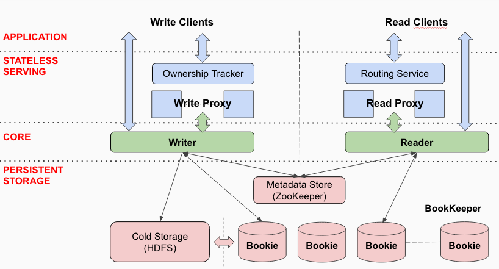
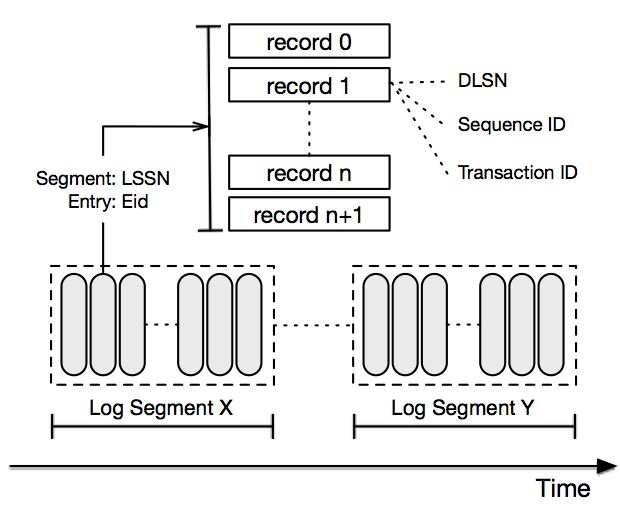

# Apache BookKeeper 4.17.3

## Navigation

- [Overview](#overview)
- [Getting started](#getting-started-installation)
  - [Installation](#getting-started-installation)
  - [Run bookies locally](#getting-started-run-locally)
  - [Concepts and architecture](#getting-started-concepts)
- [Deployment](#deployment-manual)
  - [Manual deployment](#deployment-manual)
  - [BookKeeper on Kubernetes](#deployment-kubernetes)
- [Administration](#admin-bookies)
  - [BookKeeper administration](#admin-bookies)
  - [AutoRecovery](#admin-autorecovery)
  - [Metrics collection](#admin-metrics)
  - [Upgrade](#admin-upgrade)
  - [Admin REST API](#admin-http)
  - [Decommissioning Bookies](#admin-decomission)
- [API](#api-overview)
  - [Overview](#api-overview)
  - [Ledger API](#api-ledger-api)
  - [Advanced Ledger API](#api-ledger-adv-api)
  - [DistributedLog](#api-distributedlog-api)
- [Security](#security-overview)
  - [Overview](#security-overview)
  - [TLS Authentication](#security-tls)
  - [SASL Authentication](#security-sasl)
  - [ZooKeeper Authentication](#security-zookeeper)
- [Development](#development-protocol)
  - [BookKeeper protocol](#development-protocol)
- [Reference](#reference-config)
  - [Configuration](#reference-config)
  - [Command-line tools](#reference-cli)

## Content

<a id="overview"></a>

<!-- source_url: https://bookkeeper.apache.org/docs/overview/ -->

<!-- page_index: 1 -->

# Apache BookKeeper 4.17.3

Version: 4.17.3

This documentation is for Apache BookKeeper™ version 4.17.3.

Apache BookKeeper™ is a scalable, fault-tolerant, low-latency storage service optimized for real-time workloads. It offers durability, replication, and strong consistency as essentials for building reliable real-time applications.

BookKeeper is suitable for a wide variety of use cases, including:

| Use case | Example |
| --- | --- |
| [WAL](https://en.wikipedia.org/wiki/Write-ahead_logging) (write-ahead logging) | The HDFS [namenode](https://hadoop.apache.org/docs/r2.5.2/hadoop-project-dist/hadoop-hdfs/HDFSHighAvailabilityWithNFS.html#BookKeeper_as_a_Shared_storage_EXPERIMENTAL) |
| [WAL](https://en.wikipedia.org/wiki/Write-ahead_logging) (write-ahead logging) | Twitter [Manhattan](https://blog.twitter.com/engineering/en_us/a/2016/strong-consistency-in-manhattan.html) |
| [WAL](https://en.wikipedia.org/wiki/Write-ahead_logging) (write-ahead logging) | [HerdDB](https://github.com/diennea/herddb) |
| [WAL](https://en.wikipedia.org/wiki/Write-ahead_logging) (write-ahead logging) | [Pravega](https://github.com/pravega/pravega) |
| Message storage | [Apache Pulsar](https://pulsar.apache.org/docs/concepts-architecture-overview#persistent-storage) |
| Offset/cursor storage | [Apache Pulsar](https://pulsar.apache.org/docs/concepts-architecture-overview#persistent-storage) |
| Object/[BLOB](https://en.wikipedia.org/wiki/Binary_large_object) storage | Storing snapshots to replicated state machines |

Learn more about Apache BookKeeper™ and what it can do for your organization:

- [Apache BookKeeper 4.17.3 Release Notes](https://bookkeeper.apache.org/release-notes#4173)
- [Java API docs](https://bookkeeper.apache.org//docs/latest/api/javadoc)

Or start [using](#getting-started-installation) Apache BookKeeper today.

- **Concepts**: Start with [concepts](#getting-started-concepts). This will help you to fully understand
  the other parts of the documentation, including the setup, integration and operation guides.
- **Getting Started**: Install [Apache BookKeeper](#getting-started-installation) and run bookies [locally](#getting-started-run-locally)
- **API**: Read the [API](#api-overview) documentation to learn how to use Apache BookKeeper to build your applications.
- **Deployment**: The [Deployment Guide](#deployment-manual) shows how to deploy Apache BookKeeper to production clusters.

- **Operations**: The [Admin Guide](#admin-bookies) shows how to run Apache BookKeeper on production, what are the production
  considerations and best practices.

- **Details**: Learn [design details](#development-protocol) to know more internals.

---

<a id="getting-started-installation"></a>

<!-- source_url: https://bookkeeper.apache.org/docs/getting-started/installation/ -->

<!-- page_index: 2 -->

# BookKeeper installation

Version: 4.17.3

You can install BookKeeper either by [downloading](#getting-started-installation--download) a [GZipped](http://www.gzip.org/) tarball package, using the [Docker image](https://hub.docker.com/r/apache/bookkeeper/tags) or [cloning](#getting-started-installation--clone) the BookKeeper repository.

- [Unix environment](https://www.opengroup.org/membership/forums/platform/unix)
- [Java Development Kit 1.8](http://www.oracle.com/technetwork/java/javase/downloads/index.html) or later

You can download Apache BookKeeper releases from the [Download page](https://bookkeeper.apache.org/releases).

To build BookKeeper from source, clone the repository from the [GitHub mirror](https://github.com/apache/bookkeeper):

```shell
$ git clone https://github.com/apache/bookkeeper
```

Once you have the BookKeeper on your local machine, either by [downloading](#getting-started-installation--download) or [cloning](#getting-started-installation--clone) it, you can then build BookKeeper from source using Maven:

```shell
$ mvn package
```

Since 4.8.0, bookkeeper introduces `table service`. If you would like to build and tryout table service, you can build it with `stream` profile.

```shell
$ mvn package -Dstream
```

> You can skip tests by adding the `-DskipTests` flag when running `mvn package`.

Some other useful Maven commands beyond `mvn package`:

| Command | Action |
| --- | --- |
| `mvn clean` | Removes build artifacts |
| `mvn compile` | Compiles JAR files from Java sources |
| `mvn compile spotbugs:spotbugs` | Compile using the Maven [SpotBugs](https://github.com/spotbugs/spotbugs-maven-plugin) plugin |
| `mvn install` | Install the BookKeeper JAR locally in your local Maven cache (usually in the `~/.m2` directory) |
| `mvn deploy` | Deploy the BookKeeper JAR to the Maven repo (if you have the proper credentials) |
| `mvn verify` | Performs a wide variety of verification and validation tasks |
| `mvn apache-rat:check` | Run Maven using the [Apache Rat](http://creadur.apache.org/rat/apache-rat-plugin/) plugin |
| `mvn compile javadoc:aggregate` | Build Javadocs locally |
| `mvn -am -pl bookkeeper-dist/server package` | Build a server distribution using the Maven [Assembly](http://maven.apache.org/plugins/maven-assembly-plugin/) plugin |

> You can enable `table service` by adding the `-Dstream` flag when running above commands.

The BookKeeper project contains several subfolders that you should be aware of:

| Subfolder | Contains |
| --- | --- |
| [`bookkeeper-server`](https://github.com/apache/bookkeeper/tree/master/bookkeeper-server) | The BookKeeper server and client |
| [`bookkeeper-benchmark`](https://github.com/apache/bookkeeper/tree/master/bookkeeper-benchmark) | A benchmarking suite for measuring BookKeeper performance |
| [`bookkeeper-stats`](https://github.com/apache/bookkeeper/tree/master/bookkeeper-stats) | A BookKeeper stats library |
| [`bookkeeper-stats-providers`](https://github.com/apache/bookkeeper/tree/master/bookkeeper-stats-providers) | BookKeeper stats providers |

---

<a id="getting-started-run-locally"></a>

<!-- source_url: https://bookkeeper.apache.org/docs/getting-started/run-locally/ -->

<!-- page_index: 3 -->

# Run bookies locally

Version: 4.17.3

Bookies are individual BookKeeper servers. You can run an ensemble of bookies locally on a single machine using the [`localbookie`](#reference-cli--bookkeeper-shell-localbookie) command of the `bookkeeper` CLI tool and specifying the number of bookies you'd like to include in the ensemble.

This would start up an ensemble with 10 bookies:

```shell
$ bin/bookkeeper localbookie 10
```

> When you start up an ensemble using `localbookie`, all bookies run in a single JVM process.

---

<a id="getting-started-concepts"></a>

<!-- source_url: https://bookkeeper.apache.org/docs/getting-started/concepts/ -->

<!-- page_index: 4 -->

# BookKeeper concepts and architecture

Version: 4.17.3

BookKeeper is a service that provides persistent storage of streams of log [entries](#getting-started-concepts--entries)---aka *records*---in sequences called [ledgers](#getting-started-concepts--ledgers). BookKeeper replicates stored entries across multiple servers.

In BookKeeper:

- each unit of a log is an [*entry*](#getting-started-concepts--entries) (aka record)
- streams of log entries are called [*ledgers*](#getting-started-concepts--ledgers)
- individual servers storing ledgers of entries are called [*bookies*](#getting-started-concepts--bookies)

BookKeeper is designed to be reliable and resilient to a wide variety of failures. Bookies can crash, corrupt data, or discard data, but as long as there are enough bookies behaving correctly in the ensemble the service as a whole will behave correctly.

> **Entries** contain the actual data written to ledgers, along with some important metadata.

BookKeeper entries are sequences of bytes that are written to [ledgers](#getting-started-concepts--ledgers). Each entry has the following fields:

| Field | Java type | Description |
| --- | --- | --- |
| Ledger number | `long` | The ID of the ledger to which the entry has been written |
| Entry number | `long` | The unique ID of the entry |
| Last confirmed (LC) | `long` | The ID of the last recorded entry |
| Data | `byte[]` | The entry's data (written by the client application) |
| Authentication code | `byte[]` | The message auth code, which includes *all* other fields in the entry |

> **Ledgers** are the basic unit of storage in BookKeeper.

Ledgers are sequences of entries, while each entry is a sequence of bytes. Entries are written to a ledger:

- sequentially, and
- at most once.

This means that ledgers have *append-only* semantics. Entries cannot be modified once they've been written to a ledger. Determining the proper write order is the responsibility of [client applications](#getting-started-concepts--clients-and-apis).

> BookKeeper clients have two main roles: they create and delete ledgers, and they read entries from and write entries to ledgers.
>
> BookKeeper provides both a lower-level and a higher-level API for ledger interaction.

There are currently two APIs that can be used for interacting with BookKeeper:

- The [ledger API](#api-ledger-api) is a lower-level API that enables you to interact with ledgers directly.
- The [DistributedLog API](#api-distributedlog-api) is a higher-level API that enables you to use BookKeeper without directly interacting with ledgers.

In general, you should choose the API based on how much granular control you need over ledger semantics. The two APIs can also both be used within a single application.

> **Bookies** are individual BookKeeper servers that handle ledgers (more specifically, fragments of ledgers). Bookies function as part of an ensemble.

A bookie is an individual BookKeeper storage server. Individual bookies store fragments of ledgers, not entire ledgers (for the sake of performance). For any given ledger **L**, an *ensemble* is the group of bookies storing the entries in **L**.

Whenever entries are written to a ledger, those entries are striped across the ensemble (written to a sub-group of bookies rather than to all bookies).

> BookKeeper was initially inspired by the NameNode server in HDFS but its uses now extend far beyond this.

The initial motivation for BookKeeper comes from the [Hadoop](http://hadoop.apache.org/) ecosystem. In the [Hadoop Distributed File System](https://cwiki.apache.org/confluence/display/HADOOP2/HDFS) (HDFS), a special node called the [NameNode](https://cwiki.apache.org/confluence/display/HADOOP2/NameNode) logs all operations in a reliable fashion, which ensures that recovery is possible in case of crashes.

The NameNode, however, served only as initial inspiration for BookKeeper. The applications for BookKeeper extend far beyond this and include essentially any application that requires an append-based storage system. BookKeeper provides a number of advantages for such applications:

- Highly efficient writes
- High fault tolerance via replication of messages within ensembles of bookies
- High throughput for write operations via striping (across as many bookies as you wish)

The BookKeeper metadata store maintains all the metadata of the BookKeeper cluster, such as [ledger](#getting-started-concepts--ledgers) metadata, available bookies, and so on. Currently, BookKeeper uses [ZooKeeper](https://zookeeper.apache.org) for metadata storage.

Bookies manage data in a [log-structured](https://en.wikipedia.org/wiki/Log-structured_file_system) way, which is implemented using three types of files:

- [journals](#getting-started-concepts--journals)
- [entry logs](#getting-started-concepts--entry-logs)
- [index files](#getting-started-concepts--index-files)

A journal file contains BookKeeper transaction logs. Before any update to a ledger takes place, the bookie ensures that a transaction describing the update is written to non-volatile storage. A new journal file is created once the bookie starts or the older journal file reaches the journal file size threshold.

An entry log file manages the written entries received from BookKeeper clients. Entries from different ledgers are aggregated and written sequentially, while their offsets are kept as pointers in a [ledger cache](#getting-started-concepts--ledger-cache) for fast lookup.

A new entry log file is created once the bookie starts or the older entry log file reaches the entry log size threshold. Old entry log files are removed by the Garbage Collector Thread once they are not associated with any active ledger.

An index file is created for each ledger, which comprises a header and several fixed-length index pages that record the offsets of data stored in entry log files.

Since updating index files would introduce random disk I/O index files are updated lazily by a sync thread running in the background. This ensures speedy performance for updates. Before index pages are persisted to disk, they are gathered in a ledger cache for lookup.

Ledger indexes pages are cached in a memory pool, which allows for more efficient management of disk head scheduling.

When a client instructs a bookie to write an entry to a ledger, the entry will go through the following steps to be persisted on disk:

1. The entry is appended to an [entry log](#getting-started-concepts--entry-logs)
2. The index of the entry is updated in the [ledger cache](#getting-started-concepts--ledger-cache)
3. A transaction corresponding to this entry update is appended to the [journal](#getting-started-concepts--journals)
4. A response is sent to the BookKeeper client

> For performance reasons, the entry log buffers entries in memory and commits them in batches, while the ledger cache holds index pages in memory and flushes them lazily. This process is described in more detail in the [Data flush](#getting-started-concepts--data-flush) section below.

Ledger index pages are flushed to index files in the following two cases:

- The ledger cache memory limit is reached. There is no more space available to hold newer index pages. Dirty index pages will be evicted from the ledger cache and persisted to index files.
- A background thread synchronous thread is responsible for flushing index pages from the ledger cache to index files periodically.

Besides flushing index pages, the sync thread is responsible for rolling journal files in case that journal files use too much disk space. The data flush flow in the sync thread is as follows:

- A `LastLogMark` is recorded in memory. The `LastLogMark` indicates that those entries before it have been persisted (to both index and entry log files) and contains two parts:

  1. A `txnLogId` (the file ID of a journal)
  2. A `txnLogPos` (offset in a journal)
- Dirty index pages are flushed from the ledger cache to the index file, and entry log files are flushed to ensure that all buffered entries in entry log files are persisted to disk.

  Ideally, a bookie only needs to flush index pages and entry log files that contain entries before `LastLogMark`. There is, however, no such information in the ledger and entry log mapping to journal files. Consequently, the thread flushes the ledger cache and entry log entirely here, and may flush entries after the `LastLogMark`. Flushing more is not a problem, though, just redundant.
- The `LastLogMark` is persisted to disk, which means that entries added before `LastLogMark` whose entry data and index page were also persisted to disk. It is now time to safely remove journal files created earlier than `txnLogId`.

If the bookie has crashed before persisting `LastLogMark` to disk, it still has journal files containing entries for which index pages may not have been persisted. Consequently, when this bookie restarts, it inspects journal files to restore those entries and data isn't lost.

Using the above data flush mechanism, it is safe for the sync thread to skip data flushing when the bookie shuts down. However, in the entry logger it uses a buffered channel to write entries in batches and there might be data buffered in the buffered channel upon a shut down. The bookie needs to ensure that the entry log flushes its buffered data during shutdown. Otherwise, entry log files become corrupted with partial entries.

On bookies, entries of different ledgers are interleaved in entry log files. A bookie runs a garbage collector thread to delete un-associated entry log files to reclaim disk space. If a given entry log file contains entries from a ledger that has not been deleted, then the entry log file would never be removed and the occupied disk space never reclaimed. In order to avoid such a case, a bookie server compacts entry log files in a garbage collector thread to reclaim disk space.

There are two kinds of compaction running with different frequency: minor compaction and major compaction. The differences between minor compaction and major compaction lies in their threshold value and compaction interval.

- The garbage collection threshold is the size percentage of an entry log file occupied by those undeleted ledgers. The default minor compaction threshold is 0.2, while the major compaction threshold is 0.8.
- The garbage collection interval is how frequently to run the compaction. The default minor compaction interval is 1 hour, while the major compaction threshold is 1 day.

> If either the threshold or interval is set to less than or equal to zero, compaction is disabled.

The data compaction flow in the garbage collector thread is as follows:

- The thread scans entry log files to get their entry log metadata, which records a list of ledgers comprising an entry log and their corresponding percentages.
- With the normal garbage collection flow, once the bookie determines that a ledger has been deleted, the ledger will be removed from the entry log metadata and the size of the entry log reduced.
- If the remaining size of an entry log file reaches a specified threshold, the entries of active ledgers in the entry log will be copied to a new entry log file.
- Once all valid entries have been copied, the old entry log file is deleted.

BookKeeper requires a ZooKeeper installation for storing [ledger](#getting-started-concepts--ledgers) metadata. Whenever you construct a [`BookKeeper`](https://bookkeeper.apache.org//docs/latest/api/javadoc/org/apache/bookkeeper/client/BookKeeper) client object, you need to pass a list of ZooKeeper servers as a parameter to the constructor, like this:

```java
String zkConnectionString = "127.0.0.1:2181"; 
BookKeeper bkClient = new BookKeeper(zkConnectionString); 
```

> For more info on using the BookKeeper Java client, see [this guide](#api-ledger-api--the-java-ledger-api-client).

A *ledger manager* handles ledgers' metadata (which is stored in ZooKeeper). BookKeeper offers two types of ledger managers: the [flat ledger manager](#getting-started-concepts--flat-ledger-manager) and the [hierarchical ledger manager](#getting-started-concepts--hierarchical-ledger-manager). Both ledger managers extend the [`AbstractZkLedgerManager`](https://bookkeeper.apache.org//docs/latest/api/javadoc/org/apache/bookkeeper/meta/AbstractZkLedgerManager) abstract class.

> default ledger manager.
>
> The hierarchical ledger manager is able to manage very large numbers of BookKeeper ledgers (> 50,000).

The *hierarchical ledger manager*, implemented in the [`HierarchicalLedgerManager`](https://bookkeeper.apache.org//docs/latest/api/javadoc/org/apache/bookkeeper/meta/HierarchicalLedgerManager) class, first obtains a global unique ID from ZooKeeper using an [`EPHEMERAL_SEQUENTIAL`](https://zookeeper.apache.org/doc/current/api/org/apache/zookeeper/CreateMode.html#EPHEMERAL_SEQUENTIAL) znode. Since ZooKeeper's sequence counter has a format of `%10d` (10 digits with 0 padding, for example `<path>0000000001`), the hierarchical ledger manager splits the generated ID into 3 parts:

```shell
{level1 (2 digits)}{level2 (4 digits)}{level3 (4 digits)} 
```

These three parts are used to form the actual ledger node path to store ledger metadata:

```shell
{ledgers_root_path}/{level1}/{level2}/L{level3} 
```

For example, ledger 0000000001 is split into three parts, 00, 0000, and 00001, and stored in znode `/{ledgers_root_path}/00/0000/L0001`. Each znode could have as many 10,000 ledgers, which avoids the problem of the child list being larger than the maximum ZooKeeper packet size (which is the [limitation](https://issues.apache.org/jira/browse/BOOKKEEPER-39) that initially prompted the creation of the hierarchical ledger manager).

> deprecated since 4.7.0, not recommend now.

The *flat ledger manager*, implemented in the [`FlatLedgerManager`](https://bookkeeper.apache.org//docs/latest/api/javadoc/org/apache/bookkeeper/meta/FlatLedgerManager.html) class, stores all ledgers' metadata in child nodes of a single ZooKeeper path. The flat ledger manager creates [sequential nodes](https://zookeeper.apache.org/doc/current/zookeeperProgrammers.html#Sequence+Nodes+--+Unique+Naming) to ensure the uniqueness of the ledger ID and prefixes all nodes with `L`. Bookie servers manage their own active ledgers in a hash map so that it's easy to find which ledgers have been deleted from ZooKeeper and then garbage collect them.

The flat ledger manager's garbage collection follow proceeds as follows:

- All existing ledgers are fetched from ZooKeeper (`zkActiveLedgers`)
- All ledgers currently active within the bookie are fetched (`bkActiveLedgers`)
- The currently actively ledgers are looped through to determine which ledgers don't currently exist in ZooKeeper. Those are then garbage collected.
- The *hierarchical ledger manager* stores ledgers' metadata in two-level [znodes](https://zookeeper.apache.org/doc/current/zookeeperOver.html#Nodes+and+ephemeral+nodes).

---

<a id="deployment-manual"></a>

<!-- source_url: https://bookkeeper.apache.org/docs/deployment/manual/ -->

<!-- page_index: 5 -->

# Manual deployment

Version: 4.17.3

A BookKeeper cluster consists of two main components:

- A [ZooKeeper](#deployment-manual--zookeeper-setup) cluster that is used for configuration- and coordination-related tasks
- An [ensemble](#deployment-manual--starting-up-bookies) of bookies

We won't provide a full guide to setting up a ZooKeeper cluster here. We recommend that you consult [this guide](https://zookeeper.apache.org/doc/current/zookeeperAdmin.html) in the official ZooKeeper documentation.

Once your ZooKeeper cluster is up and running, there is some metadata that needs to be written to ZooKeeper, so you need to modify the bookie's configuration to make sure that it points to the right ZooKeeper cluster.

On each bookie host, you need to [download](#getting-started-installation--download) the BookKeeper package as a tarball. Once you've done that, you need to configure the bookie by setting values in the `bookkeeper-server/conf/bk_server.conf` config file. The one parameter that you will absolutely need to change is the `metadataServiceUri` parameter, which you will need to set to the ZooKeeper connection string for your ZooKeeper cluster. Here's an example:

```properties
metadataServiceUri=zk+hierarchical://100.0.0.1:2181;100.0.0.2:2181;100.0.0.3:2181/ledgers 
```

> A full listing of configurable parameters available in `bookkeeper-server/conf/bk_server.conf` can be found in the [Configuration](#reference-config) reference manual.

Once the bookie's configuration is set, you can set up cluster metadata for the cluster by running the following command from any bookie in the cluster:

```shell
$ bookkeeper-server/bin/bookkeeper shell metaformat
```

You can run in the formatting

> The `metaformat` command performs all the necessary ZooKeeper cluster metadata tasks and thus only needs to be run *once* and from *any* bookie in the BookKeeper cluster.

Once cluster metadata formatting has been completed, your BookKeeper cluster is ready to go!

Before you start up your bookies, you should make sure that all bookie hosts have the correct configuration, then you can start up as many bookies as you'd like to form a cluster by using the [`bookie`](#reference-cli--bookkeeper-shell-bookie) command of the [`bookkeeper`](#reference-cli--bookkeeper-command) CLI tool:

```shell
$ bookkeeper-server/bin/bookkeeper bookie
```

The number of bookies you should run in a BookKeeper cluster depends on the quorum mode that you've chosen, the desired throughput, and the number of clients using the cluster simultaneously.

| Quorum type | Number of bookies |
| --- | --- |
| Self-verifying quorum | 3 |
| Generic | 4 |

Increasing the number of bookies will enable higher throughput, and there is **no upper limit** on the number of bookies.

---

<a id="deployment-kubernetes"></a>

<!-- source_url: https://bookkeeper.apache.org/docs/deployment/kubernetes/ -->

<!-- page_index: 6 -->

# Deploying Apache BookKeeper on Kubernetes

Version: 4.17.3

Apache BookKeeper can be easily deployed in [Kubernetes](https://kubernetes.io/) clusters. The managed clusters on [Google Container Engine](https://cloud.google.com/compute/) is the most convenient way.

The deployment method shown in this guide relies on [YAML](http://yaml.org/) definitions for Kubernetes [resources](https://kubernetes.io/docs/resources-reference/v1.6/). The [`kubernetes`](https://github.com/apache/bookkeeper/tree/master/deploy/kubernetes) subdirectory holds resource definitions for:

- A three-node ZooKeeper cluster
- A BookKeeper cluster with a bookie runs on each node.

To get started, get source code of [`kubernetes`](https://github.com/apache/bookkeeper/tree/master/deploy/kubernetes) from github by git clone.

If you'd like to change the number of bookies, or ZooKeeper nodes in your BookKeeper cluster, modify the `replicas` parameter in the `spec` section of the appropriate [`Deployment`](https://kubernetes.io/docs/concepts/workloads/controllers/deployment/) or [`StatefulSet`](https://kubernetes.io/docs/concepts/workloads/controllers/statefulset/) resource.

[Google Container Engine](https://cloud.google.com/kubernetes-engine) (GKE) automates the creation and management of Kubernetes clusters in [Google Compute Engine](https://cloud.google.com/compute/) (GCE).

To get started, you'll need:

- A Google Cloud Platform account, which you can sign up for at [cloud.google.com](https://cloud.google.com)
- An existing Cloud Platform project
- The [Google Cloud SDK](https://cloud.google.com/sdk/downloads) (in particular the [`gcloud`](https://cloud.google.com/sdk/gcloud/) and [`kubectl`](https://kubernetes.io/docs/tasks/tools/) tools).

You can create a new GKE cluster using the [`container clusters create`](https://cloud.google.com/sdk/gcloud/reference/container/clusters/create) command for `gcloud`. This command enables you to specify the number of nodes in the cluster, the machine types of those nodes, and more.

As an example, we'll create a new GKE cluster for Kubernetes version [1.6.4](https://github.com/kubernetes/kubernetes/blob/master/CHANGELOG.md#v164) in the [us-central1-a](https://cloud.google.com/compute/docs/regions-zones/regions-zones#available) zone. The cluster will be named `bookkeeper-gke-cluster` and will consist of three VMs, each using two locally attached SSDs and running on [n1-standard-8](https://cloud.google.com/compute/docs/machine-types) machines. These SSDs will be used by Bookie instances, one for the BookKeeper journal and the other for storing the actual data.

```bash
$ gcloud config set compute/zone us-central1-a
$ gcloud config set project your-project-name
$ gcloud container clusters create bookkeeper-gke-cluster \
  --machine-type=n1-standard-8 \ 
  --num-nodes=3 \ 
  --local-ssd-count=2 \ 
  --enable-kubernetes-alpha 
```

By default, bookies will run on all the machines that have locally attached SSD disks. In this example, all of those machines will have two SSDs, but you can add different types of machines to the cluster later. You can control which machines host bookie servers using [labels](https://kubernetes.io/docs/concepts/overview/working-with-objects/labels).

You can observe your cluster in the [Kubernetes Dashboard](https://kubernetes.io/docs/tasks/access-application-cluster/web-ui-dashboard/) by downloading the credentials for your Kubernetes cluster and opening up a proxy to the cluster:

```bash
$ gcloud container clusters get-credentials bookkeeper-gke-cluster \
  --zone=us-central1-a \ 
  --project=your-project-name 
$ kubectl proxy
```

By default, the proxy will be opened on port 8001. Now you can navigate to [localhost:8001/ui](http://localhost:8001/ui) in your browser to access the dashboard. At first your GKE cluster will be empty, but that will change as you begin deploying.

When you create a cluster, your `kubectl` config in `~/.kube/config` (on MacOS and Linux) will be updated for you, so you probably won't need to change your configuration. Nonetheless, you can ensure that `kubectl` can interact with your cluster by listing the nodes in the cluster:

```bash
$ kubectl get nodes
```

If `kubectl` is working with your cluster, you can proceed to deploy ZooKeeper and Bookies.

You *must* deploy ZooKeeper as the first component, as it is a dependency for the others.

```bash
$ kubectl apply -f zookeeper.yaml
```

Wait until all three ZooKeeper server pods are up and have the status `Running`. You can check on the status of the ZooKeeper pods at any time:

```bash
$ kubectl get pods -l component=zookeeper NAME READY STATUS RESTARTS AGE zk-0 1/1 Running 0 18m zk-1 1/1 Running 0 17m zk-2 0/1 Running 6 15m
```

This step may take several minutes, as Kubernetes needs to download the Docker image on the VMs.

If you want to connect to one of the remote zookeeper server, you can use[zk-shell](https://github.com/rgs1/zk_shell), you need to forward a local port to the
remote zookeeper server:

```bash
$ kubectl port-forward zk-0 2181:2181
$ zk-shell localhost 2181
```

Once ZooKeeper cluster is Running, you can then deploy the bookies. You can deploy the bookies either using a [DaemonSet](https://kubernetes.io/docs/concepts/workloads/controllers/daemonset/) or a [StatefulSet](https://kubernetes.io/docs/concepts/workloads/controllers/statefulset/).

> NOTE: *DaemonSet* vs *StatefulSet*
>
> A *DaemonSet* ensures that all (or some) nodes run a pod of bookie instance. As nodes are added to the cluster, bookie pods are added automatically to them. As nodes are removed from the
> cluster, those bookie pods are garbage collected. The bookies deployed in a DaemonSet stores data on the local disks on those nodes. So it doesn't require any external storage for Persistent
> Volumes.
>
> A *StatefulSet* maintains a sticky identity for the pods that it runs and manages. It provides stable and unique network identifiers, and stable and persistent storage for each pod. The pods
> are not interchangeable, the idenifiers for each pod are maintained across any rescheduling.
>
> Which one to use? A *DaemonSet* is the easiest way to deploy a bookkeeper cluster, because it doesn't require additional persistent volume provisioner and use local disks. BookKeeper manages
> the data replication. It maintains the best latency property. However, it uses `hostIP` and `hostPort` for communications between pods. In some k8s platform (such as DC/OS), `hostIP` and
> `hostPort` are not well supported. A *StatefulSet* is only practical when deploying in a cloud environment or any K8S installation that has persistent volumes available. Also be aware, latency
> can be potentially higher when using persistent volumes, because there is usually built-in replication in the persistent volumes.

```bash
# deploy bookies in a daemon set
$ kubectl apply -f bookkeeper.yaml
 
# deploy bookies in a stateful set
$ kubectl apply -f bookkeeper.stateful.yaml
```

You can check on the status of the Bookie pods for these components either in the Kubernetes Dashboard or using `kubectl`:

```bash
$ kubectl get pods
```

While all BookKeeper pods is Running, by zk-shell you could find all available bookies under /ledgers/

You could also run a [bookkeeper tutorial](https://github.com/ivankelly/bookkeeper-tutorial/) instance, which named as 'dice' here, in this bookkeeper cluster.

```bash
$kubectl run -i --tty --attach dice --image=caiok/bookkeeper-tutorial --env ZOOKEEPER_SERVERS="zk-0.zookeeper" 
```

An example output of Dice instance is like this:

```aidl
➜ $ kubectl run -i --tty --attach dice --image=caiok/bookkeeper-tutorial --env ZOOKEEPER_SERVERS="zk-0.zookeeper"           
If you don't see a command prompt, try pressing enter. 
Value = 1, epoch = 5, leading 
Value = 2, epoch = 5, leading 
Value = 1, epoch = 5, leading 
Value = 4, epoch = 5, leading 
Value = 5, epoch = 5, leading 
Value = 4, epoch = 5, leading 
Value = 3, epoch = 5, leading 
Value = 5, epoch = 5, leading 
Value = 3, epoch = 5, leading 
Value = 2, epoch = 5, leading 
Value = 1, epoch = 5, leading 
Value = 4, epoch = 5, leading 
Value = 2, epoch = 5, leading 
```

Delete Demo dice instance

```bash
$kubectl delete deployment dice       
```

Delete BookKeeper

```bash
$ kubectl delete -f bookkeeper.yaml
```

Delete ZooKeeper

```bash
$ kubectl delete -f zookeeper.yaml
```

Delete cluster

```bash
$ gcloud container clusters delete bookkeeper-gke-cluster
```

---

<a id="admin-bookies"></a>

<!-- source_url: https://bookkeeper.apache.org/docs/admin/bookies/ -->

<!-- page_index: 7 -->

# BookKeeper administration

Version: 4.17.3

This document is a guide to deploying, administering, and maintaining BookKeeper. It also discusses best practices and common problems.

A typical BookKeeper installation consists of an ensemble of bookies and a ZooKeeper quorum. The exact number of bookies depends on the quorum mode that you choose, desired throughput, and the number of clients using the installation simultaneously.

The minimum number of bookies depends on the type of installation:

- For *self-verifying* entries you should run at least three bookies. In this mode, clients store a message authentication code along with each entry.
- For *generic* entries you should run at least four

There is no upper limit on the number of bookies that you can run in a single ensemble.

To achieve optimal performance, BookKeeper requires each server to have at least two disks. It's possible to run a bookie with a single disk but performance will be significantly degraded.

There is no constraint on the number of ZooKeeper nodes you can run with BookKeeper. A single machine running ZooKeeper in [standalone mode](https://zookeeper.apache.org/doc/current/zookeeperStarted.html#sc_InstallingSingleMode) is sufficient for BookKeeper, although for the sake of higher resilience we recommend running ZooKeeper in [quorum mode](https://zookeeper.apache.org/doc/current/zookeeperStarted.html#sc_RunningReplicatedZooKeeper) with multiple servers.

You can run bookies either in the foreground or in the background, using [nohup](https://en.wikipedia.org/wiki/Nohup). You can also run [local bookies](#admin-bookies--local-bookies) for development purposes.

To start a bookie in the foreground, use the [`bookie`](#reference-cli--bookkeeper-shell-bookie) command of the [`bookkeeper`](#reference-cli--bookkeeper-command) CLI tool:

```shell
$ bin/bookkeeper bookie
```

To start a bookie in the background, use the [`bookkeeper-daemon.sh`](#reference-cli--bookkeeper-command) script and run `start bookie`:

```shell
$ bin/bookkeeper-daemon.sh start bookie
```

The instructions above showed you how to run bookies intended for production use. If you'd like to experiment with ensembles of bookies locally, you can use the [`localbookie`](#reference-cli--bookkeeper-shell-localbookie) command of the `bookkeeper` CLI tool and specify the number of bookies you'd like to run.

This would spin up a local ensemble of 6 bookies:

```shell
$ bin/bookkeeper localbookie 6
```

> When you run a local bookie ensemble, all bookies run in a single JVM process.

There's a wide variety of parameters that you can set in the bookie configuration file in `bookkeeper-server/conf/bk_server.conf` of your [BookKeeper installation](#reference-config). A full listing can be found in [Bookie configuration](#reference-config).

Some of the more important parameters to be aware of:

| Parameter | Description | Default |
| --- | --- | --- |
| `bookiePort` | The TCP port that the bookie listens on | `3181` |
| `zkServers` | A comma-separated list of ZooKeeper servers in `hostname:port` format | `localhost:2181` |
| `journalDirectory` | The directory where the [log device](#getting-started-concepts--journals) stores the bookie's write-ahead log (WAL) | `/tmp/bk-txn` |
| `ledgerDirectories` | The directories where the [ledger device](#getting-started-concepts--entry-logs) stores the bookie's ledger entries (as a comma-separated list) | `/tmp/bk-data` |

> Ideally, the directories specified `journalDirectory` and `ledgerDirectories` should be on difference devices.

BookKeeper uses [slf4j](http://www.slf4j.org/) for logging, with [log4j](https://logging.apache.org/log4j/2.x/) bindings enabled by default.

To enable logging for a bookie, create a `log4j.properties` file and point the `BOOKIE_LOG_CONF` environment variable to the configuration file. Here's an example:

```shell
$ export BOOKIE_LOG_CONF=/some/path/log4j.properties
$ bin/bookkeeper bookie
```

From time to time you may need to make changes to the filesystem layout of bookies---changes that are incompatible with previous versions of BookKeeper and require that directories used with previous versions are upgraded. If a filesystem upgrade is required when updating BookKeeper, the bookie will fail to start and return an error like this:

```text
2017-05-25 10:41:50,494 - ERROR - [main:Bookie@246] - Directory layout version is less than 3, upgrade needed 
```

BookKeeper provides a utility for upgrading the filesystem. You can perform an upgrade using the [`upgrade`](#reference-cli--bookkeeper-shell-upgrade) command of the `bookkeeper` CLI tool. When running `bookkeeper upgrade` you need to specify one of three flags:

| Flag | Action |
| --- | --- |
| `--upgrade` | Performs an upgrade |
| `--rollback` | Performs a rollback to the initial filesystem version |
| `--finalize` | Marks the upgrade as complete |

A standard upgrade pattern is to run an upgrade...

```shell
$ bin/bookkeeper upgrade --upgrade
```

...then check that everything is working normally, then kill the bookie. If everything is okay, finalize the upgrade...

```shell
$ bin/bookkeeper upgrade --finalize
```

...and then restart the server:

```shell
$ bin/bookkeeper bookie
```

If something has gone wrong, you can always perform a rollback:

```shell
$ bin/bookkeeper upgrade --rollback
```

You can format bookie metadata in ZooKeeper using the [`metaformat`](#reference-cli--bookkeeper-shell-metaformat) command of the [BookKeeper shell](#reference-cli--bookkeeper-shell).

By default, formatting is done in interactive mode, which prompts you to confirm the format operation if old data exists. You can disable confirmation using the `-nonInteractive` flag. If old data does exist, the format operation will abort *unless* you set the `-force` flag. Here's an example:

```shell
$ bin/bookkeeper shell metaformat
```

You can format the local filesystem data on a bookie using the [`bookieformat`](#reference-cli--bookkeeper-shell-bookieformat) command on each bookie. Here's an example:

```shell
$ bin/bookkeeper shell bookieformat
```

> The `-force` and `-nonInteractive` flags are also available for the `bookieformat` command.

For a guide to AutoRecovery in BookKeeper, see [this doc](#admin-autorecovery).

Accidentally replacing disks or removing directories can cause a bookie to fail while trying to read a ledger fragment that, according to the ledger metadata, exists on the bookie. For this reason, when a bookie is started for the first time, its disk configuration is fixed for the lifetime of that bookie. Any change to its disk configuration, such as a crashed disk or an accidental configuration change, will result in the bookie being unable to start. That will throw an error like this:

```text
2017-05-29 18:19:13,790 - ERROR - [main:BookieServer314] – Exception running bookie server : @ 
org.apache.bookkeeper.bookie.BookieException$InvalidCookieException 
.......at org.apache.bookkeeper.bookie.Cookie.verify(Cookie.java:82) 
.......at org.apache.bookkeeper.bookie.Bookie.checkEnvironment(Bookie.java:275) 
.......at org.apache.bookkeeper.bookie.Bookie.<init>(Bookie.java:351) 
```

If the change was the result of an accidental configuration change, the change can be reverted and the bookie can be restarted. However, if the change *cannot* be reverted, such as is the case when you want to add a new disk or replace a disk, the bookie must be wiped and then all its data re-replicated onto it.

1. Increment the [`bookiePort`](#reference-config) parameter in the [`bk_server.conf`](#reference-config)
2. Ensure that all directories specified by [`journalDirectory`](#reference-config--journal-settings) and [`ledgerDirectories`](#reference-config--ledger-storage-settings) are empty.
3. [Start the bookie](#admin-bookies--starting-and-stopping-bookies).
4. Run the following command to re-replicate the data:


```bash
$ bin/bookkeeper shell recover <oldbookie>
```

   The ZooKeeper server, old bookie, and new bookie, are all identified by their external IP and `bookiePort` (3181 by default). Here's an example:


```bash
$ bin/bookkeeper shell recover  192.168.1.10:3181
```

   See the [AutoRecovery](#admin-autorecovery) documentation for more info on the re-replication process.

---

<a id="admin-autorecovery"></a>

<!-- source_url: https://bookkeeper.apache.org/docs/admin/autorecovery/ -->

<!-- page_index: 8 -->

# Using AutoRecovery

Version: 4.17.3

When a bookie crashes, all ledgers on that bookie become under-replicated. In order to bring all ledgers in your BookKeeper cluster back to full replication, you'll need to *recover* the data from any offline bookies. There are two ways to recover bookies' data:

1. Using [manual recovery](#admin-autorecovery--manual-recovery)
2. Automatically, using [*AutoRecovery*](#admin-autorecovery--autorecovery)

You can manually recover failed bookies using the [`bookkeeper`](#reference-cli) command-line tool. You need to specify:

- the `shell recover` option
- the IP and port for the failed bookie

Here's an example:

```bash
$ bin/bookkeeper shell recover \ 192.168.1.10:3181 # IP and port for the failed bookie
```

If you wish, you can also specify which ledgers you'd like to recover. Here's an example:

```bash
$ bin/bookkeeper shell recover \ 192.168.1.10:3181 \ # IP and port for the failed bookie --ledger ledgerID # ledgerID which you want to recover
```

When you initiate a manual recovery process, the following happens:

1. The client (the process running ) reads the metadata of active ledgers from ZooKeeper.
2. The ledgers that contain fragments from the failed bookie in their ensemble are selected.
3. A recovery process is initiated for each ledger in this list and the rereplication process is run for each ledger.
4. Once all the ledgers are marked as fully replicated, bookie recovery is finished.

AutoRecovery is a process that:

- automatically detects when a bookie in your BookKeeper cluster has become unavailable and then
- rereplicates all the ledgers that were stored on that bookie.

AutoRecovery can be run in three ways:

1. On dedicated nodes in your BookKeeper cluster
2. On the same machines on which your bookies are running
3. On a combination of autorecovery nodes and bookie nodes

You can start up AutoRecovery using the [`autorecovery`](#reference-cli--bookkeeper-shell-autorecovery) command of the [`bookkeeper`](#reference-cli) CLI tool.

```bash
$ bin/bookkeeper autorecovery
```

> The most important thing to ensure when starting up AutoRecovery is that the ZooKeeper connection string specified by the [`zkServers`](#reference-config) parameter points to the right ZooKeeper cluster.

If you start up AutoRecovery on a machine that is already running a bookie, then the AutoRecovery process will run alongside the bookie on a separate thread.

You can also start up AutoRecovery on a fresh machine if you'd like to create a dedicated cluster of AutoRecovery nodes.

Note that if you *only* want the AutoRecovery process to run on your dedicated AutoRecovery nodes, you must set `autoRecoveryDaemonEnabled` to `false` in the `bookkeeper` configuration. Otherwise, bookkeeper nodes will also handle rereplication work.

There are a handful of AutoRecovery-related configs in the [`bk_server.conf`](#reference-config) configuration file. For a listing of those configs, see [AutoRecovery settings](#reference-config--autorecovery-general-settings).

You can disable AutoRecovery for the whole cluster at any time, for example during maintenance. Disabling AutoRecovery ensures that bookies' data isn't unnecessarily rereplicated when the bookie is only taken down for a short period of time, for example when the bookie is being updated or the configuration if being changed.

You can disable AutoRecover for the whole cluster using the [`bookkeeper`](#reference-cli--bookkeeper-shell-autorecovery) CLI tool:

```bash
$ bin/bookkeeper shell autorecovery -disable
```

Once disabled, you can reenable AutoRecovery for the whole cluster using the [`enable`](#reference-cli--bookkeeper-shell-autorecovery) shell command:

```bash
$ bin/bookkeeper shell autorecovery -enable
```

AutoRecovery has two components:

1. The [**auditor**](#admin-autorecovery--auditor) (see the [`Auditor`](https://bookkeeper.apache.org//docs/latest/api/javadoc/org/apache/bookkeeper/replication/Auditor.html) class) is a singleton node that watches bookies to see if they fail and creates rereplication tasks for the ledgers on failed bookies.
2. The [**replication worker**](#admin-autorecovery--replication-worker) (see the [`ReplicationWorker`](https://bookkeeper.apache.org//docs/latest/api/javadoc/org/apache/bookkeeper/replication/ReplicationWorker.html) class) runs on each bookie and executes rereplication tasks provided by the auditor.

Both of these components run as threads in the [`AutoRecoveryMain`](https://bookkeeper.apache.org//docs/latest/api/javadoc/org/apache/bookkeeper/replication/AutoRecoveryMain) process, which runs on each bookie in the cluster. All recovery nodes participate in leader election---using ZooKeeper---to decide which node becomes the auditor. Nodes that fail to become the auditor watch the elected auditor and run an election process again if they see that the auditor node has failed.

The auditor watches all bookies in the cluster that are registered with ZooKeeper. Bookies register with ZooKeeper at startup. If the bookie crashes or is killed, the bookie's registration in ZooKeeper disappears and the auditor is notified of the change in the list of registered bookies.

When the auditor sees that a bookie has disappeared, it immediately scans the complete ledger list to find ledgers that have data stored on the failed bookie. Once it has a list of ledgers for that bookie, the auditor will publish a rereplication task for each ledger under the `/underreplicated/` [znode](https://zookeeper.apache.org/doc/current/zookeeperOver.html) in ZooKeeper.

Each replication worker watches for tasks being published by the auditor on the `/underreplicated/` znode in ZooKeeper. When a new task appears, the replication worker will try to get a lock on it. If it cannot acquire the lock, it will try the next entry. The locks are implemented using ZooKeeper ephemeral znodes.

The replication worker will scan through the rereplication task's ledger for fragments of which its local bookie is not a member. When it finds fragments matching this criterion, it will replicate the entries of that fragment to the local bookie. If, after this process, the ledger is fully replicated, the ledgers entry under /underreplicated/ is deleted, and the lock is released. If there is a problem replicating, or there are still fragments in the ledger which are still underreplicated (due to the local bookie already being part of the ensemble for the fragment), then the lock is simply released.

If the replication worker finds a fragment which needs rereplication, but does not have a defined endpoint (i.e. the final fragment of a ledger currently being written to), it will wait for a grace period before attempting rereplication. If the fragment needing rereplication still does not have a defined endpoint, the ledger is fenced and rereplication then takes place.

This avoids the situation in which a client is writing to a ledger and one of the bookies goes down, but the client has not written an entry to that bookie before rereplication takes place. The client could continue writing to the old fragment, even though the ensemble for the fragment had changed. This could lead to data loss. Fencing prevents this scenario from happening. In the normal case, the client will try to write to the failed bookie within the grace period, and will have started a new fragment before rereplication starts.

You can configure this grace period using the [`openLedgerRereplicationGracePeriod`](#reference-config) parameter.

The ledger rereplication process happens in these steps:

1. The client goes through all ledger fragments in the ledger, selecting those that contain the failed bookie.
2. A recovery process is initiated for each ledger fragment in this list.
   1. The client selects a bookie to which all entries in the ledger fragment will be replicated; In the case of autorecovery, this will always be the local bookie.
   2. The client reads entries that belong to the ledger fragment from other bookies in the ensemble and writes them to the selected bookie.
   3. Once all entries have been replicated, the zookeeper metadata for the fragment is updated to reflect the new ensemble.
   4. The fragment is marked as fully replicated in the recovery tool.
3. Once all ledger fragments are marked as fully replicated, the ledger is marked as fully replicated.

---

<a id="admin-metrics"></a>

<!-- source_url: https://bookkeeper.apache.org/docs/admin/metrics/ -->

<!-- page_index: 9 -->

# Metric collection

Version: 4.17.3

BookKeeper enables metrics collection through a variety of [stats providers](#admin-metrics--stats-providers).

BookKeeper has stats provider implementations for these sinks:

| Provider | Provider class name |
| --- | --- |
| [Codahale Metrics](https://mvnrepository.com/artifact/org.apache.bookkeeper.stats/codahale-metrics-provider) | `org.apache.bookkeeper.stats.CodahaleMetricsProvider` |
| [Prometheus](https://prometheus.io/) | `org.apache.bookkeeper.stats.prometheus.PrometheusMetricsProvider` |

> The [Codahale Metrics](https://github.com/apache/bookkeeper/tree/master/stats/bookkeeper-stats-providers/codahale-metrics-provider) stats provider is the default provider.

Two stats-related [configuration parameters](#reference-config) are available for bookies:

| Parameter | Description | Default |
| --- | --- | --- |
| `enableStatistics` | Whether statistics are enabled for the bookie | `false` |
| `sanityCheckMetricsEnabled` | Flag to enable sanity check metrics in bookie stats | `false` |
| `statsProviderClass` | The stats provider class used by the bookie | `org.apache.bookkeeper.stats.CodahaleMetricsProvider` |

To enable stats:

- set the `enableStatistics` parameter to `true`
- set `statsProviderClass` to the desired provider (see the [table above](#admin-metrics--stats-providers) for a listing of classes)

---

<a id="admin-upgrade"></a>

<!-- source_url: https://bookkeeper.apache.org/docs/admin/upgrade/ -->

<!-- page_index: 10 -->

# Upgrade

Version: 4.17.3

> If you have questions about upgrades (or need help), please feel free to reach out to us by [mailing list](https://bookkeeper.apache.org/community/mailing-lists) or [Slack Channel](https://bookkeeper.apache.org/community/slack).

Consider the below guidelines in preparation for upgrading.

- Always back up all your configuration files before upgrading.
- Read through the documentation and draft an upgrade plan that matches your specific requirements and environment before starting the upgrade process.
  Put differently, don't start working through the guide on a live cluster. Read guide entirely, make a plan, then execute the plan.
- Pay careful consideration to the order in which components are upgraded. In general, you need to upgrade bookies first and then upgrade your clients.
- If autorecovery is running along with bookies, you need to pay attention to the upgrade sequence.
- Read the release notes carefully for each release. They contain not only information about noteworthy features, but also changes to configurations
  that may impact your upgrade.
- Always upgrade one or a small set of bookies to canary new version before upgraing all bookies in your cluster.

It is wise to canary an upgraded version in one or small set of bookies before upgrading all bookies in your live cluster.

You can follow below steps on how to canary a upgraded version:

1. Stop a Bookie.
2. Upgrade the binary and configuration.
3. Start the Bookie in `ReadOnly` mode. This can be used to verify if the Bookie of this new version can run well for read workload.
4. Once the Bookie is running at `ReadOnly` mode successfully for a while, restart the Bookie in `Write/Read` mode.
5. After step 4, the Bookie will serve both write and read traffic.

If problems occur during canarying an upgraded version, you can simply take down the problematic Bookie node. The remain bookies in the old cluster
will repair this problematic bookie node by autorecovery. Nothing needs to be worried about.

Once you determined a version is safe to upgrade in a few nodes in your cluster, you can perform following steps to upgrade all bookies in your cluster.

1. Determine if autorecovery is running along with bookies. If yes, check if the clients (either new clients with new binary or old clients with new configurations)
   are allowed to talk to old bookies; if clients are not allowed to talk to old bookies, please [disable autorecovery](#reference-cli--bookkeeper-shell-autorecovery) during upgrade.
2. Decide on performing a rolling upgrade or a downtime upgrade.
3. Upgrade all Bookies (more below)
4. If autorecovery was disabled during upgrade, [enable autorecovery](#reference-cli--bookkeeper-shell-autorecovery).
5. After all bookies are upgraded, build applications that use `BookKeeper client` against the new bookkeeper libraries and deploy the new versions.

In a rolling upgrade scenario, upgrade one Bookie at a time. In a downtime upgrade scenario, take the entire cluster down, upgrade each Bookie, then start the cluster.

For each Bookie:

1. Stop the bookie.
2. Upgrade the software (either new binary or new configuration)
3. Start the bookie.

We describes the general upgrade method in Apache BookKeeper as above. We will cover the details for individual versions.

There isn't any protocol related backward compabilities changes in 4.7.0. So you can follow the general upgrade sequence to upgrade from 4.6.x to 4.7.0.

However, we list a list of changes that you might want to know.

This section documents the common configuration changes that applied for both clients and servers.

Following settings are newly added in 4.7.0.

| Name | Default Value | Description |
| --- | --- | --- |
| allowShadedLedgerManagerFactoryClass | false | The allows bookkeeper client to connect to a bookkeeper cluster using a shaded ledger manager factory |
| shadedLedgerManagerFactoryClassPrefix | `dlshade.` | The shaded ledger manager factory prefix. This is used when `allowShadedLedgerManagerFactoryClass` is set to true |
| metadataServiceUri | null | metadata service uri that bookkeeper is used for loading corresponding metadata driver and resolving its metadata service location |
| permittedStartupUsers | null | The list of users are permitted to run the bookie process. Any users can run the bookie process if it is not set |

There are no common settings deprecated at 4.7.0.

There are no common settings whose default value are changed at 4.7.0.

Following settings are newly added in 4.7.0.

| Name | Default Value | Description |
| --- | --- | --- |
| verifyMetadataOnGC | false | Whether the bookie is configured to double check the ledgers' metadata prior to garbage collecting them |
| auditorLedgerVerificationPercentage | 0 | The percentage of a ledger (fragment)'s entries will be verified by Auditor before claiming a ledger (fragment) is missing |
| numHighPriorityWorkerThreads | 8 | The number of threads that should be used for high priority requests (i.e. recovery reads and adds, and fencing). If zero, reads are handled by Netty threads directly. |
| useShortHostName | false | Whether the bookie should use short hostname or [FQDN](https://en.wikipedia.org/wiki/Fully_qualified_domain_name) hostname for registration and ledger metadata when useHostNameAsBookieID is enabled. |
| minUsableSizeForEntryLogCreation | 1.2 \* `logSizeLimit` | Minimum safe usable size to be available in ledger directory for bookie to create entry log files (in bytes). |
| minUsableSizeForHighPriorityWrites | 1.2 \* `logSizeLimit` | Minimum safe usable size to be available in ledger directory for bookie to accept high priority writes even it is in readonly mode. |

Following settings are deprecated since 4.7.0.

| Name | Description |
| --- | --- |
| registrationManagerClass | The registration manager class used by server to discover registration manager. It is replaced by `metadataServiceUri`. |

The default values of following settings are changed since 4.7.0.

| Name | Old Default Value | New Default Value | Notes |
| --- | --- | --- | --- |
| numLongPollWorkerThreads | 10 | 0 | If the number of threads is zero or negative, bookie can fallback to use read threads for long poll. This allows not creating threads if application doesn't use long poll feature. |

Following settings are newly added in 4.7.0.

| Name | Default Value | Description |
| --- | --- | --- |
| maxNumEnsembleChanges | Integer.MAX\_VALUE | The max allowed ensemble change number before sealing a ledger on failures |
| timeoutMonitorIntervalSec | min(`addEntryTimeoutSec`, `addEntryQuorumTimeoutSec`, `readEntryTimeoutSec`) | The interval between successive executions of the operation timeout monitor, in seconds |
| ensemblePlacementPolicyOrderSlowBookies | false | Flag to enable/disable reordering slow bookies in placement policy |

Following settings are deprecated since 4.7.0.

| Name | Description |
| --- | --- |
| clientKeyStoreType | Replaced by `tlsKeyStoreType` |
| clientKeyStore | Replaced by `tlsKeyStore` |
| clientKeyStorePasswordPath | Replaced by `tlsKeyStorePasswordPath` |
| clientTrustStoreType | Replaced by `tlsTrustStoreType` |
| clientTrustStore | Replaced by `tlsTrustStore` |
| clientTrustStorePasswordPath | Replaced by `tlsTrustStorePasswordPath` |
| registrationClientClass | The registration client class used by client to discover registration service. It is replaced by `metadataServiceUri`. |

The default values of following settings are changed since 4.7.0.

| Name | Old Default Value | New Default Value | Notes |
| --- | --- | --- | --- |
| enableDigestTypeAutodetection | false | true | Autodetect the digest type and passwd when opening a ledger. It will ignore the provided digest type, but still verify the provided passwd. |

In 4.8.x a new feature is added to persist explicitLac in FileInfo and explicitLac entry in Journal. (Note: Currently this feature is not available if your ledgerStorageClass is DbLedgerStorage, ISSUE #1533 is going to address it) Hence current journal format version is bumped to 6 and current FileInfo header version is bumped to 1. But since default config values of 'journalFormatVersionToWrite' and 'fileInfoFormatVersionToWrite' are set to older versions, this feature is off by default. To enable this feature those config values should be set to current versions. Once this is enabled then we cannot rollback to previous Bookie versions (4.7.x and older), since older version code would not be able to deal with explicitLac entry in Journal file while replaying journal and also reading Header of Index files / FileInfo would fail reading Index files with newer FileInfo version. So in summary, it is a non-rollbackable feature and it applies even if explicitLac is not being used.

There isn't any protocol related backward compabilities changes in 4.6.x. So you can follow the general upgrade sequence to upgrade from 4.5.x to 4.6.x.

There isn't any protocol related backward compabilities changes in 4.5.0. So you can follow the general upgrade sequence to upgrade from 4.4.x to 4.5.x.
However, we list a list of things that you might want to know.

1. 4.5.x upgrades netty from 3.x to 4.x. The memory usage pattern might be changed a bit. Netty 4 uses more direct memory. Please pay attention to your memory usage
   and adjust the JVM settings accordingly.
2. `multi journals` is a non-rollbackable feature. If you configure a bookie to use multiple journals on 4.5.x you can not roll the bookie back to use 4.4.x. You have
   to take a bookie out and recover it if you want to rollback to 4.4.x.

If you are planning to upgrade a non-secured cluster to a secured cluster enabling security features in 4.5.0, please read [BookKeeper Security](#security-overview) for more details.

---

<a id="admin-http"></a>

<!-- source_url: https://bookkeeper.apache.org/docs/admin/http/ -->

<!-- page_index: 11 -->

# BookKeeper Admin REST API

Version: 4.17.3

This document introduces BookKeeper HTTP endpoints, which can be used for BookKeeper administration.
To use this feature, set `httpServerEnabled` to `true` in file `conf/bk_server.conf`.

Currently all the HTTP endpoints could be divided into these 5 components:

1. Heartbeat: heartbeat for a specific bookie.
2. Config: doing the server configuration for a specific bookie.
3. Ledger: HTTP endpoints related to ledgers.
4. Bookie: HTTP endpoints related to bookies.
5. AutoRecovery: HTTP endpoints related to auto recovery.

- Method: GET
- Description: Get heartbeat status for a specific bookie
- Response:

| Code | Description |
| --- | --- |
| 200 | Successful operation |

1. Method: GET
   - Description: Get value of all configured values overridden on local server config
   - Response:


| Code | Description |
| --- | --- |
| 200 | Successful operation |
| 403 | Permission denied |
| 404 | Not found |

2. Method: PUT
   - Description: Update a local server config
   - Parameters:


| Name | Type | Required | Description |
| --- | --- | --- | --- |
| configName | String | Yes | Configuration name(key) |
| configValue | String | Yes | Configuration value(value) |

   - Body:


```json
{ 
   "configName1": "configValue1", 
   "configName2": "configValue2" 
} 
```

   - Response:


| Code | Description |
| --- | --- |
| 200 | Successful operation |
| 403 | Permission denied |
| 404 | Not found |

1. Method: GET
   - Description: Get all metrics by calling `writeAllMetrics()` of `statsProvider` internally
   - Response:


| Code | Description |
| --- | --- |
| 200 | Successful operation |
| 403 | Permission denied |
| 404 | Not found |

1. Method: DELETE
   - Description: Delete a ledger.
   - Parameters:


| Name | Type | Required | Description |
| --- | --- | --- | --- |
| ledger\_id | Long | Yes | ledger id of the ledger. |

   - Response:


| Code | Description |
| --- | --- |
| 200 | Successful operation |
| 403 | Permission denied |
| 404 | Not found |

1. Method: GET
   - Description: List all the ledgers.
   - Parameters:


| Name | Type | Required | Description |
| --- | --- | --- | --- |
| print\_metadata | Boolean | No | whether print out metadata |

   - Response:


| Code | Description |
| --- | --- |
| 200 | Successful operation |
| 403 | Permission denied |
| 404 | Not found |

   - Response Body format:


```json
{ 
  "ledgerId1": "ledgerMetadata1", 
  "ledgerId2": "ledgerMetadata2", 
  ... 
} 
```

1. Method: GET
   - Description: Get the metadata of a ledger.
   - Parameters:


| Name | Type | Required | Description |
| --- | --- | --- | --- |
| ledger\_id | Long | Yes | ledger id of the ledger. |

   - Response:


| Code | Description |
| --- | --- |
| 200 | Successful operation |
| 403 | Permission denied |
| 404 | Not found |

   - Response Body format:


```json
{ 
  "ledgerId1": "ledgerMetadata1" 
} 
```

1. Method: GET
   - Description: Read a range of entries from ledger.
   - Parameters:


| Name | Type | Required | Description |
| --- | --- | --- | --- |
| ledger\_id | Long | Yes | ledger id of the ledger. |
| start\_entry\_id | Long | No | start entry id of read range. |
| end\_entry\_id | Long | No | end entry id of read range. |

   - Response:


| Code | Description |
| --- | --- |
| 200 | Successful operation |
| 403 | Permission denied |
| 404 | Not found |

   - Response Body format:


```json
{ 
  "entryId1": "entry content 1", 
  "entryId2": "entry content 2", 
  ... 
} 
```

1. Method: GET
   - Description: Get bookie info
   - Response:


| Code | Description |
| --- | --- |
| 200 | Successful operation |
| 403 | Permission denied |
| 501 | Not implemented |

   - Body:


```json
{ 
   "freeSpace" : 0, 
   "totalSpace" : 0 
 } 
```

1. Method: GET
   - Description: Get all the available bookies.
   - Parameters:


| Name | Type | Required | Description |
| --- | --- | --- | --- |
| type | String | Yes | value: "rw" or "ro" , list read-write/read-only bookies. |
| print\_hostnames | Boolean | No | whether print hostname of bookies. |

   - Response:


| Code | Description |
| --- | --- |
| 200 | Successful operation |
| 403 | Permission denied |
| 404 | Not found |

   - Response Body format:


```json
{ 
  "bookieSocketAddress1": "hostname1", 
  "bookieSocketAddress2": "hostname2", 
  ... 
} 
```

1. Method: GET
   - Description: Get bookies disk usage info of this cluster.
   - Response:


| Code | Description |
| --- | --- |
| 200 | Successful operation |
| 403 | Permission denied |
| 404 | Not found |

   - Response Body format:


```json
{ 
  "bookieAddress" : {free: xxx, total: xxx}, 
  "bookieAddress" : {free: xxx, total: xxx}, 
  ... 
  "clusterInfo" : {total_free: xxx, total: xxx} 
} 
```

1. Method: GET

   - Description: Get top-level info of this cluster.
   - Response:

     | Code | Description |
     |:-------|:------------|
     |200 | Successful operation |
     |403 | Permission denied |
     |404 | Not found |
   - Response Body format:


```json
{ 
  "auditorElected" : false, 
  "auditorId" : "", 
  "clusterUnderReplicated" : false, 
  "ledgerReplicationEnabled" : true, 
  "totalBookiesCount" : 1, 
  "writableBookiesCount" : 1, 
  "readonlyBookiesCount" : 0, 
  "unavailableBookiesCount" : 0 
} 
```

   `clusterUnderReplicated` is true if there is any underreplicated ledger known currently.
   Trigger audit to increase precision. Audit might not be possible if `auditorElected` is false or
   `ledgerReplicationEnabled` is false.

   `totalBookiesCount` = `writableBookiesCount` + `readonlyBookiesCount` + `unavailableBookiesCount`.

1. Method: GET
   - Description: Get the last log marker.
   - Response:


| Code | Description |
| --- | --- |
| 200 | Successful operation |
| 403 | Permission denied |
| 404 | Not found |

   - Response Body format:


```json
{ 
  JournalId1 : position1, 
  JournalId2 : position2, 
  ... 
} 
```

1. Method: GET
   - Description: Get all the files on disk of current bookie.
   - Parameters:


| Name | Type | Required | Description |
| --- | --- | --- | --- |
| type | String | No | file type: journal/entrylog/index. |

   - Response:


| Code | Description |
| --- | --- |
| 200 | Successful operation |
| 403 | Permission denied |
| 404 | Not found |

   - Response Body format:


```json
{ 
  "journal files" : "filename1 filename2 ...", 
  "entrylog files" : "filename1 filename2...", 
  "index files" : "filename1 filename2 ..." 
} 
```

1. Method: PUT
   - Description: Expand storage for a bookie.
   - Response:


| Code | Description |
| --- | --- |
| 200 | Successful operation |
| 403 | Permission denied |
| 404 | Not found |

1. Method: PUT

   - Description: trigger gc for this bookie.
   - Response:


| Code | Description |
| --- | --- |
| 200 | Successful operation |
| 403 | Permission denied |
| 404 | Not found |

2. Method: GET

   - Description: whether force triggered Garbage Collection is running or not for this bookie. true for is running.
   - Response:


| Code | Description |
| --- | --- |
| 200 | Successful operation |
| 403 | Permission denied |
| 404 | Not found |

   - Body:


```json
{ 
   "is_in_force_gc" : "false" 
} 
```

1. Method: GET
   - Description: get details of Garbage Collection Thread, like whether it is in compacting, last compaction time, compaction counter, etc.
   - Response:


| Code | Description |
| --- | --- |
| 200 | Successful operation |
| 403 | Permission denied |
| 404 | Not found |

   - Body:


```json
[ { 
   "forceCompacting" : false, 
   "majorCompacting" : false, 
   "minorCompacting" : false, 
   "lastMajorCompactionTime" : 1544578144944, 
   "lastMinorCompactionTime" : 1544578144944, 
   "majorCompactionCounter" : 1, 
   "minorCompactionCounter" : 0 
 } ] 
```

1. Method: PUT

   - Description: suspend the next compaction stage for this bookie.
   - Body:


```json
{ 
   "suspendMajor": "true", 
   "suspendMinor": "true" 
} 
```

   - Response:

     | Code | Description |
     |:-------|:------------|
     |200 | Successful operation |
     |403 | Permission denied |
     |404 | Not found |
2. Method: GET

   - Description: whether major or minor compaction is suspending or not for this bookie. true for is running.
   - Response:

     | Code | Description |
     |:-------|:------------|
     |200 | Successful operation |
     |403 | Permission denied |
     |404 | Not found |
   - Body:


```json
{ 
   "isMajorGcSuspended" : "true", 
   "isMinorGcSuspended" : "true" 
 
} 
```

1. Method: PUT
   - Description: resume the suspended compaction for this bookie.
   - Body:


```json
{ 
   "resumeMajor": "true", 
   "resumeMinor": "true" 
} 
```

   - Response:

     | Code | Description |
     |:-------|:------------|
     |200 | Successful operation |
     |403 | Permission denied |
     |404 | Not found |

1. Method: GET
   - Description: Exposes the current state of bookie
   - Response:


| Code | Description |
| --- | --- |
| 200 | Successful operation |
| 403 | Permission denied |
| 404 | Not found |

   - Body:


```json
{ 
   "running" : true, 
   "readOnly" : false, 
   "shuttingDown" : false, 
   "availableForHighPriorityWrites" : true 
 } 
```

1. Method: GET
   - Description: Exposes the bookie sanity state
   - Response:


| Code | Description |
| --- | --- |
| 200 | Successful operation |
| 403 | Permission denied |
| 404 | Not found |

   - Body:


```json
{ 
   "passed" : true, 
   "readOnly" : false 
 } 
```

1. Method: GET
   - Description: Return true if the bookie is ready
   - Response:


| Code | Description |
| --- | --- |
| 200 | Successful operation |
| 403 | Permission denied |
| 404 | Not found |
| 503 | Bookie is not ready |

   - Body: <empty>

1. Method: PUT

   - Description: trigger entry location index rocksDB compact. Trigger all entry location rocksDB compact, if entryLocations not be specified.
   - Parameters:

     | Name | Type | Required | Description |
     |:-----|:-----|:---------|:------------|
     |entryLocationRocksDBCompact | String | Yes | Configuration name(key) |
     |entryLocations | String | no | entry location rocksDB path |
   - Body:


```json
{ 
   "entryLocationRocksDBCompact": "true", 
   "entryLocations":"/data1/bookkeeper/ledgers/current/locations,/data2/bookkeeper/ledgers/current/locations" 
} 
```

   - Response:


| Code | Description |
| --- | --- |
| 200 | Successful operation |
| 403 | Permission denied |
| 405 | Method Not Allowed |

2. Method: GET

   - Description: All entry location index rocksDB compact status on bookie. true for is running.
   - Response:


| Code | Description |
| --- | --- |
| 200 | Successful operation |
| 403 | Permission denied |
| 405 | Method Not Allowed |

   - Body:


```json
{ 
   "/data1/bookkeeper/ledgers/current/locations" : true, 
   "/data2/bookkeeper/ledgers/current/locations" : false 
} 
```

1. Method: PUT
   - Description: Ledger data recovery for failed bookie
   - Body:


```json
{ 
  "bookie_src": [ "bookie_src1", "bookie_src2"... ], 
  "bookie_dest": [ "bookie_dest1", "bookie_dest2"... ], 
  "delete_cookie": <bool_value> 
} 
```

   - Parameters:


| Name | Type | Required | Description |
| --- | --- | --- | --- |
| bookie\_src | Strings | Yes | bookie source to recovery |
| bookie\_dest | Strings | No | bookie data recovery destination |
| delete\_cookie | Boolean | No | Whether delete cookie |

   - Response:


| Code | Description |
| --- | --- |
| 200 | Successful operation |
| 403 | Permission denied |
| 404 | Not found |

1. Method: GET
   - Description: Get all under replicated ledgers.
   - Parameters:


| Name | Type | Required | Description |
| --- | --- | --- | --- |
| missingreplica | String | No | missing replica bookieId |
| excludingmissingreplica | String | No | exclude missing replica bookieId |

   - Response:


| Code | Description |
| --- | --- |
| 200 | Successful operation |
| 403 | Permission denied |
| 404 | Not found |

   - Response Body format:


```json
{ 
  [ledgerId1, ledgerId2...] 
} 
```

1. Method: GET
   - Description: Get auditor bookie id.
   - Response:


| Code | Description |
| --- | --- |
| 200 | Successful operation |
| 403 | Permission denied |
| 404 | Not found |

   - Response Body format:


```json
{ 
  "Auditor": "hostname/hostAddress:Port" 
} 
```

1. Method: PUT
   - Description: Force trigger audit by resting the lostBookieRecoveryDelay.
   - Response:


| Code | Description |
| --- | --- |
| 200 | Successful operation |
| 403 | Permission denied |
| 404 | Not found |

1. Method: GET

   - Description: Get lostBookieRecoveryDelay value in seconds.
   - Response:


| Code | Description |
| --- | --- |
| 200 | Successful operation |
| 403 | Permission denied |
| 404 | Not found |

2. Method: PUT

   - Description: Set lostBookieRecoveryDelay value in seconds.
   - Body:


```json
{ 
  "delay_seconds": <delay_seconds> 
} 
```

   - Parameters:


| Name | Type | Required | Description |
| --- | --- | --- | --- |
| delay\_seconds | Long | Yes | set delay value in seconds. |

   - Response:


| Code | Description |
| --- | --- |
| 200 | Successful operation |
| 403 | Permission denied |
| 404 | Not found |

1. Method: PUT
   - Description: Decommission Bookie, Force trigger Audit task and make sure all the ledgers stored in the decommissioning bookie are replicated.
   - Body:


```json
{ 
  "bookie_src": <bookie_src> 
} 
```

   - Parameters:


| Name | Type | Required | Description |
| --- | --- | --- | --- |
| bookie\_src | String | Yes | Bookie src to decommission.. |

   - Response:


| Code | Description |
| --- | --- |
| 200 | Successful operation |
| 403 | Permission denied |
| 404 | Not found |

---

<a id="admin-decomission"></a>

<!-- source_url: https://bookkeeper.apache.org/docs/admin/decomission/ -->

<!-- page_index: 12 -->

# Decommission Bookies

Version: 4.17.3

In case the user wants to decommission a bookie, the following process is useful to follow in order to verify if the
decommissioning was safely done.

1. Ensure state of your cluster can support the decommissioning of the target bookie.
   Check if `EnsembleSize >= Write Quorum >= Ack Quorum` stays true with one less bookie
2. Ensure target bookie shows up in the listbookies command.
3. Ensure that there is no other process ongoing (upgrade etc).

1. Log on to the bookie node, check if there are underreplicated ledgers.

If there are, the decommission command will force them to be replicated.
`$ bin/bookkeeper shell listunderreplicated`

2. Stop the bookie
   `$ bin/bookkeeper-daemon.sh stop bookie`
3. Run the decommission command.
   If you have logged onto the node you wish to decommission, you don't need to provide `-bookieid`
   If you are running the decommission command for target bookie node from another bookie node you should mention
   the target bookie id in the arguments for `-bookieid`
   `$ bin/bookkeeper shell decommissionbookie`
   or
   `$ bin/bookkeeper shell decommissionbookie -bookieid <target bookieid>`
4. Validate that there are no ledgers on decommissioned bookie
   `$ bin/bookkeeper shell listledgers -bookieid <target bookieid>`

Last step to verify is you could run this command to check if the bookie you decommissioned doesn’t show up in list bookies:

```bash
$ bin/bookkeeper shell listbookies -rw -h
$ bin/bookkeeper shell listbookies -ro -h
```

---

<a id="api-overview"></a>

<!-- source_url: https://bookkeeper.apache.org/docs/api/overview/ -->

<!-- page_index: 13 -->

# BookKeeper API

Version: 4.17.3

BookKeeper offers a few APIs that applications can use to interact with it:

- The [ledger API](#api-ledger-api) is a lower-level API that enables you to interact with ledgers directly
- The [Ledger Advanced API](#api-ledger-adv-api) is an advanced extension to [Ledger API](#api-ledger-api) to provide more flexibilities to applications.
- The [DistributedLog API](#api-distributedlog-api) is a higher-level API that provides convenient abstractions.

The `Ledger API` provides direct access to ledgers and thus enables you to use BookKeeper however you'd like.

However, in most of use cases, if you want a `log stream`-like abstraction, it requires you to manage things like tracking list of ledgers, managing rolling ledgers and data retention on your own. In such cases, you are recommended to use [DistributedLog API](#api-distributedlog-api), with semantics resembling continuous log streams from the standpoint of applications.

---

<a id="api-ledger-api"></a>

<!-- source_url: https://bookkeeper.apache.org/docs/api/ledger-api/ -->

<!-- page_index: 14 -->

# The Ledger API

Version: 4.17.3

The ledger API is a lower-level API for BookKeeper that enables you to interact with ledgers directly.

To get started with the Java client for BookKeeper, install the `bookkeeper-server` library as a dependency in your Java application.

> For a more in-depth tutorial that involves a real use case for BookKeeper, see the [Example application](#api-ledger-api--example-application) guide.

The BookKeeper Java client library is available via [Maven Central](http://search.maven.org/) and can be installed using [Maven](#api-ledger-api--maven), [Gradle](#api-ledger-api--gradle), and other build tools.

If you're using [Maven](https://maven.apache.org/), add this to your [`pom.xml`](https://maven.apache.org/guides/introduction/introduction-to-the-pom.html) build configuration file:

```xml
<!-- in your <properties> block --> 
<bookkeeper.version>4.17.3</bookkeeper.version> 
 
<!-- in your <dependencies> block --> 
<dependency> 
  <groupId>org.apache.bookkeeper</groupId> 
  <artifactId>bookkeeper-server</artifactId> 
  <version>${bookkeeper.version}</version> 
</dependency> 
```

BookKeeper uses google [protobuf](https://github.com/google/protobuf/tree/master/java) and [guava](https://github.com/google/guava) libraries
a lot. If your application might include different versions of protobuf or guava introduced by other dependencies, you can choose to use the
shaded library, which relocate classes of protobuf and guava into a different namespace to avoid conflicts.

```xml
<!-- in your <properties> block --> 
<bookkeeper.version>4.17.3</bookkeeper.version> 
 
<!-- in your <dependencies> block --> 
<dependency> 
  <groupId>org.apache.bookkeeper</groupId> 
  <artifactId>bookkeeper-server-shaded</artifactId> 
  <version>${bookkeeper.version}</version> 
</dependency> 
```

If you're using [Gradle](https://gradle.org/), add this to your [`build.gradle`](https://docs.gradle.org/current/userguide/build_file_basics.html) build configuration file:

```groovy
dependencies { 
    compile group: 'org.apache.bookkeeper', name: 'bookkeeper-server', version: '4.17.3' 
} 
 
// Alternatively: 
dependencies { 
    compile 'org.apache.bookkeeper:bookkeeper-server:4.17.3' 
} 
```

Similarly as using maven, you can also configure to use the shaded jars.

```groovy
// use the `bookkeeper-server-shaded` jar 
dependencies { 
    compile 'org.apache.bookkeeper:bookkeeper-server-shaded:4.17.3' 
} 
```

When interacting with BookKeeper using the Java client, you need to provide your client with a connection string, for which you have three options:

- Provide your entire ZooKeeper connection string, for example `zk1:2181,zk2:2181,zk3:2181`.
- Provide a host and port for one node in your ZooKeeper cluster, for example `zk1:2181`. In general, it's better to provide a full connection string (in case the ZooKeeper node you attempt to connect to is down).
- If your ZooKeeper cluster can be discovered via DNS, you can provide the DNS name, for example `my-zookeeper-cluster.com`.

In order to create a new [`BookKeeper`](https://bookkeeper.apache.org//docs/latest/api/javadoc/org/apache/bookkeeper/client/BookKeeper) client object, you need to pass in a [connection string](#api-ledger-api--connection-string). Here is an example client object using a ZooKeeper connection string:

```java
try { 
    String connectionString = "127.0.0.1:2181"; // For a single-node, local ZooKeeper cluster 
    BookKeeper bkClient = new BookKeeper(connectionString); 
} catch (InterruptedException | IOException | KeeperException e) { 
    e.printStackTrace(); 
} 
```

> If you're running BookKeeper [locally](#getting-started-run-locally), using the [`localbookie`](#reference-cli--bookkeeper-shell-localbookie) command, use `"127.0.0.1:2181"` for your connection string, as in the example above.

There are, however, other ways that you can create a client object:

- By passing in a [`ClientConfiguration`](https://bookkeeper.apache.org//docs/latest/api/javadoc/org/apache/bookkeeper/conf/ClientConfiguration) object. Here's an example:


```java
ClientConfiguration config = new ClientConfiguration(); 
config.setZkServers(zkConnectionString); 
config.setAddEntryTimeout(2000); 
BookKeeper bkClient = new BookKeeper(config); 
```

- By specifying a `ClientConfiguration` and a [`ZooKeeper`](http://zookeeper.apache.org/doc/current/api/org/apache/zookeeper/ZooKeeper.html) client object:


```java
ClientConfiguration config = new ClientConfiguration(); 
config.setAddEntryTimeout(5000); 
ZooKeeper zkClient = new ZooKeeper(/* client args */); 
BookKeeper bkClient = new BookKeeper(config, zkClient); 
```

- Using the `forConfig` method:


```java
BookKeeper bkClient = BookKeeper.forConfig(conf).build(); 
```

The easiest way to create a ledger using the Java client is via the `createLedger` method, which creates a new ledger synchronously and returns a [`LedgerHandle`](https://bookkeeper.apache.org//docs/latest/api/javadoc/org/apache/bookkeeper/client/LedgerHandle). You must specify at least a [`DigestType`](https://bookkeeper.apache.org//docs/latest/api/javadoc/org/apache/bookkeeper/client/BookKeeper.DigestType) and a password.

Here's an example:

```java
byte[] password = "some-password".getBytes(); 
LedgerHandle handle = bkClient.createLedger(BookKeeper.DigestType.MAC, password); 
```

You can also create ledgers asynchronously

```java
class LedgerCreationCallback implements AsyncCallback.CreateCallback { 
    public void createComplete(int returnCode, LedgerHandle handle, Object ctx) { 
        System.out.println("Ledger successfully created"); 
    } 
} 
 
client.asyncCreateLedger( 
        3, 
        2, 
        BookKeeper.DigestType.MAC, 
        password, 
        new LedgerCreationCallback(), 
        "some context" 
); 
```

```java
long entryId = ledger.addEntry("Some entry data".getBytes()); 
```

```java
Enumerator<LedgerEntry> entries = handle.readEntries(1, 99); 
```

To read all possible entries from the ledger:

```java
Enumerator<LedgerEntry> entries = 
  handle.readEntries(0, handle.getLastAddConfirmed()); 
 
while (entries.hasNextElement()) { 
    LedgerEntry entry = entries.nextElement(); 
    System.out.println("Successfully read entry " + entry.getId()); 
} 
```

`readUnconfirmedEntries` allowing to read after the LastAddConfirmed range.
It lets the client read without checking the local value of LastAddConfirmed, so that it is possible to read entries for which the writer has not received the acknowledge yet.
For entries which are within the range 0..LastAddConfirmed, BookKeeper guarantees that the writer has successfully received the acknowledge.
For entries outside that range it is possible that the writer never received the acknowledge and so there is the risk that the reader is seeing entries before the writer and this could result in a consistency issue in some cases.
With this method you can even read entries before the LastAddConfirmed and entries after it with one call, the expected consistency will be as described above.

```java
Enumerator<LedgerEntry> entries = 
  handle.readUnconfirmedEntries(0, lastEntryIdExpectedToRead); 
 
while (entries.hasNextElement()) { 
    LedgerEntry entry = entries.nextElement(); 
    System.out.println("Successfully read entry " + entry.getId()); 
} 
```

Ledgers can be deleted synchronously which may throw exception:

```java
long ledgerId = 1234; 
 
try { 
    bkClient.deleteLedger(ledgerId); 
} catch (Exception e) { 
  e.printStackTrace(); 
} 
```

Ledgers can also be deleted asynchronously:

```java
class DeleteEntryCallback implements AsyncCallback.DeleteCallback { 
    public void deleteComplete() { 
        System.out.println("Delete completed"); 
    } 
} 
bkClient.asyncDeleteLedger(ledgerID, new DeleteEntryCallback(), null); 
```

> For a more involved BookKeeper client example, see the [example application](#api-ledger-api--example-application) below.

In the code sample below, a BookKeeper client:

- creates a ledger
- writes entries to the ledger
- closes the ledger (meaning no further writes are possible)
- re-opens the ledger for reading
- reads all available entries

```java
// Create a client object for the local ensemble. This 
// operation throws multiple exceptions, so make sure to 
// use a try/catch block when instantiating client objects. 
BookKeeper bkc = new BookKeeper("localhost:2181"); 
 
// A password for the new ledger 
byte[] ledgerPassword = /* some sequence of bytes, perhaps random */; 
 
// Create a new ledger and fetch its identifier 
LedgerHandle lh = bkc.createLedger(BookKeeper.DigestType.MAC, ledgerPassword); 
long ledgerId = lh.getId(); 
 
// Create a buffer for four-byte entries 
ByteBuffer entry = ByteBuffer.allocate(4); 
 
int numberOfEntries = 100; 
 
// Add entries to the ledger, then close it 
for (int i = 0; i < numberOfEntries; i++){ 
	entry.putInt(i); 
	entry.position(0); 
	lh.addEntry(entry.array()); 
} 
lh.close(); 
 
// Open the ledger for reading 
lh = bkc.openLedger(ledgerId, BookKeeper.DigestType.MAC, ledgerPassword); 
 
// Read all available entries 
Enumeration<LedgerEntry> entries = lh.readEntries(0, numberOfEntries - 1); 
 
while(entries.hasMoreElements()) { 
	ByteBuffer result = ByteBuffer.wrap(entries.nextElement().getEntry()); 
	Integer retrEntry = result.getInt(); 
 
    // Print the integer stored in each entry 
    System.out.println(String.format("Result: %s", retrEntry)); 
} 
 
// Close the ledger and the client 
lh.close(); 
bkc.close(); 
```

Running this should return this output:

```shell
Result: 0 
Result: 1 
Result: 2 
# etc
```

This tutorial walks you through building an example application that uses BookKeeper as the replicated log. The application uses the BookKeeper Java client to interact with BookKeeper.

> The code for this tutorial can be found in [this GitHub repo](https://github.com/ivankelly/bookkeeper-tutorial/). The final code for the `Dice` class can be found [here](https://github.com/ivankelly/bookkeeper-tutorial/blob/master/src/main/java/org/apache/bookkeeper/Dice.java).

Before you start, you will need to have a BookKeeper cluster running locally on your machine. For installation instructions, see [Installation](#getting-started-installation).

To start up a cluster consisting of six bookies locally:

```shell
$ bin/bookkeeper localbookie 6
```

You can specify a different number of bookies if you'd like.

The goal of the dice application is to have

- multiple instances of this application,
- possibly running on different machines,
- all of which display the exact same sequence of numbers.

In other words, the log needs to be both durable and consistent, regardless of how many bookies are participating in the BookKeeper ensemble. If one of the bookies crashes or becomes unable to communicate with the other bookies in any way, it should *still* display the same sequence of numbers as the others. This tutorial will show you how to achieve this.

To begin, download the base application, compile and run it.

```shell
$ git clone https://github.com/ivankelly/bookkeeper-tutorial.git
$ mvn package
$ mvn exec:java -Dexec.mainClass=org.apache.bookkeeper.Dice
```

That should yield output that looks something like this:

```text
[INFO] Scanning for projects... 
[INFO]                                                                          
[INFO] ------------------------------------------------------------------------ 
[INFO] Building tutorial 1.0-SNAPSHOT 
[INFO] ------------------------------------------------------------------------ 
[INFO] 
[INFO] --- exec-maven-plugin:1.3.2:java (default-cli) @ tutorial --- 
[WARNING] Warning: killAfter is now deprecated. Do you need it ? Please comment on MEXEC-6. 
Value = 4 
Value = 5 
Value = 3 
```

The application in this tutorial is a dice application. The `Dice` class below has a `playDice` function that generates a random number between 1 and 6 every second, prints the value of the dice roll, and runs indefinitely.

```java
public class Dice { 
    Random r = new Random(); 
 
    void playDice() throws InterruptedException { 
        while (true) { 
            Thread.sleep(1000); 
            System.out.println("Value = " + (r.nextInt(6) + 1)); 
        } 
    } 
} 
```

When you run the `main` function of this class, a new `Dice` object will be instantiated and then run indefinitely:

```java
public class Dice { 
    // other methods 
 
    public static void main(String[] args) throws InterruptedException { 
        Dice d = new Dice(); 
        d.playDice(); 
    } 
} 
```

To achieve this common view in multiple instances of the program, we need each instance to agree on what the next number in the sequence will be. For example, the instances must agree that 4 is the first number and 2 is the second number and 5 is the third number and so on. This is a difficult problem, especially in the case that any instance may go away at any time, and messages between the instances can be lost or reordered.

Luckily, there are already algorithms to solve this. Paxos is an abstract algorithm to implement this kind of agreement, while Zab and Raft are more practical protocols. [This video](https://www.youtube.com/watch?v=d7nAGI_NZPk) gives a good overview about how these algorithms usually look. They all have a similar core.

It would be possible to run the Paxos to agree on each number in the sequence. However, running Paxos each time can be expensive. What Zab and Raft do is that they use a Paxos-like algorithm to elect a leader. The leader then decides what the sequence of events should be, putting them in a log, which the other instances can then follow to maintain the same state as the leader.

Bookkeeper provides the functionality for the second part of the protocol, allowing a leader to write events to a log and have multiple followers tailing the log. However, bookkeeper does not do leader election. You will need a zookeeper or raft instance for that purpose.

There are a number of reasons:

1. Zookeeper's log is only exposed through a tree like interface. It can be hard to shoehorn your application into this.
2. A zookeeper ensemble of multiple machines is limited to one log. You may want one log per resource, which will become expensive very quickly.
3. Adding extra machines to a zookeeper ensemble does not increase capacity nor throughput.

Bookkeeper can be seen as a means of exposing ZooKeeper's replicated log to applications in a scalable fashion. ZooKeeper is still used by BookKeeper, however, to maintain consistency guarantees, though clients don't need to interact with ZooKeeper directly.

We'll use zookeeper to elect a leader. A zookeeper instance will have started locally when you started the localbookie application above. To verify it's running, run the following command.

```shell
$ echo stat | nc localhost 2181 Zookeeper version: 3.4.6-1569965, built on 02/20/2014 09:09 GMT Clients:
 /127.0.0.1:59343[1](queued=0,recved=40,sent=41) 
 /127.0.0.1:49354[1](queued=0,recved=11,sent=11) 
 /127.0.0.1:49361[0](queued=0,recved=1,sent=0) 
 /127.0.0.1:59344[1](queued=0,recved=38,sent=39) 
 /127.0.0.1:59345[1](queued=0,recved=38,sent=39) 
 /127.0.0.1:59346[1](queued=0,recved=38,sent=39) 
 
Latency min/avg/max: 0/0/23 
Received: 167 
Sent: 170 
Connections: 6 
Outstanding: 0 
Zxid: 0x11 
Mode: standalone 
Node count: 16 
```

To interact with zookeeper, we'll use the Curator client rather than the stock zookeeper client. Getting things right with the zookeeper client can be tricky, and curator removes a lot of the pointy corners for you. In fact, curator even provides a leader election recipe, so we need to do very little work to get leader election in our application.

```java
public class Dice extends LeaderSelectorListenerAdapter implements Closeable { 
 
    final static String ZOOKEEPER_SERVER = "127.0.0.1:2181"; 
    final static String ELECTION_PATH = "/dice-elect"; 
 
    ... 
 
    Dice() throws InterruptedException { 
        curator = CuratorFrameworkFactory.newClient(ZOOKEEPER_SERVER, 
                2000, 10000, new ExponentialBackoffRetry(1000, 3)); 
        curator.start(); 
        curator.blockUntilConnected(); 
 
        leaderSelector = new LeaderSelector(curator, ELECTION_PATH, this); 
        leaderSelector.autoRequeue(); 
        leaderSelector.start(); 
    } 
```

In the constructor for Dice, we need to create the curator client. We specify four things when creating the client, the location of the zookeeper service, the session timeout, the connect timeout and the retry policy.

The session timeout is a zookeeper concept. If the zookeeper server doesn't hear anything from the client for this amount of time, any leases which the client holds will be timed out. This is important in leader election. For leader election, the curator client will take a lease on ELECTION\_PATH. The first instance to take the lease will become leader and the rest will become followers. However, their claim on the lease will remain in the cue. If the first instance then goes away, due to a crash etc., its session will timeout. Once the session times out, the lease will be released and the next instance in the queue will become the leader. The call to autoRequeue() will make the client queue itself again if it loses the lease for some other reason, such as if it was still alive, but it a garbage collection cycle caused it to lose its session, and thereby its lease. I've set the lease to be quite low so that when we test out leader election, transitions will be quite quick. The optimum length for session timeout depends very much on the use case. The other parameters are the connection timeout, i.e. the amount of time it will spend trying to connect to a zookeeper server before giving up, and the retry policy. The retry policy specifies how the client should respond to transient errors, such as connection loss. Operations that fail with transient errors can be retried, and this argument specifies how often the retries should occur.

Finally, you'll have noticed that Dice now extends LeaderSelectorListenerAdapter and implements Closeable. Closeable is there to close the resource we have initialized in the constructor, the curator client and the leaderSelector. LeaderSelectorListenerAdapter is a callback that the leaderSelector uses to notify the instance that it is now the leader. It is passed as the third argument to the LeaderSelector constructor.

```java
    @Override 
    public void takeLeadership(CuratorFramework client) 
            throws Exception { 
        synchronized (this) { 
            leader = true; 
            try { 
                while (true) { 
                    this.wait(); 
                } 
            } catch (InterruptedException ie) { 
                Thread.currentThread().interrupt(); 
                leader = false; 
            } 
        } 
    } 
```

takeLeadership() is the callback called by LeaderSelector when the instance is leader. It should only return when the instance wants to give up leadership. In our case, we never do so we wait on the current object until we're interrupted. To signal to the rest of the program that we are leader we set a volatile boolean called leader to true. This is unset after we are interrupted.

```java
    void playDice() throws InterruptedException { 
        while (true) { 
            while (leader) { 
                Thread.sleep(1000); 
                System.out.println("Value = " + (r.nextInt(6) + 1) 
                                   + ", isLeader = " + leader); 
            } 
        } 
    } 
```

Finally, we modify the `playDice` function to only generate random numbers when it is the leader.

Run two instances of the program in two different terminals. You'll see that one becomes leader and prints numbers and the other just sits there.

Now stop the leader using Control-Z. This will pause the process, but it won't kill it. You will be dropped back to the shell in that terminal. After a couple of seconds, the session timeout, you will see that the other instance has become the leader. Zookeeper will guarantee that only one instance is selected as leader at any time.

Now go back to the shell that the original leader was on and wake up the process using fg. You'll see something like the following:

```shell
... 
... 
Value = 4, isLeader = true 
Value = 4, isLeader = true 
^Z 
[1]+  Stopped                 mvn exec:java -Dexec.mainClass=org.apache.bookkeeper.Dice 
$ fg mvn exec:java -Dexec.mainClass=org.apache.bookkeeper.Dice
Value = 3, isLeader = true 
Value = 1, isLeader = false 
```

Since 4.6 BookKeeper provides a new client API which leverages Java8 [CompletableFuture](https://docs.oracle.com/javase/8/docs/api/java/util/concurrent/CompletableFuture.html) facility.
[WriteHandle](https://bookkeeper.apache.org//docs/latest/api/javadoc/org/apache/bookkeeper/client/api/WriteHandle), [WriteAdvHandle](https://bookkeeper.apache.org//docs/latest/api/javadoc/org/apache/bookkeeper/client/api/WriteAdvHandle), [ReadHandle](https://bookkeeper.apache.org//docs/latest/api/javadoc/org/apache/bookkeeper/client/api/ReadHandle) are introduced for replacing the generic [LedgerHandle](https://bookkeeper.apache.org//docs/latest/api/javadoc/org/apache/bookkeeper/client/LedgerHandle).

> All the new API now is available in `org.apache.bookkeeper.client.api`. You should only use interfaces defined in this package.

*Beware* that this API in 4.6 is still experimental API and can be subject to changes in next minor releases.

In order to create a new [`BookKeeper`](https://bookkeeper.apache.org//docs/latest/api/javadoc/org/apache/bookkeeper/client/api/BookKeeper) client object, you need to construct a [`ClientConfiguration`](https://bookkeeper.apache.org//docs/latest/api/javadoc/org/apache/bookkeeper/conf/ClientConfiguration) object and set a [connection string](#api-ledger-api--connection-string) first, and then use [`BookKeeperBuilder`](https://bookkeeper.apache.org//docs/latest/api/javadoc/org/apache/bookkeeper/client/api/BookKeeperBuilder) to build the client.

Here is an example building the bookkeeper client.

```java
// construct a client configuration instance 
ClientConfiguration conf = new ClientConfiguration(); 
conf.setZkServers(zkConnectionString); 
conf.setZkLedgersRootPath("/path/to/ledgers/root"); 
 
// build the bookkeeper client 
BookKeeper bk = BookKeeper.newBuilder(conf) 
    .statsLogger(...) 
    ... 
    .build(); 
 
```

the easiest way to create a ledger using the java client is via the [`createbuilder`](https://bookkeeper.apache.org//docs/latest/api/javadoc/org/apache/bookkeeper/client/api/createbuilder). you must specify at least
a [`digesttype`](https://bookkeeper.apache.org//docs/latest/api/javadoc/org/apache/bookkeeper/client/api/digesttype) and a password.

here's an example:

```java
BookKeeper bk = ...; 
 
byte[] password = "some-password".getBytes(); 
 
WriteHandle wh = bk.newCreateLedgerOp() 
    .withDigestType(DigestType.CRC32) 
    .withPassword(password) 
    .withEnsembleSize(3) 
    .withWriteQuorumSize(3) 
    .withAckQuorumSize(2) 
    .execute()          // execute the creation op 
    .get();             // wait for the execution to complete 
```

A [`WriteHandle`](https://bookkeeper.apache.org//docs/latest/api/javadoc/org/apache/bookkeeper/client/api/WriteHandle) is returned for applications to write and read entries to and from the ledger.

You can specify behaviour of the writer by setting [`WriteFlags`](https://bookkeeper.apache.org//docs/latest/api/javadoc/org/apache/bookkeeper/client/api/WriteFlag) at ledger creation type.
These flags are applied only during write operations and are not recorded on metadata.

Available write flags:

| Flag | Explanation | Notes |
| --- | --- | --- |
| DEFERRED\_SYNC | Writes are acknowledged early, without waiting for guarantees of durability | Data will be only written to the OS page cache, without forcing an fsync. |

```java
BookKeeper bk = ...; 
 
byte[] password = "some-password".getBytes(); 
 
WriteHandle wh = bk.newCreateLedgerOp() 
    .withDigestType(DigestType.CRC32) 
    .withPassword(password) 
    .withEnsembleSize(3) 
    .withWriteQuorumSize(3) 
    .withAckQuorumSize(2) 
    .withWriteFlags(DEFERRED_SYNC) 
    .execute()          // execute the creation op 
    .get();             // wait for the execution to complete 
```

The [`WriteHandle`](https://bookkeeper.apache.org//docs/latest/api/javadoc/org/apache/bookkeeper/client/api/WriteHandle) can be used for applications to append entries to the ledgers.

```java
WriteHandle wh = ...; 
 
CompletableFuture<Long> addFuture = wh.append("Some entry data".getBytes()); 
 
// option 1: you can wait for add to complete synchronously 
try { 
    long entryId = FutureUtils.result(addFuture.get()); 
} catch (BKException bke) { 
    // error handling 
} 
 
// option 2: you can process the result and exception asynchronously 
addFuture 
    .thenApply(entryId -> { 
        // process the result 
    }) 
    .exceptionally(cause -> { 
        // handle the exception 
    }) 
 
// option 3: bookkeeper provides a twitter-future-like event listener for processing result and exception asynchronously 
addFuture.whenComplete(new FutureEventListener() { 
    @Override 
    public void onSuccess(long entryId) { 
        // process the result 
    } 
    @Override 
    public void onFailure(Throwable cause) { 
        // handle the exception 
    } 
}); 
```

The append method supports three representations of a bytes array: the native java `byte[]`, java nio `ByteBuffer` and netty `ByteBuf`.
It is recommended to use `ByteBuf` as it is more gc friendly.

You can open ledgers to read entries. Opening ledgers is done by [`openBuilder`](https://bookkeeper.apache.org//docs/latest/api/javadoc/org/apache/bookkeeper/client/api/openBuilder). You must specify the ledgerId and the password
in order to open the ledgers.

here's an example:

```java
BookKeeper bk = ...; 
 
long ledgerId = ...; 
byte[] password = "some-password".getBytes(); 
 
ReadHandle rh = bk.newOpenLedgerOp() 
    .withLedgerId(ledgerId) 
    .withPassword(password) 
    .execute()          // execute the open op 
    .get();             // wait for the execution to complete 
```

A [`ReadHandle`](https://bookkeeper.apache.org//docs/latest/api/javadoc/org/apache/bookkeeper/client/api/ReadHandle) is returned for applications to read entries to and from the ledger.

By default, the [`openBuilder`](https://bookkeeper.apache.org//docs/latest/api/javadoc/org/apache/bookkeeper/client/api/openBuilder) opens the ledger in a `NoRecovery` mode. You can open the ledger in `Recovery` mode by specifying
`withRecovery(true)` in the open builder.

```java
BookKeeper bk = ...; 
 
long ledgerId = ...; 
byte[] password = "some-password".getBytes(); 
 
ReadHandle rh = bk.newOpenLedgerOp() 
    .withLedgerId(ledgerId) 
    .withPassword(password) 
    .withRecovery(true) 
    .execute() 
    .get(); 
 
```

**What is the difference between "Recovery" and "NoRecovery"?**

If you are opening a ledger in "Recovery" mode, it will basically fence and seal the ledger -- no more entries are allowed
to be appended to it. The writer which is currently appending entries to the ledger will fail with [`LedgerFencedException`](https://bookkeeper.apache.org//docs/latest/api/javadoc/org/apache/bookkeeper/client/api/BKException.Code#LedgerFencedException).

In constraint, opening a ledger in "NoRecovery" mode, it will not fence and seal the ledger. "NoRecovery" mode is usually used by applications to tailing-read from a ledger.

The [`ReadHandle`](https://bookkeeper.apache.org//docs/latest/api/javadoc/org/apache/bookkeeper/client/api/ReadHandle) returned from the open builder can be used for applications to read entries from the ledgers.

```java
ReadHandle rh = ...; 
 
long startEntryId = ...; 
long endEntryId = ...; 
CompletableFuture<LedgerEntries> readFuture = rh.read(startEntryId, endEntryId); 
 
// option 1: you can wait for read to complete synchronously 
try { 
    LedgerEntries entries = FutureUtils.result(readFuture.get()); 
} catch (BKException bke) { 
    // error handling 
} 
 
// option 2: you can process the result and exception asynchronously 
readFuture 
    .thenApply(entries -> { 
        // process the result 
    }) 
    .exceptionally(cause -> { 
        // handle the exception 
    }) 
 
// option 3: bookkeeper provides a twitter-future-like event listener for processing result and exception asynchronously 
readFuture.whenComplete(new FutureEventListener<>() { 
    @Override 
    public void onSuccess(LedgerEntries entries) { 
        // process the result 
    } 
    @Override 
    public void onFailure(Throwable cause) { 
        // handle the exception 
    } 
}); 
```

Once you are done with processing the [`LedgerEntries`](https://bookkeeper.apache.org//docs/latest/api/javadoc/org/apache/bookkeeper/client/api/LedgerEntries), you can call `#close()` on the `LedgerEntries` instance to
release the buffers held by it.

Applications are allowed to read any entries between `0` and [`LastAddConfirmed`](https://bookkeeper.apache.org//docs/latest/api/javadoc/org/apache/bookkeeper/client/api/ReadHandle.html#getLastAddConfirmed). If the applications
attempts to read entries beyond `LastAddConfirmed`, they will receive [`IncorrectParameterException`](https://bookkeeper.apache.org//docs/latest/api/javadoc/org/apache/bookkeeper/client/api/BKException.Code#IncorrectParameterException).

`readUnconfirmed` is provided the mechanism for applications to read entries beyond `LastAddConfirmed`. Applications should be aware of `readUnconfirmed` doesn't provide any
repeatable read consistency.

```java
CompletableFuture<LedgerEntries> readFuture = rh.readUnconfirmed(startEntryId, endEntryId); 
```

There are two methods for applications to achieve tailing reads: `Polling` and `Long-Polling`.

You can do this in synchronous way:

```java
ReadHandle rh = ...; 
 
long startEntryId = 0L; 
long nextEntryId = startEntryId; 
int numEntriesPerBatch = 4; 
while (!rh.isClosed() || nextEntryId <= rh.getLastAddConfirmed()) { 
    long lac = rh.getLastAddConfirmed(); 
    if (nextEntryId > lac) { 
        // no more entries are added 
        Thread.sleep(1000); 
 
        lac = rh.readLastAddConfirmed().get(); 
        continue; 
    } 
 
    long endEntryId = Math.min(lac, nextEntryId + numEntriesPerBatch - 1); 
    LedgerEntries entries = rh.read(nextEntryId, endEntryId).get(); 
 
    // process the entries 
 
    nextEntryId = endEntryId + 1; 
} 
```

```java
ReadHandle rh = ...; 
 
long startEntryId = 0L; 
long nextEntryId = startEntryId; 
int numEntriesPerBatch = 4; 
while (!rh.isClosed() || nextEntryId <= rh.getLastAddConfirmed()) { 
    long lac = rh.getLastAddConfirmed(); 
    if (nextEntryId > lac) { 
        // no more entries are added 
        try (LastConfirmedAndEntry lacAndEntry = rh.readLastAddConfirmedAndEntry(nextEntryId, 1000, false).get()) { 
            if (lacAndEntry.hasEntry()) { 
                // process the entry 
 
                ++nextEntryId; 
            } 
        } 
    } else { 
        long endEntryId = Math.min(lac, nextEntryId + numEntriesPerBatch - 1); 
        LedgerEntries entries = rh.read(nextEntryId, endEntryId).get(); 
 
        // process the entries 
        nextEntryId = endEntryId + 1; 
    } 
} 
```

Ledgers can be deleted by using [`DeleteBuilder`](https://bookkeeper.apache.org//docs/latest/api/javadoc/org/apache/bookkeeper/client/api/DeleteBuilder).

```java
BookKeeper bk = ...; 
long ledgerId = ...; 
 
bk.newDeleteLedgerOp() 
    .withLedgerId(ledgerId) 
    .execute() 
    .get(); 
```

In BookKeeper by default each write will be acklowledged to the client if and only if it has been persisted durably (fsync called on the file system) by a quorum of bookies.
In this case the LastAddConfirmed pointer is updated on the writer side, this is the guarantee for the writer that data will not be lost and it will
be always readable by other clients.

On the client side you can temporary relax this constraint by using the [`DEFERRED_SYNC`](https://bookkeeper.apache.org//docs/latest/api/javadoc/org/apache/bookkeeper/client/api/WriteFlag) Write flag. Using this flag bookies will acknowledge each entry after
writing the entry to SO buffers without waiting for an fsync.
In this case the LastAddConfirmed pointer is not advanced to the writer side neither is updated on the reader's side, this is because **there is some chance to lose the entry**.
Such entries will be still readable using readUnconfirmed() API, but they won't be readable using Long Poll reads or regular read() API.

In order to get guarantees of durability the writer must use explicitly the [force()](https://bookkeeper.apache.org//docs/latest/api/javadoc/org/apache/bookkeeper/client/api/ForceableHandle) API which will return only after all the bookies in the ensemble acknowledge the call after
performing an fsync to the disk which is storing the journal.
This way the LastAddConfirmed pointer is advanced on the writer side and it will be eventually available to the readers.

The *close()* operation on the writer writes on ledger's metadata the current LastAddConfirmed pointer, **it is up to the application to call force() before issuing the close command**.
In case that you never call explicitly [force()](https://bookkeeper.apache.org//docs/latest/api/javadoc/org/apache/bookkeeper/client/api/ForceableHandle) the LastAddConfirmed will remain unset (-1) on ledger metadata and regular readers won't be able to access data.

```java
BookKeeper bk = ...; 
long ledgerId = ...; 
 
WriteHandle wh = bk.newCreateLedgerOp() 
    .withDigestType(DigestType.CRC32) 
    .withPassword(password) 
    .withEnsembleSize(3) 
    .withWriteQuorumSize(3) 
    .withAckQuorumSize(2) 
    .withWriteFlags(DEFERRED_SYNC) 
    .execute()          // execute the creation op 
    .get();             // wait for the execution to complete 
 
 
wh.force().get();  // wait for fsync, make data available to readers and to the replicator 
 
wh.close(); // seal the ledger 
 
```

---

<a id="api-ledger-adv-api"></a>

<!-- source_url: https://bookkeeper.apache.org/docs/api/ledger-adv-api/ -->

<!-- page_index: 15 -->

# The Advanced Ledger API

Version: 4.17.3

In release `4.5.0`, Apache BookKeeper introduces a few advanced API for advanced usage.
This sections covers these advanced APIs.

> Before learn the advanced API, please read [Ledger API](#api-ledger-api) first.

[`LedgerHandleAdv`](https://bookkeeper.apache.org//docs/latest/api/javadoc/org/apache/bookkeeper/client/LedgerHandleAdv) is an advanced extension of [`LedgerHandle`](https://bookkeeper.apache.org//docs/latest/api/javadoc/org/apache/bookkeeper/client/LedgerHandle).
It allows user passing in an `entryId` when adding an entry.

Here's an example:

```java
byte[] passwd = "some-passwd".getBytes(); 
LedgerHandleAdv handle = bkClient.createLedgerAdv( 
    3, 3, 2, // replica settings 
    DigestType.CRC32, 
    passwd); 
```

You can also create advanced ledgers asynchronously.

```java
class LedgerCreationCallback implements AsyncCallback.CreateCallback { 
    public void createComplete(int returnCode, LedgerHandle handle, Object ctx) { 
        System.out.println("Ledger successfully created"); 
    } 
} 
client.asyncCreateLedgerAdv( 
        3, // ensemble size 
        3, // write quorum size 
        2, // ack quorum size 
        BookKeeper.DigestType.CRC32, 
        password, 
        new LedgerCreationCallback(), 
        "some context" 
); 
```

Besides the APIs above, BookKeeper allows users providing `ledger-id` when creating advanced ledgers.

```java
long ledgerId = ...; // the ledger id is generated externally. 
 
byte[] passwd = "some-passwd".getBytes(); 
LedgerHandleAdv handle = bkClient.createLedgerAdv( 
    ledgerId, // ledger id generated externally 
    3, 3, 2, // replica settings 
    DigestType.CRC32, 
    passwd); 
```

> Please note, it is users' responsibility to provide a unique ledger id when using the API above.
> If a ledger already exists when users try to create an advanced ledger with same ledger id,
> a [LedgerExistsException](https://bookkeeper.apache.org//docs/latest/api/javadoc/org/apache/bookkeeper/client/BKException.BKLedgerExistException.html) is thrown by the bookkeeper client.

Creating advanced ledgers can be done through a fluent API since 4.6.

```java
BookKeeper bk = ...; 
 
byte[] passwd = "some-passwd".getBytes(); 
 
WriteHandle wh = bk.newCreateLedgerOp() 
    .withDigestType(DigestType.CRC32) 
    .withPassword(passwd) 
    .withEnsembleSize(3) 
    .withWriteQuorumSize(3) 
    .withAckQuorumSize(2) 
    .makeAdv()                  // convert the create ledger builder to create ledger adv builder 
    .withLedgerId(1234L) 
    .execute()                  // execute the creation op 
    .get();                     // wait for the execution to complete 
 
```

The normal [add entries api](#api-ledger-api--adding-entries-to-ledgers) in advanced ledgers are disabled. Instead, when users want to add entries
to advanced ledgers, an entry id is required to pass in along with the entry data when adding an entry.

```java
long entryId = ...; // entry id generated externally 
 
ledger.addEntry(entryId, "Some entry data".getBytes()); 
```

If you are using the new API, you can do as following:

```java
WriteHandle wh = ...; 
long entryId = ...; // entry id generated externally 
 
wh.write(entryId, "Some entry data".getBytes()).get(); 
```

A few notes when using this API:

- The entry id has to be non-negative.
- Clients are okay to add entries out of order.
- However, the entries are only acknowledged in a monotonic order starting from 0.

The read entries api in advanced ledgers remain same as [normal ledgers](#api-ledger-api--reading-entries-from-ledgers).

---

<a id="api-distributedlog-api"></a>

<!-- source_url: https://bookkeeper.apache.org/docs/api/distributedlog-api/ -->

<!-- page_index: 16 -->

# DistributedLog

Version: 4.17.3

> DistributedLog began its life as a separate project under the Apache Foundation. It was merged into BookKeeper in 2017.

The DistributedLog API is an easy-to-use interface for managing BookKeeper entries that enables you to use BookKeeper without needing to interact with [ledgers](#api-ledger-api) directly.

DistributedLog (DL) maintains sequences of records in categories called *logs* (aka *log streams*). *Writers* append records to DL logs, while *readers* fetch and process those records.

The diagram below illustrates how the DistributedLog API works with BookKeeper:



A *log* in DistributedLog is an ordered, immutable sequence of *log records*.

The diagram below illustrates the anatomy of a log stream:



Each log record is a sequence of bytes. Applications are responsible for serializing and deserializing byte sequences stored in log records.

Log records are written sequentially into a *log stream* and assigned with a a unique sequence number called a DLSN (**D**istributed**L**og **S**equence **N**umber).

In addition to a DLSN, applications can assign their own sequence number when constructing log records. Application-defined sequence numbers are known as *TransactionIDs* (or *txid*). Either a DLSN or a TransactionID can be used for positioning readers to start reading from a specific log record.

Each log is broken down into *log segments* that contain subsets of records. Log segments are distributed and stored in BookKeeper. DistributedLog rolls the log segments based on the configured *rolling policy*, which be either

- a configurable period of time (such as every 2 hours), or
- a configurable maximum size (such as every 128 MB).

The data in logs is divided up into equally sized log segments and distributed evenly across bookies. This allows logs to scale beyond a size that would fit on a single server and spreads read traffic across the cluster.

Log streams that belong to the same organization are typically categorized and managed under a *namespace*. DistributedLog namespaces essentially enable applications to locate log streams. Applications can perform the following actions under a namespace:

- create streams
- delete streams
- truncate streams to a given sequence number (either a DLSN or a TransactionID)

Through the DistributedLog API, writers write data into logs of their choice. All records are appended into logs in order. The sequencing is performed by the writer, which means that there is only one active writer for a log at any given time.

DistributedLog guarantees correctness when two writers attempt to write to the same log when a network partition occurs using a *fencing* mechanism in the log segment store.

Log writers are served and managed in a service tier called the *Write Proxy* (see the diagram [above](#api-distributedlog-api--architecture)). The Write Proxy is used for accepting writes from a large number of clients.

DistributedLog readers read records from logs of their choice, starting with a provided position. The provided position can be either a DLSN or a TransactionID.

Readers read records from logs in strict order. Different readers can read records from different positions in the same log.

Unlike other pub-sub systems, DistributedLog doesn't record or manage readers' positions. This means that tracking is the responsibility of applications, as different applications may have different requirements for tracking and coordinating positions. This is hard to get right with a single approach. Distributed databases, for example, might store reader positions along with SSTables, so they would resume applying transactions from the positions store in SSTables. Tracking reader positions could easily be done at the application level using various stores (such as ZooKeeper, the filesystem, or key-value stores).

Log records can be cached in a service tier called the *Read Proxy* to serve a large number of readers. See the diagram [above](#api-distributedlog-api--architecture). The Read Proxy is the analogue of the [Write Proxy](#api-distributedlog-api--write-proxy).

The DistributedLog API for BookKeeper provides a number of guarantees for applications:

- Records written by a [writer](#api-distributedlog-api--writers) to a [log](#api-distributedlog-api--logs) are appended in the order in which they are written. If a record **R1** is written by the same writer as a record **R2**, **R1** will have a smaller sequence number than **R2**.
- [Readers](#api-distributedlog-api--readers) see [records](#api-distributedlog-api--log-records) in the same order in which they are [written](#api-distributedlog-api--writers) to the log.
- All records are persisted on disk by BookKeeper before acknowledgements, which guarantees durability.
- For a log with a replication factor of N, DistributedLog tolerates up to N-1 server failures without losing any records.

Documentation for the DistributedLog API can be found [here](https://bookkeeper.apache.org/docs/next/api/distributedlog-api).

> At a later date, the DistributedLog API docs will be added here.

---

<a id="security-overview"></a>

<!-- source_url: https://bookkeeper.apache.org/docs/security/overview/ -->

<!-- page_index: 17 -->

# BookKeeper Security

Version: 4.17.3

In the 4.5.0 release, the BookKeeper community added a number of features that can be used, together or separately, to secure a BookKeeper cluster.
The following security measures are currently supported:

1. Authentication of connections to bookies from clients, using either [TLS](#security-tls) or [SASL (Kerberos)](#security-sasl).
2. Authentication of connections from clients, bookies, autorecovery daemons to [ZooKeeper](#security-zookeeper), when using zookeeper based ledger managers.
3. Encryption of data transferred between bookies and clients, between bookies and autorecovery daemons using [TLS](#security-tls).

It’s worth noting that security is optional - non-secured clusters are supported, as well as a mix of authenticated, unauthenticated, encrypted and non-encrypted clients.

NOTE: authorization is not yet available in 4.5.0. The Apache BookKeeper community is looking to add this feature in subsequent releases.

- [Encryption and Authentication using TLS](#security-tls)
- [Authentication using SASL](#security-sasl)
- [ZooKeeper Authentication](#security-zookeeper)

---

<a id="security-tls"></a>

<!-- source_url: https://bookkeeper.apache.org/docs/security/tls/ -->

<!-- page_index: 18 -->

# Encryption and Authentication using TLS

Version: 4.17.3

Apache BookKeeper allows clients and autorecovery daemons to communicate over TLS, although this is not enabled by default.

The bookies need their own key and certificate in order to use TLS. Clients can optionally provide a key and a certificate
for mutual authentication. Each bookie or client can also be configured with a truststore, which is used to
determine which certificates (bookie or client identities) to trust (authenticate).

The truststore can be configured in many ways. To understand the truststore, consider the following two examples:

1. the truststore contains one or many certificates;
2. it contains a certificate authority (CA).

In (1), with a list of certificates, the bookie or client will trust any certificate listed in the truststore.
In (2), with a CA, the bookie or client will trust any certificate that was signed by the CA in the truststore.

(TBD: benefits)

The first step of deploying TLS is to generate the key and the certificate for each machine in the cluster.
You can use Java’s `keytool` utility to accomplish this task. We will generate the key into a temporary keystore
initially so that we can export and sign it later with CA.

```shell
keytool -keystore bookie.keystore.jks -alias localhost -validity {validity} -genkey 
```

You need to specify two parameters in the above command:

1. `keystore`: the keystore file that stores the certificate. The *keystore* file contains the private key of
   the certificate; hence, it needs to be kept safely.
2. `validity`: the valid time of the certificate in days.

> [!NOTE]
> Ensure that common name (CN) matches exactly with the fully qualified domain name (FQDN) of the server.
> The client compares the CN with the DNS domain name to ensure that it is indeed connecting to the desired server, not a malicious one.

After the first step, each machine in the cluster has a public-private key pair, and a certificate to identify the machine.
The certificate, however, is unsigned, which means that an attacker can create such a certificate to pretend to be any machine.

Therefore, it is important to prevent forged certificates by signing them for each machine in the cluster.
A `certificate authority (CA)` is responsible for signing certificates. CA works likes a government that issues passports —
the government stamps (signs) each passport so that the passport becomes difficult to forge. Other governments verify the stamps
to ensure the passport is authentic. Similarly, the CA signs the certificates, and the cryptography guarantees that a signed
certificate is computationally difficult to forge. Thus, as long as the CA is a genuine and trusted authority, the clients have
high assurance that they are connecting to the authentic machines.

```shell
openssl req -new -x509 -keyout ca-key -out ca-cert -days 365 
```

The generated CA is simply a *public-private* key pair and certificate, and it is intended to sign other certificates.

The next step is to add the generated CA to the clients' truststore so that the clients can trust this CA:

```shell
keytool -keystore bookie.truststore.jks -alias CARoot -import -file ca-cert 
```

NOTE: If you configure the bookies to require client authentication by setting `sslClientAuthentication` to `true` on the
[bookie config](#reference-config), then you must also provide a truststore for the bookies and it should have all the CA
certificates that clients keys were signed by.

```shell
keytool -keystore client.truststore.jks -alias CARoot -import -file ca-cert 
```

In contrast to the keystore, which stores each machine’s own identity, the truststore of a client stores all the certificates
that the client should trust. Importing a certificate into one’s truststore also means trusting all certificates that are signed
by that certificate. As the analogy above, trusting the government (CA) also means trusting all passports (certificates) that
it has issued. This attribute is called the chain of trust, and it is particularly useful when deploying TLS on a large BookKeeper cluster.
You can sign all certificates in the cluster with a single CA, and have all machines share the same truststore that trusts the CA.
That way all machines can authenticate all other machines.

The next step is to sign all certificates in the keystore with the CA we generated. First, you need to export the certificate from the keystore:

```shell
keytool -keystore bookie.keystore.jks -alias localhost -certreq -file cert-file 
```

Then sign it with the CA:

```shell
openssl x509 -req -CA ca-cert -CAkey ca-key -in cert-file -out cert-signed -days {validity} -CAcreateserial -passin pass:{ca-password} 
```

Finally, you need to import both the certificate of the CA and the signed certificate into the keystore:

```shell
keytool -keystore bookie.keystore.jks -alias CARoot -import -file ca-cert 
keytool -keystore bookie.keystore.jks -alias localhost -import -file cert-signed 
```

The definitions of the parameters are the following:

1. `keystore`: the location of the keystore
2. `ca-cert`: the certificate of the CA
3. `ca-key`: the private key of the CA
4. `ca-password`: the passphrase of the CA
5. `cert-file`: the exported, unsigned certificate of the bookie
6. `cert-signed`: the signed certificate of the bookie

(TBD: add a script to automatically generate truststores and keystores.)

Bookies support TLS for connections on the same service port. In order to enable TLS, you need to configure `tlsProvider` to be either
`JDK` or `OpenSSL`. If `OpenSSL` is configured, it will use `netty-tcnative-boringssl-static`, which loads a corresponding binding according
to the platforms to run bookies.

> Current `OpenSSL` implementation doesn't depend on the system installed OpenSSL library. If you want to leverage the OpenSSL installed on
> the system, you can check [this example](http://netty.io/wiki/forked-tomcat-native.html) on how to replaces the JARs on the classpath with
> netty bindings to leverage installed OpenSSL.

The following TLS configs are needed on the bookie side:

```shell
tlsProvider=OpenSSL 
tlsProviderFactoryClass=org.apache.bookkeeper.tls.TLSContextFactory 
# key store
tlsKeyStoreType=JKS 
tlsKeyStore=/var/private/tls/bookie.keystore.jks 
tlsKeyStorePasswordPath=/var/private/tls/bookie.keystore.passwd 
# trust store
tlsTrustStoreType=JKS 
tlsTrustStore=/var/private/tls/bookie.truststore.jks 
tlsTrustStorePasswordPath=/var/private/tls/bookie.truststore.passwd 
```

NOTE: it is important to restrict access to the store files and corresponding password files via filesystem permissions.

Optional settings that are worth considering:

1. tlsClientAuthentication=false: Enable/Disable using TLS for authentication. This config when enabled will authenticate the other end
   of the communication channel. It should be enabled on both bookies and clients for mutual TLS.
2. tlsEnabledCipherSuites= A cipher suite is a named combination of authentication, encryption, MAC and key exchange
   algorithm used to negotiate the security settings for a network connection using TLS network protocol. By default,
   it is null. [OpenSSL Ciphers](https://www.openssl.org/docs/man1.0.2/man1/ciphers.html)
   [JDK Ciphers](http://docs.oracle.com/javase/8/docs/technotes/guides/security/StandardNames.html#ciphersuites)
3. tlsEnabledProtocols = TLSv1.2,TLSv1.1,TLSv1 (list out the TLS protocols that you are going to accept from clients).
   By default, it is not set.

To verify the bookie's keystore and truststore are setup correctly you can run the following command:

```shell
openssl s_client -debug -connect localhost:3181 -tls1 
```

NOTE: TLSv1 should be listed under `tlsEnabledProtocols`.

In the output of this command you should see the server's certificate:

```shell
-----BEGIN CERTIFICATE----- 
{variable sized random bytes} 
-----END CERTIFICATE----- 
```

If the certificate does not show up or if there are any other error messages then your keystore is not setup correctly.

TLS is supported only for the new BookKeeper client (BookKeeper versions 4.5.0 and higher), the older clients are not
supported. The configs for TLS will be the same as bookies.

If client authentication is not required by the bookies, the following is a minimal configuration example:

```shell
tlsProvider=OpenSSL 
tlsProviderFactoryClass=org.apache.bookkeeper.tls.TLSContextFactory 
clientTrustStore=/var/private/tls/client.truststore.jks 
clientTrustStorePasswordPath=/var/private/tls/client.truststore.passwd 
```

If client authentication is required, then a keystore must be created for each client, and the bookies' truststores must
trust the certificate in the client's keystore. This may be done using commands that are similar to what we used for
the [bookie keystore](#security-tls--bookie-keystore).

And the following must also be configured:

```shell
tlsClientAuthentication=true 
clientKeyStore=/var/private/tls/client.keystore.jks 
clientKeyStorePasswordPath=/var/private/tls/client.keystore.passwd 
```

NOTE: it is important to restrict access to the store files and corresponding password files via filesystem permissions.

(TBD: add example to use tls in bin/bookkeeper script?)

You can enable TLS debug logging at the JVM level by starting the bookies and/or clients with `javax.net.debug` system property. For example:

```shell
-Djavax.net.debug=all 
```

You can find more details on this in [Oracle documentation](http://docs.oracle.com/javase/8/docs/technotes/guides/security/jsse/ReadDebug.html) on
[debugging SSL/TLS connections](http://docs.oracle.com/javase/8/docs/technotes/guides/security/jsse/ReadDebug.html).

---

<a id="security-sasl"></a>

<!-- source_url: https://bookkeeper.apache.org/docs/security/sasl/ -->

<!-- page_index: 19 -->

# Authentication using SASL

Version: 4.17.3

Bookies support client authentication via SASL. Currently we only support GSSAPI (Kerberos). We will start
with a general description of how to configure `SASL` for bookies, clients and autorecovery daemons, followed
by mechanism-specific details and wrap up with some operational details.

1. Select the mechanisms to enable in the bookies. `GSSAPI` is the only mechanism currently supported by BookKeeper.
2. Add a `JAAS` config file for the selected mechanisms as described in the examples for setting up [GSSAPI (Kerberos)](#security-sasl--kerberos).
3. Pass the `JAAS` config file location as JVM parameter to each Bookie. For example:


```shell
-Djava.security.auth.login.config=/etc/bookkeeper/bookie_jaas.conf  
```

4. Enable SASL auth plugin in bookies, by setting `bookieAuthProviderFactoryClass` to `org.apache.bookkeeper.sasl.SASLBookieAuthProviderFactory`.


```shell
bookieAuthProviderFactoryClass=org.apache.bookkeeper.sasl.SASLBookieAuthProviderFactory 
```

5. If you are running `autorecovery` along with bookies, then you want to enable SASL auth plugin for `autorecovery`, by setting
   `clientAuthProviderFactoryClass` to `org.apache.bookkeeper.sasl.SASLClientProviderFactory`.


```shell
clientAuthProviderFactoryClass=org.apache.bookkeeper.sasl.SASLClientProviderFactory 
```

6. Follow the steps in [GSSAPI (Kerberos)](#security-sasl--kerberos) to configure SASL.

1. `Bookie` is a section name in the JAAS file used by each bookie. This section tells the bookie which principal to use
   and the location of the keytab where the principal is stored. It allows the bookie to login using the keytab specified in this section.
2. `Auditor` is a section name in the JASS file used by `autorecovery` daemon (it can be co-run with bookies). This section tells the
   `autorecovery` daemon which principal to use and the location of the keytab where the principal is stored. It allows the bookie to
   login using the keytab specified in this section.
3. The `Client` section is used to authenticate a SASL connection with ZooKeeper. It also allows the bookies to set ACLs on ZooKeeper nodes
   which locks these nodes down so that only the bookies can modify it. It is necessary to have the same primary name across all bookies.
   If you want to use a section name other than `Client`, set the system property `zookeeper.sasl.client` to the appropriate name
   (e.g `-Dzookeeper.sasl.client=ZKClient`).
4. ZooKeeper uses `zookeeper` as the service name by default. If you want to change this, set the system property
   `zookeeper.sasl.client.username` to the appropriate name (e.g. `-Dzookeeper.sasl.client.username=zk`).

To configure `SASL` authentication on the clients:

1. Select a `SASL` mechanism for authentication and add a `JAAS` config file for the selected mechanism as described in the examples for
   setting up [GSSAPI (Kerberos)](#security-sasl--kerberos).
2. Pass the `JAAS` config file location as JVM parameter to each client JVM. For example:


```shell
-Djava.security.auth.login.config=/etc/bookkeeper/bookkeeper_jaas.conf  
```

3. Configure the following properties in bookkeeper `ClientConfiguration`:


```shell
clientAuthProviderFactoryClass=org.apache.bookkeeper.sasl.SASLClientProviderFactory 
```

Follow the steps in [GSSAPI (Kerberos)](#security-sasl--kerberos) to configure SASL for the selected mechanism.

If your organization is already using a Kerberos server (for example, by using `Active Directory`), there is no need to
install a new server just for BookKeeper. Otherwise you will need to install one, your Linux vendor likely has packages
for `Kerberos` and a short guide on how to install and configure it ([Ubuntu](https://help.ubuntu.com/community/Kerberos), [Redhat](https://access.redhat.com/documentation/en-US/Red_Hat_Enterprise_Linux/6/html/Managing_Smart_Cards/installing-kerberos.html)).
Note that if you are using Oracle Java, you will need to download JCE policy files for your Java version and copy them to `$JAVA_HOME/jre/lib/security`.

If you are using the organization’s Kerberos or Active Directory server, ask your Kerberos administrator for a principal
for each Bookie in your cluster and for every operating system user that will access BookKeeper with Kerberos authentication
(via clients and tools).

If you have installed your own Kerberos, you will need to create these principals yourself using the following commands:

```shell
sudo /usr/sbin/kadmin.local -q 'addprinc -randkey bookkeeper/{hostname}@{REALM}' 
sudo /usr/sbin/kadmin.local -q "ktadd -k /etc/security/keytabs/{keytabname}.keytab bookkeeper/{hostname}@{REALM}" 
```

It is a *Kerberos* requirement that all your hosts can be resolved with their FQDNs.

1. Add a suitably modified JAAS file similar to the one below to each Bookie’s config directory, let’s call it `bookie_jaas.conf`
   for this example (note that each bookie should have its own keytab):


```text
Bookie { 
    com.sun.security.auth.module.Krb5LoginModule required 
    useKeyTab=true 
    storeKey=true 
    keyTab="/etc/security/keytabs/bookie.keytab" 
    principal="bookkeeper/bk1.hostname.com@EXAMPLE.COM"; 
}; 
// ZooKeeper client authentication 
Client { 
    com.sun.security.auth.module.Krb5LoginModule required 
    useKeyTab=true 
    storeKey=true 
    keyTab="/etc/security/keytabs/bookie.keytab" 
    principal="bookkeeper/bk1.hostname.com@EXAMPLE.COM"; 
}; 
// If you are running `autorecovery` along with bookies 
Auditor { 
    com.sun.security.auth.module.Krb5LoginModule required 
    useKeyTab=true 
    storeKey=true 
    keyTab="/etc/security/keytabs/bookie.keytab" 
    principal="bookkeeper/bk1.hostname.com@EXAMPLE.COM"; 
}; 
```

   The `Bookie` section in the JAAS file tells the bookie which principal to use and the location of the keytab where this principal is stored.
   It allows the bookie to login using the keytab specified in this section. See [notes](#security-sasl--notes) for more details on Zookeeper’s SASL configuration.
2. Pass the name of the JAAS file as a JVM parameter to each Bookie:


```shell
-Djava.security.auth.login.config=/etc/bookkeeper/bookie_jaas.conf 
```

   You may also wish to specify the path to the `krb5.conf` file
   (see [JDK’s Kerberos Requirements](https://docs.oracle.com/javase/8/docs/technotes/guides/security/jgss/tutorials/KerberosReq.html) for more details):


```shell
-Djava.security.krb5.conf=/etc/bookkeeper/krb5.conf 
```

3. Make sure the keytabs configured in the JAAS file are readable by the operating system user who is starting the Bookies.
4. Enable SASL authentication plugin in the bookies by setting following parameters.


```shell
bookieAuthProviderFactoryClass=org.apache.bookkeeper.sasl.SASLBookieAuthProviderFactory 
# if you run `autorecovery` along with bookies
clientAuthProviderFactoryClass=org.apache.bookkeeper.sasl.SASLClientProviderFactory 
```

To configure SASL authentication on the clients:

1. Clients will authenticate to the cluster with their own principal (usually with the same name as the user running the client),
   so obtain or create these principals as needed. Then create a `JAAS` file for each principal. The `BookKeeper` section describes
   how the clients like writers and readers can connect to the Bookies. The following is an example configuration for a client using
   a keytab (recommended for long-running processes):


```text
BookKeeper { 
    com.sun.security.auth.module.Krb5LoginModule required 
    useKeyTab=true 
    storeKey=true 
    keyTab="/etc/security/keytabs/bookkeeper.keytab" 
    principal="bookkeeper-client-1@EXAMPLE.COM"; 
}; 
```

2. Pass the name of the JAAS file as a JVM parameter to the client JVM:


```shell
-Djava.security.auth.login.config=/etc/bookkeeper/bookkeeper_jaas.conf 
```

   You may also wish to specify the path to the `krb5.conf` file (see
   [JDK’s Kerberos Requirements](https://docs.oracle.com/javase/8/docs/technotes/guides/security/jgss/tutorials/KerberosReq.html) for more details).


```shell
-Djava.security.krb5.conf=/etc/bookkeeper/krb5.conf 
```

3. Make sure the keytabs configured in the `bookkeeper_jaas.conf` are readable by the operating system user who is starting bookkeeper client.
4. Enable SASL authentication plugin in the client by setting following parameters.


```shell
clientAuthProviderFactoryClass=org.apache.bookkeeper.sasl.SASLClientProviderFactory 
```

To enable SASL debug output, you can set `sun.security.krb5.debug` system property to `true`.

---

<a id="security-zookeeper"></a>

<!-- source_url: https://bookkeeper.apache.org/docs/security/zookeeper/ -->

<!-- page_index: 20 -->

# ZooKeeper Authentication

Version: 4.17.3

To enable `ZooKeeper` authentication on Bookies or Clients, there are two necessary steps:

1. Create a `JAAS` login file and set the appropriate system property to point to it as described in [GSSAPI (Kerberos)](#security-sasl--notes).
2. Set the configuration property `zkEnableSecurity` in each bookie to `true`.

The metadata stored in `ZooKeeper` is such that only certain clients will be able to modify and read the corresponding znodes.
The rationale behind this decision is that the data stored in ZooKeeper is not sensitive, but inappropriate manipulation of znodes can cause cluster
disruption.

If you are running a version of BookKeeper that does not support security or simply with security disabled, and you want to make the cluster secure, then you need to execute the following steps to enable ZooKeeper authentication with minimal disruption to your operations.

1. Perform a rolling restart setting the `JAAS` login file, which enables bookie or clients to authenticate. At the end of the rolling restart,
   bookies (or clients) are able to manipulate znodes with strict ACLs, but they will not create znodes with those ACLs.
2. Perform a second rolling restart of bookies, this time setting the configuration parameter `zkEnableSecurity` to true, which enables the use
   of secure ACLs when creating znodes.
3. Currently we don't have provide a tool to set acls on old znodes. You are recommended to set it manually using ZooKeeper tools.

It is also possible to turn off authentication in a secured cluster. To do it, follow these steps:

1. Perform a rolling restart of bookies setting the `JAAS` login file, which enable bookies to authenticate, but setting `zkEnableSecurity` to `false`.
   At the end of rolling restart, bookies stop creating znodes with secure ACLs, but are still able to authenticate and manipulate all znodes.
2. You can use ZooKeeper tools to manually reset all ACLs under the znode set in `zkLedgersRootPath`, which defaults to `/ledgers`.
3. Perform a second rolling restart of bookies, this time omitting the system property that sets the `JAAS` login file.

It is also necessary to enable authentication on the `ZooKeeper` ensemble. To do it, we need to perform a rolling restart of the ensemble and
set a few properties. Please refer to the ZooKeeper documentation for more details.

1. [Apache ZooKeeper Documentation](http://zookeeper.apache.org/doc/r3.4.6/zookeeperProgrammers.html#sc_ZooKeeperAccessControl)
2. [Apache ZooKeeper Wiki](https://cwiki.apache.org/confluence/display/ZOOKEEPER/Zookeeper+and+SASL)

---

<a id="development-protocol"></a>

<!-- source_url: https://bookkeeper.apache.org/docs/development/protocol/ -->

<!-- page_index: 21 -->

# The BookKeeper protocol

Version: 4.17.3

BookKeeper uses a special replication protocol for guaranteeing persistent storage of entries in an ensemble of bookies.

> This document assumes that you have some knowledge of leader election and log replication and how these can be used in a distributed system. If not, we recommend reading the [example application](#api-ledger-api--example-application) documentation first.

Ledgers are the basic building block of BookKeeper and the level at which BookKeeper makes its persistent storage guarantees. A replicated log consists of an ordered list of ledgers. See [Ledgers to logs](#development-protocol--ledgers-to-logs) for info on building a replicated log from ledgers.

Ledgers are composed of metadata and entries. The metadata is stored in ZooKeeper, which provides a *compare-and-swap* (CAS) operation. Entries are stored on storage nodes known as bookies.

A ledger has a single writer and multiple readers (SWMR).

A ledger's metadata contains the following:

| Parameter | Name | Meaning |
| --- | --- | --- |
| Identifier |  | A 64-bit integer, unique within the system |
| Ensemble size | **E** | The number of nodes the ledger is stored on |
| Write quorum size | **Qw** | The number of nodes each entry is written to. In effect, the max replication for the entry. |
| Ack quorum size | **Qa** | The number of nodes an entry must be acknowledged on. In effect, the minimum replication for the entry. |
| Current state |  | The current status of the ledger. One of `OPEN`, `CLOSED`, or `IN_RECOVERY`. |
| Last entry |  | The last entry in the ledger or `NULL` is the current state is not `CLOSED`. |

In addition, each ledger's metadata consists of one or more *fragments*. Each fragment is either

- the first entry of a fragment or
- a list of bookies for the fragment.

When creating a ledger, the following invariant must hold:

**E >= Qw >= Qa**

Thus, the ensemble size (**E**) must be larger than the write quorum size (**Qw**), which must in turn be larger than the ack quorum size (**Qa**). If that condition does not hold, then the ledger creation operation will fail.

When a ledger is created, **E** bookies are chosen for the entries of that ledger. The bookies are the initial ensemble of the ledger. A ledger can have multiple ensembles, but an entry has only one ensemble. Changes in the ensemble involve a new fragment being added to the ledger.

Take the following example. In this ledger, with ensemble size of 3, there are two fragments and thus two ensembles, one starting at entry 0, the second at entry 12. The second ensemble differs from the first only by its first element. This could be because bookie1 has failed and therefore had to be replaced.

| First entry | Bookies |
| --- | --- |
| 0 | B1, B2, B3 |
| 12 | B4, B2, B3 |

Each entry in the log is written to **Qw** nodes. This is considered the write quorum for that entry. The write quorum is the subsequence of the ensemble, **Qw** in length, and starting at the bookie at index (entryid % **E**).

For example, in a ledger of **E** = 4, **Qw** = 3, and **Qa** = 2, with an ensemble consisting of B1, B2, B3, and B4, the write quorums for the first 6 entries will be:

| Entry | Write quorum |
| --- | --- |
| 0 | B1, B2, B3 |
| 1 | B2, B3, B4 |
| 2 | B3, B4, B1 |
| 3 | B4, B1, B2 |
| 4 | B1, B2, B3 |
| 5 | B2, B3, B4 |

There are only **E** distinct write quorums in any ensemble. If **Qw** = **E**, then there is only one, as no striping occurs.

The ack quorum for an entry is any subset of the write quorum of size **Qa**. If **Qa** bookies acknowledge an entry, it means it has been fully replicated.

The system can tolerate **Qa** – 1 failures without data loss.

Bookkeeper guarantees that:

1. All updates to a ledger will be read in the same order as they were written.
2. All clients will read the same sequence of updates from the ledger.

For a writer, ensuring that entry ids are sequential is trivial. A bookie acknowledges a write once it has been persisted to disk and is therefore durable. Once **Qa** bookies from the write quorum acknowledge the write, the write is acknowledged to the client, but only if all entries with lower entry ids in the ledger have already been acknowledged to the client.

The entry written contains the ledger id, the entry id, the last add confirmed and the payload. The last add confirmed is the last entry which had been acknowledged to the client when this entry was written. Sending this with the entry speeds up recovery of the ledger in the case that the writer crashes.

Another client can also read entries in the ledger up as far as the last add confirmed, as we guarantee that all entries thus far have been replicated on Qa nodes, and therefore all future readers will be able to also read it. However, to read like this, the ledger should be opened with a non-fencing open. Otherwise, it would kill the writer.

If a node fails to acknowledge a write, the writer will create a new ensemble by replacing the failed node in the current ensemble. It creates a new fragment with this ensemble, starting from the first message that has not been acknowledged to the client. Creating the new fragment involves making a CAS write to the metadata. If the CAS write fails, someone else has modified something in the ledger metadata. This concurrent modification could have been caused by recovery or rereplication. We reread the metadata. If the state of the ledger is no longer `OPEN`, we send an error to the client for any outstanding writes. Otherwise, we try to replace the failed node again.

Closing a ledger is straightforward for a writer. The writer makes a CAS write to the metadata, changing the state to `CLOSED` and setting the last entry of the ledger to the last entry which we have acknowledged to the client.

If the CAS write fails, it means someone else has modified the metadata. We reread the metadata, and retry closing as long as the state of the ledger is still `OPEN`. If the state is `IN_RECOVERY` we send an error to the client. If the state is `CLOSED` and the last entry is the same as the last entry we have acknowledged to the client, we complete the close operation successfully. If the last entry is different from what we have acknowledged to the client, we send an error to the client.

A reader can also force a ledger to close. Forcing the ledger to close will prevent any writer from adding new entries to the ledger. This is called fencing. This can occur when a writer has crashed or become unavailable, and a new writer wants to take over writing to the log. The new writer must ensure that it has seen all updates from the previous writer, and prevent the previous writer from making any new updates before making any updates of its own.

To recover a ledger, we first update the state in the metadata to IN\_RECOVERY. We then send a fence message to all the bookies in the last fragment of the ledger. When a bookie receives a fence message for a ledger, the fenced state of the ledger is persisted to disk. Once we receive a response from at least (**Qw** - **Qa**)+1 bookies from each write quorum in the ensemble, the ledger is fenced.

By ensuring we have received a response from at last (**Qw** - **Qa**) + 1 bookies in each write quorum, we ensure that, if the old writer is alive and tries to add a new entry there will be no write quorum in which Qa bookies will accept the write. If the old writer tries to update the ensemble, it will fail on the CAS metadata write, and then see that the ledger is in IN\_RECOVERY state, and that it therefore shouldn’t try to write to it.

The old writer will be able to write entries to individual bookies (we can’t guarantee that the fence message reaches all bookies), but as it will not be able reach ack quorum, it will not be able to send a success response to its client. The client will get a LedgerFenced error instead.

It is important to note that when you get a ledger fenced message for an entry, it doesn’t mean that the entry has not been written. It means that the entry may or may not have been written, and this can only be determined after the ledger is recovered. In effect, LedgerFenced should be treated like a timeout.

Once the ledger is fenced, recovery can begin. Recovery means finding the last entry of the ledger and closing the ledger. To find the last entry of the ledger, the client asks all bookies for the highest last add confirmed value they have seen. It waits until it has received a response at least (**Qw** - **Qa**) + 1 bookies from each write quorum, and takes the highest response as the entry id to start reading forward from. It then starts reading forward in the ledger, one entry at a time, replicating all entries it sees to the entire write quorum for that entry. Once it can no longer read any more entries, it updates the state in the metadata to `CLOSED`, and sets the last entry of the ledger to the last entry it wrote. Multiple readers can try to recovery a ledger at the same time, but as the metadata write is CAS they will all converge on the same last entry of the ledger.

In BookKeeper, ledgers can be used to build a replicated log for your system. All guarantees provided by BookKeeper are at the ledger level. Guarantees on the whole log can be built using the ledger guarantees and any consistent datastore with a compare-and-swap (CAS) primitive. BookKeeper uses ZooKeeper as the datastore but others could theoretically be used.

A log in BookKeeper is built from some number of ledgers, with a fixed order. A ledger represents a single segment of the log. A ledger could be the whole period that one node was the leader, or there could be multiple ledgers for a single period of leadership. However, there can only ever be one leader that adds entries to a single ledger. Ledgers cannot be reopened for writing once they have been closed/recovered.

> BookKeeper does *not* provide leader election. You must use a system like ZooKeeper for this.

In many cases, leader election is really leader suggestion. Multiple nodes could think that they are leader at any one time. It is the job of the log to guarantee that only one can write changes to the system.

Once a node thinks it is leader for a particular log, it must take the following steps:

1. Read the list of ledgers for the log
2. Fence the last two ledgers in the list. Two ledgers are fenced because the writer may be writing to the second-to-last ledger while adding the last ledger to the list.
3. Create a new ledger
4. Add the new ledger to the ledger list
5. Write the new ledger back to the datastore using a CAS operation

The fencing in step 2 and the CAS operation in step 5 prevent two nodes from thinking that they have leadership at any one time.

The CAS operation will fail if the list of ledgers has changed between reading it and writing back the new list. When the CAS operation fails, the leader must start at step 1 again. Even better, they should check that they are in fact still the leader with the system that is providing leader election. The protocol will work correctly without this step, though it will be able to make very little progress if two nodes think they are leader and are duelling for the log.

The node must not serve any writes until step 5 completes successfully.

The leader may wish to close the current ledger and open a new one every so often. Ledgers can only be deleted as a whole. If you don't roll the log, you won't be able to clean up old entries in the log without a leader change. By closing the current ledger and adding a new one, the leader allows the log to be truncated whenever that data is no longer needed. The steps for rolling the log is similar to those for creating a new ledger.

1. Create a new ledger
2. Add the new ledger to the ledger list
3. Write the new ledger list to the datastore using CAS
4. Close the previous ledger

By deferring the closing of the previous ledger until step 4, we can continue writing to the log while we perform metadata update operations to add the new ledger. This is safe as long as you fence the last 2 ledgers when acquiring leadership.

---

<a id="reference-config"></a>

<!-- source_url: https://bookkeeper.apache.org/docs/reference/config/ -->

<!-- page_index: 22 -->

# BookKeeper configuration

Version: 4.17.3

The table below lists parameters that you can set to configure bookies. All configuration takes place in the `bk_server.conf` file in the `bookkeeper-server/conf` directory of your [BookKeeper installation](#getting-started-installation).

| Parameter | Description | Default |
| --- | --- | --- |
| bookiePort | The port that the bookie server listens on. | 3181 |
| allowMultipleDirsUnderSameDiskPartition | Configure the bookie to allow/disallow multiple ledger/index/journal directories in the same filesystem disk partition. | true |
| listeningInterface | The network interface that the bookie should listen on. If not set, the bookie will listen on all interfaces. | eth0 |
| advertisedAddress | Configure a specific hostname or IP address that the bookie should use to advertise itself to clients. If not set, bookie will advertised its own IP address or hostname, depending on the `listeningInterface` and `useHostNameAsBookieID` settings. | eth0 |
| allowLoopback | Whether the bookie is allowed to use a loopback interface as its primary interface (the interface it uses to establish its identity). By default, loopback interfaces are *not* allowed as the primary interface. Using a loopback interface as the primary interface usually indicates a configuration error. It's fairly common in some VPS setups, for example, to not configure a hostname or to have the hostname resolve to 127.0.0.1. If this is the case, then all bookies in the cluster will establish their identities as 127.0.0.1:3181, and only one will be able to join the cluster. For VPSs configured like this, you should explicitly set the listening interface. | false |
| useHostNameAsBookieID | Whether the bookie should use its hostname to register with the ZooKeeper coordination service. When `false`, the bookie will use its IP address for the registration. | false |
| useShortHostName | Whether the bookie should use short hostname or [FQDN](https://en.wikipedia.org/wiki/Fully_qualified_domain_name) hostname for registration and ledger metadata when `useHostNameAsBookieID` is enabled. | false |
| allowEphemeralPorts | Whether the bookie is allowed to use an ephemeral port (port 0) as its server port. By default, an ephemeral port is not allowed. Using an ephemeral port as the service port usually indicates a configuration error. However, in unit tests, using an ephemeral port will address port conflict problems and allow running tests in parallel. | false |
| enableLocalTransport | Whether allow the bookie to listen for BookKeeper clients executed on the local JVM. | false |
| disableServerSocketBind | Whether allow the bookie to disable bind on network interfaces, this bookie will be available only to BookKeeper clients executed on the local JVM. | false |
| bookieDeathWatchInterval | Interval to watch whether bookie is dead or not, in milliseconds. | 1000 |
| extraServerComponents | Configure a list of extra server components to enable and load on a bookie server. This provides a plugin mechanism to run extra server components along with a bookie server. |  |
| ignoreExtraServerComponentsStartupFailures | Whether the bookie should ignore startup failures on loading server components specified by `extraServerComponents`. | false |

| Parameter | Description | Default |
| --- | --- | --- |
| numAddWorkerThreads | The number of threads that handle write requests. if zero, writes are handled by [Netty threads](//netty.io/wiki/thread-model.html) directly. | 1 |
| numReadWorkerThreads | The number of threads that handle read requests. If zero, reads are handled by [Netty threads](//netty.io/wiki/thread-model.html) directly. | 8 |
| numLongPollWorkerThreads | The number of threads that handle long poll requests. If zero, long poll requests are handled by [Netty threads](//netty.io/wiki/thread-model.html) directly. |  |
| numJournalCallbackThreads | The number of threads that handle journal callbacks. If zero, journal callbacks are executed directly on force write threads. | 1 |
| numHighPriorityWorkerThreads | The number of threads that should be used for high priority requests (i.e. recovery reads and adds, and fencing). If zero, reads are handled by [Netty threads](//netty.io/wiki/thread-model.html) directly. | 8 |
| maxPendingAddRequestsPerThread | If read worker threads are enabled, limit the number of pending requests, to avoid the executor queue to grow indefinitely. If zero or negative, the number of pending requests is unlimited. | 10000 |
| maxPendingReadRequestsPerThread | If add worker threads are enabled, limit the number of pending requests, to avoid the executor queue to grow indefinitely. If zero or negative, the number of pending requests is unlimited. | 10000 |
| enableBusyWait | Option to enable busy-wait settings. Default is false. WARNING: This option will enable spin-waiting on executors and IO threads in order to reduce latency during context switches. The spinning will consume 100% CPU even when bookie is not doing any work. It is recommended to reduce the number of threads in the main workers pool and Netty event loop to only have few CPU cores busy. |  |

| Parameter | Description | Default |
| --- | --- | --- |
| requestTimerTickDurationMs | The tick duration for long poll request timer, in milliseconds. See [HashedWheelTimer](//netty.io/4.1/api/io/netty/util/HashedWheelTimer.html) for more details. | 10 |
| requestTimerNumTicks | The number of ticks per wheel for long poll request timer. See [HashedWheelTimer](//netty.io/4.1/api/io/netty/util/HashedWheelTimer.html) for more details. | 1024 |

| Parameter | Description | Default |
| --- | --- | --- |
| readOnlyModeEnabled | If all ledger directories configured are full, then support only read requests for clients. If "readOnlyModeEnabled=true" then on all ledger disks full, bookie will be converted to read-only mode and serve only read requests. Otherwise the bookie will be shutdown. By default, this will be enabled. | true |
| forceReadOnlyBookie | Whether the bookie is force started in read only mode or not. | false |
| persistBookieStatusEnabled | Persist the bookie status locally on the disks. So the bookies can keep their status upon restarts. | false |
| readOnlyModeOnAnyDiskFullEnabled | If any ledger directories configured are full, then support only read requests for clients. If "readOnlyModeOnAnyDiskFullEnabled=true" then on any ledger disks full, bookie will be converted to read-only mode and serve only read requests. When all disks recovered, the bookie will be converted to read-write mode.Otherwise it will obey the `readOnlyModeEnabled` behavior. By default, this will be disabled. | false |

| Parameter | Description | Default |
| --- | --- | --- |
| serverTcpNoDelay | This settings is used to enabled/disabled Nagle's algorithm, which is a means of improving the efficiency of TCP/IP networks by reducing the number of packets that need to be sent over the network. If you are sending many small messages, such that more than one can fit in a single IP packet, setting server.tcpnodelay to false to enable Nagle algorithm can provide better performance. | true |
| serverSockKeepalive | This setting is used to send keep-alive messages on connection-oriented sockets. | true |
| serverTcpLinger | The socket linger timeout on close. When enabled, a close or shutdown will not return until all queued messages for the socket have been successfully sent or the linger timeout has been reached. Otherwise, the call returns immediately and the closing is done in the background. |  |
| byteBufAllocatorSizeInitial | The Recv ByteBuf allocator initial buf size. | 65536 |
| byteBufAllocatorSizeMin | The Recv ByteBuf allocator min buf size. | 65536 |
| byteBufAllocatorSizeMax | The Recv ByteBuf allocator max buf size. | 1048576 |
| nettyMaxFrameSizeBytes | The maximum netty frame size in bytes. Any message received larger than this will be rejected, so when the client-side attempt to send more than the default size bytes, it should set up the corresponding parameter `setNettyMaxFrameSizeBytes(int maxSize)`, pay attention to the parameter should be less than the value of server-side. | 5242880 |

| Parameter | Description | Default |
| --- | --- | --- |
| httpServerEnabled | The flag enables/disables starting the admin http server. | false |
| httpServerPort | The http server port to listen on if `httpServerEnabled` is set to true. | 8080 |
| httpServerHost | The http server host to listen on if `httpServerEnabled` is set to true. | 0.0.0.0 |

| Parameter | Description | Default |
| --- | --- | --- |
| bookieAuthProviderFactoryClass | The bookie authentication provider factory class name. If this is null, no authentication will take place. |  |
| permittedStartupUsers | The list of users are permitted to run the bookie process. Any users can run the bookie process if it is not set. Example settings - "permittedStartupUsers=user1,user2,user3" |  |

| Parameter | Description | Default |
| --- | --- | --- |
| tlsProvider | TLS Provider (JDK or OpenSSL) | OpenSSL |
| tlsProviderFactoryClass | The path to the class that provides security. | org.apache.bookkeeper.tls.TLSContextFactory |
| tlsClientAuthentication | Type of security used by server. | true |
| tlsKeyStoreType | Bookie Keystore type. | JKS |
| tlsKeyStore | Bookie Keystore location (path). |  |
| tlsKeyStore | Bookie Keystore location (path). |  |
| tlsKeyStorePasswordPath | Bookie Keystore password path, if the keystore is protected by a password. |  |
| tlsTrustStoreType | Bookie Truststore type. |  |
| tlsTrustStore | Bookie Truststore location (path). |  |
| tlsTrustStorePasswordPath | Bookie Truststore password path, if the truststore is protected by a password. |  |
| tlsCertificatePath | Bookie TLS certificate path. |  |

| Parameter | Description | Default |
| --- | --- | --- |
| journalDirectories | The directories to which Bookkeeper outputs its write-ahead log (WAL). Could define multi directories to store write head logs, separated by ','. For example: journalDirectories=/tmp/bk-journal1,/tmp/bk-journal2 If journalDirectories is set, bookies will skip journalDirectory and use this setting directory. | /tmp/bk-journal |
| journalDirectory | @Deprecated since 4.5.0, in favor of using `journalDirectories`. The directory to which Bookkeeper outputs its write-ahead log (WAL). | /tmp/bk-txn |
| journalFormatVersionToWrite | The journal format version to write. Available formats are 1-5: 1: no header 2: a header section was added 3: ledger key was introduced 4: fencing key was introduced 5: expanding header to 512 and padding writes to align sector size configured by `journalAlignmentSize` 6: persisting explicitLac is introduced By default, it is `6`. If you'd like to disable persisting ExplicitLac, you can set this config to < `6` and also fileInfoFormatVersionToWrite should be set to 0. If there is mismatch then the serverconfig is considered invalid. You can disable `padding-writes` by setting journal version back to `4`. This feature is available in 4.5.0 and onward versions. | 6 |
| journalMaxSizeMB | Max file size of journal file, in mega bytes. A new journal file will be created when the old one reaches the file size limitation. | 2048 |
| journalMaxBackups | Max number of old journal file to kept. Keep a number of old journal files would help data recovery in specia case. | 5 |
| journalPreAllocSizeMB | How much space should we pre-allocate at a time in the journal. | 16 |
| journalWriteBufferSizeKB | Size of the write buffers used for the journal. | 64 |
| journalRemoveFromPageCache | Should we remove pages from page cache after force write | true |
| journalSyncData | Should the data be fsynced on journal before acknowledgment. By default, data sync is enabled to guarantee durability of writes. Beware - when disabling data sync in the bookie journal might improve the bookie write performance, it will also introduce the possibility of data loss. With no fsync, the journal entries are written in the OS page cache but not flushed to disk. In case of power failure, the affected bookie might lose the unflushed data. If the ledger is replicated to multiple bookies, the chances of data loss are reduced though still present. | true |
| journalAdaptiveGroupWrites | Should we group journal force writes, which optimize group commit for higher throughput. | true |
| journalMaxGroupWaitMSec | Maximum latency to impose on a journal write to achieve grouping. | 2 |
| journalBufferedWritesThreshold | Maximum writes to buffer to achieve grouping. | 524288 |
| journalFlushWhenQueueEmpty | If we should flush the journal when journal queue is empty. | false |
| journalAlignmentSize | All the journal writes and commits should be aligned to given size. If not, zeros will be padded to align to given size. | 512 |
| journalBufferedEntriesThreshold | Maximum entries to buffer to impose on a journal write to achieve grouping. |  |
| journalFlushWhenQueueEmpty | If we should flush the journal when journal queue is empty. | false |
| journalQueueSize | Set the size of the journal queue. | 10000 |

| Parameter | Description | Default |
| --- | --- | --- |
| ledgerStorageClass | Ledger storage implementation class Options: - org.apache.bookkeeper.bookie.InterleavedLedgerStorage - org.apache.bookkeeper.bookie.SortedLedgerStorage - org.apache.bookkeeper.bookie.storage.ldb.DbLedgerStorage | org.apache.bookkeeper.bookie.SortedLedgerStorage |
| sortedLedgerStorageEnabled | @Deprecated in favor of using `ledgerStorageClass` Whether sorted-ledger storage enabled (default true) | true |
| ledgerDirectories | The directory to which Bookkeeper outputs ledger snapshots. You can define multiple directories to store snapshots separated by a comma, for example `/tmp/data-dir1,/tmp/data-dir2`. | /tmp/bk-data |
| indexDirectories | The directories in which index files are stored. If not specified, the value of [`ledgerDirectories`](#reference-config--ledger-storage-settings) will be used. | /tmp/bk-data |
| minUsableSizeForIndexFileCreation | Minimum safe usable size to be available in index directory for bookie to create index file while replaying journal at the time of bookie start in readonly mode (in bytes) | 1073741824 |
| minUsableSizeForEntryLogCreation | Minimum safe usable size to be available in ledger directory for bookie to create entry log files (in bytes). This parameter allows creating entry log files when there are enough disk spaces, even when the bookie is running at readonly mode because of the disk usage is exceeding `diskUsageThreshold`. Because compaction, journal replays can still write data to disks when a bookie is readonly. | 1.2 \* `logSizeLimit` |
| minUsableSizeForHighPriorityWrites | Minimum safe usable size to be available in ledger directory for bookie to accept high priority writes even it is in readonly mode. | 1.2 \* `logSizeLimit` |
| flushInterval | When entryLogPerLedgerEnabled is enabled, checkpoint doesn't happens when a new active entrylog is created / previous one is rolled over. Instead SyncThread checkpoints periodically with 'flushInterval' delay (in milliseconds) in between executions. Checkpoint flushes both ledger entryLogs and ledger index pages to disk. Flushing entrylog and index files will introduce much random disk I/O. If separating journal dir and ledger dirs each on different devices, flushing would not affect performance. But if putting journal dir and ledger dirs on same device, performance degrade significantly on too frequent flushing. You can consider increment flush interval to get better performance, but you need to pay more time on bookie server restart after failure. This config is used only when entryLogPerLedgerEnabled is enabled. | 10000 |
| allowStorageExpansion | Allow the expansion of bookie storage capacity. Newly added ledger and index directories must be empty. | false |

| Parameter | Description | Default |
| --- | --- | --- |
| logSizeLimit | Max file size of entry logger, in bytes. A new entry log file will be created when the old one reaches the file size limitation. | 2147483648 |
| entryLogFilePreallocationEnabled | Enable/Disable entry logger preallocation | true |
| flushEntrylogBytes | Entry log flush interval, in bytes. Setting this to 0 or less disables this feature and makes flush happen on log rotation. Flushing in smaller chunks but more frequently reduces spikes in disk I/O. Flushing too frequently may negatively affect performance. |  |
| readBufferSizeBytes | The capacity allocated for [`BufferedReadChannel`](https://bookkeeper.apache.org//docs/latest/api/javadoc/org/apache/bookkeeper/bookie/BufferedReadChannel)s, in bytes. | 512 |
| writeBufferSizeBytes | The number of bytes used as capacity for the write buffer. | 65536 |
| entryLogPerLedgerEnabled | Specifies if entryLog per ledger is enabled/disabled. If it is enabled, then there would be a active entrylog for each ledger. It would be ideal to enable this feature if the underlying storage device has multiple DiskPartitions or SSD and if in a given moment, entries of fewer number of active ledgers are written to the bookie. |  |
| entrylogMapAccessExpiryTimeInSeconds | config specifying if the entrylog per ledger is enabled, then the amount of time EntryLogManagerForEntryLogPerLedger should wait for closing the entrylog file after the last addEntry call for that ledger, if explicit writeclose for that ledger is not received. | 300 |
| maximumNumberOfActiveEntryLogs | in entryLogPerLedger feature, this specifies the maximum number of entrylogs that can be active at a given point in time. If there are more number of active entryLogs then the maximumNumberOfActiveEntryLogs then the entrylog will be evicted from the cache. | 500 |
| entryLogPerLedgerCounterLimitsMultFactor | in EntryLogManagerForEntryLogPerLedger, this config value specifies the metrics cache size limits in multiples of entrylogMap cache size limits. | 10 |

| Parameter | Description | Default |
| --- | --- | --- |
| dbStorage\_directIOEntryLogger | Enable/Disable directIO entry logger. | false |
| dbStorage\_directIOEntryLoggerTotalWriteBufferSizeMB | Total write buffer size in megabytes for all the entry directories. The write buffer size of each entry directory needs to be divided by the number of entry directories. | 1/8 of max direct memory |
| dbStorage\_directIOEntryLoggerTotalReadBufferSizeMB | Total read buffer size in megabytes for all the entry directories. The read buffer size of each entry directory needs to be divided by the number of entry directories. | 1/8 of max direct memory |
| dbStorage\_directIOEntryLoggerReadBufferSizeMB | The buffer size, in megabytes, for each direct reader to read data from the entry log file. An entry log file will have only one direct reader. | 8 |
| dbStorage\_directIOEntryLoggerMaxFdCacheTimeSeconds | Maximum cache time after a direct reader is accessed. | 300 |
| logSizeLimit | Max file size of entry logger, in bytes. A new entry log file will be created when the old one reaches the file size limitation. | 2147483648 |

| Parameter | Description | Default |
| --- | --- | --- |
| isThrottleByBytes | Throttle compaction by bytes or by entries. | false |
| compactionRate | The rate at which compaction will read entries. The unit is adds per second. | 1000 |
| compactionRateByEntries | Set the rate at which compaction will read entries. The unit is adds per second. | 1000 |
| compactionRateByBytes | Set the rate at which compaction will read entries. The unit is bytes added per second. | 1000000 |
| compactionMaxOutstandingRequests | Set the maximum number of entries which can be compacted without flushing. When compacting, the entries are written to the entrylog and the new offsets are cached in memory. Once the entrylog is flushed the index is updated with the new offsets. This parameter controls the number of entries added to the entrylog before a flush is forced. A higher value for this parameter means more memory will be used for offsets. Each offset consists of 3 longs. This parameter should *not* be modified unless you know what you're doing. | 100000 |
| minorCompactionThreshold | Threshold of minor compaction. For those entry log files whose remaining size percentage reaches below this threshold will be compacted in a minor compaction. If it is set to less than zero, the minor compaction is disabled. | 0.2 |
| majorCompactionThreshold | Threshold of major compaction. For those entry log files whose remaining size percentage reaches below this threshold will be compacted in a major compaction. Those entry log files whose remaining size percentage is still higher than the threshold will never be compacted. If it is set to less than zero, the minor compaction is disabled. | 0.8 |
| minorCompactionInterval | Interval to run minor compaction, in seconds. If it is set to less than zero, the minor compaction is disabled. | 3600 |
| majorCompactionInterval | Interval to run major compaction, in seconds. If it is set to less than zero, the major compaction is disabled. | 86400 |
| minorCompactionMaxTimeMillis | Maximum milliseconds to run minor Compaction. | -1 to run indefinitely. |
| majorCompactionMaxTimeMillis | Maximum milliseconds to run major Compaction. | -1 to run indefinitely. |
| useTransactionalCompaction | Flag to enable/disable transactional compaction. If it is set to true, it will use transactional compaction, which uses new entry log files to store entries after compaction; otherwise, it will use normal compaction, which shares same entry log file with normal add operations. | false |

| Parameter | Description | Default |
| --- | --- | --- |
| gcWaitTime | How long the interval to trigger next garbage collection, in milliseconds. Since garbage collection is running in background, too frequent gc will heart performance. It is better to give a higher number of gc interval if there is enough disk capacity. | 1000 |
| gcOverreplicatedLedgerWaitTime | How long the interval to trigger next garbage collection of overreplicated ledgers, in milliseconds. This should not be run very frequently since we read the metadata for all the ledgers on the bookie from zk. | 86400000 |
| gcOverreplicatedLedgerMaxConcurrentRequests | Max number of concurrent requests in garbage collection of overreplicated ledgers. | 1000 |
| isForceGCAllowWhenNoSpace | Whether force compaction is allowed when the disk is full or almost full. Forcing GC may get some space back, but may also fill up disk space more quickly. This is because new log files are created before GC, while old garbage log files are deleted after GC. | false |
| verifyMetadataOnGC | Whether the bookie should double check if a ledger exists in metadata service prior to gc. | false |

| Parameter | Description | Default |
| --- | --- | --- |
| diskUsageThreshold | For each ledger dir, maximum disk space which can be used. Default is 0.95f. i.e. 95% of disk can be used at most after which nothing will be written to that partition. If all ledger dir partitions are full, then bookie will turn to readonly mode if 'readOnlyModeEnabled=true' is set, else it will shutdown. Valid values should be in between 0 and 1 (exclusive). | 0.95 |
| diskUsageWarnThreshold | The disk free space low water mark threshold. Disk is considered full when usage threshold is exceeded. Disk returns back to non-full state when usage is below low water mark threshold. This prevents it from going back and forth between these states frequently when concurrent writes and compaction are happening. This also prevent bookie from switching frequently between read-only and read-writes states in the same cases. | 0.95 |
| diskUsageLwmThreshold | Set the disk free space low water mark threshold. Disk is considered full when usage threshold is exceeded. Disk returns back to non-full state when usage is below low water mark threshold. This prevents it from going back and forth between these states frequently when concurrent writes and compaction are happening. This also prevent bookie from switching frequently between read-only and read-writes states in the same cases. | 0.9 |
| diskCheckInterval | Disk check interval in milliseconds. Interval to check the ledger dirs usage. | 10000 |

| Parameter | Description | Default |
| --- | --- | --- |
| skipListSizeLimit | The skip list data size limitation (default 64MB) in EntryMemTable | 67108864 |
| skipListArenaChunkSize | The number of bytes we should use as chunk allocation for org.apache.bookkeeper.bookie.SkipListArena | 4194304 |
| skipListArenaMaxAllocSize | The max size we should allocate from the skiplist arena. Allocations larger than this should be allocated directly by the VM to avoid fragmentation. | 131072 |
| openFileLimit | Max number of ledger index files could be opened in bookie server. If number of ledger index files reaches this limitation, bookie server started to swap some ledgers from memory to disk. Too frequent swap will affect performance. You can tune this number to gain performance according your requirements. | 20000 |
| fileInfoCacheInitialCapacity | The minimum total size of the internal file info cache table. Providing a large enough estimate at construction time avoids the need for expensive resizing operations later, but setting this value unnecessarily high wastes memory. The default value is `1/4` of `openFileLimit` if openFileLimit is positive, otherwise it is 64. |  |
| fileInfoMaxIdleTime | The max idle time allowed for an open file info existed in the file info cache. If the file info is idle for a long time, exceed the given time period. The file info will be evicted and closed. If the value is zero or negative, the file info is evicted only when opened files reached `openFileLimit`. |  |
| fileInfoFormatVersionToWrite | The fileinfo format version to write. Available formats are 0-1: 0: Initial version 1: persisting explicitLac is introduced By default, it is `1`. If you'd like to disable persisting ExplicitLac, you can set this config to 0 and also journalFormatVersionToWrite should be set to < 6. If there is mismatch then the serverconfig is considered invalid. | 1 |
| pageSize | Size of a index page in ledger cache, in bytes. A larger index page can improve performance writing page to disk, which is efficient when you have small number of ledgers and these ledgers have similar number of entries. If you have large number of ledgers and each ledger has fewer entries, smaller index page would improve memory usage. | 8192 |
| pageLimit | How many index pages provided in ledger cache. If number of index pages reaches this limitation, bookie server starts to swap some ledgers from memory to disk. You can increment this value when you found swap became more frequent. But make sure pageLimit\*pageSize should not more than JVM max memory limitation, otherwise you would got OutOfMemoryException. In general, incrementing pageLimit, using smaller index page would gain better performance in lager number of ledgers with fewer entries case. If pageLimit is -1, bookie server will use 1/3 of JVM memory to compute the limitation of number of index pages. | -1 |
| numOfMemtableFlushThreads | When entryLogPerLedger is enabled SortedLedgerStorage flushes entries from memTable using OrderedExecutor having numOfMemtableFlushThreads number of threads. | 8 |

| Parameter | Description | Default |
| --- | --- | --- |
| dbStorage\_writeCacheMaxSizeMb | Size of write cache. Memory is allocated from JVM direct memory. Write cache is used for buffer entries before flushing into the entry log. For good performance, it should be big enough to hold a substantial amount of entries in the flush interval. | 25% of the available direct memory |
| dbStorage\_readAheadCacheMaxSizeMb | Size of read cache. Memory is allocated from JVM direct memory. The read cache is pre-filled doing read-ahead whenever a cache miss happens. | 25% of the available direct memory |
| dbStorage\_readAheadCacheBatchSize | How many entries to pre-fill in cache after a read cache miss | 100 |
| dbStorage\_rocksDB\_blockSize | Size of RocksDB block-cache. RocksDB is used for storing ledger indexes. For best performance, this cache should be big enough to hold a significant portion of the index database which can reach ~2GB in some cases. | 268435456 |
| dbStorage\_rocksDB\_writeBufferSizeMB | Size of RocksDB write buffer. RocksDB is used for storing ledger indexes. | 64 |
| dbStorage\_rocksDB\_sstSizeInMB | Size of RocksDB sst file size in MB. RocksDB is used for storing ledger indexes. | 64 |
| dbStorage\_rocksDB\_blockSize |  | 65536 |
| dbStorage\_rocksDB\_bloomFilterBitsPerKey |  | 10 |
| dbStorage\_rocksDB\_numLevels |  | -1 |
| dbStorage\_rocksDB\_numFilesInLevel0 |  | 10 |
| dbStorage\_rocksDB\_maxSizeInLevel1MB |  | 256 |

> Note:
> The RocksDB configuration is deprecated in the bk\_server.conf since 4.15.0. It will use independent configuration file.
> There have three configuration file `default_rocksdb.conf`, `entry_location_rocksdb.conf` and `ledger_metadata_rocksdb.conf`.
> `default_rocksdb.conf` is used for default,command until or test case.
> `entry_location_rocksdb.conf` is used for location index, lots of writes and much bigger dataset.
> `ledger_metadata_rocksdb.conf` is used for ledgers db, doesn't need particular configuration.
>
> By default, we are still getting rocksDB properties from the `bk_server.conf`. If you want to use the independent
> configuration file for the rocksDB, you can rename the configuration files without the suffix `.default`, then the rocksDB
> used in the storage will load them.

| Parameter | Description | Default |
| --- | --- | --- |
| metadataServiceUri | metadata service uri that bookkeeper is used for loading corresponding metadata driver and resolving its metadata service location. | zk+hierarchical://localhost:2181/ledgers |
| ledgerManagerFactoryClass | @Deprecated in favor of using `metadataServiceUri` The ledger manager factory class, which defines how ledgers are stored, managed, and garbage collected. See the [Ledger Manager](#getting-started-concepts--ledger-manager) guide for more details. | hierarchical |
| allowShadedLedgerManagerFactoryClass | Sometimes the bookkeeper server classes are shaded. The ledger manager factory classes might be relocated to be under other packages. This would fail the clients using shaded factory classes since the factory classes are stored in cookies and used for verification. Users can enable this flag to allow using shaded ledger manager factory classes to connect to a bookkeeper cluster. | false |
| shadedLedgerManagerFactoryClassPrefix | The shaded ledger manager factory prefix. This is used when `allowShadedLedgerManagerFactoryClass` is set to true. | dlshade. |

| Parameter | Description | Default |
| --- | --- | --- |
| zkLedgersRootPath | @Deprecated in favor of using `metadataServiceUri` Root Zookeeper path to store ledger metadata. This parameter is used by zookeeper-based ledger manager as a root znode to store all ledgers. | /ledgers |
| zkServers | @Deprecated in favor of using `metadataServiceUri` A list of one of more servers on which Zookeeper is running. The server list can be comma separated values, for example `zkServers=zk1:2181,zk2:2181,zk3:2181`. | localhost:2181 |
| zkTimeout | ZooKeeper client session timeout in milliseconds. Bookie server will exit if it received SESSION\_EXPIRED because it was partitioned off from ZooKeeper for more than the session timeout JVM garbage collection, disk I/O will cause SESSION\_EXPIRED. Increment this value could help avoiding this issue. | 10000 |
| zkRetryBackoffStartMs | The Zookeeper client backoff retry start time in millis. | 1000 |
| zkRetryBackoffMaxMs | The Zookeeper client backoff retry max time in millis. | 10000 |
| zkRequestRateLimit | The Zookeeper request limit. It is only enabled when setting a positive value. |  |
| zkEnableSecurity | Set ACLs on every node written on ZooKeeper, this way only allowed users will be able to read and write BookKeeper metadata stored on ZooKeeper. In order to make ACLs work you need to setup ZooKeeper JAAS authentication all the bookies and Client need to share the same user, and this is usually done using Kerberos authentication. See ZooKeeper documentation | false |

| Parameter | Description | Default |
| --- | --- | --- |
| enableStatistics | Whether statistics are enabled for the bookie. | true |
| sanityCheckMetricsEnabled | Flag to enable sanity check metrics in bookie stats. | false |
| statsProviderClass | Stats provider class. Options: - Prometheus : org.apache.bookkeeper.stats.prometheus.PrometheusMetricsProvider - Codahale : org.apache.bookkeeper.stats.codahale.CodahaleMetricsProvider | org.apache.bookkeeper.stats.prometheus.PrometheusMetricsProvider |
| limitStatsLogging | option to limit stats logging | true |

| Parameter | Description | Default |
| --- | --- | --- |
| prometheusStatsHttpAddress | default bind address for Prometheus metrics exporter | 0.0.0.0 |
| prometheusStatsHttpPort | default port for prometheus metrics exporter | 8000 |
| prometheusStatsLatencyRolloverSeconds | latency stats rollover interval, in seconds | 60 |

| Parameter | Description | Default |
| --- | --- | --- |
| codahaleStatsPrefix | metric name prefix, default is empty. |  |
| codahaleStatsOutputFrequencySeconds | the frequency that stats reporters report stats, in seconds. | 60 |
| codahaleStatsGraphiteEndpoint | the graphite endpoint for reporting stats. see [graphite reporter](//metrics.dropwizard.io/3.1.0/manual/graphite/) for more details. | null |
| codahaleStatsCSVEndpoint | the directory for reporting stats in csv format. see [csv reporter](//metrics.dropwizard.io/3.1.0/manual/core/#csv) for more details. | null |
| codahaleStatsSlf4jEndpoint | the slf4j endpoint for reporting stats. see [slf4j reporter](//metrics.dropwizard.io/3.1.0/manual/core/#slf4j) for more details. | null |
| codahaleStatsJmxEndpoint | the jmx endpoint for reporting stats. see [jmx reporter](//metrics.dropwizard.io/3.1.0/manual/core/#jmx) for more details. |  |

| Parameter | Description | Default |
| --- | --- | --- |
| autoRecoveryDaemonEnabled | Whether the bookie itself can start auto-recovery service also or not. |  |
| digestType | The default digest type used for opening ledgers. | CRC32 |
| passwd | The default password used for opening ledgers. Default value is empty string. |  |
| enableDigestTypeAutodetection | The flag to enable/disable digest type auto-detection. If it is enabled, the bookkeeper client will ignore the provided digest type provided at `digestType` and the provided passwd provided at `passwd`. | true |

| Parameter | Description | Default |
| --- | --- | --- |
| ensemblePlacementPolicy | The ensemble placement policy used for finding bookie for re-replicating entries. Options: - org.apache.bookkeeper.client.RackawareEnsemblePlacementPolicy - org.apache.bookkeeper.client.RegionAwareEnsemblePlacementPolicy | org.apache.bookkeeper.client.RackawareEnsemblePlacementPolicy |
| reppDnsResolverClass | The DNS resolver class used for resolving network locations for bookies. The setting is used when using either RackawareEnsemblePlacementPolicy and RegionAwareEnsemblePlacementPolicy. | org.apache.bookkeeper.net.ScriptBasedMapping |
| networkTopologyScriptFileName | The bash script used by `ScriptBasedMapping` DNS resolver for resolving bookies' network locations. |  |
| networkTopologyScriptNumberArgs | The max number of args used in the script provided at `networkTopologyScriptFileName`. |  |
| minNumRacksPerWriteQuorum | minimum number of racks per write quorum. RackawareEnsemblePlacementPolicy will try to get bookies from atleast 'minNumRacksPerWriteQuorum' racks for a writeQuorum. |  |
| enforceMinNumRacksPerWriteQuorum | 'enforceMinNumRacksPerWriteQuorum' enforces RackawareEnsemblePlacementPolicy to pick bookies from 'minNumRacksPerWriteQuorum' racks for a writeQuorum. If it cann't find bookie then it would throw BKNotEnoughBookiesException instead of picking random one. |  |
| ignoreLocalNodeInPlacementPolicy | 'ignoreLocalNodeInPlacementPolicy' specifies whether to ignore localnode in the internal logic of placement policy. If it is not possible or useful to use Bookkeeper client node's (or AutoReplicator) rack/region info. for placement policy then it is better to ignore localnode instead of false alarming with log lines and metrics. |  |
| enforceMinNumFaultDomainsForWrite | 'enforceMinNumFaultDomainsForWrite' enforces EnsemblePlacementPolicy to check if a write has made it to bookies in 'minNumRacksPerWriteQuorum' number of fault domains, before acknowledging the write back. |  |
| minNumZonesPerWriteQuorum | minimum number of zones per write quorum in ZoneawareEnsemblePlacementPolicy. ZoneawareEnsemblePlacementPolicy would get bookies from atleast 'minNumZonesPerWriteQuorum' racks for a writeQuorum. | 2 |
| desiredNumZonesPerWriteQuorum | desired number of zones per write quorum in ZoneawareEnsemblePlacementPolicy. ZoneawareEnsemblePlacementPolicy will try to get bookies from 'desiredNumZonesPerWriteQuorum' zones for a writeQuorum. | 3 |
| enforceStrictZoneawarePlacement | in ZoneawareEnsemblePlacementPolicy if strict placement is enabled then minZones/desiredZones in writeQuorum would be maintained otherwise it will pick nodes randomly. | true |

| Parameter | Description | Default |
| --- | --- | --- |
| auditorPeriodicBookieCheckInterval | The time interval between auditor bookie checks, in seconds. The auditor bookie check checks ledger metadata to see which bookies should contain entries for each ledger. If a bookie that should contain entries is unavailable, then the ledger containing that entry is marked for recovery. Setting this to 0 disables the periodic check. Bookie checks will still run when a bookie fails. The default is once per day. | 86400 |
| auditorPeriodicCheckInterval | The time interval, in seconds, at which the auditor will check all ledgers in the cluster. By default this runs once a week. Set this to 0 to disable the periodic check completely. Note that periodic checking will put extra load on the cluster, so it should not be run more frequently than once a day. | 604800 |
| auditorPeriodicPlacementPolicyCheckInterval | The time interval between auditor placement policy checks, in seconds. The auditor placement policy check validates if the ensemble of segments of all the closed ledgers is adhering to the placement policy. It is just monitoring scrutiny but doesn't take any corrective measure other than logging error and reporting metrics. By default, it is disabled. | 0 |
| repairedPlacementPolicyNotAdheringBookieEnabled | In Auditor, it combines with auditorPeriodicPlacementPolicyCheckInterval, to control is marked ledger id to under replication managed when found a ledger ensemble not adhere to placement policy. In ReplicationWorker, to control is to repair the ledger which the ensemble does not adhere to the placement policy. By default, it is disabled. If you want to enable this feature, consider two factors. 1:Must config RackawareEnsemblePlacementPolicy. 2:There maybe lots of ledger will be mark underreplicated. The replicationWorker will replicate lots of ledger, it will increase read request and write request in bookie server. You should set a suitable rereplicationEntryBatchSize to avoid bookie server pressure. | false |
| auditorLedgerVerificationPercentage | The percentage of a ledger (fragment)'s entries will be verified before claiming a fragment as missing. If it is 0, it only verifies the first and last entries of a given fragment. |  |
| lostBookieRecoveryDelay | How long to wait, in seconds, before starting autorecovery of a lost bookie. |  |
| storeSystemTimeAsLedgerUnderreplicatedMarkTime | Enable the Auditor to use system time as underreplicated ledger mark time. If this is enabled, Auditor will write a ctime field into the underreplicated ledger znode. | true |
| underreplicatedLedgerRecoveryGracePeriod | The grace period (in seconds) for underreplicated ledgers recovery. If ledger is marked underreplicated for more than this period then it will be reported by placementPolicyCheck in Auditor. Setting this to 0 will disable this check. |  |
| auditorReplicasCheckInterval | Sets the regularity/interval at which the auditor will run a replicas check of all ledgers, which are closed. This should not be run very often since it validates availability of replicas of all ledgers by querying bookies. Setting this to 0 will completely disable the periodic replicas check. By default it is disabled. |  |

| Parameter | Description | Default |
| --- | --- | --- |
| rereplicationEntryBatchSize | The number of entries that a replication will rereplicate in parallel. | 10 |
| openLedgerRereplicationGracePeriod | The grace period, in milliseconds, that the replication worker waits before fencing and replicating a ledger fragment that's still being written to upon bookie failure. | 30000 |
| lockReleaseOfFailedLedgerGracePeriod | Set the grace period, in milliseconds, which the replication worker has to wait before releasing the lock after it failed to replicate a ledger. For the first ReplicationWorker.NUM\_OF\_EXPONENTIAL\_BACKOFF\_RETRIALS failures it will do exponential backoff then it will bound at lockReleaseOfFailedLedgerGracePeriod. | 300000 |
| rwRereplicateBackoffMs | The time to backoff when replication worker encounters exceptions on replicating a ledger, in milliseconds. | 5000 |

| Parameter | Description | Default |
| --- | --- | --- |
| allocatorPoolingPolicy | Define the memory pooling policy. Available options are: - PooledDirect: Use Direct memory for all buffers and pool the memory. Direct memory will avoid the overhead of JVM GC and most memory copies when reading and writing to socket channel. Pooling will add memory space overhead due to the fact that there will be fragmentation in the allocator and that threads will keep a portion of memory as thread-local to avoid contention when possible. - UnpooledHeap: Allocate memory from JVM heap without any pooling. This option has the least overhead in terms of memory usage since the memory will be automatically reclaimed by the JVM GC but might impose a performance penalty at high throughput. | PooledDirect |
| allocatorPoolingConcurrency | Controls the amount of concurrency for the memory pool. Default is to have a number of allocator arenas equals to 2 \* CPUS. Decreasing this number will reduce the amount of memory overhead, at the expense of increased allocation contention. | 2 \* CPUS |
| allocatorOutOfMemoryPolicy | Define the memory allocator out of memory policy. Available options are: - FallbackToHeap: If it's not possible to allocate a buffer from direct memory, fallback to allocate an unpooled buffer from JVM heap. This will help absorb memory allocation spikes because the heap allocations will naturally slow down the process and will result if full GC cleanup if the Heap itself is full. - ThrowException: Throw regular OOM exception without taking addition actions. | FallbackToHeap |
| allocatorLeakDetectionPolicy | Define the memory allocator leak detection policy. Available options are: - Disabled: No leak detection and no overhead. - Simple: Instruments 1% of the allocated buffer to track for leaks. - Advanced: Instruments 1% of the allocated buffer to track for leaks, reporting stack traces of places where the buffer was used. - Paranoid: Instruments 100% of the allocated buffer to track for leaks, reporting stack traces of places where the buffer was used. Introduce very significant overhead. | Disabled |

---

<a id="reference-cli"></a>

<!-- source_url: https://bookkeeper.apache.org/docs/reference/cli/ -->

<!-- page_index: 23 -->

# BookKeeper CLI tool reference

Version: 4.17.3

Manages bookies.

| Environment variable | Description | Default |
| --- | --- | --- |
| `BOOKIE_LOG_CONF` | The Log4j configuration file. | `${bookkeeperHome}/bookkeeper-server/conf/log4j2.xml` |
| `BOOKIE_CONF` | The configuration file for the bookie. | `${bookkeeperHome}/bookkeeper-server/conf/bk_server.conf` |
| `BOOKIE_EXTRA_CLASSPATH` | Extra paths to add to BookKeeper's [classpath](https://en.wikipedia.org/wiki/Classpath_(Java)). |  |
| `ENTRY_FORMATTER_CLASS` | The entry formatter class used to format entries. |  |
| `BOOKIE_PID_DIR` | The directory where the bookie server PID file is stored. |  |
| `BOOKIE_STOP_TIMEOUT` | The wait time before forcefully killing the bookie server instance if stopping it is not successful. |  |

Starts up a bookie.

```shell
$ bin/bookkeeper bookie
```

Starts up an ensemble of N bookies in a single JVM process. Typically used for local experimentation and development.

```shell
$ bin/bookkeeper localbookie \ N
```

Runs the autorecovery service.

```shell
$ bin/bookkeeper autorecovery
```

Upgrades the bookie's filesystem.

```shell
$ bin/bookkeeper upgrade \ <options>
```

| Flag | Description |
| --- | --- |
| --upgrade | Upgrade the filesystem. |
| --rollback | Rollback the filesystem to a previous version. |
| --finalize | Mark the upgrade as complete. |

Runs the bookie's shell for admin commands.

```shell
$ bin/bookkeeper shell
```

Displays the help message for the `bookkeeper` tool.

```shell
$ bin/bookkeeper help
```

Query the autorecovery status

```shell
$ bin/bookkeeper shell queryautorecoverystatus
```

| Flag | Description |
| --- | --- |
| -v,--verbose | List recovering detailed ledger info |

Enable or disable autorecovery in the cluster.

```shell
$ bin/bookkeeper shell autorecovery \ <options>
```

| Flag | Description |
| --- | --- |
| -e,--enable | Enable autorecovery of underreplicated ledgers |
| -d,--disable | Disable autorecovery of underreplicated ledgers |

Format the current server contents.

```shell
$ bin/bookkeeper shell bookieformat \ <options>
```

| Flag | Description |
| --- | --- |
| -n,--nonInteractive | Whether to confirm if old data exists. |
| -f,--force | If [nonInteractive] is specified, then whether to force delete the old data without prompt..? |
| -d,--deleteCookie | Delete its cookie on zookeeper |

Initialize new bookie, by making sure that the journalDir, ledgerDirs and
indexDirs are empty and there is no registered Bookie with this BookieId.

If there is data present in current bookie server, the init operation will fail. If you want to format
the bookie server, use `bookieformat`.

```shell
$ bin/bookkeeper shell initbookie
```

Retrieve bookie info such as free and total disk space.

```shell
$ bin/bookkeeper shell bookieinfo
```

Sanity test for local bookie. Create ledger and write/read entries on the local bookie.

```shell
$ bin/bookkeeper shell bookiesanity \ <options>
```

| Flag | Description |
| --- | --- |
| -e,--entries N | Total entries to be added for the test (default 10) |
| -t,--timeout N | Timeout for write/read operations in seconds (default 1) |

Force trigger the Audittask and make sure all the ledgers stored in the decommissioning bookie are replicated.

```shell
$ bin/bookkeeper shell decommissionbookie
```

Delete a ledger

```shell
$ bin/bookkeeper shell deleteledger \ <options>
```

| Flag | Description |
| --- | --- |
| -l,--ledgerid LEDGER\_ID | Ledger ID |
| -f,--force | Whether to force delete the Ledger without prompt..? |

Get endpoints of a Bookie.

```shell
$ bin/bookkeeper shell endpointinfo
```

Add new empty ledger/index directories. Update the directories info in the conf file before running the command.

```shell
$ bin/bookkeeper shell expandstorage
```

Displays the help message.

```shell
$ bin/bookkeeper shell help
```

Print last log marker.

```shell
$ bin/bookkeeper shell lastmark
```

Dump ledger index entries into readable format.

```shell
$ bin/bookkeeper shell ledger \ <options>
```

| Flag | Description |
| --- | --- |
| -m,--meta LEDGER\_ID | Print meta information |

Print the metadata for a ledger.

```shell
$ bin/bookkeeper shell ledgermetadata \ <options>
```

| Flag | Description |
| --- | --- |
| -l,--ledgerid LEDGER\_ID | Ledger ID |
| --dump-to-file FILENAME | Dump metadata for ledger, to a file |
| --restore-from-file FILENAME | Restore metadata for ledger, from a file |

List the bookies, which are running as either readwrite or readonly mode.

```shell
$ bin/bookkeeper shell listbookies \ <options>
```

| Flag | Description |
| --- | --- |
| -a,--all | Print all bookies |
| -rw,--readwrite | Print readwrite bookies |
| -ro,--readonly | Print readonly bookies |
| -h,--hostnames | Also print hostname of the bookie |

List the files in JournalDirectory/LedgerDirectories/IndexDirectories.

```shell
$ bin/bookkeeper shell listfilesondisc \ <options>
```

| Flag | Description |
| --- | --- |
| -txn,--journal | Print list of journal files |
| -log,--entrylog | Print list of entryLog files |
| -idx,--index | Print list of index files |

List all ledgers in the cluster (this may take a long time).

```shell
$ bin/bookkeeper shell listledgers \ <options>
```

| Flag | Description |
| --- | --- |
| -bookieid BOOKIE\_ID | List ledgers residing in this bookie |
| -m,--meta | Print metadata |

List ledgers marked as underreplicated, with optional options to specify missing replica (BookieId) and to exclude missing replica.

```shell
$ bin/bookkeeper shell listunderreplicated \ <options>
```

| Flag | Description |
| --- | --- |
| -missingreplica BOOKIE\_ADDRESS | Bookie Id of missing replica |
| -excludingmissingreplica BOOKIE\_ADDRESS | Bookie Id of missing replica to ignore |
| -printmissingreplica | Whether to print missingreplicas list? |
| -printreplicationworkerid | Whether to print replicationworkerid? |
| -c,--onlydisplayledgercount | Only display underreplicated ledger count |

Format Bookkeeper metadata in Zookeeper. This command is deprecated since 4.7.0, in favor of using `initnewcluster` for initializing a new cluster and `nukeexistingcluster` for nuking an existing cluster.

```shell
$ bin/bookkeeper shell metaformat \ <options>
```

| Flag | Description |
| --- | --- |
| -n,--nonInteractive | Whether to confirm if old data exists..? |
| -f,--force | If [nonInteractive] is specified, then whether to force delete the old data without prompt. |

Initializes a new bookkeeper cluster. If initnewcluster fails then try nuking
existing cluster by running nukeexistingcluster before running initnewcluster again

```shell
$ bin/bookkeeper shell initnewcluster
```

Nuke bookkeeper cluster by deleting metadata

```shell
$ bin/bookkeeper shell nukeexistingcluster \ <options>
```

| Flag | Description |
| --- | --- |
| -p,--zkledgersrootpath ZK\_LEDGER\_ROOT\_PATH | zookeeper ledgers rootpath |
| -i,--instanceid INSTANCE\_ID | instance id |
| -f,--force | If instanceid is not specified, then whether to force nuke the metadata without validating instanceid |

Setter and Getter for LostBookieRecoveryDelay value (in seconds) in Zookeeper.

```shell
$ bin/bookkeeper shell lostbookierecoverydelay \ <options>
```

| Flag | Description |
| --- | --- |
| -g,--get | Get LostBookieRecoveryDelay value (in seconds) |
| -s,--set VALUE | Set LostBookieRecoveryDelay value (in seconds) |

Scan a journal file and format the entries into readable format.

```shell
$ bin/bookkeeper shell readjournal \ <options>
```

| Flag | Description |
| --- | --- |
| -m,--msg | Print message body |
| -dir JOURNAL\_ID or JOURNAL\_FILE\_NAME | Journal directory (needed if more than one journal configured) |

Read a range of entries from a ledger.

```shell
$ bin/bookkeeper shell readledger \ <ledger_id> [<start_entry_id> [<end_entry_id>]]
```

| Flag | Description |
| --- | --- |
| -m,--msg | Print message body |
| -l,--ledgerid LEDGER\_ID | Ledger ID |
| -fe,--firstentryid ENTRY\_ID | First EntryID |
| -le,--lastentryid ENTRY\_ID | Last EntryID |
| -b,--bookie BOOKIE\_ID | Only read from a specific bookie |
| -r,--force-recovery | Ensure the ledger is properly closed before reading |

Scan an entry file and format the entries into readable format.

```shell
$ bin/bookkeeper shell readlog \ <entry_log_id | entry_log_file_name> \ <options>
```

| Flag | Description |
| --- | --- |
| -m,--msg | Print message body |
| -l,--ledgerid LEDGER\_ID | Ledger ID |
| -e,--entryid ENTRY\_ID | Entry ID |
| -sp,--startpos START\_ENTRY\_LOG\_BYTE\_POS | Start Position |
| -ep,--endpos END\_ENTRY\_LOG\_BYTE\_POS | End Position |

Recover the ledger data for failed bookie.

```shell
$ bin/bookkeeper shell recover \ <bookieSrc[,bookieSrc,...]> \ <options>
```

| Flag | Description |
| --- | --- |
| -d,--deleteCookie | Delete cookie node for the bookie. |
| -dr,--dryrun | Printing the recovery plan w/o doing actual recovery |
| -f,--force | Force recovery without confirmation |
| -l,--ledger LEDGER\_ID | Recover a specific ledger |
| -q,--query | Query the ledgers that contain given bookies |
| -sk,--skipOpenLedgers | Skip recovering open ledgers |
| -sku,--skipUnrecoverableLedgers | Skip unrecoverable ledgers |

Simple test to create a ledger and write entries to it.

```shell
$ bin/bookkeeper shell simpletest \ <options>
```

| Flag | Description |
| --- | --- |
| -e,--ensemble N | Ensemble size (default 3) |
| -w,--writeQuorum N | Write quorum size (default 2) |
| -a,--ackQuorum N | Ack quorum size (default 2) |
| -n,--numEntries N | Entries to write (default 1000) |

Force trigger the Audit by resetting the lostBookieRecoveryDelay.

```shell
$ bin/bookkeeper shell triggeraudit
```

Update bookie id in cookie.

```shell
$ bin/bookkeeper shell updatecookie \ <options>
```

| Flag | Description |
| --- | --- |
| -b,--bookieId HOSTNAME or IP | Bookie Id |
| -d,--delete FORCE | Delete cookie both locally and in ZooKeeper |
| -e,--expandstorage | Expand Storage |
| -l,--list | List paths of all the cookies present locally and on zookkeeper |

Update bookie id in ledgers (this may take a long time).

```shell
$ bin/bookkeeper shell updateledgers \ <options>
```

| Flag | Description |
| --- | --- |
| -b,--bookieId HOSTNAME or IP | Bookie Id |
| -s,--updatespersec | Number of ledgers updating per second (default 5 per sec) |
| -l,--limit N | Maximum number of ledgers to update (default no limit) |
| -v,--verbose | Print status of the ledger updation (default false) |
| -p,--printprogress N | Print messages on every configured seconds if verbose turned on (default 10 secs) |
| -r,--maxOutstandingReads N | Max outstanding reads (default: 5 \* updatespersec) |

Replace srcBookie with destBookie in ledger metadata. (this may take a long time).
Useful when Host-reip or data-migration. In that case, shutdown bookie process in src-bookie, use this command to update ledger metadata by replacing src-bookie to dest-bookie where data has been copied/moved.
Start the bookie process on dest-bookie and dest-bookie will serve copied ledger data from src-bookie.

```shell
$ bin/bookkeeper shell updateBookieInLedger \ <options>
```

| Flag | Description |
| --- | --- |
| -sb,--srcBookie BOOKIE\_ID | Source Bookie Id |
| -db,--destBookie BOOKIE\_ID | Destination Bookie Id |
| -s,--updatespersec N | Number of ledgers updating per second (default 5 per sec) |
| -l,--limit N | Maximum number of ledgers to update (default no limit) |
| -v,--verbose | Print status of the ledger updation (default false) |
| -p,--printprogress N | Print messages on every configured seconds if verbose turned on (default 10 secs) |
| -r,--maxOutstandingReads N | Max outstanding reads (default: 5 \* updatespersec) |

Print the node which holds the auditor lock

```shell
$ bin/bookkeeper shell whoisauditor
```

Print the instanceid of the cluster

```shell
$ bin/bookkeeper shell whatisinstanceid
```

Convert bookie indexes from InterleavedStorage to DbLedgerStorage format

```shell
$ bin/bookkeeper shell convert-to-db-storage
```

Convert bookie indexes from DbLedgerStorage to InterleavedStorage format

```shell
$ bin/bookkeeper shell convert-to-interleaved-storage
```

Rebuild DbLedgerStorage locations index

```shell
$ bin/bookkeeper shell rebuild-db-ledger-locations-index
```

---
