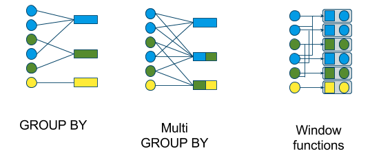
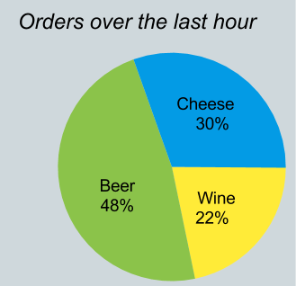

# Background

## Navigation

- Overview
  - [Background](#index)
  - [Tutorial](#tutorial)
  - [Algebra](#algebra)
- Advanced
  - [Adapters](#adapter)
  - [Spatial](#spatial)
  - [Streaming](#stream)
  - [Materialized Views](#materialized_views)
  - [Lattices](#lattice)
- Reference
  - [SQL language](#reference)
  - [JSON/YAML models](#model)
  - [HOWTO](#howto)
- Meta
  - [History](#history)
  - [Powered by Calcite](#powered_by)

## Content

<a id="index"></a>

<!-- source_url: https://calcite.apache.org/docs/ -->

<!-- page_index: 1 -->

# Background

Navigate the docs…

<a id="index--background"></a>

# Background

Apache Calcite is a dynamic data management framework.

It contains many of the pieces that comprise a typical database
management system, but omits some key functions: storage of data, algorithms to process data, and a repository for storing metadata.

Calcite intentionally stays out of the business of storing and
processing data. As we shall see, this makes it an excellent choice
for mediating between applications and one or more data storage
locations and data processing engines. It is also a perfect foundation
for building a database: just add data.

To illustrate, let’s create an empty instance of Calcite and then
point it at some data.

```java
public static class HrSchema {
  public final Employee[] emps = new Employee[0];
  public final Department[] depts = new Department[0];
}
Class.forName("org.apache.calcite.jdbc.Driver");
Properties info = new Properties();
info.setProperty("lex", "JAVA");
Connection connection =
    DriverManager.getConnection("jdbc:calcite:", info);
CalciteConnection calciteConnection =
    connection.unwrap(CalciteConnection.class);
SchemaPlus rootSchema = calciteConnection.getRootSchema();
Schema schema = new ReflectiveSchema(new HrSchema());
rootSchema.add("hr", schema);
Statement statement = calciteConnection.createStatement();
ResultSet resultSet = statement.executeQuery(
    "select d.deptno, min(e.empid)\n"
    + "from hr.emps as e\n"
    + "join hr.depts as d\n"
    + "  on e.deptno = d.deptno\n"
    + "group by d.deptno\n"
    + "having count(*) > 1");
print(resultSet);
resultSet.close();
statement.close();
connection.close();
```

Where is the database? There is no database. The connection is
completely empty until `new ReflectiveSchema` registers a Java
object as a schema and its collection fields `emps` and `depts` as
tables.

Calcite does not want to own data; it does not even have a favorite data
format. This example used in-memory data sets, and processed them
using operators such as `groupBy` and `join` from the linq4j
library. But Calcite can also process data in other data formats, such
as JDBC. In the first example, replace

```java
Schema schema = new ReflectiveSchema(new HrSchema());
```

with

```java
Class.forName("com.mysql.jdbc.Driver");
BasicDataSource dataSource = new BasicDataSource();
dataSource.setUrl("jdbc:mysql://localhost");
dataSource.setUsername("username");
dataSource.setPassword("password");
Schema schema = JdbcSchema.create(rootSchema, "hr", dataSource,
    null, "name");
```

and Calcite will execute the same query in JDBC. To the application, the data and API are the same, but behind the scenes the
implementation is very different. Calcite uses optimizer rules to push
the `JOIN` and `GROUP BY` operations to the source database.

In-memory and JDBC are just two familiar examples. Calcite can handle
any data source and data format. To add a data source, you need to
write an adapter that tells Calcite what collections in the data
source it should consider “tables”.

For more advanced integration, you can write optimizer
rules. Optimizer rules allow Calcite to access data of a new format, allow you to register new operators (such as a better join algorithm), and allow Calcite to optimize how queries are translated to
operators. Calcite will combine your rules and operators with built-in
rules and operators, apply cost-based optimization, and generate an
efficient plan.

<a id="index--writing-an-adapter"></a>

### Writing an adapter

The subproject under example/csv provides a CSV adapter, which is
fully functional for use in applications but is also simple enough to
serve as a good template if you are writing your own adapter.

See the [tutorial](#tutorial) for information on using
the CSV adapter and writing other adapters.

See the [HOWTO](#howto) for more information about
using other adapters, and about using Calcite in general.

<a id="index--status"></a>

## Status

The following features are complete.

- Query parser, validator and optimizer
- Support for reading models in JSON format
- Many standard functions and aggregate functions
- JDBC queries against Linq4j and JDBC back-ends
- Linq4j front-end
- SQL features: SELECT, FROM (including JOIN syntax), WHERE, GROUP BY
  (including GROUPING SETS), aggregate functions (including
  COUNT(DISTINCT …) and FILTER), HAVING, ORDER BY (including NULLS
  FIRST/LAST), set operations (UNION, INTERSECT, MINUS), sub-queries
  (including correlated sub-queries), windowed aggregates, LIMIT
  (syntax as [Postgres](https://www.postgresql.org/docs/8.4/static/sql-select.html#SQL-LIMIT));
  more details in the [SQL reference](#reference)
- Local and remote JDBC drivers; see [Avatica](https://calcite.apache.org/docs/avatica_overview.html)
- Several [adapters](#adapter)

Previous

[Next](#tutorial)

<a id="index--overview"></a>

#### Overview

- [Background](#index)
- [Tutorial](#tutorial)
- [Algebra](#algebra)

<a id="index--advanced"></a>

#### Advanced

- [Adapters](#adapter)
- [Spatial](#spatial)
- [Streaming](#stream)
- [Materialized Views](#materialized_views)
- [Lattices](#lattice)

<a id="index--avatica"></a>

#### Avatica

- [Overview](https://calcite.apache.org/docs/avatica_overview.html)
- [Roadmap](https://calcite.apache.org/docs/avatica_roadmap.html)
- [JSON Reference](https://calcite.apache.org/docs/avatica_json_reference.html)
- [Protobuf Reference](https://calcite.apache.org/docs/avatica_protobuf_reference.html)

<a id="index--reference"></a>

#### Reference

- [SQL language](#reference)
- [JSON/YAML models](#model)
- [HOWTO](#howto)

<a id="index--meta"></a>

#### Meta

- [History](#history)
- [Powered by Calcite](#powered_by)
- [API](https://calcite.apache.org/javadocAggregate)

---

<a id="tutorial"></a>

<!-- source_url: https://calcite.apache.org/docs/tutorial.html -->

<!-- page_index: 2 -->

# Tutorial

Navigate the docs…

<a id="tutorial--tutorial"></a>

# Tutorial

This is a step-by-step tutorial that shows how to build and connect to
Calcite. It uses a simple adapter that makes a directory of CSV files
appear to be a schema containing tables. Calcite does the rest, and
provides a full SQL interface.

Calcite-example-CSV is a fully functional adapter for
Calcite that reads
text files in
[CSV
(comma-separated values)](https://en.wikipedia.org/wiki/Comma-separated_values) format. It is remarkable that a couple of
hundred lines of Java code are sufficient to provide full SQL query
capability.

CSV also serves as a template for building adapters to other
data formats. Even though there are not many lines of code, it covers
several important concepts:

- user-defined schema using SchemaFactory and Schema interfaces;
- declaring schemas in a model JSON file;
- declaring views in a model JSON file;
- user-defined table using the Table interface;
- determining the record type of a table;
- a simple implementation of Table, using the ScannableTable interface, that
  enumerates all rows directly;
- a more advanced implementation that implements FilterableTable, and can
  filter out rows according to simple predicates;
- advanced implementation of Table, using TranslatableTable, that translates
  to relational operators using planner rules.

<a id="tutorial--download-and-build"></a>

## Download and build

You need Java (version 8, 9 or 10) and Git.

```bash
$ git clone https://github.com/apache/calcite.git
$ cd calcite/example/csv
$ ./sqlline
```

<a id="tutorial--first-queries"></a>

## First queries

Now let’s connect to Calcite using
[sqlline](https://github.com/julianhyde/sqlline), a SQL shell
that is included in this project.

```bash
$ ./sqlline sqlline> !connect jdbc:calcite:model=src/test/resources/model.json admin admin
```

(If you are running Windows, the command is `sqlline.bat`.)

Execute a metadata query:

```bash
sqlline> !tables
+-----------+-------------+------------+--------------+---------+----------+------------+-----------+---------------------------+----------------+
| TABLE_CAT | TABLE_SCHEM | TABLE_NAME |  TABLE_TYPE  | REMARKS | TYPE_CAT | TYPE_SCHEM | TYPE_NAME | SELF_REFERENCING_COL_NAME | REF_GENERATION |
+-----------+-------------+------------+--------------+---------+----------+------------+-----------+---------------------------+----------------+
|           | SALES       | DEPTS      | TABLE        |         |          |            |           |                           |                |
|           | SALES       | EMPS       | TABLE        |         |          |            |           |                           |                |
|           | SALES       | SDEPTS     | TABLE        |         |          |            |           |                           |                |
|           | metadata    | COLUMNS    | SYSTEM TABLE |         |          |            |           |                           |                |
|           | metadata    | TABLES     | SYSTEM TABLE |         |          |            |           |                           |                |
+-----------+-------------+------------+--------------+---------+----------+------------+-----------+---------------------------+----------------+
```

(JDBC experts, note: sqlline’s `!tables` command is just executing
[`DatabaseMetaData.getTables()`](https://docs.oracle.com/en/java/javase/17/docs/api/java.sql/java/sql/DatabaseMetaData.html#getTables(java.lang.String,java.lang.String,java.lang.String,java.lang.String[]))
behind the scenes.
It has other commands to query JDBC metadata, such as `!columns` and `!describe`.)

As you can see there are 5 tables in the system: tables
`EMPS`, `DEPTS` and `SDEPTS` in the current
`SALES` schema, and `COLUMNS` and
`TABLES` in the system `metadata` schema. The
system tables are always present in Calcite, but the other tables are
provided by the specific implementation of the schema; in this case, the `EMPS`, `DEPTS` and `SDEPTS` tables are based on the
`EMPS.csv.gz`, `DEPTS.csv` and `SDEPTS.csv` files in the
`resources/sales` directory.

Let’s execute some queries on those tables, to show that Calcite is providing
a full implementation of SQL. First, a table scan:

```bash
sqlline> SELECT * FROM emps;
+-------+-------+--------+--------+---------------+-------+------+---------+---------+------------+
| EMPNO | NAME  | DEPTNO | GENDER |     CITY      | EMPID | AGE  | SLACKER | MANAGER |  JOINEDAT  |
+-------+-------+--------+--------+---------------+-------+------+---------+---------+------------+
| 100   | Fred  | 10     |        |               | 30    | 25   | true    | false   | 1996-08-03 |
| 110   | Eric  | 20     | M      | San Francisco | 3     | 80   |         | false   | 2001-01-01 |
| 110   | John  | 40     | M      | Vancouver     | 2     | null | false   | true    | 2002-05-03 |
| 120   | Wilma | 20     | F      |               | 1     | 5    |         | true    | 2005-09-07 |
| 130   | Alice | 40     | F      | Vancouver     | 2     | null | false   | true    | 2007-01-01 |
+-------+-------+--------+--------+---------------+-------+------+---------+---------+------------+
```

Now JOIN and GROUP BY:

```bash
sqlline> SELECT d.name, COUNT(*)
. . . .> FROM emps AS e JOIN depts AS d ON e.deptno = d.deptno
. . . .> GROUP BY d.name;
+------------+---------+
|    NAME    | EXPR$1  |
+------------+---------+
| Sales      | 1       |
| Marketing  | 2       |
+------------+---------+
```

Last, the VALUES operator generates a single row, and is a convenient
way to test expressions and SQL built-in functions:

```bash
sqlline> VALUES CHAR_LENGTH('Hello, ' || 'world!');
+---------+
| EXPR$0  |
+---------+
| 13      |
+---------+
```

Calcite has many other SQL features. We don’t have time to cover them
here. Write some more queries to experiment.

<a id="tutorial--schema-discovery"></a>

## Schema discovery

Now, how did Calcite find these tables? Remember, core Calcite does not
know anything about CSV files. (As a “database without a storage
layer”, Calcite doesn’t know about any file formats.) Calcite knows about
those tables because we told it to run code in the calcite-example-csv
project.

There are a couple of steps in that chain. First, we define a schema
based on a schema factory class in a model file. Then the schema
factory creates a schema, and the schema creates several tables, each
of which knows how to get data by scanning a CSV file. Last, after
Calcite has parsed the query and planned it to use those tables, Calcite
invokes the tables to read the data as the query is being
executed. Now let’s look at those steps in more detail.

On the JDBC connect string we gave the path of a model in JSON
format. Here is the model:

```json
{
  version: '1.0',
  defaultSchema: 'SALES',
  schemas: [
    {
      name: 'SALES',
      type: 'custom',
      factory: 'org.apache.calcite.adapter.csv.CsvSchemaFactory',
      operand: {
        directory: 'sales'
      }
    }
  ]
}
```

The model defines a single schema called ‘SALES’. The schema is
powered by a plugin class, [org.apache.calcite.adapter.csv.CsvSchemaFactory](https://github.com/apache/calcite/blob/main/example/csv/src/main/java/org/apache/calcite/adapter/csv/CsvSchemaFactory.java), which is part of the
calcite-example-csv project and implements the Calcite interface
[SchemaFactory](https://calcite.apache.org/javadocAggregate/org/apache/calcite/schema/SchemaFactory.html).
Its `create` method instantiates a
schema, passing in the `directory` argument from the model file:

```java
public Schema create(SchemaPlus parentSchema, String name,
    Map<String, Object> operand) {
  final String directory = (String) operand.get("directory");
  final File base =
      (File) operand.get(ModelHandler.ExtraOperand.BASE_DIRECTORY.camelName);
  File directoryFile = new File(directory);
  if (base != null && !directoryFile.isAbsolute()) {
    directoryFile = new File(base, directory);
  }
  String flavorName = (String) operand.get("flavor");
  CsvTable.Flavor flavor;
  if (flavorName == null) {
    flavor = CsvTable.Flavor.SCANNABLE;
  } else {
    flavor = CsvTable.Flavor.valueOf(flavorName.toUpperCase(Locale.ROOT));
  }
  return new CsvSchema(directoryFile, flavor);
}
```

Driven by the model, the schema factory instantiates a single schema
called ‘SALES’. The schema is an instance of
[org.apache.calcite.adapter.csv.CsvSchema](https://github.com/apache/calcite/blob/main/example/csv/src/main/java/org/apache/calcite/adapter/csv/CsvSchema.java)
and implements the Calcite interface
[Schema](https://calcite.apache.org/javadocAggregate/org/apache/calcite/schema/Schema.html).

A schema’s job is to produce a list of tables. (It can also list sub-schemas and
table-functions, but these are advanced features and calcite-example-csv does
not support them.) The tables implement Calcite’s
[Table](https://calcite.apache.org/javadocAggregate/org/apache/calcite/schema/Table.html)
interface. `CsvSchema` produces tables that are instances of
[CsvTable](https://github.com/apache/calcite/blob/main/example/csv/src/main/java/org/apache/calcite/adapter/csv/CsvTable.java)
and its sub-classes.

Here is the relevant code from `CsvSchema`, overriding the
`getTableMap()`
method in the `AbstractSchema` base class.

```java
private Map<String, Table> createTableMap() {
  // Look for files in the directory ending in ".csv", ".csv.gz", ".json",
  // ".json.gz".
  final Source baseSource = Sources.of(directoryFile);
  File[] files = directoryFile.listFiles((dir, name) -> {
    final String nameSansGz = trim(name, ".gz");
    return nameSansGz.endsWith(".csv")
        || nameSansGz.endsWith(".json");
  });
  if (files == null) {
    System.out.println("directory " + directoryFile + " not found");
    files = new File[0];
  }
  // Build a map from table name to table; each file becomes a table.
  final ImmutableMap.Builder<String, Table> builder = ImmutableMap.builder();
  for (File file : files) {
    Source source = Sources.of(file);
    Source sourceSansGz = source.trim(".gz");
    final Source sourceSansJson = sourceSansGz.trimOrNull(".json");
    if (sourceSansJson != null) {
      final Table table = new JsonScannableTable(source);
      builder.put(sourceSansJson.relative(baseSource).path(), table);
    }
    final Source sourceSansCsv = sourceSansGz.trimOrNull(".csv");
    if (sourceSansCsv != null) {
      final Table table = createTable(source);
      builder.put(sourceSansCsv.relative(baseSource).path(), table);
    }
  }
  return builder.build();
}

/** Creates different sub-type of table based on the "flavor" attribute. */
private Table createTable(Source source) {
  switch (flavor) {
  case TRANSLATABLE:
    return new CsvTranslatableTable(source, null);
  case SCANNABLE:
    return new CsvScannableTable(source, null);
  case FILTERABLE:
    return new CsvFilterableTable(source, null);
  default:
    throw new AssertionError("Unknown flavor " + this.flavor);
  }
}
```

The schema scans the directory, finds all files with the appropriate extension, and creates tables for them. In this case, the directory
is `sales` and contains files
`EMPS.csv.gz`, `DEPTS.csv` and `SDEPTS.csv`, which these become
the tables `EMPS`, `DEPTS` and `SDEPTS`.

<a id="tutorial--tables-and-views-in-schemas"></a>

## Tables and views in schemas

Note how we did not need to define any tables in the model; the schema
generated the tables automatically.

You can define extra tables, beyond those that are created automatically, using the `tables` property of a schema.

Let’s see how to create
an important and useful type of table, namely a view.

A view looks like a table when you are writing a query, but it doesn’t store data.
It derives its result by executing a query.
The view is expanded while the query is being planned, so the query planner
can often perform optimizations like removing expressions from the SELECT
clause that are not used in the final result.

Here is a schema that defines a view:

```json
{
  version: '1.0',
  defaultSchema: 'SALES',
  schemas: [
    {
      name: 'SALES',
      type: 'custom',
      factory: 'org.apache.calcite.adapter.csv.CsvSchemaFactory',
      operand: {
        directory: 'sales'
      },
      tables: [
        {
          name: 'FEMALE_EMPS',
          type: 'view',
          sql: 'SELECT * FROM emps WHERE gender = \'F\''
        }
      ]
    }
  ]
}
```

The line `type: 'view'` tags `FEMALE_EMPS` as a view, as opposed to a regular table or a custom table.
Note that single-quotes within the view definition are escaped using a
back-slash, in the normal way for JSON.

JSON doesn’t make it easy to author long strings, so Calcite supports an
alternative syntax. If your view has a long SQL statement, you can instead
supply a list of lines rather than a single string:

```json
{
  name: 'FEMALE_EMPS',
  type: 'view',
  sql: [
    'SELECT * FROM emps',
    'WHERE gender = \'F\''
  ]
}
```

Now we have defined a view, we can use it in queries just as if it were a table:

```sql
sqlline> SELECT e.name, d.name FROM female_emps AS e JOIN depts AS d on e.deptno = d.deptno;
+--------+------------+
|  NAME  |    NAME    |
+--------+------------+
| Wilma  | Marketing  |
+--------+------------+
```

<a id="tutorial--custom-tables"></a>

## Custom tables

Custom tables are tables whose implementation is driven by user-defined code.
They don’t need to live in a custom schema.

There is an example in `model-with-custom-table.json`:

```json
{
  version: '1.0',
  defaultSchema: 'CUSTOM_TABLE',
  schemas: [
    {
      name: 'CUSTOM_TABLE',
      tables: [
        {
          name: 'EMPS',
          type: 'custom',
          factory: 'org.apache.calcite.adapter.csv.CsvTableFactory',
          operand: {
            file: 'sales/EMPS.csv.gz',
            flavor: "scannable"
          }
        }
      ]
    }
  ]
}
```

We can query the table in the usual way:

```sql
sqlline> !connect jdbc:calcite:model=src/test/resources/model-with-custom-table.json admin admin
sqlline> SELECT empno, name FROM custom_table.emps;
+--------+--------+
| EMPNO  |  NAME  |
+--------+--------+
| 100    | Fred   |
| 110    | Eric   |
| 110    | John   |
| 120    | Wilma  |
| 130    | Alice  |
+--------+--------+
```

The schema is a regular one, and contains a custom table powered by
[org.apache.calcite.adapter.csv.CsvTableFactory](https://github.com/apache/calcite/blob/main/example/csv/src/main/java/org/apache/calcite/adapter/csv/CsvTableFactory.java), which implements the Calcite interface
[TableFactory](https://calcite.apache.org/javadocAggregate/org/apache/calcite/schema/TableFactory.html).
Its `create` method instantiates a `CsvScannableTable`, passing in the `file` argument from the model file:

```java
public CsvTable create(SchemaPlus schema, String name,
    Map<String, Object> operand, @Nullable RelDataType rowType) {
  String fileName = (String) operand.get("file");
  final File base =
      (File) operand.get(ModelHandler.ExtraOperand.BASE_DIRECTORY.camelName);
  final Source source = Sources.file(base, fileName);
  final RelProtoDataType protoRowType =
      rowType != null ? RelDataTypeImpl.proto(rowType) : null;
  return new CsvScannableTable(source, protoRowType);
}
```

Implementing a custom table is often a simpler alternative to implementing
a custom schema. Both approaches might end up creating a similar implementation
of the `Table` interface, but for the custom table you don’t
need to implement metadata discovery. (`CsvTableFactory`
creates a `CsvScannableTable`, just as `CsvSchema` does, but the table implementation does not scan the filesystem for .csv files.)

Custom tables require more work for the author of the model (the author
needs to specify each table and its file explicitly) but also give the author
more control (say, providing different parameters for each table).

<a id="tutorial--comments-in-models"></a>

## Comments in models

Models can include comments using `/* ... */` and `//` syntax:

```json
{
  version: '1.0',
  /* Multi-line
     comment. */
  defaultSchema: 'CUSTOM_TABLE',
  // Single-line comment.
  schemas: [
    ..
  ]
}
```

(Comments are not standard JSON, but are a harmless extension.)

<a id="tutorial--optimizing-queries-using-planner-rules"></a>

## Optimizing queries using planner rules

The table implementations we have seen so far are fine as long as the tables
don’t contain a great deal of data. But if your customer table has, say, a
hundred columns and a million rows, you would rather that the system did not
retrieve all of the data for every query. You would like Calcite to negotiate
with the adapter and find a more efficient way of accessing the data.

This negotiation is a simple form of query optimization. Calcite supports query
optimization by adding *planner rules*. Planner rules operate by
looking for patterns in the query parse tree (for instance a project on top
of a certain kind of table), and replacing the matched nodes in the tree by
a new set of nodes which implement the optimization.

Planner rules are also extensible, like schemas and tables. So, if you have a
data store that you want to access via SQL, you first define a custom table or
schema, and then you define some rules to make the access efficient.

To see this in action, let’s use a planner rule to access
a subset of columns from a CSV file. Let’s run the same query against two very
similar schemas:

```sql
sqlline> !connect jdbc:calcite:model=src/test/resources/model.json admin admin
sqlline> explain plan for select name from emps;
+-----------------------------------------------------+
| PLAN                                                |
+-----------------------------------------------------+
| EnumerableCalc(expr#0..9=[{inputs}], NAME=[$t1])    |
|   EnumerableTableScan(table=[[SALES, EMPS]])        |
+-----------------------------------------------------+
sqlline> !connect jdbc:calcite:model=src/test/resources/smart.json admin admin
sqlline> explain plan for select name from emps;
+-----------------------------------------------------+
| PLAN                                                |
+-----------------------------------------------------+
| CsvTableScan(table=[[SALES, EMPS]], fields=[[1]])   |
+-----------------------------------------------------+
```

What causes the difference in plan? Let’s follow the trail of evidence. In the
`smart.json` model file, there is just one extra line:

```json
flavor: "translatable"
```

This causes a `CsvSchema` to be created with
`flavor = TRANSLATABLE`, and its `createTable` method creates instances of
[CsvTranslatableTable](https://github.com/apache/calcite/blob/main/example/csv/src/main/java/org/apache/calcite/adapter/csv/CsvTranslatableTable.java)
rather than a `CsvScannableTable`.

`CsvTranslatableTable` implements the
`TranslatableTable.toRel()`
method to create
[CsvTableScan](https://github.com/apache/calcite/blob/main/example/csv/src/main/java/org/apache/calcite/adapter/csv/CsvTableScan.java).
Table scans are the leaves of a query operator tree.
The usual implementation is
`EnumerableTableScan`, but we have created a distinctive sub-type that will cause rules to fire.

Here is the rule in its entirety:

```java
public class CsvProjectTableScanRule
    extends RelRule<CsvProjectTableScanRule.Config> {

  /** Creates a CsvProjectTableScanRule. */
  protected CsvProjectTableScanRule(Config config) {
    super(config);
  }

  @Override public void onMatch(RelOptRuleCall call) {
    final LogicalProject project = call.rel(0);
    final CsvTableScan scan = call.rel(1);
    int[] fields = getProjectFields(project.getProjects());
    if (fields == null) {
      // Project contains expressions more complex than just field references.
      return;
    }
    call.transformTo(
        new CsvTableScan(
            scan.getCluster(),
            scan.getTable(),
            scan.csvTable,
            fields));
  }

  private static int[] getProjectFields(List<RexNode> exps) {
    final int[] fields = new int[exps.size()];
    for (int i = 0; i < exps.size(); i++) {
      final RexNode exp = exps.get(i);
      if (exp instanceof RexInputRef) {
        fields[i] = ((RexInputRef) exp).getIndex();
      } else {
        return null; // not a simple projection
      }
    }
    return fields;
  }

  /** Rule configuration. */
  @Value.Immutable(singleton = false)
  public interface Config extends RelRule.Config {
    Config DEFAULT = ImmutableCsvProjectTableScanRule.Config.builder()
        .withOperandSupplier(b0 ->
            b0.operand(LogicalProject.class).oneInput(b1 ->
                b1.operand(CsvTableScan.class).noInputs()))
        .build();

    @Override default CsvProjectTableScanRule toRule() {
      return new CsvProjectTableScanRule(this);
    }
  }
}
```

The default instance of the rule resides in the `CsvRules` holder class:

```java
public abstract class CsvRules {
  public static final CsvProjectTableScanRule PROJECT_SCAN =
      CsvProjectTableScanRule.Config.DEFAULT.toRule();
}
```

The call to the `withOperandSupplier` method in the default configuration
(the `DEFAULT` field in `interface Config`) declares the pattern of relational
expressions that will cause the rule to fire. The planner will invoke the rule
if it sees a `LogicalProject` whose sole input is a `CsvTableScan` with no
inputs.

Variants of the rule are possible. For example, a different rule instance
might instead match a `EnumerableProject` on a `CsvTableScan`.

The `onMatch` method generates a new relational expression and calls
`RelOptRuleCall.transformTo()`
to indicate that the rule has fired successfully.

<a id="tutorial--the-query-optimization-process"></a>

## The query optimization process

There’s a lot to say about how clever Calcite’s query planner is, but we won’t
say it here. The cleverness is designed to take the burden off you, the writer
of planner rules.

First, Calcite doesn’t fire rules in a prescribed order. The query optimization
process follows many branches of a branching tree, just like a chess playing
program examines many possible sequences of moves. If rules A and B both match a
given section of the query operator tree, then Calcite can fire both.

Second, Calcite uses cost in choosing between plans, but the cost model doesn’t
prevent rules from firing which may seem to be more expensive in the short term.

Many optimizers have a linear optimization scheme. Faced with a choice between
rule A and rule B, as above, such an optimizer needs to choose immediately. It
might have a policy such as “apply rule A to the whole tree, then apply rule B
to the whole tree”, or apply a cost-based policy, applying the rule that
produces the cheaper result.

Calcite doesn’t require such compromises.
This makes it simple to combine various sets of rules.
If, say you want to combine rules to recognize materialized views with rules to
read from CSV and JDBC source systems, you just give Calcite the set of all
rules and tell it to go at it.

Calcite does use a cost model. The cost model decides which plan to ultimately
use, and sometimes to prune the search tree to prevent the search space from
exploding, but it never forces you to choose between rule A and rule B. This is
important, because it avoids falling into local minima in the search space that
are not actually optimal.

Also (you guessed it) the cost model is pluggable, as are the table and query
operator statistics it is based upon. But that can be a subject for later.

<a id="tutorial--jdbc-adapter"></a>

## JDBC adapter

The JDBC adapter maps a schema in a JDBC data source as a Calcite schema.

For example, this schema reads from a MySQL “foodmart” database:

```json
{
  version: '1.0',
  defaultSchema: 'FOODMART',
  schemas: [
    {
      name: 'FOODMART',
      type: 'custom',
      factory: 'org.apache.calcite.adapter.jdbc.JdbcSchema$Factory',
      operand: {
        jdbcDriver: 'com.mysql.jdbc.Driver',
        jdbcUrl: 'jdbc:mysql://localhost/foodmart',
        jdbcUser: 'foodmart',
        jdbcPassword: 'foodmart'
      }
    }
  ]
}
```

(The FoodMart database will be familiar to those of you who have used
the Mondrian OLAP engine, because it is Mondrian’s main test data
set. To load the data set, follow [Mondrian’s
installation instructions](https://mondrian.pentaho.com/documentation/installation.php#2_Set_up_test_data).)

The JDBC adapter will push
down as much processing as possible to the source system, translating
syntax, data types and built-in functions as we go. If a Calcite query
is based on tables from a single JDBC database, in principle the whole
query should go to that database. If tables are from multiple JDBC
sources, or a mixture of JDBC and non-JDBC, Calcite will use the most
efficient distributed query approach that it can.

<a id="tutorial--the-cloning-jdbc-adapter"></a>

## The cloning JDBC adapter

The cloning JDBC adapter creates a hybrid database. The data is
sourced from a JDBC database but is read into in-memory tables the
first time each table is accessed. Calcite evaluates queries based on
those in-memory tables, effectively a cache of the database.

For example, the following model reads tables from a MySQL
“foodmart” database:

```json
{
  version: '1.0',
  defaultSchema: 'FOODMART_CLONE',
  schemas: [
    {
      name: 'FOODMART_CLONE',
      type: 'custom',
      factory: 'org.apache.calcite.adapter.clone.CloneSchema$Factory',
      operand: {
        jdbcDriver: 'com.mysql.jdbc.Driver',
        jdbcUrl: 'jdbc:mysql://localhost/foodmart',
        jdbcUser: 'foodmart',
        jdbcPassword: 'foodmart'
      }
    }
  ]
}
```

Another technique is to build a clone schema on top of an existing
schema. You use the `source` property to reference a schema
defined earlier in the model, like this:

```json
{
  version: '1.0',
  defaultSchema: 'FOODMART_CLONE',
  schemas: [
    {
      name: 'FOODMART',
      type: 'custom',
      factory: 'org.apache.calcite.adapter.jdbc.JdbcSchema$Factory',
      operand: {
        jdbcDriver: 'com.mysql.jdbc.Driver',
        jdbcUrl: 'jdbc:mysql://localhost/foodmart',
        jdbcUser: 'foodmart',
        jdbcPassword: 'foodmart'
      }
    },
    {
      name: 'FOODMART_CLONE',
      type: 'custom',
      factory: 'org.apache.calcite.adapter.clone.CloneSchema$Factory',
      operand: {
        source: 'FOODMART'
      }
    }
  ]
}
```

You can use this approach to create a clone schema on any type of
schema, not just JDBC.

The cloning adapter isn’t the be-all and end-all. We plan to develop
more sophisticated caching strategies, and a more complete and
efficient implementation of in-memory tables, but for now the cloning
JDBC adapter shows what is possible and allows us to try out our
initial implementations.

<a id="tutorial--further-topics"></a>

## Further topics

There are many other ways to extend Calcite not yet described in this tutorial.
The [adapter specification](#adapter) describes the APIs involved.

[Previous](#index)

[Next](#algebra)

<a id="tutorial--overview"></a>

#### Overview

- [Background](#index)
- [Tutorial](#tutorial)
- [Algebra](#algebra)

<a id="tutorial--advanced"></a>

#### Advanced

- [Adapters](#adapter)
- [Spatial](#spatial)
- [Streaming](#stream)
- [Materialized Views](#materialized_views)
- [Lattices](#lattice)

<a id="tutorial--avatica"></a>

#### Avatica

- [Overview](https://calcite.apache.org/docs/avatica_overview.html)
- [Roadmap](https://calcite.apache.org/docs/avatica_roadmap.html)
- [JSON Reference](https://calcite.apache.org/docs/avatica_json_reference.html)
- [Protobuf Reference](https://calcite.apache.org/docs/avatica_protobuf_reference.html)

<a id="tutorial--reference"></a>

#### Reference

- [SQL language](#reference)
- [JSON/YAML models](#model)
- [HOWTO](#howto)

<a id="tutorial--meta"></a>

#### Meta

- [History](#history)
- [Powered by Calcite](#powered_by)
- [API](https://calcite.apache.org/javadocAggregate)

---

<a id="algebra"></a>

<!-- source_url: https://calcite.apache.org/docs/algebra.html -->

<!-- page_index: 3 -->

# Algebra

Navigate the docs…

<a id="algebra--algebra"></a>

# Algebra

Relational algebra is at the heart of Calcite. Every query is
represented as a tree of relational operators. You can translate from
SQL to relational algebra, or you can build the tree directly.

Planner rules transform expression trees using mathematical identities
that preserve semantics. For example, it is valid to push a filter
into an input of an inner join if the filter does not reference
columns from the other input.

Calcite optimizes queries by repeatedly applying planner rules to a
relational expression. A cost model guides the process, and the
planner engine generates an alternative expression that has the same
semantics as the original but a lower cost.

The planning process is extensible. You can add your own relational
operators, planner rules, cost model, and statistics.

<a id="algebra--algebra-builder"></a>

## Algebra builder

The simplest way to build a relational expression is to use the algebra builder, [RelBuilder](https://calcite.apache.org/javadocAggregate/org/apache/calcite/tools/RelBuilder.html).
Here is an example:

<a id="algebra--tablescan"></a>

### TableScan

```java
final FrameworkConfig config;
final RelBuilder builder = RelBuilder.create(config);
final RelNode node = builder
  .scan("EMP")
  .build();
System.out.println(RelOptUtil.toString(node));
```

(You can find the full code for this and other examples in
[RelBuilderExample.java](https://github.com/apache/calcite/blob/main/core/src/test/java/org/apache/calcite/examples/RelBuilderExample.java).)

The code prints

```text
LogicalTableScan(table=[[scott, EMP]])
```

It has created a scan of the `EMP` table; equivalent to the SQL

```sql
SELECT *
FROM scott.EMP;
```

<a id="algebra--adding-a-project"></a>

### Adding a Project

Now, let’s add a Project, the equivalent of

```sql
SELECT ename, deptno
FROM scott.EMP;
```

We just add a call to the `project` method before calling
`build`:

```java
final RelNode node = builder
  .scan("EMP")
  .project(builder.field("DEPTNO"), builder.field("ENAME"))
  .build();
System.out.println(RelOptUtil.toString(node));
```

and the output is

```text
LogicalProject(DEPTNO=[$7], ENAME=[$1])
  LogicalTableScan(table=[[scott, EMP]])
```

The two calls to `builder.field` create simple expressions
that return the fields from the input relational expression, namely the TableScan created by the `scan` call.

Calcite has converted them to field references by ordinal, `$7` and `$1`.

<a id="algebra--adding-a-filter-and-aggregate"></a>

### Adding a Filter and Aggregate

A query with an Aggregate, and a Filter:

```java
final RelNode node = builder
  .scan("EMP")
  .aggregate(builder.groupKey("DEPTNO"),
      builder.count(false, "C"),
      builder.sum(false, "S", builder.field("SAL")))
  .filter(
      builder.call(SqlStdOperatorTable.GREATER_THAN,
          builder.field("C"),
          builder.literal(10)))
  .build();
System.out.println(RelOptUtil.toString(node));
```

is equivalent to SQL

```sql
SELECT deptno, count(*) AS c, sum(sal) AS s
FROM emp
GROUP BY deptno
HAVING count(*) > 10
```

and produces

```text
LogicalFilter(condition=[>($1, 10)])
  LogicalAggregate(group=[{7}], C=[COUNT()], S=[SUM($5)])
    LogicalTableScan(table=[[scott, EMP]])
```

<a id="algebra--push-and-pop"></a>

### Push and pop

The builder uses a stack to store the relational expression produced by
one step and pass it as an input to the next step. This allows the
methods that produce relational expressions to produce a builder.

Most of the time, the only stack method you will use is `build()`, to get the
last relational expression, namely the root of the tree.

Sometimes the stack becomes so deeply nested it gets confusing. To keep things
straight, you can remove expressions from the stack. For example, here we are
building a bushy join:

```text
.
               join
             /      \
        join          join
      /      \      /      \
CUSTOMERS ORDERS LINE_ITEMS PRODUCTS
```

We build it in three stages. Store the intermediate results in variables
`left` and `right`, and use `push()` to put them back on the stack when it is
time to create the final `Join`:

```java
final RelNode left = builder
  .scan("CUSTOMERS")
  .scan("ORDERS")
  .join(JoinRelType.INNER, "ORDER_ID")
  .build();

final RelNode right = builder
  .scan("LINE_ITEMS")
  .scan("PRODUCTS")
  .join(JoinRelType.INNER, "PRODUCT_ID")
  .build();

final RelNode result = builder
  .push(left)
  .push(right)
  .join(JoinRelType.INNER, "ORDER_ID")
  .build();
```

<a id="algebra--switch-convention"></a>

### Switch Convention

The default RelBuilder creates logical RelNode without coventions. But you could
switch to use a different convention through `adoptConvention()`:

```java
final RelNode result = builder
  .push(input)
  .adoptConvention(EnumerableConvention.INSTANCE)
  .sort(toCollation)
  .build();
```

In this case, we create an EnumerableSort on top of the input RelNode.

<a id="algebra--field-names-and-ordinals"></a>

### Field names and ordinals

You can reference a field by name or ordinal.

Ordinals are zero-based. Each operator guarantees the order in which its output
fields occur. For example, `Project` returns the fields generated by
each of the scalar expressions.

The field names of an operator are guaranteed to be unique, but sometimes that
means that the names are not exactly what you expect. For example, when you
join EMP to DEPT, one of the output fields will be called DEPTNO and another
will be called something like DEPTNO\_1.

Some relational expression methods give you more control over field names:

- `project` lets you wrap expressions using `alias(expr, fieldName)`. It
  removes the wrapper but keeps the suggested name (as long as it is unique).
- `values(String[] fieldNames, Object... values)` accepts an array of field
  names. If any element of the array is null, the builder will generate a unique
  name.

If an expression projects an input field, or a cast of an input field, it will
use the name of that input field.

Once the unique field names have been assigned, the names are immutable.
If you have a particular `RelNode` instance, you can rely on the field names not
changing. In fact, the whole relational expression is immutable.

But if a relational expression has passed through several rewrite rules (see
[RelOptRule](https://calcite.apache.org/javadocAggregate/org/apache/calcite/plan/RelOptRule.html)), the field
names of the resulting expression might not look much like the originals.
At that point it is better to reference fields by ordinal.

When you are building a relational expression that accepts multiple inputs, you need to build field references that take that into account. This occurs
most often when building join conditions.

Suppose you are building a join on EMP, which has 8 fields [EMPNO, ENAME, JOB, MGR, HIREDATE, SAL, COMM, DEPTNO]
and DEPT, which has 3 fields [DEPTNO, DNAME, LOC].
Internally, Calcite represents those fields as offsets into
a combined input row with 11 fields: the first field of the left input is
field #0 (0-based, remember), and the first field of the right input is
field #8.

But through the builder API, you specify which field of which input.
To reference “SAL”, internal field #5, write `builder.field(2, 0, "SAL")`, `builder.field(2, "EMP", "SAL")`, or `builder.field(2, 0, 5)`.
This means “the field #5 of input #0 of two inputs”.
(Why does it need to know that there are two inputs? Because they are stored on
the stack; input #1 is at the top of the stack, and input #0 is below it.
If we did not tell the builder that were two inputs, it would not know how deep
to go for input #0.)

Similarly, to reference “DNAME”, internal field #9 (8 + 1), write `builder.field(2, 1, "DNAME")`, `builder.field(2, "DEPT", "DNAME")`, or `builder.field(2, 1, 1)`.

<a id="algebra--recursive-queries"></a>

### Recursive Queries

Warning: The current API is experimental and subject to change without notice.
A SQL recursive query, e.g. this one that generates the sequence 1, 2, 3, …10:

```sql
WITH RECURSIVE aux(i) AS (
  VALUES (1)
  UNION ALL
  SELECT i+1 FROM aux WHERE i < 10
)
SELECT * FROM aux
```

can be generated using a scan on a TransientTable and a RepeatUnion:

```java
final RelNode node = builder
  .values(new String[] { "i" }, 1)
  .transientScan("aux")
  .filter(
      builder.call(
          SqlStdOperatorTable.LESS_THAN,
          builder.field(0),
          builder.literal(10)))
  .project(
      builder.call(
          SqlStdOperatorTable.PLUS,
          builder.field(0),
          builder.literal(1)))
  .repeatUnion("aux", true)
  .build();
System.out.println(RelOptUtil.toString(node));
```

which produces:

```text
LogicalRepeatUnion(all=[true])
  LogicalTableSpool(readType=[LAZY], writeType=[LAZY], tableName=[aux])
    LogicalValues(tuples=[[{ 1 }]])
  LogicalTableSpool(readType=[LAZY], writeType=[LAZY], tableName=[aux])
    LogicalProject($f0=[+($0, 1)])
      LogicalFilter(condition=[<($0, 10)])
        LogicalTableScan(table=[[aux]])
```

<a id="algebra--api-summary"></a>

### API summary

<a id="algebra--relational-operators"></a>

#### Relational operators

The following methods create a relational expression
([RelNode](https://calcite.apache.org/javadocAggregate/org/apache/calcite/rel/RelNode.html)), push it onto the stack, and
return the `RelBuilder`.

| Method | Description |
| --- | --- |
| `scan(tableName)` | Creates a [TableScan](https://calcite.apache.org/javadocAggregate/org/apache/calcite/rel/core/TableScan.html). |
| `functionScan(operator, n, expr...)` `functionScan(operator, n, exprList)` | Creates a [TableFunctionScan](https://calcite.apache.org/javadocAggregate/org/apache/calcite/rel/core/TableFunctionScan.html) of the `n` most recent relational expressions. |
| `transientScan(tableName [, rowType])` | Creates a [TableScan](https://calcite.apache.org/javadocAggregate/org/apache/calcite/rel/core/TableScan.html) on a [TransientTable](https://calcite.apache.org/javadocAggregate/org/apache/calcite/schema/TransientTable.html) with the given type (if not specified, the most recent relational expression’s type will be used). |
| `values(fieldNames, value...)` `values(rowType, tupleList)` | Creates a [Values](https://calcite.apache.org/javadocAggregate/org/apache/calcite/rel/core/Values.html). |
| `filter([variablesSet, ] exprList)` `filter([variablesSet, ] expr...)` | Creates a [Filter](https://calcite.apache.org/javadocAggregate/org/apache/calcite/rel/core/Filter.html) over the AND of the given predicates; if `variablesSet` is specified, the predicates may reference those variables. |
| `project(expr...)` `project(exprList [, fieldNames])` | Creates a [Project](https://calcite.apache.org/javadocAggregate/org/apache/calcite/rel/core/Project.html). To override the default name, wrap expressions using `alias`, or specify the `fieldNames` argument. |
| `projectPlus(expr...)` `projectPlus(exprList)` | Variant of `project` that keeps original fields and appends the given expressions. |
| `projectExcept(expr...)` `projectExcept(exprList)` | Variant of `project` that keeps original fields and removes the given expressions. |
| `permute(mapping)` | Creates a [Project](https://calcite.apache.org/javadocAggregate/org/apache/calcite/rel/core/Project.html) that permutes the fields using `mapping`. |
| `convert(rowType [, rename])` | Creates a [Project](https://calcite.apache.org/javadocAggregate/org/apache/calcite/rel/core/Project.html) that converts the fields to the given types, optionally also renaming them. |
| `aggregate(groupKey, aggCall...)` `aggregate(groupKey, aggCallList)` | Creates an [Aggregate](https://calcite.apache.org/javadocAggregate/org/apache/calcite/rel/core/Aggregate.html). |
| `distinct()` | Creates an [Aggregate](https://calcite.apache.org/javadocAggregate/org/apache/calcite/rel/core/Aggregate.html) that eliminates duplicate records. |
| `pivot(groupKey, aggCalls, axes, values)` | Adds a pivot operation, implemented by generating an [Aggregate](https://calcite.apache.org/javadocAggregate/org/apache/calcite/rel/core/Aggregate.html) with a column for each combination of measures and values |
| `unpivot(includeNulls, measureNames, axisNames, axisMap)` | Adds an unpivot operation, implemented by generating a [Join](https://calcite.apache.org/javadocAggregate/org/apache/calcite/rel/core/Join.html) to a [Values](https://calcite.apache.org/javadocAggregate/org/apache/calcite/rel/core/Values.html) that converts each row to several rows |
| `sort(fieldOrdinal...)` `sort(expr...)` `sort(exprList)` | Creates a [Sort](https://calcite.apache.org/javadocAggregate/org/apache/calcite/rel/core/Sort.html). In the first form, field ordinals are 0-based, and a negative ordinal indicates descending; for example, -2 means field 1 descending. In the other forms, you can wrap expressions in `as`, `nullsFirst` or `nullsLast`. |
| `sortLimit(offset, fetch, expr...)` `sortLimit(offset, fetch, exprList)` | Creates a [Sort](https://calcite.apache.org/javadocAggregate/org/apache/calcite/rel/core/Sort.html) with offset and limit. |
| `limit(offset, fetch)` | Creates a [Sort](https://calcite.apache.org/javadocAggregate/org/apache/calcite/rel/core/Sort.html) that does not sort, only applies with offset and limit. |
| `exchange(distribution)` | Creates an [Exchange](https://calcite.apache.org/javadocAggregate/org/apache/calcite/rel/core/Exchange.html). |
| `sortExchange(distribution, collation)` | Creates a [SortExchange](https://calcite.apache.org/javadocAggregate/org/apache/calcite/rel/core/SortExchange.html). |
| `correlate(joinType, correlationId, requiredField...)` `correlate(joinType, correlationId, requiredFieldList)` | Creates a [Correlate](https://calcite.apache.org/javadocAggregate/org/apache/calcite/rel/core/Correlate.html) of the two most recent relational expressions, with a variable name and required field expressions for the left relation. |
| `join(joinType, expr...)` `join(joinType, exprList)` `join(joinType, fieldName...)` | Creates a [Join](https://calcite.apache.org/javadocAggregate/org/apache/calcite/rel/core/Join.html) of the two most recent relational expressions. The first form joins on a boolean expression (multiple conditions are combined using AND). The last form joins on named fields; each side must have a field of each name. |
| `semiJoin(expr)` | Creates a [Join](https://calcite.apache.org/javadocAggregate/org/apache/calcite/rel/core/Join.html) with SEMI join type of the two most recent relational expressions. |
| `antiJoin(expr)` | Creates a [Join](https://calcite.apache.org/javadocAggregate/org/apache/calcite/rel/core/Join.html) with ANTI join type of the two most recent relational expressions. |
| `union(all [, n])` | Creates a [Union](https://calcite.apache.org/javadocAggregate/org/apache/calcite/rel/core/Union.html) of the `n` (default two) most recent relational expressions. |
| `intersect(all [, n])` | Creates an [Intersect](https://calcite.apache.org/javadocAggregate/org/apache/calcite/rel/core/Intersect.html) of the `n` (default two) most recent relational expressions. |
| `minus(all)` | Creates a [Minus](https://calcite.apache.org/javadocAggregate/org/apache/calcite/rel/core/Minus.html) of the two most recent relational expressions. |
| `repeatUnion(tableName, all [, n])` | Creates a [RepeatUnion](https://calcite.apache.org/javadocAggregate/org/apache/calcite/rel/core/RepeatUnion.html) associated to a [TransientTable](https://calcite.apache.org/javadocAggregate/org/apache/calcite/schema/TransientTable.html) of the two most recent relational expressions, with `n` maximum number of iterations (default -1, i.e. no limit). |
| `sample(bernoulli, rate [, repeatableSeed])` | Creates a [sample](https://calcite.apache.org/javadocAggregate/org/apache/calcite/rel/core/Sample.html) of at given sampling rate. |
| `snapshot(period)` | Creates a [Snapshot](https://calcite.apache.org/javadocAggregate/org/apache/calcite/rel/core/Snapshot.html) of the given snapshot period. |
| `match(pattern, strictStart,` `strictEnd, patterns, measures,` `after, subsets, allRows,` `partitionKeys, orderKeys,` `interval)` | Creates a [Match](https://calcite.apache.org/javadocAggregate/org/apache/calcite/rel/core/Match.html). |

Argument types:

- `expr`, `interval` [RexNode](https://calcite.apache.org/javadocAggregate/org/apache/calcite/rex/RexNode.html)
- `expr...`, `requiredField...` Array of
  [RexNode](https://calcite.apache.org/javadocAggregate/org/apache/calcite/rex/RexNode.html)
- `exprList`, `measureList`, `partitionKeys`, `orderKeys`,
  `requiredFieldList` Iterable of
  [RexNode](https://calcite.apache.org/javadocAggregate/org/apache/calcite/rex/RexNode.html)
- `fieldOrdinal` Ordinal of a field within its row (starting from 0)
- `fieldName` Name of a field, unique within its row
- `fieldName...` Array of String
- `fieldNames` Iterable of String
- `rowType` [RelDataType](https://calcite.apache.org/javadocAggregate/org/apache/calcite/rel/type/RelDataType.html)
- `groupKey` [RelBuilder.GroupKey](https://calcite.apache.org/javadocAggregate/org/apache/calcite/tools/RelBuilder.GroupKey.html)
- `aggCall...` Array of [RelBuilder.AggCall](https://calcite.apache.org/javadocAggregate/org/apache/calcite/tools/RelBuilder.AggCall.html)
- `aggCallList` Iterable of [RelBuilder.AggCall](https://calcite.apache.org/javadocAggregate/org/apache/calcite/tools/RelBuilder.AggCall.html)
- `value...` Array of Object
- `value` Object
- `tupleList` Iterable of List of [RexLiteral](https://calcite.apache.org/javadocAggregate/org/apache/calcite/rex/RexLiteral.html)
- `all`, `distinct`, `strictStart`, `strictEnd`, `allRows` boolean
- `alias` String
- `correlationId` [CorrelationId](https://calcite.apache.org/javadocAggregate/org/apache/calcite/rel/core/CorrelationId.html)
- `variablesSet` Iterable of
  [CorrelationId](https://calcite.apache.org/javadocAggregate/org/apache/calcite/rel/core/CorrelationId.html)
- `varHolder` [Holder](https://calcite.apache.org/javadocAggregate/org/apache/calcite/util/Holder.html) of [RexCorrelVariable](https://calcite.apache.org/javadocAggregate/org/apache/calcite/rex/RexCorrelVariable.html)
- `patterns` Map whose key is String, value is [RexNode](https://calcite.apache.org/javadocAggregate/org/apache/calcite/rex/RexNode.html)
- `subsets` Map whose key is String, value is a sorted set of String
- `distribution` [RelDistribution](https://calcite.apache.org/javadocAggregate/org/apache/calcite/rel/RelDistribution.html)
- `collation` [RelCollation](https://calcite.apache.org/javadocAggregate/org/apache/calcite/rel/RelCollation.html)
- `operator` [SqlOperator](https://calcite.apache.org/javadocAggregate/org/apache/calcite/sql/SqlOperator.html)
- `joinType` [JoinRelType](https://calcite.apache.org/javadocAggregate/org/apache/calcite/rel/core/JoinRelType.html)

The builder methods perform various optimizations, including:

- `project` returns its input if asked to project all columns in order
- `filter` flattens the condition (so an `AND` and `OR` may have more than 2 children),
  simplifies (converting say `x = 1 AND TRUE` to `x = 1`)
- If you apply `sort` then `limit`, the effect is as if you had called `sortLimit`

There are annotation methods that add information to the top relational
expression on the stack:

| Method | Description |
| --- | --- |
| `as(alias)` | Assigns a table alias to the top relational expression on the stack |
| `variable(varHolder)` | Creates a correlation variable referencing the top relational expression |

<a id="algebra--stack-methods"></a>

#### Stack methods

| Method | Description |
| --- | --- |
| `build()` | Pops the most recently created relational expression off the stack |
| `push(rel)` | Pushes a relational expression onto the stack. Relational methods such as `scan`, above, call this method, but user code generally does not |
| `pushAll(collection)` | Pushes a collection of relational expressions onto the stack |
| `peek()` | Returns the relational expression most recently put onto the stack, but does not remove it |

<a id="algebra--scalar-expression-methods"></a>

#### Scalar expression methods

The following methods return a scalar expression
([RexNode](https://calcite.apache.org/javadocAggregate/org/apache/calcite/rex/RexNode.html)).

Many of them use the contents of the stack. For example, `field("DEPTNO")`
returns a reference to the “DEPTNO” field of the relational expression just
added to the stack.

| Method | Description |
| --- | --- |
| `literal(value)` | Constant |
| `field(fieldName)` | Reference, by name, to a field of the top-most relational expression |
| `field(fieldOrdinal)` | Reference, by ordinal, to a field of the top-most relational expression |
| `field(inputCount, inputOrdinal, fieldName)` | Reference, by name, to a field of the (`inputCount` - `inputOrdinal`)th relational expression |
| `field(inputCount, inputOrdinal, fieldOrdinal)` | Reference, by ordinal, to a field of the (`inputCount` - `inputOrdinal`)th relational expression |
| `field(inputCount, alias, fieldName)` | Reference, by table alias and field name, to a field at most `inputCount - 1` elements from the top of the stack |
| `field(alias, fieldName)` | Reference, by table alias and field name, to a field of the top-most relational expressions |
| `field(expr, fieldName)` | Reference, by name, to a field of a record-valued expression |
| `field(expr, fieldOrdinal)` | Reference, by ordinal, to a field of a record-valued expression |
| `fields(fieldOrdinalList)` | List of expressions referencing input fields by ordinal |
| `fields(mapping)` | List of expressions referencing input fields by a given mapping |
| `fields(collation)` | List of expressions, `exprList`, such that `sort(exprList)` would replicate collation |
| `call(op, expr...)` `call(op, exprList)` | Call to a function or operator |
| `and(expr...)` `and(exprList)` | Logical AND. Flattens nested ANDs, and optimizes cases involving TRUE and FALSE. |
| `or(expr...)` `or(exprList)` | Logical OR. Flattens nested ORs, and optimizes cases involving TRUE and FALSE. |
| `not(expr)` | Logical NOT |
| `equals(expr, expr)` | Equals |
| `isNull(expr)` | Checks whether an expression is null |
| `isNotNull(expr)` | Checks whether an expression is not null |
| `alias(expr, fieldName)` | Renames an expression (only valid as an argument to `project`) |
| `cast(expr, typeName)` `cast(expr, typeName, precision)` `cast(expr, typeName, precision, scale)` | Converts an expression to a given type |
| `desc(expr)` | Changes sort direction to descending (only valid as an argument to `sort` or `sortLimit`) |
| `nullsFirst(expr)` | Changes sort order to nulls first (only valid as an argument to `sort` or `sortLimit`) |
| `nullsLast(expr)` | Changes sort order to nulls last (only valid as an argument to `sort` or `sortLimit`) |
| `cursor(n, input)` | Reference to `input`th (0-based) relational input of a `TableFunctionScan` with `n` inputs (see `functionScan`) |

<a id="algebra--sub-query-methods"></a>

#### Sub-query methods

The following methods convert a sub-query into a scalar value (a `BOOLEAN` in
the case of `in`, `exists`, `some`, `all`, `unique`;
any scalar type for `scalarQuery`).
an `ARRAY` for `arrayQuery`, a `MAP` for `mapQuery`, and a `MULTISET` for `multisetQuery`).

In all the following, `relFn` is a function that takes a `RelBuilder` argument
and returns a `RelNode`. You typically implement it as a lambda; the method
calls your code with a `RelBuilder` that has the correct context, and your code
returns the `RelNode` that is to be the sub-query.

| Method | Description |
| --- | --- |
| `all(expr, op, relFn)` | Returns whether *expr* has a particular relation to all of the values of the sub-query |
| `arrayQuery(relFn)` | Returns the rows of a sub-query as an `ARRAY` |
| `exists(relFn)` | Tests whether sub-query is non-empty |
| `in(expr, relFn)` `in(exprList, relFn)` | Tests whether a value occurs in a sub-query |
| `mapQuery(relFn)` | Returns the rows of a sub-query as a `MAP` |
| `multisetQuery(relFn)` | Returns the rows of a sub-query as a `MULTISET` |
| `scalarQuery(relFn)` | Returns the value of the sole column of the sole row of a sub-query |
| `some(expr, op, relFn)` | Returns whether *expr* has a particular relation to one or more of the values of the sub-query |
| `unique(relFn)` | Returns whether the rows of a sub-query are unique |

<a id="algebra--pattern-methods"></a>

#### Pattern methods

The following methods return patterns for use in `match`.

| Method | Description |
| --- | --- |
| `patternConcat(pattern...)` | Concatenates patterns |
| `patternAlter(pattern...)` | Alternates patterns |
| `patternQuantify(pattern, min, max)` | Quantifies a pattern |
| `patternPermute(pattern...)` | Permutes a pattern |
| `patternExclude(pattern)` | Excludes a pattern |

<a id="algebra--group-key-methods"></a>

#### Group key methods

The following methods return a
[RelBuilder.GroupKey](https://calcite.apache.org/javadocAggregate/org/apache/calcite/tools/RelBuilder.GroupKey.html).

| Method | Description |
| --- | --- |
| `groupKey(fieldName...)` `groupKey(fieldOrdinal...)` `groupKey(expr...)` `groupKey(exprList)` | Creates a group key of the given expressions |
| `groupKey(exprList, exprListList)` | Creates a group key of the given expressions with grouping sets |
| `groupKey(bitSet [, bitSets])` | Creates a group key of the given input columns, with multiple grouping sets if `bitSets` is specified |

<a id="algebra--aggregate-call-methods"></a>

#### Aggregate call methods

The following methods return an
[RelBuilder.AggCall](https://calcite.apache.org/javadocAggregate/org/apache/calcite/tools/RelBuilder.AggCall.html).

| Method | Description |
| --- | --- |
| `aggregateCall(op, expr...)` `aggregateCall(op, exprList)` | Creates a call to a given aggregate function |
| `count([ distinct, alias, ] expr...)` `count([ distinct, alias, ] exprList)` | Creates a call to the `COUNT` aggregate function |
| `countStar(alias)` | Creates a call to the `COUNT(*)` aggregate function |
| `literalAgg(value)` | Creates a call to an aggregate function that always evaluates to *value* |
| `max([ alias, ] expr)` | Creates a call to the `MAX` aggregate function |
| `min([ alias, ] expr)` | Creates a call to the `MIN` aggregate function |
| `sum([ distinct, alias, ] expr)` | Creates a call to the `SUM` aggregate function |

To further modify the `AggCall`, call its methods:

| Method | Description |
| --- | --- |
| `approximate(approximate)` | Allows approximate value for the aggregate of `approximate` |
| `as(alias)` | Assigns a column alias to this expression (see SQL `AS`) |
| `distinct()` | Eliminates duplicate values before aggregating (see SQL `DISTINCT`) |
| `distinct(distinct)` | Eliminates duplicate values before aggregating if `distinct` |
| `filter(expr)` | Filters rows before aggregating (see SQL `FILTER (WHERE ...)`) |
| `sort(expr...)` `sort(exprList)` | Sorts rows before aggregating (see SQL `WITHIN GROUP`) |
| `unique(expr...)` `unique(exprList)` | Makes rows unique before aggregating (see SQL `WITHIN DISTINCT`) |
| `over()` | Converts this `AggCall` into a windowed aggregate (see `OverCall` below) |

<a id="algebra--windowed-aggregate-call-methods"></a>

#### Windowed aggregate call methods

To create an
[RelBuilder.OverCall](https://calcite.apache.org/javadocAggregate/org/apache/calcite/tools/RelBuilder.OverCall.html), which represents a call to a windowed aggregate function, create an aggregate
call and then call its `over()` method, for instance `count().over()`.

To further modify the `OverCall`, call its methods:

| Method | Description |
| --- | --- |
| `rangeUnbounded()` | Creates an unbounded range-based window, `RANGE BETWEEN UNBOUNDED PRECEDING AND UNBOUNDED FOLLOWING` |
| `rangeFrom(lower)` | Creates a range-based window bounded below, `RANGE BETWEEN lower AND CURRENT ROW` |
| `rangeTo(upper)` | Creates a range-based window bounded above, `RANGE BETWEEN CURRENT ROW AND upper` |
| `rangeBetween(lower, upper)` | Creates a range-based window, `RANGE BETWEEN lower AND upper` |
| `rowsUnbounded()` | Creates an unbounded row-based window, `ROWS BETWEEN UNBOUNDED PRECEDING AND UNBOUNDED FOLLOWING` |
| `rowsFrom(lower)` | Creates a row-based window bounded below, `ROWS BETWEEN lower AND CURRENT ROW` |
| `rowsTo(upper)` | Creates a row-based window bounded above, `ROWS BETWEEN CURRENT ROW AND upper` |
| `rowsBetween(lower, upper)` | Creates a rows-based window, `ROWS BETWEEN lower AND upper` |
| `exclude(excludeType)` | Exclude certain rows from the frame (see SQL `EXCLUDE`) |
| `partitionBy(expr...)` `partitionBy(exprList)` | Partitions the window on the given expressions (see SQL `PARTITION BY`) |
| `orderBy(expr...)` `sort(exprList)` | Sorts the rows in the window (see SQL `ORDER BY`) |
| `allowPartial(b)` | Sets whether to allow partial width windows; default true |
| `nullWhenCountZero(b)` | Sets whether whether the aggregate function should evaluate to null if no rows are in the window; default false |
| `as(alias)` | Assigns a column alias (see SQL `AS`) and converts this `OverCall` to a `RexNode` |
| `toRex()` | Converts this `OverCall` to a `RexNode` |

[Previous](#tutorial)

[Next](#adapter)

<a id="algebra--overview"></a>

#### Overview

- [Background](#index)
- [Tutorial](#tutorial)
- [Algebra](#algebra)

<a id="algebra--advanced"></a>

#### Advanced

- [Adapters](#adapter)
- [Spatial](#spatial)
- [Streaming](#stream)
- [Materialized Views](#materialized_views)
- [Lattices](#lattice)

<a id="algebra--avatica"></a>

#### Avatica

- [Overview](https://calcite.apache.org/docs/avatica_overview.html)
- [Roadmap](https://calcite.apache.org/docs/avatica_roadmap.html)
- [JSON Reference](https://calcite.apache.org/docs/avatica_json_reference.html)
- [Protobuf Reference](https://calcite.apache.org/docs/avatica_protobuf_reference.html)

<a id="algebra--reference"></a>

#### Reference

- [SQL language](#reference)
- [JSON/YAML models](#model)
- [HOWTO](#howto)

<a id="algebra--meta"></a>

#### Meta

- [History](#history)
- [Powered by Calcite](#powered_by)
- [API](https://calcite.apache.org/javadocAggregate)

---

<a id="adapter"></a>

<!-- source_url: https://calcite.apache.org/docs/adapter.html -->

<!-- page_index: 4 -->

# Adapters

Navigate the docs…

<a id="adapter--adapters"></a>

# Adapters

<a id="adapter--schema-adapters"></a>

## Schema adapters

A schema adapter allows Calcite to read particular kind of data, presenting the data as tables within a schema.

- [Arrow adapter](https://calcite.apache.org/docs/arrow_adapter.html) ([calcite-arrow](https://calcite.apache.org/javadocAggregate/org/apache/calcite/adapter/arrow/package-summary.html))
- [Cassandra adapter](https://calcite.apache.org/docs/cassandra_adapter.html) ([calcite-cassandra](https://calcite.apache.org/javadocAggregate/org/apache/calcite/adapter/cassandra/package-summary.html))
- CSV adapter ([example/csv](https://calcite.apache.org/javadocAggregate/org/apache/calcite/adapter/csv/package-summary.html))
- [Druid adapter](https://calcite.apache.org/docs/druid_adapter.html) ([calcite-druid](https://calcite.apache.org/javadocAggregate/org/apache/calcite/adapter/druid/package-summary.html))
- [Elasticsearch adapter](https://calcite.apache.org/docs/elasticsearch_adapter.html)
  ([calcite-elasticsearch](https://calcite.apache.org/javadocAggregate/org/apache/calcite/adapter/elasticsearch/package-summary.html))
- [File adapter](https://calcite.apache.org/docs/file_adapter.html) ([calcite-file](https://calcite.apache.org/javadocAggregate/org/apache/calcite/adapter/file/package-summary.html))
- [Geode adapter](https://calcite.apache.org/docs/geode_adapter.html) ([calcite-geode](https://calcite.apache.org/javadocAggregate/org/apache/calcite/adapter/geode/rel/package-summary.html))
- [InnoDB adapter](https://calcite.apache.org/docs/innodb_adapter.html) ([calcite-innodb](https://calcite.apache.org/javadocAggregate/org/apache/calcite/adapter/innodb/package-summary.html))
- JDBC adapter (part of [calcite-core](https://calcite.apache.org/javadocAggregate/org/apache/calcite/adapter/jdbc/package-summary.html))
- MongoDB adapter ([calcite-mongodb](https://calcite.apache.org/javadocAggregate/org/apache/calcite/adapter/mongodb/package-summary.html))
- [OS adapter](https://calcite.apache.org/docs/os_adapter.html) ([calcite-os](https://calcite.apache.org/javadocAggregate/org/apache/calcite/adapter/os/package-summary.html))
- [Pig adapter](https://calcite.apache.org/docs/pig_adapter.html) ([calcite-pig](https://calcite.apache.org/javadocAggregate/org/apache/calcite/adapter/pig/package-summary.html))
- [Redis adapter](https://calcite.apache.org/docs/redis_adapter.html) ([calcite-redis](https://calcite.apache.org/javadocAggregate/org/apache/calcite/adapter/redis/package-summary.html))
- Solr cloud adapter ([solr-sql](https://github.com/bluejoe2008/solr-sql))
- Spark adapter ([calcite-spark](https://calcite.apache.org/javadocAggregate/org/apache/calcite/adapter/spark/package-summary.html))
- Splunk adapter ([calcite-splunk](https://calcite.apache.org/javadocAggregate/org/apache/calcite/adapter/splunk/package-summary.html))
- Eclipse Memory Analyzer (MAT) adapter ([mat-calcite-plugin](https://github.com/vlsi/mat-calcite-plugin))
- [Apache Kafka adapter](https://calcite.apache.org/docs/kafka_adapter.html)

<a id="adapter--other-language-interfaces"></a>

### Other language interfaces

- Piglet ([calcite-piglet](https://calcite.apache.org/javadocAggregate/org/apache/calcite/piglet/package-summary.html)) runs queries in a subset of [Pig Latin](https://pig.apache.org/docs/latest/basic.html)

<a id="adapter--engines"></a>

## Engines

Many projects and products use Apache Calcite for SQL parsing, query optimization, data virtualization/federation, and materialized view rewrite. Some of them are listed on the
[“powered by Calcite”](#powered_by)
page.

<a id="adapter--drivers"></a>

## Drivers

A driver allows you to connect to Calcite from your application.

- [JDBC driver](https://calcite.apache.org/javadocAggregate/org/apache/calcite/jdbc/package-summary.html)

The JDBC driver is powered by
[Avatica](https://calcite.apache.org/avatica/docs/).
Connections can be local or remote (JSON over HTTP or Protobuf over HTTP).

The basic form of the JDBC connect string is

jdbc:calcite:property=value;property2=value2

where `property`, `property2` are properties as described below.
(Connect strings are compliant with OLE DB Connect String syntax, as implemented by Avatica’s
[ConnectStringParser](https://calcite.apache.org/avatica/javadocAggregate/org/apache/calcite/avatica/ConnectStringParser.html).)

<a id="adapter--jdbc-connect-string-parameters"></a>

## JDBC connect string parameters

| Property | Description |
| --- | --- |
| [approximateDecimal](https://calcite.apache.org/javadocAggregate/org/apache/calcite/config/CalciteConnectionProperty.html#APPROXIMATE_DECIMAL) | Whether approximate results from aggregate functions on `DECIMAL` types are acceptable. |
| [approximateDistinctCount](https://calcite.apache.org/javadocAggregate/org/apache/calcite/config/CalciteConnectionProperty.html#APPROXIMATE_DISTINCT_COUNT) | Whether approximate results from `COUNT(DISTINCT ...)` aggregate functions are acceptable. |
| [approximateTopN](https://calcite.apache.org/javadocAggregate/org/apache/calcite/config/CalciteConnectionProperty.html#APPROXIMATE_TOP_N) | Whether approximate results from “Top N” queries (`ORDER BY aggFun() DESC LIMIT n`) are acceptable. |
| [caseSensitive](https://calcite.apache.org/javadocAggregate/org/apache/calcite/config/CalciteConnectionProperty.html#CASE_SENSITIVE) | Whether identifiers are matched case-sensitively. If not specified, value from `lex` is used. |
| [conformance](https://calcite.apache.org/javadocAggregate/org/apache/calcite/config/CalciteConnectionProperty.html#CONFORMANCE) | SQL conformance level. Values: DEFAULT (the default, similar to PRAGMATIC\_2003), LENIENT, MYSQL\_5, ORACLE\_10, ORACLE\_12, PRAGMATIC\_99, PRAGMATIC\_2003, STRICT\_92, STRICT\_99, STRICT\_2003, SQL\_SERVER\_2008. |
| [createMaterializations](https://calcite.apache.org/javadocAggregate/org/apache/calcite/config/CalciteConnectionProperty.html#CREATE_MATERIALIZATIONS) | Whether Calcite should create materializations. Default false. |
| [defaultNullCollation](https://calcite.apache.org/javadocAggregate/org/apache/calcite/config/CalciteConnectionProperty.html#DEFAULT_NULL_COLLATION) | How NULL values should be sorted if neither NULLS FIRST nor NULLS LAST are specified in a query. The default, HIGH, sorts NULL values the same as Oracle. |
| [druidFetch](https://calcite.apache.org/javadocAggregate/org/apache/calcite/config/CalciteConnectionProperty.html#DRUID_FETCH) | How many rows the Druid adapter should fetch at a time when executing SELECT queries. |
| [forceDecorrelate](https://calcite.apache.org/javadocAggregate/org/apache/calcite/config/CalciteConnectionProperty.html#FORCE_DECORRELATE) | Whether the planner should try de-correlating as much as possible. Default true. |
| [fun](https://calcite.apache.org/javadocAggregate/org/apache/calcite/config/CalciteConnectionProperty.html#FUN) | Collection of built-in functions and operators. Valid values are “standard” (the default), “oracle”, “spatial”, and may be combined using commas, for example “oracle,spatial”. |
| [lex](https://calcite.apache.org/javadocAggregate/org/apache/calcite/config/CalciteConnectionProperty.html#LEX) | Lexical policy. Values are BIG\_QUERY, JAVA, MYSQL, MYSQL\_ANSI, ORACLE (default), SQL\_SERVER. |
| [materializationsEnabled](https://calcite.apache.org/javadocAggregate/org/apache/calcite/config/CalciteConnectionProperty.html#MATERIALIZATIONS_ENABLED) | Whether Calcite should use materializations. Default false. |
| [model](https://calcite.apache.org/javadocAggregate/org/apache/calcite/config/CalciteConnectionProperty.html#MODEL) | URI of the JSON/YAML model file or inline like `inline:{...}` for JSON and `inline:...` for YAML. |
| [parserFactory](https://calcite.apache.org/javadocAggregate/org/apache/calcite/config/CalciteConnectionProperty.html#PARSER_FACTORY) | Parser factory. The name of a class that implements [`interface SqlParserImplFactory`](https://calcite.apache.org/javadocAggregate/org/apache/calcite/sql/parser/SqlParserImplFactory.html) and has a public default constructor or an `INSTANCE` constant. |
| [quoting](https://calcite.apache.org/javadocAggregate/org/apache/calcite/config/CalciteConnectionProperty.html#QUOTING) | How identifiers are quoted. Values are DOUBLE\_QUOTE, BACK\_TICK, BACK\_TICK\_BACKSLASH, BRACKET. If not specified, value from `lex` is used. |
| [quotedCasing](https://calcite.apache.org/javadocAggregate/org/apache/calcite/config/CalciteConnectionProperty.html#QUOTED_CASING) | How identifiers are stored if they are quoted. Values are UNCHANGED, TO\_UPPER, TO\_LOWER. If not specified, value from `lex` is used. |
| [schema](https://calcite.apache.org/javadocAggregate/org/apache/calcite/config/CalciteConnectionProperty.html#SCHEMA) | Name of initial schema. |
| [schemaFactory](https://calcite.apache.org/javadocAggregate/org/apache/calcite/config/CalciteConnectionProperty.html#SCHEMA_FACTORY) | Schema factory. The name of a class that implements [`interface SchemaFactory`](https://calcite.apache.org/javadocAggregate/org/apache/calcite/schema/SchemaFactory.html) and has a public default constructor or an `INSTANCE` constant. Ignored if `model` is specified. |
| [schemaType](https://calcite.apache.org/javadocAggregate/org/apache/calcite/config/CalciteConnectionProperty.html#SCHEMA_TYPE) | Schema type. Value must be “MAP” (the default), “JDBC”, or “CUSTOM” (implicit if `schemaFactory` is specified). Ignored if `model` is specified. |
| [spark](https://calcite.apache.org/javadocAggregate/org/apache/calcite/config/CalciteConnectionProperty.html#SPARK) | Specifies whether Spark should be used as the engine for processing that cannot be pushed to the source system. If false (the default), Calcite generates code that implements the Enumerable interface. |
| [timeZone](https://calcite.apache.org/javadocAggregate/org/apache/calcite/config/CalciteConnectionProperty.html#TIME_ZONE) | Time zone, for example “gmt-3”. Default is the JVM’s time zone. |
| [typeSystem](https://calcite.apache.org/javadocAggregate/org/apache/calcite/config/CalciteConnectionProperty.html#TYPE_SYSTEM) | Type system. The name of a class that implements [`interface RelDataTypeSystem`](https://calcite.apache.org/javadocAggregate/org/apache/calcite/rel/type/RelDataTypeSystem.html) and has a public default constructor or an `INSTANCE` constant. |
| [unquotedCasing](https://calcite.apache.org/javadocAggregate/org/apache/calcite/config/CalciteConnectionProperty.html#UNQUOTED_CASING) | How identifiers are stored if they are not quoted. Values are UNCHANGED, TO\_UPPER, TO\_LOWER. If not specified, value from `lex` is used. |
| [typeCoercion](https://calcite.apache.org/javadocAggregate/org/apache/calcite/config/CalciteConnectionProperty.html#TYPE_COERCION) | Whether to make implicit type coercion when type mismatch during sql node validation, default is true. |

To make a connection to a single schema based on a built-in schema type, you don’t need to specify
a model. For example,

```text
jdbc:calcite:schemaType=JDBC; schema.jdbcUser=SCOTT; schema.jdbcPassword=TIGER; schema.jdbcUrl=jdbc:hsqldb:res:foodmart
```

creates a connection with a schema mapped via the JDBC schema adapter to the foodmart database.

Similarly, you can connect to a single schema based on a user-defined schema adapter.
For example,

```text
jdbc:calcite:schemaFactory=org.apache.calcite.adapter.cassandra.CassandraSchemaFactory; schema.host=localhost; schema.keyspace=twissandra
```

makes a connection to the Cassandra adapter, equivalent to writing the following model file:

```json
{
  "version": "1.0",
  "defaultSchema": "foodmart",
  "schemas": [
    {
      type: 'custom',
      name: 'twissandra',
      factory: 'org.apache.calcite.adapter.cassandra.CassandraSchemaFactory',
      operand: {
        host: 'localhost',
        keyspace: 'twissandra'
      }
    }
  ]
}
```

Note how each key in the `operand` section appears with a `schema.` prefix in the connect string.

<a id="adapter--server"></a>

## Server

Calcite’s core module (`calcite-core`) supports SQL queries (`SELECT`) and DML
operations (`INSERT`, `UPDATE`, `DELETE`, `MERGE`)
but does not support DDL operations such as `CREATE SCHEMA` or `CREATE TABLE`.
As we shall see, DDL complicates the state model of the repository and makes
the parser more difficult to extend, so we left DDL out of the core.

The server module (`calcite-server`) adds DDL support to Calcite.
It extends the SQL parser, [using the same mechanism used by sub-projects](#adapter--extending-the-parser), adding some DDL commands:

- `CREATE` and `DROP SCHEMA`
- `CREATE` and `DROP FOREIGN SCHEMA`
- `CREATE` and `DROP TABLE` (including `CREATE TABLE ... AS SELECT`)
- `CREATE` and `DROP MATERIALIZED VIEW`
- `CREATE` and `DROP VIEW`
- `CREATE` and `DROP FUNCTION`
- `CREATE` and `DROP TYPE`

Commands are described in the [SQL reference](#reference--ddl-extensions).

To enable, include `calcite-server.jar` in your class path, and add
`parserFactory=org.apache.calcite.server.ServerDdlExecutor#PARSER_FACTORY`
to the JDBC connect string (see connect string property
[parserFactory](https://calcite.apache.org/javadocAggregate/org/apache/calcite/config/CalciteConnectionProperty.html#PARSER_FACTORY)).
Here is an example using the `sqlline` shell.

```sql
$ ./sqlline
sqlline version 1.3.0
> !connect jdbc:calcite:parserFactory=org.apache.calcite.server.ServerDdlExecutor#PARSER_FACTORY sa ""
> CREATE TABLE t (i INTEGER, j VARCHAR(10));
No rows affected (0.293 seconds)
> INSERT INTO t VALUES (1, 'a'), (2, 'bc');
2 rows affected (0.873 seconds)
> CREATE VIEW v AS SELECT * FROM t WHERE i > 1;
No rows affected (0.072 seconds)
> SELECT count(*) FROM v;
+---------------------+
|       EXPR$0        |
+---------------------+
| 1                   |
+---------------------+
1 row selected (0.148 seconds)
> !quit
```

The `calcite-server` module is optional.
One of its goals is to showcase Calcite’s capabilities
(for example materialized views, foreign tables and generated columns) using
concise examples that you can try from the SQL command line.
All of the capabilities used by `calcite-server` are available via APIs in
`calcite-core`.

If you are the author of a sub-project, it is unlikely that your syntax
extensions match those in `calcite-server`, so we recommend that you add your
SQL syntax extensions by [extending the core parser](#adapter--extending-the-parser);
if you want DDL commands, you may be able to copy-paste from `calcite-server`
into your project.

At present, the repository is not persisted. As you execute DDL commands, you
are modifying an in-memory repository by adding and removing objects
reachable from a root
[`Schema`](https://calcite.apache.org/javadocAggregate/org/apache/calcite/schema/Schema.html).
All commands within the same SQL session will see those objects.
You can create the same objects in a future session by executing the same
script of SQL commands.

Calcite could also act as a data virtualization or federation server:
Calcite manages data in multiple foreign schemas, but to a client the data
all seems to be in the same place. Calcite chooses where processing should
occur, and whether to create copies of data for efficiency.
The `calcite-server` module is a step towards that goal; an
industry-strength solution would require further on packaging (to make Calcite
runnable as a service), repository persistence, authorization and security.

<a id="adapter--extensibility"></a>

## Extensibility

There are many other APIs that allow you to extend Calcite’s capabilities.

In this section, we briefly describe those APIs, to give you an idea of what is
possible. To fully use these APIs you will need to read other documentation
such as the javadoc for the interfaces, and possibly seek out the tests that
we have written for them.

<a id="adapter--functions-and-operators"></a>

### Functions and operators

There are several ways to add operators or functions to Calcite.
We’ll describe the simplest (and least powerful) first.

*User-defined functions* are the simplest (but least powerful).
They are straightforward to write (you just write a Java class and register it
in your schema) but do not offer much flexibility in the number and type of
arguments, resolving overloaded functions, or deriving the return type.

If you want that flexibility, you probably need to write a
*user-defined operator*
(see [`interface SqlOperator`](https://calcite.apache.org/javadocAggregate/org/apache/calcite/sql/SqlOperator.html)).

If your operator does not adhere to standard SQL function syntax,
“`f(arg1, arg2, ...)`”, then you need to
[extend the parser](#adapter--extending-the-parser).

There are many good examples in the tests:
[`class UdfTest`](https://github.com/apache/calcite/blob/main/core/src/test/java/org/apache/calcite/test/UdfTest.java)
tests user-defined functions and user-defined aggregate functions.

<a id="adapter--aggregate-functions"></a>

### Aggregate functions

*User-defined aggregate functions* are similar to user-defined functions, but each function has several corresponding Java methods, one for each
stage in the life-cycle of an aggregate:

- `init` creates an accumulator;
- `add` adds one row’s value to an accumulator;
- `merge` combines two accumulators into one;
- `result` finalizes an accumulator and converts it to a result.

For example, the methods (in pseudo-code) for `SUM(int)` are as follows:

```java
struct Accumulator {
  final int sum;
}
Accumulator init() {
  return new Accumulator(0);
}
Accumulator add(Accumulator a, int x) {
  return new Accumulator(a.sum + x);
}
Accumulator merge(Accumulator a, Accumulator a2) {
  return new Accumulator(a.sum + a2.sum);
}
int result(Accumulator a) {
  return a.sum;
}
```

Here is the sequence of calls to compute the sum of two rows with column values 4 and 7:

```java
a = init()    # a = {0}
a = add(a, 4) # a = {4}
a = add(a, 7) # a = {11}
return result(a) # returns 11
```

<a id="adapter--window-functions"></a>

### Window functions

A window function is similar to an aggregate function but it is applied to a set
of rows gathered by an `OVER` clause rather than by a `GROUP BY` clause.
Every aggregate function can be used as a window function, but there are some
key differences. The rows seen by a window function may be ordered, and
window functions that rely upon order (`RANK`, for example) cannot be used as
aggregate functions.

Another difference is that windows are *non-disjoint*: a particular row can
appear in more than one window. For example, 9:37 appears in both the
9:00-10:00 hour and also the 9:15-9:45 hour.

Window functions are computed incrementally: when the clock ticks from
10:14 to 10:15, two rows might enter the window and three rows leave.
For this, window functions have an extra life-cycle operation:

- `remove` removes a value from an accumulator.

It pseudo-code for `SUM(int)` would be:

```java
Accumulator remove(Accumulator a, int x) {
  return new Accumulator(a.sum - x);
}
```

Here is the sequence of calls to compute the moving sum, over the previous 2 rows, of 4 rows with values 4, 7, 2 and 3:

```java
a = init()       # a = {0}
a = add(a, 4)    # a = {4}
emit result(a)   # emits 4
a = add(a, 7)    # a = {11}
emit result(a)   # emits 11
a = remove(a, 4) # a = {7}
a = add(a, 2)    # a = {9}
emit result(a)   # emits 9
a = remove(a, 7) # a = {2}
a = add(a, 3)    # a = {5}
emit result(a)   # emits 5
```

<a id="adapter--grouped-window-functions"></a>

### Grouped window functions

Grouped window functions are functions that operate the `GROUP BY` clause
to gather together records into sets. The built-in grouped window functions
are `HOP`, `TUMBLE` and `SESSION`.
You can define additional functions by implementing
[`interface SqlGroupedWindowFunction`](https://calcite.apache.org/javadocAggregate/org/apache/calcite/sql/SqlGroupedWindowFunction.html).

<a id="adapter--table-functions-and-table-macros"></a>

### Table functions and table macros

*User-defined table functions*
are defined in a similar way to regular “scalar” user-defined functions, but are used in the `FROM` clause of a query. The following query uses a table
function called `Ramp`:

```sql
SELECT * FROM TABLE(Ramp(3, 4))
```

*User-defined table macros* use the same SQL syntax as table functions, but are defined differently. Rather than generating data, they generate a
relational expression.
Table macros are invoked during query preparation and the relational expression
they produce can then be optimized.
(Calcite’s implementation of views uses table macros.)

[`class TableFunctionTest`](https://github.com/apache/calcite/blob/main/core/src/test/java/org/apache/calcite/test/TableFunctionTest.java)
tests table functions and contains several useful examples.

<a id="adapter--extending-the-parser"></a>

### Extending the parser

Suppose you need to extend Calcite’s SQL grammar in a way that will be
compatible with future changes to the grammar. Making a copy of the grammar file
`Parser.jj` in your project would be foolish, because the grammar is edited
quite frequently.

Fortunately, `Parser.jj` is actually an
[Apache FreeMarker](https://freemarker.apache.org/)
template that contains variables that can be substituted.
The parser in `calcite-core` instantiates the template with default values of
the variables, typically empty, but you can override.
If your project would like a different parser, you can provide your
own `config.fmpp` and `parserImpls.ftl` files and therefore generate an
extended parser.

The `calcite-server` module, which was created in
[[CALCITE-707](https://issues.apache.org/jira/browse/CALCITE-707)] and
adds DDL statements such as `CREATE TABLE`, is an example that you could follow.
Also see
[`class ExtensionSqlParserTest`](https://github.com/apache/calcite/blob/main/core/src/test/java/org/apache/calcite/sql/parser/parserextensiontesting/ExtensionSqlParserTest.java).

<a id="adapter--customizing-sql-dialect-accepted-and-generated"></a>

### Customizing SQL dialect accepted and generated

To customize what SQL extensions the parser should accept, implement
[`interface SqlConformance`](https://calcite.apache.org/javadocAggregate/org/apache/calcite/sql/validate/SqlConformance.html)
or use one of the built-in values in
[`enum SqlConformanceEnum`](https://calcite.apache.org/javadocAggregate/org/apache/calcite/sql/validate/SqlConformanceEnum.html).

To control how SQL is generated for an external database (usually via the JDBC
adapter), use
[`class SqlDialect`](https://calcite.apache.org/javadocAggregate/org/apache/calcite/sql/SqlDialect.html).
The dialect also describes the engine’s capabilities, such as whether it
supports `OFFSET` and `FETCH` clauses.

<a id="adapter--defining-a-custom-schema"></a>

### Defining a custom schema

To define a custom schema, you need to implement
[`interface SchemaFactory`](https://calcite.apache.org/javadocAggregate/org/apache/calcite/schema/SchemaFactory.html).

During query preparation, Calcite will call this interface to find out
what tables and sub-schemas your schema contains. When a table in your schema
is referenced in a query, Calcite will ask your schema to create an instance of
[`interface Table`](https://calcite.apache.org/javadocAggregate/org/apache/calcite/schema/Table.html).

That table will be wrapped in a
[`TableScan`](https://calcite.apache.org/javadocAggregate/org/apache/calcite/rel/core/TableScan.html)
and will undergo the query optimization process.

<a id="adapter--reflective-schema"></a>

### Reflective schema

A reflective schema
([`class ReflectiveSchema`](https://calcite.apache.org/javadocAggregate/org/apache/calcite/adapter/java/ReflectiveSchema.html))
is a way of wrapping a Java object so that it appears
as a schema. Its collection-valued fields will appear as tables.

It is not a schema factory but an actual schema; you have to create the object
and wrap it in the schema by calling APIs.

See
[`class ReflectiveSchemaTest`](https://github.com/apache/calcite/blob/main/core/src/test/java/org/apache/calcite/test/ReflectiveSchemaTest.java).

<a id="adapter--defining-a-custom-table"></a>

### Defining a custom table

To define a custom table, you need to implement
[`interface TableFactory`](https://calcite.apache.org/javadocAggregate/org/apache/calcite/schema/TableFactory.html).
Whereas a schema factory a set of named tables, a table factory produces a
single table when bound to a schema with a particular name (and optionally a
set of extra operands).

<a id="adapter--modifying-data"></a>

### Modifying data

If your table is to support DML operations (INSERT, UPDATE, DELETE, MERGE), your implementation of `interface Table` must implement
[`interface ModifiableTable`](https://calcite.apache.org/javadocAggregate/org/apache/calcite/schema/ModifiableTable.html).

<a id="adapter--streaming"></a>

### Streaming

If your table is to support streaming queries, your implementation of `interface Table` must implement
[`interface StreamableTable`](https://calcite.apache.org/javadocAggregate/org/apache/calcite/schema/StreamableTable.html).

See
[`class StreamTest`](https://github.com/apache/calcite/blob/main/core/src/test/java/org/apache/calcite/test/StreamTest.java)
for examples.

<a id="adapter--pushing-operations-down-to-your-table"></a>

### Pushing operations down to your table

If you wish to push processing down to your custom table’s source system, consider implementing either
[`interface FilterableTable`](https://calcite.apache.org/javadocAggregate/org/apache/calcite/schema/FilterableTable.html)
or
[`interface ProjectableFilterableTable`](https://calcite.apache.org/javadocAggregate/org/apache/calcite/schema/ProjectableFilterableTable.html).

If you want more control, you should write a [planner rule](#adapter--planner-rule).
This will allow you to push down expressions, to make a cost-based decision
about whether to push down processing, and push down more complex operations
such as join, aggregation, and sort.

<a id="adapter--type-system"></a>

### Type system

You can customize some aspects of the type system by implementing
[`interface RelDataTypeSystem`](https://calcite.apache.org/javadocAggregate/org/apache/calcite/rel/type/RelDataTypeSystem.html).

<a id="adapter--relational-operators"></a>

### Relational operators

All relational operators implement
[`interface RelNode`](https://calcite.apache.org/javadocAggregate/org/apache/calcite/rel/RelNode.html)
and most extend
[`class AbstractRelNode`](https://calcite.apache.org/javadocAggregate/org/apache/calcite/rel/AbstractRelNode.html).
The core operators (used by
[`SqlToRelConverter`](https://calcite.apache.org/javadocAggregate/org/apache/calcite/sql2rel/SqlToRelConverter.html)
and covering conventional relational algebra) are
[`TableScan`](https://calcite.apache.org/javadocAggregate/org/apache/calcite/rel/core/TableScan.html), [`TableModify`](https://calcite.apache.org/javadocAggregate/org/apache/calcite/rel/core/TableModify.html), [`Values`](https://calcite.apache.org/javadocAggregate/org/apache/calcite/rel/core/Values.html), [`Project`](https://calcite.apache.org/javadocAggregate/org/apache/calcite/rel/core/Project.html), [`Filter`](https://calcite.apache.org/javadocAggregate/org/apache/calcite/rel/core/Filter.html), [`Aggregate`](https://calcite.apache.org/javadocAggregate/org/apache/calcite/rel/core/Aggregate.html), [`Join`](https://calcite.apache.org/javadocAggregate/org/apache/calcite/rel/core/Join.html), [`Sort`](https://calcite.apache.org/javadocAggregate/org/apache/calcite/rel/core/Sort.html), [`Union`](https://calcite.apache.org/javadocAggregate/org/apache/calcite/rel/core/Union.html), [`Intersect`](https://calcite.apache.org/javadocAggregate/org/apache/calcite/rel/core/Intersect.html), [`Minus`](https://calcite.apache.org/javadocAggregate/org/apache/calcite/rel/core/Minus.html), [`Window`](https://calcite.apache.org/javadocAggregate/org/apache/calcite/rel/core/Window.html) and
[`Match`](https://calcite.apache.org/javadocAggregate/org/apache/calcite/rel/core/Match.html).

Each of these has a “pure” logical sub-class, [`LogicalProject`](https://calcite.apache.org/javadocAggregate/org/apache/calcite/rel/logical/LogicalProject.html)
and so forth. Any given adapter will have counterparts for the operations that
its engine can implement efficiently; for example, the Cassandra adapter has
[`CassandraProject`](https://calcite.apache.org/javadocAggregate/org/apache/calcite/adapter/cassandra/CassandraProject.html)
but there is no `CassandraJoin`.

You can define your own sub-class of `RelNode` to add a new operator, or
an implementation of an existing operator in a particular engine.

To make an operator useful and powerful, you will need
[planner rules](#adapter--planner-rule) to combine it with existing operators.
(And also provide metadata, see [below](#adapter--statistics-and-cost)).
This being algebra, the effects are combinatorial: you write a few
rules, but they combine to handle an exponential number of query patterns.

If possible, make your operator a sub-class of an existing
operator; then you may be able to re-use or adapt its rules.
Even better, if your operator is a logical operation that you can rewrite
(again, via a planner rule) in terms of existing operators, you should do that.
You will be able to re-use the rules, metadata and implementations of those
operators with no extra work.

<a id="adapter--planner-rule"></a>

### Planner rule

A planner rule
([`class RelOptRule`](https://calcite.apache.org/javadocAggregate/org/apache/calcite/plan/RelOptRule.html))
transforms a relational expression into an equivalent relational expression.

A planner engine has many planner rules registered and fires them
to transform the input query into something more efficient. Planner rules are
therefore central to the optimization process, but surprisingly each planner
rule does not concern itself with cost. The planner engine is responsible for
firing rules in a sequence that produces an optimal plan, but each individual
rules only concerns itself with correctness.

Calcite has two built-in planner engines:
[`class VolcanoPlanner`](https://calcite.apache.org/javadocAggregate/org/apache/calcite/plan/volcano/VolcanoPlanner.html)
uses dynamic programming and is good for exhaustive search, whereas
[`class HepPlanner`](https://calcite.apache.org/javadocAggregate/org/apache/calcite/plan/hep/HepPlanner.html)
fires a sequence of rules in a more fixed order.

<a id="adapter--calling-conventions"></a>

### Calling conventions

A calling convention is a protocol used by a particular data engine.
For example, the Cassandra engine has a collection of relational operators, `CassandraProject`, `CassandraFilter` and so forth, and these operators can be
connected to each other without the data having to be converted from one format
to another.

If data needs to be converted from one calling convention to another, Calcite
uses a special sub-class of relational expression called a converter
(see [`interface Converter`](https://calcite.apache.org/javadocAggregate/org/apache/calcite/rel/convert/Converter.html)).
But of course converting data has a runtime cost.

When planning a query that uses multiple engines, Calcite “colors” regions of
the relational expression tree according to their calling convention. The
planner pushes operations into data sources by firing rules. If the engine does
not support a particular operation, the rule will not fire. Sometimes an
operation can occur in more than one place, and ultimately the best plan is
chosen according to cost.

A calling convention is a class that implements
[`interface Convention`](https://calcite.apache.org/javadocAggregate/org/apache/calcite/plan/Convention.html), an auxiliary interface (for instance
[`interface CassandraRel`](https://calcite.apache.org/javadocAggregate/org/apache/calcite/adapter/cassandra/CassandraRel.html)), and a set of sub-classes of
[`class RelNode`](https://calcite.apache.org/javadocAggregate/org/apache/calcite/rel/RelNode.html)
that implement that interface for the core relational operators
([`Project`](https://calcite.apache.org/javadocAggregate/org/apache/calcite/rel/core/Project.html), [`Filter`](https://calcite.apache.org/javadocAggregate/org/apache/calcite/rel/core/Filter.html), [`Aggregate`](https://calcite.apache.org/javadocAggregate/org/apache/calcite/rel/core/Aggregate.html), and so forth).

<a id="adapter--built-in-sql-implementation"></a>

### Built-in SQL implementation

How does Calcite implement SQL, if an adapter does not implement all of the core
relational operators?

The answer is a particular built-in calling convention, [`EnumerableConvention`](https://calcite.apache.org/javadocAggregate/org/apache/calcite/adapter/enumerable/EnumerableConvention.html).
Relational expressions of enumerable convention are implemented as “built-ins”:
Calcite generates Java code, compiles it, and executes inside its own JVM.
Enumerable convention is less efficient than, say, a distributed engine
running over column-oriented data files, but it can implement all core
relational operators and all built-in SQL functions and operators. If a data
source cannot implement a relational operator, enumerable convention is
a fall-back.

<a id="adapter--statistics-and-cost"></a>

### Statistics and cost

Calcite has a metadata system that allows you to define cost functions and
statistics about relational operators, collectively referred to as *metadata*.
Each kind of metadata has an interface with (usually) one method.
For example, selectivity is defined by
[`class RelMdSelectivity`](https://calcite.apache.org/javadocAggregate/org/apache/calcite/rel/metadata/RelMdSelectivity.html)
and the method
[`getSelectivity(RelNode rel, RexNode predicate)`](https://calcite.apache.org/javadocAggregate/org/apache/calcite/rel/metadata/RelMetadataQuery.html#getSelectivity(org.apache.calcite.rel.RelNode,org.apache.calcite.rex.RexNode)).

There are many built-in kinds of metadata, including
[collation](https://calcite.apache.org/javadocAggregate/org/apache/calcite/rel/metadata/RelMdCollation.html), [column origins](https://calcite.apache.org/javadocAggregate/org/apache/calcite/rel/metadata/RelMdColumnOrigins.html), [column uniqueness](https://calcite.apache.org/javadocAggregate/org/apache/calcite/rel/metadata/RelMdColumnUniqueness.html), [distinct row count](https://calcite.apache.org/javadocAggregate/org/apache/calcite/rel/metadata/RelMdDistinctRowCount.html), [distribution](https://calcite.apache.org/javadocAggregate/org/apache/calcite/rel/metadata/RelMdDistribution.html), [explain visibility](https://calcite.apache.org/javadocAggregate/org/apache/calcite/rel/metadata/RelMdExplainVisibility.html), [expression lineage](https://calcite.apache.org/javadocAggregate/org/apache/calcite/rel/metadata/RelMdExpressionLineage.html), [max row count](https://calcite.apache.org/javadocAggregate/org/apache/calcite/rel/metadata/RelMdMaxRowCount.html), [node types](https://calcite.apache.org/javadocAggregate/org/apache/calcite/rel/metadata/RelMdNodeTypes.html), [parallelism](https://calcite.apache.org/javadocAggregate/org/apache/calcite/rel/metadata/RelMdParallelism.html), [percentage original rows](https://calcite.apache.org/javadocAggregate/org/apache/calcite/rel/metadata/RelMdPercentageOriginalRows.html), [population size](https://calcite.apache.org/javadocAggregate/org/apache/calcite/rel/metadata/RelMdPopulationSize.html), [predicates](https://calcite.apache.org/javadocAggregate/org/apache/calcite/rel/metadata/RelMdPredicates.html), [row count](https://calcite.apache.org/javadocAggregate/org/apache/calcite/rel/metadata/RelMdRowCount.html), [selectivity](https://calcite.apache.org/javadocAggregate/org/apache/calcite/rel/metadata/RelMdSelectivity.html), [size](https://calcite.apache.org/javadocAggregate/org/apache/calcite/rel/metadata/RelMdSize.html), [table references](https://calcite.apache.org/javadocAggregate/org/apache/calcite/rel/metadata/RelMdTableReferences.html), and
[unique keys](https://calcite.apache.org/javadocAggregate/org/apache/calcite/rel/metadata/RelMdUniqueKeys.html);
you can also define your own.

You can then supply a *metadata provider* that computes that kind of metadata
for particular sub-classes of `RelNode`. Metadata providers can handle built-in
and extended metadata types, and built-in and extended `RelNode` types.
While preparing a query Calcite combines all of the applicable metadata
providers and maintains a cache so that a given piece of metadata (for example
the selectivity of the condition `x > 10` in a particular `Filter` operator)
is computed only once.

[Previous](#algebra)

[Next](#spatial)

<a id="adapter--overview"></a>

#### Overview

- [Background](#index)
- [Tutorial](#tutorial)
- [Algebra](#algebra)

<a id="adapter--advanced"></a>

#### Advanced

- [Adapters](#adapter)
- [Spatial](#spatial)
- [Streaming](#stream)
- [Materialized Views](#materialized_views)
- [Lattices](#lattice)

<a id="adapter--avatica"></a>

#### Avatica

- [Overview](https://calcite.apache.org/docs/avatica_overview.html)
- [Roadmap](https://calcite.apache.org/docs/avatica_roadmap.html)
- [JSON Reference](https://calcite.apache.org/docs/avatica_json_reference.html)
- [Protobuf Reference](https://calcite.apache.org/docs/avatica_protobuf_reference.html)

<a id="adapter--reference"></a>

#### Reference

- [SQL language](#reference)
- [JSON/YAML models](#model)
- [HOWTO](#howto)

<a id="adapter--meta"></a>

#### Meta

- [History](#history)
- [Powered by Calcite](#powered_by)
- [API](https://calcite.apache.org/javadocAggregate)

---

<a id="spatial"></a>

<!-- source_url: https://calcite.apache.org/docs/spatial.html -->

<!-- page_index: 5 -->

# Spatial

Navigate the docs…

<a id="spatial--spatial"></a>

# Spatial

Calcite is [aiming](https://issues.apache.org/jira/browse/CALCITE-1968) to implement
OpenGIS Simple Features Implementation Specification for SQL, [version 1.2.1](https://www.opengeospatial.org/standards/sfs), a standard implemented by spatial databases such as
[PostGIS](https://postgis.net/)
and [H2GIS](https://www.h2gis.org/).

We also aim to add optimizer support for
[spatial indexes](https://issues.apache.org/jira/browse/CALCITE-1861)
and other forms of query optimization.

- [Introduction](#spatial--introduction)
- [Enabling spatial support](#spatial--enabling-spatial-support)
- [Query rewrites](#spatial--query-rewrites)
- [Acknowledgements](#spatial--acknowledgements)

<a id="spatial--introduction"></a>

## Introduction

A spatial database is a database that is optimized for storing and query data
that represents objects defined in a geometric space.

Calcite’s support for spatial data includes:

- A [GEOMETRY](#reference--data-types) data type and
  [sub-types](#reference--spatial-types) including `POINT`, `LINESTRING`
  and `POLYGON`
- [Spatial functions](#reference--spatial-functions) (prefixed `ST_`;
  we have implemented about 35 of the 150 in the OpenGIS specification)

and will at some point also include query rewrites to use spatial indexes.

<a id="spatial--enabling-spatial-support"></a>

## Enabling spatial support

Though the `GEOMETRY` data type is built-in, the functions are not enabled by
default. You need to add `fun=spatial` to the JDBC connect string to enable
the functions. For example, `sqlline`:

```sql
$ ./sqlline
> !connect jdbc:calcite:fun=spatial "sa" ""
SELECT ST_PointFromText('POINT(-71.064544 42.28787)');
+-------------------------------+
| EXPR$0                        |
+-------------------------------+
| {"x":-71.064544,"y":42.28787} |
+-------------------------------+
1 row selected (0.323 seconds)
```

<a id="spatial--query-rewrites"></a>

## Query rewrites

One class of rewrites uses
[Hilbert space-filling curves](https://en.wikipedia.org/wiki/Hilbert_curve).
Suppose that a table
has columns `x` and `y` denoting the position of a point and also a column `h`
denoting the distance of that point along a curve. Then a predicate involving
distance of (x, y) from a fixed point can be translated into a predicate
involving ranges of h.

Suppose we have a table with the locations of restaurants:

```sql
CREATE TABLE Restaurants (
  INT id NOT NULL PRIMARY KEY,
  VARCHAR(30) name,
  VARCHAR(20) cuisine,
  INT x NOT NULL,
  INT y NOT NULL,
  INT h  NOT NULL DERIVED (ST_Hilbert(x, y)))
SORT KEY (h);
```

The optimizer requires that `h` is the position on the Hilbert curve of
point (`x`, `y`), and also requires that the table is sorted on `h`.
The `DERIVED` and `SORT KEY` clauses in the DDL syntax are invented for the
purposes of this example, but a clustered table with a `CHECK` constraint
would work just as well.

The query

```sql
SELECT *
FROM Restaurants
WHERE ST_DWithin(ST_Point(x, y), ST_Point(10.0, 20.0), 6)
```

can be rewritten to

```sql
SELECT *
FROM Restaurants
WHERE (h BETWEEN 36496 AND 36520
    OR h BETWEEN 36456 AND 36464
    OR h BETWEEN 33252 AND 33254
    OR h BETWEEN 33236 AND 33244
    OR h BETWEEN 33164 AND 33176
    OR h BETWEEN 33092 AND 33100
    OR h BETWEEN 33055 AND 33080
    OR h BETWEEN 33050 AND 33053
    OR h BETWEEN 33033 AND 33035)
AND ST_DWithin(ST_Point(x, y), ST_Point(10.0, 20.0), 6)
```

The rewritten query contains a collection of ranges on `h` followed by the
original `ST_DWithin` predicate. The range predicates are evaluated first and
are very fast because the table is sorted on `h`.

Here is the full set of transformations:

| Description | Expression |
| --- | --- |
| Test whether a constant rectangle (X, X2, Y, Y2) contains a point (a, b) Rewrite to use Hilbert index | ST\_Contains(ST\_Rectangle(X, X2, Y, Y2), ST\_Point(a, b))) h BETWEEN C1 AND C2 OR … OR h BETWEEN C2k AND C2k+1 |
| Test whether a constant geometry G contains a point (a, b) Rewrite to use bounding box of constant geometry, which is also constant, then rewrite to Hilbert range(s) as above | ST\_Contains(ST\_Envelope(G), ST\_Point(a, b)) ST\_Contains(ST\_Rectangle(X, X2, Y, Y2), ST\_Point(a, b))) |
| Test whether a point (a, b) is within a buffer around a constant point (X, Y) Special case of previous, because buffer is a constant geometry | ST\_Contains(ST\_Buffer(ST\_Point(a, b), D), ST\_Point(X, Y)) |
| Test whether a point (a, b) is within a constant distance D of a constant point (X, Y) First, convert to buffer, then use previous rewrite for constant geometry | ST\_DWithin(ST\_Point(a, b), ST\_Point(X, Y), D)) ST\_Contains(ST\_Buffer(ST\_Point(X, Y), D), ST\_Point(a, b)) |
| Test whether a constant point (X, Y) is within a constant distance D of a point (a, b) Reverse arguments of call to `ST_DWithin`, then use previous rewrite | ST\_DWithin(ST\_Point(X, Y), ST\_Point(a, b), D)) ST\_Contains(ST\_Buffer(ST\_Point(X, Y), D), ST\_Point(a, b)) |

In the above, `a` and `b` are variables, `X`, `X2`, `Y`, `Y2`, `D` and `G` are
constants.

Many rewrites are inexact: there are some points where the predicate would
return false but the rewritten predicate returns true.
For example, a rewrite might convert a test whether a point is in a circle to a
test for whether the point is in the circle’s bounding square.
These rewrites are worth performing because they are much quicker to apply, and often allow range scans on the Hilbert index.
But for safety, Calcite applies the original predicate, to remove false positives.

<a id="spatial--acknowledgements"></a>

## Acknowledgements

Calcite’s OpenGIS implementation uses the
[JTS Topology Suite](https://github.com/locationtech/jts). Thanks for the
help we received from their community.

While developing this feature, we made extensive use of the
PostGIS documentation and tests, and the H2GIS documentation, and consulted both as reference implementations
when the specification wasn’t clear. Thank you to these awesome projects.

[Previous](#adapter)

[Next](#stream)

<a id="spatial--overview"></a>

#### Overview

- [Background](#index)
- [Tutorial](#tutorial)
- [Algebra](#algebra)

<a id="spatial--advanced"></a>

#### Advanced

- [Adapters](#adapter)
- [Spatial](#spatial)
- [Streaming](#stream)
- [Materialized Views](#materialized_views)
- [Lattices](#lattice)

<a id="spatial--avatica"></a>

#### Avatica

- [Overview](https://calcite.apache.org/docs/avatica_overview.html)
- [Roadmap](https://calcite.apache.org/docs/avatica_roadmap.html)
- [JSON Reference](https://calcite.apache.org/docs/avatica_json_reference.html)
- [Protobuf Reference](https://calcite.apache.org/docs/avatica_protobuf_reference.html)

<a id="spatial--reference"></a>

#### Reference

- [SQL language](#reference)
- [JSON/YAML models](#model)
- [HOWTO](#howto)

<a id="spatial--meta"></a>

#### Meta

- [History](#history)
- [Powered by Calcite](#powered_by)
- [API](https://calcite.apache.org/javadocAggregate)

---

<a id="stream"></a>

<!-- source_url: https://calcite.apache.org/docs/stream.html -->

<!-- page_index: 6 -->

# Streaming

Navigate the docs…

<a id="stream--streaming"></a>

# Streaming

Calcite has extended SQL and relational algebra in order to support
streaming queries.

- [Introduction](#stream--introduction)
- [An example schema](#stream--an-example-schema)
- [A simple query](#stream--a-simple-query)
- [Filtering rows](#stream--filtering-rows)
- [Projecting expressions](#stream--projecting-expressions)
- [Tumbling windows](#stream--tumbling-windows)
- [Tumbling windows, improved](#stream--tumbling-windows-improved)
- [Hopping windows](#stream--hopping-windows)
- [GROUPING SETS](#stream--grouping-sets)
- [Filtering after aggregation](#stream--filtering-after-aggregation)
- [Sub-queries, views and SQL’s closure property](#stream--sub-queries-views-and-sqls-closure-property)
- [Converting between streams and relations](#stream--converting-between-streams-and-relations)
- [The “pie chart” problem: Relational queries on streams](#stream--the-pie-chart-problem-relational-queries-on-streams)
- [Sorting](#stream--sorting)
- [Table constructor](#stream--table-constructor)
- [Sliding windows](#stream--sliding-windows)
- [Cascading windows](#stream--cascading-windows)
- [Joining streams to tables](#stream--joining-streams-to-tables)
- [Joining streams to streams](#stream--joining-streams-to-streams)
- [DML](#stream--dml)
- [Punctuation](#stream--punctuation)
- [State of the stream](#stream--state-of-the-stream)
  - [Implemented](#stream--implemented)
  - [Not implemented](#stream--not-implemented)
  - [To do in this document](#stream--to-do-in-this-document)
- [Functions](#stream--functions)
- [References](#stream--references)

<a id="stream--introduction"></a>

## Introduction

Streams are collections to records that flow continuously, and forever.
Unlike tables, they are not typically stored on disk, but flow over the
network and are held for short periods of time in memory.

Streams complement tables because they represent what is happening in the
present and future of the enterprise whereas tables represent the past.
It is very common for a stream to be archived into a table.

Like tables, you often want to query streams in a high-level language
based on relational algebra, validated according to a schema, and optimized
to take advantage of available resources and algorithms.

Calcite’s SQL is an extension to standard SQL, not another ‘SQL-like’ language.
The distinction is important, for several reasons:

- Streaming SQL is easy to learn for anyone who knows regular SQL.
- The semantics are clear, because we aim to produce the same results on a
  stream as if the same data were in a table.
- You can write queries that combine streams and tables (or the history of
  a stream, which is basically an in-memory table).
- Lots of existing tools can generate standard SQL.

If you don’t use the `STREAM` keyword, you are back in regular
standard SQL.

<a id="stream--an-example-schema"></a>

## An example schema

Our streaming SQL examples use the following schema:

- `Orders (rowtime, productId, orderId, units)` - a stream and a table
- `Products (rowtime, productId, name)` - a table
- `Shipments (rowtime, orderId)` - a stream

<a id="stream--a-simple-query"></a>

## A simple query

Let’s start with the simplest streaming query:

```sql
SELECT STREAM *
FROM Orders;

  rowtime | productId | orderId | units
----------+-----------+---------+-------
 10:17:00 |        30 |       5 |     4
 10:17:05 |        10 |       6 |     1
 10:18:05 |        20 |       7 |     2
 10:18:07 |        30 |       8 |    20
 11:02:00 |        10 |       9 |     6
 11:04:00 |        10 |      10 |     1
 11:09:30 |        40 |      11 |    12
 11:24:11 |        10 |      12 |     4
```

This query reads all columns and rows from the `Orders` stream.
Like any streaming query, it never terminates. It outputs a record whenever
a record arrives in `Orders`.

Type `Control-C` to terminate the query.

The `STREAM` keyword is the main extension in streaming SQL. It tells the
system that you are interested in incoming orders, not existing ones. The query

```sql
SELECT *
FROM Orders;

  rowtime | productId | orderId | units
----------+-----------+---------+-------
 08:30:00 |        10 |       1 |     3
 08:45:10 |        20 |       2 |     1
 09:12:21 |        10 |       3 |    10
 09:27:44 |        30 |       4 |     2

4 records returned.
```

is also valid, but will print out all existing orders and then terminate. We
call it a *relational* query, as opposed to *streaming*. It has traditional
SQL semantics.

`Orders` is special, in that it has both a stream and a table. If you try to run
a streaming query on a table, or a relational query on a stream, Calcite gives
an error:

```sql
SELECT * FROM Shipments;

ERROR: Cannot convert stream 'SHIPMENTS' to a table

SELECT STREAM * FROM Products;

ERROR: Cannot convert table 'PRODUCTS' to a stream
```

<a id="stream--filtering-rows"></a>

# Filtering rows

Just as in regular SQL, you use a `WHERE` clause to filter rows:

```sql
SELECT STREAM *
FROM Orders
WHERE units > 3;

  rowtime | productId | orderId | units
----------+-----------+---------+-------
 10:17:00 |        30 |       5 |     4
 10:18:07 |        30 |       8 |    20
 11:02:00 |        10 |       9 |     6
 11:09:30 |        40 |      11 |    12
 11:24:11 |        10 |      12 |     4
```

<a id="stream--projecting-expressions"></a>

# Projecting expressions

Use expressions in the `SELECT` clause to choose which columns to return or
compute expressions:

```sql
SELECT STREAM rowtime,
  'An order for ' || units || ' '
    || CASE units WHEN 1 THEN 'unit' ELSE 'units' END
    || ' of product #' || productId AS description
FROM Orders;

  rowtime | description
----------+---------------------------------------
 10:17:00 | An order for 4 units of product #30
 10:17:05 | An order for 1 unit of product #10
 10:18:05 | An order for 2 units of product #20
 10:18:07 | An order for 20 units of product #30
 11:02:00 | An order by 6 units of product #10
 11:04:00 | An order by 1 unit of product #10
 11:09:30 | An order for 12 units of product #40
 11:24:11 | An order by 4 units of product #10
```

We recommend that you always include the `rowtime` column in the `SELECT`
clause. Having a sorted timestamp in each stream and streaming query makes it
possible to do advanced calculations later, such as `GROUP BY` and `JOIN`.

<a id="stream--tumbling-windows"></a>

# Tumbling windows

There are several ways to compute aggregate functions on streams. The
differences are:

- How many rows come out for each row in?
- Does each incoming value appear in one total, or more?
- What defines the “window”, the set of rows that contribute to a given output row?
- Is the result a stream or a relation?

There are various window types:

- tumbling window (GROUP BY)
- hopping window (multi GROUP BY)
- sliding window (window functions)
- cascading window (window functions)

and the following diagram shows the kinds of query in which to use them:



First we’ll look a *tumbling window*, which is defined by a streaming
`GROUP BY`. Here is an example:

```sql
SELECT STREAM CEIL(rowtime TO HOUR) AS rowtime,
  productId,
  COUNT(*) AS c,
  SUM(units) AS units
FROM Orders
GROUP BY CEIL(rowtime TO HOUR), productId;

  rowtime | productId |       c | units
----------+-----------+---------+-------
 11:00:00 |        30 |       2 |    24
 11:00:00 |        10 |       1 |     1
 11:00:00 |        20 |       1 |     7
 12:00:00 |        10 |       3 |    11
 12:00:00 |        40 |       1 |    12
```

The result is a stream. At 11 o’clock, Calcite emits a sub-total for every
`productId` that had an order since 10 o’clock, timestamped 11 o’clock.
At 12 o’clock, it will emit
the orders that occurred between 11:00 and 12:00. Each input row contributes to
only one output row.

How did Calcite know that the 10:00:00 sub-totals were complete at 11:00:00, so that it could emit them? It knows that `rowtime` is increasing, and it knows
that `CEIL(rowtime TO HOUR)` is also increasing. So, once it has seen a row
at or after 11:00:00, it will never see a row that will contribute to a 10:00:00
total.

A column or expression that is increasing or decreasing is said to be
*monotonic*.

If column or expression has values that are slightly out of order, and the stream has a mechanism (such as punctuation or watermarks)
to declare that a particular value will never be seen again, then
the column or expression is said to be *quasi-monotonic*.

Without a monotonic or quasi-monotonic expression in the `GROUP BY` clause, Calcite is
not able to make progress, and it will not allow the query:

```sql
SELECT STREAM productId,
  COUNT(*) AS c,
  SUM(units) AS units
FROM Orders
GROUP BY productId;

ERROR: Streaming aggregation requires at least one monotonic expression in GROUP BY clause
```

Monotonic and quasi-monotonic columns need to be declared in the schema.
The monotonicity is
enforced when records enter the stream and assumed by queries that read from
that stream. We recommend that you give each stream a timestamp column called
`rowtime`, but you can declare others to be monotonic, `orderId`, for example.

We discuss punctuation, watermarks, and other ways of making progress
[below](#stream--punctuation).

<a id="stream--tumbling-windows-improved"></a>

# Tumbling windows, improved

The previous example of tumbling windows was easy to write because the window
was one hour. For intervals that are not a whole time unit, say 2 hours or
2 hours and 17 minutes, you cannot use `CEIL`, and the expression gets more
complicated.

Calcite supports an alternative syntax for tumbling windows:

```sql
SELECT STREAM TUMBLE_END(rowtime, INTERVAL '1' HOUR) AS rowtime,
  productId,
  COUNT(*) AS c,
  SUM(units) AS units
FROM Orders
GROUP BY TUMBLE(rowtime, INTERVAL '1' HOUR), productId;

  rowtime | productId |       c | units
----------+-----------+---------+-------
 11:00:00 |        30 |       2 |    24
 11:00:00 |        10 |       1 |     1
 11:00:00 |        20 |       1 |     7
 12:00:00 |        10 |       3 |    11
 12:00:00 |        40 |       1 |    12
```

As you can see, it returns the same results as the previous query. The `TUMBLE`
function returns a grouping key that is the same for all the rows that will end
up in a given summary row; the `TUMBLE_END` function takes the same arguments
and returns the time at which that window ends;
there is also a `TUMBLE_START` function.

`TUMBLE` has an optional parameter to align the window.
In the following example, we use a 30 minute interval and 0:12 as the alignment time, so the query emits summaries at 12 and 42 minutes past each hour:

```sql
SELECT STREAM
  TUMBLE_END(rowtime, INTERVAL '30' MINUTE, TIME '0:12') AS rowtime,
  productId,
  COUNT(*) AS c,
  SUM(units) AS units
FROM Orders
GROUP BY TUMBLE(rowtime, INTERVAL '30' MINUTE, TIME '0:12'),
  productId;

  rowtime | productId |       c | units
----------+-----------+---------+-------
 10:42:00 |        30 |       2 |    24
 10:42:00 |        10 |       1 |     1
 10:42:00 |        20 |       1 |     7
 11:12:00 |        10 |       2 |     7
 11:12:00 |        40 |       1 |    12
 11:42:00 |        10 |       1 |     4
```

<a id="stream--hopping-windows"></a>

# Hopping windows

Hopping windows are a generalization of tumbling windows that allow data to
be kept in a window for a longer than the emit interval.

For example, the following query emits a row timestamped 11:00 containing data
from 08:00 to 11:00 (or 10:59.9 if we’re being pedantic), and a row timestamped 12:00 containing data from 09:00
to 12:00.

```sql
SELECT STREAM
  HOP_END(rowtime, INTERVAL '1' HOUR, INTERVAL '3' HOUR) AS rowtime,
  COUNT(*) AS c,
  SUM(units) AS units
FROM Orders
GROUP BY HOP(rowtime, INTERVAL '1' HOUR, INTERVAL '3' HOUR);

  rowtime |        c | units
----------+----------+-------
 11:00:00 |        4 |    27
 12:00:00 |        8 |    50
```

In this query, because the retain period is 3 times the emit period, every input
row contributes to exactly 3 output rows. Imagine that the `HOP` function
generates a collection of group keys for incoming row, and places its values
in the accumulators of each of those group keys. For example, `HOP(10:18:00, INTERVAL '1' HOUR, INTERVAL '3')` generates 3 periods

`[08:00, 09:00)
[09:00, 10:00)
[10:00, 11:00)`

This raises the possibility of allowing user-defined partitioning functions
for users who are not happy with the built-in functions `HOP` and `TUMBLE`.

We can build complex complex expressions such as an exponentially decaying
moving average:

```sql
SELECT STREAM HOP_END(rowtime),
  productId,
  SUM(unitPrice * EXP((rowtime - HOP_START(rowtime)) SECOND / INTERVAL '1' HOUR))
   / SUM(EXP((rowtime - HOP_START(rowtime)) SECOND / INTERVAL '1' HOUR))
FROM Orders
GROUP BY HOP(rowtime, INTERVAL '1' SECOND, INTERVAL '1' HOUR),
  productId
```

Emits:

- a row at `11:00:00` containing rows in `[10:00:00, 11:00:00)`;
- a row at `11:00:01` containing rows in `[10:00:01, 11:00:01)`.

The expression weighs recent orders more heavily than older orders.
Extending the window from 1 hour to 2 hours or 1 year would have
virtually no effect on the accuracy of the result (but use more memory
and compute).

Note that we use `HOP_START` inside an aggregate function (`SUM`) because it
is a value that is constant for all rows within a sub-total. This
would not be allowed for typical aggregate functions (`SUM`, `COUNT`
etc.).

If you are familiar with `GROUPING SETS`, you may notice that partitioning
functions can be seen as a generalization of `GROUPING SETS`, in that they
allow an input row to contribute to multiple sub-totals.
The auxiliary functions for `GROUPING SETS`, such as `GROUPING()` and `GROUP_ID`, can be used inside aggregate functions, so it is not surprising that
`HOP_START` and `HOP_END` can be used in the same way.

<a id="stream--grouping-sets"></a>

# GROUPING SETS

`GROUPING SETS` is valid for a streaming query provided that every
grouping set contains a monotonic or quasi-monotonic expression.

`CUBE` and `ROLLUP` are not valid for streaming query, because they will
produce at least one grouping set that aggregates everything (like
`GROUP BY ()`).

<a id="stream--filtering-after-aggregation"></a>

# Filtering after aggregation

As in standard SQL, you can apply a `HAVING` clause to filter rows emitted by
a streaming `GROUP BY`:

```sql
SELECT STREAM TUMBLE_END(rowtime, INTERVAL '1' HOUR) AS rowtime,
  productId
FROM Orders
GROUP BY TUMBLE(rowtime, INTERVAL '1' HOUR), productId
HAVING COUNT(*) > 2 OR SUM(units) > 10;

  rowtime | productId
----------+-----------
 10:00:00 |        30
 11:00:00 |        10
 11:00:00 |        40
```

<a id="stream--sub-queries-views-and-sqls-closure-property"></a>
<a id="stream--sub-queries-views-and-sql-s-closure-property"></a>

# Sub-queries, views and SQL’s closure property

The previous `HAVING` query can be expressed using a `WHERE` clause on a
sub-query:

```sql
SELECT STREAM rowtime, productId
FROM (
  SELECT TUMBLE_END(rowtime, INTERVAL '1' HOUR) AS rowtime,
    productId,
    COUNT(*) AS c,
    SUM(units) AS su
  FROM Orders
  GROUP BY TUMBLE(rowtime, INTERVAL '1' HOUR), productId)
WHERE c > 2 OR su > 10;

  rowtime | productId
----------+-----------
 10:00:00 |        30
 11:00:00 |        10
 11:00:00 |        40
```

`HAVING` was introduced in the early days of SQL, when a way was needed to
perform a filter *after* aggregation. (Recall that `WHERE` filters rows before
they enter the `GROUP BY` clause.)

Since then, SQL has become a mathematically closed language, which means that
any operation you can perform on a table can also perform on a query.

The *closure property* of SQL is extremely powerful. Not only does it render
`HAVING` obsolete (or, at least, reduce it to syntactic sugar), it makes views
possible:

```sql
CREATE VIEW HourlyOrderTotals (rowtime, productId, c, su) AS
  SELECT TUMBLE_END(rowtime, INTERVAL '1' HOUR),
    productId,
    COUNT(*),
    SUM(units)
  FROM Orders
  GROUP BY TUMBLE(rowtime, INTERVAL '1' HOUR), productId;

SELECT STREAM rowtime, productId
FROM HourlyOrderTotals
WHERE c > 2 OR su > 10;

  rowtime | productId
----------+-----------
 10:00:00 |        30
 11:00:00 |        10
 11:00:00 |        40
```

Sub-queries in the `FROM` clause are sometimes referred to as “inline views”, but really, they are more fundamental than views. Views are just a convenient
way to carve your SQL into manageable chunks by giving the pieces names and
storing them in the metadata repository.

Many people find that nested queries and views are even more useful on streams
than they are on relations. Streaming queries are pipelines of
operators all running continuously, and often those pipelines get quite long.
Nested queries and views help to express and manage those pipelines.

And, by the way, a `WITH` clause can accomplish the same as a sub-query or
a view:

```sql
WITH HourlyOrderTotals (rowtime, productId, c, su) AS (
  SELECT TUMBLE_END(rowtime, INTERVAL '1' HOUR),
    productId,
    COUNT(*),
    SUM(units)
  FROM Orders
  GROUP BY TUMBLE(rowtime, INTERVAL '1' HOUR), productId)
SELECT STREAM rowtime, productId
FROM HourlyOrderTotals
WHERE c > 2 OR su > 10;

  rowtime | productId
----------+-----------
 10:00:00 |        30
 11:00:00 |        10
 11:00:00 |        40
```

<a id="stream--converting-between-streams-and-relations"></a>

# Converting between streams and relations

Look back at the definition of the `HourlyOrderTotals` view.
Is the view a stream or a relation?

It does not contain the `STREAM` keyword, so it is a relation.
However, it is a relation that can be converted into a stream.

You can use it in both relational and streaming queries:

```sql
# A relation; will query the historic Orders table.
# Returns the largest number of product #10 ever sold in one hour.
SELECT max(su)
FROM HourlyOrderTotals
WHERE productId = 10;

# A stream; will query the Orders stream.
# Returns every hour in which at least one product #10 was sold.
SELECT STREAM rowtime
FROM HourlyOrderTotals
WHERE productId = 10;
```

This approach is not limited to views and sub-queries.
Following the approach set out in CQL [[1](#stream--ref1)], every query
in streaming SQL is defined as a relational query and converted to a stream
using the `STREAM` keyword in the top-most `SELECT`.

If the `STREAM` keyword is present in sub-queries or view definitions, it has no
effect.

At query preparation time, Calcite figures out whether the relations referenced
in the query can be converted to streams or historical relations.

Sometimes a stream makes available some of its history (say the last 24 hours of
data in an Apache Kafka [[2](#stream--ref2)] topic)
but not all. At run time, Calcite figures out whether there is sufficient
history to run the query, and if not, gives an error.

<a id="stream--the-pie-chart-problem-relational-queries-on-streams"></a>
<a id="stream--the-pie-chart-problem:-relational-queries-on-streams"></a>

# The “pie chart” problem: Relational queries on streams

One particular case where you need to convert a stream to a relation
occurs in what I call the “pie chart problem”. Imagine that you need to
write a web page with a chart, like the following, that summarizes the
number of orders for each product over the last hour.



But the `Orders` stream only contains a few records, not an hour’s summary.
We need to run a relational query on the history of the stream:

```sql
SELECT productId, count(*)
FROM Orders
WHERE rowtime BETWEEN current_timestamp - INTERVAL '1' HOUR
              AND current_timestamp;
```

If the history of the `Orders` stream is being spooled to the `Orders` table, we can answer the query, albeit at a high cost. Better, if we can tell the
system to materialize one hour summary into a table, maintain it continuously as the stream flows, and automatically rewrite queries to use the table.

<a id="stream--sorting"></a>

# Sorting

The story for `ORDER BY` is similar to `GROUP BY`.
The syntax looks like regular SQL, but Calcite must be sure that it can deliver
timely results. It therefore requires a monotonic expression on the leading edge
of your `ORDER BY` key.

```sql
SELECT STREAM CEIL(rowtime TO hour) AS rowtime, productId, orderId, units
FROM Orders
ORDER BY CEIL(rowtime TO hour) ASC, units DESC;

  rowtime | productId | orderId | units
----------+-----------+---------+-------
 10:00:00 |        30 |       8 |    20
 10:00:00 |        30 |       5 |     4
 10:00:00 |        20 |       7 |     2
 10:00:00 |        10 |       6 |     1
 11:00:00 |        40 |      11 |    12
 11:00:00 |        10 |       9 |     6
 11:00:00 |        10 |      12 |     4
 11:00:00 |        10 |      10 |     1
```

Most queries will return results in the order that they were inserted, because the engine is using streaming algorithms, but you should not rely on it.
For example, consider this:

```sql
SELECT STREAM *
FROM Orders
WHERE productId = 10
UNION ALL
SELECT STREAM *
FROM Orders
WHERE productId = 30;

  rowtime | productId | orderId | units
----------+-----------+---------+-------
 10:17:05 |        10 |       6 |     1
 10:17:00 |        30 |       5 |     4
 10:18:07 |        30 |       8 |    20
 11:02:00 |        10 |       9 |     6
 11:04:00 |        10 |      10 |     1
 11:24:11 |        10 |      12 |     4
```

The rows with `productId` = 30 are apparently out of order, probably because
the `Orders` stream was partitioned on `productId` and the partitioned streams
sent their data at different times.

If you require a particular ordering, add an explicit `ORDER BY`:

```sql
SELECT STREAM *
FROM Orders
WHERE productId = 10
UNION ALL
SELECT STREAM *
FROM Orders
WHERE productId = 30
ORDER BY rowtime;

  rowtime | productId | orderId | units
----------+-----------+---------+-------
 10:17:00 |        30 |       5 |     4
 10:17:05 |        10 |       6 |     1
 10:18:07 |        30 |       8 |    20
 11:02:00 |        10 |       9 |     6
 11:04:00 |        10 |      10 |     1
 11:24:11 |        10 |      12 |     4
```

Calcite will probably implement the `UNION ALL` by merging using `rowtime`, which is only slightly less efficient.

You only need to add an `ORDER BY` to the outermost query. If you need to, say, perform `GROUP BY` after a `UNION ALL`, Calcite will add an `ORDER BY`
implicitly, in order to make the GROUP BY algorithm possible.

<a id="stream--table-constructor"></a>

# Table constructor

The `VALUES` clause creates an inline table with a given set of rows.

Streaming is disallowed. The set of rows never changes, and therefore a stream
would never return any rows.

```sql
> SELECT STREAM * FROM (VALUES (1, 'abc'));

ERROR: Cannot stream VALUES
```

<a id="stream--sliding-windows"></a>

# Sliding windows

Standard SQL features so-called “analytic functions” that can be used in the
`SELECT` clause. Unlike `GROUP BY`, these do not collapse records. For each
record that goes in, one record comes out. But the aggregate function is based
on a window of many rows.

Let’s look at an example.

```sql
SELECT STREAM rowtime,
  productId,
  units,
  SUM(units) OVER (ORDER BY rowtime RANGE INTERVAL '1' HOUR PRECEDING) unitsLastHour
FROM Orders;
```

The feature packs a lot of power with little effort. You can have multiple
functions in the `SELECT` clause, based on multiple window specifications.

The following example returns orders whose average order size over the last
10 minutes is greater than the average order size for the last week.

```sql
SELECT STREAM *
FROM (
  SELECT STREAM rowtime,
    productId,
    units,
    AVG(units) OVER product (RANGE INTERVAL '10' MINUTE PRECEDING) AS m10,
    AVG(units) OVER product (RANGE INTERVAL '7' DAY PRECEDING) AS d7
  FROM Orders
  WINDOW product AS (
    ORDER BY rowtime
    PARTITION BY productId))
WHERE m10 > d7;
```

For conciseness, here we use a syntax where you partially define a window
using a `WINDOW` clause and then refine the window in each `OVER` clause.
You could also define all windows in the `WINDOW` clause, or all windows inline, if you wish.

But the real power goes beyond syntax. Behind the scenes, this query is
maintaining two tables, and adding and removing values from sub-totals using
with FIFO queues. But you can access those tables without introducing a join
into the query.

Some other features of the windowed aggregation syntax:

- You can define windows based on row count.
- The window can reference rows that have not yet arrived.
  (The stream will wait until they have arrived).
- You can compute order-dependent functions such as `RANK` and median.

<a id="stream--cascading-windows"></a>

# Cascading windows

What if we want a query that returns a result for every record, like a
sliding window, but resets totals on a fixed time period, like a
tumbling window? Such a pattern is called a *cascading window*. Here
is an example:

```sql
SELECT STREAM rowtime,
  productId,
  units,
  SUM(units) OVER (PARTITION BY FLOOR(rowtime TO HOUR)) AS unitsSinceTopOfHour
FROM Orders;
```

It looks similar to a sliding window query, but the monotonic
expression occurs within the `PARTITION BY` clause of the window. As
the rowtime moves from from 10:59:59 to 11:00:00, `FLOOR(rowtime TO HOUR)` changes from 10:00:00 to 11:00:00, and therefore a new partition starts.
The first row to arrive in the new hour will start a
new total; the second row will have a total that consists of two rows, and so on.

Calcite knows that the old partition will never be used again, so
removes all sub-totals for that partition from its internal storage.

Analytic functions that using cascading and sliding windows can be
combined in the same query.

<a id="stream--joining-streams-to-tables"></a>

# Joining streams to tables

There are two kinds of join where streams are concerned: stream-to-table
join and stream-to-stream join.

A stream-to-table join is straightforward if the contents of the table
are not changing. This query enriches a stream of orders with
each product’s list price:

```sql
SELECT STREAM o.rowtime, o.productId, o.orderId, o.units,
  p.name, p.unitPrice
FROM Orders AS o
JOIN Products AS p
  ON o.productId = p.productId;

  rowtime | productId | orderId | units | name   | unitPrice
----------+-----------+---------+-------+ -------+-----------
 10:17:00 |        30 |       5 |     4 | Cheese |        17
 10:17:05 |        10 |       6 |     1 | Beer   |      0.25
 10:18:05 |        20 |       7 |     2 | Wine   |         6
 10:18:07 |        30 |       8 |    20 | Cheese |        17
 11:02:00 |        10 |       9 |     6 | Beer   |      0.25
 11:04:00 |        10 |      10 |     1 | Beer   |      0.25
 11:09:30 |        40 |      11 |    12 | Bread  |       100
 11:24:11 |        10 |      12 |     4 | Beer   |      0.25
```

What should happen if the table is changing? For example, suppose the unit price of product 10 is increased to 0.35 at 11:00.
Orders placed before 11:00 should have the old price, and orders
placed after 11:00 should reflect the new price.

One way to implement this is to have a table that keeps every version
with a start and end effective date, `ProductVersions` in the following
example:

```sql
SELECT STREAM *
FROM Orders AS o
JOIN ProductVersions AS p
  ON o.productId = p.productId
  AND o.rowtime BETWEEN p.startDate AND p.endDate

  rowtime | productId | orderId | units | productId1 |   name | unitPrice
----------+-----------+---------+-------+ -----------+--------+-----------
 10:17:00 |        30 |       5 |     4 |         30 | Cheese |        17
 10:17:05 |        10 |       6 |     1 |         10 | Beer   |      0.25
 10:18:05 |        20 |       7 |     2 |         20 | Wine   |         6
 10:18:07 |        30 |       8 |    20 |         30 | Cheese |        17
 11:02:00 |        10 |       9 |     6 |         10 | Beer   |      0.35
 11:04:00 |        10 |      10 |     1 |         10 | Beer   |      0.35
 11:09:30 |        40 |      11 |    12 |         40 | Bread  |       100
 11:24:11 |        10 |      12 |     4 |         10 | Beer   |      0.35
```

The other way to implement this is to use a database with temporal support
(the ability to find the contents of the database as it was at any moment
in the past), and the system needs to know that the `rowtime` column of
the `Orders` stream corresponds to the transaction timestamp of the
`Products` table.

For many applications, it is not worth the cost and effort of temporal
support or a versioned table. It is acceptable to the application that
the query gives different results when replayed: in this example, on replay, all orders of product 10 are assigned the later unit price, 0.35.

<a id="stream--joining-streams-to-streams"></a>

# Joining streams to streams

It makes sense to join two streams if the join condition somehow forces
them to remain a finite distance from one another. In the following query, the ship date is within one hour of the order date:

```sql
SELECT STREAM o.rowtime, o.productId, o.orderId, s.rowtime AS shipTime
FROM Orders AS o
JOIN Shipments AS s
  ON o.orderId = s.orderId
  AND s.rowtime BETWEEN o.rowtime AND o.rowtime + INTERVAL '1' HOUR;

  rowtime | productId | orderId | shipTime
----------+-----------+---------+----------
 10:17:00 |        30 |       5 | 10:55:00
 10:17:05 |        10 |       6 | 10:20:00
 11:02:00 |        10 |       9 | 11:58:00
 11:24:11 |        10 |      12 | 11:44:00
```

Note that quite a few orders do not appear, because they did not ship
within an hour. By the time the system receives order 10, timestamped 11:24:11, it has already removed orders up to and including order 8, timestamped 10:18:07, from its hash table.

As you can see, the “lock step”, tying together monotonic or quasi-monotonic
columns of the two streams, is necessary for the system to make progress.
It will refuse to execute a query if it cannot deduce a lock step.

<a id="stream--dml"></a>

# DML

It’s not only queries that make sense against streams;
it also makes sense to run DML statements (`INSERT`, `UPDATE`, `DELETE`, and also their rarer cousins `UPSERT` and `REPLACE`) against streams.

DML is useful because it allows you do materialize streams
or tables based on streams, and therefore save effort when values are used often.

Consider how streaming applications often consist of pipelines of queries, each query transforming input stream(s) to output stream(s).
The component of a pipeline can be a view:

```sql
CREATE VIEW LargeOrders AS
SELECT STREAM * FROM Orders WHERE units > 1000;
```

or a standing `INSERT` statement:

```sql
INSERT INTO LargeOrders
SELECT STREAM * FROM Orders WHERE units > 1000;
```

These look similar, and in both cases the next step(s) in the pipeline
can read from `LargeOrders` without worrying how it was populated.
There is a difference in efficiency: the `INSERT` statement does the
same work no matter how many consumers there are; the view does work
proportional to the number of consumers, and in particular, does no
work if there are no consumers.

Other forms of DML make sense for streams. For example, the following
standing `UPSERT` statement maintains a table that materializes a summary
of the last hour of orders:

```sql
UPSERT INTO OrdersSummary
SELECT STREAM productId,
  COUNT(*) OVER lastHour AS c
FROM Orders
WINDOW lastHour AS (
  PARTITION BY productId
  ORDER BY rowtime
  RANGE INTERVAL '1' HOUR PRECEDING)
```

<a id="stream--punctuation"></a>

# Punctuation

Punctuation[[5](#stream--ref5)] allows a stream query to make progress
even if there are not enough values in a monotonic key to push the results out.

(I prefer the term “rowtime bounds”, and watermarks[[6](#stream--ref6)] are a related concept, but for these purposes, punctuation will suffice.)

If a stream has punctuation enabled then it may not be sorted but is
nevertheless sortable. So, for the purposes of semantics, it is sufficient
to work in terms of sorted streams.

By the way, an out-of-order stream is also sortable if it is *t-sorted*
(i.e. every record is guaranteed to arrive within *t* seconds of its
timestamp) or *k-sorted* (i.e. every record is guaranteed to be no more
than *k* positions out of order). So queries on these streams can be
planned similarly to queries on streams with punctuation.

And, we often want to aggregate over attributes that are not
time-based but are nevertheless monotonic. “The number of times a team
has shifted between winning-state and losing-state” is one such
monotonic attribute. The system needs to figure out for itself that it
is safe to aggregate over such an attribute; punctuation does not add
any extra information.

I have in mind some metadata (cost metrics) for the planner:

1. Is this stream sorted on a given attribute (or attributes)?
2. Is it possible to sort the stream on a given attribute? (For finite
   relations, the answer is always “yes”; for streams it depends on the
   existence of punctuation, or linkage between the attributes and the
   sort key.)
3. What latency do we need to introduce in order to perform that sort?
4. What is the cost (in CPU, memory etc.) of performing that sort?

We already have (1), in [BuiltInMetadata.Collation](https://calcite.apache.org/javadocAggregate/org/apache/calcite/rel/metadata/BuiltInMetadata.Collation.html).
For (2), the answer is always “true” for finite relations.
But we’ll need to implement (2), (3) and (4) for streams.

<a id="stream--state-of-the-stream"></a>

# State of the stream

Not all concepts in this article have been implemented in Calcite.
And others may be implemented in Calcite but not in a particular adapter
such as SamzaSQL [[3](#stream--ref3)] [[4](#stream--ref4)].

<a id="stream--implemented"></a>

## Implemented

- Streaming `SELECT`, `WHERE`, `GROUP BY`, `HAVING`, `UNION ALL`, `ORDER BY`
- `FLOOR` and `CEIL` functions
- Monotonicity
- Streaming `VALUES` is disallowed

<a id="stream--not-implemented"></a>

## Not implemented

The following features are presented in this document as if Calcite
supports them, but in fact it does not (yet). Full support means
that the reference implementation supports the feature (including
negative cases) and the TCK tests it.

- Stream-to-stream `JOIN`
- Stream-to-table `JOIN`
- Stream on view
- Streaming `UNION ALL` with `ORDER BY` (merge)
- Relational query on stream
- Streaming windowed aggregation (sliding and cascading windows)
- Check that `STREAM` in sub-queries and views is ignored
- Check that streaming `ORDER BY` cannot have `OFFSET` or `LIMIT`
- Limited history; at run time, check that there is sufficient history
  to run the query.
- [Quasi-monotonicity](https://issues.apache.org/jira/browse/CALCITE-1096)
- `HOP` and `TUMBLE` (and auxiliary `HOP_START`, `HOP_END`,
  `TUMBLE_START`, `TUMBLE_END`) functions

<a id="stream--to-do-in-this-document"></a>

## To do in this document

- Re-visit whether you can stream `VALUES`
- `OVER` clause to define window on stream
- Consider whether to allow `CUBE` and `ROLLUP` in streaming queries,
  with an understanding that some levels of aggregation will never complete
  (because they have no monotonic expressions) and thus will never be emitted.
- Fix the `UPSERT` example to remove records for products that have not
  occurred in the last hour.
- DML that outputs to multiple streams; perhaps an extension to the standard
  `REPLACE` statement.

<a id="stream--functions"></a>

# Functions

The following functions are not present in standard SQL
but are defined in streaming SQL.

Scalar functions:

- `FLOOR(dateTime TO intervalType)` rounds a date, time or timestamp value
  down to a given interval type
- `CEIL(dateTime TO intervalType)` rounds a date, time or timestamp value
  up to a given interval type

Partitioning functions:

- `HOP(t, emit, retain)` returns a collection of group keys for a row
  to be part of a hopping window
- `HOP(t, emit, retain, align)` returns a collection of group keys for a row
  to be part of a hopping window with a given alignment
- `TUMBLE(t, emit)` returns a group key for a row
  to be part of a tumbling window
- `TUMBLE(t, emit, align)` returns a group key for a row
  to be part of a tumbling window with a given alignment

`TUMBLE(t, e)` is equivalent to `TUMBLE(t, e, TIME '00:00:00')`.

`TUMBLE(t, e, a)` is equivalent to `HOP(t, e, e, a)`.

`HOP(t, e, r)` is equivalent to `HOP(t, e, r, TIME '00:00:00')`.

<a id="stream--references"></a>

# References

- [1]
  [Arvind Arasu, Shivnath Babu,
  and Jennifer Widom (2003) The CQL Continuous Query
  Language: Semantic Foundations and Query Execution](https://ilpubs.stanford.edu:8090/758/).
- [2]
  [Apache Kafka](https://kafka.apache.org/documentation.html).
- [3] [Apache Samza](https://samza.apache.org).
- [4] [SamzaSQL](https://github.com/milinda/samza-sql).
- [5]
  [Peter
  A. Tucker, David Maier, Tim Sheard, and Leonidas Fegaras (2003) Exploiting
  Punctuation Semantics in Continuous Data Streams](https://www.whitworth.edu/academic/department/mathcomputerscience/faculty/tuckerpeter/pdf/117896_final.pdf).
- [6]
  [Tyler Akidau,
  Alex Balikov, Kaya Bekiroglu, Slava Chernyak, Josh Haberman, Reuven Lax,
  Sam McVeety, Daniel Mills, Paul Nordstrom, and Sam Whittle (2013)
  MillWheel: Fault-Tolerant Stream Processing at Internet Scale](https://research.google.com/pubs/pub41378.html).

[Previous](#spatial)

[Next](#materialized_views)

<a id="stream--overview"></a>

#### Overview

- [Background](#index)
- [Tutorial](#tutorial)
- [Algebra](#algebra)

<a id="stream--advanced"></a>

#### Advanced

- [Adapters](#adapter)
- [Spatial](#spatial)
- [Streaming](#stream)
- [Materialized Views](#materialized_views)
- [Lattices](#lattice)

<a id="stream--avatica"></a>

#### Avatica

- [Overview](https://calcite.apache.org/docs/avatica_overview.html)
- [Roadmap](https://calcite.apache.org/docs/avatica_roadmap.html)
- [JSON Reference](https://calcite.apache.org/docs/avatica_json_reference.html)
- [Protobuf Reference](https://calcite.apache.org/docs/avatica_protobuf_reference.html)

<a id="stream--reference"></a>

#### Reference

- [SQL language](#reference)
- [JSON/YAML models](#model)
- [HOWTO](#howto)

<a id="stream--meta"></a>

#### Meta

- [History](#history)
- [Powered by Calcite](#powered_by)
- [API](https://calcite.apache.org/javadocAggregate)

---

<a id="materialized_views"></a>

<!-- source_url: https://calcite.apache.org/docs/materialized_views.html -->

<!-- page_index: 7 -->

# Materialized Views

Navigate the docs…

<a id="materialized_views--materialized-views"></a>

# Materialized Views

There are several different ways to exploit materialized views in Calcite.

- [Materialized views maintained by Calcite](#materialized_views--materialized-views-maintained-by-calcite)
- [Expose materialized views to Calcite](#materialized_views--expose-materialized-views-to-calcite)
  - [View-based query rewriting](#materialized_views--view-based-query-rewriting)
    - [Substitution via rules transformation](#materialized_views--substitution-via-rules-transformation)
    - [Rewriting using plan structural information](#materialized_views--rewriting-using-plan-structural-information)
      - [Rewriting coverage](#materialized_views--rewriting-coverage)
        - [Join rewriting](#materialized_views--join-rewriting)
        - [Aggregate rewriting](#materialized_views--aggregate-rewriting)
        - [Aggregate rewriting (with aggregation rollup)](#materialized_views--aggregate-rewriting-with-aggregation-rollup)
        - [Query partial rewriting](#materialized_views--query-partial-rewriting)
        - [View partial rewriting](#materialized_views--view-partial-rewriting)
        - [Union rewriting](#materialized_views--union-rewriting)
        - [Union rewriting with aggregate](#materialized_views--union-rewriting-with-aggregate)
      - [Limitations](#materialized_views--limitations)
- [References](#materialized_views--references)

<a id="materialized_views--materialized-views-maintained-by-calcite"></a>

## Materialized views maintained by Calcite

For details, see the [lattices documentation](#lattice).

<a id="materialized_views--expose-materialized-views-to-calcite"></a>

## Expose materialized views to Calcite

Some Calcite adapters as well as projects that rely on Calcite have their own notion of materialized views.

For example, Apache Cassandra allows the user to define materialized views based on existing tables which are automatically maintained.
The Cassandra adapter automatically exposes these materialized views to Calcite.

Another example is Apache Hive. When a materialized view is created in Hive, the user can specify whether the view may be used in query optimization. If the user chooses to do so, the materialized view will be registered with Calcite.

By registering materialized views in Calcite, the optimizer has the opportunity to automatically rewrite queries to use these views.

<a id="materialized_views--view-based-query-rewriting"></a>

### View-based query rewriting

View-based query rewriting aims to take an input query which can be answered using a preexisting view and rewrite the query to make use of the view.
Currently, Calcite has two implementations of view-based query rewriting.

<a id="materialized_views--substitution-via-rules-transformation"></a>

#### Substitution via rules transformation

The first approach is based on view substitution.
`SubstitutionVisitor` and its extension `MaterializedViewSubstitutionVisitor` aim to substitute part of the relational algebra tree with an equivalent expression which makes use of a materialized view. The scan over the materialized view and the materialized view definition plan are registered with the planner. Afterwards, transformation rules that try to unify expressions in the plan are triggered. Expressions do not need to be equivalent to be replaced: the visitor might add a residual predicate on top of the expression if needed.

The following example is taken from the documentation of `SubstitutionVisitor`:

- Query: `SELECT a, c FROM t WHERE x = 5 AND b = 4`
- Target (materialized view definition): `SELECT a, b, c FROM t WHERE x = 5`
- Result: `SELECT a, c FROM mv WHERE b = 4`

Note that `result` uses the materialized view table `mv` and a simplified condition `b = 4`.

While this approach can accomplish a large number of rewritings, it has some limitations. Since the rule relies on transformation rules to create the equivalence between expressions in the query and the materialized view, it might need to enumerate exhaustively all possible equivalent rewritings for a given expression to find a materialized view substitution. However, this is not scalable in the presence of complex
views, e.g., views with an arbitrary number of join operators.

<a id="materialized_views--rewriting-using-plan-structural-information"></a>

#### Rewriting using plan structural information

In turn, an alternative rule that attempts to match queries to views by extracting some structural information about the expression to replace has been proposed.

`MaterializedViewRule` builds on the ideas presented in [[GL01](#materialized_views--ref-gl01)] and introduces some additional extensions.
The rule can rewrite expressions containing arbitrary chains of Join, Filter, and Project operators.
Additionally, the rule can rewrite expressions rooted at an Aggregate operator, rolling aggregations up if necessary. In turn, it can also produce rewritings using Union operators if the query can be partially answered from a view.

To produce a larger number of rewritings, the rule relies on the information exposed as constraints defined over the database tables, e.g., *foreign keys*, *primary keys*, *unique keys* or *not null*.

<a id="materialized_views--rewriting-coverage"></a>

##### Rewriting coverage

Let us illustrate with some examples the coverage of the view rewriting algorithm implemented in `MaterializedViewRule`. The examples are based on the following database schema.

```
CREATE TABLE depts(
  deptno INT NOT NULL,
  deptname VARCHAR(20),
  PRIMARY KEY (deptno)
);
CREATE TABLE locations(
  locationid INT NOT NULL,
  state CHAR(2),
  PRIMARY KEY (locationid)
);
CREATE TABLE emps(
  empid INT NOT NULL,
  deptno INT NOT NULL,
  locationid INT NOT NULL,
  empname VARCHAR(20) NOT NULL,
  salary DECIMAL (18, 2),
  PRIMARY KEY (empid),
  FOREIGN KEY (deptno) REFERENCES depts(deptno),
  FOREIGN KEY (locationid) REFERENCES locations(locationid)
);
```

<a id="materialized_views--join-rewriting"></a>

###### Join rewriting

The rewriting can handle different join orders in the query and the view definition. In addition, the rule tries to detect when a compensation predicate could be used to produce a rewriting using a view.

- Query:

```
SELECT empid
FROM depts
JOIN (
  SELECT empid, deptno
  FROM emps
  WHERE empid = 1) AS subq
ON depts.deptno = subq.deptno
```

- Materialized view definition:

```
SELECT empid
FROM emps
JOIN depts USING (deptno)
```

- Rewriting:

```
SELECT empid
FROM mv
WHERE empid = 1
```

<a id="materialized_views--aggregate-rewriting"></a>

###### Aggregate rewriting

- Query:

```
SELECT deptno
FROM emps
WHERE deptno > 10
GROUP BY deptno
```

- Materialized view definition:

```
SELECT empid, deptno
FROM emps
WHERE deptno > 5
GROUP BY empid, deptno
```

- Rewriting:

```
SELECT deptno
FROM mv
WHERE deptno > 10
GROUP BY deptno
```

<a id="materialized_views--aggregate-rewriting-with-aggregation-rollup"></a>

###### Aggregate rewriting (with aggregation rollup)

- Query:

```
SELECT deptno, COUNT(*) AS c, SUM(salary) AS s
FROM emps
GROUP BY deptno
```

- Materialized view definition:

```
SELECT empid, deptno, COUNT(*) AS c, SUM(salary) AS s
FROM emps
GROUP BY empid, deptno
```

- Rewriting:

```
SELECT deptno, SUM(c), SUM(s)
FROM mv
GROUP BY deptno
```

<a id="materialized_views--query-partial-rewriting"></a>

###### Query partial rewriting

Through the declared constraints, the rule can detect joins that only append columns without altering the tuples multiplicity and produce correct rewritings.

- Query:

```
SELECT deptno, COUNT(*)
FROM emps
GROUP BY deptno
```

- Materialized view definition:

```
SELECT empid, depts.deptno, COUNT(*) AS c, SUM(salary) AS s
FROM emps
JOIN depts USING (deptno)
GROUP BY empid, depts.deptno
```

- Rewriting:

```
SELECT deptno, SUM(c)
FROM mv
GROUP BY deptno
```

<a id="materialized_views--view-partial-rewriting"></a>

###### View partial rewriting

- Query:

```
SELECT deptname, state, SUM(salary) AS s
FROM emps
JOIN depts ON emps.deptno = depts.deptno
JOIN locations ON emps.locationid = locations.locationid
GROUP BY deptname, state
```

- Materialized view definition:

```
SELECT empid, deptno, state, SUM(salary) AS s
FROM emps
JOIN locations ON emps.locationid = locations.locationid
GROUP BY empid, deptno, state
```

- Rewriting:

```
SELECT deptname, state, SUM(s)
FROM mv
JOIN depts ON mv.deptno = depts.deptno
GROUP BY deptname, state
```

<a id="materialized_views--union-rewriting"></a>

###### Union rewriting

- Query:

```
SELECT empid, deptname
FROM emps
JOIN depts ON emps.deptno = depts.deptno
WHERE salary > 10000
```

- Materialized view definition:

```
SELECT empid, deptname
FROM emps
JOIN depts ON emps.deptno = depts.deptno
WHERE salary > 12000
```

- Rewriting:

```
SELECT empid, deptname
FROM mv
UNION ALL
SELECT empid, deptname
FROM emps
JOIN depts ON emps.deptno = depts.deptno
WHERE salary > 10000 AND salary <= 12000
```

<a id="materialized_views--union-rewriting-with-aggregate"></a>

###### Union rewriting with aggregate

- Query:

```
SELECT empid, deptname, SUM(salary) AS s
FROM emps
JOIN depts ON emps.deptno = depts.deptno
WHERE salary > 10000
GROUP BY empid, deptname
```

- Materialized view definition:

```
SELECT empid, deptname, SUM(salary) AS s
FROM emps
JOIN depts ON emps.deptno = depts.deptno
WHERE salary > 12000
GROUP BY empid, deptname
```

- Rewriting:

```
SELECT empid, deptname, SUM(s)
FROM (
  SELECT empid, deptname, s
  FROM mv
  UNION ALL
  SELECT empid, deptname, SUM(salary) AS s
  FROM emps
  JOIN depts ON emps.deptno = depts.deptno
  WHERE salary > 10000 AND salary <= 12000
  GROUP BY empid, deptname) AS subq
GROUP BY empid, deptname
```

<a id="materialized_views--limitations"></a>

##### Limitations

This rule still presents some limitations. In particular, the rewriting rule attempts to match all views against each query. We plan to implement more refined filtering techniques such as those described in [[GL01](#materialized_views--ref-gl01)].

<a id="materialized_views--references"></a>

## References

- [GL01] Jonathan Goldstein and Per-åke Larson.
  [Optimizing queries using materialized views: A practical, scalable solution](https://citeseerx.ist.psu.edu/viewdoc/summary?doi=10.1.1.95.113).
  In *Proc. ACM SIGMOD Conf.*, 2001.

[Previous](#stream)

[Next](#lattice)

<a id="materialized_views--overview"></a>

#### Overview

- [Background](#index)
- [Tutorial](#tutorial)
- [Algebra](#algebra)

<a id="materialized_views--advanced"></a>

#### Advanced

- [Adapters](#adapter)
- [Spatial](#spatial)
- [Streaming](#stream)
- [Materialized Views](#materialized_views)
- [Lattices](#lattice)

<a id="materialized_views--avatica"></a>

#### Avatica

- [Overview](https://calcite.apache.org/docs/avatica_overview.html)
- [Roadmap](https://calcite.apache.org/docs/avatica_roadmap.html)
- [JSON Reference](https://calcite.apache.org/docs/avatica_json_reference.html)
- [Protobuf Reference](https://calcite.apache.org/docs/avatica_protobuf_reference.html)

<a id="materialized_views--reference"></a>

#### Reference

- [SQL language](#reference)
- [JSON/YAML models](#model)
- [HOWTO](#howto)

<a id="materialized_views--meta"></a>

#### Meta

- [History](#history)
- [Powered by Calcite](#powered_by)
- [API](https://calcite.apache.org/javadocAggregate)

---

<a id="lattice"></a>

<!-- source_url: https://calcite.apache.org/docs/lattice.html -->

<!-- page_index: 8 -->

# Lattices

Navigate the docs…

<a id="lattice--lattices"></a>

# Lattices

A lattice is a framework for creating and populating materialized views, and for recognizing that a materialized view can be used to solve a
particular query.

- [Concept](#lattice--concept)
- [Demonstration](#lattice--demonstration)
- [Statistics](#lattice--statistics)
- [Lattice suggester](#lattice--lattice-suggester)
- [Further directions](#lattice--further-directions)
- [References](#lattice--references)

<a id="lattice--concept"></a>

## Concept

A lattice represents a star (or snowflake) schema, not a general
schema. In particular, all relationships must be many-to-one, heading
from a fact table at the center of the star.

The name derives from the mathematics: a
[lattice](https://en.wikipedia.org/wiki/Lattice_(order))
is a
[partially
ordered set](https://en.wikipedia.org/wiki/Partially_ordered_set) where any two elements have a unique greatest lower
bound and least upper bound.

[[HRU96](#lattice--ref-hru96)] observed that the set of possible
materializations of a data cube forms a lattice, and presented an
algorithm to choose a good set of materializations. Calcite’s
recommendation algorithm is derived from this.

The lattice definition uses a SQL statement to represent the star. SQL
is a useful short-hand to represent several tables joined together, and assigning aliases to the column names (it more convenient than
inventing a new language to represent relationships, join conditions
and cardinalities).

Unlike regular SQL, the order is important. If you put A before B in the
FROM clause, and make a join between A and B, you are saying that
there is a many-to-one foreign key relationship from A to B. (E.g. in
the example lattice, the Sales fact table occurs before the Time
dimension table, and before the Product dimension table. The Product
dimension table occurs before the ProductClass outer dimension table, further down an arm of a snowflake.)

A lattice implies constraints. In the A to B relationship, there is a
foreign key on A (i.e. every value of A’s foreign key has a
corresponding value in B’s key), and a unique key on B (i.e. no key
value occurs more than once). These constraints are really important, because it allows the planner to remove joins to tables whose columns
are not being used, and know that the query results will not change.

Calcite does not check these constraints. If they are violated, Calcite will return wrong results.

A lattice is a big, virtual join view. It is not materialized (it
would be several times larger than the star schema, because of
denormalization) and you probably wouldn’t want to query it (far too
many columns). So what is it useful for? As we said above, (a) the
lattice declares some very useful primary and foreign key constraints, (b) it helps the query planner map user queries onto
filter-join-aggregate materialized views (the most useful kind of
materialized view for DW queries), (c) gives Calcite a framework
within which to gather stats about data volumes and user queries, (d)
allows Calcite to automatically design and populate materialized
views.

Most star schema models force you to choose whether a column is a
dimension or a measure. In a lattice, every column is a dimension
column. (That is, it can become one of the columns in the GROUP BY clause
to query the star schema at a particular dimensionality). Any column
can also be used in a measure; you define measures by giving the
column and an aggregate function.

If “unit\_sales” tends to be used much more often as a measure rather
than a dimension, that’s fine. Calcite’s algorithm should notice that
it is rarely aggregated, and not be inclined to create tiles that
aggregate on it. (By “should” I mean “could and one day will”. The
algorithm does not currently take query history into account when
designing tiles.)

But someone might want to know whether orders with fewer than 5 items
were more or less profitable than orders with more than 100. All of a
sudden, “unit\_sales” has become a dimension. If there’s virtually zero
cost to declaring a column a dimension column, I figured let’s make
them all dimension columns.

The model allows for a particular table to be used more than once, with a different table alias. You could use this to model say
OrderDate and ShipDate, with two uses to the Time dimension table.

Most SQL systems require that the column names in a view are unique.
This is hard to achieve in a lattice, because you often include
primary and foreign key columns in a join. So Calcite lets you refer
to columns in two ways. If the column is unique, you can use its name,
[“unit\_sales”]. Whether or not it is unique in the lattice, it will be
unique in its table, so you can use it qualified by its table alias.
Examples:

- [“sales”, “unit\_sales”]
- [“ship\_date”, “time\_id”]
- [“order\_date”, “time\_id”]

A “tile” is a materialized table in a lattice, with a particular
dimensionality. The “tiles” attribute
of the [lattice JSON element](#model--lattice)
defines an initial set of tiles to materialize.

<a id="lattice--demonstration"></a>

## Demonstration

Create a model that includes a lattice:

```json
{
  "version": "1.0",
  "defaultSchema": "foodmart",
  "schemas": [ {
    "type": "jdbc",
    "name": "foodmart",
    "jdbcUser": "FOODMART",
    "jdbcPassword": "FOODMART",
    "jdbcUrl": "jdbc:hsqldb:res:foodmart",
    "jdbcSchema": "foodmart"
  },
  {
    "name": "adhoc",
    "lattices": [ {
      "name": "star",
      "sql": [
        "select 1 from \"foodmart\".\"sales_fact_1997\" as \"s\"",
        "join \"foodmart\".\"product\" as \"p\" using (\"product_id\")",
        "join \"foodmart\".\"time_by_day\" as \"t\" using (\"time_id\")",
        "join \"foodmart\".\"product_class\" as \"pc\" on \"p\".\"product_class_id\" = \"pc\".\"product_class_id\""
      ],
      "auto": true,
      "algorithm": true,
      "rowCountEstimate": 86837,
      "defaultMeasures": [ {
        "agg": "count"
      } ]
    } ]
  } ]
}
```

This is a cut-down version of
[hsqldb-foodmart-lattice-model.json](https://github.com/apache/calcite/blob/main/core/src/test/resources/hsqldb-foodmart-lattice-model.json)
that does not include the “tiles” attribute, because we are going to generate
tiles automatically. Let’s log into sqlline and connect to this schema:

```sql
$ sqlline version 1.3.0
sqlline> !connect jdbc:calcite:model=core/src/test/resources/hsqldb-foodmart-lattice-model.json "sa" ""
```

You’ll notice that it takes a few seconds to connect.
Calcite is running the optimization algorithm, and creating and
populating materialized views. Let’s run a query and check out its plan:

```sql
sqlline> select "the_year","the_month", count(*) as c
. . . .> from "sales_fact_1997"
. . . .> join "time_by_day" using ("time_id")
. . . .> group by "the_year","the_month";
+----------+-----------+------+
| the_year | the_month |    C |
+----------+-----------+------+
| 1997     | September | 6663 |
| 1997     | April     | 6590 |
| 1997     | January   | 7034 |
| 1997     | June      | 6912 |
| 1997     | August    | 7038 |
| 1997     | February  | 6844 |
| 1997     | March     | 7710 |
| 1997     | October   | 6479 |
| 1997     | May       | 6866 |
| 1997     | December  | 8717 |
| 1997     | July      | 7752 |
| 1997     | November  | 8232 |
+----------+-----------+------+
12 rows selected (0.147 seconds)

sqlline> explain plan for
. . . .> select "the_year","the_month", count(*) as c
. . . .> from "sales_fact_1997"
. . . .> join "time_by_day" using ("time_id")
. . . .> group by "the_year","the_month";
+--------------------------------------------------------------------------------+
| PLAN                                                                           |
+--------------------------------------------------------------------------------+
| EnumerableCalc(expr#0..2=[{inputs}], the_year=[$t1], the_month=[$t0], C=[$t2]) |
|   EnumerableAggregate(group=[{3, 4}], C=[$SUM0($7)])                           |
|     EnumerableTableScan(table=[[adhoc, m{16, 17, 27, 31, 32, 36, 37}]])        |
+--------------------------------------------------------------------------------+
```

The query gives the right answer, but the plan is somewhat surprising.
It doesn’t read the `sales_fact_1997` or `time_by_day` tables, but instead
reads from a table called `m{16, 17, 27, 31, 32, 36, 37}`. This is one of the
tiles created at the start of the connection.

It’s a real table, and you can even query it directly. It has only 120 rows, so is a more efficient way to answer the query:

```sql
sqlline> !describe "adhoc"."m{16, 17, 27, 31, 32, 36, 37}"
+-------------+-------------------------------+--------------------+-----------+-----------------+
| TABLE_SCHEM | TABLE_NAME                    | COLUMN_NAME        | DATA_TYPE | TYPE_NAME       |
+-------------+-------------------------------+--------------------+-----------+-----------------+
| adhoc       | m{16, 17, 27, 31, 32, 36, 37} | recyclable_package | 16        | BOOLEAN         |
| adhoc       | m{16, 17, 27, 31, 32, 36, 37} | low_fat            | 16        | BOOLEAN         |
| adhoc       | m{16, 17, 27, 31, 32, 36, 37} | product_family     | 12        | VARCHAR(30)     |
| adhoc       | m{16, 17, 27, 31, 32, 36, 37} | the_month          | 12        | VARCHAR(30)     |
| adhoc       | m{16, 17, 27, 31, 32, 36, 37} | the_year           | 5         | SMALLINT        |
| adhoc       | m{16, 17, 27, 31, 32, 36, 37} | quarter            | 12        | VARCHAR(30)     |
| adhoc       | m{16, 17, 27, 31, 32, 36, 37} | fiscal_period      | 12        | VARCHAR(30)     |
| adhoc       | m{16, 17, 27, 31, 32, 36, 37} | m0                 | -5        | BIGINT NOT NULL |
+-------------+-------------------------------+--------------------+-----------+-----------------+

sqlline> select count(*) as c
. . . .> from "adhoc"."m{16, 17, 27, 31, 32, 36, 37}";
+-----+
|   C |
+-----+
| 120 |
+-----+
1 row selected (0.12 seconds)
```

Let’s list the tables, and you will see several more tiles. There are also
tables of the `foodmart` schema, and the system tables `TABLES` and `COLUMNS`, and the lattice itself, which appears as a table called `star`.

```sql
sqlline> !tables
+-------------+-------------------------------+--------------+
| TABLE_SCHEM | TABLE_NAME                    | TABLE_TYPE   |
+-------------+-------------------------------+--------------+
| adhoc       | m{16, 17, 18, 32, 37}         | TABLE        |
| adhoc       | m{16, 17, 19, 27, 32, 36, 37} | TABLE        |
| adhoc       | m{4, 7, 16, 27, 32, 37}       | TABLE        |
| adhoc       | m{4, 7, 17, 27, 32, 37}       | TABLE        |
| adhoc       | m{7, 16, 17, 19, 32, 37}      | TABLE        |
| adhoc       | m{7, 16, 17, 27, 30, 32, 37}  | TABLE        |
| adhoc       | star                          | STAR         |
| foodmart    | customer                      | TABLE        |
| foodmart    | product                       | TABLE        |
| foodmart    | product_class                 | TABLE        |
| foodmart    | promotion                     | TABLE        |
| foodmart    | region                        | TABLE        |
| foodmart    | sales_fact_1997               | TABLE        |
| foodmart    | store                         | TABLE        |
| foodmart    | time_by_day                   | TABLE        |
| metadata    | COLUMNS                       | SYSTEM_TABLE |
| metadata    | TABLES                        | SYSTEM_TABLE |
+-------------+-------------------------------+--------------+
```

<a id="lattice--statistics"></a>

## Statistics

The algorithm that chooses which tiles of a lattice to materialize depends on
a lot of statistics. It needs to know `select count(distinct a, b, c) from star`
for each combination of columns (`a, b, c`) it is considering materializing. As
a result the algorithm takes a long time on schemas with many rows and columns.

We are working on a
[data profiler](https://issues.apache.org/jira/browse/CALCITE-1616)
to address this.

<a id="lattice--lattice-suggester"></a>

## Lattice suggester

If you have defined a lattice, Calcite will self-tune within that lattice.
But what if you have not defined a lattice?

Enter the Lattice Suggester, which builds lattices based on incoming queries.
Create a model with a schema that has `"autoLattice": true`:

```json
{
  "version": "1.0",
  "defaultSchema": "foodmart",
  "schemas": [ {
    "type": "jdbc",
    "name": "foodmart",
    "jdbcUser": "FOODMART",
    "jdbcPassword": "FOODMART",
    "jdbcUrl": "jdbc:hsqldb:res:foodmart",
    "jdbcSchema": "foodmart"
  }, {
    "name": "adhoc",
    "autoLattice": true
  } ]
}
```

This is a cut-down version of
[hsqldb-foodmart-lattice-model.json](https://github.com/apache/calcite/blob/main/core/src/test/resources/hsqldb-foodmart-lattice-model.json)

As you run queries, Calcite will start to build lattices based on those
queries. Each lattice is based on a particular fact table. As it sees more
queries on that fact table, it will evolve the lattice, joining more dimension
tables to the star, and adding measures.

Each lattice will then optimize itself based on both the data and the queries.
The goal is to create summary tables (tiles) that are reasonably small but are
based on more frequently used attributes and measures.

This feature is still experimental, but has the potential to make databases
more “self-tuning” than before.

<a id="lattice--further-directions"></a>

## Further directions

Here are some ideas that have not yet been implemented:

- The algorithm that builds tiles takes into account a log of past queries.
- Materialized view manager sees incoming queries and builds tiles for them.
- Materialized view manager drops tiles that are not actively used.
- Lattice suggester adds lattices based on incoming queries,
  transfers tiles from existing lattices to new lattices,
  and drops lattices that are no longer being used.
- Tiles that cover a horizontal slice of a table; and a rewrite algorithm that
  can answer a query by stitching together several tiles and going to the raw
  data to fill in the holes.
- API to invalidate tiles, or horizontal slices of tiles, when the underlying
  data is changed.

<a id="lattice--references"></a>

## References

- [HRU96] V. Harinarayan, A. Rajaraman and J. Ullman.
  [Implementing
  data cubes efficiently](https://web.eecs.umich.edu/~jag/eecs584/papers/implementing_data_cube.pdf).
  In *Proc. ACM SIGMOD Conf.*, Montreal, 1996.

[Previous](#materialized_views)

[Next](https://calcite.apache.org/docs/avatica_overview.html)

<a id="lattice--overview"></a>

#### Overview

- [Background](#index)
- [Tutorial](#tutorial)
- [Algebra](#algebra)

<a id="lattice--advanced"></a>

#### Advanced

- [Adapters](#adapter)
- [Spatial](#spatial)
- [Streaming](#stream)
- [Materialized Views](#materialized_views)
- [Lattices](#lattice)

<a id="lattice--avatica"></a>

#### Avatica

- [Overview](https://calcite.apache.org/docs/avatica_overview.html)
- [Roadmap](https://calcite.apache.org/docs/avatica_roadmap.html)
- [JSON Reference](https://calcite.apache.org/docs/avatica_json_reference.html)
- [Protobuf Reference](https://calcite.apache.org/docs/avatica_protobuf_reference.html)

<a id="lattice--reference"></a>

#### Reference

- [SQL language](#reference)
- [JSON/YAML models](#model)
- [HOWTO](#howto)

<a id="lattice--meta"></a>

#### Meta

- [History](#history)
- [Powered by Calcite](#powered_by)
- [API](https://calcite.apache.org/javadocAggregate)

---

<a id="reference"></a>

<!-- source_url: https://calcite.apache.org/docs/reference.html -->

<!-- page_index: 9 -->

# SQL language

Navigate the docs…

<a id="reference--sql-language"></a>

# SQL language

The page describes the SQL dialect recognized by Calcite’s default SQL parser.

<a id="reference--grammar"></a>

## Grammar

SQL grammar in [BNF](https://en.wikipedia.org/wiki/Backus%E2%80%93Naur_Form)-like
form.

```sql
statement:
      setStatement
  |   resetStatement
  |   explain
  |   describe
  |   insert
  |   update
  |   merge
  |   delete
  |   query

statementList:
      statement [ ';' statement ]* [ ';' ]

setStatement:
      [ ALTER { SYSTEM | SESSION } ] SET identifier '=' expression

resetStatement:
      [ ALTER { SYSTEM | SESSION } ] RESET identifier
  |   [ ALTER { SYSTEM | SESSION } ] RESET ALL

explain:
      EXPLAIN PLAN
      [ WITH TYPE | WITH IMPLEMENTATION | WITHOUT IMPLEMENTATION ]
      [ EXCLUDING ATTRIBUTES | INCLUDING [ ALL ] ATTRIBUTES ]
      [ AS JSON | AS XML | AS DOT ]
      FOR { query | insert | update | merge | delete }

describe:
      DESCRIBE DATABASE databaseName
  |   DESCRIBE CATALOG [ databaseName . ] catalogName
  |   DESCRIBE SCHEMA [ [ databaseName . ] catalogName ] . schemaName
  |   DESCRIBE [ TABLE ] [ [ [ databaseName . ] catalogName . ] schemaName . ] tableName [ columnName ]
  |   DESCRIBE [ STATEMENT ] { query | insert | update | merge | delete }

insert:
      { INSERT | UPSERT } INTO tablePrimary
      [ '(' column [, column ]* ')' ]
      query

update:
      UPDATE tablePrimary
      SET assign [, assign ]*
      [ WHERE booleanExpression ]

assign:
      identifier '=' expression

merge:
      MERGE INTO tablePrimary [ [ AS ] alias ]
      USING tablePrimary
      ON booleanExpression
      [ WHEN MATCHED THEN UPDATE SET assign [, assign ]* ]
      [ WHEN NOT MATCHED THEN INSERT VALUES '(' value [ , value ]* ')' ]

delete:
      DELETE FROM tablePrimary [ [ AS ] alias ]
      [ WHERE booleanExpression ]

query:
      values
  |   WITH [ RECURSIVE ] withItem [ , withItem ]* query
  |   {
          select
      |   selectWithoutFrom
      |   query UNION [ ALL | DISTINCT ] query
      |   query EXCEPT [ ALL | DISTINCT ] query
      |   query MINUS [ ALL | DISTINCT ] query
      |   query INTERSECT [ ALL | DISTINCT ] query
      }
      [ ORDER BY orderItem [, orderItem ]* ]
      [ LIMIT [ start, ] { count | ALL } ]
      [ OFFSET start { ROW | ROWS } ]
      [ FETCH { FIRST | NEXT } [ count ] { ROW | ROWS } ONLY ]

withItem:
      name
      [ '(' column [, column ]* ')' ]
      AS '(' query ')'

orderItem:
      expression [ ASC | DESC ] [ NULLS FIRST | NULLS LAST ]

select:
      SELECT [ hintComment ] [ STREAM ] [ ALL | DISTINCT ]
          { * | projectItem [, projectItem ]* }
      FROM tableExpression
      [ WHERE booleanExpression ]
      [ GROUP BY [ ALL | DISTINCT ] { groupItem [, groupItem ]* } ]
      [ HAVING booleanExpression ]
      [ WINDOW windowName AS windowSpec [, windowName AS windowSpec ]* ]
      [ QUALIFY booleanExpression ]

selectWithoutFrom:
      SELECT [ ALL | DISTINCT ]
          { * | projectItem [, projectItem ]* }

projectItem:
      expression [ [ AS ] columnAlias ]
  |   tableAlias . *

tableExpression:
      tableReference [, tableReference ]*
  |   tableExpression [ NATURAL ] [ { LEFT | RIGHT | FULL } [ OUTER ] ] [ ASOF ] JOIN tableExpression [ joinCondition ]
  |   tableExpression CROSS JOIN tableExpression
  |   tableExpression [ CROSS | OUTER ] APPLY tableExpression

joinCondition:
      ON booleanExpression
  |   MATCH_CONDITION booleanExpression ON booleanExpression
  |   USING '(' column [, column ]* ')'

tableReference:
      tablePrimary
      [ FOR SYSTEM_TIME AS OF expression ]
      [ pivot ]
      [ unpivot ]
      [ matchRecognize ]
      [ [ AS ] alias [ '(' columnAlias [, columnAlias ]* ')' ] ]

tablePrimary:
      [ [ catalogName . ] schemaName . ] tableName
      '(' TABLE [ [ catalogName . ] schemaName . ] tableName ')'
  |   tablePrimary [ hintComment ] [ EXTEND ] '(' columnDecl [, columnDecl ]* ')'
  |   [ LATERAL ] '(' query ')'
  |   UNNEST '(' expression ')' [ WITH ORDINALITY ]
  |   [ LATERAL ] TABLE '(' [ SPECIFIC ] functionName '(' expression [, expression ]* ')' ')'

columnDecl:
      column type [ NOT NULL ]

hint:
      hintName
  |   hintName '(' hintOptions ')'

hintOptions:
      hintKVOption [, hintKVOption ]*
  |   optionName [, optionName ]*
  |   optionValue [, optionValue ]*

hintKVOption:
      optionName '=' stringLiteral
  |   stringLiteral '=' stringLiteral

optionValue:
      stringLiteral
  |   numericLiteral

columnOrList:
      column
  |   '(' column [, column ]* ')'

exprOrList:
      expr
  |   '(' expr [, expr ]* ')'

pivot:
      PIVOT '('
      pivotAgg [, pivotAgg ]*
      FOR pivotList
      IN '(' pivotExpr [, pivotExpr ]* ')'
      ')'

pivotAgg:
      agg '(' [ ALL | DISTINCT ] value [, value ]* ')'
      [ [ AS ] alias ]

pivotList:
      columnOrList

pivotExpr:
      exprOrList [ [ AS ] alias ]

unpivot:
      UNPIVOT [ INCLUDING NULLS | EXCLUDING NULLS ] '('
      unpivotMeasureList
      FOR unpivotAxisList
      IN '(' unpivotValue [, unpivotValue ]* ')'
      ')'

unpivotMeasureList:
      columnOrList

unpivotAxisList:
      columnOrList

unpivotValue:
      column [ AS literal ]
  |   '(' column [, column ]* ')' [ AS '(' literal [, literal ]* ')' ]

values:
      { VALUES | VALUE } expression [, expression ]*

groupItem:
      expression
  |   '(' ')'
  |   '(' expression [, expression ]* ')'
  |   CUBE '(' expression [, expression ]* ')'
  |   ROLLUP '(' expression [, expression ]* ')'
  |   GROUPING SETS '(' groupItem [, groupItem ]* ')'

window:
      windowName
  |   windowSpec

windowSpec:
      '('
      [ windowName ]
      [ ORDER BY orderItem [, orderItem ]* ]
      [ PARTITION BY expression [, expression ]* ]
      [
          RANGE numericOrIntervalExpression { PRECEDING | FOLLOWING [exclude]}
      |   ROWS numericExpression { PRECEDING | FOLLOWING [exclude] }
      ]
      ')'

exclude:
      EXCLUDE NO OTHERS
  |   EXCLUDE CURRENT ROW
  |   EXCLUDE GROUP
  |   EXCLUDE TIES
```

In *insert*, if the INSERT or UPSERT statement does not specify a
list of target columns, the query must have the same number of
columns as the target table, except in certain
[conformance levels](https://calcite.apache.org/javadocAggregate/org/apache/calcite/sql/validate/SqlConformance.html#isInsertSubsetColumnsAllowed--).

In *merge*, at least one of the WHEN MATCHED and WHEN NOT MATCHED clauses must
be present.

*tablePrimary* may only contain an EXTEND clause in certain
[conformance levels](https://calcite.apache.org/javadocAggregate/org/apache/calcite/sql/validate/SqlConformance.html#allowExtend--);
in those same conformance levels, any *column* in *insert* may be replaced by
*columnDecl*, which has a similar effect to including it in an EXTEND clause.

In *orderItem*, if *expression* is a positive integer *n*, it denotes
the *n*th item in the SELECT clause.

In *query*, *count* and *start* may each be either an unsigned integer literal
or a dynamic parameter whose value is an integer.

An aggregate query is a query that contains a GROUP BY or a HAVING
clause, or aggregate functions in the SELECT clause. In the SELECT, HAVING and ORDER BY clauses of an aggregate query, all expressions
must be constant within the current group (that is, grouping constants
as defined by the GROUP BY clause, or constants), or aggregate
functions, or a combination of constants and aggregate
functions. Aggregate and grouping functions may only appear in an
aggregate query, and only in a SELECT, HAVING or ORDER BY clause.

A scalar sub-query is a sub-query used as an expression.
If the sub-query returns no rows, the value is NULL; if it
returns more than one row, it is an error.

IN, EXISTS, UNIQUE and scalar sub-queries can occur
in any place where an expression can occur (such as the SELECT clause, WHERE clause, ON clause of a JOIN, or as an argument to an aggregate
function).

An IN, EXISTS, UNIQUE or scalar sub-query may be correlated; that is, it
may refer to tables in the FROM clause of an enclosing query.

GROUP BY DISTINCT removes duplicate grouping sets (for example,
“GROUP BY DISTINCT GROUPING SETS ((a), (a, b), (a))” is equivalent to
“GROUP BY GROUPING SETS ((a), (a, b))”);
GROUP BY ALL is equivalent to GROUP BY.

*selectWithoutFrom* is equivalent to VALUES, but is not standard SQL and is only allowed in certain
[conformance levels](https://calcite.apache.org/javadocAggregate/org/apache/calcite/sql/validate/SqlConformance.html#isFromRequired--).

MINUS is equivalent to EXCEPT, but is not standard SQL and is only allowed in certain
[conformance levels](https://calcite.apache.org/javadocAggregate/org/apache/calcite/sql/validate/SqlConformance.html#isMinusAllowed--).

CROSS APPLY and OUTER APPLY are only allowed in certain
[conformance levels](https://calcite.apache.org/javadocAggregate/org/apache/calcite/sql/validate/SqlConformance.html#isApplyAllowed--).

“LIMIT start, count” is equivalent to “LIMIT count OFFSET start”
but is only allowed in certain
[conformance levels](https://calcite.apache.org/javadocAggregate/org/apache/calcite/sql/validate/SqlConformance.html#isLimitStartCountAllowed--).

“OFFSET start” may occur before “LIMIT count” in certain
[conformance levels](https://calcite.apache.org/javadocAggregate/org/apache/calcite/sql/validate/SqlConformance.html#isOffsetLimitAllowed--).

VALUE is equivalent to VALUES, but is not standard SQL and is only allowed in certain
[conformance levels](https://calcite.apache.org/javadocAggregate/org/apache/calcite/sql/validate/SqlConformance.html#isValueAllowed--).

An “ASOF JOIN” operation combines rows from two tables based on
comparable timestamp values. For each row in the left table, the join
finds at most a single row in the right table that has the “closest”
timestamp value. The matched row on the right side is the closest
match whose timestamp column is compared using one of the operations
<, ≤, >, or ≥, as specified by the comparison operator in
the MATCH\_CONDITION clause. The comparison is performed using SQL
semantics, which returns ‘false’ when comparing ‘NULL’ values with any
other values. Thus a ‘NULL’ timestamp in the left table will not
match any timestamps in the right table.

ASOF JOIN can be used in an OUTER JOIN form as LEFT ASOF JOIN. In this case, when there is no match for a row in the left table, the columns from
the right table are null-padded. There are no RIGHT ASOF joins.

Example:

```SQL
SELECT *
FROM left_table LEFT ASOF JOIN right_table
MATCH_CONDITION left_table.timecol <= right_table.timecol
ON left_table.col = right_table.col
```

<a id="reference--keywords"></a>

## Keywords

The following is a list of SQL keywords.
Reserved keywords are **bold**.

A,
**ABS**, ABSENT, ABSOLUTE, ACTION, ADA, ADD, ADMIN, AFTER,
**ALL**,
**ALLOCATE**,
**ALLOW**,
**ALTER**, ALWAYS,
**AND**,
**ANY**, APPLY,
**ARE**,
**ARRAY**, ARRAY\_AGG, ARRAY\_CONCAT\_AGG,
**ARRAY\_MAX\_CARDINALITY**,
**AS**, ASC,
**ASENSITIVE**,
**ASOF**, ASSERTION, ASSIGNMENT,
**ASYMMETRIC**,
**AT**,
**ATOMIC**, ATTRIBUTE, ATTRIBUTES,
**AUTHORIZATION**,
**AVG**, BEFORE,
**BEGIN**,
**BEGIN\_FRAME**,
**BEGIN\_PARTITION**, BERNOULLI,
**BETWEEN**,
**BIGINT**,
**BINARY**,
**BIT**,
**BLOB**,
**BOOLEAN**,
**BOTH**, BREADTH,
**BY**, C,
**CALL**,
**CALLED**,
**CARDINALITY**, CASCADE,
**CASCADED**,
**CASE**,
**CAST**, CATALOG, CATALOG\_NAME,
**CEIL**,
**CEILING**, CENTURY, CHAIN,
**CHAR**,
**CHARACTER**, CHARACTERISTICS, CHARACTERS,
**CHARACTER\_LENGTH**, CHARACTER\_SET\_CATALOG, CHARACTER\_SET\_NAME, CHARACTER\_SET\_SCHEMA,
**CHAR\_LENGTH**,
**CHECK**,
**CLASSIFIER**, CLASS\_ORIGIN,
**CLOB**,
**CLOSE**,
**COALESCE**, COBOL,
**COLLATE**, COLLATION, COLLATION\_CATALOG, COLLATION\_NAME, COLLATION\_SCHEMA,
**COLLECT**,
**COLUMN**, COLUMN\_NAME, COMMAND\_FUNCTION, COMMAND\_FUNCTION\_CODE,
**COMMIT**, COMMITTED,
**CONDITION**, CONDITIONAL, CONDITION\_NUMBER,
**CONNECT**, CONNECTION, CONNECTION\_NAME,
**CONSTRAINT**, CONSTRAINTS, CONSTRAINT\_CATALOG, CONSTRAINT\_NAME, CONSTRAINT\_SCHEMA, CONSTRUCTOR,
**CONTAINS**, CONTAINS\_SUBSTR, CONTINUE,
**CONVERT**,
**CORR**,
**CORRESPONDING**,
**COUNT**,
**COVAR\_POP**,
**COVAR\_SAMP**,
**CREATE**,
**CROSS**,
**CUBE**,
**CUME\_DIST**,
**CURRENT**,
**CURRENT\_CATALOG**,
**CURRENT\_DATE**,
**CURRENT\_DEFAULT\_TRANSFORM\_GROUP**,
**CURRENT\_PATH**,
**CURRENT\_ROLE**,
**CURRENT\_ROW**,
**CURRENT\_SCHEMA**,
**CURRENT\_TIME**,
**CURRENT\_TIMESTAMP**,
**CURRENT\_TRANSFORM\_GROUP\_FOR\_TYPE**,
**CURRENT\_USER**,
**CURSOR**, CURSOR\_NAME,
**CYCLE**, DATA, DATABASE,
**DATE**,
**DATETIME**, DATETIME\_DIFF, DATETIME\_INTERVAL\_CODE, DATETIME\_INTERVAL\_PRECISION, DATETIME\_TRUNC, DATE\_DIFF, DATE\_TRUNC,
**DAY**, DAYOFWEEK, DAYOFYEAR, DAYS,
**DEALLOCATE**,
**DEC**, DECADE,
**DECIMAL**,
**DECLARE**,
**DEFAULT**, DEFAULTS, DEFERRABLE, DEFERRED,
**DEFINE**, DEFINED, DEFINER, DEGREE,
**DELETE**,
**DENSE\_RANK**, DEPTH,
**DEREF**, DERIVED, DESC,
**DESCRIBE**, DESCRIPTION, DESCRIPTOR,
**DETERMINISTIC**, DIAGNOSTICS,
**DISALLOW**,
**DISCONNECT**, DISPATCH,
**DISTINCT**, DOMAIN, DOT,
**DOUBLE**, DOW, DOY,
**DROP**,
**DYNAMIC**, DYNAMIC\_FUNCTION, DYNAMIC\_FUNCTION\_CODE,
**EACH**,
**ELEMENT**,
**ELSE**,
**EMPTY**, ENCODING,
**END**,
**END-EXEC**,
**END\_FRAME**,
**END\_PARTITION**, EPOCH,
**EQUALS**, ERROR,
**ESCAPE**,
**EVERY**,
**EXCEPT**, EXCEPTION, EXCLUDE, EXCLUDING,
**EXEC**,
**EXECUTE**,
**EXISTS**,
**EXP**,
**EXPLAIN**,
**EXTEND**,
**EXTERNAL**,
**EXTRACT**,
**FALSE**,
**FETCH**,
**FILTER**, FINAL, FIRST,
**FIRST\_VALUE**,
**FLOAT**,
**FLOOR**, FOLLOWING,
**FOR**,
**FOREIGN**, FORMAT, FORTRAN, FOUND, FRAC\_SECOND,
**FRAME\_ROW**,
**FREE**,
**FRIDAY**,
**FROM**,
**FULL**,
**FUNCTION**,
**FUSION**, G, GENERAL, GENERATED, GEOMETRY,
**GET**,
**GLOBAL**, GO, GOTO,
**GRANT**, GRANTED,
**GROUP**,
**GROUPING**,
**GROUPS**, GROUP\_CONCAT,
**HAVING**, HIERARCHY,
**HOLD**, HOP,
**HOUR**, HOURS,
**IDENTITY**, IGNORE, ILIKE, IMMEDIATE, IMMEDIATELY, IMPLEMENTATION,
**IMPORT**,
**IN**, INCLUDE, INCLUDING, INCREMENT,
**INDICATOR**,
**INITIAL**, INITIALLY,
**INNER**,
**INOUT**, INPUT,
**INSENSITIVE**,
**INSERT**, INSTANCE, INSTANTIABLE,
**INT**,
**INTEGER**,
**INTERSECT**,
**INTERSECTION**,
**INTERVAL**,
**INTO**, INVOKER,
**IS**, ISODOW, ISOLATION, ISOYEAR, JAVA,
**JOIN**, JSON,
**JSON\_ARRAY**,
**JSON\_ARRAYAGG**,
**JSON\_EXISTS**,
**JSON\_OBJECT**,
**JSON\_OBJECTAGG**,
**JSON\_QUERY**,
**JSON\_SCOPE**,
**JSON\_VALUE**, K, KEY, KEY\_MEMBER, KEY\_TYPE, LABEL,
**LAG**,
**LANGUAGE**,
**LARGE**, LAST,
**LAST\_VALUE**,
**LATERAL**,
**LEAD**,
**LEADING**,
**LEFT**, LENGTH, LEVEL, LIBRARY,
**LIKE**,
**LIKE\_REGEX**,
**LIMIT**,
**LN**,
**LOCAL**,
**LOCALTIME**,
**LOCALTIMESTAMP**, LOCATOR,
**LOWER**, M, MAP,
**MATCH**, MATCHED,
**MATCHES**,
**MATCH\_CONDITION**,
**MATCH\_NUMBER**,
**MATCH\_RECOGNIZE**,
**MAX**, MAXVALUE,
**MEASURE**,
**MEASURES**,
**MEMBER**,
**MERGE**, MESSAGE\_LENGTH, MESSAGE\_OCTET\_LENGTH, MESSAGE\_TEXT,
**METHOD**, MICROSECOND, MILLENNIUM, MILLISECOND,
**MIN**,
**MINUS**,
**MINUTE**, MINUTES, MINVALUE,
**MOD**,
**MODIFIES**,
**MODULE**,
**MONDAY**,
**MONTH**, MONTHS, MORE,
**MULTISET**, MUMPS, NAME, NAMES, NANOSECOND,
**NATIONAL**,
**NATURAL**,
**NCHAR**,
**NCLOB**, NESTING,
**NEW**,
**NEXT**,
**NO**,
**NONE**,
**NORMALIZE**, NORMALIZED,
**NOT**,
**NTH\_VALUE**,
**NTILE**,
**NULL**, NULLABLE,
**NULLIF**, NULLS, NUMBER,
**NUMERIC**, OBJECT,
**OCCURRENCES\_REGEX**, OCTETS,
**OCTET\_LENGTH**,
**OF**,
**OFFSET**,
**OLD**,
**OMIT**,
**ON**,
**ONE**,
**ONLY**,
**OPEN**, OPTION, OPTIONS,
**OR**,
**ORDER**, ORDERING,
**ORDINAL**, ORDINALITY, OTHERS,
**OUT**,
**OUTER**, OUTPUT,
**OVER**,
**OVERLAPS**,
**OVERLAY**, OVERRIDING, PAD,
**PARAMETER**, PARAMETER\_MODE, PARAMETER\_NAME, PARAMETER\_ORDINAL\_POSITION, PARAMETER\_SPECIFIC\_CATALOG, PARAMETER\_SPECIFIC\_NAME, PARAMETER\_SPECIFIC\_SCHEMA, PARTIAL,
**PARTITION**, PASCAL, PASSING, PASSTHROUGH, PAST, PATH,
**PATTERN**,
**PER**,
**PERCENT**,
**PERCENTILE\_CONT**,
**PERCENTILE\_DISC**,
**PERCENT\_RANK**,
**PERIOD**,
**PERMUTE**, PIVOT, PLACING, PLAN, PLI,
**PORTION**,
**POSITION**,
**POSITION\_REGEX**,
**POWER**,
**PRECEDES**, PRECEDING,
**PRECISION**,
**PREPARE**, PRESERVE,
**PREV**,
**PRIMARY**, PRIOR, PRIVILEGES,
**PROCEDURE**, PUBLIC,
**QUALIFY**, QUARTER, QUARTERS,
**RANGE**,
**RANK**, READ,
**READS**,
**REAL**,
**RECURSIVE**,
**REF**,
**REFERENCES**,
**REFERENCING**,
**REGR\_AVGX**,
**REGR\_AVGY**,
**REGR\_COUNT**,
**REGR\_INTERCEPT**,
**REGR\_R2**,
**REGR\_SLOPE**,
**REGR\_SXX**,
**REGR\_SXY**,
**REGR\_SYY**, RELATIVE,
**RELEASE**, REPEATABLE, REPLACE,
**RESET**, RESPECT, RESTART, RESTRICT,
**RESULT**,
**RETURN**, RETURNED\_CARDINALITY, RETURNED\_LENGTH, RETURNED\_OCTET\_LENGTH, RETURNED\_SQLSTATE, RETURNING,
**RETURNS**,
**REVOKE**,
**RIGHT**, RLIKE, ROLE,
**ROLLBACK**,
**ROLLUP**, ROUTINE, ROUTINE\_CATALOG, ROUTINE\_NAME, ROUTINE\_SCHEMA,
**ROW**,
**ROWS**, ROW\_COUNT,
**ROW\_NUMBER**,
**RUNNING**,
**SAFE\_CAST**,
**SAFE\_OFFSET**,
**SAFE\_ORDINAL**,
**SATURDAY**,
**SAVEPOINT**, SCALAR, SCALE, SCHEMA, SCHEMA\_NAME,
**SCOPE**, SCOPE\_CATALOGS, SCOPE\_NAME, SCOPE\_SCHEMA,
**SCROLL**,
**SEARCH**,
**SECOND**, SECONDS, SECTION, SECURITY,
**SEEK**,
**SELECT**, SELF,
**SENSITIVE**, SEPARATOR, SEQUENCE, SERIALIZABLE, SERVER, SERVER\_NAME, SESSION,
**SESSION\_USER**,
**SET**, SETS,
**SHOW**,
**SIMILAR**, SIMPLE, SIZE,
**SKIP**,
**SMALLINT**,
**SOME**, SOURCE, SPACE,
**SPECIFIC**,
**SPECIFICTYPE**, SPECIFIC\_NAME,
**SQL**,
**SQLEXCEPTION**,
**SQLSTATE**,
**SQLWARNING**, SQL\_BIGINT, SQL\_BINARY, SQL\_BIT, SQL\_BLOB, SQL\_BOOLEAN, SQL\_CHAR, SQL\_CLOB, SQL\_DATE, SQL\_DECIMAL, SQL\_DOUBLE, SQL\_FLOAT, SQL\_INTEGER, SQL\_INTERVAL\_DAY, SQL\_INTERVAL\_DAY\_TO\_HOUR, SQL\_INTERVAL\_DAY\_TO\_MINUTE, SQL\_INTERVAL\_DAY\_TO\_SECOND, SQL\_INTERVAL\_HOUR, SQL\_INTERVAL\_HOUR\_TO\_MINUTE, SQL\_INTERVAL\_HOUR\_TO\_SECOND, SQL\_INTERVAL\_MINUTE, SQL\_INTERVAL\_MINUTE\_TO\_SECOND, SQL\_INTERVAL\_MONTH, SQL\_INTERVAL\_SECOND, SQL\_INTERVAL\_YEAR, SQL\_INTERVAL\_YEAR\_TO\_MONTH, SQL\_LONGVARBINARY, SQL\_LONGVARCHAR, SQL\_LONGVARNCHAR, SQL\_NCHAR, SQL\_NCLOB, SQL\_NUMERIC, SQL\_NVARCHAR, SQL\_REAL, SQL\_SMALLINT, SQL\_TIME, SQL\_TIMESTAMP, SQL\_TINYINT, SQL\_TSI\_DAY, SQL\_TSI\_FRAC\_SECOND, SQL\_TSI\_HOUR, SQL\_TSI\_MICROSECOND, SQL\_TSI\_MINUTE, SQL\_TSI\_MONTH, SQL\_TSI\_QUARTER, SQL\_TSI\_SECOND, SQL\_TSI\_WEEK, SQL\_TSI\_YEAR, SQL\_VARBINARY, SQL\_VARCHAR,
**SQRT**,
**START**, STATE, STATEMENT,
**STATIC**,
**STDDEV\_POP**,
**STDDEV\_SAMP**,
**STREAM**, STRING\_AGG, STRUCTURE, STYLE, SUBCLASS\_ORIGIN,
**SUBMULTISET**,
**SUBSET**, SUBSTITUTE,
**SUBSTRING**,
**SUBSTRING\_REGEX**,
**SUCCEEDS**,
**SUM**,
**SUNDAY**,
**SYMMETRIC**,
**SYSTEM**,
**SYSTEM\_TIME**,
**SYSTEM\_USER**,
**TABLE**,
**TABLESAMPLE**, TABLE\_NAME, TEMPORARY,
**THEN**,
**THURSDAY**, TIES,
**TIME**,
**TIMESTAMP**, TIMESTAMPADD, TIMESTAMPDIFF, TIMESTAMP\_DIFF, TIMESTAMP\_TRUNC,
**TIMEZONE\_HOUR**,
**TIMEZONE\_MINUTE**, TIME\_DIFF, TIME\_TRUNC,
**TINYINT**,
**TO**, TOP\_LEVEL\_COUNT,
**TRAILING**, TRANSACTION, TRANSACTIONS\_ACTIVE, TRANSACTIONS\_COMMITTED, TRANSACTIONS\_ROLLED\_BACK, TRANSFORM, TRANSFORMS,
**TRANSLATE**,
**TRANSLATE\_REGEX**,
**TRANSLATION**,
**TREAT**,
**TRIGGER**, TRIGGER\_CATALOG, TRIGGER\_NAME, TRIGGER\_SCHEMA,
**TRIM**,
**TRIM\_ARRAY**,
**TRUE**,
**TRUNCATE**,
**TRY\_CAST**,
**TUESDAY**, TUMBLE, TYPE,
**UESCAPE**, UNBOUNDED, UNCOMMITTED, UNCONDITIONAL, UNDER,
**UNION**,
**UNIQUE**,
**UNKNOWN**, UNNAMED,
**UNNEST**, UNPIVOT,
**UNSIGNED**,
**UPDATE**,
**UPPER**,
**UPSERT**, USAGE,
**USER**, USER\_DEFINED\_TYPE\_CATALOG, USER\_DEFINED\_TYPE\_CODE, USER\_DEFINED\_TYPE\_NAME, USER\_DEFINED\_TYPE\_SCHEMA,
**USING**, UTF16, UTF32, UTF8,
**UUID**,
**VALUE**,
**VALUES**,
**VALUE\_OF**,
**VARBINARY**,
**VARCHAR**,
**VARIANT**,
**VARYING**,
**VAR\_POP**,
**VAR\_SAMP**, VERSION,
**VERSIONING**, VIEW,
**WEDNESDAY**, WEEK, WEEKS,
**WHEN**,
**WHENEVER**,
**WHERE**,
**WIDTH\_BUCKET**,
**WINDOW**,
**WITH**,
**WITHIN**,
**WITHOUT**, WORK, WRAPPER, WRITE, XML,
**YEAR**, YEARS, ZONE.

<a id="reference--identifiers"></a>

## Identifiers

Identifiers are the names of tables, columns and other metadata
elements used in a SQL query.

Unquoted identifiers, such as emp, must start with a letter and can
only contain letters, digits, and underscores. They are implicitly
converted to upper case.

Quoted identifiers, such as `"Employee Name"`, start and end with
double quotes. They may contain virtually any character, including
spaces and other punctuation. If you wish to include a double quote
in an identifier, use another double quote to escape it, like this:
`"An employee called ""Fred""."`.

In Calcite, matching identifiers to the name of the referenced object is
case-sensitive. But remember that unquoted identifiers are implicitly
converted to upper case before matching, and if the object it refers
to was created using an unquoted identifier for its name, then its
name will have been converted to upper case also.

<a id="reference--data-types"></a>

## Data types

<a id="reference--scalar-types"></a>

### Scalar types

| Data type | Description | Range and example literals |
| --- | --- | --- |
| BOOLEAN | Logical values | Values: TRUE, FALSE, UNKNOWN |
| TINYINT | 1 byte signed integer | Range is -128 to 127 |
| SMALLINT | 2 byte signed integer | Range is -32768 to 32767 |
| INTEGER, INT | 4 byte signed integer | Range is -2147483648 to 2147483647 |
| BIGINT | 8 byte signed integer | Range is -9223372036854775808 to 9223372036854775807 |
| TINYINT UNSIGNED | 1 byte unsigned integer | Range is 0 to 255 |
| SMALLINT UNSIGNED | 2 byte unsigned integer | Range is 0 to 65535 |
| INTEGER UNSIGNED, INT UNSIGNED | 4 byte unsigned integer | Range is 0 to 4294967295 |
| BIGINT UNSIGNED | 8 byte unsigned integer | Range is 0 to 18446744073709551615 |
| DECIMAL(p, s) | Fixed point | Example: 123.45 and DECIMAL ‘123.45’ are identical values, and have type DECIMAL(5, 2) |
| NUMERIC(p, s) | Fixed point | A synonym for DECIMAL |
| REAL | 4 byte floating point | 6 decimal digits precision; examples: CAST(1.2 AS REAL), CAST(‘Infinity’ AS REAL) |
| DOUBLE | 8 byte floating point | 15 decimal digits precision; examples: 1.4E2, CAST(‘-Infinity’ AS DOUBLE), CAST(‘NaN’ AS DOUBLE) |
| FLOAT | 8 byte floating point | A synonym for DOUBLE |
| CHAR(n), CHARACTER(n) | Fixed-width character string | ‘Hello’, ‘’ (empty string), \_latin1’Hello’, n’Hello’, \_UTF16’Hello’, ‘Hello’ ‘there’ (literal split into multiple parts), e’Hello\nthere’ (literal containing C-style escapes) |
| VARCHAR(n), CHARACTER VARYING(n) | Variable-length character string | As CHAR(n) |
| BINARY(n) | Fixed-width binary string | x’45F0AB’, x’’ (empty binary string), x’AB’ ‘CD’ (multi-part binary string literal) |
| VARBINARY(n), BINARY VARYING(n) | Variable-length binary string | As BINARY(n) |
| DATE | Date | Example: DATE ‘1969-07-20’ |
| TIME | Time of day | Example: TIME ‘20:17:40’ |
| TIME WITH LOCAL TIME ZONE | Time of day with local time zone | Example: TIME WITH LOCAL TIME ZONE ‘20:17:40’ |
| TIME WITH TIME ZONE | Time of day with time zone | Example: TIME ‘20:17:40 GMT+08’ |
| TIMESTAMP [ WITHOUT TIME ZONE ] | Date and time | Example: TIMESTAMP ‘1969-07-20 20:17:40’ |
| TIMESTAMP WITH LOCAL TIME ZONE | Date and time with local time zone | Example: TIMESTAMP WITH LOCAL TIME ZONE ‘1969-07-20 20:17:40’ |
| TIMESTAMP WITH TIME ZONE | Date and time with time zone | Example: TIMESTAMP WITH TIME ZONE ‘1969-07-20 20:17:40 America/Los Angeles’ |
| UUID | An 128-bit UUID | Example: UUID ‘123e4567-e89b-12d3-a456-426655440000’ |
| INTERVAL timeUnit [ TO timeUnit ] | Date time interval | Examples: INTERVAL ‘1-5’ YEAR TO MONTH, INTERVAL ‘45’ DAY, INTERVAL ‘1 2:34:56.789’ DAY TO SECOND |
| GEOMETRY | Geometry | Examples: ST\_GeomFromText(‘POINT (30 10)’) |

Where:

```sql
timeUnit:
  MILLENNIUM | CENTURY | DECADE | YEAR | QUARTER | MONTH | WEEK | DOY | DOW | DAY | HOUR | MINUTE | SECOND | EPOCH
```

Note:

- DATE, TIME and TIMESTAMP have no time zone. For those types, there is not
  even an implicit time zone, such as UTC (as in Java) or the local time zone.
  It is left to the user or application to supply a time zone. In turn,
  TIMESTAMP WITH LOCAL TIME ZONE does not store the time zone internally, but
  it will rely on the supplied time zone to provide correct semantics.
- GEOMETRY is allowed only in certain
  [conformance levels](https://calcite.apache.org/javadocAggregate/org/apache/calcite/sql/validate/SqlConformance.html#allowGeometry--).
- Interval literals may only use time units
  YEAR, QUARTER, MONTH, WEEK, DAY, HOUR, MINUTE and SECOND. In certain
  [conformance levels](https://calcite.apache.org/javadocAggregate/org/apache/calcite/sql/validate/SqlConformance.html#allowPluralTimeUnits--),
  we also allow their plurals, YEARS, QUARTERS, MONTHS, WEEKS, DAYS, HOURS, MINUTES and SECONDS.

<a id="reference--non-scalar-types"></a>

### Non-scalar types

| Type | Description | Example type |
| --- | --- | --- |
| ANY | The union of all types |  |
| UNKNOWN | A value of an unknown type; used as a placeholder |  |
| ROW | Row with 1 or more columns | Example: row(f0 int null, f1 varchar) |
| MAP | Collection of keys mapped to values | Example: map < int, varchar > |
| MULTISET | Unordered collection that may contain duplicates | Example: int multiset |
| ARRAY | Ordered, contiguous collection that may contain duplicates | Example: varchar(10) array |
| CURSOR | Cursor over the result of executing a query |  |
| FUNCTION | A function definition that is not bound to an identifier, it is not fully supported in CAST or DDL | Example FUNCTION(INTEGER, VARCHAR(30)) -> INTEGER |
| VARIANT | Dynamically-typed value that can have at runtime a value of any other type | VARIANT |

Note:

- Every `ROW` column type can have an optional [ NULL | NOT NULL ] suffix
  to indicate if this column type is nullable, default is not nullable.

<a id="reference--the-variant-type"></a>

### The `VARIANT` type

Values of `VARIANT` type are dynamically-typed.
Any such value holds at runtime two pieces of information:

- the data type
- the data value

Values of `VARIANT` type can be created by casting any other value to a `VARIANT`: e.g.
`SELECT CAST(x AS VARIANT)`. Conversely, values of type `VARIANT` can be cast to any other data type
`SELECT CAST(variant AS INT)`. A cast of a value of type `VARIANT` to target type T
will compare the runtime type with T. If the types are identical or the types are
numeric and there is a natural conversion between the two types, the
original value is converted to the target type and returned. Otherwise the `CAST` returns `NULL`.

Values of type `ARRAY`, `MAP`, and `ROW` type can be cast to `VARIANT`. `VARIANT` values
also offer the following operations:

- indexing using array indexing notation `variant[index]`. If the `VARIANT` is
  obtained from an `ARRAY` value, the indexing operation returns a `VARIANT` whose value element
  is the element at the specified index. Otherwise, this operation returns `NULL`
- indexing using map element access notation `variant[key]`, where `key` can have
  any legal `MAP` key type. If the `VARIANT` is obtained from a `MAP` value
  that has en element with this key, a `VARIANT` value holding the associated value in
  the `MAP` is returned. Otherwise `NULL` is returned. If the `VARIANT` is obtained from `ROW` value
  which has a field with the name `key`, this operation returns a `VARIANT` value holding
  the corresponding field value. Otherwise `NULL` is returned.
- field access using the dot notation: `variant.field`. This operation is interpreted
  as equivalent to `variant['field']`. Note, however, that the field notation
  is subject to the capitalization rules of the SQL dialect, so for correct
  operation the field may need to be quoted: `variant."field"`

The runtime types do not need to match exactly the compile-time types.
As a compiler front-end, Calcite does not mandate exactly how the runtime types
are represented. Calcite does include one particular implementation in
Java runtime, which is used for testing. In this representation
the runtime types are represented as follows:

- The scalar types do not include information about precision and scale. Thus all `DECIMAL`
  compile-time types are represented by a single run-time type.
- `CHAR(N)` and `VARCHAR` are both represented by a single runtime `VARCHAR` type.
- `BINARY(N)` and `VARBINARY` are both represented by a single runtime `VARBINARY` type.
- `FLOAT` and `DOUBLE` are both represented by the same runtime type.
- All “short interval” types (from days to seconds) are represented by a single type.
- All “long interval” types (from years to months) are represented by a single type.
- Generic types such as `INT ARRAY`, `MULTISET`, and `MAP` convert all their elements to VARIANT values

The function VARIANTNULL() can be used to create an instance
of the `VARIANT` `null` value.

<a id="reference--spatial-types"></a>

### Spatial types

Spatial data is represented as character strings encoded as
[well-known text (WKT)](https://en.wikipedia.org/wiki/Well-known_text)
or binary strings encoded as
[well-known binary (WKB)](https://en.wikipedia.org/wiki/Well-known_binary).

Where you would use a literal, apply the `ST_GeomFromText` function, for example `ST_GeomFromText('POINT (30 10)')`.

| Data type | Type code | Examples in WKT |
| --- | --- | --- |
| GEOMETRY | 0 | generalization of Point, Curve, Surface, GEOMETRYCOLLECTION |
| POINT | 1 | `ST_GeomFromText('POINT (30 10)')` is a point in 2D space; `ST_GeomFromText('POINT Z(30 10 2)')` is point in 3D space |
| CURVE | 13 | generalization of LINESTRING |
| LINESTRING | 2 | `ST_GeomFromText('LINESTRING (30 10, 10 30, 40 40)')` |
| SURFACE | 14 | generalization of Polygon, PolyhedralSurface |
| POLYGON | 3 | `ST_GeomFromText('POLYGON ((30 10, 40 40, 20 40, 10 20, 30 10))')` is a pentagon; `ST_GeomFromText('POLYGON ((35 10, 45 45, 15 40, 10 20, 35 10), (20 30, 35 35, 30 20, 20 30))')` is a pentagon with a quadrilateral hole |
| POLYHEDRALSURFACE | 15 |  |
| GEOMETRYCOLLECTION | 7 | a collection of zero or more GEOMETRY instances; a generalization of MULTIPOINT, MULTILINESTRING, MULTIPOLYGON |
| MULTIPOINT | 4 | `ST_GeomFromText('MULTIPOINT ((10 40), (40 30), (20 20), (30 10))')` is equivalent to `ST_GeomFromText('MULTIPOINT (10 40, 40 30, 20 20, 30 10)')` |
| MULTICURVE | - | generalization of MULTILINESTRING |
| MULTILINESTRING | 5 | `ST_GeomFromText('MULTILINESTRING ((10 10, 20 20, 10 40), (40 40, 30 30, 40 20, 30 10))')` |
| MULTISURFACE | - | generalization of MULTIPOLYGON |
| MULTIPOLYGON | 6 | `ST_GeomFromText('MULTIPOLYGON (((30 20, 45 40, 10 40, 30 20)), ((15 5, 40 10, 10 20, 5 10, 15 5)))')` |

<a id="reference--operators-and-functions"></a>

## Operators and functions

<a id="reference--operator-precedence"></a>

### Operator precedence

The operator precedence and associativity, highest to lowest.

| Operator | Associativity |
| --- | --- |
| . | left |
| :: | left |
| [ ] (collection element) | left |
| + - (unary plus, minus) | right |
| \* / % || | left |
| + - | left |
| BETWEEN, IN, LIKE, SIMILAR, OVERLAPS, CONTAINS etc. | - |
| < > = <= >= <> != <=> | left |
| IS NULL, IS FALSE, IS NOT TRUE etc. | - |
| NOT | right |
| AND | left |
| OR | left |

Note that `::`,`<=>` is dialect-specific, but is shown in this table for
completeness.

<a id="reference--comparison-operators"></a>

### Comparison operators

| Operator syntax | Description |
| --- | --- |
| value1 = value2 | Equals |
| value1 <> value2 | Not equal |
| value1 != value2 | Not equal (only in certain [conformance levels](https://calcite.apache.org/javadocAggregate/org/apache/calcite/sql/validate/SqlConformance.html#isBangEqualAllowed--)) |
| value1 > value2 | Greater than |
| value1 >= value2 | Greater than or equal |
| value1 < value2 | Less than |
| value1 <= value2 | Less than or equal |
| value1 <=> value2 | Whether two values are equal, treating null values as the same |
| value IS NULL | Whether *value* is null |
| value IS NOT NULL | Whether *value* is not null |
| value1 IS DISTINCT FROM value2 | Whether two values are not equal, treating null values as the same |
| value1 IS NOT DISTINCT FROM value2 | Whether two values are equal, treating null values as the same |
| value1 BETWEEN value2 AND value3 | Whether *value1* is greater than or equal to *value2* and less than or equal to *value3* |
| value1 NOT BETWEEN value2 AND value3 | Whether *value1* is less than *value2* or greater than *value3* |
| string1 LIKE string2 [ ESCAPE string3 ] | Whether *string1* matches pattern *string2* |
| string1 NOT LIKE string2 [ ESCAPE string3 ] | Whether *string1* does not match pattern *string2* |
| string1 SIMILAR TO string2 [ ESCAPE string3 ] | Whether *string1* matches regular expression *string2* |
| string1 NOT SIMILAR TO string2 [ ESCAPE string3 ] | Whether *string1* does not match regular expression *string2* |
| value IN (value [, value ]\*) | Whether *value* is equal to a value in a list |
| value NOT IN (value [, value ]\*) | Whether *value* is not equal to every value in a list |
| value IN (sub-query) | Whether *value* is equal to a row returned by *sub-query* |
| value NOT IN (sub-query) | Whether *value* is not equal to every row returned by *sub-query* |
| value comparison SOME (sub-query or collection) | Whether *value* *comparison* at least one row returned by *sub-query* or *collection* |
| value comparison ANY (sub-query or collection) | Synonym for `SOME` |
| value comparison ALL (sub-query or collection) | Whether *value* *comparison* every row returned by *sub-query* or *collection* |
| EXISTS (sub-query) | Whether *sub-query* returns at least one row |
| UNIQUE (sub-query) | Whether the rows returned by *sub-query* are unique (ignoring null values) |

```sql
comp:
      =
  |   <>
  |   >
  |   >=
  |   <
  |   <=
  |   <=>
```

<a id="reference--logical-operators"></a>

### Logical operators

| Operator syntax | Description |
| --- | --- |
| boolean1 OR boolean2 | Whether *boolean1* is TRUE or *boolean2* is TRUE |
| boolean1 AND boolean2 | Whether *boolean1* and *boolean2* are both TRUE |
| NOT boolean | Whether *boolean* is not TRUE; returns UNKNOWN if *boolean* is UNKNOWN |
| boolean IS FALSE | Whether *boolean* is FALSE; returns FALSE if *boolean* is UNKNOWN |
| boolean IS NOT FALSE | Whether *boolean* is not FALSE; returns TRUE if *boolean* is UNKNOWN |
| boolean IS TRUE | Whether *boolean* is TRUE; returns FALSE if *boolean* is UNKNOWN |
| boolean IS NOT TRUE | Whether *boolean* is not TRUE; returns TRUE if *boolean* is UNKNOWN |
| boolean IS UNKNOWN | Whether *boolean* is UNKNOWN |
| boolean IS NOT UNKNOWN | Whether *boolean* is not UNKNOWN |

<a id="reference--arithmetic-operators-and-functions"></a>

### Arithmetic operators and functions

| Operator syntax | Description |
| --- | --- |
| + numeric | Returns *numeric* |
| - numeric | Returns negative *numeric* |
| numeric1 + numeric2 | Returns *numeric1* plus *numeric2* |
| numeric1 - numeric2 | Returns *numeric1* minus *numeric2* |
| numeric1 \* numeric2 | Returns *numeric1* multiplied by *numeric2* |
| numeric1 / numeric2 | Returns *numeric1* divided by *numeric2* |
| numeric1 % numeric2 | As *MOD(numeric1, numeric2)* (only in certain [conformance levels](https://calcite.apache.org/javadocAggregate/org/apache/calcite/sql/validate/SqlConformance.html#isPercentRemainderAllowed--)) |
| POWER(numeric1, numeric2) | Returns *numeric1* raised to the power of *numeric2* |
| ABS(numeric) | Returns the absolute value of *numeric* |
| MOD(numeric1, numeric2) | Returns the remainder (modulus) of *numeric1* divided by *numeric2*. The result is negative only if *numeric1* is negative |
| SQRT(numeric) | Returns the square root of *numeric* |
| LN(numeric) | Returns the natural logarithm (base *e*) of *numeric* |
| LOG10(numeric) | Returns the base 10 logarithm of *numeric* |
| EXP(numeric) | Returns *e* raised to the power of *numeric* |
| CEIL(numeric) | Rounds *numeric* up, returning the smallest integer that is greater than or equal to *numeric* |
| FLOOR(numeric) | Rounds *numeric* down, returning the largest integer that is less than or equal to *numeric* |
| RAND([seed]) | Generates a random double between 0 and 1 inclusive, optionally initializing the random number generator with *seed* |
| RAND\_INTEGER([seed, ] numeric) | Generates a random integer between 0 and *numeric* - 1 inclusive, optionally initializing the random number generator with *seed* |
| ACOS(numeric) | Returns the arc cosine of *numeric* |
| ASIN(numeric) | Returns the arc sine of *numeric* |
| ATAN(numeric) | Returns the arc tangent of *numeric* |
| ATAN2(numeric, numeric) | Returns the arc tangent of the *numeric* coordinates |
| CBRT(numeric) | Returns the cube root of *numeric* |
| COS(numeric) | Returns the cosine of *numeric* |
| COT(numeric) | Returns the cotangent of *numeric* |
| DEGREES(numeric) | Converts *numeric* from radians to degrees |
| PI() | Returns a value that is closer than any other value to *pi* |
| RADIANS(numeric) | Converts *numeric* from degrees to radians |
| ROUND(numeric1 [, integer2]) | Rounds *numeric1* to optionally *integer2* (if not specified 0) places right to the decimal point |
| SIGN(numeric) | Returns the signum of *numeric* |
| SIN(numeric) | Returns the sine of *numeric* |
| TAN(numeric) | Returns the tangent of *numeric* |
| TRUNCATE(numeric1 [, integer2]) | Truncates *numeric1* to optionally *integer2* (if not specified 0) places right to the decimal point |

<a id="reference--character-string-operators-and-functions"></a>

### Character string operators and functions

| Operator syntax | Description |
| --- | --- |
| string || string | Concatenates two character strings |
| CHAR\_LENGTH(string) | Returns the number of characters in a character string |
| CHARACTER\_LENGTH(string) | As CHAR\_LENGTH(*string*) |
| UPPER(string) | Returns a character string converted to upper case |
| LOWER(string) | Returns a character string converted to lower case |
| POSITION(substring IN string) | Returns the position of the first occurrence of *substring* in *string* |
| POSITION(substring IN string FROM integer) | Returns the position of the first occurrence of *substring* in *string* starting at a given point (not standard SQL) |
| TRIM( { BOTH | LEADING | TRAILING } [[ string1 ] FROM ] string2) | Removes the longest string containing only the characters in *string1* from the start/end/both ends of *string2*. If *string1* is missing a single space is used. |
| OVERLAY(string1 PLACING string2 FROM integer [ FOR integer2 ]) | Replaces a substring of *string1* with *string2*, starting at the specified position *integer* in *string1* and optionally for a specified length *integer2* |
| SUBSTRING(string FROM integer) | Returns a substring of a character string starting at a given point. If starting point is less than 1, the returned expression will begin at the first character that is specified in expression |
| SUBSTRING(string FROM integer FOR integer) | Returns a substring of a character string starting at a given point with a given length. If start point is less than 1 in this case, the number of characters that are returned is the largest value of either the start + length - 1 or 0 |
| INITCAP(string) | Returns *string* with the first letter of each word converter to upper case and the rest to lower case. Words are sequences of alphanumeric characters separated by non-alphanumeric characters. |

Not implemented:

- SUBSTRING(string FROM regexp FOR regexp)

<a id="reference--binary-string-operators-and-functions"></a>

### Binary string operators and functions

| Operator syntax | Description |
| --- | --- |
| binary || binary | Concatenates two binary strings |
| OCTET\_LENGTH(binary) | Returns the number of bytes in *binary* |
| POSITION(binary1 IN binary2) | Returns the position of the first occurrence of *binary1* in *binary2* |
| POSITION(binary1 IN binary2 FROM integer) | Returns the position of the first occurrence of *binary1* in *binary2* starting at a given point (not standard SQL) |
| OVERLAY(binary1 PLACING binary2 FROM integer [ FOR integer2 ]) | Replaces a substring of *binary1* with *binary2*, starting at the specified position *integer* in *binary1* and optionally for a specified length *integer2* |
| SUBSTRING(binary FROM integer) | Returns a substring of *binary* starting at a given point |
| SUBSTRING(binary FROM integer FOR integer) | Returns a substring of *binary* starting at a given point with a given length |

<a id="reference--datetime-functions"></a>
<a id="reference--date-time-functions"></a>

### Date/time functions

| Operator syntax | Description |
| --- | --- |
| LOCALTIME | Returns the current date and time in the session time zone in a value of datatype TIME |
| LOCALTIME(precision) | Returns the current date and time in the session time zone in a value of datatype TIME, with *precision* digits of precision |
| LOCALTIMESTAMP | Returns the current date and time in the session time zone in a value of datatype TIMESTAMP |
| LOCALTIMESTAMP(precision) | Returns the current date and time in the session time zone in a value of datatype TIMESTAMP, with *precision* digits of precision |
| CURRENT\_TIME | Returns the current time in the session time zone, in a value of datatype TIMESTAMP WITH TIME ZONE |
| CURRENT\_DATE | Returns the current date in the session time zone, in a value of datatype DATE |
| CURRENT\_TIMESTAMP | Returns the current date and time in the session time zone, in a value of datatype TIMESTAMP WITH TIME ZONE |
| EXTRACT(timeUnit FROM datetime) | Extracts and returns the value of a specified datetime field from a datetime value expression |
| FLOOR(datetime TO timeUnit) | Rounds *datetime* down to *timeUnit* |
| CEIL(datetime TO timeUnit) | Rounds *datetime* up to *timeUnit* |
| YEAR(date) | Equivalent to `EXTRACT(YEAR FROM date)`. Returns an integer. |
| QUARTER(date) | Equivalent to `EXTRACT(QUARTER FROM date)`. Returns an integer between 1 and 4. |
| MONTH(date) | Equivalent to `EXTRACT(MONTH FROM date)`. Returns an integer between 1 and 12. |
| WEEK(date) | Equivalent to `EXTRACT(WEEK FROM date)`. Returns an integer between 1 and 53. |
| DAYOFYEAR(date) | Equivalent to `EXTRACT(DOY FROM date)`. Returns an integer between 1 and 366. |
| DAYOFMONTH(date) | Equivalent to `EXTRACT(DAY FROM date)`. Returns an integer between 1 and 31. |
| DAYOFWEEK(date) | Equivalent to `EXTRACT(DOW FROM date)`. Returns an integer between 1 and 7. |
| HOUR(date) | Equivalent to `EXTRACT(HOUR FROM date)`. Returns an integer between 0 and 23. |
| MINUTE(date) | Equivalent to `EXTRACT(MINUTE FROM date)`. Returns an integer between 0 and 59. |
| SECOND(date) | Equivalent to `EXTRACT(SECOND FROM date)`. Returns an integer between 0 and 59. |
| TIMESTAMPADD(timeUnit, integer, datetime) | Returns *datetime* with an interval of (signed) *integer* *timeUnit*s added. Equivalent to `datetime + INTERVAL 'integer' timeUnit` |
| TIMESTAMPDIFF(timeUnit, datetime, datetime2) | Returns the (signed) number of *timeUnit* intervals between *datetime* and *datetime2*. Equivalent to `(datetime2 - datetime) timeUnit` |
| LAST\_DAY(date) | Returns the date of the last day of the month in a value of datatype DATE; For example, it returns DATE’2020-02-29’ for both DATE’2020-02-10’ and TIMESTAMP’2020-02-10 10:10:10’ |

Calls to niladic functions such as `CURRENT_DATE` do not accept parentheses in
standard SQL. Calls with parentheses, such as `CURRENT_DATE()` are accepted in certain
[conformance levels](https://calcite.apache.org/javadocAggregate/org/apache/calcite/sql/validate/SqlConformance.html#allowNiladicParentheses--).

Not implemented:

- CEIL(interval)
- FLOOR(interval)
- + interval
- - interval
- interval + interval
- interval - interval
- interval / interval

<a id="reference--system-functions"></a>

### System functions

| Operator syntax | Description |
| --- | --- |
| USER | Equivalent to CURRENT\_USER |
| CURRENT\_USER | User name of current execution context |
| SESSION\_USER | Session user name |
| SYSTEM\_USER | Returns the name of the current data store user as identified by the operating system |
| CURRENT\_PATH | Returns a character string representing the current lookup scope for references to user-defined routines and types |
| CURRENT\_ROLE | Returns the current active role |
| CURRENT\_SCHEMA | Returns the current schema |

<a id="reference--conditional-functions-and-operators"></a>

### Conditional functions and operators

| Operator syntax | Description |
| --- | --- |
| CASE value WHEN value1 [, value11 ]\* THEN result1 [ WHEN valueN [, valueN1 ]\* THEN resultN ]\* [ ELSE resultZ ] END | Simple case |
| CASE WHEN condition1 THEN result1 [ WHEN conditionN THEN resultN ]\* [ ELSE resultZ ] END | Searched case |
| NULLIF(value, value) | Returns NULL if the values are the same. For example, `NULLIF(5, 5)` returns NULL; `NULLIF(5, 0)` returns 5. |
| COALESCE(value, value [, value ]\*) | Provides a value if the first value is null. For example, `COALESCE(NULL, 5)` returns 5. |

<a id="reference--type-conversion"></a>

### Type conversion

Generally an expression cannot contain values of different datatypes. For example, an expression cannot multiply 5 by 10 and then add ‘JULIAN’.
However, Calcite supports both implicit and explicit conversion of values from one datatype to another.

<a id="reference--implicit-and-explicit-type-conversion"></a>

#### Implicit and Explicit Type Conversion

Calcite recommends that you specify explicit conversions, rather than rely on implicit or automatic conversions, for these reasons:

- SQL statements are easier to understand when you use explicit datatype conversion functions.
- Implicit datatype conversion can have a negative impact on performance, especially if the datatype of a column value is converted to that of a constant rather than the other way around.
- Implicit conversion depends on the context in which it occurs and may not work the same way in every case. For example, implicit conversion from a datetime value to a VARCHAR value may return an unexpected format.

Algorithms for implicit conversion are subject to change across Calcite releases. Behavior of explicit conversions is more predictable.

<a id="reference--explicit-type-conversion"></a>

#### Explicit Type Conversion

| Operator syntax | Description |
| --- | --- |
| CAST(value AS type) | Converts a value to a given type. Casts between integer types truncate towards 0 |
| CONVERT(string, charSet1, charSet2) | Converts *string* from *charSet1* to *charSet2* |
| CONVERT(value USING transcodingName) | Alter *value* from one base character set to *transcodingName* |
| TRANSLATE(value USING transcodingName) | Alter *value* from one base character set to *transcodingName* |
| TYPEOF(variant) | Returns a string that describes the runtime type of *variant*, where variant has a `VARIANT` type |
| VARIANTNULL() | Returns an instance of the `VARIANT` null value (constructor) |

Converting a string to a **BINARY** or **VARBINARY** type produces the
list of bytes of the string’s encoding in the strings’ charset. A
runtime error is produced if the string’s characters cannot be
represented using its charset.

Supported data types syntax:

```sql
type:
      typeName
      [ collectionsTypeName ]*

typeName:
      sqlTypeName
  |   rowTypeName
  |   mapTypeName
  |   compoundIdentifier

mapTypeName:
  MAP '<' type ',' type '>'

sqlTypeName:
      char [ precision ] [ charSet ]
  |   varchar [ precision ] [ charSet ]
  |   DATE
  |   time
  |   timestamp
  |   GEOMETRY
  |   decimal [ precision [, scale] ]
  |   BOOLEAN
  |   integer
  |   BINARY [ precision ]
  |   varbinary [ precision ]
  |   TINYINT [ UNSIGNED ]
  |   SMALLINT [ UNSIGNED ]
  |   BIGINT [ UNSIGNED ]
  |   REAL
  |   double
  |   FLOAT
  |   ANY [ precision [, scale] ]

collectionsTypeName:
      ARRAY | MULTISET

rowTypeName:
      ROW '('
      fieldName1 fieldType1 [ NULL | NOT NULL ]
      [ , fieldName2 fieldType2 [ NULL | NOT NULL ] ]*
      ')'

char:
      CHARACTER | CHAR

varchar:
      char VARYING | VARCHAR

decimal:
      DECIMAL | DEC | NUMERIC

integer:
      INTEGER [ UNSIGNED ] | INT [ UNSIGNED ] | UNSIGNED

varbinary:
      BINARY VARYING | VARBINARY

double:
      DOUBLE [ PRECISION ]

time:
      TIME [ precision ] [ timeZone ]

timestamp:
      TIMESTAMP [ precision ] [ timeZone ]

charSet:
      CHARACTER SET charSetName

timeZone:
      WITHOUT TIME ZONE
  |   WITH LOCAL TIME ZONE
```

<a id="reference--implicit-type-conversion"></a>

#### Implicit Type Conversion

Calcite automatically converts a value from one datatype to another
when such a conversion makes sense. The table below is a matrix of
Calcite type conversions. The table shows all possible conversions, without regard to the context in which it is made. The rules governing
these details follow the table.

| FROM - TO | NULL | BOOLEAN | TINYINT | SMALLINT | INT | BIGINT | TINYINT UNSIGNED | SMALLINT UNSIGNED | INT UNSIGNED | BIGINT UNSIGNED | DECIMAL | FLOAT or REAL | DOUBLE | INTERVAL | DATE | TIME | TIMESTAMP | CHAR or VARCHAR | BINARY or VARBINARY | GEOMETRY | ARRAY | MAP | MULTISET | ROW | UUID |
| --- | --- | --- | --- | --- | --- | --- | --- | --- | --- | --- | --- | --- | --- | --- | --- | --- | --- | --- | --- | --- | --- | --- | --- | --- | --- |
| NULL | i | i | i | i | i | i | i | i | i | i | i | i | i | i | i | i | i | i | i | i | x | x | x | x | i |
| BOOLEAN | x | i | x | x | x | x | x | x | x | x | x | x | x | x | x | x | x | i | x | x | x | x | x | x | x |
| TINYINT | x | e | i | i | i | i | i | i | i | i | i | i | i | e | x | x | e | i | x | x | x | x | x | x | x |
| SMALLINT | x | e | i | i | i | i | i | i | i | i | i | i | i | e | x | x | e | i | x | x | x | x | x | x | x |
| INT | x | e | i | i | i | i | i | i | i | i | i | i | i | e | x | x | e | i | x | x | x | x | x | x | x |
| BIGINT | x | e | i | i | i | i | i | i | i | i | i | i | i | e | x | x | e | i | x | x | x | x | x | x | x |
| TINYINT UNSIGNED | x | e | i | i | i | i | i | i | i | i | i | i | i | e | x | x | e | i | x | x | x | x | x | x | x |
| SMALLINT UNSIGNED | x | e | i | i | i | i | i | i | i | i | i | i | i | e | x | x | e | i | x | x | x | x | x | x | x |
| INT UNSIGNED | x | e | i | i | i | i | i | i | i | i | i | i | i | e | x | x | e | i | x | x | x | x | x | x | x |
| BIGINT UNSIGNED | x | e | i | i | i | i | i | i | i | i | i | i | i | e | x | x | e | i | x | x | x | x | x | x | x |
| DECIMAL | x | e | i | i | i | i | i | i | i | i | i | i | i | e | x | x | e | i | x | x | x | x | x | x | x |
| FLOAT/REAL | x | e | i | i | i | i | i | i | i | i | i | i | i | x | x | x | e | i | x | x | x | x | x | x | x |
| DOUBLE | x | e | i | i | i | i | i | i | i | i | i | i | i | x | x | x | e | i | x | x | x | x | x | x | x |
| INTERVAL | x | x | e | e | e | e | e | e | e | e | e | x | x | i | x | x | x | e | x | x | x | x | x | x | x |
| DATE | x | x | x | x | x | x | x | x | x | x | x | x | x | x | i | x | i | i | x | x | x | x | x | x | x |
| TIME | x | x | x | x | x | x | x | x | x | x | x | x | x | x | x | i | e | i | x | x | x | x | x | x | x |
| TIMESTAMP | x | x | e | e | e | e | e | e | e | e | e | e | e | x | i | e | i | i | x | x | x | x | x | x | x |
| CHAR or VARCHAR | x | e | i | i | i | i | i | i | i | i | i | i | i | i | i | i | i | i | i | i | i | i | i | i | i |
| BINARY or VARBINARY | x | x | x | x | x | x | x | x | x | x | x | x | x | x | e | e | e | i | i | x | x | x | x | x | i |
| GEOMETRY | x | x | x | x | x | x | x | x | x | x | x | x | x | x | x | x | x | i | x | i | x | x | x | x | x |
| ARRAY | x | x | x | x | x | x | x | x | x | x | x | x | x | x | x | x | x | x | x | x | i | x | x | x | x |
| MAP | x | x | x | x | x | x | x | x | x | x | x | x | x | x | x | x | x | x | x | x | x | i | x | x | x |
| MULTISET | x | x | x | x | x | x | x | x | x | x | x | x | x | x | x | x | x | x | x | x | x | x | i | x | x |
| ROW | x | x | x | x | x | x | x | x | x | x | x | x | x | x | x | x | x | x | x | x | x | x | x | i | x |
| UUID | x | x | x | x | x | x | x | x | x | x | x | x | x | x | x | x | x | x | x | x | x | x | x | x | i |

i: implicit cast / e: explicit cast / x: not allowed

<a id="reference--conversion-contexts-and-strategies"></a>

##### Conversion Contexts and Strategies

- Set operation (`UNION`, `EXCEPT`, `INTERSECT`): compare every branch
  row data type and find the common type of each fields pair;
- Arithmetic operations combining signed and unsigned values will
  produce a result with the wider type; if both types have the same width,
  the result is unsigned;
- Binary arithmetic expression (`+`, `-`, `&`, `^`, `/`, `%`): promote
  string operand to data type of the other numeric operand;
- Binary comparison (`=`, `<`, `<=`, `<>`, `>`, `>=`):
  if operands are `STRING` and `TIMESTAMP`, promote to `TIMESTAMP`;
  make `1 = true` and `0 = false` always evaluate to `TRUE`;
  if there is numeric type operand, find common type for both operands.
- `IN` sub-query: compare type of LHS and RHS, and find the common type;
  if it is struct type, find wider type for every field;
- `IN` expression list: compare every expression to find the common type;
- `CASE WHEN` expression or `COALESCE`: find the common wider type of the `THEN`
  and `ELSE` operands;
- Character + `INTERVAL` or character - `INTERVAL`: promote character to
  `TIMESTAMP`;
- Built-in function: look up the type families registered in the checker,
  find the family default type if checker rules allow it;
- User-defined function (UDF): coerce based on the declared argument types
  of the `eval()` method;
- `INSERT` and `UPDATE`: coerce a source field to counterpart target table
  field’s type if the two fields differ with type name or precision(scale).

Note:

Implicit type coercion of following cases are ignored:

- One of the type is `ANY`;
- Type coercion within `CHARACTER` types are always ignored,
  i.e. from `CHAR(20)` to `VARCHAR(30)`;
- Type coercion from a numeric to another with higher precedence is ignored,
  i.e. from `INT` to `LONG`.

<a id="reference--strategies-for-finding-common-type"></a>

##### Strategies for Finding Common Type

- If the operator has expected data types, just take them as the
  desired one. (e.g. the UDF would have `eval()` method which has
  reflection argument types);
- If there is no expected data type but the data type families are
  registered, try to coerce the arguments to the family’s default data
  type, i.e. the String family will have a `VARCHAR` type;
- If neither expected data type nor families are specified, try to
  find the tightest common type of the node types, i.e. `INTEGER` and
  `DOUBLE` will return `DOUBLE`, the numeric precision does not lose
  for this case;
- If no tightest common type is found, try to find a wider type,
  i.e. `VARCHAR` and `INTEGER` will return `INTEGER`,
  we allow some precision loss when widening decimal to fractional,
  or promote to `VARCHAR` type.

<a id="reference--value-constructors"></a>

### Value constructors

| Operator syntax | Description |
| --- | --- |
| ROW (value [, value ]\*) | Creates a row from a list of values. |
| (value [, value ]\* ) | Creates a row from a list of values. |
| row ‘[’ index ‘]’ | Returns the element at a particular location in a row (1-based index). |
| row ‘[’ name ‘]’ | Returns the element of a row with a particular name. |
| map ‘[’ key ‘]’ | Returns the element of a map with a particular key. |
| array ‘[’ index ‘]’ | Returns the element at a particular location in an array (1-based index). |
| ARRAY ‘[’ value [, value ]\* ‘]’ | Creates an array from a list of values. |
| MAP ‘[’ key, value [, key, value ]\* ‘]’ | Creates a map from a list of key-value pairs. |

<a id="reference--value-constructors-by-query"></a>

### Value constructors by query

| Operator syntax | Description |
| --- | --- |
| ARRAY (sub-query) | Creates an array from the result of a sub-query. Example: `ARRAY(SELECT empno FROM emp ORDER BY empno)` |
| MAP (sub-query) | Creates a map from the result of a key-value pair sub-query. Example: `MAP(SELECT empno, deptno FROM emp)` |
| MULTISET (sub-query) | Creates a multiset from the result of a sub-query. Example: `MULTISET(SELECT empno FROM emp)` |

<a id="reference--collection-functions"></a>

### Collection functions

| Operator syntax | Description |
| --- | --- |
| ELEMENT(value) | Returns the sole element of an array or multiset; null if the collection is empty; throws if it has more than one element. |
| CARDINALITY(value) | Returns the number of elements in an array or multiset. |
| value MEMBER OF multiset | Returns whether the *value* is a member of *multiset*. |
| multiset IS A SET | Whether *multiset* is a set (has no duplicates). |
| multiset IS NOT A SET | Whether *multiset* is not a set (has duplicates). |
| multiset IS EMPTY | Whether *multiset* contains zero elements. |
| multiset IS NOT EMPTY | Whether *multiset* contains one or more elements. |
| multiset SUBMULTISET OF multiset2 | Whether *multiset* is a submultiset of *multiset2*. |
| multiset NOT SUBMULTISET OF multiset2 | Whether *multiset* is not a submultiset of *multiset2*. |
| multiset MULTISET UNION [ ALL | DISTINCT ] multiset2 | Returns the union *multiset* and *multiset2*, eliminating duplicates if DISTINCT is specified (ALL is the default). |
| multiset MULTISET INTERSECT [ ALL | DISTINCT ] multiset2 | Returns the intersection of *multiset* and *multiset2*, eliminating duplicates if DISTINCT is specified (ALL is the default). |
| multiset MULTISET EXCEPT [ ALL | DISTINCT ] multiset2 | Returns the difference of *multiset* and *multiset2*, eliminating duplicates if DISTINCT is specified (ALL is the default). |

See also: the UNNEST relational operator converts a collection to a relation.

<a id="reference--period-predicates"></a>

### Period predicates

| Operator syntax | Description |
| --- | --- |
| period1 CONTAINS datetime |  |
| period1 CONTAINS period2 |  |
| period1 OVERLAPS period2 |  |
| period1 EQUALS period2 |  |
| period1 PRECEDES period2 |  |
| period1 IMMEDIATELY PRECEDES period2 |  |
| period1 SUCCEEDS period2 |  |
| period1 IMMEDIATELY SUCCEEDS period2 |  |

Where *period1* and *period2* are period expressions:

```sql
period:
      (datetime, datetime)
  |   (datetime, interval)
  |   PERIOD (datetime, datetime)
  |   PERIOD (datetime, interval)
```

<a id="reference--jdbc-function-escape"></a>

### JDBC function escape

<a id="reference--numeric"></a>

#### Numeric

| Operator syntax | Description |
| --- | --- |
| {fn ABS(numeric)} | Returns the absolute value of *numeric* |
| {fn ACOS(numeric)} | Returns the arc cosine of *numeric* |
| {fn ASIN(numeric)} | Returns the arc sine of *numeric* |
| {fn ATAN(numeric)} | Returns the arc tangent of *numeric* |
| {fn ATAN2(numeric, numeric)} | Returns the arc tangent of the *numeric* coordinates |
| {fn CBRT(numeric)} | Returns the cube root of *numeric* |
| {fn CEILING(numeric)} | Rounds *numeric* up, and returns the smallest number that is greater than or equal to *numeric* |
| {fn COS(numeric)} | Returns the cosine of *numeric* |
| {fn COT(numeric)} | Returns the cotangent of *numeric* |
| {fn DEGREES(numeric)} | Converts *numeric* from radians to degrees |
| {fn EXP(numeric)} | Returns *e* raised to the power of *numeric* |
| {fn FLOOR(numeric)} | Rounds *numeric* down, and returns the largest number that is less than or equal to *numeric* |
| {fn LOG(numeric)} | Returns the natural logarithm (base *e*) of *numeric* |
| {fn LOG10(numeric)} | Returns the base-10 logarithm of *numeric* |
| {fn MOD(numeric1, numeric2)} | Returns the remainder (modulus) of *numeric1* divided by *numeric2*. The result is negative only if *numeric1* is negative |
| {fn PI()} | Returns a value that is closer than any other value to *pi* |
| {fn POWER(numeric1, numeric2)} | Returns *numeric1* raised to the power of *numeric2* |
| {fn RADIANS(numeric)} | Converts *numeric* from degrees to radians |
| {fn RAND(numeric)} | Returns a random double using *numeric* as the seed value |
| {fn ROUND(numeric1, integer2)} | Rounds *numeric1* to *integer2* places right to the decimal point |
| {fn SIGN(numeric)} | Returns the signum of *numeric* |
| {fn SIN(numeric)} | Returns the sine of *numeric* |
| {fn SQRT(numeric)} | Returns the square root of *numeric* |
| {fn TAN(numeric)} | Returns the tangent of *numeric* |
| {fn TRUNCATE(numeric1, integer2)} | Truncates *numeric1* to *integer2* places right to the decimal point |

<a id="reference--string"></a>

#### String

| Operator syntax | Description |
| --- | --- |
| {fn ASCII(string)} | Returns the ASCII code of the first character of *string*; if the first character is a non-ASCII character, returns its Unicode code point; returns 0 if *string* is empty |
| {fn CHAR(integer)} | Returns the character whose ASCII code is *integer* % 256, or null if *integer* < 0 |
| {fn CONCAT(character, character)} | Returns the concatenation of character strings |
| {fn INSERT(string1, start, length, string2)} | Inserts *string2* into a slot in *string1* |
| {fn LCASE(string)} | Returns a string in which all alphabetic characters in *string* have been converted to lower case |
| {fn LENGTH(string)} | Returns the number of characters in a string |
| {fn LOCATE(string1, string2 [, integer])} | Returns the position in *string2* of the first occurrence of *string1*. Searches from the beginning of *string2*, unless *integer* is specified. |
| {fn LEFT(string, length)} | Returns the leftmost *length* characters from *string* |
| {fn LTRIM(string)} | Returns *string* with leading space characters removed |
| {fn REPLACE(string, search, replacement)} | Returns a string in which all the occurrences of *search* in *string* are replaced with *replacement*; returns unchanged *string* if *search* is an empty string(‘’); if *replacement* is the empty string, the occurrences of *search* are removed. Matching between *search* and *string* is case-insensitive under SQL Server semantics |
| {fn REVERSE(string)} | Returns *string* with the order of the characters reversed |
| {fn RIGHT(string, length)} | Returns the rightmost *length* characters from *string* |
| {fn RTRIM(string)} | Returns *string* with trailing space characters removed |
| {fn SUBSTRING(string, offset, length)} | Returns a character string that consists of *length* characters from *string* starting at the *offset* position |
| {fn UCASE(string)} | Returns a string in which all alphabetic characters in *string* have been converted to upper case |

<a id="reference--datetime"></a>
<a id="reference--date-time"></a>

#### Date/time

| Operator syntax | Description |
| --- | --- |
| {fn CURDATE()} | Equivalent to `CURRENT_DATE` |
| {fn CURTIME()} | Equivalent to `LOCALTIME` |
| {fn NOW()} | Equivalent to `LOCALTIMESTAMP` |
| {fn YEAR(date)} | Equivalent to `EXTRACT(YEAR FROM date)`. Returns an integer. |
| {fn QUARTER(date)} | Equivalent to `EXTRACT(QUARTER FROM date)`. Returns an integer between 1 and 4. |
| {fn MONTH(date)} | Equivalent to `EXTRACT(MONTH FROM date)`. Returns an integer between 1 and 12. |
| {fn WEEK(date)} | Equivalent to `EXTRACT(WEEK FROM date)`. Returns an integer between 1 and 53. |
| {fn DAYOFYEAR(date)} | Equivalent to `EXTRACT(DOY FROM date)`. Returns an integer between 1 and 366. |
| {fn DAYOFMONTH(date)} | Equivalent to `EXTRACT(DAY FROM date)`. Returns an integer between 1 and 31. |
| {fn DAYOFWEEK(date)} | Equivalent to `EXTRACT(DOW FROM date)`. Returns an integer between 1 and 7. |
| {fn HOUR(date)} | Equivalent to `EXTRACT(HOUR FROM date)`. Returns an integer between 0 and 23. |
| {fn MINUTE(date)} | Equivalent to `EXTRACT(MINUTE FROM date)`. Returns an integer between 0 and 59. |
| {fn SECOND(date)} | Equivalent to `EXTRACT(SECOND FROM date)`. Returns an integer between 0 and 59. |
| {fn TIMESTAMPADD(timeUnit, count, datetime)} | Adds an interval of *count* *timeUnit*s to a datetime |
| {fn TIMESTAMPDIFF(timeUnit, timestamp1, timestamp2)} | Subtracts *timestamp1* from *timestamp2* and returns the result in *timeUnit*s |

<a id="reference--system"></a>

#### System

| Operator syntax | Description |
| --- | --- |
| {fn DATABASE()} | Equivalent to `CURRENT_CATALOG` |
| {fn IFNULL(value1, value2)} | Returns value2 if value1 is null |
| {fn USER()} | Equivalent to `CURRENT_USER` |

<a id="reference--conversion"></a>

#### Conversion

| Operator syntax | Description |
| --- | --- |
| {fn CONVERT(value, type)} | Cast *value* into *type* |

<a id="reference--aggregate-functions"></a>

### Aggregate functions

Syntax:

```sql
aggregateCall:
      agg '(' [ ALL | DISTINCT ] value [, value ]* ')'
      [ WITHIN DISTINCT '(' expression [, expression ]* ')' ]
      [ WITHIN GROUP '(' ORDER BY orderItem [, orderItem ]* ')' ]
      [ FILTER '(' WHERE condition ')' ]
  |   agg '(' '*' ')' [ FILTER (WHERE condition) ]
```

where *agg* is one of the operators in the following table, or a user-defined
aggregate function.

If `FILTER` is present, the aggregate function only considers rows for which
*condition* evaluates to TRUE.

If `DISTINCT` is present, duplicate argument values are eliminated before being
passed to the aggregate function.

If `WITHIN DISTINCT` is present, argument values are made distinct within
each value of specified keys before being passed to the aggregate function.

If `WITHIN GROUP` is present, the aggregate function sorts the input rows
according to the `ORDER BY` clause inside `WITHIN GROUP` before aggregating
values. `WITHIN GROUP` is only allowed for hypothetical set functions (`RANK`, `DENSE_RANK`, `PERCENT_RANK` and `CUME_DIST`), inverse distribution functions
(`PERCENTILE_CONT` and `PERCENTILE_DISC`) and collection functions (`COLLECT`
and `LISTAGG`).

| Operator syntax | Description |
| --- | --- |
| ANY\_VALUE( [ ALL | DISTINCT ] value) | Returns one of the values of *value* across all input values; this is NOT specified in the SQL standard |
| ARG\_MAX(value, comp) | Returns *value* for the maximum value of *comp* in the group |
| ARG\_MIN(value, comp) | Returns *value* for the minimum value of *comp* in the group |
| APPROX\_COUNT\_DISTINCT(value [, value ]\*) | Returns the approximate number of distinct values of *value*; the database is allowed to use an approximation but is not required to |
| AVG( [ ALL | DISTINCT ] numeric) | Returns the average (arithmetic mean) of *numeric* across all input values |
| BIT\_AND( [ ALL | DISTINCT ] value) | Returns the bitwise AND of all non-null input values, or null if none; integer and binary types are supported |
| BIT\_OR( [ ALL | DISTINCT ] value) | Returns the bitwise OR of all non-null input values, or null if none; integer and binary types are supported |
| BIT\_XOR( [ ALL | DISTINCT ] value) | Returns the bitwise XOR of all non-null input values, or null if none; integer and binary types are supported |
| COLLECT( [ ALL | DISTINCT ] value) | Returns a multiset of the values |
| COUNT(\*) | Returns the number of input rows |
| COUNT( [ ALL | DISTINCT ] value [, value ]\*) | Returns the number of input rows for which *value* is not null (wholly not null if *value* is composite) |
| COVAR\_POP(numeric1, numeric2) | Returns the population covariance of the pair (*numeric1*, *numeric2*) across all input values |
| COVAR\_SAMP(numeric1, numeric2) | Returns the sample covariance of the pair (*numeric1*, *numeric2*) across all input values |
| EVERY(condition) | Returns TRUE if all of the values of *condition* are TRUE |
| FUSION(multiset) | Returns the multiset union of *multiset* across all input values |
| INTERSECTION(multiset) | Returns the multiset intersection of *multiset* across all input values |
| LISTAGG( [ ALL | DISTINCT ] value [, separator]) | Returns values concatenated into a string, delimited by separator (default ‘,’) |
| MAX( [ ALL | DISTINCT ] value) | Returns the maximum value of *value* across all input values |
| MIN( [ ALL | DISTINCT ] value) | Returns the minimum value of *value* across all input values |
| MODE(value) | Returns the most frequent value of *value* across all input values |
| REGR\_COUNT(numeric1, numeric2) | Returns the number of rows where both dependent and independent expressions are not null |
| REGR\_SXX(numeric1, numeric2) | Returns the sum of squares of the dependent expression in a linear regression model |
| REGR\_SYY(numeric1, numeric2) | Returns the sum of squares of the independent expression in a linear regression model |
| SOME(condition) | Returns TRUE if one or more of the values of *condition* is TRUE |
| STDDEV( [ ALL | DISTINCT ] numeric) | Synonym for `STDDEV_SAMP` |
| STDDEV\_POP( [ ALL | DISTINCT ] numeric) | Returns the population standard deviation of *numeric* across all input values |
| STDDEV\_SAMP( [ ALL | DISTINCT ] numeric) | Returns the sample standard deviation of *numeric* across all input values |
| SUM( [ ALL | DISTINCT ] numeric) | Returns the sum of *numeric* across all input values |
| VAR\_POP( [ ALL | DISTINCT ] value) | Returns the population variance (square of the population standard deviation) of *numeric* across all input values |
| VAR\_SAMP( [ ALL | DISTINCT ] numeric) | Returns the sample variance (square of the sample standard deviation) of *numeric* across all input values |

Not implemented:

- REGR\_AVGX(numeric1, numeric2)
- REGR\_AVGY(numeric1, numeric2)
- REGR\_INTERCEPT(numeric1, numeric2)
- REGR\_R2(numeric1, numeric2)
- REGR\_SLOPE(numeric1, numeric2)
- REGR\_SXY(numeric1, numeric2)

<a id="reference--ordered-set-aggregate-functions"></a>

#### Ordered-Set Aggregate Functions

The syntax is as for *aggregateCall*, except that `WITHIN GROUP` is
required.

In the following:

- *fraction* is a numeric literal between 0 and 1, inclusive, and
  represents a percentage

| Operator syntax | Description |
| --- | --- |
| PERCENTILE\_CONT(fraction) WITHIN GROUP (ORDER BY orderItem) | Returns a percentile based on a continuous distribution of the column values, interpolating between adjacent input items if needed |
| PERCENTILE\_DISC(fraction) WITHIN GROUP (ORDER BY orderItem [, orderItem ]\*) | Returns a percentile based on a discrete distribution of the column values returning the first input value whose position in the ordering equals or exceeds the specified fraction |

<a id="reference--window-functions"></a>

### Window functions

Syntax:

```sql
windowedAggregateCall:
      agg '(' [ ALL | DISTINCT ] value [, value ]* ')'
      [ RESPECT NULLS | IGNORE NULLS ]
      [ WITHIN GROUP '(' ORDER BY orderItem [, orderItem ]* ')' ]
      OVER window
  |   agg '(' '*' ')'
      OVER window
```

where *agg* is one of the operators in the following table, or a user-defined
aggregate function.

The *exclude* clause can be one of:

- EXCLUDE NO OTHER: Does not exclude any row from the frame. This is the default.
- EXCLUDE CURRENT ROW: Exclude the current row from the frame.
- EXCLUDE GROUP: Exclude the current row and its ordering peers from the frame.
- EXCLUDE TIES: Exclude all the ordering peers of the current row, but not the current row itself.

`DISTINCT`, `FILTER` and `WITHIN GROUP` are as described for aggregate
functions.

| Operator syntax | Description |
| --- | --- |
| COUNT(value [, value ]\*) OVER window | Returns the number of rows in *window* for which *value* is not null (wholly not null if *value* is composite) |
| COUNT(\*) OVER window | Returns the number of rows in *window* |
| AVG(numeric) OVER window | Returns the average (arithmetic mean) of *numeric* across all values in *window* |
| SUM(numeric) OVER window | Returns the sum of *numeric* across all values in *window* |
| MAX(value) OVER window | Returns the maximum value of *value* across all values in *window* |
| MIN(value) OVER window | Returns the minimum value of *value* across all values in *window* |
| RANK() OVER window | Returns the rank of the current row with gaps; same as ROW\_NUMBER of its first peer |
| DENSE\_RANK() OVER window | Returns the rank of the current row without gaps; this function counts peer groups |
| ROW\_NUMBER() OVER window | Returns the number of the current row within its partition, counting from 1 |
| FIRST\_VALUE(value) OVER window | Returns *value* evaluated at the row that is the first row of the window frame |
| LAST\_VALUE(value) OVER window | Returns *value* evaluated at the row that is the last row of the window frame |
| LEAD(value, offset, default) OVER window | Returns *value* evaluated at the row that is *offset* rows after the current row within the partition; if there is no such row, instead returns *default*. Both *offset* and *default* are evaluated with respect to the current row. If omitted, *offset* defaults to 1 and *default* to NULL |
| LAG(value, offset, default) OVER window | Returns *value* evaluated at the row that is *offset* rows before the current row within the partition; if there is no such row, instead returns *default*. Both *offset* and *default* are evaluated with respect to the current row. If omitted, *offset* defaults to 1 and *default* to NULL |
| NTH\_VALUE(value, nth) OVER window | Returns *value* evaluated at the row that is the *n*th row of the window frame |
| NTILE(value) OVER window | Returns an integer ranging from 1 to *value*, dividing the partition as equally as possible |

Note:

- You may specify null treatment (`IGNORE NULLS`, `RESPECT NULLS`) for
  `FIRST_VALUE`, `LAST_VALUE`, `NTH_VALUE`, `LEAD` and `LAG` functions. The
  syntax handled by the parser, but only `RESPECT NULLS` is implemented at
  runtime.

Not implemented:

- COUNT(DISTINCT value [, value ]\*) OVER window
- APPROX\_COUNT\_DISTINCT(value [, value ]\*) OVER window
- PERCENT\_RANK(value) OVER window
- CUME\_DIST(value) OVER window

<a id="reference--grouping-functions"></a>

### Grouping functions

| Operator syntax | Description |
| --- | --- |
| GROUPING(expression [, expression ]\*) | Returns a bit vector of the given grouping expressions |
| GROUP\_ID() | Returns an integer that uniquely identifies the combination of grouping keys |
| GROUPING\_ID(expression [, expression ]\*) | Synonym for `GROUPING` |

<a id="reference--descriptor"></a>

### DESCRIPTOR

| Operator syntax | Description |
| --- | --- |
| DESCRIPTOR(name [, name ]\*) | DESCRIPTOR appears as an argument in a function to indicate a list of names. The interpretation of names is left to the function. |

<a id="reference--table-functions"></a>

### Table functions

Table functions occur in the `FROM` clause.

Table functions may have generic table parameters (i.e., no row type is
declared when the table function is created), and the row type of the result
might depend on the row type(s) of the input tables.
Besides, input tables are classified by three characteristics.
The first characteristic is semantics. Input tables have either row semantics
or set semantics, as follows:

- Row semantics means that the result of the table function depends on a
  row-by-row basis.
- Set semantics means that the outcome of the function depends on how the
  data is partitioned.

The second characteristic, which applies only to input tables with
set semantics, is whether the table function can generate a result row
even if the input table is empty.

- If the table function can generate a result row on empty input,
  the table is said to be “keep when empty”.
- The alternative is called “prune when empty”, meaning that
  the result would be pruned out if the input table is empty.

The third characteristic is whether the input table supports
pass-through columns or not. Pass-through columns is a mechanism
enabling the table function to copy every column of an input row
into columns of an output row.

The input tables with set semantics may be partitioned on one or more columns.
The input tables with set semantics may be ordered on one or more columns.

Note:

- The input tables with row semantics may not be partitioned or ordered.
- A polymorphic table function may have multiple input tables. However,
  at most one input table could have row semantics.

<a id="reference--tumble"></a>

#### TUMBLE

In streaming queries, TUMBLE assigns a window for each row of a relation based
on a timestamp column. An assigned window is specified by its beginning and
ending. All assigned windows have the same length, and that’s why tumbling
sometimes is named as “fixed windowing”.
The first parameter of the TUMBLE table function is a generic table parameter.
The input table has row semantics and supports pass-through columns.

| Operator syntax | Description |
| --- | --- |
| TUMBLE(data, DESCRIPTOR(timecol), size [, offset ]) | Indicates a tumbling window of *size* interval for *timecol*, optionally aligned at *offset*. |

Here is an example:

```sql
SELECT * FROM TABLE(
  TUMBLE(
    TABLE orders,
    DESCRIPTOR(rowtime),
    INTERVAL '1' MINUTE));

-- or with the named params
-- note: the DATA param must be the first
SELECT * FROM TABLE(
  TUMBLE(
    DATA => TABLE orders,
    TIMECOL => DESCRIPTOR(rowtime),
    SIZE => INTERVAL '1' MINUTE));
```

applies a tumbling window with a one minute range to rows from the `orders`
table. `rowtime` is the watermarked column of the `orders` table that informs
whether data is complete.

<a id="reference--hop"></a>

#### HOP

In streaming queries, HOP assigns windows that cover rows within the interval of *size* and shifting every *slide* based
on a timestamp column. Windows assigned could have overlapping so hopping sometime is named as “sliding windowing”.
The first parameter of the HOP table function is a generic table parameter.
The input table has row semantics and supports pass-through columns.

| Operator syntax | Description |
| --- | --- |
| HOP(data, DESCRIPTOR(timecol), slide, size [, offset ]) | Indicates a hopping window for *timecol*, covering rows within the interval of *size*, shifting every *slide* and optionally aligned at *offset*. |

Here is an example:

```sql
SELECT * FROM TABLE(
  HOP(
    TABLE orders,
    DESCRIPTOR(rowtime),
    INTERVAL '2' MINUTE,
    INTERVAL '5' MINUTE));

-- or with the named params
-- note: the DATA param must be the first
SELECT * FROM TABLE(
  HOP(
    DATA => TABLE orders,
    TIMECOL => DESCRIPTOR(rowtime),
    SLIDE => INTERVAL '2' MINUTE,
    SIZE => INTERVAL '5' MINUTE));
```

applies hopping with 5-minute interval size on rows from table `orders`
and shifting every 2 minutes. `rowtime` is the watermarked column of table
orders that tells data completeness.

<a id="reference--session"></a>

#### SESSION

In streaming queries, SESSION assigns windows that cover rows based on *datetime*. Within a session window, distances
of rows are less than *interval*. Session window is applied per *key*.
The first parameter of the SESSION table function is a generic table parameter.
The input table has set semantics and supports pass-through columns.
Besides, the SESSION table function would not generate a result row
if the input table is empty.

| Operator syntax | Description |
| --- | --- |
| session(data, DESCRIPTOR(timecol), DESCRIPTOR(key), size) | Indicates a session window of *size* interval for *timecol*. Session window is applied per *key*. |

Here is an example:

```sql
SELECT * FROM TABLE(
  SESSION(
    TABLE orders PARTITION BY product,
    DESCRIPTOR(rowtime),
    INTERVAL '20' MINUTE));

-- or with the named params
-- note: the DATA param must be the first
SELECT * FROM TABLE(
  SESSION(
    DATA => TABLE orders PARTITION BY product,
    TIMECOL => DESCRIPTOR(rowtime),
    SIZE => INTERVAL '20' MINUTE));
```

applies a session with 20-minute inactive gap on rows from table `orders`.
`rowtime` is the watermarked column of table orders that tells data
completeness. Session is applied per product.

> [!NOTE]
> : The `Tumble`, `Hop` and `Session` window table functions assign
> each row in the original table to a window. The output table has all
> the same columns as the original table plus two additional columns `window_start`
> and `window_end`, which represent the start and end of the window interval, respectively.

<a id="reference--grouped-window-functions"></a>

### Grouped window functions

> [!WARNING]
> : grouped window functions are deprecated.

Grouped window functions occur in the `GROUP BY` clause and define a key value
that represents a window containing several rows.

In some window functions, a row may belong to more than one window.
For example, if a query is grouped using
`HOP(t, INTERVAL '2' HOUR, INTERVAL '1' HOUR)`, a row with timestamp ‘10:15:00’
will occur in both the 10:00 - 11:00 and 11:00 - 12:00 totals.

| Operator syntax | Description |
| --- | --- |
| HOP(datetime, slide, size [, time ]) | Indicates a hopping window for *datetime*, covering rows within the interval of *size*, shifting every *slide*, and optionally aligned at *time* |
| SESSION(datetime, interval [, time ]) | Indicates a session window of *interval* for *datetime*, optionally aligned at *time* |
| TUMBLE(datetime, interval [, time ]) | Indicates a tumbling window of *interval* for *datetime*, optionally aligned at *time* |

<a id="reference--grouped-auxiliary-functions"></a>

### Grouped auxiliary functions

Grouped auxiliary functions allow you to access properties of a window defined
by a grouped window function.

| Operator syntax | Description |
| --- | --- |
| HOP\_END(expression, slide, size [, time ]) | Returns the value of *expression* at the end of the window defined by a `HOP` function call |
| HOP\_START(expression, slide, size [, time ]) | Returns the value of *expression* at the beginning of the window defined by a `HOP` function call |
| SESSION\_END(expression, interval [, time]) | Returns the value of *expression* at the end of the window defined by a `SESSION` function call |
| SESSION\_START(expression, interval [, time]) | Returns the value of *expression* at the beginning of the window defined by a `SESSION` function call |
| TUMBLE\_END(expression, interval [, time ]) | Returns the value of *expression* at the end of the window defined by a `TUMBLE` function call |
| TUMBLE\_START(expression, interval [, time ]) | Returns the value of *expression* at the beginning of the window defined by a `TUMBLE` function call |

<a id="reference--spatial-functions"></a>

### Spatial functions

In the following:

- *geom* is a GEOMETRY;
- *geomCollection* is a GEOMETRYCOLLECTION;
- *point* is a POINT;
- *lineString* is a LINESTRING;
- *iMatrix* is a [DE-9IM intersection matrix](https://en.wikipedia.org/wiki/DE-9IM);
- *distance*, *tolerance*, *segmentLengthFraction*, *offsetDistance* are of type double;
- *dimension*, *quadSegs*, *srid*, *zoom* are of type integer;
- *layerType* is a character string;
- *gml* is a character string containing [Geography Markup Language (GML)](https://en.wikipedia.org/wiki/Geography_Markup_Language);
- *wkt* is a character string containing [well-known text (WKT)](https://en.wikipedia.org/wiki/Well-known_text);
- *wkb* is a binary string containing [well-known binary (WKB)](https://en.wikipedia.org/wiki/Well-known_binary).

In the “C” (for “compatibility”) column, “o” indicates that the function
implements the OpenGIS Simple Features Implementation Specification for SQL, [version 1.2.1](https://www.opengeospatial.org/standards/sfs);
“p” indicates that the function is a
[PostGIS](https://www.postgis.net/docs/reference.html) extension to OpenGIS;
“h” indicates that the function is an
[H2GIS](http://www.h2gis.org/docs/dev/functions/) extension.

<a id="reference--geometry-conversion-functions-2d"></a>

#### Geometry conversion functions (2D)

| C | Operator syntax | Description |
| --- | --- | --- |
| p | ST\_AsBinary(geom) | Synonym for `ST_AsWKB` |
| p | ST\_AsEWKB(geom) | Synonym for `ST_AsWKB` |
| p | ST\_AsEWKT(geom) | Converts GEOMETRY → EWKT |
| p | ST\_AsGeoJSON(geom) | Converts GEOMETRY → GeoJSON |
| p | ST\_AsGML(geom) | Converts GEOMETRY → GML |
| p | ST\_AsText(geom) | Synonym for `ST_AsWKT` |
| o | ST\_AsWKB(geom) | Converts GEOMETRY → WKB |
| o | ST\_AsWKT(geom) | Converts GEOMETRY → WKT |
| o | ST\_Force2D(geom) | 3D GEOMETRY → 2D GEOMETRY |
| o | ST\_GeomFromEWKB(wkb [, srid ]) | Synonym for `ST_GeomFromWKB` |
| o | ST\_GeomFromEWKT(wkb [, srid ]) | Converts EWKT → GEOMETRY |
| o | ST\_GeomFromGeoJSON(json) | Converts GeoJSON → GEOMETRY |
| o | ST\_GeomFromGML(wkb [, srid ]) | Converts GML → GEOMETRY |
| o | ST\_GeomFromText(wkt [, srid ]) | Synonym for `ST_GeomFromWKT` |
| o | ST\_GeomFromWKB(wkb [, srid ]) | Converts WKB → GEOMETRY |
| o | ST\_GeomFromWKT(wkb [, srid ]) | Converts WKT → GEOMETRY |
| o | ST\_LineFromText(wkt [, srid ]) | Converts WKT → LINESTRING |
| o | ST\_LineFromWKB(wkt [, srid ]) | Converts WKT → LINESTRING |
| o | ST\_MLineFromText(wkt [, srid ]) | Converts WKT → MULTILINESTRING |
| o | ST\_MPointFromText(wkt [, srid ]) | Converts WKT → MULTIPOINT |
| o | ST\_MPolyFromText(wkt [, srid ]) Converts WKT → MULTIPOLYGON |  |
| o | ST\_PointFromText(wkt [, srid ]) | Converts WKT → POINT |
| o | ST\_PointFromWKB(wkt [, srid ]) | Converts WKB → POINT |
| o | ST\_PolyFromText(wkt [, srid ]) | Converts WKT → POLYGON |
| o | ST\_PolyFromWKB(wkt [, srid ]) | Converts WKB → POLYGON |
| p | ST\_ReducePrecision(geom, gridSize) | Reduces the precision of a *geom* to the provided *gridSize* |
| h | ST\_ToMultiPoint(geom) | Converts the coordinates of *geom* (which may be a GEOMETRYCOLLECTION) into a MULTIPOINT |
| h | ST\_ToMultiLine(geom) | Converts the coordinates of *geom* (which may be a GEOMETRYCOLLECTION) into a MULTILINESTRING |
| h | ST\_ToMultiSegments(geom) | Converts *geom* (which may be a GEOMETRYCOLLECTION) into a set of distinct segments stored in a MULTILINESTRING |

Not implemented:

- ST\_GoogleMapLink(geom [, layerType [, zoom ]]) GEOMETRY → Google map link
- ST\_OSMMapLink(geom [, marker ]) GEOMETRY → OSM map link

<a id="reference--geometry-conversion-functions-3d"></a>

#### Geometry conversion functions (3D)

| C | Operator syntax | Description |
| --- | --- | --- |
| o | ST\_Force3D(geom) | 2D GEOMETRY → 3D GEOMETRY |

<a id="reference--geometry-creation-functions-2d"></a>

#### Geometry creation functions (2D)

| C | Operator syntax | Description |
| --- | --- | --- |
| h | ST\_BoundingCircle(geom) | Returns the minimum bounding circle of *geom* |
| h | ST\_Expand(geom, distance) | Expands *geom*’s envelope |
| h | ST\_Expand(geom, deltaX, deltaY) | Expands *geom*’s envelope |
| h | ST\_MakeEllipse(point, width, height) | Constructs an ellipse |
| p | ST\_MakeEnvelope(xMin, yMin, xMax, yMax [, srid ]) | Creates a rectangular POLYGON |
| h | ST\_MakeGrid(geom, deltaX, deltaY) | Calculates a regular grid of POLYGONs based on *geom* |
| h | ST\_MakeGridPoints(geom, deltaX, deltaY) | Calculates a regular grid of points based on *geom* |
| o | ST\_MakeLine(point1 [, point ]\*) | Creates a line-string from the given POINTs (or MULTIPOINTs) |
| p | ST\_MakePoint(x, y [, z ]) | Synonym for `ST_Point` |
| p | ST\_MakePolygon(lineString [, hole ]\*) | Creates a POLYGON from *lineString* with the given holes (which are required to be closed LINESTRINGs) |
| h | ST\_MinimumDiameter(geom) | Returns the minimum diameter of *geom* |
| h | ST\_MinimumRectangle(geom) | Returns the minimum rectangle enclosing *geom* |
| h | ST\_OctogonalEnvelope(geom) | Returns the octogonal envelope of *geom* |
| o | ST\_Point(x, y [, z ]) | Constructs a point from two or three coordinates |

Not implemented:

- ST\_RingBuffer(geom, distance, bufferCount [, endCapStyle [, doDifference]]) Returns a MULTIPOLYGON of buffers centered at *geom* and of increasing buffer size

<a id="reference--geometry-creation-functions-3d"></a>

### Geometry creation functions (3D)

Not implemented:

- ST\_Extrude(geom, height [, flag]) Extrudes a GEOMETRY
- ST\_GeometryShadow(geom, point, height) Computes the shadow footprint of *geom*
- ST\_GeometryShadow(geom, azimuth, altitude, height [, unify ]) Computes the shadow footprint of *geom*

<a id="reference--geometry-properties-2d"></a>

#### Geometry properties (2D)

| C | Operator syntax | Description |
| --- | --- | --- |
| o | ST\_Boundary(geom [, srid ]) | Returns the boundary of *geom* |
| o | ST\_Centroid(geom) | Returns the centroid of *geom* |
| o | ST\_CoordDim(geom) | Returns the dimension of the coordinates of *geom* |
| o | ST\_Dimension(geom) | Returns the dimension of *geom* |
| o | ST\_Distance(geom1, geom2) | Returns the distance between *geom1* and *geom2* |
| h | ST\_ExteriorRing(geom) | Returns the exterior ring of *geom*, or null if *geom* is not a polygon |
| o | ST\_GeometryType(geom) | Returns the type of *geom* |
| o | ST\_GeometryTypeCode(geom) | Returns the OGC SFS type code of *geom* |
| p | ST\_EndPoint(lineString) | Returns the last coordinate of *geom* |
| o | ST\_Envelope(geom [, srid ]) | Returns the envelope of *geom* (which may be a GEOMETRYCOLLECTION) as a GEOMETRY |
| o | ST\_Extent(geom) | Returns the minimum bounding box of *geom* (which may be a GEOMETRYCOLLECTION) |
| h | ST\_GeometryN(geomCollection, n) | Returns the *n*th GEOMETRY of *geomCollection* |
| h | ST\_InteriorRingN(geom) | Returns the nth interior ring of *geom*, or null if *geom* is not a polygon |
| h | ST\_IsClosed(geom) | Returns whether *geom* is a closed LINESTRING or MULTILINESTRING |
| o | ST\_IsEmpty(geom) | Returns whether *geom* is empty |
| o | ST\_IsRectangle(geom) | Returns whether *geom* is a rectangle |
| h | ST\_IsRing(geom) | Returns whether *geom* is a closed and simple line-string or MULTILINESTRING |
| o | ST\_IsSimple(geom) | Returns whether *geom* is simple |
| o | ST\_IsValid(geom) | Returns whether *geom* is valid |
| h | ST\_NPoints(geom) | Returns the number of points in *geom* |
| h | ST\_NumGeometries(geom) | Returns the number of geometries in *geom* (1 if it is not a GEOMETRYCOLLECTION) |
| h | ST\_NumInteriorRing(geom) | Synonym for `ST_NumInteriorRings` |
| h | ST\_NumInteriorRings(geom) | Returns the number of interior rings of *geom* |
| h | ST\_NumPoints(geom) | Returns the number of points in *geom* |
| p | ST\_PointN(geom, n) | Returns the *n*th point of a *geom* |
| p | ST\_PointOnSurface(geom) | Returns an interior or boundary point of *geom* |
| o | ST\_SRID(geom) | Returns SRID value of *geom* or 0 if it does not have one |
| p | ST\_StartPoint(geom) | Returns the first point of *geom* |
| o | ST\_X(geom) | Returns the x-value of the first coordinate of *geom* |
| o | ST\_XMax(geom) | Returns the maximum x-value of *geom* |
| o | ST\_XMin(geom) | Returns the minimum x-value of *geom* |
| o | ST\_Y(geom) | Returns the y-value of the first coordinate of *geom* |
| o | ST\_YMax(geom) | Returns the maximum y-value of *geom* |
| o | ST\_YMin(geom) | Returns the minimum y-value of *geom* |

Not implemented:

- ST\_CompactnessRatio(polygon) Returns the square root of *polygon*’s area divided by the area of the circle with circumference equal to its perimeter
- ST\_Explode(query [, fieldName]) Explodes the GEOMETRYCOLLECTIONs in the *fieldName* column of a query into multiple geometries
- ST\_IsValidDetail(geom [, selfTouchValid ]) Returns a valid detail as an array of objects
- ST\_IsValidReason(geom [, selfTouchValid ]) Returns text stating whether *geom* is valid, and if not valid, a reason why

<a id="reference--geometry-properties-3d"></a>

#### Geometry properties (3D)

| C | Operator syntax | Description |
| --- | --- | --- |
| p | ST\_Is3D(s) | Returns whether *geom* has at least one z-coordinate |
| o | ST\_Z(geom) | Returns the z-value of the first coordinate of *geom* |
| o | ST\_ZMax(geom) | Returns the maximum z-value of *geom* |
| o | ST\_ZMin(geom) | Returns the minimum z-value of *geom* |

<a id="reference--geometry-predicates"></a>

### Geometry predicates

| C | Operator syntax | Description |
| --- | --- | --- |
| o | ST\_Contains(geom1, geom2) | Returns whether *geom1* contains *geom2* |
| p | ST\_ContainsProperly(geom1, geom2) | Returns whether *geom1* contains *geom2* but does not intersect its boundary |
| p | ST\_CoveredBy(geom1, geom2) | Returns whether no point in *geom1* is outside *geom2*. |
| p | ST\_Covers(geom1, geom2) | Returns whether no point in *geom2* is outside *geom1* |
| o | ST\_Crosses(geom1, geom2) | Returns whether *geom1* crosses *geom2* |
| o | ST\_Disjoint(geom1, geom2) | Returns whether *geom1* and *geom2* are disjoint |
| p | ST\_DWithin(geom1, geom2, distance) | Returns whether *geom1* and *geom* are within *distance* of one another |
| o | ST\_EnvelopesIntersect(geom1, geom2) | Returns whether the envelope of *geom1* intersects the envelope of *geom2* |
| o | ST\_Equals(geom1, geom2) | Returns whether *geom1* equals *geom2* |
| o | ST\_Intersects(geom1, geom2) | Returns whether *geom1* intersects *geom2* |
| o | ST\_Overlaps(geom1, geom2) | Returns whether *geom1* overlaps *geom2* |
| o | ST\_Relate(geom1, geom2) | Returns the DE-9IM intersection matrix of *geom1* and *geom2* |
| o | ST\_Relate(geom1, geom2, iMatrix) | Returns whether *geom1* and *geom2* are related by the given intersection matrix *iMatrix* |
| o | ST\_Touches(geom1, geom2) | Returns whether *geom1* touches *geom2* |
| o | ST\_Within(geom1, geom2) | Returns whether *geom1* is within *geom2* |

Not implemented:

- ST\_OrderingEquals(geom1, geom2) Returns whether *geom1* equals *geom2* and their coordinates and component Geometries are listed in the same order

<a id="reference--geometry-operators-2d"></a>

#### Geometry operators (2D)

The following functions combine 2D geometries.

| C | Operator syntax | Description |
| --- | --- | --- |
| p | ST\_Buffer(geom, distance [, quadSegs, endCapStyle ]) | Computes a buffer around *geom* |
| p | ST\_Buffer(geom, distance [, bufferStyle ]) | Computes a buffer around *geom* |
| o | ST\_ConvexHull(geom) | Computes the smallest convex polygon that contains all the points in *geom* |
| o | ST\_Difference(geom1, geom2) | Computes the difference between two geometries |
| o | ST\_SymDifference(geom1, geom2) | Computes the symmetric difference between two geometries |
| o | ST\_Intersection(geom1, geom2) | Computes the intersection of *geom1* and *geom2* |
| p | ST\_OffsetCurve(geom, distance, bufferStyle) | Computes an offset line for *linestring* |
| o | ST\_Union(geom1, geom2) | Computes the union of *geom1* and *geom2* |
| o | ST\_Union(geomCollection) | Computes the union of the geometries in *geomCollection* |

See also: the `ST_Union` aggregate function.

<a id="reference--affine-transformation-functions-3d-and-2d"></a>

#### Affine transformation functions (3D and 2D)

The following functions transform 2D geometries.

| C | Operator syntax | Description |
| --- | --- | --- |
| o | ST\_Rotate(geom, angle [, origin | x, y]) | Rotates a *geom* counter-clockwise by *angle* (in radians) about *origin* (or the point (*x*, *y*)) |
| o | ST\_Scale(geom, xFactor, yFactor) | Scales *geom* by multiplying the ordinates by the indicated scale factors |
| o | ST\_Translate(geom, x, y) | Translates *geom* by the vector (x, y) |

Not implemented:

- ST\_Scale(geom, xFactor, yFactor [, zFactor ]) Scales *geom* by multiplying the ordinates by the indicated scale factors
- ST\_Translate(geom, x, y, [, z]) Translates *geom*

<a id="reference--geometry-editing-functions-2d"></a>

#### Geometry editing functions (2D)

The following functions modify 2D geometries.

| C | Operator syntax | Description |
| --- | --- | --- |
| p | ST\_AddPoint(linestring, point [, index]) | Adds *point* to *linestring* at a given *index* (or at the end if *index* is not specified) |
| h | ST\_Densify(geom, tolerance) | Densifies a *geom* by inserting extra vertices along the line segments |
| h | ST\_FlipCoordinates(geom) | Flips the X and Y coordinates of the *geom* |
| h | ST\_Holes(geom) | Returns the holes in the *geom* (which may be a GEOMETRYCOLLECTION) |
| h | ST\_Normalize(geom) | Converts the *geom* to normal form |
| p | ST\_RemoveRepeatedPoints(geom [, tolerance]) | Removes duplicated coordinates from the *geom* |
| h | ST\_RemoveHoles(geom) | Removes the holes of the *geom* |
| p | ST\_RemovePoint(linestring, index) | Remove *point* at given *index* in *linestring* |
| h | ST\_Reverse(geom) | Reverses the order of the coordinates of the *geom* |

Not implemented:

- ST\_CollectionExtract(geom, dimension) Filters *geom*, returning a multi-geometry of those members with a given *dimension* (1 = point, 2 = line-string, 3 = polygon)

<a id="reference--geometry-editing-functions-3d"></a>

#### Geometry editing functions (3D)

The following functions modify 3D geometries.

| C | Operator syntax | Description |
| --- | --- | --- |
| h | ST\_AddZ(geom, zToAdd) | Adds *zToAdd* to the z-coordinate of *geom* |

Not implemented:

- ST\_Interpolate3DLine(geom) Returns *geom* with an interpolation of z values, or null if it is not a line-string or MULTILINESTRING
- ST\_MultiplyZ(geom, zFactor) Returns *geom* with its z-values multiplied by *zFactor*
- ST\_Reverse3DLine(geom [, sortOrder ]) Potentially reverses *geom* according to the z-values of its first and last coordinates
- ST\_UpdateZ(geom, newZ [, updateCondition ]) Updates the z-values of *geom*
- ST\_ZUpdateLineExtremities(geom, startZ, endZ [, interpolate ]) Updates the start and end z-values of *geom*

<a id="reference--geometry-measurement-functions-2d"></a>

#### Geometry measurement functions (2D)

The following functions measure geometries.

| C | Operator syntax | Description |
| --- | --- | --- |
| o | ST\_Area(geom) | Returns the area of *geom* (which may be a GEOMETRYCOLLECTION) |
| h | ST\_ClosestCoordinate(point, geom) | Returns the coordinate(s) of *geom* closest to *point* |
| h | ST\_ClosestPoint(geom1, geom2) | Returns the point of *geom1* closest to *geom2* |
| h | ST\_FurthestCoordinate(geom, point) | Returns the coordinate(s) of *geom* that are furthest from *point* |
| h | ST\_Length(geom) | Returns the length of *geom* |
| h | ST\_LocateAlong(geom, segmentLengthFraction, offsetDistance) | Returns a MULTIPOINT containing points along the line segments of *geom* at *segmentLengthFraction* and *offsetDistance* |
| h | ST\_LongestLine(geom1, geom2) | Returns the 2-dimensional longest line-string between the points of *geom1* and *geom2* |
| h | ST\_MaxDistance(geom1, geom2) | Computes the maximum distance between *geom1* and *geom2* |
| h | ST\_Perimeter(polygon) | Returns the length of the perimeter of *polygon* (which may be a MULTIPOLYGON) |
| h | ST\_ProjectPoint(point, lineString) | Projects *point* onto a *lineString* (which may be a MULTILINESTRING) |

<a id="reference--geometry-measurement-functions-3d"></a>

#### Geometry measurement functions (3D)

Not implemented:

- ST\_3DArea(geom) Return a polygon’s 3D area
- ST\_3DLength(geom) Returns the 3D length of a line-string
- ST\_3DPerimeter(geom) Returns the 3D perimeter of a polygon or MULTIPOLYGON
- ST\_SunPosition(point [, timestamp ]) Computes the sun position at *point* and *timestamp* (now by default)

<a id="reference--geometry-processing-functions-2d"></a>

#### Geometry processing functions (2D)

The following functions process geometries.

| C | Operator syntax | Description |
| --- | --- | --- |
| o | ST\_LineMerge(geom) | Merges a collection of linear components to form a line-string of maximal length |
| o | ST\_MakeValid(geom) | Makes a valid geometry of a given invalid geometry |
| o | ST\_Polygonize(geom) | Creates a MULTIPOLYGON from edges of *geom* |
| o | ST\_PrecisionReducer(geom, n) | Reduces *geom*’s precision to *n* decimal places |
| o | ST\_Simplify(geom, distance) | Simplifies *geom* using the [Douglas-Peuker algorithm](https://en.wikipedia.org/wiki/Ramer%E2%80%93Douglas%E2%80%93Peucker_algorithm) with a *distance* tolerance |
| o | ST\_SimplifyPreserveTopology(geom, distance) | Simplifies *geom*, preserving its topology |
| o | ST\_Snap(geom1, geom2, tolerance) | Snaps *geom1* and *geom2* together |
| p | ST\_Split(geom, blade) | Splits *geom* by *blade* |

Not implemented:

- ST\_LineIntersector(geom1, geom2) Splits *geom1* (a line-string) with *geom2*
- ST\_LineMerge(geom) Merges a collection of linear components to form a line-string of maximal length
- ST\_MakeValid(geom [, preserveGeomDim [, preserveDuplicateCoord [, preserveCoordDim]]]) Makes *geom* valid
- ST\_RingSideBuffer(geom, distance, bufferCount [, endCapStyle [, doDifference]]) Computes a ring buffer on one side
- ST\_SideBuffer(geom, distance [, bufferStyle ]) Compute a single buffer on one side

<a id="reference--geometry-projection-functions"></a>

#### Geometry projection functions

The EPSG dataset is released separately from Proj4J due
to its restrictive [terms of use](https://epsg.org/terms-of-use.html).
In order to use the projection functions in Apache Calcite, users must include the EPSG dataset in their dependencies.

| C | Operator syntax | Description |
| --- | --- | --- |
| o | ST\_SetSRID(geom, srid) | Returns a copy of *geom* with a new SRID |
| o | ST\_Transform(geom, srid) | Transforms *geom* from one coordinate reference system (CRS) to the CRS specified by *srid* |

<a id="reference--trigonometry-functions"></a>

#### Trigonometry functions

Not implemented:

- ST\_Azimuth(point1, point2) Return the azimuth of the segment from *point1* to *point2*

<a id="reference--topography-functions"></a>

#### Topography functions

Not implemented:

- ST\_TriangleAspect(geom) Returns the aspect of a triangle
- ST\_TriangleContouring(query [, z1, z2, z3 ][, varArgs ]\*) Splits triangles into smaller triangles according to classes
- ST\_TriangleDirection(geom) Computes the direction of steepest ascent of a triangle and returns it as a line-string
- ST\_TriangleSlope(geom) Computes the slope of a triangle as a percentage
- ST\_Voronoi(geom [, outDimension [, envelopePolygon ]]) Creates a Voronoi diagram

<a id="reference--triangulation-functions"></a>

#### Triangulation functions

| C | Operator syntax | Description |
| --- | --- | --- |
| h | ST\_ConstrainedDelaunay(geom [, flag]) | Computes a constrained Delaunay triangulation based on *geom* |
| h | ST\_Delaunay(geom [, flag]) | Computes a Delaunay triangulation based on points in *geom* |

Not implemented:

- ST\_Tessellate(polygon) Tessellates *polygon* (may be MULTIPOLYGON) with adaptive triangles

<a id="reference--geometry-aggregate-functions"></a>

#### Geometry aggregate functions

| C | Operator syntax | Description |
| --- | --- | --- |
| h | ST\_Accum(geom) | Accumulates *geom* into an array |
| h | ST\_Collect(geom) | Collects *geom* into a GeometryCollection |
| h | ST\_Union(geom) | Computes the union of the geometries in *geom* |

<a id="reference--json-functions"></a>

### JSON Functions

In the following:

- *jsonValue* is a character string containing a JSON value;
- *path* is a character string containing a JSON path expression; mode flag `strict` or `lax` should be specified in the beginning of *path*.

<a id="reference--query-functions"></a>

#### Query Functions

| Operator syntax | Description |
| --- | --- |
| JSON\_EXISTS(jsonValue, path [ { TRUE | FALSE | UNKNOWN | ERROR } ON ERROR ] ) | Whether a *jsonValue* satisfies a search criterion described using JSON path expression *path* |
| JSON\_VALUE(jsonValue, path [ RETURNING type ] [ { ERROR | NULL | DEFAULT expr } ON EMPTY ] [ { ERROR | NULL | DEFAULT expr } ON ERROR ] ) | Extract an SQL scalar from a *jsonValue* using JSON path expression *path* |
| JSON\_QUERY(jsonValue, path [ { WITHOUT [ ARRAY ] | WITH [ CONDITIONAL | UNCONDITIONAL ] [ ARRAY ] } WRAPPER ] [ { ERROR | NULL | EMPTY ARRAY | EMPTY OBJECT } ON EMPTY ] [ { ERROR | NULL | EMPTY ARRAY | EMPTY OBJECT } ON ERROR ] ) | Extract a JSON object or JSON array from *jsonValue* using the *path* JSON path expression |

Note:

- The `ON ERROR` and `ON EMPTY` clauses define the fallback
  behavior of the function when an error is thrown or a null value
  is about to be returned.
- The `ARRAY WRAPPER` clause defines how to represent a JSON array result
  in `JSON_QUERY` function. The following examples compare the wrapper
  behaviors.

Example Data:

```json
{"a": "[1,2]", "b": [1,2], "c": "hi"}
```

Comparison:

| Operator | $.a | $.b | $.c |
| --- | --- | --- | --- |
| JSON\_VALUE | [1, 2] | error | hi |
| JSON QUERY WITHOUT ARRAY WRAPPER | error | [1, 2] | error |
| JSON QUERY WITH UNCONDITIONAL ARRAY WRAPPER | [ “[1,2]” ] | [ [1,2] ] | [ “hi” ] |
| JSON QUERY WITH CONDITIONAL ARRAY WRAPPER | [ “[1,2]” ] | [1,2] | [ “hi” ] |

Not implemented:

- JSON\_TABLE

<a id="reference--constructor-functions"></a>

#### Constructor Functions

| Operator syntax | Description |
| --- | --- |
| JSON\_OBJECT( jsonKeyVal [, jsonKeyVal ]\* [ nullBehavior ] ) | Construct JSON object using a series of key-value pairs |
| JSON\_OBJECTAGG( jsonKeyVal [ nullBehavior ] ) | Aggregate function to construct a JSON object using a key-value pair |
| JSON\_ARRAY( [ jsonVal [, jsonVal ]\* ] [ nullBehavior ] ) | Construct a JSON array using a series of values |
| JSON\_ARRAYAGG( jsonVal [ ORDER BY orderItem [, orderItem ]\* ] [ nullBehavior ] ) | Aggregate function to construct a JSON array using a value |

```sql
jsonKeyVal:
      [ KEY ] name VALUE value [ FORMAT JSON ]
  |   name : value [ FORMAT JSON ]

jsonVal:
      value [ FORMAT JSON ]

nullBehavior:
      NULL ON NULL
  |   ABSENT ON NULL
```

Note:

- The flag `FORMAT JSON` indicates the value is formatted as JSON
  character string. When `FORMAT JSON` is used, the value should be
  de-parse from JSON character string to a SQL structured value.
- `ON NULL` clause defines how the JSON output represents null
  values. The default null behavior of `JSON_OBJECT` and
  `JSON_OBJECTAGG` is `NULL ON NULL`, and for `JSON_ARRAY` and
  `JSON_ARRAYAGG` it is `ABSENT ON NULL`.
- If `ORDER BY` clause is provided, `JSON_ARRAYAGG` sorts the
  input rows into the specified order before performing aggregation.

<a id="reference--comparison-operators-1"></a>
<a id="reference--comparison-operators-2"></a>

#### Comparison Operators

| Operator syntax | Description |
| --- | --- |
| jsonValue IS JSON [ VALUE ] | Whether *jsonValue* is a JSON value |
| jsonValue IS NOT JSON [ VALUE ] | Whether *jsonValue* is not a JSON value |
| jsonValue IS JSON SCALAR | Whether *jsonValue* is a JSON scalar value |
| jsonValue IS NOT JSON SCALAR | Whether *jsonValue* is not a JSON scalar value |
| jsonValue IS JSON OBJECT | Whether *jsonValue* is a JSON object |
| jsonValue IS NOT JSON OBJECT | Whether *jsonValue* is not a JSON object |
| jsonValue IS JSON ARRAY | Whether *jsonValue* is a JSON array |
| jsonValue IS NOT JSON ARRAY | Whether *jsonValue* is not a JSON array |

Note:

- If the *jsonValue* is `NULL`, the function will return `NULL`.

<a id="reference--dialect-specific-operators"></a>

### Dialect-specific Operators

The following operators are not in the SQL standard, and are not enabled in
Calcite’s default operator table. They are only available for use in queries
if your session has enabled an extra operator table.

To enable an operator table, set the
[fun](#adapter--jdbc-connect-string-parameters)
connect string parameter.

The ‘C’ (compatibility) column contains value:

- ‘\*’ for all libraries,
- ‘b’ for Google BigQuery (‘fun=bigquery’ in the connect string),
- ‘c’ for Apache Calcite (‘fun=calcite’ in the connect string),
- ‘f’ for Snowflake (‘fun=snowflake’ in the connect string),
- ‘h’ for Apache Hive (‘fun=hive’ in the connect string),
- ‘m’ for MySQL (‘fun=mysql’ in the connect string),
- ‘q’ for Microsoft SQL Server (‘fun=mssql’ in the connect string),
- ‘o’ for Oracle (‘fun=oracle’ in the connect string),
- ‘p’ for PostgreSQL (‘fun=postgresql’ in the connect string),
- ‘r’ for Amazon RedShift (‘fun=redshift’ in the connect string),
- ’s’ for Apache Spark (‘fun=spark’ in the connect string).
- ‘i’ for ClickHouse(‘fun=clickhouse’ in the connect string).

One operator name may correspond to multiple SQL dialects, but with different
semantics.

BigQuery’s type system uses confusingly different names for types and functions:

- BigQuery’s `DATETIME` type represents a local date time, and corresponds to
  Calcite’s `TIMESTAMP` type;
- BigQuery’s `TIMESTAMP` type represents an instant, and corresponds to
  Calcite’s `TIMESTAMP WITH LOCAL TIME ZONE` type;
- The *timestampLtz* parameter, for instance in `DATE(timestampLtz)`, has
  Calcite type `TIMESTAMP WITH LOCAL TIME ZONE`;
- The `TIMESTAMP(string)` function, designed to be compatible the BigQuery
  function, return a Calcite `TIMESTAMP WITH LOCAL TIME ZONE`;
- Similarly, `DATETIME(string)` returns a Calcite `TIMESTAMP`.

In the following:

- *func* is a lambda argument.

| C | Operator syntax | Description |
| --- | --- | --- |
| p | expr :: type | Casts *expr* to *type* |
| m | expr1 <=> expr2 | Whether two values are equal, treating null values as the same, and it’s similar to `IS NOT DISTINCT FROM` |
| p | ACOSD(numeric) | Returns the inverse cosine of *numeric* in degrees as a double. Returns NaN if *numeric* is NaN. Fails if *numeric* is less than -1.0 or greater than 1.0. |
| \* | ACOSH(numeric) | Returns the inverse hyperbolic cosine of *numeric* |
| o s | ADD\_MONTHS(date, numMonths) | Returns the date that is *numMonths* after *date* |
| h s | ARRAY([expr [, expr ]\*]) | Construct an array in Apache Spark. The function allows users to use `ARRAY()` to create an empty array |
| s | ARRAY\_APPEND(array, element) | Appends an *element* to the end of the *array* and returns the result. Type of *element* should be similar to type of the elements of the *array*. If the *array* is null, the function will return null. If an *element* that is null, the null *element* will be added to the end of the *array* |
| s | ARRAY\_COMPACT(array) | Removes null values from the *array* |
| b | ARRAY\_CONCAT(array [, array ]\*) | Concatenates one or more arrays. If any input argument is `NULL` the function returns `NULL` |
| s | ARRAY\_CONTAINS(array, element) | Returns true if the *array* contains the *element* |
| h s | ARRAY\_DISTINCT(array) | Removes duplicate values from the *array* that keeps ordering of elements |
| h s | ARRAY\_EXCEPT(array1, array2) | Returns an array of the elements in *array1* but not in *array2*, without duplicates |
| s | ARRAY\_INSERT(array, pos, element) | Places *element* into index *pos* of *array*. Array index start at 1, or start from the end if index is negative. Index above array size appends the array, or prepends the array if index is negative, with `NULL` elements. |
| h s | ARRAY\_INTERSECT(array1, array2) | Returns an array of the elements in the intersection of *array1* and *array2*, without duplicates |
| h s | ARRAY\_JOIN(array, delimiter [, nullText ]) | Synonym for `ARRAY_TO_STRING` |
| b | ARRAY\_LENGTH(array) | Synonym for `CARDINALITY` |
| h s | ARRAY\_MAX(array) | Returns the maximum value in the *array* |
| h s | ARRAY\_MIN(array) | Returns the minimum value in the *array* |
| s | ARRAY\_POSITION(array, element) | Returns the (1-based) index of the first *element* of the *array* as long |
| h s | ARRAY\_REMOVE(array, element) | Remove all elements that equal to *element* from the *array* |
| s | ARRAY\_PREPEND(array, element) | Appends an *element* to the beginning of the *array* and returns the result. Type of *element* should be similar to type of the elements of the *array*. If the *array* is null, the function will return null. If an *element* that is null, the null *element* will be added to the beginning of the *array* |
| s | ARRAY\_REPEAT(element, count) | Returns the array containing element count times. |
| b | ARRAY\_REVERSE(array) | Reverses elements of *array* |
| s | ARRAY\_SIZE(array) | Synonym for `CARDINALITY` |
| h | ARRAY\_SLICE(array, start, length) | Returns the subset or range of elements. |
| b | ARRAY\_TO\_STRING(array, delimiter [, nullText ]) | Returns a concatenation of the elements in *array* as a STRING and take *delimiter* as the delimiter. If the *nullText* parameter is used, the function replaces any `NULL` values in the array with the value of *nullText*. If the *nullText* parameter is not used, the function omits the `NULL` value and its preceding delimiter. Returns `NULL` if any argument is `NULL` |
| h s | ARRAY\_UNION(array1, array2) | Returns an array of the elements in the union of *array1* and *array2*, without duplicates |
| s | ARRAYS\_OVERLAP(array1, array2) | Returns true if *array1 contains at least a non-null element present also in \*array2*. If the arrays have no common element and they are both non-empty and either of them contains a null element null is returned, false otherwise |
| s | ARRAYS\_ZIP(array [, array ]\*) | Returns a merged *array* of structs in which the N-th struct contains all N-th values of input arrays |
| s | SORT\_ARRAY(array [, ascendingOrder]) | Sorts the *array* in ascending or descending order according to the natural ordering of the array elements. The default order is ascending if *ascendingOrder* is not specified. Null elements will be placed at the beginning of the returned array in ascending order or at the end of the returned array in descending order |
| p | ASIND(numeric) | Returns the inverse sine of *numeric* in degrees as a double. Returns NaN if *numeric* is NaN. Fails if *numeric* is less than -1.0 or greater than 1.0. |
| \* | ASINH(numeric) | Returns the inverse hyperbolic sine of *numeric* |
| p | ATAND(numeric) | Returns the inverse tangent of *numeric* in degrees as a double. Returns NaN if *numeric* is NaN. |
| \* | ATANH(numeric) | Returns the inverse hyperbolic tangent of *numeric* |
| \* | BITAND(value1, value2) | Returns the bitwise AND of *value1* and *value2*. *value1* and *value2* must both be integer or binary values. Binary values must be of the same length. |
| \* | BITOR(value1, value2) | Returns the bitwise OR of *value1* and *value2*. *value1* and *value2* must both be integer or binary values. Binary values must be of the same length. |
| \* | BITXOR(value1, value2) | Returns the bitwise XOR of *value1* and *value2*. *value1* and *value2* must both be integer or binary values. Binary values must be of the same length. |
| \* | LEFTSHIFT(value1, value2) | Returns the result of left-shifting *value1* by *value2* bits. *value1* can be integer, unsigned integer, or binary. For binary, the result has the same length as *value1*. The shift amount *value2* is normalized using modulo arithmetic based on the bit width of *value1*. For integers, this uses modulo 32; for binary types, it uses modulo (8 × byte\_length). Negative shift amounts are converted to equivalent positive shifts through this modulo operation. For example, `LEFTSHIFT(1, -2)` returns `1073741824` (equivalent to `1 << 30`), and `LEFTSHIFT(8, -1)` returns `0` due to overflow. |
| \* | BITNOT(value) | Returns the bitwise NOT of *value*. *value* must be either an integer type or a binary value. |
| f | BITAND\_AGG(value) | Equivalent to `BIT_AND(value)` |
| f | BITOR\_AGG(value) | Equivalent to `BIT_OR(value)` |
| \* | BITCOUNT(value) | Returns the bitwise COUNT of *value* or NULL if *value* is NULL. *value* must be and integer or binary value. |
| b s | BIT\_COUNT(integer) | Returns the bitwise COUNT of *integer* or NULL if *integer* is NULL |
| m | BIT\_COUNT(numeric) | Returns the bitwise COUNT of the integer portion of *numeric* or NULL if *numeric* is NULL |
| b m s | BIT\_COUNT(binary) | Returns the bitwise COUNT of *binary* or NULL if *binary* is NULL |
| s | BIT\_LENGTH(binary) | Returns the bit length of *binary* |
| s | BIT\_LENGTH(string) | Returns the bit length of *string* |
| s | BIT\_GET(value, position) | Returns the bit (0 or 1) value at the specified *position* of numeric *value*. The positions are numbered from right to left, starting at zero. The *position* argument cannot be negative |
| b | CEIL(value) | Similar to standard `CEIL(value)` except if *value* is an integer type, the return type is a double |
| m s | CHAR(integer) | Returns the character whose ASCII code is *integer* % 256, or null if *integer* < 0 |
| b o p r | CHR(integer) | Returns the character whose UTF-8 code is *integer* |
| b | CODE\_POINTS\_TO\_BYTES(integers) | Converts *integers*, an array of integers between 0 and 255 inclusive, into bytes; throws error if any element is out of range |
| b | CODE\_POINTS\_TO\_STRING(integers) | Converts *integers*, an array of integers between 0 and 0xD7FF or between 0xE000 and 0x10FFFF inclusive, into string; throws error if any element is out of range |
| o r | CONCAT(string, string) | Concatenates two strings, returns null only when both string arguments are null, otherwise treats null as empty string |
| b m | CONCAT(string [, string ]\*) | Concatenates one or more strings, returns null if any of the arguments is null |
| p q | CONCAT(string [, string ]\*) | Concatenates one or more strings, null is treated as empty string |
| m | CONCAT\_WS(separator, str1 [, string ]\*) | Concatenates one or more strings, returns null only when separator is null, otherwise treats null arguments as empty strings |
| p | CONCAT\_WS(separator, any [, any ]\*) | Concatenates all but the first argument, returns null only when separator is null, otherwise treats null arguments as empty strings |
| q | CONCAT\_WS(separator, str1, str2 [, string ]\*) | Concatenates two or more strings, requires at least 3 arguments (up to 254), treats null arguments as empty strings |
| s | CONCAT\_WS(separator [, string | array(string)]\*) | Concatenates one or more strings or arrays. Besides the separator, other arguments can include strings or string arrays. returns null only when separator is null, treats other null arguments as empty strings |
| m | COMPRESS(string) | Compresses a string using zlib compression and returns the result as a binary string |
| b | CONTAINS\_SUBSTR(expression, string [ , json\_scope => json\_scope\_value ]) | Returns whether *string* exists as a substring in *expression*. Optional *json\_scope* argument specifies what scope to search if *expression* is in JSON format. Returns NULL if a NULL exists in *expression* that does not result in a match |
| q | CONVERT(type, expression [ , style ]) | Equivalent to `CAST(expression AS type)`; ignores the *style* operand |
| o | CONVERT(string, destCharSet[, srcCharSet]) | Converts *string* from *srcCharSet* to *destCharSet*. If the *srcCharSet* parameter is not specified, then it uses the default CharSet |
| r | CONVERT\_TIMEZONE(tz1, tz2, datetime) | Converts the timezone of *datetime* from *tz1* to *tz2* |
| p | COSD(numeric) | Returns the cosine of *numeric* in degrees as a double. Returns NaN if *numeric* is NaN. Fails if *numeric* is greater than the maximum double value. |
| \* | COSH(numeric) | Returns the hyperbolic cosine of *numeric* |
| \* | COTH(numeric) | Returns the hyperbolic cotangent of *numeric* |
| s h | CRC32(string) | Calculates a cyclic redundancy check value for string or binary argument and returns bigint value |
| \* | CSC(numeric) | Returns the cosecant of *numeric* in radians |
| \* | CSCH(numeric) | Returns the hyperbolic cosecant of *numeric* |
| b | CURRENT\_DATETIME([ timeZone ]) | Returns the current time as a TIMESTAMP from *timezone* |
| m | DAYNAME(datetime) | Returns the name, in the connection’s locale, of the weekday in *datetime*; for example, for a locale of en, it will return ‘Sunday’ for both DATE ‘2020-02-10’ and TIMESTAMP ‘2020-02-10 10:10:10’, and for a locale of zh, it will return ‘星期日’ |
| b | DATE(timestamp) | Extracts the DATE from a *timestamp* |
| b | DATE(timestampLtz) | Extracts the DATE from *timestampLtz* (an instant; BigQuery’s TIMESTAMP type), assuming UTC |
| b | DATE(timestampLtz, timeZone) | Extracts the DATE from *timestampLtz* (an instant; BigQuery’s TIMESTAMP type) in *timeZone* |
| b | DATE(string) | Equivalent to `CAST(string AS DATE)` |
| b | DATE(year, month, day) | Returns a DATE value for *year*, *month*, and *day* (all of type INTEGER) |
| q r f | DATEADD(timeUnit, integer, datetime) | Equivalent to `TIMESTAMPADD(timeUnit, integer, datetime)` |
| q r f | DATEDIFF(timeUnit, datetime, datetime2) | Equivalent to `TIMESTAMPDIFF(timeUnit, datetime, datetime2)` |
| q | DATEPART(timeUnit, datetime) | Equivalent to `EXTRACT(timeUnit FROM datetime)` |
| b | DATETIME(date, time) | Converts *date* and *time* to a TIMESTAMP |
| b | DATETIME(date) | Converts *date* to a TIMESTAMP value (at midnight) |
| b | DATETIME(date, timeZone) | Converts *date* to a TIMESTAMP value (at midnight), in *timeZone* |
| b | DATETIME(year, month, day, hour, minute, second) | Creates a TIMESTAMP for *year*, *month*, *day*, *hour*, *minute*, *second* (all of type INTEGER) |
| b | DATETIME\_ADD(timestamp, interval) | Returns the TIMESTAMP value that occurs *interval* after *timestamp* |
| b | DATETIME\_DIFF(timestamp, timestamp2, timeUnit) | Returns the whole number of *timeUnit* between *timestamp* and *timestamp2* |
| b | DATETIME\_SUB(timestamp, interval) | Returns the TIMESTAMP that occurs *interval* before *timestamp* |
| b | DATETIME\_TRUNC(timestamp, timeUnit) | Truncates *timestamp* to the granularity of *timeUnit*, rounding to the beginning of the unit |
| b s | DATE\_FROM\_UNIX\_DATE(integer) | Returns the DATE that is *integer* days after 1970-01-01 |
| p r | DATE\_PART(timeUnit, datetime) | Equivalent to `EXTRACT(timeUnit FROM datetime)` |
| b | DATE\_ADD(date, interval) | Returns the DATE value that occurs *interval* after *date* |
| s h | DATE\_ADD(date, numDays) | Returns the DATE that is *numDays* after *date* |
| b | DATE\_DIFF(date, date2, timeUnit) | Returns the whole number of *timeUnit* between *date* and *date2* |
| b | DATE\_SUB(date, interval) | Returns the DATE value that occurs *interval* before *date* |
| s h | DATE\_SUB(date, numDays) | Returns the DATE that is *numDays* before *date* |
| b | DATE\_TRUNC(date, timeUnit) | Truncates *date* to the granularity of *timeUnit*, rounding to the beginning of the unit |
| o r s h | DECODE(value, value1, result1 [, valueN, resultN ]\* [, default ]) | Compares *value* to each *valueN* value one by one; if *value* is equal to a *valueN*, returns the corresponding *resultN*, else returns *default*, or NULL if *default* is not specified |
| p r | DIFFERENCE(string, string) | Returns a measure of the similarity of two strings, namely the number of character positions that their `SOUNDEX` values have in common: 4 if the `SOUNDEX` values are same and 0 if the `SOUNDEX` values are totally different |
| f s | ENDSWITH(string1, string2) | Returns whether *string2* is a suffix of *string1* |
| b | ENDS\_WITH(string1, string2) | Equivalent to `ENDSWITH(string1, string2)` |
| s | EXISTS(array, func) | Returns whether a predicate *func* holds for one or more elements in the *array* |
| o | EXISTSNODE(xml, xpath, [, namespaces ]) | Determines whether traversal of a XML document using a specified xpath results in any nodes. Returns 0 if no nodes remain after applying the XPath traversal on the document fragment of the element or elements matched by the XPath expression. Returns 1 if any nodes remain. The optional namespace value that specifies a default mapping or namespace mapping for prefixes, which is used when evaluating the XPath expression. |
| o | EXTRACT(xml, xpath, [, namespaces ]) | Returns the XML fragment of the element or elements matched by the XPath expression. The optional namespace value that specifies a default mapping or namespace mapping for prefixes, which is used when evaluating the XPath expression |
| m | EXTRACTVALUE(xml, xpathExpr)) | Returns the text of the first text node which is a child of the element or elements matched by the XPath expression. |
| h s | FACTORIAL(integer) | Returns the factorial of *integer*, the range of *integer* is [0, 20]. Otherwise, returns NULL |
| h s | FIND\_IN\_SET(matchStr, textStr) | Returns the index (1-based) of the given *matchStr* in the comma-delimited *textStr*. Returns 0, if the given *matchStr* is not found or if the *matchStr* contains a comma. For example, FIND\_IN\_SET(‘bc’, ‘a,bc,def’) returns 2 |
| b | FLOOR(value) | Similar to standard `FLOOR(value)` except if *value* is an integer type, the return type is a double |
| b | FORMAT\_DATE(string, date) | Formats *date* according to the specified format *string* |
| b | FORMAT\_DATETIME(string, timestamp) | Formats *timestamp* according to the specified format *string* |
| h s | FORMAT\_NUMBER(value, decimalVal) | Formats the number *value* like ‘#,###,###.##’, rounded to decimal places *decimalVal*. If *decimalVal* is 0, the result has no decimal point or fractional part |
| h s | FORMAT\_NUMBER(value, format) | Formats the number *value* to MySQL’s FORMAT *format*, like ‘#,###,###.##0.00’ |
| b | FORMAT\_TIME(string, time) | Formats *time* according to the specified format *string* |
| b | FORMAT\_TIMESTAMP(string timestamp) | Formats *timestamp* according to the specified format *string* |
| s | GETBIT(value, position) | Equivalent to `BIT_GET(value, position)` |
| b o p r s h | GREATEST(expr [, expr ]\*) | Returns the greatest of the expressions |
| b h s | IF(condition, value1, value2) | Returns *value1* if *condition* is TRUE, *value2* otherwise |
| b s | IFNULL(value1, value2) | Equivalent to `NVL(value1, value2)` |
| p | string1 ILIKE string2 [ ESCAPE string3 ] | Whether *string1* matches pattern *string2*, ignoring case (similar to `LIKE`) |
| p | string1 NOT ILIKE string2 [ ESCAPE string3 ] | Whether *string1* does not match pattern *string2*, ignoring case (similar to `NOT LIKE`) |
| b h o | INSTR(string, substring [, from [, occurrence ] ]) | Returns the position of *substring* in *string*, searching starting at *from* (default 1), and until locating the nth *occurrence* (default 1) of *substring* |
| b h m o | INSTR(string, substring) | Equivalent to `POSITION(substring IN string)` |
| b | IS\_INF(value) | Returns whether *value* is infinite |
| b | IS\_NAN(value) | Returns whether *value* is NaN |
| m | JSON\_TYPE(jsonValue) | Returns a string value indicating the type of *jsonValue* |
| m | JSON\_DEPTH(jsonValue) | Returns an integer value indicating the depth of *jsonValue* |
| m | JSON\_PRETTY(jsonValue) | Returns a pretty-printing of *jsonValue* |
| m | JSON\_LENGTH(jsonValue [, path ]) | Returns a integer indicating the length of *jsonValue* |
| m | JSON\_INSERT(jsonValue, path, val [, path, val ]\*) | Returns a JSON document insert a data of *jsonValue*, *path*, *val* |
| m | JSON\_KEYS(jsonValue [, path ]) | Returns a string indicating the keys of a JSON *jsonValue* |
| m | JSON\_REMOVE(jsonValue, path [, path ]) | Removes data from *jsonValue* using a series of *path* expressions and returns the result |
| m | JSON\_REPLACE(jsonValue, path, val [, path, val ]\*) | Returns a JSON document replace a data of *jsonValue*, *path*, *val* |
| m | JSON\_SET(jsonValue, path, val [, path, val ]\*) | Returns a JSON document set a data of *jsonValue*, *path*, *val* |
| m | JSON\_STORAGE\_SIZE(jsonValue) | Returns the number of bytes used to store the binary representation of *jsonValue* |
| b o p r s h | LEAST(expr [, expr ]\* ) | Returns the least of the expressions |
| b m p r s | LEFT(string, length) | Returns the leftmost *length* characters from the *string* |
| f r s | LEN(string) | Equivalent to `CHAR_LENGTH(string)` |
| b f h p r s | LENGTH(string) | Equivalent to `CHAR_LENGTH(string)` |
| h s | LEVENSHTEIN(string1, string2) | Returns the Levenshtein distance between *string1* and *string2* |
| b | LOG(numeric1 [, base ]) | Returns the logarithm of *numeric1* to base *base*, or base e if *base* is not present, or error if *numeric1* is 0 or negative |
| m s h | LOG([, base ], numeric1) | Returns the logarithm of *numeric1* to base *base*, or base e if *base* is not present, or null if *numeric1* is 0 or negative |
| p | LOG([, base ], numeric1 ) | Returns the logarithm of *numeric1* to base *base*, or base 10 if *numeric1* is not present, or error if *numeric1* is 0 or negative |
| m s | LOG2(numeric) | Returns the base 2 logarithm of *numeric* |
| s | LOG1P(numeric) | Returns the natural logarithm of 1 plus *numeric* |
| b o p r s h | LPAD(string, length [, pattern ]) | Returns a string or bytes value that consists of *string* prepended to *length* with *pattern* |
| b | TO\_BASE32(string) | Converts the *string* to base-32 encoded form and returns an encoded string |
| b | FROM\_BASE32(string) | Returns the decoded result of a base-32 *string* as a string |
| m | TO\_BASE64(string) | Converts the *string* to base-64 encoded form and returns a encoded string |
| b m | FROM\_BASE64(string) | Returns the decoded result of a base-64 *string* as a string. If the input argument is an invalid base-64 *string* the function returns `NULL` |
| h | BASE64(string) | Converts the *string* to base-64 encoded form and returns a encoded string |
| h | UNBASE64(string) | Returns the decoded result of a base-64 *string* as a string. If the input argument is an invalid base-64 *string* the function returns `NULL` |
| h s | HEX(string) | Converts *string* into a hexadecimal varchar |
| b | TO\_HEX(binary) | Converts *binary* into a hexadecimal varchar |
| b | FROM\_HEX(varchar) | Converts a hexadecimal-encoded *varchar* into bytes |
| s h | BIN(BIGINT) | Converts a *bigint* into bytes string |
| b o p r s h | LTRIM(string) | Returns *string* with all blanks removed from the start |
| s | MAP() | Returns an empty map |
| s | MAP(key, value [, key, value]\*) | Returns a map with the given *key*/*value* pairs |
| s | MAP\_CONCAT(map [, map]\*) | Concatenates one or more maps. If any input argument is `NULL` the function returns `NULL`. Note that calcite is using the LAST\_WIN strategy |
| s | MAP\_CONTAINS\_KEY(map, key) | Returns whether *map* contains *key* |
| s | MAP\_ENTRIES(map) | Returns the entries of the *map* as an array, the order of the entries is not defined |
| s | MAP\_KEYS(map) | Returns the keys of the *map* as an array, the order of the entries is not defined |
| s | MAP\_VALUES(map) | Returns the values of the *map* as an array, the order of the entries is not defined |
| s | MAP\_FROM\_ARRAYS(array1, array2) | Returns a map created from an *array1* and *array2*. Note that the lengths of two arrays should be the same and calcite is using the LAST\_WIN strategy |
| s | MAP\_FROM\_ENTRIES(arrayOfRows) | Returns a map created from an arrays of row with two fields. Note that the number of fields in a row must be 2. Note that calcite is using the LAST\_WIN strategy |
| s | STR\_TO\_MAP(string [, stringDelimiter [, keyValueDelimiter]]) | Returns a map after splitting the *string* into key/value pairs using delimiters. Default delimiters are ‘,’ for *stringDelimiter* and ‘:’ for *keyValueDelimiter*. Note that calcite is using the LAST\_WIN strategy |
| s | SUBSTRING\_INDEX(string, delim, count) | Returns the substring from *string* before *count* occurrences of the delimiter *delim*. If *count* is positive, everything to the left of the final delimiter (counting from the left) is returned. If *count* is negative, everything to the right of the final delimiter (counting from the right) is returned. The function substring\_index performs a case-sensitive match when searching for *delim*. |
| p r | STRING\_TO\_ARRAY(string, delimiter [, nullString ]) | Returns a one-dimensional string[] array by splitting the input string value into subvalues using the specified string value as the “delimiter”. Optionally, allows a specified string value to be interpreted as NULL. |
| b m p r s h | MD5(string) | Calculates an MD5 128-bit checksum of *string* and returns it as a hex string |
| m | MONTHNAME(date) | Returns the name, in the connection’s locale, of the month in *datetime*; for example, for a locale of en, it will return ‘February’ for both DATE ‘2020-02-10’ and TIMESTAMP ‘2020-02-10 10:10:10’, and for a locale of zh, it will return ‘二月’ |
| o r s | NVL(value1, value2) | Returns *value1* if *value1* is not null, otherwise *value2* |
| o r s | NVL2(value1, value2, value3) | Returns *value2* if *value1* is not null, otherwise *value3* |
| b | OFFSET(index) | When indexing an array, wrapping *index* in `OFFSET` returns the value at the 0-based *index*; throws error if *index* is out of bounds |
| b | ORDINAL(index) | Similar to `OFFSET` except *index* begins at 1 |
| b | PARSE\_DATE(format, string) | Uses format specified by *format* to convert *string* representation of date to a DATE value |
| b | PARSE\_DATETIME(format, string) | Uses format specified by *format* to convert *string* representation of datetime to a TIMESTAMP value |
| b | PARSE\_TIME(format, string) | Uses format specified by *format* to convert *string* representation of time to a TIME value |
| b | PARSE\_TIMESTAMP(format, string[, timeZone]) | Uses format specified by *format* to convert *string* representation of timestamp to a TIMESTAMP WITH LOCAL TIME ZONE value in *timeZone* |
| h s | PARSE\_URL(urlString, partToExtract [, keyToExtract] ) | Returns the specified *partToExtract* from the *urlString*. Valid values for *partToExtract* include HOST, PATH, QUERY, REF, PROTOCOL, AUTHORITY, FILE, and USERINFO. *keyToExtract* specifies which query to extract. If the first argument is an invalid url *string* the function returns `NULL` |
| b s | POW(numeric1, numeric2) | Returns *numeric1* raised to the power *numeric2* |
| b c h q m o f s p r | POWER(numeric1, numeric2) | Returns *numeric1* raised to the power of *numeric2* |
| p r | RANDOM() | Generates a random double between 0 and 1 inclusive |
| s | REGEXP(string, regexp) | Equivalent to `string1 RLIKE string2` |
| b | REGEXP\_CONTAINS(string, regexp) | Returns whether *string* is a partial match for the *regexp* |
| b | REGEXP\_EXTRACT(string, regexp [, position [, occurrence]]) | Returns the substring in *string* that matches the *regexp*, starting search at *position* (default 1), and until locating the nth *occurrence* (default 1). Returns NULL if there is no match |
| b | REGEXP\_EXTRACT\_ALL(string, regexp) | Returns an array of all substrings in *string* that matches the *regexp*. Returns an empty array if there is no match |
| b | REGEXP\_INSTR(string, regexp [, position [, occurrence [, occurrence\_position]]]) | Returns the lowest 1-based position of the substring in *string* that matches the *regexp*, starting search at *position* (default 1), and until locating the nth *occurrence* (default 1). Setting occurrence\_position (default 0) to 1 returns the end position of substring + 1. Returns 0 if there is no match |
| m o p r s | REGEXP\_LIKE(string, regexp [, flags]) | Equivalent to `string1 RLIKE string2` with an optional parameter for search flags. Supported flags are: <ul><li>i: case-insensitive matching</li><li>c: case-sensitive matching</li><li>n: newline-sensitive matching</li><li>s: non-newline-sensitive matching</li><li>m: multi-line</li></ul> |
| r | REGEXP\_REPLACE(string, regexp) | Replaces all substrings of *string* that match *regexp* with the empty string |
| b m o r h | REGEXP\_REPLACE(string, regexp, rep [, pos [, occurrence [, matchType]]]) | Replaces all substrings of *string* that match *regexp* with *rep* at the starting *pos* in expr (if omitted, the default is 1), *occurrence* specifies which occurrence of a match to search for (if omitted, the default is 1), *matchType* specifies how to perform matching |
| p | REGEXP\_REPLACE(string, regexp, rep [, matchType]) | Replaces substrings of *string* that match *regexp* with *rep* at the starting *pos* in expr, *matchType* specifies how to perform matching and whether to only replace first match or all |
| b | REGEXP\_SUBSTR(string, regexp [, position [, occurrence]]) | Synonym for REGEXP\_EXTRACT |
| b m p r s h | REPEAT(string, integer) | Returns a string consisting of *string* repeated of *integer* times; returns an empty string if *integer* is less than 1 |
| b m | REVERSE(string) | Returns *string* with the order of the characters reversed |
| s | REVERSE(string | array) | Returns *string* with the characters in reverse order or array with elements in reverse order |
| b m p r s | RIGHT(string, length) | Returns the rightmost *length* characters from the *string* |
| h m s | string1 RLIKE string2 | Whether *string1* matches regex pattern *string2* (similar to `LIKE`, but uses Java regex) |
| h m s | string1 NOT RLIKE string2 | Whether *string1* does not match regex pattern *string2* (similar to `NOT LIKE`, but uses Java regex) |
| b o p r s h | RPAD(string, length[, pattern ]) | Returns a string or bytes value that consists of *string* appended to *length* with *pattern* |
| b o p r s h | RTRIM(string) | Returns *string* with all blanks removed from the end |
| b | SAFE\_ADD(numeric1, numeric2) | Returns *numeric1* + *numeric2*, or NULL on overflow. Arguments are implicitly cast to one of the types BIGINT, DOUBLE, or DECIMAL |
| b | SAFE\_CAST(value AS type) | Converts *value* to *type*, returning NULL if conversion fails |
| b | SAFE\_DIVIDE(numeric1, numeric2) | Returns *numeric1* / *numeric2*, or NULL on overflow or if *numeric2* is zero. Arguments implicitly are cast to one of the types BIGINT, DOUBLE, or DECIMAL |
| b | SAFE\_MULTIPLY(numeric1, numeric2) | Returns *numeric1* \* *numeric2*, or NULL on overflow. Arguments are implicitly cast to one of the types BIGINT, DOUBLE, or DECIMAL |
| b | SAFE\_NEGATE(numeric) | Returns *numeric* \* -1, or NULL on overflow. Arguments are implicitly cast to one of the types BIGINT, DOUBLE, or DECIMAL |
| b | SAFE\_OFFSET(index) | Similar to `OFFSET` except null is returned if *index* is out of bounds |
| b | SAFE\_ORDINAL(index) | Similar to `OFFSET` except *index* begins at 1 and null is returned if *index* is out of bounds |
| b | SAFE\_SUBTRACT(numeric1, numeric2) | Returns *numeric1* - *numeric2*, or NULL on overflow. Arguments are implicitly cast to one of the types BIGINT, DOUBLE, or DECIMAL |
| \* | SEC(numeric) | Returns the secant of *numeric* in radians |
| \* | SECH(numeric) | Returns the hyperbolic secant of *numeric* |
| b m p r s h | SHA1(string) | Calculates a SHA-1 hash value of *string* and returns it as a hex string |
| b p | SHA256(string) | Calculates a SHA-256 hash value of *string* and returns it as a hex string |
| b p | SHA512(string) | Calculates a SHA-512 hash value of *string* and returns it as a hex string |
| p | SIND(numeric) | Returns the sine of *numeric* in degrees as a double. Returns NaN if *numeric* is NaN. Fails if *numeric* is greater than the maximum double value. |
| \* | SINH(numeric) | Returns the hyperbolic sine of *numeric* |
| b m o p r h | SOUNDEX(string) | Returns the phonetic representation of *string*; throws if *string* is encoded with multi-byte encoding such as UTF-8 |
| s | SOUNDEX(string) | Returns the phonetic representation of *string*; return original *string* if *string* is encoded with multi-byte encoding such as UTF-8 |
| m s h | SPACE(integer) | Returns a string of *integer* spaces; returns an empty string if *integer* is less than 1 |
| b | SPLIT(string [, delimiter ]) | Returns the string array of *string* split at *delimiter* (if omitted, default is comma). If the *string* is empty it returns an empty array, otherwise, if the *delimiter* is empty, it returns an array containing the original *string*. |
| p | SPLIT\_PART(string, delimiter, n) | Returns the *n*th field in *string* using *delimiter*; returns empty string if *n* is less than 1 or greater than the number of fields, and the n can be negative to count from the end. |
| f s | STARTSWITH(string1, string2) | Returns whether *string2* is a prefix of *string1* |
| b p | STARTS\_WITH(string1, string2) | Equivalent to `STARTSWITH(string1, string2)` |
| m | STRCMP(string, string) | Returns 0 if both of the strings are same and returns -1 when the first argument is smaller than the second and 1 when the second one is smaller than the first one |
| b r p | STRPOS(string, substring) | Equivalent to `POSITION(substring IN string)` |
| b m o p r | SUBSTR(string, position [, substringLength ]) | Returns a portion of *string*, beginning at character *position*, *substringLength* characters long. SUBSTR calculates lengths using characters as defined by the input character set |
| o | SYSDATE | Returns the current date in the operating system time zone of the database server, in a value of datatype DATE. |
| o | SYSTIMESTAMP | Returns the current date and time in the operating system time zone of the database server, in a value of datatype TIMESTAMP WITH TIME ZONE. |
| p | TAND(numeric) | Returns the tangent of *numeric* in degrees as a double. Returns NaN if *numeric* is NaN. Fails if \*numeric is greater than the maximum double value. |
| \* | TANH(numeric) | Returns the hyperbolic tangent of *numeric* |
| b | TIME(hour, minute, second) | Returns a TIME value *hour*, *minute*, *second* (all of type INTEGER) |
| b | TIME(timestamp) | Extracts the TIME from *timestamp* (a local time; BigQuery’s DATETIME type) |
| b | TIME(instant) | Extracts the TIME from *timestampLtz* (an instant; BigQuery’s TIMESTAMP type), assuming UTC |
| b | TIME(instant, timeZone) | Extracts the time from *timestampLtz* (an instant; BigQuery’s TIMESTAMP type), in *timeZone* |
| b | TIMESTAMP(string) | Equivalent to `CAST(string AS TIMESTAMP WITH LOCAL TIME ZONE)` |
| b | TIMESTAMP(string, timeZone) | Equivalent to `CAST(string AS TIMESTAMP WITH LOCAL TIME ZONE)`, converted to *timeZone* |
| b | TIMESTAMP(date) | Converts *date* to a TIMESTAMP WITH LOCAL TIME ZONE value (at midnight) |
| b | TIMESTAMP(date, timeZone) | Converts *date* to a TIMESTAMP WITH LOCAL TIME ZONE value (at midnight), in *timeZone* |
| b | TIMESTAMP(timestamp) | Converts *timestamp* to a TIMESTAMP WITH LOCAL TIME ZONE, assuming a UTC |
| b | TIMESTAMP(timestamp, timeZone) | Converts *timestamp* to a TIMESTAMP WITH LOCAL TIME ZONE, in *timeZone* |
| b | TIMESTAMP\_ADD(timestamp, interval) | Returns the TIMESTAMP value that occurs *interval* after *timestamp* |
| b | TIMESTAMP\_DIFF(timestamp, timestamp2, timeUnit) | Returns the whole number of *timeUnit* between *timestamp* and *timestamp2*. Equivalent to `TIMESTAMPDIFF(timeUnit, timestamp2, timestamp)` and `(timestamp - timestamp2) timeUnit` |
| b s | TIMESTAMP\_MICROS(integer) | Returns the TIMESTAMP that is *integer* microseconds after 1970-01-01 00:00:00 |
| b s | TIMESTAMP\_MILLIS(integer) | Returns the TIMESTAMP that is *integer* milliseconds after 1970-01-01 00:00:00 |
| b s | TIMESTAMP\_SECONDS(integer) | Returns the TIMESTAMP that is *integer* seconds after 1970-01-01 00:00:00 |
| b | TIMESTAMP\_SUB(timestamp, interval) | Returns the TIMESTAMP value that is *interval* before *timestamp* |
| b | TIMESTAMP\_TRUNC(timestamp, timeUnit) | Truncates *timestamp* to the granularity of *timeUnit*, rounding to the beginning of the unit |
| b | TIME\_ADD(time, interval) | Adds *interval* to *time*, independent of any time zone |
| b | TIME\_DIFF(time, time2, timeUnit) | Returns the whole number of *timeUnit* between *time* and *time2* |
| b | TIME\_SUB(time, interval) | Returns the TIME value that is *interval* before *time* |
| b | TIME\_TRUNC(time, timeUnit) | Truncates *time* to the granularity of *timeUnit*, rounding to the beginning of the unit |
| m o p r | TO\_CHAR(timestamp, format) | Converts *timestamp* to a string using the format *format* |
| b | TO\_CODE\_POINTS(string) | Converts *string* to an array of integers that represent code points or extended ASCII character values |
| o p r h | TO\_DATE(string, format) | Converts *string* to a date using the format *format* |
| o p r | TO\_TIMESTAMP(string, format) | Converts *string* to a timestamp using the format *format* |
| b o p r s | TRANSLATE(expr, fromString, toString) | Returns *expr* with all occurrences of each character in *fromString* replaced by its corresponding character in *toString*. Characters in *expr* that are not in *fromString* are not replaced |
| b | TRUNC(numeric1 [, integer2 ]) | Truncates *numeric1* to optionally *integer2* (if not specified 0) places right to the decimal point |
| q | TRY\_CAST(value AS type) | Converts *value* to *type*, returning NULL if conversion fails |
| b s | UNIX\_MICROS(timestamp) | Returns the number of microseconds since 1970-01-01 00:00:00 |
| b s | UNIX\_MILLIS(timestamp) | Returns the number of milliseconds since 1970-01-01 00:00:00 |
| b s | UNIX\_SECONDS(timestamp) | Returns the number of seconds since 1970-01-01 00:00:00 |
| b s | UNIX\_DATE(date) | Returns the number of days since 1970-01-01 |
| s | URL\_DECODE(string) | Decodes a *string* in ‘application/x-www-form-urlencoded’ format using a specific encoding scheme, returns original *string* when decoded error |
| s | URL\_ENCODE(string) | Translates a *string* into ‘application/x-www-form-urlencoded’ format using a specific encoding scheme |
| o | XMLTRANSFORM(xml, xslt) | Applies XSLT transform *xslt* to XML string *xml* and returns the result |

Note:

- Functions `DATEADD`, `DATEDIFF`, `DATE_PART` require the Babel parser
- `JSON_TYPE` / `JSON_DEPTH` / `JSON_PRETTY` / `JSON_STORAGE_SIZE` return null if the argument is null
- `JSON_LENGTH` / `JSON_KEYS` / `JSON_REMOVE` return null if the first argument is null
- `JSON_TYPE` generally returns an upper-case string flag indicating the type of the JSON input. Currently supported supported type flags are:
  - INTEGER
  - STRING
  - FLOAT
  - DOUBLE
  - LONG
  - BOOLEAN
  - DATE
  - OBJECT
  - ARRAY
  - NULL
- `JSON_DEPTH` defines a JSON value’s depth as follows:
  - An empty array, empty object, or scalar value has depth 1;
  - A non-empty array containing only elements of depth 1 or non-empty object containing only member values of depth 1 has depth 2;
  - Otherwise, a JSON document has depth greater than 2.
- `JSON_LENGTH` defines a JSON value’s length as follows:
  - A scalar value has length 1;
  - The length of array or object is the number of elements is contains.

Dialect-specific aggregate functions.

| C | Operator syntax | Description |
| --- | --- | --- |
| c | AGGREGATE(m) | Computes measure *m* in the context of the current GROUP BY key |
| b p | ARRAY\_AGG( [ ALL | DISTINCT ] value [ RESPECT NULLS | IGNORE NULLS ] [ ORDER BY orderItem [, orderItem ]\* ] ) | Gathers values into arrays |
| b p | ARRAY\_CONCAT\_AGG( [ ALL | DISTINCT ] value [ ORDER BY orderItem [, orderItem ]\* ] ) | Concatenates arrays into arrays |
| p r s | BOOL\_AND(condition) | Synonym for `EVERY` |
| p r s | BOOL\_OR(condition) | Synonym for `SOME` |
| f | BOOLAND\_AGG(condition) | Synonym for `EVERY` |
| f | BOOLOR\_AGG(condition) | Synonym for `SOME` |
| b | COUNTIF(condition) | Returns the number of rows for which *condition* is TRUE; equivalent to `COUNT(*) FILTER (WHERE condition)` |
| m | GROUP\_CONCAT( [ ALL | DISTINCT ] value [, value ]\* [ ORDER BY orderItem [, orderItem ]\* ] [ SEPARATOR separator ] ) | MySQL-specific variant of `LISTAGG` |
| b | LOGICAL\_AND(condition) | Synonym for `EVERY` |
| b | LOGICAL\_OR(condition) | Synonym for `SOME` |
| s | MAX\_BY(value, comp) | Synonym for `ARG_MAX` |
| s | MIN\_BY(value, comp) | Synonym for `ARG_MIN` |
| b | PERCENTILE\_CONT(value, fraction [ RESPECT NULLS | IGNORE NULLS ] ) OVER windowSpec | Synonym for standard `PERCENTILE_CONT` where `PERCENTILE_CONT(value, fraction) OVER (ORDER BY value)` is equivalent to standard `PERCENTILE_CONT(fraction) WITHIN GROUP (ORDER BY value)` |
| b | PERCENTILE\_DISC(value, fraction [ RESPECT NULLS | IGNORE NULLS ] ) OVER windowSpec | Synonym for standard `PERCENTILE_DISC` where `PERCENTILE_DISC(value, fraction) OVER (ORDER BY value)` is equivalent to standard `PERCENTILE_DISC(fraction) WITHIN GROUP (ORDER BY value)` |
| b p | STRING\_AGG( [ ALL | DISTINCT ] value [, separator] [ ORDER BY orderItem [, orderItem ]\* ] ) | Synonym for `LISTAGG` |

Usage Examples:

<a id="reference--json_type-example"></a>

##### JSON\_TYPE example

SQL

```sql
SELECT JSON_TYPE(v) AS c1,
  JSON_TYPE(JSON_VALUE(v, 'lax $.b' ERROR ON ERROR)) AS c2,
  JSON_TYPE(JSON_VALUE(v, 'strict $.a[0]' ERROR ON ERROR)) AS c3,
  JSON_TYPE(JSON_VALUE(v, 'strict $.a[1]' ERROR ON ERROR)) AS c4
FROM (VALUES ('{"a": [10, true],"b": "[10, true]"}')) AS t(v)
LIMIT 10;
```

Result

| c1 | c2 | c3 | c4 |
| --- | --- | --- | --- |
| OBJECT | ARRAY | INTEGER | BOOLEAN |

<a id="reference--json_depth-example"></a>

##### JSON\_DEPTH example

SQL

```sql
SELECT JSON_DEPTH(v) AS c1,
  JSON_DEPTH(JSON_VALUE(v, 'lax $.b' ERROR ON ERROR)) AS c2,
  JSON_DEPTH(JSON_VALUE(v, 'strict $.a[0]' ERROR ON ERROR)) AS c3,
  JSON_DEPTH(JSON_VALUE(v, 'strict $.a[1]' ERROR ON ERROR)) AS c4
FROM (VALUES ('{"a": [10, true],"b": "[10, true]"}')) AS t(v)
LIMIT 10;
```

Result

| c1 | c2 | c3 | c4 |
| --- | --- | --- | --- |
| 3 | 2 | 1 | 1 |

<a id="reference--json_length-example"></a>

##### JSON\_LENGTH example

SQL

```sql
SELECT JSON_LENGTH(v) AS c1,
  JSON_LENGTH(v, 'lax $.a') AS c2,
  JSON_LENGTH(v, 'strict $.a[0]') AS c3,
  JSON_LENGTH(v, 'strict $.a[1]') AS c4
FROM (VALUES ('{"a": [10, true]}')) AS t(v)
LIMIT 10;
```

Result

| c1 | c2 | c3 | c4 |
| --- | --- | --- | --- |
| 1 | 2 | 1 | 1 |

<a id="reference--json_insert-example"></a>

##### JSON\_INSERT example

SQL

```SQL
SELECT JSON_INSERT(v, '$.a', 10, '$.c', '[1]') AS c1,
  JSON_INSERT(v, '$', 10, '$.c', '[1]') AS c2
FROM (VALUES ('{"a": [10, true]}')) AS t(v)
LIMIT 10;
```

Result

| c1 | c2 |
| --- | --- |
| {“a”:1 , “b”:[2] , “c”:”[1]”} | {“a”:1 , “b”:[2] , “c”:”[1]”} |

<a id="reference--json_keys-example"></a>

##### JSON\_KEYS example

SQL

```sql
SELECT JSON_KEYS(v) AS c1,
  JSON_KEYS(v, 'lax $.a') AS c2,
  JSON_KEYS(v, 'lax $.b') AS c2,
  JSON_KEYS(v, 'strict $.a[0]') AS c3,
  JSON_KEYS(v, 'strict $.a[1]') AS c4
FROM (VALUES ('{"a": [10, true],"b": {"c": 30}}')) AS t(v)
LIMIT 10;
```

Result

| c1 | c2 | c3 | c4 | c5 |
| --- | --- | --- | --- | --- |
| [“a”, “b”] | NULL | [“c”] | NULL | NULL |

<a id="reference--json_remove-example"></a>

##### JSON\_REMOVE example

SQL

```sql
SELECT JSON_REMOVE(v, '$[1]') AS c1
FROM (VALUES ('["a", ["b", "c"], "d"]')) AS t(v)
LIMIT 10;
```

Result

| c1 |
| --- |
| [“a”, “d”] |

<a id="reference--json_replace-example"></a>

##### JSON\_REPLACE example

SQL

```SQL
SELECT
JSON_REPLACE(v, '$.a', 10, '$.c', '[1]') AS c1,
JSON_REPLACE(v, '$', 10, '$.c', '[1]') AS c2
FROM (VALUES ('{\"a\": 1,\"b\":[2]}')) AS t(v)
limit 10;
```

Result

| c1 | c2 |
| --- | --- |
| {“a”:1 , “b”:[2] , “c”:”[1]”} | {“a”:1 , “b”:[2] , “c”:”[1]”}”) |

<a id="reference--json_set-example"></a>

##### JSON\_SET example

SQL

```SQL
SELECT
JSON_SET(v, '$.a', 10, '$.c', '[1]') AS c1,
JSON_SET(v, '$', 10, '$.c', '[1]') AS c2
FROM (VALUES ('{\"a\": 1,\"b\":[2]}')) AS t(v)
limit 10;
```

Result

| c1 | c2 |
| --- | --- |
| {“a”:10, “b”:[2]} | 10 |

<a id="reference--json_storage_size-example"></a>

##### JSON\_STORAGE\_SIZE example

SQL

```sql
SELECT
JSON_STORAGE_SIZE('[100, \"sakila\", [1, 3, 5], 425.05]') AS c1,
JSON_STORAGE_SIZE('{\"a\": 10, \"b\": \"a\", \"c\": \"[1, 3, 5, 7]\"}') AS c2,
JSON_STORAGE_SIZE('{\"a\": 10, \"b\": \"xyz\", \"c\": \"[1, 3, 5, 7]\"}') AS c3,
JSON_STORAGE_SIZE('[100, \"json\", [[10, 20, 30], 3, 5], 425.05]') AS c4
limit 10;
```

Result

| c1 | c2 | c3 | c4 |
| --- | --- | --- | --- |
| 29 | 35 | 37 | 36 |

<a id="reference--decode-example"></a>

#### DECODE example

SQL

```sql
SELECT DECODE(f1, 1, 'aa', 2, 'bb', 3, 'cc', 4, 'dd', 'ee') as c1,
  DECODE(f2, 1, 'aa', 2, 'bb', 3, 'cc', 4, 'dd', 'ee') as c2,
  DECODE(f3, 1, 'aa', 2, 'bb', 3, 'cc', 4, 'dd', 'ee') as c3,
  DECODE(f4, 1, 'aa', 2, 'bb', 3, 'cc', 4, 'dd', 'ee') as c4,
  DECODE(f5, 1, 'aa', 2, 'bb', 3, 'cc', 4, 'dd', 'ee') as c5
FROM (VALUES (1, 2, 3, 4, 5)) AS t(f1, f2, f3, f4, f5);
```

Result

| c1 | c2 | c3 | c4 | c5 |
| --- | --- | --- | --- | --- |
| aa | bb | cc | dd | ee |

<a id="reference--translate-example"></a>

#### TRANSLATE example

SQL

```sql
SELECT TRANSLATE('Aa*Bb*Cc''D*d', ' */''%', '_') as c1,
  TRANSLATE('Aa/Bb/Cc''D/d', ' */''%', '_') as c2,
  TRANSLATE('Aa Bb Cc''D d', ' */''%', '_') as c3,
  TRANSLATE('Aa%Bb%Cc''D%d', ' */''%', '_') as c4
FROM (VALUES (true)) AS t(f0);
```

Result

| c1 | c2 | c3 | c4 |
| --- | --- | --- | --- |
| Aa\_Bb\_CcD\_d | Aa\_Bb\_CcD\_d | Aa\_Bb\_CcD\_d | Aa\_Bb\_CcD\_d |

<a id="reference--higher-order-functions"></a>

### Higher-order Functions

A higher-order function takes one or more lambda expressions as arguments.

Lambda Expression Syntax:

```sql
lambdaExpression:
      parameters '->' expression

parameters:
      '(' [ identifier [, identifier ] ] ')'
  |   identifier
```

Higher-order functions are not included in the SQL standard, so all the functions will be listed in the
[Dialect-specific OperatorsPermalink](#reference--dialect-specific-operators)
as well.

Examples of functions with a lambda argument are *EXISTS*.

<a id="reference--user-defined-functions"></a>

## User-defined functions

Calcite is extensible. You can define each kind of function using user code.
For each kind of function there are often several ways to define a function, varying from convenient to efficient.

To implement a *scalar function*, there are 3 options:

- Create a class with a public static `eval` method,
  and register the class;
- Create a class with a public non-static `eval` method,
  and a public constructor with no arguments,
  and register the class;
- Create a class with one or more public static methods,
  and register each class/method combination.

To implement an *aggregate function*, there are 2 options:

- Create a class with public static `init`, `add` and `result` methods,
  and register the class;
- Create a class with public non-static `init`, `add` and `result` methods,
  and a public constructor with no arguments,
  and register the class.

Optionally, add a public `merge` method to the class; this allows Calcite to
generate code that merges sub-totals.

Optionally, make your class implement the
[SqlSplittableAggFunction](https://calcite.apache.org/javadocAggregate/org/apache/calcite/sql/SqlSplittableAggFunction.html)
interface; this allows Calcite to decompose the function across several stages
of aggregation, roll up from summary tables, and push it through joins.

To implement a *table function*, there are 3 options:

- Create a class with a static `eval` method that returns
  [ScannableTable](https://calcite.apache.org/javadocAggregate/org/apache/calcite/schema/ScannableTable.html)
  or
  [QueryableTable](https://calcite.apache.org/javadocAggregate/org/apache/calcite/schema/QueryableTable.html),
  and register the class;
- Create a class with a non-static `eval` method that returns
  [ScannableTable](https://calcite.apache.org/javadocAggregate/org/apache/calcite/schema/ScannableTable.html)
  or
  [QueryableTable](https://calcite.apache.org/javadocAggregate/org/apache/calcite/schema/QueryableTable.html),
  and register the class;
- Create a class with one or more public static methods that return
  [ScannableTable](https://calcite.apache.org/javadocAggregate/org/apache/calcite/schema/ScannableTable.html)
  or
  [QueryableTable](https://calcite.apache.org/javadocAggregate/org/apache/calcite/schema/QueryableTable.html),
  and register each class/method combination.

To implement a *table macro*, there are 3 options:

- Create a class with a static `eval` method that returns
  [TranslatableTable](https://calcite.apache.org/javadocAggregate/org/apache/calcite/schema/TranslatableTable.html),
  and register the class;
- Create a class with a non-static `eval` method that returns
  [TranslatableTable](https://calcite.apache.org/javadocAggregate/org/apache/calcite/schema/TranslatableTable.html),
  and register the class;
- Create a class with one or more public static methods that return
  [TranslatableTable](https://calcite.apache.org/javadocAggregate/org/apache/calcite/schema/TranslatableTable.html),
  and register each class/method combination.

Calcite deduces the parameter types and result type of a function from the
parameter and return types of the Java method that implements it. Further, you
can specify the name and optionality of each parameter using the
[Parameter](https://calcite.apache.org/javadocAggregate/org/apache/calcite/linq4j/function/Parameter.html)
annotation.

<a id="reference--calling-functions-with-named-and-optional-parameters"></a>

### Calling functions with named and optional parameters

Usually when you call a function, you need to specify all of its parameters, in order. But that can be a problem if a function has a lot of parameters, and especially if you want to add more parameters over time.

To solve this problem, the SQL standard allows you to pass parameters by name, and to define parameters which are optional (that is, have a default value
that is used if they are not specified).

Suppose you have a function `f`, declared as in the following pseudo syntax:

```sql
FUNCTION f(
  INTEGER a,
  INTEGER b DEFAULT NULL,
  INTEGER c,
  INTEGER d DEFAULT NULL,
  INTEGER e DEFAULT NULL) RETURNS INTEGER
```

All of the function’s parameters have names, and parameters `b`, `d` and `e`
have a default value of `NULL` and are therefore optional.
(In Calcite, `NULL` is the only allowable default value for optional parameters;
this may change
[in future](https://issues.apache.org/jira/browse/CALCITE-947).)

When calling a function with optional parameters, you can omit optional arguments at the end of the list, or use the `DEFAULT`
keyword for any optional arguments.
Here are some examples:

- `f(1, 2, 3, 4, 5)` provides a value to each parameter, in order;
- `f(1, 2, 3, 4)` omits `e`, which gets its default value, `NULL`;
- `f(1, DEFAULT, 3)` omits `d` and `e`,
  and specifies to use the default value of `b`;
- `f(1, DEFAULT, 3, DEFAULT, DEFAULT)` has the same effect as the previous
  example;
- `f(1, 2)` is not legal, because `c` is not optional;
- `f(1, 2, DEFAULT, 4)` is not legal, because `c` is not optional.

You can specify arguments by name using the `=>` syntax.
If one argument is named, they all must be.
Arguments may be in any other, but must not specify any argument more than once, and you need to provide a value for every parameter which is not optional.
Here are some examples:

- `f(c => 3, d => 1, a => 0)` is equivalent to `f(0, NULL, 3, 1, NULL)`;
- `f(c => 3, d => 1)` is not legal, because you have not specified a value for
  `a` and `a` is not optional.

<a id="reference--sql-hints"></a>

> [!NOTE]
> ### SQL Hints

A hint is an instruction to the optimizer. When writing SQL, you may know information about
the data unknown to the optimizer. Hints enable you to make decisions normally made by the optimizer.

- Planner enforcers: there’s no perfect planner, so it makes sense to implement hints to
  allow user better control the execution. For instance: “never merge this subquery with others” (`/*+ no_merge */`);
  “treat those tables as leading ones” (`/*+ leading */`) to affect join ordering, etc;
- Append meta data/statistics: some statistics like “table index for scan” or “skew info of some shuffle keys”
  are somehow dynamic for the query, it would be very convenient to config them with hints because
  our planning metadata from the planner is very often not very accurate;
- Operator resource constraints: for many cases, we would give a default resource configuration
  for the execution operators,
  i.e. min parallelism, memory (resource consuming UDF), special resource requirement (GPU or SSD disk) …
  It would be very flexible to profile the resource with hints per query (not the Job).

<a id="reference--syntax"></a>

#### Syntax

Calcite supports hints in two locations:

- Query Hint: right after the `SELECT` keyword;
- Table Hint: right after the referenced table name.

For example:

```sql
SELECT /*+ hint1, hint2(a=1, b=2) */
...
FROM
  tableName /*+ hint3(5, 'x') */
JOIN
  tableName /*+ hint4(c=id), hint5 */
...
```

The syntax is as follows:

```sql
hintComment:
      '/*+' hint [, hint ]* '*/'

hint:
      hintName
  |   hintName '(' optionKey '=' optionVal [, optionKey '=' optionVal ]* ')'
  |   hintName '(' hintOption [, hintOption ]* ')'

optionKey:
      simpleIdentifier
  |   stringLiteral

optionVal:
      stringLiteral

hintOption:
      simpleIdentifier
   |  numericLiteral
   |  stringLiteral
```

It is experimental in Calcite, and yet not fully implemented, what we have implemented are:

- The parser support for the syntax above;
- `RelHint` to represent a hint item;
- Mechanism to propagate the hints, during sql-to-rel conversion and planner planning.

We do not add any builtin hint items yet, would introduce more if we think the hints is stable enough.

<a id="reference--match_recognize"></a>

### MATCH\_RECOGNIZE

`MATCH_RECOGNIZE` is a SQL extension for recognizing sequences of
events in complex event processing (CEP).

It is experimental in Calcite, and yet not fully implemented.

<a id="reference--syntax-1"></a>
<a id="reference--syntax-2"></a>

#### Syntax

```sql
matchRecognize:
      MATCH_RECOGNIZE '('
      [ PARTITION BY expression [, expression ]* ]
      [ ORDER BY orderItem [, orderItem ]* ]
      [ MEASURES measureColumn [, measureColumn ]* ]
      [ ONE ROW PER MATCH | ALL ROWS PER MATCH ]
      [ AFTER MATCH skip ]
      PATTERN '(' pattern ')'
      [ WITHIN intervalLiteral ]
      [ SUBSET subsetItem [, subsetItem ]* ]
      DEFINE variable AS condition [, variable AS condition ]*
      ')'

skip:
      SKIP TO NEXT ROW
  |   SKIP PAST LAST ROW
  |   SKIP TO FIRST variable
  |   SKIP TO LAST variable
  |   SKIP TO variable

subsetItem:
      variable = '(' variable [, variable ]* ')'

measureColumn:
      expression AS alias

pattern:
      patternTerm [ '|' patternTerm ]*

patternTerm:
      patternFactor [ patternFactor ]*

patternFactor:
      patternPrimary [ patternQuantifier ]

patternPrimary:
      variable
  |   '$'
  |   '^'
  |   '(' [ pattern ] ')'
  |   '{-' pattern '-}'
  |   PERMUTE '(' pattern [, pattern ]* ')'

patternQuantifier:
      '*'
  |   '*?'
  |   '+'
  |   '+?'
  |   '?'
  |   '??'
  |   '{' { [ minRepeat ], [ maxRepeat ] } '}' ['?']
  |   '{' repeat '}'

intervalLiteral:
      INTERVAL 'string' timeUnit [ TO timeUnit ]
```

In *patternQuantifier*, *repeat* is a positive integer, and *minRepeat* and *maxRepeat* are non-negative integers.

<a id="reference--ddl-extensions"></a>

### DDL Extensions

DDL extensions are only available in the calcite-server module.
To enable, include `calcite-server.jar` in your class path, and add
`parserFactory=org.apache.calcite.server.ServerDdlExecutor#PARSER_FACTORY`
to the JDBC connect string (see connect string property
[parserFactory](https://calcite.apache.org/javadocAggregate/org/apache/calcite/config/CalciteConnectionProperty.html#PARSER_FACTORY)).

```sql
ddlStatement:
      createSchemaStatement
  |   createForeignSchemaStatement
  |   createTableStatement
  |   createTableLikeStatement
  |   createViewStatement
  |   createMaterializedViewStatement
  |   createTypeStatement
  |   createFunctionStatement
  |   dropSchemaStatement
  |   dropForeignSchemaStatement
  |   dropTableStatement
  |   dropViewStatement
  |   dropMaterializedViewStatement
  |   dropTypeStatement
  |   dropFunctionStatement

createSchemaStatement:
      CREATE [ OR REPLACE ] SCHEMA [ IF NOT EXISTS ] name

createForeignSchemaStatement:
      CREATE [ OR REPLACE ] FOREIGN SCHEMA [ IF NOT EXISTS ] name
      (
          TYPE 'type'
      |   LIBRARY 'com.example.calcite.ExampleSchemaFactory'
      )
      [ OPTIONS '(' option [, option ]* ')' ]

option:
      name literal

createTableStatement:
      CREATE TABLE [ IF NOT EXISTS ] name
      [ '(' tableElement [, tableElement ]* ')' ]
      [ AS query ]

createTableLikeStatement:
      CREATE TABLE [ IF NOT EXISTS ] name LIKE sourceTable
      [ likeOption [, likeOption ]* ]

likeOption:
      { INCLUDING | EXCLUDING } { DEFAULTS | GENERATED | ALL }

createTypeStatement:
      CREATE [ OR REPLACE ] TYPE name AS
      {
          baseType
      |   '(' attributeDef [, attributeDef ]* ')'
      }

attributeDef:
      attributeName type
      [ COLLATE collation ]
      [ NULL | NOT NULL ]
      [ DEFAULT expression ]

tableElement:
      columnName type [ columnGenerator ] [ columnConstraint ]
  |   columnName
  |   tableConstraint

columnGenerator:
      DEFAULT expression
  |   [ GENERATED ALWAYS ] AS '(' expression ')'
      { VIRTUAL | STORED }

columnConstraint:
      [ CONSTRAINT name ]
      [ NOT ] NULL

tableConstraint:
      [ CONSTRAINT name ]
      {
          CHECK '(' expression ')'
      |   PRIMARY KEY '(' columnName [, columnName ]* ')'
      |   UNIQUE '(' columnName [, columnName ]* ')'
      }

createViewStatement:
      CREATE [ OR REPLACE ] VIEW name
      [ '(' columnName [, columnName ]* ')' ]
      AS query

createMaterializedViewStatement:
      CREATE MATERIALIZED VIEW [ IF NOT EXISTS ] name
      [ '(' columnName [, columnName ]* ')' ]
      AS query

createFunctionStatement:
      CREATE [ OR REPLACE ] FUNCTION [ IF NOT EXISTS ] name
      AS classNameLiteral
      [ USING  usingFile [, usingFile ]* ]

usingFile:
      { JAR | FILE | ARCHIVE } filePathLiteral

dropSchemaStatement:
      DROP SCHEMA [ IF EXISTS ] name

dropForeignSchemaStatement:
      DROP FOREIGN SCHEMA [ IF EXISTS ] name

dropTableStatement:
      DROP TABLE [ IF EXISTS ] name

dropViewStatement:
      DROP VIEW [ IF EXISTS ] name

dropMaterializedViewStatement:
      DROP MATERIALIZED VIEW [ IF EXISTS ] name

dropTypeStatement:
      DROP TYPE [ IF EXISTS ] name

dropFunctionStatement:
      DROP FUNCTION [ IF EXISTS ] name

truncateTableStatement:
      TRUNCATE TABLE name
      [ CONTINUE IDENTITY | RESTART IDENTITY ]
```

In *createTableStatement*, if you specify *AS query*, you may omit the list of
*tableElement*s, or you can omit the data type of any *tableElement*, in which
case it just renames the underlying column.

In *columnGenerator*, if you do not specify `VIRTUAL` or `STORED` for a
generated column, `VIRTUAL` is the default.

In *createFunctionStatement* and *usingFile*, *classNameLiteral*
and *filePathLiteral* are character literals.

<a id="reference--declaring-objects-for-user-defined-types"></a>

#### Declaring objects for user-defined types

After an object type is defined and installed in the schema, you can use it to
declare objects in any SQL block. For example, you can use the object type to
specify the datatype of an attribute, column, variable, bind variable, record
field, table element, formal parameter, or function result. At run time, instances of the object type are created; that is, objects of that type are
instantiated. Each object can hold different values.

For example, we can declare types `address_typ` and `employee_typ`:

```sql
CREATE TYPE address_typ AS (
   street          VARCHAR(30),
   city            VARCHAR(20),
   state           CHAR(2),
   postal_code     VARCHAR(6));

CREATE TYPE employee_typ AS (
  employee_id       DECIMAL(6),
  first_name        VARCHAR(20),
  last_name         VARCHAR(25),
  email             VARCHAR(25),
  phone_number      VARCHAR(20),
  hire_date         DATE,
  job_id            VARCHAR(10),
  salary            DECIMAL(8,2),
  commission_pct    DECIMAL(2,2),
  manager_id        DECIMAL(6),
  department_id     DECIMAL(4),
  address           address_typ);
```

Using these types, you can instantiate objects as follows:

```sql
employee_typ(315, 'Francis', 'Logan', 'FLOGAN',
    '555.777.2222', DATE '2004-05-01', 'SA_MAN', 11000, .15, 101, 110,
     address_typ('376 Mission', 'San Francisco', 'CA', '94222'))
```

[Previous](https://calcite.apache.org/docs/avatica_protobuf_reference.html)

[Next](#model)

<a id="reference--overview"></a>

#### Overview

- [Background](#index)
- [Tutorial](#tutorial)
- [Algebra](#algebra)

<a id="reference--advanced"></a>

#### Advanced

- [Adapters](#adapter)
- [Spatial](#spatial)
- [Streaming](#stream)
- [Materialized Views](#materialized_views)
- [Lattices](#lattice)

<a id="reference--avatica"></a>

#### Avatica

- [Overview](https://calcite.apache.org/docs/avatica_overview.html)
- [Roadmap](https://calcite.apache.org/docs/avatica_roadmap.html)
- [JSON Reference](https://calcite.apache.org/docs/avatica_json_reference.html)
- [Protobuf Reference](https://calcite.apache.org/docs/avatica_protobuf_reference.html)

<a id="reference--reference"></a>

#### Reference

- [SQL language](#reference)
- [JSON/YAML models](#model)
- [HOWTO](#howto)

<a id="reference--meta"></a>

#### Meta

- [History](#history)
- [Powered by Calcite](#powered_by)
- [API](https://calcite.apache.org/javadocAggregate)

---

<a id="model"></a>

<!-- source_url: https://calcite.apache.org/docs/model.html -->

<!-- page_index: 10 -->

# JSON/YAML models

Navigate the docs…

<a id="model--json-yaml-models"></a>

# JSON/YAML models

Calcite models can be represented as JSON/YAML files.
This page describes the structure of those files.

Models can also be built programmatically using the `Schema` SPI.

<a id="model--elements"></a>

## Elements

<a id="model--root"></a>

### Root

<a id="model--json"></a>

#### JSON

```json
{
  version: '1.0',
  defaultSchema: 'mongo',
  schemas: [ Schema... ],
  types: [ Type... ]
}
```

<a id="model--yaml"></a>

#### YAML

```yaml
version: 1.0
defaultSchema: mongo
schemas:
- [Schema...]
types:
- [Type...]
```

`version` (required string) must have value `1.0`.

`defaultSchema` (optional string). If specified, it is
the name (case-sensitive) of a schema defined in this model, and will
become the default schema for connections to Calcite that use this model.

`schemas` (optional list of [Schema](#model--schema) elements).

`types` (optional list of [Type](#model--type) elements shared by all schemas).

<a id="model--schema"></a>

### Schema

Occurs within `root.schemas`.

<a id="model--json-1"></a>
<a id="model--json-2"></a>

#### JSON

```json
{
  name: 'foodmart',
  path: ['lib'],
  cache: true,
  materializations: [ Materialization... ]
}
```

<a id="model--yaml-1"></a>
<a id="model--yaml-2"></a>

#### YAML

```yaml
name: foodmart
path:
  lib
cache: true
materializations:
- [ Materialization... ]
```

`name` (required string) is the name of the schema.

`type` (optional string, default `map`) indicates sub-type. Values are:

- `map` for [Map Schema](#model--map-schema)
- `custom` for [Custom Schema](#model--custom-schema)
- `jdbc` for [JDBC Schema](#model--jdbc-schema)

`path` (optional list) is the SQL path that is used to
resolve functions used in this schema. If specified it must be a list, and each element of the list must be either a string or a list of
strings. For example,

<a id="model--json-2-2"></a>
<a id="model--json-3"></a>

#### JSON

```json
  path: [ ['usr', 'lib'], 'lib' ]
```

<a id="model--yaml-2-2"></a>
<a id="model--yaml-3"></a>

#### YAML

```yaml
path:
- [usr, lib]
- lib
```

declares a path with two elements: the schema ‘/usr/lib’ and the
schema ‘/lib’. Most schemas are at the top level, and for these you can use a
string.

`materializations` (optional list of
[Materialization](#model--materialization)) defines the tables
in this schema that are materializations of queries.

`cache` (optional boolean, default true) tells Calcite whether to
cache metadata (tables, functions and sub-schemas) generated
by this schema.

- If `false`, Calcite will go back to the schema each time it needs
  metadata, for example, each time it needs a list of tables in order to
  validate a query against the schema.
- If `true`, Calcite will cache the metadata the first time it reads
  it. This can lead to better performance, especially if name-matching is
  case-insensitive.

However, it also leads to the problem of cache staleness.
A particular schema implementation can override the
`Schema.contentsHaveChangedSince` method to tell Calcite
when it should consider its cache to be out of date.

Tables, functions, types, and sub-schemas explicitly created in a schema are
not affected by this caching mechanism. They always appear in the schema
immediately, and are never flushed.

<a id="model--map-schema"></a>

### Map Schema

Like base class [Schema](#model--schema), occurs within `root.schemas`.

<a id="model--json-3-2"></a>
<a id="model--json-4"></a>

#### JSON

```json
{
  name: 'foodmart',
  type: 'map',
  tables: [ Table... ],
  functions: [ Function... ],
  types: [ Type... ]
}
```

<a id="model--yaml-3-2"></a>
<a id="model--yaml-4"></a>

#### YAML

```yaml
name: foodmart
type: map
tables:
- [ Table... ]
functions:
- [ Function... ]
types:
- [ Type... ]
```

`name`, `type`, `path`, `cache`, `materializations` inherited from
[Schema](#model--schema).

`tables` (optional list of [Table](#model--table) elements)
defines the tables in this schema.

`functions` (optional list of [Function](#model--function) elements)
defines the functions in this schema.

`types` defines the types in this schema.

<a id="model--custom-schema"></a>

### Custom Schema

Like base class [Schema](#model--schema), occurs within `root.schemas`.

<a id="model--json-4-2"></a>
<a id="model--json-5"></a>

#### JSON

```json
{
  name: 'mongo',
  type: 'custom',
  factory: 'org.apache.calcite.adapter.mongodb.MongoSchemaFactory',
  operand: {
    host: 'localhost',
    database: 'test'
  }
}
```

<a id="model--yaml-4-2"></a>
<a id="model--yaml-5"></a>

#### YAML

```yaml
name: mongo
type: custom
factory: org.apache.calcite.adapter.mongodb.MongoSchemaFactory
operand:
  host: localhost
  database: test
```

`name`, `type`, `path`, `cache`, `materializations` inherited from
[Schema](#model--schema).

`factory` (required string) is the name of the factory class for this
schema. Must implement interface
[org.apache.calcite.schema.SchemaFactory](https://calcite.apache.org/javadocAggregate/org/apache/calcite/schema/SchemaFactory.html)
and have a public default constructor.

`operand` (optional map) contains attributes to be passed to the
factory.

<a id="model--jdbc-schema"></a>

### JDBC Schema

Like base class [Schema](#model--schema), occurs within `root.schemas`.

<a id="model--json-5-2"></a>
<a id="model--json-6"></a>

#### JSON

```json
{
  name: 'foodmart',
  type: 'jdbc',
  jdbcDriver: TODO,
  jdbcUrl: TODO,
  jdbcUser: TODO,
  jdbcPassword: TODO,
  jdbcCatalog: TODO,
  jdbcSchema: TODO
}
```

<a id="model--yaml-5-2"></a>
<a id="model--yaml-6"></a>

#### YAML

```yaml
name: foodmart
type: jdbc
jdbcDriver: TODO
jdbcUrl: TODO
jdbcUser: TODO
jdbcPassword: TODO
jdbcCatalog: TODO
jdbcSchema: TODO
```

`name`, `type`, `path`, `cache`, `materializations` inherited from
[Schema](#model--schema).

`jdbcDriver` (optional string) is the name of the JDBC driver class. If not
specified, uses whichever class the JDBC DriverManager chooses.

`jdbcUrl` (optional string) is the JDBC connect string, for example
“jdbc:mysql://localhost/foodmart”.

`jdbcUser` (optional string) is the JDBC user name.

`jdbcPassword` (optional string) is the JDBC password.

`jdbcCatalog` (optional string) is the name of the initial catalog in the JDBC
data source.

`jdbcSchema` (optional string) is the name of the initial schema in the JDBC
data source.

<a id="model--materialization"></a>

### Materialization

Occurs within `root.schemas.materializations`.

<a id="model--json-6-2"></a>
<a id="model--json-7"></a>

#### JSON

```json
{
  view: 'V',
  table: 'T',
  sql: 'select deptno, count(*) as c, sum(sal) as s from emp group by deptno'
}
```

<a id="model--yaml-6-2"></a>
<a id="model--yaml-7"></a>

#### YAML

```yaml
view: V
table: T
sql: select deptno, count(*) as c, sum(sal) as s from emp group by deptno
```

`view` (optional string) is the name of the view; null means that the table
already exists and is populated with the correct data.

`table` (required string) is the name of the table that materializes the data in
the query. If `view` is not null, the table might not exist, and if it does not, Calcite will create and populate an in-memory table.

`sql` (optional string, or list of strings that will be concatenated as a
multi-line string) is the SQL definition of the materialization.

<a id="model--table"></a>

### Table

Occurs within `root.schemas.tables`.

<a id="model--json-7-2"></a>
<a id="model--json-8"></a>

#### JSON

```json
{
  name: 'sales_fact',
  columns: [ Column... ]
}
```

<a id="model--yaml-7-2"></a>
<a id="model--yaml-8"></a>

#### YAML

```yaml
name: sales_fact
columns:
  [ Column... ]
```

`name` (required string) is the name of this table. Must be unique within the schema.

`type` (optional string, default `custom`) indicates sub-type. Values are:

- `custom` for [Custom Table](#model--custom-table)
- `view` for [View](#model--view)

`columns` (list of [Column](#model--column) elements, required for
some kinds of table, optional for others such as View)

<a id="model--view"></a>

### View

Like base class [Table](#model--table), occurs within `root.schemas.tables`.

<a id="model--json-8-2"></a>
<a id="model--json-9"></a>

#### JSON

```json
{
  name: 'female_emps',
  type: 'view',
  sql: "select * from emps where gender = 'F'",
  modifiable: true
}
```

<a id="model--yaml-8-2"></a>
<a id="model--yaml-9"></a>

#### YAML

```yaml
name: female_emps
type: view
sql: select * from emps where gender = 'F'
modifiable: true
```

`name`, `type`, `columns` inherited from [Table](#model--table).

`sql` (required string, or list of strings that will be concatenated as a
multi-line string) is the SQL definition of the view.

`path` (optional list) is the SQL path to resolve the query. If not
specified, defaults to the current schema.

`modifiable` (optional boolean) is whether the view is modifiable.
If null or not specified, Calcite deduces whether the view is modifiable.

A view is modifiable if contains only SELECT, FROM, WHERE (no JOIN, aggregation
or sub-queries) and every column:

- is specified once in the SELECT clause; or
- occurs in the WHERE clause with a `column = literal` predicate; or
- is nullable.

The second clause allows Calcite to automatically provide the correct value for
hidden columns. It is useful in multi-tenant environments, where the `tenantId`
column is hidden, mandatory (NOT NULL), and has a constant value for a
particular view.

Errors regarding modifiable views:

- If a view is marked `modifiable: true` and is not modifiable, Calcite throws
  an error while reading the schema.
- If you submit an INSERT, UPDATE or UPSERT command to a non-modifiable view,
  Calcite throws an error when validating the statement.
- If a DML statement creates a row that would not appear in the view
  (for example, a row in `female_emps`, above, with `gender = 'M'`),
  Calcite throws an error when executing the statement.

<a id="model--custom-table"></a>

### Custom Table

Like base class [Table](#model--table), occurs within `root.schemas.tables`.

<a id="model--json-9-2"></a>
<a id="model--json-10"></a>

#### JSON

```json
{
  name: 'female_emps',
  type: 'custom',
  factory: 'TODO',
  operand: {
    todo: 'TODO'
  }
}
```

<a id="model--yaml-9-2"></a>
<a id="model--yaml-10"></a>

#### YAML

```yaml
name: female_emps
type: custom
factory: TODO
operand:
  todo: TODO
```

`name`, `type`, `columns` inherited from [Table](#model--table).

`factory` (required string) is the name of the factory class for this
table. Must implement interface
[org.apache.calcite.schema.TableFactory](https://calcite.apache.org/javadocAggregate/org/apache/calcite/schema/TableFactory.html)
and have a public default constructor.

`operand` (optional map) contains attributes to be passed to the
factory.

<a id="model--stream"></a>

### Stream

Information about whether a table allows streaming.

Occurs within `root.schemas.tables.stream`.

<a id="model--json-10-2"></a>
<a id="model--json-11"></a>

#### JSON

```json
{
  stream: true,
  history: false
}
```

<a id="model--yaml-10-2"></a>
<a id="model--yaml-11"></a>

#### YAML

```yaml
stream: true
history: false
```

`stream` (optional; default true) is whether the table allows streaming.

`history` (optional; default false) is whether the history of the stream is
available.

<a id="model--column"></a>

### Column

Occurs within `root.schemas.tables.columns`.

<a id="model--json-11-2"></a>
<a id="model--json-12"></a>

#### JSON

```json
{
  name: 'empno'
}
```

<a id="model--yaml-11-2"></a>
<a id="model--yaml-12"></a>

#### YAML

```yaml
name: empno
```

`name` (required string) is the name of this column.

<a id="model--function"></a>

### Function

Occurs within `root.schemas.functions`.

<a id="model--json-12-2"></a>
<a id="model--json-13"></a>

#### JSON

```json
{
  name: 'MY_PLUS',
  className: 'com.example.functions.MyPlusFunction',
  methodName: 'apply',
  path: []
}
```

<a id="model--yaml-12-2"></a>
<a id="model--yaml-13"></a>

#### YAML

```yaml
name: MY_PLUS
className: com.example.functions.MyPlusFunction
methodName: apply
path: {}
```

`name` (required string) is the name of this function.

`className` (required string) is the name of the class that implements this
function.

`methodName` (optional string) is the name of the method that implements this
function.

If `methodName` is specified, the method must exist (case-sensitive) and Calcite
will create a scalar function. The method may be static or non-static, but
if non-static, the class must have a public constructor with no parameters.

If `methodName` is “\*”, Calcite creates a function for every method
in the class.

If `methodName` is not specified, Calcite looks for a method called “eval”, and
if found, creates a table macro or scalar function.
It also looks for methods “init”, “add”, “merge”, “result”, and
if found, creates an aggregate function.

`path` (optional list of string) is the path for resolving this function.

<a id="model--type"></a>

### Type

Occurs within `root.types` and `root.schemas.types`.

<a id="model--json-13-2"></a>
<a id="model--json-14"></a>

#### JSON

```json
{
  name: 'mytype1',
  type: 'BIGINT',
  attributes: [
    {
      name: 'f1',
      type: 'BIGINT'
    }
  ]
}
```

<a id="model--yaml-13-2"></a>
<a id="model--yaml-14"></a>

#### YAML

```yaml
name: mytype1
type: BIGINT
attributes:
- name: f1
  type: BIGINT
```

`name` (required string) is the name of this type.

`type` (optional) is the SQL type.

`attributes` (optional) is the attribute list of this type.
If `attributes` and `type` both exist at the same level, `type` takes precedence.

<a id="model--lattice"></a>

### Lattice

Occurs within `root.schemas.lattices`.

<a id="model--json-14-2"></a>
<a id="model--json-15"></a>

#### JSON

```json
{
  name: 'star',
  sql: [
    'select 1 from "foodmart"."sales_fact_1997" as "s"',
    'join "foodmart"."product" as "p" using ("product_id")',
    'join "foodmart"."time_by_day" as "t" using ("time_id")',
    'join "foodmart"."product_class" as "pc" on "p"."product_class_id" = "pc"."product_class_id"'
  ],
  auto: false,
  algorithm: true,
  algorithmMaxMillis: 10000,
  rowCountEstimate: 86837,
  defaultMeasures: [ {
    agg: 'count'
  } ],
  tiles: [ {
    dimensions: [ 'the_year', ['t', 'quarter'] ],
    measures: [ {
      agg: 'sum',
      args: 'unit_sales'
    }, {
      agg: 'sum',
      args: 'store_sales'
    }, {
      agg: 'count'
    } ]
  } ]
}
```

<a id="model--yaml-14-2"></a>
<a id="model--yaml-15"></a>

#### YAML

```yaml
name: star
sql: >
  select 1 from "foodmart"."sales_fact_1997" as "s"',
  join "foodmart"."product" as "p" using ("product_id")',
  join "foodmart"."time_by_day" as "t" using ("time_id")',
  join "foodmart"."product_class" as "pc" on "p"."product_class_id" = "pc"."product_class_id"
auto: false
algorithm: true
algorithmMaxMillis: 10000
rowCountEstimate: 86837
defaultMeasures:
- agg: count
tiles:
- dimensions: [ 'the_year', ['t', 'quarter'] ]
  measures:
  - agg: sum
    args: unit_sales
  - agg: sum
    args: store_sales
  - agg: 'count'
```

`name` (required string) is the name of this lattice.

`sql` (required string, or list of strings that will be concatenated as a
multi-line string) is the SQL statement that defines the fact table, dimension
tables, and join paths for this lattice.

`auto` (optional boolean, default true) is whether to materialize tiles on need
as queries are executed.

`algorithm` (optional boolean, default false) is whether to use an optimization
algorithm to suggest and populate an initial set of tiles.

`algorithmMaxMillis` (optional long, default -1, meaning no limit) is the
maximum number of milliseconds for which to run the algorithm. After this point, takes the best result the algorithm has come up with so far.

`rowCountEstimate` (optional double, default 1000.0) estimated number of rows in
the lattice

`tiles` (optional list of [Tile](#model--tile) elements) is a list of
materialized aggregates to create up front.

`defaultMeasures` (optional list of [Measure](#model--measure) elements)
is a list of measures that a tile should have by default.
Any tile defined in `tiles` can still define its own measures, including
measures not on this list. If not specified, the default list of measures is
just ‘count(\*)’:

<a id="model--json-15-2"></a>
<a id="model--json-16"></a>

#### JSON

```json
[ { name: 'count' } ]
```

<a id="model--yaml-15-2"></a>
<a id="model--yaml-16"></a>

#### YAML

```yaml
name: count
```

`statisticProvider` (optional name of a class that implements
[org.apache.calcite.materialize.LatticeStatisticProvider](https://calcite.apache.org/javadocAggregate/org/apache/calcite/materialize/LatticeStatisticProvider.html))
provides estimates of the number of distinct values in each column.

You can use a class name, or a class plus a static field. Example:

```json
  "statisticProvider": "org.apache.calcite.materialize.Lattices#CACHING_SQL_STATISTIC_PROVIDER"
```

If not set, Calcite will generate and execute a SQL query to find the real
value, and cache the results.

See also: [Lattices](#lattice).

<a id="model--tile"></a>

### Tile

Occurs within `root.schemas.lattices.tiles`.

```json
{
  dimensions: [ 'the_year', ['t', 'quarter'] ],
  measures: [ {
    agg: 'sum',
    args: 'unit_sales'
  }, {
    agg: 'sum',
    args: 'store_sales'
  }, {
    agg: 'count'
  } ]
}
```

<a id="model--yaml-16-2"></a>
<a id="model--yaml-17"></a>

#### YAML

```yaml
dimensions: [ 'the_year', ['t', 'quarter'] ]
measures:
- agg: sum
  args: unit_sales
- agg: sum
  args: store_sales
- agg: count
```

`dimensions` (list of strings or string lists, required, but may be empty)
defines the dimensionality of this tile.
Each dimension is a column from the lattice, like a `GROUP BY` clause.
Each element can be either a string
(the unique label of the column within the lattice)
or a string list (a pair consisting of a table alias and a column name).

`measures` (optional list of [Measure](#model--measure) elements) is a list
of aggregate functions applied to arguments. If not specified, uses the
lattice’s default measure list.

<a id="model--measure"></a>

### Measure

Occurs within `root.schemas.lattices.defaultMeasures`
and `root.schemas.lattices.tiles.measures`.

<a id="model--json-16-2"></a>
<a id="model--json-17"></a>

#### JSON

```json
{
  agg: 'sum',
  args: [ 'unit_sales' ]
}
```

<a id="model--yaml-17-2"></a>
<a id="model--yaml-18"></a>

#### YAML

```yaml
agg: sum
args: unit_sales
```

`agg` is the name of an aggregate function (usually ‘count’, ‘sum’, ‘min’,
‘max’).

`args` (optional) is a column label (string), or list of zero or more column
labels

Valid values are:

- Not specified: no arguments
- null: no arguments
- Empty list: no arguments
- String: single argument, the name of a lattice column
- List: multiple arguments, each a column label

Unlike lattice dimensions, measures can not be specified in qualified
format, {@code [“table”, “column”]}. When you define a lattice, make sure
that each column you intend to use as a measure has a unique label within
the lattice (using “{@code AS label}” if necessary), and use that label
when you want to pass the column as a measure argument.

[Previous](#reference)

[Next](#howto)

<a id="model--overview"></a>

#### Overview

- [Background](#index)
- [Tutorial](#tutorial)
- [Algebra](#algebra)

<a id="model--advanced"></a>

#### Advanced

- [Adapters](#adapter)
- [Spatial](#spatial)
- [Streaming](#stream)
- [Materialized Views](#materialized_views)
- [Lattices](#lattice)

<a id="model--avatica"></a>

#### Avatica

- [Overview](https://calcite.apache.org/docs/avatica_overview.html)
- [Roadmap](https://calcite.apache.org/docs/avatica_roadmap.html)
- [JSON Reference](https://calcite.apache.org/docs/avatica_json_reference.html)
- [Protobuf Reference](https://calcite.apache.org/docs/avatica_protobuf_reference.html)

<a id="model--reference"></a>

#### Reference

- [SQL language](#reference)
- [JSON/YAML models](#model)
- [HOWTO](#howto)

<a id="model--meta"></a>

#### Meta

- [History](#history)
- [Powered by Calcite](#powered_by)
- [API](https://calcite.apache.org/javadocAggregate)

---

<a id="howto"></a>

<!-- source_url: https://calcite.apache.org/docs/howto.html -->

<!-- page_index: 11 -->

# HOWTO

Navigate the docs…

<a id="howto--howto"></a>

# HOWTO

Here’s some miscellaneous documentation about using Calcite and its various
adapters.

- [Building from a source distribution](#howto--building-from-a-source-distribution)
- [Building from Git](#howto--building-from-git)
- [Gradle vs the Gradle Wrapper](#howto--gradle-vs-the-gradle-wrapper)
- [Upgrade Gradle and the Gradle Wrapper](#howto--upgrade-gradle-and-the-gradle-wrapper)
- [Running tests](#howto--running-tests)
- [Running integration tests](#howto--running-integration-tests)
  - [VM preparation](#howto--vm-preparation)
  - [VM management](#howto--vm-management)
  - [Suggested test flow](#howto--suggested-test-flow)
  - [Integration tests technical details](#howto--integration-tests-technical-details)
- [Contributing](#howto--contributing)
- [Getting started](#howto--getting-started)
- [Setting up an IDE for contributing](#howto--setting-up-an-ide-for-contributing)
  - [Setting up IntelliJ IDEA](#howto--setting-up-intellij-idea)
  - [Setting up NetBeans](#howto--setting-up-netbeans)
- [Tracing](#howto--tracing)
- [Debugging generated classes in Intellij](#howto--debugging-generated-classes-in-intellij)
- [CSV adapter](#howto--csv-adapter)
- [MongoDB adapter](#howto--mongodb-adapter)
- [Splunk adapter](#howto--splunk-adapter)
- [Implementing an adapter](#howto--implementing-an-adapter)
  - [Testing adapter in Java](#howto--testing-adapter-in-java)
- [Advanced topics for developers](#howto--advanced-topics-for-developers)
  - [JavaTypeFactory](#howto--javatypefactory)
  - [Rebuilding generated Protocol Buffer code](#howto--rebuilding-generated-protocol-buffer-code)
  - [Create a planner rule](#howto--create-a-planner-rule)
- [Advanced topics for committers](#howto--advanced-topics-for-committers)
  - [Managing Calcite repositories through GitHub](#howto--managing-calcite-repositories-through-github)
  - [Merging pull requests](#howto--merging-pull-requests)
  - [Set up PGP signing keys](#howto--set-up-pgp-signing-keys)
  - [Set up Nexus repository credentials](#howto--set-up-nexus-repository-credentials)
  - [Making a snapshot](#howto--making-a-snapshot)
  - [Making a release candidate](#howto--making-a-release-candidate)
    - [Starting the release candidate build](#howto--starting-the-release-candidate-build)
    - [Troubleshooting](#howto--troubleshooting)
    - [Checking the artifacts](#howto--checking-the-artifacts)
  - [Cleaning up after a failed release attempt](#howto--cleaning-up-after-a-failed-release-attempt)
  - [Validating a release](#howto--validating-a-release)
  - [Get approval for a release via Apache voting process](#howto--get-approval-for-a-release-via-apache-voting-process)
  - [Publishing a release](#howto--publishing-a-release)
  - [Publishing the web site](#howto--publish-the-web-site)
- [Advanced topics for PMC members](#howto--advanced-topics-for-pmc-members)
  - [Processing JIRA account requests](#howto--processing-jira-account-requests)
    - [Account added to contributor list](#howto--account-added-to-contributor-list)
    - [Account not found](#howto--account-not-found)

<a id="howto--building-from-a-source-distribution"></a>

## Building from a source distribution

Prerequisite is Java (JDK 8, 11, 17, 21 or 24)
and Gradle (version 8.14.4) on your path.

Unpack the source distribution `.tar.gz` file, `cd` to the root directory of the unpacked source, then build using Gradle:

```bash
$ tar xvfz apache-calcite-1.41.0-src.tar.gz
$ cd apache-calcite-1.41.0-src
$ gradle build
```

[Running tests](#howto--running-tests) describes how to run more or fewer
tests (but you should use the `gradle` command rather than
`./gradlew`).

<a id="howto--building-from-git"></a>

## Building from Git

Prerequisites are git
and Java (JDK 8, 11, 17, 21 or 24) on your path.

Create a local copy of the GitHub repository, `cd` to its root directory, then build using the included Gradle wrapper:

```bash
$ git clone https://github.com/apache/calcite.git
$ cd calcite
$ ./gradlew build
```

Calcite includes a number of machine-generated codes. By default, these are
regenerated on every build, but this has the negative side-effect of causing
a re-compilation of the entire project when the non-machine-generated code
has not changed.

Typically re-generation is called automatically when the relevant templates
are changed, and it should work transparently.
However, if your IDE does not generate sources (e.g. `core/build/javacc/javaCCMain/org/apache/calcite/sql/parser/impl/SqlParserImpl.java`), then you can call `./gradlew generateSources` tasks manually.

[Running tests](#howto--running-tests) describes how to run more or fewer
tests.

<a id="howto--gradle-vs-the-gradle-wrapper"></a>

## Gradle vs the Gradle Wrapper

Calcite uses the Gradle Wrapper to make a consistent build environment.
In the typical case you don’t need to install Gradle manually, and
`./gradlew` downloads the proper version for you and verify the expected checksum.

If you like, you can install Gradle manually, but be aware that is might
cause a version mismatch.

For more information about Gradle, check the following links:
[Gradle five things](https://docs.gradle.org/current/userguide/what_is_gradle.html#five_things);
[Gradle multi-project builds](https://docs.gradle.org/current/userguide/intro_multi_project_builds.html).

<a id="howto--upgrade-gradle-and-the-gradle-wrapper"></a>

## Upgrade Gradle and the Gradle Wrapper

Gradle’s [documentation](https://docs.gradle.org/current/userguide/upgrading_version_8.html)
provides detailed information about how to upgrade Gradle. Here is a list of steps:

1. Run `./gradlew help --warning-mode=all` to find out whether you are
   using any deprecated features.
2. Fix the deprecations and repeat the previous step to confirm they are
   fixed. This is a step where Gradle doc could be very helpful since it
   contains info about deprecations and how to cope with them.
3. Run `./gradlew wrapper --gradle-version=<new_gradle_version> --gradle-distribution-sha256-sum=<distribution-sum>`
   to upgrade Gradle. Checksum should be taken from [Gradle release checksums](https://gradle.org/release-checksums/).
4. Check and update Kotlin version in `gradle.properties` if required.
   Check should be done against [Kotlin compatibility matrix](https://docs.gradle.org/current/userguide/compatibility.html#kotlin).
5. Step 3 will have removed the header from
   `gradle/wrapper/gradle-wrapper.properties`,
   so now run `./gradlew autostyleApply` to add it back.
6. Check the updated Gradle version and checksum in
   `gradle/wrapper/gradle-wrapper.properties` against the official
   [Gradle release checksums](https://gradle.org/release-checksums/).
7. Try to build the project and run tests; debug any errors using the
   [Troubleshooting Guide](https://docs.gradle.org/current/userguide/troubleshooting.html#troubleshooting).
8. Update the Gradle version in this howto.

<a id="howto--running-tests"></a>

## Running tests

The test suite will run by default when you build, unless you specify
`-x test`

```bash
$ ./gradlew assemble # build the artifacts
$ ./gradlew build -x test # build the artifacts, verify code style, skip tests
$ ./gradlew check # verify code style, execute tests
$ ./gradlew test # execute tests
$ ./gradlew style # update code formatting (for auto-correctable cases) and verify style
$ ./gradlew autostyleCheck checkstyleAll # report code style violations
$ ./gradlew -PenableErrorprone classes # verify Java code with Error Prone compiler, requires Java 11
```

You can use `./gradlew assemble` to build the artifacts and skip all tests and verifications.

There are other options that control which tests are run, and in what
environment, as follows.

- `-Dcalcite.test.db=DB` (where DB is `h2`, `hsqldb`, `mysql`, or `postgresql`) allows you
  to change the JDBC data source for the test suite. Calcite’s test
  suite requires a JDBC data source populated with the foodmart data
  set.
  - `hsqldb`, the default, uses an in-memory hsqldb database.
  - All others access a test virtual machine
    (see [integration tests](#howto--running-integration-tests) below).
    `mysql` and `postgresql` might be somewhat faster than hsqldb, but you need
    to populate it (i.e. provision a VM).
- `-Dcalcite.debug` prints extra debugging information to stdout.
- `-Dcalcite.test.splunk` enables tests that run against Splunk.
  Splunk must be installed and running.
- `./gradlew testSlow` runs tests that take longer to execute. For
  example, there are tests that create virtual TPC-H and TPC-DS schemas
  in-memory and run tests from those benchmarks.

Note: tests are executed in a forked JVM, so system properties are not passed automatically
when running tests with Gradle.
By default, the build script passes the following `-D...` properties
(see `passProperty` in `build.gradle.kts`):

- `java.awt.headless`
- `junit.jupiter.execution.parallel.enabled`, default: `true`
- `junit.jupiter.execution.timeout.default`, default: `5 m`
- `user.language`, default: `TR`
- `user.country`, default: `tr`
- `calcite.**` (to enable `calcite.test.db` and others above)

<a id="howto--running-integration-tests"></a>

## Running integration tests

For testing Calcite’s external adapters, a test virtual machine should be used.
The VM includes Cassandra, Druid, H2, HSQLDB, MySQL, MongoDB, and PostgreSQL.

Test VM requires 5GiB of disk space and it takes 30 minutes to build.

Note: you can use [calcite-test-dataset](https://github.com/vlsi/calcite-test-dataset)
to populate your own database, however it is recommended to use test VM so the test environment can be reproduced.

<a id="howto--vm-preparation"></a>

### VM preparation

0) Install dependencies: [Vagrant](https://www.vagrantup.com/) and [VirtualBox](https://www.virtualbox.org/)

1) Clone https://github.com/vlsi/calcite-test-dataset.git at the same level as calcite repository.
For instance:

```bash
code
  +-- calcite
  +-- calcite-test-dataset
```

Note: integration tests search for ../calcite-test-dataset or ../../calcite-test-dataset.
You can specify full path via calcite.test.dataset system property.

2) Build and start the VM:

```bash
cd calcite-test-dataset && mvn install
```

<a id="howto--vm-management"></a>

### VM management

Test VM is provisioned by Vagrant, so regular Vagrant `vagrant up` and `vagrant halt` should be used to start and stop the VM.
The connection strings for different databases are listed in [calcite-test-dataset](https://github.com/vlsi/calcite-test-dataset) readme.

<a id="howto--suggested-test-flow"></a>

### Suggested test flow

Note: test VM should be started before you launch integration tests. Calcite itself does not start/stop the VM.

Command line:

- Executing regular unit tests (does not require external data): no change. `./gradlew test` or `./gradlew build`.
- Executing all tests, for all the DBs: `./gradlew test integTestAll`.
- Executing just tests for external DBs, excluding unit tests: `./gradlew integTestAll`
- Executing PostgreSQL JDBC tests: `./gradlew integTestPostgresql`
- Executing just MongoDB tests: `./gradlew :mongo:build`

From within IDE:

- Executing regular unit tests: no change.
- Executing MongoDB tests: run `MongoAdapterTest.java` with `calcite.integrationTest=true` system property
- Executing MySQL tests: run `JdbcTest` and `JdbcAdapterTest` with setting `-Dcalcite.test.db=mysql`
- Executing PostgreSQL tests: run `JdbcTest` and `JdbcAdapterTest` with setting `-Dcalcite.test.db=postgresql`

<a id="howto--integration-tests-technical-details"></a>

### Integration tests technical details

Tests with external data are executed during Gradle’s integration-test phase.
We do not currently use pre-integration-test/post-integration-test, however, we could use that in the future.
The verification of build pass/failure is performed during the verify phase.
Integration tests should be named `...IT.java`, so they are not picked up on unit test execution.

<a id="howto--contributing"></a>

## Contributing

See the [developers guide](https://calcite.apache.org/develop/#contributing).

<a id="howto--getting-started"></a>

## Getting started

See the [developers guide](https://calcite.apache.org/develop/#getting-started).

<a id="howto--setting-up-an-ide-for-contributing"></a>

## Setting up an IDE for contributing

<a id="howto--setting-up-intellij-idea"></a>

### Setting up IntelliJ IDEA

Download a version of [IntelliJ IDEA](https://www.jetbrains.com/idea/) greater than (2018.X). Versions 2019.2, and
2019.3 have been tested by members of the community and appear to be stable. Older versions of IDEA may still work
without problems for Calcite sources that do not use the Gradle build (release 1.21.0 and before).

Follow the standard steps for the installation of IDEA and set up one of the JDK versions currently supported by Calcite.

Start with [building Calcite from the command line](#howto--building-from-a-source-distribution).

Go to *File > Open…* and open up Calcite’s root `build.gradle.kts` file.
When IntelliJ asks if you want to open it as a project or a file, select project.
Also, say yes when it asks if you want a new window.
IntelliJ’s Gradle project importer should handle the rest.

There is a partially implemented IntelliJ code style configuration that you can import located [on GitHub](https://gist.github.com/gianm/27a4e3cad99d7b9b6513b6885d3cfcc9).
It does not do everything needed to make Calcite’s style checker happy, but
it does a decent amount of it.
To import, go to *Preferences > Editor > Code Style*, click the gear next to “scheme”, then *Import Scheme > IntelliJ IDEA Code Style XML*.

Once the importer is finished, test the project setup.
For example, navigate to the method `JdbcTest.testWinAgg` with
*Navigate > Symbol* and enter `testWinAgg`. Run `testWinAgg` by right-clicking and selecting *Run* (or the equivalent keyboard shortcut).

<a id="howto--setting-up-netbeans"></a>

### Setting up NetBeans

From the main menu, select *File > Open Project* and navigate to a name of the project (Calcite) with a small Gradle icon, and choose to open.
Wait for NetBeans to finish importing all dependencies.

To ensure that the project is configured successfully, navigate to the method `testWinAgg` in `org.apache.calcite.test.JdbcTest`.
Right-click on the method and select to *Run Focused Test Method*.
NetBeans will run a Gradle process, and you should see in the command output window a line with
`Running org.apache.calcite.test.JdbcTest` followed by `"BUILD SUCCESS"`.

Note: it is not clear if NetBeans automatically generates relevant sources on project import, so you might need to run `./gradlew generateSources` before importing the project (and when you
update template parser sources, and project version)

<a id="howto--tracing"></a>

## Tracing

To enable tracing, add the following flags to the java command line:

`-Dcalcite.debug=true`

The first flag causes Calcite to print the Java code it generates
(to execute queries) to stdout. It is especially useful if you are debugging
mysterious problems like this:

`Exception in thread "main" java.lang.ClassCastException: Integer cannot be cast to Long
at Baz$1$1.current(Unknown Source)`

By default, Calcite uses the Log4j bindings for SLF4J. There is a provided configuration
file which outputs logging at the INFO level to the console in `core/src/test/resources/log4j.properties`.
You can modify the level for the rootLogger to increase verbosity or change the level
for a specific class if you so choose.

```properties
# Change rootLogger level to WARN
log4j.rootLogger=WARN, A1
# Increase level to DEBUG for RelOptPlanner
log4j.logger.org.apache.calcite.plan.RelOptPlanner=DEBUG
# Increase level to TRACE for HepPlanner
log4j.logger.org.apache.calcite.plan.hep.HepPlanner=TRACE
```

<a id="howto--debugging-generated-classes-in-intellij"></a>

## Debugging generated classes in Intellij

Calcite uses [Janino](https://janino-compiler.github.io/janino/) to generate Java
code. The generated classes can be debugged interactively
(see [the Janino tutorial](https://janino-compiler.github.io/janino/)).

To debug generated classes, set two system properties when starting the JVM:

- `-Dorg.codehaus.janino.source_debugging.enable=true`
- `-Dorg.codehaus.janino.source_debugging.dir=C:\tmp` (This property is optional;
  if not set, Janino will create temporary files in the system’s default location
  for temporary files, such as `/tmp` on Unix-based systems.)

After code is generated, either go into Intellij and mark the folder that
contains generated temporary files as generated sources root or sources root, or directly set the value of `org.codehaus.janino.source_debugging.dir` to an
existing source root when starting the JVM.

<a id="howto--csv-adapter"></a>

## CSV adapter

See the [tutorial](#tutorial).

<a id="howto--mongodb-adapter"></a>

## MongoDB adapter

First, download and install Calcite, and [install MongoDB](https://www.mongodb.org/downloads).

Note:

- You can use MongoDB from the integration test virtual machine above.
- The MongoDB adapter is not suited for querying nested documents.
- The MongoDB adapter currently only supports a very limited set of filter push downs.

Import MongoDB’s zipcode data set into MongoDB:

```bash
$ curl -o /tmp/zips.json https://media.mongodb.org/zips.json
$ mongoimport --db test --collection zips --file /tmp/zips.json Tue Jun 4 16:24:14.190 check 9 29470 Tue Jun 4 16:24:14.469 imported 29470 objects
```

Log into MongoDB to check it’s there:

```bash
$ mongo MongoDB shell version: 2.4.3 connecting to: test
> db.zips.find().limit(3) { "city" : "ACMAR", "loc" : [ -86.51557, 33.584132 ], "pop" : 6055, "state" : "AL", "_id" : "35004" } { "city" : "ADAMSVILLE", "loc" : [ -86.959727, 33.588437 ], "pop" : 10616, "state" : "AL", "_id" : "35005" } { "city" : "ADGER", "loc" : [ -87.167455, 33.434277 ], "pop" : 3205, "state" : "AL", "_id" : "35006" }
> exit bye
```

Connect using the
[mongo-model.json](https://github.com/apache/calcite/blob/main/mongodb/src/test/resources/mongo-model.json)
Calcite model:

```bash
$ ./sqlline sqlline> !connect jdbc:calcite:model=mongodb/src/test/resources/mongo-model.json admin admin Connecting to jdbc:calcite:model=mongodb/src/test/resources/mongo-model.json Connected to: Calcite (version 1.x.x) Driver: Calcite JDBC Driver (version 1.x.x) Autocommit status: true Transaction isolation: TRANSACTION_REPEATABLE_READ sqlline> !tables +------------+--------------+-----------------+---------------+ | TABLE_CAT | TABLE_SCHEM | TABLE_NAME | TABLE_TYPE | +------------+--------------+-----------------+---------------+ | null | mongo_raw | zips | TABLE | | null | mongo_raw | system.indexes | TABLE | | null | mongo | ZIPS | VIEW | | null | metadata | COLUMNS | SYSTEM_TABLE | | null | metadata | TABLES | SYSTEM_TABLE | +------------+--------------+-----------------+---------------+ sqlline> select count(*) from zips; +---------+ | EXPR$0 | +---------+ | 29467 | +---------+ 1 row selected (0.746 seconds) sqlline> !quit Closing: org.apache.calcite.jdbc.FactoryJdbc41$CalciteConnectionJdbc41 $
```

<a id="howto--splunk-adapter"></a>

## Splunk adapter

To run the test suite and sample queries against Splunk, load Splunk’s `tutorialdata.zip` data set as described in
[the Splunk tutorial](https://docs.splunk.com/Documentation/Splunk/6.0.2/PivotTutorial/GetthetutorialdataintoSplunk).

(This step is optional, but it provides some interesting data for the sample
queries. It is also necessary if you intend to run the test suite, using
`-Dcalcite.test.splunk=true`.)

<a id="howto--implementing-an-adapter"></a>

## Implementing an adapter

New adapters can be created by implementing `CalcitePrepare.Context`:

```java
import org.apache.calcite.adapter.java.JavaTypeFactory;
import org.apache.calcite.jdbc.CalcitePrepare;
import org.apache.calcite.jdbc.CalciteSchema;

public class AdapterContext implements CalcitePrepare.Context {
  @Override
  public JavaTypeFactory getTypeFactory() {
    // adapter implementation
    return typeFactory;
  }

  @Override
  public CalciteSchema getRootSchema() {
    // adapter implementation
    return rootSchema;
  }
}
```

<a id="howto--testing-adapter-in-java"></a>

### Testing adapter in Java

The example below shows how SQL query can be submitted to
`CalcitePrepare` with a custom context (`AdapterContext` in this
case). Calcite prepares and implements the query execution, using the
resources provided by the `Context`. `CalcitePrepare.PrepareResult`
provides access to the underlying enumerable and methods for
enumeration. The enumerable itself can naturally be some adapter
specific implementation.

```java
import org.apache.calcite.jdbc.CalcitePrepare;
import org.apache.calcite.prepare.CalcitePrepareImpl;
import org.junit.Test;

public class AdapterContextTest {
  @Test
  public void testSelectAllFromTable() {
    AdapterContext ctx = new AdapterContext();
    String sql = "SELECT * FROM TABLENAME";
    Class elementType = Object[].class;
    CalcitePrepare.PrepareResult<Object> prepared =
        new CalcitePrepareImpl().prepareSql(ctx, sql, null, elementType, -1);
    Object enumerable = prepared.getExecutable();
    // etc.
  }
}
```

<a id="howto--advanced-topics-for-developers"></a>

# Advanced topics for developers

The following sections might be of interest if you are adding features
to particular parts of the code base. You don’t need to understand
these topics if you are just building from source and running tests.

<a id="howto--javatypefactory"></a>

## JavaTypeFactory

When Calcite compares types (instances of `RelDataType`), it requires them to be the same
object. If there are two distinct type instances that refer to the
same Java type, Calcite may fail to recognize that they match. It is
recommended to:

- Use a single instance of `JavaTypeFactory` within the calcite context;
- Store the types so that the same object is always returned for the same type.

<a id="howto--rebuilding-generated-protocol-buffer-code"></a>

## Rebuilding generated Protocol Buffer code

Calcite’s Avatica Server component supports RPC serialization
using [Protocol Buffers](https://developers.google.com/protocol-buffers/).
In the context of Avatica, Protocol Buffers can
generate a collection of messages defined by a schema. The library
itself can parse old serialized messages using a
new schema. This is highly desirable in an environment where the
client and server are not guaranteed to have the same version of
objects.

Typically, the code generated by the Protocol Buffers library doesn’t
need to be re-generated only every build, only when the schema changes.

First, install Protobuf 3.0:

```bash
$ wget https://github.com/google/protobuf/releases/download/v3.0.0-beta-1/protobuf-java-3.0.0-beta-1.tar.gz
$ tar xf protobuf-java-3.0.0-beta-1.tar.gz && cd protobuf-3.0.0-beta-1
$ ./configure
$ make
$ sudo make install
```

Then, re-generate the compiled code:

```bash
$ cd avatica/core
$ ./src/main/scripts/generate-protobuf.sh
```

<a id="howto--create-a-planner-rule"></a>

## Create a planner rule

Create a class that extends `RelRule` (or occasionally a sub-class).

```java
/** Planner rule that matches a {@link Filter} and futzes with it.
 *
 * @see CoreRules#FILTER_FUTZ
 */
class FilterFutzRule extends RelRule<FilterFutzRule.Config> {
  /** Creates a FilterFutzRule. */
  protected FilterFutzRule(Config config) {
    super(config);
  }

  @Override onMatch(RelOptRuleCall call) {
    final Filter filter = call.rels(0);
    final RelNode newRel = ...;
    call.transformTo(newRel);
  }

  /** Rule configuration. */
  interface Config extends RelRule.Config {
    Config DEFAULT = EMPTY.as(Config.class)
        .withOperandSupplier(b0 ->
            b0.operand(LogicalFilter.class).anyInputs())
        .as(Config.class);

    @Override default FilterFutzRule toRule() {
      return new FilterFutzRule(this);
    }
  }
}
```

The *class name* should indicate the basic RelNode types that are matched, sometimes followed by what the rule does, then the word `Rule`.
Examples: `ProjectFilterTransposeRule`, `FilterMergeRule`.

The rule must have a constructor that takes a `Config` as an argument.
It should be `protected`, and will only be called from `Config.toRule()`.

The class must contain an interface called `Config` that extends
`RelRule.Config` (or the config of the rule’s super-class).

`Config` must implement the `toRule` method and create a rule.

`Config` must have a member called `DEFAULT` that creates a typical
configuration. At a minimum, it must call `withOperandSupplier` to create
a typical tree of operands.

The rule *should not* have a static `INSTANCE` field.
There *should* be an instance of the rule in a holder class such as `CoreRules`
or `EnumerableRules`:

```java
public class CoreRules {
  ...

  /** Rule that matches a {@link Filter} and futzes with it. */
  public static final FILTER_FUTZ = FilterFutzRule.Config.DEFAULT.toRule();
}
```

The holder class *may* contain other instances of the rule with
different parameters, if they are commonly used.

If the rule is instantiated with several patterns of operands
(for instance, with different sub-classes of the same base RelNode classes, or with different predicates) the config *may* contain a method `withOperandFor`
to make it easier to build common operand patterns.
(See `FilterAggregateTransposeRule` for an example.)

<a id="howto--advanced-topics-for-committers"></a>

# Advanced topics for committers

The following sections are of interest to Calcite committers and in
particular release managers.

<a id="howto--managing-calcite-repositories-through-github"></a>

## Managing Calcite repositories through GitHub

Committers have write access to Calcite’s
[ASF git repositories](https://gitbox.apache.org/repos/asf#calcite) hosting
the source code of the project as well as the website.

All repositories present on GitBox are available on GitHub with write-access
enabled, including rights to open/close/merge pull requests and address issues.

In order to exploit the GitHub services, committers should link their ASF and
GitHub accounts via the [account linking page](https://gitbox.apache.org/setup/).

Here are the steps:

- Set your GitHub username into your [Apache profile](https://id.apache.org/).
- Enable [GitHub 2FA](https://help.github.com/articles/securing-your-account-with-two-factor-authentication-2fa/)
  on your GitHub account.
- Activating GitHub 2FA changes the authentication process and may affect the way you
  [access GitHub](https://help.github.com/en/github/authenticating-to-github/accessing-github-using-two-factor-authentication#using-two-factor-authentication-with-the-command-line).
  You may need to establish personal access tokens or upload your public SSH key to GitHub depending on the
  protocol that you are using (HTTPS vs. SSH).
- Merge your Apache and GitHub accounts using the [account linking page](https://gitbox.apache.org/setup/)
  (you should see 3 green checks in GitBox).
- Wait at least 30 minutes for an email inviting you to Apache GitHub Organization.
- Accept the invitation and verify that you are a [member of the team](https://github.com/orgs/apache/teams/calcite-committers/members).

<a id="howto--merging-pull-requests"></a>

## Merging pull requests

These are instructions for a Calcite committer who has reviewed a pull request
from a contributor, found it satisfactory, and is about to merge it to main.
Usually the contributor is not a committer (otherwise they would be committing
it themselves, after you gave approval in a review).

There are certain kinds of continuous integration tests that are not run
automatically against the PR. These tests can be triggered explicitly by adding
an appropriate label to the PR. For instance, you can run slow tests by adding
the `slow-tests-needed` label. It is up to you to decide if these additional
tests need to run before merging.

If the PR has multiple commits, squash them into a single commit. The
commit message should follow the conventions outlined in
[contribution guidelines](https://calcite.apache.org/develop/#contributing).
If there are conflicts it is better to ask the contributor to take this step, otherwise it is preferred to do this manually since it saves time and also
avoids unnecessary notification messages to many people on GitHub.

If the merge is performed via command line (not through the GitHub web
interface), make sure the message contains a line “Close apache/calcite#YYY”, where YYY is the GitHub pull request identifier.

When the PR has been merged and pushed, be sure to update the JIRA case. You
must:

- resolve the issue (do not close it as this will be done by the release
  manager);
- select “Fixed” as resolution cause;
- mark the appropriate version (e.g., 1.20.0) in the “Fix version” field;
- add a comment (e.g., “Fixed in …”) with a hyperlink pointing to the commit
  which resolves the issue (in GitHub or GitBox), and also thank the contributor
  for their contribution (“thank you” can be omitted
  if the contributor is already a commiter).
  The hyperlink provided should be with respect to the main
  branch. You should be able to identify the commit by browsing

<https://github.com/apache/calcite/commits/main/>.

<a id="howto--set-up-pgp-signing-keys"></a>

## Set up PGP signing keys

Follow instructions [here](https://www.apache.org/dev/release-signing) to
create a key pair. (On macOS, I did `brew install gpg` and
`gpg --full-generate-key`.)

Add your public key to the
[`KEYS`](https://dist.apache.org/repos/dist/release/calcite/KEYS)
file by following instructions in the `KEYS` file. If you don’t have
the permission to update the `KEYS` file, ask PMC for help.
(The `KEYS` file is not present in the git repo or in a release tar
ball because that would be
[redundant](https://issues.apache.org/jira/browse/CALCITE-1746).)

In order to be able to make a release candidate, make sure you upload
your key to <https://keyserver.ubuntu.com> and/or
<http://pool.sks-keyservers.net:11371> (keyservers used by Nexus).

<a id="howto--set-up-nexus-repository-credentials"></a>

## Set up Nexus repository credentials

Gradle provides multiple ways to [configure project properties](https://docs.gradle.org/current/userguide/build_environment.html#sec:gradle_configuration_properties).
For instance, you could update `$HOME/.gradle/gradle.properties`.

Note: the build script would print the missing properties, so you can try running it and let it complain on the missing ones.

The following options are used:

```properties
asfCommitterId=

asfNexusUsername=
asfNexusPassword=
asfSvnUsername=
asfSvnPassword=

asfGitSourceUsername=
asfGitSourcePassword=
```

Note:

- Both `asfNexusUsername` and `asfSvnUsername` are your apache id with `asfNexusPassword` and
  `asfSvnPassword` are corresponding password.
- Git source account can be configured to either Gitbox (the default) or GitHub. For Gitbox, `asfGitSourceUsername`
  is your apache id, and `asfGitSourcePassword` is the corresponding password. For GitHub, `asfGitSourceUsername`
  is your GitHub id while `asfGitSourcePassword` is not your GitHub password, you need to generate it in
  https://github.com/settings/tokens choosing `Personal access tokens`.

When
[asflike-release-environment](https://github.com/vlsi/asflike-release-environment)
is used, the credentials are taken from
`asfTest...` (e.g. `asfTestNexusUsername=test`)

Note: if you want to use `gpg-agent`, you need to pass some more properties:

```properties
useGpgCmd=true
signing.gnupg.keyName=
signing.gnupg.useLegacyGpg=
```

<a id="howto--making-a-snapshot"></a>

## Making a snapshot

Before you start:

- Make sure you are using JDK 8. Note: you need Java 8u202 or later in case you use OpenJDK-based Java.
- Make sure build and tests succeed with `-Dcalcite.test.db=hsqldb` (the default)

```bash
# Make sure that there are no junk files in the sandbox git clean -xn
# Publish snapshot artifacts./gradlew clean publish -Pasf
```

<a id="howto--making-a-release-candidate"></a>

## Making a release candidate

Note: release artifacts (dist.apache.org and repository.apache.org) are managed with
[stage-vote-release-plugin](https://github.com/vlsi/vlsi-release-plugins/tree/master/plugins/stage-vote-release-plugin)

Before you start:

- Consult the [release dashboard](https://issues.apache.org/jira/secure/Dashboard.jspa?selectPageId=12333950) to get a
  quick overview about the state of the release and take appropriate actions in order to resolve pending tickets or
  move them to another release/backlog.
- Send an email to [dev@calcite.apache.org](mailto:dev@calcite.apache.org) notifying that RC build process
  is starting and therefore `main` branch is in code freeze until further notice.
- Set up signing keys as described above.
- Make sure you are using JDK 8. (Compiling with JDK 21 causes
  [[CALCITE-6616](https://issues.apache.org/jira/browse/CALCITE-6616)].)
- Check that `README` and `site/_docs/howto.md` have the correct version number.
- Check that `site/_docs/howto.md` has the correct Gradle version.
- Check that `NOTICE` has the current copyright year.
- Check that `calcite.version` has the proper value in `/gradle.properties`.
- Make sure build and tests succeed
- Make sure that `./gradlew javadoc` succeeds
  (i.e. gives no errors; warnings are OK)
- Generate a report of vulnerabilities that occur among dependencies,
  using `./gradlew dependencyCheckUpdate dependencyCheckAggregate`.
  Report to [private@calcite.apache.org](mailto:private@calcite.apache.org)
  if new critical vulnerabilities are found among dependencies.
- Decide the supported configurations of JDK, operating system and
  Guava. These will probably be the same as those described in the
  release notes of the previous release. Document them in the release
  notes. To test Guava version *x.y*, specify `-Pguava.version=x.y`
- Optional tests using properties:
  - `-Dcalcite.test.db=mysql`
  - `-Dcalcite.test.db=hsqldb`
  - `-Dcalcite.test.mongodb`
  - `-Dcalcite.test.splunk`
- Optional tests using tasks:
  - `./gradlew testSlow`
- Add release notes to `site/_docs/history.md`. If release notes already exist for the version to be released, but
  are commented out, remove the comments (`` and ``). Include the commit history,
  names of people who contributed to the release, and say which versions of Java, Guava and operating systems the
  release is tested against.
- Make sure that
  [every “resolved” JIRA case](https://issues.apache.org/jira/issues/?jql=project%20%3D%20CALCITE%20AND%20status%20%3D%20Resolved%20and%20fixVersion%20is%20null) (including duplicates) has
  a fix version assigned (most likely the version we are
  just about to release)

Generate a list of contributors:

```
# Commits since 1.35
range=calcite-1.35.0..HEAD
# distinct authors git log --abbrev-commit --pretty=format:'%aN,' $range | sort -u
# most prolific authors git log --abbrev-commit --pretty=format:'%aN' $range | sort | uniq -c | sort -nr
# number of JIRA cases git log --abbrev-commit --pretty=format:'%f' $range | awk -F- '$1 == "CALCITE" {print $2}' | sort -u | wc
```

Smoke-test `sqlline` with Spatial and Oracle function tables:

```sql
$ ./sqlline
> !connect jdbc:calcite:fun=spatial,oracle "sa" ""
SELECT NVL(ST_Is3D(ST_PointFromText('POINT(-71.064544 42.28787)')), TRUE);
+--------+
| EXPR$0 |
+--------+
| false  |
+--------+
1 row selected (0.039 seconds)
> !quit
```

The release candidate process does not add commits, so there’s no harm if it fails. It might leave `-rc` tag behind
which can be removed if required.

Define your credentials in your `~/.gradle/gradle.properties` file.
Replace `jhyde`, `julianhyde` and `xxx` as appropriate, and be sure to
make the file private (permission 600).

```
useGpgCmd=true
signing.gnupg.executable=gpg
signing.gnupg.useLegacyGpg=false
signing.gnupg.keyName=0xXXXXXXXX
signing.gnupg.passphrase=xxx

asfSvnUsername=jhyde
asfSvnPassword=xxx
asfGitSourceUsername=julianhyde
asfGitSourcePassword=xxx
asfNexusUsername=jhyde
asfNexusPassword=xxx
asfCommitterId=jhyde

asfTestSvnPassword=test
asfTestSvnUsername=test
asfTestGitSourceUsername=test
asfTestGitSourcePassword=test
asfTestNexusUsername=test
asfTestNexusPassword=test
```

If you wish, you can perform a dry-run release with a help of
[asflike-release-environment](https://github.com/vlsi/asflike-release-environment);
it would perform the same steps, but it would push changes to the mock Nexus, Git, and SVN servers.

If any of the steps fail, fix the problem, and
start again from the top.

<a id="howto--starting-the-release-candidate-build"></a>

#### Starting the release candidate build

Pick a release candidate index and ensure it does not interfere with previous candidates for the version.

```bash
# Tell GPG how to read a password from your terminal export GPG_TTY=$(tty)

# Make sure that there are no junk files in the sandbox git clean -xn

# Dry run the release candidate (push to asf-like-environment)./gradlew prepareVote -Prc=0

# Push release candidate to ASF servers
# If you prefer to use GitHub account, change pushRepositoryProvider to GITHUB./gradlew prepareVote -Prc=0 -Pasf -Pasf.git.pushRepositoryProvider=GITBOX
```

<a id="howto--troubleshooting"></a>

#### Troubleshooting

- `net.rubygrapefruit.platform.NativeException: Could not start 'svnmucc'`: Make sure you have `svnmucc` command
  installed in your machine.
- `Execution failed for task ':closeRepository' ... Possible staging rules violation. Check repository status using Nexus UI`:
  Log into [Nexus UI](https://repository.apache.org/#stagingRepositories) to see the actual error. In case of
  `Failed: Signature Validation. No public key: Key with id: ... was not able to be located`, make sure you have uploaded
  your key to the keyservers used by Nexus, see above.
- [[CALCITE-5573]](https://issues.apache.org/jira/browse/CALCITE-5573) Gradle prepareVote fails when signing artifact
- [[VLSI-RELEASE-PLUGINS-64]](https://github.com/vlsi/vlsi-release-plugins/issues/64) Execution failed for task ‘:releaseRepository due to missing nexus.txt

<a id="howto--checking-the-artifacts"></a>

#### Checking the artifacts

- In the `release/build/distributions` directory should be these 3 files, among others:
  - `apache-calcite-X.Y.Z-src.tar.gz`
  - `apache-calcite-X.Y.Z-src.tar.gz.asc`
  - `apache-calcite-X.Y.Z-src.tar.gz.sha512`
- Note that the file names start `apache-calcite-`.
- In the source distro `.tar.gz` (currently there is
  no binary distro), check that all files belong to a directory called
  `apache-calcite-X.Y.Z-src`.
- That directory must contain files `NOTICE`, `LICENSE`,
  `README`, `README.md`
  - Check that the version in `README` is correct
  - Check that the copyright year in `NOTICE` is correct
  - Check that `LICENSE` is identical to the file checked into git
- Make sure that the following files do not occur in the source
  distros: `KEYS`, `gradlew`, `gradlew.bat`, `gradle-wrapper.jar`,
  `gradle-wrapper.properties`
- In each .jar (for example
  `core/build/libs/calcite-core-X.Y.Z.jar` and
  `mongodb/build/libs/calcite-mongodb-X.Y.Z-sources.jar`), check
  that the `META-INF` directory contains `LICENSE`,
  `NOTICE`
- Check PGP, per [this](https://httpd.apache.org/dev/verification.html)

Verify the staged artifacts in the Nexus repository:

- Go to <https://repository.apache.org/> and login
- Under `Build Promotion`, click `Staging Repositories`
- In the `Staging Repositories` tab there should be a line with profile `org.apache.calcite`
  and status `closed`
- Navigate through the artifact tree and make sure the .jar, .pom, .asc files are present

<a id="howto--cleaning-up-after-a-failed-release-attempt"></a>

## Cleaning up after a failed release attempt

If something is not correct, you can fix it, commit it, and prepare the next candidate.
The release candidate tags might be kept for a while.

<a id="howto--validating-a-release"></a>

## Validating a release

```bash
# Check that the signing key (e.g. DDB6E9812AD3FAE3) is pushed gpg --recv-keys key

# Check keys curl -O https://dist.apache.org/repos/dist/release/calcite/KEYS

# Sign/check sha512 hashes
# (Assumes your O/S has a 'shasum' command.) function checkHash() {cd "$1" for i in *.{pom,gz}; do if [ ! -f $i ]; then continue fi if [ -f $i.sha512 ]; then if [ "$(cat $i.sha512)" = "$(shasum -a 512 $i)" ]; then echo $i.sha512 present and correct else echo $i.sha512 does not match fi else shasum -a 512 $i > $i.sha512 echo $i.sha512 created fi done} checkHash apache-calcite-X.Y.Z-rcN
```

<a id="howto--get-approval-for-a-release-via-apache-voting-process"></a>

## Get approval for a release via Apache voting process

Start a vote by sending an email to the dev list. The Gradle `prepareVote` task
prints a draft mail at the end, if it completes successfully. You can find the
draft in `/build/prepareVote/mail.txt`.

After vote finishes, send out the result:

```text
Subject: [RESULT] [VOTE] Release apache-calcite-X.Y.Z (release candidate N)
To: dev@calcite.apache.org

Thanks to everyone who has tested the release candidate and given
their comments and votes.

The tally is as follows.

N binding +1s:
<names>

N non-binding +1s:
<names>

No 0s or -1s.

Therefore, I am delighted to announce that the proposal to release
Apache Calcite X.Y.Z has passed.

Thanks everyone. We’ll now publish and announce the release.

There was some feedback during voting. I shall open a separate
thread to discuss.

Julian
```

<a id="howto--publishing-a-release"></a>

## Publishing a release

After a successful release vote, we need to push the release
out to mirrors, and other tasks.

Choose a release date.
This is based on the time when you expect to announce the release.
This is usually a day after the vote closes.
Remember that UTC date changes at 4 pm Pacific time.

```bash
# Dry run publishing the release (push to asf-like-environment)./gradlew publishDist -Prc=0

# Publish the release to ASF servers
# If you prefer to use GitHub account, change pushRepositoryProvider to GITHUB./gradlew publishDist -Prc=0 -Pasf -Pasf.git.pushRepositoryProvider=GITBOX
```

If for whatever reason the `publishDist` task fails
(e.g. [failed to release nexus repository](https://github.com/vlsi/vlsi-release-plugins/issues/64), it is still possible to perform the publishing tasks manually. Ask for help in the dev list if
you are not sure what needs to be done.

If the `releaseRepository` task prints something like:

```text
> Task :releaseRepository
Initialized stagingRepositoryId orgapachecalcite-1219 for repository nexus
GET request failed. 404: Not Found, body: [errors:[[id:*, msg:No such repository: orgapachecalcite-1219]]]
Requested operation was executed successfully in attempt 83 (maximum allowed 601)
```

it’s most likely that the repository has been successfully released, you can check it in [ASF Nexus](https://repository.apache.org/).

Svnpubsub will publish to the
[release repo](https://dist.apache.org/repos/dist/release/calcite) and propagate to the
[mirrors](https://www.apache.org/dyn/closer.cgi/calcite) almost immediately.
So there is no need to wait more than fifteen minutes before announcing the release.

If there are now more than 2 releases, clear out the oldest ones:

```bash
cd ~/dist/release/calcite
svn rm apache-calcite-X.Y.Z
svn ci
```

The old releases will remain available in the
[release archive](https://archive.apache.org/dist/calcite/).

You should receive an email from the [Apache Reporter Service](https://reporter.apache.org/).
Make sure to add the version number and date of the latest release at the site linked to in the email.

The release notes and the javadoc of the new version will be automatically deployed to the website
once the release commits/tags reach the ASF remote and the respective
[GitHub workflows](https://github.com/apache/calcite/blob/main/.github/workflows/) are triggered.

Add a release announcement by copying
[site/\_posts/2016-10-12-release-1.10.0.md](https://github.com/apache/calcite/blob/main/site/_posts/2016-10-12-release-1.10.0.md), and adapt the release date in `history.md` if necessary. Preview the changes locally, by following the
instructions in [site/README.md](https://github.com/apache/calcite/blob/main/site/README.md), and then commit and push
the changes to the `main` branch. Please note that due to [CALCITE-5584](https://issues.apache.org/jira/browse/CALCITE-5584), the commit should be pushed to GitHub as the last commit; do not chain it with
the “Prepare for next development iteration” commit.

Ensure that all changes to the website (news, release notes, javadoc) are correctly displayed.

In JIRA, search for
[all issues resolved in this release](https://issues.apache.org/jira/issues/?jql=project%20%3D%20CALCITE%20and%20fixVersion%20%3D%201.5.0%20and%20status%20%3D%20Resolved%20and%20resolution%20%3D%20Fixed), and do a bulk update(choose the `transition issues` option) changing their status to “Closed”, with a change comment
“Resolved in release X.Y.Z (YYYY-MM-DD)”
(fill in release number and date appropriately).
Uncheck “Send mail for this update”. Under the [releases tab](https://issues.apache.org/jira/projects/CALCITE?selectedItem=com.atlassian.jira.jira-projects-plugin%3Arelease-page&status=released-unreleased)
of the Calcite project mark the release X.Y.Z as released. If it does not already exist create also
a new version (e.g., X.Y+1.Z) for the next release. In order to make the [release dashboard](https://issues.apache.org/jira/secure/Dashboard.jspa?selectPageId=12333950)
reflect state of the next release, change the fixVersion in the [JIRA filter powering the dashboard](https://issues.apache.org/jira/issues/?filter=12346388)
and save the changes.

Increase the `calcite.version` value in `/gradle.properties`, and update `JdbcTest.testVersion` accordingly.
Ensure that build and test pass and then commit and push
the change with the message “Prepare for next development iteration”
(see [ed1470a](https://github.com/apache/calcite/commit/ed1470a3ea53a78c667354a5ec066425364eca73) as a reference).

Re-open the `main` branch. Send an email to [dev@calcite.apache.org](mailto:dev@calcite.apache.org) notifying
that `main` code freeze is over and commits can resume.

Announce the release by sending an email to
[announce@apache.org](https://mail-archives.apache.org/mod_mbox/www-announce/) using an `@apache.org`
address. You can use
[the 1.20.0 announcement](https://mail-archives.apache.org/mod_mbox/www-announce/201906.mbox/%3CCA%2BEpF8tcJcZ41rVuwJODJmyRy-qAxZUQm9OxKsoDi07c2SKs_A%40mail.gmail.com%3E)
as a template. Be sure to include a brief description of the project.

<a id="howto--publish-the-web-site"></a>
<a id="howto--publishing-the-web-site"></a>

## Publishing the web site

See instructions in
[site/README.md](https://github.com/apache/calcite/blob/main/site/README.md).

<a id="howto--advanced-topics-for-pmc-members"></a>

# Advanced topics for PMC members

<a id="howto--processing-jira-account-requests"></a>

## Processing JIRA account requests

Here are some email templates that can be used when processing requests for adding a JIRA account as a contributor.

<a id="howto--account-added-to-contributor-list"></a>

### Account added to contributor list

```text
Hello [INSERT NAME HERE],

Thanks for your interest in becoming a Calcite contributor! I have added your username ([INSERT USERNAME HERE])
to the contributors group in JIRA. Happy contributing!

If you have not subscribed to our development list (dev@calcite.apache.org) yet, I encourage you to do so by
emailing dev-subscribe@calcite.apache.org. Further information about our mailing lists is available here:
https://calcite.apache.org/community/#mailing-lists

Best regards,
[INSERT YOUR NAME HERE]
```

<a id="howto--account-not-found"></a>

### Account not found

```text
Hello [INSERT NAME HERE],

Thanks for your interest in becoming a Calcite contributor! I am sorry to inform you that I was unable to
find your account ([INSERT USERNAME HERE]) in JIRA and was not able to add you to the contributors group.
Please let me know the correct username by return email and I will process your request again.

If you do not have an ASF JIRA account, please follow the instructions here to request one:
https://calcite.apache.org/develop/#i-do-not-have-an-asf-jira-account-want-to-request-an-account-and-be-added-as-a-contributor

Best regards,
[INSERT YOUR NAME HERE]
```

[Previous](#model)

[Next](#history)

<a id="howto--overview"></a>

#### Overview

- [Background](#index)
- [Tutorial](#tutorial)
- [Algebra](#algebra)

<a id="howto--advanced"></a>

#### Advanced

- [Adapters](#adapter)
- [Spatial](#spatial)
- [Streaming](#stream)
- [Materialized Views](#materialized_views)
- [Lattices](#lattice)

<a id="howto--avatica"></a>

#### Avatica

- [Overview](https://calcite.apache.org/docs/avatica_overview.html)
- [Roadmap](https://calcite.apache.org/docs/avatica_roadmap.html)
- [JSON Reference](https://calcite.apache.org/docs/avatica_json_reference.html)
- [Protobuf Reference](https://calcite.apache.org/docs/avatica_protobuf_reference.html)

<a id="howto--reference"></a>

#### Reference

- [SQL language](#reference)
- [JSON/YAML models](#model)
- [HOWTO](#howto)

<a id="howto--meta"></a>

#### Meta

- [History](#history)
- [Powered by Calcite](#powered_by)
- [API](https://calcite.apache.org/javadocAggregate)

---

<a id="history"></a>

<!-- source_url: https://calcite.apache.org/docs/history.html -->

<!-- page_index: 12 -->

# History

Navigate the docs…

<a id="history--history"></a>

# History

For a full list of releases, see
[github](https://github.com/apache/calcite/tags).
Downloads are available on the
[downloads page](https://calcite.apache.org/downloads/).

<a id="history--v1-41-0"></a>
<a id="history--1.41.0-2025-11-01"></a>

## [1.41.0](https://github.com/apache/calcite/releases/tag/calcite-1.41.0) / 2025-11-01

This release comes 5 months after [1.40.0](#history--v1-40-0), contains contributions from 41 contributors, and resolves 155 issues.

Highlights include support for several `UNSIGNED` types in the type system, get functional dependency metadata in `RelMetadataQuery`, supporting various join types on DPhyp join reorder algorithm, a new API for finding common relational sub-expressions, and new bitwise operators. Regarding this last feature, it can be possible for a certain bitwise operator and its
corresponding already existing SQL function to have discrepancies on operand type checker and return type inference when
unsigned parameters are involved; this shall be aligned in future versions.

Contributors to this release:
Aleksey Plekhanov, Alessandro Solimando, Arnaud Jegou, Chris Dennis, Claude Brisson, Denys Kuzmenko, Dmitry Sysolyatin, Gian Merlino, Guillaume Massé, Ian Bertolacci, Istvan Toth, iwanttobepowerful, Julian Hyde, Juntao Zhang, Konstantin Orlov, lincoln-lil, liuyuhanalex, Lucas Brenner, Michael Mior, Michal Stutzmann, Mihai Budiu, Niels Pardon, Richard Antal, Ruben Quesada Lopez (release manager), Sergey Nuyanzin, Silun Dong, Soumyakanti Das, Stamatis Zampetakis, suibianwanwan, TJ Banghart, Wang Zhao, wuxiaojun, Xiaochen Zhou, xiaojun, Xiong Duan, Xiong Tenghui, xuzifu666, Yu Xu, Zhe Hu, Zhen Chen, Zhengqiang Duan.

Compatibility: This release is tested on Linux, macOS, Microsoft Windows;
using JDK/OpenJDK versions 8 to 23;
Guava versions 21.0 to 33.4.8-jre;
other software versions as specified in gradle.properties.

<a id="history--breaking-1-41-0"></a>
<a id="history--breaking-changes"></a>

#### Breaking Changes

- [[CALCITE-7029](https://issues.apache.org/jira/browse/CALCITE-7029)]
  This feature introduced `RexNodeAndFieldIndex` (a new subclass of `RexVariable`) and its corresponding
  `visitNodeAndFieldIndex` method in the `RexVisitor` and `RexBiVisitor` interfaces; so any implementations of
  these interfaces will have to implement this method.
- [[CALCITE-7125](https://issues.apache.org/jira/browse/CALCITE-7125)]
  This change brings back the original behavior of `CoreRules#INTERSECT_TO_DISTINCT` rule, which had been altered in 1.40.0
  due to [CALCITE-6893](https://issues.apache.org/jira/browse/CALCITE-6893) (it removed the partial aggregate pushdown
  on the union branches). The [CALCITE-6893](https://issues.apache.org/jira/browse/CALCITE-6893) behavior can still
  be obtained with the new version of the rule `CoreRules#INTERSECT_TO_DISTINCT_NO_AGGREGATE_PUSHDOWN`.
- [[CALCITE-5716](https://issues.apache.org/jira/browse/CALCITE-5716)]
  Prior to this change, `SubQueryRemoveRule` was able to process a plan created with `RelBuilder` API containing a `Filter`
  with a `RexSubQuery` with a correlated variable which was (incorrectly) not declared on the `variablesSet` of the `Filter`.
  This will be no longer the case and, in this type of scenario, the `Filter` operator must declare the correlated variables
  used on the sub-queries inside its condition in order to be properly handled by `SubQueryRemoveRule`.

<a id="history--new-features-1-41-0"></a>
<a id="history--new-features"></a>

#### New features

- [[CALCITE-1466](https://issues.apache.org/jira/browse/CALCITE-1466)] Support for `UNSIGNED` types of `TINYINT`, `SMALLINT`, `INT`, `BIGINT` in the type system
- [[CALCITE-7111](https://issues.apache.org/jira/browse/CALCITE-7111)] Add an API for finding common relational sub-expressions
- [[CALCITE-5913](https://issues.apache.org/jira/browse/CALCITE-5913)] Support to get functional dependency metadata in `RelMetadataQuery`
- [[CALCITE-7029](https://issues.apache.org/jira/browse/CALCITE-7029)] Support DPhyp to handle various join types
- [[CALCITE-7189](https://issues.apache.org/jira/browse/CALCITE-7189)] Support MySQL-style non-standard `GROUP BY`
- [[CALCITE-7184](https://issues.apache.org/jira/browse/CALCITE-7184)] Support for bitwise `AND` (`&`) operator in SQL
- [[CALCITE-6731](https://issues.apache.org/jira/browse/CALCITE-6731)] Support bitwise `XOR` (`^`) operator in SQL
- [[CALCITE-7109](https://issues.apache.org/jira/browse/CALCITE-7109)] Support bitwise leftshift (`<<`) operator and implement `LEFT_SHIFT` function in SQL
- [[CALCITE-7190](https://issues.apache.org/jira/browse/CALCITE-7190)] `FETCH` and `OFFSET` in `SortMergeRule` only supports `BIGINT`
- [[CALCITE-7181](https://issues.apache.org/jira/browse/CALCITE-7181)] `FETCH` in `SortRemoveRedundantRule` do not support `BIGINT`
- [[CALCITE-7178](https://issues.apache.org/jira/browse/CALCITE-7178)] `FETCH` and `OFFSET` in `EnumerableMergeUnionRule` do not support `BIGINT`
- [[CALCITE-7176](https://issues.apache.org/jira/browse/CALCITE-7176)] `FETCH` and `OFFSET` in `SortMergeRule` do not support `BIGINT`
- [[CALCITE-7156](https://issues.apache.org/jira/browse/CALCITE-7156)] `OFFSET` and `FETCH` in `EnumerableLimit` need to support `BIGINT`
- [[CALCITE-7160](https://issues.apache.org/jira/browse/CALCITE-7160)] Simplify `AND`/`OR` with `DISTINCT` predicates to `SEARCH`
- [[CALCITE-7140](https://issues.apache.org/jira/browse/CALCITE-7140)] Improve constant reduction of expressions containing `SqlRowOperator`
- [[CALCITE-7116](https://issues.apache.org/jira/browse/CALCITE-7116)] Optimize queries with `GROUPING SETS` by converting them into equivalent `UNION ALL` of `GROUP BY` operations
- [[CALCITE-7104](https://issues.apache.org/jira/browse/CALCITE-7104)] Remove duplicate sort keys
- [[CALCITE-7095](https://issues.apache.org/jira/browse/CALCITE-7095)] Allow `MAP<VARIANT, X>` to be indexed by any type of key
- [[CALCITE-7090](https://issues.apache.org/jira/browse/CALCITE-7090)] Support `LogicalRepeatUnion` in `RelHomogeneousShuttle`
- [[CALCITE-7089](https://issues.apache.org/jira/browse/CALCITE-7089)] Implement a rule for converting a `RIGHT JOIN` to a `LEFT JOIN`
- [[CALCITE-7077](https://issues.apache.org/jira/browse/CALCITE-7077)] Implement a rule to rewrite `FULL JOIN` as `LEFT JOIN` and `RIGHT JOIN`
- [[CALCITE-7086](https://issues.apache.org/jira/browse/CALCITE-7086)] Implement a rule that performs the inverse operation of `AggregateCaseToFilterRule`
- [[CALCITE-7068](https://issues.apache.org/jira/browse/CALCITE-7068)] ElasticSearch adapter support `LIKE` operator
- [[CALCITE-7042](https://issues.apache.org/jira/browse/CALCITE-7042)] Eliminate nested `TRIM` calls, exploiting the fact that `TRIM` is idempotent
- [[CALCITE-6763](https://issues.apache.org/jira/browse/CALCITE-6763)] Optimize logic to select the tiles with the fewest rows
- [[CALCITE-5094](https://issues.apache.org/jira/browse/CALCITE-5094)] Calcite JDBC Adapter and Avatica should support MySQL `UNSIGNED` types of `TINYINT`, `SMALLINT`, `INT`, `BIGINT`
- [[CALCITE-7080](https://issues.apache.org/jira/browse/CALCITE-7080)] Support unparse when operator is `UPDATE`
- [[CALCITE-7021](https://issues.apache.org/jira/browse/CALCITE-7021)] Support parse `CAST('1' AS INTERVAL)`
- [[CALCITE-7249](https://issues.apache.org/jira/browse/CALCITE-7249)] Support unsigned types in `RelMdSize`
- [[CALCITE-1440](https://issues.apache.org/jira/browse/CALCITE-1440)] Add Combine `RelNode` for converting multiple SQL statements to unified `RelNode` Tree

<a id="history--dependency-1-41-0"></a>
<a id="history--dependency-version-upgrade"></a>

#### Dependency version upgrade

- [[CALCITE-7183](https://issues.apache.org/jira/browse/CALCITE-7183)] Upgrade Avatica to 1.27.0
- [[CALCITE-7175](https://issues.apache.org/jira/browse/CALCITE-7175)] Update Jackson from 2.15.0 to 2.18.4.1
- [[CALCITE-7177](https://issues.apache.org/jira/browse/CALCITE-7177)] Upgrade Guava from 33.4.0-jre to 33.4.8-jre
- [[CALCITE-7180](https://issues.apache.org/jira/browse/CALCITE-7180)] Upgrade Github actions versions
- [[CALCITE-7163](https://issues.apache.org/jira/browse/CALCITE-7163)] Upgrade Sonar Gradle Plugin to version 6.3.1.5724
- [[CALCITE-7108](https://issues.apache.org/jira/browse/CALCITE-7108)] Upgrade aggdesigner-algorithm from 6.0 to 6.1
- [[CALCITE-7098](https://issues.apache.org/jira/browse/CALCITE-7098)] Update json-smart from 2.3 to 2.6.0
- [[CALCITE-7097](https://issues.apache.org/jira/browse/CALCITE-7097)] Update commons-lang to 3.18.0
- Bump rexml from 3.4.1 to 3.4.2 in /site
- Bump nokogiri from 1.18.8 to 1.18.9 in /site

<a id="history--fixes-1-41-0"></a>
<a id="history--bug-fixes-api-changes-and-minor-enhancements"></a>

#### Bug-fixes, API changes and minor enhancements

- [[CALCITE-7194](https://issues.apache.org/jira/browse/CALCITE-7194)] Simplify comparisons between function calls and literals to `SEARCH`
- [[CALCITE-7240](https://issues.apache.org/jira/browse/CALCITE-7240)] Handle `SEARCH` in DateRangeRules
- [[CALCITE-7228](https://issues.apache.org/jira/browse/CALCITE-7228)] Validator rejects legal `ASOF JOIN` program
- [[CALCITE-7034](https://issues.apache.org/jira/browse/CALCITE-7034)] `IllegalArgumentException` when correlate subQuery in `ON` clause and use rightside columns
- [[CALCITE-7070](https://issues.apache.org/jira/browse/CALCITE-7070)] `FILTER_REDUCE_EXPRESSIONS` crashes on expression `BETWEEN ( NULL) AND X`
- [[CALCITE-7201](https://issues.apache.org/jira/browse/CALCITE-7201)] `ClassCastException` in `RexInterpreter#search` with different `NUMERIC` values
- [[CALCITE-7238](https://issues.apache.org/jira/browse/CALCITE-7238)] Query that creates a `ROW` value triggers an assertion failure in `SqlToRelConverter`
- [[CALCITE-6028](https://issues.apache.org/jira/browse/CALCITE-6028)] Join on with more than 20 in conditions will report a null pointer error
- [[CALCITE-7230](https://issues.apache.org/jira/browse/CALCITE-7230)] Compiler rejects comparisons between `NULL` and a `ROW` value
- [[CALCITE-7225](https://issues.apache.org/jira/browse/CALCITE-7225)] Comparing `ROW` values with different lengths causes an `IndexOutOfBoudsException`
- [[CALCITE-7222](https://issues.apache.org/jira/browse/CALCITE-7222)] `SortRemoveDuplicateKeysRule` miss fetch and offset information
- [[CALCITE-7010](https://issues.apache.org/jira/browse/CALCITE-7010)] The well-known count bug
- [[CALCITE-5743](https://issues.apache.org/jira/browse/CALCITE-5743)] Query gives incorrect result when `COUNT` appears in the correlated subquery select list
- [[CALCITE-5421](https://issues.apache.org/jira/browse/CALCITE-5421)] `SqlToRelConverter` should populate `correlateId` for join with correlated query in `HAVING` condition
- [[CALCITE-5199](https://issues.apache.org/jira/browse/CALCITE-5199)] The `leastRestrictiveStructuredType` method should reserve the `StructKind` instead of override it to `FULLY_QUALIFIED`
- [[CALCITE-5568](https://issues.apache.org/jira/browse/CALCITE-5568)] Decorrelate will fail if the `RelNode` tree has `LogicalValues`
- [[CALCITE-7231](https://issues.apache.org/jira/browse/CALCITE-7231)] Validator crashes with `AssertionFailure` on query with `ROW` and `IN`
- [[CALCITE-7220](https://issues.apache.org/jira/browse/CALCITE-7220)] `RelToSqlConverter` throws exception for `UPDATE` with self-referencing column in `SET`
- [[CALCITE-7218](https://issues.apache.org/jira/browse/CALCITE-7218)] `ArrowSet` needs to maintain a minimal set of functional dependencies
- [[CALCITE-7217](https://issues.apache.org/jira/browse/CALCITE-7217)] `LATERAL` is lost after validation
- [[CALCITE-7216](https://issues.apache.org/jira/browse/CALCITE-7216)] `SqlOperator.inferReturnType` throws the wrong exception on error
- [[CALCITE-7212](https://issues.apache.org/jira/browse/CALCITE-7212)] `VariablesSet` of `Project` is lost during `RelStructuredTypeFlattener` processing
- [[CALCITE-7210](https://issues.apache.org/jira/browse/CALCITE-7210)] `BINARY` literal values may not match their type
- [[CALCITE-7195](https://issues.apache.org/jira/browse/CALCITE-7195)] `COALESCE` type inference rejects legal arguments
- [[CALCITE-7193](https://issues.apache.org/jira/browse/CALCITE-7193)] In an aggregation validator treats lambda variable names as column names
- [[CALCITE-7192](https://issues.apache.org/jira/browse/CALCITE-7192)] `AggregateReduceFunctionsRule` lost `FILTER` condition in `STDDEV`/`VAR` function decomposition
- [[CALCITE-7191](https://issues.apache.org/jira/browse/CALCITE-7191)] Hypergraph creation with incorrect hyperedges
- [[CALCITE-7186](https://issues.apache.org/jira/browse/CALCITE-7186)] Add mapping from `Character[]` to `VARCHAR` in Java `UDF`
- [[CALCITE-7159](https://issues.apache.org/jira/browse/CALCITE-7159)] `LogicalAsofJoin` `deepEquals` can throw for legal expressions
- [[CALCITE-7158](https://issues.apache.org/jira/browse/CALCITE-7158)] `NULL` cannot be cast to `UUID`
- [[CALCITE-7157](https://issues.apache.org/jira/browse/CALCITE-7157)] PostgreSQL does not support string literal in `ORDER BY` clause
- [[CALCITE-7154](https://issues.apache.org/jira/browse/CALCITE-7154)] When the `offset` or `limit` of a `SORT` operation is of type `BIGINT` row count calculation overflows
- [[CALCITE-4617](https://issues.apache.org/jira/browse/CALCITE-4617)] Wrong `offset` when `SortJoinTransposeRule` pushes a `Sort` with an `offset`
- [[CALCITE-7149](https://issues.apache.org/jira/browse/CALCITE-7149)] Constant `TIMESTAMPADD` expression causes assertion failure in validator
- [[CALCITE-7147](https://issues.apache.org/jira/browse/CALCITE-7147)] Comparison of `INTEGER` and `BOOLEAN` produces strange results
- [[CALCITE-7146](https://issues.apache.org/jira/browse/CALCITE-7146)] `TIMESTAMPDIFF` accepts arguments with mismatched types
- [[CALCITE-7144](https://issues.apache.org/jira/browse/CALCITE-7144)] `LIMIT` should not be pushed through projections containing window functions
- [[CALCITE-7135](https://issues.apache.org/jira/browse/CALCITE-7135)] `SqlToRelConverter` throws `AssertionError` on `ARRAY` subquery order by a field that is not present on the final projection
- [[CALCITE-7134](https://issues.apache.org/jira/browse/CALCITE-7134)] Incorrect type inference for some aggregate functions when groupSets contains `{}`
- [[CALCITE-7132](https://issues.apache.org/jira/browse/CALCITE-7132)] Inconsistency with type coercion and character types
- [[CALCITE-7131](https://issues.apache.org/jira/browse/CALCITE-7131)] `SqlImplementor.toSql` does not handle `Geometry` literals
- [[CALCITE-7128](https://issues.apache.org/jira/browse/CALCITE-7128)] `SqlImplementor.toSql` does not handle `UUID` literals
- [[CALCITE-7127](https://issues.apache.org/jira/browse/CALCITE-7127)] `RelToSqlConverter` corrupts condition inside an anti-join with `WHERE NOT EXISTS`
- [[CALCITE-7126](https://issues.apache.org/jira/browse/CALCITE-7126)] The calculation result of grouping function is wrong
- [[CALCITE-7125](https://issues.apache.org/jira/browse/CALCITE-7125)] Impossible to get a plan with partial aggregate push-down via `IntersectToDistinctRule`
- [[CALCITE-7118](https://issues.apache.org/jira/browse/CALCITE-7118)] Rex-to-Lix Translation fails to correctly truncate/pad `RexDynamicParam` values
- [[CALCITE-7114](https://issues.apache.org/jira/browse/CALCITE-7114)] Invalid unparse for cast to array type in Spark
- [[CALCITE-7113](https://issues.apache.org/jira/browse/CALCITE-7113)] `RelJson` cannot serialize `RexLambda`
- [[CALCITE-7112](https://issues.apache.org/jira/browse/CALCITE-7112)] Correlation variable in `HAVING` clause causes `UnsupportedOperationException` in RelToSql conversion
- [[CALCITE-7105](https://issues.apache.org/jira/browse/CALCITE-7105)] `ARRAY_CONCAT` should only accept arguments with type `ARRAY`
- [[CALCITE-7102](https://issues.apache.org/jira/browse/CALCITE-7102)] Should return Presto `SqlConformance` when `DatabaseProduct` is Presto
- [[CALCITE-7096](https://issues.apache.org/jira/browse/CALCITE-7096)] Invalid unparse for `EXTRACT` in StarRocks/Doris
- [[CALCITE-7073](https://issues.apache.org/jira/browse/CALCITE-7073)] If the Java return type of a `UDF` is `ByteString`, Calcite should deduce that the SQL type is `VARBINARY`
- [[CALCITE-5583](https://issues.apache.org/jira/browse/CALCITE-5583)] JDBC adapter does not generate `SELECT *` when duplicate field names
- [[CALCITE-7074](https://issues.apache.org/jira/browse/CALCITE-7074)] `IN`-list that includes `NULL` converted to `Values` return wrong result
- [[CALCITE-7076](https://issues.apache.org/jira/browse/CALCITE-7076)] `IN`-list that includes `NULL` converted to `Values` throws exception when there is a non-null column being compared with a `NULL` value
- [[CALCITE-7094](https://issues.apache.org/jira/browse/CALCITE-7094)] Using a type alias as a constructor function causes a validator assertion failure
- [[CALCITE-7088](https://issues.apache.org/jira/browse/CALCITE-7088)] Multiple consecutive `%` in the string matched by `LIKE` should simplify to a single `%`
- [[CALCITE-7083](https://issues.apache.org/jira/browse/CALCITE-7083)] `RelMdDistinctRowCount` aggregates implementation problems
- [[CALCITE-7081](https://issues.apache.org/jira/browse/CALCITE-7081)] Invalid unparse for cast to nested type in ClickHouse
- [[CALCITE-7079](https://issues.apache.org/jira/browse/CALCITE-7079)] MongoDB Adapter unable to translate multiple `NOT EQUALS` expressions combined with `AND`
- [[CALCITE-7070](https://issues.apache.org/jira/browse/CALCITE-7070)] `FILTER_REDUCE_EXPRESSIONS` crashes on expression `BETWEEN ( NULL) AND X`
- [[CALCITE-7069](https://issues.apache.org/jira/browse/CALCITE-7069)] Invalid unparse for `INT UNSIGNED` and `BIGINT UNSIGNED` in MysqlSqlDialect
- [[CALCITE-7067](https://issues.apache.org/jira/browse/CALCITE-7067)] Maximum precision of `UNSIGNED BIGINT` type in MysqlSqlDialect should be 20
- [[CALCITE-7066](https://issues.apache.org/jira/browse/CALCITE-7066)] `UNSIGNED` types are not supported by databases like Oracle, SQL Server
- [[CALCITE-7065](https://issues.apache.org/jira/browse/CALCITE-7065)] `CoreRules.PROJECT_REDUCE_EXPRESSIONS` crashes when applied to a lambda
- [[CALCITE-7009](https://issues.apache.org/jira/browse/CALCITE-7009)] `AssertionError` when converting query containing multiple correlated subqueries referencing different tables in `FROM`
- [[CALCITE-7064](https://issues.apache.org/jira/browse/CALCITE-7064)] Test introduced in `CALCITE-7009` breaks the build for main
- [[CALCITE-7062](https://issues.apache.org/jira/browse/CALCITE-7062)] Row type of SetOp may ignore a column’s nullability
- [[CALCITE-7061](https://issues.apache.org/jira/browse/CALCITE-7061)] `RelMdSize` does not handle nested `ARRAY`/`MAP` constructor calls
- [[CALCITE-7058](https://issues.apache.org/jira/browse/CALCITE-7058)] Decorrelator may produce different column names
- [[CALCITE-7056](https://issues.apache.org/jira/browse/CALCITE-7056)] Convert `RelNode` to Sql failed when the `RelNode` includes quantify operators
- [[CALCITE-7055](https://issues.apache.org/jira/browse/CALCITE-7055)] Invalid unparse for cast to array type in StarRocks
- [[CALCITE-7054](https://issues.apache.org/jira/browse/CALCITE-7054)] Runtime conversion of `DECIMAL MULTISET` to `INT MULTISET` or `DECIMAL ARRAY` to `INT MULTISET` fails with a `ClassCastException`
- [[CALCITE-7052](https://issues.apache.org/jira/browse/CALCITE-7052)] When conformance specifies `isGroupbyAlias = true` the validator rejects legal queries
- [[CALCITE-7051](https://issues.apache.org/jira/browse/CALCITE-7051)] `NATURAL JOIN` and `JOIN` with `USING` does not match the appropriate columns when `caseSensitive` is `false`
- [[CALCITE-7072](https://issues.apache.org/jira/browse/CALCITE-7072)] Validator should not insert aliases on subexpressions
- [[CALCITE-7162](https://issues.apache.org/jira/browse/CALCITE-7162)] `AggregateMergeRule` type mismatch on `MIN`/`MAX`
- [[CALCITE-4756](https://issues.apache.org/jira/browse/CALCITE-4756)] When subquery include `NULL` value, Calcite should return the right result
- [[CALCITE-7050](https://issues.apache.org/jira/browse/CALCITE-7050)] Invalid unparse for `FULL JOIN` in MySQLDialect
- [[CALCITE-7048](https://issues.apache.org/jira/browse/CALCITE-7048)] Derived types with `FLOAT` type arguments are handled incorrectly in Presto
- [[CALCITE-7047](https://issues.apache.org/jira/browse/CALCITE-7047)] Improve Volcano planner selection of sort conversion rules
- [[CALCITE-7044](https://issues.apache.org/jira/browse/CALCITE-7044)] Add internal operator `CAST NOT NULL` to enhance rewrite `COALESCE` operator
- [[CALCITE-7233](https://issues.apache.org/jira/browse/CALCITE-7233)] `SqlToRelConverter` throws `UnsupportedOperationException` after the introduction of the internal `CAST_NOT_NULL` operator
- [[CALCITE-7043](https://issues.apache.org/jira/browse/CALCITE-7043)] Type inferred for `SqlItemOperator` has incorrect nullability
- [[CALCITE-7032](https://issues.apache.org/jira/browse/CALCITE-7032)] Simplify `NULL > ALL (ARRAY[1,2,NULL])` to `NULL`
- [[CALCITE-7024](https://issues.apache.org/jira/browse/CALCITE-7024)] Decorrelator does not always produce a query with the same type signature
- [[CALCITE-6952](https://issues.apache.org/jira/browse/CALCITE-6952)] JDBC adapter for StarRocks generates incorrect SQL for `REAL` datatype
- [[CALCITE-6950](https://issues.apache.org/jira/browse/CALCITE-6950)] Use `ANY` operator to check if an element exists in an array throws exception
- [[CALCITE-6386](https://issues.apache.org/jira/browse/CALCITE-6386)] Elasticsearch adapter throws `NullPointerException` when used with model.json and no username, password or pathPrefix
- [[CALCITE-6080](https://issues.apache.org/jira/browse/CALCITE-6080)] The simplified form after applying `AggregateReduceFunctionsRule` is giving wrong results for `STDDEV`, `Covariance` with `double` and `decimal` types
- [[CALCITE-4993](https://issues.apache.org/jira/browse/CALCITE-4993)] Simplify `EQUALS` or `NOT-EQUALS` with other number comparison
- [[CALCITE-4915](https://issues.apache.org/jira/browse/CALCITE-4915)] Test for query with unqualified common column and `NATURAL JOIN`
- [[CALCITE-4723](https://issues.apache.org/jira/browse/CALCITE-4723)] Check whether JDBC adapter generates `GROUP BY ()` against Oracle, DB2, MSSQL
- [[CALCITE-1583](https://issues.apache.org/jira/browse/CALCITE-1583)] Wrong results for query with correlated subqueries with aggregate subquery expression
- [[CALCITE-7053](https://issues.apache.org/jira/browse/CALCITE-7053)] In `HepPlanner`, move down the collectGarbage to topological order for better optimizer performance
- [[CALCITE-7049](https://issues.apache.org/jira/browse/CALCITE-7049)] When performing garbage collection, `HepPlanner` should clear the metadata cache
- [[CALCITE-7221](https://issues.apache.org/jira/browse/CALCITE-7221)] Make `HepPlanner.getVertexParents()` protected
- [[CALCITE-7219](https://issues.apache.org/jira/browse/CALCITE-7219)] Enhance functional dependency computation performance using the existing caching mechanisms
- [[CALCITE-7215](https://issues.apache.org/jira/browse/CALCITE-7215)] Simplify `SEARCH` operand in `RexSimplify.simplifySearch`
- [[CALCITE-7203](https://issues.apache.org/jira/browse/CALCITE-7203)] `IntersectToSemiJoinRule` should compute once the join keys and reuse them to avoid duplicates
- [[CALCITE-7199](https://issues.apache.org/jira/browse/CALCITE-7199)] Improve column uniqueness computation for Join
- [[CALCITE-7174](https://issues.apache.org/jira/browse/CALCITE-7174)] Improve lossless cast detection for numeric types
- [[CALCITE-7173](https://issues.apache.org/jira/browse/CALCITE-7173)] Improve `RelMdDistinctRowCount` estimation for lossless casts
- [[CALCITE-7155](https://issues.apache.org/jira/browse/CALCITE-7155)] Some optimization can be done according to error prone suggestions
- [[CALCITE-7153](https://issues.apache.org/jira/browse/CALCITE-7153)] Mixed wildcards of `_` and `%` need to be simplified in `LIKE` operator
- [[CALCITE-7141](https://issues.apache.org/jira/browse/CALCITE-7141)] Add missing getter to `FunctionSqlType`
- [[CALCITE-7130](https://issues.apache.org/jira/browse/CALCITE-7130)] `DiffRepository` does not enforce any order on XML resources
- [[CALCITE-5716](https://issues.apache.org/jira/browse/CALCITE-5716)] Two level nested correlated subquery translates to incorrect `ON` condition
- [[CALCITE-3190](https://issues.apache.org/jira/browse/CALCITE-3190)] ElasticsearchJson throws `Exception` when `visitMappingProperties`
- Add getter method for `Uncollect.itemAliases`

<a id="history--build-1-41-0"></a>
<a id="history--build-and-test-suite"></a>

#### Build and test suite

- [[CALCITE-7129](https://issues.apache.org/jira/browse/CALCITE-7129)] Drop `@RuleConfig` annotation used in Quidem tests
- [[CALCITE-7060](https://issues.apache.org/jira/browse/CALCITE-7060)] Enable dumping high-level plans in quidem tests
- [[CALCITE-7179](https://issues.apache.org/jira/browse/CALCITE-7179)] Improve error message for QuidemTest
- [[CALCITE-7235](https://issues.apache.org/jira/browse/CALCITE-7235)] Support Flexible HEP and Volcano Planner Rule Configuration in Quidem Tests
- [[CALCITE-7253](https://issues.apache.org/jira/browse/CALCITE-7253)] Add default programs like `DecorrelateProgram` to the Hep-Rule Test
- [[CALCITE-7071](https://issues.apache.org/jira/browse/CALCITE-7071)] Add test for replacing `JOIN` node with its child node when `JOIN` condition is `false`
- [[CALCITE-7161](https://issues.apache.org/jira/browse/CALCITE-7161)] Calcite-snapshots Jenkins builds fail due to corrupted caches
- Enable some disabled quidem tests

<a id="history--site-1-41-0"></a>
<a id="history--web-site-and-documentation"></a>

#### Web site and documentation

- [[CALCITE-7137](https://issues.apache.org/jira/browse/CALCITE-7137)] Small nit: method name wrong in documentation for hint strategy
- Add link to new blog post on Calcite constant folding
- Update ASF logo links
- Fix aspect ratio for ASF logos

<a id="history--v1-40-0"></a>
<a id="history--1.40.0-2025-05-28"></a>

## [1.40.0](https://github.com/apache/calcite/releases/tag/calcite-1.40.0) / 2025-05-28

This release comes 2 months after [1.39.0](#history--v1-39-0), contains contributions from 20 contributors, and resolves 102 issues.

Highlights include
the addition of several improvements and additional optimization rules, notably advanced set operation handling with new rules for converting INTERSECT to semi-joins and EXISTS subqueries, MINUS to anti-joins and filters, and optimizing UNIONs with common sources, join optimization is improved through predicate expansion from disjunctions and specialized handling of complex join conditions, additional optimizations include new rules for MIN/MAX aggregates and smarter filter-sort interactions, addition of Doris, DuckDB, SQLite, and Trino dialects, as well as improved support for ClickHouse, support for aliases referencing lateral columns, support for defining which rule sets to apply for individual Quidem tests.

Contributors to this release:
Alessandro Solimando (release manager), Chuxin Chen, Evgeniy Stanilovsky, Julian Hyde, Juntao Zhang, Kurt Alfred Kluever, Mihai Budiu, Niels Pardon, Ruben Quesada Lopez, Sergey Nuyanzin, Silun Dong, Stamatis Zampetakis, suibianwanwan, sulees, Ulrich Kramer, wangdiao, Wei Zhou, Xiong Duan, Yu Xu, Zhen Chen, zhuyufeng

Compatibility: This release is tested on Linux, macOS, Microsoft Windows;
using JDK/OpenJDK versions 8 to 23;
Guava versions 21.0 to 33.3.0-jre;
other software versions as specified in gradle.properties.

<a id="history--breaking-1-40-0"></a>
<a id="history--breaking-changes-2"></a>

#### Breaking Changes

- [[CALCITE-6920](https://issues.apache.org/jira/browse/CALCITE-6920)]
  The fix introduces a new property of the type system called `mapKeysCanBeNullable()` which indicates if keys in a map can be nullable.
- [[CALCITE-6901](https://issues.apache.org/jira/browse/CALCITE-6901)]
  changes the way `SINGLE_VALUE` is rewritten `MySQL` dialect leading to a different exception thrown in case of multiple values.
  Before: `SQL error [1140] [42000]: In aggregated query without GROUP BY, expression #1 of SELECT list contains nonaggregated column '*****'; this is incompatible with sql_mode=only_full_group_by`
  After: `SQL error [1242] [21000]: Subquery returns more than 1 row`
- [[CALCITE-6944](https://issues.apache.org/jira/browse/CALCITE-6944)]
  `toSqlString` now doesn’t add an extra pair of parentheses for table functions.
  Before: `F(A => (TABLE T PARTITION BY F1 ORDER BY F2), B => 1)`
  After: `F(A => TABLE T PARTITION BY F1 ORDER BY F2, B => 1)`
- [[CALCITE-6964](https://issues.apache.org/jira/browse/CALCITE-6964)]
  `SqlDelete#getOperandList` now returns the elements from the source `SELECT` component.
- [[CALCITE-6989](https://issues.apache.org/jira/browse/CALCITE-6989)]
  `RexBuilder#makeIn` now creates a `SEARCH` expression for `ARRAY` literals, similarly to what it does for `ROW` literals.
  Taking `RexBuilder#makeIn($0, ARRAY [100, 200], ARRAY [300, 400])` as an example you have:
  Before: `OR(=($0, ARRAY(100, 200)), =($0, ARRAY(300, 400)))`
  After: `SEARCH($0, Sarg[[100:INTEGER, 200:INTEGER]:INTEGER NOT NULL ARRAY, [300:INTEGER, 400:INTEGER]:INTEGER NOT NULL ARRAY]:INTEGER NOT NULL ARRAY)`
- [[CALCITE-6959](https://issues.apache.org/jira/browse/CALCITE-6959)]
- [[CALCITE-6961](https://issues.apache.org/jira/browse/CALCITE-6961)]
  Addition of non-default methods for `LogicalAsofJoin` and `LogicalRepeatUnion`, respectively, to `RelShuttle`.

<a id="history--new-features-1-40-0"></a>
<a id="history--new-features-2"></a>

#### New features

- [[CALCITE-6878](https://issues.apache.org/jira/browse/CALCITE-6878)] Implement `FilterSortTransposeRule`
- [[CALCITE-6836](https://issues.apache.org/jira/browse/CALCITE-6836)] Add Rule to convert `INTERSECT` to `EXISTS`
- [[CALCITE-6900](https://issues.apache.org/jira/browse/CALCITE-6900)] Support `Char` type cast in ClickHouse Dialect
- [[CALCITE-6825](https://issues.apache.org/jira/browse/CALCITE-6825)] Add support for `ALL`, `SOME`, `ANY` in `RelToSqlConverter`
- [[CALCITE-6888](https://issues.apache.org/jira/browse/CALCITE-6888)] Doris dialect implementation
- [[CALCITE-6820](https://issues.apache.org/jira/browse/CALCITE-6820)] Trino dialect implementation
- [[CALCITE-6891](https://issues.apache.org/jira/browse/CALCITE-6891)] Implement `IntersectReorderRule`
- [[CALCITE-6880](https://issues.apache.org/jira/browse/CALCITE-6880)] Implement `IntersectToSemiJoinRule`
- [[CALCITE-6893](https://issues.apache.org/jira/browse/CALCITE-6893)] Remove agg from Union children in `IntersectToDistinctRule`
- [[CALCITE-6948](https://issues.apache.org/jira/browse/CALCITE-6948)] Implement `MinusToAntiJoinRule`
- [[CALCITE-6927](https://issues.apache.org/jira/browse/CALCITE-6927)] Add rule for join condition remove `IS NOT DISTINCT FROM`
- [[CALCITE-6930](https://issues.apache.org/jira/browse/CALCITE-6930)] Implementing `JoinConditionOrExpansionRule`
- [[CALCITE-6914](https://issues.apache.org/jira/browse/CALCITE-6914)] Expand join-dependent predicates from disjunction
- [[CALCITE-6953](https://issues.apache.org/jira/browse/CALCITE-6953)] Extend `UnionEliminatorRule` to support `Intersect` and `Minus`
- [[CALCITE-6966](https://issues.apache.org/jira/browse/CALCITE-6966)] Change `JoinConditionOrExpansionRule` name and accept more predicates that will allow the expansion to be performed
- [[CALCITE-6969](https://issues.apache.org/jira/browse/CALCITE-6969)] Support ClickHouse in `SqlLibrary`
- [[CALCITE-6973](https://issues.apache.org/jira/browse/CALCITE-6973)] Add rule to convert `Minus` to `Filter`
- [[CALCITE-6988](https://issues.apache.org/jira/browse/CALCITE-6988)] DuckDB dialect implementation
- [[CALCITE-6946](https://issues.apache.org/jira/browse/CALCITE-6946)] Expand predicates from disjunction for inputs of Join
- [[CALCITE-6939](https://issues.apache.org/jira/browse/CALCITE-6939)] Add support for Lateral Column Alias
- [[CALCITE-6985](https://issues.apache.org/jira/browse/CALCITE-6985)] Add rule to transform `MIN`/`MAX` with `ORDER BY` and `LIMIT 1`
- [[CALCITE-7000](https://issues.apache.org/jira/browse/CALCITE-7000)] Extend `IntersectToSemiJoinRule` to support n-way inputs
- [[CALCITE-6997](https://issues.apache.org/jira/browse/CALCITE-6997)] SQLite dialect implementation
- [[CALCITE-7002](https://issues.apache.org/jira/browse/CALCITE-7002)] Create an optimization rule to eliminate `UNION` from the same source with different filters
- [[CALCITE-7019](https://issues.apache.org/jira/browse/CALCITE-7019)] Simplify `NULL IN (20, 10)` to `NULL`
- [[CALCITE-7008](https://issues.apache.org/jira/browse/CALCITE-7008)] Extend `MinusToAntiJoinRule` to support n-way inputs
- [[CALCITE-6951](https://issues.apache.org/jira/browse/CALCITE-6951)] Add `STRING_TO_ARRAY` function(enabled in PostgreSQL Library)
- [[CALCITE-7014](https://issues.apache.org/jira/browse/CALCITE-7014)] Support `EQUAL`/`GreaterThanOrEqual`/`LessThanOrEqual` expressions to `RexNode` In `CalcitePrepare`
- [[CALCITE-7030](https://issues.apache.org/jira/browse/CALCITE-7030)] Enhance `TopologicalOrderIterator` to support `BOTTOM_UP`
- [[CALCITE-6887](https://issues.apache.org/jira/browse/CALCITE-6887)] `ReduceExpressionsRule` applied to ‘`IN` subquery’ should make the values distinct if the subquery is a `Values` composed of literals

<a id="history--dependency-1-40-0"></a>
<a id="history--dependency-version-upgrade-2"></a>

#### Dependency version upgrade

- [[CALCITE-6975](https://issues.apache.org/jira/browse/CALCITE-6975)] Upgrade `Quidem` version to 0.12
- Bump `nokogiri` from 1.18.2 to 1.18.8 in `/site`
- Bump `json` from 2.10.1 to 2.10.2 in `/site`
- [[CALCITE-7018](https://issues.apache.org/jira/browse/CALCITE-7018)] Upgrade `Janino` from 3.1.11 to 3.1.12

<a id="history--fixes-1-40-0"></a>
<a id="history--bug-fixes-api-changes-and-minor-enhancements-2"></a>

#### Bug-fixes, API changes and minor enhancements

- [[CALCITE-6875](https://issues.apache.org/jira/browse/CALCITE-6875)] `EnumerableFilterRule`/`EnumerableProjectRule` should not convert a `Logical Filter`/`Project` to `Enumerable Filter`/`Project` when it contains Subquery
- [[CALCITE-6892](https://issues.apache.org/jira/browse/CALCITE-6892)] `CHAR_LENGTH` Function is not recognized in DerbySQL
- [[CALCITE-6901](https://issues.apache.org/jira/browse/CALCITE-6901)] `SINGLE_VALUE` rewrite to wrong sql in MySQL dialect
- [[CALCITE-6903](https://issues.apache.org/jira/browse/CALCITE-6903)] `CalciteSchema#getSubSchemaMap` must consider implicit sub-schemas
- [[CALCITE-6897](https://issues.apache.org/jira/browse/CALCITE-6897)] `AbstractConverter` of root node is not needed in topdown mode
- [[CALCITE-6431](https://issues.apache.org/jira/browse/CALCITE-6431)] Implement the `SINGLE_VALUE` aggregation in `HiveSqlDialect` And `SparkSQLDialect`
- [[CALCITE-6910](https://issues.apache.org/jira/browse/CALCITE-6910)] `RelToSql` does not handle `ASOF` joins
- [[CALCITE-6913](https://issues.apache.org/jira/browse/CALCITE-6913)] Some casts inserted by type coercion do not have source position information
- [[CALCITE-6834](https://issues.apache.org/jira/browse/CALCITE-6834)] In query that applies `COALESCE` to nullable `SUM`,`EnumerableProjectToCalcRule` throws `AssertionError`
- [[CALCITE-6920](https://issues.apache.org/jira/browse/CALCITE-6920)] The type derived for a cast to `INT ARRAY` always has non-nullable elements
- [[CALCITE-2109](https://issues.apache.org/jira/browse/CALCITE-2109)] MongoAdapter: Support `in` condition with `and` condition
- [[CALCITE-6911](https://issues.apache.org/jira/browse/CALCITE-6911)] `SqlItemOperator.inferReturnType` throws `AssertionError` for out of bounds accesses
- [[CALCITE-6909](https://issues.apache.org/jira/browse/CALCITE-6909)] ClickHouse dialect should limit the Precision and Scale of the `Decimal` type to be within 76
- [[CALCITE-6931](https://issues.apache.org/jira/browse/CALCITE-6931)] `STARTSWITH`/`ENDSWITH` in SPARK should not convert to `STARTS_WITH`/`ENDS_WITH`
- [[CALCITE-6835](https://issues.apache.org/jira/browse/CALCITE-6835)] Invalid unparse for `IS TRUE`,`IS FALSE`,`IS NOT TRUE` and `IS NOT FALSE` in `StarRocksDialect`
- [[CALCITE-6904](https://issues.apache.org/jira/browse/CALCITE-6904)] `IS_NOT_DISTINCT_FROM` is incorrectly handled by `EnumerableJoinRule`
- [[CALCITE-6936](https://issues.apache.org/jira/browse/CALCITE-6936)] Table function parameter matching should always be case-insensitive
- [[CALCITE-6923](https://issues.apache.org/jira/browse/CALCITE-6923)] `REGEXP_REPLACE_PG_...`: backward references behave differently than in postgres
- [[CALCITE-6921](https://issues.apache.org/jira/browse/CALCITE-6921)] `REGEXP_REPLACE` with empty string causes `Exception`
- [[CALCITE-6943](https://issues.apache.org/jira/browse/CALCITE-6943)] Calcite JDBC adapter for Hive should translate `APPROX_COUNT_DISTINCT` to `COUNT DISTINCT`
- [[CALCITE-6938](https://issues.apache.org/jira/browse/CALCITE-6938)] Support zero value creation of nested data types
- [[CALCITE-6941](https://issues.apache.org/jira/browse/CALCITE-6941)] `Array`/`Map` value constructor is unparsed incorrectly in ClickHouse
- [[CALCITE-6945](https://issues.apache.org/jira/browse/CALCITE-6945)] Use `LITERAL_AGG` to simplify `SubQueryRemoveRule` by avoiding the extra Project
- [[CALCITE-6949](https://issues.apache.org/jira/browse/CALCITE-6949)] ClickHouse not support `floor` `date` to `SECOND`/`MILLISECOND`/`MICROSECOND`/`NANOSECOND`
- [[CALCITE-6840](https://issues.apache.org/jira/browse/CALCITE-6840)] Hive/Phoenix Dialect should not cast to `REAL` type directly
- [[CALCITE-6959](https://issues.apache.org/jira/browse/CALCITE-6959)] Support `LogicalAsofJoin` in `RelShuttle`
- [[CALCITE-6958](https://issues.apache.org/jira/browse/CALCITE-6958)] JDBC adapter for MySQL not support `floor` `date` to `MILLISECOND`/`MICROSECOND`
- [[CALCITE-6954](https://issues.apache.org/jira/browse/CALCITE-6954)] `SqlTypeFactoryImpl#leastRestrictive` returns non-canonical collection types
- [[CALCITE-6961](https://issues.apache.org/jira/browse/CALCITE-6961)] Support `LogicalRepeatUnion` in `RelShuttle`
- [[CALCITE-6955](https://issues.apache.org/jira/browse/CALCITE-6955)] `PruneEmptyRules` does not handle the all attribute of `SetOp` correctly
- [[CALCITE-2636](https://issues.apache.org/jira/browse/CALCITE-2636)] SQL parser has quadratic running time when SQL string is very large
- [[CALCITE-6944](https://issues.apache.org/jira/browse/CALCITE-6944)] Align `toSqlString` with SQL std for Table Args in PTF
- [[CALCITE-6964](https://issues.apache.org/jira/browse/CALCITE-6964)] `SqlDelete#getOperandList` return operands’ both order and size not match with `SqlDelete#setOperand`
- [[CALCITE-6967](https://issues.apache.org/jira/browse/CALCITE-6967)] Unparsing `STARTS_WITH`/`ENDS_WITH`/`BIT` functions is incorrect for the Clickhouse dialect
- [[CALCITE-5985](https://issues.apache.org/jira/browse/CALCITE-5985)] `FilterTableFunctionTransposeRule` should not use “Logical” `RelNodes`
- [[CALCITE-6980](https://issues.apache.org/jira/browse/CALCITE-6980)] `RelJson` cannot serialize binary literals
- [[CALCITE-6974](https://issues.apache.org/jira/browse/CALCITE-6974)] Default typesystem has incorrect limits for `DECIMAL` for Presto/MySQL/Phoenix
- [[CALCITE-6979](https://issues.apache.org/jira/browse/CALCITE-6979)] Invalid unparse for `IS TRUE`,`IS FALSE`,`IS NOT TRUE` and `IS NOT FALSE` in `ClickHouseDialect`
- [[CALCITE-6594](https://issues.apache.org/jira/browse/CALCITE-6594)] `RelMdSize` does not handle `ARRAY` constructor calls
- [[CALCITE-6984](https://issues.apache.org/jira/browse/CALCITE-6984)] `FamilyOperandTypeChecker` with a Predicate describing optional arguments does not reject mistyped expressions
- [[CALCITE-6986](https://issues.apache.org/jira/browse/CALCITE-6986)] Parser rejects SQL sources that produce an empty statement list
- [[CALCITE-6983](https://issues.apache.org/jira/browse/CALCITE-6983)] `SortJoinTransposeRule` should not push `SORT` past a `JOIN` when `SORT`’s fetch is `DynamicParam`
- [[CALCITE-6432](https://issues.apache.org/jira/browse/CALCITE-6432)] Infinite loop for `JoinPushTransitivePredicatesRule` when there are multiple project expressions reference the same input field
- [[CALCITE-6992](https://issues.apache.org/jira/browse/CALCITE-6992)] `RelJson` cannot serialize `UUID` literals
- [[CALCITE-6989](https://issues.apache.org/jira/browse/CALCITE-6989)] Enhance `RexBuilder#makeIn` to create `SEARCH` for `ARRAY` literals
- [[CALCITE-6977](https://issues.apache.org/jira/browse/CALCITE-6977)] Unparse `DELETE` SQL throws unsupported exception
- [[CALCITE-6981](https://issues.apache.org/jira/browse/CALCITE-6981)] Runtime conversion of `DECIMAL ARRAY` to `INT ARRAY` fails with a `ClassCastException`
- [[CALCITE-6995](https://issues.apache.org/jira/browse/CALCITE-6995)] Support `FULL JOIN` in StarRocks/Doris Dialect
- [[CALCITE-5387](https://issues.apache.org/jira/browse/CALCITE-5387)] Type-mismatch on nullability in `JoinPushTransitivePredicatesRule` `RelRule`
- [[CALCITE-6999](https://issues.apache.org/jira/browse/CALCITE-6999)] Invalid unparse for `TRIM` in `PrestoDialect`
- [[CALCITE-7006](https://issues.apache.org/jira/browse/CALCITE-7006)] Incorrect `left join` results with `IS NOT DISTINCT FROM` under specific plan
- [[CALCITE-6962](https://issues.apache.org/jira/browse/CALCITE-6962)] `Exists` subquery returns incorrect result when `or` condition involves null column
- [[CALCITE-7005](https://issues.apache.org/jira/browse/CALCITE-7005)] Invalid unparse for `IS TRUE`,`IS FALSE`,`IS NOT TRUE` and `IS NOT FALSE` in Hive/Presto Dialect
- [[CALCITE-6991](https://issues.apache.org/jira/browse/CALCITE-6991)] Validator cannot infer type for `COALESCE` when call is not expanded
- [[CALCITE-7013](https://issues.apache.org/jira/browse/CALCITE-7013)] Support building `RexLiterals` from `Character` values
- [[CALCITE-7001](https://issues.apache.org/jira/browse/CALCITE-7001)] Cast of malformed literal to `TIMESTAMP WITH LOCAL TIME ZONE` need to throw informative error
- [[CALCITE-7025](https://issues.apache.org/jira/browse/CALCITE-7025)] Verifying the Quantify operator without compatible types, should throw an exception about the Quantify Operator
- [[CALCITE-6866](https://issues.apache.org/jira/browse/CALCITE-6866)] `PostgreSQLDialect` support to unparse `LISTAGG` aggregate function
- [[CALCITE-7022](https://issues.apache.org/jira/browse/CALCITE-7022)] Decouple `ModelHandler` from `CalciteConnection`
- [[CALCITE-5638](https://issues.apache.org/jira/browse/CALCITE-5638)] Columns trimmer need to consider sub queries
- [[CALCITE-7027](https://issues.apache.org/jira/browse/CALCITE-7027)] Improve error message in case of several `UNION`, `INTERSECT`, `EXCEPT` in a query
- Documentation Supplement for `MinusToAntiJoinRule`
- Use `StandardCharsets` in `RuleMatchVisualizer.java`

<a id="history--build-1-40-0"></a>
<a id="history--build-and-test-suite-2"></a>

#### Build and test suite

- [[CALCITE-6895](https://issues.apache.org/jira/browse/CALCITE-6895)] Change `JdbcTest.testVersion` to strictly match minor version in `gradle.properties`
- [[CALCITE-6915](https://issues.apache.org/jira/browse/CALCITE-6915)] Generalize terminology Linter to allow pattern based checks in commit messages
- [[CALCITE-6960](https://issues.apache.org/jira/browse/CALCITE-6960)] The tests for `SemiJoinRemoveRule` should explicitly include a semi join
- [[CALCITE-6957](https://issues.apache.org/jira/browse/CALCITE-6957)] The `RelOptRulesTest` tests should fail if the xml file contains tests that do not exist in Java
- [[CALCITE-6335](https://issues.apache.org/jira/browse/CALCITE-6335)] Quidem tests should allow specifying optimization passes to apply to programs
- [[CALCITE-6883](https://issues.apache.org/jira/browse/CALCITE-6883)] Add Javadoc for `RelRoot#isTrivial` variants and refactor related tests
- [[CALCITE-6998](https://issues.apache.org/jira/browse/CALCITE-6998)] The command `!set planner-rules` does not support rules with multiple `Config`

<a id="history--site-1-40-0"></a>
<a id="history--web-site-and-documentation-2"></a>

#### Web site and documentation

- [[CALCITE-6934](https://issues.apache.org/jira/browse/CALCITE-6934)] The examples for DDL extension on the official website cannot run
- Update documentation for example0 in `RelBuilderExample`

<a id="history--v1-39-0"></a>
<a id="history--1.39.0-2025-03-16"></a>

## [1.39.0](https://github.com/apache/calcite/releases/tag/calcite-1.39.0) / 2025-03-16

This release comes 5 months after [1.38.0](#history--v1-38-0), contains contributions from 45 contributors, and resolves 209 issues.
Highlights include
the support of the `VARIANT` and `UUID` data types, the support of checked arithmetic, the addition of an optimal join enumeration algorithm based on dynamic programming (DPhyp), new operators and data type support in Arrow adapter, enhanced SQL compatibility with additional functions across Oracle, PostgreSQL, Hive, Spark, and MSSQL.

Contributors to this release:
Aleksey Plekhanov, Alessandro Solimando, Anton Kovalevsky, Binhua Hu, Cancai Cai, Claude Brisson, Clay Johnson, Dmitry Sysolyatin, Dongsheng He, Francis Chuang, Heng Xiao, Hongyu Guo, Hugh Pearse, Illes Solt, Jiajun Xie, Joey Tong, Julian Hyde, Krisztian Kasa, Lino Rosa, Mihai Budiu, Niels Pardon, Oliver Lee, Qi Zhu, Rafael Acevedo, Ruben Quesada Lopez, Silun Dong, Sreeharsha Ramanavarapu, Stamatis Zampetakis (release manager), suibianwanwan, Tanner Clary, tison, TJ Banghart, Ulrich Kramer, Viggo Chen, Vikram Ahuja, Wang Zhao, Xiaochen Zhou, Xiong Duan, Yanjing Wang, YiwenWu, Yu Xu, Zhe Hu, Zhen Chen, Zhengqiang Duan, Zoltan Haindrich.

Compatibility: This release is tested on Linux, macOS, Microsoft Windows;
using JDK/OpenJDK versions 8 to 23;
Guava versions 21.0 to 33.3.0-jre;
other software versions as specified in gradle.properties.

<a id="history--breaking-1-39-0"></a>
<a id="history--breaking-changes-3"></a>

#### Breaking Changes

- [[CALCITE-6764](https://issues.apache.org/jira/browse/CALCITE-6764)]
  introduces a new method
  `RelDataTypeFactory#enforceTypeWithNullability` in the existing
  `RelDataTypeFactory` interface. The behavior of the new function is
  similar to the existing API `createTypeWithNullability`; however, the
  existing implementations of the `createTypeWithNullability` API cannot
  create nullable record (`ROW`) types. Nullable record types are
  legitimate in several SQL dialects.
- [[CALCITE-6685](https://issues.apache.org/jira/browse/CALCITE-6685)]
  introduces support for checked arithmetic on short integer types. A
  new `SqlConformance.checkedArithmetic()` attribute is added to control
  this behavior. The `BIG_QUERY` and `SQL_SERVER_2008` conformance have
  been changed to use checked arithmetic, matching the specification of
  these dialects.
- [[CALCITE-6704](https://issues.apache.org/jira/browse/CALCITE-6704)]
  Limit result size of `RelMdUniqueKeys` handler. Certain query patterns can lead
  to an exponentially large number of unique keys that can cause crashes and OOM
  errors. To prevent this kind of issues the `RelMdUniqueKeys` handler is now using
  a limit to restrict the number of keys for each relational expression. The limit
  is set to `1000` by default. The value is reasonably large to ensure that
  most common use-cases will not be affected and at the same time bounds exponentially
  large results set to a manageable value. Users that need a bigger/smaller limit
  should create a new instance of `RelMdUniqueKeys` and register it using the
  metadata provider of their choice.
- [[CALCITE-6728](https://issues.apache.org/jira/browse/CALCITE-6728)]
  introduces new methods to lookup tables and sub schemas inside schemas.
  The methods used before (`Schema:getTable(String name)`, `Schema:getTableNames()`,
  `Schema.getSubSchema(String name)` and `Schema.getSubSchemaNames(String name)`)
  have been marked as deprecated.
- [[CALCITE-6766](https://issues.apache.org/jira/browse/CALCITE-6766)] Move `DATEADD` and `DATEDIFF` from PostgreSQL to Redshift library
- [[CALCITE-6664](https://issues.apache.org/jira/browse/CALCITE-6664)] Replace `GREATEST`, `LEAST` functions in Spark library with the implementation of PostgreSQL Library
- [[CALCITE-4758](https://issues.apache.org/jira/browse/CALCITE-4758)] Wrong result when `SOME` sub-query in `SqlNodeList` is converted to `VALUES`

<a id="history--new-features-1-39-0"></a>
<a id="history--new-features-3"></a>

#### New features

- [[CALCITE-4918](https://issues.apache.org/jira/browse/CALCITE-4918)] Support `VARIANT` data type
- [[CALCITE-6685](https://issues.apache.org/jira/browse/CALCITE-6685)] Support checked arithmetic
- [[CALCITE-6846](https://issues.apache.org/jira/browse/CALCITE-6846)] Support basic DPhyp join reorder algorithm
- [[CALCITE-5409](https://issues.apache.org/jira/browse/CALCITE-5409)] Implement `BatchNestedLoopJoin` for JDBC
- [[CALCITE-6738](https://issues.apache.org/jira/browse/CALCITE-6738)] Support a `UUID` type natively
- [[CALCITE-6668](https://issues.apache.org/jira/browse/CALCITE-6668)] Support `IS TRUE`/`IS FALSE` operator in Arrow adapter
- [[CALCITE-6760](https://issues.apache.org/jira/browse/CALCITE-6760)] Support `TIME` data type in Arrow adapter
- [[CALCITE-6690](https://issues.apache.org/jira/browse/CALCITE-6690)] Support `DECIMAL` with precision and scale in Arrow adapter
- [[CALCITE-6730](https://issues.apache.org/jira/browse/CALCITE-6730)] Add `CONVERT` function (enabled in Oracle library)
- [[CALCITE-6666](https://issues.apache.org/jira/browse/CALCITE-6666)] Support Oracle `SYSDATE` and `SYSTIMESTAMP` functions
- [[CALCITE-6821](https://issues.apache.org/jira/browse/CALCITE-6821)] Support `CRC32` function for Hive and Spark library
- [[CALCITE-6844](https://issues.apache.org/jira/browse/CALCITE-6844)] Enable various existing `ARRAY` functions in Hive
- [[CALCITE-6800](https://issues.apache.org/jira/browse/CALCITE-6800)] Enable a few existing functions to Hive library
- [[CALCITE-6831](https://issues.apache.org/jira/browse/CALCITE-6831)] Add `ARRAY_SLICE` function（enabled in Hive Library)
- [[CALCITE-6689](https://issues.apache.org/jira/browse/CALCITE-6689)] Add `INSTR` function in Hive library
- [[CALCITE-6815](https://issues.apache.org/jira/browse/CALCITE-6815)] Support `BIN` function for Spark and Hive Library
- [[CALCITE-6812](https://issues.apache.org/jira/browse/CALCITE-6812)] Support `BASE64` and `UNBASE64` functions for Hive
- [[CALCITE-6805](https://issues.apache.org/jira/browse/CALCITE-6805)] Support `HEX` function for Hive and Spark Library
- [[CALCITE-4860](https://issues.apache.org/jira/browse/CALCITE-4860)] Support `NULLS FIRST` and `NULLS LAST` query in Elasticsearch adapter
- [[CALCITE-6726](https://issues.apache.org/jira/browse/CALCITE-6726)] Support `%` (modulo) operator in MSSQL
- [[CALCITE-6678](https://issues.apache.org/jira/browse/CALCITE-6678)] Support `DUAL` table query when db provides this feature
- [[CALCITE-6645](https://issues.apache.org/jira/browse/CALCITE-6645)] Support user-defined function without parentheses when db dialect’s `allowNiladicParentheses` property is false
- [[CALCITE-6663](https://issues.apache.org/jira/browse/CALCITE-6663)] Support `SPLIT_PART` function for PostgreSQL
- [[CALCITE-5612](https://issues.apache.org/jira/browse/CALCITE-5612)] Support PostgreSQL’s `SET TRANSACTION` command in Babel parser
- [[CALCITE-6643](https://issues.apache.org/jira/browse/CALCITE-6643)] Enable `LENGTH`/`CHAR_LENGTH` function in `PrestoSqlDialect`
- [[CALCITE-6633](https://issues.apache.org/jira/browse/CALCITE-6633)] Add `CEILING` to MSSQL dialect
- [[CALCITE-6612](https://issues.apache.org/jira/browse/CALCITE-6612)] Add `DATE_SUB` function(enabled in Spark library)
- [[CALCITE-6618](https://issues.apache.org/jira/browse/CALCITE-6618)] Support `NOT EQUALS` operator in Arrow adapter

<a id="history--dependency-1-39-0"></a>
<a id="history--dependency-version-upgrade-3"></a>

#### Dependency version upgrade

- [[CALCITE-6871](https://issues.apache.org/jira/browse/CALCITE-6871)] Upgrade avatica from 1.25.0 to 1.26.0
- [[CALCITE-6794](https://issues.apache.org/jira/browse/CALCITE-6794)] Site Gemfile contains vulnerable ruby libraries
- [[CALCITE-6782](https://issues.apache.org/jira/browse/CALCITE-6782)] Upgrade Cassandra to 4.1.6 and Cassandra driver to 4.18.1

<a id="history--fixes-1-39-0"></a>
<a id="history--bug-fixes-api-changes-and-minor-enhancements-3"></a>

#### Bug-fixes, API changes and minor enhancements

- [[CALCITE-6885](https://issues.apache.org/jira/browse/CALCITE-6885)] `SqlToRelConverter#convertUsing` should not fail if `commonTypeForBinaryComparison` returns null
- [[CALCITE-6650](https://issues.apache.org/jira/browse/CALCITE-6650)] Optimize the `IN`/`SOME` sub-query using metadata row count
- [[CALCITE-6877](https://issues.apache.org/jira/browse/CALCITE-6877)] Generate `LogicalProject` in `RelRoot.project()` when mapping is not name trivial
- [[CALCITE-6879](https://issues.apache.org/jira/browse/CALCITE-6879)] Support `APPROX_DISTINCT_COUNT` for more dialects
- [[CALCITE-6876](https://issues.apache.org/jira/browse/CALCITE-6876)] Druid Adapter support more functions
- [[CALCITE-6788](https://issues.apache.org/jira/browse/CALCITE-6788)] `LoptOptimizeJoinRule` should be able to delegate costs to the planner
- [[CALCITE-6870](https://issues.apache.org/jira/browse/CALCITE-6870)] `FilterToCalcRule`/`ProjectToCalcRule` should not convert a `Filter`/`Project` to `Calc` when it contains sub-query
- [[CALCITE-6874](https://issues.apache.org/jira/browse/CALCITE-6874)] `FilterCalcMergeRule`/`ProjectCalcMergeRule` should not merge a `Filter`/`Project` to `Calc` when it contains sub-query
- [[CALCITE-6873](https://issues.apache.org/jira/browse/CALCITE-6873)] `FilterProjectTransposeRule` should not push the `Filter` past the `Project` when the `Filter` contains a sub-query with correlation
- [[CALCITE-6867](https://issues.apache.org/jira/browse/CALCITE-6867)] Druid Adapter transforms an SQL `NOT IN` filter to a Druid `IN` filter
- [[CALCITE-6850](https://issues.apache.org/jira/browse/CALCITE-6850)] `ProjectRemoveRule` with two projects does not keep field names from the top one
- [[CALCITE-6864](https://issues.apache.org/jira/browse/CALCITE-6864)] `ProjectAggregateMergeRule` loses the project’s field names
- [[CALCITE-6652](https://issues.apache.org/jira/browse/CALCITE-6652)] `RelDecorrelator` can’t decorrelate query with `LIMIT` 1
- [[CALCITE-6837](https://issues.apache.org/jira/browse/CALCITE-6837)] Invalid code generated for `ROW_NUMBER` function in `Enumerable` convention
- [[CALCITE-6274](https://issues.apache.org/jira/browse/CALCITE-6274)] Join between Elasticsearch indexes returns empty result
- [[CALCITE-6853](https://issues.apache.org/jira/browse/CALCITE-6853)] Nested window aggregate throws `UnsupportedOperationException` with the default `ValidatorConfig`
- [[CALCITE-6847](https://issues.apache.org/jira/browse/CALCITE-6847)] ClickHouse doesn’t support `TRUE`/`FALSE` keywords in join predicate
- [[CALCITE-6819](https://issues.apache.org/jira/browse/CALCITE-6819)] MSSQL doesn’t support `TRUE`/`FALSE` keywords in join predicate
- [[CALCITE-6832](https://issues.apache.org/jira/browse/CALCITE-6832)] Redundant `fields`/`nullable` entries in `STRUCT` serialization to JSON
- [[CALCITE-6839](https://issues.apache.org/jira/browse/CALCITE-6839)] SUM function throws overflow exceptions due to incorrect return types
- [[CALCITE-6833](https://issues.apache.org/jira/browse/CALCITE-6833)] JDBC adapter generates invalid table alias for semi-join in `UNION`
- [[CALCITE-6824](https://issues.apache.org/jira/browse/CALCITE-6824)] Sub-query in join conditions rewrite fails if referencing a column from the right-hand side table
- [[CALCITE-6838](https://issues.apache.org/jira/browse/CALCITE-6838)] `RelToSqlConverter` should generate double parentheses when the input to `UNNEST` is a query statement
- [[CALCITE-6785](https://issues.apache.org/jira/browse/CALCITE-6785)] `RelToSqlConverter` generate wrong sql when `UNNEST` has a correlate variable
- [[CALCITE-6804](https://issues.apache.org/jira/browse/CALCITE-6804)] Anti-join with `WHERE NOT EXISTS` syntax has corrupted condition
- [[CALCITE-6817](https://issues.apache.org/jira/browse/CALCITE-6817)] Add string representation of default nulls direction for `RelNode`
- [[CALCITE-6818](https://issues.apache.org/jira/browse/CALCITE-6818)] Write `LIMIT` for fetch operations in Snowflake
- [[CALCITE-6790](https://issues.apache.org/jira/browse/CALCITE-6790)] Write `LIMIT` for fetch operations in Vertica
- [[CALCITE-6813](https://issues.apache.org/jira/browse/CALCITE-6813)] `UNNEST` infers incorrect nullability for the result when applied to an array that contains nullable `ROW` values
- [[CALCITE-6796](https://issues.apache.org/jira/browse/CALCITE-6796)] Convert Type from `BINARY` to `VARBINARY` in PrestoDialect
- [[CALCITE-6771](https://issues.apache.org/jira/browse/CALCITE-6771)] Convert Type from `FLOAT` to `DOUBLE` in PrestoDialect
- [[CALCITE-6503](https://issues.apache.org/jira/browse/CALCITE-6503)] `JdbcAdapter` cannot push down `NOT IN` sub-queries
- [[CALCITE-6303](https://issues.apache.org/jira/browse/CALCITE-6303)] UNION with CTE(s) results in exception during query validation
- [[CALCITE-4561](https://issues.apache.org/jira/browse/CALCITE-4561)] Wrong results for plan with `EnumerableHashJoin` (semi) on nullable colunms
- [[CALCITE-6791](https://issues.apache.org/jira/browse/CALCITE-6791)] Search pattern during matching in `REPLACE` function should be case insensitive in MSSQL
- [[CALCITE-6786](https://issues.apache.org/jira/browse/CALCITE-6786)] `ANY`/`SOME` operator yields multiple rows in correlated queries
- [[CALCITE-2295](https://issues.apache.org/jira/browse/CALCITE-2295)] Correlated sub-query with project generates wrong plan
- [[CALCITE-6756](https://issues.apache.org/jira/browse/CALCITE-6756)] Preserve `CAST` of `STRING` operand in binary comparison for PostgreSQL
- [[CALCITE-6778](https://issues.apache.org/jira/browse/CALCITE-6778)] `SOME` rewrite for correlated queries does not handle null values correctly
- [[CALCITE-6764](https://issues.apache.org/jira/browse/CALCITE-6764)] Field access from a nullable `ROW` should be nullable
- [[CALCITE-6744](https://issues.apache.org/jira/browse/CALCITE-6744)] `RelMetadataQuery.getColumnOrigins` should return null when column origin includes correlation variables
- [[CALCITE-6754](https://issues.apache.org/jira/browse/CALCITE-6754)] Remove deprecated method calling in `Driver`
- [[CALCITE-5626](https://issues.apache.org/jira/browse/CALCITE-5626)] Sub-query with fully-qualified table name throws ‘table not found’ during validation
- [[CALCITE-6301](https://issues.apache.org/jira/browse/CALCITE-6301)] Following “must-filter” columns, add “bypass” columns
- [[CALCITE-6776](https://issues.apache.org/jira/browse/CALCITE-6776)] Multiple expanded `IS NOT DISTINCT FROM` cannot be collapsed back
- [[CALCITE-6779](https://issues.apache.org/jira/browse/CALCITE-6779)] Casts from `UUID` to `DATE` should be invalid
- [[CALCITE-6777](https://issues.apache.org/jira/browse/CALCITE-6777)] Conversion between `UUID` and `BINARY` produces wrong results
- [[CALCITE-6774](https://issues.apache.org/jira/browse/CALCITE-6774)] `REPLACE` function returns wrong result when search pattern is an empty string
- [[CALCITE-6413](https://issues.apache.org/jira/browse/CALCITE-6413)] `SqlValidator` does not invoke `TypeCoercionImpl::binaryComparisonCoercion` for both `NATURAL` and `USING` join conditions
- [[CALCITE-6775](https://issues.apache.org/jira/browse/CALCITE-6775)] `ToChar` and `ToTimestamp` PG implementors should use translator’s root instead of creating a new root expression
- [[CALCITE-6770](https://issues.apache.org/jira/browse/CALCITE-6770)] Preserve column names when casts are inserted in projects
- [[CALCITE-6745](https://issues.apache.org/jira/browse/CALCITE-6745)] UDF without parameters cannot be validated when use default conformance
- [[CALCITE-6762](https://issues.apache.org/jira/browse/CALCITE-6762)] Preserving the `CAST` conversion for operands in Presto
- [[CALCITE-6749](https://issues.apache.org/jira/browse/CALCITE-6749)] `RelMdUtil#setAggChildKeys` may return an incorrect result
- [[CALCITE-6699](https://issues.apache.org/jira/browse/CALCITE-6699)] Invalid unparse for `VARCHAR` in StarRocksDialect
- [[CALCITE-3772](https://issues.apache.org/jira/browse/CALCITE-3772)] `RelFieldTrimmer` incorrectly trims fields when the query includes correlated sub-query
- [[CALCITE-6751](https://issues.apache.org/jira/browse/CALCITE-6751)] Reduction of `CAST` from string to interval is incorrect
- [[CALCITE-6759](https://issues.apache.org/jira/browse/CALCITE-6759)] `RelToSqlConverter` returns the wrong result when `Aggregate` is on `Sort`
- [[CALCITE-6759](https://issues.apache.org/jira/browse/CALCITE-6759)] `SqlToRelConverter` should not remove `ORDER BY` in sub-query if it has an `OFFSET`
- [[CALCITE-6761](https://issues.apache.org/jira/browse/CALCITE-6761)] StarRocks generates incorrect SQL for certain units in the `EXTRACT` function
- [[CALCITE-6746](https://issues.apache.org/jira/browse/CALCITE-6746)] `ProjectWindowTranspose` rule is unsound
- [[CALCITE-6727](https://issues.apache.org/jira/browse/CALCITE-6727)] Column uniqueness constrain should only apply to inner join
- [[CALCITE-6649](https://issues.apache.org/jira/browse/CALCITE-6649)] Enhance `RelMdPredicates` pull up predicate from project
- [[CALCITE-6740](https://issues.apache.org/jira/browse/CALCITE-6740)] `RexToLixTranslator` generates code with many redundant structures
- [[CALCITE-6742](https://issues.apache.org/jira/browse/CALCITE-6742)] `StandardConvertletTable.convertCall` loses casts from `ROW` comparisons
- [[CALCITE-6741](https://issues.apache.org/jira/browse/CALCITE-6741)] The type of a comparison is nullable when either operand is nullable
- [[CALCITE-6665](https://issues.apache.org/jira/browse/CALCITE-6665)] Add `isEmpty` metadata to check if a relational expression returns no rows
- [[CALCITE-6691](https://issues.apache.org/jira/browse/CALCITE-6691)] `QUALIFY` on project references wrong columns
- [[CALCITE-6735](https://issues.apache.org/jira/browse/CALCITE-6735)] Type coercion for comparisons does not coerce `ROW` types
- [[CALCITE-6734](https://issues.apache.org/jira/browse/CALCITE-6734)] `RelFieldTrimmer` should trim `Aggregate`’s input fields which are arguments of unused aggregate functions
- [[CALCITE-6736](https://issues.apache.org/jira/browse/CALCITE-6736)] Validator accepts comparisons between arrays, multisets, maps without regard to element types
- [[CALCITE-6737](https://issues.apache.org/jira/browse/CALCITE-6737)] `LoptOptimizeJoinRule` can not identify selfjoin on unique join keys
- [[CALCITE-6725](https://issues.apache.org/jira/browse/CALCITE-6725)] The caching mechanism key in `ElasticsearchSchemaFactory` is affected by the order of hosts
- [[CALCITE-6733](https://issues.apache.org/jira/browse/CALCITE-6733)] Type inferred by coercion for comparisons with decimal is too narrow
- [[CALCITE-6700](https://issues.apache.org/jira/browse/CALCITE-6700)] MySQL `BIT_COUNT` function should return result when parameter is `BOOLEAN`, `STRING`, `DATE`, `TIME` and `TIMESTAMP` type
- [[CALCITE-6566](https://issues.apache.org/jira/browse/CALCITE-6566)] JDBC adapter should generate `PI` function with parentheses in most dialects
- [[CALCITE-6221](https://issues.apache.org/jira/browse/CALCITE-6221)] JDBC adapter generates invalid query when the same table is joined multiple times
- [[CALCITE-6714](https://issues.apache.org/jira/browse/CALCITE-6714)] Cast literal to interval gives the wrong result if literal is casted
- [[CALCITE-6715](https://issues.apache.org/jira/browse/CALCITE-6715)] Enhance `RelFieldTrimmer` to trim `LogicalCorrelate` nodes
- [[CALCITE-6146](https://issues.apache.org/jira/browse/CALCITE-6146)] Target charset should be used when comparing two strings through `CONVERT`/`TRANSLATE` function during validation
- [[CALCITE-6723](https://issues.apache.org/jira/browse/CALCITE-6723)] Type inference for `ARRAY_INSERT` function is incorrect
- [[CALCITE-6721](https://issues.apache.org/jira/browse/CALCITE-6721)] Incorrect implementation of `SqlFunction.checkedDivide`
- [[CALCITE-6711](https://issues.apache.org/jira/browse/CALCITE-6711)] Functions whose output value can be null should return a nullable type
- [[CALCITE-6720](https://issues.apache.org/jira/browse/CALCITE-6720)] Refactor cross product logic in `RelMdUniqueKeys#getPassedThroughCols` using `Linq4j#product`
- [[CALCITE-6688](https://issues.apache.org/jira/browse/CALCITE-6688)] Allow operators of `SqlKind.SYMMETRICAL` to be reversed
- [[CALCITE-4954](https://issues.apache.org/jira/browse/CALCITE-4954)] Group `TEXT` field failed in Elasticsearch adapter
- [[CALCITE-6713](https://issues.apache.org/jira/browse/CALCITE-6713)] `NVL2`’s return data type should be nullable if and only if at least one of the second and third parameters are nullable
- [[CALCITE-6712](https://issues.apache.org/jira/browse/CALCITE-6712)] `FROM_BASE64` and `PARSE_URL` return data type should always be nullable
- [[CALCITE-6709](https://issues.apache.org/jira/browse/CALCITE-6709)] Parser accepts a call to `TRIM` with no arguments
- [[CALCITE-6706](https://issues.apache.org/jira/browse/CALCITE-6706)] Checked arithmetic does not take effect in sub-queries
- [[CALCITE-6707](https://issues.apache.org/jira/browse/CALCITE-6707)] Type inference for `CHR` function is wrong
- [[CALCITE-6684](https://issues.apache.org/jira/browse/CALCITE-6684)] Support Arrow filter pushdown conditions that have subexpressions of a decimal type
- [[CALCITE-6705](https://issues.apache.org/jira/browse/CALCITE-6705)] Allow for dialect-specific unparsing for numeric literals
- [[CALCITE-6640](https://issues.apache.org/jira/browse/CALCITE-6640)] `RelMdUniqueKeys` generates non-minimal keys when columns are repeated in projections
- [[CALCITE-6703](https://issues.apache.org/jira/browse/CALCITE-6703)] `RelJson` cannot handle timestamps prior to 1970-01-25 20:31:23.648
- [[CALCITE-5590](https://issues.apache.org/jira/browse/CALCITE-5590)] `NullPointerException` when converting `IN` expression that is used inside `SELECT` list and `GROUP BY`
- [[CALCITE-6647](https://issues.apache.org/jira/browse/CALCITE-6647)] `SortUnionTransposeRule` should not push sort past a union when sort’s fetch is `DynamicParam`
- [[CALCITE-6586](https://issues.apache.org/jira/browse/CALCITE-6586)] Rules not firing due to `RelMdPredicates` returning `null` in `VolcanoPlanner`
- [[CALCITE-6614](https://issues.apache.org/jira/browse/CALCITE-6614)] `InnodbFilterRule` incorrectly constructs condition when creating `InnodbFilter`
- [[CALCITE-6615](https://issues.apache.org/jira/browse/CALCITE-6615)] `BindableTableScan` `estimateRowCount` does not calculate push down filters
- [[CALCITE-6680](https://issues.apache.org/jira/browse/CALCITE-6680)] `RexImpTable` erroneously declares `NullPolicy.NONE` for `IS_EMPTY`
- [[CALCITE-6674](https://issues.apache.org/jira/browse/CALCITE-6674)] Make `RelDecorrelator` rules configurable
- [[CALCITE-6682](https://issues.apache.org/jira/browse/CALCITE-6682)] Framing unsupported error message lacks `LAG`/`LEAD` functions
- [[CALCITE-4512](https://issues.apache.org/jira/browse/CALCITE-4512)] `GROUP BY` expression with argument name same with `SELECT` field and alias causes validation error
- [[CALCITE-6677](https://issues.apache.org/jira/browse/CALCITE-6677)] `HAVING` clauses fail validation when type coercion is applied to `GROUP BY` clause
- [[CALCITE-6651](https://issues.apache.org/jira/browse/CALCITE-6651)] Use `RelBuilder` in `SqlToRelConverter` to construct `Union`
- [[CALCITE-6350](https://issues.apache.org/jira/browse/CALCITE-6350)] Unexpected result from `UNION` with literals expression
- [[CALCITE-6662](https://issues.apache.org/jira/browse/CALCITE-6662)] `RelJson.rangePointFromJson` cannot create Double numerics
- [[CALCITE-4590](https://issues.apache.org/jira/browse/CALCITE-4590)] Incorrect query result with fixed-length string
- [[CALCITE-6655](https://issues.apache.org/jira/browse/CALCITE-6655)] Aggregation of deeply nested window not detected when unparsing
- [[CALCITE-6605](https://issues.apache.org/jira/browse/CALCITE-6605)] Lattice SQL supports complex column expressions
- [[CALCITE-5532](https://issues.apache.org/jira/browse/CALCITE-5532)] `CompositeOperandTypeChecker` should check operands without type coercion first
- [[CALCITE-6642](https://issues.apache.org/jira/browse/CALCITE-6642)] `AggregateUnionTransposeRule` should account for changes in nullability of pushed down aggregates
- [[CALCITE-6641](https://issues.apache.org/jira/browse/CALCITE-6641)] Compiling programs with `ASOF` joins can report obscure errors
- [[CALCITE-6607](https://issues.apache.org/jira/browse/CALCITE-6607)] `RexExecutor` can throw during evaluation
- [[CALCITE-6639](https://issues.apache.org/jira/browse/CALCITE-6639)] Optimization that pulls up predicates causes `ASOF` JOIN validation failure
- [[CALCITE-6632](https://issues.apache.org/jira/browse/CALCITE-6632)] Wrong optimization because window missing constants in digest
- [[CALCITE-6637](https://issues.apache.org/jira/browse/CALCITE-6637)] Date type results should not be automatically converted to `TIMESTAMP` in Arrow adapter
- [[CALCITE-6604](https://issues.apache.org/jira/browse/CALCITE-6604)] Add support for `SqlWindowTableFunction` in `RelToSqlConverter`
- [[CALCITE-5156](https://issues.apache.org/jira/browse/CALCITE-5156)] Support implicit integer types cast for `IN` sub-query
- [[CALCITE-6638](https://issues.apache.org/jira/browse/CALCITE-6638)] Expression simplification such as `1 > a or 1 <= a or a is null` to `TRUE` is incorrect when casts are not lossless
- [[CALCITE-6631](https://issues.apache.org/jira/browse/CALCITE-6631)] Common type for a comparison operator is wrong when comparing a Java type long with a SQL type `INTEGER`
- [[CALCITE-6608](https://issues.apache.org/jira/browse/CALCITE-6608)] `RexBuilder#makeIn` should create `EQUALS` instead of `SEARCH` for single point values
- [[CALCITE-6623](https://issues.apache.org/jira/browse/CALCITE-6623)] MongoDB adapter throws a `ClassCastException` when `Decimal128` or `Binary` types are used, or when a primitive value is cast to a string
- [[CALCITE-5036](https://issues.apache.org/jira/browse/CALCITE-5036)] Remove RexSimplify from RelMdPredicates#getPredicates to avoid performance regression
- Reduced the number of type checks
- Remove `IN_FENNEL` operator
- Remove unused properties in CalciteResource.properties
- Add method `ImmutableBitSet.stream()`
- Casts between time intervals do not require scaling
- Implement `VARIANT` functions `TYPEOF`, `VARIANTNULL`

<a id="history--build-1-39-0"></a>
<a id="history--build-and-test-suite-3"></a>

#### Build and test suite

- [[CALCITE-6865](https://issues.apache.org/jira/browse/CALCITE-6865)] Sonar analysis fails due to OOM
- [[CALCITE-6856](https://issues.apache.org/jira/browse/CALCITE-6856)] Add JOIN test for MongoDB adapter
- [[CALCITE-6827](https://issues.apache.org/jira/browse/CALCITE-6827)] Build failure due to json-smart version mismatch
- [[CALCITE-6806](https://issues.apache.org/jira/browse/CALCITE-6806)] Add CI action to ensure site remains buildable after changes
- [[CALCITE-6747](https://issues.apache.org/jira/browse/CALCITE-6747)] Multiple SLF4J bindings in Spark unit test
- [[CALCITE-6810](https://issues.apache.org/jira/browse/CALCITE-6810)] Update tests for `CONVERT_TIMEZONE` and `CONCAT` function in RedShift library
- [[CALCITE-6801](https://issues.apache.org/jira/browse/CALCITE-6801)] Linter should disallow tags such as ‘Chore’ in commit messages
- [[CALCITE-6803](https://issues.apache.org/jira/browse/CALCITE-6803)] Publish website: error while trying to write to /home/
- [[CALCITE-5127](https://issues.apache.org/jira/browse/CALCITE-5127)] Enable tests in unnest.iq
- [[CALCITE-6780](https://issues.apache.org/jira/browse/CALCITE-6780)] `AbstractSqlTester` fails to build query for expression `TRIM(string)`
- [[CALCITE-6769](https://issues.apache.org/jira/browse/CALCITE-6769)] Migrate Build Scan publication to develocity.apache.org
- [[CALCITE-6732](https://issues.apache.org/jira/browse/CALCITE-6732)] `CHR` and `REPEAT` function are not covered by Redshift library in `SqlOperatorTest`
- [[CALCITE-6724](https://issues.apache.org/jira/browse/CALCITE-6724)] `MockTable` support for multiple (individual & composite) keys
- [[CALCITE-6676](https://issues.apache.org/jira/browse/CALCITE-6676)] `DiffRepository` does not update log (\_actual) file when assertion fails
- [[CALCITE-6635](https://issues.apache.org/jira/browse/CALCITE-6635)] Refactor Arrow adapter Test
- [[CALCITE-6592](https://issues.apache.org/jira/browse/CALCITE-6592)] Add test for `RelMdPredicates` pull up predicate from `UNION` when it’s input predicates include `NULL` values
- Add `IS_UNKNOWN` operator test in Arrow Adapter
- Add `TRIM` function unit test for Hsqldb

<a id="history--site-1-39-0"></a>
<a id="history--web-site-and-documentation-3"></a>

#### Web site and documentation

- [[CALCITE-6758](https://issues.apache.org/jira/browse/CALCITE-6758)] Update Elasticsearch adapter tutorial document
- [[CALCITE-6698](https://issues.apache.org/jira/browse/CALCITE-6698)] Add Javadoc to `PartiallyOrderedSet#getNonChildren` and `getNonParents` to clarify their behavior
- [[CALCITE-6613](https://issues.apache.org/jira/browse/CALCITE-6613)] Make the Background code examples in Calcite official documentation clearer
- [[CALCITE-6610](https://issues.apache.org/jira/browse/CALCITE-6610)] ASF matomo integration for website analytics
- [[CALCITE-6845](https://issues.apache.org/jira/browse/CALCITE-6845)] Self-host website images
- [[CALCITE-6843](https://issues.apache.org/jira/browse/CALCITE-6843)] Self-host Lato font on website due to ASF’s content security policy
- Site: Reformat `CONCAT_WS` and `REVERSE` document
- Site: Add talks from Calcite Meetup February 2025
- Update document for resolve in SqlValidatorScope
- Update javadoc for the fun connect string parameter
- Improve document in RelBuilder
- Modify `DAYNAME` and `MONTHNAME` doc description when set different locale

<a id="history--v1-38-0"></a>
<a id="history--1.38.0-2024-10-15"></a>

## [1.38.0](https://github.com/apache/calcite/releases/tag/calcite-1.38.0) / 2024-10-15

This release comes 5 months after [1.37.0](#history--v1-37-0), contains contributions from 39 contributors, and resolves 165 issues.
Highlights include the
[`AS MEASURE`](https://issues.apache.org/jira/browse/CALCITE-4496)
clause to define measures and use them in
[simple queries](https://issues.apache.org/jira/browse/CALCITE-6519), [`ASOF` join](https://issues.apache.org/jira/browse/CALCITE-6372), the
[`EXCLUDE`](https://issues.apache.org/jira/browse/CALCITE-5855)
clause in window aggregates, Postgres-compatible implementations of the
[`TO_DATE`, `TO_TIMESTAMP`](https://issues.apache.org/jira/browse/CALCITE-6449)
and
[`TO_CHAR`](https://issues.apache.org/jira/browse/CALCITE-6358)
functions, and the extension of the type system to allow
[types with negative scale](https://issues.apache.org/jira/browse/CALCITE-6560).

Contributors to this release:
Aleksey Plekhanov, Alessandro Solimando, Barry Kelly, Bowen Yang, Cancai Cai, Clay Johnson, Cyril de Catheu, Dawid Wysakowicz, Evgeniy Stanilovsky, Fan Luo, Gian Merlino, Ian Bertolacci, Itiel Sadeh, James Duong, Jiabao Sun, Jiajun Xie, jianhong.hu, Jie Cheng, Julian Hyde (release manager), Konstantin Orlov, Krisztian Kasa, Michael Mior, Mihai Budiu, Mou Wu, Niels Pardon, Nitish Kumar, Norman Jordan, Pranava B, Rodrigo Rueda, Ruben Quesada Lopez, Sergey Nuyanzin, Stamatis Zampetakis, suibianwanwan, Tim Grein, TJ Banghart, Wegdan Ghazi, Xiong Duan, YiwenWu, Zoltan Haindrich.

Compatibility: This release is tested on Linux, macOS, Microsoft Windows;
using JDK/OpenJDK versions 8 to 23;
Guava versions 21.0 to 33.3.0-jre;
other software versions as specified in gradle.properties.

<a id="history--breaking-1-38-0"></a>
<a id="history--breaking-changes-4"></a>

#### Breaking Changes

*Cast to DECIMAL*. In previous versions of Calcite the casts to
`DECIMAL` types were treated as no-ops. After the fix of
[[CALCITE-6322](https://issues.apache.org/jira/browse/CALCITE-6322)], calculations that use `DECIMAL` values may produce slightly
different results.

*Represention of floating point values in `RexLiteral`*.
Previously, floating point values were encoded into `BigDecimal`
values. This caused precision loss
when representing the results of simplifying expressions whose
results are floating point. After the fix of
[[CALCITE-2067](https://issues.apache.org/jira/browse/CALCITE-2067)], `RexLiteral` stores the value of a SQL `DOUBLE`, `FLOAT` or `REAL` values
using a Java `double`. The result of `RexLiteral.getValue()` accordingly
changes type in this case.

*Deprecated methods in `interface RelDataTypeSystem`*.
[[CALCITE-6598](https://issues.apache.org/jira/browse/CALCITE-6598)]
deprecates methods `getMaxNumericScale()` and `getMaxNumericPrecision()`, to be consistent with `getMinScale(SqlTypeName)` added in
[[CALCITE-6560](https://issues.apache.org/jira/browse/CALCITE-6560)].
From 1.38, you should instead call `getMaxScale(DECIMAL)` and
`getMaxPrecision(DECIMAL)`. If you have overridden these methods, Calcite will
continue to call your overriding method in 1.38 but will cease in 1.39.
To avoid this *breaking change in 1.39*, during 1.38 you should move your
override logic to the `getMaxScale` and `getMaxPrecision` methods.

<a id="history--new-features-1-38-0"></a>
<a id="history--new-features-4"></a>

#### New features

- [[CALCITE-6603](https://issues.apache.org/jira/browse/CALCITE-6603)]
  Lattice SQL supports generation of specified dialects
- [[CALCITE-6560](https://issues.apache.org/jira/browse/CALCITE-6560)]
  Allow types with negative scale
- [[CALCITE-6576](https://issues.apache.org/jira/browse/CALCITE-6576)]
  In `SET` clause of `UPDATE` statement, allow column identifiers to be prefixed
  with table alias
- [[CALCITE-6584](https://issues.apache.org/jira/browse/CALCITE-6584)]
  Validate prefixed column identifiers in `SET` clause of `UPDATE` statement
- [[CALCITE-4838](https://issues.apache.org/jira/browse/CALCITE-4838)]
  Add `RoundingMode` in `RelDataTypeSystem` to specify the rounding behavior
- [[CALCITE-6020](https://issues.apache.org/jira/browse/CALCITE-6020)]
  Add planner rule, `class ProjectOverSumToSum0Rule`, that converts `SUM` to
  `SUM0`
- [[CALCITE-6372](https://issues.apache.org/jira/browse/CALCITE-6372)]
  Add `ASOF` join
- [[CALCITE-6519](https://issues.apache.org/jira/browse/CALCITE-6519)]
  Support non-aggregate query that uses measure in `ORDER BY`
- [[CALCITE-4496](https://issues.apache.org/jira/browse/CALCITE-4496)]
  Measure columns (`SELECT ... AS MEASURE`)
- [[CALCITE-5802](https://issues.apache.org/jira/browse/CALCITE-5802)]
  In `RelBuilder`, add method `aggregateRex`, to allow aggregating complex
  expressions such as “`1 + SUM(x + 2)`”
- [[CALCITE-6444](https://issues.apache.org/jira/browse/CALCITE-6444)]
  Add a function library for Amazon Redshift
- [[CALCITE-6427](https://issues.apache.org/jira/browse/CALCITE-6427)]
  Use a higher precision for `DECIMAL` intermediate results for some aggregate
  functions like `STDDEV`
- [[CALCITE-5855](https://issues.apache.org/jira/browse/CALCITE-5855)]
  Support frame exclusion in window functions, e.g.
  `OVER (... EXCLUDE CURRENT ROW)`
- [[CALCITE-6365](https://issues.apache.org/jira/browse/CALCITE-6365)]
  Support `RETURNING` clause of `JSON_QUERY` function

New functions:

- [[CALCITE-3592](https://issues.apache.org/jira/browse/CALCITE-3592)]
  Implement `BITNOT` scalar function
- [[CALCITE-6527](https://issues.apache.org/jira/browse/CALCITE-6527)]
  Add `DATE_ADD` function (enabled in Spark library)
- [[CALCITE-6549](https://issues.apache.org/jira/browse/CALCITE-6549)]
  Add `LOG1P` function (enabled in Spark library)
- [[CALCITE-3779](https://issues.apache.org/jira/browse/CALCITE-3779)]
  Implement `BITAND`, `BITOR`, `BITXOR` scalar functions
- [[CALCITE-3697](https://issues.apache.org/jira/browse/CALCITE-3697)]
  Implement `BITCOUNT` scalar function
- [[CALCITE-5807](https://issues.apache.org/jira/browse/CALCITE-5807)]
  Add `SUBSTRING_INDEX` function (enabled in Spark library)
- [[CALCITE-6396](https://issues.apache.org/jira/browse/CALCITE-6396)]
  Add `ADD_MONTHS` function (enabled in Oracle, Spark library)
- [[CALCITE-6310](https://issues.apache.org/jira/browse/CALCITE-6310)]
  Add `REGEXP_REPLACE` function (enabled in Postgres library)
- [[CALCITE-6472](https://issues.apache.org/jira/browse/CALCITE-6472)]
  Add degree-based trigonometric functions to Postgres function library
- [[CALCITE-6312](https://issues.apache.org/jira/browse/CALCITE-6312)]
  Add `LOG` function (enabled in Postgres library)
- [[CALCITE-6445](https://issues.apache.org/jira/browse/CALCITE-6445)]
  Add `REVERSE` function (enabled in Spark library)
- [[CALCITE-6449](https://issues.apache.org/jira/browse/CALCITE-6449)]
  Enable Postgres implementations of `TO_DATE` and `TO_TIMESTAMP` functions
- [[CALCITE-5634](https://issues.apache.org/jira/browse/CALCITE-5634)]
  Enable `GREATEST`, `LEAST` functions in Postgres library
- [[CALCITE-6446](https://issues.apache.org/jira/browse/CALCITE-6446)]
  Add `CONCAT_WS` function (enabled in Spark library)
- [[CALCITE-6454](https://issues.apache.org/jira/browse/CALCITE-6454)]
  Implement array comparison operators
- [[CALCITE-6325](https://issues.apache.org/jira/browse/CALCITE-6325)]
  Add `LOG` function (enabled in MySQL and Spark library)
- [[CALCITE-6392](https://issues.apache.org/jira/browse/CALCITE-6392)]
  Support all Postgres 14 date/time patterns for `TO_DATE` and `TO_TIMESTAMP`
- [[CALCITE-6441](https://issues.apache.org/jira/browse/CALCITE-6441)]
  Add `BOOLAGG_AND`, `BOOLAGG_OR` aggregate functions (enabled in Snowflake
  library)
- [[CALCITE-6311](https://issues.apache.org/jira/browse/CALCITE-6311)]
  Support Postgres `DATE_PART` function
- [[CALCITE-6424](https://issues.apache.org/jira/browse/CALCITE-6424)]
  Enable `RLIKE` function in MySQL library
- [[CALCITE-6397](https://issues.apache.org/jira/browse/CALCITE-6397)]
  Add `NVL2` function (enabled in Oracle, Spark library)
- [[CALCITE-6358](https://issues.apache.org/jira/browse/CALCITE-6358)]
  Support all Postgres 14 date/time patterns for `TO_CHAR` function
- [[CALCITE-6313](https://issues.apache.org/jira/browse/CALCITE-6313)]
  Add `POWER` function for Postgres
- [[CALCITE-6483](https://issues.apache.org/jira/browse/CALCITE-6483)]
  Enable `LEN` and `LENGTH` in the correct function libraries

<a id="history--dependency-1-38-0"></a>
<a id="history--dependency-version-upgrade-4"></a>

#### Dependency version upgrade

- [[CALCITE-6587](https://issues.apache.org/jira/browse/CALCITE-6587)]
  Support Java 23 and Guava 33.3.0; also upgrade
  Hadoop from 2.7.5 to 2.10.2
- [[CALCITE-5737](https://issues.apache.org/jira/browse/CALCITE-5737)]
  Support JDK 21 and JDK 22; also upgrade
  asm from 7.2 to 9.6;
  byte-buddy from 1.9.3 to 1.14.15;
  forbiddenapis from 3.5.1 to 3.7;
  mockito from 2.23.4 to 3.12.4
- [[CALCITE-6174](https://issues.apache.org/jira/browse/CALCITE-6174)]
  Upgrade gradle from 7.6.1 to 8.7

<a id="history--fixes-1-38-0"></a>
<a id="history--bug-fixes-api-changes-and-minor-enhancements-4"></a>

#### Bug-fixes, API changes and minor enhancements

- [[CALCITE-6620](https://issues.apache.org/jira/browse/CALCITE-6620)]
  `VALUES` created by `RelBuilder` do not have a homogeneous type
- [[CALCITE-6617](https://issues.apache.org/jira/browse/CALCITE-6617)]
  `TypeCoercion` is not applied correctly to comparisons
- [[CALCITE-6598](https://issues.apache.org/jira/browse/CALCITE-6598)]
  In `interface RelDataTypeSystem`, deprecate methods `getMaxNumericScale` and
  `getMaxNumericPrecision`
- [[CALCITE-6599](https://issues.apache.org/jira/browse/CALCITE-6599)]
  `RelMdPredicates` should pull up more predicates from `VALUES` when there are
  several literals
- [[CALCITE-6585](https://issues.apache.org/jira/browse/CALCITE-6585)]
  In the Postgres `TO_CHAR` function, improve caching
- [[CALCITE-6593](https://issues.apache.org/jira/browse/CALCITE-6593)]
  `EnumerableHashJoin` throws `NullPointerException` when outer-joining tables
  with many fields and unmatching rows
- [[CALCITE-6600](https://issues.apache.org/jira/browse/CALCITE-6600)]
  `AggregateJoinTransposeRule` throws `ArrayIndexOutOfBoundsException` when
  applied on a `SemiJoin`
- [[CALCITE-6595](https://issues.apache.org/jira/browse/CALCITE-6595)]
  Preserve collation on non-distinct aggregate calls in
  `AggregateExpandWithinDistinctRule`
- [[CALCITE-6596](https://issues.apache.org/jira/browse/CALCITE-6596)]
  Enable function-level cache by default
- [[CALCITE-6498](https://issues.apache.org/jira/browse/CALCITE-6498)]
  Elasticsearch multi-field mappings do not work
- [[CALCITE-6374](https://issues.apache.org/jira/browse/CALCITE-6374)]
  `LatticeSuggester` throws `NullPointerException` when aggregate call is covered
  with `CAST`
- [[CALCITE-6226](https://issues.apache.org/jira/browse/CALCITE-6226)]
  Wrong `ISOWEEK` and no `ISOYEAR` in BigQuery `FORMAT_DATE` function
- [[CALCITE-6522](https://issues.apache.org/jira/browse/CALCITE-6522)]
  `MAP_KEYS` and `MAP_VALUES` functions should throw if a key value is null
- [[CALCITE-6071](https://issues.apache.org/jira/browse/CALCITE-6071)]
  `RexCall` should carry source position information for runtime error reporting
- [[CALCITE-6581](https://issues.apache.org/jira/browse/CALCITE-6581)]
  Incorrect `INTERVAL` math for `WEEK` and `QUARTER`
- Check for correlation variables in project when constructing aggregate in
  `SqlToRelConverter.createAggImpl`
- [[CALCITE-6550](https://issues.apache.org/jira/browse/CALCITE-6550)]
  Improve SQL function overloading
- [[CALCITE-6343](https://issues.apache.org/jira/browse/CALCITE-6343)]
  Ensure that `AS` operator doesn’t change return type of measures
- [[CALCITE-6408](https://issues.apache.org/jira/browse/CALCITE-6408)]
  Not-null `ThreadLocal`
- [[CALCITE-6563](https://issues.apache.org/jira/browse/CALCITE-6563)]
  `RelToSqlConverter` should not merge two window functions
- [[CALCITE-6569](https://issues.apache.org/jira/browse/CALCITE-6569)]
  `RelToSqlConverter` missing `IGNORE NULLS` for window function
- [[CALCITE-6565](https://issues.apache.org/jira/browse/CALCITE-6565)]
  JDBC adapter for MSSQL generates incorrect SQL for `CHAR` without precision
- [[CALCITE-6557](https://issues.apache.org/jira/browse/CALCITE-6557)]
  `AggregateMergeRule` throws `AssertionError` “type mismatch”
- [[CALCITE-6559](https://issues.apache.org/jira/browse/CALCITE-6559)]
  Query with measure that applies `AVG` to `SMALLINT` throws `AssertionError`
  “Cannot add expression of different type to set”
- [[CALCITE-4871](https://issues.apache.org/jira/browse/CALCITE-4871)]
  `CAST` a literal to `DECIMAL` type returns wrong result
- [[CALCITE-6555](https://issues.apache.org/jira/browse/CALCITE-6555)]
  `RelBuilder.aggregateRex` wrongly thinks aggregate functions of “`GROUP BY ()`”
  queries are `NOT NULL`
- [[CALCITE-5613](https://issues.apache.org/jira/browse/CALCITE-5613)]
  Assert for number of args for metadata methods at `CacheGeneratorUtil`
- Use `ACCEPT_SUB_QUERY` when parsing operands to square-bracketed array
  constructor function
- [[CALCITE-6543](https://issues.apache.org/jira/browse/CALCITE-6543)]
  In `RelOptCostImpl`, change the `toString()` method to be consistent with
  `VolcanoCost`
- [[CALCITE-6547](https://issues.apache.org/jira/browse/CALCITE-6547)]
  Result type inferred for `STDDEV_SAMP` is incorrect
- [[CALCITE-6546](https://issues.apache.org/jira/browse/CALCITE-6546)]
  In JDBC adapter for Hive, must generate an alias for a sub-query in the `FROM`
  clause
- [[CALCITE-4806](https://issues.apache.org/jira/browse/CALCITE-4806)]
  Lossy `CAST` is incorrectly simplified
- [[CALCITE-5883](https://issues.apache.org/jira/browse/CALCITE-5883)]
  `ROWS` window aggregates ignore frames when there is no `ORDER BY` clause
- [[CALCITE-6540](https://issues.apache.org/jira/browse/CALCITE-6540)]
  `RelOptUtil.pushDownJoinConditions` does not correctly adjust the match
  condition of an `ASOF` join
- [[CALCITE-6534](https://issues.apache.org/jira/browse/CALCITE-6534)]
  Adjust type when pulling up `Calc` in `JoinUnifyRule`
- [[CALCITE-6533](https://issues.apache.org/jira/browse/CALCITE-6533)]
  Division between `INTEGER` and `DECIMAL` produces incorrect result
- [[CALCITE-6346](https://issues.apache.org/jira/browse/CALCITE-6346)]
  JdbcAdapter loses cast for dynamic filter arguments
- [[CALCITE-6501](https://issues.apache.org/jira/browse/CALCITE-6501)]
  `AssertionError` in `JoinUnifyRule` due to type mismatch
- [[CALCITE-6518](https://issues.apache.org/jira/browse/CALCITE-6518)]
  `ClassCastException` during validation when loading multiple libraries
- [[CALCITE-6464](https://issues.apache.org/jira/browse/CALCITE-6464)]
  Type inference for `DECIMAL` division seems incorrect
- [[CALCITE-6433](https://issues.apache.org/jira/browse/CALCITE-6433)]
  `SUBSTRING` function can return incorrect empty result
- [[CALCITE-6481](https://issues.apache.org/jira/browse/CALCITE-6481)]
  Optimize `VALUES - UNION - VALUES` to a single `VALUES` the `IN`-list contains
  `CAST` and it is converted to `VALUES`
- [[CALCITE-6513](https://issues.apache.org/jira/browse/CALCITE-6513)]
  `FilterProjectTransposeRule` may cause `OutOfMemoryError` when `Project`
  expressions are complex
- [[CALCITE-6471](https://issues.apache.org/jira/browse/CALCITE-6471)]
  Improve performance of `SqlToRelConverter` by preventing unconditional
  conversion of `SqlNode` instances to string for null-check messages
- [[CALCITE-6480](https://issues.apache.org/jira/browse/CALCITE-6480)]
  JDBC adapter for Oracle should not generate `CASE WHEN` expression that returns
  a `BOOLEAN` value, because Oracle does not support it
- [[CALCITE-6506](https://issues.apache.org/jira/browse/CALCITE-6506)]
  Type inference for `IN`-list is incorrect
- [[CALCITE-6478](https://issues.apache.org/jira/browse/CALCITE-6478)]
  JSON functions should return `NULL` when input is `NULL`
- [[CALCITE-6322](https://issues.apache.org/jira/browse/CALCITE-6322)]
  Casts to `DECIMAL` types are ignored
- [[CALCITE-3522](https://issues.apache.org/jira/browse/CALCITE-3522)]
  `SqlValidator.validateLiteral` rejects literals with a `DECIMAL` type that
  require more than 64 bits
- [[CALCITE-6266](https://issues.apache.org/jira/browse/CALCITE-6266)]
  `SqlValidatorException` with `LATERAL TABLE` and `JOIN`
- [[CALCITE-6507](https://issues.apache.org/jira/browse/CALCITE-6507)]
  Random functions are incorrectly considered deterministic
- [[CALCITE-6502](https://issues.apache.org/jira/browse/CALCITE-6502)]
  Parser loses position information for `Expression3`
- [[CALCITE-6473](https://issues.apache.org/jira/browse/CALCITE-6473)]
  `HAVING` clauses may not contain window functions
- [[CALCITE-6482](https://issues.apache.org/jira/browse/CALCITE-6482)]
  Oracle dialect convert `BOOLEAN` literal when version < 23
- [[CALCITE-6495](https://issues.apache.org/jira/browse/CALCITE-6495)]
  Allow `ProjectSetOpTransposeRule` to work with any subclass of `Project`
- [[CALCITE-6485](https://issues.apache.org/jira/browse/CALCITE-6485)]
  `AssertionError` when an `IN`-list containing `NULL` has an implicit coercion
  type converter
- [[CALCITE-6169](https://issues.apache.org/jira/browse/CALCITE-6169)]
  `EnumUtils.convert` does not implement the correct SQL cast semantics
- [[CALCITE-6218](https://issues.apache.org/jira/browse/CALCITE-6218)]
  `RelToSqlConverter` fails to convert correlated lateral joins
- [[CALCITE-6488](https://issues.apache.org/jira/browse/CALCITE-6488)]
  Ensure collations created by `RelCollations` are canonized once
- [[CALCITE-6295](https://issues.apache.org/jira/browse/CALCITE-6295)]
  Support `IS NOT NULL` in Arrow adapter
- [[CALCITE-6296](https://issues.apache.org/jira/browse/CALCITE-6296)]
  Support `IS NULL` in Arrow adapter
- [[CALCITE-6475](https://issues.apache.org/jira/browse/CALCITE-6475)]
  `RelToSqlConverter` fails when the `IN`-list contains `NULL` and it is
  converted to `VALUES`
- [[CALCITE-6474](https://issues.apache.org/jira/browse/CALCITE-6474)]
  `Aggregate` with constant key can get a `RowCount` greater than its
  `MaxRowCount`
- [[CALCITE-6450](https://issues.apache.org/jira/browse/CALCITE-6450)]
  Postgres `CONCAT_WS` function throws exception when parameter type is
  `(<CHAR(1)>, <INTEGER ARRAY>)`
- [[CALCITE-6462](https://issues.apache.org/jira/browse/CALCITE-6462)]
  `VolcanoPlanner` internal valid may throw exception when log trace is enabled
- [[CALCITE-6468](https://issues.apache.org/jira/browse/CALCITE-6468)]
  `RelDecorrelator` throws `AssertionError` if correlated variable is used as
  `Aggregate` group key
- [[CALCITE-3094](https://issues.apache.org/jira/browse/CALCITE-3094)]
  Code of method grows beyond 64 KB when joining two tables with many fields
- [[CALCITE-6453](https://issues.apache.org/jira/browse/CALCITE-6453)]
  Simplify casts which are result of constant reduction
- [[CALCITE-6388](https://issues.apache.org/jira/browse/CALCITE-6388)]
  `PsTableFunction` throws `NumberFormatException` when the `user` column has
  spaces
- [[CALCITE-6435](https://issues.apache.org/jira/browse/CALCITE-6435)]
  `SqlToRelConverter` incorrectly simplifies some `IN` expressions
- [[CALCITE-6460](https://issues.apache.org/jira/browse/CALCITE-6460)]
  `SortRemoveConstantKeysRule` fails with `AssertionError` due to mismatched
  collation on resulting `Sort`
- [[CALCITE-6401](https://issues.apache.org/jira/browse/CALCITE-6401)]
  JDBC adapter cannot push down `JOIN` whose condition includes `IS TRUE`,
  `IS NULL`, dynamic parameter, `CAST`, literal comparison
- [[CALCITE-6436](https://issues.apache.org/jira/browse/CALCITE-6436)]
  JDBC adapter generates SQL missing parentheses when comparing 3 values with
  the same precedence, such as “`(a = b) = c`”
- [[CALCITE-6369](https://issues.apache.org/jira/browse/CALCITE-6369)]
  Expanding `*` (star) gives `ArrayIndexOutOfBoundsException` with redundant
  columns and `USING`
- [[CALCITE-6442](https://issues.apache.org/jira/browse/CALCITE-6442)]
  Validator rejects `FILTER` in `OVER` windows
- [[CALCITE-6380](https://issues.apache.org/jira/browse/CALCITE-6380)]
  Casts from `INTERVAL` and `STRING` to `DECIMAL` are incorrect
- [[CALCITE-6008](https://issues.apache.org/jira/browse/CALCITE-6008)]
  `ARRAY_AGG` should return `ARRAY NULL` when there are no input rows
- [[CALCITE-6414](https://issues.apache.org/jira/browse/CALCITE-6414)]
  JDBC adapter should generate `BOOLOR_AGG`, `BOOLAND_AGG` for `MAX`, `MIN` on
  `BOOLEAN` values in Snowflake dialect
- [[CALCITE-6434](https://issues.apache.org/jira/browse/CALCITE-6434)]
  JDBC adapter generates wrong SQL for Spark and Hive because it fails to quote
  an identifier containing “`$`”
- [[CALCITE-6426](https://issues.apache.org/jira/browse/CALCITE-6426)]
  JDBC adapter for StarRocks generates invalid SQL for `INT` and `BIGINT` types
- [[CALCITE-6430](https://issues.apache.org/jira/browse/CALCITE-6430)]
  JDBC adapter for Postgres, MySQL and HSQLDB generates incorrect SQL for
  `SINGLE_VALUE` when the sub-query returns one not-`NULL` value and `NULL` value
- [[CALCITE-6429](https://issues.apache.org/jira/browse/CALCITE-6429)]
  Arrow adapter should default to the Enumerable convention for unsupported
  filters
- [[CALCITE-6370](https://issues.apache.org/jira/browse/CALCITE-6370)]
  `AS` operator problems with `USING` clause
- [[CALCITE-6422](https://issues.apache.org/jira/browse/CALCITE-6422)]
  Query with “`<>`” throws `NullPointerException` during materialized view
  matching
- [[CALCITE-6423](https://issues.apache.org/jira/browse/CALCITE-6423)]
  JDBC adapter for MySQL generates invalid SQL for `CHAR` without precision
- [[CALCITE-6244](https://issues.apache.org/jira/browse/CALCITE-6244)]
  Improve `Expressions#constant` to allow Java records
- [[CALCITE-6419](https://issues.apache.org/jira/browse/CALCITE-6419)]
  JDBC adapter for Hive and Spark generates invalid SQL for `VARCHAR` without
  precision
- [[CALCITE-6417](https://issues.apache.org/jira/browse/CALCITE-6417)]
  JDBC adapter for Hive generates wrong SQL for `MAP` and `ARRAY` value
  constructors
- [[CALCITE-6416](https://issues.apache.org/jira/browse/CALCITE-6416)]
  Remove unnecessary `SUBSTRING` rewrite in `SparkSqlDialect`
- [[CALCITE-6415](https://issues.apache.org/jira/browse/CALCITE-6415)]
  Invalid unparse for `TIMESTAMP` with `HiveSqlDialect`
- [[CALCITE-6340](https://issues.apache.org/jira/browse/CALCITE-6340)]
  `RelBuilder` drops traits when aggregating over duplicate projected fields
- [[CALCITE-6400](https://issues.apache.org/jira/browse/CALCITE-6400)]
  `MAP_ENTRIES` function should throw if a key value is null
- [[CALCITE-6389](https://issues.apache.org/jira/browse/CALCITE-6389)]
  `RexBuilder.removeCastFromLiteral` does not preserve semantics for some types of
  literal
- [[CALCITE-6382](https://issues.apache.org/jira/browse/CALCITE-6382)]
  Type inference for `SqlLeadLagAggFunction` is incorrect
- [[CALCITE-6395](https://issues.apache.org/jira/browse/CALCITE-6395)]
  Significant precision loss when representing `REAL` literals
- [[CALCITE-6377](https://issues.apache.org/jira/browse/CALCITE-6377)]
  `TIME` expression causes `IllegalStateException`
- [[CALCITE-6361](https://issues.apache.org/jira/browse/CALCITE-6361)]
  `Uncollect.deriveUncollectRowType` throws `AssertionError` if the input value
  is not a collection
- [[CALCITE-6376](https://issues.apache.org/jira/browse/CALCITE-6376)]
  Selecting 6 columns with `QUALIFY` operation results in exception

<a id="history--build-1-38-0"></a>
<a id="history--build-and-test-suite-4"></a>

#### Build and test suite

- [[CALCITE-6609](https://issues.apache.org/jira/browse/CALCITE-6609)]
  Remove redundant warning suppression for Guava’s `Beta` and `Unstable` APIs
- [[CALCITE-6493](https://issues.apache.org/jira/browse/CALCITE-6493)]
  Add MySQL and other professional term restrictions
- [[CALCITE-6580](https://issues.apache.org/jira/browse/CALCITE-6580)]
  Remove uses of method `Locale.setDefault`
- Try automatically marking PRs as stale
- [[CALCITE-6572](https://issues.apache.org/jira/browse/CALCITE-6572)]
  Add more tests for `NULL` arguments to `TO_CHAR` functions
- Add tests for year month intervals
- Add `cast.iq`, a Quidem test for `CAST`
- [[CALCITE-6552](https://issues.apache.org/jira/browse/CALCITE-6552)]
  Enable CheckerFramework in ‘server’ module
- Remove `FENNEL_VM`; enable some disabled tests
- [[CALCITE-6526](https://issues.apache.org/jira/browse/CALCITE-6526)]
  Refactor `DEVELOCITY_ACCESS_KEY` definition in one place
- [[CALCITE-5034](https://issues.apache.org/jira/browse/CALCITE-5034)]
  Remove unused remote S3 build cache
- Enable more tests in `RelBuilderExample`
- [[CALCITE-6515](https://issues.apache.org/jira/browse/CALCITE-6515)]
  Remove constants describing which bugs have been fixed in Bug
- [[CALCITE-6514](https://issues.apache.org/jira/browse/CALCITE-6514)]
  Enable tests about `AssertionError` while translating `IN`-list that contains
  `NULL`
- [[CALCITE-6496](https://issues.apache.org/jira/browse/CALCITE-6496)]
  Enable tests from `outer.iq`
- [[CALCITE-6490](https://issues.apache.org/jira/browse/CALCITE-6490)]
  Missing tests for `SqlFunctions.overlay`
- [[CALCITE-6511](https://issues.apache.org/jira/browse/CALCITE-6511)]
  Migrate from Gradle Enterprise Gradle Plugin to Develocity Gradle Plugin
- [[CALCITE-6484](https://issues.apache.org/jira/browse/CALCITE-6484)]
  Sonar analysis fails intermittently due to `OutOfMemoryError`
- [[CALCITE-6497](https://issues.apache.org/jira/browse/CALCITE-6497)]
  Use helper setup method throughout whole `ElasticsearchAdapterTest`
- Add Steelwheels data set
- [[CALCITE-6470](https://issues.apache.org/jira/browse/CALCITE-6470)]
  Run specific JMH benchmarks without modifying sources
- [[CALCITE-6466](https://issues.apache.org/jira/browse/CALCITE-6466)]
  Add benchmark for SQL parser instantiation
- Add `testSortRemoveConstantKeyWhenOrderByIsNull` in `RelOptRulesTest`
- Test case for
  [[CALCITE-4921](https://issues.apache.org/jira/browse/CALCITE-4921)]
  Nested `NATURAL JOIN` or `JOIN` with `USING` can’t find common column
- Remove conditional `stream.iq` execution

<a id="history--site-1-38-0"></a>
<a id="history--web-site-and-documentation-4"></a>

#### Web site and documentation

- [[CALCITE-6531](https://issues.apache.org/jira/browse/CALCITE-6531)]
  Correct Javadoc example in `SqlStaticAggFunction.constant`
- Change Mihai Budiu’s role
- [[CALCITE-6487](https://issues.apache.org/jira/browse/CALCITE-6487)]
  `TRIM` function documentation refers to `string1` two times
- Improve `OVERLAY` operator docs and fix typo in exception
- Document `MAP` types in grammar
- [[CALCITE-6428](https://issues.apache.org/jira/browse/CALCITE-6428)]
  Typo in adapter documentation
- [[CALCITE-6383](https://issues.apache.org/jira/browse/CALCITE-6383)]
  `class SameOperandTypeChecker` is incorrectly documented

<a id="history--v1-37-0"></a>
<a id="history--1.37.0-2024-05-06"></a>

## [1.37.0](https://github.com/apache/calcite/releases/tag/calcite-1.37.0) / 2024-05-06

This release comes 5 months after [1.36.0](#history--v1-36-0), contains contributions from 46 contributors, and resolves 138 issues.
It’s worth highlighting the introduction of adapter for Apache Arrow
([[CALCITE-2040](https://issues.apache.org/jira/browse/CALCITE-2040)]), StarRocks dialect
([[CALCITE-6257](https://issues.apache.org/jira/browse/CALCITE-6257)]).
The release also added support for lambda expressions in SQL
([[CALCITE-3679](https://issues.apache.org/jira/browse/CALCITE-3679)]),
‘must-filter’ columns
([[CALCITE-6219](https://issues.apache.org/jira/browse/CALCITE-6219)]).
For table function calls it is now possible to use them without `TABLE()` wrapper
in `FROM`
([[CALCITE-6254](https://issues.apache.org/jira/browse/CALCITE-6254)]).
Furthermore, there is support for optional `FORMAT` of `CAST` operator from SQL:2016
([[CALCITE-6254](https://issues.apache.org/jira/browse/CALCITE-6254)])
and more than 15 new SQL functions in various libraries such as BigQuery, Postgres and Spark.

Contributors to this release:
abhishekagarwal87, Adam Kennedy, Alessandro Solimando, Barry Kelly, Benchao Li, Bruno Volpato, caicancai, chen768959, Clint Wylie, Corvin Kuebler, Devaspati Krishnatri, Dmitry Sysolyatin, Dylan Chen, Forward Xu, Francis Chuang, Hanumath Maduri, Hongyu Guo, James Duong, Jerin John, Jiajun Xie, Julian Hyde, Leonid Chistov, maweibin, Mihai Budiu, Mingcan Wang, Niels Pardon, Norman Jordan, Oliver Lee, Paul Jackson, Ran Tao, Rob D’Hondt, Ruben Quesada Lopez, Sergey Nuyanzin (release manager), Stamatis Zampetakis, Tanner Clary, Tim Nieradzik, TJ Banghart, Ulrich Kramer, Will Noble, xinqiu.hu, Yingyu Wang, YiwenWu, Yubin Li, Zhengqiang Duan, zhujiang, zstan.

Compatibility: This release is tested on Linux, macOS, Microsoft Windows;
using JDK/OpenJDK versions 8 to 19;
Guava versions 21.0 to 32.1.3-jre;
other software versions as specified in gradle.properties.

<a id="history--breaking-1-37-0"></a>
<a id="history--breaking-changes-5"></a>

#### Breaking Changes

- In the context of
  [[CALCITE-6015](https://issues.apache.org/jira/browse/CALCITE-6015)]
  the visibility of the method `SqlCall.getCallSignature` has been converted
  from `protected` to `public`.
  Any subclass overriding it will need to be adjusted accordingly.
- [[CALCITE-6321](https://issues.apache.org/jira/browse/CALCITE-6321)]
  Add `copy(List<RexLiteral>)` method to `Window` class
- As a consequence of the support for lambda expressions
  ([[CALCITE-3679](https://issues.apache.org/jira/browse/CALCITE-3679)])
  new methods have been added to `RexVisitor`and `RexBiVisitor`;
  any class implementing one of them will have to implement the new methods.

<a id="history--new-features-1-37-0"></a>
<a id="history--new-features-5"></a>

#### New features

- Supporting new functions
  - [[CALCITE-6205](https://issues.apache.org/jira/browse/CALCITE-6205)]
    Add `BITAND_AGG`, `BITOR_AGG` functions (enabled in Snowflake library)
  - [[CALCITE-6156](https://issues.apache.org/jira/browse/CALCITE-6156)]
    Add `ENDSWITH`, `STARTSWITH` functions (enabled in Postgres, Snowflake libraries)
  - [[CALCITE-6116](https://issues.apache.org/jira/browse/CALCITE-6116)]
    Add `EXISTS` function (enabled in Spark library)
  - [[CALCITE-6182](https://issues.apache.org/jira/browse/CALCITE-6182)]
    Add `LENGTH`/`LEN` functions (enabled in Snowflake library)
  - [[CALCITE-6224](https://issues.apache.org/jira/browse/CALCITE-6224)]
    Add `LOG2` function (enabled in MySQL, Spark library)
  - [[CALCITE-6223](https://issues.apache.org/jira/browse/CALCITE-6223)]
    Add `MAP_CONTAINS_KEY` function (enabled in Spark library)
  - [[CALCITE-6314](https://issues.apache.org/jira/browse/CALCITE-6314)]
    Add `RANDOM` function (enabled in Postgres library)
  - [[CALCITE-6315](https://issues.apache.org/jira/browse/CALCITE-6315)]
    Support Postgres `TO_CHAR`, `TO_DATE`, `TO_TIMESTAMP`
  - [[CALCITE-6278](https://issues.apache.org/jira/browse/CALCITE-6278)]
    Add `REGEXP`, `REGEXP_LIKE` function (enabled in Spark library)
  - [[CALCITE-6309](https://issues.apache.org/jira/browse/CALCITE-6309)]
    Add `REGEXP_LIKE` function (enabled in MySQL, Oracle, Postgres and Spark
    libraries)
  - [[CALCITE-6179](https://issues.apache.org/jira/browse/CALCITE-6179)]
    Support `WEEKOFMONTH` function format and add test
- [[CALCITE-6215](https://issues.apache.org/jira/browse/CALCITE-6215)]
  Support century format datetime/timestamp in pg
- [[CALCITE-6268](https://issues.apache.org/jira/browse/CALCITE-6268)]
  Support implementing custom `JdbcSchema`
- [[CALCITE-6255](https://issues.apache.org/jira/browse/CALCITE-6255)]
  Support BigQuery-style `JSON_OBJECT` invocation syntax
- [[CALCITE-6219](https://issues.apache.org/jira/browse/CALCITE-6219)]
  ‘Must-filter’ columns
- [[CALCITE-2980](https://issues.apache.org/jira/browse/CALCITE-2980)]
  Implement the `FORMAT` clause of the `CAST` operator
- [[CALCITE-3679](https://issues.apache.org/jira/browse/CALCITE-3679)]
  Allow lambda expressions in SQL queries
- [[CALCITE-3329](https://issues.apache.org/jira/browse/CALCITE-3329)]
  Implement osquery for OS adapter
- [[CALCITE-2040](https://issues.apache.org/jira/browse/CALCITE-2040)]
  Create adapter for Apache Arrow
- [[CALCITE-6257](https://issues.apache.org/jira/browse/CALCITE-6257)]
  StarRocks dialect implementation
- [[CALCITE-6254](https://issues.apache.org/jira/browse/CALCITE-6254)]
  Support table function calls in `FROM` clause without `TABLE()` wrapper
- [[CALCITE-6138](https://issues.apache.org/jira/browse/CALCITE-6138)]
  Add parser support for `TIME WITH TIME ZONE` and `TIMESTAMP WITH TIME ZONE` as
  a data type

<a id="history--dependency-1-37-0"></a>
<a id="history--dependency-version-upgrade-5"></a>

#### Dependency version upgrade

- [[CALCITE-6124](https://issues.apache.org/jira/browse/CALCITE-6124)]
  Bump json-path from 2.7.0 to 2.8.0
- [[CALCITE-6229](https://issues.apache.org/jira/browse/CALCITE-6229)]
  Bump json-path from 2.8.0 to 2.9.0
- [[CALCITE-6378](https://issues.apache.org/jira/browse/CALCITE-6378)]
  Bump Redis Docker image from 2.8.19 to 7.2.4
- [[CALCITE-6356](https://issues.apache.org/jira/browse/CALCITE-6356)]
  Upgrade Calcite to Avatica 1.25.0
- [[CALCITE-6243](https://issues.apache.org/jira/browse/CALCITE-6243)]
  Upgrade Cassandra to 4.1.3 and DataStax driver for Cassandra to 4.17.0
- [[CALCITE-6181](https://issues.apache.org/jira/browse/CALCITE-6181)]
  Upgrade Janino from 3.1.9 to 3.1.11
- [[CALCITE-6119](https://issues.apache.org/jira/browse/CALCITE-6119)]
  Upgrade testcontainers to 1.19.3
- [[CALCITE-6081](https://issues.apache.org/jira/browse/CALCITE-6081)]
  Remove bouncycastle dependency

<a id="history--fixes-1-37-0"></a>
<a id="history--bug-fixes-api-changes-and-minor-enhancements-5"></a>

#### Bug-fixes, API changes and minor enhancements

- [[CALCITE-6355](https://issues.apache.org/jira/browse/CALCITE-6355)]
  `RelToSqlConverter[ORDER BY]` generates an incorrect order by when
  `NULLS LAST` is used in non-projected field
- [[CALCITE-6210](https://issues.apache.org/jira/browse/CALCITE-6210)]
  Cast to `VARBINARY` causes an assertion failure
- [[CALCITE-5289](https://issues.apache.org/jira/browse/CALCITE-5289)]
  Assertion failure in `MultiJoinOptimizeBushyRule`
- [[CALCITE-6345](https://issues.apache.org/jira/browse/CALCITE-6345)]
  Intervals with more than 100 years are not supported
- [[CALCITE-6265](https://issues.apache.org/jira/browse/CALCITE-6265)]
  Type coercion is failing for numeric values in prepared statements (follow-up)
- [[CALCITE-6248](https://issues.apache.org/jira/browse/CALCITE-6248)]
  Illegal dates are accepted by casts
- [[CALCITE-6282](https://issues.apache.org/jira/browse/CALCITE-6282)]
  Avatica ignores time precision when returning `TIME` results
- [[CALCITE-6338](https://issues.apache.org/jira/browse/CALCITE-6338)]
  `RelMdCollation#project` can return an incomplete list of collations in the
  presence of aliasing
- [[CALCITE-5976](https://issues.apache.org/jira/browse/CALCITE-5976)]
  Function `ARRAY_PREPEND`/`ARRAY_APPEND`/`ARRAY_INSERT` gives exception when
  inserted element type not equals array component type
- [[CALCITE-6349](https://issues.apache.org/jira/browse/CALCITE-6349)]
  `CoreRules.PROJECT_REDUCE_EXPRESSIONS` crashes on expressions with `ARRAY_REPEAT`
- [[CALCITE-6333](https://issues.apache.org/jira/browse/CALCITE-6333)]
  `NullPointerException` in `AggregateExpandDistinctAggregatesRule.doRewrite`
  when rewriting filtered distinct aggregation
- [[CALCITE-6285](https://issues.apache.org/jira/browse/CALCITE-6285)]
  Function `ARRAY_INSERT` produces an incorrect result for negative indices
- [[CALCITE-6015](https://issues.apache.org/jira/browse/CALCITE-6015)]
  `AssertionError` during optimization of `EXTRACT` expression
- [[CALCITE-6317](https://issues.apache.org/jira/browse/CALCITE-6317)]
  Incorrect constant replacement when group keys are `NULL`
- [[CALCITE-6348](https://issues.apache.org/jira/browse/CALCITE-6348)]
  `ARRAY_OVERLAP` with a `NULL` argument crashes the compiler
- [[CALCITE-6347](https://issues.apache.org/jira/browse/CALCITE-6347)]
  `ARRAY_REPEAT` with a string argument causes a compiler crash
- [[CALCITE-6127](https://issues.apache.org/jira/browse/CALCITE-6127)]
  The spark array function gives `NullPointerException` when element is row type
- [[CALCITE-6074](https://issues.apache.org/jira/browse/CALCITE-6074)]
  The size of `REAL`, `DOUBLE`, and `FLOAT` is not consistent
- [[CALCITE-6115](https://issues.apache.org/jira/browse/CALCITE-6115)]
  Interval type specifier with zero fractional second precision does not pass
  validation
- [[CALCITE-5955](https://issues.apache.org/jira/browse/CALCITE-5955)]
  BigQuery `PERCENTILE` functions are unparsed incorrectly
- [[CALCITE-6048](https://issues.apache.org/jira/browse/CALCITE-6048)]
  `ServerTest#testTruncateTable` fails intermittently due to method not found
  exception
- [[CALCITE-5811](https://issues.apache.org/jira/browse/CALCITE-5811)]
  Error messages produced for constant out-of-bounds arguments are confusing
- [[CALCITE-6128](https://issues.apache.org/jira/browse/CALCITE-6128)]
  `RelBuilder.limit` should apply offset and fetch to previous Sort operator,
  if possible
- [[CALCITE-6118](https://issues.apache.org/jira/browse/CALCITE-6118)]
  Missing empty `ARRAY` function usage in reference doc
- [[CALCITE-6121](https://issues.apache.org/jira/browse/CALCITE-6121)]
  Invalid unparse for `TIMESTAMP` with `SparkSqlDialect`
- [[CALCITE-6109](https://issues.apache.org/jira/browse/CALCITE-6109)]
  Linq4j `OptimizeShuttle` should not create new instances of
  `TernaryExpression` if it does not do any optimization
- [[CALCITE-6095](https://issues.apache.org/jira/browse/CALCITE-6095)]
  Arithmetic expression with `VARBINARY` value causes AssertionFailure
- [[CALCITE-6150](https://issues.apache.org/jira/browse/CALCITE-6150)]
  JDBC adapter for ClickHouse generates incorrect SQL for certain units in the
  `EXTRACT` function
- [[CALCITE-6117](https://issues.apache.org/jira/browse/CALCITE-6117)]
  Converting `SAFE_CAST` from `RexCall` to `SqlCall` fails to add the type as an
  argument
- [[CALCITE-6211](https://issues.apache.org/jira/browse/CALCITE-6211)]
  `SUBSTRING` with `Integer.MIN_VALUE` as a second parameter raise unexpected
  exception
- [[CALCITE-6213](https://issues.apache.org/jira/browse/CALCITE-6213)]
  The default behavior of `NullCollation` in Presto is `LAST`
- [[CALCITE-6227](https://issues.apache.org/jira/browse/CALCITE-6227)]
  `ELEMENT(NULL)` causes an assertion failure
- [[CALCITE-6168](https://issues.apache.org/jira/browse/CALCITE-6168)]
  `RexExecutor` can throw during compilation
- [[CALCITE-5130](https://issues.apache.org/jira/browse/CALCITE-5130)]
  `AssertionError`: “Conversion to relational algebra failed to preserve datatypes”
  when union `VARCHAR` literal and `CAST(null AS INTEGER)`
- [[CALCITE-6178](https://issues.apache.org/jira/browse/CALCITE-6178)]
  `WITH RECURSIVE` query when cloned using `SqlShuttle` loses `RECURSIVE` property
- [[CALCITE-6332](https://issues.apache.org/jira/browse/CALCITE-6332)]
  Optimization `CoreRules.AGGREGATE_EXPAND_DISTINCT_AGGREGATES_TO_JOIN` produces
  incorrect results for aggregates with groupSets
- [[CALCITE-6353](https://issues.apache.org/jira/browse/CALCITE-6353)]
  Optimization `CoreRules.PROJECT_REDUCE_EXPRESSIONS` crashes while optimizing
  `ARRAY_CONCAT` expression
- [[CALCITE-6262](https://issues.apache.org/jira/browse/CALCITE-6262)]
  `CURRENT_TIMESTAMP(P)` ignores `DataTypeSystem#getMaxPrecision`
- [[CALCITE-6283](https://issues.apache.org/jira/browse/CALCITE-6283)]
  Function `ARRAY_APPEND` with a `NULL` array argument crashes with
  `NullPointerException`
- [[CALCITE-6306](https://issues.apache.org/jira/browse/CALCITE-6306)]
  JDBC adapter should not generate `FILTER` (`WHERE`) in MySQL and StarRocks dialect
- [[CALCITE-5893](https://issues.apache.org/jira/browse/CALCITE-5893)]
  Wrong `NULL` operand behavior of
  `ARRAY_CONTAINS`/`ARRAY_EXCEPT`/`ARRAY_INTERSECT` in Spark library
- [[CALCITE-6290](https://issues.apache.org/jira/browse/CALCITE-6290)]
  Incorrect return type for BigQuery `TRUNC`
- [[CALCITE-6252](https://issues.apache.org/jira/browse/CALCITE-6252)]
  BigQuery `FORMAT_DATE` uses the wrong calendar for Julian dates
- [[CALCITE-6214](https://issues.apache.org/jira/browse/CALCITE-6214)]
  Remove `DISTINCT` in aggregate function if field is unique
- [[CALCITE-6258](https://issues.apache.org/jira/browse/CALCITE-6258)]
  Map value constructor is unparsed incorrectly for `PrestoSqlDialect`
- [[CALCITE-6249](https://issues.apache.org/jira/browse/CALCITE-6249)]
  `RelNode::estimatedRowCount` should not be used in `computeSelfCost`
- [[CALCITE-6251](https://issues.apache.org/jira/browse/CALCITE-6251)]
  `InnerEnumerator` in `EnumerableDefaults::correlateBatchJoin` is not closed
- [[CALCITE-6247](https://issues.apache.org/jira/browse/CALCITE-6247)]
  BigQuery `FORMAT_DATE` function handles incorrectly the `%e` format specifier
- [[CALCITE-6238](https://issues.apache.org/jira/browse/CALCITE-6238)]
  Exception while evaluating `ROUND`/`TRUNCATE` functions
- [[CALCITE-6228](https://issues.apache.org/jira/browse/CALCITE-6228)]
  `ELEMENT` function infers incorrect return type
- [[CALCITE-5647](https://issues.apache.org/jira/browse/CALCITE-5647)]
  `RelMdPopulationSize` should use `mq.getRowCount(rel)` instead of
  `rel.estimateRowCount(mq)`
- [[CALCITE-6241](https://issues.apache.org/jira/browse/CALCITE-6241)]
  Enable a few existing functions to Spark library
- [[CALCITE-6094](https://issues.apache.org/jira/browse/CALCITE-6094)]
  `Linq4j.ConstantExpression.write` crashes on special FP values
- [[CALCITE-6190](https://issues.apache.org/jira/browse/CALCITE-6190)]
  Incorrect precision derivation for negative numeric types
- [[CALCITE-6202](https://issues.apache.org/jira/browse/CALCITE-6202)]
  `sqlsh` does not print error message when query fails
- [[CALCITE-6200](https://issues.apache.org/jira/browse/CALCITE-6200)]
  `RelJson` throw `UnsupportedOperationException` for `RexDynamicParam`
- [[CALCITE-6044](https://issues.apache.org/jira/browse/CALCITE-6044)]
  `RelMetadataQuery` should regard single-row relational expressions as unique
- [[CALCITE-5846](https://issues.apache.org/jira/browse/CALCITE-5846)]
  Preserve filters on non-distinct aggCalls in `AggregateExpandWithinDistinctRule`
- [[CALCITE-6100](https://issues.apache.org/jira/browse/CALCITE-6100)]
  The `equalsDeep` of `SqlRowTypeNameSpec` should use `equalsDeep` for fieldTypes
  rather than reference comparison
- [[CALCITE-6183](https://issues.apache.org/jira/browse/CALCITE-6183)]
  The second parameter of `RexProgramBuilder#registerInternal` is always false
- [[CALCITE-6149](https://issues.apache.org/jira/browse/CALCITE-6149)]
  Unparse for `CAST` Nullable with `ClickHouseSqlDialect`
- [[CALCITE-5649](https://issues.apache.org/jira/browse/CALCITE-5649)]
  Get row count statistics from `ReflectiveSchema`
- [[CALCITE-6220](https://issues.apache.org/jira/browse/CALCITE-6220)]
  Rewrite `MIN`/`MAX(bool)` as `BOOL_AND`/`BOOL_OR` for Postgres, Redshift
- [[CALCITE-6321](https://issues.apache.org/jira/browse/CALCITE-6321)]
  Add `copy(List<RexLiteral>)` method to Window class
- [[CALCITE-6337](https://issues.apache.org/jira/browse/CALCITE-6337)]
  Distinguish naked measure support between inside and outside aggregation
- [[CALCITE-6323](https://issues.apache.org/jira/browse/CALCITE-6323)]
  Serialize return type during `RelJson.toJson(RexNode node)` for `SqlKind.SAFE_CAST`
- [[CALCITE-6111](https://issues.apache.org/jira/browse/CALCITE-6111)]
  Explicit cast from expression to numeric type doesn’t check overflow
- [[CALCITE-6162](https://issues.apache.org/jira/browse/CALCITE-6162)]
  Add rule(s) to remove joins with constant single tuple relations
- [[CALCITE-6192](https://issues.apache.org/jira/browse/CALCITE-6192)]
  `DEFAULT` expression with `NULL` value throws unexpected exception
- [[CALCITE-6147](https://issues.apache.org/jira/browse/CALCITE-6147)]
  `CAST(CAST(EMPNO AS VARCHAR) AS INT)` should be simplified to `EMPNO`
- [[CALCITE-6102](https://issues.apache.org/jira/browse/CALCITE-6102)]
  `SqlWriter` in `SqlInsert`’s unparse start a list but does not end it
- [[CALCITE-5607](https://issues.apache.org/jira/browse/CALCITE-5607)]
  Serialize return type during `RelJson.toJson(RexNode node)` for `SqlKind.MINUS`
- [[CALCITE-6269](https://issues.apache.org/jira/browse/CALCITE-6269)]
  Fix missing/broken BigQuery date-time format elements
- [[CALCITE-6231](https://issues.apache.org/jira/browse/CALCITE-6231)]
  JDBC adapter generates `UNNEST` when it should generate `UNNEST ... WITH ORDINALITY`
- [[CALCITE-6208](https://issues.apache.org/jira/browse/CALCITE-6208)]
  Update `JSON_VALUE` return type inference to make explicit array return types
  be nullable with nullable elements
- [[CALCITE-6199](https://issues.apache.org/jira/browse/CALCITE-6199)]
  Trim unused fields for `SNAPSHOT` and `SAMPLE` if table has `VIRTUAL` column
- [[CALCITE-6063](https://issues.apache.org/jira/browse/CALCITE-6063)]
  If `ARRAY` subquery has `ORDER BY` (without `LIMIT`), rows are not sorted
- [[CALCITE-6032](https://issues.apache.org/jira/browse/CALCITE-6032)]
  Multilevel correlated query is failing in `RelDecorrelator` code path

<a id="history--build-1-37-0"></a>
<a id="history--build-and-test-suite-5"></a>

#### Build and test suite

- [[CALCITE-6103](https://issues.apache.org/jira/browse/CALCITE-6103)]
  Use eclipse-temurin image to build and publish javadocs for the website
- [[CALCITE-6131](https://issues.apache.org/jira/browse/CALCITE-6131)]
  There are duplicate sample tests in `SqlTypeUtilTest`
- [[CALCITE-6125](https://issues.apache.org/jira/browse/CALCITE-6125)]
  Automate generation of contributor names in release notes by adding a git
  mailmap file
- [[CALCITE-6165](https://issues.apache.org/jira/browse/CALCITE-6165)]
  Add `DATE_ADD` test and `DATE_DIFF` test on `SqlOperatorTest`
- [[CALCITE-6184](https://issues.apache.org/jira/browse/CALCITE-6184)]
  Add `checkNullTest` on `SqlOperatorTest`
- [[CALCITE-6187](https://issues.apache.org/jira/browse/CALCITE-6187)]
  Linter should disallow tags such as `[MINOR]` in commit messages
- [[CALCITE-6273](https://issues.apache.org/jira/browse/CALCITE-6273)]
  Add sqrt negative test in `SqlOperatorTest`
- [[CALCITE-6189](https://issues.apache.org/jira/browse/CALCITE-6189)]
  Improve `FormatElementEnumTest`
- [[CALCITE-6234](https://issues.apache.org/jira/browse/CALCITE-6234)]
  Add tests on `SqlOperatorTest` for `to_char` function
- [[CALCITE-6172](https://issues.apache.org/jira/browse/CALCITE-6172)]
  Allow aliased operators to re-use existing tests
- [[CALCITE-6359](https://issues.apache.org/jira/browse/CALCITE-6359)]
  Update GitHub Actions workflows to use docker compose v2
- [[CALCITE-6092](https://issues.apache.org/jira/browse/CALCITE-6092)]
  Skip breaking `CAST` String to `TIME` tests until fixed in Avatica 1.24.0
- [[CALCITE-6384](https://issues.apache.org/jira/browse/CALCITE-6384)]
  Add ASF header to `buildcache.yml`, `gradle-wrapper-validation.yml`
- [[CALCITE-6385](https://issues.apache.org/jira/browse/CALCITE-6385)]
  LintTest fails when run in source distribution
- [[CALCITE-6387](https://issues.apache.org/jira/browse/CALCITE-6387)]
  Make Arrow adapter passing tests with jdk17+
- [[CALCITE-6390](https://issues.apache.org/jira/browse/CALCITE-6390)]
  Exclude Arrow project on Windows builds

<a id="history--site-1-37-0"></a>
<a id="history--web-site-and-documentation-5"></a>

#### Web site and documentation

- Site: Switch PMC Chair to Benchao Li
- Site: Troubleshooting/Website publishing improvements in release guide
- Site: Remove committer by request process
- [[CALCITE-6083](https://issues.apache.org/jira/browse/CALCITE-6083)]
  On web site, ensure contributors file is sorted
- [[CALCITE-6098](https://issues.apache.org/jira/browse/CALCITE-6098)]
  Update `LICENSE` and `NOTICE` for Jekyll website template
- [[CALCITE-6250](https://issues.apache.org/jira/browse/CALCITE-6250)]
  Limitations of MongoDB adapter are not documented
- [[CALCITE-6256](https://issues.apache.org/jira/browse/CALCITE-6256)]
  Incorrect rendering of HTML on InnoDB adapter page
- Add `.gitignore` and `.ratignore` for jenv
- [[CALCITE-6097](https://issues.apache.org/jira/browse/CALCITE-6097)]
  Gridism CSS dependency is mispelled in `LICENSE`
- [[CALCITE-6096](https://issues.apache.org/jira/browse/CALCITE-6096)]
  Remove obsolete html5shiv and respond entries from `LICENSE`
- [[CALCITE-6194](https://issues.apache.org/jira/browse/CALCITE-6194)]
  Contributor rules do not give instructions about how to quote commits
- [[CALCITE-6212](https://issues.apache.org/jira/browse/CALCITE-6212)]
  Config `locale = 'en_US'` for javadoc task
- [[CALCITE-6316](https://issues.apache.org/jira/browse/CALCITE-6316)]
  Update Javadoc for `RelWriterTest#testDeserializeMinusDateOperator`
- [[CALCITE-6105](https://issues.apache.org/jira/browse/CALCITE-6105)]
  Documentation does not specify the behavior of `SPLIT` function for empty
  string arguments

<a id="history--v1-36-0"></a>
<a id="history--1.36.0-2023-11-10"></a>

## [1.36.0](https://github.com/apache/calcite/releases/tag/calcite-1.36.0) / 2023-11-10

This release comes 3 months after [1.35.0](#history--v1-35-0), contains contributions from 30 contributors, and resolves 125 issues.

Among other new features, it’s worth highlighting the adding of 30 new
SQL functions in various libraries such as BigQuery and Spark, many
improvements hardening `TABLESAMPLE`, and also the following features:

- [[CALCITE-129](https://issues.apache.org/jira/browse/CALCITE-129)]
  Support recursive `WITH` queries
- [[CALCITE-6022](https://issues.apache.org/jira/browse/CALCITE-6022)]
  Support `CREATE TABLE ... LIKE DDL` in server module
- [[CALCITE-5962](https://issues.apache.org/jira/browse/CALCITE-5962)]
  Support parse Spark-style syntax `LEFT ANTI JOIN` in Babel parser
- [[CALCITE-5184](https://issues.apache.org/jira/browse/CALCITE-5184)]
  Support `LIMIT start, ALL` in MySQL conformance, equivalent to `OFFSET start`
- [[CALCITE-5889](https://issues.apache.org/jira/browse/CALCITE-5889)]
  Add a `RelRule` that converts `Minus` into `UNION ALL..GROUP BY...WHERE`

In addition to new features, it’s also worth highlighting the
integrating of
[SQL Logic Test suite](https://issues.apache.org/jira/browse/CALCITE-5615).

Contributors to this release:
Benchao Li (release manager), Cancai Cai, Claude Brisson, Evgeniy Stanilovskiy, Hanumath Maduri, Hongyu Guo, Itiel Sadeh, Jerin John, Jiajun Xie, Julian Hyde, Kaustubh Beedkar, Lei Shen, Leonid Chistov, Michael Mior, Mihai Budiu, Mingcan Wang, Oliver Lee, Ran Tao, Ruben Quesada Lopez, Runkang He, Tanner Clary, Thomas Rebele, Tim Nieradzik, Wang Zhao, Wegdan Ghazi, Wenrui Meng, Xiaogang Zhou, ZhangJian He, Zhengqiang Duan, Zoltan Haindrich.

Compatibility: This release is tested on Linux, macOS, Microsoft Windows;
using JDK/OpenJDK versions 8 to 19;
Guava versions 21.0 to 32.1.3-jre;
other software versions as specified in gradle.properties.

<a id="history--breaking-1-36-0"></a>
<a id="history--breaking-changes-6"></a>

#### Breaking Changes

None.

<a id="history--new-features-1-36-0"></a>
<a id="history--new-features-6"></a>

#### New features

- Supporting new SQL functions in BigQuery, Hive and Spark libraries:
  - [[CALCITE-5826](https://issues.apache.org/jira/browse/CALCITE-5826)]
    Add `FIND_IN_SET` function (enabled in Hive and Spark libraries)
  - [[CALCITE-5979](https://issues.apache.org/jira/browse/CALCITE-5979)]
    Enable `REGEXP_REPLACE` function in BigQuery library
  - [[CALCITE-6077](https://issues.apache.org/jira/browse/CALCITE-6077)]
    Add `FACTORIAL` function (enabled in Hive and Spark libraries)
  - [[CALCITE-5918](https://issues.apache.org/jira/browse/CALCITE-5918)]
    Add `MAP` function (enabled in Spark library)
  - [[CALCITE-5825](https://issues.apache.org/jira/browse/CALCITE-5825)]
    Add `URL_ENCODE` and `URL_DECODE` function (enabled in Spark library)
  - [[CALCITE-6021](https://issues.apache.org/jira/browse/CALCITE-6021)]
    Add `CURRENT_DATETIME` function (enabled in BigQuery library)
  - [[CALCITE-5993](https://issues.apache.org/jira/browse/CALCITE-5993)]
    Add `CODE_POINTS_TO_STRING`, `TO_CODE_POINTS` function (enabled in BigQuery library)
  - [[CALCITE-5978](https://issues.apache.org/jira/browse/CALCITE-5978)]
    Add `REGEXP_INSTR` function (enabled in BigQuery library)
  - [[CALCITE-5935](https://issues.apache.org/jira/browse/CALCITE-5935)]
    Add `CODE_POINTS_TO_BYTES` function (enabled in BigQuery library)
  - [[CALCITE-5933](https://issues.apache.org/jira/browse/CALCITE-5933)]
    Add `SAFE_DIVIDE` function (enabled in BigQuery library)
  - [[CALCITE-5821](https://issues.apache.org/jira/browse/CALCITE-5821)]
    Add `FORMAT_NUMBER` function (enabled in Hive and Spark library)
  - [[CALCITE-5911](https://issues.apache.org/jira/browse/CALCITE-5911)]
    Add `REGEXP_EXTRACT_ALL` function (enabled in BigQuery library)
  - [[CALCITE-5910](https://issues.apache.org/jira/browse/CALCITE-5910)]
    Add `REGEXP_EXTRACT` and `REGEXP_SUBSTR` functions (enabled in BigQuery library)
  - [[CALCITE-5766](https://issues.apache.org/jira/browse/CALCITE-5766)]
    Add `SAFE_NEGATE` function (enabled for BigQuery library)
  - [[CALCITE-5770](https://issues.apache.org/jira/browse/CALCITE-5770)]
    Add `SAFE_SUBTRACT` function (enabled in BigQuery library)
  - [[CALCITE-5848](https://issues.apache.org/jira/browse/CALCITE-5848)]
    Add `BIT_GET` and `GETBIT` functions (enabled in Spark library)
  - [[CALCITE-5644](https://issues.apache.org/jira/browse/CALCITE-5644)]
    Add `CONTAINS_SUBSTR` function (enabled in BigQuery library)
  - [[CALCITE-5640](https://issues.apache.org/jira/browse/CALCITE-5640)]
    Add `SAFE_ADD` function (enabled in BigQuery library)
  - [[CALCITE-5830](https://issues.apache.org/jira/browse/CALCITE-5830)]
    Add `ARRAY_INSERT` function(enabled in Spark library)
  - [[CALCITE-5873](https://issues.apache.org/jira/browse/CALCITE-5873)]
    Add `REGEXP_CONTAINS` function (enabled in BigQuery library)
  - [[CALCITE-5827](https://issues.apache.org/jira/browse/CALCITE-5827)]
    Add `IS_INF` and `IS_NAN` functions (enabled in BigQuery library)
  - [[CALCITE-5831](https://issues.apache.org/jira/browse/CALCITE-5831)]
    Add `SOUNDEX` function (enabled in Spark library)
  - [[CALCITE-5735](https://issues.apache.org/jira/browse/CALCITE-5735)]
    Add `SAFE_MULTIPLY` function (enabled for BigQuery)
  - [[CALCITE-5820](https://issues.apache.org/jira/browse/CALCITE-5820)]
    Add `PARSE_URL` function (enabled in Hive and Spark library)
  - [[CALCITE-5851](https://issues.apache.org/jira/browse/CALCITE-5851)]
    Add `LEVENSHTEIN` function (enabled in Hive and Spark library)
- [[CALCITE-129](https://issues.apache.org/jira/browse/CALCITE-129)]
  Support recursive `WITH` queries
- [[CALCITE-6011](https://issues.apache.org/jira/browse/CALCITE-6011)]
  Add `FilterWindowTransposeRule` to push a `Filter` past a `Window`
- [[CALCITE-6038](https://issues.apache.org/jira/browse/CALCITE-6038)]
  Remove `ORDER BY ... LIMIT n` when input has at most one row, n >= 1, and
  there is no `OFFSET` clause
- [[CALCITE-6022](https://issues.apache.org/jira/browse/CALCITE-6022)]
  Support `CREATE TABLE ... LIKE DDL` in server module
- [[CALCITE-6031](https://issues.apache.org/jira/browse/CALCITE-6031)]
  Add the planner rule that pushes `Filter` past `Sample`
- [[CALCITE-4189](https://issues.apache.org/jira/browse/CALCITE-4189)]
  Simplify `p OR (p IS NOT TRUE)` to `TRUE`
- [[CALCITE-6009](https://issues.apache.org/jira/browse/CALCITE-6009)]
  Add optimization to remove redundant `LIMIT` that is more than input row count
- [[CALCITE-5570](https://issues.apache.org/jira/browse/CALCITE-5570)]
  Support nested map type for `SqlDataTypeSpec`
- [[CALCITE-5962](https://issues.apache.org/jira/browse/CALCITE-5962)]
  Support parse Spark-style syntax `LEFT ANTI JOIN` in Babel parser
- [[CALCITE-5940](https://issues.apache.org/jira/browse/CALCITE-5940)]
  Add a `RelRule` to merge `Limit`
- [[CALCITE-5971](https://issues.apache.org/jira/browse/CALCITE-5971)]
  Add `SampleToFilterRule` to rewrite bernoulli `Sample` to `Filter`
- [[CALCITE-5994](https://issues.apache.org/jira/browse/CALCITE-5994)]
  Add optimization rule to remove `Sort` when its input’s row number is less or
  equal to one
- [[CALCITE-5836](https://issues.apache.org/jira/browse/CALCITE-5836)]
  Implement Rel2Sql for `MERGE`
- [[CALCITE-5889](https://issues.apache.org/jira/browse/CALCITE-5889)]
  Add a `RelRule` that converts `Minus` into `UNION ALL..GROUP BY...WHERE`
- [[CALCITE-5944](https://issues.apache.org/jira/browse/CALCITE-5944)]
  Add metadata for `Sample`
- [[CALCITE-5941](https://issues.apache.org/jira/browse/CALCITE-5941)]
  Support `LITERAL_AGG` in `Interpreter`
- [[CALCITE-985](https://issues.apache.org/jira/browse/CALCITE-985)]
  Validate `MERGE`
- [[CALCITE-5870](https://issues.apache.org/jira/browse/CALCITE-5870)]
  Allow literals like `DECIMAL '12.3'` (consistent with Postgres)
- [[CALCITE-5916](https://issues.apache.org/jira/browse/CALCITE-5916)]
  In `RelBuilder`, add `sample()` method (equivalent to SQL `TABLESAMPLE` clause)
- [[CALCITE-5184](https://issues.apache.org/jira/browse/CALCITE-5184)]
  Support `LIMIT start, ALL` in MySQL conformance, equivalent to `OFFSET start`

<a id="history--dependency-1-36-0"></a>
<a id="history--dependency-version-upgrade-6"></a>

#### Dependency version upgrade

- [[CALCITE-5763](https://issues.apache.org/jira/browse/CALCITE-5763)]
  Increase minimum Guava version to 21.0, maximum version to 32.1.3-jre, and
  stop building on Guava 19.0
- [[CALCITE-5938](https://issues.apache.org/jira/browse/CALCITE-5938)]
  Update HSQLDB to Version 2.7.2 (using JDK8 JAR, default supports JDK11+)
- [[CALCITE-6004](https://issues.apache.org/jira/browse/CALCITE-6004)]
  Replace deprecated mongo-java-driver dependency
- [[CALCITE-5966](https://issues.apache.org/jira/browse/CALCITE-5966)]
  Upgrade commons-dbcp2 to 2.9.0

<a id="history--fixes-1-36-0"></a>
<a id="history--bug-fixes-api-changes-and-minor-enhancements-6"></a>

#### Bug-fixes, API changes and minor enhancements

- [[CALCITE-6088](https://issues.apache.org/jira/browse/CALCITE-6088)]
  `SqlItemOperator` fails in `RelToSqlConverter`
- [[CALCITE-5863](https://issues.apache.org/jira/browse/CALCITE-5863)]
  Calcite rejects valid query with multiple `ORDER BY` columns and constant
  `RANGE` bounds in window functions
- [[CALCITE-5984](https://issues.apache.org/jira/browse/CALCITE-5984)]
  Allow disabling field trimming in `Prepare` via
  `SqlToRelConverter.Config#isTrimUnusedFields`
- [[CALCITE-5990](https://issues.apache.org/jira/browse/CALCITE-5990)]
  Explicit cast to numeric type doesn’t check overflow
- [[CALCITE-6052](https://issues.apache.org/jira/browse/CALCITE-6052)]
  `SqlImplementor` writes `REAL`, `FLOAT`, or `DOUBLE` literals as `DECIMAL` literals
- [[CALCITE-6041](https://issues.apache.org/jira/browse/CALCITE-6041)]
  `MAP` sub-query gives `NullPointerException`
- [[CALCITE-6037](https://issues.apache.org/jira/browse/CALCITE-6037)]
  The function category of
  `ARRAY`/`EXTRACT_VALUE`/`XML_TRANSFORM`/`EXTRACT_XML`/`EXISTSNODE` is incorrect
- [[CALCITE-6024](https://issues.apache.org/jira/browse/CALCITE-6024)]
  A more efficient implementation of `SqlOperatorTable`, backed by an immutable
  multi-map keyed by upper-case operator name
- [[CALCITE-5949](https://issues.apache.org/jira/browse/CALCITE-5949)]
  `RexExecutable` should return unchanged original expressions when it fails
- [[CALCITE-6013](https://issues.apache.org/jira/browse/CALCITE-6013)]
  `RelBuilder` should simplify plan by pruning unused measures
- [[CALCITE-6040](https://issues.apache.org/jira/browse/CALCITE-6040)]
  The operand type inference of `SqlMapValueConstructor` is incorrect
- [[CALCITE-6030](https://issues.apache.org/jira/browse/CALCITE-6030)]
  `DATE_PART` is not handled by the `RexToLixTranslator`
- Following
  [[CALCITE-5570](https://issues.apache.org/jira/browse/CALCITE-5570)]
  Support nested map type for `SqlDataTypeSpec`
- [[CALCITE-6050](https://issues.apache.org/jira/browse/CALCITE-6050)]
  Add interface `ImmutablePairList`
- [[CALCITE-5950](https://issues.apache.org/jira/browse/CALCITE-5950)]
  `DEFAULT` expression is ignored during `INSERT`
- [[CALCITE-6006](https://issues.apache.org/jira/browse/CALCITE-6006)]
  `RelToSqlConverter` loses charset information
- [[CALCITE-5948](https://issues.apache.org/jira/browse/CALCITE-5948)]
  Use explicit casting if element type in `ARRAY`/`MAP` does not equal derived
  component type
- [[CALCITE-5989](https://issues.apache.org/jira/browse/CALCITE-5989)]
  Type inference for `RPAD` and `LPAD` functions (BIGQUERY) is incorrect
- [[CALCITE-5982](https://issues.apache.org/jira/browse/CALCITE-5982)]
  Allow implementations of `CalciteMeta` to return extra columns in their
  responses to `DatabaseMetaData.getTables` and `getColumns` requests
- [[CALCITE-6007](https://issues.apache.org/jira/browse/CALCITE-6007)]
  Sub-query that contains `WITH` and has no alias generates invalid SQL after
  expansion
- [[CALCITE-6003](https://issues.apache.org/jira/browse/CALCITE-6003)]
  `JSON_ARRAY()` with no arguments does not unparse correctly
- [[CALCITE-6026](https://issues.apache.org/jira/browse/CALCITE-6026)]
  MongoDB: Column is not quoted in `ORDER BY` clause and throws JsonParseException
- [[CALCITE-6005](https://issues.apache.org/jira/browse/CALCITE-6005)]
  `POLYGON` string representation is different on Apple silicon
- [[CALCITE-5974](https://issues.apache.org/jira/browse/CALCITE-5974)]
  Elasticsearch adapter throws `ClassCastException` when index mapping sets
  `dynamic_templates` without `properties`
- [[CALCITE-5995](https://issues.apache.org/jira/browse/CALCITE-5995)]
  `JSON_VALUE`, `JSON_EXISTS`, `JSON_QUERY` functions should cache generated
  objects between calls
- [[CALCITE-5960](https://issues.apache.org/jira/browse/CALCITE-5960)]
  `CAST` throws NullPointerException if `SqlTypeFamily` of targetType is null
- [[CALCITE-5997](https://issues.apache.org/jira/browse/CALCITE-5997)]
  `OFFSET` operator is incorrectly unparsed
- [[CALCITE-5961](https://issues.apache.org/jira/browse/CALCITE-5961)]
  Type inference of `ARRAY_COMPACT` is incorrect
- [[CALCITE-5999](https://issues.apache.org/jira/browse/CALCITE-5999)]
  `DECIMAL` literals as sometimes unparsed looking as `DOUBLE` literals
- [[CALCITE-5988](https://issues.apache.org/jira/browse/CALCITE-5988)]
  `SqlImplementor.toSql` cannot emit `VARBINARY` literals
- [[CALCITE-5996](https://issues.apache.org/jira/browse/CALCITE-5996)]
  `TRANSLATE` operator is incorrectly unparsed
- [[CALCITE-5862](https://issues.apache.org/jira/browse/CALCITE-5862)]
  Incorrect semantics of `ARRAY` function (Spark library) when elements have
  Numeric and Character types
- [[CALCITE-5931](https://issues.apache.org/jira/browse/CALCITE-5931)]
  Allow round decimals like `1.00` in window ranges
- [[CALCITE-5732](https://issues.apache.org/jira/browse/CALCITE-5732)]
  `EnumerableHashJoin` and `EnumerableMergeJoin` on composite key return rows
  matching condition `NULL = NULL`
- [[CALCITE-5967](https://issues.apache.org/jira/browse/CALCITE-5967)]
  `UnsupportedOperationException` while implementing a call that requires a
  special collator
- [[CALCITE-5952](https://issues.apache.org/jira/browse/CALCITE-5952)]
  `SemiJoinJoinTransposeRule` should check if JoinType supports pushing
  predicates into its inputs
- [[CALCITE-5953](https://issues.apache.org/jira/browse/CALCITE-5953)]
  `AggregateCaseToFilterRule` may make inaccurate `SUM` transformations
- [[CALCITE-5861](https://issues.apache.org/jira/browse/CALCITE-5861)]
  `ReduceExpressionsRule` rules should constant-fold expressions in window bounds
- [[CALCITE-5965](https://issues.apache.org/jira/browse/CALCITE-5965)]
  Avoid unnecessary String concatenations in the `RexFieldAccess` constructor to
  improve the performance
- [[CALCITE-5914](https://issues.apache.org/jira/browse/CALCITE-5914)]
  Cache compiled regular expressions in SQL function runtime
- Refactor: In `ReflectUtil`, add methods isStatic and isPublic
- Refactor: In `RexImpTable`, ensure that every method is in BuiltInMethod
- [[CALCITE-5922](https://issues.apache.org/jira/browse/CALCITE-5922)]
  The SQL generated for the `POSITION` function(with 3 input arguments) by the
  `SparkSqlDialect` is not recognized by Spark SQL
- [[CALCITE-5920](https://issues.apache.org/jira/browse/CALCITE-5920)]
  Reset `PERCENTILE_CONT`/`PERCENTILE_DISC` to reserved keywords
- [[CALCITE-5946](https://issues.apache.org/jira/browse/CALCITE-5946)]
  `TimeString` should allow fractional seconds ending in zero
- [[CALCITE-5906](https://issues.apache.org/jira/browse/CALCITE-5906)]
  JDBC adapter should generate `TABLESAMPLE`
- [[CALCITE-5895](https://issues.apache.org/jira/browse/CALCITE-5895)]
  `TABLESAMPLE (0)` should return no rows
- [[CALCITE-5813](https://issues.apache.org/jira/browse/CALCITE-5813)]
  Type inference for sql functions `REPEAT`, `SPACE`, `XML_TRANSFORM`, and
  `XML_EXTRACT` is incorrect
- [[CALCITE-5908](https://issues.apache.org/jira/browse/CALCITE-5908)]
  Refactor: Remove unnecessary null checks in `CalciteSchema`
- [[CALCITE-5843](https://issues.apache.org/jira/browse/CALCITE-5843)]
  Constant expression with nested casts causes a compiler crash
- [[CALCITE-5885](https://issues.apache.org/jira/browse/CALCITE-5885)]
  `SqlNode#toSqlString()` does not honor dialect’s `supportsCharSet()` flag on
  nested types
- [[CALCITE-5869](https://issues.apache.org/jira/browse/CALCITE-5869)]
  `LEAST_RESTRICTIVE` does not use inner type of `MEASURE` for comparisons
- [[CALCITE-5903](https://issues.apache.org/jira/browse/CALCITE-5903)]
  `RelMdCollation` does not define collations for `EnumerableLimit`
- [[CALCITE-5882](https://issues.apache.org/jira/browse/CALCITE-5882)]
  Compile-time evaluation of `SPLIT` function returns incorrect result
- [[CALCITE-5879](https://issues.apache.org/jira/browse/CALCITE-5879)]
  `AssertionError` during constant reduction of `SPLIT` expression that returns null
- [[CALCITE-5875](https://issues.apache.org/jira/browse/CALCITE-5875)]
  Remove unnecessary null checks in Redis adapter
- [[CALCITE-5859](https://issues.apache.org/jira/browse/CALCITE-5859)]
  Compile-time evaluation of `LEFT(NULL, n)` should not throw `RuntimeException`
- [[CALCITE-5837](https://issues.apache.org/jira/browse/CALCITE-5837)]
  `RexUtil#pullFactors` output’s order should be deterministic even when the
  `RexNode` kind is `OR`
- [[CALCITE-5877](https://issues.apache.org/jira/browse/CALCITE-5877)]
  `AssertionError` during `MOD` operation if result scale is greater than maximum
  numeric scale
- [[CALCITE-5841](https://issues.apache.org/jira/browse/CALCITE-5841)]
  Improve singleton implementation for `ChinookAvaticaServer` in calcite-plus
- Following [[CALCITE-5688](https://issues.apache.org/jira/browse/CALCITE-5688)]
  Eliminate warnings in server parser

<a id="history--build-1-36-0"></a>
<a id="history--build-and-test-suite-6"></a>

#### Build and test suite

- [[CALCITE-5921](https://issues.apache.org/jira/browse/CALCITE-5921)]
  `SqlOperatorFixture.checkFails` and `checkAggFails` don’t check runtime failure
- [[CALCITE-5923](https://issues.apache.org/jira/browse/CALCITE-5923)]
  `SqlOperatorTest` using `safeParameters` are not using overridable fixture
- [[CALCITE-6014](https://issues.apache.org/jira/browse/CALCITE-6014)]
  Create a `SqlOperatorFixture` that parses, unparses, and then parses again before executing
- Incorrect test fixture used by `SqlOperatorTest.testLeastFunc`
- [[CALCITE-5980](https://issues.apache.org/jira/browse/CALCITE-5980)]
  QuidemTests are not effectively executed on Windows
- [[CALCITE-5615](https://issues.apache.org/jira/browse/CALCITE-5615)]
  Run SQL Logic Test suite using Calcite’s HSQLDB JDBC adapter
- [[CALCITE-5909](https://issues.apache.org/jira/browse/CALCITE-5909)]
  `SqlParserTest.testNoUnintendedNewReservedKeywords` fails in IDE while passes in command line
- Refactor `RelDataTypeSystemTest` to use test fixture
- Add various lint checks
- Code style: lint
- In `Puffin`, allow an action to test whether it is looking at the last line of a source

<a id="history--site-1-36-0"></a>
<a id="history--web-site-and-documentation-6"></a>

#### Web site and documentation

- Site: Add Runkang He as committer
- Site: Add Hongyu Guo as committer
- Site: Add Lei Shen as committer
- Site: Add Ran Tao as committer
- Site: Add Mihai Budiu as committer
- Site: Add Apache Wayang (incubating) to powered-by page
- [[CALCITE-5884](https://issues.apache.org/jira/browse/CALCITE-5884)]
  `ARRAY_TO_STRING` function should return `NULL` if its `nullValue` argument is `NULL`
- [[CALCITE-6075](https://issues.apache.org/jira/browse/CALCITE-6075)]
  Site: Cloning source code from GitHub using git protocol fails
- Add example for `MAP` type in reference docs
- [[CALCITE-6033](https://issues.apache.org/jira/browse/CALCITE-6033)]
  Correct broken links on adapter page
- [[CALCITE-6017](https://issues.apache.org/jira/browse/CALCITE-6017)]
  Update the GitHub link of released versions
- [[CALCITE-5905](https://issues.apache.org/jira/browse/CALCITE-5905)]
  Documentation for `CREATE TYPE` is incorrect
- Remove mentions of binary distribution from README
- Update broken link in `RelMetadataProvider` Javadoc
- The parameter names of `SqlTypeMappingRules.Builder#add` are misleading

<a id="history--v1-35-0"></a>
<a id="history--1.35.0-2023-07-26"></a>

## [1.35.0](https://github.com/apache/calcite/releases/tag/calcite-1.35.0) / 2023-07-26

This release comes 4 months after [1.34.0](#history--v1-34-0), contains contributions from 36 contributors, and resolves 140 issues.

Among other new features, it adds more than 40 new SQL functions in
various libraries such as BigQuery and Spark.

It is worth highlighting the following improvements:

- Some improvements in calcite core.
  - [[CALCITE-5703](https://issues.apache.org/jira/browse/CALCITE-5703)]
    Reduce amount of generated runtime code
  - [[CALCITE-5479](https://issues.apache.org/jira/browse/CALCITE-5479)]
    `FamilyOperandTypeChecker` is not readily composable in sequences
  - [[CALCITE-5425](https://issues.apache.org/jira/browse/CALCITE-5425)]
    Should not pushdown Filter through Aggregate without group keys
  - [[CALCITE-5506](https://issues.apache.org/jira/browse/CALCITE-5506)]
    `RelToSqlConverter` should retain the aggregation logic when Project without
    `RexInputRef` on the Aggregate
- Some improvements in simplifying an expression.
  - [[CALCITE-5769](https://issues.apache.org/jira/browse/CALCITE-5769)]
    Optimizing `CAST(e AS t) IS NOT NULL` to `e IS NOT NULL`
  - [[CALCITE-5780](https://issues.apache.org/jira/browse/CALCITE-5780)]
    Simplify `1 > x OR 1 <= x OR x IS NULL` to `TRUE`
  - [[CALCITE-5798](https://issues.apache.org/jira/browse/CALCITE-5798)]
    Improve simplification of `(x < y) IS NOT TRUE` when x and y are not nullable
  - [[CALCITE-5759](https://issues.apache.org/jira/browse/CALCITE-5759)]
    `SEARCH(1, Sarg[IS NOT NULL])` should be simplified to `TRUE`
  - [[CALCITE-5639](https://issues.apache.org/jira/browse/CALCITE-5639)]
    `RexSimplify` should remove `IS NOT NULL` check when `LIKE` comparison is present

Contributors to this release:
Adam Kennedy, Aitozi, Akshay Dayal, Benchao Li, Charles Givre, Clay Johnson, Dmitry Sysolyatin, Evgeny Stanilovsky, Feng Guo, Gian Merlino, Guillaume Massé, Hongyu Guo, Ian Bertolacci, Itiel Sadeh, Jacky Lau, Jiajun Xie, Jiang Zhu
Joey Moore, Julian Hyde, Lei Zhang, Leonid Chistov, Mihai Budiu, NobiGo (release manager), Oliver Lee, Ran Tao, Roman Kondakov, Ruben Quesada Lopez, Runkang He, Sergey Nuyanzin, Stamatis Zampetakis, TJ Banghart, Tanner Clary, Tim Nieradzik, Will Noble, Zhe Hu, Zou Dan.

Compatibility: This release is tested on Linux, macOS, Microsoft Windows;
using JDK/OpenJDK versions 8 to 19;
Guava versions 16.0.1 to 31.1-jre;
other software versions as specified in gradle.properties.

<a id="history--breaking-1-35-0"></a>
<a id="history--breaking-changes-7"></a>

#### Breaking Changes

- [[CALCITE-5823](https://issues.apache.org/jira/browse/CALCITE-5823)]
  Remove commons-collections dependency from innodb.
- The way of Locale parsing changed within [[CALCITE-5746](https://issues.apache.org/jira/browse/CALCITE-5746)]
  Now locale’s language tag should match IETF BCP 47 language tag or be empty.
- [[CALCITE-5477](https://issues.apache.org/jira/browse/CALCITE-5477)]
  Build with Guava 19.0.

<a id="history--new-features-1-35-0"></a>
<a id="history--new-features-7"></a>

#### New features

- Supporting new SQL functions in BigQuery:
  - [[CALCITE-5728](https://issues.apache.org/jira/browse/CALCITE-5728)]
    Add `ARRAY_TO_STRING` function (enabled in BigQuery library)
  - [[CALCITE-5476](https://issues.apache.org/jira/browse/CALCITE-5476)]
    Add `DATETIME_TRUNC` function (enabled in BigQuery library)
  - [[CALCITE-5565](https://issues.apache.org/jira/browse/CALCITE-5565)]
    Add `LOG` function (enabled in BigQuery library)
  - [[CALCITE-5543](https://issues.apache.org/jira/browse/CALCITE-5543)]
    Add functions `PARSE_DATE`, `PARSE_DATETIME`, `PARSE_TIME`, `PARSE_TIMESTAMP` (enabled in BigQuery library)
  - [[CALCITE-5564](https://issues.apache.org/jira/browse/CALCITE-5564)]
    Add parsing and validation for `PERCENTILE_CONT`/`PERCENTILE_DISC` functions (enabled in BigQuery)
  - [[CALCITE-5557](https://issues.apache.org/jira/browse/CALCITE-5557)]
    Add `SAFE_CAST` function (enabled in BigQuery library)
  - [[CALCITE-5580](https://issues.apache.org/jira/browse/CALCITE-5580)]
    Add `SPLIT` function (enabled in BigQuery library)
  - [[CALCITE-5709](https://issues.apache.org/jira/browse/CALCITE-5709)]
    Add `TO_BASE32` and `FROM_BASE32` functions (enabled in BigQuery library)
  - [[CALCITE-5782](https://issues.apache.org/jira/browse/CALCITE-5782)]
    Add `TO_HEX` and `FROM_HEX` functions (enabled in BigQuery library)
  - [[CALCITE-5660](https://issues.apache.org/jira/browse/CALCITE-5660)]
    Add array subscript operators `OFFSET`, `ORDINAL`, `SAFE_OFFSET`, `SAFE_ORDINAL` (enabled in BigQuery library)
- Supporting new SQL functions in Spark:
  - [[CALCITE-5624](https://issues.apache.org/jira/browse/CALCITE-5624)]
    Add `ARRAY` function (enabled in Spark library)
  - [[CALCITE-5751](https://issues.apache.org/jira/browse/CALCITE-5751)]
    Add `ARRAY_APPEND`, `ARRAY_POSITION`, `ARRAY_REMOVE`, `ARRAY_PREPEND` function (enabled in Spark library)
  - [[CALCITE-5707](https://issues.apache.org/jira/browse/CALCITE-5707)]
    Add `ARRAY_CONTAINS` function (enabled in Spark library)
  - [[CALCITE-5734](https://issues.apache.org/jira/browse/CALCITE-5734)]
    Add `ARRAY_COMPACT` function (enabled in Spark library)
  - [[CALCITE-5704](https://issues.apache.org/jira/browse/CALCITE-5704)]
    Add `ARRAY_EXCEPT`, `ARRAY_INTERSECT`, `ARRAY_UNION` function (enabled in Spark library)
  - [[CALCITE-5657](https://issues.apache.org/jira/browse/CALCITE-5657)]
    Add `ARRAY_DISTINCT` function (enabled in Spark library)
  - [[CALCITE-5778](https://issues.apache.org/jira/browse/CALCITE-5778)]
    Add `ARRAY_JOIN`, `ARRAYS_OVERLAP`, `ARRAYS_ZIP` function (enabled in Spark library)
  - [[CALCITE-5710](https://issues.apache.org/jira/browse/CALCITE-5710)]
    Add `ARRAY_MAX`, `ARRAY_MIN` function (enabled in Spark library)
  - [[CALCITE-5700](https://issues.apache.org/jira/browse/CALCITE-5700)]
    Add `ARRAY_SIZE`, `ARRAY_REPEAT` function (enabled in Spark library)
  - [[CALCITE-5822](https://issues.apache.org/jira/browse/CALCITE-5822)]
    Add `BIT_LENGTH` function (enabled in Spark library)
  - [[CALCITE-5772](https://issues.apache.org/jira/browse/CALCITE-5772)]
    Add `MAP_CONCAT`, `MAP_FROM_ENTRIES` function (enabled in Spark library)
  - [[CALCITE-5714](https://issues.apache.org/jira/browse/CALCITE-5714)]
    Add `MAP_ENTRIES` function (enabled in Spark library)
  - [[CALCITE-5744](https://issues.apache.org/jira/browse/CALCITE-5744)]
    Add `MAP_FROM_ARRAYS`, `STR_TO_MAP` function (enabled in Spark library)
  - [[CALCITE-5695](https://issues.apache.org/jira/browse/CALCITE-5695)]
    Add `MAP_KEYS`, `MAP_VALUES` function (enabled in Spark library)
  - [[CALCITE-5738](https://issues.apache.org/jira/browse/CALCITE-5738)]
    Add `SORT_ARRAY` function (enabled in Spark library)
- Supporting new SQL functions in BigQuery, MSSql, MySQL, Oracle and Postgres:
  - [[CALCITE-5548](https://issues.apache.org/jira/browse/CALCITE-5548)]
    Add MSSQL-style `CONVERT` function (enabled in MSSql library)
  - [[CALCITE-5741](https://issues.apache.org/jira/browse/CALCITE-5741)]
    Add `CONCAT_WS` function (enabled in MSSQL, MySQL, Postgres libraries)
  - [[CALCITE-3959](https://issues.apache.org/jira/browse/CALCITE-3959)]
    Add `INSTR` function (enabled in BigQuery, MySQL, Oracle libraries)
  - [[CALCITE-5642](https://issues.apache.org/jira/browse/CALCITE-5642)]
    Add `SHA256`, `SHA512` functions (enabled in BigQuery and Postgres libraries)
  - [[CALCITE-5585](https://issues.apache.org/jira/browse/CALCITE-5585)]
    Add `STRPOS` function (enabled in BigQuery, Postgres libraries)
  - [[CALCITE-5619](https://issues.apache.org/jira/browse/CALCITE-5619)]
    Add `TO_CHAR(<TIMESTAMP>, <STRING>)` function (enabled in MySQL, Oracle,
    Postgres libraries)
  - [[CALCITE-4771](https://issues.apache.org/jira/browse/CALCITE-4771)]
    Add `TRY_CAST` function (enabled in MSSQL library)
- [[CALCITE-5761](https://issues.apache.org/jira/browse/CALCITE-5761)]
  Allow `DECADE`, `CENTURY`, and `MILLENNIUM` time units in `DATE_TRUNC`,
  `TIMESTAMP_TRUNC`, `DATETIME_TRUNC` functions
- [[CALCITE-5783](https://issues.apache.org/jira/browse/CALCITE-5783)]
  Support hint for `TableFunctionScan`
- [[CALCITE-5593](https://issues.apache.org/jira/browse/CALCITE-5593)]
  Elasticsearch adapter should support aliases
- [[CALCITE-5411](https://issues.apache.org/jira/browse/CALCITE-5411)]
  `SparkSqlDialect` should support `ROLLUP` and `CUBE` aggregate functions
- [[CALCITE-5664](https://issues.apache.org/jira/browse/CALCITE-5664)]
  Add `CONVERT(string USING transcodingName)` function, also known as TRANSLATE
- [[CALCITE-5610](https://issues.apache.org/jira/browse/CALCITE-5610)]
  Add `COTH`, `CSCH`, `SECH` functions
- [[CALCITE-111](https://issues.apache.org/jira/browse/CALCITE-111)]
  Support `CONVERT` function, for changing character sets
- [[CALCITE-5606](https://issues.apache.org/jira/browse/CALCITE-5606)]
  Add `SqlLibrary.ALL`
- [[CALCITE-5746](https://issues.apache.org/jira/browse/CALCITE-5746)]
  Support JDK 19
- [[CALCITE-5662](https://issues.apache.org/jira/browse/CALCITE-5662)]
  Allow `CAST(BOOLEAN as INTEGER)` (if enabled by conformance)
- [[CALCITE-4334](https://issues.apache.org/jira/browse/CALCITE-4334)]
  `LITERAL_AGG`, an internal aggregate function that returns a constant value
- [[CALCITE-5688](https://issues.apache.org/jira/browse/CALCITE-5688)]
  Support `TRUNCATE TABLE` DDL statement in server parser
- [[CALCITE-5711](https://issues.apache.org/jira/browse/CALCITE-5711)]
  Implement the `SINGLE_VALUE` aggregation in Postgres Dialect
- [[CALCITE-5608](https://issues.apache.org/jira/browse/CALCITE-5608)]
  Implement `ASINH`, `ACOSH`, `ATANH` functions
- [[CALCITE-5602](https://issues.apache.org/jira/browse/CALCITE-5602)]
  Implement `CSC` and `SEC` functions
- [[CALCITE-5367](https://issues.apache.org/jira/browse/CALCITE-5367)]
  Implement spatial type functions
- [[CALCITE-5160](https://issues.apache.org/jira/browse/CALCITE-5160)]
  `ANY`/`SOME`, `ALL` operators should support collection expressions
- [[CALCITE-5403](https://issues.apache.org/jira/browse/CALCITE-5403)]
  Babel parser should parse Postgres’s `SET`, `RESET`, `BEGIN`, `SHOW`, `ROLLBACK`, `COMMIT` commands

<a id="history--dependency-1-35-0"></a>
<a id="history--dependency-version-upgrade-7"></a>

#### Dependency version upgrade

- [[CALCITE-5440](https://issues.apache.org/jira/browse/CALCITE-5440)]
  Bump gradle from 7.4.2 to 7.6.1
- [[CALCITE-5361](https://issues.apache.org/jira/browse/CALCITE-5361)]
  Update janino from 3.1.8 to 3.1.9
- [[CALCITE-5587](https://issues.apache.org/jira/browse/CALCITE-5587)]
  Upgrade geode-core from 1.10.0 to 1.15.1
- [[CALCITE-5819](https://issues.apache.org/jira/browse/CALCITE-5819)]
  Upgrade commons-collections from 3.x to 4.4
- Upgrade Jackson from 2.14.1 to 2.15.0
- Bump vlsi-release-plugins from 1.84 to 1.90

<a id="history--fixes-1-35-0"></a>
<a id="history--bug-fixes-api-changes-and-minor-enhancements-7"></a>

#### Bug-fixes, API changes and minor enhancements

- [[CALCITE-5747](https://issues.apache.org/jira/browse/CALCITE-5747)]
  Conflicting `FLOOR` return type between Calcite and BigQuery
- [[CALCITE-5865](https://issues.apache.org/jira/browse/CALCITE-5865)]
  ClassCastException with `FLOOR` and `CEIL` on conformances that are not builtin
- [[CALCITE-5779](https://issues.apache.org/jira/browse/CALCITE-5779)]
  Implicit column alias for single-column table function should work
- [[CALCITE-5788](https://issues.apache.org/jira/browse/CALCITE-5788)]
  Order of metadata handler methods is inconsistent in different java versions
- [[CALCITE-5790](https://issues.apache.org/jira/browse/CALCITE-5790)]
  Validator should disallow a query with \* but no `FROM` clause
- [[CALCITE-5771](https://issues.apache.org/jira/browse/CALCITE-5771)]
  Apply two different `NULL` semantics for `CONCAT` function (enabled in MySQL, Postgres, BigQuery and MSSQL)
- [[CALCITE-5759](https://issues.apache.org/jira/browse/CALCITE-5759)]
  `SEARCH(1, Sarg[IS NOT NULL])` should be simplified to `TRUE`
- [[CALCITE-5425](https://issues.apache.org/jira/browse/CALCITE-5425)]
  Should not pushdown Filter through Aggregate without group keys
- [[CALCITE-5745](https://issues.apache.org/jira/browse/CALCITE-5745)]
  `CONCAT` function (enabled in Oracle library) should only return `NULL` when both arguments are `NULL`
- [[CALCITE-5755](https://issues.apache.org/jira/browse/CALCITE-5755)]
  In `Sarg`, allow `TimestampString` values to be serialized to/from JSON
- [[CALCITE-5767](https://issues.apache.org/jira/browse/CALCITE-5767)]
  JDBC adapter for MSSQL adds `GROUPING` to `ORDER BY` clause twice when emulating `NULLS LAST`
- [[CALCITE-5381](https://issues.apache.org/jira/browse/CALCITE-5381)]
  Add `convertCorrelateToJoin` config property to `RelBuilder`
- [[CALCITE-5554](https://issues.apache.org/jira/browse/CALCITE-5554)]
  In `EXTRACT` function, add `DAYOFWEEK` and `DAYOFYEAR` as synonyms for `DOW`, `DOY`
- [[CALCITE-5506](https://issues.apache.org/jira/browse/CALCITE-5506)]
  `RelToSqlConverter` should retain the aggregation logic when Project without `RexInputRef` on the Aggregate
- [[CALCITE-5680](https://issues.apache.org/jira/browse/CALCITE-5680)]
  Wrong plan for multiple `IN` sub-queries with only literal operands
- [[CALCITE-5547](https://issues.apache.org/jira/browse/CALCITE-5547)]
  `JOIN USING` returns incorrect column names
- [[CALCITE-5653](https://issues.apache.org/jira/browse/CALCITE-5653)]
  `SELECT DISTINCT` aggregate function with `ORDER BY` gives invalid validation error
- [[CALCITE-5621](https://issues.apache.org/jira/browse/CALCITE-5621)]
  Allow user-defined type declarations (UDTs) in the root of the JSON catalog
- [[CALCITE-5530](https://issues.apache.org/jira/browse/CALCITE-5530)]
  `RelToSqlConverter[ORDER BY]` generates an incorrect field alias when 2 projection fields have the same name
- [[CALCITE-5679](https://issues.apache.org/jira/browse/CALCITE-5679)]
  `HepPlanner#buildFinalPlan`: do not clear metadata cache if RelNode has not changed
- [[CALCITE-5614](https://issues.apache.org/jira/browse/CALCITE-5614)]
  Serialize `Sarg` values to and from JSON
- [[CALCITE-4698](https://issues.apache.org/jira/browse/CALCITE-4698)]
  Result type of datetime ‘+’ operators and `TIMESTAMPADD` function should be the same as the operand type
- [[CALCITE-5671](https://issues.apache.org/jira/browse/CALCITE-5671)]
  Add option to disable SSL certificate validation to ES adapter
- [[CALCITE-5675](https://issues.apache.org/jira/browse/CALCITE-5675)]
  Infer predicates for anti-join
- [[CALCITE-5639](https://issues.apache.org/jira/browse/CALCITE-5639)]
  `RexSimplify` should remove `IS NOT NULL` check when `LIKE` comparison is present
- [[CALCITE-5670](https://issues.apache.org/jira/browse/CALCITE-5670)]
  Assertion error in `SemiJoinJoinTransposeRule` when Semi-Join has keys from both tables of the bottom Join
- [[CALCITE-5646](https://issues.apache.org/jira/browse/CALCITE-5646)]
  `JoinDeriveIsNotNullFilterRule` incorrectly handles `COALESCE` in join condition
- [[CALCITE-5563](https://issues.apache.org/jira/browse/CALCITE-5563)]
  Reduce loops to optimize `RelSubset#getParents` and `RelSubset#getParentSubsets`
- [[CALCITE-5651](https://issues.apache.org/jira/browse/CALCITE-5651)]
  Inferred scale for decimal should not exceed maximum allowed scale
- [[CALCITE-5655](https://issues.apache.org/jira/browse/CALCITE-5655)]
  Wrong plan for multiple `IN`/`SOME` sub-queries with OR predicate
- [[CALCITE-5650](https://issues.apache.org/jira/browse/CALCITE-5650)]
  Obtain typesystem from dialect in `RelToSqlConverterTest`
- [[CALCITE-5648](https://issues.apache.org/jira/browse/CALCITE-5648)]
  `SqlDelegatingConformance` incorrectly delegates to `SqlConformanceEnum.DEFAULT`
- [[CALCITE-5538](https://issues.apache.org/jira/browse/CALCITE-5538)]
  Allow creating `TimestampString` with fractional seconds ending in 0
- [[CALCITE-5605](https://issues.apache.org/jira/browse/CALCITE-5605)]
  Add BigQuery as supported library for `CHR`
- [[CALCITE-5571](https://issues.apache.org/jira/browse/CALCITE-5571)]
  Remove `org.jetbrains.annotations` from java source code
- [[CALCITE-4555](https://issues.apache.org/jira/browse/CALCITE-4555)]
  Invalid zero literal value is used for `TIMESTAMP WITH LOCAL TIME ZONE` type in `RexBuilder`
- [[CALCITE-5722](https://issues.apache.org/jira/browse/CALCITE-5722)]
  `Sarg.isComplementedPoints` fails with anti-points which are equal under `compareTo` but not `equals`
- [[CALCITE-5730](https://issues.apache.org/jira/browse/CALCITE-5730)]
  Initial null values can be dropped by `EnumerableLimitSort` with offset
- [[CALCITE-5723](https://issues.apache.org/jira/browse/CALCITE-5723)]
  Oracle dialect generates SQL that cannot be recognized by lower version Oracle Server(<12) when unparsing OffsetFetch
- [[CALCITE-5553](https://issues.apache.org/jira/browse/CALCITE-5553)]
  `RelStructuredTypeFlattener` produces bad plan for single field struct
- [[CALCITE-5669](https://issues.apache.org/jira/browse/CALCITE-5669)]
  Add rules to remove `Correlate` when one of its inputs is empty
- [[CALCITE-4554](https://issues.apache.org/jira/browse/CALCITE-4554)]
  Support `TIMESTAMP WITH LOCAL TIME ZONE` for `Snapshot` and `MatchRecognize`
- [[CALCITE-5677](https://issues.apache.org/jira/browse/CALCITE-5677)]
  `SUBSTR` signature incorrect for BigQuery
- [[CALCITE-5674](https://issues.apache.org/jira/browse/CALCITE-5674)]
  `CAST` expr to target type should respect nullable when it is complex type (follow-up)
- [[CALCITE-5705](https://issues.apache.org/jira/browse/CALCITE-5705)]
  Generalize `RemoveEmptySingleRule` to work with arbitrary relations and pruning configurations
- [[CALCITE-5668](https://issues.apache.org/jira/browse/CALCITE-5668)]
  When parsing SQL in Postgres dialect, allow unquoted table names to contain dollar sign, letters with diacritical marks and non-Latin letters
- [[CALCITE-5699](https://issues.apache.org/jira/browse/CALCITE-5699)]
  Negated posix regex expressions throw NullPointerException when applied to NULL values
- [[CALCITE-5691](https://issues.apache.org/jira/browse/CALCITE-5691)]
  `IN` sub-query inside `FILTER` clause throws IndexOutOfBoundsException
- [[CALCITE-5674](https://issues.apache.org/jira/browse/CALCITE-5674)]
  `CAST` expr to target type should respect nullable when it is complex type
- [[CALCITE-5698](https://issues.apache.org/jira/browse/CALCITE-5698)]
  `EXTRACT` from `INTERVAL` should return negative numbers if interval is negative
- [[CALCITE-5757](https://issues.apache.org/jira/browse/CALCITE-5757)]
  BigQuery `DATE_TRUNC` return type should be `ARG0` and `TIMESTAMP_TRUNC`/`DATETIME_TRUNC` should return `TIMESTAMP` for `DATE`/`TIMESTAMPs` and `TIMESTAMP_LTZ` for `TIMESTAMP_LTZ`
- [[CALCITE-5768](https://issues.apache.org/jira/browse/CALCITE-5768)]
  JDBC adapter should insert a subquery for a query with `ORDER BY` ordinal
- [[CALCITE-5676](https://issues.apache.org/jira/browse/CALCITE-5676)]
  In JDBC `DatabaseMetaData.getColumns`, set DATA\_TYPE and TYPE\_NAME metadata values for `MEASURE` types
- [[CALCITE-5401](https://issues.apache.org/jira/browse/CALCITE-5401)]
  Rule fired by `HepPlanner` can return Volcano’s `RelSubset`
- [[CALCITE-5721](https://issues.apache.org/jira/browse/CALCITE-5721)]
  Capture build scans on ge.apache.org to benefit from deep build insights
- [[CALCITE-5703](https://issues.apache.org/jira/browse/CALCITE-5703)]
  Reduce amount of generated runtime code
- [[CALCITE-5717](https://issues.apache.org/jira/browse/CALCITE-5717)]
  `RelBuilder.project` of literals on a single-row `Aggregate` should create a Values
- [[CALCITE-5697](https://issues.apache.org/jira/browse/CALCITE-5697)]
  `RelBuilder.convert` does not match nullability if top of stack is a Project
- [[CALCITE-5839](https://issues.apache.org/jira/browse/CALCITE-5839)]
  `EnumerableInterpretable#StaticFieldDetector` can overwrite its flag and return an incorrect result
- [[CALCITE-5479](https://issues.apache.org/jira/browse/CALCITE-5479)]
  `FamilyOperandTypeChecker` is not readily composable in sequences
- [[CALCITE-5824](https://issues.apache.org/jira/browse/CALCITE-5824)]
  Handle IndexCondition null pointQueryKey list in innodb
- [[CALCITE-5769](https://issues.apache.org/jira/browse/CALCITE-5769)]
  Optimizing `CAST(e AS t) IS NOT NULL` to `e IS NOT NULL`
- [[CALCITE-5780](https://issues.apache.org/jira/browse/CALCITE-5780)]
  Simplify `1 > x OR 1 <= x OR x IS NULL` to `TRUE`
- [[CALCITE-5708](https://issues.apache.org/jira/browse/CALCITE-5708)]
  `SUBSTRING` validation error if any parameter is a NULL literal
- [[CALCITE-5816](https://issues.apache.org/jira/browse/CALCITE-5816)]
  Only return left-hand table columns when validate `LEFT SEMI JOIN` query
- [[CALCITE-5798](https://issues.apache.org/jira/browse/CALCITE-5798)]
  Improve simplification of `(x < y) IS NOT TRUE` when x and y are not nullable
- [[CALCITE-5810](https://issues.apache.org/jira/browse/CALCITE-5810)]
  Prevent overflow in substring length computation
- [[CALCITE-5793](https://issues.apache.org/jira/browse/CALCITE-5793)]
  JDBC adapter should use `NULLS FIRST`, `NULLS LAST` syntax for BigQuery
- [[CALCITE-5789](https://issues.apache.org/jira/browse/CALCITE-5789)]
  Query with two nested subqueries where the inner-most references the outer-most table returns wrong result
- Add .gitignore for Java VSCode plugin
- Refactor: In tests, pass ‘typeSystem’ connection property value via a ThreadLocal
- Refactor: In `RexImpTable`, create field ‘variableName’ to implement method ‘getVariableName()’
- Refactor: Move class `AggConverter` out of `SqlToRelConverter`
- Refactor: Use `PairList`
- Refactor: Make `SqlValidatorScope` mandatory
- Refactor: Add fields `AggregateCall.rexList` and `RelBuilder.AggCall.preOperands`
- Refactor: Add `RelNode.stripped`
- Refactor: `RelBuilder.variable(Holder)` becomes `variable(Supplier)`
- Refactor: In `ImmutableBitSet`, specialize forEach, and add forEachInt, anyMatch, allMatch

<a id="history--build-1-35-0"></a>
<a id="history--build-and-test-suite-7"></a>

#### Build and test suite

- [[CALCITE-5785](https://issues.apache.org/jira/browse/CALCITE-5785)]
  Gradle remote build caching is broken for :babel:fmppMain and :server:fmppMain tasks
- [[CALCITE-5611](https://issues.apache.org/jira/browse/CALCITE-5611)]
  In `SqlOperatorTest`, show SQL for failed tests
- [[CALCITE-5726](https://issues.apache.org/jira/browse/CALCITE-5726)]
  Canonize use of Hamcrest matchers in test code
- [[CALCITE-5765](https://issues.apache.org/jira/browse/CALCITE-5765)]
  Add `LintTest`, to apply custom lint rules to source code
- [[CALCITE-5773](https://issues.apache.org/jira/browse/CALCITE-5773)]
  Gradle show tasks fails when creating javadocAggregateIncludingTests
- [[CALCITE-5786](https://issues.apache.org/jira/browse/CALCITE-5786)]
  `QuidemTest` and `DiffRepository` are not compatible with Gradle incremental builds since they write to build/resources
- [[CALCITE-5574](https://issues.apache.org/jira/browse/CALCITE-5574)]
  Break `MockCatalogReaderSimple#init` into smaller methods
- [[CALCITE-5727](https://issues.apache.org/jira/browse/CALCITE-5727)]
  `RelOptFixture#checkUnchanged` should assert planAfter is not present
- [[CALCITE-5596](https://issues.apache.org/jira/browse/CALCITE-5596)]
  Elasticsearch adapter test fails on Apple silicon
- [[CALCITE-5764](https://issues.apache.org/jira/browse/CALCITE-5764)]
  Add `Puffin`
- [[CALCITE-5706](https://issues.apache.org/jira/browse/CALCITE-5706)]
  Add class `PairList`
- [[CALCITE-5762](https://issues.apache.org/jira/browse/CALCITE-5762)]
  Create class `TestUnsafe`, that contains unsafe methods used by tests
- In tests, don’t allow multi-line strings as argument to CalciteAssert.returnsUnordered
- Disable JIRA worklog notifications for GitHub PRs
- Code style: Lint
- Code style: improve Javadoc
- Code style: disallow ‘))’ and ‘).’ at the start of a line

<a id="history--site-1-35-0"></a>
<a id="history--web-site-and-documentation-7"></a>

#### Web site and documentation

- Site: Add TJ Banghart as committer
- Site: Add Dan Zou as committer
- Site: Add Zhe Hu as committer
- Site: Add Yong Liu as committer
- Site: Add Oliver Lee as committer
- Site: Add Tanner Clary as committer
- Site: Add talks from Calcite Meetup March 2023
- Site: Clarify that SQL does not support recursive queries yet
- Site: Troubleshooting/Website publishing improvements in release guide
- Bump nokogiri from 1.13.4 to 1.14.3 in /site
- Update javadoc for `RelColumnOrigin#isDerived` method

<a id="history--v1-34-0"></a>
<a id="history--1.34.0-2023-03-14"></a>

## [1.34.0](https://github.com/apache/calcite/releases/tag/calcite-1.34.0) / 2023-03-14

This release comes 1 month after [1.33.0](#history--v1-33-0), contains contributions from 18 contributors, and resolves 34 issues. It’s worth highlighting the
introduction of QUALIFY clause ([[CALCITE-5268](https://issues.apache.org/jira/browse/CALCITE-5268)]), which facilitates filtering the results of window functions. Among other improvements and fixes, it
adds roughly 15 new functions in BigQuery library for handling dates, times, and timestamps, and
provides a fix ([[CALCITE-5522](https://issues.apache.org/jira/browse/CALCITE-5522)])
for a small breaking change in `DATE_TRUNC` function
([[CALCITE-5447](https://issues.apache.org/jira/browse/CALCITE-5447)]), which was
introduced accidentally in [1.33.0](#history--v1-33-0).

Contributors to this release:
Alessandro Solimando, Benchao Li, Brandon Chong, Dmitry Sysolyatin, Francis Chuang, Gian Merlino, Guillaume Massé, Jiajun Xie, Julian Hyde, Moritz Mack, Oliver Lee, Peng Wang, Stamatis Zampetakis (release manager), Tanner Clary, Tim Nieradzik, TJ Banghart, xinqiu.hu, Zou Dan.

Compatibility: This release is tested on Linux, macOS, Microsoft Windows;
using JDK/OpenJDK versions 8 to 18;
Guava versions 16.0.1 to 31.1-jre;
other software versions as specified in gradle.properties.

<a id="history--breaking-1-34-0"></a>
<a id="history--breaking-changes-8"></a>

#### Breaking Changes

[[CALCITE-3870](https://issues.apache.org/jira/browse/CALCITE-3870)]
Change the default value of
[SqlToRelConverter.Config.expand](https://calcite.apache.org/javadocAggregate/org/apache/calcite/sql2rel/SqlToRelConverter.Config.html#isExpand())
from true to false. From now on `SqlToRelConverter`, handles sub-queries (such
as `IN`, `EXISTS`, and scalar sub-queries) by converting them to `RexSubQuery`
expressions, rather than expanding them. To expand these `RexSubQuery`
expressions, the `SubQueryRemoveRule` rule must be enabled in the planning
phase.
To keep the old behavior (which is discouraged but still supported), initialize `SqlToRelConverter` using `SqlToRelConverter.config().withExpand(true)` as the value for
the `config` argument.

<a id="history--new-features-1-34-0"></a>
<a id="history--new-features-8"></a>

#### New features

- [[CALCITE-5268](https://issues.apache.org/jira/browse/CALCITE-5268)]
  Add `QUALIFY` clause
- [[CALCITE-5469](https://issues.apache.org/jira/browse/CALCITE-5469)]
  Add `DATETIME_ADD`, `DATETIME_DIFF`, `DATE_ADD`, `DATE_DIFF` functions (enabled in BigQuery library)
- [[CALCITE-5484](https://issues.apache.org/jira/browse/CALCITE-5484)]
  Add `DATETIME_SUB` function (enabled in BigQuery library)
- [[CALCITE-5357](https://issues.apache.org/jira/browse/CALCITE-5357)]
  Add `FORMAT_TIME`, `FORMAT_DATE`, `FORMAT_DATETIME`, `FORMAT_TIMESTAMP` functions (enabled in BigQuery library)
- [[CALCITE-5508](https://issues.apache.org/jira/browse/CALCITE-5508)]
  Add constructor functions for `DATE`, `TIME`, `TIMESTAMP`, `DATETIME` (enabled in BigQuery library)

<a id="history--dependency-1-34-0"></a>
<a id="history--dependency-version-upgrade-8"></a>

#### Dependency version upgrade

- Bump Quidem from 0.10 to 0.11

<a id="history--fixes-1-34-0"></a>
<a id="history--bug-fixes-api-changes-and-minor-enhancements-8"></a>

#### Bug-fixes, API changes and minor enhancements

- [[CALCITE-5545](https://issues.apache.org/jira/browse/CALCITE-5545)]
  Allow for overriding `SqlValidator` to enable custom `SqlNode` validation
- [[CALCITE-5504](https://issues.apache.org/jira/browse/CALCITE-5504)]
  Array value constructor is unparsed incorrectly for `SparkSqlDialect`
- [[CALCITE-5518](https://issues.apache.org/jira/browse/CALCITE-5518)]
  `RelToSqlConverter` generates invalid order of `ROLLUP` fields
- [[CALCITE-5510](https://issues.apache.org/jira/browse/CALCITE-5510)]
  `RelToSqlConverter` should use ordinal for `ORDER BY` if the dialect allows
- [[CALCITE-5478](https://issues.apache.org/jira/browse/CALCITE-5478)]
  Use highest input precision for datetimes in `SqlTypeFactoryImpl.leastRestrictive`
- [[CALCITE-5522](https://issues.apache.org/jira/browse/CALCITE-5522)]
  Babel parser cannot handle some overloads of the `DATE_TRUNC` function
- [[CALCITE-5531](https://issues.apache.org/jira/browse/CALCITE-5531)]
  `COALESCE` function throws `ClassCastException`
- [[CALCITE-5507](https://issues.apache.org/jira/browse/CALCITE-5507)]
  `HAVING` alias fails for mixed usage of alias and aggregate function
- [[CALCITE-5503](https://issues.apache.org/jira/browse/CALCITE-5503)]
  `CheapestPlanReplacer` should reuse repeated nodes in a DAG plan
- [[CALCITE-5468](https://issues.apache.org/jira/browse/CALCITE-5468)]
  `SqlToRelConverter` throws if `ORDER BY` contains `IN`
- [[CALCITE-5515](https://issues.apache.org/jira/browse/CALCITE-5515)]
  Add keyspace parameter to `CassandraSchema` and `CassandraTable`
- [[CALCITE-5416](https://issues.apache.org/jira/browse/CALCITE-5416)]
  JDBC adapter for MySQL 5 incorrectly combines `GROUP BY ROLLUP` and `ORDER BY` clauses
- [[CALCITE-5505](https://issues.apache.org/jira/browse/CALCITE-5505)]
  JavaCC warns about missing LOOKAHEAD directives in Parser.jj
- [[CALCITE-5514](https://issues.apache.org/jira/browse/CALCITE-5514)]
  In `RelJson`, add a public `toRex()` instance method
- [[CALCITE-5442](https://issues.apache.org/jira/browse/CALCITE-5442)]
  Tweak janino code generation in `EnumerableInterpretable` to allow debugging
- [[CALCITE-5521](https://issues.apache.org/jira/browse/CALCITE-5521)]
  Remove redundant rowtype check in `RelSubset#add`
- [[CALCITE-5483](https://issues.apache.org/jira/browse/CALCITE-5483)]
  `ProjectAggregateMergeRule` throws exception if literal is non-numeric
- `TryThreadLocal` values are now not-null by default

<a id="history--build-1-34-0"></a>
<a id="history--build-and-test-suite-8"></a>

#### Build and test suite

- [[CALCITE-5546](https://issues.apache.org/jira/browse/CALCITE-5546)]
  Code style: Break long assignment expressions after ‘=’
- [[CALCITE-5501](https://issues.apache.org/jira/browse/CALCITE-5501)]
  `SqlToRelConverterTest.checkActualAndReferenceFiles` fails intermittently in Jenkins CI
- Add test for [[CALCITE-5524](https://issues.apache.org/jira/browse/CALCITE-5524)] JDBC adapter generates `LIMIT`, `OFFSET` in wrong order for Presto dialect
- Add tests for [[CALCITE-2980](https://issues.apache.org/jira/browse/CALCITE-2980)] Implement the `FORMAT` clause of the `CAST` operator
- [[CALCITE-5537](https://issues.apache.org/jira/browse/CALCITE-5537)]
  Slow test case failures in `LatticeSuggesterTest`
- Autostyle: Disallow space or newline before ‘)’ in method declaration or call

<a id="history--site-1-34-0"></a>
<a id="history--web-site-and-documentation-8"></a>

#### Web site and documentation

- [[CALCITE-5555](https://issues.apache.org/jira/browse/CALCITE-5555)]
  Remove obsolete instructions for processing requests for new JIRA accounts
- [[CALCITE-5550](https://issues.apache.org/jira/browse/CALCITE-5550)]
  Update instructions for requesting Jira account to use self-serve facility
- `CompositeOperandTypeChecker`’s javadoc uses wrong class name

<a id="history--v1-33-0"></a>
<a id="history--1.33.0-2023-02-06"></a>

## [1.33.0](https://github.com/apache/calcite/releases/tag/calcite-1.33.0) / 2023-02-06

This release comes five months after [1.32.0](#history--v1-32-0), contains contributions from 33 contributors, and resolves 107 issues.

Among others, it is worth highlighting the following improvements:

- Many improvements to the BigQuery dialect as part of [[CALCITE-5180](https://issues.apache.org/jira/browse/CALCITE-5180)]
  - [[CALCITE-5269](https://issues.apache.org/jira/browse/CALCITE-5269)]
    Implement BigQuery `TIME_TRUNC` and `TIMESTAMP_TRUNC` functions
  - [[CALCITE-5360](https://issues.apache.org/jira/browse/CALCITE-5360)]
    Implement `TIMESTAMP_ADD` function (compatible with BigQuery)
  - [[CALCITE-5389](https://issues.apache.org/jira/browse/CALCITE-5389)]
    Add `STARTS_WITH` and `ENDS_WITH` functions (for `BIG_QUERY` compatibility)
  - [[CALCITE-5404](https://issues.apache.org/jira/browse/CALCITE-5404)]
    Implement BigQuery’s `POW()` and `TRUNC()` math functions
  - [[CALCITE-5423](https://issues.apache.org/jira/browse/CALCITE-5423)]
    Implement `TIMESTAMP_DIFF` function (compatible with BigQuery)
  - [[CALCITE-5430](https://issues.apache.org/jira/browse/CALCITE-5430)]
    Implement `IFNULL()` for BigQuery dialect
  - [[CALCITE-5432](https://issues.apache.org/jira/browse/CALCITE-5432)]
    Implement BigQuery `TIME_ADD`/`TIME_DIFF`
  - [[CALCITE-5436](https://issues.apache.org/jira/browse/CALCITE-5436)]
    Implement `DATE_SUB`, `TIME_SUB`, `TIMESTAMP_SUB` (compatible w/ BigQuery)
  - [[CALCITE-5447](https://issues.apache.org/jira/browse/CALCITE-5447)]
    Add `DATE_TRUNC` for BigQuery
- [[CALCITE-5105](https://issues.apache.org/jira/browse/CALCITE-5105)]
  Add `MEASURE` type and `AGGREGATE` aggregate function
- [[CALCITE-5155](https://issues.apache.org/jira/browse/CALCITE-5155)]
  Custom time frames
- [[CALCITE-5280](https://issues.apache.org/jira/browse/CALCITE-5280)]
  Implement geometry aggregate functions
- [[CALCITE-5314](https://issues.apache.org/jira/browse/CALCITE-5314)]
  Prune empty parts of a query by exploiting stats/metadata

Contributors to this release:
Aitozi, Aleksey Plekhanov, Alessandro Solimando, Benchao Li, Bertil Chapuis, Christophe Le Saec, Dmitry Sysolyatin, Francis Chuang, Gian Merlino, Greg Hart, Hanumath Maduri, Istvan Toth, Jake Xie, James Turton, Jasmin Trada, Jess Balint (release manager), Julian Hyde, Kevin Risden, Krisztian Kasa, Liya Fan, Mou Wu, Oliver Lee, Scott Reynolds, Sergey Nuyanzin, Stamatis Zampetakis, TJ Banghart, Tanner Clary, Thomas Rebele, Tim Nieradzik, Volodymyr Vysotskyi, Xurenhe, Zhengqiang Duan, Zou Dan.

Compatibility: This release is tested on Linux, macOS, Microsoft Windows;
using JDK/OpenJDK versions 8 to 18;
Guava versions 16.0.1 to 31.1-jre;
other software versions as specified in gradle.properties.

<a id="history--breaking-1-33-0"></a>
<a id="history--breaking-changes-9"></a>

#### Breaking Changes

- [[CALCITE-5293](https://issues.apache.org/jira/browse/CALCITE-5293)]
  Support general set operators in `PruneEmptyRules`. The default configuration of `PruneEmptyRules` for Set operators has changed: the rules matching scope has increased.

<a id="history--new-features-1-33-0"></a>
<a id="history--new-features-9"></a>

#### New features

- [[CALCITE-2884](https://issues.apache.org/jira/browse/CALCITE-2884)]
  Implement `JSON_INSERT`, `JSON_REPLACE`, `JSON_SET`
- [[CALCITE-4186](https://issues.apache.org/jira/browse/CALCITE-4186)]
  Add `ST_CoveredBy` spatial function
- [[CALCITE-5105](https://issues.apache.org/jira/browse/CALCITE-5105)]
  Add `MEASURE` type and `AGGREGATE` aggregate function
- [[CALCITE-5127](https://issues.apache.org/jira/browse/CALCITE-5127)]
  Support correlation variables in Project
- [[CALCITE-5155](https://issues.apache.org/jira/browse/CALCITE-5155)]
  Custom time frames
- [[CALCITE-5159](https://issues.apache.org/jira/browse/CALCITE-5159)]
  `ARRAY` string constructor, and implicit cast from string literal (enabled in Postgres conformance)
- [[CALCITE-5269](https://issues.apache.org/jira/browse/CALCITE-5269)]
  Implement BigQuery `TIME_TRUNC` and `TIMESTAMP_TRUNC` functions
- [[CALCITE-5280](https://issues.apache.org/jira/browse/CALCITE-5280)]
  Implement geometry aggregate functions
- [[CALCITE-5281](https://issues.apache.org/jira/browse/CALCITE-5281)]
  Implement geometry set returning functions (SRF)
- [[CALCITE-5283](https://issues.apache.org/jira/browse/CALCITE-5283)]
  Add `ARG_MIN`, `ARG_MAX` (aka `MIN_BY`, `MAX_BY`) aggregate functions
- [[CALCITE-5360](https://issues.apache.org/jira/browse/CALCITE-5360)]
  Implement `TIMESTAMP_ADD` function (compatible with BigQuery)
- [[CALCITE-5362](https://issues.apache.org/jira/browse/CALCITE-5362)]
  Implement geometry measurement functions
- [[CALCITE-5389](https://issues.apache.org/jira/browse/CALCITE-5389)]
  Add `STARTS_WITH` and `ENDS_WITH` functions (for `BIG_QUERY` compatibility)
- [[CALCITE-5393](https://issues.apache.org/jira/browse/CALCITE-5393)]
  `VALUE` as an synonym for `VALUES` keyword (enabled in MySQL conformance)
- [[CALCITE-5404](https://issues.apache.org/jira/browse/CALCITE-5404)]
  Implement BigQuery’s `POW()` and `TRUNC()` math functions
- [[CALCITE-5423](https://issues.apache.org/jira/browse/CALCITE-5423)]
  Implement `TIMESTAMP_DIFF` function (compatible with BigQuery)
- [[CALCITE-5430](https://issues.apache.org/jira/browse/CALCITE-5430)]
  Implement `IFNULL()` for BigQuery dialect
- [[CALCITE-5432](https://issues.apache.org/jira/browse/CALCITE-5432)]
  Implement BigQuery `TIME_ADD`/`TIME_DIFF`
- [[CALCITE-5436](https://issues.apache.org/jira/browse/CALCITE-5436)]
  Implement `DATE_SUB`, `TIME_SUB`, `TIMESTAMP_SUB` (compatible w/ BigQuery)
- [[CALCITE-5447](https://issues.apache.org/jira/browse/CALCITE-5447)]
  Add `DATE_TRUNC` for BigQuery
- [[CALCITE-5451](https://issues.apache.org/jira/browse/CALCITE-5451)]
  Implement `LPAD()` and `RPAD()` functions
- [[CALCITE-5495](https://issues.apache.org/jira/browse/CALCITE-5495)]
  Allow `WEEK` and `QUARTER` in `INTERVAL` literals

<a id="history--dependency-1-33-0"></a>
<a id="history--dependency-version-upgrade-9"></a>

#### Dependency version upgrade

- [[CALCITE-5341](https://issues.apache.org/jira/browse/CALCITE-5341)]
  Upgrade Calcite to Avatica 1.23.0
- [[CALCITE-5351](https://issues.apache.org/jira/browse/CALCITE-5351)]
  Bump jackson to 2.13.4 and jackson databind to 2.13.4.2 to avoid CVEs
- [[CALCITE-5356](https://issues.apache.org/jira/browse/CALCITE-5356)]
  Update junit4 to 4.13.2 and junit5 to 5.9.1
- [[CALCITE-5374](https://issues.apache.org/jira/browse/CALCITE-5374)]
  Upgrade jackson version to 2.14.0

<a id="history--fixes-1-33-0"></a>
<a id="history--bug-fixes-api-changes-and-minor-enhancements-9"></a>

#### Bug-fixes, API changes and minor enhancements

- [[CALCITE-4351](https://issues.apache.org/jira/browse/CALCITE-4351)]
  `RelMdUtil#numDistinctVals` always returns 0 for large inputs
- [[CALCITE-4632](https://issues.apache.org/jira/browse/CALCITE-4632)]
  Exception in `RelToSqlConverter`: “Cannot convert x to DECIMAL(n, m) due to overflow”
- [[CALCITE-4804](https://issues.apache.org/jira/browse/CALCITE-4804)]
  Support `Snapshot` operator serialization and deserialization
- [[CALCITE-4972](https://issues.apache.org/jira/browse/CALCITE-4972)]
  Subfields of array columns containing structs are not qualified in `getFieldOrigins`
- [[CALCITE-4982](https://issues.apache.org/jira/browse/CALCITE-4982)]
  Do not push ‘cast to not null’ through `Join` in `ProjectJoinTransposeRule`
- [[CALCITE-5141](https://issues.apache.org/jira/browse/CALCITE-5141)]
  Incomplete implicit type conversion for insert values
- [[CALCITE-5209](https://issues.apache.org/jira/browse/CALCITE-5209)]
  Proper sub-query handling if it is used inside select list and group by
- [[CALCITE-5217](https://issues.apache.org/jira/browse/CALCITE-5217)]
  Implement `unparseSqlIntervalLiteral` in the Firebolt dialect
- [[CALCITE-5230](https://issues.apache.org/jira/browse/CALCITE-5230)]
  Return type of `PERCENTILE_DISC` should be the same as sort expression
- [[CALCITE-5252](https://issues.apache.org/jira/browse/CALCITE-5252)]
  JDBC adapter sometimes miss parentheses around `SELECT` in `WITH_ITEM` body
- [[CALCITE-5253](https://issues.apache.org/jira/browse/CALCITE-5253)]
  `NATURAL` join and `USING` should fail if join columns are not unique - expression validation partially broken
- [[CALCITE-5259](https://issues.apache.org/jira/browse/CALCITE-5259)]
  Add `getParameterRowType` method to `Planner` interface
- [[CALCITE-5264](https://issues.apache.org/jira/browse/CALCITE-5264)]
  `HintStrategy` rule exclusion does not match innermost rels
- [[CALCITE-5265](https://issues.apache.org/jira/browse/CALCITE-5265)]
  JDBC adapter sometimes adds unnecessary parentheses around `SELECT` in `INSERT`
- [[CALCITE-5267](https://issues.apache.org/jira/browse/CALCITE-5267)]
  Remove unused variable ‘newCasts’ in `AggregateCaseToFilterRule`
- [[CALCITE-5276](https://issues.apache.org/jira/browse/CALCITE-5276)]
  Implicitly convert strings to geometries
- [[CALCITE-5286](https://issues.apache.org/jira/browse/CALCITE-5286)]
  Join with parameterized `LIMIT` throws `AssertionError` “not a literal”
- [[CALCITE-5288](https://issues.apache.org/jira/browse/CALCITE-5288)]
  Expression `(a > 5 and a < 15) or (a > 10 and a < 20)` should be simplified to `SEARCH(a, Sarg[(5..20)])`
- [[CALCITE-5291](https://issues.apache.org/jira/browse/CALCITE-5291)]
  Make BigQuery lexical policy case insensitive
- [[CALCITE-5293](https://issues.apache.org/jira/browse/CALCITE-5293)]
  Support general set operators in `PruneEmptyRules`
- [[CALCITE-5294](https://issues.apache.org/jira/browse/CALCITE-5294)]
  Prune the null-generating side of an outer join if it is empty
- [[CALCITE-5296](https://issues.apache.org/jira/browse/CALCITE-5296)]
  In a query with `ROLLUP`, validator wrongly infers that a column is `NOT NULL`
- [[CALCITE-5297](https://issues.apache.org/jira/browse/CALCITE-5297)]
  Casting dynamic variable twice throws exception
- [[CALCITE-5298](https://issues.apache.org/jira/browse/CALCITE-5298)]
  CalciteSystemProperty `calcite.test.dataset` path check fails under Java Security Manager
- [[CALCITE-5299](https://issues.apache.org/jira/browse/CALCITE-5299)]
  JDBC adapter sometimes adds unnecessary parentheses around `SELECT` in `WITH` body
- [[CALCITE-5305](https://issues.apache.org/jira/browse/CALCITE-5305)]
  Character literals with C-style escapes
- [[CALCITE-5310](https://issues.apache.org/jira/browse/CALCITE-5310)]
  `JSON_OBJECT` in scalar sub-query throws `AssertionError`
- [[CALCITE-5314](https://issues.apache.org/jira/browse/CALCITE-5314)]
  Prune empty parts of a query by exploiting stats/metadata
- [[CALCITE-5326](https://issues.apache.org/jira/browse/CALCITE-5326)]
  `SqlMerge` generate extra bracket on `toSqlString`
- [[CALCITE-5332](https://issues.apache.org/jira/browse/CALCITE-5332)]
  Configuring `PruneEmptyRules` is cumbersome
- [[CALCITE-5336](https://issues.apache.org/jira/browse/CALCITE-5336)]
  Support inferring constants from predicates with `IS NOT DISTINCT FROM` operator
- [[CALCITE-5337](https://issues.apache.org/jira/browse/CALCITE-5337)]
  `UnionPullUpConstantsRule` produces an invalid plan when pulling up constants for nullable fields
- [[CALCITE-5339](https://issues.apache.org/jira/browse/CALCITE-5339)]
  Use `Method#getParameterCount` rather than `Method#getParameters` to get length
- [[CALCITE-5342](https://issues.apache.org/jira/browse/CALCITE-5342)]
  Refactor SqlFunctions `lastDay`, `addMonths`, `subtractMonths` to use `DateTimeUtils` from Avatica
- [[CALCITE-5348](https://issues.apache.org/jira/browse/CALCITE-5348)]
  When translating `ORDER BY` in `OVER`, use the session’s default null collation (e.g. `NULLS LAST`)
- [[CALCITE-5349](https://issues.apache.org/jira/browse/CALCITE-5349)]
  `RelJson` deserialization should support `SqlLibraryOperators`
- [[CALCITE-5355](https://issues.apache.org/jira/browse/CALCITE-5355)]
  Use the Presto SQL dialect for AWS Athena
- [[CALCITE-5377](https://issues.apache.org/jira/browse/CALCITE-5377)]
  `RelFieldTrimmer` support Sort with dynamic param
- [[CALCITE-5383](https://issues.apache.org/jira/browse/CALCITE-5383)]
  Update `CONCAT` function to allow `BIG_QUERY`
- [[CALCITE-5385](https://issues.apache.org/jira/browse/CALCITE-5385)]
  Add BigQuery as supported library for implemented functions
- [[CALCITE-5388](https://issues.apache.org/jira/browse/CALCITE-5388)]
  `tempList` expression inside `EnumerableWindow.getPartitionIterator` should be unoptimized
- [[CALCITE-5391](https://issues.apache.org/jira/browse/CALCITE-5391)]
  `JoinOnUniqueToSemiJoinRule` should preserve field names, if possible
- [[CALCITE-5392](https://issues.apache.org/jira/browse/CALCITE-5392)]
  Support `Snapshot` in `RelMdExpressionLineage`
- [[CALCITE-5394](https://issues.apache.org/jira/browse/CALCITE-5394)]
  `RelToSqlConverter` fails when semi-join is under a join node
- [[CALCITE-5395](https://issues.apache.org/jira/browse/CALCITE-5395)]
  `RelToSqlConverter` fails when `SELECT *` is under a semi-join node
- [[CALCITE-5405](https://issues.apache.org/jira/browse/CALCITE-5405)]
  MongoDB: Invalid `TIMESTAMP` conversion
- [[CALCITE-5407](https://issues.apache.org/jira/browse/CALCITE-5407)]
  MongoDB: Invalid `ARRAY` conversion
- [[CALCITE-5408](https://issues.apache.org/jira/browse/CALCITE-5408)]
  Return type of `PERCENTILE_CONT` should be the same as sort expression
- [[CALCITE-5410](https://issues.apache.org/jira/browse/CALCITE-5410)]
  Assertion error on `PERCENT_REMAINDER` operator with `DECIMAL` type
- [[CALCITE-5414](https://issues.apache.org/jira/browse/CALCITE-5414)]
  Use `DateTimeUtils` to correctly convert between `java.sql` types and Unix timestamps
- [[CALCITE-5424](https://issues.apache.org/jira/browse/CALCITE-5424)]
  Customize handling of literals based on type system
- [[CALCITE-5439](https://issues.apache.org/jira/browse/CALCITE-5439)]
  Validation of Pivot fails after creating a deep copy of `SqlNode`
- [[CALCITE-5450](https://issues.apache.org/jira/browse/CALCITE-5450)]
  Add support for `WEEK(WEEKDAY)` for custom time frames to relevant functions
- [[CALCITE-5452](https://issues.apache.org/jira/browse/CALCITE-5452)]
  Add BigQuery `LENGTH()` as synonym for `CHAR_LENGTH()`
- [[CALCITE-5454](https://issues.apache.org/jira/browse/CALCITE-5454)]
  Update BigQuery Conformance for `!=` and `%` operators
- [[CALCITE-5466](https://issues.apache.org/jira/browse/CALCITE-5466)]
  Constant condition can’t be reduced after correlate
- [[CALCITE-5471](https://issues.apache.org/jira/browse/CALCITE-5471)]
  `RelSupplier.SqlRelSupplier#apply` should use `.project()`, not `.rel`
- [[CALCITE-5489](https://issues.apache.org/jira/browse/CALCITE-5489)]
  When creating a `RexCall` to `TIMESTAMP_DIFF` function, cannot convert a `TIMESTAMP` literal to a `org.apache.calcite.avatica.util.TimeUnit`
- [[CALCITE-5491](https://issues.apache.org/jira/browse/CALCITE-5491)]
  Allow `TIME` and `DATE` to be args for `TIMESTAMPDIFF`
- [[CALCITE-5493](https://issues.apache.org/jira/browse/CALCITE-5493)]
  Time zone tests in `SqlFunctions` should pass in `Europe/London`

<a id="history--build-1-33-0"></a>
<a id="history--build-and-test-suite-9"></a>

#### Build and test suite

- [[CALCITE-5197](https://issues.apache.org/jira/browse/CALCITE-5197)]
  Bump gradle to 7.4.2 and add checksum autoupdate
- [[CALCITE-5306](https://issues.apache.org/jira/browse/CALCITE-5306)]
  Remove JDK15/16 EOL non-LTS JDKs in CI
- [[CALCITE-5340](https://issues.apache.org/jira/browse/CALCITE-5340)]
  Tests should fail when actual and expected XML reference files are not identical
- [[CALCITE-5417](https://issues.apache.org/jira/browse/CALCITE-5417)]
  Include Proj4J as an api dependency once the license allows it
- [[CALCITE-5427](https://issues.apache.org/jira/browse/CALCITE-5427)]
  Provide code quality/coverage metrics with SonarCloud and JaCoCo
- [[CALCITE-5428](https://issues.apache.org/jira/browse/CALCITE-5428)]
  Reduce minimum Guava version to 16.0.1
- [[CALCITE-5433](https://issues.apache.org/jira/browse/CALCITE-5433)]
  Druid tests hang/fail intermittently in CI
- [[CALCITE-5474](https://issues.apache.org/jira/browse/CALCITE-5474)]
  Disable Sonar quality gates to avoid checks appearing as failures
- [[CALCITE-5475](https://issues.apache.org/jira/browse/CALCITE-5475)]
  Improve test coverage accuracy by aggregating modules

<a id="history--site-1-33-0"></a>
<a id="history--web-site-and-documentation-9"></a>

#### Web site and documentation

- [[CALCITE-5239](https://issues.apache.org/jira/browse/CALCITE-5239)]
  Site: JDBC Adapter’s current limitations is incorrect
- [[CALCITE-5287](https://issues.apache.org/jira/browse/CALCITE-5287)]
  SQL reference page is missing from website

<a id="history--v1-32-0"></a>
<a id="history--1.32.0-2022-09-10"></a>

## [1.32.0](https://github.com/apache/calcite/releases/tag/calcite-1.32.0) / 2022-09-10

This release
[fixes](https://issues.apache.org/jira/browse/CALCITE-5263)
[CVE-2022-39135](http://cve.mitre.org/cgi-bin/cvename.cgi?name=2022-39135), an XML External Entity (XEE) vulnerability that allows a SQL query to
read the contents of files via the SQL functions `EXISTS_NODE`, `EXTRACT_XML`, `XML_TRANSFORM` or `EXTRACT_VALUE`.

Coming 1 month after [1.31.0](#history--v1-31-0) with 19 issues fixed by 17
contributors, this release also
[replaces
the ESRI spatial engine with JTS and proj4j](https://issues.apache.org/jira/browse/CALCITE-4294), adds
[65
spatial SQL functions](https://issues.apache.org/jira/browse/CALCITE-5262) including `ST_Centroid`, `ST_Covers` and
`ST_GeomFromGeoJSON`, adds the
[CHAR](https://issues.apache.org/jira/browse/CALCITE-5241)
SQL function, and improves the return type of the
[ARRAY and
MULTISET](https://issues.apache.org/jira/browse/CALCITE-4999) functions.

Contributors to this release:
Alessandro Solimando, Ali Mansour, Andrei Sereda, Benchao Li, Bertil Chapuis, Chunwei Lei, David Handermann, Dmitry Sysolyatin, Jiajun Bernoulli, Jing Zhang, Julian Hyde (release manager), Lincoln Lee, Mou Wu, Ruben Quesada Lopez, Stamatis Zampetakis, TJ Banghart, Zhengqiang Duan.

Compatibility: This release is tested on Linux, macOS, Microsoft Windows;
using JDK/OpenJDK versions 8 to 18;
Guava versions 16.0.1 to 31.1-jre;
other software versions as specified in gradle.properties.

<a id="history--breaking-1-32-0"></a>
<a id="history--breaking-changes-10"></a>

#### Breaking Changes

None.

<a id="history--new-features-1-32-0"></a>
<a id="history--new-features-10"></a>

#### New features

- [[CALCITE-5262](https://issues.apache.org/jira/browse/CALCITE-5262)]
  Add many spatial functions, including support for WKB (well-known binary) and
  GeoJSON
- [[CALCITE-5241](https://issues.apache.org/jira/browse/CALCITE-5241)]
  Implement `CHAR` function for MySQL and Spark, also JDBC `{fn CHAR(n)}`
- [[CALCITE-5251](https://issues.apache.org/jira/browse/CALCITE-5251)]
  Support SQL hint for `Snapshot`
- [[CALCITE-4802](https://issues.apache.org/jira/browse/CALCITE-4802)]
  Support `IF(condition, then, else)` statements in Babel parser
- [[CALCITE-4999](https://issues.apache.org/jira/browse/CALCITE-4999)]
  `ARRAY`, `MULTISET` functions should return a collection of scalars if a
  sub-query returns 1 column
- [[CALCITE-5126](https://issues.apache.org/jira/browse/CALCITE-5126)]
  Implicit column alias for single-column `UNNEST` should work with any
  single-column `UNNEST`’s input

<a id="history--dependency-1-32-0"></a>
<a id="history--dependency-version-upgrade-10"></a>

#### Dependency version upgrade

- [[CALCITE-5278](https://issues.apache.org/jira/browse/CALCITE-5278)]
  Upgrade Janino from 3.1.6 to 3.1.8
- [[CALCITE-5232](https://issues.apache.org/jira/browse/CALCITE-5232)]
  Upgrade protobuf-java from 3.17.1 to 3.21.5

<a id="history--fixes-1-32-0"></a>
<a id="history--bug-fixes-api-changes-and-minor-enhancements-10"></a>

#### Bug-fixes, API changes and minor enhancements

- [[CALCITE-5270](https://issues.apache.org/jira/browse/CALCITE-5270)]
  JDBC adapter should not generate `FILTER (WHERE ...)` in Firebolt dialect
- [[CALCITE-5277](https://issues.apache.org/jira/browse/CALCITE-5277)]
  Increase `BINDABLE_CACHE` hit rate by making the order of
  `EnumerableRelImplementor.stashedParameters` deterministic
- [[CALCITE-5263](https://issues.apache.org/jira/browse/CALCITE-5263)]
  SQL functions `EXISTS_NODE`, `EXTRACT_XML`, `XML_TRANSFORM` and `EXTRACT_VALUE`
  allow user files to be read via XML External Entity (XEE) vulnerability
  [CVE-2022-39135](http://cve.mitre.org/cgi-bin/cvename.cgi?name=2022-39135)
  (fixed by using a secure implementation of XML `DocumentBuilder`)
- [[CALCITE-4294](https://issues.apache.org/jira/browse/CALCITE-4294)]
  Use JTS and proj4j rather than ESRI as the underlying library for geospatial
  (`ST_`) functions
- [[CALCITE-5247](https://issues.apache.org/jira/browse/CALCITE-5247)]
  `FilterJoinRule` cannot simplify left join to inner join for
  `WHERE RHS.C1 IS NOT NULL OR RHS.C2 IS NOT NULL`
- [[CALCITE-5243](https://issues.apache.org/jira/browse/CALCITE-5243)]
  `SELECT NULL AS C` causes
  `NoSuchMethodException: java.sql.ResultSet.getVoid(int)`
- [[CALCITE-5201](https://issues.apache.org/jira/browse/CALCITE-5201)]
  Improve `SemiJoinRule` to match `Join`’s right input which is unique for join
  keys
- [[CALCITE-4223](https://issues.apache.org/jira/browse/CALCITE-4223)]
  Metadata handlers for `TableScan` should see whether the `RelOptTable`
  implements the handler
- [[CALCITE-5178](https://issues.apache.org/jira/browse/CALCITE-5178)]
  Single column with `ROW` type generates wrong plan

<a id="history--build-1-32-0"></a>
<a id="history--build-and-test-suite-10"></a>

#### Build and test suite

- [[CALCITE-5274](https://issues.apache.org/jira/browse/CALCITE-5274)]
  In `DiffRepository`, use a more secure `DocumentBuilderFactory` instance
- Add tests for correlated CTEs
- [[CALCITE-5192](https://issues.apache.org/jira/browse/CALCITE-5192)]
  `CodeGenerationBenchmark` throws `IllegalStateException`

<a id="history--site-1-32-0"></a>
<a id="history--web-site-and-documentation-10"></a>

#### Web site and documentation

- [[CALCITE-5275](https://issues.apache.org/jira/browse/CALCITE-5275)]
  Release notes for Calcite 1.32.0
- Cosmetic changes to release notes
- Remove redundant ‘the’ in javadoc
- Change sereda’s role from Committer to PMC
- Fix 1.31.0 release date to 2022-08-02 (was 2022-08-01)
- Fix checkstyle violation for Calcite 1.31 release note

<a id="history--v1-31-0"></a>
<a id="history--1.31.0-2022-08-02"></a>

## [1.31.0](https://github.com/apache/calcite/releases/tag/calcite-1.31.0) / 2022-08-02

This release comes four months after [1.30.0](#history--v1-30-0), contains contributions from 28 contributors, and resolves 81 issues.

Among others, it is worth highlighting the following improvements:

- [[CALCITE-4865](https://issues.apache.org/jira/browse/CALCITE-4865)]
  Allow table functions to be polymorphic
- [[CALCITE-5107](https://issues.apache.org/jira/browse/CALCITE-5107)]
  Support SQL hint for `Filter`, `SetOp`, `Sort`, `Window`, `Values`
- [[CALCITE-35](https://issues.apache.org/jira/browse/CALCITE-35)]
  Support parsing parenthesized joins
- [[CALCITE-3890](https://issues.apache.org/jira/browse/CALCITE-3890)]
  Derive `IS NOT NULL` filter for the inputs of inner join
- [[CALCITE-5085](https://issues.apache.org/jira/browse/CALCITE-5085)]
  Firebolt dialect implementation

Contributors to this release:
Ada Wang, Andrei Sereda (release manager), Benchao Li, Chunwei Lei, Daniel Henneberger, Dmitry Sysolyatin, Francis Chuang, godfreyhe, hannerwang, henneberger, Jing Zhang, Julian Hyde, Konstantin Orlov, Liya Fan, Michael Mior, NobiGo, onTheQT, Roman Kondakov, Ruben Quesada Lopez, Sergey Nuyanzin, Stamatis Zampetakis, Viliam Durina, Vladimir Ozerov, Volodymyr Vysotskyi, Wenrui Meng, xiejiajun, xurenhe, zhangyue.

Compatibility: This release is tested on Linux, macOS, Microsoft Windows;
using JDK/OpenJDK versions 8 to 18;
Guava versions 19.0 to 31.1-jre;
other software versions as specified in gradle.properties.

<a id="history--breaking-1-31-0"></a>
<a id="history--breaking-changes-11"></a>

#### Breaking Changes

- [[CALCITE-4936](https://issues.apache.org/jira/browse/CALCITE-4936)]
  Generalize `FilterCalcMergeRule`/`ProjectCalcMergeRule` to accept any
  `Filter`/`Project`/`Calc` operator.
  - Old behavior: The Project operator is transformed into Calc.
  - New behavior: The Project operator is not transformed and the rule becomes NOOP.

<a id="history--new-features-1-31-0"></a>
<a id="history--new-features-11"></a>

#### New features

- [[CALCITE-4865](https://issues.apache.org/jira/browse/CALCITE-4865)]
  Allow table functions to be polymorphic
- [[CALCITE-5089](https://issues.apache.org/jira/browse/CALCITE-5089)]
  Allow `GROUP BY ALL` or `DISTINCT` set quantifier on `GROUPING SETS`
- [[CALCITE-5085](https://issues.apache.org/jira/browse/CALCITE-5085)]
  Firebolt dialect implementation
- [[CALCITE-5086](https://issues.apache.org/jira/browse/CALCITE-5086)]
  SQL parser should allow `OFFSET` to occur before `LIMIT`
- [[CALCITE-5125](https://issues.apache.org/jira/browse/CALCITE-5125)]
  Extend `||` operator to work with arrays

<a id="history--dependency-1-31-0"></a>
<a id="history--dependency-version-upgrade-11"></a>

#### Dependency version upgrade

- [[CALCITE-5196](https://issues.apache.org/jira/browse/CALCITE-5196)]
  Bump apiguardian to 1.1.2
- [[CALCITE-5221](https://issues.apache.org/jira/browse/CALCITE-5221)]
  Upgrade Avatica version to 1.22.0. Vulnerability fix
  [CVE-2022-36364](http://cve.mitre.org/cgi-bin/cvename.cgi?name=2022-36364)
  (see [CALCITE-5218](https://issues.apache.org/jira/browse/CALCITE-5218))
- [[CALCITE-5115](https://issues.apache.org/jira/browse/CALCITE-5115)]
  Upgrade jackson-databind from 2.9.10.1 to 2.13.2.1, and jackson from 2.10.0 to 2.13.2.1
- [[CALCITE-5112](https://issues.apache.org/jira/browse/CALCITE-5112)]
  Upgrade Jetty from 9.4.15.v20190215 to 9.4.46.v20220331
- [[CALCITE-5070](https://issues.apache.org/jira/browse/CALCITE-5070)]
  Upgrade Jekyll and ruby gems for site generation
- [[CALCITE-5037](https://issues.apache.org/jira/browse/CALCITE-5037)]
  Upgrade HSQLDB to 2.5.2

<a id="history--fixes-1-31-0"></a>
<a id="history--bug-fixes-api-changes-and-minor-enhancements-11"></a>

#### Bug-fixes, API changes and minor enhancements

- [[CALCITE-35](https://issues.apache.org/jira/browse/CALCITE-35)]
  Support parsing parenthesized joins
- [[CALCITE-5169](https://issues.apache.org/jira/browse/CALCITE-5169)]
  `xx < 1 OR xx > 1` cannot be simplified to `xx <> 1`
- [[CALCITE-4448](https://issues.apache.org/jira/browse/CALCITE-4448)]
  Use `TableMacro` user-defined table functions with `QueryableTable`
- [[CALCITE-5000](https://issues.apache.org/jira/browse/CALCITE-5000)]
  Expand `AGGREGATE_REDUCE_FUNCTIONS`, when arg of agg-call exists in the
  aggregate’s group
- [[CALCITE-5091](https://issues.apache.org/jira/browse/CALCITE-5091)]
  `RelMdRowCount` can return more accurate rowCount when fetch is deterministic
  and offset is dynamic
- [[CALCITE-5149](https://issues.apache.org/jira/browse/CALCITE-5149)]
  Refine `RelMdColumnUniqueness` for Aggregate by considering intersect keys
  between target keys and group keys
- [[CALCITE-5036](https://issues.apache.org/jira/browse/CALCITE-5036)]
  `RelMdPredicates` support to analyze constant key for the operator of
  `IS_NOT_DISTINCT_FROM`
- [[CALCITE-5044](https://issues.apache.org/jira/browse/CALCITE-5044)]
  JDBC adapter generates integer literal in `ORDER BY`, which some dialects
  wrongly interpret as a reference to a field
- [[CALCITE-4936](https://issues.apache.org/jira/browse/CALCITE-4936)]
  Generalize `FilterCalcMergeRule`/`ProjectCalcMergeRule` to accept any
  `Filter`/`Project`/`Calc` operator
- [[CALCITE-5083](https://issues.apache.org/jira/browse/CALCITE-5083)]
  In `RelBuilder.project_`, do not unwrap SARGs
- [[CALCITE-5061](https://issues.apache.org/jira/browse/CALCITE-5061)]
  Improve recursive application of the field trimming
- [[CALCITE-3890](https://issues.apache.org/jira/browse/CALCITE-3890)]
  Derive `IS NOT NULL` filter for the inputs of inner join
- [[CALCITE-5118](https://issues.apache.org/jira/browse/CALCITE-5118)]
  `SqlDatePartFunction#rewriteCall` should check operands length
- [[CALCITE-5162](https://issues.apache.org/jira/browse/CALCITE-5162)]
  `RelMdUniqueKeys` can return more precise unique keys for Aggregate
- [[CALCITE-5073](https://issues.apache.org/jira/browse/CALCITE-5073)]
  `JoinConditionPushRule` cannot infer `LHS.C1 = LHS.C2` from
  `LHS.C1 = RHS.C1 AND LHS.C2 = RHS.C1`
- [[CALCITE-5107](https://issues.apache.org/jira/browse/CALCITE-5107)]
  Support SQL hint for `Filter`, `SetOp`, `Sort`, `Window`, `Values`
- [[CALCITE-5194](https://issues.apache.org/jira/browse/CALCITE-5194)]
  Cannot parse parenthesized `UNION` in `FROM`
- [[CALCITE-5206](https://issues.apache.org/jira/browse/CALCITE-5206)]
  Parser allows `MERGE` with mismatched parentheses
- [[CALCITE-4746](https://issues.apache.org/jira/browse/CALCITE-4746)]
  `PIVOT` with aggregate and no without alias fails in Babel parser
- [[CALCITE-5045](https://issues.apache.org/jira/browse/CALCITE-5045)]
  Alias within GroupingSets throws type mis-match exception
- [[CALCITE-5145](https://issues.apache.org/jira/browse/CALCITE-5145)]
  `CASE` statement within `GROUPING SETS` throws type mis-match exception
- [[CALCITE-5195](https://issues.apache.org/jira/browse/CALCITE-5195)]
  `ArrayIndexOutOfBoundsException` when inferring more equal conditions from join
  condition for semi join
- [[CALCITE-5157](https://issues.apache.org/jira/browse/CALCITE-5157)]
  Query that applies dot operator (field access) to parenthesized expression
  throws `ClassCastException`
- [[CALCITE-5191](https://issues.apache.org/jira/browse/CALCITE-5191)]
  Allow `ORDER BY` alias in BigQuery
- [[CALCITE-5134](https://issues.apache.org/jira/browse/CALCITE-5134)]
  Queries with subquery inside select list does not work if subquery uses table
  from left join
- [[CALCITE-5177](https://issues.apache.org/jira/browse/CALCITE-5177)]
  Query loses hint after decorrelation
- [[CALCITE-5143](https://issues.apache.org/jira/browse/CALCITE-5143)]
  Allow custom time unit abbreviations in `FLOOR`, `CEIL`, `EXTRACT`,
  `DATE_PART`, `DATEADD`, `DATEDIFF` and similar functions
- [[CALCITE-5179](https://issues.apache.org/jira/browse/CALCITE-5179)]
  In `RelToSqlConverter`, `AssertionError` for values with more than two items
  when `SqlDialect#supportsAliasedValues` is false
- [[CALCITE-4907](https://issues.apache.org/jira/browse/CALCITE-4907)]
  JDBC adapter cannot push down join ON `TRUE` (cartesian product)
- [[CALCITE-5147](https://issues.apache.org/jira/browse/CALCITE-5147)]
  Allow `DATE`, `TIME`, `TIMESTAMP`, `INTERVAL` literals in BigQuery dialect
- [[CALCITE-5013](https://issues.apache.org/jira/browse/CALCITE-5013)]
  Unparse `SqlSetOperator` should be retained parentheses when generating SQL for
  `UNION ... LIMIT`
- [[CALCITE-4897](https://issues.apache.org/jira/browse/CALCITE-4897)]
  Implicit type conversion is not complete for set operation in DML
- [[CALCITE-5027](https://issues.apache.org/jira/browse/CALCITE-5027)]
  Incorrect format for timestamp literals in `SqlDialect.quoteTimestampLiteral`
- [[CALCITE-5153](https://issues.apache.org/jira/browse/CALCITE-5153)]
  Create an immutable version of `ListSqlOperatorTable`
- [[CALCITE-5139](https://issues.apache.org/jira/browse/CALCITE-5139)]
  Improve Join print plan to add the `CorrelationId` info
- [[CALCITE-5003](https://issues.apache.org/jira/browse/CALCITE-5003)]
  `MergeUnion` on types with different collators produces wrong result
- [[CALCITE-5117](https://issues.apache.org/jira/browse/CALCITE-5117)]
  Optimize the `EXISTS` sub-query using `RelMdRowCount` metadata
- [[CALCITE-4861](https://issues.apache.org/jira/browse/CALCITE-4861)]
  Optimization of chained `CAST` calls can lead to unexpected behavior
- [[CALCITE-5048](https://issues.apache.org/jira/browse/CALCITE-5048)]
  Query with parameterized `LIMIT` and correlated sub-query throws
  `AssertionError`, “not a literal”
- [[CALCITE-5032](https://issues.apache.org/jira/browse/CALCITE-5032)]
  `RelOptUtil#splitJoinCondition` returns wrong when there is no equal condition
- [[CALCITE-4992](https://issues.apache.org/jira/browse/CALCITE-4992)]
  Resource leak in Elasticsearch adapter
- [[CALCITE-4401](https://issues.apache.org/jira/browse/CALCITE-4401)]
  `SqlJoin.toString` throws `RuntimeException`, “No list started”
- [[CALCITE-5088](https://issues.apache.org/jira/browse/CALCITE-5088)]
  `JsonBuilder` should escape backslashes in JSON strings
- [[CALCITE-5021](https://issues.apache.org/jira/browse/CALCITE-5021)]
  Double `JOIN` is created for `NOT IN` when `IN`-list that the values all
  non-nullable is converted to `Values`
- [[CALCITE-5064](https://issues.apache.org/jira/browse/CALCITE-5064)]
  Dialect factory returns ANSI SQL dialect for BigQuery
- [[CALCITE-4989](https://issues.apache.org/jira/browse/CALCITE-4989)]
  Nested JSON\_OBJECT creation does not produce proper JSON
- [[CALCITE-5050](https://issues.apache.org/jira/browse/CALCITE-5050)]
  Metadata (`RelMdRowCount`) should reflect the fact that an `Aggregate` with no
  `GROUP BY` always returns 1 row
- [[CALCITE-4913](https://issues.apache.org/jira/browse/CALCITE-4913)]
  Deduplicate correlated variables in `SELECT` clause
- [[CALCITE-5150](https://issues.apache.org/jira/browse/CALCITE-5150)]
  Parser should parse subquery with order by inside array constructor
- [[CALCITE-5171](https://issues.apache.org/jira/browse/CALCITE-5171)]
  `NATURAL` join and `USING` should fail if join columns are not unique
- [[CALCITE-5170](https://issues.apache.org/jira/browse/CALCITE-5170)]
  Assertion error on range distribution creation
- [[CALCITE-5163](https://issues.apache.org/jira/browse/CALCITE-5163)]
  `MysqlSqlDialect` support to unparse `LISTAGG` aggregate function
- [[CALCITE-5166](https://issues.apache.org/jira/browse/CALCITE-5166)]
  Method `accept(RelShuttle)` is not overridden in `LogicalCalc` and
  `LogicalTableModify`
- [[CALCITE-5137](https://issues.apache.org/jira/browse/CALCITE-5137)]
  `EnumerableUncollect` throws `NullPointerException` if input has ((List) null)
- [[CALCITE-5081](https://issues.apache.org/jira/browse/CALCITE-5081)]
  Group keys of Aggregate are wrongly changed during decorrelation
- [[CALCITE-5138](https://issues.apache.org/jira/browse/CALCITE-5138)]
  Join on condition generates wrong plan when the condition is sub-query
- [[CALCITE-5131](https://issues.apache.org/jira/browse/CALCITE-5131)]
  Remove redundant type cast

<a id="history--build-1-31-0"></a>
<a id="history--build-and-test-suite-11"></a>

#### Build and test suite

- [[CALCITE-5095](https://issues.apache.org/jira/browse/CALCITE-5095)]
  Support Java 18 and Guava 31.1-jre
- [[CALCITE-5140](https://issues.apache.org/jira/browse/CALCITE-5140)]
  Spark, Piglet tests fail in GitHub CI with OpenJ9
- [[CALCITE-4147](https://issues.apache.org/jira/browse/CALCITE-4147)]
  Rename master branch to main
- [[CALCITE-5038](https://issues.apache.org/jira/browse/CALCITE-5038)]
  Making `AGGREGATE_ANY_PULL_UP_CONSTANTS`’s test case more rigorous

<a id="history--site-1-31-0"></a>
<a id="history--web-site-and-documentation-11"></a>

#### Web site and documentation

- [[CALCITE-5092](https://issues.apache.org/jira/browse/CALCITE-5092)]
  Update [site/README.md](https://github.com/apache/calcite/blob/main/site/README.md)
  about how to release the site
- Site: Add Jing Zhang as committer
- Site: Add Benchao Li as committer
- Site: Add Chunwei Lei and Vladimir Ozerov as PMC members
- Site: Outline process for becoming Calcite committer by request
- Site: Remove missing avatar for Ted Dunning
- Site: Fix release announcement for 1.30.0
- [[CALCITE-5075](https://issues.apache.org/jira/browse/CALCITE-5075)]
  Build fails due to rat check on Gemfile.lock
- [[CALCITE-5079](https://issues.apache.org/jira/browse/CALCITE-5079)]
  Update code demo of tutorial
- [[CALCITE-5102](https://issues.apache.org/jira/browse/CALCITE-5102)]
  Update github-pages gem for site build
- [[CALCITE-5106](https://issues.apache.org/jira/browse/CALCITE-5106)]
  Upgrade to Jekyll 4 and remove unnecessary dependencies from gemfile for site
- [[CALCITE-5108](https://issues.apache.org/jira/browse/CALCITE-5108)]
  Make website GDPR-compliant
- [[CALCITE-5110](https://issues.apache.org/jira/browse/CALCITE-5110)]
  Geode adapter’s java doc url is invalid
- [[CALCITE-5165](https://issues.apache.org/jira/browse/CALCITE-5165)]
  Improve javadoc
- [[CALCITE-3129](https://issues.apache.org/jira/browse/CALCITE-3129)]
  Automate website builds
- [[CALCITE-5111](https://issues.apache.org/jira/browse/CALCITE-5111)]
  jekyll-cache directory should be ignored by git
- [[CALCITE-5015](https://issues.apache.org/jira/browse/CALCITE-5015)]
  Fix typo in `PartiallyOrderedSet`

<a id="history--v1-30-0"></a>
<a id="history--1.30.0-2022-03-20"></a>

## [1.30.0](https://github.com/apache/calcite/releases/tag/calcite-1.30.0) / 2022-03-20

This release comes over two months after [1.29.0](#history--v1-29-0), contains contributions from 29 authors, and resolves 36 issues.

Among others, it is worth highlighting the following.

- [Babel parser support MySQL NULL-safe equal operator ‘<=>’](https://issues.apache.org/jira/browse/CALCITE-4980)
- [Support SQL hints for temporal table join](https://issues.apache.org/jira/browse/CALCITE-4967)
- [Fluent test fixtures so that dependent projects can write parser, validator and rules tests](https://issues.apache.org/jira/browse/CALCITE-4885)
- [Vulnerability issue CVE-2021-27568 fixed](https://issues.apache.org/jira/browse/CALCITE-5030)

Compatibility: This release is tested on Linux, macOS, Microsoft Windows;
using JDK/OpenJDK versions 8 to 17;
Guava versions 19.0 to 31.0.1-jre;
other software versions as specified in gradle.properties.

Contributors to this release:
Alessandro Solimando, Bill Neil, Chen Kai, Eugen Stan, Feng Zhu, Jacques Nadeau, Jake Xie, Jay Narale, Jiatao Tao, Jing Zhang, Julian Hyde, Liya Fan (release manager), LM Kang, mans2singh, Marco Jorge, Marieke Gueye, NobiGo, Roman Puchkovskiy, Ruben Quesada Lopez, Scott Reynolds, Soumyakanti Das, Stamatis Zampetakis, Vova Vysotskyi, Will Noble, Xiong Duan, Xurenhe, Yanjing Wang, Yiqun Zhang, Zhe Hu.

<a id="history--new-features-1-30-0"></a>
<a id="history--new-features-12"></a>

#### New features

- [[CALCITE-4980](https://issues.apache.org/jira/browse/CALCITE-4980)]
  Babel parser support MySQL NULL-safe equal operator ‘<=>’
- [[CALCITE-4967](https://issues.apache.org/jira/browse/CALCITE-4967)]
  Support SQL hints for temporal table join
- [[CALCITE-4885](https://issues.apache.org/jira/browse/CALCITE-4885)]
  Fluent test fixtures so that dependent projects can write parser, validator and rules tests

<a id="history--fixes-1-30-0"></a>
<a id="history--bug-fixes-api-changes-and-minor-enhancements-12"></a>

#### Bug-fixes, API changes and minor enhancements

- [[CALCITE-5040](https://issues.apache.org/jira/browse/CALCITE-5040)]
  `SqlTypeFactoryTest.testUnknownCreateWithNullabilityTypeConsistency` fails
- [[CALCITE-5019](https://issues.apache.org/jira/browse/CALCITE-5019)]
  Avoid multiple scans when table is `ProjectableFilterableTable` and projections and filters act on different columns
- [[CALCITE-5011](https://issues.apache.org/jira/browse/CALCITE-5011)]
  `CassandraAdapterDataTypesTest` fails with initialization error
- [[CALCITE-5008](https://issues.apache.org/jira/browse/CALCITE-5008)]
  Ignore synthetic and static methods in `MetadataDef`
- [[CALCITE-4997](https://issues.apache.org/jira/browse/CALCITE-4997)]
  Keep `APPROX_COUNT_DISTINCT` in some `SqlDialect`s
- [[CALCITE-4996](https://issues.apache.org/jira/browse/CALCITE-4996)]
  In `RelJson`, add a `readExpression` method that converts JSON to a `RexNode` expression
- [[CALCITE-4995](https://issues.apache.org/jira/browse/CALCITE-4995)]
  `AssertionError` caused by `RelFieldTrimmer` on `SEMI/ANTI` join
- [[CALCITE-4994](https://issues.apache.org/jira/browse/CALCITE-4994)]
  SQL-to-RelNode conversion is slow if table contains hundreds of fields
- [[CALCITE-4991](https://issues.apache.org/jira/browse/CALCITE-4991)]
  Improve `RuleEventLogger` to also print input rels in `FULL_PLAN` mode
- [[CALCITE-4988](https://issues.apache.org/jira/browse/CALCITE-4988)]
  `((A IS NOT NULL OR B) AND A IS NOT NULL)` can’t be simplify to `(A IS NOT NULL)` When `A` is deterministic
- [[CALCITE-4986](https://issues.apache.org/jira/browse/CALCITE-4986)]
  Make `HepProgram` thread-safe
- [[CALCITE-4968](https://issues.apache.org/jira/browse/CALCITE-4968)]
  Use `TOP N` for MsSQL instead of `FETCH` without `OFFSET`
- [[CALCITE-4965](https://issues.apache.org/jira/browse/CALCITE-4965)]
  `IS NOT NULL` failed in Elasticsearch Adapter
- [[CALCITE-4963](https://issues.apache.org/jira/browse/CALCITE-4963)]
  Make it easier to implement interface `SqlDialectFactory`
- [[CALCITE-4953](https://issues.apache.org/jira/browse/CALCITE-4953)]
  Deprecate `TableAccessMap` class
- [[CALCITE-4952](https://issues.apache.org/jira/browse/CALCITE-4952)]
  Introduce a simplistic `RelMetadataQuery` option
- [[CALCITE-4912](https://issues.apache.org/jira/browse/CALCITE-4912)]
  Confusing javadoc of `RexSimplify.simplify`
- [[CALCITE-4901](https://issues.apache.org/jira/browse/CALCITE-4901)]
  JDBC adapter incorrectly adds `ORDER BY` columns to the `SELECT` list of generated SQL query
- [[CALCITE-4877](https://issues.apache.org/jira/browse/CALCITE-4877)]
  Support Snapshot in `RelMdColumnOrigins`
- [[CALCITE-4872](https://issues.apache.org/jira/browse/CALCITE-4872)]
  Add `UNKNOWN` value to enum `SqlTypeName`, distinct from the `NULL` type
- [[CALCITE-4702](https://issues.apache.org/jira/browse/CALCITE-4702)]
  Error when executing query with `GROUP BY` constant via JDBC adapter
- [[CALCITE-4683](https://issues.apache.org/jira/browse/CALCITE-4683)]
  IN-list converted to JOIN throws type mismatch exception
- [[CALCITE-4323](https://issues.apache.org/jira/browse/CALCITE-4323)]
  If a view definition has an `ORDER BY` clause, retain the sort if the view is used in a query at top level
- [[CALCITE-4054](https://issues.apache.org/jira/browse/CALCITE-4054)]
  `RepeatUnion` containing a `Correlate` with a `transientScan` on its RHS
  causes `NullPointerException`
- [[CALCITE-3673](https://issues.apache.org/jira/browse/CALCITE-3673)]
  `ListTransientTable` should not leave tables in the schema
- [[CALCITE-3627](https://issues.apache.org/jira/browse/CALCITE-3627)]
  Incorrect null semantic for `ROW` function
- [[CALCITE-1794](https://issues.apache.org/jira/browse/CALCITE-1794)]
  Expressions with numeric comparisons are not simplified when `CAST` is present

<a id="history--build-1-30-0"></a>
<a id="history--build-and-test-suite-12"></a>

#### Build and test suite

- [[CALCITE-5006](https://issues.apache.org/jira/browse/CALCITE-5006)]
  Gradle tasks for launching JDBC integration tests are not working
- [[CALCITE-4960](https://issues.apache.org/jira/browse/CALCITE-4960)]
  Enable unit tests in Elasticsearch Adapter

<a id="history--dependency-1-30-0"></a>
<a id="history--dependency-version-upgrade-12"></a>

#### Dependency version upgrade

- [[CALCITE-5030](https://issues.apache.org/jira/browse/CALCITE-5030)]
  Upgrade jsonpath version from 2.4.0 to 2.7.0
- [[CALCITE-5025](https://issues.apache.org/jira/browse/CALCITE-5025)]
  Upgrade commons-io version from 2.4 to 2.11.0
- [[CALCITE-5007](https://issues.apache.org/jira/browse/CALCITE-5007)]
  Upgrade H2 database version to 2.1.210
- [[CALCITE-4973](https://issues.apache.org/jira/browse/CALCITE-4973)]
  Upgrade log4j2 version to 2.17.1

<a id="history--site-1-30-0"></a>
<a id="history--web-site-and-documentation-12"></a>

#### Web site and documentation

- Site: Update PMC Chair
- Site: Add external resources section in the community page
- Site: Add “calcite-clj - Use Calcite with Clojure” in talks section
- Site: Add Alessandro Solimando as committer
- Site: Change the javadoc title to Apache Calcite API
- Site: For tables that display results, center the content horizontally
- Site: Add syntax highlighting to SQL statements
- Site: Improve HTML tables display & update CSV tutorial

<a id="history--v1-29-0"></a>
<a id="history--1.29.0-2021-12-26"></a>

## [1.29.0](https://github.com/apache/calcite/releases/tag/calcite-1.29.0) / 2021-12-26

This release comes two months after [1.28.0](#history--v1-28-0), contains contributions from 23 authors, and resolves 47 issues.

This release upgrades
[log4j2 to 2.17.0](https://issues.apache.org/jira/browse/CALCITE-4950)
to fix security vulnerabilities such as
[CVE-2021-44228](http://cve.mitre.org/cgi-bin/cvename.cgi?name=2021-44228)
and
[CVE-2021-45105](http://cve.mitre.org/cgi-bin/cvename.cgi?name=2021-45105).

Compatibility: This release is tested on Linux, macOS, Microsoft Windows;
using JDK/OpenJDK versions 8 to 17;
Guava versions 19.0 to 31.0.1-jre;
other software versions as specified in gradle.properties.

Contributors to this release:
Ada Wong, Aleksey Plekhanov, Alessandro Solimando, Chunwei Lei, Francesco Gini, Jacques Nadeau, Jay Narale, Julian Hyde, liuyanze, Louis Kuang, NobiGo, Ruben Quesada Lopez, Rui Wang (release manager), Sergey Nuyanzin, Stamatis Zampetakis, Thomas Rebele, Vladimir Sitnikov, Will Noble, Zhe Hu.

<a id="history--new-features-1-29-0"></a>
<a id="history--new-features-13"></a>

#### New features

- [[CALCITE-4822](https://issues.apache.org/jira/browse/CALCITE-4822)]
  Add `ARRAY_CONCAT`, `ARRAY_REVERSE`, `ARRAY_LENGTH` functions for BigQuery dialect
- [[CALCITE-4877](https://issues.apache.org/jira/browse/CALCITE-4877)]
  When a plugin class is not found, make the exception more explicit
- [[CALCITE-4841](https://issues.apache.org/jira/browse/CALCITE-4841)]
  Support `decimal` column type in CSV and File adapters
- [[CALCITE-4925](https://issues.apache.org/jira/browse/CALCITE-4925)]
  `AggregateReduceFunctionsRule` should accept arbitrary predicates

<a id="history--fixes-1-29-0"></a>
<a id="history--bug-fixes-api-changes-and-minor-enhancements-13"></a>

#### Bug-fixes, API changes and minor enhancements

- [[CALCITE-4839](https://issues.apache.org/jira/browse/CALCITE-4839)]
  Remove remnants of `ImmutableBeans` post 1.28 release
- [[CALCITE-4795](https://issues.apache.org/jira/browse/CALCITE-4795)]
  In class `SqlBasicCall`, make the `operands` field private
- [[CALCITE-4818](https://issues.apache.org/jira/browse/CALCITE-4818)]
  `AggregateExpandDistinctAggregatesRule` must infer correct data type for top
  aggregate calls
- [[CALCITE-4551](https://issues.apache.org/jira/browse/CALCITE-4551)]
  Reusing immutable metadata cache keys
- [[CALCITE-4131](https://issues.apache.org/jira/browse/CALCITE-4131)]
  The `XmlFunctions` exception handled by `System.out`
- [[CALCITE-4875](https://issues.apache.org/jira/browse/CALCITE-4875)]
  `NVL` function incorrectly changes nullability of its operands
- [[CALCITE-4844](https://issues.apache.org/jira/browse/CALCITE-4844)]
  `IN`-list that references columns is wrongly converted to `Values`, and gives
  incorrect results
- [[CALCITE-4846](https://issues.apache.org/jira/browse/CALCITE-4846)]
  `IN`-list that includes `NULL` converted to `Values` throws exception
- [[CALCITE-4884](https://issues.apache.org/jira/browse/CALCITE-4884)]
  Provide a new constructor for `RelJsonWriter` to allow customized `JsonBuilder`
- [[CALCITE-4876](https://issues.apache.org/jira/browse/CALCITE-4876)]
  JDBC adapter generates wrong SQL in Calcite dialect when `EnumerableIntersect`
  is followed by `EnumerableLimit`
- [[CALCITE-4883](https://issues.apache.org/jira/browse/CALCITE-4883)]
  When `Exchange` is created from externalized JSON, `RelDistribution` is not
  correctly set in its `traitSet`
- [[CALCITE-4783](https://issues.apache.org/jira/browse/CALCITE-4783)]
  `RelFieldTrimmer` incorrectly drops filter condition
- Log plan after physical tweaks in new line
- [[CALCITE-4927](https://issues.apache.org/jira/browse/CALCITE-4927)]
  Remove deprecated method `RelBuilder.groupKey(ImmutableBitSet, ImmutableList)`
  that clashes with newer API method
- [[CALCITE-4928](https://issues.apache.org/jira/browse/CALCITE-4928)]
  Decouple Janino from `RelMetadataQuery`
- [[CALCITE-4932](https://issues.apache.org/jira/browse/CALCITE-4932)]
  Deprecate `JdbcCalc` and remove `JdbcCalcRule`
- [[CALCITE-4894](https://issues.apache.org/jira/browse/CALCITE-4894)]
  Materialized view rewriting fails for conjunctive top expressions in `SELECT`
  clause
- [[CALCITE-4929](https://issues.apache.org/jira/browse/CALCITE-4929)]
  Add default methods for `getDef` on metadata handlers
- Improve debug message in `IterativeRuleDriver`
- Remove duplicate entries from `RelOptRules.CALC_RULES`
- [[CALCITE-4906](https://issues.apache.org/jira/browse/CALCITE-4906)]
  Wrong result for scalar sub-query (single value aggregation) from empty input
- [[CALCITE-4941](https://issues.apache.org/jira/browse/CALCITE-4941)]
  `SemiJoinRule` loses hints
- [[CALCITE-4895](https://issues.apache.org/jira/browse/CALCITE-4895)]
  `MAP` type in user-defined function (UDF) cannot be created from externalized
  JSON
- [[CALCITE-4946](https://issues.apache.org/jira/browse/CALCITE-4946)]
  Add method `RelBuilder.size()`
- [[CALCITE-4704](https://issues.apache.org/jira/browse/CALCITE-4704)]
  Log produced plan after rule application using explain formatting
- [[CALCITE-4700](https://issues.apache.org/jira/browse/CALCITE-4700)]
  `AggregateUnionTransposeRule` produces wrong `groupingSets` for the top
  `Aggregate`

<a id="history--build-1-29-0"></a>
<a id="history--build-and-test-suite-13"></a>

#### Build and test suite

- Exclude kotlin-stdlib from `:core` runtime dependencies
- Clarify why squash commits option in GitHub PR merge is disabled
- Keep backslash when autoformatting `...\n" +`
- Use GitHub Action concurrency feature to cancel stale CI executions
- Set timeout for running Druid tests in GitHub CI
- [[CALCITE-4917](https://issues.apache.org/jira/browse/CALCITE-4917)]
  Add test for `a IS NOT NULL AND a = b` simplification
- [[CALCITE-4851](https://issues.apache.org/jira/browse/CALCITE-4851)]
  Build gives lots of ‘`Execution optimizations have been disabled`’ warnings

<a id="history--dependency-1-29-0"></a>
<a id="history--dependency-version-upgrade-13"></a>

#### Dependency version upgrade

- [[CALCITE-4847](https://issues.apache.org/jira/browse/CALCITE-4847)]
  Support Java 16 and 17
- [[CALCITE-4858](https://issues.apache.org/jira/browse/CALCITE-4858)]
  Use Log4j2 instead of unsupported Log4j (1.x) in tests
- [[CALCITE-4768](https://issues.apache.org/jira/browse/CALCITE-4768)]
  Upgrade DataStax Driver for Apache Cassandra® version to latest 4.x
- Bump `com.github.vlsi.vlsi-release-plugins` to 1.76
- Update Gradle to 7.3
- [[CALCITE-4937](https://issues.apache.org/jira/browse/CALCITE-4937)]
  Upgrade Calcite to Avatica 1.20
- [[CALCITE-4938](https://issues.apache.org/jira/browse/CALCITE-4938)]
  Upgrade SQLLine to 1.12.0
- [[CALCITE-4948](https://issues.apache.org/jira/browse/CALCITE-4948)]
  Upgrade Elasticsearch to 7.10.2
- [[CALCITE-4950](https://issues.apache.org/jira/browse/CALCITE-4950)]
  Upgrade log4j2 version 2.17.0

<a id="history--site-1-29-0"></a>
<a id="history--web-site-and-documentation-13"></a>

#### Web site and documentation

- Site: Add Xiong Duan as committer
- Site: Fix typo in reference.md

<a id="history--v1-28-0"></a>
<a id="history--1.28.0-2021-10-19"></a>

## [1.28.0](https://github.com/apache/calcite/releases/tag/calcite-1.28.0) / 2021-10-19

This release comes four months after [1.27.0](#history--v1-27-0), contains contributions from 38 authors, and resolves 76 issues.
New features include the
[UNIQUE](https://issues.apache.org/jira/browse/CALCITE-4486)
sub-query predicate, the
[MODE](https://issues.apache.org/jira/browse/CALCITE-4661) aggregate function, [PERCENTILE\_CONT and PERCENTILE\_DISC](https://issues.apache.org/jira/browse/CALCITE-4644)
inverse distribution functions, an
[Exasol dialect](https://issues.apache.org/jira/browse/CALCITE-4614)
for the JDBC adapter, and improvements to
[materialized](https://issues.apache.org/jira/browse/CALCITE-4779)
[view](https://issues.apache.org/jira/browse/CALCITE-3935)
[recognition](https://issues.apache.org/jira/browse/CALCITE-4774).

This release contains some breaking changes due to the
[replacement of ImmutableBeans with Immutables](https://issues.apache.org/jira/browse/CALCITE-4787);
the changes concern custom planner rule configurations, in particular
`interface RelRule.Config`, and are fully described in the
[news item](https://calcite.apache.org/news/2021/10/19/release-1.28.0).
Two APIs are deprecated and will be [removed in release 1.29](#history--to-be-removed-in-1-29-0).

Compatibility: This release is tested on Linux, macOS, Microsoft Windows;
using JDK/OpenJDK versions 8 to 15;
Guava versions 19.0 to 31.0.1-jre;
other software versions as specified in gradle.properties.

Contributors to this release:
Alessandro Solimando, Alon Eldar, Amir Gajst, Bruce Irschick, dz, Evgeniy Stanilovskiy, Feng Zhu, Grzegorz Gierlach, Haisheng Yuan, Jack Scott, Jacky Yin, Jacques Nadeau, James Starr, Jesus Camacho Rodriguez, Jianhui Dong, Jiasen Sheng, Julian Hyde (release manager), Liu Enze, Michael Mior, Narayanan Venkateswaran, Nick Riasanovsky, NobiGo, Rafay Qureshi, Ruben Quesada Lopez, Sergey Nuyanzin, Stamatis Zampetakis, Taras Ledkov, Thomas Rebele, TJ Banghart, Ulrich Kramer, Vladimir Ozerov, Vladimir Sitnikov, Will Noble, Xurenhe, Yanjing Wang, Yingyu Wang, YuKong.

<a id="history--to-be-removed-in-1-29-0"></a>
<a id="history--deprecated-for-removal-next-release"></a>

#### Deprecated for removal next release

- In 1.28,
  [[CALCITE-4787](https://issues.apache.org/jira/browse/CALCITE-4787)]
  added `class Immutables` and deprecated `ImmutableBeans`; in 1.29,
  [[CALCITE-4839](https://issues.apache.org/jira/browse/CALCITE-4839)]
  will remove `ImmutableBeans`
- In 1.28,
  [[CALCITE-4795](https://issues.apache.org/jira/browse/CALCITE-4795)]
  deprecated the `operands` field of `SqlBasicCall`. Before 1.29, we will make
  that field private.

<a id="history--new-features-1-28-0"></a>
<a id="history--new-features-14"></a>

#### New features

- [[CALCITE-4719](https://issues.apache.org/jira/browse/CALCITE-4719)]
  Add variants of `RexSubQuery` that collect sub-queries into `MULTISET`, `ARRAY`
  and `MAP` collections
- [[CALCITE-3524](https://issues.apache.org/jira/browse/CALCITE-3524)]
  In `RelBuilder`, add methods for creating various kinds of sub-query
- [[CALCITE-2736](https://issues.apache.org/jira/browse/CALCITE-2736)]
  `ReduceExpressionsRule` never reduces dynamic expressions but this should be
  configurable
- [[CALCITE-4847](https://issues.apache.org/jira/browse/CALCITE-4847)]
  Parse SQL with BigQuery-style quoted identifiers and character literals
- [[CALCITE-4805](https://issues.apache.org/jira/browse/CALCITE-4805)]
  Calcite should convert a small `IN`-list as if the user had written `OR`, even
  if the `IN`-list contains `NULL`
- [[CALCITE-4779](https://issues.apache.org/jira/browse/CALCITE-4779)]
  If `GROUP BY` clause contains literal, materialized view recognition fails
- [[CALCITE-4486](https://issues.apache.org/jira/browse/CALCITE-4486)]
  `UNIQUE` sub-query
- [[CALCITE-3935](https://issues.apache.org/jira/browse/CALCITE-3935)]
  Enhance join materialization, support to pull-up filters under join of left or
  right
- [[CALCITE-4767](https://issues.apache.org/jira/browse/CALCITE-4767)]
  JDBC adapter wrongly quotes backticks inside BigQuery identifiers
- [[CALCITE-4774](https://issues.apache.org/jira/browse/CALCITE-4774)]
  Materialized view recognition fails for equivalent predicates
- [[CALCITE-4742](https://issues.apache.org/jira/browse/CALCITE-4742)]
  Implement `SOME <>` sub-query
- [[CALCITE-4726](https://issues.apache.org/jira/browse/CALCITE-4726)]
  Support aggregate calls with a `FILTER` clause in
  `AggregateExpandWithinDistinctRule`
- [[CALCITE-4748](https://issues.apache.org/jira/browse/CALCITE-4748)]
  If there are duplicate `GROUPING SETS`, Calcite should return duplicate rows
- [[CALCITE-4665](https://issues.apache.org/jira/browse/CALCITE-4665)]
  Allow `Aggregate.groupKey` to be a strict superset of `Aggregate.groupKeys`
- [[CALCITE-4724](https://issues.apache.org/jira/browse/CALCITE-4724)]
  In JDBC adapter for ClickHouse, implement `Values` by generating `SELECT`
  without `FROM`
- [[CALCITE-4673](https://issues.apache.org/jira/browse/CALCITE-4673)]
  If arguments to a table function are correlation variables, `SqlToRelConverter`
  should eliminate duplicate variables
- [[CALCITE-4642](https://issues.apache.org/jira/browse/CALCITE-4642)]
  Use `RelDataTypeSystem` from `Config` in `Planner`
- [[CALCITE-4661](https://issues.apache.org/jira/browse/CALCITE-4661)]
  Add `MODE` aggregate function
- [[CALCITE-4420](https://issues.apache.org/jira/browse/CALCITE-4420)]
  Some simple arithmetic operations can be simplified
- [[CALCITE-4640](https://issues.apache.org/jira/browse/CALCITE-4640)]
  Propagate table scan hints to JDBC
- [[CALCITE-4668](https://issues.apache.org/jira/browse/CALCITE-4668)]
  `RelBuilder.join` should convert `Correlate` to `Join` if correlation variable
  is unused
- [[CALCITE-4644](https://issues.apache.org/jira/browse/CALCITE-4644)]
  Add `PERCENTILE_CONT` and `PERCENTILE_DISC` functions
- [[CALCITE-4614](https://issues.apache.org/jira/browse/CALCITE-4614)]
  Exasol dialect implementation
- [[CALCITE-4158](https://issues.apache.org/jira/browse/CALCITE-4158)]
  In generated SQL, “`*`” should be followed by space
- [[CALCITE-4606](https://issues.apache.org/jira/browse/CALCITE-4606)]
  In Elasticsearch adapter, translate `SEARCH` call to `termsQuery`
- [[CALCITE-4499](https://issues.apache.org/jira/browse/CALCITE-4499)]
  `FilterJoinRule` misses opportunity to push `Filter` to `SemiJoin` input

<a id="history--fixes-1-28-0"></a>
<a id="history--bug-fixes-api-changes-and-minor-enhancements-14"></a>

#### Bug-fixes, API changes and minor enhancements

- [[CALCITE-4848](https://issues.apache.org/jira/browse/CALCITE-4848)]
  Adding a `HAVING` condition to a query with a dynamic parameter makes the result
  always empty
- [[CALCITE-4550](https://issues.apache.org/jira/browse/CALCITE-4550)]
  Simplify `JaninoRelMetadataProvider` API for binding methods
- [[CALCITE-4740](https://issues.apache.org/jira/browse/CALCITE-4740)]
  JDBC adapter generates incorrect `HAVING` clause in BigQuery dialect
- Refactor: Introduce field `SqlUtil.GENERATED_EXPR_ALIAS_PREFIX`
- [[CALCITE-4616](https://issues.apache.org/jira/browse/CALCITE-4616)]
  `AggregateUnionTransposeRule` causes row type mismatch when some inputs have
  unique grouping key
- [[CALCITE-4795](https://issues.apache.org/jira/browse/CALCITE-4795)]
  In class `SqlBasicCall`, deprecated the `operands` field
- [[CALCITE-4628](https://issues.apache.org/jira/browse/CALCITE-4628)]
  If `SqlImplementor` fails, include the `RelNode` in the exception
- [[CALCITE-4757](https://issues.apache.org/jira/browse/CALCITE-4757)]
  In Avatica, support columns of type `NULL` in query results
- [[CALCITE-4602](https://issues.apache.org/jira/browse/CALCITE-4602)]
  `ClassCastException` retrieving from `ARRAY` that has mixed `INTEGER` and
  `DECIMAL` elements
- [[CALCITE-4600](https://issues.apache.org/jira/browse/CALCITE-4600)]
  `ClassCastException` retrieving from an `ARRAY` that has `DATE`, `TIME` or
  `TIMESTAMP` elements
- [[CALCITE-3338](https://issues.apache.org/jira/browse/CALCITE-3338)]
  Error with `executeBatch` and `preparedStatement` when using `RemoteMeta`
- [[CALCITE-4811](https://issues.apache.org/jira/browse/CALCITE-4811)]
  `Coalesce(null, row)` fails with `NullPointerException`
- [[CALCITE-3583](https://issues.apache.org/jira/browse/CALCITE-3583)]
  `Exchange` operator deserialize fails when the `RexInput` has no `RelCollation`
- [[CALCITE-3745](https://issues.apache.org/jira/browse/CALCITE-3745)]
  `CompileException` in `UnitCompiler` when using multiple class loaders
- [[CALCITE-4834](https://issues.apache.org/jira/browse/CALCITE-4834)]
  `JaninoRelMetadataProvider` uses hardcoded class name
- [[CALCITE-4819](https://issues.apache.org/jira/browse/CALCITE-4819)]
  `SemiJoin` operator is not skipped in materialized view-based rewriting
  algorithm
- [[CALCITE-4546](https://issues.apache.org/jira/browse/CALCITE-4546)]
  Change metadata dispatch to avoid registration of all `RelNode` subtypes
- [[CALCITE-4787](https://issues.apache.org/jira/browse/CALCITE-4787)]
  Replace `ImmutableBeans` with `Immutables` in `core` module
  - [[CALCITE-4830](https://issues.apache.org/jira/browse/CALCITE-4830)]
    Remove remaining uses of `ImmutableBeans` and deprecate
  - [[CALCITE-4825](https://issues.apache.org/jira/browse/CALCITE-4825)]
    Move remaining core/main off of `ImmutableBeans`
- [[CALCITE-4532](https://issues.apache.org/jira/browse/CALCITE-4532)]
  Correct code generated for primitive-object `ConstantExpression`
- [[CALCITE-3409](https://issues.apache.org/jira/browse/CALCITE-3409)]
  Add a method in `RelOptMaterializations` to allow registering `UnifyRule`
- [[CALCITE-4773](https://issues.apache.org/jira/browse/CALCITE-4773)]
  `RelDecorrelator`’s `RemoveSingleAggregateRule` can produce result with wrong
  row type
- [[CALCITE-4544](https://issues.apache.org/jira/browse/CALCITE-4544)]
  Deprecate `Metadata` API backed by Java Reflection
- [[CALCITE-4772](https://issues.apache.org/jira/browse/CALCITE-4772)]
  `PushProjector` should retain alias when handling `RexCall`
- Remove obsolete/misleading comments in `RelOptUtil#classifyFilters`
- [[CALCITE-4784](https://issues.apache.org/jira/browse/CALCITE-4784)]
  Ensure `Correlate#requiredColumns` is subset of columns in left relation
- [[CALCITE-4177](https://issues.apache.org/jira/browse/CALCITE-4177)]
  `RelJson` should throw if asked to deserialize a call to an unknown operator
- Add `RelBuilder.lessThan`, and use `RelBuilder` shorthands
- [[CALCITE-4766](https://issues.apache.org/jira/browse/CALCITE-4766)]
  Remove unreachable code from `SqlValidatorImpl#performUnconditionalRewrites`
  for `Values` node
- [[CALCITE-4747](https://issues.apache.org/jira/browse/CALCITE-4747)]
  In `HepPlanner`, remove outdated graph edges
- [[CALCITE-4760](https://issues.apache.org/jira/browse/CALCITE-4760)]
  `RelBuilder` creation fails with error ‘`No suitable driver found for
  jdbc:calcite:`’ in shaded Calcite
- [[CALCITE-4584](https://issues.apache.org/jira/browse/CALCITE-4584)]
  Using function in `PARTITION BY` list of `OVER` window causes conversion
  exception
- [[CALCITE-4734](https://issues.apache.org/jira/browse/CALCITE-4734)]
  If there are duplicate `RexNode` in `MutableCalc`, `SubstitutionVisitor` should
  return right rebuild `RexNode`
- [[CALCITE-4741](https://issues.apache.org/jira/browse/CALCITE-4741)]
  `AbstractRelNode#getId` can overflow into a negative value, causing
  `CompileException` in the `implement` methods of certain `Enumerable`
  sub-classes
- [[CALCITE-4652](https://issues.apache.org/jira/browse/CALCITE-4652)]
  `AggregateExpandDistinctAggregatesRule` must cast top aggregates to original
  type
- [[CALCITE-4716](https://issues.apache.org/jira/browse/CALCITE-4716)]
  `ClassCastException` converting Sarg in `RelNode` to SQL
- [[CALCITE-4706](https://issues.apache.org/jira/browse/CALCITE-4706)]
  JDBC adapter generates casts exceeding Redshift’s data types bounds
- [[CALCITE-4485](https://issues.apache.org/jira/browse/CALCITE-4485)]
  JDBC adapter generates invalid SQL when one of the joins is `INNER JOIN ... ON
  TRUE`
- [[CALCITE-4623](https://issues.apache.org/jira/browse/CALCITE-4623)]
  `SemiJoinRule` should not match semi-join
- [[CALCITE-4692](https://issues.apache.org/jira/browse/CALCITE-4692)]
  Redshift does not support `DOUBLE` or `TINYINT` datatypes
- [[CALCITE-4690](https://issues.apache.org/jira/browse/CALCITE-4690)]
  Error when executing query with `CHARACTER SET` in Redshift
- [[CALCITE-4675](https://issues.apache.org/jira/browse/CALCITE-4675)]
  Error executing query with SUM and multiplication via JDBC adapter
- [[CALCITE-4674](https://issues.apache.org/jira/browse/CALCITE-4674)]
  Excess quotes in generated SQL when “`*`” is a column alias
- [[CALCITE-3775](https://issues.apache.org/jira/browse/CALCITE-3775)]
  Implicit lookup methods in `SimpleCalciteSchema` ignore case sensitivity
  parameter
- [[CALCITE-4638](https://issues.apache.org/jira/browse/CALCITE-4638)]
  `VolcanoPlanner` fails to recognize transformation rule correctly in the
  top-down mode
- [[CALCITE-4655](https://issues.apache.org/jira/browse/CALCITE-4655)]
  `JdbcTable.scan` throws `NullPointerException`
- [[CALCITE-4636](https://issues.apache.org/jira/browse/CALCITE-4636)]
  Switch out of agg mode when constructing `RelCollation` for aggregate functions
- [[CALCITE-4619](https://issues.apache.org/jira/browse/CALCITE-4619)]
  `FULL JOIN` plan cannot be executed in MySQL

<a id="history--build-1-28-0"></a>
<a id="history--build-and-test-suite-14"></a>

#### Build and test suite

- Bump JDK from 15 to 17 in seed build cache CI jobs
- [[CALCITE-4798](https://issues.apache.org/jira/browse/CALCITE-4798)]
  Gradle build fails due to deprecated metadata APIs
- Use jdk16 instead of jdk17 since jdk17 is not yet available at AppVeyor
- Fix string reference to `HrSchema` in `MaterializationTest` with
  `HrSchema.class.getName()`
- [[CALCITE-4829](https://issues.apache.org/jira/browse/CALCITE-4829)]
  Bump Gradle to 7.2 and test with Java 17 at GitHub Actions
- Fix `ErrorProne` violations in `testkit`
- Add missing `@Override` annotations
- [[CALCITE-4821](https://issues.apache.org/jira/browse/CALCITE-4821)]
  Move utility test classes into `calcite-testkit` and unpublish `-test.jar`
- [[CALCITE-4823](https://issues.apache.org/jira/browse/CALCITE-4823)]
  Suppress warnings for `java.security.AccessController` deprecation
- Skip `EqualsHashCode` verification in `ErrorProne`: it is already verified with
  `Checkstyle`
- [[CALCITE-4790](https://issues.apache.org/jira/browse/CALCITE-4790)]
  Make Gradle pass the `user.timezone` property to the test JVM
- [[CALCITE-4793](https://issues.apache.org/jira/browse/CALCITE-4793)]
  `CassandraAdapterDataTypesTest.testCollectionsInnerValues` fails depending on
  the user timezone
- Replace deprecated `com.google.common.io.Files.createTempDir()` with
  `java.nio.file.Files.createTempDirectory()` in ElasticSearch tests
- [[CALCITE-4789](https://issues.apache.org/jira/browse/CALCITE-4789)]
  Build is broken on Guava versions < 21
- Enable `JdbcTest#testBushy` and update expected plan
- `RelOptRulesTest` improvements
- [[CALCITE-4312](https://issues.apache.org/jira/browse/CALCITE-4312)]
  Improve content of `prepareVote` draft email

<a id="history--dependency-1-28-0"></a>
<a id="history--dependency-version-upgrade-14"></a>

#### Dependency version upgrade

- Bump Guava maximum version up to 31.0.1-jre
- [[CALCITE-4762](https://issues.apache.org/jira/browse/CALCITE-4762)]
  Upgrade Calcite to Avatica 1.19
- [[CALCITE-4836](https://issues.apache.org/jira/browse/CALCITE-4836)]
  Upgrade protobuf-java 3.6.1 → 3.17.1
- Bump JUnit5 to 5.8.1

<a id="history--site-1-28-0"></a>
<a id="history--web-site-and-documentation-14"></a>

#### Web site and documentation

- [[CALCITE-4835](https://issues.apache.org/jira/browse/CALCITE-4835)]
  Release Calcite 1.28.0
- Site: Pronouns, talks
- Site: Add Zhaohui Xu as committer
- Site: Update fengzhu’s organization and add pronouns
- Site: Remove vote email from release instructions, and minor improvements
- Site: Add upcoming talk about Morel and update past talks section
- Site: Remove contributors name from commit summary
- [[CALCITE-4656](https://issues.apache.org/jira/browse/CALCITE-4656)]
  Broken CI links on develop web page
- [[CALCITE-4796](https://issues.apache.org/jira/browse/CALCITE-4796)]
  Travis links in `README.md` should point to `app.travis-ci.com` instead of
  `travis-ci.org`
- Site: HTTP to HTTPS redirection is not working
- Site: Add zabetak’s pronouns
- Site: Add michaelmior’s pronouns
- Site: Update jhyde’s organization and add pronouns
- Site is not published due to bad yaml file suffix
- Site: Add upcoming talk at ApacheCon’21 and info about tutorial at BOSS21
- Site: Sort table of aggregate functions
- Site: Deploy using `.asf.yml`
- Site: Add Vladimir Ozerov as committer
- Site: Remove nowadays redundant minified javascript files

<a id="history--v1-27-0"></a>
<a id="history--1.27.0-2021-06-03"></a>

## [1.27.0](https://github.com/apache/calcite/releases/tag/calcite-1.27.0) / 2021-06-03

This release comes eight months after [1.26.0](#history--v1-26-0). It includes more than 150 resolved
issues, comprising a few new features, three minor breaking changes, many bug-fixes and small
improvements, as well as code quality enhancements and better test coverage.

Among others, it is worth highlighting the following:

- [InnoDB adapter](https://issues.apache.org/jira/browse/CALCITE-4034)
- [Three-valued logic for SEARCH operator](https://issues.apache.org/jira/browse/CALCITE-4446)
- [MergeUnion operator in Enumerable convention](https://issues.apache.org/jira/browse/CALCITE-3221)
- [Explain plan with DOT format](https://issues.apache.org/jira/browse/CALCITE-4260)
- [ErrorProne code quality checks](https://issues.apache.org/jira/browse/CALCITE-4314)

Compatibility: This release is tested on Linux, macOS, Microsoft Windows;
using JDK/OpenJDK versions 8 to 15;
Guava versions 19.0 to 29.0-jre;
other software versions as specified in gradle.properties.

<a id="history--breaking-1-27-0"></a>
<a id="history--breaking-changes-12"></a>

#### Breaking Changes

- [[CALCITE-4251](https://issues.apache.org/jira/browse/CALCITE-4521)]
  Get the origin column, even if it is derived
- [[CALCITE-4570](https://issues.apache.org/jira/browse/CALCITE-4570)]
  Always validate preconditions in Filter/Correlate/Snapshot expressions when
  assertions are enabled
- [[CALCITE-4427](https://issues.apache.org/jira/browse/CALCITE-4427)]
  Make `SUBSTRING` operator comply with ISO standard SQL

<a id="history--new-features-1-27-0"></a>
<a id="history--new-features-15"></a>

#### New features

- [[CALCITE-4564](https://issues.apache.org/jira/browse/CALCITE-4564)]
  Initialization context for non-static user-defined functions (UDFs)
- [[CALCITE-4477](https://issues.apache.org/jira/browse/CALCITE-4477)]
  In `Interpreter`, support table-valued functions
- [[CALCITE-4418](https://issues.apache.org/jira/browse/CALCITE-4418)]
  Allow Interpreter to read from JDBC input
- [[CALCITE-3574](https://issues.apache.org/jira/browse/CALCITE-3574)]
  Add `RLIKE` operator (similar to `LIKE`, but Hive- and Spark-specific)
  (Shradha Ambekar)
- [[CALCITE-4483](https://issues.apache.org/jira/browse/CALCITE-4483)]
  `WITHIN DISTINCT` clause for aggregate functions (experimental)
- [[CALCITE-3221](https://issues.apache.org/jira/browse/CALCITE-3221)]
  Add `MergeUnion` operator in `Enumerable` convention
- [[CALCITE-4349](https://issues.apache.org/jira/browse/CALCITE-4349)]
  `GROUP_CONCAT` aggregate function (MySQL’s equivalent of `LISTAGG`)
- [[CALCITE-4443](https://issues.apache.org/jira/browse/CALCITE-4443)]
  Add `ILIKE` operator (as `LIKE`, but case-insensitive and Postgres-specific)
  (Ondřej Štumpf)
- [[CALCITE-4456](https://issues.apache.org/jira/browse/CALCITE-4456)]
  Allows all value expressions in `ROW`
- [[CALCITE-4433](https://issues.apache.org/jira/browse/CALCITE-4433)]
  Add `UNPIVOT` operator to SQL
- [[CALCITE-4408](https://issues.apache.org/jira/browse/CALCITE-4408)]
  Implement Oracle `SUBSTR` function (James Starr)
- [[CALCITE-4374](https://issues.apache.org/jira/browse/CALCITE-4374)]
  Support materialized view recognition when query distinct aggregate on target
  `GROUP BY` columns (xzh)
- [[CALCITE-4369](https://issues.apache.org/jira/browse/CALCITE-4369)]
  Support `COUNTIF` aggregate function for BigQuery (Aryeh Hillman)
- [[CALCITE-4354](https://issues.apache.org/jira/browse/CALCITE-4354)]
  Allow `ITEM` operator on `ROW/STRUCT` data types (Alessandro Solimando)
- [[CALCITE-4335](https://issues.apache.org/jira/browse/CALCITE-4335)]
  `ARRAY_AGG`, `ARRAY_CONCAT_AGG`, `STRING_AGG` aggregate functions for BigQuery
- [[CALCITE-2935](https://issues.apache.org/jira/browse/CALCITE-2935)]
  Support `BOOL_AND`, `BOOL_OR`, `LOGICAL_AND`, `LOGICAL_OR` aggregate functions
  (ShuMingLi)
- [[CALCITE-3731](https://issues.apache.org/jira/browse/CALCITE-3731)]
  Add `IF` function for BigQuery, Hive and Spark dialects (Vaibhav Jain)
- [[CALCITE-4260](https://issues.apache.org/jira/browse/CALCITE-4260)]
  Support plan explain with `DOT` format (Liya Fan)
- [[CALCITE-4297](https://issues.apache.org/jira/browse/CALCITE-4297)]
  Allow BigQuery to parse and validate niladic functions (Mr. Swett)
- [[CALCITE-4034](https://issues.apache.org/jira/browse/CALCITE-4034)]
  `InnoDB` adapter (neoremind)

<a id="history--fixes-1-27-0"></a>
<a id="history--bug-fixes-api-changes-and-minor-enhancements-15"></a>

#### Bug fixes, API changes and minor enhancements

- [[CALCITE-4497](https://issues.apache.org/jira/browse/CALCITE-4497)]
  In `RelBuilder`, support windowed aggregate functions (OVER)
- [[CALCITE-4620](https://issues.apache.org/jira/browse/CALCITE-4620)]
  Join on `CASE` causes `AssertionError` in `RelToSqlConverter`
- [[CALCITE-4446](https://issues.apache.org/jira/browse/CALCITE-4446)]
  Implement three-valued logic for SEARCH operator
- [[CALCITE-4621](https://issues.apache.org/jira/browse/CALCITE-4621)]
  `SemiJoinRule` throws `AssertionError` on `ANTI` join
- [[CALCITE-4610](https://issues.apache.org/jira/browse/CALCITE-4610)]
  Join on range causes `AssertionError` in `RelToSqlConverter`
- [[CALCITE-4609](https://issues.apache.org/jira/browse/CALCITE-4609)]
  `AggregateRemoveRule` throws while handling `AVG`
- [[CALCITE-4603](https://issues.apache.org/jira/browse/CALCITE-4603)]
  Least restrictive type considers only the last element in collections of collections
- [[CALCITE-4548](https://issues.apache.org/jira/browse/CALCITE-4548)]
  `SqlToRelConverter#convertExpression` cannot convert `SqlNode` with sub query (jibiyr)
- [[CALCITE-2317](https://issues.apache.org/jira/browse/CALCITE-2317)]
  Support JDBC `DatabaseMetaData#getFunctions` (Malte Bellmann)
- [[CALCITE-4594](https://issues.apache.org/jira/browse/CALCITE-4594)]
  Interpreter returns wrong result when `VALUES` has zero fields
- [[CALCITE-4510](https://issues.apache.org/jira/browse/CALCITE-4510)]
  `RexLiteral` can produce wrong digest for some user defined types
- [[CALCITE-4560](https://issues.apache.org/jira/browse/CALCITE-4560)]
  Wrong plan when decorrelating `EXISTS` subquery with `COALESCE` in the predicate
- [[CALCITE-4574](https://issues.apache.org/jira/browse/CALCITE-4574)]
  Wrong/Invalid plans when using `RelBuilder#join` with correlations
- [[CALCITE-4591](https://issues.apache.org/jira/browse/CALCITE-4591)]
  `RelRunner` should throw SQLException if prepare fails
- [[CALCITE-4585](https://issues.apache.org/jira/browse/CALCITE-4585)]
  Improve error message from `RelRunner` (NobiGo)
- [[CALCITE-4586](https://issues.apache.org/jira/browse/CALCITE-4586)]
  In piglet, allow creating a `PigRelBuilder` with custom `config.simplify()`
  (Jiatao Tao)
- [[CALCITE-4583](https://issues.apache.org/jira/browse/CALCITE-4583)]
  Control simplification in `RelBuilder#filter` with `config.simplify()` (Jiatao
  Tao)
- [[CALCITE-4571](https://issues.apache.org/jira/browse/CALCITE-4571)]
  In piglet, a Pig Latin script with multiple `STORE` commands causes the merging
  of multiple SQL statements (Mahesh Kumar Behera)
- [[CALCITE-4569](https://issues.apache.org/jira/browse/CALCITE-4569)]
  In piglet, allow creating a `PigConverter` with custom properties (Mahesh Kumar
  Behera)
- [[CALCITE-4572](https://issues.apache.org/jira/browse/CALCITE-4572)]
  Piglet fails if Pig Latin script contains `RANK` or `FILTER` operators (Mahesh
  Kumar Behera)
- [[CALCITE-4579](https://issues.apache.org/jira/browse/CALCITE-4579)]
  Piglet throws `ClassCastException` if Pig Latin script contains `FLATTEN` or
  `STRSPLIT` operators (Mahesh Kumar Behera)
- [[CALCITE-4515](https://issues.apache.org/jira/browse/CALCITE-4515)]
  Do not generate the new join tree from commute/associate rules if there are
  “always TRUE” conditions (Vladimir Ozerov)
- [[CALCITE-4535](https://issues.apache.org/jira/browse/CALCITE-4535)]
  `ServerDdlExecutor` cannot execute `DROP` commands with qualified object names
  (Vladimir Ozerov)
- [[CALCITE-4511](https://issues.apache.org/jira/browse/CALCITE-4511)]
  Distinct row count and population size for constant columns should be 1
- [[CALCITE-4562](https://issues.apache.org/jira/browse/CALCITE-4562)]
  Improve simplification of “x IS TRUE” and “x LIKE ‘%’”
- [[CALCITE-4556](https://issues.apache.org/jira/browse/CALCITE-4556)]
  `CalciteMetaImpl#createEmptyResultSet` should not pass class to
  `CursorFactory#deduce` (Alessandro Solimando)
- [[CALCITE-4522](https://issues.apache.org/jira/browse/CALCITE-4522)]
  CPU cost of `Sort` should be lower if sort keys are empty (huangqixiang)
- [[CALCITE-4552](https://issues.apache.org/jira/browse/CALCITE-4552)]
  `Interpreter` does not close resources held by its nodes on close
- Add method RelJsonReader.readType
- [[CALCITE-4524](https://issues.apache.org/jira/browse/CALCITE-4524)]
  Make some fields non-nullable (`SqlSelect.selectList`,
  `DataContext.getTypeFactory`)
- [[CALCITE-4533](https://issues.apache.org/jira/browse/CALCITE-4533)]
  Incorrect semantics of `REPLACE` and `IF NOT EXISTS` keywords in
  `CREATE TABLE/SCHEMA` commands (Vladimir Ozerov)
- [[CALCITE-4342](https://issues.apache.org/jira/browse/CALCITE-4342)]
  More aggregate functions should be marked as splittable and ignore distinct
  optionality (Liya Fan)
- [[CALCITE-4526](https://issues.apache.org/jira/browse/CALCITE-4526)]
  `SqlSnapshot#unparse` loses the `AS` keyword when the table has alias (jibiyr)
- [[CALCITE-4276](https://issues.apache.org/jira/browse/CALCITE-4276)]
  `MaterializedViewOnlyAggregateRule` performs invalid rewrite on query that
  contains join and time-rollup function (`FLOOR`) (Justin Swett)
- [[CALCITE-2000](https://issues.apache.org/jira/browse/CALCITE-2000)]
  `UNNEST` a collection that has a field with nested data generates an `Exception`
- [[CALCITE-4514](https://issues.apache.org/jira/browse/CALCITE-4514)]
  When merging `RelSets`, fine-tune which set is merged into which, for efficiency
  (Botong Huang)
- [[CALCITE-4437](https://issues.apache.org/jira/browse/CALCITE-4437)]
  `Sort` should be decorrelated even though it has fetch or limit when it
  is not inside a `Correlate` (Thomas Rebele)
- [[CALCITE-4265](https://issues.apache.org/jira/browse/CALCITE-4265)]
  Improve error message when `CAST` to unknown type (Louis Kuang)
- [[CALCITE-4494](https://issues.apache.org/jira/browse/CALCITE-4494)]
  Improve performance of checking `RelNode` presence in `RelSubset` (Igor Lozynskyi)
- In `RelBuilder`, remove not-null arguments to `COUNT`
- [[CALCITE-4199](https://issues.apache.org/jira/browse/CALCITE-4199)]
  `RelBuilder` throws `NullPointerException` while implementing `GROUP_ID()`
- [[CALCITE-4491](https://issues.apache.org/jira/browse/CALCITE-4491)]
  Aggregation of window function produces invalid SQL for Postgres (Dominik
  Labuda)
- [[CALCITE-4426](https://issues.apache.org/jira/browse/CALCITE-4426)]
  Short-circuit evaluating when comparing two `RelTraitSets` (Jiatao Tao)
- [[CALCITE-4482](https://issues.apache.org/jira/browse/CALCITE-4482)]
  Extract the default `SqlWriterConfig` in `SqlPrettyWriter`, reduce the overhead of
  `ImmutableBeans#create` (Jiatao Tao)
- [[CALCITE-4461](https://issues.apache.org/jira/browse/CALCITE-4461)]
  Do not use `Logical` nodes inside `Enumerable` rules (Vladimir Ozerov)
- [[CALCITE-4479](https://issues.apache.org/jira/browse/CALCITE-4479)]
  `vFloat in (1.0, 2.0)` throws `UnsupportedOperationException`
- [[CALCITE-4474](https://issues.apache.org/jira/browse/CALCITE-4474)]
  `SqlSimpleParser` inner Tokenizer should not recognize the sql of TokenType.ID
  or some keywords in some case (wangjie)
- [[CALCITE-4431](https://issues.apache.org/jira/browse/CALCITE-4431)]
  Use `requireNonNull(var, "var")` instead of `requireNonNull(var)` for better error
  messages
- [[CALCITE-4466](https://issues.apache.org/jira/browse/CALCITE-4466)]
  Do not invoke `RelTraitDef#convert` when the source trait satisfies the target
  trait (Vladimir Ozerov)
- [[CALCITE-4463](https://issues.apache.org/jira/browse/CALCITE-4463)]
  JDBC adapter for Spark generates incorrect `ORDER BY` syntax (Yanjing Wang)
- [[CALCITE-4453](https://issues.apache.org/jira/browse/CALCITE-4453)]
  `RexExecutorImpl#compile` should use `RexBuilder`’s type factory if possible
- [[CALCITE-4450](https://issues.apache.org/jira/browse/CALCITE-4450)]
  ElasticSearch query with `VARCHAR` literal projection fails with
  `JsonParseException`
- [[CALCITE-4449](https://issues.apache.org/jira/browse/CALCITE-4449)]
  Generate nicer SQL for Sarg `x IS NULL OR x NOT IN (1, 2)`
- [[CALCITE-4434](https://issues.apache.org/jira/browse/CALCITE-4434)]
  Cannot implement `CASE row WHEN row`
- [[CALCITE-4425](https://issues.apache.org/jira/browse/CALCITE-4425)]
  Class `DefaultEdge` lacks a proper `toString` implementation (Liya Fan)
- Change return type of `RelBuilder#literal` from `RexNode` to `RexLiteral`
- [[CALCITE-4435](https://issues.apache.org/jira/browse/CALCITE-4435)]
  Incorrect logic for validating `RexFieldAccess`
- [[CALCITE-4436](https://issues.apache.org/jira/browse/CALCITE-4436)]
  Use the fields order from the struct type for `ITEM(STRUCT, INDEX)` access
  (Alessandro Solimando)
- [[CALCITE-4429](https://issues.apache.org/jira/browse/CALCITE-4429)]
  `RelOptUtil#createCastRel` should throw if source and target row types have
  different number of fields
- [[CALCITE-4419](https://issues.apache.org/jira/browse/CALCITE-4419)]
  POSIX regex operators cannot be used within `RelBuilder`
- [[CALCITE-4411](https://issues.apache.org/jira/browse/CALCITE-4411)]
  `RelNode` to SQL loses `DISTINCT` on window aggregation (Jiatao Tao)
- [[CALCITE-4284](https://issues.apache.org/jira/browse/CALCITE-4284)]
  `ImmutableBeans`: make reference properties non-nullable by default
- [[CALCITE-4199](https://issues.apache.org/jira/browse/CALCITE-4199)]
  Add nullability annotations
- [[CALCITE-4199](https://issues.apache.org/jira/browse/CALCITE-4199)]
  Add package-level NonNull annotations to calcite packages
- [[CALCITE-4214](https://issues.apache.org/jira/browse/CALCITE-4214)]
  Make `RelDataType#getSqlTypeName` non-nullable
- [[CALCITE-4251](https://issues.apache.org/jira/browse/CALCITE-4251)]
  `NullPointerException` in `LoptMultiJoin` when `mq#getColumnOrigin(left, i)`
  returns `null`
- [[CALCITE-4415](https://issues.apache.org/jira/browse/CALCITE-4415)]
  `SqlStdOperatorTable.NOT_LIKE` has a wrong implementor
- [[CALCITE-4317](https://issues.apache.org/jira/browse/CALCITE-4317)]
  `RelFieldTrimmer` after trimming all the fields in an aggregate should not
  return a zero field Aggregate (Rafay)
- [[CALCITE-4414](https://issues.apache.org/jira/browse/CALCITE-4414)]
  `RelMdSelectivity#getSelectivity` for `Calc` propagates predicate with wrong
  references
- [[CALCITE-4409](https://issues.apache.org/jira/browse/CALCITE-4409)]
  Improve exception when `RelBuilder` tries to create a field on a non-struct
  expression
- [[CALCITE-4393](https://issues.apache.org/jira/browse/CALCITE-4393)]
  `ExceptionInInitializerError` due to `NullPointerException` in `SqlCallBinding`
  caused by circular dependency
- [[CALCITE-4251](https://issues.apache.org/jira/browse/CALCITE-4251)]
  Support `Calc` and `SetOp` operator in `RelMdAllPredicates` (Xu Zhaohui)
- [[CALCITE-4402](https://issues.apache.org/jira/browse/CALCITE-4402)]
  `SqlCall#equalsDeep` does not take into account the function quantifier (Huang
  Qixiang)
- [[CALCITE-4251](https://issues.apache.org/jira/browse/CALCITE-4251)]
  Get the origin column, even if it is derived (xzh)
- [[CALCITE-4406](https://issues.apache.org/jira/browse/CALCITE-4406)]
  `SqlTableRef` operator should create a `SqlTableRef` as the call
- [[CALCITE-4277](https://issues.apache.org/jira/browse/CALCITE-4277)]
  When `RelNode` has been removed from its subset, skip the origin rule match (Jiatao
  Tao)
- [[CALCITE-4392](https://issues.apache.org/jira/browse/CALCITE-4392)]
  The operation of checking types equal ignoring null can be more efficient
- [[CALCITE-4383](https://issues.apache.org/jira/browse/CALCITE-4383)]
  In `RelBuilder`, optimize `VALUES ... UNION ALL ... VALUES` to a single `VALUES`
  with multiple rows
- [[CALCITE-4394](https://issues.apache.org/jira/browse/CALCITE-4394)]
  When generating code for a function call, take the inferred types of the
  operands into account
- [[CALCITE-4389](https://issues.apache.org/jira/browse/CALCITE-4389)]
  Calls to `ROW` and implicit row constructor sometimes print too many spaces
- [[CALCITE-4380](https://issues.apache.org/jira/browse/CALCITE-4380)]
  Make class `SqlNodeList` implement `List<SqlNode>`
- [[CALCITE-4390](https://issues.apache.org/jira/browse/CALCITE-4390)]
  `SqlMatchRecognize` returns wrong operand list (Dawid Wysakowicz)
- [[CALCITE-4364](https://issues.apache.org/jira/browse/CALCITE-4364)]
  `a IN (1, 2) AND a = 1` should be simplified to `a = 1`
- [[CALCITE-4273](https://issues.apache.org/jira/browse/CALCITE-4273)]
  Support get expression lineage for Calc
- [[CALCITE-4350](https://issues.apache.org/jira/browse/CALCITE-4350)]
  The reverse operation of collation direction is overly relaxed (Liya Fan)
- [[CALCITE-4345](https://issues.apache.org/jira/browse/CALCITE-4345)]
  `AggregateCaseToFilterRule` throws `NullPointerException` when converting `CASE`
  without `ELSE` (Jiatao Tao)
- [[CALCITE-4233](https://issues.apache.org/jira/browse/CALCITE-4233)]
  In Elasticsearch adapter, support generating disjunction max (dis\_max) queries
  (shlok7296)
- [[CALCITE-4106](https://issues.apache.org/jira/browse/CALCITE-4106)]
  Consider `listCoerced` in `TypeCoercionImpl#inOperationCoercion` (Jiatao Tao)
- [[CALCITE-4352](https://issues.apache.org/jira/browse/CALCITE-4352)]
  `RexSimplify` incorrectly drops `IS NULL` and `IS NOT NULL` from `SEARCH`
  expressions
- BigQuery dialect should allow `GROUP BY` ordinal
- [[CALCITE-4332](https://issues.apache.org/jira/browse/CALCITE-4332)]
  Improve error when planning rule produces a relational expression with wrong
  row type
- [[CALCITE-4225](https://issues.apache.org/jira/browse/CALCITE-4225)]
  Make `RelDecorrelator` pluggable
- [[CALCITE-4305](https://issues.apache.org/jira/browse/CALCITE-4305)]
  Implicit column alias for single-column `VALUES`, and `UNNEST` of `ARRAY` and
  `MULTISET` constructors
- Add an overloaded `SqlOperator#createCall`
- [[CALCITE-4321](https://issues.apache.org/jira/browse/CALCITE-4321)]
  JDBC adapter omits `FILTER (WHERE ...)` expressions when generating SQL
  (Jeremiah Rhoads Hall)
- [[CALCITE-4325](https://issues.apache.org/jira/browse/CALCITE-4325)]
  `RexSimplify` incorrectly simplifies complex expressions that contain Sarg and
  `IS NULL`
- [[CALCITE-4240](https://issues.apache.org/jira/browse/CALCITE-4240)]
  `SqlTypeUtil#getMaxPrecisionScaleDecimal` returns a decimal with same
  precision and scale (Jiatao Tao)
- [[CALCITE-4333](https://issues.apache.org/jira/browse/CALCITE-4333)]
  `Sort` rel should be decorrelated even though it has fetch or limit when its
  parent is not a `Correlate`
- [[CALCITE-4302](https://issues.apache.org/jira/browse/CALCITE-4302)]
  Avoid cost re-propagation in `VolcanoPlanner` (Botong Huang)
- [[CALCITE-4324](https://issues.apache.org/jira/browse/CALCITE-4324)]
  Avoid sqlline classpath caching by default, add sqlline and sqlsh tests
- [[CALCITE-4315](https://issues.apache.org/jira/browse/CALCITE-4315)]
  `NPE` in `RelMdUtil#checkInputForCollationAndLimit`
- [[CALCITE-4316](https://issues.apache.org/jira/browse/CALCITE-4316)]
  `NPE` when division includes nulls
- Add method RelBuilder.isDistinctFrom()
- Add class SqlBasicAggFunction
- Add generic info to `Map` & `Array` annotation
- Refactor: Add method SqlOperator.reverse()
- Refactor: Make HintStrategyTable immutable
- Refactor: move CassandraRules.reverseDirection into Direction
- Remove the insecure, unused `TrustAllSslSocketFactory` class (intrigus-lgtm)
- Remove multiple blank lines after package statements
- Remove multiple blank lines after import statements
- Cleanup code after errorprone upgrade: `IdentityHashMapUsage`, `JdkObsolete`
  → `JavaUtilDate`

<a id="history--build-1-27-0"></a>
<a id="history--build-and-test-suite-15"></a>

#### Build and test suite

- [[CALCITE-4613](https://issues.apache.org/jira/browse/CALCITE-4613)]
  OWASP dependency-check tasks fail due to missing resources
- [[CALCITE-4576](https://issues.apache.org/jira/browse/CALCITE-4576)]
  Release process should not overwrite LICENSE file
- [[CALCITE-4575](https://issues.apache.org/jira/browse/CALCITE-4575)]
  Remove Gradle wrapper from source distribution
- Remove `System.out.println` from `DiffRepository`
- `DiffRepository` should write a test’s resource file only when it is modified
- [[CALCITE-4593](https://issues.apache.org/jira/browse/CALCITE-4593)]
  `DiffRepository` tests should fail if new XML resources are not in alphabetical
  order
- [[CALCITE-4587](https://issues.apache.org/jira/browse/CALCITE-4587)]
  Set `spark.driver.bindAddress` explicitly to avoid `BindException` thrown by
  Spark (Jiatao Tao)
- Add Matcher#matches to ForbiddenApis to avoid its accidental use
- Apply com.autonomousapps.dependency-analysis plugin only when
  -PenableDependencyAnalysis is provided on a command line
- Fuzz testing for SEARCH operator, and refactor RexSimplify
- [[CALCITE-4344](https://issues.apache.org/jira/browse/CALCITE-4344)]
  Run `Redis` tests using Docker containers
- Make sure FmppTask re-executes in case default\_config.fmpp changes
- Use max-parallel=3 to reduce the usage of the shared GitHub Actions executors
- [[CALCITE-4140](https://issues.apache.org/jira/browse/CALCITE-4140)]
  Use Wasabi S3 for remote build cache
- Use Sonatype OSSRH repository instead of JCenter in build plugins
- [[CALCITE-4459](https://issues.apache.org/jira/browse/CALCITE-4459)]
  Verify the bytecode with Jandex by default
- [[CALCITE-4470](https://issues.apache.org/jira/browse/CALCITE-4470)]
  Add optional bytecode verification with Jandex
- Cancel stale workflows in GitHub Actions CI
- Add ErrorProne and the Checker Framework verifications to Travis CI
- Test case for [[CALCITE-1382](https://issues.apache.org/jira/browse/CALCITE-1382)]
  `ClassCastException` in JDBC Adapter
- Require Java 1.8.0u202 or later for the build
- Make sure compileJava is re-executed in case of the minor javac version changes
- [[CALCITE-4422](https://issues.apache.org/jira/browse/CALCITE-4422)]
  Add `MethodCanBeStatic` check via ErrorProne
- [[CALCITE-4199](https://issues.apache.org/jira/browse/CALCITE-4199)]
  Add CheckerFramework to GitHub Actions CI
- Add OpenJ9 1.8 CI job at GitHub Actions
- Add markdown to .gitattributes
- Set diff pattern for CSS files in .gitattributes
- Remove files that change often from Travis cache, remove broken files
  automatically
- Make buildSrc jars reproducible for better caching
- Refactor `SqlToRelTestBase` to allow custom `Context` in tests
- Exclude root project from javadoc aggregate tasks
- [[CALCITE-4301](https://issues.apache.org/jira/browse/CALCITE-4301)]
  Unit test `testCollectionsInnerValues()` for Cassandra adapter is wrong
  (Alessandro Solimando)
- Refactor `ResultSetEnumerable` to avoid nested lambdas
- [[CALCITE-4314](https://issues.apache.org/jira/browse/CALCITE-4314)]
  Enable ErrorProne checking and resolve identified problems

<a id="history--dependency-1-27-0"></a>
<a id="history--dependency-version-upgrade-15"></a>

#### Dependency version upgrade

- Bump commons-codec from 1.12 to 1.13 (Jaromir Hamala)
- [[CALCITE-4528](https://issues.apache.org/jira/browse/CALCITE-4528)]
  Upgrade Avatica version to 1.18.0
- Bump Gradle 6.8.1 -> 6.8.3
- Update dependency declarations: adjust api vs implementation, remove unused
  ones
- [[CALCITE-4506](https://issues.apache.org/jira/browse/CALCITE-4506)]
  Upgrade SQLLine to 1.11.0
- Bump checkerframework 3.9.1 -> 3.10.0, errorprone 2.4.0 -> 2.5.1
- Bump checkerframework 3.7 -> 3.9.1
- Bump Gradle 6.7 -> 6.8.1
- Bump AppVeyor image from 2017 to 2019 to test with newer Java: 1.8u162 ->
  1.8u221, 13 -> 15
- Bump de.thetaphi.forbiddenapis from 2.7 to 3.1
- [[CALCITE-4343](https://issues.apache.org/jira/browse/CALCITE-4343)]
  Bump Jedis from 2.9.0 to 3.3.0 (Tugdual Grall)
- [[CALCITE-4339](https://issues.apache.org/jira/browse/CALCITE-4339)]
  Update Gradle: 6.6 -> 6.7
- Use jackson-bom to specify Jackson versions

<a id="history--site-1-27-0"></a>
<a id="history--web-site-and-documentation-15"></a>

#### Web site and documentation

- [[CALCITE-4625](https://issues.apache.org/jira/browse/CALCITE-4625)]
  Update version in NOTICE, README, and howto.md
- [[CALCITE-4601](https://issues.apache.org/jira/browse/CALCITE-4601)]
  Invalid Javadoc URL in `SchemaFactory` of CSV adapter
- Update release instructions

<a id="history--v1-26-0"></a>
<a id="history--1.26.0-2020-10-06"></a>

## [1.26.0](https://github.com/apache/calcite/releases/tag/calcite-1.26.0) / 2020-10-06

This release comes about two months after [1.25.0](#history--v1-25-0). It includes more than 70 resolved
issues, comprising a lot of new features and bug-fixes. Among others, it is worth highlighting the following.

- [SEARCH operator and Sarg literal](https://issues.apache.org/jira/browse/CALCITE-4173)
- [PIVOT operator in SQL](https://issues.apache.org/jira/browse/CALCITE-3752)
- [Spatial index based on Hilbert space-filling curve](https://issues.apache.org/jira/browse/CALCITE-1861)
- [Provide utility to visualize RelNode](https://issues.apache.org/jira/browse/CALCITE-4197)
- [Support JDK 15 and Guava version 29.0-jre](https://issues.apache.org/jira/browse/CALCITE-4259)

Compatibility: This release is tested on Linux, macOS, Microsoft Windows;
using JDK/OpenJDK versions 8 to 15;
Guava versions 19.0 to 29.0-jre;
other software versions as specified in gradle.properties.

<a id="history--breaking-1-26-0"></a>
<a id="history--breaking-changes-13"></a>

#### Breaking Changes

- [[CALCITE-2082](https://issues.apache.org/jira/browse/CALCITE-2082)]
  Do not store types or type factories inside operators

<a id="history--new-features-1-26-0"></a>
<a id="history--new-features-16"></a>

#### New features

- [[CALCITE-4173](https://issues.apache.org/jira/browse/CALCITE-4173)]
  Add internal `SEARCH` operator and `Sarg` literal that represents a set of values or ranges
- [[CALCITE-3752](https://issues.apache.org/jira/browse/CALCITE-3752)]
  Add `PIVOT` operator to SQL
- [[CALCITE-1861](https://issues.apache.org/jira/browse/CALCITE-1861)]
  Spatial index, based on Hilbert space-filling curve
- [[CALCITE-3920](https://issues.apache.org/jira/browse/CALCITE-3920)]
  Improve `ORDER BY` computation in Enumerable convention by exploiting `LIMIT` (Thomas Rebele)
- [[CALCITE-4015](https://issues.apache.org/jira/browse/CALCITE-4015)]
  Pass through parent collation request on subset or superset of join keys for `EnumerableMergeJoin`
- [[CALCITE-3782](https://issues.apache.org/jira/browse/CALCITE-3782)]
  Bitwise functions `BIT_AND`, `BIT_OR` and `BIT_XOR` support binary and varbinary type (Hailong Wang)
- [[CALCITE-4197](https://issues.apache.org/jira/browse/CALCITE-4197)]
  Provide utility to visualize `RelNode` plans (Liya Fan)
- [[CALCITE-4113](https://issues.apache.org/jira/browse/CALCITE-4113)]
  Support `LEFT JOIN` in `EnumerableMergeJoin`

<a id="history--fixes-1-26-0"></a>
<a id="history--bug-fixes-api-changes-and-minor-enhancements-16"></a>

#### Bug fixes, API changes and minor enhancements

- [[CALCITE-2833](https://issues.apache.org/jira/browse/CALCITE-2833)]
  In JDBC adapter for Hive and BigQuery, implement `Values` by generating `SELECT` without `FROM` (Stuti Gupta)
- [[CALCITE-4160](https://issues.apache.org/jira/browse/CALCITE-4160)]
  Add configuration (`SqlToRelConverter.Config`) to retain `ORDER BY` in sub-query (Jiatao Tao)
- [[CALCITE-3399](https://issues.apache.org/jira/browse/CALCITE-3399)]
  Field-pruning for set operators (except `UNION ALL`) changes query semantics (Jin Xing)
- [[CALCITE-4182](https://issues.apache.org/jira/browse/CALCITE-4182)]
  Support materialized view recognition when query has constant filter for missing columns in `GROUP BY` list of materialized view (Wang Yanlin)
- [[CALCITE-4171](https://issues.apache.org/jira/browse/CALCITE-4171)]
  Support named parameters for table window functions
- [[CALCITE-4167](https://issues.apache.org/jira/browse/CALCITE-4167)]
  Group by `COALESCE IN` throws `NullPointerException`
- [[CALCITE-4172](https://issues.apache.org/jira/browse/CALCITE-4172)]
  Expand columnar identifiers before resolving (James Starr)
- [[CALCITE-4180](https://issues.apache.org/jira/browse/CALCITE-4180)]
  Support for Elasticsearch basic authentication (fageiguanbing)
- [[CALCITE-4241](https://issues.apache.org/jira/browse/CALCITE-4241)]
  Some improvements to metadata query
- [[CALCITE-4170](https://issues.apache.org/jira/browse/CALCITE-4170)]
  Improve simplification of `<>` predicates
- [[CALCITE-4159](https://issues.apache.org/jira/browse/CALCITE-4159)]
  Simplify always-true expressions (such as `LIKE '%'`) to `TRUE`
- [[CALCITE-4192](https://issues.apache.org/jira/browse/CALCITE-4192)]
  `RelMdColumnOrigins` gets the wrong index of group by columns after `RelNode` was optimized by `AggregateProjectMergeRule` rule (FangZheng Li)
- [[CALCITE-4203](https://issues.apache.org/jira/browse/CALCITE-4203)]
  `RelMdUniqueKeys` should not return empty when meeting `Intersect` and `Minus` if its input has unique keys
- [[CALCITE-4207](https://issues.apache.org/jira/browse/CALCITE-4207)]
  Validation fails for positional aggregate with `CURRENT_DATE` in `CASE` expression
- [[CALCITE-4206](https://issues.apache.org/jira/browse/CALCITE-4206)]
  `RelDecorrelator` outputs wrong plan for correlate sort with fetch limit
- [[CALCITE-4209](https://issues.apache.org/jira/browse/CALCITE-4209)]
  In `RelBuilder`, add an option to not simplify `LIMIT 0` to an empty relation
- [[CALCITE-4208](https://issues.apache.org/jira/browse/CALCITE-4208)]
  Improve metadata row count for `Join`
- [[CALCITE-4210](https://issues.apache.org/jira/browse/CALCITE-4210)]
  Replaying subqueries in `ON` clauses (James Starr)
- [[CALCITE-4214](https://issues.apache.org/jira/browse/CALCITE-4214)]
  Make `RelDataType.getSqlTypeName` non-nullable
- [[CALCITE-4217](https://issues.apache.org/jira/browse/CALCITE-4217)]
  Unlock `RelCrossType#getFieldCount()`
- [[CALCITE-4220](https://issues.apache.org/jira/browse/CALCITE-4220)]
  In `SqlToRelConverter`, use `RelBuilder` for creating `Aggregate`
- [[CALCITE-4226](https://issues.apache.org/jira/browse/CALCITE-4226)]
  Add `Mappings#asListNonNull` as a null-safe alternative for `Mappings#asList`
- [[CALCITE-4237](https://issues.apache.org/jira/browse/CALCITE-4237)]
  `AssertionError` in `SqlTypeFactoryImpl.leastRestrictive` when running slow tests
- [[CALCITE-4254](https://issues.apache.org/jira/browse/CALCITE-4254)]
  `ImmutableBeans` should make an immutable copy of property values of type `List`, `Set`, or `Map`
- [[CALCITE-4249](https://issues.apache.org/jira/browse/CALCITE-4249)]
  JDBC adapter cannot translate `NOT LIKE` in join condition
- [[CALCITE-4266](https://issues.apache.org/jira/browse/CALCITE-4266)]
  JDBC adapter throws `UnsupportedOperationException` if query contains range predicate on columns from sub-query
- [[CALCITE-4176](https://issues.apache.org/jira/browse/CALCITE-4176)]
  Key descriptor can be optional in `SESSION` table function
- [[CALCITE-4279](https://issues.apache.org/jira/browse/CALCITE-4279)]
  `SEARCH` operator cannot be pushed into Druid
- [[CALCITE-4280](https://issues.apache.org/jira/browse/CALCITE-4280)]
  Replace Guava’s `Lists.transform` and `Iterables.transform` with `Util.transform`
- [[CALCITE-4282](https://issues.apache.org/jira/browse/CALCITE-4282)]
  Promote the window table functions window attribute data type with precision 3
- [[CALCITE-4287](https://issues.apache.org/jira/browse/CALCITE-4287)]
  `AggregateJoinRemoveRule` and `ProjectJoinRemoveRule` are not fired if the last column of the join’s left input is referenced (Liya Fan)
- [[CALCITE-4238](https://issues.apache.org/jira/browse/CALCITE-4238)]
  Create a default parser configuration, to reduce redundant information in sub-parsers
- [[CALCITE-4289](https://issues.apache.org/jira/browse/CALCITE-4289)]
  Wrong signature for `SqlTumbleTableFunction`
- [[CALCITE-4295](https://issues.apache.org/jira/browse/CALCITE-4295)]
  Composite of two checkers with `SqlOperandCountRange` throws `IllegalArgumentException` (Zhenghua Gao)
- [[CALCITE-4190](https://issues.apache.org/jira/browse/CALCITE-4190)]
  `OR` simplification incorrectly loses term
- [[CALCITE-4195](https://issues.apache.org/jira/browse/CALCITE-4195)]
  Cast between types with different collators must be evaluated as not monotonic
- [[CALCITE-4200](https://issues.apache.org/jira/browse/CALCITE-4200)]
  `ExceptionInInitializerError` when initializing DruidRules
- [[CALCITE-4201](https://issues.apache.org/jira/browse/CALCITE-4201)]
  `AssertionError` when registering Druid rules due to conflict in description
- [[CALCITE-4221](https://issues.apache.org/jira/browse/CALCITE-4221)]
  Update stale integration tests in Druid adapter
- [[CALCITE-4239](https://issues.apache.org/jira/browse/CALCITE-4239)]
  `RelMdUniqueKeys` returns wrong unique keys for `Aggregate` with grouping sets
- [[CALCITE-4271](https://issues.apache.org/jira/browse/CALCITE-4271)]
  `RelBuilder.in` should allow duplicate values
- [[CALCITE-4258](https://issues.apache.org/jira/browse/CALCITE-4258)]
  `SqlToRelConverter`: `SELECT 1 IS DISTINCT FROM NULL` fails with `AssertionError`
- [[CALCITE-4246](https://issues.apache.org/jira/browse/CALCITE-4246)]
  When parsing SQL in BigQuery dialect, allow unquoted table names to contain hyphens
- [[CALCITE-4230](https://issues.apache.org/jira/browse/CALCITE-4230)]
  When parsing SQL in BigQuery dialect, split quoted table names that contain dots
- [[CALCITE-4247](https://issues.apache.org/jira/browse/CALCITE-4247)]
  When parsing SQL in BigQuery dialect, character literals may be enclosed in single- or double-quotes, and use backslashes as escapes
- [[CALCITE-4215](https://issues.apache.org/jira/browse/CALCITE-4215)]
  Ensure `org.apache.calcite.schema.Statistic` uses `null` vs `emptyList` appropriately
- [[CALCITE-4227](https://issues.apache.org/jira/browse/CALCITE-4227)]
  `ImmutableIntList#toArray(Integer[])` should support arguments larger than the collection itself
- [[CALCITE-4228](https://issues.apache.org/jira/browse/CALCITE-4228)]
  `FlatLists.Flat6List#append` should not throw NPE if there are null elements in the list
- [[CALCITE-4229](https://issues.apache.org/jira/browse/CALCITE-4229)]
  `Add Util.throwAsRuntime` and `Util.causeOrSelf` to simplify exception re-throwing
- [[CALCITE-4269](https://issues.apache.org/jira/browse/CALCITE-4269)]
  Improvement on enumerable implementation for `HOP` and `SESSION`
- [[CALCITE-4275](https://issues.apache.org/jira/browse/CALCITE-4275)]
  `EnumerableMergeJoin#create` does not set `EnumerableConvention` in the trait set
- [[CALCITE-4283](https://issues.apache.org/jira/browse/CALCITE-4283)]
  Do not force implement `SqlTableFunction` when creating table function scan
- [[CALCITE-4261](https://issues.apache.org/jira/browse/CALCITE-4261)]
  Join with three tables causes `IllegalArgumentException` in `EnumerableBatchNestedLoopJoinRule`
- [[CALCITE-4288](https://issues.apache.org/jira/browse/CALCITE-4288)]
  Create `SqlTypeUtil#deriveType(SqlCallBinding)` to make type computation simpler
- [[CALCITE-4216](https://issues.apache.org/jira/browse/CALCITE-4216)]
  Make `org.apache.calcite.rel.type.RelDataType#getFamily` non-nullable
- [[CALCITE-4298](https://issues.apache.org/jira/browse/CALCITE-4298)]
  Avoid disabling hostname verification on HTTPS connections
- [[CALCITE-4300](https://issues.apache.org/jira/browse/CALCITE-4300)]
  `EnumerableBatchNestedLoopJoin` dynamic code generation can lead to variable name issues if two EBNLJ are nested
- [[CALCITE-4224](https://issues.apache.org/jira/browse/CALCITE-4224)]
  Add a method for `RelNode` to output its relational expression string (Jiatao Tao)
- [[CALCITE-4248](https://issues.apache.org/jira/browse/CALCITE-4248)]
  Deprecate `SqlParser.ConfigBuilder`
- Remove `ArrayList` allocation from `Mappings#bijection`, and add helpful message in case NPE is thrown
- Improve positions in SQL validator error messages
- Simplify `Pair.left(Iterable)` and `Pair.right(Iterable)` implementation
- Refactor `Pair` comparison to use `Comparator.nullsFirst` and `.naturalOrder`
- Obsolete `SqlToRelConverter.ConfigBuilder`, and refactor `SqlToRelConverterTest`
- Refactor `SqlParserTest`
- Minor refactoring of `DruidAdapterIT` and `DruidAdapter2IT`

<a id="history--build-1-26-0"></a>
<a id="history--build-and-test-suite-16"></a>

#### Build and test suite

- [[CALCITE-4278](https://issues.apache.org/jira/browse/CALCITE-4278)]
  Add Druid adapter tests in GitHub CI
- [[CALCITE-4259](https://issues.apache.org/jira/browse/CALCITE-4259)]
  Support JDK 15 and Guava version 29.0-jre
- [[CALCITE-4184](https://issues.apache.org/jira/browse/CALCITE-4184)]
  Update Gradle: 6.3 -> 6.6
- [[CALCITE-4168](https://issues.apache.org/jira/browse/CALCITE-4168)]
  Configure Gradle Local Build Cache
- [[CALCITE-4185](https://issues.apache.org/jira/browse/CALCITE-4185)]
  Remove dependency between checkstyle and compilation tasks
- Add `MaxMetaspaceSize=512m` to avoid metaspace issues when building Calcite
- Make project buildable from folders that include special characters
- Use `merge=union` strategy to avoid false merge conflicts on `CalciteResource.properties`
- Add GC options to GitHub and Travis CI so they fail on low memory condition faster
- Update Checkstyle from 8.27 to 8.28 to support `package-info` files with imports
- Update `org.nosphere.apache.rat` plugin from 0.5.2 to 0.7.0, and print files with unapproved licenses to console

<a id="history--site-1-26-0"></a>
<a id="history--web-site-and-documentation-16"></a>

#### Web site and documentation

- [[CALCITE-3841](https://issues.apache.org/jira/browse/CALCITE-3841)]
  Change downloads page to use downloads.apache.org
- Fix documentation errors
- Site: Add Rui Wang as committer, Ruben Quesada Lopez as PMC

<a id="history--v1-25-0"></a>
<a id="history--1.25.0-2020-08-22"></a>

## [1.25.0](https://github.com/apache/calcite/releases/tag/calcite-1.25.0) / 2020-08-22

This release comes shortly after [1.24.0](#history--v1-24-0) and removes methods
which were deprecated in the previous version. It also introduces other breaking changes so
make sure to consult corresponding section. Notable improvements in this release are:

- [Interval Expressions](https://issues.apache.org/jira/browse/CALCITE-4134)
  (e.g. `INTERVAL '1' HOUR`, `INTERVAL -'1:2' HOUR TO MINUTE`)
- [Character Literals as Aliases](https://issues.apache.org/jira/browse/CALCITE-4080)
- [Refactor How Planner Rules are Parameterized](https://issues.apache.org/jira/browse/CALCITE-3923)
- [Spacial Functions](https://issues.apache.org/jira/browse/CALCITE-2160)

Compatibility: This release is tested on Linux, macOS, Microsoft Windows;
using Oracle JDK 8, 9, 10, 11, 12, 13, 14 and OpenJDK 8, 9, 10, 11, 12, 13, 14;
Guava versions 19.0 to 28.2-jre; other software versions as specified in
gradle.properties.

<a id="history--breaking-1-25-0"></a>
<a id="history--breaking-changes-14"></a>

#### Breaking Changes

- [[CALCITE-2569](https://issues.apache.org/jira/browse/CALCITE-2569)]
  UDFs that are table functions must implement `SqlTableFunction` and have `CURSOR` as their return type
- [[CALCITE-3923](https://issues.apache.org/jira/browse/CALCITE-3923)]
  Refactor how planner rules are parameterized
- [[CALCITE-4079](https://issues.apache.org/jira/browse/CALCITE-4079)]
  Dialect constants in `SqlDialect` can cause class initialization deadlock
- [[CALCITE-4128](https://issues.apache.org/jira/browse/CALCITE-4128)]
  Remove dependency of File adapter on Example CSV adapter

<a id="history--new-features-1-25-0"></a>
<a id="history--new-features-17"></a>

#### New features

- [[CALCITE-2160](https://issues.apache.org/jira/browse/CALCITE-2160)]
  Spatial: Add functions `ST_MakeGrid` and `ST_MakeGridPoints`
- [[CALCITE-4134](https://issues.apache.org/jira/browse/CALCITE-4134)]
  Interval expressions
- [[CALCITE-4154](https://issues.apache.org/jira/browse/CALCITE-4154)]
  Add a rule, `ProjectAggregateMergeRule`, to merge a `Project` onto an `Aggregate`
- [[CALCITE-4080](https://issues.apache.org/jira/browse/CALCITE-4080)]
  Allow character literals as column aliases, if `SqlConformance.allowCharLiteralAlias()`

<a id="history--fixes-1-25-0"></a>
<a id="history--bug-fixes-api-changes-and-minor-enhancements-17"></a>

#### Bug fixes, API changes and minor enhancements

- [[CALCITE-4139](https://issues.apache.org/jira/browse/CALCITE-4139)]
  Prevent NPE in `ListTransientTable`
- [[CALCITE-2854](https://issues.apache.org/jira/browse/CALCITE-2854)]
  Codegen compile error when implementing unary minus function with data type `BigDecimal` (Qi Yu)
- [[CALCITE-3957](https://issues.apache.org/jira/browse/CALCITE-3957)]
  `AggregateMergeRule` should merge `SUM0` into `COUNT` even if `GROUP BY` is empty
- [[CALCITE-4150](https://issues.apache.org/jira/browse/CALCITE-4150)]
  JDBC adapter throws `UnsupportedOperationException` when generating SQL for untyped `NULL` literal (Anton Haidai)
- [[CALCITE-4118](https://issues.apache.org/jira/browse/CALCITE-4118)]
  RexSimplify might remove `CAST` from RexNode incorrectly
- [[CALCITE-4145](https://issues.apache.org/jira/browse/CALCITE-4145)]
  Exception when query from UDF field with structured type
- [[CALCITE-4081](https://issues.apache.org/jira/browse/CALCITE-4081)]
  Round-tripping a DECIMAL literal throws validation error
- [[CALCITE-4132](https://issues.apache.org/jira/browse/CALCITE-4132)]
  Estimate the number of distinct values more accurately (Liya Fan)
- [[CALCITE-4102](https://issues.apache.org/jira/browse/CALCITE-4102)]
  Some improvements to aggregate related operations (Liya Fan)

<a id="history--build-1-25-0"></a>
<a id="history--build-and-test-suite-17"></a>

#### Build and test suite

- [[CALCITE-4141](https://issues.apache.org/jira/browse/CALCITE-4141)]
  Make checkstyle tasks relocatable to support Gradle build cache
- [[CALCITE-4137](https://issues.apache.org/jira/browse/CALCITE-4137)]
  Checkstyle should ensure that every class has a Javadoc comment
- [[CALCITE-4156](https://issues.apache.org/jira/browse/CALCITE-4156)]
  `ReflectiveRelMetadataProvider` constructor should throw an exception (instead of assertion) when called with an empty map
- [[CALCITE-4022](https://issues.apache.org/jira/browse/CALCITE-4022)]
  Support unparse special syntax for `INSERT` (Xu Zhaohui)
- [[CALCITE-4115](https://issues.apache.org/jira/browse/CALCITE-4115)]
  Improve the prompt of using SQL keywords for sql parses (part2)
- [[CALCITE-4129](https://issues.apache.org/jira/browse/CALCITE-4129)]
  Support deep equality check for `RelNode`
- [[CALCITE-4111](https://issues.apache.org/jira/browse/CALCITE-4111)]
  Remove `VolcanoPlannerPhase` in Planner (Jiatao Tao)
- [[CALCITE-4114](https://issues.apache.org/jira/browse/CALCITE-4114)]
  Remove method `CalciteAssert.forceDecorrelate` (Jiatao Tao)

<a id="history--v1-24-0"></a>
<a id="history--1.24.0-2020-07-24"></a>

## [1.24.0](https://github.com/apache/calcite/releases/tag/calcite-1.24.0) / 2020-07-24

This release comes about two months after 1.23.0. It includes more than 80 resolved
issues, comprising a lot of new features as well as performance improvements
and bug-fixes. Among others, it is worth highlighting the following.

- Support [top-down rule applying and upper bound space pruning](https://issues.apache.org/jira/browse/CALCITE-3916)
- Support [OFFSET](https://issues.apache.org/jira/browse/CALCITE-4000) parameter in `TUMBLE/HOP`
  table functions
- A new [Presto dialect implementation](https://issues.apache.org/jira/browse/CALCITE-3724)
- [Hoist](https://issues.apache.org/jira/browse/CALCITE-4087), a utility to replace literals in a
  SQL string with placeholders

In this release, quite a few instance variables are deprecated and will be
removed before 1.25, such as `EnumerableToBindableConverterRule.INSTANCE`, `CassandraToEnumerableConverterRule.INSTANCE` and so on. Besides, some methods
in `RelNode` are changed from ‘to removed before 2.0’ to ‘to be removed before 1.25’, including `isDistinct()`, `isKey(ImmutableBitSet)`, `getQuery()`, `getRows()`, `getVariablesStopped()`, `computeSelfCost()`, `isValid(boolean)`, `getCollationList()`, `getChildExps()`. All deprecated APIs are strongly recommended to be replaced by their
replacements as soon as possible([CALCITE-3923](https://issues.apache.org/jira/browse/CALCITE-3896), [CALCITE-4079](https://issues.apache.org/jira/browse/CALCITE-3896)).

Compatibility: This release is tested on Linux, macOS, Microsoft Windows;
using Oracle JDK 8, 9, 10, 11, 12, 13, 14 and OpenJDK 8, 9, 10, 11, 12, 13, 14;
Guava versions 19.0 to 28.2-jre; other software versions as specified in
gradle.properties.

<a id="history--breaking-1-24-0"></a>
<a id="history--breaking-changes-15"></a>

#### Breaking Changes

- [[CALCITE-4032](https://issues.apache.org/jira/browse/CALCITE-4032)]
  Mark `CalcMergeRule` as `TransformationRule`. With this change, the `CalcMergeRule`
  won’t match `PhysicalNode`(including `EnumerableCalc`) in `VolcanoPlanner`
- [[CALCITE-4003](https://issues.apache.org/jira/browse/CALCITE-4003)]
  Disallow cross convention matching and `PhysicalNode` generation in `TransformationRule`
- [[CALCITE-3786](https://issues.apache.org/jira/browse/CALCITE-3786)]
  Change `RelNode#recomputeDigest()` return type from `String` to `void`

<a id="history--new-features-1-24-0"></a>
<a id="history--new-features-18"></a>

#### New features

- [[CALCITE-4000](https://issues.apache.org/jira/browse/CALCITE-4000)]
  Support `OFFSET` parameter in `TUMBLE/HOP` table functions (Rui Wang)
- [[CALCITE-3916](https://issues.apache.org/jira/browse/CALCITE-3916)]
  Support top-down rule applying and upper bound space pruning
- [[CALCITE-3941](https://issues.apache.org/jira/browse/CALCITE-3941)]
  Add the default strict mode to the path in the Json functions
- [[CALCITE-3724](https://issues.apache.org/jira/browse/CALCITE-3724)]
  Presto dialect implementation
- [[CALCITE-3946](https://issues.apache.org/jira/browse/CALCITE-3946)]
  Add parser support for `MULTISET/SET` and `VOLATILE` modifiers in `CREATE TABLE` statements (Drew Schmitt)
- [[CALCITE-4089](https://issues.apache.org/jira/browse/CALCITE-4089)]
  In Babel, allow `CAST(integer AS DATE)` even though it is illegal in Calcite SQL
- [[CALCITE-4087](https://issues.apache.org/jira/browse/CALCITE-4087)]
  `Hoist`, a utility to replace literals in a SQL string with placeholders

<a id="history--fixes-1-24-0"></a>
<a id="history--bug-fixes-api-changes-and-minor-enhancements-18"></a>

#### Bug fixes, API changes and minor enhancements

- [[CALCITE-4073](https://issues.apache.org/jira/browse/CALCITE-4073)]
  Add a new component `RexNormalize` for more effect rex nodes normalization
- [[CALCITE-3224](https://issues.apache.org/jira/browse/CALCITE-3224)]
  New implementation of `RexNode-to-Expression` code generation
- [[CALCITE-4056](https://issues.apache.org/jira/browse/CALCITE-4056)]
  Remove `Digest` from `RelNode` and `RexCall`
- [[CALCITE-4008](https://issues.apache.org/jira/browse/CALCITE-4008)]
  Implement Code generation for `EnumerableSortedAggregate` (Rui Wang)
- [[CALCITE-3972](https://issues.apache.org/jira/browse/CALCITE-3972)]
  Allow `RelBuilder` to create `RelNode` with convention (Xiening Dai)
- [[CALCITE-4060](https://issues.apache.org/jira/browse/CALCITE-4060)]
  Supports implicit type coercion for `NOT IN`
- [[CALCITE-4127](https://issues.apache.org/jira/browse/CALCITE-4127)]
  Remove final from `AbstractRelNode#getRelTypeName`
- [[CALCITE-4124](https://issues.apache.org/jira/browse/CALCITE-4124)]
  Stop invalidating metadata cache in `VolcanoRuleCall`
- [[CALCITE-4123](https://issues.apache.org/jira/browse/CALCITE-4123)]
  Make `EnumerableMergeJoin` constructor protected
- [[CALCITE-4085](https://issues.apache.org/jira/browse/CALCITE-4085)]
  Improve return type nullability for `SqlDotOperator` & `SqlItemOperator` (Dawid Wysakowicz)
- [[CALCITE-3936](https://issues.apache.org/jira/browse/CALCITE-3936)]
  JDBC adapter, when generating SQL, changes target of ambiguous `HAVING` clause with a `Project` on `Filter` on `Aggregate`
- [[CALCITE-4112](https://issues.apache.org/jira/browse/CALCITE-4112)]
  Refine the usage of `CalciteConnectionConfig` in `DecorrelateProgram` & some minor code refactoring (Jiatao Tao)
- [[CALCITE-4116](https://issues.apache.org/jira/browse/CALCITE-4116)]
  Remove unused code for tracking `RexNode`’s nullable state in codegen
- [[CALCITE-4105](https://issues.apache.org/jira/browse/CALCITE-4105)]
  Replace `Pair` with `Flat2List` in `RelDigestWriter`
- [[CALCITE-4092](https://issues.apache.org/jira/browse/CALCITE-4092)]
  `NPE` using `WITH` clause without a corresponding `SELECT FROM` (James Kim)
- [[CALCITE-4115](https://issues.apache.org/jira/browse/CALCITE-4115)]
  Improve the prompt of using SQL keywords for sql parser
- [[CALCITE-4094](https://issues.apache.org/jira/browse/CALCITE-4094)]
  Allow `SqlOperator` of `SqlKind#OTHER_FUNCTION` to define a `Strong.Policy`
- [[CALCITE-3834](https://issues.apache.org/jira/browse/CALCITE-3834)]
  Support `AntiJoin` in `EnumerableMergeJoin`
- [[CALCITE-4098](https://issues.apache.org/jira/browse/CALCITE-4098)]
  Remove redundant code in `RelJson.toJson(RelDistribution)` (Jiatao Tao)
- [[CALCITE-4066](https://issues.apache.org/jira/browse/CALCITE-4066)]
  `SqlTypeUtil#convertTypeToSpec` cover `Array/Multiset/Row` types (Jiatao Tao)
- [[CALCITE-4059](https://issues.apache.org/jira/browse/CALCITE-4059)]
  `SqlTypeUtil#equalSansNullability` consider `Array/Map` type (Jiatao Tao)
- [[CALCITE-4026](https://issues.apache.org/jira/browse/CALCITE-4026)]
  `CassandraFilter` has generated wrong condition expression for filter with non string literal (Wenhui Tang)
- [[CALCITE-4077](https://issues.apache.org/jira/browse/CALCITE-4077)]
  Exception when joined with built-in table functions
- [[CALCITE-4097](https://issues.apache.org/jira/browse/CALCITE-4097)]
  Avoid requesting unnecessary trait request when deriving traits
- [[CALCITE-4033](https://issues.apache.org/jira/browse/CALCITE-4033)]
  Does not produce parenthesized table expressions for `UNNEST` (Rui Wang)
- [[CALCITE-4049](https://issues.apache.org/jira/browse/CALCITE-4049)]
  Improve the implementation of the shortest-path algorithm
- [[CALCITE-3929](https://issues.apache.org/jira/browse/CALCITE-3929)]
  When deserialize UDAF aggregate call from json string, throws `NPE` (Xu Zhaohui)
- [[CALCITE-4062](https://issues.apache.org/jira/browse/CALCITE-4062)]
  Support deserialize UDF array type from json string (Xu Zhaohui)
- [[CALCITE-4090](https://issues.apache.org/jira/browse/CALCITE-4090)]
  When generating SQL for DB2, a complex `SELECT` above a sub-query generates a bad table alias (Steven Talbot)
- [[CALCITE-4083](https://issues.apache.org/jira/browse/CALCITE-4083)]
  `RelTraitSet` failed to canonize traits
- [[CALCITE-4019](https://issues.apache.org/jira/browse/CALCITE-4019)]
  Visit `SqlInsert` with `SqlShuttle` cause `NullPointerException` (Xu ZhaoHui)
- [[CALCITE-4063](https://issues.apache.org/jira/browse/CALCITE-4063)]
  Unnest an array of single-item structs causes `ClassCastException`
- [[CALCITE-3907](https://issues.apache.org/jira/browse/CALCITE-3907)]
  Use username and password parameters on delegation
- [[CALCITE-3951](https://issues.apache.org/jira/browse/CALCITE-3951)]
  Support different string comparison based on `SqlCollation`
- [[CALCITE-4020](https://issues.apache.org/jira/browse/CALCITE-4020)]
  Support `Calc` operator in `RelFieldTrimmer` (Xu Zhaohui)
- [[CALCITE-4057](https://issues.apache.org/jira/browse/CALCITE-4057)]
  Support trait propagation for `EnumerableBatchNestedLoopJoin` (Rui Wang)
- [[CALCITE-4016](https://issues.apache.org/jira/browse/CALCITE-4016)]
  Support trait propagation for `EnumerableCalc`
- [[CALCITE-4055](https://issues.apache.org/jira/browse/CALCITE-4055)]
  `RelFieldTrimmer` loses hints
- [[CALCITE-3975](https://issues.apache.org/jira/browse/CALCITE-3975)]
  Add options to `ProjectFilterTransposeRule` to push down project and filter expressions whole, not just field references
- [[CALCITE-4038](https://issues.apache.org/jira/browse/CALCITE-4038)]
  Refactor `RexVisitor`, `RexBiVisitor`, `RelOptUtil.InputFinder`
- [[CALCITE-4053](https://issues.apache.org/jira/browse/CALCITE-4053)]
  `RexSimplify` should not pass exprs containing non-const subExprs to `RexExecutor` (Shuo Cheng)
- [[CALCITE-4018](https://issues.apache.org/jira/browse/CALCITE-4018)]
  Support trait propagation for `EnumerableValues`
- [[CALCITE-4049](https://issues.apache.org/jira/browse/CALCITE-4049)]
  Reduce the time complexity of getting shortest distances
- [[CALCITE-4041](https://issues.apache.org/jira/browse/CALCITE-4041)]
  Support trait propagation for `EnumerableCorrelate`
- [[CALCITE-4007](https://issues.apache.org/jira/browse/CALCITE-4007)]
  `MergeJoin` collation check should not be limited to join key’s order
- [[CALCITE-4012](https://issues.apache.org/jira/browse/CALCITE-4012)]
  Support trait propagation for `EnumerableHashJoin` and `EnumerableNestedLoopJoin` (Rui Wang)
- [[CALCITE-4040](https://issues.apache.org/jira/browse/CALCITE-4040)]
  An aggregate function that does not support roll up throws an exception when it is rolled up (Xu Zhaohui)
- [[CALCITE-4030](https://issues.apache.org/jira/browse/CALCITE-4030)]
  Reinstate assertion check for trait derivation in `OptimizeTask`
- [[CALCITE-4042](https://issues.apache.org/jira/browse/CALCITE-4042)]
  `JoinCommuteRule` must not match `SEMI` / `ANTI` join
- [[CALCITE-4043](https://issues.apache.org/jira/browse/CALCITE-4043)]
  Improve `IllegalArgumentException` message in `RelBuilder#field`
- [[CALCITE-3991](https://issues.apache.org/jira/browse/CALCITE-3991)]
  The required should always be provided in `RelSet.getOrCreateSubset()` (Botong Huang)
- [[CALCITE-3981](https://issues.apache.org/jira/browse/CALCITE-3981)]
  `Volcano.register` should not return stale subset (Botong Huang)
- [[CALCITE-2997](https://issues.apache.org/jira/browse/CALCITE-2997)]
  In `SqlToRelConverter` and `RelBuilder`, add option to avoid pushing down join condition
- [[CALCITE-4023](https://issues.apache.org/jira/browse/CALCITE-4023)]
  Deprecate `ProjectSortTransposeRule`
- [[CALCITE-4031](https://issues.apache.org/jira/browse/CALCITE-4031)]
  Remove code to be removed before 1.24
- [[CALCITE-3993](https://issues.apache.org/jira/browse/CALCITE-3993)]
  Add utility methods to `RelTrait`, `RelTraitSet` and `RelCollation`
- [[CALCITE-4011](https://issues.apache.org/jira/browse/CALCITE-4011)]
  Support trait propagation for `EnumerableProject` and `EnumerableFilter` (Rui Wang)
- [[CALCITE-4019](https://issues.apache.org/jira/browse/CALCITE-4019)]
  Visit `SqlInsert` with `SqlShuttle` cause `NullPointerException` (Xu ZhaoHui)
- [[CALCITE-4004](https://issues.apache.org/jira/browse/CALCITE-4004)]
  Show `RelOptRuleOperand` description in debugger to facilitate debugging
- [[CALCITE-4009](https://issues.apache.org/jira/browse/CALCITE-4009)]
  Remove traitset remapping in `ProjectJoinTransposeRule`
- [[CALCITE-3999](https://issues.apache.org/jira/browse/CALCITE-3999)]
  Simplify `DialectPool` implementation using Guava cache
- [[CALCITE-3910](https://issues.apache.org/jira/browse/CALCITE-3910)]
  Enhance `ProjectJoinTransposeRule` to support `SemiJoin` and `AntiJoin` (Liya Fan)
- [[CALCITE-3988](https://issues.apache.org/jira/browse/CALCITE-3988)]
  Intersect in `RelMdRowCount` doesn’t take into account `intersect all` (Xu Zhaohui)
- [[CALCITE-3985](https://issues.apache.org/jira/browse/CALCITE-3985)]
  Simplify grouped window function in parser (Rui Wang)
- [[CALCITE-4086](https://issues.apache.org/jira/browse/CALCITE-4086)]
  Upgrade Avatica version to 1.17.0

<a id="history--build-1-24-0"></a>
<a id="history--build-and-test-suite-18"></a>

#### Build and test suite

- [[CALCITE-4075](https://issues.apache.org/jira/browse/CALCITE-4075)]
  Mock table ‘EMPNULLABLES’ should allow nulls in all non-pk columns
- [[CALCITE-4101](https://issues.apache.org/jira/browse/CALCITE-4101)]
  Calcite PR CI often failed due to `elasticsearch:test`, disable the related tests first (Jiatao Tao)
- [[CALCITE-4061](https://issues.apache.org/jira/browse/CALCITE-4061)]
  Build should fail if Calcite code uses deprecated APIs
- [[CALCITE-4104](https://issues.apache.org/jira/browse/CALCITE-4104)]
  Add automatically link to GitHub PR and ‘pull-request-available’ label to issues
- [[CALCITE-3478](https://issues.apache.org/jira/browse/CALCITE-3478)]
  Restructure tests for materialized views (Jin Xing)

<a id="history--site-1-24-0"></a>
<a id="history--web-site-and-documentation-17"></a>

#### Web site and documentation

- [[CALCITE-3950](https://issues.apache.org/jira/browse/CALCITE-3950)]
  Doc of `SqlGroupingFunction` contradicts its behavior
- Site: Remove ‘(for Calcite committers)’ suffix from headers in section dedicated to committers
- Site: Add instructions for managing Calcite repos through GitHub
- Site: Add Tencent and TBDS logo in powered-by image

<a id="history--v1-23-0"></a>
<a id="history--1.23.0-2020-05-23"></a>

## [1.23.0](https://github.com/apache/calcite/releases/tag/calcite-1.23.0) / 2020-05-23

This release comes two months after 1.22.0. It includes more than 100 resolved
issues, comprising a lot of new features as well as performance improvements
and bug-fixes. For some complex queries, the planning speed can be 50x or more
faster than previous versions with built-in default rule set. It is also worth
highlighting the following.

- `VolcanoPlanner` supports top down trait request and trait enforcement without
  abstract converter
  ([CALCITE-3896](https://issues.apache.org/jira/browse/CALCITE-3896))
- Improve `VolcanoPlanner` performance by removing rule match and subset importance
  ([CALCITE-3753](https://issues.apache.org/jira/browse/CALCITE-3753))
- Improve `VolcanoPlanner` performance when abstract converter is enabled
  ([CALCITE-2970](https://issues.apache.org/jira/browse/CALCITE-2970))
- Support ClickHouse dialect
  ([CALCITE-2157](https://issues.apache.org/jira/browse/CALCITE-2157))
- Support `SESSION` and `HOP` Table function
  ([CALCITE-3780](https://issues.apache.org/jira/browse/CALCITE-3780),
  [CALCITE-3737](https://issues.apache.org/jira/browse/CALCITE-3737))

Compatibility: This release is tested on Linux, macOS, Microsoft Windows;
using Oracle JDK 8, 9, 10, 11, 12, 13, 14 and OpenJDK 8, 9, 10, 11, 12, 13, 14;
Guava versions 19.0 to 28.2-jre; other software versions as specified in
gradle.properties.

<a id="history--breaking-1-23-0"></a>
<a id="history--breaking-changes-16"></a>

#### Breaking Changes

- [[CALCITE-3877](https://issues.apache.org/jira/browse/CALCITE-3877)]
  In `RexWindow`, make fields `upperBound` and `lowerBound` not-nullable
- [[CALCITE-3868](https://issues.apache.org/jira/browse/CALCITE-3868)]
  Remove redundant `ruleSet`(protected）and `ruleNames`(private) in `VolcanoPlanner`
- [[CALCITE-3753](https://issues.apache.org/jira/browse/CALCITE-3753)]
  `VolcanoPlanner` flags `impatient` and `ambitious` are removed, alternatively
  use `checkCancel()` to achieve `impatient` mode
- [[CALCITE-3997](https://issues.apache.org/jira/browse/CALCITE-3997)]
  In `VolcanoPlanner`, transformation rules won’t match with Enumerable physical
  operators
- [[CALCITE-3825](https://issues.apache.org/jira/browse/CALCITE-3825)]
  Split `AbstractMaterializedViewRule` into multiple classes (addendum)

<a id="history--new-features-1-23-0"></a>
<a id="history--new-features-19"></a>

#### New features

- [[CALCITE-3896](https://issues.apache.org/jira/browse/CALCITE-3896)]
  `VolcanoPlanner` supports top down trait request and trait enforcement without
  abstract converter
- [[CALCITE-3780](https://issues.apache.org/jira/browse/CALCITE-3780)]
  Support `SESSION` Table function (Rui Wang)
- [[CALCITE-3737](https://issues.apache.org/jira/browse/CALCITE-3737)]
  Support `HOP` Table function (Rui Wang)
- [[CALCITE-3789](https://issues.apache.org/jira/browse/CALCITE-3789)]
  Support Presto style `unnest` with items alias (Will Yu)
- [[CALCITE-2157](https://issues.apache.org/jira/browse/CALCITE-2157)]
  Support ClickHouse dialect (Chris Baynes)
- [[CALCITE-3833](https://issues.apache.org/jira/browse/CALCITE-3833)]
  Support `SemiJoin` in `EnumerableMergeJoin`
- [[CALCITE-3684](https://issues.apache.org/jira/browse/CALCITE-3684)]
  Support `CONCAT` for variable arguments (Wenhui Tang)
- [[CALCITE-3285](https://issues.apache.org/jira/browse/CALCITE-3285)]
  `EnumerableMergeJoin` support non-equi join conditions
- [[CALCITE-3694](https://issues.apache.org/jira/browse/CALCITE-3694)]
  Implement `SINH` function
- [[CALCITE-3647](https://issues.apache.org/jira/browse/CALCITE-3647)]
  Support MySQL `COMPRESS` function (ritesh-kapoor)
- [[CALCITE-3726](https://issues.apache.org/jira/browse/CALCITE-3726)]
  Allow declaring type objects (ritesh-kapoor)
- [[CALCITE-3815](https://issues.apache.org/jira/browse/CALCITE-3815)]
  Support SQL standard aggregate functions: `EVERY`, `SOME`, `INTERSECTION`
- [[CALCITE-3704](https://issues.apache.org/jira/browse/CALCITE-3704)]
  Implement `STRCMP` function

<a id="history--fixes-1-23-0"></a>
<a id="history--bug-fixes-api-changes-and-minor-enhancements-19"></a>

#### Bug fixes, API changes and minor enhancements

- [[CALCITE-3984](https://issues.apache.org/jira/browse/CALCITE-3984)]
  Support `Exchange` operator in `RelFieldTrimmer` (Xu Zhaohui)
- [[CALCITE-3971](https://issues.apache.org/jira/browse/CALCITE-3971)]
  Support `Calc` in `RelMdColumnOrigins` (Xu ZhaoHui)
- [[CALCITE-3921](https://issues.apache.org/jira/browse/CALCITE-3921)]
  Support `TableModify` json serialization and deserialization (Wang Yanlin)
- [[CALCITE-3938](https://issues.apache.org/jira/browse/CALCITE-3938)]
  Support `LogicalCalc` in `RelShuttle` (dz)
- [[CALCITE-3880](https://issues.apache.org/jira/browse/CALCITE-3880)]
  Add `SortExchange` support to `RelFieldTrimmer` (Krisztian Kasa)
- [[CALCITE-3867](https://issues.apache.org/jira/browse/CALCITE-3867)]
  Support `RelDistribution` json serialization (Krisztian Kasa)
- [[CALCITE-3634](https://issues.apache.org/jira/browse/CALCITE-3634)]
  Add `IntersectOnCalcsToIntersectUnifyRule` for materialized view recognition
  (dz)
- [[CALCITE-3934](https://issues.apache.org/jira/browse/CALCITE-3934)]
  Allow type-coercion in `CONCAT` operator
- [[CALCITE-3889](https://issues.apache.org/jira/browse/CALCITE-3889)]
  Add `apply(Mappings.Mapping)` to `RelTrait` and `RelTraitSet`
- [[CALCITE-3838](https://issues.apache.org/jira/browse/CALCITE-3838)]
  Support `Calc` in `RelMdSize`, `RelMdSelectivity`, `RelMdMaxRowCount`,
  `RelMdMinRowCount`, `RelMdTableReferences`
- [[CALCITE-3718](https://issues.apache.org/jira/browse/CALCITE-3718)]
  Support `Intersect` and `Minus` in `Bindables` (xzh)
- [[CALCITE-3997](https://issues.apache.org/jira/browse/CALCITE-3997)]
  Logical rules matched with physical operators but failed to handle traits
- [[CALCITE-3979](https://issues.apache.org/jira/browse/CALCITE-3979)]
  Simplification might have removed CAST expression(s) incorrectly
- [[CALCITE-3968](https://issues.apache.org/jira/browse/CALCITE-3968)]
  TPC-H queries take forever for planning
- [[CALCITE-3877](https://issues.apache.org/jira/browse/CALCITE-3877)]
  In `RexWindow`, make fields `upperBound` and `lowerBound` not-nullable
- [[CALCITE-3969](https://issues.apache.org/jira/browse/CALCITE-3969)]
  Trait keys remapping may throw exception when some trait key is not mapped
  (Roman Kondakov)
- [[CALCITE-3982](https://issues.apache.org/jira/browse/CALCITE-3982)]
  Simplify `FilterMergeRule` to rely on `RelBuilder` instead of `RexProgram`
- [[CALCITE-3983](https://issues.apache.org/jira/browse/CALCITE-3983)]
  Add utility methods to `RelTraitSet`
- [[CALCITE-3980](https://issues.apache.org/jira/browse/CALCITE-3980)]
  Redis-adapter redis connection is not reused when `RedisTable` is created (Xu
  Zhang)
- [[CALCITE-3961](https://issues.apache.org/jira/browse/CALCITE-3961)]
  `VolcanoPlanner.prunedNodes` info is lost when duplicate `RelNode` is discarded
  (Botong Huang)
- [[CALCITE-3866](https://issues.apache.org/jira/browse/CALCITE-3866)]
  “numeric field overflow” when running the generated SQL in Postgres (Wenhui
  Tang)
- [[CALCITE-3926](https://issues.apache.org/jira/browse/CALCITE-3926)]
  `CannotPlanException` when an empty LogicalValues requires a certain collation
- [[CALCITE-3973](https://issues.apache.org/jira/browse/CALCITE-3973)]
  Hints should not unparse as enclosed in parentheses (Alex Baden)
- [[CALCITE-3887](https://issues.apache.org/jira/browse/CALCITE-3887)]
  `Filter` and `Join` conditions may not need to retain nullability during
  simplifications
- [[CALCITE-3966](https://issues.apache.org/jira/browse/CALCITE-3966)]
  Trigger rules for existing `RelSubset` when it becomes delivered
- [[CALCITE-3928](https://issues.apache.org/jira/browse/CALCITE-3928)]
  Trim unused fields before materialized view matching (dz)
- [[CALCITE-3962](https://issues.apache.org/jira/browse/CALCITE-3962)]
  Make `JSON_VALUE` operands varadic
- [[CALCITE-3827](https://issues.apache.org/jira/browse/CALCITE-3827)]
  Reduce the time complexity of finding in-edges of a vertex in the graph (Liya
  Fan)
- [[CALCITE-3878](https://issues.apache.org/jira/browse/CALCITE-3878)]
  Create `ArrayList` with initial capacity when size is known (Xu Zhang)
- [[CALCITE-3949](https://issues.apache.org/jira/browse/CALCITE-3949)]
  `RelDistributions.of()` and `RelCollations.of()` should canonize trait instance
- [[CALCITE-3954](https://issues.apache.org/jira/browse/CALCITE-3954)]
  Always compare types using equals
- [[CALCITE-3955](https://issues.apache.org/jira/browse/CALCITE-3955)]
  Remove the first operand of `RexCall` from `SqlWindowTableFunction`
- [[CALCITE-3915](https://issues.apache.org/jira/browse/CALCITE-3915)]
  Add rule listener to report rule attempts and time at `DEBUG` log level
  (Xiening Dai)
- [[CALCITE-3948](https://issues.apache.org/jira/browse/CALCITE-3948)]
  `RelSubset` matching is not properly handled in `VolcanoRuleCall` (Botong Huang)
- [[CALCITE-3758](https://issues.apache.org/jira/browse/CALCITE-3758)]
  `FilterTableScanRule` generate wrong mapping for filter condition when
  underlying is `BindableTableScan` (Jin Xing)
- [[CALCITE-3942](https://issues.apache.org/jira/browse/CALCITE-3942)]
  Move type-coercion configurations into `SqlValidator.Config`
- [[CALCITE-3939](https://issues.apache.org/jira/browse/CALCITE-3939)]
  Change `UnionEliminatorRule` and `ProjectRemoveRule` to auto pruning
  `SubstitutionRule` (Botong Huang)
- [[CALCITE-3944](https://issues.apache.org/jira/browse/CALCITE-3944)]
  Move `dumpSets` and `dumpGraphviz` out of `VolcanoPlanner`
- [[CALCITE-3927](https://issues.apache.org/jira/browse/CALCITE-3927)]
  `RelSubset` is not fired for rule when set gets merged (Botong Huang)
- [[CALCITE-3868](https://issues.apache.org/jira/browse/CALCITE-3868)]
  Remove redundant `ruleSet`(protected）and `ruleNames`(private) in VolcanoPlanner
- [[CALCITE-3940](https://issues.apache.org/jira/browse/CALCITE-3940)]
  `Hint` item can not parse correctly if the name is right after token /\*+
- [[CALCITE-3447](https://issues.apache.org/jira/browse/CALCITE-3447)]
  MutableScans with the same qualified name are not equivalent (Dai Min,Jin Xing)
- [[CALCITE-3931](https://issues.apache.org/jira/browse/CALCITE-3931)]
  Add LOOKAHEAD(2) for methods defined in `createStatementParserMethods`
- [[CALCITE-3790](https://issues.apache.org/jira/browse/CALCITE-3790)]
  Make the url() of Sources.of(file) available
- [[CALCITE-3894](https://issues.apache.org/jira/browse/CALCITE-3894)]
  SET operation between `DATE` and `TIMESTAMP` returns a wrong result
- [[CALCITE-3881](https://issues.apache.org/jira/browse/CALCITE-3881)]
  `SqlFunctions#addMonths` yields incorrect results in some corner case
  (Zhenghua Gao)
- [[CALCITE-3324](https://issues.apache.org/jira/browse/CALCITE-3324)]
  Set `updateCount` when creating `MetaResultSet` (Robert Yokota)
- [[CALCITE-3733](https://issues.apache.org/jira/browse/CALCITE-3733)]
  In JDBC adapter, when generating SQL for MySQL, generate `TIMESTAMP` type as
  `DATETIME` for `CAST` (Vineet Garg)
- [[CALCITE-3909](https://issues.apache.org/jira/browse/CALCITE-3909)]
  `RelMdMinRowCount` doesn’t take into account `UNION` `DISTINCT`
- [[CALCITE-3576](https://issues.apache.org/jira/browse/CALCITE-3576)]
  Remove enumerable convention check in `FilterIntoJoinRule`
- [[CALCITE-2593](https://issues.apache.org/jira/browse/CALCITE-2593)]
  Plan error when transforming multiple collations to single collation
- [[CALCITE-2010](https://issues.apache.org/jira/browse/CALCITE-2010)]
  Cannot plan query that is `UNION ALL` applied to `VALUES`
- [[CALCITE-3865](https://issues.apache.org/jira/browse/CALCITE-3865)]
  `RelCollationTraitDef.canConvert` should always return true
- [[CALCITE-2970](https://issues.apache.org/jira/browse/CALCITE-2970)]
  Improve `VolcanoPlanner` performance when enabling abstract converter
- [[CALCITE-3914](https://issues.apache.org/jira/browse/CALCITE-3914)]
  Improve `SubstitutionVisitor` to consider `RexCall` of type `PLUS` and `TIMES`
  for canonicalization (Vineet Garg)
- [[CALCITE-3912](https://issues.apache.org/jira/browse/CALCITE-3912)]
  Incorrect mapping parsing when properties have same name as reserved keywords
  in ElasticSearch
- [[CALCITE-3900](https://issues.apache.org/jira/browse/CALCITE-3900)]
  Add `Config` for `SqlValidator`
- [[CALCITE-3908](https://issues.apache.org/jira/browse/CALCITE-3908)]
  `JoinCommuteRule` should update all input references in join condition
- [[CALCITE-3898](https://issues.apache.org/jira/browse/CALCITE-3898)]
  `RelOptPredicateList` may generate incorrect map of constant values
- [[CALCITE-3835](https://issues.apache.org/jira/browse/CALCITE-3835)]
  Overloaded table functions fail with an assertion error if param types differ
- [[CALCITE-3851](https://issues.apache.org/jira/browse/CALCITE-3851)]
  Replace the node importance map with a set for pruned nodes
- [[CALCITE-3872](https://issues.apache.org/jira/browse/CALCITE-3872)]
  Simplify expressions with unary minus
- [[CALCITE-3814](https://issues.apache.org/jira/browse/CALCITE-3814)]
  Support JDK 14 and guava 28.2-jre
- [[CALCITE-3876](https://issues.apache.org/jira/browse/CALCITE-3876)]
  `RelToSqlConverter` should not merge a `Project` that contains a window function
  that references a window function in input `Project`
- [[CALCITE-3891](https://issues.apache.org/jira/browse/CALCITE-3891)]
  Remove use of Pair.zip in `RelTraitSet`
- [[CALCITE-3885](https://issues.apache.org/jira/browse/CALCITE-3885)]
  Restore trace logging for rules queue and Volcano planner’s internal state
  (Roman Kondakov)
- [[CALCITE-3886](https://issues.apache.org/jira/browse/CALCITE-3886)]
  Execute substitution rule according to the order they get matched
- [[CALCITE-3882](https://issues.apache.org/jira/browse/CALCITE-3882)]
  Remove duplicated code from `SqlTypeAssignmentRule` (Wenhui Tang)
- [[CALCITE-3846](https://issues.apache.org/jira/browse/CALCITE-3846)]
  `EnumerableMergeJoin`: wrong comparison of composite key with null values
- [[CALCITE-3829](https://issues.apache.org/jira/browse/CALCITE-3829)]
  `MergeJoinEnumerator` should not use inputs enumerators until it is really
  required
- [[CALCITE-3840](https://issues.apache.org/jira/browse/CALCITE-3840)]
  Re-aliasing of `VALUES` that has column aliases produces wrong SQL in the JDBC
  adapter
- [[CALCITE-3810](https://issues.apache.org/jira/browse/CALCITE-3810)]
  Render `ANTI` and `SEMI` join to `NOT EXISTS` and `EXISTS` in the JDBC adapter.
  Also add forgotten `IS_DISTINCT_FROM` translation support
- [[CALCITE-3852](https://issues.apache.org/jira/browse/CALCITE-3852)]
  `RexSimplify` doesn’t simplify NOT EQUAL predicates
- [[CALCITE-3862](https://issues.apache.org/jira/browse/CALCITE-3862)]
  Materialized view rewriting algorithm throws `IndexOutOfBoundsException`
  (Vineet Garg)
- [[CALCITE-3856](https://issues.apache.org/jira/browse/CALCITE-3856)]
  Remove code to be removed before 1.23
- [[CALCITE-3855](https://issues.apache.org/jira/browse/CALCITE-3855)]
  Supports snapshot on table with virtual columns during sql-to-rel conversion
- [[CALCITE-3853](https://issues.apache.org/jira/browse/CALCITE-3853)]
  Minor improvements in `SortJoinCopyRule`
- [[CALCITE-3848](https://issues.apache.org/jira/browse/CALCITE-3848)]
  Rewriting for materialized view consisting of group by on join keys fails with
  `Mappings$NoElementException` (Vineet Garg)
- [[CALCITE-3845](https://issues.apache.org/jira/browse/CALCITE-3845)]
  `CASE WHEN` expression with nullability `CAST` is considered as reduced wrongly in
  `ReduceExpressionsRule`
- [[CALCITE-3847](https://issues.apache.org/jira/browse/CALCITE-3847)]
  Decorrelation for join with lateral table outputs wrong plan if the join
  condition contains correlation variables
- [[CALCITE-3753](https://issues.apache.org/jira/browse/CALCITE-3753)]
  Boost `VolcanoPlanner` performance by removing rule match and subset importance
- [[CALCITE-3823](https://issues.apache.org/jira/browse/CALCITE-3823)]
  Do not use `String.replaceAll`
- [[CALCITE-3412](https://issues.apache.org/jira/browse/CALCITE-3412)]
  FLOOR(timestamp TO WEEK) gives wrong result
- [[CALCITE-3839](https://issues.apache.org/jira/browse/CALCITE-3839)]
  After calling `RelBuilder.aggregate`, cannot lookup field by name
- [[CALCITE-3819](https://issues.apache.org/jira/browse/CALCITE-3819)]
  Prune parent `RelNode` when merging child `RelSet` with parent `RelSet`
- [[CALCITE-3809](https://issues.apache.org/jira/browse/CALCITE-3809)]
  `RexSimplify` simplifies nondeterministic function incorrectly
- [[CALCITE-3828](https://issues.apache.org/jira/browse/CALCITE-3828)]
  MergeJoin throws NPE in case of null keys
- [[CALCITE-3820](https://issues.apache.org/jira/browse/CALCITE-3820)]
  `EnumerableDefaults#orderBy` should be lazily computed + support enumerator
  re-initialization
- [[CALCITE-3837](https://issues.apache.org/jira/browse/CALCITE-3837)]
  AntiJoin with empty right input can always be transformed as its left input
- [[CALCITE-3821](https://issues.apache.org/jira/browse/CALCITE-3821)]
  `RelOptUtil::containsMultisetOrWindowedAgg` doesn’t really check multiset
  (Xiening Dai)
- [[CALCITE-3825](https://issues.apache.org/jira/browse/CALCITE-3825)]
  Split `AbstractMaterializedViewRule` into multiple classes (addendum)
- [[CALCITE-3824](https://issues.apache.org/jira/browse/CALCITE-3824)]
  `JoinProjectTransposeRule` should skip Projects containing windowing expression
  (Vineet Garg)
- [[CALCITE-3734](https://issues.apache.org/jira/browse/CALCITE-3734)]
  MySQL JDBC rewrite is producing queries with CHAR with range beyond 255 (Vineet
  Garg)
- [[CALCITE-3817](https://issues.apache.org/jira/browse/CALCITE-3817)]
  `VolcanoPlanner` does not remove the entry in ruleNames when removing a rule
- [[CALCITE-2592](https://issues.apache.org/jira/browse/CALCITE-2592)]
  `EnumerableMergeJoin` is never taken

<a id="history--build-1-23-0"></a>
<a id="history--build-and-test-suite-19"></a>

#### Build and test suite

- [[CALCITE-3965](https://issues.apache.org/jira/browse/CALCITE-3965)]
  Avoid `DiffRepository` lock contention
- [[CALCITE-3924](https://issues.apache.org/jira/browse/CALCITE-3924)]
  Fix flakey test to handle `TIMESTAMP` and `TIMESTAMP(0)` correctly (neoReMinD)
- [[CALCITE-3888](https://issues.apache.org/jira/browse/CALCITE-3888)]
  Switch avatica-server to be test dependency for core
- [[CALCITE-3660](https://issues.apache.org/jira/browse/CALCITE-3660)]
  Disable flaky test `PigRelBuilderStyleTest` since it fails too often for no reason
- [[CALCITE-3892](https://issues.apache.org/jira/browse/CALCITE-3892)]
  Make junit test classes and methods non-public where possible
- Update release-plugins: 1.65 -> 1.70
- Avoid failures in SourceTest when filesystem does not support unicode paths
- Add AvoidStarImport Checkstyle rule
- The release tag should be ‘calcite-N.N’ not ‘vN.N’

<a id="history--site-1-23-0"></a>
<a id="history--web-site-and-documentation-18"></a>

#### Web site and documentation

- [[CALCITE-3958](https://issues.apache.org/jira/browse/CALCITE-3958)]
  Revise documentation of gradle.properties in Cassandra/Piglet and
  `SubstitutionVisitor` (xzh)
- [[CALCITE-3726](https://issues.apache.org/jira/browse/CALCITE-3726)]
  Documentation for Declaring Objects For Types Defined In Schema (ritesh-kapoor)
- Site: Add Ant Financial logo in powered-by image (Wang Yanlin)
- Site: Change affiliation of Stamatis Zampetakis
- Site: Add Forward Xu, Jin Xing, Wang Yanlin, as committers
- Site: Add Vineet Garg as committer
- Site: Add Feng Zhu as committer

<a id="history--v1-22-0"></a>
<a id="history--1.22.0-2020-03-05"></a>

## [1.22.0](https://github.com/apache/calcite/releases/tag/calcite-1.22.0) / 2020-03-05

This release comes five months after 1.21.0. It includes more than 250
resolved issues, comprising a large number of new features as well as
general improvements and bug-fixes. Among others, it is worth
highlighting the following.

- Support
  [SQL hints](https://issues.apache.org/jira/browse/CALCITE-482)
  for different kind of relational expressions
- A new
  [Redis adapter](https://issues.apache.org/jira/browse/CALCITE-3510)
- Support Oracle
  [XML](https://issues.apache.org/jira/browse/CALCITE-3579)
  [functions](https://issues.apache.org/jira/browse/CALCITE-3580)
  and
  [MySQL](https://issues.apache.org/jira/browse/CALCITE-3684)
  [math](https://issues.apache.org/jira/browse/CALCITE-3695)
  [functions](https://issues.apache.org/jira/browse/CALCITE-3707)

We have also fixed some important bugs:

- Merging `RelSet` sometimes gave
  [inconsistent state](https://issues.apache.org/jira/browse/CALCITE-2018),
- The `GROUP_ID` function gave
  [incorrect results](https://issues.apache.org/jira/browse/CALCITE-1824),
- Improve row count estimate for
  [Correlate](https://issues.apache.org/jira/browse/CALCITE-3711)
  relational expression,
- When applying the
  [MOD operation to DECIMAL values](https://issues.apache.org/jira/browse/CALCITE-3435)
  the inferred type was incorrrect.

Compatibility: This release is tested on Linux, macOS, Microsoft Windows;
using Oracle JDK 8, 9, 10, 11, 12, 13 and OpenJDK 8, 9, 10, 11, 12, 13;
Guava versions 19.0 to 27.1-jre; Apache Flink 1.10.0;
other software versions as specified in gradle.properties.

<a id="history--breaking-changes-17"></a>

#### Breaking Changes

- Constructors for `Project`, `TableScan`, `Calc`, `Aggregate` and `Join` introduce new parameter named `hints` ([CALCITE-482](https://issues.apache.org/jira/browse/CALCITE-482))
- Logical `RelNode`’s `create` method need to pass in hints explicitly ([CALCITE-3723](https://issues.apache.org/jira/browse/CALCITE-3723))
- `Project` names will not represent in `RelNode` digest anymore ([CALCITE-3713](https://issues.apache.org/jira/browse/CALCITE-3713))
- `RexCall`s are default to be normalized in the `RelNode` digest ([CALCITE-2450](https://issues.apache.org/jira/browse/CALCITE-2450))
- `RelBuilder.aggregate` now would prune the unused fields from the input, thus the plan may change ([CALCITE-3763](https://issues.apache.org/jira/browse/CALCITE-3763))
- `RelBuilder.scan` and sql-to-rel conversion always invoke `RelOptTable.toRel` now, so there may be some plan changes for the `TableScan` node if your `RelOptTable.toRel` returns a physical rel before

<a id="history--new-features-1-22-0"></a>
<a id="history--new-features-20"></a>

#### New features

- [[CALCITE-3771](https://issues.apache.org/jira/browse/CALCITE-3771)] `TRIM` Support for HIVE/SPARK Dialect (Dhirenda Gautam)
- [[CALCITE-3707](https://issues.apache.org/jira/browse/CALCITE-3707)] Implement `COSH` function
- [[CALCITE-3695](https://issues.apache.org/jira/browse/CALCITE-3695)] Implement `TANH` function
- [[CALCITE-3640](https://issues.apache.org/jira/browse/CALCITE-3640)] Oracle `EXISTSNODE` Function Support (ritesh-kapoor)
- [[CALCITE-3382](https://issues.apache.org/jira/browse/CALCITE-3382)] Support `TUMBLE` as Table Value Function (Rui Wang)
- [[CALCITE-3510](https://issues.apache.org/jira/browse/CALCITE-3510)] Implement Redis adapter
- [[CALCITE-3684](https://issues.apache.org/jira/browse/CALCITE-3684)] Implement `CBRT` function (Qianjin Xu)
- [[CALCITE-3663](https://issues.apache.org/jira/browse/CALCITE-3663)] Support for `TRIM` function in BigQuery Dialect
- [[CALCITE-3580](https://issues.apache.org/jira/browse/CALCITE-3580)] Oracle `EXTRACT(XML)` Function Support (ritesh-kapoor)
- [[CALCITE-3579](https://issues.apache.org/jira/browse/CALCITE-3579)] Oracle `XMLTRANSFORM` Function Support (ritesh-kapoor)
- [[CALCITE-3591](https://issues.apache.org/jira/browse/CALCITE-3591)] Add bit\_xor aggregate operator (wangxlong)
- [[CALCITE-3552](https://issues.apache.org/jira/browse/CALCITE-3552)] Support MySQL `ExtractValue` function
- [[CALCITE-3542](https://issues.apache.org/jira/browse/CALCITE-3542)] Implement `RepeatUnion` All=false
- [[CALCITE-482](https://issues.apache.org/jira/browse/CALCITE-482)] Implement sql and planner hints
- [[CALCITE-3781](https://issues.apache.org/jira/browse/CALCITE-3781)] `HintStrategy` can specify excluded rules for planner
- [[CALCITE-3730](https://issues.apache.org/jira/browse/CALCITE-3730)] Add hints to `RelBuilder`
- [[CALCITE-3719](https://issues.apache.org/jira/browse/CALCITE-3719)] Add hint option checker to customize the option
- [[CALCITE-3631](https://issues.apache.org/jira/browse/CALCITE-3631)] Support SQL hints for `Calc`
- [[CALCITE-3590](https://issues.apache.org/jira/browse/CALCITE-3590)] Support SQL hints for `Aggregate` (Shuo Cheng)
- [[CALCITE-3584](https://issues.apache.org/jira/browse/CALCITE-3584)] Propagate hints when decorrelating a query
- [[CALCITE-3736](https://issues.apache.org/jira/browse/CALCITE-3736)] Add an interface in `RelOptRuleCall` to customize the propagation of hints before registering into planner rule
- [[CALCITE-3496](https://issues.apache.org/jira/browse/CALCITE-3496)] Hive dialect and MS SQL dialect support with cube and with rollup (dz)
- [[CALCITE-3465](https://issues.apache.org/jira/browse/CALCITE-3465)] Add support for missing Cassandra 3.x data types (Alessandro Solimando)
- [[CALCITE-3442](https://issues.apache.org/jira/browse/CALCITE-3442)] In ElasticSearch adapter, set `stored_fields = _none_` to prohibit FetchPhase get involved (Yunfeng,Wu)
- [[CALCITE-3437](https://issues.apache.org/jira/browse/CALCITE-3437)] Support `MatchQuery` in ElasticSearch adapter (Shlok Srivastava)
- [[CALCITE-3434](https://issues.apache.org/jira/browse/CALCITE-3434)] ElasticSearch schema with pathPrefix (Jeffery Zhang)
- [[CALCITE-3405](https://issues.apache.org/jira/browse/CALCITE-3405)] Prune columns for `ProjectableFilterableTable` when `Project` is not simple mapping (Jin Xing)
- [[CALCITE-3349](https://issues.apache.org/jira/browse/CALCITE-3349)] Add `CREATE FUNCTION` and `DROP FUNCTION` ddl (Zhenqiu Huang)
- [[CALCITE-3323](https://issues.apache.org/jira/browse/CALCITE-3323)] Add mode to `SqlValidator` that treats statements as valid if they contain unknown functions (Ryan Fu)
- [[CALCITE-3302](https://issues.apache.org/jira/browse/CALCITE-3302)] Implement `CLASSIFIER` and `LAST` functions for `MATCH_RECOGNIZE`
- [[CALCITE-3112](https://issues.apache.org/jira/browse/CALCITE-3112)] Support `Window` in `RelToSqlConverter` (Wenhui Tang)

<a id="history--fixes-1-22-0"></a>
<a id="history--bug-fixes-api-changes-and-minor-enhancements-20"></a>

#### Bug fixes, API changes and minor enhancements

- Following CALCITE-3769: Add BindableTableScanRule into the default ruleset
- [[CALCITE-3826](https://issues.apache.org/jira/browse/CALCITE-3826)] `UPDATE` assigns wrong type to bind variables
- [[CALCITE-3830](https://issues.apache.org/jira/browse/CALCITE-3830)] The ‘approximate’ field should be considered when computing the digest of `AggregateCall`
- [[CALCITE-3807](https://issues.apache.org/jira/browse/CALCITE-3807)] checkForSatisfiedConverters() is unnecessary
- [[CALCITE-3803](https://issues.apache.org/jira/browse/CALCITE-3803)] Enhance `RexSimplify` to simplify ‘a>1 or (a<3 and b)’ to ‘a>1 or b’ if column a is not nullable
- [[CALCITE-2707](https://issues.apache.org/jira/browse/CALCITE-2707)] Information about distinct aggregation is lost in `MATCH_RECOGNIZE`
- [[CALCITE-3801](https://issues.apache.org/jira/browse/CALCITE-3801)] Deprecate `SqlToRelConverter.Config#isConvertTableAccess`
- [[CALCITE-3791](https://issues.apache.org/jira/browse/CALCITE-3791)] `HepPlanner` does not clear metadata cache for the ancestors of discarded node when a transformation happens
- [[CALCITE-3794](https://issues.apache.org/jira/browse/CALCITE-3794)] `RexSimplify` should return early if there is no pulled up predicate when simplifying using predicates
- [[CALCITE-3798](https://issues.apache.org/jira/browse/CALCITE-3798)] Make `RelBuilder` view expander pluggable
- [[CALCITE-3769](https://issues.apache.org/jira/browse/CALCITE-3769)] Deprecate `TableScanRule`
- [[CALCITE-3774](https://issues.apache.org/jira/browse/CALCITE-3774)] In `RelBuilder` and `ProjectMergeRule`, prevent merges when it would increase expression complexity
- [[CALCITE-3763](https://issues.apache.org/jira/browse/CALCITE-3763)] `RelBuilder.aggregate` should prune unused fields from the input, if the input is a `Project`
- Add `RelBuilder.transform`, which allows you to clone a `RelBuilder` with slightly different Config
- [[CALCITE-3785](https://issues.apache.org/jira/browse/CALCITE-3785)] `HepPlanner.belongToDag()` doesn’t have to use mapDigestToVertex (Xiening Dai)
- [[CALCITE-3783](https://issues.apache.org/jira/browse/CALCITE-3783)] `PruneEmptyRules#JOIN_RIGHT_INSTANCE` wrong behavior for `JoinRelType.ANTI`
- [[CALCITE-3773](https://issues.apache.org/jira/browse/CALCITE-3773)] Wrong parameter in `EnumerableMergeJoin::create` `method
- [[CALCITE-3768](https://issues.apache.org/jira/browse/CALCITE-3768)] `VolcanoPlanner.changeTraitsUsingConverters()` has parameter that’s never used
- [[CALCITE-3766](https://issues.apache.org/jira/browse/CALCITE-3766)] Add a Builder to `RelHint`
- [[CALCITE-3765](https://issues.apache.org/jira/browse/CALCITE-3765)] Returns early when there is an existing operand when assigning operands solve order
- Switch `RelBuilder.Config` to an interface, and deprecate `RelBuilder.ConfigBuilder`
- [[CALCITE-3764](https://issues.apache.org/jira/browse/CALCITE-3764)] `AggregateCaseToFilterRule` handles `NULL` values incorrectly
- [[CALCITE-1824](https://issues.apache.org/jira/browse/CALCITE-1824)] `GROUP_ID` returns wrong result (DonnyZone)
- [[CALCITE-3756](https://issues.apache.org/jira/browse/CALCITE-3756)] `RelSubset` should not match `operand(RelNode.class)`
- [[CALCITE-3738](https://issues.apache.org/jira/browse/CALCITE-3738)] Missing order by logical plan for `INSERT` statement
- [[CALCITE-3676](https://issues.apache.org/jira/browse/CALCITE-3676)] `VolcanoPlanner.dumpGraphviz` should handle exception gracefully (Qianjin Xu)
- [[CALCITE-3653](https://issues.apache.org/jira/browse/CALCITE-3653)] Support `TableModify` in `ToLogicalConverter` (dz)
- [[CALCITE-3668](https://issues.apache.org/jira/browse/CALCITE-3668)] `VolcanoPlanner` does not match all the `RelSubSet` in matchRecursive
- [[CALCITE-3744](https://issues.apache.org/jira/browse/CALCITE-3744)] Duplicate rule matches when `RelSet` gets merged
- [[CALCITE-3747](https://issues.apache.org/jira/browse/CALCITE-3747)] Constructing `BETWEEN` with `RelBuilder` throws class cast exception
- Add HSQLDB data sets (scott, foodmart and chinook) to SQLLine’s path
- [[CALCITE-3735](https://issues.apache.org/jira/browse/CALCITE-3735)] In `ImmutableBeans`, allow interfaces to have default methods
- [[CALCITE-3736](https://issues.apache.org/jira/browse/CALCITE-3736)] Add an interface in `RelOptRuleCall` to customize the propagation of hints before registering into planner rule
- [[CALCITE-3721](https://issues.apache.org/jira/browse/CALCITE-3721)] `Filter` of distinct aggregate call is lost after applying `AggregateExpandDistinctAggregatesRule` (Shuo Cheng)
- [[CALCITE-3644](https://issues.apache.org/jira/browse/CALCITE-3644)] Add `ProjectSetOpTransposeRule` to normalize materialized view (xy2953396112)
- Add method `Pair.forEach(Iterable, Iterable, BiConsumer)`
- Really deprecate `RelBuilder.groupKey(ImmutableBitSet, ImmutableList<ImmutableBitSet>)`
- [[CALCITE-3729](https://issues.apache.org/jira/browse/CALCITE-3729)] Filters failed to be pushed down when it’s identical to join condition (Jin Xing)
- [[CALCITE-3725](https://issues.apache.org/jira/browse/CALCITE-3725)] `RelMetadataTest` fails with NPE due to unsafe `RelMetadataQuery.instance` call (Jin Xing)
- [[CALCITE-3675](https://issues.apache.org/jira/browse/CALCITE-3675)] SQL to Rel conversion is broken for coalesce on nullable field (DonnyZone)
- Refine rules so they produce less no-op matches
- Refine logging dependencies: keep slf4j bridges in runtime classpath only
- Refine `RuleQueue#addMatch`: skip the match if it is not required for the phase
- [[CALCITE-3364](https://issues.apache.org/jira/browse/CALCITE-3364)] `ClassCastException` if group by is used on the result of scalar valued table function (DonnyZone)
- [[CALCITE-3722](https://issues.apache.org/jira/browse/CALCITE-3722)] Add `Hook#PLAN_BEFORE_IMPLEMENTATION` to capture the plan after optimization
- [[CALCITE-3713](https://issues.apache.org/jira/browse/CALCITE-3713)] Remove column names from `Project#digest`
- [[CALCITE-2450](https://issues.apache.org/jira/browse/CALCITE-2450)] Reorder `RexCall` predicates to a canonical form
  validation
- [[CALCITE-3677](https://issues.apache.org/jira/browse/CALCITE-3677)] Add assertion to `EnumerableTableScan` constructor to validate if the table is suitable for enumerable scan
- [[CALCITE-3715](https://issues.apache.org/jira/browse/CALCITE-3715)] Add an interface to pass the table hints to `RelOptTable`
- [[CALCITE-3714](https://issues.apache.org/jira/browse/CALCITE-3714)] `BitString.createFromBytes` reverses order of the bits in each byte
- [[CALCITE-3712](https://issues.apache.org/jira/browse/CALCITE-3712)] Optimize lossless casts in `RexSimplify`: CAST(CAST(intExpr as BIGINT) as INT) => intExpr
- [[CALCITE-3587](https://issues.apache.org/jira/browse/CALCITE-3587)] `RexBuilder` may lose decimal fraction for creating literal with `DECIMAL` type (Wang Yanlin)
- [[CALCITE-3658](https://issues.apache.org/jira/browse/CALCITE-3658)] `TableModify` of `Update` contains correlated variable by mistake (Jin Xing)
- [[CALCITE-3711](https://issues.apache.org/jira/browse/CALCITE-3711)] `Correlate` should override `estimateRowCount`
- [[CALCITE-3606](https://issues.apache.org/jira/browse/CALCITE-3606)] Derive target table column list by mistake when convert `TableModify` to Sql string (JinXing)
- [[CALCITE-3526](https://issues.apache.org/jira/browse/CALCITE-3526)] `SqlPrettyWriter` should have options to fold/chop long lines, print leading commas
- [[CALCITE-3328](https://issues.apache.org/jira/browse/CALCITE-3328)] Immutable beans, powered by reflection
- [[CALCITE-3672](https://issues.apache.org/jira/browse/CALCITE-3672)] Support implicit type coercion for insert and update
- [[CALCITE-3651](https://issues.apache.org/jira/browse/CALCITE-3651)] NPE when convert relational algebra that correlates `TableFunctionScan` (Wang Yanlin)
- [[CALCITE-3666](https://issues.apache.org/jira/browse/CALCITE-3666)] Refine `RelMdColumnUniqueness` and `RelMdUniqueKeys` for `Calc`
- [[CALCITE-3655](https://issues.apache.org/jira/browse/CALCITE-3655)] `SortJoinTransposeRule` must not push sort into `Project` that contains `OVER` expressions
- [[CALCITE-3649](https://issues.apache.org/jira/browse/CALCITE-3649)] Hints should be propagated correctly in planner rules if original node is transformed to different kind
- [[CALCITE-3563](https://issues.apache.org/jira/browse/CALCITE-3563)] When resolving method call in calcite runtime, add type check and match mechanism for input arguments (DonnyZone)
- [[CALCITE-3621](https://issues.apache.org/jira/browse/CALCITE-3621)] Push down sort to DB, SQL of `Sort` rel contains explicit field name instead of \* (Lei Jiang)
- [[CALCITE-3652](https://issues.apache.org/jira/browse/CALCITE-3652)] Add org.apiguardian:apiguardian-api to specify API status
- [[CALCITE-3632](https://issues.apache.org/jira/browse/CALCITE-3632)] Add IntersectToIntersectUnify Rule in SubstitutionVisitor (xy2953396112)
- [[CALCITE-3643](https://issues.apache.org/jira/browse/CALCITE-3643)] Prevent matching `JoinCommuteRule` when both inputs are the same
- [[CALCITE-3630](https://issues.apache.org/jira/browse/CALCITE-3630)] Improve `ReduceExpressionsRule`
- [[CALCITE-3607](https://issues.apache.org/jira/browse/CALCITE-3607)] Support `LogicalTableModify` in RelShuttle (xy2953396112)
- [[CALCITE-3618](https://issues.apache.org/jira/browse/CALCITE-3618)] ProjectToWindowRule - correct isDependent checking (lxian2shell)
- [[CALCITE-3635](https://issues.apache.org/jira/browse/CALCITE-3635)] Supports hint option as string or numeric literal
- [[CALCITE-3525](https://issues.apache.org/jira/browse/CALCITE-3525)] `RexSimplify`: eliminate redundant rex calls in OR
- [[CALCITE-3620](https://issues.apache.org/jira/browse/CALCITE-3620)] Remove implicit lateral operator for temporal table join
- [[CALCITE-3387](https://issues.apache.org/jira/browse/CALCITE-3387)] Query with GROUP BY and JOIN … USING wrongly fails with “Column DEPTNO is ambiguous” error
- [[CALCITE-3604](https://issues.apache.org/jira/browse/CALCITE-3604)] Fixing `SqlXmlFunctionsTest` locale (ritesh-kapoor)
- [[CALCITE-3608](https://issues.apache.org/jira/browse/CALCITE-3608)] Promote `RelOptUtil.createCastRel` to not create new projection if the input rel is already a project
- [[CALCITE-3603](https://issues.apache.org/jira/browse/CALCITE-3603)] `SqlLateralOperator`’s unparse add additional keyword `LATERAL` when the inner operator is `SqlSnapshot`
- [[CALCITE-3599](https://issues.apache.org/jira/browse/CALCITE-3599)] Override toString() of `RexRangeRef` to avoid null string
- [[CALCITE-3598](https://issues.apache.org/jira/browse/CALCITE-3598)] `EnumerableTableScan`: wrong `JavaRowFormat` for elementType String
- [[CALCITE-3575](https://issues.apache.org/jira/browse/CALCITE-3575)] IndexOutOfBoundsException when converting sql to rel
- [[CALCITE-3462](https://issues.apache.org/jira/browse/CALCITE-3462)] Add projectExcept method in `RelBuilder` for projecting out expressions
- [[CALCITE-3535](https://issues.apache.org/jira/browse/CALCITE-3535)] `EnumerableJoinRule`: remove unnecessary `Filter` on top of `INNER` Join
- [[CALCITE-3520](https://issues.apache.org/jira/browse/CALCITE-3520)] Type cast from primitive to box is not correct (DonnyZone)
- [[CALCITE-3481](https://issues.apache.org/jira/browse/CALCITE-3481)] Support convert `TableFunctionScan` to `SqlNode` (Wang Yanlin)
- [[CALCITE-3565](https://issues.apache.org/jira/browse/CALCITE-3565)] Explicitly cast assignable operand types to decimal for udf (DonnyZone)
- [[CALCITE-3547](https://issues.apache.org/jira/browse/CALCITE-3547)] SqlValidatorException because Planner cannot find UDFs added to schema (Chenxiao Mao)
- [[CALCITE-3246](https://issues.apache.org/jira/browse/CALCITE-3246)] NullPointerException while deserializing udf operator (Wang Yanlin)
- [[CALCITE-3429](https://issues.apache.org/jira/browse/CALCITE-3429)] AssertionError for user-defined table function with map argument (Wang Yanlin)
- [[CALCITE-3560](https://issues.apache.org/jira/browse/CALCITE-3560)] Additional calcite.util.Source implementation for generic text source (eg. CharSource)
- [[CALCITE-3550](https://issues.apache.org/jira/browse/CALCITE-3550)] Make `SqlTypeAssignmentRules` conversion mapping pluggable
- [[CALCITE-3546](https://issues.apache.org/jira/browse/CALCITE-3546)] Improve `EnumerableDefaults` nested loop join
  Provide a new implementation of nested loop join that, unlike the existing one, does not
  require to build the complete result as a list before returning it. Instead, it iterates
  through the outer and inner enumerables and returns the results step by step.
- [[CALCITE-3281](https://issues.apache.org/jira/browse/CALCITE-3281)] Support mixed Primitive types for `BinaryExpression` evaluate method (Wang Yanlin)
- [[CALCITE-3561](https://issues.apache.org/jira/browse/CALCITE-3561)] Support using unnest in `Interpreter` (Wang Yanlin)
- [[CALCITE-3566](https://issues.apache.org/jira/browse/CALCITE-3566)] `EnumerableIntersect` and `EnumerableMinus` convert to Logical (xzh\_dz)
- [[CALCITE-3567](https://issues.apache.org/jira/browse/CALCITE-3567)] Unnest support Map wrapped with `RecordType` (Wang Yanlin)
- [[CALCITE-3569](https://issues.apache.org/jira/browse/CALCITE-3569)] IndexOutOfBoundsException when pushing simplified filter to view
- [[CALCITE-3536](https://issues.apache.org/jira/browse/CALCITE-3536)] NPE when executing plan with `Coalesce` due to wrong NullAs strategy (Jin Xing)
- [[CALCITE-3355](https://issues.apache.org/jira/browse/CALCITE-3355)] Deduce whether `CASE` and `COALESCE` may produce NULL values
- [[CALCITE-3473](https://issues.apache.org/jira/browse/CALCITE-3473)] Getting unique result for table scan should contain key column(s) (Wang Yanlin)
- [[CALCITE-3544](https://issues.apache.org/jira/browse/CALCITE-3544)] `RexSimplify` does not exploit all known predicates
- [[CALCITE-3353](https://issues.apache.org/jira/browse/CALCITE-3353)] `ProjectJoinTransposeRule` caused AssertionError when creating a new Join (Wenhui Tang)
- [[CALCITE-3539](https://issues.apache.org/jira/browse/CALCITE-3539)] `EnumerableDefaults#nestedLoopJoin` returns duplicates for JoinType.SEMI
- [[CALCITE-3521](https://issues.apache.org/jira/browse/CALCITE-3521)] `CalciteSystemProperty` failed to load config file
- [[CALCITE-3512](https://issues.apache.org/jira/browse/CALCITE-3512)] Query fails when comparing Time/TimeStamp types (DonnyZone)
- [[CALCITE-3534](https://issues.apache.org/jira/browse/CALCITE-3534)] Support parse(unparse) alien system non-standard data type
- [[CALCITE-3454](https://issues.apache.org/jira/browse/CALCITE-3454)] Support `Exchange`, `SetOp` and `TableModify` for builtin metadata query (xy2953396112)
- [[CALCITE-3527](https://issues.apache.org/jira/browse/CALCITE-3527)] Enrich tests for SQL hints in `SqlHintsConverterTest` (Shuo Cheng)
- [[CALCITE-3245](https://issues.apache.org/jira/browse/CALCITE-3245)] `CompileException` in Janino when a query contains a division between a `Double` and a `BigDecimal` (DonnyZone)
- [[CALCITE-3492](https://issues.apache.org/jira/browse/CALCITE-3492)] `RexUtil.simplifyOrs()` throws exception if terms has 1 RexNode
- [[CALCITE-3519](https://issues.apache.org/jira/browse/CALCITE-3519)] Use List instead of `BitSet` to keep inheritPath in RelHint (Shuo Cheng)
- [[CALCITE-3491](https://issues.apache.org/jira/browse/CALCITE-3491)] Remove unused method `VolcanoPlanner.completeConversion()` (Xiening Dai)
- [[CALCITE-3498](https://issues.apache.org/jira/browse/CALCITE-3498)] Unnest operation’s ordinality should be deterministic (DonnyZone)
- [[CALCITE-3494](https://issues.apache.org/jira/browse/CALCITE-3494)] Support decimal type aggregate in Interpreter (Wang Yanlin)
- [[CALCITE-3503](https://issues.apache.org/jira/browse/CALCITE-3503)] NPE at `VolcanoPlanner#isValid` when DEBUG is enabled (Xiening Dai)
- [[CALCITE-3448](https://issues.apache.org/jira/browse/CALCITE-3448)] `AggregateOnCalcToAggUnifyRule` may ignore Project incorrectly (Jin Xing)
- [[CALCITE-3476](https://issues.apache.org/jira/browse/CALCITE-3476)] `ParameterScope` should override resolveColumn interface (Jark Wu)
- [[CALCITE-3474](https://issues.apache.org/jira/browse/CALCITE-3474)] NullPointerException in `SqlSimpleParser` toke.s.equals() (Xiucheng Qu)
- [[CALCITE-3469](https://issues.apache.org/jira/browse/CALCITE-3469)] Wrong rel used in `SubstitutionVisitor#rowTypesAreEquivalent` (Min Dai)
- [[CALCITE-3487](https://issues.apache.org/jira/browse/CALCITE-3487)] Should not hard code `RelMetadataQuery` class in VolcanoPlanner.isValid() (Xiening Dai)
- [[CALCITE-3482](https://issues.apache.org/jira/browse/CALCITE-3482)] Equality of nested `ROW`s returns false for identical literal value
- [[CALCITE-3479](https://issues.apache.org/jira/browse/CALCITE-3479)] Stack overflow error thrown when running join query (Xiening Dai)
- [[CALCITE-3435](https://issues.apache.org/jira/browse/CALCITE-3435)] Enable decimal modulus operation to allow numeric with non-zero scale (DonnyZone)
- [[CALCITE-3456](https://issues.apache.org/jira/browse/CALCITE-3456)] AssertionError throws for aggregation with same digest `IN` subqueries in same scope
- [[CALCITE-3408](https://issues.apache.org/jira/browse/CALCITE-3408)] Add support for enumerable intersect/minus all (Wang Yanlin)
- [[CALCITE-3423](https://issues.apache.org/jira/browse/CALCITE-3423)] Support using `CAST` operation and `BOOLEAN` type value in table macro (Wang Yanlin)
- [[CALCITE-3458](https://issues.apache.org/jira/browse/CALCITE-3458)] Remove desc in `AbstractRelNode`
- [[CALCITE-3400](https://issues.apache.org/jira/browse/CALCITE-3400)] Implement left/right/semi/anti/full join in interpreter (Wang Yanlin)
- [[CALCITE-3254](https://issues.apache.org/jira/browse/CALCITE-3254)] Exception while deserializing with interval type or with empty partition/order key for `RexOver` (Wang Yanlin)
- [[CALCITE-3457](https://issues.apache.org/jira/browse/CALCITE-3457)] `RexSimplify` incorrectly simplifies `IS NOT NULL` operator with `ITEM` call
- [[CALCITE-3433](https://issues.apache.org/jira/browse/CALCITE-3433)] `EQUALS` operator between date/timestamp types returns false if the type is nullable (DonnyZone)
- [[CALCITE-3449](https://issues.apache.org/jira/browse/CALCITE-3449)] Sync the table name logic from `TableScan` into the `TableModify` (dy.Zhuang)
- [[CALCITE-3376](https://issues.apache.org/jira/browse/CALCITE-3376)] `VolcanoPlanner` CannotPlanException: best rel is null
  even though there is an option with non-infinite cost Problem
  solved via [CALCITE-2018](https://issues.apache.org/jira/browse/CALCITE-2018),
  just add a unit test for this specific scenario
- [[CALCITE-3454](https://issues.apache.org/jira/browse/CALCITE-3454)] Support `Exchange` in `RelMdMaxRowCount`,`RelMdMinRowCount`,`RelMdRowCount` (xy2953396112)
- [[CALCITE-2018](https://issues.apache.org/jira/browse/CALCITE-2018)] Queries failed with AssertionError: rel has lower cost than best cost of subset
- [[CALCITE-3446](https://issues.apache.org/jira/browse/CALCITE-3446)] Make `RelMetadataQuery` extensible
- [[CALCITE-3390](https://issues.apache.org/jira/browse/CALCITE-3390)] Add `ITEM` expression to `SqlKind` and include it in the policy map for Strong (Aman Sinha)
- [[CALCITE-3334](https://issues.apache.org/jira/browse/CALCITE-3334)] Refinement for Substitution-Based MV Matching (Jin Xing)
- [[CALCITE-3439](https://issues.apache.org/jira/browse/CALCITE-3439)] Support `Intersect` and `Minus` in `RelMdPredicates` (Jin Xing)
- [[CALCITE-3451](https://issues.apache.org/jira/browse/CALCITE-3451)] Support `TableModify` in `RelMdNodeTypes` (xy2953396113)
- [[CALCITE-3444](https://issues.apache.org/jira/browse/CALCITE-3444)] Upgrade SQLLine to 1.9.0, and solve “Class path contains multiple SLF4J bindings” problem
- [[CALCITE-3436](https://issues.apache.org/jira/browse/CALCITE-3436)] In `CalciteConnectionConfigImpl`, add isSet and unset methods (Ryan Fu)
- [[CALCITE-3440](https://issues.apache.org/jira/browse/CALCITE-3440)] `RelToSqlConverter` does not properly alias ambiguous `ORDER BY`
- [[CALCITE-3441](https://issues.apache.org/jira/browse/CALCITE-3441)] Remove `SqlTypeExplicitPrecedenceList.COMPACT_NUMERIC_TYPES` because the NULL delimiters are useless
- [[CALCITE-3428](https://issues.apache.org/jira/browse/CALCITE-3428)] Refine `RelMdColumnUniqueness` for `Filter` by considering constant columns (Jin Xing)
- Add `RelBuilder.fields(ImmutableBitSet)`
- [[CALCITE-3424](https://issues.apache.org/jira/browse/CALCITE-3424)] AssertionError thrown for user-defined table function with array argument (Igor Guzenko)
- [[CALCITE-3414](https://issues.apache.org/jira/browse/CALCITE-3414)] In calcite-core, use RexToLixTranslator.convert for type conversion code generation uniformly (DonnyZone)
- [[CALCITE-3416](https://issues.apache.org/jira/browse/CALCITE-3416)] SQL Dialects DEFAULTs should be more extensible
- [[CALCITE-3393](https://issues.apache.org/jira/browse/CALCITE-3393)] `RelStructuredTypeFlattener`: improve support for functions with struct input (Igor Guzenko)
- [[CALCITE-3318](https://issues.apache.org/jira/browse/CALCITE-3318)] Preserving `CAST` of `STRING` operand in binary comparison for BigQuery (soma-mondal)
- [[CALCITE-2792](https://issues.apache.org/jira/browse/CALCITE-2792)] Stackoverflow while evaluating filter with large number of OR conditions
- [[CALCITE-3407](https://issues.apache.org/jira/browse/CALCITE-3407)] Implement `MINUS` and `INTERSECT` in interpreter (Wang Yanlin)
- [[CALCITE-3420](https://issues.apache.org/jira/browse/CALCITE-3420)] `NullPointerException` throws for implicit type coercion of nested `SET` operations
- [[CALCITE-3403](https://issues.apache.org/jira/browse/CALCITE-3403)] `RelMetadataQuery` reuse (Jin Xing)
- [[CALCITE-3411](https://issues.apache.org/jira/browse/CALCITE-3411)] Incorrect code generated for BigDecimal ConstantExpression (DonnyZone)
- [[CALCITE-3410](https://issues.apache.org/jira/browse/CALCITE-3410)] Simplify `RelOptRulesTest` and `HepPlannerTest` by making test methods fluent
- [[CALCITE-3404](https://issues.apache.org/jira/browse/CALCITE-3404)] In `AggregateExpandDistinctAggregatesRule`, treat all the agg expressions as distinct
  if they have the same arguments
  and the non-distinct expressions distinct constraints can be ignored
- [[CALCITE-3382](https://issues.apache.org/jira/browse/CALCITE-3382)] Hard-wire the `TUMBLE` grouping function into SQL parser (Rui Wang)
- [[CALCITE-3396](https://issues.apache.org/jira/browse/CALCITE-3396)] Materialized view matches unexpectedly for `UNION` with different ‘all’ property (Jin Xing)
- [[CALCITE-3379](https://issues.apache.org/jira/browse/CALCITE-3379)] Support expand `STRING` column expression of table during sql-to-rel conversion
- [[CALCITE-3397](https://issues.apache.org/jira/browse/CALCITE-3397)] AssertionError for interpretering multiset value (Wang Yanlin)
- [[CALCITE-3383](https://issues.apache.org/jira/browse/CALCITE-3383)] Plural time units
- Re-format and re-organize config.fmpp files that customize the SQL parser
- [[CALCITE-3392](https://issues.apache.org/jira/browse/CALCITE-3392)] Column expression in DDL should be validated before converting to RexNode
- [[CALCITE-3330](https://issues.apache.org/jira/browse/CALCITE-3330)] Use breadth first approach for propagating cost improvements
- [[CALCITE-3386](https://issues.apache.org/jira/browse/CALCITE-3386)] CyclicMetadataException singleton instance causes confusion when debugging (Zuozhi Wang)
- [[CALCITE-3389](https://issues.apache.org/jira/browse/CALCITE-3389)] Test may fail if HashSet iterates in different order (contextshuffling)
- [[CALCITE-3361](https://issues.apache.org/jira/browse/CALCITE-3361)] Add ‘lenientOperatorLookup’ connection property
- [[CALCITE-3347](https://issues.apache.org/jira/browse/CALCITE-3347)] IndexOutOfBoundsException in `FixNullabilityShuttle` when using `FilterIntoJoinRule` (Wang Yanlin, Shuming Li)
- [[CALCITE-3374](https://issues.apache.org/jira/browse/CALCITE-3374)] Error format check result for explain plan as json (Wang Yanlin)
- [[CALCITE-3363](https://issues.apache.org/jira/browse/CALCITE-3363)] `JoinUnionTransposeRule.RIGHT_UNION` should not match `SEMI`/`ANTI` Join (Jin Xing)
- [[CALCITE-3369](https://issues.apache.org/jira/browse/CALCITE-3369)] In `LatticeSuggester`, recommend lattices based on `UNION` queries
- [[CALCITE-3365](https://issues.apache.org/jira/browse/CALCITE-3365)] Don’t require use of `JdbcSchema` in `QuerySqlStatisticProvider` (Lindsey Meyer)
- [[CALCITE-3239](https://issues.apache.org/jira/browse/CALCITE-3239)] `Calc#accept(RexShuttle shuttle)` does not update rowType. (Jin Xing)
- [[CALCITE-3288](https://issues.apache.org/jira/browse/CALCITE-3288)] In `ConstantExpression` support `SET` literals (xy2953396112)
- [[CALCITE-1178](https://issues.apache.org/jira/browse/CALCITE-1178)] Allow `SqlBetweenOperator` to compare `DATE` and `TIMESTAMP`
- [[CALCITE-3348](https://issues.apache.org/jira/browse/CALCITE-3348)] AssertionError while determining distribution of Calc (Wang Yanlin)
- [[CALCITE-3287](https://issues.apache.org/jira/browse/CALCITE-3287)] `Union` in `RelMdRowCount.java` doesn’t take into account ‘union all’ (Hong Shen)
- [[CALCITE-3357](https://issues.apache.org/jira/browse/CALCITE-3357)] `Trivial` null checking in `RelSet#addAbstractConverters` (Jin Xing)
- [[CALCITE-3286](https://issues.apache.org/jira/browse/CALCITE-3286)] In `LatticeSuggester`, allow join conditions that use expressions
- [[CALCITE-3360](https://issues.apache.org/jira/browse/CALCITE-3360)] `SqlValidator` throws NPE for unregistered function without implicit type coercion
- [[CALCITE-3316](https://issues.apache.org/jira/browse/CALCITE-3316)] Exception while deserializing `LogicalCorrelate` from json string (Wang Yanlin)
- [[CALCITE-3317](https://issues.apache.org/jira/browse/CALCITE-3317)] Add a public constructor for `LogicalCalc` with RelInput type parameter (Wang Yanlin)
- [[CALCITE-3319](https://issues.apache.org/jira/browse/CALCITE-3319)] AssertionError when reducing decimals (Wang Yanlin)
- [[CALCITE-3331](https://issues.apache.org/jira/browse/CALCITE-3331)] Support implicit type cast for operators that use single operand family checker

<a id="history--adapters-1-22-0"></a>
<a id="history--adapters"></a>

##### Adapters

- [[CALCITE-3751](https://issues.apache.org/jira/browse/CALCITE-3751)] JDBC adapter generates SQL with wrong aliases in `GROUP BY` … `ORDER BY` query
- [[CALCITE-3593](https://issues.apache.org/jira/browse/CALCITE-3593)] JDBC adapter generates incorrect `HAVING` clause for BigQuery (Jin Xing)
- [[CALCITE-3466](https://issues.apache.org/jira/browse/CALCITE-3466)] JDBC adapter incorrectly drops `GROUP BY` clause of sub-query (Wang Weidong)
- [[CALCITE-3154](https://issues.apache.org/jira/browse/CALCITE-3154)] `RelToSqlConverter` generates `NULLS LAST` and `NULLS FIRST` wrongly
  when using `MysqlSqlDialect` to convert `RexOver` to sql (Wenhui Tang)
- [[CALCITE-2672](https://issues.apache.org/jira/browse/CALCITE-2672)] Qualifying the common column should not be allowed in Oracle dialect and SQL standard
- [[CALCITE-3568](https://issues.apache.org/jira/browse/CALCITE-3568)] BigQuery, Hive, Spark SQL dialects do not support nested aggregates (Divyanshu Srivastava)
- [[CALCITE-3381](https://issues.apache.org/jira/browse/CALCITE-3381)] In JDBC adapter, when using BigQuery dialect, converts SQL types to BigQuery types correctly(Rui Wang)
- [[CALCITE-3381](https://issues.apache.org/jira/browse/CALCITE-3381)] Unparse to correct BigQuery integral syntax: `INTERVAL` int64 time\_unit.
  Range time unit is not supported yet by BigQuery (amaliujia)
- [[CALCITE-3486](https://issues.apache.org/jira/browse/CALCITE-3486)] In JDBC adapter, when generating `ROW` value expression,
  generates the `ROW` keyword only if the dialect allows it (quxiucheng)
- Use proper ClassLoader in SparkHandlerImpl
- [[CALCITE-3381](https://issues.apache.org/jira/browse/CALCITE-3381)] When using BigQuery dialect, Rel2SQL converter converts SQL types to BigQuery types (part2) (Rui Wang)
- [[CALCITE-3475](https://issues.apache.org/jira/browse/CALCITE-3475)] JDBC adapter generates invalid SQL for `UNION ALL` on BigQuery (Steven Talbot)
- [[CALCITE-3370](https://issues.apache.org/jira/browse/CALCITE-3370)] In JDBC adapter for Microsoft SQL Server, emulate `NULLS FIRST` using `CASE` expression (Justin Swett)
- [[CALCITE-3344](https://issues.apache.org/jira/browse/CALCITE-3344)] In JDBC adapter, generate `SELECT TOP(n)` for MSSQL 2008 and earlier, and for `Sybase` ASE
- [[CALCITE-3300](https://issues.apache.org/jira/browse/CALCITE-3300)] In JDBC adapter, when generating SQL for count star, generates the star argument of the call (Wang Weidong)
- [[CALCITE-3247](https://issues.apache.org/jira/browse/CALCITE-3247)] In JDBC adapter, when generating SQL for Hive, transform `SUBSTRING` function to correct format (Jacky Woo)
- [[CALCITE-3282](https://issues.apache.org/jira/browse/CALCITE-3282)] In JDBC adapter, when generating SQL for Hive, generate `INTEGER` type as `INT` (huangfeng)
- [[CALCITE-3335](https://issues.apache.org/jira/browse/CALCITE-3335)] In ElasticSearch adapter, introduce configuration parameter “hosts” which deprecates previous “coordinates” (Shikha Somani)

<a id="history--build-1-22-0"></a>
<a id="history--build-and-test-suite-20"></a>

#### Build and test suite

- Stop building zip archives when building using gradle
- [[CALCITE-2442](https://issues.apache.org/jira/browse/CALCITE-2442)] Remove .toDelete cassandra temp folder on Windows after tests
- Update Gradle test output formatting
- Color test results in Gradle output
- In JDBC adapter tests that check generated SQL, extract SQL from string literals in generated Java
- Refactor MaterializationTest to use a fluent API
- Allow `CREATE TABLE ... AS SELECT ...` in Quidem tests
- Increase test coverage for regular CI jobs: move @Tag(slow) annotations to test methods
- Use concurrent test execution by default
- Add gradle task ‘aggregateJavadocIncludingTests’ that builds javadoc for both main and test
- [[CALCITE-3654](https://issues.apache.org/jira/browse/CALCITE-3654)] Use single Elasticsearch instance for all elasticsearch tests
- [[CALCITE-3637](https://issues.apache.org/jira/browse/CALCITE-3637)] Update linq4j tests upgrade from junit4 to junit5 (Qianjin Xu)
- [[CALCITE-3623](https://issues.apache.org/jira/browse/CALCITE-3623)] Replace Spotless with Autostyle
- [[CALCITE-3622](https://issues.apache.org/jira/browse/CALCITE-3622)] Update geode tests upgrade from junit4 to junit5 (Qianjin Xu)
- [[CALCITE-3601](https://issues.apache.org/jira/browse/CALCITE-3601)] Update elasticsearch tests upgrade from junit4 to junit5 (Qianjin Xu)
- [[CALCITE-3625](https://issues.apache.org/jira/browse/CALCITE-3625)] Update mongo tests upgrade from junit4 to junit5 (Qianjin Xu)
- Move PGP signing to com.github.vlsi.stage-vote-release Gradle plugin
- [[CALCITE-3595](https://issues.apache.org/jira/browse/CALCITE-3595)] Test infrastructure overwrites reference log with wrong results (Wang Yanlin)
- [[CALCITE-3559](https://issues.apache.org/jira/browse/CALCITE-3559)] Drop `HydromaticFileSetCheck`, upgrade Checkstyle 7.8.2 → 8.27
- [[CALCITE-3540](https://issues.apache.org/jira/browse/CALCITE-3540)] FoodmartTest produces many warnings due to incorrect use of CalciteAssert.pooled()
- [[CALCITE-3548](https://issues.apache.org/jira/browse/CALCITE-3548)] unlock ./gradlew :ubenchmark:jmh to run benchmarks
- [[CALCITE-3327](https://issues.apache.org/jira/browse/CALCITE-3327)] Simplify `SqlValidatorTest` and `SqlParserTest` by making test methods fluent
- [[CALCITE-2905](https://issues.apache.org/jira/browse/CALCITE-2905)] Migrate build scripts to Gradle
- [[CALCITE-2457](https://issues.apache.org/jira/browse/CALCITE-2457)] JUnit 4 → 5: trivial renames
- [[CALCITE-2457](https://issues.apache.org/jira/browse/CALCITE-2457)] Configure build to automatically replace common JUnit4 classes with JUnit5
- Build script: instantiate sqllineClasspath only when buildSqllineClasspath is used
- GitHub Actions: actions/checkout@master → v1.1.0 to avoid unexpected failures
- [[CALCITE-3141](https://issues.apache.org/jira/browse/CALCITE-3141)] Slow tests are not run in continuous integration
- [[CALCITE-3140](https://issues.apache.org/jira/browse/CALCITE-3140)] Multiple failures when executing slow tests
- Reduce FoodmartQuery heap consumption by ignoring rows/columns as they are never used in tests
- Add ‘./gradlew style’ task to apply code format and report violations
- [[CALCITE-2905](https://issues.apache.org/jira/browse/CALCITE-2905)] Migrate build scripts to Gradle
- [[CALCITE-2905](https://issues.apache.org/jira/browse/CALCITE-2905)] Add hydromatic-resource as plain source file
- [[CALCITE-3457](https://issues.apache.org/jira/browse/CALCITE-3457)] Ignore fuzzer tests due to known unsolved issue
- Improve folder detection logic in DocumentationTest
- Ignore `TpcdsLatticeSuggesterTest` because it does not work
- Use `Class#getResource` in FileReaderTest instead of hard-coding file name
- Simplify `RexProgramTest#reproducerFor3457` test
- Add shrinker for `RexProgramFuzzy` so the results are simpler to reason about
- Refactor `SqlPrettyWriterTest`, using a fluent API for invoking tests
- [[CALCITE-3362](https://issues.apache.org/jira/browse/CALCITE-3362)] Add some tests for empty Lattice (Wang Yanlin)
- [[CALCITE-3421](https://issues.apache.org/jira/browse/CALCITE-3421)] Reuse `RelMetadataQuery` in test suites

<a id="history--dependency-1-22-0"></a>
<a id="history--dependency-version-upgrade-16"></a>

#### Dependency version upgrade

- [[CALCITE-3818](https://issues.apache.org/jira/browse/CALCITE-3818)] Upgrade Avatica version to 1.16.0
- Update Gradle: 6.1 → 6.1.1
- [[CALCITE-3742](https://issues.apache.org/jira/browse/CALCITE-3742)] Update Gradle: 6.0.1 → 6.1
- Bump spark-core\_2.10 from 2.2.0 to 2.2.2
- [[CALCITE-3516](https://issues.apache.org/jira/browse/CALCITE-3516)] Bump net.java.dev.jna:jna to 5.5.0
- [[CALCITE-2457](https://issues.apache.org/jira/browse/CALCITE-2457)] Druid: JUnit4 → JUnit5
- Bump geode-core from 1.9.2 to 1.10.0
- [[CALCITE-3502](https://issues.apache.org/jira/browse/CALCITE-3502)] Upgrade Geode dependency 1.6.0 → 1.9.2
- Bump jackson-databind from 2.9.9.3 to 2.9.10.1

<a id="history--site-1-22-0"></a>
<a id="history--web-site-and-documentation-19"></a>

#### Web site and documentation

- Site: Update IntelliJ instructions with suggested and problematic versions
- Site: Switch PMC Chair to Stamatis Zampetakis
- Site: Add two links with useful information about Gradle (Rui Wang)
- Site: Update homepage of Stamatis Zampetakis
- Site: Move “Fast federated SQL with Apache Calcite” in talks section and add video link
- Site: Add Haisheng Yuan as PMC
- Site: Append ‘(FirstName LastName)’ to commit message example in contributing section
- Site: Add Danny Chan as PMC
- [[CALCITE-3445](https://issues.apache.org/jira/browse/CALCITE-3445)] In web site, automatically redirect http to https
- [[CALCITE-3391](https://issues.apache.org/jira/browse/CALCITE-3391)] Insecure pages warning on Chrome
- Site: Update upcoming talks section for ApacheCon Europe 2019
- Site: Change GitHub avatar links to https

<a id="history--v1-21-0"></a>
<a id="history--1.21.0-2019-09-11"></a>

## [1.21.0](https://github.com/apache/calcite/releases/tag/calcite-1.21.0) / 2019-09-11

This release comes two months after 1.20.0. It includes more than 100 resolved
issues, comprising a large number of new features as well as general improvements
and bug-fixes.

It is worth highlighting that Calcite now:

- supports implicit type coercion in various contexts
  ([CALCITE-2302](https://issues.apache.org/jira/browse/CALCITE-2302));
- allows transformations of Pig Latin scripts into algebraic plans
  ([CALCITE-3122](https://issues.apache.org/jira/browse/CALCITE-3122));
- provides an implementation for the main features of `MATCH_RECOGNIZE` in the
  `Enumerable` convention
  ([CALCITE-1935](https://issues.apache.org/jira/browse/CALCITE-1935));
- supports correlated `ANY`/`SOME`/`ALL` sub-queries
  ([CALCITE-3031](https://issues.apache.org/jira/browse/CALCITE-3031));
- introduces anonymous types based on `ROW`, `ARRAY`, and nested collection
  ([CALCITE-3233](https://issues.apache.org/jira/browse/CALCITE-3233),
  [CALCITE-3231](https://issues.apache.org/jira/browse/CALCITE-3231),
  [CALCITE-3250](https://issues.apache.org/jira/browse/CALCITE-3250));
- brings new join algorithms for the `Enumerable` convention
  ([CALCITE-2979](https://issues.apache.org/jira/browse/CALCITE-2979),
  [CALCITE-2973](https://issues.apache.org/jira/browse/CALCITE-2973),
  [CALCITE-3284](https://issues.apache.org/jira/browse/CALCITE-3284)).

Compatibility: This release is tested
on Linux, macOS, Microsoft Windows;
using Oracle JDK 8, 9, 10, 11, 12, 13 and OpenJDK 8, 9, 10, 11, 12, 13;
Guava versions 19.0 to 27.1-jre;
Apache Druid version 0.14.0-incubating;
other software versions as specified in `pom.xml`.

<a id="history--breaking-1-21-0"></a>
<a id="history--breaking-changes-18"></a>

#### Breaking Changes

- Core parser config.fmpp#dataTypeParserMethods should return `SqlTypeNameSpec`
  instead of `SqlIdentifier`.
- The description of converter rules has slightly changed
  ([CALCITE-3115](https://issues.apache.org/jira/browse/CALCITE-3115)).
  In some rare cases this may lead to a `Rule description ... is not valid`
  exception. The exception can easily disappear by changing the name of the
  `Convention` which causes the problem.

<a id="history--new-features-1-21-0"></a>
<a id="history--new-features-21"></a>

#### New features

- [[CALCITE-2973](https://issues.apache.org/jira/browse/CALCITE-2973)]
  [[CALCITE-3284](https://issues.apache.org/jira/browse/CALCITE-3284)]
  Allow joins (hash, semi, anti) that have equi conditions to be executed using a
  hash join algorithm (Lai Zhou)
- [[CALCITE-2302](https://issues.apache.org/jira/browse/CALCITE-2302)]
  Implicit type cast support
- [[CALCITE-3122](https://issues.apache.org/jira/browse/CALCITE-3122)]
  Convert Pig Latin scripts into Calcite relational algebra and Calcite SQL
  (Khai Tran)
- [[CALCITE-2979](https://issues.apache.org/jira/browse/CALCITE-2979)]
  Add a block-based nested loop join algorithm (Khawla Mouhoubi)
- [[CALCITE-3263](https://issues.apache.org/jira/browse/CALCITE-3263)]
  Add `MD5`, `SHA1` SQL functions (Shuming Li)
- [[CALCITE-3204](https://issues.apache.org/jira/browse/CALCITE-3204)]
  Implement `jps` command for OS adapter (Qianjin Xu)
- [[CALCITE-3260](https://issues.apache.org/jira/browse/CALCITE-3260)]
  Add Expressions.evaluate(Node), a public API for evaluating linq4j expressions
  (Wang Yanlin)
- [[CALCITE-3280](https://issues.apache.org/jira/browse/CALCITE-3280)]
  Add `REGEXP_REPLACE` function in Oracle, MySQL libraries (Shuming Li)
- [[CALCITE-3111](https://issues.apache.org/jira/browse/CALCITE-3111)]
  Add `RelBuilder.correlate` method, and allow custom implementations of
  `Correlate` in `RelDecorrelator` (Juhwan Kim)
- [[CALCITE-3252](https://issues.apache.org/jira/browse/CALCITE-3252)]
  Add `CONVERT_TIMEZONE`, `TO_DATE` and `TO_TIMESTAMP` non-standard SQL functions
  (Lindsey Meyer)
- [[CALCITE-3235](https://issues.apache.org/jira/browse/CALCITE-3235)]
  Add `CONCAT` function for Redshift (Ryan Fu)
- [[CALCITE-3250](https://issues.apache.org/jira/browse/CALCITE-3250)]
  Support nested collection type for `SqlDataTypeSpec`
- [[CALCITE-1935](https://issues.apache.org/jira/browse/CALCITE-1935)]
  Implement `MATCH_RECOGNIZE` (Julian Feinauer, Zhiqiang-He)
- [[CALCITE-2843](https://issues.apache.org/jira/browse/CALCITE-2843)]
  Support Postgres cast operator (`::`) (Muhammad Gelbana)
- [[CALCITE-3233](https://issues.apache.org/jira/browse/CALCITE-3233)]
  Support `ROW` type for `SqlDataTypeSpec`
- [[CALCITE-3231](https://issues.apache.org/jira/browse/CALCITE-3231)]
  Support `ARRAY` type for `SqlDataTypeSpec`
- [[CALCITE-2624](https://issues.apache.org/jira/browse/CALCITE-2624)]
  Add a rule to copy a sort below a join operator (Khawla Mouhoubi)
- [[CALCITE-3031](https://issues.apache.org/jira/browse/CALCITE-3031)]
  Support for correlated `ANY`/`SOME`/`ALL` sub-query (Vineet Garg)
- [[CALCITE-2510](https://issues.apache.org/jira/browse/CALCITE-2510)]
  Implement `CHR` function (Sergey Tsvetkov, Chunwei Lei)
- [[CALCITE-3176](https://issues.apache.org/jira/browse/CALCITE-3176)]
  File adapter for parsing JSON files
- [[CALCITE-3144](https://issues.apache.org/jira/browse/CALCITE-3144)]
  Add rule, `AggregateCaseToFilterRule`, that converts `SUM(CASE WHEN b THEN x
  END)` to `SUM(x) FILTER (WHERE b)`
- [[CALCITE-2995](https://issues.apache.org/jira/browse/CALCITE-2995)]
  Implement `DAYNAME`，`MONTHNAME` functions; add `locale` connection property
  (xuqianjin)
- [[CALCITE-2460](https://issues.apache.org/jira/browse/CALCITE-2460)]
  [CALCITE-2459] Add `TO_BASE64`, `FROM_BASE64` SQL functions (Wenhui Tang)
- [[CALCITE-3063](https://issues.apache.org/jira/browse/CALCITE-3063)]
  Parse and process Postgres posix regular expressions

<a id="history--fixes-1-21-0"></a>
<a id="history--bug-fixes-api-changes-and-minor-enhancements-21"></a>

#### Bug-fixes, API changes and minor enhancements

- [[CALCITE-3321](https://issues.apache.org/jira/browse/CALCITE-3321)]
  Set casing rules for BigQuery SQL dialect (Lindsey Meyer)
- [[CALCITE-3115](https://issues.apache.org/jira/browse/CALCITE-3115)]
  Cannot add `JdbcRule` instances that have different `JdbcConvention` to same
  `VolcanoPlanner`’s `RuleSet` (Wenhui Tang, Igor Guzenko)
- [[CALCITE-3309](https://issues.apache.org/jira/browse/CALCITE-3309)]
  Refactor `generatePredicate` method from `EnumerableNestedLoopJoin`,
  `EnumerableHashJoin`, and `EnumerableBatchNestedLoopJoin` into a single location
- [[CALCITE-3310](https://issues.apache.org/jira/browse/CALCITE-3310)]
  Approximate and exact aggregate calls are recognized as the same during
  SQL-to-RelNode conversion
- [[CALCITE-3292](https://issues.apache.org/jira/browse/CALCITE-3292)]
  SqlToRelConverter#substituteSubQuery fails with NullPointerException when
  converting `SqlUpdate` (Jin Xing)
- [[CALCITE-3297](https://issues.apache.org/jira/browse/CALCITE-3297)]
  `PigToSqlAggregateRule` should be applied on multi-set projection to produce an
  optimal plan (Igor Guzenko)
- [[CALCITE-3295](https://issues.apache.org/jira/browse/CALCITE-3295)]
  Add aggregate call name in serialized json string for `RelNode` (Wang Yanlin)
- [[CALCITE-3296](https://issues.apache.org/jira/browse/CALCITE-3296)]
  Decorrelator shouldn’t give empty value when fetch and offset values are null
  in `Sort` rel (Juhwan Kim)
- [[CALCITE-3283](https://issues.apache.org/jira/browse/CALCITE-3283)]
  `RelSubset` does not contain its best `RelNode` (Xiening Dai)
- [[CALCITE-3210](https://issues.apache.org/jira/browse/CALCITE-3210)]
  JDBC adapter should generate `CAST(NULL AS type)` rather than `NULL`
  conditionally (Wang Weidong)
- [[CALCITE-3220](https://issues.apache.org/jira/browse/CALCITE-3220)]
  JDBC adapter now transforms `TRIM` to `TRIM`, `LTRIM` or `RTRIM` when target
  is Hive (Jacky Woo)
- [[CALCITE-3228](https://issues.apache.org/jira/browse/CALCITE-3228)]
  Error while applying rule `ProjectScanRule`: interpreter
- [[CALCITE-3223](https://issues.apache.org/jira/browse/CALCITE-3223)]
  Materialized view fails to match when there is non-`RexInputRef` in the
  projects (Jin Xing)
- [[CALCITE-3257](https://issues.apache.org/jira/browse/CALCITE-3257)]
  `RelMetadataQuery` cache is not invalidated when log trace is enabled
  (Xiening Dai)
- [[CALCITE-3138](https://issues.apache.org/jira/browse/CALCITE-3138)]
  `RelStructuredTypeFlattener` doesn’t restructure `ROW` type fields (Igor Guzenko)
- [[CALCITE-3251](https://issues.apache.org/jira/browse/CALCITE-3251)]
  `BinaryExpression` evaluate method support full numeric types in `Primitive`
  (xy2953396112)
- [[CALCITE-3259](https://issues.apache.org/jira/browse/CALCITE-3259)]
  Align ‘Property’ in the serialized XML string of `RelXmlWriter` (Wang Yanlin)
- [[CALCITE-3167](https://issues.apache.org/jira/browse/CALCITE-3167)]
  Make `equals` and `hashCode` methods final in `AbstractRelNode`, and remove
  overriding methods in `EnumerableTableScan` (Jin Xing)
- [[CALCITE-3089](https://issues.apache.org/jira/browse/CALCITE-3089)]
  Deprecate `EquiJoin`
- [[CALCITE-3267](https://issues.apache.org/jira/browse/CALCITE-3267)]
  Remove method `SqlDataTypeSpec#deriveType(RelDataTypefactory)`
- [[CALCITE-3214](https://issues.apache.org/jira/browse/CALCITE-3214)]
  Add `UnionToUnionRule` for materialization matching (refine rule name) (Jin Xing)
- [[CALCITE-3214](https://issues.apache.org/jira/browse/CALCITE-3214)]
  Add `UnionToUnionRule` for materialization matching (Jin Xing)
- [[CALCITE-3249](https://issues.apache.org/jira/browse/CALCITE-3249)]
  `Substitution#getRexShuttle does not consider RexLiteral (Jin Xing)
- [[CALCITE-3229](https://issues.apache.org/jira/browse/CALCITE-3229)]
  `UnsupportedOperationException` for `UPDATE` with `IN` query
- [[CALCITE-3236](https://issues.apache.org/jira/browse/CALCITE-3236)]
  Handle issues found in static code analysis (DonnyZone)
- [[CALCITE-3238](https://issues.apache.org/jira/browse/CALCITE-3238)]
  Support Time Zone suffix of DateTime types for `SqlDataTypeSpec`
- [[CALCITE-3159](https://issues.apache.org/jira/browse/CALCITE-3159)]
  Remove `DISTINCT` flag from calls to `MIN`, `MAX`, `BIT_OR`, `BIT_AND`
  aggregate functions (xuqianjin)
- [[CALCITE-3237](https://issues.apache.org/jira/browse/CALCITE-3237)]
  `IndexOutOfBoundsException` when generating deeply nested Java code from linq4j
  (Sahith Nallapareddy)
- [[CALCITE-3234](https://issues.apache.org/jira/browse/CALCITE-3234)]
  For boolean properties, empty string should mean “true”
- [[CALCITE-3226](https://issues.apache.org/jira/browse/CALCITE-3226)]
  `RelBuilder` doesn’t keep the alias when `scan` from an expanded view (Jin Xing)
- [[CALCITE-3198](https://issues.apache.org/jira/browse/CALCITE-3198)]
  Enhance `RexSimplify` to handle `(x <> a or x <> b)`
- [[CALCITE-3101](https://issues.apache.org/jira/browse/CALCITE-3101)]
  Don’t push non-equi join conditions into `Project` below `Join`
- [[CALCITE-3227](https://issues.apache.org/jira/browse/CALCITE-3227)]
  `IndexOutOfBoundsException` when checking candidate parent match’s input
  ordinal in `VolcanoRuleCall`
- [[CALCITE-3177](https://issues.apache.org/jira/browse/CALCITE-3177)]
  Ensure correct deserialization of relational algebra
- [[CALCITE-3218](https://issues.apache.org/jira/browse/CALCITE-3218)]
  Syntax error while parsing `DATEADD` function (which is valid on Redshift)
  (Lindsey Meyer)
- Deprecate `RexBuilder.constantNull()`, because it produces untyped `NULL`
  literals that make planning difficult
- [[CALCITE-3191](https://issues.apache.org/jira/browse/CALCITE-3191)]
  In JDBC adapter for MySQL, implement `Values` by generating `SELECT` without
  `FROM`
- [[CALCITE-3147](https://issues.apache.org/jira/browse/CALCITE-3147)]
  In JDBC adapter, accommodate the idiosyncrasies of how BigQuery (standard SQL)
  quotes character literals and identifiers
- [[CALCITE-3131](https://issues.apache.org/jira/browse/CALCITE-3131)]
  In `LatticeSuggester`, record whether columns are used as “dimensions” or
  “measures”
- [[CALCITE-3175](https://issues.apache.org/jira/browse/CALCITE-3175)]
  `AssertionError` while serializing to JSON a `RexLiteral` with `Enum` type
  (Wang Yanlin)
- [[CALCITE-3225](https://issues.apache.org/jira/browse/CALCITE-3225)]
  `JoinToMultiJoinRule` should not match semi- or anti-LogicalJoin
- [[CALCITE-3215](https://issues.apache.org/jira/browse/CALCITE-3215)]
  Simplification may have not fully simplified IS `NOT NULL` expressions
- [[CALCITE-3192](https://issues.apache.org/jira/browse/CALCITE-3192)]
  Simplification may weaken OR conditions containing inequalities
- [[CALCITE-3211](https://issues.apache.org/jira/browse/CALCITE-3211)]
  List of `MutableRel` may fail to be identified by `SubstitutionVisitor` during
  matching (Jin Xing)
- [[CALCITE-3207](https://issues.apache.org/jira/browse/CALCITE-3207)]
  Fail to convert `Join` with `LIKE` condition to SQL statement (wojustme)
- [[CALCITE-2496](https://issues.apache.org/jira/browse/CALCITE-2496)]
  Return 0 in case of `EXTRACT(MILLI/MICRO/NANOSECOND FROM date)`
  (Sergey Nuyanzin, Chunwei Lei)
- [[CALCITE-3109](https://issues.apache.org/jira/browse/CALCITE-3109)]
  Improvements on algebraic operators to express recursive queries (`RepeatUnion`
  and `TableSpool`)
- [[CALCITE-3209](https://issues.apache.org/jira/browse/CALCITE-3209)]
  When calling `MutableMultiRel.setInput`, exception thrown (Jin Xing)
- [[CALCITE-3195](https://issues.apache.org/jira/browse/CALCITE-3195)]
  Handle a UDF that throws checked exceptions in the Enumerable code generator
  (DonnyZone)
- [[CALCITE-3118](https://issues.apache.org/jira/browse/CALCITE-3118)]
  `VolcanoRuleCall` should look at `RelSubset` rather than `RelSet` when checking
  child ordinal of a parent operand (Botong Huang)
- [[CALCITE-3201](https://issues.apache.org/jira/browse/CALCITE-3201)]
  `SqlValidator` throws exception for SQL insert target table with virtual columns
- [[CALCITE-3182](https://issues.apache.org/jira/browse/CALCITE-3182)]
  Trim unused fields for plan of materialized-view before matching (Jin Xing)
- [[CALCITE-3174](https://issues.apache.org/jira/browse/CALCITE-3174)]
  `IS NOT DISTINCT FROM` condition pushed from `Filter` to `Join` is not
  collapsed (Bohdan Kazydub)
- [[CALCITE-3166](https://issues.apache.org/jira/browse/CALCITE-3166)]
  Make `RelBuilder` configurable
- [[CALCITE-3113](https://issues.apache.org/jira/browse/CALCITE-3113)]
  Equivalent `MutableAggregate`s with different row types should match with each
  other (Jin Xing)
- [CALCITE-3187](https://issues.apache.org/jira/browse/CALCITE-3187):
  Make decimal type inference overridable (Praveen Kumar)
- [[CALCITE-3145](https://issues.apache.org/jira/browse/CALCITE-3145)]
  `RelBuilder.aggregate` throws `IndexOutOfBoundsException` if `groupKey` is
  non-empty and there are duplicate aggregate functions
- Change type of `SqlStdOperatorTable.GROUPING` field to public class
- [[CALCITE-3196](https://issues.apache.org/jira/browse/CALCITE-3196)]
  In `Frameworks`, add `interface BasePrepareAction` (a functional interface) and
  deprecate `abstract class PrepareAction`
- [[CALCITE-3183](https://issues.apache.org/jira/browse/CALCITE-3183)]
  During field trimming, `Filter` is copied with wrong traitSet (Juhwan Kim)
- [[CALCITE-3189](https://issues.apache.org/jira/browse/CALCITE-3189)]
  Multiple fixes for Oracle SQL dialect
- [[CALCITE-3165](https://issues.apache.org/jira/browse/CALCITE-3165)]
  `Project#accept`(`RexShuttle` shuttle) does not update rowType
- [[CALCITE-3188](https://issues.apache.org/jira/browse/CALCITE-3188)]
  `IndexOutOfBoundsException` in `ProjectFilterTransposeRule` when executing
  `SELECT COUNT`
- [[CALCITE-3160](https://issues.apache.org/jira/browse/CALCITE-3160)]
  Failed to materialize when the aggregate function uses group key (DonnyZone)
- [[CALCITE-3170](https://issues.apache.org/jira/browse/CALCITE-3170)]
  ANTI join on conditions push down generates wrong plan
- [[CALCITE-3169](https://issues.apache.org/jira/browse/CALCITE-3169)]
  decorrelateRel method should return when meeting `SEMI`/`ANTI` join in
  `RelDecorrelator`
- [[CALCITE-3171](https://issues.apache.org/jira/browse/CALCITE-3171)]
  `SemiJoin` on conditions push down throws `IndexOutOfBoundsException`
- [[CALCITE-3172](https://issues.apache.org/jira/browse/CALCITE-3172)]
  `RelBuilder#empty` does not keep aliases
- [[CALCITE-3121](https://issues.apache.org/jira/browse/CALCITE-3121)]
  `VolcanoPlanner` hangs due to sub-query with dynamic star
- [[CALCITE-3152](https://issues.apache.org/jira/browse/CALCITE-3152)]
  Unify throws in SQL parser
- [[CALCITE-3125](https://issues.apache.org/jira/browse/CALCITE-3125)]
  Remove completely `class CorrelateJoinType`
- [[CALCITE-3133](https://issues.apache.org/jira/browse/CALCITE-3133)]
  Remove completely `class SemiJoinType`
- [[CALCITE-3126](https://issues.apache.org/jira/browse/CALCITE-3126)]
  Remove deprecated `SemiJoin` usage completely
- [[CALCITE-3146](https://issues.apache.org/jira/browse/CALCITE-3146)]
  Support the detection of nested aggregations for `JdbcAggregate` in
  `SqlImplementor` (Wenhui Tang)
- [[CALCITE-3155](https://issues.apache.org/jira/browse/CALCITE-3155)]
  Empty `LogicalValues` can not be converted to `UNION ALL` without operands which
  can not be unparsed (Musbah EL FIL)
- [[CALCITE-3151](https://issues.apache.org/jira/browse/CALCITE-3151)]
  RexCall’s Monotonicity is not considered in determining a Calc’s collation
- [[CALCITE-2801](https://issues.apache.org/jira/browse/CALCITE-2801)]
  Check input type in `AggregateUnionAggregateRule` when remove the bottom
  `Aggregate` (Hequn Cheng)
- [[CALCITE-3149](https://issues.apache.org/jira/browse/CALCITE-3149)]
  `RelDataType` CACHE in `RelDataTypeFactoryImpl` can’t be garbage collected
- [[CALCITE-3060](https://issues.apache.org/jira/browse/CALCITE-3060)]
  `MutableProject` should be generated based on INVERSE\_SURJECTION mapping
  (DonnyZone)
- [[CALCITE-3148](https://issues.apache.org/jira/browse/CALCITE-3148)]
  Validator throws `IndexOutOfBoundsException` for `SqlInsert` when source and
  sink have non-equal number of fields

<a id="history--build-1-21-0"></a>
<a id="history--build-and-test-suite-21"></a>

#### Build and test suite

- [[CALCITE-3322](https://issues.apache.org/jira/browse/CALCITE-3322)]
  Remove duplicate test case in `RelMetadataTest`
- [[CALCITE-3314](https://issues.apache.org/jira/browse/CALCITE-3314)]
  CVSS dependency-check-maven fails for calcite-pig, calcite-piglet,
  calcite-spark
- [[CALCITE-3315](https://issues.apache.org/jira/browse/CALCITE-3315)]
  Multiple failures in Druid IT tests due to implicit casts
- [[CALCITE-3307](https://issues.apache.org/jira/browse/CALCITE-3307)]
  `PigRelExTest`, `PigRelOpTest` and `PigScriptTest` fail on Windows
- In `SqlFunctionsTest`, replace `assertEquals` and `assertNull` with `assertThat`
- [[CALCITE-3258](https://issues.apache.org/jira/browse/CALCITE-3258)]
  Upgrade jackson-databind from 2.9.9 to 2.9.9.3, and kafka-clients from 2.0.0
  to 2.1.1
- [[CALCITE-3222](https://issues.apache.org/jira/browse/CALCITE-3222)]
  Fix code style issues introduced by [CALCITE-3031] (Vineet Garg)
- More compiler fixes, and cosmetic changes
- Fix compiler warnings
- Update stale tests in DruidAdapter
- Following
  [[CALCITE-2804](https://issues.apache.org/jira/browse/CALCITE-2804)],
  fix incorrect expected Druid query in test case
  `DruidAdapterIT#testCastToTimestamp` (Justin Szeluga)
- [[CALCITE-3153](https://issues.apache.org/jira/browse/CALCITE-3153)]
  Improve testing in `TpcdsTest` using `assertEqual` instead of printing results
- Fix javadoc error
- Fix compilation warnings after Mongo java driver upgrade
- [[CALCITE-3179](https://issues.apache.org/jira/browse/CALCITE-3179)]
  Bump Jackson from 2.9.8 to 2.9.9 (Fokko Driesprong)
- [[CALCITE-3157](https://issues.apache.org/jira/browse/CALCITE-3157)]
  Mongo java driver upgrade: 3.5.0 → 3.10.2
- [[CALCITE-3156](https://issues.apache.org/jira/browse/CALCITE-3156)]
  Mongo adapter. Replace fongo with Mongo Java Server for tests
- [[CALCITE-3168](https://issues.apache.org/jira/browse/CALCITE-3168)]
  Add test for invalid literal of SQL parser

<a id="history--site-1-21-0"></a>
<a id="history--web-site-and-documentation-20"></a>

#### Web site and documentation

- [[CALCITE-3303](https://issues.apache.org/jira/browse/CALCITE-3303)]
  Release Calcite 1.21.0
- [[CALCITE-3311](https://issues.apache.org/jira/browse/CALCITE-3311)]
  Add doc to site for implicit type coercion
- [[CALCITE-3262](https://issues.apache.org/jira/browse/CALCITE-3262)]
  Refine doc of `SubstitutionVisitor` (Jin Xing)
- [[CALCITE-2835](https://issues.apache.org/jira/browse/CALCITE-2835)]
  Markdown errors on the Geode adapter page
- Site: Update Apache links on homepage to HTTPS
- Update favicon for new logo
- [[CALCITE-3136](https://issues.apache.org/jira/browse/CALCITE-3136)]
  Fix the default rule description of `ConverterRule` (TANG Wen-hui)
- [[CALCITE-3184](https://issues.apache.org/jira/browse/CALCITE-3184)]
  Add the new logo to the website
- Update example announcement
- Add committer names to 1.20.0 release notes
- Add 1.20.0 release date
- Add 1.20.0 release announcement

<a id="history--v1-20-0"></a>
<a id="history--1.20.0-2019-06-24"></a>

## [1.20.0](https://github.com/apache/calcite/releases/tag/calcite-1.20.0) / 2019-06-24

This release comes three months after 1.19.0. It includes a large number of bug fixes, and additional SQL functions. There is now also explicit support for anti-joins.
Several new operators have been added to the algebra to allow support for recursive queries.
An adapter has also been added for [Apache Kafka](https://kafka.apache.org/).

Compatibility: This release is tested
on Linux, macOS, Microsoft Windows;
using Oracle JDK 8, 9, 10, 11, 12, 13 and OpenJDK 8, 9, 10, 11, 12, 13;
Guava versions 19.0 to 27.1-jre;
Apache Druid version 0.14.0-incubating;
other software versions as specified in `pom.xml`.

<a id="history--breaking-1-20-0"></a>
<a id="history--breaking-changes-19"></a>

#### Breaking Changes

- Make `EnumerableMergeJoin` extend `Join` instead of `EquiJoin`
- `Correlate` use `JoinRelType` instead of `SemiJoinType`
- Rename `EnumerableThetaJoin` to `EnumerableNestedLoopJoin`
- Rename `EnumerableJoin` to `EnumerableHashJoin`
- Remove `SemiJoinFactory` from `RelBuilder`, method `semiJoin` now returns a `LogicalJoin`
  with join type `JoinRelType.SEMI` instead of a `SemiJoin`
- Rules: `SemiJoinFilterTransposeRule`, `SemiJoinJoinTransposeRule`, `SemiJoinProjectTransposeRule`
  and `SemiJoinRemoveRule` match `LogicalJoin` with join type `SEMI` instead of `SemiJoin`.
- `SemiJoin`, `EnumerableSemiJoin`, `SemiJoinType` and `CorrelateJoinType`, and methods that use them,
  are deprecated for quick removal in 1.21
- The Elasticsearch adapter no longer supports [Elasticsearch types](https://www.elastic.co/guide/en/elasticsearch/reference/7.0/removal-of-types.html).
  Calcite table names will reflect index names in Elasticsearch (as opposed to types).
  We recommend use of Elasticsearch 6.2 (or later) with Calcite.

<a id="history--new-features-1-20-0"></a>
<a id="history--new-features-22"></a>

#### New features

- [[CALCITE-2822](https://issues.apache.org/jira/browse/CALCITE-2822)] Allow `MultiJoin` rules with any project/filter (Siddharth Teotia)
- [[CALCITE-2968](https://issues.apache.org/jira/browse/CALCITE-2968)] New `AntiJoin` relational expression
- [[CALCITE-2721](https://issues.apache.org/jira/browse/CALCITE-2721)] Support parsing record-type [DOT] member-functions
- [[CALCITE-3005](https://issues.apache.org/jira/browse/CALCITE-3005)] Implement string functions: `LEFT`, `RIGHT` (xuqianjin)
- [[CALCITE-2812](https://issues.apache.org/jira/browse/CALCITE-2812)] Add algebraic operators to allow expressing recursive queries
- [[CALCITE-2913](https://issues.apache.org/jira/browse/CALCITE-2913)] Adapter for Apache Kafka (Mingmin Xu)
- [[CALCITE-3084](https://issues.apache.org/jira/browse/CALCITE-3084)] Implement JDBC string functions: `ASCII`, `REPEAT`, `SPACE`, `SOUNDEX`, `DIFFERENC` (pingle wang)
- [[CALCITE-2985](https://issues.apache.org/jira/browse/CALCITE-2985)] Implement `JSON_STORAGE_SIZE` function (xuqianjin)
- [[CALCITE-2601](https://issues.apache.org/jira/browse/CALCITE-2601)] Add `REVERSE` function (pingle wang)
- [[CALCITE-2712](https://issues.apache.org/jira/browse/CALCITE-2712)] Add rule to remove null-generating side of a Join
- [[CALCITE-2965](https://issues.apache.org/jira/browse/CALCITE-2965)] Implement string functions: `REPEAT`, `SPACE`, `SOUNDEX`, `DIFFERENCE`
- [[CALCITE-2975](https://issues.apache.org/jira/browse/CALCITE-2975)] Implement `JSON_REMOVE` function (xuqianjin)
- [[CALCITE-2933](https://issues.apache.org/jira/browse/CALCITE-2933)] Add timestamp extract for casts from timestamp type to other types
- [[CALCITE-3011](https://issues.apache.org/jira/browse/CALCITE-3011)] Support left and right outer joins with `AggregateJoinTransposeRule` (Vineet Garg)
- [[CALCITE-2427](https://issues.apache.org/jira/browse/CALCITE-2427)] Allow sub-queries in DML statements (Pressenna Sockalingasamy)
- [[CALCITE-2914](https://issues.apache.org/jira/browse/CALCITE-2914)] Add a new statistic provider, to improve how `LatticeSuggester` deduces foreign keys
- [[CALCITE-2754](https://issues.apache.org/jira/browse/CALCITE-2754)] Implement `LISTAGG` function (Sergey Nuyanzin, Chunwei Lei)
- [[CALCITE-1172](https://issues.apache.org/jira/browse/CALCITE-1172)] Add rule to flatten two Aggregate operators into one
- [[CALCITE-2892](https://issues.apache.org/jira/browse/CALCITE-2892)] Add the `JSON_KEYS` function (xuqianjin)
- [[CALCITE-883](https://issues.apache.org/jira/browse/CALCITE-883)] Support `RESPECT NULLS`, `IGNORE NULLS` option for `LEAD`, `LAG`, `FIRST_VALUE`, `LAST_VALUE`, `NTH_VALUE` functions (Chunwei Lei)
- [[CALCITE-2920](https://issues.apache.org/jira/browse/CALCITE-2920)] In `RelBuilder`, add `antiJoin` method (Ruben Quesada Lopez)
- [[CALCITE-1515](https://issues.apache.org/jira/browse/CALCITE-1515)] In `RelBuilder`, add `functionScan` method to create `TableFunctionScan` (Chunwei Lei)
- [[CALCITE-2658](https://issues.apache.org/jira/browse/CALCITE-2658)] Add `ExchangeRemoveConstantKeysRule` that removes constant keys from `Exchange` or `SortExchange` (Chunwei Lei)
- [[CALCITE-2729](https://issues.apache.org/jira/browse/CALCITE-2729)] Introducing `WindowReduceExpressionsRule` (Chunwei Lei)
- [[CALCITE-2808](https://issues.apache.org/jira/browse/CALCITE-2808)] Add the `JSON_LENGTH` function (xuqianjin)
- [[CALCITE-589](https://issues.apache.org/jira/browse/CALCITE-589)] Extend `unifyAggregates` method to work with Grouping Sets
- [[CALCITE-2908](https://issues.apache.org/jira/browse/CALCITE-2908)] Implement SQL `LAST_DAY` function (Chunwei Lei)

<a id="history--fixes-1-20-0"></a>
<a id="history--bug-fixes-api-changes-and-minor-enhancements-22"></a>

#### Bug-fixes, API changes and minor enhancements

- [[CALCITE-3119](https://issues.apache.org/jira/browse/CALCITE-3119)] Deprecate Linq4j `CorrelateJoinType` (in favor of `JoinType`)
- [[CALCITE-3087](https://issues.apache.org/jira/browse/CALCITE-3087)] `AggregateOnProjectToAggregateUnifyRule` ignores Project incorrectly when its Mapping breaks ordering (DonnyZone)
- [[CALCITE-2744](https://issues.apache.org/jira/browse/CALCITE-2744)] Remove usage of deprecated API in `MockSqlOperatorTable`
- [[CALCITE-3123](https://issues.apache.org/jira/browse/CALCITE-3123)] In `RelBuilder`, eliminate duplicate aggregate calls
- [[CALCITE-3116](https://issues.apache.org/jira/browse/CALCITE-3116)] Upgrade to Avatica 1.15
- [[CALCITE-2744](https://issues.apache.org/jira/browse/CALCITE-2744)] `RelDecorrelator` use wrong output map for `LogicalAggregate` decorrelate (godfreyhe and Danny Chan)
- [[CALCITE-2804](https://issues.apache.org/jira/browse/CALCITE-2804)] Fix casting to timestamps in Druid
- [[CALCITE-3107](https://issues.apache.org/jira/browse/CALCITE-3107)] Upgrade commons-dbcp2 from 2.5.0 to 2.6.0 (Fokko Driesprong)
- [[CALCITE-3106](https://issues.apache.org/jira/browse/CALCITE-3106)] Upgrade commons-pool2 from 2.6.0 to 2.6.2 (Fokko Driesprong)
- [[CALCITE-2944](https://issues.apache.org/jira/browse/CALCITE-2944)] Deprecate Aggregate indicator and remove fields where possible
- [[CALCITE-3098](https://issues.apache.org/jira/browse/CALCITE-3098)] Upgrade SQLLine to 1.8.0
- [[CALCITE-2742](https://issues.apache.org/jira/browse/CALCITE-2742)] Read values of `USER` and `SYSTEM_USER` variables from `DataContext` (Siddharth Teotia, Jacques Nadeau)
- [[CALCITE-3082](https://issues.apache.org/jira/browse/CALCITE-3082)] Fix NPE in `SqlUtil#getSelectListItem`
- [[CALCITE-3093](https://issues.apache.org/jira/browse/CALCITE-3093)] Remove JDBC connection calls from `PlannerImpl`
- [[CALCITE-3095](https://issues.apache.org/jira/browse/CALCITE-3095)] Add several system properties to control enabling/disabling of rules and traits
- [[CALCITE-2696](https://issues.apache.org/jira/browse/CALCITE-2696)] Improve design of join-like relational expressions
- [[CALCITE-3097](https://issues.apache.org/jira/browse/CALCITE-3097)] GROUPING SETS breaks on sets of size > 1 due to precedence issues (Steven Talbot)
- [[CALCITE-3022](https://issues.apache.org/jira/browse/CALCITE-3022)] Babel: Various SQL parsing issues
- [[CALCITE-3047](https://issues.apache.org/jira/browse/CALCITE-3047)] In JDBC adapter, expose multiple schemas of the back-end database
- [[CALCITE-3048](https://issues.apache.org/jira/browse/CALCITE-3048)] Improve how JDBC adapter deduces current schema on Redshift
- Javadoc typos (Wenhui Tang, Muhammad Gelbana)
- [[CALCITE-3096](https://issues.apache.org/jira/browse/CALCITE-3096)] In `RelBuilder`, make alias method idempotent
- [[CALCITE-3055](https://issues.apache.org/jira/browse/CALCITE-3055)] Use pair of `relNode`’s `rowType` and digest as unique key for cache in `RelOptPlanner` (KazydubB)
- [[CALCITE-3077](https://issues.apache.org/jira/browse/CALCITE-3077)] Rewrite `CUBE`&`ROLLUP` queries in `SparkSqlDialect` (DonnyZone)
- [[CALCITE-3090](https://issues.apache.org/jira/browse/CALCITE-3090)] Remove Central configuration
- [[CALCITE-2807](https://issues.apache.org/jira/browse/CALCITE-2807)] Fix `IS NOT DISTINCT FROM` expression identification in `RelOptUtil#pushDownJoinConditions`()
- [[CALCITE-3050](https://issues.apache.org/jira/browse/CALCITE-3050)] Integrate `SqlDialect` and `SqlParser.Config`
- [[CALCITE-3023](https://issues.apache.org/jira/browse/CALCITE-3023)] Upgrade elastic search to 7.x (Takako Shimamoto)
- [[CALCITE-3067](https://issues.apache.org/jira/browse/CALCITE-3067)] Splunk adapter cannot parse right session keys from Splunk 7.2 (Shawn Chen)
- [[CALCITE-3076](https://issues.apache.org/jira/browse/CALCITE-3076)] `AggregateJoinTransposeRule` throws error for unique under aggregate keys when generating merged calls
- [[CALCITE-3068](https://issues.apache.org/jira/browse/CALCITE-3068)] `testSubprogram()` does not test whether subprogram gets re-executed
- [[CALCITE-3072](https://issues.apache.org/jira/browse/CALCITE-3072)] Generate right SQL for `FLOOR&SUBSTRING` functions in `SparkSqlDialect` (DonnyZone)
- [[CALCITE-3074](https://issues.apache.org/jira/browse/CALCITE-3074)] Move MySQL’s JSON operators to `SqlLibraryOperators`
- [[CALCITE-3062](https://issues.apache.org/jira/browse/CALCITE-3062)] Do not populate `provenanceMap` if not debug
- [[CALCITE-2282](https://issues.apache.org/jira/browse/CALCITE-2282)] Remove sql operator table from parser
- [[CALCITE-3052](https://issues.apache.org/jira/browse/CALCITE-3052)] Error while applying rule `MaterializedViewAggregateRule`(Project-Aggregate): `ArrayIndexOutOfBoundsException`
- [[CALCITE-3066](https://issues.apache.org/jira/browse/CALCITE-3066)] `RelToSqlConverter` may incorrectly throw an `AssertionError` for some decimal literals
- [[CALCITE-3028](https://issues.apache.org/jira/browse/CALCITE-3028)] Support FULL OUTER JOIN with `AggregateJoinTransposeRule` (Vineet Garg)
- [[CALCITE-3017](https://issues.apache.org/jira/browse/CALCITE-3017)] Improve null handling of `JsonValueExpressionOperator`
- [[CALCITE-2936](https://issues.apache.org/jira/browse/CALCITE-2936)] Simplify EXISTS or NOT EXISTS sub-query that has “GROUP BY ()”
- [[CALCITE-2803](https://issues.apache.org/jira/browse/CALCITE-2803)] `ProjectTransposeJoinRule` messes INDF expressions
- [[CALCITE-3061](https://issues.apache.org/jira/browse/CALCITE-3061)] Query with WITH clause fails when alias is the same as the table with rolled up column
- [[CALCITE-3017](https://issues.apache.org/jira/browse/CALCITE-3017)] Re-organize how we represent built-in operators that are not in the standard operator table
- [[CALCITE-3056](https://issues.apache.org/jira/browse/CALCITE-3056)] Elasticsearch adapter. Invalid result with cast function on raw queries
- [[CALCITE-3046](https://issues.apache.org/jira/browse/CALCITE-3046)] `CompileException` when inserting casted value of composited user defined type into table
- [[CALCITE-3054](https://issues.apache.org/jira/browse/CALCITE-3054)] Elasticsearch adapter. Avoid scripting for simple projections
- [[CALCITE-3039](https://issues.apache.org/jira/browse/CALCITE-3039)] In Interpreter, min() incorrectly returns maximum double value (dijkspicy)
- [[CALCITE-3049](https://issues.apache.org/jira/browse/CALCITE-3049)] When simplifying “IS NULL” and “IS NOT NULL”, simplify the operand first
- [[CALCITE-3003](https://issues.apache.org/jira/browse/CALCITE-3003)] `AssertionError` when GROUP BY nested field (Will Yu)
- [[CALCITE-3012](https://issues.apache.org/jira/browse/CALCITE-3012)] Column uniqueness metadata provider may return wrong result for `FULL OUTER JOIN` operator (Vineet Garg)
- [[CALCITE-3045](https://issues.apache.org/jira/browse/CALCITE-3045)] `NullPointerException` when casting null literal to composite user defined type
- [[CALCITE-3030](https://issues.apache.org/jira/browse/CALCITE-3030)] `SqlParseException` when using component identifier for setting in merge statements (Danny Chan)
- [[CALCITE-3029](https://issues.apache.org/jira/browse/CALCITE-3029)] Java-oriented field type is wrongly forced to be NOT NULL after being converted to SQL-oriented
- [[CALCITE-2292](https://issues.apache.org/jira/browse/CALCITE-2292)] Query result is wrong when table is implemented with `FilterableTable` and the sql has multiple where conditions
- [[CALCITE-2998](https://issues.apache.org/jira/browse/CALCITE-2998)] `RexCopier` should support all rex types (Chunwei Lei, Alexander Shilov)
- [[CALCITE-2982](https://issues.apache.org/jira/browse/CALCITE-2982)] `SqlItemOperator` should throw understandable exception message for incorrect operand type (pengzhiwei)
- Revert “[[CALCITE-3021](https://issues.apache.org/jira/browse/CALCITE-3021)] `ArrayEqualityComparer` should use `Arrays#deepEquals`/`deepHashCode` instead of `Arrays#equals`/`hashCode` (Ruben Quesada Lopez)
- [[CALCITE-3021](https://issues.apache.org/jira/browse/CALCITE-3021)] `ArrayEqualityComparer` should use `Arrays#deepEquals`/`deepHashCode` instead of `Arrays#equals`/`hashCode`
- [[CALCITE-2453](https://issues.apache.org/jira/browse/CALCITE-2453)] Parse list of SQL statements separated with a semicolon (Chunwei Lei, charbel yazbeck)
- [[CALCITE-3004](https://issues.apache.org/jira/browse/CALCITE-3004)] `RexOver` is incorrectly pushed down in `ProjectSetOpTransposeRule` and `ProjectCorrelateTransposeRule` (Chunwei Lei)
- [[CALCITE-3001](https://issues.apache.org/jira/browse/CALCITE-3001)] Upgrade to Apache Druid 0.14.0-incubating
- Following [[CALCITE-3010](https://issues.apache.org/jira/browse/CALCITE-3010)], remove redundant non-reserved keyword definitions
- [[CALCITE-2993](https://issues.apache.org/jira/browse/CALCITE-2993)] `ParseException` may be thrown for legal SQL queries due to incorrect “LOOKAHEAD(1)” hints
- [[CALCITE-3010](https://issues.apache.org/jira/browse/CALCITE-3010)] In SQL parser, move `JsonValueExpression` into Expression
- [[CALCITE-3009](https://issues.apache.org/jira/browse/CALCITE-3009)] `DiffRepository` should ensure that XML resource file does not contain duplicate test names
- [[CALCITE-2986](https://issues.apache.org/jira/browse/CALCITE-2986)] Wrong results with `= ANY` sub-query (Vineet Garg)
- [[CALCITE-2962](https://issues.apache.org/jira/browse/CALCITE-2962)] `RelStructuredTypeFlattener` generates wrong types for nested column when `flattenProjection` (Will Yu)
- [[CALCITE-3007](https://issues.apache.org/jira/browse/CALCITE-3007)] Type mismatch for `ANY` sub-query in project (Vineet Garg)
- [[CALCITE-2865](https://issues.apache.org/jira/browse/CALCITE-2865)] `FilterProjectTransposeRule` generates wrong `traitSet` when `copyFilter`/`Project` is true (Ruben Quesada Lopez)
- [[CALCITE-2343](https://issues.apache.org/jira/browse/CALCITE-2343)] `PushProjector` with OVER expression causes infinite loop (Chunwei Lei)
- [[CALCITE-2994](https://issues.apache.org/jira/browse/CALCITE-2994)] Least restrictive type among structs does not consider nullability
- [[CALCITE-2991](https://issues.apache.org/jira/browse/CALCITE-2991)] `getMaxRowCount` should return 1 for an Aggregate with constant keys (Vineet Garg)
- [[CALCITE-1338](https://issues.apache.org/jira/browse/CALCITE-1338)] `JoinProjectTransposeRule` should not pull a literal up through the null-generating side of a join (Chunwei Lei)
- [[CALCITE-2977](https://issues.apache.org/jira/browse/CALCITE-2977)] Exception is not thrown when there are ambiguous field in select list
- [[CALCITE-2739](https://issues.apache.org/jira/browse/CALCITE-2739)] NPE is thrown if the DEFINE statement contains IN in `MATCH_RECOGNIZE`
- [[CALCITE-896](https://issues.apache.org/jira/browse/CALCITE-896)] Remove Aggregate if grouping columns are unique and all functions are splittable
- [[CALCITE-2456](https://issues.apache.org/jira/browse/CALCITE-2456)] `VolcanoRuleCall` doesn’t match unordered child operand when the operand is not the first operand. `PruneEmptyRules` `UNION` and `MINUS` with empty inputs cause infinite cycle. (Zuozhi Wang)
- [[CALCITE-2847](https://issues.apache.org/jira/browse/CALCITE-2847)] Optimize global LOOKAHEAD for SQL parsers
- [[CALCITE-2976](https://issues.apache.org/jira/browse/CALCITE-2976)] Improve materialized view rewriting coverage with disjunctive predicates
- [[CALCITE-2954](https://issues.apache.org/jira/browse/CALCITE-2954)] `SubQueryJoinRemoveRule` and `SubQueryProjectRemoveRule` passing on empty set instead of set of correlation id (Vineet Garg)
- [[CALCITE-2930](https://issues.apache.org/jira/browse/CALCITE-2930)] `IllegalStateException` when `FilterCorrelateRule` matches a SEMI or ANTI Correlate (Ruben Quesada Lopez)
- [[CALCITE-2004](https://issues.apache.org/jira/browse/CALCITE-2004)] Push join predicate down into inner relation for lateral join
- [[CALCITE-2820](https://issues.apache.org/jira/browse/CALCITE-2820)] Avoid reducing certain aggregate functions when it is not necessary (Siddharth Teotia)
- [[CALCITE-2928](https://issues.apache.org/jira/browse/CALCITE-2928)] When resolving user-defined functions (UDFs), use the case-sensitivity of the current connection (Danny Chan)
- [[CALCITE-2900](https://issues.apache.org/jira/browse/CALCITE-2900)] `RelStructuredTypeFlattener` generates wrong types on nested columns (Will Yu)
- [[CALCITE-2941](https://issues.apache.org/jira/browse/CALCITE-2941)] `EnumerableLimitRule` on Sort with no collation creates `EnumerableLimit` with wrong `traitSet` and `cluster` (Ruben Quesada Lopez)
- [[CALCITE-2909](https://issues.apache.org/jira/browse/CALCITE-2909)] Optimize Enumerable `SemiJoin` with lazy computation of `innerLookup` (Ruben Quesada Lopez)
- [[CALCITE-2903](https://issues.apache.org/jira/browse/CALCITE-2903)] Exception thrown when decorrelating query with `TEMPORAL TABLE`
- [[CALCITE-2958](https://issues.apache.org/jira/browse/CALCITE-2958)] Upgrade SQLLine to 1.7.0
- [[CALCITE-2796](https://issues.apache.org/jira/browse/CALCITE-2796)] JDBC adapter fix for `ROLLUP` on MySQL 5
- In `RelFieldCollation`, add a `withX` copy method
- [[CALCITE-2953](https://issues.apache.org/jira/browse/CALCITE-2953)] `LatticeTest.testTileAlgorithm2` and `LatticeTest.testTileAlgorithm3` fail intermittently
- [[CALCITE-574](https://issues.apache.org/jira/browse/CALCITE-574)] Remove `org.apache.calcite.util.Bug.CALCITE_461_FIXED`
- [[CALCITE-2951](https://issues.apache.org/jira/browse/CALCITE-2951)] Support decorrelating a sub-query that has aggregate with grouping sets (Haisheng Yuan)
- [[CALCITE-2946](https://issues.apache.org/jira/browse/CALCITE-2946)] `RelBuilder` wrongly skips creation of Aggregate that prunes columns if input produces one row at most
- [[CALCITE-2943](https://issues.apache.org/jira/browse/CALCITE-2942)] Materialized view rewriting logic calls `getApplicableMaterializations` each time the rule is triggered
- [[CALCITE-2942](https://issues.apache.org/jira/browse/CALCITE-2942)] Materialized view rewriting logic instantiates `RelMetadataQuery` each time the rule is triggered

<a id="history--build-1-20-0"></a>
<a id="history--build-and-test-suite-22"></a>

#### Build and test suite

- Fix test exception caused by slightly different error message from regex in JDK 13
- Following [[CALCITE-2812](https://issues.apache.org/jira/browse/CALCITE-2812)] Disable parallel execution of parameterized test to avoid hanging
- [[CALCITE-35](https://issues.apache.org/jira/browse/CALCITE-35)] More test cases to guard against providing a broken fix for parenthesized join (Muhammad Gelbana)
- [[CALCITE-3034](https://issues.apache.org/jira/browse/CALCITE-3034)] CSV test case description does not match it’s code logic (FaxianZhao)
- Mongo adapter. Mongo checker validates only first line of the Bson query in tests
- [[CALCITE-3053](https://issues.apache.org/jira/browse/CALCITE-3053)] Add a test to ensure that all functions are documented in the SQL reference
- [[CALCITE-2961](https://issues.apache.org/jira/browse/CALCITE-2961)] Enable Travis to test against JDK 13

<a id="history--site-1-20-0"></a>
<a id="history--web-site-and-documentation-21"></a>

#### Web site and documentation

- [[CALCITE-2952](https://issues.apache.org/jira/browse/CALCITE-2952)] Document JDK 12 support
- Site: Add Danny Chan as committer
- Site: Improve contribution guidelines for JIRA
- [[CALCITE-2846](https://issues.apache.org/jira/browse/CALCITE-2846)] Document Oracle-specific functions, such as `NVL` and `LTRIM`, in the SQL reference
- Site: Add new committers and PMC (Chunwei Lei, Ruben Quesada Lopez, Zhiwei Peng and Stamatis Zampetakis)
- [[CALCITE-3006](https://issues.apache.org/jira/browse/CALCITE-3006)] Example code on site cannot compile (Chunwei Lei)
- Site: Add guidelines for JIRA’s fix version field
- Site: Update content of “Not implemented” since JSON\_LENGH has already been added
- Site: Improve documentation for MySQL-specific JSON operators
- [[CALCITE-2927](https://issues.apache.org/jira/browse/CALCITE-2927)] The Javadoc and implement of `RuleQueue.computeImportance()` is inconsistent (Meng Wang)
- Update instructions for publishing site; we previously used subversion, now we use git
- Site: Add Alibaba MaxCompute to powered-by page
- Site: Add new committers (Haisheng Yuan, Hongze Zhang and Stamatis Zampetakis)
- [[CALCITE-2952](https://issues.apache.org/jira/browse/CALCITE-2952)] Add JDK 12 as tested to 1.19.0 history

<a id="history--v1-19-0"></a>
<a id="history--1.19.0-2019-03-25"></a>

## [1.19.0](https://github.com/apache/calcite/releases/tag/calcite-1.19.0) / 2019-03-25

This release comes three months after 1.18.0. It includes more than 80 resolved
issues, comprising of a few new features as well as general improvements
and bug-fixes. Among others, there have been significant improvements in JSON
query support.

Compatibility: This release is tested
on Linux, macOS, Microsoft Windows;
using Oracle JDK 8, 9, 10, 11, 12 and OpenJDK 8, 9, 10, 11, 12;
Guava versions 19.0 to 27.1-jre;
Druid version 0.11.0;
other software versions as specified in `pom.xml`.

<a id="history--new-features-1-19-0"></a>
<a id="history--new-features-23"></a>

#### New features

- [[CALCITE-1912](https://issues.apache.org/jira/browse/CALCITE-1912)]
  Support `FOR SYSTEM_TIME AS OF` in regular queries
- [[CALCITE-2786](https://issues.apache.org/jira/browse/CALCITE-2786)]
  Add order by clause support for `JSON_ARRAYAGG`
- [[CALCITE-2791](https://issues.apache.org/jira/browse/CALCITE-2791)]
  Add the `JSON_TYPE` function
- [[CALCITE-2864](https://issues.apache.org/jira/browse/CALCITE-2864)]
  Add the `JSON_DEPTH` function
- [[CALCITE-2881](https://issues.apache.org/jira/browse/CALCITE-2881)]
  Add the `JSON_PRETTY` function
- [[CALCITE-2770](https://issues.apache.org/jira/browse/CALCITE-2770)]
  Add bitwise aggregate functions `BIT_AND`, `BIT_OR`
- [[CALCITE-2799](https://issues.apache.org/jira/browse/CALCITE-2799)]
  Allow alias in `HAVING` clause for aggregate functions

<a id="history--fixes-1-19-0"></a>
<a id="history--bug-fixes-api-changes-and-minor-enhancements-23"></a>

#### Bug-fixes, API changes and minor enhancements

- [[CALCITE-1513](https://issues.apache.org/jira/browse/CALCITE-1513)]
  Correlated `NOT IN` query throws `AssertionError`
- [[CALCITE-1726](https://issues.apache.org/jira/browse/CALCITE-1726)]
  Sub-query in `FILTER` is left untransformed
- [[CALCITE-2249](https://issues.apache.org/jira/browse/CALCITE-2249)]
  `AggregateJoinTransposeRule` generates non-equivalent nodes if `Aggregate`
  contains a `DISTINCT` aggregate function
- [[CALCITE-2288](https://issues.apache.org/jira/browse/CALCITE-2288)]
  Type assertion error when reducing partially-constant expression
- [[CALCITE-2290](https://issues.apache.org/jira/browse/CALCITE-2290)]
  Type mismatch during flattening
- [[CALCITE-2301](https://issues.apache.org/jira/browse/CALCITE-2301)]
  JDBC adapter: use query timeout from the top-level statement
- [[CALCITE-2338](https://issues.apache.org/jira/browse/CALCITE-2338)]
  Make simplification API more conservative
- [[CALCITE-2344](https://issues.apache.org/jira/browse/CALCITE-2344)]
  Avoid inferring `$0 = null` predicate from `$0 IS NULL` when `$0` is not
  nullable
- [[CALCITE-2375](https://issues.apache.org/jira/browse/CALCITE-2375)]
  `EnumerableDefaults.join_()` leaks connections
- [[CALCITE-2437](https://issues.apache.org/jira/browse/CALCITE-2437)]
  `FilterMultiJoinMergeRule` doesn’t combine postFilterCondition
- [[CALCITE-2454](https://issues.apache.org/jira/browse/CALCITE-2454)]
  Avoid treating `Project(x=1)` and `Project(x=1)` equal when the type of `1` is
  `int` in the first rel and `long` in the second
- [[CALCITE-2463](https://issues.apache.org/jira/browse/CALCITE-2463)]
  Silence ERROR logs from `CalciteException`, `SqlValidatorException`
- [[CALCITE-2464](https://issues.apache.org/jira/browse/CALCITE-2464)]
  Allow to set nullability for columns of structured types
- [[CALCITE-2471](https://issues.apache.org/jira/browse/CALCITE-2471)]
  `RelNode` description includes all tree when recomputed
- [[CALCITE-2554](https://issues.apache.org/jira/browse/CALCITE-2554)]
  Enrich enumerable join operators with order-preserving information
- [[CALCITE-2582](https://issues.apache.org/jira/browse/CALCITE-2582)]
  `FilterProjectTransposeRule` does not always simplify the new filter condition
- [[CALCITE-2599](https://issues.apache.org/jira/browse/CALCITE-2599)]
  Support `ASCII(string)` in `SqlFunctions`
- [[CALCITE-2621](https://issues.apache.org/jira/browse/CALCITE-2621)]
  Add rule to execute semi-joins with correlation
- [[CALCITE-2623](https://issues.apache.org/jira/browse/CALCITE-2623)]
  Add specific translation for `POSITION`, `MOD` and set operators in BigQuery
  and Hive SQL dialects
- [[CALCITE-2625](https://issues.apache.org/jira/browse/CALCITE-2625)]
  `ROW_NUMBER`, `RANK` generating invalid SQL
- [[CALCITE-2629](https://issues.apache.org/jira/browse/CALCITE-2629)]
  Unnecessary call to `CatalogReader#getAllSchemaObjects` in `CatalogScope`
- [[CALCITE-2635](https://issues.apache.org/jira/browse/CALCITE-2635)]
  `getMonotonocity` is slow on wide tables
- [[CALCITE-2674](https://issues.apache.org/jira/browse/CALCITE-2674)]
  `SqlIdentifier` same name with built-in function but with escape character
  should be still resolved as an identifier
- [[CALCITE-2677](https://issues.apache.org/jira/browse/CALCITE-2677)]
  Struct types with one field are not mapped correctly to Java classes
- [[CALCITE-2703](https://issues.apache.org/jira/browse/CALCITE-2703)]
  Reduce code generation and class loading overhead when executing queries in
  `EnumerableConvention`
- [[CALCITE-2722](https://issues.apache.org/jira/browse/CALCITE-2722)]
  `SqlImplementor.createLeftCall` method throws `StackOverflowError`
- [[CALCITE-2727](https://issues.apache.org/jira/browse/CALCITE-2727)]
  Materialized view rewriting bails out incorrectly when a view does not contain
  any table reference
- [[CALCITE-2733](https://issues.apache.org/jira/browse/CALCITE-2733)]
  Use `catalog` and `schema` from JDBC connect string to retrieve tables if specified
- [[CALCITE-2750](https://issues.apache.org/jira/browse/CALCITE-2750)]
  `PI` operator is incorrectly identified as dynamic function
- [[CALCITE-2755](https://issues.apache.org/jira/browse/CALCITE-2755)]
  Expose document `_id` field when querying ElasticSearch
- [[CALCITE-2762](https://issues.apache.org/jira/browse/CALCITE-2762)]
  Quidem env variable is always false if its name is separated by dot(“.”)
- [[CALCITE-2778](https://issues.apache.org/jira/browse/CALCITE-2778)]
  Remove `ClosableAllocation`, `ClosableAllocationOwner`,
  `CompoundClosableAllocation`
- [[CALCITE-2782](https://issues.apache.org/jira/browse/CALCITE-2782)]
  Use server time zone by default if time zone is not specified in the user connection string
- [[CALCITE-2783](https://issues.apache.org/jira/browse/CALCITE-2783)]
  “COALESCE(s, TRUE) = TRUE” and “(s OR s IS UNKNOWN) = TRUE” causes
  `NullPointerException`
- [[CALCITE-2785](https://issues.apache.org/jira/browse/CALCITE-2785)]
  In `EnumerableAggregate`, wrong result produced If there are sorted aggregates
  and non-sorted aggregates at the same time
- [[CALCITE-2787](https://issues.apache.org/jira/browse/CALCITE-2787)]
  JSON aggregate calls with different null clause get incorrectly merged while
  converting from SQL to relational algebra
- [[CALCITE-2790](https://issues.apache.org/jira/browse/CALCITE-2790)]
  `AggregateJoinTransposeRule` incorrectly pushes down distinct count into join
- [[CALCITE-2797](https://issues.apache.org/jira/browse/CALCITE-2797)]
  Support `APPROX_COUNT_DISTINCT` aggregate function in ElasticSearch
- [[CALCITE-2798](https://issues.apache.org/jira/browse/CALCITE-2798)]
  Optimizer should remove `ORDER BY` in sub-query, provided it has no `LIMIT` or
  `OFFSET`
- [[CALCITE-2802](https://issues.apache.org/jira/browse/CALCITE-2802)]
  In Druid adapter, use of range conditions like `'2010-01-01' < TIMESTAMP` leads
  to incorrect results
- [[CALCITE-2805](https://issues.apache.org/jira/browse/CALCITE-2805)]
  Can’t specify port with Cassandra adapter in connection string
- [[CALCITE-2806](https://issues.apache.org/jira/browse/CALCITE-2806)]
  Cassandra adapter doesn’t allow uppercase characters in table names
- [[CALCITE-2811](https://issues.apache.org/jira/browse/CALCITE-2811)]
  Update version of Cassandra driver
- [[CALCITE-2814](https://issues.apache.org/jira/browse/CALCITE-2814)]
  In ElasticSearch adapter, fix `GROUP BY` when using raw item access
  (e.g. `_MAP*` [‘a.b.c’])
- [[CALCITE-2817](https://issues.apache.org/jira/browse/CALCITE-2817)]
  Make `CannotPlanException` more informative
- [[CALCITE-2827](https://issues.apache.org/jira/browse/CALCITE-2827)]
  Allow `CONVENTION.NONE` planning with `VolcanoPlanner`
- [[CALCITE-2838](https://issues.apache.org/jira/browse/CALCITE-2838)]
  Simplification: Remove redundant `IS TRUE` checks
- [[CALCITE-2839](https://issues.apache.org/jira/browse/CALCITE-2839)]
  Simplify comparisons against `BOOLEAN` literals
- [[CALCITE-2840](https://issues.apache.org/jira/browse/CALCITE-2840)]
  `RexNode` simplification logic should use more specific `UnknownAs` modes
- [[CALCITE-2841](https://issues.apache.org/jira/browse/CALCITE-2841)]
  Simplification: push negation into Case expression
- [[CALCITE-2842](https://issues.apache.org/jira/browse/CALCITE-2842)]
  Computing `RexCall` digest containing `IN` expressions leads to exceptions
- [[CALCITE-2848](https://issues.apache.org/jira/browse/CALCITE-2848)]
  Simplifying a CASE statement's first branch should ignore its safety
- [[CALCITE-2850](https://issues.apache.org/jira/browse/CALCITE-2850)]
  Geode adapter: support `BOOLEAN` column as filter operand
- [[CALCITE-2852](https://issues.apache.org/jira/browse/CALCITE-2852)]
  RexNode simplification does not traverse unknown functions
- [[CALCITE-2856](https://issues.apache.org/jira/browse/CALCITE-2856)]
  Emulating `COMMA JOIN` as `CROSS JOIN` for `SparkSqlDialect`
- [[CALCITE-2858](https://issues.apache.org/jira/browse/CALCITE-2858)]
  Improvements in JSON writer and reader for plans
- [[CALCITE-2859](https://issues.apache.org/jira/browse/CALCITE-2859)]
  Centralize Calcite system properties
- [[CALCITE-2863](https://issues.apache.org/jira/browse/CALCITE-2863)]
  In ElasticSearch adapter, query fails when filtering directly on `_MAP`
- [[CALCITE-2887](https://issues.apache.org/jira/browse/CALCITE-2887)]
  Improve performance of `RexLiteral.toJavaString()`
- [[CALCITE-2897](https://issues.apache.org/jira/browse/CALCITE-2897)]
  Reduce expensive calls to `Class.getSimpleName()`
- [[CALCITE-2899](https://issues.apache.org/jira/browse/CALCITE-2899)]
  Deprecate `RelTraitPropagationVisitor` and remove its usages
- [[CALCITE-2890](https://issues.apache.org/jira/browse/CALCITE-2890)]
  In ElasticSearch adapter, combine `any_value` with other aggregation functions
  failed
- [[CALCITE-2891](https://issues.apache.org/jira/browse/CALCITE-2891)]
  Alias suggester failed to suggest name based on original name incrementally
- [[CALCITE-2894](https://issues.apache.org/jira/browse/CALCITE-2894)]
  `RelMdPercentageOriginalRows` throws `NullPointerException` when explaining
  plan with all attributes
- [[CALCITE-2902](https://issues.apache.org/jira/browse/CALCITE-2902)]
  Improve performance of `AbstractRelNode.computeDigest()`
- [[CALCITE-2929](https://issues.apache.org/jira/browse/CALCITE-2929)]
  Simplification of `IS NULL` checks are incorrectly assuming that `CAST`s are
  possible
- Improve Graphviz dump in `CannotPlanException`: make boxes shorter, print
  composite traits if they were simplified
- Make `SparkHandlerImpl` singleton thread-safe
- Remove usage of `userConfig` attribute in ElasticSearch adapter
- In ElasticSearch adapter, remove dead (or unnecessary) code

<a id="history--build-1-19-0"></a>
<a id="history--build-and-test-suite-23"></a>

#### Build and test suite

- [[CALCITE-2732](https://issues.apache.org/jira/browse/CALCITE-2732)]
  Upgrade Postgres driver version
- [[CALCITE-2759](https://issues.apache.org/jira/browse/CALCITE-2759)]
  Update `maven-remote-resources-plugin` to 1.6.0
- [[CALCITE-2765](https://issues.apache.org/jira/browse/CALCITE-2765)]
  Bump Janino compiler dependency to 3.0.11
- [[CALCITE-2768](https://issues.apache.org/jira/browse/CALCITE-2768)]
  `PlannerTest` ignores top-level `ORDER BY` clause (`RootRel.collation`)
- [[CALCITE-2788](https://issues.apache.org/jira/browse/CALCITE-2788)]
  Building error for sub-project of calcite on `maven-checkstyle-plugin`
- [[CALCITE-2779](https://issues.apache.org/jira/browse/CALCITE-2779)]
  Remove references to `StringBuffer`
- [[CALCITE-2875](https://issues.apache.org/jira/browse/CALCITE-2875)]
  Some misspellings in `RelOptListener`
- [[CALCITE-2895](https://issues.apache.org/jira/browse/CALCITE-2895)]
  Some arguments are undocumented in constructor of `LogicalAggregate`
- [[CALCITE-2836](https://issues.apache.org/jira/browse/CALCITE-2836)]
  Remove `maven-compiler-plugin` from `calcite-plus` module `pom.xml`
- [[CALCITE-2878](https://issues.apache.org/jira/browse/CALCITE-2878)]
  Avoid `throw new RuntimeException(e)` in tests
- [[CALCITE-2916](https://issues.apache.org/jira/browse/CALCITE-2916)]
  Upgrade jackson to 2.9.8
- [[CALCITE-2925](https://issues.apache.org/jira/browse/CALCITE-2925)]
  Exclude `maven-wrapper.jar` from source distribution
- [[CALCITE-2931](https://issues.apache.org/jira/browse/CALCITE-2931)]
  In Mongo adapter, compare Bson (not string) query representation in tests
- [[CALCITE-2932](https://issues.apache.org/jira/browse/CALCITE-2932)]
  `DruidAdapterIT` regression after 1.17 release
- Improve messages for tests based on `CalciteAssert`
- Add JUnit category for extremely slow tests, launch them in a separate Travis job
- Fix sqlline by removing redundant slf4j dependency (`log4j-over-slf4j`) from
  `cassandra-all`

<a id="history--site-1-19-0"></a>
<a id="history--web-site-and-documentation-22"></a>

#### Web site and documentation

- Switch from `maven:alpine` to `maven` image for generating javadoc when
  building the site
- Update instructions for pushing to the git site repository
- [[CALCITE-2734](https://issues.apache.org/jira/browse/CALCITE-2734)]
  Site: Update mongo documentation to reflect filename changes
- Site: Add commit message guidelines for contributors (Stamatis Zampetakis)
- Site: Add Zoltan Haindrich as committer
- Site: Elastic query example on `_MAP`
- Site: fix JSON syntax error at file adapter page (Marc Prud’hommeaux)
- Site: fix typo at the main page (Marc Prud’hommeaux)
- [[CALCITE-2436](https://issues.apache.org/jira/browse/CALCITE-2436)]
  Steps for building site under Windows; fix misprint in SQL Language page
- Site: News item for release 1.18
- Site: Rename MapD to OmniSci, and update logos
- Update site for new repository
- Update git URL
- Site: ElasticAdapter mention supported versions (and support schedule)
- Site: Improve documentation for ElasticSearch Adapter
- Site: Update PMC chair
- Update year in NOTICE

<a id="history--v1-18-0"></a>
<a id="history--1.18.0-2018-12-21"></a>

## [1.18.0](https://github.com/apache/calcite/releases/tag/calcite-1.18.0) / 2018-12-21

With over 200 commits from 36 contributors, this is the largest
Calcite release ever. To the SQL dialect, we added
[JSON
functions](https://issues.apache.org/jira/browse/CALCITE-2266) and
[linear
regression functions](https://issues.apache.org/jira/browse/CALCITE-2402), the
[WITHIN
GROUP](https://issues.apache.org/jira/browse/CALCITE-2224) clause for aggregate functions; there is a new
[utility
to recommend lattices based on past queries](https://issues.apache.org/jira/browse/CALCITE-1870), and improvements to expression simplification, the SQL advisor, and the Elasticsearch and Apache Geode adapters.

Compatibility: This release is tested
on Linux, macOS, Microsoft Windows;
using Oracle JDK 8, 9, 10, 11 and OpenJDK 10, 11;
Guava versions 19.0 to 27.0.1-jre;
Druid version 0.11.0;
other software versions as specified in `pom.xml`.

<a id="history--new-features-1-18-0"></a>
<a id="history--new-features-24"></a>

#### New features

- [[CALCITE-2662](https://issues.apache.org/jira/browse/CALCITE-2662)]
  In `Planner`, allow parsing a stream (`Reader`) instead of a `String`
  (Enrico Olivelli)
- [[CALCITE-2699](https://issues.apache.org/jira/browse/CALCITE-2699)]
  `TIMESTAMPADD` function now applies to `DATE` and `TIME` as well as `TIMESTAMP`
  (xuqianjin)
- [[CALCITE-563](https://issues.apache.org/jira/browse/CALCITE-563)]
  In JDBC adapter, push bindable parameters down to the underlying JDBC data
  source (Vladimir Sitnikov, Piotr Bojko)
- [[CALCITE-2663](https://issues.apache.org/jira/browse/CALCITE-2663)]
  In DDL parser, add `CREATE` and `DROP FUNCTION` (ambition119)
- [[CALCITE-2266](https://issues.apache.org/jira/browse/CALCITE-2266)]
  Implement SQL:2016 JSON functions: `JSON_EXISTS`, `JSON_VALUE`, `JSON_QUERY`,
  `JSON_OBJECT`, `JSON_OBJECTAGG`, `JSON_ARRAY`, `JSON_ARRAYAGG`, `x IS JSON`
  predicate (Hongze Zhang)
- [[CALCITE-2224](https://issues.apache.org/jira/browse/CALCITE-2224)]
  Support `WITHIN GROUP` clause for aggregate functions (Hongze Zhang)
- [[CALCITE-2405](https://issues.apache.org/jira/browse/CALCITE-2405)]
  In Babel parser, make 400 reserved keywords including `YEAR`, `SECOND`, `DESC`
  non-reserved
- [[CALCITE-1870](https://issues.apache.org/jira/browse/CALCITE-1870)]
  Lattice suggester
- [[CALCITE-2571](https://issues.apache.org/jira/browse/CALCITE-2571)]
  `TRIM` function now trims more than one character (Andrew Pilloud)
- [[CALCITE-2112](https://issues.apache.org/jira/browse/CALCITE-2112)]
  Add Maven wrapper for Calcite (Ratandeep S. Ratti)
- [[CALCITE-1026](https://issues.apache.org/jira/browse/CALCITE-1026)]
  Allow models in YAML format
- [[CALCITE-2402](https://issues.apache.org/jira/browse/CALCITE-2402)]
  Implement regression functions: `COVAR_POP`, `COVAR_SAMP`, `REGR_COUNT`,
  `REGR_SXX`, `REGR_SYY`
- SQL advisor (`SqlAdvisor`):
  - [[CALCITE-2479](https://issues.apache.org/jira/browse/CALCITE-2479)]
    Automatically quote identifiers that look like SQL keywords
  - [[CALCITE-2478](https://issues.apache.org/jira/browse/CALCITE-2478)]
    Purge `from_clause` when `_suggest_` token is located in one of the
    `FROM` sub-queries
  - [[CALCITE-2477](https://issues.apache.org/jira/browse/CALCITE-2477)]
    Scalar sub-queries
  - [[CALCITE-2476](https://issues.apache.org/jira/browse/CALCITE-2476)]
    Produce hints when sub-query with `*` is present in query
  - [[CALCITE-2475](https://issues.apache.org/jira/browse/CALCITE-2475)]
    Support `MINUS`
  - [[CALCITE-2473](https://issues.apache.org/jira/browse/CALCITE-2473)]
    Support `--` comments
  - [[CALCITE-2434](https://issues.apache.org/jira/browse/CALCITE-2434)]
    Hints for nested tables and schemas
  - [[CALCITE-2433](https://issues.apache.org/jira/browse/CALCITE-2433)]
    Configurable quoting characters
- Relational algebra builder (`RelBuilder`):
  - [[CALCITE-2661](https://issues.apache.org/jira/browse/CALCITE-2661)]
    Add methods for creating `Exchange` and `SortExchange`
    relational expressions (Chunwei Lei)
  - [[CALCITE-2654](https://issues.apache.org/jira/browse/CALCITE-2654)]
    Add a fluent API for building complex aggregate calls
  - [[CALCITE-2441](https://issues.apache.org/jira/browse/CALCITE-2441)]
    `RelBuilder.scan` should expand `TranslatableTable` and views
  - [[CALCITE-2647](https://issues.apache.org/jira/browse/CALCITE-2647)]
    Add a `groupKey` method that assumes only one grouping set
  - [[CALCITE-2470](https://issues.apache.org/jira/browse/CALCITE-2470)]
    `project` method should combine expressions if the underlying
    node is a `Project`
- Elasticsearch adapter:
  - [[CALCITE-2679](https://issues.apache.org/jira/browse/CALCITE-2679)]
    Implement `DISTINCT` and `GROUP BY` without aggregate functions (Siyuan Liu)
  - [[CALCITE-2689](https://issues.apache.org/jira/browse/CALCITE-2689)]
    Allow grouping on non-textual fields like `DATE` and `NUMBER`
  - [[CALCITE-2651](https://issues.apache.org/jira/browse/CALCITE-2651)]
    Enable scrolling for basic search queries
  - [[CALCITE-2585](https://issues.apache.org/jira/browse/CALCITE-2585)]
    Support `NOT` operator
  - [[CALCITE-2578](https://issues.apache.org/jira/browse/CALCITE-2578)]
    Support `ANY_VALUE` aggregate function
  - [[CALCITE-2528](https://issues.apache.org/jira/browse/CALCITE-2528)]
    Support `Aggregate` (Andrei Sereda)
- Apache Geode adapter:
  - [[CALCITE-2709](https://issues.apache.org/jira/browse/CALCITE-2709)]
    Allow filtering on `DATE`, `TIME`, `TIMESTAMP` fields (Sandeep Chada)
  - [[CALCITE-2671](https://issues.apache.org/jira/browse/CALCITE-2671)]
    `GeodeFilter` now converts multiple `OR` predicates (on same attribute) into
    a single `IN SET` (Sandeep Chada)
  - [[CALCITE-2498](https://issues.apache.org/jira/browse/CALCITE-2498)]
    Geode adapter wrongly quotes `BOOLEAN` values as strings (Andrei Sereda)

<a id="history--fixes-1-18-0"></a>
<a id="history--bug-fixes-api-changes-and-minor-enhancements-24"></a>

#### Bug-fixes, API changes and minor enhancements

- [[CALCITE-2670](https://issues.apache.org/jira/browse/CALCITE-2670)]
  Combine similar JSON aggregate functions in operator table
- [[CALCITE-2468](https://issues.apache.org/jira/browse/CALCITE-2468)]
  Validator throws `IndexOutOfBoundsException` when trying to infer operand type
  from `STRUCT` return type (Rong Rong)
- [[CALCITE-2596](https://issues.apache.org/jira/browse/CALCITE-2596)]
  When translating correlated variables in enumerable convention, convert
  not-null boxed primitive values to primitive (Stamatis Zampetakis)
- [[CALCITE-2684](https://issues.apache.org/jira/browse/CALCITE-2684)]
  `RexBuilder` gives `AssertionError` when creating integer literal larger than
  263 (Ruben Quesada Lopez)
- [[CALCITE-2719](https://issues.apache.org/jira/browse/CALCITE-2719)]
  In JDBC adapter for MySQL, fix cast to `INTEGER` and `BIGINT` (Piotr Bojko)
- [[CALCITE-2713](https://issues.apache.org/jira/browse/CALCITE-2713)]
  JDBC adapter may generate casts on Postgres for `VARCHAR` type exceeding max
  length
- [[CALCITE-2529](https://issues.apache.org/jira/browse/CALCITE-2529)]
  All numbers are in the same type family (Andrew Pilloud)
- [[CALCITE-2701](https://issues.apache.org/jira/browse/CALCITE-2701)]
  Make generated `Baz` classes immutable (Stamatis Zampetakis)
- [[CALCITE-2619](https://issues.apache.org/jira/browse/CALCITE-2619)]
  Reduce string literal creation cost by deferring and caching charset
  conversion (Ted Xu)
- [[CALCITE-2720](https://issues.apache.org/jira/browse/CALCITE-2720)]
  `RelMetadataQuery.getTableOrigin` throws `IndexOutOfBoundsException` if
  `RelNode` has no columns (Zoltan Haindrich)
- [[CALCITE-2717](https://issues.apache.org/jira/browse/CALCITE-2717)]
  Use `Interner` instead of `LoadingCache` to cache traits, and so allow traits
  to be garbage-collected (Haisheng Yuan)
- [[CALCITE-2542](https://issues.apache.org/jira/browse/CALCITE-2542)]
  In SQL parser, allow `.field` to follow any expression, not just tables and
  columns (Rong Rong)
- [[CALCITE-2637](https://issues.apache.org/jira/browse/CALCITE-2637)]
  In SQL parser, allow prefix ‘-‘ between `BETWEEN` and `AND` (Qi Yu)
- [[CALCITE-2632](https://issues.apache.org/jira/browse/CALCITE-2632)]
  Ensure that `RexNode` and its sub-classes implement `hashCode` and `equals`
  methods (Zoltan Haindrich)
- [[CALCITE-2494](https://issues.apache.org/jira/browse/CALCITE-2494)]
  `RexFieldAccess` should implement `equals` and `hashCode` methods
- [[CALCITE-2715](https://issues.apache.org/jira/browse/CALCITE-2715)]
  In JDBC adapter, do not generate character set in data types for MS SQL Server
  (Piotr Bojko)
- [[CALCITE-2714](https://issues.apache.org/jira/browse/CALCITE-2714)]
  Make `BasicSqlType` immutable, and now `SqlTypeFactory.createWithNullability`
  can reuse existing type if possible (Ruben Quesada Lopez)
- [[CALCITE-2687](https://issues.apache.org/jira/browse/CALCITE-2687)]
  `IS DISTINCT FROM` could lead to exceptions in `ReduceExpressionsRule`
  (Zoltan Haindrich)
- [[CALCITE-2673](https://issues.apache.org/jira/browse/CALCITE-2673)]
  `SqlDialect` supports pushing of all functions by default
- [[CALCITE-2675](https://issues.apache.org/jira/browse/CALCITE-2675)]
  Type validation error as `ReduceExpressionsRule` fails to preserve type
  nullability (Zoltan Haindrich)
- [[CALCITE-2669](https://issues.apache.org/jira/browse/CALCITE-2669)]
  `RelMdTableReferences` should check whether references inferred from input are
  null for `Union`/`Join` operators
- Following
  [[CALCITE-2031](https://issues.apache.org/jira/browse/CALCITE-2031)]
  remove incorrect “Not implemented” message
- [[CALCITE-2668](https://issues.apache.org/jira/browse/CALCITE-2668)]
  Support for left/right outer join in `RelMdExpressionLineage`
- Fix invocation of deprecated constructor of `SqlAggFunction` (Hongze Zhang)
- [[CALCITE-2652](https://issues.apache.org/jira/browse/CALCITE-2652)]
  `SqlNode` to SQL conversion fails if the join condition references a `BOOLEAN`
  column (Zoltan Haindrich)
- [[CALCITE-2657](https://issues.apache.org/jira/browse/CALCITE-2657)]
  In `RexShuttle`, use `RexCall.clone` instead of `new RexCall` (Chunwei Lei)
- [[CALCITE-2605](https://issues.apache.org/jira/browse/CALCITE-2605)]
  Support semi-join via `EnumerableCorrelate` (Ruben Quesada Lopez)
- [[CALCITE-2605](https://issues.apache.org/jira/browse/CALCITE-2605)]
  Support left outer join via `EnumerableCorrelate`
- [[CALCITE-1174](https://issues.apache.org/jira/browse/CALCITE-1174)]
  When generating SQL, translate `SUM0(x)` to `COALESCE(SUM(x), 0)`
- `RelBuilder.toString()`
- [[CALCITE-2617](https://issues.apache.org/jira/browse/CALCITE-2617)]
  Add a variant of `FilterProjectTransposeRule` that can push down a `Filter`
  that contains correlated variables (Stamatis Zampetakis)
- [[CALCITE-2638](https://issues.apache.org/jira/browse/CALCITE-2638)]
  Constant reducer should not treat as constant an `RexInputRef` that points to a
  call to a dynamic or non-deterministic function (Danny Chan)
- [[CALCITE-2628](https://issues.apache.org/jira/browse/CALCITE-2628)]
  JDBC adapter throws `NullPointerException` while generating `GROUP BY` query
  for MySQL
- [[CALCITE-2404](https://issues.apache.org/jira/browse/CALCITE-2404)]
  Implement access to structured-types in enumerable runtime
  (Stamatis Zampetakis)
- [[CALCITE-2622](https://issues.apache.org/jira/browse/CALCITE-2622)]
  `RexFieldCollation.toString()` method is not deterministic
- [[CALCITE-2611](https://issues.apache.org/jira/browse/CALCITE-2611)]
  Linq4j code generation failure if one side of an `OR` contains `UNKNOWN`
  (Zoltan Haindrich)
- Canonize simple cases for composite traits in trait factory
- [[CALCITE-2591](https://issues.apache.org/jira/browse/CALCITE-2591)]
  `EnumerableDefaults#mergeJoin` should throw error and not return incorrect
  results when inputs are not ordered (Enrico Olivelli)
- Test case for
  [[CALCITE-2592](https://issues.apache.org/jira/browse/CALCITE-2592)]
  `EnumerableMergeJoin` is never taken
- [[CALCITE-2526](https://issues.apache.org/jira/browse/CALCITE-2526)]
  Add test for `OR` with nullable comparisons (pengzhiwei)
- [[CALCITE-2413](https://issues.apache.org/jira/browse/CALCITE-2413)]
  Use raw signatures for classes with generics when producing Java code
- In Elasticsearch adapter, remove redundant null check in
  `CompoundQueryExpression`
- [[CALCITE-2562](https://issues.apache.org/jira/browse/CALCITE-2562)]
  Remove dead code in `StandardConvertletTable#convertDatetimeMinus`
- Avoid `NullPointerException` when `FlatList` contains null elements
- [[CALCITE-2561](https://issues.apache.org/jira/browse/CALCITE-2561)]
  Remove dead code in `Lattice` constructor
- Apply small refactorings to Calcite codebase (Java 5, Java 7, Java 8)
- [[CALCITE-2572](https://issues.apache.org/jira/browse/CALCITE-2572)]
  SQL standard semantics for `SUBSTRING` function (Andrew Pilloud)
- Remove dead code: `Compatible`, `CompatibleGuava11`
- Remove “Now, do something with table” from standard output when implementing
  sequences
- [[CALCITE-2444](https://issues.apache.org/jira/browse/CALCITE-2444)]
  Handle `IN` expressions when converting `SqlNode` to SQL (Zoltan Haindrich)
- [[CALCITE-2537](https://issues.apache.org/jira/browse/CALCITE-2537)]
  Use litmus for `VolcanoPlanner#validate`
- [[CALCITE-2546](https://issues.apache.org/jira/browse/CALCITE-2546)]
  Reduce precision of `Profiler`’s `surprise` and `cardinality` attributes to
  avoid floating point discrepancies (Alisha Prabhu)
- [[CALCITE-2563](https://issues.apache.org/jira/browse/CALCITE-2563)]
  Materialized view rewriting may swap columns in equivalent classes incorrectly
- [[CALCITE-2551](https://issues.apache.org/jira/browse/CALCITE-2551)]
  `SqlToRelConverter` gives `ClassCastException` while handling `IN` inside
  `WHERE NOT CASE` (pengzhiwei)
- Remove redundant `new` expression in constant array creation
- [[CALCITE-2474](https://issues.apache.org/jira/browse/CALCITE-2474)]
  SqlAdvisor: avoid NPE in lookupFromHints where FROM is empty
- [[CALCITE-2418](https://issues.apache.org/jira/browse/CALCITE-2418)]
  Remove `matchRecognize` field of `SqlSelect`
- [[CALCITE-2514](https://issues.apache.org/jira/browse/CALCITE-2514)]
  Add `SqlIdentifier` conversion to `ITEM` operator for dynamic tables in
  `ExtendedExpander` (Arina Ielchiieva)
- [[CALCITE-2491](https://issues.apache.org/jira/browse/CALCITE-2491)]
  Refactor `NameSet`, `NameMap`, and `NameMultimap`
- [[CALCITE-2520](https://issues.apache.org/jira/browse/CALCITE-2520)]
  Make `SparkHandlerImpl#compile` silent by default, print code in
  `calcite.debug=true` mode only
- [[CALCITE-1026](https://issues.apache.org/jira/browse/CALCITE-1026)]
  Remove unused import
- [[CALCITE-2483](https://issues.apache.org/jira/browse/CALCITE-2483)]
  Druid adapter, when querying Druid segment metadata, throws when row number is
  larger than `Integer.MAX_VALUE` (Hongze Zhang)
- Support `AND`, `OR`, `COALESCE`, `IS [NOT] DISTINCT` in `RexUtil#op`
- [[CALCITE-2495](https://issues.apache.org/jira/browse/CALCITE-2495)]
  Support encoded URLs in `org.apache.calcite.util.Source`, and use it for URL
  → File conversion in tests
- [[CALCITE-2271](https://issues.apache.org/jira/browse/CALCITE-2271)]
  Join of two views with window aggregates produces incorrect results or throws
  `NullPointerException`
- [[CALCITE-2481](https://issues.apache.org/jira/browse/CALCITE-2481)]
  `NameSet` assumes lower-case characters have greater codes, which does not hold
  for certain characters
- [[CALCITE-2480](https://issues.apache.org/jira/browse/CALCITE-2480)]
  `NameSet.contains` wrongly returns `false` when element in set is upper-case
  and `seek` is lower-case
- [[CALCITE-2465](https://issues.apache.org/jira/browse/CALCITE-2465)]
  Enable use of materialized views for any planner
- [[CALCITE-2446](https://issues.apache.org/jira/browse/CALCITE-2446)]
  Lateral joins do not work when saved as custom views (Piotr Bojko)
- [[CALCITE-2447](https://issues.apache.org/jira/browse/CALCITE-2447)]
  `POWER`, `ATAN2` functions fail with `NoSuchMethodException`
- Typo in `HepPlanner` trace message (Dylan)
- [[CALCITE-2416](https://issues.apache.org/jira/browse/CALCITE-2416)]
  `AssertionError` when determining monotonicity (Alina Ipatina)
- Java 8: use `Map.computeIfAbsent` when possible
- [[CALCITE-2431](https://issues.apache.org/jira/browse/CALCITE-2431)]
  `SqlUtil.getAncestry` throws `AssertionError` when providing completion hints
  for sub-schema
- [[CALCITE-2430](https://issues.apache.org/jira/browse/CALCITE-2430)]
  `RelDataTypeImpl.getFieldList` throws `AssertionError` when SQL Advisor inspects
  non-struct field
- [[CALCITE-2429](https://issues.apache.org/jira/browse/CALCITE-2429)]
  `SqlValidatorImpl.lookupFieldNamespace` throws `NullPointerException` when SQL
  Advisor observes non-existing field
- [[CALCITE-2422](https://issues.apache.org/jira/browse/CALCITE-2422)]
  Query with unnest of column from nested sub-query fails when dynamic table is
  used
- [[CALCITE-2417](https://issues.apache.org/jira/browse/CALCITE-2417)]
  `RelToSqlConverter` throws `ClassCastException` with structs (Benoit Hanotte)
- Upgrades:
  - [[CALCITE-2716](https://issues.apache.org/jira/browse/CALCITE-2716)]
    Upgrade to Avatica 1.13.0
  - [[CALCITE-2711](https://issues.apache.org/jira/browse/CALCITE-2711)]
    Upgrade SQLLine to 1.6.0
  - [[CALCITE-2570](https://issues.apache.org/jira/browse/CALCITE-2570)]
    Upgrade `forbiddenapis` to 2.6 for JDK 11 support
  - [[CALCITE-2486](https://issues.apache.org/jira/browse/CALCITE-2486)]
    Upgrade Apache parent POM to version 21
  - [[CALCITE-2467](https://issues.apache.org/jira/browse/CALCITE-2467)]
    Upgrade `owasp-dependency-check` maven plugin to 3.3.1
  - [[CALCITE-2559](https://issues.apache.org/jira/browse/CALCITE-2559)]
    Update Checkstyle to 7.8.2
  - [[CALCITE-2497](https://issues.apache.org/jira/browse/CALCITE-2497)]
    Update Janino version to 3.0.9
- Expression simplification (`RexSimplify`):
  - [[CALCITE-2731](https://issues.apache.org/jira/browse/CALCITE-2731)]
    `RexProgramBuilder` makes unsafe simplifications to `CASE` expressions (Zoltan
    Haindrich)
  - [[CALCITE-2730](https://issues.apache.org/jira/browse/CALCITE-2730)]
    `RelBuilder` incorrectly simplifies a `Filter` with duplicate conjunction to
    empty (Stamatis Zampetakis)
  - [[CALCITE-2726](https://issues.apache.org/jira/browse/CALCITE-2726)]
    `ReduceExpressionRule` may oversimplify filter conditions containing `NULL`
    values
  - [[CALCITE-2695](https://issues.apache.org/jira/browse/CALCITE-2695)]
    Simplify casts that are only widening nullability (Zoltan Haindrich)
  - [[CALCITE-2631](https://issues.apache.org/jira/browse/CALCITE-2631)]
    General improvements in simplifying `CASE`
  - [[CALCITE-2639](https://issues.apache.org/jira/browse/CALCITE-2639)]
    `FilterReduceExpressionsRule` causes `ArithmeticException` at execution time
  - [[CALCITE-2620](https://issues.apache.org/jira/browse/CALCITE-2620)]
    Simplify `COALESCE(NULL, x)` → `x` (pengzhiwei)
  - [[CALCITE-1413](https://issues.apache.org/jira/browse/CALCITE-1413)]
    Enhance boolean case statement simplifications (Zoltan Haindrich)
  - [[CALCITE-2615](https://issues.apache.org/jira/browse/CALCITE-2615)]
    When simplifying `NOT-AND-OR`, `RexSimplify` incorrectly applies predicates
    deduced for operands to the same operands (Zoltan Haindrich)
  - [[CALCITE-2604](https://issues.apache.org/jira/browse/CALCITE-2604)]
    When simplifying an expression, say whether an `UNKNOWN` value will be
    interpreted as is, or as `TRUE` or `FALSE`
  - [[CALCITE-2438](https://issues.apache.org/jira/browse/CALCITE-2438)]
    Fix wrong results for `IS NOT FALSE(FALSE)` (zhiwei.pzw) (Zoltan Haindrich)
  - [[CALCITE-2506](https://issues.apache.org/jira/browse/CALCITE-2506)]
    Simplifying `COALESCE(+ nullInt, +vInt())` results in
    `AssertionError: result mismatch` (pengzhiwei)
  - [[CALCITE-2580](https://issues.apache.org/jira/browse/CALCITE-2580)]
    Simplifying `COALESCE(NULL > NULL, TRUE)` produces wrong result filter
    expressions (pengzhiwei)
  - [[CALCITE-2586](https://issues.apache.org/jira/browse/CALCITE-2586)]
    `CASE` with repeated branches gives `AssertionError`
    (pengzhiwei)
  - [[CALCITE-2590](https://issues.apache.org/jira/browse/CALCITE-2590)]
    Remove redundant `CAST` when operand has exactly the same type as it is casted to
  - Implement fuzzy generator for `CASE` expressions
  - [[CALCITE-2556](https://issues.apache.org/jira/browse/CALCITE-2556)]
    Simplify `NOT TRUE` → `FALSE`, and `NOT FALSE` → `TRUE` (pengzhiwei)
  - [[CALCITE-2581](https://issues.apache.org/jira/browse/CALCITE-2581)]
    Avoid errors in simplifying `UNKNOWN AND NOT (UNKNOWN OR ...)` (pengzhiwei)
  - [[CALCITE-2527](https://issues.apache.org/jira/browse/CALCITE-2527)]
    Simplify `(c IS NULL) OR (c IS ...)` might result in AssertionError: result
    mismatch (pengzhiwei)
  - Display random failure of Rex fuzzer in build logs to inspire further fixes
  - [[CALCITE-2567](https://issues.apache.org/jira/browse/CALCITE-2567)]
    Simplify `IS NULL(NULL)` to `TRUE` (pengzhiwei)
  - [[CALCITE-2555](https://issues.apache.org/jira/browse/CALCITE-2555)]
    RexSimplify: Simplify `x >= NULL` to `UNKNOWN` (pengzhiwei)
  - [[CALCITE-2504](https://issues.apache.org/jira/browse/CALCITE-2504)]
    Add randomized test for better code coverage of rex node create and
    simplification
  - [[CALCITE-2469](https://issues.apache.org/jira/browse/CALCITE-2469)]
    Simplify `(NOT x) IS NULL` → `x IS NULL` (pengzhiwei);
    also, simplify `f(x, y) IS NULL` → `x IS NULL OR y IS NULL` if `f` is a
    strong operator
  - [[CALCITE-2327](https://issues.apache.org/jira/browse/CALCITE-2327)]
    Simplify `AND(x, y, NOT(y))` → `AND(x, null, IS NULL(y))`
  - [[CALCITE-2327](https://issues.apache.org/jira/browse/CALCITE-2327)]
    Avoid simplification of `x AND NOT(x)` to `FALSE` for nullable `x`
  - [[CALCITE-2505](https://issues.apache.org/jira/browse/CALCITE-2505)]
    `AssertionError` when simplifying `IS [NOT] DISTINCT` expressions
    (Haisheng Yuan)

<a id="history--build-1-18-0"></a>
<a id="history--build-and-test-suite-24"></a>

#### Build and test suite

- [[CALCITE-2678](https://issues.apache.org/jira/browse/CALCITE-2678)]
  `RelBuilderTest#testRelBuilderToString` fails on Windows (Stamatis Zampetakis)
- [[CALCITE-2660](https://issues.apache.org/jira/browse/CALCITE-2660)]
  `OsAdapterTest` now checks whether required commands are available
- [[CALCITE-2655](https://issues.apache.org/jira/browse/CALCITE-2655)]
  Enable Travis to test against JDK 12
- Ensure that tests are not calling `checkSimplify3` with `expected`,
  `expectedFalse`, `expectedTrue` all the same
- Geode adapter tests: Removed unnecessary `try/final` block in `RefCountPolicy`
- Add license to `TestKtTest` and add `apache-rat:check` to Travis CI
- [[CALCITE-2112](https://issues.apache.org/jira/browse/CALCITE-2112)]
  Add Apache license header to `maven-wrapper.properties`
- [[CALCITE-2588](https://issues.apache.org/jira/browse/CALCITE-2588)]
  Run Geode adapter tests with an embedded instance
- [[CALCITE-2594](https://issues.apache.org/jira/browse/CALCITE-2594)]
  Ensure `forbiddenapis` and `maven-compiler` use the correct JDK version
- [[CALCITE-2642](https://issues.apache.org/jira/browse/CALCITE-2642)]
  Checkstyle complains that `maven-wrapper.properties` is missing a header
- `commons:commons-pool2` is used in tests only, so use `scope=test` for it
- Make `findbugs:jsr305` dependency optional
- [[CALCITE-2458](https://issues.apache.org/jira/browse/CALCITE-2458)]
  Add Kotlin as a test dependency
- Make build scripts Maven 3.3 compatible
- Fix JavaDoc warnings for Java 9+, and check JavaDoc in Travis CI
- Unwrap invocation target exception from QuidemTest#test
- [[CALCITE-2518](https://issues.apache.org/jira/browse/CALCITE-2518)]
  Add `failOnWarnings` to `maven-javadoc-plugin` configuration
- Silence Pig, Spark, and Elasticsearch logs in tests
- [[CALCITE-1894](https://issues.apache.org/jira/browse/CALCITE-1894)]
  `CsvTest.testCsvStream` failing often: add `@Ignore` since the test is known to
  fail
- [[CALCITE-2535](https://issues.apache.org/jira/browse/CALCITE-2535)]
  Enable `SqlTester.checkFails` (previously it was a no-op) (Hongze Zhang)
- [[CALCITE-2558](https://issues.apache.org/jira/browse/CALCITE-2558)]
  Improve re-compilation times by skipping `parser.java` update on each build
- Increase timeout for Cassandra daemon startup for `CassandraAdapterTest`
- [[CALCITE-2412](https://issues.apache.org/jira/browse/CALCITE-2412)]
  Add Windows CI via AppVeyor (Sergey Nuyanzin)
- Reduce `HepPlannerTest#testRuleApplyCount` complexity
- [[CALCITE-2523](https://issues.apache.org/jira/browse/CALCITE-2523)]
  Guard `PartiallyOrderedSetTest#testPosetBitsLarge` with
  `CalciteAssert.ENABLE_SLOW`
- [[CALCITE-2521](https://issues.apache.org/jira/browse/CALCITE-2521)]
  Guard `RelMetadataTest#testMetadataHandlerCacheLimit` with
  `CalciteAssert.ENABLE_SLOW`
- [[CALCITE-2484](https://issues.apache.org/jira/browse/CALCITE-2484)]
  Add `SqlValidatorDynamicTest` to `CalciteSuite`
- [[CALCITE-2484](https://issues.apache.org/jira/browse/CALCITE-2484)]
  Move dynamic tests to a separate class like `SqlValidatorDynamicTest`, and
  avoid reuse of `MockCatalogReaderDynamic`
- [[CALCITE-2522](https://issues.apache.org/jira/browse/CALCITE-2522)]
  Remove `e.printStackTrace()` from `CalciteAssert#returns`
- [[CALCITE-2512](https://issues.apache.org/jira/browse/CALCITE-2512)]
  Move `StreamTest#ROW_GENERATOR` to `Table.scan().iterator` to make it not
  shared between threads (Sergey Nuyanzin)
- Skip second Checkstyle execution during Travis CI build
- [[CALCITE-2519](https://issues.apache.org/jira/browse/CALCITE-2519)]
  Silence ERROR logs from `CalciteException`, `SqlValidatorException` during
  tests
- [[CALCITE-1026](https://issues.apache.org/jira/browse/CALCITE-1026)]
  Fix `ModelTest#testYamlFileDetection` when source folder has spaces
- `MockCatalogReader` is used in testing, so cache should be disabled there to
  avoid thread conflicts and/or stale results
- [[CALCITE-311](https://issues.apache.org/jira/browse/CALCITE-311)]
  Add a test-case for Filter after Window aggregate
- [[CALCITE-2462](https://issues.apache.org/jira/browse/CALCITE-2462)]
  `RexProgramTest`: replace `nullLiteral` → `nullInt`,
  `unknownLiteral` → `nullBool` for brevity
- [[CALCITE-2462](https://issues.apache.org/jira/browse/CALCITE-2462)]
  `RexProgramTest`: move “rex building” methods to base class
- `SqlTestFactory`: use lazy initialization of objects
- [[CALCITE-2435](https://issues.apache.org/jira/browse/CALCITE-2435)]
  Refactor `SqlTestFactory`
- [[CALCITE-2428](https://issues.apache.org/jira/browse/CALCITE-2428)]
  Cassandra unit test fails to parse JDK version string (Andrei Sereda)
- [[CALCITE-2419](https://issues.apache.org/jira/browse/CALCITE-2419)]
  Use embedded Cassandra for tests

<a id="history--site-1-18-0"></a>
<a id="history--web-site-and-documentation-23"></a>

#### Web site and documentation

- Add geospatial category to DOAP file
- [[CALCITE-2577](https://issues.apache.org/jira/browse/CALCITE-2577)]
  Update links on download page to HTTPS
- [[CALCITE-2574](https://issues.apache.org/jira/browse/CALCITE-2574)]
  Update download page to include instructions for verifying a downloaded
  artifact
- Update build status badges in `README.md`
- [[CALCITE-2705](https://issues.apache.org/jira/browse/CALCITE-2705)]
  Site: Remove duplicate “selectivity” in list of metadata types (Alan Jin)
- Site: Add Andrei Sereda as committer
- Site: Update Julian Hyde’s affiliation
- Update Michael Mior’s affiliation
- Site: Add instructions for updating PRs based on the discussion in the dev
  list (Stamatis Zampetakis)
- Site: Add committer Sergey Nuyanzin
- Site: News item for release 1.17.0

<a id="history--v1-17-0"></a>
<a id="history--1.17.0-2018-07-16"></a>

## [1.17.0](https://github.com/apache/calcite/releases/tag/calcite-1.17.0) / 2018-07-16

Compatibility: This release is tested
on Linux, macOS, Microsoft Windows;
using Oracle JDK 8, 9, 10;
Guava versions 19.0 to 23.0;
Druid version 0.11.0;
other software versions as specified in `pom.xml`.

This release comes four months after 1.16.0. It includes more than 90 resolved
issues, comprising a large number of new features as well as general improvements
and bug-fixes. Among others:

Implemented [Babel SQL parser](https://issues.apache.org/jira/browse/CALCITE-2280)
that accepts all SQL dialects.
Allowed [JDK 8 language level](https://issues.apache.org/jira/browse/CALCITE-2261) for core module.
Calcite has been upgraded to use [Avatica 1.12.0](https://issues.apache.org/jira/browse/CALCITE-2365)

<a id="history--new-features-1-17-0"></a>
<a id="history--new-features-25"></a>

#### New features

- [[CALCITE-873](https://issues.apache.org/jira/browse/CALCITE-873)]
  Add a planner rule, `SortRemoveConstantKeysRule`, that removes constant keys from Sort (Atri Sharma)
- [[CALCITE-2045](https://issues.apache.org/jira/browse/CALCITE-2045)]
  `CREATE TYPE` (Shuyi Chen)
- [[CALCITE-2216](https://issues.apache.org/jira/browse/CALCITE-2216)]
  Improve extensibility of `AggregateReduceFunctionsRule` (Fabian Hueske)
- [[CALCITE-2227](https://issues.apache.org/jira/browse/CALCITE-2227)]
  Standards-compliant column ordering for `NATURAL JOIN` and `JOIN USING`
- [[CALCITE-2280](https://issues.apache.org/jira/browse/CALCITE-2280)]
  Babel SQL parser
- [[CALCITE-2286](https://issues.apache.org/jira/browse/CALCITE-2286)]
  Support timestamp type for Druid adapter
- [[CALCITE-2304](https://issues.apache.org/jira/browse/CALCITE-2304)]
  In Babel parser, allow Hive-style syntax `LEFT SEMI JOIN`
- [[CALCITE-2321](https://issues.apache.org/jira/browse/CALCITE-2321)]
  A union of `CHAR` columns of different lengths can now (based on a conformance setting) yield a `VARCHAR` column (Hequn Cheng)

<a id="history--fixes-1-17-0"></a>
<a id="history--bug-fixes-api-changes-and-minor-enhancements-25"></a>

#### Bug-fixes, API changes and minor enhancements

- [[CALCITE-531](https://issues.apache.org/jira/browse/CALCITE-531)]
  `LATERAL` combined with window function or table function
- [[CALCITE-1167](https://issues.apache.org/jira/browse/CALCITE-1167)]
  `OVERLAPS` should match even if operands are in (high, low) order
- [[CALCITE-1436](https://issues.apache.org/jira/browse/CALCITE-1436)]
  Support `MIN`/`MAX` functions (Muhammad Gelbana)
- [[CALCITE-1866](https://issues.apache.org/jira/browse/CALCITE-1866)]
  JDBC adapter generates incorrect code when pushing `FLOOR` to MySQL (Kang Wang, Sergey Nuyanzin)
- [[CALCITE-1916](https://issues.apache.org/jira/browse/CALCITE-1916)]
  Use Teradata’s TPC-DS generator and run tests against TPC-DS at small scale
- [[CALCITE-1949](https://issues.apache.org/jira/browse/CALCITE-1949)]
  `CalciteStatement` should call `AvaticaStatement` close\_(), to avoid memory leak (Kevin Risden)
- [[CALCITE-2053](https://issues.apache.org/jira/browse/CALCITE-2053)]
  Resolve Java user-defined functions that have `Double` and `BigDecimal` arguments (余启)
- [[CALCITE-2063](https://issues.apache.org/jira/browse/CALCITE-2063)]
  Add JDK 10 to `.travis.yml`
- [[CALCITE-2159](https://issues.apache.org/jira/browse/CALCITE-2159)]
  Support dynamic row type in `UNNEST` (Chunhui Shi)
- [[CALCITE-2164](https://issues.apache.org/jira/browse/CALCITE-2164)]
  Fix alerts raised by lgtm.com (Malcolm Taylor)
- [[CALCITE-2188](https://issues.apache.org/jira/browse/CALCITE-2188)]
  JDBC adapter generates invalid SQL for `DATE`/`INTERVAL` arithmetic (Rahul Raj)
- [[CALCITE-2201](https://issues.apache.org/jira/browse/CALCITE-2201)]
  Pass `RelBuilder` into `RelDecorrelator` and `RelStructuredTypeFlattener` (Volodymyr Vysotskyi)
- [[CALCITE-2205](https://issues.apache.org/jira/browse/CALCITE-2205)]
  `JoinPushTransitivePredicatesRule` should not create `Filter` on top of equivalent `Filter` (Vitalii Diravka)
- [[CALCITE-2206](https://issues.apache.org/jira/browse/CALCITE-2206)]
  JDBC adapter incorrectly pushes windowed aggregates down to HSQLDB (Pavel Gubin)
- [[CALCITE-2220](https://issues.apache.org/jira/browse/CALCITE-2220)]
  `SqlToRelConverter` generates incorrect ordinal while flattening a record-valued field (Shuyi Chen)
- [[CALCITE-2222](https://issues.apache.org/jira/browse/CALCITE-2222)]
  Add Quarter timeunit as a valid unit to pushdown to Druid
- [[CALCITE-2225](https://issues.apache.org/jira/browse/CALCITE-2225)]
  Upgrade Apache parent POM to version 19, and support OpenJDK 10
- [[CALCITE-2226](https://issues.apache.org/jira/browse/CALCITE-2226)]
  Druid adapter: Substring operator converter does not handle non-constant literals correctly
- [[CALCITE-2229](https://issues.apache.org/jira/browse/CALCITE-2229)]
  Allow sqlsh to be run from path, not just current directory
- [[CALCITE-2232](https://issues.apache.org/jira/browse/CALCITE-2232)]
  Assertion error on `AggregatePullUpConstantsRule` while adjusting `Aggregate` indices
- [[CALCITE-2236](https://issues.apache.org/jira/browse/CALCITE-2236)]
  Druid adapter: Avoid duplication of fields names during Druid query planing
- [[CALCITE-2237](https://issues.apache.org/jira/browse/CALCITE-2237)]
  Upgrade Maven Surefire plugin to 2.21.0 (Kevin Risden)
- [[CALCITE-2238](https://issues.apache.org/jira/browse/CALCITE-2238)]
  Fix Pig and Spark adapter failures with JDK 10
- [[CALCITE-2240](https://issues.apache.org/jira/browse/CALCITE-2240)]
  Extend rule to push predicates into `CASE` statement (Zoltan Haindrich)
- [[CALCITE-2242](https://issues.apache.org/jira/browse/CALCITE-2242)]
  Using custom `RelBuilder` for `FilterRemoveIsNotDistinctFromRule` (Vitalii Diravka)
- [[CALCITE-2247](https://issues.apache.org/jira/browse/CALCITE-2247)]
  Simplify `AND` and `OR` conditions using predicates (Zoltan Haindrich)
- [[CALCITE-2253](https://issues.apache.org/jira/browse/CALCITE-2253)]
  Fix matching predicate for `JdbcProjectRule` rule
- [[CALCITE-2255](https://issues.apache.org/jira/browse/CALCITE-2255)]
  Add JDK 11 to Travis CI
- [[CALCITE-2259](https://issues.apache.org/jira/browse/CALCITE-2259)]
  Allow Java 8 syntax
- [[CALCITE-2261](https://issues.apache.org/jira/browse/CALCITE-2261)]
  Switch core module to JDK 8 (Enrico Olivelli)
- [[CALCITE-2262](https://issues.apache.org/jira/browse/CALCITE-2262)]
  Druid adapter: Allow count(\*) to be pushed when other aggregate functions are present
- [[CALCITE-2264](https://issues.apache.org/jira/browse/CALCITE-2264)]
  In JDBC adapter, do not push down a call to a user-defined function (UDF) (Piotr Bojko)
- [[CALCITE-2265](https://issues.apache.org/jira/browse/CALCITE-2265)]
  Allow comparison of ROW values (Dylan Adams)
- [[CALCITE-2267](https://issues.apache.org/jira/browse/CALCITE-2267)]
  Thread-safe generation of `AbstractRelNode.id` (Zhong Yu)
- [[CALCITE-2275](https://issues.apache.org/jira/browse/CALCITE-2275)]
  Do not push down `NOT` condition in `JOIN` (Vitalii Diravka)
- [[CALCITE-2276](https://issues.apache.org/jira/browse/CALCITE-2276)]
  Allow explicit `ROW` value constructor in `SELECT` clause and elsewhere (Danny Chan)
- [[CALCITE-2277](https://issues.apache.org/jira/browse/CALCITE-2277)]
  Skip `SemiJoin` operator in materialized view-based rewriting algorithm
- [[CALCITE-2278](https://issues.apache.org/jira/browse/CALCITE-2278)]
  `AggregateJoinTransposeRule` fails to split aggregate call if input contains an aggregate call and has distinct rows (Haisheng Yuan)
- [[CALCITE-2281](https://issues.apache.org/jira/browse/CALCITE-2281)]
  Return type of the `TIMESTAMPADD` function has wrong precision (Sudheesh Katkam)
- [[CALCITE-2287](https://issues.apache.org/jira/browse/CALCITE-2287)]
  `FlatList.equals()` throws `StackOverflowError` (Zhen Wang, Zhong Yu)
- [[CALCITE-2291](https://issues.apache.org/jira/browse/CALCITE-2291)]
  Support Push Project past Correlate (Chunhui Shi)
- [[CALCITE-2293](https://issues.apache.org/jira/browse/CALCITE-2293)]
  Upgrade forbidden-apis to 2.5 (for JDK 10)
- [[CALCITE-2299](https://issues.apache.org/jira/browse/CALCITE-2299)]
  `TIMESTAMPADD`(`SQL_TSI_FRAC_SECOND`) should be nanoseconds (Sergey Nuyanzin)
- [[CALCITE-2303](https://issues.apache.org/jira/browse/CALCITE-2303)]
  In `EXTRACT` function, support `MICROSECONDS`, `MILLISECONDS`, `EPOCH`, `ISODOW`, `ISOYEAR` and `DECADE` time units (Sergey Nuyanzin)
- [[CALCITE-2305](https://issues.apache.org/jira/browse/CALCITE-2305)]
  JDBC adapter generates invalid casts on Postgres, because Postgres does not have `TINYINT` and `DOUBLE` types
- [[CALCITE-2306](https://issues.apache.org/jira/browse/CALCITE-2306)]
  AssertionError in `RexLiteral.getValue3` with null literal of type `DECIMAL` (Godfrey He)
- [[CALCITE-2309](https://issues.apache.org/jira/browse/CALCITE-2309)]
  Dialects: Hive dialect does not support charsets in constants
- [[CALCITE-2314](https://issues.apache.org/jira/browse/CALCITE-2314)]
  Verify RexNode transformations by evaluating before and after expressions against sample values
- [[CALCITE-2316](https://issues.apache.org/jira/browse/CALCITE-2316)]
  Elasticsearch adapter should not convert queries to lower-case (Andrei Sereda)
- [[CALCITE-2318](https://issues.apache.org/jira/browse/CALCITE-2318)]
  `NumberFormatException` while starting SQLLine
- [[CALCITE-2319](https://issues.apache.org/jira/browse/CALCITE-2319)]
  Set correct dimension type for druid expressions with result type boolean (nsihantmonu51)
- [[CALCITE-2320](https://issues.apache.org/jira/browse/CALCITE-2320)]
  Filtering UDF when converting `Filter` to `JDBCFilter` (Piotr Bojko)
- [[CALCITE-2323](https://issues.apache.org/jira/browse/CALCITE-2323)]
  Apply “`defaultNullCollation`” configuration parameter when translating `ORDER BY` inside `OVER` (John Fang)
- [[CALCITE-2324](https://issues.apache.org/jira/browse/CALCITE-2324)]
  `EXTRACT` function: `HOUR`, `MINUTE` and `SECOND` parts of a `DATE` must be zero (Sergey Nuyanzin)
- [[CALCITE-2329](https://issues.apache.org/jira/browse/CALCITE-2329)]
  Improve rewrite for “constant IN (sub-query)”
- [[CALCITE-2331](https://issues.apache.org/jira/browse/CALCITE-2331)]
  Evaluation of predicate `(A or B) and C` fails for Elasticsearch adapter (Andrei Sereda)
- [[CALCITE-2332](https://issues.apache.org/jira/browse/CALCITE-2332)]
  Wrong simplification of `FLOOR(CEIL(x))` to `FLOOR(x)`
- [[CALCITE-2333](https://issues.apache.org/jira/browse/CALCITE-2333)]
  Stop releasing zips
- [[CALCITE-2334](https://issues.apache.org/jira/browse/CALCITE-2334)]
  Extend simplification of expressions with `CEIL` function over date types
- [[CALCITE-2341](https://issues.apache.org/jira/browse/CALCITE-2341)]
  Fix `ImmutableBitSetTest` for jdk11
- [[CALCITE-2342](https://issues.apache.org/jira/browse/CALCITE-2342)]
  Fix improper use of assert
- [[CALCITE-2345](https://issues.apache.org/jira/browse/CALCITE-2345)]
  Running Unit tests with Fongo and integration tests with real mongo instance (Andrei Sereda)
- [[CALCITE-2347](https://issues.apache.org/jira/browse/CALCITE-2347)]
  Running ElasticSearch in embedded mode for unit tests of ES adapter (Andrei Sereda)
- [[CALCITE-2353](https://issues.apache.org/jira/browse/CALCITE-2353)]
  Allow user to override `SqlSetOption` (Andrew Pilloud)
- [[CALCITE-2355](https://issues.apache.org/jira/browse/CALCITE-2355)]
  Implement multiset operations (Sergey Nuyanzin)
- [[CALCITE-2357](https://issues.apache.org/jira/browse/CALCITE-2357)]
  Freemarker dependency override issue in fmpp maven plugin (yanghua)
- [[CALCITE-2358](https://issues.apache.org/jira/browse/CALCITE-2358)]
  Use null literal instead of empty string (b-slim)
- [[CALCITE-2359](https://issues.apache.org/jira/browse/CALCITE-2359)]
  Inconsistent results casting intervals to integers (James Duong)
- [[CALCITE-2364](https://issues.apache.org/jira/browse/CALCITE-2364)]
  Fix timezone issue (in test) between Mongo DB and local JVM (Andrei Sereda)
- [[CALCITE-2365](https://issues.apache.org/jira/browse/CALCITE-2365)]
  Upgrade avatica to 1.12
- [[CALCITE-2366](https://issues.apache.org/jira/browse/CALCITE-2366)]
  Add support for `ANY_VALUE` aggregate function (Gautam Parai)
- [[CALCITE-2368](https://issues.apache.org/jira/browse/CALCITE-2368)]
  Fix `misc.iq` and `scalar.iq` quidem unit tests failures on Windows
- [[CALCITE-2369](https://issues.apache.org/jira/browse/CALCITE-2369)]
  Fix `OsAdapterTest` failure on windows (Sergey Nuyanzin)
- [[CALCITE-2370](https://issues.apache.org/jira/browse/CALCITE-2370)]
  Fix failing mongo IT tests when explicit order was not specified (Andrei Sereda)
- [[CALCITE-2376](https://issues.apache.org/jira/browse/CALCITE-2376)]
  Unify ES2 and ES5 adapters. Migrate to low-level ES rest client as main transport (Andrei Sereda)
- [[CALCITE-2379](https://issues.apache.org/jira/browse/CALCITE-2379)]
  CVSS dependency-check-maven fails for calcite-spark and calcite-ubenchmark modules
- [[CALCITE-2380](https://issues.apache.org/jira/browse/CALCITE-2380)]
  Javadoc generation failure in Elasticsearch2 adapter (Andrei Sereda)
- [[CALCITE-2381](https://issues.apache.org/jira/browse/CALCITE-2381)]
  Add information for authenticating against maven repo, GPG keys and version numbers to HOWTO
- [[CALCITE-2382](https://issues.apache.org/jira/browse/CALCITE-2382)]
  Sub-query join lateral table function (pengzhiwei)
- [[CALCITE-2383](https://issues.apache.org/jira/browse/CALCITE-2383)]
  `NTH_VALUE` window function (Sergey Nuyanzin)
- [[CALCITE-2384](https://issues.apache.org/jira/browse/CALCITE-2384)]
  Performance issue in `getPulledUpPredicates` (Zoltan Haindrich)
- [[CALCITE-2387](https://issues.apache.org/jira/browse/CALCITE-2387)]
  Fix for `date`/`timestamp` cast expressions in Druid adapter
- [[CALCITE-2388](https://issues.apache.org/jira/browse/CALCITE-2388)]
  Upgrade from `commons-dbcp` to `commons-dbcp2` version 2.4.0
- [[CALCITE-2391](https://issues.apache.org/jira/browse/CALCITE-2391)]
  Aggregate query with `UNNEST` or `LATERAL` fails with `ClassCastException`
- [[CALCITE-2392](https://issues.apache.org/jira/browse/CALCITE-2392)]
  Prevent columns permutation for `NATURAL JOIN` and `JOIN USING` when dynamic table is used
- [[CALCITE-2396](https://issues.apache.org/jira/browse/CALCITE-2396)]
  Allow `NULL` intervals in `TIMESTAMPADD` and `DATETIME_PLUS` functions (James Duong)
- [[CALCITE-2398](https://issues.apache.org/jira/browse/CALCITE-2398)]
  `SqlSelect` must call into `SqlDialect` for unparse (James Duong)
- [[CALCITE-2403](https://issues.apache.org/jira/browse/CALCITE-2403)]
  Upgrade quidem to 0.9
- [[CALCITE-2409](https://issues.apache.org/jira/browse/CALCITE-2409)]
  `SparkAdapterTest` fails on Windows when ‘/tmp’ directory does not exist
  (Sergey Nuyanzin)

<a id="history--v1-16-0"></a>
<a id="history--1.16.0-2018-03-14"></a>

## [1.16.0](https://github.com/apache/calcite/releases/tag/calcite-1.16.0) / 2018-03-14

Compatibility: This release is tested
on Linux, macOS, Microsoft Windows;
using Oracle JDK 8, 9, 10;
Guava versions 19.0 to 23.0;
Druid version 0.11.0;
other software versions as specified in `pom.xml`.

This release comes three months after 1.15.0. It includes more than 80 resolved
issues, comprising a large number of new features as well as general improvements
and bug-fixes to Calcite core. Among others:

- Calcite has been upgraded to use
  [Avatica 1.11.0](https://issues.apache.org/jira/browse/CALCITE-2182),
  which was recently released.
- Moreover, a new adapter to
  [read data from Apache Geode](https://issues.apache.org/jira/browse/CALCITE-2059)
  was added in this release. In addition, more progress has been made for the existing adapters,
  e.g., the Druid adapter can generate
  [`SCAN` queries rather than `SELECT` queries](https://issues.apache.org/jira/browse/CALCITE-2077)
  for more efficient execution and it can push
  [more work to Druid using its new expressions capabilities](https://issues.apache.org/jira/browse/CALCITE-2170),
  and the JDBC adapter now [supports the SQL dialect used by Jethro Data](https://issues.apache.org/jira/browse/CALCITE-2128).
- Finally, this release
  [drops support for JDK 1.7](https://issues.apache.org/jira/browse/CALCITE-2027) and
  support for [Guava versions earlier than 19](https://issues.apache.org/jira/browse/CALCITE-2191).

<a id="history--new-features-1-16-0"></a>
<a id="history--new-features-26"></a>

#### New features

- [[CALCITE-1265](https://issues.apache.org/jira/browse/CALCITE-1265)]
  In JDBC adapter, push `OFFSET` and `FETCH` to data source
- [[CALCITE-2059](https://issues.apache.org/jira/browse/CALCITE-2059)]
  Apache Geode adapter (Christian Tzolov)
- [[CALCITE-2077](https://issues.apache.org/jira/browse/CALCITE-2077)]
  Druid adapter: Use `SCAN` query rather than `SELECT` query (Nishant Bangarwa)
- [[CALCITE-2128](https://issues.apache.org/jira/browse/CALCITE-2128)]
  In JDBC adapter, add SQL dialect for Jethro Data (Jonathan Doron)
- [[CALCITE-2170](https://issues.apache.org/jira/browse/CALCITE-2170)]
  Use Druid Expressions capabilities to improve the amount of work that can be pushed to Druid

<a id="history--fixes-1-16-0"></a>
<a id="history--bug-fixes-api-changes-and-minor-enhancements-26"></a>

#### Bug-fixes, API changes and minor enhancements

- [[CALCITE-1054](https://issues.apache.org/jira/browse/CALCITE-1054)]
  NPE caused by wrong code generation for Timestamp fields
- [[CALCITE-1188](https://issues.apache.org/jira/browse/CALCITE-1188)]
  NullPointerException in `EXTRACT` with `WHERE ... IN` clause if field has null value
- [[CALCITE-1427](https://issues.apache.org/jira/browse/CALCITE-1427)]
  Code generation incorrect (does not compile) for DATE, TIME and TIMESTAMP fields
- [[CALCITE-1658](https://issues.apache.org/jira/browse/CALCITE-1658)]
  DateRangeRules incorrectly rewrites `EXTRACT` calls (Nishant Bangarwa)
- [[CALCITE-1697](https://issues.apache.org/jira/browse/CALCITE-1697)]
  Update Mongo driver version to 3.5.0 (Vladimir Dolzhenko)
- [[CALCITE-2002](https://issues.apache.org/jira/browse/CALCITE-2002)]
  `DISTINCT` applied to `VALUES` returns wrong result
- [[CALCITE-2009](https://issues.apache.org/jira/browse/CALCITE-2009)]
  Possible bug in interpreting `( IN ) OR ( IN )` logic
- [[CALCITE-2020](https://issues.apache.org/jira/browse/CALCITE-2020)]
  Upgrade org.incava java-diff
- [[CALCITE-2027](https://issues.apache.org/jira/browse/CALCITE-2027)]
  Drop support for Java 7 (JDK 1.7)
- [[CALCITE-2034](https://issues.apache.org/jira/browse/CALCITE-2034)]
  `FileReaderTest` fails with path containing spaces
- [[CALCITE-2066](https://issues.apache.org/jira/browse/CALCITE-2066)]
  `RelOptUtil.splitJoinCondition()` could not split condition with case after applying `FilterReduceExpressionsRule` (Volodymyr Vysotskyi)
- [[CALCITE-2071](https://issues.apache.org/jira/browse/CALCITE-2071)]
  Query with `IN` and `OR` in `WHERE` clause returns wrong result (Vineet Garg)
- [[CALCITE-2072](https://issues.apache.org/jira/browse/CALCITE-2072)]
  Enable spatial functions by adding ‘fun=spatial’ to JDBC connect string
- [[CALCITE-2075](https://issues.apache.org/jira/browse/CALCITE-2075)]
  SparkAdapterTest UT fails
- [[CALCITE-2076](https://issues.apache.org/jira/browse/CALCITE-2076)]
  Upgrade to Druid 0.11.0 (Nishant Bangarwa)
- [[CALCITE-2080](https://issues.apache.org/jira/browse/CALCITE-2080)]
  Query with `NOT IN` operator and literal throws `AssertionError`: ‘Cast for just nullability not allowed’ (Volodymyr Vysotskyi)
- [[CALCITE-2081](https://issues.apache.org/jira/browse/CALCITE-2081)]
  Query with windowed aggregates under both sides of a `JOIN` throws `NullPointerException` (Zhen Wang)
- [[CALCITE-2084](https://issues.apache.org/jira/browse/CALCITE-2084)]
  `SqlValidatorImpl.findTable()` method incorrectly handles table schema with few schema levels (Volodymyr Vysotskyi)
- [[CALCITE-2088](https://issues.apache.org/jira/browse/CALCITE-2088)]
  Add more complex end-to-end tests in “plus” module, using Chinook data set (Piotr Bojko)
- [[CALCITE-2089](https://issues.apache.org/jira/browse/CALCITE-2089)]
  Druid adapter: Push filter on `floor(time)` to Druid (Nishant Bangarwa)
- [[CALCITE-2090](https://issues.apache.org/jira/browse/CALCITE-2090)]
  Extend Druid Range Rules to extract interval from Floor (Nishant Bangarwa)
- [[CALCITE-2091](https://issues.apache.org/jira/browse/CALCITE-2091)]
  Improve DruidQuery cost function, to ensure that `EXTRACT` gets pushed as an interval if possible
- [[CALCITE-2092](https://issues.apache.org/jira/browse/CALCITE-2092)]
  Allow passing custom `RelBuilder` into `SqlToRelConverter`
- [[CALCITE-2093](https://issues.apache.org/jira/browse/CALCITE-2093)]
  `OsAdapterTest` in Calcite Plus does not respect locale (Piotr Bojko)
- [[CALCITE-2094](https://issues.apache.org/jira/browse/CALCITE-2094)]
  Druid adapter: `Count(*)` returns null instead of 0 when condition filters all rows
- [[CALCITE-2095](https://issues.apache.org/jira/browse/CALCITE-2095)]
  Druid adapter: Push always true and always true expressions as Expression Filters
- [[CALCITE-2096](https://issues.apache.org/jira/browse/CALCITE-2096)]
  Druid adapter: Remove extra `dummy_aggregator`
- [[CALCITE-2097](https://issues.apache.org/jira/browse/CALCITE-2097)]
  Druid adapter: Push Aggregate and Filter operators containing metric columns to Druid
- [[CALCITE-2098](https://issues.apache.org/jira/browse/CALCITE-2098)]
  Push filters to Druid Query Scan when we have `OR` of `AND` clauses
- [[CALCITE-2099](https://issues.apache.org/jira/browse/CALCITE-2099)]
  Code generated for `GROUP BY` inside `UNION` does not compile (Zhen Wang)
- [[CALCITE-2101](https://issues.apache.org/jira/browse/CALCITE-2101)]
  Druid adapter: Push count(column) using Druid filtered aggregate
- [[CALCITE-2102](https://issues.apache.org/jira/browse/CALCITE-2102)]
  Ignore duplicate `ORDER BY` keys, and ensure RelCollation contains no duplicates (John Fang)
- [[CALCITE-2104](https://issues.apache.org/jira/browse/CALCITE-2104)]
  Add separate rules for `AggregateUnionAggregateRule` to reduce potential matching cost in `VolcanoPlanner` (lincoln-lil)
- [[CALCITE-2105](https://issues.apache.org/jira/browse/CALCITE-2105)]
  `AggregateJoinTransposeRule` fails when process aggregate without group keys (jingzhang)
- [[CALCITE-2107](https://issues.apache.org/jira/browse/CALCITE-2107)]
  Timezone not passed as part of granularity when passing `TimeExtractionFunction` to Druid (Nishant Bangarwa)
- [[CALCITE-2108](https://issues.apache.org/jira/browse/CALCITE-2108)]
  `AggregateJoinTransposeRule` fails when process aggregateCall above `SqlSumEmptyIsZeroAggFunction` without groupKeys (jingzhang)
- [[CALCITE-2110](https://issues.apache.org/jira/browse/CALCITE-2110)]
  `ArrayIndexOutOfBoundsException` in RexSimplify when using `ReduceExpressionsRule.JOIN_INSTANCE`
- [[CALCITE-2111](https://issues.apache.org/jira/browse/CALCITE-2111)]
  Make HepPlanner more efficient by applying rules depth-first
- [[CALCITE-2113](https://issues.apache.org/jira/browse/CALCITE-2113)]
  Push column pruning to druid when Aggregate cannot be pushed (Nishant Bangarwa)
- [[CALCITE-2114](https://issues.apache.org/jira/browse/CALCITE-2114)]
  Re-enable `DruidAggregateFilterTransposeRule`
- [[CALCITE-2116](https://issues.apache.org/jira/browse/CALCITE-2116)]
  The digests are not same for the common sub-expressions in HepPlanner (LeoWangLZ)
- [[CALCITE-2118](https://issues.apache.org/jira/browse/CALCITE-2118)]
  RelToSqlConverter should only generate “\*” if field names match (Sam Waggoner)
- [[CALCITE-2122](https://issues.apache.org/jira/browse/CALCITE-2122)]
  In DateRangeRules, make either `TIMESTAMP` or `DATE` literal, according to target type (Nishant Bangarwa)
- [[CALCITE-2124](https://issues.apache.org/jira/browse/CALCITE-2124)]
  `AggregateExpandDistinctAggregatesRule` should make `SUM` nullable if there is no `GROUP BY` (Godfrey He)
- [[CALCITE-2127](https://issues.apache.org/jira/browse/CALCITE-2127)]
  In Interpreter, allow a node to have more than one consumer
- [[CALCITE-2133](https://issues.apache.org/jira/browse/CALCITE-2133)]
  Allow SqlGroupedWindowFunction to specify returnTypeInference in its constructor (Shuyi Chen)
- [[CALCITE-2135](https://issues.apache.org/jira/browse/CALCITE-2135)]
  If there is an aggregate function inside an `OVER` clause, validator should treat query as an aggregate query (Volodymyr Tkach)
- [[CALCITE-2137](https://issues.apache.org/jira/browse/CALCITE-2137)]
  Materialized view rewriting not being triggered for some join queries
- [[CALCITE-2139](https://issues.apache.org/jira/browse/CALCITE-2139)]
  Upgrade checkstyle
- [[CALCITE-2143](https://issues.apache.org/jira/browse/CALCITE-2143)]
  RelToSqlConverter produces incorrect SQL with aggregation (Sam Waggoner)
- [[CALCITE-2147](https://issues.apache.org/jira/browse/CALCITE-2147)]
  GroupingSets involving rollup resulting into an incorrect plan (Ravindar Munjam)
- [[CALCITE-2154](https://issues.apache.org/jira/browse/CALCITE-2154)]
  Upgrade jackson to 2.9.4
- [[CALCITE-2156](https://issues.apache.org/jira/browse/CALCITE-2156)]
  In DateRangeRules, compute `FLOOR` and `CEIL` of `TIMESTAMP WITH LOCAL TIMEZONE` in local time zone (Nishant Bangarwa)
- [[CALCITE-2162](https://issues.apache.org/jira/browse/CALCITE-2162)]
  Exception when accessing sub-field of sub-field of composite Array element (Shuyi Chen)
- [[CALCITE-2178](https://issues.apache.org/jira/browse/CALCITE-2178)]
  Extend expression simplifier to work on datetime `CEIL`/`FLOOR` functions
- [[CALCITE-2179](https://issues.apache.org/jira/browse/CALCITE-2179)]
  General improvements for materialized view rewriting rule
- [[CALCITE-2180](https://issues.apache.org/jira/browse/CALCITE-2180)]
  Invalid code generated for negative of byte and short values
- [[CALCITE-2183](https://issues.apache.org/jira/browse/CALCITE-2183)]
  Implement `RelSubset.copy` method (Alessandro Solimando)
- [[CALCITE-2185](https://issues.apache.org/jira/browse/CALCITE-2185)]
  Additional unit tests for Spark Adapter (Alessandro Solimando)
- [[CALCITE-2187](https://issues.apache.org/jira/browse/CALCITE-2187)]
  Fix build issue caused by `CALCITE-2170`
- [[CALCITE-2189](https://issues.apache.org/jira/browse/CALCITE-2189)]
  RelMdAllPredicates fast bail out creates mismatch with RelMdTableReferences
- [[CALCITE-2190](https://issues.apache.org/jira/browse/CALCITE-2190)]
  Extend SubstitutionVisitor.splitFilter to cover different order of operands
- [[CALCITE-2191](https://issues.apache.org/jira/browse/CALCITE-2191)]
  Drop support for Guava versions earlier than 19
- [[CALCITE-2192](https://issues.apache.org/jira/browse/CALCITE-2192)]
  RelBuilder wrongly skips creating an Aggregate that prunes columns, if input is unique
- [[CALCITE-2195](https://issues.apache.org/jira/browse/CALCITE-2195)]
  `AggregateJoinTransposeRule` fails to aggregate over unique column (Zhong Yu)
- [[CALCITE-2196](https://issues.apache.org/jira/browse/CALCITE-2196)]
  Tweak janino code generation to allow debugging (jingzhang)
- [[CALCITE-2197](https://issues.apache.org/jira/browse/CALCITE-2197)]
  Test failures on Windows
- [[CALCITE-2200](https://issues.apache.org/jira/browse/CALCITE-2200)]
  Infinite loop for JoinPushTransitivePredicatesRule
- [[CALCITE-2207](https://issues.apache.org/jira/browse/CALCITE-2207)]
  Enforce Java version via maven-enforcer-plugin (Kevin Risden)
- [[CALCITE-2213](https://issues.apache.org/jira/browse/CALCITE-2213)]
  Geode integration tests are failing

<a id="history--site-1-16-0"></a>
<a id="history--web-site-and-documentation-24"></a>

#### Web site and documentation

- [[CALCITE-2024](https://issues.apache.org/jira/browse/CALCITE-2024)]
  Submit a journal paper on Calcite to VLDB Journal or ACM SIGMOD Record (Edmon Begoli)
- [[CALCITE-2203](https://issues.apache.org/jira/browse/CALCITE-2203)]
  Calcite site redirect links to Avatica broken with jekyll-redirect-from 0.12+ (Kevin Risden)

<a id="history--v1-15-0"></a>
<a id="history--1.15.0-2017-12-11"></a>

## [1.15.0](https://github.com/apache/calcite/releases/tag/calcite-1.15.0) / 2017-12-11

Compatibility: This release is tested
on Linux, macOS, Microsoft Windows;
using Oracle JDK 7, 8, 9, 10;
Guava versions 14.0 to 23.0;
Druid version 0.10.0;
other software versions as specified in `pom.xml`.

This release comes three months after 1.14.0. It includes than 44 resolved
issues, mostly modest improvements and bug-fixes, but here are some
features of note:

- [[CALCITE-707](https://issues.apache.org/jira/browse/CALCITE-707)]
  adds *DDL commands* to Calcite for the first time, including *CREATE and DROP
  commands for schemas, tables, foreign tables, views, and materialized views*.
  We know that DDL syntax is a matter of taste, so we added the extensions to a
  *new “server” module*, leaving the “core” parser unchanged;
- [[CALCITE-2061](https://issues.apache.org/jira/browse/CALCITE-2061)]
  allows *dynamic parameters* in the `LIMIT` and `OFFSET` and clauses;
- [[CALCITE-1913](https://issues.apache.org/jira/browse/CALCITE-1913)]
  refactors the JDBC adapter to make it easier to *plug in a new SQL dialect*;
- [[CALCITE-1616](https://issues.apache.org/jira/browse/CALCITE-1616)]
  adds a *data profiler*, an algorithm that efficiently analyzes large data sets
  with many columns, estimating the number of distinct values in columns and
  groups of columns, and finding functional dependencies. The improved
  statistics are used by the algorithm that designs summary tables for a
  lattice.

Calcite now supports JDK 10 and Guava 23.0. (It continues to run on
JDK 7, 8 and 9, and on versions of Guava as early as 14.0.1. The default
version of Guava remains 19.0, the latest version compatible with JDK 7
and the Cassandra adapter’s dependencies.)

This is the [last
release that will support JDK 1.7](https://issues.apache.org/jira/browse/CALCITE-2027).

<a id="history--new-features-1-15-0"></a>
<a id="history--new-features-27"></a>

#### New features

- [[CALCITE-1616](https://issues.apache.org/jira/browse/CALCITE-1616)]
  Data profiler
- [[CALCITE-2061](https://issues.apache.org/jira/browse/CALCITE-2061)]
  Dynamic parameters in `OFFSET`, `FETCH` and `LIMIT` clauses (Enrico Olivelli)
- [[CALCITE-707](https://issues.apache.org/jira/browse/CALCITE-707)]
  Add “server” module, with built-in support for simple DDL statements
- [[CALCITE-2041](https://issues.apache.org/jira/browse/CALCITE-2041)]
  When `ReduceExpressionRule` simplifies a nullable expression, allow the result
  to change type to `NOT NULL`
- [[CALCITE-2058](https://issues.apache.org/jira/browse/CALCITE-2058)]
  Support JDK 10
- [[CALCITE-2016](https://issues.apache.org/jira/browse/CALCITE-2016)]
  Make item + dot operators work for array (e.g. `SELECT orders[5].color FROM t`
  (Shuyi Chen)
- [[CALCITE-2035](https://issues.apache.org/jira/browse/CALCITE-2035)]
  Allow approximate aggregate functions, and add `APPROX_COUNT_DISTINCT`
- [[CALCITE-1990](https://issues.apache.org/jira/browse/CALCITE-1990)]
  Make `RelDistribution` extend `RelMultipleTrait` (LeoWangLZ)
- [[CALCITE-1867](https://issues.apache.org/jira/browse/CALCITE-1867)]
  Allow user-defined grouped window functions (Timo Walther)
- [[CALCITE-2031](https://issues.apache.org/jira/browse/CALCITE-2031)]
  `ST_X` and `ST_Y` GIS functions
- [[CALCITE-1913](https://issues.apache.org/jira/browse/CALCITE-1913)]
  Pluggable SQL dialects for JDBC adapter: Replace usages of `DatabaseProduct`
  with dialect methods, and introduce a configurable `SqlDialectFactory`
  (Christian Beikov)

<a id="history--fixes-1-15-0"></a>
<a id="history--bug-fixes-api-changes-and-minor-enhancements-27"></a>

#### Bug-fixes, API changes and minor enhancements

- [[CALCITE-2078](https://issues.apache.org/jira/browse/CALCITE-2078)]
  Aggregate functions in `OVER` clause (Liao Xintao)
- [[CALCITE-2070](https://issues.apache.org/jira/browse/CALCITE-2070)]
  Git test fails when run from source distro
- [[CALCITE-1808](https://issues.apache.org/jira/browse/CALCITE-1808)]
  `JaninoRelMetadataProvider` loading cache might cause `OutOfMemoryError`
- [[CALCITE-2069](https://issues.apache.org/jira/browse/CALCITE-2069)]
  `RexSimplify.removeNullabilityCast()` always removes cast for operand with
  `ANY` type (Volodymyr Vysotskyi)
- [[CALCITE-2074](https://issues.apache.org/jira/browse/CALCITE-2074)]
  Simplification of point ranges that are open above or below yields wrong
  results
- [[CALCITE-2005](https://issues.apache.org/jira/browse/CALCITE-2005)]
  Test failures on Windows
- Add `ImmutableBitSet.set(int, boolean)`
- [[CALCITE-2054](https://issues.apache.org/jira/browse/CALCITE-2054)]
  Error while validating `UPDATE` with dynamic parameter in `SET` clause (Enrico
  Olivelli)
- [[CALCITE-2055](https://issues.apache.org/jira/browse/CALCITE-2055)]
  Check year, month, day, hour, minute and second ranges for date and time
  literals (Volodymyr Vysotskyi)
- [[CALCITE-2051](https://issues.apache.org/jira/browse/CALCITE-2051)]
  Rules using `Aggregate` might check for simple grouping sets incorrectly
- Add parameter to `SqlCallBinding.getOperandLiteralValue(int)` to specify
  desired value type
- [[CALCITE-2039](https://issues.apache.org/jira/browse/CALCITE-2039)]
  `AssertionError` when pushing project to `ProjectableFilterableTable`
- [[CALCITE-2050](https://issues.apache.org/jira/browse/CALCITE-2050)]
  Exception when pushing post-aggregates into Druid
- [[CALCITE-2043](https://issues.apache.org/jira/browse/CALCITE-2043)]
  Use custom `RelBuilder` implementation in some rules (Volodymyr Vysotskyi)
- [[CALCITE-2044](https://issues.apache.org/jira/browse/CALCITE-2044)]
  Tweak cost of `BindableTableScan` to make sure `Project` is pushed through
  `Aggregate` (Luis Fernando Kauer)
- [[CALCITE-2012](https://issues.apache.org/jira/browse/CALCITE-2012)]
  Replace `LocalInterval` by `Interval` in Druid adapter
- [[CALCITE-1984](https://issues.apache.org/jira/browse/CALCITE-1984)]
  Incorrect rewriting with materialized views using `DISTINCT` in aggregate
  functions
- [[CALCITE-1876](https://issues.apache.org/jira/browse/CALCITE-1876)]
  In CSV example, tweak cost to ensure that `Project` is pushed through
  `Aggregate` (Luis Fernando Kauer)
- [[CALCITE-2037](https://issues.apache.org/jira/browse/CALCITE-2037)]
  Modify parser template to allow sub-projects to override `SqlStmt` syntax
  (Roman Kulyk)
- [[CALCITE-2019](https://issues.apache.org/jira/browse/CALCITE-2019)]
  Druid’s time column is NOT NULL, so push `COUNT(druid_time_column)` as if it
  were `COUNT(*)`
- [[CALCITE-2034](https://issues.apache.org/jira/browse/CALCITE-2034)]
  `FileReaderTest` fails with path containing spaces (Marc Prud’hommeaux)
- [[CALCITE-2028](https://issues.apache.org/jira/browse/CALCITE-2028)]
  `SubQueryRemoveRule` should create `Join`, not `Correlate`, for un-correlated
  sub-queries (Liao Xintao)
- [[CALCITE-2029](https://issues.apache.org/jira/browse/CALCITE-2029)]
  Query with `IS DISTINCT FROM` condition in `WHERE` or `JOIN` clause fails with
  `AssertionError`, “Cast for just nullability not allowed” (Volodymyr Vysotskyi)
- [[CALCITE-1998](https://issues.apache.org/jira/browse/CALCITE-1998)]
  Hive `ORDER BY` null values (Abbas Gadhia)
- [[CALCITE-2014](https://issues.apache.org/jira/browse/CALCITE-2014)]
  Look for `saffron.properties` file in classpath rather than in working
  directory (Arina Ielchiieva)
- [[CALCITE-1910](https://issues.apache.org/jira/browse/CALCITE-1910)]
  `NullPointerException` on filtered aggregators using `IN`
- [[CALCITE-1762](https://issues.apache.org/jira/browse/CALCITE-1762)]
  Upgrade to Spark 2.X
- [[CALCITE-2008](https://issues.apache.org/jira/browse/CALCITE-2008)]
  Fix braces in `TRIM` signature
- [[CALCITE-2007](https://issues.apache.org/jira/browse/CALCITE-2007)]
  Fix `RexSimplify` behavior when literals come first
- [[CALCITE-2006](https://issues.apache.org/jira/browse/CALCITE-2006)]
  Push `IS NULL` and `IS NOT NULL` predicates to Druid
- [[CALCITE-1996](https://issues.apache.org/jira/browse/CALCITE-1996)]
  In JDBC adapter, generate correct `VALUES` syntax
- [[CALCITE-2001](https://issues.apache.org/jira/browse/CALCITE-2001)]
  JDBC driver should return “SYSTEM TABLE” rather than “SYSTEM\_TABLE”
- [[CALCITE-1995](https://issues.apache.org/jira/browse/CALCITE-1995)]
  Remove terms from `Filter` if predicates indicate they are always true or
  false
- [[CALCITE-1983](https://issues.apache.org/jira/browse/CALCITE-1983)]
  Push `=`and `<>` operations with numeric cast on dimensions to Druid
- [[CALCITE-1960](https://issues.apache.org/jira/browse/CALCITE-1960)]
  `RelMdPredicates.getPredicates` is slow if there are many equivalent columns
  (Rheet Wong)
- Make Travis CI builds work (Christian Beikov)
- [[CALCITE-1987](https://issues.apache.org/jira/browse/CALCITE-1987)]
  Implement `EXTRACT` for JDBC (Pavel Gubin)
- [[CALCITE-1988](https://issues.apache.org/jira/browse/CALCITE-1988)]
  Various code quality issues
- [[CALCITE-1986](https://issues.apache.org/jira/browse/CALCITE-1986)]
  Add `RelBuilder.match` and methods for building patterns (Dian Fu)
- [[CALCITE-1980](https://issues.apache.org/jira/browse/CALCITE-1980)]
  `RelBuilder.aggregate` should rename underlying fields if `groupKey` contains
  an alias
- [[CALCITE-1946](https://issues.apache.org/jira/browse/CALCITE-1946)]
  JDBC adapter should generate sub-`SELECT` if dialect does not support nested
  aggregate functions (Pawel Ruchaj)
- [[CALCITE-1976](https://issues.apache.org/jira/browse/CALCITE-1976)]
  linq4j: support List and Map literals

<a id="history--site-1-15-0"></a>
<a id="history--web-site-and-documentation-25"></a>

#### Web site and documentation

- Update PMC Chair
- [[CALCITE-2052](https://issues.apache.org/jira/browse/CALCITE-2052)]
  Remove SQL code style from materialized views documentation
- [[CALCITE-2036](https://issues.apache.org/jira/browse/CALCITE-2036)]
  Fix “next” link in [powered\_by.html](#powered_by)
- [[CALCITE-2038](https://issues.apache.org/jira/browse/CALCITE-2038)]
  Fix incomplete sentence in tutorial
- [[CALCITE-2021](https://issues.apache.org/jira/browse/CALCITE-2021)]
  Document the interfaces that you can use to extend Calcite
- Javadoc fixes (Alexey Roytman)
- Add two talks, and committer Christian Beikov
- Fix URL in `FileSchemaFactory` javadoc (Marc Prud’hommeaux)
- [[CALCITE-1989](https://issues.apache.org/jira/browse/CALCITE-1989)]
  Check dependencies for vulnerabilities each release

<a id="history--v1-14-0"></a>
<a id="history--1.14.0-2017-09-06"></a>

## [1.14.0](https://github.com/apache/calcite/releases/tag/calcite-1.14.0) / 2017-09-06

This release brings some big new features.
The `GEOMETRY` data type was added along with 35 associated functions as the start of support for Simple Feature Access.
There are also two new adapters.
Firstly, the Elasticsearch 5 adapter which now exists in parallel with the previous Elasticsearch 2 adapter.
Additionally there is now an [OS adapter](https://calcite.apache.org/docs/os_adapter.html) which exposes operating system metrics as relational tables.
`ThetaSketch` and `HyperUnique` support has also been added to the Druid adapter.

Several minor improvements are added as well including improved `MATCH_RECOGNIZE` support, quantified comparison predicates, and `ARRAY` and `MULTISET` support for UDFs.
A full list of new features is given below.

There are also a few breaking changes.
The return type of `RANK` and other aggregate functions has been changed.
There also changes to `Aggregate` in order to improve compatibility with Apache Hive.
Finally, the `Schema#snapshot()` interface has been upgraded to allow for more flexible versioning.

Compatibility: This release is tested
on Linux, macOS, Microsoft Windows;
using Oracle JDK 1.7, 1.8, 9;
Guava versions 14.0 to 21.0;
Druid version 0.11.0;
other software versions as specified in `pom.xml`.

<a id="history--new-features-1-14-0"></a>
<a id="history--new-features-28"></a>

#### New features

- [[CALCITE-1968](https://issues.apache.org/jira/browse/CALCITE-1968)] OpenGIS Simple Feature Access SQL 1.2.1: add `GEOMETRY` data type and first 35 functions
  Add Spatial page, document GIS functions in SQL reference (indicating
  which ones are implemented), and add “countries” data set for testing.
- [[CALCITE-1967](https://issues.apache.org/jira/browse/CALCITE-1967)] Elasticsearch 5 adapter (Christian Beikov)
- [[CALCITE-1911](https://issues.apache.org/jira/browse/CALCITE-1911)] In `MATCH_RECOGNIZE`, support `WITHIN` sub-clause (Dian Fu)
- [[CALCITE-1897](https://issues.apache.org/jira/browse/CALCITE-1897)] Add ‘%’ operator as an alternative to ‘MOD’ (sunjincheng)
- [[CALCITE-1787](https://issues.apache.org/jira/browse/CALCITE-1787)] Add `ThetaSketch` and `HyperUnique` support to Calcite via rolled up columns (Zain Humayun)
- [[CALCITE-1896](https://issues.apache.org/jira/browse/CALCITE-1896)] OS adapter and `sqlsh`
  - Vmstat table function for sqlsh
- [[CALCITE-1864](https://issues.apache.org/jira/browse/CALCITE-1864)] Allow `NULL` literal as argument
- [[CALCITE-1834](https://issues.apache.org/jira/browse/CALCITE-1834)] Allow user-defined functions to have arguments that are `ARRAY` or `MULTISET` (Ankit Singhal)
- [[CALCITE-1886](https://issues.apache.org/jira/browse/CALCITE-1886)] Support `"LIMIT [offset,] row_count"`, per MySQL (Kaiwang Chen)
- [[CALCITE-1845](https://issues.apache.org/jira/browse/CALCITE-1845)] Quantified comparison predicates (SOME, ANY, ALL)
- [[CALCITE-1709](https://issues.apache.org/jira/browse/CALCITE-1709)] Support mixing table columns with extended columns in DML (Rajeshbabu Chintaguntla)

<a id="history--fixes-1-14-0"></a>
<a id="history--bug-fixes-api-changes-and-minor-enhancements-28"></a>

#### Bug-fixes, API changes and minor enhancements

- [[CALCITE-1931](https://issues.apache.org/jira/browse/CALCITE-1931)]
  Change the return type of `RANK` and other aggregate functions.
  Various aggregate functions that used to return `INTEGER` now return other
  types: `RANK`, `DENSE_RANK`, and `NTILE` now return `BIGINT`;
  `CUME_DIST` and `PERCENT_RANK` now return `DOUBLE`.
  (**This is a breaking change**.)
- [[CALCITE-1947](https://issues.apache.org/jira/browse/CALCITE-1947)] Add `TIME`/`TIMESTAMP` with local time zone types to optimizer
- [[CALCITE-1972](https://issues.apache.org/jira/browse/CALCITE-1972)] Create `.sha512` and `.md5` digests for release artifacts
- [[CALCITE-1941](https://issues.apache.org/jira/browse/CALCITE-1941)] Refine interface `Schema#snapshot()`
  (**This is a breaking change**.)
- [[CALCITE-1069](https://issues.apache.org/jira/browse/CALCITE-1069)] In `Aggregate`, deprecate indicators, and allow `GROUPING` to be used as an aggregate function
  (**This is a breaking change**.)
- [[CALCITE-1969](https://issues.apache.org/jira/browse/CALCITE-1969)] Annotate user-defined functions as strict and semi-strict
- [[CALCITE-1945](https://issues.apache.org/jira/browse/CALCITE-1945)] Make return types of `AVG`, `VARIANCE`, `STDDEV` and `COVAR` customizable via RelDataTypeSystem
- [[CALCITE-1966](https://issues.apache.org/jira/browse/CALCITE-1966)] Allow normal views to act as materialization table (Christian Beikov)
- [[CALCITE-1953](https://issues.apache.org/jira/browse/CALCITE-1953)] Rewrite `"NOT (x IS FALSE)" to "x IS NOT FALSE"; "x IS TRUE"` would be wrong
- [[CALCITE-1943](https://issues.apache.org/jira/browse/CALCITE-1943)] Add back `NavigationExpander` and `NavigationReplacer` in `SqlValidatorImpl` (Dian Fu)
- [[CALCITE-1963](https://issues.apache.org/jira/browse/CALCITE-1963)] Upgrade checkstyle, and fix code to comply
- [[CALCITE-1944](https://issues.apache.org/jira/browse/CALCITE-1944)] Window function applied to sub-query that returns dynamic star gets wrong plan (Volodymyr Vysotskyi)
- [[CALCITE-1954](https://issues.apache.org/jira/browse/CALCITE-1954)] Column from outer join should be null, whether or not it is aliased
- [[CALCITE-1959](https://issues.apache.org/jira/browse/CALCITE-1959)] Reduce the amount of metadata and `tableName` calls in Druid (Zain Humayun)
- [[CALCITE-1930](https://issues.apache.org/jira/browse/CALCITE-1930)] Fix `AggregateExpandDistinctAggregatesRule` when there are multiple `AggregateCalls` referring to the same input
- [[CALCITE-1936](https://issues.apache.org/jira/browse/CALCITE-1936)] Allow `ROUND()` and `TRUNCATE()` to take one operand, defaulting scale to 0
- [[CALCITE-1931](https://issues.apache.org/jira/browse/CALCITE-1931)] Change the return type of RANK and other aggregate functions
- [[CALCITE-1932](https://issues.apache.org/jira/browse/CALCITE-1932)] `Project.getPermutation()` should return null if not a permutation (e.g. repeated `InputRef`)
- [[CALCITE-1925](https://issues.apache.org/jira/browse/CALCITE-1925)] In `JaninoRelMetadataProvider`, cache null values (Ted Xu)
- [[CALCITE-1849](https://issues.apache.org/jira/browse/CALCITE-1849)] Support `RexSubQuery` in `RelToSqlConverter`
- [[CALCITE-1909](https://issues.apache.org/jira/browse/CALCITE-1909)] Output `rowType` of Match should include `PARTITION BY` and `ORDER BY` columns
- [[CALCITE-1929](https://issues.apache.org/jira/browse/CALCITE-1929)] Deprecate class `RelDataTypeFactory.FieldInfoBuilder`
- [[CALCITE-1895](https://issues.apache.org/jira/browse/CALCITE-1895)] MSSQL’s SUBSTRING operator has different syntax (Chris Baynes)
- [[CALCITE-1919](https://issues.apache.org/jira/browse/CALCITE-1919)] `NullPointerException` when target in `ReflectiveSchema` belongs to root package (Lim Chee Hau)
- [[CALCITE-1907](https://issues.apache.org/jira/browse/CALCITE-1907)] Table function with 1 column gives `ClassCastException`
- [[CALCITE-1841](https://issues.apache.org/jira/browse/CALCITE-1841)] Create handlers for JDBC dialect-specific generated SQL (Chris Baynes)
- [[CALCITE-1898](https://issues.apache.org/jira/browse/CALCITE-1898)] `LIKE` must match ‘.’ (period) literally
- [[CALCITE-1900](https://issues.apache.org/jira/browse/CALCITE-1900)] Detect cyclic views and give useful error message
- [[CALCITE-1893](https://issues.apache.org/jira/browse/CALCITE-1893)] Add MYSQL\_5 conformance
- [[CALCITE-1883](https://issues.apache.org/jira/browse/CALCITE-1883)] `HepPlanner` should force garbage collect whenever a root registered (Ted Xu)
- [[CALCITE-1889](https://issues.apache.org/jira/browse/CALCITE-1889)] Accept compound identifiers in `SqlValidatorUtil.checkIdentifierListForDuplicates()` (Rajeshbabu Chintaguntla)
- [[CALCITE-1881](https://issues.apache.org/jira/browse/CALCITE-1881)] Can’t distinguish overloaded user-defined functions that have DATE and TIMESTAMP arguments (余启)
- [[CALCITE-1803](https://issues.apache.org/jira/browse/CALCITE-1803)] Push Project that follows Aggregate down to Druid (Junxian Wu)
- [[CALCITE-1828](https://issues.apache.org/jira/browse/CALCITE-1828)] Push the FILTER clause into Druid as a Filtered Aggregator (Zain Humayun)
- [[CALCITE-1871](https://issues.apache.org/jira/browse/CALCITE-1871)] Nesting `LAST` within `PREV` is not parsed correctly for `MATCH_RECOGNIZE`
- [[CALCITE-1877](https://issues.apache.org/jira/browse/CALCITE-1877)] Move the Pig test data files into target for the test runtime
- [[CALCITE-1815](https://issues.apache.org/jira/browse/CALCITE-1815)] Switch Pig adapter to depend on avatica-core instead of full avatica
- [[CALCITE-1826](https://issues.apache.org/jira/browse/CALCITE-1826)] Generate dialect-specific SQL for `FLOOR` operator when in a `GROUP BY` (Chris Baynes)
- [[CALCITE-1842](https://issues.apache.org/jira/browse/CALCITE-1842)] `Sort.computeSelfCost()` `calls` makeCost()`` with arguments in wrong order (Junxian Wu)
- [[CALCITE-1874](https://issues.apache.org/jira/browse/CALCITE-1874)] In Frameworks, make `SqlToRelConverter` configurable
- [[CALCITE-1873](https://issues.apache.org/jira/browse/CALCITE-1873)] In a “GROUP BY ordinal” query, validator gives invalid “Expression is not being grouped” error if column has alias
- [[CALCITE-1833](https://issues.apache.org/jira/browse/CALCITE-1833)] User-defined aggregate functions with more than one parameter (hzyuemeng1)
- [[CALCITE-1860](https://issues.apache.org/jira/browse/CALCITE-1860)] Duplicate null predicates cause `NullPointerException` in `RexUtil` (Ruidong Li)
- [[CALCITE-1859](https://issues.apache.org/jira/browse/CALCITE-1859)] NPE in validate method of `VolcanoPlanner`
- [[CALCITE-1818](https://issues.apache.org/jira/browse/CALCITE-1818)] Handle `SqlKind.DYNAMIC` (parameters) in `SqlImplementor` (Dylan Adams)
- [[CALCITE-1856](https://issues.apache.org/jira/browse/CALCITE-1856)] Add option `StructKind.PEEK_FIELDS_NO_EXPAND`, similar to `PEEK_FIELDS` but is not expanded in `"SELECT *"` (Shuyi Chen)

<a id="history--site-1-14-0"></a>
<a id="history--web-site-and-documentation-26"></a>

#### Web site and documentation

- Add committer Chris Baynes
- Add DataEngConf talk
- [[CALCITE-1901](https://issues.apache.org/jira/browse/CALCITE-1901)] SQL reference should say that “ONLY” is required after “FETCH … ROWS”

<a id="history--v1-13-0"></a>
<a id="history--1.13.0-2017-06-20"></a>

## [1.13.0](https://github.com/apache/calcite/releases/tag/calcite-1.13.0) / 2017-06-20

This release comes three months after 1.12.0. It includes more than 75 resolved issues, comprising
a large number of new features as well as general improvements and bug-fixes.

First, Calcite has been upgraded to use
[Avatica 1.10.0](https://issues.apache.org/jira/browse/CALCITE-1807), which was recently released.

Moreover, Calcite core includes improvements which aim at making it more powerful, stable and robust.
In addition to numerous bux-fixes, we have implemented a
[new materialized view rewriting algorithm](https://issues.apache.org/jira/browse/CALCITE-1731)
and [new metadata providers](https://issues.apache.org/jira/browse/CALCITE-1682) which
should prove useful for data processing systems relying on Calcite.

In this release, we have also completed the work to
[support the `MATCH_RECOGNIZE` clause](https://issues.apache.org/jira/browse/CALCITE-1570)
used in complex-event processing (CEP).

In addition, more progress has been made for the different adapters.
For instance, the Druid adapter now relies on
[Druid 0.10.0](https://issues.apache.org/jira/browse/CALCITE-1771) and
it can generate more efficient plans where most of the computation can be pushed to Druid, e.g., [using extraction functions](https://issues.apache.org/jira/browse/CALCITE-1707).

There is one minor but potentially breaking API change in
[[CALCITE-1788](https://issues.apache.org/jira/browse/CALCITE-1788)]
(Simplify handling of position in the parser), requiring changes in the parameter
lists of parser extension methods.

Compatibility: This release is tested
on Linux, macOS, Microsoft Windows;
using Oracle JDK 1.7, 1.8, 9;
Guava versions 14.0 to 21.0;
Druid version 0.10.0;
other software versions as specified in `pom.xml`.

<a id="history--new-features-1-13-0"></a>
<a id="history--new-features-29"></a>

#### New features

- [[CALCITE-1570](https://issues.apache.org/jira/browse/CALCITE-1570)]
  Add `MATCH_RECOGNIZE` operator, for event pattern-matching
  - [[CALCITE-1647](https://issues.apache.org/jira/browse/CALCITE-1647)]
    Classifier and `match_number` syntax support for `MATCH_RECOGNIZE`
  - [[CALCITE-1646](https://issues.apache.org/jira/browse/CALCITE-1646)]
    Partition by and order by syntax support for `MATCH_RECOGNIZE` (Zhiqiang-He)
  - [[CALCITE-1645](https://issues.apache.org/jira/browse/CALCITE-1645)]
    Row per match syntax support for `MATCH_RECOGNIZE` (Zhiqiang-He)
  - [[CALCITE-1644](https://issues.apache.org/jira/browse/CALCITE-1644)]
    Subset clause syntax support for `MATCH_RECOGNIZE` (Zhiqiang-He)
  - [[CALCITE-1643](https://issues.apache.org/jira/browse/CALCITE-1643)]
    `AFTER MATCH` sub-clause of `MATCH_RECOGNIZE` clause (Zhiqiang-He)
  - [[CALCITE-1642](https://issues.apache.org/jira/browse/CALCITE-1642)]
    Support `MEASURES` clause in `MATCH_RECOGNIZE` (Zhiqiang-He)
- [[CALCITE-1853](https://issues.apache.org/jira/browse/CALCITE-1853)]
  Push Count distinct into Druid when approximate results are acceptable (Zain Humayun)
- [[CALCITE-1829](https://issues.apache.org/jira/browse/CALCITE-1829)]
  Add `TIME`/`TIMESTAMP`/`DATE` datatype handling to `RexImplicationChecker`
- [[CALCITE-1613](https://issues.apache.org/jira/browse/CALCITE-1613)]
  Implement `EXTRACT` for time unit `DOW`, `DOY`; and fix `CENTURY`
- [[CALCITE-1807](https://issues.apache.org/jira/browse/CALCITE-1807)]
  Upgrade to Avatica 1.10
- [[CALCITE-1802](https://issues.apache.org/jira/browse/CALCITE-1802)]
  Add post-aggregation step for Union in materialized view rewriting
- [[CALCITE-1795](https://issues.apache.org/jira/browse/CALCITE-1795)]
  Extend materialized view rewriting to produce rewritings using `Union` operators
- [[CALCITE-1797](https://issues.apache.org/jira/browse/CALCITE-1797)]
  Support view partial rewriting in aggregate materialized view rewriting
- [[CALCITE-1791](https://issues.apache.org/jira/browse/CALCITE-1791)]
  Support view partial rewriting in join materialized view rewriting
- [[CALCITE-1731](https://issues.apache.org/jira/browse/CALCITE-1731)]
  Rewriting of queries using materialized views with joins and aggregates
- [[CALCITE-1780](https://issues.apache.org/jira/browse/CALCITE-1780)]
  Add `required Order` and `requiresOver` parameters to the constructor of `SqlUserDefinedAggregate Function` (SunJincheng)
- [[CALCITE-1306](https://issues.apache.org/jira/browse/CALCITE-1306)]
  Allow `GROUP BY` and `HAVING` to reference `SELECT` expressions by ordinal and alias (Rajeshbabu Chintaguntla)
- [[CALCITE-1781](https://issues.apache.org/jira/browse/CALCITE-1781)]
  Allow expression in `CUBE` and `ROLLUP`
- [[CALCITE-1771](https://issues.apache.org/jira/browse/CALCITE-1771)]
  Upgrade to Druid 0.10.0 (Nishant Bangarwa)
- [[CALCITE-1772](https://issues.apache.org/jira/browse/CALCITE-1772)]
  Add a hook to allow `RelNode` expressions to be executed by JDBC driver
- [[CALCITE-1766](https://issues.apache.org/jira/browse/CALCITE-1766)]
  Support system functions having no args with parenthesis too (Ankit Singhal)
- [[CALCITE-1760](https://issues.apache.org/jira/browse/CALCITE-1760)]
  Implement utility method to identify lossless casts
- [[CALCITE-1682](https://issues.apache.org/jira/browse/CALCITE-1682)]
  New metadata providers for expression column origin and all predicates in plan
- [[CALCITE-1753](https://issues.apache.org/jira/browse/CALCITE-1753)]
  Push expressions into null-generating side of a join if they are “strong” (null-preserving)
- [[CALCITE-1759](https://issues.apache.org/jira/browse/CALCITE-1759)]
  Add SQL:2014 reserved words to parser
- [[CALCITE-476](https://issues.apache.org/jira/browse/CALCITE-476)]
  Support distinct aggregates in window functions
- [[CALCITE-1738](https://issues.apache.org/jira/browse/CALCITE-1738)]
  Support `CAST` of literal values in filters pushed to Druid (Remus Rusanu)
- [[CALCITE-1758](https://issues.apache.org/jira/browse/CALCITE-1758)]
  Push to Druid `OrderBy`/`Limit` operation over time dimension and additional columns (Slim Bouguerra)
- [[CALCITE-1707](https://issues.apache.org/jira/browse/CALCITE-1707)]
  Push `Extraction` filter on `Year`/`Month`/`Day` to druid (Slim Bouguerra)
- [[CALCITE-1725](https://issues.apache.org/jira/browse/CALCITE-1725)]
  Push project aggregate of time extract to druid (Slim Bouguerra)
- [[CALCITE-1747](https://issues.apache.org/jira/browse/CALCITE-1747)]
  `RelMdColumnUniqueness` for `HepRelVertex`
- [[CALCITE-1749](https://issues.apache.org/jira/browse/CALCITE-1749)]
  Push filter conditions partially into Druid
- [[CALCITE-1730](https://issues.apache.org/jira/browse/CALCITE-1730)]
  Upgrade Druid to 0.9.2 (Nishant Bangarwa)
- [[CALCITE-1702](https://issues.apache.org/jira/browse/CALCITE-1702)]
  Support extended columns in DML (Kevin Liew)

<a id="history--fixes-1-13-0"></a>
<a id="history--bug-fixes-api-changes-and-minor-enhancements-29"></a>

#### Bug-fixes, API changes and minor enhancements

- [[CALCITE-1855](https://issues.apache.org/jira/browse/CALCITE-1855)]
  Fix float values in Cassandra adapter
- [[CALCITE-1848](https://issues.apache.org/jira/browse/CALCITE-1848)]
  Rename MySource to FileSource (Darion Yaphet)
- [[CALCITE-1852](https://issues.apache.org/jira/browse/CALCITE-1852)]
  Fix for `UnionMergeRule` to deal correctly with `EXCEPT`
- [[CALCITE-1850](https://issues.apache.org/jira/browse/CALCITE-1850)]
  Extend `UnionMergeRule` to deal with more than 2 branches (Pengcheng Xiong)
- [[CALCITE-1805](https://issues.apache.org/jira/browse/CALCITE-1805)]
  Druid adapter incorrectly pushes down `COUNT(c)`; Druid only supports `COUNT(*)`
- [[CALCITE-1846](https://issues.apache.org/jira/browse/CALCITE-1846)]
  Metadata pulled up predicates should skip non-deterministic calls (Ted Xu)
- [[CALCITE-1819](https://issues.apache.org/jira/browse/CALCITE-1819)]
  Druid Adapter does not push the boolean operator `<>` as a filter correctly (Zain Humayun)
- [[CALCITE-1798](https://issues.apache.org/jira/browse/CALCITE-1798)]
  In JDBC adapter, generate dialect-specific SQL for `FLOOR` operator (Chris Baynes)
- [[CALCITE-1812](https://issues.apache.org/jira/browse/CALCITE-1812)]
  Provide `RelMetadataQuery` from planner to rules and invalidate in `transformTo` (Remus Rusanu)
- [[CALCITE-1804](https://issues.apache.org/jira/browse/CALCITE-1804)]
  Cannot assign `NOT NULL` array to `NULLABLE` array (Ankit Singhal)
- [[CALCITE-1810](https://issues.apache.org/jira/browse/CALCITE-1810)]
  Allow `NULL` for `ARRAY` constructor (Ankit Singhal)
- [[CALCITE-1830](https://issues.apache.org/jira/browse/CALCITE-1830)]
  `ProcessBuilder` is security sensitive; move it to test suite to prevent accidents
- [[CALCITE-1816](https://issues.apache.org/jira/browse/CALCITE-1816)]
  `JaninoRelMetadataProvider` generated classes leak ACTIVE nodes on exception (Remus Rusanu)
- [[CALCITE-1690](https://issues.apache.org/jira/browse/CALCITE-1690)]
  Calcite timestamp literals cannot express precision above millisecond, `TIMESTAMP(3)`
- [[CALCITE-1664](https://issues.apache.org/jira/browse/CALCITE-1664)]
  `CAST(<string> as TIMESTAMP)` adds part of sub-second fraction to the value
- [[CALCITE-1742](https://issues.apache.org/jira/browse/CALCITE-1742)]
  Create a read-consistent view of CalciteSchema for each statement compilation
- [[CALCITE-1800](https://issues.apache.org/jira/browse/CALCITE-1800)]
  JDBC adapter fails on query with `UNION` in `FROM` clause (Viktor Batytskyi, Minji Kim)
- [[CALCITE-1788](https://issues.apache.org/jira/browse/CALCITE-1788)]
  Simplify handling of position in the parser
- [[CALCITE-1782](https://issues.apache.org/jira/browse/CALCITE-1782)]
  `AggregateExpandDistinctAggregatesRule` should work on `Aggregate` instead of `LogicalAggregate` (Haohui Mai)
- [[CALCITE-1293](https://issues.apache.org/jira/browse/CALCITE-1293)]
  Bad code generated when argument to `COUNT(DISTINCT)` is a `GROUP BY` column
- [[CALCITE-1770](https://issues.apache.org/jira/browse/CALCITE-1770)]
  `CAST(NULL AS ...)` gives NPE (Slim Bouguerra)
- [[CALCITE-1777](https://issues.apache.org/jira/browse/CALCITE-1777)]
  `WHERE FALSE` causes `AssertionError` (Slim Bouguerra)
- [[CALCITE-1778](https://issues.apache.org/jira/browse/CALCITE-1778)]
  Query with `WHERE CASE` throws `AssertionError` “Cast for just nullability not allowed”
- [[CALCITE-1773](https://issues.apache.org/jira/browse/CALCITE-1773)]
  Add Test sql validator test for Pattern skip syntax in `MATCH_RECOGNIZE` (Zhiqiang-He)
- [[CALCITE-1761](https://issues.apache.org/jira/browse/CALCITE-1761)]
  `TUMBLE`/`HOP`/`SESSION_START`/`END` do not resolve time field correctly
- [[CALCITE-1765](https://issues.apache.org/jira/browse/CALCITE-1765)]
  Druid adapter fail when the extract granularity is not supported (Slim Bouguerra)
- [[CALCITE-1767](https://issues.apache.org/jira/browse/CALCITE-1767)]
  Fix join/aggregate rewriting rule when same table is referenced more than once
- [[CALCITE-1764](https://issues.apache.org/jira/browse/CALCITE-1764)]
  Adding sort ordering type for druid sort json field (Slim Bouguerra)
- [[CALCITE-715](https://issues.apache.org/jira/browse/CALCITE-715)]
  Add `PERIOD` type constructor and period operators (`CONTAINS`, `PRECEDES`, etc.)
- [[CALCITE-1456](https://issues.apache.org/jira/browse/CALCITE-1456)]
  Change `SubstitutionVisitor` to use generic `RelBuilder` instead of Logical instances of the operators when possible
- [[CALCITE-1763](https://issues.apache.org/jira/browse/CALCITE-1763)]
  Recognize lossless casts in join/aggregate materialized view rewriting rule
- [[CALCITE-1639](https://issues.apache.org/jira/browse/CALCITE-1639)]
  `TIMESTAMPADD(MONTH, ...)` should return last day of month if the day overflows
- [[CALCITE-1754](https://issues.apache.org/jira/browse/CALCITE-1754)]
  In Csv adapter, convert `DATE` and `TIME` values to `int`, and `TIMESTAMP` values to `long` (Hongbin Ma)
- [[CALCITE-1751](https://issues.apache.org/jira/browse/CALCITE-1751)]
  `PigRelBuilderStyleTest` test cases are flapping
- [[CALCITE-1750](https://issues.apache.org/jira/browse/CALCITE-1750)]
  Fix unit test failures when the path to the repository contains spaces
- [[CALCITE-1724](https://issues.apache.org/jira/browse/CALCITE-1724)]
  Wrong comparison for floats/double type in Druid (Slim Bouguerra)
- [[CALCITE-1734](https://issues.apache.org/jira/browse/CALCITE-1734)]
  Select query result not parsed correctly with druid 0.9.2 (Nishant Bangarwa)
- [[CALCITE-1732](https://issues.apache.org/jira/browse/CALCITE-1732)]
  `IndexOutOfBoundsException` when using `LATERAL TABLE` with more than one field (Godfrey He)
- [[CALCITE-1722](https://issues.apache.org/jira/browse/CALCITE-1722)]
  Druid adapter uses un-scaled value of `DECIMAL` literals (Slim Bouguerra)
- [[CALCITE-1723](https://issues.apache.org/jira/browse/CALCITE-1723)]
  Match `DruidProjectFilterTransposeRule` against `DruidQuery` (Nishant Bangarwa)
- [[CALCITE-1714](https://issues.apache.org/jira/browse/CALCITE-1714)]
  Do not push group by on druid metrics fields (Slim Bouguerra)

<a id="history--site-1-13-0"></a>
<a id="history--web-site-and-documentation-27"></a>

#### Web site and documentation

- Michael Mior joins PMC
- Add 3 new committers (Zhiqiang-He, Kevin Liew, Slim Bouguerra)
- [[CALCITE-1854](https://issues.apache.org/jira/browse/CALCITE-1854)]
  Fix value range of TINYINT in documentation (James Xu)
- [[CALCITE-1827](https://issues.apache.org/jira/browse/CALCITE-1827)]
  Document `TIMESTAMPADD`, `TIMESTAMPDIFF` functions (SunJincheng)
- [[CALCITE-1796](https://issues.apache.org/jira/browse/CALCITE-1796)]
  Update materialized views documentation
- [[CALCITE-1566](https://issues.apache.org/jira/browse/CALCITE-1566)]
  Better documentation on the use of materialized views

<a id="history--v1-12-0"></a>
<a id="history--1.12.0-2017-03-24"></a>

## [1.12.0](https://github.com/apache/calcite/releases/tag/calcite-1.12.0) / 2017-03-24

[Features of note](https://calcite.apache.org/news/2017/03/24/release-1.12.0) this release are
JDK 9 support, the new file/web and Apache Pig adapters, general improvements to the Druid adapter, more helpful error messages if you get a table or column name wrong, improved the plans for correlated sub-queries, support for `TUMBLE`, `HOP` and `SESSION` window functions in streaming and regular queries, experimental support for `MATCH_RECOGNIZE` clause for complex-event processing (CEP), several new built-in functions to comply with the ODBC/JDBC standard.

Compatibility: This release is tested
on Linux, macOS, Microsoft Windows;
using Oracle JDK 1.7, 1.8, 9;
Guava versions 14.0 to 21.0;
Druid version 0.9.1.1;
other software versions as specified in `pom.xml`.

<a id="history--new-features-1-12-0"></a>
<a id="history--new-features-30"></a>

### New features

- [[CALCITE-1666](https://issues.apache.org/jira/browse/CALCITE-1666)]
  Support for modifiable views with extended columns (Kevin Liew)
- [[CALCITE-1655](https://issues.apache.org/jira/browse/CALCITE-1655)]
  Druid adapter: add `IN` filter (Slim Bouguerra)
- [[CALCITE-1641](https://issues.apache.org/jira/browse/CALCITE-1641)]
  Add parser and validator support for `MATCH_RECOGNIZE`, a new clause for
  complex-event processing (CEP) (Zhiqiang-He)
  - [[CALCITE-1686](https://issues.apache.org/jira/browse/CALCITE-1686)]
    Only allow `FINAL` and other functions inside `MATCH_RECOGNIZE` (Zhiqiang-He)
  - [[CALCITE-1689](https://issues.apache.org/jira/browse/CALCITE-1689)]
    Remove `PATTERN_DEFINE_AS` in SqlStdOperatorTable; `MATCH_RECOGNIZE` now uses
    `AS` (Zhiqiang-He)
- [[CALCITE-1668](https://issues.apache.org/jira/browse/CALCITE-1668)]
  Simplify `1 = 1` to `TRUE`, `1 > 2` to `FALSE` (Kevin Risden)
- [[CALCITE-1598](https://issues.apache.org/jira/browse/CALCITE-1598)]
  Pig adapter (Eli Levine)
- [[CALCITE-1661](https://issues.apache.org/jira/browse/CALCITE-1661)]
  Druid adapter: Support aggregation functions on `DECIMAL` columns
- [[CALCITE-1615](https://issues.apache.org/jira/browse/CALCITE-1615)]
  Support `HOP` and `SESSION` functions in the `GROUP BY` clause
  (Julian Hyde and Haohui Mai)
- [[CALCITE-1494](https://issues.apache.org/jira/browse/CALCITE-1494)]
  More efficient plan for correlated sub-queries, omitting value-generating
  scans where possible
- [[CALCITE-1638](https://issues.apache.org/jira/browse/CALCITE-1638)]
  Simplify `$x = $x` to `$x is not null`
- [[CALCITE-884](https://issues.apache.org/jira/browse/CALCITE-884)]
  File adapter (Henry Olson)
  - [[CALCITE-1704](https://issues.apache.org/jira/browse/CALCITE-1704)]
    Execute queries on CSV files using simple `sqlline` command
  - [[CALCITE-1676](https://issues.apache.org/jira/browse/CALCITE-1676)]
    Scan directory for .csv, .json and .gz files
  - Allow multiple Calcite columns to be derived from one HTML column,
    e.g. Location → Lat, Lon
  - Improved pattern match: added `matchSeq` to allow selection of
    *n*th match
  - Add replace patterns to cell parsing logic
  - Add handling for tables without `<TH>` elements
  - Unit tests using local files (URL tests are contingent on network
    access)
  - Ability to parse HTML, CSV and JSON from local files
  - Combine the [optiq-web](https://github.com/HenryOlson/optiq-web)
    project with code from the
    [CSV adapter](https://calcite.apache.org/org/apache/calcite/adapter/csv/package-summary.html)
- [[CALCITE-1652](https://issues.apache.org/jira/browse/CALCITE-1652)]
  Allow `GROUPING` function to have multiple arguments, like `GROUPING_ID`
- [[CALCITE-1634](https://issues.apache.org/jira/browse/CALCITE-1634)]
  Make `RelBuilder.distinct` no-op if input is already distinct; use it in
  `RelDecorrelator`
- [[CALCITE-1635](https://issues.apache.org/jira/browse/CALCITE-1635)]
  Add `MinRowCount` metadata
- [[CALCITE-1628](https://issues.apache.org/jira/browse/CALCITE-1628)]
  Add an alternative match pattern for `SemiJoinRule`
- [[CALCITE-1618](https://issues.apache.org/jira/browse/CALCITE-1618)]
  `SortProjectTransposeRule` should check for monotonicity preserving `CAST`
- [[CALCITE-1510](https://issues.apache.org/jira/browse/CALCITE-1510)]
  In `INSERT`/`UPSERT` without an explicit target column list, allow fewer source
  columns than table (Kevin Liew)
  - Check for default value only when target field is null
    (Rajeshbabu Chintaguntla)
- [[CALCITE-1603](https://issues.apache.org/jira/browse/CALCITE-1603)]
  Support `TUMBLE` window function in the `GROUP BY` clause (Julian Hyde and
  Haohui Mai)
- [[CALCITE-1606](https://issues.apache.org/jira/browse/CALCITE-1606)]
  Add datetime scalar functions (Laurent Goujon)
- [[CALCITE-1604](https://issues.apache.org/jira/browse/CALCITE-1604)]
  Add JDBC/ODBC scalar functions `DATABASE`, `IFNULL`, `USER` (Laurent Goujon)
- [[CALCITE-1549](https://issues.apache.org/jira/browse/CALCITE-1549)]
  More helpful error message when schema, table or column not found
- [[CALCITE-420](https://issues.apache.org/jira/browse/CALCITE-420)]
  Add `REPLACE` function, callable with and without JDBC escape syntax (Riccardo
  Tommasini)
- [[CALCITE-1557](https://issues.apache.org/jira/browse/CALCITE-1557)]
  Add numeric scalar functions (Laurent Goujon)
- [[CALCITE-1258](https://issues.apache.org/jira/browse/CALCITE-1258)]
  JDK9

<a id="history--fixes-1-12-0"></a>
<a id="history--bug-fixes-api-changes-and-minor-enhancements-30"></a>

#### Bug-fixes, API changes and minor enhancements

- [[CALCITE-1716](https://issues.apache.org/jira/browse/CALCITE-1716)]
  Fix Cassandra integration tests
- [[CALCITE-1715](https://issues.apache.org/jira/browse/CALCITE-1715)]
  Downgrade to Guava 19.0 to fix Cassandra incompatibility
- [[CALCITE-1706](https://issues.apache.org/jira/browse/CALCITE-1706)]
  Disable `DruidAggregateFilterTransposeRule`, because it causes fine-grained
  aggregations to be pushed to Druid
- [[CALCITE-1695](https://issues.apache.org/jira/browse/CALCITE-1695)]
  Add class `RexSimplify`, providing an explicit `RexExecutor` for methods to
  simplify `RexNode`s
- [[CALCITE-1694](https://issues.apache.org/jira/browse/CALCITE-1694)]
  Pig adapter: Use the shaded Avatica dependency instead
- [[CALCITE-1561](https://issues.apache.org/jira/browse/CALCITE-1561)]
  Make `PigTest` cluster aware of data files; hopefully this will prevent
  intermittent test failures (Eli Levine)
- [[CALCITE-1696](https://issues.apache.org/jira/browse/CALCITE-1696)]
  Support `RexLocalRef` for `EXPLAIN PLAN AS JSON`
- [[CALCITE-1683](https://issues.apache.org/jira/browse/CALCITE-1683)]
  Druid-specific rules to transpose `Filter` with other relations
  (Nishant Bangarwa)
- [[CALCITE-1684](https://issues.apache.org/jira/browse/CALCITE-1684)]
  Change default precision of `VARCHAR` and `VARBINARY` types from 1 to
  “unspecified” (Kevin Liew)
- [[CALCITE-1691](https://issues.apache.org/jira/browse/CALCITE-1691)]
  `ClassCastException` in `RelOptUtil.containsNullableFields`, attempting to
  convert executor to `RexExecutorImpl`
- [[CALCITE-1688](https://issues.apache.org/jira/browse/CALCITE-1688)]
  Infinite loop during materialization substitution if query contains `Union`,
  `Minus` or `Intersect`
- [[CALCITE-1665](https://issues.apache.org/jira/browse/CALCITE-1665)]
  `HAVING` support in `RelToSqlConverter` (Zhiqiang He)
- [[CALCITE-1673](https://issues.apache.org/jira/browse/CALCITE-1673)]
  In CSV adapter, query with `ORDER BY` or `GROUP BY` on `TIMESTAMP` column
  throws CompileException (Gangadhar Kairi)
- [[CALCITE-1674](https://issues.apache.org/jira/browse/CALCITE-1674)]
  `LIKE` does not match value that contains newline (Mark Payne)
- [[CALCITE-1675](https://issues.apache.org/jira/browse/CALCITE-1675)]
  Two-level column name cannot be resolved in `ORDER BY`
- [[CALCITE-1667](https://issues.apache.org/jira/browse/CALCITE-1667)]
  Forbid calls to JDK APIs that use the default locale, time zone or character
  set
- [[CALCITE-1656](https://issues.apache.org/jira/browse/CALCITE-1656)]
  Improve cost function in `DruidQuery` to encourage early column pruning
  (Nishant Bangarwa)
- [[CALCITE-1664](https://issues.apache.org/jira/browse/CALCITE-1664)]
  `CAST('<string>' as TIMESTAMP)` wrongly adds part of sub-second fraction to the
  value
- [[CALCITE-1659](https://issues.apache.org/jira/browse/CALCITE-1659)]
  Simplifying `CAST('YYYY-MM-DD hh:mm:ss.SSS' as TIMESTAMP)` should round the
  sub-second fraction (Remus Rusanu)
- [[CALCITE-1439](https://issues.apache.org/jira/browse/CALCITE-1439)]
  Handle errors during constant reduction
- [[CALCITE-1653](https://issues.apache.org/jira/browse/CALCITE-1653)]
  Pass an expression executor to `RexUtil.simplify` for constant reduction (Remus
  Rusanu)
- [[CALCITE-1601](https://issues.apache.org/jira/browse/CALCITE-1601)]
  `DateRangeRules` loses OR filters
- [[CALCITE-1637](https://issues.apache.org/jira/browse/CALCITE-1637)]
  Add mutable equivalents for all relational expressions (e.g. `MutableFilter`)
- [[CALCITE-1621](https://issues.apache.org/jira/browse/CALCITE-1621)]
  Add a cast around the NULL literal in aggregate rules (Anton Mushin)
  - Add `RexBuilder.makeNullLiteral(RelDataType)`
- [[CALCITE-1649](https://issues.apache.org/jira/browse/CALCITE-1649)]
  Data type mismatch in `EnumerableMergeJoin`
- [[CALCITE-1636](https://issues.apache.org/jira/browse/CALCITE-1636)]
  JDBC adapter generates wrong SQL for self join with sub-query (Zhiqiang-He)
- [[CALCITE-1633](https://issues.apache.org/jira/browse/CALCITE-1633)]
  In plans, output `Correlate.joinType` attribute in lower-case, same as
  `Join.joinType`
- [[CALCITE-1632](https://issues.apache.org/jira/browse/CALCITE-1632)]
  Return type of “datetime + interval” expression
- [[CALCITE-365](https://issues.apache.org/jira/browse/CALCITE-365)]
  `AssertionError` while translating query with `WITH` and correlated sub-query
- [[CALCITE-1623](https://issues.apache.org/jira/browse/CALCITE-1623)]
  Make sure `DATE`, `TIME` and `TIMESTAMP` literals have `Calendar` with GMT
  timezone
- [[CALCITE-1619](https://issues.apache.org/jira/browse/CALCITE-1619)]
  `CAST` is ignored by rules pushing operators into `DruidQuery`
- [[CALCITE-1617](https://issues.apache.org/jira/browse/CALCITE-1617)]
  Druid adapter: Send timestamp literals to Druid as local time, not UTC
- [[CALCITE-1500](https://issues.apache.org/jira/browse/CALCITE-1500)]
  Decouple materialization and lattice substitution from `VolcanoPlanner`
- [[CALCITE-1589](https://issues.apache.org/jira/browse/CALCITE-1589)]
  Druid adapter: `timeseries` query shows all days, even if no data
- [[CALCITE-1572](https://issues.apache.org/jira/browse/CALCITE-1572)]
  `JdbcSchema` throws exception when detecting nullable columns (Wu Xiang)
- [[CALCITE-1610](https://issues.apache.org/jira/browse/CALCITE-1610)]
  `RelBuilder` sort-combining optimization treats aliases incorrectly (Jess
  Balint)
- [[CALCITE-1595](https://issues.apache.org/jira/browse/CALCITE-1595)]
  `RelBuilder.call` throws `NullPointerException` if argument types are invalid
  (Jess Balint)
- [[CALCITE-1602](https://issues.apache.org/jira/browse/CALCITE-1602)]
  Remove uses of deprecated APIs
- [[CALCITE-1569](https://issues.apache.org/jira/browse/CALCITE-1569)]
  Code generation for fields of type `java.sql.Date` (Zhen Wang)
- [[CALCITE-1582](https://issues.apache.org/jira/browse/CALCITE-1582)]
  `RelToSqlConverter` doesn’t handle cartesian join (Jess Balint)
- [[CALCITE-1597](https://issues.apache.org/jira/browse/CALCITE-1597)]
  Obsolete `Util.newInternal`, `.pre`, `.post`, `.permAssert` and
  `Throwables.propagate`
- [[CALCITE-1586](https://issues.apache.org/jira/browse/CALCITE-1586)]
  JDBC adapter generates wrong SQL if `UNION` has more than two inputs (Zhiqiang
  He)
- [[CALCITE-1535](https://issues.apache.org/jira/browse/CALCITE-1535)]
  Give error if column referenced in `ORDER BY` is ambiguous (Zhen Wang)
- [[CALCITE-1594](https://issues.apache.org/jira/browse/CALCITE-1594)]
  `ConventionTraitDef.getConversionData()` is not thread-safe
- [[CALCITE-1577](https://issues.apache.org/jira/browse/CALCITE-1577)]
  Druid adapter: Incorrect result - limit on timestamp disappears
- [[CALCITE-1587](https://issues.apache.org/jira/browse/CALCITE-1587)]
  Druid adapter: `topN` query returns approximate results
- [[CALCITE-1578](https://issues.apache.org/jira/browse/CALCITE-1578)]
  Druid adapter: wrong semantics of `topN` query limit with granularity
- Druid adapter: Add `enum Granularity`
- [[CALCITE-1592](https://issues.apache.org/jira/browse/CALCITE-1592)]
  `SqlToRelConverter` throws `UnsupportedOperationException` if query has
  `NOT ... NOT IN`
- [[CALCITE-1590](https://issues.apache.org/jira/browse/CALCITE-1590)]
  Support Guava version 21.0
- [[CALCITE-1575](https://issues.apache.org/jira/browse/CALCITE-1575)]
  Literals may lose precision during expression reduction
- [[CALCITE-1546](https://issues.apache.org/jira/browse/CALCITE-1546)]
  Wrong plan for `NOT IN` sub-queries with disjunction
- [[CALCITE-1574](https://issues.apache.org/jira/browse/CALCITE-1574)]
  Memory leak in maven
- [[CALCITE-1571](https://issues.apache.org/jira/browse/CALCITE-1571)]
  Could not resolve view with `SimpleCalciteSchema`
- [[CALCITE-1558](https://issues.apache.org/jira/browse/CALCITE-1558)]
  `AggregateExpandDistinctAggregatesRule` gets field mapping wrong if group key
  is used in aggregate function (Zhenghua Gao)
- [[CALCITE-1562](https://issues.apache.org/jira/browse/CALCITE-1562)]
  Update jsr305 from 1.3.9 to 3.0.1
- [[CALCITE-1563](https://issues.apache.org/jira/browse/CALCITE-1563)]
  In case-insensitive connection, non-existent tables use alphabetically
  preceding table
- [[CALCITE-1544](https://issues.apache.org/jira/browse/CALCITE-1544)]
  `AggregateJoinTransposeRule` fails to preserve row type (Kurt Young)
- [[CALCITE-1543](https://issues.apache.org/jira/browse/CALCITE-1543)]
  Correlated scalar sub-query with multiple aggregates gives `AssertionError`
  (Kurt Young)

<a id="history--site-1-12-0"></a>
<a id="history--web-site-and-documentation-28"></a>

#### Web site and documentation

- Maryann Xue joins PMC
- Add 3 new committers (Gian Merlino, Jess Balint, Laurent Goujon)
- [[CALCITE-1657](https://issues.apache.org/jira/browse/CALCITE-1657)]
  Release Calcite 1.12.0
- [[CALCITE-1677](https://issues.apache.org/jira/browse/CALCITE-1677)]
  Replace duplicate avatica docs with a redirect
- [[CALCITE-1685](https://issues.apache.org/jira/browse/CALCITE-1685)]
  Site: `defaultNullCollation` key listed as `materializationsEnabled`
  (Kevin Liew)
- Add MapD to [Powered by
  Calcite](#powered_by) page (Todd Mostak)
- Diagram of logos of projects and products powered by Calcite
- [[CALCITE-1622](https://issues.apache.org/jira/browse/CALCITE-1622)]
  Bugs in website example code (Damjan Jovanovic)

<a id="history--v1-11-0"></a>
<a id="history--1.11.0-2017-01-09"></a>

## [1.11.0](https://github.com/apache/calcite/releases/tag/calcite-1.11.0) / 2017-01-09

Nearly three months after the previous release, there is a long list
of improvements and bug-fixes, many of them making planner rules
smarter.

Several adapters have improvements:

- The JDBC adapter can now push down DML (`INSERT`, `UPDATE`, `DELETE`),
  windowed aggregates (`OVER`), `IS NULL` and `IS NOT NULL` operators.
- The Cassandra adapter now supports authentication.
- Several key bug-fixes in the Druid adapter.

For correlated and uncorrelated sub-queries, we generate more
efficient plans (for example, in some correlated queries we no longer
require a sub-query to generate the values of the correlating
variable), can now handle multiple correlations, and have also fixed a
few correctness bugs.

New SQL syntax:

- `CROSS APPLY` and `OUTER APPLY`;
- `MINUS` as a synonym for `EXCEPT`;
- an `AS JSON` option for the `EXPLAIN` command;
- compound identifiers in the target list of `INSERT`, allowing you to
  insert into individual fields of record-valued columns (or column
  families if you are using the Apache Phoenix adapter).

A variety of new and extended built-in functions: `CONVERT`, `LTRIM`, `RTRIM`, 3-parameter `LOCATE` and `POSITION`, `RAND`, `RAND_INTEGER`, and `SUBSTRING` applied to binary types.

There are minor but potentially breaking API changes in
[[CALCITE-1519](https://issues.apache.org/jira/browse/CALCITE-1519)]
(interface `SubqueryConverter` becomes `SubQueryConverter` and some
similar changes in the case of classes and methods) and
[[CALCITE-1530](https://issues.apache.org/jira/browse/CALCITE-1530)]
(rename `Shuttle` to `Visitor`, and create a new class `Visitor<R>`).
See the cases for more details.

Compatibility: This release is tested
on Linux, macOS, Microsoft Windows;
using Oracle JDK 1.7, 1.8;
Guava versions 14.0 to 19.0;
Druid version 0.9.1.1;
other software versions as specified in `pom.xml`.

<a id="history--new-features-1-11-0"></a>
<a id="history--new-features-31"></a>

#### New features

- [[CALCITE-1551](https://issues.apache.org/jira/browse/CALCITE-1551)]
  Preserve alias in `RelBuilder.project` (Jess Balint)
- [[CALCITE-1552](https://issues.apache.org/jira/browse/CALCITE-1552)]
  Add `RAND` function, returning `DOUBLE` values in the range 0..1
- [[CALCITE-1414](https://issues.apache.org/jira/browse/CALCITE-1414)]
  Add `RAND_INTEGER` function, which returns a random integer modulo N (Julian
  Feinauer)
- [[CALCITE-1540](https://issues.apache.org/jira/browse/CALCITE-1540)]
  Support multiple columns in `PARTITION BY` clause of window function
  (Hongbin Ma)
- [[CALCITE-1534](https://issues.apache.org/jira/browse/CALCITE-1534)]
  Allow compound identifiers in `INSERT` target column list
- [[CALCITE-1529](https://issues.apache.org/jira/browse/CALCITE-1529)]
  Support `CREATE TABLE` in tests (and only in tests)
- [[CALCITE-1527](https://issues.apache.org/jira/browse/CALCITE-1527)]
  Support DML in the JDBC adapter (Christian Tzolov)
- [[CALCITE-1523](https://issues.apache.org/jira/browse/CALCITE-1523)]
  In `RelBuilder`, add `field` method to reference input to join by alias (Jess
  Balint)
- [[CALCITE-1524](https://issues.apache.org/jira/browse/CALCITE-1524)]
  Add a project to the planner root so that rules know which output fields are
  used
- [[CALCITE-1425](https://issues.apache.org/jira/browse/CALCITE-1425)]
  Support two-level column structure in `INSERT`/`UPDATE`/`MERGE`
- [[CALCITE-1472](https://issues.apache.org/jira/browse/CALCITE-1472)]
  Support `CROSS`/`OUTER APPLY` syntax (Jark Wu)
- [[CALCITE-1506](https://issues.apache.org/jira/browse/CALCITE-1506)]
  Push `OVER` clause to underlying SQL via JDBC adapter (Christian Tzolov)
- [[CALCITE-1509](https://issues.apache.org/jira/browse/CALCITE-1509)]
  Allow overriding the convertlet table in CalcitePrepareImpl (Gian Merlino)
- [[CALCITE-1483](https://issues.apache.org/jira/browse/CALCITE-1483)]
  Generate simpler logic for `NOT IN` if we can deduce that the key is never null
- [[CALCITE-1497](https://issues.apache.org/jira/browse/CALCITE-1497)]
  Infer `IS NOT NULL`, and project predicates
- [[CALCITE-1489](https://issues.apache.org/jira/browse/CALCITE-1489)]
  Add rule, `AggregateValuesRule`, that applies to an `Aggregate` on an empty
  relation (Gian Merlino)
- [[CALCITE-1447](https://issues.apache.org/jira/browse/CALCITE-1447)]
  Implement `INTERSECT DISTINCT` by rewriting to `UNION ALL` and counting
  (Pengcheng Xiong)
- [[CALCITE-1389](https://issues.apache.org/jira/browse/CALCITE-1389)]
  Add a rewrite rule to use materialized views with joins
- [[CALCITE-1125](https://issues.apache.org/jira/browse/CALCITE-1125)]
  `MINUS` as a synonym for `EXCEPT` (enabled in Oracle10 conformance)
  (Chandni Singh)
- [[CALCITE-1453](https://issues.apache.org/jira/browse/CALCITE-1453)]
  Support `ANY` type with binary comparison and arithmetic operators
  (Jungtaek Lim)
- [[CALCITE-1444](https://issues.apache.org/jira/browse/CALCITE-1444)]
  Add `CONVERT` function (Laurent Goujon)
- [[CALCITE-1448](https://issues.apache.org/jira/browse/CALCITE-1448)]
  Add rules to flatten and prune `Intersect` and `Minus`;
  flatten set-operators if the top is `DISTINCT` and bottom is `ALL`
- [[CALCITE-1426](https://issues.apache.org/jira/browse/CALCITE-1426)]
  Support customized star expansion in `Table`
- [[CALCITE-1454](https://issues.apache.org/jira/browse/CALCITE-1454)]
  Allow custom implementations of `SqlConformance`
- [[CALCITE-1417](https://issues.apache.org/jira/browse/CALCITE-1417)]
  In `RelBuilder`, simplify “CAST(literal TO type)” to a literal when possible
- [[CALCITE-1443](https://issues.apache.org/jira/browse/CALCITE-1443)]
  Add authentication support in Cassandra adapter
- [[CALCITE-1404](https://issues.apache.org/jira/browse/CALCITE-1404)]
  Implement `FILTER` on aggregate functions in `Interpreter`
- [[CALCITE-1418](https://issues.apache.org/jira/browse/CALCITE-1418)]
  Implement `SUBSTRING` function for `BINARY` and `VARBINARY` (Jungtaek Lim)
- [[CALCITE-1422](https://issues.apache.org/jira/browse/CALCITE-1422)]
  In JDBC adapter, allow `IS NULL` and `IS NOT NULL` operators in generated SQL
  join condition (Viktor Batytskyi)
- [[CALCITE-1419](https://issues.apache.org/jira/browse/CALCITE-1419)]
  Implement JDBC functions: `LTRIM`, `RTRIM` and 3-parameter `LOCATE` and
  `POSITION` (Jungtaek Lim)
- [[CALCITE-917](https://issues.apache.org/jira/browse/CALCITE-917)]
  Add `AS JSON` as output option for `EXPLAIN`

<a id="history--fixes-1-11-0"></a>
<a id="history--bug-fixes-api-changes-and-minor-enhancements-31"></a>

#### Bug-fixes, API changes and minor enhancements

- [[CALCITE-1559](https://issues.apache.org/jira/browse/CALCITE-1559)]
  Convert example models to stricter JSON
- [[CALCITE-1560](https://issues.apache.org/jira/browse/CALCITE-1560)]
  Remove `avatica` directory from `sqlline`’s class path
- Remove non-ASCII characters from Java source files
- [[CALCITE-1511](https://issues.apache.org/jira/browse/CALCITE-1511)]
  Decorrelation fails if query has more than one `EXISTS` in `WHERE` clause
- [[CALCITE-1555](https://issues.apache.org/jira/browse/CALCITE-1555)]
  Improve `RelNode` validation
- [[CALCITE-1548](https://issues.apache.org/jira/browse/CALCITE-1548)]
  Instantiate function objects once per query
- Add lock to `JdbcAdapterTest`, to ensure that tests that modify data run in
  series
- [[CALCITE-1519](https://issues.apache.org/jira/browse/CALCITE-1519)]
  Standardize on “sub-query” rather than “subquery” in class names and comments
- [[CALCITE-1493](https://issues.apache.org/jira/browse/CALCITE-1493)]
  Wrong plan for `NOT IN` correlated queries
- [[CALCITE-1526](https://issues.apache.org/jira/browse/CALCITE-1526)]
  Use `Strong` to infer whether a predicate’s inputs may be null
- [[CALCITE-1530](https://issues.apache.org/jira/browse/CALCITE-1530)]
  Create a visitor to traverse linq4j expressions without mutating them, and
  rename `Visitor` to `Shuttle`
- [[CALCITE-1507](https://issues.apache.org/jira/browse/CALCITE-1507)]
  `OFFSET` cannot be pushed through a `JOIN` if the non-preserved side of outer
  join is not count-preserving
- [[CALCITE-1522](https://issues.apache.org/jira/browse/CALCITE-1522)]
  Fix error message for `SetOp` with incompatible args (Jess Balint)
- [[CALCITE-1532](https://issues.apache.org/jira/browse/CALCITE-1532)]
  In `HttpUtils`, don’t log HTTP requests; they may contain user name, password
- [[CALCITE-1037](https://issues.apache.org/jira/browse/CALCITE-1037)]
  Column uniqueness is calculated incorrectly for `Correlate` (Alexey Makhmutov)
- [[CALCITE-1495](https://issues.apache.org/jira/browse/CALCITE-1495)]
  `SemiJoinRule` should not apply to `RIGHT` and `FULL JOIN`, and should strip
  `LEFT JOIN`
- [[CALCITE-1516](https://issues.apache.org/jira/browse/CALCITE-1516)]
  Upgrade `hydromatic-resource-maven-plugin`, and re-work `SaffronProperties`
- [[CALCITE-1498](https://issues.apache.org/jira/browse/CALCITE-1498)]
  Avoid `LIMIT` with trivial `ORDER BY` being pushed through `JOIN` endlessly
- [[CALCITE-1501](https://issues.apache.org/jira/browse/CALCITE-1501)]
  `EnumerableUnion` should use array comparator when row format is `ARRAY` (Dayue
  Gao)
- [[CALCITE-1502](https://issues.apache.org/jira/browse/CALCITE-1502)]
  `AssertionError` in `ReduceExpressionsRule` when `CASE` is used with optional
  value and literal (Serhii Harnyk)
- Cosmetic changes, and deprecate some methods
- [[CALCITE-1486](https://issues.apache.org/jira/browse/CALCITE-1486)]
  Invalid “Invalid literal” error for complex expression
- [[CALCITE-1488](https://issues.apache.org/jira/browse/CALCITE-1488)]
  `ValuesReduceRule` should ignore empty `Values`
- [[CALCITE-1384](https://issues.apache.org/jira/browse/CALCITE-1384)]
  Extension point for `ALTER` statements (Gabriel Reid)
- [[CALCITE-1484](https://issues.apache.org/jira/browse/CALCITE-1484)]
  Upgrade Apache parent POM to version 18
- [[CALCITE-1482](https://issues.apache.org/jira/browse/CALCITE-1482)]
  Fix leak on CassandraSchema creation
- [[CALCITE-1479](https://issues.apache.org/jira/browse/CALCITE-1479)]
  `AssertionError` in `ReduceExpressionsRule` on multi-column `IN` sub-query
  (Gian Merlino)
- Upgrade `Quidem`
- [[CALCITE-1416](https://issues.apache.org/jira/browse/CALCITE-1416)]
  Make classes implement `AutoCloseable` where possible (Chinmay Kolhatkar)
- [[CALCITE-1474](https://issues.apache.org/jira/browse/CALCITE-1474)]
  Upgrade `aggdesigner`
- [[CALCITE-1270](https://issues.apache.org/jira/browse/CALCITE-1270)]
  Upgrade to `avatica-1.9`, `sqlline-1.2.0`
- [[CALCITE-1461](https://issues.apache.org/jira/browse/CALCITE-1461)]
  Hard-coded class name in `JaninoRelMetadataProvider` breaks shading (Jark Wu)
- [[CALCITE-1465](https://issues.apache.org/jira/browse/CALCITE-1465)]
  Store constants as a derived field in `RelOptPredicateList`
- [[CALCITE-1429](https://issues.apache.org/jira/browse/CALCITE-1429)]
  Druid adapter must send `fromNext` when requesting rows from Druid (Jiarong
  Wei)
- [[CALCITE-1430](https://issues.apache.org/jira/browse/CALCITE-1430)]
  In Druid adapter, `pagingIdentifiers` might have more than one value (Jiarong
  Wei)
- [[CALCITE-1442](https://issues.apache.org/jira/browse/CALCITE-1442)]
  Interval fractional second precision returns wrong value (Laurent Goujon)
- [[CALCITE-1434](https://issues.apache.org/jira/browse/CALCITE-1434)]
  User-defined aggregate function that uses a generic interface (Arun Mahadevan)
- [[CALCITE-1431](https://issues.apache.org/jira/browse/CALCITE-1431)]
  `RelDataTypeFactoryImpl.copyType()` did not copy `StructKind`
- [[CALCITE-1424](https://issues.apache.org/jira/browse/CALCITE-1424)]
  Druid type is called `FLOAT`, not `DOUBLE` (Jiarong Wei)
- [[CALCITE-1415](https://issues.apache.org/jira/browse/CALCITE-1415)]
  Add sub-query support for RelStructuredTypeFlattener

<a id="history--site-1-11-0"></a>
<a id="history--web-site-and-documentation-29"></a>

#### Web site and documentation

- Change PMC chair
- [[CALCITE-1459](https://issues.apache.org/jira/browse/CALCITE-1459)]
  Add Apache Apex to “Powered By” page (Chinmay Kolhatkar)

<a id="history--v1-10-0"></a>
<a id="history--1.10.0-2016-10-12"></a>

## [1.10.0](https://github.com/apache/calcite/releases/tag/calcite-1.10.0) / 2016-10-12

This release comes shortly after 1.9.0. It includes mainly bug-fixes for the core and
Druid adapter. For the latest, we fixed an
[important issue](https://issues.apache.org/jira/browse/CALCITE-1403) that
prevented us from handling consistently time dimensions in different time zones.

Compatibility: This release is tested
on Linux, Mac OS X, Microsoft Windows;
using Oracle JDK 1.7, 1.8;
Guava versions 14.0 to 19.0;
Druid version 0.9.1.1;
other software versions as specified in `pom.xml`.

<a id="history--new-features-1-10-0"></a>
<a id="history--new-feature"></a>

#### New feature

- [[CALCITE-1374](https://issues.apache.org/jira/browse/CALCITE-1374)]
  Support operator `!=` as an alternative to `<>`

<a id="history--fixes-1-10-0"></a>
<a id="history--bug-fixes-api-changes-and-minor-enhancements-32"></a>

#### Bug-fixes, API changes and minor enhancements

- [[CALCITE-1378](https://issues.apache.org/jira/browse/CALCITE-1378)]
  `ArrayIndexOutOfBoundsException` in sql-to-rel conversion for two-level columns
- [[CALCITE-1379](https://issues.apache.org/jira/browse/CALCITE-1379)]
  When expanding `STAR`, expand sub-fields in `RecordType` columns of `StructKind.PEEK_FIELDS` and `StructKind.PEEK_FIELDS_DEFAULT`
- [[CALCITE-1381](https://issues.apache.org/jira/browse/CALCITE-1381)]
  Function quantifier should be retained in a cloned Sql call (zhengdong)
- [[CALCITE-1386](https://issues.apache.org/jira/browse/CALCITE-1386)]
  `ITEM` operator ignores the value type of the collection, assigns to Object variable (Jungtaek Lim)
- [[CALCITE-1392](https://issues.apache.org/jira/browse/CALCITE-1392)]
  Druid default time column not properly recognized
- [[CALCITE-1394](https://issues.apache.org/jira/browse/CALCITE-1394)]
  Using `CoreMatchers.containsString` causes javadoc errors
- [[CALCITE-1396](https://issues.apache.org/jira/browse/CALCITE-1396)]
  `isDeterministic` only explores top `RexCall`
- [[CALCITE-1397](https://issues.apache.org/jira/browse/CALCITE-1397)]
  `ClassCastException` in `FilterReduceExpressionsRule`
- [[CALCITE-1398](https://issues.apache.org/jira/browse/CALCITE-1398)]
  Change visibility of `RelFieldTrimmer` utility methods
- [[CALCITE-1400](https://issues.apache.org/jira/browse/CALCITE-1400)]
  `AggregatePullUpConstantsRule` might adjust aggregation function parameters indices wrongly
- [[CALCITE-1402](https://issues.apache.org/jira/browse/CALCITE-1402)]
  Druid Filter translation incorrect if input reference is in RHS of comparison
- [[CALCITE-1403](https://issues.apache.org/jira/browse/CALCITE-1403)]
  `DruidAdapterIT` broken
- [[CALCITE-1420](https://issues.apache.org/jira/browse/CALCITE-1420)]
  Allow Calcite JDBC Driver minor version to be greater than 9

<a id="history--site-1-10-0"></a>
<a id="history--web-site-and-documentation-30"></a>

#### Web site and documentation

- [[CALCITE-1393](https://issues.apache.org/jira/browse/CALCITE-1393)]
  Exclude packages `org.apache.calcite.benchmarks.generated`, `org.openjdk.jmh` from javadoc

<a id="history--v1-9-0"></a>
<a id="history--1.9.0-2016-09-22"></a>

## [1.9.0](https://github.com/apache/calcite/releases/tag/calcite-1.9.0) / 2016-09-22

This release includes extensions and fixes for the Druid adapter. New features were
added, such as the capability to
[recognize and translate Timeseries and TopN Druid queries](https://issues.apache.org/jira/browse/CALCITE-1357).
Moreover, this release contains multiple bug-fixes over the initial implementation of the
adapter. It is worth mentioning that most of these fixes were contributed by Druid developers, which demonstrates the good reception of the adapter by that community.

We have added new SQL features too, e.g., [support for `LATERAL TABLE`](https://issues.apache.org/jira/browse/CALCITE-1309).
There are multiple interesting extensions to the planner rules that should contribute to
obtain better plans, such as
[avoiding doing the same join twice](https://issues.apache.org/jira/browse/CALCITE-1288)
in the presence of `COUNT DISTINCT`, or being able to
[simplify the expressions](https://issues.apache.org/jira/browse/CALCITE-1220)
in the plan further. In addition, we implemented a rule to
[convert predicates on `EXTRACT` function calls into date ranges](https://issues.apache.org/jira/browse/CALCITE-1334).
The rule is not specific to Druid; however, in principle, it will be useful to identify
filter conditions on the time dimension of Druid data sources.

Finally, the release includes more than thirty bug-fixes, minor enhancements and internal
changes to planner rules and APIs.

Compatibility: This release is tested
on Linux, Mac OS X, Microsoft Windows;
using Oracle JDK 1.7, 1.8;
Guava versions 14.0 to 19.0;
other software versions as specified in `pom.xml`.

<a id="history--new-features-1-9-0"></a>
<a id="history--new-features-32"></a>

#### New features

- [[CALCITE-1208](https://issues.apache.org/jira/browse/CALCITE-1208)]
  Improve two-level column structure handling
- [[CALCITE-1227](https://issues.apache.org/jira/browse/CALCITE-1227)]
  Add streaming CSV table (Zhen Wang)
- [[CALCITE-1309](https://issues.apache.org/jira/browse/CALCITE-1309)]
  Support `LATERAL TABLE` (Jark Wu)

<a id="history--druid-adapter-1-9-0"></a>
<a id="history--druid-adapter"></a>

#### Druid adapter

- [[CALCITE-1292](https://issues.apache.org/jira/browse/CALCITE-1292)]
  Druid metadata query is very slow (Michael Spector)
- [[CALCITE-1324](https://issues.apache.org/jira/browse/CALCITE-1324)]
  Druid metadata query throws exception if there are non-standard aggregators (Martin Karlsch)
- [[CALCITE-1343](https://issues.apache.org/jira/browse/CALCITE-1343)]
  Broken Druid query
- [[CALCITE-1348](https://issues.apache.org/jira/browse/CALCITE-1348)]
  In Druid adapter, adjust how `SegmentMetadataQuery` is used to detect types (Gian Merlino)
- [[CALCITE-1357](https://issues.apache.org/jira/browse/CALCITE-1357)]
  Recognize Druid `Timeseries` and `TopN` queries in `DruidQuery`
- [[CALCITE-1358](https://issues.apache.org/jira/browse/CALCITE-1358)]
  Push filters on time dimension to Druid

<a id="history--planner-rules-1-9-0"></a>
<a id="history--planner-rules"></a>

#### Planner rules

- [[CALCITE-1220](https://issues.apache.org/jira/browse/CALCITE-1220)]
  Further extend simplify for reducing expressions
- [[CALCITE-1288](https://issues.apache.org/jira/browse/CALCITE-1288)]
  Avoid doing the same join twice if count(distinct) exists (Gautam Parai)
- [[CALCITE-1289](https://issues.apache.org/jira/browse/CALCITE-1289)]
  `RexUtil.simplifyCase()` should account for nullability
- [[CALCITE-1290](https://issues.apache.org/jira/browse/CALCITE-1290)]
  When converting to CNF, fail if the expression size exceeds a threshold
- [[CALCITE-1334](https://issues.apache.org/jira/browse/CALCITE-1334)]
  Convert predicates on `EXTRACT` function calls into date ranges
- [[CALCITE-1342](https://issues.apache.org/jira/browse/CALCITE-1342)]
  `ProjectPusher` should use rel factories when creating new rels, e.g. project/filter
- [[CALCITE-1365](https://issues.apache.org/jira/browse/CALCITE-1365)]
  Introduce `UnionPullUpConstantsRule`

<a id="history--fixes-1-9-0"></a>
<a id="history--bug-fixes-api-changes-and-minor-enhancements-33"></a>

#### Bug-fixes, API changes and minor enhancements

- [[CALCITE-30](https://issues.apache.org/jira/browse/CALCITE-30)]
  Implement `Statement.cancel` method
- [[CALCITE-308](https://issues.apache.org/jira/browse/CALCITE-308)]
  Wrong result when using `DATE`+`INTERVAL` arithmetics
- [[CALCITE-319](https://issues.apache.org/jira/browse/CALCITE-319)]
  Table aliases should follow case-sensitivity policy
- [[CALCITE-528](https://issues.apache.org/jira/browse/CALCITE-528)]
  Creating output row type of a Join does not obey case-sensitivity flags
- [[CALCITE-991](https://issues.apache.org/jira/browse/CALCITE-991)]
  Create separate `SqlFunctionCategory` values for table functions and macros (Julien Le Dem)
- [[CALCITE-1043](https://issues.apache.org/jira/browse/CALCITE-1043)]
  `RexOptUtil` does not support function table other than `SqlStdOperatorTable`
- [[CALCITE-1095](https://issues.apache.org/jira/browse/CALCITE-1095)]
  `NOT` precedence
- [[CALCITE-1148](https://issues.apache.org/jira/browse/CALCITE-1148)]
  Trait conversion broken for `RelTraits` other than `Convention`
- [[CALCITE-1278](https://issues.apache.org/jira/browse/CALCITE-1278)]
  CalciteSignature’s ColumnMetaData for `DELETE` should be same as `INSERT`
- [[CALCITE-1283](https://issues.apache.org/jira/browse/CALCITE-1283)]
  Nullability incorrectly assigned in `SqlTypeFactory.leastRestrictiveSqlType()`
- [[CALCITE-1284](https://issues.apache.org/jira/browse/CALCITE-1284)]
  Move `Quidem` tests from `JdbcTest` into their own class
- [[CALCITE-1297](https://issues.apache.org/jira/browse/CALCITE-1297)]
  `RelBuilder` should rename fields without creating an identity Project (Jark Wu)
- [[CALCITE-1302](https://issues.apache.org/jira/browse/CALCITE-1302)]
  Create `SqlTypeName` values for each interval range, e.g. `YEAR_MONTH`
- [[CALCITE-1305](https://issues.apache.org/jira/browse/CALCITE-1305)]
  Case-insensitive table aliases and `GROUP BY`
- [[CALCITE-1310](https://issues.apache.org/jira/browse/CALCITE-1310)]
  Infer type of arguments to `BETWEEN` operator (Yiming Liu)
- [[CALCITE-1312](https://issues.apache.org/jira/browse/CALCITE-1312)]
  Return type of `TIMESTAMP_ADD` applied to a `DATE` should be `TIMESTAMP` if unit is smaller than `DAY`
- [[CALCITE-1313](https://issues.apache.org/jira/browse/CALCITE-1313)]
  Validator should derive type of expression in `ORDER BY`
- [[CALCITE-1314](https://issues.apache.org/jira/browse/CALCITE-1314)]
  Intermittent failure in `SqlParserTest.testGenerateKeyWords`
- [[CALCITE-1321](https://issues.apache.org/jira/browse/CALCITE-1321)]
  In-list to join optimization should have configurable in-list size (Gautam Parai)
- [[CALCITE-1327](https://issues.apache.org/jira/browse/CALCITE-1327)]
  Nested aggregate windowed query fails (Gautam Parai)
- [[CALCITE-1330](https://issues.apache.org/jira/browse/CALCITE-1330)]
  DB2 does not support character sets in data type
- [[CALCITE-1332](https://issues.apache.org/jira/browse/CALCITE-1332)]
  JDBC adapter for DB2 should always use aliases for tables: `x.y.z AS z`
- [[CALCITE-1333](https://issues.apache.org/jira/browse/CALCITE-1333)]
  `AggFunctions` supported by `JdbcAggregate` should depend on `SqlKind`, instead of operator instance
- [[CALCITE-1336](https://issues.apache.org/jira/browse/CALCITE-1336)]
  Add view name to the `ViewExpander` (Julien Le Dem)
- [[CALCITE-1337](https://issues.apache.org/jira/browse/CALCITE-1337)]
  Lazy evaluate `RexCall` digests (Ted Xu)
- [[CALCITE-1340](https://issues.apache.org/jira/browse/CALCITE-1340)]
  Window aggregates invalid error/error messages in some cases (Gautam Parai)
- [[CALCITE-1344](https://issues.apache.org/jira/browse/CALCITE-1344)]
  Incorrect inferred precision when `BigDecimal` value is less than 1
- [[CALCITE-1346](https://issues.apache.org/jira/browse/CALCITE-1346)]
  Invalid nested window aggregate query with alias (Gautam Parai)
- [[CALCITE-1360](https://issues.apache.org/jira/browse/CALCITE-1360)]
  Custom schema in file in current directory gives `NullPointerException`
- [[CALCITE-1366](https://issues.apache.org/jira/browse/CALCITE-1366)]
  Metadata provider should not pull predicates up through `GROUP BY`
- [[CALCITE-1370](https://issues.apache.org/jira/browse/CALCITE-1370)]
  In `SqlKind`, add `OTHER_DDL` to `DDL` enum set (Rajeshbabu Chintaguntla)
- [[CALCITE-1372](https://issues.apache.org/jira/browse/CALCITE-1372)]
  Calcite generate wrong field names in JDBC adapter

<a id="history--site-1-9-0"></a>
<a id="history--web-site-and-documentation-31"></a>

#### Web site and documentation

- [[CALCITE-1229](https://issues.apache.org/jira/browse/CALCITE-1229)]
  Restore API and Test API links to site
- [[CALCITE-1325](https://issues.apache.org/jira/browse/CALCITE-1325)]
  Druid adapter requires Guava 14.0 or higher
- [[CALCITE-1329](https://issues.apache.org/jira/browse/CALCITE-1329)]
  As part of release, generate a file containing multiple digests

<a id="history--v1-8-0"></a>
<a id="history--1.8.0-2016-06-13"></a>

## [1.8.0](https://github.com/apache/calcite/releases/tag/calcite-1.8.0) / 2016-06-13

This release adds adapters for
[Elasticsearch](https://issues.apache.org/jira/browse/CALCITE-1253) and
[Druid](https://issues.apache.org/jira/browse/CALCITE-1121).
It is also now easier to
[make a JDBC connection based upon a single adapter](https://issues.apache.org/jira/browse/CALCITE-1259).

There are several new SQL features: `UNNEST` with
[multiple arguments](https://issues.apache.org/jira/browse/CALCITE-855), [MAP arguments](https://issues.apache.org/jira/browse/CALCITE-1250)
and [with a JOIN](https://issues.apache.org/jira/browse/CALCITE-1225);
a [DESCRIBE](https://issues.apache.org/jira/browse/CALCITE-1168) statement;
and a [TRANSLATE](https://issues.apache.org/jira/browse/CALCITE-1115)
function like the one in Oracle and Postgres.
We also added support for
[SELECT without FROM](https://issues.apache.org/jira/browse/CALCITE-1120)
(equivalent to the `VALUES` clause, and widely used in MySQL and Postgres), and added a
[conformance](#adapter--jdbc-connect-string-parameters)
parameter to allow you to selectively enable this and other SQL features.

And a couple of dozen bug-fixes and enhancements to planner rules and APIs.

Compatibility: This release is tested
on Linux, Mac OS X, Microsoft Windows;
using Oracle JDK 1.7, 1.8;
Guava versions 14.0 to 19.0;
other software versions as specified in `pom.xml`.

<a id="history--new-features-1-8-0"></a>
<a id="history--new-features-33"></a>

#### New features

- [[CALCITE-1177](https://issues.apache.org/jira/browse/CALCITE-1177)]
  Extend list of supported time units in `EXTRACT`, `CEIL` and `FLOOR` functions
  (Venki Korukanti)
- [[CALCITE-1259](https://issues.apache.org/jira/browse/CALCITE-1259)]
  Allow connecting to a single schema without writing a model
- [[CALCITE-750](https://issues.apache.org/jira/browse/CALCITE-750)]
  Support aggregates within windowed aggregates (Gautam Parai)
- [[CALCITE-1250](https://issues.apache.org/jira/browse/CALCITE-1250)]
  `UNNEST` applied to `MAP` data type (Johannes Schulte)
- [[CALCITE-1253](https://issues.apache.org/jira/browse/CALCITE-1253)]
  Elasticsearch adapter (Subhobrata Dey)
- [[CALCITE-1228](https://issues.apache.org/jira/browse/CALCITE-1228)]
  Bind parameters in `INSERT`
- [[CALCITE-1120](https://issues.apache.org/jira/browse/CALCITE-1120)]
  `SELECT` without `FROM` (Jimmy Xiang)
- [[CALCITE-855](https://issues.apache.org/jira/browse/CALCITE-855)]
  `UNNEST` with multiple arguments
- [[CALCITE-1225](https://issues.apache.org/jira/browse/CALCITE-1225)]
  `UNNEST` with `JOIN`
- [[CALCITE-1115](https://issues.apache.org/jira/browse/CALCITE-1115)]
  Add `TRANSLATE` function with 3 parameters, like the one in Oracle (Javanshir
  Yelchiyev)
- [[CALCITE-1168](https://issues.apache.org/jira/browse/CALCITE-1168)]
  Add `DESCRIBE` statement (Arina Ielchiieva)
- [[CALCITE-1121](https://issues.apache.org/jira/browse/CALCITE-1121)]
  Druid adapter
  - [[CALCITE-1276](https://issues.apache.org/jira/browse/CALCITE-1276)]
    In Druid adapter, deduce tables and columns if not specified
- [[CALCITE-1207](https://issues.apache.org/jira/browse/CALCITE-1207)]
  Allow numeric connection properties, and ‘K’, ‘M’, ‘G’ suffixes

<a id="history--planner-rules-1-8-0"></a>
<a id="history--planner-rules-2"></a>

#### Planner rules

- [[CALCITE-1235](https://issues.apache.org/jira/browse/CALCITE-1235)]
  Fully push down `LIMIT` + `OFFSET` in Cassandra
- [[CALCITE-1216](https://issues.apache.org/jira/browse/CALCITE-1216)]
  Rule to convert `Filter`-on-`Scan` to materialized view (Amogh Margoor)
- [[CALCITE-1200](https://issues.apache.org/jira/browse/CALCITE-1200)]
  Extend `RelOptUtil.splitJoinCondition` to handle `IS NOT DISTINCT FROM`
  (Venki Korukanti)
- [[CALCITE-1211](https://issues.apache.org/jira/browse/CALCITE-1211)]
  Allow free use of `CassandraSort` for `LIMIT`
- [[CALCITE-1210](https://issues.apache.org/jira/browse/CALCITE-1210)]
  Allow UUID filtering in Cassandra
- [[CALCITE-1182](https://issues.apache.org/jira/browse/CALCITE-1182)]
  Add `ProjectRemoveRule` to pre-processing program of materialization
  substitution

<a id="history--fixes-1-8-0"></a>
<a id="history--bug-fixes-api-changes-and-minor-enhancements-34"></a>

#### Bug-fixes, API changes and minor enhancements

- [[CALCITE-1281](https://issues.apache.org/jira/browse/CALCITE-1281)]
  Druid adapter wrongly returns all numeric values as `int` or `float`
- [[CALCITE-1279](https://issues.apache.org/jira/browse/CALCITE-1279)]
  Druid “select” query gives `ClassCastException`
- [[CALCITE-1277](https://issues.apache.org/jira/browse/CALCITE-1277)]
  Rat fails on source distribution due to `git.properties`
- Update KEYS
- [[CALCITE-1252](https://issues.apache.org/jira/browse/CALCITE-1252)]
  Handle `ANY` type in `RexBuilder.ensureType` and `TypeFactory.leastRestrictive`
  (Mehand Baid, Minji Kim)
- [[CALCITE-1151](https://issues.apache.org/jira/browse/CALCITE-1151)]
  Fix `SqlSetOption` to correctly handle `SqlOperator.createCall`
  (Sudheesh Katkam, Minji Kim)
- [[CALCITE-1106](https://issues.apache.org/jira/browse/CALCITE-1106)]
  Expose constructor for `ProjectJoinTransposeRule` (Minji Kim)
- [[CALCITE-1107](https://issues.apache.org/jira/browse/CALCITE-1107)]
  Make `SqlSumEmptyIsZeroAggFunction` constructor public (Minji Kim)
- [[CALCITE-1269](https://issues.apache.org/jira/browse/CALCITE-1269)]
  Replace `IntList` with Guava `Ints` class
- [[CALCITE-1239](https://issues.apache.org/jira/browse/CALCITE-1239)]
  Upgrade to avatica-1.8.0
- [[CALCITE-1266](https://issues.apache.org/jira/browse/CALCITE-1266)]
  `RelBuilder.field` gets offsets wrong
- [[CALCITE-1264](https://issues.apache.org/jira/browse/CALCITE-1264)]
  `Litmus` argument interpolation (Chris Baynes)
- [[CALCITE-1245](https://issues.apache.org/jira/browse/CALCITE-1245)]
  Allow `RelBuilder.scan` to take qualified table name (Chris Baynes)
- Move code from `Enumerables` to `EnumerableDefaults`
- [[CALCITE-1246](https://issues.apache.org/jira/browse/CALCITE-1246)]
  Cleanup duplicate variables in `JoinPushThroughJoinRule` (Yi Xinglu)
- [[CALCITE-1241](https://issues.apache.org/jira/browse/CALCITE-1241)]
  Add a Freemarker variable for adding non reserved keyword list to `Parser.jj`
  template (Venki Korukanti)
  - Create a table in `SqlParserTest` of reserved keywords from various versions
    of the SQL standard
- [[CALCITE-1150](https://issues.apache.org/jira/browse/CALCITE-1150)]
  Add dynamic record type and dynamic star for schema-on-read table
- [[CALCITE-1238](https://issues.apache.org/jira/browse/CALCITE-1238)]
  Unparsing a query with `LIMIT` but no `ORDER BY` gives invalid SQL (Emmanuel
  Bastien)
- [[CALCITE-1230](https://issues.apache.org/jira/browse/CALCITE-1230)]
  Add SQLSTATE reference data as `enum SqlState` in Avatica, and
  deprecate `SqlStateCodes` in Calcite
- [[CALCITE-1199](https://issues.apache.org/jira/browse/CALCITE-1199)]
  Incorrect trimming of `CHAR` when performing cast to `VARCHAR`
- [[CALCITE-1219](https://issues.apache.org/jira/browse/CALCITE-1219)]
  Add method `SqlOperatorBinding.isOperandLiteral()` (Hsuan-Yi Chu)
- [[CALCITE-1222](https://issues.apache.org/jira/browse/CALCITE-1222)]
  `DatabaseMetaData.getColumnLabel` returns null when query has `ORDER BY`
- [[CALCITE-1215](https://issues.apache.org/jira/browse/CALCITE-1215)]
  Fix missing override in `CassandraTable`
- [[CALCITE-1212](https://issues.apache.org/jira/browse/CALCITE-1212)]
  Fix NPE on some Cassandra projects
- Remove trailing spaces from all source files
- Move HTTP utilities from Splunk adapter to core
- Test case for
  [[PHOENIX-2767](https://issues.apache.org/jira/browse/PHOENIX-2767)],
  non-constant in `IN`
- [[CALCITE-1166](https://issues.apache.org/jira/browse/CALCITE-1166)]
  Disallow sub-classes of `RelOptRuleOperand`
- Remove all calls to deprecated methods
- Add class `ConsList`
- More of [[CALCITE-999](https://issues.apache.org/jira/browse/CALCITE-999)]
  Clean up maven POM files
- [[CALCITE-1204](https://issues.apache.org/jira/browse/CALCITE-1204)]
  Fix invalid Javadoc and suppress checkstyle “errors”
- [[CALCITE-1170](https://issues.apache.org/jira/browse/CALCITE-1170)]
  Allow `SqlSetOperator` to be overridden, as a regular `SqlOperator` can
  (Hsuan-Yi Chu)
- [[CALCITE-746](https://issues.apache.org/jira/browse/CALCITE-746)]
  Allow apache-rat to be run outside of release process

<a id="history--site-1-8-0"></a>
<a id="history--web-site-and-documentation-32"></a>

#### Web site and documentation

- [[CALCITE-1273](https://issues.apache.org/jira/browse/CALCITE-1273)]
  Following
  [[CALCITE-306](https://issues.apache.org/jira/browse/CALCITE-306)],
  update references to `EnumerableTableAccessRel` to `EnumerableTableScan`
- Fix typo in SQL (Yi Xinglu)
- Site: add committer, and post slides/video from Polyalgebra talk
- [[CALCITE-1203](https://issues.apache.org/jira/browse/CALCITE-1203)]
  Update to github-pages-67
- [[CALCITE-1202](https://issues.apache.org/jira/browse/CALCITE-1202)]
  Lock version of Jekyll for bundler
- Site: add upcoming talks, and fix link to Apache phonebook

<a id="history--v1-7-0"></a>
<a id="history--1.7.0-2016-03-22"></a>

## [1.7.0](https://github.com/apache/calcite/releases/tag/calcite-1.7.0) / 2016-03-22

This is the first Apache Calcite release since
[Avatica became an independent project](https://calcite.apache.org/avatica/news/2016/03/03/separate-project/).
Calcite now depends on [Avatica](https://calcite.apache.org/avatica/) in the
same way as it does other libraries, via a Maven dependency. To see
Avatica-related changes, see the
[release notes for Avatica 1.7.1](https://calcite.apache.org/avatica/docs/history.html#v1-7-1).

We have [added](https://issues.apache.org/jira/browse/CALCITE-1080)
an [adapter](#adapter) for
[Apache Cassandra](https://cassandra.apache.org/).
You can map a Cassandra keyspace into Calcite as a schema, Cassandra
CQL tables as tables, and execute SQL queries on them, which Calcite
converts into [CQL](https://cassandra.apache.org/doc/cql/CQL.html).
Cassandra can define and maintain materialized views but the adapter
goes further: it can transparently rewrite a query to use a
materialized view even if the view is not mentioned in the query.

This release adds an
[Oracle-compatibility mode](https://issues.apache.org/jira/browse/CALCITE-1066).
If you add `fun=oracle` to your JDBC connect string, you get all of
the standard operators and functions plus Oracle-specific functions
`DECODE`, `NVL`, `LTRIM`, `RTRIM`, `GREATEST` and `LEAST`. We look
forward to adding more functions, and compatibility modes for other
databases, in future releases.

We’ve replaced our use of JUL (`java.util.logging`)
with [SLF4J](https://slf4j.org/). SLF4J provides an API which Calcite can use
independent of the logging implementation. This ultimately provides additional
flexibility to users, allowing them to configure Calcite’s logging within their
own chosen logging framework. This work was done in
[[CALCITE-669](https://issues.apache.org/jira/browse/CALCITE-669)].

For users experienced with configuring JUL in Calcite previously, there are some
differences as some the JUL logging levels do not exist in SLF4J: `FINE`, `FINER`, and `FINEST`, specifically. To deal with this, `FINE` was mapped
to SLF4J’s `DEBUG` level, while `FINER` and `FINEST` were mapped to SLF4J’s `TRACE`.

Compatibility: This release is tested
on Linux, Mac OS X, Microsoft Windows;
using Oracle JDK 1.7, 1.8;
Guava versions 12.0.1 to 19.0;
other software versions as specified in `pom.xml`.

<a id="history--new-features-1-7-0"></a>
<a id="history--new-features-34"></a>

#### New features

- [[CALCITE-1124](https://issues.apache.org/jira/browse/CALCITE-1124)]
  Add `TIMESTAMPADD`, `TIMESTAMPDIFF` functions (Arina Ielchiieva)
- [[CALCITE-1066](https://issues.apache.org/jira/browse/CALCITE-1066)]
  Add Oracle function table, and functions `DECODE`, `NVL`, `LTRIM`, `RTRIM`,
  `GREATEST`, `LEAST`
- [[CALCITE-1080](https://issues.apache.org/jira/browse/CALCITE-1080)]
  Cassandra adapter (Michael Mior)
- [[CALCITE-1062](https://issues.apache.org/jira/browse/CALCITE-1062)]
  In validation, lookup a (possibly overloaded) operator from an operator
  table (Hsuan-Yi Chu)
- [[CALCITE-551](https://issues.apache.org/jira/browse/CALCITE-551)]
  Sub-query inside aggregate function

<a id="history--planner-rules-1-7-0"></a>
<a id="history--planner-rules-3"></a>

#### Planner rules

- [[CALCITE-1158](https://issues.apache.org/jira/browse/CALCITE-1158)]
  Make `AggregateRemoveRule` extensible
- [[CALCITE-1116](https://issues.apache.org/jira/browse/CALCITE-1116)]
  Extend `simplify` for reducing expressions
- [[CALCITE-1104](https://issues.apache.org/jira/browse/CALCITE-1104)]
  Materialized views in Cassandra (Michael Mior)
- [[CALCITE-1130](https://issues.apache.org/jira/browse/CALCITE-1130)]
  Add support for operators `IS NULL` and `IS NOT NULL` in
  `RexImplicationChecker` (Amogh Margoor)
- [[CALCITE-1129](https://issues.apache.org/jira/browse/CALCITE-1129)]
  Extend `JoinUnionTransposeRule` to match `Union` instead of `LogicalUnion`
  (Vasia Kalavri)
- [[CALCITE-1109](https://issues.apache.org/jira/browse/CALCITE-1109)]
  Fix up condition when pushing `Filter` through `Aggregate` (Amogh Margoor)
- [[CALCITE-1100](https://issues.apache.org/jira/browse/CALCITE-1100)]
  If constant reduction no-ops, don’t create a new `RelNode` (Hsuan-Yi Chu)
- [[CALCITE-1076](https://issues.apache.org/jira/browse/CALCITE-1076)]
  Update `RelMdDistribution` to match other metadata APIs (Ted Xu)
- [[CALCITE-1056](https://issues.apache.org/jira/browse/CALCITE-1056)]
  In `RelBuilder`, simplify predicates, and optimize away `WHERE FALSE`
- [[CALCITE-1059](https://issues.apache.org/jira/browse/CALCITE-1059)]
  Not valid to convert `Aggregate` on empty to empty if its `GROUP BY` key is empty

<a id="history--fixes-1-7-0"></a>
<a id="history--bug-fixes-api-changes-and-minor-enhancements-35"></a>

#### Bug-fixes, API changes and minor enhancements

- [[CALCITE-1147](https://issues.apache.org/jira/browse/CALCITE-1147)]
  Allow multiple providers for the same kind of metadata
- [[CALCITE-1153](https://issues.apache.org/jira/browse/CALCITE-1153)]
  Invalid cast created during SQL Join in Oracle (Chris Atkinson)
- [[CALCITE-1146](https://issues.apache.org/jira/browse/CALCITE-1146)]
  Wrong path in CSV example model (wanglan)
- [[CALCITE-1156](https://issues.apache.org/jira/browse/CALCITE-1156)]
  Increase Jetty version to 9.2.15.v20160210
- [[CALCITE-1064](https://issues.apache.org/jira/browse/CALCITE-1064)]
  Address problematic `maven-remote-resources-plugin`
- In `TimeUnit` add `WEEK`, `QUARTER`, `MICROSECOND` values, and change type of
  `multiplier`
- Deprecate `SqlLiteral.SqlSymbol`; `SqlSymbol` can now wrap any enum
- [[CALCITE-1078](https://issues.apache.org/jira/browse/CALCITE-1078)]
  Detach avatica from the core calcite Maven project
  - [[CALCITE-1077](https://issues.apache.org/jira/browse/CALCITE-1077)]
    Switch Calcite to the released Avatica 1.7.1
  - Update `groupId` when Calcite POMs reference Avatica modules
  - [[CALCITE-1137](https://issues.apache.org/jira/browse/CALCITE-1137)]
    Exclude Avatica from Calcite source release
- [[CALCITE-1111](https://issues.apache.org/jira/browse/CALCITE-1111)]
  Upgrade Guava, and test on a range of Guava versions
- [[CALCITE-1054](https://issues.apache.org/jira/browse/CALCITE-1054)]
  Wrong code generation for `TIMESTAMP` values that may be `NULL`
- [[CALCITE-604](https://issues.apache.org/jira/browse/CALCITE-604)]
  Tune metadata by generating a dispatcher at runtime
- [[CALCITE-1063](https://issues.apache.org/jira/browse/CALCITE-1063)]
  Flat lists for 4, 5, 6 elements
- Add Orinoco schema (streaming retail data), accessible from Quidem scripts
- [[CALCITE-1097](https://issues.apache.org/jira/browse/CALCITE-1097)]
  Exception when executing query with too many aggregation columns (chenzhifa)
- Add tests for leap days
- [[CALCITE-553](https://issues.apache.org/jira/browse/CALCITE-553)]
  In maven, enable compiler profiles by default
- [[CALCITE-1031](https://issues.apache.org/jira/browse/CALCITE-1031)]
  In prepared statement, `CsvScannableTable.scan` is called twice
- [[CALCITE-1046](https://issues.apache.org/jira/browse/CALCITE-1046)]
  Matchers for testing SQL query results
- [[CALCITE-1083](https://issues.apache.org/jira/browse/CALCITE-1083)]
  `SqlNode.equalsDeep` has O(n ^ 2) performance
- [[CALCITE-998](https://issues.apache.org/jira/browse/CALCITE-998)]
  Exception when calling `STDDEV_SAMP`, `STDDEV_POP` (Matthew Shaer)
- [[CALCITE-1071](https://issues.apache.org/jira/browse/CALCITE-1071)]
  Improve hash functions
- [[CALCITE-1072](https://issues.apache.org/jira/browse/CALCITE-1072)]
  CSV adapter incorrectly parses `TIMESTAMP` values after noon (Chris Albright)
- [[CALCITE-669](https://issues.apache.org/jira/browse/CALCITE-669)]
  Mass removal of Java Logging for SLF4J
- [[CALCITE-1068](https://issues.apache.org/jira/browse/CALCITE-1068)]
  Deprecate `Stacks`
- [[CALCITE-1067](https://issues.apache.org/jira/browse/CALCITE-1067)]
  Test failures due to clashing temporary table names
- [[CALCITE-864](https://issues.apache.org/jira/browse/CALCITE-864)]
  Correlation variable has incorrect row type if it is populated by right side
  of a Join
- [[CALCITE-1021](https://issues.apache.org/jira/browse/CALCITE-1021)]
  Upgrade Jackson
- [[CALCITE-999](https://issues.apache.org/jira/browse/CALCITE-999)]
  Clean up maven POM files

<a id="history--site-1-7-0"></a>
<a id="history--web-site-and-documentation-33"></a>

#### Web site and documentation

- [[CALCITE-1112](https://issues.apache.org/jira/browse/CALCITE-1112)]
  “Powered by Calcite” page
- Add SQL-Gremlin to Adapters page
- [[CALCITE-1090](https://issues.apache.org/jira/browse/CALCITE-1090)]
  Revise Streaming SQL specification
- Appoint Josh Elser to PMC
- Add “Streaming SQL” talk
- [[CALCITE-623](https://issues.apache.org/jira/browse/CALCITE-623)]
  Add a small blurb to the site about Jenkins for CI
- [[CALCITE-1070](https://issues.apache.org/jira/browse/CALCITE-1070)]
  Upgrade to new Apache logo
- Document how to announce a release
- [[CALCITE-1074](https://issues.apache.org/jira/browse/CALCITE-1074)]
  Delete old releases from mirroring system

<a id="history--v1-6-0"></a>
<a id="history--1.6.0-2016-01-22"></a>

## [1.6.0](https://github.com/apache/calcite/releases/tag/calcite-1.6.0) / 2016-01-22

As usual in this release, there are new SQL features, improvements to
planning rules and Avatica, and lots of bug-fixes. We’ll spotlight a
couple of features make it easier to handle complex queries.

[[CALCITE-816](https://issues.apache.org/jira/browse/CALCITE-816)]
allows you to represent sub-queries (`EXISTS`, `IN` and scalar) as
`RexSubQuery`, a kind of expression in the relational algebra. Until
now, the sql-to-rel converter was burdened with expanding sub-queries, and people creating relational algebra directly (or via RelBuilder)
could only create ‘flat’ relational expressions. Now we have planner
rules to expand and de-correlate sub-queries.

Metadata is the fuel that powers query planning. It includes
traditional query-planning statistics such as cost and row-count
estimates, but also information such as which columns form unique
keys, unique and what predicates are known to apply to a relational
expression’s output rows. From the predicates we can deduce which
columns are constant, and following
[[CALCITE-1023](https://issues.apache.org/jira/browse/CALCITE-1023)]
we can now remove constant columns from `GROUP BY` keys.

Metadata is often computed recursively, and it is hard to safely and
efficiently calculate metadata on a graph of `RelNode`s that is large, frequently cyclic, and constantly changing.
[[CALCITE-794](https://issues.apache.org/jira/browse/CALCITE-794)]
introduces a context to each metadata call. That context can detect
cyclic metadata calls and produce a safe answer to the metadata
request. It will also allow us to add finer-grained caching and
further tune the metadata layer.

Compatibility: This release is tested
on Linux, Mac OS X, Microsoft Windows;
using Oracle JDK 1.7, 1.8;
other software versions as specified in `pom.xml`.

<a id="history--new-features-1-6-0"></a>
<a id="history--new-features-35"></a>

#### New features

- [[CALCITE-816](https://issues.apache.org/jira/browse/CALCITE-816)]
  Represent sub-query as a `RexNode`
- [[CALCITE-854](https://issues.apache.org/jira/browse/CALCITE-854)]
  Implement `UNNEST ... WITH ORDINALITY`
- [[CALCITE-1003](https://issues.apache.org/jira/browse/CALCITE-1003)]
  Utility to convert `RelNode` to SQL (Amogh Margoor)
  - [[CALCITE-1010](https://issues.apache.org/jira/browse/CALCITE-1010)]
    `FETCH/LIMIT` and `OFFSET` in RelToSqlConverter (Amogh Margoor)
  - Move code from `JdbcImplementor` and `JdbcRules` to new class
    `SqlImplementor`
  - Deduce dialect’s null collation from `DatabaseMetaData`
  - Fix `RelToSqlConverterTest` on Windows
- Following
  [[CALCITE-897](https://issues.apache.org/jira/browse/CALCITE-897)],
  empty string for `boolean` properties means true
- [[CALCITE-992](https://issues.apache.org/jira/browse/CALCITE-992)]
  Validate and resolve sequence reference as a `Table` object
- [[CALCITE-968](https://issues.apache.org/jira/browse/CALCITE-968)]
  Stream-to-relation and stream-to-stream joins (Milinda Pathirage)
- [[CALCITE-1041](https://issues.apache.org/jira/browse/CALCITE-1041)]
  User-defined function that returns `DATE` or `TIMESTAMP` value
- [[CALCITE-986](https://issues.apache.org/jira/browse/CALCITE-986)]
  User-defined function with `DATE` or `TIMESTAMP` parameters
- [[CALCITE-958](https://issues.apache.org/jira/browse/CALCITE-958)]
  Overloaded Table Functions with named arguments (Julien Le Dem)
- [[CALCITE-970](https://issues.apache.org/jira/browse/CALCITE-970)]
  If `NULLS FIRST`/`NULLS LAST` not specified, sort `NULL` values high

<a id="history--avatica-1-6-0"></a>
<a id="history--avatica-features-and-bug-fixes"></a>

#### Avatica features and bug-fixes

- [[CALCITE-1040](https://issues.apache.org/jira/browse/CALCITE-1040)]
  Differentiate better between arrays and scalars in protobuf
- [[CALCITE-934](https://issues.apache.org/jira/browse/CALCITE-934)]
  Use an OS-assigned ephemeral port for `CalciteRemoteDriverTest`
- [[CALCITE-767](https://issues.apache.org/jira/browse/CALCITE-767)]
  Create Avatica RPC endpoints for commit and rollback commands
- [[CALCITE-983](https://issues.apache.org/jira/browse/CALCITE-983)]
  Handle nulls in `ErrorResponse`’s protobuf representation better
- [[CALCITE-989](https://issues.apache.org/jira/browse/CALCITE-989)]
  Add server’s address in each response
- Fix some bugs found by static analysis
- Make all `equals` and `hashCode` methods uniform
- [[CALCITE-962](https://issues.apache.org/jira/browse/CALCITE-962)]
  Propagate the cause, not just the cause’s message, from `JdbcMeta`

<a id="history--planner-rules-1-6-0"></a>
<a id="history--planner-rules-4"></a>

#### Planner rules

- [[CALCITE-1057](https://issues.apache.org/jira/browse/CALCITE-1057)]
  Add `RelMetadataProvider` parameter to standard planner `Program`s
- [[CALCITE-1055](https://issues.apache.org/jira/browse/CALCITE-1055)]
  `SubQueryRemoveRule` should create `Correlate`, not `Join`, for correlated
  sub-queries
- [[CALCITE-978](https://issues.apache.org/jira/browse/CALCITE-978)]
  Enable customizing constant folding rule behavior when a `Filter` simplifies
  to false (Jason Altekruse)
- [[CALCITE-977](https://issues.apache.org/jira/browse/CALCITE-977)]
  Make the constant expression `Executor` configurable in `FrameworkConfig`
  (Jason Altekruse)
- [[CALCITE-1058](https://issues.apache.org/jira/browse/CALCITE-1058)]
  Add method `RelBuilder.empty`, and rewrite LIMIT 0 and WHERE FALSE to it
- [[CALCITE-996](https://issues.apache.org/jira/browse/CALCITE-996)]
  Simplify predicate when we create a `Filter` operator
- Simplify `RexProgram`, in particular `(NOT CASE ... END) IS TRUE`, which
  occurs in when `NOT IN` is expanded
- Fix variant of
  [[CALCITE-923](https://issues.apache.org/jira/browse/CALCITE-923)]
  that occurs in `RelOptRulesTest.testPushFilterPastProject`
- [[CALCITE-1023](https://issues.apache.org/jira/browse/CALCITE-1023)]
  and
  [[CALCITE-1038](https://issues.apache.org/jira/browse/CALCITE-1038)]
  Planner rule that removes `Aggregate` keys that are constant
- [[CALCITE-1018](https://issues.apache.org/jira/browse/CALCITE-1018)]
  `SortJoinTransposeRule` not firing due to `getMaxRowCount(RelSubset)` returning
  null
- [[CALCITE-1019](https://issues.apache.org/jira/browse/CALCITE-1019)]
  `RelMdUtil.checkInputForCollationAndLimit()` was wrong with `alreadySorted`
  check
- Not safe to use ‘=’ for predicates on constant expressions that might be null
- [[CALCITE-993](https://issues.apache.org/jira/browse/CALCITE-993)]
  Pull up all constant expressions, not just literals, as predicates
- [[CALCITE-1005](https://issues.apache.org/jira/browse/CALCITE-1005)]
  Handle null in `getMaxRowCount` for `Aggregate` (Mike Hinchey)
- [[CALCITE-995](https://issues.apache.org/jira/browse/CALCITE-995)]
  Sort transpose rules might fall in an infinite loop
- [[CALCITE-987](https://issues.apache.org/jira/browse/CALCITE-987)]
  Pushing `LIMIT 0` results in an infinite loop (Pengcheng Xiong)
- [[CALCITE-988](https://issues.apache.org/jira/browse/CALCITE-988)]
  `FilterToProjectUnifyRule.invert(MutableRel, MutableRel, MutableProject)`
  works incorrectly
- [[CALCITE-969](https://issues.apache.org/jira/browse/CALCITE-969)]
  Composite `EnumerableSort` with `DESC` wrongly sorts `NULL` values low
- [[CALCITE-959](https://issues.apache.org/jira/browse/CALCITE-959)]
  Add description to `SortProjectTransposeRule`’s constructor

<a id="history--fixes-1-6-0"></a>
<a id="history--bug-fixes-api-changes-and-minor-enhancements-36"></a>

#### Bug-fixes, API changes and minor enhancements

- [[CALCITE-1060](https://issues.apache.org/jira/browse/CALCITE-1060)]
  Fix test deadlock by initializing `DriverManager` before registering `AlternatingDriver`
- [[CALCITE-1047](https://issues.apache.org/jira/browse/CALCITE-1047)]
  `ChunkList.clear` throws `AssertionError`
- [[CALCITE-1053](https://issues.apache.org/jira/browse/CALCITE-1053)]
  CPU spin, `ReflectiveRelMetadataProvider.apply` waiting for `HashMap.get`
- Upgrade toolbox, to fix line length issue on Windows
- [[CALCITE-1051](https://issues.apache.org/jira/browse/CALCITE-1051)]
  Underflow exception due to scaling IN clause literals (Frankie Bollaert)
- [[CALCITE-975](https://issues.apache.org/jira/browse/CALCITE-975)]
  Allow Planner to return validated row type together with SqlNode
- [[CALCITE-1020](https://issues.apache.org/jira/browse/CALCITE-1020)]
  Add `MILLISECOND` in `TimeUnit` (Pengcheng Xiong)
- [[CALCITE-794](https://issues.apache.org/jira/browse/CALCITE-794)]
  Detect cycles when computing statistics
  (**This is a breaking change**.)
- Tune algorithm that deduces the return type of `AND` expression
- [[CALCITE-842](https://issues.apache.org/jira/browse/CALCITE-842)]
  Decorrelator gets field offsets confused if fields have been trimmed
- Fix `NullPointerException` in `SqlJoin.toString()`
- Add `ImmutableBitSet.rebuild()`
- [[CALCITE-915](https://issues.apache.org/jira/browse/CALCITE-915)]
  Tests now unset `ThreadLocal` values on exit
- [[CALCITE-1036](https://issues.apache.org/jira/browse/CALCITE-1036)]
  `DiffRepository` should not insert new resources at the end of the repository
- [[CALCITE-955](https://issues.apache.org/jira/browse/CALCITE-955)]
  `Litmus` (continuation-passing style for methods that check invariants)
- `RelBuilder.project` now does nothing if asked to project the identity with
  the same field names
- Deprecate some `Util` methods, and upgrade last Maven modules to JDK 1.7
- Document `RelOptPredicateList`
- Add `ImmutableNullableList.copyOf(Iterable)`
- Fix “endPosTable already set” error from `javac`
- Add benchmark of `Parser.create(sql).parseQuery()`
- [[CALCITE-1042](https://issues.apache.org/jira/browse/CALCITE-1042)]
  Ensure that `FILTER` is `BOOLEAN NOT NULL`
- [[CALCITE-1039](https://issues.apache.org/jira/browse/CALCITE-1039)]
  Assign a `SqlKind` value for each built-in aggregate function
- [[CALCITE-1030](https://issues.apache.org/jira/browse/CALCITE-1030)]
  JSON `ModelHandler` calling `SchemaPlus.setCacheEnabled()` causes
  `UnsupportedOperationException` when using `SimpleCalciteSchema`
- [[CALCITE-1028](https://issues.apache.org/jira/browse/CALCITE-1028)]
  Move populate materializations after sql-to-rel conversion
- [[CALCITE-1034](https://issues.apache.org/jira/browse/CALCITE-1034)]
  Use a custom checker for code style rules that Checkstyle cannot express
- [[CALCITE-1032](https://issues.apache.org/jira/browse/CALCITE-1032)]
  Verify javadoc of private methods
- [[CALCITE-1015](https://issues.apache.org/jira/browse/CALCITE-1015)]
  `OFFSET 0` causes `AssertionError` (Zhen Wang)
- [[CALCITE-1024](https://issues.apache.org/jira/browse/CALCITE-1024)]
  In a planner test, if a rule should have no effect, state that explicitly
- [[CALCITE-1016](https://issues.apache.org/jira/browse/CALCITE-1016)]
  `GROUP BY *constant*` on empty relation should return 0 rows
- [[CALCITE-1022](https://issues.apache.org/jira/browse/CALCITE-1022)]
  Rename `.oq` Quidem files to `.iq`
- [[CALCITE-980](https://issues.apache.org/jira/browse/CALCITE-980)]
  Fix `AND` and `OR` implementation in `Enumerable` convention
- [[CALCITE-459](https://issues.apache.org/jira/browse/CALCITE-459)]
  When parsing SQL, allow single line comment on last line (Zhen Wang)
- [[CALCITE-1009](https://issues.apache.org/jira/browse/CALCITE-1009)]
  `SelfPopulatingList` is not thread-safe
- [[CALCITE-1008](https://issues.apache.org/jira/browse/CALCITE-1008)]
  Replace `Closeable` with `AutoCloseable`
- [[CALCITE-1001](https://issues.apache.org/jira/browse/CALCITE-1001)]
  Upgrade to quidem-0.7
- [[CALCITE-990](https://issues.apache.org/jira/browse/CALCITE-990)]
  In `VolcanoPlanner`, populate `RelOptRuleCall.nodeInputs` for operands of type
  “any”
- [[CALCITE-966](https://issues.apache.org/jira/browse/CALCITE-966)]
  `VolcanoPlanner` now clears `ruleNames` in order to avoid rule name
  conflicting error
- Factor user-defined function tests from `JdbcTest` to `UdfTest`, and classes
  into `Smalls`
- [[CALCITE-974](https://issues.apache.org/jira/browse/CALCITE-974)]
  Exception while validating `DELETE` (Yuri Au Yong)
- [[CALCITE-964](https://issues.apache.org/jira/browse/CALCITE-964)]
  Rename `timezone` connection property to `timeZone`

<a id="history--site-1-6-0"></a>
<a id="history--web-site-and-documentation-34"></a>

#### Web site and documentation

- Avatica
  - [[CALCITE-1033](https://issues.apache.org/jira/browse/CALCITE-1033)]
    Introduce Avatica protobuf documentation
  - [[CALCITE-1029](https://issues.apache.org/jira/browse/CALCITE-1029)]
    Add “purpose” descriptions to Avatica JSON docs
  - [[CALCITE-984](https://issues.apache.org/jira/browse/CALCITE-984)]
    Massive cleanup of Avatica JSON docs
- [[CALCITE-861](https://issues.apache.org/jira/browse/CALCITE-861)]
  Be explicit that `mvn test` needs to be invoked
- [[CALCITE-997](https://issues.apache.org/jira/browse/CALCITE-997)]
  Document keywords
- [[CALCITE-979](https://issues.apache.org/jira/browse/CALCITE-979)]
  Broken links in web site
- [[CALCITE-961](https://issues.apache.org/jira/browse/CALCITE-961)]
  Web site: Add downloads and Apache navigation links
- [[CALCITE-960](https://issues.apache.org/jira/browse/CALCITE-960)]
  Download links for pgp, md5, `KEYS` files, and direct from mirrors
- Remove embedded date-stamps from javadoc; add javadoc for test classes
- [[CALCITE-965](https://issues.apache.org/jira/browse/CALCITE-965)]
  Link to downloads page from each release news item

<a id="history--v1-5-0"></a>
<a id="history--1.5.0-2015-11-06"></a>

## [1.5.0](https://github.com/apache/calcite/releases/tag/calcite-1.5.0) / 2015-11-06

Our first release as a top-level Apache project!

Avatica has undergone major improvements, including a new RPC layer that uses
[protocol buffers](https://developers.google.com/protocol-buffers/), support for DML statements, better support for bind variables and
unique identifiers for connections and statements.

There are lots of improvements to planner rules, and the logic
that replaces relational expressions with equivalent materializations.

We continue to find more uses for
[RelBuilder](#algebra).
We now recommend that you use `RelBuilder` whenever you create
relational expressions within a planner rule; the rule can then be
re-used to create different sub-classes of relational expression, and
the builder will perform simple optimizations automatically.

Using `RelBuilder` we built Piglet, a subset of the classic Hadoop language
[Pig](https://pig.apache.org/).
Pig is particularly interesting because it makes heavy use of nested
multi-sets. You can follow this example to implement your own query
language, and immediately taking advantage of Calcite’s back-ends and
optimizer rules. It’s all just algebra, after all!

<a id="history--new-features-1-5-0"></a>
<a id="history--new-features-36"></a>

#### New features

- [[CALCITE-911](https://issues.apache.org/jira/browse/CALCITE-911)]
  Add a variant of `CalciteSchema` that does not cache sub-objects
- [[CALCITE-845](https://issues.apache.org/jira/browse/CALCITE-845)]
  Derive `SUM`’s return type by a customizable policy (Maryann Xue)
- [[CALCITE-916](https://issues.apache.org/jira/browse/CALCITE-916)]
  Support table function that implements `ScannableTable`
  - Example table function that generates mazes and their solutions
- [[CALCITE-941](https://issues.apache.org/jira/browse/CALCITE-941)]
  Named, optional and `DEFAULT` arguments to function calls;
  support named arguments when calling table functions and table macros
- [[CALCITE-910](https://issues.apache.org/jira/browse/CALCITE-910)]
  Improve handling of `ARRAY`, `MULTISET`, `STRUCT` types
- [[CALCITE-879](https://issues.apache.org/jira/browse/CALCITE-879)]
  `COLLECT` aggregate function
- [[CALCITE-546](https://issues.apache.org/jira/browse/CALCITE-546)]
  Allow table, column and field called ‘\*’
- [[CALCITE-893](https://issues.apache.org/jira/browse/CALCITE-893)]
  Theta join in JDBC adapter
- Linq4j: Implement `EnumerableDefaults` methods (MiNG)
- [[CALCITE-823](https://issues.apache.org/jira/browse/CALCITE-823)]
  Add `ALTER ... RESET` statement (Sudheesh Katkam)
- [[CALCITE-881](https://issues.apache.org/jira/browse/CALCITE-881)]
  Allow schema.table.column references in `GROUP BY`
- [[CALCITE-852](https://issues.apache.org/jira/browse/CALCITE-852)]
  DDL statements
- [[CALCITE-851](https://issues.apache.org/jira/browse/CALCITE-851)]
  Add original SQL string as a field in the parser
- [[CALCITE-819](https://issues.apache.org/jira/browse/CALCITE-819)]
  Add `RelRoot`, a contract for the result of a relational expression

<a id="history--avatica-1-5-0"></a>
<a id="history--avatica-features-and-bug-fixes-2"></a>

#### Avatica features and bug-fixes

- [[CALCITE-951](https://issues.apache.org/jira/browse/CALCITE-951)]
  Print the server-side stack in the local exception (Josh Elser)
- [[CALCITE-936](https://issues.apache.org/jira/browse/CALCITE-936)]
  Make HttpServer configurable (Navis Ryu)
- [[CALCITE-903](https://issues.apache.org/jira/browse/CALCITE-903)]
  Enable Avatica client to recover from missing server-side state (Josh Elser)
- [[CALCITE-921](https://issues.apache.org/jira/browse/CALCITE-921)]
  Fix incorrectness when calling `getString()` on binary data (Josh Elser)
- [[CALCITE-913](https://issues.apache.org/jira/browse/CALCITE-913)]
  Construct proper `ColumnMetaData` for arrays (Josh Elser)
- [[CALCITE-871](https://issues.apache.org/jira/browse/CALCITE-871)]
  In `JdbcMeta`, register each statement using an id from a generator (Bruno
  Dumon)
- [[CALCITE-645](https://issues.apache.org/jira/browse/CALCITE-645)]
  Implement `AvaticaSqlException` to pass server-side exception information to
  clients (Josh Elser)
- [[CALCITE-912](https://issues.apache.org/jira/browse/CALCITE-912)]
  Add Avatica `OpenConnectionRequest` (Bruno Dumon)
- [[CALCITE-919](https://issues.apache.org/jira/browse/CALCITE-919)]
  Avoid `setScale` on `BigDecimal` when scale is 0 (Josh Elser)
- [[CALCITE-927](https://issues.apache.org/jira/browse/CALCITE-927)]
  Call finagle for all calls that return ResultSetResponses (Josh Elser)
- [[CALCITE-705](https://issues.apache.org/jira/browse/CALCITE-705)]
  DML in Avatica, and split `Execute` out from `Fetch` request (Yeong Wei)
- [[CALCITE-914](https://issues.apache.org/jira/browse/CALCITE-914)]
  Add `JsonSubType` for `ExecuteResponse`, and fix JSON docs (Josh Elser)
- [[CALCITE-905](https://issues.apache.org/jira/browse/CALCITE-905)]
  `getTables` returns empty result in `JdbcMeta` (Jan Van Besien)
- [[CALCITE-906](https://issues.apache.org/jira/browse/CALCITE-906)]
  Avatica `JdbcMeta` statement IDs are not unique
- [[CALCITE-866](https://issues.apache.org/jira/browse/CALCITE-866)]
  Break out Avatica documentation and add JSON reference (Josh Elser)
- [[CALCITE-843](https://issues.apache.org/jira/browse/CALCITE-843)]
  `AvaticaConnection.getAutoCommit` throws `NullPointerException`
- [[CALCITE-840](https://issues.apache.org/jira/browse/CALCITE-840)]
  Protocol buffer serialization over HTTP for Avatica Server (Josh Elser)

<a id="history--materializations-1-5-0"></a>
<a id="history--materializations"></a>

#### Materializations

- [[CALCITE-952](https://issues.apache.org/jira/browse/CALCITE-952)]
  Organize applicable materializations in reversed topological order (Maryann
  Xue)
- [[CALCITE-890](https://issues.apache.org/jira/browse/CALCITE-890)]
  Register all combinations of materialization substitutions (Maryann Xue)
- [[CALCITE-891](https://issues.apache.org/jira/browse/CALCITE-891)]
  When substituting materializations, match `TableScan` without `Project`
  (Maryann Xue)
- [[CALCITE-890](https://issues.apache.org/jira/browse/CALCITE-890)]
  Register all combinations of materialization substitutions (Maryann Xue)
- [[CALCITE-925](https://issues.apache.org/jira/browse/CALCITE-925)]
  Match materialized views when predicates contain strings and ranges (Amogh
  Margoor)
- [[CALCITE-793](https://issues.apache.org/jira/browse/CALCITE-793)]
  Planner requires unnecessary collation when using materialized view (Maryann
  Xue)
- [[CALCITE-825](https://issues.apache.org/jira/browse/CALCITE-825)]
  Allow user to specify sort order of an `ArrayTable`

<a id="history--planner-rules-1-5-0"></a>
<a id="history--planner-rules-5"></a>

#### Planner rules

- [[CALCITE-953](https://issues.apache.org/jira/browse/CALCITE-953)]
  Improve `RelMdPredicates` to deal with `RexLiteral` (Pengcheng Xiong)
- [[CALCITE-939](https://issues.apache.org/jira/browse/CALCITE-939)]
  Variant of `SortUnionTransposeRule` for order-preserving `Union`
  (Maryann Xue)
- [[CALCITE-931](https://issues.apache.org/jira/browse/CALCITE-931)]
  Wrong collation trait in `SortJoinTransposeRule` for right joins
  (Maryann Xue)
- [[CALCITE-938](https://issues.apache.org/jira/browse/CALCITE-938)]
  More accurate rowCount for `Aggregate` applied to already unique keys
  (Maryann Xue)
- [[CALCITE-935](https://issues.apache.org/jira/browse/CALCITE-935)]
  Improve how `ReduceExpressionsRule` handles duplicate constraints (Pengcheng
  Xiong)
- [[CALCITE-922](https://issues.apache.org/jira/browse/CALCITE-922)]
  Extract value of an `INTERVAL` literal (Hsuan-Yi Chu)
- [[CALCITE-889](https://issues.apache.org/jira/browse/CALCITE-889)]
  Implement `SortUnionTransposeRule` (Pengcheng Xiong)
- [[CALCITE-909](https://issues.apache.org/jira/browse/CALCITE-909)]
  Make `ReduceExpressionsRule` extensible
- [[CALCITE-856](https://issues.apache.org/jira/browse/CALCITE-856)]
  Make more rules extensible
- [[CALCITE-902](https://issues.apache.org/jira/browse/CALCITE-902)]
  Match nullability when reducing expressions in a `Project`
- [[CALCITE-895](https://issues.apache.org/jira/browse/CALCITE-895)]
  Simplify “(`CASE` … `END`) = constant” inside `AND` or `OR` (Hsuan-Yi Chu)
- [[CALCITE-828](https://issues.apache.org/jira/browse/CALCITE-828)]
  Use RelBuilder in rules rather than type-specific RelNode factories
- [[CALCITE-892](https://issues.apache.org/jira/browse/CALCITE-892)]
  Implement `SortJoinTransposeRule`
- [[CALCITE-876](https://issues.apache.org/jira/browse/CALCITE-876)]
  After pushing `LogicalProject` past `LogicalWindow`, adjust references to
  constants properly (Hsuan-Yi Chu)
- [[CALCITE-844](https://issues.apache.org/jira/browse/CALCITE-844)]
  Push `Project` through `Window` (Hsuan-Yi Chu)
- [[CALCITE-841](https://issues.apache.org/jira/browse/CALCITE-841)]
  Redundant windows when window function arguments are expressions (Hsuan-Yi
  Chu)
- [[CALCITE-846](https://issues.apache.org/jira/browse/CALCITE-846)]
  Push `Aggregate` with `Filter` through `Union(all)`

<a id="history--rel-builder-1-5-0"></a>
<a id="history--relbuilder-and-piglet"></a>

#### RelBuilder and Piglet

- [[CALCITE-933](https://issues.apache.org/jira/browse/CALCITE-933)]
  `RelBuilder.scan()` now gives a nice exception if the table does not exist
  (Andy Grove)
- Fix Piglet `DUMP` applied to multisets and structs
- Multisets and `COLLECT` in Piglet
- [[CALCITE-785](https://issues.apache.org/jira/browse/CALCITE-785)]
  Add “Piglet”, a subset of Pig Latin on top of Calcite algebra
- [[CALCITE-869](https://issues.apache.org/jira/browse/CALCITE-869)]
  Add `VALUES` command to Piglet
- [[CALCITE-868](https://issues.apache.org/jira/browse/CALCITE-868)]
  Add API to execute queries expressed as `RelNode`
- In RelBuilder, build expressions by table alias

<a id="history--fixes-1-5-0"></a>
<a id="history--bug-fixes-api-changes-and-minor-enhancements-37"></a>

#### Bug-fixes, API changes and minor enhancements

- [[CALCITE-948](https://issues.apache.org/jira/browse/CALCITE-948)]
  Indicator columns not preserved by `RelFieldTrimmer`
- Fix Windows issues (line endings and checkstyle suppressions)
- [[CALCITE-937](https://issues.apache.org/jira/browse/CALCITE-937)]
  User-defined function within view
- [[CALCITE-926](https://issues.apache.org/jira/browse/CALCITE-926)]
  Rules fail to match because of missing link to parent equivalence set
  (Maryann Xue)
- [[CALCITE-908](https://issues.apache.org/jira/browse/CALCITE-908)]
  Bump protobuf to 3.0.0-beta-1, fix deprecations and update docs (Josh Elser)
- [[CALCITE-932](https://issues.apache.org/jira/browse/CALCITE-932)]
  Fix muddled columns when `RelFieldTrimmer` is applied to `Aggregate`
- [[CALCITE-930](https://issues.apache.org/jira/browse/CALCITE-930)]
  Now Calcite is a top-level project, remove references to “incubating”
- [[CALCITE-929](https://issues.apache.org/jira/browse/CALCITE-929)]
  Calls to `AbstractRelNode` may result in NPE
- [[CALCITE-923](https://issues.apache.org/jira/browse/CALCITE-923)]
  Type mismatch when converting `LEFT JOIN` to `INNER`
- [[CALCITE-666](https://issues.apache.org/jira/browse/CALCITE-666)]
  Anti-semi-joins against JDBC adapter give wrong results (Yeong Wei)
- [[CALCITE-918](https://issues.apache.org/jira/browse/CALCITE-918)]
  `createProject` in `RelOptUtil` should uniquify field names
- [[CALCITE-792](https://issues.apache.org/jira/browse/CALCITE-792)]
  Obsolete `RelNode.isKey` and `isDistinct` methods
- Allow FlatLists of different length to be compared
- [[CALCITE-898](https://issues.apache.org/jira/browse/CALCITE-898)]
  Type of ‘Java \* `INTEGER`' should be `BIGINT`
- [[CALCITE-894](https://issues.apache.org/jira/browse/CALCITE-894)]
  Do not generate redundant column alias for the left relation when
  translating `IN` sub-query (Maryann Xue)
- [[CALCITE-897](https://issues.apache.org/jira/browse/CALCITE-897)]
  Enable debugging using “-Dcalcite.debug”
- [[CALCITE-885](https://issues.apache.org/jira/browse/CALCITE-885)]
  Add Oracle test environment
- [[CALCITE-888](https://issues.apache.org/jira/browse/CALCITE-888)]
  Overlay window loses `PARTITION BY` list (Hsuan-Yi Chu)
- [[CALCITE-886](https://issues.apache.org/jira/browse/CALCITE-886)]
  System functions in `GROUP BY` clause
- [[CALCITE-860](https://issues.apache.org/jira/browse/CALCITE-860)]
  Correct LICENSE file for generated web site
- [[CALCITE-882](https://issues.apache.org/jira/browse/CALCITE-882)]
  Allow web site to be deployed not as the root directory of the web server
  (Josh Elser)
- Upgrade parent POM to apache-17
- [[CALCITE-687](https://issues.apache.org/jira/browse/CALCITE-687)]
  Synchronize HSQLDB at a coarse level using a Lock (Josh Elser)
- [[CALCITE-870](https://issues.apache.org/jira/browse/CALCITE-870)]
  Remove copyright content from archers.json
- Replace `Stack` with `ArrayDeque`
- [[CALCITE-874](https://issues.apache.org/jira/browse/CALCITE-874)]
  `ReflectiveRelMetadataProvider` is not thread-safe
- Add `LogicalWindow.create()`
- Add `ImmutableBitSet.get(int, int)`
- [[CALCITE-865](https://issues.apache.org/jira/browse/CALCITE-865)]
  Unknown table type causes `NullPointerException` in `JdbcSchema`
  - Add table types used by Oracle and DB2
- [[CALCITE-862](https://issues.apache.org/jira/browse/CALCITE-862)]
  `JdbcSchema` gives `NullPointerException` on non-standard column type (Marc
  Prud’hommeaux)
- [[CALCITE-847](https://issues.apache.org/jira/browse/CALCITE-847)]
  `AVG` window function in `GROUP BY` gives `AssertionError` (Hsuan-Yi Chu)
- [[CALCITE-827](https://issues.apache.org/jira/browse/CALCITE-827)]
  Calcite incorrectly permutes columns of `OVER` query (Hsuan-Yi Chu)
- [[CALCITE-809](https://issues.apache.org/jira/browse/CALCITE-809)]
  `TableScan` does not support large/infinite scans (Jesse Yates)
- Lazily create exception only when it needs to be thrown (Marc Prud’hommeaux)
- [[CALCITE-812](https://issues.apache.org/jira/browse/CALCITE-812)]
  Make JSON reader and writer use properly quoted key names (Marc
  Prud’hommeaux)
- [[CALCITE-820](https://issues.apache.org/jira/browse/CALCITE-820)]
  Validate that window functions have `OVER` clause (Hsuan-Yi Chu)
- [[CALCITE-824](https://issues.apache.org/jira/browse/CALCITE-824)]
  Type inference when converting `IN` clause to semijoin (Josh Wills)

<a id="history--v1-4-0"></a>
<a id="history--1.4.0-incubating-2015-09-02"></a>

## [1.4.0-incubating](https://github.com/apache/calcite/releases/tag/calcite-1.4.0-incubating) / 2015-09-02

In addition to a large number of bug-fixes and minor enhancements, this release includes improvements to lattices and materialized views, and adds a builder API so that you can easily create relational
algebra expressions.

<a id="history--new-features-1-4-0"></a>
<a id="history--new-features-37"></a>

#### New features

- [[CALCITE-748](https://issues.apache.org/jira/browse/CALCITE-748)]
  Add `RelBuilder`, builder for expressions in relational algebra
- [[CALCITE-758](https://issues.apache.org/jira/browse/CALCITE-758)]
  Use more than one lattice in the same query (Rajat Venkatesh)
- [[CALCITE-761](https://issues.apache.org/jira/browse/CALCITE-761)]
  Pre-populated materializations (Maryann Xue)
- [[CALCITE-786](https://issues.apache.org/jira/browse/CALCITE-786)]
  Detect if materialized view can be used to rewrite a query in
  non-trivial cases (Amogh Margoor)
- [[CALCITE-732](https://issues.apache.org/jira/browse/CALCITE-732)]
  Implement multiple distinct-`COUNT` using `GROUPING SETS`
- Add various `BitSet` and `ImmutableBitSet` utilities

<a id="history--site-1-4-0"></a>
<a id="history--web-site-updates"></a>

#### Web site updates

- [[CALCITE-810](https://issues.apache.org/jira/browse/CALCITE-810)]
  Add committers’ organizations to the web site
- Add news item (XLDB best lighting talk), and some talks
- Fix javadoc links
- Add license notice for web site
- Wrap file header in HTML comments
- How to release
- Move disclaimer out of every page’s footer and into home page and downloads
  page
- For web site files, add license headers where possible, apache-rat
  exclusions otherwise
- Calcite DOAP
- [[CALCITE-355](https://issues.apache.org/jira/browse/CALCITE-355)]
  Web site

<a id="history--fixes-1-4-0"></a>
<a id="history--bug-fixes-api-changes-and-minor-enhancements-38"></a>

#### Bug-fixes, API changes and minor enhancements

- [[CALCITE-741](https://issues.apache.org/jira/browse/CALCITE-741)]
  Ensure that the source release’s `DEPENDENCIES` file includes all module
  dependencies
- [[CALCITE-743](https://issues.apache.org/jira/browse/CALCITE-743)]
  Ensure only a single source assembly is executed
- [[CALCITE-850](https://issues.apache.org/jira/browse/CALCITE-850)]
  Remove push down expressions from `FilterJoinRule` and create a new rule
  for it
- [[CALCITE-834](https://issues.apache.org/jira/browse/CALCITE-834)]
  `StackOverflowError` getting predicates from the metadata provider
- [[CALCITE-833](https://issues.apache.org/jira/browse/CALCITE-833)]
  `RelOptUtil.splitJoinCondition` incorrectly splits a join condition
  (Hsuan-Yi Chu)
- [[CALCITE-822](https://issues.apache.org/jira/browse/CALCITE-822)]
  Add a unit test case to test collation of `LogicalAggregate`
- [[CALCITE-822](https://issues.apache.org/jira/browse/CALCITE-822)]
  Revert incorrect `LogicalAggregate` collation inferring logic made in
  [[CALCITE-783](https://issues.apache.org/jira/browse/CALCITE-783)]
  (Milinda Pathirage)
- [[CALCITE-826](https://issues.apache.org/jira/browse/CALCITE-826)]
  Use `ProjectFactory` in `AggregateJoinTranposeRule` and `FilterJoinRule`
- [[CALCITE-821](https://issues.apache.org/jira/browse/CALCITE-821)]
  `Frameworks` gives NPE when `FrameworkConfig` has no default schema
- [[CALCITE-811](https://issues.apache.org/jira/browse/CALCITE-811)]
  Extend `JoinProjectTransposeRule` with option to support outer joins
- [[CALCITE-805](https://issues.apache.org/jira/browse/CALCITE-805)]
  Add support for using an alternative grammar specification for left and
  right curly braces. Additionally, add support for including addition token
  manager declarations
- [[CALCITE-803](https://issues.apache.org/jira/browse/CALCITE-803)]
  Add `MYSQL_ANSI` Lexing policy
- [[CALCITE-717](https://issues.apache.org/jira/browse/CALCITE-717)]
  Compare BINARY and VARBINARY on unsigned byte values (Low Chin Wei)
- [[CALCITE-814](https://issues.apache.org/jira/browse/CALCITE-814)]
  `RexBuilder` reverses precision and scale of `DECIMAL` literal
- [[CALCITE-813](https://issues.apache.org/jira/browse/CALCITE-813)]
  Upgrade `updateCount`, `maxRows` from int to long
- [[CALCITE-714](https://issues.apache.org/jira/browse/CALCITE-714)]
  When de-correlating, push join condition into sub-query
- [[CALCITE-751](https://issues.apache.org/jira/browse/CALCITE-751)]
  Push aggregate with aggregate functions through join
- Add `RelBuilder.avg`
- [[CALCITE-806](https://issues.apache.org/jira/browse/CALCITE-806)]
  `ROW_NUMBER` should emit distinct values
- Document JSON model, making javadoc consistent with the model reference
- [[CALCITE-808](https://issues.apache.org/jira/browse/CALCITE-808)]
  Optimize `ProjectMergeRule`
- [[CALCITE-791](https://issues.apache.org/jira/browse/CALCITE-791)]
  Optimize `RelOptUtil.pushFilterPastProject`
- [[CALCITE-783](https://issues.apache.org/jira/browse/CALCITE-783)]
  Infer collation of `Project` using monotonicity (Milinda Pathirage)
- Change the argument types of `SqlOperator.getMonotonicity` to allow it to be
  used for `RexNode` as well as `SqlNode`
- [[CALCITE-800](https://issues.apache.org/jira/browse/CALCITE-800)]
  Window function defined within another window function should be invalid
  (Hsuan-Yi Chu)
- [[CALCITE-787](https://issues.apache.org/jira/browse/CALCITE-787)]
  Star table wrongly assigned to materialized view (Amogh Margoor)
- Remove duplicate resources from XML test reference files
- [[CALCITE-795](https://issues.apache.org/jira/browse/CALCITE-795)]
  Loss of precision when sending a decimal number via the remote JSON
  service (Lukáš Lalinský)
- [[CALCITE-774](https://issues.apache.org/jira/browse/CALCITE-774)]
  When `GROUP BY` is present, ensure that window function operands only
  refer to grouping keys (Hsuan-Yi Chu)
- [[CALCITE-799](https://issues.apache.org/jira/browse/CALCITE-799)]
  Incorrect result for `HAVING count(*) > 1`
- [[CALCITE-801](https://issues.apache.org/jira/browse/CALCITE-801)]
  `NullPointerException` using `USING` on table alias with column aliases
- [[CALCITE-390](https://issues.apache.org/jira/browse/CALCITE-390)]
  Infer predicates for semi-join
- [[CALCITE-789](https://issues.apache.org/jira/browse/CALCITE-789)]
  `MetaImpl.MetaCatalog` should expose `TABLE_CAT` instead of
  `TABLE_CATALOG`
- [[CALCITE-752](https://issues.apache.org/jira/browse/CALCITE-752)]
  Add back sqlline as a dependency to csv example
- [[CALCITE-780](https://issues.apache.org/jira/browse/CALCITE-780)]
  HTTP error 413 when sending a long string to the Avatica server
- In `RelBuilder`, calling `sort` then `limit` has same effect as calling
  `sortLimit`
- Add `Ord.reverse`
- [[CALCITE-788](https://issues.apache.org/jira/browse/CALCITE-788)]
  Allow `EnumerableJoin` to be sub-classed (Li Yang)
- [[CALCITE-280](https://issues.apache.org/jira/browse/CALCITE-280)]
  `BigDecimal` underflow (Li Yang)
- [[CALCITE-763](https://issues.apache.org/jira/browse/CALCITE-763)]
  Missing translation from `Sort` to `MutableSort` (Maryann Xue)
- [[CALCITE-770](https://issues.apache.org/jira/browse/CALCITE-770)]
  Ignore window aggregates and ranking functions when finding aggregate
  functions
- [[CALCITE-765](https://issues.apache.org/jira/browse/CALCITE-765)]
  Set `Content-Type` from the RPC server to `application/json` (Lukáš Lalinský)
- Fix Windows line-endings in `RelBuilderTest`
- [[CALCITE-727](https://issues.apache.org/jira/browse/CALCITE-727)]
  Constant folding involving `CASE` and `NULL`
- Related to
  [[CALCITE-758](https://issues.apache.org/jira/browse/CALCITE-758)],
  speed up matching by not considering tiles separately from other
  materialized views
- Test case and workaround for
  [[CALCITE-760](https://issues.apache.org/jira/browse/CALCITE-760)]
  `Aggregate` recommender blows up if row count estimate is too high
- [[CALCITE-753](https://issues.apache.org/jira/browse/CALCITE-753)]
  `Aggregate` operators may derive row types with duplicate column names
- [[CALCITE-457](https://issues.apache.org/jira/browse/CALCITE-457)]
  Push condition of non-ansi join into join operator
- Change jsonRequest encoding to UTF-8 (Guitao Ding)
- [[CALCITE-757](https://issues.apache.org/jira/browse/CALCITE-757)]
  Fix expansion of view of another view (Venki Korukanti)
- Fix coverity warnings
- Remove deprecated `SqlTypeName` methods
- [[CALCITE-754](https://issues.apache.org/jira/browse/CALCITE-754)]
  Validator error when resolving `OVER` clause of `JOIN` query
- [[CALCITE-429](https://issues.apache.org/jira/browse/CALCITE-429)]
  Cardinality provider for use by lattice algorithm
- [[CALCITE-740](https://issues.apache.org/jira/browse/CALCITE-740)]
  Redundant `WHERE` clause causes wrong result in MongoDB adapter
- [[CALCITE-665](https://issues.apache.org/jira/browse/CALCITE-665)]
  `ClassCastException` in MongoDB adapter
- Separate `TableFactory` from suggested table name, so one `TableFactory` can be
  used for several tables
- [[CALCITE-749](https://issues.apache.org/jira/browse/CALCITE-749)]
  Add `MaterializationService.TableFactory` (Rajat Venkatesh)
- [[CALCITE-718](https://issues.apache.org/jira/browse/CALCITE-718)]
  Enable fetch to work for `Statement.execute()` for Avatica (Xavier Leong)
- [[CALCITE-712](https://issues.apache.org/jira/browse/CALCITE-712)]
  Obey `setMaxRows` for statement execute (Xavier Leong)
- Add `LoggingLocalJsonService`, to make it easier to test that JDBC requests
  cause the right RPCs
- [[CALCITE-708](https://issues.apache.org/jira/browse/CALCITE-708)]
  Implement `DatabaseMetaData.getTypeInfo` (Xavier Leong)
- Enable Travis CI on new-master branch and bug-fix branches named
  “NNN-description”
- Clean up
- Upgrade tpcds
- Make `JdbcTest.testVersion` more permissive, so that `version.major` and
  `version.minor` can be set just before a release, rather than just after as at
  present

<a id="history--v1-3-0"></a>
<a id="history--1.3.0-incubating-2015-05-30"></a>

## [1.3.0-incubating](https://github.com/apache/calcite/releases/tag/calcite-1.3.0-incubating) / 2015-05-30

Mainly bug-fixes, but this release adds support for
[modifiable views](https://issues.apache.org/jira/browse/CALCITE-505)
and
[filtered aggregate functions](https://issues.apache.org/jira/browse/CALCITE-704)
and various improvements to Avatica.

<a id="history--new-features-1-3-0"></a>
<a id="history--new-features-38"></a>

#### New features

- [[CALCITE-505](https://issues.apache.org/jira/browse/CALCITE-505)]
  Support modifiable view
- [[CALCITE-704](https://issues.apache.org/jira/browse/CALCITE-704)]
  `FILTER` clause for aggregate functions
- [[CALCITE-522](https://issues.apache.org/jira/browse/CALCITE-522)]
  In remote JDBC driver, transmit static database properties as a map
- [[CALCITE-661](https://issues.apache.org/jira/browse/CALCITE-661)]
  Remote fetch in Calcite JDBC driver
- Support Date, Time, Timestamp parameters

<a id="history--api-1-3-0"></a>
<a id="history--api-changes"></a>

#### API changes

- [[CALCITE-722](https://issues.apache.org/jira/browse/CALCITE-722)]
  Rename markdown files to lower-case
- [[CALCITE-697](https://issues.apache.org/jira/browse/CALCITE-697)]
  Obsolete class `RelOptQuery`
- [[CALCITE-693](https://issues.apache.org/jira/browse/CALCITE-693)]
  Allow clients to control creation of `RelOptCluster`
- [[CALCITE-691](https://issues.apache.org/jira/browse/CALCITE-691)]
  Allow projects to supply alternate SQL parser
- [[CALCITE-675](https://issues.apache.org/jira/browse/CALCITE-675)]
  Enable `AggregateProjectMergeRule` in standard rule set
- [[CALCITE-679](https://issues.apache.org/jira/browse/CALCITE-679)]
  Factory method for `SemiJoin`
- [[CALCITE-674](https://issues.apache.org/jira/browse/CALCITE-674)]
  Add a `SWAP_OUTER` static instance to `JoinCommuteRule` (Maryann Xue)
- [[CALCITE-735](https://issues.apache.org/jira/browse/CALCITE-735)]
  `Primitive.DOUBLE.min` should be large and negative

<a id="history--fixes-1-3-0"></a>
<a id="history--bug-fixes-and-internal-changes"></a>

#### Bug-fixes and internal changes

- [[CALCITE-688](https://issues.apache.org/jira/browse/CALCITE-688)]
  `splitCondition` does not behave correctly when one side of the condition
  references columns from different inputs
- [[CALCITE-259](https://issues.apache.org/jira/browse/CALCITE-259)]
  Using sub-queries in `CASE` statement against JDBC tables generates invalid
  Oracle SQL (Yeong Wei)
- In sample code in README.md, rename optiq to calcite (Ethan)
- [[CALCITE-720](https://issues.apache.org/jira/browse/CALCITE-720)]
  `VolcanoPlanner.ambitious` comment doc is inconsistent (Santiago M. Mola)
- [[CALCITE-729](https://issues.apache.org/jira/browse/CALCITE-729)]
  `IndexOutOfBoundsException` in `ROLLUP` query on JDBC data source
- [[CALCITE-733](https://issues.apache.org/jira/browse/CALCITE-733)]
  Multiple distinct-`COUNT` query gives wrong results
- [[CALCITE-730](https://issues.apache.org/jira/browse/CALCITE-730)]
  `ClassCastException` in table from `CloneSchema`
- [[CALCITE-728](https://issues.apache.org/jira/browse/CALCITE-728)]
  Test suite hangs on Windows
- [[CALCITE-723](https://issues.apache.org/jira/browse/CALCITE-723)]
  Document lattices
- [[CALCITE-515](https://issues.apache.org/jira/browse/CALCITE-515)]
  Add Apache headers to markdown files
- Upgrade quidem
- [[CALCITE-716](https://issues.apache.org/jira/browse/CALCITE-716)]
  Scalar sub-query and aggregate function in `SELECT` or `HAVING` clause gives
  `AssertionError`
- [[CALCITE-694](https://issues.apache.org/jira/browse/CALCITE-694)]
  Scan `HAVING` clause for sub-queries and `IN`-lists (Hsuan-Yi Chu)
- Upgrade hydromatic-resource-maven-plugin
- [[CALCITE-710](https://issues.apache.org/jira/browse/CALCITE-710)]
  Identical conditions in the `WHERE` clause cause `AssertionError` (Sean
  Hsuan-Yi Chu)
- [[CALCITE-695](https://issues.apache.org/jira/browse/CALCITE-695)]
  Do not add `SINGLE_VALUE` aggregate function to a sub-query that will never
  return more than one row (Hsuan-Yi Chu)
- Add tests for scalar sub-queries, including test cases for
  [[CALCITE-709](https://issues.apache.org/jira/browse/CALCITE-709)]
  Errors with `LIMIT` inside scalar sub-query
- [[CALCITE-702](https://issues.apache.org/jira/browse/CALCITE-702)]
  Add validator test for monotonic expressions
- [[CALCITE-699](https://issues.apache.org/jira/browse/CALCITE-699)]
  In Avatica, synchronize access to Calendar
- [[CALCITE-700](https://issues.apache.org/jira/browse/CALCITE-700)]
  Pass time zone into tests
- [[CALCITE-698](https://issues.apache.org/jira/browse/CALCITE-698)]
  For `GROUP BY ()`, `areColumnsUnique()` should return true for any key
- Disable tests that fail under JDK 1.7 due to
  [[CALCITE-687](https://issues.apache.org/jira/browse/CALCITE-687)]
- Add “getting started” to HOWTO
- [[CALCITE-692](https://issues.apache.org/jira/browse/CALCITE-692)]
  Add back sqlline as a dependency
- [[CALCITE-677](https://issues.apache.org/jira/browse/CALCITE-677)]
  `RemoteDriverTest.testTypeHandling` fails east of Greenwich
- Disable test for
  [[CALCITE-687](https://issues.apache.org/jira/browse/CALCITE-687)]
  Make `RemoteDriverTest.testStatementLifecycle` thread-safe
- [[CALCITE-686](https://issues.apache.org/jira/browse/CALCITE-686)]
  `SqlNode.unparse` produces invalid SQL
- [[CALCITE-507](https://issues.apache.org/jira/browse/CALCITE-507)]
  Update HOWTO.md with running integration tests
- Add H2 integration test
- Add Postgres integration test
- [[CALCITE-590](https://issues.apache.org/jira/browse/CALCITE-590)]
  Update MongoDB test suite to calcite-test-dataset
- Add `CalciteAssert.assertArrayEqual` for more user-friendly asserts
- [[CALCITE-585](https://issues.apache.org/jira/browse/CALCITE-585)]
  Avatica JDBC methods should throw `SQLFeatureNotSupportedException` (Ng Jiunn
  Jye)
- [[CALCITE-671](https://issues.apache.org/jira/browse/CALCITE-671)]
  `ByteString` does not deserialize properly as a `FetchRequest` parameter value
- [[CALCITE-676](https://issues.apache.org/jira/browse/CALCITE-676)]
  `AssertionError` in `GROUPING SETS` query
- [[CALCITE-678](https://issues.apache.org/jira/browse/CALCITE-678)]
  `SemiJoinRule` mixes up fields when `Aggregate.groupSet` is not field #0

<a id="history--v1-2-0"></a>
<a id="history--1.2.0-incubating-2015-04-07"></a>

## [1.2.0-incubating](https://github.com/apache/calcite/releases/tag/calcite-1.2.0-incubating) / 2015-04-07

A short release, less than a month after 1.1.

There have been many changes to Avatica, hugely improving its coverage of the
JDBC API and overall robustness. A new provider, `JdbcMeta`, allows
you to remote an existing JDBC driver.

[[CALCITE-606](https://issues.apache.org/jira/browse/CALCITE-606)]
improves how the planner propagates traits such as collation and
distribution among relational expressions.

[[CALCITE-613](https://issues.apache.org/jira/browse/CALCITE-613)]
and [[CALCITE-307](https://issues.apache.org/jira/browse/CALCITE-307)]
improve implicit and explicit conversions in SQL.

<a id="history--new-features-1-2-0"></a>
<a id="history--new-features-39"></a>

#### New features

- [[CALCITE-366](https://issues.apache.org/jira/browse/CALCITE-366)]
  Support Aggregate push down in bushy joins (Jesus Camacho Rodriguez)
- [[CALCITE-613](https://issues.apache.org/jira/browse/CALCITE-613)]
  Implicitly convert character values in comparisons
- [[CALCITE-307](https://issues.apache.org/jira/browse/CALCITE-307)]
  Implement `CAST` between date-time types
- [[CALCITE-634](https://issues.apache.org/jira/browse/CALCITE-634)]
  Allow `ORDER BY` aggregate function in `SELECT DISTINCT`, provided that it
  occurs in `SELECT` clause (Sean Hsuan-Yi Chu)
- In linq4j, implement `firstOrDefault`, `single`, and `singleOrDefault` methods
  (Daniel Cooper)
- JDBC adapter
  - [[CALCITE-631](https://issues.apache.org/jira/browse/CALCITE-631)]
    Push theta joins down to JDBC adapter (Ng Jiunn Jye)
  - [[CALCITE-657](https://issues.apache.org/jira/browse/CALCITE-657)]
    `NullPointerException` when executing `JdbcAggregate.implement`
    method (Yuri Au Yong)
- Metadata
  - [[CALCITE-659](https://issues.apache.org/jira/browse/CALCITE-659)]
    Missing types in `averageTypeValueSize` method in `RelMdSize`
    (Jesus Camacho Rodriguez)
  - [[CALCITE-650](https://issues.apache.org/jira/browse/CALCITE-650)]
    Add metadata for average size of a tuple in `SemiJoin` (Jesus
    Camacho Rodriguez)
  - [[CALCITE-649](https://issues.apache.org/jira/browse/CALCITE-649)]
    Extend `splitCondition` method in `RelOptUtil` to handle multiple
    joins on the same key (Jesus Camacho Rodriguez)

<a id="history--avatica-1-2-0"></a>
<a id="history--avatica-features-and-bug-fixes-3"></a>

#### Avatica features and bug-fixes

- [[CALCITE-670](https://issues.apache.org/jira/browse/CALCITE-670)]
  `AvaticaPreparedStatement` should support `execute()` and
  `executeUpdate()` (Nick Dimiduk)
- [[CALCITE-641](https://issues.apache.org/jira/browse/CALCITE-641)]
  Implement logging throughout Avatica server (Nick Dimiduk)
- [[CALCITE-646](https://issues.apache.org/jira/browse/CALCITE-646)]
  `AvaticaStatement.execute` method broken over remote JDBC (Yeong Wei
  and Julian Hyde)
- [[CALCITE-660](https://issues.apache.org/jira/browse/CALCITE-660)]
  Improve Avatica date support
- [[CALCITE-655](https://issues.apache.org/jira/browse/CALCITE-655)]
  Implement `ConnectionSync` RPC (Nick Dimiduk)
- [[CALCITE-654](https://issues.apache.org/jira/browse/CALCITE-654)]
  Tighten up `AvaticaStatement.execute` semantics (Nick Dimiduk)
- [[CALCITE-658](https://issues.apache.org/jira/browse/CALCITE-658)]
  Cleanup dependency usage (Nick Dimiduk)
- [[CALCITE-652](https://issues.apache.org/jira/browse/CALCITE-652)]
  Move server pieces of `avatica` into `avatica-server` (Nick Dimiduk)
- [[CALCITE-651](https://issues.apache.org/jira/browse/CALCITE-651)]
  In `JdbcMeta`, convert property definitions to an enum (Nick Dimiduk)
- [[CALCITE-640](https://issues.apache.org/jira/browse/CALCITE-640)]
  Avatica server should expire stale connections/statements (Nick Dimiduk)
- [[CALCITE-639](https://issues.apache.org/jira/browse/CALCITE-639)]
  Open up permissions on avatica server components (Nick Dimiduk)
- [[CALCITE-637](https://issues.apache.org/jira/browse/CALCITE-637)]
  Implement Avatica `CloseConnection` RPC (Nick Dimiduk)
- [[CALCITE-636](https://issues.apache.org/jira/browse/CALCITE-636)]
  Connection isolation for Avatica clients (Nick Dimiduk)
- [[CALCITE-626](https://issues.apache.org/jira/browse/CALCITE-626)]
  Implement `CloseStatement` RPC (Nick Dimiduk)
- [[CALCITE-630](https://issues.apache.org/jira/browse/CALCITE-630)]
  Flesh out `AvaticaParameter.setObject` (Nick Dimiduk)
- [[CALCITE-627](https://issues.apache.org/jira/browse/CALCITE-627)]
  Add Avatica support for `getTableTypes`, `getColumns` (Xavier FH Leong)
- [[CALCITE-618](https://issues.apache.org/jira/browse/CALCITE-618)]
  Add Avatica support for `getTables` (Julian Hyde and Nick Dimiduk)

<a id="history--api-1-2-0"></a>
<a id="history--api-changes-2"></a>

#### API changes

- [[CALCITE-617](https://issues.apache.org/jira/browse/CALCITE-617)]
  Check at initialization time in `CachingInvocationHandler` that MD provider
  is not null (Jesus Camacho Rodriguez)
- [[CALCITE-638](https://issues.apache.org/jira/browse/CALCITE-638)]
  SQL standard `REAL` is 4 bytes, `FLOAT` is 8 bytes

<a id="history--fixes-1-2-0"></a>
<a id="history--bug-fixes-and-internal-changes-2"></a>

#### Bug-fixes and internal changes

- [[CALCITE-672](https://issues.apache.org/jira/browse/CALCITE-672)]
  SQL `ANY` type should be nullable (Jinfeng Ni)
- Disable tests, pending
  [[CALCITE-673](https://issues.apache.org/jira/browse/CALCITE-673)]
  Timeout executing joins against MySQL
- Fix traits in MongoDB adapter, and `NullPointerException` in `JdbcTest`
- [[CALCITE-662](https://issues.apache.org/jira/browse/CALCITE-662)]
  Query validation fails when an `ORDER BY` clause is used with `WITH CLAUSE`
- [[CALCITE-606](https://issues.apache.org/jira/browse/CALCITE-606)]
  Fix trait propagation and add test case
- Remove checkstyle Eclipse properties from git tracking
- [[CALCITE-644](https://issues.apache.org/jira/browse/CALCITE-644)]
  Increase check style line limit to 100 chars (Nick Dimiduk)
- [[CALCITE-648](https://issues.apache.org/jira/browse/CALCITE-648)]
  Update `ProjectMergeRule` description for new naming convention (Jinfeng Ni)
- [[CALCITE-625](https://issues.apache.org/jira/browse/CALCITE-625)]
  `README.md` linking to the wrong page of `optiq-csv` (hongbin ma)
- [[CALCITE-632](https://issues.apache.org/jira/browse/CALCITE-632)]
  Sort order returned by `SUPERCLASS_COMPARATOR` in
  `ReflectiveRelMetadataProvider` is inconsistent (Jesus Camacho
  Rodriguez)
- [[CALCITE-335](https://issues.apache.org/jira/browse/CALCITE-335)]
  Remove uses of linq4j `Functions.adapt`
- [[CALCITE-592](https://issues.apache.org/jira/browse/CALCITE-592)]
  Upgrade to Guava 14.0.1
- [[CALCITE-596](https://issues.apache.org/jira/browse/CALCITE-596)]
  JDBC adapter incorrectly reads null values as 0 (Ng Jiunn Jye)
- [[CALCITE-633](https://issues.apache.org/jira/browse/CALCITE-633)]
  `WITH ... ORDER BY` cannot find table
- [[CALCITE-614](https://issues.apache.org/jira/browse/CALCITE-614)]
  `IN` clause in `CASE` in `GROUP BY` gives `AssertionError`
- [[CALCITE-619](https://issues.apache.org/jira/browse/CALCITE-619)]
  Slim down dependencies in parent POM

<a id="history--v1-1-0"></a>
<a id="history--1.1.0-incubating-2015-03-13"></a>

## [1.1.0-incubating](https://github.com/apache/calcite/releases/tag/calcite-1.1.0-incubating) / 2015-03-13

This Calcite release makes it possible to exploit physical properties
of relational expressions to produce more efficient plans, introducing
collation and distribution as traits, `Exchange` relational operator, and several new forms of metadata.

We add experimental support for streaming SQL.

This release drops support for JDK 1.6; Calcite now requires 1.7 or
later.

We have introduced static `create` methods for many sub-classes of
`RelNode`. We strongly suggest that you use these rather than
calling constructors directly.

<a id="history--new-features-1-1-0"></a>
<a id="history--new-features-40"></a>

#### New features

- SQL
  - [[CALCITE-602](https://issues.apache.org/jira/browse/CALCITE-602)]
    Streaming queries (experimental)
  - [[CALCITE-588](https://issues.apache.org/jira/browse/CALCITE-588)]
    Allow `TableMacro` to consume maps and collections
  - [[CALCITE-583](https://issues.apache.org/jira/browse/CALCITE-583)]
    Operator `||` mishandles `ANY` type (Sean Hsuan-Yi Chu)
- Planner rule improvements
  - [[CALCITE-445](https://issues.apache.org/jira/browse/CALCITE-445)]
    Pull up filters rejected by a `ProjectableFilterableTable`
  - [[CALCITE-600](https://issues.apache.org/jira/browse/CALCITE-600)]
    Use `SetOpFactory` in rules containing `Union` operator (Jesus
    Camacho Rodriguez)
  - [[CALCITE-603](https://issues.apache.org/jira/browse/CALCITE-603)]
    Metadata providers for size, memory, parallelism
    - [[CALCITE-607](https://issues.apache.org/jira/browse/CALCITE-607)]
      Change visibility of constructor in metadata providers for size,
      memory, parallelism (Jesus Camacho Rodriguez)
    - [[CALCITE-608](https://issues.apache.org/jira/browse/CALCITE-608)]
      Exception is thrown when `RelMdDistribution` for `Project`
      operator is called (Jesus Camacho Rodriguez)
- Collation and distribution as traits
  - [[CALCITE-88](https://issues.apache.org/jira/browse/CALCITE-88)]
    Add collation as a trait and a kind of `RelNode` metadata
  - [[CALCITE-569](https://issues.apache.org/jira/browse/CALCITE-569)]
    `ArrayIndexOutOfBoundsException` when deducing collation (Aman Sinha)
  - [[CALCITE-581](https://issues.apache.org/jira/browse/CALCITE-581)]
    Add `LogicalSort` relational expression, and make `Sort` abstract
  - [[CALCITE-526](https://issues.apache.org/jira/browse/CALCITE-526)]
    Add `EnumerableMergeJoin`, which exploits sorted inputs
  - [[CALCITE-71](https://issues.apache.org/jira/browse/CALCITE-71)]
    Provide a way to declare that tables are sorted
  - [[CALCITE-576](https://issues.apache.org/jira/browse/CALCITE-576)]
    Make `RelCollation` trait and `AbstractRelNode.getCollationList` consistent
  - [[CALCITE-254](https://issues.apache.org/jira/browse/CALCITE-254)]
    Propagate `RelCollation` on aliased columns in `JoinRule`
  - [[CALCITE-569](https://issues.apache.org/jira/browse/CALCITE-569)]
    `ArrayIndexOutOfBoundsException` when deducing collation
  - [[CALCITE-594](https://issues.apache.org/jira/browse/CALCITE-594)]
    Add `RelDistribution` trait and `Exchange` relational expression

<a id="history--api-1-1-0"></a>
<a id="history--api-changes-3"></a>

#### API changes

- Many sub-classes of `RelNode` now have a static `create` method
  which automatically sets up traits such as collation and
  distribution. The constructors are not marked deprecated, but we
  strongly suggest that you use the `create` method if it exists.
- [[CALCITE-591](https://issues.apache.org/jira/browse/CALCITE-591)]
  Drop support for Java 1.6 (and JDBC 4.0)
- [[CALCITE-587](https://issues.apache.org/jira/browse/CALCITE-587)]
  Upgrade `jetty-server` to 9.2.7.v20150116 and port avatica-server `HttpServer`
  (Trevor Hartman)
- [[CALCITE-577](https://issues.apache.org/jira/browse/CALCITE-577)]
  Revert temporary API changes introduced in
  [[CALCITE-575](https://issues.apache.org/jira/browse/CALCITE-575)]
- Add means to create `Context` instances by wrapping objects and by chaining
  contexts
- [[CALCITE-599](https://issues.apache.org/jira/browse/CALCITE-599)]
  `EquiJoin` in wrong package (Jesus Camacho Rodriguez)
- [[CALCITE-573](https://issues.apache.org/jira/browse/CALCITE-573)]
  Use user-given names in `RelOptUtil.createProject` and `createRename`
- [[CALCITE-572](https://issues.apache.org/jira/browse/CALCITE-572)]
  Remove `Project.flags` (methods are deprecated, to be removed before 2.0)

<a id="history--fixes-1-1-0"></a>
<a id="history--bug-fixes-and-internal-changes-3"></a>

#### Bug-fixes and internal changes

- Remove the `LICENSE` file of calcite-example-csv (the former
  optiq-csv) and move its history into main history
- [[CALCITE-615](https://issues.apache.org/jira/browse/CALCITE-615)]
  AvaticaParameter should be Jackson serializable (Nick Dimiduk)
- [[CALCITE-612](https://issues.apache.org/jira/browse/CALCITE-612)]
  Update AvaticaStatement to handle cancelled queries (Parth Chandra)
- [[CALCITE-605](https://issues.apache.org/jira/browse/CALCITE-605)]
  Reduce dependency on third-party maven repositories
- [[CALCITE-611](https://issues.apache.org/jira/browse/CALCITE-611)]
  Method `setAggChildKeys` should take into account indicator columns of
  `Aggregate` operator (Jesus Camacho Rodriguez)
- [[CALCITE-566](https://issues.apache.org/jira/browse/CALCITE-566)]
  `ReduceExpressionsRule` requires planner to have an `Executor`
- Refactor `TableScanNode.create` method
- [[CALCITE-593](https://issues.apache.org/jira/browse/CALCITE-593)]
  Validator in `Frameworks` should expand identifiers (Jinfeng Ni)
- Australian time-zones changed in `tzdata2014f`, Java 1.8.0\_31
- [[CALCITE-580](https://issues.apache.org/jira/browse/CALCITE-580)]
  Average aggregation on an `Integer` column throws `ClassCastException`
- In Travis, ask Surefire to print results to screen
- [[CALCITE-586](https://issues.apache.org/jira/browse/CALCITE-586)]
  Prevent JSON serialization of `Signature.internalParameters`

<a id="history--v1-0-0"></a>
<a id="history--1.0.0-incubating-2015-01-31"></a>

## [1.0.0-incubating](https://github.com/apache/calcite/releases/tag/calcite-1.0.0-incubating) / 2015-01-31

Calcite’s first major release.

Since the previous release we have re-organized the into the `org.apache.calcite`
namespace. To make migration of your code easier, we have described the
[mapping from old to new class names](https://issues.apache.org/jira/secure/attachment/12681620/mapping.txt)
as an attachment to
[[CALCITE-296](https://issues.apache.org/jira/browse/CALCITE-296)].

The release adds SQL support for `GROUPING SETS`, `EXTEND`, `UPSERT` and sequences;
a remote JDBC driver;
improvements to the planner engine and built-in planner rules;
improvements to the algorithms that implement the relational algebra, including an interpreter that can evaluate queries without compilation;
and fixes about 30 bugs.

<a id="history--new-features-1-0-0"></a>
<a id="history--new-features-41"></a>

#### New features

- SQL
  - [[CALCITE-494](https://issues.apache.org/jira/browse/CALCITE-494)]
    Support `NEXT`/`CURRENT VALUE FOR` syntax for using sequences
  - [[CALCITE-492](https://issues.apache.org/jira/browse/CALCITE-492)]
    Support `UPSERT` statement in parser
  - [[CALCITE-493](https://issues.apache.org/jira/browse/CALCITE-493)]
    Add `EXTEND` clause, for defining columns and their types at query/DML time
  - [[CALCITE-497](https://issues.apache.org/jira/browse/CALCITE-497)]
    Support optional qualifier for column name references
  - [[CALCITE-356](https://issues.apache.org/jira/browse/CALCITE-356)]
    Allow column references of the form `schema.table.column`
  - [[CALCITE-462](https://issues.apache.org/jira/browse/CALCITE-462)]
    Allow table functions in `LATERAL` expression
  - [[CALCITE-282](https://issues.apache.org/jira/browse/CALCITE-282)]
    Add `{fn QUARTER(date)}` function (Benoy Antony)
  - Grouping sets
    - [[CALCITE-370](https://issues.apache.org/jira/browse/CALCITE-370)]
      Support `GROUPING SETS`, `CUBE`, `ROLLUP` in SQL and algebra
    - [[CALCITE-512](https://issues.apache.org/jira/browse/CALCITE-512)]
      Add `GROUP_ID`,`GROUPING_ID`, `GROUPING` functions
- Planner rule improvements
  - [[CALCITE-92](https://issues.apache.org/jira/browse/CALCITE-92)]
    Optimize away `Project` that merely renames fields
  - Detect and merge duplicate predicates `AND(x, y, x)` to `AND(x, y)` in more
    circumstances
  - [[CALCITE-557](https://issues.apache.org/jira/browse/CALCITE-557)]
    Speed up planning by never creating `AbstractConverter`
  - [[CALCITE-545](https://issues.apache.org/jira/browse/CALCITE-545)]
    When a projected expression can only have one value, replace with that
    constant
  - Grouping sets
    - [[CALCITE-542](https://issues.apache.org/jira/browse/CALCITE-542)]
      Support for `Aggregate` with grouping sets in `RelMdColumnOrigins` (Jesus
      Camacho Rodriguez)
    - [[CALCITE-533](https://issues.apache.org/jira/browse/CALCITE-533)]
      Support for grouping sets in `FilterAggregateTransposeRule` (Jesus Camacho
      Rodriguez)
    - [[CALCITE-532](https://issues.apache.org/jira/browse/CALCITE-532)]
      Support for grouping sets in `AggregateFilterTransposeRule` (Jesus Camacho
      Rodriguez)
    - [[CALCITE-513](https://issues.apache.org/jira/browse/CALCITE-513)]
      Support for grouping sets in `AggregateProjectMergeRule` (Jesus Camacho
      Rodriguez)
    - [[CALCITE-510](https://issues.apache.org/jira/browse/CALCITE-510)]
      Support for grouping sets in `AggregateExpandDistinctAggregatesRule` (Jesus
      Camacho Rodriguez)
    - [[CALCITE-502](https://issues.apache.org/jira/browse/CALCITE-502)]
      Support for grouping sets in `AggregateUnionTransposeRule` (Jesus Camacho
      Rodriguez)
    - [[CALCITE-503](https://issues.apache.org/jira/browse/CALCITE-503)]
      Tests to check rules on `Aggregate` operator without grouping sets (Jesus
      Camacho Rodriguez)
- Algorithms
  - [[CALCITE-451](https://issues.apache.org/jira/browse/CALCITE-451)]
    Implement theta join, inner and outer, in enumerable convention
  - [[CALCITE-489](https://issues.apache.org/jira/browse/CALCITE-489)]
    Update `Correlate` mechanics and implement `EnumerableCorrelate` (aka nested
    loops join)
  - [[CALCITE-544](https://issues.apache.org/jira/browse/CALCITE-544)]
    Implement `Union` in interpreter
  - [[CALCITE-562](https://issues.apache.org/jira/browse/CALCITE-562)]
    Implement inner `Join` in interpreter and improve handling of scalar expressions
  - [[CALCITE-543](https://issues.apache.org/jira/browse/CALCITE-543)]
    Implement `Aggregate` (including `GROUPING SETS`) in interpreter (Jacques
    Nadeau)
  - In progress towards
    [[CALCITE-558](https://issues.apache.org/jira/browse/CALCITE-558)]
    add `BINDABLE` convention (but `ENUMERABLE` is still the default), and add
    `ArrayBindable` and `Scalar` interfaces
- Remote driver
  - [[CALCITE-93](https://issues.apache.org/jira/browse/CALCITE-93)]
    Calcite RPC server
  - [[CALCITE-94](https://issues.apache.org/jira/browse/CALCITE-94)]
    Remote JDBC driver
  - Make `JsonHandler` and `JsonService` thread-safe

<a id="history--api-1-0-0"></a>
<a id="history--api-changes-4"></a>

#### API changes

- The great code re-org
  - [[CALCITE-296](https://issues.apache.org/jira/browse/CALCITE-296)]
    Re-organize package structure
  - [[CALCITE-419](https://issues.apache.org/jira/browse/CALCITE-419)]
    Naming convention for planner rules
  - [[CALCITE-306](https://issues.apache.org/jira/browse/CALCITE-306)]
    Standardize code style for “import package.\*;”
  - [[CALCITE-474](https://issues.apache.org/jira/browse/CALCITE-474)]
    Clean up rule naming in order to support enabling/disabling rules
  - [[CALCITE-460](https://issues.apache.org/jira/browse/CALCITE-460)]
    Add `ImmutableBitSet` and replace uses of `BitSet`
  - [[CALCITE-479](https://issues.apache.org/jira/browse/CALCITE-479)]
    Migrate `RelNode.getChildExps` to `RelNode.accept(RexShuttle)`
  - [[CALCITE-527](https://issues.apache.org/jira/browse/CALCITE-527)]
    Drop `rowType` field and constructor/copy argument of `Calc`
- Add linq4j and example-csv modules
  - Remove unused packages in linq4j, and fix checkstyle issues in linq4j and csv
  - Add calcite-linq4j and calcite-example-csv as POM sub-modules
  - Import ‘optiq-csv’ project as ‘example/csv/’, and add Apache headers
  - Import ‘linq4j’ project, and add Apache headers
  - [[CALCITE-478](https://issues.apache.org/jira/browse/CALCITE-478)]
    Move CSV tutorial (Siva Narayanan)
- [[CALCITE-464](https://issues.apache.org/jira/browse/CALCITE-464)]
  Make parser accept configurable max length for SQL identifier
- [[CALCITE-465](https://issues.apache.org/jira/browse/CALCITE-465)]
  Remove `OneRow` and `Empty` relational expressions; `Values` will suffice

<a id="history--fixes-1-0-0"></a>
<a id="history--bug-fixes-and-internal-changes-4"></a>

#### Bug-fixes and internal changes

- Build improvements
  - [[CALCITE-541](https://issues.apache.org/jira/browse/CALCITE-541)]
    Update maven-source-plugin to 2.4 to get speedup in jdk 1.8
  - [[CALCITE-537](https://issues.apache.org/jira/browse/CALCITE-537)]
    Skip overwrite of `NOTICE`, `DEPENDENCIES`, and `LICENSE` files
  - [[CALCITE-538](https://issues.apache.org/jira/browse/CALCITE-538)]
    Generate `Parser.jj` only at first build
  - [[CALCITE-539](https://issues.apache.org/jira/browse/CALCITE-539)]
    Avoid rewrite of `org-apache-calcite-jdbc.properties`
  - [[CALCITE-540](https://issues.apache.org/jira/browse/CALCITE-540)]
    Create git.properties file only at first build. This saves time in
    development at a cost of stale `git.properties`
  - [[CALCITE-536](https://issues.apache.org/jira/browse/CALCITE-536)]
    Add `@PackageMarker` to `package-info.java` so maven-compiler skips
    compilation when the sources are unchanged
  - [[CALCITE-535](https://issues.apache.org/jira/browse/CALCITE-535)]
    Support skip overwrite in hydromatic-resource
- [[CALCITE-582](https://issues.apache.org/jira/browse/CALCITE-582)]
  `EnumerableTableScan` broken when table has single column
- [[CALCITE-575](https://issues.apache.org/jira/browse/CALCITE-575)]
  Variant of `ProjectRemoveRule` that considers a project trivial only if its
  field names are identical (John Pullokkaran)
- [[CALCITE-571](https://issues.apache.org/jira/browse/CALCITE-571)]
  `ReduceExpressionsRule` tries to reduce `SemiJoin` condition to non-equi
  condition
- [[CALCITE-568](https://issues.apache.org/jira/browse/CALCITE-568)]
  Upgrade to a version of `pentaho-aggdesigner` that does not pull in
  `servlet-api`
- [[CALCITE-567](https://issues.apache.org/jira/browse/CALCITE-567)]
  Make `quidem` dependency have scope “test”
- [[CALCITE-570](https://issues.apache.org/jira/browse/CALCITE-570)]
  `ReduceExpressionsRule` throws “duplicate key” exception
- [[CALCITE-561](https://issues.apache.org/jira/browse/CALCITE-561)]
  Upgrade parent POM
- [[CALCITE-458](https://issues.apache.org/jira/browse/CALCITE-458)]
  ArrayIndexOutOfBoundsException when using just a single column in interpreter
- Fix spurious extra row from `FULL JOIN`
- [[CALCITE-554](https://issues.apache.org/jira/browse/CALCITE-554)]
  Outer join over NULL keys generates wrong result
- [[CALCITE-489](https://issues.apache.org/jira/browse/CALCITE-489)]
  Teach `CalciteAssert` to respect multiple settings
- [[CALCITE-516](https://issues.apache.org/jira/browse/CALCITE-516)]
  `GROUP BY` on a `CASE` expression containing `IN` predicate fails (Aman Sinha)
- [[CALCITE-552](https://issues.apache.org/jira/browse/CALCITE-552)]
  Upgrade tpcds (which depends on an old version of guava)
- Copy identifier when fully-qualifying, so column aliases have the right case
- [[CALCITE-548](https://issues.apache.org/jira/browse/CALCITE-548)]
  Extend `induce` method to return `CUBE` and `ROLLUP` (Jesus Camacho Rodriguez)
  - Simplify `Group.induce` by assuming that group sets are sorted
- Test case for
  [[CALCITE-212](https://issues.apache.org/jira/browse/CALCITE-212)]
  Join condition with `OR`
- [[CALCITE-550](https://issues.apache.org/jira/browse/CALCITE-550)]
  Case-insensitive matching of sub-query columns fails
  - Add more unit tests (Jinfeng Ni)
- [[CALCITE-448](https://issues.apache.org/jira/browse/CALCITE-448)]
  `FilterIntoJoinRule` creates filters containing invalid `RexInputRef`
- When registering a `RelNode`, be tolerant if it is equivalent to a `RelNode`
  with different traits
- [[CALCITE-547](https://issues.apache.org/jira/browse/CALCITE-547)]
  Set nullability while inferring return type of `item(any,...)` operator
- In Travis CI, enable containers, and cache `.m2` directory
- [[CALCITE-534](https://issues.apache.org/jira/browse/CALCITE-534)]
  Missing implementation of `ResultSetMetaData.getColumnClassName` (Knut
  Forkalsrud)
- [[CALCITE-506](https://issues.apache.org/jira/browse/CALCITE-506)]
  Update `EnumerableRelImplementor.stash` so it is suitable for all kinds of
  classes
- Merge join algorithm for `Enumerable`s
- Efficient `Enumerable` over random-access list
- Add a test that calls all functions with arguments of all types that they
  claim to accept
- [[CALCITE-511](https://issues.apache.org/jira/browse/CALCITE-511)]
  `copy` method in `LogicalAggregate` not copying the indicator value properly
- Add a model that has lattices and works against HSQLDB
- [[CALCITE-509](https://issues.apache.org/jira/browse/CALCITE-509)]
  `RelMdColumnUniqueness` uses `ImmutableBitSet.Builder` twice, gets
  `NullPointerException`
- [[CALCITE-488](https://issues.apache.org/jira/browse/CALCITE-488)]
  `Enumerable<Holder>` does not work if where `Holder` is a custom class
  with a single field; Calcite tries to treat it as `SCALAR` due to premature
  `JavaRowFormat.optimize`
- [[CALCITE-352](https://issues.apache.org/jira/browse/CALCITE-352)]
  Throw exception if `ResultSet.next()` is called after `close()`
- [[CALCITE-403](https://issues.apache.org/jira/browse/CALCITE-403)]
  `Enumerable` gives `NullPointerException` with `NOT` on nullable expression
- [[CALCITE-469](https://issues.apache.org/jira/browse/CALCITE-469)]
  Update example/csv README.md instructions
- Document `WITH`, `LATERAL`, `GROUPING SETS`, `CUBE`, `ROLLUP`;
  add descriptions for all built-in functions and operators
- [[CALCITE-470](https://issues.apache.org/jira/browse/CALCITE-470)]
  Print warning when column type hint is not understood;
  Update `EMPS.deptno` column Integer → int
- Fix `Linq4j.product`; the cartesian product of 0 attributes is one row of 0
  attributes
- Update link optiq-mat-plugin → mat-calcite-plugin
- [[CALCITE-467](https://issues.apache.org/jira/browse/CALCITE-467)]
  Incorrect namespace in `package-info.java`
- Add headers, to appease the RAT
- [[CALCITE-446](https://issues.apache.org/jira/browse/CALCITE-446)]
  CSV adapter should read from directory relative to the model file
- Add examples of scannable and filterable tables, matching
  [[CALCITE-436](https://issues.apache.org/jira/browse/CALCITE-436)]
  Simpler SPI to query Table
- Fix `JdbcTest.testVersion` now that version is 1.0
- Update release HOWTO

<a id="history--v0-9-2"></a>
<a id="history--0.9.2-incubating-2014-11-05"></a>

## [0.9.2-incubating](https://github.com/apache/calcite/releases/tag/calcite-0.9.2-incubating) / 2014-11-05

A fairly minor release, and last release before we rename all of the
packages and lots of classes, in what we expect to call 1.0. If you
have an existing application, it’s worth upgrading to this first, before you move on to 1.0.

<a id="history--new-features-0-9-2"></a>
<a id="history--new-features-42"></a>

#### New features

- [[CALCITE-436](https://issues.apache.org/jira/browse/CALCITE-436)]
  Simpler SPI to query `Table`

<a id="history--api-0-9-2"></a>
<a id="history--api-changes-5"></a>

#### API changes

- [[CALCITE-447](https://issues.apache.org/jira/browse/CALCITE-447)]
  Change semi-join rules to make use of factories
- [[CALCITE-442](https://issues.apache.org/jira/browse/CALCITE-442)
  Add `RelOptRuleOperand` constructor that takes a predicate

<a id="history--fixes-0-9-2"></a>
<a id="history--bug-fixes-and-internal-changes-5"></a>

#### Bug-fixes and internal changes

- [[CALCITE-397](https://issues.apache.org/jira/browse/CALCITE-397)]
  `SELECT DISTINCT *` on reflective schema gives `ClassCastException` at runtime
- Various lattice improvements.
- sqlline: Looking for class-path in inconsistent locations.
- Re-order test suite, so that fast tests are run first.
- [[CALCITE-444](https://issues.apache.org/jira/browse/CALCITE-444)]
  Filters wrongly pushed into full outer join
- Make it more convenient to unit test `RelMetadataQuery`, and add some more
  tests for
  [[CALCITE-443](https://issues.apache.org/jira/browse/CALCITE-443)]
- [[CALCITE-443](https://issues.apache.org/jira/browse/CALCITE-443)]
  `getPredicates` from a Union is not correct
- Update references to web sites, git repositories, jira, mailing lists,
  travis CI now that [INFRA-8413] is fixed
- [[CALCITE-435](https://issues.apache.org/jira/browse/CALCITE-434)]
  `FilterAggregateTransposeRule` loses conditions that cannot be pushed
- [[CALCITE-435](https://issues.apache.org/jira/browse/CALCITE-435)]
  `LoptOptimizeJoinRule` incorrectly re-orders outer joins
- [[CALCITE-439](https://issues.apache.org/jira/browse/CALCITE-439)]
  `SqlValidatorUtil.uniquify()` may not terminate under some conditions
- [[CALCITE-438](https://issues.apache.org/jira/browse/CALCITE-438)]
  Push predicates through `SemiJoinRel`
- Add test case for `LIKE ... ESCAPE`.
- HOWTO: Modify release instructions.
- Update `DiffRepository` documentation.
- Add tests for windowed aggregates without `ORDER BY`. (Works already.)

<a id="history--v0-9-1"></a>
<a id="history--0.9.1-incubating-2014-10-02"></a>

## [0.9.1-incubating](https://github.com/apache/calcite/releases/tag/calcite-0.9.1-incubating) / 2014-10-02

This is the first release as Calcite. (The project was previously called Optiq.)

<a id="history--new-features-0-9-1"></a>
<a id="history--new-features-43"></a>

#### New features

- [[CALCITE-430](https://issues.apache.org/jira/browse/CALCITE-430)]
  Rename project from Optiq to Calcite
- [[CALCITE-426](https://issues.apache.org/jira/browse/CALCITE-426)]
  Pool JDBC data sources, to make it easier to pool connections
- [[CALCITE-416](https://issues.apache.org/jira/browse/CALCITE-416)]
  Execute logical `RelNode`s using an interpreter
- [[CALCITE-376](https://issues.apache.org/jira/browse/CALCITE-376)]
  Move `SqlRun` into its own artifact,
  [Quidem](https://github.com/julianhyde/quidem).
- [[CALCITE-269](https://issues.apache.org/jira/browse/CALCITE-269)]
  MongoDB result sets larger than 16MB
- [[CALCITE-373](https://issues.apache.org/jira/browse/CALCITE-373)]
  `NULL` values in `NOT IN` sub-queries
- SQL functions:
  - [[CALCITE-422](https://issues.apache.org/jira/browse/CALCITE-422)]
    Add `REGR_SXX` and `REGR_SYY` regression functions
  - [[CALCITE-421](https://issues.apache.org/jira/browse/CALCITE-421)]
    Add `COVAR_POP` and `COVAR_SAMP` aggregate functions
- Planner rules:
  - [[CALCITE-425](https://issues.apache.org/jira/browse/CALCITE-425)]
    Add `FilterAggregateTransposeRule`, that pushes a filter through an
    aggregate
  - [[CALCITE-399](https://issues.apache.org/jira/browse/CALCITE-399)]
    Factorize common `AND` factors out of `OR` predicates
  - [[CALCITE-404](https://issues.apache.org/jira/browse/CALCITE-404)]
    `MergeProjectRule` should not construct `RexProgram`s for simple mappings
  - [[CALCITE-394](https://issues.apache.org/jira/browse/CALCITE-394)]
    Add `RexUtil.toCnf()`, to convert expressions to conjunctive normal form
    (CNF)
  - [[CALCITE-389](https://issues.apache.org/jira/browse/CALCITE-389)]
    `MergeFilterRule` should flatten `AND` condition
- Lattices:
  - [[CALCITE-428](https://issues.apache.org/jira/browse/CALCITE-428)]
    Use optimization algorithm to suggest which tiles of a lattice to
    materialize
  - [[CALCITE-410](https://issues.apache.org/jira/browse/CALCITE-410)]
    Allow lattice tiles to satisfy a query by rolling up
  - [[CALCITE-406](https://issues.apache.org/jira/browse/CALCITE-406)]
    Add tile and measure elements to lattice model element
  - Now, a lattice can materialize an aggregate-join and use it in a subsequent
    query.
  - [[CALCITE-402](https://issues.apache.org/jira/browse/CALCITE-402)]
    Lattice should create materializations on demand
  - [[CALCITE-344](https://issues.apache.org/jira/browse/CALCITE-344)]
    Lattice data structure
- Field trimmer:
  - [[CALCITE-408](https://issues.apache.org/jira/browse/CALCITE-408)]
    Make `FieldTrimmer` work with `RelNode` base classes
  - [[CALCITE-388](https://issues.apache.org/jira/browse/CALCITE-388)]
    Handle semi-joins in field trimmer
  - [[CALCITE-395](https://issues.apache.org/jira/browse/CALCITE-395)]
    Make `FieldTrimmer.trimFields(SetOp)` generate `ProjectRel` instead of
    `CalcRel`
  - [[CALCITE-393](https://issues.apache.org/jira/browse/CALCITE-393)]
    If no fields are projected from a table, field trimmer should project a
    dummy expression

<a id="history--api-0-9-1"></a>
<a id="history--api-changes-6"></a>

#### API changes

- [[CALCITE-413](https://issues.apache.org/jira/browse/CALCITE-413)]
  Add `RelDataTypeSystem` plugin, allowing different max precision of a
  `DECIMAL`
- In `Planner`, query de-correlation no longer requires state in a
  `SqlToRelConverter`.
- Factories:
  - [[CALCITE-392](https://issues.apache.org/jira/browse/CALCITE-392)]
    `RelFieldTrimmer` should use factory to create new rel nodes
  - [[CALCITE-382](https://issues.apache.org/jira/browse/CALCITE-382)]
    Refactoring rules to use factories
  - [[CALCITE-398](https://issues.apache.org/jira/browse/CALCITE-398)]
    Move `CalcRel.createProject` methods to `RelOptUtil`
  - [[CALCITE-396](https://issues.apache.org/jira/browse/CALCITE-396)]
    Change return type of `JoinFactory.createJoin()`; add `SemiJoinFactory`

<a id="history--fixes-0-9-1"></a>
<a id="history--bug-fixes-and-internal-changes-6"></a>

#### Bug-fixes and internal changes

- [[CALCITE-386](https://issues.apache.org/jira/browse/CALCITE-386)]
  Fix NOTICE
- Add tests inspired by Derby bugs.
- Add recent presentation to README.md.
- [[CALCITE-427](https://issues.apache.org/jira/browse/CALCITE-427)]
  Off-by-one issues in `RemoveDistinctAggregateRule`,
  `AggregateFilterTransposeRule`
- [[CALCITE-414](https://issues.apache.org/jira/browse/CALCITE-414)]
  Bad class name in `sqlline` shell script
- Bad package name in `package-info.java` was causing errors in Eclipse.
- [[CALCITE-412](https://issues.apache.org/jira/browse/CALCITE-412)]
  `RelFieldTrimmer`: when trimming `SortRel`, the collation and trait set don’t
  match
- Add test case for
  [[CALCITE-411](https://issues.apache.org/jira/browse/CALCITE-411)]
  Duplicate column aliases
- [[CALCITE-407](https://issues.apache.org/jira/browse/CALCITE-407)]
  `RemoveTrivialProjectRule` drops child node’s traits
- [[CALCITE-409](https://issues.apache.org/jira/browse/CALCITE-409)]
  `PushFilterPastProjectRule` should not push filters past windowed aggregates
- Fix tests on Windows.
- Don’t load `FoodMartQuerySet` unless we have to. It’s big.
- Enable connection pooling in test suite.
- [[CALCITE-384](https://issues.apache.org/jira/browse/CALCITE-384)]
  Add `apache-` prefix to tarball and directory within tarball
- Freeze hive fmpp > freemarker plugin dependency.
- Upgrade Janino
- Removed hardcoded foodmart schema information
- [[CALCITE-387](https://issues.apache.org/jira/browse/CALCITE-387)]
  CompileException when cast TRUE to nullable boolean
- Temporary fix for
  [[CALCITE-390](https://issues.apache.org/jira/browse/CALCITE-390)]
  Transitive inference (`RelMdPredicates`) doesn’t handle semi-join
- [[CALCITE-385](https://issues.apache.org/jira/browse/CALCITE-385)]
  Change comment style for Java headers
- Disable test that is inconistent between JDK 1.7 and 1.8.
- Fix `git-commit-id-plugin` error when running in Travis-CI.
- [[CALCITE-381](https://issues.apache.org/jira/browse/CALCITE-381)]
  Remove plugin versions from the `<plugins>` tag in root pom
- [[CALCITE-383](https://issues.apache.org/jira/browse/CALCITE-383)]
  Each jar should have a `git.properties` file describing its exact version
- Fix `mvn site` on JDK 1.8 and enable in Travis-CI.
- Status icon based on master branch, not whichever branch happened to build
  most recently.
- HOWTO:
  - Document how to build from git, and how to get jars from maven repo.
  - Optiq web site
  - Template emails for Apache votes
  - Update JIRA cases following release
  - Instructions for making and verifying a release

<a id="history--v0-9-0"></a>
<a id="history--0.9.0-incubating-2014-08-19"></a>

## [0.9.0-incubating](https://github.com/apache/calcite/releases/tag/optiq-0.9.0-incubating) / 2014-08-19

This is the first release under the Apache incubator process.

<a id="history--new-features-0-9-0"></a>
<a id="history--new-features-44"></a>

#### New features

- [[CALCITE-371](https://issues.apache.org/jira/browse/CALCITE-371)]
  Implement `JOIN` whose `ON` clause contains mixed equi and theta
- [[CALCITE-369](https://issues.apache.org/jira/browse/CALCITE-369)]
  Add `EnumerableSemiJoinRel`, implementation of semi-join in enumerable
  convention
- Add class `Strong`, for detecting null-rejecting predicates.
- [[CALCITE-368](https://issues.apache.org/jira/browse/CALCITE-368)]
  Add SemiJoinRule, planner rule to convert project-join-aggregate into semi-join
- [[CALCITE-367](https://issues.apache.org/jira/browse/CALCITE-367)]
  `PushFilterPastJoinRule` should strengthen join type
- Add `EquiJoinRel`, base class for joins known to be equi-joins.
- Implement `CAST(<string> AS <datetime>)` and
  `<datetime> + <interval>`.
- [[CALCITE-360](https://issues.apache.org/jira/browse/CALCITE-360)]
  Introduce a rule to infer predicates from equi-join conditions
- [[CALCITE-349](https://issues.apache.org/jira/browse/CALCITE-349)]
  Add heuristic join-optimizer that can generate bushy joins
- [[CALCITE-346](https://issues.apache.org/jira/browse/CALCITE-346)]
  Add commutative join rule
- [[CALCITE-347](https://issues.apache.org/jira/browse/CALCITE-347)]
  In `SqlRun`, add `!plan` command
- [[CALCITE-314](https://issues.apache.org/jira/browse/CALCITE-314)]
  Allow simple UDFs based on methods
- [[CALCITE-327](https://issues.apache.org/jira/browse/CALCITE-327)]
  Rules should use base class to find rule match & use factory for object
  creation
- [[CALCITE-316](https://issues.apache.org/jira/browse/CALCITE-316)]
  In `SqlRun`, match output regardless of order if `ORDER BY` not present
- [[CALCITE-300](https://issues.apache.org/jira/browse/CALCITE-300)]
  Support multiple parameters in `COUNT(DISTINCT x, y, ...)`

<a id="history--api-0-9-0"></a>
<a id="history--api-changes-7"></a>

#### API changes

- [[CALCITE-343](https://issues.apache.org/jira/browse/CALCITE-343)]
  RelDecorrelator should build its own mappings, not inherit from SqlToRelConverter
- Remove deprecated methods.
- Convert `Hook` to use Guava `Function` (was linq4j `Function1`).
- Add fluent method `withHook`, to more easily add hooks in tests.
- [[CALCITE-321](https://issues.apache.org/jira/browse/CALCITE-321)]
  Add support for overriding implementation of `CompoundIdentifier` in
  `SqlParser`.
- [[CALCITE-322](https://issues.apache.org/jira/browse/CALCITE-322)]
  Add support for `SqlExplain`, `SqlOrderBy` and `SqlWith` to support
  `SqlShuttle` use.
- [[CALCITE-323](https://issues.apache.org/jira/browse/CALCITE-323)]
  Override `SqlUnresolvedFunction.inferReturnType()` to return `ANY` type
  so framework implementors can support late bound function implementations.
- [[CALCITE-324](https://issues.apache.org/jira/browse/CALCITE-324)]
  Add `ViewExpander` for `Planner` in `Frameworks`. Expose additional
  properties of `ViewTable` to allow subclassing.
- [[CALCITE-247](https://issues.apache.org/jira/browse/CALCITE-247)]
  Add `Context` and `FrameworkConfig`

<a id="history--fixes-0-9-0"></a>
<a id="history--bug-fixes-and-internal-changes-7"></a>

#### Bug-fixes and internal changes

- [[CALCITE-380](https://issues.apache.org/jira/browse/CALCITE-380)]
  Downgrade to Guava 11.0.2
- Move several .md files into new ‘doc’ directory, to keep the root directory simple.
- Add DISCLAIMER
- Update history and HOWTO
- [[CALCITE-377](https://issues.apache.org/jira/browse/CALCITE-377)]
  UnregisteredDriver should catch, log and re-throw NoClassDefFoundError
- Inherit maven-release-plugin from Apache POM.
- Test case for
  [[CALCITE-373](https://issues.apache.org/jira/browse/CALCITE-373)]
  NOT IN and NULL values
- [[CALCITE-372](https://issues.apache.org/jira/browse/CALCITE-372)]
  Change `LoptOptimizeJoinRule` & `PushFilterPast`\* rules to use factory
- Upgrade `maven-checkstyle-plugin`.
- Add class `Holder`, a mutable slot that can contain one object.
- Remove the 2-minute wait at the top of the hour for tests of
  `CURRENT_TIME`, etc.
- Tune `ImmutableIntList`’s iterators.
- [[CALCITE-364](https://issues.apache.org/jira/browse/CALCITE-364)]
  Validator rejects valid `WITH ... ORDER BY` query
- [[CALCITE-363](https://issues.apache.org/jira/browse/CALCITE-363)]
  Use `dependencyManagement` and `pluginManagement` in POM files
- Add `FilterFactory`.
- Add `README` file, incubation disclaimers, and how-to build and running tests.
- Add `KEYS` and start how-to for making snapshots and releases.
- Capital case component names; inherit license info from Apache parent POM.
- Only run `apache-rat` and `git-commit-id-plugin` in “release” maven profile.
- [[CALCITE-348](https://issues.apache.org/jira/browse/CALCITE-348)]
  Add Apache RAT as maven plugin
- Change license headers from “Julian Hyde” to “ASF”; add headers where missing.
- Fix build breakage on JDK 1.6 due to missing method `BitSet.previousClearBit`.
- Refactor test infrastructure to allow testing against heuristic bushy-join
  optimizer.
- Add methods and tests for BitSets, and re-organize tests.
- [[CALCITE-354](https://issues.apache.org/jira/browse/CALCITE-354)]
  Change maven groupId to “org.apache.optiq”
- Specify return type when calling `RexBuilder.makeCall`, if possible.
- Eliminate duplicate conditions in `RexProgramBuilder.addCondition`, not
  `RexBuilder.makeCall` as previously.
- [[CALCITE-345](https://issues.apache.org/jira/browse/CALCITE-345)]
  `AssertionError` in `RexToLixTranslator` comparing to date literal
- Restore `PushFilterPastJoinRule` to `RelDecorrelator`; interim pending
  [[CALCITE-343](https://issues.apache.org/jira/browse/CALCITE-343)]
  fix.
- [[CALCITE-340](https://issues.apache.org/jira/browse/CALCITE-340)]
  Fix bug in `SqlToRelConverter` when push expressions in join conditions into
  `ProjectRel`.
- [[CALCITE-313](https://issues.apache.org/jira/browse/CALCITE-313)]
  Query decorrelation fails
- While unifying a `RelNode` tree with a materialized view expression,
  switch representation to `MutableRel`s.
- [[CALCITE-305](https://issues.apache.org/jira/browse/CALCITE-305)]
  Unit test failure on release candidates
- [[CALCITE-325](https://issues.apache.org/jira/browse/CALCITE-325)]
  Use Java list instead of Guava list to avoid null checks in case of
  `SqlTypeExplicitPrecedenceList`.
- [[CALCITE-326](https://issues.apache.org/jira/browse/CALCITE-326)]
  Fix `RelOptUtil` `ANY` type check.
- [[CALCITE-303](https://issues.apache.org/jira/browse/CALCITE-303)]
  Migrate issue URLs
- [[CALCITE-331](https://issues.apache.org/jira/browse/CALCITE-331)]
  Precision/scale compatibility checks should always succeed for `ANY` type
- In `SqlRun`, allow `!plan` after `!ok` for same SQL statement.
- [[CALCITE-318](https://issues.apache.org/jira/browse/CALCITE-318)]
  Add unit test for `SqlRun`
- Fix a bug where composite `SELECT DISTINCT` would return duplicate rows.

<a id="history--v0-8"></a>
<a id="history--0.8-2014-06-27"></a>

## [0.8](https://github.com/apache/calcite/releases/tag/optiq-parent-0.8) / 2014-06-27

<a id="history--new-features-0-8"></a>
<a id="history--new-features-45"></a>

#### New features

- [[CALCITE-310](https://issues.apache.org/jira/browse/CALCITE-310)]
  Implement LEAD, LAG and NTILE windowed aggregates
- Reduce `COUNT(not-null-expression)` to `COUNT()`
- [[CALCITE-292](https://issues.apache.org/jira/browse/CALCITE-292)]
  Improve windowed aggregate return types
- [[CALCITE-302](https://issues.apache.org/jira/browse/CALCITE-302)]
  Use heuristic rule to plan queries with large numbers of joins
- [[CALCITE-283](https://issues.apache.org/jira/browse/CALCITE-283)]
  Add TPC-DS data generator
- [[CALCITE-294](https://issues.apache.org/jira/browse/CALCITE-294)]
  Implement DENSE\_RANK windowed aggregate function
- SqlRun utility
  - [[CALCITE-290](https://issues.apache.org/jira/browse/CALCITE-290)]
    Add `SqlRun`, an idempotent utility for running SQL test scripts
  - Add “!skip” command to SqlRun.
  - Add MySQL formatting mode to SqlRun.

<a id="history--api-0-8"></a>
<a id="history--api-changes-8"></a>

#### API changes

- Re-organize planner initialization,
  to make it easier to use heuristic join order.
- [[CALCITE-301](https://issues.apache.org/jira/browse/CALCITE-301)]
  Add `Program` interface, a planner phase more general than current `RuleSet`
- [[CALCITE-263](https://issues.apache.org/jira/browse/CALCITE-263)]
  Add operand type that will cause a rule to fire when a new subset is created
- Clean up and document SqlKind.
  - Add `IS_NOT_TRUE` and `IS_NOT_FALSE` `SqlKind` enums.
  - Add `SqlKind.IS_NOT_NULL` enum value, and use where possible,
    including for `IS_NOT_UNKNOWN` operator.

<a id="history--fixes-0-8"></a>
<a id="history--bug-fixes-and-internal-changes-8"></a>

#### Bug-fixes and internal changes

- [[CALCITE-312](https://issues.apache.org/jira/browse/CALCITE-312)]
  Trim non-required fields before `WindowRel`
- [[CALCITE-311](https://issues.apache.org/jira/browse/CALCITE-311)]
  Wrong results when filtering the results of windowed aggregation
- More tests for `WITH ... ORDER BY`
- [[CALCITE-309](https://issues.apache.org/jira/browse/CALCITE-309)]
  `WITH ... ORDER BY` query gives `AssertionError`
- Enable `MultiJoinRel` and some other planner rule tests.
- Add `ImmutableNullableList` and `UnmodifiableArrayList`,
  and remove calls to `Arrays.asList`.
- Add method `IntPair.zip`.
- Reimplement regular and windowed aggregates
- Switch from github to Apache JIRA for issues tracking.
  - In release history, update issue URLs from github to Apache JIRA
- The Apache mailing list is now the official mailing list. Add presentations.
- Add test for overloaded UDF.
- Add tests for `NOT IN` where sub-query returns NULL values.
- [[CALCITE-288](https://issues.apache.org/jira/browse/CALCITE-288)]
  Add tests for windowed aggregation based on Postgres reference queries
- [[CALCITE-286](https://issues.apache.org/jira/browse/CALCITE-286)]
  Error casting MongoDB date
- [[CALCITE-284](https://issues.apache.org/jira/browse/CALCITE-284)]
  Window functions range defaults to `CURRENT ROW`
- [[CALCITE-285](https://issues.apache.org/jira/browse/CALCITE-285)]
  Window functions throw exception without `ORDER BY`
- Test case for
  [<a href=“https://issues.apache.org/jira/browse/CALCITE-285”>CALCITE-285</a>].
- [[CALCITE-281](https://issues.apache.org/jira/browse/CALCITE-281)]
  `EXTRACT` function’s SQL return type is `BIGINT` but implemented as Java `int`

<a id="history--v0-7"></a>
<a id="history--0.7-2014-05-13"></a>

## [0.7](https://github.com/apache/calcite/releases/tag/optiq-parent-0.7) / 2014-05-13

<a id="history--new-features-0-7"></a>
<a id="history--new-features-46"></a>

#### New features

- Implement table functions.
- Arrays and multi-sets:
  - [[CALCITE-267](https://issues.apache.org/jira/browse/CALCITE-267)]
    Improve support for ARRAY data type
  - Better type information for JDBC Array; nested array now possible.
  - Implement `JOIN LATERAL` and `JOIN UNNEST`.
  - Implement the `UNNEST` relational operator, and various improvements
    to `ARRAY` and `MULTISET` data types.
  - Represent `ARRAY` columns as Java lists.
  - Implement `CARDINALITY(ARRAY)` SQL operator.
- Implement scalar sub-query in `SELECT` clause.
- [[CALCITE-273](https://issues.apache.org/jira/browse/CALCITE-273)]
  Support column alias in WITH queries (common table expressions)
- Windowed aggregates:
  - Aggregate over constants, e.g. `SUM(1) OVER (ROWS 10 PRECEDING)`;
  - `UNBOUNDED PRECEDING` window range;
  - Windowed aggregates computed over primitive scalars.
- Fix return type inference for aggregate calls. If the `GROUP BY` clause is
  empty, `SUM` may return null.
- [[CALCITE-37](https://issues.apache.org/jira/browse/CALCITE-37)]
  Document JSON model file format (as [model.md](https://github.com/apache/calcite/blob/main/site/_docs/model.md)).
- [[CALCITE-238](https://issues.apache.org/jira/browse/CALCITE-238)]
  Add adapter that generates TPC-H data
- Improve exception message in `AvaticaConnection`; add
  `ExceptionMessageTest`.
- Implement micro-benchmarks via
  [JMH](https://openjdk.java.net/projects/code-tools/jmh/).

<a id="history--api-0-7"></a>
<a id="history--api-changes-9"></a>

#### API changes

- Provide an option to create root schema without the “metadata” schema.
- Schema SPI:
  - [[CALCITE-175](https://issues.apache.org/jira/browse/CALCITE-175)]
    Modify Schema SPI to allow caching
  - Get sub-schemas defined by a Schema SPI, and cache their `OptiqSchema`
    wrappers. (Tobi Vollebregt and Julian Hyde)
- SqlAdvisor callable from client via JDBC.

<a id="history--fixes-0-7"></a>
<a id="history--bug-fixes-and-internal-changes-9"></a>

#### Bug-fixes and internal changes

- Add Apache incubator proposal.
- Rename RELEASE.md to HISTORY.md.
- Upgrade maven-release-plugin.
- Upgrade to linq4j-0.3.
- Code generation improvements:
- Move code-generation optimizer to linq4j;
- Improve translation of strict functions;
- Mark most methods in `SqlFunctions` as `@Deterministic`;
- Support `static final` constants generated by linq4j.
- Avoid excessive box and unbox of primitives when using `Object[]` storage.
- In JDBC result set, avoid row computation on each accessor call.
- Test composite join conditions in various flavors of outer join.
- Use `fromTrait` of the just previously converted `RelNode` instead
  of the original `RelNode`.
- Disable a MongoDB test, pending
  [[CALCITE-270](https://issues.apache.org/jira/browse/CALCITE-270)].
- Hush warnings from `SplunkAdapterTest` if Splunk is not available.
- [[CALCITE-252](https://issues.apache.org/jira/browse/CALCITE-252)]
  Scalar sub-query that returns 0 rows should become NULL value
- `SplunkAdapterTest` now uses the same Foodmart database as `JdbcTest`.
- [[CALCITE-242](https://issues.apache.org/jira/browse/CALCITE-242)]
  SplunkAdapterTest fails
- Remove some obsolete classes.
- [[CALCITE-205](https://issues.apache.org/jira/browse/CALCITE-205)]
  Suspicious map.get in VolcanoPlanner.reregister

<a id="history--v0-6"></a>
<a id="history--0.6-2014-04-11"></a>

## [0.6](https://github.com/apache/calcite/releases/tag/optiq-parent-0.6) / 2014-04-11

<a id="history--new-features-0-6"></a>
<a id="history--new-features-47"></a>

#### New features

- [[CALCITE-214](https://issues.apache.org/jira/browse/CALCITE-214)]
  Modify Frameworks to allow Schema to be re-used
  Obsoletes `name` field of `ReflectiveSchema`.
- [[CALCITE-237](https://issues.apache.org/jira/browse/CALCITE-237)]
  Allow user-defined aggregate functions (UDAs) to be defined in a model
- [[CALCITE-227](https://issues.apache.org/jira/browse/CALCITE-227)]
  Extend `EXTRACT` function to support `DATE`, `TIME` and `TIMESTAMP` values
- [[CALCITE-222](https://issues.apache.org/jira/browse/CALCITE-222)]
  User-defined table macros
- [[CALCITE-179](https://issues.apache.org/jira/browse/CALCITE-179)]
  Optiq on Windows
  - Add `sqlline.bat` and fix issues running `sqlline` under Cygwin.
- [[CALCITE-195](https://issues.apache.org/jira/browse/CALCITE-195)]
  Push aggregation into MongoDB adapter
- [[CALCITE-193](https://issues.apache.org/jira/browse/CALCITE-193)]
  Implement OFFSET and LIMIT in MongoDB adapter
- [[CALCITE-164](https://issues.apache.org/jira/browse/CALCITE-164)]
  Improve query performance of optiq over MongoDB
- Add Phoenix (HBase) SQL dialect (Bruno Dumon)

<a id="history--api-0-6"></a>
<a id="history--api-changes-10"></a>

#### API changes

- Obsolete `RexImpTable.AggregateImplementor` and rename `AggImplementor2`.
  (**This is a breaking change**.)
- Convert `CombinedParser.jj` into freemarker template to allow
  custom parser implementations. (Venki Korukanti)
- Extend `Planner` to pass a custom `ConvertletTable` and custom SQL parser.
- In `Frameworks`, add a way to specify list of `TraitDef`s that will be used
  by planner. (Jinfeng Ni)
- [[CALCITE-198](https://issues.apache.org/jira/browse/CALCITE-198)]
  Use `RexExecutor` to evaluate projections and filters
- [[CALCITE-219](https://issues.apache.org/jira/browse/CALCITE-219)]
  Parse `ALTER scope SET option = value` statement
- [[CALCITE-215](https://issues.apache.org/jira/browse/CALCITE-215)]
  A Schema should not have to remember its name and parent
  (**This is a breaking change**.)
- [[CALCITE-180](https://issues.apache.org/jira/browse/CALCITE-180)]
  Common base class for TableFunction, ScalarFunction
  (**This is a breaking change**.)
- Add methods for dealing with symbols; deprecate
  `SqlLiteral.booleanValue(SqlNode)`, `SqlLiteral.symbolValue(SqlNode)`.
- Add `RelOptPlanner.clear()`; now it is safe to call `transform` twice.
  (Jinfeng Ni)
- Remove APIs deprecated for 0.5.
- Move around some operator classes and singletons.

<a id="history--fixes-0-6"></a>
<a id="history--bug-fixes-and-internal-changes-10"></a>

#### Bug-fixes and internal changes

- Upgrade to linq4j-0.2.
- `FETCH` and `LIMIT` are ignored during SQL-to-RelNode translation.
  (Venki Korukanti)
- [[CALCITE-245](https://issues.apache.org/jira/browse/CALCITE-245)]
  Off-by-one translation of ON clause of JOIN
- [[CALCITE-191](https://issues.apache.org/jira/browse/CALCITE-191)]
  Rotate time/date/timestamp vals to local timezone
- [[CALCITE-244](https://issues.apache.org/jira/browse/CALCITE-244)]
  `RelOptTableImpl.create` always expects `QueryableTable` type in
  `OptiqSchema.TableEntry`
- [[CALCITE-225](https://issues.apache.org/jira/browse/CALCITE-225)]
  Optiq doesn’t correctly decorrelate queries
- Clean up package-info. Remove duplicates in test packages so they
  don’t conflict with those in non-test packages.
- Add `Pair.adjacents(Iterable)`.
- [[CALCITE-199](https://issues.apache.org/jira/browse/CALCITE-199)]
  Various `ANY` type conditions aren’t correctly being considered
  (Jacques Nadeau)
- Add files to `.gitignore` that shouldn’t be checked in when using
  Eclipse. (Jacques Nadeau)
- Add class `ControlFlowException`, and make it base class of
  existing control-flow exception classes.
- [[CALCITE-232](https://issues.apache.org/jira/browse/CALCITE-232)]
  Sum and avg of empty set should be null as per SQL specification
- Add `SqlUnresolvedFunction`, to improve how return type of
  user-defined functions is resolved. (Vladimir Sitnikov)
- [[CALCITE-228](https://issues.apache.org/jira/browse/CALCITE-228)]
  Error while compiling generated Java code when using UDF in expression
- [[CALCITE-226](https://issues.apache.org/jira/browse/CALCITE-226)]
  User-defined functions should work without explicit schema prefix
- [[CALCITE-229](https://issues.apache.org/jira/browse/CALCITE-229)]
  Join between different JDBC schemas not implementable
- [[CALCITE-230](https://issues.apache.org/jira/browse/CALCITE-230)]
  RemoveSortRule derives trait set from sort, should derive it from sort’s child
- Test view and sub-query with `ORDER BY` and `LIMIT`.
- [[CALCITE-223](https://issues.apache.org/jira/browse/CALCITE-223)]
  Add `NOTICE` and `LICENSE` files in all generated JAR files
- [[CALCITE-209](https://issues.apache.org/jira/browse/CALCITE-209)]
  Consistent strategy for line-endings in tests
  Convert uses of `NL` in tests to Linux newline “\n”.
  This makes string constants simpler.
- [[CALCITE-218](https://issues.apache.org/jira/browse/CALCITE-218)]
  Functions case sensitive when using `Lex.MYSQL`
- Add tests that a query with aggregate expressions in the `SELECT`
  clause is considered an aggregate query, even if there is no `GROUP BY`.
- [[CALCITE-216](https://issues.apache.org/jira/browse/CALCITE-216)]
  Inconsistent use of provided operator table causes inability to
  add aggregate functions
- [[CALCITE-200](https://issues.apache.org/jira/browse/CALCITE-200)]
  Javadoc generation fails under JDK 1.8
- Add class `XmlOutput` (based on `org.eigenbase.xom.XMLOutput`) and remove
  dependency on eigenbase-xom.
- Performance: Don’t create stack-trace for exceptions used for control-flow.
  (Vladimir Sitnikov)
- Performance: Tune `RexProgramBuilder` by using `Pair` rather than `String` as
  expression key. (Vladimir Sitnikov)
- Fix NPE using TRIM function with JDBC. (Bruno Dumon)
- Add dependency on
  [hydromatic-resource-maven-plugin](https://github.com/julianhyde/hydromatic-resource)
  and obsolete our copy of the resource framework.
- Fix race condition in `SpaceList`.
- In planner, use `RelTrait.subsumes` rather than `equals` in an assert.
  (Jinfeng Ni)

<a id="history--v0-5"></a>
<a id="history--0.5-2014-03-14"></a>

## [0.5](https://github.com/apache/calcite/releases/tag/optiq-parent-0.5) / 2014-03-14

<a id="history--new-features-0-5"></a>
<a id="history--new-features-48"></a>

#### New features

- Allow `quoting`, `quotedCasing`, `unquotedCasing`, and `caseSensitive`
  properties to be specified explicitly (Vladimir Sitnikov)
- Recognize more kinds of materializations, including filter-on-project (where
  project contains expressions) and some kinds of aggregation.
- [[CALCITE-128](https://issues.apache.org/jira/browse/CALCITE-128)]
  Support `WITH` queries (common table expressions)
- [[CALCITE-53](https://issues.apache.org/jira/browse/CALCITE-53)]
  Allow `WHEN` clause in simple `CASE` expression to have multiple values
- [[CALCITE-156](https://issues.apache.org/jira/browse/CALCITE-156)]
  Optiq should recognize ‘SYSTEM TABLE’, ‘JOIN’, ‘INDEX’ as table types
- Support querying ARRAY columns from JDBC source. (Gabriel Reid)

<a id="history--api-0-5"></a>
<a id="history--api-changes-11"></a>

#### API changes

- Add
  `ProjectRelBase.copy(RelTraitSet, RelNode, List<RexNode>, RelDataType)`
  and make `ProjectRelBase.copy(RelTraitSet, RelNode)` final.
  (**This is a breaking change** for sub-classes of `ProjectRelBase`.)
- Change `RexBuilder.makeRangeReference` parameter type.
- `RexBuilder.makeInputRef` replaces `RelOptUtil.createInputRef`.
- [[CALCITE-160](https://issues.apache.org/jira/browse/CALCITE-160)]
  Allow comments in schema definitions
- [[CALCITE-147](https://issues.apache.org/jira/browse/CALCITE-147)]
  Create a new kind of `SqlCall` that keeps operands in fields, not an operands
  array
  - Very widely used parse tree nodes with complex operands, including
    `SqlSelect`, `SqlJoin`, `SqlInsert`, and a new node type `SqlOrderBy`, are
    now sub-classes of `SqlCall` but not `SqlBasicCall`.
  - (**This is a breaking change** to code that assumes that, say,
    `SqlSelect` has an `operands` field.)
- Convert all enum constants to upper-case.
  (**This is a breaking change**.)

<a id="history--fixes-0-5"></a>
<a id="history--bug-fixes-and-internal-changes-11"></a>

#### Bug-fixes and internal changes

- Generate optiq-core-VERSION-tests.jar not parent-VERSION-tests.jar.
- [[CALCITE-176](https://issues.apache.org/jira/browse/CALCITE-176)]
  ORDER BY expression doesn’t work with SELECT \*
- Fix VARCHAR casts sent to hsqldb source (Bruno Dumon)
- [[CALCITE-143](https://issues.apache.org/jira/browse/CALCITE-143)]
  Remove dependency on eigenbase-resgen
- [[CALCITE-173](https://issues.apache.org/jira/browse/CALCITE-173)]
  Case-insensitive table names are not supported for `Casing.UNCHANGED`
- `DATE.getLimit` now returns `Calendar` in GMT time zone (Vladimir Sitnikov)
- Set `en_US` locale in tests that match against error numbers, dates
  (Vladimir Sitnikov)
- Use 1 test thread per CPU to avoid thread starvation on dual core CPUs
  (Vladimir Sitnikov)
- [[CALCITE-174](https://issues.apache.org/jira/browse/CALCITE-174)]
  Move hsqldb to test scope
- Add unit tests for `RexExecutorImpl`.
- Correct JSON model examples in Javadoc comments. (Karel Vervaeke)
- Move test reference logs from `src/test/java` to `src/test/resources`
  (reduces the number of ‘untracked files’ reported by git)
- Tune `Util.SpaceList`, fix race condition, and move into new utility class
  `Spaces`.
- [[CALCITE-163](https://issues.apache.org/jira/browse/CALCITE-163)]
  Equi-join warning
- [[CALCITE-157](https://issues.apache.org/jira/browse/CALCITE-157)]
  Handle `SQLFeatureNotSupported` when calling `setQueryTimeout`
  (Karel Vervaeke)
- Fix Optiq on Windows. (All tests and checkstyle checks pass.)
- In checkstyle, support Windows-style file separator, otherwise build fails in
  Windows due to suppressions not used. (Vladimir Sitnikov)
- Enable MongoDB tests when `-Dcalcite.test.mongodb=true`.
- Cleanup cache exception-handling and an assert.
- [[CALCITE-153](https://issues.apache.org/jira/browse/CALCITE-153)]
  Error using MongoDB adapter: Failed to set setXIncludeAware(true)
- Disable spark engine unless Spark libraries are on the class path and
  `spark=true` is specified in the connect string.
- Fix path to `mongo-zips-model.json` in HOWTO. (Mariano Luna)
- Fix bug deriving the type of a join-key.
- Fix the value of `ONE_MINUS_EPSILON`.
- [[CALCITE-158](https://issues.apache.org/jira/browse/CALCITE-158)]
  Optiq fails when call `Planner.transform()` multiple times, each with
  different ruleset
- [[CALCITE-148](https://issues.apache.org/jira/browse/CALCITE-148)]
  Less verbose description of collation. Also, optimize `RelTraitSet` creation
  and amortize `RelTraitSet.toString()`.
- Add generics to SQL parser.
- [[CALCITE-145](https://issues.apache.org/jira/browse/CALCITE-145)]
  Unexpected upper-casing of keywords when using java lexer
- Remove duplicate `maven-source-plugin`.
- [[CALCITE-141](https://issues.apache.org/jira/browse/CALCITE-141)]
  Downgrade to guava-11.0.2. (This is necessary for Hadoop compatibility.
  Later versions of Guava can also be used.)
- Upgrade to spark-0.9.0. (Because this version of spark is available from
  maven-central, we can make optiq-spark part of the regular build, and remove
  the spark profile.)

<a id="history--v0-4-18"></a>
<a id="history--0.4.18-2014-02-14"></a>

## [0.4.18](https://github.com/apache/calcite/releases/tag/optiq-parent-0.4.18) / 2014-02-14

<a id="history--api-0-4-18"></a>
<a id="history--api-and-functionality-changes"></a>

#### API and functionality changes

- Configurable lexical policy
  - [[CALCITE-33](https://issues.apache.org/jira/browse/CALCITE-33)]
    SQL parser should allow different identifier quoting
  - [[CALCITE-34](https://issues.apache.org/jira/browse/CALCITE-34)]
    Policy for case-sensitivity of identifiers should be configurable
  - New connect-string parameter “lex”, with allowable values
    “ORACLE”, “MYSQL”, “SQL\_SERVER”, “JAVA” sets policy to be like those
    databases, in terms of quote string, whether quoted and unquoted
    identifiers are converted to upper/lower case, and whether
    identifiers are matched case-sensitively. “JAVA” is case-sensitive,
    even for unquoted identifiers. It should be possible
    for each connection to have its own settings for these. Objects
    shared between sessions (views, materialized views) might
    require more work.
  - Added various internals to make it easy for developers to do the
    right thing. When you need to look up a schema, table or
    column/field name, you should use a catalog reader, and it will
    apply the right case-sensitivity policy.
  - Enable optiq consumer to utilize different lexical settings in
    Frameworks/Planner. (Jacques Nadeau)
- [[CALCITE-115](https://issues.apache.org/jira/browse/CALCITE-135)]
  Add a PARSE\_TREE hook point with SqlNode parameter
- Change planner rules to use `ProjectFactory` for creating
  projects. (John Pullokkaran)
- [[CALCITE-131](https://issues.apache.org/jira/browse/CALCITE-131)]
  Add interfaces for metadata (statistics)
  (**This is a breaking change**.)
- Update Avatica to allow `Cursor` & `Accessor` implementations to throw
  `SQLException`. (Jacques Nadeau)
- Separate cost model (`RelOptCostFactory`) from planner. Allow
  `VolcanoPlanner` to be sub-classed with different cost factory.
  - Remove references to VolcanoCost from RelSubset, so clients can
    use a different `RelOptCost`. (Harish Butani)
  - Make `VolcanoCost` immutable.
- Break `SqlTypeStrategies` into `OperandTypes`, `ReturnTypes` and
  `InferTypes`, and rename its static members to upper-case, per
  checkstyle. (**This is a breaking change**.)
- Add a mechanism for defining configuration parameters and have them
  appear in the responses to `AvaticaDatabaseMetaData` methods.
- [[CALCITE-113](https://issues.apache.org/jira/browse/CALCITE-113)]
  User-defined scalar functions
- Add rules to short-cut a query if `LIMIT 0` is present. Also remove
  sort, aggregation, join if their inputs are known to be empty, and
  propagate the fact that the relational expressions are known to be
  empty up the tree. (We already do this for union, filter, project.)
- `RexNode` and its sub-classes are now immutable.

<a id="history--fixes-0-4-18"></a>
<a id="history--bug-fixes-and-internal-changes-12"></a>

#### Bug-fixes and internal changes

- [[CALCITE-16](https://issues.apache.org/jira/browse/CALCITE-61)]
  Upgrade to janino-2.7
- Upgrade to guava-15.0 (guava-14.0.1 still allowed), sqlline-1.1.7,
  maven-surefire-plugin-2.16, linq4j-0.1.13.
- [[CALCITE-136](https://issues.apache.org/jira/browse/CALCITE-136)]
  Support Hive dialect
- [[CALCITE-138](https://issues.apache.org/jira/browse/CALCITE-138)]
  SqlDataTypeSpec.clone handles collection types wrong
- [[CALCITE-137](https://issues.apache.org/jira/browse/CALCITE-137)]
  If a subset is created that is subsumed by an existing subset, its
  ‘best’ is not assigned
  - If best rel in a Volcano subset doesn’t have metadata, see if
    other rels have metadata.
- [[CALCITE-127](https://issues.apache.org/jira/browse/CALCITE-127)]
  EnumerableCalcRel can’t support 3+ AND conditions (Harish Butani)
- Fix push-down of datetime literals to JDBC data sources.
- Add `Util.startsWith(List, List)` and `Util.hashCode(double)`.
- Add maven-checkstyle-plugin, enable in “verify” phase, and fix exceptions.
- Fix `SqlValidator` to rely on `RelDataType` to do field name matching. Fix
  `RelDataTypeImpl` to correctly use the case sensitive flag rather than
  ignoring it.
- [[CALCITE-119](https://issues.apache.org/jira/browse/CALCITE-119)]
  Comparing Java type long with SQL type INTEGER gives wrong answer
- Enable multi-threaded testing, and fix race conditions.
  - Two of the race conditions involved involving trait caches. The
    other was indeterminacy in type system when precision was not
    specified but had a default; now we canonize TIME to TIME(0), for
    instance.
- Convert files to `us-ascii`.
- Work around
  [[JANINO-169](https://jira.codehaus.org/browse/JANINO-169)].
- Refactor SQL validator testing infrastructure so SQL parser is
  configurable.
- Add `optiq-mat-plugin` to README.
- Fix the check for duplicate subsets in a rule match.
- [[CALCITE-112](https://issues.apache.org/jira/browse/CALCITE-112)]
  Java boolean column should be treated as SQL boolean
- Fix escaped unicode characters above 0x8000. Add tests for unicode
  strings.

<a id="history--v0-4-17"></a>
<a id="history--0.4.17-2014-01-13"></a>

## [0.4.17](https://github.com/apache/calcite/releases/tag/optiq-parent-0.4.17) / 2014-01-13

<a id="history--fixes-0-4-17"></a>
<a id="history--api-changes-12"></a>

#### API changes

- [[CALCITE-106](https://issues.apache.org/jira/browse/CALCITE-106)]
  Make `Schema` and `Table` SPIs simpler to implement, and make them
  re-usable across connections
  (**This is a breaking change**.)
- Make it easier to define sub-classes of rule operands. The new class
  `RelOptRuleOperandChildren` contains the children of an operand and
  the policy for dealing with them. Existing rules now use the new
  methods to construct operands: `operand()`, `leaf()`, `any()`, `none()`,
  `unordered()`. The previous methods are now deprecated and will be
  removed before 0.4.18. (**This is a breaking change**.)
- [[CALCITE-101](https://issues.apache.org/jira/browse/CALCITE-101)]
  Enable phased access to the Optiq engine
- List-handling methods in `Util`: add methods `skipLast`, `last`, `skip`;
  remove `subList`, `butLast`.
- Convert `SqlIdentifier.names` from `String[]` to `ImmutableList<String>`.
- Rename `OptiqAssert.assertThat()` to `that()`, to avoid clash with junit’s
  `Assert.assertThat()`.
- Usability improvements for `RelDataTypeFactory.FieldInfoBuilder`. It
  now has a type-factory, so you can just call `build()`.
- Rework `HepProgramBuilder` into a fluent API.
- [[CALCITE-105](https://issues.apache.org/jira/browse/CALCITE-105)]
  Externalize RelNode to and from JSON

<a id="history--tuning-0-4-17"></a>
<a id="history--tuning"></a>

#### Tuning

- If `EnumerableAggregateRel` has no aggregate functions, generate a
  call to `Enumerable.distinct()`, thereby saving the effort of
  building trivial accumulators.
- Default rule set now does not introduce `CalcRel` until a later phase
  of planning. This reduces the number of trivial projects and calcs
  created, merged, and elimated.
- Reduce the amount of time spent creating record types that
  already exist.
- More efficient implementation of `Util.isDistinct` for small lists.
- When an internal record has 0 fields, rather than generating a
  synthetic class and lots of instances that are all the same, use the
  new `Unit` class, which is a singleton.
- To take advantage of asymmetric hash join added recently in linq4j,
  tweak cost of `EnumerableJoinRel` so that join is cheaper if the
  larger input is on the left, and more expensive if it is a cartesian
  product.
- [[CALCITE-70](https://issues.apache.org/jira/browse/CALCITE-70)]
  Joins seem to be very expensive in memory
- Make planning process more efficient by not sorting the list of
  matched rules each cycle. It is sorted if tracing is enabled;
  otherwise we scan to find the most important element. For this list,
  replace `LinkedList` with `ChunkList`, which has an O(1) remove and add,
  a fast O(n) get, and fast scan.

<a id="history--other-0-4-17"></a>
<a id="history--other"></a>

#### Other

- [[CALCITE-87](https://issues.apache.org/jira/browse/CALCITE-87)]
  Constant folding
  - Rules for constant-expression reduction, and to simplify/eliminate
    `VALUES` operator.
- Graph algorithms: Implement breadth-first iterator and cycle-detector.
- Fix bug in planner which occurred when two `RelNode`s have identical
  digest but different row-type.
- Fix link to optiq-csv tutorial.
- Fix bugs in `RemoveTrivialProjectRule.strip`, `JdbcProjectRel.implement`
  and `SortRel.computeSelfCost`.
- Reformat code, and remove `@author` tags.
- Upgrade to eigenbase-xom-1.3.4, eigenbase-properties-1.1.4,
  eigenbase-resgen-1.3.6.
- Upgrade to linq4j-0.1.12.
- [[CALCITE-97](https://issues.apache.org/jira/browse/CALCITE-97)]
  Correlated EXISTS
- Fix a bug in `VolcanoCost`.
- Add class `FoodMartQuerySet`, that contains the 6,700 foodmart queries.
- Fix factory class names in `UnregisteredDriver`
- [[CALCITE-96](https://issues.apache.org/jira/browse/CALCITE-96)]
  LIMIT against a table in a clone schema causes UnsupportedOperationException
- Disable spark module by default.
- Allow `CloneSchema` to be specified in terms of url, driver, user,
  password; not just dataSource.
- Wrap internal error in `SQLException`.

<a id="history--v0-4-16"></a>
<a id="history--0.4.16-2013-11-24"></a>

## [0.4.16](https://github.com/apache/calcite/releases/tag/optiq-parent-0.4.16) / 2013-11-24

- [[CALCITE-69](https://issues.apache.org/jira/browse/CALCITE-69)]
  Can’t join on string columns and other problems with expressions in the join
  condition
- [[CALCITE-74](https://issues.apache.org/jira/browse/CALCITE-74)]
  JOIN … USING fails in 3-way join with UnsupportedOperationException.
- [[CALCITE-65](https://issues.apache.org/jira/browse/CALCITE-65)]
  Fix issues in the JDBC driver, and in particular to DatabaseMetaData methods,
  to make Squirrel-SQL run better.
- Fix JDBC column, table, schema names for when the table is not in a schema of
  depth 1.
- [[CALCITE-85](https://issues.apache.org/jira/browse/CALCITE-85)]
  Adding a table to the root schema causes breakage in OptiqPrepareImpl
- [[CALCITE-84](https://issues.apache.org/jira/browse/CALCITE-84)]
  Extract Optiq’s JDBC driver as a new JDBC driver framework, Avatica.
  Other projects can use this to implement a JDBC driver by implementing
  just a few methods. If you wish to use Optiq’s JDBC driver, you will
  now need to include optiq-avatica.jar in addition to optiq-core.jar.
  Avatica does not depend on anything besides the standard Java library.
- Support for parameters in PreparedStatement.
- First steps in recognizing complex materializations. Internally we introduce a
  concept called a “star table”, virtual table composed of real tables joined
  together via many-to-one relationships. The queries that define
  materializations and end-user queries are canonized in terms of star tables.
  Matching (not done yet) will then be a matter of looking for sort, groupBy,
  project. It is not yet possible to define a star in an Optiq model file.
- Add section to [HOWTO](https://github.com/apache/calcite/blob/main/site/_docs/howto.md)
  on implementing adapters.
- Fix data type conversions when creating a clone table in memory.
- Fix how strings are escaped in JsonBuilder.
- Test suite now depends on an embedded hsqldb database, so you can run
  `mvn test` right after pulling from git. You can instead use a
  MySQL database if you specify ‘-Dcalcite.test.db=mysql’, but you need to
  manually populate it.
- Fix a planner issue which occurs when the left and right children of join are
  the same relational expression, caused by a self-join query.
- [[CALCITE-76](https://issues.apache.org/jira/browse/CALCITE-76)]
  Precedence of the item operator, `map[index]`; remove the space
  before ‘[’ when converting parse tree to string.
- Allow `CAST(expression AS ANY)`, and fix an issue with the ANY type
  and NULL values.
- Handle null timestamps and dates coming out of JDBC adapter.
- Add `jdbcDriver` attribute to JDBC schema in model, for drivers
  that do not auto-register.
- Allow join rules to match any subclass of JoinRelBase.
- Push projects, filters and sorts down to MongoDB. (Fixes
  [[CALCITE-57](https://issues.apache.org/jira/browse/CALCITE-57)],
  [[CALCITE-60](https://issues.apache.org/jira/browse/CALCITE-60)] and
  [[CALCITE-72](https://issues.apache.org/jira/browse/CALCITE-72)].)
- Add instructions for loading FoodMart data set into MongoDB, and how to enable
  tracing.
- Now runs on JDK 1.8 (still runs on JDK 1.6 and JDK 1.7).
- Upgrade to junit-4.11 (avoiding the dodgy junit-4.1.12).
- Upgrade to linq4j-0.1.11.

<a id="history--v0-4-15"></a>
<a id="history--0.4.15-2013-10-14"></a>

## [0.4.15](https://github.com/apache/calcite/releases/tag/optiq-parent-0.4.15) / 2013-10-14

- Lots of good stuff that this margin is too small to contain. See
  [SQL language reference](https://github.com/apache/calcite/blob/main/site/_docs/reference.md) and
  [JSON model reference](https://github.com/apache/calcite/blob/main/site/_docs/model.md).

<a id="history--optiq-csv-release-history"></a>

# Optiq-csv release history

Optiq-csv-0.3 was the last independent release of optiq-csv. From
calcite-0.9.2 onwards, the code was included as the
calcite-example-csv module.

- Upgrade to calcite-0.9.1
- Support gzip-compressed CSV and JSON files (recognized by ‘.gz’ suffix)
- Cleanup, and fix minor timezone issue in a test
- Support for date types (date, time, timestamp) (Martijn van den Broek)
- Upgrade to optiq-0.8, optiq-avatica-0.8, linq4j-0.4
- Add support for JSON files (recognized by ‘.json’ suffix)
- Upgrade maven-release-plugin to version 2.4.2
- Upgrade to optiq-0.6, linq4j-0.2
- Add NOTICE and LICENSE files in generated JAR file

<a id="history--csv-v0-3"></a>
<a id="history--0.3-2014-03-21"></a>

## [0.3](https://github.com/julianhyde/optiq-csv/releases/tag/optiq-csv-0.3) / 2014-03-21

- Upgrade to optiq-0.5
- Add workaround to
  [[JLINE2-62](https://github.com/jline/jline2/issues/62)]
  to `sqlline.bat` (windows) and `sqlline` (windows using cygwin)
- Fix classpath construction: `sqlline.bat` copies dependencies to
  `target/dependencies`; `sqlline` constructs `target/classpath.txt`
- Build, checkstyle and tests now succeed on windows (both native and cygwin)
- Models can now contain comments
- [[OPTIQ-CSV-2](https://github.com/julianhyde/optiq-csv/issues/2)]
  Update tutorial to reflect changes to Optiq’s JDBC adapter

<a id="history--csv-v0-2"></a>
<a id="history--0.2-2014-02-18"></a>

## [0.2](https://github.com/julianhyde/optiq-csv/releases/tag/optiq-csv-0.2) / 2014-02-18

- Add test case for
  [[CALCITE-112](https://issues.apache.org/jira/browse/CALCITE-112)]
- Add `sqlline.bat`, Windows SQL shell (based on fix for
  [[DRILL-338](https://issues.apache.org/jira/browse/DRILL-338)])
- Upgrade to optiq-0.4.18, sqlline-1.1.7
- Return a single object for single-col enumerator (Gabriel Reid)
- Enable maven-checkstyle-plugin; fix checkstyle exceptions

<a id="history--csv-v0-1"></a>
<a id="history--0.1-2014-01-13"></a>

## [0.1](https://github.com/julianhyde/optiq-csv/releases/tag/optiq-csv-0.1) / 2014-01-13

- Add release notes and history
- Enable maven-release-plugin
- Upgrade to optiq-0.4.17, linq4j-0.1.12, sqlline-1.1.6
- Upgrade tutorial for new Schema and Table SPIs
- Fixes for optiq SPI changes in
  [[CALCITE-106](https://issues.apache.org/jira/browse/CALCITE-106)]
- Enable oraclejdk8 in Travis CI
- Fix bug where non-existent directory would give NPE; instead print warning
- Add an example of a planner rule
- Add `CsvTableFactory`, an example of a custom table
- Add a view to tutorial
- Split into scenario with a “simple” schema that generates tables
  (`CsvTable`) that just execute and a “smart” schema that generates
  tables (`CsvSmartTable`) that undergo optimization
- Make `CsvEnumerator` a top-level class
- Implement the algorithms to sniff names and types from the first
  row, and to return an enumerator of all rows
- Read column types from header of CSV file

<a id="history--linq4j-release-history"></a>

# Linq4j release history

Linq4j-0.4 was the last independent release of linq4j. From
calcite-0.9.2 onwards, the code was included as calcite-linq4j, and
features added to linq4j in a particular calcite release are described
with the other changes in that release.

<a id="history--linq4j-v0-4"></a>
<a id="history--0.4-2014-05-28"></a>

## [0.4](https://github.com/julianhyde/linq4j/releases/tag/linq4j-0.4) / 2014-05-28

- Fix [#27](https://github.com/julianhyde/linq4j/issues/27),
  “Incorrectly inlines non-final variable”.
- Maven build process now deploys web site.
- Implement `Enumerable` methods: `any`, `all`,
  `contains` with `EqualityComparer`, `first`, `first` with predicate.

<a id="history--linq4j-v0-3"></a>
<a id="history--0.3-2014-04-21"></a>

## [0.3](https://github.com/julianhyde/linq4j/releases/tag/linq4j-0.3) / 2014-04-21

- Move optimizer visitor from optiq to linq4j; add
  `ExpressionType.modifiesLvalue` to avoid invalid inlining.
- Fix [#17](https://github.com/julianhyde/linq4j/issues/17),
  “Assign constant expressions to ‘static final’ members”;
  add `@Deterministic` annotation to help deduce which expressions are
  constant.
- Multi-pass optimization: some of the variables might be avoided and
  inlined after the first pass.
- Various other peephole optimizations: `Boolean.valueOf(const)`,
  ‘not’ expressions (`!const`, `!!a`, `!(a==b)`, `!(a!=b)`, `!(a>b)`,
  etc.),
  ‘?’ expressions coming from `CASE` (`a ? booleanConstant : b` and `a
  ? b : booleanConstant`).
- Implement left, right and full outer join.
- Clean build on cygwin/Windows.

<a id="history--linq4j-v0-2"></a>
<a id="history--0.2-2014-04-11"></a>

## [0.2](https://github.com/julianhyde/linq4j/releases/tag/linq4j-0.2) / 2014-04-11

- Fix [#8](https://github.com/julianhyde/linq4j/issues/8),
  “Javadoc generation fails under JDK 1.8”.
- Fix [#15](https://github.com/julianhyde/linq4j/issues/15),
  “`Expressions.ifThenElse` does not work”.
- Use `HashMap` for searching of declarations to reuse; consider both
  `optimizing` and `optimize` flags when reusing.
- Implement `equals` and `hashCode` for expressions. Hash codes for
  complex expressions are cached into a field of the expression.
- Add example, `com.example.Linq4jExample`.
- Fix optimizing away parameter declarations in assignment target.
- Support Windows path names in checkstyle-suppresions.
- Support `Statement.toString` via `ExpressionWriter`.
- Use `AtomicInteger` for naming of `ParameterExpression`s to avoid
  conflicts in multithreaded usage
- Cleanup: use `Functions.adapt` rather than `new AbstractList`
- Add `NOTICE` and `LICENSE` files in generated JAR file.
- Optimize `select()` if selector is identity.
- Enable checkstyle.

<a id="history--linq4j-v0-1-13"></a>
<a id="history--0.1.13-2014-01-20"></a>

## [0.1.13](https://github.com/julianhyde/linq4j/releases/tag/linq4j-0.1.13) / 2014-01-20

- Remove spurious “null” generated when converting expression to string.
- Allow a field declaration to not have an initializer.
- Add `Primitive.defaultValue`.
- Enable `oraclejdk8` in [Travis CI](https://travis-ci.org/julianhyde/linq4j).

<a id="history--linq4j-v0-1-12"></a>
<a id="history--0.1.12-2013-12-07"></a>

## [0.1.12](https://github.com/julianhyde/linq4j/releases/tag/linq4j-0.1.12) / 2013-12-07

- Add release notes.
- Fix implementation of `Enumerable.asEnumerable` in
  `DefaultQueryable` (inherited by most classes that implement
  `Queryable`).

<a id="history--linq4j-v0-1-11"></a>
<a id="history--0.1.11-2013-11-06"></a>

## [0.1.11](https://github.com/julianhyde/linq4j/releases/tag/linq4j-0.1.11) / 2013-11-06

- Initial commit

[Previous](#howto)

[Next](#powered_by)

<a id="history--overview"></a>

#### Overview

- [Background](#index)
- [Tutorial](#tutorial)
- [Algebra](#algebra)

<a id="history--advanced"></a>

#### Advanced

- [Adapters](#adapter)
- [Spatial](#spatial)
- [Streaming](#stream)
- [Materialized Views](#materialized_views)
- [Lattices](#lattice)

<a id="history--avatica"></a>

#### Avatica

- [Overview](https://calcite.apache.org/docs/avatica_overview.html)
- [Roadmap](https://calcite.apache.org/docs/avatica_roadmap.html)
- [JSON Reference](https://calcite.apache.org/docs/avatica_json_reference.html)
- [Protobuf Reference](https://calcite.apache.org/docs/avatica_protobuf_reference.html)

<a id="history--reference"></a>

#### Reference

- [SQL language](#reference)
- [JSON/YAML models](#model)
- [HOWTO](#howto)

<a id="history--meta"></a>

#### Meta

- [History](#history)
- [Powered by Calcite](#powered_by)
- [API](https://calcite.apache.org/javadocAggregate)

---

<a id="powered_by"></a>

<!-- source_url: https://calcite.apache.org/docs/powered_by.html -->

<!-- page_index: 13 -->

# Powered by Calcite

Navigate the docs…

<a id="powered_by--powered-by-calcite"></a>

# Powered by Calcite

The following companies and projects are powered by Apache Calcite.


- [Alibaba MaxCompute](#powered_by--alibaba-maxcompute)
- [Apache Apex](#powered_by--apache-apex)
- [Apache Beam](#powered_by--apache-beam)
- [Apache Drill](#powered_by--apache-drill)
- [Apache Flink](#powered_by--apache-flink)
- [Apache Hive](#powered_by--apache-hive)
- [Apache Kylin](#powered_by--apache-kylin)
- [Apache Phoenix](#powered_by--apache-phoenix)
- [Apache Samza](#powered_by--apache-samza)
- [Apache Storm](#powered_by--apache-storm)
- [Apache Wayang](#powered_by--apache-wayang)
- [AthenaX](#powered_by--athenax)
- [Cascading](#powered_by--cascading)
- [Dremio](#powered_by--dremio)
- [Feldera](#powered_by--feldera)
- [HerdDB](#powered_by--herddb)
- [OmniSci](#powered_by--omnisci)
- [Qubole Quark](#powered_by--qubole-quark)
- [SQL-Gremlin](#powered_by--sql-gremlin)
- [TBDS](#powered_by--tbds)

Is your company or project powered by Calcite?
[Add it to this page](https://github.com/apache/calcite/blob/main/site/_docs/powered_by.md)
and then use the “powered by Apache Calcite” logo
([140 px](assets/images/pb-calcite-140_8e755fb1db94d18e.png)
or [240 px](assets/images/pb-calcite-240_4834c8bf4e1c1f00.png))
on your site.


<a id="powered_by--alibaba-maxcompute"></a>

### Alibaba MaxCompute

[Alibaba](https://www.alibabacloud.com)’s
[MaxCompute](https://www.alibabacloud.com/product/maxcompute)
big data computing and storage platform
uses Calcite for cost-based query optimization.

<a id="powered_by--apache-apex"></a>

### Apache Apex

[Apache Apex](https://apex.apache.org)
uses Calcite for parsing streaming SQL and query optimization.

<a id="powered_by--apache-beam"></a>

### Apache Beam

[Apache Beam](https://beam.apache.org)
uses Calcite for parsing and optimizing SQL.

<a id="powered_by--apache-drill"></a>

### Apache Drill

[Apache Drill](https://drill.apache.org)
uses Calcite for SQL parsing and query optimization.

<a id="powered_by--apache-flink"></a>

### Apache Flink

[Apache Flink](https://flink.apache.org)
uses Calcite for parsing both regular and streaming SQL, and for query optimization.

<a id="powered_by--apache-hive"></a>

### Apache Hive

[Apache Hive](https://hive.apache.org)
uses Calcite for cost-based query optimization.

<a id="powered_by--apache-kylin"></a>

### Apache Kylin

[Apache Kylin](https://kylin.apache.org)
uses Calcite for SQL parsing and query optimization.

<a id="powered_by--apache-phoenix"></a>

### Apache Phoenix

[Apache Phoenix](https://phoenix.apache.org)
uses Calcite for SQL parsing and query optimization (under development), and also uses Avatica for its remote JDBC driver.

<a id="powered_by--apache-samza"></a>

### Apache Samza

[SamzaSQL](https://github.com/milinda/samza-sql), an extension to
[Apache Samza](https://samza.apache.org), uses Calcite for parsing streaming SQL and query optimization.

<a id="powered_by--apache-storm"></a>

### Apache Storm

[Apache Storm](https://storm.apache.org)
uses Calcite for parsing streaming SQL and query optimization.

<a id="powered_by--apache-wayang"></a>

### Apache Wayang

[Apache Wayang (Incubating)](https://wayang.apache.org)
uses Calcite for SQL parsing and query optimization.

<a id="powered_by--athenax"></a>

### AthenaX

[Uber](https://www.uber.com/)’s SQL-based streaming analytics platform
[AthenaX](https://github.com/uber/AthenaX/)
uses Calcite for parsing SQL and query optimization.

<a id="powered_by--cascading"></a>

### Cascading

[Lingual](https://github.com/Cascading/lingual)
component provides a SQL interface to
[Cascading](https://www.cascading.org/).

<a id="powered_by--dremio"></a>

### Dremio

[Dremio](https://www.dremio.com)
uses Calcite for SQL parsing and cost-based query optimization.

<a id="powered_by--feldera"></a>

### Feldera

[Feldera](https://www.feldera.com)’s incremental view
maintenance engine uses Calcite for SQL parsing and high-level plan
optimizations. The Feldera SQL compiler generates Rust programs, which then are run continuously in streaming mode.

<a id="powered_by--herddb"></a>

### HerdDB

[HerdDB](https://herddb.org)
is a distributed JVM-Embeddable Database built on top of
[Apache BookKeeper](https://bookkeeper.apache.org/).
It uses Calcite as its SQL Planner.

<a id="powered_by--omnisci"></a>

### OmniSci

[OmniSci](https://www.omnisci.com)
is a GPU-powered database and visual analytics platform for
interactive exploration of large datasets.

<a id="powered_by--qubole-quark"></a>

### Qubole Quark

[Quark](https://github.com/qubole/quark)
is a data virtualization engine over analytic databases.
It uses Calcite to transparently rewrite queries to use materialized views.

<a id="powered_by--sql-gremlin"></a>

### SQL-Gremlin

[SQL-Gremlin](https://github.com/twilmes/sql-gremlin)
is a SQL interface to a
[Apache TinkerPop](https://tinkerpop.apache.org/)-enabled
graph database.

<a id="powered_by--tbds"></a>

### TBDS

[TBDS](https://cloud.tencent.com/product/tbds) (Tencent Big Data Suite) is a platform for big data storage and processing. It uses calcite for SQL parsing and query optimization.

[Previous](#history)

[Next](https://calcite.apache.org/javadocAggregate/)

<a id="powered_by--overview"></a>

#### Overview

- [Background](#index)
- [Tutorial](#tutorial)
- [Algebra](#algebra)

<a id="powered_by--advanced"></a>

#### Advanced

- [Adapters](#adapter)
- [Spatial](#spatial)
- [Streaming](#stream)
- [Materialized Views](#materialized_views)
- [Lattices](#lattice)

<a id="powered_by--avatica"></a>

#### Avatica

- [Overview](https://calcite.apache.org/docs/avatica_overview.html)
- [Roadmap](https://calcite.apache.org/docs/avatica_roadmap.html)
- [JSON Reference](https://calcite.apache.org/docs/avatica_json_reference.html)
- [Protobuf Reference](https://calcite.apache.org/docs/avatica_protobuf_reference.html)

<a id="powered_by--reference"></a>

#### Reference

- [SQL language](#reference)
- [JSON/YAML models](#model)
- [HOWTO](#howto)

<a id="powered_by--meta"></a>

#### Meta

- [History](#history)
- [Powered by Calcite](#powered_by)
- [API](https://calcite.apache.org/javadocAggregate)

---
