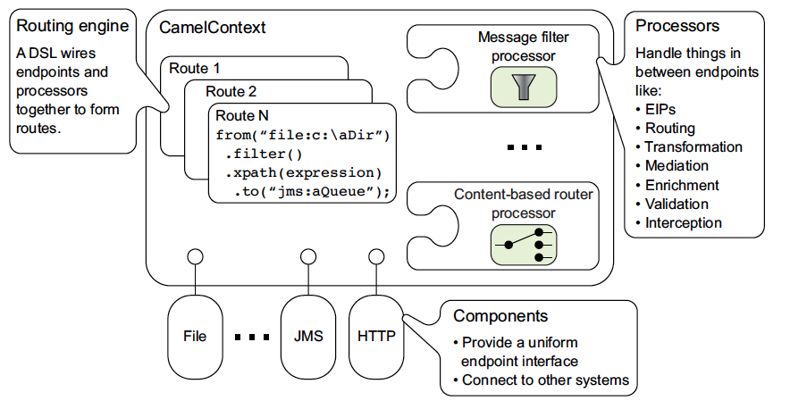
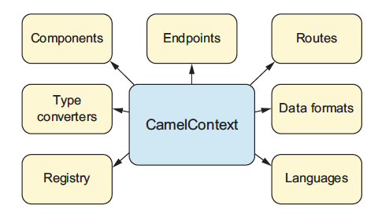
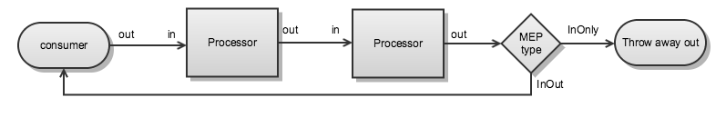
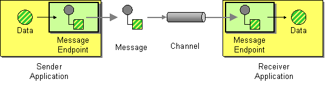
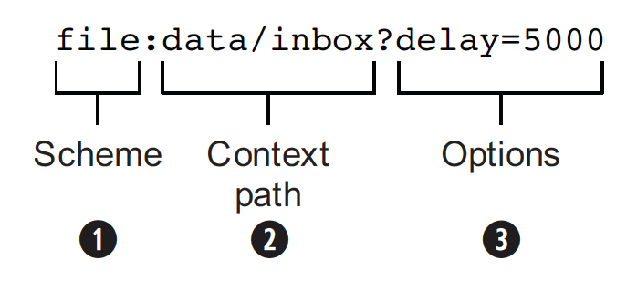
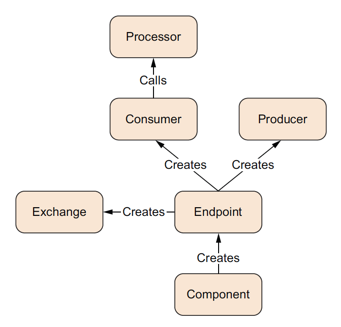
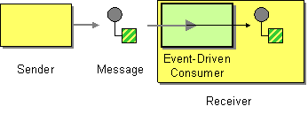
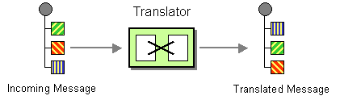
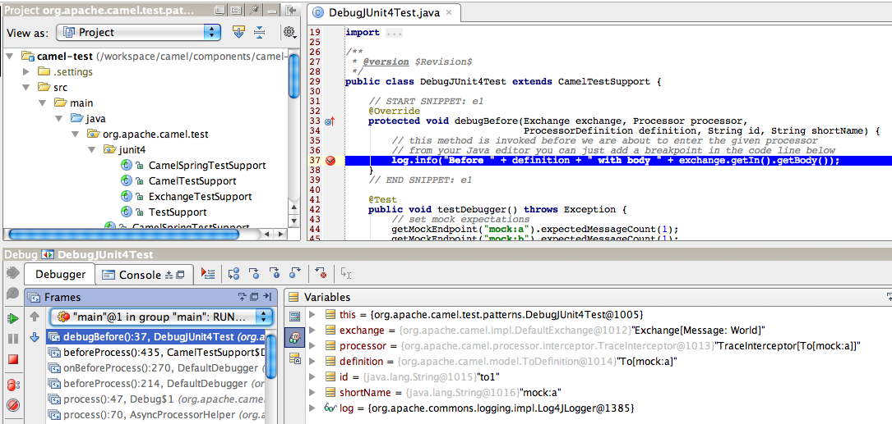
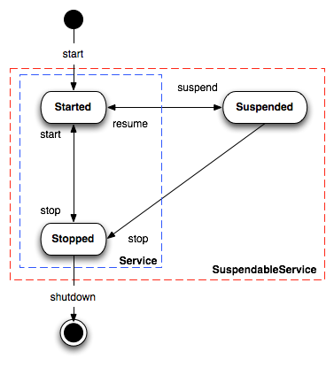

# Reference Documentation

## Navigation

- User manual
  - [Getting started](#getting-started)
    - [Getting started](#getting-started)
      - [Getting Started with Apache Camel](#book-getting-started)
      - [What are the dependencies?](#what-are-the-dependencies)
    - Resources & Guides
      - [Building](#building)
      - [Camel Developer Console](#camel-console)
      - [Camel JBang](#camel-jbang)
        - [Camel JBang Command Reference](#jbang-commands-camel-jbang-commands)
        - [Camel JBang Launcher](#camel-jbang-launcher)
        - [Camel JBang Kubernetes Plugin](#camel-jbang-kubernetes)
        - [Camel JBang Testing Plugin](#camel-jbang-test)
        - [Camel MCP Server](#camel-jbang-mcp)
      - [Camel Maven Plugin](#camel-maven-plugin)
        - [Camel Component Maven Plugin](#camel-component-maven-plugin)
        - [Camel Maven Report Plugin](#camel-report-maven-plugin)
        - [Camel Maven YAML DSL Validator Plugin](#camel-yaml-dsl-validator-maven-plugin)
        - [Camel Maven Archetypes](#camel-maven-archetypes)
      - [Configuring route startup ordering and autostartup](#configuring-route-startup-ordering-and-autostartup)
      - [Component DSL](#component-dsl)
      - [Endpoint DSL](#endpoint-dsl)
      - [DataFormat DSL](#dataformat-dsl)
      - [Examples](#examples)
      - [Graceful Shutdown](#graceful-shutdown)
      - [Error handler](#error-handler)
      - [Error Registry](#error-registry)
      - [How to use Camel property placeholders](#using-propertyplaceholder)
      - [How to use Variables](#variables)
      - [Testing](#testing)
        - [Test Infra](#test-infra)
        - [NotifyBuilder](#notify-builder)
        - [AdviceWith](#advice-with)
        - [Integration Test](#integration-test)
      - [Working with REST and Rest DSL](#rest-dsl)
        - [Rest DSL contract first](#rest-dsl-openapi)
      - [Writing Components](#writing-components)
      - [Release guide](#release-guide)
        - [Adding doc versions to the website](#release-guide-website)
      - [Improving the Documentation](#improving-the-documentation)
    - [Migration and Upgrade](#migration-and-upgrade)
      - [Camel 2.x to 3.0 Migration Guide](#camel-3-migration-guide)
      - [Camel 3.x Upgrade Guide](#camel-3x-upgrade-guide)
      - [Camel 3.x to 4.0 Migration Guide](#camel-4-migration-guide)
      - [Camel 4.x Upgrade Guide](#camel-4x-upgrade-guide)
    - [Architecture](#architecture)
      - [Backlog debugger](#backlog-debugger)
      - [Backlog Tracer](#backlog-tracer)
      - [Batch Consumer](#batch-consumer)
      - [Bean Binding](#bean-binding)
      - [Bean Integration](#bean-integration)
      - [BrowsableEndpoint](#browsable-endpoint)
      - [CamelContext](#camelcontext)
      - [CamelContext Auto Configuration](#camelcontext-autoconfigure)
      - [Clustering and Load Balancing](#clustering)
      - [Component](#component)
      - [Data Format](#data-format)
      - [Debugger](#debugger)
      - [Delayer](#delay-interceptor)
      - [Endpoints](#endpoint)
      - [Endpoint Annotations](#endpoint-annotations)
      - [Exception Clause](#exception-clause)
      - [Exchange Pooling](#exchange-pooling)
      - [HTTP-Session Handling](#http-session-handling)
      - [Parameter Binding Annotations](#parameter-binding-annotations)
      - [POJO Producing](#pojo-producing)
      - [POJO Consuming](#pojo-consuming)
      - [ProducerTemplate](#producertemplate)
      - [ConsumerTemplate](#consumertemplate)
      - [Error Handler](#error-handler)
      - [Message Exchange](#exchange)
      - [Exchange Pattern](#exchange-pattern)
      - [Using Exchange pattern annotations](#using-exchange-pattern-annotations)
      - [Expressions](#expression)
      - [Injector](#injector)
      - [JMX](#jmx)
      - [Camel Lifecycle](#lifecycle)
      - [OnCompletion](#oncompletion)
      - [Pluggable Class Resolvers](#pluggable-class-resolvers)
      - [Predicates](#predicate)
      - [Processor](#processor)
      - [Registry](#registry)
      - [RouteBuilder](#route-builder)
      - [LambdaRouteBuilder](#lambda-route-builder)
      - [RouteController](#route-controller)
      - [RoutePolicy](#route-policy)
      - [RouteConfiguration](#route-configuration)
      - [RouteGroup](#route-group)
      - [ContextReload](#context-reload)
      - [RouteReload](#route-reload)
      - [RouteTemplate](#route-template)
      - [Routes](#routes)
      - [Startup Condition](#startup-condition)
      - [Stream caching](#stream-caching)
      - [Template Engines](#template-engines)
      - [Transformer](#transformer)
      - [Threading Model](#threading-model)
      - [Virtual Threads](#virtual-threads)
      - [Tracer](#tracer)
      - [Type Converter](#type-converter)
      - [URIs](#uris)
      - [UuidGenerator](#uuidgenerator)
      - [Validator](#validator)
      - [Health Checks](#health-check)
    - Domain Specific Languages
      - [Camel Domain Specific Language](#dsl)
      - [Languages](#languages)
      - [Java DSL](#java-dsl)
      - [Spring support](#spring)
  - FAQ
    - [FAQ](#faq)
      - [What is Camel?](#faq-what-is-camel)
      - [Can I get commercial support?](#faq-can-i-get-commercial-support)
      - [How can I get the source code?](#faq-how-can-i-get-the-source-code)
      - [How do I edit the documentation?](#faq-how-do-i-edit-the-website)
      - [How do I become a committer?](#faq-how-do-i-become-a-committer)
      - [Why the name Camel?](#faq-why-the-name-camel)
- Other pages
  - [Reference Documentation](#camel-core-reference)
  - [Apache Camel user manual](#index)

## Content

<a id="getting-started"></a>

<!-- source_url: https://camel.apache.org/manual/getting-started.html -->

<!-- page_index: 1 -->

# Getting Started

[Edit this Page](https://github.com/apache/camel/edit/main/docs/user-manual/modules/ROOT/pages/getting-started.adoc)

<a id="getting-started--getting-started"></a>

# Getting Started

You can get started with Apache Camel in a variety of ways, such as:

- Using online Project generators
- Using the Camel CLI (command line)

And some more alternative methods:

- Adding Camel to an existing project
- Using IDE tooling wizards
- Using UI tooling with visual designers
- Using Maven Archetypes
- Cloning an existing example to modify

<a id="getting-started--_using_online_project_generators"></a>
<a id="getting-started--using-online-project-generators"></a>

## Using online Project generators

You can use [Spring Boot Initializer](https://start.spring.io/) which is the Spring Boot generator that also has Camel support. However, this generator does not allow users to have fine-grained control over which components, data formats, kamelets etc. they can use.

And there is [Code with Quarkus](https://code.quarkus.io/), the Quarkus generator, which has great support with Camel.

<a id="getting-started--_getting_started_from_command_line_cli"></a>
<a id="getting-started--getting-started-from-command-line-cli"></a>

## Getting Started from command line (CLI)

Camel uses [JBang](https://www.jbang.dev/) for the Camel CLI. You can easily get up and running in a few steps.

**Step 1**

First install [JBang](https://www.jbang.dev/download/) according to your platform.

Once JBang is installed, you should be able to make sure it works by calling the version command:

```bash
$ jbang version 0.138.0
```

After this then install Camel into JBang as follows:

```bash
$ jbang app install camel@apache/camel
```

Then you can check that Camel is installed and working by executing:

```bash
$ camel version JBang version: 0.138.0 Camel JBang version: 4.18.0
```

**Step 2**

Create your first Camel integration

```bash
$ camel init hello.yaml
```

> [!TIP]
> **You can also use Java or XML instead of YAML. For example camel init hi.java .**
>

**Step 3**

Run the Camel integration

```bash
$ camel run hello.yaml
```

Bang the Camel integration is now running. You can use `ctrl` + `c` to stop the integration.

**Step 4**

Camel makes it easy to change your code on the fly. You can run in live coding mode, as shown:

```bash
$ camel run hello.yaml --dev
```

While in live coding mode, whenever you save changes to `hello.yaml`, Camel will automatically load the updated version.

**Step 5**

Make sure to check out the [Camel JBang](#camel-jbang) documentation, for more details on the powers of the Camel CLI. You will also find information how you can *export* what you have built with the Camel CLI into a vanilla Camel Spring Boot or Camel Quarkus project.

<a id="getting-started--_alternative_ways_of_getting_started_with_camel"></a>
<a id="getting-started--alternative-ways-of-getting-started-with-camel"></a>

## Alternative ways of getting started with Camel

<a id="getting-started--_adding_camel_to_an_existing_project"></a>
<a id="getting-started--adding-camel-to-an-existing-project"></a>

### Adding Camel to an existing project

You can add Camel to any Java project, such as adding the necessary Camel dependencies to the project build files (Maven or Gradle).

<a id="getting-started--_using_ide_tooling_wizards"></a>
<a id="getting-started--using-ide-tooling-wizards"></a>

### Using IDE tooling wizards

Some IDEs have wizards for creating new projects, of which, some have support for Apache Camel via Spring Boot Initializer or Code with Quarkus.

<a id="getting-started--_using_ui_tooling_with_visual_designers"></a>
<a id="getting-started--using-ui-tooling-with-visual-designers"></a>

### Using UI tooling with visual designers

There are a number of UI designers for Apache Camel that can help you get familiar with Camel, and provide clarification on what you can do with Camel.

Among others the following are open source and provide support for official Apache Camel distributions:

- [Apache Camel Karavan](https://github.com/apache/camel-karavan) - Has an [online UI designer](https://karavan.space/) that runs in a web browser.
- [Kaoto](https://kaoto.io/) - Has also an [online UI designer](https://kaotoio.github.io/kaoto/) that runs in a web browser.

Both Camel Karavan and Kaoto can be installed as Visual Studio plugins directly in this IDE.

<a id="getting-started--_using_maven_archetypes"></a>
<a id="getting-started--using-maven-archetypes"></a>

### Using Maven Archetypes

Apache Camel comes with a set of [Camel Maven Archetypes](#camel-maven-archetypes), you can use to create a new Camel project.

<a id="getting-started--_cloning_an_existing_example_to_modify"></a>
<a id="getting-started--cloning-an-existing-example-to-modify"></a>

### Cloning an existing example to modify

There are tons of Camel examples hosted on GitHub that you can clone and modify, such as [Camel Spring Boot examples](https://github.com/apache/camel-spring-boot-examples).

<a id="getting-started--_see_also"></a>
<a id="getting-started--see-also"></a>

## See Also

To get familiar and learn the basic concepts of Apache Camel, then its recommend to check out [Architecture](#architecture) and follow the links from that page.

---

<a id="book-getting-started"></a>

<!-- source_url: https://camel.apache.org/manual/book-getting-started.html -->

<!-- page_index: 2 -->

<a id="book-getting-started--getting-started-with-apache-camel"></a>

# Getting Started with Apache Camel

This content was moved to the [Getting Started](https://camel.apache.org/camel-core/getting-started).

---

<a id="what-are-the-dependencies"></a>

<!-- source_url: https://camel.apache.org/manual/what-are-the-dependencies.html -->

<!-- page_index: 3 -->

<a id="what-are-the-dependencies--user-manual"></a>

### [User manual](#index)

- - [Getting started](#getting-started)
    - [Getting Started with Apache Camel](#book-getting-started)
    - [What are the dependencies?](#what-are-the-dependencies)
  - Resources & Guides
    - [Books](https://camel.apache.org/community/books/)
    - [Building](#building)
    - [Camel Developer Console](#camel-console)
    - [Camel JBang](#camel-jbang)
      - [Camel JBang Command Reference](#jbang-commands-camel-jbang-commands)
      - [Camel JBang Launcher](#camel-jbang-launcher)
      - [Camel JBang Kubernetes Plugin](#camel-jbang-kubernetes)
      - [Camel JBang Testing Plugin](#camel-jbang-test)
      - [Camel MCP Server](#camel-jbang-mcp)
    - [Camel Maven Plugin](#camel-maven-plugin)
      - [Camel Component Maven Plugin](#camel-component-maven-plugin)
      - [Camel Maven Report Plugin](#camel-report-maven-plugin)
      - [Camel Maven YAML DSL Validator Plugin](#camel-yaml-dsl-validator-maven-plugin)
      - [Camel Maven Archetypes](#camel-maven-archetypes)
    - [Configuring route startup ordering and autostartup](#configuring-route-startup-ordering-and-autostartup)
    - [Component DSL](#component-dsl)
    - [Endpoint DSL](#endpoint-dsl)
    - [DataFormat DSL](#dataformat-dsl)
    - [Examples](#examples)
    - [Graceful Shutdown](#graceful-shutdown)
    - [Error handler](#error-handler)
    - [Error Registry](#error-registry)
    - [How to use Camel property placeholders](#using-propertyplaceholder)
    - [How to use Variables](#variables)
    - [Testing](#testing)
      - [Test Infra](#test-infra)
      - [NotifyBuilder](#notify-builder)
      - [AdviceWith](#advice-with)
      - [Integration Test](#integration-test)
    - [Working with REST and Rest DSL](#rest-dsl)
      - [Rest DSL contract first](#rest-dsl-openapi)
    - [Writing Components](#writing-components)
    - [Release guide](#release-guide)
      - [Adding doc versions to the website](#release-guide-website)
    - [Improving the Documentation](#improving-the-documentation)
  - [Migration and Upgrade](#migration-and-upgrade)
    - [Camel 2.x to 3.0 Migration Guide](#camel-3-migration-guide)
    - [Camel 3.x Upgrade Guide](#camel-3x-upgrade-guide)
    - [Camel 3.x to 4.0 Migration Guide](#camel-4-migration-guide)
    - [Camel 4.x Upgrade Guide](#camel-4x-upgrade-guide)
  - [Architecture](#architecture)
    - [Backlog debugger](#backlog-debugger)
    - [Backlog Tracer](#backlog-tracer)
    - [Batch Consumer](#batch-consumer)
    - [Bean Binding](#bean-binding)
    - [Bean Integration](#bean-integration)
    - [BrowsableEndpoint](#browsable-endpoint)
    - [CamelContext](#camelcontext)
    - [CamelContext Auto Configuration](#camelcontext-autoconfigure)
    - [Clustering and Load Balancing](#clustering)
    - [Component](#component)
    - [Data Format](#data-format)
    - [Debugger](#debugger)
    - [Delayer](#delay-interceptor)
    - [Endpoints](#endpoint)
    - [Endpoint Annotations](#endpoint-annotations)
    - [Exception Clause](#exception-clause)
    - [Exchange Pooling](#exchange-pooling)
    - [HTTP-Session Handling](#http-session-handling)
    - [Parameter Binding Annotations](#parameter-binding-annotations)
    - [POJO Producing](#pojo-producing)
    - [POJO Consuming](#pojo-consuming)
    - [ProducerTemplate](#producertemplate)
    - [ConsumerTemplate](#consumertemplate)
    - [Error Handler](#error-handler)
    - [Message Exchange](#exchange)
    - [Exchange Pattern](#exchange-pattern)
    - [Using Exchange pattern annotations](#using-exchange-pattern-annotations)
    - [Expressions](#expression)
    - [Content Enrichment](https://camel.apache.org/components/4.18.x/eips/content-enricher.html)
    - [Injector](#injector)
    - [Intercept](https://camel.apache.org/components/4.18.x/eips/intercept.html)
    - [JMX](#jmx)
    - [Camel Lifecycle](#lifecycle)
    - [OnCompletion](#oncompletion)
    - [Pluggable Class Resolvers](#pluggable-class-resolvers)
    - [Predicates](#predicate)
    - [Processor](#processor)
    - [Registry](#registry)
    - [RouteBuilder](#route-builder)
    - [LambdaRouteBuilder](#lambda-route-builder)
    - [RouteController](#route-controller)
    - [RoutePolicy](#route-policy)
    - [RouteConfiguration](#route-configuration)
    - [RouteGroup](#route-group)
    - [ContextReload](#context-reload)
    - [RouteReload](#route-reload)
    - [RouteTemplate](#route-template)
    - [Routes](#routes)
    - [Startup Condition](#startup-condition)
    - [Stream caching](#stream-caching)
    - [Template Engines](#template-engines)
    - [Transformer](#transformer)
    - [Threading Model](#threading-model)
    - [Virtual Threads](#virtual-threads)
    - [Tracer](#tracer)
    - [Type Converter](#type-converter)
    - [URIs](#uris)
    - [UuidGenerator](#uuidgenerator)
    - [Validator](#validator)
    - [Health Checks](#health-check)
  - Domain Specific Languages
    - [Camel Domain Specific Language](#dsl)
    - [Languages](#languages)
    - [Java DSL](#java-dsl)
    - [Spring support](#spring)
- - Reference
    - [Components](https://camel.apache.org/components/4.18.x/index.html)
    - [Data Formats](https://camel.apache.org/components/4.18.x/dataformats/index.html)
    - [Languages](https://camel.apache.org/components/4.18.x/languages/index.html)
    - [EIPs](https://camel.apache.org/components/4.18.x/eips/enterprise-integration-patterns.html)
- - [FAQ](#faq)
    - [What is Camel?](#faq-what-is-camel)
    - [How can I get help?](https://camel.apache.org/community/support/)
    - [Can I get commercial support?](#faq-can-i-get-commercial-support)
    - [How can I get the source code?](#faq-how-can-i-get-the-source-code)
    - [How do I edit the documentation?](#faq-how-do-i-edit-the-website)
    - [How do I become a committer?](#faq-how-do-i-become-a-committer)
    - [Why the name Camel?](#faq-why-the-name-camel)

User manual

- [User manual](#index)
- Camel Components
  - [Next (Pre-release)](https://camel.apache.org/components/next/index.html)
  - [4.18.x (LTS)](https://camel.apache.org/components/4.18.x/index.html)
  - [4.14.x (LTS)](https://camel.apache.org/components/4.14.x/index.html)
- [Camel Core](https://camel.apache.org/camel-core/index.html)
- Camel K
  - [Next (Pre-release)](https://camel.apache.org/camel-k/next/index.html)
  - [2.10.x](https://camel.apache.org/camel-k/2.10.x/index.html)
  - [2.9.x (LTS)](https://camel.apache.org/camel-k/2.9.x/index.html)
- Camel Kafka Connector
  - [Next (Pre-release)](https://camel.apache.org/camel-kafka-connector/next/index.html)
  - [4.18.x (LTS)](https://camel.apache.org/camel-kafka-connector/4.18.x/index.html)
  - [4.14.x (LTS)](https://camel.apache.org/camel-kafka-connector/4.14.x/index.html)
- Kamelet Catalog
  - [Next (Pre-release)](https://camel.apache.org/camel-kamelets/next/index.html)
  - [4.18.x (LTS)](https://camel.apache.org/camel-kamelets/4.18.x/index.html)
  - [4.14.x (LTS)](https://camel.apache.org/camel-kamelets/4.14.x/index.html)
- Camel Karaf
  - [4.9.x](https://camel.apache.org/camel-karaf/4.9.x/index.html)
- Camel Quarkus
  - [Next (Pre-release)](https://camel.apache.org/camel-quarkus/next/index.html)
  - [3.33.x](https://camel.apache.org/camel-quarkus/3.33.x/index.html)
  - [3.27.x](https://camel.apache.org/camel-quarkus/3.27.x/index.html)
- Camel Spring Boot
  - [Next (Pre-release)](https://camel.apache.org/camel-spring-boot/next/index.html)
  - [4.18.x (LTS)](https://camel.apache.org/camel-spring-boot/4.18.x/index.html)
  - [4.14.x (LTS)](https://camel.apache.org/camel-spring-boot/4.14.x/index.html)


[Edit this Page](https://github.com/apache/camel/edit/main/docs/user-manual/modules/ROOT/pages/what-are-the-dependencies.adoc)

<a id="what-are-the-dependencies--what-are-the-dependencies"></a>

# What are the dependencies?

<a id="what-are-the-dependencies--_jdk_support"></a>
<a id="what-are-the-dependencies--jdk-support"></a>

## JDK support

- Camel 2 requires JDK 8
- Camel 3 requires JDK 8 and supports JDK 11
- Camel 3.15.0+ requires JDK 11
- Camel 3.17.0+ requires JDK 11 and supports JDK 17
- Camel 4.0.0+ requires JDK 17 and supports JDK 21

You can use Camel JBang which lists up-to-date JDK requirements for every Camel release.

```bash
camel version list --lts --patch=false --fresh
 CAMEL VERSION   JDK   KIND     RELEASED     SUPPORTED UNTIL  DAYS
     4.0.0         17   LTS     August 2023      August 2024   926
     4.4.0      17,21   LTS   February 2024    February 2025   739
     4.8.0      17,21   LTS  September 2024   September 2025   528
    4.10.0      17,21   LTS   February 2025    February 2026   379
    4.14.0      17,21   LTS     August 2025      August 2026   190
    4.18.0      17,21   LTS   February 2026    February 2027     8
Last updated: 2026-02-25 (use --fresh to update list from internet)
```

<a id="what-are-the-dependencies--_camel_jar_dependencies"></a>
<a id="what-are-the-dependencies--camel-jar-dependencies"></a>

## Camel JAR Dependencies

Camel core itself is lightweight, and only requires the `slf4j-api` logging API jar.

<a id="what-are-the-dependencies--_components"></a>
<a id="what-are-the-dependencies--components"></a>

## Components

All the [Components](https://camel.apache.org/components/4.18.x/index.html) have a range of 3rd party jars they depend on. They are listed in the maven pom files which files they require.

---

<a id="building"></a>

<!-- source_url: https://camel.apache.org/manual/building.html -->

<!-- page_index: 4 -->

<a id="building--building-camel-from-source"></a>

# Building Camel from Source

This content was moved to [Contributing To Apache Camel Core](https://camel.apache.org/camel-core/contributing).

---

<a id="camel-console"></a>

<!-- source_url: https://camel.apache.org/manual/camel-console.html -->

<!-- page_index: 5 -->

# Camel Console

[Edit this Page](https://github.com/apache/camel/edit/main/docs/user-manual/modules/ROOT/pages/camel-console.adoc)

<a id="camel-console--camel-console"></a>

# Camel Console

The `camel-console` is available from **Camel 3.15** and newer versions.

> [!IMPORTANT]
> |  |  |
> | --- | --- |
> |  | The Camel Developer Console is intended assisting developers and can display various information about a running Camel application. This is very handy during development and testing. However, the Camel Developer Console is not recommended for production use. |

Camel comes with a set of consoles out of the box from `camel-console` and `camel-catalog-console` JARs. These consoles can display general information about the running JVM and the OS Environment, and of course Camel related information such as runtime metrics of the Camel routes, and a lot more.

<a id="camel-console--_using_camel_console"></a>
<a id="camel-console--using-camel-console"></a>

## Using Camel Console

The `camel-console` must be added to the classpath, and enabled either via

```java
CamelContext context = ...
context.setDevConsole(true);
```

If using Camel Main / Spring Boot / Quarkus etc then the console can be enabled via configuration:

```properties
camel.main.dev-console-enabled = true
```

<a id="camel-console--_dev_console_and_camel_spring_boot"></a>
<a id="camel-console--dev-console-and-camel-spring-boot"></a>

### Dev Console and Camel Spring Boot

The Camel developer console is available in Spring Boot as an *actuator*. To enable the console you need to add dependency:

```xml
<dependency>
    <groupId>org.apache.camel.springboot</groupId>
    <artifactId>camel-console-starter</artifactId>
</dependency>
```

To include more details such as route metrics you need to include JMX management:

```xml
<dependency>
    <groupId>org.apache.camel.springboot</groupId>
    <artifactId>camel-management-starter</artifactId>
</dependency>
```

And finally you **must** enable `camel` in the exposed list of HTTP actuator endpoints in `application.properties` as shown:

```properties
management.endpoints.web.exposure.include=info,health,camel
```

The console is then available on HTTP (using default port):

```text
http://localhost:8080/actuator/camel
```

This will list the available consoles, and you can then call a console by its id, such as `routes`:

```text
http://localhost:8080/actuator/camel/routes
```

<a id="camel-console--_dev_console_and_camel_jbang"></a>
<a id="camel-console--dev-console-and-camel-jbang"></a>

### Dev Console and Camel JBang

The Developer Console is easily available when using [Camel JBang](#camel-jbang), by the `--console` argument when running Camel JBang.

For example to run a Camel route from `foo.yaml` and additional configurations from `myapp.properties` you can run as follows and have the console started and accessible from `http://localhost:8080/q/dev`

```bash
$ camel run foo.yaml myapp.properties --console
```

<a id="camel-console--_writing_custom_dev_consoles"></a>
<a id="camel-console--writing-custom-dev-consoles"></a>

## Writing Custom Dev Consoles

To write a custom console, you need to add `camel-console` as dependency, as it comes with the base class `AbstractDevConsole` which we extend for our console.

```java
@DevConsole("foo")
public class FooConsole extends AbstractDevConsole {

    public FooConsole() {
        super("acme", "foo", "Foolish", "A foolish console that outputs something");
    }

    @Override
    protected String doCallText(Map<String, Object> options) {
        StringBuilder sb = new StringBuilder();
        sb.append("Hello from my custom console");

        // more stuff here

        return sb.toString();
    }

    @Override
    protected JsonObject doCallJson(Map<String, Object> options) {
        JsonObject root = new JsonObject();
        root.put("message", "Hello from my custom console");

        // more stuff here

        return root;
    }

}
```

The class must be annotated with `DevConsole` and the unique id of the console (must be unique across all consoles). In the constructor the console specifies which group, id, display title, and description to use.

The `doCallText` and `doCallJson` methods is responsible for gathering the information the console should output.

If the console does not support either text or json output, then the methods can return `null`, and override the `supportMediaType` method and return `true` for the media-type that are supported.

<a id="camel-console--_supported_media_types"></a>
<a id="camel-console--supported-media-types"></a>

### Supported Media Types

A console can support any of, or all of the following types:

- TEXT
- JSON

The intention for `TEXT` is to be plain/text based that can be outputted in CLI and other low-level tools.

For `JSON` then the intention is the console outputs a json dataset with key/value pairs that holds the information, which can be displayed in a custom fashion such as in a web browser, or IDE tool such as VSCode.

<a id="camel-console--_maven_configuration"></a>
<a id="camel-console--maven-configuration"></a>

### Maven Configuration

To make Camel able to discover custom dev consoles, then the [came-component-maven-plugin](#camel-component-maven-plugin) must be used, such as:

```xml
<build>
    <plugins>
        <plugin>
            <groupId>org.apache.camel</groupId>
            <artifactId>camel-component-maven-plugin</artifactId>
            <version>${camel-version}</version>
            <executions>
                <execution>
                    <id>generate</id>
                    <goals>
                        <goal>generate</goal>
                    </goals>
                    <phase>process-classes</phase>
                </execution>
                <execution>
                    <id>generate-postcompile</id>
                    <goals>
                        <goal>generate-postcompile</goal>
                    </goals>
                    <phase>prepare-package</phase>
                </execution>
            </executions>
        </plugin>
        <plugin>
            <groupId>org.codehaus.mojo</groupId>
            <artifactId>build-helper-maven-plugin</artifactId>
            <executions>
                <execution>
                    <phase>generate-sources</phase>
                    <goals>
                        <goal>add-source</goal>
                        <goal>add-resource</goal>
                    </goals>
                    <configuration>
                        <sources>
                            <source>src/generated/java</source>
                        </sources>
                        <resources>
                            <resource>
                                <directory>src/generated/resources</directory>
                            </resource>
                        </resources>
                    </configuration>
                </execution>
            </executions>
        </plugin>
    </plugins>
</build>
```

---

<a id="camel-jbang"></a>

<!-- source_url: https://camel.apache.org/manual/camel-jbang.html -->

<!-- page_index: 6 -->

<a id="camel-jbang--camel-jbang"></a>

# Camel JBang

A JBang-based Camel app for easily running Camel routes.

<a id="camel-jbang--_installation"></a>
<a id="camel-jbang--installation"></a>

## Installation

First, you must install [JBang](https://www.jbang.dev/), which is used for launching Camel. See instructions on [JBang](https://www.jbang.dev/download/) how to download and install.

After JBang is installed, you can verify JBang is working by executing the following command from a command shell:

```bash
jbang version
```

Which should output the version of JBang.

To make it easier to use Camel JBang, then install the following:

```bash
jbang app install camel@apache/camel
```

This will install Apache Camel as the `camel` command within JBang, meaning that you can run Camel from the command line by just executing `camel` (see more next).

Note: It requires access to the internet, in case of using a proxy, please ensure that the proxy is configured for your system. If Camel JBang is not working with your current configuration, please look to [Proxy configuration in JBang documentation](https://www.jbang.dev/documentation/jbang/latest/configuration.html#proxy-configuration).

<a id="camel-jbang--_installing_without_jbang"></a>
<a id="camel-jbang--installing-without-jbang"></a>

### Installing without JBang

It is also possible to install and run Camel JBang without *JBang* using the [Camel JBang Launcher](#camel-jbang-launcher) which essentially is a standard Java *fat-jar* with launch scripts.

<a id="camel-jbang--_installing_a_specific_camel_jbang_version"></a>
<a id="camel-jbang--installing-a-specific-camel-jbang-version"></a>

### Installing a specific Camel JBang version

By default, Camel JBang installs the latest release, which may not be the desired version.

To use a specific version then you need to provide these when installing from jbang such as 4.14.1:

```bash
jbang app install --force --fresh -Dcamel.jbang.version=4.14.1 -Dcamel-kamelets.version=4.14.1 camel@apache/camel
```

> [!TIP]
> |  |  |
> | --- | --- |
> |  | You can use `--force` and `--fresh` to tell JBang to force installing the version and refresh downloading, so no previous downloaded cache etc. may cause a problem. |

> [!IMPORTANT]
> |  |  |
> | --- | --- |
> |  | From Camel 4.17 onwards then Kamelets are optional, and only downloaded on demand. You define the version of kamelets via `--kamelets-version` parameter to `camel run` or can pre-configure the version via `camel config set kamelets-version=4.17.0`. |

<a id="camel-jbang--_installing_offline_safe_or_version_pinned_camel_jbang"></a>
<a id="camel-jbang--installing-offline-safe-or-version-pinned-camel-jbang"></a>

### Installing Offline-Safe or Version-Pinned Camel JBang

When installing Camel JBang using `jbang app install`, JBang will occasionally check upstream sources and update the installed application automatically. This may be undesirable if you want to ensure your Camel JBang installation remains on a specific Camel release.

The following options allow you to install Camel JBang in a way that prevents unexpected upgrades.

<a id="camel-jbang--_option_1_pin_by_installing_from_a_local_cameljbang_java"></a>
<a id="camel-jbang--option-1:-pin-by-installing-from-a-local-cameljbang.java"></a>

#### Option 1: Pin by Installing from a Local `CamelJBang.java`

This approach pins the Camel version directly in the source file used to install the application.

1. Download the `CamelJBang.java` file to your local machine:


```none
https://github.com/apache/camel/blob/main/dsl/camel-jbang/camel-jbang-main/dist/CamelJBang.java
```

2. Edit the `CamelJBang.java` file and set the Camel version you want to use.
3. Install Camel JBang locally:


```bash
jbang app install CamelJBang.java
```

4. After installation, the `CamelJBang.java` file can be deleted.

<a id="camel-jbang--_option_2_install_from_a_version_pinned_catalog"></a>
<a id="camel-jbang--option-2:-install-from-a-version-pinned-catalog"></a>

#### Option 2: Install from a Version-Pinned Catalog

Another option is to install Camel JBang from a catalog tied to a specific Camel release tag.

Example:

```bash
CAMEL_VERSION="4.18.0"
CAMEL_TAG="camel-${CAMEL_VERSION}"
CAMEL_JBANG_CATALOG_URL="https://raw.githubusercontent.com/apache/camel/${CAMEL_TAG}/jbang-catalog.json"

jbang app install --force --fresh \
  -Dcamel.jbang.version="${CAMEL_VERSION}" \
  -Dcamel-kamelets.version="${CAMEL_VERSION}" \
  camel@"${CAMEL_JBANG_CATALOG_URL}"
```

In this example:

- The catalog URL points to a specific Camel release tag.
- `-Dcamel.jbang.version` ensures the installed application uses that same Camel version.

> [!NOTE]
> |  |  |
> | --- | --- |
> |  | Option 1 provides the most deterministic installation and is best suited for fully offline-safe environments.  Option 2 offers a simpler installation while still ensuring the version is pinned to a specific Camel release. |

<a id="camel-jbang--_option_3_use_camel_launcher"></a>
<a id="camel-jbang--option-3:-use-camel-launcher"></a>

#### Option 3: Use Camel Launcher

See [Camel JBang Launcher](#camel-jbang-launcher)

<a id="camel-jbang--_container_image"></a>
<a id="camel-jbang--container-image"></a>

## Container Image

There is also a container image available in [Dockerhub](https://hub.docker.com/r/apache/camel-jbang/)

```bash
docker pull apache/camel-jbang:4.4.0
```

or

```bash
podman pull apache/camel-jbang:4.4.0
```

Once you have the image in your local registry, you can run all the commands listed below by simple doing:

```bash
docker run apache/camel-jbang:4.4.0 version
```

or

```bash
podman run apache/camel-jbang:4.4.0 version
```

This will print the following result:

```bash
Camel JBang version: 4.4.0
```

So running a simple route will be as easy as doing the following:

```bash
docker run -v .:/integrations apache/camel-jbang:4.4.0 run /integrations/example.yaml
```

or

```bash
podman run -v .:/integrations apache/camel-jbang:4.4.0 run /integrations/example.yaml
```

<a id="camel-jbang--_using_camel_jbang"></a>
<a id="camel-jbang--using-camel-jbang"></a>

## Using Camel JBang

The Camel JBang supports multiple commands. Running the command below will print all of them:

```bash
camel --help
```

> [!TIP]
> |  |  |
> | --- | --- |
> |  | The first time you run this command, it may cause dependencies to be cached, therefore taking a few extra seconds to run. If you are already using JBang and you get first time to run errors such as `Exception in thread "main" java.lang.NoClassDefFoundError: "org/apache/camel/dsl/jbang/core/commands/CamelJBangMain"` you may try clearing the JBang cache and re-install again. |

All the commands support the `--help` and will display the appropriate help if that flag is provided.

> [!TIP]
> **For a complete reference of all commands and their options, see the Camel JBang Command Reference .**
>

<a id="camel-jbang--_enable_shell_completion"></a>
<a id="camel-jbang--enable-shell-completion"></a>

### Enable shell completion

Camel JBang provides shell completion for bash and zsh out of the box. To enable shell completion for Camel JBang, run:

```bash
source <(camel completion)
```

To make it permanent, run:

```bash
echo 'source <(camel completion)' >> ~/.bashrc
```

<a id="camel-jbang--_repl_loop"></a>
<a id="camel-jbang--repl-loop"></a>

## REPL loop

A simple read-eval-print loop is available, you can launch it with:

```bash
camel shell
```

<a id="camel-jbang--_creating_and_running_camel_routes"></a>
<a id="camel-jbang--creating-and-running-camel-routes"></a>

## Creating and running Camel routes

You can create a new basic routes with the `init` command.

For example, to create an XML route, you can run:

```bash
camel init cheese.xml
```

Which creates the file `cheese.xml` (in the current directory) with a sample route.

To run the file, you do:

```bash
camel run cheese.xml
```

> [!NOTE]
> **You can create and run any of the supported DSLs in Camel such as YAML, XML, Java, Groovy.**
>

To create a new .java route, you simply do:

```bash
camel init foo.java
```

When using the init command, then Camel will by default create the file in the current directory. However, you can use the `--directory` option to create the file in the specified directory. For example, to create in a folder named `foobar` you can do:

```bash
camel init foo.java --directory=foobar
```

<a id="camel-jbang--_running_routes_from_multiple_files"></a>
<a id="camel-jbang--running-routes-from-multiple-files"></a>

### Running Routes from multiple files

You can run more than one file, for example, to run two YAML files you can do:

```bash
camel run one.yaml two.yaml
```

You can also mix different [DSLs](#dsl) such as YAML and Java:

```bash
camel run one.yaml hello.java
```

You can also use wildcards (i.e. `*`) to match multiple files, such as running all the YAML files:

```bash
camel run *.yaml
```

Or you can run all files starting with foo\*

```bash
camel run foo*
```

And to run everything

```bash
camel run *
```

> [!TIP]
> **The run goal can also detect files that are properties , such as application.properties .**
>

<a id="camel-jbang--_running_a_maven_based_project"></a>
<a id="camel-jbang--running-a-maven-based-project"></a>

### Running a Maven based project

Camel JBang is intended for flat-file-based projects, where you run small integrations. However, Camel JBang may be used as a tool for migrating existing Maven based projects. To make the migration easier, then JBang can do *best effort* to run, export, or transform these projects.

For example, if you have a Maven-based project, you can execute

```bash
camel run pom.xml
```

Camel JBang will then scan in `src/main/java` and `src/main/resources` for files to include (recursive).

> [!NOTE]
> |  |  |
> | --- | --- |
> |  | Using `camel run pom.xml` is not intended as a fully compatible way of running an existing Maven-based project. It cannot start Quarkus or Spring Boot applications; instead, use the proper plugins/commands. The command is mainly used to migrate from old projects. |

<a id="camel-jbang--_running_route_with_user_interactive_prompt_for_placeholder_values"></a>
<a id="camel-jbang--running-route-with-user-interactive-prompt-for-placeholder-values"></a>

### Running Route with user interactive prompt for placeholder values

You can create Camel integrations that makes it possible for the user to quickly enter placeholder values from command prompt.

For example, given the following route:

```java
import org.apache.camel.builder.RouteBuilder;

public class foo extends RouteBuilder {

    @Override
    public void configure() throws Exception {
        from("timer:java?period={{time:1000}}")
            .setBody()
                .simple("Hello Camel from {{you}}")
            .log("${body}");
    }
}
```

Then if you run this with:

```bash
camel run foo.java
```

You will have an exception on startup about the missing value

```text
Caused by: java.lang.IllegalArgumentException: Property with key [you] not found in properties from text: Hello Camel from {{you}}`
```

However, you can then run in prompt mode as follows:

```bash
camel run foo.java --prompt
```

And Camel will now prompt in the terminal for you to enter values for the placeholders:

```bash
2023-12-15 21:46:44.218  INFO 15033 --- [           main] org.apache.camel.main.MainSupport   : Apache Camel (JBang) 4.7.0 is starting
2023-12-15 21:46:44.331  INFO 15033 --- [           main] org.apache.camel.main.MainSupport   : Using Java 17.0.5 with PID 15033. Started by davsclaus in /Users/davsclaus/workspace/deleteme/prompt
2023-12-15 21:46:45.360  INFO 15033 --- [           main] mel.cli.connector.LocalCliConnector : Management from Camel JBang enabled
Enter optional value for time (1000):
Enter required value for you: Jack
2023-12-15 21:46:55.239  INFO 15033 --- [           main] el.impl.engine.AbstractCamelContext : Apache Camel 4.7.0 (foo) is starting
2023-12-15 21:46:55.323  INFO 15033 --- [           main] g.apache.camel.main.BaseMainSupport : Property-placeholders summary
2023-12-15 21:46:55.323  INFO 15033 --- [           main] g.apache.camel.main.BaseMainSupport :     [prompt]                       you=Jack
2023-12-15 21:46:55.341  INFO 15033 --- [           main] el.impl.engine.AbstractCamelContext : Routes startup (started:1)
```

From the snippet above, Camel JBang had two prompts. First for the `time` which has a default value of `1000` so you can just press ENTER to accept the default value. And for `you` a value must be entered, and we entered `Jack` in this example.

You may want to use this for Camel prototypes where you want the user to be able to enter custom values quickly. Those values can of course be pre-configured in `application.properties` as well.

<a id="camel-jbang--_running_route_from_input_parameter"></a>
<a id="camel-jbang--running-route-from-input-parameter"></a>

### Running Route from input parameter

For very small Java routes then it is possible to provide the route as CLI argument, as shown below:

```bash
camel run --code='from("kamelet:beer-source").to("log:beer")'
```

This is very limited as the CLI argument is a bit cumbersome to use than files.

- Java DSL code is only supported
- Code wrapped in single quote, so you can use double quote in Java DSL
- Code limited to what literal values possible to provide from the terminal and JBang.
- All route(s) must be defined in a single `--code` parameter.

> [!NOTE]
> **Using --code is only usable for very quick and small prototypes.**
>

From **Camel 4.7** onwards the `--code` parameter can also refer to a `.java` source file, that are not wrapped in a `public class` which makes it possible to quickly try a prototype with some Camel java based routes such as the following stored in a file named `quick.java`:

```java
from("timer:java?period=1000")
    .setBody()
        .simple("Hello Quick Camel from ${routeId}")
    .log("${body}");
```

Then you can run this route via:

```bash
camel run --code=quick.java
```

> [!NOTE]
> **You cannot use --dev to hot-reload this on code changes.**
>

<a id="camel-jbang--_running_routes_from_source_directory"></a>
<a id="camel-jbang--running-routes-from-source-directory"></a>

### Running Routes from source directory

You can also run dev mode when running Camel with `--source-dir`, such as:

```bash
camel run --source-dir=mycode
```

This starts Camel where it will load the files from the *source dir* (also subfolders).

<a id="camel-jbang--_stub_components_that_should_not_be_active"></a>
<a id="camel-jbang--stub-components-that-should-not-be-active"></a>

### Stub components that should not be active

Sometimes you need to troubleshoot an existing integration and is given some Camel code (routes). These routes may use different components, and those components may be tricky to run as they are configured in a custom way, or need connection to servers you may not have access to.

You can run Camel JBang by stubbing those components (or all of them).

For example, suppose you need access to a JMS broker in the given route below.

```java
from("jms:inbox")
  .log("Incoming order")
  .to("bean:transform")
  .log("After transformation")
  .to("jms:process");
```

Then you can run this by stub the `jms` component by:

```bash
camel run syncToDatabase.java --stub=jms
```

Then Camel will not start up the JMS component but replace it with the `stub` component, but keep the actual endpoint URIs.

You can then simulate sending messages to Camel with the `cmd send` command:

```bash
camel cmd send --body='Something here'
```

Which then will send the message to the incoming endpoint in the route, i.e. `jms:inbox` which has been stubbed.

You can also stub a specific endpoint by providing the full uri, such as:

```bash
camel run syncToDatabase.java --stub=jms:inbox
```

Then only the `jms:inbox` endpoint is stubbed.

> [!TIP]
> **You can stub multiple components separated by comma, such as --stub=jms,sql**
>

Camel JBang comes with the `camel cmd stub` command that allows to list all endpoints that has been stubbed, and also browse any messages that are currently present in their internal queues. A stub endpoint is based on the `seda` component.

```bash
camel cmd stub
```

And to browse the messages:

```bash
camel cmd stub --browse
```

<a id="camel-jbang--_dev_mode_with_live_reload"></a>
<a id="camel-jbang--dev-mode-with-live-reload"></a>

### Dev mode with live reload

You can enable dev mode that comes with live reload of the route(s) when the source file is updated (saved), using the `--dev` options as shown:

```bash
camel run foo.yaml --dev
```

Then, while the Camel integration is running, you can update the YAML route and update when saving.

This works for all DSLs, even java, so you can do:

```bash
camel run hello.java --dev
```

> [!NOTE]
> |  |  |
> | --- | --- |
> |  | The live reload is meant for development purposes, and if you encounter problems with reloading such as JVM class loading issues, then you may need to restart the integration. Java files cannot be supported in Spring Boot runtime since they have to be recompiled to trigger a restart. |

You can also run dev mode when running Camel with `--source-dir`, such as:

```bash
camel run --source-dir=mycode --dev
```

This starts Camel where it will load the files from the *source dir* (also subfolders). And in *dev mode* then you can add new files, update existing files, and delete files, and Camel will automatically hot-reload on the fly.

Using *source dir* is more flexible than having to specify the files in the CLI as shown below:

```bash
camel run mycode/foo.java mycode/bar.java --dev
```

In this situation, then Camel will only watch and reload these two files (foo.java and bar.java). So, for example, if you add a new file cheese.xml, then this file is not reloaded. On the other hand, if you use `--source-dir` then any files in this directory (and subfolders) are automatic detected and reloaded. You can also delete files to remove routes.

> [!NOTE]
> **You cannot use both files and source dir together. The following is not allowed: camel run abc.java --source-dir=mycode .**
>

<a id="camel-jbang--_loading_new_routes_into_existing_camel"></a>
<a id="camel-jbang--loading-new-routes-into-existing-camel"></a>

#### Loading new routes into existing Camel

**Available as of Camel 4.17**

The `camel cmd load` command can be used to load new route(s) into an existing running Camel JBang application. For example during development to inject a new route for experimentation. This can also be used as part of testing scenarios using Citrus with the [Camel JBang Test](#camel-jbang-test) plugin.

For example to load `bar.java` route into a Camel application:

```bash
camel cmd load --source=bar.java
```

You can load any of the DSLs such as Java, XML, or YAML.

> [!IMPORTANT]
> |  |  |
> | --- | --- |
> |  | Assign *ids* to your routes so the `load` command would detect a previous loaded route (when you update), to avoid adding the same route as a duplicate. |

> [!TIP]
> **There is a --restart option to tell Camel to restart all routes after the new route is loaded.**
>

<a id="camel-jbang--_uploading_files_to_source_directory_via_http"></a>
<a id="camel-jbang--uploading-files-to-source-directory-via-http"></a>

#### Uploading files to source directory via HTTP

When running Camel JBang with `--source-dir`, `--console` and `--dev` (reloading) then you can change the source files on-the-fly by copying, modifying or deleting the files in the source directory.

This can also be done via HTTP using the `q/upload/:filename` HTTP endpoint using PUT and DELETE verbs.

Suppose that you run Camel JBang with:

```bash
camel run --source-dir=mycode --console --dev
```

Then you can upload or modify a source file named `bar.java` you can send a PUT request via curl:

```bash
curl -X PUT http://0.0.0.0:8080/q/upload/bar.java --data-binary "@bar.java"
```

Or via:

```bash
curl -T bar.java http://0.0.0.0:8080/q/upload/bar.java
```

To send the data via PUT, then the file body can be included when using `Content-Type: application/x-www-form-urlencoded`:

For example, from a CURL `--trace-ascii log.txt`:

```text
0000: PUT /q/upload/bar.java HTTP/1.1
0021: Host: 0.0.0.0:8080
0035: User-Agent: curl/7.87.0
004e: Accept: */*
005b: Content-Length: 385
0070: Content-Type: application/x-www-form-urlencoded
00a1:
=> Send data, 385 bytes (0x181)
0000: // camel-k: language=java..import org.apache.camel.builder.Route
0040: Builder;..public class bar extends RouteBuilder {..    @Override
0080: .    public void configure() throws Exception {..        // Writ
00c0: e your routes here, for example:.        from("timer:java?period
0100: ={{time:1000}}").            .setBody().                .simple(
0140: "XXXCamel from ${routeId}").            .log("${body}");.    }.}
0180: .
== Info: Mark bundle as not supporting multiuse
<= Recv header, 17 bytes (0x11)
0000: HTTP/1.1 200 OK
<= Recv header, 19 bytes (0x13)
0000: content-length: 0
<= Recv header, 2 bytes (0x2)
0000:
== Info: Connection #0 to host 0.0.0.0 left intact
```

To delete one or more files, you use the DELETE verb, such as:

```bash
curl -X DELETE http://0.0.0.0:8080/q/upload/bar.java
```

You can also use wildcards ('\*') to delete all .java files:

```bash
curl -X DELETE http://0.0.0.0:8080/q/upload/*.java
```

Or to delete everything

```bash
curl -X DELETE http://0.0.0.0:8080/q/upload/*
```

<a id="camel-jbang--_developer_console"></a>
<a id="camel-jbang--developer-console"></a>

### Developer Console

You can enable the developer console, which presents a variety of information to the developer.

```bash
camel run hello.java --console
```

The console is then accessible from a web browser at: <http://localhost:8080/q/dev> (by default). The link is also shown in the log when Camel is starting up.

The console can give you insights into your running Camel integration, such as reporting the top routes that takes the longest time to process messages. You can then drill down to pinpoint exactly which individual EIPs in these routes are the slowest.

The developer console can also output the data in JSON format, which, for example, can be used by 3rd-party tooling to scrape the information.

For example, to output the top routes via curl, you can execute:

```bash
curl -s -H "Accept: application/json"  http://0.0.0.0:8080/q/dev/top/
```

And if you have `jq` installed which can format and output the JSON data in color, then do:

```bash
curl -s -H "Accept: application/json"  http://0.0.0.0:8080/q/dev/top/ | jq
```

<a id="camel-jbang--_using_properties"></a>
<a id="camel-jbang--using-properties"></a>

### Using properties

To set properties when running a route, you can use the `--property` or `--properties` parameter from `camel run` command:

- `--property`: sets individual parameters, example: `--property=my-key=my-value`, you have to add more `--property` in case you need more parameters.
- `--properties`: loads a properties file from the local filesystem, example: `--properties=/var/my-app/config.properties`.

> [!NOTE]
> **You have to use the = sign right after the --property , as in the examples above.**
>

If both parameters are used, the properties will be merged in a single `application.properties` file.

<a id="camel-jbang--_history_of_last_completed_message"></a>
<a id="camel-jbang--history-of-last-completed-message"></a>

### History of last completed message

**Available from Camel 4.17**

When developers are coding Camel using the high level DSL with EIPs and components then it can appear as a mystery box what happened when Camel processed an incoming message. There are of course many ways to find out with logging, tracing, debugging, and good old System.out.println.

In Camel 4.17 there is the `camel get history` command that show a summary of the last completed message of every step of the message; with a column that shows curanted important information. This is a high level summary to quickly allow users to see what happened.

For example the following `foo.java` source file contains a Camel route that consumes a file, split the file line by line, and filter if the line contains world. After the split then calls a non-existing page on the Camel website, and then logs at the end.

```java
import org.apache.camel.builder.RouteBuilder;

public class foo extends RouteBuilder {

    @Override
    public void configure() throws Exception {
        from("file:inbox?noop=true")
            .log("Incoming file")
            .split(body().tokenize("\n"))
              .filter(body().contains("world"))
                .log("Stop the world")
                .stop()
              .end()
              .to("log:line")
            .end()
            .to("https://camel.apache.org/xxx?throwExceptionOnFailure=false")
            .to("log:after-http")
            .log("complete");
    }
}
```

And the file contains 4 lines:

```text
hello
world
from
me
```

And when you execute the `camel get history` you would see:

```bash
$ camel get history --source Message History of last completed (id:32E020F6050C165-0000000000000000 status:success ago:4s pid:91133 name:foo) ID PROCESSOR ELAPSED EXCHANGE *--> foo.java:7 from[file://inbox?noop=true] 0 0000 File: foo.txt (19 bytes) foo.java:8 log[Incoming file] 0 0000 foo.java:9 split[tokenize(body, \n)] 8 0000 Split (4) foo.java:10 filter[{body contains world}] 0 0001/0000 Filter: false foo.java:14 to[log:line] 0 0001/0000 foo.java:10 filter[{body contains world}] 0 0002/0000 Filter: true foo.java:11 log[Stop the world] 0 0002/0000 foo.java:12 stop 0 0002/0000 foo.java:10 filter[{body contains world}] 0 0003/0000 Filter: false foo.java:14 to[log:line] 0 0003/0000 foo.java:10 filter[{body contains world}] 0 0004/0000 Filter: false foo.java:14 to[log:line] 0 0004/0000 foo.java:16 to[https:\/\/camel.apache.org\/xxx?throwExceptionO… 143 0000 404=Not Found Content-Type=text/html; charset=utf-8 foo.java:17 to[log:after-http] 1 0000 foo.java:18 log[complete] 0 0000 *<-- foo.java:7 from[file://inbox?noop=true] 157 0000 Success
```

The history command shows what happened and as you can see we are able to show that the there are 4 entries in the Split, and also how each splitted message has its own unique exchange id, that links to the parent exchange id. Also notice how the HTTP call we can see the 404 error code, and the response body is in text/plain.

<a id="camel-jbang--_interactive_mode_with_full_message_history_details"></a>
<a id="camel-jbang--interactive-mode-with-full-message-history-details"></a>

#### Interactive mode with full message history details

The `camel get history` command can be used in *interactive mode* via `camel get history --it` which shows more detailed information for each step. (similar screen like `camel debug`). This allows you to see the content of the message including message headers, body, etc.

You can then go forward (press ENTER), or go back (press P + ENTER).

> [!TIP]
> **Use camel get history --help to see all available options.**
>

<a id="camel-jbang--_using_profiles"></a>
<a id="camel-jbang--using-profiles"></a>

### Using profiles

**Available from Camel 4.5**

Camel JBang comes with three sets of profiles

- `dev`:for development (default)
- `test`:for testing (currently same as production)
- `prod`:for production

The developer profile will pre-configure Camel JBang with a number of developer assisted features when running Camel. For example, tracing messages during routing, additional metrics collected, and more. This is useful during development and also enhanced the Camel JBang CLI tool.

However, you may want to run Camel JBang in a production-like scenario, which you can do with:

```bash
camel run hello.java --profile=prod
```

You can have profile-specific configuration in configuration files using the naming style `application-<profile>.properties`, such as in the following:

- `application.properties`: common configuration that is always in use (default).
- `application-dev.properties`: developer specific configuration for the `dev` profile.
- `application-prod.properties`: developer specific configuration for the `prod` profile.

The profile-specific configuration will override values in the common configuration.

> [!NOTE]
> |  |  |
> | --- | --- |
> |  | You MUST include the properties files in the files path when using `camel run` or `camel export` to include the files, such as `camel run hello.java application.properties`. |

<a id="camel-jbang--_downloading_jars_over_the_internet"></a>
<a id="camel-jbang--downloading-jars-over-the-internet"></a>

### Downloading JARs over the internet

By default, Camel JBang will automatically resolve dependencies needed to run Camel, which is done by JBang and Camel respectively. Camel itself detects at runtime if a component has a need for JARs that are not currently available on the classpath, and can then automatically download the JARs (incl transitive).

Camel will download these JARs in the following order:

1. from local disk in `~/.m2/repository`
2. from the internet in Maven Central
3. from the internet from custom third-party Maven repositories
4. from all the repositories found in active profiles of `~/.m2/settings.xml` or a settings file specified using `--maven-settings` option.

If you do not want Camel JBang to download over the internet, you can turn this off with `--download`, as shown below:

```bash
camel run foo.java --download=false
```

If you do not want Camel JBang to use your existing Maven settings file, you can use:

```bash
camel run foo.java --maven-settings=false
```

<a id="camel-jbang--_adding_custom_jars"></a>
<a id="camel-jbang--adding-custom-jars"></a>

### Adding custom JARs

Camel JBang will automatically detect dependencies for Camel components, languages, data formats, etc. that from its own release. This means you often do not have to specify which JARs to use.

However, if you need to add 3rd-party custom JARs, then you can specify these with `--dep` as CLI argument in Maven GAV syntax (`groupId:artifactId:version`), such as:

```bash
camel run foo.java --dep=com.foo:acme:1.0
```

In case you need to explicit add a Camel dependency you can use a shorthand syntax (starting with `camel:` or `camel-`) such as:

```bash
camel run foo.java --dep=camel-saxon
```

You can specify multiple dependencies separated by comma:

```bash
camel run foo.java --dep=camel-saxon,com.foo:acme:1.0
```

<a id="camel-jbang--_using_3rd_party_maven_repositories"></a>
<a id="camel-jbang--using-3rd-party-maven-repositories"></a>

### Using 3rd-party Maven repositories

Camel JBang will download from local repository first, and then online from Maven Central. To be able to download from 3rd-party Maven repositories then you need to specify this as CLI argument, ]or in `application.properties`

```bash
camel run foo.java --repos=https://packages.atlassian.com/maven-external
```

> [!TIP]
> **Multiple repositories can be separated by comma**
>

The configuration for the 3rd-party Maven repositories can also be configured in `application.properties` with the key `camel.jbang.repos` as shown:

```properties
camel.jbang.repos=https://packages.atlassian.com/maven-external
```

Alternatively, you can configure default Maven repositories globally via a system property. This is useful for custom Camel distributions that require additional repositories without manual configuration on each command:

```bash
export JAVA_TOOL_OPTIONS="-Dcamel.extra.repos=repo1=https://repo1.example.com/maven2,repo2=https://repo2.example.com/releases"
```

When running Camel you need to include the properties file to use:

```bash
camel run foo.java application.properties
```

<a id="camel-jbang--_configuration_of_maven_usage"></a>
<a id="camel-jbang--configuration-of-maven-usage"></a>

### Configuration of Maven usage

By default, existing `~/.m2/settings.xml` file is loaded, so it is possible to alter the behaviour of Maven resolution process. Maven settings file can provide information about Maven mirrors, credential configuration (potentially encrypted) or active profiles, and additional repositories.

Maven repositories can use authentication and the Maven-way to configure credentials is through `<server>` elements, like this:

```xml
<server>
    <id>external-repository</id>
    <username>camel</username>
    <password>{SSVqy/PexxQHvubrWhdguYuG7HnTvHlaNr6g3dJn7nk=}</password>
</server>
```

While the password may be specified using plain text, it’s better to configure maven master password first and then use it to configure repository password:

```bash
$ mvn -emp Master password: camel {hqXUuec2RowH8dA8vdqkF6jn4NU9ybOsDjuTmWvYj4U=}
```

The above password should be added to `~/.m2/settings-security.xml` file like this:

```xml
<settingsSecurity>
  <master>{hqXUuec2RowH8dA8vdqkF6jn4NU9ybOsDjuTmWvYj4U=}</master>
</settingsSecurity>
```

Then a normal password can be configured like this:

```bash
$ mvn -ep Password: camel {SSVqy/PexxQHvubrWhdguYuG7HnTvHlaNr6g3dJn7nk=}
```

Finally, such passwords can be used in `<server>/<password>` configuration.

By default, Maven reads the master password from `~/.m2/settings-security.xml` file, but we can override it. The location of the `settings.xml` file itself can be specified as well:

```bash
camel run foo.java --maven-settings=/path/to/settings.xml --maven-settings-security=/path/to/settings-security.xml
```

If you want to run Camel application without assuming any location (even `~/.m2/settings.xml`), use this option:

```bash
camel run foo.java --maven-settings=false
```

<a id="camel-jbang--_running_routes_hosted_on_github"></a>
<a id="camel-jbang--running-routes-hosted-on-github"></a>

### Running routes hosted on GitHub

You can run a route hosted on GitHub using Camels [GitHub](https://camel.apache.org/components/4.18.x/others/resourceresolver-github.html) resource loader.

For example, to run one of the Camel Kamelets examples, you can do:

```bash
camel run github:apache:camel-kamelets-examples:jbang/hello-java/Hey.java
```

You can also use the `https` URL for GitHub. For example, you can browse the examples from a web-browser and then copy the URL from the browser window and run the example with Camel JBang:

```bash
camel run https://github.com/apache/camel-kamelets-examples/tree/main/jbang/hello-java
```

You can also use wildcards (i.e. `*`) to match multiple files, such as running all the groovy files:

```bash
camel run https://github.com/apache/camel-kamelets-examples/tree/main/jbang/languages/*.groovy
```

Or you can run all files starting with rou\*

```bash
camel run https://github.com/apache/camel-kamelets-examples/tree/main/jbang/languages/rou*
```

<a id="camel-jbang--_running_routes_from_github_gists"></a>
<a id="camel-jbang--running-routes-from-github-gists"></a>

#### Running routes from GitHub gists

Using gists from GitHub is a quick way to share small Camel routes that you can easily run.

For example, to run a gist, you can execute:

```bash
camel run https://gist.github.com/davsclaus/477ddff5cdeb1ae03619aa544ce47e92
```

A gist can contain one or more files, and Camel JBang will gather all relevant files, so a gist can contain multiple routes, properties files, Java beans, etc.

<a id="camel-jbang--_downloading_routes_hosted_on_github"></a>
<a id="camel-jbang--downloading-routes-hosted-on-github"></a>

### Downloading routes hosted on GitHub

We have made it easy for Camel JBang to download existing examples from GitHub to local disk, which allows for modifying the example and to run locally.

All you need to do is to copy the https link from the web browser. For example, you can download the *dependency injection* example by:

```bash
camel init https://github.com/apache/camel-kamelets-examples/tree/main/jbang/dependency-injection
```

Then the files (not subfolders) are downloaded to the current directory. The example can then be run locally with:

```bash
camel run *
```

You can also download to a new folder using the `--directory` option, for example, to download to a folder named *myproject*, you would do:

```bash
camel init https://github.com/apache/camel-kamelets-examples/tree/main/jbang/dependency-injection --directory=myproject
```

You can also run in dev mode, to hot-deploy on source code changes.

```bash
camel run * --dev
```

You can also download a single file, such as one of the Camel Kamelets examples:

```bash
camel init https://github.com/apache/camel-kamelets-examples/blob/main/jbang/hello-yaml/hello.camel.yaml
```

This is a groovy route, which you can run with (or use `*`):

```bash
camel run simple.groovy
```

<a id="camel-jbang--_downloading_routes_form_github_gists"></a>
<a id="camel-jbang--downloading-routes-form-github-gists"></a>

#### Downloading routes form GitHub gists

You can also download files from gists easily as shown:

```bash
camel init https://gist.github.com/davsclaus/477ddff5cdeb1ae03619aa544ce47e92
```

This will then download the files to local disk, which you can run afterward:

```bash
camel run *
```

You can also download to a new folder using the `--directory` option, for example, to download to a folder named *foobar*, you would do:

```bash
camel init https://gist.github.com/davsclaus/477ddff5cdeb1ae03619aa544ce47e92 --directory=foobar
```

<a id="camel-jbang--_using_a_specific_camel_version"></a>
<a id="camel-jbang--using-a-specific-camel-version"></a>

### Using a specific Camel version

You can specify which Camel version to run as shown:

```bash
jbang -Dcamel.jbang.version=3.18.4 camel@apache/camel [command]
```

> [!NOTE]
> |  |  |
> | --- | --- |
> |  | Older versions of Camel may not work as well with Camel JBang as the newest versions. Starting from Camel 3.20 onwards are the versions that are recommended to be used onwards. |

> [!TIP]
> **In Camel 3.20.3 onwards there is a version command, see the following section for more details.**
>

In **Camel 3.20.2** onwards the `run` command has built-in support, using `--camel-version`, for specifying the Camel version to use for the running Camel integration.

```bash
camel run * --camel-version=3.18.4
```

> [!TIP]
> |  |  |
> | --- | --- |
> |  | This makes it easy to try different Camel versions, for example, when you need to reproduce an issue, and find out how it works in a different Camel version. |

You can also try bleeding-edge development by using SNAPSHOT such as:

```bash
jbang --fresh -Dcamel.jbang.version=3.21.0-SNAPSHOT camel@apache/camel [command]
```

<a id="camel-jbang--_using_the_version_command"></a>
<a id="camel-jbang--using-the-version-command"></a>

### Using the version command

In **Camel 3.20.3** onwards the `version` command makes it possible to configure a specific version of Camel to use when running or exporting. This makes it possible to use the latest Camel JBang CLI and run integrations using an older Camel version.

```bash
camel version
Camel JBang version: 3.20.3
```

Here Camel JBang is using version 3.20.3. Now suppose we want to run Camel integrations with version 3.18.2.

```bash
camel version set 3.18.2
```

And you can see what Camel version has been set by:

```bash
camel version
Camel JBang version: 3.20.3
User configuration:
    camel-version = 3.18.2
```

And when running an integration, then Camel JBang will show you the *overridden version* when starting.

```bash
camel run foo.java
Running integration with the following configuration:
    --camel-version=3.18.2
2023-03-17 13:35:13.876  INFO 28451 --- [           main] org.apache.camel.main.MainSupport        : Apache Camel (JBang) 3.18.2 is starting
...
```

> [!IMPORTANT]
> |  |  |
> | --- | --- |
> |  | You cannot use both a set version via `camel version set` and also a version specified via `--camel-version` option, i.e., the following is not possible: |

```bash
camel version set 4.0.1
camel run * --camel-version=4.3.0
```

If you want to unset the version, you can use the `--reset` option:

```bash
camel version set --reset
```

Then the Camel version in use will be the same version as Camel JBang.

<a id="camel-jbang--_listing_available_camel_releases"></a>
<a id="camel-jbang--listing-available-camel-releases"></a>

#### Listing available Camel releases

The `version` command can also show available Camel releases by checking the Maven central repository.

```bash
camel version list
 CAMEL VERSION   JDK   KIND     RELEASED     SUPPORTED UNTIL
    3.14.0       8,11  LTS    December 2021    December 2023
    3.14.1       8,11  LTS     January 2022    December 2023
    3.14.2       8,11  LTS       March 2022    December 2023
    3.14.3       8,11  LTS         May 2022    December 2023
    3.14.4       8,11  LTS        June 2022    December 2023
    3.14.5       8,11  LTS      August 2022    December 2023
    3.14.6       8,11  LTS    November 2022    December 2023
    3.14.7       8,11  LTS    December 2022    December 2023
    3.15.0         11         February 2022
    3.16.0         11            March 2022
    3.17.0      11,17              May 2022
    3.18.0      11,17  LTS        July 2022        July 2023
    3.18.1      11,17  LTS      August 2022        July 2023
    3.18.2      11,17  LTS   September 2022        July 2023
    3.18.3      11,17  LTS     October 2022        July 2023
    3.18.4      11,17  LTS    December 2022        July 2023
    3.18.5      11,17  LTS     January 2023        July 2023
    3.19.0      11,17          October 2022
    3.20.0      11,17  LTS    December 2022    December 2023
    3.20.1      11,17  LTS     January 2023    December 2023
    3.20.2      11,17  LTS    February 2023    December 2023
   4.0.0-M1        17   RC    February 2023
   4.0.0-M2        17   RC       March 2023
```

> [!NOTE]
> |  |  |
> | --- | --- |
> |  | The `version list` shows the latest releases going back a few versions, at this time of writing the minimum version is Camel 3.14. To show all Camel 3.x releases, you can specify `--from-version=3.0` and the list is longer. The list can only go back to Camel 2.18, as we do not have all release meta-data for older releases. |

You can also show Camel releases for either Spring Boot or Quarkus using the `--runtime` option, such as:

```bash
camel version list --runtime=quarkus
 CAMEL VERSION  QUARKUS   JDK  KIND     RELEASED     SUPPORTED UNTIL
    3.14.0       2.6.0     11         December 2021
    3.14.1       2.7.0     11  LTS    February 2022      August 2022
    3.14.2       2.7.1     11  LTS       April 2022      August 2022
    3.14.4       2.7.2     11  LTS        July 2022      August 2022
    3.15.0      2.8.0-M1   11            March 2022
    3.16.0       2.8.0     11            April 2022
    3.16.0       2.9.0     11              May 2022
    3.17.0       2.10.0    11             June 2022
    3.18.0       2.11.0    11             July 2022
    3.18.1       2.12.0    11        September 2022
    3.18.2       2.13.0    11  LTS   September 2022       March 2023
    3.18.3       2.13.1    11  LTS    November 2022       March 2023
    3.18.3       2.13.2    11  LTS    December 2022       March 2023
    3.19.0       2.14.0    11         November 2022
    3.19.0       2.15.0    11         December 2022
    3.20.1       2.16.0    11          January 2023
```

> [!TIP]
> **See more options with camel version list --help .**
>

<a id="camel-jbang--_manage_plugins"></a>
<a id="camel-jbang--manage-plugins"></a>

### Manage plugins

Camel JBang uses a plugin concept for some of the subcommands so users can add functionality on demand. Each provided plugin adds a list of commands to the Camel JBang command line tool.

You can list the supported plugins with

```bash
camel plugin get --all
```

```text
Supported plugins:

 NAME        COMMAND     DEPENDENCY                                      DESCRIPTION
 kubernetes  kubernetes  org.apache.camel:camel-jbang-plugin-kubernetes  Run Camel applications on Kubernetes
 generate    generate    org.apache.camel:camel-jbang-plugin-generate    Generate code such as DTOs
```

In case you want to enable a plugin and its functionality, you can add it as follows:

```bash
camel plugin add <plugin-name>
```

For example to install `generate` you execute:

```bash
camel plugin add generate
```

This adds the plugin, and all subcommands are now available for execution.

You can list the currently installed plugins with:

```bash
camel plugin get
```

To remove a plugin from the current Camel JBang command line tooling, you can use the `plugin delete` command.

```bash
camel plugin delete <plugin-name>
```

<a id="camel-jbang--_building_custom_plugins"></a>
<a id="camel-jbang--building-custom-plugins"></a>

#### Building custom plugins

It is possible to build custom Camel JBang plugins. We suggest to take a look at one of the [existing plugins](https://github.com/apache/camel/tree/main/dsl/camel-jbang), to see how that is done.

> [!IMPORTANT]
> |  |  |
> | --- | --- |
> |  | The name of the plugin Maven **artifactId** must start with `camel-jbang-plugin-`. For example if the plugin is named `cheese`, then the maven artifact must be named `camel-jbang-plugin-cheese`. |

<a id="camel-jbang--_running_pipes"></a>
<a id="camel-jbang--running-pipes"></a>

### Running Pipes

Camel also supports running pipes, which represent Kubernetes custom resources following a specific CRD format (Kubernetes Custom Resource Definitions).

For example, a pipe file named `joke.yaml`:

```yaml
#!/usr/bin/env jbang camel@apache/camel run
apiVersion: camel.apache.org/v1
kind: Pipe
metadata:
  name: joke
spec:
  source:
    ref:
      kind: Kamelet
      apiVersion: camel.apache.org/v1
      name: chuck-norris-source
    properties:
      period: 2000
  sink:
    ref:
      kind: Kamelet
      apiVersion: camel.apache.org/v1
      name: log-sink
    properties:
      show-headers: false
```

Can be run with camel:

```bash
camel run joke.yaml
```

<a id="camel-jbang--_binding_kamelets_in_a_pipe"></a>
<a id="camel-jbang--binding-kamelets-in-a-pipe"></a>

#### Binding Kamelets in a pipe

> [!WARNING]
> **The bind command is deprecated from Camel 4.19 onwards**
>

Camel JBang is able to create the Pipe custom resource for you. You can use the `bind` command to specify a source and a sink that should be set in the pipe. As a result, Camel JBang will create a proper Pipe custom resource for you.

The command expects a file name as command argument and provides several options to define the source and the sink that should be used in the pipe.

```bash
camel bind joke.yaml --source chuck-norris-source --sink log-sink
```

This creates the `joke.yaml` file that represents the Pipe resource.

```yaml
apiVersion: camel.apache.org/v1
kind: Pipe
metadata:
  name: joke
spec:
  source:
    ref:
      kind: Kamelet
      apiVersion: camel.apache.org/v1
      name: chuck-norris-source
    properties:
      period: 5000
  sink:
    ref:
      kind: Kamelet
      apiVersion: camel.apache.org/v1
      name: log-sink
```

> [!NOTE]
> |  |  |
> | --- | --- |
> |  | The bind command is able to inspect the Kamelets being used as a source and sink in order to automatically set all required properties. In case the Kamelet defines a required property, and the user has not specified such, the command will automatically set this property with an example value. Once the pipe resource file is generated, you can review and set the properties as you wish. |

The bind command supports the following options:

| Option | Description |
| --- | --- |
| `--source` | Source (from) such as a Kamelet or Camel endpoint uri that provides data. |
| `--sink` | Sink (to) such as a Kamelet or Camel endpoint uri where data should be sent to. |
| `--step` | Add optional 1-n steps to the pipe processing. Each step represents a reference to a Kamelet of type action. |
| `--property` | Add a pipe property in the form of `[source,sink,error-handler,step-<n>].<key>=<value>` where `<n>` is the step number starting from 1. |
| `--error-handler` | Add error handler (none,log,sink:<endpoint>). Sink endpoints are expected in the format [[apigroup/]version:]kind:[namespace/]name, plain Camel URIs or Kamelet name. |
| `--output` | Output format generated by this command (supports: file, YAML or JSON). Default is "file". |

<a id="camel-jbang--_binding_explicit_camel_uris"></a>
<a id="camel-jbang--binding-explicit-camel-uris"></a>

#### Binding explicit Camel URIs

Usually, the source and sink reference a Kamelet by its name as shown in the previous section. As an alternative, you can also just use an arbitrary Camel endpoint URI that acts as a source or sink in the pipe.

```bash
camel bind joke.yaml --source chuck-norris-source --sink https://mycompany.com/the-service
```

As a result, the Pipe resource uses the Camel endpoints as source and sink.

```yaml
apiVersion: camel.apache.org/v1
kind: Pipe
metadata:
  name: my-pipe
spec:
  source:
# ...
  sink:
    uri: https://mycompany.com/the-service (1)
```

|  |  |
| --- | --- |
| **1** | Pipe with explicit Camel endpoint URI as sink where the data gets pushed to |

<a id="camel-jbang--_creating_a_new_kamelet"></a>
<a id="camel-jbang--creating-a-new-kamelet"></a>

### Creating a new Kamelet

You can create a new kamelet with the `init` command by using kamelet naming convention.

For example, to create a new kamelet source, you can do:

```bash
camel init cheese-source.kamelet.yaml
```

This will create a basic kamelet (based on the timer source).

And to use the kamelet, you could create the following route:

```yaml
- from:
    uri: "kamelet:cheese-source"
    parameters:
      period: "2000"
      message: "Hello World"
    steps:
      - log: "${body}"
```

If you want to create a sink kamelet, then you just name it with sink as follows (based on log sink):

```bash
camel init wine-sink.kamelet.yaml
```

You can then change the route to use the wine kamelet as follows:

```yaml
- from:
    uri: "kamelet:cheese-source"
    parameters:
      period: "2000"
      message: "Hello World"
    steps:
      - to: "kamelet:wine-sink"
```

If you want to create a new Kamelet based on an existing Kamelet, for example, to create a new sink based on the existing MySQL:

```bash
camel init orderdb-sink.kamelet.yaml --from-kamelet=mysql-sink
```

<a id="camel-jbang--_run_from_clipboard"></a>
<a id="camel-jbang--run-from-clipboard"></a>

### Run from clipboard

You can also run Camel routes directly from the OS clipboard. This allows copying some code, and then quickly run this.

The syntax is

```bash
camel run clipboard.<extension>
```

Where `<extension>` is what kind of file the content of the clipboard is, such as `java`, `xml`, or `yaml` etc.

For example, you can copy this to your clipboard and then run it afterward:

```xml
<route>
  <from uri="timer:foo"/>
  <log message="Hello World"/>
</route>
```

```bash
camel run clipboard.xml
```

<a id="camel-jbang--_run_and_reload_from_clipboard"></a>
<a id="camel-jbang--run-and-reload-from-clipboard"></a>

#### Run and reload from clipboard

**Available since Camel 4.2**

It is also possible to run from clipboard in *reload* mode as shown:

```bash
camel run clipboard.xml --dev
```

Then you can quickly make changes and copy to clipboard, and Camel JBang will update while running.

<a id="camel-jbang--_sending_messages_via_camel"></a>
<a id="camel-jbang--sending-messages-via-camel"></a>

### Sending messages via Camel

**Available since Camel 4**

When building integrations with Camel JBang, you may find yourself in need of being able to send messages into Camel, to test your Camel routes. This can be challenging when the Camel routes are connected to external systems using different protocols.

The best approach is to send messages into these external systems using standard tools provided by these systems, which often can be done using CLI tools. However, in some situations, where you may not be familiar with these tools, you can try to let Camel send the message. Note that this can only be possible in some scenarios, and should only be used as a *quick way*.

Suppose you have a Camel route that consumes messages from an external MQTT broker:

```yaml
- route:
    from:
      uri: kamelet:mqtt5-source
      parameters:
        topic: temperature
        brokerUrl: tcp://mybroker:1883
      steps:
        - transform:
            expression:
              jq:
                expression: .value
        - log:
            message: The temperature is ${body}
```

In the example above the MQTT broker is running on hostname `mybroker` port 1883.

The idea with the `camel cmd send` command is to *tap into* an existing running Camel integration (by name or PID), and reuse an existing endpoint (if possible). In this example, we want to use the existing configuration to avoid having to configure this again.

By executing the following from a shell, we send the message to the existing running Camel integration named mqtt:

```bash
$ camel cmd send mqtt --body=file:payload.json mqtt
```

We can send a message where the payload is loaded from a file (`payload.json`). You can also specify the payload in the CLI argument, but it’s cumbersome to specify JSON structure so often it’s better to refer to a local file.

```json
{
  "value": 21
}
```

The `mqtt` argument is the name of the existing running Camel integration. You can also specify the PID instead. So what happens is that Camel will let the existing integration send the message.

Because the existing integration only has one route, then the `send` command will automatically pick the `from` endpoint, i.e. `kamelet:mqtt5-source` with all its configuration. If there are multiple routes, then you can filter which route/endpoint by the `--endpoint` option:

For example, to pick the first route by *route id*:

```bash
$ camel cmd send mqtt --body=file:payload.json --endpoint=route1
```

Or to pick the first route that uses mqtt component:

```bash
$ camel cmd send mqtt --body=file:payload.json --endpoint=mqtt
```

We are fortunate in this situation as the endpoint can be used as both a *consumer* and *producer* in Camel, and therefore we are able to send the message to the MQTT broker via `tcp://mybroker:1883` on topic *temperate*.

> [!TIP]
> **See more options with camel cmd send --help .**
>

The source for this example is provided on GitHub at [https://github.com/apache/camel-kamelets-examples/tree/main/jbang/mqtt](https://github.com/apache/camel-jbang-examples/tree/main/mqtt))[camel-jbang MQTT example].

<a id="camel-jbang--_sending_messages_without_any_running_camel"></a>
<a id="camel-jbang--sending-messages-without-any-running-camel"></a>

#### Sending messages without any running Camel

**Available since Camel 4.12**

In Camel 4.12 you can use `camel cmd send` without any existing running Camel integration, which then will automatic startup a internal Camel and use that for sending the message. This allows to send a message using all the Camel components or Kamelets. However, this requires that all the necessary configuration can be provided from the CLI (which can be cumbersome for some components).

This is done by **NOT** specifying any integration name or PID in the command such as:

```bash
$ camel cmd send --body=file:payload.json --uri='paho-mqtt5:temperature?brokerUrl=tcp://mybroker:1883'
```

As you can see this is more cumbersome as we need to provide all the configurations, which can be more complex for components like Kafka or AWS. So for these you may want to use a kamelet instead:

```bash
$ camel cmd send --body=file:payload.json --uri='kamelet:mqtt-sink?brokerUrl=tcp://mybroker:1883&topic=temperature'
```

<a id="camel-jbang--_sending_messages_to_infrastructure_services"></a>
<a id="camel-jbang--sending-messages-to-infrastructure-services"></a>

#### Sending messages to infrastructure services

**Available since Camel 4.18**

You can use `camel cmd send` to send messages directly to infrastructure services that are started with `camel infra run`. This eliminates the need to manually specify server connection details, as the command automatically reads connection information from JSON files created by infrastructure services.

This is done by using the `--infra` option to specify which infrastructure service to send to:

```bash
$ camel infra run nats
$ camel cmd send --body=file:payload.json --infra=nats
```

The command automatically discovers the running infrastructure service, reads its connection details from the JSON file (stored in `~/.camel/`), and constructs the appropriate endpoint URI with the server information using the Camel Catalog.

<a id="camel-jbang--_specifying_a_custom_endpoint"></a>
<a id="camel-jbang--specifying-a-custom-endpoint"></a>

##### Specifying a custom endpoint

If you don’t specify an `--endpoint`, the command automatically creates a default endpoint based on the infrastructure service type (e.g., `kafka:default`, `nats:default`).

You can also combine the `--infra` option with a specific endpoint to customize the destination:

```bash
$ camel cmd send --endpoint='kafka:myTopic' --body=file:payload.json --infra=kafka
$ camel cmd send --endpoint='nats:mySubject' --body=file:payload.json --infra=nats
```

> [!NOTE]
> |  |  |
> | --- | --- |
> |  | If your endpoint already contains query parameters (e.g., `kafka:myTopic?groupId=myGroup`), the connection details from the infrastructure service will not override them. |

<a id="camel-jbang--_automatic_credential_handling"></a>
<a id="camel-jbang--automatic-credential-handling"></a>

##### Automatic credential handling

For services that support authentication (such as artemis, ftp, sftp), the command automatically appends credentials from the connection details to the endpoint URI if the Camel component supports them:

```bash
$ camel infra run artemis
$ camel cmd send --endpoint='jms:myQueue' --body='Hello' --infra=artemis
```

The resulting endpoint will automatically include authentication parameters like `username` and `password=RAW(…)`.

<a id="camel-jbang--_multiple_service_detection"></a>
<a id="camel-jbang--multiple-service-detection"></a>

##### Multiple service detection

If multiple instances of the same infrastructure service are running, the command will display an error and ask you to be more specific:

```bash
Multiple running infrastructure services found for: kafka. Found 2 services.
```

In this case, stop the unwanted service or specify the exact PID.

<a id="camel-jbang--_poll_messages_via_camel"></a>
<a id="camel-jbang--poll-messages-via-camel"></a>

#### Poll messages via Camel

**Available since Camel 4.8**

The `camel cmd send` command has been improved to also *poll* messages from Camel. This is needed if you want to poll the latest messages from a Kafka topic, JMS queue, or download a file from FTP etc.

The poll uses Camel consumer to poll the message (timeout if no message received) instead of producer.

For example to poll a message from a ActiveMQ queue named cheese you can do:

```bash
$ camel cmd send --poll --endpoint='activemq:cheese'
```

When you poll then you do not send any payload (body or headers).

<a id="camel-jbang--_receiving_messages_via_camel"></a>
<a id="camel-jbang--receiving-messages-via-camel"></a>

### Receiving messages via Camel

**Available since Camel 4.9**

When building a prototype integration with Camel JBang, you may route messages to external systems. To know whether messages are being routed correctly, you may use system consoles to look inside these systems which messages have arrived, such as SQL prompts, web consoles, CLI tools etc.

The Camel JBang now comes with a new command to receive messages from remote endpoints. This can be used to quickly look or tail in terminal the messages that an external systems has received. Camel does this by consuming the messages (if the component has support for consumer) and then let Camel JBang dump the messages from the CLI.

For example to start dumping all messages from ActiveMQ in one command, you can do:

```bash
$ camel cmd receive --endpoint='activemq:cheese'
```

You can also use pattern syntax for the endpoint, so suppose you have the following route:

```java
from("ftp:myserver:1234/foo")
  .to("log:order")
  .to("activemq:orders");
```

Then you can tell Camel to automatic start receiving messages with:

```bash
$ camel cmd receive --action=start
```

> [!TIP]
> **You can enable and disable this mode with --action=start and --action-stop .**
>

Then Camel will automatically discover from the running integration, all the *producers* and find the first *producer* that is remote and also has consumer support. In the example above, that is the `activemq` component, and thus Camel will start receive from `activemq:orders`.

You can see the status via:

```bash
$ camel cmd receive PID NAME AGE STATUS TOTAL SINCE ENDPOINT 4364 foo 1m33s Enabled 18 2s activemq://orders
```

You can then dump all the received messages with:

```bash
$ camel cmd receive --action=dump
```

This will dump all the messages, and continue to dump new incoming messages. Use (ctrl + c) to break and exit. You can turn follow off with `--follow=false`.

> [!TIP]
> **Use camel cmd receive --help to see all the various options for this command.**
>

<a id="camel-jbang--_controlling_local_camel_integrations"></a>
<a id="camel-jbang--controlling-local-camel-integrations"></a>

### Controlling local Camel integrations

To list the currently running Camel integrations, you use the `ps` command:

```bash
camel ps
  PID   NAME                             READY  STATUS    AGE
 61818  sample.camel.MyCamelApplica...   1/1   Running  26m38s
 62506  dude                             1/1   Running   4m34s
```

This lists the PID, the name and age of the integration.

You can use the `stop` command to stop any of these running Camel integrations. For example, to stop dude, you can do

```bash
camel stop dude
Stopping running Camel integration (pid: 62506)
```

You can also stop by the PID:

```bash
camel stop 62506
Stopping running Camel integration (pid: 62506)
```

> [!NOTE]
> |  |  |
> | --- | --- |
> |  | You do not have to type the full name, as the stop command will match using integrations that start with the input, for example, you can do `camel stop d` to stop all integrations starting with d. If you have multiple integrations running with similar name such as `dude`, `dude2`, then if you type `camel stop dude` then Camel will stop both integrations. However, if you want to only stop a single integration then either stop via PID or use `camel stop dude!` with the `!` at the end. |

To stop all integrations, then execute without any pid:

```bash
camel stop
Stopping running Camel integration (pid: 61818)
Stopping running Camel integration (pid: 62506)
```

<a id="camel-jbang--_watching_local_camel_integrations"></a>
<a id="camel-jbang--watching-local-camel-integrations"></a>

#### Watching local Camel integrations

Most of the management commands can run in *watch* mode, which repetitively output the status in full-screen mode. This is done using the `--watch` parameter as follows:

```bash
camel ps --watch
  PID   NAME                             READY  STATUS    AGE
 61818  sample.camel.MyCamelApplica...   1/1   Running  26m38s
 62506  dude                             1/1   Running   4m34s
```

<a id="camel-jbang--_controlling_spring_boot_and_quarkus_integrations"></a>
<a id="camel-jbang--controlling-spring-boot-and-quarkus-integrations"></a>

#### Controlling Spring Boot and Quarkus integrations

The Camel JBang CLI will by default only control Camel integrations that are running using the CLI, eg `camel run foo.java`.

For the CLI to be able to control and manage Spring Boot or Quarkus applications, then you need to add a dependency to these projects to integrate with Camel CLI.

In Spring Boot, you add the following dependency:

```xml
<dependency>
    <groupId>org.apache.camel.springboot</groupId>
    <artifactId>camel-cli-connector-starter</artifactId>
</dependency>
```

In Quarkus, you need to add the following dependency:

```xml
<dependency>
    <groupId>org.apache.camel.quarkus</groupId>
    <artifactId>camel-quarkus-cli-connector</artifactId>
</dependency>
```

<a id="camel-jbang--_getting_status_of_camel_integrations"></a>
<a id="camel-jbang--getting-status-of-camel-integrations"></a>

#### Getting status of Camel integrations

The `get` command in Camel JBang is used for getting Camel specific status for one or all of the running Camel integrations.

To display the status of the running Camel integrations:

```bash
camel get
  PID   NAME      CAMEL   PLATFORM            READY  STATUS    AGE    TOTAL  FAILED  INFLIGHT  SINCE-LAST
 61818  MyCamel   3.20.0  Spring Boot v2.7.3   1/1   Running  28m34s    854       0         0     0s/0s/-
 63051  dude      3.20.0  JBang                1/1   Running     18s     14       0         0     0s/0s/-
 63068  mygroovy  3.20.0  JBang                1/1   Running      5s      2       0         0     0s/0s/-
```

The `camel get` command will default display Camel application (context), which is equivalent to typing `camel get context`.

This displays overall information for every Camel integration, where you can see the total number of messages processed. The column *Since Last* shows how long time ago the last processed message for 3 stages (started/completed/failed).

The value of `0s/0s/-` means that the last started and completed message just happened (0 seconds ago), and that there has not been any failed message yet. And this example `9s/9s/1h3m` means that last started and completed message is 9 seconds ago, and last failed were 1 hour and 3 minutes ago.

> [!TIP]
> **You can run in watch mode using: camel get --watch**
>

<a id="camel-jbang--_total_in_camel_4_7_and_4_8"></a>
<a id="camel-jbang--total-in-camel-4.7-and-4.8"></a>

##### Total in Camel 4.7 and 4.8

From **Camel 4.7** onwards, two numbers will be displayed for *TOTAL*, *FAILED*, and *INFLIGHT* columns. The first number is messages received from external systems (databases, cloud systems), and the second number is the total number (as in earlier versions).

```bash
camel get
  PID   NAME    CAMEL  PLATFORM        PROFILE  READY  STATUS   RELOAD  AGE   ROUTE  MSG/S  TOTAL  FAIL  INFLIGHT  LAST  DELTA  SINCE-LAST
 42240  cheese  4.7.0  JBang v0.116.0  dev       1/1   Running       0  1m8s    2/2   1.01   1/65   0/0       0/0     0     -1     1s/1s/-
```

The *TOTAL* column above shows `1/65` which mean that 1 message was from an external source, and 65 in total; which means that 64 are from internal sources (such as timer, seda).

<a id="camel-jbang--_total_in_camel_4_9_onwards"></a>
<a id="camel-jbang--total-in-camel-4.9-onwards"></a>

##### Total in Camel 4.9 onwards

The TOTAL column is total number of messages processed. This is all messages both started internally (such as from a timer) and received from external systems (databases, cloud systems). In **Camel 4.9** we made the TOTAL column a single digit again to not confuse, and we added a new `REMOTE` column to show total for remote systems only. So the example above would be:

```bash
camel get
  PID   NAME    CAMEL  PLATFORM        PROFILE  READY  STATUS   RELOAD  AGE   ROUTE  MSG/S  TOTAL  REMOTE  FAIL  INFLIGHT  LAST  DELTA  SINCE-LAST
 42240  cheese  4.9.0  JBang v0.118.0  dev       1/1   Running       0  1m8s    2/2   1.01     65       1   0/0       0/0     0     -1     1s/1s/-
```

<a id="camel-jbang--_total_in_camel_4_12_onwards"></a>
<a id="camel-jbang--total-in-camel-4.12-onwards"></a>

##### Total in Camel 4.12 onwards

And yet again it was changed in **Camel 4.12** to be a single number by default. You can use `--remote` to break down the numbers into remote/total pair.

```bash
camel get
  PID   NAME    CAMEL  PLATFORM        PROFILE  READY  STATUS   RELOAD  AGE   ROUTE  MSG/S  TOTAL  FAIL  INFLIGHT  LAST  DELTA  SINCE-LAST
 42240  cheese  4.12.0  JBang v0.126.0  dev      1/1   Running       0  1m8s    2/2   1.01     65     0         0     0     -1     1s/1s/-
```

<a id="camel-jbang--_route_status"></a>
<a id="camel-jbang--route-status"></a>

#### Route status

You can also see the status of every route, from all the local Camel integrations with `camel get route`:

```bash
camel get route
  PID   NAME      ID      FROM                        STATUS    AGE   TOTAL  FAILED  INFLIGHT  MEAN  MIN  MAX  SINCE-LAST
 61818  MyCamel   hello   timer://hello?period=2000   Running  29m2s    870       0         0     0    0   14     0s/0s/-
 63051  dude      java    timer://java?period=1000    Running    46s     46       0         0     0    0    9     0s/0s/-
 63068  mygroovy  groovy  timer://groovy?period=1000  Running    34s     34       0         0     0    0    5     0s/0s/-
```

> [!TIP]
> **Use camel get --help to display all the available commands as additional will be added in upcoming releases.**
>

<a id="camel-jbang--_top_status_of_camel_integrations"></a>
<a id="camel-jbang--top-status-of-camel-integrations"></a>

#### Top status of Camel integrations

The `camel top` command is intended for getting top utilization statistics (highest to lowest heap used memory) of the running Camel integrations.

```bash
camel top
  PID   NAME     JAVA     CAMEL   PLATFORM            STATUS    AGE         HEAP        NON-HEAP     GC     THREADS   CLASSES
 22104  chuck    11.0.13  3.20.0  JBang               Running   2m10s  131/322/4294 MB  70/73 MB  17ms (6)      7/8  7456/7456
 14242  MyCamel  11.0.13  3.20.0  Spring Boot v2.7.3  Running  33m40s  115/332/4294 MB  62/66 MB  37ms (6)    16/16  8428/8428
 22116  bar      11.0.13  3.20.0  JBang               Running    2m7s   33/268/4294 MB  54/58 MB  20ms (4)      7/8  6104/6104
```

The *HEAP* column shows the heap memory (used/committed/max) and the non-heap (used/committed). The *GC* column shows garbage collection information (time and total runs). The *CLASSES* column shows the number of classes (loaded/total).

You can also see the top performing routes (highest to lowest mean processing time) of every route, from all the local Camel integrations with `camel top route`:

```bash
camel top route
  PID   NAME     ID                     FROM                                 STATUS    AGE    TOTAL  FAILED  INFLIGHT  MEAN  MIN  MAX  SINCE-LAST
 22104  chuck    chuck-norris-source-1  timer://chuck?period=10000           Started     10s      1       0         0   163  163  163          9s
 22116  bar      route1                 timer://yaml2?period=1000            Started      7s      7       0         0     1    0   11          0s
 22104  chuck    chuck                  kamelet://chuck-norris-source        Started     10s      1       0         0     0    0    0          9s
 22104  chuck    log-sink-2             kamelet://source?routeId=log-sink-2  Started     10s      1       0         0     0    0    0          9s
 14242  MyCamel  hello                  timer://hello?period=2000            Started  31m41s    948       0         0     0    0    4          0s
```

> [!TIP]
> **Use camel top --help to display all the available commands as additional will be added in upcoming releases.**
>

<a id="camel-jbang--_tailing_logs"></a>
<a id="camel-jbang--tailing-logs"></a>

#### Tailing logs

When you run Camel integrations, then they will by default run in the foreground and output logs.

> [!NOTE]
> **The camel log command is not supported when running in Spring Boot or Quarkus runtimes.**
>

You can from another terminal access the logs from any Camel integration with the `log` command, as follows:

```bash
camel log chuck
chuck     | 2023-01-04 17:59:19.288  INFO 44619 --- [           main] org.apache.camel.main.MainSupport   : Apache Camel (JBang) 3.21.0 is starting
chuck     | 2023-01-04 17:59:19.395  INFO 44619 --- [           main] org.apache.camel.main.MainSupport   : Using Java 17.0.5 with PID 44619. Started by davsclaus in /Users/davsclaus/workspace/
...
```

You can also watch logs for all Camel integrations by `camel log`, or you can specify by name/pids (separate by comma) `camel log bar,chuck`.

It is also possible to find and highlight keywords from the log using `--find`, such as:

```bash
camel log chuck --find=invoice
```

You can find multiple items by repeating the option, i.e.:

```bash
camel log chuck --find=invoice --find=order
```

There is also a *grep* option that will filter the logs to only show lines that matches text (ignore case).

```bash
camel log chuck --grep=error
```

The log command will by default tail the logs for new lines. If you want to exit the command immediately, you can turn off the following as shown:

```bash
camel log chuck --grep=error --follow=false
```

This will grep the logs for log lines with matches text `error` and output only these logs, and exit.

<a id="camel-jbang--_tracing_messages"></a>
<a id="camel-jbang--tracing-messages"></a>

#### Tracing messages

The `trace` command is used for showing how messages are routed in Camel. The command has similar output as the `log` command but only display message tracing information. This allows you to see every *step* a message is routed in Camel.

The `trace` command has many options and can be used to *filter*, *grep* or output on different detail *levels`. The \_exchange id* is logged (and grouped by colour), so you can use that to correlate the events when traces are interleaved.

The trace command will by default list the status of whether tracing is enabled or not in the integrations:

```bash
camel trace
 PID   NAME   AGE  STATUS   TOTAL  QUEUE  FILTER  PATTERN
 6911  chuck   5s  Standby      0      0
```

Here we can see that the tracer is in standby mode, and you need to start the tracer before Camel will capture messages:

> [!TIP]
> |  |  |
> | --- | --- |
> |  | Camel 4.8 onwards has tracing in standby mode (when using dev profile). You can enable tracing on startup by setting the configuration `camel.trace.enabled=true` in `application.properties`. |

```bash
camel trace --action=start
```

And if you run `camel trace` again you can see the tracer is started:

```bash
camel trace
PID   NAME   AGE   STATUS   TOTAL  QUEUE  FILTER  PATTERN
6911  chuck  1m5s  Started     16      4
```

And to show the traces you need to use the `dump` action as follows:

```bash
camel trace chuck --action=dump
```

You can also dump traces from all running integrations:

```bash
camel trace --action=dump
```

To stop tracing use `--action=stop`.

And you can also clear the already traced messages with `--action=clear`.

<a id="camel-jbang--_running_camel_integrations_in_background"></a>
<a id="camel-jbang--running-camel-integrations-in-background"></a>

#### Running Camel integrations in background

The `run` command allows running Camel in the background with the `--background` option. Therefore, to see and understand what happens then the management commands cane be used, such as `camel ps`, `camel get`, and `camel log`.

> [!NOTE]
> **Only Camel Main is supported to run in background**
>

```bash
$ camel run chuck.yaml --background --runtime=main Running Camel integration: chuck in background with PID: 80093

$ camel ps PID NAME READY STATUS AGE 80093 chuck 1/1 Running 33s
```

To see the log use `camel log`

```bash
$ camel log chuck | 2023-01-04 17:59:19.288 INFO 44619 --- [ main] org.apache.camel.main.MainSupport : Apache Camel (JBang) 3.21.0 is starting chuck | 2023-01-04 17:59:19.395 INFO 44619 --- [ main] org.apache.camel.main.MainSupport : Using Java 17.0.5 with PID 44619. Started by davsclaus in /Users/davsclaus/workspace/...
```

To stop the integration you can use `camel stop`

```bash
$ camel stop chuck Shutting down Camel integration (pid: 80093)
```

When running in background, then Camel JBang (**4.10 onwards**) will now automatic wait for the integration to startup before returning from the CLI command. This ensures that if there are any startup errors such as compilation errors or DSL errors etc. then these are captured and printed in the shell. You can use the option `--background-wait=false` to turn this off.

<a id="camel-jbang--_starting_and_stopping_routes"></a>
<a id="camel-jbang--starting-and-stopping-routes"></a>

#### Starting and Stopping routes

The `camel cmd` is intended for executing miscellaneous commands in the running Camel integrations. For example, there are commands to start and stop routes.

To stop all the routes in the chuck integration, you execute:

```bash
camel cmd stop-route chuck
```

And the status will then report the status as *Stopped* for the chuck integration:

```bash
camel get route
  PID   NAME     ID                     FROM                                 STATUS    AGE   TOTAL  FAILED  INFLIGHT  MEAN  MIN  MAX  SINCE-LAST
 81663  chuck    chuck                  kamelet://chuck-norris-source        Stopped           600       0         0     0    0    1          4s
 81663  chuck    chuck-norris-source-1  timer://chuck?period=10000           Stopped           600       0         0    65   52  290          4s
 81663  chuck    log-sink-2             kamelet://source?routeId=log-sink-2  Stopped           600       0         0     0    0    1          4s
 83415  bar      route1                 timer://yaml2?period=1000            Started  5m30s    329       0         0     0    0   10          0s
 83695  MyCamel  hello                  timer://hello?period=2000            Started  3m52s    116       0         0     0    0    9          1s
```

To start the routes, you can do:

```bash
camel cmd start-route chuck
```

To stop *all* routes in every Camel integration:

```bash
camel cmd stop-route
```

And you can start *all* routes using:

```bash
camel cmd start-route
```

To start a specific route, you need to use `--id` parameter such as the following, which will start routes named `route1` in all running integrations:

```bash
camel cmd start-route --id=route1
```

If you want to do this in a specific integration, you must include the name or pid:

```bash
camel cmd start-route bar --id=route1
```

> [!TIP]
> |  |  |
> | --- | --- |
> |  | You can stop one or more route by their ids by separating using comma such as `camel cmd start-route --id=route1,hello`. Use `camel cmd start-route --help` for more details. |

<a id="camel-jbang--_starting_and_stopping_route_groups"></a>
<a id="camel-jbang--starting-and-stopping-route-groups"></a>

#### Starting and Stopping route groups

**Available as of Camel 4.14**

If you group together routes, then you can also control by groups. For example, you can see status of route groups via:

```bash
camel get group
  PID   NAME  GROUP   ROUTES  STATUS   AGE  COVER  MSG/S  TOTAL  FAIL  INFLIGHT  MEAN  MIN   MAX   LAST  DELTA  SINCE-LAST
 53173  foo   first        2  Started   8s    4/4   1.00     15     0         1   504   501   511   502     -3     0s/0s/-
 53173  foo   second       3  Started  40s    7/7   0.00      8     0         0  2260  2256  2263  2263     +6     5s/2s/-
```

The data shown above is *aggregate* of all the routes within each group. There are *2* routes in first and *3* routes in seconds.

You can then stop a group such as *first* via:

```bash
camel cmd stop-group foo --id=first
```

And when you see the status it is listed as *Stopped*:

```bash
camel get group
  PID   NAME  GROUP   ROUTES  STATUS   AGE  COVER  MSG/S  TOTAL  FAIL  INFLIGHT  MEAN  MIN   MAX   LAST  DELTA  SINCE-LAST
 53173  foo   first        2  Stopped         0/0   0.00      8     0         0   504   501   511   502     -1   11s/11s/-
 53173  foo   second       3  Started  19s    7/7   1.00      4     0         0  2259  2256  2261  2260     -1     3s/1s/-
```

And you can of course also start the group again:

```bash
camel cmd start-group foo --id=first
```

The route group commands works similar to how you control routes (see above).

<a id="camel-jbang--_enabling_and_disabling_eips"></a>
<a id="camel-jbang--enabling-and-disabling-eips"></a>

#### Enabling and Disabling EIPs

**Available as of Camel 4.14**

When developing prototypes or trouble-shooting, you may want to quickly be able to disable some EIPs that should not be active, without having to change source code.

```bash
camel get processor
PID   NAME  ID            PROCESSOR                 STATUS   TOTAL  FAIL  INFLIGHT  MEAN  MIN   MAX   LAST  DELTA  SINCE-LAST
 5202  foo   a             direct://a                Started     14     0         1   504   501   506   501     -5        1s/-
             delay1          delay                   Started     14     0         1   503   500   505   500     -5        1s/-
             log1            log                     Started     14     0         0     0     0     1     0      0        1s/-
```

The route above have 2 processors, and we can quickly disable one of them such as *log1* as follows:

```bash
camel cmd disable-processor --id=log1
```

```bash
camel get processor
 PID   NAME  ID            PROCESSOR                  STATUS   TOTAL  FAIL  INFLIGHT  MEAN  MIN   MAX   LAST  DELTA  SINCE-LAST
 5202  foo   a             direct://a                Started     116     0         1   503   500   506   503     -1        0s/-
             delay1          delay                   Started     116     0         1   503   500   505   503     -1        0s/-
             log1            log                     Disabled    112     0         0     0     0     1     0      0        4s/-
```

The status is now changed to *Disabled* and the EIP is not in use, and it’s statistics will not be updated as it does not process any messages.

You can enable the EIP again either explicit:

```bash
camel cmd enable-processor --id=log1
```

Or to quickly enable all EIPs

```bash
camel cmd enable-processor
```

> [!TIP]
> **You can also disable multiple EIPs seperated by comma, such as --id=log1,log2,setBody2,choice1**
>

<a id="camel-jbang--_running_camel_integrations_on_kubernetes"></a>
<a id="camel-jbang--running-camel-integrations-on-kubernetes"></a>

#### Running Camel integrations on Kubernetes

After developing the Camel routes locally with JBang, you may want to run these also on the Kubernetes platform at some point.

Camel JBang provides a plugin for managing and easily running Camel applications on Kubernetes. The plugin uses the project export functionality to build and deploy the application on Kubernetes with Quarkus or SpringBoot.

Read about it in the [Camel Kubernetes plugin](#camel-jbang-kubernetes) documentation.

<a id="camel-jbang--_automated_tests_for_camel_integrations"></a>
<a id="camel-jbang--automated-tests-for-camel-integrations"></a>

#### Automated tests for Camel integrations

Testing is essential, from the very first line of code! When prototyping a Camel route locally with JBang, you can also start prototyping an automated test from the very beginning.

Camel JBang provides a plugin for writing and executing automated tests. The plugin uses the capabilities of the Open Source test framework [Citrus](https://citrusframework.org) to develop fully self-contained tests that verify your Camel integrations.

The automated test is able to prepare required infrastructure (e.g. PostgreSQL database, Kafka message broker) using containers and Camel infra services. Also, the test is able to automatically start the Camel integration locally with Camel JBang. Following from that the test is able to invoke exposed services of the Camel integration and verify its outcome.

Once the prototyping phase with Camel JBang is complete you can include the automated tests into the project export. Usually, the export creates a Maven project on top of Quarkus or SpringBoot and the automated tests become part of this project, so the tests are run with the project build lifecycle.

Read about the plugin in the [Camel Testing plugin](#camel-jbang-test) documentation.

<a id="camel-jbang--_configuring_logging_levels"></a>
<a id="camel-jbang--configuring-logging-levels"></a>

#### Configuring logging levels

You can see the current logging levels of the running Camel integrations by:

```bash
camel cmd logger
  PID   NAME   AGE   LOGGER  LEVEL
 90857  bar   2m48s  root    INFO
 91103  foo     20s  root    INFO
```

The logging level can be changed at runtime, for example, to change foo to DEBUG you execute:

```bash
camel cmd logger --logging-level=DEBUG foo
```

> [!TIP]
> **You can use --all to change logging levels for all running integrations.**
>

<a id="camel-jbang--_configuring_individual_logging_levels"></a>
<a id="camel-jbang--configuring-individual-logging-levels"></a>

##### Configuring individual logging levels

From **Camel 4.6** onwards you can easily configure different logging levels from CLI and `application.properties`.

For example from CLI, you can specify using the `--logging-category` option. For example, to enable DEBUG logging if using Kafka:

```bash
$ camel run myapp.yaml --logging-category=org.apache.kafka=DEBUG
```

You can specify multiple categories by repeating the CLI option as shown:

```bash
$ camel run myapp.yaml --logging-category=org.apache.kafka=DEBUG --logging-category=com.foo.something=TRACE
```

You can also configure logging levels in `application.properties` using two styles

- `logging.level.` it is the default style used by Camel and Spring Boot
- `quarkus.log.category.` is used by Quarkus

For example, you can declare as follows:

```properties
# make it easy to configure individual logging levels
logging.level.org.apache.kafka = DEBUG
logging.level.com.foo.something = TRACE

# you can also use quarkus style naming
quarkus.log.category."org.apache.kafka".level = DEBUG
quarkus.log.category."com.foo.something".level = TRACE
```

<a id="camel-jbang--_listing_services"></a>
<a id="camel-jbang--listing-services"></a>

#### Listing services

Some Camel integrations may host a service which clients can call, such as REST, or SOAP-WS, or socket-level services using TCP protocols.

You can list the available services as shown in the example below:

```bash
camel get service
 PID   NAME       COMPONENT      PROTOCOL  SERVICE
 1912  netty      netty          tcp       tcp:localhost:4444
 2023  greetings  platform-http  rest      http://0.0.0.0:7777/camel/greetings/{name} (GET)
 2023  greetings  platform-http  http      http://0.0.0.0:7777/q/dev
```

Here you can see 2 Camel integrations. The netty integration hosts a TCP service that is available on port 4444. The other Camel integration hosts a REST service that can be called via GET only. And finally the integration comes with embedded web console (started with the `--console` option).

> [!NOTE]
> **For a service to be listed then Camel components must be able to advertise the services using Camel Console .**
>

<a id="camel-jbang--_observability_with_metrics"></a>
<a id="camel-jbang--observability-with-metrics"></a>

#### Observability with metrics

Camel JBang comes with support for using Micrometer for metrics that easily can be made available.

You simply either run with `--observe` option (use `--metrcis` in older Camel versions), or enable and have more control of the configuration in the `application.properties` file as shown below:

```properties
# enable HTTP management server with metrics
camel.management.enabled=true
camel.management.metricsEnabled=true

# turn on micrometer metrics
camel.metrics.enabled=true
# include more camel details
camel.metrics.enableMessageHistory=true
# include additional out-of-the-box micrometer metrics for cpu, jvm and used file descriptors
camel.metrics.binders=processor,jvm-info,file-descriptor
```

Then you can access metrics from the web browser at: <http://localhost:8080/observe/metrics>

You can also see metrics from the CLI as shown below:

```bash
$ camel get metric PID NAME TYPE METRIC ROUTE VALUE MEAN MAX TOTAL 11562 MyCoolCamel timer camel.exchange.event.notifier 3 12 27 35 11562 MyCoolCamel timer camel.exchange.event.notifier 3 1 2 3 11562 MyCoolCamel gauge camel.routes.added 3 11562 MyCoolCamel gauge camel.routes.running 3 11562 MyCoolCamel gauge jvm.info 1 11562 MyCoolCamel gauge process.cpu.usage 0.0045185067010171795 11562 MyCoolCamel gauge process.files.max 10240 11562 MyCoolCamel gauge process.files.open 288 11562 MyCoolCamel gauge system.cpu.count 8 11562 MyCoolCamel gauge system.cpu.usage 0.15222772277227722 11562 MyCoolCamel gauge system.load.average.1m 3.58935546875
```

<a id="camel-jbang--_listing_state_of_circuit_breakers"></a>
<a id="camel-jbang--listing-state-of-circuit-breakers"></a>

#### Listing state of Circuit Breakers

If your Camel integration uses [Circuit Breaker](https://camel.apache.org/components/4.18.x/eips/circuitBreaker-eip.html), then you can output the status of the breakers with Camel JBang as follows:

```bash
camel get circuit-breaker
  PID   NAME  COMPONENT     ROUTE   ID               STATE      PENDING  SUCCESS  FAIL  REJECT
 56033  mycb  resilience4j  route1  circuitBreaker1  HALF_OPEN        5        2     3       0
```

Here we can see the circuit breaker is in *half-open* state, i.e., a state where the breaker is attempting to transition back to closed if the failures start to drop.

> [!TIP]
> **You can run the command with watch to keep showing the latest state watch camel get circuit-breaker .**
>

<a id="camel-jbang--_using_jolokia_and_hawtio"></a>
<a id="camel-jbang--using-jolokia-and-hawtio"></a>

### Using Jolokia and Hawtio

The [Hawtio](https://hawt.io/) web console allows inspecting running Camel integrations, such as all the JMX management information, and not but least to visualize the Camel routes with live performance metrics. Hawtio is a handy tool for many years, and we have made it easy to use Hawtio with Camel JBang.

To let Hawtio able to inspect the Camel integrations, then the Jolokia JVM Agent must be installed in the running integration, this can be done, either explicit as follows:

```bash
camel ps
  PID   NAME                             READY  STATUS    AGE
 61818  sample.camel.MyCamelApplica...   1/1   Running  26m38s
 62506  dude.java                        1/1   Running   4m34s
```

With the PID you can then attach Jolokia:

```bash
camel jolokia 62506
Started Jolokia for PID 62506
http://127.0.0.1:8778/jolokia/
```

Instead of using PID, you can also attach by name pattern. In this example, because the two Camel integrations have unique names (foo and dude), then you can also attach Jolokia without knowing the PID as follows:

```bash
camel jolokia du
Started Jolokia for PID 62506
http://127.0.0.1:8778/jolokia/
```

Then you can launch [Hawtio](https://hawt.io/) using Camel JBang:

```bash
camel hawtio
```

This will automatically download and start Hawtio, and open in web browser.

> [!TIP]
> **See camel hawtio --help for options.**
>

And when Hawtio launches in the web browser, click the *Discover* tab which should list all the local available Jolokia Agents (yes you can use `camel jolokia PID` to connect to multiple different Camel integrations and from this list select which to load).

Click the green *lightning* icon to connect to running Camel integration (of choice).

You can uninstall the Jolokia JVM Agent in a running Camel integration when no longer needed:

```bash
camel jolokia 62506 --stop
Stopped Jolokia for PID 62506
```

It is also possible to do this with only one command, as follows:

```bash
camel hawtio dude
```

Where *dude* is the name of the running Camel integration. When you stop Hawtio (using `ctrl` + `c`) then Camel will attempt to uninstall the Jolokia JVM Agent. However, this may not be able to do this always, because the JVM is being terminated which can prevent camel-jbang from doing JVM process communication to the running Camel integration.

<a id="camel-jbang--_scripting_from_terminal_using_pipes"></a>
<a id="camel-jbang--scripting-from-terminal-using-pipes"></a>

### Scripting from terminal using pipes

You can also execute a Camel JBang file as a script that can be used for terminal scripting with pipes and filters.

> [!NOTE]
> |  |  |
> | --- | --- |
> |  | Every time the script is executed, a JVM is started with Camel. This is not very fast or low on memory usage, so use Camel JBang terminal scripting where using Camel makes sense. For example, to use many Camel components or Kamelets, to more easily send or receive data from disparate IT systems. |

This requires adding the following line in top of the file, for example, as in the `UpperCase.java` file below:

```text
///usr/bin/env jbang --quiet camel@apache/camel script "$0" "$@" ; exit $?

import org.apache.camel.builder.RouteBuilder;

//Will upper-case the input
public class UpperCase extends RouteBuilder {

    @Override
    public void configure() throws Exception {
        from("stream:in")
                .setBody()
                .simple("${body.toUpperCase()}")
                .to("stream:out");
    }
}
```

To be able to execute this as a script, you need to set execute file permission:

```bash
chmod +x UpperCase.java
```

Then you can then execute this as a script:

```bash
echo "Hello\nWorld" | ./UpperCase.java
```

Which should output:

```text
HELLO
WORLD
```

Logging can be turned on using `--logging=true` which then logs to `.camel-jbang/camel-pipe.log` file. The name of the logging file cannot be configured.

```bash
echo "Hello\nWorld" | ./UpperCase.java --logging=true
```

<a id="camel-jbang--_using_streamin_with_line_vs_raw_mode"></a>
<a id="camel-jbang--using-stream:in-with-line-vs.-raw-mode"></a>

#### Using stream:in with line vs. raw mode

When using `stream:in` to read data from *System in* then the [Stream component](https://camel.apache.org/components/4.18.x/stream-component.html) works in two modes:

- line mode (default): reads input as single lines (separated by line breaks). Message body is a `String`.
- raw mode: reads the entire stream until the *end of stream*. Message body is a `byte[]`.

> [!IMPORTANT]
> |  |  |
> | --- | --- |
> |  | The default mode is due to historically how the stream component was created. Therefore, you may want to set `stream:in?readLine=false` to use raw mode. |

<a id="camel-jbang--_running_local_kamelets"></a>
<a id="camel-jbang--running-local-kamelets"></a>

### Running local Kamelets

You can also use Camel JBang to try local Kamelets, without the need to publish them on GitHub or package them in a jar.

```bash
camel run --local-kamelet-dir=/path/to/local/kamelets earthquake.yaml
```

> [!TIP]
> **When the kamelets are from local file system, then they can be live reloaded if they are updated, when you run Camel JBang in --dev mode.**
>

You can also point to a folder in a GitHub repository. For example, we have provided some custom Kamelets at <https://github.com/apache/camel-kamelets-examples/tree/main/custom-kamelets>, which can be used easily:

```bash
camel run --local-kamelet-dir=https://github.com/apache/camel-kamelets-examples/tree/main/custom-kamelets user.java
```

> [!NOTE]
> **If a kamelet is loaded from GitHub, then they cannot be live reloaded.**
>

<a id="camel-jbang--_using_the_platform_http_component"></a>
<a id="camel-jbang--using-the-platform-http-component"></a>

### Using the platform-http component

> [!NOTE]
> |  |  |
> | --- | --- |
> |  | Camel JBang is only intended for working with `platform-http` as HTTP server component for rest-dsl, and for HTTP serer in general. It is not intended to work with `camel-servlet` or `camel-jetty`. If you find a need for using Jetty, then Camel JBang will not support seamless rest-dsl support and exporting. |

When a route is started from `platform-http` then Camel JBang will automatically include a VertX HTTP server running on port 8080. For example, the following route in a file named `server.yaml`:

```yaml
- from:
    uri: "platform-http:/hello"
    steps:
      - set-body:
          constant: "Hello World"
```

Can be run with

```bash
camel run server.yaml
```

And you can call the HTTP service with:

```bash
$ curl http://localhost:8080/hello Hello World%
```

<a id="camel-jbang--_using_java_beans_and_processors"></a>
<a id="camel-jbang--using-java-beans-and-processors"></a>

### Using Java beans and processors

There is basic support for including regular Java source files together with Camel routes, and let Camel JBang runtime compile the Java source. This means you can include smaller utility classes, POJOs, Camel Processors and whatnot that the application needs.

<a id="camel-jbang--_dependency_injection_in_java_classes"></a>
<a id="camel-jbang--dependency-injection-in-java-classes"></a>

### Dependency Injection in Java classes

When running Camel integrations with camel-jbang, then the runtime is `camel-main` based. This means there is no Spring Boot or Quarkus available. However, we have added support for using annotation-based dependency injection in Java classes.

<a id="camel-jbang--_using_camel_dependency_injection"></a>
<a id="camel-jbang--using-camel-dependency-injection"></a>

#### Using Camel dependency injection

You can use the following Camel annotations on Camel standalone:

- `@org.apache.camel.BindToRegistry` on class level (for custom beans, processors, etc.) to create an instance of the class and register in the [Registry](#registry).
- `@org.apache.camel.Configuration` on class level for `CamelConfiguation` classes, which is used during Camel startup (only Camel Main runtime) to allow custom setup that requires some coding.

And these annotations should work on all runtimes (if target runtime is either Quarkus or Spring Boot then favour using their annotations):

- `@org.apache.camel.BeanInject` to dependency inject a bean on a class field.
- `@org.apache.camel.PropertyInject` to inject a [property placeholder](#using-propertyplaceholder). Such as a property defined in `application.properties`.
- `@org.apache.camel.BindToRegistry` on a method to create a bean by invoking the method.
- `@org.apache.camel.Converter` on class level to auto-register the [type converters](#type-converter) from the class.

> [!IMPORTANT]
> |  |  |
> | --- | --- |
> |  | You can use `@BeanInject` annotation to refer to existing bean annotated with `@BindToRegistry`, however, this is possible if the dependency is registered before the dependant. |

<a id="camel-jbang--_using_spring_boot_dependency_injection"></a>
<a id="camel-jbang--using-spring-boot-dependency-injection"></a>

#### Using Spring Boot dependency injection

You can use the following Spring Boot annotations:

- `@org.springframework.stereotype.Component` or `@org.springframework.stereotype.Service` on class level to create an instance of the class and register in the [Registry](#registry).
- `@org.springframework.beans.factory.annotation.Autowired` to dependency inject a bean on a class field. `@org.springframework.beans.factory.annotation.Qualifier` can be used to specify the bean id.
- `@org.springframework.beans.factory.annotation.Value` to inject a [property placeholder](#using-propertyplaceholder). Such as a property defined in `application.properties`.
- `@org.springframework.context.annotation.Bean` on a method to create a bean by invoking the method.

<a id="camel-jbang--_using_quarkus_injection"></a>
<a id="camel-jbang--using-quarkus-injection"></a>

#### Using Quarkus injection

You can use the following Quarkus annotations:

- `@jakarta.enterprise.context.ApplicationScoped` or `@jakarta.inject.Singleton` on class level to create an instance of the class and register in the [Registry](#registry). `@jakarta.inject.Named` can be used to specify the bean id.
- `@jakarta.inject.Inject` to dependency inject a bean on a class field. `@jakarta.inject.Named` can be used to specify the bean id.
- `@org.eclipse.microprofile.config.inject.ConfigProperty` to inject a [property placeholder](#using-propertyplaceholder). Such as a property defined in `application.properties`.
- `@jakarta.enterprise.inject.Produces` on a method to create a bean by invoking the method. `@jakarta.inject.Named` can be used to specify the bean id.

<a id="camel-jbang--_using_beans_in_camel_xml_dsl"></a>
<a id="camel-jbang--using-beans-in-camel-xml-dsl"></a>

#### Using beans in Camel XML DSL

Since Camel **4.0.0**, when using [XML DSL](https://camel.apache.org/components/4.18.x/others/java-xml-io-dsl.html), we can declare additional beans in a similar way as in [YAML DSL](https://camel.apache.org/components/4.18.x/others/yaml-dsl.html). Such beans will be added to the [Registry](#registry) and can be referred to, for example, from routes.

```xml
<camel>

	<bean name="beanFromMap" type="com.acme.MyBean">
		<properties>
			<property key="foo" value="bar" />
		</properties>
	</bean>

</camel>
```

The properties of the bean can be defined using either nested `<property>` and `<properties>` elements or using dotted properties style, as shown in the example below:

```xml
<camel>

    <!-- nested properties style -->
	<bean name="beanFromMap" type="com.acme.MyBean">
		<properties>
			<property key="field1" value="f1_p" />
			<property key="field2" value="f2_p" />
			<property key="nested">
				<properties>
					<property key="field1" value="nf1_p" />
					<property key="field2" value="nf2_p" />
				</properties>
			</property>
		</properties>
	</bean>

    <!-- dotted properties style -->
	<bean name="beanFromProps" type="com.acme.MyBean">
		<properties>
			<property key="field1" value="f1_p" />
			<property key="field2" value="f2_p" />
			<property key="nested.field1" value="nf1_p" />
			<property key="nested.field2" value="nf2_p" />
		</properties>
	</bean>

</camel>
```

<a id="camel-jbang--_using_spring_beans_in_camel_xml_dsl"></a>
<a id="camel-jbang--using-spring-beans-in-camel-xml-dsl"></a>

#### Using Spring beans in Camel XML DSL

Since Camel **4.0.0**, when using [XML DSL](https://camel.apache.org/components/4.18.x/others/java-xml-io-dsl.html), we can also declare *beans* using Spring Beans XML namespace. All these beans will be added to the [Registry](#registry).

This will not make the application managed by Spring Framework / Spring Boot. Simply Camel will leverage existing support for generic bean definition including:

- dependency injection
- constructor injection
- dependency cycles
- wiring existing Camel objects (like `org.apache.camel.CamelContext`)

[XML DSL](https://camel.apache.org/components/4.18.x/others/java-xml-io-dsl.html) allows using XML documents that define routes, rests and route templates. Since Camel **4.0.0** these documents may use a new root XML element (either `<camel>` or `<beans>` to resemble Spring XML DSL), where other Camel elements (like `<routes>`) are contained.

Here’s an example `camel.xml` file, which defines both the routes and beans used (referred to) by the route definition:

camel.xml

```xml
<camel>

    <beans xmlns="http://www.springframework.org/schema/beans">
        <bean id="messageString" class="java.lang.String">
            <constructor-arg index="0" value="Hello"/>
        </bean>

        <bean id="greeter" class="org.apache.camel.main.app.Greeter">
            <description>Spring Bean</description>
            <property name="message">
                <bean class="org.apache.camel.main.app.GreeterMessage">
                    <property name="msg" ref="messageString"/>
                </bean>
            </property>
        </bean>
    </beans>

    <route id="my-route">
        <from uri="direct:start"/>
        <bean ref="greeter"/>
        <to uri="mock:finish"/>
    </route>

</camel>
```

This document contains embedded `<beans>` element using Spring Beans XML namespace (`http://www.springframework.org/schema/beans`) - Camel passes this element directly to Spring `org.springframework.beans.factory.xml.XmlBeanDefinitionReader` and all read beans are used to populate [Camel Registry](#registry).

The beans declared this way may use references to some predefined Camel beans. Currently, these are handled:

- `CamelContext`: an instance of current `org.apache.camel.CamelContext`
- `MainConfiguration`: an instance of `org.apache.camel.main.MainConfigurationProperties` used for `org.apache.camel.main.KameletMain`

So we can use this XML fragment without actually defining what `CamelContext` is.

```xml
<camel>

    <beans xmlns="http://www.springframework.org/schema/beans">
        <bean id="greeter" class="org.apache.camel.main.app.Greeter">
            <property name="camelContext" ref="CamelContext"/>
            <!-- ... -->
        </bean>
    </beans>

    <route id="my-route">
        <from uri="direct:start"/>
        <bean ref="greeter"/>
        <to uri="mock:finish"/>
    </route>

</camel>
```

What’s more, we can declare some additional beans that can affect internal mechanics of `CamelContext` being run. `org.apache.camel.main.DefaultConfigurationConfigurer` is used by [Camel Main](https://camel.apache.org/components/4.18.x/others/main.html) to configure `CamelContext` using beans found in [Camel Registry](#registry).

For example, we can customize used `org.apache.camel.spi.UuidGenerator` with this XML fragment to replace UUID generator used by Camel (which defaults to `org.apache.camel.support.DefaultUuidGenerator`):

```xml
<camel>

    <beans xmlns="http://www.springframework.org/schema/beans">
        <bean id="customUUIDGenerator" class="org.apache.camel.support.ShortUuidGenerator" />
    </beans>

</camel>
```

That’s it - Camel context will then look up for the instances of `org.apache.camel.spi.UuidGenerator` and if one is found, it’ll be used by Camel.

<a id="camel-jbang--_configuring_jdbc_datasources"></a>
<a id="camel-jbang--configuring-jdbc-datasources"></a>

### Configuring JDBC DataSources

When using SQL databases, then you would often need to configure a JDBC connection pool. You can do this:

- Manually by adding 3rd party JAR dependency for the data source (and connection pool), and configure this from Java or XML/YAML DSL.
- **Camel 4.6** Spring Boot style with `spring.datasource.` configuration in `application.properties` (uses Hikari connection-pool)

<a id="camel-jbang--_defining_datasource_in_yaml_dsl_as_a_bean"></a>
<a id="camel-jbang--defining-datasource-in-yaml-dsl-as-a-bean"></a>

#### Defining datasource in YAML DSL as a bean

Here is a snippet how you can declare a bean as the `DataSource` for a Postgres database in YAML DSL:

```yaml
- beans:
    - name: PostgresqlDataSource
      properties:
        databaseName: "postgres"
        password: "postgres"
        portNumber: "5432"
        serverName: localhost
        user: postgres
      type: org.postgresql.ds.PGSimpleDataSource
```

You would then also need to add the JAR dependency with Maven coordinates: `org.postgresql:postgresql:42.7.3`.

<a id="camel-jbang--_using_a_spring_boot_jdbc_data_source"></a>
<a id="camel-jbang--using-a-spring-boot-jdbc-data-source"></a>

#### Using a Spring Boot JDBC data source

In `application.properties` you can set up the datasource such as:

```properties
spring.datasource.url= jdbc:sqlserver://db.example.net:1433;databaseName=test_db
spring.datasource.username=user
spring.datasource.password=password
spring.datasource.driverClassName=com.microsoft.sqlserver.jdbc.SQLServerDriver
```

The name of the `DataSource` will be registered with `springDataSource`, however you can configure the name via:

```properties
spring.datasource.name=myDataSourceNameHere
```

> [!TIP]
> **Some JDBC drivers are automatic detected by camel-jbang. If not, then you need to add the JAR dependency manually.**
>

And you can configure the Hikari connection-pool (if needed), such as:

```properties
spring.datasource.hikari.connection-timeout=30000
spring.datasource.hikari.maximum-pool-size=10
spring.datasource.hikari.minimum-idle=5
spring.datasource.hikari.idle-timeout=600000
spring.datasource.hikari.max-lifetime=1800000
spring.datasource.hikari.pool-name=collection-pool
```

And you can set logging to DEBUG on hikari to see the actual configuration:

```properties
logging.level.com.zaxxer.hikari = DEBUG
```

<a id="camel-jbang--_debugging"></a>
<a id="camel-jbang--debugging"></a>

### Debugging

There are two kinds of debugging:

- *Java debugging*: Java code debugging (Standard Java)
- *Camel route debugging*: Debugging Camel routes (requires Camel tooling plugins)

<a id="camel-jbang--_java_debugging"></a>
<a id="camel-jbang--java-debugging"></a>

#### Java debugging

Camel JBang makes it easy to do *Java debugging* when you run your integration with the `--jvm-debug` option as shown below:

```bash
camel run hello.yaml --jvm-debug
Listening for transport dt_socket at address: 4004
```

As you can see the default listening port is 4004 but can be configured as described in [JBang Debugging](https://www.jbang.dev/documentation/guide/latest/debugging.html).

This is a standard Java debug socket. You can then use the IDE of your choice. For instance, see the generic documentation for [IntelliJ](https://www.jetbrains.com/help/idea/attaching-to-local-process.html#create-rc), [VS Code](https://code.visualstudio.com/docs/java/java-debugging#_attach) and [Eclipse Desktop](https://www.vogella.com/tutorials/EclipseDebugging/article.html#remote-debugging). You will surely want to add `Processor` to be able to put breakpoints hit during route execution (as opposed to route definition creation).

<a id="camel-jbang--_standard_jbang_debugging"></a>
<a id="camel-jbang--standard-jbang-debugging"></a>

##### Standard JBang debugging

You can debug your integration scripts by making use of the `--debug` flag provided by JBang.

```bash
jbang --debug  camel@apache/camel run hello.yaml
Listening for transport dt_socket at address: 4004
```

This makes it possible to debug any of the Camel JBang commands, not only the `run` command as shown above.

<a id="camel-jbang--_camel_route_debugging"></a>
<a id="camel-jbang--camel-route-debugging"></a>

#### Camel route debugging

With **Camel 4.2** onwards you can now easily debug Camel routes from the command shell with the `debug` command as shown below:

```bash
camel debug hello.yaml
```

This will run the integration (in background), and the current shell running in foreground will act as a CLI based debugger. You can see snippets from the log (in the top), the middle section shown the current breakpoint. And in the bottom you can see content of the message (similar to the `camel trace` command)

```text
2023-11-03 18:15:06.715  INFO 33384 --- [           main] g.apache.camel.main.BaseMainSupport :     [Command Line]                 camel.debug.loggingLevel=DEBUG
2023-11-03 18:15:06.715  INFO 33384 --- [           main] g.apache.camel.main.BaseMainSupport :     [Command Line]                 camel.debug.singleStepIncludeStartEnd=true
2023-11-03 18:15:06.787  INFO 33384 --- [           main] mel.cli.connector.LocalCliConnector : Camel CLI enabled (local)
2023-11-03 18:15:06.833  INFO 33384 --- [           main] el.impl.engine.AbstractCamelContext : Apache Camel 4.7.0 (foo) is starting
2023-11-03 18:15:06.906  INFO 33384 --- [           main] g.apache.camel.main.BaseMainSupport : Property-placeholders summary
2023-11-03 18:15:06.906  INFO 33384 --- [           main] g.apache.camel.main.BaseMainSupport :     [application.properties]       my-name=Donald Duck
2023-11-03 18:15:06.924  INFO 33384 --- [           main] el.impl.engine.AbstractCamelContext : Routes startup (started:1)
2023-11-03 18:15:06.924  INFO 33384 --- [           main] el.impl.engine.AbstractCamelContext :     Started route-07a6 (timer://yaml)
2023-11-03 18:15:06.924  INFO 33384 --- [           main] el.impl.engine.AbstractCamelContext : Apache Camel 4.7.0 (foo) started in 91ms (build:0ms init:0ms start:91ms)
2023-11-03 18:15:11.951  INFO 33384 --- [ - timer://yaml] foo.camel.yaml:10                   : Before:

Source: foo.camel.yaml:13                                                         History
--------------------------------------------------------------------------------  ------------------------------------------------------------------------------------------
  10:              - log:                                                         route-07a6/from-c041           (0ms)    4:       uri: timer
  11:                  message: 'Before: ${body}'                                 route-07a6/log1                (1ms)   10:         - log:
  12:                  id: log1
  13: --->         - setProperty:
  14:                  name: myProp
  15:                  expression:
  16:                    constant:
  17:                      expression: '123'
  18:                      id: constant-4004


2023-11-03 18:15:11.951  33384 --- [ thread #4 - timer://yaml]              route-07a6/setProperty-321c :     3 - Breakpoint (4ms)
 Exchange  (DefaultExchange)  InOnly  D48642E54410AF9-0000000000000000
 Message   (DefaultMessage)
 Body      (null)


    Breakpoint suspended. Press ENTER to continue.
```

This is *basic* but yet powerful, as you have this debugger always readily available, without having to start up VSCode or IDEA tooling.

> [!TIP]
> **The camel debug can debug almost all the DSLs (there is a problem with groovy).**
>

<a id="camel-jbang--_configuring_breakpoints"></a>
<a id="camel-jbang--configuring-breakpoints"></a>

##### Configuring breakpoints

When using `camel debug` then breakpoints are by default added to every route. However, you can specify which breakpoints to use instead with the `--breakpoint` option. This parameter is able to match the Camel routes using a pattern style:

1. Exact match by node ids
2. Match node ids by pattern (wildcard and regular expression)
3. Match by EIP kind (setHeader, setBody, choice, split, etc.)
4. Match by source and line number
5. Match by line number

Multiple breakpoints can be separated by comma.

For example, to set a breakpoint at the setHeader EIP, you do:

```bash
camel debug hello.yaml --breakpoint=setHeader
```

To set a breakpoint at line 18:

```bash
camel debug hello.yaml --breakpoint=18
```

To set a breakpoint at line 18 and 34

```bash
camel debug hello.yaml --breakpoint=18,34
```

<a id="camel-jbang--_camel_spring_boot_route_debugging"></a>
<a id="camel-jbang--camel-spring-boot-route-debugging"></a>

##### Camel Spring Boot route debugging

In **Camel 4.14** we added support for using Camel JBang to debug an existing Camel Spring Boot Maven based project.

All that is needed is to execute:

```bash
camel debug pom.xml
```

This tells Camel JBang to look inside the Maven pom.xml file and if `camel-spring-boot-bom` is detected, then Camel JBang will automatically run Spring Boot with debugging enabled. This is done by letting Spring Boot compile and build a fat-jar, that then is launched in the background and the output is shown in the console; just as shown above. You will then get the same user experience as debugging plain Camel Main files.

<a id="camel-jbang--_editing_code_using_vscode_or_idea_editors"></a>
<a id="camel-jbang--editing-code-using-vscode-or-idea-editors"></a>

#### Editing code using VSCode or IDEA editors

You can use JBang to edit the source code by using the `jbang` CLI to download dependencies, and set up a project for being ready to load into an IDE of choice, such as IDEA, VSCode, or Eclipse.

This is typically in use when you use Java DSL and have Camel routes in .java source code. To let JBang understand which dependencies are in use, then you need to use JBang style for specifying dependencies by using `//DEPS` code comments in Java code.

> [!TIP]
> **If you specify //DEPS in YAML DSL then this must be in the syntax as #//DEPS as YAML uses leading # in commented lines.**
>

Given the following source file in `foo.java` file:

```java
//DEPS org.apache.camel:camel-bom:4.3.0@pom
//DEPS org.apache.camel:camel-endpointdsl
//DEPS org.apache.camel:camel-netty-http
//DEPS org.apache.camel:camel-stream

// add more dependencies here

import org.apache.camel.builder.endpoint.EndpointRouteBuilder;
import org.apache.camel.component.netty.http.NettyHttpMessage;
import org.slf4j.Logger;
import org.slf4j.LoggerFactory;

public class foo extends EndpointRouteBuilder {

    private static final Logger LOG = LoggerFactory.getLogger(foo.class);

    @Override
    public void configure() {
        from(timer("trigger").period(5000).repeatCount(3))
                .to(nettyHttp("https://random-data-api.com/api/v2/banks").keepAlive(true))
                .process(e -> {
                    // use classes from camel-netty-http dependency in the source code
                    // and have jbang able to generate project with the dependencies ready
                    // to use in your IDE of choice
                    NettyHttpMessage msg = e.getMessage(NettyHttpMessage.class);
                    LOG.info("Netty HTTP response:\n\n\n{}\n\n\n", msg.getHttpResponse());
                })
                .log("Found bank:")
          .to(stream("out"));
    }
}
```

> [!TIP]
> **You can use camel dependency update foo.java to update the dependencies.**
>

Notice how we specify [JBang dependencies](https://www.jbang.dev/documentation/guide/latest/dependencies.html) at the top of the file. We want JBang to know and prepare for the IDE of choice. The first `//DEPS` is the `@pom` which set up the Camel version to use. The following `//DEPS` declares the Camel component we use.

You can now open this source file for editing in your IDE of choice by using jbang CLI as follows:

```bash
$ jbang edit -b foo.java
```

You can find this example at: <https://github.com/apache/camel-kamelets-examples/tree/main/jbang/jbang-edit>

<a id="camel-jbang--_updating_dependencies_in_source_code"></a>
<a id="camel-jbang--updating-dependencies-in-source-code"></a>

#### Updating dependencies in source code

When working with Java source code, then you can keep the JBang dependencies up to date using the following command:

```bash
$ camel dependency update foo.java
```

> [!TIP]
> **You can use --clean to not keep any existing dependencies and generate a clean fresh list.**
>

This will then automatic insert or update the JBang dependencies (`//DEPS`) in the top of the source file.

You may want to use this for making it easier to load the source into an IDE editor to do coding. See the previous section for more details.

<a id="camel-jbang--_updating_dependencies_in_maven_projects"></a>
<a id="camel-jbang--updating-dependencies-in-maven-projects"></a>

##### Updating dependencies in Maven projects

Camel JBang can also help with keeping Camel Maven dependencies up-to-date for Maven based projects.

For example if start using new Camel components, in your Camel routes. Then you would have to add the corresponding Camel JAR dependencies to the pom.xml file.

You can use the `camel dependency update` command to automate this, by executing from the project folder:

```bash
$ camel dependency update pom.xml
```

Notice, that only adding new Camel dependencies is supported. If you remove a component, then you need to remove the dependency from the pom.xml manually. Also, this is only intended for production code from `src/main` folder.

<a id="camel-jbang--_camel_route_debugging_using_vscode_or_idea_editors"></a>
<a id="camel-jbang--camel-route-debugging-using-vscode-or-idea-editors"></a>

#### Camel route debugging using VSCode or IDEA editors

The Camel route debugger is available by default (the `camel-debug` component is automatically added to the classpath). By default, it can be reached through JMX at the URL `service:jmx:rmi:///jndi/rmi://localhost:1099/jmxrmi/camel`.

You can then use the Integrated Development Environment (IDE) of your choice. For instance, [IntelliJ](https://plugins.jetbrains.com/plugin/9371-apache-camel), [VS Code](https://marketplace.visualstudio.com/items?itemName=redhat.vscode-debug-adapter-apache-camel) or [Eclipse Desktop](https://marketplace.eclipse.org/content/textual-debugging-apache-camel).

A specific how-to is available for VS Code, see this [video](https://youtu.be/owNhWxf42qk).

> [!TIP]
> |  |  |
> | --- | --- |
> |  | When exporting to Maven projects, then you can use the maven profile `camel.debug` that will include the `camel-debug` JAR to make it possible for Camel IDE tools to do Camel route debugging. |

<a id="camel-jbang--_health_checks"></a>
<a id="camel-jbang--health-checks"></a>

#### Health Checks

The status of health checks can be accessed via Camel JBang from the CLI as follows:

```bash
camel get health
  PID   NAME    AGE  ID             RL  STATE  RATE    SINCE   MESSAGE
 61005  mybind   8s  camel/context   R   UP    2/2/-  1s/3s/-
```

Here we can see the Camel is *UP*. The application has just been running for 8 seconds, and there have been two health checks invoked.

The output is showing the *default* level of checks as:

- `CamelContext` health check
- Component-specific health checks (such as from `camel-kafka` or `camel-aws`, …)
- Custom health checks
- Any check that are not UP

The *RATE* column shows 3 numbers separated by `/`. So `2/2/-` means two checks in total, two successes, and no failures. The two last columns will reset when a health check changes state as this number is the number of consecutive checks that was successful or failure. So if the health check starts to fail, then the numbers could be:

```bash
camel get health
  PID   NAME     AGE   ID             RL  STATE   RATE    SINCE    MESSAGE
 61005  mybind   3m2s  camel/context   R   UP    77/-/3  1s/-/17s  some kind of error
```

Here we can see the numbers are changed to `77/-/3`. This means the total is 77. There is no success, but the check has been failing three times in a row. The *SINCE* column corresponds to the *RATE*. So in this case, we can see the last check was 1 second ago, and that the check has been failing for 17 seconds in a row.

You can use `--level=full` to output every health check, that will include consumer and route level checks as well.

A health check may often be failed due to an exception was thrown which can be shown via `--trace` flag:

```bash
camel get health --trace
  PID   NAME      AGE   ID                                        RL  STATE    RATE       SINCE     MESSAGE
 61038  mykafka  6m19s  camel/context                             R   UP    187/187/-  1s/6m16s/-
 61038  mykafka  6m19s  camel/kafka-consumer-kafka-not-secure...  R  DOWN   187/-/187  1s/-/6m16s  KafkaConsumer is not ready - Error: Invalid url in bootstrap.servers: value


------------------------------------------------------------------------------------------------------------------------
                                                       STACK-TRACE
------------------------------------------------------------------------------------------------------------------------
	PID: 61038
	NAME: mykafka
	AGE: 6m19s
	CHECK-ID: camel/kafka-consumer-kafka-not-secured-source-1
	STATE: DOWN
	RATE: 187
	SINCE: 6m16s
	METADATA:
		bootstrap.servers = value
		group.id = 7d8117be-41b4-4c81-b4df-cf26b928d38a
		route.id = kafka-not-secured-source-1
		topic = value
	MESSAGE: KafkaConsumer is not ready - Error: Invalid url in bootstrap.servers: value
	org.apache.kafka.common.KafkaException: Failed to construct kafka consumer
		at org.apache.kafka.clients.consumer.KafkaConsumer.<init>(KafkaConsumer.java:823)
		at org.apache.kafka.clients.consumer.KafkaConsumer.<init>(KafkaConsumer.java:664)
		at org.apache.kafka.clients.consumer.KafkaConsumer.<init>(KafkaConsumer.java:645)
		at org.apache.kafka.clients.consumer.KafkaConsumer.<init>(KafkaConsumer.java:625)
		at org.apache.camel.component.kafka.DefaultKafkaClientFactory.getConsumer(DefaultKafkaClientFactory.java:34)
		at org.apache.camel.component.kafka.KafkaFetchRecords.createConsumer(KafkaFetchRecords.java:241)
		at org.apache.camel.component.kafka.KafkaFetchRecords.createConsumerTask(KafkaFetchRecords.java:201)
		at org.apache.camel.support.task.ForegroundTask.run(ForegroundTask.java:123)
		at org.apache.camel.component.kafka.KafkaFetchRecords.run(KafkaFetchRecords.java:125)
		at java.base/java.util.concurrent.Executors$RunnableAdapter.call(Executors.java:515)
		at java.base/java.util.concurrent.FutureTask.run(FutureTask.java:264)
		at java.base/java.util.concurrent.ThreadPoolExecutor.runWorker(ThreadPoolExecutor.java:1128)
		at java.base/java.util.concurrent.ThreadPoolExecutor$Worker.run(ThreadPoolExecutor.java:628)
		at java.base/java.lang.Thread.run(Thread.java:829)
	Caused by: org.apache.kafka.common.config.ConfigException: Invalid url in bootstrap.servers: value
		at org.apache.kafka.clients.ClientUtils.parseAndValidateAddresses(ClientUtils.java:59)
		at org.apache.kafka.clients.ClientUtils.parseAndValidateAddresses(ClientUtils.java:48)
		at org.apache.kafka.clients.consumer.KafkaConsumer.<init>(KafkaConsumer.java:730)
		... 13 more
```

Here we can easily see that the health check is failing because of the `org.apache.kafka.common.config.ConfigException` which is due to invalid configuration: `Invalid url in bootstrap.servers: value`.

> [!TIP]
> **Use camel get health --help to see all the various options.**
>

<a id="camel-jbang--_running_with_spring_boot_or_quarkus"></a>
<a id="camel-jbang--running-with-spring-boot-or-quarkus"></a>

## Running with Spring Boot or Quarkus

Camel JBang is *primary* intended to be Camel standalone only. In **Camel 4.6** onwards, we added limited support for running with Spring Boot or Quarkus, but there are some limitations.

You use the `--runtime` option to specify which platform to use, as shown below:

```bash
camel run foo.camel.yaml --runtime=spring-boot
```

And for Quarkus:

```bash
camel run foo.camel.yaml --runtime=quarkus
```

When running this way, then Camel JBang is *essentially* doing an *export* to a temporary folder, and then running Spring Boot or Quarkus using Maven.

You can do changes to the source file and have Quarkus and Spring Boot reload the routes, just as `camel run --dev` can do, but uses the natural Spring Boot *dev-tools* and Quarkus *dev mode* functionality.

There are several limitations, one would be that Spring Boot and Quarkus cannot automatically detect new components and download JARs. (you can stop and run again to update dependencies).

When using Quarkus, then you can only select the Quarkus version to run. That is locked to a specific Camel version. You can see the versions by `camel version list --runtime=quarkus`. On the other hand Spring Boot is more flexible where you can choose different Spring Boot and Camel versions (within reasonable range).

For example:

```bash
camel run foo.camel.yaml --runtime=spring-boot --spring-boot-version=3.2.3 --camel-version=4.4.1
```

And for Quarkus:

```bash
camel run foo.camel.yaml --runtime=quarkus --quarkus-version=3.9.4
```

<a id="camel-jbang--_transforming_message_data_mapping"></a>
<a id="camel-jbang--transforming-message-data-mapping"></a>

## Transforming message (data mapping)

When integrating a system, you often need to transform messages from one system to another. Camel has a rich set of capabilities for this such as various data formats, templating languages, and much more. However, for basic data mapping such as taking an existing incoming JSON document and transforming this to a smaller JSON document, you may want to do this quickly with Camel.

The `camel transform message` command can be used for such tasks, where it can take an existing source file as input, and then a template that defines how to transform the data, and then show the output (in real time).

For example, given this JSon document (in a file named `random.json`), we want to combine the name, and select a few fields:

```json
{
  "id": 9914,
  "uid": "eb5fa603-1db6-45f9-912a-431a6ed59b18",
  "password": "ei7gvYKdnN",
  "first_name": "Khalilah",
  "last_name": "Monahan",
  "username": "khalilah.monahan",
  "email": "khalilah.monahan@email.com",
  "avatar": "https://robohash.org/utnumquamexcepturi.png?size=300x300&set=set1",
  "gender": "Agender",
  "phone_number": "+54 (421) 591-5640 x333",
  "social_insurance_number": "268418308",
  "date_of_birth": "1975-03-11",
  "employment": {
    "title": "Product Design Director",
    "key_skill": "Work under pressure"
  },
  "address": {
    "city": "New Fritzchester",
    "street_name": "Patrick Common",
    "street_address": "4538 Reggie Inlet",
    "zip_code": "16282-7045",
    "state": "New York",
    "country": "United States",
    "coordinates": {
      "lat": -1.9868753435474673,
      "lng": 39.09763956726292
    }
  },
  "credit_card": {
    "cc_number": "4493983042212"
  },
  "subscription": {
    "plan": "Student",
    "status": "Active",
    "payment_method": "Debit card",
    "term": "Monthly"
  }
}
```

Then we can have a `transform.json` file as the beginning of the template, with the structure of the desired output:

```json
{
    "sid": 123,
	"name": "TODO",
	"country": "TODO",
	"phone": "TODO",
	"student": false
}
```

We can then run `camel transform message` and have it update (in real time) the output every time we change the template.

```bash
$ camel transform message --body=file:random.json --language=simple --template=file:transform.json --pretty --watch
```

What happens is then Camel will output on the console as you go:

```bash
 Exchange  (DefaultExchange)  InOut   23F5DD4CE6C260B-0000000000000002
 Message   (DefaultMessage)
 Body      (String) (bytes: 118)
 {
   "sid": 123,
   "name": "TODO",
   "country": "TODO",
   "phone": "TODO",
   "student": false
 }
```

Then you can update the `transform.json` file and save it and see the generated output:

```json
{
   "sid": ${jq(.id)},
   "name": "${jq(.first_name)} ${jq(.last_name)}",
   "country": "TODO",
   "phone": "TODO",
   "student": false
}
```

And the output:

```bash
 Exchange  (DefaultExchange)  InOut   23F5DD4CE6C260B-0000000000000018
 Message   (DefaultMessage)
 Body      (String) (bytes: 158)
 {
   "sid": 9914,
   "name": "Khalilah Monahan",
   "country": "TODO",
   "phone": "TODO",
   "student": false
 }
```

Then you can continue to update the `transform.json` until you have the desired result. And if you make a mistake, then you see an error (in red) with stacktrace that hopefully can help you out how to fix this.

<a id="camel-jbang--_transforming_directly_from_the_camel_dsl_source"></a>
<a id="camel-jbang--transforming-directly-from-the-camel-dsl-source"></a>

### Transforming directly from the Camel DSL source

In the example above we externalize the transformation into a template file named `transform.json`. However, it’s possible to transform directly in the Camel DSL route.

> [!NOTE]
> **Currently Java DSL is not working in --watch mode (reload on change)**
>

In the following, we cover the json-transform example from: <https://github.com/apache/camel-kamelets-examples/tree/main/jbang/json-transform>

In this example, a random beer is fetched via the beer-source kamelet. The beer data is as follows:

```json
 {
   "id": 2104,
   "uid": "cefb36e1-e42f-4083-8f97-fc4ff85e56fb",
   "brand": "Pabst Blue Ribbon",
   "name": "St. Bernardus Abt 12",
   "style": "Belgian Strong Ale",
   "hop": "Amarillo",
   "yeast": "1388 - Belgian Strong Ale",
   "malts": "Caramel",
   "ibu": "43 IBU",
   "alcohol": "3.8%",
   "blg": "16.0°Blg"
 }
```

We save this beer into a file named `sample.json` as we want to use this as source for message transformation.

Now suppose we want to transform this to a smaller JSON document with only a few elements, then we can do this directly in the route:

```yaml
- route:
    nodePrefixId: route-c38
    id: route-66b0
    from:
      uri: kamelet:beer-source
      id: from-3996
      steps:
        - setBody:
            expression:
              simple:
                expression: >-
                  TODO
                id: simple-b320
            id: setBody-fa01
        - log:
            message: ${body}
            id: log-0c79
```

As we can see the route has a `setBody` where we want to transform the message, which we can do with the simple language combined with JQ (or JSonPath). At first, we just write TODO to get started:

```bash
camel transform message --body=file:sample.json --source=beer-jq.yaml  --watch --pretty
```

And the output from the transformation is:

```text
 Exchange  (DefaultExchange)  InOut   D9F909701338607-0000000000000004
 Message   (DefaultMessage)
 Body      (String) (bytes: 4)
 TODO
```

We can now do live updates in the Camel route, and when we save the file, the transform command will output the changes in the terminal. So we modify the DSL to grab the details we want, such as:

```yaml
    expression: >-
      {
        "kind": "${jq(.brand)}",
        "beer": "${jq(.name)}"
      }
    id: simple-b320
```

Notice how we use inlined JQ expressions to grab the desired data from the sample, and when saving the file, we have the result shown in the terminal:

```text
 Exchange  (DefaultExchange)  InOut   D9F909701338607-000000000000003E
 Message   (DefaultMessage)
 Body      (String) (bytes: 78)
 {
   "kind": "Pabst Blue Ribbon",
   "beer": "St. Bernardus Abt 12"
 }
```

And when we are done with the transformation we can stop by `ctrl + c` to exit the command.

When transforming messages directly from the DSL (using the `--source` option), then by default Camel will pick the last expression in the route. If you only have one expression like in this example, then that is easy. But when you have many, then you need to tell which one to use.

You can do this either by referring to the line number in the source code of the EIP / expression, or by its id (if specified).

So suppose the example had many expressions, and the one we want to use is on line 11, then we can do as follows:

```bash
camel transform message --body=file:sample.json --source=beer-jq.yaml:11  --watch --pretty
```

Notice how we specify the line number in the source file name, by prefixing with `:line-number`. The line number does not have to be 100% accurate, as long the number is within range of the EIP, until the next EIP in the route. In the example, this means you can pick number in range 8-17.

If we want to use the id of the expression/EIP, we can do the same as shown below:

```bash
camel transform message --body=file:sample.json --source=beer-jq.yaml:setBody-fa01  --watch --pretty
```

You can also transform the message from JSON to XML as shown (or any other kind of fixed structure):

```yaml
- setBody:
    expression:
      simple:
        expression: >-
          <beer id="${jq(.id)}">
            <name>${jq(.name)}</name>
            <kind>${jq(.brand)}</kind>
          </beer>
        id: simple-b320
    id: setBody-fa01
```

You can configure options that the language format should use, such as shown below:

```bash
$ camel transform message --body=file:sample.json --language=jsonpath --template="beer.unknown" --option=suppressExceptions=true
```

> [!TIP]
> **You can specify multiple options by repeating the --option argument.**
>

Pay attention that we now use JSONPath as the language, and the template is a tiny JSON path expression. Because the sample does not have a `beer.unknown` path, then JSonPath would normally throw an exception. This can be suppressed by setting the option `suppressExceptions` to `true` as shown above. Then the output is as follows:

```text
2023-12-04 13:02:50.923  66291 --- Message transformed (success) (239ms)
 Exchange  (DefaultExchange)  InOut   6118686CA3995FF-0000000000000000
 Message   (DefaultMessage)
 Body      (null) (bytes: 14)
 [Body is null]
```

<a id="camel-jbang--_transforming_the_message_using_components"></a>
<a id="camel-jbang--transforming-the-message-using-components"></a>

### Transforming the message using Components

Some components can also be used for message transformation such as FlatPack, Velocity, FreeMarker, Thymeleaf, and good old XSLT.

> [!TIP]
> **You can use camel catalog component --filter=transform to see which components can be transformation.**
>

Given the below XML in the `sample.xml` file:

```xml
<hash>
  <id type="integer">1369</id>
  <uid>8c946e1a-fdc5-40d3-9098-44271bdfad65</uid>
  <account-number>8673088731</account-number>
  <iban>GB38EFUA27474531363797</iban>
  <bank-name>ABN AMRO MEZZANINE (UK) LIMITED</bank-name>
  <routing-number>053228004</routing-number>
  <swift-bic>AACCGB21</swift-bic>
</hash>
```

Then you can transform this using an XSLT named `mystyle.xsl`:

```xml
<?xml version = "1.0"?>
<xsl:stylesheet version="1.0" xmlns:xsl="http://www.w3.org/1999/XSL/Transform">

  <xsl:template match="/">
    <bank>
    	<name><xsl:value-of select="/hash/bank-name/text()"/></name>
    	<bic><xsl:value-of select="/hash/swift-bic/text()"/></bic>
    </bank>
  </xsl:template>

</xsl:stylesheet>
```

Then you can do live changes to the stylesheet and see the output in real-time with Camel JBang by running:

```bash
$ camel transform message --body=file:sample.xml --component=xslt --template=file:mystyle.xsl --pretty --watch
```

You can then edit the `mystyle.xsl` file, and save the file, and watch the terminal for the updated result.

You can find this example at: <https://github.com/apache/camel-kamelets-examples/tree/main/jbang/xslt-transform>

You can configure options that the XSLT component format should use, such as shown below:

```bash
$ camel transform message --body=file:sample.xml --component=xslt --template=file:mystyle.xsl --option=output=bytes --pretty --watch
```

> [!TIP]
> **You can specify multiple options by repeating the --option argument.**
>

> [!NOTE]
> |  |  |
> | --- | --- |
> |  | The transform message with the component is limited as some components require configuring complex options that cannot be set from command line. |

<a id="camel-jbang--_transforming_a_message_using_data_formats"></a>
<a id="camel-jbang--transforming-a-message-using-data-formats"></a>

### Transforming a message using Data Formats

Some data formats can also be used for message transformation such as Base64, Csv, FlatPack.

> [!TIP]
> **You can use camel catalog dataformat --filter=transform to see which components can be transformation.**
>

Given the below CSV file in the `daltons.csv`:

```text
Jack Dalton, 115, mad at Averell
Joe Dalton, 105, calming Joe
William Dalton, 105, keeping Joe from killing Averell
Averell Dalton, 80, playing with Rantanplan
Lucky Luke, 120, capturing the Daltons
```

Then you can transform this via Camel CSV dataformat from its form into Java objects (unmarshal). This will NOT transform the CSV into another format such as XML, but allows you to quickly try out the dataformat, and be able to inspect the Java object inside Camel.

```bash
$ camel transform message --body=file:daltons.csv --dataformat=csv
```

This will then output:

```text
2023-12-04 10:53:45.578  55793 --- Message transformed (success) (176ms)
 Exchange  (DefaultExchange)  InOut   6673987D34F3B54-0000000000000000
 Message   (DefaultMessage)
 Body      (ArrayList) (size: 5 bytes: 224)
 [[Jack Dalton,  115,  mad at Averell], [Joe Dalton,  105,  calming Joe], [William Dalton,  105,  keeping Joe from killing Averell], [Averell Dalton,  80,
 playing with Rantanplan], [Lucky Luke,  120,  capturing the Daltons]]
```

As you can see Camel CSV dataformat will then unmarshal the input (from CSV file) to a `java.util.ArrayList` object with 5 elements (one per row), and each row is another List of the columns.

You can configure options that the CSV data format should use, such as shown below:

```bash
$ camel transform message --body=file:daltons.csv --dataformat=csv --option=captureHeaderRecord=true
```

> [!TIP]
> **You can specify multiple options by repeating the --option argument.**
>

> [!NOTE]
> |  |  |
> | --- | --- |
> |  | The transform message with dataformat is limited as some dataformat requires configuring complex options that cannot be set from the command line. |

<a id="camel-jbang--_transforming_routes_dsl"></a>
<a id="camel-jbang--transforming-routes-dsl"></a>

## Transforming routes DSL

Camel offers different DSLs, such as Java, XML, YAML, and more. Many graphical editors and code generators use XML and YAML Camel DSL, therefore, for some use cases it may be required to use one DSL or the other. The `camel transform route` command can be used to transform a YAML route into an XML and vice versa, the command takes a list of files as input and transforms the DSL.

For example, given the following YAML content, in a file named route.yaml

```yaml
- route:
    id: route-b785
    nodePrefixId: route-14b
    from:
      id: from-959e
      uri: direct
      parameters:
        name: start
      steps:
        - choice:
            id: choice-52fe
            when:
              - id: when-b126
                expression:
                  simple:
                    id: simple-576d
                    expression: ${header.foo} == 'bar'
                steps:
                  - to:
                      id: to-65f9
                      uri: jms
                      parameters:
                        destinationName: queue
            otherwise:
              id: otherwise-c07f
              steps:
                - to:
                    id: to-dc76
                    uri: log
                    parameters:
                      loggerName: default
```

The following command

```bash
camel transform route --format=xml /path/to/route.yaml
```

Automatically transform the route in XML DSL (Camel XML IO DSL)

```xml
<camel>
    <route id="route-b785" nodePrefixId="route-14b">
        <from id="from-959e" uri="direct:start"/>
        <choice id="choice-52fe">
            <when id="when-b126">
                <simple>${header.foo} == 'bar'</simple>
                <to id="to-65f9" uri="jms:queue"/>
            </when>
            <otherwise id="otherwise-c07f">
                <to id="to-dc76" uri="log:default"/>
            </otherwise>
        </choice>
    </route>
</camel>
```

> [!TIP]
> |  |  |
> | --- | --- |
> |  | If all the input files have the same extension and are written with the same DSL, for example, `.yaml`, the transformation will default to the XML DSL and vice versa. |

<a id="camel-jbang--_listing_what_camel_components_are_available"></a>
<a id="camel-jbang--listing-what-camel-components-are-available"></a>

## Listing what Camel components are available

Camel comes with a lot of artifacts out of the box which comes as:

- components
- data formats
- expression languages
- miscellaneous components
- kamelets

You can use the Camel CLI to list what Camel provides via the `camel catalog` command. For example, to list all the components

```bash
camel catalog component
```

And to see which Kamelets are available:

```bash
camel catalog kamelet
```

> [!TIP]
> **Use camel catalog --help to see all possible commands.**
>

<a id="camel-jbang--_displaying_component_documentation"></a>
<a id="camel-jbang--displaying-component-documentation"></a>

### Displaying component documentation

The `doc` goal can show quick documentation for every component, dataformat, kamelets etc. For example, to see the kafka component you run:

```bash
camel doc kafka
```

> [!NOTE]
> |  |  |
> | --- | --- |
> |  | The documentation is not the full documentation as shown on the website, as the Camel CLI does not have direct access to this information and can only show a basic description of the component, but include tables for every configuration option. |

To see the documentation for jackson dataformat:

```bash
camel doc jackson
```

In some rare cases then there may be a component and dataformat with the same name, and the `doc` goal prioritizes components. In such a situation you can prefix the name with dataformat, i.e.:

```bash
camel doc dataformat:thrift
```

You can also see the kamelet documentation such as shown:

```bash
camel doc aws-kinesis-sink
```

<a id="camel-jbang--_browsing_online_documentation_from_the_camel_website"></a>
<a id="camel-jbang--browsing-online-documentation-from-the-camel-website"></a>

#### Browsing online documentation from the Camel website

You can use the `doc` command to quickly open the url in the web browser for the online documentation. For example, to browse the kafka component, you use `--open-url`:

```bash
camel doc kafka --open-url
```

This also works for data formats, languages, kamelets etc.

```bash
camel doc aws-kinesis-sink --open-url
```

> [!TIP]
> **To just get the link to the online documentation, then use camel doc kafka --url .**
>

<a id="camel-jbang--_filtering_options_listed_in_the_tables"></a>
<a id="camel-jbang--filtering-options-listed-in-the-tables"></a>

#### Filtering options listed in the tables

Some components may have many options, and in such cases you may use `--filter` to only list options that match the filter in either name, description, or the group (producer, security, advanced, etc).

For example, to list only security related options:

```bash
camel doc kafka --filter=security
```

And to list only something about *timeout*:

```bash
camel doc kafka --filter=timeout
```

<a id="camel-jbang--_open_api"></a>
<a id="camel-jbang--open-api"></a>

## Open API

Camel JBang allows quickly exposing an Open API service using *contract-first* approach, where you have an existing OpenAPI specification file.

Then Camel JBang is able to bridge each API endpoint from the OpenAPI specification to a Camel route with the naming convention `direct:<operationId>`.

This make it quick to implement a Camel route for a given operation.

See the [open-api example](https://github.com/apache/camel-kamelets-examples/tree/main/jbang/open-api) for more details.

<a id="camel-jbang--_gathering_list_of_dependencies"></a>
<a id="camel-jbang--gathering-list-of-dependencies"></a>

## Gathering list of dependencies

When working with Camel JBang, then dependencies are automatically resolved. This means that you do not have to use a build system like Maven to add every Camel component as a dependency.

However, you may want to know what dependencies are required to run the Camel integration. To see this, you can use the `dependency` command. The command output does not output a detailed tree, such as `mvn dependencies:tree`, as the output is intended to list which Camel components, and other JARs needed (when using Kamelets).

The dependency output by default is *vanilla* Apache Camel with the camel-main as runtime, as shown below:

```bash
camel dependency list
org.apache.camel:camel-dsl-modeline:3.20.0
org.apache.camel:camel-health:3.20.0
org.apache.camel:camel-kamelet:3.20.0
org.apache.camel:camel-log:3.20.0
org.apache.camel:camel-rest:3.20.0
org.apache.camel:camel-stream:3.20.0
org.apache.camel:camel-timer:3.20.0
org.apache.camel:camel-yaml-dsl:3.20.0
org.apache.camel.kamelets:camel-kamelets:0.9.3
```

The output is by default a line per maven dependency in GAV format (*groupId:artifactId:version*).

You can also specify the output should be in *Maven format* as shown:

```bash
camel dependency list --output=maven
<dependency>
    <groupId>org.apache.camel</groupId>
    <artifactId>camel-main</artifactId>
    <version>3.20.0</version>
</dependency>
<dependency>
    <groupId>org.apache.camel</groupId>
    <artifactId>camel-dsl-modeline</artifactId>
    <version>3.20.0</version>
</dependency>
<dependency>
    <groupId>org.apache.camel</groupId>
    <artifactId>camel-health</artifactId>
    <version>3.20.0</version>
</dependency>
<dependency>
    <groupId>org.apache.camel</groupId>
    <artifactId>camel-kamelet</artifactId>
    <version>3.20.0</version>
</dependency>
<dependency>
    <groupId>org.apache.camel</groupId>
    <artifactId>camel-log</artifactId>
    <version>3.20.0</version>
</dependency>
<dependency>
    <groupId>org.apache.camel</groupId>
    <artifactId>camel-rest</artifactId>
    <version>3.20.0</version>
</dependency>
<dependency>
    <groupId>org.apache.camel</groupId>
    <artifactId>camel-stream</artifactId>
    <version>3.20.0</version>
</dependency>
<dependency>
    <groupId>org.apache.camel</groupId>
    <artifactId>camel-timer</artifactId>
    <version>3.20.0</version>
</dependency>
<dependency>
    <groupId>org.apache.camel</groupId>
    <artifactId>camel-yaml-dsl</artifactId>
    <version>3.20.0</version>
</dependency>
<dependency>
    <groupId>org.apache.camel.kamelets</groupId>
    <artifactId>camel-kamelets</artifactId>
    <version>0.9.3</version>
</dependency>
```

You can also choose the target runtime as either *quarkus* or *spring-boot* as shown:

```bash
camel dependency --runtime=spring-boot
org.springframework.boot:spring-boot-starter-actuator:2.7.5
org.springframework.boot:spring-boot-starter-web:2.7.5
org.apache.camel.springboot:camel-spring-boot-engine-starter:3.20.0
org.apache.camel.springboot:camel-dsl-modeline-starter:3.20.0
org.apache.camel.springboot:camel-kamelet-starter:3.20.0
org.apache.camel.springboot:camel-log-starter:3.20.0
org.apache.camel.springboot:camel-rest-starter:3.20.0
org.apache.camel.springboot:camel-stream-starter:3.20.0
org.apache.camel.springboot:camel-timer-starter:3.20.0
org.apache.camel.springboot:camel-yaml-dsl-starter:3.20
org.apache.camel.kamelets:camel-kamelets:0.9.3
```

<a id="camel-jbang--_generating_sbom_report"></a>
<a id="camel-jbang--generating-sbom-report"></a>

## Generating SBOM report

```bash
You can generate a SBOM report of your integration by running the following command
```

```
camel sbom
```

By default, it will generate a file named `sbom.json` in `cyclonedx` format.

You can also choose to use an `spdx` format with the following command

```
camel sbom --sbom-format=spdx
```

You can also choose the target runtime as either *quarkus* or *spring-boot* as shown:

```
camel sbom --runtime=quarkus
```

or

```
camel sbom --runtime=spring-boot
```

by default `camel-main` will be used

<a id="camel-jbang--_copying_dependency_jars_to_a_specific_directory"></a>
<a id="camel-jbang--copying-dependency-jars-to-a-specific-directory"></a>

### Copying dependency JARs to a specific directory

You can use the `camel dependency copy` command to copy the required JARs to a specific folder.

> [!IMPORTANT]
> |  |  |
> | --- | --- |
> |  | The `camel dependency copy` and `camel dependency list` uses Apache Maven, This requires having Apache Maven installed, and `mvn` command in PATH environment, so Camel JBang can invoke `mvn` command. |

By default, the JARs are copied to `lib` folder:

```bash
camel dependency copy
ls lib
camel-api-3.21.0.jar                    camel-health-3.21.0.jar                 camel-yaml-dsl-3.21.0.jar
camel-base-3.21.0.jar                   camel-main-3.21.0.jar                   camel-yaml-dsl-common-3.21.0.jar
camel-base-engine-3.21.0.jar            camel-management-api-3.21.0.jar         camel-yaml-dsl-deserializers-3.21.0.jar
camel-core-engine-3.21.0.jar            camel-rest-3.21.0.jar                   jakarta.activation-api-1.2.2.jar
camel-core-languages-3.21.0.jar         camel-support-3.21.0.jar                jakarta.xml.bind-api-2.3.3.jar
camel-core-model-3.21.0.jar             camel-timer-3.21.0.jar                  slf4j-api-1.7.36.jar
camel-core-processor-3.21.0.jar         camel-tooling-model-3.21.0.jar          snakeyaml-engine-2.3.jar
camel-core-reifier-3.21.0.jar           camel-util-3.21.0.jar
camel-dsl-support-3.21.0.jar            camel-util-json-3.21.0.jar
```

<a id="camel-jbang--_creating_projects"></a>
<a id="camel-jbang--creating-projects"></a>

## Creating Projects

You can *export* your Camel JBang integration to a traditional Java-based project such as Spring Boot or Quarkus.

You may want to do this after you have built a prototype using Camel JBang, and are in need of a traditional Java-based project with more need for Java coding, or wanting to use the powerful runtimes of Spring Boot, Quarkus or vanilla Camel Main.

<a id="camel-jbang--_exporting_to_camel_spring_boot"></a>
<a id="camel-jbang--exporting-to-camel-spring-boot"></a>

### Exporting to Camel Spring Boot

The command `export --runtime=spring-boot` will export your current Camel JBang file(s) to a Maven-based Spring Boot project with files organized in `src/main/` folder structure.

For example, to export to Spring Boot using the Maven groupId `com.foo` and the artifactId *acme* and with version *1.0-SNAPSHOT* you execute:

```bash
camel export --runtime=spring-boot --gav=com.foo:acme:1.0-SNAPSHOT
```

> [!NOTE]
> **This will export to the current directory, meaning that files are moved into the needed folder structure.**
>

To export to another directory (copies the files), you execute:

```bash
camel export --runtime=spring-boot --gav=com.foo:acme:1.0-SNAPSHOT --directory=../myproject
```

When exporting to Spring Boot then the Camel version defined in the `pom.xml` is the same version as Camel JBang uses. However, you can specify the Camel version as shown below:

```bash
camel export --runtime=spring-boot --gav=com.foo:acme:1.0-SNAPSHOT --directory=../myproject --camel-spring-boot-version=3.18.3
```

> [!TIP]
> **See the possible options by running: camel export --help for more details.**
>

<a id="camel-jbang--_exporting_to_camel_quarkus"></a>
<a id="camel-jbang--exporting-to-camel-quarkus"></a>

### Exporting to Camel Quarkus

The command `export --runtime=quarkus` will export your current Camel JBang file(s) to a Maven-based Quarkus project with files organized in `src/main/` folder structure.

For example, to export to Quarkus using the Maven groupId `com.foo` and the artifactId *acme* and with version *1.0-SNAPSHOT* you simply execute:

```bash
camel export --runtime=quarkus --gav=com.foo:acme:1.0-SNAPSHOT
```

> [!NOTE]
> **This will export to the current directory, meaning that files are moved into the necessary folder structure.**
>

To export to another directory (copies the files) you execute:

```bash
camel export --runtime=quarkus --gav=com.foo:acme:1.0-SNAPSHOT --directory=../myproject
```

> [!TIP]
> **See the possible options by running: camel export --help for more details.**
>

> [!NOTE]
> |  |  |
> | --- | --- |
> |  | The Quarkus platform version is automatically resolved from the Quarkus platform registry based on the Camel version’s compatible Quarkus stream. If the registry is unavailable or downloads are disabled, the build-time default version is used. |

> [!NOTE]
> **You cannot use --profile option when exporting to Camel Quarkus.**
>

<a id="camel-jbang--_exporting_to_camel_main"></a>
<a id="camel-jbang--exporting-to-camel-main"></a>

### Exporting to Camel Main

The command `export --runtime=camel-main` will export your current Camel JBang file(s) to a Maven-based vanilla Camel Main project with files organized in `src/main/` folder structure.

For example, to export to Camel Main using the Maven groupId *com.foo* and the artifactId *acme* and with version *1.0-SNAPSHOT* you simply execute:

```bash
camel export --runtime=camel-main --gav=com.foo:acme:1.0-SNAPSHOT
```

> [!NOTE]
> **This will export to the current directory, meaning that files are moved into the needed folder structure.**
>

To export to another directory (copies the files), you execute:

```bash
camel export --runtime=camel-main --gav=com.foo:acme:1.0-SNAPSHOT --directory=../myproject
```

> [!TIP]
> **See the possible options by running: camel export --help for more details.**
>

<a id="camel-jbang--_exporting_with_java_agent_included"></a>
<a id="camel-jbang--exporting-with-java-agent-included"></a>

#### Exporting with Java Agent included

The Camel Main runtime allows exporting with Java Agents that makes it easier to run your Camel integration with Java Agents such as OpenTelemetry Agent.

> [!NOTE]
> **Only camel-main as runtime supports exporting with Java Agents included.**
>

This requires specifying the agent as a dependency with `agent:` as prefix as shown below in `application.properties`:

```properties
camel.jbang.dependencies=camel:opentelemetry,agent:io.opentelemetry.javaagent:opentelemetry-javaagent:1.31.0
camel.opentelemetry.enabled=true
```

Then you can export to `--runtime=camel-main` as follows:

```bash
camel export --runtime=camel-main --gav=com.foo:acme:1.0-SNAPSHOT --directory=../myproject
```

Then Camel JBang will detect the `agent:` dependency and download this from Maven and save to a `../myproject/agent` folder. You can then start the Camel integration from Java via:

```bash
cd ../myproject
mvn clean package
java -javaagent:agent/opentelemetry-javaagent-1.31.0.jar -jar target/acme-1.0-SNAPSHOT.jar
```

<a id="camel-jbang--_exporting_with_selected_files"></a>
<a id="camel-jbang--exporting-with-selected-files"></a>

### Exporting with selected files

By default, Camel will export what was last run, or all files from the current directory. You can also explicitly specify which files should be exported.

For example, you may have 3 files in a folder:

- Foo.java
- bar.xml
- cheese.yaml

These are 3 Camel routes, and you want to export them into 2 different applications:

```bash
camel export Foo.java --runtime=quarkus --gav=com.foo:acme:1.0-SNAPSHOT --directory=../export1
camel export bar.xml cheese.yaml --runtime=spring-boot --gav=com.foo:cheese:1.0-SNAPSHOT --directory=../export2
```

As you can see the first export command will only include `Foo.java`, and then 2nd export includes both `bar.xml` and `cheese.yaml`.

> [!NOTE]
> **If you have application.properties in the folder as well, then this will be included in both exports.**
>

<a id="camel-jbang--_exporting_with_jmx_management_included"></a>
<a id="camel-jbang--exporting-with-jmx-management-included"></a>

### Exporting with JMX management included

Usually when exporting to Spring Boot, Quarkus or Camel Main, then JMX management is not included out of the box. To include JMX, you need to add `camel:management` in the `--dep` option, as shown below:

```bash
camel export --runtime=quarkus --gav=com.foo:acme:1.0-SNAPSHOT --dep=camel:management --directory=../myproject
```

<a id="camel-jbang--_exporting_with_camel_cli_included"></a>
<a id="camel-jbang--exporting-with-camel-cli-included"></a>

### Exporting with Camel CLI included

Usually when exporting to Spring Boot, Quarkus or Camel Main, then Camel JBang CLI is not included out of the box. To be able to continue to use Camel CLI (i.e. `camel`), you need to add `camel:cli-connector` in the `--dep` option, as shown below:

```bash
camel export --runtime=quarkus --gav=com.foo:acme:1.0-SNAPSHOT --dep=camel:cli-connector --directory=../myproject
```

<a id="camel-jbang--_troubleshooting_exporting"></a>
<a id="camel-jbang--troubleshooting-exporting"></a>

### Troubleshooting exporting

When exporting then Camel CLI performs a set of tasks which can go wrong. To see more activity during exporting you can turn on both `--verbose` and `--logging` that prints more information to the console. You can also set `--logging-level=DEBUG` to output even more details.

If your Camel application cannot be exported, for example due to some custom Java code, you can try to export with `--ignore-loading-error`.

> [!TIP]
> |  |  |
> | --- | --- |
> |  | Camel will by default store export logs to `<user home>/.camel/camel-export.log` file of the last export run (unless you turn on `--logging` that logs only to console). |

<a id="camel-jbang--_configuring_exporting"></a>
<a id="camel-jbang--configuring-exporting"></a>

### Configuring exporting

The export command will by default load configuration from `application.properties` which also can be used to specific parameters for export such as selecting the runtime and java version.

The follow options related to *exporting* or *running*, can be configured in `application.properties`:

<a id="camel-jbang--_camel_jbang_configurations"></a>
<a id="camel-jbang--camel-jbang-configurations"></a>

### Camel JBang configurations

The camel.jbang supports 45 options, which are listed below.

| Name | Description | Default | Type |
| --- | --- | --- | --- |
| **camel.jbang.camel-version** | The version of Apache Camel to use |  | String |
| **camel.jbang.camelSpringBootVersion** | To use a custom Camel version when running or export to Spring Boot |  | String |
| **camel.jbang.classpathFiles** | Additional files to add to classpath (Use commas to separate multiple files). |  | String |
| **camel.jbang.compileWorkDir** | Work directory for compiler. Can be used to write compiled classes or other resources. | .camel-jbang/compile | String |
| **camel.jbang.console** | Developer console at /q/dev on local HTTP server (port 8080 by default) | false | boolean |
| **camel.jbang.dependencies** | Additional dependencies (Use commas to separate multiple dependencies). |  | String |
| **camel.jbang.dependencies.main** | Additional dependencies for Camel Main runtime only |  | String |
| **camel.jbang.dependencies.quarkus** | Additional dependencies for Quarkus runtime only |  | String |
| **camel.jbang.dependencies.spring-boot** | Additional dependencies for Spring Boot runtime only |  | String |
| **camel.jbang.download** | Whether to allow automatic downloading JAR dependencies (over the internet) | true | boolean |
| **camel.jbang.excludes** | Exclude files by name or pattern (Use commas to separate multiple files) |  | String |
| **camel.jbang.exportDir** | Directory where the project will be exported | . | String |
| **camel.jbang.gav** | Maven coordinate (groupId:artifactId:version) |  | String |
| **camel.jbang.groovyFiles** | Additional groovy source files to export to src/main/resources/camel-groovy directory (Use commas to separate multiple files) |  | String |
| **camel.jbang.health** | Health check at /observe/health on local HTTP server (port 8080 by default) | false | boolean |
| **camel.jbang.ignoreLoadingError** | Whether to ignore route loading and compilation errors (use this with care!) | false | boolean |
| **camel.jbang.javaVersion** | Java version | 21 | String |
| **camel.jbang.jfr** | Enables Java Flight Recorder saving recording to disk on exit | false | boolean |
| **camel.jbang.jfr-profile** | Java Flight Recorder profile to use (such as default or profile) | default | String |
| **camel.jbang.jib-maven-plugin-version** | Version to use for jib-maven-plugin if exporting to camel-main and have Kubernetes enabled (jkube.xxx options) | 3.4.5 | String |
| **camel.jbang.jkube-maven-plugin-version** | Version to use for jkube-maven-plugin if exporting to camel-main and have Kubernetes enabled (jkube.xxx options) | 1.19.0 | String |
| **camel.jbang.jkubeFiles** | Resource YAML fragments for Kubernetes using Eclipse JKube tool (Use commas to separate multiple files). |  | String |
| **camel.jbang.kameletsVersion** | Apache Camel Kamelets version. By default the Kamelets are the same version as Camel. |  | String |
| **camel.jbang.lazyBean** | Whether to use lazy bean initialization (can help with complex classloading issues) | false | boolean |
| **camel.jbang.localKameletDir** | Local file directory for loading custom Kamelets |  | String |
| **camel.jbang.maven-apache-snapshot-enabled** | Whether downloading JARs from ASF Maven Snapshot repository is enabled | true | boolean |
| **camel.jbang.maven-central-enabled** | Whether downloading JARs from Maven Central repository is enabled | true | boolean |
| **camel.jbang.maven-settings** | Optional location of Maven settings.xml file to configure servers, repositories, mirrors, and proxies. If set to false, not even the default /.m2/settings.xml will be used. |  | String |
| **camel.jbang.maven-settings-security** | Optional location of Maven settings-security.xml file to decrypt Maven Settings (settings.xml) file |  | String |
| **camel.jbang.mavenWrapper** | Include Maven Wrapper files in the exported project | true | boolean |
| **camel.jbang.metrics** | Metrics (Micrometer and Prometheus) at /observe/metrics on local HTTP server (port 8080 by default) when running standalone Camel | false | boolean |
| **camel.jbang.openApi** | File name of open-api spec file (JSON or YAML) to generate routes from the swagger/openapi API spec file. |  | String |
| **camel.jbang.packageScanJars** | Whether to automatic package scan JARs for custom Spring or Quarkus beans making them available for Camel JBang | false | boolean |
| **camel.jbang.prompt** | Allow user to type in required parameters in prompt if not present in application | false | boolean |
| **camel.jbang.quarkusArtifactId** | Quarkus Platform Maven artifactId |  | String |
| **camel.jbang.quarkusGroupId** | Quarkus Platform Maven groupId |  | String |
| **camel.jbang.quarkusVersion** | Quarkus Platform version |  | String |
| **camel.jbang.repos** | Additional Maven repositories for download on-demand (Use commas to separate multiple repositories) |  | String |
| **camel.jbang.runtime** | Which runtime to use (camel-main, spring-boot, quarkus) |  | String |
| **camel.jbang.scriptFiles** | Additional shell script files to export to src/main/scripts directory |  | String |
| **camel.jbang.sourceDir** | Source directory for dynamically loading Camel file(s) to run. When using this, then files cannot be specified at the same time. |  | String |
| **camel.jbang.springBootVersion** | Spring Boot version |  | String |
| **camel.jbang.stub** | Stubs all the matching endpoint with the given component name or pattern. Multiple names can be separated by comma. (all = everything). |  | String |
| **camel.jbang.tlsFiles** | Additional SSL/TLS files to export to src/main/tls directory |  | String |
| **camel.jbang.verbose** | Verbose output of startup activity (dependency resolution and downloading | false | boolean |

<a id="camel-jbang--_configuration"></a>
<a id="camel-jbang--configuration"></a>

## Configuration

Camel JBang `config` command is used to store and use the user configuration. This eliminates the need to specify CLI options each time. For example, to run a different Camel version, instead of executing

```bash
camel run * --camel-version=3.18.4
```

the camel-version can be added to the user configuration such as:

```bash
camel config set camel-version=3.18.4
```

Now, the run command picks the user configuration:

```bash
camel run *
```

<a id="camel-jbang--_configuration_locations"></a>
<a id="camel-jbang--configuration-locations"></a>

### Configuration Locations

Camel JBang uses two possible configuration files:

- Global configuration: ~/.camel-jbang-user.properties
- Local configuration: ./camel-jbang-user.properties

<a id="camel-jbang--_configuration_precedence"></a>
<a id="camel-jbang--configuration-precedence"></a>

### Configuration Precedence

When both files exist, the local configuration takes precedence over the global configuration.

<a id="camel-jbang--_using_configuration_commands"></a>
<a id="camel-jbang--using-configuration-commands"></a>

### Using Configuration Commands

All camel config commands target the global configuration by default. To work with the local configuration instead, add the `--global=false` flag:

```bash
camel config <command> --global=false
```

This directs all configuration changes to the local ./camel-jbang-user.properties file.

> [!IMPORTANT]
> |  |  |
> | --- | --- |
> |  | You cannot use both a set version via `camel config set` and also a version specified via `--camel-version` option, i.e., the following is not possible: |

```bash
camel config set camel-version=4.0.1
camel run * --camel-version=4.3.0
```

<a id="camel-jbang--_set_and_unset_configuration"></a>
<a id="camel-jbang--set-and-unset-configuration"></a>

### Set and unset configuration

Every Camel JBang option is added to the user configuration. For example, to export a simple project such as

```bash
camel init foo.yaml
camel config set gav=com.foo:acme:1.0-SNAPSHOT
camel config set runtime=spring-boot
camel config set deps=org.apache.camel.springboot:camel-timer-starter
camel config set camel-spring-boot-version=3.20.1

camel export
```

User configuration keys are unset using the following:

```bash
camel config unset camel-spring-boot-version
```

<a id="camel-jbang--_list_and_get_configurations"></a>
<a id="camel-jbang--list-and-get-configurations"></a>

### List and get configurations

User configuration keys are listed using the following:

```bash
camel config list
```

Following is the output for the above-mentioned configuration.

```bash
runtime = spring-boot
deps = org.apache.camel.springboot:camel-timer-starter
gav = com.foo:acme:1.0-SNAPSHOT
```

To obtain a value for the given key, use the `get` command.

```bash
camel config get gav

com.foo:acme:1.0-SNAPSHOT
```

<a id="camel-jbang--_placeholders_substitutes"></a>
<a id="camel-jbang--placeholders-substitutes"></a>

### Placeholders' substitutes

User configuration values can be used as placeholder substitutes with command line properties, for example:

```bash
camel config set repos=https://maven.repository.my.repo.com/ga

camel run 'Test.java' --logging-level=info --repos=#repos,https://packages.atlassian.com/maven-external
```

In this example, since `repos` is set in the user configuration (`config set`) and the `camel run` command declares the placeholder `#repos`, `camel run` will replace the placeholder so that both repositories will be used during the execution. Notice, that to refer to the configuration value the syntax is `#optionName` eg `#repos`.

> [!NOTE]
> |  |  |
> | --- | --- |
> |  | The placeholder substitution only works for every option that a given Camel command has. You can see all the options a command has via the help, eg `camel run --help`. |

<a id="camel-jbang--_running_camel_with_groovy_sources"></a>
<a id="camel-jbang--running-camel-with-groovy-sources"></a>

## Running Camel with Groovy Sources

**Available as of Camel 4.14**

In Camel 4.14 then support for using Groovy source together with Camel JBang has been improved. You can now include `.groovy` source files when you use `camel run` and let the Groovy source files be pre-compiled during startup. This allows to have a common set of groovy classes and functions which can be used by Camel and Java.

Because this class-loader is required to be in use for being able to load the groovy pre-compiled classes, then this feature will only work via Camel which has control of classloading when used with Camel features that would support this such as in the route DSL and elsewhere.

However, there may be some features in Camel where this may not work (yet).

You can find an example at: <https://github.com/apache/camel-kamelets-examples/tree/main/jbang/groovy>

> [!IMPORTANT]
> |  |  |
> | --- | --- |
> |  | This feature is only intended to include smaller groovy sources as small functions, DTOs that makes it easier to use together with Camel for low-code integrations. It is not intended to support Groovy as a general purpose programming language for Camel. For this kind then you can use groovy and Java together and follow best practices for this, such as using the joint-compilation via Maven plugins during build. |

<a id="camel-jbang--_troubleshooting"></a>
<a id="camel-jbang--troubleshooting"></a>

## Troubleshooting

When using [JBang](https://www.jbang.dev/) then JBang stores state in `~/.jbang` directory. This is also the location where JBang stores downloaded JARs.

Camel JBang also downloads needed dependencies while running. However, these dependencies are downloaded to your local Maven repository `~/.m2`.

So if you find problems with running Camel JBang using what is seems like an outdated JAR, then you can try to delete these directories or parts of it.

<a id="camel-jbang--_validate_plugin"></a>
<a id="camel-jbang--validate-plugin"></a>

## Validate Plugin

**Available as of Camel 4.18**

You can add the **validate** plugin to camel-jbang which makes it easy to quickly validate your Camel source code, such as YAML DSL files if they can be parsed and are valid according to the YAML DSL spec.

First install the validate plugin

```bash
$ camel plugin add validate
```

Then you can use this plugin to validate source files such as:

```bash
$ camel validate yaml cheese.yaml bad.yaml Validation error detected (errors:1)

	File: bad.yaml
		/0/from: required property 'steps' not found
```

Here you can see we validated 2 files (cheese.yaml and bad.yaml) and there was a validation error in bad.yaml as show above.

If all files are valid then the command report success:

```bash
$ camel validate yaml cheese.yaml bad.yaml Validation success (files:2)
```

<a id="camel-jbang--_infrastructure"></a>
<a id="camel-jbang--infrastructure"></a>

## Infrastructure

Camel JBang `infra` command can be used to `list`, `run` and `stop` external services that can be used for fast prototyping and testing. Apache Camel test-infra Services are exposed via the `infra` command, in this way, the same infrastructure that is used to test Apache Camel itself, is exposed via Camel JBang, and services that are already proved to work with Apache Camel can be easily used.

<a id="camel-jbang--_list_services"></a>
<a id="camel-jbang--list-services"></a>

### List Services

Supported external services can be listed with the following command:

```bash
camel infra list
```

Following is the output for the above-mentioned configuration.

```bash
ALIAS                   IMPLEMENTATION
 ignite
 azure                   storage-queue
 openldap
 event-bridge
 xmpp
 kinesis
 redis
 ...
```

<a id="camel-jbang--_run_service"></a>
<a id="camel-jbang--run-service"></a>

### Run Service

Supported external services can be run with the following command (Docker or Podman is required for most of the service):

```bash
camel infra run $SERVICE ($OPTIONAL_SERVICE_IMPLEMENTATION)
```

Once the service is up and running, information about the service are printed as json that can be easily used in the Camel Routes, for example:

```bash
$ camel infra run ftp

Starting service ftp
{
  "getPort" : 52472,
  "getFtpRootDir" : "file://path/to/current/directory/target/ftp/camel-test-infra-test-directory/camel-test-infra-configuration-test-directory"
}
```

```bash
$ camel infra run kafka redpanda

Starting service kafka with implementation redpanda
{
  "getBootstrapServers" : "localhost:32771"
}
```

```bash
$ camel infra run openldap

Starting service openldap
{
  "getPort" : 32774,
  "getSslPort" : 32775,
  "getHost" : "localhost"
}
```

<a id="camel-jbang--_stop_service"></a>
<a id="camel-jbang--stop-service"></a>

### Stop Service

Stop a running infrastructure service:

```bash
$ camel infra run arangodb...

$ camel infra ps ALIAS IMPLEMENTATION DESCRIPTION arangodb ArangoDB is a multi-model database for high-performance applications.

$ camel infra stop arangodb Shutting down service arangodb (PID: {pidNumber})
```

<a id="camel-jbang--_list_running_services"></a>
<a id="camel-jbang--list-running-services"></a>

### List running services

Display running services, useful to retrieve the service ALIAS

```bash
$ camel infra run arangodb...

$ camel infra ps ALIAS IMPLEMENTATION DESCRIPTION arangodb ArangoDB is a multi-model database for high-performance applications.
```

<a id="camel-jbang--_get_running_service"></a>
<a id="camel-jbang--get-running-service"></a>

### Get running service

Display running service information, the command will print the json containing information about the running service (ex. host, port, username)

```bash
$ camel infra run openldap...

$ camel infra get openldap {"getPort" : 32774,"getSslPort" : 32775,"getHost" : "localhost"}
```

<a id="camel-jbang--_get_running_services_logs"></a>
<a id="camel-jbang--get-running-services-logs"></a>

### Get running services logs

The command `camel infra log` gathers and displays the log of all running services (similar to tail command)

```bash
$ camel infra log [service1] ... [service2] ... [service1] ... [service2] ... [service2] ... [service2] ... [service1] ... [service2] ... [service1] ... [service1] ... [service1] ...
```

In order to retrieve the log of a specific service the service alias can be provided

```bash
$ camel infra log service [service] ... [service] ... [service] ...
```

<a id="camel-jbang--_update"></a>
<a id="camel-jbang--update"></a>

## Update

Apache Camel applications can be automatically updated using Camel JBang. The update command provides two main operations:

- `list`: Shows available Apache Camel versions for updating
- `run`: Executes the actual update process

The update process leverages the [Apache Camel Open Rewrite recipes](https://github.com/apache/camel-upgrade-recipes) and supports three application types:

- Plain Camel (camel-main)
- Camel Quarkus
- Camel Spring Boot

While Camel and Camel Spring Boot updates primarily use camel-upgrade-recipes, Camel Quarkus updates involve both the Quarkus runtime (via [Rewrite Quarkus](https://github.com/openrewrite/rewrite-quarkus)) and Apache Camel recipes.

<a id="camel-jbang--_listing_available_updates"></a>
<a id="camel-jbang--listing-available-updates"></a>

### Listing Available Updates

To see which versions are available for updating, use:

```bash
$ camel update list

 VERSION                       RUNTIME            RUNTIME VERSION  DESCRIPTION
 4.4.4                         Camel Quarkus      3.8.x            Migrates `camel 4.0` quarkus application to `camel 4.4`.
 4.8.0                         Camel                               Migrates Apache Camel 4 application to Apache Camel 4.8.0
 4.8.3                         Camel Quarkus      3.15.x           Migrates `camel 4.4` quarkus application to `camel 4.8`.
 4.9.0                         Camel                               Migrates Apache Camel 4 application to Apache Camel 4.9.0
 4.9.0                         Camel Spring Boot  3.4.0            Migrates Apache Camel Spring Boot 4 application to Apache Camel Spring Boot 4.9.0
```

<a id="camel-jbang--_running_updates"></a>
<a id="camel-jbang--running-updates"></a>

### Running Updates

To perform an update to a specific version:

```bash
$ camel update run $VERSION
```

> [!NOTE]
> **The update commands must be executed in the project directory containing the pom.xml file.**
>

<a id="camel-jbang--_configuration_options"></a>
<a id="camel-jbang--configuration-options"></a>

#### Configuration Options

The update process can be customized with several options: `--runtime`: Specifies the application type:

- `camel-main` - Plain Camel applications
- `spring-boot` - Camel Spring Boot applications
- `quarkus` - Camel Quarkus applications

`--repos`: Additional Maven repositories to use during the update `--dry-run`: Preview the changes without applying them `--extraActiveRecipes`: Comma-separated list of additional recipe names to apply `--extraRecipeArtifactCoordinates`: Comma-separated list of Maven coordinates for extra recipes (format: groupId:artifactId:version) Use `--help` to see all available options.

<a id="camel-jbang--_examples"></a>
<a id="camel-jbang--examples"></a>

#### Examples

Update a Camel Quarkus application

```bash
$ camel update run 4.8.3 --runtime=quarkus --dryRun
```

Update a plain Camel application

```bash
$ camel update run 4.9.0 --runtime=camel-main --repos=https://myMaven/repo --extraActiveRecipes=my.first.Recipe,my.second.Recipe --extraRecipeArtifactCoordinates=ex.my.org:recipes:1.0.0
```

Update a Spring Boot application with and extra Spring Boot 3.3 upgrade recipe

```bash
$ camel update run 4.9.0 --runtime=spring-boot --extraActiveRecipes=org.openrewrite.java.spring.boot3.UpgradeSpringBoot_3_3 --extraRecipeArtifactCoordinates=org.openrewrite.recipe:rewrite-spring:6.0.2
```

<a id="camel-jbang--_generate_json_schema_plugin"></a>
<a id="camel-jbang--generate-json-schema-plugin"></a>

### Generate JSON schema plugin

The **generate schema** plugin automatically creates JSON Schema definitions for Java objects, enabling seamless integration with low-code/no-code platforms and visual development tools.

<a id="camel-jbang--_key_benefits"></a>
<a id="camel-jbang--key-benefits"></a>

#### Key Benefits

<a id="camel-jbang--_low_code_platform_integration"></a>
<a id="camel-jbang--low-code-platform-integration"></a>

##### Low-Code Platform Integration

- **Visual Development**: Integrates with low-code platforms like Kaoto and Karavan
- **Drag-and-Drop Compatibility**: Generated schemas enable intuitive component configuration in visual builders

<a id="camel-jbang--_alternative_to_custom_processors"></a>
<a id="camel-jbang--alternative-to-custom-processors"></a>

##### Alternative to Custom Processors

- **Eliminates Custom Code**: Replaces the need for custom processors with declarative schema definitions
- **Standardized Approach**: Uses industry-standard JSON Schema format for consistent data modeling
- **Reduced Development Time**: Accelerates integration development by providing ready-to-use object definitions

<a id="camel-jbang--_examples_2"></a>
<a id="camel-jbang--examples-2"></a>

#### Examples

```bash
# Generate schema for FHIR Patient object
$ camel generate schema fhir org.hl7.fhir.r4.model.Patient

Schema saved to: ./org.hl7.fhir.r4.model.Patient-schema.json
```

The generated schemas can then be imported into visual development tools, enabling drag-and-drop integration development without requiring deep knowledge of the underlying Java objects.

---

<a id="jbang-commands-camel-jbang-commands"></a>

<!-- source_url: https://camel.apache.org/manual/jbang-commands/camel-jbang-commands.html -->

<!-- page_index: 7 -->

# Camel JBang Command Reference

[Edit this Page](https://github.com/apache/camel/edit/main/docs/user-manual/modules/ROOT/pages/jbang-commands/camel-jbang-commands.adoc)

<a id="jbang-commands-camel-jbang-commands--camel-jbang-command-reference"></a>

# Camel JBang Command Reference

This page provides a reference for all Camel JBang CLI commands.

> [!TIP]
> **You can also use camel --help or camel <command> --help to see available commands and options.**
>

<a id="jbang-commands-camel-jbang-commands--_commands"></a>
<a id="jbang-commands-camel-jbang-commands--commands"></a>

## Commands

| Command | Description |
| --- | --- |
| [camel bind](https://camel.apache.org/manual/jbang-commands/camel-jbang-bind.html) | DEPRECATED: Bind source and sink Kamelets as a new Camel integration |
| [camel catalog](https://camel.apache.org/manual/jbang-commands/camel-jbang-catalog.html) | List artifacts from Camel Catalog |
| [camel cmd](https://camel.apache.org/manual/jbang-commands/camel-jbang-cmd.html) | Performs commands in the running Camel integrations, such as start/stop route, or change logging levels. |
| [camel completion](https://camel.apache.org/manual/jbang-commands/camel-jbang-completion.html) | Generate completion script for bash/zsh |
| [camel config](https://camel.apache.org/manual/jbang-commands/camel-jbang-config.html) | Get and set user configuration values |
| [camel debug](https://camel.apache.org/manual/jbang-commands/camel-jbang-debug.html) | Debug local Camel integration |
| [camel dependency](https://camel.apache.org/manual/jbang-commands/camel-jbang-dependency.html) | Displays all Camel dependencies required to run |
| [camel dirty](https://camel.apache.org/manual/jbang-commands/camel-jbang-dirty.html) | Check if there are dirty files from previous Camel runs that did not terminate gracefully |
| [camel doc](https://camel.apache.org/manual/jbang-commands/camel-jbang-doc.html) | Shows documentation for kamelet, component, and other Camel resources |
| [camel eval](https://camel.apache.org/manual/jbang-commands/camel-jbang-eval.html) | Evaluate Camel expressions and scripts |
| [camel explain](https://camel.apache.org/manual/jbang-commands/camel-jbang-explain.html) | Explain what a Camel route does using AI/LLM |
| [camel export](https://camel.apache.org/manual/jbang-commands/camel-jbang-export.html) | Export to other runtimes (Camel Main, Spring Boot, or Quarkus) |
| [camel get](https://camel.apache.org/manual/jbang-commands/camel-jbang-get.html) | Get status of Camel integrations |
| [camel harden](https://camel.apache.org/manual/jbang-commands/camel-jbang-harden.html) | Suggest security hardening for Camel routes using AI/LLM |
| [camel hawtio](https://camel.apache.org/manual/jbang-commands/camel-jbang-hawtio.html) | Launch Hawtio web console |
| [camel infra](https://camel.apache.org/manual/jbang-commands/camel-jbang-infra.html) | List and Run external services for testing and prototyping |
| [camel init](https://camel.apache.org/manual/jbang-commands/camel-jbang-init.html) | Creates a new Camel integration |
| [camel jolokia](https://camel.apache.org/manual/jbang-commands/camel-jbang-jolokia.html) | Attach Jolokia JVM Agent to a running Camel integration |
| [camel log](https://camel.apache.org/manual/jbang-commands/camel-jbang-log.html) | Tail logs from running Camel integrations |
| [camel nano](https://camel.apache.org/manual/jbang-commands/camel-jbang-nano.html) | Nano editor to edit file |
| [camel plugin](https://camel.apache.org/manual/jbang-commands/camel-jbang-plugin.html) | Manage plugins that add sub-commands to this CLI |
| [camel ps](https://camel.apache.org/manual/jbang-commands/camel-jbang-ps.html) | List running Camel integrations |
| [camel run](https://camel.apache.org/manual/jbang-commands/camel-jbang-run.html) | Run as local Camel integration |
| [camel sbom](https://camel.apache.org/manual/jbang-commands/camel-jbang-sbom.html) | Generate a CycloneDX or SPDX SBOM for a specific project |
| [camel script](https://camel.apache.org/manual/jbang-commands/camel-jbang-script.html) | Run Camel integration as shell script for terminal scripting |
| [camel shell](https://camel.apache.org/manual/jbang-commands/camel-jbang-shell.html) | Interactive Camel JBang shell. |
| [camel stop](https://camel.apache.org/manual/jbang-commands/camel-jbang-stop.html) | Shuts down running Camel integrations |
| [camel top](https://camel.apache.org/manual/jbang-commands/camel-jbang-top.html) | Top status of Camel integrations |
| [camel trace](https://camel.apache.org/manual/jbang-commands/camel-jbang-trace.html) | Tail message traces from running Camel integrations |
| [camel transform](https://camel.apache.org/manual/jbang-commands/camel-jbang-transform.html) | Transform message or Camel routes |
| [camel update](https://camel.apache.org/manual/jbang-commands/camel-jbang-update.html) | Update Camel project |
| [camel version](https://camel.apache.org/manual/jbang-commands/camel-jbang-version.html) | Manage Camel versions |
| [camel wrapper](https://camel.apache.org/manual/jbang-commands/camel-jbang-wrapper.html) | Install Camel wrapper scripts for version pinning |

---

<a id="camel-jbang-launcher"></a>

<!-- source_url: https://camel.apache.org/manual/camel-jbang-launcher.html -->

<!-- page_index: 8 -->

<a id="camel-jbang-launcher--user-manual"></a>

### [User manual](#index)

- - [Getting started](#getting-started)
    - [Getting Started with Apache Camel](#book-getting-started)
    - [What are the dependencies?](#what-are-the-dependencies)
  - Resources & Guides
    - [Books](https://camel.apache.org/community/books/)
    - [Building](#building)
    - [Camel Developer Console](#camel-console)
    - [Camel JBang](#camel-jbang)
      - [Camel JBang Command Reference](#jbang-commands-camel-jbang-commands)
      - [Camel JBang Launcher](#camel-jbang-launcher)
      - [Camel JBang Kubernetes Plugin](#camel-jbang-kubernetes)
      - [Camel JBang Testing Plugin](#camel-jbang-test)
      - [Camel MCP Server](#camel-jbang-mcp)
    - [Camel Maven Plugin](#camel-maven-plugin)
      - [Camel Component Maven Plugin](#camel-component-maven-plugin)
      - [Camel Maven Report Plugin](#camel-report-maven-plugin)
      - [Camel Maven YAML DSL Validator Plugin](#camel-yaml-dsl-validator-maven-plugin)
      - [Camel Maven Archetypes](#camel-maven-archetypes)
    - [Configuring route startup ordering and autostartup](#configuring-route-startup-ordering-and-autostartup)
    - [Component DSL](#component-dsl)
    - [Endpoint DSL](#endpoint-dsl)
    - [DataFormat DSL](#dataformat-dsl)
    - [Examples](#examples)
    - [Graceful Shutdown](#graceful-shutdown)
    - [Error handler](#error-handler)
    - [Error Registry](#error-registry)
    - [How to use Camel property placeholders](#using-propertyplaceholder)
    - [How to use Variables](#variables)
    - [Testing](#testing)
      - [Test Infra](#test-infra)
      - [NotifyBuilder](#notify-builder)
      - [AdviceWith](#advice-with)
      - [Integration Test](#integration-test)
    - [Working with REST and Rest DSL](#rest-dsl)
      - [Rest DSL contract first](#rest-dsl-openapi)
    - [Writing Components](#writing-components)
    - [Release guide](#release-guide)
      - [Adding doc versions to the website](#release-guide-website)
    - [Improving the Documentation](#improving-the-documentation)
  - [Migration and Upgrade](#migration-and-upgrade)
    - [Camel 2.x to 3.0 Migration Guide](#camel-3-migration-guide)
    - [Camel 3.x Upgrade Guide](#camel-3x-upgrade-guide)
    - [Camel 3.x to 4.0 Migration Guide](#camel-4-migration-guide)
    - [Camel 4.x Upgrade Guide](#camel-4x-upgrade-guide)
  - [Architecture](#architecture)
    - [Backlog debugger](#backlog-debugger)
    - [Backlog Tracer](#backlog-tracer)
    - [Batch Consumer](#batch-consumer)
    - [Bean Binding](#bean-binding)
    - [Bean Integration](#bean-integration)
    - [BrowsableEndpoint](#browsable-endpoint)
    - [CamelContext](#camelcontext)
    - [CamelContext Auto Configuration](#camelcontext-autoconfigure)
    - [Clustering and Load Balancing](#clustering)
    - [Component](#component)
    - [Data Format](#data-format)
    - [Debugger](#debugger)
    - [Delayer](#delay-interceptor)
    - [Endpoints](#endpoint)
    - [Endpoint Annotations](#endpoint-annotations)
    - [Exception Clause](#exception-clause)
    - [Exchange Pooling](#exchange-pooling)
    - [HTTP-Session Handling](#http-session-handling)
    - [Parameter Binding Annotations](#parameter-binding-annotations)
    - [POJO Producing](#pojo-producing)
    - [POJO Consuming](#pojo-consuming)
    - [ProducerTemplate](#producertemplate)
    - [ConsumerTemplate](#consumertemplate)
    - [Error Handler](#error-handler)
    - [Message Exchange](#exchange)
    - [Exchange Pattern](#exchange-pattern)
    - [Using Exchange pattern annotations](#using-exchange-pattern-annotations)
    - [Expressions](#expression)
    - [Content Enrichment](https://camel.apache.org/components/4.18.x/eips/content-enricher.html)
    - [Injector](#injector)
    - [Intercept](https://camel.apache.org/components/4.18.x/eips/intercept.html)
    - [JMX](#jmx)
    - [Camel Lifecycle](#lifecycle)
    - [OnCompletion](#oncompletion)
    - [Pluggable Class Resolvers](#pluggable-class-resolvers)
    - [Predicates](#predicate)
    - [Processor](#processor)
    - [Registry](#registry)
    - [RouteBuilder](#route-builder)
    - [LambdaRouteBuilder](#lambda-route-builder)
    - [RouteController](#route-controller)
    - [RoutePolicy](#route-policy)
    - [RouteConfiguration](#route-configuration)
    - [RouteGroup](#route-group)
    - [ContextReload](#context-reload)
    - [RouteReload](#route-reload)
    - [RouteTemplate](#route-template)
    - [Routes](#routes)
    - [Startup Condition](#startup-condition)
    - [Stream caching](#stream-caching)
    - [Template Engines](#template-engines)
    - [Transformer](#transformer)
    - [Threading Model](#threading-model)
    - [Virtual Threads](#virtual-threads)
    - [Tracer](#tracer)
    - [Type Converter](#type-converter)
    - [URIs](#uris)
    - [UuidGenerator](#uuidgenerator)
    - [Validator](#validator)
    - [Health Checks](#health-check)
  - Domain Specific Languages
    - [Camel Domain Specific Language](#dsl)
    - [Languages](#languages)
    - [Java DSL](#java-dsl)
    - [Spring support](#spring)
- - Reference
    - [Components](https://camel.apache.org/components/4.18.x/index.html)
    - [Data Formats](https://camel.apache.org/components/4.18.x/dataformats/index.html)
    - [Languages](https://camel.apache.org/components/4.18.x/languages/index.html)
    - [EIPs](https://camel.apache.org/components/4.18.x/eips/enterprise-integration-patterns.html)
- - [FAQ](#faq)
    - [What is Camel?](#faq-what-is-camel)
    - [How can I get help?](https://camel.apache.org/community/support/)
    - [Can I get commercial support?](#faq-can-i-get-commercial-support)
    - [How can I get the source code?](#faq-how-can-i-get-the-source-code)
    - [How do I edit the documentation?](#faq-how-do-i-edit-the-website)
    - [How do I become a committer?](#faq-how-do-i-become-a-committer)
    - [Why the name Camel?](#faq-why-the-name-camel)

User manual

- [User manual](#index)
- Camel Components
  - [Next (Pre-release)](https://camel.apache.org/components/next/index.html)
  - [4.18.x (LTS)](https://camel.apache.org/components/4.18.x/index.html)
  - [4.14.x (LTS)](https://camel.apache.org/components/4.14.x/index.html)
- [Camel Core](https://camel.apache.org/camel-core/index.html)
- Camel K
  - [Next (Pre-release)](https://camel.apache.org/camel-k/next/index.html)
  - [2.10.x](https://camel.apache.org/camel-k/2.10.x/index.html)
  - [2.9.x (LTS)](https://camel.apache.org/camel-k/2.9.x/index.html)
- Camel Kafka Connector
  - [Next (Pre-release)](https://camel.apache.org/camel-kafka-connector/next/index.html)
  - [4.18.x (LTS)](https://camel.apache.org/camel-kafka-connector/4.18.x/index.html)
  - [4.14.x (LTS)](https://camel.apache.org/camel-kafka-connector/4.14.x/index.html)
- Kamelet Catalog
  - [Next (Pre-release)](https://camel.apache.org/camel-kamelets/next/index.html)
  - [4.18.x (LTS)](https://camel.apache.org/camel-kamelets/4.18.x/index.html)
  - [4.14.x (LTS)](https://camel.apache.org/camel-kamelets/4.14.x/index.html)
- Camel Karaf
  - [4.9.x](https://camel.apache.org/camel-karaf/4.9.x/index.html)
- Camel Quarkus
  - [Next (Pre-release)](https://camel.apache.org/camel-quarkus/next/index.html)
  - [3.33.x](https://camel.apache.org/camel-quarkus/3.33.x/index.html)
  - [3.27.x](https://camel.apache.org/camel-quarkus/3.27.x/index.html)
- Camel Spring Boot
  - [Next (Pre-release)](https://camel.apache.org/camel-spring-boot/next/index.html)
  - [4.18.x (LTS)](https://camel.apache.org/camel-spring-boot/4.18.x/index.html)
  - [4.14.x (LTS)](https://camel.apache.org/camel-spring-boot/4.14.x/index.html)


[Edit this Page](https://github.com/apache/camel/edit/main/docs/user-manual/modules/ROOT/pages/camel-jbang-launcher.adoc)

<a id="camel-jbang-launcher--camel-jbang-launcher"></a>

# Camel JBang Launcher

**Available as of Camel 4.13**

This module provides a self-contained executable JAR that includes all dependencies required to run Camel JBang without the need for the JBang two-step process.

The launcher uses Spring Boot’s loader tools to create a self-executing JAR with a nested structure, similar to Spring Boot’s executable JARs. This provides better performance and avoids classpath conflicts compared to traditional fat JARs.

<a id="camel-jbang-launcher--_downloading"></a>
<a id="camel-jbang-launcher--downloading"></a>

## Downloading

You can download the `camel-launcher` JAR from [Maven Central](https://repo1.maven.org/maven2/org/apache/camel/camel-launcher/).

<a id="camel-jbang-launcher--_using_the_fat_jar_directly"></a>
<a id="camel-jbang-launcher--using-the-fat-jar-directly"></a>

## Using the fat-jar directly

Then you can run the JAR using standard Java as follows:

```bash
java -jar camel-launcher-<version>.jar [command] [options]
```

For example:

```bash
java -jar camel-launcher-<version>.jar version
java -jar camel-launcher-<version>.jar run hello.java
```

<a id="camel-jbang-launcher--_using_the_distribution_recommended"></a>
<a id="camel-jbang-launcher--using-the-distribution-recommended"></a>

## Using the distribution (recommended)

Extract the distribution archive:

```bash
unzip camel-launcher-<version>-bin.zip
# or tar -xzf camel-launcher-<version>-bin.tar.gz
```

And then use the provided scripts:

```bash
# On Unix/Linux./bin/camel.sh [command] [options]

# On Windows bin\camel.bat [command] [options]
```

<a id="camel-jbang-launcher--_benefits_of_using_camel_launcher"></a>
<a id="camel-jbang-launcher--benefits-of-using-camel-launcher"></a>

## Benefits of using Camel Launcher

- No need for JBang installation
- Single executable JAR with all dependencies included
- Faster startup time (no dependency resolution step, on-demand class loading)
- Better memory usage (only loads classes that are actually used)
- Avoids classpath conflicts (dependencies kept as separate JARs)
- Each self-executing JAR is its own release, avoiding version complexity
- Can still be used with JBang if preferred
- Locked to use pinned version of Camel which is the same version as the launcher; to upgrade, then download and use a newer launcher.

<a id="camel-jbang-launcher--_limitations"></a>
<a id="camel-jbang-launcher--limitations"></a>

## Limitations

The following features are not supported when running from camel-launcher:

<a id="camel-jbang-launcher--_camel_version_option"></a>
<a id="camel-jbang-launcher--camel-version-option"></a>

### --camel-version option

The `--camel-version` option requires JBang to dynamically download and run a different Camel version.

Alternatives:

- Use a different camel-launcher JAR version
- Install Camel CLI via JBang: `jbang app install camel@apache/camel`

<a id="camel-jbang-launcher--_more_information"></a>
<a id="camel-jbang-launcher--more-information"></a>

## More Information

See the general [Camel JBang](#camel-jbang) documentation.

---

<a id="camel-jbang-kubernetes"></a>

<!-- source_url: https://camel.apache.org/manual/camel-jbang-kubernetes.html -->

<!-- page_index: 9 -->

<a id="camel-jbang-kubernetes--camel-kubernetes-plugin"></a>

# Camel Kubernetes plugin

This plugin helps you to get started with running Camel applications on Kubernetes. Please make sure to meet these prerequisites for running Camel integrations on Kubernetes:

- Install a Kubernetes command line tooling ([kubectl](https://kubernetes.io/docs/tasks/tools/#kubectl))
- Connect to a running Kubernetes cluster where you want to run the Camel integration

You can connect to a remote Kubernetes cluster or set up a local cluster. To set up a local Kubernetes cluster, you have a variety of options.

- [Kind](https://kind.sigs.k8s.io/docs/user/quick-start/)
- [Minikube](https://minikube.sigs.k8s.io/docs/start/)

Camel JBang is able to interact with any of these Kubernetes platforms (remote or local).

Running Camel routes on Kubernetes is quite simple with Camel JBang. In fact, you can develop and test your Camel route locally with Camel JBang and then promote the same source to running it as an integration on Kubernetes.

The Camel JBang Kubernetes functionality is provided as a command plugin. This means you need to enable the `kubernetes` plugin first to use the subcommands in Camel JBang.

```bash
camel plugin add kubernetes
```

You should see the `kubernetes` plugin listed as an installed plugin.

```bash
camel plugin get
```

```bash
 NAME        COMMAND     DEPENDENCY                                      DESCRIPTION
 kubernetes  kubernetes  org.apache.camel:camel-jbang-plugin-kubernetes  Run Camel applications on Kubernetes
```

Now Camel JBang is able to run the subcommands offered by the plugin. You can inspect the help page to see the list of available plugin subcommands.

```bash
camel kubernetes --help
```

<a id="camel-jbang-kubernetes--_kubernetes_export"></a>
<a id="camel-jbang-kubernetes--kubernetes-export"></a>

## Kubernetes export

The Kubernetes plugin works with the Camel JBang export functionality. The project export generates a proper Maven/Gradle project following one of the available runtime types Quarkus, SpringBoot or camel-main.

In case you export the project with the Kubernetes plugin the exported project holds all information (e.g. sources, properties, dependencies, etc.) and is ready to build, push and deploy the application to Kubernetes, too. The export generates a Kubernetes manifest (kubernetes.yml) that holds all resources (e.g. Deployment, Service, ConfigMap) required to run the application on Kubernetes.

You can create a project export with the following command.

```bash
camel kubernetes export route.yaml --dir some/path/to/project
```

The command receives one or more source files (e.g. Camel routes), and performs the export. As a result, you will find the Maven/Gradle project sources generated into the given project path.

The default runtime of the project is Quarkus. You can adjust the runtime with an additional command option `--runtime=quarkus`.

If you want to run this application on Kubernetes, you need to build the container image, push it to a registry and deploy the application to Kubernetes.

> [!TIP]
> |  |  |
> | --- | --- |
> |  | The Camel JBang Kubernetes plugin provides a `run` command that combines these steps (export, container image build, push, deploy) into a single command. |

You can now navigate to the generated project folder and build the project artifacts for instance with this Maven command.

```bash
./mvnw package -Dquarkus.container-image.build=true
```

According to the runtime type (e.g., quarkus) defined for the export this builds and creates a Quarkus application artifact JAR in the Maven build output folder (e.g. `target/route-1.0-SNAPSHOT.jar`).

The option `-Dquarkus.container-image.build=true` also builds a container image that is ready for deployment to Kubernetes. More precisely, the exported project uses the very same tooling and options as an arbitrary Quarkus/SpringBoot application would do. This means you can easily customize the container image and all settings provided by the runtime provider (e.g., Quarkus or SpringBoot) after the export.

The Kubernetes deployment resources are automatically generated with the export, too.

You can find the Kubernetes manifest in `src/main/kubernetes/kubernetes.yml`.

For instance with the option `-Dquarkus.kubernetes.deploy=true` uses this manifest to trigger the Kubernetes deployment as part of the Maven build.

```bash
./mvnw package -Dquarkus.kubernetes.deploy=true
```

You will see the Deployment on Kubernetes shortly after this command has finished.

The Camel JBang Kubernetes export command provides several options to customize the exported project.

| Option | Description |
| --- | --- |
| `--service-account` | The service account used to run the application. |
| `--dependency` | Adds dependency that should be included, use "camel:" prefix for a Camel component, "mvn:org.my:app:1.0" for a Maven dependency. |
| `--build-property` | Maven/Gradle build properties (syntax: --build-property=prop1=foo) |
| `--property` | Add a runtime property or properties from a file (syntax: [my-key=my-value|file:/path/to/my-conf.properties,/path/to/my-conf.properties]). |
| `--config` | Add a runtime configuration from a ConfigMap or a Secret (syntax: [configmap,secret]:name[/key], where name represents the configmap/secret name and key optionally represents the configmap/secret key to be filtered). |
| `--resource` | Add a runtime resource from a Configmap or a Secret (syntax: [configmap,secret]:name[/key][@path], where name represents the configmap/secret name, key optionally represents the configmap/secret key to be filtered and path represents the destination path). |
| `--open-api` | Add an OpenAPI spec (syntax: [configmap,file]:name). |
| `--env` | Set an environment variable in the integration container, for instance "-e MY\_VAR=my-value". |
| `--volume` | Mount a volume into the integration container, for instance "-v pvcname:/container/path". |
| `--connect` | A Service that the integration should bind to, specified as [[apigroup/]version:]kind:[namespace/]name. |
| `--source` | Add the source file to your integration, this is added to the list of files listed as arguments of the command. |
| `--annotation` | Add an annotation to the integration. Use name values pairs like "--annotation my.company=hello". |
| `--label` | Add a label to the integration. Use name values pairs like "--label my.company=hello". |
| `--trait` | Add a trait configuration to the integration. Use name values pairs like "--trait trait.name.config=hello". |
| `--image` | An image built externally (for instance via CI/CD). Enabling it will skip the integration build phase. |
| `--image-registry` | The image registry to hold the app container image. |
| `--image-group` | The image registry group used to push images to. |
| `--image-builder` | The image builder used to build the container image (e.g. docker, jib, s2i). |
| `--image-platform` | List of target platforms. Each platform is defined using os and architecture (e.g. linux/amd64). |
| `--base-image` | The base image that is used to build the container image from (default is eclipse-temurin:<java-version>). |
| `--registry-mirror` | Optional Docker registry mirror where to pull images from when building the container image. |
| `--cluster-type` | The target cluster type. Special configurations may be applied to different cluster types such as Kind or Minikube. |
| `--profile` | The developer [profile](#camel-jbang--_using_profiles) to use a specific configuration in configuration files using the naming style `application-<profile>.properties`. |

The Kubernetes plugin export command also inherits all options from the arbitrary Camel JBang export command.

> [!TIP]
> **See the possible options by running: camel kubernetes export --help for more details.**
>

<a id="camel-jbang-kubernetes--_kubernetes_container_health_probes"></a>
<a id="camel-jbang-kubernetes--kubernetes-container-health-probes"></a>

### Kubernetes Container Health Probes

The Observability Services component is set by default in the project created by the export command, then the health path probes are prefixed with the `/observe` endpoint, regardless if they are Quarkus or Spring Boot.

These are the HTTP Container probe endpoints.

For Quarkus.

```none
/observe/health/live
/observe/health/ready
/observe/health/started
```

For Spring Boot (there is no startup probe)

```none
/observe/health/liveness
/observe/health/readiness
```

Note that these container probes are generated by jkube plugin, when you run the `k8s:resource` to generate the manifests in the `target/kubernetes/kubernetes.yml`.

You can export to a project and manually remove the `camel-observability-services` artifact from the `pom.xml`.

<a id="camel-jbang-kubernetes--_kubernetes_manifest_options"></a>
<a id="camel-jbang-kubernetes--kubernetes-manifest-options"></a>

## Kubernetes manifest options

The Kubernetes manifest (kubernetes.yml) describes all resources to successfully run the application on Kubernetes. The manifest usually holds the deployment, a service definition, config maps and much more.

You can use several options on the `export` command to customize this manifest with the traits. The trait concept was born out of Camel K, and the Camel K operator uses the traits to configure the Kubernetes resources that are managed by an integration. You can use the same options to also customize the Kubernetes manifest that is generated as part of the project export.

The configuration of the traits is used by the given order:

1. Use the `--trait` command options values
2. Any annotation starting with the prefix `trait.camel.apache.org/*`
3. Any properties from the specific configuration `application-<profile>.properties` for the profile defined by the command option `--profile` with the prefix `camel.jbang.trait.*`
4. Any properties from the default configuration `application.properties` with the prefix `camel.jbang.trait.*`

<a id="camel-jbang-kubernetes--_container_trait_options"></a>
<a id="camel-jbang-kubernetes--container-trait-options"></a>

### Container trait options

The container specification is part of the Kubernetes Deployment resource and describes the application container image, exposed ports and health probes, for example.

The container trait is able to customize the container specification with the following options:

| Property | Type | Description |
| --- | --- | --- |
| `container.port` | `int` | To configure a different port exposed by the container (default `8080`). |
| `container.port-name` | `string` | To configure a different port name for the port exposed by the container. It defaults to `http` only when the `expose` parameter is true. |
| `container.service-port` | `int` | To configure under which service port the container port is to be exposed (default `80`). |
| `container.service-port-name` | `string` | To configure under which service port name the container port is to be exposed (default `http`). |
| `container.name` | `string` | The application container name. |
| `container.image` | `string` | The application container image to use for the Deployment. |
| `container.image-pull-policy` | `PullPolicy` | The pull policy: Always|Never|IfNotPresent |
| `container.image-pull-secrets` | `string[]` | The pull secrets for private registries |
| `container.request-cpu` | `string` | The minimum amount of CPU required. |
| `container.request-memory` | `string` | The minimum amount of memory required. |
| `container.limit-cpu` | `string` | The maximum amount of CPU required. |
| `container.limit-memory` | `string` | The maximum amount of memory required. |

The syntax to specify container trait options is as follows:

```bash
camel kubernetes export Sample.java --trait container.[key]=[value]
```

You may specify these options with the export command to customize the container specification.

```bash
camel kubernetes export Sample.java --trait container.name=my-container --trait container.port=8088 --trait container.imagePullPolicy=IfNotPresent --trait container.request-cpu=0.005 --trait container.request-memory=100Mi
```

This results in the following container specification in the Deployment resource.

```yaml
apiVersion: apps/v1
kind: Deployment
metadata:
  labels:
    camel.apache.org/integration: sample
  name: sample
spec:
  selector:
    matchLabels:
      camel.apache.org/integration: sample
  template:
    metadata:
      labels:
        camel.apache.org/integration: sample
    spec:
      containers:
      - image: quay.io/sample:1.0-SNAPSHOT (1)
        imagePullPolicy: IfNotPresent (2)
        name: my-container (3)
        ports:
        - containerPort: 8088 (4)
          name: http
          protocol: TCP
        resources:
          requests:
            memory: 100Mi
            cpu: '0.005'
```

|  |  |
| --- | --- |
| **1** | Container image running the application |
| **2** | Customized image pull policy |
| **3** | Custom container name |
| **4** | Custom container port exposed |

<a id="camel-jbang-kubernetes--_cronjob"></a>
<a id="camel-jbang-kubernetes--cronjob"></a>

### Cronjob

It’s possible to run the workload as a [CronJob](https://kubernetes.io/docs/concepts/workloads/controllers/cron-jobs/), it allows to set some parameters as `schedule`, `timezone`, `startingDeadlineSeconds`, `activeDeadlineSeconds`, `backoffLimit`, and `durationMaxIdleSeconds`. When the CronJob trait is used, it doesn’t contain the container health probes, since the Cronjob doesn’t use them to start or check the pods.

To generate the CronJob manifest, these are required trait parameters: `enabled=true` and `schedule`.

Example

```bash
camel kubernetes export Sample.java \
  --trait=cronjob.enabled=true \
  --trait=cronjob.schedule="* * * * 2" \
  --trait=cronjob.timezone="Europe/Lisbon" \
  --trait=cronjob.startingDeadlineSeconds=3 \
  --trait=cronjob.activeDeadlineSeconds=7 \
  --trait=cronjob.backoffLimit=4 \
  --trait=cronjob.durationMaxIdleSeconds=2
```

The CronJob configuration parameters:

| Property | Type | Description |
| --- | --- | --- |
| `cronjob.enabled` | `boolean` | To generate the CronJob manifest instead of Deployment. (default=false) |
| `cronjob.schedule` | `string` | To set the schedule to run the workload following the crontab format. |
| `cronjob.timezone` | `string` | To set the timezone to run the workload. |
| `cronjob.startingDeadlineSeconds` | `integer` | To set the `StartingDeadlineSeconds` field of the CronJob. |
| `cronjob.activeDeadlineSeconds` | `integer` | To set the `ActiveDeadlineSeconds` field of the CronJob. |
| `cronjob.backoffLimit` | `integer` | To set the `BackoffLimit` field of the CronJob. |
| `cronjob.durationMaxIdleSeconds` | `integer` | To set the `camel.main.duration-max-idle-seconds` property for how long time in seconds Camel can be idle before automatic terminating the JVM. (default 1) |

<a id="camel-jbang-kubernetes--_labels_and_annotations"></a>
<a id="camel-jbang-kubernetes--labels-and-annotations"></a>

### Labels and annotations

You may need to add labels or annotations to the generated Kubernetes resources. By default, the generated resources will have the label `camel.apache.org/integration` set to the exported project name.

When the `--observe` command option is present (it is by default) then the generated resources will also have the label `camel.apache.org/app` set to the exported project name.

You can add labels and annotations with these options on the export command:

```bash
camel kubernetes export Sample.java --annotation [key]=[value] --label [key]=[value]
```

Example

```bash
camel kubernetes export Sample.java --annotation project.team=camel-experts
```

```yaml
apiVersion: apps/v1
kind: Deployment
metadata:
  annotations:
    project.team: camel-experts (1)
  labels:
    camel.apache.org/integration: sample
  name: sample
spec:
  selector:
    matchLabels:
      camel.apache.org/integration: sample
  template:
    metadata:
      labels:
        camel.apache.org/integration: sample
    spec:
      containers:
      - image: quay.io/sample:1.0-SNAPSHOT
        name: sample
```

|  |  |
| --- | --- |
| **1** | Custom deployment annotation |

<a id="camel-jbang-kubernetes--_environment_variables"></a>
<a id="camel-jbang-kubernetes--environment-variables"></a>

### Environment variables

The environment trait is there to set environment variables on the container specification.

The environment trait provides the following configuration options:

| Property | Type | Description |
| --- | --- | --- |
| `environment.vars` | `[]string` | A list of environment variables to be added to the integration container. The syntax is KEY=VALUE separated by a comma, e.g., `'MY_VAR="my value"','MY_OTHER_VAR="my value"'` .  These take precedence over the previously defined environment variables. |

The syntax to specify environment trait options is as follows:

```bash
camel kubernetes export Sample.java --trait environment.[key]=[value]
```

There is also a shortcut option `--env` that you can use.

```bash
camel kubernetes export Sample.java --env [key]=[value]
```

Example

```bash
camel kubernetes export Sample.java --trait environment.vars=MY_ENV=foo --env FOO_ENV=bar
```

This results in the following container specification in the Deployment resource.

```yaml
apiVersion: apps/v1
kind: Deployment
metadata:
  labels:
    camel.apache.org/integration: sample
  name: sample
spec:
  selector:
    matchLabels:
      camel.apache.org/integration: sample
  template:
    metadata:
      labels:
        camel.apache.org/integration: sample
    spec:
      containers:
      - image: quay.io/sample:1.0-SNAPSHOT
        name: sample
        env: (1)
          - name: MY_ENV
            value: foo
          - name: FOO_ENV
            value: bar
```

|  |  |
| --- | --- |
| **1** | Environment variables set in the container specification |

<a id="camel-jbang-kubernetes--_service_trait_options"></a>
<a id="camel-jbang-kubernetes--service-trait-options"></a>

### Service trait options

The Service trait enhances the Kubernetes manifest with a Service resource so that the application can be accessed by other components in the same namespace. The service resource exposes the application with a protocol (e.g., TCP/IP) on a given port and uses either `ClusterIP`, `NodePort` or `LoadBalancer` type.

The Camel JBang plugin automatically inspects the Camel routes for exposed Http services and adds the service resource when applicable. This means when one of the Camel routes exposes a Http service (for instance by using the `platform-http` component) the Kubernetes manifest also creates a Kubernetes Service resource besides the arbitrary Deployment.

You can customize the generated Kubernetes service resource with trait options:

| Property | Type | Description |
| --- | --- | --- |
| `service.type` | `string` | The type of service to be used, either 'ClusterIP', 'NodePort' or 'LoadBalancer'. |
| `container.service-port` | `int` | To configure under which service port the container port is to be exposed (default `80`). |
| `container.service-port-name` | `string` | To configure under which service port name the container port is to be exposed (default `http`). |

<a id="camel-jbang-kubernetes--_knative_service_trait_options"></a>
<a id="camel-jbang-kubernetes--knative-service-trait-options"></a>

### Knative service trait options

[Knative serving](https://knative.dev/docs/serving/) defines a set of resources on Kubernetes to handle Serverless workloads with automatic scaling and scale-to-zero functionality.

When Knative serving is available on the target Kubernetes cluster, you may want to use the Knative service resource instead of an arbitrary Kubernetes service resource. The Knative service trait will create such a resource as part of the Kubernetes manifest.

> [!NOTE]
> |  |  |
> | --- | --- |
> |  | The `knative-service` trait is disabled by default, you need to enable the Knative service trait with `--trait knative-service.enabled=true` option. Otherwise, the Camel JBang export will always create an arbitrary Kubernetes service resource. |

> [!NOTE]
> |  |  |
> | --- | --- |
> |  | If you enable the knative-service trait and deploys to minikube and uses the docker builder to build the container image in the minikube registry addon, it’s likely the container image published won’t contain the digest value, and [knative-serving has a verification to check the image digest](https://knative.dev/docs/serving/configuration/deployment/#skipping-tag-resolution), so the pod will fail to start with the error message `failed to resolve image to digest`, so for development purposes the kubernetes plugin will skip this validation by adding the property `registries-skipping-tag-resolving: localhost:5000` to the `configmap/config-deployment` in `knative-serving` namespace, if you want to disable this automatic setting, you can set the `--disable-auto` parameter to disable the automatic cluster configuration, however disabling it won’t set other automatic configuration for the cluster. You may also want to manually set that property, so this plugin won’t set it even with the automatic cluster detection. |

WARN: Currently knative-service doesn’t work in OpenShift, work is underway to fix it.

The trait offers following options for customization:

| Property | Type | Description |
| --- | --- | --- |
| `knative-service.enabled` | `bool` | Can be used to enable or disable a trait. All traits share this common property. |
| `knative-service.annotations` | `map[string]string` | The annotations added to route. This can be used to set knative service-specific annotations CLI usage example: -t "knative-service.annotations.'haproxy.router.openshift.io/balance'=true" |
| `knative-service.class` | `string` | Configures the Knative autoscaling class property (e.g., to set `hpa.autoscaling.knative.dev` or `kpa.autoscaling.knative.dev` autoscaling).  Refer to the Knative documentation for more information. |
| `knative-service.autoscaling-metric` | `string` | Configures the Knative autoscaling metric property (e.g., to set `concurrency` based or `cpu` based autoscaling).  Refer to the Knative documentation for more information. |
| `knative-service.autoscaling-target` | `int` | Sets the allowed concurrency level or CPU percentage (depending on the autoscaling metric) for each Pod.  Refer to the Knative documentation for more information. |
| `knative-service.min-scale` | `int` | The minimum number of Pods that should be running at any time for the integration. It’s **zero** by default, meaning that the integration is scaled down to zero when not used for a configured amount of time.  Refer to the Knative documentation for more information. |
| `knative-service.max-scale` | `int` | An upper bound for the number of Pods that can be running in parallel for the integration. Knative has its own cap value that depends on the installation.  Refer to the Knative documentation for more information. |
| `knative-service.rollout-duration` | `string` | Enables to gradually shift traffic to the latest Revision and sets the rollout duration. It’s disabled by default and must be expressed as a Golang `time.Duration` string representation, rounded to a second precision. |
| `knative-service.visibility` | `string` | Setting `cluster-local`, Knative service becomes a private service. Specifically, this option applies the `networking.knative.dev/visibility` label to Knative service.  Refer to the Knative documentation for more information. |
| `knative-service.timeout-seconds` | `int` | The maximum duration in seconds that the request instance is allowed to respond to a request. This field propagates to the integration Pod’s terminationGracePeriodSeconds.  Refer to the Knative documentation for more information. |

<a id="camel-jbang-kubernetes--_connecting_to_knative"></a>
<a id="camel-jbang-kubernetes--connecting-to-knative"></a>

### Connecting to Knative

The previous section described how the exported Apache Camel application can leverage the Knative service resource with auto-scaling as part of the deployment to Kubernetes.

Apache Camel also provides a Knative component that makes you easily interact with [Knative eventing](https://knative.dev/docs/eventing/) and [Knative serving](https://knative.dev/docs/serving/).

The Knative component enables you to exchange data with the Knative eventing broker and other Knative services deployed on Kubernetes. The Camel JBang Kubernetes plugin provides some autoconfiguration options when connecting with the Knative component. The export command assists you in configuring both the Knative component and the Kubernetes manifest for connecting to Knative resources on the Kubernetes cluster.

You can configure the Knative component with the Knative trait.

> [!NOTE]
> **The knative trait is disabled by default, you need to enable the Knative trait with --trait knative.enabled=true option.**
>

The trait offers the following options for customization:

| Property | Type | Description |
| --- | --- | --- |
| `knative.enabled` | `bool` | Can be used to enable or disable a trait. (default: true) |
| `knative.configuration` | `string` | Can be used to inject a Knative complete configuration in JSON format |
| `knative.channel-sinks` | `[]string` | List of channels used as destination of camel routes. Can contain simple channel names or full Camel URIs.  Refer to the Knative documentation for more information. |
| `knative.channel-sources` | `[]string` | List of channels used as the source of camel routes. Can contain simple channel names or full Camel URIs. |
| `knative.endpoint-sinks` | `[]string` | List of endpoints used as destination of camel routes. Can contain simple endpoint names or full Camel URIs. |
| `knative.endpoint-sources` | `[]string` | List of endpoints used as sources of camel routes. Can contain simple endpoint names or full Camel URIs. |
| `knative.event-sinks` | `[]string` | List of endpoints used as destination of integration routes. Can contain simple endpoint names or full Camel URIs. |
| `knative.event-sources` | `[]string` | List of event types that the integration will be subscribed to. Can contain simple event types or full Camel URIs (to use a specific broker different from "default"). |
| `knative.sink-binding` | `bool` | Allows binding the integration to a sink via a Knative SinkBinding resource. This can be used when the integration targets a single sink. It’s enabled by default when the integration targets a single sink (except when the integration is owned by a Knative source). |
| `knative.filters` | `[]string` | Sets filter attributes on the event stream (such as event type, source, subject and so on). A list of key-value pairs that represent filter attributes and its values. The syntax is KEY=VALUE, e.g., source="my.source". Filter attributes get set on the Knative trigger that is being created as part of this integration. |
| `knative.filter-event-type` | `bool` | Enables the default filtering for the Knative trigger using the event type If this is true, the created Knative trigger uses the event type as a filter on the event stream when no other filter criteria is given. (default: true) |

<a id="camel-jbang-kubernetes--_knative_trigger"></a>
<a id="camel-jbang-kubernetes--knative-trigger"></a>

### Knative trigger

The concept of a Knative trigger allows you to consume events from the [Knative eventing](https://knative.dev/docs/eventing/) broker. In case your Camel route uses the Knative component as a consumer you may need to create a trigger in Kubernetes to connect your Camel application with the Knative broker.

The Camel JBang Kubernetes plugin is able to automatically create this trigger for you.

> [!NOTE]
> **The knative trait is disabled by default, you need to enable the Knative trait with --trait knative.enabled=true option.**
>

The following Camel route uses the Knative event component and references a Knative broker by its name. The plugin inspects the code and automatically generates the Knative trigger as part of the Kubernetes manifest that is used to run the Camel application on Kubernetes.

```yaml
- from:
    uri: knative:event/camel.evt.type?name=my-broker
    steps:
      - to: log:info
```

The route consumes Knative events of type `camel.evt.type`. If you export this route with the Camel JBang Kubernetes plugin, you will see a Knative trigger being generated as part of the Kubernetes manifest (kubernetes.yml).

```bash
camel kubernetes export knative-route.yaml
```

The generated export project can be deployed to Kubernetes, and as part of the deployment, the trigger is automatically created so the application can start consuming events.

The generated trigger looks as follows:

```yaml
apiVersion: eventing.knative.dev/v1
kind: Trigger
metadata:
  name: my-broker-knative-route-camel-evt-type
spec:
  broker: my-broker
  filter:
    attributes:
      type: camel.evt.type
  subscriber:
    ref:
      apiVersion: v1
      kind: Service
      name: knative-route
    uri: /events/camel-evt-type
```

The trigger uses a default filter on the event type CloudEvents attribute and calls the Camel application via the exposed Kubernetes service resource.

The Camel application is automatically configured to expose an Http service so incoming events are handed over to the Camel route. You can review the Knative service resource configuration that makes Camel configure the Knative component. The configuration has been automatically created in `src/main/resources/knative.json` in the exported project.

Here is an example of the generated `knative.json` file:

```json
{
  "resources" : [ {
    "name" : "camel-event",
    "type" : "event",
    "endpointKind" : "source",
    "path" : "/events/camel-event",
    "objectApiVersion" : "eventing.knative.dev/v1",
    "objectKind" : "Broker",
    "objectName" : "my-broker",
    "reply" : false
  } ]
}
```

The exported project has everything configured to run the application on Kubernetes. Of course, you need Knative eventing installed on your target cluster, and you need to have a Knative broker named `my-broker` available in the target namespace.

Now you can just deploy the application using the Kubernetes manifest and see the Camel route consuming events from the broker.

<a id="camel-jbang-kubernetes--_knative_channel_subscription"></a>
<a id="camel-jbang-kubernetes--knative-channel-subscription"></a>

### Knative channel subscription

Knative channels represent another form of producing and consuming events from the Knative broker. Instead of using a trigger, you can create a subscription for a Knative channel to consume events.

> [!NOTE]
> **The knative trait is disabled by default, you need to enable the Knative trait with --trait knative.enabled=true option.**
>

The Camel route that connects to a Knative channel in order to receive events looks like this:

```yaml
- from:
    uri: knative:channel/my-channel
    steps:
      - to: log:info
```

The Knative channel is referenced by its name. The Camel JBang Kubernetes plugin will inspect your code to automatically create a channel subscription as part of the Kubernetes manifest. You just need to export the Camel route as usual.

```bash
camel kubernetes export knative-route.yaml
```

The code inspection recognizes the Knative component that references the Knative channel, and the subscription automatically becomes part of the exported Kubernetes manifest.

Here is an example subscription that has been generated during the export:

```yaml
apiVersion: messaging.knative.dev/v1
kind: Subscription
metadata:
  name: my-channel-knative-route
spec:
  channel:
    apiVersion: messaging.knative.dev/v1
    kind: Channel
    name: my-channel
  subscriber:
    ref:
      apiVersion: v1
      kind: Service
      name: knative-route
    uri: /channels/my-channel
```

The subscription connects the Camel application with the channel, so each event on the channel is sent to the Kubernetes service resource that also has been created as part of the Kubernetes manifest.

The Camel Knative component uses a service resource configuration internally to create the proper Http service. You can review the Knative service resource configuration that makes Camel configure the Knative component. The configuration has been automatically created in `src/main/resources/knative.json` in the exported project.

Here is an example of the generated `knative.json` file:

```json
{
  "resources" : [ {
    "name" : "my-channel",
    "type" : "channel",
    "endpointKind" : "source",
    "path" : "/channels/my-channel",
    "objectApiVersion" : "messaging.knative.dev/v1",
    "objectKind" : "Channel",
    "objectName" : "my-channel",
    "reply" : false
  } ]
}
```

Assuming that you have Knative eventing installed on your cluster and that you have set up the Knative channel `my-channel` you can start consuming events right away. The deployment of the exported project uses the Kubernetes manifest to create all required resources, including the Knative subscription.

<a id="camel-jbang-kubernetes--_knative_sink_binding"></a>
<a id="camel-jbang-kubernetes--knative-sink-binding"></a>

### Knative sink binding

When connecting to a Knative resource (Broker, Channel, Service) in order to produce events for Knative eventing you probably want to use a `SinkBinding` that resolves the URL to the Knative resource for you. The sink binding is a Kubernetes resource that makes Knative eventing automatically inject the resource URL into your Camel application on startup. The Knative URL injection uses environment variables (`K_SINK`, `K_CE_OVERRIDES`) on your deployment. The Knative eventing operator will automatically resolve the Knative resource (e.g. a Knative broker URL) and inject the value so your application does not need to know the actual URL when deploying.

The Camel JBang Kubernetes plugin leverages the sink binding concept for all routes that use the Knative component as an output.

> [!NOTE]
> **The knative trait is disabled by default, you need to enable the Knative trait with --trait knative.enabled=true option.**
>

The following route produces events on a Knative broker:

```yaml
- from:
    uri: timer:tick
    steps:
      - setBody:
          constant: Hello Camel !!!
      - to: knative:event/camel.evt.type?name=my-broker
```

The route produces events of type `camel.evt.type` and pushes the events to the broker named `my-broker`. At this point, the actual Knative broker URL is unknown. The sink binding is going to resolve the URL and inject its value at deployment time using the `K_SINK` environment variable.

The Camel JBang Kubernetes plugin export automatically inspects such a route and automatically creates the sink binding resource for us. The sink binding is part of the exported Kubernetes manifest and is created on the cluster as part of the deployment.

A sink binding resource created by the export command looks like follows:

```bash
camel kubernetes export knative-route.yaml
```

```yaml
apiVersion: sources.knative.dev/v1
kind: SinkBinding
metadata:
  finalizers:
    - sinkbindings.sources.knative.dev
  name: knative-route
spec:
  sink:
    ref:
      apiVersion: eventing.knative.dev/v1
      kind: Broker
      name: my-broker
  subject:
    apiVersion: apps/v1
    kind: Deployment
    name: knative-route
```

In addition to creating the sink binding, the Camel JBang plugin also takes care of configuring the Knative Camel component. The Knative component uses a configuration file that you can find in `src/main/resources/knative.json`. As you can see the configuration uses the `K_SINK` injected property placeholder as a broker URL.

```json
{
  "resources" : [ {
    "name" : "camel-evt-type",
    "type" : "event",
    "endpointKind" : "sink",
    "url" : "{{k.sink}}",
    "objectApiVersion" : "eventing.knative.dev/v1",
    "objectKind" : "Broker",
    "objectName" : "my-broker",
    "reply" : false
  } ]
}
```

As soon as the Kubernetes deployment for the exported project has started the sink binding will inject the `K_SINK` environment variable so that the Camel applicaiton is ready to send events to the Knative broker.

The sink binding concept works for Knative Broker, Channel and Service resources. You just reference the resource by its name in your Camel route when sending data to the Knative component as an output of the route (`to("knative:event|channel|endpoint/<resource-name>")`).

<a id="camel-jbang-kubernetes--_mount_trait_options"></a>
<a id="camel-jbang-kubernetes--mount-trait-options"></a>

### Mount trait options

The mount trait is able to configure volume mounts on the Deployment resource in order to inject data from Kubernetes resources such as config maps or secrets.

There are also shortcut options like `--volume`, `--config` and `--resource` for the mount trait. These options are described in more detail in the next section. For now let’s have a look into the pure mount trait configuration options.

The mount trait provides the following configuration options:

| Property | Type | Description |
| --- | --- | --- |
| `mount.configs` | `[]string` | A list of configuration pointing to configmap/secret. The configurations are expected to be UTF-8 resources as they are processed by runtime Camel Context and tried to be parsed as property files. They are also made available on the classpath to ease their usage directly from the Route. Syntax: [configmap|secret]:name[/key], where name represents the resource name and key optionally represents the resource key to be filtered |
| `mount.resources` | `[]string` | A list of resources (text or binary content) pointing to a configmap/secret. The resources are expected to be any resource type (text or binary content). The destination path can be either a default location or any path specified by the user. Syntax: [configmap|secret]:name[/key][@path], where name represents the resource name, key optionally represents the resource key to be filtered and path represents the destination path |
| `mount.volumes` | `[]string` | A list of Persistent Volume Claims to be mounted. Syntax: [pvcname:/container/path] |

The syntax to specify mount trait options is as follows:

```bash
camel kubernetes export Sample.java --trait mount.[key]=[value]
```

Example

```bash
camel kubernetes export Sample.java --trait mount.configs=configmap:my-data --trait mount.volumes=my-pvc:/container/path
```

This results in the following container specification in the Deployment resource.

```yaml
apiVersion: apps/v1
kind: Deployment
metadata:
  labels:
    camel.apache.org/integration: sample
  name: sample
spec:
  selector:
    matchLabels:
      camel.apache.org/integration: sample
  template:
    metadata:
      labels:
        camel.apache.org/integration: sample
    spec:
      containers:
        - image: quay.io/sample:1.0-SNAPSHOT
          name: sample
          volumeMounts:
            - mountPath: /etc/camel/conf.d/_configmaps/my-data (1)
              name: my-data
              readOnly: true
            - mountPath: /container/path (2)
              name: my-pvc
              readOnly: false
      volumes:
        - name: my-data (3)
          configMap:
            name: my-data
        - name: my-pvc (4)
          persistentVolumeClaim:
            claimName: my-pvc
```

|  |  |
| --- | --- |
| **1** | The config map `my-data` mounted into the container with default mount path for configurations |
| **2** | The volume mounted into the container with given path |
| **3** | The config map reference as volume spec |
| **4** | The persistent volume claim `my-pvc` |

<a id="camel-jbang-kubernetes--_configmaps_volumes_and_secrets"></a>
<a id="camel-jbang-kubernetes--configmaps-volumes-and-secrets"></a>

### ConfigMaps, volumes and secrets

In the previous section, we have seen how to mount volumes, configs, and resources into the container.

The Kubernetes export command provides some shortcut options for adding configmaps and secrets as volume mounts. The syntax is as follows:

```bash
camel kubernetes export Sample.java --config [key]=[value] --resource [key]=[value] --volume [key]=[value]
```

The options expect the following syntax:

| Option | Syntax |
| --- | --- |
| `config` | Add a runtime configuration from a ConfigMap or a Secret (syntax: [configmap|secret]:name[/key], where name represents the configmap or secret name and key optionally represents the configmap or secret key to be filtered). |
| `resource` | Add a runtime resource from a Configmap or a Secret (syntax: [configmap|secret]:name[/key][@path], where name represents the configmap or secret name, key optionally represents the configmap or secret key to be filtered and the path represents the destination path). |
| `volume` | Mount a volume into the integration container, for instance "--volume pvcname:/container/path". |

Example

```bash
camel kubernetes export Sample.java --config secret:my-credentials  --resource configmap:my-data --volume my-pvc:/container/path
```

```yaml
apiVersion: apps/v1
kind: Deployment
metadata:
  labels:
    camel.apache.org/integration: sample
  name: sample
spec:
  selector:
    matchLabels:
      camel.apache.org/integration: sample
  template:
    metadata:
      labels:
        camel.apache.org/integration: sample
    spec:
      containers:
        - image: quay.io/sample:1.0-SNAPSHOT
          name: sample
          volumeMounts:
            - mountPath: /etc/camel/conf.d/_secrets/my-credentials
              name: my-credentials (1)
              readOnly: true
            - mountPath: /etc/camel/resources.d/_configmaps/my-data
              name: my-data (2)
              readOnly: true
            - mountPath: /container/path
              name: my-pvc (3)
              readOnly: false
      volumes:
        - name: my-credentials (4)
          secret:
            secretName: my-credentials
        - name: my-data (5)
          configMap:
            name: my-data
        - name: my-pvc (6)
          persistentVolumeClaim:
            claimName: my-pvc
```

|  |  |
| --- | --- |
| **1** | The secret configuration volume mount |
| **2** | The config map resource volume mount |
| **3** | The volume mount |
| **4** | The secret configuration volume |
| **5** | The config map resource volume |
| **6** | The persistent volume claim volume |

The trait volume mounts follow some best practices in specifying the mount paths in the container. Configurations and resources, secrets, and configmaps do use different paths in the container. The Camel application is automatically configured to read these paths as resource folders, so you can use the mounted data in the Camel routes via classpath reference, for instance.

<a id="camel-jbang-kubernetes--_ingress_trait_options"></a>
<a id="camel-jbang-kubernetes--ingress-trait-options"></a>

### Ingress trait options

The ingress trait enhances the Kubernetes manifest with an Ingress resource to expose the application to the outside world. This requires the presence in the Kubernetes manifest of a Service Resource.

The ingress trait provides the following configuration options:

| Property | Type | Description |
| --- | --- | --- |
| `ingress.enabled` | `bool` | Can be used to enable or disable a trait. All traits share this common property (default `false`). |
| `ingress.annotations` | `map[string]string` | The annotations added to the ingress. This can be used to set controller-specific annotations, e.g., when using the [NGINX Ingress controller](https://github.com/kubernetes/ingress-nginx/blob/main/docs/user-guide/nginx-configuration/annotations.md). |
| `ingress.host` | `string` | To configure the host exposed by the ingress. |
| `ingress.path` | `string` | To configure the path exposed by the ingress (default `/`). |
| `ingress.pathType` | `string` | To configure the [path type](https://kubernetes.io/docs/concepts/services-networking/ingress/#path-types) exposed by the ingress. One of Exact, Prefix, ImplementationSpecific (default to Prefix). |
| `ingress.auto` | `bool` | To automatically add an Ingress Resource whenever the route uses an HTTP endpoint consumer (default `true`). |
| `ingress.tls-hosts` | `[]string` | To configure specific hosts exposed through SNI TLS extension by the ingess. |
| `ingress.tls-secret-name` | `string` | To indicate the secret containing the TLS private key and certificate to use for TLS. |

The syntax to specify container trait options is as follows:

```bash
camel kubernetes export Sample.java --trait ingress.[key]=[value]
```

You may specify these options with the export command to customize the Ingress Resource specification.

```bash
camel kubernetes export Sample.java --trait ingress.enabled=true --trait ingress.host=example.com --trait ingress.path=/sample(/|$)(.*) --trait ingress.pathType=ImplementationSpecific --trait ingress.annotations=nginx.ingress.kubernetes.io/rewrite-target=/\$2 --trait ingress.annotations=nginx.ingress.kubernetes.io/use-regex=true
```

This results in the following container specification in the Ingress resource.

```yaml
apiVersion: networking.k8s.io/v1
kind: Ingress
metadata:
  annotations: (1)
    nginx.ingress.kubernetes.io/rewrite-target: /$2
    nginx.ingress.kubernetes.io/use-regex: "true"
  labels:
    app.kubernetes.io/name: sample
  name: sample
spec:
  ingressClassName: nginx
  rules:
  - host: example.com
    http:
      paths:
      - backend:
          service:
            name: route-service
            port:
              name: http (2)
        path: /sample(/|$)(.*) (3)
        pathType: ImplementationSpecific (4)
```

|  |  |
| --- | --- |
| **1** | Custom annotations configuration for ingress behavior |
| **2** | Service port name |
| **3** | Custom ingress backend path |
| **4** | Custom ingress backend path type |

<a id="camel-jbang-kubernetes--_route_trait_options"></a>
<a id="camel-jbang-kubernetes--route-trait-options"></a>

### Route trait options

The Route trait enhances the Kubernetes manifest with a Route resource to expose the application to the outside world. This requires the presence in the Kubernetes manifest of a Service Resource.

The Route trait provides the following configuration options:

| Property | Type | Description |
| --- | --- | --- |
| `route.enabled` | `bool` | Can be used to enable or disable a trait. All traits share this common property (default `false`). |
| `route.annotations` | `map[string]string` | The annotations added to the route. This can be used to set [openshift route specific annotations](https://docs.openshift.com/container-platform/4.16/networking/routes/route-configuration.html#nw-route-specific-annotations_route-configuration) options. |
| `route.host` | `string` | To configure the host exposed by the route. |
| `route.tls-termination` | `string` | The TLS termination type, like `edge`, `passthrough` or `reencrypt`. Refer to the OpenShift route documentation for additional information. |
| `route.tls-certificate` | `string` | The TLS certificate contents or file (`file:absolute.path`). Refer to the OpenShift route documentation for additional information. |
| `route.tls-key` | `string` | The TLS certificate key contents or file (`file:absolute.path`). Refer to the OpenShift route documentation for additional information. |
| `route.tls-ca-certificate` | `string` | The TLS CA certificate contents or file (`file:absolute.path`). Refer to the OpenShift route documentation for additional information. |
| `route.tls-destination-ca-certificate` | `string` | The destination CA contents or file (`file:absolute.path`). The destination CA certificate provides the contents of the CA certificate of the final destination. When using reencrypt termination, this file should be provided to have routers use it for health checks on the secure connection. If this field is not specified, the router may provide its own destination CA and perform hostname validation using the short service name (service.namespace.svc), which allows infrastructure generated certificates to automatically verify. Refer to the OpenShift route documentation for additional information. |
| `route.tls-insecure-edge-termination-policy` | `string` | To configure how to deal with insecure traffic, e.g. `Allow`, `Disable` or `Redirect` traffic. Refer to the OpenShift route documentation for additional information. |

The syntax to specify container trait options is as follows:

```bash
camel kubernetes export Sample.java --trait route.[key]=[value]
```

You may specify these options with the export command to customize the Route Resource specification.

```bash
camel kubernetes export Sample.java --cluster-type=openshift -t route.enabled=true --trait route.host=example.com -t route.tls-termination=edge -t route.tls-certificate=file:/tmp/tls.crt -t route.tls-key=file:/tmp/tls.key
```

This results in the following container specification in the Route resource.

```yaml
apiVersion: route.openshift.io/v1
kind: Route
metadata:
  name: route-service
spec:
  host: example.com (1)
  port:
    targetPort: http (2)
  tls:
    certificate: | (3)
      ...
    key: | (4)
      ...
    termination: edge (5)
  to: (6)
    kind: Service
    name: route-service
```

|  |  |
| --- | --- |
| **1** | Custom route host |
| **2** | Service port name |
| **3** | Custom route TLS certificate content |
| **4** | Custom route TLS certificate key content |
| **5** | Custom route TLS termination |
| **6** | Service Resource reference |

<a id="camel-jbang-kubernetes--_jolokia_trait_options"></a>
<a id="camel-jbang-kubernetes--jolokia-trait-options"></a>

### Jolokia trait options

The Jolokia trait enhances the Kubernetes manifest enabling JMX access to Camel application. This requires jolokia being configured in the Camel Application.

The Jolokia trait provides the following configuration options:

| Property | Type | Description |
| --- | --- | --- |
| `jolokia.enabled` | `bool` | Can be used to enable or disable a trait. All traits share this common property. (default `false`). |
| `jolokia.container-port` | `int` | To configure a different jolokia port exposed by the container (default `8778`). |
| `jolokia.container-port-name` | `string` | To configure a different port name for the port exposed by the container (default `jolokia`). |
| `jolokia.expose` | `bool` | Can be used to enable/disable exposure of jolokia via kubernetes Service. (default `false`). |
| `jolokia.service-port` | `int` | To configure a different jolokia port exposed by the service (default `8778`). It is applied only when the expose parameter is true. |
| `jolokia.service-port-name` | `string` | To configure a different port name for the port exposed by the service (default `jolokia`). It is applied only when the expose parameter is true. |

The syntax to specify jolokia trait options is as follows:

```bash
camel kubernetes export Sample.java --trait jolokia.[key]=[value]
```

You may specify these options with the export command to customize the Container and Service Resource specification for Jolokia.

```bash
camel kubernetes export Sample.java --trait jolokia.enabled=true --trait jolokia.container-port=8779 --trait jolokia.container-port-name=jolokia-port --trait jolokia.expose=true --trait jolokia.service-port=8779 --trait jolokia.service-port-name=port-jolokia
```

This results in the following specifications in the Deployment and Service resources.

```yaml
apiVersion: apps/v1
kind: Deployment
metadata:
  ...
  name: sample
spec:
  selector:
  ...
  template:
  ...
    spec:
      containers:
      - name: sample
        ports:
        - containerPort: 8080
          name: http
          protocol: TCP
        - containerPort: 8779 (1)
          name: jolokia-port (2)
          protocol: TCP
...
```

```yaml
apiVersion: v1
kind: Service
metadata:
...
  name: sample
spec:
  ports:
  - name: http
    port: 80
    protocol: TCP
    targetPort: http
  - name: jolokia-port (3)
    port: 8779 (4)
    protocol: TCP
    targetPort: jolokia-port (2)
...
```

|  |  |
| --- | --- |
| **1** | Custom Jolokia container port |
| **2** | Custom Jolokia container port name |
| **3** | Custom Jolokia service port name |
| **4** | Custom Jolokia service port |

<a id="camel-jbang-kubernetes--_openapi_specifications"></a>
<a id="camel-jbang-kubernetes--openapi-specifications"></a>

### OpenApi specifications

You can mount OpenAPI specifications to the application container with this trait.

The openapi trait provides the following configuration options:

| Property | Type | Description |
| --- | --- | --- |
| `openapi.configmaps` | `[]string` | The configmaps holding the spec of the OpenAPI |

The syntax to specify openapi trait options is as follows:

```bash
camel kubernetes export Sample.java --trait openapi.[key]=[value]
```

Example

```bash
camel kubernetes export Sample.java --trait openapi.configmaps=configmap:my-spec
```

> [!TIP]
> **There is also a shortcut option --open-api=configmap:my-configmap .**
>

```bash
camel kubernetes export Sample.java --open-api configmap:[name-of-configmap]
```

This results in the following container specification in the Deployment resource.

```yaml
apiVersion: apps/v1
kind: Deployment
metadata:
  labels:
    camel.apache.org/integration: sample
  name: sample
spec:
  selector:
    matchLabels:
      camel.apache.org/integration: sample
  template:
    metadata:
      labels:
        camel.apache.org/integration: sample
    spec:
      containers:
      - image: quay.io/sample:1.0-SNAPSHOT
        name: sample
        volumeMounts:
            - mountPath: /etc/camel/resources.d/_configmaps/my-spec
              name: my-spec (1)
              readOnly: true
      volumes:
        - name: my-spec (2)
          configMap:
            name: my-spec
```

|  |  |
| --- | --- |
| **1** | OpenAPI specification volume mount |
| **2** | Volume referencing the config map holding the OpenAPI specification |

<a id="camel-jbang-kubernetes--_deploy_to_openshift"></a>
<a id="camel-jbang-kubernetes--deploy-to-openshift"></a>

## Deploy to OpenShift

By default, the Kubernetes manifest is suited for plain Kubernetes platforms. In case you are targeting OpenShift as a platform you may want to leverage special resources such as Route, ImageStream or BuildConfig.

You can set the `cluster-type=openshift` option on the export command to tell the Kubernetes plugin to create a Kubernetes manifest specifically suited for OpenShift.

Also, the default image builder is S2I for OpenShift clusters. This means by setting the cluster type, you will automatically switch from default Jib to S2I. Of course, you can tell the plugin to use Jib with `--image-builder=jib` option. The image may then get pushed to an external registry (docker.io or quay.io) so OpenShift can pull as part of the deployment in the cluster.

> [!TIP]
> |  |  |
> | --- | --- |
> |  | When using S2I, you may need to explicitly set the `--image-group` option to the project/namespace name in the OpenShift cluster. This is because S2I will push the container image to an image repository that uses the OpenShift project/namespace name as part of the image coordinates in the registry: `image-registry.openshift-image-registry.svc:5000/<project name>/<name>:<tag>` |

When using S2I as an image build option, the Kubernetes manifest also contains an ImageStream and BuildConfig resource. Both resources are automatically added/removed when creating/deleting the deployment with the Camel Kubernetes JBang plugin.

<a id="camel-jbang-kubernetes--_kubernetes_run"></a>
<a id="camel-jbang-kubernetes--kubernetes-run"></a>

## Kubernetes run

The run command combines several steps into one single command. The command performs a project export to a temporary folder, builds the project artifacts as well as the container images, pushes the image to an image registry and finally performs the deployment to Kubernetes using the generated Kubernetes manifest (`kubernetes.yml`).

```bash
camel kubernetes run route.yaml --image-registry=kind
```

When connecting to a local Kubernetes cluster, you may need to specify the image registry where the application container image gets pushed to. The run command is able to automatically configure the local registry when using predefined names such as `kind` or `minikube`, there is a detection mechanism to set some properties accordingly to the cluster type, currently it can auto detect Openshift and Minikube. If you want to disable the cluster detection, you have to set the `--disable-auto` cli parameter.

> [!NOTE]
> |  |  |
> | --- | --- |
> |  | When running minikube, the easiest way to push the image to the minikube container registry, is to enable the registry addon in minikube and to run `eval $(minikube docker-env)`. |

Use the `--image-group` or the `--image` option to customize the container image.

```bash
camel kubernetes run route.yaml --image-registry=kind --image-group camel-experts
```

The command above builds and pushes the container image: `localhost:5001/camel-experts/route:1.0-SNAPSHOT`.

```bash
camel kubernetes run route.yaml --image quay.io/camel-experts/demo-app:1.0
```

The `--image` option forces the container image group, name, version as well as the image registry.

<a id="camel-jbang-kubernetes--_customize_the_kubernetes_manifest"></a>
<a id="camel-jbang-kubernetes--customize-the-kubernetes-manifest"></a>

### Customize the Kubernetes manifest

The `run` command provides the same options to customize the Kubernetes manifest as the `export` command. You may want to add environment variables, mount secrets and configmaps, adjust the exposed service and many other things with trait options as described in the export command section.

<a id="camel-jbang-kubernetes--_auto_reload_with_dev_option"></a>
<a id="camel-jbang-kubernetes--auto-reload-with-dev-option"></a>

### Auto reload with `--dev` option

The `--dev` option runs the application on Kubernetes and automatically adds a file watcher to listen for changes on the Camel route source files. In case the sources get changed, the process will automatically perform a rebuild and redeployment. The command constantly prints the logs to the output, so you may see the changes directly being applied to the Kubernetes deployment.

```bash
camel kubernetes run route.yaml --image-registry=kind --dev
```

You need to terminate the process to stop the dev mode. This automatically removes the Kubernetes deployment from the cluster on shutdown.

> [!NOTE]
> |  |  |
> | --- | --- |
> |  | On macOS hosts, the file watch mechanism is known to be much slower and less stable compared to using the `--dev` option on other operating systems like Linux. This is due to limited native file operations on macOS for Java processes. |

<a id="camel-jbang-kubernetes--_setting_properties_and_resources_at_runtime"></a>
<a id="camel-jbang-kubernetes--setting-properties-and-resources-at-runtime"></a>

### Setting properties and resources at runtime

There are several ways to set runtime properties:

<a id="camel-jbang-kubernetes--_properties_as_command_parameters"></a>
<a id="camel-jbang-kubernetes--properties-as-command-parameters"></a>

#### Properties as command parameters

The simplest way is to set the property as `key`=`value`:

```bash
camel kubernetes run route.yaml --property my-key=my-val
```

<a id="camel-jbang-kubernetes--_properties_from_files"></a>
<a id="camel-jbang-kubernetes--properties-from-files"></a>

#### Properties from files

You can also reference an existing properties file, which in this case the properties content will be read and set in the `src/main/resources/application.properties` file (in the maven project generated by the internal export command).

```bash
camel kubernetes run route.yaml --property /some/directory/file.properties
```

You can also use the `file:` prefix

```bash
camel kubernetes run route.yaml --property file:/some/directory/file.properties
```

<a id="camel-jbang-kubernetes--_properties_from_configmap_and_secret_kubernetes_resources"></a>
<a id="camel-jbang-kubernetes--properties-from-configmap-and-secret-kubernetes-resources"></a>

#### Properties from ConfigMap and Secret kubernetes resources

The `--config` supports mapping from `ConfigMap` and `Secret` kubernetes resources and materialize as properties files in the pod. There is a standard directory path materialized in the pod filesystem:

- `--config configmap:` materialized in `/etc/camel/conf.d/_configmaps/<configmap name>/<key name>`
- `--config secret:` materialized in `/etc/camel/conf.d/_secrets/<secret name>/<key name>`

> [!NOTE]
> |  |  |
> | --- | --- |
> |  | For each `--config` the following properties `camel.component.properties.location=<path>` and `camel.component.properties.ignore-missing-location=true` will be set in the generated application.properties, to allow the mapped properties to be readily available in the camel runtime with property placeholders `{{my key}}`. |

So, given the following `ConfigMap`, you can see there is a key named `game.properties` whose content is a set of key named values.

```bash
kind: ConfigMap
apiVersion: v1
metadata:
  name: game-config
data:
  game.properties: |
    my-key=property from SINGLE game.properties
    enemies.cheat=true
    secret.code.lives=30
```

Materialize the content of `ConfigMap/game-config` using the `--config` parameter:

```bash
camel kubernetes run route.java --config configmap:game-config
```

It will set the following mount options in the deployment manifest:

```yaml
  volumeMounts:
  - mountPath: /etc/camel/conf.d/_configmaps/game-config
    name: game-config
    readOnly: true
volumes:
- configMap:
  name: game-config
    name: game-config
```

Then it will materialize the following file in the pod filesystem:

```
/etc/camel/conf.d/_configmaps/game-config/game.properties
```

Another example, with a `ConfigMap` with more key properties:

```yaml
kind: ConfigMap
apiVersion: v1
metadata:
  name: multiple-config
data:
  game.properties: |
    my-key=property from game.properties
    secret.code.lives=30
  ui.properties: |
    how.nice.to.look=fairlyNice
```

```bash
camel kubernetes run route.java --config configmap:multiple-config
```

It will materialize the files:

```
/etc/camel/conf.d/_configmaps/multiple-config/game.properties
/etc/camel/conf.d/_configmaps/multiple-config/ui.properties
```

Note that each `ConfigMap` key is the file name.

You can also map specific keys from the `data` section by using the `/<key name>`:

```
camel kubernetes run route.java --config configmap:game-config/game.properties
```

<a id="camel-jbang-kubernetes--_mounting_generic_files_from_configmap"></a>
<a id="camel-jbang-kubernetes--mounting-generic-files-from-configmap"></a>

#### Mounting generic files from ConfigMap

The `--resource` supports mapping from `ConfigMap` and `Secret` kubernetes resources and materialize as files in the pod. There is a standard directory path materialized in the pod filesystem:

- `--resource configmap:` materialized in `/etc/camel/resources.d/_configmaps/<configmap name>/<key name>`
- `--resource secret:` materialized in `/etc/camel/resources.d/_secrets/<secret name>/<key name>`

> [!NOTE]
> **The --resource parameter doesn’t set the camel.component.properties.location=<path> as the --config .**
>

The `--resource` syntax is `[configmap|secret]:name[/key][@path]`, the `key` and `@path` are optionals. The `@path` allows you to override the materialized file path in the pod filesystem.

Given the following command:

```bash
camel kubernetes run route.java --resource configmap:multiple-config
```

It will materialize the files, similar to `--config`:

```bash
/etc/camel/resources.d/_configmaps/multiple-config/game.properties
/etc/camel/resources.d/_configmaps/multiple-config/ui.properties
```

Given the following command:

```bash
camel kubernetes run route.java --resource configmap:multiple-config/ui.properties@/etc/my-file.txt
```

It will materialize the `/etc/my-file.txt` in the pod filesystem whose content is the `ui.properties` key of the `configmap:multiple-config`.

```bash
cat /etc/my-file.txt
```

```bash
color.good=purple
color.bad=yellow
allow.textmode=true
how.nice.to.look=fairlyNice
my-key=property from ui.properties
```

<a id="camel-jbang-kubernetes--_show_logs"></a>
<a id="camel-jbang-kubernetes--show-logs"></a>

## Show logs

To inspect the log output of a running deployment call:

```bash
camel kubernetes logs --name=route
```

The command connects to the running integration Pod on the cluster and streams the log output. Just terminate the process to stop printing the logs.

The `--name` option should point to a previously exported project (either via `run` or `export` command).

<a id="camel-jbang-kubernetes--_delete_deployments"></a>
<a id="camel-jbang-kubernetes--delete-deployments"></a>

## Delete deployments

Of course, you may also delete a deployment from the cluster.

```bash
camel kubernetes delete --name=route
```

Use the `--name` option to select a previously exported project (either via `run` or `export` command). The delete operation will remove all resources defined in the Kubernetes manifest.

If you used the `--cluster-type` option to create your project (either via `run` or `export` command) you will need to use it as well for the delete operation.

```bash
camel kubernetes delete --name=route --cluster-type=openshift
```

<a id="camel-jbang-kubernetes--_minikube_deployment_tips_and_troubleshooting"></a>
<a id="camel-jbang-kubernetes--minikube-deployment-tips-and-troubleshooting"></a>

## Minikube deployment tips and troubleshooting

To run a local Kubernetes cluster with Minikube for development purposes. Here are some tips from users that have been using this.

The following steps have been known to be working with Camel 4.8.1+:

1. `minikube start --addons registry --driver=docker`
2. `eval $(minikube -p minikube docker-env)`
3. `camel kubernetes run demo.camel.yaml --cluster-type=minikube --build-property=quarkus.kubernetes.image-pull-policy=Never`

Most important `--build-property=quarkus.kubernetes.image-pull-policy=Never` without that it is not working, which is not clear from the current Minikube docs.

The following steps have been known to be working with Camel 4.9+:

1. `minikube start --addons registry --driver=docker`
2. `eval $(minikube -p minikube docker-env)`
3. `camel kubernetes run demo.camel.yaml --cluster-type=minikube --build-property=quarkus.kubernetes.image-pull-policy=Never --trait container.image-push=true --image-registry '$(kubectl -n kube-system get service registry -o jsonpath='{.spec.clusterIP}')' --image-builder=docker`

The following steps have been known to be working with Camel 4.10+:

1. `minikube start --addons registry --driver=docker`
2. `eval $(minikube -p minikube docker-env)`
3. `camel kubernetes run demo.camel.yaml --cluster-type=minikube --build-property=quarkus.kubernetes.image-pull-policy=Never --image-registry "$(kubectl -n kube-system get service registry -o jsonpath='{.spec.clusterIP}')" --image-builder=docker`

Note that Docker multi-platform build is used. It requires to have followed these [Docker requirements](https://docs.docker.com/build/building/multi-platform/#build-multi-platform-images).

---

<a id="camel-jbang-test"></a>

<!-- source_url: https://camel.apache.org/manual/camel-jbang-test.html -->

<!-- page_index: 10 -->

<a id="camel-jbang-test--camel-testing-plugin"></a>

# Camel Testing plugin

This plugin helps you to write automated tests with Camel JBang. Please make sure to meet these prerequisites for running tests with Camel JBang:

- Activate the Camel JBang test plugin

The Camel JBang Test functionality is provided as a command plugin. This means you need to enable the `test` plugin first to use the subcommands in Camel JBang.

```bash
camel plugin add test
```

You should see the `test` plugin listed as an installed plugin.

```bash
camel plugin get
```

```bash
 NAME    COMMAND    DEPENDENCY                                DESCRIPTION
 test    test       org.apache.camel:camel-jbang-plugin-test  Manage tests for Camel applications
```

Now Camel JBang is able to run the subcommands offered by the plugin. You can inspect the help page to see the list of available plugin subcommands.

```bash
camel test --help
```

You will see the list of available subcommands for this plugin.

<a id="camel-jbang-test--_initialize_tests"></a>
<a id="camel-jbang-test--initialize-tests"></a>

## Initialize tests

The plugin helps you to create automated tests for your Camel integration.

The `init` command creates an empty test file that you can use as a starting point.

```bash
camel test init route-test.yaml
```

The command creates an empty test that uses the given test specification language derived from the file name extension. In the example above the test uses YAML as a domain specific language.

The plugin supports the following languages to write automated tests:

- YAML
- Groovy
- Java
- XML
- Cucumber (.feature file extension)

Whatever language you choose, the result will be a new file that represents the test.

> [!NOTE]
> |  |  |
> | --- | --- |
> |  | The plugin automatically uses a `test` subfolder to create and run tests. This is because it is a good design to separate test-scoped and runtime source files. |

> [!TIP]
> |  |  |
> | --- | --- |
> |  | You do not need to navigate to the `test` subfolder when running the test. The plugin will automatically set the proper working directory for you so you do not have to switch folders all the time. |

You can directly run the test and start implementing the test logic.

<a id="camel-jbang-test--_run_tests"></a>
<a id="camel-jbang-test--run-tests"></a>

## Run tests

The test plugin helps you to run the tests with JBang. As usual, there is no need to create a project or set-up dependencies for that. Camel JBang just runs the test locally.

```bash
camel test run route-test.yaml
```

You will see the test running and producing some output to the console. At the end you should see a passed test in the test summary. By default, the tests are run with the JUnit Jupiter engine. Please refer to the help page of the `run` command for options and details.

> [!TIP]
> |  |  |
> | --- | --- |
> |  | The Camel JBang plugin automatically creates a subfolder `test` and adds the test source files into this folder. This is a way to separate test scoped resources from Camel integration sources. |

<a id="camel-jbang-test--_project_export"></a>
<a id="camel-jbang-test--project-export"></a>

## Project export

Once you are happy with the Camel integration and the automated test you may want to export these files into a project for further usage after the prototyping phase.

The test plugin is able to participate in the project export in order to also add test scoped resources. When the plugin is active in your local JBang environment it will try to locate the automated tests and its resources (in the `test` subfolder) to add them to the exported project.

Just keep using the normal project export command provided in Camel JBang. The test plugin will automatically add the test resources for you.

```bash
camel export route.yaml --dir my-export --runtime quarkus
```

The resulting project export holds the test resources and the required dependencies to run the test. In Maven this will be test-scoped dependencies added to the Maven `pom.xml` and test resources in `src/test/java` and `src/test/resources`.

The tests are now part of the Maven build lifecycle so you can build the project and see the tests being automatically run. Navigate to the project export folder and run the Maven verify lifecycle that includes running integration tests.

```bash
./mvnw verify
```

You should see some tests being executed during the Maven build and of course in case a test is failing you will see the Maven build failing, too. Now the automated tests from the prototyping phase with Camel JBang are part of the project for further usage in a CI/CD pipeline for instance.

> [!TIP]
> |  |  |
> | --- | --- |
> |  | The project export has created a Java unit test (in `src/test/java`) that runs the test. You can also run the test from your Java IDE with this class. By default, the export uses JUnit Jupiter as a test engine. |

<a id="camel-jbang-test--_dependency_management"></a>
<a id="camel-jbang-test--dependency-management"></a>

## Dependency management

The test plugin is based on the Java test framework [Citrus](https://citrusframework.org/). It uses commands and modules provided by Citrus to run the tests. In fact the Camel test plugin calls Citrus as another JBang command.

The Citrus JBang tooling includes some basic dependencies out of the box, so you are not required to add dependencies prior to running the test. In case you need to add a Citrus module that is not included by default (e.g. support for Kafka or Testcontainers) you can add the additional dependencies to a file called `jbang.properties`.

> [!TIP]
> **The property file should be located right next to the test source file, so JBang can find it automatically when running the test.**
>

jbang.properties

```properties
# Declare required additional dependencies
run.deps=org.citrusframework:citrus-camel:4.7.0,\
org.citrusframework:citrus-kafka:4.7.0,\
org.citrusframework:citrus-testcontainers:4.7.0,\
org.apache.camel:camel-endpointdsl:4.13.0,\
org.apache.camel:camel-aws2-s3:4.13.0

# Enable dump of Camel JBang integration output
run.D=citrus.camel.jbang.dump.integration.output=true
```

You can add dependencies in the form of Maven GAV style coordinates in the `run.deps` property. JBang will automatically resolve the artifacts and add it to the runtime.

The `jbang.properties` is a good place to add System properties for the Citrus runtime. For instance, the setting `citrus.camel.jbang.dump.integration.output=true` controls the output of the Camel integration and that it should be stored into a file for later analysis.

> [!TIP]
> **During the project export the dependencies listed in jbang.properties will be added to the Maven POM as test-scoped dependencies.**
>

<a id="camel-jbang-test--_explore_test_capabilities"></a>
<a id="camel-jbang-test--explore-test-capabilities"></a>

## Explore test capabilities

The test plugin uses [Citrus](https://citrusframework.org/) as an underlying test framework. Citrus is an Open Source Java test framework that integrates very well with Apache Camel as it provides special test actions to use Camel JBang for instance.

You can also install the [Citrus test framework](https://citrusframework.org/) JBang application to explore the full capabilities.

```bash
jbang trust add https://github.com/citrusframework/citrus/
jbang app install citrus@citrusframework/citrus
```

Usually an automated test of a Camel integration needs to perform these high level steps:

- Create and prepare required test infrastructure (e.g. start a Kafka message broker, prepare a database)
- Start the Camel integration and configure the routes to connect with the infrastructure
- Invoke exposed services of the Camel integration that triggers the route logic
- Verify the Camel integration outcome (e.g. receive and validate created events on Kafka, verify the entries in a database)

The following sections explore these tasks when writing a test in Citrus. For further details on test capabilities please also read the [Citrus documentation](https://citrusframework.org/citrus/reference/html/).

<a id="camel-jbang-test--_using_camel_infrastructure_services"></a>
<a id="camel-jbang-test--using-camel-infrastructure-services"></a>

### Using Camel Infrastructure Services

The Camel JBang `infra` command enables you to start infrastructure services in your test environment. See the list of available services with `camel infra`.

The Citrus test is able to run these infrastructure services as part of the test.

Start Camel infra service

```yaml
actions:
  - camel:
      infra:
        run:
          service: postgres
```

Once the infrastructure service is started Citrus exposes connection settings as test variables. You can use the exposed connection settings to create proper clients that connect to the services.

The exposed connection settings follow a naming pattern that looks like this:

- CITRUS\_CAMEL\_INFRA\_SERVICE\_<SERVICE\_NAME>\_<PROPERTY\_NAME>
- CITRUS\_CAMEL\_INFRA\_SERVICE\_<SERVICE\_NAME>\_<IMPLEMENTATION>\_<PROPERTY\_NAME>

You can then use these test variables in the Camel configuration (e.g. in `application.properties`).

application.properties

```properties
camel.database.url=${CITRUS_CAMEL_INFRA_POSTGRES_SERVICE_ADDRESS}
```

Read more about the [Camel infra support in Citrus](https://citrusframework.org/citrus/reference/html/#camel-infra).

<a id="camel-jbang-test--_using_testcontainers"></a>
<a id="camel-jbang-test--using-testcontainers"></a>

### Using Testcontainers

In a similar way to starting Camel infrastructure services you can also use Testcontainers as a form of infrastructure for your test. You may want to start a Testcontainers instance as part of the test.

```yaml
actions:
  - testcontainers:
      start:
        kafka: {}
```

Once the Testcontainers instance is started the Citrus test exposes connection settings in the form of test variables. The variable names follow this naming pattern:

- CITRUS\_TESTCONTAINERS\_<SERVICE\_NAME>\_<PROPERTY\_NAME>

You can reference the test variables in the configuration for the Camel routes (e.g. in `application.properties`).

application.properties

```properties
camel.kafka.bootstrapServers=${CITRUS_TESTCONTAINERS_KAFKA_BOOTSTRAP_SERVERS}
```

Read more about the [Testcontainers support in Citrus](https://citrusframework.org/citrus/reference/html/#testcontainers).

<a id="camel-jbang-test--_run_the_camel_integration"></a>
<a id="camel-jbang-test--run-the-camel-integration"></a>

### Run the Camel integration

Citrus provides special test actions to run Camel integrations with Camel JBang. The test starts the integration as a separate Camel JBang process. You are able to apply specific configuration to the Camel JBang process such as `application.properties`, system properties and environment variables.

```yaml
actions:
  - camel:
      jbang:
        run:
          integration:
            file: "../route.yaml"
            systemProperties:
              file: "application.test.properties"
```

The test action above runs the Camel integration in the file `route.yaml` and applies some test configuration as application properties.

> [!TIP]
> |  |  |
> | --- | --- |
> |  | Note that the file path to the `route.yaml` Camel integration uses a relative path that navigates to the parent folder. This is because usually the tests are located in a subdirectory (e.g. `test`) in order to separate test-scoped resources from runtime resources. |

This will start the Camel integration as a Camel JBang process. The test waits for the integration to report a running status. Then the test proceeds with further actions (e.g. invoking the exposed service of the Camel integration).

Read more about the [Camel JBang support in Citrus](https://citrusframework.org/citrus/reference/html/#apache-camel).

<a id="camel-jbang-test--_sendreceive_messages"></a>
<a id="camel-jbang-test--send-receive-messages"></a>

### Send/receive messages

Once the Camel integration is up and running the test may trigger the route logic by invoking an exposed service. Citrus is able to send and receive messages with various messaging transports (Kafka, Http, SOAP WebServices, FTP, JMS and many more).

You can send a message to a Kafka topic for instance:

Send message to Kafka topic

```yaml
actions:
  - send:
      endpoint: "kafka:bookings"
      message:
        body:
          data: |
            { "client": "camel-batch", "product": "Orange", "amount": 200, "price": 1.0, "status": "APPROVAL_REQUIRED" }
        headers:
          - name: "citrus_kafka_messageKey"
            value: "bookings.csv_0"
```

The message sent may trigger the Camel integration that listens for events on the Kafka topic `bookings`.

In the same way Citrus would be able to invoke an Http service that the Camel integration exposes as a Http platform service.

Invoke Http service

```yaml
actions:
  - send:
      endpoint: "http://localhost:8080/bookings"
      message:
        body:
          data: |
            { "client": "camel-batch", "product": "Orange", "amount": 200, "price": 1.0, "status": "APPROVAL_REQUIRED" }
        headers:
          - name: "Content-Type"
            value: "application/json"
```

When receiving messages in the test you can define an expected message content (body and headers).

Validate Kafka event

```yaml
actions:
  - receive:
      endpoint: "kafka:reports"
      message:
        body:
          data: |
            { "bookings": { "completed": 1, "errors": 0 } }
```

The test will validate the message according to the expected message content and of course the test will fail in case some elements are not as expected. Citrus as a test framework provides very powerful message validation capabilities for different message formats such as XML, Json, YAML, plaintext and more.

Read more about [message endpoints](https://citrusframework.org/citrus/reference/html/#endpoints) and how to invoke services with [send and receive test actions](https://citrusframework.org/citrus/reference/html/#actions-send) in Citrus.

<a id="camel-jbang-test--_invoke_camel_endpoint_uris"></a>
<a id="camel-jbang-test--invoke-camel-endpoint-uris"></a>

### Invoke Camel endpoint URIs

Citrus is able to invoke any Camel endpoint URI as part of the test. This way users are able to use any of the Apache Camel components for sending and receiving messages during the test.

Send message to AWS S3 service

```yaml
actions:
  - send:
      endpoint: |
        camel:aws2-s3:my-bucket?amazonS3Client=#s3Client
      message:
        body:
          data: |
            Apple,200,1.0
            Orange,100,1.0
            Pineapple,100,2.99
        headers:
          - name: "CamelAwsS3Key"
            value: "bookings.csv"
```

This uses the `aws2-s3` Apache Camel component to create a new file on a S3 bucket.

> [!TIP]
> |  |  |
> | --- | --- |
> |  | You can reference beans in the Camel endpoint URI. As an example the URI above uses a bean reference `#s3Client` as a client that connects to the AWS S3 test infrastructure service. The beans can be added to both the Camel context or the Citrus registry. |

> [!TIP]
> |  |  |
> | --- | --- |
> |  | You can also use Citrus test variables in the Camel endpoint URIs in order to reference dynamic values such as connection settings exposed by test infrastructure. |

---

<a id="camel-jbang-mcp"></a>

<!-- source_url: https://camel.apache.org/manual/camel-jbang-mcp.html -->

<!-- page_index: 11 -->

<a id="camel-jbang-mcp--camel-mcp-server"></a>

# Camel MCP Server

The Camel MCP Server exposes the Apache Camel Catalog and a set of specialized tools through the [Model Context Protocol (MCP)](https://modelcontextprotocol.io/), the open standard that allows AI coding assistants to call external tools. This enables AI tools such as Claude Code, OpenAI Codex, GitHub Copilot, and JetBrains AI to query live Camel catalog data, validate endpoint URIs, analyze routes for security concerns, browse Kamelets, and more.

The server is built on [Quarkus](https://quarkus.io/) using the [quarkus-mcp-server](https://docs.quarkiverse.io/quarkus-mcp-server/dev/index.html) extension and ships as a single uber-JAR that can be launched via [JBang](https://www.jbang.dev/).

> [!NOTE]
> **This module is in Preview status as of Camel 4.18.**
>

<a id="camel-jbang-mcp--_transport"></a>
<a id="camel-jbang-mcp--transport"></a>

## Transport

The server supports two transports:

- **STDIO** — The default transport for CLI-based AI tools. The server communicates over stdin/stdout using the MCP protocol. All logging goes to stderr to keep stdout clean for protocol messages.
- **HTTP/SSE** — An optional transport for web-based clients and remote access scenarios. Useful when running the MCP server as a shared service for a team or in a container. Two protocol variants are supported:

  - **SSE** (protocol version `2024-11-05`) — The legacy HTTP/SSE transport. The client opens a Server-Sent Events stream at `/mcp/sse` and receives a message endpoint URL. All subsequent JSON-RPC requests are POSTed to that endpoint, and responses are delivered through the SSE stream.
  - **Streamable HTTP** (protocol version `2025-03-26`) — The newer single-endpoint transport. All JSON-RPC messages are POSTed to `/mcp` and responses are returned inline in the HTTP response body. This is simpler to use and is the recommended variant for new integrations.

By default, the HTTP server is disabled. To enable it, set `quarkus.http.host-enabled=true`.

> [!IMPORTANT]
> |  |  |
> | --- | --- |
> |  | The MCP server does **not** expose REST endpoints. You cannot query tools or resources with plain HTTP GET requests (e.g., `curl http://localhost:8080/mcp/tools` will return a 404). All communication uses JSON-RPC messages over the MCP protocol. |

<a id="camel-jbang-mcp--_available_tools"></a>
<a id="camel-jbang-mcp--available-tools"></a>

## Available Tools

The server exposes 27 tools organized into eleven functional areas, plus 3 prompts that provide structured multi-step workflows.

<a id="camel-jbang-mcp--_catalog_exploration"></a>
<a id="camel-jbang-mcp--catalog-exploration"></a>

### Catalog Exploration

| Tool | Description |
| --- | --- |
| `camel_catalog_components` | List available Camel components with filtering by name, label (e.g., `messaging`, `cloud`, `database`), and runtime type (`main`, `spring-boot`, `quarkus`). Supports querying specific Camel versions. |
| `camel_catalog_component_doc` | Get detailed documentation for a specific component including all endpoint options, component-level options, Maven coordinates, and URI syntax. |
| `camel_catalog_dataformats` | List available data formats (JSON, XML, CSV, Avro, Protobuf, and others). |
| `camel_catalog_dataformat_doc` | Get detailed documentation for a specific data format including all configuration options, Maven coordinates, and model information. |
| `camel_catalog_languages` | List expression languages (Simple, JsonPath, XPath, JQ, Groovy, and others). |
| `camel_catalog_language_doc` | Get detailed documentation for a specific expression language including all configuration options and Maven coordinates. |
| `camel_catalog_eips` | List Enterprise Integration Patterns with filtering by category. |
| `camel_catalog_eip_doc` | Get detailed documentation for a specific EIP including all its options. |

<a id="camel-jbang-mcp--_kamelet_catalog"></a>
<a id="camel-jbang-mcp--kamelet-catalog"></a>

### Kamelet Catalog

| Tool | Description |
| --- | --- |
| `camel_catalog_kamelets` | List available Kamelets from the Kamelet Catalog with filtering by name, description, and type (`source`, `sink`, `action`). Supports querying specific Kamelets catalog versions. |
| `camel_catalog_kamelet_doc` | Get detailed documentation for a specific Kamelet including all properties/options, their types, defaults, examples, and the Kamelet’s Maven dependencies. |

<a id="camel-jbang-mcp--_route_understanding"></a>
<a id="camel-jbang-mcp--route-understanding"></a>

### Route Understanding

| Tool | Description |
| --- | --- |
| `camel_route_context` | Given a Camel route (YAML, XML, or Java DSL), extracts all components and EIPs used, looks up their documentation from the catalog, and returns structured context. |

<a id="camel-jbang-mcp--_test_scaffolding"></a>
<a id="camel-jbang-mcp--test-scaffolding"></a>

### Test Scaffolding

| Tool | Description |
| --- | --- |
| `camel_route_test_scaffold` | Generates a JUnit 5 test skeleton from a Camel route definition (YAML or XML). Accepts an optional `format` (`yaml` or `xml`, default `yaml`) and `runtime` (`main` or `spring-boot`, default `main`). For `main` runtime, the generated test extends `CamelTestSupport`; for `spring-boot`, it uses `@CamelSpringBootTest` with `@SpringBootTest`. The tool replaces non-trivial producer endpoints with mock endpoints, generates `@RegisterExtension` stubs for infrastructure components (Kafka, JMS/Artemis, MongoDB, PostgreSQL, Cassandra, Elasticsearch, Redis, RabbitMQ, FTP, Consul, NATS, Pulsar, CouchDB, Infinispan, MinIO, Solr), and produces a `NotifyBuilder` pattern for timer-based routes or `template.sendBody()` for direct/seda consumers. Returns the generated test code, detected components, mock endpoint mappings, test-infra services, and required Maven test dependencies. |

<a id="camel-jbang-mcp--_security_analysis"></a>
<a id="camel-jbang-mcp--security-analysis"></a>

### Security Analysis

| Tool | Description |
| --- | --- |
| `camel_route_harden_context` | Analyzes a route for security concerns. Identifies security-sensitive components, assigns risk levels, detects issues like hardcoded credentials or plain-text protocols, and returns structured security findings alongside best practices. |

<a id="camel-jbang-mcp--_error_diagnosis"></a>
<a id="camel-jbang-mcp--error-diagnosis"></a>

### Error Diagnosis

| Tool | Description |
| --- | --- |
| `camel_error_diagnose` | Diagnoses Camel errors from stack traces or error messages. Identifies the exception type against 17 known Camel exceptions (such as `NoSuchEndpointException`, `ResolveEndpointFailedException`, `FailedToCreateRouteException`, `PropertyBindingException`, and others), extracts the components and EIPs involved, and returns common causes, suggested fixes, and links to relevant Camel documentation. |

<a id="camel-jbang-mcp--_dependency_check"></a>
<a id="camel-jbang-mcp--dependency-check"></a>

### Dependency Check

| Tool | Description |
| --- | --- |
| `camel_dependency_check` | Checks Camel project dependency hygiene given a `pom.xml` and optional route definitions. Detects outdated Camel versions compared to the latest catalog release, identifies missing Maven dependencies for components used in routes, and flags version conflicts between the Camel BOM and explicit dependency overrides. Returns actionable recommendations with corrected dependency snippets. |

<a id="camel-jbang-mcp--_validation_and_transformation"></a>
<a id="camel-jbang-mcp--validation-and-transformation"></a>

### Validation and Transformation

| Tool | Description |
| --- | --- |
| `camel_validate_route` | Validates Camel endpoint URIs against the catalog schema. Catches unknown options, missing required parameters, invalid enum values, and type mismatches. Also provides suggestions for misspelled option names. |
| `camel_validate_yaml_dsl` | Validates a YAML DSL route definition against the Camel YAML DSL JSON schema. Checks for valid DSL elements, correct route structure, and returns detailed schema validation errors including instance path, error type, and schema path. |
| `camel_transform_route` | Assists with route DSL format transformation between YAML and XML. |

<a id="camel-jbang-mcp--_openapi_contract_first"></a>
<a id="camel-jbang-mcp--openapi-contract-first"></a>

### OpenAPI Contract-First

Since Camel 4.6, the recommended approach for building REST APIs from OpenAPI specifications is **contract-first**: referencing the OpenAPI spec directly at runtime via `rest:openApi` rather than generating REST DSL code. These tools help validate, scaffold, and provide mock guidance for that workflow.

| Tool | Description |
| --- | --- |
| `camel_openapi_validate` | Validates an OpenAPI specification for compatibility with Camel’s contract-first REST support. Checks for missing `operationId` fields, unsupported security schemes, OpenAPI 3.1 limitations, webhooks usage, and empty paths. Returns errors, warnings, and info-level diagnostics. |
| `camel_openapi_scaffold` | Generates a Camel YAML scaffold for contract-first OpenAPI integration. Produces a `rest:openApi` configuration block referencing the spec file and a `direct:<operationId>` route stub for each operation, with `Content-Type` and `CamelHttpResponseCode` headers pre-configured from the spec. Supports configuring the `missingOperation` mode (`fail`, `ignore`, or `mock`). |
| `camel_openapi_mock_guidance` | Provides guidance on configuring Camel’s `missingOperation` modes (`fail`, `ignore`, `mock`). For `mock` mode, returns the `camel-mock/` directory structure, mock file paths derived from the API paths, and example content from the spec. Explains the behavior of each mode. |

<a id="camel-jbang-mcp--_migration"></a>
<a id="camel-jbang-mcp--migration"></a>

### Migration

| Tool | Description |
| --- | --- |
| `camel_migration_analyze` | Analyzes a Camel project’s `pom.xml` to detect the runtime type (`main`, `spring-boot`, `quarkus`, `wildfly`, `karaf`), Camel version, Java version, and Camel component dependencies. This is the first step in a migration workflow. |
| `camel_migration_compatibility` | Checks migration compatibility for Camel components by providing relevant migration guide URLs and Java version requirements. The LLM consults the migration guides for detailed component rename mappings and API changes. |
| `camel_migration_recipes` | Returns Maven commands to run Camel OpenRewrite migration recipes for upgrading between versions. The project must compile successfully before running the recipes, as OpenRewrite requires a compilable project to parse and transform the code. |
| `camel_migration_guide_search` | Searches Camel migration and upgrade guides for a specific term or component name. Returns matching snippets from the official guides with version info and URLs. Supports fuzzy matching for typo tolerance. Use this instead of web search when looking up migration-related changes, removed components, API renames, or breaking changes. |
| `camel_migration_wildfly_karaf` | Provides migration guidance for Camel projects running on WildFly, Karaf, or WAR-based application servers. Returns the Maven archetype command to create a new target project, migration steps, and relevant migration guide URLs. |

<a id="camel-jbang-mcp--_version_management"></a>
<a id="camel-jbang-mcp--version-management"></a>

### Version Management

| Tool | Description |
| --- | --- |
| `camel_version_list` | Lists available Camel versions for a given runtime, including release dates, JDK requirements, and LTS status. |

<a id="camel-jbang-mcp--_available_prompts"></a>
<a id="camel-jbang-mcp--available-prompts"></a>

## Available Prompts

Prompts are structured multi-step workflows that guide the LLM through orchestrating multiple tools in the correct sequence. Instead of the LLM having to discover which tools to call and in what order, a prompt provides the complete workflow as a step-by-step plan.

MCP clients that support prompts (such as Claude Desktop) expose them as selectable workflows. The LLM receives the instructions and executes each step by calling the referenced tools.

| Prompt | Arguments | Description |
| --- | --- | --- |
| `camel_build_integration` | `requirements` (required), `runtime` (optional) | Guided workflow to build a Camel integration from natural-language requirements. Walks through seven steps: identify components, identify EIPs, get component documentation, build the YAML route, validate it with the YAML DSL schema, run a security review, and present the final result with explanations and run instructions. |
| `camel_migrate_project` | `pomContent` (required), `targetVersion` (optional) | Guided workflow to migrate a Camel project to a newer version. Walks through six steps: analyze the project’s `pom.xml`, determine the target version, check compatibility (including WildFly/Karaf detection), get OpenRewrite migration recipes, search migration guides for breaking changes per component, and produce a structured migration summary with blockers, breaking changes, commands, and manual steps. |
| `camel_security_review` | `route` (required), `format` (optional) | Guided workflow to perform a security audit of a Camel route. Walks through three steps: analyze the route for security-sensitive components and vulnerabilities, understand the route structure and data flow, and produce an actionable audit checklist organized into critical issues, warnings, positive findings, recommendations, and compliance notes. |

<a id="camel-jbang-mcp--_setup"></a>
<a id="camel-jbang-mcp--setup"></a>

## Setup

The MCP server requires [JBang](https://www.jbang.dev/) to be installed and available on your PATH.

<a id="camel-jbang-mcp--_claude_code"></a>
<a id="camel-jbang-mcp--claude-code"></a>

### Claude Code

Add the following to your project’s `.mcp.json` (or `~/.claude/mcp.json` for global configuration):

```json
{
  "mcpServers": {
    "camel": {
      "command": "jbang",
      "args": [
        "-Dquarkus.log.level=WARN",
        "org.apache.camel:camel-jbang-mcp:4.18.0:runner"
      ]
    }
  }
}
```

<a id="camel-jbang-mcp--_openai_codex"></a>
<a id="camel-jbang-mcp--openai-codex"></a>

### OpenAI Codex

Add the server to your MCP configuration:

```json
{
  "mcpServers": {
    "camel": {
      "command": "jbang",
      "args": [
        "-Dquarkus.log.level=WARN",
        "org.apache.camel:camel-jbang-mcp:4.18.0:runner"
      ]
    }
  }
}
```

<a id="camel-jbang-mcp--_vs_code_with_copilot"></a>
<a id="camel-jbang-mcp--vs-code-with-copilot"></a>

### VS Code with Copilot

Configure MCP servers in your `.vscode/mcp.json` or in the user settings:

```json
{
  "servers": {
    "camel": {
      "command": "jbang",
      "args": [
        "-Dquarkus.log.level=WARN",
        "org.apache.camel:camel-jbang-mcp:4.18.0:runner"
      ]
    }
  }
}
```

<a id="camel-jbang-mcp--_jetbrains_ides"></a>
<a id="camel-jbang-mcp--jetbrains-ides"></a>

### JetBrains IDEs

JetBrains IDEs support MCP servers starting from 2025.1. Configure them in Settings > Tools > AI Assistant > MCP Servers, or create an `.junie/mcp.json` file in your project root:

```json
{
  "mcpServers": {
    "camel": {
      "command": "jbang",
      "args": [
        "-Dquarkus.log.level=WARN",
        "org.apache.camel:camel-jbang-mcp:4.18.0:runner"
      ]
    }
  }
}
```

<a id="camel-jbang-mcp--_generic_stdio_client"></a>
<a id="camel-jbang-mcp--generic-stdio-client"></a>

### Generic STDIO Client

Any MCP client that supports the STDIO transport can launch the server directly:

```bash
jbang org.apache.camel:camel-jbang-mcp:4.18.0:runner
```

<a id="camel-jbang-mcp--_httpsse_transport"></a>
<a id="camel-jbang-mcp--http-sse-transport"></a>

### HTTP/SSE Transport

To start the server with the HTTP/SSE transport enabled:

```bash
jbang -Dquarkus.http.host-enabled=true -Dquarkus.http.port=8080 org.apache.camel:camel-jbang-mcp:4.18.0:runner
```

If you have built Camel locally, you can also run the uber-JAR directly:

```bash
java -Dquarkus.http.host-enabled=true -Dquarkus.http.port=8080 -jar dsl/camel-jbang/camel-jbang-mcp/target/camel-jbang-mcp-4.21.0-SNAPSHOT-runner.jar
```

The server exposes two HTTP endpoints, corresponding to the two MCP protocol variants:

| Endpoint | Protocol Version | Description |
| --- | --- | --- |
| `/mcp/sse` | `2024-11-05` (SSE) | Legacy HTTP/SSE transport. The client opens an SSE stream at this URL to receive responses and a message endpoint URL. JSON-RPC requests are POSTed to the message endpoint. Most existing MCP clients support this variant. |
| `/mcp` | `2025-03-26` (Streamable HTTP) | Newer single-endpoint transport. JSON-RPC requests are POSTed directly to this URL and responses are returned inline in the HTTP response body. Simpler to use and recommended for new integrations. |

<a id="camel-jbang-mcp--_inspecting_the_mcp_server"></a>
<a id="camel-jbang-mcp--inspecting-the-mcp-server"></a>

#### Inspecting the MCP Server

To explore what the Camel MCP server exposes (tools, resources, and prompts), you can use the [MCP Inspector](https://github.com/modelcontextprotocol/inspector). This is a web-based UI that connects to any MCP server and lets you browse and invoke its capabilities interactively.

Start the Camel MCP server with HTTP enabled as shown above, then run the MCP Inspector:

```bash
npx @modelcontextprotocol/inspector
```

Open the Inspector UI at <http://localhost:6274/> and configure the connection:

- **Transport Type**: `SSE`
- **URL**: `http://localhost:8080/mcp/sse`
- **Connection**: `Via Proxy`

Once connected, you can navigate the available MCP Tools, Resources, and Prompts exposed by the server. This is useful for understanding what data the server provides and for testing tool invocations before integrating with an AI coding assistant.

<a id="camel-jbang-mcp--_examples"></a>
<a id="camel-jbang-mcp--examples"></a>

## Examples

<a id="camel-jbang-mcp--_listing_components"></a>
<a id="camel-jbang-mcp--listing-components"></a>

### Listing Components

Prompt your AI assistant with:

```
List all Camel components in the messaging category
```

The assistant calls `camel_catalog_components` with `label=messaging` and receives structured results with name, title, description, label, deprecation status, and support level for each matching component.

<a id="camel-jbang-mcp--_getting_component_documentation"></a>
<a id="camel-jbang-mcp--getting-component-documentation"></a>

### Getting Component Documentation

```
Show me the documentation for the Kafka component, including all endpoint options
```

The assistant calls `camel_catalog_component_doc` with `component=kafka` and receives the full component model including the URI syntax, Maven coordinates, and every endpoint option with types, defaults, and descriptions.

<a id="camel-jbang-mcp--_browsing_kamelets"></a>
<a id="camel-jbang-mcp--browsing-kamelets"></a>

### Browsing Kamelets

```
Show me all available source kamelets related to AWS
```

The assistant calls `camel_catalog_kamelets` with `type=source` and `filter=aws` and returns matching Kamelets with their name, type, support level, and description.

To drill into a specific Kamelet:

```
What options does the aws-s3-source kamelet accept?
```

The assistant calls `camel_catalog_kamelet_doc` with `kamelet=aws-s3-source` and returns the complete property list including required fields, types, defaults, and Maven dependencies.

<a id="camel-jbang-mcp--_validating_an_endpoint_uri"></a>
<a id="camel-jbang-mcp--validating-an-endpoint-uri"></a>

### Validating an Endpoint URI

```
Validate this Kafka endpoint: kafka:myTopic?brkers=localhost:9092&groupId=myGroup
```

The assistant calls `camel_validate_route` and detects the typo (`brkers`), reports the URI as invalid, and suggests the correct option name (`brokers`).

<a id="camel-jbang-mcp--_validating_yaml_dsl_structure"></a>
<a id="camel-jbang-mcp--validating-yaml-dsl-structure"></a>

### Validating YAML DSL Structure

```
Validate this YAML route definition for me:

- route:
    from:
      uri: timer:yaml
      steps:
        - setCheese:
            simple: Hello Camel
        - log: ${body}
```

The assistant calls `camel_validate_yaml_dsl` which validates the route against the Camel YAML DSL JSON schema and reports that `setCheese` is not a valid DSL element, returning the instance path and error type so the AI can suggest the correct processor name (e.g., `setBody`).

<a id="camel-jbang-mcp--_understanding_a_route"></a>
<a id="camel-jbang-mcp--understanding-a-route"></a>

### Understanding a Route

Paste a route and ask:

```
Explain what this route does
```

The assistant calls `camel_route_context` which extracts all components and EIPs used in the route, looks up their documentation from the catalog, and returns enriched context so the AI can provide an accurate explanation.

<a id="camel-jbang-mcp--_security_hardening"></a>
<a id="camel-jbang-mcp--security-hardening"></a>

### Security Hardening

```
Analyze this route for security concerns and suggest hardening measures
```

The assistant calls `camel_route_harden_context` which analyzes the route for security-sensitive components, detects issues (hardcoded credentials, HTTP instead of HTTPS, plain FTP, etc.), assigns risk levels, and returns structured findings with remediation recommendations.

<a id="camel-jbang-mcp--_diagnosing_an_error"></a>
<a id="camel-jbang-mcp--diagnosing-an-error"></a>

### Diagnosing an Error

Paste a stack trace or error message and ask:

```
I'm getting this error when starting my Camel route. What's wrong?

org.apache.camel.FailedToCreateRouteException: Failed to create route route1 at: >>> To[kafka:myTopic] <<<
Caused by: org.apache.camel.ResolveEndpointFailedException: Failed to resolve endpoint: kafka:myTopic
Caused by: org.apache.camel.NoSuchEndpointException: No endpoint could be found for: kafka:myTopic
```

The assistant calls `camel_error_diagnose` which identifies all three exceptions in the chain, extracts the `kafka` component, and returns common causes (missing `camel-kafka` dependency, typo in URI scheme), suggested fixes (add the dependency, verify the URI), and links to the relevant Camel documentation.

<a id="camel-jbang-mcp--_generating_a_test_skeleton"></a>
<a id="camel-jbang-mcp--generating-a-test-skeleton"></a>

### Generating a Test Skeleton

```
Generate a JUnit 5 test for this route:

- route:
    from:
      uri: kafka:orders
      steps:
        - marshal:
            json: {}
        - to: mongodb:myDb?collection=orders&operation=insert
```

The assistant calls `camel_route_test_scaffold` with the route content. It detects the `kafka` and `mongodb` components, generates a test class extending `CamelTestSupport` with `@RegisterExtension` stubs for both `KafkaService` and `MongoDBService`, replaces the `mongodb` producer with a mock endpoint, and returns the generated test code along with the required Maven test dependencies (`camel-test-junit5`, `camel-mock`, `camel-test-infra-kafka`, `camel-test-infra-mongodb`).

For Spring Boot projects, specify the runtime:

```
Generate a Spring Boot test for this Kafka-to-MongoDB route
```

The tool generates a test class annotated with `@CamelSpringBootTest` and `@SpringBootTest`, with `CamelContext` and `ProducerTemplate` injected via `@Autowired`.

<a id="camel-jbang-mcp--_checking_dependency_hygiene"></a>
<a id="camel-jbang-mcp--checking-dependency-hygiene"></a>

### Checking Dependency Hygiene

```
Here's my pom.xml and my main route. Can you check if I'm missing any dependencies
or if anything is outdated?
```

Provide your `pom.xml` and route content, and the assistant calls `camel_dependency_check`. It detects whether your Camel version is outdated compared to the latest release, identifies components used in the route that are missing from the pom (e.g., `camel-kafka` for `kafka:` endpoints), and flags version conflicts where a dependency has an explicit version override while a BOM is present. Each issue comes with a corrected Maven snippet you can paste directly into your pom.

<a id="camel-jbang-mcp--_checking_camel_versions"></a>
<a id="camel-jbang-mcp--checking-camel-versions"></a>

### Checking Camel Versions

```
What are the latest LTS versions of Camel for Spring Boot?
```

The assistant calls `camel_version_list` with `runtime=spring-boot` and `lts=true` and returns version information including release dates, end-of-life dates, and JDK requirements.

<a id="camel-jbang-mcp--_migrating_a_camel_project"></a>
<a id="camel-jbang-mcp--migrating-a-camel-project"></a>

### Migrating a Camel Project

Start by providing your project’s `pom.xml`:

```
I want to migrate my Camel project to the latest version. Here's my pom.xml.
```

The assistant calls `camel_migration_analyze` to detect the runtime, current Camel version, Java version, and component dependencies. It then calls `camel_migration_compatibility` to check for breaking changes and `camel_migration_recipes` to provide the OpenRewrite commands for automated migration.

<a id="camel-jbang-mcp--_searching_migration_guides"></a>
<a id="camel-jbang-mcp--searching-migration-guides"></a>

### Searching Migration Guides

```
What changed with the direct-vm component in Camel 4?
```

The assistant calls `camel_migration_guide_search` with `query=direct-vm` and returns matching snippets from the official migration guides with version info and URLs, so you can see exactly what changed and how to adapt.

<a id="camel-jbang-mcp--_migrating_from_wildfly_or_karaf"></a>
<a id="camel-jbang-mcp--migrating-from-wildfly-or-karaf"></a>

### Migrating from WildFly or Karaf

```
I have a Camel application running on WildFly and I want to migrate it to Quarkus. Here's my pom.xml.
```

The assistant calls `camel_migration_wildfly_karaf` which returns the Maven archetype command to create a new Quarkus-based project, migration steps, and relevant guide URLs. The archetype generates the correct project structure so you can then migrate your routes and source files into it.

<a id="camel-jbang-mcp--_validating_an_openapi_spec_for_camel"></a>
<a id="camel-jbang-mcp--validating-an-openapi-spec-for-camel"></a>

### Validating an OpenAPI Spec for Camel

```
I have this OpenAPI spec for my Pet Store API. Can you validate it for use with Camel's contract-first REST support?
```

Paste the OpenAPI spec (JSON or YAML) and the assistant calls `camel_openapi_validate`. It reports any compatibility issues such as missing `operationId` fields, unsupported security schemes (OAuth2, mutual TLS), OpenAPI 3.1 limitations, and webhooks usage. A valid spec with no issues returns `valid: true` with an operation count.

<a id="camel-jbang-mcp--_scaffolding_a_contract_first_rest_api"></a>
<a id="camel-jbang-mcp--scaffolding-a-contract-first-rest-api"></a>

### Scaffolding a Contract-First REST API

```
Generate a Camel YAML scaffold for this OpenAPI spec. The spec file will be called petstore.yaml
and I want missing operations to use mock mode.
```

The assistant calls `camel_openapi_scaffold` with `specFilename=petstore.yaml` and `missingOperation=mock`. It returns a ready-to-use YAML file containing:

- A `rest:openApi` configuration block referencing the spec file with `missingOperation: mock`
- A `direct:<operationId>` route stub for each operation with `Content-Type` and response code headers

<a id="camel-jbang-mcp--_getting_mock_guidance"></a>
<a id="camel-jbang-mcp--getting-mock-guidance"></a>

### Getting Mock Guidance

```
I want to use Camel's mock mode for my OpenAPI REST API during development. Show me the directory
structure and mock files I need to create.
```

The assistant calls `camel_openapi_mock_guidance` with `mode=mock`. It returns:

- An explanation of how mock mode works
- The YAML configuration snippet with `missingOperation: mock`
- The `camel-mock/` directory structure with mock file paths derived from the API paths
- Example content for mock files based on examples defined in the spec

<a id="camel-jbang-mcp--_combined_contract_first_workflow"></a>
<a id="camel-jbang-mcp--combined-contract-first-workflow"></a>

### Combined Contract-First Workflow

For a complete prototyping workflow, you can combine all three tools:

```
I'm building a new REST API with Camel using contract-first. Here's my OpenAPI spec.
Please validate it for compatibility issues, then generate the Camel YAML scaffold
with mock mode so I can prototype quickly.
```

The assistant first calls `camel_openapi_validate` to check for issues, then calls `camel_openapi_scaffold` to generate the route scaffold. This gives you a validated spec and a complete starting point where you can implement routes one at a time while Camel auto-mocks the rest.

<a id="camel-jbang-mcp--_using_the_build_integration_prompt"></a>
<a id="camel-jbang-mcp--using-the-build-integration-prompt"></a>

### Using the Build Integration Prompt

In MCP clients that support prompts, select the `camel_build_integration` prompt and provide your requirements:

```
Requirements: Read messages from a Kafka topic, filter them by a JSON field, and write matching messages to an AWS S3 bucket.
Runtime: quarkus
```

The prompt guides the assistant through a structured seven-step workflow: discovering the right components (`kafka`, `aws2-s3`), selecting EIPs (`filter`), retrieving their documentation, building a YAML route, validating it against the YAML DSL schema, and running a security review — all in the correct order.

<a id="camel-jbang-mcp--_using_the_migrate_project_prompt"></a>
<a id="camel-jbang-mcp--using-the-migrate-project-prompt"></a>

### Using the Migrate Project Prompt

Select the `camel_migrate_project` prompt and provide your project’s `pom.xml`:

```
pomContent: <paste your pom.xml here>
targetVersion: 4.18.0
```

The prompt orchestrates the full migration workflow: analyzing your project, checking component compatibility, retrieving OpenRewrite recipes, searching migration guides for per-component breaking changes, and producing a structured migration summary with blockers, manual steps, and the exact commands to run.

<a id="camel-jbang-mcp--_using_the_security_review_prompt"></a>
<a id="camel-jbang-mcp--using-the-security-review-prompt"></a>

### Using the Security Review Prompt

Select the `camel_security_review` prompt and provide a route:

```
Route: <paste your route here>
Format: yaml
```

The prompt guides the assistant through a security audit: analyzing the route for vulnerabilities and security-sensitive components, understanding the data flow, and producing a structured audit checklist with critical issues, warnings, positive findings, and actionable recommendations.

---

<a id="camel-maven-plugin"></a>

<!-- source_url: https://camel.apache.org/manual/camel-maven-plugin.html -->

<!-- page_index: 12 -->

# Camel Maven Plugin

User manual

- [User manual](#index)
- Camel Components
  - [Next (Pre-release)](https://camel.apache.org/components/next/index.html)
  - [4.18.x (LTS)](https://camel.apache.org/components/4.18.x/index.html)
  - [4.14.x (LTS)](https://camel.apache.org/components/4.14.x/index.html)
- [Camel Core](https://camel.apache.org/camel-core/index.html)
- Camel K
  - [Next (Pre-release)](https://camel.apache.org/camel-k/next/index.html)
  - [2.10.x](https://camel.apache.org/camel-k/2.10.x/index.html)
  - [2.9.x (LTS)](https://camel.apache.org/camel-k/2.9.x/index.html)
- Camel Kafka Connector
  - [Next (Pre-release)](https://camel.apache.org/camel-kafka-connector/next/index.html)
  - [4.18.x (LTS)](https://camel.apache.org/camel-kafka-connector/4.18.x/index.html)
  - [4.14.x (LTS)](https://camel.apache.org/camel-kafka-connector/4.14.x/index.html)
- Kamelet Catalog
  - [Next (Pre-release)](https://camel.apache.org/camel-kamelets/next/index.html)
  - [4.18.x (LTS)](https://camel.apache.org/camel-kamelets/4.18.x/index.html)
  - [4.14.x (LTS)](https://camel.apache.org/camel-kamelets/4.14.x/index.html)
- Camel Karaf
  - [4.9.x](https://camel.apache.org/camel-karaf/4.9.x/index.html)
- Camel Quarkus
  - [Next (Pre-release)](https://camel.apache.org/camel-quarkus/next/index.html)
  - [3.33.x](https://camel.apache.org/camel-quarkus/3.33.x/index.html)
  - [3.27.x](https://camel.apache.org/camel-quarkus/3.27.x/index.html)
- Camel Spring Boot
  - [Next (Pre-release)](https://camel.apache.org/camel-spring-boot/next/index.html)
  - [4.18.x (LTS)](https://camel.apache.org/camel-spring-boot/4.18.x/index.html)
  - [4.14.x (LTS)](https://camel.apache.org/camel-spring-boot/4.14.x/index.html)


[Edit this Page](https://github.com/apache/camel/edit/main/docs/user-manual/modules/ROOT/pages/camel-maven-plugin.adoc)

<a id="camel-maven-plugin--camel-maven-plugin"></a>

# Camel Maven Plugin

The Camel Maven Plugin supports the following goals

- camel:run - To run your Camel application
- camel:dev - To run your Camel application in developer mode
- camel:debug - To run your Camel application in debug mode
- camel:prepare-fatjar - To prepare your Camel application for being packaged as a fat-jar (such as by maven-assembly-plugin)

<a id="camel-maven-plugin--_camelrun"></a>
<a id="camel-maven-plugin--camel:run"></a>

## camel:run

The `camel:run` goal of the Camel Maven Plugin is used to run your Camel Spring configurations in a forked JVM from Maven. A good example application to get you started is the Spring Example.

```bash
cd examples/camel-example-spring
mvn camel:run
```

This makes it very easy to spin up and test your routing rules without having to write a main(…) method; it also lets you create multiple jars to host different sets of routing rules and easily test them independently.

How this works is that the plugin will compile the source code in the maven project, then boot up a Spring ApplicationContext using the XML configuration files on the classpath at `META-INF/spring/*.xml`

If you want to boot up your Camel routes a little faster, you could try the `camel:embedded` instead.

<a id="camel-maven-plugin--_options"></a>
<a id="camel-maven-plugin--options"></a>

### Options

The maven plugin **run** goal supports the following options which can be configured from the command line (use `-D` syntax), or defined in the `pom.xml` file in the `<configuration>` tag.

|  |  |  |
| --- | --- | --- |
| Parameter | Default Value | Description |
| duration | -1 | Sets the time duration (seconds) that the application will run for before terminating. A value ⇐ 0 will run forever. |
| durationIdle | -1 | Sets the idle time duration (seconds) duration that the application can be idle before terminating. A value ⇐ 0 will run forever. |
| durationMaxMessages | -1 | Sets the duration of maximum number of messages that the application will process before terminating. |
| logClasspath | false | Whether to log the classpath when starting |
| loggingLevel | OFF | Whether to use built-in console logging (uses log4j), which does not require to add any logging dependency to your project. However, the logging is fixed to log to the console, with a color style that is similar to Spring Boot. You can change the root logging level to: FATAL, ERROR, WARN, INFO, DEBUG, TRACE, OFF |
| profile |  | To run with a specific Camel Main profile (dev,test,prod) |

<a id="camel-maven-plugin--_logging_the_classpath"></a>
<a id="camel-maven-plugin--logging-the-classpath"></a>

### Logging the classpath

You can configure whether the classpath should be logged when `camel:run` executes. You can enable this in the configuration using:

```xml
<plugin>
  <groupId>org.apache.camel</groupId>
  <artifactId>camel-maven-plugin</artifactId>
  <configuration>
    <logClasspath>true</logClasspath>
  </configuration>
</plugin>
```

<a id="camel-maven-plugin--_using_built_in_logging"></a>
<a id="camel-maven-plugin--using-built-in-logging"></a>

### Using built-in logging

If you want quickly to have logging to console, you can use the built-in logging by setting the logging level as shown:

```xml
<plugin>
  <groupId>org.apache.camel</groupId>
  <artifactId>camel-maven-plugin</artifactId>
  <configuration>
    <loggingLevel>INFO</loggingLevel>
  </configuration>
</plugin>
```

This runs the application with console logging, in color that is similar to Spring Boot logging. This is default turned off, to use the configured logging system in the project.

The idea with the built-in logging is that you sometimes want to avoid messing with setting up logging, and just want a quick and easy log to console that looks good.

<a id="camel-maven-plugin--_cameldev"></a>
<a id="camel-maven-plugin--camel:dev"></a>

## camel:dev

The `camel:dev` is an extension to `camel:run` to run the Camel application in developer mode. In this mode, among others, Camel will use hot-reloading of DSL routes (xml, yaml and java) that are located from the `src/main/resources` directory.

<a id="camel-maven-plugin--_options_2"></a>
<a id="camel-maven-plugin--options-2"></a>

### Options

The maven plugin **dev** goal supports the following options which can be configured from the command line (use `-D` syntax), or defined in the `pom.xml` file in the `<configuration>` tag.

|  |  |  |
| --- | --- | --- |
| Parameter | Default Value | Description |
| routesDirectory | src/main/resources | To watch the directory for file changes which triggers a live reload of the Camel routes on-the-fly. |
| duration | -1 | Sets the time duration (seconds) that the application will run for before terminating. A value ⇐ 0 will run forever. |
| durationIdle | -1 | Sets the idle time duration (seconds) duration that the application can be idle before terminating. A value ⇐ 0 will run forever. |
| durationMaxMessages | -1 | Sets the duration of maximum number of messages that the application will process before terminating. |
| logClasspath | false | Whether to log the classpath when starting |
| loggingLevel | OFF | Whether to use built-in console logging (uses log4j), which does not require to add any logging dependency to your project. However, the logging is fixed to log to the console, with a color style that is similar to Spring Boot. You can change the root logging level to: FATAL, ERROR, WARN, INFO, DEBUG, TRACE, OFF |
| profile | dev | To run with a specific Camel Main profile (dev,test,prod) |

<a id="camel-maven-plugin--_cameldebug"></a>
<a id="camel-maven-plugin--camel:debug"></a>

## camel:debug

The `camel:debug` is an extension to `camel:dev` to run the Camel application in debug mode which allows to debug the Camel routes thanks to the Camel textual route debugger.

<a id="camel-maven-plugin--_options_3"></a>
<a id="camel-maven-plugin--options-3"></a>

### Options

The maven plugin **debug** goal supports the following options which can be configured from the command line (use `-D` syntax), or defined in the `pom.xml` file in the `<configuration>` tag.

|  |  |  |
| --- | --- | --- |
| Parameter | Default Value | Description |
| suspend | true | Indicates whether the message processing done by Camel should be suspended as long as a debugger is not attached. |

<a id="camel-maven-plugin--_camelprepare_fatjar"></a>
<a id="camel-maven-plugin--camel:prepare-fatjar"></a>

## camel:prepare-fatjar

The `camel:prepare-fatjar` goal of the Camel Maven Plugin is used to prepare your Camel application for being packaged as a *fat jar*. The goal scans the Maven dependencies to discover Camel JARs and extract if they have type converters, which gets merged together into a single *uber* file stored in `target/classes/META-INF/services/org/apache/camel/UberTypeConverterLoader`.

This *uber* loader file contains all the combined type converters the Camel application uses at runtime. They are merged together into this single file.

This is needed as otherwise the *fat jar* maven plugins (such as maven-assembly-plugin, or maven-shade-plugin) causes the `TypeConverterLoader` files to be overwritten in the assembled JAR which causes not all type converters to be loaded by Camel.

The `UberTypeConverterLoader` ensures they all type converters gets loaded as this file contains all the known type converter files.

To use this goal, you can add the following to your Camel application `pom.xml` file:

```xml
  <build>
    <plugins>
      <plugin>
        <groupId>org.apache.camel</groupId>
        <artifactId>camel-maven-plugin</artifactId>
        <version>${camel.version}</version>
        <executions>
          <execution>
            <goals>
              <goal>prepare-fatjar</goal>
            </goals>
          </execution>
        </executions>
      </plugin>
    </plugins>
  </build>
```

For example to use this with the `maven-assembly-plugin` you can do as below. Remember to specify the class name of **your** main class where it says `com.foo.NameOfMainClass`:

```xml
  <build>
    <plugins>
      <plugin>
        <groupId>org.apache.camel</groupId>
        <artifactId>camel-maven-plugin</artifactId>
        <version>${camel.version}</version>
        <executions>
          <execution>
            <goals>
              <goal>prepare-fatjar</goal>
            </goals>
          </execution>
        </executions>
      </plugin>
      <plugin>
        <groupId>org.apache.maven.plugins</groupId>
        <artifactId>maven-assembly-plugin</artifactId>
        <configuration>
          <archive>
            <manifest>
              <mainClass>com.foo.NameOfMainClass</mainClass>
            </manifest>
          </archive>
        </configuration>
      </plugin>
    </plugins>
  </build>
```

[Back to top](#camel-maven-plugin--top "Reach the top of the page")

---

<a id="camel-component-maven-plugin"></a>

<!-- source_url: https://camel.apache.org/manual/camel-component-maven-plugin.html -->

<!-- page_index: 13 -->

# Camel Component Maven Plugin

[Edit this Page](https://github.com/apache/camel/edit/main/docs/user-manual/modules/ROOT/pages/camel-component-maven-plugin.adoc)

<a id="camel-component-maven-plugin--camel-component-maven-plugin"></a>

# Camel Component Maven Plugin

The [Camel Component Maven Plugin](https://github.com/apache/camel/tree/main/tooling/maven/camel-component-maven-plugin) allows third party component developers to generate all the necessary metadata and Java classes for configurations to be used since Camel 3.x. These metadata files and Java files allows for more efficiency and faster runs for your component.

<a id="camel-component-maven-plugin--_goals_supported"></a>
<a id="camel-component-maven-plugin--goals-supported"></a>

## Goals Supported

The following goal is supported:

<a id="camel-component-maven-plugin--_generate"></a>
<a id="camel-component-maven-plugin--generate"></a>

### generate

This goal will generate the following metadata files and Java files:

- Jandex index: it will generate a Jandex index for used Java annotations within the project which allows to more efficiency to search and load the annotations to generate other metadata as mentioned below.
- Type Converter Loader: it will generate a loader for [type converter](#type-converter) annotated with `@Converter(loader = true)` to allow faster way for Camel to load these converters.
- SPIs: it will generate all Service Provider Interfaces (SPI) for the component. This allows Camel to auto-discover your component without adding it manually to the Camel context.
- Configurers: it will generate all configurer Java classes from `@Configurer` annotated classes.
- Endpoint Schema: it will generate the property configurers as well as schema JSONs extracted from the component’s Endpoint and Component classes. This allows Camel to avoid reflections while configuring the properties, thus allows for better efficiency.
- Endpoint URI Factory: it will generate endpoint factory to build URIs from a map of properties.
- Invoke on Header: it will generate source code for components using `@InvokeOnHeader`
- Prepare Component: it analyzes if the maven module contains Camel modules such as `components`, `dataformats`, `languages` and others. And for each of those generates extra descriptors and schema files for easier auto-discovery in Camel and tooling.
- Validate Component: it validates the Camel component if the meta-files for `components`, `dataformats`, `languages` and others, all contains the needed meta-data such as assigned labels, documentation for each option.

> [!NOTE]
> |  |  |
> | --- | --- |
> |  | In order for the plugin to work probably, you will need to have the proper Camel annotations in your component. Example, `@Component` for component class, `@UriEndpoint` for endpoint class, `@UriParams` ..etc. You can take a look at these annotation how being used in any of the existing Camel components in github. Or even better, you can use [Camel Maven Archetypes](#camel-maven-archetypes) to bootstrap the initial component, this already include all the necessary batteries for your component such as necessary initial Java classes, annotation and maven `pom.xml`. |

<a id="camel-component-maven-plugin--_adding_the_plugin_to_your_pom_xml"></a>
<a id="camel-component-maven-plugin--adding-the-plugin-to-your-pom.xml"></a>

## Adding the plugin to your pom.xml

In case you **did not** use the Camel Maven Archetypes to bootstrap the initial component project, you will need to add the following to your `pom.xml` build section:

```xml
<plugin>
  <groupId>org.apache.camel</groupId>
  <artifactId>camel-component-maven-plugin</artifactId>
  <version>${camel-version}</version>
  <executions>
    <execution>
      <id>generate</id>
      <goals>
        <goal>generate</goal>
      </goals>
      <phase>process-classes</phase>
    </execution>
   </executions>
</plugin>
```

This will attach the plugin `generate` goal to Maven’s `process-classes`, in order to generate all the necessary files being described above upon compilation.

Thus, `mvn test`, `mvn package`, `mvn verify` and `mvn install` phases should run this plugin.

<a id="camel-component-maven-plugin--_re_compile_to_include_latest_generated_code"></a>
<a id="camel-component-maven-plugin--re-compile-to-include-latest-generated-code"></a>

### Re-compile to include latest generated code

The `camel-component-maven-plugin` is executed after the compiler, and because it outputs java source code, then the compiler must execute again (will only compile if source code has actually changed).

To ensure this the following should be added to the `pom.xml` file:

```xml
<plugin>
    <artifactId>maven-compiler-plugin</artifactId>
    <executions>
        <execution>
            <id>recompile</id>
            <goals>
                <goal>compile</goal>
            </goals>
            <phase>process-classes</phase>
        </execution>
    </executions>
</plugin>
```

<a id="camel-component-maven-plugin--_configuring_output_directory"></a>
<a id="camel-component-maven-plugin--configuring-output-directory"></a>

### Configuring output directory

The plugin will by default generate outputs to

- `src/generated/java` - for generated java source code
- `src/generated/resources` - for generated resource files

To include these folders with the Java compiler, then you can configure Maven to include those directories:

```xml
<plugin>
    <groupId>org.codehaus.mojo</groupId>
    <artifactId>build-helper-maven-plugin</artifactId>
    <executions>
        <execution>
            <phase>generate-sources</phase>
            <goals>
                <goal>add-source</goal>
                <goal>add-resource</goal>
            </goals>
            <configuration>
                <sources>
                    <source>src/generated/java</source>
                </sources>
                <resources>
                    <resource>
                        <directory>src/generated/resources</directory>
                    </resource>
                </resources>
            </configuration>
        </execution>
    </executions>
</plugin>
```

However, if you want, you can also configure the `camel-component-maven-plugin` to output directly to `src/main` as shown (then you do not need to use the `build-helper-maven-plugin` as we do above):

```xml
<plugin>
  <groupId>org.apache.camel</groupId>
  <artifactId>camel-component-maven-plugin</artifactId>
  <version>${camel-version}</version>
  <configuration>
    <sourcesOutputDir>src/main/java</sourcesOutputDir>
    <resourcesOutputDir>src/main/resources</resourcesOutputDir>
  </configuration>
  <executions>
    <execution>
      <id>generate</id>
      <goals>
        <goal>generate</goal>
      </goals>
      <phase>process-classes</phase>
    </execution>
   </executions>
</plugin>
```

---

<a id="camel-report-maven-plugin"></a>

<!-- source_url: https://camel.apache.org/manual/camel-report-maven-plugin.html -->

<!-- page_index: 14 -->

<a id="camel-report-maven-plugin--camel-report-maven-plugin"></a>

# Camel Report Maven Plugin

The Camel Report Maven Plugin supports the following goals

- camel-report:validate - To validate your source code for invalid Camel endpoint uris
- camel-report:route-coverage - To report the coverage of your Camel routes after unit testing

<a id="camel-report-maven-plugin--_camel_reportvalidate"></a>
<a id="camel-report-maven-plugin--camel-report:validate"></a>

## camel-report:validate

For validating the source code for mis-configured Camel:

- endpoint uris
- simple expressions or predicates
- duplicate route ids
- seda/direct endpoint pairs
- configuration in properties files

Then you can run the `validate` goal from the command line or from within your Java editor such as IDEA or Eclipse.

```bash
mvn camel-report:validate
```

You can also enable the plugin to run automatically as part of the build to catch these errors.

```xml
<plugin>
  <groupId>org.apache.camel</groupId>
  <artifactId>camel-report-maven-plugin</artifactId>
  <executions>
    <execution>
      <phase>process-classes</phase>
      <goals>
        <goal>validate</goal>
      </goals>
    </execution>
  </executions>
</plugin>
```

The phase determines when the plugin runs. In the sample above the phase is `process-classes` which runs after the compilation of the main source code.

The maven plugin can also be configured to validate the test source code , which means that the phase should be changed accordingly to `process-test-classes` as shown below:

```xml
<plugin>
  <groupId>org.apache.camel</groupId>
  <artifactId>camel-report-maven-plugin</artifactId>
  <executions>
    <execution>
      <configuration>
        <includeTest>true</includeTest>
      </configuration>
      <phase>process-test-classes</phase>
      <goals>
        <goal>validate</goal>
      </goals>
    </execution>
  </executions>
</plugin>
```

<a id="camel-report-maven-plugin--_running_the_goal_on_any_maven_project"></a>
<a id="camel-report-maven-plugin--running-the-goal-on-any-maven-project"></a>

### Running the goal on any Maven project

You can also run the validate goal on any Maven project without having to add the plugin to the `pom.xml` file. Doing so requires to specify the plugin using its fully qualified name. For example to run the goal on the `camel-example-cdi` from Apache Camel you can run

```bash
cd camel-example-cdi
mvn org.apache.camel:camel-report-maven-plugin:2.20.0:validate
```

which then runs and outputs the following:

```text
[INFO] ------------------------------------------------------------------------
[INFO] Building Camel :: Example :: CDI 3.0.0
[INFO] ------------------------------------------------------------------------
[INFO]
[INFO] --- camel-report-maven-plugin:3.0.0:validate (default-cli) @ camel-example-cdi ---
[INFO] Endpoint validation success: (4 = passed, 0 = invalid, 0 = incapable, 0 = unknown components)
[INFO] Simple validation success: (0 = passed, 0 = invalid)
[INFO] ------------------------------------------------------------------------
[INFO] BUILD SUCCESS
[INFO] ------------------------------------------------------------------------
```

The validation passed, and 4 endpoints was validated. Now suppose we made a typo in one of the Camel endpoint uris in the source code, such as:

```java
@Uri("timer:foo?period=5000")
```

is changed to include a typo error in the `period` option

```java
@Uri("timer:foo?perid=5000")
```

And when running the `validate` goal again reports the following:

```text
[INFO] ------------------------------------------------------------------------
[INFO] Building Camel :: Example :: CDI 3.0.0
[INFO] ------------------------------------------------------------------------
[INFO]
[INFO] --- camel-report-maven-plugin:3.0.0:validate (default-cli) @ camel-example-cdi ---
[WARNING] Endpoint validation error at: org.apache.camel.example.cdi.MyRoutes(MyRoutes.java:32)

	timer:foo?perid=5000

	                   perid    Unknown option. Did you mean: [period]


[WARNING] Endpoint validation error: (3 = passed, 1 = invalid, 0 = incapable, 0 = unknown components)
[INFO] Simple validation success: (0 = passed, 0 = invalid)
[INFO] ------------------------------------------------------------------------
[INFO] BUILD SUCCESS
[INFO] ------------------------------------------------------------------------
```

<a id="camel-report-maven-plugin--_options"></a>
<a id="camel-report-maven-plugin--options"></a>

### Options

The maven plugin **validate** goal supports the following options which can be configured from the command line (use `-D` syntax), or defined in the `pom.xml` file in the `<configuration>` tag.

|  |  |  |
| --- | --- | --- |
| Parameter | Default Value | Description |
| downloadVersion | true | Whether to allow downloading Camel catalog version from the internet. This is needed if the project uses a different Camel version than this plugin is using by default. |
| failOnError | false | Whether to fail if invalid Camel endpoints was found. By default the plugin logs the errors at WARN level. |
| coverageThreshold | 100 | The minimum route coverage in percent when using failOnError. |
| overallCoverageThreshold | 0 | The minimum coverage across all routes in percent when using failOnError. |
| logUnparseable | false | Whether to log endpoint URIs which was un-parsable and therefore not possible to validate. |
| includeJava | true | Whether to include Java files to be validated for invalid Camel endpoints. |
| includeXml | true | Whether to include XML files to be validated for invalid Camel endpoints. |
| includeTest | false | Whether to include test source code. |
| includes |  | To filter the names of java and xml files to only include files matching any of the given list of patterns (wildcard and regular expression). Multiple values can be separated by comma. |
| excludes |  | To filter the names of java and xml files to exclude files matching any of the given list of patterns (wildcard and regular expression). Multiple values can be separated by comma. |
| ignoreUnknownComponent | true | Whether to ignore unknown components. |
| ignoreIncapable | true | Whether to ignore incapable of parsing the endpoint uri or simple expression. |
| ignoreLenientProperties | true | Whether to ignore components that uses lenient properties. When this is true, then the uri validation is stricter but would fail on properties that are not part of the component but in the uri because of using lenient properties. For example using the HTTP components to provide query parameters in the endpoint uri. |
| ignoreDeprecated | true | Whether to ignore deprecated options being used in the endpoint uri. |
| duplicateRouteId | true | Whether to validate for duplicate route ids. Route ids should be unique and if there are duplicates then Camel will fail to startup. |
| directOrSedaPairCheck | true | Whether to validate direct/seda endpoints sending to non existing consumers. |
| configurationFiles | application.properties | Location of configuration files to validate. The default is application.properties. Multiple values can be separated by comma and use wildcard pattern matching. |
| showAll | false | Whether to show all endpoints and simple expressions (both invalid and valid). |
| downloadTransitiveArtifacts | false | When sourcesArtifacts are declared, this flag can be used to download transitive dependencies, carefully enable this flag since it will try to download the whole dependency tree. |
| sourcesArtifacts |  | List of sources transitive dependencies that contain camel routes, this option can be used to download extra dependencies that contain camel route that your project may depend on. |
| extraMavenRepositories |  | List of extra maven repositories. |

For example to turn on ignoring usage of deprecated options from the command line, you can run:

```bash
mvn camel-report:validate -Dcamel.ignoreDeprecated=true
```

Notice that you must prefix the `-D` command argument with `camel.`, eg `camel.ignoreDeprecated` as the option name.

<a id="camel-report-maven-plugin--_validating_include_test"></a>
<a id="camel-report-maven-plugin--validating-include-test"></a>

### Validating include test

If you have a Maven project then you can run the plugin to validate the endpoints in the unit test source code as well. You can pass in the options using `-D` style as shown:

```bash
cd myproject
mvn org.apache.camel:camel-report-maven-plugin:3.0.0:validate -Dcamel.includeTest=true
```

<a id="camel-report-maven-plugin--_validate_apache_camel_routes_in_transitive_dependencies"></a>
<a id="camel-report-maven-plugin--validate-apache-camel-routes-in-transitive-dependencies"></a>

### Validate Apache Camel routes in transitive dependencies

If your routes use `direct` or `seda` endpoints that are not present in the current project, but the routes are declared into a dependency of your project, you can edit the plugin configuration accordingly so that these routes can be taken into account by the Camel validate plugin. In particular, in order to use the validate plugin with transitive dependencies, **sources jars are needed**, for example:

- Given the following Camel route `from("direct:in").to("direct:out")` defined in the current project
- The route `from("direct:out")` is declared into a dependency of your project, for example `my.company:routes-dependency:1.0`
- If `routes-dependency` sources are released into a maven repository, the following plugin configuration can be used:

```xml
<plugin>
  <groupId>org.apache.camel</groupId>
  <artifactId>camel-report-maven-plugin</artifactId>
  <executions>
    <execution>
      <phase>package</phase>
      <goals>
        <goal>validate</goal>
      </goals>
      <configuration>
        <sourcesArtifacts>
          <sourcesArtifact>my.company:routes-dependency:jar:sources:1.0</sourcesArtifact>
        </sourcesArtifacts>
        <extraMavenRepositories>
          <extraMavenRepository>http://internal.repo:8080/maven</extraMavenRepository>
        </extraMavenRepositories>
      </configuration>
    </execution>
  </executions>
</plugin>
```

<a id="camel-report-maven-plugin--_camel_reportroute_coverage"></a>
<a id="camel-report-maven-plugin--camel-report:route-coverage"></a>

## camel-report:route-coverage

For generating a report of the coverage of your Camel routes from unit testing. In the same manner you can generate Java code coverage reports, then this is the same but for Camel routes. You can therefore use this to know which parts of your Camel routes have been used or not.

Camel uses JMX to capture metrics during tests which are used for calculating route coverage. You must have `camel-management` JAR on the classpath (can be test scoped) such as by declaring the following Maven dependency in your pom.xml file:

```xml
<!-- JMX is needed for route coverage testing -->
<dependency>
    <groupId>org.apache.camel</groupId>
    <artifactId>camel-management</artifactId>
    <scope>test</scope>
</dependency>
```

> [!IMPORTANT]
> **Only regular @Test methods are supported. For example using @ParameterizedTest can lead to inaccurate results reported.**
>

<a id="camel-report-maven-plugin--_enabling_route_coverage"></a>
<a id="camel-report-maven-plugin--enabling-route-coverage"></a>

### Enabling route coverage

You can enable route coverage while running unit tests either by:

- setting global JVM system property enabling for all test classes
- using `@EnableRouteCoverage` annotation per test class if using `camel-test-spring-junit5` module
- overriding `isDumpRouteCoverage` method per test class if using `camel-test` module

<a id="camel-report-maven-plugin--_enabling_via_jvm_system_property"></a>
<a id="camel-report-maven-plugin--enabling-via-jvm-system-property"></a>

#### Enabling via JVM system property

You can turn on the JVM system property `CamelTestRouteCoverage` to enable route coverage for all tests cases. This can be done either in the configuration of the `maven-surefire-plugin`:

```xml
<plugin>
  <groupId>org.apache.maven.plugins</groupId>
  <artifactId>maven-surefire-plugin</artifactId>
  <configuration>
    <systemPropertyVariables>
      <CamelTestRouteCoverage>true</CamelTestRouteCoverage>
    </systemPropertyVariables>
  </configuration>
</plugin>
```

Or from the command line when running tests:

```bash
mvn clean test -DCamelTestRouteCoverage=true
```

<a id="camel-report-maven-plugin--_enabling_via_enableroutecoverage_annotation"></a>
<a id="camel-report-maven-plugin--enabling-via-enableroutecoverage-annotation"></a>

#### Enabling via @EnableRouteCoverage annotation

You need to enable route coverage in the unit tests classes. You can do this by adding the `@EnableRouteCoverage` annotation to the test class if you are testing using `camel-test-spring-junit5`:

```java
@CamelSpringBootTest
@SpringBootTest(classes = SampleCamelApplication.class)
@EnableRouteCoverage
public class FooApplicationTest {
```

<a id="camel-report-maven-plugin--_enabling_via_isdumproutecoverage_method"></a>
<a id="camel-report-maven-plugin--enabling-via-isdumproutecoverage-method"></a>

#### Enabling via isDumpRouteCoverage method

However if you are using `camel-test` and your unit tests are extending `CamelTestSupport` then you can turn on route coverage as shown:

```java
@Override
public boolean isDumpRouteCoverage() {
    return true;
}
```

> [!IMPORTANT]
> **Routes that can be route coveraged MUST have a unique id assigned, in other words you cannot use anonymous routes.**
>

You do this using `routeId` in Java DSL:

```java
from("jms:queue:cheese").routeId("cheesy")
  .to("log:foo")
  ...
```

And in XML DSL you just assign the route id via the id attribute

```xml
<route id="cheesy">
  <from uri="jms:queue:cheese"/>
  <to uri="log:foo"/>
  ...
</route>
```

<a id="camel-report-maven-plugin--_generating_route_coverage_report"></a>
<a id="camel-report-maven-plugin--generating-route-coverage-report"></a>

### Generating route coverage report

After unit testing with:

```bash
mvn test
```

You can then run the goal to report the route coverage

```bash
mvn camel-report:route-coverage
```

Which then reports which routes has missing route coverage with precise source code line reporting:

```text
[INFO] --- camel-camel-report-plugin:3.0.0:route-coverage (default-cli) @ camel-example-spring-boot-xml ---
[INFO] Discovered 1 routes
[INFO] Route coverage summary:

File:	src/main/resources/my-camel.xml
RouteId:	hello

  Line #      Count   Route
  ------      -----   -----
      28          1   from
      29          1     transform
      32          1     filter
      34          0       to
      36          1     to

Coverage: 4 out of 5 (80.0%)
```

Here we can see that the 2nd last line with `to` has `0` in the count column, and therefore is not covered. We can also see that this is one line 34 in the source code file, which is in the `my-camel.xml` XML file.

<a id="camel-report-maven-plugin--_options_2"></a>
<a id="camel-report-maven-plugin--options-2"></a>

### Options

The maven plugin **coverage** goal supports the following options which can be configured from the command line (use `-D` syntax), or defined in the `pom.xml` file in the `<configuration>` tag.

|  |  |  |
| --- | --- | --- |
| Parameter | Default Value | Description |
| failOnError | false | Whether to fail if any of the routes has not 100% coverage. |
| includeTest | false | Whether to include test source code. |
| includes |  | To filter the names of java and xml files to only include files matching any of the given list of patterns (wildcard and regular expression). Multiple values can be separated by comma. |
| excludes |  | To filter the names of java and xml files to exclude files matching any of the given list of patterns (wildcard and regular expression). Multiple values can be separated by comma. |
| anonymousRoutes | false | **Deprecated** Whether to allow anonymous routes (routes without any route id assigned). By using route id’s then it is safer to match the route cover data with the route source code. Anonymous routes are less safe to use for route coverage as its harder to know exactly which route that was tested corresponds to which of the routes from the source code. |
| generateJacocoXmlReport | false | Whether to generate a coverage-report in Jacoco XML format. When enabled it will generate the file: `target/site/jacoco/xmlJacoco.xml` |
| generateHtmlReport | false | Whether to generate a coverage-report in HTML format. When enabled it will generate the file: `target/site/route-coverage/html/index.html` |

---

<a id="camel-yaml-dsl-validator-maven-plugin"></a>

<!-- source_url: https://camel.apache.org/manual/camel-yaml-dsl-validator-maven-plugin.html -->

<!-- page_index: 15 -->

# Camel YAML DSL Validator Maven Plugin

[Edit this Page](https://github.com/apache/camel/edit/main/docs/user-manual/modules/ROOT/pages/camel-yaml-dsl-validator-maven-plugin.adoc)

<a id="camel-yaml-dsl-validator-maven-plugin--camel-yaml-dsl-validator-maven-plugin"></a>

# Camel YAML DSL Validator Maven Plugin

The Camel YAML DSL Validator Maven Plugin supports the following goals

- camel-yaml-dsl-validator:validate - To validate YAML routes are correct according to spec

<a id="camel-yaml-dsl-validator-maven-plugin--_camel_yaml_dsl_validatorvalidate"></a>
<a id="camel-yaml-dsl-validator-maven-plugin--camel-yaml-dsl-validator:validate"></a>

## camel-yaml-dsl-validator:validate

For validating the YAML routes for syntax errors according to the spec.

Then you can run the `validate` goal from the command line or from within your Java editor such as IDEA or Eclipse.

```bash
mvn camel-yaml-dsl-validator:validate
```

You can also enable the plugin to run automatically as part of the build to catch these errors.

```xml
<plugin>
  <groupId>org.apache.camel</groupId>
  <artifactId>camel-yaml-dsl-validate-maven-plugin</artifactId>
  <executions>
    <execution>
      <phase>process-classes</phase>
      <goals>
        <goal>validate</goal>
      </goals>
    </execution>
  </executions>
</plugin>
```

The phase determines when the plugin runs. In the sample above the phase is `process-classes` which runs after the compilation of the main source code.

The maven plugin can also be configured to validate the test source code, which means that the phase should be changed accordingly to `process-test-classes` as shown below:

```xml
<plugin>
  <groupId>org.apache.camel</groupId>
  <artifactId>camel-yaml-dsl-validate-maven-plugin</artifactId>
  <executions>
    <execution>
      <configuration>
        <includeTest>true</includeTest>
      </configuration>
      <phase>process-test-classes</phase>
      <goals>
        <goal>validate</goal>
      </goals>
    </execution>
  </executions>
</plugin>
```

<a id="camel-yaml-dsl-validator-maven-plugin--_running_the_goal_on_any_maven_project"></a>
<a id="camel-yaml-dsl-validator-maven-plugin--running-the-goal-on-any-maven-project"></a>

### Running the goal on any Maven project

You can also run the validate goal on any Maven project without having to add the plugin to the `pom.xml` file. Doing so requires to specify the plugin using its fully qualified name. For example to run the goal on the `main-yaml` from Apache Camel you can run

```bash
cd main-yaml
mvn org.apache.camel:camel-yaml-dsl-validator-maven-plugin:4.18.0:validate
```

Which for example outputs (with a forced error)

```text
[INFO] --- camel-yaml-dsl-validator:4.18.0:validate (default-cli) @ camel-example-main-yaml ---
[INFO] Found [/Users/davsclaus/workspace/camel-examples/main-yaml/src/main/resources/routes/my-route.camel.yaml] YAML files ...
[INFO] Validating 1 YAML files ...
[WARNING]

Validation error detected in 1 files

	File: my-route.camel.yaml
		/0/route/from: property 'step' is not defined in the schema and the schema does not allow additional properties
		/0/route/from: required property 'steps' not found
```

<a id="camel-yaml-dsl-validator-maven-plugin--_options"></a>
<a id="camel-yaml-dsl-validator-maven-plugin--options"></a>

### Options

The maven plugin **validate** goal supports the following options which can be configured from the command line (use `-D` syntax), or defined in the `pom.xml` file in the `<configuration>` tag.

|  |  |  |
| --- | --- | --- |
| Parameter | Default Value | Description |
| skip | false | Skip the validation execution. |
| failOnError | false | Whether to fail if invalid Camel endpoints was found. By default the plugin logs the errors at WARN level. |
| includeTest | false | Whether to include test source code. |
| includes |  | To filter the names of YAML files to only include files matching any of the given list of patterns (wildcard and regular expression). Multiple values can be separated by comma. |
| excludes |  | To filter the names of YAML files to exclude files matching any of the given list of patterns (wildcard and regular expression). Multiple values can be separated by comma. |
| onlyCamelYamlExt | false | Whether to only accept files with xxx.camel.yaml as file name. By default, all .yaml files are accepted. |

For example to excludes a specific file:

```bash
mvn camel-yaml-dsl-validator:validate -Dcamel.excludes=cheese.yaml
```

Notice that you must prefix the `-D` command argument with `camel.`, eg `camel.excludes` as the option name.

<a id="camel-yaml-dsl-validator-maven-plugin--_validating_include_test"></a>
<a id="camel-yaml-dsl-validator-maven-plugin--validating-include-test"></a>

### Validating include test

If you have a Maven project then you can run the plugin to validate the endpoints in the unit test source code as well. You can pass in the options using `-D` style as shown:

```bash
cd myproject
mvn org.apache.camel:camel-yaml-dsl-validator:4.18.0:validate -Dcamel.includeTest=true
```

---

<a id="camel-maven-archetypes"></a>

<!-- source_url: https://camel.apache.org/manual/camel-maven-archetypes.html -->

<!-- page_index: 16 -->

# Camel Maven Archetypes

[Edit this Page](https://github.com/apache/camel/edit/main/docs/user-manual/modules/ROOT/pages/camel-maven-archetypes.adoc)

<a id="camel-maven-archetypes--camel-maven-archetypes"></a>

# Camel Maven Archetypes

Camel is distributed with the following archetypes for Maven end users.

<a id="camel-maven-archetypes--_archetype_supported"></a>
<a id="camel-maven-archetypes--archetype-supported"></a>

## Archetype Supported

| Archetype | Description |
| --- | --- |
| camel-archetype-api-component | This archetype is used for creating a new Maven project for Camel [Components](https://camel.apache.org/components/4.18.x/index.html). Use this if there is an API component missing in Camel that you want to create yourself. |
| camel-archetype-component | This archetype is used for creating a new Maven project for Camel [Components](https://camel.apache.org/components/4.18.x/index.html). Use this if there is a component missing in Camel that you want to create yourself. |
| camel-archetype-dataformat | This archetype is used for creating a new Maven project for Camel [Data Format](#data-format)s. Use this if there is a data format missing in Camel that you want to create yourself. |
| camel-archetype-java | This archetype is used to create a new Maven project for Camel routes using Java DSL. |
| camel-archetype-main | This archetype is used to create a new Maven project for Camel routes running Camel standalone (camel-main). |
| camel-archetype-spring | This archetype is used to create a new Maven project for XML DSL routes using Spring. |
| camel-archetype-spring-boot | This archetype is used to create a new Maven project for Camel routes using Spring Boot. |

The maven coordinates for these archetypes is the following:

```xml
<dependency>
  <groupId>org.apache.camel.archetypes</groupId>
  <artifactId>${archetype-name}</artifactId>
  <version>${camel-version}</version>
</dependency>
```

<a id="camel-maven-archetypes--_snapshot_archetypes"></a>
<a id="camel-maven-archetypes--snapshot-archetypes"></a>

### Snapshot Archetypes

If you would like to use an archetype from an unreleased version of Camel, you just need to let the maven-archetype-plugin know where to look for it. For example, say someone wanted to create a Java based project based on Camel 4.21.0-SNAPSHOT. He’d need to use the following command

```bash
mvn archetype:generate \
  -DarchetypeGroupId=org.apache.camel.archetypes \
  -DarchetypeArtifactId=camel-archetype-java \
  -DarchetypeVersion=4.21.0-SNAPSHOT
```

When the project is created, you may need to add another repository to the pom.xml file. This is to load a SNAPSHOT version of the camel-maven-plugin

```xml
<pluginRepositories>
  <pluginRepository>
    <releases>
      <enabled>false</enabled>
    </releases>
    <snapshots/>
    <id>Apache Snapshot Repository</id>
    <url>http://repository.apache.org/snapshots</url>
  </pluginRepository>
</pluginRepositories>
```

---

<a id="configuring-route-startup-ordering-and-autostartup"></a>

<!-- source_url: https://camel.apache.org/manual/configuring-route-startup-ordering-and-autostartup.html -->

<!-- page_index: 17 -->

# Configuring Routes Startup Ordering and Auto-startup

User manual

- [User manual](#index)
- Camel Components
  - [Next (Pre-release)](https://camel.apache.org/components/next/index.html)
  - [4.18.x (LTS)](https://camel.apache.org/components/4.18.x/index.html)
  - [4.14.x (LTS)](https://camel.apache.org/components/4.14.x/index.html)
- [Camel Core](https://camel.apache.org/camel-core/index.html)
- Camel K
  - [Next (Pre-release)](https://camel.apache.org/camel-k/next/index.html)
  - [2.10.x](https://camel.apache.org/camel-k/2.10.x/index.html)
  - [2.9.x (LTS)](https://camel.apache.org/camel-k/2.9.x/index.html)
- Camel Kafka Connector
  - [Next (Pre-release)](https://camel.apache.org/camel-kafka-connector/next/index.html)
  - [4.18.x (LTS)](https://camel.apache.org/camel-kafka-connector/4.18.x/index.html)
  - [4.14.x (LTS)](https://camel.apache.org/camel-kafka-connector/4.14.x/index.html)
- Kamelet Catalog
  - [Next (Pre-release)](https://camel.apache.org/camel-kamelets/next/index.html)
  - [4.18.x (LTS)](https://camel.apache.org/camel-kamelets/4.18.x/index.html)
  - [4.14.x (LTS)](https://camel.apache.org/camel-kamelets/4.14.x/index.html)
- Camel Karaf
  - [4.9.x](https://camel.apache.org/camel-karaf/4.9.x/index.html)
- Camel Quarkus
  - [Next (Pre-release)](https://camel.apache.org/camel-quarkus/next/index.html)
  - [3.33.x](https://camel.apache.org/camel-quarkus/3.33.x/index.html)
  - [3.27.x](https://camel.apache.org/camel-quarkus/3.27.x/index.html)
- Camel Spring Boot
  - [Next (Pre-release)](https://camel.apache.org/camel-spring-boot/next/index.html)
  - [4.18.x (LTS)](https://camel.apache.org/camel-spring-boot/4.18.x/index.html)
  - [4.14.x (LTS)](https://camel.apache.org/camel-spring-boot/4.14.x/index.html)


[Edit this Page](https://github.com/apache/camel/edit/main/docs/user-manual/modules/ROOT/pages/configuring-route-startup-ordering-and-autostartup.adoc)

<a id="configuring-route-startup-ordering-and-autostartup--configuring-routes-startup-ordering-and-auto-startup"></a>

# Configuring Routes Startup Ordering and Auto-startup

Camel supports configuring two aspects:

- auto-startup
- order of starting routes

<a id="configuring-route-startup-ordering-and-autostartup--_auto_startup"></a>
<a id="configuring-route-startup-ordering-and-autostartup--auto-startup"></a>

## Auto-startup

The `autoStartup` option allows is to configure Camel to **not** auto start routes when Camel starts.

The auto startup can be configured on two levels:

- Camel context: *Globally*
- Route: *Individually per route*

For example, the [CamelContext](#camelcontext) below we have configured `autoStartup=false` to prevent Camel starting all the routes on startup.

```xml
<camelContext id="myCamel" xmlns="http://camel.apache.org/schema/spring"
              autoStartup="false">
    <route>
        <from uri="direct:foo"/>
        <to uri="mock:foo"/>
    </route>
    <route>
        <from uri="direct:bar"/>
        <to uri="mock:bar"/>
    </route>
</camelContext>
```

So how do you start the routes?

The `autoStartup` option on the `<camelContext>` is only used once, so you can manually start Camel later by invoking its `start` method in Java as shown below.

For example, when using Spring, you can get hold of the `CamelContext` via the Spring `ApplicationContext`:

```java
ApplicationContext ac = ...
CamelContext camel = ac.getBean("myCamel", CamelContext.class);

// now start all the routes
camel.getRouteController().startAllRoutes();
```

> [!TIP]
> |  |  |
> | --- | --- |
> |  | The routes can also be started via JMX (requires `camel-management` JAR to be on the classpath) by invoking the `startAllRoutes` operation on the CamelContext MBean. |

<a id="configuring-route-startup-ordering-and-autostartup--_auto_startup_per_route_level"></a>
<a id="configuring-route-startup-ordering-and-autostartup--auto-startup-per-route-level"></a>

### Auto-startup per route level

You can also use the `autoStartup` option to configure if a given route should be started when Camel starts. By default, a route is auto started.

In XML DSL, you disable auto startup as follows:

- Java
- XML
- YAML

```java
from("activemq:queue:special").autoStartup(false)
  .to("file://backup");
```

```xml
<route autoStartup="false">
   <from uri="activemq:queue:special"/>
   <to uri="file://backup"/>
</route>
```

```yaml
- route:
    autoStartup: "false"
    from:
      uri: activemq:queue:special
      steps:
        - to:
            uri: file://backup
```

And to explicit state it should be started:

- Java
- XML
- YAML

```java
from("activemq:queue:special").autoStartup(true)
  .to("file://backup");
```

```xml
<route autoStartup="true">
   <from uri="activemq:queue:special"/>
   <to uri="file://backup"/>
</route>
```

```yaml
- route:
    autoStartup: "true"
    from:
      uri: activemq:queue:special
      steps:
        - to:
            uri: file://backup
```

And in Java DSL you can configure auto startup on `CamelContext` as follows:

```java
camelContext.setAutoStartup(false);
```

Or in `application.properties`:

```properties
camel.main.auto-startup = false
```

To startup based on a boolean, String or [Property](https://camel.apache.org/components/4.18.x/properties-component.html), do one of the following:

```java
// using a boolean
from("activemq:queue:special").autoStartup(false)
    .to("file://backup");

// using a string
from("activemq:queue:special").autoStartup("false")
    .to("file://backup");

// using property placeholders
from("activemq:queue:special").autoStartup("{{startupRouteProperty}}")
    .to("file://backup");
```

<a id="configuring-route-startup-ordering-and-autostartup--_configuring_starting_order_for_routes"></a>
<a id="configuring-route-startup-ordering-and-autostartup--configuring-starting-order-for-routes"></a>

## Configuring starting order for routes

You can also configure the order in which routes are started. Previously, Camel started the routes in a non-deterministic order. Now you have fine-grained control in which order the routes should be started. There is a new attribute `startupOrder` which is an `Integer` that states the order. Camel then sorts the routes before starting time. The routes with the lowest `startupOrder` are started first, and the ones with the highest are started last.

> [!IMPORTANT]
> |  |  |
> | --- | --- |
> |  | All `startupOrder` defined must be unique among all routes in your [CamelContext](#camelcontext). Otherwise, if there are clashes in `startupOrder` numbers among routes, the routes will fail to start up throwing `org.apache.camel.FailedToStartRouteException`. |

Normally you should also use numbers that are lower than 1000, as routes without an explicit `startupOrder` definition will have a number starting from 1000 auto assigned. So view numbers from 1000 upwards as reserved internally for Camel itself.

However, you can also use higher numbers than 1000 (to avoid collisions with those auto assigned numbers) to specify the last routes to start up. Normally, the usage of numbers starting from 10000 should be safe for the purpose.

In terms of the `startupOrder` there are no strict rules that it must start from 1 and increment by 1. You can, for example, use: 100, 200, 205, 89 if you like. The only rule of thumb is that the numbers must be unique.

<a id="configuring-route-startup-ordering-and-autostartup--_why_do_you_want_to_control_the_starting_order"></a>
<a id="configuring-route-startup-ordering-and-autostartup--why-do-you-want-to-control-the-starting-order"></a>

### Why do you want to control the starting order?

It can help in cases where routes are inter-dependent on each other and also help with graceful shutting down Camel as Camel can stop the routes in the correct order as well.

Apache Camel will stop the routes in the **reverse** order that they were started.

Let’s try a couple of examples.

<a id="configuring-route-startup-ordering-and-autostartup--_startup_ordering_example"></a>
<a id="configuring-route-startup-ordering-and-autostartup--startup-ordering-example"></a>

### Startup ordering example

- Java
- XML
- YAML

```java
from("seda:foo").startupOrder(1)
    .to("mock:result");

from("direct:start").startupOrder(2)
    .to("seda:foo");
```

```xml
<route startupOrder="1">
    <from uri="seda:foo"/>
    <to uri="mock:result"/>
</route>

<route startupOrder="2">
    <from uri="direct:start"/>
    <to uri="seda:foo"/>
</route>
```

```yaml
- route:
    startupOrder: 1
    from:
      uri: seda:foo
      steps:
        - to:
            uri: mock:result
- route:
    startupOrder: 2
    from:
      uri: direct:start
      steps:
        - to:
            uri: seda:foo
```

In this example, we have two routes in which we have started that the direct:start route should be started **after** the seda:foo route. Because direct:start is considered the input, and we want seda:foo route to be up and running beforehand.

<a id="configuring-route-startup-ordering-and-autostartup--_using_startorder_together_with_non_startorder"></a>
<a id="configuring-route-startup-ordering-and-autostartup--using-startorder-together-with-non-startorder"></a>

### Using startOrder together with non startOrder

You can also mix and match routes with and without `startupOrder` defined. The first two routes below have start order defined, and the last route has not.

- Java
- XML
- YAML

```java
from("seda:foo").startupOrder(1)
    .to("mock:result");

from("direct:start").startupOrder(2)
    .to("seda:foo");

from("direct:bar")
    .to("seda:bar");
```

```xml
<route startupOrder="1">
    <from uri="seda:foo"/>
    <to uri="mock:result"/>
</route>

<route startupOrder="2">
    <from uri="direct:start"/>
    <to uri="seda:foo"/>
</route>

<route>
    <from uri="direct:bar"/>
    <to uri="seda:bar"/>
</route>
```

```yaml
- route:
    startupOrder: 1
    from:
      uri: seda:foo
      steps:
        - to:
            uri: mock:result
- route:
    startupOrder: 2
    from:
      uri: direct:start
      steps:
        - to:
            uri: seda:foo
- route:
    from:
      uri: direct:bar
      steps:
        - to:
            uri: seda:bar
```

In the route above we have **not** defined a `startupOrder` on the last route direct:bar in which Camel will auto assign a number for it, in which this case will be 1000. Therefore, the route will be started last.

So you can use this to your advantage to only assign a `startupOrder` on the routes which really needs it.

<a id="configuring-route-startup-ordering-and-autostartup--_configuring_routes_to_start_up_last"></a>
<a id="configuring-route-startup-ordering-and-autostartup--configuring-routes-to-start-up-last"></a>

### Configuring routes to start up last

You can use a high number in `startupOrder` to have a specific route startup last as shown below:

- Java
- XML
- YAML

```java
// use auto assigned startup ordering
from("direct:start").to("seda:foo");

// should start first
from("seda:foo").startupOrder(1).to("mock:result");

// should start last after the default routes
from("direct:bar").startupOrder(12345).to("seda:bar");

// use auto assigned startup ordering
from("seda:bar").to("mock:other");
```

```xml
    <route>
        <from uri="direct:start"/>
        <to uri="seda:foo"/>
    </route>

    <route startupOrder="1">
        <from uri="seda:foo"/>
        <to uri="mock:result"/>
    </route>

    <route startupOrder="12345">
        <from uri="direct:bar"/>
        <to uri="seda:bar"/>
    </route>

    <route>
        <from uri="seda:bar"/>
        <to uri="mock:other"/>
    </route>
```

```yaml
- route:
    from:
      uri: direct:start
      steps:
        - to:
            uri: seda:foo
- route:
    startupOrder: 1
    from:
      uri: seda:foo
      steps:
        - to:
            uri: mock:result
- route:
    startupOrder: 12345
    from:
      uri: direct:bar
      steps:
        - to:
            uri: seda:bar
- route:
    from:
      uri: seda:bar
      steps:
        - to:
            uri: mock:other
```

In the example above, the order of route startups should be:

1. `seda:foo`
2. `direct:start`
3. `seda:bar`
4. `direct:bar`

<a id="configuring-route-startup-ordering-and-autostartup--_shutting_down_routes"></a>
<a id="configuring-route-startup-ordering-and-autostartup--shutting-down-routes"></a>

### Shutting down routes

Apache Camel will shut down the routes in the **reverse** order that they were started.

See more at [Graceful Shutdown](#graceful-shutdown).

[Back to top](#configuring-route-startup-ordering-and-autostartup--top "Reach the top of the page")

---

<a id="component-dsl"></a>

<!-- source_url: https://camel.apache.org/manual/component-dsl.html -->

<!-- page_index: 18 -->

<a id="component-dsl--user-manual"></a>

### [User manual](#index)

- - [Getting started](#getting-started)
    - [Getting Started with Apache Camel](#book-getting-started)
    - [What are the dependencies?](#what-are-the-dependencies)
  - Resources & Guides
    - [Books](https://camel.apache.org/community/books/)
    - [Building](#building)
    - [Camel Developer Console](#camel-console)
    - [Camel JBang](#camel-jbang)
      - [Camel JBang Command Reference](#jbang-commands-camel-jbang-commands)
      - [Camel JBang Launcher](#camel-jbang-launcher)
      - [Camel JBang Kubernetes Plugin](#camel-jbang-kubernetes)
      - [Camel JBang Testing Plugin](#camel-jbang-test)
      - [Camel MCP Server](#camel-jbang-mcp)
    - [Camel Maven Plugin](#camel-maven-plugin)
      - [Camel Component Maven Plugin](#camel-component-maven-plugin)
      - [Camel Maven Report Plugin](#camel-report-maven-plugin)
      - [Camel Maven YAML DSL Validator Plugin](#camel-yaml-dsl-validator-maven-plugin)
      - [Camel Maven Archetypes](#camel-maven-archetypes)
    - [Configuring route startup ordering and autostartup](#configuring-route-startup-ordering-and-autostartup)
    - [Component DSL](#component-dsl)
    - [Endpoint DSL](#endpoint-dsl)
    - [DataFormat DSL](#dataformat-dsl)
    - [Examples](#examples)
    - [Graceful Shutdown](#graceful-shutdown)
    - [Error handler](#error-handler)
    - [Error Registry](#error-registry)
    - [How to use Camel property placeholders](#using-propertyplaceholder)
    - [How to use Variables](#variables)
    - [Testing](#testing)
      - [Test Infra](#test-infra)
      - [NotifyBuilder](#notify-builder)
      - [AdviceWith](#advice-with)
      - [Integration Test](#integration-test)
    - [Working with REST and Rest DSL](#rest-dsl)
      - [Rest DSL contract first](#rest-dsl-openapi)
    - [Writing Components](#writing-components)
    - [Release guide](#release-guide)
      - [Adding doc versions to the website](#release-guide-website)
    - [Improving the Documentation](#improving-the-documentation)
  - [Migration and Upgrade](#migration-and-upgrade)
    - [Camel 2.x to 3.0 Migration Guide](#camel-3-migration-guide)
    - [Camel 3.x Upgrade Guide](#camel-3x-upgrade-guide)
    - [Camel 3.x to 4.0 Migration Guide](#camel-4-migration-guide)
    - [Camel 4.x Upgrade Guide](#camel-4x-upgrade-guide)
  - [Architecture](#architecture)
    - [Backlog debugger](#backlog-debugger)
    - [Backlog Tracer](#backlog-tracer)
    - [Batch Consumer](#batch-consumer)
    - [Bean Binding](#bean-binding)
    - [Bean Integration](#bean-integration)
    - [BrowsableEndpoint](#browsable-endpoint)
    - [CamelContext](#camelcontext)
    - [CamelContext Auto Configuration](#camelcontext-autoconfigure)
    - [Clustering and Load Balancing](#clustering)
    - [Component](#component)
    - [Data Format](#data-format)
    - [Debugger](#debugger)
    - [Delayer](#delay-interceptor)
    - [Endpoints](#endpoint)
    - [Endpoint Annotations](#endpoint-annotations)
    - [Exception Clause](#exception-clause)
    - [Exchange Pooling](#exchange-pooling)
    - [HTTP-Session Handling](#http-session-handling)
    - [Parameter Binding Annotations](#parameter-binding-annotations)
    - [POJO Producing](#pojo-producing)
    - [POJO Consuming](#pojo-consuming)
    - [ProducerTemplate](#producertemplate)
    - [ConsumerTemplate](#consumertemplate)
    - [Error Handler](#error-handler)
    - [Message Exchange](#exchange)
    - [Exchange Pattern](#exchange-pattern)
    - [Using Exchange pattern annotations](#using-exchange-pattern-annotations)
    - [Expressions](#expression)
    - [Content Enrichment](https://camel.apache.org/components/4.18.x/eips/content-enricher.html)
    - [Injector](#injector)
    - [Intercept](https://camel.apache.org/components/4.18.x/eips/intercept.html)
    - [JMX](#jmx)
    - [Camel Lifecycle](#lifecycle)
    - [OnCompletion](#oncompletion)
    - [Pluggable Class Resolvers](#pluggable-class-resolvers)
    - [Predicates](#predicate)
    - [Processor](#processor)
    - [Registry](#registry)
    - [RouteBuilder](#route-builder)
    - [LambdaRouteBuilder](#lambda-route-builder)
    - [RouteController](#route-controller)
    - [RoutePolicy](#route-policy)
    - [RouteConfiguration](#route-configuration)
    - [RouteGroup](#route-group)
    - [ContextReload](#context-reload)
    - [RouteReload](#route-reload)
    - [RouteTemplate](#route-template)
    - [Routes](#routes)
    - [Startup Condition](#startup-condition)
    - [Stream caching](#stream-caching)
    - [Template Engines](#template-engines)
    - [Transformer](#transformer)
    - [Threading Model](#threading-model)
    - [Virtual Threads](#virtual-threads)
    - [Tracer](#tracer)
    - [Type Converter](#type-converter)
    - [URIs](#uris)
    - [UuidGenerator](#uuidgenerator)
    - [Validator](#validator)
    - [Health Checks](#health-check)
  - Domain Specific Languages
    - [Camel Domain Specific Language](#dsl)
    - [Languages](#languages)
    - [Java DSL](#java-dsl)
    - [Spring support](#spring)
- - Reference
    - [Components](https://camel.apache.org/components/4.18.x/index.html)
    - [Data Formats](https://camel.apache.org/components/4.18.x/dataformats/index.html)
    - [Languages](https://camel.apache.org/components/4.18.x/languages/index.html)
    - [EIPs](https://camel.apache.org/components/4.18.x/eips/enterprise-integration-patterns.html)
- - [FAQ](#faq)
    - [What is Camel?](#faq-what-is-camel)
    - [How can I get help?](https://camel.apache.org/community/support/)
    - [Can I get commercial support?](#faq-can-i-get-commercial-support)
    - [How can I get the source code?](#faq-how-can-i-get-the-source-code)
    - [How do I edit the documentation?](#faq-how-do-i-edit-the-website)
    - [How do I become a committer?](#faq-how-do-i-become-a-committer)
    - [Why the name Camel?](#faq-why-the-name-camel)

User manual

- [User manual](#index)
- Camel Components
  - [Next (Pre-release)](https://camel.apache.org/components/next/index.html)
  - [4.18.x (LTS)](https://camel.apache.org/components/4.18.x/index.html)
  - [4.14.x (LTS)](https://camel.apache.org/components/4.14.x/index.html)
- [Camel Core](https://camel.apache.org/camel-core/index.html)
- Camel K
  - [Next (Pre-release)](https://camel.apache.org/camel-k/next/index.html)
  - [2.10.x](https://camel.apache.org/camel-k/2.10.x/index.html)
  - [2.9.x (LTS)](https://camel.apache.org/camel-k/2.9.x/index.html)
- Camel Kafka Connector
  - [Next (Pre-release)](https://camel.apache.org/camel-kafka-connector/next/index.html)
  - [4.18.x (LTS)](https://camel.apache.org/camel-kafka-connector/4.18.x/index.html)
  - [4.14.x (LTS)](https://camel.apache.org/camel-kafka-connector/4.14.x/index.html)
- Kamelet Catalog
  - [Next (Pre-release)](https://camel.apache.org/camel-kamelets/next/index.html)
  - [4.18.x (LTS)](https://camel.apache.org/camel-kamelets/4.18.x/index.html)
  - [4.14.x (LTS)](https://camel.apache.org/camel-kamelets/4.14.x/index.html)
- Camel Karaf
  - [4.9.x](https://camel.apache.org/camel-karaf/4.9.x/index.html)
- Camel Quarkus
  - [Next (Pre-release)](https://camel.apache.org/camel-quarkus/next/index.html)
  - [3.33.x](https://camel.apache.org/camel-quarkus/3.33.x/index.html)
  - [3.27.x](https://camel.apache.org/camel-quarkus/3.27.x/index.html)
- Camel Spring Boot
  - [Next (Pre-release)](https://camel.apache.org/camel-spring-boot/next/index.html)
  - [4.18.x (LTS)](https://camel.apache.org/camel-spring-boot/4.18.x/index.html)
  - [4.14.x (LTS)](https://camel.apache.org/camel-spring-boot/4.14.x/index.html)


[Edit this Page](https://github.com/apache/camel/edit/main/docs/user-manual/modules/ROOT/pages/component-dsl.adoc)

<a id="component-dsl--component-dsl"></a>

# Component DSL

Component-DSL is a builder API that allows using type-safe construction of Camel [Components](#component) and injecting them directly to the [Camel Context](#camelcontext) instead of initializing through a constructor.

The Component DSL is exclusively available as part of the Java DSL.

<a id="component-dsl--_using_component_dsl"></a>
<a id="component-dsl--using-component-dsl"></a>

## Using Component DSL

The following is an example of a Kafka component that is constructed using the typical constructor initialization:

```java
KafkaComponent kafka = new KafkaComponent();
kafka.setBrokers("localhost:9090");

camelContext.addComponent("kafka", kafka);
```

The same Java statement can be rewritten in the following more readable way using the new `ComponentsBuilderFactory` that allows the access to all component DSLs in Camel:

```java
ComponentsBuilderFactory.kafka()
                        .brokers("{{kafka.host}}:{{kafka.port}}")
                        .register(camelContext, "kafka");
```

In order to explain it better, we can break down the above Java statement into 3 parts:

1. `ComponentsBuilderFactory.kafka()`: This will initialize the DSL for `camel-kafka` component.
2. `.brokers("{{kafka.host}}:{{kafka.port}}")`: This is the equivalent setter of `kafka.setBrokers("localhost:9090")` using DSL fluent builder.
3. `.register(camelContext, "kafka")`: Here we register directly the component under name `kafka` into Camel context, of course you can use any component name you like, just like `addComponent` API.

<a id="component-dsl--_type_safety"></a>
<a id="component-dsl--type-safety"></a>

### Type Safety

Similar to the [Endpoint DSL](#endpoint-dsl), uses the meta-model, which is extracted from the source and written in various JSON files, to generate a fluent DSL for each component. This fluent DSL provides type safety for parameters.

<a id="component-dsl--_dependency"></a>
<a id="component-dsl--dependency"></a>

## Dependency

In order to use this feature, Maven users will need to add the following dependency to their `pom.xml` for this component:

pom.xml

```xml
<dependency>
    <groupId>org.apache.camel</groupId>
    <artifactId>camel-componentdsl</artifactId>
    <version>x.x.x</version>
</dependency>
```

And then use it just like how we demonstrated it earlier in this page.

---

<a id="endpoint-dsl"></a>

<!-- source_url: https://camel.apache.org/manual/Endpoint-dsl.html -->

<!-- page_index: 19 -->

# Endpoint DSL

User manual

- [User manual](#index)
- Camel Components
  - [Next (Pre-release)](https://camel.apache.org/components/next/index.html)
  - [4.18.x (LTS)](https://camel.apache.org/components/4.18.x/index.html)
  - [4.14.x (LTS)](https://camel.apache.org/components/4.14.x/index.html)
- [Camel Core](https://camel.apache.org/camel-core/index.html)
- Camel K
  - [Next (Pre-release)](https://camel.apache.org/camel-k/next/index.html)
  - [2.10.x](https://camel.apache.org/camel-k/2.10.x/index.html)
  - [2.9.x (LTS)](https://camel.apache.org/camel-k/2.9.x/index.html)
- Camel Kafka Connector
  - [Next (Pre-release)](https://camel.apache.org/camel-kafka-connector/next/index.html)
  - [4.18.x (LTS)](https://camel.apache.org/camel-kafka-connector/4.18.x/index.html)
  - [4.14.x (LTS)](https://camel.apache.org/camel-kafka-connector/4.14.x/index.html)
- Kamelet Catalog
  - [Next (Pre-release)](https://camel.apache.org/camel-kamelets/next/index.html)
  - [4.18.x (LTS)](https://camel.apache.org/camel-kamelets/4.18.x/index.html)
  - [4.14.x (LTS)](https://camel.apache.org/camel-kamelets/4.14.x/index.html)
- Camel Karaf
  - [4.9.x](https://camel.apache.org/camel-karaf/4.9.x/index.html)
- Camel Quarkus
  - [Next (Pre-release)](https://camel.apache.org/camel-quarkus/next/index.html)
  - [3.33.x](https://camel.apache.org/camel-quarkus/3.33.x/index.html)
  - [3.27.x](https://camel.apache.org/camel-quarkus/3.27.x/index.html)
- Camel Spring Boot
  - [Next (Pre-release)](https://camel.apache.org/camel-spring-boot/next/index.html)
  - [4.18.x (LTS)](https://camel.apache.org/camel-spring-boot/4.18.x/index.html)
  - [4.14.x (LTS)](https://camel.apache.org/camel-spring-boot/4.14.x/index.html)


[Edit this Page](https://github.com/apache/camel/edit/main/docs/user-manual/modules/ROOT/pages/Endpoint-dsl.adoc)

<a id="endpoint-dsl--endpoint-dsl"></a>

# Endpoint DSL

Endpoint-DSL is a builder API that allows using type-safe endpoint [URL](#uris) configurations.

The Endpoint DSL is exclusively available as part of the Java DSL.

The DSL can be accessed in several ways, but the main one is to switch to using an `EndpointRouteBuilder` instead of the usual `RouteBuilder`. This builder provides access to all of Camel endpoint builders which are defined through inheritance on the `org.apache.camel.builder.endpoint.EndpointRouteBuilder`.

<a id="endpoint-dsl--_using_endpoint_dsl"></a>
<a id="endpoint-dsl--using-endpoint-dsl"></a>

## Using Endpoint DSL

The following is an example of an FTP route using the standard `RouteBuilder` Java DSL:

```java
public class MyRoutes extends RouteBuilder {
    @Override
    public void configure() {
        from("ftp://foo@myserver?password=secret&recursive=true&" +
                "ftpClient.dataTimeout=30000&" +
                "ftpClientConfig.serverLanguageCode=fr")
                .to("bean:doSomething");
    }
}
```

The same Java statement can be rewritten in the following more type-safe and readable way using the new `EndpointRouteBuilder` that allows using the Endpoint-DSL:

```java
public class MyRoutes extends EndpointRouteBuilder {
    @Override
    public void configure() throws Exception {
        from(ftp("myserver").account("foo").password("secret").recursive(true)
            .advanced()
                .ftpClientParameters(Collections.singletonMap("dataTimeout", 30000))
                .ftpClientConfig(Collections.singletonMap("serverLanguageCode", "fr")))
            .to(bean("something"));
    }
}
```

<a id="endpoint-dsl--_type_safety"></a>
<a id="endpoint-dsl--type-safety"></a>

### Type Safety

Similar to the [Component DSL](#component-dsl), uses the meta-model, which is extracted from the source and written in various JSON files, to generate a fluent DSL for each component. This fluent DSL provides type safety for parameters.

<a id="endpoint-dsl--_using_custom_component_names"></a>
<a id="endpoint-dsl--using-custom-component-names"></a>

### Using custom component names

The Endpoint-DSL uses the default name of the [Component](#component), so in the example above the name is `ftp`. There can be use-cases where you may have multiple Camel [components](https://camel.apache.org/components/4.18.x/index.html) of the same type registered with different names. An example is if you have two JMS broker systems (for example ActiveMQ and WebSphereMQ).

Then you can set up two Camel JMS components with unique names such as: `myAMQ` and `myWMQ`

The Endpoint-DSL can use these names with the `jms` fluent builder as shown:

```java
from(jms("myWMQ", "cheese").concurrentConsumers(5))
    .to(jms("myAMQ", "smelly"));
```

Notice how we can refer to their names as the first parameter in the `jms` fluent builder. The example would then consume messages from WebSphereMQ queue named cheese and route to ActiveMQ on a queue named smelly.

<a id="endpoint-dsl--_headers_name"></a>
<a id="endpoint-dsl--headers-name"></a>

### Headers' name

The endpoint-dsl can also be used to be assisted when selecting the name of a header to set or to get. The headers' name builder is accessible directly from the method of the class `EndpointRouteBuilder` without argument whose name is the scheme of the target component.

In the example below the method `file()` available from `EndpointRouteBuilder`, gives access to the methods corresponding to the name of the headers of the file component. Here the method `fileName()` is called to get the name of the header for the name of the file.

```java
public class MyRoutes extends EndpointRouteBuilder {
    @Override
    public void configure() {
        from(/*some endpoint*/)
            // Some route start
            .setHeader(file().fileName(), constant("foo.txt"))
            // Some route end
            ;
    }
}
```

<a id="endpoint-dsl--_using_endpoint_dsl_outside_route_builders"></a>
<a id="endpoint-dsl--using-endpoint-dsl-outside-route-builders"></a>

### Using Endpoint-DSL outside route builders

You can use the type-safe endpoint-dsl outside route builders with:

- With the `FluentProducerTemplate` to send messages
- Creating an `Endpoint`

For example to send a message to Kafka you can use the `FluentProducerTemplate`

```java
import static org.apache.camel.builder.endpoint.StaticEndpointBuilders.kafka;

context.createFluentProducerTemplate()
    .to(kafka("start").clientId("myClient").brokers("{{myBrokers}}").partitionKey("myKey"))
    .withBody("Hello World")
    .send();
```

To use the endpoint-dsl with kafka you need to static import `kafka` from the class: `org.apache.camel.builder.endpoint.StaticEndpointBuilders` which has all the Camel components.

An endpoint can also be created in Java code via the endpoint-dsl as shown:

```java
import static org.apache.camel.builder.endpoint.StaticEndpointBuilders.paho;

Endpoint mqtt = paho("sensor").clientId("myClient").userName("scott").password("tiger")
    .resolve(context);
```

You can then set all the options via the type-safe DSL and then the endpoint can be resolved (created) by calling `resolve` with `CamelContext` as parameter.

If you want to inject an endpoint into your POJO or `RouteBuilder` class using endpoint-dsl, then this can be done similar to the previous example, but with one important difference:

```java
import org.apache.camel.BindToRegistry;
import org.apache.camel.EndpointInject;
import org.apache.camel.Produce;
import org.apache.camel.builder.EndpointProducerBuilder;
import static org.apache.camel.builder.endpoint.StaticEndpointBuilders.paho;

@BindToRegistry
public class MyPojo {

    @Produce
    private FluentProducerTemplate producer;

    private final EndpointProducerBuilder mqtt = paho("sensor").clientId("myClient").userName("scott").password("tiger");

    public void sendToSensor(String data) {
        producer.withBody(data).to(mqtt).send();
    }

}
```

The `MyPojo` is a class that with standalone Camel can be discovered and registered with the `@BindToRegistry` annotation. If you use Spring Boot, or Quarkus etc then you should use their kind of annotations for this.

That’s not the point of this example, it is the Endpoint DSL to configure the MQTT endpoint (camel-paho). The endpoint is configured the same way as before by the type-safe endpoint-dsl by static importing the `paho`, and then use its fluent builder methods to configure. Notice how the returned type is `EndpointProducerBuilder`. That type is not an `Endpoint` instance as it’s not resolved (i.e. it’s only a builder for an endpoint). This means that the builder can be code and compiled before `CamelContext` is created and started.

At runtime, we want to use this endpoint to send messages to MQTT server; this is done in the `sendToSensor` method where we are using `FluentProducerTemplate` that is capable of using the `EndpointProducerBuilder` as the endpoint in shown with: `.to(mqtt)`.

<a id="endpoint-dsl--_dependency"></a>
<a id="endpoint-dsl--dependency"></a>

## Dependency

Maven users will need to add the following dependency to their `pom.xml` for this component:

pom.xml

```xml
<dependency>
    <groupId>org.apache.camel</groupId>
    <artifactId>camel-endpointdsl</artifactId>
    <version>x.x.x</version>
</dependency>
```

[Back to top](#endpoint-dsl--top "Reach the top of the page")

---

<a id="dataformat-dsl"></a>

<!-- source_url: https://camel.apache.org/manual/dataformat-dsl.html -->

<!-- page_index: 20 -->

# Data Format DSL

[Edit this Page](https://github.com/apache/camel/edit/main/docs/user-manual/modules/ROOT/pages/dataformat-dsl.adoc)

<a id="dataformat-dsl--data-format-dsl"></a>

# Data Format DSL

The Data Format DSL is a builder API that allows using type safe construction of Camel [Data Formats](#data-format).

The Data Format DSL is exclusively available as part of the Java DSL.

The DSL can be accessed directly from the `RouteBuilder` thanks to the method `dataFormat()`.

<a id="dataformat-dsl--_using_data_format_dsl"></a>
<a id="dataformat-dsl--using-data-format-dsl"></a>

## Using Data Format DSL

In the following example, a `CsvDataFormat` is created using the legacy approach where the data format is instantiated explicitly and configured using setters:

```java
public class MyRoutes extends RouteBuilder {
    @Override
    public void configure() {
        CsvDataFormat dataFormat = new CsvDataFormat(); (1)
        dataFormat.setDelimiter("|"); (2)
        from("direct:format")
            .setBody(constant(Map.of("foo", "abc", "bar", 123)))
            .marshal(dataFormat); (3)
    }
}
```

|  |  |
| --- | --- |
| **1** | Instantiate the expected data format |
| **2** | Configure the data format according to the needs |
| **3** | Affect the data format with the expected configuration |

The previous code could be simplified using the utility methods available directly from the `DataFormatClause` corresponding to the type returned by the `marshal()` and `unmarshal()` methods:

```java
public class MyRoutes extends RouteBuilder {
    @Override
    public void configure() {
        from("direct:format")
            .setBody(constant(Map.of("foo", "abc", "bar", 123)))
            .marshal()
            .csv(); (1)
    }
}
```

|  |  |
| --- | --- |
| **1** | Select the `csv` data format with the default delimiter |

This approach is suitable for very basic configuration, but as there are only limited utility methods for each supported data format, for more complex configuration, we can quickly face situations where the utility method for our expected configuration doesn’t exist. In this situation, you can either use the legacy approach or the data format DSL like in the next code snippet:

```java
public class MyRoutes extends RouteBuilder {
    @Override
    public void configure() {
        from("direct:format")
            .setBody(constant(Map.of("foo", "abc", "bar", 123)))
            .marshal(
                dataFormat() (1)
                    .csv() (2)
                        .delimiter(",") (3)
                    .end() (4)
            );
    }
}
```

|  |  |
| --- | --- |
| **1** | Give access to all the supported data formats |
| **2** | Select the `csv` data format |
| **3** | Configure the data format according to the needs |
| **4** | Build the data format with the expected configuration |

---

<a id="examples"></a>

<!-- source_url: https://camel.apache.org/manual/examples.html -->

<!-- page_index: 21 -->

# Examples

User manual

- [User manual](#index)
- Camel Components
  - [Next (Pre-release)](https://camel.apache.org/components/next/index.html)
  - [4.18.x (LTS)](https://camel.apache.org/components/4.18.x/index.html)
  - [4.14.x (LTS)](https://camel.apache.org/components/4.14.x/index.html)
- [Camel Core](https://camel.apache.org/camel-core/index.html)
- Camel K
  - [Next (Pre-release)](https://camel.apache.org/camel-k/next/index.html)
  - [2.10.x](https://camel.apache.org/camel-k/2.10.x/index.html)
  - [2.9.x (LTS)](https://camel.apache.org/camel-k/2.9.x/index.html)
- Camel Kafka Connector
  - [Next (Pre-release)](https://camel.apache.org/camel-kafka-connector/next/index.html)
  - [4.18.x (LTS)](https://camel.apache.org/camel-kafka-connector/4.18.x/index.html)
  - [4.14.x (LTS)](https://camel.apache.org/camel-kafka-connector/4.14.x/index.html)
- Kamelet Catalog
  - [Next (Pre-release)](https://camel.apache.org/camel-kamelets/next/index.html)
  - [4.18.x (LTS)](https://camel.apache.org/camel-kamelets/4.18.x/index.html)
  - [4.14.x (LTS)](https://camel.apache.org/camel-kamelets/4.14.x/index.html)
- Camel Karaf
  - [4.9.x](https://camel.apache.org/camel-karaf/4.9.x/index.html)
- Camel Quarkus
  - [Next (Pre-release)](https://camel.apache.org/camel-quarkus/next/index.html)
  - [3.33.x](https://camel.apache.org/camel-quarkus/3.33.x/index.html)
  - [3.27.x](https://camel.apache.org/camel-quarkus/3.27.x/index.html)
- Camel Spring Boot
  - [Next (Pre-release)](https://camel.apache.org/camel-spring-boot/next/index.html)
  - [4.18.x (LTS)](https://camel.apache.org/camel-spring-boot/4.18.x/index.html)
  - [4.14.x (LTS)](https://camel.apache.org/camel-spring-boot/4.14.x/index.html)


[Edit this Page](https://github.com/apache/camel/edit/main/docs/user-manual/modules/ROOT/pages/examples.adoc)

<a id="examples--examples"></a>

# Examples

Once you have read about [Getting Started](#getting-started) and looked at the [Enterprise Integration Patterns](https://camel.apache.org/components/4.18.x/eips/enterprise-integration-patterns.html), you might want to try out some examples.

> [!NOTE]
> |  |  |
> | --- | --- |
> |  | The examples listed below are hosted at Apache. We also offer the [Articles](https://camel.apache.org/community/articles/) page as a collection of 3rd-party Camel material - such as tutorials, blog posts, published articles, videos, podcasts, presentations, and so forth.  If you have written a Camel-related article, then we are happy to provide a link to it. You can contact the Camel [Team](https://camel.apache.org/community/team/) via our [Mailing Lists](https://camel.apache.org/community/mailing-list/), or [Zulip Chat](https://camel.zulipchat.com/). |

<a id="examples--_examples"></a>
<a id="examples--examples-2"></a>

## Examples

Browse the [camel-examples](https://github.com/apache/camel-examples/tree/main#welcome-to-the-apache-camel-examples) from GitHub where each example is documented with instructions how to run, and are up-to-date.

[Back to top](#examples--top "Reach the top of the page")

---

<a id="graceful-shutdown"></a>

<!-- source_url: https://camel.apache.org/manual/graceful-shutdown.html -->

<!-- page_index: 22 -->

# Graceful Shutdown

User manual

- [User manual](#index)
- Camel Components
  - [Next (Pre-release)](https://camel.apache.org/components/next/index.html)
  - [4.18.x (LTS)](https://camel.apache.org/components/4.18.x/index.html)
  - [4.14.x (LTS)](https://camel.apache.org/components/4.14.x/index.html)
- [Camel Core](https://camel.apache.org/camel-core/index.html)
- Camel K
  - [Next (Pre-release)](https://camel.apache.org/camel-k/next/index.html)
  - [2.10.x](https://camel.apache.org/camel-k/2.10.x/index.html)
  - [2.9.x (LTS)](https://camel.apache.org/camel-k/2.9.x/index.html)
- Camel Kafka Connector
  - [Next (Pre-release)](https://camel.apache.org/camel-kafka-connector/next/index.html)
  - [4.18.x (LTS)](https://camel.apache.org/camel-kafka-connector/4.18.x/index.html)
  - [4.14.x (LTS)](https://camel.apache.org/camel-kafka-connector/4.14.x/index.html)
- Kamelet Catalog
  - [Next (Pre-release)](https://camel.apache.org/camel-kamelets/next/index.html)
  - [4.18.x (LTS)](https://camel.apache.org/camel-kamelets/4.18.x/index.html)
  - [4.14.x (LTS)](https://camel.apache.org/camel-kamelets/4.14.x/index.html)
- Camel Karaf
  - [4.9.x](https://camel.apache.org/camel-karaf/4.9.x/index.html)
- Camel Quarkus
  - [Next (Pre-release)](https://camel.apache.org/camel-quarkus/next/index.html)
  - [3.33.x](https://camel.apache.org/camel-quarkus/3.33.x/index.html)
  - [3.27.x](https://camel.apache.org/camel-quarkus/3.27.x/index.html)
- Camel Spring Boot
  - [Next (Pre-release)](https://camel.apache.org/camel-spring-boot/next/index.html)
  - [4.18.x (LTS)](https://camel.apache.org/camel-spring-boot/4.18.x/index.html)
  - [4.14.x (LTS)](https://camel.apache.org/camel-spring-boot/4.14.x/index.html)


[Edit this Page](https://github.com/apache/camel/edit/main/docs/user-manual/modules/ROOT/pages/graceful-shutdown.adoc)

<a id="graceful-shutdown--graceful-shutdown"></a>

# Graceful Shutdown

Camel supports a pluggable shutdown strategy using `org.apache.camel.spi.ShutdownStrategy`. It’s responsible for shutting down routes in a graceful manner. The other resources will still be handled by [CamelContext](#camelcontext) to shut down. This leaves the problem at hand with properly shutting down all the routes reliably to the `ShutdownStrategy`.

Camel provides a default strategy in the `org.apache.camel.impl.engine.DefaultShutdownStrategy` which is capable of doing that.

<a id="graceful-shutdown--_default_shutdown_strategy"></a>
<a id="graceful-shutdown--default-shutdown-strategy"></a>

## Default Shutdown Strategy

The default strategy (`DefaultShutdownStrategy`) will gracefully shut down routes:

- in the reverse order they were started
- let pending and current in flight exchanges run to completion before shutting down
- using a timeout of 45 seconds (can be configured) which then forces a *hard* shutdown

The settings are configurable, so you can change the timeout, and whether in case of timeout to force a *hard* shutdown or ignore.

When shutting down the strategy will output to log the progress:

```log
2009-12-20 10:56:53,055 [main ] INFO DefaultCamelContext - Apache Camel (CamelContext:camel-1) is stopping
2009-12-20 10:56:53,056 [main ] INFO DefaultShutdownStrategy - Starting to graceful shutdown routes (timeout 45 seconds)
2009-12-20 10:56:53,059 [1: ShutdownTask] INFO DefaultShutdownStrategy - Waiting as there are still 5 inflight exchanges to complete before we can shutdown
2009-12-20 10:56:54,060 [1: ShutdownTask] INFO DefaultShutdownStrategy - Waiting as there are still 4 inflight exchanges to complete before we can shutdown
2009-12-20 10:56:55,061 [1: ShutdownTask] INFO DefaultShutdownStrategy - Waiting as there are still 3 inflight exchanges to complete before we can shutdown
2009-12-20 10:56:56,065 [1: ShutdownTask] INFO DefaultShutdownStrategy - Waiting as there are still 2 inflight exchanges to complete before we can shutdown
2009-12-20 10:56:57,066 [1: ShutdownTask] INFO DefaultShutdownStrategy - Waiting as there are still 1 inflight exchanges to complete before we can shutdown
2009-12-20 10:56:58,069 [main ] INFO DefaultShutdownStrategy - Graceful shutdown of routes complete in 5 seconds.
2009-12-20 10:56:58,072 [main ] INFO DefaultInflightRepository - Shutting down with no inflight exchanges.
2009-12-20 10:56:58,077 [main ] INFO DefaultCamelContext - Apache Camel (CamelContext:camel-1) stopped
```

Notice how the strategy waits while there are inflight exchanges still being processed before it shut down the routes and after that Camel itself.

<a id="graceful-shutdown--_suppressing_logging_due_to_timeout_not_allowing_all_inflight_messages_to_complete"></a>
<a id="graceful-shutdown--suppressing-logging-due-to-timeout-not-allowing-all-inflight-messages-to-complete"></a>

### Suppressing logging due to timeout not allowing all inflight messages to complete

If a graceful shutdown could not shutdown cleanly within the given timeout period, then Camel performs a more aggressive shutdown (hard) by forcing routes and thread pools etc to shut down, and the routing engine will reject continue processing [Exchange](#exchange)(s). If this happens you may see WARN logs about [Exchange](#exchange)(s) being rejected and other failures due the forced shutdown.

If you do not want to see these logs, you can suppress this by setting the option `suppressLoggingOnTimeout` to true.

- Java
- Application Properties

```java
context.getShutdownStrategy().setSuppressLoggingOnTimeout(true);
```

Or in `application.properties`:

```properties
camel.main.shutdownSuppressLoggingOnTimeout = true
```

Notice that suppression is *a best effort* attempt and there may still be some logging from 3rd party libraries, which Camel cannot control.

<a id="graceful-shutdown--_logging_inflight_exchange_information_on_timeout"></a>
<a id="graceful-shutdown--logging-inflight-exchange-information-on-timeout"></a>

### Logging inflight exchange information on timeout

If a graceful shutdown could not shutdown cleanly within the given timeout period, then Camel performs a more aggressive shutdown by forcing routes and thread pools etc. to shut down. When the timeout happens, then Camel logs information about the current inflight exchanges, which shows from which route the exchange origins, and where it currently is being routed. For example the logging below, shows that there is 1 inflight exchange, that origins from route1, and currently is still in route1 at the "delay1" node. The elapsed is time in millis how long at the current node (eg delay1) and duration is total time in mills.

If you enable DEBUG logging level on `org.apache.camel.impl.engine.DefaultShutdownStrategy` then it logs the same inflight exchange information during graceful shutdown

```log
2015-01-12 13:23:23,656 [ - ShutdownTask] INFO DefaultShutdownStrategy -
There are 1 inflight exchanges: InflightExchange:
[exchangeId=ID-davsclaus-air-62213-1421065401253-0-3,
fromRouteId=route1, routeId=route1, nodeId=delay1, elapsed=2007,
duration=2017]
```

If you do not want to see these logs, you can turn this off by setting the option logInflightExchangesOnTimeout to false.

- Java
- Application Properties

```java
context.getShutdownStrategy().setLogInflightExchangesOnTimeout(false);
```

Or in `application.properties`:

```properties
camel.main.logInflightExchangesOnTimeout = false
```

<a id="graceful-shutdown--_jmx_managed"></a>
<a id="graceful-shutdown--jmx-managed"></a>

### JMX managed

The `ShutdownStrategy` is JMX aware, so you can manage it from a JMX console. This allows to adjust the strategy at runtime.

> [!TIP]
> **The timeout settings can also be changed on the CamelContextMBean .**
>

<a id="graceful-shutdown--_controlling_ordering_of_routes"></a>
<a id="graceful-shutdown--controlling-ordering-of-routes"></a>

## Controlling ordering of routes

You can configure the order in which routes should be started, and thus also the same order they are being shutdown. See more at [Configuring route startup ordering and autostartup](#configuring-route-startup-ordering-and-autostartup).

<a id="graceful-shutdown--_fine_grained_configuration"></a>
<a id="graceful-shutdown--fine-grained-configuration"></a>

## Fine grained configuration

You can control two areas that influence graceful shutdown in the Camel routing:

- `ShutdownRoute`
- `ShutdownRunningTask`

These options can be configured on two levels: *context* and *route*. The route level take precedence over context, meaning that if not explicit configured on the route level, then the context level is used.

<a id="graceful-shutdown--_shutdownroute"></a>
<a id="graceful-shutdown--shutdownroute"></a>

### ShutdownRoute

This option can control how a given route should act during graceful shutdown. It has two values `Default` and `Defer`. The `Default` is obviously the default option which lets Camel shutdown the route as early as possible. The `Defer` is used to defer shutting down this route to a later stage. This is useful when other routes are dependent upon it. For example an internal route which other routes reuse.

> [!NOTE]
> |  |  |
> | --- | --- |
> |  | It is best to only defer shutting down internal routes only. Public routes should shut down as quickly as possible otherwise it will just keep intake new messages which will delay the shutdown processor. Or even have it timeout if a lot of new messages keep coming in. |

<a id="graceful-shutdown--_shutdownrunningtask"></a>
<a id="graceful-shutdown--shutdownrunningtask"></a>

### ShutdownRunningTask

This option control how a given route consumer acts during shutdown. Most route consumer will only operate on a single task (message), however the [Batch Consumer](#batch-consumer) can operate on many messages (in a batch). This option is for batch consumers.

The default value is `CompleteCurrentTaskOnly` which mean that the current *in progress* task (message) will be completed and then the consumer will shut down. The other option `CompleteAllTasks` allows the consumer to complete all the tasks (messages) before shutting down. For example a [File](https://camel.apache.org/components/4.18.x/file-component.html) consumer will process all the pending files it has picked up before shutting down.

<a id="graceful-shutdown--_stop_individual_routes"></a>
<a id="graceful-shutdown--stop-individual-routes"></a>

## Stop individual routes

It is possible to stop (will do a gracefully shut down) an individual route using `stopRoute(routeId)` method as shown:

```java
camelContext.getRouteController().stopRoute(routeId);
```

> [!TIP]
> **Routes can also be stopped via JMX or external tools such as Hawtio .**
>

<a id="graceful-shutdown--_stopping_and_marking_routes_as_failed_due_to_an_exception"></a>
<a id="graceful-shutdown--stopping-and-marking-routes-as-failed-due-to-an-exception"></a>

### Stopping and marking routes as failed due to an exception

It is possible to stop and fail (will do a gracefully shut down) an individual route using `stopRoute(routeId, cause)` method as shown:

```java
Exception cause = ...
camelContext.getRouteController().stopRoute(routeId, cause);
```

This will stop the route and then mark the route as failed with the caused exception.

> [!NOTE]
> |  |  |
> | --- | --- |
> |  | The Camel [Health Check](#health-check) detect the route as failed and report it as DOWN. If the route is manually stopped, then the route is not marked as failed, and the [Health Check](#health-check) will report the status as UNKNOWN. |

> [!TIP]
> **Routes can also be stopped and failed via JMX or external tools such as Hawtio .**
>

<a id="graceful-shutdown--_implementing_custom_component_or_shutdownstrategy"></a>
<a id="graceful-shutdown--implementing-custom-component-or-shutdownstrategy"></a>

## Implementing custom component or ShutdownStrategy

If you develop your own Camel component or want to implement your own shutdown strategy then read this section for details.

<a id="graceful-shutdown--_shutdownstrategy"></a>
<a id="graceful-shutdown--shutdownstrategy"></a>

### ShutdownStrategy

You can implement your own strategy to control the shutdown by implementing the `org.apache.camel.spi.ShutdownStrategy` and the set it on the `CamelContext` using the `setShutdownStrategy` method.

<a id="graceful-shutdown--_shutdownaware"></a>
<a id="graceful-shutdown--shutdownaware"></a>

### ShutdownAware

The interface `org.apache.camel.spi.ShutdownAware` is an optional interface consumers can implement to have fine-grained control during shutdown. The `ShutdownStrategy` must be able to deal with consumers which implement this interface. This interface was introduced to cater for in memory consumers such as [SEDA](https://camel.apache.org/components/4.18.x/seda-component.html) which potentially have a number of pending messages on its internal in memory queues. What this allows is to let it control the shutdown process to let it complete its pending messages.

The method `getPendingExchangesSize` should return the number of pending messages which reside on the in memory queues. The method `deferShutdown` should return `true` to defer the shutdown to a later stage, when there are no more pending and inflight messages.

[Batch Consumer](#batch-consumer) should implement `ShutdownAware` so they properly support the `ShutdownRunningTask` option. See `GenericFileConsumer` for an example.

[Back to top](#graceful-shutdown--top "Reach the top of the page")

---

<a id="error-handler"></a>

<!-- source_url: https://camel.apache.org/manual/error-handler.html -->

<!-- page_index: 23 -->

<a id="error-handler--error-handler"></a>

# Error Handler

Camel supports pluggable [ErrorHandler](https://www.javadoc.io/doc/org.apache.camel/camel-base/current/org/apache/camel/processor/ErrorHandler.html) strategies to deal with errors processing an [Event Driven Consumer](https://camel.apache.org/components/4.18.x/eips/eventDrivenConsumer-eip.html).

An alternative is to specify the error handling directly in the [DSL](#dsl) using the [Exception Clause](#exception-clause).

<a id="error-handler--_exception_clause"></a>
<a id="error-handler--exception-clause"></a>

## Exception Clause

Using Error Handler combined with Exception Clause is a very powerful combination. We encourage end-users to use this combination in your error handling strategies. See samples and Exception Clause.

<a id="error-handler--_using_try_catch_finally"></a>
<a id="error-handler--using-try-catch-finally"></a>

## Using try … catch … finally

Related to error handling is the [Try Catch Finally](https://camel.apache.org/manual/try-catch-finally.html) as DSL you can use directly in your route. Its basically a mimic of the regular try catch finally in the Java language but with more power.

The current implementations Camel provides out of the box are:

<a id="error-handler--_non_transacted"></a>
<a id="error-handler--non-transacted"></a>

## Non transacted

- DefaultErrorHandler is the default error handler in Camel. This error handler does not support a dead letter queue, it will propagate exceptions back to the caller, as if there were no error handler at all. It has a limited set of features.
- Dead Letter Channel which supports attempting to redeliver the message exchange a number of times before sending it to a dead letter endpoint
- NoErrorHandler for no error handling

<a id="error-handler--_transacted"></a>
<a id="error-handler--transacted"></a>

## Transacted

- TransactionErrorHandler is the default error handler in Camel for transacted routes. See the Transactional Client EIP pattern.

These error handlers can be applied in the DSL to an entire set of rules or a specific routing rule as we show in the next examples. Error handling rules are inherited on each routing rule within a single RouteBuilder

<a id="error-handler--_short_summary_of_the_provided_error_handlers"></a>
<a id="error-handler--short-summary-of-the-provided-error-handlers"></a>

## Short Summary of the provided Error Handlers

<a id="error-handler--_defaulterrorhandler"></a>
<a id="error-handler--defaulterrorhandler"></a>

### DefaultErrorHandler

The DefaultErrorHandler is the default error handler in Camel. Unlike [Dead Letter Channel](https://camel.apache.org/components/4.18.x/eips/dead-letter-channel.html) it does not have any dead letter queue, and do **not** handle exceptions by default.

<a id="error-handler--_dead_letter_channel"></a>
<a id="error-handler--dead-letter-channel"></a>

### Dead Letter Channel

The Dead Letter Channel will redeliver at most 6 times using 1-second delay, and if the exchange failed it will be logged at ERROR level.

You can configure the default dead letter endpoint to use: or in Spring XML DSL:

Spring XML

```xml
<camel:errorHandler id="deadLetterErrorHandler" type="DeadLetterChannel" deadLetterUri="log:dead">

<camel:camelContext errorHandlerRef="deadLetterErrorHandler">
  ...
</camel:camelContext>
```

<a id="error-handler--_no_error_handler"></a>
<a id="error-handler--no-error-handler"></a>

### No Error Handler

The no error handler is to be used for disabling error handling in Java DSL:

```java
errorHandler(noErrorHandler());
```

And in Spring XML DSL:

```xml
<camel:errorHandler id="noErrorHandler" type="NoErrorHandler"/>

<camel:camelContext errorHandlerRef="noErrorHandler">
  ...
</camel:camelContext>
```

<a id="error-handler--_transactionerrorhandler"></a>
<a id="error-handler--transactionerrorhandler"></a>

### TransactionErrorHandler

The TransactionErrorHandler is the default error handler in Camel for transacted routes.

> [!TIP]
> |  |  |
> | --- | --- |
> |  | If you have marked a route as transacted using the **transacted** DSL then Camel will automatically use a TransactionErrorHandler. It will try to lookup the global/per route configured error handler and use it if it is a `TransactionErrorHandlerBuilder` instance. If not Camel will automatically create a temporary TransactionErrorHandler that overrules the default error handler. This is convention over configuration. |

<a id="error-handler--_features_support_by_various_error_handlers"></a>
<a id="error-handler--features-support-by-various-error-handlers"></a>

## Features support by various Error Handlers

Here is a breakdown of which features are supported by the Error Handler(s):

| Feature | Supported by the following Error Handler |
| --- | --- |
| all scopes | DefaultErrorHandler, TransactionErrorHandler, Dead Letter Channel |
| onException | DefaultErrorHandler, TransactionErrorHandler, Dead Letter Channel |
| onWhen | DefaultErrorHandler, TransactionErrorHandler, Dead Letter Channel |
| continued | DefaultErrorHandler, TransactionErrorHandler, Dead Letter Channel |
| handled | DefaultErrorHandler, TransactionErrorHandler, Dead Letter Channel |
| Custom ExceptionPolicy | DefaultErrorHandler, TransactionErrorHandler, Dead Letter Channel |
| useOriginalBody | DefaultErrorHandler, TransactionErrorHandler, Dead Letter Channel |
| retryWhile | DefaultErrorHandler, TransactionErrorHandler, Dead Letter Channel |
| onRedelivery | DefaultErrorHandler, TransactionErrorHandler, Dead Letter Channel |
| RedeliveryPolicy | DefaultErrorHandler, TransactionErrorHandler, Dead Letter Channel |
| asyncDelayedRedelivery | DefaultErrorHandler, TransactionErrorHandler, Dead Letter Channel |
| redeliverWhileStopping | DefaultErrorHandler, TransactionErrorHandler, Dead Letter Channel |
| dead letter queue | Dead Letter Channel |
| onPrepareFailure | DefaultErrorHandler, Dead Letter Channel |

See [Exception Clause](#exception-clause) documentation for additional documentation of the features above.

<a id="error-handler--_scopes"></a>
<a id="error-handler--scopes"></a>

## Scopes

The error handler is scoped as either:

- CamelContext - *Globally* in XML or *globally only* within the same `RouteBuilder` in Java DSL
- Route - *Individually per route*

The following example shows how you can register a global error handler for the `RouteBuilder`:

```java
RouteBuilder builder = new RouteBuilder() {
    public void configure() {
        errorHandler(deadLetterChannel("seda:error"));

        // here is our regular route
        from("seda:a").to("seda:b");
    }
};
```

The following example shows how you can register a route specific error handler:

```java
RouteBuilder builder = new RouteBuilder() {
    public void configure() {
        // this route is using a nested error handler
        from("seda:a")
            // here we configure the error handler
            .errorHandler(deadLetterChannel("seda:error"))
            // and we continue with the routing here
            .to("seda:b");

        // this route will use the default error handler
        from("seda:b").to("seda:c");
    }
};
```

<a id="error-handler--_xml_and_yaml_based_configuration"></a>
<a id="error-handler--xml-and-yaml-based-configuration"></a>

## XML and YAML based configuration

**Java DSL vs. Spring DSL** The error handler is configured a bit differently in Java DSL and XML or YAML DSL. Legacy Spring XML relies more on standard Spring `<beans>` XML configuration whereas Java DSL uses fluent builders.

The error handler can be configured as a legacy Spring XML bean and scoped in:

- global (the `<camelContext>` tag)
- per route (the `<route>` tag)
- or per policy (the `<policy>`/`<transacted>` tag)

The error handler is configured with the `errorHandlerRef` attribute.

> [!TIP]
> |  |  |
> | --- | --- |
> |  | **Error Handler Hierarchy** The error handlers are inherited, so if you only have set a global error handler, then it is used everywhere. But you can override this in a route and use another error handler. |

In this example, we configure a [Dead Letter Channel](https://camel.apache.org/components/4.18.x/eips/dead-letter-channel.html) on the route that should redeliver at most 3 times and use a little delay before retrying.

- XML
- Legacy Spring XML
- YAML

```xml
<route>
    <errorHandler>
        <deadLetterChannel deadLetterUri="mock:dead">
            <redeliveryPolicy maximumRedeliveries="3" redeliveryDelay="250"/>
        </deadLetterChannel>
    </errorHandler>
    <from uri="direct:in"/>
    <process ref="myFailureProcessor"/>
    <to uri="mock:result"/>
</route>
```

First we configure the reference to **myDeadLetterErrorHandler** using the `errorHandlerRef` attribute on the `route` tag.

Then we configure **myDeadLetterErrorHandler** that is our Dead Letter Channel. This configuration is legacy Spring XML using the bean element. And finally we have another spring bean for the redelivery policy where we can configure the options for how many times to redeliver, delays etc.

```xml
    <!-- here we configure our DeadLetterChannel -->
    <bean id="myDeadLetterErrorHandler" class="org.apache.camel.builder.DeadLetterChannelBuilder">
	    <!-- exchanges is routed to mock:dead in cased redelivery failed -->
        <property name="deadLetterUri" value="mock:dead"/>
		<!-- reference the redelivery policy to use -->
        <property name="redeliveryPolicy" ref="myRedeliveryPolicyConfig"/>
    </bean>

    <!-- here we set the redelivery settings -->
    <bean id="myRedeliveryPolicyConfig" class="org.apache.camel.processor.errorhandler.RedeliveryPolicy">
	    <!-- try redelivery at most 3 times, after that the exchange is dead and its routed to the mock:dead endpoint -->
        <property name="maximumRedeliveries" value="3"/>
		<!-- delay 250ms before redelivery -->
        <property name="redeliveryDelay" value="250"/>
    </bean>

    <camelContext xmlns="http://camel.apache.org/schema/spring">
        <!-- set the errorHandlerRef to our DeadLetterChannel, this applies for this route only -->
        <route errorHandlerRef="myDeadLetterErrorHandler">
            <from uri="direct:in"/>
            <process ref="myFailureProcessor"/>
            <to uri="mock:result"/>
        </route>
    </camelContext>
```

```yaml
- route:
    errorHandler:
      deadLetterChannel:
        deadLetterUri: mock:dead
        redeliveryPolicy:
          maximumRedeliveries: 3
          redeliveryDelay: 250
    steps:
      - process:
          ref: myFailureProcessor
      - to:
          uri: mock:result
    from:
      uri: direct:in
```

<a id="error-handler--_using_the_transactional_error_handler"></a>
<a id="error-handler--using-the-transactional-error-handler"></a>

## Using the transactional error handler

The transactional error handler is based on spring transaction. This requires the usage of the camel-spring or camel-jta component.

See [Transactional Client](https://camel.apache.org/components/4.18.x/eips/transactional-client.html) that has many samples for how to use and transactional behavior and configuration with this error handler.

<a id="error-handler--_how_do_i_retry_failed_messages_forever"></a>
<a id="error-handler--how-do-i-retry-failed-messages-forever"></a>

## How do I retry failed messages forever?

If you want to keep the bad message in the original system (such as a message broker), then you are also blocking the following messages that has arrived on the queue after the bad message.

For example with [ActiveMQ](https://camel.apache.org/components/4.18.x/activemq-component.html), Camel will retry consuming a message up til 6 times before its moved to the default dead letter queue on the broker (this is ActiveMQ broker specific).

If you configure the [Default Error Handler](https://camel.apache.org/manual/defaulterrorhandler.html) or [Dead Letter Channel](https://camel.apache.org/components/4.18.x/eips/dead-letter-channel.html) to use `maximumRedeliveries = -1` then Camel will retry forever.

> [!IMPORTANT]
> |  |  |
> | --- | --- |
> |  | Beware that there is a difference between letting Camel retry processing a message, such as Camel fails to route a message to an external system (producer) vs consuming messages from a messaging system that offers redelivery such as [ActiveMQ](https://camel.apache.org/components/4.18.x/activemq-component.html). The latter allows to roll back the entire message and attempt processing the same message again from Camel. |

If an external system such as [ActiveMQ](https://camel.apache.org/components/4.18.x/activemq-component.html) is redelivering a message, then Camel enriches the message with headers that mark this.

The `CamelRedeliveryCounter` contains the number of times it has been redelivered. The `CamelRedelivered` contains a boolean if its redelivered or if it is the first time the message is processed.

See also [Transactional Client](https://camel.apache.org/components/4.18.x/eips/transactional-client.html).

<a id="error-handler--_how_do_i_retry_processing_a_message_from_a_certain_point_back_or_an_entire_route"></a>
<a id="error-handler--how-do-i-retry-processing-a-message-from-a-certain-point-back-or-an-entire-route"></a>

## How do I retry processing a message from a certain point back or an entire route

By default, Camel will perform any redelivery (retry) attempts from the point of failure. So if you want to retry from a point before this, you would need to split up your route.

In the example below we have 2 routes (`direct:start`, `direct:sub`). In case of a failure anywhere in the `direct:sub` route, then the entire route is retried. This happens because we have instructed the `direct:sub` route to not use any error handler (e.g. the no error handler). Then we link the routes using the [Direct](https://camel.apache.org/components/4.18.x/direct-component.html) component by calling the sub route from the 1st route.

- Java
- Spring XML
- XML
- YAML

```java
// in case of io exception then try to redeliver up till 2 times
// (do not use any delay due faster unit testing)
onException(IOException.class)
    .maximumRedeliveries(2).redeliveryDelay(0);

from("direct:start")
    .to("mock:a")
    // call sub route (using direct)
    .to("direct:sub")
    .to("mock:c");

from("direct:sub")
    // disable error handler, so the entire route can be retried in case of redelivery
    .errorHandler(noErrorHandler())
    .to("mock:b")
    .bean("myProcessor");
```

```xml
<!-- this is the processor that will fail the first 2 attempts -->
<bean id="myProcessor" class="org.apache.camel.processor.RedeliverToSubRouteTest.MyProcessor"/>

<camelContext xmlns="http://camel.apache.org/schema/spring">

    <!-- setup no error handler with an id, we refer to from the 2nd route -->
    <errorHandler id="noErrorHandler" type="NoErrorHandler"/>

    <!-- configure on exception to redelivery at most 2 times when an IOException was thrown
         do not use redelivery delay to run unit test faster -->
    <onException>
        <exception>java.io.IOException</exception>
        <redeliveryPolicy maximumRedeliveries="2" redeliveryDelay="0"/>
    </onException>

    <!-- 1st route, no need to setup error handler, as it will use the default error handler -->
    <route>
        <from uri="direct:start"/>
        <to uri="mock:a"/>
        <to uri="direct:sub"/>
        <to uri="mock:c"/>
    </route>

    <!-- disable error handler on this route, so the entire route can be redelivered
         when called from the 1st route -->
    <route errorHandlerRef="noErrorHandler">
        <from uri="direct:sub"/>
        <to uri="mock:b"/>
        <process ref="myProcessor"/>
    </route>
</camelContext>
```

```xml
<route>
    <from uri="direct:start"/>
    <onException>
        <exception>java.io.IOException</exception>
        <redeliveryPolicy maximumRedeliveries="2" redeliveryDelay="0"/>
    </onException>
    <to uri="mock:a"/>
    <to uri="direct:sub"/>
    <to uri="mock:c"/>
</route>

<route>
    <errorHandler>
        <noErrorHandler/>
    </errorHandler>
    <from uri="direct:sub"/>
    <to uri="mock:b"/>
    <process ref="myProcessor"/>
</route>
```

```yaml
- route:
    from:
      uri: direct:start
      steps:
        - onException:
            exception:
              - java.io.IOException
        - redeliveryPolicy:
            maximumRedeliveries: 2
            redeliveryDelay: 0
        - to:
            uri: mock:a
        - to:
            uri: direct:sub
        - to:
            uri: mock:c

- route:
    errorHandler:
      noErrorHandler: {}
    from:
      uri: direct:sub
      steps:
        - to:
            uri: mock:b
        - process:
            ref: myProcessor
```

The code above is based on a unit test, and as you can see the processor below is configured to fail the first 2 attempts. So that means the entire `direct:sub` route is redelivered, meaning that the `mock:b` endpoint receives the incoming message again.

```java
public static class MyProcessor implements Processor {

    private int counter;

    @Override
    public void process(Exchange exchange) throws Exception {
        // use a processor to simulate error in the first 2 calls
        if (counter++ < 2) {
            throw new IOException("Forced");
        }
        exchange.getIn().setBody("Bye World");
    }
}
```

---

<a id="error-registry"></a>

<!-- source_url: https://camel.apache.org/manual/error-registry.html -->

<!-- page_index: 24 -->

<a id="error-registry--user-manual"></a>

### [User manual](#index)

- - [Getting started](#getting-started)
    - [Getting Started with Apache Camel](#book-getting-started)
    - [What are the dependencies?](#what-are-the-dependencies)
  - Resources & Guides
    - [Books](https://camel.apache.org/community/books/)
    - [Building](#building)
    - [Camel Developer Console](#camel-console)
    - [Camel JBang](#camel-jbang)
      - [Camel JBang Command Reference](#jbang-commands-camel-jbang-commands)
      - [Camel JBang Launcher](#camel-jbang-launcher)
      - [Camel JBang Kubernetes Plugin](#camel-jbang-kubernetes)
      - [Camel JBang Testing Plugin](#camel-jbang-test)
      - [Camel MCP Server](#camel-jbang-mcp)
    - [Camel Maven Plugin](#camel-maven-plugin)
      - [Camel Component Maven Plugin](#camel-component-maven-plugin)
      - [Camel Maven Report Plugin](#camel-report-maven-plugin)
      - [Camel Maven YAML DSL Validator Plugin](#camel-yaml-dsl-validator-maven-plugin)
      - [Camel Maven Archetypes](#camel-maven-archetypes)
    - [Configuring route startup ordering and autostartup](#configuring-route-startup-ordering-and-autostartup)
    - [Component DSL](#component-dsl)
    - [Endpoint DSL](#endpoint-dsl)
    - [DataFormat DSL](#dataformat-dsl)
    - [Examples](#examples)
    - [Graceful Shutdown](#graceful-shutdown)
    - [Error handler](#error-handler)
    - [Error Registry](#error-registry)
    - [How to use Camel property placeholders](#using-propertyplaceholder)
    - [How to use Variables](#variables)
    - [Testing](#testing)
      - [Test Infra](#test-infra)
      - [NotifyBuilder](#notify-builder)
      - [AdviceWith](#advice-with)
      - [Integration Test](#integration-test)
    - [Working with REST and Rest DSL](#rest-dsl)
      - [Rest DSL contract first](#rest-dsl-openapi)
    - [Writing Components](#writing-components)
    - [Release guide](#release-guide)
      - [Adding doc versions to the website](#release-guide-website)
    - [Improving the Documentation](#improving-the-documentation)
  - [Migration and Upgrade](#migration-and-upgrade)
    - [Camel 2.x to 3.0 Migration Guide](#camel-3-migration-guide)
    - [Camel 3.x Upgrade Guide](#camel-3x-upgrade-guide)
    - [Camel 3.x to 4.0 Migration Guide](#camel-4-migration-guide)
    - [Camel 4.x Upgrade Guide](#camel-4x-upgrade-guide)
  - [Architecture](#architecture)
    - [Backlog debugger](#backlog-debugger)
    - [Backlog Tracer](#backlog-tracer)
    - [Batch Consumer](#batch-consumer)
    - [Bean Binding](#bean-binding)
    - [Bean Integration](#bean-integration)
    - [BrowsableEndpoint](#browsable-endpoint)
    - [CamelContext](#camelcontext)
    - [CamelContext Auto Configuration](#camelcontext-autoconfigure)
    - [Clustering and Load Balancing](#clustering)
    - [Component](#component)
    - [Data Format](#data-format)
    - [Debugger](#debugger)
    - [Delayer](#delay-interceptor)
    - [Endpoints](#endpoint)
    - [Endpoint Annotations](#endpoint-annotations)
    - [Exception Clause](#exception-clause)
    - [Exchange Pooling](#exchange-pooling)
    - [HTTP-Session Handling](#http-session-handling)
    - [Parameter Binding Annotations](#parameter-binding-annotations)
    - [POJO Producing](#pojo-producing)
    - [POJO Consuming](#pojo-consuming)
    - [ProducerTemplate](#producertemplate)
    - [ConsumerTemplate](#consumertemplate)
    - [Error Handler](#error-handler)
    - [Message Exchange](#exchange)
    - [Exchange Pattern](#exchange-pattern)
    - [Using Exchange pattern annotations](#using-exchange-pattern-annotations)
    - [Expressions](#expression)
    - [Content Enrichment](https://camel.apache.org/components/4.18.x/eips/content-enricher.html)
    - [Injector](#injector)
    - [Intercept](https://camel.apache.org/components/4.18.x/eips/intercept.html)
    - [JMX](#jmx)
    - [Camel Lifecycle](#lifecycle)
    - [OnCompletion](#oncompletion)
    - [Pluggable Class Resolvers](#pluggable-class-resolvers)
    - [Predicates](#predicate)
    - [Processor](#processor)
    - [Registry](#registry)
    - [RouteBuilder](#route-builder)
    - [LambdaRouteBuilder](#lambda-route-builder)
    - [RouteController](#route-controller)
    - [RoutePolicy](#route-policy)
    - [RouteConfiguration](#route-configuration)
    - [RouteGroup](#route-group)
    - [ContextReload](#context-reload)
    - [RouteReload](#route-reload)
    - [RouteTemplate](#route-template)
    - [Routes](#routes)
    - [Startup Condition](#startup-condition)
    - [Stream caching](#stream-caching)
    - [Template Engines](#template-engines)
    - [Transformer](#transformer)
    - [Threading Model](#threading-model)
    - [Virtual Threads](#virtual-threads)
    - [Tracer](#tracer)
    - [Type Converter](#type-converter)
    - [URIs](#uris)
    - [UuidGenerator](#uuidgenerator)
    - [Validator](#validator)
    - [Health Checks](#health-check)
  - Domain Specific Languages
    - [Camel Domain Specific Language](#dsl)
    - [Languages](#languages)
    - [Java DSL](#java-dsl)
    - [Spring support](#spring)
- - Reference
    - [Components](https://camel.apache.org/components/4.18.x/index.html)
    - [Data Formats](https://camel.apache.org/components/4.18.x/dataformats/index.html)
    - [Languages](https://camel.apache.org/components/4.18.x/languages/index.html)
    - [EIPs](https://camel.apache.org/components/4.18.x/eips/enterprise-integration-patterns.html)
- - [FAQ](#faq)
    - [What is Camel?](#faq-what-is-camel)
    - [How can I get help?](https://camel.apache.org/community/support/)
    - [Can I get commercial support?](#faq-can-i-get-commercial-support)
    - [How can I get the source code?](#faq-how-can-i-get-the-source-code)
    - [How do I edit the documentation?](#faq-how-do-i-edit-the-website)
    - [How do I become a committer?](#faq-how-do-i-become-a-committer)
    - [Why the name Camel?](#faq-why-the-name-camel)

User manual

- [User manual](#index)
- Camel Components
  - [Next (Pre-release)](https://camel.apache.org/components/next/index.html)
  - [4.18.x (LTS)](https://camel.apache.org/components/4.18.x/index.html)
  - [4.14.x (LTS)](https://camel.apache.org/components/4.14.x/index.html)
- [Camel Core](https://camel.apache.org/camel-core/index.html)
- Camel K
  - [Next (Pre-release)](https://camel.apache.org/camel-k/next/index.html)
  - [2.10.x](https://camel.apache.org/camel-k/2.10.x/index.html)
  - [2.9.x (LTS)](https://camel.apache.org/camel-k/2.9.x/index.html)
- Camel Kafka Connector
  - [Next (Pre-release)](https://camel.apache.org/camel-kafka-connector/next/index.html)
  - [4.18.x (LTS)](https://camel.apache.org/camel-kafka-connector/4.18.x/index.html)
  - [4.14.x (LTS)](https://camel.apache.org/camel-kafka-connector/4.14.x/index.html)
- Kamelet Catalog
  - [Next (Pre-release)](https://camel.apache.org/camel-kamelets/next/index.html)
  - [4.18.x (LTS)](https://camel.apache.org/camel-kamelets/4.18.x/index.html)
  - [4.14.x (LTS)](https://camel.apache.org/camel-kamelets/4.14.x/index.html)
- Camel Karaf
  - [4.9.x](https://camel.apache.org/camel-karaf/4.9.x/index.html)
- Camel Quarkus
  - [Next (Pre-release)](https://camel.apache.org/camel-quarkus/next/index.html)
  - [3.33.x](https://camel.apache.org/camel-quarkus/3.33.x/index.html)
  - [3.27.x](https://camel.apache.org/camel-quarkus/3.27.x/index.html)
- Camel Spring Boot
  - [Next (Pre-release)](https://camel.apache.org/camel-spring-boot/next/index.html)
  - [4.18.x (LTS)](https://camel.apache.org/camel-spring-boot/4.18.x/index.html)
  - [4.14.x (LTS)](https://camel.apache.org/camel-spring-boot/4.14.x/index.html)


[Edit this Page](https://github.com/apache/camel/edit/main/docs/user-manual/modules/ROOT/pages/error-registry.adoc)

<a id="error-registry--error-registry"></a>

# Error Registry

The `ErrorRegistry` SPI captures snapshots of exceptions that occur during message routing, without retaining references to the original exchange or exception objects.

When enabled, the registry stores error snapshots including the exception type, message, stack trace, and message history (the trace of every node the message was routed through). Error entries can be browsed globally or scoped to a specific route.

<a id="error-registry--_enabling"></a>
<a id="error-registry--enabling"></a>

## Enabling

The error registry is disabled by default (opt-in). It can be enabled via Java:

```java
context.getErrorRegistry().setEnabled(true);
```

Or via configuration properties:

```properties
camel.main.errorRegistryEnabled = true
```

<a id="error-registry--_configuration"></a>
<a id="error-registry--configuration"></a>

## Configuration

| Option | Default | Type | Description |
| --- | --- | --- | --- |
| `camel.main.errorRegistryEnabled` | `false` | boolean | Whether the error registry is enabled. |
| `camel.main.errorRegistryMaximumEntries` | `100` | int | Maximum number of error entries to keep. When exceeded, the oldest entries are evicted. |
| `camel.main.errorRegistryTimeToLiveSeconds` | `3600` | int | Time-to-live for error entries in seconds. Entries older than this are evicted. |
| `camel.main.errorRegistryStackTraceEnabled` | `true` | boolean | Whether to capture stack traces. |

<a id="error-registry--_message_history"></a>
<a id="error-registry--message-history"></a>

## Message History

When [Message History](https://camel.apache.org/components/4.18.x/eips/message-history.html) is enabled on the `CamelContext`, the error registry also captures the message history trace for each error. This shows every node the message was routed through up until the point of failure, which is very useful for debugging.

<a id="error-registry--_dev_console"></a>
<a id="error-registry--dev-console"></a>

## Dev Console

A dev console named `errors` is available for browsing captured errors.

Options:

- `routeId` — filter by route id
- `limit` — limit the number of entries displayed
- `stackTrace` — set to `true` to include stack traces in the output (stack traces are captured by default but not displayed unless this option is set, to keep the output concise)

<a id="error-registry--_jmx"></a>
<a id="error-registry--jmx"></a>

## JMX

A JMX MBean (`ManagedErrorRegistry`) is registered when JMX is enabled, providing operations to:

- Enable/disable the error registry
- Browse error entries (globally or by route)
- Configure maximum entries and time-to-live
- Clear all entries

---

<a id="using-propertyplaceholder"></a>

<!-- source_url: https://camel.apache.org/manual/using-propertyplaceholder.html -->

<!-- page_index: 25 -->

<a id="using-propertyplaceholder--property-placeholders"></a>

# Property placeholders

Camel has extensive support for property placeholders, which can be used *almost anywhere* in your Camel [routes](#routes), [endpoints](#endpoint), [DSL](#dsl), and [route configuration](#route-configuration), [bean integration](#bean-integration) and elsewhere.

Property placeholders are used to define a *placeholder* instead of the actual value. This is important as you would want to be able to make your applications external configurable, such as values for network addresses, port numbers, authentication credentials, login tokens, and configuration in general.

<a id="using-propertyplaceholder--_properties_component"></a>
<a id="using-propertyplaceholder--properties-component"></a>

## Properties component

Camel provides the [Properties](https://camel.apache.org/components/4.18.x/properties-component.html) out of the box from the core, which is responsible for handling and resolving the property placeholders.

See the [Properties](https://camel.apache.org/components/4.18.x/properties-component.html) documentation for how to configure Camel to known from which location(a) to load properties.

<a id="using-propertyplaceholder--_property_placeholder_syntax"></a>
<a id="using-propertyplaceholder--property-placeholder-syntax"></a>

## Property placeholder syntax

The value of a Camel property can be obtained by specifying its key name within a property placeholder, using the following syntax: `{{key}}`

For example:

```text
{{file.uri}}
```

where `file.uri` is the property key.

Property placeholders can for example be used to specify parts, or all, of an [endpoint uri](#uris) by embedding one or more placeholders in the URI’s string definition.

For example as shown in the route below:

- Java
- XML
- YAML

```java
from("{{file.uri}}")
  .to("kafka:{{orderTopic}}");
```

```xml
    <route>
        <from uri="{{file.uri}}"/>
        <to uri="kafka:{{orderTopic}}"/>
    </route>
```

```yaml
- route:
    from:
      uri: "{{file.uri}}"
      steps:
        - to:
            uri: "kafka:{{orderTopic}}"
```

Then the placeholder can be declared in `application.properties`:

```properties
file.uri = file:/var/orders/inbox?recursive=true
```

<a id="using-propertyplaceholder--_using_property_placeholder_with_default_value"></a>
<a id="using-propertyplaceholder--using-property-placeholder-with-default-value"></a>

### Using property placeholder with default value

You can specify a default value to use if a property with the key does not exist, where the default value is the text after the colon:

```text
{{file.url:/some/path}}
```

In this case the default value is `/some/path`.

<a id="using-propertyplaceholder--_using_optional_property_placeholders"></a>
<a id="using-propertyplaceholder--using-optional-property-placeholders"></a>

### Using optional property placeholders

Camel’s elaborate property placeholder feature supports optional placeholders, which is declared with the `?` (question mark) as prefix in the key name, as shown:

```text
{{?myBufferSize}}
```

If a value for the key exists then the value is used, however if the key does not exist, then Camel understands how to handle this. For example when used in [Endpoints](#endpoint):

```text
file:foo?bufferSize={{?myBufferSize}}
```

Then the `bufferSize` option will only be configured in the endpoint, if a placeholder exists. Otherwise, the option will not be set on the endpoint, meaning the endpoint would be *restructured* as:

```text
file:foo
```

Then the option `bufferSize` is not declared, and this would allow Camel to use the standard default value for `bufferSize` (if any exists).

<a id="using-propertyplaceholder--_reverse_a_boolean_value"></a>
<a id="using-propertyplaceholder--reverse-a-boolean-value"></a>

### Reverse a boolean value

If a property placeholder is a boolean value, then it is possible to negate (reverse) the value by using `!` as prefix in the key.

For example given we have this property:

```properties
integration.ftpEnabled=true
```

Then this can be used to control which routes should be auto started.

- Java
- XML
- YAML

```java
from("ftp:....").autoStartup("{{integration.ftpEnabled}}")
    .to("kafka:cheese");

from("jms:....").autoStartup("{{!integration.ftpEnabled}}")
    .to("kafka:cheese");
```

```xml
<route autoStartup="{{integration.ftpEnabled}}">
    <from uri="ftp:...."/>
    <to uri="kafka:cheese"/>
</route>

<route autoStartup="{{!integration.ftpEnabled}}">
    <from uri="jms:...."/>
    <to uri="kafka:cheese"/>
</route>
```

```yaml
- route:
    autoStartup: "{{integration.ftpEnabled}}"
    from:
      uri: ftp:....
      steps:
        - to:
            uri: kafka:cheese
- route:
    autoStartup: "{{!integration.ftpEnabled}}"
    from:
      uri: jms:....
      steps:
        - to:
            uri: kafka:cheese
```

In the example above then the FTP route or the JMS route should only be started. So if the FTP is enabled then JMS should be disabled, and vice versa. We can do this be negating the `autoStartup` in the JMS route, by using `!integration.ftpEnabled` as the key.

<a id="using-propertyplaceholder--_using_property_placeholders"></a>
<a id="using-propertyplaceholder--using-property-placeholders"></a>

## Using property placeholders

When using property placeholders in the endpoint [URIs](#uris) you should use this with the syntax `{{key}}` as shown in this example:

```properties
cool.end = mock:result
where = cheese
```

- Java
- XML
- YAML

```java
from("direct:start")
    .to("{{cool.end}}");
```

```xml
<route>
  <from uri="direct:start"/>
  <to uri="{{cool.end}}"/>
</route>
```

```yaml
- route:
    from:
      uri: direct:start
      steps:
        - to:
            uri: "{{cool.end}}"
```

A property placeholder may also just be a one part in the endpoint URI.

A common use-case is to use a placeholder for an endpoint option such as the size of the write buffer in the file endpoint:

```properties
buf = 8192
```

- Java
- XML
- YAML

```java
from("direct:start")
    .to("file:outbox?bufferSize={{buf}}");
```

```xml
<route>
  <from uri="direct:start"/>
  <to uri="file:outbox?bufferSize={{buf}}"/>
</route>
```

```yaml
- route:
    from:
      uri: direct:start
      steps:
        - to:
            uri: "file:outbox?bufferSize={{buf}}"
```

However, the placeholder can be anywhere, so it could also be the name of a mock endpoint

- Java
- XML
- YAML

```java
from("direct:start")
    .to("mock:{{where}}");
```

```xml
<route>
    <from uri="direct:start"/>
    <to uri="mock:{{where}}"/>
</route>
```

```yaml
- route:
    from:
      uri: direct:start
      steps:
        - to:
            uri: "mock:{{where}}"
```

In the example above the mock endpoint, is already hardcoded to start with `mock:`, and the `where` placeholder has the value `cheese` so the resolved uri becomes `mock:cheese`.

<a id="using-propertyplaceholder--_property_placeholders_referring_to_other_properties_nested_placeholders"></a>
<a id="using-propertyplaceholder--property-placeholders-referring-to-other-properties-nested-placeholders"></a>

### Property placeholders referring to other properties (nested placeholders)

You can also have properties with refer to each other such as:

```properties
cool.foo=result
cool.concat=mock:{{cool.foo}}
```

Notice how `cool.concat` refer to another property (above).

You can then use the `cool.concat` placeholder in the Camel routes:

- Java
- XML
- YAML

```java
from("direct:start")
    .to("{{cool.concat}}");
```

```xml
<route>
    <from uri="direct:start"/>
    <to uri="{{cool.concat}}"/>
</route>
```

```yaml
- route:
    from:
      uri: direct:start
      steps:
        - to:
            uri: "{{cool.concat}}"
```

<a id="using-propertyplaceholder--_turning_off_nested_placeholders_advanced"></a>
<a id="using-propertyplaceholder--turning-off-nested-placeholders-advanced"></a>

#### Turning off nested placeholders (advanced)

If the placeholder value contains data that interfere with the property placeholder syntax `{{` and `}}` (such as JSon data), you can be then explicit turn off nested placeholder by `?nested=false` in the key name, such as shown:

- Java
- XML
- YAML

```java
from("direct:start")
    .to("elasticsearch:foo?query={{myQuery?nested=false}}");
```

```xml
<route>
    <from uri="direct:start"/>
    <to uri="elasticsearch:foo?query={{myQuery?nested=false}}"/>
</route>
```

```yaml
- route:
    from:
      uri: direct:start
      steps:
        - to:
            uri: "elasticsearch:foo?query={{myQuery?nested=false}}"
```

In the example above the placeholder *myQuery* placeholder value is as follows

```properties
myQuery = {"query":{"match_all":{}}}
```

Notice how the JSon query ends with `}}` which interfere with the Camel property placeholder syntax.

Nested placeholders can also be turned off globally on the [Properties](https://camel.apache.org/components/4.18.x/properties-component.html) component, such as:

```java
CamelContext context = ...
context.getPropertiesComponent().setNestedPlaceholder(false);
```

In the situation with the JSon query ending with `}}` which clashes with Camels property placeholder syntax, then its also possible to use escaping as explained in the following section.

<a id="using-propertyplaceholder--_escaping_a_property_placeholder"></a>
<a id="using-propertyplaceholder--escaping-a-property-placeholder"></a>

#### Escaping a property placeholder

The property placeholder can be problematic if the double curly brackets are used by a third party library like for example a query in ElasticSearch of type `{"query":{"match_all":{}}}`.

To work around that it is possible to escape the double curly brackets with a backslash character like for example `\{{ property-name \}}`. This way, it won’t be interpreted as a property placeholder to resolve and will be resolved as `{{ property-name }}`.

The previous example can then use escaping (see how the value ends with `\\}}`)

```properties
myQuery = {"query":{"match_all":{}\\}}
```

If for some reason, the backslash character before the double curly brackets must not be interpreted as an escape character, it is possible to add another backslash in front of it to escape it, it will then be seen as a backslash.

<a id="using-propertyplaceholder--_using_property_placeholders_multiple_times"></a>
<a id="using-propertyplaceholder--using-property-placeholders-multiple-times"></a>

### Using property placeholders multiple times

You can of course also use placeholders several times:

```properties
cool.start=direct:start
cool.showid=true
cool.result=result
```

And in this route we use `cool.start` two times:

- Java
- XML
- YAML

```java
from("{{cool.start}}")
    .to("log:{{cool.start}}?showBodyType=false&showExchangeId={{cool.showid}}")
    .to("mock:{{cool.result}}");
```

```xml
<route>
    <from uri="{{cool.start}}"/>
    <to uri="log:{{cool.start}}?showBodyType=false&amp;showExchangeId={{cool.showid}}"/>
    <to uri="mock:{{cool.result}}"/>
</route>
```

```yaml
- route:
    from:
      uri: direct:start
      steps:
        - to:
            uri: "log:{{cool.start}}?showBodyType=false&showExchangeId={{cool.showid}}"
        - to:
            uri: "mock:{{cool.result}}"
```

<a id="using-propertyplaceholder--_using_property_placeholders_with_consumer_and_producer_templates"></a>
<a id="using-propertyplaceholder--using-property-placeholders-with-consumer-and-producer-templates"></a>

### Using property placeholders with consumer and producer templates

You can also your property placeholders when using [ProducerTemplate](#producertemplate) for example:

```java
template.sendBody("{{cool.start}}", "Hello World");
```

This can also be done when using [ConsumerTemplate](#consumertemplate), such as:

```java
Object body = template.receiveBody("{{cool.start}}");
```

<a id="using-propertyplaceholder--_resolving_property_placeholders_from_java_code"></a>
<a id="using-propertyplaceholder--resolving-property-placeholders-from-java-code"></a>

## Resolving property placeholders from Java code

If you need to resolve property placeholder(s) from some Java code, then Camel has two APIs for this:

- You can use the method `resolveProperty` on the `PropertiesComponent` to resolve a single property from Java code.
- Use the method `resolvePropertyPlaceholders` on the `CamelContext` to resolve (one or more) property placeholder(s) in a String.

For example to resolve a placeholder with key foo, you can do:

```java
Optional<String> prop = camelContext.getPropertiesComponent().resolveProperty("foo");
if (prop.isPresent()) {
    String value = prop.get();
    ....
}
```

This API is to lookup a single property and returns a `java.util.Optional` type.

The `CamelContext` have another API which is capable of resolving multiple placeholders, and interpolate placeholders from an input String. Let’s try with an example to explain this:

```java
String msg = camelContext.resolvePropertyPlaceholders("{{greeting}} Camel user, Camel is {{cool}} dont you think?");
```

The input string is a text statement which have two placeholders that will be resolved, for example:

```properties
greeting = Hi
cool = awesome
```

Will be resolved to:

```text
Hi Camel user, Camel is awesome dont you think?
```

<a id="using-propertyplaceholder--_resolving_property_placeholders_on_cloud"></a>
<a id="using-propertyplaceholder--resolving-property-placeholders-on-cloud"></a>

## Resolving property placeholders on cloud

When you are running your Camel application on the cloud you may want to automatically scan any Configmap or Secret as it was an application properties. Given the following Secret:

```yaml
apiVersion: v1
data:
  my-property: Q2FtZWwgNC44
kind: Secret
metadata:
  name: my-secret
type: Opaque
```

You can mount it in your Pod container, for instance, under `/etc/camel/conf.d/_secrets/my-secret`. Now, just make your Camel application be aware where to scan your configuration via `camel.main.cloud-properties-location = /etc/camel/conf.d/_secrets/my-secret` application properties. It’s a comma separated value, so, you can add as many Secrets/Configmaps you need.

At runtime, you will be able to read the configuration transparently as `{{ my-property }}` as you’re doing with the rest of properties.

> [!NOTE]
> **the same configuration works with Configmap.**
>

<a id="using-propertyplaceholder--_special_features_for_legacy_spring_xml_files"></a>
<a id="using-propertyplaceholder--special-features-for-legacy-spring-xml-files"></a>

## Special features for legacy Spring XML files

Apache Camel started decade(s) ago when Spring Framework was heavily used with Spring XML files. This means Camel has special features that apply only to Spring XML.

<a id="using-propertyplaceholder--_using_property_placeholders_for_any_kind_of_attribute_in_spring_xml_files"></a>
<a id="using-propertyplaceholder--using-property-placeholders-for-any-kind-of-attribute-in-spring-xml-files"></a>

### Using property placeholders for any kind of attribute in Spring XML files

Previously it was only the `xs:string` type attributes in the XML DSL that support placeholders. For example often a timeout attribute would be a `xs:int` type, and thus you cannot set a string value as the placeholder key. This is now possible using a special placeholder namespace.

In the example below we use the `prop` prefix for the namespace `http://camel.apache.org/schema/placeholder`. Now we can use `prop:` as prefix to configure any kind of XML attributes in Spring XML files.

In the example below we want to use a placeholder for the `stopOnException` option in the [Multicast](https://camel.apache.org/components/4.18.x/eips/multicast-eip.html) EIP. The `stopOnException` is a `xs:boolean` type, so we cannot configure this as:

```xml
<multicast stopOnException="{{stop}}">
   ...
</multicast>
```

Instead, we must use the `prop:` namespace, so we must add this namespace in the top of the XML file in the `<beans>` tag.

To configure the option we must then use the `prop:optionName` as shown below:

```xml
<multicast prop:stopOnException="stop">
  ...
</multicast>
```

The complete example is below:

Spring XML

```xml
<beans xmlns="http://www.springframework.org/schema/beans" xmlns:xsi="http://www.w3.org/2001/XMLSchema-instance"
       xmlns:prop="http://camel.apache.org/schema/placeholder"
       xsi:schemaLocation="
           http://www.springframework.org/schema/beans http://www.springframework.org/schema/beans/spring-beans.xsd
           http://camel.apache.org/schema/spring http://camel.apache.org/schema/spring/camel-spring.xsd">

    <bean id="damn" class="java.lang.IllegalArgumentException">
        <constructor-arg index="0" value="Damn"/>
    </bean>

    <camelContext xmlns="http://camel.apache.org/schema/spring">
        <propertyPlaceholder id="properties" location="classpath:myprop.properties"/>
        <route>
            <from uri="direct:start"/>
            <!-- use prop namespace, to define a property placeholder, which maps to option stopOnException={{stop}} -->
            <multicast prop:stopOnException="stop">
                <to uri="mock:a"/>
                <throwException ref="damn"/>
                <to uri="mock:b"/>
            </multicast>
        </route>
    </camelContext>
</beans>
```

In our properties file we have the value defined as:

```properties
stop = true
```

<a id="using-propertyplaceholder--_bridging_camel_property_placeholders_with_spring_xml_files"></a>
<a id="using-propertyplaceholder--bridging-camel-property-placeholders-with-spring-xml-files"></a>

### Bridging Camel property placeholders with Spring XML files

> [!NOTE]
> |  |  |
> | --- | --- |
> |  | If you are using Spring Boot then this does not apply. This is only for legacy Camel and Spring applications which are using Spring XML files. |

The Spring Framework does not allow third-party frameworks such as Apache Camel to seamless hook into the Spring property placeholder mechanism. However, you can bridge Spring and Camel by declaring a Spring bean with the type `org.apache.camel.spring.spi.BridgePropertyPlaceholderConfigurer`, which is a Spring `org.springframework.beans.factory.config.PropertyPlaceholderConfigurer` type.

To bridge Spring and Camel you must define a single bean as shown below:

Spring XML

```xml
<!-- bridge spring property placeholder with Camel -->
<!-- you must NOT use the <context:property-placeholder at the same time, only this bridge bean -->
<bean id="bridgePropertyPlaceholder" class="org.apache.camel.spring.spi.BridgePropertyPlaceholderConfigurer">
  <property name="location" value="classpath:org/apache/camel/component/properties/cheese.properties"/>
</bean>
```

You **must not** use the spring `<context:property-placeholder>` namespace at the same time; this is not possible.

After declaring this bean, you can define property placeholders using both the Spring style, and the Camel style within the `<camelContext>` tag as shown below:

Spring XML

```xml
<!-- a bean that uses Spring property placeholder -->
<!-- the ${hi} is a spring property placeholder -->
<bean id="hello" class="org.apache.camel.component.properties.HelloBean">
  <property name="greeting" value="${hi}"/>
</bean>

<camelContext xmlns="http://camel.apache.org/schema/spring">
  <!-- in this route we use Camels property placeholder {{ }} style -->
  <route>
    <from uri="direct:{{cool.bar}}"/>
    <bean ref="hello"/>
    <to uri="{{cool.end}}"/>
  </route>
</camelContext>
```

Notice how the hello bean is using pure Spring property placeholders using the `${}` notation. And in the Camel routes we use the Camel placeholder notation with `{{key}}`.

<a id="using-propertyplaceholder--_using_property_placeholder_functions"></a>
<a id="using-propertyplaceholder--using-property-placeholder-functions"></a>

## Using property placeholder functions

The [Properties](https://camel.apache.org/components/4.18.x/properties-component.html) component includes the following functions out of the box:

- `env` - A function to lookup the property from OS environment variables
- `sys` - A function to lookup the property from Java JVM system properties
- `bean` - A function to lookup the property from the return value of bean’s method (requires `camel-bean` JAR)
- `boolean` - A function to evaluate if a property key matches a condition and returns either `true` or `false`
- `service` - A function to lookup the property from OS environment variables using the service naming idiom
- `service.name` - A function to lookup the property from OS environment variables using the service naming idiom returning the hostname part only
- `service.port` - A function to lookup the property from OS environment variables using the service naming idiom returning the port part only

These functions are intended to make it easy to lookup values from the environment, as shown in the example below:

- Java
- XML
- YAML

```java
from("direct:start")
  .to("{{env:SOMENAME}}")
  .to("{{sys:MyJvmPropertyName}}");
```

```xml
<route>
    <from uri="direct:start"/>
    <to uri="{{env:SOMENAME}}"/>
    <to uri="{{sys:MyJvmPropertyName}}"/>
</route>
```

```yaml
- route:
    from:
      uri: direct:start
      steps:
        - to:
            uri: "{{env:SOMENAME}}"
        - to:
            uri: "{{sys:MyJvmPropertyName}}"
```

You can use default values as well, so if the property does not exist, you can define a default value as shown below, where the default value is a `log:foo` and `log:bar` value.

- Java
- XML
- YAML

```java
from("direct:start")
  .to("{{env:SOMENAME:log:foo}}")
  .to("{{sys:MyJvmPropertyName:log:bar}}");
```

```xml
<route>
    <from uri="direct:start"/>
    <to uri="{{env:SOMENAME:log:foo}}"/>
    <to uri="{{sys:MyJvmPropertyName:log:bar}}"/>
</route>
```

```yaml
- route:
    from:
      uri: direct:start
      steps:
        - to:
            uri: "{{env:SOMENAME:log:foo}}"
        - to:
            uri: "{{sys:MyJvmPropertyName:log:bar}}"
```

The boolean function is intended for more flexibility when enabling or disabling EIP options.

For example given we have a property with key `region` that has the value `EMEA`:

```properties
region = EMEA
```

We can then configure EIPs whether they are disabled based on this condition as follows:

- Java
- XML
- YAML

```java
from("direct:start")
    .choice().disabled("{{boolean:region == 'EMEA'}}")
        .when(simple("${header.RetryAttempts} == null"))
            .setProperty("HttpMessageMethod", constant("SET"))
            .process("SetOriginalMessageProcessor")
        .end();
```

```xml
<route>
    <from uri="direct:start"/>
    <choice disabled="{{boolean:region == 'EMEA'}}">
        <when>
            <simple>${header.RetryAttempts} == null</simple>
            <setProperty name="HttpMessageMethod">
                <constant>SET</constant>
            </setProperty>
            <process ref="SetOriginalMessageProcessor"/>
        </when>
    </choice>
</route>
```

```yaml
- route:
    from:
      uri: direct:start
      steps:
        - choice:
            disabled: "{{boolean:region == 'EMEA'}}"
            when:
            - simple: "${header.RetryAttempts} == null"
              steps:
              - setProperty:
                  name: "HttpMessageMethod"
                  constant: "SET"
              - process:
                  ref: "SetOriginalMessageProcessor"
```

> [!NOTE]
> |  |  |
> | --- | --- |
> |  | Property placeholders can also be used in `application.properties` files, also with the functions such as ENV as shown: ```properties
> # server name read from ENV and fallback to use localhost as default value
> myserver = {{env:MY_SERVER_NAME:localhost}}
> ```
>  |

> [!TIP]
> **The boolean function uses the Simple language which has many functions and operators to build the condition.**
>

The service function is for looking up a service which is defined using OS environment variables using the service naming idiom, to refer to a service location using `hostname : port`

- *NAME***\_SERVICE\_HOST**
- *NAME***\_SERVICE\_PORT**

in other words the service uses `_SERVICE_HOST` and `_SERVICE_PORT` as prefix. So if the service is named FOO, then the OS environment variables should be set as

```bash
export $FOO_SERVICE_HOST=myserver
export $FOO_SERVICE_PORT=8888
```

For example if the FOO service a remote HTTP service, then we can refer to the service in the Camel endpoint uri, and use the HTTP component to make the HTTP call:

- Java
- XML
- YAML

```java
from("direct:start")
  .to("http://{{service:FOO}}/myapp");
```

```xml
<route>
    <from uri="direct:start"/>
    <to uri="http://{{service:FOO}}/myapp"/>
</route>
```

```yaml
- route:
    from:
      uri: direct:start
      steps:
        - to:
            uri: "http://{{service:FOO}}/myapp"
```

And we can use default values if the service has not been defined, for example to call a service on localhost, maybe for unit testing.

- Java
- XML
- YAML

```java
from("direct:start")
  .to("http://{{service:FOO:localhost:8080}}/myapp");
```

```xml
<route>
    <from uri="direct:start"/>
    <to uri="http://{{service:FOO:localhost:8080}}/myapp"/>
</route>
```

```yaml
- route:
    from:
      uri: direct:start
      steps:
        - to:
            uri: "http://{{service:FOO:localhost:8080}}/myapp"
```

The bean function (you need to have `camel-bean` JAR on classpath) is for looking up the property from the return value of bean’s method.

Assuming we have registered a bean named 'foo' that has a method called 'bar' that returns a directory name, then we can refer to the bean’s method in the camel endpoint url, and use the file component to poll a directory:

- Java
- XML
- YAML

```java
from("file:{{bean:foo.bar}}")
  .to("direct:result");
```

```xml
<route>
    <from uri="file:{{bean:foo.bar}}"/>
    <to uri="direct:result"/>
</route>
```

```yaml
- route:
    from:
      uri: file:{{bean:foo.bar}}
      steps:
        - to:
            uri: "direct:result"
```

> [!IMPORTANT]
> **The method must be a public no-arg method (i.e. no parameters) and return a value such as a String, boolean, int.**
>

<a id="using-propertyplaceholder--_using_kubernetes_property_placeholder_functions"></a>
<a id="using-propertyplaceholder--using-kubernetes-property-placeholder-functions"></a>

### Using Kubernetes property placeholder functions

The `camel-kubernetes` component include the following functions:

- `configmap` - A function to lookup the string property from Kubernetes ConfigMaps.
- `configmap-binary` - A function to lookup the binary property from Kubernetes ConfigMaps.
- `secret` - A function to lookup the string property from Kubernetes Secrets.
- `secret-binary` - A function to lookup the binary property from Kubernetes Secrets.

The syntax for both functions are:

```text
configmap:name/key[:defaultValue]
```

Where the default value is optional, for example the following will lookup `myKey`, and fail if there is no such configmap.

```text
configmap:mymap/mykey
```

In this example then it would not fail as a default value is provided:

```text
configmap:mymap/mykey:123
```

If the value stored in the configmap is in binary format, so it is stored as `Binary Data`, it will be downloaded in a file, and it returns the absolute path of the file

```text
configmap-binary:mymap/mybinkey
```

it returns a path like `/tmp/camel11787545916150467474/mybinkey`

Before the Kubernetes property placeholder functions can be used they need to be configured with either (or both)

- path - A *mount path* that must be mounted to the running pod, to load the configmaps or secrets from local disk.
- kubernetes client - **Autowired** An `io.fabric8.kubernetes.client.KubernetesClient` instance to use for connecting to the Kubernetes API server.

Camel will first use *mount paths* (if configured) to lookup, and then fallback to use the `KubernetesClient`.

<a id="using-propertyplaceholder--_configuring_mount_paths_for_configmaps_and_secrets"></a>
<a id="using-propertyplaceholder--configuring-mount-paths-for-configmaps-and-secrets"></a>

#### Configuring mount paths for ConfigMaps and Secrets

The configuration of the *mount path* are used by the given order:

1. Reading configuration property with keys `camel.kubernetes-config.mount-path-configmaps` and `camel.kubernetes-config.mount-path-secrets`.
2. Use JVM system property with key `camel.k.mount-path.configmaps` and `camel.k.mount-path.secrets` (Camel K compatible).
3. Use OS ENV variable with key `CAMEL_K_MOUNT_PATH_CONFIGMAPS` and `CAMEL_K_MOUNT_PATH_SECRETS` (Camel K compatible).

For example to use `/etc/camel/resources/` as mount path, you can configure this in the `application.properties`:

```properties
camel.kubernetes-config.mount-path-configmaps = /etc/camel/myconfig/
camel.kubernetes-config.mount-path-secrets = /etc/camel/mysecrets/
```

<a id="using-propertyplaceholder--_configuring_kubernetes_client"></a>
<a id="using-propertyplaceholder--configuring-kubernetes-client"></a>

#### Configuring Kubernetes Client

Camel will autowire the `KubernetesClient` if a single instance of the client exists in the running application (lookup via the [Registry](#registry)). Otherwise, a new `KubernetesClient` is created. The client can be configured from either

- Using `camel.kubernetes-config.client.` properties (see below for example)
- Attempt to auto-configure itself by a combination of OS Environment variables, reading from `~./kube/config` configuration, and service account token file. For more details see the <https://github.com/fabric8io/kubernetes-client> documentation.

You most likely only need to explicit configure the `KubernetesClient` when you want to connect from a local computer to a remote Kubernetes cluster, where you can specify various options, such as the masterUrl and oauthToken as shown:

```properties
camel.kubernetes-config.client.masterUrl = https://127.0.0.1:50179/
camel.kubernetes-config.client.oauthToken = eyJhbGciOiJSUzI1NiIsImtpZCI...
```

> [!TIP]
> **The KubernetesClient has many options, see the Kubernetes Client documentation for more information for these options.**
>

If you only use *mount paths*, then it is good practice to disable `KubernetesClient` which can be done by setting enabled to false as show:

```properties
camel.kubernetes-config.client-enabled = false
```

When running your Camel applications inside an existing Kubernetes cluster, then you often would not need to explicit configure the `KubernetesClient` and can rely on default settings.

> [!TIP]
> |  |  |
> | --- | --- |
> |  | If you use Camel Quarkus, then it is recommended to use their <https://quarkus.io/guides/kubernetes-config> which automatic pre-configure the `KubernetesClient` which Camel then will reuse. |

<a id="using-propertyplaceholder--_using_configmap_with_kubernetes"></a>
<a id="using-propertyplaceholder--using-configmap-with-kubernetes"></a>

#### Using configmap with Kubernetes

Given a configmap named `myconfig` in Kubernetes that has two entries:

```properties
drink = beer
first = Carlsberg
```

Then these values can be used in your Camel routes such as:

- Java
- XML
- YAML

```java
from("direct:start")
  .log("What {{configmap:myconfig/drink}} do you want?")
  .log("I want {{configmap:myconfig/first}}");
```

```xml
  <route>
    <from uri="direct:start"/>
    <log message="What {{configmap:myconfig/drink}} do you want?"/>
    <log message="I want {{configmap:myconfig/first}}"/>
  </route>
```

```yaml
- route:
    from:
      uri: direct:start
      steps:
        - log:
            message: "What {{configmap:myconfig/drink}} do you want?"
        - log:
            message: "I want {{configmap:myconfig/first}}"
```

You can also provide a default value in case a key does not exist, such as `Heiniken` being the default value:

- Java
- XML
- YAML

```java
from("direct:start")
  .log("What {{configmap:myconfig/drink}} do you want?")
  .log("I want {{configmap:myconfig/second:Heineken}}");
```

```xml
  <route>
    <from uri="direct:start"/>
    <log message="What {{configmap:myconfig/drink}} do you want?"/>
    <log message="I want {{configmap:myconfig/second:Heineken}}"/>
  </route>
```

```yaml
- route:
    from:
      uri: direct:start
      steps:
        - log:
            message: "What {{configmap:myconfig/drink}} do you want?"
        - log:
            message: "I want {{configmap:myconfig/second:Heineken}}"
```

<a id="using-propertyplaceholder--_using_secrets_with_kubernetes"></a>
<a id="using-propertyplaceholder--using-secrets-with-kubernetes"></a>

#### Using secrets with Kubernetes

Camel reads ConfigMaps from the Kubernetes API Server. And when RBAC is enabled on the cluster, the ServiceAccount that is used to run the application needs to have the proper permissions for such access.

A secret named `mydb` could contain username and passwords to connect to a database such as:

```properties
myhost = killroy
myport = 5555
myuser = scott
mypass = tiger
```

This can be used in Camel with for example the Postgres Sink Kamelet:

- Java
- XML
- YAML

```java
String sink =
"""
 kamelet:postgresql-sink?serverName={{secret:mydb/myhost}}?
 &serverPort={{secret:mydb/myport}}
 &username={{secret:mydb/myuser}}
 &password={{secret:mydb/mypass}}
 &databaseName=cities
 &query=INSERT INTO accounts (username,city) VALUES (:#username,:#city)
""";

from("direct:rome")
  .setBody(constant("{ \"username\":\"oscerd\", \"city\":\"Rome\"}"))
  .to(sink);
```

```xml
  <route>
    <from uri="direct:rome"/>
    <setBody>
      <constant>{ "username":"oscerd", "city":"Rome"}</constant>
    </setBody>
    <to uri="kamelet:postgresql-sink?serverName={{secret:mydb/myhost}}
             &amp;serverPort={{secret:mydb/myport}}
             &amp;username={{secret:mydb/myuser}}
             &amp;password={{secret:mydb/mypass}}
             &amp;databaseName=cities
             &amp;query=INSERT INTO accounts (username,city) VALUES (:#username,:#city)"/>
  </route>
```

```yaml
- route:
    from:
      uri: direct
      parameters:
        name: rome
      steps:
        - setBody:
            expression:
              constant:
                expression: "{ \"username\":\"oscerd\", \"city\":\"Rome\"}"
        - to:
            uri: kamelet
            parameters:
              templateId: postgresql-sink
              serverName: "{{secret:mydb/myhost}}"
              serverPort: "{{secret:mydb/myport}}"
              username: "{{secret:mydb/myuser}}"
              password: "{{secret:mydb/mypass}}"
              databaseName: 'cities'
              query: "INSERT INTO accounts (username,city) VALUES (:#username,:#city)"
```

The postgres-sink Kamelet can also be configured in `application.properties` which reduces the configuration in the route above:

```properties
camel.component.kamelet.postgresql-sink.databaseName={{secret:mydb/myhost}}
camel.component.kamelet.postgresql-sink.serverPort={{secret:mydb/myport}}
camel.component.kamelet.postgresql-sink.username={{secret:mydb/myuser}}
camel.component.kamelet.postgresql-sink.password={{secret:mydb/mypass}}
```

Which reduces the route to:

- Java
- XML
- YAML

```java
from("direct:rome")
  .setBody(constant("{ \"username\":\"oscerd\", \"city\":\"Rome\"}"))
  .to("kamelet:postgresql-sink?databaseName=cities&query=INSERT INTO accounts (username,city) VALUES (:#username,:#city)");
```

```xml
  <route>
    <from uri="direct:rome"/>
    <setBody>
      <constant>{ "username":"oscerd", "city":"Rome"}</constant>
    </setBody>
    <to uri="kamelet:postgresql-sink?databaseName=cities
             &amp;query=INSERT INTO accounts (username,city) VALUES (:#username,:#city)"/>
  </route>
```

```yaml
- route:
    from:
      uri: direct:rome
      steps:
        - setBody:
            expression:
              constant:
                expression: "{ \"username\":\"oscerd\", \"city\":\"Rome\"}"
        - to:
            uri: kamelet
            parameters:
              templateId: postgresql-sink
              databaseName: cities
              query: "INSERT INTO accounts (username,city) VALUES (:#username,:#city)"
```

<a id="using-propertyplaceholder--_using_configmap_or_secrets_in_local_mode"></a>
<a id="using-propertyplaceholder--using-configmap-or-secrets-in-local-mode"></a>

#### Using configmap or secrets in local-mode

During development, you may want to run in *local mode* where you do not need acces to a Kubernetes cluster, to lookup the configmap. In the local mode, then Camel will lookup the configmap *keys* from local properties, eg:

For example the example above with the Postgres kamelet, that was configured using a secret:

```properties
camel.component.kamelet.postgresql-sink.databaseName={{secret:mydb/myhost}}
camel.component.kamelet.postgresql-sink.serverPort={{secret:mydb/myport}}
camel.component.kamelet.postgresql-sink.username={{secret:mydb/myuser}}
camel.component.kamelet.postgresql-sink.password={{secret:mydb/mypass}}
```

Now suppose we have a local Postgres database we want to use, then we can turn on *local mode* and specify the credentials in the same properties file:

```properties
camel.kubernetes-config.local-mode = true
mydb/myhost=localhost
mydb/myport=1234
mydb/myuser=scott
mydb/mypass=tiger
```

> [!NOTE]
> |  |  |
> | --- | --- |
> |  | Notice how the key is prefixed with the name of the secret and a slash, eg `name/key`. This makes it easy to copy/paste from the actual use of the configmap/secret and into the `application.properties` file. |

<a id="using-propertyplaceholder--_using_custom_property_placeholder_functions"></a>
<a id="using-propertyplaceholder--using-custom-property-placeholder-functions"></a>

### Using custom property placeholder functions

The [Properties](https://camel.apache.org/components/4.18.x/properties-component.html) component allow to plugin 3rd party functions which can be used during parsing of the property placeholders. These functions are then able to do custom logic to resolve the placeholders, such as looking up in databases, do custom computations, or whatnot. The name of the function becomes the prefix used in the placeholder.

This is best illustrated in the example route below, where we use `beer` as the prefix:

- Java
- XML
- YAML

```java
from("direct:start")
  .to("{{beer:FOO}}")
  .to("{{beer:BAR}}");
```

```xml
<route>
    <from uri="direct:start"/>
    <to uri="{{beer:FOO}}"/>
    <to uri="{{beer:BAR}}"/>
</route>
```

```yaml
- route:
    from:
      uri: direct:start
      steps:
        - to:
            uri: "{{beer:FOO}}"
        - to:
            uri: "{{beer:BAR}}"
```

The implementation of the function is only two methods as shown below:

```java
@org.apache.camel.spi.annotations.PropertiesFunction("beer")
public class MyBeerFunction implements PropertiesFunction {

    @Override
    public String getName() {
        return "beer";
    }

    @Override
    public String apply(String remainder) {
        return "mock:" + remainder.toLowerCase();
    }
}
```

The function must implement the `org.apache.camel.spi.PropertiesFunction` interface. The method `getName` is the name of the function (beer). And the `apply` method is where we implement the custom logic to do. As the sample code is from a unit test, it just returns a value to refer to a mock endpoint.

You also need to have `camel-component-maven-plugin` Maven plugin as part of building the component will then ensure that this custom properties function has necessary source code generated that makes Camel able to automatically discover the function.

> [!NOTE]
> |  |  |
> | --- | --- |
> |  | If the custom properties function need logic to startup and shutdown, then the function can extend `ServiceSupport` and have this logic in `doStart` and `doStop` methods. |

> [!TIP]
> **For an example see the camel-base64 component.**
>

<a id="using-propertyplaceholder--_using_third_party_property_sources"></a>
<a id="using-propertyplaceholder--using-third-party-property-sources"></a>

## Using third party property sources

The properties component allows to plugin 3rd party sources to load and lookup properties via the `PropertySource` API from camel-api.

The regular `PropertySource` will lookup the property on-demand, for example to lookup values from a backend source such as a database or HashiCorp Vault etc.

A `PropertySource` can define that it supports loading all its properties (by implementing `LoadablePropertiesSource`) from the source at once, for example from file system. This allows Camel properties component to load these properties at once during startup.

For example the `camel-microprofile-config` component is implemented using this. The 3rd-party `PropertySource` can automatically be discovered from classpath when Camel is starting up. This is done by including the file `META-INF/services/org/apache/camel/property-source-factory` which refers to the fully qualified class name of the `PropertySource` implementation.

See [MicroProfile Config](https://camel.apache.org/components/4.18.x/others/microprofile-config.html) component as an example.

You can also register 3rd-party property sources via Java API on the `PropertiesComponent` as shown:

```java
PropertiesComponent pc = context.getPropertiesComponent();
pc.addPropertiesSource(myPropertySource);
```

---

<a id="variables"></a>

<!-- source_url: https://camel.apache.org/manual/variables.html -->

<!-- page_index: 26 -->

<a id="variables--variables"></a>

# Variables

**Available from Camel 4.4**

In Camel 4.4, we have introduced the concept of *variables*.

A variable is a key/value that can hold a value that can either be private per `Exchange`, or shared per route, or per `CamelContext`.

> [!IMPORTANT]
> |  |  |
> | --- | --- |
> |  | You can also use *exchange properties* as variables, but the exchange properties are also used internally by Camel, and some EIPs and components. With the newly introduced *variables* then these are exclusively for end users. |

<a id="variables--_variable_repository"></a>
<a id="variables--variable-repository"></a>

## Variable Repository

The variables are stored in one or more `org.apache.camel.spi.VariableRepository`. By default, there are the following repositories

- `ExchangeVariableRepository` - A private repository per `Exchange` that holds variables that are private for the lifecycle of each `Exchange`.
- `RouteVariableRepository` - Uses `route` as id. A single repository, that holds variables per `Route`.
- `GlobalVariableRepository` - Uses `global` as id. A single global repository for the entire `CamelContext`.

The `ExchangeVariableRepository` is special as its private per exchange and is the default repository when used during routing. The `RouteVariableRepository` is a single repository that holds variables that are route scoped.

> [!TIP]
> |  |  |
> | --- | --- |
> |  | There is also `org.apache.camel.spi.BrowsableVariableRepository` which is an extension to `VariableRepository` that has APIs to browse the current variables. Camel uses this with Camel JBang, and JMX to be able to see the current variables from management tooling, CLI, and the developer console. |

<a id="variables--_custom_variable_repositories"></a>
<a id="variables--custom-variable-repositories"></a>

### Custom variable repositories

You can implement custom `org.apache.camel.spi.VariableRepository` and plugin to be used out of the box with Apache Camel. For example, you can build a custom repository that stores the variables in a database, so they are persisted.

Each repository must have its own unique id. However, it’s also possible to replace the default `global`, or `route` repositories with another.

> [!IMPORTANT]
> **The id exchange and header is reserved by Camel internally and should not be used as id for custom repositories.**
>

<a id="variables--_getting_and_setting_variables_from_java_api"></a>
<a id="variables--getting-and-setting-variables-from-java-api"></a>

## Getting and setting variables from Java API

To get a local variable from the current exchange, you can do this via Java API:

```java
String myValue = "...";
exchange.setVariable("myKey", myValue);

// and later to get the variable
Object val = exchange.getVariable("myKey");

// you can get the value as a specific type
String str = exchange.getVariable("myKey", String.class);
```

The API on `Exchange` will by default get the variables from its local private repository. However, you can also get variables from other repositories, such as the `global` as show:

```java
Object val = exchange.getVariable("global:myGlobalKey");
```

And you can also assign a global variable by prefixing with `global:` as follows:

```java
exchange.setVariable("global:myGlobalKey", someObjectHere);
```

There is also API on `CamelContext` to get variables. However, this API will by default get from the `global` repository, as it’s not possible to get variables from any inflight `Exchange` currently being routed.

```java
Object val = context.getVariable("myGlobalKey");

// you can get the value as a specific type
String str = context.getVariable("myGlobalKey", String.class);
```

You can also assign a variable to a specific route with `route:` as follows:

```java
exchange.setVariable("route:myRouteId:myRouteKey", someObjectHere);
```

And you can get route variables as well:

```java
Object val = context.getVariable("route:myRouteId:myRouteKey");

// you can get the value as a specific type
String str = context.getVariable("route:myRouteId:myRouteKey", String.class);
```

<a id="variables--_setting_and_getting_variables_from_dsl"></a>
<a id="variables--setting-and-getting-variables-from-dsl"></a>

## Setting and getting variables from DSL

It is also possible to use variables in Camel [routes](#routes) using the:

- [setVariable](https://camel.apache.org/components/4.18.x/eips/setVariable-eip.html) EIP
- [removeVariable](https://camel.apache.org/components/4.18.x/eips/removeVariable-eip.html) EIP
- [convertVariableTo](https://camel.apache.org/components/4.18.x/eips/convertVariableTo-eip.html) EIP

These EIPs make it possible to set and remove variables from routes. And you can also access variables from the [Simple](https://camel.apache.org/components/4.18.x/languages/simple-language.html) language.

In the following route, we set a variable on the exchange which we use later to build a human-readable event message:

- Java
- XML
- YAML

```java
from("kafka:order.in")
  .setVariable("customerId", jq(".customer.custId"))
  .setVariable("country", jq(".customer.address.co"))
  .transform().simple("Order received from customer ${variable.customerId} in ${variable.country}")
  .to("kafka:order.event");
```

```xml
<route>
    <from uri="kafka:order.in"/>
    <setVariable name="customerId">
        <jq>.customer.custId</jq>
    </setVariable>
    <setVariable name="country">
        <jq>.customer.address.co</jq>
    </setVariable>
    <transform>
        <simple>Order received from customer ${variable.customerId} in ${variable.country}</simple>
    </transform>
    <to uri="kafka:order.event"/>
</route>
```

```yaml
- route:
    from:
      uri: kafka:order.in
      steps:
        - setVariable:
            name: customerId
            jq:
              expression: .customer.custId
        - setVariable:
            name: country
            jq:
              expression: .customer.address.co
        - transform:
            simple:
              expression: "Order received from customer ${variable.customerId} in ${variable.country}"
        - to:
            uri: kafka:order.event
```

When `route` variables in Camel routes, then the `routeId` is implied as the current route, if not explicit declared. For example, the following example the first route will set a variable (`route:second:foo`) in the second route. Then the second route can get hold of the variable without having to specify its route id `route:foo`:

- Java
- XML
- YAML

```java
from("direct:start").routeId("first")
    // sets variable in another route
    .setVariable("route:second:foo").constant("Hello World")
    .to("mock:end");

from("direct:second").routeId("second")
    // use variable from this route
    .setBody().variable("route:foo");
```

```xml
<route id="first">
    <from uri="direct:start"/>
    <setVariable name="route:second:foo">
        <constant>Hello World</constant>
    </setVariable>
    <to uri="mock:end"/>
</route>

<route id="second">
    <from uri="direct:second"/>
    <setBody>
        <variable>route:foo</variable>
    </setBody>
</route>
```

```yaml
- route:
    id: first
    from:
      uri: direct:start
      steps:
        - setVariable:
            name: route:second:foo
            expression:
              constant:
                expression: Hello World
        - to:
            uri: mock:end
- route:
    id: second
    from:
      uri: direct:second
      steps:
        - setBody:
            expression:
              variable:
                expression: route:foo
```

<a id="variables--_configuring_initial_variables_on_startup"></a>
<a id="variables--configuring-initial-variables-on-startup"></a>

## Configuring initial variables on startup

When Camel is starting then it’s possible to configure initial variables for `global` and `route` repositories only.

This can be done in `application.properties` as shown below:

```properties
camel.variable.greeting = Random number
camel.variable.random = 999
```

The variables are default set on the `global` repository, but you can set route scoped variables, using `route.` as prefix. As we cannot use colon (`:`) in property keys, then dot is used to separate the route id from the variable name, eg `myRoute.gold`.

```properties
camel.variable.route.myRoute.gold = true
camel.variable.greeting = Random number
camel.variable.random = 999
```

Here the gold variable is set on the `route` repository, and the other variables are set on the `global` repository.

The value of a variable can also be loaded from the file system, such as a JSon file. To do this, you should prefix the value with `resource:file:` or `resource:classpath:` to load from the file system or classpath, as shown below:

```properties
camel.variable.user-template = resource:file:/etc/user.json
```

Camel (**Camel 4.8**) will automatically convert the value to appropriate type:

- all digits are converted to an int or long
- true/false are converted to a boolean
- otherwise string value

There is also support for referring to other existing beans, using the `#bean:` syntax:

```properties
camel.variable.cheese = #bean:myCheeseBean
```

Or create a new bean via the `#class:` or `#type:` syntax:

```properties
camel.variable.cheese = #class:com.foo.MyClassName
```

Or if the value must be of a special type, you can specify this via `#valueAs` as follows:

```properties
camel.variable.amount = #valueAs(float):1.23
```

<a id="variables--_using_variables_with_eips"></a>
<a id="variables--using-variables-with-eips"></a>

## Using Variables with EIPs

The following commonly used EIPs for sending and receiving, and transforming messages, have special support for choosing to use variables over the current `Exchange`:

- from
- to
- toD
- enrich
- poll
- pollEnrich
- wireTap
- unmarshal
- marshal

The intention is to make it more convenient and easy to *gather data* from other systems without any ceremony to keep existing data by using techniques such as storing the data temporary using headers, exchange properties, or with the [Claim Check](https://camel.apache.org/components/4.18.x/eips/claimCheck-eip.html) EIP.

<a id="variables--_important_concept_when_using_variables_and_eips"></a>
<a id="variables--important-concept-when-using-variables-and-eips"></a>

### Important concept when using variables and EIPs

> [!IMPORTANT]
> It is to understand that the variables focus the use of the message **body** only. This is on purpose to keep it simpler and primary work with the message body as the user data.

The following table summarizes what the EIP supports with variables:

|  |  |  |
| --- | --- | --- |
| **EIP** | **VariableSend** | **VariableReceive** |
| From |  | yes |
| To | yes | yes |
| ToD | yes | yes |
| Enrich | yes | yes |
| Poll |  | yes |
| PollEnrich |  | yes |
| WireTap | yes |  |
| Unmarshal | yes | yes |
| Marshal | yes | yes |

The EIPs listed above have support for using variables when sending and receiving data. This is done by using the `variableSend` and `variableReceive` options to specify the name of the variable.

The EIPs works in two modes where **variableSend** and **variableReceive** are a little bit different, so pay attention to the following table:

|  |  |
| --- | --- |
| **VariableSend** | **VariableReceive** |
| **Sending Headers:** Message | **Received Headers:** Variable |
| **Sending Body:** Variable | **Received Body:** Variable |

The **VariableSend** is intended for sending as regular Camel where the sending headers are from the current `Message` and the body is from the variable. In other words it’s only the message body taken from the variable instead of the current `Message` body.

The **VariableReceive** works in a different mode. The idea is that all the received data is stored as variables. This means the current `Message` is not changed at all. The received body is stored in the variable, and the received headers (transport headers etc.) are stored as read-only headers as variables as well. The names of the variable is `header:variableName.headerName`. For example, if the variable is `myVar` and the header is `Content-Type` then the header is stored as a variable with the full name `header:myVar.Content-Type`.

<a id="variables--_example_using_variable_receive"></a>
<a id="variables--example-using-variable-receive"></a>

### Example using Variable Receive

When the EIP is using **VariableReceive**, then the `Message` on the `Exchange` is not in use, but the body and headers will be from the variable. For example, given the following `Message` containing:

```properties
header.foo=123
header.bar=456
body=Hello World
```

And a remote service is called via the route below, and this service returns a new header (`level`) and body: 'Bye World'

- Java
- XML
- YAML

```java
from("direct:service")
  .to("http:myservice")
  .to("log:after");
```

```xml
<route>
  <from uri="direct:service"/>
  <to uri="http:myservice"/>
  <to uri="log:after"/>
</route>
```

```yaml
- route:
    from:
      uri: direct:service
      steps:
        - to: http:myservice
        - to: log:after
```

Calling this route, the `Message` is updated to following:

```properties
header.foo=123
header.bar=456
header.level=gold
body=Bye World
```

However, if you use **VariableReceive=myVar** to store the returned data from calling the remote service into a variable, then the result changes as follows:

- Java
- XML
- YAML

```java
from("direct:service")
  .toV("http:myservice", null, "myVar")
  .to("log:after");
```

```xml
<route>
  <from uri="direct:service"/>
  <to uri="http:myservice" variableReceive="myVar"/>
  <to uri="log:after"/>
</route>
```

```yaml
- route:
    from:
      uri: "direct:service"
      steps:
        - to:
            uri: http:myservice
            variableReceive: myVar
        - to: "log:after"
```

The `Message` on the current `Exchange` is not changed:

```properties
header.foo=123
header.bar=456
body=Hello World
```

And the variable contains all the data received from the remote HTTP service separated into two variables:

```properties
myVar=Bye World
header:myVar.level=gold
```

> [!IMPORTANT]
> |  |  |
> | --- | --- |
> |  | Notice the headers are stored with the syntax `header:variable.key`. In the example above the variable name is `myVar`, and the header key is `level`, which gives: `header:myVar.level`. |

<a id="variables--_using_variable_to_store_incoming_message_body"></a>
<a id="variables--using-variable-to-store-incoming-message-body"></a>

### Using variable to store incoming message body

You can configure the `from` to store the message body into a variable, instead of the `Message`. This makes it easy to have quick access to the original incoming message body via the variable. Notice that the body on the `Message` will be `null`.

The following example from a unit test shows how to do this. Notice how Java DSL uses `fromV` to make it possible to specify the name of the variable. In XML and YAML DSL you specify this using the `variableReceive` parameter.

- Java
- XML
- YAML

```java
fromV("direct:start", "myKey")
    .transform().simple("Bye ${body}")
    .to("mock:foo")
    .setBody(variable("myKey"))
    .to("mock:result");
```

```xml
<route>
  <from uri="direct:start" variableReceive="myKey"/>
  <transform>
    <simple>Bye ${body}</simple>
  </transform>
  <to uri="mock:foo"/>
  <setBody>
    <variable>myKey</variable>
  </setBody>
  <to uri="mock:result"/>
</route>
```

```yaml
- route:
    from:
      uri: "direct:start"
      variableReceive: "myKey"
      steps:
        - transform:
            simple: "Bye ${body}"
        - to: "mock:foo"
        - setBody:
            variable: "myKey"
        - to: "mock:result"
```

> [!NOTE]
> |  |  |
> | --- | --- |
> |  | In the examples above the transform `Bye ${body}` will result as `Bye` because the `Message` has no message body, as the incoming message body is stored in the variable `myKey` instead. |

---

<a id="testing"></a>

<!-- source_url: https://camel.apache.org/manual/testing.html -->

<!-- page_index: 27 -->

# Testing

User manual

- [User manual](#index)
- Camel Components
  - [Next (Pre-release)](https://camel.apache.org/components/next/index.html)
  - [4.18.x (LTS)](https://camel.apache.org/components/4.18.x/index.html)
  - [4.14.x (LTS)](https://camel.apache.org/components/4.14.x/index.html)
- [Camel Core](https://camel.apache.org/camel-core/index.html)
- Camel K
  - [Next (Pre-release)](https://camel.apache.org/camel-k/next/index.html)
  - [2.10.x](https://camel.apache.org/camel-k/2.10.x/index.html)
  - [2.9.x (LTS)](https://camel.apache.org/camel-k/2.9.x/index.html)
- Camel Kafka Connector
  - [Next (Pre-release)](https://camel.apache.org/camel-kafka-connector/next/index.html)
  - [4.18.x (LTS)](https://camel.apache.org/camel-kafka-connector/4.18.x/index.html)
  - [4.14.x (LTS)](https://camel.apache.org/camel-kafka-connector/4.14.x/index.html)
- Kamelet Catalog
  - [Next (Pre-release)](https://camel.apache.org/camel-kamelets/next/index.html)
  - [4.18.x (LTS)](https://camel.apache.org/camel-kamelets/4.18.x/index.html)
  - [4.14.x (LTS)](https://camel.apache.org/camel-kamelets/4.14.x/index.html)
- Camel Karaf
  - [4.9.x](https://camel.apache.org/camel-karaf/4.9.x/index.html)
- Camel Quarkus
  - [Next (Pre-release)](https://camel.apache.org/camel-quarkus/next/index.html)
  - [3.33.x](https://camel.apache.org/camel-quarkus/3.33.x/index.html)
  - [3.27.x](https://camel.apache.org/camel-quarkus/3.27.x/index.html)
- Camel Spring Boot
  - [Next (Pre-release)](https://camel.apache.org/camel-spring-boot/next/index.html)
  - [4.18.x (LTS)](https://camel.apache.org/camel-spring-boot/4.18.x/index.html)
  - [4.14.x (LTS)](https://camel.apache.org/camel-spring-boot/4.14.x/index.html)


[Edit this Page](https://github.com/apache/camel/edit/main/docs/user-manual/modules/ROOT/pages/testing.adoc)

<a id="testing--testing"></a>

# Testing

Testing is a crucial activity in any piece of software development or integration. Typically, Camel users would use various different technologies wired together in a variety of EIPs with different endpoints, languages, bean integration, and dependency injection, so it’s easy for things to go wrong! Testing is the crucial weapon to ensure that things work as you would expect.

Camel is a Java library, so you can easily wire up tests in JUnit. However, the Camel project has tried to make the testing of Camel as easy and powerful as possible, so we have introduced the following features.

<a id="testing--_testing_modules"></a>
<a id="testing--testing-modules"></a>

## Testing modules

The following modules are supported:

| Component | Description |
| --- | --- |
| `camel-test-junit5` | **JUnit 5**: Used for testing Camel in standalone mode (or without Spring) |
| `camel-test-main-junit5` | **JUnit 5**: Used for testing Camel in Camel Main mode |
| `camel-test-spring-junit5` | **JUnit 5**: Used for testing Camel with Spring / Spring Boot |
| `camel-test-junit5` | **JUnit 6**: Used for testing Camel in standalone mode (or without Spring) |
| `camel-test-main-junit5` | **JUnit 6**: Used for testing Camel in Camel Main mode |
| `camel-test-spring-junit5` | **JUnit 6**: Used for testing Camel with Spring / Spring Boot |
| `camel-test-infra` | **Camel Test Infra**: Camel Test Infra is a set of modules that leverage modern JUnit 5 features to abstract the provisioning and execution of test infrastructure. Among other things, it provides abstraction of the infrastructure (based on Test Containers - being the de-facto successor of the camel-testcontainers components) as well as JUnit 5 extensions for the Camel Context itself. |
| `camel-jbang-test` | **Camel JBang Test Plugin**: A Camel JBang plugin to help writing automated tests during prototyping with JBang. The tests are able to start the Camel integration and verify its logic from the very beginning. The test plugin does not require any project setup so you can just start writing and executing automated tests. |

> [!NOTE]
> **If you are using Camel Quarkus, then you can find information in the Camel Quarkus documentation how to do testing with Quarkus and Camel.**
>

In all approaches, the test classes look pretty much the same in that they all reuse the [Camel binding and injection annotations](#bean-integration).

> [!TIP]
> **For more details on the different testing modules, then see their respective documentation from the links in the table above.**
>

<a id="testing--_testing_functionality"></a>
<a id="testing--testing-functionality"></a>

## Testing functionality

Camel provides a set of features that are common to use when writing unit or integration tests with Camel.

<a id="testing--_testing_endpoints"></a>
<a id="testing--testing-endpoints"></a>

### Testing endpoints

Camel provides a number of [endpoints](#endpoint) which can make testing easier.

| Name | Description |
| --- | --- |
| [Mock](https://camel.apache.org/components/4.18.x/mock-component.html) | For testing routes and mediation rules using mocks and allowing assertions to be added to an endpoint. |
| [DataSet](https://camel.apache.org/components/4.18.x/dataset-component.html) | For load & soak testing, this endpoint provides a way to create huge numbers of messages for sending to components and asserting that they are consumed correctly. |
| [DataSet Test](https://camel.apache.org/components/4.18.x/dataset-test-component.html) | Used to automatically load a set of expected messages from another endpoint which is then compared to the messages that arrive at this endpoint. |

The main endpoint is the [Mock](https://camel.apache.org/components/4.18.x/mock-component.html) endpoint, which allows expectations to be added to different endpoints; you can then run your tests and assert that your expectations are met at the end.

<a id="testing--_stubbing_out_physical_transport_technologies"></a>
<a id="testing--stubbing-out-physical-transport-technologies"></a>

### Stubbing out physical transport technologies

If you wish to test out a route but want to avoid actually using real physical transport, then the following endpoints can be useful:

> [!NOTE]
> **For example, to unit test a transformation route rather than performing a full integration test**
>

| Name | Description |
| --- | --- |
| [Direct](https://camel.apache.org/components/4.18.x/direct-component.html) | Direct invocation of the consumer from the producer so that single threaded (non-SEDA) in VM invocation is performed which can be useful to mock out physical transports |
| [SEDA](https://camel.apache.org/components/4.18.x/seda-component.html) | Deliver messages asynchronously to consumers via a `BlockingQueue` which is good for testing asynchronous transports |
| [Stub](https://camel.apache.org/components/4.18.x/stub-component.html) | Works like [SEDA](https://camel.apache.org/components/4.18.x/stub-component.html) but does not validate the endpoint URI, which makes stubbing straightforward. |

<a id="testing--_testing_existing_routes"></a>
<a id="testing--testing-existing-routes"></a>

### Testing existing routes

Camel provides some features to aid during testing of existing routes where you cannot or will not use [Mock](https://camel.apache.org/components/4.18.x/mock-component.html) etc.

For example, you may have a production ready route which you want to test with some third party API that sends messages into this route.

| Name | Description |
| --- | --- |
| [NotifyBuilder](#notify-builder) | Allows you to be notified when a certain condition has occurred. For example, when the route has completed five messages. You can build complex expressions to match your criteria when to be notified. |
| [AdviceWith](#advice-with) | Allows you to *advice* (enhance) an existing route using a [RouteBuilder](#route-builder) style. For example, you can send (or send and skip) a message to a [Mock](https://camel.apache.org/components/4.18.x/mock-component.html) endpoint for validating the message send by Camel is as expected. |

<a id="testing--_integration_testing"></a>
<a id="testing--integration-testing"></a>

## Integration testing

The purpose of integration testing is to verify a whole component or service with its integration to other components, infrastructure and services.

Usually the integration tests start the Camel application as a whole and include test infrastructure such as message brokers, data persistence and 3rd party services that interact with the Camel application.

See this chapter about [integration testing](#integration-test) for details and how to master common integration testing challenges.

There are a number of third party testing libraries that Camel users have found useful especially when it comes to integration testing.

| Name | Description |
| --- | --- |
| [Citrus Integration Testing](https://citrusframework.org/) | Framework for automated integration tests supporting a wide range of message protocols and data formats |
| [YAKS](https://citrusframework.org/yaks/) | YAKS is a framework based on Citrus to enable Cloud Native BDD testing on Kubernetes |

<a id="testing--_citrus_test_framework"></a>
<a id="testing--citrus-test-framework"></a>

### Citrus test framework

As an example of writing integration tests for Camel applications you can use the [Citrus](https://citfrusframework.org) test framework. Citrus is an Open Source Java testing framework with focus on integration testing and messaging.

The framework provides a very good integration with Apache Camel. Citrus helps you to write automated integration tests with a proper preparation of test infrastructure and connects with the exposed services to verify the Camel application with powerful message validation capabilities for different message data formats (e.g. XML, Json, YAML, plaintext).

Please refer to the [Citrus documentation](https://citrusframework.org/citrus/reference/html/) to find out how to write automated tests for Apache Camel applications. The following sections might be interesting to explore for Camel developers and testers:

| Name | Description |
| --- | --- |
| [Citrus & Camel routes](https://citrusframework.org/citrus/reference/html/#apache-camel) | Start and stop Camel routes as part of the test. |
| [Citrus & Camel test infra](https://citrusframework.org/citrus/reference/html/#camel-infra) | Start and stop Camel test infrastructure services as part of the Citrus test. |
| [Citrus & Camel processors](https://citrusframework.org/citrus/reference/html/#camel-processor-support) | Use Camel processor, transformer and data format EIPs in Citrus tests. |
| [Citrus & Camel JBang](https://citrusframework.org/citrus/reference/html/#apache-camel) | Run Camel integrations with JBang as part of a test. |

> [!TIP]
> |  |  |
> | --- | --- |
> |  | Citrus provides a good integration with [JBang](https://www.jbang.dev) and Camel JBang. This means you can use Citrus from the very beginning for writing automated tests also in the prototyping phase with Camel JBang. Read about it in the chapter [Camel JBang test plugin](#camel-jbang-test). |

Citrus integrates with Quarkus and Spring Boot so you can write the tests on top of known concepts and libraries. You can choose from a set of supported test engines such as JUnit Jupiter to run the tests as part of the build lifecycle or from your favorite IDE.

[Back to top](#testing--top "Reach the top of the page")

---

<a id="test-infra"></a>

<!-- source_url: https://camel.apache.org/manual/test-infra.html -->

<!-- page_index: 28 -->

# Test Infrastructure

User manual

- [User manual](#index)
- Camel Components
  - [Next (Pre-release)](https://camel.apache.org/components/next/index.html)
  - [4.18.x (LTS)](https://camel.apache.org/components/4.18.x/index.html)
  - [4.14.x (LTS)](https://camel.apache.org/components/4.14.x/index.html)
- [Camel Core](https://camel.apache.org/camel-core/index.html)
- Camel K
  - [Next (Pre-release)](https://camel.apache.org/camel-k/next/index.html)
  - [2.10.x](https://camel.apache.org/camel-k/2.10.x/index.html)
  - [2.9.x (LTS)](https://camel.apache.org/camel-k/2.9.x/index.html)
- Camel Kafka Connector
  - [Next (Pre-release)](https://camel.apache.org/camel-kafka-connector/next/index.html)
  - [4.18.x (LTS)](https://camel.apache.org/camel-kafka-connector/4.18.x/index.html)
  - [4.14.x (LTS)](https://camel.apache.org/camel-kafka-connector/4.14.x/index.html)
- Kamelet Catalog
  - [Next (Pre-release)](https://camel.apache.org/camel-kamelets/next/index.html)
  - [4.18.x (LTS)](https://camel.apache.org/camel-kamelets/4.18.x/index.html)
  - [4.14.x (LTS)](https://camel.apache.org/camel-kamelets/4.14.x/index.html)
- Camel Karaf
  - [4.9.x](https://camel.apache.org/camel-karaf/4.9.x/index.html)
- Camel Quarkus
  - [Next (Pre-release)](https://camel.apache.org/camel-quarkus/next/index.html)
  - [3.33.x](https://camel.apache.org/camel-quarkus/3.33.x/index.html)
  - [3.27.x](https://camel.apache.org/camel-quarkus/3.27.x/index.html)
- Camel Spring Boot
  - [Next (Pre-release)](https://camel.apache.org/camel-spring-boot/next/index.html)
  - [4.18.x (LTS)](https://camel.apache.org/camel-spring-boot/4.18.x/index.html)
  - [4.14.x (LTS)](https://camel.apache.org/camel-spring-boot/4.14.x/index.html)


[Edit this Page](https://github.com/apache/camel/edit/main/docs/user-manual/modules/ROOT/pages/test-infra.adoc)

<a id="test-infra--test-infrastructure"></a>

# Test Infrastructure

The components in the Camel Test Infra provide utilities to simplify testing with Camel and other systems may interact with it.

The test infra is divided in two parts:

- One that offers container provisioning features for all scopes
- Another that provides container provisioning features for tests.

<a id="test-infra--_simulating_the_test_infrastructure"></a>
<a id="test-infra--simulating-the-test-infrastructure"></a>

## Simulating the Test Infrastructure

One of the first steps when implementing a new test is to identify how to simulate infrastructure required for it to run. The test-infra module provides a reusable library of infrastructure that can be used for that purpose.

In general, the integration test leverages the features provided by the project [TestContainers](https://www.testcontainers.org/) and uses container images to simulate the environments. Additionally, it may also support running the tests against remote environments as well as, when available, embeddable components. This varies by each component, and it is recommended to check the code for additional details.

<a id="test-infra--_writing_a_new_test_infrastructure_module"></a>
<a id="test-infra--writing-a-new-test-infrastructure-module"></a>

### Writing A New Test Infrastructure Module

> [!NOTE]
> **This section is aimed at Camel maintainers that need to write new test infra components. End users can skip this section.**
>

The test code abstracts the provisioning of test environments behind service classes (i.e.: JMSService, JDBCService, etc). The purpose of the service class is to abstract both the type service (i.e.: Kafka, Strimzi, etc.) and the location of the service (i.e.: remote, local, embedded, etc). This provides flexibility to test the code under different circumstances (i.e.: using a remote JMS broker or using a local JMS broker running in a container managed by TestContainers). It makes it easier to hit edge cases as well as try different operating scenarios (i.e.: higher latency, slow backends, etc).

When a container image is not available via TestContainers, tests can provide their own implementation using officially available images. The license must be compatible with Apache 2.0. If an official image is not available, a Dockerfile to build the service can be provided. The Dockerfile should try to minimize the container size and resource usage whenever possible.

The container information must reside in a file named `container.properties` which should contain the container fully qualified name:

```properties
opensearch.container=mirror.gcr.io/opensearchproject/opensearch:2.18.0
opensearch.container.ppc64le=icr.io/ppc64le-oss/opensearch-ppc64le:2.12.0
```

The keys must follow the pattern `<name>.properties`. Specific architectures can be added to the key to denote which container to be used for each architecture. Currently accepted values are:

- `aarch64`: for Arm
- `s390x`: for s390x (Linux On Mainframe)
- `ppc64le`: for 64-bit little ending power

It is also possible to use embeddable components when required, although this usually leads to more code and higher maintenance.

> [!NOTE]
> **support for embeddable components may be removed in future versions.**
>

<a id="test-infra--_recommended_structure_for_test_infrastructure_modules"></a>
<a id="test-infra--recommended-structure-for-test-infrastructure-modules"></a>

#### Recommended Structure for Test Infrastructure Modules

All classes (service interfaces, container implementations, JUnit extensions, and service factories) are placed under `src/main`. This allows the modules to be consumed as regular JAR dependencies without requiring `test-jar` packaging.

<a id="test-infra--_main_sources"></a>
<a id="test-infra--main-sources"></a>

##### Main Sources

The service should provide an interface, named after the infrastructure being implemented, and this interface should extend the [`InfrastructureService`](https://github.com/apache/camel/blob/main/test-infra/camel-test-infra-common/src/main/java/org/apache/camel/test/infra/common/services/InfrastructureService.java) interface.

Ideally, there should be two concrete implementations of the services: one of the remote service (if applicable) and another for the container service:

```text
              MyService
                 / \
                /   \
               /     \
 MyRemoteService    MyContainerService
```

In most cases, a specialized service factory class is responsible for creating the service according to runtime parameters and/or other test scenarios constraints. When a service allows different service types or locations to be selected, this should be done via command line properties (`-D<property.name>=<value>`). For example, when allowing a service to choose between running as a local container or as remote instance, a property in the format `<name>.instance.type` should be handled. Additional runtime parameters used in different scenarios, should be handled as `<name>.<parameter>`. More complex services may use the builder available through the factory classes to compose the service accordingly.

The [TestService](https://github.com/apache/camel/blob/main/test-infra/camel-test-infra-common/src/main/java/org/apache/camel/test/infra/common/services/TestService.java) interface can be used to integrate the actual Service implementation with JUnit and its lifecycle. The services should try to minimize the test execution time and resource usage when running. As such the JUnit `@BeforeAllCallback` and `@AfterAllCallback` should be the preferred extensions whenever possible because they allow the instance of the infrastructure to be static throughout the test execution.

> [!NOTE]
> |  |  |
> | --- | --- |
> |  | Bear in mind that, according to the [JUnit 6 Extension](https://docs.junit.org/6.0.3/extensions/registering-extensions.html#registration-programmatic) model, the time of service initialization may differ depending on whether the service instance is declared as static or not in the test class. As such, the code should make no assumptions as to its time of initialization. |

<a id="test-infra--_registering_properties"></a>
<a id="test-infra--registering-properties"></a>

#### Registering Properties

All services should register the properties, via `System.setProperty` that allow access to the services. This is required to resolve those properties when running tests using the Spring framework. This registration allows the properties to be resolved in Spring’s XML files.

This registration is done in the `registerProperties` methods during the service initialization.

<a id="test-infra--_registering_properties_example"></a>
<a id="test-infra--registering-properties-example:"></a>

#### Registering Properties Example:

Registering the properties in the concrete service implementation:

```java
    public void registerProperties() {
        // MyServiceProperties.MY_SERVICE_HOST is a string with value "my.service.host"
        System.setProperty(MyServiceProperties.MY_SERVICE_HOST, container.getHost());

        // MyServiceProperties.MY_SERVICE_PORT is a string with value "my.service.port"
        System.setProperty(MyServiceProperties.MY_SERVICE_PORT, String.valueOf(container.getServicePort()));

        // MyServiceProperties.MY_SERVICE_ADDRESS is a string with value "my.service.address"
        System.setProperty(MyServiceProperties.MY_SERVICE_ADDRESS, getServiceAddress());
    }

    public void initialize() {
        LOG.info("Trying to start the MyService container");
        container.start();

        registerProperties();
        LOG.info("MyService instance running at {}", getServiceAddress());
    }
```

Then, when referring these properties in Camel routes or Spring XML properties, you may use `{{my.service.host}}`, `{{my.service.port}}` and `{{my.service.address}}`.

<a id="test-infra--_packaging_recommendations"></a>
<a id="test-infra--packaging-recommendations"></a>

#### Packaging Recommendations

The test infrastructure modules are packaged as regular JAR artifacts. The [parent pom](https://github.com/apache/camel/blob/main/test-infra/camel-test-infra-parent) should provide all the necessary bits for packaging the test infrastructure.

<a id="test-infra--_using_the_test_infrastructure_in_tests"></a>
<a id="test-infra--using-the-test-infrastructure-in-tests"></a>

### Using The Test Infrastructure in Tests

Using the test infra in a new component test is rather straightforward, similar to using any other reusable component. You start by declaring the test infra dependencies in your pom file.

This should be similar to:

```xml
<!-- test infra -->
<dependency>
    <groupId>org.apache.camel</groupId>
    <artifactId>camel-test-infra-myservice</artifactId>
    <version>${project.version}</version>
    <scope>test</scope>
</dependency>
```

> [!NOTE]
> |  |  |
> | --- | --- |
> |  | On the dependencies above, the dependency version is set to `${project.version}`. This should be adjusted to the Camel version when used outside the Camel Core project. |

On the test class, add a member variable for the service and annotate it with the `@RegisterExtension` to let JUnit manage its lifecycle.

```java
@RegisterExtension
static MyService service = MyServiceServiceFactory.createService();
```

More complex test services can be created using something similar to:

```java
@RegisterExtension
static MyService service = MyServiceServiceFactory
    .builder()
        .addRemoveMapping(MyTestClass::myCustomRemoteService) // this is rarely necessary
        .addLocalMapping(MyTestClass::staticMethodReturningAService) // sets the handler for -Dmy-service.instance.type=local-myservice-local-container
        .addMapping("local-alternative-service", MyTestClass::anotherMethodReturningAService) // sets the handler for -Dmy-service.instance.type=local-alternative-service
    .createService();
```

You can use the methods as well as the registered properties to access the test infrastructure services available. When using these properties in Spring XML files, you may use those properties.

```xml
<someSpringXmlElement httpHost="{{my.service.host}}" port="{{my.service.port}}" />
```

It’s also possible to use these properties in the test code itself. For example, when setting up the test url for the Camel component:

```java
    protected RouteBuilder createRouteBuilder() throws Exception {
        return new RouteBuilder() {
            public void configure() {
                from("direct:put")
                    .to("mycomponent:someoption?host={{my.service.host}}&port={{my.service.port}}");
            }
        };
    }
```

<a id="test-infra--_execution_ordering"></a>
<a id="test-infra--execution-ordering"></a>

#### Execution Ordering

When combining the different modules of the test infra, you may need to ensure that they execute in the proper order. You can do so by using JUnit’s `@Order` annotation.

For instance:

```java
    @Order(1)
    @RegisterExtension
    protected static KafkaService service = KafkaServiceFactory.createSingletonService();

    @Order(2)
    @RegisterExtension
    protected static CamelContextExtension contextExtension = new DefaultCamelContextExtension();
```

<a id="test-infra--_container_runtime_support"></a>
<a id="test-infra--container-runtime-support"></a>

## Container Runtime Support

Most of the test infrastructure in this module is based on containers. Therefore, they will require a container runtime to run. The tests have been written and tested using:

- Docker
- [Podman](https://podman.io/)

<a id="test-infra--_podman_support"></a>
<a id="test-infra--podman-support"></a>

### Podman Support

Assuming Podman is properly installed and configured to behave like docker (i.e.: short name resolution, resolving docker.io registry, etc.), the only requirement for using Podman is to export the `DOCKER_HOST` variable before running the tests.

<a id="test-infra--_linux"></a>
<a id="test-infra--linux"></a>

#### Linux

On most systems that should be similar to the following command:

```bash
export DOCKER_HOST=unix:///run/user/$UID/podman/podman.sock
```

<a id="test-infra--_os_x_and_windows"></a>
<a id="test-infra--os-x-and-windows"></a>

#### OS X and Windows

Running the test-infra with Podman on OS X and Windows should work on many cases. However, it requires additional steps and has a few issues. Therefore, it is not recommended at this time.

<a id="test-infra--_known_issues_andor_tips"></a>
<a id="test-infra--known-issues-and-or-tips"></a>

## Known Issues and/or Tips

<a id="test-infra--_multi_architecture_support"></a>
<a id="test-infra--multi-architecture-support"></a>

### Multi-architecture support

Some containers don’t have images available for all architectures. In this case, it is recommended to:

1. use an alternative image from a reputable source if they provide an image for that architecture.
2. create a `Dockerfile` and build your own if the system is available on that arch.
3. disable the tests on that architecture.

[Back to top](#test-infra--top "Reach the top of the page")

---

<a id="notify-builder"></a>

<!-- source_url: https://camel.apache.org/manual/notify-builder.html -->

<!-- page_index: 29 -->

# Notify Builder

User manual

- [User manual](#index)
- Camel Components
  - [Next (Pre-release)](https://camel.apache.org/components/next/index.html)
  - [4.18.x (LTS)](https://camel.apache.org/components/4.18.x/index.html)
  - [4.14.x (LTS)](https://camel.apache.org/components/4.14.x/index.html)
- [Camel Core](https://camel.apache.org/camel-core/index.html)
- Camel K
  - [Next (Pre-release)](https://camel.apache.org/camel-k/next/index.html)
  - [2.10.x](https://camel.apache.org/camel-k/2.10.x/index.html)
  - [2.9.x (LTS)](https://camel.apache.org/camel-k/2.9.x/index.html)
- Camel Kafka Connector
  - [Next (Pre-release)](https://camel.apache.org/camel-kafka-connector/next/index.html)
  - [4.18.x (LTS)](https://camel.apache.org/camel-kafka-connector/4.18.x/index.html)
  - [4.14.x (LTS)](https://camel.apache.org/camel-kafka-connector/4.14.x/index.html)
- Kamelet Catalog
  - [Next (Pre-release)](https://camel.apache.org/camel-kamelets/next/index.html)
  - [4.18.x (LTS)](https://camel.apache.org/camel-kamelets/4.18.x/index.html)
  - [4.14.x (LTS)](https://camel.apache.org/camel-kamelets/4.14.x/index.html)
- Camel Karaf
  - [4.9.x](https://camel.apache.org/camel-karaf/4.9.x/index.html)
- Camel Quarkus
  - [Next (Pre-release)](https://camel.apache.org/camel-quarkus/next/index.html)
  - [3.33.x](https://camel.apache.org/camel-quarkus/3.33.x/index.html)
  - [3.27.x](https://camel.apache.org/camel-quarkus/3.27.x/index.html)
- Camel Spring Boot
  - [Next (Pre-release)](https://camel.apache.org/camel-spring-boot/next/index.html)
  - [4.18.x (LTS)](https://camel.apache.org/camel-spring-boot/4.18.x/index.html)
  - [4.14.x (LTS)](https://camel.apache.org/camel-spring-boot/4.14.x/index.html)


[Edit this Page](https://github.com/apache/camel/edit/main/docs/user-manual/modules/ROOT/pages/notify-builder.adoc)

<a id="notify-builder--notify-builder"></a>

# Notify Builder

The `NotifyBuilder` is a builder from the `org.apache.camel.builder` package which allows you to build expressions and then test or wait for that condition to occur. The expressions are based around notifications about [Exchange](#exchange) being routed. So what does that mean?

It means that you can build an expressions which can tell you when Camel is finished with routing 5 messages etc. You may want to use this when testing a route which you cannot or will not use [Mocks](https://camel.apache.org/components/4.18.x/mock-component.html).

> [!NOTE]
> **The NotifyBuilder is only intended for testing purposes and you can only use this with Java coding.**
>

<a id="notify-builder--_basic_example_using_notifybuilder"></a>
<a id="notify-builder--basic-example-using-notifybuilder"></a>

## Basic example using NotifyBuilder

Suppose we have a very simple route:

```java
from("jms:queue:quotes")
    .to("bean:quotes");
```

Imagine the route being more complex, and a production ready route.

Now you want to test this route without using mocks or the likes. We want to test that it could process a message send to that queue. By using the `NotifyBuilder` we can build an expression which expresses when that condition occurred.

```java
NotifyBuilder notify = new NotifyBuilder().whenDone(1).create();

// now use some API to send a message etc. Maybe you cannot use Camel's ProducerTemplate
// now we want to wait until the message has been routed and completed

boolean done = notify.matches(10, TimeUnit.SECONDS);
assertTrue("Should be done", done);

// now maybe use some API to see that the message did as expected
```

This is a very basic example where we configured the `NotifyBuilder` to match when any `Exchange` is done.

The builder has many more methods to set more complex expressions, which even can be stacked using and, or, not operations.

<a id="notify-builder--_notifybuilder_api"></a>
<a id="notify-builder--notifybuilder-api"></a>

## NotifyBuilder API

The `NotifyBuilder` has many methods that allow you to build even more complex expressions. The table below list the most commonly used methods.

| Method | Description |
| --- | --- |
| `from(endpointUri)` | Matches only when Exchanges are incoming from that particular endpoint. The endpointUri can be a pattern, which is the same pattern matching used by Intercept. |
| `fromRoute(routeId)` | Matches only when Exchanges are incoming from that particular route. The routeId can be a pattern, which is the same pattern matching used by Intercept. |
| `filter(predicate)` | Filters out unwanted Exchanges (only messages passing (true) the predicate is used). |
| `wereSentTo(endpointUri)` | Matches only when Exchanges has at any point been sent to the given endpoint. The endpointUri can be a pattern, which is the same pattern matching used by Intercept. |
| `whenDone(number)` | Matches when X number or more messages is done. |
| `whenComplete(number)` | Matches when X number or more messages is complete. |
| `whenFailed(number)` | Matches when X number or more messages is failed. |
| `whenBodiesDone(bodies)` | Matches when the message bodies are done in the same order. This method is non strict which means that it will disregard any additional done messages. |
| `whenAnyDoneMatches(predicate)` | Matches if any one of the done messages matched the Predicate. |
| `create` | Creates the notifier. After you have created it you can use the matches methods. |
| `matches` | Tests whether the notifier currently matches. This operation returns immediately. This method is to be used after you have created the expression. |
| `matches(timeout)` | Waits until the notifier matches or times out. Returns `true` if matches, or `false` if time-out occurs. This operation returns immediately. This method is to be used after you have created the expression. |
| `matchesWaitTime` | Wait until the builder matches or timeout. The timeout value used is based on the highest result wait time configured on any of mock endpoints being used. If no mock endpoint was used, then the default timeout value is 10 seconds. This method is convenient to use in unit tests when you use mocks. Then you don’t have to specify the timeout value explicit. |

`NotifyBuilder` has more than 30 methods. For full list of methods then see the [javadoc for NotifyBuilder](https://www.javadoc.io/doc/org.apache.camel/camel-core-model/current/org/apache/camel/builder/NotifyBuilder.html).

> [!TIP]
> |  |  |
> | --- | --- |
> |  | You can create multiple instances of `NotifyBuilder` if you want to be notified of different conditions. `NotifyBuilder` also supports using binary operations (and, or, not) to stack together multiple conditions. |

<a id="notify-builder--_difference_between_done_completed_and_failed"></a>
<a id="notify-builder--difference-between-done-completed-and-failed"></a>

### Difference between done, completed and failed

The `NotifyBuilder` identifies three ways a message can complete:

- *Done* - The message is done, regardless of whether it completes or fails.
- *Completed* - The message completes with success (no failure).
- *Failed* - The message fails (for example an exception is thrown and not handled).

The names of these three ways are also incorporated in the names of the builder methods: `whenDone`, `whenCompleted`, and `whenFailed`.

<a id="notify-builder--_examples"></a>
<a id="notify-builder--examples"></a>

### Examples

```java
NotifyBuilder notify = new NotifyBuilder(context)
    .from("direct:foo").whenDone(5)
    .create();
```

Here we want to match when the direct:foo endpoint have done 5 messages.

You may also want to be notified when an message is done by the index, for example the very first message. To do that you can simply do:

```java
NotifyBuilder notify = new NotifyBuilder(context)
    .whenDoneByIndex(0)
    .create();
```

This ensures that the notifier only matches exactly when the first message is done.

If you use `whenDone(1)` instead, then the notifier matches when at least one message is done. There could be use cases where `whenDone(1)` would match even if the first message hasn’t been done yet, as other message in between could be done ahead of the first message. That is why `whenDoneByIndex` was added to support this scenario.

Here we want to match when the direct:foo endpoint have done 5 messages which contains the word 'test' in the body. The filter accepts a [Predicate](#predicate).

```java
NotifyBuilder notify = new NotifyBuilder(context)
    .from("direct:foo").filter(body().contains("test")).whenDone(5)
    .create();
```

Here we just say that at least one message should be done received from any JMS endpoint (notice the wildcard matching).

```java
NotifyBuilder notify = new NotifyBuilder(context)
    .from("jms:*").whenDone(1)
    .create();
```

Here, we just say that at least three message should be done received from any of myCoolRoutes (notice the wildcard matching).

```java
NotifyBuilder notify = new NotifyBuilder(context)
.fromRoute("myCoolRoutes*").whenDone(3)
.create();
```

Here both 5 foo messages and 7 bar messages must be done. Notice the use of the and operator.

```java
NotifyBuilder notify = new NotifyBuilder(context)
    .from("direct:foo").whenDone(5)
    .and().from("direct:bar").whenDone(7)
    .create();
```

Here we expect to receive two messages whose body is Hello World then Bye World.

```java
NotifyBuilder notify = new NotifyBuilder(context)
    .from("direct:foo").whenBodiesReceived("Hello World", "Bye World")
    .create();
```

Here we expect to receive a message which contains Camel in the body.

```java
NotifyBuilder notify = new NotifyBuilder(context)
    .whenAnyReceivedMatches(body().contains("Camel"))
    .create();
```

<a id="notify-builder--_using_mock_endpoint_for_fine_grained_expectations"></a>
<a id="notify-builder--using-mock-endpoint-for-fine-grained-expectations"></a>

### Using mock endpoint for fine-grained expectations

```java
// let's use a mock to set the expressions as it got many great assertions for that
// notice we use mock:assert which does NOT exist in the route, it's just a pseudo name
MockEndpoint mock = getMockEndpoint("mock:assert");
mock.expectedBodiesReceivedInAnyOrder("Hello World", "Bye World", "Hi World");

NotifyBuilder notify = new NotifyBuilder(context)
    .from("direct:foo").whenReceivedSatisfied(mock)
    .create();
```

Here we combine a [Mock](https://camel.apache.org/components/4.18.x/mock-component.html) with the `NotifyBuilder`. We use the mock to set fine-grained expectations such as we should receive 3 messages in any order. Then using the builder we can tell that those messages should be received from the direct:foo endpoint. You can combine multiple expressions as much as you like. However, we suggest using the mock for fine-grained expectations that you may already know how to use. You can also specify that the Exchanges must have been sent to a given endpoint.

<a id="notify-builder--_using_weresentto"></a>
<a id="notify-builder--using-weresentto"></a>

### Using wereSentTo

For example in the following we expect the message to be sent to mock:bar

```java
NotifyBuilder notify = new NotifyBuilder(context)
    .wereSentTo("mock:bar")
    .create();
```

You can combine this with any of the other expectations, such as, to only match if 3+ messages are done, and were sent to the mock:bar endpoint:

```java
NotifyBuilder notify = new NotifyBuilder(context)
    .whenDone(3).wereSentTo("mock:bar")
    .create();
```

You can add additional `wereSentTo`, such as the following two:

```java
NotifyBuilder notify = new NotifyBuilder(context)
    .wereSentTo("activemq:queue:foo").wereSentTo("activemq:queue:bar")
.create();
```

As well as you can expect a number of messages to be done, and a message to fail, which has to be sent to another endpoint:

```java
NotifyBuilder notify = new NotifyBuilder(context)
    .whenDone(3).wereSentTo("activemq:queue:goodOrder")
    .and().whenFailed(1).wereSentTo("activemq:queue:badOrder")
    .create();
```

[Back to top](#notify-builder--top "Reach the top of the page")

---

<a id="advice-with"></a>

<!-- source_url: https://camel.apache.org/manual/advice-with.html -->

<!-- page_index: 30 -->

<a id="advice-with--advicewith"></a>

# AdviceWith

AdviceWith is used for testing Camel routes where you can *advice* an existing route before its being tested.

What `adviceWith` allows is to change some factors on the route before the test is being run, such as:

- Intercept sending to endpoints
- Replace incoming endpoint with another
- Take out or replace node(s) of the route
- Insert new node(s) into the route
- Mock endpoints

All these features are available from `AdviceWithRouteBuilder`, which is a specialized `RouteBuilder`.

<a id="advice-with--_advicewithroutebuilder_api"></a>
<a id="advice-with--advicewithroutebuilder-api"></a>

## AdviceWithRouteBuilder API

The `AdviceWithRouteBuilder` extends the regular `RouteBuilder` adding specialized methods for *advicing* routes. The table below lists the most commonly used methods:

| Method | Description |
| --- | --- |
| `mockEndpoints` | Mocks all endpoints in the route. |
| `mockEndpoints(patterns)` | Mocks all endpoints in the route that matches the patterns. You can use wildcards and regular expressions in the given pattern to match multiple endpoints. |
| `mockEndpointsAndSkip(patterns)` | Mocks all endpoints and skip sending to the endpoint in the route that matches the patterns. You can use wildcards and regular expressions in the given pattern to match multiple endpoints. |
| `replaceFromWith(uri)` | To replace the route input with a new endpoint. |
| `weaveByUri(pattern)` | Manipulates the route at the nodes sending to endpoints matching the pattern. |
| `weaveById(pattern)` | Manipulates the route at the node IDs that matches the pattern. |
| `weaveByToString(pattern)` | Manipulates the route at the node string representation(output from toString method) that matches the pattern. |
| `weaveByType(Class)` | Manipulates the route at the node type (class name) that matches the pattern. |
| `weaveAddFirst` | Easily weaves in new nodes at the beginning of the route. |
| `weaveAddLast` | Easily weaves in new nodes at the end of the route. |

<a id="advice-with--_pattern_matching"></a>
<a id="advice-with--pattern-matching"></a>

### Pattern matching

The pattern option is used for matching. It uses the same rules as [Intercept](https://camel.apache.org/components/4.18.x/eips/intercept.html), which is applied in the following order:

- match exact
- match by wildcard (`*`)
- match by regular expression

For example, to match exact, you can use `weaveById("foo")` which will match only the id in the route which has the value foo. The wildcard is when the pattern ends with a `*` character, such as: `weaveById("foo*")` which will match any id’s starting with foo, such as: foo, foobar, foobie and so forth. The regular expression is more advanced and allows you to match multiple ids, such as `weaveById("(foo|bar)")` which will match both foo and bar.

If you try to match a pattern on an exact endpoint URI, then mind that URI options ordering may influence, and hence it’s best to match by wildcard.

For example, using `mockEndpointsAndSkip("activemq:queue:foo?*")` To match the foo queue and disregard any options.

<a id="advice-with--_using_advicewith"></a>
<a id="advice-with--using-advicewith"></a>

## Using AdviceWith

To *advice* you need to use the `AdviceWithRouteBuilder` for manipulating the route. But first, you need to select which route to manipulate which you can do by the route ID or the route index.

```java
AdviceWith.adviceWith("myRoute", context, new AdviceWithRouteBuilder() {
        @Override
        public void configure() throws Exception {
            weaveAddLast().to("mock:result");
        }
});
```

We introduce a more modern API for *advicing* routes using Java lambda style.

Below, we are *advicing* the route with ID myRoute:

```java
AdviceWith.adviceWith(context, "myRoute", a ->
     a.weaveAddLast().to("mock:result")
);
```

The variable `a` is a lambda style of the `AdviceWithRouteBuilder` which can be used as shorthand for inlining the route manipulation.

> [!IMPORTANT]
> **Before using adviceWith then it is best to tell Camel that advice is in use, which is covered in the following section.**
>

<a id="advice-with--_enabling_advice_during_testing"></a>
<a id="advice-with--enabling-advice-during-testing"></a>

### Enabling advice during testing

When `adviceWith` is being used, then Camel will restart the adviced routes. This happens because the route is manipulated, and Camel needs to:

1. Stop the existing route
2. Remove the existing route
3. Add the new advised route
4. Start the new route

This happens for every *adviced* route during startup of your unit tests. It happens quickly: a route is started and then is immediately stopped and removed. This is an undesired behavior; you want to avoid restarts of the *adviced* routes. This is solved by following the following steps:

1. Tell Camel that routes are being *adviced*, which will prevent Apache Camel from automatic starting routes.
2. Advice the routes in your unit test methods
3. Start Camel after you have *adviced* the routes

When using [camel-test-junit5](https://camel.apache.org/components/4.18.x/others/test-junit5.html) for unit testing, then you can tell Camel that advice is in use by either overriding the `isUsedAdviceWith` method from `CamelTestSupport` as shown:

```java
public class MyAdviceWithTest extends CamelTestSupport {
    @Override
    public boolean isUseAdviceWith() {
        return true; // turn on advice with
    }
}
```

Or when using [camel-test-spring-junit5](https://camel.apache.org/components/4.18.x/others/test-spring-junit5.html) for unit testing you can use the `@UseAdviceWith` annotation as shown:

```java
@UseAdviceWith
public class MyAdviceWithTest extends CamelSpringTestSupport {
}
```

Then you advise the routes followed by starting Camel:

```java
@Test
public void testMockEndpoints() throws Exception {
    AdviceWith.adviceWith(context, "myRoute", a ->
         a.mockEndpoints();
    );

    context.start();
```

In the unit test method above, we first advise the route by ID, where we auto mock all the endpoints. After that we start Camel.

<a id="advice-with--_logging_before_and_after_advicing_routes"></a>
<a id="advice-with--logging-before-and-after-advicing-routes"></a>

### Logging before and after advicing routes

When using `adviceWith` then Camel will automatically log, the before and after, of each adviced route, in XML format.

However, this requires to have `camel-xml-jaxb` as dependency, which you can add as test scoped if using Maven:

```xml
<dependency>
    <groupId>org.apache.camel</groupId>
    <artifactId>camel-xml-jaxb</artifactId>
    <version>x.x.x</version>
    <!-- use the same version as your Camel core version -->
    <scope>test</scope>
</dependency>
```

It is possible to turn of logging as XML, by setting the logging to `false` as shown:

```java
AdviceWith.adviceWith(context, "myRoute", false, a ->
     a.mockEndpoints();
);
```

<a id="advice-with--_replacing_route_endpoints"></a>
<a id="advice-with--replacing-route-endpoints"></a>

### Replacing route endpoints

You may have built Camel routes that start from endpoints that consume from databases, message brokers, cloud systems, or other external systems.

To make unit testing these kinds of routes easier, you can replace the route input endpoints with internal endpoints such as [direct](https://camel.apache.org/components/4.18.x/direct-component.html), [seda](https://camel.apache.org/components/4.18.x/seda-component.html), [stub](https://camel.apache.org/components/4.18.x/stub-component.html).

The following illustrates how to do this:

```java
@Test
public void testReplaceFrom() throws Exception {
    AdviceWith.adviceWith(context, "myRoute", a ->
        a.replaceFromWith("direct:start");
    );

    context.start();
```

This replaces the input endpoint (from) in the route with ID myRoute, with a direct endpoint, which makes it easy to send a message to the route when unit testing.

<a id="advice-with--_mocking_endpoints"></a>
<a id="advice-with--mocking-endpoints"></a>

### Mocking endpoints

When using the `mockEndpoints` methods when *advicing* routes, then Camel will log during startup which endpoints have been *adviced* and their corresponding mock uri, such as:

```log
INFO  ceptSendToMockEndpointStrategy - Adviced endpoint [seda://camel] with mock endpoint [mock:seda:camel]
INFO  ceptSendToMockEndpointStrategy - Adviced endpoint [seda://other] with mock endpoint [mock:seda:other]
```

Here Camel have *adviced* two endpoints:

- seda:camel -→ mock:seda:camel
- seda:other -→ mock:seda:other

This allows using the mock endpoints in your unit tests for testing, such as:

```java
public void testMockEndpoints() throws Exception {
    // advice the route goes here
    // start camel after advice

    // use the auto mocked uris during testing
    getMockEndpoint("mock:seda:camel").expectedMessageCount(3);
    getMockEndpoint("mock:seda:other").expectedMessageCount(1);

    // send messages

    MockEndpoint.assertIsSatisfied(context);
}
```

Replacing the input endpoints, or mocking endpoints in Camel routes by using `adviceWith` is just the beginning of the route manipulation capabilities available. The following section covers how to go even deeper.

<a id="advice-with--_using_weave_to_amend_routes"></a>
<a id="advice-with--using-weave-to-amend-routes"></a>

### Using weave to amend routes

When testing your Camel routes, you can use `adviceWith` to *weave* the routes before testing.

The following methods are available for the `weave` methods:

| Method | Description |
| --- | --- |
| `remove` | Removes the selected node(s). |
| `replace` | Replaces the selected node(s) with the following nodes. |
| `before` | Before the selected node(s), the following nodes is added. |
| `after` | After the selected node(s), the following nodes is added. |

For example, given the following route:

```java
from("direct:start")
  .to("mock:foo")
  .to("mock:bar").id("bar")
  .to("mock:result");
```

Then let’s go over the four methods to see how you can use them in unit tests

<a id="advice-with--_replace"></a>
<a id="advice-with--replace"></a>

#### Replace

```java
AdviceWith.adviceWith(context.getRouteDefinitions().get(0), context, new AdviceWithRouteBuilder() {
    @Override
    public void configure() throws Exception {
        // weave the node in the route which has id = bar
        // and replace it with the following route path
        weaveById("bar").replace().multicast().to("mock:a").to("mock:b");
    }
});
```

In this example we replace the `.to("mock:bar").id("bar")` with the `.multicast().to("mock:a").to("mock:b")`. That means instead of sending the message to a mock:bar endpoint, we do a Multicast to mock:a and mock:b endpoints instead.

<a id="advice-with--_remove"></a>
<a id="advice-with--remove"></a>

#### Remove

In the example below, we simply just remove the `.to("mock:bar").id("bar")` from the route:

```java
AdviceWith.adviceWith(context.getRouteDefinitions().get(0), context, new AdviceWithRouteBuilder() {
    @Override
    public void configure() throws Exception {
        // weave the node in the route which has id = bar and remove it
        weaveById("bar").remove();
    }
});
```

<a id="advice-with--_before"></a>
<a id="advice-with--before"></a>

#### Before

In the example below, we add the following nodes `to("mock:a").transform(constant("Bye World"))` before the node with the id bar.

```java
AdviceWith.adviceWith(context.getRouteDefinitions().get(0), context, new AdviceWithRouteBuilder() {
    @Override
    public void configure() throws Exception {
        // weave the node in the route which has id = bar
        // and insert the following route path before the adviced node
        weaveById("bar").before().to("mock:a").transform(constant("Bye World"));
    }
});
```

That means the message being sent before to mock:bar would have been transformed to a constant message Bye World

<a id="advice-with--_after"></a>
<a id="advice-with--after"></a>

#### After

In the example below, we add the following nodes `to("mock:a").transform(constant("Bye World"))` after the node with the id bar.

```java
AdviceWith.adviceWith(context.getRouteDefinitions().get(0), context, new AdviceWithRouteBuilder() {
    @Override
    public void configure() throws Exception {
        // weave the node in the route which has id = bar
        // and insert the following route path after the advice node
        weaveById("bar").after().to("mock:a").transform(constant("Bye World"));
    }
});
```

That means the message being sent after mock:bar would have been transformed to a constant message Bye World

<a id="advice-with--_weave_without_using_ids"></a>
<a id="advice-with--weave-without-using-ids"></a>

### weave without using IDs

When weaving a route, you need to use one of the `weaveBy` methods as criteria to select one or more nodes in the route graph.

Suppose you use the [Split](https://camel.apache.org/components/4.18.x/eips/split-eip.html) EIP in a route; then you can use `weaveByType` to select this EIP. Given the following route:

```java
from("file:inbox").routeId("inbox")
    .split(body())
    .transform(simple("${body.toLowerCase()}"))
        .to("mock:line")
    .end()
    .to("mock:combined");
```

Due to that route has only one [Split](https://camel.apache.org/components/4.18.x/eips/split-eip.html) EIP, you can use `weaveByType` to find this single splitter in the route. Using `weaveByType` requires you to pass in the model type of the EIP. The name of the model type is using the pattern \_name\_Definition.

```java
weaveByType(SplitDefinition.class)
    .before()
        .transform(simple("${body},Camel is awesome"));
```

Here we weave and select the [Split](https://camel.apache.org/components/4.18.x/eips/split-eip.html) EIP and weave in a message transformation, that is processed before calling the splitter. This means the message body is appended with *Camel is awesome*.

<a id="advice-with--_weavebytouri"></a>
<a id="advice-with--weavebytouri"></a>

### weaveByToUri

The `weaveByToUri` is a handy method that makes it easy to *weave* a Camel route that send messages to a given endpoint URI or pattern.

Given the following route having two branches in the [Content Based Router](https://camel.apache.org/components/4.18.x/eips/choice-eip.html) EIP:

```java
from("direct:start")
    .choice()
        .when(header("foo")).to("direct:branch-1")
    .otherwise()
        .to("direct:branch-2");
```

Then we want to easily unit test this route, that messages are sent branch-1 or branch-2. This can be done with the `weaveByToUri` as shown:

```java
weaveByToUri("direct:branch*").replace().to("mock:cheese");
```

Notice the `weaveByToUri` method is using a wildcard (`*`) to match the two branches.

> [!TIP]
> |  |  |
> | --- | --- |
> |  | You can also use `mockEndpoints` to auto mock instead of `weaveByToUri` in the example above. The `weave` methods have a lot more power to manipulate the route, such as message transformation, routing the message or much more. |

<a id="advice-with--_weaveaddfirst_and_weaveaddlast"></a>
<a id="advice-with--weaveaddfirst-and-weaveaddlast"></a>

### weaveAddFirst and weaveAddLast

The `weaveAddFirst` and `weaveAddLast` is a shorthand to easily add nodes to the route. These methods can only add to an existing route. If you want to manipulate the route, then use the other `weave` methods as already covered.

The `weaveAddFirst` method adds in the beginning of the route, and `weaveAddLast` at the end. Using them works the same as the other `weaveBy` methods, so see above for examples.

<a id="advice-with--_weave_using_node_selection"></a>
<a id="advice-with--weave-using-node-selection"></a>

### weave using node selection

The `weaveBy` methods, select all matching nodes, which can be anything from none, one, two, or more nodes. In those situations, you may want to narrow the selection to a specific node. This can be done by using the select methods:

- `selectFirst` Selects only the first node.
- `selectLast` Selects only the last node.
- `selectIndex(index)` Selects only the nth node. The index is zero-based.
- `selectRange(from, to)` Selects the nodes within the given range. The index is zero-based.
- `maxDeep(level)` Limits the selection to at most N levels deep in the Camel route tree. The first level is number 1. So number 2 is the children of the first-level nodes.

Given the following route which has multiple [Filter](https://camel.apache.org/components/4.18.x/eips/filter-eip.html) EIP, then we want to only advise the second filter.

```java
from("file:inbox").routeId("inbox")
    .filter(header("foo"))
        .to("mock:foo")
    .end()
    .to("mock:a")
    .filter(header("bar"))
        .to("mock:bar")
    .end()
    .to("mock:b")
    .filter(header("cheese"))
        .to("mock:cheese")
    .end()
    .to("mock:c")
```

You can then use `weaveByType` to match the Filter EIPs and selectIndex to match the second found:

```java
weaveByType(FilterDefinition.class).selectIndex(1).replace().to("mock:changed");
```

---

<a id="integration-test"></a>

<!-- source_url: https://camel.apache.org/manual/integration-test.html -->

<!-- page_index: 31 -->

# Integration Test

User manual

- [User manual](#index)
- Camel Components
  - [Next (Pre-release)](https://camel.apache.org/components/next/index.html)
  - [4.18.x (LTS)](https://camel.apache.org/components/4.18.x/index.html)
  - [4.14.x (LTS)](https://camel.apache.org/components/4.14.x/index.html)
- [Camel Core](https://camel.apache.org/camel-core/index.html)
- Camel K
  - [Next (Pre-release)](https://camel.apache.org/camel-k/next/index.html)
  - [2.10.x](https://camel.apache.org/camel-k/2.10.x/index.html)
  - [2.9.x (LTS)](https://camel.apache.org/camel-k/2.9.x/index.html)
- Camel Kafka Connector
  - [Next (Pre-release)](https://camel.apache.org/camel-kafka-connector/next/index.html)
  - [4.18.x (LTS)](https://camel.apache.org/camel-kafka-connector/4.18.x/index.html)
  - [4.14.x (LTS)](https://camel.apache.org/camel-kafka-connector/4.14.x/index.html)
- Kamelet Catalog
  - [Next (Pre-release)](https://camel.apache.org/camel-kamelets/next/index.html)
  - [4.18.x (LTS)](https://camel.apache.org/camel-kamelets/4.18.x/index.html)
  - [4.14.x (LTS)](https://camel.apache.org/camel-kamelets/4.14.x/index.html)
- Camel Karaf
  - [4.9.x](https://camel.apache.org/camel-karaf/4.9.x/index.html)
- Camel Quarkus
  - [Next (Pre-release)](https://camel.apache.org/camel-quarkus/next/index.html)
  - [3.33.x](https://camel.apache.org/camel-quarkus/3.33.x/index.html)
  - [3.27.x](https://camel.apache.org/camel-quarkus/3.27.x/index.html)
- Camel Spring Boot
  - [Next (Pre-release)](https://camel.apache.org/camel-spring-boot/next/index.html)
  - [4.18.x (LTS)](https://camel.apache.org/camel-spring-boot/4.18.x/index.html)
  - [4.14.x (LTS)](https://camel.apache.org/camel-spring-boot/4.14.x/index.html)


[Edit this Page](https://github.com/apache/camel/edit/main/docs/user-manual/modules/ROOT/pages/integration-test.adoc)

<a id="integration-test--integration-test"></a>

# Integration Test

The integration test is a special form of testing where you usually start a complete Apache Camel application to verify its interaction with other components and services.

A typical integration test scenario verifies the collaboration of services and their integration with each other. Usually this includes infrastructure in particular data persistence layers, message brokers or 3rd party services.

> [!NOTE]
> |  |  |
> | --- | --- |
> |  | Both unit testing and integration testing are essential in software development to ensure the functionality and the compatibility with integrated services. The combination of both results in a successful quality assurance of your Camel application. |

<a id="integration-test--_citrus_test_framework"></a>
<a id="integration-test--citrus-test-framework"></a>

## Citrus Test Framework

As an example of writing integration tests for Camel applications you can use the [Citrus](https://citfrusframework.org) test framework.

Citrus is an Open Source Java testing framework with focus on integration testing and messaging.

The framework provides a very good integration with Apache Camel. Citrus helps you to write automated integration tests with a proper preparation of test infrastructure and connects with the exposed services to verify the Camel application with powerful message validation capabilities for different message data formats (e.g. XML, Json, YAML, plaintext).

Please refer to the [Citrus documentation](https://citrusframework.org/citrus/reference/html/) to find out how to write automated tests for Apache Camel applications. The following sections might be interesting to explore for Camel developers and testers:

| Name | Description |
| --- | --- |
| [Citrus & Camel routes](https://citrusframework.org/citrus/reference/html/#apache-camel) | Start and stop Camel routes as part of the test. |
| [Citrus & Camel test infra](https://citrusframework.org/citrus/reference/html/#camel-infra) | Start and stop Camel test infrastructure services as part of the Citrus test. |
| [Citrus & Camel processors](https://citrusframework.org/citrus/reference/html/#camel-processor-support) | Use Camel processor, transformer and data format EIPs in Citrus tests. |
| [Citrus & Camel JBang](https://citrusframework.org/citrus/reference/html/#apache-camel) | Run Camel integrations with JBang as part of a test. |

> [!TIP]
> |  |  |
> | --- | --- |
> |  | Citrus provides a good integration with [JBang](https://www.jbang.dev) and Camel JBang. This means you can use Citrus from the very beginning for writing automated tests also in the prototyping phase with Camel JBang. Read about it in the chapter [Camel JBang test plugin](#camel-jbang-test). |

Citrus integrates with Quarkus and Spring Boot so you can write the tests on top of known concepts and libraries. You can choose from a set of supported test engines such as JUnit Jupiter to run the tests as part of the build lifecycle or from your favorite IDE.

<a id="integration-test--_quarkus_test_support"></a>
<a id="integration-test--quarkus-test-support"></a>

### Quarkus Test support

When writing applications with Quarkus you will most likely use the `@QuarkusTest` or `@QuarkusIntegrationTest` annotated JUnit Jupiter classes. You can continue to use this in combination with Citrus in order to write automated integration tests for your application.

The following example uses the Citrus Quarkus extension in a Quarkus test:

```java
@QuarkusTest
@CitrusSupport
public class CamelDemoApplicationIT implements TestActionSupport {

    @BindToRegistry
    private final HttpClient httpClient = HttpEndpoints.http()
                .client()
                .requestUrl("http://localhost:8081")
                .build();

    @BindToRegistry
    private final KafkaEndpoint completed = new KafkaEndpointBuilder()
            .topic("completed")
            .build();

    @CitrusResource
    private TestCaseRunner t;

    @Test
    void shouldVerifyDemoApp() {
        t.given(
            http().client(httpClient)
                    .send()
                    .post("/bookings")
                    .message()
                    .body(Resources.fromClasspath("booking.json"))
        );

        t.when(
            http().client(httpClient)
                    .receive()
                    .response(HttpStatus.OK)
        );

        t.then(
            receive().endpoint(completed)
                .message()
                .body("Booking complete!")
        );
    }
}
```

Citrus comes with a Quarkus extension that provides the `@CitrusSupport` annotation. Once added to your test class the test is able to use the Citrus endpoint components as well as the Java domain specific language for writing integration tests.

The example above uses the normal `@QuarkusTest` annotation to start the Camel application. Then the test then uses Citrus endpoints to interact with the exposed Http service and invokes an endpoint `/bookings` with a given `booking.json` payload. The expected result is a 200 OK response as well as an event message on the Kafka topic `completed`. Both response and event content is verified with an expected message content (e.g. Http status 200 OK).

> [!NOTE]
> |  |  |
> | --- | --- |
> |  | The class names that represent integration tests use the suffix `*IT`. This is a common design principle in order to separate normal unit tests and integration tests. Unit tests usually use the `*Test` name suffix. The Maven build lifecycle is able to separate the test categories by their names so the Maven `surefire` plugin is able to run unit tests in the `test` lifecycle phase while the Maven `failsafe` plugin runs integration tests in the `integration-test` Maven lifecycle phase. |

> [!TIP]
> |  |  |
> | --- | --- |
> |  | Always make sure to use one of the naming patterns for unit or integration tests, so Maven is able to find and execute your tests in the respective build lifecycle phase. |

<a id="integration-test--_spring_boot_support"></a>
<a id="integration-test--spring-boot-support"></a>

### Spring Boot support

You can use Citrus in your Spring Boot tests very easily to interact with the Apache Camel routes started as part of the Spring Boot application.

The following example uses the Citrus Quarkus extension in a Quarkus test:

```java
@SpringBootTest(classes = CamelDemoApplication.class, webEnvironment = SpringBootTest.WebEnvironment.DEFINED_PORT)
@CitrusSpringSupport
@ContextConfiguration(classes = { CitrusEndpointConfig.class })
public class CamelDemoApplicationIT implements TestActionSupport {

    @Autowired
    private HttpClient httpClient;

    @Autowired
    private KafkaEndpoint completed;

    @CitrusResource
    private TestCaseRunner t;

    @Test
    void shouldVerifyDemoApp() {
        t.given(
            http().client(httpClient)
                    .send()
                    .post("/bookings")
                    .message()
                    .body(Resources.fromClasspath("booking.json"))
        );

        t.when(
            http().client(httpClient)
                    .receive()
                    .response(HttpStatus.OK)
        );

        t.then(
            receive().endpoint(completed)
                .message()
                .body("Booking complete!")
        );
    }
}
```

Citrus comes with a Spring integration which means that you can declare Citrus endpoints as Spring beans. The Citrus Spring support is enabled on the test with the `@CitrusSpringSupport` JUnit annotation.

Once added to your test class the test is able to use the Citrus endpoint components as well as the Java domain specific language for writing integration tests.

The example above uses the normal `@SpringBootTest` annotation to start the Camel application. Then the test then uses autowired Citrus endpoints to interact with the exposed Http service and invokes an endpoint `/bookings` with a given `booking.json` payload. The expected result is a 200 OK response as well as an event message on the Kafka topic `completed`. Both response and event content is verified with an expected message content (e.g. Http status 200 OK).

The Citrus endpoint beans are defined in a Spring configuration class `CitrusEndpointConfig`.

```java
@Configuration
@Import(CitrusSpringConfig.class)
public class CitrusEndpointConfig {

    @Bean
    public HttpClient httpClient() {
        return http().client()
                .requestUrl("http://localhost:8080")
                .build();
    }

    @Bean
    public KafkaEndpoint completed() {
        return kafka()
            .topic("completed")
            .build();
    }
}
```

> [!NOTE]
> |  |  |
> | --- | --- |
> |  | The class names that represent integration tests use the suffix `*IT`. This is a common design principle in order to separate normal unit tests and integration tests. Unit tests usually use the `*Test` name suffix. The Maven build lifecycle is able to separate the test categories by their names so the Maven `surefire` plugin is able to run unit tests in the `test` lifecycle phase while the Maven `failsafe` plugin runs integration tests in the `integration-test` Maven lifecycle phase. |

> [!TIP]
> |  |  |
> | --- | --- |
> |  | Always make sure to use one of the naming patterns for unit or integration tests, so Maven is able to find and execute your tests in the respective build lifecycle phase. |

[Back to top](#integration-test--top "Reach the top of the page")

---

<a id="rest-dsl"></a>

<!-- source_url: https://camel.apache.org/manual/rest-dsl.html -->

<!-- page_index: 32 -->

<a id="rest-dsl--rest-dsl"></a>

# REST DSL

Apache Camel offers a REST styled DSL.

The intention is to allow end users to define REST services (hosted by Camel) using a REST style with verbs such as get, post, delete, etc.

> [!NOTE]
> |  |  |
> | --- | --- |
> |  | From **Camel 4.6** onwards, the Rest DSL has been improved with a *contract-first* approach using vanilla OpenAPI specification files. This is documented in the [Rest DSL with OpenAPI contract first](#rest-dsl-openapi) page. This current page documents the *code-first* Rest DSL that Camel provides for a long time. |

<a id="rest-dsl--_how_it_works"></a>
<a id="rest-dsl--how-it-works"></a>

## How it works

The Rest DSL is a facade that builds [Rest](https://camel.apache.org/components/4.18.x/rest-component.html) endpoints as consumers for Camel routes. The actual REST transport is leveraged by using Camel REST components such as [Netty HTTP](https://camel.apache.org/components/4.18.x/netty-http-component.html), [Servlet](https://camel.apache.org/components/4.18.x/servlet-component.html), and others that have native REST integration.

<a id="rest-dsl--_components_supporting_rest_dsl"></a>
<a id="rest-dsl--components-supporting-rest-dsl"></a>

## Components supporting Rest DSL

The following Camel components support the Rest DSL:

- [camel-rest](https://camel.apache.org/components/4.18.x/rest-component.html) **required** contains the base rest component needed by Rest DSL
- [camel-netty-http](https://camel.apache.org/components/4.18.x/netty-http-component.html)
- [camel-jetty](https://camel.apache.org/components/4.18.x/jetty-component.html)
- [camel-platform-http](https://camel.apache.org/components/4.18.x/platform-http-component.html) (recommended)
- [camel-servlet](https://camel.apache.org/components/4.18.x/servlet-component.html)
- [camel-undertow](https://camel.apache.org/components/4.18.x/undertow-component.html)

<a id="rest-dsl--_rest_dsl"></a>
<a id="rest-dsl--rest-dsl-2"></a>

## Rest DSL

Lets defines a REST service with the following url mappings:

| Base Path | Uri template | Verb | Consumes |
| --- | --- | --- | --- |
| `/say` | `/hello` | `get` | *all* |
| `/say` | `/bye` | `get` | `application/json` |
| `/say` | `/bye` | `post` | *all* |

- Java
- XML
- YAML

To use the Rest DSL in Java DSL, then just do as with regular Camel routes by extending the `RouteBuilder` and define the routes in the `configure` method.

A simple REST service can be defined as follows, where we use `rest()` to define the services as shown below:

```java
@Override
public void configure() throws Exception {
    rest("/say")
        .get("/hello").to("direct:hello")
        .get("/bye").consumes("application/json").to("direct:bye")
        .post("/bye").to("mock:update");

    from("direct:hello")
        .transform().constant("Hello World");

    from("direct:bye")
        .transform().constant("Bye World");
}
```

Notice that in the REST service we route directly to a Camel endpoint using `to()`. This is because the Rest DSL has a shorthand for routing directly to an endpoint using `to()`.

A simple REST service can be defined as follows, where we use `<rest>` to define the services as shown below:

```xml
  <rest path="/say">
    <get path="/hello">
      <to uri="direct:hello"/>
    </get>
    <get path="/bye" consumes="application/json">
      <to uri="direct:bye"/>
    </get>
    <post path="/bye">
      <to uri="mock:update"/>
    </post>
  </rest>
  <route>
    <from uri="direct:hello"/>
    <transform>
      <constant>Hello World</constant>
    </transform>
  </route>
  <route>
    <from uri="direct:bye"/>
    <transform>
      <constant>Bye World</constant>
    </transform>
  </route>
```

A simple REST service can be defined as follows, where we use `- rest:` to define the services as shown below:

```yaml
- rest:
    path: "/say"
    get:
      - path: "/hello"
        to: "direct:hello"
      - path: "/bye"
        consumes: "application/json"
        to: "direct:bye"
    post:
      - path: "/bye"
        to: "direct:update"
- route:
    from:
      uri: direct:hello
      steps:
        - transform:
            expression:
              constant:
                expression: Hello World
- route:
    from:
      uri: direct:bye
      steps:
        - transform:
            expression:
              constant:
                expression: Bye World
```

<a id="rest-dsl--_using_a_base_path"></a>
<a id="rest-dsl--using-a-base-path"></a>

## Using a base path

The REST DSL allows defining a base path to help applying the *"don’t repeat yourself"* (DRY) practice. For example, to define a customer path, we can set the base path in `rest("/customer")` and then provide the uri templates in the verbs, as shown below:

- Java
- XML
- YAML

```java
rest("/customers/")
    .get("/{id}").to("direct:customerDetail")
    .get("/{id}/orders").to("direct:customerOrders")
    .post("/neworder").to("direct:customerNewOrder");
```

```xml
<rest path="/customers/">
  <get path="/{id}">
    <to uri="direct:customerDetail"/>
  </get>
  <get path="/{id}/orders">
    <to uri="direct:customerOrders"/>
  </get>
  <post path="/neworder">
    <to uri="direct:customerNewOrder"/>
  </post>
</rest>
```

```yaml
- rest:
    path: "/customers/"
    get:
      - path: "/{id}}"
        to: "direct:customerDetails"
      - path: "/{id}/orders}"
        to: "direct:customerOrders"
    post:
      - path: "/neworder"
        to: "direct:customerNewOrder"
```

> [!TIP]
> |  |  |
> | --- | --- |
> |  | The REST DSL will take care of duplicate path separators when using base path and uri templates. In the example above the rest base path ends with a slash `/` and the verb starts with a slash `/`. Camel will take care of this and remove the duplicated slash. |

It is not required to use both base path and uri templates. You can omit the base path and define the base path and uri template in the verbs only. The example above can be defined as:

- Java
- XML
- YAML

```java
rest()
    .get("/customers/{id}").to("direct:customerDetail")
    .get("/customers/{id}/orders").to("direct:customerOrders")
    .post("/customers/neworder").to("direct:customerNewOrder");
```

```xml
<rest>
  <get path="/customers/{id}">
    <to uri="direct:customerDetail"/>
  </get>
  <get path="/customers/{id}/orders">
    <to uri="direct:customerOrders"/>
  </get>
  <post path="/customers/neworder">
    <to uri="direct:customerNewOrder"/>
  </post>
</rest>
```

```yaml
- rest:
    get:
      - path: "/customers/{id}}"
        to: "direct:customerDetails"
      - path: "/customers/{id}/orders}"
        to: "direct:customerOrders"
    post:
      - path: "/customers/neworder"
        to: "direct:customerNewOrder"
```

You can combine path parameters to build complex expressions.

For example the following defines a path for a getting an item as if it was a file syntax:

- Java
- XML
- YAML

```java
 rest("items/")
     .get("{id}/{filename}.{content-type}")
     .to("direct:item");
```

```xml
<rest path="items/">
    <get path="{id}/{filename}.{content-type}">
        <to uri="direct:item"/>
    </get>
</rest>
```

```yaml
- rest:
    path: "items/"
    get:
      - path: "{id}/{filename}.{content-type}"
        to: "direct:item"
```

<a id="rest-dsl--_managing_rest_services"></a>
<a id="rest-dsl--managing-rest-services"></a>

## Managing Rest services

Each of the rest services becomes a Camel route, so in the first example, we have 2 x get and 1 x post REST service, which each becomes a Camel route.

This makes it *the same* from Apache Camel to manage and run these services, as they are just Camel routes. This means any tooling and API today that deals with Camel routes, also work with the REST services.

> [!NOTE]
> **To use JMX with Camel then camel-management JAR must be included in the classpath.**
>

This means you can use JMX to stop/start routes, and also get the JMX metrics about the routes, such as the number of messages processed, and their performance statistics.

There is also a Rest Registry JMX MBean that contains a registry of all REST services that has been defined.

<a id="rest-dsl--_inline_rest_dsl_as_a_single_route"></a>
<a id="rest-dsl--inline-rest-dsl-as-a-single-route"></a>

## Inline Rest DSL as a single route

> [!IMPORTANT]
> **Camel 4.4 or older has inline-routes disabled by default. Camel 4.5 or newer has inline-routes enabled by default.**
>

Each of the rest services becomes a Camel route, and this means, that if the rest service is calling another Camel route via `direct`, which is a widespread practice. This means that each rest service then becomes two routes. This can become harder to manage if you have many rest services.

When you use `direct` endpoints then you can enable Rest DSL to automatically *inline* the direct route in the rest route, meaning that there is only one route per rest service.

> [!WARNING]
> |  |  |
> | --- | --- |
> |  | When using inline-routes, then each REST endpoint should link 1:1 to a unique `direct` endpoint. The linked *direct* routes are inlined and therefore does not **exists** as independent routes, and they cannot be called from other regular Camel routes. In other words the inlined routes are essentially moved inside the rest-dsl and does not exist as a route. See more detils further below. |

To do this you **MUST** use `direct` endpoints, and each endpoint must be unique name per service. And the option `inlineRoutes` must be enabled.

For example, in the Java DSL below we have enabled inline routes and each rest service uses `direct` endpoints with unique names.

- Java
- XML
- YAML

```java
restConfiguration().inlineRoutes(true);

rest("/customers/")
    .get("/{id}").to("direct:customerDetail")
    .get("/{id}/orders").to("direct:customerOrders")
    .post("/neworder").to("direct:customerNewOrder");
```

```xml
<restConfiguration inlineRoutes="true"/>

<rest>
  <get path="/customers/{id}">
    <to uri="direct:customerDetail"/>
  </get>
  <get path="/customers/{id}/orders">
    <to uri="direct:customerOrders"/>
  </get>
  <post path="/customers/neworder">
    <to uri="direct:customerNewOrder"/>
  </post>
</rest>
```

```yaml
- restConfiguration:
    inlineRoutes: true
- rest:
    get:
      - path: "/customers/{id}}"
        to: "direct:customerDetails"
      - path: "/customers/{id}/orders}"
        to: "direct:customerOrders"
    post:
      - path: "/customers/neworder"
        to: "direct:customerNewOrder"
```

If you use Camel Main, Camel Spring Boot, Camel Quarkus or Camel JBang, you can also enable this in `application.properties` such as:

```properties
camel.rest.inline-routes = true
```

Notice the REST services above each use a unique 1:1 linked direct endpoint (direct:customerDetail, direct:customerOrders direct:customerNewOrder). This means that you cannot call these routes from another route such as the following would not function:

- Java
- XML
- YAML

```java
from("kafka:new-order")
   .to("direct:customerNewOrder");
```

```xml
<route>
    <from uri="kafka:new-order"/>
    <to uri="direct:customerNewOrder"/>
</route>
```

```yaml
- route:
    from:
      uri: kafka:new-order
      steps:
        - to:
            uri: direct:customerNewOrder
```

So if you desire to call common routes from both Rest DSL and other regular Camel routes then keep these in separate routes as shown:

- Java
- XML
- YAML

```java
restConfiguration().inlineRoutes(true);

rest("/customers/")
    .get("/{id}").to("direct:customerDetail")
    .get("/{id}/orders").to("direct:customerOrders")
    .post("/neworder").to("direct:customerNewOrder");

from("direct:customerNewOrder")
  // do some stuff here
  .to("direct:commonCustomerNewOrder"); // call common route

from("direct:commonCustomerNewOrder")
  // do stuff here
  .log("Created new order");

from("kafka:new-order")
   .to("direct:commonCustomerNewOrder"); // make sure to call the common route
```

```xml
<restConfiguration inlineRoutes="true"/>

<rest path="/customers/">
    <get path="/{id}">
        <to uri="direct:customerDetail"/>
    </get>
    <get path="/{id}/orders">
        <to uri="direct:customerOrders"/>
    </get>
    <post path="/neworder">
        <to uri="direct:customerNewOrder"/>
    </post>
</rest>

<routes>
    <route>
        <from uri="direct:customerNewOrder"/>
        <to uri="direct:commonCustomerNewOrder"/>
    </route>
    <route>
        <from uri="direct:commonCustomerNewOrder"/>
        <log message="Created new order"/>
    </route>
    <route>
        <from uri="kafka:new-order"/>
        <to uri="direct:commonCustomerNewOrder"/>
    </route>
</routes>
```

```yaml
- restConfiguration:
    inlineRoutes: true
- rest:
    path: "/customers/"
    get:
      - path: "/{id}}"
        to: "direct:customerDetails"
      - path: "/{id}/orders}"
        to: "direct:customerOrders"
    post:
      - path: "/neworder"
        to: "direct:customerNewOrder"
- route:
    from:
      uri: direct:customerNewOrder
      steps:
        - to:
            uri: direct:commonCustomerNewOrder
- route:
    from:
      uri: direct:commonCustomerNewOrder
      steps:
        - log:
            message: Created new order
- route:
    from:
      uri: kafka:new-order
      steps:
        - to:
            uri: direct:commonCustomerNewOrder
```

Notice how the common shared route is separated into the route `direct:commonCustomerNewOrder`. Which can be called from both Rest DSL and regular Camel routes.

<a id="rest-dsl--_disabling_rest_services"></a>
<a id="rest-dsl--disabling-rest-services"></a>

## Disabling REST services

While developing REST services using Rest DSL, you may want to temporary disabled some REST endpoints, which you can do using `disabled` as shown in the following.

- Java
- XML
- YAML

```java
rest("/customers/")
    .get("/{id}").to("direct:customerDetail")
    .get("/{id}/orders").to("direct:customerOrders").disabled("{{ordersEnabled}}")
    .post("/neworder").to("direct:customerNewOrder").disabled();
```

```xml
<rest>
  <get path="/customers/{id}">
    <to uri="direct:customerDetail"/>
  </get>
  <get path="/customers/{id}/orders" disabled="{{ordersEnabled}}">
    <to uri="direct:customerOrders"/>
  </get>
  <post path="/customers/neworder" disabled="true">
    <to uri="direct:customerNewOrder"/>
  </post>
</rest>
```

```yaml
- rest:
    get:
      - path: "/customers/{id}}"
        to: "direct:customerDetails"
      - path: "/customers/{id}/orders}"
        to: "direct:customerOrders"
        disabled: "{{ordersEnabled}}"
    post:
      - path: "/customers/neworder"
        to: "direct:customerNewOrder"
        disabled: "true"
```

In this example the last two REST endpoints are configured with `disabled`. You can use [Property Placeholder](#using-propertyplaceholder) to let an external configuration determine if the REST endpoint is disabled or not. In this example the `/customers/{id}/orders` endpoint is disabled via a placeholder. The last REST endpoint is hardcoded to be disabled.

<a id="rest-dsl--_binding_to_pojos_using"></a>
<a id="rest-dsl--binding-to-pojos-using"></a>

## Binding to POJOs using

The Rest DSL supports automatic binding json/xml contents to/from POJOs using data formats. By default, the binding mode is off, meaning there is no automatic binding happening for incoming and outgoing messages.

You may want to use binding if you develop POJOs that maps to your REST services request and response types. This allows you as a developer to work with the POJOs in Java code.

The binding modes are:

| Binding Mode | Description |
| --- | --- |
| `off` | Binding is turned off. This is the default option. |
| `auto` | Binding is enabled, and Camel is relaxed and supports JSON, XML or both if the necessary data formats are included in the classpath. Notice that if for example `camel-jaxb` is not on the classpath, then XML binding is not enabled. Notice that for XML then `jaxb` is default, and you must be explicit to set `xmlDataFormat=jacksonXml` if you want to use jackson XML instead. |
| `json` | Binding to/from JSON is enabled, and requires a JSON capable data format on the classpath. By default, Camel will use `jackson` as the data format. |
| `xm` | Binding to/from XML is enabled, and requires `camel-jaxb` or `camel-jacksonxml` on the classpath. |
| `json_xml` | Binding to/from JSON and XML is enabled and requires both data formats to be on the classpath. |

When using `camel-jaxb` for XML bindings, then you can use the option `mustBeJAXBElement` to relax the output message body must be a class with JAXB annotations. You can use this in situations where the message body is already in XML format, and you want to use the message body as-is as the output type. If that is the case, then set the dataFormatProperty option `mustBeJAXBElement` to `false` value.

The binding from POJO to JSon/JAXB will only happen if the `content-type` header includes the word `json` or `xml` representatively. This allows you to specify a custom content-type if the message body should not attempt to be marshalled using the binding. For example, if the message body is a custom binary payload, etc.

When automatic binding from POJO to JSON/JAXB takes place the existing `content-type` header will by default be replaced with either `application/json` or `application/xml`. To disable the default behavior and be able to produce JSON/JAXB responses with custom `content-type` headers (e.g. `application/user.v2+json`) you configure this as shown below:

- Java
- XML
- YAML

```java
restConfiguration().dataFormatProperty("contentTypeHeader", "false");
```

```xml
<restConfiguration>
   <dataFormatProperty key="contentTypeHeader" value="false"/>
</restConfiguration>
```

The `value` in `dataFormatProperty` must be defined as a string value, so we use `"false"` in string quotes.

```yaml
- restConfiguration:
    dataFormatProperty:
      - key: "contentTypeHeader"
        value: "false"
```

To use binding you must include the necessary data formats on the classpath, such as `camel-jaxb` / `camel-jacksonxml` and/or `camel-jackson`. And then enable the binding mode. You can configure the binding mode globally on the rest configuration, and then override per rest service as well.

> [!NOTE]
> **To use Jackson XML for XML binding, then you must configure xmlDataformat=jacksonXml and include camel-jacksonxml on the classpath.**
>

To enable binding, you configure this in Java DSL as shown below:

- Java
- XML
- YAML

```java
restConfiguration().component("netty-http").host("localhost").port(portNum).bindingMode(RestBindingMode.auto);
```

```xml
<restConfiguration bindingMode="auto" component="netty-http" port="8080"/>
```

```yaml
- restConfiguration:
    bindingMode: "auto"
    component: "netty-http"
    port: "8080"
```

When binding is enabled, Camel will bind the incoming and outgoing messages automatic, accordingly to the content type of the message. If the message is JSON, then JSON binding happens; and so if the message is XML, then XML binding happens. The binding happens for incoming and reply messages. The table below summaries what binding occurs for incoming and reply messages.

| Message Body | Direction | Binding Mode | Message Body |
| --- | --- | --- | --- |
| XML | Incoming | auto,xml,json\_xml | POJO |
| POJO | Outgoing | auto,xml, json\_xml | XML |
| JSON | Incoming | auto,json,json\_xml | POJO |
| POJO | Outgoing | auto,json,json\_xml | JSON |

When using binding, you must also configure what POJO type to map to. This is mandatory for incoming messages, and optional for outgoing.

> [!NOTE]
> |  |  |
> | --- | --- |
> |  | When using binding mode `json`, `xml` or `json_xml` then Camel will automatically set `consumers` and `produces` on the rest endpoint (according to the mode), if not already explicit configured. For example, with binding mode `json` and setting the outType as `UserPojo` then Camel will define this rest endpoint as producing `application/json`. |

For example, to map from xml/json to a pojo class `UserPojo` you do this as shown below:

- Java
- XML
- YAML

```java
// configure to use netty-http on localhost with the given port
// and enable auto binding mode
restConfiguration().component("netty-http").host("localhost").port(portNum).bindingMode(RestBindingMode.auto);

// use the rest DSL to define the rest services
rest("/users/")
    .post().type(UserPojo.class)
        .to("direct:newUser");
```

```xml
<restConfiguration component="netty-http" host="localhost" port="{{portNum}}" bindingMode="auto"/>

<rest>
  <post path="/users" type="com.foo.UserPojo">
    <to uri="direct:newUser"/>
  </post>
</rest>
```

```yaml
- restConfiguration:
    component: "netty-http"
    host: "localhost"
    port: "{{portNum}}"
    bindingMode: "auto"
- rest:
    post:
      - path: "/users"
        to: "direct:newUser"
        type: "com.foo.UserPojo"
```

Notice we use `type` to define the incoming type. We can optionally define an outgoing type (which can be a good idea, to make it known from the DSL and also for tooling and JMX APIs to know both the incoming and outgoing types of the REST services). To define the outgoing type, we use `outType` as shown below:

- Java
- XML
- YAML

```java
// configure to use netty-http on localhost with the given port
// and enable auto binding mode
restConfiguration().component("netty-http").host("localhost").port(portNum).bindingMode(RestBindingMode.auto);

// use the rest DSL to define the rest services
rest("/users/")
    .post().type(UserPojo.class).outType(CountryPojo.class)
        .to("direct:newUser");
```

```xml
<restConfiguration component="netty-http" host="localhost" port="{{portNum}}" bindingMode="auto"/>

<rest>
  <post path="/users" type="com.foo.UserPojo" outType="com.foo.CountryPojo">
    <to uri="direct:newUser"/>
  </post>
</rest>
```

```yaml
- restConfiguration:
    component: "netty-http"
    host: "localhost"
    port: "{{portNum}}"
    bindingMode: "auto"
- rest:
    post:
      - path: "/users"
        to: "direct:newUser"
        type: "com.foo.UserPojo"
        outType: "com.foo.CountryPojo"
```

To specify input and/or output using an array, append `[]` to the end of the canonical class name as shown in the following:

- Java
- XML
- YAML

Notice how we in Java declare this as an array class

```java
// configure to use netty-http on localhost with the given port
// and enable auto binding mode
restConfiguration().component("netty-http").host("localhost").port(portNum).bindingMode(RestBindingMode.auto);

// use the rest DSL to define the rest services
rest("/users/")
    .post().type(UserPojo[].class).outType(CountryPojo[].class)
        .to("direct:newUser");
```

```xml
<restConfiguration component="netty-http" host="localhost" port="{{portNum}}" bindingMode="auto"/>

<rest>
  <post path="/users" type="com.foo.UserPojo[]" outType="com.foo.CountryPojo[]">
    <to uri="direct:newUser"/>
  </post>
</rest>
```

```yaml
- restConfiguration:
    component: "netty-http"
    host: "localhost"
    port: "{{portNum}}"
    bindingMode: "auto"
- rest:
    post:
      - path: "/users"
        to: "direct:newUser"
        type: "com.foo.UserPojo[]"
        outType: "com.foo.CountryPojo[]"
```

The `UserPojo` is just a plain pojo with getter/setter as shown:

```java
public class UserPojo {
    private int id;
    private String name;
    public int getId() {
        return id;
    }
    public void setId(int id) {
        this.id = id;
    }
    public String getName() {
        return name;
    }
    public void setName(String name) {
        this.name = name;
    }
}
```

The `UserPojo` only supports JSON, as XML requires using JAXB annotations, so we can add those annotations if we want to support XML also

```java
@XmlRootElement(name = "user")
@XmlAccessorType(XmlAccessType.FIELD)
public class UserPojo {
    @XmlAttribute
    private int id;
    @XmlAttribute
    private String name;
    public int getId() {
        return id;
    }
    public void setId(int id) {
        this.id = id;
    }
    public String getName() {
        return name;
    }
    public void setName(String name) {
        this.name = name;
    }
}
```

By having the JAXB annotations, the POJO supports both JSON and XML bindings.

<a id="rest-dsl--_camel_rest_dsl_configurations"></a>
<a id="rest-dsl--camel-rest-dsl-configurations"></a>

### Camel Rest-DSL configurations

The Rest DSL supports the following options:

| Name | Default | Type | Description |
| --- | --- | --- | --- |
| **apiComponent** |  | String | Sets the name of the Camel component to use as the REST API (such as swagger or openapi) |
| **apiContextPath** |  | String | Sets a leading API context-path the REST API services will be using. This can be used when using components such as camel-servlet where the deployed web application is deployed using a context-path. |
| **apiHost** |  | String | To use a specific hostname for the API documentation (such as swagger or openapi) This can be used to override the generated host with this configured hostname |
| **apiProperties** |  | Map | Sets additional options on api level |
| **apiVendorExtension** | false | boolean | Whether a vendor extension is enabled in the Rest APIs. If enabled, then Camel will include additional information as a vendor extension (e.g., keys starting with `x-`) such as route ids, class names etc. Not all third party API gateways and tools support vendor-extensions when importing your API docs. |
| **bindingMode** | off | RestBindingMode | Sets the binding mode to be used by the REST consumer |
| **clientRequestValidation** | false | boolean | Whether to enable validation of the client request to check: 1) Content-Type header matches what the Rest DSL consumes; returns HTTP Status 415 if validation error. 2) Accept header matches what the Rest DSL produces; returns HTTP Status 406 if validation error. 3) Missing required data (query parameters, HTTP headers, body); returns HTTP Status 400 if validation error. 4) Parsing error of the message body (JSON, XML or Auto binding mode must be enabled); returns HTTP Status 400 if validation error. |
| **clientResponseValidation** | false | boolean | Whether to check what Camel is returning as response to the client: 1) Status-code and Content-Type matches Rest DSL response messages. 2) Check whether expected headers is included according to the Rest DSL repose message headers. 3) If the response body is JSon then check whether its valid JSon. Returns 500 if validation error detected. |
| **component** |  | String | Sets the name of the Camel component to use as the REST consumer |
| **componentProperties** |  | Map | Sets additional options on component level |
| **consumerProperties** |  | Map | Sets additional options on consumer level |
| **contextPath** |  | String | Sets a leading context-path the REST services will be using. This can be used when using components such as camel-servlet where the deployed web application is deployed using a context-path. Or for components such as camel-jetty or camel-netty-http that includes a HTTP server. |
| **corsHeaders** |  | Map | Sets the CORS headers to use if CORS has been enabled. |
| **dataFormatProperties** |  | Map | Sets additional options on data format level |
| **enableCORS** | false | boolean | To specify whether to enable CORS, which means Camel will automatically include CORS in the HTTP headers in the response. This option is default false |
| **enableNoContentResponse** | false | boolean | To specify whether to return HTTP 204 with an empty body when a response contains an empty JSON object or XML root object. |
| **endpointProperties** |  | Map | Sets additional options on endpoint level |
| **host** |  | String | Sets the hostname to use by the REST consumer |
| **hostNameResolver** | allLocalIp | RestHostNameResolver | Sets the resolver to use for resolving hostname |
| **inlineRoutes** | true | boolean | Inline routes in rest-dsl which are linked using direct endpoints. If disabling then each service in Rest DSL is an individual route, meaning that you would have at least two routes per service (rest-dsl, and the route linked from rest-dsl). By default, this allows Camel to optimize and inline this as a single route. However, this requires using direct endpoints, which must be unique per service. |
| **jsonDataFormat** |  | String | Sets a custom JSON data format to be used Important: This option is only for setting a custom name of the data format, not to refer to an existing data format instance. |
| **port** |  | int | Sets the port to use by the REST consumer |
| **producerApiDoc** |  | String | Sets the location of the api document (swagger api) the REST producer will use to validate the REST uri and query parameters are valid accordingly to the api document… |
| **producerComponent** |  | String | Sets the name of the Camel component to use as the REST producer |
| **scheme** |  | String | Sets the scheme to use by the REST consumer |
| **skipBindingOnErrorCode** | true | boolean | Whether to skip binding output if there is a custom HTTP error code, and instead use the response body as-is. This option is default true. |
| **useXForwardHeaders** | true | boolean | Whether to use X-Forward headers to set host etc. for Swagger. This option is default true. |
| **xmlDataFormat** |  | String | Sets a custom XML data format to be used. Important: This option is only for setting a custom name of the data format, not to refer to an existing data format instance. |

For example, to configure the requst buffer on the jetty component on port 9091, then we can do as follows:

- Java
- XML
- YAML

```java
restConfiguration().component("jetty").port(9091).componentProperty("requestBufferSize", "50000");
```

```xml
<restConfiguration component="jetty" port="9091">
  <componentProperty key="requestBufferSize" value="50000"/>
</restConfiguration>
```

```yaml
- restConfiguration:
    component: "jetty"
    port: "9091"
    componentProperty:
      - key: "requestBufferSize"
        value: "50000"
```

If no component has been explicitly configured, then Camel will look up if there is a Camel component that integrates with the Rest DSL, or if a `org.apache.camel.spi.RestConsumerFactory` is registered in the registry. If either one is found, then that is being used.

You can configure properties on these levels.

- component - Is used to set any options on the Component class. You can also configure these directly on the component.
- endpoint - Is used set any option on the endpoint level. Many of the Camel components has many options you can set on endpoint level.
- consumer - Is used to set any option on the consumer level.
- data format - Is used to set any option on the data formats. For example, to enable pretty print in the JSON data format.
- cors headers - If cors is enabled, then custom CORS headers can be set. See below for the default values which are in used. If a custom header is set then that value takes precedence over the default value.

You can set multiple options of the same level, so you can, for example, configure two component options, and three endpoint options, etc.

<a id="rest-dsl--_enabling_or_disabling_jackson_json_features"></a>
<a id="rest-dsl--enabling-or-disabling-jackson-json-features"></a>

## Enabling or disabling Jackson JSON features

When using JSON binding, you may want to turn specific Jackson features on or off. For example, to disable failing on unknown properties (e.g., JSON input has a property which cannot be mapped to a POJO) then configure this using the `dataFormatProperty` as shown below:

- Java
- XML
- YAML

```java
restConfiguration().component("jetty").host("localhost").port(getPort()).bindingMode(RestBindingMode.json)
   .dataFormatProperty("json.in.disableFeatures", "FAIL_ON_UNKNOWN_PROPERTIES");
```

You can disable more features by separating the values using comma, such as:

```java
.dataFormatProperty("json.in.disableFeatures", "FAIL_ON_UNKNOWN_PROPERTIES,ADJUST_DATES_TO_CONTEXT_TIME_ZONE");
```

Likewise, you can enable features using the enableFeatures such as:

```java
restConfiguration().component("jetty").host("localhost").port(getPort()).bindingMode(RestBindingMode.json)
   .dataFormatProperty("json.in.disableFeatures", "FAIL_ON_UNKNOWN_PROPERTIES,ADJUST_DATES_TO_CONTEXT_TIME_ZONE")
   .dataFormatProperty("json.in.enableFeatures", "FAIL_ON_NUMBERS_FOR_ENUMS,USE_BIG_DECIMAL_FOR_FLOATS");
```

```xml
<restConfiguration component="jetty" host="localhost" port="9090" bindingMode="json">
  <dataFormatProperty key="json.in.disableFeatures" value="FAIL_ON_UNKNOWN_PROPERTIES,ADJUST_DATES_TO_CONTEXT_TIME_ZONE"/>
  <dataFormatProperty key="json.in.enableFeatures" value="FAIL_ON_NUMBERS_FOR_ENUMS,USE_BIG_DECIMAL_FOR_FLOATS"/>
</restConfiguration>
```

```yaml
- restConfiguration:
    component: "jetty"
    host: "localhost"
    port: "9090"
    bindingMode: "json"
    dataFormatProperty:
      - key: "json.in.disableFeatures"
        value: "FAIL_ON_UNKNOWN_PROPERTIES,ADJUST_DATES_TO_CONTEXT_TIME_ZONE"
      - key: json.in.enableFeatures
        value: "FAIL_ON_NUMBERS_FOR_ENUMS,USE_BIG_DECIMAL_FOR_FLOATS"
```

The values that can be used for enabling and disabling features on Jackson are the names of the enums from the following three Jackson 2.x classes

- `com.fasterxml.jackson.databind.SerializationFeature`
- `com.fasterxml.jackson.databind.DeserializationFeature`
- `com.fasterxml.jackson.databind.MapperFeature`

<a id="rest-dsl--_default_cors_headers"></a>
<a id="rest-dsl--default-cors-headers"></a>

## Default CORS headers

If CORS is enabled, then the *"follow headers"* is in use by default. You can configure custom CORS headers that take precedence over the default value.

| Key | Value |
| --- | --- |
| `Access-Control-Allow-Origin` | \* |
| `Access-Control-Allow-Methods` | GET, HEAD, POST, PUT, DELETE, TRACE, OPTIONS, CONNECT, PATCH |
| `Access-Control-Allow-Headers` | Origin, Accept, X-Requested-With, Content-Type, Access-Control-Request-Method, Access-Control-Request-Headers |
| `Access-Control-Max-Age` | 3600 |

<a id="rest-dsl--_defining_a_custom_error_message_as_is"></a>
<a id="rest-dsl--defining-a-custom-error-message-as-is"></a>

## Defining a custom error message as-is

If you want to define custom error messages to be sent back to the client with an HTTP error code (e.g., such as 400, 404 etc.) then you set a header with the key `Exchange.HTTP_RESPONSE_CODE` to the error code (must be 300+) such as 404. And then the message body with any reply message, and optionally set the content-type header as well. There is a little example shown below:

- Java
- XML
- YAML

```java
restConfiguration().component("netty-http").host("localhost").port(9091).bindingMode(RestBindingMode.json);
// use the rest DSL to define the rest services
rest("/users/")
    .post("lives").type(UserPojo.class).outType(CountryPojo.class)
    .to("direct:users-lives");

from("direct:users-lives")
    .choice()
        .when().simple("${body.id} < 100")
            .bean("userErrorService", "idToLowError")
        .otherwise()
            .bean("userService", "livesWhere");
```

```xml
<restConfiguration component="netty-http" host="localhost" port="9091" bindingMode="json"/>

<rest path="/users/">
    <post path="lives" type="com.foo.UserPojo" outType="com.foo.CountryPojo">
        <to uri="direct:users-lives"/>
    </post>
</rest>

<route>
    <from uri="direct:users-lives"/>
    <choice>
        <when>
            <simple>${body.id} &lt; 100</simple>
            <bean ref="userErrorService" method="idToLowError"/>
        </when>
        <otherwise>
            <bean ref="userService" method="livesWhere"/>
        </otherwise>
    </choice>
</route>
```

```yaml
- restConfiguration:
    component: "netty-http"
    host: "localhost"
    port: "9091"
    bindingMode: "json"
- rest:
    path: "/users"
    post:
      - path: "/lives"
        to: "direct:users-lives"
        type: "com.foo.UserPojo"
        outType: "com.foo.CountryPojo"
- route:
    from:
      uri: direct:users-lives
      steps:
        - choice:
            when:
              - expression:
                  simple:
                    expression: "${body.id} < 100"
                steps:
                  - bean:
                      ref: userErrorService
                      method: idToLowError
            otherwise:
              steps:
                - bean:
                    ref: userService
                    method: livesWhere
```

In this example, if the input id is a number that is below 100, we want to send back a custom error message, using the `UserErrorService` bean, which is implemented as shown:

```java
public class UserErrorService {
    public void idToLowError(Exchange exchange) {
        exchange.getIn().setBody("id value is too low");
        exchange.getIn().setHeader(Exchange.CONTENT_TYPE, "text/plain");
        exchange.getIn().setHeader(Exchange.HTTP_RESPONSE_CODE, 400);
    }
}
```

In the `UserErrorService` bean, we build our custom error message, and set the HTTP error code to 400. This is important, as that tells rest-dsl that this is a custom error message, and the message should not use the output pojo binding (e.g., would otherwise bind to `CountryPojo`).

<a id="rest-dsl--_catching_jsonparserexception_and_returning_a_custom_error_message"></a>
<a id="rest-dsl--catching-jsonparserexception-and-returning-a-custom-error-message"></a>

### Catching JsonParserException and returning a custom error message

You can return a custom message as-is (see previous section). So we can leverage this with Camel error handler to catch `JsonParserException`, handle that exception and build our custom response message. For example, to return an HTTP error code 400 with a hardcoded message, we can do as shown below:

- Java
- XML
- YAML

```java
onException(JsonParseException.class)
    .handled(true)
    .setHeader(Exchange.HTTP_RESPONSE_CODE, constant(400))
    .setHeader(Exchange.CONTENT_TYPE, constant("text/plain"))
    .setBody().constant("Invalid json data");
```

```xml
<onException>
    <exception>com.fasterxml.jackson.core.JsonParseException</exception>
    <handled>
        <constant>true</constant>
    </handled>
    <setHeader name="CamelHttpResponseCode">
        <constant>400</constant>
    </setHeader>
    <setHeader name="Content-Type">
        <constant>text/plain</constant>
    </setHeader>
    <setBody>
        <constant>Invalid json data</constant>
    </setBody>
</onException>
```

```yaml
- onException:
    exception:
      - com.fasterxml.jackson.core.JsonParseException
    handled:
      constant:
        expression: "true"
    steps:
      - setHeader:
          name: CamelHttpResponseCode
          expression:
            constant:
              expression: 400
      - setHeader:
          name: Content-Type
          expression:
            constant:
              expression: text/plain
      - setBody:
          expression:
            constant:
              expression: Invalid json data
```

<a id="rest-dsl--_queryheader_parameter_default_values"></a>
<a id="rest-dsl--query-header-parameter-default-values"></a>

## Query/Header Parameter default Values

You can specify default values for parameters in the rest-dsl, such as the verbose parameter below:

- Java
- XML
- YAML

```java
rest("/customers/")
    .get("/{id}").to("direct:customerDetail")
    .get("/{id}/orders")
      .param().name("verbose").type(RestParamType.query).defaultValue("false").description("Verbose order details").endParam()
        .to("direct:customerOrders")
    .post("/neworder").to("direct:customerNewOrder");
```

```xml
<rest path="/customers/">
    <get path="/{id}">
        <to uri="direct:customerDetail"/>
    </get>
    <get path="/{id}/orders">
        <param description="Verbose order details" name="verbose" type="query" defaultValue="false"/>
        <to uri="direct:customerOrders"/>
    </get>
    <post path="/neworder">
        <to uri="direct:customerNewOrder"/>
    </post>
</rest>
```

```yaml
- rest:
    path: "/customers/"
    get:
      - path: "/{id}"
        to: "direct:customerDetail"
      - path: "/{id}/orders"
        to: "direct:customerOrders"
        param:
          - name: "verbose"
            type: "query"
            defaultValue: "false"
            description: "Verbose order details"
    post:
      - path: "/neworder"
        to: "direct:customerNewOrder"
```

The default value is automatic set as header on the incoming Camel `Message`. So if the call to `/customers/id/orders` do not include a query parameter with key `verbose` then Camel will now include a header with key `verbose` and the value `false` because it was declared as the default value. This functionality is only applicable for query parameters. Request headers may also be defaulted in the same way.

- Java
- XML
- YAML

```java
rest("/customers/")
    .get("/{id}").to("direct:customerDetail")
    .get("/{id}/orders")
      .param().name("indicator").type(RestParamType.header).defaultValue("disabled").description("Feature Enabled Indicator").endParam()
        .to("direct:customerOrders")
    .post("/neworder").to("direct:customerNewOrder");
```

```xml
<rest path="/customers/">
    <get path="/{id}">
        <param name="id"/>
        <to uri="direct:customerDetail"/>
    </get>
    <get path="/{id}/orders">
        <param description="Feature Enabled Indicator" name="indicator" type="header" defaultValue="disabled"/>
        <to uri="direct:customerOrders"/>
    </get>
    <post path="/neworder">
        <to uri="direct:customerNewOrder"/>
    </post>
</rest>
```

```yaml
- rest:
    path: "/customers/"
    get:
      - path: "/{id}"
        to: "direct:customerDetail"
      - path: "/{id}/orders"
        to: "direct:customerOrders"
        param:
          - name: "indicator"
            type: "header"
            defaultValue: "disabled"
            description: "Feature Enabled Indicator"
    post:
      - path: "/neworder"
        to: "direct:customerNewOrder"
```

<a id="rest-dsl--_client_request_and_response_validation"></a>
<a id="rest-dsl--client-request-and-response-validation"></a>

## Client Request and Response Validation

It is possible to enable validation of the incoming client request. The validation checks for the following:

- Content-Type header matches what the Rest DSL consumes. (Returns HTTP Status 415)
- Accept header matches what the Rest DSL produces. (Returns HTTP Status 406)
- Missing required data (query parameters, HTTP headers, body). (Returns HTTP Status 400)
- Checking if query parameters or HTTP headers has not-allowed values. (Returns HTTP Status 400)
- Parsing error of the message body (JSON, XML or Auto binding mode must be enabled). (Returns HTTP Status 400)

If the validation fails, then Rest DSL will return a response with an HTTP error code.

The validation is by default turned off (to be backwards compatible). It can be turned on via `clientRequestValidation` as shown below:

- Java
- XML
- YAML

```java
restConfiguration().component("jetty").host("localhost")
    .clientRequestValidation(true);
```

```xml
<restConfiguration component="jetty" host="localhost" clientRequestValidation="true"/>
```

```yaml
- restConfiguration:
    component: "jetty"
    host: "localhost"
    clientRequestValidation: "true"
```

The validator is pluggable and Camel provides a default implementation out of the box.

However, the `camel-openapi-validator` uses the third party [Atlassian Swagger Request Validator](https://bitbucket.org/atlassian/swagger-request-validator/src/master/) library instead for client request validator. This library is a more extensive validator than the default validator from `camel-core`, such as being able to validate the payload is structured according to the OpenAPI specification.

In **Camel 4.13** we added a *response validator* as well which is intended more as development assistance that you can enable while building your Camel integrations, and help ensure what Camel is sending back to the HTTP client is valid. The response validator checks for the following:

- Status-code and Content-Type matches Rest DSL response messages.
- Check whether expected headers is included according to the Rest DSL repose message headers.
- If the response body is JSon then check whether its valid JSon.

If any error is detected the HTTP Status 500 is returned.

Also, the `camel-openapi-validator` can be added to the classpath to have a more powerful response validator, that can be used to validate the response payload is structured according to the OpenAPI specification.

<a id="rest-dsl--_openapi_swagger_api"></a>
<a id="rest-dsl--openapi-swagger-api"></a>

## OpenAPI / Swagger API

The Rest DSL supports OpenAPI and Swagger by the `camel-openapi-java` modules.

You can define each parameter fine-grained with details such as name, description, data type, parameter type and so on, using the `param`. For example, to define the id path parameter, you can do as shown below:

- Java
- XML
- YAML

```java
rest()
  .get("/{id}").description("Find user by id").outType(User.class)
    .param().name("id").type(path).description("The id of the user to get").dataType("int").endParam()
    .to("bean:userService?method=getUser(${header.id})");
```

```xml
<rest>
    <!-- this is a rest GET to view an user by the given id -->
    <get path="/{id}" outType="org.apache.camel.example.rest.User">
      <description>Find user by id</description>
      <param name="id" type="path" description="The id of the user to get" dataType="int"/>
      <to uri="bean:userService?method=getUser(${header.id})"/>
    </get>
</rest>
```

```yaml
- rest:
    get:
      - path: "/{id}"
        description: "Find user by id"
        outType: "org.apache.camel.example.rest.User"
        to: "bean:userService?method=getUser(${header.id})"
        param:
          - name: "id"
            type: "path"
            dataType: "int"
            description: "The id of the user to get"
```

The body parameter type requires to use body as well for the name. For example, a REST PUT operation to create/update a user could be done as:

- Java
- XML
- YAML

```java
rest()
  .put().description("Updates or create a user").type(User.class)
    .param().name("body").type(body).description("The user to update or create").endParam()
    .to("bean:userService?method=updateUser");
```

```xml
<rest>
    <!-- this is a rest PUT to create/update an user -->
    <put type="org.apache.camel.example.rest.User">
      <description>Updates or create a user</description>
      <param name="body" type="body" description="The user to update or create"/>
      <to uri="bean:userService?method=updateUser"/>
    </put>
</rest>
```

```yaml
- rest:
    put:
      - description: "Updates or create a user"
        type: "org.apache.camel.example.rest.User"
        to: "bean:userService?method=updateUser"
        param:
          - name: "body"
            type: "body"
            dataType: "int"
            description: "The user to update or create"
```

<a id="rest-dsl--_vendor_extensions"></a>
<a id="rest-dsl--vendor-extensions"></a>

### Vendor Extensions

The generated API documentation can be configured to include vendor extensions (<https://swagger.io/specification/#specificationExtensions>) which document the operations and definitions with additional information, such as class name of model classes, camel context id and route id’s. This information can be very helpful for developers, especially during troubleshooting. However, at production usage you may wish to not have this turned on to avoid leaking implementation details into your API docs.

The vendor extension information is stored in the API documentation with keys starting with `x-`.

> [!NOTE]
> **Not all third party API gateways and tools support vendor-extensions when importing your API docs.**
>

The vendor extensions can be turned on `RestConfiguration` via the `apiVendorExtension` option:

- Java
- XML
- YAML

```java
restConfiguration()
    .component("servlet")
    .bindingMode(RestBindingMode.json)
    .dataFormatProperty("prettyPrint", "true")
    .apiContextPath("api-doc")
    .apiVendorExtension(true)
        .apiProperty("api.title", "User API").apiProperty("api.version", "1.0.0")
        .apiProperty("cors", "true");
```

```xml
 <restConfiguration component="servlet" bindingMode="json"
                       apiContextPath="api-docs"
                       apiVendorExtension="true">

      <!-- we want json output in pretty mode -->
      <dataFormatProperty key="prettyPrint" value="true"/>

      <!-- setup swagger api descriptions -->
      <apiProperty key="api.version" value="1.0.0"/>
      <apiProperty key="api.title" value="User API"/>

</restConfiguration>
```

```yaml
- restConfiguration:
    component: "servlet"
    bindingMode: "json"
    apiContextPath: "api-docs"
    apiVendorExtension: "true"
    dataFormatProperty:
      - key: "prettyPrint"
        value: "true"
    apiProperty:
      - key: "api.version"
        value: "1.0.0"
      - key: "api.title"
        value: "User Api"
```

<a id="rest-dsl--_supported_api_properties"></a>
<a id="rest-dsl--supported-api-properties"></a>

### Supported API properties

The following table lists supported API properties and explains their effect. To set them use `apiProperty(String, String)` in the Java DSL or `<apiProperty>` when defining the REST API via XML configuration. Properties in **bold** are required by the OpenAPI 2.0 specification. Most of the properties affect the OpenAPI [Info object](https://github.com/OAI/OpenAPI-Specification/blob/master/versions/2.0.md#infoObject), [License object](https://github.com/OAI/OpenAPI-Specification/blob/master/versions/2.0.md#licenseObject) or [Contact object](https://github.com/OAI/OpenAPI-Specification/blob/master/versions/2.0.md#contact-object).

|  |  |
| --- | --- |
| Property | Description |
| **api.version** | Version of the API |
| **api.title** | Title of the API |
| api.description | Description of the API |
| api.termsOfService | API Terms of Service of the API |
| api.license.name | License information of the API |
| api.license.url | URL for the License of the API |
| api.contact.name | The identifying name of the contact person/organization |
| api.contact.url | The URL pointing to the contact information |
| api.contact.email | The email address of the contact person/organization |
| api.specification.contentType.json | The Content-Type of the served OpenAPI JSON specification, `application/json` by default |
| api.specification.contentType.yaml | The Content-Type of the served OpenAPI YAML specification, `text/yaml` by default |
| externalDocs.url | The URI for the target documentation. This must be in the form of a URI |
| externalDocs.description | A description of the target documentation |

---

<a id="rest-dsl-openapi"></a>

<!-- source_url: https://camel.apache.org/manual/rest-dsl-openapi.html -->

<!-- page_index: 33 -->

# REST DSL with contract-first OpenAPI

User manual

- [User manual](#index)
- Camel Components
  - [Next (Pre-release)](https://camel.apache.org/components/next/index.html)
  - [4.18.x (LTS)](https://camel.apache.org/components/4.18.x/index.html)
  - [4.14.x (LTS)](https://camel.apache.org/components/4.14.x/index.html)
- [Camel Core](https://camel.apache.org/camel-core/index.html)
- Camel K
  - [Next (Pre-release)](https://camel.apache.org/camel-k/next/index.html)
  - [2.10.x](https://camel.apache.org/camel-k/2.10.x/index.html)
  - [2.9.x (LTS)](https://camel.apache.org/camel-k/2.9.x/index.html)
- Camel Kafka Connector
  - [Next (Pre-release)](https://camel.apache.org/camel-kafka-connector/next/index.html)
  - [4.18.x (LTS)](https://camel.apache.org/camel-kafka-connector/4.18.x/index.html)
  - [4.14.x (LTS)](https://camel.apache.org/camel-kafka-connector/4.14.x/index.html)
- Kamelet Catalog
  - [Next (Pre-release)](https://camel.apache.org/camel-kamelets/next/index.html)
  - [4.18.x (LTS)](https://camel.apache.org/camel-kamelets/4.18.x/index.html)
  - [4.14.x (LTS)](https://camel.apache.org/camel-kamelets/4.14.x/index.html)
- Camel Karaf
  - [4.9.x](https://camel.apache.org/camel-karaf/4.9.x/index.html)
- Camel Quarkus
  - [Next (Pre-release)](https://camel.apache.org/camel-quarkus/next/index.html)
  - [3.33.x](https://camel.apache.org/camel-quarkus/3.33.x/index.html)
  - [3.27.x](https://camel.apache.org/camel-quarkus/3.27.x/index.html)
- Camel Spring Boot
  - [Next (Pre-release)](https://camel.apache.org/camel-spring-boot/next/index.html)
  - [4.18.x (LTS)](https://camel.apache.org/camel-spring-boot/4.18.x/index.html)
  - [4.14.x (LTS)](https://camel.apache.org/camel-spring-boot/4.14.x/index.html)


[Edit this Page](https://github.com/apache/camel/edit/main/docs/user-manual/modules/ROOT/pages/rest-dsl-openapi.adoc)

<a id="rest-dsl-openapi--rest-dsl-with-contract-first-openapi"></a>

# REST DSL with contract-first OpenAPI

From **Camel 4.6** onwards, the [Rest DSL](#rest-dsl) has been improved with a *contract-first* approach using vanilla OpenAPI specification.

<a id="rest-dsl-openapi--_how_it_works"></a>
<a id="rest-dsl-openapi--how-it-works"></a>

## How it works

The Rest DSL OpenAPI is a facade that builds [Rest OpenAPI](https://camel.apache.org/components/4.18.x/rest-openapi-component.html) endpoint as consumer for Camel routes. The actual HTTP transport is leveraged by using the [Platform HTTP](https://camel.apache.org/components/4.18.x/platform-http-component.html), which makes it plugin to Camel Spring Boot, Camel Quarkus or can run standalone with Camel Main.

<a id="rest-dsl-openapi--_limitations"></a>
<a id="rest-dsl-openapi--limitations"></a>

### Limitations

Camel does not support websockets from the OpenAPI 3.1 specification. Neither is (at this time of writing) any security aspects from the OpenAPI specification in use.

<a id="rest-dsl-openapi--_contract_first"></a>
<a id="rest-dsl-openapi--contract-first"></a>

## Contract first

The *contract-first* approach requires you to have an existing OpenAPI v3 specification file. This contract is a standard OpenAPI contract, and you can use any existing API design tool to build such contracts.

> [!TIP]
> **Camel support OpenAPI v3.0 and v3.1.**
>

In Camel, you then use the Rest DSL in *contract-first* mode. For example, having a contract in a file named `my-contract.json`, you can then copy this file to `src/main/resources` so it’s loaded from classpath.

In Camel Rest DSL you can then very easily define *contract-first* as shown below:

- Java
- XML
- YAML

```java
@Override
public void configure() throws Exception {
    rest().openApi("petstore-v3.json");
}
```

```xml
<rest>
  <openApi specification="petstore-v3.json"/>
</rest>
```

```yaml
- rest:
    openApi:
      specification: petstore-v3.json
```

When Camel startup the OpenAPI specification file is loaded and parsed. For every API Camel builds HTTP REST endpoint, which are routed 1:1 to Camel routes using the `direct:operationId` naming convention.

The *pestore* has 18 APIs here we look at the 5 user APIs:

```text
 http://0.0.0.0:8080/api/v3/user                       (POST)   (accept:application/json,application/x-www-form-urlencoded,application/xml produce:application/json,application/xml)
 http://0.0.0.0:8080/api/v3/user/createWithList        (POST)   (accept:application/json produce:application/json,application/xml)
 http://0.0.0.0:8080/api/v3/user/login                 (GET)    (produce:application/json,application/xml)
 http://0.0.0.0:8080/api/v3/user/logout                (GET)
 http://0.0.0.0:8080/api/v3/user/{username}            (DELETE,GET,PUT)
```

These APIs are outputted using the URI that clients can use to call the service. Each of these APIs has a unique *operation id* which is what Camel uses for calling the route. This gives:

```text
 http://0.0.0.0:8080/api/v3/user                       direct:createUser
 http://0.0.0.0:8080/api/v3/user/createWithList        direct:createUsersWithListInput
 http://0.0.0.0:8080/api/v3/user/login                 direct:loginUser
 http://0.0.0.0:8080/api/v3/user/logout                direct:logoutUser
 http://0.0.0.0:8080/api/v3/user/{username}            direct:getUserByName
```

You should then implement a route for each API that starts from those direct endpoints listed above, such as:

- Java
- XML
- YAML

```java
@Override
public void configure() throws Exception {
    rest().openApi("petstore-v3.json");

    from("direct:getUserByName")
       ... // do something here
}
```

```xml
<rest>
  <openApi specification="petstore-v3.json"/>
</rest>
<route>
  <from uri="direct:getUserByName"/>
  // do something here
</route>
```

```yaml
- rest:
    openApi:
      specification: petstore-v3.json
- route:
    from:
      uri: direct:getUserByName
      steps:
        - log:
            message: "do something here"
```

<a id="rest-dsl-openapi--_configuring_base_path"></a>
<a id="rest-dsl-openapi--configuring-base-path"></a>

### Configuring Base Path

By default, Camel uses the base path that are specified in the OpenAPI contract such as:

```json
    "basePath": {
            "default": "/api/v3"
    }
```

You can configure Camel to use a different base path (such as `cheese`) by either setting the base-path on the Rest OpenAPI component as follows, such as in `application.properties`:

```properties
camel.component.rest-openapi.base-path = /cheese
```

Or configure this in the *rest configuration* such as:

- Java
- XML
- YAML

```java
restConfiguration().contextPath("/cheese").clientRequestValidation(true);

rest().openApi().specification("petstore-v3.json");
```

```xml
<restConfiguration contextPath="/cheese" clientRequestValidation="true"/>

<rest>
  <openApi specification="petstore-v3.json"/>
</rest>
```

```yaml
- restConfiguration:
    clientRequestValidation: true
    contextPath: /cheese
- rest:
    openApi:
      specification: petstore-v3.json
```

<a id="rest-dsl-openapi--_ignoring_missing_api_operations"></a>
<a id="rest-dsl-openapi--ignoring-missing-api-operations"></a>

### Ignoring missing API operations

When using OpenAPI with *contract-first*, then Camel will on startup check if there is a corresponding `direct:operationId` route for every API service. If some operations are missing, then Camel will fail on startup with an error.

During development, you can use `missingOperation` to ignore this as shown:

- Java
- XML
- YAML

```java
    rest().openApi("petstore-v3.json").missingOperation("ignore");
```

```xml
<rest>
  <openApi specification="petstore-v3.json" missingOperation="ignore"/>
</rest>
```

```yaml
- rest:
    openApi:
      specification: petstore-v3.json
      missingOperation: ignore
```

This allows you to implement the APIs one by one over time.

<a id="rest-dsl-openapi--_mocking_api_operations"></a>
<a id="rest-dsl-openapi--mocking-api-operations"></a>

### Mocking API operations

This is similar to ignoring missing API operations, as you can tell Camel to mock instead, as shown:

- Java
- XML
- YAML

```java
    rest().openApi("petstore-v3.json").missingOperation("mock");
```

```xml
<rest>
  <openApi specification="petstore-v3.json" missingOperation="mock"/>
</rest>
```

```yaml
- rest:
    openApi:
      specification: petstore-v3.json
      missingOperation: mock
```

When using *mock*, then Camel will (for missing operations) simulate a successful response:

1. attempting to load canned responses from the file system.
2. for GET verbs then attempt to use example inlined in the OpenAPI `response` section.
3. for other verbs (DELETE, PUT, POST, PATCH) then return the input body as response.
4. if none of the above, then return empty body.

This allows you to have a set of files that you can use for development and testing purposes.

The files should be stored in `camel-mock` when using Camel JBang, and `src/main/resources/camel-mock` for Maven/Gradle based projects.

For example, the following [Camel JBang example](https://github.com/apache/camel-kamelets-examples/tree/main/jbang/open-api-contract-first) is structured as:

```text
README.md
camel-mock/pet/123.json
petstore-v3.json
petstore.camel.yaml
```

And the Camel route:

- Java
- XML
- YAML

```java
restConfiguration().clientRequestValidation(true);

rest().openApi("petstore-v3.json").missingOperation("mock");
```

```xml
<restConfiguration clientRequestValidation="true"/>

<rest>
  <openApi specification="petstore-v3.json" missingOperation="mock"/>
</rest>
```

```yaml
- restConfiguration:
    clientRequestValidation: true
- rest:
    openApi:
      missingOperation: mock
      specification: petstore-v3.json
```

When running this example, you can call the APIs and have an empty successful response. However, for the url `pet/123` the file `camel-mock/pet/123.json` will be loaded as the response as shown below:

```bash
$ curl http://0.0.0.0:8080/api/v3/pet/123 {"pet": "donald the dock"}
```

If no file is found, then Camel will attempt to find an example from the *response* section in the OpenAPI specification.

In the response section below, then for success GET response (200) then for the `application/json` content-type, we have an inlined example. Note if there are multiple examples for the same content-type, then Camel will pick the first example, so make sure it’s the best example you want to let Camel use as mocked response body.

```json
"responses": {
    "200": {
        "description": "successful operation",
        "content": {
            "application/xml": {
                "schema": {
                    "$ref": "#/components/schemas/Pet"
                }
            },
            "application/json": {
                "schema": {
                    "$ref": "#/components/schemas/Pet"
                },
                "examples": {
                    "success": {
                        "summary": "A cat",
                        "value": "{\"pet\": \"Jack the cat\"}"
                    }
                }
            }
        }
    },
    "400": {
        "description": "Invalid ID supplied"
    },
    "404": {
        "description": "Pet not found"
    }
```

<a id="rest-dsl-openapi--_binding_to_pojo_classes"></a>
<a id="rest-dsl-openapi--binding-to-pojo-classes"></a>

### Binding to POJO classes

*contract-first* Rest DSL with OpenAPI also supports binding mode to JSON and XML. This works the same as *code first* [Rest DSL](#rest-dsl).

However, we have added the `bindingPackageScan` configuration to make it possible for Camel to automatically discover POJO classes from classpath.

When using Spring Boot or Quarkus, then you must configure the package names (base) such as follows:

- Java
- XML
- YAML
- Application Properties

```java
// turn on json binding and scan for POJO classes in the model package
restConfiguration().bindingMode(RestBindingMode.json)
        .bindingPackageScan("sample.petstore.model");
```

```xml
<restConfiguration bindingMode="true" bindingPackageScan="sample.petstore.model"/>
```

```yaml
- restConfiguration:
    bindingMode: true
    bindingPackageScan: sample.petstore.model
```

You can also configure this in `application.properties`:

```properties
camel.rest.bindingMode = json
camel.rest.bindingPackageScan = sample.petstore.model
```

Then Camel will automatically for every OpenAPI operation detect the specified schemas for incoming and outgoing responses, and map that to Java POJO classes by class name.

For example, the `getPetById` operation in the OpenAPI contract:

```json
"responses": {
    "200": {
        "description": "successful operation",
        "content": {
            "application/xml": {
                "schema": {
                    "$ref": "#/components/schemas/Pet"
                }
            },
            "application/json": {
                "schema": {
                    "$ref": "#/components/schemas/Pet"
                }
            }
        }
    },
```

Here Camel will detect the `schema` part:

```json
"schema": {
    "$ref": "#/components/schemas/Pet"
}
```

And compute the class name as `Pet` and attempt to discover this class from classpath scanning specified via the `bindingPackageScan` option.

You can also use `title` attribute of the Schema to provide the name of the POJO class. This is helpful when you need to use one name for the Schema in the OpenAPI contract and use another name for the actual POJO class in the implementation.

```json
"components": {
        "schemas": {
            "Pet": {
                "type": "object",
                "title": "PetResponseDto",
                "properties": {
                    ...
                }
            }
        }
    },
```

Here Camel will detect the class name as `PetResponseDto` and try to discover it from the classpath. This can be used for both Responses and RequestBodies.

You can source code generate Java POJO classes from an OpenAPI specification via tooling such as the `swagger-codegen-maven-plugin` Maven plugin. For more details, see this [Spring Boot example](https://github.com/apache/camel-spring-boot-examples/tree/main/openapi-contract-first).

<a id="rest-dsl-openapi--_expose_api_specification"></a>
<a id="rest-dsl-openapi--expose-api-specification"></a>

### Expose API specification

The OpenAPI specification is by default not exposed on the HTTP endpoint. You can make this happen by setting the rest-configuration as follows:

- Java
- XML
- YAML

```java
restConfiguration().apiContextPath("/api-doc");
```

```xml
<restConfiguration apiContextPath="/api-doc"/>
```

```yaml
- restConfiguration:
    apiContextPath: /api-doc
```

Then the specification is accessible on `/api-doc` on the embedded HTTP server, so typically that would be `http://localhost:8080/api-doc`.

In the returned API specification the `server` section has been modified to return the IP of the current server. This can be controlled via:

- Java
- XML
- YAML

```java
restConfiguration().apiContextPath("/api-doc").hostNameResolver(RestHostNameResolver.localIp);
```

```xml
<restConfiguration apiContextPath="/api-doc" hostNameResolver="localIp"/>
```

```yaml
- restConfiguration:
    apiContextPath: /api-doc
    hostNameResolver: localIp
```

And you can turn this off by setting the value to `none` so the server part is taken verbatim from the specification file.

- Java
- XML
- YAML

```java
restConfiguration().apiContextPath("/api-doc").hostNameResolver(RestHostNameResolver.none);
```

```xml
<restConfiguration apiContextPath="/api-doc" hostNameResolver="none"/>
```

```yaml
- restConfiguration:
    apiContextPath: /api-doc
    hostNameResolver: none
```

<a id="rest-dsl-openapi--_examples"></a>
<a id="rest-dsl-openapi--examples"></a>

## Examples

You can find a few examples such as:

- [Spring Boot OpenAPI Contract First](https://github.com/apache/camel-spring-boot-examples/tree/main/openapi-contract-first)
- [JBang OpenAPI](https://github.com/apache/camel-jbang-examples/tree/main/openapi)
- [JBang OpenAPI (Old Example)](https://github.com/apache/camel-kamelets-examples/tree/main/jbang/open-api-contract-first)

[Back to top](#rest-dsl-openapi--top "Reach the top of the page")

---

<a id="writing-components"></a>

<!-- source_url: https://camel.apache.org/manual/writing-components.html -->

<!-- page_index: 34 -->

# Writing Components

[Edit this Page](https://github.com/apache/camel/edit/main/docs/user-manual/modules/ROOT/pages/writing-components.adoc)

<a id="writing-components--writing-components"></a>

# Writing Components

Apache Camel is designed to make it very easy to drop in new components whether they be routing components, transformers, transports etc. The idea of a component is to be a factory and manager of [Endpoints](#endpoint).

Here are the main steps to add a new component:

- Write a POJO which implements the `Component` interface. The simplest approach is just to derive from `DefaultComponent`.
- To support auto-discovery of your component, add a file of `META-INF/services/org/apache/camel/component/FOO` where FOO is the URI scheme for your component and any related endpoints created on the fly. This file should contain the information of the component class full name. For example if your component is implemented by the `com.example.CustomComponent` class, the file should contain the following line — `class=com.example.CustomComponent`.

Users can then either explicitly create your component, configure it and register it with a `CamelContext` or they can use a URI which auto-creates your component.

> [!NOTE]
> |  |  |
> | --- | --- |
> |  | It is recommended to bootstrap your initial component using [Camel Maven Archetypes](#camel-maven-archetypes), as it will give you all the necessary bits to start developing your component with ease. You will need as well to make sure to have [Camel Component Maven Plugin](#camel-component-maven-plugin) included in your component’s `pom.xml` file, order to generate all the necessary metadata and Java files for your component. |

<a id="writing-components--_writing_endpoints"></a>
<a id="writing-components--writing-endpoints"></a>

## Writing Endpoints

When implementing an [Endpoint](#endpoint) you typically may implement one or more of the following methods:

- `createProducer` will create a producer for sending message exchanges to the endpoint
- `createConsumer` implements the [Event Driven Consumer](https://camel.apache.org/components/4.18.x/eips/eventDrivenConsumer-eip.html) pattern for consuming message exchanges from the endpoint.

Typically, you just derive from `DefaultEndpoint`

<a id="writing-components--_annotating_your_endpoint"></a>
<a id="writing-components--annotating-your-endpoint"></a>

## Annotating your Endpoint

If you want to benefit from the automatic generation of metadata documentation for all the parameters on your endpoint as part of you need to[annotate your Endpoint’s parameters](#endpoint-annotations). This metadata allows tooling such as IDE plugins, JBang and others to better understand your custom component and provide code assistance.

So this means you add a `@UriEndpoint` annotation to your Endpoint class and then annotate each parameter you wish to be configured via the URI configuration mechanism with `@UriParam` (or `@UriParams` for nested configuration objects).

Refer to the [Endpoint Annotations guide for details](#endpoint-annotations).

<a id="writing-components--_options"></a>
<a id="writing-components--options"></a>

## Options

If your component has options you can let it have public getters/setters and Camel will automatically set the properties when the endpoint is created.

If you however want to take the matter in your own hands, then you must remove the option from the given parameter list as Camel will validate that all options are used. If not Camel will throw a `ResolveEndpointFailedException` stating which options are unknown.

The parameters are provided by Camel in the `createEndpoint` method from `DefaultComponent` class:

```java
protected abstract Endpoint<E> createEndpoint(String uri, String remaining, Map parameters)
```

The code is an example from the [SEDA](https://camel.apache.org/components/4.18.x/seda-component.html) component that removes the size parameter:

```java
    public BlockingQueue<Exchange> createQueue(String uri, Map parameters) {
        int size = 1000;
        Object value = parameters.remove("size");
        if (value != null) {
            Integer i = convertTo(Integer.class, value);
            if (i != null) {
                size = i;
            }
        }
        return new LinkedBlockingQueue<Exchange>(size);
    }
```

> [!TIP]
> |  |  |
> | --- | --- |
> |  | To learn how to build a custom component its recommended to take a look at any of the existing components from the source code. For a beginner component then look at the log or timer component. |

---

<a id="release-guide"></a>

<!-- source_url: https://camel.apache.org/manual/release-guide.html -->

<!-- page_index: 35 -->

<a id="release-guide--release-guide"></a>

# Release Guide

This guide covers how to create and announce a Camel release. Instructions on updating the website to include the new documentation version are [here](#release-guide-website).

<a id="release-guide--releaseguide-prequisites"></a>
<a id="release-guide--prequisites"></a>

## Prequisites

To prepare or perform a release, you **must be** at least an Apache Camel committer.

- The artifacts for each and every release must be **signed**.
- Your public key must be added to the KEYS file.
- Your public key should also be cross-signed by other Apache committers (this can be done at key signing parties at ApacheCon, for instance).
- Make sure you have the correct maven configuration in `~/.m2/settings.xml`.
- You may want to get familiar with the release settings in the parent Apache POM.
- Make sure you are using the expected supported Java version.

<a id="release-guide--releaseguide-gpg"></a>
<a id="release-guide--gpg-setup"></a>

## GPG setup

> [!NOTE]
> |  |  |
> | --- | --- |
> |  | this step is required and is the same whether you’re releasing the main Camel project or any of the subproject (eg, camel-k, camel-quarkus, …). |

Here some quick notes about how to configure the GPG key (this will be required just once, typically the first time you do a release). If you’re on a Linux distribution, you should have `gpg` binary available: try with `gpg --version`.

<a id="release-guide--_create_a_new_gpg_key"></a>
<a id="release-guide--create-a-new-gpg-key"></a>

### Create a new GPG key

```bash
gpg --full-gen-key
```

This command will prompt a series of requests you’ll need to fill. Have a look at the procedure described in [another Apache project page](https://cwiki.apache.org/confluence/display/PEGASUS/Configure+GPG+key) for more details.

Once you have created your key, it is convenient you add it to the `KEYS` file in root Camel github repository. IMPORTANT: always export the GPG key to the main project, even if the release concerns a Camel subproject.

```bash
gpg --list-sigs "pcongiusti@apache.org" >> KEYS && gpg --armor --export "pcongiusti@apache.org" >> KEYS
```

In order to verify you haven’t introduced any change which is breaking the integrity of the file, you need to make sure that an import is working correctly. To validate that you need to run:

```bash
gpg --import-options show-only --verbose --import --dry-run KEYS
```

Check that all the keys are listed. Just check that the latest entry you’ve added is listed and that will be enough. At this stage you should commit the change and provide a PR to the project with the changes done in the KEYS file.

<a id="release-guide--_sync_gpg_keys"></a>
<a id="release-guide--sync-gpg-keys"></a>

### Sync GPG keys

Everytime there is a change in the source GPG keys on the main project you need to synchronize with the dist Camel project, in order to correctly provide the KEYS file to the expected location. You need to use `svn` tool and authenticate with your Apache credentials. Once it’s done you can proceed like the following:

```bash
svn checkout https://dist.apache.org/repos/dist/release/camel camel-dist
cd camel-dist
cp /path/to/repo/camel/KEYS . # replace the path with your main project repository
svn commit -m "Add GPG key for Your Name"
```

The change will be applied to the `dist` repository and after a few minutes will be synchronized with the <https://downloads.apache.org/camel/> public repository which is the one we use to provide the GPG KEYS. After every change in this file it would be convenient to send a short email to [dev@camel.apache.org](mailto:dev@camel.apache.org) to let everybody know about the new addition.

<a id="release-guide--_promote_the_gpg_key_publicly"></a>
<a id="release-guide--promote-the-gpg-key-publicly"></a>

### Promote the GPG key publicly

You also need to recover your fingerprint and copy to the <https://id.apache.org> account:

```bash
$ gpg --fingerprint

pub   rsa4096 2023-05-26 [SC]
      xyzz accc brrr dsad 1234  1234 1234 1234 1234 1234    <-- This is the fingerprint!
uid           [ultimate] Pasquale Congiusti (gpg key) <pcongiusti@apache.org>
sub   rsa4096 2023-05-26 [E]
```

Once this step is over, you will need to send your GPG key to certain serves used later when verifying the signed pushed artifacts:

```bash
$ gpg -k

pub   rsa4096 2023-05-26 [SC]
      1234123412341234123412341132132131312123            <-- This is the key you need!
uid           [ultimate] Pasquale Congiusti (gpg key) <pcongiusti@apache.org>
sub   rsa4096 2023-05-26 [E]

gpg --keyserver hkp://keyserver.ubuntu.com --send-keys 1234123412341234123412341132132131312123
gpg --keyserver hkp://keys.openpgp.org --send-keys 1234123412341234123412341132132131312123
```

Now you can proceed with the release.

<a id="release-guide--releaseguide-mavensetup"></a>
<a id="release-guide--maven-setup"></a>

## Maven Setup

Before you deploy anything to the [Apache Nexus repository](https://repository.apache.org) using Maven, you should configure your `~/.m2/settings.xml` file so that the file permissions of the deployed artifacts are group-writable. If you do not do this, other developers will not be able to overwrite your SNAPSHOT releases with newer versions.

The settings follow the guidelines used by the Maven project. Please pay particular attention to the [password encryption recommendations](http://maven.apache.org/guides/mini/guide-encryption.html).

```xml
<settings>
  ...
  <servers>
    <!-- Per http://maven.apache.org/developers/committer-settings.html -->

    <!-- To publish a snapshot of some part of Maven -->
    <server>
      <id>apache.snapshots.https</id>
      <username> <!-- YOUR APACHE LDAP USERNAME --> </username>
      <password> <!-- YOUR APACHE LDAP PASSWORD --> </password>
    </server>
    <!-- To publish a website of some part of Maven -->
    <server>
      <id>apache.website</id>
      <username> <!-- YOUR APACHE LDAP USERNAME --> </username>
      <filePermissions>664</filePermissions>
      <directoryPermissions>775</directoryPermissions>
    </server>
    <!-- To stage a release of some part of Maven -->
    <server>
      <id>apache.releases.https</id>
      <username> <!-- YOUR APACHE LDAP USERNAME --> </username>
      <password> <!-- YOUR APACHE LDAP PASSWORD --> </password>
    </server>
    <!-- To stage a website of some part of Maven -->
    <server>
      <id>stagingSite</id> <!-- must match hard-coded repository identifier in site:stage-deploy -->
      <username> <!-- YOUR APACHE LDAP USERNAME --> </username>
      <filePermissions>664</filePermissions>
      <directoryPermissions>775</directoryPermissions>
    </server>

  </servers>
  ...
  <profiles>
    <profile>
      <id>release</id>
      <properties>
        <gpg.useagent>false</gpg.useagent>
        <gpg.passphrase><!-- YOUR GPG PASSPHRASE --></gpg.passphrase>
        <test>false</test>
      </properties>
    </profile>

  </profiles>
...
</settings>
```

<a id="release-guide--releaseguide-creatingtherelease-camel"></a>
<a id="release-guide--creating-the-release"></a>

## Creating the Release

Complete the following steps to create a new Camel release:

1. Grab the latest source from Git, checkout the target branch (`BRANCH_NAME`) to build from, and create a release branch off of that branch:


```
$ git clone https://git-wip-us.apache.org/repos/asf/camel.git
$ cd camel
$ git checkout BRANCH_NAME
$ git checkout -b release/NEW-VERSION
```

2. Perform a license check with [Apache Rat](http://creadur.apache.org/rat/apache-rat-plugin):


```
./mvnw -e org.apache.rat:apache-rat-plugin:check
grep -e ' !?????' target/rat.txt
```

   - The latter command will provide a list of all files without valid license headers. Ideally this list is empty, otherwise fix the issues by adding valid license headers and rerun the above commands before proceeding with the next step.
3. Do a release dry run to check for problems:


```
./mvnw release:prepare -DdryRun -Prelease
```

   - The release plugin will prompt for a release version, an SCM tag and the next release version.
   - Use a three digit release version of the form: `MAJOR.MINOR.PATCH`, e.g. `3.0.0`.
   - For the tag use a string of the form: `camel-MAJOR.MINOR.PATCH`, e.g. `camel-3.0.0`.
   - For the next version increase the patch version and append `-SNAPSHOT`, e.g. `3.0.1-SNAPSHOT`.
   - Make sure to check the generated signature files:


```
$ gpg --verify core/target/core-4.21.0-SNAPSHOT.pom.asc gpg: assuming signed data in 'core/target/core-4.21.0-SNAPSHOT.pom' gpg: Signature made Thu 08 Jan 2026 10:07:47 AM CET gpg: using EDDSA key D5A8412A12BFEBD9C7362CD8CED552456D5000FB gpg: Good signature from "Aurélien Pupier <apupier@apache.org>" [ultimate]
```

4. Prepare the release:

   - First clean up the dry run results:


```
$ ./mvnw release:clean -Prelease
```

   - Next prepare the release:


```
$ ./mvnw release:prepare -Prelease
```

   - This command will create the tag and update all pom files with the given version number.
5. Perform the release and publish to the Apache staging repository:


```
$ ./mvnw release:perform -Prelease
```

6. Close the Apache staging repository:

   - Login to <https://repository.apache.org> using your Apache LDAP credentials. Click on "Staging Repositories". Then select "org.apache.camel-xxx" in the list of repositories, where xxx represents your username and ip. Click "Close" on the toolbar above. This will close the repository from future deployments and make it available for others to view. If you are staging multiple releases together, skip this step until you have staged everything. Enter the name and version of the artifact being released in the "Description" field and then click "Close". This will make it easier to identify it later.
7. Verify staged artifacts:

   - If you click on your repository, a tree view will appear below. You can then browse the contents to ensure the artifacts are as you expect them. Pay particular attention to the existence of \*.asc (signature) files. If you don’t like the content of the repository, right-click your repository and choose "Drop". You can then roll back your release and repeat the process. Note the repository URL, you will need this in your vote email.

<a id="release-guide--releaseguide-creatingtherelease-camel-spring-boot"></a>
<a id="release-guide--creating-the-release-for-camel-spring-boot"></a>

## Creating the Release for camel-spring-boot

Complete the following steps to create a new Camel-spring-boot release:

1. Grab the latest source from Git and checkout the target branch (`BRANCH_NAME`) to build from:


```
$ git clone https://git-wip-us.apache.org/repos/asf/camel-spring-boot.git
$ cd camel
$ git checkout BRANCH_NAME
```

2. From Camel 3.3.0 ahead, the camel-spring-boot project uses camel-dependencies as parent. You’ll need to set the version here <https://github.com/apache/camel-spring-boot/blob/master/pom.xml#L26> To the version released from the main Camel repository as the first step.
3. Perform a license check with [Apache Rat](http://creadur.apache.org/rat/apache-rat-plugin):


```
./mvnw -e org.apache.rat:apache-rat-plugin:check
grep -e ' !?????' target/rat.txt
```

   - The latter command will provide a list of all files without valid license headers. Ideally this list is empty, otherwise fix the issues by adding valid license headers and rerun the above commands before proceeding with the next step.
4. You already have built the main camel repo for releasing, so you already have a final version in your local repository. Change the camel-version property in <https://github.com/apache/camel-spring-boot/blob/master/pom.xml> accordingly and commit.
5. Do a release dry run to check for problems:


```
./mvnw release:prepare -DdryRun -Prelease
```

   - The release plugin will prompt for a release version, an SCM tag and the next release version.
   - Use a three digit release version of the form: `MAJOR.MINOR.PATCH`, e.g. `3.0.0`.
   - For the tag use a string of the form: `camel-MAJOR.MINOR.PATCH`, e.g. `camel-3.0.0`.
   - For the next version increase the patch version and append `-SNAPSHOT`, e.g. `3.0.1-SNAPSHOT`.
   - Make sure to check the generated signature files:


```
$ gpg core/camel-spring-boot/target/camel-spring-boot-3.0.0-SNAPSHOT.jar.asc gpg: assuming signed data in `core/camel-spring-boot/target/camel-spring-boot-3.0.0-SNAPSHOT.jar' gpg: Signature made Sat 06 Apr 2019 03:58:01 AM PDT using RSA key ID 5942C049 gpg: Good signature from "Gregor Zurowski <gzurowski@apache.org>"
```

6. Prepare the release:

   - First clean up the dry run results:


```
$ ./mvnw release:clean -Prelease
```

   - Next prepare the release:


```
$ ./mvnw release:prepare -Prelease
```

   - This command will create the tag and update all pom files with the given version number.
7. Perform the release and publish to the Apache staging repository:


```
$ ./mvnw release:perform -Prelease
```

8. Close the Apache staging repository:

   - Login to <https://repository.apache.org> using your Apache LDAP credentials. Click on "Staging Repositories". Then select "org.apache.camel-xxx" in the list of repositories, where xxx represents your username and ip. Click "Close" on the tool bar above. This will close the repository from future deployments and make it available for others to view. If you are staging multiple releases together, skip this step until you have staged everything. Enter the name and version of the artifact being released in the "Description" field and then click "Close". This will make it easier to identify it later.
9. Verify staged artifacts:

   - If you click on your repository, a tree view will appear below. You can then browse the contents to ensure the artifacts are as you expect them. Pay particular attention to the existence of \*.asc (signature) files. If you don’t like the content of the repository, right-click your repository and choose "Drop". You can then roll back your release and repeat the process. Note the repository URL, you will need this in your vote email.
10. Once the release has been voted

    - Login to <https://repository.apache.org> using your Apache LDAP credentials. Click on "Staging Repositories". Then select "org.apache.camel-xxx" in the list of repositories, where xxx represents your username and ip. Click "Release" on the tool bar above. This will release the artifacts.

<a id="release-guide--releaseguide-publishingtherelease-camel"></a>
<a id="release-guide--publishing-the-release"></a>

## Publishing the Release

1. Once the release has been voted:

   - Login to <https://repository.apache.org> using your Apache LDAP credentials. Click on "Staging Repositories". Then select "org.apache.camel-xxx" in the list of repositories, where xxx represents your username and IP. Click "Release" on the tool bar above. This will release the artifacts.
2. Perform a release in JIRA:

   - Release the version in JIRA: <https://issues.apache.org/jira/plugins/servlet/project-config/CAMEL/versions>
3. Copy distribution to Apache website:


```
cd ${CAMEL_ROOT_DIR}/etc/scripts
./release-distro.sh <Camel version>
```

4. Copy SBOMs to Apache website:


```
cd ${CAMEL_ROOT_DIR}/etc/scripts
./release-sbom.sh <Camel version>
```

5. Remove the old distribution version from the Apache website:


```
svn rm https://dist.apache.org/repos/dist/release/camel/apache-camel/OLD_CAMEL_VERSION -m "Removed the old release"
```

6. Upload the new schema files (and the manual):


```
cd ${CAMEL_ROOT_DIR}/etc/scripts
./release-website.sh <Camel version>
```

7. Merge the release branch back into the corresponding base branch (e.g., merge `release/3.2.0` into `camel-3.2.x`)


```
git checkout BASE_BRANCH
git pull
git merge --no-ff release/VERSION
git push
```

8. Delete the local and remote release branch:


```
git branch -D release/VERSION
git push origin --delete release/VERSION
```

<a id="release-guide--publish-xsd-schemas"></a>

## Publish xsd schemas

- On <https://github.com/apache/camel-website/tree/main/static/schema> the xsd related to cxf,spring-security and spring must be pushed to make them available to end users.

<a id="release-guide--tagging-examples"></a>

## Tagging examples

These steps are optional, and they could be done later too.

Once the release train (camel and camel-spring-boot) has been voted and published, there are some additional steps needed for the camel examples.

1. Camel-examples

   - On <https://github.com/apache/camel-examples> in the examples/pom.xml file, the following steps are necessary:
   - Update the camel-dependencies version to the version coming from the release-train
   - Update the `camel.version` properties to the version coming from the release-train
   - To be sure everything is fine, run:


```
$ ./mvnw clean install
```

   - Commit


```
$ git commit -a
$ git push origin master (or the branch related to the release, eg. camel-3.4.x)
$ git tag -a camel-examples-$version -m "$version"
$ git push origin camel-examples-$version
```

   - Now we pushed the tag, and we need to advance the version of the examples
   - Update the camel-dependencies version to the next version
   - Update the `camel.version` properties to the next version
   - Run the following command to advance the version in the examples


```
$ find . -type f -exec sed -i 's/$oldVersion/$newVersion/g' {} +
```

   - To be sure everything is fine, run:


```
$ ./mvnw clean install
```

2. Camel-spring-boot-examples

   - On <https://github.com/apache/camel-spring-boot-examples> in the examples/pom.xml file the following steps are necessary:
   - Update the camel-dependencies version to the version coming from the release-train
   - Update the `camel.version` properties to the version coming from the release-train
   - To be sure everything is fine, run:


```
$ ./mvnw clean install
```

   - Commit


```
$ git commit -a
$ git push origin master (or the branch related to the release, eg. camel-3.4.x)
$ git tag -a camel-spring-boot-examples-$version -m "$version"
$ git push origin camel-spring-boot-examples-$version
```

   - Now we pushed the tag, and we need to advance the version of the examples
   - Update the camel-dependencies version to the next version
   - Update the `camel.version` properties to the next version
   - Run the following command to advance the version in the examples


```
$ find . -type f -exec sed -i 's/$oldVersion/$newVersion/g' {} +
```

   - To be sure everything is fine, run:


```
$ ./mvnw clean install
```

---

<a id="release-guide-website"></a>

<!-- source_url: https://camel.apache.org/manual/release-guide-website.html -->

<!-- page_index: 36 -->

# Updating the website after a release

User manual

- [User manual](#index)
- Camel Components
  - [Next (Pre-release)](https://camel.apache.org/components/next/index.html)
  - [4.18.x (LTS)](https://camel.apache.org/components/4.18.x/index.html)
  - [4.14.x (LTS)](https://camel.apache.org/components/4.14.x/index.html)
- [Camel Core](https://camel.apache.org/camel-core/index.html)
- Camel K
  - [Next (Pre-release)](https://camel.apache.org/camel-k/next/index.html)
  - [2.10.x](https://camel.apache.org/camel-k/2.10.x/index.html)
  - [2.9.x (LTS)](https://camel.apache.org/camel-k/2.9.x/index.html)
- Camel Kafka Connector
  - [Next (Pre-release)](https://camel.apache.org/camel-kafka-connector/next/index.html)
  - [4.18.x (LTS)](https://camel.apache.org/camel-kafka-connector/4.18.x/index.html)
  - [4.14.x (LTS)](https://camel.apache.org/camel-kafka-connector/4.14.x/index.html)
- Kamelet Catalog
  - [Next (Pre-release)](https://camel.apache.org/camel-kamelets/next/index.html)
  - [4.18.x (LTS)](https://camel.apache.org/camel-kamelets/4.18.x/index.html)
  - [4.14.x (LTS)](https://camel.apache.org/camel-kamelets/4.14.x/index.html)
- Camel Karaf
  - [4.9.x](https://camel.apache.org/camel-karaf/4.9.x/index.html)
- Camel Quarkus
  - [Next (Pre-release)](https://camel.apache.org/camel-quarkus/next/index.html)
  - [3.33.x](https://camel.apache.org/camel-quarkus/3.33.x/index.html)
  - [3.27.x](https://camel.apache.org/camel-quarkus/3.27.x/index.html)
- Camel Spring Boot
  - [Next (Pre-release)](https://camel.apache.org/camel-spring-boot/next/index.html)
  - [4.18.x (LTS)](https://camel.apache.org/camel-spring-boot/4.18.x/index.html)
  - [4.14.x (LTS)](https://camel.apache.org/camel-spring-boot/4.14.x/index.html)


[Edit this Page](https://github.com/apache/camel/edit/main/docs/user-manual/modules/ROOT/pages/release-guide-website.adoc)

<a id="release-guide-website--updating-the-website-after-a-release"></a>

# Updating the website after a release

Most steps are the same for all releases, although some details may vary. There are several cases:

- A single repository release, such as `camel-kafka-connector`.
- A set of separately versioned repositories, such as `camel-k`, `camel-k-runtime`, and `camel-kamelets`.
- The set of main `camel` and `camel-spring-boot` which are versioned together.

Changes in the content repositories may be done as part of release preparation, or later. Changes in the `camel-website` `antora-playbook.yml` can be supplied in a PR at any time but should be merged only after the release is voted on and approved.

We’ll use the notation `<repo short name>:<path>` to indicate the file to be changed. For instance, `camel:docs/components/antora.yml` for the `docs/components/antora.yml` component descriptor in the main camel repository, in whatever branch is under discussion.

<a id="release-guide-website--_after_the_new_release_branches_are_created_in_all_affected_content_repositories"></a>
<a id="release-guide-website--after-the-new-release-branches-are-created-in-all-affected-content-repositories"></a>

## After the new release, branches are created in all affected content repositories

These will always be branches from `main`. Changes to all the new branches, e.g. `camel-3.13.x`, will be necessary. The changes are almost the same whether the new branch is LTS or not.

<a id="release-guide-website--_changes_to_the_new_branches_e_g_camel_3_13_x_in_affected_content_repositories"></a>
<a id="release-guide-website--changes-to-the-new-branches-e.g.-camel-3.13.x-in-affected-content-repositories"></a>

### Changes to the new branches (e.g. `camel-3.13.x`) in affected content repositories

1. Examine the `content:sources` key of the `camel-website:antora-playbook.yml` and locate the URLs of the repositories.
2. For each URL, locate the `start_path` or `start_paths` key.
3. For each start path entry, locate the `antora.yml` component descriptor at that path in the new branch in the repository. For each Antora component, exactly one of the associated component descriptors will have additional information beyond the name and version. The version will need to be updated in all associated component descriptors, and the additional information only in the one containing it. The primary component descriptor, having been duplicated from `main`, will specify version `next` and related properties, and will look something like this:


```yaml
name: camel-kafka-connector
title: Camel Kafka Connector
version: next
prerelease: true
display-version: Next (Pre-release)

nav:
- modules/ROOT/nav.adoc

asciidoc:
  attributes:
    camel-version: 3.12.x
    camel-k-runtime-version: 1.8.0
    camel-kamelets-version: 0.3.0
    prerelease: true
```

4. Set the version to the documentation version for the new release, e.g. `0.11.0`.
5. Remove the top level `prerelease` key.
6. If the new release is LTS, set the `display-version` appropriately, e.g. `0.11.0 (LTS)`: otherwise remove the `display-version` key.
7. Consider the versions listed in `asciidoc/attributes`. These represent the other camel subprojects this one depends on.

   - For subprojects outside the current release set, these will not change on release.
   - For subprojects in the same release set, such as `camel` and `camel-spring-boot`, these versions will need to be updated to refer to the new version of the other subproject.
8. Remove `prerelease` from `asciidoc/attributes`.
9. If the release is LTS, add an `lts` attribute specifying the date out of service.
10. Find the `source-map.yml` file next to the `antora.yml` component descriptor. It will look something like this:


```yaml
    - require: '@djencks/antora-source-map'
#      log_level: trace
      source-map:
        - url: 'https://github.com/apache/camel-kamelets.git'
          mapped-url: './../camel-kamelets'
          branches:
            - branch: main
              mapped-branch: HEAD
```

    Change the `- branch: main` to specify the branch being released, e.g. `- branch: 0.6.x`.
11. Build each project (e.g. `mvn clean install -Pfastinstall`) and check for generated changes that need to be committed (or undone if there are tooling problems).
12. There will also be `local-build.sh`, `source-map.yml`, and `source-watch.yml` files in the docs directory of the subproject. These files support [local partial builds of the subproject](#improving-the-documentation--_local_build_instructions). In `source-map.yml`, change the `branch` value from `main` to the new git branch name for the release.

Since the branches with these changes have not yet been added to the Antora playbook, they may be kept on a PR fork/branch or merged into the release branch locally or in the repository.

<a id="release-guide-website--_playbook_changes"></a>
<a id="release-guide-website--playbook-changes"></a>

### Playbook changes

These changes must go through a PR before being merged, and it is highly advisable to build the website locally to check for problems.

1. As in the previous section, examine the `content:sources` key of the `camel-website:antora-playbook.yml` and locate the URLs of the repositories.
2. Under `branches` add the new branch directly under `main`, so the branches appear in reverse chronological order, newest first. Note that this is the git branch name, which is related to but usually not identical to the Antora component version.
3. Consult these [local build instructions](#improving-the-documentation--_local_build_instructions).
4. Consult these [instructions for creating a documentation PR](#improving-the-documentation--_creating_a_documentation_pull_request). Note that your `camel-website` PR will definitely need to be merged after removing the `source-map` extension configuration used to preview the website changes.

<a id="release-guide-website--_notes_for_specific_projects"></a>
<a id="release-guide-website--notes-for-specific-projects"></a>

### Notes for specific projects

<a id="release-guide-website--_camel_quarkus"></a>
<a id="release-guide-website--camel-quarkus"></a>

#### camel-quarkus

Many of the versions in the `antora.yml` component descriptor are set by the maven build from `pom.xml` properties. Check that these have appropriate values after running the build. If the build sets inappropriate values, consider fixing or disabling the groovy script.

<a id="release-guide-website--_removing_obsolete_component_versions"></a>
<a id="release-guide-website--removing-obsolete-component-versions"></a>

## Removing obsolete component versions

After each release, it may be possible to remove old versions of the documentation from subprojects. This depends on whether any current versions of other subprojects depend on the old subproject versions.

The experimental approach is to remove the old branches from the playbook and build the site. If there are errors from broken xrefs pointing to the removed version, put them back.

You can also examine the component descriptors of older versions of subprojects that depend on the current subproject, but it is not obvious how to determine which these are without looking at all of them.

[Back to top](#release-guide-website--top "Reach the top of the page")

---

<a id="improving-the-documentation"></a>

<!-- source_url: https://camel.apache.org/manual/improving-the-documentation.html -->

<!-- page_index: 37 -->

# Improving the documentation

User manual

- [User manual](#index)
- Camel Components
  - [Next (Pre-release)](https://camel.apache.org/components/next/index.html)
  - [4.18.x (LTS)](https://camel.apache.org/components/4.18.x/index.html)
  - [4.14.x (LTS)](https://camel.apache.org/components/4.14.x/index.html)
- [Camel Core](https://camel.apache.org/camel-core/index.html)
- Camel K
  - [Next (Pre-release)](https://camel.apache.org/camel-k/next/index.html)
  - [2.10.x](https://camel.apache.org/camel-k/2.10.x/index.html)
  - [2.9.x (LTS)](https://camel.apache.org/camel-k/2.9.x/index.html)
- Camel Kafka Connector
  - [Next (Pre-release)](https://camel.apache.org/camel-kafka-connector/next/index.html)
  - [4.18.x (LTS)](https://camel.apache.org/camel-kafka-connector/4.18.x/index.html)
  - [4.14.x (LTS)](https://camel.apache.org/camel-kafka-connector/4.14.x/index.html)
- Kamelet Catalog
  - [Next (Pre-release)](https://camel.apache.org/camel-kamelets/next/index.html)
  - [4.18.x (LTS)](https://camel.apache.org/camel-kamelets/4.18.x/index.html)
  - [4.14.x (LTS)](https://camel.apache.org/camel-kamelets/4.14.x/index.html)
- Camel Karaf
  - [4.9.x](https://camel.apache.org/camel-karaf/4.9.x/index.html)
- Camel Quarkus
  - [Next (Pre-release)](https://camel.apache.org/camel-quarkus/next/index.html)
  - [3.33.x](https://camel.apache.org/camel-quarkus/3.33.x/index.html)
  - [3.27.x](https://camel.apache.org/camel-quarkus/3.27.x/index.html)
- Camel Spring Boot
  - [Next (Pre-release)](https://camel.apache.org/camel-spring-boot/next/index.html)
  - [4.18.x (LTS)](https://camel.apache.org/camel-spring-boot/4.18.x/index.html)
  - [4.14.x (LTS)](https://camel.apache.org/camel-spring-boot/4.14.x/index.html)


[Edit this Page](https://github.com/apache/camel/edit/main/docs/user-manual/modules/ROOT/pages/improving-the-documentation.adoc)

<a id="improving-the-documentation--improving-the-documentation"></a>

# Improving the documentation

The Apache Camel project loves your help with improving the documentation, whether its a tiny typo fix, or adding more details to an existing component, etc.

> [!NOTE]
> |  |  |
> | --- | --- |
> |  | This page only describes working with the 'documentation' portion of the website. Other portions are written in Markdown and built using Hugo. |

<a id="improving-the-documentation--_simple_changes"></a>
<a id="improving-the-documentation--simple-changes"></a>

## Simple changes

If there’s an `edit this page` button at the top right of the page, and you wish to propose a simple change such as fixing a typo or rewording something, use this [very simple process](#faq-how-do-i-edit-the-website). For more complicated changes, including changing xrefs, adding, removing or renaming pages, and significant organizational changes, please use the process described on this page.

<a id="improving-the-documentation--_where_to_find_the_documentation"></a>
<a id="improving-the-documentation--where-to-find-the-documentation"></a>

## Where to find the documentation

All the documentation accessible in the left-hand navigation panel in the documentation portion of the website is managed in the [AsciiDoc format](https://asciidoc.org/) and built with the [Antora](https://antora.org) static site generator. As of November 2021, by far the most capable AsciiDoc editor is the Intellij AsciiDoc plugin, which works with all Intellij editor products including the free IDEA Community Edition. The plugin preview is more capable than viewing a local AsciiDoc file with a browser plugin as it has some understanding of Antora structure. Note that the only reliable way to preview your changes is with a full build of the Antora portion of the website.

The files have the extension `.adoc` and are managed in the Camel repositories. General documentation is usually directly editable. Component specific documentation is partially or entirely generated from other metadata sources which are in turn generated from the code, often from javadoc. Altering generated documentation requires finding the original source, which varies by project. Editable pages are found in several different places in the repositories:

Main camel repository
:   Camel components
    :   In the `src/main/docs` folder for the component or camel module. These are symlinked to under `docs/components`.

    EIPs
    :   In the `core/camel-core-engine/src/main/docs` folder.

    Core languages
    :   In the `core/camel-core-languages/src/main/docs` folder. Note that many languages are under `components`.

    User manual and FAQS
    :   In the `/docs/user-manual` folder.

Camel Karaf
:   In the `docs` folder.

Camel Spring Boot
:   Most documentation is generated and appended to the component documentation it applies to. Editable pages are under `docs/spring-boot` and `core/camel-spring-boot/src/main/docs` and `core/camel-spring-boot-xml/src/main/docs`.

Other subprojects
:   camel-k, camel-k-runtime
    :   Under `docs`. There is no generated `camel-k` documentation.

    camel-kafka-connector
    :   Editable pages are under `docs`. Most documentation is generated directly from the generated json files for each connector under `connectors/<connector-name>/src/generated/resources`.

    camel-kamelets
    :   Only `docs/modules/ROOT/pages/index.adoc` is editable. All other documentation is generated from the kamelet yaml descriptors.

    camel-quarkus
    :   Editable pages are under `docs`. Pages under `docs/modules/ROOT/pages/reference/components` and `docs/modules/ROOT/pages/reference/extensions` are generated, including optional snippets from e.g. `extensions/activemq/src/main/doc`.

    camel-quarkus-examples
    :   Editable pages are under `docs`.

<a id="improving-the-documentation--_local_build_instructions"></a>
<a id="improving-the-documentation--how-to-build-the-website-locally-with-your-changes"></a>

## How to build the website locally, with your changes

First, make sure you have yarn, version >= 3.1.0, installed globally.

All three builds rely on a 'site-manifest' that lists the contents of the site with enough detail so that Antora knows about all the pages.

> [!NOTE]
> |  |  |
> | --- | --- |
> |  | The following procedure is not available in all subprojects yet. If there is no `docs/local-build.sh` in the one you are working on, please ping djencks on zulip and I’ll try to get it in soon. |

<a id="improving-the-documentation--_directory_layout_and_initial_setup"></a>
<a id="improving-the-documentation--directory-layout-and-initial-setup"></a>

### Directory layout and initial setup

You need a single directory, such as `camel`, that contains all the camel subprojects you are working with, and the `camel-website` project.

```console
cd camel
git clone https://github.com/apache/camel-website.git
```

<a id="improving-the-documentation--_quick_partial_build"></a>
<a id="improving-the-documentation--quick-partial-build"></a>

### Quick partial build

In your project, run

```bash
./local-build.sh quick
```

This will build your local subproject substituted into the main Camel website build. It will check syntax in your local subproject, and xrefs within it and from it to the rest of the site. It will not check xrefs into your subproject.

Under `camel-website/documentation` you will find only the pages for your subproject. Looking at this in a browser, links within the subproject will stay in the local pages, and links to the rest of the site will go to the main camel site. There is no obvious way to get back to your local pages.

<a id="improving-the-documentation--_full_local_antora_build"></a>
<a id="improving-the-documentation--full-local-antora-build"></a>

### Full local Antora build

You only have to do this once, and again whenever there are significant changes to the website.

In your project, run

```bash
./local-build.sh full
```

This will build the entire site, including your changes in your branch, and generate a 'site-manifest' listing all the contents of the website, that can be used to build only small parts of the site. This full build will also check that all xrefs into your subproject branch are valid.

<a id="improving-the-documentation--_subsequent_partial_continuous_builds"></a>
<a id="improving-the-documentation--subsequent-partial-continuous-builds"></a>

### Subsequent partial continuous builds

After this full build completes, you can work on documentation with live updates in your browser by running

```bash
./local-build.sh
```

This will do an initial build of just the current branch in the current subproject, incorporating it into the full site built in the full build, start a web server to serve the site, set up browser-sync on pages you are looking at in your browser, and rebuild the (partial) site as it detects changes. Depending on the amount of content generation Antora is doing, this may take up to a minute or so.

This partial build will detect broken xrefs within your branch and from your branch to the main site, but will not (yet) detect broken xrefs from the rest of the site into your branch. If you rename or remove a page please do a full build or check the PR build carefully for broken xrefs.

<a id="improving-the-documentation--_viewing_a_full_build_in_httpd"></a>
<a id="improving-the-documentation--viewing-a-full-build-in-httpd"></a>

### Viewing a full build in httpd

If you do a full build (`yarn build-all` or `yarn build` rather than `yarn build:antora` or use of the `local-build.sh` script in a subproject) and have Docker available locally you can view your build served with httpd by running `local-httpd-in-docker.sh`. This is especially valuable to check redirects set up with `page-aliases`.

<a id="improving-the-documentation--_creating_a_documentation_pull_request"></a>
<a id="improving-the-documentation--creating-a-documentation-pull-request."></a>

## Creating a documentation pull request.

> [!NOTE]
> |  |  |
> | --- | --- |
> |  | Simple changes such as typo fixes or rewording can usually be done directly at GitHub after pressing the `edit this page` button at the top left of each page. Note that if the page source starts with a comment that the page is copied or generated this will not work! Please do not use this method if you are changing any xrefs or making significant changes to format; instead follow the procedure below. |

1. Fork/clone the appropriate repository from GitHub and switch to the branch you are working with.
2. Create a branch for your work with a name starting with the original branch name, e.g. `git switch -c main-doc-fix`
3. Edit the `.adoc` sources as needed. Preview your work in the Intellij Asciidoc plugin preview or in a browser with an Asciidoctor extension installed.
4. Do a [local website build with your changes](#improving-the-documentation--_local_build_instructions).
5. Commit and push your work and create a PR in the (sub)project repository.
6. Fork/clone the camel-website repository, and create an appropriate branch, e.g. `git switch -c camel-quarkus-main-456`. The following process will work for any number of doc PRs against any number of source repositories: usually you will have one subproject repo and one branch.
7. Locate the `- url` of the project(s) you are working with in the `antora-playbook.yml` under `sources`, and locate the branch(es) you have altered under that `- url`.
8. Add something like this to the end of the `antora-playbook.yml`:


```yaml
    - require: '@djencks/antora-source-map'
#      log_level: trace (1)
      source-map: (2)
        - url: 'https://github.com/apache/camel-kamelets.git' (3)
          mapped-url: 'https://github.com/djencks/camel-kamelets.git' (4)
          branches: (5)
            - branch: main (6)
              mapped-branch: main-collect (7)
            - branch: 0.6.x
              mapped-branch: 0.6.x-collect
            - branch: 0.5.x
              mapped-branch: 0.5.x-collect
```


|  |  |
| --- | --- |
| **1** | Turning on trace logging will show you in great detail what’s changed from the regular playbook, which can be useful if the build is not doing what you expect. |
| **2** | List of source urls to substitute, probably only one. |
| **3** | The GitHub URL of the subproject you are working on. |
| **4** | The GitHub URL of your fork of the subproject. |
| **5** | List of modified branches: probably only one. |
| **6** | Name of the branch your PR will merge into. |
| **7** | Name of your PR branch. |

9. At this point you can test your playbook changes locally by running `yarn build:antora` or `yarn build`.
10. Commit the playbook changes, push to your fork of the `camel-website` repository, and open a PR.
11. If all goes well you will get an email telling you where the Netlify preview is; this is also shown on the PR page.
12. Check for build problems and examine the preview.
13. Upon approval, your content PR will be merged. A `camel-website` PR constructed as described here will not need to be merged and may be closed.

<a id="improving-the-documentation--_new_renamed_or_removed_pages"></a>
<a id="improving-the-documentation--new-renamed-or-removed-pages"></a>

## New, renamed, or removed pages

- Add, rename, or remove the xref for your page in the appropriate nav.adoc file.
- Build the entire website and check for broken xrefs: these will appear as errors in the Antora log output.

<a id="improving-the-documentation--_changed_xrefs"></a>
<a id="improving-the-documentation--changed-xrefs"></a>

## Changed xrefs

First, read [A guide to xrefs](#improving-the-documentation--_a_guide_to_xrefs)

- Build the entire website and check for broken xrefs.

<a id="improving-the-documentation--_adding_a_new_component_version"></a>
<a id="improving-the-documentation--adding-a-new-component-version"></a>

## Adding a new component version

See [Updating the website after a release](#release-guide-website).

<a id="improving-the-documentation--_a_guide_to_xrefs"></a>
<a id="improving-the-documentation--a-guide-to-xrefs"></a>

## A guide to xrefs

For a general explanation of Antora xref syntax see [the Antora documentation](https://docs.antora.org/antora/3.0/page/xref/). Due to the logical structure of the Camel documentation, xrefs will have a very limited choice of structure.

> [!IMPORTANT]
> |  |  |
> | --- | --- |
> |  | A bit of confusion is possible here between Antora components and Camel components. Generally an Antora component corresponds more or less to a Camel subproject, and never to a camel commponent. All the camel components are documented in an Antora component named `components`. In this section the word `component` means an Antora component. |

> [!IMPORTANT]
> |  |  |
> | --- | --- |
> |  | Antora components may be `distributed` which means that the content comes from more than one place, possibly from different repositories. For instance, the `components` component has content from the main camel repository under the start\_paths `docs/components` and `core/camel-core-engine/src/main/docs` and from the `camel-spring-boot` repository under `components-starter` and `docs/components`. Furthermore, the content may not appear in the normal Antora structure but may be collected from a more maven-project-friendly arrangement with an Antora extension. |

<a id="improving-the-documentation--_xrefs_within_an_antora_component"></a>
<a id="improving-the-documentation--xrefs-within-an-antora-component"></a>

### xrefs within an (Antora) component

Generally there will never be a reason to refer from one version of a component to another version. To assure this happens without maintenance issues, leave out the version and component segments from the xref, e.g. in the `components` component

```text
xref{blank}:eips:enterprise-integration-patterns.adoc[]
```

**NOT**

```text
xref{blank}:next@components:eips:enterprise-integration-patterns.adoc[]
```

Do this no matter how many locations the component is distributed over.

A xref within the same module can leave out the module segment, although it does no harm.

Do not specify the component name: if you do, the link will be to the `latest` (non-prerelease, i.e., non-`next`) version, not the current version.

<a id="improving-the-documentation--_links_to_the_user_manual"></a>
<a id="improving-the-documentation--links-to-the-user-manual"></a>

### Links to the user manual

The user-manual component is [unversioned](https://docs.antora.org/antora/3.0/component-with-no-version/). Leave out the version segment. For example, this will link to this page from anywhere in the documentation:

```text
xref:manual::improving-the-documentation.adoc[]
```

<a id="improving-the-documentation--_links_between_subprojects"></a>
<a id="improving-the-documentation--links-between-subprojects"></a>

### Links between subprojects

Each camel subproject relates to other subprojects, and each version of a subproject relates to specific versions of these other subprojects. These subproject versions are specified in the `antora.yml` component descriptor for the documentation component for that subproject. Note that for distributed components each start path has a component descriptor but only one has the additional `asciidoc/attributes` key. For example,

```yaml
name: camel-kafka-connector
title: Camel Kafka Connector
version: next
prerelease: true
display-version: Next (Pre-release)

nav:
- modules/ROOT/nav.adoc

asciidoc:
  attributes:
    camel-version: 3.12.x
    camel-k-runtime-version: 1.8.0
    camel-k-version:
    camel-kamelets-version: 0.3.0
```

> [!NOTE]
> **Setting these up is WIP**
>

Use these attributes to refer to documentation for the related subproject, e.g.

```text
xref{blank}:{camel-version}@components:eips:enterprise-integration-patterns.adoc[]
```

If there’s a missing attribute, please raise an issue rather than using a concrete version.

[Back to top](#improving-the-documentation--top "Reach the top of the page")

---

<a id="migration-and-upgrade"></a>

<!-- source_url: https://camel.apache.org/manual/migration-and-upgrade.html -->

<!-- page_index: 38 -->

<a id="migration-and-upgrade--user-manual"></a>

### [User manual](#index)

- - [Getting started](#getting-started)
    - [Getting Started with Apache Camel](#book-getting-started)
    - [What are the dependencies?](#what-are-the-dependencies)
  - Resources & Guides
    - [Books](https://camel.apache.org/community/books/)
    - [Building](#building)
    - [Camel Developer Console](#camel-console)
    - [Camel JBang](#camel-jbang)
      - [Camel JBang Command Reference](#jbang-commands-camel-jbang-commands)
      - [Camel JBang Launcher](#camel-jbang-launcher)
      - [Camel JBang Kubernetes Plugin](#camel-jbang-kubernetes)
      - [Camel JBang Testing Plugin](#camel-jbang-test)
      - [Camel MCP Server](#camel-jbang-mcp)
    - [Camel Maven Plugin](#camel-maven-plugin)
      - [Camel Component Maven Plugin](#camel-component-maven-plugin)
      - [Camel Maven Report Plugin](#camel-report-maven-plugin)
      - [Camel Maven YAML DSL Validator Plugin](#camel-yaml-dsl-validator-maven-plugin)
      - [Camel Maven Archetypes](#camel-maven-archetypes)
    - [Configuring route startup ordering and autostartup](#configuring-route-startup-ordering-and-autostartup)
    - [Component DSL](#component-dsl)
    - [Endpoint DSL](#endpoint-dsl)
    - [DataFormat DSL](#dataformat-dsl)
    - [Examples](#examples)
    - [Graceful Shutdown](#graceful-shutdown)
    - [Error handler](#error-handler)
    - [Error Registry](#error-registry)
    - [How to use Camel property placeholders](#using-propertyplaceholder)
    - [How to use Variables](#variables)
    - [Testing](#testing)
      - [Test Infra](#test-infra)
      - [NotifyBuilder](#notify-builder)
      - [AdviceWith](#advice-with)
      - [Integration Test](#integration-test)
    - [Working with REST and Rest DSL](#rest-dsl)
      - [Rest DSL contract first](#rest-dsl-openapi)
    - [Writing Components](#writing-components)
    - [Release guide](#release-guide)
      - [Adding doc versions to the website](#release-guide-website)
    - [Improving the Documentation](#improving-the-documentation)
  - [Migration and Upgrade](#migration-and-upgrade)
    - [Camel 2.x to 3.0 Migration Guide](#camel-3-migration-guide)
    - [Camel 3.x Upgrade Guide](#camel-3x-upgrade-guide)
    - [Camel 3.x to 4.0 Migration Guide](#camel-4-migration-guide)
    - [Camel 4.x Upgrade Guide](#camel-4x-upgrade-guide)
  - [Architecture](#architecture)
    - [Backlog debugger](#backlog-debugger)
    - [Backlog Tracer](#backlog-tracer)
    - [Batch Consumer](#batch-consumer)
    - [Bean Binding](#bean-binding)
    - [Bean Integration](#bean-integration)
    - [BrowsableEndpoint](#browsable-endpoint)
    - [CamelContext](#camelcontext)
    - [CamelContext Auto Configuration](#camelcontext-autoconfigure)
    - [Clustering and Load Balancing](#clustering)
    - [Component](#component)
    - [Data Format](#data-format)
    - [Debugger](#debugger)
    - [Delayer](#delay-interceptor)
    - [Endpoints](#endpoint)
    - [Endpoint Annotations](#endpoint-annotations)
    - [Exception Clause](#exception-clause)
    - [Exchange Pooling](#exchange-pooling)
    - [HTTP-Session Handling](#http-session-handling)
    - [Parameter Binding Annotations](#parameter-binding-annotations)
    - [POJO Producing](#pojo-producing)
    - [POJO Consuming](#pojo-consuming)
    - [ProducerTemplate](#producertemplate)
    - [ConsumerTemplate](#consumertemplate)
    - [Error Handler](#error-handler)
    - [Message Exchange](#exchange)
    - [Exchange Pattern](#exchange-pattern)
    - [Using Exchange pattern annotations](#using-exchange-pattern-annotations)
    - [Expressions](#expression)
    - [Content Enrichment](https://camel.apache.org/components/4.18.x/eips/content-enricher.html)
    - [Injector](#injector)
    - [Intercept](https://camel.apache.org/components/4.18.x/eips/intercept.html)
    - [JMX](#jmx)
    - [Camel Lifecycle](#lifecycle)
    - [OnCompletion](#oncompletion)
    - [Pluggable Class Resolvers](#pluggable-class-resolvers)
    - [Predicates](#predicate)
    - [Processor](#processor)
    - [Registry](#registry)
    - [RouteBuilder](#route-builder)
    - [LambdaRouteBuilder](#lambda-route-builder)
    - [RouteController](#route-controller)
    - [RoutePolicy](#route-policy)
    - [RouteConfiguration](#route-configuration)
    - [RouteGroup](#route-group)
    - [ContextReload](#context-reload)
    - [RouteReload](#route-reload)
    - [RouteTemplate](#route-template)
    - [Routes](#routes)
    - [Startup Condition](#startup-condition)
    - [Stream caching](#stream-caching)
    - [Template Engines](#template-engines)
    - [Transformer](#transformer)
    - [Threading Model](#threading-model)
    - [Virtual Threads](#virtual-threads)
    - [Tracer](#tracer)
    - [Type Converter](#type-converter)
    - [URIs](#uris)
    - [UuidGenerator](#uuidgenerator)
    - [Validator](#validator)
    - [Health Checks](#health-check)
  - Domain Specific Languages
    - [Camel Domain Specific Language](#dsl)
    - [Languages](#languages)
    - [Java DSL](#java-dsl)
    - [Spring support](#spring)
- - Reference
    - [Components](https://camel.apache.org/components/4.18.x/index.html)
    - [Data Formats](https://camel.apache.org/components/4.18.x/dataformats/index.html)
    - [Languages](https://camel.apache.org/components/4.18.x/languages/index.html)
    - [EIPs](https://camel.apache.org/components/4.18.x/eips/enterprise-integration-patterns.html)
- - [FAQ](#faq)
    - [What is Camel?](#faq-what-is-camel)
    - [How can I get help?](https://camel.apache.org/community/support/)
    - [Can I get commercial support?](#faq-can-i-get-commercial-support)
    - [How can I get the source code?](#faq-how-can-i-get-the-source-code)
    - [How do I edit the documentation?](#faq-how-do-i-edit-the-website)
    - [How do I become a committer?](#faq-how-do-i-become-a-committer)
    - [Why the name Camel?](#faq-why-the-name-camel)

User manual

- [User manual](#index)
- Camel Components
  - [Next (Pre-release)](https://camel.apache.org/components/next/index.html)
  - [4.18.x (LTS)](https://camel.apache.org/components/4.18.x/index.html)
  - [4.14.x (LTS)](https://camel.apache.org/components/4.14.x/index.html)
- [Camel Core](https://camel.apache.org/camel-core/index.html)
- Camel K
  - [Next (Pre-release)](https://camel.apache.org/camel-k/next/index.html)
  - [2.10.x](https://camel.apache.org/camel-k/2.10.x/index.html)
  - [2.9.x (LTS)](https://camel.apache.org/camel-k/2.9.x/index.html)
- Camel Kafka Connector
  - [Next (Pre-release)](https://camel.apache.org/camel-kafka-connector/next/index.html)
  - [4.18.x (LTS)](https://camel.apache.org/camel-kafka-connector/4.18.x/index.html)
  - [4.14.x (LTS)](https://camel.apache.org/camel-kafka-connector/4.14.x/index.html)
- Kamelet Catalog
  - [Next (Pre-release)](https://camel.apache.org/camel-kamelets/next/index.html)
  - [4.18.x (LTS)](https://camel.apache.org/camel-kamelets/4.18.x/index.html)
  - [4.14.x (LTS)](https://camel.apache.org/camel-kamelets/4.14.x/index.html)
- Camel Karaf
  - [4.9.x](https://camel.apache.org/camel-karaf/4.9.x/index.html)
- Camel Quarkus
  - [Next (Pre-release)](https://camel.apache.org/camel-quarkus/next/index.html)
  - [3.33.x](https://camel.apache.org/camel-quarkus/3.33.x/index.html)
  - [3.27.x](https://camel.apache.org/camel-quarkus/3.27.x/index.html)
- Camel Spring Boot
  - [Next (Pre-release)](https://camel.apache.org/camel-spring-boot/next/index.html)
  - [4.18.x (LTS)](https://camel.apache.org/camel-spring-boot/4.18.x/index.html)
  - [4.14.x (LTS)](https://camel.apache.org/camel-spring-boot/4.14.x/index.html)


[Edit this Page](https://github.com/apache/camel/edit/main/docs/user-manual/modules/ROOT/pages/migration-and-upgrade.adoc)

<a id="migration-and-upgrade--apache-camel-migration-and-upgrade-guides"></a>

# Apache Camel Migration and Upgrade Guides

We do frequent releases, a release almost every month, and even though we strive to maintain backward compatibility, we may on occasion introduce a breaking change in the interest of the long-term evolution of the project.

Listed here are the notes on how to migrate between major versions, and what to watch out when upgrading from minor versions.

- [Camel 2.x to 3.0 migration guide](#camel-3-migration-guide)
- [Upgrade guide for 3.x releases](#camel-3x-upgrade-guide)
- [Camel 3.x to 4.0 migration guide](#camel-4-migration-guide)
- [Upgrade guide for 4.x releases](#camel-4x-upgrade-guide)

---

<a id="camel-3-migration-guide"></a>

<!-- source_url: https://camel.apache.org/manual/camel-3-migration-guide.html -->

<!-- page_index: 39 -->

<a id="camel-3-migration-guide--_migrating_camel_applications"></a>
<a id="camel-3-migration-guide--migrating-camel-applications"></a>

## Migrating Camel applications

<a id="camel-3-migration-guide--_main_class"></a>
<a id="camel-3-migration-guide--main-class"></a>

### Main class

The Camel `Main` class has been moved out of `camel-core` into `camel-main` so you should add that as dependency if you use Main.

<a id="camel-3-migration-guide--_properties_component"></a>
<a id="camel-3-migration-guide--properties-component"></a>

### Properties component

The `properties` component has configuring custom prefix and suffix tokens removed as if in use, they had potential issues with clashing with simple languages and elsewhere. The default tokens are now hardcoded and always in use.

The `properties` component has some advanced options removed: `propertyPrefix`, `propertySuffix`, and `fallbackToUnaugmented`; these options was never really useable for end users anyway. The option `propertiesResolver` has also been removed as you should use `PropertiesSource` instead.

The properties component will now use OS environment variables as preferred value. This means you can set an OS environment variable which will override any property values that has been set in property files, JVM system properties etc. You can configure this with the `environmentVariableMode` option on the properties component.

The `properties` component no longer support using endpoints, such as `properties:myKey`. The properties component is now only a property placeholder service. You can therefore no longer lookup the properties component via `camelContext.getComponent("properties")`. Instead, you can use `camelContext.getPropertiesComponent()`, which also returns an interface of the properties component as `org.apache.camel.spi.PropertiesComponent`. The implementation is still named `org.apache.camel.component.properties.PropertiesComponent`, however, it should rarely be used, as you should favour using the interface instead.

<a id="camel-3-migration-guide--_removed_components"></a>
<a id="camel-3-migration-guide--removed-components"></a>

### Removed components

We have removed all deprecated components from Camel 2.x, including the old `camel-http`, `camel-hdfs`, `camel-mina`, `camel-mongodb`, `camel-netty`, `camel-netty-http`, `camel-quartz`, `camel-restlet` and `camel-rx` components.

We removed `camel-jibx` component which wasn’t working on JDK 8.

We removed `camel-boon` dataformat which wasn’t working on JDK 9 and later.

We removed the `camel-linkedin` component and there is no replacement.

We removed the `camel-rmi` component and there is no replacement.

The `camel-zookeeper` has its route policy functionality removed, instead use `ZooKeeperClusterService` or the `camel-zookeeper-master` component.

The `camel-jetty` component no longer supports producer (eg to) which has been removed, use `camel-http` component instead.

The `twitter-streaming` component has been removed as it relied on the deprecated Twitter Streaming API and is no longer functional.

<a id="camel-3-migration-guide--_renamed_components"></a>
<a id="camel-3-migration-guide--renamed-components"></a>

### Renamed components

The `test` component has been renamed to `dataset-test` and moved out of `camel-core` into `camel-dataset` JAR.

The `http4` component has been renamed to `http`, and it’s corresponding component package from `org.apache.camel.component.http4` to `org.apache.camel.component.http`. The supported schemes are now only `http` and `https`.

The `hdfs2` component has been renamed to `hdfs`, and it’s corresponding component package from `org.apache.camel.component.hdfs2` to `org.apache.camel.component.hdfs`. The supported scheme is now `hdfs`.

The `mina2` component has been renamed to `mina`, and it’s corresponding component package from `org.apache.camel.component.mina2` to `org.apache.camel.component.mina`. The supported scheme is now `mina`.

The `mongodb3` component has been renamed to `mongodb`, and it’s corresponding component package from `org.apache.camel.component.mongodb3` to `org.apache.camel.component.mongodb`. The supported scheme is now `mongodb`.

The `netty4-http` component has been renamed to `netty-http`, and it’s corresponding component package from `org.apache.camel.component.netty4.http` to `org.apache.camel.component.netty.http`. The supported scheme is now `netty-http`.

The `netty4` component has been renamed to `netty`, and it’s corresponding component package from `org.apache.camel.component.netty4` to `org.apache.camel.component.netty`. The supported scheme is now `netty`.

The `quartz2` component has been renamed to `quartz`, and it’s corresponding component package from `org.apache.camel.component.quartz2` to `org.apache.camel.component.quartz`. The supported scheme is now `quartz`.

The `rxjava2` component has been renamed to `rxjava`, and it’s corresponding component package from `org.apache.camel.component.rxjava2` to `org.apache.camel.component.rxjava`.

We have also renamed `camel-jetty9` to `camel-jetty`. The supported scheme is now `jetty`.

<a id="camel-3-migration-guide--_hystrix_eip"></a>
<a id="camel-3-migration-guide--hystrix-eip"></a>

### Hystrix EIP

The Hystrix EIP has been generalized as a circuit breaker to allow plugging in other implementations.

In the Java DSL you need to migrate from `.hystrix()` to `.circuitBreaker()`. And in XML DSL `<hystrix>` should be `<circuitBreaker>`.

<a id="camel-3-migration-guide--_using_endpoint_options_with_consumer_prefix"></a>
<a id="camel-3-migration-guide--using-endpoint-options-with-consumer.-prefix"></a>

### Using endpoint options with consumer. prefix

Endpoints with `consumer.` prefix such as `consumer.delay=5000` are no longer supported (deprecated in latest Camel 2.x) and you should just use the option without the `consumer.` prefix, eg `delay=5000`.

<a id="camel-3-migration-guide--_calling_a_processor_as_an_endpoint"></a>
<a id="camel-3-migration-guide--calling-a-processor-as-an-endpoint"></a>

### Calling a processor as an endpoint

Calling a processor as an endpoint from a route such as:

```java
from("jms:cheese")
  .to("myProcessor");
```

Is no longer supported. Instead either use the bean component to call the processor or use `process`:

```java
from("jms:cheese")
  .to("bean:myProcessor");
```

Or

```java
from("jms:cheese")
  .process("myProcessor");
```

<a id="camel-3-migration-guide--_tracing"></a>
<a id="camel-3-migration-guide--tracing"></a>

### Tracing

A new tracer has been implemented and the old tracer has been removed. The new tracer logs messages at the `org.apache.camel.Tracing` logger name which is hardcoded. The format of the output is also updated to make it better. The tracer can be customized.

In JMX the `BacklogTracer` is no longer enabled by default, which you need to enable by setting `backlogTracing=true` on CamelContext. The backlog tracer and tracer are not the same. The former is used for capturing a backlog of traced messages which you can poll via JMX (needed for 3rd party tooling), where as tracer is writing to the log. Neither of them are enabled by default, and they must be enabled to be in use.

<a id="camel-3-migration-guide--_setheader_and_setproperty_in_xml_dsl"></a>
<a id="camel-3-migration-guide--setheader-and-setproperty-in-xml-dsl"></a>

### <setHeader> and <setProperty> in XML DSL

We have renamed the attribute `headerName` and `propertyName` in the XML DSL for the `<setHeader>` and `<setProperty`> EIPs, to be just `name`.

So migrate

```xml
<setHeader headerName="foo"><simple>Hello ${body}</simple></setHeader>
```

To

```xml
<setHeader name="foo"><simple>Hello ${body}</simple></setHeader>
```

And the same for `<setProperty>`.

<a id="camel-3-migration-guide--_aggregate_eip_in_xml_dsl"></a>
<a id="camel-3-migration-guide--aggregate-eip-in-xml-dsl"></a>

### <aggregate> EIP in XML DSL

The aggregate EIP has renamed the expressions (not the attributes) for setting correlation size/timeout to avoid a name clash, so migrate:

```xml
<completionSize>
  <header>mySize</header>
</completionSize>
```

To

```xml
<completionSizeExpression>
  <header>mySize</header>
</completionSizeExpression>
```

And the same for `<completionTimeout>`.

<a id="camel-3-migration-guide--_threads_delay_sample_throttle_eip_in_xml"></a>
<a id="camel-3-migration-guide--threads-delay-sample-throttle-eip-in-xml"></a>

### <threads> <delay> <sample> <throttle> EIP in XML

These EIPs have been improved to no longer use children for routing, instead they are collapsed as a single element like other EIPs.

So before you may have

```xml
<route>
    <from uri="jms:cheese"/>
    <to uri="log:before"/>
    <threads poolSize="2">
        <to uri="bean:foo"/>
        <to uri="bean:bar"/>
    </threads>
    <to uri="log:after"/>
</route>
```

And now you would do:

```xml
<route>
    <from uri="jms:cheese"/>
    <to uri="log:before"/>
    <threads poolSize="2"/>
    <to uri="bean:foo"/>
    <to uri="bean:bar"/>
    <to uri="log:after"/>
</route>
```

It is the same for the other EIPs `<delay>`, `<sample>`, and `<throttle>`.

<a id="camel-3-migration-guide--_camel_cdi"></a>
<a id="camel-3-migration-guide--camel-cdi"></a>

#### camel-cdi

Support for multiple CamelContexts has been removed, and therefore `@ContextName` has been removed. Instead, use standard CDI annotations such as `@Named` and `@ApplicationScoped`.

<a id="camel-3-migration-guide--_javax_script"></a>
<a id="camel-3-migration-guide--javax.script"></a>

### javax.script

The `camel-script` component has been removed, and there is no support for `javax.script`, which is also deprecated in the JDK and to be removed from Java 11 onwards.

<a id="camel-3-migration-guide--_attachments_api_on_message"></a>
<a id="camel-3-migration-guide--attachments-api-on-message"></a>

### Attachments API on Message

The attachments API (`javax.activation`) has been moved out of `org.apache.camel.message` into an extension `org.apache.camel.attachment.AttachmentMessage` from the `camel-attachments` JAR.

To use this API, you can get it via the `getMessage` method on `Exchange`:

```
AttachmentMessage am = exchange.getMessage(AttachmentMessage.class);
am.addAttachment("myAtt", new DataHandler(...));
```

<a id="camel-3-migration-guide--_fault_api_on_message"></a>
<a id="camel-3-migration-guide--fault-api-on-message"></a>

### Fault API on Message

The fault API has been removed from `org.apache.camel.Message` as it was only used for SOAP-WS fault message. The `camel-cxf` and `camel-spring-ws` components for SOAP-WS has been modified to support fault messages from their components. The option `handleFault` has also been removed and you now need to turn this on as endpoint or component option on `camel-cxf` or `camel-spring-ws`.

<a id="camel-3-migration-guide--_getout_on_exchange"></a>
<a id="camel-3-migration-guide--getout-on-exchange"></a>

### getOut on Exchange

The `hasOut` and `getOut` methods on `Exchange` has been deprecated in favour of using `getMessage` instead. (Side note: `camel-core` is still using these methods in a few places to be backwards compatible and relies on this logic as Camel was initially designed with the concept of IN and OUT messages inspired by the JBI and SOAP-WS specifications.)

<a id="camel-3-migration-guide--_out_message_removed_from_simple_language_and_mock_component"></a>
<a id="camel-3-migration-guide--out-message-removed-from-simple-language-and-mock-component"></a>

### OUT message removed from Simple language and Mock component

The simple language has removed the OUT message concepts eg `${out.body}`. Also, the mock component has removed OUT message from its assertion API, eg

```
mock.message(0).outBody()...
```

Also, the `@OutHeaders` annotation for bean parameter binding has been removed, instead use `@Headers` instead.

<a id="camel-3-migration-guide--_mock_component"></a>
<a id="camel-3-migration-guide--mock-component"></a>

### Mock component

The `mock` component has been moved out of `camel-core` and as part of this work, we had to remove a number of methods on its *assertion clause builder* that were seldom in use.

<a id="camel-3-migration-guide--_activemq"></a>
<a id="camel-3-migration-guide--activemq"></a>

### ActiveMQ

If you are using the `activemq-camel` component, then you should migrate to use `camel-activemq` component, where the component name has changed from `org.apache.activemq.camel.component.ActiveMQComponent` to `org.apache.camel.component.activemq.ActiveMQComponent`.

<a id="camel-3-migration-guide--_aws"></a>
<a id="camel-3-migration-guide--aws"></a>

### AWS

The component `camel-aws` has been split into multiple components:

- camel-aws-cw
- camel-aws-ddb (which contains both ddb and ddbstreams components)
- camel-aws-ec2
- camel-aws-iam
- camel-aws-kinesis (which contains both kinesis and kinesis-firehose components)
- camel-aws-kms
- camel-aws-lambda
- camel-aws-mq
- camel-aws-s3
- camel-aws-sdb
- camel-aws-ses
- camel-aws-sns
- camel-aws-sqs
- camel-aws-swf

So you’ll have to explicitly add the dependencies for these components. From the OSGi perspective, there is still a `camel-aws` Karaf feature, which includes all the components features.

<a id="camel-3-migration-guide--_fhir"></a>
<a id="camel-3-migration-guide--fhir"></a>

### FHIR

The camel-fhir component has upgraded it’s hapi-fhir dependency to 4.1.0; Karaf support has been dropped until the hapi-fhir Karaf features are fixed and released. The default FHIR version has been changed to R4. Therefore, if DSTU3 is desired, it has to be explicitly set.

<a id="camel-3-migration-guide--_kafka"></a>
<a id="camel-3-migration-guide--kafka"></a>

### Kafka

The `camel-kafka` component has removed the options `bridgeEndpoint` and `circularTopicDetection` as this is no longer needed as the component is acting as bridging would work on Camel 2.x. In other words `camel-kafka` will send messages to the topic from the endpoint uri. To override this use the `KafkaConstants.OVERRIDE_TOPIC` header with the new topic. See more details in the `camel-kafka` component documentation.

<a id="camel-3-migration-guide--_telegram"></a>
<a id="camel-3-migration-guide--telegram"></a>

### Telegram

The `camel-telegram` component has moved the authorization token from uri-path to a query parameter instead, e.g. migrate

```
telegram:bots/myTokenHere
```

to

```
telegram:bots?authorizationToken=myTokenHere
```

<a id="camel-3-migration-guide--_jmx"></a>
<a id="camel-3-migration-guide--jmx"></a>

### JMX

If you run Camel standalone with just `camel-core` as a dependency, and you want JMX enabled out of the box, then you need to add `camel-management` as a dependency.

For using `ManagedCamelContext` you now need to get this an extension from `CamelContext` as follows:

```
ManagedCamelContext managed = camelContext.getExtension(ManagedCamelContext.class);
```

<a id="camel-3-migration-guide--_xslt"></a>
<a id="camel-3-migration-guide--xslt"></a>

### XSLT

The XSLT component has moved out of camel-core into `camel-xslt` and `camel-xslt-saxon`. The component is separated so `camel-xslt` is for using the JDK XSTL engine (Xalan), and `camel-xslt-saxon` is when you use Saxon. This means that you should use `xslt` and `xslt-saxon` as component name in your Camel endpoint URIs. If you are using XSLT aggregation strategy, then use `org.apache.camel.component.xslt.saxon.XsltSaxonAggregationStrategy` for Saxon support. And use `org.apache.camel.component.xslt.saxon.XsltSaxonBuilder` for Saxon support if using xslt builder. Also notice that `allowStax` is also only supported in `camel-xslt-saxon` as this is not supported by the JDK XSLT.

<a id="camel-3-migration-guide--_camel_sql"></a>
<a id="camel-3-migration-guide--camel-sql"></a>

### camel-sql

The `JdbcAggregationRepository` optimistic locking feature has been fixed to work on a distributed environment and every database. There is a new `version` column that is required and must be added to the repository:

```sql
CREATE TABLE aggregation (
 id varchar(255) NOT NULL,
 exchange blob NOT NULL,
 version BIGINT NOT NULL,
 constraint aggregation_pk PRIMARY KEY (id)
);
CREATE TABLE aggregation_completed (
 id varchar(255) NOT NULL,
 exchange blob NOT NULL,
 version BIGINT NOT NULL,
 constraint aggregation_completed_pk PRIMARY KEY (id)
);
```

<a id="camel-3-migration-guide--_configuring_global_options_on_camelcontext"></a>
<a id="camel-3-migration-guide--configuring-global-options-on-camelcontext"></a>

### Configuring global options on CamelContext

In Camel 2.x we have deprecated `getProperties` on `CamelContext` in favour of `getGlobalOptions`, so you should migrate to:

```java
context.getGlobalOptions().put("CamelJacksonEnableTypeConverter", "true");
context.getGlobalOptions().put("CamelJacksonTypeConverterToPojo", "true");
```

and in XML:

```xml
<globalOptions>
  <globalOption key="CamelJacksonEnableTypeConverter" value="true"/>
  <globalOption key="CamelJacksonTypeConverterToPojo" value="true"/>
</globalOptions>
```

<a id="camel-3-migration-guide--_main_class_2"></a>
<a id="camel-3-migration-guide--main-class-2"></a>

### Main class

The `Main` class from `camel-core`, `camel-spring` and `camel-cdi` has been modified to only support a single `CamelContext` which was really its intention, but there was some old crufty code for multiple Camels. The methods `getCamelContextMap` and `getCamelContexts` have been removed, and there is just a `getCamelContext` method now.

<a id="camel-3-migration-guide--_pojo_annotations"></a>
<a id="camel-3-migration-guide--pojo-annotations"></a>

### POJO annotations

The `ref` attribute on `@Consume`, `@Produce` and `@EndpointInject` has been removed. Instead use the ref component in the `uri` attribute, eg `uri = "ref:myName"`.

The uri attribute has been deprecated, instead use value, which allows a shorthand style, from using `@Consume(uri = "jms:cheese")` to `@Consume("jms:cheese")`.

<a id="camel-3-migration-guide--_routes_with_multiple_inputs"></a>
<a id="camel-3-migration-guide--routes-with-multiple-inputs"></a>

### Routes with multiple inputs

In Camel 2.x you could have 2 or more inputs to Camel routes, however this was not supported in all use-cases in Camel, and this functionality is seldom in use. This has also been deprecated in Camel 2.x. In Camel 3 we have removed the remaining code for specifying multiple inputs to routes, and its now only possible to specify exactly only 1 input to a route.

<a id="camel-3-migration-guide--_crypto_component"></a>
<a id="camel-3-migration-guide--crypto-component"></a>

### Crypto Component

The default signature algorithm has changed for the Crypto (JCE) Component - it is now SHA256withRSA (before it was SHA1WithDSA).

<a id="camel-3-migration-guide--_crypto_dataformat"></a>
<a id="camel-3-migration-guide--crypto-dataformat"></a>

### Crypto DataFormat

The default encryption algorithm has changed for the Crypto (JCE) DataFormat - it is now required to set a value for it (meaning that the default is null). Before the default value was "DES/CBC/PKCS5Padding".

<a id="camel-3-migration-guide--_json_dataformat"></a>
<a id="camel-3-migration-guide--json-dataformat"></a>

### JSon DataFormat

The default JSON library with the JSON dataformat has changed from `XStream` to `Jackson`.

<a id="camel-3-migration-guide--_shiro_component"></a>
<a id="camel-3-migration-guide--shiro-component"></a>

### Shiro Component

The default encryption key for the Shiro component has been removed, so now it is mandatory to supply the key/passphrase.

<a id="camel-3-migration-guide--_xml_security_component"></a>
<a id="camel-3-migration-guide--xml-security-component"></a>

### XML Security Component

The default signature algorithm has changed for the XML Security Component - it is now RSA-SHA256 (before it was RSA-SHA1).

<a id="camel-3-migration-guide--_xml_security_dataformat"></a>
<a id="camel-3-migration-guide--xml-security-dataformat"></a>

### XML Security DataFormat

The default encryption key for the XML Security DataFormat has been removed, so it is now mandatory to supply the key String/bytes if you are using symmetric encryption. This means that some methods are removed that used the `XMLSecurityDataFormat` without specifying a key.

In addition, the default symmetric encryption algorithm has changed from Triple DES to AES-256 in GCM mode.

<a id="camel-3-migration-guide--_zip_and_gzip_dataformat"></a>
<a id="camel-3-migration-guide--zip-and-gzip-dataformat"></a>

### Zip and GZip DataFormat

The zip and gzip dataformat has been renamed to zipdeflater and gzipdeflater as they are for deflating using the zip/gzip compression; and not for working with zip/gzip files. Instead use camel-zipfile dataformat. Also these dataformats has been moved out of `camel-core` into `camel-zip-deflater` JAR. The XML and Java DSL has also been modified so you should migrate there too to use their new names. And if you use these data formats you need to add the `camel-zip-deflater` as dependency as they are no longer included as transitive dependency with `camel-core`.

<a id="camel-3-migration-guide--_simple_language"></a>
<a id="camel-3-migration-guide--simple-language"></a>

### Simple language

The functionality to change the simple language tokens for start/end functions has been removed. The default tokens with `${xxx}` and `$simple{xxx}` is now hardcoded (optimized). The functionality to change these tokens was never really in use and would only confuse Camel users if a new syntax are in use.

<a id="camel-3-migration-guide--_moved_apis"></a>
<a id="camel-3-migration-guide--moved-apis"></a>

### Moved APIs

The following API changes may affect your existing Camel applications, which needs to be migrated.

<a id="camel-3-migration-guide--_camelcontext"></a>
<a id="camel-3-migration-guide--camelcontext"></a>

#### CamelContext

The methods on `CamelContext` that are related to catalog has been moved into a new `CatalogCamelContext` interface, which you can access by adapting:

```
CatalogCamelContext ccc = context.adapt(CatalogCamelContext.class);
```

The `loadRouteDefinitions` and `loadRestDefinitions` on `ModelCamelContext` has been changed to `addRouteDefinitions` and `addRestDefinitions` to be aligned with the other methods. You can find `getModelToXMLDumper` and `getXMLRoutesDefinitionLoader` loader methods on the `ExtendedCamelContext` class.

<a id="camel-3-migration-guide--_modelcamelcontext"></a>
<a id="camel-3-migration-guide--modelcamelcontext"></a>

#### ModelCamelContext

If you need to access the routes model (such as `addRouteDefinitions`, etc.), then you need to adapt form CamelContext as shown:

```
ModelCamelContext mcc = camelContext.adapt(ModelCamelContext.class);
```

<a id="camel-3-migration-guide--_extended_camelcontext"></a>
<a id="camel-3-migration-guide--extended-camelcontext"></a>

#### Extended CamelContext

The APIs on `CamelContext` has been reduced a bit to focus on relevant API for Camel end users. The advanced use-cases and for SPI and component developers, then some of the APIs from `CamelContext` has been moved to `ExtendedCamelContext` which you can access via adapt:

```
ExtendedCamelContext ecc = context.adapt(ExtendedCamelContext.class);
```

<a id="camel-3-migration-guide--_checked_vs_unchecked_exceptions"></a>
<a id="camel-3-migration-guide--checked-vs-unchecked-exceptions"></a>

### Checked vs unchecked exceptions

Most of the Camel exception classes have been migrated to be unchecked (e.g., extends `RuntimeException`).

Also, the lifecycle of the `start`, `stop` and `suspend`, `resume` methods on `Service` and `SuspendableService` has been changed to not throw checked exceptions.

<a id="camel-3-migration-guide--_generic_information"></a>
<a id="camel-3-migration-guide--generic-information"></a>

#### Generic Information

The class `SimpleRegistry` is moved from `org.apache.camel.impl` to `org.apache.camel.support`. Also you should favour using the `org.apache.camel.support.DefaultRegistry` instead. Also you should use the `bind` operation instead of `put` to add entries to the `SimpleRegistry` or `DefaultRegistry`.

The class `CompositeRegistry` and `PropertyPlaceholderDelegateRegistry` has been deleted. Instead use `DefaultRegistry`.

The classes from `org.apache.camel.impl` that was intended to support Camel developers building custom components has been moved out of `camel-core` into `camel-support` into the `org.apache.camel.support` package. If you have built custom Camel components that may have used some of these APIs you would then need to migrate. A large part of classes from the `org.apache.camel.impl` package have been moved to the `org.apache.camel.impl.engine` package in `camel-base`.

All the classes in `org.apache.camel.util.component` has been moved from the camel-core JAR to the package `org.apache.camel.support.component` in the `camel-support` JAR.

The method `xslt` has been removed from `org.apache.camel.builder.AggregationStrategies`. Instead use the `XsltAggregationStrategy` from `camel-xslt` JAR directly.

The getter/setter for `bindingMode` on `RestEndpoint` has been changed to use type `org.apache.camel.spi.RestConfiguration.RestBindingMode` from `camel-api` JAR. Instead of using this type class you can also call the setter method with string type instead.

The `activemq-camel` component has been moved from ActiveMQ into Camel and it is now called `camel-activemq`, the package has been changed accordingly to `org.apache.camel.component.activemq`

The method `includeRoutes` on `RouteBuilder` has been removed. This functionality was not fully in use and was deprecated in Camel 2.x.

The exception `PredicateValidationException` has been moved from package `org.apache.camel.processor.validation` to `org.apache.camel.support.processor.PredicateValidationException`.

The class `org.apache.camel.util.toolbox.AggregationStrategies` has been moved to `org.apache.camel.builder.AggregationStrategies`.

The class `org.apache.camel.util.toolbox.AggregationStrategies` has been moved to `org.apache.camel.builder.AggregationStrategies`.

The class `org.apache.camel.processor.RedeliveryPolicy` has been moved to `org.apache.camel.processor.errorhandler.RedeliveryPolicy`.

The class `org.apache.camel.processor.loadbalancer.SimpleLoadBalancerSupport` has been removed, instead use `org.apache.camel.processor.loadbalancer.LoadBalancerSupport`.

The class `org.apache.camel.management.JmxSystemPropertyKeys` has been moved to `org.apache.camel.api.management.JmxSystemPropertyKeys`.

The class `org.apache.camel.builder.xml.XPathBuilder` has been moved to `org.apache.camel.language.xpath.XPathBuilder` and in the `camel-xpath` JAR.

The annotation `org.apache.camel.language.XPath` has been moved to `org.apache.camel.language.xpath.XPath` and in the `camel-xpath` JAR.

The exception `org.apache.camel.builder.xml.InvalidXPathExpression` has been renamed to `org.apache.camel.language.xpath.InvalidXPathException` and in the `camel-xpath` JAR.

The annotation `org.apache.camel.language.Bean` has been moved to `org.apache.camel.language.bean.Bean` and in the `camel-bean` JAR.

The annotation `org.apache.camel.language.Simple` has been moved to `org.apache.camel.language.simple.Simple`.

The annotation `org.apache.camel.Constant` has been removed, use `@Simple` instead.

The annotation `org.apache.camel.language.SpEL` has been moved to `org.apache.camel.language.spel.SpEL` and in the `camel-spring` JAR.

The annotation `org.apache.camel.InvokeOnHeader` and `org.apache.camel.InvokeOnHeaders` has been moved to the `org.apache.camel.spi` package.

The class `OutputStreamBuilder` has been moved from package `org.apache.camel.converter.stream` to `org.apache.camel.support.builder` package.

Rename various APIs in camel-core to fix the typo `chiper` to `cipher`.

The classes `ReloadStrategySupport` and `FileWatcherReloadStrategy` has been removed.

The `MessageHistoryFactory` interface has some options to filter and copy the message and a slight change in its API.

Removed `TypeConverterAware` as you should instead use `Exchange` as parameter to the type converter method.

The `Component` and `DataFormat` interfaces now extend `Service` as components and data formats should also have service contract to manage their lifecycle. The default base classes already implements these interfaces.

The class `FactoryFinder` has changed its API to use `Optional` as return types instead of throwing checked `FactoryNotFoundException` or `ClassNotFoundException` etc.

The option `resolvePropertyPlaceholders` on all the components has been removed, as property placeholders are already supported via Camel Main, Camel Spring Boot and other means.

<a id="camel-3-migration-guide--_camel_test"></a>
<a id="camel-3-migration-guide--camel-test"></a>

### camel-test

If you are using camel-test and override the `createRegistry` method, for example to register beans from the `JndiRegistry` class, then this is no longer necessary, and instead you should use the `bind` method from the `Registry` API which you can call directly from `CamelContext`, such as:

```
context.getRegistry().bind("myId", myBean);
```

<a id="camel-3-migration-guide--_controlling_routes"></a>
<a id="camel-3-migration-guide--controlling-routes"></a>

### Controlling routes

The `startRoute`, `stopRoute`, `suspendRoute`, `resumeRoute`, `getRouteStatus`, and other related methods on `CamelContext` has been moved to the `RouteController` as shown below:

```
context.getRouteController().startRoute("myRoute");
```

<a id="camel-3-migration-guide--_jmx_events"></a>
<a id="camel-3-migration-guide--jmx-events"></a>

### JMX events

All the events from package `org.apache.camel.management.event` has been moved to the class `org.apache.camel.spi.CamelEvent` as sub-classes, for example the event for CamelContext started would be `CamelEvent.CamelContextStartedEvent`.

<a id="camel-3-migration-guide--_advicewith"></a>
<a id="camel-3-migration-guide--advicewith"></a>

### AdviceWith

Testing using `adviceWith` currently needs to be changed from:

```java
context.getRouteDefinition("start").adviceWith(camelContext, new AdviceWithRouteBuilder() {
  ...
}
```

to using style:

```java
ModelCamelContext mcc = camelContext.adapt(ModelCamelContext.class);
RouteReifier.adviceWith(mcc.getRouteDefinition("start"), mcc, new AdviceWithRouteBuilder() {
  ...
}
```

However its even easier using lambda style with `AdviceWithRouteBuilder` directly:

```java
AdviceWith.adviceWith(context, "myRoute", a -> {
  a.replaceFromWith("direct:start");
}
```

<a id="camel-3-migration-guide--_generic_classes"></a>
<a id="camel-3-migration-guide--generic-classes"></a>

### Generic Classes

The class `JNDIContext` has been moved from `org.apache.camel.util.jndi.JNDIContext` in the camel-core JAR to `org.apache.camel.support.jndi.JNDIContext` and moved to the `camel-support` JAR.

<a id="camel-3-migration-guide--_eips"></a>
<a id="camel-3-migration-guide--eips"></a>

### EIPs

The `circuitBreaker` load-balancer EIP was deprecated in Camel 2.x, and has been removed. Instead use Hystrix EIP as the load-balancer.

The class `ThreadPoolRejectedPolicy` has been moved from `org.apache.camel.ThreadPoolRejectedPolicy` to `org.apache.camel.util.concurrent.ThreadPoolRejectedPolicy`.

<a id="camel-3-migration-guide--_languages"></a>
<a id="camel-3-migration-guide--languages"></a>

### Languages

The simple language `property` function was deprecated in Camel 2.x and has been removed. Use `exchangeProperty` as function name.

The terser language has been renamed from `terser` to `hl7terser`.

<a id="camel-3-migration-guide--_jsse"></a>
<a id="camel-3-migration-guide--jsse"></a>

### JSSE

The classes from `org.apache.camel.util.jsse` has been moved to `org.apache.camel.support.jsse`.

<a id="camel-3-migration-guide--_helpers_and_support"></a>
<a id="camel-3-migration-guide--helpers-and-support"></a>

### Helpers and support

The class `AsyncProcessorHelper` has been moved from `org.apache.camel.util.AsyncProcessorHelper` in the camel-core JAR to `org.apache.camel.support.AsyncProcessorHelper` and moved to the `camel-support` JAR.

The class `AsyncProcessorConverterHelper` has been moved from `org.apache.camel.util.AsyncProcessorConverterHelper` in the camel-core JAR to `org.apache.camel.support.AsyncProcessorConverterHelper` and moved to the `camel-support` JAR.

The class `CamelContextHelper` has been moved from `org.apache.camel.util.CamelContextHelper` in the camel-core JAR to `org.apache.camel.support.CamelContextHelper` and moved to the `camel-support` JAR.

The class `EndpointHelper` has been moved from `org.apache.camel.util.EndpointHelper` in the camel-core JAR to `org.apache.camel.support.EndpointHelper` and moved to the `camel-support` JAR.

The class `EventHelper` has been moved from `org.apache.camel.util.EventHelper` in the camel-core JAR to `org.apache.camel.support.EventHelper` and moved to the `camel-support` JAR.

The class `ExchangeHelper` has been moved from `org.apache.camel.util.ExchangeHelper` in the camel-core JAR to `org.apache.camel.support.ExchangeHelper` and moved to the `camel-support` JAR.

The class `GZIPHelper` has been moved from `org.apache.camel.util.GZIPHelper` in the camel-core JAR to `org.apache.camel.support.GZIPHelper` and moved to the `camel-support` JAR.

The class `JsonSchemaHelper` has been moved from `org.apache.camel.util.JsonSchemaHelper` in the camel-core JAR to `org.apache.camel.support.JsonSchemaHelper` and moved to the `camel-support` JAR.

The class `MessageHelper` has been moved from `org.apache.camel.util.MessageHelper` in the camel-core JAR to `org.apache.camel.support.MessageHelper` and moved to the `camel-support` JAR.

The class `ObjectHelper` has been moved from `org.apache.camel.util.ObjectHelper` in the camel-core JAR and split into `org.apache.camel.support.ObjectHelper` and moved to the `camel-support` JAR and into `org.apache.camel.util.ObjectHelper` and moved to the `camel-util` JAR. This has been done to isolate the methods using `camel-api` JAR: those method are in the `camel-support` JAR, the other in the `camel-util` JAR.

The class `PlatformHelper` has been moved from `org.apache.camel.util.PlatformHelper` in the camel-core JAR to `org.apache.camel.support.PlatformHelper` and moved to the `camel-support` JAR.

The class `PredicateAssertHelper` has been moved from `org.apache.camel.util.PredicateAssertHelper` in the camel-core JAR to `org.apache.camel.support.PredicateAssertHelper` and moved to the `camel-support` JAR.

The class `ResolverHelper` has been moved from `org.apache.camel.util.ResolverHelper` in the camel-core JAR to `org.apache.camel.support.ResolverHelper` and moved to the `camel-support` JAR.

The class `ResourceHelper` has been moved from `org.apache.camel.util.ResourceHelper` in the camel-core JAR to `org.apache.camel.support.ResourceHelper` and moved to the `camel-support` JAR.

The class `RestProducerFactoryHelper` has been moved from `org.apache.camel.spi.RestProducerFactoryHelper` in the camel-core JAR to `org.apache.camel.support.RestProducerFactoryHelper` and moved to the `camel-support` JAR.

The class `ServiceHelper` has been moved from `org.apache.camel.util.ServiceHelper` in the camel-core JAR to `org.apache.camel.support.service.ServiceHelper` and moved to the `camel-api` JAR.

The class `UnitOfWorkHelper` has been moved from `org.apache.camel.util.UnitOfWorkHelper` in the camel-core JAR to `org.apache.camel.support.UnitOfWorkHelper` and moved to the `camel-support` JAR.

<a id="camel-3-migration-guide--_idempotent_repositories"></a>
<a id="camel-3-migration-guide--idempotent-repositories"></a>

### Idempotent Repositories

The class `FileIdempotentRepository` has been moved from `org.apache.camel.processor.idempotent.FileIdempotentRepository` in the camel-core JAR to `org.apache.camel.support.processor.idempotent.FileIdempotentRepository` and moved to the `camel-support` JAR.

The class `MemoryIdempotentRepository` has been moved from `org.apache.camel.processor.idempotent.MemoryIdempotentRepository` in the camel-core JAR to `org.apache.camel.support.processor.idempotent.MemoryIdempotentRepository` and moved to the `camel-support` JAR.

<a id="camel-3-migration-guide--_route_policies"></a>
<a id="camel-3-migration-guide--route-policies"></a>

### Route Policies

The class `org.apache.camel.support.RoutePolicySupport` has been moved to the `camel-support` JAR. The return type from `startConsumer` and `stopConsumer` has been changed from `boolean` to `void` as they always returned `true` before.

The class `org.apache.camel.impl.ThrottlingInflightRoutePolicy` has been moved to `org.apache.camel.throttling.ThrottlingInflightRoutePolicy`

<a id="camel-3-migration-guide--_aggregation"></a>
<a id="camel-3-migration-guide--aggregation"></a>

### Aggregation

The class `XsltAggregationStrategy` has been moved from `org.apache.camel.util.toolbox.XsltAggregationStrategy` in the camel-core JAR to `org.apache.camel.component.xslt.XsltAggregationStrategy` and moved to the `camel-xslt` JAR.

When using the option `groupedExchange` on the aggregator EIP then the output of the aggregation is now longer also stored in the exchange property `Exchange.GROUPED_EXCHANGE`. This behaviour was already deprecated from Camel 2.13 onwards.

<a id="camel-3-migration-guide--_fallback_type_converters"></a>
<a id="camel-3-migration-guide--fallback-type-converters"></a>

### Fallback type converters

The `@FallbackConverter` annotation has been removed, and you should use `@Converter(fallback = true)` instead. Also you can set `@Converter(generateLoader = true)` on the converter class to allow Camel to generate source code for loading type converters in a faster way.

<a id="camel-3-migration-guide--_removed_jmx_apis_for_explaining_eips_components_etc"></a>
<a id="camel-3-migration-guide--removed-jmx-apis-for-explaining-eips-components-etc."></a>

### Removed JMX APIs for explaining EIPs, components, etc.

The APIs that could find, and explain EIPs, components, endpoints, etc. have been removed. These APIs have little value for production runtimes, and you can obtain this kind of information via the `camel-catalog`. Also the related Camel Karaf commands that used these APIs has been removed.

<a id="camel-3-migration-guide--_other_changes"></a>
<a id="camel-3-migration-guide--other-changes"></a>

### Other changes

The default for use breadcrumbs has been changed from `true` to `false`.

The `ProducerTemplate` and `ConsumerTemplate` now fails when being used, if `CamelContext` has not been started first.

<a id="camel-3-migration-guide--_xml_dsl_migration"></a>
<a id="camel-3-migration-guide--xml-dsl-migration"></a>

### XML DSL Migration

The XML DSL has been changed slightly.

The custom load balancer EIP has changed from `<custom>` to `<customLoadBalancer>`

The XMLSecurity data format has renamed the attribute `keyOrTrustStoreParametersId` to `keyOrTrustStoreParametersRef` in the `<secureXML>` tag.

The `<zipFile>` data format has been renamed to `<zipfile>`.

---

<a id="camel-3x-upgrade-guide"></a>

<!-- source_url: https://camel.apache.org/manual/camel-3x-upgrade-guide.html -->

<!-- page_index: 40 -->

<a id="camel-3x-upgrade-guide--user-manual"></a>

### [User manual](#index)

- - [Getting started](#getting-started)
    - [Getting Started with Apache Camel](#book-getting-started)
    - [What are the dependencies?](#what-are-the-dependencies)
  - Resources & Guides
    - [Books](https://camel.apache.org/community/books/)
    - [Building](#building)
    - [Camel Developer Console](#camel-console)
    - [Camel JBang](#camel-jbang)
      - [Camel JBang Command Reference](#jbang-commands-camel-jbang-commands)
      - [Camel JBang Launcher](#camel-jbang-launcher)
      - [Camel JBang Kubernetes Plugin](#camel-jbang-kubernetes)
      - [Camel JBang Testing Plugin](#camel-jbang-test)
      - [Camel MCP Server](#camel-jbang-mcp)
    - [Camel Maven Plugin](#camel-maven-plugin)
      - [Camel Component Maven Plugin](#camel-component-maven-plugin)
      - [Camel Maven Report Plugin](#camel-report-maven-plugin)
      - [Camel Maven YAML DSL Validator Plugin](#camel-yaml-dsl-validator-maven-plugin)
      - [Camel Maven Archetypes](#camel-maven-archetypes)
    - [Configuring route startup ordering and autostartup](#configuring-route-startup-ordering-and-autostartup)
    - [Component DSL](#component-dsl)
    - [Endpoint DSL](#endpoint-dsl)
    - [DataFormat DSL](#dataformat-dsl)
    - [Examples](#examples)
    - [Graceful Shutdown](#graceful-shutdown)
    - [Error handler](#error-handler)
    - [Error Registry](#error-registry)
    - [How to use Camel property placeholders](#using-propertyplaceholder)
    - [How to use Variables](#variables)
    - [Testing](#testing)
      - [Test Infra](#test-infra)
      - [NotifyBuilder](#notify-builder)
      - [AdviceWith](#advice-with)
      - [Integration Test](#integration-test)
    - [Working with REST and Rest DSL](#rest-dsl)
      - [Rest DSL contract first](#rest-dsl-openapi)
    - [Writing Components](#writing-components)
    - [Release guide](#release-guide)
      - [Adding doc versions to the website](#release-guide-website)
    - [Improving the Documentation](#improving-the-documentation)
  - [Migration and Upgrade](#migration-and-upgrade)
    - [Camel 2.x to 3.0 Migration Guide](#camel-3-migration-guide)
    - [Camel 3.x Upgrade Guide](#camel-3x-upgrade-guide)
    - [Camel 3.x to 4.0 Migration Guide](#camel-4-migration-guide)
    - [Camel 4.x Upgrade Guide](#camel-4x-upgrade-guide)
  - [Architecture](#architecture)
    - [Backlog debugger](#backlog-debugger)
    - [Backlog Tracer](#backlog-tracer)
    - [Batch Consumer](#batch-consumer)
    - [Bean Binding](#bean-binding)
    - [Bean Integration](#bean-integration)
    - [BrowsableEndpoint](#browsable-endpoint)
    - [CamelContext](#camelcontext)
    - [CamelContext Auto Configuration](#camelcontext-autoconfigure)
    - [Clustering and Load Balancing](#clustering)
    - [Component](#component)
    - [Data Format](#data-format)
    - [Debugger](#debugger)
    - [Delayer](#delay-interceptor)
    - [Endpoints](#endpoint)
    - [Endpoint Annotations](#endpoint-annotations)
    - [Exception Clause](#exception-clause)
    - [Exchange Pooling](#exchange-pooling)
    - [HTTP-Session Handling](#http-session-handling)
    - [Parameter Binding Annotations](#parameter-binding-annotations)
    - [POJO Producing](#pojo-producing)
    - [POJO Consuming](#pojo-consuming)
    - [ProducerTemplate](#producertemplate)
    - [ConsumerTemplate](#consumertemplate)
    - [Error Handler](#error-handler)
    - [Message Exchange](#exchange)
    - [Exchange Pattern](#exchange-pattern)
    - [Using Exchange pattern annotations](#using-exchange-pattern-annotations)
    - [Expressions](#expression)
    - [Content Enrichment](https://camel.apache.org/components/4.18.x/eips/content-enricher.html)
    - [Injector](#injector)
    - [Intercept](https://camel.apache.org/components/4.18.x/eips/intercept.html)
    - [JMX](#jmx)
    - [Camel Lifecycle](#lifecycle)
    - [OnCompletion](#oncompletion)
    - [Pluggable Class Resolvers](#pluggable-class-resolvers)
    - [Predicates](#predicate)
    - [Processor](#processor)
    - [Registry](#registry)
    - [RouteBuilder](#route-builder)
    - [LambdaRouteBuilder](#lambda-route-builder)
    - [RouteController](#route-controller)
    - [RoutePolicy](#route-policy)
    - [RouteConfiguration](#route-configuration)
    - [RouteGroup](#route-group)
    - [ContextReload](#context-reload)
    - [RouteReload](#route-reload)
    - [RouteTemplate](#route-template)
    - [Routes](#routes)
    - [Startup Condition](#startup-condition)
    - [Stream caching](#stream-caching)
    - [Template Engines](#template-engines)
    - [Transformer](#transformer)
    - [Threading Model](#threading-model)
    - [Virtual Threads](#virtual-threads)
    - [Tracer](#tracer)
    - [Type Converter](#type-converter)
    - [URIs](#uris)
    - [UuidGenerator](#uuidgenerator)
    - [Validator](#validator)
    - [Health Checks](#health-check)
  - Domain Specific Languages
    - [Camel Domain Specific Language](#dsl)
    - [Languages](#languages)
    - [Java DSL](#java-dsl)
    - [Spring support](#spring)
- - Reference
    - [Components](https://camel.apache.org/components/4.18.x/index.html)
    - [Data Formats](https://camel.apache.org/components/4.18.x/dataformats/index.html)
    - [Languages](https://camel.apache.org/components/4.18.x/languages/index.html)
    - [EIPs](https://camel.apache.org/components/4.18.x/eips/enterprise-integration-patterns.html)
- - [FAQ](#faq)
    - [What is Camel?](#faq-what-is-camel)
    - [How can I get help?](https://camel.apache.org/community/support/)
    - [Can I get commercial support?](#faq-can-i-get-commercial-support)
    - [How can I get the source code?](#faq-how-can-i-get-the-source-code)
    - [How do I edit the documentation?](#faq-how-do-i-edit-the-website)
    - [How do I become a committer?](#faq-how-do-i-become-a-committer)
    - [Why the name Camel?](#faq-why-the-name-camel)

User manual

- [User manual](#index)
- Camel Components
  - [Next (Pre-release)](https://camel.apache.org/components/next/index.html)
  - [4.18.x (LTS)](https://camel.apache.org/components/4.18.x/index.html)
  - [4.14.x (LTS)](https://camel.apache.org/components/4.14.x/index.html)
- [Camel Core](https://camel.apache.org/camel-core/index.html)
- Camel K
  - [Next (Pre-release)](https://camel.apache.org/camel-k/next/index.html)
  - [2.10.x](https://camel.apache.org/camel-k/2.10.x/index.html)
  - [2.9.x (LTS)](https://camel.apache.org/camel-k/2.9.x/index.html)
- Camel Kafka Connector
  - [Next (Pre-release)](https://camel.apache.org/camel-kafka-connector/next/index.html)
  - [4.18.x (LTS)](https://camel.apache.org/camel-kafka-connector/4.18.x/index.html)
  - [4.14.x (LTS)](https://camel.apache.org/camel-kafka-connector/4.14.x/index.html)
- Kamelet Catalog
  - [Next (Pre-release)](https://camel.apache.org/camel-kamelets/next/index.html)
  - [4.18.x (LTS)](https://camel.apache.org/camel-kamelets/4.18.x/index.html)
  - [4.14.x (LTS)](https://camel.apache.org/camel-kamelets/4.14.x/index.html)
- Camel Karaf
  - [4.9.x](https://camel.apache.org/camel-karaf/4.9.x/index.html)
- Camel Quarkus
  - [Next (Pre-release)](https://camel.apache.org/camel-quarkus/next/index.html)
  - [3.33.x](https://camel.apache.org/camel-quarkus/3.33.x/index.html)
  - [3.27.x](https://camel.apache.org/camel-quarkus/3.27.x/index.html)
- Camel Spring Boot
  - [Next (Pre-release)](https://camel.apache.org/camel-spring-boot/next/index.html)
  - [4.18.x (LTS)](https://camel.apache.org/camel-spring-boot/4.18.x/index.html)
  - [4.14.x (LTS)](https://camel.apache.org/camel-spring-boot/4.14.x/index.html)


[Edit this Page](https://github.com/apache/camel/edit/main/docs/user-manual/modules/ROOT/pages/camel-3x-upgrade-guide.adoc)

<a id="camel-3x-upgrade-guide--apache-camel-3.x-upgrade-guide"></a>

# Apache Camel 3.x Upgrade Guide

> [!IMPORTANT]
> **If you are migrating from Camel 2.x then use the Camel 2.x to 3.0 Migration Guide first.**
>

This document is for helping you upgrade your Apache Camel application from Camel 3.x to 3.y. For example if you are upgrading Camel 3.0 to 3.2, then you should follow the guides from both 3.0 to 3.1 and 3.1 to 3.2.

You can find upgrade guide for each release in the following pages:

- [Upgrade guide 3.0 → 3.1](https://camel.apache.org/manual/camel-3x-upgrade-guide-3_1.html)
- [Upgrade guide 3.1 → 3.2](https://camel.apache.org/manual/camel-3x-upgrade-guide-3_2.html)
- [Upgrade guide 3.2 → 3.3](https://camel.apache.org/manual/camel-3x-upgrade-guide-3_3.html)
- [Upgrade guide 3.3 → 3.4](https://camel.apache.org/manual/camel-3x-upgrade-guide-3_4.html)
- [Upgrade guide 3.4 → 3.5](https://camel.apache.org/manual/camel-3x-upgrade-guide-3_5.html)
- [Upgrade guide 3.5 → 3.6](https://camel.apache.org/manual/camel-3x-upgrade-guide-3_6.html)
- [Upgrade guide 3.6 → 3.7](https://camel.apache.org/manual/camel-3x-upgrade-guide-3_7.html)
- [Upgrade guide 3.7 → 3.8](https://camel.apache.org/manual/camel-3x-upgrade-guide-3_8.html)
- [Upgrade guide 3.8 → 3.9](https://camel.apache.org/manual/camel-3x-upgrade-guide-3_9.html)
- [Upgrade guide 3.9 → 3.10](https://camel.apache.org/manual/camel-3x-upgrade-guide-3_10.html)
- [Upgrade guide 3.10 → 3.11](https://camel.apache.org/manual/camel-3x-upgrade-guide-3_11.html)
- [Upgrade guide 3.11 → 3.12](https://camel.apache.org/manual/camel-3x-upgrade-guide-3_12.html)
- [Upgrade guide 3.12 → 3.13](https://camel.apache.org/manual/camel-3x-upgrade-guide-3_13.html)
- [Upgrade guide 3.13 → 3.14](https://camel.apache.org/manual/camel-3x-upgrade-guide-3_14.html)
- [Upgrade guide 3.14 → 3.15](https://camel.apache.org/manual/camel-3x-upgrade-guide-3_15.html)
- [Upgrade guide 3.15 → 3.16](https://camel.apache.org/manual/camel-3x-upgrade-guide-3_16.html)
- [Upgrade guide 3.16 → 3.17](https://camel.apache.org/manual/camel-3x-upgrade-guide-3_17.html)
- [Upgrade guide 3.17 → 3.18](https://camel.apache.org/manual/camel-3x-upgrade-guide-3_18.html)
- [Upgrade guide 3.18 → 3.19](https://camel.apache.org/manual/camel-3x-upgrade-guide-3_19.html)
- [Upgrade guide 3.19 → 3.20](https://camel.apache.org/manual/camel-3x-upgrade-guide-3_20.html)
- [Upgrade guide 3.20 → 3.21](https://camel.apache.org/manual/camel-3x-upgrade-guide-3_21.html)
- [Upgrade guide 3.21 → 3.22](https://camel.apache.org/manual/camel-3x-upgrade-guide-3_22.html)

---

<a id="camel-4-migration-guide"></a>

<!-- source_url: https://camel.apache.org/manual/camel-4-migration-guide.html -->

<!-- page_index: 41 -->

<a id="camel-4-migration-guide--apache-camel-3.x-to-4.0-migration-guide"></a>

# Apache Camel 3.x to 4.0 Migration Guide

This document is intended to help you migrate your Apache Camel applications from version 3.20 or higher to 4.0. If you are upgrading from an older Camel 3.x release, such as 3.14, then make sure to read the individual [Camel 3.x Upgrade Guide](#camel-3x-upgrade-guide) to upgrade to the 3.20 release, prior to upgrade to Camel 4.

> [!IMPORTANT]
> **If you are upgrading Camel 4.x to 4.y then use the Camel 4.x Upgrade Guide .**
>

<a id="camel-4-migration-guide--_java_versions"></a>
<a id="camel-4-migration-guide--java-versions"></a>

## Java versions

Camel 4 supports Java 17. Support for Java 11 is dropped.

<a id="camel-4-migration-guide--_removed_components"></a>
<a id="camel-4-migration-guide--removed-components"></a>

## Removed Components

The following components have been removed:

| Component | Alternative component(s) |
| --- | --- |
| camel-any23 | none |
| camel-atlasmap | none |
| camel-atmos | none |
| camel-caffeine-lrucache | camel-cache, camel-ignite, camel-infinispan |
| camel-cdi | camel-spring-boot, camel-quarkus |
| camel-corda | none |
| camel-directvm | camel-direct |
| camel-dozer | camel-mapstruct |
| camel-elasticsearch-rest | camel-elasticsearch |
| camel-gora | none |
| camel-hbase | none |
| camel-hyperledger-aries | none |
| camel-iota | none |
| camel-ipfs | none |
| camel-jbpm | none |
| camel-jclouds | none |
| camel-johnzon | camel-jackson, camel-fastjson, camel-gson |
| camel-microprofile-metrics | camel-micrometer, camel-opentelemetry |
| camel-milo | camel-plc4x |
| camel-opentracing | camel-micrometer, camel-opentelemetry |
| camel-rabbitmq | spring-rabbitmq-component |
| camel-rest-swagger | camel-openapi-rest |
| camel-restdsl-swagger-plugin | camel-restdsl-openapi-plugin |
| camel-resteasy | camel-cxf, camel-rest |
| camel-spark | none |
| camel-spring-integration | none |
| camel-swagger-java | camel-openapi-java |
| camel-websocket | camel-vertx-websocket |
| camel-websocket-jsr356 | camel-vertx-websocket |
| camel-vertx-kafka | camel-kafka |
| camel-vm | camel-seda |
| camel-weka | none |
| camel-xstream | camel-jacksonxml |
| camel-zipkin | camel-micrometer, camel-opentelemetry |

<a id="camel-4-migration-guide--_logging"></a>
<a id="camel-4-migration-guide--logging"></a>

## Logging

Camel 4 has upgraded logging facade API `slf4j-api` from 1.7 to 2.0.

<a id="camel-4-migration-guide--_junit_4"></a>
<a id="camel-4-migration-guide--junit-4"></a>

## JUnit 4

All the `camel-test` modules that were JUnit 4.x based has been removed. All test modules now use JUnit 5.

<a id="camel-4-migration-guide--_api_changes"></a>
<a id="camel-4-migration-guide--api-changes"></a>

## API Changes

| Type of Change | API | Alternative |
| --- | --- | --- |
| Removed | `InOptionalOut` from `org.apache.camel.ExchangePattern` | `InOut` |
| Removed | `@FallbackConverter` | `@Converter(fallback = true)` |
| Removed | `getEndpointMap()` |  |
| Removed | `uri` attribute on `@EndpointInject`, `@Produce`, and `@Consume` | Use `value` (default) instead. For example `@Produce(uri = "kafka:cheese")` should be changed to `@Produce("kafka:cheese")` |
| Removed | `label` on `@UriEndpoint` | use `category` instead. |
| Removed | `consumerClass` on `@UriEndpoint` |  |
| Removed | all `asyncCallback` methods on `ProducerTemplate` | `asyncSend` or `asyncRequest`. |
| Removed | `org.apache.camel.spi.OnCamelContextStart` | `org.apache.camel.spi.OnCamelContextStarting` |
| Removed | `org.apache.camel.spi.OnCamelContextStop` | `org.apache.camel.spi.OnCamelContextStopping` |
| Removed | `Discard` and `DiscardOldest` from `org.apache.camel.util.concurrent.ThreadPoolRejectedPolicy` |  |
| Removed | `org.apache.camel.builder.SimpleBuilder` | This API was mostly used internally in Camel with the Java DSL in some situations. |
| Removed | `archetypeCatalogAsXml` method from `org.apache.camel.catalog.CamelCatalog` |  |
| Removed | `configure` from the interface `org.apache.camel.main.Listener` |  |
| Removed | `getExtension` from the interface `CamelContext` | Use `getCamelContextExtension` instead. For example `ManagedCamelContext managed = context.getCamelContextExtension().getContextPlugin(ManagedCamelContext.class);` |
| Moved | Moved `org.apache.camel.support.IntrospectionSupport` to `camel-core-engine` for internal use only | End users should use `org.apache.camel.spi.BeanIntrospection` instead. |
| Moved | Exchange failure handling status has moved from being a property defined as `ExchangePropertyKey.FAILURE_HANDLED` to a member of the ExtendedExchange, accessible via `isFailureHandled()`method. |  |
| Replaced | Replaced `adapt()` from `org.apache.camel.CamelContext` with `getCamelContextExtension` |  |
| Replaced | Replaced `adapt()` from `org.apache.camel.ExtendedExchange` with `getExchangeExtension` |  |
| Added | Added `position` method to `org.apache.camel.StreamCache` |  |
| Decoupled | Decoupled the `org.apache.camel.ExtendedCamelContext` from the `org.apache.camel.CamelContext` |  |
| Decoupled | Decoupled the `org.apache.camel.ExtendedExchange` from the `org.apache.camel.Exchange`. |  |
| Changed | The type for `dumpRoutes` on `CamelContext` has changed from `boolean` to `String` to allow specifying either xml or yaml. |  |
| Changed | The `org.apache.camel.health.HealthCheck` method `isLiveness` is now default `false` instead of `true`. |  |
| Added | Added `position` method to `org.apache.camel.StreamCache` |  |
| Added | The `org.apache.camel.support.EventNotifierSupport` abstract class now implements `CamelContextAware`. |  |

> [!TIP]
> |  |  |
> | --- | --- |
> |  | The `org.apache.camel.support.PluginHelper` gives easy access to various extensions and context plugins, that was available previously in Camel v3 directly from `CamelContext`. |

> [!NOTE]
> **You can get access to the advanced APIs in CamelContext known as ExtendedCamelContext via context.getCamelContextExtension() .**
>

To get hold of `ManagedCamelContext` then you should use the following way:

```java
ManagedCamelContext managed = camelContext.getCamelContextExtension().getContextPlugin(ManagedCamelContext.class);
```

This can be done by many other advanced Camel features such as `RoutesLoader` or `ModelToXMLDumper`:

```java
RoutesLoader loader = camelContext.getCamelContextExtension().getContextPlugin(RoutesLoader.class);
```

<a id="camel-4-migration-guide--_eip_changes"></a>
<a id="camel-4-migration-guide--eip-changes"></a>

## EIP Changes

Removed `lang` attribute for the `<description>` on every EIPs.

The `InOnly` and `InOut` EIPs has been removed. Instead, use `SetExchangePattern` or `To` where you can specify exchange pattern to use.

<a id="camel-4-migration-guide--_poll_enrich_eip"></a>
<a id="camel-4-migration-guide--poll-enrich-eip"></a>

### Poll Enrich EIP

The polled endpoint URI is now stored as property on the `Exchange` (with key `CamelToEndpoint`) like all other EIPs. Before the URI was stored as a message header.

<a id="camel-4-migration-guide--_circuitbreaker_eip"></a>
<a id="camel-4-migration-guide--circuitbreaker-eip"></a>

## CircuitBreaker EIP

The following options in `camel-resilience4j` was mistakenly not defined as attributes:

|  |
| --- |
| **Option** |
| bulkheadEnabled |
| bulkheadMaxConcurrentCalls |
| bulkheadMaxWaitDuration |
| timeoutEnabled |
| timeoutExecutorService |
| timeoutDuration |
| timeoutCancelRunningFuture |

These options were not exposed in YAML DSL, and in XML DSL you need to migrate from:

```xml
<circuitBreaker>
    <resilience4jConfiguration>
        <timeoutEnabled>true</timeoutEnabled>
        <timeoutDuration>2000</timeoutDuration>
    </resilience4jConfiguration>
...
</circuitBreaker>
```

To use attributes instead:

```xml
<circuitBreaker>
    <resilience4jConfiguration timeoutEnabled="true" timeoutDuration="2000"/>
...
</circuitBreaker>
```

<a id="camel-4-migration-guide--_xml_dsl"></a>
<a id="camel-4-migration-guide--xml-dsl"></a>

## XML DSL

The `<description>` to set a description on a route or node, has been changed from an element to an attribute.

Before:

```xml
<route id="myRoute">
  <description>Something that this route do</description>
  <from uri="kafka:cheese"/>
  ...
</route>
```

After:

```xml
<route id="myRoute" description="Something that this route do">
  <from uri="kafka:cheese"/>
  ...
</route>
```

<a id="camel-4-migration-guide--_type_converter"></a>
<a id="camel-4-migration-guide--type-converter"></a>

## Type Converter

The `String` → `java.io.File` converter has been removed.

<a id="camel-4-migration-guide--_tracing"></a>
<a id="camel-4-migration-guide--tracing"></a>

## Tracing

The [Tracer](#tracer) and [Backlog Tracer](#backlog-tracer) no longer includes internal tracing events from routes that was created by Rest DSL or route templates or Kamelets. You can turn this on, by setting `traceTemplates=true` in the tracer.

The [Backlog Tracer](#backlog-tracer) has been enhanced and *fixed* to trace message headers (also streaming types). This means that previously headers of type `InputStream` was not traced before, but is now included. This could mean that the header stream is positioned at the end, and logging the header afterward may appear as the header value is empty.

<a id="camel-4-migration-guide--_useoriginalmessage_useoriginalbody"></a>
<a id="camel-4-migration-guide--useoriginalmessage-useoriginalbody"></a>

## UseOriginalMessage / UseOriginalBody

When `useOriginalMessage` or `useOriginalBody` is enabled in `OnException`, `OnCompletion` or error handlers, then the original message body is defensively copied and if possible converted to `StreamCache` to ensure the body can be re-read when accessed. Previously the original body was not converted to `StreamCache` which could lead to the body not able to be read or the stream has been closed.

<a id="camel-4-migration-guide--_camel_health"></a>
<a id="camel-4-migration-guide--camel-health"></a>

## Camel Health

Health checks are now by default only readiness checks out of the box.

Camel provides the `CamelContextCheck` as both readiness and liveness checks, so there is at least one of each out of the box.

Only consumer-based health checks are enabled by default.

<a id="camel-4-migration-guide--_producer_health_checks"></a>
<a id="camel-4-migration-guide--producer-health-checks"></a>

### Producer Health Checks

The option `camel.health.components-enabled` has been renamed to `camel.health.producers-enabled`.

Some components, in particular AWS, also provide health checks for producers. In Camel 3.x these health checks did not work properly and has been disabled in the source. To continue this behaviour in Camel 4, then producer-based health checks are disabled.

Notice that `camel-kafka` comes with producer based health-check that worked in Camel 3, and therefore this change in Camel 4, means that this health-check is disabled.

You **MUST** enable producer health-checks globally, such as in `application.properties`:

```properties
camel.health.producers-enabled = true
```

<a id="camel-4-migration-guide--_jmx"></a>
<a id="camel-4-migration-guide--jmx"></a>

## JMX

Camel now also include MBeans for `doCatch` and `doFinally` in the tree of processor MBeans.

The `ManagedChoiceMBean` have renamed `choiceStatistics` to `extendedInformation`. The `ManagedFailoverLoadBalancerMBean` have renamed `exceptionStatistics` to `extendedInformation`.

The `CamelContextMBean` and `CamelRouteMBean` has removed method `dumpRouteAsXml(boolean resolvePlaceholders, boolean resolveDelegateEndpoints)`.

<a id="camel-4-migration-guide--_yaml_dsl"></a>
<a id="camel-4-migration-guide--yaml-dsl"></a>

## YAML DSL

The backwards compatible mode Camel 3.14 or older, which allowed to have *steps* as child to *route* has been removed.

The old syntax:

```yaml
- route:
    from:
      uri: "direct:info"
    steps:
    - log: "message"
```

should be changed to:

```yaml
- route:
    from:
      uri: "direct:info"
      steps:
      - log: "message"
```

<a id="camel-4-migration-guide--_backlog_tracing"></a>
<a id="camel-4-migration-guide--backlog-tracing"></a>

## Backlog Tracing

The option `backlogTracing=true` now automatic enabled the tracer on startup. The previous behavior was *surprisingly* that the tracer was only made available, and had to be manually enabled afterward. The old behavior can be archived by setting `backlogTracingStandby=true`.

Move the following class from `org.apache.camel.api.management.mbean.BacklogTracerEventMessage` in `camel-management-api` JAR to `org.apache.camel.spi.BacklogTracerEventMessage` in `camel-api` JAR.

The `org.apache.camel.impl.debugger.DefaultBacklogTracerEventMessage` has been refactored into an interface `org.apache.camel.spi.BacklogTracerEventMessage` with some additional details about traced messages. For example Camel now captures a *first* and *last* trace that contains the input and outgoing (if `InOut`) messages.

<a id="camel-4-migration-guide--_xml_serialization"></a>
<a id="camel-4-migration-guide--xml-serialization"></a>

## XML serialization

The default XML serialization using `ModelToXMLDumper` has been improved and now uses a generated XML serializer located in the `camel-xml-io` module instead of the JAXB based one from `camel-jaxb`.

<a id="camel-4-migration-guide--_openapi_maven_plugin"></a>
<a id="camel-4-migration-guide--openapi-maven-plugin"></a>

## OpenAPI Maven Plugin

The `camel-restdsl-openapi-plugin` Maven plugin now uses `platform-http` as the default rest component in the generated Rest DSL code. Previously, the default was servlet. However, platform-http is a better default that works out of the box with Spring Boot and Quarkus.

<a id="camel-4-migration-guide--_component_changes"></a>
<a id="camel-4-migration-guide--component-changes"></a>

## Component changes

<a id="camel-4-migration-guide--_category"></a>
<a id="camel-4-migration-guide--category"></a>

### Category

The number of enums for `org.apache.camel.Category` has been reduced from 83 to 37, which means custom components that are using removed values need to choose one of the remainder values. We have done this to consolidate the number of categories of components in the Camel community.

<a id="camel-4-migration-guide--_camel_openapi_rest_dsl_generator"></a>
<a id="camel-4-migration-guide--camel-openapi-rest-dsl-generator"></a>

### camel-openapi-rest-dsl-generator

This dsl-generator has updated the underlying model classes (`apicurio-data-models`) from 1.1.27 to 2.0.3.

<a id="camel-4-migration-guide--_camel_atom"></a>
<a id="camel-4-migration-guide--camel-atom"></a>

### camel-atom

The `camel-atom` component has changed the third party atom client from Apache Abdera to RSSReader. This means the feed object is changed from `org.apache.abdera.model.Feed` to `com.apptasticsoftware.rssreader.Item`.

<a id="camel-4-migration-guide--_camel_azure_cosmosdb"></a>
<a id="camel-4-migration-guide--camel-azure-cosmosdb"></a>

### camel-azure-cosmosdb

The `itemPartitionKey` has been updated. It’s now a String a not a PartitionKey anymore. More details in CAMEL-19222.

<a id="camel-4-migration-guide--_camel_bean"></a>
<a id="camel-4-migration-guide--camel-bean"></a>

### camel-bean

When using the `method` option to refer to a specific method, and using parameter types and values, such as: `"bean:myBean?method=foo(com.foo.MyOrder, true)"` then any class types must now be using `.class` syntax, i.e. `com.foo.MyOrder` should now be `com.foo.MyOrder.class`.

The example from above should now be as follows:

```
"bean:myBean?method=foo(com.foo.MyOrder.class, true)"
```

This also applies to Java types such as String, int, etc.:

```
"bean:myBean?method=bar(String.class, int.class)"
```

<a id="camel-4-migration-guide--_camel_box"></a>
<a id="camel-4-migration-guide--camel-box"></a>

### camel-box

Upgraded from Box Java SDK v2 to v4, which have some method signature changes. The method to get a file thumbnail is no longer available.

<a id="camel-4-migration-guide--_camel_caffeine"></a>
<a id="camel-4-migration-guide--camel-caffeine"></a>

### camel-caffeine

The `keyType` parameter has been removed. The Key for the cache will now be only `String` type. More information in CAMEL-18877.

<a id="camel-4-migration-guide--_camel_fhir"></a>
<a id="camel-4-migration-guide--camel-fhir"></a>

### camel-fhir

The underlying `hapi-fhir` library has been upgraded from 4.2.0 to 6.2.4. Only the `Delete` API method has changed and now returns `ca.uhn.fhir.rest.api.MethodOutcome` instead of `org.hl7.fhir.instance.model.api.IBaseOperationOutcome`. See <https://hapifhir.io/hapi-fhir/blog/> for a more detailed list of underlying changes (only the hapi-fhir client is used in Camel).

<a id="camel-4-migration-guide--_camel_google"></a>
<a id="camel-4-migration-guide--camel-google"></a>

### camel-google

The API-based components `camel-google-drive`, `camel-google-calendar`, `camel-google-sheets` and `camel-google-mail` has been upgraded from Google Java SDK v1 to v2 and to latest API revisions. The `camel-google-drive` and `camel-google-sheets` have some API methods changes, but the others are identical as before.

<a id="camel-4-migration-guide--_camel_http"></a>
<a id="camel-4-migration-guide--camel-http"></a>

### camel-http

The component has been upgraded to use Apache HttpComponents v5 which has an impact on how the underlying client is configured. There are 4 different timeouts (`connectionRequestTimeout`, `connectTimeout`, `soTimeout` and `responseTimeout`) instead of initially 3 (`connectionRequestTimeout`, `connectTimeout` and `socketTimeout`) and the default value of some of them has changed so please refer to the documentation for more details.

Please note that the `socketTimeout` has been removed from the possible configuration parameters of `HttpClient`, use `responseTimeout` instead.

Finally, the option `soTimeout` along with any parameters included into `SocketConfig`, need to be prefixed by `httpConnection.`, the rest of the parameters including those defined into `HttpClientBuilder` and `RequestConfig` still need to be prefixed by `httpClient.` like before.

<a id="camel-4-migration-guide--_camel_http_common"></a>
<a id="camel-4-migration-guide--camel-http-common"></a>

### camel-http-common

The API in `org.apache.camel.http.common.HttpBinding` has changed slightly to be more reusable. The `parseBody` method now takes in `HttpServletRequest` as input parameter. And all `HttpMessage` has been changed to generic `Message` types.

<a id="camel-4-migration-guide--_camel_kubernetes"></a>
<a id="camel-4-migration-guide--camel-kubernetes"></a>

### camel-kubernetes

The `io.fabric8:kubernetes-client` library has been upgraded and some deprecated API usage has been removed. Operations previously prefixed with `replace` are now prefixed with `update`.

For example `replaceConfigMap` is now `updateConfigMap`, `replacePod` is now `updatePod` etc. The corresponding constants in class `KubernetesOperations` are also renamed. `REPLACE_CONFIGMAP_OPERATION` is now `UPDATE_CONFIGMAP_OPERATION`, `REPLACE_POD_OPERATION` is now `UPDATE_POD_OPERATION` etc.

<a id="camel-4-migration-guide--_camel_web3j"></a>
<a id="camel-4-migration-guide--camel-web3j"></a>

### camel-web3j

The `camel-web3j` has upgraded the `web3j` JAR from 3.x to 5.0 which has many API changes, and so some previous API calls are no long provided.

<a id="camel-4-migration-guide--_camel_main"></a>
<a id="camel-4-migration-guide--camel-main"></a>

### camel-main

The following constants has been moved from `BaseMainSupport` / `Main` to `MainConstants`:

|  |  |
| --- | --- |
| Old Name | New Name |
| Main.DEFAULT\_PROPERTY\_PLACEHOLDER\_LOCATION | MainConstants.DEFAULT\_PROPERTY\_PLACEHOLDER\_LOCATION |
| Main.INITIAL\_PROPERTIES\_LOCATION | MainConstants.INITIAL\_PROPERTIES\_LOCATION |
| Main.OVERRIDE\_PROPERTIES\_LOCATION | MainConstants.OVERRIDE\_PROPERTIES\_LOCATION |
| Main.PROPERTY\_PLACEHOLDER\_LOCATION | MainConstants.PROPERTY\_PLACEHOLDER\_LOCATION |

<a id="camel-4-migration-guide--_camel_micrometer"></a>
<a id="camel-4-migration-guide--camel-micrometer"></a>

### camel-micrometer

The metrics has been renamed to follow Micrometer naming convention [Naming Meters](https://micrometer.io/docs/concepts#_naming_meters).

|  |  |
| --- | --- |
| Old Name | New Name |
| CamelExchangeEventNotifier | camel.exchange.event.notifier |
| CamelExchangesFailed | camel.exchanges.failed |
| CamelExchangesFailuresHandled | camel.exchanges.failures.handled |
| CamelExchangesInflight | camel.exchanges.external.redeliveries |
| CamelExchangesSucceeded | camel.exchanges.succeeded |
| CamelExchangesTotal | camel.exchanges.total |
| CamelMessageHistory | camel.message.history |
| CamelRoutePolicy | camel.route.policy |
| CamelRoutePolicyLongTask | camel.route.policy.long.task |
| CamelRoutesAdded | camel.routes.added |
| CamelRoutesRunning | camel.routes.running |

<a id="camel-4-migration-guide--_camel_jbang"></a>
<a id="camel-4-migration-guide--camel-jbang"></a>

### camel-jbang

The command `camel dependencies` has been renamed to `camel dependency`.

In Camel JBang the `-dir` parameter for `init` and `run` goal has been renamed to require 2 dashes `--dir` like all the other options.

The `camel stop` command will now by default stop all running integrations (the option `--all` has been removed).

The *Placeholders substitutes* is changed to use `#name` instead of `$name` syntax.

<a id="camel-4-migration-guide--_camel_jpa"></a>
<a id="camel-4-migration-guide--camel-jpa"></a>

### camel-jpa

The option `transactionManager` has been removed, and a new option named `transactionStrategy` has been added, that acts as vendor neutral abstraction to make it easier to configure Spring Transaction or Quarkus Transaction.

<a id="camel-4-migration-guide--_camel_openapi_java"></a>
<a id="camel-4-migration-guide--camel-openapi-java"></a>

### camel-openapi-java

The `camel-openapi-java` component has been changed to use `io.swagger.v3` libraries instead of `io.apicurio.datamodels`. As a result, the return type of the public method org.apache.camel.openapi.RestOpenApiReader.read() is now `io.swagger.v3.oas.models.OpenAPI` instead of `io.apicurio.datamodels.openapi.models.OasDocument`. When an OpenAPI 2.0 (swagger) specification is parsed, it is automatically upgraded to OpenAPI 3.0.x by the swagger parser. This version also supports OpenAPI 3.1.x specifications. The related spring-boot starter components have been modified to use the new return type.

<a id="camel-4-migration-guide--_camel_optaplanner"></a>
<a id="camel-4-migration-guide--camel-optaplanner"></a>

### camel-optaplanner

The `camel-optaplanner` component has been change to use `SolverManager`. If you were using `SoverManager` in Camel 3, you don’t need anymore the boolean useSolverManager in the Route. Deprecated `ProblemFactChange` has been replaced by `ProblemChange`.

The new URI path is:

```java
from("optaplanner:myProblemName")
  .to("...")
```

You can pass the OptaPlanner SolverManager in 2 ways:

- as #parameter
- as header

When running `camel-optaplanner` on Spring Boot or Quarkus, it is preferable to use the Spring Boot or Quarkus way of creating the SolverManager.

It is possible to migrate legacy Camel OptaPlanner Routes, by putting the XML config file, as show in the code below. Camel OptaPlanner will handle creating the SolverManager for those legacy Routes:

```java
from("optaplanner:myProblemName?configFile=PATH/TO/CONFIG.FILE.xml")
  .to("...")
```

Solver Daemon solutions should be migrated to use SolverManager.

<a id="camel-4-migration-guide--_camel_platform_http_vertx"></a>
<a id="camel-4-migration-guide--camel-platform-http-vertx"></a>

### camel-platform-http-vertx

If the route or consumer is suspended, then http status 503 is now returned instead of 404.

<a id="camel-4-migration-guide--_camel_salesforce"></a>
<a id="camel-4-migration-guide--camel-salesforce"></a>

### camel-salesforce

Property names of blob fields on generated DTOs no longer have 'Url' affixed. E.g., the `ContentVersionUrl` property is now just `ContentVersion`.

<a id="camel-4-migration-guide--_camel_slack"></a>
<a id="camel-4-migration-guide--camel-slack"></a>

### camel-slack

The default delay (on Slack consumer) is changed from 0.5s to 10s to avoid being rate limited to often by Slack.

<a id="camel-4-migration-guide--_camel_spring_rabbitmq"></a>
<a id="camel-4-migration-guide--camel-spring-rabbitmq"></a>

### camel-spring-rabbitmq

The option `replyTimeout` in `camel-spring-rabbitmq` has been fixed and the default value from 5 to 30 seconds (this is the default used by Spring).

<a id="camel-4-migration-guide--_camel_spring_boot"></a>
<a id="camel-4-migration-guide--camel-spring-boot"></a>

## Camel Spring Boot

The `camel-spring-boot` dependency no longer includes `camel-spring-xml`. To use legacy Spring XML files `<beans>` with Camel on Spring Boot, then include the `camel-spring-boot-xml-starter` dependency.

<a id="camel-4-migration-guide--_graceful_shutdown"></a>
<a id="camel-4-migration-guide--graceful-shutdown"></a>

### Graceful Shutdown

Apache Camel shutdowns a bit later during Spring Boot shutdown. This allows Spring Boot graceful shutdown to complete first (stopping Spring Boot HTTP server gracefully), and then afterward Camel is doing its own [Graceful Shutdown](#graceful-shutdown).

Technically `camel-spring` has changed `getPhase()` from returning `Integer.MAX_VALUE` to `Integer.MAX_VALUE - 2049`. This gives room for Spring Boot services to shut down first.

<a id="camel-4-migration-guide--_camel_micrometer_starter"></a>
<a id="camel-4-migration-guide--camel-micrometer-starter"></a>

### camel-micrometer-starter

The `uri` tags are now static instead of dynamic (by default), as potential too many tags generated due to URI with dynamic values. This can be enabled again by setting `camel.metrics.uriTagDynamic=true`.

<a id="camel-4-migration-guide--_camel_platform_http_starter"></a>
<a id="camel-4-migration-guide--camel-platform-http-starter"></a>

### camel-platform-http-starter

The `platform-http-starter` has been changed from using `camel-servlet` to use Spring HTTP server directly. Therefore, all the HTTP endpoints are no longer prefixed with the servlet context-path (default is `camel`).

For example:

```java
from("platform-http:myservice")
  .to("...")
```

Then calling *myservice* would before require to include the context-path, such as `http://localhost:8080/camel/myservice`. Now the context-path is not in use, and the endpoint can be called with `http://localhost:8080/myservice`.

> [!NOTE]
> **The platform-http-starter can also be used with Rest DSL.**
>

If the route or consumer is suspended, then http status 503 is now returned instead of 404.

<a id="camel-4-migration-guide--_camel_twitter"></a>
<a id="camel-4-migration-guide--camel-twitter"></a>

### camel-twitter

The component was updated to use Twitter4j version 4.1.2, which [has moved the packages](https://twitter4j.org/2022/10/21/264) used by a few of its classes. If accessing certain twitter-related data, such as the Tweet status, you need to update the packages used from `twitter4j.Status` to `twitter4j.v1.Status`.

<a id="camel-4-migration-guide--_upgrading_camel_4_0_1_to_4_0_2"></a>
<a id="camel-4-migration-guide--upgrading-camel-4.0.1-to-4.0.2"></a>

## Upgrading Camel 4.0.1 to 4.0.2

<a id="camel-4-migration-guide--_camel_file"></a>
<a id="camel-4-migration-guide--camel-file"></a>

### camel-file

The `readLock=changed` with using `readLockMinAge` has been restored to same behaviour as 3.x.

For example, using `readLockMinAge=5s` would pick up files that are older than 5 seconds from startup time. If you have many existing files on startup that are old, then Camel will now again be fast, and pick up these files immediately.

<a id="camel-4-migration-guide--_upgrading_camel_4_0_0_to_4_0_1"></a>
<a id="camel-4-migration-guide--upgrading-camel-4.0.0-to-4.0.1"></a>

## Upgrading Camel 4.0.0 to 4.0.1

<a id="camel-4-migration-guide--_camel_aws2_sns"></a>
<a id="camel-4-migration-guide--camel-aws2-sns"></a>

### camel-aws2-sns

The `queueUrl` parameter has been replaced by the `queueArn` parameter

For Example before

```
from("direct:start")
  .to("aws2-sns://mytopic?subject=mySubject&autoCreateTopic=true&subscribeSNStoSQS=true&queueUrl=https://xxxx")
```

Should be changed to

```
from("direct:start")
  .to("aws2-sns://mytopic?subject=mySubject&autoCreateTopic=true&subscribeSNStoSQS=true&queueArn=arn:aws:sqs:xxxxx")
```

---

<a id="camel-4x-upgrade-guide"></a>

<!-- source_url: https://camel.apache.org/manual/camel-4x-upgrade-guide.html -->

<!-- page_index: 42 -->

<a id="camel-4x-upgrade-guide--user-manual"></a>

### [User manual](#index)

- - [Getting started](#getting-started)
    - [Getting Started with Apache Camel](#book-getting-started)
    - [What are the dependencies?](#what-are-the-dependencies)
  - Resources & Guides
    - [Books](https://camel.apache.org/community/books/)
    - [Building](#building)
    - [Camel Developer Console](#camel-console)
    - [Camel JBang](#camel-jbang)
      - [Camel JBang Command Reference](#jbang-commands-camel-jbang-commands)
      - [Camel JBang Launcher](#camel-jbang-launcher)
      - [Camel JBang Kubernetes Plugin](#camel-jbang-kubernetes)
      - [Camel JBang Testing Plugin](#camel-jbang-test)
      - [Camel MCP Server](#camel-jbang-mcp)
    - [Camel Maven Plugin](#camel-maven-plugin)
      - [Camel Component Maven Plugin](#camel-component-maven-plugin)
      - [Camel Maven Report Plugin](#camel-report-maven-plugin)
      - [Camel Maven YAML DSL Validator Plugin](#camel-yaml-dsl-validator-maven-plugin)
      - [Camel Maven Archetypes](#camel-maven-archetypes)
    - [Configuring route startup ordering and autostartup](#configuring-route-startup-ordering-and-autostartup)
    - [Component DSL](#component-dsl)
    - [Endpoint DSL](#endpoint-dsl)
    - [DataFormat DSL](#dataformat-dsl)
    - [Examples](#examples)
    - [Graceful Shutdown](#graceful-shutdown)
    - [Error handler](#error-handler)
    - [Error Registry](#error-registry)
    - [How to use Camel property placeholders](#using-propertyplaceholder)
    - [How to use Variables](#variables)
    - [Testing](#testing)
      - [Test Infra](#test-infra)
      - [NotifyBuilder](#notify-builder)
      - [AdviceWith](#advice-with)
      - [Integration Test](#integration-test)
    - [Working with REST and Rest DSL](#rest-dsl)
      - [Rest DSL contract first](#rest-dsl-openapi)
    - [Writing Components](#writing-components)
    - [Release guide](#release-guide)
      - [Adding doc versions to the website](#release-guide-website)
    - [Improving the Documentation](#improving-the-documentation)
  - [Migration and Upgrade](#migration-and-upgrade)
    - [Camel 2.x to 3.0 Migration Guide](#camel-3-migration-guide)
    - [Camel 3.x Upgrade Guide](#camel-3x-upgrade-guide)
    - [Camel 3.x to 4.0 Migration Guide](#camel-4-migration-guide)
    - [Camel 4.x Upgrade Guide](#camel-4x-upgrade-guide)
  - [Architecture](#architecture)
    - [Backlog debugger](#backlog-debugger)
    - [Backlog Tracer](#backlog-tracer)
    - [Batch Consumer](#batch-consumer)
    - [Bean Binding](#bean-binding)
    - [Bean Integration](#bean-integration)
    - [BrowsableEndpoint](#browsable-endpoint)
    - [CamelContext](#camelcontext)
    - [CamelContext Auto Configuration](#camelcontext-autoconfigure)
    - [Clustering and Load Balancing](#clustering)
    - [Component](#component)
    - [Data Format](#data-format)
    - [Debugger](#debugger)
    - [Delayer](#delay-interceptor)
    - [Endpoints](#endpoint)
    - [Endpoint Annotations](#endpoint-annotations)
    - [Exception Clause](#exception-clause)
    - [Exchange Pooling](#exchange-pooling)
    - [HTTP-Session Handling](#http-session-handling)
    - [Parameter Binding Annotations](#parameter-binding-annotations)
    - [POJO Producing](#pojo-producing)
    - [POJO Consuming](#pojo-consuming)
    - [ProducerTemplate](#producertemplate)
    - [ConsumerTemplate](#consumertemplate)
    - [Error Handler](#error-handler)
    - [Message Exchange](#exchange)
    - [Exchange Pattern](#exchange-pattern)
    - [Using Exchange pattern annotations](#using-exchange-pattern-annotations)
    - [Expressions](#expression)
    - [Content Enrichment](https://camel.apache.org/components/4.18.x/eips/content-enricher.html)
    - [Injector](#injector)
    - [Intercept](https://camel.apache.org/components/4.18.x/eips/intercept.html)
    - [JMX](#jmx)
    - [Camel Lifecycle](#lifecycle)
    - [OnCompletion](#oncompletion)
    - [Pluggable Class Resolvers](#pluggable-class-resolvers)
    - [Predicates](#predicate)
    - [Processor](#processor)
    - [Registry](#registry)
    - [RouteBuilder](#route-builder)
    - [LambdaRouteBuilder](#lambda-route-builder)
    - [RouteController](#route-controller)
    - [RoutePolicy](#route-policy)
    - [RouteConfiguration](#route-configuration)
    - [RouteGroup](#route-group)
    - [ContextReload](#context-reload)
    - [RouteReload](#route-reload)
    - [RouteTemplate](#route-template)
    - [Routes](#routes)
    - [Startup Condition](#startup-condition)
    - [Stream caching](#stream-caching)
    - [Template Engines](#template-engines)
    - [Transformer](#transformer)
    - [Threading Model](#threading-model)
    - [Virtual Threads](#virtual-threads)
    - [Tracer](#tracer)
    - [Type Converter](#type-converter)
    - [URIs](#uris)
    - [UuidGenerator](#uuidgenerator)
    - [Validator](#validator)
    - [Health Checks](#health-check)
  - Domain Specific Languages
    - [Camel Domain Specific Language](#dsl)
    - [Languages](#languages)
    - [Java DSL](#java-dsl)
    - [Spring support](#spring)
- - Reference
    - [Components](https://camel.apache.org/components/4.18.x/index.html)
    - [Data Formats](https://camel.apache.org/components/4.18.x/dataformats/index.html)
    - [Languages](https://camel.apache.org/components/4.18.x/languages/index.html)
    - [EIPs](https://camel.apache.org/components/4.18.x/eips/enterprise-integration-patterns.html)
- - [FAQ](#faq)
    - [What is Camel?](#faq-what-is-camel)
    - [How can I get help?](https://camel.apache.org/community/support/)
    - [Can I get commercial support?](#faq-can-i-get-commercial-support)
    - [How can I get the source code?](#faq-how-can-i-get-the-source-code)
    - [How do I edit the documentation?](#faq-how-do-i-edit-the-website)
    - [How do I become a committer?](#faq-how-do-i-become-a-committer)
    - [Why the name Camel?](#faq-why-the-name-camel)

User manual

- [User manual](#index)
- Camel Components
  - [Next (Pre-release)](https://camel.apache.org/components/next/index.html)
  - [4.18.x (LTS)](https://camel.apache.org/components/4.18.x/index.html)
  - [4.14.x (LTS)](https://camel.apache.org/components/4.14.x/index.html)
- [Camel Core](https://camel.apache.org/camel-core/index.html)
- Camel K
  - [Next (Pre-release)](https://camel.apache.org/camel-k/next/index.html)
  - [2.10.x](https://camel.apache.org/camel-k/2.10.x/index.html)
  - [2.9.x (LTS)](https://camel.apache.org/camel-k/2.9.x/index.html)
- Camel Kafka Connector
  - [Next (Pre-release)](https://camel.apache.org/camel-kafka-connector/next/index.html)
  - [4.18.x (LTS)](https://camel.apache.org/camel-kafka-connector/4.18.x/index.html)
  - [4.14.x (LTS)](https://camel.apache.org/camel-kafka-connector/4.14.x/index.html)
- Kamelet Catalog
  - [Next (Pre-release)](https://camel.apache.org/camel-kamelets/next/index.html)
  - [4.18.x (LTS)](https://camel.apache.org/camel-kamelets/4.18.x/index.html)
  - [4.14.x (LTS)](https://camel.apache.org/camel-kamelets/4.14.x/index.html)
- Camel Karaf
  - [4.9.x](https://camel.apache.org/camel-karaf/4.9.x/index.html)
- Camel Quarkus
  - [Next (Pre-release)](https://camel.apache.org/camel-quarkus/next/index.html)
  - [3.33.x](https://camel.apache.org/camel-quarkus/3.33.x/index.html)
  - [3.27.x](https://camel.apache.org/camel-quarkus/3.27.x/index.html)
- Camel Spring Boot
  - [Next (Pre-release)](https://camel.apache.org/camel-spring-boot/next/index.html)
  - [4.18.x (LTS)](https://camel.apache.org/camel-spring-boot/4.18.x/index.html)
  - [4.14.x (LTS)](https://camel.apache.org/camel-spring-boot/4.14.x/index.html)


[Edit this Page](https://github.com/apache/camel/edit/main/docs/user-manual/modules/ROOT/pages/camel-4x-upgrade-guide.adoc)

<a id="camel-4x-upgrade-guide--apache-camel-4.x-upgrade-guide"></a>

# Apache Camel 4.x Upgrade Guide

> [!IMPORTANT]
> **If you are migrating from Camel 3.x then use the Camel 3.x to 4.0 Migration Guide first.**
>

This document is for helping you upgrade your Apache Camel application from Camel 4.x to 4.y. For example, if you are upgrading Camel 4.0 to 4.2, then you should follow the guides from both 4.0 to 4.1 and 4.1 to 4.2.

You can find the upgrade guide for each release in the following pages:

- [Upgrade guide 4.0 → 4.1](https://camel.apache.org/manual/camel-4x-upgrade-guide-4_1.html)
- [Upgrade guide 4.1 → 4.2](https://camel.apache.org/manual/camel-4x-upgrade-guide-4_2.html)
- [Upgrade guide 4.2 → 4.3](https://camel.apache.org/manual/camel-4x-upgrade-guide-4_3.html)
- [Upgrade guide 4.3 → 4.4 LTS](https://camel.apache.org/manual/camel-4x-upgrade-guide-4_4.html)
- [Upgrade guide 4.4 → 4.5](https://camel.apache.org/manual/camel-4x-upgrade-guide-4_5.html)
- [Upgrade guide 4.5 → 4.6](https://camel.apache.org/manual/camel-4x-upgrade-guide-4_6.html)
- [Upgrade guide 4.6 → 4.7](https://camel.apache.org/manual/camel-4x-upgrade-guide-4_7.html)
- [Upgrade guide 4.7 → 4.8 LTS](https://camel.apache.org/manual/camel-4x-upgrade-guide-4_8.html)
- [Upgrade guide 4.8 → 4.9](https://camel.apache.org/manual/camel-4x-upgrade-guide-4_9.html)
- [Upgrade guide 4.9 → 4.10 LTS](https://camel.apache.org/manual/camel-4x-upgrade-guide-4_10.html)
- [Upgrade guide 4.10 → 4.11](https://camel.apache.org/manual/camel-4x-upgrade-guide-4_11.html)
- [Upgrade guide 4.11 → 4.12](https://camel.apache.org/manual/camel-4x-upgrade-guide-4_12.html)
- [Upgrade guide 4.12 → 4.13](https://camel.apache.org/manual/camel-4x-upgrade-guide-4_13.html)
- [Upgrade guide 4.13 → 4.14 LTS](https://camel.apache.org/manual/camel-4x-upgrade-guide-4_14.html)
- [Upgrade guide 4.14 → 4.15](https://camel.apache.org/manual/camel-4x-upgrade-guide-4_15.html)
- [Upgrade guide 4.15 → 4.16](https://camel.apache.org/manual/camel-4x-upgrade-guide-4_16.html)
- [Upgrade guide 4.16 → 4.17](https://camel.apache.org/manual/camel-4x-upgrade-guide-4_17.html)
- [Upgrade guide 4.17 → 4.18 LTS](https://camel.apache.org/manual/camel-4x-upgrade-guide-4_18.html)
- [Upgrade guide 4.18 → 4.19](https://camel.apache.org/manual/camel-4x-upgrade-guide-4_19.html)
- [Upgrade guide 4.19 → 4.20](https://camel.apache.org/manual/camel-4x-upgrade-guide-4_20.html)
- [Upgrade guide 4.20 → 4.21](https://camel.apache.org/manual/camel-4x-upgrade-guide-4_21.html)

> [!NOTE]
> |  |  |
> | --- | --- |
> |  | [The Camel Upgrade Recipes project](https://github.com/apache/camel-upgrade-recipes/) provides automated assistance for some common migration tasks. Note that manual migration is still required. See the [documentation](https://camel.apache.org/manual/camel-upgrade-recipes-tool.html) page for details. |

---

<a id="architecture"></a>

<!-- source_url: https://camel.apache.org/manual/architecture.html -->

<!-- page_index: 43 -->

<a id="architecture--user-manual"></a>

### [User manual](#index)

- - [Getting started](#getting-started)
    - [Getting Started with Apache Camel](#book-getting-started)
    - [What are the dependencies?](#what-are-the-dependencies)
  - Resources & Guides
    - [Books](https://camel.apache.org/community/books/)
    - [Building](#building)
    - [Camel Developer Console](#camel-console)
    - [Camel JBang](#camel-jbang)
      - [Camel JBang Command Reference](#jbang-commands-camel-jbang-commands)
      - [Camel JBang Launcher](#camel-jbang-launcher)
      - [Camel JBang Kubernetes Plugin](#camel-jbang-kubernetes)
      - [Camel JBang Testing Plugin](#camel-jbang-test)
      - [Camel MCP Server](#camel-jbang-mcp)
    - [Camel Maven Plugin](#camel-maven-plugin)
      - [Camel Component Maven Plugin](#camel-component-maven-plugin)
      - [Camel Maven Report Plugin](#camel-report-maven-plugin)
      - [Camel Maven YAML DSL Validator Plugin](#camel-yaml-dsl-validator-maven-plugin)
      - [Camel Maven Archetypes](#camel-maven-archetypes)
    - [Configuring route startup ordering and autostartup](#configuring-route-startup-ordering-and-autostartup)
    - [Component DSL](#component-dsl)
    - [Endpoint DSL](#endpoint-dsl)
    - [DataFormat DSL](#dataformat-dsl)
    - [Examples](#examples)
    - [Graceful Shutdown](#graceful-shutdown)
    - [Error handler](#error-handler)
    - [Error Registry](#error-registry)
    - [How to use Camel property placeholders](#using-propertyplaceholder)
    - [How to use Variables](#variables)
    - [Testing](#testing)
      - [Test Infra](#test-infra)
      - [NotifyBuilder](#notify-builder)
      - [AdviceWith](#advice-with)
      - [Integration Test](#integration-test)
    - [Working with REST and Rest DSL](#rest-dsl)
      - [Rest DSL contract first](#rest-dsl-openapi)
    - [Writing Components](#writing-components)
    - [Release guide](#release-guide)
      - [Adding doc versions to the website](#release-guide-website)
    - [Improving the Documentation](#improving-the-documentation)
  - [Migration and Upgrade](#migration-and-upgrade)
    - [Camel 2.x to 3.0 Migration Guide](#camel-3-migration-guide)
    - [Camel 3.x Upgrade Guide](#camel-3x-upgrade-guide)
    - [Camel 3.x to 4.0 Migration Guide](#camel-4-migration-guide)
    - [Camel 4.x Upgrade Guide](#camel-4x-upgrade-guide)
  - [Architecture](#architecture)
    - [Backlog debugger](#backlog-debugger)
    - [Backlog Tracer](#backlog-tracer)
    - [Batch Consumer](#batch-consumer)
    - [Bean Binding](#bean-binding)
    - [Bean Integration](#bean-integration)
    - [BrowsableEndpoint](#browsable-endpoint)
    - [CamelContext](#camelcontext)
    - [CamelContext Auto Configuration](#camelcontext-autoconfigure)
    - [Clustering and Load Balancing](#clustering)
    - [Component](#component)
    - [Data Format](#data-format)
    - [Debugger](#debugger)
    - [Delayer](#delay-interceptor)
    - [Endpoints](#endpoint)
    - [Endpoint Annotations](#endpoint-annotations)
    - [Exception Clause](#exception-clause)
    - [Exchange Pooling](#exchange-pooling)
    - [HTTP-Session Handling](#http-session-handling)
    - [Parameter Binding Annotations](#parameter-binding-annotations)
    - [POJO Producing](#pojo-producing)
    - [POJO Consuming](#pojo-consuming)
    - [ProducerTemplate](#producertemplate)
    - [ConsumerTemplate](#consumertemplate)
    - [Error Handler](#error-handler)
    - [Message Exchange](#exchange)
    - [Exchange Pattern](#exchange-pattern)
    - [Using Exchange pattern annotations](#using-exchange-pattern-annotations)
    - [Expressions](#expression)
    - [Content Enrichment](https://camel.apache.org/components/4.18.x/eips/content-enricher.html)
    - [Injector](#injector)
    - [Intercept](https://camel.apache.org/components/4.18.x/eips/intercept.html)
    - [JMX](#jmx)
    - [Camel Lifecycle](#lifecycle)
    - [OnCompletion](#oncompletion)
    - [Pluggable Class Resolvers](#pluggable-class-resolvers)
    - [Predicates](#predicate)
    - [Processor](#processor)
    - [Registry](#registry)
    - [RouteBuilder](#route-builder)
    - [LambdaRouteBuilder](#lambda-route-builder)
    - [RouteController](#route-controller)
    - [RoutePolicy](#route-policy)
    - [RouteConfiguration](#route-configuration)
    - [RouteGroup](#route-group)
    - [ContextReload](#context-reload)
    - [RouteReload](#route-reload)
    - [RouteTemplate](#route-template)
    - [Routes](#routes)
    - [Startup Condition](#startup-condition)
    - [Stream caching](#stream-caching)
    - [Template Engines](#template-engines)
    - [Transformer](#transformer)
    - [Threading Model](#threading-model)
    - [Virtual Threads](#virtual-threads)
    - [Tracer](#tracer)
    - [Type Converter](#type-converter)
    - [URIs](#uris)
    - [UuidGenerator](#uuidgenerator)
    - [Validator](#validator)
    - [Health Checks](#health-check)
  - Domain Specific Languages
    - [Camel Domain Specific Language](#dsl)
    - [Languages](#languages)
    - [Java DSL](#java-dsl)
    - [Spring support](#spring)
- - Reference
    - [Components](https://camel.apache.org/components/4.18.x/index.html)
    - [Data Formats](https://camel.apache.org/components/4.18.x/dataformats/index.html)
    - [Languages](https://camel.apache.org/components/4.18.x/languages/index.html)
    - [EIPs](https://camel.apache.org/components/4.18.x/eips/enterprise-integration-patterns.html)
- - [FAQ](#faq)
    - [What is Camel?](#faq-what-is-camel)
    - [How can I get help?](https://camel.apache.org/community/support/)
    - [Can I get commercial support?](#faq-can-i-get-commercial-support)
    - [How can I get the source code?](#faq-how-can-i-get-the-source-code)
    - [How do I edit the documentation?](#faq-how-do-i-edit-the-website)
    - [How do I become a committer?](#faq-how-do-i-become-a-committer)
    - [Why the name Camel?](#faq-why-the-name-camel)

User manual

- [User manual](#index)
- Camel Components
  - [Next (Pre-release)](https://camel.apache.org/components/next/index.html)
  - [4.18.x (LTS)](https://camel.apache.org/components/4.18.x/index.html)
  - [4.14.x (LTS)](https://camel.apache.org/components/4.14.x/index.html)
- [Camel Core](https://camel.apache.org/camel-core/index.html)
- Camel K
  - [Next (Pre-release)](https://camel.apache.org/camel-k/next/index.html)
  - [2.10.x](https://camel.apache.org/camel-k/2.10.x/index.html)
  - [2.9.x (LTS)](https://camel.apache.org/camel-k/2.9.x/index.html)
- Camel Kafka Connector
  - [Next (Pre-release)](https://camel.apache.org/camel-kafka-connector/next/index.html)
  - [4.18.x (LTS)](https://camel.apache.org/camel-kafka-connector/4.18.x/index.html)
  - [4.14.x (LTS)](https://camel.apache.org/camel-kafka-connector/4.14.x/index.html)
- Kamelet Catalog
  - [Next (Pre-release)](https://camel.apache.org/camel-kamelets/next/index.html)
  - [4.18.x (LTS)](https://camel.apache.org/camel-kamelets/4.18.x/index.html)
  - [4.14.x (LTS)](https://camel.apache.org/camel-kamelets/4.14.x/index.html)
- Camel Karaf
  - [4.9.x](https://camel.apache.org/camel-karaf/4.9.x/index.html)
- Camel Quarkus
  - [Next (Pre-release)](https://camel.apache.org/camel-quarkus/next/index.html)
  - [3.33.x](https://camel.apache.org/camel-quarkus/3.33.x/index.html)
  - [3.27.x](https://camel.apache.org/camel-quarkus/3.27.x/index.html)
- Camel Spring Boot
  - [Next (Pre-release)](https://camel.apache.org/camel-spring-boot/next/index.html)
  - [4.18.x (LTS)](https://camel.apache.org/camel-spring-boot/4.18.x/index.html)
  - [4.14.x (LTS)](https://camel.apache.org/camel-spring-boot/4.14.x/index.html)


[Edit this Page](https://github.com/apache/camel/edit/main/docs/user-manual/modules/ROOT/pages/architecture.adoc)

<a id="architecture--architecture"></a>

# Architecture

The following diagram shows a high-level view of the main concepts that make up Camel’s architecture.



At the center of the diagram you have the *heart* of Apache Camel; the [CamelContext](#camelcontext). The `CamelContext` is "Camel" … the runtime Camel, that contains and holds everything together.

[Routes](#routes) are defined using one of Camel’s [DSLs](#dsl). [Processors](#processor) are used to transform and manipulate messages during routing as well as to implement all the [EIP](https://camel.apache.org/components/4.18.x/eips/enterprise-integration-patterns.html)s, which have corresponding names in the DSLs. [Components](#component) are the extension points in Camel for adding connectivity to other systems. To expose these systems to the rest of Camel, components provide an [endpoint](#endpoint) interface.

<a id="architecture--_routes_101"></a>
<a id="architecture--routes-101"></a>

## Routes 101

You use Camel for integration, and a key concept in Camel is [routes](#routes) which tells Camel how messages should be routed between systems.

A route has exactly one input [endpoint](#endpoint), and 0, 1 or more output [endpoints](#endpoint).

You use Camel [DSL](#dsl) to *code* the [routes](#routes). For example the route below is coded in [Java DSL](#java-dsl):

```java
public class MyRoute extends RouteBuilder {

    public void configure() throws Exception {
        from("ftp:myserver/folder")
            .to("activemq:queue:cheese");
    }
}
```

You can also use [XML DSL](https://camel.apache.org/components/4.18.x/others/java-xml-io-dsl.html) to *code* the [routes](#routes).

```xml
<route>
    <from uri="ftp:myserver/folder"/>
    <to uri="activemq:queue:cheese"/>
</route>
```

For low-code users then [YAML DSL](https://camel.apache.org/components/4.18.x/others/yaml-dsl.html) is also possible:

```yaml
- route:
    from:
      uri: ftp:myserver/folder
      steps:
        - to:
            uri: activemq:queue:cheese
```

---

<a id="backlog-debugger"></a>

<!-- source_url: https://camel.apache.org/manual/backlog-debugger.html -->

<!-- page_index: 44 -->

# BacklogDebugger

[Edit this Page](https://github.com/apache/camel/edit/main/docs/user-manual/modules/ROOT/pages/backlog-debugger.adoc)

<a id="backlog-debugger--backlogdebugger"></a>

# BacklogDebugger

Camel supports a backlog debugger that is used for live debugging of messages that are routed in Camel. The backlog debugger has additional functionality for easier debugging aimed at tooling, than the Debugger. The backlog debugger is exposed in JMX in the tracer node with the name `BacklogDebugger`. The JMX API is defined in the `org.apache.camel.api.management.mbean.ManagedBacklogDebuggerMBean` interface.

You can enable or disable the BacklogDebugger dynamically, by calling `enableDebugger` or `disableDebugger` methods.

> [!NOTE]
> **This requires to enabled JMX by including camel-management JAR in the classpath.**
>

<a id="backlog-debugger--_options"></a>
<a id="backlog-debugger--options"></a>

## Options

| Option | Default | Description |
| --- | --- | --- |
| `bodyIncludeFiles` | `true` | Whether to include the message body of file based messages. The overhead is that the file content has to be read from the file. |
| `bodyIncludeStreams` | `false` | Whether to include the message body of stream based messages. If enabled then beware the stream may not be re-readable later. See more about Stream Caching. |
| `bodyMaxChars` | `32kb` | To limit the message body to a maximum size in the traced message. Use 0 or negative value to use unlimited size. |
| `includeExchangeProperties` | `true` | Whether to include the exchange properties in the traced message. |
| `includeExchangeVariables` | `true` | Whether to include the exchange variables in the traced message. |
| `standby` | `false` | Whether the debugger is standby. If a debugger is in standby then the debugger is activated during startup and are ready to be enabled manually via JMX or calling the enableDebugger method. |
| `enabled` | `false` | Whether the debugger is enabled or not. |
| `singleStepMode` | `false` | Whether currently in single step mode of a single Exchange. |
| `singleStepLast` | `false` | In single step mode, then when the exchange is complete, then simulate a breakpoint as last, that allows to suspend and watch the exchange when complete (you can see message body as response, failed exception etc). |

<a id="backlog-debugger--_operations"></a>
<a id="backlog-debugger--operations"></a>

## Operations

| Option | Type | Description |
| --- | --- | --- |
| `addBreakpoint(nodeId)` | `void` | To add a breakpoint at the given node. |
| `addConditionalBreakpoint(nodeId, language, predicate)` | `void` | To add a conditional breakpoint at the given node. The predicate is created from the language parameter. |
| `disableBreakpoint(nodeId)` | `void` | To disable a breakpoint. |
| `disableDebugger` | `void` | To disable the debugger |
| `dumpTracedMessagesAsXml(nodeId)` | `String` | To dump the debugged messages from the give node id in XML format. |
| `dumpTracedMessagesAsXml(nodeId, boolean)` | `String` | To dump the debugged messages from the give node id in XML format, optionally including the exchange properties. |
| `enableBreakpoint(nodeId)` | `void` | To activate a breakpoint which has been disabled. |
| `enableDebugger` | `void` | To enable the debugger |
| `evaluateExpressionAtBreakpoint(nodeId, language, expression)` | `String` | To evaluate an expression in any supported language (e.g. Simple, CSimple, etc.) and convert the result to String |
| `evaluateExpressionAtBreakpoint(nodeId, language, expression, resultType)` | `Object` | To evaluate an expression in any supported language (e.g. Simple, CSimple, etc.) and return the result as a given result type |
| `getBreakpoints` | `Set<String>` | To get a set of all the nodes which has a breakpoint added. |
| `getDebuggerCounter` | `long` | Gets the total number of debugged messages. |
| `getSuspendedBreakpointNodeIds` | `Set<String>` | To get a set of all the nodes which has suspended breakpoints (eg an Exchange at the breakpoint which is suspended). |
| `removeBreakpoint(nodeId)` | `void` | To remove the breakpoint from the given node id. |
| `resetDebuggerCounter` | `void` | To reset the debugger counter. |
| `resumeAll` | `void` | To resume all suspended breakpoints. |
| `resumeBreakpoint(nodeId)` | `void` | To resume a suspend breakpoint, which will then continue routing the Exchange. |
| `setExchangePropertyOnBreakpoint(nodeId,exchangePropertyName,value)` | `void` | To update/add the Exchange property on the suspended Exchange at the node. |
| `setFallbackTimeout(value)` | `long` | Fallback Timeout in seconds (300 seconds as default) when block the message processing in Camel. A timeout used for waiting for a message to arrive at a given breakpoint. ` |
| `setMessageBodyOnBreakpoint(nodeId,body)` | `void` | To update the message body on the suspended Exchange at the node. |
| `setMessageHeaderOnBreakpoint(nodeId,headerName,value)` | `void` | To update/add the message header on the suspended Exchange at the node. |
| `stepBreakpoint(nodeId)` | `void` | To start single step mode from a suspended breakpoint at the given node. Then invoke `step` to step to next node in the route. |
| `step` | `void` | To step into the next node when in single step mode. |
| `stepOver` | `void` | To step over the next node when in single step mode. |
| `skipOver` | `void` | To skip over the next node when in single step mode. |
| `validateConditionalBreakpoint` | `String` | Used for validating if a given predicate is valid or not. Returns null if valid, otherwise a string with the error message. |
| `messageHistoryOnBreakpointAsXml(nodeId)` | `String` | Returns message history at the given node Id in XML format |

<a id="backlog-debugger--_enabling"></a>
<a id="backlog-debugger--enabling"></a>

## Enabling

You would need to enable backlogger debugger using the JMX API.

<a id="backlog-debugger--_see_also"></a>
<a id="backlog-debugger--see-also"></a>

## See Also

See [Debugger](#debugger)

---

<a id="backlog-tracer"></a>

<!-- source_url: https://camel.apache.org/manual/backlog-tracer.html -->

<!-- page_index: 45 -->

# BacklogTracer

[Edit this Page](https://github.com/apache/camel/edit/main/docs/user-manual/modules/ROOT/pages/backlog-tracer.adoc)

<a id="backlog-tracer--backlogtracer"></a>

# BacklogTracer

Camel supports a backlog tracer interceptor that is used for capturing a trace message of each message as they are routed in Camel. The trace message is stored in a backlog queue, which contains the last N messages for each node in the routes (by default 10).

<a id="backlog-tracer--_what_is_the_difference_between_backlogtracer_and_tracer"></a>
<a id="backlog-tracer--what-is-the-difference-between-backlogtracer-and-tracer"></a>

## What is the difference between BacklogTracer and Tracer

Camel also provides a [Tracer](#tracer) which has similar capabilities as this backlog tracer. The difference is that the backlog tracer is storing a capture of the message in an internal backlog queue.

The [Tracer](#tracer) is event based and logs the messages as they happen (or route to another Camel destination).

Use the [Tracer](#tracer) when all you need is to log the traced messages as they happen.

The backlog tracer allows you to pull the messages from the backlog queues on demand. The backlog tracer works better with JMX capable tooling as it is simpler, allowing to bulk dump all its traced messages in either a POJO or XML format.

<a id="backlog-tracer--_options"></a>
<a id="backlog-tracer--options"></a>

## Options

| Option | Default | Description |
| --- | --- | --- |
| standby | `false` | Whether the tracer is standby. If a tracer is in standby then the tracer is activated during startup and are ready to be enabled manually via JMX or calling the enabled method. |
| enabled | `false` | Flag to enable or disable this tracer |
| backlogSize | `100` | Maximum number of total traced messages to keep in the backlog (FIFO queue). Should be between 1 - 1000. |
| tracePattern | `null` | Allows to filter tracing using a pattern that matches against the node id and route id. For example use `"to1,to2"` to match only nodes with either the name "to1", or "to2". You can use \* for wildcards. So you can do "to\*" to match any to. Or use "route-foo\*" to match any foo routes. |
| traceFilter | `null` | Allow to configure a filter as a [Predicate](#predicate) using any of the Camel [languages](#languages). But default the [Simple](https://camel.apache.org/components/4.18.x/languages/simple-language.html) language is used. For example to filter on messages with a given header, use `${header.foo} != null`. To use [Groovy](https://camel.apache.org/components/4.18.x/languages/groovy-language.html) then prefix the value with "groovy:". And similar for the other languages. |
| traceRests | `false` | Whether tracing should trace inner details from Rest DSL. Turning this on increases the verbosity of tracing by including events from internal routes by Rest DSL. |
| traceTemplates | `false` | Whether tracing should trace inner details from route templates (or kamelets). Turning this on increases the verbosity of tracing by including events from internal routes in the templates or kamelets. |
| removeOnDump | `true` | Whether to remove the traced messages that was returned when invoking the dump methods. |
| bodyMaxChars | `32kb` | To limit the message body to a maximum size in the traced message. Use 0 or negative value to use unlimited size. |
| bodyIncludeStreams | `false` | Whether to include the message body of stream based messages. If enabled then beware the stream may not be re-readable later. See more about [Stream Caching](#stream-caching). |
| bodyIncludeFiles | `true` | Whether to include the message body of file based messages. The overhead is that the file content has to be read from the file. |
| includeExchangeProperties | `true` | Trace messages to include exchange properties. |
| includeExchangeVariables | `true` | Trace messages to include exchange variables. |
| includeException | `true` | Trace messages to include exception if the message failed. |

<a id="backlog-tracer--backlogtracer-operations"></a>
<a id="backlog-tracer--operations"></a>

## Operations

| Option | Default | Description |
| --- | --- | --- |
| getTraceCounter | `long` | Gets the total number of traced messages. |
| getQueueSize | `long` | Number of traced messages in the backlog. |
| resetTraceCounter | `void` | To reset the trace counter. |
| dumpTracedMessages(nodeOrRouteId) | `List<BacklogTracerEventMessage>` | To dump the traced messages from the give node or route id. |
| dumpTracedMessagesAsXml(nodeOrRouteId) | `String` | To dump the traced messages from the give node or route id in XML format. |
| dumpTracedMessagesAsJSon(nodeOrRouteId) | `String` | To dump the traced messages from the give node or route id in JSon format. |
| dumpAllTracedMessages | `List<BacklogTracerEventMessage>` | To dump all the traced messages |
| dumpAllTracedMessagesAsXml | `String` | To dump all the traced messages in XML format. |
| dumpAllTracedMessagesAsJSon | `String` | To dump all the traced messages in JSon format. |

<a id="backlog-tracer--_enabling"></a>
<a id="backlog-tracer--enabling"></a>

## Enabling

You can turn on backlog tracing on `CamelContext`

```java
camelContext.setBacklogTracing(true);
```

And in Spring XML

```xml
<camelContext backlogTrace="true">
  ...
</camelContext>
```

And in Camel Main you can enable this in the `application.properties` file:

```properties
camel.trace.enabled = true
```

And in Spring Boot you can enable this in the `application.properties` file:

```properties
camel.trace.enabled = true
```

<a id="backlog-tracer--_tracing_payloads_of_inputstream_types"></a>
<a id="backlog-tracer--tracing-payloads-of-inputstream-types"></a>

### Tracing payloads of InputStream types

Beware that when enabling backlog tracing, and the message payloads is streaming types (such as `java.io.InputStream`), then the backlog tracer will read the payload and make a copy as a *trace* that are stored in the backlog tracer. Then monitoring tooling is able to view these *traced* events.

When working with `InputStream` types then Camel has [Stream caching](#stream-caching) that is able to automatic make such types *safe* to use as they are cached and able to be *re-read*. See more details at [Stream caching](#stream-caching).

However, Camel’s stream caching is **ONLY** for message body. Having message headers of type `InputStream` is discouraged and not common use. If you add custom message headers, then it is recommended to **NOT** use streaming types, but convert these headers into `String` or `byte[]` or other standard Java types that are in-memory and *safe* to re-read.

---

<a id="batch-consumer"></a>

<!-- source_url: https://camel.apache.org/manual/batch-consumer.html -->

<!-- page_index: 46 -->

<a id="batch-consumer--user-manual"></a>

### [User manual](#index)

- - [Getting started](#getting-started)
    - [Getting Started with Apache Camel](#book-getting-started)
    - [What are the dependencies?](#what-are-the-dependencies)
  - Resources & Guides
    - [Books](https://camel.apache.org/community/books/)
    - [Building](#building)
    - [Camel Developer Console](#camel-console)
    - [Camel JBang](#camel-jbang)
      - [Camel JBang Command Reference](#jbang-commands-camel-jbang-commands)
      - [Camel JBang Launcher](#camel-jbang-launcher)
      - [Camel JBang Kubernetes Plugin](#camel-jbang-kubernetes)
      - [Camel JBang Testing Plugin](#camel-jbang-test)
      - [Camel MCP Server](#camel-jbang-mcp)
    - [Camel Maven Plugin](#camel-maven-plugin)
      - [Camel Component Maven Plugin](#camel-component-maven-plugin)
      - [Camel Maven Report Plugin](#camel-report-maven-plugin)
      - [Camel Maven YAML DSL Validator Plugin](#camel-yaml-dsl-validator-maven-plugin)
      - [Camel Maven Archetypes](#camel-maven-archetypes)
    - [Configuring route startup ordering and autostartup](#configuring-route-startup-ordering-and-autostartup)
    - [Component DSL](#component-dsl)
    - [Endpoint DSL](#endpoint-dsl)
    - [DataFormat DSL](#dataformat-dsl)
    - [Examples](#examples)
    - [Graceful Shutdown](#graceful-shutdown)
    - [Error handler](#error-handler)
    - [Error Registry](#error-registry)
    - [How to use Camel property placeholders](#using-propertyplaceholder)
    - [How to use Variables](#variables)
    - [Testing](#testing)
      - [Test Infra](#test-infra)
      - [NotifyBuilder](#notify-builder)
      - [AdviceWith](#advice-with)
      - [Integration Test](#integration-test)
    - [Working with REST and Rest DSL](#rest-dsl)
      - [Rest DSL contract first](#rest-dsl-openapi)
    - [Writing Components](#writing-components)
    - [Release guide](#release-guide)
      - [Adding doc versions to the website](#release-guide-website)
    - [Improving the Documentation](#improving-the-documentation)
  - [Migration and Upgrade](#migration-and-upgrade)
    - [Camel 2.x to 3.0 Migration Guide](#camel-3-migration-guide)
    - [Camel 3.x Upgrade Guide](#camel-3x-upgrade-guide)
    - [Camel 3.x to 4.0 Migration Guide](#camel-4-migration-guide)
    - [Camel 4.x Upgrade Guide](#camel-4x-upgrade-guide)
  - [Architecture](#architecture)
    - [Backlog debugger](#backlog-debugger)
    - [Backlog Tracer](#backlog-tracer)
    - [Batch Consumer](#batch-consumer)
    - [Bean Binding](#bean-binding)
    - [Bean Integration](#bean-integration)
    - [BrowsableEndpoint](#browsable-endpoint)
    - [CamelContext](#camelcontext)
    - [CamelContext Auto Configuration](#camelcontext-autoconfigure)
    - [Clustering and Load Balancing](#clustering)
    - [Component](#component)
    - [Data Format](#data-format)
    - [Debugger](#debugger)
    - [Delayer](#delay-interceptor)
    - [Endpoints](#endpoint)
    - [Endpoint Annotations](#endpoint-annotations)
    - [Exception Clause](#exception-clause)
    - [Exchange Pooling](#exchange-pooling)
    - [HTTP-Session Handling](#http-session-handling)
    - [Parameter Binding Annotations](#parameter-binding-annotations)
    - [POJO Producing](#pojo-producing)
    - [POJO Consuming](#pojo-consuming)
    - [ProducerTemplate](#producertemplate)
    - [ConsumerTemplate](#consumertemplate)
    - [Error Handler](#error-handler)
    - [Message Exchange](#exchange)
    - [Exchange Pattern](#exchange-pattern)
    - [Using Exchange pattern annotations](#using-exchange-pattern-annotations)
    - [Expressions](#expression)
    - [Content Enrichment](https://camel.apache.org/components/4.18.x/eips/content-enricher.html)
    - [Injector](#injector)
    - [Intercept](https://camel.apache.org/components/4.18.x/eips/intercept.html)
    - [JMX](#jmx)
    - [Camel Lifecycle](#lifecycle)
    - [OnCompletion](#oncompletion)
    - [Pluggable Class Resolvers](#pluggable-class-resolvers)
    - [Predicates](#predicate)
    - [Processor](#processor)
    - [Registry](#registry)
    - [RouteBuilder](#route-builder)
    - [LambdaRouteBuilder](#lambda-route-builder)
    - [RouteController](#route-controller)
    - [RoutePolicy](#route-policy)
    - [RouteConfiguration](#route-configuration)
    - [RouteGroup](#route-group)
    - [ContextReload](#context-reload)
    - [RouteReload](#route-reload)
    - [RouteTemplate](#route-template)
    - [Routes](#routes)
    - [Startup Condition](#startup-condition)
    - [Stream caching](#stream-caching)
    - [Template Engines](#template-engines)
    - [Transformer](#transformer)
    - [Threading Model](#threading-model)
    - [Virtual Threads](#virtual-threads)
    - [Tracer](#tracer)
    - [Type Converter](#type-converter)
    - [URIs](#uris)
    - [UuidGenerator](#uuidgenerator)
    - [Validator](#validator)
    - [Health Checks](#health-check)
  - Domain Specific Languages
    - [Camel Domain Specific Language](#dsl)
    - [Languages](#languages)
    - [Java DSL](#java-dsl)
    - [Spring support](#spring)
- - Reference
    - [Components](https://camel.apache.org/components/4.18.x/index.html)
    - [Data Formats](https://camel.apache.org/components/4.18.x/dataformats/index.html)
    - [Languages](https://camel.apache.org/components/4.18.x/languages/index.html)
    - [EIPs](https://camel.apache.org/components/4.18.x/eips/enterprise-integration-patterns.html)
- - [FAQ](#faq)
    - [What is Camel?](#faq-what-is-camel)
    - [How can I get help?](https://camel.apache.org/community/support/)
    - [Can I get commercial support?](#faq-can-i-get-commercial-support)
    - [How can I get the source code?](#faq-how-can-i-get-the-source-code)
    - [How do I edit the documentation?](#faq-how-do-i-edit-the-website)
    - [How do I become a committer?](#faq-how-do-i-become-a-committer)
    - [Why the name Camel?](#faq-why-the-name-camel)

User manual

- [User manual](#index)
- Camel Components
  - [Next (Pre-release)](https://camel.apache.org/components/next/index.html)
  - [4.18.x (LTS)](https://camel.apache.org/components/4.18.x/index.html)
  - [4.14.x (LTS)](https://camel.apache.org/components/4.14.x/index.html)
- [Camel Core](https://camel.apache.org/camel-core/index.html)
- Camel K
  - [Next (Pre-release)](https://camel.apache.org/camel-k/next/index.html)
  - [2.10.x](https://camel.apache.org/camel-k/2.10.x/index.html)
  - [2.9.x (LTS)](https://camel.apache.org/camel-k/2.9.x/index.html)
- Camel Kafka Connector
  - [Next (Pre-release)](https://camel.apache.org/camel-kafka-connector/next/index.html)
  - [4.18.x (LTS)](https://camel.apache.org/camel-kafka-connector/4.18.x/index.html)
  - [4.14.x (LTS)](https://camel.apache.org/camel-kafka-connector/4.14.x/index.html)
- Kamelet Catalog
  - [Next (Pre-release)](https://camel.apache.org/camel-kamelets/next/index.html)
  - [4.18.x (LTS)](https://camel.apache.org/camel-kamelets/4.18.x/index.html)
  - [4.14.x (LTS)](https://camel.apache.org/camel-kamelets/4.14.x/index.html)
- Camel Karaf
  - [4.9.x](https://camel.apache.org/camel-karaf/4.9.x/index.html)
- Camel Quarkus
  - [Next (Pre-release)](https://camel.apache.org/camel-quarkus/next/index.html)
  - [3.33.x](https://camel.apache.org/camel-quarkus/3.33.x/index.html)
  - [3.27.x](https://camel.apache.org/camel-quarkus/3.27.x/index.html)
- Camel Spring Boot
  - [Next (Pre-release)](https://camel.apache.org/camel-spring-boot/next/index.html)
  - [4.18.x (LTS)](https://camel.apache.org/camel-spring-boot/4.18.x/index.html)
  - [4.14.x (LTS)](https://camel.apache.org/camel-spring-boot/4.14.x/index.html)


[Edit this Page](https://github.com/apache/camel/edit/main/docs/user-manual/modules/ROOT/pages/batch-consumer.adoc)

<a id="batch-consumer--batch-consumer"></a>

# Batch Consumer

Batch Consumer is basically a [Polling Consumer](https://camel.apache.org/components/4.18.x/eips/polling-consumer.html) that is capable of polling multiple Exchanges in a single pool.

To support batching the consumer must implement the `org.apache.camel.BatchConsumer` interface.

A range of Camel components support batching such as:

- [AWS2 DDB](https://camel.apache.org/components/4.18.x/aws2-ddb-component.html)
- [AWS2 Kinesis](https://camel.apache.org/components/4.18.x/aws2-kinesis-component.html)
- [AWS2 S3](https://camel.apache.org/components/4.18.x/aws2-s3-component.html)
- [AWS2 SQS](https://camel.apache.org/components/4.18.x/aws2-sqs-component.html)
- [File](https://camel.apache.org/components/4.18.x/file-component.html)
- [FTP](https://camel.apache.org/components/4.18.x/ftp-component.html)
- [IronMQ](https://camel.apache.org/components/4.18.x/ironmq-component.html)
- [Jooq](https://camel.apache.org/components/4.18.x/jooq-component.html)
- [JPA](https://camel.apache.org/components/4.18.x/jpa-component.html)
- [Mail](https://camel.apache.org/components/4.18.x/mail-component.html)
- [Minio](https://camel.apache.org/components/4.18.x/minio-component.html)
- [MyBatis](https://camel.apache.org/components/4.18.x/mybatis-component.html)
- [Slack](https://camel.apache.org/components/4.18.x/slack-component.html)
- [Splunk](https://camel.apache.org/components/4.18.x/splunk-component.html)
- [SQL](https://camel.apache.org/components/4.18.x/sql-component.html)

<a id="batch-consumer--_options"></a>
<a id="batch-consumer--options"></a>

## Options

The `BatchConsumer` supports the following options:

| Option | Description |
| --- | --- |
| `maxMessagesPerPoll` | An integer to define a maximum messages to gather per poll. By default, no maximum is set. It can be used to set a limit of e.g., 1000 to avoid when starting up the server that there are thousands of files. Set a value of 0 or negative to disable it as unlimited. |

Very often a `BatchConsumer` is scheduled and is based of the `ScheduledBatchPollingConsumer` that has many options for configuring the scheduling. These options are listed with *(scheduler)* as label in the endpoint options' in the [Components](https://camel.apache.org/components/4.18.x/index.html) documentation.

<a id="batch-consumer--_exchange_properties"></a>
<a id="batch-consumer--exchange-properties"></a>

## Exchange Properties

The following properties are set on the Exchange for each Exchange polled in the same batch.

| Property | Description |
| --- | --- |
| `CamelBatchSize` | The total number of Exchanges that was polled in this batch. |
| `CamelBatchIndex` | The current index of the batch. Starts from 0. |
| `CamelBatchComplete` | A boolean indicating the last Exchange in the batch. Is only `true` for the last entry. |

---

<a id="bean-binding"></a>

<!-- source_url: https://camel.apache.org/manual/bean-binding.html -->

<!-- page_index: 47 -->

# Bean Binding

User manual

- [User manual](#index)
- Camel Components
  - [Next (Pre-release)](https://camel.apache.org/components/next/index.html)
  - [4.18.x (LTS)](https://camel.apache.org/components/4.18.x/index.html)
  - [4.14.x (LTS)](https://camel.apache.org/components/4.14.x/index.html)
- [Camel Core](https://camel.apache.org/camel-core/index.html)
- Camel K
  - [Next (Pre-release)](https://camel.apache.org/camel-k/next/index.html)
  - [2.10.x](https://camel.apache.org/camel-k/2.10.x/index.html)
  - [2.9.x (LTS)](https://camel.apache.org/camel-k/2.9.x/index.html)
- Camel Kafka Connector
  - [Next (Pre-release)](https://camel.apache.org/camel-kafka-connector/next/index.html)
  - [4.18.x (LTS)](https://camel.apache.org/camel-kafka-connector/4.18.x/index.html)
  - [4.14.x (LTS)](https://camel.apache.org/camel-kafka-connector/4.14.x/index.html)
- Kamelet Catalog
  - [Next (Pre-release)](https://camel.apache.org/camel-kamelets/next/index.html)
  - [4.18.x (LTS)](https://camel.apache.org/camel-kamelets/4.18.x/index.html)
  - [4.14.x (LTS)](https://camel.apache.org/camel-kamelets/4.14.x/index.html)
- Camel Karaf
  - [4.9.x](https://camel.apache.org/camel-karaf/4.9.x/index.html)
- Camel Quarkus
  - [Next (Pre-release)](https://camel.apache.org/camel-quarkus/next/index.html)
  - [3.33.x](https://camel.apache.org/camel-quarkus/3.33.x/index.html)
  - [3.27.x](https://camel.apache.org/camel-quarkus/3.27.x/index.html)
- Camel Spring Boot
  - [Next (Pre-release)](https://camel.apache.org/camel-spring-boot/next/index.html)
  - [4.18.x (LTS)](https://camel.apache.org/camel-spring-boot/4.18.x/index.html)
  - [4.14.x (LTS)](https://camel.apache.org/camel-spring-boot/4.14.x/index.html)


[Edit this Page](https://github.com/apache/camel/edit/main/docs/user-manual/modules/ROOT/pages/bean-binding.adoc)

<a id="bean-binding--bean-binding"></a>

# Bean Binding

Bean Binding in Camel defines both which methods are invoked and also how the [Message](https://camel.apache.org/components/4.18.x/eips/message.html) is converted into the parameters of the method invoked.

> [!NOTE]
> **This requires to include camel-bean as dependency on the classpath.**
>

<a id="bean-binding--_choosing_the_method_to_invoke"></a>
<a id="bean-binding--choosing-the-method-to-invoke"></a>

## Choosing the method to invoke

The binding of a Camel [Message](https://camel.apache.org/components/4.18.x/eips/message.html) to a bean method call can occur in different ways, in the following order of importance:

- You can qualify parameter types to select exactly which method to use among overloads with the same name (see below for more details).
- You can specify parameter values directly in the method option (see below for more details).
- you can explicitly specify the method name in the [DSL](#dsl) or when using [POJO Consuming](#pojo-consuming) or [POJO Producing](#pojo-producing).
- if the bean has a method annotated with the `@Handler` annotation, then that method is selected.
- if the bean can be converted to a [Processor](#processor) using the [Type Converter](#type-converter) mechanism, then this is used to process the message. The ActiveMQ component used this mechanism (in Camel 3) to allow any JMS MessageListener to be invoked directly by Camel without having to write any integration glue code. You can use the same mechanism to integrate Camel into any other messaging/remoting frameworks.
- the type of the body is used to find a matching method; an error is thrown if a single method cannot be chosen unambiguously.
- you can also use `Exchange` as the parameter itself
- the return type cannot be `Exchange`. However, you can use `Exchange` as input parameter, and let the method be `void`, or return some other Object type (cannot be `Exchange`).
- if the bean class is private (or package-private), interface methods will be preferred since Camel can’t invoke class methods on such beans

In cases when Camel cannot choose a method to invoke, an `AmbiguousMethodCallException` is thrown.

By default, the return value is set in the outbound message body.

<a id="bean-binding--_asynchronous_processing"></a>
<a id="bean-binding--asynchronous-processing"></a>

## Asynchronous processing

You can return a `CompletionStage` implementation (e.g. `CompletableFuture`) to implement asynchronous processing.

Please be sure to properly complete the CompletionStage with the result or exception, including any timeout handling. Exchange processing would wait for completion and would not impose any timeouts automatically. It’s extremely useful to monitor `org.apache.camel.spi.InflightRepository` for any hanging messages.

Note that completing with `"null"` won’t set out body message body to `null`, but would keep message intact. This is useful to support methods that don’t modify exchange and return `CompletableFuture<Void>`. To set body to null, just add `Exchange` method parameter and directly modify exchange messages.

Examples:

Simple asynchronous processor, modifying message body.

```java
public CompletableFuture<String> doSomethingAsync(String body)
```

Composite processor that do not modify exchange

```java
 public CompletableFuture<Void> doSomethingAsync(String body) {
     return CompletableFuture.allOf(doA(body), doB(body), doC());
 }
```

<a id="bean-binding--_parameter_binding"></a>
<a id="bean-binding--parameter-binding"></a>

## Parameter binding

When a method has been chosen for invocation, Camel will bind to the parameters of the method.

The following Camel-specific types are automatically bound:

- `org.apache.camel.Exchange`
- `org.apache.camel.Message`
- `org.apache.camel.CamelContext`
- `org.apache.camel.TypeConverter`
- `org.apache.camel.spi.Registry`
- `java.lang.Exception`

So, if you declare any of these types, they will be provided by Camel. **Note that `Exception` will bind to the caught exception in the [Exchange](#exchange)** - so it’s often usable if you employ a [Bean](https://camel.apache.org/components/4.18.x/bean-component.html) to handle, e.g., an `onException` route.

What is most interesting is that Camel will also try to bind the body of the [Exchange](#exchange) to the first parameter of the method signature (albeit not any of the types above). So if, for instance, we declare a parameter as `String body`, then Camel will bind the message body to this type. Camel will also automatically convert to the type declared in the method signature.

Let’s review some examples:

Below is a simple method with a body binding. Camel will bind the IN body to the `body` parameter and convert it to a `String`.

```java
public String doSomething(String body)
```

In the following sample we got one of the automatically bound types as well. For instance, a `Registry` that we can use to lookup beans.

```java
public String doSomething(String body, Registry registry)
```

We can use [Exchange](#exchange) as well:

```java
public String doSomething(String body, Exchange exchange)
```

You can also have multiple types:

```java
public String doSomething(String body, Exchange exchange, TypeConverter converter)
```

And imagine you use a [Pojo](https://camel.apache.org/components/4.18.x/bean-component.html) to handle a given custom exception `InvalidOrderException` - we can then bind that as well:

```java
public String badOrder(String body, InvalidOrderException invalid)
```

Notice that we can bind to it even if we use a subtype of `java.lang.Exception` as Camel still knows it’s an exception and can bind the cause (if any exists).

So what about headers and other stuff? Well, now it gets a bit tricky. We can use annotations to help us or specify the binding in the method name option.

See the following sections for more detail.

<a id="bean-binding--_binding_annotations"></a>
<a id="bean-binding--binding-annotations"></a>

## Binding Annotations

You can use the [Parameter Binding Annotations](#parameter-binding-annotations) to customize how parameter values are created from the [Message](https://camel.apache.org/components/4.18.x/eips/message.html)

<a id="bean-binding--_examples"></a>
<a id="bean-binding--examples"></a>

### Examples

For example, a [Bean](https://camel.apache.org/components/4.18.x/eips/bean-eip.html) such as:

```java
public class Bar {
    public String doSomething(String body) {
        // process the in body and return whatever you want
        return "Bye World";
    }
}
```

Or the Exchange example. Notice that the return type must be **void** when there is only a single parameter of the type `org.apache.camel.Exchange`:

```java
 public class Bar {
     public void doSomething(Exchange exchange) {
         // process the exchange
         exchange.getIn().setBody("Bye World");
     }
 }
```

<a id="bean-binding--_using_handler"></a>
<a id="bean-binding--using-handler"></a>

### Using @Handler

You can mark a method in your bean with the `@Handler` annotation to indicate that this method should be used for [Bean Binding](#bean-binding).

This has an advantage as you don’t need to specify a method name in the Camel route, and therefore do not run into problems after renaming the method in an IDE that can’t find all its references.

```java
public class Bar {
    @Handler
    public String doSomething(String body) {
        // process the in body and return whatever you want
        return "Bye World";
    }
}
```

<a id="bean-binding--_parameter_binding_using_method_option"></a>
<a id="bean-binding--parameter-binding-using-method-option"></a>

## Parameter binding using method option

Camel uses the following rules to determine if it’s a parameter value in the method option

- The value is either `true` or `false` which denotes a boolean value
- The value is a numeric value such as `123` or `7`
- The value is a String enclosed with either single or double quotes
- The value is null which denotes a `null` value
- It can be evaluated using the [Simple](https://camel.apache.org/components/4.18.x/languages/simple-language.html) language, which means you can use, e.g., `${body}`, `${header.foo}` and others [Simple](https://camel.apache.org/components/4.18.x/languages/simple-language.html) tokens. Notice the tokens must be enclosed with `${ }`.
- The value ends with `.class` then it’s a type declaration instead - see the next section about specifying types for overloaded methods.

When invoking a [Bean](https://camel.apache.org/components/4.18.x/eips/bean-eip.html) you can instruct Camel to invoke a specific method by providing the method name:

```java
.bean(OrderService.class, "doSomething")
```

Here we tell Camel to invoke the `doSomething` method. Camel handles the parameters' binding. Now suppose the method has 2 parameters, and the second parameter is a boolean where we want to pass in a true value:

```java
public void doSomething(String payload, boolean highPriority) {
    ...
}
```

This can be done as follows:

```java
.bean(OrderService.class, "doSomething(*, true)")
```

In the example above, we defined the first parameter using the wild card symbol `*`, which tells Camel to bind this parameter to any type, and let Camel figure this out. The second parameter has a fixed value of `true`. Instead of the wildcard symbol, we can instruct Camel to use the message body as shown:

```java
.bean(OrderService.class, "doSomething(${body}, true)")
```

The syntax of the parameters is using the [Simple](https://camel.apache.org/components/4.18.x/languages/simple-language.html) language so we have to use `${ }` placeholders in the body to refer to the message body.

If you want to pass in a `null` value, then you can explicitly define this in the method option as shown below:

```java
.to("bean:orderService?method=doSomething(null, true)")
```

Specifying `null` as a parameter value instructs Camel to force passing a `null` value.

Besides the message body, you can pass in the message headers as a `java.util.Map`:

```java
.bean(OrderService.class, "doSomethingWithHeaders(${body}, ${headers})")
```

You can also pass in other fixed values besides booleans. For example, you can pass in a String and an integer:

```java
.bean(MyBean.class, "echo('World', 5)")
```

In the example above, we invoke the echo method with two parameters. The first has the content 'World' (without quotes), and the second has the value of 5. Camel will automatically convert these values to the parameters' types.

Having the power of the [Simple](https://camel.apache.org/components/4.18.x/languages/simple-language.html) language allows us to bind to message headers and other values such as:

```java
.bean(OrderService.class, "doSomething(${body}, ${header.high})")
```

You can also use the OGNL support of the [Simple](https://camel.apache.org/components/4.18.x/languages/simple-language.html) expression language. Now suppose the message body is an object that has a method named `asXml`. To invoke the `asXml` method we can do as follows:

```java
.bean(OrderService.class, "doSomething(${body.asXml}, ${header.high})")
```

Instead of using `.bean` as shown in the examples above, you may want to use `.to` instead as shown:

```java
.to("bean:orderService?method=doSomething(${body.asXml}, ${header.high})")
```

<a id="bean-binding--_using_type_qualifiers_to_select_among_overloaded_methods"></a>
<a id="bean-binding--using-type-qualifiers-to-select-among-overloaded-methods"></a>

### Using type qualifiers to select among overloaded methods

If you have a [Bean](https://camel.apache.org/components/4.18.x/eips/bean-eip.html) with overloaded methods, you can now specify parameter types (must use `.class` style, e.g. `com.foo.MyClass.class`) in the method name so Camel can match the method you intend to use.

Given the following bean:

```java
 from("direct:start")
    .bean(MyBean.class, "hello(String.class)")
    .to("mock:result");
```

Then the `MyBean` has 2 overloaded methods with the names `hello` and `times`. So if we want to use the method which has two parameters, we can do as follows in the Camel route:

```java
from("direct:start")
    .bean(MyBean.class, "hello(String.class, String.class)")
    .to("mock:result");
```

We can also use a `*` as wildcard, so we can just say we want to execute the method with two parameters we do:

```java
 from("direct:start")
    .bean(MyBean.class, "hello(*,*)")
    .to("mock:result");
```

By default, Camel will match the type name using the simple name, e.g., any leading package name will be disregarded. However, if you want to match using the FQN, then specify the FQN type and Camel will leverage that. So if you have a parameter of type `com.foo.MyOrder` and you want to match against the FQN, and **not** the simple name "MyOrder", then follow this example:

```java
.bean(OrderService.class, "doSomething(com.foo.MyOrder.class)")
```

<a id="bean-binding--_declaring_parameter_type_and_value"></a>
<a id="bean-binding--declaring-parameter-type-and-value"></a>

### Declaring parameter type and value

**Available as of Camel 4.0**

Camel 3.x only supports either specifying parameter binding or type per parameter in the method name option. You **cannot** specify both at the same time, such as:

```text
doSomething(com.foo.MyOrder.class ${body}, boolean ${header.high}, int 123)
```

However, we have implemented support for this in Camel 4, where you can declare both using *name.class value* syntax as shown:

```text
doSomething(com.foo.MyOrder.class ${body}, boolean.class ${header.high}, int.class 123)
```

Notice that you **MUST** use `name.class` when declaring the type, also for String, int, boolean, etc.

[Back to top](#bean-binding--top "Reach the top of the page")

---

<a id="bean-integration"></a>

<!-- source_url: https://camel.apache.org/manual/bean-integration.html -->

<!-- page_index: 48 -->

# Bean Integration

[Edit this Page](https://github.com/apache/camel/edit/main/docs/user-manual/modules/ROOT/pages/bean-integration.adoc)

<a id="bean-integration--bean-integration"></a>

# Bean Integration

Camel supports the integration of beans and POJOs in a number of ways.

<a id="bean-integration--_annotations"></a>
<a id="bean-integration--annotations"></a>

## Annotations

If a bean is defined in Spring XML or scanned using the Spring component scanning mechanism, and a **<camelContext>** is used or a `CamelBeanPostProcessor` then we process a number of Camel annotations to do various things such as injecting resources or producing, consuming or routing messages.

The following annotations is supported and inject by Camel’s `CamelBeanPostProcessor`

| Annotation | Description |
| --- | --- |
| `@EndpointInject` | To inject an endpoint, see more details at [POJO Producing](#pojo-producing). |
| `@BeanInject` | To inject a bean obtained from the [Registry](#registry). See [Bean Injection](https://camel.apache.org/manual/bean-injection.html). |
| `@BeanConfigInject` | To inject a configuration bean obtained from the [Registry](#registry). The bean is a POJO that represents a set of configuration options, which is automatically configured with values loaded via Camel [Property Placeholders](#using-propertyplaceholder). |
| `@PropertyInject` | To inject a value using property placeholder. |
| `@Produce` | To inject a producer to send a message to an endpoint. See [POJO Producing](#pojo-producing). |
| `@Consume` | To inject a consumer on a method. See [POJO Consuming](#pojo-consuming). |
| `@BindToRegistry` | Used for binding a bean to the registry. If no name is specified, then the bean will have its name auto computed based on the class name, field name, or method name where the annotation is configured. |
| `@DeferredContextBinding` | Used to indicate that if the target type is `CamelContextAware` then the `CamelContext` is deferred and injected later; after the bootstrap of Camel so the `CamelContext` is ready for use. |

See more details at:

- [POJO Consuming](#pojo-consuming) to consume and possibly route messages from Camel
- [POJO Producing](#pojo-producing) to make it easy to produce camel messages from your POJOs
- `@DynamicRouter` Annotation for creating a [Dynamic Router](https://camel.apache.org/components/4.18.x/eips/dynamicRouter-eip.html) from a POJO method
- `@RecipientList` Annotation for creating a [Recipient List](https://camel.apache.org/components/4.18.x/eips/recipientList-eip.html) from a POJO method
- `@RoutingSlip` Annotation for creating a [Routing Slip](https://camel.apache.org/components/4.18.x/eips/routingSlip-eip.html) for a POJO method
- [Bean Injection](https://camel.apache.org/manual/bean-injection.html) to inject Camel related resources into your POJOs
- [Using Exchange Pattern Annotations](#using-exchange-pattern-annotations) describes how the pattern annotations can be used to change the behaviour of method invocations with Spring Remoting or POJO Producing

**Example**

See the [POJO Messaging Example](https://github.com/apache/camel-examples/tree/main/pojo-messaging) for how to use the annotations for routing and messaging.

<a id="bean-integration--_using_propertyinject"></a>
<a id="bean-integration--using-propertyinject"></a>

## Using @PropertyInject

Camel allows injecting property placeholders in POJOs using the `@PropertyInject` annotation which can be set on fields and setter methods. For example, you can use that with `RouteBuilder` classes, such as shown below:

```java
public class MyRouteBuilder extends RouteBuilder {

    @PropertyInject("hello")
    private String greeting;

    @Override
    public void configure() throws Exception {
        from("direct:start")
            .transform().constant(greeting)
            .to("{{result}}");
    }
}
```

Notice we have annotated the greeting field with `@PropertyInject` and define it to use the key `hello`. Camel will then lookup the property with this key and inject its value, converted to a String type.

You can also use multiple placeholders and text in the key, for example we can do:

```java
@PropertyInject("Hello {{name}} how are you?")
private String greeting;
```

This will lookup the placeholder with they key `name`.

You can also add a default value if the key does not exist, such as:

```java
@PropertyInject(value = "myTimeout", defaultValue = "5000")
private int timeout;
```

<a id="bean-integration--_using_propertyinject_with_arrays_lists_sets_or_maps"></a>
<a id="bean-integration--using-propertyinject-with-arrays-lists-sets-or-maps"></a>

### Using @PropertyInject with arrays, lists, sets or maps

You can also use `@PropertyInject` to inject an array of values. For example, you may configure multiple hostnames in the configuration file, and need to inject this into an `String[]` or `List<String>` field. To do this, you need to tell Camel that the property value should be split using a separator, as follows:

```java
@PropertyInject(value = "myHostnames", separator = ",")
private String[] servers;
```

> [!TIP]
> **You can also use list/set types, such as List<String> or Set<String> instead of array.**
>

Then in the `application.properties` file you can define the servers:

```properties
myHostnames = serverA, serverB, serverC
```

> [!TIP]
> **This also works for fields that are not String based, such as int\[\] for numeric values.**
>

For `Map` types then the values are expected to be in `key=value` format, such as:

```properties
myServers = serverA=http://coolstore:4444,serverB=http://megastore:5555
```

You can then inject this into a `Map` as follows:

```java
@PropertyInject(value = "myServers", separator = ",")
private Map servers;
```

You can use generic types in the Map such as the values should be `Integer` values:

```java
@PropertyInject(value = "ports", separator = ",")
private Map<String, Integer> ports;
```

> [!NOTE]
> **The generic type can only be a single class type, and cannot be a nested complex type such as Map<String,Map<Kind,Priority>> .**
>

<a id="bean-integration--_see_also"></a>
<a id="bean-integration--see-also"></a>

## See Also

- [Bean Injection](https://camel.apache.org/manual/bean-injection.html)
- [Bean Binding](#bean-binding)

---

<a id="browsable-endpoint"></a>

<!-- source_url: https://camel.apache.org/manual/browsable-endpoint.html -->

<!-- page_index: 49 -->

<a id="browsable-endpoint--user-manual"></a>

### [User manual](#index)

- - [Getting started](#getting-started)
    - [Getting Started with Apache Camel](#book-getting-started)
    - [What are the dependencies?](#what-are-the-dependencies)
  - Resources & Guides
    - [Books](https://camel.apache.org/community/books/)
    - [Building](#building)
    - [Camel Developer Console](#camel-console)
    - [Camel JBang](#camel-jbang)
      - [Camel JBang Command Reference](#jbang-commands-camel-jbang-commands)
      - [Camel JBang Launcher](#camel-jbang-launcher)
      - [Camel JBang Kubernetes Plugin](#camel-jbang-kubernetes)
      - [Camel JBang Testing Plugin](#camel-jbang-test)
      - [Camel MCP Server](#camel-jbang-mcp)
    - [Camel Maven Plugin](#camel-maven-plugin)
      - [Camel Component Maven Plugin](#camel-component-maven-plugin)
      - [Camel Maven Report Plugin](#camel-report-maven-plugin)
      - [Camel Maven YAML DSL Validator Plugin](#camel-yaml-dsl-validator-maven-plugin)
      - [Camel Maven Archetypes](#camel-maven-archetypes)
    - [Configuring route startup ordering and autostartup](#configuring-route-startup-ordering-and-autostartup)
    - [Component DSL](#component-dsl)
    - [Endpoint DSL](#endpoint-dsl)
    - [DataFormat DSL](#dataformat-dsl)
    - [Examples](#examples)
    - [Graceful Shutdown](#graceful-shutdown)
    - [Error handler](#error-handler)
    - [Error Registry](#error-registry)
    - [How to use Camel property placeholders](#using-propertyplaceholder)
    - [How to use Variables](#variables)
    - [Testing](#testing)
      - [Test Infra](#test-infra)
      - [NotifyBuilder](#notify-builder)
      - [AdviceWith](#advice-with)
      - [Integration Test](#integration-test)
    - [Working with REST and Rest DSL](#rest-dsl)
      - [Rest DSL contract first](#rest-dsl-openapi)
    - [Writing Components](#writing-components)
    - [Release guide](#release-guide)
      - [Adding doc versions to the website](#release-guide-website)
    - [Improving the Documentation](#improving-the-documentation)
  - [Migration and Upgrade](#migration-and-upgrade)
    - [Camel 2.x to 3.0 Migration Guide](#camel-3-migration-guide)
    - [Camel 3.x Upgrade Guide](#camel-3x-upgrade-guide)
    - [Camel 3.x to 4.0 Migration Guide](#camel-4-migration-guide)
    - [Camel 4.x Upgrade Guide](#camel-4x-upgrade-guide)
  - [Architecture](#architecture)
    - [Backlog debugger](#backlog-debugger)
    - [Backlog Tracer](#backlog-tracer)
    - [Batch Consumer](#batch-consumer)
    - [Bean Binding](#bean-binding)
    - [Bean Integration](#bean-integration)
    - [BrowsableEndpoint](#browsable-endpoint)
    - [CamelContext](#camelcontext)
    - [CamelContext Auto Configuration](#camelcontext-autoconfigure)
    - [Clustering and Load Balancing](#clustering)
    - [Component](#component)
    - [Data Format](#data-format)
    - [Debugger](#debugger)
    - [Delayer](#delay-interceptor)
    - [Endpoints](#endpoint)
    - [Endpoint Annotations](#endpoint-annotations)
    - [Exception Clause](#exception-clause)
    - [Exchange Pooling](#exchange-pooling)
    - [HTTP-Session Handling](#http-session-handling)
    - [Parameter Binding Annotations](#parameter-binding-annotations)
    - [POJO Producing](#pojo-producing)
    - [POJO Consuming](#pojo-consuming)
    - [ProducerTemplate](#producertemplate)
    - [ConsumerTemplate](#consumertemplate)
    - [Error Handler](#error-handler)
    - [Message Exchange](#exchange)
    - [Exchange Pattern](#exchange-pattern)
    - [Using Exchange pattern annotations](#using-exchange-pattern-annotations)
    - [Expressions](#expression)
    - [Content Enrichment](https://camel.apache.org/components/4.18.x/eips/content-enricher.html)
    - [Injector](#injector)
    - [Intercept](https://camel.apache.org/components/4.18.x/eips/intercept.html)
    - [JMX](#jmx)
    - [Camel Lifecycle](#lifecycle)
    - [OnCompletion](#oncompletion)
    - [Pluggable Class Resolvers](#pluggable-class-resolvers)
    - [Predicates](#predicate)
    - [Processor](#processor)
    - [Registry](#registry)
    - [RouteBuilder](#route-builder)
    - [LambdaRouteBuilder](#lambda-route-builder)
    - [RouteController](#route-controller)
    - [RoutePolicy](#route-policy)
    - [RouteConfiguration](#route-configuration)
    - [RouteGroup](#route-group)
    - [ContextReload](#context-reload)
    - [RouteReload](#route-reload)
    - [RouteTemplate](#route-template)
    - [Routes](#routes)
    - [Startup Condition](#startup-condition)
    - [Stream caching](#stream-caching)
    - [Template Engines](#template-engines)
    - [Transformer](#transformer)
    - [Threading Model](#threading-model)
    - [Virtual Threads](#virtual-threads)
    - [Tracer](#tracer)
    - [Type Converter](#type-converter)
    - [URIs](#uris)
    - [UuidGenerator](#uuidgenerator)
    - [Validator](#validator)
    - [Health Checks](#health-check)
  - Domain Specific Languages
    - [Camel Domain Specific Language](#dsl)
    - [Languages](#languages)
    - [Java DSL](#java-dsl)
    - [Spring support](#spring)
- - Reference
    - [Components](https://camel.apache.org/components/4.18.x/index.html)
    - [Data Formats](https://camel.apache.org/components/4.18.x/dataformats/index.html)
    - [Languages](https://camel.apache.org/components/4.18.x/languages/index.html)
    - [EIPs](https://camel.apache.org/components/4.18.x/eips/enterprise-integration-patterns.html)
- - [FAQ](#faq)
    - [What is Camel?](#faq-what-is-camel)
    - [How can I get help?](https://camel.apache.org/community/support/)
    - [Can I get commercial support?](#faq-can-i-get-commercial-support)
    - [How can I get the source code?](#faq-how-can-i-get-the-source-code)
    - [How do I edit the documentation?](#faq-how-do-i-edit-the-website)
    - [How do I become a committer?](#faq-how-do-i-become-a-committer)
    - [Why the name Camel?](#faq-why-the-name-camel)

User manual

- [User manual](#index)
- Camel Components
  - [Next (Pre-release)](https://camel.apache.org/components/next/index.html)
  - [4.18.x (LTS)](https://camel.apache.org/components/4.18.x/index.html)
  - [4.14.x (LTS)](https://camel.apache.org/components/4.14.x/index.html)
- [Camel Core](https://camel.apache.org/camel-core/index.html)
- Camel K
  - [Next (Pre-release)](https://camel.apache.org/camel-k/next/index.html)
  - [2.10.x](https://camel.apache.org/camel-k/2.10.x/index.html)
  - [2.9.x (LTS)](https://camel.apache.org/camel-k/2.9.x/index.html)
- Camel Kafka Connector
  - [Next (Pre-release)](https://camel.apache.org/camel-kafka-connector/next/index.html)
  - [4.18.x (LTS)](https://camel.apache.org/camel-kafka-connector/4.18.x/index.html)
  - [4.14.x (LTS)](https://camel.apache.org/camel-kafka-connector/4.14.x/index.html)
- Kamelet Catalog
  - [Next (Pre-release)](https://camel.apache.org/camel-kamelets/next/index.html)
  - [4.18.x (LTS)](https://camel.apache.org/camel-kamelets/4.18.x/index.html)
  - [4.14.x (LTS)](https://camel.apache.org/camel-kamelets/4.14.x/index.html)
- Camel Karaf
  - [4.9.x](https://camel.apache.org/camel-karaf/4.9.x/index.html)
- Camel Quarkus
  - [Next (Pre-release)](https://camel.apache.org/camel-quarkus/next/index.html)
  - [3.33.x](https://camel.apache.org/camel-quarkus/3.33.x/index.html)
  - [3.27.x](https://camel.apache.org/camel-quarkus/3.27.x/index.html)
- Camel Spring Boot
  - [Next (Pre-release)](https://camel.apache.org/camel-spring-boot/next/index.html)
  - [4.18.x (LTS)](https://camel.apache.org/camel-spring-boot/4.18.x/index.html)
  - [4.14.x (LTS)](https://camel.apache.org/camel-spring-boot/4.14.x/index.html)


[Edit this Page](https://github.com/apache/camel/edit/main/docs/user-manual/modules/ROOT/pages/browsable-endpoint.adoc)

<a id="browsable-endpoint--browsableendpoint"></a>

# BrowsableEndpoint

The `BrowseableEndpoint` is an extension interface an `Endpoint` may implement to support the browsing of the Message [Exchanges](#exchange) which are pending or have been sent on it.

Some implementations include:

- [JMS](https://camel.apache.org/components/4.18.x/jms-component.html) for queues only
- [Mock](https://camel.apache.org/components/4.18.x/mock-component.html)
- [SEDA](https://camel.apache.org/components/4.18.x/seda-component.html)

---

<a id="camelcontext"></a>

<!-- source_url: https://camel.apache.org/manual/camelcontext.html -->

<!-- page_index: 50 -->

# CamelContext

User manual

- [User manual](#index)
- Camel Components
  - [Next (Pre-release)](https://camel.apache.org/components/next/index.html)
  - [4.18.x (LTS)](https://camel.apache.org/components/4.18.x/index.html)
  - [4.14.x (LTS)](https://camel.apache.org/components/4.14.x/index.html)
- [Camel Core](https://camel.apache.org/camel-core/index.html)
- Camel K
  - [Next (Pre-release)](https://camel.apache.org/camel-k/next/index.html)
  - [2.10.x](https://camel.apache.org/camel-k/2.10.x/index.html)
  - [2.9.x (LTS)](https://camel.apache.org/camel-k/2.9.x/index.html)
- Camel Kafka Connector
  - [Next (Pre-release)](https://camel.apache.org/camel-kafka-connector/next/index.html)
  - [4.18.x (LTS)](https://camel.apache.org/camel-kafka-connector/4.18.x/index.html)
  - [4.14.x (LTS)](https://camel.apache.org/camel-kafka-connector/4.14.x/index.html)
- Kamelet Catalog
  - [Next (Pre-release)](https://camel.apache.org/camel-kamelets/next/index.html)
  - [4.18.x (LTS)](https://camel.apache.org/camel-kamelets/4.18.x/index.html)
  - [4.14.x (LTS)](https://camel.apache.org/camel-kamelets/4.14.x/index.html)
- Camel Karaf
  - [4.9.x](https://camel.apache.org/camel-karaf/4.9.x/index.html)
- Camel Quarkus
  - [Next (Pre-release)](https://camel.apache.org/camel-quarkus/next/index.html)
  - [3.33.x](https://camel.apache.org/camel-quarkus/3.33.x/index.html)
  - [3.27.x](https://camel.apache.org/camel-quarkus/3.27.x/index.html)
- Camel Spring Boot
  - [Next (Pre-release)](https://camel.apache.org/camel-spring-boot/next/index.html)
  - [4.18.x (LTS)](https://camel.apache.org/camel-spring-boot/4.18.x/index.html)
  - [4.14.x (LTS)](https://camel.apache.org/camel-spring-boot/4.14.x/index.html)


[Edit this Page](https://github.com/apache/camel/edit/main/docs/user-manual/modules/ROOT/pages/camelcontext.adoc)

<a id="camelcontext--camelcontext"></a>

# CamelContext

The [`CamelContext`](https://www.javadoc.io/doc/org.apache.camel/camel-api/latest/org/apache/camel/CamelContext.html) is the runtime system, which holds together all the fundamental concepts of Apache Camel (routes, endpoints, components, etc).

This context object represents the Camel runtime system. Typically, you have one `CamelContext` instance in an application.



The `CamelContext` provides access to many features and services, the most notable being components, type converters, a registry, endpoints, routes, data formats, and languages.

The following table lists the most common services provided by the `CamelContext`:

| Service | Description |
| --- | --- |
| [Components](#component) | Contains the components used. |
| [Endpoints](#endpoint) | Contains the endpoints that have been used. |
| [Routes](#routes) | The routes in use. |
| [Data formats](#data-format) | Contains the loaded data formats. |
| [Languages](#languages) | Contains the loaded languages. |
| [Type converters](#type-converter) | Contains the loaded type converters. Camel has a mechanism that allows you to manually or automatically convert from one type to another. |
| [Registry](#registry) | Contains a registry that allows you to look up beans. |

<a id="camelcontext--_camelcontext_101"></a>
<a id="camelcontext--camelcontext-101"></a>

## CamelContext 101

To give you a better understanding of Apache Camel, we’ll discuss what is inside the `CamelContext`.

<a id="camelcontext--_routing_engine"></a>
<a id="camelcontext--routing-engine"></a>

### Routing Engine

Camel’s routing engine moves messages under the hood and does all the heavy lifting to ensure that messages are routed properly. It is not exposed to the developer, but you should be aware that it’s there.

<a id="camelcontext--_routes"></a>
<a id="camelcontext--routes"></a>

### Routes

[Routes](#routes) are a core abstraction for Camel. The simplest way to define a route is as a chain of [Processors](#processor). There are many reasons for using routers in messaging applications. By decoupling clients from servers, and producers from consumers, routes can, for example, do the following:

- Decide dynamically what server a client will invoke
- Provide a flexible way to add extra processing
- Allow independent development for clients and servers
- Foster better design practices by connecting disparate systems that do one thing well
- Allow for clients of servers to be stubbed out (using [mocks](https://camel.apache.org/components/4.18.x/mock-component.html)) for testing purposes

Each route in Camel has a unique identifier. You can use the identifier to log, debug, monitor, and start and stop routes.

Routes have one and only one input source for messages. They are effectively tied to an input endpoint.

<a id="camelcontext--_domain_specific_language_dsl"></a>
<a id="camelcontext--domain-specific-language-dsl"></a>

### Domain Specific Language (DSL)

To wire processors and endpoints together to form routes, Camel defines a [DSL](#dsl).

In Camel with Java, DSL means a fluent Java API that contains methods named for EIP terms. Camel provides multiple DSL languages. You could define the same route using the XML and YAML DSL as well.

Here, in a single Java statement, you define a route that consumes files from a [file](https://camel.apache.org/components/4.18.x/file-component.html) endpoint. Camel uses the [Filter EIP](https://camel.apache.org/components/4.18.x/eips/filter-eip.html) to route the messages using an XPath predicate to test whether the message is not a test order. If a message passes the test, Camel forwards it to the [JMS](https://camel.apache.org/components/4.18.x/jms-component.html) endpoint. Messages failing the filter test are skipped.

- Java
- XML
- YAML

```java
from("file:data/inbox")
    .filter().xpath("/order[not(@test)]")
        .to("jms:queue:order");
```

```xml
<route>
    <from uri="file:data/inbox"/>
    <filter>
        <xpath>/order[not(@test)]</xpath>
        <to uri="jms:queue:order"/>
    </filter>
</route>
```

```yaml
- route:
    from:
      uri: file:data/inbox
      steps:
        - filter:
            expression:
              xpath:
                expression: "/order[not(@test)]"
            steps:
              - to:
                  uri: jms:queue:order
```

The DSLs provide a nice abstraction for Camel users to build applications. Under the hood, though, a route is composed of a graph of processors.

<a id="camelcontext--_processors"></a>
<a id="camelcontext--processors"></a>

### Processors

The [processor](#processor) is a core Camel concept that represents a node capable of using, creating, or modifying an incoming [exchange](#exchange).

During routing, exchanges flow from one processor to another; as such, you can think of a route as a graph having specialized processors as the nodes, and lines that connect the output of one processor to the input of another. Processors could be implementations of EIPs, producers for specific components, or your own custom code. The figure below shows the flow between processors.



A route starts with a consumer (i.e., `from` in the DSL) that populates the initial [exchange](#exchange). At each processor step, the output (out) message from the previous step is the input (in) message of the next. In many cases, processors don’t set an out message, so in this case the in message is reused. The [exchange pattern](#exchange-pattern) of the exchange determines, at the end of a route, whether a reply needs to be sent back to the caller of the route. If the exchange pattern (MEP) is `InOnly`, no reply will be sent back. If it’s `InOut`, Camel will take the out message from the last step and return it.

<a id="camelcontext--_component"></a>
<a id="camelcontext--component"></a>

### Component

[Components](https://camel.apache.org/components/4.18.x/index.html) are the main extension point in Camel.

From a programming point of view, components are fairly simple: they’re associated with a name that’s used in a [URI](#uris), and they act as a factory of [endpoints](#endpoint).

For example, `FileComponent` is referred to by file in a URI, and it creates `FileEndpoint`. The endpoint is perhaps an even more fundamental concept in Camel.

<a id="camelcontext--_endpoint"></a>
<a id="camelcontext--endpoint"></a>

### Endpoint

An [endpoint](#endpoint) is the Camel abstraction that models the end of a channel through which a system can send or receive messages.



In Camel, you configure endpoints by using URIs, such as `file:data/inbox?delay=5000`, and you also refer to endpoints this way. At runtime, Camel looks up an endpoint based on the URI notation. The figure below shows how this works.



The scheme (1) denotes which Camel component handles that type of endpoint. In this case, the scheme of `file` selects `FileComponent`. `FileComponent` then works as a factory, creating `FileEndpoint` based on the remaining parts of the URI. The context path `data/inbox` (2) tells `FileComponent` that the starting folder is `data/inbox`. The option, `delay=5000` (3) indicates that files should be polled at a 5-second interval.

The next figure shows how an endpoint works together with an exchange, producers, and consumers.



An endpoint acts as a factory for creating consumers and producers that are capable of receiving and sending messages to a particular endpoint.

<a id="camelcontext--_producer"></a>
<a id="camelcontext--producer"></a>

### Producer

A producer is the Camel abstraction that refers to an entity capable of sending a message to an endpoint. When a message is sent to an endpoint, the producer handles the details of getting the message data compatible with that particular endpoint. For example, `FileProducer` will write the message body to a `java.io.File`. `JmsProducer`, on the other hand, will map the Camel message to `javax.jms.Message` before sending it to a JMS destination. This is an important feature in Camel, because it hides the complexity of interacting with particular transports. All you need to do is route a message to an endpoint, and the producer does the heavy lifting.

<a id="camelcontext--_consumer"></a>
<a id="camelcontext--consumer"></a>

### Consumer

A consumer is the service that receives messages produced by some external system, wraps them in an [exchange](#exchange), and sends them to be processed. Consumers are the source of the exchanges being routed in Apache Camel. To create a new exchange, a consumer will use the endpoint that wraps the payload being consumed. A [processor](#processor) is then used to initiate the routing of the exchange in Camel via the routing engine.

Camel has two kinds of consumers: event-driven consumers, and polling consumers (or scheduled polling consumers). The differences between these consumers are important, because they help solve different problems.

<a id="camelcontext--_event_driven_consumer"></a>
<a id="camelcontext--event-driven-consumer"></a>

#### Event Driven Consumer

The most familiar consumer is the event-driven consumer, as illustrated:



This kind of consumer is mostly associated with client-server architectures and web services. It’s also referred to as an asynchronous receiver in the EIP world. An event-driven consumer listens on a particular messaging channel, such as a TCP/IP port, JMS queue, Twitter handle, Amazon SQS queue, WebSocket, and so on. It then waits for a client to send messages to it. When a message arrives, the consumer wakes up and takes the message for processing.

<a id="camelcontext--_polling_consumer_scheduled_polling_consumer"></a>
<a id="camelcontext--polling-consumer-scheduled-polling-consumer"></a>

#### Polling Consumer / Scheduled Polling Consumer

In contrast to the event-driven consumer, the polling consumer actively goes and fetches messages from a particular source, such as an FTP server. The polling consumer is also known as a synchronous receiver in EIP lingo, because it won’t poll for more messages until it’s finished processing the current message. A common flavor of the polling consumer is the scheduled polling consumer, which polls at scheduled intervals. File, FTP, and email components all use scheduled polling consumers.

> [!NOTE]
> |  |  |
> | --- | --- |
> |  | In the Camel components, its only either the event driven or scheduled polling consumers that are in use. The polling consumer (non-scheduled) is only used to poll on-demand, such as when using the [Poll Enrich](https://camel.apache.org/components/4.18.x/eips/pollEnrich-eip.html) EIP, or from Java by creating a `PollingConsumer` instance via the `createPollingConsumer()` method from `Endpoint`. |

<a id="camelcontext--_see_also"></a>
<a id="camelcontext--see-also"></a>

## See Also

See the following for high-level [architecture](#architecture) of Apache Camel.

See [Lifecycle](#lifecycle) to understand the overall lifecycle of the `CamelContext`.

[Back to top](#camelcontext--top "Reach the top of the page")

---

<a id="camelcontext-autoconfigure"></a>

<!-- source_url: https://camel.apache.org/manual/camelcontext-autoconfigure.html -->

<!-- page_index: 51 -->

# CamelContext Auto Configuration

[Edit this Page](https://github.com/apache/camel/edit/main/docs/user-manual/modules/ROOT/pages/camelcontext-autoconfigure.adoc)

<a id="camelcontext-autoconfigure--camelcontext-auto-configuration"></a>

# CamelContext Auto Configuration

The [CamelContext](#camelcontext) is autoconfigured when running Camel with either [Camel Main](https://camel.apache.org/components/4.18.x/others/main.html), Camel Spring Boot, Camel Quarkus.

<a id="camelcontext-autoconfigure--_camel_autoconfiguration"></a>
<a id="camelcontext-autoconfigure--camel-autoconfiguration"></a>

## Camel Autoconfiguration

Under these runtimes then the autoconfiguration is performed by shared code from the `camel-main` JAR to ensure the configuration is similar on these runtimes.

The autoconfiguration is executed in several steps:

1. Configure `CamelContext` (and more such as components) from [properties](https://camel.apache.org/components/4.18.x/properties-component.html) from external sources like `application.properties|yaml`
2. Configure optional services that have been registered in the [Registry](#registry)

<a id="camelcontext-autoconfigure--_autoconfiguration_of_properties"></a>
<a id="camelcontext-autoconfigure--autoconfiguration-of-properties"></a>

### Autoconfiguration of Properties

This is used for configuring the standard set of more than 100 options which are listed in the *Camel Main Options* table at [Camel Main](https://camel.apache.org/components/4.18.x/others/main.html).

> [!NOTE]
> **When using Camel on Spring Boot, then these options are prefixed with camel.springboot , and not camel.main .**
>

<a id="camelcontext-autoconfigure--_autoconfiguration_of_optional_services"></a>
<a id="camelcontext-autoconfigure--autoconfiguration-of-optional-services"></a>

### Autoconfiguration of Optional Services

After configuring the standard options, then Camel will look in the [Registry](#registry) for custom services to be used. For example, to plug in a custom `UnitOfWorkFactory`.

The services can be anything that can be plugged into Camel (typically services that implement an SPI interface `org.apache.camel.spi`).

The following SPI services can only a single instance (singleton) be in the [Registry](#registry).

| SPI | Description |
| --- | --- |
| `AsyncProcessorAwaitManager` | To use a custom async processor await manager |
| `BacklogTracer` | To use a custom backlog tracer |
| `ClassResolver` | To use a custom class resolver. This is only necessary if you run Camel on a special application server to deal with classloading. |
| `Debugger` | To use a custom [debugger](#debugger) |
| `EventFactory` | To use a custom event notifier factory |
| `ExchangeFactory` | To use a custom [exchange factory](#exchange-pooling) |
| `ExecutorServiceManager` | To use a custom [thread pool manager](#threading-model) |
| `FactoryFinderResolver` | To use a custom factory finder resolver. This is only necessary if you run Camel on a special application server to deal with classloading. |
| `HealthCheckRegistry` | To use a custom [health check registry](#health-check) |
| `InflightRepository` | To use a custom in flight repository |
| `ManagementObjectNameStrategy` | To use a custom JMX MBean object naming |
| `ManagementStrategy` | To use a custom JMX management strategy |
| `MessageHistoryFactory` | To use a custom factory for [message history](https://camel.apache.org/components/4.18.x/eips/message-history.html) |
| `ModelJAXBContextFactory` | To use a custom `JAXBContext` factory (only needed if you run Camel on a special application server to deal with JAXB classloading) |
| `NodeIdFactory` | To use a custom factory for creating auto generated node ids |
| `ProcessorFactory` | To use a custom factory for creating [EIP](https://camel.apache.org/components/4.18.x/eips/enterprise-integration-patterns.html) processors |
| `PropertiesComponent` | To use a custom properties component |
| `ReactiveExecutor` | To use a custom reactive engine in the Camel routing engine |
| `RouteController` | To use a custom [route controller](#route-controller) |
| `RuntimeEndpointRegistry` | To use a custom runtime [endpoint](#endpoint) registry |
| `ShutdownStrategy` | To use a custom [shutdown strategy](#graceful-shutdown) |
| `StartupStepRecorder` | To use a custom startup recorder |
| `ThreadPoolFactory` | To use a custom [thread pool factory](#threading-model) |
| `UnitOfWorkFactory` | To use a custom unit of work factory |
| `UuidGenerator` | To use a custom [uuid generator](#uuidgenerator) |

For the following SPI services, there can be multiple (one or more) implementations in the [Registry](#registry).

| SPIs | Description |
| --- | --- |
| `CamelClusterService` | Adds all the custom [camel-cluster services](#clustering) |
| `EndpointStrategy` | Adds all the custom [endpoint strategies](#endpoint) |
| `EventNotifier` | Adds all the custom event notifiers |
| `GlobalSSLContextParametersSupplier` | To use a custom supplier for [JSSE (Java Security)](https://camel.apache.org/manual/camel-configuration-utilities.html) |
| `InterceptStrategy` | Adds all the custom intercept strategies |
| `LifecycleStrategy` | Adds all the custom lifecycle strategies |
| `LogListener` | Adds all the log listeners |
| `ModelLifecycleStrategy` | Adds all the custom model lifecycle strategies |
| `RoutePolicyFactory` | Adds all the custom [route policy factories](#route-policy) |
| `ServiceRegistry` | Adds all the custom camel-cloud service registries |
| `ThreadPoolProfile` | Adds all the [thread pool profiles](#threading-model) |
| `TypeConverters` | Adds all the custom [type converters](#type-converter) |

---

<a id="clustering"></a>

<!-- source_url: https://camel.apache.org/manual/clustering.html -->

<!-- page_index: 52 -->

# Clustering

User manual

- [User manual](#index)
- Camel Components
  - [Next (Pre-release)](https://camel.apache.org/components/next/index.html)
  - [4.18.x (LTS)](https://camel.apache.org/components/4.18.x/index.html)
  - [4.14.x (LTS)](https://camel.apache.org/components/4.14.x/index.html)
- [Camel Core](https://camel.apache.org/camel-core/index.html)
- Camel K
  - [Next (Pre-release)](https://camel.apache.org/camel-k/next/index.html)
  - [2.10.x](https://camel.apache.org/camel-k/2.10.x/index.html)
  - [2.9.x (LTS)](https://camel.apache.org/camel-k/2.9.x/index.html)
- Camel Kafka Connector
  - [Next (Pre-release)](https://camel.apache.org/camel-kafka-connector/next/index.html)
  - [4.18.x (LTS)](https://camel.apache.org/camel-kafka-connector/4.18.x/index.html)
  - [4.14.x (LTS)](https://camel.apache.org/camel-kafka-connector/4.14.x/index.html)
- Kamelet Catalog
  - [Next (Pre-release)](https://camel.apache.org/camel-kamelets/next/index.html)
  - [4.18.x (LTS)](https://camel.apache.org/camel-kamelets/4.18.x/index.html)
  - [4.14.x (LTS)](https://camel.apache.org/camel-kamelets/4.14.x/index.html)
- Camel Karaf
  - [4.9.x](https://camel.apache.org/camel-karaf/4.9.x/index.html)
- Camel Quarkus
  - [Next (Pre-release)](https://camel.apache.org/camel-quarkus/next/index.html)
  - [3.33.x](https://camel.apache.org/camel-quarkus/3.33.x/index.html)
  - [3.27.x](https://camel.apache.org/camel-quarkus/3.27.x/index.html)
- Camel Spring Boot
  - [Next (Pre-release)](https://camel.apache.org/camel-spring-boot/next/index.html)
  - [4.18.x (LTS)](https://camel.apache.org/camel-spring-boot/4.18.x/index.html)
  - [4.14.x (LTS)](https://camel.apache.org/camel-spring-boot/4.14.x/index.html)


[Edit this Page](https://github.com/apache/camel/edit/main/docs/user-manual/modules/ROOT/pages/clustering.adoc)

<a id="clustering--clustering"></a>

# Clustering

Camel offers the following cluster related SPI:

- **Cluster Service**

  A regular Camel service that manages cluster resources such as *views* (see below)
- **Cluster View**

  Represent a view of the cluster with its own set of isolated resources. As today views provide supports for:

  - Leader Election
  - Topology events like members joining/leaving the cluster
- **Cluster Member**

  Represent a member of the cluster.

<a id="clustering--_cluster_spi_setup"></a>
<a id="clustering--cluster-spi-setup"></a>

## Cluster SPI Setup

A *Cluster Service* is just like any other camel service so set it up you only need to register your implementations to the `CamelContext`:

```java
MyClusterServiceImpl service = new MyClusterServiceImpl();
context.addService(service);
```

The configuration of the *Cluster Service* depends on the implementation you have chose. Out of the box camel provides the following implementations:

| Type | Module | Class |
| --- | --- | --- |
| consul | camel-consul | org.apache.camel.component.consul.cluster.ConsulClusterService |
| file | camel-file | org.apache.camel.component.file.cluster.FileLockClusterService |
| infinispan | camel-infinispan | org.apache.camel.component.infinispan.cluster.InfinispanClusterService |
| jgroups-raft | camel-jgroups-raft | org.apache.camel.component.jgroups.raft.cluster.JGroupsRaftClusterService |
| kubernetes | camel-kubernetes | org.apache.camel.component.kubernetes.cluster.KubernetesClusterService |
| zookeeper | camel-zookeeper | org.apache.camel.component.zookeeper.cluster.ZooKeeperClusterService |

Configuration options:

<a id="clustering--_consulclusterservice"></a>
<a id="clustering--consulclusterservice"></a>

### ConsulClusterService

| Name | Description | Default | Type |
| --- | --- | --- | --- |
| sessionTtl | The Consul session TTL in seconds | 60 | int |
| sessionLockDelay | The Consul session lock delay in seconds | 5 | int |
| sessionRefreshInterval | The Consul session refresh interval in seconds | 5 | int |
| rootPath | The Consul cluster root directory path | /camel | String |

<a id="clustering--_filelockclusterservice"></a>
<a id="clustering--filelockclusterservice"></a>

### FileLockClusterService

| Name | Description | Default | Type |
| --- | --- | --- | --- |
| acquireLockDelay | The time to wait before starting to try to acquire the cluster lock. Note that if FileLockClusterService determines no cluster members are running or cannot reliably determine the cluster state, the initial delay is computed from the acquireLockInterval | 1 | long |
| acquireLockDelayUnit | The time unit for acquireLockDelay | SECONDS | TimeUnit |
| acquireLockInterval | The time to wait between attempts to try to acquire the cluster lock evaluated using wall-clock time. All cluster members must use the same value so leadership checks and leader liveness detection remain consistent | 10 | long |
| acquireLockIntervalUnit | The time unit for acquireLockInterval | SECONDS | TimeUnit |
| clusterDataTaskMaxAttempts | Sets how many times a cluster data task will run, counting both the first execution and subsequent retries in case of failure or timeout. This can be useful when the cluster data root is on network based file storage, where I/O operations may occasionally block for long or unpredictable periods | 5 | int |
| clusterDataTaskTimeout | Sets the timeout for a cluster data task (reading or writing cluster data). Timeouts are useful when the cluster data root is on network storage, where I/O operations may occasionally block for long or unpredictable periods | 10 | long |
| clusterDataTaskTimeoutUnit | The time unit for the clusterDataTaskTimeoutUnit | SECONDS | TimeUnit |
| heartbeatTimeoutMultiplier | Multiplier applied to the cluster leader acquireLockInterval to determine how long followers should wait before considering the leader "stale". For example, if the leader updates its heartbeat every 2 seconds and the heartbeatTimeoutMultiplier is 3, followers will tolerate up to code 2s \* 3 = 6s of silence before declaring the leader unavailable | 5 | int |
| rootPath | The file cluster root directory path |  | String |

> [!IMPORTANT]
> **As with most clustering implementations, it is important that the clocks on all machines in the file lock cluster are kept in sync.**
>

<a id="clustering--_storing_the_cluster_root_directory_on_nfs"></a>
<a id="clustering--storing-the-cluster-root-directory-on-nfs"></a>

#### Storing the cluster root directory on NFS

When storing the FileLockClusterService cluster root directory (see the rootPath configuration option) on NFS, all cluster members must use NFS client mount options that allow failover to work reliably.

The following NFS client mount options can help with this. You may need to adjust these options depending on your needs.

- `soft` - Disables continuous retransmission attempts by the client when the NFS server does not respond to a request.
- `timeo=10` - The time, in deciseconds, the NFS client waits for a response from the NFS server, before it sends another request. The default is 600 (60 seconds).
- `retrans=1` - Specifies the number of times the NFS client attempts to retransmit a failed request to the NFS server. The default is 3. The client waits a `timeo` timeout period between each `retrans` attempt.
- `lookupcache=none` — Specifies how the kernel manages its cache of directory entries for the mount point. `none` forces the client to revalidate all cache entries before they are used. This enables the cluster leader to immediately detect any change made to its lock file, and it prevents the lock checking mechanism from returning incorrect validity information.
- `sync` — Any system call that writes data to files on the mount point causes the data to be flushed to the NFS server before the system call returns control to user space. This option provides greater data cache coherence.

For more information about NFS mount options, see <http://linux.die.net/man/5/nfs>.

<a id="clustering--_infinispanclusterservice"></a>
<a id="clustering--infinispanclusterservice"></a>

### InfinispanClusterService

| Name | Description | Default | Type |
| --- | --- | --- | --- |
| lifespan | The lifespan of the cache entry for the local cluster member registered to the inventory | 30 | long |
| lifespanTimeUnit | The TimeUnit of the lifespan | SECONDS | TimeUnit |

<a id="clustering--_jgroupsraftclusterservice"></a>
<a id="clustering--jgroupsraftclusterservice"></a>

### JGroupsRaftClusterService

| Name | Description | Default | Type |
| --- | --- | --- | --- |
| jgroupsConfig | The path to the JGroups Raft configuration | raft.xml | String |
| jgroupsClusterName | The name of the cluster | jgroupsraft-master | String |
| raftHandle | The RaftHandle |  | org.jgroups.raft.RaftHandle |
| raftId | Unique Raft id |  | String |

<a id="clustering--_kubernetesclusterservice"></a>
<a id="clustering--kubernetesclusterservice"></a>

### KubernetesClusterService

| Name | Description | Default | Type |
| --- | --- | --- | --- |
| leaseResourceType | Kubernetes resource type used to hold the leases | LeaseResourceType.Lease | LeaseResourceType |
| kubernetesResourcesNamespace | Kubernetes namespace containing the pods and the ConfigMap used for locking |  | String |
| kubernetesResourceName | Name of the resource used for locking (or prefix, in case multiple ones are used) | leaders | String |
| groupName | Name of the lock group (or namespace according to the Camel cluster convention) within the chosen ConfigMap |  | String |
| podName | Name of the current pod (defaults to host name) |  | String |
| clusterLabels | Labels used to identify the members of the cluster | empty map | Map |
| jitterFactor | A jitter factor to apply in order to prevent all pods to call Kubernetes APIs in the same instant | 1.2 | double |
| leaseDurationMillis | The default duration of the lease for the current leader | 15000 | long |
| renewDeadlineMillis | The deadline after which the leader must stop its services because it may have lost the leadership | 10000 | long |
| retryPeriodMillis | The time between two subsequent attempts to check and acquire the leadership. It is randomized using the jitter factor | 2000 | long |

<a id="clustering--_zookeeperclusterservice"></a>
<a id="clustering--zookeeperclusterservice"></a>

### ZooKeeperClusterService

| Name | Description | Default | Type |
| --- | --- | --- | --- |
| nodes | The Zookeeper server hosts (multiple servers can be separated by comma) |  | List |
| namespace | ZooKeeper namespace. If a namespace is set here, all paths will get pre-pended with the namespace |  | String |
| reconnectBaseSleepTime | Initial amount of time to wait between retries |  | long |
| reconnectBaseSleepTimeUnit | ReconnectBaseSleepTime TimeUnit. Default is | MILLISECONDS | TimeUnit |
| reconnectMaxRetries | Max number of times to retry | 3 | int |
| sessionTimeout | The session timeout in milliseconds | 60000 | long |
| sessionTimeoutUnit | The session timeout TimeUnit | MILLISECONDS | TimeUnit |
| connectionTimeout | The connection timeout in milliseconds | 15000 | long |
| connectionTimeoutUnit | The connection timeout TimeUnit | TimeUnit.MILLISECONDS | TimeUnit |
| authInfoList | List of AuthInfo objects with scheme and auth |  | List |
| maxCloseWait | Time to wait during close to join background threads | 1000 | long |
| maxCloseWaitUnit | MaxCloseWait TimeUnit | MILLISECONDS | TimeUnit |
| retryPolicy | The retry policy to use. |  | RetryPolicy |
| basePath | The base path to store in ZooKeeper |  | String |

<a id="clustering--_configuration_examples"></a>
<a id="clustering--configuration-examples:"></a>

### Configuration examples:

- **Spring Boot**


```properties
camel.cluster.file.enabled = true
camel.cluster.file.id = ${random.uuid}
camel.cluster.file.root = ${java.io.tmpdir}
```

- **Spring XML**


```xml
<?xml version="1.0" encoding="UTF-8"?>
<beans xmlns="http://www.springframework.org/schema/beans"
       xmlns:xsi="http://www.w3.org/2001/XMLSchema-instance"
       xsi:schemaLocation="
         http://www.springframework.org/schema/beans
         http://www.springframework.org/schema/beans/spring-beans.xsd
         http://camel.apache.org/schema/spring
         http://camel.apache.org/schema/spring/camel-spring.xsd">

  <bean id="zx" class="org.apache.camel.component.zookeeper.cluster.ZooKeeperClusterService">
    <property name="id" value="node-1"/>
    <property name="basePath" value="/camel/cluster"/>
    <property name="nodes" value="localhost:2181"/>
  </bean>

  <camelContext xmlns="http://camel.apache.org/schema/spring" autoStartup="false">
    ...
  </camelContext>

</beans>
```

<a id="clustering--_cluster_spi_usage"></a>
<a id="clustering--cluster-spi-usage"></a>

## Cluster SPI Usage

The *Cluster SPI* is leveraged by the following new implementations:

- **ClusteredRoutePolicy**

  This is an implementation of a RoutePolicy that starts the routes it is associated to when the Cluster View it uses takes the leadership


```java
context.addRoutes(new RouteBuilder {
    @Override
    public void configure() throws Exception {
        // Create the route policy
        RoutePolicy policy = ClusteredRoutePolicy.forNamespace("my-ns");

        // bind the policy to one or more routes
        from("timer:clustered?delay=1000&period=1000")
            .routePolicy(policy)
            .log("Route ${routeId} is running ...");
    }
});
```

  To apply the same policy to all the routes a dedicated *RoutePolicyFactory* can be used:


```java
// add the clustered route policy factory to context
context.addRoutePolicyFactory(ClusteredRoutePolicyFactory.forNamespace("my-ns"));

context.addRoutes(new RouteBuilder {
    @Override
    public void configure() throws Exception {
        // bind the policy to one or more routes
        from("timer:clustered?delay=1000&period=1000")
            .log("Route ${routeId} is running ...");
    }
});
```

- **ClusteredRouteController**

  This is an implementation of the *RouteController SPI* that lets the camel context start then starts/stops the routes when the leadership is taken/lost. This is well integrated with spring-boot apps so assuming you have your routes set-up like:


```java
@Bean
public RouteBuilder routeBuilder() {
    return new RouteBuilder() {
        @Override
        public void configure() throws Exception {
            from("timer:heartbeat?period=10000")
                .routeId("heartbeat")
                .log("HeartBeat route (timer) ...");
            from("timer:clustered?period=5000")
                .routeId("clustered")
                .log("Clustered route (timer) ...");
        }
    };
}
```

  You can then leverage Spring Boot configuration to make them clustered:


```properties
# enable the route controller
camel.clustered.controller.enabled = true

# define the default namespace for routes
camel.clustered.controller.namespace = my-ns

# exclude the route with id 'heartbeat' from the clustered ones
camel.clustered.controller.routes[heartbeat].clustered = false
```

- **Master Component**

  The master component is similar to a *ClusteredRoutePolicy* but it works on consumer level so it ensures the only a single endpoint in a cluster is consuming resources at any point in time. Set it up is very easy and all you need is to prefix singleton endpoints according to the master component syntax:


```text
master:namespace:delegateUri
```

  A concrete example:


```java
@Bean
public RouteBuilder routeBuilder() {
    return new RouteBuilder() {
        @Override
        public void configure() throws Exception {
            from("timer:heartbeat?period=10000")
                .routeId("heartbeat")
                .log("HeartBeat route (timer) ...");

            from("master:my-ns:timer:clustered?period=5000")
                .routeId("clustered")
                .log("Clustered route (timer) ...");
        }
    };
}
```

[Back to top](#clustering--top "Reach the top of the page")

---

<a id="component"></a>

<!-- source_url: https://camel.apache.org/manual/component.html -->

<!-- page_index: 53 -->

# Components

User manual

- [User manual](#index)
- Camel Components
  - [Next (Pre-release)](https://camel.apache.org/components/next/index.html)
  - [4.18.x (LTS)](https://camel.apache.org/components/4.18.x/index.html)
  - [4.14.x (LTS)](https://camel.apache.org/components/4.14.x/index.html)
- [Camel Core](https://camel.apache.org/camel-core/index.html)
- Camel K
  - [Next (Pre-release)](https://camel.apache.org/camel-k/next/index.html)
  - [2.10.x](https://camel.apache.org/camel-k/2.10.x/index.html)
  - [2.9.x (LTS)](https://camel.apache.org/camel-k/2.9.x/index.html)
- Camel Kafka Connector
  - [Next (Pre-release)](https://camel.apache.org/camel-kafka-connector/next/index.html)
  - [4.18.x (LTS)](https://camel.apache.org/camel-kafka-connector/4.18.x/index.html)
  - [4.14.x (LTS)](https://camel.apache.org/camel-kafka-connector/4.14.x/index.html)
- Kamelet Catalog
  - [Next (Pre-release)](https://camel.apache.org/camel-kamelets/next/index.html)
  - [4.18.x (LTS)](https://camel.apache.org/camel-kamelets/4.18.x/index.html)
  - [4.14.x (LTS)](https://camel.apache.org/camel-kamelets/4.14.x/index.html)
- Camel Karaf
  - [4.9.x](https://camel.apache.org/camel-karaf/4.9.x/index.html)
- Camel Quarkus
  - [Next (Pre-release)](https://camel.apache.org/camel-quarkus/next/index.html)
  - [3.33.x](https://camel.apache.org/camel-quarkus/3.33.x/index.html)
  - [3.27.x](https://camel.apache.org/camel-quarkus/3.27.x/index.html)
- Camel Spring Boot
  - [Next (Pre-release)](https://camel.apache.org/camel-spring-boot/next/index.html)
  - [4.18.x (LTS)](https://camel.apache.org/camel-spring-boot/4.18.x/index.html)
  - [4.14.x (LTS)](https://camel.apache.org/camel-spring-boot/4.14.x/index.html)


[Edit this Page](https://github.com/apache/camel/edit/main/docs/user-manual/modules/ROOT/pages/component.adoc)

<a id="component--components"></a>

# Components

Components are a fundamental building block of Apache Camel and are used to connect routes to a wide variety of external systems and services. Camel comes with a large number of built-in components that provide connectivity to a wide range of technologies and protocols, such as HTTP, JMS, file, and many others. You can also create a custom components if the built-in components do not meet your needs.

<a id="component--_components_the_basics"></a>
<a id="component--components:-the-basics"></a>

## Components: the basics

A Component is essentially a factory of Endpoint instances. Typically, applications shouldn’t need to interact directly with a component. However, there are some circumstances where manipulating the component may be beneficial for the performance, operation, or scalability of the application. In such cases, these applications may use the context to get access to an instance of the endpoint they need to manipulate. The applications can do so by using the method `CamelContext.getEndpoint()`. This method returns an implementation of the `Component` interface that is appropriate for the component requested. For instance, consider the following code:

```java
myCamelContext.getEndpoint("pop3://john.smith@mailserv.example.com?password=myPassword");
```

For the URI given in the above example, the `CamelContext` object would map the `pop3` prefix to an instance of the `MailComponent` class.

The parameter to `getEndpoint()` is a URI. The URI *scheme* (that is, the part before `:`) specifies the name of a component. Internally, the `CamelContext` object maintains a mapping from the names of components to `Component` objects.

<a id="component--_configuring_component_options"></a>
<a id="component--configuring-component-options"></a>

## Configuring Component Options

Camel components are configured on two separate levels:

- component level
- endpoint level

The component level is the highest level which holds general and common configurations that are inherited by the endpoints. For example, a component may have security settings, credentials for authentication, urls for network connection and so forth.

Some components only have a few options, and others may have many. Because components typically have pre-configured defaults that are commonly used, then you may often only need to configure a few options on a component; or none at all.

Configuring components can be done with the [Component DSL](#component-dsl), in a configuration file (application.properties|yaml), or directly with Java code.

<a id="component--_configuring_endpoint_options"></a>
<a id="component--configuring-endpoint-options"></a>

## Configuring Endpoint Options

Typically, you want to configure endpoints, as endpoints often have many options, which allows you to configure what you need the endpoint to do. These endpoint options are also categorized according to the type of endpoint:

- consumer (*from*)
- producer (*to*)
- or both.

Configuring endpoints is most often done directly in the endpoint URI as path and query parameters. You can also use the [Endpoint DSL](#endpoint-dsl) as a *type safe* way of configuring endpoints.

A good practice when configuring options is to use [Property Placeholders](#using-propertyplaceholder), which allow us to avoid using hardcoded urls, port numbers, sensitive information, and other settings. In other words, with placeholders you can externalize the configuration from your code, thus obtaining more flexibility and reuse.

<a id="component--_how_camel_maps_names_to_components"></a>
<a id="component--how-camel-maps-names-to-components"></a>

### How Camel maps names to components

In the getting started guide, we explained that Camel maintains a map of names to components. This raises the question of how Camel populates this map with named `Component` objects.

> [!NOTE]
> |  |  |
> | --- | --- |
> |  | Normally, application developers don’t need to worry about this. However, this information is fundamental if you are writing a custom component. |

There are two ways of populating the map.

- Programmatically, using the context
- Via lazy-initialization

<a id="component--_programmatically"></a>
<a id="component--programmatically"></a>

### Programmatically

The programmatic way is for application-level code to invoke `CamelContext.addComponent(String componentName, Component component)`.

The example below shows a single `MailComponent` object being registered in the map under 3 different names.

```java
Component mailComponent = new org.apache.camel.component.mail.MailComponent();
myCamelContext.addComponent("pop3", mailComponent);
myCamelContext.addComponent("imap", mailComponent);
myCamelContext.addComponent("smtp", mailComponent);
```

<a id="component--_lazy_initialization"></a>
<a id="component--lazy-initialization"></a>

### Lazy-initialization

The second (and preferred) way to populate the map of named `Component` objects in the `CamelContext` object is to let the `CamelContext` object perform lazy initialization.

This approach relies on developers following a convention when they write a class that implements the `Component` interface. For instance, let’s assume you write a class called `com.example.myproject.FooComponent` and you want Camel to automatically recognize this by the name `foo`. To do this, you write a properties file called `META-INF/services/org/apache/camel/component/foo` (without a `.properties` file extension) that has a single entry in it called `class`, the value of which is the fully-scoped name of your class. For instance:

META-INF/services/org/apache/camel/component/foo

```none
class=com.example.myproject.FooComponent
```

If you want Camel to also recognize the class by the name `bar` then you write another properties file in the same directory called `bar` that has the same contents. Once you have written the properties file(s), you create a JAR file that contains the `com.example.myproject.FooComponent` class and the properties file(s), and you add this jar file to your CLASSPATH. Then, when application-level code invokes `createEndpoint("foo:…")` on a `CamelContext` object, Camel will find the "foo"" properties file on the CLASSPATH, get the value of the `class` property from that properties file, and use reflection APIs to create an instance of the specified class.

Camel provides out-of-the-box support for various communication technologies. This support consists of classes that implement the `Component` interface plus properties files that enable a `CamelContext` object to populate its map of named `Component` objects.

Earlier in this guide, we provided the following example of calling `CamelContext.getEndpoint()`:

```java
myCamelContext.getEndpoint("pop3://john.smith@mailserv.example.com?password=myPassword");
```

We originally referred to the parameter as a URI because the online Camel documentation and the Camel source code both claim the parameter is a URI. In reality, the parameter is restricted to being a URL. This is because when Camel extracts the component name from the parameter, it looks for the first ":", which is a simplistic algorithm.

> [!NOTE]
> **Remember that in the Getting Started With Camel we explained that a URI could be a URL or a URN.**
>

Now consider the following calls to `getEndpoint`:

```java
myCamelContext.getEndpoint("pop3:...");
myCamelContext.getEndpoint("jms:...");
myCamelContext.getEndpoint("urn:foo:...");
myCamelContext.getEndpoint("urn:bar:...");
```

Camel identifies the components in the above example as `pop3`, `jms`, `urn`, and `urn`. It would be more useful if the latter components were identified as `urn:foo` and `urn:bar` or as `foo` and `bar` (that is, by skipping over the `urn:` prefix). So, in practice, you must identify an endpoint with a URL (a string of the form `<scheme>:…`) rather than with a URN (a string of the form `urn:<scheme>:…`). This lack of proper support for URNs means that you should consider the parameter to the method `getEndpoint()` as being a URL rather than (as claimed) a URI.

> [!NOTE]
> |  |  |
> | --- | --- |
> |  | Make sure to read [Endpoint](#endpoint) to learn more about configuring endpoints. For example, how to refer to beans in the [Registry](#registry) or how to use raw values for password options, and using [property placeholders](#using-propertyplaceholder) etc. |

<a id="component--_component_dsl"></a>
<a id="component--component-dsl"></a>

## Component DSL

Component-DSL is a builder API that allows using type-safe construction of Camel Components and injecting them directly to the [Camel Context](#camelcontext) instead of initializing through a constructor.

- [Component DSL](#component-dsl)

<a id="component--_writing_components"></a>
<a id="component--writing-components"></a>

## Writing Components

This is an advanced topic and described in more detail in the [Writing Components Guide](#writing-components).

<a id="component--_using_headerfilterstrategy_with_components"></a>
<a id="component--using-headerfilterstrategy-with-components"></a>

### Using HeaderFilterStrategy with components

Some components supports configuring a custom header filter strategy.

This allows you to implement the `org.apache.camel.spi.HeaderFilterStrategy` interface, where one can filter unwanted headers from the communication while not removing them from the `Exchange`.

Camel core offers a default filter strategy implementation, the `DefaultHeaderFilterStrategy`, to which one can provide a regular expression pattern or a set of header names to be filtered out.

<a id="component--_see_also"></a>
<a id="component--see-also"></a>

## See Also

- List of all Camel [Components](https://camel.apache.org/components/4.18.x/index.html)

[Back to top](#component--top "Reach the top of the page")

---

<a id="data-format"></a>

<!-- source_url: https://camel.apache.org/manual/data-format.html -->

<!-- page_index: 54 -->

<a id="data-format--user-manual"></a>

### [User manual](#index)

- - [Getting started](#getting-started)
    - [Getting Started with Apache Camel](#book-getting-started)
    - [What are the dependencies?](#what-are-the-dependencies)
  - Resources & Guides
    - [Books](https://camel.apache.org/community/books/)
    - [Building](#building)
    - [Camel Developer Console](#camel-console)
    - [Camel JBang](#camel-jbang)
      - [Camel JBang Command Reference](#jbang-commands-camel-jbang-commands)
      - [Camel JBang Launcher](#camel-jbang-launcher)
      - [Camel JBang Kubernetes Plugin](#camel-jbang-kubernetes)
      - [Camel JBang Testing Plugin](#camel-jbang-test)
      - [Camel MCP Server](#camel-jbang-mcp)
    - [Camel Maven Plugin](#camel-maven-plugin)
      - [Camel Component Maven Plugin](#camel-component-maven-plugin)
      - [Camel Maven Report Plugin](#camel-report-maven-plugin)
      - [Camel Maven YAML DSL Validator Plugin](#camel-yaml-dsl-validator-maven-plugin)
      - [Camel Maven Archetypes](#camel-maven-archetypes)
    - [Configuring route startup ordering and autostartup](#configuring-route-startup-ordering-and-autostartup)
    - [Component DSL](#component-dsl)
    - [Endpoint DSL](#endpoint-dsl)
    - [DataFormat DSL](#dataformat-dsl)
    - [Examples](#examples)
    - [Graceful Shutdown](#graceful-shutdown)
    - [Error handler](#error-handler)
    - [Error Registry](#error-registry)
    - [How to use Camel property placeholders](#using-propertyplaceholder)
    - [How to use Variables](#variables)
    - [Testing](#testing)
      - [Test Infra](#test-infra)
      - [NotifyBuilder](#notify-builder)
      - [AdviceWith](#advice-with)
      - [Integration Test](#integration-test)
    - [Working with REST and Rest DSL](#rest-dsl)
      - [Rest DSL contract first](#rest-dsl-openapi)
    - [Writing Components](#writing-components)
    - [Release guide](#release-guide)
      - [Adding doc versions to the website](#release-guide-website)
    - [Improving the Documentation](#improving-the-documentation)
  - [Migration and Upgrade](#migration-and-upgrade)
    - [Camel 2.x to 3.0 Migration Guide](#camel-3-migration-guide)
    - [Camel 3.x Upgrade Guide](#camel-3x-upgrade-guide)
    - [Camel 3.x to 4.0 Migration Guide](#camel-4-migration-guide)
    - [Camel 4.x Upgrade Guide](#camel-4x-upgrade-guide)
  - [Architecture](#architecture)
    - [Backlog debugger](#backlog-debugger)
    - [Backlog Tracer](#backlog-tracer)
    - [Batch Consumer](#batch-consumer)
    - [Bean Binding](#bean-binding)
    - [Bean Integration](#bean-integration)
    - [BrowsableEndpoint](#browsable-endpoint)
    - [CamelContext](#camelcontext)
    - [CamelContext Auto Configuration](#camelcontext-autoconfigure)
    - [Clustering and Load Balancing](#clustering)
    - [Component](#component)
    - [Data Format](#data-format)
    - [Debugger](#debugger)
    - [Delayer](#delay-interceptor)
    - [Endpoints](#endpoint)
    - [Endpoint Annotations](#endpoint-annotations)
    - [Exception Clause](#exception-clause)
    - [Exchange Pooling](#exchange-pooling)
    - [HTTP-Session Handling](#http-session-handling)
    - [Parameter Binding Annotations](#parameter-binding-annotations)
    - [POJO Producing](#pojo-producing)
    - [POJO Consuming](#pojo-consuming)
    - [ProducerTemplate](#producertemplate)
    - [ConsumerTemplate](#consumertemplate)
    - [Error Handler](#error-handler)
    - [Message Exchange](#exchange)
    - [Exchange Pattern](#exchange-pattern)
    - [Using Exchange pattern annotations](#using-exchange-pattern-annotations)
    - [Expressions](#expression)
    - [Content Enrichment](https://camel.apache.org/components/4.18.x/eips/content-enricher.html)
    - [Injector](#injector)
    - [Intercept](https://camel.apache.org/components/4.18.x/eips/intercept.html)
    - [JMX](#jmx)
    - [Camel Lifecycle](#lifecycle)
    - [OnCompletion](#oncompletion)
    - [Pluggable Class Resolvers](#pluggable-class-resolvers)
    - [Predicates](#predicate)
    - [Processor](#processor)
    - [Registry](#registry)
    - [RouteBuilder](#route-builder)
    - [LambdaRouteBuilder](#lambda-route-builder)
    - [RouteController](#route-controller)
    - [RoutePolicy](#route-policy)
    - [RouteConfiguration](#route-configuration)
    - [RouteGroup](#route-group)
    - [ContextReload](#context-reload)
    - [RouteReload](#route-reload)
    - [RouteTemplate](#route-template)
    - [Routes](#routes)
    - [Startup Condition](#startup-condition)
    - [Stream caching](#stream-caching)
    - [Template Engines](#template-engines)
    - [Transformer](#transformer)
    - [Threading Model](#threading-model)
    - [Virtual Threads](#virtual-threads)
    - [Tracer](#tracer)
    - [Type Converter](#type-converter)
    - [URIs](#uris)
    - [UuidGenerator](#uuidgenerator)
    - [Validator](#validator)
    - [Health Checks](#health-check)
  - Domain Specific Languages
    - [Camel Domain Specific Language](#dsl)
    - [Languages](#languages)
    - [Java DSL](#java-dsl)
    - [Spring support](#spring)
- - Reference
    - [Components](https://camel.apache.org/components/4.18.x/index.html)
    - [Data Formats](https://camel.apache.org/components/4.18.x/dataformats/index.html)
    - [Languages](https://camel.apache.org/components/4.18.x/languages/index.html)
    - [EIPs](https://camel.apache.org/components/4.18.x/eips/enterprise-integration-patterns.html)
- - [FAQ](#faq)
    - [What is Camel?](#faq-what-is-camel)
    - [How can I get help?](https://camel.apache.org/community/support/)
    - [Can I get commercial support?](#faq-can-i-get-commercial-support)
    - [How can I get the source code?](#faq-how-can-i-get-the-source-code)
    - [How do I edit the documentation?](#faq-how-do-i-edit-the-website)
    - [How do I become a committer?](#faq-how-do-i-become-a-committer)
    - [Why the name Camel?](#faq-why-the-name-camel)

User manual

- [User manual](#index)
- Camel Components
  - [Next (Pre-release)](https://camel.apache.org/components/next/index.html)
  - [4.18.x (LTS)](https://camel.apache.org/components/4.18.x/index.html)
  - [4.14.x (LTS)](https://camel.apache.org/components/4.14.x/index.html)
- [Camel Core](https://camel.apache.org/camel-core/index.html)
- Camel K
  - [Next (Pre-release)](https://camel.apache.org/camel-k/next/index.html)
  - [2.10.x](https://camel.apache.org/camel-k/2.10.x/index.html)
  - [2.9.x (LTS)](https://camel.apache.org/camel-k/2.9.x/index.html)
- Camel Kafka Connector
  - [Next (Pre-release)](https://camel.apache.org/camel-kafka-connector/next/index.html)
  - [4.18.x (LTS)](https://camel.apache.org/camel-kafka-connector/4.18.x/index.html)
  - [4.14.x (LTS)](https://camel.apache.org/camel-kafka-connector/4.14.x/index.html)
- Kamelet Catalog
  - [Next (Pre-release)](https://camel.apache.org/camel-kamelets/next/index.html)
  - [4.18.x (LTS)](https://camel.apache.org/camel-kamelets/4.18.x/index.html)
  - [4.14.x (LTS)](https://camel.apache.org/camel-kamelets/4.14.x/index.html)
- Camel Karaf
  - [4.9.x](https://camel.apache.org/camel-karaf/4.9.x/index.html)
- Camel Quarkus
  - [Next (Pre-release)](https://camel.apache.org/camel-quarkus/next/index.html)
  - [3.33.x](https://camel.apache.org/camel-quarkus/3.33.x/index.html)
  - [3.27.x](https://camel.apache.org/camel-quarkus/3.27.x/index.html)
- Camel Spring Boot
  - [Next (Pre-release)](https://camel.apache.org/camel-spring-boot/next/index.html)
  - [4.18.x (LTS)](https://camel.apache.org/camel-spring-boot/4.18.x/index.html)
  - [4.14.x (LTS)](https://camel.apache.org/camel-spring-boot/4.14.x/index.html)


[Edit this Page](https://github.com/apache/camel/edit/main/docs/user-manual/modules/ROOT/pages/data-format.adoc)

<a id="data-format--data-format"></a>

# Data Format

Camel supports a pluggable `DataFormat` to allow messages to be marshalled to and from binary or text formats to support a kind of [Message Translator](https://camel.apache.org/components/4.18.x/eips/message-translator.html).



Camel has support for message transformation using several techniques. One such technique is data formats, where marshal and unmarshal comes from.

So in other words, the [Marshal](https://camel.apache.org/components/4.18.x/eips/marshal-eip.html) and [Unmarshal](https://camel.apache.org/components/4.18.x/eips/unmarshal-eip.html) EIPs are used data formats.

- *Marshal* - Transforms the message body (such as Java object) into a binary or textual format, ready to be wired over the network.
- *Unmarshal* - Transforms data in some binary or textual format (such as received over the network) into a Java object; or some other representation according to the data format being used.

<a id="data-format--_supported_data_formats"></a>
<a id="data-format--supported-data-formats"></a>

## Supported data formats

There are more than 40 different data formats that support formats such as XML, CSV, JSON, YAML, Avro, Protobuf, and many more.

<a id="data-format--_example"></a>
<a id="data-format--example"></a>

## Example

See [Marshal](https://camel.apache.org/components/4.18.x/eips/marshal-eip.html) for more information and examples.

<a id="data-format--_see_also"></a>
<a id="data-format--see-also"></a>

## See Also

- [Data Format DSL](#dataformat-dsl)

---

<a id="debugger"></a>

<!-- source_url: https://camel.apache.org/manual/debugger.html -->

<!-- page_index: 55 -->

# Debugger

[Edit this Page](https://github.com/apache/camel/edit/main/docs/user-manual/modules/ROOT/pages/debugger.adoc)

<a id="debugger--debugger"></a>

# Debugger

The Camel Debugger is intended for third party tooling to make it possible to debug routes, trace messages and to use breakpoints with the EIP patterns in the Camel routes.

The Debugger allows tooling or the likes to attach breakpoints which are being invoked when [Exchanges](#exchange) are routed.

<a id="debugger--_java_debugging_camel_routes_in_unit_tests"></a>
<a id="debugger--java-debugging-camel-routes-in-unit-tests"></a>

## Java Debugging Camel routes in unit tests

If you are developing unit tests using the `camel-test-junit5` component, then the Debugger is available if you turn it on via overriding the `isUseDebugger()` method and return `true`.

In this unit test

```java
public class DebugTest extends CamelTestSupport
```

We want to debug the following route

```java
@Override
protected RouteBuilder createRouteBuilder() throws Exception {
    return new RouteBuilder() {
        @Override
        public void configure() throws Exception {
            // this is the route we want to debug
            from("direct:start")
                .to("mock:a")
                .transform(body().prepend("Hello "))
                .to("mock:b");
        }
    };
}
```

Which can easily done by overriding the `debugBefore` method as shown

```java
@Override
public boolean isUseDebugger() {
    // must enable debugger
    return true;
}

@Override
protected void debugBefore(Exchange exchange, Processor processor,
                           ProcessorDefinition<?> definition, String id, String shortName) {
    // this method is invoked before we are about to enter the given processor
    // from your Java editor you can just add a breakpoint in the code line below
    log.info("Before " + definition + " with body " + exchange.getIn().getBody());
}
```

Then from your Java editor just add a breakpoint inside the `debugBefore` method. Then fire up the unit test and wait for the Java editor to hit the breakpoint. Then you can inspect the Exchange during debugging while it advances during routing. The `ProcessorDefinition` and the `id` and `shortName` parameters is all information which tells you where in the route the breakpoint was hit.

> [!TIP]
> |  |  |
> | --- | --- |
> |  | There is also a `debugAfter` method which is invoked after the processor has been invoked. This allows you to *see* what happens to the Exchange right after it has invoked a processor in the route. |

The screenshot below shows the Debugger in action. The IDE (IDEA) has hit the breakpoint, and we can inspect the parameters. Notice how we can see that the message is to be sent to the mock:a endpoint.



<a id="debugger--_java_debugging_of_camel_routes_written_with_java_dsl"></a>
<a id="debugger--java-debugging-of-camel-routes-written-with-java-dsl"></a>

### Java debugging of Camel routes written with Java DSL

A trick to debug a Camel route written with Java DSL is to modify the route to insert a `processor` and then to set the breakpoint in it.

For instance:

```java
public class MyRouteBuilder extends RouteBuilder {

    @Override
    public void configure() throws Exception {
        from("timer:demo").routeId("foo")
        	.bean("myBean", "hello")
			.process(new Processor() {
				@Override
				public void process(Exchange exchange) throws Exception {
					System.out.println("put a breakpoint here");
				}
			})
        	.log("${body}")
        	.bean("myBean", "bye")
        	.log("${body}");
    }
}
```

<a id="debugger--_implementing_a_custom_debugger"></a>
<a id="debugger--implementing-a-custom-debugger"></a>

### Implementing a custom debugger

The debugger API is defined in `org.apache.camel.spi.Debugger`. This API has methods to attach and remove breakpoints.

And to suspend/resume all breakpoints etc. You can also attach a condition to the breakpoint, so it only reacts if the condition matches.

Camel provides a base implementation `org.apache.camel.impl.DefaultDebugger`, which can be used to extend for custom implementations.

<a id="debugger--_camel_route_debugger_through_jmx"></a>
<a id="debugger--camel-route-debugger-through-jmx"></a>

### Camel Route debugger through JMX

There is also a [Backlog Debugger](#backlog-debugger) that allows debugging from JMX. It is automatically provided when `camel-debug` is on the classpath (since 3.16) or when using the `camel:debug` Maven goal (since 3.18).

To be able to have enough time to add your breakpoints, since 3.18, you could need to suspend the message processing of Camel to make sure that you won’t miss any messages. For this kind of need, you have to set either the environment variable `CAMEL_DEBUGGER_SUSPEND` or the system property `org.apache.camel.debugger.suspend` to `true` within the context of your application, then the `Backlog Debugger` suspends the message processing until the JMX operation `attach` is called. Calling the JMX operation `detach` suspends again the message processing.

In case the environment variable and the system property are both set, the value of the environment variable is used.

Several third-party tools are using it:

- [hawtio](https://hawt.io/) uses this for its web-based debugging functionality
- [VS Code Debug Adapter for Camel](https://marketplace.visualstudio.com/items?itemName=redhat.vscode-debug-adapter-apache-camel)
- [Eclipse Desktop Debug Adapter for Camel](http://marketplace.eclipse.org/content/textual-debugging-apache-camel)
- [IntelliJ Camel plugin](https://plugins.jetbrains.com/plugin/9371-apache-camel)
- [Debug Adapter Server for Camel](https://github.com/camel-tooling/camel-debug-adapter)

Camel requires to have `camel-management` JAR on the classpath for having JMX enabled.

---

<a id="delay-interceptor"></a>

<!-- source_url: https://camel.apache.org/manual/delay-interceptor.html -->

<!-- page_index: 56 -->

<a id="delay-interceptor--user-manual"></a>

### [User manual](#index)

- - [Getting started](#getting-started)
    - [Getting Started with Apache Camel](#book-getting-started)
    - [What are the dependencies?](#what-are-the-dependencies)
  - Resources & Guides
    - [Books](https://camel.apache.org/community/books/)
    - [Building](#building)
    - [Camel Developer Console](#camel-console)
    - [Camel JBang](#camel-jbang)
      - [Camel JBang Command Reference](#jbang-commands-camel-jbang-commands)
      - [Camel JBang Launcher](#camel-jbang-launcher)
      - [Camel JBang Kubernetes Plugin](#camel-jbang-kubernetes)
      - [Camel JBang Testing Plugin](#camel-jbang-test)
      - [Camel MCP Server](#camel-jbang-mcp)
    - [Camel Maven Plugin](#camel-maven-plugin)
      - [Camel Component Maven Plugin](#camel-component-maven-plugin)
      - [Camel Maven Report Plugin](#camel-report-maven-plugin)
      - [Camel Maven YAML DSL Validator Plugin](#camel-yaml-dsl-validator-maven-plugin)
      - [Camel Maven Archetypes](#camel-maven-archetypes)
    - [Configuring route startup ordering and autostartup](#configuring-route-startup-ordering-and-autostartup)
    - [Component DSL](#component-dsl)
    - [Endpoint DSL](#endpoint-dsl)
    - [DataFormat DSL](#dataformat-dsl)
    - [Examples](#examples)
    - [Graceful Shutdown](#graceful-shutdown)
    - [Error handler](#error-handler)
    - [Error Registry](#error-registry)
    - [How to use Camel property placeholders](#using-propertyplaceholder)
    - [How to use Variables](#variables)
    - [Testing](#testing)
      - [Test Infra](#test-infra)
      - [NotifyBuilder](#notify-builder)
      - [AdviceWith](#advice-with)
      - [Integration Test](#integration-test)
    - [Working with REST and Rest DSL](#rest-dsl)
      - [Rest DSL contract first](#rest-dsl-openapi)
    - [Writing Components](#writing-components)
    - [Release guide](#release-guide)
      - [Adding doc versions to the website](#release-guide-website)
    - [Improving the Documentation](#improving-the-documentation)
  - [Migration and Upgrade](#migration-and-upgrade)
    - [Camel 2.x to 3.0 Migration Guide](#camel-3-migration-guide)
    - [Camel 3.x Upgrade Guide](#camel-3x-upgrade-guide)
    - [Camel 3.x to 4.0 Migration Guide](#camel-4-migration-guide)
    - [Camel 4.x Upgrade Guide](#camel-4x-upgrade-guide)
  - [Architecture](#architecture)
    - [Backlog debugger](#backlog-debugger)
    - [Backlog Tracer](#backlog-tracer)
    - [Batch Consumer](#batch-consumer)
    - [Bean Binding](#bean-binding)
    - [Bean Integration](#bean-integration)
    - [BrowsableEndpoint](#browsable-endpoint)
    - [CamelContext](#camelcontext)
    - [CamelContext Auto Configuration](#camelcontext-autoconfigure)
    - [Clustering and Load Balancing](#clustering)
    - [Component](#component)
    - [Data Format](#data-format)
    - [Debugger](#debugger)
    - [Delayer](#delay-interceptor)
    - [Endpoints](#endpoint)
    - [Endpoint Annotations](#endpoint-annotations)
    - [Exception Clause](#exception-clause)
    - [Exchange Pooling](#exchange-pooling)
    - [HTTP-Session Handling](#http-session-handling)
    - [Parameter Binding Annotations](#parameter-binding-annotations)
    - [POJO Producing](#pojo-producing)
    - [POJO Consuming](#pojo-consuming)
    - [ProducerTemplate](#producertemplate)
    - [ConsumerTemplate](#consumertemplate)
    - [Error Handler](#error-handler)
    - [Message Exchange](#exchange)
    - [Exchange Pattern](#exchange-pattern)
    - [Using Exchange pattern annotations](#using-exchange-pattern-annotations)
    - [Expressions](#expression)
    - [Content Enrichment](https://camel.apache.org/components/4.18.x/eips/content-enricher.html)
    - [Injector](#injector)
    - [Intercept](https://camel.apache.org/components/4.18.x/eips/intercept.html)
    - [JMX](#jmx)
    - [Camel Lifecycle](#lifecycle)
    - [OnCompletion](#oncompletion)
    - [Pluggable Class Resolvers](#pluggable-class-resolvers)
    - [Predicates](#predicate)
    - [Processor](#processor)
    - [Registry](#registry)
    - [RouteBuilder](#route-builder)
    - [LambdaRouteBuilder](#lambda-route-builder)
    - [RouteController](#route-controller)
    - [RoutePolicy](#route-policy)
    - [RouteConfiguration](#route-configuration)
    - [RouteGroup](#route-group)
    - [ContextReload](#context-reload)
    - [RouteReload](#route-reload)
    - [RouteTemplate](#route-template)
    - [Routes](#routes)
    - [Startup Condition](#startup-condition)
    - [Stream caching](#stream-caching)
    - [Template Engines](#template-engines)
    - [Transformer](#transformer)
    - [Threading Model](#threading-model)
    - [Virtual Threads](#virtual-threads)
    - [Tracer](#tracer)
    - [Type Converter](#type-converter)
    - [URIs](#uris)
    - [UuidGenerator](#uuidgenerator)
    - [Validator](#validator)
    - [Health Checks](#health-check)
  - Domain Specific Languages
    - [Camel Domain Specific Language](#dsl)
    - [Languages](#languages)
    - [Java DSL](#java-dsl)
    - [Spring support](#spring)
- - Reference
    - [Components](https://camel.apache.org/components/4.18.x/index.html)
    - [Data Formats](https://camel.apache.org/components/4.18.x/dataformats/index.html)
    - [Languages](https://camel.apache.org/components/4.18.x/languages/index.html)
    - [EIPs](https://camel.apache.org/components/4.18.x/eips/enterprise-integration-patterns.html)
- - [FAQ](#faq)
    - [What is Camel?](#faq-what-is-camel)
    - [How can I get help?](https://camel.apache.org/community/support/)
    - [Can I get commercial support?](#faq-can-i-get-commercial-support)
    - [How can I get the source code?](#faq-how-can-i-get-the-source-code)
    - [How do I edit the documentation?](#faq-how-do-i-edit-the-website)
    - [How do I become a committer?](#faq-how-do-i-become-a-committer)
    - [Why the name Camel?](#faq-why-the-name-camel)

User manual

- [User manual](#index)
- Camel Components
  - [Next (Pre-release)](https://camel.apache.org/components/next/index.html)
  - [4.18.x (LTS)](https://camel.apache.org/components/4.18.x/index.html)
  - [4.14.x (LTS)](https://camel.apache.org/components/4.14.x/index.html)
- [Camel Core](https://camel.apache.org/camel-core/index.html)
- Camel K
  - [Next (Pre-release)](https://camel.apache.org/camel-k/next/index.html)
  - [2.10.x](https://camel.apache.org/camel-k/2.10.x/index.html)
  - [2.9.x (LTS)](https://camel.apache.org/camel-k/2.9.x/index.html)
- Camel Kafka Connector
  - [Next (Pre-release)](https://camel.apache.org/camel-kafka-connector/next/index.html)
  - [4.18.x (LTS)](https://camel.apache.org/camel-kafka-connector/4.18.x/index.html)
  - [4.14.x (LTS)](https://camel.apache.org/camel-kafka-connector/4.14.x/index.html)
- Kamelet Catalog
  - [Next (Pre-release)](https://camel.apache.org/camel-kamelets/next/index.html)
  - [4.18.x (LTS)](https://camel.apache.org/camel-kamelets/4.18.x/index.html)
  - [4.14.x (LTS)](https://camel.apache.org/camel-kamelets/4.14.x/index.html)
- Camel Karaf
  - [4.9.x](https://camel.apache.org/camel-karaf/4.9.x/index.html)
- Camel Quarkus
  - [Next (Pre-release)](https://camel.apache.org/camel-quarkus/next/index.html)
  - [3.33.x](https://camel.apache.org/camel-quarkus/3.33.x/index.html)
  - [3.27.x](https://camel.apache.org/camel-quarkus/3.27.x/index.html)
- Camel Spring Boot
  - [Next (Pre-release)](https://camel.apache.org/camel-spring-boot/next/index.html)
  - [4.18.x (LTS)](https://camel.apache.org/camel-spring-boot/4.18.x/index.html)
  - [4.14.x (LTS)](https://camel.apache.org/camel-spring-boot/4.14.x/index.html)


[Edit this Page](https://github.com/apache/camel/edit/main/docs/user-manual/modules/ROOT/pages/delay-interceptor.adoc)

<a id="delay-interceptor--delayer"></a>

# Delayer

The Delayer is used for slowing processing of messages.

This allows you to set a fixed amount of delay between each step a message passes in the route. It can be used to better show how things are happening nicely and slowly, so you are not bombarded with a zillion lines of logging output.

<a id="delay-interceptor--_using_delayer"></a>
<a id="delay-interceptor--using-delayer"></a>

## Using Delayer

The delayer can be configured on two levels:

- Camel context: *Globally*
- Route: *Individually per route*

<a id="delay-interceptor--_configuring_using_spring_xml"></a>
<a id="delay-interceptor--configuring-using-spring-xml"></a>

### Configuring using Spring XML

Set the `delayer` attribute of the `<camelContext>` tag as shown below:

Spring XML

```xml
<camelContext id="camel" delayer="500" xmlns="http://activemq.apache.org/camel/schema/spring">
    <route>
        <from uri="direct:start"/>
        <to uri="mock:result"/>
    </route>
</camelContext>
```

<a id="delay-interceptor--_configuring_using_java"></a>
<a id="delay-interceptor--configuring-using-java"></a>

### Configuring using Java

You can enable delaying messages by setting the delay value on the `CamelContext` as shown:

```java
camelContext.setDelayer(200);
```

<a id="delay-interceptor--_configuring_on_route_level"></a>
<a id="delay-interceptor--configuring-on-route-level"></a>

### Configuring on route level

You can also configure it on both camel context and per route as you like. Per route will override the camel context setting.

For example, the route below is only the first route that has a delayer with 200 milliseconds.

- Java
- XML
- YAML

```java
from("direct:start").delayer(200)
    .to("mock:result")
```

```xml
<route delayer="200">
 ...
</route>

<route>
 ...
</route>
```

```yaml
- route:
    delayer: 200
    from:
      uri: direct:start
      steps:
        - to:
            uri: mock:result
```

---

<a id="endpoint"></a>

<!-- source_url: https://camel.apache.org/manual/endpoint.html -->

<!-- page_index: 57 -->

# Endpoints

User manual

- [User manual](#index)
- Camel Components
  - [Next (Pre-release)](https://camel.apache.org/components/next/index.html)
  - [4.18.x (LTS)](https://camel.apache.org/components/4.18.x/index.html)
  - [4.14.x (LTS)](https://camel.apache.org/components/4.14.x/index.html)
- [Camel Core](https://camel.apache.org/camel-core/index.html)
- Camel K
  - [Next (Pre-release)](https://camel.apache.org/camel-k/next/index.html)
  - [2.10.x](https://camel.apache.org/camel-k/2.10.x/index.html)
  - [2.9.x (LTS)](https://camel.apache.org/camel-k/2.9.x/index.html)
- Camel Kafka Connector
  - [Next (Pre-release)](https://camel.apache.org/camel-kafka-connector/next/index.html)
  - [4.18.x (LTS)](https://camel.apache.org/camel-kafka-connector/4.18.x/index.html)
  - [4.14.x (LTS)](https://camel.apache.org/camel-kafka-connector/4.14.x/index.html)
- Kamelet Catalog
  - [Next (Pre-release)](https://camel.apache.org/camel-kamelets/next/index.html)
  - [4.18.x (LTS)](https://camel.apache.org/camel-kamelets/4.18.x/index.html)
  - [4.14.x (LTS)](https://camel.apache.org/camel-kamelets/4.14.x/index.html)
- Camel Karaf
  - [4.9.x](https://camel.apache.org/camel-karaf/4.9.x/index.html)
- Camel Quarkus
  - [Next (Pre-release)](https://camel.apache.org/camel-quarkus/next/index.html)
  - [3.33.x](https://camel.apache.org/camel-quarkus/3.33.x/index.html)
  - [3.27.x](https://camel.apache.org/camel-quarkus/3.27.x/index.html)
- Camel Spring Boot
  - [Next (Pre-release)](https://camel.apache.org/camel-spring-boot/next/index.html)
  - [4.18.x (LTS)](https://camel.apache.org/camel-spring-boot/4.18.x/index.html)
  - [4.14.x (LTS)](https://camel.apache.org/camel-spring-boot/4.14.x/index.html)


[Edit this Page](https://github.com/apache/camel/edit/main/docs/user-manual/modules/ROOT/pages/endpoint.adoc)

<a id="endpoint--endpoints"></a>

# Endpoints

Camel supports the [Message Endpoint](https://camel.apache.org/components/4.18.x/eips/message-endpoint.html) pattern using the [Endpoint](https://www.javadoc.io/doc/org.apache.camel/camel-api/current/org/apache/camel/Endpoint.html) interface.

Endpoints are created by a [Component](#component) and these endpoints are referred to in the [DSL](#dsl) via their endpoint [URIs](#uris).

<a id="endpoint--_example"></a>
<a id="endpoint--example"></a>

## Example

The following example route demonstrates the use of a [File](https://camel.apache.org/components/4.18.x/file-component.html) consumer endpoint and a \* [JMS](https://camel.apache.org/components/4.18.x/jms-component.html) producer endpoint, by their [URIs](#uris):

- Java
- XML
- YAML

```java
from("file:messages/foo")
    .to("jms:queue:foo");
```

```xml
<route>
    <from uri="file:messages/foo"/>
    <to uri="jms:queue:foo"/>
</route>
```

```yaml
- route:
    from:
      uri: file:messages/foo
      steps:
        - to:
            uri: jms:queue:foo
```

<a id="endpoint--_referring_beans_from_endpoints"></a>
<a id="endpoint--referring-beans-from-endpoints"></a>

### Referring beans from endpoints

When configuring endpoints using the URI syntax you can refer to beans in the [Registry](#registry) using the `#bean:id` notation.

> [!NOTE]
> |  |  |
> | --- | --- |
> |  | The older syntax with just `#id` has been deprecated due to ambiguity as Camel supports a number of additional functions that start with the # notation. |

If the URI parameter value starts with `#bean:` then Camel will lookup in the [Registry](#registry) for a bean of the given type by id. For instance:

- Java
- XML
- YAML

```java
from("file:messages/foo?sorter=#bean:mySpecialFileSorter")
    .to("jms:queue:foo");
```

```xml
<route>
    <from uri="file:messages/foo?sorter=#bean:mySpecialFileSorter"/>
    <to uri="jms:queue:foo"/>
</route>
```

```yaml
- route:
    from:
      uri: file:messages/foo?sorter=#bean:mySpecialFileSorter
      steps:
        - to:
            uri: jms:queue:foo
```

Will lookup a bean with the id `mySpecialFileSorter` in the Registry.

<a id="endpoint--_referring_beans_by_class"></a>
<a id="endpoint--referring-beans-by-class"></a>

#### Referring beans by class

Camel also supports to refer to beans by their class type, such as `#class:com.foo.MySpecialSorter`, which then will create a new bean instance of the given class name.

If you need to provide parameters to the constructor, then this is also possible (limited to numbers, boolean, literal, and null values)

```text
file://inbox?sorter=#class:com.foo.MySpecialSorter(10, 'Hello world', true)
```

> [!TIP]
> |  |  |
> | --- | --- |
> |  | Inlining constructor arguments is only recommended for beans with a few options so the code is easy to understand and maintain. Also beware that if the bean constructor is refactored then the string text would need to be updated accordingly. |

<a id="endpoint--_referring_beans_by_type"></a>
<a id="endpoint--referring-beans-by-type"></a>

#### Referring beans by type

When configuring endpoints using URI syntax you can now refer to bean by its type which are used to lookup the bean by the given type from the [Registry](#registry).

If there is one bean found in the registry of the given type, then that bean instance will be used; otherwise an exception is thrown.

For example below we expect there is a single bean of the `org.apache.camel.spi.IdempotentRepository` type in the [Registry](#registry) that the file endpoint should use.

```text
file://inbox?idempontentRepository=#type:org.apache.camel.spi.IdempotentRepository
```

<a id="endpoint--_configuring_endpoint_uris_in_xml_escaping_sign"></a>
<a id="endpoint--configuring-endpoint-uris-in-xml-escaping-sign"></a>

### Configuring endpoint URIs in XML escaping & sign

If you try and use one of the Camel [URIs](#uris) in an XML DSL using the URI query parameter notation, such as:

```xml
<route>
  <from uri="direct:start?paramA=1&paramB=2"/>
  <to uri="mock:result"/>
</route>
```

you might get errors such as…

```
Caused by: org.xml.sax.SAXParseException: The reference to entity "paramB" must end with the ';' delimiter.
  at com.sun.org.apache.xerces.internal.util.ErrorHandlerWrapper.createSAXParseException(ErrorHandlerWrapper.java:236)
  at
```

This is because in XML you need to escape some special XML characters like these:

| Special Character | How to escape it in XML |
| --- | --- |
| `&` | `&amp;` |
| `<` | `&lt;` |
| `>` | `&gt;` |

So if you write the following XML it should work…

```xml
<route>
  <from uri="direct:start?paramA=1&amp;paramB=2"/>
  <to uri="mock:result"/>
</route>
```

If you do not escape the & sign, then you can `org.xml.sax.SAXParseException` or other kind of XML parsing errors.

In the URIs used for specifying Camel endpoints, the `&` is used to separate the parameters. However, `&` also is a reserved character in XML.

Because of this, you have to replace all `&` in your URIs by `&amp;` when using the XML DSL to configure Camel routes.

An example: this snippet of code in Java DSL:

```java
from("timer://myTimer?fixedRate=true&delay=0&period=2000")
```

1. matches this example in the XML syntax where `&` has been replaced with `&amp;`

```xml
<from uri="timer://myTimer?fixedRate=true&amp;delay=0&amp;period=2000"/>
```

<a id="endpoint--_configuring_parameter_values_using_raw_values_such_as_passwords"></a>
<a id="endpoint--configuring-parameter-values-using-raw-values-such-as-passwords"></a>

### Configuring parameter values using raw values, such as passwords

When configuring endpoint options using URI syntax, then the values is by default URI encoded. This can be a problem if you want to configure passwords and just use the value *as is* without any encoding. For example, you may have a plus sign in the password, which would be decimal encoded by default.

You can define parameter value to be **raw** using the following syntax `RAW(value)`, e.g. the value starts with `RAW(` and then ends with the parenthesis `)`.

Here is a little example with the password: `se+re?t&23`:

- Java
- XML
- YAML
- YAML expanded

```java
from("file:inbox")
  .to("ftp:joe@myftpserver.com?password=RAW(se+re?t&23)&binary=true");
```

```xml
<route>
    <from uri="file:inbox"/>
    <to uri="ftp:joe@myftpserver.com?password=RAW(se+re?t&amp;23)&amp;binary=true"/>
</route>
```

```yaml
- route:
    from:
      uri: file:inbox
      steps:
        - to:
            uri: ftp:joe@myftpserver.com?password=RAW(se+re?t&23)&binary=true
```

```yaml
- route:
    from:
      uri: file
      parameters:
        directoryName: inbox
      steps:
        - to:
            uri: ftp
            parameters:
              host: joe@myftpserver.com
              password: "RAW(se+re?t&23)"
              binary: true
```

In the above example, we have declared the password value as raw, and the actual password would be as typed, eg `se+re?t&23`.

> [!NOTE]
> |  |  |
> | --- | --- |
> |  | you may find a corner case when you use both `)` and `&` character as part of your password (ie, `se+re)t&23`). The parser will interpret the `)` as closing the `RAW` function and having a parameter started by `&`. In such case, you can instead use the `RAW{}` notation to let you include the `)` character and have it decoded as part of the password (ie, `RAW{se+re)t&23}`). As a safe alternative you can also use `password=#property:myPass` and then have `myPass` a [property placeholder value](https://camel.apache.org/manual/property-binding.html). |

<a id="endpoint--_using_env_variables_with_raw_values"></a>
<a id="endpoint--using-env-variables-with-raw-values"></a>

#### Using ENV variables with raw values

If you need to use environment variables, for example as username or passwords then this is now possible by inlining the [Simple](https://camel.apache.org/components/4.18.x/languages/simple-language.html) language using `$simple{xxx}` syntax in `RAW(…)` as shown below:

- Java
- XML
- YAML

```java
from("file:inbox")
  .to("ftp:joe@myftpserver.com?password=RAW($simple{env:MY_FTP_PASSWORD})&binary=true");
```

```xml
<route>
    <from uri="file:inbox"/>
    <to uri="ftp:joe@myftpserver.com?password=RAW($simple{env:MY_FTP_PASSWORD})&amp;binary=true"/>
</route>
```

```yaml
- route:
    from:
      uri: file:inbox
      steps:
        - to:
            uri: "ftp:joe@myftpserver.com?password=RAW($simple{env:MY_FTP_PASSWORD})&binary=true"
```

<a id="endpoint--_endpoint_uris_with_property_placeholders"></a>
<a id="endpoint--endpoint-uris-with-property-placeholders"></a>

### Endpoint URIs with property placeholders

Camel has extensive support for using [Property placeholders](#using-propertyplaceholder).

For example in the ftp example above we can externalize the password to the `application.properties` file.

```properties
myFtpPassword=RAW(se+re?t&23)
```

And the Camel routes can then refer to this placeholder using `{{key}}` style.

- Java
- XML
- YAML

```java
from("file:inbox")
  .to("ftp:joe@myftpserver.com?password={{myFtpPassword}}&binary=true");
```

```xml
<route>
    <from uri="file:inbox"/>
    <to uri="ftp:joe@myftpserver.com?password={{myFtpPassword}}&amp;binary=true"/>
</route>
```

```yaml
- route:
    from:
      uri: file:inbox
      steps:
        - to:
            uri: "ftp:joe@myftpserver.com?password={{myFtpPassword}}&binary=true"
```

And have a `application.properties` file with password. Notice we still define the `RAW(value)` style to ensure the password is used *as is*:

```properties
myFtpPassword=RAW(se+re?t&23)
```

We could still have used the `RAW(value)` in the Camel route instead:

```java
.to("ftp:joe@myftpserver.com?password=RAW({{myFtpPassword}})&binary=true")
```

And then we would need to remove the `RAW` from the properties file:

```properties
myFtpPassword=se+re?t&23
```

<a id="endpoint--_configuring_camelcontext_default_cache_size"></a>
<a id="endpoint--configuring-camelcontext-default-cache-size"></a>

## Configuring CamelContext default cache size

The [CamelContext](#camelcontext) will by default cache the last 1000 used endpoints (based on a LRUCache).

This must be done on the `CamelContext` as a global option as shown in the following Java code:

```java
getCamelContext().getGlobalOptions().put(Exchange.MAXIMUM_ENDPOINT_CACHE_SIZE, "500");
```

The default maximum cache size is 1000.

You need to configure this before [CamelContext](#camelcontext) is started.

<a id="endpoint--_configuring_time_duration_using_hours_minutes_syntax"></a>
<a id="endpoint--configuring-time-duration-using-hours-minutes-syntax"></a>

## Configuring time duration using hours, minutes syntax

Some of the Camel [components](#component) offers options to specify a time period, which must be entered in millisecond as unit.

This may be unfriendly to read as a human when the value is large such as `2700000` millis (45 minutes).

In Camel you can configure this in a more readable syntax as explained:

| Syntax | Unit |
| --- | --- |
| h | hour |
| m | minute |
| s | second |

So for example the [Timer](https://camel.apache.org/components/4.18.x/timer-component.html) endpoint can be configured as follows:

```java
from("timer:foo?period=45m").to("log:foo");
```

You can mix and match the units so you can do this as well:

```java
from("timer:foo?period=1h15m").to("log:foo");
from("timer:bar?period=2h30s").to("log:bar");
from("timer:bar?period=3h45m58s").to("log:bar");
```

However, you can also use long syntax:

| Syntax | Unit |
| --- | --- |
| hour *or* hours | hour |
| minute *or* minutes | minute |
| second *or* seconds | second |

```java
from("timer:foo?period=45minutes").to("log:foo");
```

<a id="endpoint--_java_endpoint_api"></a>
<a id="endpoint--java-endpoint-api"></a>

## Java Endpoint API

You will almost never have the need for creating endpoints manually via Java API.

From an `Endpoint` you can use the following Java API methods to create producers or consumers to the endpoint:

- [`createProducer()`](https://www.javadoc.io/doc/org.apache.camel/camel-api/current/org/apache/camel/Endpoint.html#createProducer--) will create a [Producer](https://www.javadoc.io/doc/org.apache.camel/camel-api/current/org/apache/camel/Producer.html) for sending message exchanges to the endpoint.
- [`createConsumer()`](https://www.javadoc.io/doc/org.apache.camel/camel-api/current/org/apache/camel/Endpoint.html#createConsumer-org.apache.camel.Processor) implements the [Event Driven Consumer](https://camel.apache.org/components/4.18.x/eips/eventDrivenConsumer-eip.html) pattern for consuming message exchanges from the endpoint via a [Processor](https://www.javadoc.io/doc/org.apache.camel/camel-api/current/org/apache/camel/Processor.html) when creating a [Consumer](https://www.javadoc.io/doc/org.apache.camel/camel-api/current/org/apache/camel/Consumer.html).
- [`createPollingConsumer()`](https://www.javadoc.io/doc/org.apache.camel/camel-api/current/org/apache/camel/Endpoint.html#createPollingConsumer) implements the [Polling Consumer](https://camel.apache.org/components/4.18.x/eips/polling-consumer.html) pattern for consuming message exchanges from the endpoint via a [PollingConsumer](https://www.javadoc.io/doc/org.apache.camel/camel-api/current/org/apache/camel/PollingConsumer.html).

[Back to top](#endpoint--top "Reach the top of the page")

---

<a id="endpoint-annotations"></a>

<!-- source_url: https://camel.apache.org/manual/endpoint-annotations.html -->

<!-- page_index: 58 -->

<a id="endpoint-annotations--user-manual"></a>

### [User manual](#index)

- - [Getting started](#getting-started)
    - [Getting Started with Apache Camel](#book-getting-started)
    - [What are the dependencies?](#what-are-the-dependencies)
  - Resources & Guides
    - [Books](https://camel.apache.org/community/books/)
    - [Building](#building)
    - [Camel Developer Console](#camel-console)
    - [Camel JBang](#camel-jbang)
      - [Camel JBang Command Reference](#jbang-commands-camel-jbang-commands)
      - [Camel JBang Launcher](#camel-jbang-launcher)
      - [Camel JBang Kubernetes Plugin](#camel-jbang-kubernetes)
      - [Camel JBang Testing Plugin](#camel-jbang-test)
      - [Camel MCP Server](#camel-jbang-mcp)
    - [Camel Maven Plugin](#camel-maven-plugin)
      - [Camel Component Maven Plugin](#camel-component-maven-plugin)
      - [Camel Maven Report Plugin](#camel-report-maven-plugin)
      - [Camel Maven YAML DSL Validator Plugin](#camel-yaml-dsl-validator-maven-plugin)
      - [Camel Maven Archetypes](#camel-maven-archetypes)
    - [Configuring route startup ordering and autostartup](#configuring-route-startup-ordering-and-autostartup)
    - [Component DSL](#component-dsl)
    - [Endpoint DSL](#endpoint-dsl)
    - [DataFormat DSL](#dataformat-dsl)
    - [Examples](#examples)
    - [Graceful Shutdown](#graceful-shutdown)
    - [Error handler](#error-handler)
    - [Error Registry](#error-registry)
    - [How to use Camel property placeholders](#using-propertyplaceholder)
    - [How to use Variables](#variables)
    - [Testing](#testing)
      - [Test Infra](#test-infra)
      - [NotifyBuilder](#notify-builder)
      - [AdviceWith](#advice-with)
      - [Integration Test](#integration-test)
    - [Working with REST and Rest DSL](#rest-dsl)
      - [Rest DSL contract first](#rest-dsl-openapi)
    - [Writing Components](#writing-components)
    - [Release guide](#release-guide)
      - [Adding doc versions to the website](#release-guide-website)
    - [Improving the Documentation](#improving-the-documentation)
  - [Migration and Upgrade](#migration-and-upgrade)
    - [Camel 2.x to 3.0 Migration Guide](#camel-3-migration-guide)
    - [Camel 3.x Upgrade Guide](#camel-3x-upgrade-guide)
    - [Camel 3.x to 4.0 Migration Guide](#camel-4-migration-guide)
    - [Camel 4.x Upgrade Guide](#camel-4x-upgrade-guide)
  - [Architecture](#architecture)
    - [Backlog debugger](#backlog-debugger)
    - [Backlog Tracer](#backlog-tracer)
    - [Batch Consumer](#batch-consumer)
    - [Bean Binding](#bean-binding)
    - [Bean Integration](#bean-integration)
    - [BrowsableEndpoint](#browsable-endpoint)
    - [CamelContext](#camelcontext)
    - [CamelContext Auto Configuration](#camelcontext-autoconfigure)
    - [Clustering and Load Balancing](#clustering)
    - [Component](#component)
    - [Data Format](#data-format)
    - [Debugger](#debugger)
    - [Delayer](#delay-interceptor)
    - [Endpoints](#endpoint)
    - [Endpoint Annotations](#endpoint-annotations)
    - [Exception Clause](#exception-clause)
    - [Exchange Pooling](#exchange-pooling)
    - [HTTP-Session Handling](#http-session-handling)
    - [Parameter Binding Annotations](#parameter-binding-annotations)
    - [POJO Producing](#pojo-producing)
    - [POJO Consuming](#pojo-consuming)
    - [ProducerTemplate](#producertemplate)
    - [ConsumerTemplate](#consumertemplate)
    - [Error Handler](#error-handler)
    - [Message Exchange](#exchange)
    - [Exchange Pattern](#exchange-pattern)
    - [Using Exchange pattern annotations](#using-exchange-pattern-annotations)
    - [Expressions](#expression)
    - [Content Enrichment](https://camel.apache.org/components/4.18.x/eips/content-enricher.html)
    - [Injector](#injector)
    - [Intercept](https://camel.apache.org/components/4.18.x/eips/intercept.html)
    - [JMX](#jmx)
    - [Camel Lifecycle](#lifecycle)
    - [OnCompletion](#oncompletion)
    - [Pluggable Class Resolvers](#pluggable-class-resolvers)
    - [Predicates](#predicate)
    - [Processor](#processor)
    - [Registry](#registry)
    - [RouteBuilder](#route-builder)
    - [LambdaRouteBuilder](#lambda-route-builder)
    - [RouteController](#route-controller)
    - [RoutePolicy](#route-policy)
    - [RouteConfiguration](#route-configuration)
    - [RouteGroup](#route-group)
    - [ContextReload](#context-reload)
    - [RouteReload](#route-reload)
    - [RouteTemplate](#route-template)
    - [Routes](#routes)
    - [Startup Condition](#startup-condition)
    - [Stream caching](#stream-caching)
    - [Template Engines](#template-engines)
    - [Transformer](#transformer)
    - [Threading Model](#threading-model)
    - [Virtual Threads](#virtual-threads)
    - [Tracer](#tracer)
    - [Type Converter](#type-converter)
    - [URIs](#uris)
    - [UuidGenerator](#uuidgenerator)
    - [Validator](#validator)
    - [Health Checks](#health-check)
  - Domain Specific Languages
    - [Camel Domain Specific Language](#dsl)
    - [Languages](#languages)
    - [Java DSL](#java-dsl)
    - [Spring support](#spring)
- - Reference
    - [Components](https://camel.apache.org/components/4.18.x/index.html)
    - [Data Formats](https://camel.apache.org/components/4.18.x/dataformats/index.html)
    - [Languages](https://camel.apache.org/components/4.18.x/languages/index.html)
    - [EIPs](https://camel.apache.org/components/4.18.x/eips/enterprise-integration-patterns.html)
- - [FAQ](#faq)
    - [What is Camel?](#faq-what-is-camel)
    - [How can I get help?](https://camel.apache.org/community/support/)
    - [Can I get commercial support?](#faq-can-i-get-commercial-support)
    - [How can I get the source code?](#faq-how-can-i-get-the-source-code)
    - [How do I edit the documentation?](#faq-how-do-i-edit-the-website)
    - [How do I become a committer?](#faq-how-do-i-become-a-committer)
    - [Why the name Camel?](#faq-why-the-name-camel)

User manual

- [User manual](#index)
- Camel Components
  - [Next (Pre-release)](https://camel.apache.org/components/next/index.html)
  - [4.18.x (LTS)](https://camel.apache.org/components/4.18.x/index.html)
  - [4.14.x (LTS)](https://camel.apache.org/components/4.14.x/index.html)
- [Camel Core](https://camel.apache.org/camel-core/index.html)
- Camel K
  - [Next (Pre-release)](https://camel.apache.org/camel-k/next/index.html)
  - [2.10.x](https://camel.apache.org/camel-k/2.10.x/index.html)
  - [2.9.x (LTS)](https://camel.apache.org/camel-k/2.9.x/index.html)
- Camel Kafka Connector
  - [Next (Pre-release)](https://camel.apache.org/camel-kafka-connector/next/index.html)
  - [4.18.x (LTS)](https://camel.apache.org/camel-kafka-connector/4.18.x/index.html)
  - [4.14.x (LTS)](https://camel.apache.org/camel-kafka-connector/4.14.x/index.html)
- Kamelet Catalog
  - [Next (Pre-release)](https://camel.apache.org/camel-kamelets/next/index.html)
  - [4.18.x (LTS)](https://camel.apache.org/camel-kamelets/4.18.x/index.html)
  - [4.14.x (LTS)](https://camel.apache.org/camel-kamelets/4.14.x/index.html)
- Camel Karaf
  - [4.9.x](https://camel.apache.org/camel-karaf/4.9.x/index.html)
- Camel Quarkus
  - [Next (Pre-release)](https://camel.apache.org/camel-quarkus/next/index.html)
  - [3.33.x](https://camel.apache.org/camel-quarkus/3.33.x/index.html)
  - [3.27.x](https://camel.apache.org/camel-quarkus/3.27.x/index.html)
- Camel Spring Boot
  - [Next (Pre-release)](https://camel.apache.org/camel-spring-boot/next/index.html)
  - [4.18.x (LTS)](https://camel.apache.org/camel-spring-boot/4.18.x/index.html)
  - [4.14.x (LTS)](https://camel.apache.org/camel-spring-boot/4.14.x/index.html)


[Edit this Page](https://github.com/apache/camel/edit/main/docs/user-manual/modules/ROOT/pages/endpoint-annotations.adoc)

<a id="endpoint-annotations--component-endpoint-annotations"></a>

# Component Endpoint Annotations

You can annotate [Endpoint](#endpoint) and [Component](#component) classes, so that their configuration documentation can be automatically generated by Maven tooling via the [Camel Component Maven Plugin](#camel-component-maven-plugin) into the `src/main/generated` folder.

The documentation is then included into the jar as JSON schema files.

The Camel project uses this to automatic keep the website documentation up-to-date with all the latest options on the Camel [Components](https://camel.apache.org/components/4.18.x/index.html).

<a id="endpoint-annotations--_supported_annotations"></a>
<a id="endpoint-annotations--supported-annotations"></a>

## Supported Annotations

| Annotation | Description |
| --- | --- |
| `@UriEndpoint` | Specifies that an endpoint is annotated with `@UriParam` and/or `@UriParams` annotations. Also specifies the default scheme to use in the generated documentation, and other information. |
| `@UriParam` | Used to annotate a parameter value; usually specified via ?foo=bar syntax in the URI strings in Camel. Used currently only on field declarations but in the future could be used on setter methods too. If no name is specified then the name of the field/setter property is used. |
| `@UriParams` | Specifies that a field is a nested object of one or more configuration parameters; then the class of this field should be annotated with one or more `@UriParam` or `@UriParams` annotations |
| `@Metadata` | Used for special situations to provide additional information. |

For example see the `TimerEndpoint` from the `camel-timer` component and notice how it is using these annotations.

The annotations are not only useful for automatically generating the documentation; we can use them to refine the validation of the code during configuration and can be useful for tooling providers, so they can more easily introspect the configuration options.

---

<a id="exception-clause"></a>

<!-- source_url: https://camel.apache.org/manual/exception-clause.html -->

<!-- page_index: 59 -->

<a id="exception-clause--exception-clause"></a>

# Exception Clause

You can use the *Exception Clause* in the Java [DSL](#dsl) to specify the error handling you require on a per exception type basis using the **`onException()`** method. To get started we give quick sample before digging into how it works.

For example if you want to perform a specific piece of processing if a certain exception is raised you can do this simply via:

- Java
- XML
- YAML

```java
onException(ValidationException.class)
    .to("activemq:validationFailed");

from("seda:inputA")
    .to("validation:foo/bar.xsd", "activemq:someQueue");

from("seda:inputB")
    .to("direct:foo")
    .to("rnc:mySchema.rnc", "activemq:anotherQueue");
```

```xml
<onException>
    <exception>org.apache.camel.ValidationException</exception>
    <to uri="activemq:validationFailed"/>
</onException>

<route>
    <from uri="seda:inputA"/>
    <to uri="validation:foo/bar.xsd"/>
    <to uri="activemq:someQueue"/>
</route>

<route>
    <from uri="seda:inputB"/>
    <to uri="direct:foo"/>
    <to uri="rnc:mySchema.rnc"/>
    <to uri="activemq:anotherQueue"/>
</route>
```

```yaml
- onException:
    exception:
      - org.apache.camel.ValidationException
    steps:
      - to:
          uri: activemq:validationFailed
- route:
    from:
      uri: seda:inputA
      steps:
        - to:
            uri: validation:foo/bar.xsd
        - to:
            uri: activemq:someQueue
- route:
    from:
      uri: seda:inputB
      steps:
        - to:
            uri: direct:foo
        - to:
            uri: rnc:mySchema.rnc
        - to:
            uri: activemq:anotherQueue
```

Here if the processing of **`seda:inputA`** or **`seda:inputB`** cause a **`ValidationException`** to be thrown (such as due to the XSD validation of the [Validation](https://camel.apache.org/components/4.18.x/validator-component.html) component), then the message will be sent to the **`activemq:validationFailed`** queue.

You can define multiple **`onException`** clauses for different behavior:

- Java
- XML
- YAML

```java
onException(ValidationException.class)
    .to("activemq:validationFailed");

onException(com.foo.ShipOrderException.class)
    .to("activemq:shipFailed");

from("seda:order")
    .to("bean:processOrder");
```

```xml
<onException>
    <exception>org.apache.camel.ValidationException</exception>
    <to uri="activemq:validationFailed"/>
</onException>
<onException>
    <exception>com.foo.ShipOrderException</exception>
    <to uri="activemq:shipFailed"/>
</onException>

<route>
    <from uri="seda:order"/>
    <to uri="bean:processOrder"/>
</route>
```

```yaml
- onException:
    exception:
      - org.apache.camel.ValidationException
    steps:
      - to:
          uri: activemq:validationFailed
- onException:
    exception:
      - com.foo.ShipOrderException
    steps:
      - to:
          uri: activemq:shipFailed
- route:
    from:
      uri: seda:order
      steps:
        - to:
            uri: bean:processOrder
```

<a id="exception-clause--_scopes"></a>
<a id="exception-clause--scopes"></a>

## Scopes

Exception clauses is scoped as either:

- global (for Java DSL that is per **`RouteBuilder`** instances, to reuse, see note below)
- or route specific

Where the **global** are the simplest and most easy to understand. In the advanced section we dig into the route specific and even combining them. However

Global scope for Java DSL is per **`RouteBuilder`** instance, so if you want to share among multiple **`RouteBuilder`** classes, then create a base abstract **`RouteBuilder`** class and put the error handling logic in its **`configure`** method. And then extend this class, and make sure to class **`super.configure()`**. We are just using the Java inheritance technique.

<a id="exception-clause--_how_does_camel_select_which_clause_should_handle_a_given_thrown_exception"></a>
<a id="exception-clause--how-does-camel-select-which-clause-should-handle-a-given-thrown-exception"></a>

## How Does Camel Select Which Clause Should Handle a Given Thrown Exception?

Camel uses **`DefaultExceptionPolicyStrategy`** to determine a strategy how an exception being thrown should be handled by which **`onException`** clause. The strategy is:

- the order in which the **`onException`** is configured takes precedence. Camel will test from first…last defined.
- Camel will start from the bottom (nested caused by) and recursive up in the exception hierarchy to find the first matching **`onException`** clause.
- **`instanceof`** test is used for testing the given exception with the **`onException`** clause defined exception list. An exact **`instanceof`** match will always be used, otherwise the **`onException`** clause that has an exception that is the closets super of the thrown exception is selected (recurring up the exception hierarchy).

This is best illustrated with an exception:

```java
onException(IOException.class)
    .maximumRedeliveries(3);

onException(OrderFailedException.class)
    .maximumRedeliveries(2);
```

In the sample above we have defined two exceptions in which **`IOException`** is first, so Camel will pickup this exception if there is a match. **`IOException`** that is more general is selected then.

So if an exception is thrown with this hierarchy:

```
+ RuntimeCamelException (wrapper exception by Camel)
    + OrderFailedException
        + IOException
            + FileNotFoundException
```

Then Camel will try testing the exception in this order: **`FileNotFoundException`**, **`IOException`**, **`OrderFailedException`** and **`RuntimeCamelException`**. As we have defined a **`onException(IOException.class)`** Camel will select this as it’s the **closest** match.

If we add a third **`onException`** clause with the **`FileNotFoundException`**

```java
onException(IOException.class)
    .maximumRedeliveries(3);

onException(OrderFailedException.class)
    .maximumRedeliveries(2);

onException(FileNotFoundException.class)
    .handled(true)
    .to("log:nofile");
```

Then with the previous example Camel will now use the last **`onException(FileNotFoundException.class)`** as its an **exact** match. Since this is an exact match it will override the general **`IOException`** that was used before to handle the same exception thrown.

Now a new situation if this exception was thrown instead:

```
+ RuntimeCamelException (wrapper exception by Camel)
    + OrderFailedException
        + OrderNotFoundException
```

Then the **`onException(OrderFailedException.class)`** will be selected - no surprise here.

And this last sample demonstrates the **`instanceof`** test aspect in which Camel will select an exception if it’s an instance of the defined exception in the **`onException`** clause. Illustrated as:

```
+ RuntimeCamelException (wrapper exception by Camel)
    + SocketException
```

Since **`SocketException`** is an **`instanceof IOException`**, Camel will select the **`onException(IOException.class)`** clause.

<a id="exception-clause--_configuring_redeliverypolicy_redeliver_options"></a>
<a id="exception-clause--configuring-redeliverypolicy-redeliver-options"></a>

## Configuring RedeliveryPolicy (redeliver options)

[RedeliveryPolicy](https://www.javadoc.io/doc/org.apache.camel/camel-base/current/org/apache/camel/processor/errorhandler/RedeliveryPolicy.html) requires to use the [Dead Letter Channel](https://camel.apache.org/components/4.18.x/eips/dead-letter-channel.html) as the [Error Handler](#error-handler). Dead Letter Channel supports attempting to redeliver the message exchange a number of times before sending it to a dead letter endpoint. See [Dead Letter Channel](https://camel.apache.org/components/4.18.x/eips/dead-letter-channel.html) for further information about redeliver and which redeliver options exists.

<a id="exception-clause--_no_redelivery_is_default_for_onexception"></a>
<a id="exception-clause--no-redelivery-is-default-for-onexception"></a>

### No redelivery is default for onException

By default, any [Exception Clause](#exception-clause) will **not** redeliver! (as it sets the `maximumRedeliveries` option to 0).

Sometimes you want to configure the redelivery policy on a per exception type basis. By default in the top examples, if an **`org.apache.camel.ValidationException`** occurs then the message will not be redelivered; however if some other exception occurs, e.g., **`IOException`** or whatever, the route will be retried according to the settings from the [Dead Letter Channel](https://camel.apache.org/components/4.18.x/eips/dead-letter-channel.html).

However if you want to customize any methods on the [RedeliveryPolicy](https://www.javadoc.io/doc/org.apache.camel/camel-base/current/org/apache/camel/processor/errorhandler/RedeliveryPolicy.html) object, you can do this via the fluent API. So lets retry in case of **`org.apache.camel.ValidationException`** up till two times.

- Java
- XML
- YAML

```java
onException(ValidationException.class)
    .maximumRedeliveries(2);
```

```xml
<onException>
    <exception>com.mycompany.ValidationException</exception>
    <redeliveryPolicy maximumRedeliveries="2"/>
</onException>
```

```yaml
- onException:
    exception:
      - org.apache.camel.ValidationException
    redeliveryPolicy:
      maximumRedeliveries: 2
```

You can customize any of the `RedeliveryPolicy` options, for instance set a different delay of **`5000`** millis:

- Java
- XML
- YAML

```java
onException(ValidationException.class)
    .maximumRedeliveries(2).redeliveryDelay(5000);
```

```xml
<onException>
    <exception>com.mycompany.ValidationException</exception>
    <redeliveryPolicy maximumRedeliveries="2" redeliveryDelay="5000"/>
</onException>
```

```yaml
- onException:
    exception:
      - org.apache.camel.ValidationException
    redeliveryPolicy:
      maximumRedeliveries: 2
      redeliveryDelay: 5000
```

<a id="exception-clause--_point_of_entry_for_redelivery_attempts"></a>
<a id="exception-clause--point-of-entry-for-redelivery-attempts"></a>

## Point of Entry for Redelivery Attempts

All redelivery attempts start at the point of the failure. So the route:

```java
onException(ConnectException.class)
    .from("direct:start")
    .process("processor1")
    .process("processor2") // <--- throws a ConnectException
    .to("mock:theEnd")
```

Will retry from **`processor2`** - not the complete route.

<a id="exception-clause--_asynchronous_delayed_redelivery"></a>
<a id="exception-clause--asynchronous-delayed-redelivery"></a>

## Asynchronous Delayed Redelivery

Camel has a feature to *not block* while waiting for a delayed redelivery to occur. However, if you use transacted routes then Camel will block as it’s mandated by the transaction manager to execute all the work in the same thread context. You can enable the non-blocking asynchronous behavior by the **`asyncDelayedRedelivery`** option. This option can be set on the **`errorHandler`**, **`onException`** or the redelivery policies.

By default, the error handler will create and use a scheduled thread pool to trigger redelivery in the future. You can also configure the **`executorServiceRef`** on the [Error Handler](#error-handler) to indicate a reference to either a shared thread pool you can enlist in the registry, or a thread pool profile in case you want to be able to control pool settings.

<a id="exception-clause--_catching_multiple_exceptions"></a>
<a id="exception-clause--catching-multiple-exceptions"></a>

## Catching Multiple Exceptions

Multiple exception can be caught as shown:

- Java
- XML
- YAML

In Java DSL you can add multiple exceptions separated by comma.

```java
onException(MyBusinessException.class, MyOtherBusinessException.class)
    .maximumRedeliveries(2)
    .to("activemq:businessFailed");
```

And in XML DSL you just add another exception element:

```xml
<onException>
    <exception>com.mycompany.MyBusinessException</exception>
    <exception>com.mycompany.MyOtherBusinessException</exception>
    <redeliveryPolicy maximumRedeliveries="2"/>
    <to uri="activemq:businessFailed"/>
</onException>
```

And in YAML DSL you just add another exception in the array:

```yaml
- onException:
    exception:
      - com.mycompany.MyBusinessException
      - com.mycompany.MyOtherBusinessException
    redeliveryPolicy:
      maximumRedeliveries: 2
    steps:
      - to:
          uri: activemq:businessFailed
```

<a id="exception-clause--_using_a_processor_as_a_failure_handler"></a>
<a id="exception-clause--using-a-processor-as-a-failure-handler"></a>

## Using a Processor as a Failure Handler

We want to handle certain exceptions in a specific way, so we add a **`onException`** clause for the particular exception.

```java
// here we register exception cause for MyFunctionException
// when this exception occurs we want it to be processed by our
// processor
onException(MyFunctionalException.class)
  .process(new MyFunctionFailureHandler())
  .stop();
```

So what happens is that whenever a **`MyFunctionalException`** is thrown it is being routed to our processor **`MyFunctionFailureHandler`**. So you can say that the exchange is diverted when a **`MyFunctionalException`** is thrown during processing. It’s important to distinct this as perfectly valid. The default redelivery policy from the [Dead Letter Channel](https://camel.apache.org/components/4.18.x/eips/dead-letter-channel.html) will not kick in, so our processor receives the Exchange directly, without any redeliver attempted. In our processor we need to determine what to do. Camel regards the Exchange as **failure handled**. So our processor is the end of the route. So lets look the code for our processor.

```java
public static class MyFunctionFailureHandler implements Processor {

    @Override
    public void process(Exchange exchange) throws Exception {
        // the caused by exception is stored in a property on the exchange
        Throwable caused = exchange.getProperty(Exchange.EXCEPTION_CAUGHT, Throwable.class);
        assertNotNull(caused);
        // here you can do what you want, but Camel regards this exception as
        // handled, and this processor as a failure handler, so it won't do redeliveries.
        // So this is the end of this route.
    }
}
```

Notice how we get the **caused by** exception using a property on the Exchange. This is where Camel stores any caught exception during processing. So you can fetch this property and check what the exception message and do what you want.

<a id="exception-clause--_marking_exceptions_as_handled"></a>
<a id="exception-clause--marking-exceptions-as-handled"></a>

## Marking Exceptions as Handled

See also the section [Handle and Continue Exceptions](#exception-clause--_handle_and_continue_exceptions) below.

Using **`onException`** to handle known exceptions is a very powerful feature in Camel. You can mark the exception as being handled with the **handle** DSL, so the caller will not receive the caused exception as a response. The handle is a [Predicate](#predicate) that is overloaded to accept three types of parameters:

- Boolean
- [Predicate](#predicate)
- [Expression](#expression) that will be evaluated as a [Predicate](#predicate) using this rule set: If the expression returns a Boolean, it is used directly. For any other response, it is regarded as `true` if the response is `not null`.

For instance to mark all **`ValidationException`** as being handled we can do this:

- Java
- XML
- YAML

```java
onException(ValidationException)
    .handled(true);
```

```xml
<onException>
    <exception>org.apache.camel.ValidationException</exception>
    <handled>
      <constant>true</constant>
    </handled>
</onException>
```

```yaml
- onException:
    exception:
      - org.apache.camel.ValidationException
    handled:
      constant: "true"
```

<a id="exception-clause--_example_using_handled_in_java_dsl"></a>
<a id="exception-clause--example-using-handled-in-java-dsl"></a>

### Example Using Handled in Java DSL

In this route below we want to do special handling of all **`OrderFailedException`** as we want to return a customized response to the caller. First we set up our routing as:

```java
    // we do special error handling for when OrderFailedException is
    // thrown
    onException(OrderFailedException.class)
        // we mark the exchange as handled so the caller doesn't
        // receive the
        // OrderFailedException but whatever we want to return
        // instead
        .handled(true)
        // this bean handles the error handling where we can
        // customize the error
        // response using java code
        .bean(OrderService.class, "orderFailed")
        // and since this is an unit test we use mocks for testing
        .to("mock:error");

    // this is just the generic error handler where we set the
    // destination
    // and the number of redeliveries we want to try
    errorHandler(deadLetterChannel("mock:error").maximumRedeliveries(1));

    // this is our route where we handle orders
    from("direct:start")
        // this bean is our order service
        .bean(OrderService.class, "handleOrder")
        // this is the destination if the order is OK
        .to("mock:result");
```

Then we have our service bean that is just a plain POJO demonstrating how you can use [Bean Integration](#bean-integration) in Camel to avoid being tied to the Camel API:

```java
    /**
     * Order service as a plain POJO class
     */
    public static class OrderService {

        /**
         * This method handle our order input and return the order
         */
        public Object handleOrder(@Headers Map headers, @Body String payload) throws OrderFailedException {
            headers.put("customerid", headers.get("customerid"));
            if ("Order: kaboom".equals(payload)) {
                throw new OrderFailedException("Cannot order: kaboom");
            } else {
                headers.put("orderid", "123");
                return "Order OK";
            }
        }

        /**
         * This method creates the response to the caller if the order could not
         * be processed
         */
        public Object orderFailed(@Headers Map headers, @Body String payload) {
            headers.put("customerid", headers.get("customerid"));
            headers.put("orderid", "failed");
            return "Order ERROR";
        }
    }
```

And finally the exception that is being thrown is just a regular exception:

```java
    public static class OrderFailedException extends Exception {

        public OrderFailedException(String message) {
            super(message);
        }

    }
```

So what happens?

If we sent an order that is being processed OK then the caller will receive an Exchange as reply containing **`Order OK`** as the payload and **`orderid=123`** in a header.

If the order could **not** be processed and thus an **`OrderFailedException`** was thrown the caller will **not** receive this exception but our customized response that we have fabricated in the **`orderFailed`** method in our **`OrderService`**. So the caller receives an Exchange with the payload **`Order ERROR`** and a **`orderid=failed`** in a header.

<a id="exception-clause--_using_handled_with_spring_xml_dsl"></a>
<a id="exception-clause--using-handled-with-spring-xml-dsl"></a>

### Using Handled with Spring XML DSL

The same route as above in Spring XML DSL:

```xml
 <!-- setup our error handler as the deal letter channel -->
<bean id="errorHandler" class="org.apache.camel.builder.DeadLetterChannelBuilder">
    <property name="deadLetterUri" value="mock:error"/>
</bean>

<!-- this is our POJO bean with our business logic defined as a plain spring bean -->
<bean id="orderService" class="org.apache.camel.spring.processor.onexception.OrderService" />

<!-- this is the camel context where we define the routes -->
<!-- define our error handler as a global error handler -->
<camelContext errorHandlerRef="errorHandler" xmlns="http://camel.apache.org/schema/spring">

  <onException>
    <!-- the exception is full qualified names as plain strings -->
    <!-- there can be more just add a 2nd, 3rd exception element (unbounded) -->
    <exception>org.apache.camel.spring.processor.onexception.OrderFailedException</exception>
    <!-- we can set the redelivery policy here as well -->
    <redeliveryPolicy maximumRedeliveries="1" />
    <!-- mark this as handled -->
    <handled>
      <constant>true</constant>
    </handled>
    <!-- let our order service handle this exception, call the orderFailed method -->
    <bean ref="orderService" method="orderFailed" />
    <!-- and since this is a unit test we use mock for assertions -->
    <to uri="mock:error" />
  </onException>

  <route>
    <!-- the route -->
    <from uri="direct:start" />
    <!-- in the normal route then route to our order service and call handleOrder method -->
    <bean ref="orderService" method="handleOrder" />
    <!-- and since this is a unit test we use mock for assertions -->
    <to uri="mock:result" />
  </route>

</camelContext>
```

<a id="exception-clause--_using_handled_with_yaml_dsl"></a>
<a id="exception-clause--using-handled-with-yaml-dsl"></a>

### Using Handled with YAML DSL

And the same example in YAML DSL

```yaml
- beans:
  - name: "orderService"
    beanType: "org.apache.camel.spring.processor.onexception.OrderService"
- errorHandler:
    deadLetterChannel:
      deadLetterUri: mock:error
- onException:
    exception:
      - org.apache.camel.spring.processor.onexception.OrderFailedException
    handled:
      constant:
        expression: "true"
    steps:
      - redeliveryPolicy:
          maximumRedeliveries: 1
      - bean:
          ref: orderService
          method: orderFailed
      - to:
          uri: mock:error
- route:
    from:
      uri: direct:start
      steps:
        - bean:
            ref: orderService
            method: handleOrder
        - to:
            uri: mock:result
```

<a id="exception-clause--_why_is_the_exception_null_when_i_use_onexception"></a>
<a id="exception-clause--why-is-the-exception-null-when-i-use-onexception"></a>

## Why is the exception null when I use onException ?

If you use `onException` to handle exceptions, and want to get the caused `Exception` from a `Processor` in Java code, such as shown below:

```java
.onException(Exception.class)
    .handled(true)
    .process(new Processor() {
        @Override
        public void process(Exchange exchange) throws Exception {
            Exception cause = exchange.getException();
            // why cause exception is null ???
        }
    })
.end()
```

Then beware the caused exception is no longer available from `exchange.getException()`, because the message is processed by the `onException` block.

Instead, you can access the caused exception from exchange property on the exchange with the key `Exchange.EXCEPTION_CAUGHT`, as follows:

```java
Exception cause = exchange.getProperty(Exchange.EXCEPTION_CAUGHT, Exception.class);
```

The correct code to use in the example is there:

```java
.onException(Exception.class).handled(true)
    .process(new Processor() {
        @Override
        public void process(Exchange exchange) throws Exception {
            Exception cause = exchange.getProperty(Exchange.EXCEPTION_CAUGHT, Exception.class);
            // we now have the caused exception
        }
    })
.end()
```

<a id="exception-clause--_handling_and_sending_a_fixed_response_back_to_the_client"></a>
<a id="exception-clause--handling-and-sending-a-fixed-response-back-to-the-client"></a>

## Handling and Sending a Fixed Response Back to the Client

In the route above we handled the exception but routed it to a different endpoint. What if you need to alter the response and send a fixed response back to the original caller (the client). No secret here just do as you do in normal Camel routing, use [transform](https://camel.apache.org/components/4.18.x/eips/message-translator.html) to set the response, as shown in the sample below:

```java
// we catch MyFunctionalException and want to mark it as handled
// (= no failure returned to client)
// but we want to return a fixed text response, so we transform
// OUT body as Sorry.
onException(MyFunctionalException.class)
  .handled(true)
  .transform().constant("Sorry");
```

We modify the sample slightly to return the original caused exception message instead of the fixed text `Sorry`:

```java
// we catch MyFunctionalException and want to mark it as handled
// (= no failure returned to client)
// but we want to return a fixed text response, so we transform
// OUT body and return the exception message
onException(MyFunctionalException.class)
  .handled(true)
  .transform(exceptionMessage());
```

And we can use the [Simple](https://camel.apache.org/components/4.18.x/languages/simple-language.html) language to set a readable error message with the caused exception message:

```java
// we catch MyFunctionalException and want to mark it as handled
// (= no failure returned to client)
// but we want to return a fixed text response, so we transform
// OUT body and return a nice message
// using the simple language where we want insert the exception
// message
onException(MyFunctionalException.class)
  .handled(true)
  .transform().simple("Error reported: ${exception.message} - cannot process this message.");
```

<a id="exception-clause--_handle_and_continue_exceptions"></a>
<a id="exception-clause--handle-and-continue-exceptions"></a>

## Handle and Continue Exceptions

The option `continued` allows you to both **`handle`** and **`continue`** routing in the original route as if the exception did not occur.

For example: to ignore and continue when the **`IDontCareException`** was thrown we can do this:

- Java
- XML
- YAML

```java
onException(IDontCareException.class)
    .continued(true);
```

```xml
<onException>
    <exception>com.foo.IDontCareException</exception>
    <continued>
      <constant>true</constant>
    </continued>
</onException>
```

```yaml
- onException:
    exception:
      - com.foo.IDontCareException
    continued:
      constant: "true"
```

You can maybe compare continued with a having a **`try … catch`** block around each step and then just ignore the exception. Using continued makes it easier in Camel as you otherwise had to use [Try Catch Finally](https://camel.apache.org/manual/try-catch-finally.html) style for this kind of use case.

<a id="exception-clause--_example_using_continued"></a>
<a id="exception-clause--example-using-continued"></a>

### Example Using continued

In this route below we want to do special handling of all **`IllegalArgumentException`** as we just want to continue routing.

- Java
- XML
- YAML

```java
onException(IllegalArgumentException.class).continued(true);

from("direct:start")
  .to("mock:start")
  .throwException(new IllegalArgumentException("Forced"))
  .to("mock:result");
```

```xml
<onException>
    <exception>java.lang.IllegalArgumentException</exception>
    <!-- tell Camel to handle and continue when this exception was thrown -->
    <continued><constant>true</constant></continued>
</onException>

<route>
    <from uri="direct:start"/>
    <to uri="mock:start"/>
    <throwException message="Forced" exceptionType="java.lang.IllegalArgumentException"/>
    <to uri="mock:result"/>
</route>
```

```yaml
- onException:
    exception:
      - java.lang.IllegalArgumentException
    continued:
      constant:
        expression: "true"
- route:
    from:
      uri: direct:start
      steps:
        - to:
            uri: mock:start
        - throwException:
            message: Forced
            exceptionType: java.lang.IllegalArgumentException
        - to:
            uri: mock:result
```

<a id="exception-clause--_what_is_the_difference_between_handled_and_continued"></a>
<a id="exception-clause--what-is-the-difference-between-handled-and-continued"></a>

### What is the Difference Between Handled and Continued?

If handled is true, then the thrown exception will be *handled* and Camel will **not** continue routing in the original route, but break out. However you can configure a route in the **`onException`** which will be used instead. You use this route if you need to create some custom response message back to the caller, or do any other processing because that exception was thrown.

If continued is true, then Camel will catch the exception and in fact just ignore it and continue routing in the original route. However if you have a route configured in the **`onException`** it will route that route first, before it will continue routing in the original route.

<a id="exception-clause--_using_the_original_message_with_onexception"></a>
<a id="exception-clause--using-the-original-message-with-onexception"></a>

## Using the original message with onException

The option **`useOriginalMessage`** is used for routing the original input message instead of the current message that potential is modified during routing.

For example: if you have this route:

- Java
- XML
- YAML

```java
from("jms:queue:order:input")
    .to("bean:validateOrder")
    .to("bean:transformOrder")
    .to("bean:handleOrder");
```

```xml
<route>
    <from uri="jms:queue:order:input"/>
    <to uri="bean:validateOrder"/>
    <to uri="bean:transformOrder"/>
    <to uri="bean:handleOrder"/>
</route>
```

```yaml
- route:
    from:
      uri: jms:queue:order:input
      steps:
        - to:
            uri: bean:validateOrder
        - to:
            uri: bean:transformOrder
        - to:
            uri: bean:handleOrder
```

The route listen for JMS messages and validates, transforms and handle it. During this the [Exchange](#exchange) payload is transformed/modified. So in case something goes wrong and we want to move the message to another JMS destination, then we can add an **`onException`**. But when we move the [Exchange](#exchange) to this destination we do not know in which state the message is in. Did the error happen in before the **`transformOrder`** or after? So to be sure we want to move the original input message we received from `jms:queue:order:input`. So we can do this by enabling the **`useOriginalMessage`** option as shown below:

- Java
- XML
- YAML

```java
// will use original input message (body and headers)
onException(MyOrderException.class)
    .useOriginalMessage()
    .handled(true)
    .to("jms:queue:order:failed");

from("jms:queue:order:input")
    .to("bean:validateOrder")
    .to("bean:transformOrder")
    .to("bean:handleOrder");
```

```xml
<onException useOriginalMessage="true">
    <exception>com.foo.MyOrderException</exception>
    <handled>
        <constant>true</constant>
    </handled>
    <to uri="jms:queue:order:failed"/>
</onException>

<route>
    <from uri="jms:queue:order:input"/>
    <to uri="bean:validateOrder"/>
    <to uri="bean:transformOrder"/>
    <to uri="bean:handleOrder"/>
</route>
```

```yaml
- onException:
    useOriginalMessage: "true"
    exception:
      - com.foo.MyOrderException
    handled:
      constant:
        expression: "true"
    steps:
      - to:
          uri: jms:queue:order:failed
- route:
    from:
      uri: jms:queue:order:input
      steps:
        - to:
            uri: bean:validateOrder
        - to:
            uri: bean:transformOrder
        - to:
            uri: bean:handleOrder
```

Then the messages routed to the **`jms:queue:order:failed`** is the original input. If we want to manually retry we can move the JMS message from the failed to the input queue, with no problem as the message is the same as the original we received.

<a id="exception-clause--_boundary_of_original_message"></a>
<a id="exception-clause--boundary-of-original-message"></a>

### Boundary of original message

The original input means the input message that are bounded by the current unit of work. An unit of work typically spans one route, or multiple routes if they are connected using internal endpoints such as direct or seda. When messages are passed via external endpoints such as JMS or HTTP then the consumer will create a new unit of work, with the message it received as input as the original input. Also, some EIP patterns such as splitter, multicast, will create a new unit of work boundary for the messages in their sub-route (i.e. the split message); however these EIPs have an option named shareUnitOfWork which allows combining with the parent unit of work in regard to error handling and therefore use the parent original message.

<a id="exception-clause--_using_the_original_body_with_onexception"></a>
<a id="exception-clause--using-the-original-body-with-onexception"></a>

### Using the original body with onException

The `useOriginalBody` is similar to `useOriginalMessage` as documented above. You may want to use `useOriginalBody` when you want to be able to enrich the message with custom headers and preserve the original message body before sending to an error handler or dead letter channel.

For example: if you have this route:

- Java
- XML
- YAML

```java
// will use original input body
onException(MyOrderException.class)
    .useOriginalBody()
    .handled(true)
    .to("jms:queue:order:failed");

from("jms:queue:order:input")
    .setHeader("application", constant("OrderApp"))
    .to("bean:validateOrder")
    .to("bean:transformOrder")
    .to("bean:handleOrder");
```

```xml
<onException useOriginalBody="true">
    <exception>com.foo.MyOrderException</exception>
    <handled>
        <constant>true</constant>
    </handled>
    <to uri="jms:queue:order:failed"/>
</onException>

<route>
    <from uri="jms:queue:order:input"/>
    <setHeader name="application">
        <constant>OrderApp</constant>
    </setHeader>
    <to uri="bean:validateOrder"/>
    <to uri="bean:transformOrder"/>
    <to uri="bean:handleOrder"/>
</route>
```

```yaml
- onException:
    useOriginalBody: "true"
    exception:
      - com.foo.MyOrderException
    handled:
      constant:
        expression: "true"
    steps:
      - to:
          uri: jms:queue:order:failed
- route:
    from:
      uri: jms:queue:order:input
      steps:
        - setHeader:
            name: application
            expression:
              constant:
                expression: OrderApp
        - to:
            uri: bean:validateOrder
        - to:
            uri: bean:transformOrder
        - to:
            uri: bean:handleOrder
```

Then the message has been enriched with a header named application after the original message was received by the JMS endpoint. And in case of an error `onException` will handle the exception and use the original message body and the headers from the current message as-is, which means the headers will include the application header.

<a id="exception-clause--_advanced_usage_of_exception_clause"></a>
<a id="exception-clause--advanced-usage-of-exception-clause"></a>

## Advanced Usage of Exception Clause

Camel supports advanced configuration of exception clauses.

<a id="exception-clause--_using_global_and_per_route_exception_clauses"></a>
<a id="exception-clause--using-global-and-per-route-exception-clauses"></a>

### Using Global and Per Route Exception Clauses

You can define exception clauses either as:

- global
- or route specific

We start off with the sample that we change over time. First off we use only global exception clauses:

```java
// default should errors go to mock:error
errorHandler(deadLetterChannel("mock:error").redeliveryDelay(0));

// if a MyTechnicalException is thrown we will not try to
// redeliver and we mark it as handled
// so the caller does not get a failure
// since we have no to then the exchange will continue to be
// routed to the normal error handler
// destination that is mock:error as defined above
onException(MyTechnicalException.class).maximumRedeliveries(0).handled(true);

// if a MyFunctionalException is thrown we do not want Camel to
// redelivery but handle it our self using
// our bean myOwnHandler, then the exchange is not routed to the
// default error (mock:error)
onException(MyFunctionalException.class).maximumRedeliveries(0).handled(true).to("bean:myOwnHandler");

// here we route message to our service bean
from("direct:start").choice().when().xpath("//type = 'myType'").to("bean:myServiceBean").end().to("mock:result");
```

In the next sample we change the global exception policies to be pure route specific.

<a id="exception-clause--_must_use_end_for_route_specific_exception_policies"></a>
<a id="exception-clause--must-use-.end-for-route-specific-exception-policies"></a>

### Must use `.end()` for route specific exception policies

[IMPORTANT] This requires to end the **`onException`** route with **`.end()`** to indicate where it stops and when the regular route continues.

```java
// default should errors go to mock:error
errorHandler(deadLetterChannel("mock:error"));

// here we start the routing with the consumer
from("direct:start")

    // if a MyTechnicalException is thrown we will not try to
    // redeliver and we mark it as handled
    // so the caller does not get a failure
    // since we have no to then the exchange will continue to be
    // routed to the normal error handler
    // destination that is mock:error as defined above
    // we MUST use .end() to indicate that this sub block is
    // ended
    .onException(MyTechnicalException.class).maximumRedeliveries(0).handled(true).end()

    // if a MyFunctionalException is thrown we do not want Camel
    // to redelivery but handle it our self using
    // our bean myOwnHandler, then the exchange is not routed to
    // the default error (mock:error)
    // we MUST use .end() to indicate that this sub block is
    // ended
    .onException(MyFunctionalException.class).maximumRedeliveries(0).handled(true).to("bean:myOwnHandler").end()

    // here we have the regular routing
    .choice().when().xpath("//type = 'myType'").to("bean:myServiceBean").end().to("mock:result");
```

And now it gets complex as we combine global and route specific exception policies as we introduce a second route in the sample:

```java
// global error handler
// as its based on a unit test we do not have any delays between
// and do not log the stack trace
errorHandler(deadLetterChannel("mock:error").redeliveryDelay(0).logStackTrace(false));

// shared for both routes
onException(MyTechnicalException.class).handled(true).maximumRedeliveries(2).to("mock:tech.error");

from("direct:start")
    // route specific on exception for MyFunctionalException
    // we MUST use .end() to indicate that this sub block is
    // ended
    .onException(MyFunctionalException.class).maximumRedeliveries(0).end().to("bean:myServiceBean").to("mock:result");

from("direct:start2")
    // route specific on exception for MyFunctionalException
    // that is different than the previous route
    // here we marked it as handled and send it to a different
    // destination mock:handled
    // we MUST use .end() to indicate that this sub block is
    // ended
    .onException(MyFunctionalException.class).handled(true).maximumRedeliveries(0).to("mock:handled").end().to("bean:myServiceBean").to("mock:result");
```

Notice that we can define the same exception **`MyFunctionalException`** in both routes, but they are configured differently and thus is handled different depending on the route. You can of course also add a new **`onException`** to one of the routes so it has an additional exception policy.

And finally we top this by throwing in a nested error handler as well, as we add the 3rd route shown below:

```java
from("direct:start3")
    // route specific error handler that is different than the
    // global error handler
    // here we do not redeliver and send errors to mock:error3
    // instead of the global endpoint
    .errorHandler(deadLetterChannel("mock:error3").maximumRedeliveries(0))

    // route specific on exception to mark MyFunctionalException
    // as being handled
    .onException(MyFunctionalException.class).handled(true).end()
    // however we want the IO exceptions to redeliver at most 3
    // times
    .onException(IOException.class).maximumRedeliveries(3).end().to("bean:myServiceBean").to("mock:result");
```

<a id="exception-clause--_global_exception_policies_and_nested_error_handlers"></a>
<a id="exception-clause--global-exception-policies-and-nested-error-handlers"></a>

### Global exception policies and nested error handlers

The sample above with both nested error handlers and both global and per route exception clauses is a bit advanced. It’s important to get the fact straight that the **global** exception clauses is really global so they also applies for nested error handlers. So if a **`MyTechnicalException`** is thrown then it’s the global exception policy that is selected.

<a id="exception-clause--_using_fine_grained_selection_using_onwhen_predicate"></a>
<a id="exception-clause--using-fine-grained-selection-using-onwhen-predicate"></a>

### Using Fine Grained Selection Using `onWhen` Predicate

You can attach an [Expression](#expression) to the exception clause to have fine-grained control when a clause should be selected or not. As it’s an [Expression](#expression) you can use any kind of code to perform the test. Here is a sample:

- Java
- XML
- YAML

```java
errorHandler(deadLetterChannel("mock:error").redeliveryDelay(0).maximumRedeliveries(3));

// here we define our onException to catch MyUserException when
// there is a header[user] on the exchange that is not null
onException(MyUserException.class).onWhen(header("user").isNotNull()).maximumRedeliveries(1)
    // setting delay to zero is just to make unit testing faster
    .redeliveryDelay(0).to(ERROR_USER_QUEUE);

// here we define onException to catch MyUserException as a kind
// of fallback when the above did not match.
// Notice: The order how we have defined these onException is
// important as Camel will resolve in the same order as they
// have been defined
onException(MyUserException.class).maximumRedeliveries(2)
    // setting delay to zero is just to make unit testing faster
    .redeliveryDelay(0).to(ERROR_QUEUE);
```

```xml
<onException>
    <exception>com.foo.MyUserException</exception>
    <redeliveryPolicy maximumRedeliveries="1" redeliveryDelay="0"/>
    <onWhen>
        <simple>${header.user} != null</simple>
    </onWhen>
    <to uri="mock:error"/>
</onException>

<onException>
    <exception>com.foo.MyUserException</exception>
    <redeliveryPolicy maximumRedeliveries="2" redeliveryDelay="0"/>
    <to uri="mock:error"/>
</onException>
```

```yaml
- onException:
    exception:
      - com.foo.MyUserException
    steps:
      - redeliveryPolicy:
          maximumRedeliveries: 1
          redeliveryDelay: 0
      - onWhen:
          expression:
            simple:
              expression: "${header.user} != null"
      - to:
          uri: mock:error
- onException:
    exception:
      - com.foo.MyUserException
    redeliveryPolicy:
      maximumRedeliveries: 2
      redeliveryDelay: 0
    steps:
      - to:
          uri: mock:error
```

In the sample above we have two **`onException`**'s defined. The first has an **`onWhen`** expression attached to only trigger if the message has a header with the key user that is not null. If so this clause is selected and is handling the thrown exception. The second clause is a for coarse gained selection to select the same exception being thrown but when the expression is evaluated to false.

> [!NOTE]
> **This is not required, if the second clause is omitted, then the default error handler will kick in.**
>

<a id="exception-clause--_using_onredelivery_processor"></a>
<a id="exception-clause--using-onredelivery-processor"></a>

### Using onRedelivery Processor

[Dead Letter Channel](https://camel.apache.org/components/4.18.x/eips/dead-letter-channel.html) has support for **`onRedelivery`** to allow custom processing of a Message before its being redelivered. It can be used to add some customer header or whatnot. In Camel 2.0 we have added this feature to [Exception Clause](#exception-clause) as well, so you can use per exception scoped on redelivery. Camel will fallback to use the one defined on [Dead Letter Channel](https://camel.apache.org/components/4.18.x/eips/dead-letter-channel.html) if any, if none exists on the [Exception Clause](#exception-clause). See [Dead Letter Channel](https://camel.apache.org/components/4.18.x/eips/dead-letter-channel.html) for more details on **`onRedelivery`**.

In the code below we want to do some custom code before redelivering any **`IOException`**. So we configure an **`onException`** for the **`IOException`** and set the **`onRedelivery`** to use our custom processor:

- Java
- XML
- YAML

```java
// when we redeliver caused by an IOException we want to do some
// special code before the redelivery attempt
onException(IOException.class)
    // try to redeliver at most 3 times
    .maximumRedeliveries(3)
    // setting delay to zero is just to make unit testing faster
    .redeliveryDelay(0).onRedelivery(new MyIORedeliverProcessor());
```

In XML then you refer to the redelivery process using `onRedeliveryRef` which is configured on `onException`.

```xml
<onException onRedeliveryRef="myIORedeliverProcessor">
    <redeliveryPolicy maximumRedeliveries="3" redeliveryDelay="0"/>
    <exception>java.io.IOException</exception>
</onException>
```

In YAML then you refer to the redelivery process using `onRedeliveryRef` which is configured on `onException`.

```yaml
- onException:
    exception:
      - java.io.IOException
    onRedeliveryRef: myIORedeliverProcessor
    redeliveryPolicy:
      maximumRedeliveries: 3
      redeliveryDelay: 0
```

And in our custom processor we set a special timeout header to the message. You can of course do anything what you like in your code.

```java
// This is our processor that is executed before every redelivery attempt
// here we can do what we want in the java code, such as altering the
// message
public static class MyRedeliverProcessor implements Processor {

    @Override
    public void process(Exchange exchange) throws Exception {
        // the message is being redelivered so we can alter it

        // we just append the redelivery counter to the body
        // you can of course do all kind of stuff instead
        String body = exchange.getIn().getBody(String.class);
        int count = exchange.getIn().getHeader("CamelRedeliveryCounter", Integer.class);

        exchange.getIn().setBody(body + count);
    }
}
```

<a id="exception-clause--_using_onexceptionoccurred_processor"></a>
<a id="exception-clause--using-onexceptionoccurred-processor"></a>

### Using onExceptionOccurred Processor

[Dead Letter Channel](https://camel.apache.org/components/4.18.x/eips/dead-letter-channel.html) has support for **`onExceptionOccurred`** to allow custom processing of a Message just after the exception was thrown. It can be used to do some custom logging or whatnot. The difference between **`onRedelivery`** processor and **`onExceptionOccurred`** processor, is that the former is processed just before a redelivery attempt is being performed, that means it will not happen right after an exception was thrown. For example if the error handler has been configured to perform 5 seconds delay between redelivery attempts, then the redelivery processor is invoked 5 seconds after the exception was thrown. On the other hand the **`onExceptionOccurred`** processor is always invoked right after the exception was thrown, and also if redelivery has been disabled.

> [!NOTE]
> **Any new exceptions thrown from the onExceptionOccurred processor is logged as WARN and ignored, to not override the existing exception.**
>

In the code below we want to do some custom logging when an exception happened. Therefore, we configure an **`onExceptionOccurred`** to use our custom processor:

- Java
- XML
- YAML

```none
errorHandler(defaultErrorHandler()
    .maximumRedeliveries(3)
    .redeliveryDelay(5000)
    .onExceptionOccurred(myProcessor));
```

```xml
<errorHandler>
    <defaultErrorHandler onExceptionOccurredRef="myProcessor">
        <redeliveryPolicy maximumRedeliveries="3" redeliveryDelay="5000"/>
    </defaultErrorHandler>
</errorHandler>
```

```yaml
- errorHandler:
    defaultErrorHandler:
      onExceptionOccurredRef: myProcessor
      redeliveryPolicy:
        maximumRedeliveries: 3
        redeliveryDelay: 5000
```

<a id="exception-clause--_using_fine_grained_retry_using_retrywhile_predicate"></a>
<a id="exception-clause--using-fine-grained-retry-using-retrywhile-predicate"></a>

### Using Fine Grained Retry Using retryWhile Predicate

When you need fine-grained control for determining if an exchange should be retried or not you can use the **`retryWhile`** predicate. Camel will redeliver until the predicate returns false.

Example:

```java
// we want to use a predicate for retries so we can determine in
// our bean when retry should stop, notice it will overrule the global
// error handler where we defined at most 1 redelivery attempt. Here we will
// continue until the predicate returns false
onException(MyFunctionalException.class).retryWhile(method("myRetryHandler")).handled(true).transform().constant("Sorry");
```

Where the bean **`myRetryHandler`** is computing if we should retry or not:

```java
public class MyRetryBean {

    // using bean binding we can bind the information from the exchange to
    // the types we have in our method signature
    public boolean retry(@Header(Exchange.REDELIVERY_COUNTER) Integer counter) {
        // NOTE: counter is the redelivery attempt, will start from 1
        // we can of course do what ever we want to determine the result but
        // this is a unit test so we end after 3 attempts
        return counter < 3;
    }
}
```

<a id="exception-clause--_using_custom_exceptionpolicystrategy"></a>
<a id="exception-clause--using-custom-exceptionpolicystrategy"></a>

### Using Custom ExceptionPolicyStrategy

The default `org.apache.camel.processor.errorhandler.ExceptionPolicyStrategy` in Camel should be sufficient in nearly all use-cases. However, if you need to use your own (use only for rare and advanced use-cases) this can be configured as the sample below illustrates:

```java
// configure the error handler to use my policy instead of the default from Camel
errorHandler(deadLetterChannel("mock:error").exceptionPolicyStrategy(new MyPolicy()));
```

Using our own strategy **`MyPolicy`** we can change the default behavior of Camel with our own code to resolve which exception type from above should be handling the given thrown exception.

```java
public static class MyPolicy implements ExceptionPolicyStrategy {

    @Override
    public ExceptionPolicyKey getExceptionPolicy(Set<ExceptionPolicyKey> exceptionPolicies, Exchange exchange, Throwable exception) {
        // This is just an example that always forces the exception type configured
        // with MyPolicyException to win.
        return new ExceptionPolicyKey(null, MyPolicyException.class, null);
    }
}
```

---

<a id="exchange-pooling"></a>

<!-- source_url: https://camel.apache.org/manual/exchange-pooling.html -->

<!-- page_index: 60 -->

# Exchange Pooling

[Edit this Page](https://github.com/apache/camel/edit/main/docs/user-manual/modules/ROOT/pages/exchange-pooling.adoc)

<a id="exchange-pooling--exchange-pooling"></a>

# Exchange Pooling

The routing engine keeps the state of each message, tracking the message flow, and where the messages are going next. The routing engine also handles complex tasks such as error handling, capturing metrics, and many other things. A small number of Java objects are allocated on the heap for each processing step during routing.

Because of this routing bookkeeping and processing, Apache Camel requires a tiny resource overhead when routing messages.

With the advance of cloud computing, where workloads are precisely measured, then Camel has undergone a series of core optimizations to reduce its overhead.

<a id="exchange-pooling--_pooling_objects_to_reduce_object_allocations"></a>
<a id="exchange-pooling--pooling-objects-to-reduce-object-allocations"></a>

## Pooling objects to reduce object allocations

The most significant object being reused is the `org.apache.camel.Exchange` object. This object is the root object that holds the message with its payload, headers, metadata, and other content.

Besides pooling exchanges, the internal objects used by the routing engine are also pooled and recycled. This can dramatically reduce the object allocations from Camel core itself.

There will always be object allocations from the actual message content (payload and headers), and also from the Camel components in use and its 3rd party libraries. The footprint of Camel core and its routing engine is close to zero when pooling is enabled.

This all sounds marvelous so what are the negative aspects? The price to pay for object pooling is the complexity of managing the pool (acquiring and returning objects to the pool). However, all of this is taken care of by Camel itself. The object pools are using JDK `ConcurrentMap` instances and take up very little memory. Managing the pool causes a small CPU overhead associated with adding and removing objects from the pools, and resetting the objects before reuse.

In most cases, it may be possible to sacrifice the very tiny CPU cost in exchange for reduced object allocations. This can improve responsiveness and reduce latency by preventing the JVM garbage collection from running more frequently (under some circumstances, the garbage collection overhead can cause your application to halt or delay processing messages due to stop-the-world pauses and other processing overhead associated with it).

<a id="exchange-pooling--_enabling_exchange_pooling"></a>
<a id="exchange-pooling--enabling-exchange-pooling"></a>

## Enabling Exchange Pooling

The *object pooling* is currently disabled by default. If you are using Camel Main (from Camel Core), Camel Spring Boot, or Camel Quarkus, then you can enable this in the `application.properties`:

```properties
camel.main.exchange-factory = pooled
```

<a id="exchange-pooling--_enabling_exchange_pooling_on_camel_3_x"></a>
<a id="exchange-pooling--enabling-exchange-pooling-on-camel-3.x"></a>

### Enabling Exchange Pooling on Camel 3.x

If you are using a different runtime or want to do that programmatically, you can do so in Camel version 3 (Camel 3.x) using the `setExchangeFactory` method from the `ExtendedCamelContext`. Here’s an example of how to do that using Java:

```java
// suppose a Camel context object declared in the scope
CamelContext context = ...

context.adapt(ExtendedCamelContext.class).setExchangeFactory(new PooledExchangeFactory());
```

> [!NOTE]
> |  |  |
> | --- | --- |
> |  | The `ExtendedCamelContext` is an internal API of Camel and, as such, may not offer the same level of backward compatibility as the public APIs. Whenever possible, configure the exchange pooling via application properties. |

<a id="exchange-pooling--_enabling_exchange_pooling_on_camel_4_x"></a>
<a id="exchange-pooling--enabling-exchange-pooling-on-camel-4.x"></a>

### Enabling Exchange Pooling on Camel 4.x

If you are using a different runtime or if you want to do that programmatically, you can do so in Camel 4 and newer versions using the `setExchangeFactory` method from the `ExtendedCamelContext`. Here’s an example of how to do that using Java:

```java
CamelContext context = ...
context.getExchangeExtension().setExchangeFactory(new PooledExchangeFactory());
```

> [!NOTE]
> |  |  |
> | --- | --- |
> |  | The `ExtendedCamelContext` is an internal API of Camel and, as such, may not offer the same level of backward compatibility as the public APIs. Whenever possible, configure the exchange pooling via application properties. |

<a id="exchange-pooling--_configuration_options"></a>
<a id="exchange-pooling--configuration-options"></a>

## Configuration Options

You can configure exchange pooling with the following options:

| Option | Description | Default |
| --- | --- | --- |
| exchange-factory | Whether to use pooling or not. Possible values are prototype or pooled | prototype |
| exchange-factory-capacity | Maximum number of elements in the pool | 100 |
| exchange-factory-statistics-enabled | Whether to capture usage statistics | false |

<a id="exchange-pooling--_management"></a>
<a id="exchange-pooling--management"></a>

## Management

If object pooling is enabled, then Camel provides a JMX MBean which allows us to introspect the pools and their usage via JMX. This requires adding `camel-management` JAR to the classpath.

<a id="exchange-pooling--_examples"></a>
<a id="exchange-pooling--examples"></a>

## Examples

We have provided a few examples which we are using for performance profiling. You can check the basic [timer-log](https://github.com/apache/camel-performance-tests/tree/main/profiling/timer-log) if you need an example.

---

<a id="http-session-handling"></a>

<!-- source_url: https://camel.apache.org/manual/http-session-handling.html -->

<!-- page_index: 61 -->

# HTTP Session Handling

User manual

- [User manual](#index)
- Camel Components
  - [Next (Pre-release)](https://camel.apache.org/components/next/index.html)
  - [4.18.x (LTS)](https://camel.apache.org/components/4.18.x/index.html)
  - [4.14.x (LTS)](https://camel.apache.org/components/4.14.x/index.html)
- [Camel Core](https://camel.apache.org/camel-core/index.html)
- Camel K
  - [Next (Pre-release)](https://camel.apache.org/camel-k/next/index.html)
  - [2.10.x](https://camel.apache.org/camel-k/2.10.x/index.html)
  - [2.9.x (LTS)](https://camel.apache.org/camel-k/2.9.x/index.html)
- Camel Kafka Connector
  - [Next (Pre-release)](https://camel.apache.org/camel-kafka-connector/next/index.html)
  - [4.18.x (LTS)](https://camel.apache.org/camel-kafka-connector/4.18.x/index.html)
  - [4.14.x (LTS)](https://camel.apache.org/camel-kafka-connector/4.14.x/index.html)
- Kamelet Catalog
  - [Next (Pre-release)](https://camel.apache.org/camel-kamelets/next/index.html)
  - [4.18.x (LTS)](https://camel.apache.org/camel-kamelets/4.18.x/index.html)
  - [4.14.x (LTS)](https://camel.apache.org/camel-kamelets/4.14.x/index.html)
- Camel Karaf
  - [4.9.x](https://camel.apache.org/camel-karaf/4.9.x/index.html)
- Camel Quarkus
  - [Next (Pre-release)](https://camel.apache.org/camel-quarkus/next/index.html)
  - [3.33.x](https://camel.apache.org/camel-quarkus/3.33.x/index.html)
  - [3.27.x](https://camel.apache.org/camel-quarkus/3.27.x/index.html)
- Camel Spring Boot
  - [Next (Pre-release)](https://camel.apache.org/camel-spring-boot/next/index.html)
  - [4.18.x (LTS)](https://camel.apache.org/camel-spring-boot/4.18.x/index.html)
  - [4.14.x (LTS)](https://camel.apache.org/camel-spring-boot/4.14.x/index.html)


[Edit this Page](https://github.com/apache/camel/edit/main/docs/user-manual/modules/ROOT/pages/http-session-handling.adoc)

<a id="http-session-handling--http-session-handling"></a>

# HTTP Session Handling

Several Camel components can use HTTP as the underlying transport protocol.

In general HTTP calls are stateless in nature, however some servers allow maintaining state via cookies. Cookies are often used to maintain a server session (e.g. via a session cookie called "JSESSIONID" with servers implementing the JEE Servlet specification).

<a id="http-session-handling--_session_scope"></a>
<a id="http-session-handling--session-scope"></a>

## Session Scope

If a Camel route intends to implement some kind of HTTP session handling the scope of this session should be considered.

Independently of the session scope the implementation must honor the domain of the handled cookies.

<a id="http-session-handling--_routecontext_scope"></a>
<a id="http-session-handling--route-context-scope"></a>

### Route/Context Scope

It might be desirable to have a single session for a route or a CamelContext. This essentially means that all calls to a server issued from a route or CamelContext share a single HTTP session.

<a id="http-session-handling--_endpoint_scope"></a>
<a id="http-session-handling--endpoint-scope"></a>

### Endpoint Scope

It is also possible to have a session on an Endpoint entity. This would mean that all invocations of an HTTP call issued by a single Endpoint share a session, whereas different Endpoints never share sessions, even if the call is sent to the same server.

<a id="http-session-handling--_exchange_scope"></a>
<a id="http-session-handling--exchange-scope"></a>

### Exchange Scope

The third option to define a session scope is on Exchange level. This is particularly useful for scenarios where the server session is really maintaining state.

In this case the route could e.g. first do a login call, then some update calls and finally a logout call. If the session handling would be defined on route or CamelContext scopes this would seem to run, however under load parallel invocations of the route would share a **single** session, which could cause issues. If the session is defined on exchange scope, each invocation of the route will get a separate session, and the server can maintain a separate state for the different parallel invocations.

<a id="http-session-handling--_usage"></a>
<a id="http-session-handling--usage"></a>

## Usage

If you are a Camel user, you see that several Camel components support the cookieHandler parameter on endpoint level. All you need to do is to instantiate a cookie handler appropriate for your use case and reference it in the cookieHandler parameter for all endpoints that are supposed to participate in the HTTP session.

There are two pre-implemented cookie handlers:

- `org.apache.camel.http.common.cookie.InstanceCookieHandler`
- `org.apache.camel.http.common.cookie.ExchangeCookieHandler`

The `InstanceCookieHandler` stores cookies in an instance of itself. You can compare that to a browser instance that is shared between all the endpoints that use it (and will be used for all invocations of these endpoints). If you want to maintain separate sessions for different endpoints or groups of endpoints you may have multiple instances of the `InstanceCookieHandler`.

The `ExchangeCookieHandler` stores the session in the exchange. With the browser analogy this means that each Exchange will get its own browser instance (so sessions are separated). As the `ExchangeCookieHandler` does not store any state it is generally not useful to have multiple `ExchangeCookieHandler` instances (as they would access the same data, anyway).

<a id="http-session-handling--_example"></a>
<a id="http-session-handling--example"></a>

## Example

The following three routes will each do two invocations of an echo REST service. In the first route (without a cookie handler) each invocation will get a new session. For the second route all invocations will share a session. For the third route the first, and the second invocation within the route share a session, but different (even parallel) invocations of the route will not share a session.

- Spring XML

```xml
  <cxf:rsClient id="rsClientProxy" address="http://127.0.0.1:8080/CxfRsProducerSessionTest/"
    serviceClass="org.apache.camel.component.cxf.jaxrs.testbean.EchoService"
    loggingFeatureEnabled="true" />

  <camelContext id="camel" xmlns="http://camel.apache.org/schema/spring">
    <route>
       <from uri="direct://proxy"/>
       <to uri="cxfrs://bean://rsClientProxy"/>
       <convertBodyTo type="java.lang.String"/>
       <to uri="cxfrs://bean://rsClientProxy"/>
    </route>
    <route>
       <from uri="direct://proxyinstance"/>
       <to uri="cxfrs://bean://rsClientProxy?cookieHandler=#instanceCookieHandler"/>
       <convertBodyTo type="java.lang.String"/>
       <to uri="cxfrs://bean://rsClientProxy?cookieHandler=#instanceCookieHandler"/>
    </route>
    <route>
       <from uri="direct://proxyexchange"/>
       <to uri="cxfrs://bean://rsClientProxy?cookieHandler=#exchangeCookieHandler"/>
       <convertBodyTo type="java.lang.String"/>
       <to uri="cxfrs://bean://rsClientProxy?cookieHandler=#exchangeCookieHandler"/>
    </route>
  </camelContext>

  <bean id="instanceCookieHandler" class="org.apache.camel.http.common.cookie.InstanceCookieHandler"/>
  <bean id="exchangeCookieHandler" class="org.apache.camel.http.common.cookie.ExchangeCookieHandler"/>
```

Both `CookieHandler` implementations support setting a CookiePolicy to control the policy for storing cookies. Default is `CookiePolicy.ACCEPT_ORIGINAL_SERVER`.

<a id="http-session-handling--_cookies_and_eips"></a>
<a id="http-session-handling--cookies-and-eips"></a>

## Cookies and EIPs

Some EIPs like [Multicast](https://camel.apache.org/components/4.18.x/eips/multicast-eip.html) or [Split](https://camel.apache.org/components/4.18.x/eips/split-eip.html) create multiple exchanges from a single one. If no `org.apache.camel.http.common.cookie.ExchangeCookieHandler` is used before this, each multicast or splitter branch will have its own cookie store. This will not be the case if the first invocation of one of the endpoints using the cookie handler is before the multicast, because in this case the cookie store will be attached to the original exchange, and the exchanges created by the multicast will copy the reference to this cookie store so there is effectively a shared cookie store across branches. As a workaround, you can call a `cookieHandler.getCookieStore()` e.g. by setting this to some dummy header.

<a id="http-session-handling--_component_developers"></a>
<a id="http-session-handling--component-developers"></a>

## Component Developers

If you want to develop a HTTP based component that is supposed to participate in a session you have to add the following parts to your code:

1. Include a build reference to `camel-http-base` (if it is not already there)
2. Add a `cookieHandler` parameter to the endpoint class (together with getter and setter)
3. Before your code does the HTTP call, if a cookie handler is set on the endpoint perform a `cookieHandler.loadCookies(exchange, uri)` call. It will return a `Map<String, List<String>>` containing the headers that need to be sent to the server. The details how you need to send these headers to the server depend on the underlying HTTP API you are using.
4. After your code does receive the HTTP response if a cookie handler is set on the endpoint perform a `cookieHandler.storeCookies(exchange, uri, m)` call. `m` is a `Map<String, List<String>>` containing the HTTP headers returned from the server.

> [!NOTE]
> |  |  |
> | --- | --- |
> |  | Some APIs provide more direct support for cookie handling. In this case it might be easier to get the underlying `java.net.CookieStore` with a `cookeManager.getCookieStore(exchange)` call and handle the cookies using the cookie interface provided by the underlying library. |

[Back to top](#http-session-handling--top "Reach the top of the page")

---

<a id="parameter-binding-annotations"></a>

<!-- source_url: https://camel.apache.org/manual/parameter-binding-annotations.html -->

<!-- page_index: 62 -->

# Parameter Binding Annotations

User manual

- [User manual](#index)
- Camel Components
  - [Next (Pre-release)](https://camel.apache.org/components/next/index.html)
  - [4.18.x (LTS)](https://camel.apache.org/components/4.18.x/index.html)
  - [4.14.x (LTS)](https://camel.apache.org/components/4.14.x/index.html)
- [Camel Core](https://camel.apache.org/camel-core/index.html)
- Camel K
  - [Next (Pre-release)](https://camel.apache.org/camel-k/next/index.html)
  - [2.10.x](https://camel.apache.org/camel-k/2.10.x/index.html)
  - [2.9.x (LTS)](https://camel.apache.org/camel-k/2.9.x/index.html)
- Camel Kafka Connector
  - [Next (Pre-release)](https://camel.apache.org/camel-kafka-connector/next/index.html)
  - [4.18.x (LTS)](https://camel.apache.org/camel-kafka-connector/4.18.x/index.html)
  - [4.14.x (LTS)](https://camel.apache.org/camel-kafka-connector/4.14.x/index.html)
- Kamelet Catalog
  - [Next (Pre-release)](https://camel.apache.org/camel-kamelets/next/index.html)
  - [4.18.x (LTS)](https://camel.apache.org/camel-kamelets/4.18.x/index.html)
  - [4.14.x (LTS)](https://camel.apache.org/camel-kamelets/4.14.x/index.html)
- Camel Karaf
  - [4.9.x](https://camel.apache.org/camel-karaf/4.9.x/index.html)
- Camel Quarkus
  - [Next (Pre-release)](https://camel.apache.org/camel-quarkus/next/index.html)
  - [3.33.x](https://camel.apache.org/camel-quarkus/3.33.x/index.html)
  - [3.27.x](https://camel.apache.org/camel-quarkus/3.27.x/index.html)
- Camel Spring Boot
  - [Next (Pre-release)](https://camel.apache.org/camel-spring-boot/next/index.html)
  - [4.18.x (LTS)](https://camel.apache.org/camel-spring-boot/4.18.x/index.html)
  - [4.14.x (LTS)](https://camel.apache.org/camel-spring-boot/4.14.x/index.html)


[Edit this Page](https://github.com/apache/camel/edit/main/docs/user-manual/modules/ROOT/pages/parameter-binding-annotations.adoc)

<a id="parameter-binding-annotations--parameter-binding-annotations"></a>

# Parameter Binding Annotations

The bean parameter binding annotations from Camel are as follows:

| Annotation | Meaning |
| --- | --- |
| `org.apache.camel.Body` | To bind to an inbound message body |
| `org.apache.camel.Header` | To bind to a message header by the given name |
| `org.apache.camel.Headers` | To bind to the Map of the message headers |
| `org.apache.camel.Variable` | To bind to a named variable the given name |
| `org.apache.camel.Variables` | To bind to the variables map |
| `org.apache.camel.ExchangeProperty` | To bind to a named property on the exchange the given name |
| `org.apache.camel.ExchangeProperties` | To bind to the exchange property map on the exchange |
| `org.apache.camel.ExchangeException` | To bind to an Exception set on the exchange |

These annotations can be used with the [Bean](https://camel.apache.org/components/4.18.x/bean-component.html) component or when invoking beans in the [DSL](#dsl)

Annotations can be used to define an [Expression](#expression) or to extract various headers, properties or payloads from a [Message](https://camel.apache.org/components/4.18.x/eips/message.html) when invoking a bean method. See [Bean Integration](#bean-integration) for more in depth details on invoking beans.

If no annotations are used then Camel assumes that a single parameter is the body of the message. Camel will then use the [Type Converter](#type-converter) mechanism to convert from the expression value to the actual type of the parameter.

<a id="parameter-binding-annotations--_using_bean_parameter_binding_annotations"></a>
<a id="parameter-binding-annotations--using-bean-parameter-binding-annotations"></a>

## Using bean parameter binding annotations

In this example below we have a `@Consume` consumer (like message driven) that consumes JMS messages from the activemq queue. We use the `@Header` and `@Body` parameter binding annotations to bind from the JMSMessage to the method parameters.

```java
public class MyBean {

    @Consume("activemq:my.queue")
    public void doSomething(@Header("JMSCorrelationID") String correlationID, @Body String body) {
        // process the inbound message here
    }

}
```

In the above Camel will extract the value of `Message.getJMSCorrelationID()`, then using the [Type Converter](#type-converter) to adapt the value to the type of the parameter if required - it will inject the parameter value for the **correlationID** parameter. Then the payload of the message will be converted to a String and injected into the **body** parameter.

> [!TIP]
> |  |  |
> | --- | --- |
> |  | You don’t necessarily need to use the `@Consume` annotation if you don’t want to as you could also make use of the Camel [DSL](#dsl) to route to the bean’s method as well. |

<a id="parameter-binding-annotations--_calling_bean_from_camel_routes"></a>
<a id="parameter-binding-annotations--calling-bean-from-camel-routes"></a>

### Calling bean from Camel routes

Here is another example which does not use [POJO Consuming](#pojo-consuming) annotations but instead uses the [DSL](#dsl) to route messages to the bean method.

```java
public class MyBean {

    public void doSomething(@Header("JMSCorrelationID") String correlationID, @Body String body) {
        // process the inbound message here
    }

}
```

The routing DSL then looks like this

- Java
- XML
- YAML

```java
from("activemq:someQueue").
  to("bean:myBean");
```

```xml
<route>
    <from uri="activemq:someQueue"/>
    <to uri="bean:myBean"/>
</route>
```

```yaml
- route:
    from:
      uri: activemq:someQueue
      steps:
        - to:
            uri: bean:myBean
```

Here **myBean** would be looked up in the [Registry](#registry) then the body of the message would be used to try figure out what method to call.

If you want to be explicit you can use:

- Java
- XML
- YAML

```java
from("activemq:someQueue").
  to("bean:myBean?method=doSomething");
```

```xml
<route>
    <from uri="activemq:someQueue"/>
    <to uri="bean:myBean?method=doSomething"/>
</route>
```

```yaml
- route:
    from:
      uri: activemq:someQueue
      steps:
        - to:
            uri: bean:myBean?method=doSomething
```

And here we have a nifty example for you to show some great power in Camel. You can mix and match the annotations with the normal parameters, so we can have this example with annotations and the Exchange also:

```java
public class MyBean {

    public void doSomething(@Header("user") String user, @Body String body, Exchange exchange) {
        exchange.getIn().setBody(body + "MyBean");
    }

}
```

<a id="parameter-binding-annotations--_annotation_based_expression_language"></a>
<a id="parameter-binding-annotations--annotation-based-expression-language"></a>

### Annotation Based Expression Language

You can also use any of the [Languages](#languages) supported in Camel to bind expressions to method parameters when using [Bean Integration](#bean-integration). For example, you can use any of these annotations:

| Annotation | Description |
| --- | --- |
| `@Bean` | Inject a [Bean](https://camel.apache.org/components/4.18.x/languages/bean-language.html) expression |
| `@Constant` | Inject a [Constant](https://camel.apache.org/components/4.18.x/languages/constant-language.html) expression |
| `@Groovy` | Inject a [Groovy](https://camel.apache.org/components/4.18.x/languages/groovy-language.html) expression |
| `@Header` | Inject a [Header](https://camel.apache.org/components/4.18.x/languages/header-language.html) expression |
| `@Simple` | Inject an [Simple](https://camel.apache.org/components/4.18.x/languages/simple-language.html) expression |
| `@XPath` | Inject an [XPath](https://camel.apache.org/components/4.18.x/languages/xpath-language.html) expression |

The table above only list some of the commonly used languages. You can find a list of all supported [Languages](https://camel.apache.org/components/4.18.x/languages/index.html) which each have their own annotation that can be used.

It is required to include the JAR of the language, for example `camel-groovy`, or `camel-jsonpath` to use the `@JSonPath` annotation.

Here is an example how to use `@XPath`:

```java
public class Foo {

    @Consume("activemq:my.queue")
    public void doSomething(@XPath("/foo/bar/text()") String correlationID, @Body String body) {
        // process the inbound message here
    }

}
```

<a id="parameter-binding-annotations--_advanced_example_using_bean"></a>
<a id="parameter-binding-annotations--advanced-example-using-bean"></a>

#### Advanced example using @Bean

And an example of using the `@Bean` binding annotation, where you can call a [POJO](https://camel.apache.org/components/4.18.x/bean-component.html) to supply the parameter value:

```java
public class MyBean {

    @Consume("activemq:my.queue")
    public void doSomething(@Bean("myCorrelationIdGenerator") String correlationID, @Body String body) {
        // process the inbound message here
    }
}
```

When a message is consumed from the activemq queue, then Camel will invoke the `doSomething` method. The parameter with `@Bean` is telling Camel to call yet another bean that computes the correlation id parameter:

```java
public class MyIdGenerator {

    private UserManager userManager;

    public String generate(@Header(name = "user") String user, @Body String payload) throws Exception {
       User user = userManager.lookupUser(user);
       String userId = user.getPrimaryId();
       return userId + generateHashCodeForPayload(payload);
   }
}
```

The [POJO](https://camel.apache.org/components/4.18.x/bean-component.html) MyIdGenerator has one public method that accepts two parameters. We have also annotated this one with the `@Header` and `@Body` annotations to help Camel know what to bind here from the Exchange being processed.

Of course this could be simplified a lot if you for instance just have a simple id generator. But we wanted to demonstrate that you can use the [Bean Binding](#bean-binding) annotations anywhere.

```java
public class MySimpleIdGenerator {

    public static int generate()  {
       // generate a unique id
       return 123;
   }
}
```

And finally we just need to remember to have our bean registered in the [Registry](#registry):

For example in Spring XML:

```xml
<bean id="myCorrelationIdGenerator" class="com.mycompany.MySimpleIdGenerator"/>
```

<a id="parameter-binding-annotations--_example_using_groovy"></a>
<a id="parameter-binding-annotations--example-using-groovy"></a>

#### Example using Groovy

In this example we have an Exchange that has a User object stored in the in header. This User object has methods to get some user information. We want to use [Groovy](https://camel.apache.org/components/4.18.x/languages/groovy-language.html) to inject an expression that extracts and concat the names of the user into the fullName parameter.

```java
public class MyBean {

    public void doSomething(@Groovy("$request.header['user'].firstName $request.header['user'].familyName") String fullName, @Body String body) {
        // process the inbound message here
    }

}
```

Groovy supports *GStrings* that is like a template where we can insert `$` placeholders that will be evaluated by Groovy.

[Back to top](#parameter-binding-annotations--top "Reach the top of the page")

---

<a id="pojo-producing"></a>

<!-- source_url: https://camel.apache.org/manual/pojo-producing.html -->

<!-- page_index: 63 -->

# POJO producing

[Edit this Page](https://github.com/apache/camel/edit/main/docs/user-manual/modules/ROOT/pages/pojo-producing.adoc)

<a id="pojo-producing--pojo-producing"></a>

# POJO producing

There are two different ways to send messages to any Camel [Endpoint](#endpoint) from a POJO:

- Using `@Produce` or `@EndpointInject`
- Hiding using an interface

<a id="pojo-producing--_using_produce"></a>
<a id="pojo-producing--using-produce"></a>

## Using @Produce

To allow sending of messages from POJOs you can use the `@Produce` annotation. This will inject a `org.apache.camel.ProducerTemplate` so that the bean can send messages.

> [!IMPORTANT]
> **The @Produce POJO annotations are not part of any Camel routes, and you cannot use errorHandler or onException with this.**
>

For example to send a message to the foo queue on ActiveMQ:

```java
public class Foo {

  @Produce("activemq:foo")
  ProducerTemplate producer;

  public void doSomething() {
    if (whatever) {
      producer.sendBody("<hello>world!</hello>");
    }
  }
}
```

The downside of this is that your code is now dependent on a Camel API, the `ProducerTemplate`. The next section describes how to remove this dependency.

> [!TIP]
> |  |  |
> | --- | --- |
> |  | See [POJO Consuming](#pojo-consuming) for how to use a property on the bean as endpoint configuration, e.g., using the `property` attribute on `@Produce` or `@EndpointInject`. |

<a id="pojo-producing--_hiding_the_camel_apis_from_your_code"></a>
<a id="pojo-producing--hiding-the-camel-apis-from-your-code"></a>

## Hiding the Camel APIs From Your Code

You can hide Camel APIs from your application code. You can add the `@Produce` annotation to an injection point (a field or property setter) using some interface you use in your business logic. Example:

```java
public interface MyListener {

    // this method is request/reply (InOut) because the method has a return value
    // to use one way (InOnly) then the method should be a void method
    String sayHello(String name);
}

public class MyBean {
    @Produce("activemq:foo")
    protected MyListener producer;

    public void doSomething() {
        // lets send a message and get a response back
        String response = producer.sayHello("James");
    }
}
```

Here Camel will automatically inject a smart client side proxy at the `@Produce` annotation - an instance of the `MyListener` interface.

When we invoke methods on this interface the method call is turned into an object and is sent to the endpoint; in this case the ActiveMQ endpoint to queue **`foo`**. Because the `sayHello` method has a return type (`String`) then Camel will use [Request Reply](https://camel.apache.org/components/4.18.x/eips/requestReply-eip.html) (InOut) messaging.

If the method is a `void` method, then Camel will use [Event Message](https://camel.apache.org/components/4.18.x/eips/event-message.html) (InOnly) messaging, as shown below:

```java
public interface MyListener {

    // this method is one-way (InOnly) because the method is void
    void sayHello(String name);

}
```

<a id="pojo-producing--_see_also"></a>
<a id="pojo-producing--see-also"></a>

## See Also

- [POJO Consuming](#pojo-consuming)

---

<a id="pojo-consuming"></a>

<!-- source_url: https://camel.apache.org/manual/pojo-consuming.html -->

<!-- page_index: 64 -->

# POJO Consuming

[Edit this Page](https://github.com/apache/camel/edit/main/docs/user-manual/modules/ROOT/pages/pojo-consuming.adoc)

<a id="pojo-consuming--pojo-consuming"></a>

# POJO Consuming

To consume a message you use the `@Consume` annotation to mark a particular method of a bean as being a consumer method. The value of the annotation defines the Camel [Endpoint](#endpoint) to consume from.

> [!IMPORTANT]
> **The @Consume POJO annotations are not part of any Camel routes, and you cannot use errorHandler or onException with this.**
>

For example lets invoke the `onCheese()` method with the String body of the inbound JMS message from ActiveMQ on the cheese queue; this will use the [Type Converter](#type-converter) to convert the JMS payload to `String` as declared in the method signature.

```java
public class Foo {

  @Consume("activemq:cheese")
  public void onCheese(String name) {
    // do something here
  }
}
```

The [Bean Binding](#bean-binding) is then used to convert the inbound [Message](https://camel.apache.org/components/4.18.x/eips/message.html) to the parameter list used to invoke the method.

This basically creates a route that looks kinda like this (based on the example above):

```java
from("activemq:cheese").bean(Foo.class, "onCheese");
```

<a id="pojo-consuming--_using_a_property_to_define_the_endpoint"></a>
<a id="pojo-consuming--using-a-property-to-define-the-endpoint"></a>

## Using a property to define the endpoint

The following annotations `@Consume`, `@Produce`, `@EndpointInject`, provides a `property` attribute you can use to define the endpoint uri as a property on the bean. Then Camel will use the getter method to access the property.

For example:

```java
public class MyService {

  private String serviceEndpoint;

  public void setServiceEndpoint(String uri) {
     this.serviceEndpoint = uri;
  }

  public String getServiceEndpoint() { (2)
     return serviceEndpoint;
  }

  @Consume(property = "serviceEndpoint") (1)
  public void onService(String input) {
     // do something
  }
}
```

|  |  |
| --- | --- |
| **1** | the getter for the property |
| **2** | refers to the name of the property |

The bean `MyService` has a property named `serviceEndpoint` which has getter/setter for the property. Now we want to use the bean for [POJO Consuming](#pojo-consuming), and hence why we use `@Consume` in the `onService` method. Notice how we use the `property = "serviceEndpoint` to configure the property that has the endpoint url.

- Spring XML
- YAML

If you define the bean in Spring XML, then you can configure the property as follows:

```xml
<bean id="myService" class="com.foo.MyService">
  <property name="serviceEndpoint" value="activemq:queue:foo"/>
</bean>
```

```yaml
- beans:
    - name: foo
      type: com.foo.MyService
      properties:
        serviceEndpoint: activemq:queue:foo
```

This allows you to configure the bean without with any dependency injection style.

<a id="pojo-consuming--_advanced_use_with_property_naming_convention"></a>
<a id="pojo-consuming--advanced-use-with-property-naming-convention"></a>

### Advanced use with property naming convention

Camel offers a naming convention which allows you to not have to explicit name the property. Camel uses this algorithm to find the getter method. The method must be a `getXXX` method.

1. Use the property name if explicit given
2. If no property name was configured, then use the method name
3. Try to get the property with name**Endpoint** (e.g. with Endpoint as postfix)
4. Try to get the property with the name as is (e.g. no postfix or postfix)
5. If the property name starts with **on** then omit that, and try step 3 and 4 again.

So in the example above, we could have defined the `@Consume` annotation as:

```java
  @Consume(property = "service")
  public void onService(String input) {
```

Now the property is named "service" which then would match step 3 from the algorithm, and have Camel invoke the `getServiceEndpoint` method.

We could also have omitted the property attribute, to make it implicit:

```java
  @Consume
  public void onService(String input) {
```

Now Camel matches step 5, and loses the prefix **on** in the name, and looks for 'service' as the property. And because there is a `getServiceEndpoint` method, Camel will use this method.

<a id="pojo-consuming--_see_also"></a>
<a id="pojo-consuming--see-also"></a>

## See Also

- [POJO producing](#pojo-producing)

---

<a id="producertemplate"></a>

<!-- source_url: https://camel.apache.org/manual/producertemplate.html -->

<!-- page_index: 65 -->

# ProducerTemplate

User manual

- [User manual](#index)
- Camel Components
  - [Next (Pre-release)](https://camel.apache.org/components/next/index.html)
  - [4.18.x (LTS)](https://camel.apache.org/components/4.18.x/index.html)
  - [4.14.x (LTS)](https://camel.apache.org/components/4.14.x/index.html)
- [Camel Core](https://camel.apache.org/camel-core/index.html)
- Camel K
  - [Next (Pre-release)](https://camel.apache.org/camel-k/next/index.html)
  - [2.10.x](https://camel.apache.org/camel-k/2.10.x/index.html)
  - [2.9.x (LTS)](https://camel.apache.org/camel-k/2.9.x/index.html)
- Camel Kafka Connector
  - [Next (Pre-release)](https://camel.apache.org/camel-kafka-connector/next/index.html)
  - [4.18.x (LTS)](https://camel.apache.org/camel-kafka-connector/4.18.x/index.html)
  - [4.14.x (LTS)](https://camel.apache.org/camel-kafka-connector/4.14.x/index.html)
- Kamelet Catalog
  - [Next (Pre-release)](https://camel.apache.org/camel-kamelets/next/index.html)
  - [4.18.x (LTS)](https://camel.apache.org/camel-kamelets/4.18.x/index.html)
  - [4.14.x (LTS)](https://camel.apache.org/camel-kamelets/4.14.x/index.html)
- Camel Karaf
  - [4.9.x](https://camel.apache.org/camel-karaf/4.9.x/index.html)
- Camel Quarkus
  - [Next (Pre-release)](https://camel.apache.org/camel-quarkus/next/index.html)
  - [3.33.x](https://camel.apache.org/camel-quarkus/3.33.x/index.html)
  - [3.27.x](https://camel.apache.org/camel-quarkus/3.27.x/index.html)
- Camel Spring Boot
  - [Next (Pre-release)](https://camel.apache.org/camel-spring-boot/next/index.html)
  - [4.18.x (LTS)](https://camel.apache.org/camel-spring-boot/4.18.x/index.html)
  - [4.14.x (LTS)](https://camel.apache.org/camel-spring-boot/4.14.x/index.html)


[Edit this Page](https://github.com/apache/camel/edit/main/docs/user-manual/modules/ROOT/pages/producertemplate.adoc)

<a id="producertemplate--producertemplate"></a>

# ProducerTemplate

The `ProducerTemplate` interface allows you to send message exchanges to endpoints in a variety of different ways to make it easy to work with Camel [Endpoint](#endpoint) instances from Java code.

It can be configured with a default endpoint if you just want to send lots of messages to the same endpoint; or you can specify an [Endpoint](#endpoint) or uri as the first parameter.

> [!IMPORTANT]
> |  |  |
> | --- | --- |
> |  | You are not meant to create a `ProducerTemplate` for each message invocation; you are meant to create a single instance on startup and keep it around. Also when you have finished using the `ProducerTemplate` you should call the `stop()` method to close down all the resources it has been using. |

The `sendBody()` method allows you to send any object to an endpoint easily as shown:

```java
ProducerTemplate template = exchange.getContext().createProducerTemplate();

// send to default endpoint
template.sendBody("<hello>world!</hello>");

// send to a specific queue
template.sendBody("activemq:MyQueue", "<hello>world!</hello>");

// send with a body and header
template.sendBodyAndHeader("activemq:MyQueue",
   "<hello>world!</hello>",
   "CustomerRating", "Gold");
```

You can also supply an `Exchange` or a `Processor` to customize the exchange.

<a id="producertemplate--_send_vs_request_methods"></a>
<a id="producertemplate--send-vs-request-methods"></a>

## Send vs Request methods

The `ProducerTemplate` supports [Message Exchange Patterns](#exchange-pattern) (MEP) that are used to control the messaging style to use:

- *send methods* - [Event Message](https://camel.apache.org/components/4.18.x/eips/event-message.html) (InOnly)
- *request methods* - [Request Reply](https://camel.apache.org/components/4.18.x/eips/requestReply-eip.html) (InOut)

In other words, all the methods on the `ProducerTemplate` that starts with `sendXXX` are for InOnly messaging, and all the methods starting with `requestXXX` are for InOut messaging.

Let’s see an example where we invoke an endpoint to get the response (InOut):

```java
Object response = template.requestBody("<hello/>");

// you can type convert the response to what you want such as String
String ret = template.requestBody("<hello/>", String.class);

// or specify the endpoint uri in the method
String ret = template.requestBody("cxf:bean:HelloWorldService", "<hello/>", String.class);
```

<a id="producertemplate--_fluent_interface"></a>
<a id="producertemplate--fluent-interface"></a>

## Fluent interface

The `FluentProducerTemplate` provides a fluent syntax over the regular `ProducerTemplate`.

Here are some examples:

<a id="producertemplate--_set_headers_and_body"></a>
<a id="producertemplate--set-headers-and-body"></a>

### Set headers and body

This is the most common style with fluent builders to set headers, and message body as show:

```java
Integer result = FluentProducerTemplate.on(context)
    .withHeader("key-1", "value-1")
    .withHeader("key-2", "value-2")
    .withBody("Hello")
    .to("direct:inout")
    .request(Integer.class);
```

<a id="producertemplate--_using_a_processor"></a>
<a id="producertemplate--using-a-processor"></a>

### Using a processor

Here we use [Processor](#processor) to prepare the message to be sent.

```java
Integer result = FluentProducerTemplate.on(context)
    .withProcessor(exchange -> exchange.getIn().setBody("Hello World"))
    .to("direct:exception")
    .request(Integer.class);
```

<a id="producertemplate--_advanced_with_a_template_customizer"></a>
<a id="producertemplate--advanced-with-a-template-customizer"></a>

### Advanced with a template customizer

This is rarely in use, but a `TemplateCustomizer` can be used for advanced use-cases to control various aspects of the `FluentProducerTemplate` such as configuring to use a custom thread pool:

```java
Object result = FluentProducerTemplate.on(context)
    .withTemplateCustomizer(
        template -> {
            template.setExecutorService(myExecutor);
            template.setMaximumCacheSize(10);
        }
    )
    .withBody("the body")
    .to("direct:start")
    .request();
```

<a id="producertemplate--_how_do_i_retrieve_the_thrown_exception_during_processing_an_exchange"></a>
<a id="producertemplate--how-do-i-retrieve-the-thrown-exception-during-processing-an-exchange"></a>

## How do I retrieve the thrown Exception during processing an Exchange?

You have sent an Exchange to Camel, but it fails during processing caused by a thrown Exception. How do I retrieve this Exception?

If you are using CamelTemplate (or CamelProducer), then it is common to use the sendBody/requestBody methods that returns the exchange body response **only**. So if there was a thrown exception during processing Camel is not rethrowing this Exception. To remedy this you can use the plain send/request methods that accepts an Exchange object and returns an Exchange object.

From the returned Exchange you can test if it has failed and get the caused exception. This is illustrated in the code sample:

```java
@Test
public void testOk() {
    int result = (Integer) template.sendBody("direct:input", ExchangePattern.InOut, "Hello London");
    assertEquals(1, result);
}

@Test
public void testFailure() {
    // must create an exchange to get the result as an exchange where we can get the caused exception
    Exchange exchange = getMandatoryEndpoint("direct:input").createExchange(ExchangePattern.InOut);
    exchange.getIn().setBody("Hello Paris");

    Exchange out = template.send("direct:input", exchange);
    assertTrue("Should be failed", out.isFailed());
    assertTrue("Should be IllegalArgumentException", out.getException() instanceof IllegalArgumentException);
    assertEquals("Forced exception", out.getException().getMessage());
}

protected RouteBuilder createRouteBuilder() throws Exception {
    return new RouteBuilder() {
        public void configure() throws Exception {
            from("direct:input").bean(new ExceptionBean());
        }
    };
}

public static class ExceptionBean {
    public int doSomething(String request) throws Exception {
        if (request.equals("Hello London")) {
            return 1;
        } else {
            throw new IllegalArgumentException("Forced exception");
        }
    }
}
```

<a id="producertemplate--_configuring_default_cache_size"></a>
<a id="producertemplate--configuring-default-cache-size"></a>

## Configuring default cache size

You can configure globally the default cache size for both `ProducerTemplate` and `ConsumerTemplate` which will be created or dependency inject by `CamelContext`.

This can be done on the `CamelContext` as a global option as shown in the following Java code:

```java
getCamelContext().getGlobalOptions().put(Exchange.MAXIMUM_CACHE_POOL_SIZE, "50");
```

Or in `application.properties`:

```properties
camel.main.producerTemplateCacheSize = 50
```

The default maximum cache size is 1000.

<a id="producertemplate--_reusing_producertemplate"></a>
<a id="producertemplate--reusing-producertemplate"></a>

## Reusing ProducerTemplate

When you use a `ProducerTemplate` you should ideally reuse the template for the duration of the lifecycle of your Camel application.

A common reason is creating a new `ProducerTemplate` inside a `Processor` or [bean method invocation](#bean-integration).

You are not meant to create a `ProducerTemplate` for each message invocation; you are meant to create a single instance on startup and keep it around.

When you have finished using the `ProducerTemplate` you should call the `stop()` method to close down all the resources it has been using.

If you fail to do so then the Camel application can create more and more resources (threads etc.)

It’s better to either explicitly create one on startup and inject the `ProducerTemplate` into your `Processor` or bean, for the template to be reused.

<a id="producertemplate--_see_also"></a>
<a id="producertemplate--see-also"></a>

## See Also

See [ConsumerTemplate](#consumertemplate)

[Back to top](#producertemplate--top "Reach the top of the page")

---

<a id="consumertemplate"></a>

<!-- source_url: https://camel.apache.org/manual/consumertemplate.html -->

<!-- page_index: 66 -->

# ConsumerTemplate

[Edit this Page](https://github.com/apache/camel/edit/main/docs/user-manual/modules/ROOT/pages/consumertemplate.adoc)

<a id="consumertemplate--consumertemplate"></a>

# ConsumerTemplate

The `ConsumerTemplate` interface allows you to receive message exchanges from endpoints in a variety of different ways to make it easy to work with Camel [Endpoint](#endpoint) instances from Java code.

It can be configured with a default endpoint if you just want to receive lots of messages to the same endpoint; or you can specify an [Endpoint](#endpoint) or uri as the first parameter.

The `receiveBody()` method allows you to receive any object to an endpoint easily as shown:

```java
ConsumerTemplate template = exchange.getContext().createConsumerTemplate();

// recieve from default endpoint
Object body = template.receiveBody();

// receive from a specific queue
body = template.receiveBody("activemq:MyQueue");
```

<a id="consumertemplate--_receive_modes"></a>
<a id="consumertemplate--receive-modes"></a>

## Receive modes

The consumer template operates in three modes:

- **receive** - Consumes from the endpoint, waiting until there is a message (can potentially wait for a long time!).
- **receiveNoWait** - Consumes from endpoint, not waiting for a message if none exists.
- **receiveTimeout** - Consumes from the endpoint, waiting until there is a response, or the timeout occurs.

In the previous examples then it was the first mode we used (`receiveBody`). For example if there are no messages on the `activemq:MyQueue` then Camel would wait until a message is sent to this queue.

Often you dont want to wait *forever* so its often a good idea to use a timeout value, such as 5 seconds:

```java
ConsumerTemplate template = exchange.getContext().createConsumerTemplate();

// receive from a specific queue
body = template.receiveBody("activemq:MyQueue", 5000);
```

Here we wait at most 5 seconds for a message to be consumed, if there was no message, then `null` is returned as response.

<a id="consumertemplate--_configuring_default_cache_size"></a>
<a id="consumertemplate--configuring-default-cache-size"></a>

## Configuring default cache size

You can configure globally the default cache size for both `ProducerTemplate` and `ConsumerTemplate` which will be created or dependency inject by `CamelContext`.

This can be done on the `CamelContext` as a global option as shown in the following Java code:

```java
getCamelContext().getGlobalOptions().put(Exchange.MAXIMUM_CACHE_POOL_SIZE, "50");
```

Or in `application.properties`:

```properties
camel.main.consumerTemplateCacheSize = 50
```

The default maximum cache size is 1000.

<a id="consumertemplate--_see_also"></a>
<a id="consumertemplate--see-also"></a>

## See Also

See [ProducerTemplate](#producertemplate)

---

<a id="exchange"></a>

<!-- source_url: https://camel.apache.org/manual/exchange.html -->

<!-- page_index: 67 -->

<a id="exchange--user-manual"></a>

### [User manual](#index)

- - [Getting started](#getting-started)
    - [Getting Started with Apache Camel](#book-getting-started)
    - [What are the dependencies?](#what-are-the-dependencies)
  - Resources & Guides
    - [Books](https://camel.apache.org/community/books/)
    - [Building](#building)
    - [Camel Developer Console](#camel-console)
    - [Camel JBang](#camel-jbang)
      - [Camel JBang Command Reference](#jbang-commands-camel-jbang-commands)
      - [Camel JBang Launcher](#camel-jbang-launcher)
      - [Camel JBang Kubernetes Plugin](#camel-jbang-kubernetes)
      - [Camel JBang Testing Plugin](#camel-jbang-test)
      - [Camel MCP Server](#camel-jbang-mcp)
    - [Camel Maven Plugin](#camel-maven-plugin)
      - [Camel Component Maven Plugin](#camel-component-maven-plugin)
      - [Camel Maven Report Plugin](#camel-report-maven-plugin)
      - [Camel Maven YAML DSL Validator Plugin](#camel-yaml-dsl-validator-maven-plugin)
      - [Camel Maven Archetypes](#camel-maven-archetypes)
    - [Configuring route startup ordering and autostartup](#configuring-route-startup-ordering-and-autostartup)
    - [Component DSL](#component-dsl)
    - [Endpoint DSL](#endpoint-dsl)
    - [DataFormat DSL](#dataformat-dsl)
    - [Examples](#examples)
    - [Graceful Shutdown](#graceful-shutdown)
    - [Error handler](#error-handler)
    - [Error Registry](#error-registry)
    - [How to use Camel property placeholders](#using-propertyplaceholder)
    - [How to use Variables](#variables)
    - [Testing](#testing)
      - [Test Infra](#test-infra)
      - [NotifyBuilder](#notify-builder)
      - [AdviceWith](#advice-with)
      - [Integration Test](#integration-test)
    - [Working with REST and Rest DSL](#rest-dsl)
      - [Rest DSL contract first](#rest-dsl-openapi)
    - [Writing Components](#writing-components)
    - [Release guide](#release-guide)
      - [Adding doc versions to the website](#release-guide-website)
    - [Improving the Documentation](#improving-the-documentation)
  - [Migration and Upgrade](#migration-and-upgrade)
    - [Camel 2.x to 3.0 Migration Guide](#camel-3-migration-guide)
    - [Camel 3.x Upgrade Guide](#camel-3x-upgrade-guide)
    - [Camel 3.x to 4.0 Migration Guide](#camel-4-migration-guide)
    - [Camel 4.x Upgrade Guide](#camel-4x-upgrade-guide)
  - [Architecture](#architecture)
    - [Backlog debugger](#backlog-debugger)
    - [Backlog Tracer](#backlog-tracer)
    - [Batch Consumer](#batch-consumer)
    - [Bean Binding](#bean-binding)
    - [Bean Integration](#bean-integration)
    - [BrowsableEndpoint](#browsable-endpoint)
    - [CamelContext](#camelcontext)
    - [CamelContext Auto Configuration](#camelcontext-autoconfigure)
    - [Clustering and Load Balancing](#clustering)
    - [Component](#component)
    - [Data Format](#data-format)
    - [Debugger](#debugger)
    - [Delayer](#delay-interceptor)
    - [Endpoints](#endpoint)
    - [Endpoint Annotations](#endpoint-annotations)
    - [Exception Clause](#exception-clause)
    - [Exchange Pooling](#exchange-pooling)
    - [HTTP-Session Handling](#http-session-handling)
    - [Parameter Binding Annotations](#parameter-binding-annotations)
    - [POJO Producing](#pojo-producing)
    - [POJO Consuming](#pojo-consuming)
    - [ProducerTemplate](#producertemplate)
    - [ConsumerTemplate](#consumertemplate)
    - [Error Handler](#error-handler)
    - [Message Exchange](#exchange)
    - [Exchange Pattern](#exchange-pattern)
    - [Using Exchange pattern annotations](#using-exchange-pattern-annotations)
    - [Expressions](#expression)
    - [Content Enrichment](https://camel.apache.org/components/4.18.x/eips/content-enricher.html)
    - [Injector](#injector)
    - [Intercept](https://camel.apache.org/components/4.18.x/eips/intercept.html)
    - [JMX](#jmx)
    - [Camel Lifecycle](#lifecycle)
    - [OnCompletion](#oncompletion)
    - [Pluggable Class Resolvers](#pluggable-class-resolvers)
    - [Predicates](#predicate)
    - [Processor](#processor)
    - [Registry](#registry)
    - [RouteBuilder](#route-builder)
    - [LambdaRouteBuilder](#lambda-route-builder)
    - [RouteController](#route-controller)
    - [RoutePolicy](#route-policy)
    - [RouteConfiguration](#route-configuration)
    - [RouteGroup](#route-group)
    - [ContextReload](#context-reload)
    - [RouteReload](#route-reload)
    - [RouteTemplate](#route-template)
    - [Routes](#routes)
    - [Startup Condition](#startup-condition)
    - [Stream caching](#stream-caching)
    - [Template Engines](#template-engines)
    - [Transformer](#transformer)
    - [Threading Model](#threading-model)
    - [Virtual Threads](#virtual-threads)
    - [Tracer](#tracer)
    - [Type Converter](#type-converter)
    - [URIs](#uris)
    - [UuidGenerator](#uuidgenerator)
    - [Validator](#validator)
    - [Health Checks](#health-check)
  - Domain Specific Languages
    - [Camel Domain Specific Language](#dsl)
    - [Languages](#languages)
    - [Java DSL](#java-dsl)
    - [Spring support](#spring)
- - Reference
    - [Components](https://camel.apache.org/components/4.18.x/index.html)
    - [Data Formats](https://camel.apache.org/components/4.18.x/dataformats/index.html)
    - [Languages](https://camel.apache.org/components/4.18.x/languages/index.html)
    - [EIPs](https://camel.apache.org/components/4.18.x/eips/enterprise-integration-patterns.html)
- - [FAQ](#faq)
    - [What is Camel?](#faq-what-is-camel)
    - [How can I get help?](https://camel.apache.org/community/support/)
    - [Can I get commercial support?](#faq-can-i-get-commercial-support)
    - [How can I get the source code?](#faq-how-can-i-get-the-source-code)
    - [How do I edit the documentation?](#faq-how-do-i-edit-the-website)
    - [How do I become a committer?](#faq-how-do-i-become-a-committer)
    - [Why the name Camel?](#faq-why-the-name-camel)

User manual

- [User manual](#index)
- Camel Components
  - [Next (Pre-release)](https://camel.apache.org/components/next/index.html)
  - [4.18.x (LTS)](https://camel.apache.org/components/4.18.x/index.html)
  - [4.14.x (LTS)](https://camel.apache.org/components/4.14.x/index.html)
- [Camel Core](https://camel.apache.org/camel-core/index.html)
- Camel K
  - [Next (Pre-release)](https://camel.apache.org/camel-k/next/index.html)
  - [2.10.x](https://camel.apache.org/camel-k/2.10.x/index.html)
  - [2.9.x (LTS)](https://camel.apache.org/camel-k/2.9.x/index.html)
- Camel Kafka Connector
  - [Next (Pre-release)](https://camel.apache.org/camel-kafka-connector/next/index.html)
  - [4.18.x (LTS)](https://camel.apache.org/camel-kafka-connector/4.18.x/index.html)
  - [4.14.x (LTS)](https://camel.apache.org/camel-kafka-connector/4.14.x/index.html)
- Kamelet Catalog
  - [Next (Pre-release)](https://camel.apache.org/camel-kamelets/next/index.html)
  - [4.18.x (LTS)](https://camel.apache.org/camel-kamelets/4.18.x/index.html)
  - [4.14.x (LTS)](https://camel.apache.org/camel-kamelets/4.14.x/index.html)
- Camel Karaf
  - [4.9.x](https://camel.apache.org/camel-karaf/4.9.x/index.html)
- Camel Quarkus
  - [Next (Pre-release)](https://camel.apache.org/camel-quarkus/next/index.html)
  - [3.33.x](https://camel.apache.org/camel-quarkus/3.33.x/index.html)
  - [3.27.x](https://camel.apache.org/camel-quarkus/3.27.x/index.html)
- Camel Spring Boot
  - [Next (Pre-release)](https://camel.apache.org/camel-spring-boot/next/index.html)
  - [4.18.x (LTS)](https://camel.apache.org/camel-spring-boot/4.18.x/index.html)
  - [4.14.x (LTS)](https://camel.apache.org/camel-spring-boot/4.14.x/index.html)


[Edit this Page](https://github.com/apache/camel/edit/main/docs/user-manual/modules/ROOT/pages/exchange.adoc)

<a id="exchange--message-exchange"></a>

# Message Exchange

A request message and its corresponding reply or exception message is represented in Camel using the `Exchange` interface. This interface provides an abstraction for this pattern of communication between systems. The presence of a reply message is optional and depends on the [exchange pattern](#exchange-pattern) used in the integration. Thanks to this, Apache Camel can support different integration patterns such as:

- [Event Messages](https://camel.apache.org/components/4.18.x/eips/event-message.html): messages that have only an inbound message
- [Request and Reply](https://camel.apache.org/components/4.18.x/eips/requestReply-eip.html): messages that have an inbound and an outbound message.

<a id="exchange--_learn_more_about_exchanges"></a>
<a id="exchange--learn-more-about-exchanges"></a>

## Learn More About Exchanges

- [Exchange Pooling](#exchange-pooling)
- [Message Exchange Pattern](#exchange-pattern)
- [Using Message Exchange Pattern Annotations](#using-exchange-pattern-annotations)

---

<a id="exchange-pattern"></a>

<!-- source_url: https://camel.apache.org/manual/exchange-pattern.html -->

<!-- page_index: 68 -->

<a id="exchange-pattern--user-manual"></a>

### [User manual](#index)

- - [Getting started](#getting-started)
    - [Getting Started with Apache Camel](#book-getting-started)
    - [What are the dependencies?](#what-are-the-dependencies)
  - Resources & Guides
    - [Books](https://camel.apache.org/community/books/)
    - [Building](#building)
    - [Camel Developer Console](#camel-console)
    - [Camel JBang](#camel-jbang)
      - [Camel JBang Command Reference](#jbang-commands-camel-jbang-commands)
      - [Camel JBang Launcher](#camel-jbang-launcher)
      - [Camel JBang Kubernetes Plugin](#camel-jbang-kubernetes)
      - [Camel JBang Testing Plugin](#camel-jbang-test)
      - [Camel MCP Server](#camel-jbang-mcp)
    - [Camel Maven Plugin](#camel-maven-plugin)
      - [Camel Component Maven Plugin](#camel-component-maven-plugin)
      - [Camel Maven Report Plugin](#camel-report-maven-plugin)
      - [Camel Maven YAML DSL Validator Plugin](#camel-yaml-dsl-validator-maven-plugin)
      - [Camel Maven Archetypes](#camel-maven-archetypes)
    - [Configuring route startup ordering and autostartup](#configuring-route-startup-ordering-and-autostartup)
    - [Component DSL](#component-dsl)
    - [Endpoint DSL](#endpoint-dsl)
    - [DataFormat DSL](#dataformat-dsl)
    - [Examples](#examples)
    - [Graceful Shutdown](#graceful-shutdown)
    - [Error handler](#error-handler)
    - [Error Registry](#error-registry)
    - [How to use Camel property placeholders](#using-propertyplaceholder)
    - [How to use Variables](#variables)
    - [Testing](#testing)
      - [Test Infra](#test-infra)
      - [NotifyBuilder](#notify-builder)
      - [AdviceWith](#advice-with)
      - [Integration Test](#integration-test)
    - [Working with REST and Rest DSL](#rest-dsl)
      - [Rest DSL contract first](#rest-dsl-openapi)
    - [Writing Components](#writing-components)
    - [Release guide](#release-guide)
      - [Adding doc versions to the website](#release-guide-website)
    - [Improving the Documentation](#improving-the-documentation)
  - [Migration and Upgrade](#migration-and-upgrade)
    - [Camel 2.x to 3.0 Migration Guide](#camel-3-migration-guide)
    - [Camel 3.x Upgrade Guide](#camel-3x-upgrade-guide)
    - [Camel 3.x to 4.0 Migration Guide](#camel-4-migration-guide)
    - [Camel 4.x Upgrade Guide](#camel-4x-upgrade-guide)
  - [Architecture](#architecture)
    - [Backlog debugger](#backlog-debugger)
    - [Backlog Tracer](#backlog-tracer)
    - [Batch Consumer](#batch-consumer)
    - [Bean Binding](#bean-binding)
    - [Bean Integration](#bean-integration)
    - [BrowsableEndpoint](#browsable-endpoint)
    - [CamelContext](#camelcontext)
    - [CamelContext Auto Configuration](#camelcontext-autoconfigure)
    - [Clustering and Load Balancing](#clustering)
    - [Component](#component)
    - [Data Format](#data-format)
    - [Debugger](#debugger)
    - [Delayer](#delay-interceptor)
    - [Endpoints](#endpoint)
    - [Endpoint Annotations](#endpoint-annotations)
    - [Exception Clause](#exception-clause)
    - [Exchange Pooling](#exchange-pooling)
    - [HTTP-Session Handling](#http-session-handling)
    - [Parameter Binding Annotations](#parameter-binding-annotations)
    - [POJO Producing](#pojo-producing)
    - [POJO Consuming](#pojo-consuming)
    - [ProducerTemplate](#producertemplate)
    - [ConsumerTemplate](#consumertemplate)
    - [Error Handler](#error-handler)
    - [Message Exchange](#exchange)
    - [Exchange Pattern](#exchange-pattern)
    - [Using Exchange pattern annotations](#using-exchange-pattern-annotations)
    - [Expressions](#expression)
    - [Content Enrichment](https://camel.apache.org/components/4.18.x/eips/content-enricher.html)
    - [Injector](#injector)
    - [Intercept](https://camel.apache.org/components/4.18.x/eips/intercept.html)
    - [JMX](#jmx)
    - [Camel Lifecycle](#lifecycle)
    - [OnCompletion](#oncompletion)
    - [Pluggable Class Resolvers](#pluggable-class-resolvers)
    - [Predicates](#predicate)
    - [Processor](#processor)
    - [Registry](#registry)
    - [RouteBuilder](#route-builder)
    - [LambdaRouteBuilder](#lambda-route-builder)
    - [RouteController](#route-controller)
    - [RoutePolicy](#route-policy)
    - [RouteConfiguration](#route-configuration)
    - [RouteGroup](#route-group)
    - [ContextReload](#context-reload)
    - [RouteReload](#route-reload)
    - [RouteTemplate](#route-template)
    - [Routes](#routes)
    - [Startup Condition](#startup-condition)
    - [Stream caching](#stream-caching)
    - [Template Engines](#template-engines)
    - [Transformer](#transformer)
    - [Threading Model](#threading-model)
    - [Virtual Threads](#virtual-threads)
    - [Tracer](#tracer)
    - [Type Converter](#type-converter)
    - [URIs](#uris)
    - [UuidGenerator](#uuidgenerator)
    - [Validator](#validator)
    - [Health Checks](#health-check)
  - Domain Specific Languages
    - [Camel Domain Specific Language](#dsl)
    - [Languages](#languages)
    - [Java DSL](#java-dsl)
    - [Spring support](#spring)
- - Reference
    - [Components](https://camel.apache.org/components/4.18.x/index.html)
    - [Data Formats](https://camel.apache.org/components/4.18.x/dataformats/index.html)
    - [Languages](https://camel.apache.org/components/4.18.x/languages/index.html)
    - [EIPs](https://camel.apache.org/components/4.18.x/eips/enterprise-integration-patterns.html)
- - [FAQ](#faq)
    - [What is Camel?](#faq-what-is-camel)
    - [How can I get help?](https://camel.apache.org/community/support/)
    - [Can I get commercial support?](#faq-can-i-get-commercial-support)
    - [How can I get the source code?](#faq-how-can-i-get-the-source-code)
    - [How do I edit the documentation?](#faq-how-do-i-edit-the-website)
    - [How do I become a committer?](#faq-how-do-i-become-a-committer)
    - [Why the name Camel?](#faq-why-the-name-camel)

User manual

- [User manual](#index)
- Camel Components
  - [Next (Pre-release)](https://camel.apache.org/components/next/index.html)
  - [4.18.x (LTS)](https://camel.apache.org/components/4.18.x/index.html)
  - [4.14.x (LTS)](https://camel.apache.org/components/4.14.x/index.html)
- [Camel Core](https://camel.apache.org/camel-core/index.html)
- Camel K
  - [Next (Pre-release)](https://camel.apache.org/camel-k/next/index.html)
  - [2.10.x](https://camel.apache.org/camel-k/2.10.x/index.html)
  - [2.9.x (LTS)](https://camel.apache.org/camel-k/2.9.x/index.html)
- Camel Kafka Connector
  - [Next (Pre-release)](https://camel.apache.org/camel-kafka-connector/next/index.html)
  - [4.18.x (LTS)](https://camel.apache.org/camel-kafka-connector/4.18.x/index.html)
  - [4.14.x (LTS)](https://camel.apache.org/camel-kafka-connector/4.14.x/index.html)
- Kamelet Catalog
  - [Next (Pre-release)](https://camel.apache.org/camel-kamelets/next/index.html)
  - [4.18.x (LTS)](https://camel.apache.org/camel-kamelets/4.18.x/index.html)
  - [4.14.x (LTS)](https://camel.apache.org/camel-kamelets/4.14.x/index.html)
- Camel Karaf
  - [4.9.x](https://camel.apache.org/camel-karaf/4.9.x/index.html)
- Camel Quarkus
  - [Next (Pre-release)](https://camel.apache.org/camel-quarkus/next/index.html)
  - [3.33.x](https://camel.apache.org/camel-quarkus/3.33.x/index.html)
  - [3.27.x](https://camel.apache.org/camel-quarkus/3.27.x/index.html)
- Camel Spring Boot
  - [Next (Pre-release)](https://camel.apache.org/camel-spring-boot/next/index.html)
  - [4.18.x (LTS)](https://camel.apache.org/camel-spring-boot/4.18.x/index.html)
  - [4.14.x (LTS)](https://camel.apache.org/camel-spring-boot/4.14.x/index.html)


[Edit this Page](https://github.com/apache/camel/edit/main/docs/user-manual/modules/ROOT/pages/exchange-pattern.adoc)

<a id="exchange-pattern--exchange-pattern"></a>

# Exchange Pattern

There are two *Message Exchange Patterns* you can use in messaging.

From there [Enterprise Integration Patterns](https://camel.apache.org/components/4.18.x/eips/enterprise-integration-patterns.html) they are:

- [Event Message](https://camel.apache.org/components/4.18.x/eips/event-message.html) (or one-way)
- [Request Reply](https://camel.apache.org/components/4.18.x/eips/requestReply-eip.html)

In Camel, we have an `org.apache.camel.ExchangePattern` enumeration which can be configured on the **exchangePattern** property on the Message Exchange indicating if a message exchange is a one way [Event Message](https://camel.apache.org/components/4.18.x/eips/event-message.html) (**InOnly**) or a [Request Reply](https://camel.apache.org/components/4.18.x/eips/requestReply-eip.html) message exchange (**InOut**).

For example to override the default pattern on a [JMS](https://camel.apache.org/components/4.18.x/jms-component.html) endpoint you could use the `exchangePattern` parameter in the Endpoint [URI](#uris) as shown:

```text
jms:myQueue?exchangePattern=InOut
```

---

<a id="using-exchange-pattern-annotations"></a>

<!-- source_url: https://camel.apache.org/manual/using-exchange-pattern-annotations.html -->

<!-- page_index: 69 -->

# Using Exchange Pattern Annotations

[Edit this Page](https://github.com/apache/camel/edit/main/docs/user-manual/modules/ROOT/pages/using-exchange-pattern-annotations.adoc)

<a id="using-exchange-pattern-annotations--using-exchange-pattern-annotations"></a>

# Using Exchange Pattern Annotations

Invoking InOut methods for [request/reply](https://camel.apache.org/components/4.18.x/eips/requestReply-eip.html) when working with [POJO Producing](#pojo-producing) is typically synchronous. As such, the caller will block until the server returns a result.

InOut means that there is an In message for the input and an Out for the output/result.

> [!NOTE]
> |  |  |
> | --- | --- |
> |  | Other books, posts and reference guides may use the terms In/Out and In/Only for the patterns. In this guide we use InOut and InOnly respectively, as these are the names used within Camel. |

You can also implement support for [Event Messages](https://camel.apache.org/components/4.18.x/eips/event-message.html) with Apache Camel, using the InOnly [pattern](#exchange-pattern). These are often called "fire and forget" (i.e., like sending a JMS message but not waiting for any response).

<a id="using-exchange-pattern-annotations--_specifying_inonly_and_inout_methods"></a>
<a id="using-exchange-pattern-annotations--specifying-inonly-and-inout-methods"></a>

## Specifying InOnly and InOut methods

Typically, the InOut pattern is what most users want, but you can customize to use InOnly using an annotation. For instance:

```java
public interface Foo {

  Object someInOutMethod(String input);
  String anotherInOutMethod(Cheese input);

  @InOnly
  void someInOnlyMethod(Document input);
}
```

The above code shows three methods on an interface:

- the first two use the default InOut mechanism
- the third one, `someInOnlyMethod` uses the `@InOnly` annotation to specify it as being a one-way method call.

<a id="using-exchange-pattern-annotations--_class_level_annotations"></a>
<a id="using-exchange-pattern-annotations--class-level-annotations"></a>

## Class level annotations

You can also use class level annotations to default all methods in an interface to a pattern:

```java
@InOnly
public interface Foo {
  void someInOnlyMethod(Document input);
  void anotherInOnlyMethod(String input);
}
```

Apache Camel will detect annotations on base classes or interfaces. For instance, suppose you created a client side proxy for the following code:

```java
public class MyFoo implements Foo {
  ...
}
```

In this case, the methods inherited from Foo would all be `@InOnly`.

<a id="using-exchange-pattern-annotations--_overloading_a_class_level_annotation"></a>
<a id="using-exchange-pattern-annotations--overloading-a-class-level-annotation"></a>

### Overloading a class level annotation

You can overload a class level annotation on specific methods. Suppose you have a class or interface with many `@InOnly` methods, but you want to annotate just one or two methods as `@InOut`. You can do it like this:

```java
@InOnly
public interface Foo {
  void someInOnlyMethod(Document input);
  void anotherInOnlyMethod(String input);

  @InOut
  String someInOutMethod(String input);
}
```

In the above `Foo` interface only the `someInOutMethod` will be `@InOut`, and all the others will be `@InOnly`.

<a id="using-exchange-pattern-annotations--_using_your_own_annotations_for_exchange_patterns"></a>
<a id="using-exchange-pattern-annotations--using-your-own-annotations-for-exchange-patterns"></a>

## Using your own annotations for exchange patterns

You might want to create your own annotations to represent a group of different bits of metadata; such as combining synchrony, concurrency and transaction behavior.

In this case you can annotate your annotation with the `@Pattern` annotation to the default exchange pattern you wish to use.

For example, lets say we want to create our own annotation called `@MyAsyncService`:

```java
@Retention(RetentionPolicy.RUNTIME)
@Target({ElementType.TYPE, ElementType.METHOD})
// specify the message pattern
@Pattern(ExchangePattern.InOnly)
public @interface MyAsyncService {
}
```

Now we can use this annotation, and Camel will figure out the correct exchange pattern.

```java
public interface Foo {
  void someInOnlyMethod(Document input);
  void anotherInOnlyMethod(String input);

  @MyAsyncService
  String someInOutMethod(String input);
}
```

---

<a id="expression"></a>

<!-- source_url: https://camel.apache.org/manual/expression.html -->

<!-- page_index: 70 -->

<a id="expression--user-manual"></a>

### [User manual](#index)

- - [Getting started](#getting-started)
    - [Getting Started with Apache Camel](#book-getting-started)
    - [What are the dependencies?](#what-are-the-dependencies)
  - Resources & Guides
    - [Books](https://camel.apache.org/community/books/)
    - [Building](#building)
    - [Camel Developer Console](#camel-console)
    - [Camel JBang](#camel-jbang)
      - [Camel JBang Command Reference](#jbang-commands-camel-jbang-commands)
      - [Camel JBang Launcher](#camel-jbang-launcher)
      - [Camel JBang Kubernetes Plugin](#camel-jbang-kubernetes)
      - [Camel JBang Testing Plugin](#camel-jbang-test)
      - [Camel MCP Server](#camel-jbang-mcp)
    - [Camel Maven Plugin](#camel-maven-plugin)
      - [Camel Component Maven Plugin](#camel-component-maven-plugin)
      - [Camel Maven Report Plugin](#camel-report-maven-plugin)
      - [Camel Maven YAML DSL Validator Plugin](#camel-yaml-dsl-validator-maven-plugin)
      - [Camel Maven Archetypes](#camel-maven-archetypes)
    - [Configuring route startup ordering and autostartup](#configuring-route-startup-ordering-and-autostartup)
    - [Component DSL](#component-dsl)
    - [Endpoint DSL](#endpoint-dsl)
    - [DataFormat DSL](#dataformat-dsl)
    - [Examples](#examples)
    - [Graceful Shutdown](#graceful-shutdown)
    - [Error handler](#error-handler)
    - [Error Registry](#error-registry)
    - [How to use Camel property placeholders](#using-propertyplaceholder)
    - [How to use Variables](#variables)
    - [Testing](#testing)
      - [Test Infra](#test-infra)
      - [NotifyBuilder](#notify-builder)
      - [AdviceWith](#advice-with)
      - [Integration Test](#integration-test)
    - [Working with REST and Rest DSL](#rest-dsl)
      - [Rest DSL contract first](#rest-dsl-openapi)
    - [Writing Components](#writing-components)
    - [Release guide](#release-guide)
      - [Adding doc versions to the website](#release-guide-website)
    - [Improving the Documentation](#improving-the-documentation)
  - [Migration and Upgrade](#migration-and-upgrade)
    - [Camel 2.x to 3.0 Migration Guide](#camel-3-migration-guide)
    - [Camel 3.x Upgrade Guide](#camel-3x-upgrade-guide)
    - [Camel 3.x to 4.0 Migration Guide](#camel-4-migration-guide)
    - [Camel 4.x Upgrade Guide](#camel-4x-upgrade-guide)
  - [Architecture](#architecture)
    - [Backlog debugger](#backlog-debugger)
    - [Backlog Tracer](#backlog-tracer)
    - [Batch Consumer](#batch-consumer)
    - [Bean Binding](#bean-binding)
    - [Bean Integration](#bean-integration)
    - [BrowsableEndpoint](#browsable-endpoint)
    - [CamelContext](#camelcontext)
    - [CamelContext Auto Configuration](#camelcontext-autoconfigure)
    - [Clustering and Load Balancing](#clustering)
    - [Component](#component)
    - [Data Format](#data-format)
    - [Debugger](#debugger)
    - [Delayer](#delay-interceptor)
    - [Endpoints](#endpoint)
    - [Endpoint Annotations](#endpoint-annotations)
    - [Exception Clause](#exception-clause)
    - [Exchange Pooling](#exchange-pooling)
    - [HTTP-Session Handling](#http-session-handling)
    - [Parameter Binding Annotations](#parameter-binding-annotations)
    - [POJO Producing](#pojo-producing)
    - [POJO Consuming](#pojo-consuming)
    - [ProducerTemplate](#producertemplate)
    - [ConsumerTemplate](#consumertemplate)
    - [Error Handler](#error-handler)
    - [Message Exchange](#exchange)
    - [Exchange Pattern](#exchange-pattern)
    - [Using Exchange pattern annotations](#using-exchange-pattern-annotations)
    - [Expressions](#expression)
    - [Content Enrichment](https://camel.apache.org/components/4.18.x/eips/content-enricher.html)
    - [Injector](#injector)
    - [Intercept](https://camel.apache.org/components/4.18.x/eips/intercept.html)
    - [JMX](#jmx)
    - [Camel Lifecycle](#lifecycle)
    - [OnCompletion](#oncompletion)
    - [Pluggable Class Resolvers](#pluggable-class-resolvers)
    - [Predicates](#predicate)
    - [Processor](#processor)
    - [Registry](#registry)
    - [RouteBuilder](#route-builder)
    - [LambdaRouteBuilder](#lambda-route-builder)
    - [RouteController](#route-controller)
    - [RoutePolicy](#route-policy)
    - [RouteConfiguration](#route-configuration)
    - [RouteGroup](#route-group)
    - [ContextReload](#context-reload)
    - [RouteReload](#route-reload)
    - [RouteTemplate](#route-template)
    - [Routes](#routes)
    - [Startup Condition](#startup-condition)
    - [Stream caching](#stream-caching)
    - [Template Engines](#template-engines)
    - [Transformer](#transformer)
    - [Threading Model](#threading-model)
    - [Virtual Threads](#virtual-threads)
    - [Tracer](#tracer)
    - [Type Converter](#type-converter)
    - [URIs](#uris)
    - [UuidGenerator](#uuidgenerator)
    - [Validator](#validator)
    - [Health Checks](#health-check)
  - Domain Specific Languages
    - [Camel Domain Specific Language](#dsl)
    - [Languages](#languages)
    - [Java DSL](#java-dsl)
    - [Spring support](#spring)
- - Reference
    - [Components](https://camel.apache.org/components/4.18.x/index.html)
    - [Data Formats](https://camel.apache.org/components/4.18.x/dataformats/index.html)
    - [Languages](https://camel.apache.org/components/4.18.x/languages/index.html)
    - [EIPs](https://camel.apache.org/components/4.18.x/eips/enterprise-integration-patterns.html)
- - [FAQ](#faq)
    - [What is Camel?](#faq-what-is-camel)
    - [How can I get help?](https://camel.apache.org/community/support/)
    - [Can I get commercial support?](#faq-can-i-get-commercial-support)
    - [How can I get the source code?](#faq-how-can-i-get-the-source-code)
    - [How do I edit the documentation?](#faq-how-do-i-edit-the-website)
    - [How do I become a committer?](#faq-how-do-i-become-a-committer)
    - [Why the name Camel?](#faq-why-the-name-camel)

User manual

- [User manual](#index)
- Camel Components
  - [Next (Pre-release)](https://camel.apache.org/components/next/index.html)
  - [4.18.x (LTS)](https://camel.apache.org/components/4.18.x/index.html)
  - [4.14.x (LTS)](https://camel.apache.org/components/4.14.x/index.html)
- [Camel Core](https://camel.apache.org/camel-core/index.html)
- Camel K
  - [Next (Pre-release)](https://camel.apache.org/camel-k/next/index.html)
  - [2.10.x](https://camel.apache.org/camel-k/2.10.x/index.html)
  - [2.9.x (LTS)](https://camel.apache.org/camel-k/2.9.x/index.html)
- Camel Kafka Connector
  - [Next (Pre-release)](https://camel.apache.org/camel-kafka-connector/next/index.html)
  - [4.18.x (LTS)](https://camel.apache.org/camel-kafka-connector/4.18.x/index.html)
  - [4.14.x (LTS)](https://camel.apache.org/camel-kafka-connector/4.14.x/index.html)
- Kamelet Catalog
  - [Next (Pre-release)](https://camel.apache.org/camel-kamelets/next/index.html)
  - [4.18.x (LTS)](https://camel.apache.org/camel-kamelets/4.18.x/index.html)
  - [4.14.x (LTS)](https://camel.apache.org/camel-kamelets/4.14.x/index.html)
- Camel Karaf
  - [4.9.x](https://camel.apache.org/camel-karaf/4.9.x/index.html)
- Camel Quarkus
  - [Next (Pre-release)](https://camel.apache.org/camel-quarkus/next/index.html)
  - [3.33.x](https://camel.apache.org/camel-quarkus/3.33.x/index.html)
  - [3.27.x](https://camel.apache.org/camel-quarkus/3.27.x/index.html)
- Camel Spring Boot
  - [Next (Pre-release)](https://camel.apache.org/camel-spring-boot/next/index.html)
  - [4.18.x (LTS)](https://camel.apache.org/camel-spring-boot/4.18.x/index.html)
  - [4.14.x (LTS)](https://camel.apache.org/camel-spring-boot/4.14.x/index.html)


[Edit this Page](https://github.com/apache/camel/edit/main/docs/user-manual/modules/ROOT/pages/expression.adoc)

<a id="expression--expressions"></a>

# Expressions

Expressions and [Predicates](#predicate) can then be used to create the various [Enterprise Integration Patterns](https://camel.apache.org/components/4.18.x/eips/enterprise-integration-patterns.html) in the [DSL](#dsl) like with the [Content Based Router](https://camel.apache.org/components/4.18.x/eips/choice-eip.html) EIP, or [Recipient List](https://camel.apache.org/components/4.18.x/eips/recipientList-eip.html) EIP.

To support dynamic rules Camel supports pluggable [Expression](https://www.javadoc.io/doc/org.apache.camel/camel-api/current/org/apache/camel/Expression.html) strategies using a variety of different [Languages](https://camel.apache.org/components/4.18.x/languages/index.html).

> [!NOTE]
> **The Simple is often used as predicates and expressions with the Camel EIPs.**
>

If you are outside the DSL and want to create your own expressions you can either implement the [Expression interface](https://www.javadoc.io/doc/org.apache.camel/camel-api/current/org/apache/camel/Expression.html), reuse one of the other builders or try the [ExpressionBuilder class](https://www.javadoc.io/doc/org.apache.camel/camel-support/current/org/apache/camel/support/builder/ExpressionBuilder.html).

<a id="expression--_expression_api"></a>
<a id="expression--expression-api"></a>

## Expression API

The API for a Camel Expression is defined in the `org.apache.camel.Expression` interface as shown:

```java
public interface Expression {

    /**
     * Returns the value of the expression on the given exchange
     *
     * @param exchange the message exchange on which to evaluate the expression
     * @param type the expected type of the evaluation result
     * @return the value of the expression
     */
    <T> T evaluate(Exchange exchange, Class<T> type);
}
```

A `Expression` is being evaluated to an Object value. This makes expressions so powerful as this can be used for functions, data mapping, templating, and for low-code users.

---

<a id="injector"></a>

<!-- source_url: https://camel.apache.org/manual/injector.html -->

<!-- page_index: 71 -->

<a id="injector--injector"></a>

# Injector

The [Injector](https://www.javadoc.io/doc/org.apache.camel/camel-api/current/org/apache/camel/spi/Injector.html) is a pluggable strategy to any runtime such as Spring Boot to be able to create and dependency-inject objects of a certain type.

---

<a id="jmx"></a>

<!-- source_url: https://camel.apache.org/manual/jmx.html -->

<!-- page_index: 72 -->

<a id="jmx--jmx"></a>

# JMX

Camel has optional support for JMX management, which is part of the `camel-management` and `camel-management-api` JARs.

<a id="jmx--_using_jmx_to_manage_apache_camel"></a>
<a id="jmx--using-jmx-to-manage-apache-camel"></a>

## Using JMX to manage Apache Camel

The JMX instrumentation agent is enabled in Camel when the `camel-management` JAR is included in the classpath. Once enabled, the Camel runtime creates and registers MBean management objects with a `MBeanServer` instance in the VM. This allows Camel users to instantly obtain insights into how Camel routes perform down to the individual processor level.

The high level supported types of management objects are:

- [CamelContext](https://www.javadoc.io/doc/org.apache.camel/camel-management/current/org/apache/camel/management/mbean/ManagedCamelContext.html)
- [Component](https://www.javadoc.io/doc/org.apache.camel/camel-management/current/org/apache/camel/management/mbean/ManagedComponent.html)
- [Consumer](https://www.javadoc.io/doc/org.apache.camel/camel-management/current/org/apache/camel/management/mbean/ManagedConsumer.html)
- [DataFormat](https://www.javadoc.io/doc/org.apache.camel/camel-management/current/org/apache/camel/management/mbean/ManagedDataFormat.html)
- [Endpoint](https://www.javadoc.io/doc/org.apache.camel/camel-management/current/org/apache/camel/management/mbean/ManagedEndpoint.html)
- [Processor](https://www.javadoc.io/doc/org.apache.camel/camel-management/current/org/apache/camel/management/mbean/ManagedProcessor.html)
- [Route](https://www.javadoc.io/doc/org.apache.camel/camel-management/current/org/apache/camel/management/mbean/ManagedRoute.html)
- [Service](https://www.javadoc.io/doc/org.apache.camel/camel-management/current/org/apache/camel/management/mbean/ManagedService.html)

Most of these management objects also expose lifecycle operations in addition to performance counter-attributes.

<a id="jmx--_disabling_or_enabling_camel_jmx"></a>
<a id="jmx--disabling-or-enabling-camel-jmx"></a>

## Disabling or enabling Camel JMX

JMX is only enabled in Camel when the `camel-management` JAR is included on the classpath. To quickly enable or disable JMX, simply add or remove this JAR from the classpath.

It is also possible to enable or disable JMX via configuration as documented below.

- JVM
- Spring XML
- Java
- Application Properties

You can disable the JMX instrumentation agent by setting the Java VM system property as follows:

```bash
-Dorg.apache.camel.jmx.disabled=true
```

Alternatively, add a `jmxAgent` element inside the `camelContext` element in Spring XML configuration:

```xml
<camelContext id="camel" xmlns="http://camel.apache.org/schema/spring">
  <jmxAgent id="agent" disabled="true"/>
    ...
</camelContext>
```

In Java, you can disable JMX directly on the `CamelContext` as follows:

```java
CamelContext camel = new DefaultCamelContext();
camel.disableJMX();
```

And you can also disable JMX from `application.properties` such as when using Spring Boot

```properties
camel.main.jmxEnabled = false
```

<a id="jmx--_camel_jmx_configuration_options"></a>
<a id="jmx--camel-jmx-configuration-options"></a>

## Camel JMX configuration options

Camel JMX can be configured with the following options.

| Option | Default Value | Description |
| --- | --- | --- |
| id |  | **required** The JMX agent name |
| usePlatformMBeanServer | true | Whether to use the MBeanServer from JVM. |
| mbeanServerDefaultDomain | org.apache.camel | The default JMX domain of the MBeanServer |
| mbeanObjectDomainName | org.apache.camel | The JMX domain that all object names will use |
| mbeansLevel | Default | Configure the level for which MBeans are registered. See section *Registering MBeans for specific resources only* for more details. |
| onlyRegisterProcessorWithCustomId | false | If this option is enabled, then only processors with a custom id set will be registered. This allows you to filer out unwanted processors in the JMX console. |
| statisticsLevel | Default | Configure the level for whether performance statistics is enabled for the MBean. See section *Configuring level of granularity for performance statistics* for more details. |
| includeHostName | false | Whether to include the hostname in the MBean naming. |
| useHostIPAddress | false | Whether to use hostname or IP Address in the service url when creating the remote connector. By default, the hostname will be used. |
| loadStatisticsEnabled | false | Whether load statistics is enabled (gather load statistics using a background thread per CamelContext). |
| endpointRuntimeStatisticsEnabled | true | Whether endpoint runtime statistics is enabled (gather runtime usage of each incoming and outgoing endpoint). |
| mask | true | A flag that indicates whether to remove detected sensitive information (such as passwords)from MBean names and attributes. |
| updateRouteEnabled | false | Whether to allow updating routes at runtime via JMX using the ManagedRouteMBean. This is disabled by default, but can be enabled for development and troubleshooting purposes, such as updating routes in an existing running Camel via JMX and other tools. |

> [!TIP]
> **Every option can also be specified as a JVM system property, such as -Dorg.apache.camel.jmx.useHostIPAddress=true .**
>

<a id="jmx--_registering_mbeans_for_specific_resources_only"></a>
<a id="jmx--registering-mbeans-for-specific-resources-only"></a>

### Registering MBeans for specific resources only

Camel automatically registers MBeans for the context, routes, and processors when it starts up. However, you can specify a level to control whether MBeans are registered at startup. The levels are:

- `Default` - Camel will register MBeans for the context, all the routes and the processors.
- `RoutesOnly` - Camel will register MBeans for the context and for all the routes (not for any processor).
- `ContextOnly` - Camel will register MBeans for the context (neither for any route nor for any processor).

<a id="jmx--_registering_new_mbeans_for_new_routes_created_by_route_templates_kamelets"></a>
<a id="jmx--registering-new-mbeans-for-new-routes-created-by-route-templates-kamelets"></a>

### Registering new MBeans for new routes, created by route templates, Kamelets

Camel provides the following settings to control when to register mbeans.

| Option | Default | Description |
| --- | --- | --- |
| `registerAlways` | `false` | If enabled then MBeans are always registered. |
| `registerNewRoutes` | `true` | If enabled then adding new routes after CamelContext has been started will also register MBeans from that given route. |
| `registerRoutesCreateByKamelet` | `false` | If enabled then adding routes created by Kamelet will also register MBeans from that given route. |
| `registerRoutesCreateByTemplate` | `true` | If enabled then adding routes created by route template (not Kamelet, see option above) will also register MBeans from that given route. |

By default, Camel automatically registers MBeans for all routes configured at startup. The `registerNewRoutes` option controls whether MBeans should also be registered for new routes added later on. This feature can be disabled, for example, if you are adding and removing temporary routes that do not require management.

In **Camel 4.5** onwards, there are additional options to configure whether routes created from route templates or Kamelets should be registered as MBeans or not. By default, Kamelets are now disabled with the intention to regard a Kamelet as a component, instead of a set of additional routes and processors MBeans that is essentially unnecessary for management and monitoring. The option `registerRoutesCreateByKamelet` can be set to `true` to enable MBeans, which is how Camel 4.4 or older behaves. On the other hand, routes created from route templates (not Kamelets) are default enabled.

> [!WARNING]
> |  |  |
> | --- | --- |
> |  | However, be cautious when using the `registerAlways` option in conjunction with dynamic EIP patterns, such as the [Recipient List](https://camel.apache.org/components/4.18.x/eips/recipientList-eip.html), which have unique endpoints. This can potentially lead to system degradation due to the increasing number of MBeans in the registry from its associated services/producers. Keep in mind that an MBean is not a lightweight object and consumes memory. |

<a id="jmx--_why_is_my_processor_not_showing_up_in_jmx"></a>
<a id="jmx--why-is-my-processor-not-showing-up-in-jmx"></a>

### Why is my processor not showing up in JMX?

Not every processor is managed, and thus not all are visible in JMX, such as when browsing JConsole.

A `Processor` must implement the `org.apache.camel.Service` to be managed.

All EIP that are implemented in `Processor` are a `Service`.

Your custom `Processor` can implement `Service` or extend `ServiceSupport`, and information that should be exposed in JMX can be marked up with the following annotations from `camel-management` JAR:

- `@ManagedResource` - on class level for general information
- `@ManagedAttribute` - for JMX attributes
- `@ManagedOperation` - for JMX operations

<a id="jmx--_management_naming_pattern"></a>
<a id="jmx--management-naming-pattern"></a>

## Management naming pattern

You can configure a naming pattern for the MBeans names that Camel creates. The pattern is used as part of the `ObjectName` as the key after the domain name.

By default, Camel will use MBean names for the `ManagedCamelContextMBean` as follows:

```text
org.apache.camel:context=camel-1,type=context,name=camel-1
```

If you configure a name on the `CamelContext` then that name is part of the `ObjectName` as well. For example, if we have:

Spring XML

```xml
<camelContext id="myCamel" ...>
```

Or in `application.properties`

```properties
camel.main.name = myCamel
```

Then the MBean names will be as follows:

```text
org.apache.camel:context=myCamel,type=context,name=myCamel
```

In the event of a naming clash within the JVM, such as when there is already an MBean with the same name, Camel will automatically try to resolve the issue by finding a new, available name in the `JMXMBeanServer` using a counter. For example, the counter will be appended to the name, resulting in an `ObjectName` such as `myCamel-1`:

```text
org.apache.camel:context=myCamel-1,type=context,name=myCamel
```

<a id="jmx--_naming_patterns"></a>
<a id="jmx--naming-patterns"></a>

### Naming Patterns

This is possible because Camel uses a naming pattern by default that supports the following tokens:

- `#camelId#` = the CamelContext id (eg the name)
- `#name#` - same as `#camelId#`
- `#counter#` - an incrementing counter

If there is a naming clash in the `JMXMBeanServer` then Camel will automatically fall back and use the `#counter#` in the pattern to remedy this. Thus, the following patterns will then be used: `#name#-#counter#`

If you set an explicit naming pattern, then that pattern is always used, and the default patterns above are **not** used.

This allows us to have full control, very easily, of the naming for both the `CamelContext` id in the Registry and the JMX MBeans in the `JMXMBeanRegistry`.

So if we want to explicitly name both the `CamelContext` and to use fixed MBean names that do not change (i.e., without counters), then we can use the `managementNamePattern` attribute:

```xml
<camelContext id="myCamel" managementNamePattern="#name#">
```

This can also be configured in `application.properties`:

```properties
camel.main.jmxManagementNamePattern = #name#
```

Then the MBean names will always be as follows:

```text
org.apache.camel:context=myCamel,type=context,name=myCamel
```

In Java, you can configure the `managementNamePattern` as follows:

```java
context.getManagementNameStrategy().setNamePattern("#name#");
```

<a id="jmx--_configuring_performance_statistics"></a>
<a id="jmx--configuring-performance-statistics"></a>

## Configuring performance statistics

You can set a level for whether performance statistics are enabled or not when Camel starts up. The levels are:

- `Default` - Camel will enable statistics for both routes and processors (fine-grained).
- `Extended` - As default but with additional statistics gathered during runtime such as fine-grained level of usage of endpoints and more.
- `RoutesOnly` - Camel will only enable statistics for routes (coarse grained)
- `Off` - Camel will not use any statistics.

> [!NOTE]
> |  |  |
> | --- | --- |
> |  | **What does statistics enabled mean?**  Statistics enabled means that Camel will do fine-grained performance statistics for that particular MBean. There are statistics you can see, such as number of exchanges completed/failed, last/total/min/max/mean processing time, first/last failed time, etc. |

- Java
- Spring XML
- Application Properties

```java
// only enable routes when Camel starts
context.getManagementStrategy().setStatisticsLevel(ManagementStatisticsLevel.RoutesOnly);
```

```xml
<camelContext id="camel" xmlns="http://camel.apache.org/schema/spring">
    <jmxAgent id="agent" statisticsLevel="RoutesOnly"/>
 ...
</camelContext>
```

```properties
camel.main.jmxManagementStatisticsLevel = RoutesOnly
```

<a id="jmx--_performance_load_statistics"></a>
<a id="jmx--performance-load-statistics"></a>

### Performance load statistics

It is possible to include load statistics for CamelContext and Route MBeans. These statistics are for average load based on the number of in-flight exchanges, measured over periods of 1, 5, and 15 minutes. This is similar to load statistics on Unix systems.

You can enable load statistics such as from `application.properties`:

```properties
camel.main.loadStatisticsEnabled = true
```

<a id="jmx--_hiding_sensitive_information"></a>
<a id="jmx--hiding-sensitive-information"></a>

## Hiding sensitive information

By default, Camel enlists MBeans in JMX such as endpoints configured using URIs. In this configuration, there may be sensitive information such as passwords.

This will mask URIs having options such as password and passphrase, and use `xxxxxx` as the replacement value.

<a id="jmx--_masking_jmx_attributes_in_custom_components"></a>
<a id="jmx--masking-jmx-attributes-in-custom-components"></a>

### Masking JMX attributes in custom components

When implementing custom Camel components, you can mark which JMX attributes to mask with the `@ManagedAttribute` and `@ManagedOperation` annotations.

The `mask` attribute can be set to `true` to indicate that the result of this JMX attribute/operation should be masked (if enabled on JMX agent, see above).

For example, on the default managed endpoints from camel-core `org.apache.camel.api.management.mbean.ManagedEndpointMBean`, we have declared that the `EndpointUri` JMX attribute is masked:

```java
@ManagedAttribute(description = "Endpoint URI", mask = true)
String getEndpointUri();
```

<a id="jmx--_expose_jmx_metrics_remotely"></a>
<a id="jmx--expose-jmx-metrics-remotely"></a>

## Expose JMX metrics remotely

When you’re running the application locally, you can use any JMX client (ie, `jconsole`) to access to the process and the the statistics exposed. However, you may want to expose these metrics remotely in order to be accessed by any remote process: [expose the JMX metrics remotely](https://docs.oracle.com/javase/tutorial/jmx/remote/jconsole.html).

> [!NOTE]
> **make sure to properly secure the access to JMX services for production workloads.**
>

<a id="jmx--_how_to_use_a_java_agent"></a>
<a id="jmx--how-to-use-a-java-agent"></a>

## How to use a Java Agent

Exposing the JMX metrics with its native protocol may not always be possible (ie, for firewall limitations, security, etc). In this case you may recur to the availability of JSR 160 compatible Java Agents (for instance, [Jolokia](https://jolokia.org/reference/html/manual/agents.html#agents-jvm)), which goal is to adapt the JMX interface with HTTP based protocol. With this approach you can run you application attaching a Java Agent whose goal will be to take care of exposing JMX via HTTP. As an example:

```bash
java -javaagent:jsr160-javaagent.jar -jar my-camel-app.jar
```

will expose certain endpoints (depending on the implementation) which would let you interact with JMX.

Depending on the implementation you will need to provide to a different set of agent configuration. For example, if you’re running Jolokia agent, then, you will need to run this configuration to expose a plain HTTP unsecure service:

```bash
java -javaagent:jolokia-agent-jvm-2.1.1-javaagent.jar=protocol=http,useSslClientAuthentication=false,discoveryEnabled=false,host=*,extendedClientCheck=false -jar my-camel-app.jar
```

From that moment onward you will be able to access the service via:

```bash
$ curl http://localhost:8778/jolokia/list/org.apache.camel | jq | more {"request": {"path": "org.apache.camel","type": "list"},"value": {"context=camel-1,name=\"platform-http\",type=components": {"op": {"getCamelId": {"args": [],"ret": "java.lang.String","desc": "CamelId"},"isHealthCheckSupported": {"args": [],"ret": "boolean","desc": "HealthCheckSupported"},"getComponentName": {"args": [],"ret": "java.lang.String","desc": "ComponentName"},...
```

Each agent implementation may provide a different way to get and execute actions on the various endpoint.

> [!WARNING]
> |  |  |
> | --- | --- |
> |  | make sure to properly secure the access to the HTTP services for production workloads checking the specific agent configuration documentation. |

---

<a id="lifecycle"></a>

<!-- source_url: https://camel.apache.org/manual/lifecycle.html -->

<!-- page_index: 73 -->

# Camel Lifecycle

[Edit this Page](https://github.com/apache/camel/edit/main/docs/user-manual/modules/ROOT/pages/lifecycle.adoc)

<a id="lifecycle--camel-lifecycle"></a>

# Camel Lifecycle

Camel uses a simple *lifecycle* interface called [Service](https://www.javadoc.io/doc/org.apache.camel/camel-api/current/org/apache/camel/Service.html) which has `start()` and `stop()` methods.

Many of Camel’s classes implement `Service` such as `CamelContext` along with all `Component` and `Endpoint` classes.

When you use Camel you typically have to start the `CamelContext` which will start all the various components and endpoints and activate the routing rules until the context is stopped again.

<a id="lifecycle--_camelcontext_lifecycle"></a>
<a id="lifecycle--camelcontext-lifecycle"></a>

## CamelContext Lifecycle

The `CamelContext` provides methods to control its lifecycle:

- `build`
- `init`
- `start`
- `stop`
- `suspend`
- `resume`
- `shutdown`

The operations are paired: start/stop and suspend/resume.

Stop is performing a [Graceful Shutdown](#graceful-shutdown) which means all its internal state, cache, etc is cleared; and the routes is being stopped in a graceful manner to ensure messages are given time to complete.

Shutdown is the last phase when Camel is shutting down. After shutdown then Camel cannot be started again. The shutdown happens automatic when a JVM is terminating, such as Spring Boot applications that has been signalled to terminate.

> [!IMPORTANT]
> |  |  |
> | --- | --- |
> |  | If you start a `CamelContext` after a stop, then its performing a *cold* start, recreating all the state, cache etc. again; which is not guaranteed to startup correctly again. Instead, you can use the suspend/resume operations. They will keep the `CamelContext` *warm* and only suspend/stop routes using the same [Graceful Shutdown](#graceful-shutdown) feature. This ensures messages are given time to complete. |

End users is encouraged to use suspend/resume if you are temporary stopping a Camel application.

All these operations are available in JMX as well, so you can control Camel from JMX management.

<a id="lifecycle--_service_lifecycle"></a>
<a id="lifecycle--service-lifecycle"></a>

## Service lifecycle

A service (`org.apache.camel.Service`) in Camel adheres to the following lifecycle states as illustrated in the diagram below:



The `org.apache.camel.support.service.ServiceSupport` is a good base class to extend for custom services as it offers the basic functionally to keep track of state. You implement your custom logic in the `doStart`, `doStop`, `doSuspend`, `doResume` methods.

> [!TIP]
> |  |  |
> | --- | --- |
> |  | A service can optimally support suspend/resume by the `org.apache.camel.SuspendableService`. This means not all services in Camel supports suspension. It’s encouraged that consumers support suspension which allows suspending/resuming routes. |

<a id="lifecycle--_startup_lifecycle"></a>
<a id="lifecycle--startup-lifecycle"></a>

## Startup Lifecycle

When Camel startup there are various listeners that can be used to plugin custom code, that can listen and react during startup such as `LifecycleStrategy`, or `MainListener`.

If you need Camel to check for *something* before it can start up, then look at [Startup Condition](#startup-condition)

---

<a id="oncompletion"></a>

<!-- source_url: https://camel.apache.org/manual/oncompletion.html -->

<!-- page_index: 74 -->

# OnCompletion

User manual

- [User manual](#index)
- Camel Components
  - [Next (Pre-release)](https://camel.apache.org/components/next/index.html)
  - [4.18.x (LTS)](https://camel.apache.org/components/4.18.x/index.html)
  - [4.14.x (LTS)](https://camel.apache.org/components/4.14.x/index.html)
- [Camel Core](https://camel.apache.org/camel-core/index.html)
- Camel K
  - [Next (Pre-release)](https://camel.apache.org/camel-k/next/index.html)
  - [2.10.x](https://camel.apache.org/camel-k/2.10.x/index.html)
  - [2.9.x (LTS)](https://camel.apache.org/camel-k/2.9.x/index.html)
- Camel Kafka Connector
  - [Next (Pre-release)](https://camel.apache.org/camel-kafka-connector/next/index.html)
  - [4.18.x (LTS)](https://camel.apache.org/camel-kafka-connector/4.18.x/index.html)
  - [4.14.x (LTS)](https://camel.apache.org/camel-kafka-connector/4.14.x/index.html)
- Kamelet Catalog
  - [Next (Pre-release)](https://camel.apache.org/camel-kamelets/next/index.html)
  - [4.18.x (LTS)](https://camel.apache.org/camel-kamelets/4.18.x/index.html)
  - [4.14.x (LTS)](https://camel.apache.org/camel-kamelets/4.14.x/index.html)
- Camel Karaf
  - [4.9.x](https://camel.apache.org/camel-karaf/4.9.x/index.html)
- Camel Quarkus
  - [Next (Pre-release)](https://camel.apache.org/camel-quarkus/next/index.html)
  - [3.33.x](https://camel.apache.org/camel-quarkus/3.33.x/index.html)
  - [3.27.x](https://camel.apache.org/camel-quarkus/3.27.x/index.html)
- Camel Spring Boot
  - [Next (Pre-release)](https://camel.apache.org/camel-spring-boot/next/index.html)
  - [4.18.x (LTS)](https://camel.apache.org/camel-spring-boot/4.18.x/index.html)
  - [4.14.x (LTS)](https://camel.apache.org/camel-spring-boot/4.14.x/index.html)


[Edit this Page](https://github.com/apache/camel/edit/main/docs/user-manual/modules/ROOT/pages/oncompletion.adoc)

<a id="oncompletion--oncompletion"></a>

# OnCompletion

Camel has this concept of a *Unit of Work* that encompass the Exchange. The unit of work among others supports synchronization callbacks that are invoked when the Exchange is complete. The callback API is defined in `org.apache.camel.spi.Synchronization` and the extended synchronization `org.apache.camel.spi.SynchronizationRouteAware` that have callbacks for route events.

<a id="oncompletion--_unitofwork_api"></a>
<a id="oncompletion--unitofwork-api"></a>

## UnitOfWork API

You can get hold of the `org.apache.camel.spi.UnitOfWork` from `org.apache.camel.Exchange` with the method `getUnitOfWork()`.

<a id="oncompletion--_oncompletion_dsl"></a>
<a id="oncompletion--oncompletion-dsl"></a>

## OnCompletion DSL

The OnCompletion EIP supports the following features:

- `scope`: context or route (takes precedence over global)
- `trigger`: always or only either if success or failed
- `onWhen`: predicate to only trigger if matching predicate
- `mode`: to define whether to run either before or after route consumer writes response back to callee (if it is InOut) (default AfterConsumer)
- `parallelProcessing`: whether to run async or sync (use a thread pool or not) (default false)

The onCompletion supports running the completion task in either synchronous or asynchronous mode (using a thread pool) and also whether to run before or after the route consumer is done. The reason is to give more flexibility. For example to specify to run synchronous and before the route consumer is done, which allows to modify the exchange before the consumer writes back any response to the callee. You can use this to for example add customer headers, or send to a log to log the response message, etc.

<a id="oncompletion--_oncompletion_with_route_scope"></a>
<a id="oncompletion--oncompletion-with-route-scope"></a>

### onCompletion with route scope

The OnCompletion EIP allows you to add custom routes/processors when the original Exchange is complete. Camel spins off a copy of the Exchange and routes it in a separate thread, similar to a Wire Tap. This allows the original thread to continue while the onCompletion route is running concurrently. We chose this model as we did not want the onCompletion route to interfere with the original route.

<a id="oncompletion--_multiple_oncompletions"></a>
<a id="oncompletion--multiple-oncompletions"></a>

### Multiple onCompletions

You may define multiple onCompletions at both context and route level.

When you define route scoped onCompletions then any context scoped are disabled for that given route.

- Java
- XML
- YAML

```java
from("direct:start")
    .onCompletion()
        // this route is only invoked when the original route is complete as a kind
        // of completion callback
        .to("log:sync")
        .to("mock:sync")
    // must use end to denote the end of the onCompletion route
    .end()
    // here the original route contiunes
    .process(new MyProcessor())
    .to("mock:result");
```

```xml
<route>
    <from uri="direct:start"/>
    <!-- this onCompletion block will only be executed when the exchange is done being routed -->
    <!-- this callback is always triggered even if the exchange failed -->
    <onCompletion>
        <!-- so this is a kinda like an after completion callback -->
        <to uri="log:sync"/>
        <to uri="mock:sync"/>
    </onCompletion>
    <process ref="myProcessor"/>
    <to uri="mock:result"/>
</route>
```

```yaml
- route:
    from:
      uri: direct:start
      steps:
        - onCompletion:
            steps:
              - to:
                  uri: log:sync
              - to:
                  uri: mock:sync
        - process:
            ref: myProcessor
        - to:
            uri: mock:result
```

By default, the OnCompletion EIP will always be triggered when the Exchange is complete. In case you only want to trigger if the exchange completed successfully or only for failures, then this can be specified via `onCompleteOnly` or `onFailureOnly` as shown below:

- Java
- XML
- YAML

```java
from("direct:start")
    // here we qualify onCompletion to only invoke when the exchange failed (exception or FAULT body)
    .onCompletion().onFailureOnly()
        .to("log:sync")
        .to("mock:syncFail")
    // must use end to denote the end of the onCompletion route
    .end()
    .onCompletion().onCompleteOnly()
        .to("log:sync")
        .to("mock:syncOK")
    .end()
    // here the original route continues
    .process(new MyProcessor())
    .to("mock:result");
```

```xml
<route>
    <from uri="direct:start"/>
    <!-- this onCompletion block will only be executed when the exchange is done being routed -->
    <!-- this callback is only triggered when the exchange failed, as we have onFailureOnly=true -->
    <onCompletion onFailureOnly="true">
        <to uri="log:sync"/>
        <to uri="mock:sync"/>
    </onCompletion>
    <process ref="myProcessor"/>
    <to uri="mock:result"/>
</route>
```

```yaml
- route:
    from:
      uri: direct:start
      steps:
        - onCompletion:
            onFailureOnly: "true"
            steps:
              - to:
                  uri: log:sync
              - to:
                  uri: mock:sync
        - process:
            ref: myProcessor
        - to:
            uri: mock:result
```

You can identify if the Exchange is an OnCompletion Exchange as Camel will add the property `Exchange.ON_COMPLETION` with a boolean value of `true`.

<a id="oncompletion--_oncompletion_with_global_level"></a>
<a id="oncompletion--oncompletion-with-global-level"></a>

### onCompletion with global level

This works just like the route level except from the fact that they are defined globally. An example below:

- Java
- XML
- YAML

```java
// define a global on completion that is invoked when the exchange is done being routed
onCompletion().to("log:global").to("mock:sync");

from("direct:start")
    .process(new MyProcessor())
    .to("mock:result");
```

```xml
<!-- this is a global onCompletion route that is invoked when any exchange is done being routed
     as a kind of after callback -->
<onCompletion>
    <to uri="log:global"/>
    <to uri="mock:sync"/>
</onCompletion>

<route>
    <from uri="direct:start"/>
    <process ref="myProcessor"/>
    <to uri="mock:result"/>
</route>
```

```yaml
- onCompletion:
    steps:
      - to:
          uri: log:global
      - to:
          uri: mock:sync
- route:
    from:
      uri: direct:start
      steps:
        - process:
            ref: myProcessor
        - to:
            uri: mock:result
```

> [!IMPORTANT]
> |  |  |
> | --- | --- |
> |  | If an `onCompletion` is defined in a route, it overrides **all** global scoped, and thus it is only the route scoped that is used. The globally scoped are not in use. |

<a id="oncompletion--_using_oncompletion_with_onwhen_predicate"></a>
<a id="oncompletion--using-oncompletion-with-onwhen-predicate"></a>

### Using onCompletion with onWhen predicate

As other DSL in Camel you can attach a predicate to the `onCompletion`, so it only triggers in certain conditions, when the predicate matches. For example to only trigger if the message body contains the word *Hello* we can do like:

- Java
- XML
- YAML

```java
from("direct:start")
    .onCompletion().onWhen(body().contains("Hello"))
        // this route is only invoked when the original route is done being routed
        // and the onWhen predicate is true
        .to("log:sync")
        .to("mock:sync")
    // must use end to denote the end of the onCompletion route
    .end()
    // here the original route continues
    .to("log:original")
    .to("mock:result");
```

```xml
<route>
    <from uri="direct:start"/>
    <onCompletion>
        <onWhen>
            <simple>${body} contains 'Hello'</simple>
        </onWhen>
        <to uri="log:sync"/>
        <to uri="mock:sync"/>
    </onCompletion>
    <to uri="log:original"/>
    <to uri="mock:result"/>
</route>
```

```yaml
- route:
    from:
      uri: direct:start
      steps:
        - onCompletion:
            steps:
              - onWhen:
                  expression:
                    simple:
                      expression: "${body} contains 'Hello'"
              - to:
                  uri: log:sync
              - to:
                  uri: mock:sync
        - to:
            uri: log:original
        - to:
            uri: mock:result
```

<a id="oncompletion--_using_oncompletion_with_or_without_thread_pool"></a>
<a id="oncompletion--using-oncompletion-with-or-without-thread-pool"></a>

## Using onCompletion with or without thread pool

To use a thread pool then either set a `executorService` or set `parallelProcessing` to true.

- Java
- XML
- YAML

```java
onCompletion().parallelProcessing()
    .to("mock:before")
    .delay(1000)
    .setBody(simple("OnComplete:${body}"));
```

```xml
<onCompletion parallelProcessing="true">
  <to uri="mock:before"/>
  <delay><constant>1000</constant></delay>
  <setBody><simple>OnComplete:${body}</simple></setBody>
</onCompletion>
```

You can also refer to a specific thread pool to be used, using the `executorServiceRef` option

```xml
<onCompletion executorServiceRef="myThreadPool">
  <to uri="mock:before"/>
  <delay><constant>1000</constant></delay>
  <setBody><simple>OnComplete:${body}</simple></setBody>
</onCompletion>
```

```yaml
- onCompletion:
    parallelProcessing: "true"
    steps:
      - to:
          uri: mock:before
      - delay:
          expression:
            constant:
              expression: 1000
      - setBody:
          expression:
            simple:
              expression: "OnComplete:${body}"
```

You can also refer to a specific thread pool to be used, using the `executorServiceRef` option

```yaml
- onCompletion:
    executorServiceRef: myThreadPool
    steps:
      - to:
          uri: mock:before
      - delay:
          expression:
            constant:
              expression: 1000
      - setBody:
          expression:
            simple:
              expression: "OnComplete:${body}"
```

<a id="oncompletion--_oncompletion_consumer_modes"></a>
<a id="oncompletion--oncompletion-consumer-modes"></a>

### OnCompletion consumer modes

OnCompletion supports two modes that affect the route consumer:

- `AfterConsumer` - Default mode which runs after the consumer is done
- `BeforeConsumer` - Runs before the consumer is done, and before the consumer writes back response to the callee

The AfterConsumer mode is the default mode which is the same behavior as in older Camel releases.

The new BeforeConsumer mode is used to run `onCompletion` before the consumer writes its response back to the callee (if in InOut mode). This allows the `onCompletion` to modify the Exchange, such as adding special headers, or to log the Exchange as a response logger etc.

For example to always add a "created by" header you use `modeBeforeConsumer()` as shown below:

- Java
- XML
- YAML

```java
.onCompletion().modeBeforeConsumer()
    .setHeader("createdBy", constant("Someone"))
.end()
```

```xml
<onCompletion mode="BeforeConsumer">
  <setHeader name="createdBy">
    <constant>Someone</constant>
  </setHeader>
</onCompletion>
```

```yaml
- onCompletion:
    mode: BeforeConsumer
    steps:
      - setHeader:
          name: createdBy
          expression:
            constant:
              expression: Someone
```

[Back to top](#oncompletion--top "Reach the top of the page")

---

<a id="pluggable-class-resolvers"></a>

<!-- source_url: https://camel.apache.org/manual/pluggable-class-resolvers.html -->

<!-- page_index: 75 -->

<a id="pluggable-class-resolvers--user-manual"></a>

### [User manual](#index)

- - [Getting started](#getting-started)
    - [Getting Started with Apache Camel](#book-getting-started)
    - [What are the dependencies?](#what-are-the-dependencies)
  - Resources & Guides
    - [Books](https://camel.apache.org/community/books/)
    - [Building](#building)
    - [Camel Developer Console](#camel-console)
    - [Camel JBang](#camel-jbang)
      - [Camel JBang Command Reference](#jbang-commands-camel-jbang-commands)
      - [Camel JBang Launcher](#camel-jbang-launcher)
      - [Camel JBang Kubernetes Plugin](#camel-jbang-kubernetes)
      - [Camel JBang Testing Plugin](#camel-jbang-test)
      - [Camel MCP Server](#camel-jbang-mcp)
    - [Camel Maven Plugin](#camel-maven-plugin)
      - [Camel Component Maven Plugin](#camel-component-maven-plugin)
      - [Camel Maven Report Plugin](#camel-report-maven-plugin)
      - [Camel Maven YAML DSL Validator Plugin](#camel-yaml-dsl-validator-maven-plugin)
      - [Camel Maven Archetypes](#camel-maven-archetypes)
    - [Configuring route startup ordering and autostartup](#configuring-route-startup-ordering-and-autostartup)
    - [Component DSL](#component-dsl)
    - [Endpoint DSL](#endpoint-dsl)
    - [DataFormat DSL](#dataformat-dsl)
    - [Examples](#examples)
    - [Graceful Shutdown](#graceful-shutdown)
    - [Error handler](#error-handler)
    - [Error Registry](#error-registry)
    - [How to use Camel property placeholders](#using-propertyplaceholder)
    - [How to use Variables](#variables)
    - [Testing](#testing)
      - [Test Infra](#test-infra)
      - [NotifyBuilder](#notify-builder)
      - [AdviceWith](#advice-with)
      - [Integration Test](#integration-test)
    - [Working with REST and Rest DSL](#rest-dsl)
      - [Rest DSL contract first](#rest-dsl-openapi)
    - [Writing Components](#writing-components)
    - [Release guide](#release-guide)
      - [Adding doc versions to the website](#release-guide-website)
    - [Improving the Documentation](#improving-the-documentation)
  - [Migration and Upgrade](#migration-and-upgrade)
    - [Camel 2.x to 3.0 Migration Guide](#camel-3-migration-guide)
    - [Camel 3.x Upgrade Guide](#camel-3x-upgrade-guide)
    - [Camel 3.x to 4.0 Migration Guide](#camel-4-migration-guide)
    - [Camel 4.x Upgrade Guide](#camel-4x-upgrade-guide)
  - [Architecture](#architecture)
    - [Backlog debugger](#backlog-debugger)
    - [Backlog Tracer](#backlog-tracer)
    - [Batch Consumer](#batch-consumer)
    - [Bean Binding](#bean-binding)
    - [Bean Integration](#bean-integration)
    - [BrowsableEndpoint](#browsable-endpoint)
    - [CamelContext](#camelcontext)
    - [CamelContext Auto Configuration](#camelcontext-autoconfigure)
    - [Clustering and Load Balancing](#clustering)
    - [Component](#component)
    - [Data Format](#data-format)
    - [Debugger](#debugger)
    - [Delayer](#delay-interceptor)
    - [Endpoints](#endpoint)
    - [Endpoint Annotations](#endpoint-annotations)
    - [Exception Clause](#exception-clause)
    - [Exchange Pooling](#exchange-pooling)
    - [HTTP-Session Handling](#http-session-handling)
    - [Parameter Binding Annotations](#parameter-binding-annotations)
    - [POJO Producing](#pojo-producing)
    - [POJO Consuming](#pojo-consuming)
    - [ProducerTemplate](#producertemplate)
    - [ConsumerTemplate](#consumertemplate)
    - [Error Handler](#error-handler)
    - [Message Exchange](#exchange)
    - [Exchange Pattern](#exchange-pattern)
    - [Using Exchange pattern annotations](#using-exchange-pattern-annotations)
    - [Expressions](#expression)
    - [Content Enrichment](https://camel.apache.org/components/4.18.x/eips/content-enricher.html)
    - [Injector](#injector)
    - [Intercept](https://camel.apache.org/components/4.18.x/eips/intercept.html)
    - [JMX](#jmx)
    - [Camel Lifecycle](#lifecycle)
    - [OnCompletion](#oncompletion)
    - [Pluggable Class Resolvers](#pluggable-class-resolvers)
    - [Predicates](#predicate)
    - [Processor](#processor)
    - [Registry](#registry)
    - [RouteBuilder](#route-builder)
    - [LambdaRouteBuilder](#lambda-route-builder)
    - [RouteController](#route-controller)
    - [RoutePolicy](#route-policy)
    - [RouteConfiguration](#route-configuration)
    - [RouteGroup](#route-group)
    - [ContextReload](#context-reload)
    - [RouteReload](#route-reload)
    - [RouteTemplate](#route-template)
    - [Routes](#routes)
    - [Startup Condition](#startup-condition)
    - [Stream caching](#stream-caching)
    - [Template Engines](#template-engines)
    - [Transformer](#transformer)
    - [Threading Model](#threading-model)
    - [Virtual Threads](#virtual-threads)
    - [Tracer](#tracer)
    - [Type Converter](#type-converter)
    - [URIs](#uris)
    - [UuidGenerator](#uuidgenerator)
    - [Validator](#validator)
    - [Health Checks](#health-check)
  - Domain Specific Languages
    - [Camel Domain Specific Language](#dsl)
    - [Languages](#languages)
    - [Java DSL](#java-dsl)
    - [Spring support](#spring)
- - Reference
    - [Components](https://camel.apache.org/components/4.18.x/index.html)
    - [Data Formats](https://camel.apache.org/components/4.18.x/dataformats/index.html)
    - [Languages](https://camel.apache.org/components/4.18.x/languages/index.html)
    - [EIPs](https://camel.apache.org/components/4.18.x/eips/enterprise-integration-patterns.html)
- - [FAQ](#faq)
    - [What is Camel?](#faq-what-is-camel)
    - [How can I get help?](https://camel.apache.org/community/support/)
    - [Can I get commercial support?](#faq-can-i-get-commercial-support)
    - [How can I get the source code?](#faq-how-can-i-get-the-source-code)
    - [How do I edit the documentation?](#faq-how-do-i-edit-the-website)
    - [How do I become a committer?](#faq-how-do-i-become-a-committer)
    - [Why the name Camel?](#faq-why-the-name-camel)

User manual

- [User manual](#index)
- Camel Components
  - [Next (Pre-release)](https://camel.apache.org/components/next/index.html)
  - [4.18.x (LTS)](https://camel.apache.org/components/4.18.x/index.html)
  - [4.14.x (LTS)](https://camel.apache.org/components/4.14.x/index.html)
- [Camel Core](https://camel.apache.org/camel-core/index.html)
- Camel K
  - [Next (Pre-release)](https://camel.apache.org/camel-k/next/index.html)
  - [2.10.x](https://camel.apache.org/camel-k/2.10.x/index.html)
  - [2.9.x (LTS)](https://camel.apache.org/camel-k/2.9.x/index.html)
- Camel Kafka Connector
  - [Next (Pre-release)](https://camel.apache.org/camel-kafka-connector/next/index.html)
  - [4.18.x (LTS)](https://camel.apache.org/camel-kafka-connector/4.18.x/index.html)
  - [4.14.x (LTS)](https://camel.apache.org/camel-kafka-connector/4.14.x/index.html)
- Kamelet Catalog
  - [Next (Pre-release)](https://camel.apache.org/camel-kamelets/next/index.html)
  - [4.18.x (LTS)](https://camel.apache.org/camel-kamelets/4.18.x/index.html)
  - [4.14.x (LTS)](https://camel.apache.org/camel-kamelets/4.14.x/index.html)
- Camel Karaf
  - [4.9.x](https://camel.apache.org/camel-karaf/4.9.x/index.html)
- Camel Quarkus
  - [Next (Pre-release)](https://camel.apache.org/camel-quarkus/next/index.html)
  - [3.33.x](https://camel.apache.org/camel-quarkus/3.33.x/index.html)
  - [3.27.x](https://camel.apache.org/camel-quarkus/3.27.x/index.html)
- Camel Spring Boot
  - [Next (Pre-release)](https://camel.apache.org/camel-spring-boot/next/index.html)
  - [4.18.x (LTS)](https://camel.apache.org/camel-spring-boot/4.18.x/index.html)
  - [4.14.x (LTS)](https://camel.apache.org/camel-spring-boot/4.14.x/index.html)


[Edit this Page](https://github.com/apache/camel/edit/main/docs/user-manual/modules/ROOT/pages/pluggable-class-resolvers.adoc)

<a id="pluggable-class-resolvers--pluggable-class-resolvers"></a>

# Pluggable Class Resolvers

Camel provides pluggable class resolvers allowing third party platforms and containers to provide their own resolvers in case the default ones would not fit.

When running Camel on platforms such as Spring Boot, Quarkus, or Apache Karaf, then Camel uses platform specific resolvers to support classloading in these runtimes.

<a id="pluggable-class-resolvers--_configuration_of_a_custom_class_resolver"></a>
<a id="pluggable-class-resolvers--configuration-of-a-custom-class-resolver"></a>

## Configuration of a custom class resolver

To instruct Camel to use your own custom class resolver, you set the resolver on the `CamelContext` using the appropriate setters; or register a custom resolver in the [Registry](#registry) then Camel will automatically detect this during startup.

<a id="pluggable-class-resolvers--_spi_providers"></a>
<a id="pluggable-class-resolvers--spi-providers"></a>

### SPI providers

Platform providers should look in the `org.apache.camel.spi` package for the pluggable resolvers, such as:

- `ClassResolver`
- `FactoryFinderResolver`
- `PackageScanClassResolver`
- `PackageScanResourceResolver`
- `ResourceResolver`

---

<a id="predicate"></a>

<!-- source_url: https://camel.apache.org/manual/predicate.html -->

<!-- page_index: 76 -->

# Predicates

[Edit this Page](https://github.com/apache/camel/edit/main/docs/user-manual/modules/ROOT/pages/predicate.adoc)

<a id="predicate--predicates"></a>

# Predicates

Expressions and [Predicates](#predicate) can then be used to create the various [Enterprise Integration Patterns](https://camel.apache.org/components/4.18.x/eips/enterprise-integration-patterns.html) in the [DSL](#dsl) like with the [Content Based Router](https://camel.apache.org/components/4.18.x/eips/choice-eip.html) EIP, or [Recipient List](https://camel.apache.org/components/4.18.x/eips/recipientList-eip.html) EIP.

To support dynamic rules Camel supports pluggable [Predicate](https://www.javadoc.io/doc/org.apache.camel/camel-api/current/org/apache/camel/Predicate.html) strategies using a variety of different [Languages](https://camel.apache.org/components/4.18.x/languages/index.html).

> [!NOTE]
> **The Simple is often used as predicates and expressions with the Camel EIPs.**
>

<a id="predicate--_predicate_api"></a>
<a id="predicate--predicate-api"></a>

## Predicate API

The API for a Camel Predicate is defined in the `org.apache.camel.Predicate` interface as shown:

```java
public interface Predicate {

    /**
     * Evaluates the predicate on the message exchange and returns true if this
     * exchange matches the predicate
     *
     * @param exchange the message exchange
     * @return true if the predicate matches
     */
    boolean matches(Exchange exchange);

}
```

A `Predicate` is being evaluated to a boolean value so the result is either `true` or `false`. This makes predicates so powerful as it is often used to control the routing of message in which path they should be routed.

A simple example is to route an [Exchange](#exchange) based on a header value with the [Content Based Router](https://camel.apache.org/components/4.18.x/eips/choice-eip.html) EIP:

```java
from("jms:queue:order")
   .choice()
      .when(header("type").isEqualTo("widget")).to("bean:widgetOrder")
      .when(header("type").isEqualTo("wombat")).to("bean:wombatOrder")
   .otherwise()
      .to("bean:miscOrder")
   .end();
```

In the route above the [Predicate](#predicate) is the `header("type").isEqualTo("widget")` as it is constructed as an [Expression](#expression) that is evaluated as a [Predicate](#predicate). To do this the various *Builder classes* help us here to create a nice and fluent syntax. `isEqualTo` is a builder method that returns a [Predicate](#predicate) based on the input.

Sometimes the fluent builders can get long, and a bit complex to read, then you can just define your predicate outside the route and then just refer to the predicate in the route:

```java
Predicate isWidget = header("type").isEqualTo("widget");
```

And then you can refer to it in the route as:

```java
from("jms:queue:order")
   .choice()
      .when(isWidget).to("bean:widgetOrder")
      .when(isWombat).to("bean:wombatOrder")
   .otherwise()
      .to("bean:miscOrder")
   .end();
```

<a id="predicate--_negating_a_predicate"></a>
<a id="predicate--negating-a-predicate"></a>

## Negating a Predicate

You can use the **not** method on the `PredicateBuilder` to negate a predicate.

First, we import the static method `not`, so it makes our route nice and easy to read:

```java
import static org.apache.camel.builder.PredicateBuilder.not;
```

And then we can use it to enclose an existing predicate and negate it as the example shows:

```java
from("direct:start")
    .choice()
        .when(not(header("username").regex("goofy|pluto"))).to("mock:people")
        .otherwise().to("mock:animals")
    .end();
```

<a id="predicate--_compound_predicates"></a>
<a id="predicate--compound-predicates"></a>

## Compound Predicates

You can also create compound predicates using boolean operators such as `and, or, not` and many others.

Currently, this feature is only available in the Java-based DSLs, and not in other DSLs such as XML.

Using the [`PredicateBuilder`](https://www.javadoc.io/doc/org.apache.camel/camel-support/current/org/apache/camel/support/builder/PredicateBuilder.html) class, you can combine predicates **from different Expression Languages** based on logical operators and comparison operators:

- `not`, `and`, `or`
- `isNull`, `isNotNull`
- `isEqualTo`, `isGreaterThan`, `isLessThan`
- `startsWith`, `endsWith`
- `in` ("any of X predicates stands true")

Additionally, with `PredicateBuilder` you can create regular expressions and use them as predicates, applying them to the result of an expression, e.g.

```java
PredicateBuilder.regex(header("foo"), "\d\{4}");
```

applies the regular expression to the foo header.

Combining different Expression Languages is also possible, e.g.:

```java
PredicateBuilder.and(XPathBuilder.xpath("/bookings/flights"), simple("${exchangeProperty.country = 'Spain'}"))
```

The sample below demonstrates further use cases:

```java
// We define 3 predicates based on some user roles
// we have static imported and/or from org.apache.camel.builder.PredicateBuilder

// First we have a regular user that is just identified having a username header
Predicate user = header("username").isNotNull();

// The admin user must be a user AND have a admin header as true
Predicate admin = and(user, header("admin").isEqualTo("true"));

// And God must be an admin and (either have type god or a special message containing Camel Rider)
Predicate god = and(admin, or(body().contains("Camel Rider"), header("type").isEqualTo("god")));

// As you can see with the predicates above we can stack them to build compound predicates

// In our route below we can create a nice content based router based on the predicates we
// have defined. Then the route is easy to read and understand.
// We encourage you to define complex predicates outside the fluent router builder as
// it will just get a bit complex for humans to read
from("direct:start").choice()
    .when(god).to("mock:god")
    .when(admin).to("mock:admin")
    .when(user).to("mock:user")
    .otherwise().to("mock:guest")
.end();
```

---

<a id="processor"></a>

<!-- source_url: https://camel.apache.org/manual/processor.html -->

<!-- page_index: 77 -->

# Processor

[Edit this Page](https://github.com/apache/camel/edit/main/docs/user-manual/modules/ROOT/pages/processor.adoc)

<a id="processor--processor"></a>

# Processor

The [Processor](https://www.javadoc.io/doc/org.apache.camel/camel-api/current/org/apache/camel/Processor.html) interface is used to implement consumers of message exchanges, or to implement a [Message Translator](https://camel.apache.org/components/4.18.x/eips/message-translator.html), and other use-cases.

The `Processor` is a central API both internally and externally with Camel. The `Processor` has a single method `processor` (see below) that for example every [EIPs](https://camel.apache.org/components/4.18.x/eips/enterprise-integration-patterns.html) implements.

<a id="processor--_using_a_processor_in_a_route"></a>
<a id="processor--using-a-processor-in-a-route"></a>

## Using a processor in a route

Once you have written a class which implements processor like this:

```java
public class MyProcessor implements Processor {

    public void process(Exchange exchange) throws Exception {
        // do something...
    }

}
```

Then you can easily call this processor from Camel routes:

- Java
- XML
- YAML

Notice that the processor is referred to by the class type `MyProcessor.class` in the route. Camel will during startup automatic create one new instance of the processor using [Injector](#injector) to be used during routing messages.

```java
from("activemq:myQueue").process(MyProcessor.class);
```

```xml
<route>
  <from uri="activemq:myQueue"/>
  <process ref="myProcessor"/>
</route>
```

```yaml
- route:
    from:
      uri: activemq:myQueue
      steps:
        - process:
            ref: myProcessor
```

<a id="processor--_referring_to_beans_using_class_syntax"></a>
<a id="processor--referring-to-beans-using-class-syntax"></a>

### Referring to beans using #class syntax

In all the Camel DSL you can also refer to the processor by its class name using `#class:` as prefix as shown:

- Java
- XML
- YAML

```java
from("activemq:myQueue")
  .process("#class:com.acme.MyProcessor");
```

However, in Java DSL you would often use the type safe way and create the Processor directly:

```java
from("activemq:myQueue").process(new MyProcessor());
```

```xml
<route>
  <from uri="activemq:myQueue"/>
  <process ref="#class:com.acme.MyProcessor"/>
</route>
```

```yaml
- route:
    from:
      uri: activemq:myQueue
      steps:
        - process:
            ref: "#class:com.acme.MyProcessor"
```

> [!NOTE]
> **For more details about the #class: prefix (and others) then see Property Binding .**
>

<a id="processor--_why_use_process_when_you_can_use_to_instead"></a>
<a id="processor--why-use-process-when-you-can-use-to-instead"></a>

## Why use process when you can use to instead?

The process can be used in routes as an anonymous inner class such:

```java
    from("activemq:myQueue").process(new Processor() {
        public void process(Exchange exchange) throws Exception {
            String payload = exchange.getIn().getBody(String.class);
            // do something with the payload and/or exchange here
           exchange.getIn().setBody("Changed body");
       }
    }).to("activemq:myOtherQueue");
```

This is usable for quickly whirling up some code. If the code in the inner class gets a bit more complicated it is of course advised to refactor it into a separate class. This approach is better if you do not want to use this processor again. From reusability perspective, it is not recommended to use this approach with anonymous inner classes.

---

<a id="registry"></a>

<!-- source_url: https://camel.apache.org/manual/registry.html -->

<!-- page_index: 78 -->

# Registry

[Edit this Page](https://github.com/apache/camel/edit/main/docs/user-manual/modules/ROOT/pages/registry.adoc)

<a id="registry--registry"></a>

# Registry

The `org.apache.camel.spi.Registry` API is a common API to lookup beans in any kind of runtime platform, whether you run Camel on Spring Boot, Quarkus, Standalone, Camel JBang or something else.

Camel uses the `DefaultRegistry` that based on which runtime used will first look up beans from the runtime platform, and fallback to Camel’s own `SimpleRegistry`.

<a id="registry--_registry_api"></a>
<a id="registry--registry-api"></a>

## Registry API

The registry has two sets of APIs:

- binding
- lookup

The binding API is used to add new beans into the registry. The lookup is used for looking up existing beans from the registry.

<a id="registry--_binding_api"></a>
<a id="registry--binding-api"></a>

### Binding API

The binding API is as follows:

```java
public interface Registry extends BeanRepository {

    /**
     * Binds the bean to the repository (if possible).
     * If the bean is CamelContextAware then the registry will automatically inject the context if possible.
     *
     * @param  id    the id of the bean
     * @param  bean  the bean
     */
    void bind(String id, Object bean);

    /**
     * Binds the bean to the repository (if possible).
     * Binding by id and type allows to bind multiple entries with the same id but with different type.
     * If the bean is CamelContextAware then the registry will automatically inject the context if possible.
     *
     * @param  id    the id of the bean
     * @param  type  the type of the bean to associate the binding
     * @param  bean  the bean
     */
    void bind(String id, Class<?> type, Object bean);

}
```

> [!IMPORTANT]
> **The binding API will bind the bean to Camels internal registry, and not in the runtime (Spring Boot etc).**
>

If you, for example, need to add a bean to the `Registry` then you can easily do this from Java as follows:

```java
Object myFoo = ...
camelContext.getRegistry().bind("foo", myFoo);
```

Then you can access the bean by the id, such as from a Camel route:

```java
from("jms:cheese").bean("foo");
```

<a id="registry--_binding_in_spring_xml"></a>
<a id="registry--binding-in-spring-xml"></a>

#### Binding in Spring XML

If you use the Spring XML file, then any `<bean>` is automatic handled by Spring itself, and registered into Spring bean container; which means there is no need to bind the bean from Camel also.

```xml
<bean id="foo" class="com.foo.MyFoo"/>
```

<a id="registry--_binding_in_spring_boot"></a>
<a id="registry--binding-in-spring-boot"></a>

#### Binding in Spring Boot

When using Spring Boot, then you can also use annotations to declare beans such as with the `@Bean` annotation on the method that creates the bean:

```java
@Bean
public MyFoo foo() {
    return new MyFoo();
}
```

This is a common functionality of Spring Boot, and you can find information about this in the Spring Boot project documentation.

<a id="registry--_binding_in_quarkus"></a>
<a id="registry--binding-in-quarkus"></a>

#### Binding in Quarkus

Quarkus has similar functionality like Spring Boot to declare beans, which can be done with the `javax.inject.enterprise.Produces` and `javax.inject.Named` annotations:

```java
@Produces @Named("foo")
public MyFoo foo() {
    return new MyFoo();
}
```

<a id="registry--_lookup_api"></a>
<a id="registry--lookup-api"></a>

## Lookup API

Registry is mostly used for looking up beans by their IDs, or by type. This is frequently used during startup of Camel where Camel is wiring up all components, endpoints, routes, processors, beans and so forth.

The lookup API is the following methods:

```java
public interface BeanRepository {

    /**
     * Looks up a bean in the registry based purely on name, returning the bean or null if it could not be found.
     *
     * Important: Multiple beans of different types may be bound with the same name, and its encouraged to use the
     * lookupByNameAndType(String, Class) to lookup the bean with a specific type, or to use any of the
     * find methods.
     *
     * @param  name the name of the bean
     * @return      the bean from the registry or null if it could not be found
     */
    Object lookupByName(String name);

    /**
     * Looks up a bean in the registry, returning the bean or null if it could not be found.
     *
     * @param  name the name of the bean
     * @param  type the type of the required bean
     * @return      the bean from the registry or null if it could not be found
     */
    <T> T lookupByNameAndType(String name, Class<T> type);

    /**
     * Finds beans in the registry by their type.
     *
     * @param  type the type of the beans
     * @return      the types found, with their bean ids as the key. Returns an empty Map if none found.
     */
    <T> Map<String, T> findByTypeWithName(Class<T> type);

    /**
     * Finds beans in the registry by their type.
     *
     * @param  type the type of the beans
     * @return      the types found. Returns an empty Set if none found.
     */
    <T> Set<T> findByType(Class<T> type);

}
```

You can lookup beans from Java code as shown:

```java
// lookup by id only
Object foo = camelContext.getRegistry().lookupByName("foo");

// lookup by type so there is no need for type casting
MyFoo foo2 = camelContext.getRegistry().lookupByNameAndType("foo", MyFoo.class);
```

<a id="registry--_looking_up_beans"></a>
<a id="registry--looking-up-beans"></a>

### Looking up beans

You can also use dependency injection that will look up the bean via the Camel registry. If you use a runtime platform such as Spring Boot or Quarkus, then they come with their own functionality for this. Camel also has its own bean injection annotation `@BeanInject` which can be used when running Camel standalone.

> [!NOTE]
> |  |  |
> | --- | --- |
> |  | You can also use `@BeanInject` from Camel in Spring Boot or Quarkus; but this requires the class with the bean injection is *managed* by Camel (such as a `RouteBuilder` class); which may not always be the case. Therefore, it is recommended to use the Spring Boot or Quarkus annotations. |

<a id="registry--_lookup_in_spring_boot"></a>
<a id="registry--lookup-in-spring-boot"></a>

#### Lookup in Spring Boot

When using Spring Boot, you can use Spring annotations such as `@Autowired` or `@Inject` for dependency injection.

<a id="registry--_lookup_in_quarkus"></a>
<a id="registry--lookup-in-quarkus"></a>

#### Lookup in Quarkus

When using Quarkus, you can use CDI annotations such as `@Inject` and `@Named` for dependency injection.

<a id="registry--_more_information"></a>
<a id="registry--more-information"></a>

## More Information

See [Bean Injection](https://camel.apache.org/manual/bean-injection.html) and [Bean Integration](#bean-integration) for more details on working with Beans in Camel.

---

<a id="route-builder"></a>

<!-- source_url: https://camel.apache.org/manual/route-builder.html -->

<!-- page_index: 79 -->

# RouteBuilder

User manual

- [User manual](#index)
- Camel Components
  - [Next (Pre-release)](https://camel.apache.org/components/next/index.html)
  - [4.18.x (LTS)](https://camel.apache.org/components/4.18.x/index.html)
  - [4.14.x (LTS)](https://camel.apache.org/components/4.14.x/index.html)
- [Camel Core](https://camel.apache.org/camel-core/index.html)
- Camel K
  - [Next (Pre-release)](https://camel.apache.org/camel-k/next/index.html)
  - [2.10.x](https://camel.apache.org/camel-k/2.10.x/index.html)
  - [2.9.x (LTS)](https://camel.apache.org/camel-k/2.9.x/index.html)
- Camel Kafka Connector
  - [Next (Pre-release)](https://camel.apache.org/camel-kafka-connector/next/index.html)
  - [4.18.x (LTS)](https://camel.apache.org/camel-kafka-connector/4.18.x/index.html)
  - [4.14.x (LTS)](https://camel.apache.org/camel-kafka-connector/4.14.x/index.html)
- Kamelet Catalog
  - [Next (Pre-release)](https://camel.apache.org/camel-kamelets/next/index.html)
  - [4.18.x (LTS)](https://camel.apache.org/camel-kamelets/4.18.x/index.html)
  - [4.14.x (LTS)](https://camel.apache.org/camel-kamelets/4.14.x/index.html)
- Camel Karaf
  - [4.9.x](https://camel.apache.org/camel-karaf/4.9.x/index.html)
- Camel Quarkus
  - [Next (Pre-release)](https://camel.apache.org/camel-quarkus/next/index.html)
  - [3.33.x](https://camel.apache.org/camel-quarkus/3.33.x/index.html)
  - [3.27.x](https://camel.apache.org/camel-quarkus/3.27.x/index.html)
- Camel Spring Boot
  - [Next (Pre-release)](https://camel.apache.org/camel-spring-boot/next/index.html)
  - [4.18.x (LTS)](https://camel.apache.org/camel-spring-boot/4.18.x/index.html)
  - [4.14.x (LTS)](https://camel.apache.org/camel-spring-boot/4.14.x/index.html)


[Edit this Page](https://github.com/apache/camel/edit/main/docs/user-manual/modules/ROOT/pages/route-builder.adoc)

<a id="route-builder--routebuilder"></a>

# RouteBuilder

The `RouteBuilder` is a base class which is derived from to create routing rules using the Java DSL. Instances of `RouteBuilder` are then added to the `CamelContext`.

<a id="route-builder--_routebuilder_example"></a>
<a id="route-builder--routebuilder-example"></a>

## RouteBuilder example

The following shows an example of a `RouteBuilder` in Java DSL:

```java
import org.apache.camel.builder.RouteBuilder;

/**
 * A Camel Java DSL Router
 */
public class MyRouteBuilder extends RouteBuilder {

    /**
     * Let's configure the Camel routing rules using Java code...
     */
    public void configure() {

        // here is a sample which processes the input files
        // (leaving them in place - see the 'noop' flag)
        // then performs content based routing on the message using XPath
        from("file:src/data?noop=true")
            .choice()
                .when(xpath("/person/city = 'London'"))
                    .to("file:target/messages/uk")
                .otherwise()
                    .to("file:target/messages/others");
    }

}
```

In the `configure` method we can define Camel [Routes](#routes).

<a id="route-builder--_more_information"></a>
<a id="route-builder--more-information"></a>

## More Information

See more in [DSL](#dsl), [Java DSL](#java-dsl) and [Routes](#routes).

[Back to top](#route-builder--top "Reach the top of the page")

---

<a id="lambda-route-builder"></a>

<!-- source_url: https://camel.apache.org/manual/lambda-route-builder.html -->

<!-- page_index: 80 -->

<a id="lambda-route-builder--user-manual"></a>

### [User manual](#index)

- - [Getting started](#getting-started)
    - [Getting Started with Apache Camel](#book-getting-started)
    - [What are the dependencies?](#what-are-the-dependencies)
  - Resources & Guides
    - [Books](https://camel.apache.org/community/books/)
    - [Building](#building)
    - [Camel Developer Console](#camel-console)
    - [Camel JBang](#camel-jbang)
      - [Camel JBang Command Reference](#jbang-commands-camel-jbang-commands)
      - [Camel JBang Launcher](#camel-jbang-launcher)
      - [Camel JBang Kubernetes Plugin](#camel-jbang-kubernetes)
      - [Camel JBang Testing Plugin](#camel-jbang-test)
      - [Camel MCP Server](#camel-jbang-mcp)
    - [Camel Maven Plugin](#camel-maven-plugin)
      - [Camel Component Maven Plugin](#camel-component-maven-plugin)
      - [Camel Maven Report Plugin](#camel-report-maven-plugin)
      - [Camel Maven YAML DSL Validator Plugin](#camel-yaml-dsl-validator-maven-plugin)
      - [Camel Maven Archetypes](#camel-maven-archetypes)
    - [Configuring route startup ordering and autostartup](#configuring-route-startup-ordering-and-autostartup)
    - [Component DSL](#component-dsl)
    - [Endpoint DSL](#endpoint-dsl)
    - [DataFormat DSL](#dataformat-dsl)
    - [Examples](#examples)
    - [Graceful Shutdown](#graceful-shutdown)
    - [Error handler](#error-handler)
    - [Error Registry](#error-registry)
    - [How to use Camel property placeholders](#using-propertyplaceholder)
    - [How to use Variables](#variables)
    - [Testing](#testing)
      - [Test Infra](#test-infra)
      - [NotifyBuilder](#notify-builder)
      - [AdviceWith](#advice-with)
      - [Integration Test](#integration-test)
    - [Working with REST and Rest DSL](#rest-dsl)
      - [Rest DSL contract first](#rest-dsl-openapi)
    - [Writing Components](#writing-components)
    - [Release guide](#release-guide)
      - [Adding doc versions to the website](#release-guide-website)
    - [Improving the Documentation](#improving-the-documentation)
  - [Migration and Upgrade](#migration-and-upgrade)
    - [Camel 2.x to 3.0 Migration Guide](#camel-3-migration-guide)
    - [Camel 3.x Upgrade Guide](#camel-3x-upgrade-guide)
    - [Camel 3.x to 4.0 Migration Guide](#camel-4-migration-guide)
    - [Camel 4.x Upgrade Guide](#camel-4x-upgrade-guide)
  - [Architecture](#architecture)
    - [Backlog debugger](#backlog-debugger)
    - [Backlog Tracer](#backlog-tracer)
    - [Batch Consumer](#batch-consumer)
    - [Bean Binding](#bean-binding)
    - [Bean Integration](#bean-integration)
    - [BrowsableEndpoint](#browsable-endpoint)
    - [CamelContext](#camelcontext)
    - [CamelContext Auto Configuration](#camelcontext-autoconfigure)
    - [Clustering and Load Balancing](#clustering)
    - [Component](#component)
    - [Data Format](#data-format)
    - [Debugger](#debugger)
    - [Delayer](#delay-interceptor)
    - [Endpoints](#endpoint)
    - [Endpoint Annotations](#endpoint-annotations)
    - [Exception Clause](#exception-clause)
    - [Exchange Pooling](#exchange-pooling)
    - [HTTP-Session Handling](#http-session-handling)
    - [Parameter Binding Annotations](#parameter-binding-annotations)
    - [POJO Producing](#pojo-producing)
    - [POJO Consuming](#pojo-consuming)
    - [ProducerTemplate](#producertemplate)
    - [ConsumerTemplate](#consumertemplate)
    - [Error Handler](#error-handler)
    - [Message Exchange](#exchange)
    - [Exchange Pattern](#exchange-pattern)
    - [Using Exchange pattern annotations](#using-exchange-pattern-annotations)
    - [Expressions](#expression)
    - [Content Enrichment](https://camel.apache.org/components/4.18.x/eips/content-enricher.html)
    - [Injector](#injector)
    - [Intercept](https://camel.apache.org/components/4.18.x/eips/intercept.html)
    - [JMX](#jmx)
    - [Camel Lifecycle](#lifecycle)
    - [OnCompletion](#oncompletion)
    - [Pluggable Class Resolvers](#pluggable-class-resolvers)
    - [Predicates](#predicate)
    - [Processor](#processor)
    - [Registry](#registry)
    - [RouteBuilder](#route-builder)
    - [LambdaRouteBuilder](#lambda-route-builder)
    - [RouteController](#route-controller)
    - [RoutePolicy](#route-policy)
    - [RouteConfiguration](#route-configuration)
    - [RouteGroup](#route-group)
    - [ContextReload](#context-reload)
    - [RouteReload](#route-reload)
    - [RouteTemplate](#route-template)
    - [Routes](#routes)
    - [Startup Condition](#startup-condition)
    - [Stream caching](#stream-caching)
    - [Template Engines](#template-engines)
    - [Transformer](#transformer)
    - [Threading Model](#threading-model)
    - [Virtual Threads](#virtual-threads)
    - [Tracer](#tracer)
    - [Type Converter](#type-converter)
    - [URIs](#uris)
    - [UuidGenerator](#uuidgenerator)
    - [Validator](#validator)
    - [Health Checks](#health-check)
  - Domain Specific Languages
    - [Camel Domain Specific Language](#dsl)
    - [Languages](#languages)
    - [Java DSL](#java-dsl)
    - [Spring support](#spring)
- - Reference
    - [Components](https://camel.apache.org/components/4.18.x/index.html)
    - [Data Formats](https://camel.apache.org/components/4.18.x/dataformats/index.html)
    - [Languages](https://camel.apache.org/components/4.18.x/languages/index.html)
    - [EIPs](https://camel.apache.org/components/4.18.x/eips/enterprise-integration-patterns.html)
- - [FAQ](#faq)
    - [What is Camel?](#faq-what-is-camel)
    - [How can I get help?](https://camel.apache.org/community/support/)
    - [Can I get commercial support?](#faq-can-i-get-commercial-support)
    - [How can I get the source code?](#faq-how-can-i-get-the-source-code)
    - [How do I edit the documentation?](#faq-how-do-i-edit-the-website)
    - [How do I become a committer?](#faq-how-do-i-become-a-committer)
    - [Why the name Camel?](#faq-why-the-name-camel)

User manual

- [User manual](#index)
- Camel Components
  - [Next (Pre-release)](https://camel.apache.org/components/next/index.html)
  - [4.18.x (LTS)](https://camel.apache.org/components/4.18.x/index.html)
  - [4.14.x (LTS)](https://camel.apache.org/components/4.14.x/index.html)
- [Camel Core](https://camel.apache.org/camel-core/index.html)
- Camel K
  - [Next (Pre-release)](https://camel.apache.org/camel-k/next/index.html)
  - [2.10.x](https://camel.apache.org/camel-k/2.10.x/index.html)
  - [2.9.x (LTS)](https://camel.apache.org/camel-k/2.9.x/index.html)
- Camel Kafka Connector
  - [Next (Pre-release)](https://camel.apache.org/camel-kafka-connector/next/index.html)
  - [4.18.x (LTS)](https://camel.apache.org/camel-kafka-connector/4.18.x/index.html)
  - [4.14.x (LTS)](https://camel.apache.org/camel-kafka-connector/4.14.x/index.html)
- Kamelet Catalog
  - [Next (Pre-release)](https://camel.apache.org/camel-kamelets/next/index.html)
  - [4.18.x (LTS)](https://camel.apache.org/camel-kamelets/4.18.x/index.html)
  - [4.14.x (LTS)](https://camel.apache.org/camel-kamelets/4.14.x/index.html)
- Camel Karaf
  - [4.9.x](https://camel.apache.org/camel-karaf/4.9.x/index.html)
- Camel Quarkus
  - [Next (Pre-release)](https://camel.apache.org/camel-quarkus/next/index.html)
  - [3.33.x](https://camel.apache.org/camel-quarkus/3.33.x/index.html)
  - [3.27.x](https://camel.apache.org/camel-quarkus/3.27.x/index.html)
- Camel Spring Boot
  - [Next (Pre-release)](https://camel.apache.org/camel-spring-boot/next/index.html)
  - [4.18.x (LTS)](https://camel.apache.org/camel-spring-boot/4.18.x/index.html)
  - [4.14.x (LTS)](https://camel.apache.org/camel-spring-boot/4.14.x/index.html)


[Edit this Page](https://github.com/apache/camel/edit/main/docs/user-manual/modules/ROOT/pages/lambda-route-builder.adoc)

<a id="lambda-route-builder--lambdaroutebuilder"></a>

# LambdaRouteBuilder

The `LambdaRouteBuilder` is a functional interface which is used for creating a routing rule using the [DSL](#dsl), using Java lambda style.

```java
rb -> rb.from("timer:foo").log("Hello Lambda");
```

Instances of `LambdaRouteBuilder` are discovered and transformed into `RouteBuilder` instances which are added to the CamelContext.

<a id="lambda-route-builder--_usage"></a>
<a id="lambda-route-builder--usage"></a>

## Usage

To use `LambdaRouteBuilder` you need to create a method that returns `LambdaRouteBuilder` which then allows to use Java lambda style to define a single route.

In the example below the method `myRoute` is used to create a Camel route that consumes from Kafka and sends the messages to JMS.

To make the route discoverable by Camel during startup, then the method must be annotated. The method should be annotated with `@BindToRegistry` in standalone mode with `camel-main`, `@Bean` in case of Spring Boot or `@Produce` in case of Quarkus.

```java
public class MyConfiguration {
    @BindToRegistry
    public LambdaRouteBuilder myRoute() {
        return rb -> rb.from("kafka:cheese?clientId=myClient&batching=true")
                            .to("jms:queue:foo");
    }
}
```

<a id="lambda-route-builder--_lambdaendpointroutebuilder"></a>
<a id="lambda-route-builder--lambdaendpointroutebuilder"></a>

## LambdaEndpointRouteBuilder

The [Endpoint DSL](#endpoint-dsl) can also be used as a lambda route builder with the `org.apache.camel.builder.endpoint.LambdaEndpointRouteBuilder` class from the `camel-endpointdsl` JAR.

```java
public class MyConfiguration {
    @BindToRegistry
    public LambdaEndpointRouteBuilder myRoute() {
        return rb -> rb.from(rb.kafka("cheese").clientId("myClient").batching(true))
                            .to(rb.jms("queue:foo"));
    }
}
```

The `LambdaEndpointRouteBuilder` has *type safe* endpoint but requires to prefix with the instance name (`rb`) when choosing an endpoint name. Notice above how to select the kafka endpoint

```java
rb.from(rb.kafka("cheese"))
```

With the regular `LambdaRouteBuilder` it’s just a `String` type, so the `rb` prefix is not needed anymore:

```java
rb.from("kafka:cheese")
```

On the other hand then the *type safe* endpoint DSL allows your Java IDE to show available options which can be configured. In this example we have configured the clientId and batching options. This is of great help, as the Kafka component has 100+ options.

---

<a id="route-controller"></a>

<!-- source_url: https://camel.apache.org/manual/route-controller.html -->

<!-- page_index: 81 -->

# Route Controller

User manual

- [User manual](#index)
- Camel Components
  - [Next (Pre-release)](https://camel.apache.org/components/next/index.html)
  - [4.18.x (LTS)](https://camel.apache.org/components/4.18.x/index.html)
  - [4.14.x (LTS)](https://camel.apache.org/components/4.14.x/index.html)
- [Camel Core](https://camel.apache.org/camel-core/index.html)
- Camel K
  - [Next (Pre-release)](https://camel.apache.org/camel-k/next/index.html)
  - [2.10.x](https://camel.apache.org/camel-k/2.10.x/index.html)
  - [2.9.x (LTS)](https://camel.apache.org/camel-k/2.9.x/index.html)
- Camel Kafka Connector
  - [Next (Pre-release)](https://camel.apache.org/camel-kafka-connector/next/index.html)
  - [4.18.x (LTS)](https://camel.apache.org/camel-kafka-connector/4.18.x/index.html)
  - [4.14.x (LTS)](https://camel.apache.org/camel-kafka-connector/4.14.x/index.html)
- Kamelet Catalog
  - [Next (Pre-release)](https://camel.apache.org/camel-kamelets/next/index.html)
  - [4.18.x (LTS)](https://camel.apache.org/camel-kamelets/4.18.x/index.html)
  - [4.14.x (LTS)](https://camel.apache.org/camel-kamelets/4.14.x/index.html)
- Camel Karaf
  - [4.9.x](https://camel.apache.org/camel-karaf/4.9.x/index.html)
- Camel Quarkus
  - [Next (Pre-release)](https://camel.apache.org/camel-quarkus/next/index.html)
  - [3.33.x](https://camel.apache.org/camel-quarkus/3.33.x/index.html)
  - [3.27.x](https://camel.apache.org/camel-quarkus/3.27.x/index.html)
- Camel Spring Boot
  - [Next (Pre-release)](https://camel.apache.org/camel-spring-boot/next/index.html)
  - [4.18.x (LTS)](https://camel.apache.org/camel-spring-boot/4.18.x/index.html)
  - [4.14.x (LTS)](https://camel.apache.org/camel-spring-boot/4.14.x/index.html)


[Edit this Page](https://github.com/apache/camel/edit/main/docs/user-manual/modules/ROOT/pages/route-controller.adoc)

<a id="route-controller--route-controller"></a>

# Route Controller

Camel uses a `RouteController` for managing the lifecycle of all the routes. The controller is mainly in use during starting up the routes when Camel startup.

The controller is handling which routes, and in which order they should be started.

Camel offers two kinds of controllers. The classic default controller, and a supervising controller that can attempt to restart routes that failed during startup.

<a id="route-controller--_defaultroutecontroller"></a>
<a id="route-controller--defaultroutecontroller"></a>

## DefaultRouteController

This is the default controller and strategy that has always been in use by Camel. The controller works with the *fail fast* principle, that if any routes fail to start, then it gives up and Camel itself fails to start up.

The controller also starts the routes sequentially and uses a single thread. This means there is no concurrent startup, meaning the routes are started more reliably without concurrency issues.

If a route fails on startup then it is often its `Consumer` that triggers an error in its startup. Some components offer a way to handle this internally and attempt to recover from this. However, most components do not offer such a feature and therefore in most situations, the route would fail to startup and therefore also Camel itself. The JMS component is an example of a component that can recover from startup issues in the `Consumer` such as failing to connect to the JMS broker.

The `SupervisingRouteController` is capable of handling this, and manages routes that have failed to startup, by taking over and attempting to restart these routes.

Given the routes below:

- Java
- XML
- YAML

```java
from("file:foo/cake")
  .to("log:cake");

from("salesforce:cheese")
  .to("log:cheese");
```

```xml
<route>
    <from uri="file:foo/cake"/>
    <to uri="log:cake"/>
</route>

<route>
    <from uri="salesforce:cheese"/>
    <to uri="log:cheese"/>
</route>
```

```yaml
- route:
    from:
      uri: file:foo/cake
      steps:
        - to:
            uri: log:cake
- route:
    from:
      uri: salesforce:cheese
      steps:
        - to:
            uri: log:cheese
```

Then the two routes may fail on startup. However, the first route with the file component would very likely always start up as it is just using the file system that is reliable.

The second route, however, is using Salesforce, which can fail to start up if there is no network connecting to Salesforce.

<a id="route-controller--_supervisingroutecontroller"></a>
<a id="route-controller--supervisingroutecontroller"></a>

## SupervisingRouteController

A supervising capable `RouteController` that delays the startup of the routes after the camel context startup and takes control of starting the routes in a safe manner. This controller is able to retry starting failing routes, and has various options to configure settings for backoff between restarting routes.

If we take the same example again:

- Java
- XML
- YAML

```java
from("file:foo/cake")
  .to("log:cake");

from("salesforce:cheese")
  .to("log:cheese");
```

```xml
<route>
    <from uri="file:foo/cake"/>
    <to uri="log:cake"/>
</route>

<route>
    <from uri="salesforce:cheese"/>
    <to uri="log:cheese"/>
</route>
```

```yaml
- route:
    from:
      uri: file:foo/cake
      steps:
        - to:
            uri: log:cake
- route:
    from:
      uri: salesforce:cheese
      steps:
        - to:
            uri: log:cheese
```

Then we can tell Camel to use the supervising route controller to let Camel attempt to recover starting the salesforce route.

<a id="route-controller--_configuring_supervising_route_controller"></a>
<a id="route-controller--configuring-supervising-route-controller"></a>

### Configuring Supervising Route Controller

Enabling and configuring supervising route controller from Java:

- Java
- Application Properties

```java
CamelContext camel = ...
SupervisingRouteController src = camel.getRouteController().supervise();
src.setBackOffDelay(5000);
src.setBackOffMaxAttempts(3);
src.setInitialDelay(1000);
src.setThreadPoolSize(2);
```

When using Spring Boot, Quarkus or Camel JBang

```properties
camel.routecontroller.enabled = true

# and you can configure more options
camel.routecontroller.backoffDelay = 5000
camel.routecontroller.backoffMaxAttempts = 3
camel.routecontroller.initialDelay = 1000
camel.routecontroller.threadPoolSize = 2
```

Spring XML
:   And for users with Spring <beans> you can do as follows:


```xml
<camelContext>
    <routeController id="myController"
                     supervising="true" initialDelay="1000" threadPoolSize="2"
                     backOffDelay="5000" backOffMaxAttempts="3"/>
    <route>
      <from uri="file:foo/cake"/>
      <to uri="log:cake"/>
    </route>
    <route>
      <from uri="salesforce:cheese"/>
      <to uri="log:cheese"/>
    </route>
</camelContext>
```

<a id="route-controller--_supervising_route_controller_options"></a>
<a id="route-controller--supervising-route-controller-options"></a>

### Supervising Route Controller Options

You can configure the `SupervisingRouteController` using the following options:

| Option | Default | Description |
| --- | --- | --- |
| Enabled | `false` | To enable using supervising route controller which allows Camel to start up, and then, the controller takes care of starting the routes in a safe manner. This can be used when you want to startup Camel despite a route may otherwise fail fast during startup and cause Camel to fail to startup as well. By delegating the route startup to the supervising route controller then its manages the startup using a background thread. The controller allows to be configured with various settings to attempt to restart failing routes. |
| InitialDelay |  | Initial delay in milliseconds before the route controller starts, after CamelContext has been started. |
| BackOffDelay | `2000` | Backoff delay in milliseconds when restarting a route that failed to startup. |
| BackOffMaxAttempts |  | Backoff maximum number of attempts to restart a route that failed to startup. When this threshold has been exceeded then the controller will give up attempting to restart the route, and the route will remain as stopped. Will by default attempt forever. |
| BackOffMaxDelay |  | Backoff maximum delay in milliseconds when restarting a route that failed to startup. |
| BackOffMaxElapsedTime |  | Backoff maximum elapsed time in milliseconds, after which the backoff should be considered exhausted and no more attempts should be made. |
| BackOffMultiplier | 1.0 | Backoff multiplier to use for exponential backoff. This is used to extend the delay between restart attempts. |
| IncludeRoutes |  | Pattern for filtering routes to be included as supervised. The pattern is matched on route id, and endpoint uri for the route. Multiple patterns can be separated by comma. For example, to include all kafka routes, you can say `kafka:`. And to include routes with specific route ids `myRoute,myOtherRoute`. The pattern supports wildcards and uses the matcher from `org.apache.camel.support.PatternHelper#matchPattern`. |
| ExcludeRoutes |  | Pattern for filtering routes to be excluded as supervised. The pattern is matched on route id, and endpoint uri for the route. Multiple patterns can be separated by comma. For example, to exclude all JMS routes, you can say `jms:`. And to exclude routes with specific route ids `mySpecialRoute,myOtherSpecialRoute`. The pattern supports wildcards and uses the matcher from `org.apache.camel.support.PatternHelper#matchPattern`. |
| ThreadPoolSize | `1` | The number of threads used by the route controller scheduled thread pool that are used for restarting routes. The pool uses 1 thread by default, but you can increase this to allow the controller to concurrently attempt to restart multiple routes in case more than one route has problems starting. |
| UnhealthyOnExhausted | `true` | Whether to mark the route as unhealthy (down) when all restarting attempts (backoff) have failed and the route is not successfully started and the route manager is giving up. If setting this to `false` will make health checks ignore this problem and allow to report the Camel application as UP. |
| UnhealthyOnRestarting | `true` | Whether to mark the route as unhealthy (down) when the route failed to initially start, and is being controlled for restarting (backoff). If setting this to false will make health checks ignore this problem and allow reporting the Camel application as UP. |

> [!IMPORTANT]
> **The UnhealthyOnExhausted and UnhealthyOnRestarting options are default false in Camel 4.6 or older.**
>

<a id="route-controller--_filtering_routes_to_fail_fast"></a>
<a id="route-controller--filtering-routes-to-fail-fast"></a>

### Filtering routes to fail fast

When using supervising route controller, then all routes would by default be supervised and allow Camel to start up successfully; even if one or more routes failed to start up. This is because the supervising will handle those failed routes and attempt to restart them in the background (with backoff).

You may have a critical route which must always start up, and if not, cause Camel itself to fail starting. This can be done by filtering the route from the supervising with the include/exclude options.

Given the routes below:

- Java
- XML
- YAML

```java
from("file:foo/cake")
  .to("log:cake");

from("salesforce:cheese")
  .to("log:cheese");

from("aws-s3:foo")
  .to("log:foo");
```

```xml
<route>
    <from uri="file:foo/cake"/>
    <to uri="log:cake"/>
</route>

<route>
    <from uri="salesforce:cheese"/>
    <to uri="log:cheese"/>
</route>

<route>
    <from uri="aws-s3:foo"/>
    <to uri="log:foo"/>
</route>
```

```yaml
- route:
    from:
      uri: file:foo/cake
      steps:
        - to:
            uri: log:cake
- route:
    from:
      uri: salesforce:cheese
      steps:
        - to:
            uri: log:cheese
- route:
    from:
      uri: aws-s3:foo
      steps:
        - to:
            uri: log:foo
```

Then suppose we should fail fast if any AWS route fails to startup. This can be done by excluding by pattern `aws*` (uri or route id)

- Java
- Application Properties

```java
CamelContext camel = ...
SupervisingRouteController src = camel.getRouteController().supervise();
src.setBackOffDelay(5000);
src.setExcludeRoutes("aws*");
```

When using Spring Boot, Quarkus or Camel JBang

```properties
camel.routecontroller.excludeRoutes = aws*
```

<a id="route-controller--_jmx_management"></a>
<a id="route-controller--jmx-management"></a>

## JMX management

The route controllers are manageable in JMX, where you can find their MBean under the `services` node.

> [!NOTE]
> **To use JMX with Camel then camel-management JAR must be included in the classpath.**
>

<a id="route-controller--_more_information"></a>
<a id="route-controller--more-information"></a>

## More Information

When Apache Camel is shutting down, then its [Graceful Shutdown](#graceful-shutdown) that handles this to ensure all the routes are shutdown graceful and safely.

[Back to top](#route-controller--top "Reach the top of the page")

---

<a id="route-policy"></a>

<!-- source_url: https://camel.apache.org/manual/route-policy.html -->

<!-- page_index: 82 -->

# RoutePolicy

User manual

- [User manual](#index)
- Camel Components
  - [Next (Pre-release)](https://camel.apache.org/components/next/index.html)
  - [4.18.x (LTS)](https://camel.apache.org/components/4.18.x/index.html)
  - [4.14.x (LTS)](https://camel.apache.org/components/4.14.x/index.html)
- [Camel Core](https://camel.apache.org/camel-core/index.html)
- Camel K
  - [Next (Pre-release)](https://camel.apache.org/camel-k/next/index.html)
  - [2.10.x](https://camel.apache.org/camel-k/2.10.x/index.html)
  - [2.9.x (LTS)](https://camel.apache.org/camel-k/2.9.x/index.html)
- Camel Kafka Connector
  - [Next (Pre-release)](https://camel.apache.org/camel-kafka-connector/next/index.html)
  - [4.18.x (LTS)](https://camel.apache.org/camel-kafka-connector/4.18.x/index.html)
  - [4.14.x (LTS)](https://camel.apache.org/camel-kafka-connector/4.14.x/index.html)
- Kamelet Catalog
  - [Next (Pre-release)](https://camel.apache.org/camel-kamelets/next/index.html)
  - [4.18.x (LTS)](https://camel.apache.org/camel-kamelets/4.18.x/index.html)
  - [4.14.x (LTS)](https://camel.apache.org/camel-kamelets/4.14.x/index.html)
- Camel Karaf
  - [4.9.x](https://camel.apache.org/camel-karaf/4.9.x/index.html)
- Camel Quarkus
  - [Next (Pre-release)](https://camel.apache.org/camel-quarkus/next/index.html)
  - [3.33.x](https://camel.apache.org/camel-quarkus/3.33.x/index.html)
  - [3.27.x](https://camel.apache.org/camel-quarkus/3.27.x/index.html)
- Camel Spring Boot
  - [Next (Pre-release)](https://camel.apache.org/camel-spring-boot/next/index.html)
  - [4.18.x (LTS)](https://camel.apache.org/camel-spring-boot/4.18.x/index.html)
  - [4.14.x (LTS)](https://camel.apache.org/camel-spring-boot/4.14.x/index.html)


[Edit this Page](https://github.com/apache/camel/edit/main/docs/user-manual/modules/ROOT/pages/route-policy.adoc)

<a id="route-policy--routepolicy"></a>

# RoutePolicy

A route policy `org.apache.camel.spi.RoutePolicy` is used to control route(s) at runtime. For example, you can use it to determine whether a route should be running or not. However, the policies can support any kind of use cases.

<a id="route-policy--_how_it_works"></a>
<a id="route-policy--how-it-works"></a>

## How it works

You associate a route with a given `RoutePolicy` and then during runtime Camel will invoke callbacks on this policy where you can implement your custom logic. Camel provides a support class that can be used to extend `org.apache.camel.support.RoutePolicySupport` and implement your logic.

There are these callbacks invoked:

- `onInit`
- `onRemove`
- `onStart`
- `onStop`
- `onSuspend`
- `onResume`
- `onExchangeBegin`
- `onExchangeDone`

See the Javadoc of the `org.apache.camel.spi.RoutePolicy` for more details; and also the implementation of the `org.apache.camel.throttling.ThrottlingInflightRoutePolicy` for a concrete example.

Camel provides the following policies out of the box:

- `org.apache.camel.throttling.ThrottlingInflightRoutePolicy` - a throttling based policy that automatically suspends/resumes route(s) based on metrics from the current in flight exchanges. You can use this to dynamically throttle, e.g. a [JMS](https://camel.apache.org/components/4.18.x/jms-component.html) consumer, to avoid it consuming too fast.
- `org.apache.camel.throttling.ThrottlingExceptionRoutePolicy` - a throttling based policy modeled after the circuit breaker. This policy will stop consuming from an endpoint based on the type of exceptions that are thrown and the threshold setting.
- `org.apache.camel.impl.cluster.ClusteredRoutePolicy` - is the foundation for `camel-cluster` which handles Camel routes to become active if a node becomes leader in a cluster.

Camel also provides an ability to schedule routes to be activated, deactivated, suspended and/or resumed at certain times during the day using a [ScheduledRoutePolicy](https://camel.apache.org/manual/scheduledroutepolicy.html) (offered via the [Quartz](https://camel.apache.org/components/4.18.x/quartz-component.html) component).

And route policy is also used as an implementation details for some of the Camel observability components.

<a id="route-policy--_suspendableservice"></a>
<a id="route-policy--suspendableservice"></a>

## SuspendableService

If you want to dynamic suspend/resume routes, then it is advised to use `SuspendableService` as it allows for fine-grained suspend and resume operations.

<a id="route-policy--_throttlinginflightroutepolicy"></a>
<a id="route-policy--throttlinginflightroutepolicy"></a>

## `ThrottlingInflightRoutePolicy`

The **`ThrottlingInflightRoutePolicy`** is triggered when an [Exchange](#exchange) is complete, which means that it requires at least one [Exchange](#exchange) to be complete before it *works*.

The throttling in flight route policy has the following options:

| Option | Default | Description |
| --- | --- | --- |
| `scope` | `Route` | A scope for either `Route` or `Context` which defines if the current number of in flight exchanges is context based or for that particular route. |
| `maxInflightExchanges` | `1000` | The maximum threshold when the throttling will start to suspend the route if the current number of in flight exchanges is higher than this value. |
| `resumePercentOfMax` | `70` | A percentage `0..100` which defines when the throttling should resume again in case it has been suspended. |
| `loggingLevel` | `INFO` | The logging level used for logging the throttling activity. |
| `logger` | `ThrottlingInflightRoutePolicy` | The logger category. |

<a id="route-policy--_throttlinginflightroutepolicy_compared_to_the_throttler_eip"></a>
<a id="route-policy--throttlinginflightroutepolicy-compared-to-the-throttler-eip"></a>

### ThrottlingInflightRoutePolicy compared to the Throttler EIP

The `ThrottlingInflightRoutePolicy` compared to [Throttler](https://camel.apache.org/components/4.18.x/eips/throttle-eip.html) EIP is that it does **not** block during throttling. Its throttling is approximate-based, meaning that its coarser grained and not explicitly precise as the [Throttler](https://camel.apache.org/components/4.18.x/eips/throttle-eip.html) EIP.

The [Throttler](https://camel.apache.org/components/4.18.x/eips/throttle-eip.html) EIP can be much more accurate and only allow a specific number of messages being passed per a given time unit. Also, the `ThrottlingInflightRoutePolicy` is based its metrics on number of in flight exchanges whereas [Throttler](https://camel.apache.org/components/4.18.x/eips/throttle-eip.html) EIP is based on number o messages per time unit.

<a id="route-policy--_scheduledroutepolicy"></a>
<a id="route-policy--scheduledroutepolicy"></a>

## ScheduledRoutePolicy

See [Scheduled Route Policy](https://camel.apache.org/manual/scheduledroutepolicy.html) for scheduling based route policy.

<a id="route-policy--_using_routepolicy_in_camel_routes"></a>
<a id="route-policy--using-routepolicy-in-camel-routes"></a>

## Using RoutePolicy in Camel routes

On the route(s) that should use one or more route policies, you configure this as shown below:

- Java
- XML
- YAML

You configure the route policy as follows from Java DSL, using the `routePolicy` method:

```java
RoutePolicy myPolicy = new MyRoutePolicy();

from("seda:foo")
    .routePolicy(myPolicy)
    .to("mock:result");
```

In XML you configure using the `routePolictRef` attribute on `<route>` as shown:

```xml
<bean id="myPolicy" class="com.mycompany.MyRoutePolicy"/>

<route routePolicyRef="myPolicy">
    <from uri="seda:foo"/>
    <to uri="mock:result"/>
</route>
```

In YAML you configure using the `routePolictRef` attribute on `route` node as shown:

```yaml
- route:
    routePolicyRef: myPolicy
    from:
      uri: seda:foo
      steps:
        - to:
            uri: mock:result
```

You can configure one or more route policies (separated by comma), such as:

- Java
- XML
- YAML

```java
from("seda:foo")
    .routePolicy(myPolicy, myOtherPolicy)
    .to("mock:result");
```

```xml
<bean id="myPolicy" class="com.mycompany.MyRoutePolicy"/>

<route routePolicyRef="myPolicy,myOtherPolicy">
    <from uri="seda:foo"/>
    <to uri="mock:result"/>
</route>
```

```yaml
- route:
    routePolicyRef: myPolicy,myOtherPolicy
    from:
      uri: seda:foo
      steps:
        - to:
            uri: mock:result
```

<a id="route-policy--_using_routepolicyfactory"></a>
<a id="route-policy--using-routepolicyfactory"></a>

## Using RoutePolicyFactory

If you want to use a route policy for every route, you can use a `org.apache.camel.spi.RoutePolicyFactory` as a factory for creating new `RoutePolicy` instance(s) for each route. This can be used when you want to use the same kind of route policy for all.

With the factory, you only need to configure this once, and every route created will have the policy assigned.

There is API on `CamelContext` to add a factory, as shown below

- Java
- Spring Boot
- Quarkus
- Spring XML
- XML
- YAML

```java
CamelContext context = ...
context.addRoutePolicyFactory(new MyRoutePolicyFactory());
```

You can also mark your class with Spring Boot `@Component` for automatic dependency injection

```java
@Component
public class MyRoutePolicyFactory() {

}
```

You can also mark your class with Quarkus `@.ApplicationScoped` for automatic dependency injection

```java
@ApplicationScoped
public class MyRoutePolicyFactory() {

}
```

And from Spring XML DSL you just define a `<bean>` with the factory, and Camel will automatically detect this factory:

```xml
<bean id="myRoutePolicyFactory" class="com.foo.MyRoutePolicyFactory"/>
```

```xml
<bean name="myRoutePolicyFactory" type="com.foo.MyRoutePolicyFactory"/>
```

```yaml
- beans:
    - name: myRoutePolicyFactory
      type: com.foo.MyRoutePolicyFactory
```

> [!TIP]
> **You can have as many route policy factories as you want, so if you have two factories, you can just add both of them.**
>

[Back to top](#route-policy--top "Reach the top of the page")

---

<a id="route-configuration"></a>

<!-- source_url: https://camel.apache.org/manual/route-configuration.html -->

<!-- page_index: 83 -->

# Route Configuration

User manual

- [User manual](#index)
- Camel Components
  - [Next (Pre-release)](https://camel.apache.org/components/next/index.html)
  - [4.18.x (LTS)](https://camel.apache.org/components/4.18.x/index.html)
  - [4.14.x (LTS)](https://camel.apache.org/components/4.14.x/index.html)
- [Camel Core](https://camel.apache.org/camel-core/index.html)
- Camel K
  - [Next (Pre-release)](https://camel.apache.org/camel-k/next/index.html)
  - [2.10.x](https://camel.apache.org/camel-k/2.10.x/index.html)
  - [2.9.x (LTS)](https://camel.apache.org/camel-k/2.9.x/index.html)
- Camel Kafka Connector
  - [Next (Pre-release)](https://camel.apache.org/camel-kafka-connector/next/index.html)
  - [4.18.x (LTS)](https://camel.apache.org/camel-kafka-connector/4.18.x/index.html)
  - [4.14.x (LTS)](https://camel.apache.org/camel-kafka-connector/4.14.x/index.html)
- Kamelet Catalog
  - [Next (Pre-release)](https://camel.apache.org/camel-kamelets/next/index.html)
  - [4.18.x (LTS)](https://camel.apache.org/camel-kamelets/4.18.x/index.html)
  - [4.14.x (LTS)](https://camel.apache.org/camel-kamelets/4.14.x/index.html)
- Camel Karaf
  - [4.9.x](https://camel.apache.org/camel-karaf/4.9.x/index.html)
- Camel Quarkus
  - [Next (Pre-release)](https://camel.apache.org/camel-quarkus/next/index.html)
  - [3.33.x](https://camel.apache.org/camel-quarkus/3.33.x/index.html)
  - [3.27.x](https://camel.apache.org/camel-quarkus/3.27.x/index.html)
- Camel Spring Boot
  - [Next (Pre-release)](https://camel.apache.org/camel-spring-boot/next/index.html)
  - [4.18.x (LTS)](https://camel.apache.org/camel-spring-boot/4.18.x/index.html)
  - [4.14.x (LTS)](https://camel.apache.org/camel-spring-boot/4.14.x/index.html)


[Edit this Page](https://github.com/apache/camel/edit/main/docs/user-manual/modules/ROOT/pages/route-configuration.adoc)

<a id="route-configuration--route-configuration"></a>

# Route Configuration

Camel 3.12 introduces route configuration which is used for separating configurations from the routes. This can be used in situations such as configuring different error handling across a set of routes. In previous versions of Camel, this was more cumbersome to do, as you would either have to copy the same configuration to a set of routes or rely on global error handling configuration.

Now you can configure a number of route configurations, and then specify on each route which configuration to use (you can use match by ids, wildcards, and regular expression).

The route configuration is supported by all DSLs, so usable by: Java, XML, Groovy and so forth.

In the route configuration, you can set up common strategies for:

- [Error Handler](#error-handler)
- [OnException EIP](#exception-clause)
- [OnCompletion EIP](#oncompletion)
- [Intercept EIP](https://camel.apache.org/components/4.18.x/eips/intercept.html)

<a id="route-configuration--_route_configuration_builder_in_java_dsl"></a>
<a id="route-configuration--route-configuration-builder-in-java-dsl"></a>

## Route Configuration Builder in Java DSL

With Java DSL you can use `RouteConfigurationBuilder` to specify the configuration as shown below. The builder is similar to [RouteBuilder](#route-builder) so its usage is similar.

```java
public class MyJavaErrorHandler extends RouteConfigurationBuilder {

    @Override
    public void configuration() throws Exception {
        routeConfiguration("javaError")
            .onException(Exception.class).handled(true)
            .log("Java WARN: ${exception.message}");
    }
}
```

> [!NOTE]
> |  |  |
> | --- | --- |
> |  | The `RouteConfigurationBuilder` uses `configuration` as the method where the configuration is coded. This is on purpose, so as not to use the `configure` method which the regular Java DSL `RouteBuilder` uses for coding Camel routes in Java DSL. |

In the example above, then there is only one route configuration that has been assigned the ID `javaError`. This ID allows us to refer to this configuration later when you want to assign which routes are using the configuration.

This configuration is a basic configuration that just catches and handles all exceptions and logs a WARN message.

<a id="route-configuration--_assigning_route_configurations_to_routes"></a>
<a id="route-configuration--assigning-route-configurations-to-routes"></a>

### Assigning route configurations to routes

To use this configuration in your routes, then you can assign it with `routeConfigurationId` as shown:

```java
public class MyJavaRouteBuilder extends RouteBuilder {

    @Override
    public void configure() throws Exception {
        from("timer:java?period=2s")
            // refer to the route configuration by the id to use for this route
            .routeConfigurationId("javaError")
            .setBody(method(MyJavaRouteBuilder.class, "randomNumber"))
            .log("Random number ${body}")
            .filter(simple("${body} < 30"))
                .throwException(new IllegalArgumentException("The number is too low"));
    }

    public static int randomNumber() {
        return new Random().nextInt(100);
    }
}
```

In the `routeConfigurationId` the configuration to use is specified by the ID, eg `javaError`.

Multiple configurations can be assigned (separated by comma), such as:

```java
.routeConfigurationId("javaError,myAudit")
```

The route configuration supports matching by:

- exact ID name. This is the sample we have seen above.
- wildcard
- regular expression.

Wildcards are text ending with a `*`. They are matched when the configuration ID starts with the specified text followed by any characters. For instance, you can do:

```java
.routeConfigurationId("java*,myAudit")
```

Here we use wildcard in `java*` which means any configuration whose ID starts with java is a match.

Match by regular expression is just like match by wildcard but using regex instead.

```java
.routeConfigurationId(".*error.*")
```

Here we want to match any configuration whose ID contains `error`.

<a id="route-configuration--_adding_route_configurations_to_camelcontext"></a>
<a id="route-configuration--adding-route-configurations-to-camelcontext"></a>

### Adding route configurations to CamelContext

Because a `RouteConfigurationBuilder` is also a `RouteBuilder` then you add route configurations the same way for `RouteBuilder` such as using the API on `CamelContext`

```java
CamelContext context = ...
// add the route configuration
context.addRoutes(new MyJavaErrorHandler());
// add the regular route
context.addRoutes(new MyJavaRouteBuilder());
```

If you use Spring Boot, then your Camel routes and route configurations can be auto-discovered by the Spring Boot package scanning. This requires adding the `@Component` annotation to the class.

See more in this Spring Boot example [Routes Configuration Example](https://github.com/apache/camel-spring-boot-examples/tree/main/routes-configuration).

<a id="route-configuration--_route_configuration_with_endpoint_dsl"></a>
<a id="route-configuration--route-configuration-with-endpoint-dsl"></a>

### Route configuration with Endpoint DSL

The [Endpoint DSL](#endpoint-dsl) can also be used for route configurations. This requires adding `camel-endpointdsl` JAR to the classpath, and then using `org.apache.camel.builder.endpoint.EndpointRouteConfigurationBuilder`, which offers the *type safe* DSL for Camel endpoints.

<a id="route-configuration--_default_route_configurations"></a>
<a id="route-configuration--default-route-configurations"></a>

## Default route configurations

Route configurations are either given an explicit unique ID, or the configuration is *nameless*. A *nameless* configuration is used as default/fallback configuration, for routes which have **NOT** been explicitly assigned route configurations.

Suppose you have one *nameless* configuration and another named `retryError`:

```java
public class MyJavaErrorHandler extends RouteConfigurationBuilder {

    @Override
    public void configuration() throws Exception {
        routeConfiguration()
            .onException(Exception.class).handled(true)
            .log("WARN: ${exception.message}");

        routeConfiguration("retryError")
            .onException(Exception.class).maximumRedeliveries(5);
    }
}
```

And the following two routes:

```java
   from("file:cheese").routeId("cheese")
        .to("kafka:cheese");

   from("file:beer").routeId("beer")
        .routeConfigurationId("retryError")
        .to("jms:beer");
```

In the example above, the `cheese` route has no route configurations assigned, so the route will use the default configuration, which in case of an exception will log a warning.

The `beer` route on the other hand has the route configuration `retryError` assigned, and this configuration will in case of an exception retry up to five times and then if still an error then fail and rollback.

If you add more routes, then those routes can also be assigned the `retryError` configuration if they should also retry in case of error.

<a id="route-configuration--_route_configuration_with_error_handler"></a>
<a id="route-configuration--route-configuration-with-error-handler"></a>

### Route Configuration with Error Handler

Each route configuration can also have a specific error handler configured, as shown below:

```java
public class MyJavaErrorHandler extends RouteConfigurationBuilder {

    @Override
    public void configuration() throws Exception {
        routeConfiguration()
            .errorHandler(deadLetterChannel("mock:dead"));

        routeConfiguration("retryError")
            .onException(Exception.class).maximumRedeliveries(5);
    }
}
```

In the example above, the `nameless` configuration has an error handler with a dead letter queue. And the route configuration with id `retryError` does not, and instead it will attempt to retry the failing message up till five times before giving up (exhausted). Because this route configuration does not have any error handler assigned, then Camel will use the default error handler.

> [!IMPORTANT]
> |  |  |
> | --- | --- |
> |  | Routes that have a local error handler defined, will always use this error handler, instead of the error handler from route configurations. A route can only have one error handler. |

<a id="route-configuration--_route_configuration_in_xml"></a>
<a id="route-configuration--route-configuration-in-xml"></a>

## Route Configuration in XML

When using XML DSL, then you can code your route configurations in XML files as shown below:

```xml
<routeConfiguration id="xmlError">
    <onException>
        <exception>java.lang.Exception</exception>
        <handled><constant>true</constant></handled>
        <log message="XML WARN: ${exception.message}"/>
    </onException>
</routeConfiguration>
```

And in the XML routes you can assign which configurations to use:

```xml
<route routeConfigurationId="xmlError">
    <from uri="timer:xml?period=5s"/>
    <log message="I am XML"/>
    <throwException exceptionType="java.lang.Exception" message="Some kind of XML error"/>
</route>
```

In this example, the route is assigned the `xmlError` route configuration by the exact ID.

<a id="route-configuration--_route_configuration_in_yaml"></a>
<a id="route-configuration--route-configuration-in-yaml"></a>

## Route Configuration in YAML

When using YAML DSL, then you can code your route configurations in YAML files as shown below:

```yaml
- routeConfiguration:
    id: "yamlError"
    onException:
    - onException:
        handled:
          constant: "true"
        exception:
          - "java.lang.Exception"
        steps:
          - log:
              message: "YAML WARN ${exception.message}"
```

And in the YAML routes you can assign which configurations to use:

```yaml
- route:
    # refer to the route configuration by the id to use for this route
    routeConfigurationId: "yamlError"
    from:
      uri: "timer:yaml?period=3s"
      steps:
        - setBody:
            simple: "Timer fired ${header.CamelTimerCounter} times"
        - to:
            uri: "log:yaml"
            parameters:
              showBodyType: false
              showExchangePattern: false
        - throwException:
            exceptionType: "java.lang.IllegalArgumentException"
            message: "Error from yaml"
```

In this example, the route is assigned the `yamlError` route configuration by the exact ID.

<a id="route-configuration--_mixing_dsls"></a>
<a id="route-configuration--mixing-dsls"></a>

## Mixing DSLs

Routes and route configuration are not required to use the same language. For example, you can code route configurations in Java, and then use YAML DSL for the routes, and they would work together.

<a id="route-configuration--_route_configuration_in_classic_spring_xml"></a>
<a id="route-configuration--route-configuration-in-classic-spring-xml"></a>

## Route Configuration in classic Spring XML

When using XML DSL with `camel-spring-xml` then you can code your route configurations in `<routeConfigurationContext>` snippets in separate XML files as shown below:

```xml
<routeConfigurationContext id="myConf" xmlns="http://camel.apache.org/schema/spring">
    <routeConfiguration id="xmlError">
        <onException>
            <exception>java.lang.Exception</exception>
            <handled><constant>true</constant></handled>
            <log message="XML WARN: ${exception.message}"/>
        </onException>
    </routeConfiguration>
</routeConfigurationContext>
```

Then from `<camelContext>` you can refer to these XML snippets by their ids:

```xml
<camelContext id="myCamel" xmlns="http://camel.apache.org/schema/spring">

    <!-- refer to the ID on the context that has the route configurations (see above) -->
    <routeConfigurationContextRef ref="myConf"/>

    <!-- routes can then assign which configuration to use -->
    <route routeConfigurationId="xmlError">
        <from uri="timer:xml?period=5s"/>
        <log message="I am XML"/>
        <throwException exceptionType="java.lang.Exception" message="Some kind of XML error"/>
    </route>
</camelContext>
```

In this example, the route is assigned the `xmlError` route configuration by the exact ID.

<a id="route-configuration--_packaging_route_configurations_in_reusable_jars"></a>
<a id="route-configuration--packaging-route-configurations-in-reusable-jars"></a>

## Packaging route configurations in reusable JARs

You can package common route configurations into JARs which you can then use together with your Camel applications, by adding the JARs as dependencies to the classpath (such as in Maven pom.xml file).

This allows, for example, to use a *common practice* among your Camel applications.

<a id="route-configuration--_logging_summary"></a>
<a id="route-configuration--logging-summary"></a>

## Logging Summary

If you set `startup-summary-level=verbose` then Camel will log for each route which route configurations they have been assigned.

This option can be configured via Java API and also in `application.properties` for Camel on Spring Boot, Quarkus, and Camel standalone via `camel-main`

- Java
- Application Properties

```java
camelContext.setStartupSummaryLevel(StartupSummaryLevel.Verbose);
```

For example with Spring Boot, Quarkus or Camel Standalone

```properties
camel.main.startup-summary-level = verbose
```

<a id="route-configuration--_route_precondition"></a>
<a id="route-configuration--route-precondition"></a>

## Route Precondition

The route configurations can be included or not according to the result of a test expressed in simple language that is evaluated only once during the initialization phase.

In the next example, the route configuration is only included if the parameter `activate` has been set to `true`.

- Java
- XML
- YAML

```java
routeConfiguration().precondition("{{activate}}")
    .onException(IllegalArgumentException.class)
    .handled(true)
    .log("WARN: ${exception.message}");
```

```xml
<routeConfiguration precondition="{{activate}}">
    <onException>
        <exception>java.lang.IllegalArgumentException</exception>
        <handled>
            <constant>true</constant>
        </handled>
        <log message="XML WARN: ${exception.message}"/>
    </onException>
</routeConfiguration>
```

```yaml
- routeConfiguration:
    precondition: "{{activate}}"
    onException:
    - onException:
        exception:
          - "java.lang.IllegalArgumentException"
        handled:
          constant: "true"
        steps:
          - log:
              message: "YAML WARN ${exception.message}"
```

<a id="route-configuration--_more_information"></a>
<a id="route-configuration--more-information"></a>

## More Information

See these examples:

- [Standalone Routes Configuration Example](https://github.com/apache/camel-examples/tree/main/routes-configuration)
- [Spring Boot Routes Configuration Example](https://github.com/apache/camel-spring-boot-examples/tree/main/routes-configuration)

[Back to top](#route-configuration--top "Reach the top of the page")

---

<a id="route-group"></a>

<!-- source_url: https://camel.apache.org/manual/route-group.html -->

<!-- page_index: 84 -->

# Route Group

[Edit this Page](https://github.com/apache/camel/edit/main/docs/user-manual/modules/ROOT/pages/route-group.adoc)

<a id="route-group--route-group"></a>

# Route Group

A group is an identifier for multiple routes that belong together. For example, an order integration that consists of 2 different routes can be identified by the group name "order". A route group can either be used purely as a label, or to perform tasks or monitor a whole group at once.

<a id="route-group--_examples"></a>
<a id="route-group--examples"></a>

## Examples

In the route below, we use the `group` option to give the 2 first routes the same group name `order` to identify that these two routes are grouped together. The last route has no group assigned.

- Java
- XML
- YAML

```java
from("activemq:queue:order.in")
    .routeId("validate")
    .group("order")
    .to("bean:orderServer?method=validate")
    .to("direct:processOrder");

from("direct:processOrder")
    .routeId("process")
    .group("order")
    .to("bean:orderService?method=process")
    .to("activemq:queue:order.out");

from("timer:tick")
    .to("bean:wakeup");
```

```xml
<route id="validate" group="order">
  <from uri="activemq:queue:order.in"/>
  <to uri="bean:orderService?method=validate"/>
  <to uri="direct:processOrder"/>
</route>

<route id="process" group="order">
  <from uri="direct:processOrder"/>
  <to uri="bean:orderService?method=process"/>
  <to uri="activemq:queue:order.out"/>
</route>

<route>
  <from uri="timer:tick"/>
  <to uri="bean:wakeUp"/>
</route>
```

```yaml
- route:
    id: validate
    group: order
    from:
      uri: activemq:queue:order.in
      steps:
        - to:
            uri: bean:orderServer?method=validate
        - to:
            uri: direct:processOrder
- route:
    id: process
    group: order
    from:
      uri: direct:processOrder
      steps:
        - to:
            uri: bean:orderService?method=process
        - to:
            uri: activemq:queue:order.out
- route:
    from:
      uri: timer:tick
      steps:
        - to:
            uri: bean:wakeUp
```

<a id="route-group--_creating_a_route_from_a_route_template"></a>
<a id="route-group--creating-a-route-from-a-route-template"></a>

## Creating a route from a route template

When creating new routes from [Route Template](#route-template) then you can also assign a group name to the created route.

In the example below we are creating 2 new route from the template `myTemplate` with the given set of parameters, and assign `greetings` as the group name to the created routes.

- Java
- XML
- YAML

```java
templatedRoute("myTemplate")
        .group("greetings")
        .parameter("name", "one")
        .parameter("greeting", "Hello");
templatedRoute("myTemplate")
        .group("greetings")
        .parameter("name", "two")
        .parameter("greeting", "Bonjour")
        .parameter("myPeriod", "5s");
```

```xml
<templatedRoutes>
  <templatedRoute routeTemplateRef="myTemplate" group="greetings">
    <parameter name="name" value="one"/>
    <parameter name="greeting" value="Hello"/>
  </templatedRoute>
  <templatedRoute routeTemplateRef="myTemplate" group="greetings">
    <parameter name="name" value="two"/>
    <parameter name="greeting" value="Bonjour"/>
    <parameter name="myPeriod" value="5s"/>
  </templatedRoute>
</templatedRoutes>
```

```yaml
- templatedRoute:
    routeTemplateRef: "myTemplate"
    group: "greetings"
    parameters:
      - name: "name"
        value: "one"
      - name: "greeting"
        value: "Hello"
- templatedRoute:
    routeTemplateRef: "myTemplate"
    group: "greetings"
    parameters:
      - name: "name"
        value: "two"
      - name: "greeting"
        value: "Bonjour"
      - name: "myPeriod"
        value: "5s"
```

<a id="route-group--_managing_route_group_in_java"></a>
<a id="route-group--managing-route-group-in-java"></a>

## Managing route group in Java

The Java API allows to retrieve all routes for a group and perform various tasks.

Here is an example to suspend all routes:

```java
List<Route> routes = context.getRoutesByGroup("order");

for (Route route : routes) {
    System.out.println("Suspending routeId=" + route.getId() + " for group=" + route.getGroup());
    route.getRouteController().suspendRoute(route.getId());
}
```

<a id="route-group--_monitoring_route_groups"></a>
<a id="route-group--monitoring-route-groups"></a>

## Monitoring Route Groups

Camel has optional support for [JMX management](#jmx). This includes management of groups.

The following code will get the JMX MBean `ManagedRouteGroupMBean` for the route group with name `order`. Using this MBean you can get metrics, and also operations to start and stop all routes in this group.

For example to get the total number of `Exchange`(s) that has failed within this group:

```java
ManagedCamelContext managedContext = context.getCamelContextExtension().getContextPlugin(ManagedCamelContext.class);
ManagedRouteGroupMBean managedRouteGroup = managedContext.getManagedRouteGroup("order");

if (managedRouteGroup != null) {
    System.out.println("Group order has " + managedRouteGroup.getExchangesFailed() + " failed exchanges");
}
```

---

<a id="context-reload"></a>

<!-- source_url: https://camel.apache.org/manual/context-reload.html -->

<!-- page_index: 85 -->

<a id="context-reload--user-manual"></a>

### [User manual](#index)

- - [Getting started](#getting-started)
    - [Getting Started with Apache Camel](#book-getting-started)
    - [What are the dependencies?](#what-are-the-dependencies)
  - Resources & Guides
    - [Books](https://camel.apache.org/community/books/)
    - [Building](#building)
    - [Camel Developer Console](#camel-console)
    - [Camel JBang](#camel-jbang)
      - [Camel JBang Command Reference](#jbang-commands-camel-jbang-commands)
      - [Camel JBang Launcher](#camel-jbang-launcher)
      - [Camel JBang Kubernetes Plugin](#camel-jbang-kubernetes)
      - [Camel JBang Testing Plugin](#camel-jbang-test)
      - [Camel MCP Server](#camel-jbang-mcp)
    - [Camel Maven Plugin](#camel-maven-plugin)
      - [Camel Component Maven Plugin](#camel-component-maven-plugin)
      - [Camel Maven Report Plugin](#camel-report-maven-plugin)
      - [Camel Maven YAML DSL Validator Plugin](#camel-yaml-dsl-validator-maven-plugin)
      - [Camel Maven Archetypes](#camel-maven-archetypes)
    - [Configuring route startup ordering and autostartup](#configuring-route-startup-ordering-and-autostartup)
    - [Component DSL](#component-dsl)
    - [Endpoint DSL](#endpoint-dsl)
    - [DataFormat DSL](#dataformat-dsl)
    - [Examples](#examples)
    - [Graceful Shutdown](#graceful-shutdown)
    - [Error handler](#error-handler)
    - [Error Registry](#error-registry)
    - [How to use Camel property placeholders](#using-propertyplaceholder)
    - [How to use Variables](#variables)
    - [Testing](#testing)
      - [Test Infra](#test-infra)
      - [NotifyBuilder](#notify-builder)
      - [AdviceWith](#advice-with)
      - [Integration Test](#integration-test)
    - [Working with REST and Rest DSL](#rest-dsl)
      - [Rest DSL contract first](#rest-dsl-openapi)
    - [Writing Components](#writing-components)
    - [Release guide](#release-guide)
      - [Adding doc versions to the website](#release-guide-website)
    - [Improving the Documentation](#improving-the-documentation)
  - [Migration and Upgrade](#migration-and-upgrade)
    - [Camel 2.x to 3.0 Migration Guide](#camel-3-migration-guide)
    - [Camel 3.x Upgrade Guide](#camel-3x-upgrade-guide)
    - [Camel 3.x to 4.0 Migration Guide](#camel-4-migration-guide)
    - [Camel 4.x Upgrade Guide](#camel-4x-upgrade-guide)
  - [Architecture](#architecture)
    - [Backlog debugger](#backlog-debugger)
    - [Backlog Tracer](#backlog-tracer)
    - [Batch Consumer](#batch-consumer)
    - [Bean Binding](#bean-binding)
    - [Bean Integration](#bean-integration)
    - [BrowsableEndpoint](#browsable-endpoint)
    - [CamelContext](#camelcontext)
    - [CamelContext Auto Configuration](#camelcontext-autoconfigure)
    - [Clustering and Load Balancing](#clustering)
    - [Component](#component)
    - [Data Format](#data-format)
    - [Debugger](#debugger)
    - [Delayer](#delay-interceptor)
    - [Endpoints](#endpoint)
    - [Endpoint Annotations](#endpoint-annotations)
    - [Exception Clause](#exception-clause)
    - [Exchange Pooling](#exchange-pooling)
    - [HTTP-Session Handling](#http-session-handling)
    - [Parameter Binding Annotations](#parameter-binding-annotations)
    - [POJO Producing](#pojo-producing)
    - [POJO Consuming](#pojo-consuming)
    - [ProducerTemplate](#producertemplate)
    - [ConsumerTemplate](#consumertemplate)
    - [Error Handler](#error-handler)
    - [Message Exchange](#exchange)
    - [Exchange Pattern](#exchange-pattern)
    - [Using Exchange pattern annotations](#using-exchange-pattern-annotations)
    - [Expressions](#expression)
    - [Content Enrichment](https://camel.apache.org/components/4.18.x/eips/content-enricher.html)
    - [Injector](#injector)
    - [Intercept](https://camel.apache.org/components/4.18.x/eips/intercept.html)
    - [JMX](#jmx)
    - [Camel Lifecycle](#lifecycle)
    - [OnCompletion](#oncompletion)
    - [Pluggable Class Resolvers](#pluggable-class-resolvers)
    - [Predicates](#predicate)
    - [Processor](#processor)
    - [Registry](#registry)
    - [RouteBuilder](#route-builder)
    - [LambdaRouteBuilder](#lambda-route-builder)
    - [RouteController](#route-controller)
    - [RoutePolicy](#route-policy)
    - [RouteConfiguration](#route-configuration)
    - [RouteGroup](#route-group)
    - [ContextReload](#context-reload)
    - [RouteReload](#route-reload)
    - [RouteTemplate](#route-template)
    - [Routes](#routes)
    - [Startup Condition](#startup-condition)
    - [Stream caching](#stream-caching)
    - [Template Engines](#template-engines)
    - [Transformer](#transformer)
    - [Threading Model](#threading-model)
    - [Virtual Threads](#virtual-threads)
    - [Tracer](#tracer)
    - [Type Converter](#type-converter)
    - [URIs](#uris)
    - [UuidGenerator](#uuidgenerator)
    - [Validator](#validator)
    - [Health Checks](#health-check)
  - Domain Specific Languages
    - [Camel Domain Specific Language](#dsl)
    - [Languages](#languages)
    - [Java DSL](#java-dsl)
    - [Spring support](#spring)
- - Reference
    - [Components](https://camel.apache.org/components/4.18.x/index.html)
    - [Data Formats](https://camel.apache.org/components/4.18.x/dataformats/index.html)
    - [Languages](https://camel.apache.org/components/4.18.x/languages/index.html)
    - [EIPs](https://camel.apache.org/components/4.18.x/eips/enterprise-integration-patterns.html)
- - [FAQ](#faq)
    - [What is Camel?](#faq-what-is-camel)
    - [How can I get help?](https://camel.apache.org/community/support/)
    - [Can I get commercial support?](#faq-can-i-get-commercial-support)
    - [How can I get the source code?](#faq-how-can-i-get-the-source-code)
    - [How do I edit the documentation?](#faq-how-do-i-edit-the-website)
    - [How do I become a committer?](#faq-how-do-i-become-a-committer)
    - [Why the name Camel?](#faq-why-the-name-camel)

User manual

- [User manual](#index)
- Camel Components
  - [Next (Pre-release)](https://camel.apache.org/components/next/index.html)
  - [4.18.x (LTS)](https://camel.apache.org/components/4.18.x/index.html)
  - [4.14.x (LTS)](https://camel.apache.org/components/4.14.x/index.html)
- [Camel Core](https://camel.apache.org/camel-core/index.html)
- Camel K
  - [Next (Pre-release)](https://camel.apache.org/camel-k/next/index.html)
  - [2.10.x](https://camel.apache.org/camel-k/2.10.x/index.html)
  - [2.9.x (LTS)](https://camel.apache.org/camel-k/2.9.x/index.html)
- Camel Kafka Connector
  - [Next (Pre-release)](https://camel.apache.org/camel-kafka-connector/next/index.html)
  - [4.18.x (LTS)](https://camel.apache.org/camel-kafka-connector/4.18.x/index.html)
  - [4.14.x (LTS)](https://camel.apache.org/camel-kafka-connector/4.14.x/index.html)
- Kamelet Catalog
  - [Next (Pre-release)](https://camel.apache.org/camel-kamelets/next/index.html)
  - [4.18.x (LTS)](https://camel.apache.org/camel-kamelets/4.18.x/index.html)
  - [4.14.x (LTS)](https://camel.apache.org/camel-kamelets/4.14.x/index.html)
- Camel Karaf
  - [4.9.x](https://camel.apache.org/camel-karaf/4.9.x/index.html)
- Camel Quarkus
  - [Next (Pre-release)](https://camel.apache.org/camel-quarkus/next/index.html)
  - [3.33.x](https://camel.apache.org/camel-quarkus/3.33.x/index.html)
  - [3.27.x](https://camel.apache.org/camel-quarkus/3.27.x/index.html)
- Camel Spring Boot
  - [Next (Pre-release)](https://camel.apache.org/camel-spring-boot/next/index.html)
  - [4.18.x (LTS)](https://camel.apache.org/camel-spring-boot/4.18.x/index.html)
  - [4.14.x (LTS)](https://camel.apache.org/camel-spring-boot/4.14.x/index.html)


[Edit this Page](https://github.com/apache/camel/edit/main/docs/user-manual/modules/ROOT/pages/context-reload.adoc)

<a id="context-reload--context-reload"></a>

# Context Reload

The context reload functionality in Camel is capable of reloading all existing routes and property placeholders upon an external triggered event.

For example, if you are using [AWS Secrets](https://camel.apache.org/components/4.18.x/aws-secrets-manager-component.html), then enabling context-reload would then reload Camel routes upon a secret is updated in AWS.

The context reload is limited to refresh the following on reload:

- [property placeholders](#using-propertyplaceholder)
- all existing [routes](#routes) (no changes to structure of routes; see [Route Reload](#route-reload)])

General services in [CamelContext](#camelcontext) and java beans or Camel [Processor](#processor) is not updated.

<a id="context-reload--_using_context_reloading"></a>
<a id="context-reload--using-context-reloading"></a>

## Using context reloading

The context reloading can be configured in Java or with Spring Boot, Quarkus in the following way:

```java
CamelContext context = ...

ContextReloadStrategy reload = new DefaultContextReloadStrategy();
context.addService(reload);
```

And with Camel Quarkus / Camel Main / Camel Spring Boot you can configure this in `application.properties:`

```properties
# turn on context reloading
camel.main.context-reload-enabled = true
```

<a id="context-reload--_triggering_context_reloading"></a>
<a id="context-reload--triggering-context-reloading"></a>

## Triggering context reloading

Any custom code can trigger context reloading. This is done by ensuring the context reload is enabled (see the note above), and then from Java you can get hold of `ContextReloadStrategy` as follows:

```java
ContextReloadStrategy reload = context.hasService(ContextReloadStrategy.class);
if (reload != null) {
    // trigger reload
    reload.onReload(this);
}
```

The method `onReload` will then reload all the [property placeholders](#using-propertyplaceholder) and then afterward reload all existing [routes](#routes).

<a id="context-reload--_see_also"></a>
<a id="context-reload--see-also"></a>

## See Also

See related [Route Reload](#route-reload).

---

<a id="route-reload"></a>

<!-- source_url: https://camel.apache.org/manual/route-reload.html -->

<!-- page_index: 86 -->

# Route Reload

[Edit this Page](https://github.com/apache/camel/edit/main/docs/user-manual/modules/ROOT/pages/route-reload.adoc)

<a id="route-reload--route-reload"></a>

# Route Reload

The route reload functionality in Camel is capable of watching a directory folder for file changes, and then automatic trigger reload of the running routes in the Camel application.

This functionality is intended for development purposes and not for production use.

> [!NOTE]
> |  |  |
> | --- | --- |
> |  | This feature is not supported when using Camel Quarkus, as you should be using the hot-reloading functionality that comes with Quarkus instead. This functionality can also reload Java source code changes and much more. |

<a id="route-reload--_using_route_reloading"></a>
<a id="route-reload--using-route-reloading"></a>

## Using route reloading

You cannot watch for file changes in the Java classpath. It is only possible to watch for file changes in the file system (i.e., using `file` and not `classpath`).

The route reloading can be configured in Java or with Spring Boot, Quarkus in the following way:

- Java
- Application Properties

```java
CamelContext context = ...

RouteWatcherReloadStrategy reload = new RouteWatcherReloadStrategy();
reload.setFolder("myfolder/routes");
reload.setPattern("*.xml");

context.addService(reload);
```

And with Spring Boot, Quarkus, Standalone you can configure this in `application.properties:`

```properties
# turn on route reloading on file changes
camel.main.routes-reload-enabled = true
# the base directory to watch
camel.main.routes-reload-directory = myfolder/routes
# pattern(s) for files to watch
camel.main.routes-reload-pattern = *.xml
```

<a id="route-reload--_route_reload_options"></a>
<a id="route-reload--route-reload-options"></a>

### Route Reload Options

You can configure the `RouteWatcherReloadStrategy` using the following options:

| Name | Description | Default | Type |
| --- | --- | --- | --- |
| `routesReloadDirectory` | Directory to scan for route changes. Camel cannot scan the classpath, so this must be configured to a file directory. Development with Maven as build tool, you can configure the directory to be `src/main/resources` to scan for Camel routes in XML or YAML files. | `src/main/resources/camel` | String |
| `routesReloadDirectoryRecursive` | Whether the directory to scan should include subdirectories. Depending on the number of sub-directories, then this can cause the JVM to start up slower as Camel uses the JDK file-watch service to scan for file changes. | `false` | boolean |
| `routesReloadEnabled` | Used for enabling automatic routes reloading. If enabled, then Camel will watch for file changes in the given reload directory, and trigger reloading routes if files are changed. | `false` | boolean |
| `routesReloadPattern` | Used for inclusive filtering of routes from directories. Typical used for specifying to accept routes in XML or YAML files. The default pattern is \*.yaml,\*.xml Multiple patterns can be specified separated by comma. | `*.yaml,*.xml` | String |
| `routesReloadRemoveAllRoutes` | When reloading routes should all existing routes be stopped and removed. By default, Camel will stop and remove all existing routes before reloading routes. This ensures that only the reloaded routes will be active. If disabled, then only routes with the same route id are updated, and any existing routes are continued to run. | `true` | boolean |

<a id="route-reload--_must_use_route_ids"></a>
<a id="route-reload--must-use-route-id-s"></a>

### Must use route id’s

When using route reload, then it is recommended to assign id’s to your routes, so Camel knows exactly which routes have been updated. This is necessary because Apache Camel must stop the existing routes from running before they can be updated.

And adding new routes is therefore possible as they would have a new unique route id specified.

<a id="route-reload--_see_also"></a>
<a id="route-reload--see-also"></a>

## See Also

See related [Context Reload](#context-reload).

See the following examples that come with live reloading enabled:

- [Standalone XML DSL](https://github.com/apache/camel-examples/tree/main/main-xml)
- [Standalone YAML DSL](https://github.com/apache/camel-examples/tree/main/main-yaml)

---

<a id="route-template"></a>

<!-- source_url: https://camel.apache.org/manual/route-template.html -->

<!-- page_index: 87 -->

<a id="route-template--route-template"></a>

# Route Template

A Route template is as its name implies a template for a route, which is used to create routes from a set of input parameters. In other words, route templates are parameterized routes.

*Route template* + *input parameters* ⇒ *route*

From a route template, you can create one or more routes.

<a id="route-template--_defining_route_templates_in_the_dsl"></a>
<a id="route-template--defining-route-templates-in-the-dsl"></a>

## Defining route templates in the DSL

Route templates are to be defined in the DSL (just like routes) as shown in the following:

- Java
- XML
- YAML

```java
public class MyRouteTemplates extends RouteBuilder {

    @Override
    public void configure() throws Exception {
        // create a route template with the given name
        routeTemplate("myTemplate")
            // here we define the required input parameters (can have default values)
            .templateParameter("name")
            .templateParameter("greeting")
            .templateParameter("myPeriod", "3s")
            // here comes the route in the template
            // notice how we use {{name}} to refer to the template parameters
            // we can also use {{propertyName}} to refer to property placeholders
            .from("timer:{{name}}?period={{myPeriod}}")
                .setBody(simple("{{greeting}} ${body}"))
                .log("${body}");
    }
}
```

```xml
  <routeTemplate id="myTemplate">
    <templateParameter name="name"/>
    <templateParameter name="greeting"/>
    <templateParameter name="myPeriod" defaultValue="3s"/>
    <route>
      <from uri="timer:{{name}}?period={{myPeriod}}"/>
      <setBody><simple>{{greeting}} ${body}</simple></setBody>
      <log message="${body}"/>
    </route>
  </routeTemplate>
```

```yaml
- routeTemplate:
    id: "myTemplate"
    parameters:
      - name: "name"
      - name: "greeting"
      - name: "myPeriod"
        defaultValue: "3s"
    from:
      uri: "timer:{{name}}?period={{myPeriod}}"
      steps:
        - setBody:
            expression:
              simple:
                expression: "{{greeting}} ${body}"
        - log:
            message: "${body}"
```

In the examples above, there was one route template, but you can define as many as you want. Each template must have a unique id.

<a id="route-template--_template_parameters"></a>
<a id="route-template--template-parameters"></a>

### Template parameters

The template parameters are used for defining the parameters the template accepts. In the example, there are three parameters: `name`, `greeting`, and `myPeriod`. The first two parameters are mandatory, whereas `myPeriod` is optional as it has a default value of 3s.

The template parameters are then used in the route as regular property placeholders with the `{{ }}` syntax. Notice how we use `{{name}}` and `{{greeting}}` in the timer endpoint and the simple language.

The route can use regular property placeholders from a properties file as well:

Application Properties

```properties
greeting = Davs
```

Then Camel would normally have used this value `Davs` when creating the route. However, as the route template has defined a template parameter with the same name `greeting` then a value must be provided when creating routes from the template.

Template parameters take precedence over regular property placeholders.

<a id="route-template--_special_property_placeholders"></a>
<a id="route-template--special-property-placeholders"></a>

### Special Property Placeholders

Template property placeholders are placed between two curly braces:

```text
{{myProperty}}
```

To indicate that a template parameter is optional, and can have a `null` value, a question mark (`?`) must be used, as shown:

```text
{{?myProperty}}
```

For example in the following route the `replyTo` queue for the JMS endpoint is optional. So if the value is `null` then Camel will not assign `null` as `replyTo` in the JMS endpoint, and instead leave it as if was never configured; for example this allows the option to use its default setting.

- Java
- XML
- YAML

Notice how we use `?` in the replyTo option below:

```java
from("timer:{{name}}?period={{myPeriod}}")
    .setBody(simple("{{greeting}} ${body}"))
    .to("jms:myqueue?replyTo={{?replyToQueue}}");
```

Notice how we use `?` in the replyTo option below:

```xml
<route>
    <from uri="timer:{{name}}?period={{myPeriod}}"/>
    <setBody>
        <simple>{{greeting}} ${body}</simple>
    </setBody>
    <to uri="jms:myqueue?replyTo={{?replyToQueue}}"/>
</route>
```

Notice how we use `?` in the replyTo option below:

```yaml
- route:
    from:
      uri: "timer:{{name}}?period={{myPeriod}}"
      steps:
        - setBody:
            expression:
              simple:
                expression: "{{greeting}} ${body}"
        - to:
            uri: "jms:myqueue?replyTo={{?replyToQueue}}"
```

> [!IMPORTANT]
> **In case no replyToQueue property is provided when creating the template the option replyTo is just ignored.**
>

A property can also have a logical negation using the exclamation mark (`!`):

```text
{{!myProperty}}
```

In the following example we have the parameter named `disableTest` which we then need to negate when configuring this on the JMS endpoint for its `testConnectionOnStartup` option. This means that `disableTest=true` resolves as `testConnectionOnStartup=false`, and visa-versa. To support this then we must use the negation using the `!` mark:

- Java
- XML
- YAML

```java
from("timer:{{name}}?period={{myPeriod}}")
    .setBody(simple("{{greeting}} ${body}"))
    .to("jms:myqueue?replyTo={{?replyToQueue}}&testConnectionOnStartup={{!disableTest}}");
```

```xml
<route>
    <from uri="timer:{{name}}?period={{myPeriod}}"/>
    <setBody>
        <simple>{{greeting}} ${body}</simple>
    </setBody>
    <to uri="jms:myqueue?replyTo={{?replyToQueue}}&amp;testConnectionOnStartup={{!disableTest}}"/>
</route>
```

```yaml
- route:
    from:
      uri: timer
      parameters:
        timerName: "{{name}}"
        period: "{{myPeriod}}"
      steps:
        - setBody:
            expression:
              simple:
                expression: "{{greeting}} ${body}"
        - to:
            uri: jms
            parameters:
              destinationName: myqueue
              replyTo: "{{?replyToQueue}}"
              testConnectionOnStartup: "{{!disableTest}}"
```

<a id="route-template--_creating_a_route_from_a_route_template"></a>
<a id="route-template--creating-a-route-from-a-route-template"></a>

## Creating a route from a route template

To create routes from route templates, then this is possible from standard Java code, and all the Camel DSLs.

In the following code snippet, we create 2 routes from the same template, but with different parameters.

- Java
- Java DSL
- XML
- YAML

Here we create routes from standard Java using the Camel Java API using `org.apache.camel.builder.TemplatedRouteBuilder` that uses a fluent builder style.

```java
// create two routes from the template
TemplatedRouteBuilder.builder(context, "myTemplate")
    .parameter("name", "one")
    .parameter("greeting", "Hello")
    .add(); // adds a new route from the given input parameters

TemplatedRouteBuilder.builder(context, "myTemplate")
    .parameter("name", "two")
    .parameter("greeting", "Bonjour")
    .parameter("myPeriod", "5s")
    .add(); // adds a new route from the given input parameters
```

Here we create routes from inside a regular `RouteBuilder` using Java DSL where each `templatedRoute` will create and add a new route from the given input parameters.

```java
templatedRoute("myTemplate")
        .parameter("name", "one")
        .parameter("greeting", "Hello");

templatedRoute("myTemplate")
        .parameter("name", "two")
        .parameter("greeting", "Bonjour")
        .parameter("myPeriod", "5s");
```

```xml
  <templatedRoute routeTemplateRef="myTemplate">
    <parameter name="name" value="one"/>
    <parameter name="greeting" value="Hello"/>
  </templatedRoute>

  <templatedRoute routeTemplateRef="myTemplate">
    <parameter name="name" value="two"/>
    <parameter name="greeting" value="Bonjour"/>
    <parameter name="myPeriod" value="5s"/>
  </templatedRoute>
```

```yaml
- templatedRoute:
    routeTemplateRef: "myTemplate"
    parameters:
      - name: "name"
        value: "one"
      - name: "greeting"
        value: "Hello"

- templatedRoute:
    routeTemplateRef: "myTemplate"
    parameters:
      - name: "name"
        value: "two"
      - name: "greeting"
        value: "Bonjour"
      - name: "myPeriod"
        value: "5s"
```

> [!TIP]
> |  |  |
> | --- | --- |
> |  | In Java code then the returned value from `add` method is the route id of the new route that was added. However `null` is returned if the route is not yet created and added, which can happen if `CamelContext` is not started yet. |

If no route id is provided, then Camel will auto assign a route id. In the example above then Camel would assign route ids such as `route1`, `route2` to these routes.

If you want to specify a route id, then use `routeId` as follows, where the id is set to `myCoolRoute`:

- Java
- Java DSL
- XML
- YAML

```java
TemplatedRouteBuilder.builder(context, "myTemplate")
    .routeId("myCoolRoute")
    .parameter("name", "one")
    .parameter("greeting", "hello")
    .parameter("myPeriod", "5s")
    .add();
```

```java
templatedRoute("myTemplate")
        .routeId("myCoolRoute")
        .parameter("name", "one")
        .parameter("greeting", "hello")
        .parameter("myPeriod", "5s");
```

```xml
  <templatedRoute routeTemplateRef="myTemplate" routeId="myCoolRoute">
    <parameter name="name" value="one"/>
    <parameter name="greeting" value="hello"/>
    <parameter name="myPeriod" value="5s"/>
  </templatedRoute>
```

```yaml
- templatedRoute:
    routeTemplateRef: "myTemplate"
    routeId: "myCoolRoute"
    parameters:
      - name: "name"
        value: "one"
      - name: "greeting"
        value: "hello"
      - name: "myPeriod"
        value: "5s"
```

<a id="route-template--_using_template_parameters_with_java_dsl_simple_builder"></a>
<a id="route-template--using-template-parameters-with-java-dsl-simple-builder"></a>

### Using template parameters with Java DSL Simple builder

When using Java DSL and [Simple](https://camel.apache.org/components/4.18.x/languages/simple-language.html) language, then beware that you should not use the *simple fluent builder* when defining the simple expressions/predicates.

For example, given the following route template in Java DSL:

```java
public class MyRouteTemplates extends RouteBuilder {

    @Override
    public void configure() throws Exception {
        routeTemplate("myTemplate")
            .templateParameter("name")
            .templateParameter("color")
            .from("direct:{{name}}")
                .choice()
                    .when(simple("{{color}}").isEqualTo("red")) (1)
                        .to("direct:red")
                    .otherwise()
                        .to("color:other")
                .end();
    }
}
```

|  |  |
| --- | --- |
| **1** | This is not supported (see explanation below) |

> [!IMPORTANT]
> |  |  |
> | --- | --- |
> |  | Then notice how the simple predicate is using *simple fluent builder* `simple("{{color}}").isEqualTo("red")`. This is **not supported** with route templates and would not work when creating multiple routes from the template. |

Instead, the simple expression should be a literal String value *only* as follows:

```java
.when(simple("'{{color}}' == 'red'")
```

So the correct solution would be as follows:

```java
public class MyRouteTemplates extends RouteBuilder {

    @Override
    public void configure() throws Exception {
        routeTemplate("myTemplate")
            .templateParameter("name")
            .templateParameter("color")
            .from("direct:{{name}}")
                .choice()
                    .when(simple("'{{color}}' == 'red'") (1)
                        .to("direct:red")
                    .otherwise()
                        .to("color:other")
                .end();
    }
}
```

|  |  |
| --- | --- |
| **1** | This is supported and the simple expression as a String literal can be used as-is in all the Camel DSL. |

<a id="route-template--_using_hardcoded_node_ids_in_route_templates"></a>
<a id="route-template--using-hardcoded-node-ids-in-route-templates"></a>

### Using hardcoded node IDs in route templates

If route templates contain hardcoded node IDs, then routes created from templates will use the same IDs. Therefore, if two or more routes are created from the same template, you will have *duplicate id detected* error.

Given the route template below, then it has hardcoded ID (`new-order`) in node calling the http services.

- Java
- XML
- YAML

```java
routeTemplate("orderTemplate")
    .templateParameter("queue")
    .from("jms:{{queue}}")
        .to("http:orderserver.acme.com/neworder").id("new-order") (1)
        .log("Processing order");
```

|  |  |
| --- | --- |
| **1** | Hardcoded ID on the To EIP |

```xml
<routeTemplate id="orderTemplate">
    <templateParameter name="queue"/>
    <route>
        <from uri="jms:{{queue}}"/>
        <to id="new-order" uri="http:orderserver.acme.com/neworder"/> (1)
        <log message="Processing order"/>
    </route>
</routeTemplate>
```

|  |  |
| --- | --- |
| **1** | Hardcoded ID on the To EIP |

```yaml
- routeTemplate:
    id: "myTemplate"
    parameters:
      - name: "queue"
    from:
      uri: "jms:{{queue}}"
      steps:
        - to:
            id: new-order (1)
            uri: http:orderserver.acme.com/neworder
        - log:
            message: Processing order
```

|  |  |
| --- | --- |
| **1** | Hardcoded ID on the To EIP |

When creating routes from templates, you can then provide a *prefix* which is used for all node IDs. This allows to create 2 or more routes without *duplicate id* errors.

For example in the following, we create a new route `myCoolRoute` from the `myTemplate` template, and use a prefix of `web`.

- Java
- XML
- YAML

```java
templatedRoute("orderTemplate")
        .routeId("webOrder")
        .prefixId("web")
        .parameter("queue", "order.web");
```

Then we can create a 2nd route with a different \_prefixId`:

```java
templatedRoute("orderTemplate")
        .routeId("ftpOrder")
        .prefixId("ftp")
        .parameter("queue", "order.ftp");
```

```xml
  <templatedRoute routeTemplateRef="orderTemplate" routeId="webOrder" prefixId="web">
    <parameter name="queue" value="web"/>
  </templatedRoute>
```

Then we can create a 2nd route with a different \_prefixId`:

```xml
  <templatedRoute routeTemplateRef="orderTemplate" routeId="ftpOrder" prefixId="ftp">
    <parameter name="queue" value="order.ftp"/>
  </templatedRoute>
```

```yaml
- templatedRoute:
    routeTemplateRef: "orderTemplate"
    routeId: "webOrder"
    prefixId: "web"
    parameters:
      - name: "queue"
        value: "web"
```

Then we can create a 2nd route with a different \_prefixId`:

```yaml
- templatedRoute:
    routeTemplateRef: "orderTemplate"
    routeId: "ftpOrder"
    prefixId: "ftp"
    parameters:
      - name: "queue"
        value: "order.ftp"
```

<a id="route-template--_binding_beans_to_route_template_advanced"></a>
<a id="route-template--binding-beans-to-route-template-advanced"></a>

## Binding beans to route template (advanced)

The route template allows binding beans that are locally scoped and only used as part of creating routes from the template. This allows using the same template to create multiple routes, where beans are local (private) for each created route.

For example, given the following route template where we use `templateBean` to set up the local bean as shown:

```java
routeTemplate("s3template")
    .templateParameter("region")
    .templateParameter("bucket")
    .templateBean("myClient", S3Client.class, rtc ->
            S3Client.builder().region(rtc.getProperty("region", Region.class)).build();
    )
    .from("direct:s3-store")
     // must refer to the bean with {{myClient}}
    .to("aws2-s3:{{bucket}}?amazonS3Client=#{{myClient}}")
```

The template has two parameters to specify the AWS region and the S3 bucket. To connect to S3 then a `software.amazon.awssdk.services.s3.S3Client` bean is necessary.

To create this bean, we specify this with the `templateBean` DSL where we specify the bean id as `myClient`. The type of the bean can be specified (`S3Client.class`), however, it is optional, and can be used if you need to let beans be discovered by type and not by name.

This ensures that the code creating the bean is executed later (when Camel is creating a route from the template), then the code must be specified as a *supplier*. Because we want during creation of the bean access to template parameters, we use a Camel `BeanSupplier` which gives access to `RouteTemplateContext` that is the `rtc` variable in the code above.

> [!IMPORTANT]
> |  |  |
> | --- | --- |
> |  | The local bean with id `myClient` **must** be referred to using Camel’s property placeholder syntax, eg `{{myClient}}` in the route template, as shown above with the *to* endpoint. This is because the local bean must be made unique and Camel will internally re-assign the bean id to use a unique id instead of `myClient`. And this is done with the help of the property placeholder functionality. |

If multiple routes are created from this template, then each of the created routes have their own `S3Client` bean created.

<a id="route-template--_binding_beans_to_route_templates_from_template_builder"></a>
<a id="route-template--binding-beans-to-route-templates-from-template-builder"></a>

### Binding beans to route templates from template builder

The `TemplatedRouteBuilder` also allows to bind local beans (which allows specifying those beans) when creating routes from existing templates.

Suppose the route template below is defined in XML:

```xml
  <routeTemplate id="s3template">
    <templateParameter name="region"/>
    <templateParameter name="bucket"/>
    <route>
      <from uri="direct:s3-store"/>
      <to uri="aws2-s3:{{bucket}}?amazonS3Client=#{{myClient}}"/>
    </route>
  </routeTemplate>
```

The template has no bean bindings for `#{{myClient}}` which would be required for creating the template.

When creating routes form the template via `TemplatedRouteBuilder` then you can provide the bean binding if you desire the bean to be locally scoped (not shared with others):

- Java
- Java DSL
- XML
- YAML

```java
TemplatedRouteBuilder.builder(context, "s3template")
    .parameter("region", "US-EAST-1")
    .parameter("bucket", "myBucket")
    .bean("myClient", S3Client.class,
                S3Client.builder()
                    .region(rtc.getProperty("region", Region.class))
                    .build())
    .routeId("mys3route")
    .add();
```

As you can see the binding is similar to when using `templateBean` directly in the route template.

```java
templatedRoute("s3template")
        .parameter("region", "US-EAST-1")
        .parameter("bucket", "myBucket")
        .bean("myClient", S3Client.class,
                rtc -> S3Client.builder() (1)
                    .region(rtc.getProperty("region", Region.class))
                    .build())
        .routeId("mys3route");
```

|  |  |
| --- | --- |
| **1** | Note that the third parameter of the `bean` method is not directly the bean but rather a factory method that will be used to create the bean, here we use a lambda expression as factory method. |

```xml
  <templatedRoute routeTemplateRef="s3template" routeId="mys3route">
    <parameter name="region" value="US-EAST-1"/>
    <parameter name="bucket" value="myBucket"/>
    <bean name="myClient" type="software.amazon.awssdk.services.s3.S3Client"
          scriptLanguage="groovy"> (1)
        <script>
            import software.amazon.awssdk.services.s3.S3Client
            S3Client.builder()
                .region(rtc.getProperty("region", Region.class))
                .build()
        </script>
    </bean>
  </templatedRoute>
```

|  |  |
| --- | --- |
| **1** | For non-Java DSL, in case of a complex bean factory, you can still rely on a language like `groovy` to define your bean factory inside a `script` element. |

```yaml
- templatedRoute:
    routeTemplateRef: "s3template"
    routeId: "mys3route"
    parameters:
      - name: "region"
        value: "US-EAST-1"
      - name: "bucket"
        value: "myBucket"
    beans:
      - name: "myClient"
        type: "software.amazon.awssdk.services.s3.S3Client"
        scriptLanguage: "groovy"
        script: | (1)
            import software.amazon.awssdk.services.s3.S3Client
            S3Client.builder()
                .region(rtc.getProperty("region", Region.class))
                .build()
```

|  |  |
| --- | --- |
| **1** | For non-Java DSL, in case of a complex bean factory, you can still rely on a language like `groovy` to define your bean factory as value of the `script` key. |

Instead of binding the beans from the template builder, you could also create the bean outside the template, and bind it by reference.

- Java
- Java DSL

```java
final S3Client myClient = S3Client.builder().region(Region.US_EAST_1).build();

TemplatedRouteBuilder.builder(context, "s3template")
    .parameter("region", Region.US_EAST_1)
    .parameter("bucket", "myBucket")
    .bean("myClient", myClient)
    .routeId("mys3route")
    .add();
```

```java
final S3Client myClient = S3Client.builder().region(Region.US_EAST_1).build();

templatedRoute("s3template")
        .parameter("region", "US-EAST-1")
        .parameter("bucket", "myBucket")
        .bean("myClient", S3Client.class, rtc -> myClient)
        .routeId("mys3route");
```

> [!NOTE]
> |  |  |
> | --- | --- |
> |  | You should prefer to create the local beans directly from within the template (if possible) because this ensures the route template has this out of the box. Otherwise, the bean must be created or provided every time a new route is created from the route template. However, the latter gives freedom to create the bean in any other custom way. |

<a id="route-template--_binding_beans_to_route_templates_using_bean_types"></a>
<a id="route-template--binding-beans-to-route-templates-using-bean-types"></a>

### Binding beans to route templates using bean types

You can create a local bean by referring to a fully qualified class name which Camel will use to create a new local bean instance. When using this, the created bean is created via default constructor of the class.

The bean instance can be configured with properties via getter/setter style. The previous example with creating the AWS S3Client would not support this kind as this uses *fluent builder* pattern (not getter/setter).

> [!TIP]
> **In Camel 4.6 onwards, you can also use constructor arguments for beans**
>

So suppose we have a class as follows:

```java
public class MyBar {
    private String name;
    private String address;

    // getter/setter omitted

    public String location() {
        return "The bar " + name + " is located at " + address;
    }
}
```

Then we can use the `MyBar` class as a local bean in a route template as follows:

- Java
- XML
- YAML

```java
routeTemplate("barTemplate")
    .templateParameter("bar")
    .templateParameter("street")
    .templateBean("myBar")
        .typeClass("com.foo.MyBar")
        .property("name", "{{bar}}")
        .property("address", "{{street}}")
    .end()
    .from("direct:going-out")
        .to("bean:{{myBar}}");
```

With Java DSL, you can also refer to the bean class using type safe way in `typeClass` by referring to the `.class` as follows:

```java
routeTemplate("barTemplate")
    .templateParameter("bar")
    .templateParameter("street")
    .templateBean("myBar")
        .typeClass(MyBar.class)
        .property("name", "{{bar}}")
        .property("address", "{{street}}")
    .end()
    .from("direct:going-out")
        .to("bean:{{myBar}}");
```

In XML, we specify the class FQN name using `#class:` syntax as shown:

```xml
<routeTemplate id="myBar">
    <templateParameter name="bar"/>
    <templateParameter name="street"/>
    <templateBean name="myBean" type="#class:com.foo.MyBar">
        <properties>
            <property key="name" value="{{bar}}"/>
            <property key="address" value="{{street}}"/>
        </properties>
    </templateBean>
    <route>
        <from uri="direct:going-out"/>
        <to uri="bean:{{myBar}}"/>
    </route>
</routeTemplate>
```

In YAML, we specify the class FQN name using `#class:` syntax as shown:

```yaml
- routeTemplate:
    id: "myBar"
    parameters:
      - name: "bar"
      - name: "street"
    beans:
      - name: "myBean"
        type: "#class:com.foo.MyBar"
        properties:
          name: "{{bar}}"
          address: "{{street}}"
    from:
      uri: direct:going-out
      steps:
        - to:
            uri: "bean:{{myBar}}"
```

<a id="route-template--_binding_beans_to_route_templates_using_scripting_languages_advanced"></a>
<a id="route-template--binding-beans-to-route-templates-using-scripting-languages-advanced"></a>

### Binding beans to route templates using scripting languages (advanced)

You can use scripting languages like Groovy, Java, to create the bean. This allows defining route templates with the scripting language supported by Camel such as Groovy.

For example, creating the AWS S3 client can be done as shown in Java (with inlined Groovy code):

- Java
- XML
- YAML

```java
routeTemplate("s3template")
    .templateParameter("region")
    .templateParameter("bucket")
    .templateBean("myClient", "groovy",
            "software.amazon.awssdk.services.s3.S3Client.S3Client.builder()
            .region(rtc.getProperty("region", Region.class))
            .build()"
    )
    .from("direct:s3-store")
     // must refer to the bean with {{myClient}}
    .to("aws2-s3:{{bucket}}?amazonS3Client=#{{myClient}}")
```

Notice how the Groovy code can be inlined directly in the route template in XML also.

```xml
  <routeTemplate id="s3template">
    <templateParameter name="region"/>
    <templateParameter name="bucket"/>
    <templateBean name="myClient" scriptLanguage="groovy">
        <script>
            import software.amazon.awssdk.services.s3.S3Client
            S3Client.builder()
                .region(rtc.getProperty("region", Region.class))
                .build()
        </script>
    </templateBean>
    <route>
      <from uri="direct:s3-store"/>
      <to uri="aws2-s3:{{bucket}}?amazonS3Client=#{{myClient}}"/>
    </route>
  </routeTemplate>
```

Notice how the Groovy code can be inlined directly in the route template in DSL also.

```yaml
- routeTemplate:
    id: "s3template"
    parameters:
      - name: "region"
      - name: "bucket"
    beans:
      - name: "myClient"
        scriptLanguage: "groovy"
        script: |
            import software.amazon.awssdk.services.s3.S3Client
            S3Client.builder()
                .region(rtc.getProperty("region", Region.class))
                .build()
    from:
      uri: direct:s3-store
      steps:
        - to:
            uri: "aws2-s3:{{bucket}}?amazonS3Client=#{{myClient}}"
```

The groovy code can be externalized into a file on the classpath or file system, by using `resource:` as prefix, such as:

- Java
- XML
- YAML

```java
routeTemplate("s3template")
    .templateParameter("region")
    .templateParameter("bucket")
    .templateBean("myClient", "groovy", "resource:classpath:s3bean.groovy")
    .from("direct:s3-store")
     // must refer to the bean with {{myClient}}
    .to("aws2-s3:{{bucket}}?amazonS3Client=#{{myClient}}")
```

Notice how we can tell Camel the type of the bean is `software.amazon.awssdk.services.s3.S3Client` which allows Camel to better understand, and also makes the bean able for autowiring and binding via type. The `type` is optional and can be omitted. For example in this example as we inject the bean via its bean id `myClient`.

```xml
  <routeTemplate id="s3template">
    <templateParameter name="region"/>
    <templateParameter name="bucket"/>
    <templateBean name="myClient" scriptLanguage="groovy"
                  type="software.amazon.awssdk.services.s3.S3Client">
        <script>resource:classpath:s3bean.groovy</script>
    </templateBean>
    <route>
      <from uri="direct:s3-store"/>
      <to uri="aws2-s3:{{bucket}}?amazonS3Client=#{{myClient}}"/>
    </route>
  </routeTemplate>
```

Notice how we can tell Camel the type of the bean is `software.amazon.awssdk.services.s3.S3Client` which allows Camel to better understand, and also makes the bean able for autowiring and binding via type. The `type` is optional and can be omitted. For example in this example as we inject the bean via its bean id `myClient`.

```yaml
- routeTemplate:
    id: "s3template"
    parameters:
      - name: "region"
      - name: "bucket"
    beans:
      - name: "myClient"
        scriptLanguage: "groovy"
        type: "software.amazon.awssdk.services.s3.S3Client"
        script: "resource:classpath:s3bean.groovy"
    from:
      uri: direct:s3-store
      steps:
        - to:
            uri: "aws2-s3:{{bucket}}?amazonS3Client=#{{myClient}}"
```

Then create the file `s3bean.groovy` in the classpath root:

s3bean.groovy

```groovy
import software.amazon.awssdk.services.s3.S3Client

S3Client.builder()
    .region(rtc.getProperty("region", Region.class))
    .build()
```

The languages supported you can specify as `scriptLanguage` are:

| Type | Description |
| --- | --- |
| **bean** | Calling a method on a Java class to create the bean. |
| **groovy** | Using a groovy script to create the bean. |
| **java** | Java code which is runtime compiled (using jOOR library) to create the bean. |
| **mvel** | To use a MVEL template script to create the bean. |
| **ognl** | To use OGNL template script to create the bean. |
| ***name*** | To use a third-party language by the given `name` to create the bean. |

Camel will bind `RouteTemplateContext` as the root object with name `rtc` when evaluating the script. This means you can get access to all the information from `RouteTemplateContext` and `CamelContext` via `rtc`.

This is what we have done in the scripts in the previous examples where we get hold of a template parameter with:

```groovy
rtc.getProperty('region', String.class)
```

To get access to `CamelContext` you can do:

```groovy
var cn = rtc.getCamelContext().getName()
```

The most powerful languages to use are groovy and java. The other languages are limited in flexibility as they are not complete programming languages, but are more suited for templating needs.

It is recommended to either use groovy or java, if creating the local bean requires coding, and the route templates are not defined using Java code.

The bean language can be used when creating the local bean from an existing Java method (static or not-static method), and the route templates are not defined using Java code.

For example suppose there is a class named `com.foo.MyAwsHelper` that has a method called `createS3Client` then you can call this method from the route template as shown in the following:

- Java
- XML
- YAML

```java
routeTemplate("s3template")
    .templateParameter("region")
    .templateParameter("bucket")
    .templateBean("myClient", "beam", "com.foo.MyAwsHelper?method=createS3Client")
    .from("direct:s3-store")
     // must refer to the bean with {{myClient}}
    .to("aws2-s3:{{bucket}}?amazonS3Client=#{{myClient}}")
```

```xml
  <routeTemplate id="s3template">
    <templateParameter name="region"/>
    <templateParameter name="bucket"/>
    <templateBean name="myClient" type="bean">
        <script>com.foo.MyAwsHelper?method=createS3Client</script>
    </templateBean>
    <route>
      <from uri="direct:s3-store"/>
      <to uri="aws2-s3:{{bucket}}?amazonS3Client=#{{myClient}}"/>
    </route>
  </routeTemplate>
```

```yaml
- routeTemplate:
    id: "s3template"
    parameters:
      - name: "region"
      - name: "bucket"
    beans:
      - name: "myClient"
        scriptLanguage: "bean"
        script: "com.foo.MyAwsHelper?method=createS3Client"
    from:
      uri: direct:s3-store
      steps:
        - to:
            uri: "aws2-s3:{{bucket}}?amazonS3Client=#{{myClient}}"
```

The method signature of `createS3Client` method **MUST** then have one parameter for the `RouteTemplateContext` as shown:

```java
public static S3Client createS3Client(RouteTemplateContext rtc) {
    return S3Client.builder()
        .region(rtc.getProperty("region", Region.class))
        .build();
}
```

If you are using pure Java code (both template and creating local bean), then you can create the local bean using Java lambda style as previously documented.

<a id="route-template--_configuring_the_type_of_the_created_bean"></a>
<a id="route-template--configuring-the-type-of-the-created-bean"></a>

#### Configuring the type of the created bean

The `type` must be set to define what FQN class the created bean.

In the following route template we want to tell Camel that the bean is a `software.amazon.awssdk.services.s3.S3Client` type.

- Java
- XML
- YAML

In Java DSL you can refer to the type via its class (ie `S3Client.java` which is a type safe way:

```java
routeTemplate("s3template")
    .templateParameter("region")
    .templateParameter("bucket")
    .templateBean("myClient", S3Client.class, "bean", "com.foo.MyAwsHelper?method=createS3Client")
    .from("direct:s3-store")
     // must refer to the bean with {{myClient}}
    .to("aws2-s3:{{bucket}}?amazonS3Client=#{{myClient}}")
```

```xml
  <routeTemplate id="s3template">
    <templateParameter name="region"/>
    <templateParameter name="bucket"/>
    <templateBean name="myClient" scriptLanguage="bean"
                  type="software.amazon.awssdk.services.s3.S3Client">
        <script>com.foo.MyAwsHelper?method=createS3Client</script>
    </templateBean>
    <route>
      <from uri="direct:s3-store"/>
      <to uri="aws2-s3:{{bucket}}?amazonS3Client=#{{myClient}}"/>
    </route>
  </routeTemplate>
```

```yaml
- routeTemplate:
    id: "s3template"
    parameters:
      - name: "region"
      - name: "bucket"
    beans:
      - name: "myClient"
        scriptLanguage: "bean"
        type: "software.amazon.awssdk.services.s3.S3Client"
        script: "com.foo.MyAwsHelper?method=createS3Client"
    from:
      uri: direct:s3-store
      steps:
        - to:
            uri: "aws2-s3:{{bucket}}?amazonS3Client=#{{myClient}}"
```

<a id="route-template--_configuring_route_templates_when_creating_route_advanced"></a>
<a id="route-template--configuring-route-templates-when-creating-route-advanced"></a>

## Configuring route templates when creating route (advanced)

There may be some special situations where you want to be able to do some custom configuration/code when a route is about to be created from a route template.

> [!NOTE]
> **This is only available in Java DSL**
>

To support this you can use the `configure` in the route template DSL where you can specify the code to execute as show:

```java
routeTemplate("myTemplate")
    .templateParameter("myTopic")
    .configure((RouteTemplateContext rtc) ->
        // do some custom code here
    )
    .from("direct:to-topic")
    .to("kafka:{{myTopic}}");
```

<a id="route-template--_jmx_management"></a>
<a id="route-template--jmx-management"></a>

## JMX management

The route templates can be dumped as XML from the `ManagedCamelContextMBean` MBean via the `dumpRouteTemplatesAsXml` operation.

<a id="route-template--_creating_routes_from_a_properties_file"></a>
<a id="route-template--creating-routes-from-a-properties-file"></a>

## Creating routes from a properties file

When using `camel-main` you can specify the parameters for route templates in `application.properties` file.

For example, given the route template below (from a `RouteBuilder` class):

```java
routeTemplate("mytemplate")
    .templateParameter("input")
    .templateParameter("result")
    .from("direct:{{input}}")
        .to("mock:{{result}}");
```

Then we can create two routes from this template by configuring the values in the `application.properties` file:

```properties
camel.route-template[0].template-id=mytemplate
camel.route-template[0].input=foo
camel.route-template[0].result=cheese

camel.route-template[1].template-id=mytemplate
camel.route-template[1].input=bar
camel.route-template[1].result=cheese
```

<a id="route-template--_creating_routes_from_custom_sources_of_template_parameters"></a>
<a id="route-template--creating-routes-from-custom-sources-of-template-parameters"></a>

## Creating routes from custom sources of template parameters

The SPI interface `org.apache.camel.spi.RouteTemplateParameterSource` can be used to implement custom sources that are used during startup of Camel to create routes via the templates with parameters from the custom source(s).

For example, a custom source can be implemented to read parameters from a shared database that Camel uses during startup to create routes. This allows externalizing these parameters and as well to easily add more routes with varying parameters.

To let Camel discover custom sources, then register the source into the Camel registry.

<a id="route-template--_see_also"></a>
<a id="route-template--see-also"></a>

## See Also

See these examples:

- [Standalone Route Template](https://github.com/apache/camel-examples/tree/main/routetemplate)
- [Spring Boot Route Template](https://github.com/apache/camel-spring-boot-examples/tree/main/routetemplate)
- [Spring Boot Route Template XML DSL](https://github.com/apache/camel-spring-boot-examples/tree/main/routetemplate-xml)

---

<a id="routes"></a>

<!-- source_url: https://camel.apache.org/manual/routes.html -->

<!-- page_index: 88 -->

# Routes

[Edit this Page](https://github.com/apache/camel/edit/main/docs/user-manual/modules/ROOT/pages/routes.adoc)

<a id="routes--routes"></a>

# Routes

In Apache Camel, a *route* is a set of processing steps that are applied to a message as it travels from a source to a destination. A route typically consists of a series of processing steps that are connected in a linear sequence.

A Camel *route* is where the integration flow is defined. For example, you can write a Camel route to specify how two systems can be integrated. You can also specify how the data can be manipulated, routed, or mediated between the systems.

The routes are typically defined using a simple, declarative syntax that is easy to read and understand. Camel supports *coding* routes in different [DSLs](#dsl) of your choice.

For instance, you could write a *route* to consume files from an FTP server and send them to an [ActiveMQ](http://activemq.apache.org) messaging system. A *route* to do so, would look like this:

- Java
- XML
- YAML

```java
from("ftp:myserver/folder")
  .to("activemq:queue:cheese");
```

```xml
<route>
  <from uri="ftp:myserver/folder"/>
  <to uri="activemq:queue:cheese"/>
</route>
```

```yaml
- route:
    from:
      uri: ftp:myserver/folder
      steps:
        - to:
            uri: activemq:queue:cheese
```

<a id="routes--_naming_routes"></a>
<a id="routes--naming-routes"></a>

## Naming routes

You can assign names to your routes in Java DSL using `routeId`:

- Java
- XML
- YAML

In Java DSL you use `routeId` to declare the name/id of the route.

```java
from("ftp:myserver/folder").routeId("myRoute")
  .to("activemq:queue:cheese");
```

In XML DSL you use `id` in the `<route>` element to declare the name/id of the route.

```xml
<route id="myRoute">
  <from uri="ftp:myserver/folder"/>
  <to uri="activemq:queue:cheese"/>
</route>
```

In YAML DSL you use `id` in the `- route` node to declare the name/id of the route.

```yaml
- route:
    id: myRoute
    from:
      uri: ftp:myserver/folder
      steps:
        - to:
            uri: activemq:queue:cheese
```

<a id="routes--_route_description_and_notes"></a>
<a id="routes--route-description-and-notes"></a>

## Route Description and Notes

You can add a description to your routes, for example to provide a short human summary of what the route does.

- Java
- XML
- YAML

```java
from("ftp:myserver/folder").routeDescription("Routes files from the FTP server to internal messaging system")
  .to("activemq:queue:cheese");
```

```xml
<route description="Routes files from the FTP server to internal messaging system">
  <from uri="ftp:myserver/folder"/>
  <to uri="activemq:queue:cheese"/>
</route>
```

```yaml
- route:
    description: "Routes files from the FTP server to internal messaging system"
    from:
      uri: ftp:myserver/folder
      steps:
        - to:
            uri: activemq:cheese
```

A note (requires **Camel 4.16** onwards) on the other hand is like a *code comments* for developers or some other kind of information you want to keep. Both the notes and descriptions has no impact at runtime but are read-only information.

- Java
- XML
- YAML

```java
from("ftp:myserver/folder").routeDescription("Routes files from the FTP server to internal messaging system")
    .routeNote("The FTP server can be offline from time to time, and if so then just restart Camel")
  .to("activemq:queue:cheese");
```

```xml
<route description="Routes files from the FTP server to internal messaging system"
       note="The FTP server can be offline from time to time, and if so then just restart Camel">
  <from uri="ftp:myserver/folder"/>
  <to uri="activemq:queue:cheese"/>
</route>
```

```yaml
- route:
    description: "Routes files from the FTP server to internal messaging system"
    note: "The FTP server can be offline from time to time, and if so then just restart Camel"
    from:
      uri: ftp:myserver/folder
      steps:
        - to:
            uri: activemq:cheese
```

> [!TIP]
> **You can also add description and notes to EIP patterns**
>

<a id="routes--_writing_routes_in_java_using_the_java_dsl"></a>
<a id="routes--writing-routes-in-java-using-the-java-dsl"></a>

## Writing Routes in Java using the Java DSL

You can create a route using the Java language by extending the [`RouteBuilder` class](#route-builder), and implementing the `configure` method.

Here’s an example:

```java
RouteBuilder builder = new RouteBuilder() {
    public void configure() {
        from("direct:a").to("direct:b");
    }
};
```

The code above is an anonymous class, and its more common to create your own class when using Java DSL for example we can create a class called `MyRoute` which then implements the route as follows:

```java
import org.apache.camel.builder.RouteBuilder;

public class MyRoute extends RouteBuilder {

    @Override
    public void configure() {
        from("direct:a").to("direct:b");
    }

}
```

As you can see from the code snippet above, Camel uses [URIs](#uris) to wire endpoints together.

We refer to this way of writing route as using the [Java DSL](#java-dsl).

<a id="routes--_route_precondition"></a>
<a id="routes--route-precondition"></a>

## Route Precondition

The routes can be included or not according to the result of a test. You can express the condition for the tests using the simple language. Camel evaluates this condition only once during the initialization phase.

> [!NOTE]
> |  |  |
> | --- | --- |
> |  | When a route is not included due to precondition, then the route is skipped by Camel, and its not possible to include the router later during runtime. If you want to include the route, but not start the route, then you can set `autoStartup=false` on the route. Which allows to start the route later during runtime. |

Here’s an example that includes the route only if the parameter `format` has been set to `xml`:

- Java
- XML
- YAML

```java
from("direct:in").precondition("'{{format}}' == 'xml'")
   .unmarshal().jaxb()
   .to("direct:out");
```

```xml
<route precondition="'{{format}}' == 'xml'">
  <from uri="direct:in"/>
  <unmarshal><jaxb/></unmarshal>
  <to uri="direct:out"/>
</route>
```

```yaml
- route:
    precondition: "'{{format}}' == 'xml'"
    from:
      uri: "direct:in"
      steps:
        - unmarshal:
            jaxb: {}
        - to: "direct:out"
```

<a id="routes--_more_information"></a>
<a id="routes--more-information"></a>

## More Information

Check the [list of supported languages](#dsl) that you can use for writing Camel routes.

---

<a id="startup-condition"></a>

<!-- source_url: https://camel.apache.org/manual/startup-condition.html -->

<!-- page_index: 89 -->

<a id="startup-condition--user-manual"></a>

### [User manual](#index)

- - [Getting started](#getting-started)
    - [Getting Started with Apache Camel](#book-getting-started)
    - [What are the dependencies?](#what-are-the-dependencies)
  - Resources & Guides
    - [Books](https://camel.apache.org/community/books/)
    - [Building](#building)
    - [Camel Developer Console](#camel-console)
    - [Camel JBang](#camel-jbang)
      - [Camel JBang Command Reference](#jbang-commands-camel-jbang-commands)
      - [Camel JBang Launcher](#camel-jbang-launcher)
      - [Camel JBang Kubernetes Plugin](#camel-jbang-kubernetes)
      - [Camel JBang Testing Plugin](#camel-jbang-test)
      - [Camel MCP Server](#camel-jbang-mcp)
    - [Camel Maven Plugin](#camel-maven-plugin)
      - [Camel Component Maven Plugin](#camel-component-maven-plugin)
      - [Camel Maven Report Plugin](#camel-report-maven-plugin)
      - [Camel Maven YAML DSL Validator Plugin](#camel-yaml-dsl-validator-maven-plugin)
      - [Camel Maven Archetypes](#camel-maven-archetypes)
    - [Configuring route startup ordering and autostartup](#configuring-route-startup-ordering-and-autostartup)
    - [Component DSL](#component-dsl)
    - [Endpoint DSL](#endpoint-dsl)
    - [DataFormat DSL](#dataformat-dsl)
    - [Examples](#examples)
    - [Graceful Shutdown](#graceful-shutdown)
    - [Error handler](#error-handler)
    - [Error Registry](#error-registry)
    - [How to use Camel property placeholders](#using-propertyplaceholder)
    - [How to use Variables](#variables)
    - [Testing](#testing)
      - [Test Infra](#test-infra)
      - [NotifyBuilder](#notify-builder)
      - [AdviceWith](#advice-with)
      - [Integration Test](#integration-test)
    - [Working with REST and Rest DSL](#rest-dsl)
      - [Rest DSL contract first](#rest-dsl-openapi)
    - [Writing Components](#writing-components)
    - [Release guide](#release-guide)
      - [Adding doc versions to the website](#release-guide-website)
    - [Improving the Documentation](#improving-the-documentation)
  - [Migration and Upgrade](#migration-and-upgrade)
    - [Camel 2.x to 3.0 Migration Guide](#camel-3-migration-guide)
    - [Camel 3.x Upgrade Guide](#camel-3x-upgrade-guide)
    - [Camel 3.x to 4.0 Migration Guide](#camel-4-migration-guide)
    - [Camel 4.x Upgrade Guide](#camel-4x-upgrade-guide)
  - [Architecture](#architecture)
    - [Backlog debugger](#backlog-debugger)
    - [Backlog Tracer](#backlog-tracer)
    - [Batch Consumer](#batch-consumer)
    - [Bean Binding](#bean-binding)
    - [Bean Integration](#bean-integration)
    - [BrowsableEndpoint](#browsable-endpoint)
    - [CamelContext](#camelcontext)
    - [CamelContext Auto Configuration](#camelcontext-autoconfigure)
    - [Clustering and Load Balancing](#clustering)
    - [Component](#component)
    - [Data Format](#data-format)
    - [Debugger](#debugger)
    - [Delayer](#delay-interceptor)
    - [Endpoints](#endpoint)
    - [Endpoint Annotations](#endpoint-annotations)
    - [Exception Clause](#exception-clause)
    - [Exchange Pooling](#exchange-pooling)
    - [HTTP-Session Handling](#http-session-handling)
    - [Parameter Binding Annotations](#parameter-binding-annotations)
    - [POJO Producing](#pojo-producing)
    - [POJO Consuming](#pojo-consuming)
    - [ProducerTemplate](#producertemplate)
    - [ConsumerTemplate](#consumertemplate)
    - [Error Handler](#error-handler)
    - [Message Exchange](#exchange)
    - [Exchange Pattern](#exchange-pattern)
    - [Using Exchange pattern annotations](#using-exchange-pattern-annotations)
    - [Expressions](#expression)
    - [Content Enrichment](https://camel.apache.org/components/4.18.x/eips/content-enricher.html)
    - [Injector](#injector)
    - [Intercept](https://camel.apache.org/components/4.18.x/eips/intercept.html)
    - [JMX](#jmx)
    - [Camel Lifecycle](#lifecycle)
    - [OnCompletion](#oncompletion)
    - [Pluggable Class Resolvers](#pluggable-class-resolvers)
    - [Predicates](#predicate)
    - [Processor](#processor)
    - [Registry](#registry)
    - [RouteBuilder](#route-builder)
    - [LambdaRouteBuilder](#lambda-route-builder)
    - [RouteController](#route-controller)
    - [RoutePolicy](#route-policy)
    - [RouteConfiguration](#route-configuration)
    - [RouteGroup](#route-group)
    - [ContextReload](#context-reload)
    - [RouteReload](#route-reload)
    - [RouteTemplate](#route-template)
    - [Routes](#routes)
    - [Startup Condition](#startup-condition)
    - [Stream caching](#stream-caching)
    - [Template Engines](#template-engines)
    - [Transformer](#transformer)
    - [Threading Model](#threading-model)
    - [Virtual Threads](#virtual-threads)
    - [Tracer](#tracer)
    - [Type Converter](#type-converter)
    - [URIs](#uris)
    - [UuidGenerator](#uuidgenerator)
    - [Validator](#validator)
    - [Health Checks](#health-check)
  - Domain Specific Languages
    - [Camel Domain Specific Language](#dsl)
    - [Languages](#languages)
    - [Java DSL](#java-dsl)
    - [Spring support](#spring)
- - Reference
    - [Components](https://camel.apache.org/components/4.18.x/index.html)
    - [Data Formats](https://camel.apache.org/components/4.18.x/dataformats/index.html)
    - [Languages](https://camel.apache.org/components/4.18.x/languages/index.html)
    - [EIPs](https://camel.apache.org/components/4.18.x/eips/enterprise-integration-patterns.html)
- - [FAQ](#faq)
    - [What is Camel?](#faq-what-is-camel)
    - [How can I get help?](https://camel.apache.org/community/support/)
    - [Can I get commercial support?](#faq-can-i-get-commercial-support)
    - [How can I get the source code?](#faq-how-can-i-get-the-source-code)
    - [How do I edit the documentation?](#faq-how-do-i-edit-the-website)
    - [How do I become a committer?](#faq-how-do-i-become-a-committer)
    - [Why the name Camel?](#faq-why-the-name-camel)

User manual

- [User manual](#index)
- Camel Components
  - [Next (Pre-release)](https://camel.apache.org/components/next/index.html)
  - [4.18.x (LTS)](https://camel.apache.org/components/4.18.x/index.html)
  - [4.14.x (LTS)](https://camel.apache.org/components/4.14.x/index.html)
- [Camel Core](https://camel.apache.org/camel-core/index.html)
- Camel K
  - [Next (Pre-release)](https://camel.apache.org/camel-k/next/index.html)
  - [2.10.x](https://camel.apache.org/camel-k/2.10.x/index.html)
  - [2.9.x (LTS)](https://camel.apache.org/camel-k/2.9.x/index.html)
- Camel Kafka Connector
  - [Next (Pre-release)](https://camel.apache.org/camel-kafka-connector/next/index.html)
  - [4.18.x (LTS)](https://camel.apache.org/camel-kafka-connector/4.18.x/index.html)
  - [4.14.x (LTS)](https://camel.apache.org/camel-kafka-connector/4.14.x/index.html)
- Kamelet Catalog
  - [Next (Pre-release)](https://camel.apache.org/camel-kamelets/next/index.html)
  - [4.18.x (LTS)](https://camel.apache.org/camel-kamelets/4.18.x/index.html)
  - [4.14.x (LTS)](https://camel.apache.org/camel-kamelets/4.14.x/index.html)
- Camel Karaf
  - [4.9.x](https://camel.apache.org/camel-karaf/4.9.x/index.html)
- Camel Quarkus
  - [Next (Pre-release)](https://camel.apache.org/camel-quarkus/next/index.html)
  - [3.33.x](https://camel.apache.org/camel-quarkus/3.33.x/index.html)
  - [3.27.x](https://camel.apache.org/camel-quarkus/3.27.x/index.html)
- Camel Spring Boot
  - [Next (Pre-release)](https://camel.apache.org/camel-spring-boot/next/index.html)
  - [4.18.x (LTS)](https://camel.apache.org/camel-spring-boot/4.18.x/index.html)
  - [4.14.x (LTS)](https://camel.apache.org/camel-spring-boot/4.14.x/index.html)


[Edit this Page](https://github.com/apache/camel/edit/main/docs/user-manual/modules/ROOT/pages/startup-condition.adoc)

<a id="startup-condition--startup-condition"></a>

# Startup Condition

**Available as of Camel 4.9**

You can use `StartupCondition` to let Camel perform some checks on startup, before continuing. For example to check if a specific ENV exists, or wait for a specific file to be created etc.

Camel provides a few out of the box

- `EnvStartupCondition` - To check for a specific OS environment exists
- `FileStartupCondition` - To check for a specific file exists

You can implement custom conditions by implementing `org.apache.camel.spi.StartupCondition`, and add these to the `StartupConditionStrategy` or `Registry` such as:

```java
StartupConditionStrategy scs = context.getCamelContextExtension().getContextPlugin(StartupConditionStrategy.class);
scs.addStartupCondition(new MyCondition());
```

If you use Camel Main, Spring Boot, or Quarkus, you can configure startup conditions with configuration in `application.properties`.

For example to check for a specific OS environment variable exists:

```properties
camel.startupcondition.enabled = true
camel.startupcondition.environmentVariableExists = FOO_BAR
```

Or to use a custom condition by its class name:

```properties
camel.startupcondition.enabled = true
camel.startupcondition.customClassNames = com.foo.MyStartupCondition
```

---

<a id="stream-caching"></a>

<!-- source_url: https://camel.apache.org/manual/stream-caching.html -->

<!-- page_index: 90 -->

<a id="stream-caching--stream-caching"></a>

# Stream caching

While stream types (like `StreamSource`, `InputStream` and `Reader`) are commonly used in messaging for performance reasons, they also have an important drawback: they can only be read once. In order to be able to work with message content multiple times, the stream needs to be cached.

Streams are cached in memory. However, for large stream messages, you can set `spoolEnabled=true` and then large message (over 128 KB) will be cached in a temporary file instead. Camel itself will handle deleting the temporary file once the cached stream is no longer necessary.

<a id="stream-caching--_why_is_my_message_empty"></a>
<a id="stream-caching--why-is-my-message-empty"></a>

## Why is my message empty?

In Camel the message body can be of any types. Some types are safely readable multiple times, and therefore do not *suffer* from becoming *empty*.

So when you message body suddenly is empty, then that is often related to using a message type that is no re-readable; in other words, the message body can only be read once. On subsequent reads the body is now empty. This happens with types that are streaming based, such as `java.util.InputStream`, etc.

A number of Camel components supports and use streaming types out of the box. For example the HTTP related components, CXF, etc.

Camel comes with Stream Caching that caches the stream, so it can be re-readable.

> [!IMPORTANT]
> |  |  |
> | --- | --- |
> |  | **StreamCache - Affecting the message payload**  The `StreamCache` will affect your payload object as it will replace the `Stream` payload with a `org.apache.camel.StreamCache` object. This `StreamCache` is capable of being re-readable and thus possible to better be routed within Camel using redelivery or [Content Based Router](https://camel.apache.org/components/4.18.x/eips/choice-eip.html) or the likes. |

In order to determine if a message payload requires caching, then Camel uses the [Type Converter](#type-converter) functionality, to determine if the message payload type can be converted into an `org.apache.camel.StreamCache` instance.

> [!IMPORTANT]
> |  |  |
> | --- | --- |
> |  | All the classes from the Camel release that implements `org.apache.camel.StreamCache` is NOT intended for end users to create as instances, but they are part of Camels stream-caching functionality. |

<a id="stream-caching--_configuring_stream_caching"></a>
<a id="stream-caching--configuring-stream-caching"></a>

## Configuring Stream Caching

Stream caching is configured using `org.apache.camel.spi.StreamCachingStrategy`.

The strategy has the following options:

| Option | Default | Description |
| --- | --- | --- |
| `allowClasses` |  | To filter stream caching of a given set of allowed/denied classes. By default, all classes that are `java.io.InputStream` is allowed. Multiple class names can be separated by comma. |
| `anySpoolRules` | false | Whether any or all `SpoolRule`s must return `true` to determine if the stream should be spooled or not. This can be used as applying AND/OR binary logic to all the rules. By default it’s AND based. |
| `bufferSize` | 4096 | Sets the buffer size to use when allocating in-memory buffers used for in-memory stream caches. |
| `denyClasses` |  | To filter stream caching of a given set of allowed/denied classes. By default, all classes that are `java.io.InputStream` is allowed. Multiple class names can be separated by comma. |
| `enabled` | true | Whether stream caching is enabled |
| `removeSpoolDirectoryWhenStopping` | true | Whether to remove the spool directory when stopping [CamelContext](#camelcontext). |
| `spoolCipher` | null | If set, the temporary files are encrypted using the specified cipher transformation (i.e., a valid stream or 8-bit cipher name such as "RC4", "AES/CTR/NoPadding". An empty name "" is treated as null). |
| `spoolDirectory` | ${java.io.tmpdir}/camel/camel-tmp-#uuid# | Base directory where temporary files for spooled streams should be stored. This option supports naming patterns as documented below. |
| `spoolEnabled` | false | Whether spool to disk is enabled |
| `spoolThreshold` | 128 KB | Size in bytes when the stream should be spooled to disk instead of keeping in memory. Use a value of 0 or negative to disable it all together so streams is always kept in memory regardless of their size. |
| `spoolUsedHeapMemoryLimit` | Max | If `spoolUsedHeapMemoryThreshold` is in use, then whether the used heap memory upper limit is either Max or Committed. |
| `spoolUsedHeapMemoryThreshold` | 0 | A percentage (1 to 99) of current used heap memory to use as threshold for spooling streams to disk. The upper bounds is based on heap committed (guaranteed memory the JVM can claim). This can be used to spool to disk when running low on memory. |
| `statisticsEnabled` | false | Whether utilization statistics is enabled. By enabling this you can see these statics for example with JMX. |

<a id="stream-caching--_spooldirectory_naming_pattern"></a>
<a id="stream-caching--spooldirectory-naming-pattern"></a>

### SpoolDirectory naming pattern

The following patterns is supported:

- `#uuid#` = a random UUID
- `#camelId#` = the CamelContext id (e.g. the name)
- `#name#` = same as `#camelId#`
- `#counter#` = an incrementing counter
- `#bundleId#` = the OSGi bundle id (only for OSGi environments)
- `#symbolicName#` = the OSGi symbolic name (only for OSGi environments)
- `#version#` = the OSGi bundle version (only for OSGi environments)
- `${env:key}` = the environment variable with the key
- `${key}` = the JVM system property with the key

A couple of examples:

To store in the java temp directory with a sub directory using the `CamelContext` name:

```java
context.getStreamCachingStrategy().setSpoolDirectory"${java.io.tmpdir}#name#/");
```

To store in `KARAF_HOME/tmp/bundleId` directory:

```java
context.getStreamCachingStrategy().setSpoolDirectory"${env:KARAF_HOME}/tmp/bundle#bundleId#");
```

<a id="stream-caching--_configuring_streamcachingstrategy_in_java"></a>
<a id="stream-caching--configuring-streamcachingstrategy-in-java"></a>

## Configuring StreamCachingStrategy in Java

You can configure the `StreamCachingStrategy` in Java as shown below:

```java
context.getStreamCachingStrategy().setSpoolEnabled(true);
context.getStreamCachingStrategy().setSpoolDirectory("/tmp/cachedir");
context.getStreamCachingStrategy().setSpoolThreshold(64 * 1024);
context.getStreamCachingStrategy().setBufferSize(16 * 1024);
// to enable encryption using RC4
// context.getStreamCachingStrategy().setSpoolCipher("RC4");
```

And remember to enable Stream caching on the `CamelContext`:

```java
context.setStreamCaching(true);
```

or on routes:

- Java
- XML
- YAML

```java
from("file:inbox")
  .streamCaching()
  .to("bean:foo");
```

```xml
<route streamCache="true">
    <from uri="file:inbox"/>
    <to uri="bean:foo"/>
</route>
```

```yaml
- route:
    streamCache: "true"
    from:
      uri: file:inbox
      steps:
        - to:
            uri: bean:foo
```

<a id="stream-caching--_configuring_stream_caching_using_application_properties"></a>
<a id="stream-caching--configuring-stream-caching-using-application-properties"></a>

## Configuring Stream Caching using Application Properties

When using Spring Boot, Quarkus or Camel Standalone It’s recommended to configure stream caching in the `application.properties` configuration file:

Application Properties

```properties
camel.main.streamCachingSpoolEnabled = true
camel.main.streamCachingSpoolDirectory = /tmp/cachedir
camel.main.streamCachingSpoolThreshold = 65536
camel.main.streamCachingBufferSize = 16384;
```

> [!TIP]
> **You can run Camel JBang: camel doc main --filter=stream from CLI to see all the options.**
>

<a id="stream-caching--_configuring_streamcachingstrategy_in_spring_xml"></a>
<a id="stream-caching--configuring-streamcachingstrategy-in-spring-xml"></a>

## Configuring StreamCachingStrategy in Spring XML

In [Spring XML](https://camel.apache.org/manual/spring-xml-extensions.html) you can enable stream caching on the `<camelContext>` and then do the configuration in the `streamCaching` element:

```xml
<camelContext streamCache="true">

  <streamCaching id="myCacheConfig" bufferSize="16384" spoolEnabled="true" spoolDirectory="/tmp/cachedir" spoolThreshold="65536"/>

  <route>
    <from uri="direct:c"/>
    <to uri="mock:c"/>
  </route>

</camelContext>
```

<a id="stream-caching--_using_spoolusedheapmemorythreshold"></a>
<a id="stream-caching--using-spoolusedheapmemorythreshold"></a>

## Using spoolUsedHeapMemoryThreshold

By default, stream caching will spool only big payloads (128 KB or bigger) to disk. However you can also set the `spoolUsedHeapMemoryThreshold` option which is a percentage of used heap memory. This can be used to also spool to disk when running low on memory.

For example with:

- Spring XML
- Application Properties

```xml
<streamCaching id="myCacheConfig" spoolEnabled="true" spoolDirectory="/tmp/cachedir" spoolUsedHeapMemoryThreshold="70"/>
```

```properties
camel.main.streamCachingSpoolEnabled = true
camel.main.streamCachingSpoolDirectory = /tmp/cachedir
camel.main.streamCachingSpoolUsedHeapMemoryThreshold = 70
```

Then notice that as `spoolThreshold` is default enabled with 128 KB, then we have both thresholds in use (`spoolThreshold` and `spoolUsedHeapMemoryThreshold`). And in this example then we only spool to disk if payload is > 128 KB and that used heap memory is > 70%. The reason is that we have the option `anySpoolRules` as default `false`. That means both rules must be `true` (e.g. AND).

If we want to spool to disk if either of the rules (e.g. OR), then we can do:

- Spring XML
- Application Properties

```xml
<streamCaching id="myCacheConfig" spoolEnabled="true" spoolDirectory="/tmp/cachedir" spoolUsedHeapMemoryThreshold="70" anySpoolRules="true"/>
```

```properties
camel.main.streamCachingSpoolEnabled = true
camel.main.streamCachingSpoolDirectory = /tmp/cachedir
camel.main.streamCachingSpoolUsedHeapMemoryThreshold = 70
camel.main.streamCachingAnySpoolRules = true
```

If we only want to spool to disk if we run low on memory then we can set:

- Spring XML
- Application Properties

```xml
<streamCaching id="myCacheConfig" spoolEnabled="true" spoolDirectory="/tmp/cachedir" spoolThreshold="-1" spoolUsedHeapMemoryThreshold="70"/>
```

```properties
camel.main.streamCachingSpoolEnabled = true
camel.main.streamCachingSpoolDirectory = /tmp/cachedir
camel.main.streamCachingSpoolThreshold = -1
camel.main.streamCachingSpoolUsedHeapMemoryThreshold = 70
```

then we do not use the `spoolThreshold` rule, and only the heap memory based is in use.

By default, the upper limit of the used heap memory is based on the maximum heap size. Though you can also configure to use the committed heap size as the upper limit, this is done using the `spoolUsedHeapMemoryLimit` option as shown below:

- Spring XML
- Application Properties

```xml
<streamCaching id="myCacheConfig" spoolEnabled="true" spoolDirectory="/tmp/cachedir" spoolUsedHeapMemoryThreshold="70" spoolUsedHeapMemoryLimit="Committed"/>
```

```properties
camel.main.streamCachingSpoolEnabled = true
camel.main.streamCachingSpoolDirectory = /tmp/cachedir
camel.main.streamCachingSpoolUsedHeapMemoryThreshold = 70
camel.main.streamCachingSpoolUsedHeapMemoryLimit = Committed
```

<a id="stream-caching--_using_custom_spoolrule_implementations_advanced"></a>
<a id="stream-caching--using-custom-spoolrule-implementations-advanced"></a>

## Using custom SpoolRule implementations (advanced)

You can implement your custom rules to determine if the stream should be spooled to disk. This can be done by implementing the interface `org.apache.camel.spi.StreamCachingStrategy.SpoolRule` which has a single method:

```java
boolean shouldSpoolCache(long length);
```

The `length` is the length of the stream. To use the rule then add it to the `StreamCachingStrategy` as shown below:

- Java
- Spring XML
- Application Properties

```java
SpoolRule mySpoolRule = ...
context.getStreamCachingStrategy().addSpoolRule(mySpoolRule);
```

And from Spring XML you need to define a `<bean>` with your custom rule:

```xml
<bean id="mySpoolRule" class="com.foo.MySpoolRule"/>

<streamCaching id="myCacheConfig" spoolEnabled="true" spoolDirectory="/tmp/cachedir" spoolRules="mySpoolRule"/>
```

Using the spoolRules attribute on `<streamCaching>`. if you have more rules, then separate them by comma.

```xml
<streamCaching id="myCacheConfig" spoolEnabled="true" spoolDirectory="/tmp/cachedir" spoolRules="mySpoolRule,myOtherSpoolRule"/>
```

When using Spring Boot or Camel Standalone you can also configure in `application.properties`:

```properties
# refers to the bean id of the rule object
camel.main.streamCachingSpoolRules=mySpoolRule
# you can also specify the class via
camel.main.streamCachingSpoolRules=#class:com.foo.MySpoolRule
```

<a id="stream-caching--_using_streamcachingprocessor"></a>
<a id="stream-caching--using-streamcachingprocessor"></a>

## Using StreamCachingProcessor

Since **Camel 4.11** this processor can be used to convert the current message body to a `StreamCache`. This allows the body to be re-read multiple times and can be placed at any point in a Camel route.

```java
from("direct:start")
    .process(new StreamCachingProcessor())
    .to("log:cached");
```

<a id="stream-caching--_how_do_i_enable_streams_when_debug_logging_messages_in_camel"></a>
<a id="stream-caching--how-do-i-enable-streams-when-debug-logging-messages-in-camel"></a>

## How do I enable streams when debug logging messages in Camel

When you run Camel with `DEBUG` level as logging, it will log the messages and its content from time to time. As some messages can contain streams, which are prone to be not readable multiple times, and therefore Camel will by default **not** log these types.

These are typical instances which are not logged by default:

- `java.xml.transform.StreamSource`
- `java.io.InputStream`
- `java.io.OutputStream`
- `java.io.Reader`
- `java.io.Writer`

You will see this in the log as:

```log
DEBUG ProducerCache                  - >>>> Endpoint[direct:start] Exchange[Message: [Body is instance of java.xml.transform.StreamSource]]
```

Here we have a message which is XML stream based. You can customize whether Camel should log the payload anyway.

You can enable this as a global option on `CamelContext` from Java:

```java
context.getGlobalOptions().put(Exchange.LOG_DEBUG_BODY_STREAMS, "true");
```

In `application.properties` this can also be done as shown:

```properties
camel.main.globalOptions[CamelLogDebugBodyStreams] = true
```

Notice default is `false`.

---

<a id="template-engines"></a>

<!-- source_url: https://camel.apache.org/manual/template-engines.html -->

<!-- page_index: 91 -->

<a id="template-engines--user-manual"></a>

### [User manual](#index)

- - [Getting started](#getting-started)
    - [Getting Started with Apache Camel](#book-getting-started)
    - [What are the dependencies?](#what-are-the-dependencies)
  - Resources & Guides
    - [Books](https://camel.apache.org/community/books/)
    - [Building](#building)
    - [Camel Developer Console](#camel-console)
    - [Camel JBang](#camel-jbang)
      - [Camel JBang Command Reference](#jbang-commands-camel-jbang-commands)
      - [Camel JBang Launcher](#camel-jbang-launcher)
      - [Camel JBang Kubernetes Plugin](#camel-jbang-kubernetes)
      - [Camel JBang Testing Plugin](#camel-jbang-test)
      - [Camel MCP Server](#camel-jbang-mcp)
    - [Camel Maven Plugin](#camel-maven-plugin)
      - [Camel Component Maven Plugin](#camel-component-maven-plugin)
      - [Camel Maven Report Plugin](#camel-report-maven-plugin)
      - [Camel Maven YAML DSL Validator Plugin](#camel-yaml-dsl-validator-maven-plugin)
      - [Camel Maven Archetypes](#camel-maven-archetypes)
    - [Configuring route startup ordering and autostartup](#configuring-route-startup-ordering-and-autostartup)
    - [Component DSL](#component-dsl)
    - [Endpoint DSL](#endpoint-dsl)
    - [DataFormat DSL](#dataformat-dsl)
    - [Examples](#examples)
    - [Graceful Shutdown](#graceful-shutdown)
    - [Error handler](#error-handler)
    - [Error Registry](#error-registry)
    - [How to use Camel property placeholders](#using-propertyplaceholder)
    - [How to use Variables](#variables)
    - [Testing](#testing)
      - [Test Infra](#test-infra)
      - [NotifyBuilder](#notify-builder)
      - [AdviceWith](#advice-with)
      - [Integration Test](#integration-test)
    - [Working with REST and Rest DSL](#rest-dsl)
      - [Rest DSL contract first](#rest-dsl-openapi)
    - [Writing Components](#writing-components)
    - [Release guide](#release-guide)
      - [Adding doc versions to the website](#release-guide-website)
    - [Improving the Documentation](#improving-the-documentation)
  - [Migration and Upgrade](#migration-and-upgrade)
    - [Camel 2.x to 3.0 Migration Guide](#camel-3-migration-guide)
    - [Camel 3.x Upgrade Guide](#camel-3x-upgrade-guide)
    - [Camel 3.x to 4.0 Migration Guide](#camel-4-migration-guide)
    - [Camel 4.x Upgrade Guide](#camel-4x-upgrade-guide)
  - [Architecture](#architecture)
    - [Backlog debugger](#backlog-debugger)
    - [Backlog Tracer](#backlog-tracer)
    - [Batch Consumer](#batch-consumer)
    - [Bean Binding](#bean-binding)
    - [Bean Integration](#bean-integration)
    - [BrowsableEndpoint](#browsable-endpoint)
    - [CamelContext](#camelcontext)
    - [CamelContext Auto Configuration](#camelcontext-autoconfigure)
    - [Clustering and Load Balancing](#clustering)
    - [Component](#component)
    - [Data Format](#data-format)
    - [Debugger](#debugger)
    - [Delayer](#delay-interceptor)
    - [Endpoints](#endpoint)
    - [Endpoint Annotations](#endpoint-annotations)
    - [Exception Clause](#exception-clause)
    - [Exchange Pooling](#exchange-pooling)
    - [HTTP-Session Handling](#http-session-handling)
    - [Parameter Binding Annotations](#parameter-binding-annotations)
    - [POJO Producing](#pojo-producing)
    - [POJO Consuming](#pojo-consuming)
    - [ProducerTemplate](#producertemplate)
    - [ConsumerTemplate](#consumertemplate)
    - [Error Handler](#error-handler)
    - [Message Exchange](#exchange)
    - [Exchange Pattern](#exchange-pattern)
    - [Using Exchange pattern annotations](#using-exchange-pattern-annotations)
    - [Expressions](#expression)
    - [Content Enrichment](https://camel.apache.org/components/4.18.x/eips/content-enricher.html)
    - [Injector](#injector)
    - [Intercept](https://camel.apache.org/components/4.18.x/eips/intercept.html)
    - [JMX](#jmx)
    - [Camel Lifecycle](#lifecycle)
    - [OnCompletion](#oncompletion)
    - [Pluggable Class Resolvers](#pluggable-class-resolvers)
    - [Predicates](#predicate)
    - [Processor](#processor)
    - [Registry](#registry)
    - [RouteBuilder](#route-builder)
    - [LambdaRouteBuilder](#lambda-route-builder)
    - [RouteController](#route-controller)
    - [RoutePolicy](#route-policy)
    - [RouteConfiguration](#route-configuration)
    - [RouteGroup](#route-group)
    - [ContextReload](#context-reload)
    - [RouteReload](#route-reload)
    - [RouteTemplate](#route-template)
    - [Routes](#routes)
    - [Startup Condition](#startup-condition)
    - [Stream caching](#stream-caching)
    - [Template Engines](#template-engines)
    - [Transformer](#transformer)
    - [Threading Model](#threading-model)
    - [Virtual Threads](#virtual-threads)
    - [Tracer](#tracer)
    - [Type Converter](#type-converter)
    - [URIs](#uris)
    - [UuidGenerator](#uuidgenerator)
    - [Validator](#validator)
    - [Health Checks](#health-check)
  - Domain Specific Languages
    - [Camel Domain Specific Language](#dsl)
    - [Languages](#languages)
    - [Java DSL](#java-dsl)
    - [Spring support](#spring)
- - Reference
    - [Components](https://camel.apache.org/components/4.18.x/index.html)
    - [Data Formats](https://camel.apache.org/components/4.18.x/dataformats/index.html)
    - [Languages](https://camel.apache.org/components/4.18.x/languages/index.html)
    - [EIPs](https://camel.apache.org/components/4.18.x/eips/enterprise-integration-patterns.html)
- - [FAQ](#faq)
    - [What is Camel?](#faq-what-is-camel)
    - [How can I get help?](https://camel.apache.org/community/support/)
    - [Can I get commercial support?](#faq-can-i-get-commercial-support)
    - [How can I get the source code?](#faq-how-can-i-get-the-source-code)
    - [How do I edit the documentation?](#faq-how-do-i-edit-the-website)
    - [How do I become a committer?](#faq-how-do-i-become-a-committer)
    - [Why the name Camel?](#faq-why-the-name-camel)

User manual

- [User manual](#index)
- Camel Components
  - [Next (Pre-release)](https://camel.apache.org/components/next/index.html)
  - [4.18.x (LTS)](https://camel.apache.org/components/4.18.x/index.html)
  - [4.14.x (LTS)](https://camel.apache.org/components/4.14.x/index.html)
- [Camel Core](https://camel.apache.org/camel-core/index.html)
- Camel K
  - [Next (Pre-release)](https://camel.apache.org/camel-k/next/index.html)
  - [2.10.x](https://camel.apache.org/camel-k/2.10.x/index.html)
  - [2.9.x (LTS)](https://camel.apache.org/camel-k/2.9.x/index.html)
- Camel Kafka Connector
  - [Next (Pre-release)](https://camel.apache.org/camel-kafka-connector/next/index.html)
  - [4.18.x (LTS)](https://camel.apache.org/camel-kafka-connector/4.18.x/index.html)
  - [4.14.x (LTS)](https://camel.apache.org/camel-kafka-connector/4.14.x/index.html)
- Kamelet Catalog
  - [Next (Pre-release)](https://camel.apache.org/camel-kamelets/next/index.html)
  - [4.18.x (LTS)](https://camel.apache.org/camel-kamelets/4.18.x/index.html)
  - [4.14.x (LTS)](https://camel.apache.org/camel-kamelets/4.14.x/index.html)
- Camel Karaf
  - [4.9.x](https://camel.apache.org/camel-karaf/4.9.x/index.html)
- Camel Quarkus
  - [Next (Pre-release)](https://camel.apache.org/camel-quarkus/next/index.html)
  - [3.33.x](https://camel.apache.org/camel-quarkus/3.33.x/index.html)
  - [3.27.x](https://camel.apache.org/camel-quarkus/3.27.x/index.html)
- Camel Spring Boot
  - [Next (Pre-release)](https://camel.apache.org/camel-spring-boot/next/index.html)
  - [4.18.x (LTS)](https://camel.apache.org/camel-spring-boot/4.18.x/index.html)
  - [4.14.x (LTS)](https://camel.apache.org/camel-spring-boot/4.14.x/index.html)


[Edit this Page](https://github.com/apache/camel/edit/main/docs/user-manual/modules/ROOT/pages/template-engines.adoc)

<a id="template-engines--template-engines"></a>

# Template engines

A template engine is a tool that generates text output, such as emails, XML, JSon or code, by combining templates with dynamic data. In Camel, templates are primarily used to create layouts while dynamically using data from the current [Message Exchange](#exchange).

Below is a list of some of the template engines that are provided by Camel:

| Template | Artifact | Description |
| --- | --- | --- |
| [Chunk](https://camel.apache.org/components/4.18.x/chunk-component.html) | camel-chunk | Transform messages using Chunk templating engine. |
| [Freemarker](https://camel.apache.org/components/4.18.x/freemarker-component.html) | camel-freemarker | Transform messages using FreeMarker templates. |
| [JTE](https://camel.apache.org/components/4.18.x/jte-component.html) | camel-jte | Transform messages using a Java based template engine (JTE). |
| [Mustache](https://camel.apache.org/components/4.18.x/mustache-component.html) | camel-mustache | Transform messages using a Mustache template. |
| [MVEL](https://camel.apache.org/components/4.18.x/mvel-component.html) | camel-mvel | Transform messages using an MVEL template. |
| [String Template](https://camel.apache.org/components/4.18.x/string-template-component.html) | camel-stringtemplate | Transform messages using StringTemplate engine. |
| [Thymeleaf](https://camel.apache.org/components/4.18.x/thymeleaf-component.html) | camel-thymeleaf | Transform messages using a Thymeleaf template. |
| [Velocity](https://camel.apache.org/components/4.18.x/velocity-component.html) | camel-velocity | Transform messages using a Velocity template. |
| [XSLT](https://camel.apache.org/components/4.18.x/xslt-component.html) | camel-xslt | Transforms XML payload using an XSLT template. |
| [XSLT Saxon](https://camel.apache.org/components/4.18.x/xslt-saxon-component.html) | camel-xslt-saxon | Transform XML payloads using an XSLT template using Saxon. |

> [!TIP]
> **To see a wider list try Camel JBang to execute: camel catalog component --filter=transform from the CLI.**
>

<a id="template-engines--_which_template_engine_to_choose"></a>
<a id="template-engines--which-template-engine-to-choose"></a>

## Which template engine to choose

Velocity is a mature template engine with long-term support from Camel. It can be used for text generation, such as emails. Mustache can be used for similar purposes and is cross-platform.

For templates that require more conditional logic and XML or HTML output, Freemarker, MVEL, and Thymeleaf are good choices. JTE is known to be fast due to its compile-time template processing.

> [!NOTE]
> **These template engines perform directly on the Exchange, if you want to template routes, look at Route Templates .**
>

---

<a id="transformer"></a>

<!-- source_url: https://camel.apache.org/manual/transformer.html -->

<!-- page_index: 92 -->

# Transformer

User manual

- [User manual](#index)
- Camel Components
  - [Next (Pre-release)](https://camel.apache.org/components/next/index.html)
  - [4.18.x (LTS)](https://camel.apache.org/components/4.18.x/index.html)
  - [4.14.x (LTS)](https://camel.apache.org/components/4.14.x/index.html)
- [Camel Core](https://camel.apache.org/camel-core/index.html)
- Camel K
  - [Next (Pre-release)](https://camel.apache.org/camel-k/next/index.html)
  - [2.10.x](https://camel.apache.org/camel-k/2.10.x/index.html)
  - [2.9.x (LTS)](https://camel.apache.org/camel-k/2.9.x/index.html)
- Camel Kafka Connector
  - [Next (Pre-release)](https://camel.apache.org/camel-kafka-connector/next/index.html)
  - [4.18.x (LTS)](https://camel.apache.org/camel-kafka-connector/4.18.x/index.html)
  - [4.14.x (LTS)](https://camel.apache.org/camel-kafka-connector/4.14.x/index.html)
- Kamelet Catalog
  - [Next (Pre-release)](https://camel.apache.org/camel-kamelets/next/index.html)
  - [4.18.x (LTS)](https://camel.apache.org/camel-kamelets/4.18.x/index.html)
  - [4.14.x (LTS)](https://camel.apache.org/camel-kamelets/4.14.x/index.html)
- Camel Karaf
  - [4.9.x](https://camel.apache.org/camel-karaf/4.9.x/index.html)
- Camel Quarkus
  - [Next (Pre-release)](https://camel.apache.org/camel-quarkus/next/index.html)
  - [3.33.x](https://camel.apache.org/camel-quarkus/3.33.x/index.html)
  - [3.27.x](https://camel.apache.org/camel-quarkus/3.27.x/index.html)
- Camel Spring Boot
  - [Next (Pre-release)](https://camel.apache.org/camel-spring-boot/next/index.html)
  - [4.18.x (LTS)](https://camel.apache.org/camel-spring-boot/4.18.x/index.html)
  - [4.14.x (LTS)](https://camel.apache.org/camel-spring-boot/4.14.x/index.html)


[Edit this Page](https://github.com/apache/camel/edit/main/docs/user-manual/modules/ROOT/pages/transformer.adoc)

<a id="transformer--transformer"></a>

# Transformer

Transformer (`org.apache.camel.spi.Transformer`) performs declarative transformation of the message according to the declared *Input Type* and/or *Output Type* on a route definition which declares the expected message type. The default Camel Message implements `DataTypeAware`, which allows to hold the message type represented by `DataType`.

If the input type and/or output type is declared by *Input Type* and/or *Output Type* in the route definition, and in case it is different from actual message type at runtime, Camel internal processor looks for a `Transformer` which transforms from the current message type to the expected message type and apply. Once transform succeed or message is already in expected type, then the message data type is updated.

<a id="transformer--_data_type_format"></a>
<a id="transformer--data-type-format"></a>

## Data type format

```text
scheme:name
```

where **scheme** is the type of data model like `java`, `xml` or `json`, and **name** is the individual data type name. The scheme could also represent a Camel component scheme such as `http` or `aws2-s3` in order to reference component specific data types. When using the `java` scheme the data type name may be the qualified class name (e.g. `java:org.apache.camel.Foo`) If you only specify **scheme** then it hits all the data types which has that scheme like a wildcard.

<a id="transformer--_supported_transformers"></a>
<a id="transformer--supported-transformers"></a>

## Supported Transformers

| Transformer | Description |
| --- | --- |
| Data Format Transformer | Transform with using [Data Format](#data-format) |
| Endpoint Transformer | Transform with using [Endpoints](#endpoint) |
| Custom Transformer | Transform with using custom transformer class. Transformer must be a subclass of `org.apache.camel.spi.Transformer` |
| Loading Transformer | Loads multiple transformer implementations (e.g. via annotation classpath scan). Also preloads known default Camel transformer implementations. |

<a id="transformer--_common_options"></a>
<a id="transformer--common-options"></a>

### Common Options

All transformers have following common options to specify which data type is supported by the transformer. `name` or both of `fromType` and `toType` must be specified.

| Name | Description |
| --- | --- |
| scheme | The supported data type scheme. It is possible to just reference a scheme like `xml` or `json`. For example if `xml` is specified, the transformer is applied for all java -> xml and xml -> java transformation. |
| name | The name of the transformer. If name is specified users may use a combination of a scheme and name (e.g. `xml:Order`) to reference the transformer in a route. |
| fromType | [Data type](#transformer) to transform from. |
| toType | [Data type](#transformer) to transform to. |

Transformer implementations may use `scheme:name` or the combination of `fromType/toType` as an identifier.

When using the `scheme:name` identifier users may reference the transformer by its full name in a route.

Here we declare the route has a given expected input type:

- Java
- XML
- YAML

```java
from("direct:abc")
    .inputType("myScheme:myTransformer")
    .to("log:abc");
```

```xml
<route>
    <from uri="direct:abc"/>
    <inputType urn="myScheme:myTransformer"/>
    <to uri="log:abc"/>
</route>
```

```yaml
- route:
    from:
      uri: direct:abc
      steps:
        - inputType:
            urn: myScheme:myTransformer
        - to:
            uri: "log:abc"
```

As mentioned earlier the transformer may also skip the name and just use a `scheme` (e.g. `xml`) in order to apply to all data type transformations of a given scheme (e.g. `xml:Order`, `xml:OrderResponse`, `xml:anything`)

When using the combination of `fromType/toType` as an identifier the transformer gets matched automatically by the given data types used on the Camel route (e.g. inputType) and the given Exchange data type (specified by the Exchange message using `DataTypeAware` interface).

In general, the transformer resolving mechanism tries to find the best match when searching for a proper transformation from a given data type to a given data type. The mechanism tries to find exact matches for `fromType` and `toType` first, then wildcard matches (using transformers for the given data type scheme only), then named transformers using `scheme:name` identifiers, then named transformers matching `scheme` only.

If not already preloaded by the configuration the Transformer resolving mechanism also performs lazy loading of transformer implementations using the factory finder resource path lookup.

<a id="transformer--_dataformat_transformer_options"></a>
<a id="transformer--dataformat-transformer-options"></a>

### DataFormat Transformer Options

| Name | Description |
| --- | --- |
| type | Data Format type |
| ref | reference to the Data Format ID |

Here is an example to specify [Bindy](https://camel.apache.org/components/4.18.x/dataformats/bindy-dataformat.html) DataFormat type:

- Java
- XML
- YAML

```java
BindyDataFormat bindy = new BindyDataFormat();
bindy.setType(BindyType.Csv);
bindy.setClassType(com.example.Order.class);

transformer()
    .fromType(com.example.Order.class)
    .toType("csv:CSVOrder")
    .withDataFormat(bindy);
```

```xml
<transformers>
    <dataFormatTransformer fromType="java:com.example.Order" toType="csv:CSVOrder">
        <bindy id="csvdf" type="Csv" classType="com.example.Order"/>
    </dataFormatTransformer>
</transformers>
```

```yaml
- transformers:
    dataFormatTransformer:
      fromType: java:com.example.Order
      toType: "csv:CSVOrder"
      bindy:
        type: "Csv"
        classType: "com.example.Order"
```

<a id="transformer--_endpoint_transformer_options"></a>
<a id="transformer--endpoint-transformer-options"></a>

## Endpoint Transformer Options

| Name | Description |
| --- | --- |
| ref | Reference to the Endpoint ID |
| uri | Endpoint URI |

Here is an example to specify endpoint URI in Java DSL:

- Java
- XML
- YAML

```java
transformer()
    .fromType("xml")
    .toType("json")
    .withUri("component:componentPathOptions?mappingFile=myMapping.xml");
```

```xml
<transformers>
    <endpointTransformer uri="component:componentPathOptions?mappingFile=myMapping.xml" fromType="xml" toType="json"/>
</transformers>
```

```yaml
- transformers:
    endpointTransformer:
      uri: component:componentPathOptions?mappingFile=myMapping.xml
      fromType: xml
      toType: json
```

<a id="transformer--_custom_transformer_options"></a>
<a id="transformer--custom-transformer-options"></a>

## Custom Transformer Options

Note that Transformer must be a subclass of `org.apache.camel.spi.Transformer`

| Name | Description |
| --- | --- |
| ref | Reference to the custom Transformer bean ID |
| className | Fully qualified class name of the custom Transformer class |

Here is an example to specify custom Transformer class:

- Java
- XML
- YAML

```java
transformer()
    .fromType("xml")
    .toType("json")
    .withJava(com.example.MyCustomTransformer.class);
```

```xml
<transformers>
    <customTransformer className="com.example.MyCustomTransformer" fromType="xml" toType="json"/>
</transformers>
```

```yaml
- transformers:
    customTransformer:
      className: com.example.MyCustomTransformer
      fromType: xml
      toType: json
```

<a id="transformer--_load_transformer_options"></a>
<a id="transformer--load-transformer-options"></a>

## Load Transformer Options

Users are able to preload known default transformers. Also users may load transformers via classpath scan.

| Name | Description |
| --- | --- |
| defaults | Loads known default transformer implementations (e.g. plain-text, application-octet-stream) |
| location | Classpath location to scan for transformer implementations. Transformer implementations must use the `org.apache.camel.spi.DataTypeTransformer` annotation to get recognized by the scanner. |

Here is an example to load default `Transformer` classes:

- Java
- XML
- YAML

```java
transformer()
    .withDefaults();
```

```xml
<transformers>
    <loadTransformer defaults="true"/>
</transformers>
```

```yaml
- transformers:
    loadTransformer:
      defaults: true
```

Here is an example to load Transformer classes via classpath scan:

- Java
- XML
- YAML

```java
transformer()
    .scan("org.apache.camel.transformer.standard");
```

```xml
<transformers>
    <loadTransformer packageScan="org.apache.camel.transformer.standard"/>
</transformers>
```

```yaml
- transformers:
    loadTransformer:
      packageScan: "org.apache.camel.transformer.standard"
```

The classpath scan looks for classes that use the `org.apache.camel.spi.DataTypeTransformer` annotation. The annotation defines the transformer name and/or the supported from/to data types.

```java
@DataTypeTransformer(name = "uppercase")
public class UppercaseDataTypeTransformer extends Transformer {

    @Override
    public void transform(Message message, DataType fromType, DataType toType) {
        message.setBody(message.getBody(String.class).toUpperCase());
    }
}
```

<a id="transformer--_example"></a>
<a id="transformer--example"></a>

## Example

For example to declare the Endpoint Transformer which uses xslt component to transform from `xml:ABCOrder` to `xml:XYZOrder`, we can do as follows:

- Java
- XML
- YAML

```java
transformer()
    .fromType("xml:ABCOrder")
    .toType("xml:XYZOrder")
    .withUri("xslt:transform.xsl");
```

```xml
<transformers>
    <endpointTransformer uri="xslt:transform.xsl" fromType="xml:ABCOrder" toType="xml:XYZOrder"/>
</transformers>
```

```yaml
- transformers:
    endpointTransformer:
      uri: xslt:transform.xsl
      fromType: xml:ABCOrder
      toType: xml:XYZOrder
```

If you have the following route definition, above transformer will be applied when `direct:abc` endpoint sends the message to `direct:xyz`:

- Java
- XML
- YAML

```java
from("direct:abc")
    .inputType("xml:ABCOrder")
    .to("direct:xyz");

from("direct:xyz")
    .inputType("xml:XYZOrder")
    .to("somewhere:else");
```

```xml
<routes>
    <route>
        <from uri="direct:abc"/>
        <inputType urn="xml:ABCOrder"/>
        <to uri="direct:xyz"/>
    </route>
    <route>
        <from uri="direct:xyz"/>
        <inputType urn="xml:XYZOrder"/>
        <to uri="somewhere:else"/>
    </route>
</routes>
```

```yaml
- route:
    from:
      uri: direct:abc
      steps:
        - inputType:
            urn: xml:ABCOrder
        - to:
            uri: direct:xyz
- route:
    from:
      uri: direct:xyz
      steps:
        - inputType:
            urn: xml:XYZOrder
        - to:
            uri: somewhere:else
```

<a id="transformer--_see_also"></a>
<a id="transformer--see-also"></a>

## See Also

The [Validator](#validator) is a related functionality.

[Back to top](#transformer--top "Reach the top of the page")

---

<a id="threading-model"></a>

<!-- source_url: https://camel.apache.org/manual/threading-model.html -->

<!-- page_index: 93 -->

# Threading Model

User manual

- [User manual](#index)
- Camel Components
  - [Next (Pre-release)](https://camel.apache.org/components/next/index.html)
  - [4.18.x (LTS)](https://camel.apache.org/components/4.18.x/index.html)
  - [4.14.x (LTS)](https://camel.apache.org/components/4.14.x/index.html)
- [Camel Core](https://camel.apache.org/camel-core/index.html)
- Camel K
  - [Next (Pre-release)](https://camel.apache.org/camel-k/next/index.html)
  - [2.10.x](https://camel.apache.org/camel-k/2.10.x/index.html)
  - [2.9.x (LTS)](https://camel.apache.org/camel-k/2.9.x/index.html)
- Camel Kafka Connector
  - [Next (Pre-release)](https://camel.apache.org/camel-kafka-connector/next/index.html)
  - [4.18.x (LTS)](https://camel.apache.org/camel-kafka-connector/4.18.x/index.html)
  - [4.14.x (LTS)](https://camel.apache.org/camel-kafka-connector/4.14.x/index.html)
- Kamelet Catalog
  - [Next (Pre-release)](https://camel.apache.org/camel-kamelets/next/index.html)
  - [4.18.x (LTS)](https://camel.apache.org/camel-kamelets/4.18.x/index.html)
  - [4.14.x (LTS)](https://camel.apache.org/camel-kamelets/4.14.x/index.html)
- Camel Karaf
  - [4.9.x](https://camel.apache.org/camel-karaf/4.9.x/index.html)
- Camel Quarkus
  - [Next (Pre-release)](https://camel.apache.org/camel-quarkus/next/index.html)
  - [3.33.x](https://camel.apache.org/camel-quarkus/3.33.x/index.html)
  - [3.27.x](https://camel.apache.org/camel-quarkus/3.27.x/index.html)
- Camel Spring Boot
  - [Next (Pre-release)](https://camel.apache.org/camel-spring-boot/next/index.html)
  - [4.18.x (LTS)](https://camel.apache.org/camel-spring-boot/4.18.x/index.html)
  - [4.14.x (LTS)](https://camel.apache.org/camel-spring-boot/4.14.x/index.html)


[Edit this Page](https://github.com/apache/camel/edit/main/docs/user-manual/modules/ROOT/pages/threading-model.adoc)

<a id="threading-model--threading-model"></a>

# Threading Model

The threading model in Camel is based on a pluggable reactive routing engine, and thread pools from the JDK concurrency API.

This page focuses on thread pools. Camel leverages thread pools in several places such as:

- Several [EIP](https://camel.apache.org/components/4.18.x/eips/enterprise-integration-patterns.html) patterns support using thread pools for concurrency
- [SEDA](https://camel.apache.org/components/4.18.x/seda-component.html) component for asynchronous connectivity
- [Threads](https://camel.apache.org/components/4.18.x/eips/threads-eip.html) EIP in Camel routes
- Several components use thread pools out of the box, such as [JMS](https://camel.apache.org/components/4.18.x/jms-component.html), [Kafka](https://camel.apache.org/components/4.18.x/kafka-component.html), [Netty](https://camel.apache.org/components/4.18.x/netty-component.html) or [Jetty](https://camel.apache.org/components/4.18.x/jetty-component.html)

<a id="threading-model--_thread_pool_profiles"></a>
<a id="threading-model--thread-pool-profiles"></a>

## Thread pool profiles

By default, when a thread pool is to be created by Camel, then the pool configuration is based upon a profile, the *default thread pool profile*

The default profile is pre-configured out of the box with the following settings:

| Option | Default | Description |
| --- | --- | --- |
| **poolSize** | `10` | Sets the default core pool size (threads to keep minimum in pool) |
| **keepAliveTime** | `60` | Sets the default keep alive time (in seconds) for inactive threads |
| **maxPoolSize** | `20` | Sets the default maximum pool size |
| **maxQueueSize** | `1000` | Sets the default maximum number of tasks in the work queue. Use -1 for an unbounded queue. |
| **allowCoreThreadTimeOut** | `true` | Sets default whether to allow core threads to timeout |
| **rejectedPolicy** | `CallerRuns` | Sets the default handler for tasks which cannot be executed by the thread pool. Has four options: `Abort, CallerRuns, Discard, DiscardOldest` which corresponds to the same four options provided out of the box in the JDK. |

What that means is that for example when you use [Multicast](https://camel.apache.org/components/4.18.x/eips/multicast-eip.html) with `parallelProcessing=true` enabled, then it would create a thread pool based on the profile above.

You can define as many thread pool profiles as you like. But there must be only **one** default profile. A custom thread pool profile will inherit from the default profile. Which means that any option you do not explicit define will fallback and use the option from the default profile.

<a id="threading-model--_configuring_default_thread_pool_profile"></a>
<a id="threading-model--configuring-default-thread-pool-profile"></a>

### Configuring default thread pool profile

In Spring XML you can configure thread pool profile with `threadPoolProfile` as shown:

- Java
- Spring XML
- Application Properties

```java
ThreadPoolProfile profile = camelContext.getExecutorServiceManager().getDefaultThreadPoolProfile();
profile.setPoolSize(5);
profile.setMaxPoolSize(10);
```

```xml
<threadPoolProfile id="defaultThreadPoolProfile"
    defaultProfile="true"
    poolSize="5"
    maxPoolSize="10"/>
```

You can also configure the thread pools in `application.properties`. The default pool can easily be configured as follows:

```properties
## configure default thread pool profile
camel.threadpool.pool-size = 5
camel.threadpool.max-pool-size = 5
```

<a id="threading-model--_using_thread_pool_profiles"></a>
<a id="threading-model--using-thread-pool-profiles"></a>

### Using thread pool profiles

Suppose you want to use a custom thread pool profile for a Multicast EIP pattern in a Camel route you can do it using the `executorServiceRef` attribute as shown in Spring XML:

- Java
- Spring XML
- YAML

In Java DSL you can use `ThreadPoolProfileBuilder` to create a profile and then register the profile:

```java
// setup thread pool profile
ThreadPoolProfileBuilder builder = new ThreadPoolProfileBuilder("fooProfile");
builder.poolSize(20).maxPoolSize(50).maxQueueSize(-1);

// add profile to camel
camelContext.getExecutorServiceManager().registerThreadPoolProfile(builder.build());

// camel routes can now refer to the thread pool via its id
from("direct:start")
  .multicast().aggregationStrategy("myStrategy").executorService("fooProfile").to("xxx");
```

```xml
<camelContext>

    <threadPoolProfile id="fooProfile"
                       poolSize="20" maxPoolSize="50" maxQueueSize="-1"/>

    <route>
       <multicast aggregationStrategy="myStrategy" executorServiceRef="fooProfile">
          ...
       </multicast>
    </route>
</camelContext>
```

To create a new profile, then use `camel.threadpool.config[profileId]` syntax as shown below:

```properties
camel.threadpool.config[fooProfile].id = fooProfile
camel.threadpool.config[fooProfile].pool-size = 20
camel.threadpool.config[fooProfile].max-pool-size = 50
camel.threadpool.config[fooProfile].max-queue-size = -1
```

And then you can refer to the thread pool in the Camel route:

```yaml
- route:
    from:
      uri: direct:start
      steps:
        - multicast:
            aggregationStrategy: myStrategy
            executorService: fooProfile
            steps:
              - to:
                  uri: log:hello
```

What Camel will do at runtime is to lookup in the [Registry](#registry) for a `ExecutorService` with the id `fooProfile`. If none found it will fallback and see if there is a `ThreadPoolProfile` defined with that id. In this example there is a profile, so the profile is used as base settings for creating a new `ExecutorService` which is handed back to the [Multicast](https://camel.apache.org/components/4.18.x/eips/multicast-eip.html) EIP to use in the Camel route.

<a id="threading-model--_creating_custom_thread_pools"></a>
<a id="threading-model--creating-custom-thread-pools"></a>

## Creating custom thread pools

You can also use the `<threadPool>` tag in Spring XML to create a Java thread pool (`ExecutorService`). Notice that any options you do not explicit define, will have Camel to use the default thread pool profile as fallback. For example if you omit setting the `maxQueueSize` then Camel will fallback and use the value from the default thread pool profiles, which by default is `1000`.

Spring XML
: ```xml
<camelContext>

    <threadPool id="nyPool" poolSize="20" maxPoolSize="50"/>

    <route>
       <multicast aggregationStrategy="myStrategy" executorServiceRef="myPool">
          ...
       </multicast>
    </route>
</camelContext>
```

<a id="threading-model--_what_is_the_difference_between_thread_pool_and_thread_pool_profile"></a>
<a id="threading-model--what-is-the-difference-between-thread-pool-and-thread-pool-profile"></a>

## What is the difference between thread-pool and thread-pool-profile?

A thread pool profile is a recipe for creating 1 or more actual thread pools (ie `ExecutorService`). A thread pool is a concrete `ExecutorService` object.

The purpose is to use profiles to make it easy to create many thread pools using the same settings.

<a id="threading-model--_customizing_thread_names"></a>
<a id="threading-model--customizing-thread-names"></a>

## Customizing thread names

On the `ExecutorServiceManager` you can configure the thread name pattern using the `setThreadNamePattern` method, which defines the thread names used when a thread pool creates a thread.

The default pattern is:

```text
Camel (#camelId#) thread ##counter# - #name#
```

In the pattern you can use the following placeholders

- `#camelId#` - The [CamelContext](#camelcontext) name
- `#counter#` An unique incrementing counter
- `#name#` - The thread name
- `#longName#` - The long thread name which can include endpoint parameters etc.

- Java
- Spring XML
- Application Properties

In Javayou set the pattern on the `ExecutorServiceMananger` as shown:

```java
CamelContext camel = ...
camel.getExecutorServiceManager().setThreadNamePattern("Riding the thread #counter#")
```

In Spring XML the pattern can be set with `threadNamePattern` attribute as shown:

```xml
<camelContext threadNamePattern="Riding the thread #counter#">
  <route>
    <from uri="seda:start"/>
    <to uri="log:result"/>
    <to uri="mock:result"/>
  </route>
</camelContext>
```

And with camel-main, Spring Boot or Quarkus you can configure this in the `application.properties|yaml` file:

```properties
camel.main.thread-name-pattern = Riding the thread #counter#
```

<a id="threading-model--_shutting_down_thread_pools"></a>
<a id="threading-model--shutting-down-thread-pools"></a>

## Shutting down thread pools

All thread pools created by Camel will be properly shutdown when `CamelContext` shutdowns which ensures no leaks in the pools in case you run in a server environment with hot deployments and the likes.

The `ExecutorServiceManager` has APIs for shutting down thread pools gracefully and aggressively. It is encouraged to use this API for creating and shutting down thread pools.

The method `shutdownGraceful(executorService)` from `ExecutorServiceManager` will shutdown graceful at first, until a timeout value is hit. After that it shuts down aggressively, again using the timeout value to wait for the operation to complete. This means you can wait at most 2 x timeout for shutting down the thread pool.

The timeout value is by default `10000` millis. You can configure a custom value on the `ExecutorServiceManager` if needed. During shutdown Camel will log every 2 seconds at INFO level progress of shutting down the thread pool. For example in case a shutdown takes a while, then there is activity in the logs.

The APIs on `ExecutorServiceManager` that is related to shutting down a thread pool is as follows:

| Method | Description |
| --- | --- |
| shutdown | Marks the thread pool as shutdown(like calling the `ExecutorService.shutdown()` method). |
| shutdownNow | Forces the thread pool to shut down now(like calling the `ExecutorService.shutdownNow()` method). |
| shutdownGraceful | Marks the thread pool as shutdown, and graceful shutdown the pool, by waiting for tasks to complete. A default timeout value of 10 sec is used, before shutdown becomes aggressive using `shutdownNow`, forcing threads to shut down quicker. |
| shutdownGraceful(timeout) | As shutdownGraceful but with custom timeout value |
| awaitTermination | To wait graceful for the termination of a thread pool (e.g. to wait for its tasks to complete). Will wait until all tasks are completed or timed out. |

<a id="threading-model--_jmx_management"></a>
<a id="threading-model--jmx-management"></a>

## JMX Management

All the thread pools that Camel creates are managed, and thus you can see them in JMX under the `threadpools` tree.

> [!NOTE]
> **This requires to enabled JMX by including camel-management JAR in the classpath.**
>

<a id="threading-model--_component_developers"></a>
<a id="threading-model--component-developers"></a>

## Component developers

If you develop your own Camel component and are in need of a thread pool, then it is advised to use the `ExecutorServiceStrategy`/`ExecutorServiceManager` to create the thread pool you need.

<a id="threading-model--_executorservicestrategy_and_executorservicemanager"></a>
<a id="threading-model--executorservicestrategy-and-executorservicemanager"></a>

### ExecutorServiceStrategy and ExecutorServiceManager

Camel provides a pluggable strategy to hook in your own thread pool provider.See the `org.apache.camel.spi.ExecutorServiceStrategy` interface which you should implement and hook into the WorkManager.

To hook in custom thread pool providers a `ThreadPoolFactory` interface can be implemented. The implementation can be set in the `ExecutorServiceManager`.

<a id="threading-model--_virtual_threads"></a>
<a id="threading-model--virtual-threads"></a>

## Virtual Threads

Starting from Java 21, the default `ThreadPoolFactory` can build `ExecutorService` and `ScheduledExecutorService` that use [virtual threads](https://openjdk.org/jeps/425) instead of platform threads.

But as it is an experimental feature, it is not enabled by default, you need to set the System property `camel.threads.virtual.enabled` to `true` and run Camel using Java 21 or above to enable it.

Be aware that even if it is enabled, there are some use cases where platform threads are still used, for example, if the thread factory is configured to create non-daemon threads since virtual threads can only be daemons, or when the `ExecutorService` or `ScheduledExecutorService` to build cannot have more than one thread or finally when `corePoolSize` is set to zero and `maxQueueSize` is set to a value less or equal to `0`.

[Back to top](#threading-model--top "Reach the top of the page")

---

<a id="virtual-threads"></a>

<!-- source_url: https://camel.apache.org/manual/virtual-threads.html -->

<!-- page_index: 94 -->

<a id="virtual-threads--virtual-threads-in-apache-camel"></a>

# Virtual Threads in Apache Camel

This guide covers using virtual threads (Project Loom) with Apache Camel for improved performance in I/O-bound integration workloads.

<a id="virtual-threads--_introduction"></a>
<a id="virtual-threads--introduction"></a>

## Introduction

<a id="virtual-threads--_what_are_virtual_threads"></a>
<a id="virtual-threads--what-are-virtual-threads"></a>

### What Are Virtual Threads?

Virtual threads, introduced as a preview in JDK 19 and finalized in JDK 21 ([JEP 444](https://openjdk.org/jeps/444)), are lightweight threads managed by the JVM rather than the operating system. They enable writing concurrent code in the familiar thread-per-request style while achieving the scalability of asynchronous programming.

<a id="virtual-threads--_key_characteristics"></a>
<a id="virtual-threads--key-characteristics"></a>

#### Key Characteristics

| Aspect | Platform Threads | Virtual Threads |
| --- | --- | --- |
| **Managed by** | Operating system | JVM |
| **Memory footprint** | ~1 MB stack | ~1 KB (grows as needed) |
| **Creation cost** | Expensive (kernel call) | Cheap (object allocation) |
| **Max practical count** | Thousands | Millions |
| **Blocking behavior** | Blocks OS thread | Parks, frees carrier thread |

<a id="virtual-threads--_why_virtual_threads_matter_for_integration"></a>
<a id="virtual-threads--why-virtual-threads-matter-for-integration"></a>

#### Why Virtual Threads Matter for Integration

Integration workloads are typically **I/O-bound** - waiting for HTTP responses, database queries, message broker acknowledgments, or file operations. With platform threads, each blocked operation holds an expensive OS thread hostage. With virtual threads:

- **I/O waits don’t waste resources** - When a virtual thread blocks on I/O, it "parks" and its carrier thread can run other virtual threads
- **Massive concurrency becomes practical** - Handle thousands of concurrent requests without thread pool exhaustion
- **Simple programming model** - Write straightforward blocking code instead of complex reactive chains

<a id="virtual-threads--_requirements"></a>
<a id="virtual-threads--requirements"></a>

### Requirements

- **JDK 21+** for virtual threads
- **JDK 25+** for ScopedValue optimizations (optional, provides better performance with context propagation)

<a id="virtual-threads--_enabling_virtual_threads_in_camel"></a>
<a id="virtual-threads--enabling-virtual-threads-in-camel"></a>

## Enabling Virtual Threads in Camel

Virtual threads are **opt-in** in Apache Camel. When enabled, Camel’s thread pool factory automatically creates virtual threads instead of platform threads for compatible operations.

<a id="virtual-threads--_global_configuration"></a>
<a id="virtual-threads--global-configuration"></a>

### Global Configuration

<a id="virtual-threads--_camel_main_configuration_property"></a>
<a id="virtual-threads--camel-main-configuration-property"></a>

#### Camel Main Configuration Property

The recommended way to enable virtual threads is via the Camel Main configuration property. This works in camel-main, camel-jbang, and camel-spring-boot:

```properties
camel.main.virtualThreadsEnabled=true
```

This property is read early during bootstrap, before thread pools are created, so it takes effect globally.

<a id="virtual-threads--_system_property"></a>
<a id="virtual-threads--system-property"></a>

#### System Property

Alternatively, you can use a JVM system property:

```bash
java -Dcamel.threads.virtual.enabled=true -jar myapp.jar
```

<a id="virtual-threads--_programmatic_configuration"></a>
<a id="virtual-threads--programmatic-configuration"></a>

#### Programmatic Configuration

For custom setups, the thread type is determined lazily on first access based on the system property. Camel’s `ThreadType.current()` returns either `PLATFORM` or `VIRTUAL`.

<a id="virtual-threads--_what_changes_when_enabled"></a>
<a id="virtual-threads--what-changes-when-enabled"></a>

### What Changes When Enabled

When virtual threads are enabled, Camel’s `DefaultThreadPoolFactory` (JDK 21+ variant) changes behavior:

| Thread Pool Type | Platform Mode | Virtual Mode |
| --- | --- | --- |
| `newCachedThreadPool()` | `Executors.newCachedThreadPool()` | `Executors.newThreadPerTaskExecutor()` |
| `newThreadPool()` (poolSize > 1) | `ThreadPoolExecutor` | `Executors.newThreadPerTaskExecutor()` |
| `newScheduledThreadPool()` | `ScheduledThreadPoolExecutor` | `Executors.newScheduledThreadPool(0, factory)` |

> [!NOTE]
> |  |  |
> | --- | --- |
> |  | Single-threaded executors and scheduled tasks still use platform threads, as virtual threads are optimized for concurrent I/O-bound work, not scheduled or sequential tasks. |

<a id="virtual-threads--_components_with_virtual_thread_support"></a>
<a id="virtual-threads--components-with-virtual-thread-support"></a>

## Components with Virtual Thread Support

Camel components benefit from virtual threads in different ways depending on their architecture.

<a id="virtual-threads--_automatic_support_thread_pool_based"></a>
<a id="virtual-threads--automatic-support-thread-pool-based"></a>

### Automatic Support (Thread Pool Based)

These components use Camel’s `ExecutorServiceManager` and automatically benefit from virtual threads when enabled:

| Component | How It Benefits |
| --- | --- |
| **SEDA / VM** | Consumer threads become virtual; with `virtualThreadPerTask=true`, each message gets its own virtual thread |
| **Direct-VM** | Cross-context calls use virtual threads for async processing |
| **Threads DSL** | `.threads()` EIP uses virtual thread pools |
| **Async Processors** | Components using `AsyncProcessor` with thread pools |

<a id="virtual-threads--_http_server_components"></a>
<a id="virtual-threads--http-server-components"></a>

### HTTP Server Components

HTTP server components can be configured to use virtual threads for request handling:

<a id="virtual-threads--_jetty"></a>
<a id="virtual-threads--jetty"></a>

#### Jetty

Jetty 12+ supports virtual threads via `VirtualThreadPool`. Configure a custom thread pool:

```java
import org.eclipse.jetty.util.thread.VirtualThreadPool;

JettyHttpComponent jetty = context.getComponent("jetty", JettyHttpComponent.class);

// Create Jetty's VirtualThreadPool for request handling
VirtualThreadPool virtualThreadPool = new VirtualThreadPool();
virtualThreadPool.setName("CamelJettyVirtual");
jetty.setThreadPool(virtualThreadPool);
```

Or in Spring configuration:

```xml
<bean id="jettyThreadPool" class="org.eclipse.jetty.util.thread.VirtualThreadPool">
    <property name="name" value="CamelJettyVirtual"/>
</bean>

<bean id="jetty" class="org.apache.camel.component.jetty.JettyHttpComponent">
    <property name="threadPool" ref="jettyThreadPool"/>
</bean>
```

<a id="virtual-threads--_platform_http_vert_x"></a>
<a id="virtual-threads--platform-http-vert.x"></a>

#### Platform HTTP (Vert.x)

The camel-platform-http-vertx component uses Vert.x’s event loop model. Virtual threads aren’t directly applicable, but you can offload blocking work:

```java
from("platform-http:/api/orders")
    .threads()  // Offload to virtual thread pool
    .to("jpa:Order");  // Blocking JPA operation
```

<a id="virtual-threads--_undertow"></a>
<a id="virtual-threads--undertow"></a>

#### Undertow

Undertow can use virtual threads via XNIO worker configuration. Check Undertow documentation for JDK 21+ virtual thread support.

<a id="virtual-threads--_messaging_components"></a>
<a id="virtual-threads--messaging-components"></a>

### Messaging Components

| Component | Virtual Thread Usage |
| --- | --- |
| **Kafka** | Consumer thread pools benefit from virtual threads for high-concurrency scenarios |
| **JMS** | Session handling and message listeners can use virtual thread pools |
| **AMQP** | Connection handling benefits from virtual threads |

<a id="virtual-threads--_database_components"></a>
<a id="virtual-threads--database-components"></a>

### Database Components

Virtual threads shine with blocking database operations:

```java
// With virtual threads, these blocking calls don't waste platform threads
from("seda:process?virtualThreadPerTask=true&concurrentConsumers=500")
    .to("jpa:Order")           // Blocking JDBC under the hood
    .to("sql:SELECT * FROM inventory WHERE id = :#${body.itemId}")
    .to("mongodb:orders");
```

<a id="virtual-threads--_seda_deep_dive_two_execution_models"></a>
<a id="virtual-threads--seda-deep-dive:-two-execution-models"></a>

## SEDA Deep Dive: Two Execution Models

The SEDA (Staged Event-Driven Architecture) component in Apache Camel provides asynchronous, in-memory messaging between routes. With the introduction of virtual threads, SEDA now supports two distinct execution models, each optimized for different scenarios.

<a id="virtual-threads--_traditional_model_fixed_consumer_pool"></a>
<a id="virtual-threads--traditional-model:-fixed-consumer-pool"></a>

### Traditional Model: Fixed Consumer Pool

The default SEDA consumer model uses a **fixed pool of long-running consumer threads** that continuously poll the queue for messages.

<a id="virtual-threads--_how_it_works"></a>
<a id="virtual-threads--how-it-works"></a>

#### How It Works

1. When the consumer starts, it creates `concurrentConsumers` threads (default: 1)
2. Each thread runs in an infinite loop, polling the queue with a configurable timeout
3. When a message arrives, the thread processes it and then polls again
4. Threads are reused across many messages

<a id="virtual-threads--_configuration"></a>
<a id="virtual-threads--configuration"></a>

#### Configuration

```java
from("seda:orders?concurrentConsumers=10")
    .process(this::processOrder)
    .to("direct:fulfillment");
```

<a id="virtual-threads--_best_for"></a>
<a id="virtual-threads--best-for"></a>

#### Best For

- CPU-bound processing where thread creation overhead matters
- Scenarios with predictable, steady throughput
- When you need precise control over thread pool sizing
- Platform threads (JDK < 21 or virtual threads disabled)

<a id="virtual-threads--_virtual_thread_per_task_model"></a>
<a id="virtual-threads--virtual-thread-per-task-model"></a>

### Virtual Thread Per Task Model

The `virtualThreadPerTask` mode uses a fundamentally different approach: **spawn a new thread for each message**.

<a id="virtual-threads--_how_it_works_2"></a>
<a id="virtual-threads--how-it-works-2"></a>

#### How It Works

1. A single coordinator thread polls the queue
2. For each message, a new task is submitted to a cached thread pool
3. When virtual threads are enabled, `Executors.newThreadPerTaskExecutor()` is used
4. Each message gets its own lightweight virtual thread
5. The `concurrentConsumers` option becomes a **concurrency limit** (default: 0 = unlimited)

<a id="virtual-threads--_configuration_2"></a>
<a id="virtual-threads--configuration-2"></a>

#### Configuration

```java
from("seda:orders?virtualThreadPerTask=true&concurrentConsumers=100")
    .process(this::processOrder)  // I/O-bound operation
    .to("direct:fulfillment");
```

<a id="virtual-threads--_best_for_2"></a>
<a id="virtual-threads--best-for-2"></a>

#### Best For

- I/O-bound workloads (database calls, HTTP requests, file operations)
- Highly variable throughput with bursty traffic
- Scenarios requiring massive concurrency (thousands of concurrent messages)
- Virtual threads (JDK 21+ with `camel.threads.virtual.enabled=true`)

<a id="virtual-threads--_architecture_comparison"></a>
<a id="virtual-threads--architecture-comparison"></a>

### Architecture Comparison

| Aspect | Traditional (Fixed Pool) | Virtual Thread Per Task |
| --- | --- | --- |
| **Thread creation** | Once at startup | Per message |
| **Thread count** | Fixed (`concurrentConsumers`) | Dynamic (bounded by limit) |
| **Queue polling** | All threads poll | Single coordinator polls |
| **Message dispatch** | Direct in polling thread | Submitted to task executor |
| **Optimal for** | CPU-bound, platform threads | I/O-bound, virtual threads |
| **Memory overhead** | Higher (platform threads ~1MB) | Lower (virtual threads ~1KB) |

<a id="virtual-threads--_visual_comparison"></a>
<a id="virtual-threads--visual-comparison"></a>

#### Visual Comparison

```
flowchart TB
    subgraph traditional["Traditional Model (Fixed Pool)"]
        direction TB
        Q1[("SEDA Queue")]
        C1["Consumer Thread 1"]
        C2["Consumer Thread 2"]
        C3["Consumer Thread N"]
        P1["Process Message"]

        Q1 -->|"poll()"| C1
        Q1 -->|"poll()"| C2
        Q1 -->|"poll()"| C3
        C1 --> P1
        C2 --> P1
        C3 --> P1
    end

    subgraph virtual["Virtual Thread Per Task Model"]
        direction TB
        Q2[("SEDA Queue")]
        COORD["Coordinator Thread"]
        SEM{{"Semaphore (concurrency limit)"}}
        VT1["Virtual Thread 1"]
        VT2["Virtual Thread 2"]
        VTN["Virtual Thread N"]
        P2["Process Message"]

        Q2 -->|"poll()"| COORD
        COORD -->|"acquire"| SEM
        SEM -->|"spawn"| VT1
        SEM -->|"spawn"| VT2
        SEM -->|"spawn"| VTN
        VT1 --> P2
        VT2 --> P2
        VTN --> P2
    end
```

<a id="virtual-threads--_enabling_virtual_threads"></a>
<a id="virtual-threads--enabling-virtual-threads"></a>

### Enabling Virtual Threads

To use virtual threads in Camel, you need JDK 21+ and must enable them via configuration:

<a id="virtual-threads--_application_properties"></a>
<a id="virtual-threads--application-properties"></a>

#### Application Properties

```properties
camel.threads.virtual.enabled=true
```

<a id="virtual-threads--_system_property_2"></a>
<a id="virtual-threads--system-property-2"></a>

#### System Property

```bash
java -Dcamel.threads.virtual.enabled=true -jar myapp.jar
```

When enabled, Camel’s `DefaultThreadPoolFactory` automatically uses `Executors.newThreadPerTaskExecutor()` for cached thread pools, creating virtual threads instead of platform threads.

<a id="virtual-threads--_backpressure_and_flow_control"></a>
<a id="virtual-threads--backpressure-and-flow-control"></a>

### Backpressure and Flow Control

When using virtual threads with high concurrency, proper backpressure is essential to prevent overwhelming downstream systems. SEDA provides multiple layers of backpressure control.

<a id="virtual-threads--_layer_1_queue_based_backpressure_producer_side"></a>
<a id="virtual-threads--layer-1:-queue-based-backpressure-producer-side"></a>

#### Layer 1: Queue-Based Backpressure (Producer Side)

The SEDA queue itself acts as a buffer with configurable size:

```java
// Queue holds up to 10,000 messages
from("seda:orders?size=10000")
```

When the queue is full, producers can be configured to:

| Option | Behavior | Use Case |
| --- | --- | --- |
| `blockWhenFull=true` | Producer blocks until space available | Synchronous callers that can wait |
| `blockWhenFull=true&offerTimeout=5000` | Block up to 5 seconds, then fail | Timeout-based flow control |
| `discardWhenFull=true` | Silently drop the message | Fire-and-forget, lossy acceptable |
| (default) | Throw `IllegalStateException` | Fail-fast, caller handles retry |

Example with blocking and timeout:

```java
// Producer blocks up to 10 seconds when queue is full
from("direct:incoming")
    .to("seda:processing?size=5000&blockWhenFull=true&offerTimeout=10000");
```

<a id="virtual-threads--_layer_2_concurrency_limiting_consumer_side"></a>
<a id="virtual-threads--layer-2:-concurrency-limiting-consumer-side"></a>

#### Layer 2: Concurrency Limiting (Consumer Side)

In `virtualThreadPerTask` mode, the `concurrentConsumers` parameter controls maximum concurrent processing tasks:

```java
// Max 200 concurrent virtual threads processing messages
from("seda:orders?virtualThreadPerTask=true&concurrentConsumers=200")
    .to("http://downstream-service/api");
```

This uses a `Semaphore` internally to gate message dispatch, ensuring you don’t overwhelm downstream services even with thousands of queued messages.

<a id="virtual-threads--_layer_3_combination_strategy"></a>
<a id="virtual-threads--layer-3:-combination-strategy"></a>

#### Layer 3: Combination Strategy

For robust production systems, combine both:

```java
// Producer side: buffer up to 10,000, block if full (with timeout)
from("rest:post:/orders")
    .to("seda:order-queue?size=10000&blockWhenFull=true&offerTimeout=30000");

// Consumer side: process with virtual threads, max 500 concurrent
from("seda:order-queue?virtualThreadPerTask=true&concurrentConsumers=500")
    .to("http://inventory-service/check")
    .to("http://payment-service/process")
    .to("jpa:Order");
```

This configuration:

- Buffers up to 10,000 orders in memory
- Blocks REST callers for up to 30 seconds if buffer is full
- Processes with up to 500 concurrent virtual threads
- Protects downstream HTTP services from overload

<a id="virtual-threads--_backpressure_comparison"></a>
<a id="virtual-threads--backpressure-comparison"></a>

#### Backpressure Comparison

| Mechanism | Controls | Location |
| --- | --- | --- |
| `size` | Queue capacity (message buffer) | Between producer and consumer |
| `blockWhenFull` / `offerTimeout` | Producer blocking behavior | Producer side |
| `concurrentConsumers` (traditional) | Fixed thread pool size | Consumer side |
| `concurrentConsumers` (virtualThreadPerTask) | Max concurrent tasks (semaphore) | Consumer side |

<a id="virtual-threads--_example_high_throughput_order_processing"></a>
<a id="virtual-threads--example:-high-throughput-order-processing"></a>

### Example: High-Throughput Order Processing

```java
public class OrderProcessingRoute extends RouteBuilder {
    @Override
    public void configure() {
        // Receive orders via REST, queue them for async processing
        // Block callers if queue is full (with 30s timeout)
        rest("/orders")
            .post()
            .to("seda:incoming-orders?size=10000&blockWhenFull=true&offerTimeout=30000");

        // Process with virtual threads - each order gets its own thread
        // Limit to 500 concurrent to protect downstream services
        from("seda:incoming-orders?virtualThreadPerTask=true&concurrentConsumers=500")
            .routeId("order-processor")
            .log("Processing order ${body.orderId} on ${threadName}")
            .to("http://inventory-service/check")      // I/O - virtual thread parks
            .to("http://payment-service/process")      // I/O - virtual thread parks
            .to("jpa:Order")                           // I/O - virtual thread parks
            .to("direct:send-confirmation");
    }
}
```

<a id="virtual-threads--_performance_characteristics"></a>
<a id="virtual-threads--performance-characteristics"></a>

### Performance Characteristics

With virtual threads and I/O-bound workloads, you can expect:

- **Higher throughput**: Virtual threads don’t block OS threads during I/O waits
- **Better resource utilization**: Thousands of concurrent operations with minimal memory
- **Lower latency under load**: No thread pool exhaustion or queuing delays
- **Simpler scaling**: Just increase concurrency limit, no thread pool tuning

<a id="virtual-threads--_benchmark"></a>
<a id="virtual-threads--benchmark"></a>

#### Benchmark

Run the included load test to compare models:

```bash
# Platform threads, fixed pool mvn test -Dtest=VirtualThreadsLoadTest -pl core/camel-core

# Virtual threads, fixed pool mvn test -Dtest=VirtualThreadsLoadTest -pl core/camel-core \
    -Dcamel.threads.virtual.enabled=true

# Virtual threads, thread-per-task (optimal) mvn test -Dtest=VirtualThreadsLoadTest -pl core/camel-core \
    -Dcamel.threads.virtual.enabled=true \
    -Dloadtest.virtualThreadPerTask=true
```

<a id="virtual-threads--_context_propagation_with_contextvalue"></a>
<a id="virtual-threads--context-propagation-with-contextvalue"></a>

## Context Propagation with ContextValue

One challenge with virtual threads is **context propagation** - passing contextual data (like transaction IDs, tenant info, or user credentials) through the call chain. Traditional `ThreadLocal` works but has limitations with virtual threads.

<a id="virtual-threads--_the_problem_with_threadlocal"></a>
<a id="virtual-threads--the-problem-with-threadlocal"></a>

### The Problem with ThreadLocal

`ThreadLocal` has issues in virtual thread environments:

- **Memory overhead**: Each virtual thread needs its own copy
- **Inheritance complexity**: Values must be explicitly inherited to child threads
- **No automatic cleanup**: Risk of leaks if values aren’t removed
- **No scoping**: Values persist until explicitly removed

<a id="virtual-threads--_introducing_contextvalue"></a>
<a id="virtual-threads--introducing-contextvalue"></a>

### Introducing ContextValue

Apache Camel provides the `ContextValue` abstraction that automatically chooses the optimal implementation based on JDK version and configuration:

| JDK Version | Virtual Threads Enabled | Implementation |
| --- | --- | --- |
| JDK 17-24 | N/A | ThreadLocal |
| JDK 21-24 | Yes | ThreadLocal (ScopedValue not yet stable) |
| JDK 25+ | Yes | **ScopedValue** |
| JDK 25+ | No | ThreadLocal |

<a id="virtual-threads--_scopedvalue_benefits_jdk_25"></a>
<a id="virtual-threads--scopedvalue-benefits-jdk-25"></a>

### ScopedValue Benefits (JDK 25+)

[JEP 487: Scoped Values](https://openjdk.org/jeps/487) provides:

- **Immutability**: Values cannot be changed within a scope (safer)
- **Automatic inheritance**: Child virtual threads inherit values automatically
- **Automatic cleanup**: Values are unbound when leaving scope (no leaks)
- **Better performance**: Optimized for the structured concurrency model

<a id="virtual-threads--_using_contextvalue"></a>
<a id="virtual-threads--using-contextvalue"></a>

### Using ContextValue

<a id="virtual-threads--_basic_usage"></a>
<a id="virtual-threads--basic-usage"></a>

#### Basic Usage

```java
import org.apache.camel.util.concurrent.ContextValue;

// Create a context value (picks ScopedValue or ThreadLocal automatically)
private static final ContextValue<String> TENANT_ID = ContextValue.newInstance("tenantId");

// Bind a value for a scope
ContextValue.where(TENANT_ID, "acme-corp", () -> {
    // Code here can access TENANT_ID.get()
    processRequest();
    return result;
});

// Inside processRequest(), on any thread in the scope:
public void processRequest() {
    String tenant = TENANT_ID.get();  // Returns "acme-corp"
    // ... process with tenant context
}
```

<a id="virtual-threads--_when_to_use_threadlocal_vs_contextvalue"></a>
<a id="virtual-threads--when-to-use-threadlocal-vs-contextvalue"></a>

#### When to Use ThreadLocal vs ContextValue

```java
// Use ContextValue.newInstance() for READ-ONLY context passing
private static final ContextValue<RequestContext> REQUEST_CTX = ContextValue.newInstance("requestCtx");

// Use ContextValue.newThreadLocal() when you need MUTABLE state
private static final ContextValue<Counter> COUNTER = ContextValue.newThreadLocal("counter", Counter::new);
```

<a id="virtual-threads--_integration_with_camel_internals"></a>
<a id="virtual-threads--integration-with-camel-internals"></a>

#### Integration with Camel Internals

Camel uses `ContextValue` internally for various purposes:

```java
// Example: Passing context during route creation
private static final ContextValue<ProcessorDefinition<?>> CREATE_PROCESSOR
    = ContextValue.newInstance("CreateProcessor");

// When creating processors, bind the context
ContextValue.where(CREATE_PROCESSOR, this, () -> {
    return createOutputsProcessor(routeContext);
});

// Child code can access the current processor being created
ProcessorDefinition<?> current = CREATE_PROCESSOR.orElse(null);
```

<a id="virtual-threads--_migration_from_threadlocal"></a>
<a id="virtual-threads--migration-from-threadlocal"></a>

### Migration from ThreadLocal

If you have existing code using `ThreadLocal`, migration is straightforward:

```java
// Before: ThreadLocal
private static final ThreadLocal<User> CURRENT_USER = new ThreadLocal<>();

public void handleRequest(User user) {
    CURRENT_USER.set(user);
    try {
        processRequest();
    } finally {
        CURRENT_USER.remove();
    }
}

// After: ContextValue
private static final ContextValue<User> CURRENT_USER = ContextValue.newInstance("currentUser");

public void handleRequest(User user) {
    ContextValue.where(CURRENT_USER, user, this::processRequest);
}
```

The `ContextValue` version is cleaner and automatically handles cleanup.

<a id="virtual-threads--_best_practices_and_performance_considerations"></a>
<a id="virtual-threads--best-practices-and-performance-considerations"></a>

## Best Practices and Performance Considerations

<a id="virtual-threads--_when_to_use_virtual_threads"></a>
<a id="virtual-threads--when-to-use-virtual-threads"></a>

### When to Use Virtual Threads

| Good Fit ✓ | Poor Fit ✗ |
| --- | --- |
| HTTP client calls | CPU-intensive computation |
| Database queries (JDBC) | Tight loops with no I/O |
| File I/O operations | Real-time/low-latency systems |
| Message broker operations | Native code (JNI) that blocks |
| Calling external services | Code holding locks for long periods |

<a id="virtual-threads--_configuration_guidelines"></a>
<a id="virtual-threads--configuration-guidelines"></a>

### Configuration Guidelines

<a id="virtual-threads--_start_conservative"></a>
<a id="virtual-threads--start-conservative"></a>

#### Start Conservative

```properties
# Start with virtual threads disabled, benchmark, then enable
camel.threads.virtual.enabled=false

# When enabling, test thoroughly
camel.threads.virtual.enabled=true
```

<a id="virtual-threads--_seda_tuning"></a>
<a id="virtual-threads--seda-tuning"></a>

#### SEDA Tuning

```java
// For I/O-bound: use virtualThreadPerTask with high concurrency limit
from("seda:io-bound?virtualThreadPerTask=true&concurrentConsumers=1000")

// For CPU-bound: stick with traditional model, tune pool size
from("seda:cpu-bound?concurrentConsumers=4")  // ~number of CPU cores
```

<a id="virtual-threads--_avoid_pinning"></a>
<a id="virtual-threads--avoid-pinning"></a>

#### Avoid Pinning

Virtual threads "pin" to carrier threads when:

- Inside `synchronized` blocks
- During native method calls

Prefer `ReentrantLock` over `synchronized`:

```java
// Avoid: can pin virtual thread
synchronized (lock) {
    doBlockingOperation();
}

// Prefer: virtual thread can unmount
lock.lock();
try {
    doBlockingOperation();
} finally {
    lock.unlock();
}
```

<a id="virtual-threads--_monitoring_and_debugging"></a>
<a id="virtual-threads--monitoring-and-debugging"></a>

### Monitoring and Debugging

<a id="virtual-threads--_thread_names"></a>
<a id="virtual-threads--thread-names"></a>

#### Thread Names

Virtual threads created by Camel have descriptive names:

```text
VirtualThread[#123]/Camel (camel-1) thread #5 - seda://orders
```

<a id="virtual-threads--_jfr_events"></a>
<a id="virtual-threads--jfr-events"></a>

#### JFR Events

JDK Flight Recorder captures virtual thread events:

```bash
# Record virtual thread events java -XX:StartFlightRecording=filename=recording.jfr,settings=default \
     -Dcamel.threads.virtual.enabled=true \
     -jar myapp.jar
```

<a id="virtual-threads--_detecting_pinning"></a>
<a id="virtual-threads--detecting-pinning"></a>

#### Detecting Pinning

```bash
# Log when virtual threads pin (JDK 21+) java -Djdk.tracePinnedThreads=short \
     -Dcamel.threads.virtual.enabled=true \
     -jar myapp.jar
```

<a id="virtual-threads--_complete_examples"></a>
<a id="virtual-threads--complete-examples"></a>

## Complete Examples

<a id="virtual-threads--_example_1_high_concurrency_rest_api"></a>
<a id="virtual-threads--example-1:-high-concurrency-rest-api"></a>

### Example 1: High-Concurrency REST API

```java
public class RestApiRoute extends RouteBuilder {
    @Override
    public void configure() {
        // REST endpoint receives requests
        rest("/api")
            .post("/orders")
            .to("seda:process-order");

        // Process with virtual threads - handle 1000s of concurrent requests
        from("seda:process-order?virtualThreadPerTask=true&concurrentConsumers=2000")
            .routeId("order-processor")
            // Each step may block on I/O - virtual threads park efficiently
            .to("http://inventory-service/reserve")
            .to("http://payment-service/charge")
            .to("jpa:Order?persistenceUnit=orders")
            .to("kafka:order-events");
    }
}
```

<a id="virtual-threads--_example_2_parallel_enrichment_with_virtual_threads"></a>
<a id="virtual-threads--example-2:-parallel-enrichment-with-virtual-threads"></a>

### Example 2: Parallel Enrichment with Virtual Threads

```java
public class ParallelEnrichmentRoute extends RouteBuilder {
    @Override
    public void configure() {
        from("direct:enrich")
            .multicast()
                .parallelProcessing()
                .executorService(virtualThreadExecutor())  // Use virtual threads
                .to("direct:enrichFromUserService",
                    "direct:enrichFromOrderHistory",
                    "direct:enrichFromRecommendations")
            .end()
            .to("direct:aggregate");
    }

    private ExecutorService virtualThreadExecutor() {
        return getCamelContext()
            .getExecutorServiceManager()
            .newCachedThreadPool(this, "enrichment");
        // When camel.threads.virtual.enabled=true, this returns a virtual thread executor
    }
}
```

<a id="virtual-threads--_example_3_context_propagation_within_a_route"></a>
<a id="virtual-threads--example-3:-context-propagation-within-a-route"></a>

### Example 3: Context Propagation Within a Route

```java
public class TenantAwareRoute extends RouteBuilder {

    private static final ContextValue<String> TENANT_ID = ContextValue.newInstance("tenantId");

    @Override
    public void configure() {
        // ContextValue is scoped to the current thread - it works within a single
        // route or call chain, not across asynchronous boundaries like SEDA queues.
        // For cross-route context, use exchange properties instead.
        from("platform-http:/api/{tenant}/orders")
            .process(exchange -> {
                String tenant = exchange.getMessage().getHeader("tenant", String.class);
                exchange.setProperty("tenantId", tenant);
            })
            .to("seda:process?virtualThreadPerTask=true");

        from("seda:process?virtualThreadPerTask=true&concurrentConsumers=500")
            .process(exchange -> {
                // Use exchange properties for context that crosses async boundaries
                String tenant = exchange.getProperty("tenantId", "default", String.class);
                log.info("Processing for tenant: {}", tenant);
            })
            .toD("jpa:Order?persistenceUnit=${exchangeProperty.tenantId}");
    }
}
```

> [!NOTE]
> |  |  |
> | --- | --- |
> |  | `ContextValue` is scoped to the current thread (or `ScopedValue` scope on JDK 25+). It does **not** propagate across asynchronous boundaries like SEDA queues. For data that needs to cross route boundaries, use exchange properties or headers. `ContextValue` is designed for propagating context **within** a synchronous call chain (e.g., during route creation or processor initialization). |

<a id="virtual-threads--_summary"></a>
<a id="virtual-threads--summary"></a>

## Summary

Virtual threads in Apache Camel provide:

- **Simplified concurrency** - Write blocking code without callback hell
- **Improved scalability** - Handle thousands of concurrent I/O operations
- **Reduced resource consumption** - Lightweight threads use less memory
- **Better throughput** - No thread pool exhaustion under load

To get started:

1. Upgrade to JDK 21+
2. Add `camel.threads.virtual.enabled=true` to your configuration
3. For SEDA components, consider `virtualThreadPerTask=true` for I/O-bound workloads
4. Monitor with `-Djdk.tracePinnedThreads=short` to detect issues

For advanced context propagation needs, especially on JDK 25+, use `ContextValue` instead of raw `ThreadLocal`.

---

<a id="tracer"></a>

<!-- source_url: https://camel.apache.org/manual/tracer.html -->

<!-- page_index: 95 -->

# Tracer

[Edit this Page](https://github.com/apache/camel/edit/main/docs/user-manual/modules/ROOT/pages/tracer.adoc)

<a id="tracer--tracer"></a>

# Tracer

Camel’s tracer is used for logging message details during routing, where you can see the route path of each message as they happen. Details of the message is also logged such as the message body, and headers.

> [!TIP]
> |  |  |
> | --- | --- |
> |  | There is an alternative tracer that captures the messages in a [Backlog Tracer](#backlog-tracer) for on-demand tracing. For example tools, Camel JBang, Hawtio and others are using this. |

<a id="tracer--_enabling_tracing"></a>
<a id="tracer--enabling-tracing"></a>

## Enabling Tracing

The logging tracing is easily enabled by setting a single flag.

- Java
- Spring XML
- Application Properties

You enable tracing on the `CamelContext`:

```java
context.setTracing(true);
```

```xml
<camelContext trace="true" xmlns="http://activemq.apache.org/camel/schema/spring">
...
</camelContext>
```

For example when using Spring Boot or Quarkus

```properties
camel.main.tracing = true
```

<a id="tracer--_setting_tracing_in_standby_mode"></a>
<a id="tracer--setting-tracing-in-standby-mode"></a>

### Setting Tracing in Standby mode

By default, Camel optimizes and opt-out tracing. Therefore, you would either have to enable tracing from the startup, or turn on standby mode, to allow tracing to be enabled later during runtime.

To set tracing in standby mode you can do:

- Java
- Spring XML
- Application Properties

```java
context.setTracingStandby(true);
```

```xml
<camelContext trace="standby" xmlns="http://activemq.apache.org/camel/schema/spring">
...
</camelContext>
```

For example when using Spring Boot or Quarkus

```properties
camel.main.tracing-standby = true
```

If tracer is in standby mode, then tracing is made available, and can be enabled later during runtime. This requires to either use JMX or Java to turn on the tracing:

For example in Java:

```java
Tracer tracer = context.getTracer();
tracer.setEnabled(true);
```

<a id="tracer--_trace_logging_formatting"></a>
<a id="tracer--trace-logging-formatting"></a>

### Trace Logging Formatting

The tracer formats the execution of exchanges to log lines. They are logged at `INFO` level in the log category: `org.apache.camel.Tracing`.

The message information from the Exchange is formatted using `ExchangeFormatter` and the default implementation has many options you can configure accordingly to the [javadoc](https://www.javadoc.io/doc/org.apache.camel/camel-support/latest/org/apache/camel/support/processor/DefaultExchangeFormatter.html).

The tracer outputs the logging with a prefix with the following information:

- arrow - (direction whether input or output)
- routeId - the current route
- label - the current EIP node

This output is assembled using the following default format:

```text
%-4.4s [%-12.12s] [%-33.33s]
```

The default format can be customized using, for example to use wider columns:

- Java
- Spring XML
- Application Properties

```java
context.setTracingLoggingFormat("%-4.4s [%-30.30s] [%-50.50s]");
```

```xml
<camelContext trace="true" traceLoggingFormat="%-4.4s [%-30.30s] [%-50.50s]">
...
</camelContext>
```

```properties
camel.main.tracing-logging-format = %-4.4s [%-30.30s] [%-50.50s]
```

<a id="tracer--_configuring_maximum_length_of_message_body"></a>
<a id="tracer--configuring-maximum-length-of-message-body"></a>

### Configuring maximum length of message body

When you run Camel with logging, it will log the messages and its content from time to time.

As some messages can contain very big payloads Camel will by default clip the log message and only show the first 1000 chars.

You will see this in the log as:

```log
DEBUG ProducerCache                  - >>>> Endpoint[direct:start] Exchange[Message: 01234567890123456789... [Body clipped after 20 chars, total length is 1000]]
```

- Java
- Application Properties

In Java you can set the maximum length as a global option.

```java
context.getGlobalOptions().put(Exchange.LOG_DEBUG_BODY_MAX_CHARS, "500");
```

You can also set the limit in `application.properties`.

```properties
camel.main.globalOptions[CamelLogDebugBodyMaxChars] = 500
```

> [!NOTE]
> |  |  |
> | --- | --- |
> |  | You can customize the limit when Camel clips the body in the log. You can use a limit of 0 to disable limit, so the entire body is shown. Setting a negative value, such as -1, means the message body is not logged at all. |

<a id="tracer--_see_also"></a>
<a id="tracer--see-also"></a>

## See Also

- [Backlog Tracer](#backlog-tracer)
- [Debugger](#debugger)
- [Backlog Debugger](#backlog-debugger)

---

<a id="type-converter"></a>

<!-- source_url: https://camel.apache.org/manual/type-converter.html -->

<!-- page_index: 96 -->

# Type Converter

User manual

- [User manual](#index)
- Camel Components
  - [Next (Pre-release)](https://camel.apache.org/components/next/index.html)
  - [4.18.x (LTS)](https://camel.apache.org/components/4.18.x/index.html)
  - [4.14.x (LTS)](https://camel.apache.org/components/4.14.x/index.html)
- [Camel Core](https://camel.apache.org/camel-core/index.html)
- Camel K
  - [Next (Pre-release)](https://camel.apache.org/camel-k/next/index.html)
  - [2.10.x](https://camel.apache.org/camel-k/2.10.x/index.html)
  - [2.9.x (LTS)](https://camel.apache.org/camel-k/2.9.x/index.html)
- Camel Kafka Connector
  - [Next (Pre-release)](https://camel.apache.org/camel-kafka-connector/next/index.html)
  - [4.18.x (LTS)](https://camel.apache.org/camel-kafka-connector/4.18.x/index.html)
  - [4.14.x (LTS)](https://camel.apache.org/camel-kafka-connector/4.14.x/index.html)
- Kamelet Catalog
  - [Next (Pre-release)](https://camel.apache.org/camel-kamelets/next/index.html)
  - [4.18.x (LTS)](https://camel.apache.org/camel-kamelets/4.18.x/index.html)
  - [4.14.x (LTS)](https://camel.apache.org/camel-kamelets/4.14.x/index.html)
- Camel Karaf
  - [4.9.x](https://camel.apache.org/camel-karaf/4.9.x/index.html)
- Camel Quarkus
  - [Next (Pre-release)](https://camel.apache.org/camel-quarkus/next/index.html)
  - [3.33.x](https://camel.apache.org/camel-quarkus/3.33.x/index.html)
  - [3.27.x](https://camel.apache.org/camel-quarkus/3.27.x/index.html)
- Camel Spring Boot
  - [Next (Pre-release)](https://camel.apache.org/camel-spring-boot/next/index.html)
  - [4.18.x (LTS)](https://camel.apache.org/camel-spring-boot/4.18.x/index.html)
  - [4.14.x (LTS)](https://camel.apache.org/camel-spring-boot/4.14.x/index.html)


[Edit this Page](https://github.com/apache/camel/edit/main/docs/user-manual/modules/ROOT/pages/type-converter.adoc)

<a id="type-converter--type-converter"></a>

# Type Converter

Converting body payloads from one type to another is common when routing messages between endpoints. Conversions regularly occur between the following types:

- `File`
- `String`
- `byte[]` and `ByteBuffer`
- `InputStream` and `OutputStream`
- `Reader` and `Writer`
- XML payloads such as `Document` and `Source`

For example to convert the message body to XML `Document` type then this can be done as follows in Java:

```java
Message message = exchange.getMessage();
Document document = message.getBody(Document.class);
```

Notice that the code only tells Camel what you **want** as the result type (`Document`) and not what the input type is, or how Camel should do this.

<a id="type-converter--_how_type_conversion_works"></a>
<a id="type-converter--how-type-conversion-works"></a>

## How Type Conversion works

The type conversion strategy is defined by the [TypeConverter](https://www.javadoc.io/doc/org.apache.camel/camel-api/current/org/apache/camel/TypeConverter.html) interface. The interface has several methods, however the most important and common API is:

```java
<T> T convertTo(Class<T> type, Exchange exchange, Object value) throws TypeConversionException;
```

This API is used by Camel when it converts an object from one type to another. However, if you pay attention then this API only has the result type in the contract. The input type is inferred from the *value* parameter.

There are many type converters in Camel, some comes out of the box from camel-core, and others are additional converters that are shipped in various Camel components.

<a id="type-converter--_type_converter_registry"></a>
<a id="type-converter--type-converter-registry"></a>

### Type converter registry

To keep track of all those converters, then Camel has a registry for type converters (`org.apache.camel.spi.TypeConverterRegistry`).

This registry keeps track of all possible type converter combinations, such as which converters that can convert to an `InputStream` and so forth.

So the example from before, what Camel would do is to lookup in the `TypeConverterRegistry` to find a suitable converter that can convert the given input value to the `Document` type.

The `TypeConverterRegistry` can be accessed via Java:

```java
TypeConverterRegistry tcr = camelContext.getTypeConverterRegistry();
TypeConverter tc = tcr.lookup(Document.class, InputStream.class);
```

However often you would not work directly with the `TypeConverterRegistry` or `TypeConverter` APIs in Camel; as type conversion are often implicit in use where you would just declare the result type; and Camel takes care of this.

> [!NOTE]
> |  |  |
> | --- | --- |
> |  | In Camel, all the official Camel components, come with source code generated `TypeConverter` (via `camel-component-maven-plugin`) that allows Camel to load these converters very quickly, and invoke these type converters at runtime via quick Java method invocations (no reflection overhead). |

<a id="type-converter--_type_converter_registry_utilization_statistics"></a>
<a id="type-converter--type-converter-registry-utilization-statistics"></a>

### Type converter registry utilization statistics

> [!NOTE]
> |  |  |
> | --- | --- |
> |  | as of Camel 4.7.0, the statistics collector in the registry has been made immutable. As such, enabling collection of statistics has to be done prior to creating the type converter registry. |

Camel can gather utilization statistics of the runtime usage of type converters. These statistics are available in [JMX](#jmx) as well as from [`TypeConverterRegistry#getStatistics()`](https://www.javadoc.io/doc/org.apache.camel/camel-api/latest/org/apache/camel/spi/TypeConverterRegistry.html#getStatistics--).

These statistics are turned off by default as there is some performance overhead under very high concurrent load.

Enabling statistics in Java:

- Java
- Spring XML
- Application Properties

```java
CamelContext context = ...;
context.setTypeConverterStatisticsEnabled(true);
```

```xml
<camelContext typeConverterStatisticsEnabled="true">
    ...
</camelContext>
```

For example when using Spring Boot, Quarkus or Camel standalone, you can configure this in `application.properties`:

```properties
camel.main.typeConverterStatisticsEnabled = true
```

<a id="type-converter--_typeconverter_using_converter_annotation"></a>
<a id="type-converter--typeconverter-using-converter-annotation"></a>

## TypeConverter using @Converter annotation

All the type converters that come out of the box are coded as Java methods on *converter* classes.

This means a class has been annotated with `@Converter` and the methods in the class annotated with `@Converter` become a type converter *pair* like in the following example:

```java
@Converter(generateLoader = true)
public class IOConverter {
    @Converter
    public static InputStream toInputStream(File file) throws FileNotFoundException {
        return new BufferedInputStream(new FileInputStream(file));
    }
}
```

This is from camel-core where the `IOConverter` class has a number of converters (only 1 shown). The method `toInputStream` is annotated with `@Converter` which then becomes a type converter that can convert from `File` to `InputStream`.

All these *converter* classes are discovered and loaded by Camel.

<a id="type-converter--_discovering_type_converters"></a>
<a id="type-converter--discovering-type-converters"></a>

## Discovering Type Converters

Camel automatically discovers and loads the type converters from all JARs on the classpath at startup.

Camel searches the classpath for a file called `META-INF/services/org/apache/camel/TypeConverterLoader` which lists all type converter loader classes. These are automatically generated by the Camel Component Package Plugin. These *loader* classes will load the type converters into the Camel type converter registry and invoke them in a *fast way* using standard Java method calls.

<a id="type-converter--_discovering_type_converters_fast_way"></a>
<a id="type-converter--discovering-type-converters-fast-way"></a>

### Discovering Type Converters (fast way)

To enable the fast type converter way, you should enable `generateLoader = true` on the class level annotation as shown:

```java
@Converter(generateLoader = true)
public class IOConverter {
    @Converter
    public static InputStream toInputStream(File file) throws FileNotFoundException {
        return new BufferedInputStream(new FileInputStream(file));
    }
}
```

And then you should have the [Camel Component Package Plugin](#camel-component-maven-plugin) in as build plugin when compiling the project.

<a id="type-converter--_discovering_type_converters_in_the_fastest_way"></a>
<a id="type-converter--discovering-type-converters-in-the-fastest-way"></a>

### Discovering Type Converters in the fastest way

In Camel 3.7 we optimized the type converter system for optimal performance when using the built-in converters. This was done by bulking together all the converters in the same Maven module into a single class. The class has a single `convert` method where all the supported converters are available and discovered in a fast way using Java primitives.

To enable this then set `generateBulkLoader=true` in the class `@Converter` annotation. You should do this for all the converter classes within the same Maven artifact. Then they will be bulked together into a single class.

```java
@Converter(generateBulkLoader = true)
public class IOConverter {
    @Converter
    public static InputStream toInputStream(File file) throws FileNotFoundException {
        return new BufferedInputStream(new FileInputStream(file));
    }
}
```

There are few limitations:

- Fallback converters are not supported
- The order of the `@Converter` methods matters. If you have multiple `@Converter` methods that accept as *from* type types which are from the same class hierarchy then put the methods first that are the most concrete.

For example in `camel-xml-jaxp` we have in the `XmlConverter` multiple `@Converter` methods which can convert to `DomSource`. We had to put the method that takes `org.w3c.dom.Document` before the method that takes `org.w3c.dom.Node` as `Document` extends `Node`.

The following code shows snippet of the source code generated bulk class. As you can see we have the `Document` method before the `Node` method below:

```java
        } else if (to == javax.xml.transform.dom.DOMSource.class) {
            if (value instanceof org.w3c.dom.Document) {
                return getXmlConverter().toDOMSource((org.w3c.dom.Document) value);
            }
            if (value instanceof org.w3c.dom.Node) {
                return getXmlConverter().toDOMSource((org.w3c.dom.Node) value);
            }
```

<a id="type-converter--_returning_null_values"></a>
<a id="type-converter--returning-null-values"></a>

### Returning null values

By default, when using a method in a POJO annotation with `@Converter` returning `null` is not a valid response. If null is returned, then Camel will regard that type converter as a *miss*, and prevent from using it in the future. If `null` should be allowed as a valid response, then you must specify this in the annotation (via `allowNull`) as shown:

```java
@Converter(allowNull = true)
public static InputStream toInputStream(File file) throws IOException {
    if (file.exist()) {
        return new BufferedInputStream(new FileInputStream(file));
    } else {
        return null;
    }
}
```

<a id="type-converter--_fallback_type_converters"></a>
<a id="type-converter--fallback-type-converters"></a>

## Fallback Type Converters

The [AnnotationTypeConverterLoader](https://www.javadoc.io/doc/org.apache.camel/camel-base/current/org/apache/camel/impl/converter/AnnotationTypeConverterLoader.html) has been enhanced to also look for methods defined with a `@FallbackConverter` annotation, and register it as a fallback type converter.

Fallback type converters are used as a last resort for converting a given value to another type. It is used when the regular type converters give up. The fallback converters are also meant for a broader scope, so its method signature is a bit different:

```java
@FallbackConverter
public static <T> T convertTo(Class<T> type, Exchange exchange, Object value, TypeConverterRegistry registry)
```

Or you can use the non-generic signature.

```java
@FallbackConverter
public static Object convertTo(Class type, Exchange exchange, Object value, TypeConverterRegistry registry)
```

And the method name can be anything (`convertTo` is not required as a name), so it can be named `convertMySpecialTypes` if you like.
The `Exchange` parameter is optional, just like the regular `@Converter` methods.

The purpose with this broad scope method signature is allowing you to control if you can convert the given type or not. The `type` parameter holds the type we want the `value` converted to. It is used internally in Camel for wrapper objects, so we can delegate the type conversion to the body that is wrapped.

For instance in the method below we will handle all type conversions that are based on the wrapper class `GenericFile` and we let Camel do the type conversions on its body instead.

```java
@FallbackConverter
public static <T> T convertTo(Class<T> type, Exchange exchange, Object value, TypeConverterRegistry registry) {
    // use a fallback type converter so we can convert the embedded body
    // if the value is GenericFile
    if (GenericFile.class.isAssignableFrom(value.getClass())) {
        GenericFile file = (GenericFile) value;
        Class from = file.getBody().getClass();
        TypeConverter tc = registry.lookup(type, from);
        if (tc != null) {
            Object body = file.getBody();
            return tc.convertTo(type, exchange, body);
        }
    }
    return null;
}
```

<a id="type-converter--_writing_your_own_type_converters"></a>
<a id="type-converter--writing-your-own-type-converters"></a>

## Writing your own Type Converters

You are welcome to write your own converters. Remember to use the `@Converter` annotations on the classes and methods you wish to use. And on the top-level class add `Converter(generateLoader = true)` to support the *fast way* of using type converters.

- static methods are encouraged to reduce caching, but instance methods are fine, particularly if you want to allow optional dependency injection to customize the converter
- converter methods should be thread safe and reentrant

<a id="type-converter--_exchange_parameter"></a>
<a id="type-converter--exchange-parameter"></a>

### Exchange parameter

The type converter accepts the `Exchange` as an optional 2nd parameter. This is usable if the type converter for instance needs information from the current exchange. For instance combined with the encoding support it is possible for type converters to convert with the configured encoding. An example from camel-core for the `byte[]` → `String` converter:

```java
@Converter
public static String toString(byte[] data, Exchange exchange) {
    String charsetName = exchange.getProperty(Exchange.CHARSET_NAME, String.class);
    if (charsetName != null) {
        try {
            return new String(data, charsetName);
        } catch (UnsupportedEncodingException e) {
            // ignore
        }
    }
    return new String(data);
}
```

[Back to top](#type-converter--top "Reach the top of the page")

---

<a id="uris"></a>

<!-- source_url: https://camel.apache.org/manual/uris.html -->

<!-- page_index: 97 -->

<a id="uris--user-manual"></a>

### [User manual](#index)

- - [Getting started](#getting-started)
    - [Getting Started with Apache Camel](#book-getting-started)
    - [What are the dependencies?](#what-are-the-dependencies)
  - Resources & Guides
    - [Books](https://camel.apache.org/community/books/)
    - [Building](#building)
    - [Camel Developer Console](#camel-console)
    - [Camel JBang](#camel-jbang)
      - [Camel JBang Command Reference](#jbang-commands-camel-jbang-commands)
      - [Camel JBang Launcher](#camel-jbang-launcher)
      - [Camel JBang Kubernetes Plugin](#camel-jbang-kubernetes)
      - [Camel JBang Testing Plugin](#camel-jbang-test)
      - [Camel MCP Server](#camel-jbang-mcp)
    - [Camel Maven Plugin](#camel-maven-plugin)
      - [Camel Component Maven Plugin](#camel-component-maven-plugin)
      - [Camel Maven Report Plugin](#camel-report-maven-plugin)
      - [Camel Maven YAML DSL Validator Plugin](#camel-yaml-dsl-validator-maven-plugin)
      - [Camel Maven Archetypes](#camel-maven-archetypes)
    - [Configuring route startup ordering and autostartup](#configuring-route-startup-ordering-and-autostartup)
    - [Component DSL](#component-dsl)
    - [Endpoint DSL](#endpoint-dsl)
    - [DataFormat DSL](#dataformat-dsl)
    - [Examples](#examples)
    - [Graceful Shutdown](#graceful-shutdown)
    - [Error handler](#error-handler)
    - [Error Registry](#error-registry)
    - [How to use Camel property placeholders](#using-propertyplaceholder)
    - [How to use Variables](#variables)
    - [Testing](#testing)
      - [Test Infra](#test-infra)
      - [NotifyBuilder](#notify-builder)
      - [AdviceWith](#advice-with)
      - [Integration Test](#integration-test)
    - [Working with REST and Rest DSL](#rest-dsl)
      - [Rest DSL contract first](#rest-dsl-openapi)
    - [Writing Components](#writing-components)
    - [Release guide](#release-guide)
      - [Adding doc versions to the website](#release-guide-website)
    - [Improving the Documentation](#improving-the-documentation)
  - [Migration and Upgrade](#migration-and-upgrade)
    - [Camel 2.x to 3.0 Migration Guide](#camel-3-migration-guide)
    - [Camel 3.x Upgrade Guide](#camel-3x-upgrade-guide)
    - [Camel 3.x to 4.0 Migration Guide](#camel-4-migration-guide)
    - [Camel 4.x Upgrade Guide](#camel-4x-upgrade-guide)
  - [Architecture](#architecture)
    - [Backlog debugger](#backlog-debugger)
    - [Backlog Tracer](#backlog-tracer)
    - [Batch Consumer](#batch-consumer)
    - [Bean Binding](#bean-binding)
    - [Bean Integration](#bean-integration)
    - [BrowsableEndpoint](#browsable-endpoint)
    - [CamelContext](#camelcontext)
    - [CamelContext Auto Configuration](#camelcontext-autoconfigure)
    - [Clustering and Load Balancing](#clustering)
    - [Component](#component)
    - [Data Format](#data-format)
    - [Debugger](#debugger)
    - [Delayer](#delay-interceptor)
    - [Endpoints](#endpoint)
    - [Endpoint Annotations](#endpoint-annotations)
    - [Exception Clause](#exception-clause)
    - [Exchange Pooling](#exchange-pooling)
    - [HTTP-Session Handling](#http-session-handling)
    - [Parameter Binding Annotations](#parameter-binding-annotations)
    - [POJO Producing](#pojo-producing)
    - [POJO Consuming](#pojo-consuming)
    - [ProducerTemplate](#producertemplate)
    - [ConsumerTemplate](#consumertemplate)
    - [Error Handler](#error-handler)
    - [Message Exchange](#exchange)
    - [Exchange Pattern](#exchange-pattern)
    - [Using Exchange pattern annotations](#using-exchange-pattern-annotations)
    - [Expressions](#expression)
    - [Content Enrichment](https://camel.apache.org/components/4.18.x/eips/content-enricher.html)
    - [Injector](#injector)
    - [Intercept](https://camel.apache.org/components/4.18.x/eips/intercept.html)
    - [JMX](#jmx)
    - [Camel Lifecycle](#lifecycle)
    - [OnCompletion](#oncompletion)
    - [Pluggable Class Resolvers](#pluggable-class-resolvers)
    - [Predicates](#predicate)
    - [Processor](#processor)
    - [Registry](#registry)
    - [RouteBuilder](#route-builder)
    - [LambdaRouteBuilder](#lambda-route-builder)
    - [RouteController](#route-controller)
    - [RoutePolicy](#route-policy)
    - [RouteConfiguration](#route-configuration)
    - [RouteGroup](#route-group)
    - [ContextReload](#context-reload)
    - [RouteReload](#route-reload)
    - [RouteTemplate](#route-template)
    - [Routes](#routes)
    - [Startup Condition](#startup-condition)
    - [Stream caching](#stream-caching)
    - [Template Engines](#template-engines)
    - [Transformer](#transformer)
    - [Threading Model](#threading-model)
    - [Virtual Threads](#virtual-threads)
    - [Tracer](#tracer)
    - [Type Converter](#type-converter)
    - [URIs](#uris)
    - [UuidGenerator](#uuidgenerator)
    - [Validator](#validator)
    - [Health Checks](#health-check)
  - Domain Specific Languages
    - [Camel Domain Specific Language](#dsl)
    - [Languages](#languages)
    - [Java DSL](#java-dsl)
    - [Spring support](#spring)
- - Reference
    - [Components](https://camel.apache.org/components/4.18.x/index.html)
    - [Data Formats](https://camel.apache.org/components/4.18.x/dataformats/index.html)
    - [Languages](https://camel.apache.org/components/4.18.x/languages/index.html)
    - [EIPs](https://camel.apache.org/components/4.18.x/eips/enterprise-integration-patterns.html)
- - [FAQ](#faq)
    - [What is Camel?](#faq-what-is-camel)
    - [How can I get help?](https://camel.apache.org/community/support/)
    - [Can I get commercial support?](#faq-can-i-get-commercial-support)
    - [How can I get the source code?](#faq-how-can-i-get-the-source-code)
    - [How do I edit the documentation?](#faq-how-do-i-edit-the-website)
    - [How do I become a committer?](#faq-how-do-i-become-a-committer)
    - [Why the name Camel?](#faq-why-the-name-camel)

User manual

- [User manual](#index)
- Camel Components
  - [Next (Pre-release)](https://camel.apache.org/components/next/index.html)
  - [4.18.x (LTS)](https://camel.apache.org/components/4.18.x/index.html)
  - [4.14.x (LTS)](https://camel.apache.org/components/4.14.x/index.html)
- [Camel Core](https://camel.apache.org/camel-core/index.html)
- Camel K
  - [Next (Pre-release)](https://camel.apache.org/camel-k/next/index.html)
  - [2.10.x](https://camel.apache.org/camel-k/2.10.x/index.html)
  - [2.9.x (LTS)](https://camel.apache.org/camel-k/2.9.x/index.html)
- Camel Kafka Connector
  - [Next (Pre-release)](https://camel.apache.org/camel-kafka-connector/next/index.html)
  - [4.18.x (LTS)](https://camel.apache.org/camel-kafka-connector/4.18.x/index.html)
  - [4.14.x (LTS)](https://camel.apache.org/camel-kafka-connector/4.14.x/index.html)
- Kamelet Catalog
  - [Next (Pre-release)](https://camel.apache.org/camel-kamelets/next/index.html)
  - [4.18.x (LTS)](https://camel.apache.org/camel-kamelets/4.18.x/index.html)
  - [4.14.x (LTS)](https://camel.apache.org/camel-kamelets/4.14.x/index.html)
- Camel Karaf
  - [4.9.x](https://camel.apache.org/camel-karaf/4.9.x/index.html)
- Camel Quarkus
  - [Next (Pre-release)](https://camel.apache.org/camel-quarkus/next/index.html)
  - [3.33.x](https://camel.apache.org/camel-quarkus/3.33.x/index.html)
  - [3.27.x](https://camel.apache.org/camel-quarkus/3.27.x/index.html)
- Camel Spring Boot
  - [Next (Pre-release)](https://camel.apache.org/camel-spring-boot/next/index.html)
  - [4.18.x (LTS)](https://camel.apache.org/camel-spring-boot/4.18.x/index.html)
  - [4.14.x (LTS)](https://camel.apache.org/camel-spring-boot/4.14.x/index.html)


[Edit this Page](https://github.com/apache/camel/edit/main/docs/user-manual/modules/ROOT/pages/uris.adoc)

<a id="uris--uris"></a>

# URIs

Camel makes extensive use of URIs to allow you to refer to [Endpoints](#endpoint).

For example, consider the following URI:

```text
kafka:cheese?brokers=mykafka:1234&clientId=foo
```

This endpoint is created by the [Kafka](https://camel.apache.org/components/4.18.x/kafka-component.html) component. The URI contains endpoint configurations as context-path and query parameters. In this example, the context-path is `cheese` which is the kafka topic to use.

The query parameters have two parameters:

1. `brokers=mykafka:1234`: the remote Kafka broker to connect to.
2. `clientId=foo`: the client id, which is a configuration of the Kafka component

<a id="uris--_more_information"></a>
<a id="uris--more-information"></a>

## More Information

See also [Endpoints](#endpoint)

---

<a id="uuidgenerator"></a>

<!-- source_url: https://camel.apache.org/manual/uuidgenerator.html -->

<!-- page_index: 98 -->

<a id="uuidgenerator--user-manual"></a>

### [User manual](#index)

- - [Getting started](#getting-started)
    - [Getting Started with Apache Camel](#book-getting-started)
    - [What are the dependencies?](#what-are-the-dependencies)
  - Resources & Guides
    - [Books](https://camel.apache.org/community/books/)
    - [Building](#building)
    - [Camel Developer Console](#camel-console)
    - [Camel JBang](#camel-jbang)
      - [Camel JBang Command Reference](#jbang-commands-camel-jbang-commands)
      - [Camel JBang Launcher](#camel-jbang-launcher)
      - [Camel JBang Kubernetes Plugin](#camel-jbang-kubernetes)
      - [Camel JBang Testing Plugin](#camel-jbang-test)
      - [Camel MCP Server](#camel-jbang-mcp)
    - [Camel Maven Plugin](#camel-maven-plugin)
      - [Camel Component Maven Plugin](#camel-component-maven-plugin)
      - [Camel Maven Report Plugin](#camel-report-maven-plugin)
      - [Camel Maven YAML DSL Validator Plugin](#camel-yaml-dsl-validator-maven-plugin)
      - [Camel Maven Archetypes](#camel-maven-archetypes)
    - [Configuring route startup ordering and autostartup](#configuring-route-startup-ordering-and-autostartup)
    - [Component DSL](#component-dsl)
    - [Endpoint DSL](#endpoint-dsl)
    - [DataFormat DSL](#dataformat-dsl)
    - [Examples](#examples)
    - [Graceful Shutdown](#graceful-shutdown)
    - [Error handler](#error-handler)
    - [Error Registry](#error-registry)
    - [How to use Camel property placeholders](#using-propertyplaceholder)
    - [How to use Variables](#variables)
    - [Testing](#testing)
      - [Test Infra](#test-infra)
      - [NotifyBuilder](#notify-builder)
      - [AdviceWith](#advice-with)
      - [Integration Test](#integration-test)
    - [Working with REST and Rest DSL](#rest-dsl)
      - [Rest DSL contract first](#rest-dsl-openapi)
    - [Writing Components](#writing-components)
    - [Release guide](#release-guide)
      - [Adding doc versions to the website](#release-guide-website)
    - [Improving the Documentation](#improving-the-documentation)
  - [Migration and Upgrade](#migration-and-upgrade)
    - [Camel 2.x to 3.0 Migration Guide](#camel-3-migration-guide)
    - [Camel 3.x Upgrade Guide](#camel-3x-upgrade-guide)
    - [Camel 3.x to 4.0 Migration Guide](#camel-4-migration-guide)
    - [Camel 4.x Upgrade Guide](#camel-4x-upgrade-guide)
  - [Architecture](#architecture)
    - [Backlog debugger](#backlog-debugger)
    - [Backlog Tracer](#backlog-tracer)
    - [Batch Consumer](#batch-consumer)
    - [Bean Binding](#bean-binding)
    - [Bean Integration](#bean-integration)
    - [BrowsableEndpoint](#browsable-endpoint)
    - [CamelContext](#camelcontext)
    - [CamelContext Auto Configuration](#camelcontext-autoconfigure)
    - [Clustering and Load Balancing](#clustering)
    - [Component](#component)
    - [Data Format](#data-format)
    - [Debugger](#debugger)
    - [Delayer](#delay-interceptor)
    - [Endpoints](#endpoint)
    - [Endpoint Annotations](#endpoint-annotations)
    - [Exception Clause](#exception-clause)
    - [Exchange Pooling](#exchange-pooling)
    - [HTTP-Session Handling](#http-session-handling)
    - [Parameter Binding Annotations](#parameter-binding-annotations)
    - [POJO Producing](#pojo-producing)
    - [POJO Consuming](#pojo-consuming)
    - [ProducerTemplate](#producertemplate)
    - [ConsumerTemplate](#consumertemplate)
    - [Error Handler](#error-handler)
    - [Message Exchange](#exchange)
    - [Exchange Pattern](#exchange-pattern)
    - [Using Exchange pattern annotations](#using-exchange-pattern-annotations)
    - [Expressions](#expression)
    - [Content Enrichment](https://camel.apache.org/components/4.18.x/eips/content-enricher.html)
    - [Injector](#injector)
    - [Intercept](https://camel.apache.org/components/4.18.x/eips/intercept.html)
    - [JMX](#jmx)
    - [Camel Lifecycle](#lifecycle)
    - [OnCompletion](#oncompletion)
    - [Pluggable Class Resolvers](#pluggable-class-resolvers)
    - [Predicates](#predicate)
    - [Processor](#processor)
    - [Registry](#registry)
    - [RouteBuilder](#route-builder)
    - [LambdaRouteBuilder](#lambda-route-builder)
    - [RouteController](#route-controller)
    - [RoutePolicy](#route-policy)
    - [RouteConfiguration](#route-configuration)
    - [RouteGroup](#route-group)
    - [ContextReload](#context-reload)
    - [RouteReload](#route-reload)
    - [RouteTemplate](#route-template)
    - [Routes](#routes)
    - [Startup Condition](#startup-condition)
    - [Stream caching](#stream-caching)
    - [Template Engines](#template-engines)
    - [Transformer](#transformer)
    - [Threading Model](#threading-model)
    - [Virtual Threads](#virtual-threads)
    - [Tracer](#tracer)
    - [Type Converter](#type-converter)
    - [URIs](#uris)
    - [UuidGenerator](#uuidgenerator)
    - [Validator](#validator)
    - [Health Checks](#health-check)
  - Domain Specific Languages
    - [Camel Domain Specific Language](#dsl)
    - [Languages](#languages)
    - [Java DSL](#java-dsl)
    - [Spring support](#spring)
- - Reference
    - [Components](https://camel.apache.org/components/4.18.x/index.html)
    - [Data Formats](https://camel.apache.org/components/4.18.x/dataformats/index.html)
    - [Languages](https://camel.apache.org/components/4.18.x/languages/index.html)
    - [EIPs](https://camel.apache.org/components/4.18.x/eips/enterprise-integration-patterns.html)
- - [FAQ](#faq)
    - [What is Camel?](#faq-what-is-camel)
    - [How can I get help?](https://camel.apache.org/community/support/)
    - [Can I get commercial support?](#faq-can-i-get-commercial-support)
    - [How can I get the source code?](#faq-how-can-i-get-the-source-code)
    - [How do I edit the documentation?](#faq-how-do-i-edit-the-website)
    - [How do I become a committer?](#faq-how-do-i-become-a-committer)
    - [Why the name Camel?](#faq-why-the-name-camel)

User manual

- [User manual](#index)
- Camel Components
  - [Next (Pre-release)](https://camel.apache.org/components/next/index.html)
  - [4.18.x (LTS)](https://camel.apache.org/components/4.18.x/index.html)
  - [4.14.x (LTS)](https://camel.apache.org/components/4.14.x/index.html)
- [Camel Core](https://camel.apache.org/camel-core/index.html)
- Camel K
  - [Next (Pre-release)](https://camel.apache.org/camel-k/next/index.html)
  - [2.10.x](https://camel.apache.org/camel-k/2.10.x/index.html)
  - [2.9.x (LTS)](https://camel.apache.org/camel-k/2.9.x/index.html)
- Camel Kafka Connector
  - [Next (Pre-release)](https://camel.apache.org/camel-kafka-connector/next/index.html)
  - [4.18.x (LTS)](https://camel.apache.org/camel-kafka-connector/4.18.x/index.html)
  - [4.14.x (LTS)](https://camel.apache.org/camel-kafka-connector/4.14.x/index.html)
- Kamelet Catalog
  - [Next (Pre-release)](https://camel.apache.org/camel-kamelets/next/index.html)
  - [4.18.x (LTS)](https://camel.apache.org/camel-kamelets/4.18.x/index.html)
  - [4.14.x (LTS)](https://camel.apache.org/camel-kamelets/4.14.x/index.html)
- Camel Karaf
  - [4.9.x](https://camel.apache.org/camel-karaf/4.9.x/index.html)
- Camel Quarkus
  - [Next (Pre-release)](https://camel.apache.org/camel-quarkus/next/index.html)
  - [3.33.x](https://camel.apache.org/camel-quarkus/3.33.x/index.html)
  - [3.27.x](https://camel.apache.org/camel-quarkus/3.27.x/index.html)
- Camel Spring Boot
  - [Next (Pre-release)](https://camel.apache.org/camel-spring-boot/next/index.html)
  - [4.18.x (LTS)](https://camel.apache.org/camel-spring-boot/4.18.x/index.html)
  - [4.14.x (LTS)](https://camel.apache.org/camel-spring-boot/4.14.x/index.html)


[Edit this Page](https://github.com/apache/camel/edit/main/docs/user-manual/modules/ROOT/pages/uuidgenerator.adoc)

<a id="uuidgenerator--uuid-generator"></a>

# UUID Generator

Camel supports third-party UUID generator(s).

A useful scenario is to use a simple counter for testing purpose. With this, it is easier to correlate the exchanges in the log/debugger.

Camel uses UUIDs in the exchange and message ids, and other unique ids it uses.

You only have to implement `org.apache.camel.spi.UuidGenerator` and tell Camel, that it should use your custom implementation:

<a id="uuidgenerator--_standard_uuid_generators"></a>
<a id="uuidgenerator--standard-uuid-generators"></a>

## Standard UUID Generators

Camel comes with the following implementations out of the box:

- `org.apache.camel.support.ClassicUuidGenerator`: this is the classic Camel 2.x generator
- `org.apache.camel.support.DefaultUuidGenerator`: default generator (32 chars) optimized for Camel usage
- `org.apache.camel.support.ShortUuidGenerator`: Is 50% the size of the default (16 chars) optimized for Camel usage
- `org.apache.camel.support.SimpleUuidGenerator`: This implementation uses internally a `java.util.concurrent.atomic.AtomicLong` and increases the ID for every call by one. Starting with 1 as the first id.
- `org.apache.camel.support.RandomUuidGenerator`: type 4 (pseudo randomly generated) UUID. The UUID is generated using a cryptographically strong pseudo random number generator.

You can configure which standard generator to use in `application.properties`:

```properties
camel.main.uuidGenerator = simple
```

<a id="uuidgenerator--_configuring_custom_uuidgenerator"></a>
<a id="uuidgenerator--configuring-custom-uuidgenerator"></a>

### Configuring custom UuidGenerator

You can implement a custom `UuidGenerator` which you can set up in Camel to use:

- Java
- Spring XML

```java
camelContext.setUuidGenerator(new MyCustomUuidGenerator());
```

```xml
<bean id="simpleUuid" class="org.apache.camel.support.SimpleUuidGenerator" />

<camelContext id="camel" xmlns="http://camel.apache.org/schema/spring">
  <route>
    <from uri="direct:start" />
    <to uri="mock:result" />
  </route>
</camelContext>
```

---

<a id="validator"></a>

<!-- source_url: https://camel.apache.org/manual/validator.html -->

<!-- page_index: 99 -->

# Validator

[Edit this Page](https://github.com/apache/camel/edit/main/docs/user-manual/modules/ROOT/pages/validator.adoc)

<a id="validator--validator"></a>

# Validator

Validator performs declarative validation of the message according to the declared *Input Type* and/or *Output Type* on a route definition which declares the expected message type.

<a id="validator--_data_type_format"></a>
<a id="validator--data-type-format"></a>

## Data type format

```text
scheme:name
```

where **scheme** is the type of data model like `java`, `xml` or `json`, and **name** is the individual data type name.

<a id="validator--_supported_validators"></a>
<a id="validator--supported-validators"></a>

## Supported Validators

| Validator | Description |
| --- | --- |
| Predicate Validator | Validate with using Expression or Predicate |
| Endpoint Validator | Validate by forwarding to the Endpoint to be used with validation component such as Validation Component or Bean Validation Component. |
| Custom Validator | Validate with using custom validator class. Validator must be a subclass of `org.apache.camel.spi.Validator` |

<a id="validator--_common_options"></a>
<a id="validator--common-options"></a>

## Common Options

All validators have following common options to specify which data type is supported by the validator. `type` must be specified.

| Name | Description |
| --- | --- |
| type | Data type to validate |

<a id="validator--_predicate_validator_options"></a>
<a id="validator--predicate-validator-options"></a>

## Predicate Validator Options

| Name | Description |
| --- | --- |
| expression | Expression or Predicate to be used for validation |

Here is an example to specify a validation predicate:

- Java
- XML
- YAML

```java
validator()
    .type("csv:CSVOrder")
    .withExpression(simple("${body} contains '{name:XOrder}'"));
```

```xml
<validators>
    <predicateValidator type="csv:CSVOrder">
        <simple>${body} contains '{name:XOrder}'</simple>
    </predicateValidator>
</validators>
```

```yaml
- validators:
    predicateValidator:
      type: csv:CSVOrder
      expression:
        simple: "${body} contains '{name:XOrder}'"
```

<a id="validator--_endpoint_validator_options"></a>
<a id="validator--endpoint-validator-options"></a>

## Endpoint Validator Options

| Name | Description |
| --- | --- |
| ref | Reference to the Endpoint ID |
| uri | Endpoint URI |

Here is an example to specify endpoint URI in Java DSL:

- Java
- XML
- YAML

```java
validator()
    .type("xml")
    .withUri("validator:xsd/schema.xsd");
```

```xml
<validators>
    <endpointValidator uri="validator:xsd/schema.xsd" type="xml"/>
</validators>
```

```yaml
- validators:
    endpointValidator:
      type: xml
      uri: validator:xsd/schema.xsd
```

Note that the Endpoint Validator just forwards the message to the specified endpoint. In above example, camel forwards the message to the `validator:` endpoint, which actually is a [Validation Component](https://camel.apache.org/components/4.18.x/validator-component.html). You can also use any other validation component like Bean Validation Component.

<a id="validator--_custom_validator_options"></a>
<a id="validator--custom-validator-options"></a>

## Custom Validator Options

The validator must be an implementation of `org.apache.camel.spi.Validator`

| Name | Description |
| --- | --- |
| ref | Reference to the custom Validator bean ID |
| className | Fully qualified class name of the custom Validator class |

Here is an example to specify custom Validator class:

- Java
- XML
- YAML

```java
validator()
    .type("json")
    .withJava(com.example.MyCustomValidator.class);
```

```xml
<validators>
    <customValidator className="com.example.MyCustomValidator" type="json"/>
</validators>
```

```yaml
- validators:
    customValidator:
      type: json
      className: com.example.MyCustomValidator
```

<a id="validator--_examples"></a>
<a id="validator--examples"></a>

## Examples

For example to declare the Endpoint Validator which uses validator component to validate `xml:ABCOrder`, we can do as follows:

- Java
- XML
- YAML

```java
validator()
    .type("xml:ABCOrder")
    .withUri("validator:xsd/schema.xsd");
```

```xml
<validators>
    <endpointValidator uri="validator:xsd/schema.xsd" type="xml:ABCOrder"/>
</validators>
```

```yaml
- validators:
    endpointValidator:
      type: xml:ABCOrder
      uri: "validator:xsd/schema.xsd"
```

If you have the following route definition, above validator will be applied when `direct:abc` endpoint receives the message. Note that `inputTypeWithValidate` is used instead of `inputType` in Java DSL, and the `validate` attribute on the inputType declaration is set to `true` in XML DSL:

- Java
- XML
- YAML

```java
from("direct:abc")
    .inputTypeWithValidate("xml:ABCOrder")
    .log("${body}");
```

```xml
<route>
    <from uri="direct:abc"/>
    <inputType urn="xml:ABCOrder" validate="true"/>
    <log message="${body}"/>
</route>
```

```yaml
- route:
    from:
      uri: direct:abc
      steps:
        - inputType:
            urn: xml:ABCOrder
            validate: "true"
        - log:
            message: "${body}"
```

<a id="validator--_see_also"></a>
<a id="validator--see-also"></a>

## See Also

The [Transformer](#transformer) is a related functionality.

---

<a id="health-check"></a>

<!-- source_url: https://camel.apache.org/manual/health-check.html -->

<!-- page_index: 100 -->

<a id="health-check--health-checks"></a>

# Health Checks

Camel provides support to probe the state of an integration via a pluggable Health Check strategy based on the following concepts:

- **HealthCheck:** represents a health check and defines its basic contract.
- **HealthCheckResponse:** represents a health check invocation response.
- **HealthCheckConfiguration:** a basic configuration object that holds some basic settings like the minimum delay between calls, the number of times a service may be reported as unhealthy before marking the check as failed; besides these simple options, the check implementation is responsible for implementing further limitations where needed.
- **HealthCheckRegistry:** a registry for health checks. There is a single default implementation and end users should really not implement their own.
- **HealthCheckRepository:** a simple interface to define health check providers. By default there is one that grabs all the checks available in the registry so you can add your own check i.e. instantiating your bean in spring/spring-boot; components can provide their own repository.

<a id="health-check--_health_checks_out_of_the_box"></a>
<a id="health-check--health-checks-out-of-the-box"></a>

## Health checks out of the box

Camel provides the following health checks out of the box:

- *context* - A `HealthCheck` which performs check whether the `CamelContext` is started. This can be used for readiness checks; to know when Camel is fully started and ready to handle traffic.
- *routes* - A `HealthCheckRegistry` which discovers all the available routes in `CamelContext` and checks whether they are all started. This can be used for readiness checks; to know when Camel is fully started and ready to handle traffic. Combining with the supervised `RouteController` this allows to perform readiness check for routes that are under supervising, such as troublesome routes that may not start up the first time, and are retried to be started in the background with backoff delays.
- *consumers* A `HealthCheckRegistry` which discovers all the consumers from all the routes in `CamelContext` enabling fine-grained checks for the route input. This means if the consumer is failing to poll new messages then the health check can detect this and report as un-healthy. Note that the consumer will be DOWN during its initialization and until at least one poll run has been executed, to know whether that poll was a success or not. And if the poll was a success then the consumer is UP. This is on purpose to avoid having the health check to be initially UP and then after first poll run then DOWN again because the consumer cannot poll from external system; which causes the health check to be *flaky*.
- *producers* A `HealthCheckRegistry` which are for producer based health-checks. There are a few components which comes with producer health checks such as `camel-kafka` and many of the `AWS` components. However, producer health checks are by default disabled. See further below for how to enable producer health checks.
- *registry* - A `HealthCheckRegistry` which discovers all the available custom `HealthCheck` instances in the `Registry`.

<a id="health-check--_ids"></a>
<a id="health-check--ids"></a>

## IDs

A `HealthCheck` and `HealthCheckRegistry` has an ID. The ID has the name syntax `name-health-check`, or `name-health-check-repository`. With the suffix `-health-check` or `-health-check-repository`. When looking up or resolving by IDs then the shorthand name can be used.

For example `context-health-check` is the ID but can also be used by its shorthand `context`.

The ID of the consumer health checks is the route id with `consumer:` as prefix, i.e. if the route is named foo, then the ID is `consumer:foo`.

<a id="health-check--_readiness_and_liveness"></a>
<a id="health-check--readiness-and-liveness"></a>

## Readiness and Liveness

Readiness and Liveness probes serve distinct purposes. Readiness indicates whether the application is ready to serve requests or traffic. Liveness probes indicates whether the application is alive and functioning. A health check is by default usable for both readiness and liveness checks.

To check weather a health check is usable for readiness or liveness:

```java
HealthCheck healthCheck = HealthCheckHelper.getHealthCheck(camelContext, healthCheckId);

System.out.println("Readiness=" + healthCheck.isReadiness());
System.out.println("Live=" + healthCheck.isLiveness());
```

To specify a custom health check as only usable for liveness checks, you would need to turn off readiness, by overriding the `isReadiness` method and return `false`.

```java
@Override
public boolean isReadiness() {
    return false;
}
```

<a id="health-check--_configuring_health_check"></a>
<a id="health-check--configuring-health-check"></a>

## Configuring health-check

Camel supports to configure health checks from configuration files.

Camel will automatically enable `context`, `routes`, `consumers`, `producers` and `registry` health-checks if `camel-health` is detected on the classpath. They are all enabled by default (except for `producers` which is disabled).

However, you can configure them, for example to turn them off:

- Application Properties

```properties
# global option to turn health-check off (will not install health-check)
### camel.health.enabled=false

# allows to enable or disable health-checks from startup
# for example to only use context health-check
camel.health.routesEnabled=false
camel.health.consumersEnabled=false
camel.health.registryEnabled=false
```

The same can also be done programmatically in Java using the Camel health API:

```java
HealthCheckRepository consumersHealthCheckRepository = HealthCheckHelper.getHealthCheckRepository(context, "consumers");

if (consumersHealthCheckRepository != null) {
    consumersHealthCheckRepository.setEnabled(false);
}
```

<a id="health-check--_how_to_consume_the_health_check"></a>
<a id="health-check--how-to-consume-the-health-check"></a>

### How to consume the health check

Once you have the health check exposed as a service and the application is up and running, you can check it by accessing the related endpoint:

```bash
$ curl http://localhost:9876/observe/health {"status": "UP","checks": [{"name": "context","status": "UP"},{"name": "route:route1","status": "UP"},{"name": "consumer:route1","status": "UP"}]}
```

> [!NOTE]
> **the port and the path can change depending on the runtime used and the configuration.**
>

When you’re running on certain runtimes you will get more information by default. This is also possible in the `camel-main` runtime provider. However, you’ll need to specify that as a request parameter:

```bash
$ curl http://localhost:9876/observe/health?data=true {"status": "UP","checks": [{"name": "context","status": "UP","data": {"check.group": "camel","check.id": "context","check.kind": "ALL","context.name": "camel-1","context.phase": "5","context.status": "Started","context.version": "4.21.0-SNAPSHOT","failure.count": "0","invocation.count": "2","invocation.time": "2025-03-20T09:43:01.870896479+01:00[Europe/Madrid]","success.count": "2","success.start.time": "2025-03-20T09:42:59.074646004+01:00[Europe/Madrid]","success.time": "2025-03-20T09:43:01.870896479+01:00[Europe/Madrid]"}},...
```

<a id="health-check--_configuring_initial_state"></a>
<a id="health-check--configuring-initial-state"></a>

### Configuring Initial State

The initial state of health checks (readiness). There are the following states: UP, DOWN, UNKNOWN.

By default, the state is DOWN, is regarded as being pessimistic/careful. This means that the overall health checks may report as DOWN during startup and then only if everything is up and running flip to being UP.

Setting the initial state to UP, is regarded as being optimistic. This means that the overall health checks may report as UP during startup and then if a consumer or other service is in fact unhealthy, then the health checks can flip being DOWN.

Setting the state to UNKNOWN means that some health check would be reported in unknown state, especially during early bootstrap where a consumer may not be fully initialized or validated a connection to a remote system.

This option allows to pre-configure the state for different modes.

<a id="health-check--_excluding_health_checks"></a>
<a id="health-check--excluding-health-checks"></a>

### Excluding health-checks

By default, all enabled health checks are invoked by Camel when check the health status.

It is possible to specify checks that should be excluded, for example a specific route by the route-id.

- Application Properties

```properties
camel.health.exclude-pattern = myroute
```

You can specify multiple patterns (and use wildcards) such as:

```properties
camel.health.exclude-pattern = myroute,foo,bar*
```

<a id="health-check--_routes_that_are_not_automatically_started"></a>
<a id="health-check--routes-that-are-not-automatically-started"></a>

#### Routes that are not automatically started

If a route is configured to not to automatically start (`autoStartup=false`), then the route and its corresponding consumer health checks is always up as it is externally managed.

<a id="health-check--_turning_off_consumer_level_health_checks"></a>
<a id="health-check--turning-off-consumer-level-health-checks"></a>

### Turning off consumer level Health Checks

If routes health check is enabled then they will execute consumer health checks as well as part of an aggregated response.

The consumer checks can be turned off, to only use the route level checks (status of the route)

- Application Properties

```properties
camel.health.consumersEnabled=false
```

You can also turn off individual consumers by prefixing the ID with `consumer:` and the route id:

```properties
camel.health.exclude-pattern = consumer:myroute*
```

which will turn off checks for all consumers on routes that starts with `myroute` in the route ID.

Or you can turn off producer based health checks by their component name:

- Application Properties

```properties
camel.health.exclude-pattern = producer:kafka*
```

Or all AWS producer health-checks

```properties
camel.health.exclude-pattern = producer:aws*
```

<a id="health-check--_turning_on_producer_level_health_checks"></a>
<a id="health-check--turning-on-producer-level-health-checks"></a>

### Turning on producer level Health Checks

Only consumer based health checks is enabled by default.

Some components (in particular AWS) provides also health checks for producers. These health checks can be enabled via:

```properties
camel.health.producersEnabled=true
```

<a id="health-check--_turning_off_health_checks_from_components"></a>
<a id="health-check--turning-off-health-checks-from-components"></a>

### Turning off health checks from components

Some Camel components comes with health checks.

For example to turn off both consumer and producer health checks from Kafka:

```properties
camel.component.kafka.health-check-consumer-enabled = false
camel.component.kafka.health-check-producer-enabled = false
```

> [!TIP]
> **You can turn of either consumer, producer or both.**
>

<a id="health-check--_jmx_management"></a>
<a id="health-check--jmx-management"></a>

## JMX management

The health check is manageable via JMX (requires `camel-management` JAR on the classpath). You can find the `DefaultHealthCheck` MBean under the `health` node in the Camel JMX tree.

This MBean allows at runtime to manage health checks where you can enable and disable checks based on their IDs. As well have the latest status whether the overall health check is healthy or not. The MBean also allows invoking health checks based on IDs (or all of them).

<a id="health-check--_configuring_level_of_details_in_the_health_check_responses"></a>
<a id="health-check--configuring-level-of-details-in-the-health-check-responses"></a>

### Configuring level of details in the health check responses

The option `exposureLevel` sets the level of details to exposure as result of invoking health checks.

There are the following levels:

- *full* - The full level will include all details and status from all the invoked health checks.
- *default* - The default level will report UP if everything is okay, and only include detailed information for health check that was DOWN.
- *oneline* - The oneline level will only report either UP or DOWN.

You can specify multiple patterns (and use wildcards) such as:

For example to only report either as UP or DOWN then use:

```properties
camel.health.exposure-level = oneline
```

<a id="health-check--_enriching_and_controlling_health_check_responses"></a>
<a id="health-check--enriching-and-controlling-health-check-responses"></a>

### Enriching and controlling health check responses

Each health check that is invoked will gather details about the result using `HealthCheckResultBuilder`.

To allow enriching and manipulating the result, then you can use `HealthCheckResultStrategy` to plug in a custom bean that can process the result, and change state, add information, remove unwanted information, etc. on the result builder.

The custom bean should be registered to the Camel [Registry](#registry) to be discovered by `camel-health`. Only one instance of the bean is allowed.

<a id="health-check--_invoking_health_checks"></a>
<a id="health-check--invoking-health-checks"></a>

## Invoking health checks

You can invoke the health checks from Java by using the `org.apache.camel.health.HealthCheckHelper` which has APIs to easily invoke all the health checks and gather their results, or filter out unwanted checks, or invoke only the readiness or liveness checks.

The health checks can also be invoked from JMX.

<a id="health-check--_writing_a_custom_health_check"></a>
<a id="health-check--writing-a-custom-health-check"></a>

## Writing a custom health check

There are a limited number of health checks provided by Camel out of the box, so you may need to write your own check which you can do by implementing the *HealthCheck* interface or by extending *AbstractHealthCheck* which provides some useful methods.

To make the health check discoverable you should annotate the class with `@HealthCheck` and the *name*-check syntax.

```java
import org.apache.camel.spi.annotations.HealthCheck;
import org.apache.camel.impl.health.AbstractHealthCheck;

@HealthCheck("my-check")
public final class MyHealthCheck extends AbstractHealthCheck {

    public MyHealthCheck() {
        super("myapp", "my-check");
    }

    @Override
    protected void doCall(HealthCheckResultBuilder builder, Map<String, Object> options) {
        // Default value
        builder.unknown();

        // Add some details to the check result
        builder.detail("my.detail", camelContext.getName());

        if (unhealtyCondition) {
            builder.down();
        } else {
            builder.up();
        }
    }
}
```

You can now make *MyHealthCheck* available to Camel by adding an instance to (for example Spring application context) or directly to the Camel [Registry](#registry).

<a id="health-check--_loading_custom_health_checks"></a>
<a id="health-check--loading-custom-health-checks"></a>

## Loading custom health checks

Camel can discover and load custom health checks from classpath scanning. This requires to annotate the custom health checks with `@HealthCheck` annotation on the class (see above).

Then the [camel-component-maven-plugin](#camel-component-maven-plugin) can be used to automatic generated service loader file in `META-INF/services/org/apache/camel/health-checks` that Camel uses to discover the custom health checks.

You must also enable loading custom health check by setting:

- Application Properties
- Java
- Spring XML

```properties
camel.main.load-health-checks = true
```

```java
CamelContext context = ...
context.setLoadHealthChecks(true);
```

```xml
<camelContext loadHealthChecks="true">
    ...
</camelContext>
```

> [!TIP]
> **The example main-health has a custom health check which is loadable.**
>

<a id="health-check--_loading_custom_health_checks_in_camel_quarkus"></a>
<a id="health-check--loading-custom-health-checks-in-camel-quarkus"></a>

### Loading custom health checks in Camel Quarkus

If you use Camel Quarkus then you can write custom health checks with [MicroProfile Health](https://camel.apache.org/components/4.18.x/others/microprofile-health.html), which Camel Quarkus can automatically discover during build time compilation and ensure are automatically loaded.

Using Camel’s own health check APIs does however allow building health checks that are usable anywhere you use Camel whether its standalone, spring boot, quarkus, or something else.

<a id="health-check--_writing_custom_health_check_for_camel_components"></a>
<a id="health-check--writing-custom-health-check-for-camel-components"></a>

## Writing custom Health Check for Camel components

You can implement custom health checks in Camel components .

To do this, you implement the interface `HealthCheckAware` on your consumer class, which should return the custom health check in the getter method.

In the custom health check implementation, you can perform the check as shown in the previous section. Camel will then use these custom component health checks when it performs **routes** health checks.

<a id="health-check--_examples"></a>
<a id="health-check--examples"></a>

## Examples

There are examples for Camel at:

- Camel Standalone: [main-health](https://github.com/apache/camel-examples/tree/main/main-health)
- Camel Spring Boot: [health-checks](https://github.com/apache/camel-spring-boot-examples/tree/main/health-checks)
- Camel Quarkus: [health](https://github.com/apache/camel-quarkus-examples/tree/main/health)

---

<a id="dsl"></a>

<!-- source_url: https://camel.apache.org/manual/dsl.html -->

<!-- page_index: 101 -->

<a id="dsl--user-manual"></a>

### [User manual](#index)

- - [Getting started](#getting-started)
    - [Getting Started with Apache Camel](#book-getting-started)
    - [What are the dependencies?](#what-are-the-dependencies)
  - Resources & Guides
    - [Books](https://camel.apache.org/community/books/)
    - [Building](#building)
    - [Camel Developer Console](#camel-console)
    - [Camel JBang](#camel-jbang)
      - [Camel JBang Command Reference](#jbang-commands-camel-jbang-commands)
      - [Camel JBang Launcher](#camel-jbang-launcher)
      - [Camel JBang Kubernetes Plugin](#camel-jbang-kubernetes)
      - [Camel JBang Testing Plugin](#camel-jbang-test)
      - [Camel MCP Server](#camel-jbang-mcp)
    - [Camel Maven Plugin](#camel-maven-plugin)
      - [Camel Component Maven Plugin](#camel-component-maven-plugin)
      - [Camel Maven Report Plugin](#camel-report-maven-plugin)
      - [Camel Maven YAML DSL Validator Plugin](#camel-yaml-dsl-validator-maven-plugin)
      - [Camel Maven Archetypes](#camel-maven-archetypes)
    - [Configuring route startup ordering and autostartup](#configuring-route-startup-ordering-and-autostartup)
    - [Component DSL](#component-dsl)
    - [Endpoint DSL](#endpoint-dsl)
    - [DataFormat DSL](#dataformat-dsl)
    - [Examples](#examples)
    - [Graceful Shutdown](#graceful-shutdown)
    - [Error handler](#error-handler)
    - [Error Registry](#error-registry)
    - [How to use Camel property placeholders](#using-propertyplaceholder)
    - [How to use Variables](#variables)
    - [Testing](#testing)
      - [Test Infra](#test-infra)
      - [NotifyBuilder](#notify-builder)
      - [AdviceWith](#advice-with)
      - [Integration Test](#integration-test)
    - [Working with REST and Rest DSL](#rest-dsl)
      - [Rest DSL contract first](#rest-dsl-openapi)
    - [Writing Components](#writing-components)
    - [Release guide](#release-guide)
      - [Adding doc versions to the website](#release-guide-website)
    - [Improving the Documentation](#improving-the-documentation)
  - [Migration and Upgrade](#migration-and-upgrade)
    - [Camel 2.x to 3.0 Migration Guide](#camel-3-migration-guide)
    - [Camel 3.x Upgrade Guide](#camel-3x-upgrade-guide)
    - [Camel 3.x to 4.0 Migration Guide](#camel-4-migration-guide)
    - [Camel 4.x Upgrade Guide](#camel-4x-upgrade-guide)
  - [Architecture](#architecture)
    - [Backlog debugger](#backlog-debugger)
    - [Backlog Tracer](#backlog-tracer)
    - [Batch Consumer](#batch-consumer)
    - [Bean Binding](#bean-binding)
    - [Bean Integration](#bean-integration)
    - [BrowsableEndpoint](#browsable-endpoint)
    - [CamelContext](#camelcontext)
    - [CamelContext Auto Configuration](#camelcontext-autoconfigure)
    - [Clustering and Load Balancing](#clustering)
    - [Component](#component)
    - [Data Format](#data-format)
    - [Debugger](#debugger)
    - [Delayer](#delay-interceptor)
    - [Endpoints](#endpoint)
    - [Endpoint Annotations](#endpoint-annotations)
    - [Exception Clause](#exception-clause)
    - [Exchange Pooling](#exchange-pooling)
    - [HTTP-Session Handling](#http-session-handling)
    - [Parameter Binding Annotations](#parameter-binding-annotations)
    - [POJO Producing](#pojo-producing)
    - [POJO Consuming](#pojo-consuming)
    - [ProducerTemplate](#producertemplate)
    - [ConsumerTemplate](#consumertemplate)
    - [Error Handler](#error-handler)
    - [Message Exchange](#exchange)
    - [Exchange Pattern](#exchange-pattern)
    - [Using Exchange pattern annotations](#using-exchange-pattern-annotations)
    - [Expressions](#expression)
    - [Content Enrichment](https://camel.apache.org/components/4.18.x/eips/content-enricher.html)
    - [Injector](#injector)
    - [Intercept](https://camel.apache.org/components/4.18.x/eips/intercept.html)
    - [JMX](#jmx)
    - [Camel Lifecycle](#lifecycle)
    - [OnCompletion](#oncompletion)
    - [Pluggable Class Resolvers](#pluggable-class-resolvers)
    - [Predicates](#predicate)
    - [Processor](#processor)
    - [Registry](#registry)
    - [RouteBuilder](#route-builder)
    - [LambdaRouteBuilder](#lambda-route-builder)
    - [RouteController](#route-controller)
    - [RoutePolicy](#route-policy)
    - [RouteConfiguration](#route-configuration)
    - [RouteGroup](#route-group)
    - [ContextReload](#context-reload)
    - [RouteReload](#route-reload)
    - [RouteTemplate](#route-template)
    - [Routes](#routes)
    - [Startup Condition](#startup-condition)
    - [Stream caching](#stream-caching)
    - [Template Engines](#template-engines)
    - [Transformer](#transformer)
    - [Threading Model](#threading-model)
    - [Virtual Threads](#virtual-threads)
    - [Tracer](#tracer)
    - [Type Converter](#type-converter)
    - [URIs](#uris)
    - [UuidGenerator](#uuidgenerator)
    - [Validator](#validator)
    - [Health Checks](#health-check)
  - Domain Specific Languages
    - [Camel Domain Specific Language](#dsl)
    - [Languages](#languages)
    - [Java DSL](#java-dsl)
    - [Spring support](#spring)
- - Reference
    - [Components](https://camel.apache.org/components/4.18.x/index.html)
    - [Data Formats](https://camel.apache.org/components/4.18.x/dataformats/index.html)
    - [Languages](https://camel.apache.org/components/4.18.x/languages/index.html)
    - [EIPs](https://camel.apache.org/components/4.18.x/eips/enterprise-integration-patterns.html)
- - [FAQ](#faq)
    - [What is Camel?](#faq-what-is-camel)
    - [How can I get help?](https://camel.apache.org/community/support/)
    - [Can I get commercial support?](#faq-can-i-get-commercial-support)
    - [How can I get the source code?](#faq-how-can-i-get-the-source-code)
    - [How do I edit the documentation?](#faq-how-do-i-edit-the-website)
    - [How do I become a committer?](#faq-how-do-i-become-a-committer)
    - [Why the name Camel?](#faq-why-the-name-camel)

User manual

- [User manual](#index)
- Camel Components
  - [Next (Pre-release)](https://camel.apache.org/components/next/index.html)
  - [4.18.x (LTS)](https://camel.apache.org/components/4.18.x/index.html)
  - [4.14.x (LTS)](https://camel.apache.org/components/4.14.x/index.html)
- [Camel Core](https://camel.apache.org/camel-core/index.html)
- Camel K
  - [Next (Pre-release)](https://camel.apache.org/camel-k/next/index.html)
  - [2.10.x](https://camel.apache.org/camel-k/2.10.x/index.html)
  - [2.9.x (LTS)](https://camel.apache.org/camel-k/2.9.x/index.html)
- Camel Kafka Connector
  - [Next (Pre-release)](https://camel.apache.org/camel-kafka-connector/next/index.html)
  - [4.18.x (LTS)](https://camel.apache.org/camel-kafka-connector/4.18.x/index.html)
  - [4.14.x (LTS)](https://camel.apache.org/camel-kafka-connector/4.14.x/index.html)
- Kamelet Catalog
  - [Next (Pre-release)](https://camel.apache.org/camel-kamelets/next/index.html)
  - [4.18.x (LTS)](https://camel.apache.org/camel-kamelets/4.18.x/index.html)
  - [4.14.x (LTS)](https://camel.apache.org/camel-kamelets/4.14.x/index.html)
- Camel Karaf
  - [4.9.x](https://camel.apache.org/camel-karaf/4.9.x/index.html)
- Camel Quarkus
  - [Next (Pre-release)](https://camel.apache.org/camel-quarkus/next/index.html)
  - [3.33.x](https://camel.apache.org/camel-quarkus/3.33.x/index.html)
  - [3.27.x](https://camel.apache.org/camel-quarkus/3.27.x/index.html)
- Camel Spring Boot
  - [Next (Pre-release)](https://camel.apache.org/camel-spring-boot/next/index.html)
  - [4.18.x (LTS)](https://camel.apache.org/camel-spring-boot/4.18.x/index.html)
  - [4.14.x (LTS)](https://camel.apache.org/camel-spring-boot/4.14.x/index.html)


[Edit this Page](https://github.com/apache/camel/edit/main/docs/user-manual/modules/ROOT/pages/dsl.adoc)

<a id="dsl--dsl"></a>

# DSL

Camel uses a Java *Domain Specific Language* or DSL for creating [Enterprise Integration Patterns](https://camel.apache.org/components/4.18.x/eips/enterprise-integration-patterns.html) or [Routes](#routes) in a variety of domain-specific languages (DSL) as listed below:

- [Java DSL](#java-dsl): a Java-based DSL using the fluent builder style.
- [XML DSL](https://camel.apache.org/components/4.18.x/others/java-xml-io-dsl.html): an XML-based DSL in Camel XML files only.
- [Spring XML](https://camel.apache.org/components/4.18.x/spring-summary.html): an XML-based DSL in classic Spring XML files.
- [YAML DSL](https://camel.apache.org/components/4.18.x/others/yaml-dsl.html): for creating routes using YAML format.
- [Rest DSL](#rest-dsl): a DSL to define REST services using REST verbs.

  - [Rest DSL contract first](#rest-dsl-openapi): rest DSL using *contract-first* when OpenAPI specs.
- [Annotation DSL](#bean-integration): Use annotations in Java beans.

<a id="dsl--_see_also"></a>
<a id="dsl--see-also"></a>

## See Also

- [CamelContext](#camelcontext) the main entry for Camel is the `CamelContext`
- [Routes](#routes) for general information about a Camel route
- [RouteBuilder](#route-builder) for creating routes using the Java DSL style.
- [LambdaRouteBuilder](#lambda-route-builder) for creating routes using Java lambda style.
- [Endpoint DSL](#endpoint-dsl) for creating routes using type-safe Camel endpoints in Java.
- [DataFormat DSL](#dataformat-dsl) for type-safe Camel data formats in Java.
- [Route Template](#route-template) for creating reusable route templates.
- [Route Reload](#route-reload) for hot-reloading routes in a running Camel application.

---

<a id="languages"></a>

<!-- source_url: https://camel.apache.org/manual/languages.html -->

<!-- page_index: 102 -->

<a id="languages--languages"></a>

# Languages

To support flexible and powerful [Enterprise Integration Patterns](https://camel.apache.org/components/4.18.x/eips/enterprise-integration-patterns.html), Camel supports various Languages to create an [Expression](#expression) or [Predicate](#predicate) within the [Routes](#routes) and [DSL](#dsl)..

<a id="languages--_supported_languages"></a>
<a id="languages--supported-languages"></a>

## Supported languages

There are more than 25 different [Languages](https://camel.apache.org/components/4.18.x/languages/index.html) such as scripted programming languages like Groovy, and template based languages like Velocity and Freemarker, and XML/JSon languages, and industry specifics such as Finance and Health Care, and many others.

Most of these languages are also supported used as [Annotation Based Expression Language](#parameter-binding-annotations) in Java beans.

---

<a id="java-dsl"></a>

<!-- source_url: https://camel.apache.org/manual/java-dsl.html -->

<!-- page_index: 103 -->

# Java DSL

[Edit this Page](https://github.com/apache/camel/edit/main/docs/user-manual/modules/ROOT/pages/java-dsl.adoc)

<a id="java-dsl--java-dsl"></a>

# Java DSL

Apache Camel offers a Java-based DSL.

In the Java DSL you create a route by extending the [`RouteBuilder` class](#route-builder), and implementing the `configure` method.

<a id="java-dsl--_java_dsl_example"></a>
<a id="java-dsl--java-dsl-example"></a>

## Java DSL example

This is best illustrated by an example. In the code below we create a new class called `MyRouteBuilder` that extends the `org.apache.camel.builder.RouteBuilder` from Camel.

In the `configure` method the Java DSL is at our disposal.

```java
import org.apache.camel.builder.RouteBuilder;

/**
 * A Camel Java DSL Router
 */
public class MyRouteBuilder extends RouteBuilder {

    /**
     * Let's configure the Camel routing rules using Java code...
     */
    public void configure() {

        // here is a sample which processes the input files
        // (leaving them in place - see the 'noop' flag)
        // then performs content based routing on the message using XPath
        from("file:src/data?noop=true")
            .choice()
                .when(xpath("/person/city = 'London'"))
                    .to("file:target/messages/uk")
                .otherwise()
                    .to("file:target/messages/others");
    }

}
```

In the `configure` method we can define Camel [Routes](#routes).

In the example above we have a single route, which pickup files (the `from`).

```java
from("file:src/data?noop=true")
```

Then we use the [Content-Based Router](https://camel.apache.org/components/4.18.x/eips/choice-eip.html) EIP (the `choice`) to route the message whether the person is from London or not.

```java
.choice()
    .when(xpath("/person/city = 'London'"))
        .to("file:target/messages/uk")
    .otherwise()
        .to("file:target/messages/others");
```

<a id="java-dsl--_using_text_blocks_for_long_uris"></a>
<a id="java-dsl--using-text-blocks-for-long-uris"></a>

### Using Text Blocks for long URIs

If you have very long endpoint [uris](#uris), then you can declare those in Java text blocks, instead of breaking a String into multiple added elements:

```java
    from("""
            debezium-postgres:customerEvents
            ?databasePassword={{myPassword}}
            &databaseDbname=myDB
            &databaseHostname=myHost
            &pollIntervalMs=2000
            &queryFetchSize=100
        """)
        .to("kafka:cheese");
```

<a id="java-dsl--_routes_using_java_lambda_style"></a>
<a id="java-dsl--routes-using-java-lambda-style"></a>

### Routes using Java lambda style

Camel now supports to define Camel routes in Java DSL using Lambda style. This can be beneficial for microservices or serverless where you may want to quickly define a few routes.

For example, using lambda style you can define a Camel route that takes messages from Kafka and send to JMS in a single line of code:

```java
rb -> rb.from("kafka:cheese").to("jms:queue:foo");
```

There is a bit more to this as the lambda route must be coded in a Java method that returns an instance of `LambdaRouteBuilder`. See more at the [LambdaRouteBuilder](#lambda-route-builder) documentation.

<a id="java-dsl--_the_java_dsl_under_the_hood"></a>
<a id="java-dsl--the-java-dsl-under-the-hood"></a>

### The Java DSL under the hood

As mentioned in the Getting Started guide, you can use Camel’s Java DSL in a way that almost looks like a DSL. For instance:

> [!NOTE]
> : comments afterward explain some of the constructs used in the example.

**Example of Camel’s "Java DSL"**

```java
RouteBuilder builder = new RouteBuilder() {
    public void configure() {
        from("queue:a")
            .filter(header("foo").isEqualTo("bar")).to("queue:b");

        from("queue:c")
            .choice()
                .when(header("foo").isEqualTo("bar")).to("queue:d")
                .when(header("foo").isEqualTo("cheese")).to("queue:e")
                .otherwise().to("queue:f");
    }
};

CamelContext myCamelContext = new DefaultCamelContext();
myCamelContext.addRoutes(builder);
```

The first line in the above example creates an object which is an instance of an anonymous subclass of `RouteBuilder` with the specified `configure()` method.

The `CamelContext.addRoutes(RouterBuilder builder)` method invokes `builder.setContext(this)` – so the `RouteBuilder` object knows which `CamelContext` object it is associated with – and then invokes `builder.configure()`. The body of `configure()` invokes methods such as `from()`, `filter()`, `choice()`, `when()`, `isEqualTo()`, `otherwise()` and `to()`.

The `RouteBuilder.from(String uri)` method invokes `getEndpoint(uri)` on the `CamelContext` associated with the `RouteBuilder` object to get the specified `Endpoint` and then puts a `FromBuilder` *wrapper* around this `Endpoint`. The `FromBuilder.filter(Predicate predicate)` method creates a `FilterProcessor` object for the `Predicate` (that is, condition) object built from the `header("foo").isEqualTo("bar")` expression. In this way, these operations incrementally build up a `Route` object (with a `RouteBuilder` wrapper around it) and add it to the `CamelContext` instance associated with the `RouteBuilder`.

<a id="java-dsl--_more_information"></a>
<a id="java-dsl--more-information"></a>

## More Information

For more details see:

- [DSL](#dsl)
- [Routes](#routes),
- [Processor](#processor)
- [Lambda Route Builder](#lambda-route-builder)

---

<a id="spring"></a>

<!-- source_url: https://camel.apache.org/manual/spring.html -->

<!-- page_index: 104 -->

<a id="spring--user-manual"></a>

### [User manual](#index)

- - [Getting started](#getting-started)
    - [Getting Started with Apache Camel](#book-getting-started)
    - [What are the dependencies?](#what-are-the-dependencies)
  - Resources & Guides
    - [Books](https://camel.apache.org/community/books/)
    - [Building](#building)
    - [Camel Developer Console](#camel-console)
    - [Camel JBang](#camel-jbang)
      - [Camel JBang Command Reference](#jbang-commands-camel-jbang-commands)
      - [Camel JBang Launcher](#camel-jbang-launcher)
      - [Camel JBang Kubernetes Plugin](#camel-jbang-kubernetes)
      - [Camel JBang Testing Plugin](#camel-jbang-test)
      - [Camel MCP Server](#camel-jbang-mcp)
    - [Camel Maven Plugin](#camel-maven-plugin)
      - [Camel Component Maven Plugin](#camel-component-maven-plugin)
      - [Camel Maven Report Plugin](#camel-report-maven-plugin)
      - [Camel Maven YAML DSL Validator Plugin](#camel-yaml-dsl-validator-maven-plugin)
      - [Camel Maven Archetypes](#camel-maven-archetypes)
    - [Configuring route startup ordering and autostartup](#configuring-route-startup-ordering-and-autostartup)
    - [Component DSL](#component-dsl)
    - [Endpoint DSL](#endpoint-dsl)
    - [DataFormat DSL](#dataformat-dsl)
    - [Examples](#examples)
    - [Graceful Shutdown](#graceful-shutdown)
    - [Error handler](#error-handler)
    - [Error Registry](#error-registry)
    - [How to use Camel property placeholders](#using-propertyplaceholder)
    - [How to use Variables](#variables)
    - [Testing](#testing)
      - [Test Infra](#test-infra)
      - [NotifyBuilder](#notify-builder)
      - [AdviceWith](#advice-with)
      - [Integration Test](#integration-test)
    - [Working with REST and Rest DSL](#rest-dsl)
      - [Rest DSL contract first](#rest-dsl-openapi)
    - [Writing Components](#writing-components)
    - [Release guide](#release-guide)
      - [Adding doc versions to the website](#release-guide-website)
    - [Improving the Documentation](#improving-the-documentation)
  - [Migration and Upgrade](#migration-and-upgrade)
    - [Camel 2.x to 3.0 Migration Guide](#camel-3-migration-guide)
    - [Camel 3.x Upgrade Guide](#camel-3x-upgrade-guide)
    - [Camel 3.x to 4.0 Migration Guide](#camel-4-migration-guide)
    - [Camel 4.x Upgrade Guide](#camel-4x-upgrade-guide)
  - [Architecture](#architecture)
    - [Backlog debugger](#backlog-debugger)
    - [Backlog Tracer](#backlog-tracer)
    - [Batch Consumer](#batch-consumer)
    - [Bean Binding](#bean-binding)
    - [Bean Integration](#bean-integration)
    - [BrowsableEndpoint](#browsable-endpoint)
    - [CamelContext](#camelcontext)
    - [CamelContext Auto Configuration](#camelcontext-autoconfigure)
    - [Clustering and Load Balancing](#clustering)
    - [Component](#component)
    - [Data Format](#data-format)
    - [Debugger](#debugger)
    - [Delayer](#delay-interceptor)
    - [Endpoints](#endpoint)
    - [Endpoint Annotations](#endpoint-annotations)
    - [Exception Clause](#exception-clause)
    - [Exchange Pooling](#exchange-pooling)
    - [HTTP-Session Handling](#http-session-handling)
    - [Parameter Binding Annotations](#parameter-binding-annotations)
    - [POJO Producing](#pojo-producing)
    - [POJO Consuming](#pojo-consuming)
    - [ProducerTemplate](#producertemplate)
    - [ConsumerTemplate](#consumertemplate)
    - [Error Handler](#error-handler)
    - [Message Exchange](#exchange)
    - [Exchange Pattern](#exchange-pattern)
    - [Using Exchange pattern annotations](#using-exchange-pattern-annotations)
    - [Expressions](#expression)
    - [Content Enrichment](https://camel.apache.org/components/4.18.x/eips/content-enricher.html)
    - [Injector](#injector)
    - [Intercept](https://camel.apache.org/components/4.18.x/eips/intercept.html)
    - [JMX](#jmx)
    - [Camel Lifecycle](#lifecycle)
    - [OnCompletion](#oncompletion)
    - [Pluggable Class Resolvers](#pluggable-class-resolvers)
    - [Predicates](#predicate)
    - [Processor](#processor)
    - [Registry](#registry)
    - [RouteBuilder](#route-builder)
    - [LambdaRouteBuilder](#lambda-route-builder)
    - [RouteController](#route-controller)
    - [RoutePolicy](#route-policy)
    - [RouteConfiguration](#route-configuration)
    - [RouteGroup](#route-group)
    - [ContextReload](#context-reload)
    - [RouteReload](#route-reload)
    - [RouteTemplate](#route-template)
    - [Routes](#routes)
    - [Startup Condition](#startup-condition)
    - [Stream caching](#stream-caching)
    - [Template Engines](#template-engines)
    - [Transformer](#transformer)
    - [Threading Model](#threading-model)
    - [Virtual Threads](#virtual-threads)
    - [Tracer](#tracer)
    - [Type Converter](#type-converter)
    - [URIs](#uris)
    - [UuidGenerator](#uuidgenerator)
    - [Validator](#validator)
    - [Health Checks](#health-check)
  - Domain Specific Languages
    - [Camel Domain Specific Language](#dsl)
    - [Languages](#languages)
    - [Java DSL](#java-dsl)
    - [Spring support](#spring)
- - Reference
    - [Components](https://camel.apache.org/components/4.18.x/index.html)
    - [Data Formats](https://camel.apache.org/components/4.18.x/dataformats/index.html)
    - [Languages](https://camel.apache.org/components/4.18.x/languages/index.html)
    - [EIPs](https://camel.apache.org/components/4.18.x/eips/enterprise-integration-patterns.html)
- - [FAQ](#faq)
    - [What is Camel?](#faq-what-is-camel)
    - [How can I get help?](https://camel.apache.org/community/support/)
    - [Can I get commercial support?](#faq-can-i-get-commercial-support)
    - [How can I get the source code?](#faq-how-can-i-get-the-source-code)
    - [How do I edit the documentation?](#faq-how-do-i-edit-the-website)
    - [How do I become a committer?](#faq-how-do-i-become-a-committer)
    - [Why the name Camel?](#faq-why-the-name-camel)

User manual

- [User manual](#index)
- Camel Components
  - [Next (Pre-release)](https://camel.apache.org/components/next/index.html)
  - [4.18.x (LTS)](https://camel.apache.org/components/4.18.x/index.html)
  - [4.14.x (LTS)](https://camel.apache.org/components/4.14.x/index.html)
- [Camel Core](https://camel.apache.org/camel-core/index.html)
- Camel K
  - [Next (Pre-release)](https://camel.apache.org/camel-k/next/index.html)
  - [2.10.x](https://camel.apache.org/camel-k/2.10.x/index.html)
  - [2.9.x (LTS)](https://camel.apache.org/camel-k/2.9.x/index.html)
- Camel Kafka Connector
  - [Next (Pre-release)](https://camel.apache.org/camel-kafka-connector/next/index.html)
  - [4.18.x (LTS)](https://camel.apache.org/camel-kafka-connector/4.18.x/index.html)
  - [4.14.x (LTS)](https://camel.apache.org/camel-kafka-connector/4.14.x/index.html)
- Kamelet Catalog
  - [Next (Pre-release)](https://camel.apache.org/camel-kamelets/next/index.html)
  - [4.18.x (LTS)](https://camel.apache.org/camel-kamelets/4.18.x/index.html)
  - [4.14.x (LTS)](https://camel.apache.org/camel-kamelets/4.14.x/index.html)
- Camel Karaf
  - [4.9.x](https://camel.apache.org/camel-karaf/4.9.x/index.html)
- Camel Quarkus
  - [Next (Pre-release)](https://camel.apache.org/camel-quarkus/next/index.html)
  - [3.33.x](https://camel.apache.org/camel-quarkus/3.33.x/index.html)
  - [3.27.x](https://camel.apache.org/camel-quarkus/3.27.x/index.html)
- Camel Spring Boot
  - [Next (Pre-release)](https://camel.apache.org/camel-spring-boot/next/index.html)
  - [4.18.x (LTS)](https://camel.apache.org/camel-spring-boot/4.18.x/index.html)
  - [4.14.x (LTS)](https://camel.apache.org/camel-spring-boot/4.14.x/index.html)


[Edit this Page](https://github.com/apache/camel/edit/main/docs/user-manual/modules/ROOT/pages/spring.adoc)

<a id="spring--spring"></a>

# Spring

Apache Camel is designed to work first class with Spring in a number of ways, such as:

- Camel runs on Spring Boot with the Camel Spring Boot project
- Camel works with Spring XML files (classic Spring XML)
- Camel works with Spring dependency injection
- Camel works with Spring configuration and property placeholders
- Camel works with Spring transactions
- Camel works with Spring testing

<a id="spring--_using_camel_on_spring_boot"></a>
<a id="spring--using-camel-on-spring-boot"></a>

## Using Camel on Spring Boot

See the Camel Spring Boot documentation.

<a id="spring--_using_camel_with_spring_xml_files"></a>
<a id="spring--using-camel-with-spring-xml-files"></a>

## Using Camel with Spring XML files

Using Camel with Spring XML files, is a classic way, of using XML DSL with Camel. Camel has historically been using Spring XML for a long time. The Spring framework started with XML files as a popular and common configuration for building Spring applications.

To use Camel with Spring XML files see the [Spring XML](https://camel.apache.org/manual/spring-xml-extensions.html) documentation.

<a id="spring--_using_spring_dependency_injection"></a>
<a id="spring--using-spring-dependency-injection"></a>

## Using Spring dependency injection

Spring dependency injection is integrated first-class when using Camel and Spring together.

For example when using Camel on Spring Boot, then you can use any kind of Spring dependency and be able to inject Camel resources such as 'CamelContext', [Endpoint](#endpoint) and many more.

<a id="spring--_using_camel_with_spring_configuration_and_property_placeholders"></a>
<a id="spring--using-camel-with-spring-configuration-and-property-placeholders"></a>

## Using Camel with Spring configuration and property placeholders

See [Using Property Placeholder](#using-propertyplaceholder) documentation.

<a id="spring--_using_camel_with_spring_transactions"></a>
<a id="spring--using-camel-with-spring-transactions"></a>

## Using Camel with Spring transactions

See [Transactional Client](https://camel.apache.org/components/4.18.x/eips/transactional-client.html) EIP.

<a id="spring--_using_camel_with_spring_testing"></a>
<a id="spring--using-camel-with-spring-testing"></a>

## Using Camel with Spring testing

See [camel-test-spring-junit5](https://camel.apache.org/components/4.18.x/others/test-spring-junit5.html) and [camel-test-spring-junit6](https://camel.apache.org/components/4.18.x/others/test-spring-junit6.html) documentation.

---

<a id="faq"></a>

<!-- source_url: https://camel.apache.org/manual/faq/index.html -->

<!-- page_index: 105 -->

<a id="faq--user-manual"></a>

### [User manual](#index)

- - [Getting started](#getting-started)
    - [Getting Started with Apache Camel](#book-getting-started)
    - [What are the dependencies?](#what-are-the-dependencies)
  - Resources & Guides
    - [Books](https://camel.apache.org/community/books/)
    - [Building](#building)
    - [Camel Developer Console](#camel-console)
    - [Camel JBang](#camel-jbang)
      - [Camel JBang Command Reference](#jbang-commands-camel-jbang-commands)
      - [Camel JBang Launcher](#camel-jbang-launcher)
      - [Camel JBang Kubernetes Plugin](#camel-jbang-kubernetes)
      - [Camel JBang Testing Plugin](#camel-jbang-test)
      - [Camel MCP Server](#camel-jbang-mcp)
    - [Camel Maven Plugin](#camel-maven-plugin)
      - [Camel Component Maven Plugin](#camel-component-maven-plugin)
      - [Camel Maven Report Plugin](#camel-report-maven-plugin)
      - [Camel Maven YAML DSL Validator Plugin](#camel-yaml-dsl-validator-maven-plugin)
      - [Camel Maven Archetypes](#camel-maven-archetypes)
    - [Configuring route startup ordering and autostartup](#configuring-route-startup-ordering-and-autostartup)
    - [Component DSL](#component-dsl)
    - [Endpoint DSL](#endpoint-dsl)
    - [DataFormat DSL](#dataformat-dsl)
    - [Examples](#examples)
    - [Graceful Shutdown](#graceful-shutdown)
    - [Error handler](#error-handler)
    - [Error Registry](#error-registry)
    - [How to use Camel property placeholders](#using-propertyplaceholder)
    - [How to use Variables](#variables)
    - [Testing](#testing)
      - [Test Infra](#test-infra)
      - [NotifyBuilder](#notify-builder)
      - [AdviceWith](#advice-with)
      - [Integration Test](#integration-test)
    - [Working with REST and Rest DSL](#rest-dsl)
      - [Rest DSL contract first](#rest-dsl-openapi)
    - [Writing Components](#writing-components)
    - [Release guide](#release-guide)
      - [Adding doc versions to the website](#release-guide-website)
    - [Improving the Documentation](#improving-the-documentation)
  - [Migration and Upgrade](#migration-and-upgrade)
    - [Camel 2.x to 3.0 Migration Guide](#camel-3-migration-guide)
    - [Camel 3.x Upgrade Guide](#camel-3x-upgrade-guide)
    - [Camel 3.x to 4.0 Migration Guide](#camel-4-migration-guide)
    - [Camel 4.x Upgrade Guide](#camel-4x-upgrade-guide)
  - [Architecture](#architecture)
    - [Backlog debugger](#backlog-debugger)
    - [Backlog Tracer](#backlog-tracer)
    - [Batch Consumer](#batch-consumer)
    - [Bean Binding](#bean-binding)
    - [Bean Integration](#bean-integration)
    - [BrowsableEndpoint](#browsable-endpoint)
    - [CamelContext](#camelcontext)
    - [CamelContext Auto Configuration](#camelcontext-autoconfigure)
    - [Clustering and Load Balancing](#clustering)
    - [Component](#component)
    - [Data Format](#data-format)
    - [Debugger](#debugger)
    - [Delayer](#delay-interceptor)
    - [Endpoints](#endpoint)
    - [Endpoint Annotations](#endpoint-annotations)
    - [Exception Clause](#exception-clause)
    - [Exchange Pooling](#exchange-pooling)
    - [HTTP-Session Handling](#http-session-handling)
    - [Parameter Binding Annotations](#parameter-binding-annotations)
    - [POJO Producing](#pojo-producing)
    - [POJO Consuming](#pojo-consuming)
    - [ProducerTemplate](#producertemplate)
    - [ConsumerTemplate](#consumertemplate)
    - [Error Handler](#error-handler)
    - [Message Exchange](#exchange)
    - [Exchange Pattern](#exchange-pattern)
    - [Using Exchange pattern annotations](#using-exchange-pattern-annotations)
    - [Expressions](#expression)
    - [Content Enrichment](https://camel.apache.org/components/4.18.x/eips/content-enricher.html)
    - [Injector](#injector)
    - [Intercept](https://camel.apache.org/components/4.18.x/eips/intercept.html)
    - [JMX](#jmx)
    - [Camel Lifecycle](#lifecycle)
    - [OnCompletion](#oncompletion)
    - [Pluggable Class Resolvers](#pluggable-class-resolvers)
    - [Predicates](#predicate)
    - [Processor](#processor)
    - [Registry](#registry)
    - [RouteBuilder](#route-builder)
    - [LambdaRouteBuilder](#lambda-route-builder)
    - [RouteController](#route-controller)
    - [RoutePolicy](#route-policy)
    - [RouteConfiguration](#route-configuration)
    - [RouteGroup](#route-group)
    - [ContextReload](#context-reload)
    - [RouteReload](#route-reload)
    - [RouteTemplate](#route-template)
    - [Routes](#routes)
    - [Startup Condition](#startup-condition)
    - [Stream caching](#stream-caching)
    - [Template Engines](#template-engines)
    - [Transformer](#transformer)
    - [Threading Model](#threading-model)
    - [Virtual Threads](#virtual-threads)
    - [Tracer](#tracer)
    - [Type Converter](#type-converter)
    - [URIs](#uris)
    - [UuidGenerator](#uuidgenerator)
    - [Validator](#validator)
    - [Health Checks](#health-check)
  - Domain Specific Languages
    - [Camel Domain Specific Language](#dsl)
    - [Languages](#languages)
    - [Java DSL](#java-dsl)
    - [Spring support](#spring)
- - Reference
    - [Components](https://camel.apache.org/components/4.18.x/index.html)
    - [Data Formats](https://camel.apache.org/components/4.18.x/dataformats/index.html)
    - [Languages](https://camel.apache.org/components/4.18.x/languages/index.html)
    - [EIPs](https://camel.apache.org/components/4.18.x/eips/enterprise-integration-patterns.html)
- - [FAQ](#faq)
    - [What is Camel?](#faq-what-is-camel)
    - [How can I get help?](https://camel.apache.org/community/support/)
    - [Can I get commercial support?](#faq-can-i-get-commercial-support)
    - [How can I get the source code?](#faq-how-can-i-get-the-source-code)
    - [How do I edit the documentation?](#faq-how-do-i-edit-the-website)
    - [How do I become a committer?](#faq-how-do-i-become-a-committer)
    - [Why the name Camel?](#faq-why-the-name-camel)

User manual

- [User manual](#index)
- Camel Components
  - [Next (Pre-release)](https://camel.apache.org/components/next/index.html)
  - [4.18.x (LTS)](https://camel.apache.org/components/4.18.x/index.html)
  - [4.14.x (LTS)](https://camel.apache.org/components/4.14.x/index.html)
- [Camel Core](https://camel.apache.org/camel-core/index.html)
- Camel K
  - [Next (Pre-release)](https://camel.apache.org/camel-k/next/index.html)
  - [2.10.x](https://camel.apache.org/camel-k/2.10.x/index.html)
  - [2.9.x (LTS)](https://camel.apache.org/camel-k/2.9.x/index.html)
- Camel Kafka Connector
  - [Next (Pre-release)](https://camel.apache.org/camel-kafka-connector/next/index.html)
  - [4.18.x (LTS)](https://camel.apache.org/camel-kafka-connector/4.18.x/index.html)
  - [4.14.x (LTS)](https://camel.apache.org/camel-kafka-connector/4.14.x/index.html)
- Kamelet Catalog
  - [Next (Pre-release)](https://camel.apache.org/camel-kamelets/next/index.html)
  - [4.18.x (LTS)](https://camel.apache.org/camel-kamelets/4.18.x/index.html)
  - [4.14.x (LTS)](https://camel.apache.org/camel-kamelets/4.14.x/index.html)
- Camel Karaf
  - [4.9.x](https://camel.apache.org/camel-karaf/4.9.x/index.html)
- Camel Quarkus
  - [Next (Pre-release)](https://camel.apache.org/camel-quarkus/next/index.html)
  - [3.33.x](https://camel.apache.org/camel-quarkus/3.33.x/index.html)
  - [3.27.x](https://camel.apache.org/camel-quarkus/3.27.x/index.html)
- Camel Spring Boot
  - [Next (Pre-release)](https://camel.apache.org/camel-spring-boot/next/index.html)
  - [4.18.x (LTS)](https://camel.apache.org/camel-spring-boot/4.18.x/index.html)
  - [4.14.x (LTS)](https://camel.apache.org/camel-spring-boot/4.14.x/index.html)


[Edit this Page](https://github.com/apache/camel/edit/main/docs/user-manual/modules/faq/pages/index.adoc)

<a id="faq--frequently-asked-questions"></a>

# Frequently Asked Questions

Here are a list of commonly asked questions and answers. If you have any questions which are not on this list, please talk to us on the [Mailing Lists](https://camel.apache.org/community/mailing-list/).

We [welcome contributions](https://camel.apache.org/community/contributing/) and this entire website is in the GitHub repository you can send a pull request, so please join in and help us make the documentation better!

<a id="faq--faq-generalquestions"></a>
<a id="faq--general-questions"></a>

## General Questions

General questions about Camel

- [Can I get commercial support?](#faq-can-i-get-commercial-support)
- [How can I get help?](https://camel.apache.org/community/support/)
- [How can I get the source code?](#faq-how-can-i-get-the-source-code)
- [How do I become a committer?](#faq-how-do-i-become-a-committer)
- [How do I edit the website?](#faq-how-do-i-edit-the-website)
- [What is Camel?](#faq-what-is-camel)
- [What languages are supported?](#languages)
- [Why the name Camel?](#faq-why-the-name-camel)

---

<a id="faq-what-is-camel"></a>

<!-- source_url: https://camel.apache.org/manual/faq/what-is-camel.html -->

<!-- page_index: 106 -->

<a id="faq-what-is-camel--user-manual"></a>

### [User manual](#index)

- - [Getting started](#getting-started)
    - [Getting Started with Apache Camel](#book-getting-started)
    - [What are the dependencies?](#what-are-the-dependencies)
  - Resources & Guides
    - [Books](https://camel.apache.org/community/books/)
    - [Building](#building)
    - [Camel Developer Console](#camel-console)
    - [Camel JBang](#camel-jbang)
      - [Camel JBang Command Reference](#jbang-commands-camel-jbang-commands)
      - [Camel JBang Launcher](#camel-jbang-launcher)
      - [Camel JBang Kubernetes Plugin](#camel-jbang-kubernetes)
      - [Camel JBang Testing Plugin](#camel-jbang-test)
      - [Camel MCP Server](#camel-jbang-mcp)
    - [Camel Maven Plugin](#camel-maven-plugin)
      - [Camel Component Maven Plugin](#camel-component-maven-plugin)
      - [Camel Maven Report Plugin](#camel-report-maven-plugin)
      - [Camel Maven YAML DSL Validator Plugin](#camel-yaml-dsl-validator-maven-plugin)
      - [Camel Maven Archetypes](#camel-maven-archetypes)
    - [Configuring route startup ordering and autostartup](#configuring-route-startup-ordering-and-autostartup)
    - [Component DSL](#component-dsl)
    - [Endpoint DSL](#endpoint-dsl)
    - [DataFormat DSL](#dataformat-dsl)
    - [Examples](#examples)
    - [Graceful Shutdown](#graceful-shutdown)
    - [Error handler](#error-handler)
    - [Error Registry](#error-registry)
    - [How to use Camel property placeholders](#using-propertyplaceholder)
    - [How to use Variables](#variables)
    - [Testing](#testing)
      - [Test Infra](#test-infra)
      - [NotifyBuilder](#notify-builder)
      - [AdviceWith](#advice-with)
      - [Integration Test](#integration-test)
    - [Working with REST and Rest DSL](#rest-dsl)
      - [Rest DSL contract first](#rest-dsl-openapi)
    - [Writing Components](#writing-components)
    - [Release guide](#release-guide)
      - [Adding doc versions to the website](#release-guide-website)
    - [Improving the Documentation](#improving-the-documentation)
  - [Migration and Upgrade](#migration-and-upgrade)
    - [Camel 2.x to 3.0 Migration Guide](#camel-3-migration-guide)
    - [Camel 3.x Upgrade Guide](#camel-3x-upgrade-guide)
    - [Camel 3.x to 4.0 Migration Guide](#camel-4-migration-guide)
    - [Camel 4.x Upgrade Guide](#camel-4x-upgrade-guide)
  - [Architecture](#architecture)
    - [Backlog debugger](#backlog-debugger)
    - [Backlog Tracer](#backlog-tracer)
    - [Batch Consumer](#batch-consumer)
    - [Bean Binding](#bean-binding)
    - [Bean Integration](#bean-integration)
    - [BrowsableEndpoint](#browsable-endpoint)
    - [CamelContext](#camelcontext)
    - [CamelContext Auto Configuration](#camelcontext-autoconfigure)
    - [Clustering and Load Balancing](#clustering)
    - [Component](#component)
    - [Data Format](#data-format)
    - [Debugger](#debugger)
    - [Delayer](#delay-interceptor)
    - [Endpoints](#endpoint)
    - [Endpoint Annotations](#endpoint-annotations)
    - [Exception Clause](#exception-clause)
    - [Exchange Pooling](#exchange-pooling)
    - [HTTP-Session Handling](#http-session-handling)
    - [Parameter Binding Annotations](#parameter-binding-annotations)
    - [POJO Producing](#pojo-producing)
    - [POJO Consuming](#pojo-consuming)
    - [ProducerTemplate](#producertemplate)
    - [ConsumerTemplate](#consumertemplate)
    - [Error Handler](#error-handler)
    - [Message Exchange](#exchange)
    - [Exchange Pattern](#exchange-pattern)
    - [Using Exchange pattern annotations](#using-exchange-pattern-annotations)
    - [Expressions](#expression)
    - [Content Enrichment](https://camel.apache.org/components/4.18.x/eips/content-enricher.html)
    - [Injector](#injector)
    - [Intercept](https://camel.apache.org/components/4.18.x/eips/intercept.html)
    - [JMX](#jmx)
    - [Camel Lifecycle](#lifecycle)
    - [OnCompletion](#oncompletion)
    - [Pluggable Class Resolvers](#pluggable-class-resolvers)
    - [Predicates](#predicate)
    - [Processor](#processor)
    - [Registry](#registry)
    - [RouteBuilder](#route-builder)
    - [LambdaRouteBuilder](#lambda-route-builder)
    - [RouteController](#route-controller)
    - [RoutePolicy](#route-policy)
    - [RouteConfiguration](#route-configuration)
    - [RouteGroup](#route-group)
    - [ContextReload](#context-reload)
    - [RouteReload](#route-reload)
    - [RouteTemplate](#route-template)
    - [Routes](#routes)
    - [Startup Condition](#startup-condition)
    - [Stream caching](#stream-caching)
    - [Template Engines](#template-engines)
    - [Transformer](#transformer)
    - [Threading Model](#threading-model)
    - [Virtual Threads](#virtual-threads)
    - [Tracer](#tracer)
    - [Type Converter](#type-converter)
    - [URIs](#uris)
    - [UuidGenerator](#uuidgenerator)
    - [Validator](#validator)
    - [Health Checks](#health-check)
  - Domain Specific Languages
    - [Camel Domain Specific Language](#dsl)
    - [Languages](#languages)
    - [Java DSL](#java-dsl)
    - [Spring support](#spring)
- - Reference
    - [Components](https://camel.apache.org/components/4.18.x/index.html)
    - [Data Formats](https://camel.apache.org/components/4.18.x/dataformats/index.html)
    - [Languages](https://camel.apache.org/components/4.18.x/languages/index.html)
    - [EIPs](https://camel.apache.org/components/4.18.x/eips/enterprise-integration-patterns.html)
- - [FAQ](#faq)
    - [What is Camel?](#faq-what-is-camel)
    - [How can I get help?](https://camel.apache.org/community/support/)
    - [Can I get commercial support?](#faq-can-i-get-commercial-support)
    - [How can I get the source code?](#faq-how-can-i-get-the-source-code)
    - [How do I edit the documentation?](#faq-how-do-i-edit-the-website)
    - [How do I become a committer?](#faq-how-do-i-become-a-committer)
    - [Why the name Camel?](#faq-why-the-name-camel)

User manual

- [User manual](#index)
- Camel Components
  - [Next (Pre-release)](https://camel.apache.org/components/next/index.html)
  - [4.18.x (LTS)](https://camel.apache.org/components/4.18.x/index.html)
  - [4.14.x (LTS)](https://camel.apache.org/components/4.14.x/index.html)
- [Camel Core](https://camel.apache.org/camel-core/index.html)
- Camel K
  - [Next (Pre-release)](https://camel.apache.org/camel-k/next/index.html)
  - [2.10.x](https://camel.apache.org/camel-k/2.10.x/index.html)
  - [2.9.x (LTS)](https://camel.apache.org/camel-k/2.9.x/index.html)
- Camel Kafka Connector
  - [Next (Pre-release)](https://camel.apache.org/camel-kafka-connector/next/index.html)
  - [4.18.x (LTS)](https://camel.apache.org/camel-kafka-connector/4.18.x/index.html)
  - [4.14.x (LTS)](https://camel.apache.org/camel-kafka-connector/4.14.x/index.html)
- Kamelet Catalog
  - [Next (Pre-release)](https://camel.apache.org/camel-kamelets/next/index.html)
  - [4.18.x (LTS)](https://camel.apache.org/camel-kamelets/4.18.x/index.html)
  - [4.14.x (LTS)](https://camel.apache.org/camel-kamelets/4.14.x/index.html)
- Camel Karaf
  - [4.9.x](https://camel.apache.org/camel-karaf/4.9.x/index.html)
- Camel Quarkus
  - [Next (Pre-release)](https://camel.apache.org/camel-quarkus/next/index.html)
  - [3.33.x](https://camel.apache.org/camel-quarkus/3.33.x/index.html)
  - [3.27.x](https://camel.apache.org/camel-quarkus/3.27.x/index.html)
- Camel Spring Boot
  - [Next (Pre-release)](https://camel.apache.org/camel-spring-boot/next/index.html)
  - [4.18.x (LTS)](https://camel.apache.org/camel-spring-boot/4.18.x/index.html)
  - [4.14.x (LTS)](https://camel.apache.org/camel-spring-boot/4.14.x/index.html)


[Edit this Page](https://github.com/apache/camel/edit/main/docs/user-manual/modules/faq/pages/what-is-camel.adoc)

<a id="faq-what-is-camel--what-is-camel"></a>

# What is Camel?

Apache Camel ™ is a versatile open-source integration framework based on known [Enterprise Integration Patterns](https://camel.apache.org/components/4.18.x/eips/enterprise-integration-patterns.html).

Camel empowers you to define routing and mediation rules in a variety of domain-specific languages ([DSL](#dsl), such as Java, XML, and YAML). This means you get smart completion of routing rules in your IDE.

Apache Camel uses [URIs](#uris) to work directly with any kind of transport or messaging model such as [HTTP](https://camel.apache.org/components/4.18.x/http-component.html), [Kafka](https://camel.apache.org/components/4.18.x/kafka-component.html), [JMS](https://camel.apache.org/components/4.18.x/jms-component.html), [Netty](https://camel.apache.org/components/4.18.x/netty-component.html) or [AWS S3](https://camel.apache.org/components/4.18.x/aws2-s3-component.html), as well as pluggable [Components](#component) and [Data Format](#data-format) options. Apache Camel is a small library with minimal [dependencies](#what-are-the-dependencies) for easy embedding in any Java application. Apache Camel lets you work with the same [API](#exchange) regardless which kind of transport is used — so learn the API once and you can interact with all the [Components](https://camel.apache.org/components/4.18.x/index.html) provided out-of-box.

Apache Camel provides support for [Bean Binding](#bean-binding) and seamless integration with popular frameworks such as [Spring](#spring). Camel also has extensive support for [unit testing](#testing) your routes.

A highly recommended video introducing Apache Camel and the concepts is a must to watch to get familiar and higher success of learning to use Camel:

- [Enterprise Integration Patterns (EIP) | What is Apache Camel?](https://www.youtube.com/watch?v=5xQKG1TSrZc)

We also highly recommend taking a look at the AI powered research of Apache Camel, which provides good technical overview and diagrams in a single wiki page:

- [DeepWiki - Apache Camel](https://deepwiki.com/apache/camel)

---

<a id="faq-can-i-get-commercial-support"></a>

<!-- source_url: https://camel.apache.org/manual/faq/can-i-get-commercial-support.html -->

<!-- page_index: 107 -->

<a id="faq-can-i-get-commercial-support--can-i-get-commercial-support"></a>

# Can I get commercial support?

Absolutely, see our [Support](https://camel.apache.org/community/support/) page for more details.

---

<a id="faq-how-can-i-get-the-source-code"></a>

<!-- source_url: https://camel.apache.org/manual/faq/how-can-i-get-the-source-code.html -->

<!-- page_index: 108 -->

<a id="faq-how-can-i-get-the-source-code--how-can-i-get-the-source-code"></a>

# How can I get the source code?

The source code is on GitHub at: <https://github.com/apache/camel>

From GitHub you can checkout the code, and contribute back by sending Pull Requests. Working with the code is similar to other projects hosted on GitHub.

<a id="faq-how-can-i-get-the-source-code--_building_the_code"></a>
<a id="faq-how-can-i-get-the-source-code--building-the-code"></a>

## Building the code

To then build the code see [Building](#building).

---

<a id="faq-how-do-i-edit-the-website"></a>

<!-- source_url: https://camel.apache.org/manual/faq/how-do-i-edit-the-website.html -->

<!-- page_index: 109 -->

<a id="faq-how-do-i-edit-the-website--user-manual"></a>

### [User manual](#index)

- - [Getting started](#getting-started)
    - [Getting Started with Apache Camel](#book-getting-started)
    - [What are the dependencies?](#what-are-the-dependencies)
  - Resources & Guides
    - [Books](https://camel.apache.org/community/books/)
    - [Building](#building)
    - [Camel Developer Console](#camel-console)
    - [Camel JBang](#camel-jbang)
      - [Camel JBang Command Reference](#jbang-commands-camel-jbang-commands)
      - [Camel JBang Launcher](#camel-jbang-launcher)
      - [Camel JBang Kubernetes Plugin](#camel-jbang-kubernetes)
      - [Camel JBang Testing Plugin](#camel-jbang-test)
      - [Camel MCP Server](#camel-jbang-mcp)
    - [Camel Maven Plugin](#camel-maven-plugin)
      - [Camel Component Maven Plugin](#camel-component-maven-plugin)
      - [Camel Maven Report Plugin](#camel-report-maven-plugin)
      - [Camel Maven YAML DSL Validator Plugin](#camel-yaml-dsl-validator-maven-plugin)
      - [Camel Maven Archetypes](#camel-maven-archetypes)
    - [Configuring route startup ordering and autostartup](#configuring-route-startup-ordering-and-autostartup)
    - [Component DSL](#component-dsl)
    - [Endpoint DSL](#endpoint-dsl)
    - [DataFormat DSL](#dataformat-dsl)
    - [Examples](#examples)
    - [Graceful Shutdown](#graceful-shutdown)
    - [Error handler](#error-handler)
    - [Error Registry](#error-registry)
    - [How to use Camel property placeholders](#using-propertyplaceholder)
    - [How to use Variables](#variables)
    - [Testing](#testing)
      - [Test Infra](#test-infra)
      - [NotifyBuilder](#notify-builder)
      - [AdviceWith](#advice-with)
      - [Integration Test](#integration-test)
    - [Working with REST and Rest DSL](#rest-dsl)
      - [Rest DSL contract first](#rest-dsl-openapi)
    - [Writing Components](#writing-components)
    - [Release guide](#release-guide)
      - [Adding doc versions to the website](#release-guide-website)
    - [Improving the Documentation](#improving-the-documentation)
  - [Migration and Upgrade](#migration-and-upgrade)
    - [Camel 2.x to 3.0 Migration Guide](#camel-3-migration-guide)
    - [Camel 3.x Upgrade Guide](#camel-3x-upgrade-guide)
    - [Camel 3.x to 4.0 Migration Guide](#camel-4-migration-guide)
    - [Camel 4.x Upgrade Guide](#camel-4x-upgrade-guide)
  - [Architecture](#architecture)
    - [Backlog debugger](#backlog-debugger)
    - [Backlog Tracer](#backlog-tracer)
    - [Batch Consumer](#batch-consumer)
    - [Bean Binding](#bean-binding)
    - [Bean Integration](#bean-integration)
    - [BrowsableEndpoint](#browsable-endpoint)
    - [CamelContext](#camelcontext)
    - [CamelContext Auto Configuration](#camelcontext-autoconfigure)
    - [Clustering and Load Balancing](#clustering)
    - [Component](#component)
    - [Data Format](#data-format)
    - [Debugger](#debugger)
    - [Delayer](#delay-interceptor)
    - [Endpoints](#endpoint)
    - [Endpoint Annotations](#endpoint-annotations)
    - [Exception Clause](#exception-clause)
    - [Exchange Pooling](#exchange-pooling)
    - [HTTP-Session Handling](#http-session-handling)
    - [Parameter Binding Annotations](#parameter-binding-annotations)
    - [POJO Producing](#pojo-producing)
    - [POJO Consuming](#pojo-consuming)
    - [ProducerTemplate](#producertemplate)
    - [ConsumerTemplate](#consumertemplate)
    - [Error Handler](#error-handler)
    - [Message Exchange](#exchange)
    - [Exchange Pattern](#exchange-pattern)
    - [Using Exchange pattern annotations](#using-exchange-pattern-annotations)
    - [Expressions](#expression)
    - [Content Enrichment](https://camel.apache.org/components/4.18.x/eips/content-enricher.html)
    - [Injector](#injector)
    - [Intercept](https://camel.apache.org/components/4.18.x/eips/intercept.html)
    - [JMX](#jmx)
    - [Camel Lifecycle](#lifecycle)
    - [OnCompletion](#oncompletion)
    - [Pluggable Class Resolvers](#pluggable-class-resolvers)
    - [Predicates](#predicate)
    - [Processor](#processor)
    - [Registry](#registry)
    - [RouteBuilder](#route-builder)
    - [LambdaRouteBuilder](#lambda-route-builder)
    - [RouteController](#route-controller)
    - [RoutePolicy](#route-policy)
    - [RouteConfiguration](#route-configuration)
    - [RouteGroup](#route-group)
    - [ContextReload](#context-reload)
    - [RouteReload](#route-reload)
    - [RouteTemplate](#route-template)
    - [Routes](#routes)
    - [Startup Condition](#startup-condition)
    - [Stream caching](#stream-caching)
    - [Template Engines](#template-engines)
    - [Transformer](#transformer)
    - [Threading Model](#threading-model)
    - [Virtual Threads](#virtual-threads)
    - [Tracer](#tracer)
    - [Type Converter](#type-converter)
    - [URIs](#uris)
    - [UuidGenerator](#uuidgenerator)
    - [Validator](#validator)
    - [Health Checks](#health-check)
  - Domain Specific Languages
    - [Camel Domain Specific Language](#dsl)
    - [Languages](#languages)
    - [Java DSL](#java-dsl)
    - [Spring support](#spring)
- - Reference
    - [Components](https://camel.apache.org/components/4.18.x/index.html)
    - [Data Formats](https://camel.apache.org/components/4.18.x/dataformats/index.html)
    - [Languages](https://camel.apache.org/components/4.18.x/languages/index.html)
    - [EIPs](https://camel.apache.org/components/4.18.x/eips/enterprise-integration-patterns.html)
- - [FAQ](#faq)
    - [What is Camel?](#faq-what-is-camel)
    - [How can I get help?](https://camel.apache.org/community/support/)
    - [Can I get commercial support?](#faq-can-i-get-commercial-support)
    - [How can I get the source code?](#faq-how-can-i-get-the-source-code)
    - [How do I edit the documentation?](#faq-how-do-i-edit-the-website)
    - [How do I become a committer?](#faq-how-do-i-become-a-committer)
    - [Why the name Camel?](#faq-why-the-name-camel)

User manual

- [User manual](#index)
- Camel Components
  - [Next (Pre-release)](https://camel.apache.org/components/next/index.html)
  - [4.18.x (LTS)](https://camel.apache.org/components/4.18.x/index.html)
  - [4.14.x (LTS)](https://camel.apache.org/components/4.14.x/index.html)
- [Camel Core](https://camel.apache.org/camel-core/index.html)
- Camel K
  - [Next (Pre-release)](https://camel.apache.org/camel-k/next/index.html)
  - [2.10.x](https://camel.apache.org/camel-k/2.10.x/index.html)
  - [2.9.x (LTS)](https://camel.apache.org/camel-k/2.9.x/index.html)
- Camel Kafka Connector
  - [Next (Pre-release)](https://camel.apache.org/camel-kafka-connector/next/index.html)
  - [4.18.x (LTS)](https://camel.apache.org/camel-kafka-connector/4.18.x/index.html)
  - [4.14.x (LTS)](https://camel.apache.org/camel-kafka-connector/4.14.x/index.html)
- Kamelet Catalog
  - [Next (Pre-release)](https://camel.apache.org/camel-kamelets/next/index.html)
  - [4.18.x (LTS)](https://camel.apache.org/camel-kamelets/4.18.x/index.html)
  - [4.14.x (LTS)](https://camel.apache.org/camel-kamelets/4.14.x/index.html)
- Camel Karaf
  - [4.9.x](https://camel.apache.org/camel-karaf/4.9.x/index.html)
- Camel Quarkus
  - [Next (Pre-release)](https://camel.apache.org/camel-quarkus/next/index.html)
  - [3.33.x](https://camel.apache.org/camel-quarkus/3.33.x/index.html)
  - [3.27.x](https://camel.apache.org/camel-quarkus/3.27.x/index.html)
- Camel Spring Boot
  - [Next (Pre-release)](https://camel.apache.org/camel-spring-boot/next/index.html)
  - [4.18.x (LTS)](https://camel.apache.org/camel-spring-boot/4.18.x/index.html)
  - [4.14.x (LTS)](https://camel.apache.org/camel-spring-boot/4.14.x/index.html)


[Edit this Page](https://github.com/apache/camel/edit/main/docs/user-manual/modules/faq/pages/how-do-i-edit-the-website.adoc)

<a id="faq-how-do-i-edit-the-website--how-do-i-edit-the-website"></a>

# How do I edit the website?

There are two ways to edit the website:

- Directly on the GitHub website
- In local repositories

> [!NOTE]
> **All contributions are licensed under the Apache Software License version 2.0**
>

<a id="faq-how-do-i-edit-the-website--_directly_on_the_github_website"></a>
<a id="faq-how-do-i-edit-the-website--directly-on-the-github-website"></a>

## Directly on the GitHub website

The website pages can be edited on the GitHub website. It’s a very quick process and ideal for fixing typos or updating information.

Steps to edit a file:

1. Go to the page you want to edit.
2. Look for a link called "Edit this Page" and click on it.
3. Edit the file.
4. Preview your changes.
5. Provide a title and description for your pull request.
6. Click on the "Propose file change" button.

> [!NOTE]
> |  |  |
> | --- | --- |
> |  | Check the top of the file for a comment such as "Copied from …" or "Generated content". Do not use this process for such content. Also, much of the documentation is generated from other sources, including the java code and various configuration files. For such documentation, you will need to locate the original source and propose a change to it. |

<a id="faq-how-do-i-edit-the-website--_in_local_repositories"></a>
<a id="faq-how-do-i-edit-the-website--in-local-repositories"></a>

## In local repositories

To edit files locally, it’s important to understand how the website is generated and where the files are located. The configuration for the Antora and Hugo site generators is located in its [own repository](https://github.com/apache/camel-website). The documentation is located in the main [Apache Camel](https://github.com/apache/camel) repository and sub-project repositories, such as [Camel Spring Boot](https://github.com/apache/camel-spring-boot) and [Camel Quarkus](https://github.com/apache/camel-quarkus).

See [Improving the documentation](#improving-the-documentation) for instructions on how to work on the documentation.

> [!NOTE]
> **It’s a good idea to spend some time and learn how Antora and Hugo work.**
>

---

<a id="faq-how-do-i-become-a-committer"></a>

<!-- source_url: https://camel.apache.org/manual/faq/how-do-i-become-a-committer.html -->

<!-- page_index: 110 -->

<a id="faq-how-do-i-become-a-committer--user-manual"></a>

### [User manual](#index)

- - [Getting started](#getting-started)
    - [Getting Started with Apache Camel](#book-getting-started)
    - [What are the dependencies?](#what-are-the-dependencies)
  - Resources & Guides
    - [Books](https://camel.apache.org/community/books/)
    - [Building](#building)
    - [Camel Developer Console](#camel-console)
    - [Camel JBang](#camel-jbang)
      - [Camel JBang Command Reference](#jbang-commands-camel-jbang-commands)
      - [Camel JBang Launcher](#camel-jbang-launcher)
      - [Camel JBang Kubernetes Plugin](#camel-jbang-kubernetes)
      - [Camel JBang Testing Plugin](#camel-jbang-test)
      - [Camel MCP Server](#camel-jbang-mcp)
    - [Camel Maven Plugin](#camel-maven-plugin)
      - [Camel Component Maven Plugin](#camel-component-maven-plugin)
      - [Camel Maven Report Plugin](#camel-report-maven-plugin)
      - [Camel Maven YAML DSL Validator Plugin](#camel-yaml-dsl-validator-maven-plugin)
      - [Camel Maven Archetypes](#camel-maven-archetypes)
    - [Configuring route startup ordering and autostartup](#configuring-route-startup-ordering-and-autostartup)
    - [Component DSL](#component-dsl)
    - [Endpoint DSL](#endpoint-dsl)
    - [DataFormat DSL](#dataformat-dsl)
    - [Examples](#examples)
    - [Graceful Shutdown](#graceful-shutdown)
    - [Error handler](#error-handler)
    - [Error Registry](#error-registry)
    - [How to use Camel property placeholders](#using-propertyplaceholder)
    - [How to use Variables](#variables)
    - [Testing](#testing)
      - [Test Infra](#test-infra)
      - [NotifyBuilder](#notify-builder)
      - [AdviceWith](#advice-with)
      - [Integration Test](#integration-test)
    - [Working with REST and Rest DSL](#rest-dsl)
      - [Rest DSL contract first](#rest-dsl-openapi)
    - [Writing Components](#writing-components)
    - [Release guide](#release-guide)
      - [Adding doc versions to the website](#release-guide-website)
    - [Improving the Documentation](#improving-the-documentation)
  - [Migration and Upgrade](#migration-and-upgrade)
    - [Camel 2.x to 3.0 Migration Guide](#camel-3-migration-guide)
    - [Camel 3.x Upgrade Guide](#camel-3x-upgrade-guide)
    - [Camel 3.x to 4.0 Migration Guide](#camel-4-migration-guide)
    - [Camel 4.x Upgrade Guide](#camel-4x-upgrade-guide)
  - [Architecture](#architecture)
    - [Backlog debugger](#backlog-debugger)
    - [Backlog Tracer](#backlog-tracer)
    - [Batch Consumer](#batch-consumer)
    - [Bean Binding](#bean-binding)
    - [Bean Integration](#bean-integration)
    - [BrowsableEndpoint](#browsable-endpoint)
    - [CamelContext](#camelcontext)
    - [CamelContext Auto Configuration](#camelcontext-autoconfigure)
    - [Clustering and Load Balancing](#clustering)
    - [Component](#component)
    - [Data Format](#data-format)
    - [Debugger](#debugger)
    - [Delayer](#delay-interceptor)
    - [Endpoints](#endpoint)
    - [Endpoint Annotations](#endpoint-annotations)
    - [Exception Clause](#exception-clause)
    - [Exchange Pooling](#exchange-pooling)
    - [HTTP-Session Handling](#http-session-handling)
    - [Parameter Binding Annotations](#parameter-binding-annotations)
    - [POJO Producing](#pojo-producing)
    - [POJO Consuming](#pojo-consuming)
    - [ProducerTemplate](#producertemplate)
    - [ConsumerTemplate](#consumertemplate)
    - [Error Handler](#error-handler)
    - [Message Exchange](#exchange)
    - [Exchange Pattern](#exchange-pattern)
    - [Using Exchange pattern annotations](#using-exchange-pattern-annotations)
    - [Expressions](#expression)
    - [Content Enrichment](https://camel.apache.org/components/4.18.x/eips/content-enricher.html)
    - [Injector](#injector)
    - [Intercept](https://camel.apache.org/components/4.18.x/eips/intercept.html)
    - [JMX](#jmx)
    - [Camel Lifecycle](#lifecycle)
    - [OnCompletion](#oncompletion)
    - [Pluggable Class Resolvers](#pluggable-class-resolvers)
    - [Predicates](#predicate)
    - [Processor](#processor)
    - [Registry](#registry)
    - [RouteBuilder](#route-builder)
    - [LambdaRouteBuilder](#lambda-route-builder)
    - [RouteController](#route-controller)
    - [RoutePolicy](#route-policy)
    - [RouteConfiguration](#route-configuration)
    - [RouteGroup](#route-group)
    - [ContextReload](#context-reload)
    - [RouteReload](#route-reload)
    - [RouteTemplate](#route-template)
    - [Routes](#routes)
    - [Startup Condition](#startup-condition)
    - [Stream caching](#stream-caching)
    - [Template Engines](#template-engines)
    - [Transformer](#transformer)
    - [Threading Model](#threading-model)
    - [Virtual Threads](#virtual-threads)
    - [Tracer](#tracer)
    - [Type Converter](#type-converter)
    - [URIs](#uris)
    - [UuidGenerator](#uuidgenerator)
    - [Validator](#validator)
    - [Health Checks](#health-check)
  - Domain Specific Languages
    - [Camel Domain Specific Language](#dsl)
    - [Languages](#languages)
    - [Java DSL](#java-dsl)
    - [Spring support](#spring)
- - Reference
    - [Components](https://camel.apache.org/components/4.18.x/index.html)
    - [Data Formats](https://camel.apache.org/components/4.18.x/dataformats/index.html)
    - [Languages](https://camel.apache.org/components/4.18.x/languages/index.html)
    - [EIPs](https://camel.apache.org/components/4.18.x/eips/enterprise-integration-patterns.html)
- - [FAQ](#faq)
    - [What is Camel?](#faq-what-is-camel)
    - [How can I get help?](https://camel.apache.org/community/support/)
    - [Can I get commercial support?](#faq-can-i-get-commercial-support)
    - [How can I get the source code?](#faq-how-can-i-get-the-source-code)
    - [How do I edit the documentation?](#faq-how-do-i-edit-the-website)
    - [How do I become a committer?](#faq-how-do-i-become-a-committer)
    - [Why the name Camel?](#faq-why-the-name-camel)

User manual

- [User manual](#index)
- Camel Components
  - [Next (Pre-release)](https://camel.apache.org/components/next/index.html)
  - [4.18.x (LTS)](https://camel.apache.org/components/4.18.x/index.html)
  - [4.14.x (LTS)](https://camel.apache.org/components/4.14.x/index.html)
- [Camel Core](https://camel.apache.org/camel-core/index.html)
- Camel K
  - [Next (Pre-release)](https://camel.apache.org/camel-k/next/index.html)
  - [2.10.x](https://camel.apache.org/camel-k/2.10.x/index.html)
  - [2.9.x (LTS)](https://camel.apache.org/camel-k/2.9.x/index.html)
- Camel Kafka Connector
  - [Next (Pre-release)](https://camel.apache.org/camel-kafka-connector/next/index.html)
  - [4.18.x (LTS)](https://camel.apache.org/camel-kafka-connector/4.18.x/index.html)
  - [4.14.x (LTS)](https://camel.apache.org/camel-kafka-connector/4.14.x/index.html)
- Kamelet Catalog
  - [Next (Pre-release)](https://camel.apache.org/camel-kamelets/next/index.html)
  - [4.18.x (LTS)](https://camel.apache.org/camel-kamelets/4.18.x/index.html)
  - [4.14.x (LTS)](https://camel.apache.org/camel-kamelets/4.14.x/index.html)
- Camel Karaf
  - [4.9.x](https://camel.apache.org/camel-karaf/4.9.x/index.html)
- Camel Quarkus
  - [Next (Pre-release)](https://camel.apache.org/camel-quarkus/next/index.html)
  - [3.33.x](https://camel.apache.org/camel-quarkus/3.33.x/index.html)
  - [3.27.x](https://camel.apache.org/camel-quarkus/3.27.x/index.html)
- Camel Spring Boot
  - [Next (Pre-release)](https://camel.apache.org/camel-spring-boot/next/index.html)
  - [4.18.x (LTS)](https://camel.apache.org/camel-spring-boot/4.18.x/index.html)
  - [4.14.x (LTS)](https://camel.apache.org/camel-spring-boot/4.14.x/index.html)


[Edit this Page](https://github.com/apache/camel/edit/main/docs/user-manual/modules/faq/pages/how-do-i-become-a-committer.adoc)

<a id="faq-how-do-i-become-a-committer--how-can-i-become-a-committer"></a>

# How can I become a committer

First of all you need to get involved and [Contribute](https://camel.apache.org/community/contributing/) via the mail list, forums, edit the documentation, work on the issue tracker and submit patches.

Once you’re contributing and your work is good, one of our [Team](https://camel.apache.org/community/team/) may invite you to be a committer (after we’ve called a vote). When that happens, if you accept, the following process kicks into place…

Note that becoming a committer is not just about submitting some patches; its also about helping out on the development and user [Discussion Forums](https://camel.apache.org/community/mailing-list/), helping with documentation and the issue tracker.

When you have done that for a while, then someone from the Camel PMC team will invite you via email.

<a id="faq-how-do-i-become-a-committer--_becoming_a_committer_steps"></a>
<a id="faq-how-do-i-become-a-committer--becoming-a-committer-steps"></a>

## Becoming a committer steps

You will be invited, and the email have instructions how to proceed.

<a id="faq-how-do-i-become-a-committer--_getting_started_at_apache"></a>
<a id="faq-how-do-i-become-a-committer--getting-started-at-apache"></a>

## Getting started at Apache

Firstly add yourself to the [Team](https://camel.apache.org/community/team/) page

Now go read the instructions on the [new committers guide](http://www.apache.org/dev/new-committers-guide.html). Its also worth viewing <http://www.apache.org/dev>.

<a id="faq-how-do-i-become-a-committer--_more_information"></a>
<a id="faq-how-do-i-become-a-committer--more-information"></a>

## More information

You can find more information about being a [committer at Apache here](http://www.apache.org/dev/committers.html).

<a id="faq-how-do-i-become-a-committer--_getting_karma_in_jira_and_github"></a>
<a id="faq-how-do-i-become-a-committer--getting-karma-in-jira-and-github"></a>

## Getting Karma in JIRA and GitHub

Mail the dev list and ask for karma for JIRA / GitHub giving them details of your username you used to register with them both. We can then grant the necessary karma so you can start grabbing JIRA issues.

---

<a id="faq-why-the-name-camel"></a>

<!-- source_url: https://camel.apache.org/manual/faq/why-the-name-camel.html -->

<!-- page_index: 111 -->

<a id="faq-why-the-name-camel--user-manual"></a>

### [User manual](#index)

- - [Getting started](#getting-started)
    - [Getting Started with Apache Camel](#book-getting-started)
    - [What are the dependencies?](#what-are-the-dependencies)
  - Resources & Guides
    - [Books](https://camel.apache.org/community/books/)
    - [Building](#building)
    - [Camel Developer Console](#camel-console)
    - [Camel JBang](#camel-jbang)
      - [Camel JBang Command Reference](#jbang-commands-camel-jbang-commands)
      - [Camel JBang Launcher](#camel-jbang-launcher)
      - [Camel JBang Kubernetes Plugin](#camel-jbang-kubernetes)
      - [Camel JBang Testing Plugin](#camel-jbang-test)
      - [Camel MCP Server](#camel-jbang-mcp)
    - [Camel Maven Plugin](#camel-maven-plugin)
      - [Camel Component Maven Plugin](#camel-component-maven-plugin)
      - [Camel Maven Report Plugin](#camel-report-maven-plugin)
      - [Camel Maven YAML DSL Validator Plugin](#camel-yaml-dsl-validator-maven-plugin)
      - [Camel Maven Archetypes](#camel-maven-archetypes)
    - [Configuring route startup ordering and autostartup](#configuring-route-startup-ordering-and-autostartup)
    - [Component DSL](#component-dsl)
    - [Endpoint DSL](#endpoint-dsl)
    - [DataFormat DSL](#dataformat-dsl)
    - [Examples](#examples)
    - [Graceful Shutdown](#graceful-shutdown)
    - [Error handler](#error-handler)
    - [Error Registry](#error-registry)
    - [How to use Camel property placeholders](#using-propertyplaceholder)
    - [How to use Variables](#variables)
    - [Testing](#testing)
      - [Test Infra](#test-infra)
      - [NotifyBuilder](#notify-builder)
      - [AdviceWith](#advice-with)
      - [Integration Test](#integration-test)
    - [Working with REST and Rest DSL](#rest-dsl)
      - [Rest DSL contract first](#rest-dsl-openapi)
    - [Writing Components](#writing-components)
    - [Release guide](#release-guide)
      - [Adding doc versions to the website](#release-guide-website)
    - [Improving the Documentation](#improving-the-documentation)
  - [Migration and Upgrade](#migration-and-upgrade)
    - [Camel 2.x to 3.0 Migration Guide](#camel-3-migration-guide)
    - [Camel 3.x Upgrade Guide](#camel-3x-upgrade-guide)
    - [Camel 3.x to 4.0 Migration Guide](#camel-4-migration-guide)
    - [Camel 4.x Upgrade Guide](#camel-4x-upgrade-guide)
  - [Architecture](#architecture)
    - [Backlog debugger](#backlog-debugger)
    - [Backlog Tracer](#backlog-tracer)
    - [Batch Consumer](#batch-consumer)
    - [Bean Binding](#bean-binding)
    - [Bean Integration](#bean-integration)
    - [BrowsableEndpoint](#browsable-endpoint)
    - [CamelContext](#camelcontext)
    - [CamelContext Auto Configuration](#camelcontext-autoconfigure)
    - [Clustering and Load Balancing](#clustering)
    - [Component](#component)
    - [Data Format](#data-format)
    - [Debugger](#debugger)
    - [Delayer](#delay-interceptor)
    - [Endpoints](#endpoint)
    - [Endpoint Annotations](#endpoint-annotations)
    - [Exception Clause](#exception-clause)
    - [Exchange Pooling](#exchange-pooling)
    - [HTTP-Session Handling](#http-session-handling)
    - [Parameter Binding Annotations](#parameter-binding-annotations)
    - [POJO Producing](#pojo-producing)
    - [POJO Consuming](#pojo-consuming)
    - [ProducerTemplate](#producertemplate)
    - [ConsumerTemplate](#consumertemplate)
    - [Error Handler](#error-handler)
    - [Message Exchange](#exchange)
    - [Exchange Pattern](#exchange-pattern)
    - [Using Exchange pattern annotations](#using-exchange-pattern-annotations)
    - [Expressions](#expression)
    - [Content Enrichment](https://camel.apache.org/components/4.18.x/eips/content-enricher.html)
    - [Injector](#injector)
    - [Intercept](https://camel.apache.org/components/4.18.x/eips/intercept.html)
    - [JMX](#jmx)
    - [Camel Lifecycle](#lifecycle)
    - [OnCompletion](#oncompletion)
    - [Pluggable Class Resolvers](#pluggable-class-resolvers)
    - [Predicates](#predicate)
    - [Processor](#processor)
    - [Registry](#registry)
    - [RouteBuilder](#route-builder)
    - [LambdaRouteBuilder](#lambda-route-builder)
    - [RouteController](#route-controller)
    - [RoutePolicy](#route-policy)
    - [RouteConfiguration](#route-configuration)
    - [RouteGroup](#route-group)
    - [ContextReload](#context-reload)
    - [RouteReload](#route-reload)
    - [RouteTemplate](#route-template)
    - [Routes](#routes)
    - [Startup Condition](#startup-condition)
    - [Stream caching](#stream-caching)
    - [Template Engines](#template-engines)
    - [Transformer](#transformer)
    - [Threading Model](#threading-model)
    - [Virtual Threads](#virtual-threads)
    - [Tracer](#tracer)
    - [Type Converter](#type-converter)
    - [URIs](#uris)
    - [UuidGenerator](#uuidgenerator)
    - [Validator](#validator)
    - [Health Checks](#health-check)
  - Domain Specific Languages
    - [Camel Domain Specific Language](#dsl)
    - [Languages](#languages)
    - [Java DSL](#java-dsl)
    - [Spring support](#spring)
- - Reference
    - [Components](https://camel.apache.org/components/4.18.x/index.html)
    - [Data Formats](https://camel.apache.org/components/4.18.x/dataformats/index.html)
    - [Languages](https://camel.apache.org/components/4.18.x/languages/index.html)
    - [EIPs](https://camel.apache.org/components/4.18.x/eips/enterprise-integration-patterns.html)
- - [FAQ](#faq)
    - [What is Camel?](#faq-what-is-camel)
    - [How can I get help?](https://camel.apache.org/community/support/)
    - [Can I get commercial support?](#faq-can-i-get-commercial-support)
    - [How can I get the source code?](#faq-how-can-i-get-the-source-code)
    - [How do I edit the documentation?](#faq-how-do-i-edit-the-website)
    - [How do I become a committer?](#faq-how-do-i-become-a-committer)
    - [Why the name Camel?](#faq-why-the-name-camel)

User manual

- [User manual](#index)
- Camel Components
  - [Next (Pre-release)](https://camel.apache.org/components/next/index.html)
  - [4.18.x (LTS)](https://camel.apache.org/components/4.18.x/index.html)
  - [4.14.x (LTS)](https://camel.apache.org/components/4.14.x/index.html)
- [Camel Core](https://camel.apache.org/camel-core/index.html)
- Camel K
  - [Next (Pre-release)](https://camel.apache.org/camel-k/next/index.html)
  - [2.10.x](https://camel.apache.org/camel-k/2.10.x/index.html)
  - [2.9.x (LTS)](https://camel.apache.org/camel-k/2.9.x/index.html)
- Camel Kafka Connector
  - [Next (Pre-release)](https://camel.apache.org/camel-kafka-connector/next/index.html)
  - [4.18.x (LTS)](https://camel.apache.org/camel-kafka-connector/4.18.x/index.html)
  - [4.14.x (LTS)](https://camel.apache.org/camel-kafka-connector/4.14.x/index.html)
- Kamelet Catalog
  - [Next (Pre-release)](https://camel.apache.org/camel-kamelets/next/index.html)
  - [4.18.x (LTS)](https://camel.apache.org/camel-kamelets/4.18.x/index.html)
  - [4.14.x (LTS)](https://camel.apache.org/camel-kamelets/4.14.x/index.html)
- Camel Karaf
  - [4.9.x](https://camel.apache.org/camel-karaf/4.9.x/index.html)
- Camel Quarkus
  - [Next (Pre-release)](https://camel.apache.org/camel-quarkus/next/index.html)
  - [3.33.x](https://camel.apache.org/camel-quarkus/3.33.x/index.html)
  - [3.27.x](https://camel.apache.org/camel-quarkus/3.27.x/index.html)
- Camel Spring Boot
  - [Next (Pre-release)](https://camel.apache.org/camel-spring-boot/next/index.html)
  - [4.18.x (LTS)](https://camel.apache.org/camel-spring-boot/4.18.x/index.html)
  - [4.14.x (LTS)](https://camel.apache.org/camel-spring-boot/4.14.x/index.html)


[Edit this Page](https://github.com/apache/camel/edit/main/docs/user-manual/modules/faq/pages/why-the-name-camel.adoc)

<a id="faq-why-the-name-camel--why-did-you-choose-the-name-camel"></a>

# Why did you choose the name Camel?

- it stands for Concise Application Message Exchange Language (i.e. the Java [DSL](#dsl) for routing)
- a Camel can carry 4 times the load of other beasts of burden
- a Camel can travel for great distances without water; similarly a Camel does not require bucket loads of XML as you can use a pure Java [DSL](#dsl)
- some members of the team used to love Camel cigarettes!
- it’s short, simple and easy to remember name
- very fast, even when the going gets tough!
- a Camel will never spit on those it loves!
- a Camel is not an [evolutionary dead end](http://en.wikipedia.org/wiki/Hybrid_animals#Equid_Hybrids)
- a Camel looks really funny when it’s running, like most of the team :smile:
- a Camel is a horse designed by committee :smile:
- a Camel in Action is really funny

We generated some really cheesy tag lines like:

- You can go a long way with Camel!
- Don’t get the hump get Camel!
- No where to evolve to? Get Camel!
- One hump or two?
- Don’t get lost in a desert of XML config files, get Camel!
- It’s not a mirage, it’s a Camel!

---

<a id="camel-core-reference"></a>

<!-- source_url: https://camel.apache.org/camel-core/reference/index.html -->

<!-- page_index: 112 -->

<a id="camel-core-reference--reference-documentation"></a>

# Reference Documentation

- **Reference**
- [Components](https://camel.apache.org/components/4.18.x/index.html)
- [Data Formats](https://camel.apache.org/components/4.18.x/dataformats/index.html)
- [Languages](https://camel.apache.org/components/4.18.x/languages/index.html)
- [EIPs](https://camel.apache.org/components/4.18.x/eips/enterprise-integration-patterns.html)
- [Examples](#examples)
- [API Documentation](https://www.javadoc.io/doc/org.apache.camel/camel-api/latest/index.html) for the latest version

---

<a id="index"></a>

<!-- source_url: https://camel.apache.org/manual/index.html -->

<!-- page_index: 113 -->

# Apache Camel user manual

[Edit this Page](https://github.com/apache/camel/edit/main/docs/user-manual/modules/ROOT/pages/index.adoc)

<a id="index--apache-camel-user-manual"></a>

# Apache Camel user manual

Apache Camel™ is a versatile open-source integration framework based on known [Enterprise Integration Patterns](https://camel.apache.org/components/4.18.x/eips/enterprise-integration-patterns.html).

Camel empowers you to define routing and mediation rules in a variety of domain-specific languages ([DSL](#dsl), such as Java, XML, Groovy, and YAML). This means you get smart completion of routing rules in your IDE, whether in a Java or XML editor.

For a deeper and better understanding of Apache Camel, an [Introduction](#faq-what-is-camel) is provided.

<a id="index--_summary"></a>
<a id="index--summary"></a>

## Summary

- [Overview](#index--_overview)
- [Documentation](#index--_documentation)
- [Developers](#index--_developers)

<a id="index--_overview"></a>
<a id="index--overview"></a>

## Overview

- [Getting Started](#getting-started)
- [Longer Getting Started Guide](#book-getting-started)
- [FAQ](#faq)
- [Legal Notice](https://github.com/apache/camel/blob/main/NOTICE.txt)

<a id="index--_documentation"></a>
<a id="index--documentation"></a>

## Documentation

- [User Guide](#index--_user_guide)
- [Books](https://camel.apache.org/community/books/)
- [Examples](#examples)
- [Architecture](#architecture)
- [Enterprise Integration Patterns](https://camel.apache.org/components/4.18.x/eips/enterprise-integration-patterns.html)
- [Component DSL](#component-dsl)
- [Endpoint DSL](#endpoint-dsl)
- [DataFormat DSL](#dataformat-dsl)
- [Language DSL](https://camel.apache.org/manual/language-dsl.html)
- [DSL](#dsl)
- [Components](https://camel.apache.org/components/4.18.x/index.html)
- [Data Formats](https://camel.apache.org/components/4.18.x/dataformats/index.html)
- [Languages](#languages)

<a id="index--_user_guide"></a>
<a id="index--user-guide"></a>

### User Guide

- [Getting Started](#getting-started)
- [Longer Getting Started Guide](#book-getting-started)
- [Working with Camel and Spring](#spring)
- [Auto Configuration](#camelcontext-autoconfigure)
- [Bean Integration](#bean-integration)
- [Configuring route startup ordering and autostartup](#configuring-route-startup-ordering-and-autostartup)
- [Graceful Shutdown](#graceful-shutdown)
- [Error handler](#error-handler)
- [How to use Camel property placeholders](#using-propertyplaceholder)
- [How to use Variables](#variables)
- [Examples](#examples)
- [Testing](#testing)
- [Camel Maven Plugin](#camel-maven-plugin) for running Camel from a Maven goal
- [Camel Component Maven Plugin](#camel-component-maven-plugin) to generate all the necessary metadata and Java file for your custom component.
- [Camel Maven Report Plugin](#camel-report-maven-plugin) to validate your source code and report the code coverage of your camel routes
- [Camel Maven Archetypes](#camel-maven-archetypes)
- [Camel JMX](https://camel.apache.org/components/4.18.x/jmx-component.html)
- [Working with REST and Rest DSL](#rest-dsl)

  - [Rest DSL contract first with OpenAPI](#rest-dsl-openapi)
- [Writing Custom Camel Components](#writing-components)

<a id="index--_architecture"></a>
<a id="index--architecture"></a>

### [Architecture](#architecture)

- [BacklogDebugger](#backlog-debugger)
- [BacklogTracer](#backlog-tracer)
- [Batch Consumer](#batch-consumer)
- [BrowsableEndpoint](#browsable-endpoint)
- [CamelContext](#camelcontext)
- [Clustering and loadbalancing](#clustering)
- [Component](https://camel.apache.org/components/4.18.x/index.html)
- [Data Format](#data-format)
- [Debugger](#debugger)
- [Delayer](#delay-interceptor)
- [DSL](#dsl)
- [Endpoint](#endpoint)
- [Endpoint Annotations](#endpoint-annotations)
- [Error Handler](#error-handler)
- [Exchange](#exchange)
- [Exchange Pattern](#exchange-pattern)
- [Exchange Pooling](#exchange-pooling)
- [Expression](#expression)
- [Event Notifier](https://camel.apache.org/manual/event-notifier.html)
- [HTTP-Session Handling](#http-session-handling)
- [Injector](#injector)
- [Intercept](https://camel.apache.org/components/4.18.x/eips/intercept.html)
- [Languages](#languages)
- [Lifecycle](#lifecycle)
- [OnCompletion](#oncompletion)
- [Pluggable Class Resolvers](#pluggable-class-resolvers)
- [Predicate](#predicate)
- [Processor](#processor)
- [Registry](#registry)
- [RouteBuilder](#route-builder)
- [LambdaRouteBuilder](#lambda-route-builder)
- [RouteController](#route-controller)
- [RoutePolicy](#route-policy)
- [RouteConfiguration](#route-configuration)
- [ContextReload](#context-reload)
- [RouteReload](#route-reload)
- [RouteTemplate](#route-template)
- [Routes](#routes)
- [Stream caching](#stream-caching)
- [Threading Model](#threading-model)
- [Tracer](#tracer)
- [Type Converter](#type-converter)
- [URIs](#uris)
- [UuidGenerator](#uuidgenerator)

<a id="index--_dsl"></a>
<a id="index--dsl"></a>

### [DSL](#dsl)

- [Java DSL](#java-dsl)
- [Java Annotation DSL](#bean-integration)
- [Spring XML DSL](https://camel.apache.org/components/4.18.x/spring-summary.html)
- [Rest DSL](#rest-dsl)

<a id="index--_developers"></a>
<a id="index--developers"></a>

## Developers

- [Building Camel from Source](#building)

---
