# Menu

## Navigation

- What is Apache Causeway?
  - What is Apache Causeway?
    - [Apache Causeway in pictures](#what-is-apache-causeway-causeway-in-pictures)
    - [Common Use Cases](#what-is-apache-causeway-common-use-cases)
- Quick Start
  - Quick Start
    - [HelloWorld](#starters-helloworld)
    - [SimpleApp](#starters-simpleapp)
- Resources
  - Resources
    - [Cheat Sheet](#resources-cheatsheet)
    - [Icons](#resources-icons)
- Extensions
  - Support
    - Contact
      - [Slack](#support-slack-channel)
      - [Mailing Lists](#support-mailing-list)
    - Releases
      - [Downloads](#downloads-how-to)
- Framework
  - Framework
    - Thanks
      - [Acknowledgements](#more-thanks-more-thanks)
- Further Resources
  - Further Resources
    - Reading
      - [Articles & Presentations](#going-deeper-articles-and-presentations)
      - [Books](#going-deeper-books)
- Other pages
  - [Menu](#about)

## Content

<a id="what-is-apache-causeway-causeway-in-pictures"></a>

<!-- source_url: https://causeway.apache.org/docs/latest/what-is-apache-causeway/causeway-in-pictures.html -->

<!-- page_index: 1 -->

<a id="what-is-apache-causeway-causeway-in-pictures--apache-causeway-in-pictures"></a>

# Apache Causeway in Pictures

On this page we want to show you what an Apache Causeway application looks like, running on the [Web UI (Wicket viewer)](https://causeway.apache.org/vw/latest/about.html).
The screenshots below are taken from a "Todo" application.

> [!NOTE]
> |  |  |
> | --- | --- |
> |  | these screenshots are based on an app running against v1.13 and v1.10 of the framework. There have been a number of UI improvements since these releases. |

<a id="what-is-apache-causeway-causeway-in-pictures--basics"></a>

## Basics

Let’s start with the basics…

<a id="what-is-apache-causeway-causeway-in-pictures--sign-in"></a>

### Sign-in

Apache Causeway integrates with a variety of authentication mechanisms, including [Spring Security](https://spring.io/projects/spring-security) and [Keycloak](https://www.keycloak.org/).

The [SecMan extension](https://causeway.apache.org/security/latest/about.html) provides a well-featured subdomain of users, roles and permissions against features derived from the Apache Causeway metamodel.

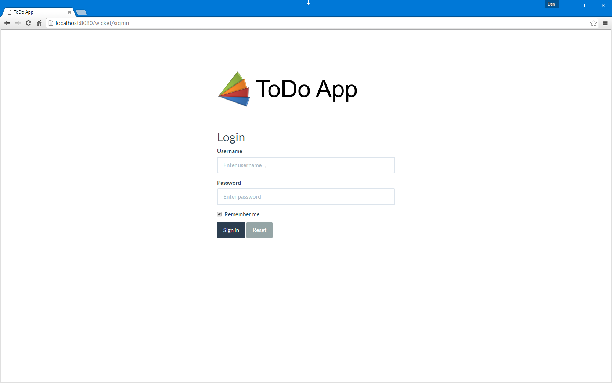

<a id="what-is-apache-causeway-causeway-in-pictures--install-fixtures"></a>

### Install Fixtures

Apache Causeway has lots of features to help you prototype and then fully test your application.
One such are fixture scripts, which allow pre-canned data to be installed in the running application.
This is great to act as the starting point for identifying new stories; later on when the feature is being implemented, the same fixture script can be re-used within that feature’s integration tests.
(More on tests later).

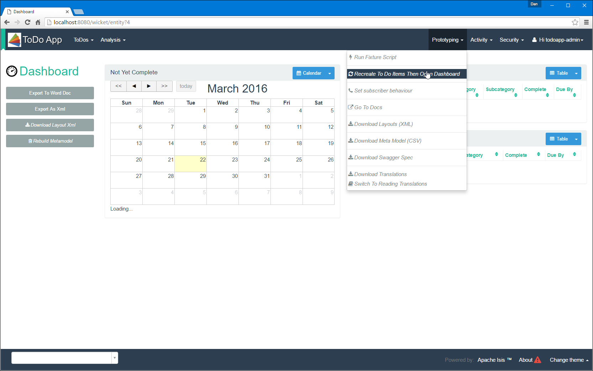

<a id="what-is-apache-causeway-causeway-in-pictures--dashboard-and-view-models"></a>

### Dashboard and View Models

Most of the time the end-user interacts with representations of persistent domain entities, but Apache Causeway also supports view models which can aggregate data from multiple sources.
The todoapp example uses a "dashboard" view model to list todo items not yet done vs those completed.

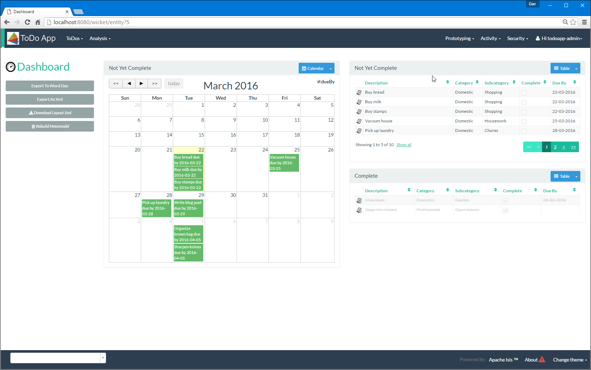

In general we recommend to initially focus only on domain entities; this will help drive out a good domain model.
Later on view models can be introduced in support of specific use cases.

<a id="what-is-apache-causeway-causeway-in-pictures--domain-entity"></a>

### Domain Entity

The screenshot below is of the todoapp’s `ToDoItem` domain entity.
Like all web pages, this UI is generated at runtime, directly from the domain object itself.
There are no controllers or HTML to write.

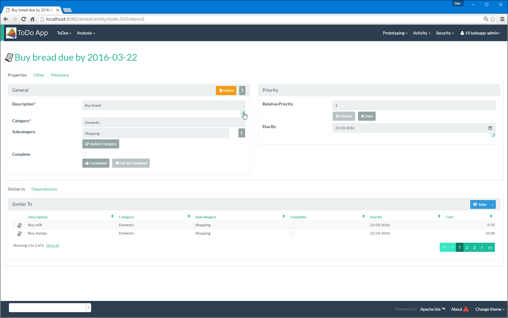

In addition to the domain entity, Apache Causeway allows layout metadata hints to be provided, for example to specify the grouping of properties, the positioning of those groups into columns, the association of actions (the buttons) with properties or collections, the icons on the buttons, and so on.
This metadata can be specified either as annotations or in XML form.
The benefit of the latter is that it can be updated (and the UI redrawn) without restarting the app.

Any production-ready app will require this metadata but (like the view models discussed above) this metadata can be added gradually on top of the core domain model.

<a id="what-is-apache-causeway-causeway-in-pictures--edit-properties"></a>

### Edit properties

By default properties on domain entities are editable, meaning they can be changed directly.
In the todoapp example, the `ToDoItem’s description is one such editable property:

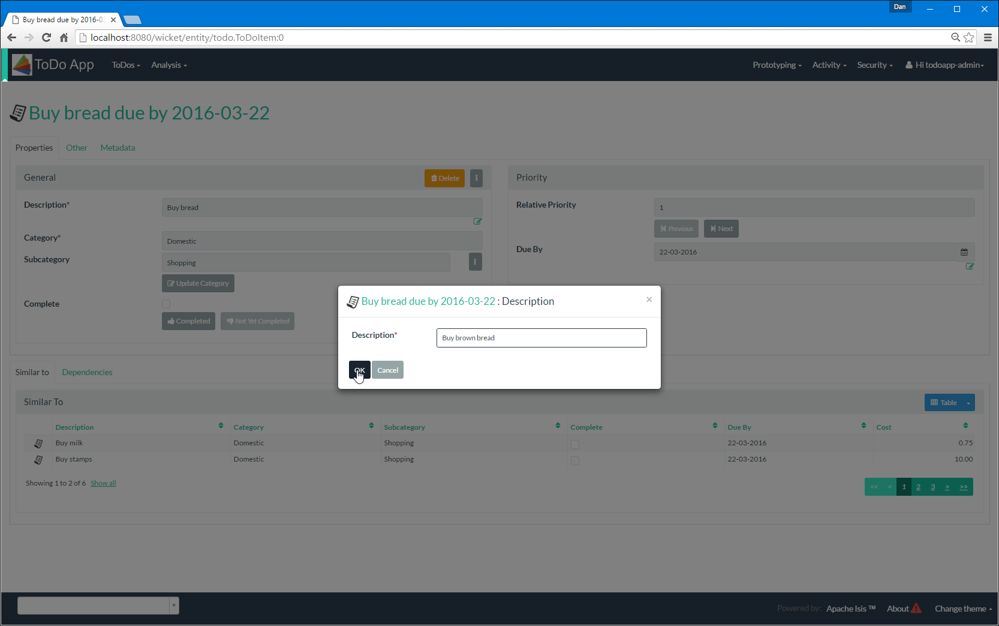

Note that some of the properties are read-only even in edit mode; individual properties can be made non-editable.
It is also possible to make all properties disabled and thus enforce changes only through actions (below).

<a id="what-is-apache-causeway-causeway-in-pictures--actions"></a>

### Actions

The other way to modify an entity is to an invoke an action.
In the screenshot below the `ToDoItem`'s category and subcategory can be updated together using an action:

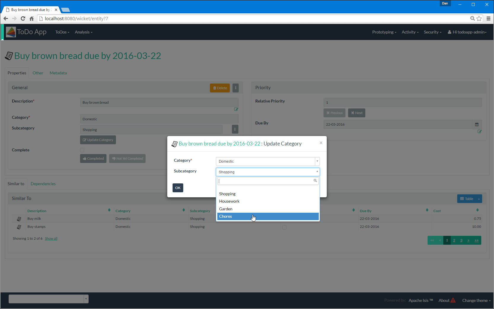

There are no limitations on what an action can do; it might just update a single object, it could update multiple objects.
Or, it might not update any objects at all, but could instead perform some other activity, such as sending out email or printing a document.

In general though, all actions are associated with some object, and are (at least initially) also implemented by that object: good old-fashioned encapsulation.
We sometimes use the term "behaviourally complete" for such domain objects.

<a id="what-is-apache-causeway-causeway-in-pictures--mixins"></a>

### Mixins

As an alternative to placing actions (business logic) on a domain object, it can instead be placed inside a mixin object.
When an object is rendered by Apache Causeway, the mixin "contributes" its behaviour to the domain object (similar to aspect-oriented traits).

In the screenshot below the highlighted "export as xml" action, the "relative priority" property (and "previous" and "next" actions) the "similar to" collection and the two "as DTO" actions are all contributed by mixins:

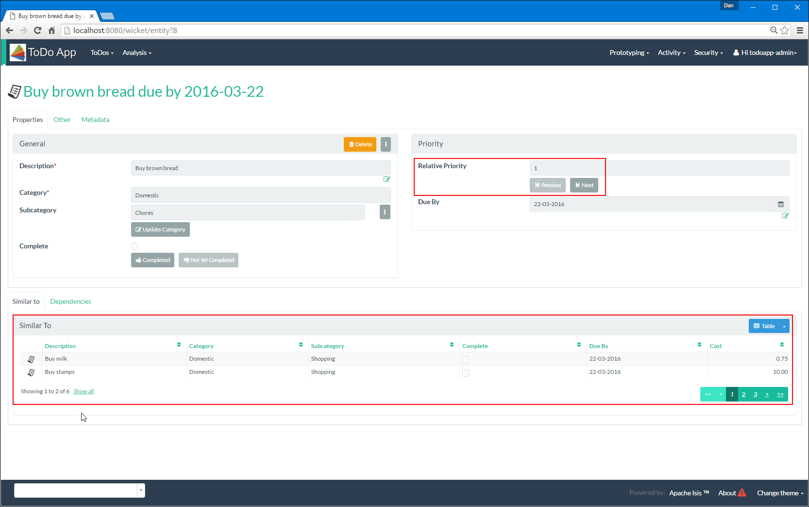

<a id="what-is-apache-causeway-causeway-in-pictures--extensible-views"></a>

## Extensible Views

The Apache Causeway viewer is implemented using [Apache Wicket](http://wicket.apache.org), and has been designed to be extensible.
For example, when a collection of objects is rendered, this is just one of several views, as shown in the selector drop-down:

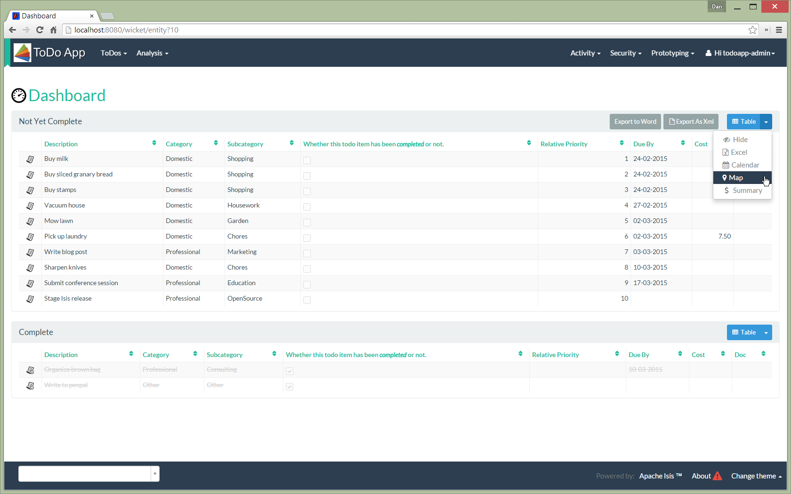

Similarly the [Fullcalendar2](https://causeway.apache.org/vw/latest/fullcalendar/about.html) extension will render any domain entity (such as `ToDoItem`) that implements its `Calendarable` interface:


The [Tabular Download](https://causeway.apache.org/vw/latest/tabular/about.html) component is rather simple: it simply allows the table to be downloaded as a spreadsheet:

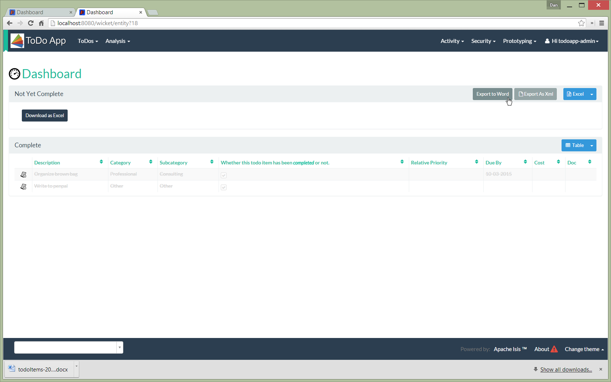

<a id="what-is-apache-causeway-causeway-in-pictures--security-auditing-and-more"></a>

## Security, Auditing and more…

As well as providing extensions to the UI, the [extensions](https://causeway.apache.org/extensions/latest/about.html) provide a rich set of modules to support various cross-cutting concerns.

Under the activity menu are four sets of services which provide support on user session logging/auditing, command module (profiling and replay), audit module (audit object changes) and (inter-system) event publishing:

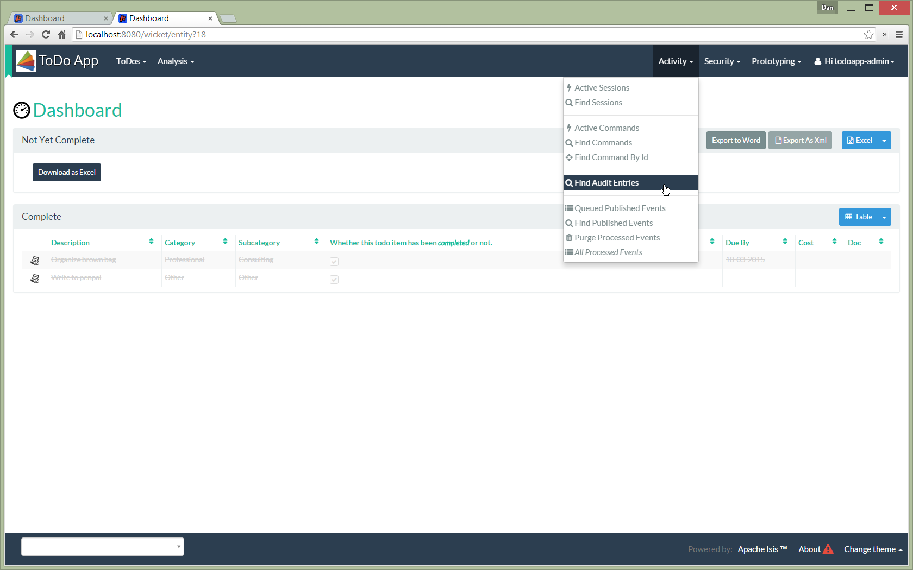

In the security menu is access to the rich set of functionality provided by the [SecMan extension](https://causeway.apache.org/security/latest/about.html):

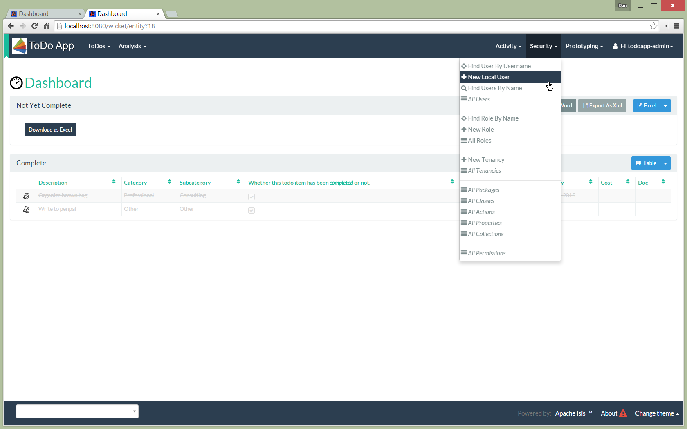

In the prototyping menu is the ability to download a GNU gettext `.po` file for translation.
This file can then be translated into multiple languages so that your app can support different locales.

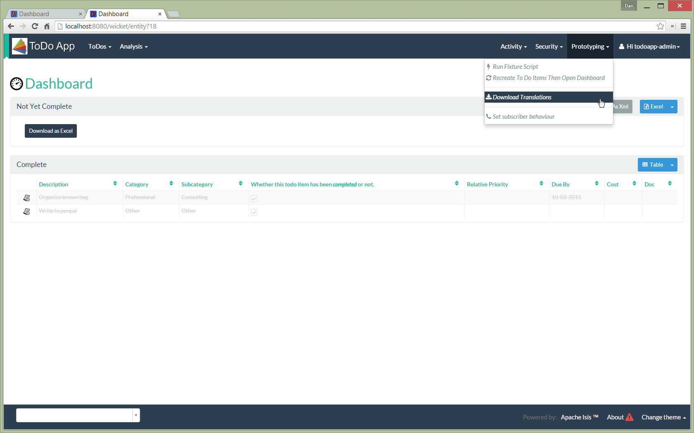

<a id="what-is-apache-causeway-causeway-in-pictures--multi-tenancy-support"></a>

### Multi-tenancy support

One significant feature of the [SecMan extension](https://causeway.apache.org/security/latest/about.html) is the ability to associate users and objects with a "tenancy".
The todoapp uses this feature so that different users' list of todo items are kept separate from one another.
A user with administrator is able to switch their own "tenancy" to the tenancy of some other user, in order to access the objects in that tenancy:


For more details, see the [SecMan extension](https://causeway.apache.org/security/latest/about.html).

<a id="what-is-apache-causeway-causeway-in-pictures--me"></a>

### Me

Most of the [SecMan extension](https://causeway.apache.org/security/latest/about.html)'s services are on the security menu, which would normally be provided only to administrators.
Kept separate is the "me" action:

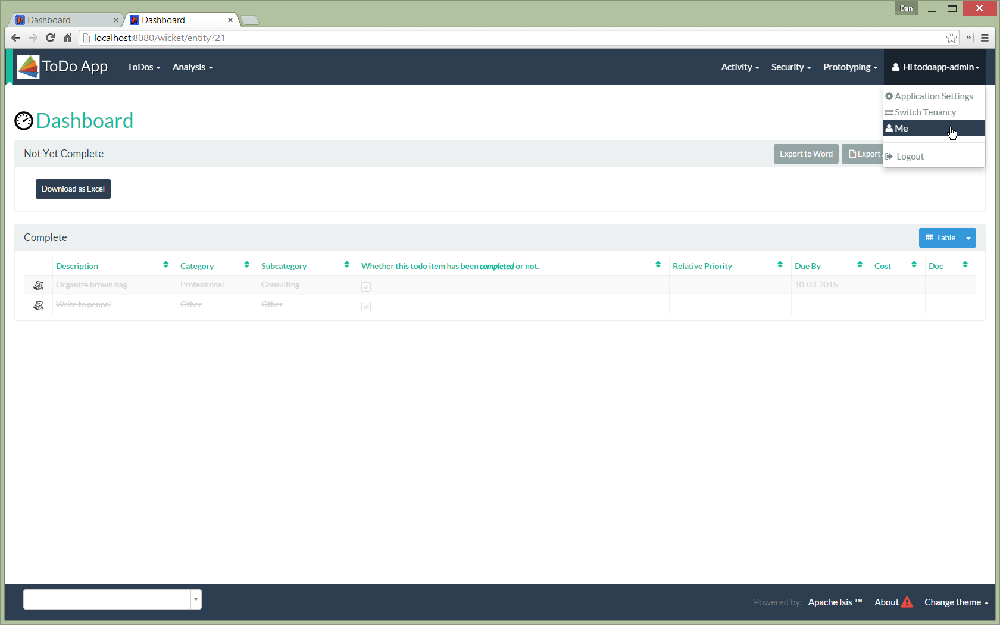

Assuming they have been granted permissions, this allows a user to access an entity representing their own user account:

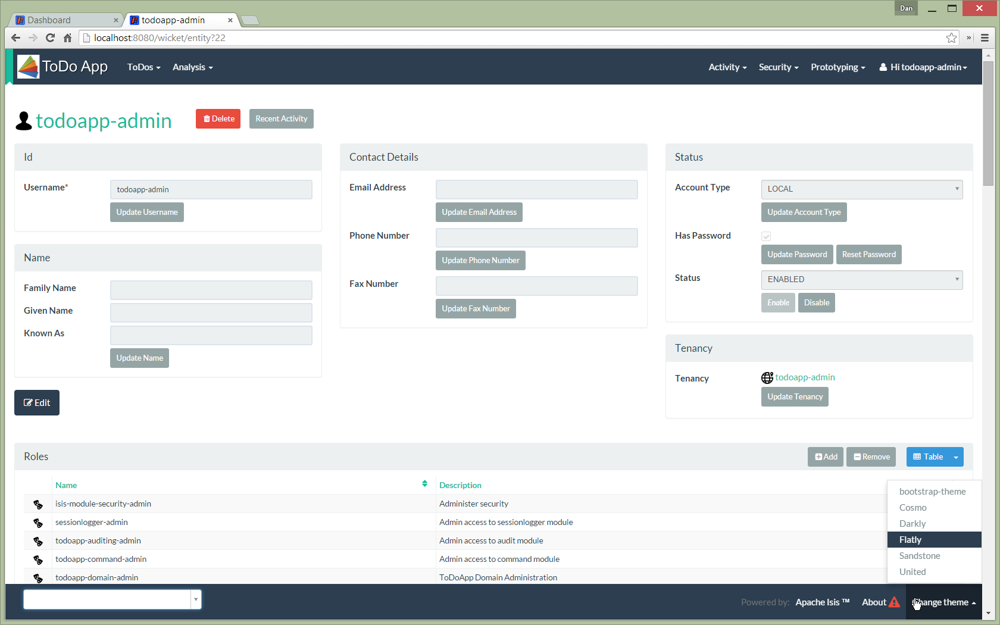

If not all of these properties are required, then they can be hidden either using security or though Apache Causeway' internal event bus (described below).
Conversely, additional properties can be "grafted onto" the user using the contributed properties/collections discussed previously.

<a id="what-is-apache-causeway-causeway-in-pictures--themes"></a>

### Themes

Apache Causeway' Wicket viewer uses [Twitter Bootstrap](http://getbootstrap.com), which means that it can be themed.
If more than one theme has been configured for the app, then the viewer allows the end-user to switch their theme:

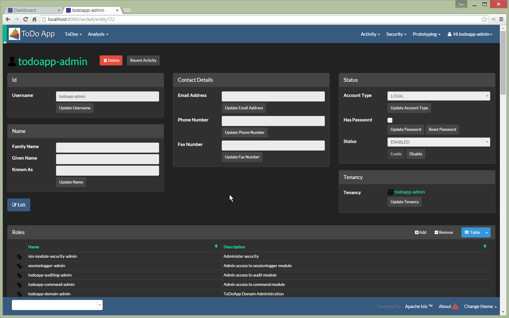

<a id="what-is-apache-causeway-causeway-in-pictures--rest-api"></a>

## REST API

In addition to Apache Causeway' Wicket viewer, it also provides a rich REST API with a full set of hypermedia controls, generated automatically from the domain objects (entities and view models).
The framework provides two default representations, one an implementation of the [Restful Objects](http://restfulobjects.org) spec, the other a simplified representation suitable for custom JavaScript apps.
Other representations can be plugged in.

The screenshot below shows accessing the Restful Objects representation API accessed through a Chrome plugin:

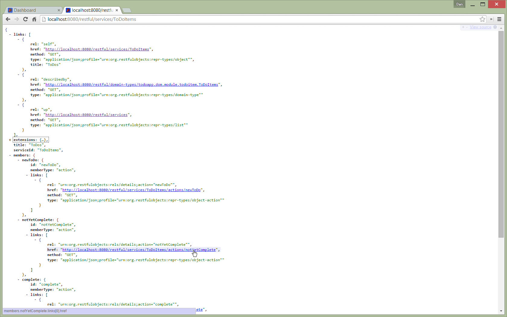

The framework also automatically integrates with Swagger, generating a Swagger spec from the underlying domain object model.
From this spec REST clients can be code-generated; it also allows developers to play with the REST API through the Swagger UI:

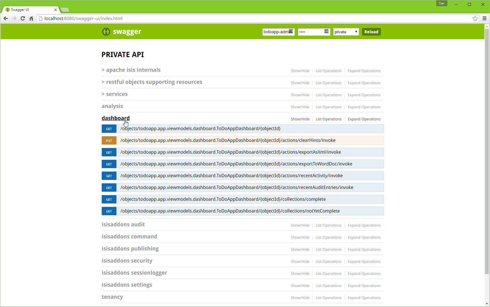

<a id="what-is-apache-causeway-causeway-in-pictures--integration-testing-support"></a>

## Integration Testing Support

Earlier on we noted that Apache Causeway allows fixtures to be installed through the UI.
These same fixture scripts can be reused within integration tests.
For example, the code snippet below shows how the `FixtureScripts` service injected into an integration test can then be used to set up data:

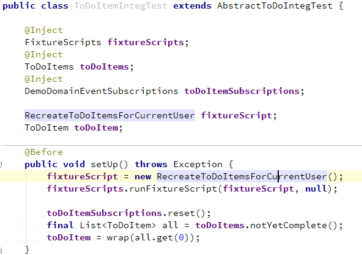

The tests themselves are run in junit.
While these are integration tests (so talking to a real database), they are no more complex than a regular unit test:

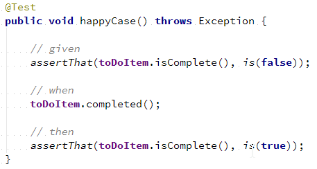

To simulate the business rules enforced by Apache Causeway, the domain object can be "wrapped" in a proxy.
For example, if using the Wicket viewer then Apache Causeway will enforce the rule (implemented in the `ToDoItem` class itself) that a completed item cannot have the "completed" action invoked upon it.
The wrapper simulates this by throwing an appropriate exception:

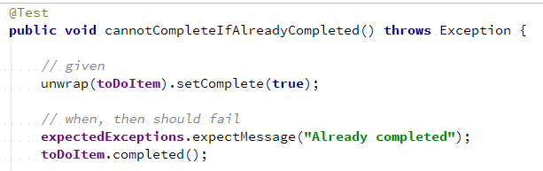

<a id="what-is-apache-causeway-causeway-in-pictures--internal-event-bus"></a>

## Internal Event Bus

Contributions, discussed earlier, are an important tool in ensuring that the packages within your Apache Causeway application are decoupled; by extracting out actions the order of dependency between packages can effectively be reversed.

Another important tool to ensure your codebase remains maintainable is Apache Causeway' internal event bus.
It is probably best explained by example; the code below says that the "complete" action should emit a `ToDoItem.Completed` event:

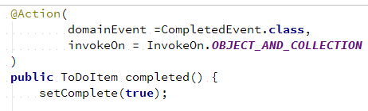

Domain service (application-scoped, stateless) can then subscribe to this event:

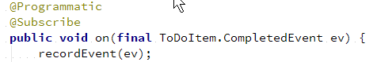

And this test verifies that completing an action causes the subscriber to be called:

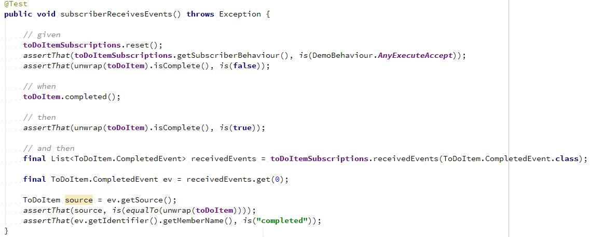

In fact, the domain event is fired not once, but (up to) 5 times.
It is called 3 times prior to execution, to check that the action is visible, enabled and that arguments are valid.
It is then additionally called prior to execution, and also called after execution.
What this means is that a subscriber can in either veto access to an action of some publishing object, and/or it can perform cascading updates if the action is allowed to proceed.

Moreover, domain events are fired for all properties and collections, not just actions.
Thus, subscribers can therefore switch on or switch off different parts of an application.
Indeed, the example todoapp demonstrates this.

---

<a id="what-is-apache-causeway-common-use-cases"></a>

<!-- source_url: https://causeway.apache.org/docs/latest/what-is-apache-causeway/common-use-cases.html -->

<!-- page_index: 2 -->

<a id="what-is-apache-causeway-common-use-cases--common-use-cases"></a>

# Common Use Cases

<a id="what-is-apache-causeway-common-use-cases--prototyping"></a>

## Prototyping

Apache Causeway is great for rapid prototyping, because all you need to write in order to get an application up-and-running is the domain model objects.

By focusing just on the domain, you’ll also find that you start to develop a ubiquitous language - a set of terms and concepts that the entire team (business and technologists alike) have a shared understanding.

If you wish, you could combine this with BDD - the framework integrates with [Cucumber](https://causeway.apache.org/testing/latest/specsupport/about.html).

Once you’ve sketched out your domain model, you can then either start-over and deploy with one of the deployment options listed below.

<a id="what-is-apache-causeway-common-use-cases--deploy-with-a-generic-ui"></a>

## Deploy with a generic UI

One of the original motivations for Apache Causeway was to be able automatically generate a user interface for a domain object model.
The framework’s architecture allows for different user interface technologies.
The principal implementation is the [Web UI (Wicket viewer)](https://causeway.apache.org/vw/latest/about.html), which as well as providing an appealing default user interface also has the ability to be customized the user interface by writing new [Apache Wicket](http://wicket.apache.org) components.
The framework provides a [number of these](https://causeway.apache.org/extensions/latest/about.html).

Deploying on Apache Causeway means that the framework also manages object persistence.
Again this is pluggable, currently only the [JPA (EclipseLink)](https://causeway.apache.org/pjpa/latest/about.html) implementation is supported.

<a id="what-is-apache-causeway-common-use-cases--deploy-with-custom-controllers"></a>

## Deploy with custom controllers

If the [Web UI (Wicket viewer)](https://causeway.apache.org/vw/latest/about.html)'s extensions are too restrictive, another option is to deploy custom controllers/views for specific use cases *alongside* the generic viewer.
This way you can use the generic viewer to deliver the majority of the app’s functionality, but you can justify the additional effort of writing a custom controller for those specialised/high volume use cases where a different flow is needed.

Because Apache Causeway runs on top of [Spring Boot](https://spring.io/projects/spring-boot), you can easily integrate any of the UI technologies supported by Spring, or of course use Apache Wicket for a similar look-n-feel.

<a id="what-is-apache-causeway-common-use-cases--deploy-as-a-rest-api"></a>

## Deploy as a REST API

REST (Representation State Transfer) is an architectural style for building highly scalable distributed systems, using the same principles as the World Wide Web.
Many commercial web APIs (twitter, facebook, Amazon) are implemented as either pure REST APIs or some approximation therein.

The [Restful Objects specification](http://restfulobjects.org) defines a means by which a domain object model can be exposed as RESTful resources using JSON representations over HTTP.

Apache Causeway' [RestfulObjects viewer](https://causeway.apache.org/vro/latest/about.html) is an implementation of that spec, making any Apache Causeway domain object automatically available via REST.
The set of domain objects can also be optionally restricted to exclude domain entities (thereby avoiding leaking implementation details).

There are three main use cases for deploying Apache Causeway as a RESTful web service are:

- to allow a custom UI to be built against the RESTful API

  For example, using a JavaScript framework such as Angular/Ionic/ReactJs/Vue etc, or JavaFX
- to enable integration between systems

  REST is designed to be machine-readable, and so is an excellent choice for synchronous data interchange scenarios.

  The framework provides [SPI](https://causeway.apache.org/refguide/latest/applib/index/services/conmap/ContentMappingService.html)s to allow custom repreentations to be returned as required.
- as the basis for a generic UI.

  At the time of writing there are a couple being developed, [Kroviz](https://github.com/joerg-rade/kroviz) (using Kotlin/JS), and [Rob](https://github.com/sebastianslutzky/rob) (using [Microsoft’s Blazor](https://dotnet.microsoft.com/apps/aspnet/web-apps/blazor)).

Another framework that implements the RO spec is the [Naked Objects Framework](https://github.com/NakedObjectsGroup/NakedObjectsFramework) (on .NET).
It provides a complete generic UI tested against its own RO implementation.

As for the human-usable generic UI discussed [above](#what-is-apache-causeway-common-use-cases--deploy-with-a-generic-ui), the framework manages object persistence, for example using the JPA/EclipseLink objectstore.
It is perfectly possible to deploy the RESTful API alongside an auto-generated webapp; both work from the same domain object model.

<a id="what-is-apache-causeway-common-use-cases--deploy-on-your-own-platform"></a>

## Deploy on your own platform

You may be happy to use Apache Causeway for prototyping, but have your own proprietary application framework to actually build production apps.

Apache Causeway supports this, because the programming model defined by Apache Causeway deliberately minimizes the dependencies on the rest of the framework.
In fact, the only hard dependency that the domain model classes have on Apache Causeway is through the `org.apache.causeway.applib` classes, mostly to pick up annotations such as [@Action](https://causeway.apache.org/refguide/latest/applib/index/annotation/Action.html) and [@Property](https://causeway.apache.org/refguide/latest/applib/index/annotation/Property.html).
It’s therefore relatively easy to take a domain object prototyped and/or tested using Apache Causeway, but to deploy on some other framework’s runtime.

If you are interested in taking this approach, then you will need to provide your own implementations of any framework-provided services used by your code.

If your own application framework is based on [Spring Boot](https://spring.io/projects/spring-boot) and using JPA as its ORM, then there is another option.
As noted above, Apache Causeway itself runs on top of Spring Boot.
You could therefore develop a complete custom UI using one of the regular Spring technologies and run that alongside Apache Causeway - in effect the option described [earlier](#what-is-apache-causeway-common-use-cases--deploy-with-custom-controllers) but for every use case, not just selected ones.
Apache Causeway continues to manage the object lifecycle and persistence as a thin layer on top of Spring, but your custom UI renders the domain objects exactly as you require.

---

<a id="starters-helloworld"></a>

<!-- source_url: https://causeway.apache.org/docs/latest/starters/helloworld.html -->

<!-- page_index: 3 -->

# HelloWorld

4.0.0-M1

- - [4.0.0-M1](#about)
  - [3.5.0](https://causeway.apache.org/docs/3.5.0/about.html)
  - [3.4.0](https://causeway.apache.org/docs/3.4.0/about.html)
  - [3.3.0](https://causeway.apache.org/docs/3.3.0/about.html)
  - [3.2.0](https://causeway.apache.org/docs/3.2.0/about.html)
  - [3.1.0](https://causeway.apache.org/docs/3.1.0/about.html)
  - [3.0.0](https://causeway.apache.org/docs/3.0.0/about.html)
  - [2.1.0](https://causeway.apache.org/docs/2.1.0/about.html)
  - [2.0.0](https://causeway.apache.org/docs/2.0.0/about.html)
- Committers' Guide
  - [4.0.0-M1](https://causeway.apache.org/comguide/latest/about.html)
  - [3.5.0](https://causeway.apache.org/comguide/3.5.0/about.html)
  - [3.4.0](https://causeway.apache.org/comguide/3.4.0/about.html)
  - [3.3.0](https://causeway.apache.org/comguide/3.3.0/about.html)
  - [3.2.0](https://causeway.apache.org/comguide/3.2.0/about.html)
  - [3.1.0](https://causeway.apache.org/comguide/3.1.0/about.html)
  - [3.0.0](https://causeway.apache.org/comguide/3.0.0/about.html)
  - [2.1.0](https://causeway.apache.org/comguide/2.1.0/about.html)
  - [2.0.0](https://causeway.apache.org/comguide/2.0.0/about.html)
- Contributors' Guide
  - [4.0.0-M1](https://causeway.apache.org/conguide/latest/about.html)
  - [3.5.0](https://causeway.apache.org/conguide/3.5.0/about.html)
  - [3.4.0](https://causeway.apache.org/conguide/3.4.0/about.html)
  - [3.3.0](https://causeway.apache.org/conguide/3.3.0/about.html)
  - [3.2.0](https://causeway.apache.org/conguide/3.2.0/about.html)
  - [3.1.0](https://causeway.apache.org/conguide/3.1.0/about.html)
  - [3.0.0](https://causeway.apache.org/conguide/3.0.0/about.html)
  - [2.1.0](https://causeway.apache.org/conguide/2.1.0/about.html)
  - [2.0.0](https://causeway.apache.org/conguide/2.0.0/about.html)
- Design Docs
  - [4.0.0-M1](https://causeway.apache.org/core/latest/about.html)
  - [3.5.0](https://causeway.apache.org/core/3.5.0/about.html)
  - [3.4.0](https://causeway.apache.org/core/3.4.0/about.html)
  - [3.3.0](https://causeway.apache.org/core/3.3.0/about.html)
  - [3.2.0](https://causeway.apache.org/core/3.2.0/about.html)
  - [3.1.0](https://causeway.apache.org/core/3.1.0/about.html)
  - [3.0.0](https://causeway.apache.org/core/3.0.0/about.html)
  - [2.1.0](https://causeway.apache.org/core/2.1.0/about.html)
  - [2.0.0](https://causeway.apache.org/core/2.0.0/about.html)
- Extensions
  - [4.0.0-M1](https://causeway.apache.org/extensions/latest/about.html)
  - [3.5.0](https://causeway.apache.org/extensions/3.5.0/about.html)
  - [3.4.0](https://causeway.apache.org/extensions/3.4.0/about.html)
  - [3.3.0](https://causeway.apache.org/extensions/3.3.0/about.html)
  - [3.2.0](https://causeway.apache.org/extensions/3.2.0/about.html)
  - [3.1.0](https://causeway.apache.org/extensions/3.1.0/about.html)
  - [3.0.0](https://causeway.apache.org/extensions/3.0.0/about.html)
  - [2.1.0](https://causeway.apache.org/extensions/2.1.0/about.html)
  - [2.0.0](https://causeway.apache.org/extensions/2.0.0/about.html)
- GraphQL Viewer
  - [4.0.0-M1](https://causeway.apache.org/gqlv/latest/about.html)
  - [3.5.0](https://causeway.apache.org/gqlv/3.5.0/about.html)
  - [3.4.0](https://causeway.apache.org/gqlv/3.4.0/about.html)
  - [3.3.0](https://causeway.apache.org/gqlv/3.3.0/about.html)
  - [3.2.0](https://causeway.apache.org/gqlv/3.2.0/about.html)
  - [3.1.0](https://causeway.apache.org/gqlv/3.1.0/about.html)
  - [3.0.0](https://causeway.apache.org/gqlv/3.0.0/about.html)
  - [2.1.0](https://causeway.apache.org/gqlv/2.1.0/about.html)
  - [2.0.0](https://causeway.apache.org/gqlv/2.0.0/about.html)
- Incubator Catalog
  - [4.0.0-M1](https://causeway.apache.org/incubator/latest/about.html)
  - [3.5.0](https://causeway.apache.org/incubator/3.5.0/about.html)
  - [3.4.0](https://causeway.apache.org/incubator/3.4.0/about.html)
  - [3.3.0](https://causeway.apache.org/incubator/3.3.0/about.html)
  - [3.2.0](https://causeway.apache.org/incubator/3.2.0/about.html)
  - [3.1.0](https://causeway.apache.org/incubator/3.1.0/about.html)
  - [3.0.0](https://causeway.apache.org/incubator/3.0.0/about.html)
  - [2.1.0](https://causeway.apache.org/incubator/2.1.0/about.html)
  - [2.0.0](https://causeway.apache.org/incubator/2.0.0/about.html)
- JDO/DataNucleus
  - [3.4.0](https://causeway.apache.org/pjdo/latest/about.html)
  - [3.3.0](https://causeway.apache.org/pjdo/3.3.0/about.html)
  - [3.2.0](https://causeway.apache.org/pjdo/3.2.0/about.html)
  - [3.1.0](https://causeway.apache.org/pjdo/3.1.0/about.html)
  - [3.0.0](https://causeway.apache.org/pjdo/3.0.0/about.html)
  - [2.1.0](https://causeway.apache.org/pjdo/2.1.0/about.html)
  - [2.0.0](https://causeway.apache.org/pjdo/2.0.0/about.html)
- JPA
  - [4.0.0-M1](https://causeway.apache.org/pjpa/latest/about.html)
  - [3.5.0](https://causeway.apache.org/pjpa/3.5.0/about.html)
  - [3.4.0](https://causeway.apache.org/pjpa/3.4.0/about.html)
  - [3.3.0](https://causeway.apache.org/pjpa/3.3.0/about.html)
  - [3.2.0](https://causeway.apache.org/pjpa/3.2.0/about.html)
  - [3.1.0](https://causeway.apache.org/pjpa/3.1.0/about.html)
  - [3.0.0](https://causeway.apache.org/pjpa/3.0.0/about.html)
  - [2.1.0](https://causeway.apache.org/pjpa/2.1.0/about.html)
  - [2.0.0](https://causeway.apache.org/pjpa/2.0.0/about.html)
- QueryDSL
  - [4.0.0-M1](https://causeway.apache.org/querydsl/latest/about.html)
  - [3.5.0](https://causeway.apache.org/querydsl/3.5.0/about.html)
  - [3.4.0](https://causeway.apache.org/querydsl/3.4.0/about.html)
  - [3.3.0](https://causeway.apache.org/querydsl/3.3.0/about.html)
  - [3.2.0](https://causeway.apache.org/querydsl/3.2.0/about.html)
- Reference Guide
  - [4.0.0-M1](https://causeway.apache.org/refguide/latest/about.html)
  - [3.5.0](https://causeway.apache.org/refguide/3.5.0/about.html)
  - [3.4.0](https://causeway.apache.org/refguide/3.4.0/about.html)
  - [3.3.0](https://causeway.apache.org/refguide/3.3.0/about.html)
  - [3.2.0](https://causeway.apache.org/refguide/3.2.0/about.html)
  - [3.1.0](https://causeway.apache.org/refguide/3.1.0/about.html)
  - [3.0.0](https://causeway.apache.org/refguide/3.0.0/about.html)
  - [2.1.0](https://causeway.apache.org/refguide/2.1.0/about.html)
  - [2.0.0](https://causeway.apache.org/refguide/2.0.0/about.html)
- regressiontests
  - [4.0.0-M1](https://causeway.apache.org/regressiontests/latest/index.html)
  - [3.5.0](https://causeway.apache.org/regressiontests/3.5.0/index.html)
  - [3.4.0](https://causeway.apache.org/regressiontests/3.4.0/index.html)
  - [3.3.0](https://causeway.apache.org/regressiontests/3.3.0/index.html)
  - [3.2.0](https://causeway.apache.org/regressiontests/3.2.0/index.html)
  - [3.1.0](https://causeway.apache.org/regressiontests/3.1.0/index.html)
  - [3.0.0](https://causeway.apache.org/regressiontests/3.0.0/index.html)
  - [2.1.0](https://causeway.apache.org/regressiontests/2.1.0/index.html)
  - [2.0.0](https://causeway.apache.org/regressiontests/2.0.0/index.html)
- Release Notes
  - [4.0.0-M1](https://causeway.apache.org/relnotes/latest/about.html)
  - [3.5.0](https://causeway.apache.org/relnotes/3.5.0/about.html)
  - [3.4.0](https://causeway.apache.org/relnotes/3.4.0/about.html)
  - [3.3.0](https://causeway.apache.org/relnotes/3.3.0/about.html)
  - [3.2.0](https://causeway.apache.org/relnotes/3.2.0/about.html)
  - [3.1.0](https://causeway.apache.org/relnotes/3.1.0/about.html)
  - [3.0.0](https://causeway.apache.org/relnotes/3.0.0/about.html)
  - [2.1.0](https://causeway.apache.org/relnotes/2.1.0/about.html)
  - [2.0.0](https://causeway.apache.org/relnotes/2.0.0/about.html)
- REST API (Restful Objects Viewer)
  - [4.0.0-M1](https://causeway.apache.org/vro/latest/about.html)
  - [3.5.0](https://causeway.apache.org/vro/3.5.0/about.html)
  - [3.4.0](https://causeway.apache.org/vro/3.4.0/about.html)
  - [3.3.0](https://causeway.apache.org/vro/3.3.0/about.html)
  - [3.2.0](https://causeway.apache.org/vro/3.2.0/about.html)
  - [3.1.0](https://causeway.apache.org/vro/3.1.0/about.html)
  - [3.0.0](https://causeway.apache.org/vro/3.0.0/about.html)
  - [2.1.0](https://causeway.apache.org/vro/2.1.0/about.html)
  - [2.0.0](https://causeway.apache.org/vro/2.0.0/about.html)
- Security Guide
  - [4.0.0-M1](https://causeway.apache.org/security/latest/about.html)
  - [3.5.0](https://causeway.apache.org/security/3.5.0/about.html)
  - [3.4.0](https://causeway.apache.org/security/3.4.0/about.html)
  - [3.3.0](https://causeway.apache.org/security/3.3.0/about.html)
  - [3.2.0](https://causeway.apache.org/security/3.2.0/about.html)
  - [3.1.0](https://causeway.apache.org/security/3.1.0/about.html)
  - [3.0.0](https://causeway.apache.org/security/3.0.0/about.html)
  - [2.1.0](https://causeway.apache.org/security/2.1.0/about.html)
  - [2.0.0](https://causeway.apache.org/security/2.0.0/about.html)
- Setup Guide
  - [4.0.0-M1](https://causeway.apache.org/setupguide/latest/about.html)
  - [3.5.0](https://causeway.apache.org/setupguide/3.5.0/about.html)
  - [3.4.0](https://causeway.apache.org/setupguide/3.4.0/about.html)
  - [3.3.0](https://causeway.apache.org/setupguide/3.3.0/about.html)
  - [3.2.0](https://causeway.apache.org/setupguide/3.2.0/about.html)
  - [3.1.0](https://causeway.apache.org/setupguide/3.1.0/about.html)
  - [3.0.0](https://causeway.apache.org/setupguide/3.0.0/about.html)
  - [2.1.0](https://causeway.apache.org/setupguide/2.1.0/about.html)
  - [2.0.0](https://causeway.apache.org/setupguide/2.0.0/about.html)
- Testing Guide
  - [4.0.0-M1](https://causeway.apache.org/testing/latest/about.html)
  - [3.5.0](https://causeway.apache.org/testing/3.5.0/about.html)
  - [3.4.0](https://causeway.apache.org/testing/3.4.0/about.html)
  - [3.3.0](https://causeway.apache.org/testing/3.3.0/about.html)
  - [3.2.0](https://causeway.apache.org/testing/3.2.0/about.html)
  - [3.1.0](https://causeway.apache.org/testing/3.1.0/about.html)
  - [3.0.0](https://causeway.apache.org/testing/3.0.0/about.html)
  - [2.1.0](https://causeway.apache.org/testing/2.1.0/about.html)
  - [2.0.0](https://causeway.apache.org/testing/2.0.0/about.html)
- Tutorials
  - [4.0.0-M1](https://causeway.apache.org/tutorials/latest/about.html)
  - [3.5.0](https://causeway.apache.org/tutorials/3.5.0/about.html)
  - [3.4.0](https://causeway.apache.org/tutorials/3.4.0/about.html)
  - [3.3.0](https://causeway.apache.org/tutorials/3.3.0/about.html)
  - [3.2.0](https://causeway.apache.org/tutorials/3.2.0/about.html)
  - [3.1.0](https://causeway.apache.org/tutorials/3.1.0/about.html)
  - [3.0.0](https://causeway.apache.org/tutorials/3.0.0/about.html)
  - [2.1.0](https://causeway.apache.org/tutorials/2.1.0/about.html)
  - [2.0.0](https://causeway.apache.org/tutorials/2.0.0/about.html)
- User Guide
  - [4.0.0-M1](https://causeway.apache.org/userguide/latest/about.html)
  - [3.5.0](https://causeway.apache.org/userguide/3.5.0/about.html)
  - [3.4.0](https://causeway.apache.org/userguide/3.4.0/about.html)
  - [3.3.0](https://causeway.apache.org/userguide/3.3.0/about.html)
  - [3.2.0](https://causeway.apache.org/userguide/3.2.0/about.html)
  - [3.1.0](https://causeway.apache.org/userguide/3.1.0/about.html)
  - [3.0.0](https://causeway.apache.org/userguide/3.0.0/about.html)
  - [2.1.0](https://causeway.apache.org/userguide/2.1.0/about.html)
  - [2.0.0](https://causeway.apache.org/userguide/2.0.0/about.html)
- Value Types Catalog
  - [4.0.0-M1](https://causeway.apache.org/valuetypes/latest/about.html)
  - [3.5.0](https://causeway.apache.org/valuetypes/3.5.0/about.html)
  - [3.4.0](https://causeway.apache.org/valuetypes/3.4.0/about.html)
  - [3.3.0](https://causeway.apache.org/valuetypes/3.3.0/about.html)
  - [3.2.0](https://causeway.apache.org/valuetypes/3.2.0/about.html)
  - [3.1.0](https://causeway.apache.org/valuetypes/3.1.0/about.html)
  - [3.0.0](https://causeway.apache.org/valuetypes/3.0.0/about.html)
  - [2.1.0](https://causeway.apache.org/valuetypes/2.1.0/about.html)
  - [2.0.0](https://causeway.apache.org/valuetypes/2.0.0/about.html)
- Web UI (Wicket Viewer)
  - [4.0.0-M1](https://causeway.apache.org/vw/latest/about.html)
  - [3.5.0](https://causeway.apache.org/vw/3.5.0/about.html)
  - [3.4.0](https://causeway.apache.org/vw/3.4.0/about.html)
  - [3.3.0](https://causeway.apache.org/vw/3.3.0/about.html)
  - [3.2.0](https://causeway.apache.org/vw/3.2.0/about.html)
  - [3.1.0](https://causeway.apache.org/vw/3.1.0/about.html)
  - [3.0.0](https://causeway.apache.org/vw/3.0.0/about.html)
  - [2.1.0](https://causeway.apache.org/vw/2.1.0/about.html)
  - [2.0.0](https://causeway.apache.org/vw/2.0.0/about.html)

4.0.0-M1

[4.0.0-M1](#starters-helloworld)
[3.5.0](https://causeway.apache.org/docs/3.5.0/starters/helloworld.html)
[3.4.0](https://causeway.apache.org/docs/3.4.0/starters/helloworld.html)
[3.3.0](https://causeway.apache.org/docs/3.3.0/starters/helloworld.html)
[3.2.0](https://causeway.apache.org/docs/3.2.0/starters/helloworld.html)
[3.1.0](https://causeway.apache.org/docs/3.1.0/starters/helloworld.html)
[3.0.0](https://causeway.apache.org/docs/3.0.0/starters/helloworld.html)
[2.1.0](https://causeway.apache.org/docs/2.1.0/starters/helloworld.html)
[2.0.0](https://causeway.apache.org/docs/2.0.0/starters/helloworld.html)

[Edit](https://github.com/apache/causeway/edit/4.0.0-M1/starters/adoc/modules/starters/pages/helloworld.adoc)

<a id="starters-helloworld--helloworld"></a>

# HelloWorld

The quickest way to start learning about Apache Causeway is to use the `helloworld` starter app.
It uses the [JPA/Eclipselink](https://causeway.apache.org/pjpa/latest/about.html) object store for persistence.

The application is also built nightly as a docker image, so you can quickly try it out:

```bash
docker run -p 8080:8080 apache/causeway-app-helloworld:latest
```

Using the instructions [below](#starters-helloworld--downloading-running), you can download a minimal Apache Causeway app, consisting of a single domain entity (`HelloWorldObject`) with supporting domain services.
Both the business logic and supporting bootstrapping classes are in a single Maven module.

> [!TIP]
> |  |  |
> | --- | --- |
> |  | We don’t recommend that you use the helloworld starter app as the basis for your own applications. Instead, use the [SimpleApp starter app](#starters-simpleapp). It also creates a minimal application, but provides more structure along with tests, useful as you build out your own app. |

<a id="starters-helloworld--prerequisites"></a>

## Prerequisites

Apache Causeway is a Java based framework, so in terms of prerequisites, you’ll need to install:

- Java 21 JDK (or later)

  Apache Causeway v4 requires Java 17, and the helloworld app itself is currently configured for Java 21.
- [Apache Maven](http://maven.apache.org) 3.9.11+

<a id="starters-helloworld--downloading-running"></a>

## Downloading & Running

Create a new directory, and `cd` into that directory.

To build the app from the latest release:

```bash
curl https://codeload.github.com/apache/causeway-app-helloworld/zip/v4-jpa | jar xv
cd causeway-app-helloworld-4-jpa

mvn clean install
mvn spring-boot:run
```

Either way, this should only take a few seconds to download, compile and run.
Then browse to <http://localhost:8080>, and read on.

<a id="starters-helloworld--using-the-app"></a>

## Using the App

When you start the app, you’ll be presented with a welcome page from which you can access the webapp using either the generic UI provided by [Web UI (Wicket viewer)](https://causeway.apache.org/vw/latest/about.html) or use Swagger to access the [REST API (Restful Objects viewer)](https://causeway.apache.org/vro/latest/about.html):

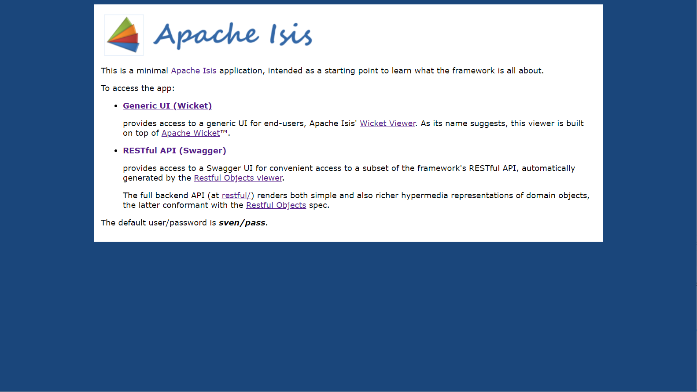

Choose the generic Wicket UI, and navigate to the login page:

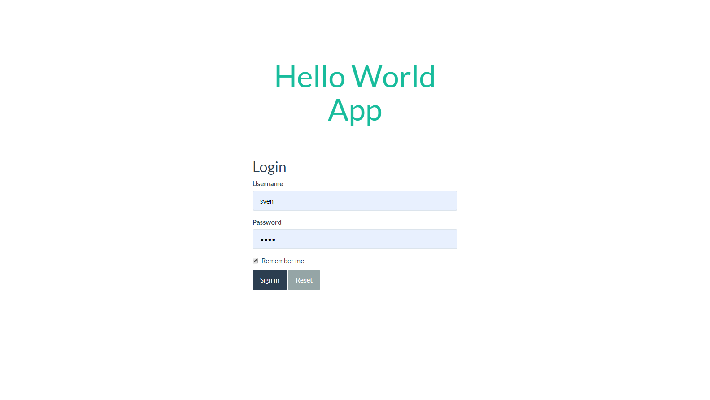

The app itself is configured to run using [Simple security module](https://causeway.apache.org/security/latest/simple/about.html), with the `SimpleRealm` bean defining the users and roles.
You can log in with:

- username: *sven*
- password: *pass*

<a id="starters-helloworld--wicket-viewer"></a>

### Wicket viewer

Once you’ve logged in you’ll see the default home page:


<a id="starters-helloworld--create-an-object"></a>

#### Create an object

The application is configured to run with an in-memory database, so initially there is no data.
Create an object using the menu:

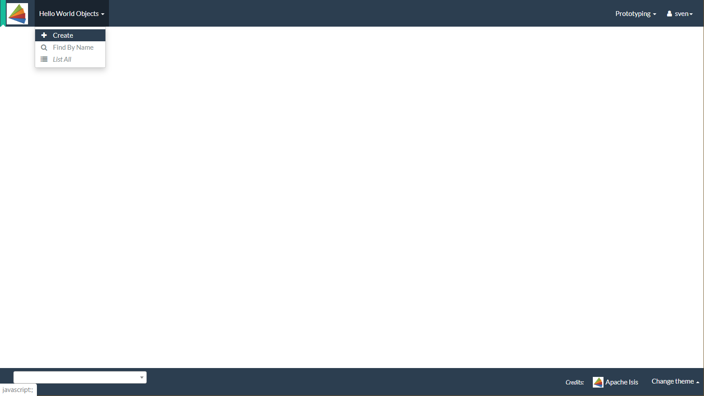

which brings up a modal dialog:

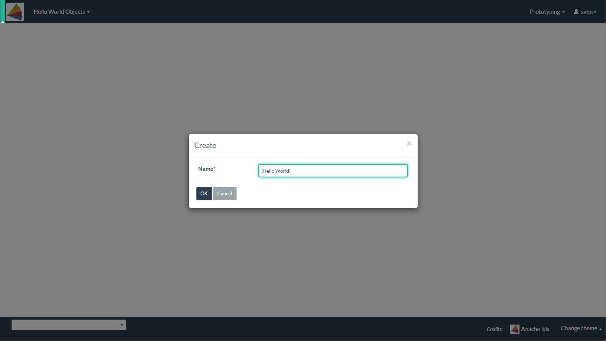

hitting OK returns the created object:

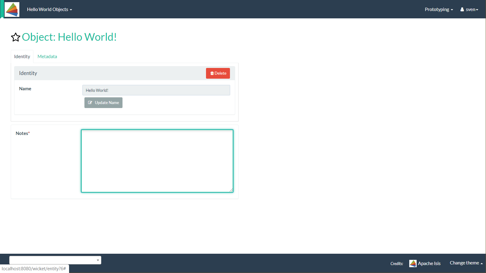

The above functionality is implemented by this code (in the `HelloWorldObjects` menu domain service):

```java
@Action(semantics = SemanticsOf.NON_IDEMPOTENT)
@ActionLayout(promptStyle = PromptStyle.DIALOG_MODAL)
public HelloWorldObject create(
        @Name final String name) {
    return repositoryService.persist(new HelloWorldObject(name));
}
public String default0Create() {
    return "Hello World!";
}
```

<a id="starters-helloworld--invoke-an-action"></a>

#### Invoke an action

The `HelloWorldObject` contains a couple of properties, and a single action to update that property.

The `name` property is read-only, and can only be modified using the `updateName` action:

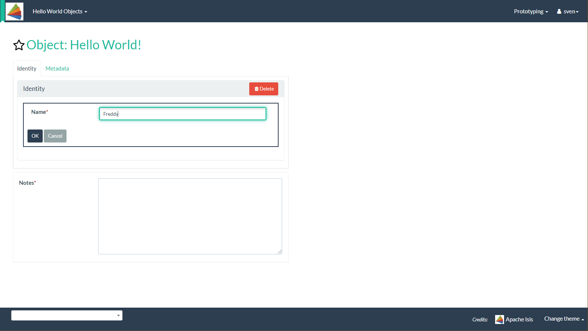

The above functionality is implemented by this code (in the `HelloWorldObject` entity):

```java
@Action( semantics = SemanticsOf.IDEMPOTENT, executionPublishing = Publishing.ENABLED )
@ActionLayout(
        associateWith = "name",
        describedAs = "Updates the object's name"
)
public HelloWorldObject updateName(
        @Name final String name) {
    setName(name);
    return this;
}
public String default0UpdateName() {
    return getName();
}
```

<a id="starters-helloworld--edit-a-property"></a>

#### Edit a property

The `notes` property is editable, and can be edited in-place.
For example:

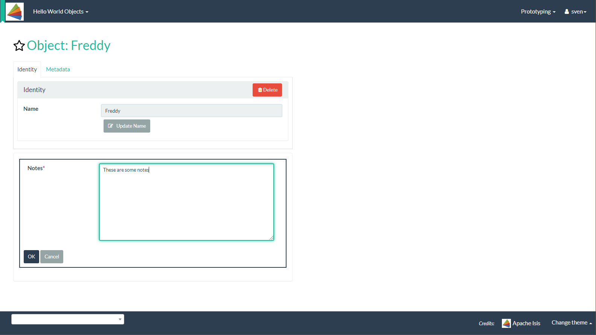

<a id="starters-helloworld--actions-requiring-confirmations"></a>

#### Actions requiring confirmations

It’s also possible to delete an object:

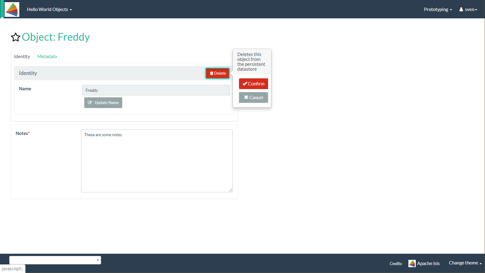

The viewer should display a pop-up message confirming that the object has been deleted.

The above functionality is implemented by this code (in the `HelloWorldObject` entity):

```java
@Action(semantics = SemanticsOf.NON_IDEMPOTENT_ARE_YOU_SURE)
@ActionLayout(position = ActionLayout.Position.PANEL)
public void delete() {
    final String title = titleService.titleOf(this);                    (1)
    messageService.informUser(String.format("'%s' deleted", title));
    repositoryService.removeAndFlush(this);
}
```

|  |  |
| --- | --- |
| **1** | Note that this method uses three services provided by the framework; these are injected into the domain object automatically. |

<a id="starters-helloworld--swagger-restful-objects"></a>

### Swagger (Restful Objects)

> [!WARNING]
> |  |  |
> | --- | --- |
> |  | if invoking an action using Swagger returns a 401 (unauthorised), then navigate to the REST API directly (<http://localhost:8080/restful> to authenticate the browser first]). |

Using **Prototyping**  **Open Swagger UI** menu item (or just going back to the home page at [localhost:8080](http://localhost:8080)) we can use [Swagger UI](https://swagger.io/) as a front-end to the REST API provided by the Restful Objects viewer.

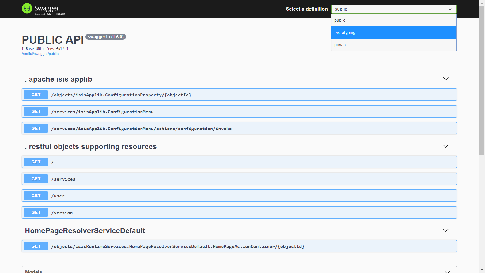

The public API (where the calling client is assumed to be 3rd party) only exposes view models, not entities.
If the API is private (or for prototyping), then resources corresponding to entities are also exposed:

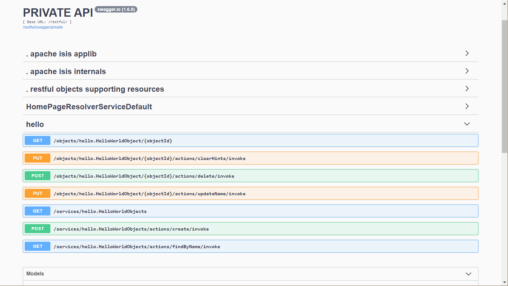

For example, an object can be created using the resource that represents the `HelloWorldObjects#create` action:

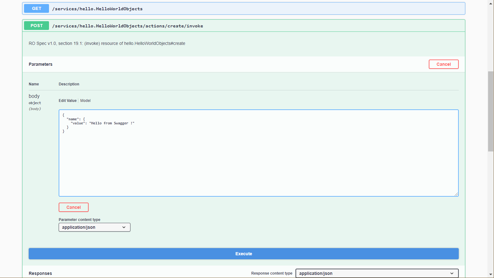

The response indicates that the object was successfully created:

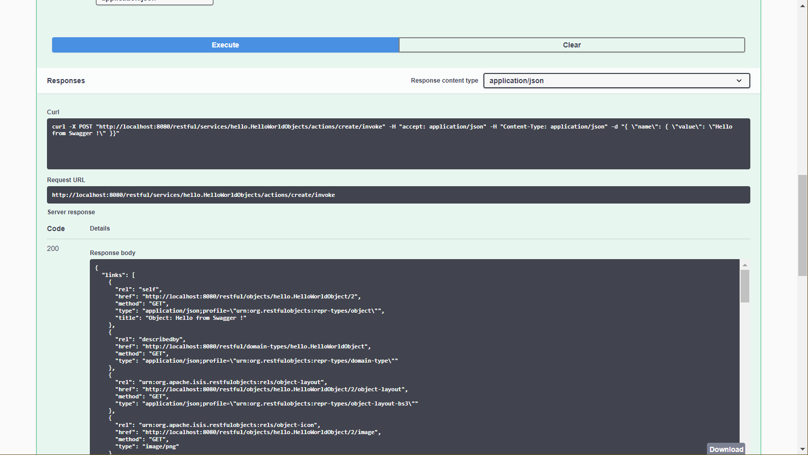

The Swagger UI also provides a resource to retrieve any object:

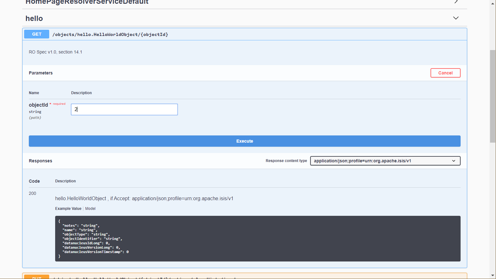

This results in a representation of the domain object (as per the requested `Response Content Type`, ie `ACCEPT` header):

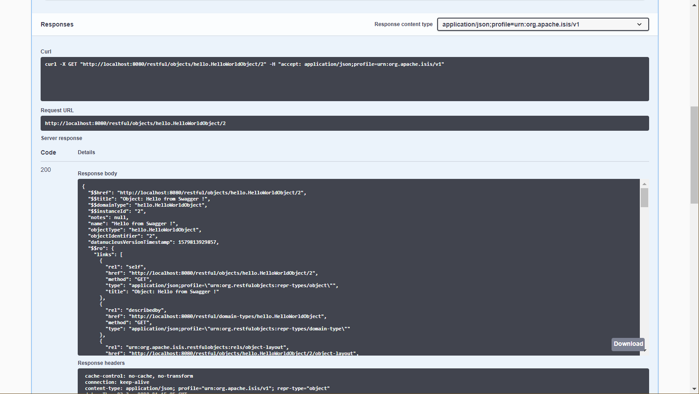

The Swagger UI is provided as a convenience; the REST API is actually a complete hypermedia API (in other words you can follow the links to access all the behaviour exposed in the regular Wicket app).
The REST API implemented by Apache Causeway is specified in the [Restful Object spec](http://www.restfulobjects.org).

<a id="starters-helloworld--structure-of-the-app"></a>

## Structure of the App

The helloworld starter app consists of a single Maven module.

<a id="starters-helloworld--srcmainjava"></a>
<a id="starters-helloworld--src-main-java"></a>

### src/main/java

Under `src/main/java` we have:

```none
src/main/java/
  domainapp/                                    (1)
    modules
      hello/                                    (2)
        dom/                                    (3)
          hwo/                                  (4)
            HelloWorldObject.java
            HelloWorldObject.layout.xml
            HelloWorldObject.png
            HelloWorldObjectRepository.java     (5)
            HelloWorldObjects.java
        types/                                  (6)
          Name.java
          Notes.java
      HelloWorldModule.java                     (7)
    webapp/
      AppManifest.java                          (8)
      HelloWorldApp.java                        (9)
```

|  |  |
| --- | --- |
| **1** | For simplicity, all the Java source files reside in a `domainapp` top-level package. Change as required. |
| **2** | Defines the 'hello' module. Apache Causeway can be used for both microservice and monolithic architectures, but for the latter it encourages "modular monoliths" from the start. |
| **3** | The `dom` package holds the "domain object model" for this module. Modules may have other packages, common ones include `types` (as below), also `api`s, `contribution`s, `fixture`s, `spi`s |
| **4** | Holds classes for the `hwo` ("hello world object") entity/aggregate, consisting of the entity definition itself (`HelloWorldObject`) and a corresponding repository (`HelloWorldObjects`). The associated `.layout.xml` and `.png` are optional but provide metadata/resources for rendering (Maven is configured to also treat `src/main/java` as a resource location). |
| **5** | Uses Spring Data JPA to automatically provide the query implementations. |
| **6** | The `types` package contains meta-annotations to describe the usage of common value types such as `String`s. |
| **7** | `HelloWorldModule` is a Spring [@Configuration](https://docs.spring.io/spring-framework/docs/current/javadoc-api/org/springframework/context/annotation/Configuration.html) which allows the domain services and entities of the module to be located. This is discussed in more detail [below](#starters-helloworld--helloworldmodule). |
| **8** | `AppManifest` is the top-level Spring [@Configuration](https://docs.spring.io/spring-framework/docs/current/javadoc-api/org/springframework/context/annotation/Configuration.html) that specifies the components of Apache Causeway to use, along with the modules making up the application itself (ie `HelloWorldModule`). This is discussed in more detail [below](#starters-helloworld--appmanifest). |
| **9** | `HelloWorldApp` is the [@SpringBootApplication](https://docs.spring.io/spring-boot/docs/current/api/org/springframework/boot/autoconfigure/SpringBootApplication.html) used to bootstrap the app. It’s pretty much boilerplate - the important piece is that it references `AppManifest`. This is discussed in more detail [below](#starters-helloworld--helloworldapp). |

<a id="starters-helloworld--helloworldmodule"></a>

#### HelloWorldModule

Every module within an Apache Causeway application should have a module class.
Its purpose is to define a package to scan from, and optionally to declare any transitive dependencies.
In the case of `HelloWorldModule`, it is extremely simple:

HelloWorldModule.java

```java
package domainapp.modules.hello;
... imports omitted ...
@Configuration
@Import({})                         (1)
@ComponentScan                      (2)
@EnableJpaRepositories              (3)
@EntityScan(                        (4)
    basePackageClasses = {
        HelloWorldModule.class
})
public class HelloWorldModule {
}
```

|  |  |
| --- | --- |
| **1** | no dependencies. If there were, these would be expressed in terms of module classes (each being a Spring `@Configuration`) |
| **2** | specifies this class' package as a root to scan for Spring [@Component](https://docs.spring.io/spring-framework/docs/current/javadoc-api/org/springframework/stereotype/Component.html)s. |
| **3** | enables Spring Data JPA repositories |
| **4** | automatically discovers JPA entities |

The scanning mechanism is also leveraged by Apache Causeway to pick up three types of classes:

- all domain services

  These are classes that are annotated with the framework’s [@DomainService](https://causeway.apache.org/refguide/latest/applib/index/annotation/DomainService.html) annotation.
  Because `@DomainService` is meta-annotated as a `@Component`, these are found automatically and are managed by Spring.

  Depending on their nature, domain services are used to build up the menu, or are available to call programmatically, eg repositories, or sometimes both.

  In the helloworld starter app, the main domain services is `HelloWorldObjects`.
  This appears in the menu, and also acts as a repository for the `HelloWorldObject` entity.
  It also has the `HelloWorldRepository` repository interface for which Spring Data provides the query implementations.
- all entities.

  These are entities that are annotated with both [@DomainObject](https://causeway.apache.org/refguide/latest/applib/index/annotation/DomainObject.html) annotation and with the JPA `@jakarta.persistence.Entity` annotation.

  In the helloworld starter app, the only entity is `HelloWorldObject`.
- all fixture scripts

  These are classes that extend from the testing applib’s `FixtureScript` class, and are used to setup the database when running in prototype mode (against an in-memory database).

  The helloworld starter app doesn’t provide any examples of these.

<a id="starters-helloworld--appmanifest"></a>

#### AppManifest

The "app manifest" is the top-level Spring `@Configuration`.
In the case of the helloworld starter app the `AppManifest` looks like this:

AppManifest.java

```java
@Configuration
@Import({
        CausewayModuleApplibMixins.class,                       (1)
        CausewayModuleApplibChangeAndExecutionLoggers.class,    (1)

        CausewayModuleCoreRuntimeServices.class,                (2)
        CausewayModuleSecuritySimple.class,                     (3)
        CausewayModulePersistenceJpaEclipselink.class,          (4)
        CausewayModuleViewerRestfulObjectsViewer.class,         (5)
        CausewayModuleViewerGraphqlViewer.class,                (6)
        CausewayModuleViewerWicketApplibMixins.class,           (7)
        CausewayModuleViewerWicketViewer.class,                 (8)

        CausewayModuleTestingH2ConsoleUi.class,                 (9)
        HelloWorldModule.class                                  (10)
})
@PropertySource(CausewayPresets.NoTranslations)                 (11)
public class AppManifest {
}
```

|  |  |
| --- | --- |
| **1** | Provides various optional framework-provided mixins in the UI, such as the `objectIdentifier` and `logicalTypeName` properties |
| **2** | Mandatory - specifies the core of the Apache Causeway framework |
| **3** | Enables the [Simple](https://causeway.apache.org/security/latest/simple/about.html) security mechanism. There are several security implementations, precisely one must be selected |
| **4** | Enables [JPA/Eclipselink](https://causeway.apache.org/pjpa/latest/about.html) for persistence. |
| **5** | Enables the [REST API (Restful Objects viewer)](https://causeway.apache.org/vro/latest/about.html) |
| **6** | Enables the [GraphQL API (GraphQL viewer](https://causeway.apache.org/gqlv/latest/about.html)) |
| **7** | Enables various optional mixins provided by the [Wicket viewer](https://causeway.apache.org/vw/latest/about.html), for example the `clearHints()` action. |
| **8** | Enables the [Web UI (Wicket viewer)](https://causeway.apache.org/vw/latest/about.html) |
| **9** | Enables the H2 Console (menu from the "Prototyping" menu), applicable only if running against h2 in-memory database. |
| **10** | References the application’s module(s), in this case just the one, `HelloWorldModule`. |
| **11** | Normally configuration properties are picked up from Spring Boot’s `application.properties` or `application.yml` files, but additional properties can be overridden directly. This particular one disables the framework’s i18n support using the `CausewayPresets` convenience class. |

<a id="starters-helloworld--helloworldapp"></a>

#### HelloWorldApp

The application is bootstrapped using `HelloWorldApp`, a regular `@SpringBootApplication`.
It is mostly boilerplate:

```java
@SpringBootApplication
@Import({
    AppManifest.class,                                          (1)
})
public class HelloWorldApp
            extends SpringBootServletInitializer {

    public static void main(String[] args) {
        CausewayPresets.prototyping();                              (2)
        SpringApplication.run(
                new Class[] { HelloWorldApp.class }, args);
    }
}
```

<table>
<tr>
<td><i></i><b>1</b></td>
<td>references the <code>AppManifest</code> mentioned <a href="#starters-helloworld--appmanifest">above</a>.</td>
</tr>
<tr>
<td><i></i><b>2</b></td>
<td>specifies prototyping mode.
This enables actions marked for prototyping to become available, useful during the early stages of development.
<div>
<table>
<tr>
<td>
<i title="Tip"></i>
</td>
<td>
<div>
<p>As an alternative to making this call, you can also just run with a system property:</p>
</div>
<div>
<p><code>-DPROTOTYPING=true</code></p>
</div>
</td>
</tr>
</table>
</div></td>
</tr>
</table>

<a id="starters-helloworld--srcmainresources"></a>
<a id="starters-helloworld--src-main-resources"></a>

### src/main/resources

Under `src/main/resources` we have:

```ini
src/main/resources
  config/
    application.properties      (1)
  static/                       (2)
  templates/                    (3)
  application.yml               (4)
  banner.txt                    (5)
  log4j2-spring.xml             (6)
  menubars.layout.xml           (7)
```

|  |  |
| --- | --- |
| **1** | By convention, we use `config/application.properties` to hold configuration properties that change between environments (dev, test, prod). Typically this just holds JDBC connection strings, etc. |
| **2** | The `static` package (a [Spring convention](https://docs.spring.io/spring-boot/docs/current/reference/html/spring-boot-features.html#boot-features-spring-mvc-static-content)) provides access for static resources that are accessible from the webapp |
| **3** | The `templates` package holds a fallback error page, which is the [default location](https://www.baeldung.com/spring-thymeleaf-template-directory#change-default) for pages rendered using Spring Boot’s integration with Thymeleaf. |
| **4** | By convention, we use `application.yml` to hold configuration properties that do *not* change between environments. |
| **5** | The `banner.txt` is shown when bootstrapping. |
| **6** | The `log4j2-spring.xml` configures log4j2 |
| **7** | The `menubars.layout.xml` arranges the actions of the domain services into menus. |

To call out some of the files under `static`:

- The `index.html` is the page shown at the root of the package, providing links to either the Wicket viewer or to the Swagger UI.
  In a production application this is usually replaced with a page that does an HTTP 302 redirect to the Wicket viewer.
- In `css/application.css` you can use to customise CSS, typically to highlight certain fields or states.
  The pages generated by the Wicket viewer have plenty of CSS classes to target.
  You can also implement the `cssClass()` method in each domain object to provide additional CSS classes to target.
- Similarly, in `scripts/application.js` you have the option to add arbitrary JavaScript.
  JQuery is available by default.

<a id="starters-helloworld--no-srcmainwebapp"></a>
<a id="starters-helloworld--no-src-main-webapp"></a>

### No src/main/webapp

Note that there is no `src/main/webapp/` or `WEB-INF/web.xml` - the servlets and filters are configured by Apache Causeway automatically.

<a id="starters-helloworld--no-srctestjava"></a>
<a id="starters-helloworld--no-src-test-java"></a>

### No src/test/java

There are no tests in helloworld.
You will find tests in the [SimpleApp starter app](#starters-simpleapp).

<a id="starters-helloworld--pom-xml"></a>
<a id="starters-helloworld--pom.xml"></a>

### pom.xml

Finally, at the root directory is the top-level `pom.xml`.
This inherits from `causeway-app-starter-parent`:

pom.xml

```xml
<parent>
  <groupId>org.apache.causeway.app</groupId>
  <artifactId>causeway-app-starter-parent</artifactId>
  <version>XXX</version>
</parent>
```

... which in turn depends upon Spring Boot’s own `org.springframework.boot:spring-boot-starter-parent`.
This means:

- the set of third party dependencies declared have been validated as compatible by Spring Boot team
- build plugins are declared and configured appropriately
- imports to the Apache Causeway dependencies are declared via `<dependencyManagement>`

<a id="starters-helloworld--running-from-within-the-ide"></a>

## Running from within the IDE

Most of the time you’ll probably want to run the app from within your IDE.
The mechanics of doing this will vary by IDE; see the [Setup Guide](https://causeway.apache.org/setupguide/latest/about.html) for details of setting up Eclipse or IntelliJ IDEA.
Basically, though, it amounts to running the `main()` method in the `HelloWorldApp` class.

Here’s what the setup looks like in IntelliJ IDEA:

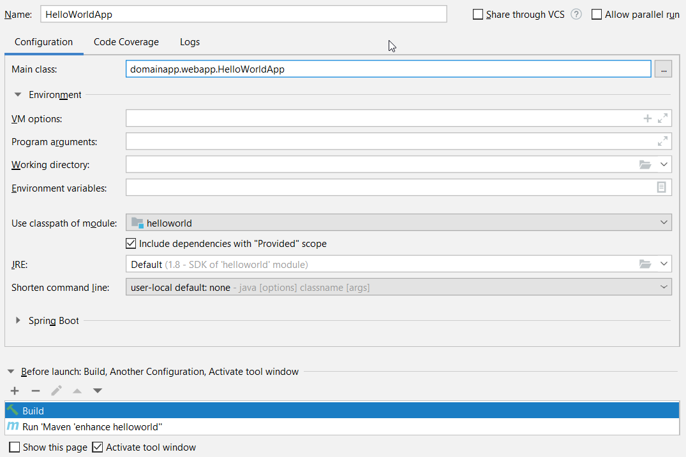

<a id="starters-helloworld--experimenting-with-the-app"></a>

## Experimenting with the App

Once you are familiar with the app, try modifying it.
There is plenty more guidance on this site; start with the [User Guide Fundamentals](https://causeway.apache.org/userguide/latest/about.html) and then look at the other guides linked to from the top-level menu or from the main [table of contents](#about).

If you run into issues, please don’t hesitate to ask for help on the users mailing list or the Slack channel, as per the [support page](https://causeway.apache.org/docs/latest/support/about.html).

<a id="starters-helloworld--moving-on"></a>

## Moving on

When you are ready to start working on your own app, we *don’t* recommend building on top of the helloworld app.

Instead, we suggest that you start with the [simpleapp starter app](#starters-simpleapp).
Although a little more complex, it provides more structure and example tests, all of which will help guide you as your application grows.

On this page

---

<a id="starters-simpleapp"></a>

<!-- source_url: https://causeway.apache.org/docs/latest/starters/simpleapp.html -->

<!-- page_index: 4 -->

# SimpleApp

4.0.0-M1

- - [4.0.0-M1](#about)
  - [3.5.0](https://causeway.apache.org/docs/3.5.0/about.html)
  - [3.4.0](https://causeway.apache.org/docs/3.4.0/about.html)
  - [3.3.0](https://causeway.apache.org/docs/3.3.0/about.html)
  - [3.2.0](https://causeway.apache.org/docs/3.2.0/about.html)
  - [3.1.0](https://causeway.apache.org/docs/3.1.0/about.html)
  - [3.0.0](https://causeway.apache.org/docs/3.0.0/about.html)
  - [2.1.0](https://causeway.apache.org/docs/2.1.0/about.html)
  - [2.0.0](https://causeway.apache.org/docs/2.0.0/about.html)
- Committers' Guide
  - [4.0.0-M1](https://causeway.apache.org/comguide/latest/about.html)
  - [3.5.0](https://causeway.apache.org/comguide/3.5.0/about.html)
  - [3.4.0](https://causeway.apache.org/comguide/3.4.0/about.html)
  - [3.3.0](https://causeway.apache.org/comguide/3.3.0/about.html)
  - [3.2.0](https://causeway.apache.org/comguide/3.2.0/about.html)
  - [3.1.0](https://causeway.apache.org/comguide/3.1.0/about.html)
  - [3.0.0](https://causeway.apache.org/comguide/3.0.0/about.html)
  - [2.1.0](https://causeway.apache.org/comguide/2.1.0/about.html)
  - [2.0.0](https://causeway.apache.org/comguide/2.0.0/about.html)
- Contributors' Guide
  - [4.0.0-M1](https://causeway.apache.org/conguide/latest/about.html)
  - [3.5.0](https://causeway.apache.org/conguide/3.5.0/about.html)
  - [3.4.0](https://causeway.apache.org/conguide/3.4.0/about.html)
  - [3.3.0](https://causeway.apache.org/conguide/3.3.0/about.html)
  - [3.2.0](https://causeway.apache.org/conguide/3.2.0/about.html)
  - [3.1.0](https://causeway.apache.org/conguide/3.1.0/about.html)
  - [3.0.0](https://causeway.apache.org/conguide/3.0.0/about.html)
  - [2.1.0](https://causeway.apache.org/conguide/2.1.0/about.html)
  - [2.0.0](https://causeway.apache.org/conguide/2.0.0/about.html)
- Design Docs
  - [4.0.0-M1](https://causeway.apache.org/core/latest/about.html)
  - [3.5.0](https://causeway.apache.org/core/3.5.0/about.html)
  - [3.4.0](https://causeway.apache.org/core/3.4.0/about.html)
  - [3.3.0](https://causeway.apache.org/core/3.3.0/about.html)
  - [3.2.0](https://causeway.apache.org/core/3.2.0/about.html)
  - [3.1.0](https://causeway.apache.org/core/3.1.0/about.html)
  - [3.0.0](https://causeway.apache.org/core/3.0.0/about.html)
  - [2.1.0](https://causeway.apache.org/core/2.1.0/about.html)
  - [2.0.0](https://causeway.apache.org/core/2.0.0/about.html)
- Extensions
  - [4.0.0-M1](https://causeway.apache.org/extensions/latest/about.html)
  - [3.5.0](https://causeway.apache.org/extensions/3.5.0/about.html)
  - [3.4.0](https://causeway.apache.org/extensions/3.4.0/about.html)
  - [3.3.0](https://causeway.apache.org/extensions/3.3.0/about.html)
  - [3.2.0](https://causeway.apache.org/extensions/3.2.0/about.html)
  - [3.1.0](https://causeway.apache.org/extensions/3.1.0/about.html)
  - [3.0.0](https://causeway.apache.org/extensions/3.0.0/about.html)
  - [2.1.0](https://causeway.apache.org/extensions/2.1.0/about.html)
  - [2.0.0](https://causeway.apache.org/extensions/2.0.0/about.html)
- GraphQL Viewer
  - [4.0.0-M1](https://causeway.apache.org/gqlv/latest/about.html)
  - [3.5.0](https://causeway.apache.org/gqlv/3.5.0/about.html)
  - [3.4.0](https://causeway.apache.org/gqlv/3.4.0/about.html)
  - [3.3.0](https://causeway.apache.org/gqlv/3.3.0/about.html)
  - [3.2.0](https://causeway.apache.org/gqlv/3.2.0/about.html)
  - [3.1.0](https://causeway.apache.org/gqlv/3.1.0/about.html)
  - [3.0.0](https://causeway.apache.org/gqlv/3.0.0/about.html)
  - [2.1.0](https://causeway.apache.org/gqlv/2.1.0/about.html)
  - [2.0.0](https://causeway.apache.org/gqlv/2.0.0/about.html)
- Incubator Catalog
  - [4.0.0-M1](https://causeway.apache.org/incubator/latest/about.html)
  - [3.5.0](https://causeway.apache.org/incubator/3.5.0/about.html)
  - [3.4.0](https://causeway.apache.org/incubator/3.4.0/about.html)
  - [3.3.0](https://causeway.apache.org/incubator/3.3.0/about.html)
  - [3.2.0](https://causeway.apache.org/incubator/3.2.0/about.html)
  - [3.1.0](https://causeway.apache.org/incubator/3.1.0/about.html)
  - [3.0.0](https://causeway.apache.org/incubator/3.0.0/about.html)
  - [2.1.0](https://causeway.apache.org/incubator/2.1.0/about.html)
  - [2.0.0](https://causeway.apache.org/incubator/2.0.0/about.html)
- JDO/DataNucleus
  - [3.4.0](https://causeway.apache.org/pjdo/latest/about.html)
  - [3.3.0](https://causeway.apache.org/pjdo/3.3.0/about.html)
  - [3.2.0](https://causeway.apache.org/pjdo/3.2.0/about.html)
  - [3.1.0](https://causeway.apache.org/pjdo/3.1.0/about.html)
  - [3.0.0](https://causeway.apache.org/pjdo/3.0.0/about.html)
  - [2.1.0](https://causeway.apache.org/pjdo/2.1.0/about.html)
  - [2.0.0](https://causeway.apache.org/pjdo/2.0.0/about.html)
- JPA
  - [4.0.0-M1](https://causeway.apache.org/pjpa/latest/about.html)
  - [3.5.0](https://causeway.apache.org/pjpa/3.5.0/about.html)
  - [3.4.0](https://causeway.apache.org/pjpa/3.4.0/about.html)
  - [3.3.0](https://causeway.apache.org/pjpa/3.3.0/about.html)
  - [3.2.0](https://causeway.apache.org/pjpa/3.2.0/about.html)
  - [3.1.0](https://causeway.apache.org/pjpa/3.1.0/about.html)
  - [3.0.0](https://causeway.apache.org/pjpa/3.0.0/about.html)
  - [2.1.0](https://causeway.apache.org/pjpa/2.1.0/about.html)
  - [2.0.0](https://causeway.apache.org/pjpa/2.0.0/about.html)
- QueryDSL
  - [4.0.0-M1](https://causeway.apache.org/querydsl/latest/about.html)
  - [3.5.0](https://causeway.apache.org/querydsl/3.5.0/about.html)
  - [3.4.0](https://causeway.apache.org/querydsl/3.4.0/about.html)
  - [3.3.0](https://causeway.apache.org/querydsl/3.3.0/about.html)
  - [3.2.0](https://causeway.apache.org/querydsl/3.2.0/about.html)
- Reference Guide
  - [4.0.0-M1](https://causeway.apache.org/refguide/latest/about.html)
  - [3.5.0](https://causeway.apache.org/refguide/3.5.0/about.html)
  - [3.4.0](https://causeway.apache.org/refguide/3.4.0/about.html)
  - [3.3.0](https://causeway.apache.org/refguide/3.3.0/about.html)
  - [3.2.0](https://causeway.apache.org/refguide/3.2.0/about.html)
  - [3.1.0](https://causeway.apache.org/refguide/3.1.0/about.html)
  - [3.0.0](https://causeway.apache.org/refguide/3.0.0/about.html)
  - [2.1.0](https://causeway.apache.org/refguide/2.1.0/about.html)
  - [2.0.0](https://causeway.apache.org/refguide/2.0.0/about.html)
- regressiontests
  - [4.0.0-M1](https://causeway.apache.org/regressiontests/latest/index.html)
  - [3.5.0](https://causeway.apache.org/regressiontests/3.5.0/index.html)
  - [3.4.0](https://causeway.apache.org/regressiontests/3.4.0/index.html)
  - [3.3.0](https://causeway.apache.org/regressiontests/3.3.0/index.html)
  - [3.2.0](https://causeway.apache.org/regressiontests/3.2.0/index.html)
  - [3.1.0](https://causeway.apache.org/regressiontests/3.1.0/index.html)
  - [3.0.0](https://causeway.apache.org/regressiontests/3.0.0/index.html)
  - [2.1.0](https://causeway.apache.org/regressiontests/2.1.0/index.html)
  - [2.0.0](https://causeway.apache.org/regressiontests/2.0.0/index.html)
- Release Notes
  - [4.0.0-M1](https://causeway.apache.org/relnotes/latest/about.html)
  - [3.5.0](https://causeway.apache.org/relnotes/3.5.0/about.html)
  - [3.4.0](https://causeway.apache.org/relnotes/3.4.0/about.html)
  - [3.3.0](https://causeway.apache.org/relnotes/3.3.0/about.html)
  - [3.2.0](https://causeway.apache.org/relnotes/3.2.0/about.html)
  - [3.1.0](https://causeway.apache.org/relnotes/3.1.0/about.html)
  - [3.0.0](https://causeway.apache.org/relnotes/3.0.0/about.html)
  - [2.1.0](https://causeway.apache.org/relnotes/2.1.0/about.html)
  - [2.0.0](https://causeway.apache.org/relnotes/2.0.0/about.html)
- REST API (Restful Objects Viewer)
  - [4.0.0-M1](https://causeway.apache.org/vro/latest/about.html)
  - [3.5.0](https://causeway.apache.org/vro/3.5.0/about.html)
  - [3.4.0](https://causeway.apache.org/vro/3.4.0/about.html)
  - [3.3.0](https://causeway.apache.org/vro/3.3.0/about.html)
  - [3.2.0](https://causeway.apache.org/vro/3.2.0/about.html)
  - [3.1.0](https://causeway.apache.org/vro/3.1.0/about.html)
  - [3.0.0](https://causeway.apache.org/vro/3.0.0/about.html)
  - [2.1.0](https://causeway.apache.org/vro/2.1.0/about.html)
  - [2.0.0](https://causeway.apache.org/vro/2.0.0/about.html)
- Security Guide
  - [4.0.0-M1](https://causeway.apache.org/security/latest/about.html)
  - [3.5.0](https://causeway.apache.org/security/3.5.0/about.html)
  - [3.4.0](https://causeway.apache.org/security/3.4.0/about.html)
  - [3.3.0](https://causeway.apache.org/security/3.3.0/about.html)
  - [3.2.0](https://causeway.apache.org/security/3.2.0/about.html)
  - [3.1.0](https://causeway.apache.org/security/3.1.0/about.html)
  - [3.0.0](https://causeway.apache.org/security/3.0.0/about.html)
  - [2.1.0](https://causeway.apache.org/security/2.1.0/about.html)
  - [2.0.0](https://causeway.apache.org/security/2.0.0/about.html)
- Setup Guide
  - [4.0.0-M1](https://causeway.apache.org/setupguide/latest/about.html)
  - [3.5.0](https://causeway.apache.org/setupguide/3.5.0/about.html)
  - [3.4.0](https://causeway.apache.org/setupguide/3.4.0/about.html)
  - [3.3.0](https://causeway.apache.org/setupguide/3.3.0/about.html)
  - [3.2.0](https://causeway.apache.org/setupguide/3.2.0/about.html)
  - [3.1.0](https://causeway.apache.org/setupguide/3.1.0/about.html)
  - [3.0.0](https://causeway.apache.org/setupguide/3.0.0/about.html)
  - [2.1.0](https://causeway.apache.org/setupguide/2.1.0/about.html)
  - [2.0.0](https://causeway.apache.org/setupguide/2.0.0/about.html)
- Testing Guide
  - [4.0.0-M1](https://causeway.apache.org/testing/latest/about.html)
  - [3.5.0](https://causeway.apache.org/testing/3.5.0/about.html)
  - [3.4.0](https://causeway.apache.org/testing/3.4.0/about.html)
  - [3.3.0](https://causeway.apache.org/testing/3.3.0/about.html)
  - [3.2.0](https://causeway.apache.org/testing/3.2.0/about.html)
  - [3.1.0](https://causeway.apache.org/testing/3.1.0/about.html)
  - [3.0.0](https://causeway.apache.org/testing/3.0.0/about.html)
  - [2.1.0](https://causeway.apache.org/testing/2.1.0/about.html)
  - [2.0.0](https://causeway.apache.org/testing/2.0.0/about.html)
- Tutorials
  - [4.0.0-M1](https://causeway.apache.org/tutorials/latest/about.html)
  - [3.5.0](https://causeway.apache.org/tutorials/3.5.0/about.html)
  - [3.4.0](https://causeway.apache.org/tutorials/3.4.0/about.html)
  - [3.3.0](https://causeway.apache.org/tutorials/3.3.0/about.html)
  - [3.2.0](https://causeway.apache.org/tutorials/3.2.0/about.html)
  - [3.1.0](https://causeway.apache.org/tutorials/3.1.0/about.html)
  - [3.0.0](https://causeway.apache.org/tutorials/3.0.0/about.html)
  - [2.1.0](https://causeway.apache.org/tutorials/2.1.0/about.html)
  - [2.0.0](https://causeway.apache.org/tutorials/2.0.0/about.html)
- User Guide
  - [4.0.0-M1](https://causeway.apache.org/userguide/latest/about.html)
  - [3.5.0](https://causeway.apache.org/userguide/3.5.0/about.html)
  - [3.4.0](https://causeway.apache.org/userguide/3.4.0/about.html)
  - [3.3.0](https://causeway.apache.org/userguide/3.3.0/about.html)
  - [3.2.0](https://causeway.apache.org/userguide/3.2.0/about.html)
  - [3.1.0](https://causeway.apache.org/userguide/3.1.0/about.html)
  - [3.0.0](https://causeway.apache.org/userguide/3.0.0/about.html)
  - [2.1.0](https://causeway.apache.org/userguide/2.1.0/about.html)
  - [2.0.0](https://causeway.apache.org/userguide/2.0.0/about.html)
- Value Types Catalog
  - [4.0.0-M1](https://causeway.apache.org/valuetypes/latest/about.html)
  - [3.5.0](https://causeway.apache.org/valuetypes/3.5.0/about.html)
  - [3.4.0](https://causeway.apache.org/valuetypes/3.4.0/about.html)
  - [3.3.0](https://causeway.apache.org/valuetypes/3.3.0/about.html)
  - [3.2.0](https://causeway.apache.org/valuetypes/3.2.0/about.html)
  - [3.1.0](https://causeway.apache.org/valuetypes/3.1.0/about.html)
  - [3.0.0](https://causeway.apache.org/valuetypes/3.0.0/about.html)
  - [2.1.0](https://causeway.apache.org/valuetypes/2.1.0/about.html)
  - [2.0.0](https://causeway.apache.org/valuetypes/2.0.0/about.html)
- Web UI (Wicket Viewer)
  - [4.0.0-M1](https://causeway.apache.org/vw/latest/about.html)
  - [3.5.0](https://causeway.apache.org/vw/3.5.0/about.html)
  - [3.4.0](https://causeway.apache.org/vw/3.4.0/about.html)
  - [3.3.0](https://causeway.apache.org/vw/3.3.0/about.html)
  - [3.2.0](https://causeway.apache.org/vw/3.2.0/about.html)
  - [3.1.0](https://causeway.apache.org/vw/3.1.0/about.html)
  - [3.0.0](https://causeway.apache.org/vw/3.0.0/about.html)
  - [2.1.0](https://causeway.apache.org/vw/2.1.0/about.html)
  - [2.0.0](https://causeway.apache.org/vw/2.0.0/about.html)

4.0.0-M1

[4.0.0-M1](#starters-simpleapp)
[3.5.0](https://causeway.apache.org/docs/3.5.0/starters/simpleapp.html)
[3.4.0](https://causeway.apache.org/docs/3.4.0/starters/simpleapp.html)
[3.3.0](https://causeway.apache.org/docs/3.3.0/starters/simpleapp.html)
[3.2.0](https://causeway.apache.org/docs/3.2.0/starters/simpleapp.html)
[3.1.0](https://causeway.apache.org/docs/3.1.0/starters/simpleapp.html)
[3.0.0](https://causeway.apache.org/docs/3.0.0/starters/simpleapp.html)
[2.1.0](https://causeway.apache.org/docs/2.1.0/starters/simpleapp.html)
[2.0.0](https://causeway.apache.org/docs/2.0.0/starters/simpleapp.html)

[Edit](https://github.com/apache/causeway/edit/4.0.0-M1/starters/adoc/modules/starters/pages/simpleapp.adoc)

<a id="starters-simpleapp--simpleapp"></a>

# SimpleApp

The quickest way to get started building an application "for real" is to use the `simpleapp` starter app.
It uses the [JPA/Eclipselink](https://causeway.apache.org/pjpa/latest/about.html) object store for persistence.

The application is also built nightly as a docker image, so you can quickly try it out:

```bash
docker run -p 8080:8080 apache/causeway-app-simpleapp:latest
```

As with the [HelloWorld](#starters-helloworld) starter app, the instructions [below](#starters-simpleapp--downloading-running) will download a minimal Apache Causeway app consisting of a single entity (`SimpleObject`) with supporting domain services.

However, unlike [HelloWorld](#starters-helloworld), this app also provides more structure to assist you as your application grows, with business logic placed in a separate Maven module (`simpleapp-jpa-module-simple`) to the module that bootstraps the webapp (`simpleapp-jpa-webapp`).

The idea is that as your application grows in scope that you put each new area of functionality in its own module (copy-n-paste the `simpleapp-jpa-module-simple` module).
These modules can depend on each other, but Maven will to ensure that dependencies between these areas of functionality are unidirectional.
In this way your application will be a "modular monolith"; said another way it will prevent your application from degenerating into a [big ball of mud](https://en.wikipedia.org/wiki/Big_ball_of_mud).
See also the discussion [below](#starters-simpleapp--structure-of-the-app).

The application also includes examples of unit tests and integration tests.
You’ll find these in their own Maven modules (`simpleapp-jpa-module-simple-tests` and `simpleapp-jpa-webapp-tests`).
Normally we recommend that tests should be in the same Maven module as the code that they exercise.
The simpleapp doesn’t do it this way just to give you the option to exclude them while initially prototyping/exploring a domain.
You can use them as a reference once your ideas have solidifid and you need to start writing proper "production" code.

<a id="starters-simpleapp--prerequisites"></a>

## Prerequisites

Apache Causeway is a Java based framework, so in terms of prerequisites, you’ll need to install:

- Java 21 JDK (or later)

  Apache Causeway v4 requires Java 17, and the simpleapp itself is currently configured for Java 21.
- [Apache Maven](http://maven.apache.org) 3.9.11+

<a id="starters-simpleapp--downloading-running"></a>

## Downloading & Running

Create a new directory, and `cd` into that directory.

To build the app from the latest release:

```bash
curl https://codeload.github.com/apache/causeway-app-simpleapp/zip/v4-jpa | jar xv
cd causeway-app-simpleapp-4-jpa

mvn clean install
mvn -pl webapp spring-boot:run
```

Either way, this should only take a few seconds to download, compile and run.
Then browse to <http://localhost:8080>, and read on.

<a id="starters-simpleapp--using-the-app"></a>

## Using the App

When you start the app, you’ll be presented with a welcome page from which you can access the webapp using either the generic UI provided by [Web UI (Wicket viewer)](https://causeway.apache.org/vw/latest/about.html) or use Swagger to access the [REST API (Restful Objects viewer)](https://causeway.apache.org/vro/latest/about.html):

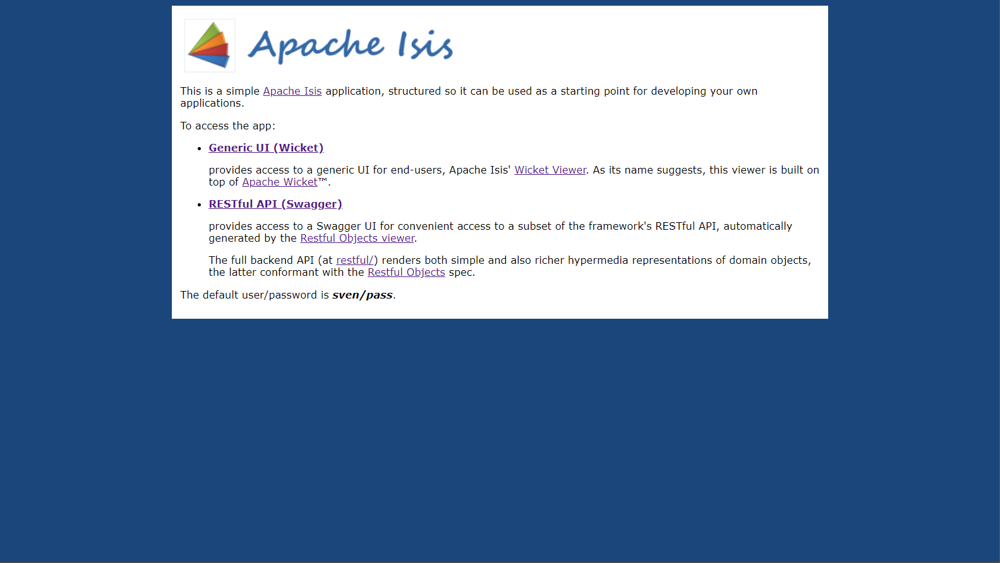

Choose the generic Wicket UI, and navigate to the login page:

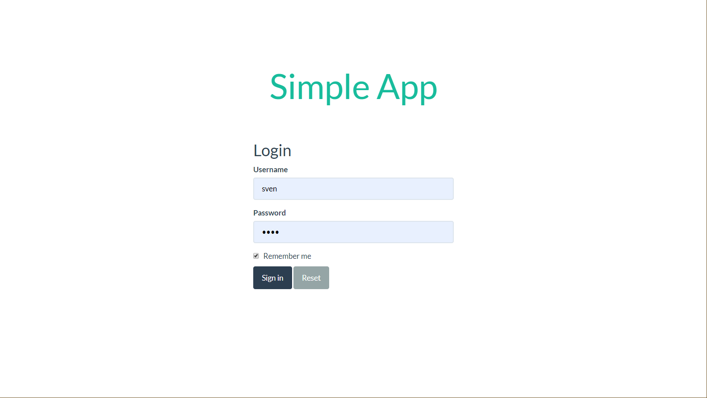

The app itself is configured to run using [Simple security module](https://causeway.apache.org/security/latest/simple/about.html), with the `SimpleRealm` bean defining the users and roles.
You can log in with:

- username: *sven*
- password: *pass*

<a id="starters-simpleapp--wicket-viewer"></a>

### Wicket viewer

Once you’ve logged in you’ll see the default home page:

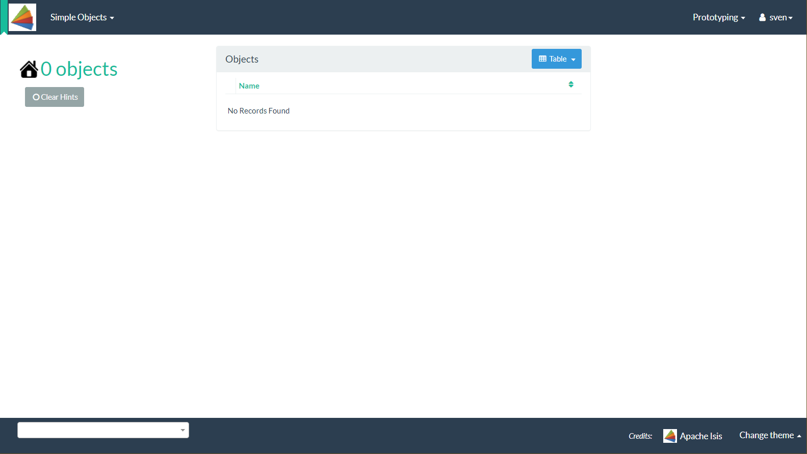

This is a view model annotated with [@HomePage](https://causeway.apache.org/refguide/latest/applib/index/annotation/HomePage.html):

HomePageViewModel.java

```java
@Named("domainapp.HomePageViewModel")
@DomainObject( nature = Nature.VIEW_MODE )
@HomePage
public class HomePageViewModel {

    public String title() {                             (1)
        return return getObjects().size() + " objects";
    }

    public List<SimpleObject> getObjects() {            (2)
        return simpleObjects.listAll();
    }

    @Inject SimpleObjects simpleObjects;                (3)
}
```

|  |  |
| --- | --- |
| **1** | identifies or describes the object |
| **2** | collection of objects shown on the page |
| **3** | automatically injected by the framework |

<a id="starters-simpleapp--fixtures"></a>

#### Fixtures

When prototyping against an in-memory database, it’s useful to have a mechanism to create some initial state.
This can be done using fixture scripts, accessible from the **Prototyping**  **Run Fixture Script**:

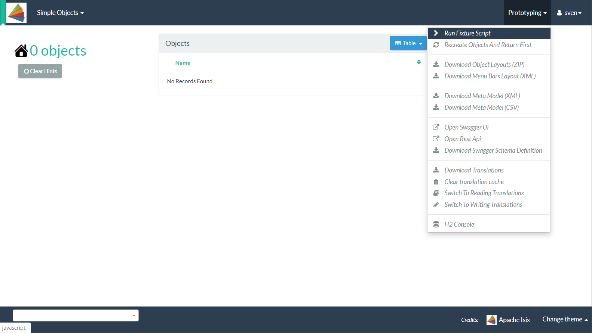

This brings up a dialog to select the fixture script:

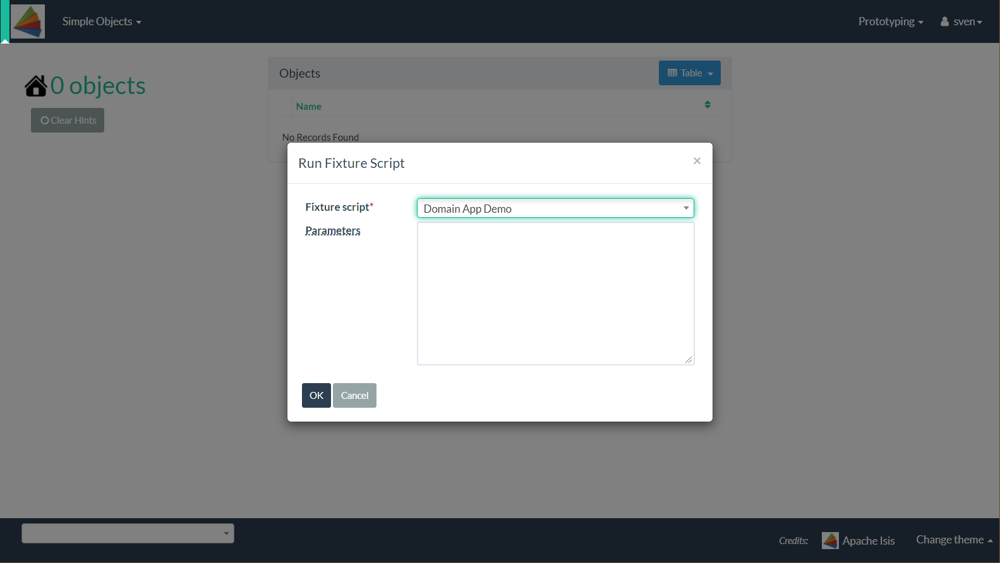

The "Domain App Demo" in the drop-down refers to this code:

DomainAppDemo.java

```java
public class DomainAppDemo extends FixtureScript {

    @Override
    protected void execute(final ExecutionContext ec) {
        ec.executeChildren(this,
            moduleWithFixturesService.getTeardownFixture());        (1)
        ec.executeChild(this,
            new SimpleObject_persona.PersistAll());                 (2)
    }

    @Inject ModuleWithFixturesService moduleWithFixturesService;

}
```

|  |  |
| --- | --- |
| **1** | uses injected service to tear down all objects. (Each module provides a teardown script; these are run in the correct sequence). |
| **2** | Creates new objects |

When executed, all objects created by the fixture are listed:

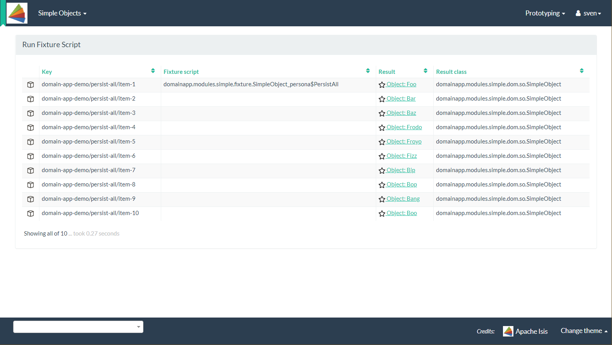

Navigating back to the home page shows the newly created objects:

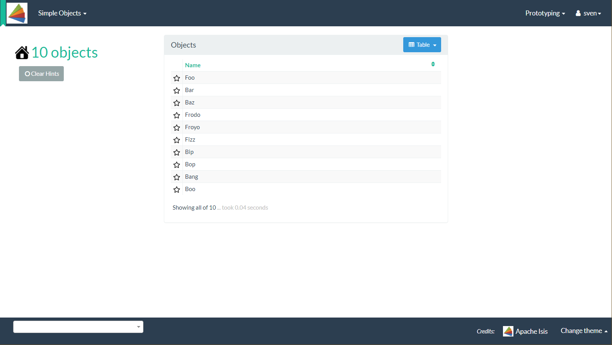

As well as running in fixtures from the UI, you can also specify a configuration property to run a fixture script as part of the application start-up:

config/application.properties

```ini
causeway.testing.fixtures.initial-script = \
    domainapp.webapp.application.fixture.scenarios.DomainAppDemo
```

<a id="starters-simpleapp--create-an-object"></a>

#### Create an object

You can also of course create new objects:

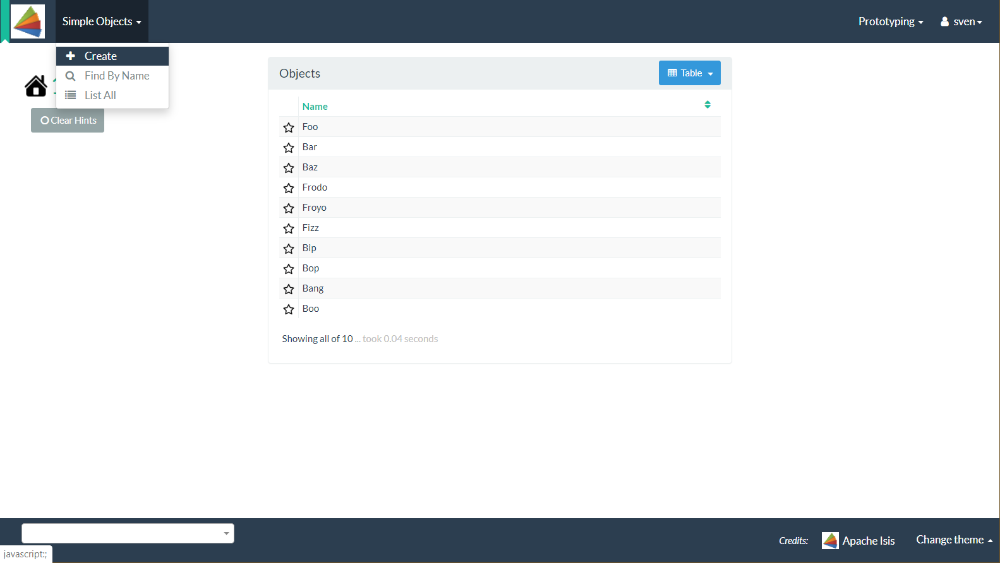

To avoid obscuring the current page, this is configured to bring up a sidebar dialog:

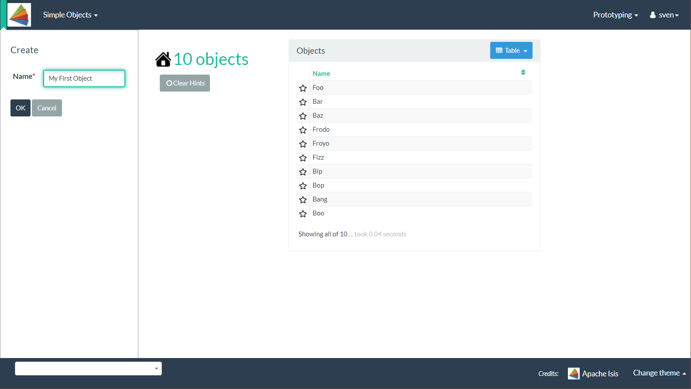

Hitting OK returns the created object:

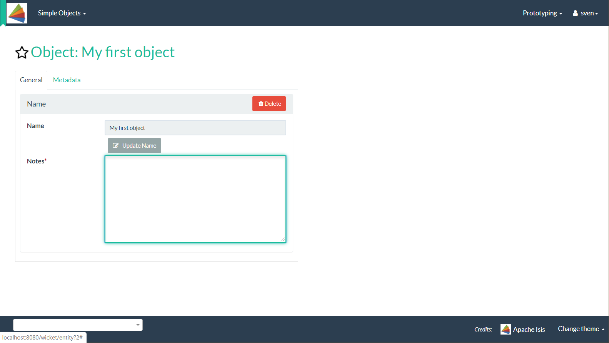

The above functionality is implemented by this code (in the `SimpleObjects` menu domain service):

```java
@Action(semantics = SemanticsOf.NON_IDEMPOTENT)                     (1)
@ActionLayout(promptStyle = PromptStyle.DIALOG_SIDEBAR)             (2)
public SimpleObject create(
        @Name final String name) {                                  (3)
    return repositoryService.persist(SimpleObject.ofName(name));
}
```

|  |  |
| --- | --- |
| **1** | Specifying semantics is recommended, as it changes the HTTP method that is used if the action is invoked through the [REST API](https://causeway.apache.org/vro/latest/about.html). |
| **2** | Prompt styles such as modal or sidebar can be specified per action, or globally in `application.yml` file. |
| **3** | The `@Name` annotation is actually a meta-annotation, meaning that a number of additional semantics (length, layout, validation etc.) are inferred. |

<a id="starters-simpleapp--invoke-an-action"></a>

#### Invoke an action

The `SimpleObject` contains a couple of properties, and a single action to update that property.

The `name` property is read-only, and can only be modified using the `updateName` action:

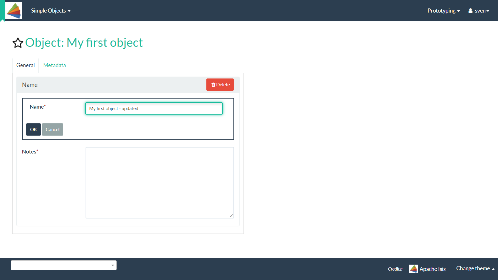

The above functionality is implemented by this code (in the `SimpleObject` entity):

```java
@Action(semantics = IDEMPOTENT, commandPublishing = Publishing.ENABLED, executionPublishing = Publishing.ENABLED)
@ActionLayout(
        associateWith = "name", promptStyle = PromptStyle.INLINE,
        describedAs = "Updates the name of this object, certain characters (" + PROHIBITED_CHARACTERS + ") are not allowed."
)
public SimpleObject updateName(
        @Name final String name) {
    setName(name);
    return this;
}
public String default0UpdateName() {
    return getName();
}
```

<a id="starters-simpleapp--edit-a-property"></a>

#### Edit a property

The `notes` property is editable, and can be edited in-place.
For example:

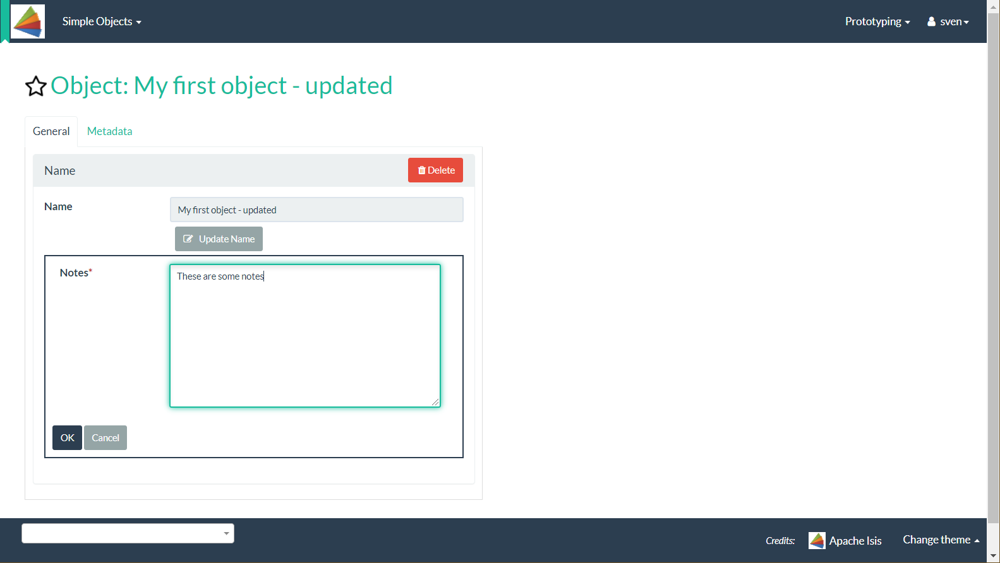

<a id="starters-simpleapp--actions-requiring-confirmations"></a>

#### Actions requiring confirmations

It’s also possible to delete an object:

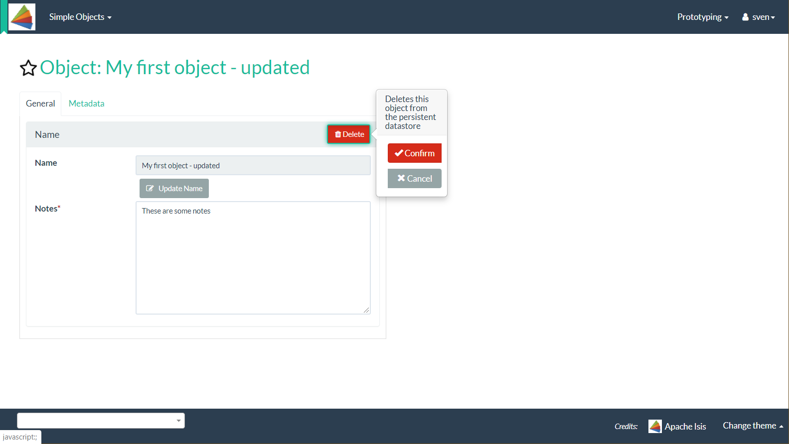

The viewer displays a message confirming that the object has been deleted:

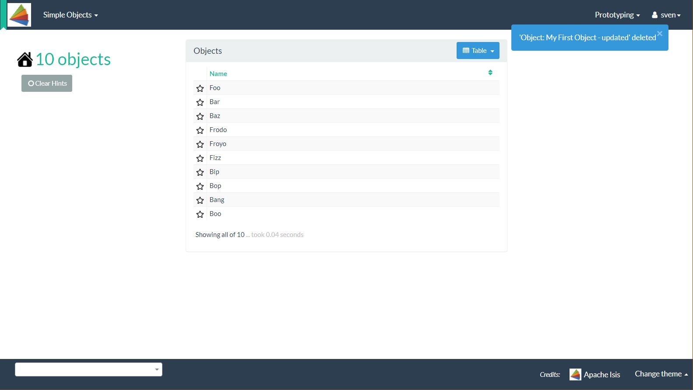

The above functionality is implemented by this code (in the`SimpleObject` entity):

```java
@Action(semantics = NON_IDEMPOTENT_ARE_YOU_SURE)                        (1)
public void delete() {
    final String title = titleService.titleOf(this);                    (2)
    messageService.informUser(String.format("'%s' deleted", title));
    repositoryService.removeAndFlush(this);
}
```

|  |  |
| --- | --- |
| **1** | Requires the user to confirm the action |
| **2** | The action’s implementation uses three services provided by the framework; these are injected into the domain object automatically. |

<a id="starters-simpleapp--swagger-restful-objects"></a>

### Swagger (Restful Objects)

> [!WARNING]
> |  |  |
> | --- | --- |
> |  | if invoking an action using Swagger returns a 401 (unauthorised), then navigate to the REST API directly (<http://localhost:8080/restful> to authenticate the browser first]). |

Using **Prototyping**  **Open Swagger UI** menu item (or just going back to the home page at [localhost:8080](http://localhost:8080)) we can use [Swagger UI](https://swagger.io/) as a front-end to the REST API provided by the Restful Objects viewer.

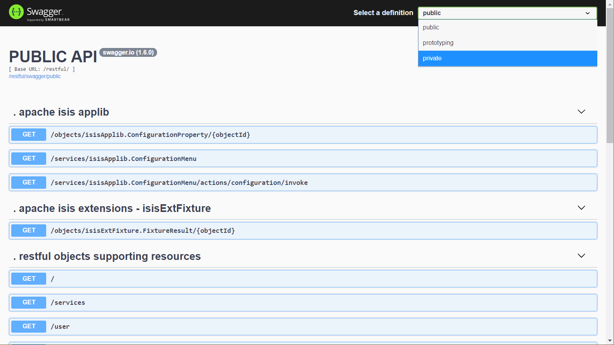

The public API (where the calling client is assumed to be 3rd party) only exposes view models, not entities.
If the API is private (or for prototyping), then resources corresponding to entities are also exposed:

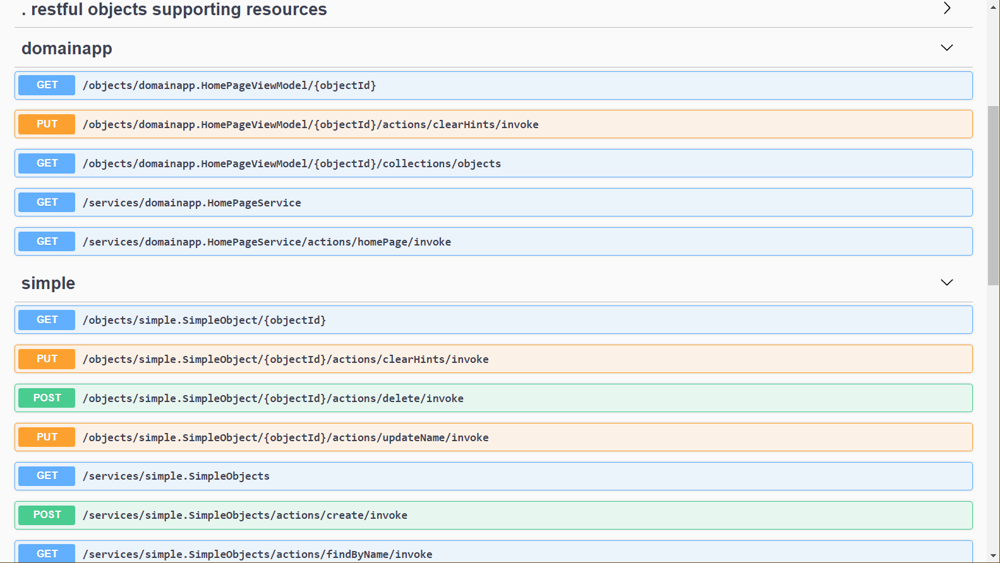

For example, an object can be created using the resource that represents the `SimpleObjects#create` action:

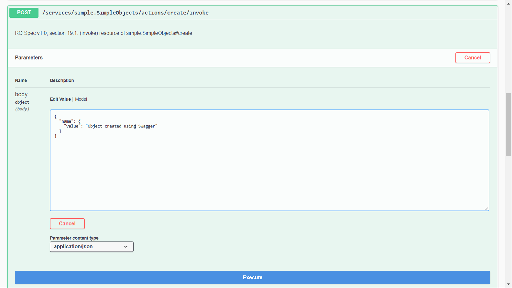

The response indicates that the object was successfully created:

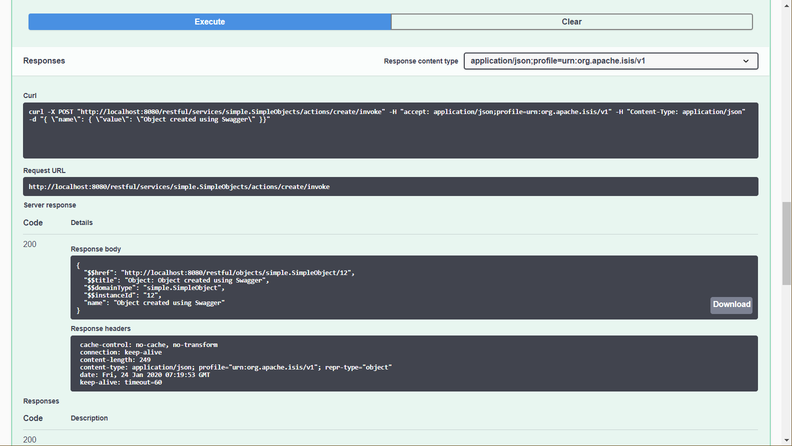

The Swagger UI also provides a resource to retrieve any object:

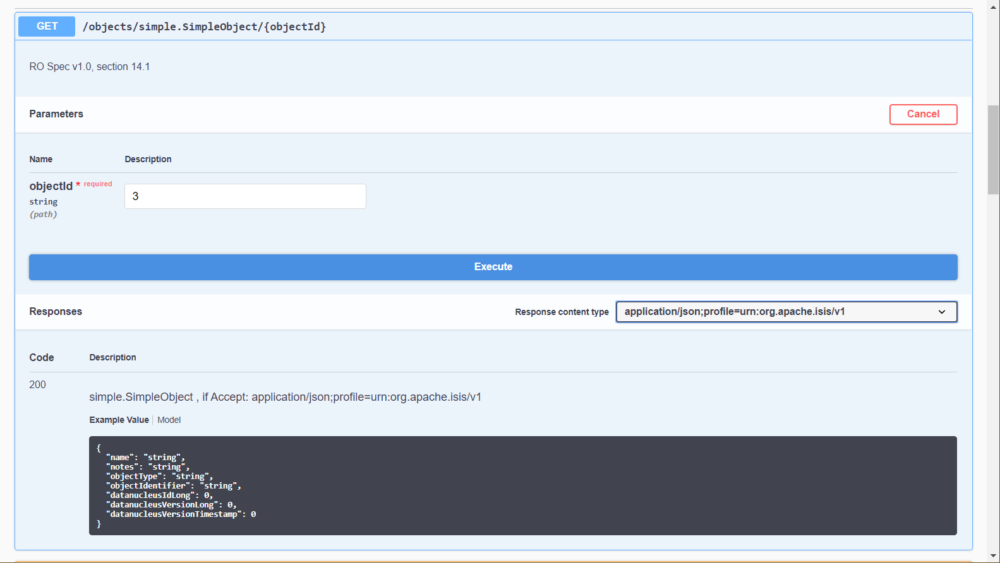

This results in a representation of the domain object (as per the requested `Response Content Type`, ie `ACCEPT` header):

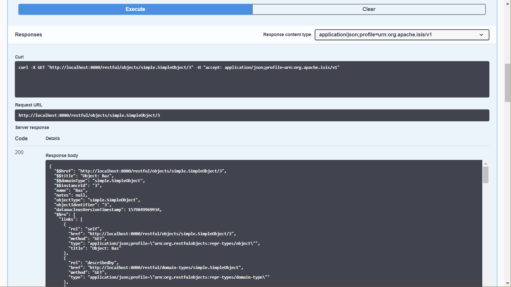

The Swagger UI is provided as a convenience; the REST API is actually a complete hypermedia API (in other words you can follow the links to access all the behaviour exposed in the regular Wicket app).
The REST API implemented by Apache Causeway is specified in the [Restful Object spec](http://www.restfulobjects.org).

<a id="starters-simpleapp--structure-of-the-app"></a>

## Structure of the App

The simpleapp starter app is a multi-module project, structured so that you easily extend it as your application grows.

<a id="starters-simpleapp--application-modules"></a>

### Application Modules

The application consists of five modules:

simpleapp dependencies

Figure 1. simpleapp dependencies

The main business logic resides in `module-jpa-simple`, with the `webapp` module acting as an aggregator.
Each of these modules have unit and/or integration tests.
To allow them to be easily excluded (while prototyping/exploration), they have been placed into their own respective modules.

The (non-test) Maven modules each contain exactly one [@Configuration](https://docs.spring.io/spring-framework/docs/current/javadoc-api/org/springframework/context/annotation/Configuration.html) class, residing at the package root for that Maven module.
The location of this class is used for classpath scanning.

In a larger application there would likely be many more modules containing these domain object modules.
For example, you might have a `module-customer` holding a `Customer` entity and related entities/services, a `module-product` holding a `Product` catalog, and a `module-order` to hold the `Order`s placed by `Customer`s:

Typical application dependencies

Figure 2. Typical application dependencies

We can use Maven dependency management to ensure that there are no cyclic dependencies (order "knows about" product but product does not know about orders) and ensure that the codebase remains decoupled.
If Java9 modules become commonplace, we’ll also be able to restrict visibility of classes between modules.

<a id="starters-simpleapp--bootstrapping-framework-modules"></a>

### Bootstrapping & Framework Modules

One of the main responsibilities of Spring Boot is - naturally enough - to bootstrap the application.
For the webapp, this is done using a class annotated with [@SpringBootApplication](https://docs.spring.io/spring-boot/docs/current/api/org/springframework/boot/autoconfigure/SpringBootApplication.html).
For integration tests, this uses the [@SpringBootTest](https://docs.spring.io/spring-boot/docs/current/api/org/springframework/boot/test/context/SpringBootTest.html) annotation.

These two different annotations reference a (class annotated with) [@Configuration](https://docs.spring.io/spring-framework/docs/current/javadoc-api/org/springframework/context/annotation/Configuration.html), which in turn can [@Import](https://docs.spring.io/spring-framework/docs/current/javadoc-api/org/springframework/context/annotation/Import.html) other annotations.

By convention, the top-level `@Configuration` in an Apache Causeway application is called the "app manifest".

The [diagram](https://causeway.apache.org/docs/latest/starters/_attachments/simpleapp-modules-dependencies.pptx) below shows how classes fit together:

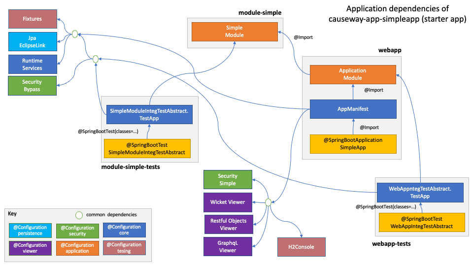

Figure 3. Module Dependencies

Let’s now review the contents of each of the modules in the simpleapp starter app.

<a id="starters-simpleapp--module-jpa-simples-srcmainjava"></a>
<a id="starters-simpleapp--module-jpa-simple-s-src-main-java"></a>

### module-jpa-simple’s src/main/java

Under `src/main/java` we have:

```none
src/main/java/
  domainapp/                            (1)
    modules/
      simple/                           (2)
        dom/                            (3)
          so/                           (4)
            SimpleObject.java
            SimpleObject.layout.xml
            SimpleObject.png
            SimpleObjectRepository.java (5)
            SimpleObjects.java
        fixture/                        (6)
          SimpleObject_persona.java
          SimpleObjectBuilder.java
        types/                          (7)
          Name.java
          Notes.java
      SimpleModule.java                 (8)
```

|  |  |
| --- | --- |
| **1** | For simplicity, all the Java source files reside in a `domainapp` top-level package. Change as required. |
| **2** | Top level package for the 'simple' module. |
| **3** | The `dom` subpackage holds the "domain object model" for this module. Modules may have other subpackages, common ones include `types` and `fixture`s (as below), also `api`s, `contribution`s, `spi`s |
| **4** | Holds classes for the `so` ("simple object") entity/aggregate, consisting of the entity definition itself (`SimpleObject`) and a corresponding domain services (`SimpleObjects` and `SimpleObjectRepository`). The associated `.layout.xml` and `.png` are optional but provide metadata/resources for rendering (Maven is configured to also treat `src/main/java` as a resource location). |
| **5** | Uses Spring Data JPA to automatically provide the query implementation. |
| **6** | The `fixture` package contains classes to set up the database to an initial state (as described [earlier](#starters-simpleapp--fixtures). One of the classes is a `FixtureScript` (defines *how* to set up the data) the other is a persona enum (defines *what* data to set up). |
| **7** | The `types` package contains meta-annotations to describe the usage of common value types such as `String`s. |
| **8** | `SimpleModule` is a Spring [@Configuration](https://docs.spring.io/spring-framework/docs/current/javadoc-api/org/springframework/context/annotation/Configuration.html) which allows the domain services and entities of the module to be located. This is discussed in more detail below. |

<a id="starters-simpleapp--simplemodule"></a>

#### SimpleModule

Every module within an Apache Causeway application should have a module class.
Its purpose is to define a package to scan from, and optionally to declare any transitive dependencies.
In the case of `SimpleModule`, it consists of:

SimpleModule.java

```java
package domainapp.modules.simple;
... imports omitted ...
@Configuration
@Import({})                                            (1)
@ComponentScan                                         (2)
@EnableJpaRepositories                                 (3)
@EntityScan(basePackageClasses = {SimpleModule.class}) (4)
public class SimpleModule
                implements ModuleWithFixtures {        (5)

    @Override
    public FixtureScript getTeardownFixture() {
        return new TeardownFixtureAbstract2() {
            @Override
            protected void execute(ExecutionContext executionContext) {
                deleteFrom(SimpleObject.class);
            }
        };
    }

    @ConfigurationProperties("app.simple-module")      (6)
    @Data
    @Validated
    public static class Configuration {
        private final Types types = new Types();
        @Data
        public static class Types {
            private final Name name = new Name();
            @Data
            public static class Name {
                private final Validation validation = new Validation();
                @Data
                public static class Validation {
                    private char[] prohibitedCharacters = "!&%$".toCharArray();
                    private String message = "Character '{}' is not allowed";
                }
            }
        }
    }

}
```

|  |  |
| --- | --- |
| **1** | This module has no dependencies. If there were, these would be expressed in terms of module classes (each being a Spring `@Configuration`) |
| **2** | specifies this class' package as a root to scan for Spring [@Component](https://docs.spring.io/spring-framework/docs/current/javadoc-api/org/springframework/stereotype/Component.html)s. |
| **3** | for `jpa` branch only, enables Spring Data JPA repositories |
| **4** | for `jpa` branch only, to automatically discover JPA entities |
| **5** | Optionally, modules can implement the testing’s `ModuleWithFixtures` interface. Through this, they can provide a fixture script which can be used to teardown all entities that are "owned" by the module. Since the module dependency graph is known, this allows all data to be removed, useful for prototyping and sometimes for integration tests. |
| **6** | Spring Boot [type-safe configuration](https://docs.spring.io/spring-boot/docs/current/reference/html/spring-boot-features.html#boot-features-external-config-typesafe-configuration-properties), as per [@ConfigurationProperties](https://docs.spring.io/spring-boot/docs/current/api/org/springframework/boot/context/properties/ConfigurationProperties.html) annotation. This Spring Boot feature is used by the framework, but can equally easily be used by application code. The `@Name.Specification` class uses this configuration property. |

The scanning mechanism is also leveraged by Apache Causeway to pick up three types of classes:

- all domain services

  These are classes that are annotated with the framework’s [@DomainService](https://causeway.apache.org/refguide/latest/applib/index/annotation/DomainService.html) annotation.
  Because `@DomainService` is meta-annotated as a `@Component`, these are found automatically and are managed by Spring (ie instantiated, injected etc).

  Depending on their nature, domain services are used to build up the menu, or are available to call programmatically, eg repositories, or sometimes both.

  In the simpleapp starter app, the only domain service is `SimpleObjects`.
  This appears in the menu, and also acts as a repository for the `SimpleObject` entity.
  It also has the `SimpleObjectRepository` repository interface for which Spring Data provides the query implementations.
- all entities.

  These are entities that are annotated with both [@DomainObject](https://causeway.apache.org/refguide/latest/applib/index/annotation/DomainObject.html) annotation and with the JPA `@jakarta.persistence.Entity` annotation.

  In the simpleapp starter app, the only entity is `SimpleObject`.
- all fixture scripts

  These are classes that extend from the testing applib’s `FixtureScript` class, and are used to setup the database when running in prototype mode (against an in-memory database).

  As already discussed, the `fixture` package provides classes to create sample objects, while the `SimpleModule` provides a fixture script to tear down all data from the module.

<a id="starters-simpleapp--module-jpa-simple-tests-srctestjava"></a>
<a id="starters-simpleapp--module-jpa-simple-test-s-src-test-java"></a>

### module-jpa-simple-test’s src/test/java

Under `src/test/java` we have:

```none
src/test/java/
  domainapp/
    modules/
      simple/
        dom/
          so/                                       (1)
            SimpleObject_Test.java
            SimpleObjects_Test.java
        integtests/
          tests/                                    (2)
            SimpleObject_IntegTest.java
            SimpleObjects_IntegTest.java
          SimpleModuleIntegTestAbstract.java        (3)
          SimpleModuleIntegTestConfiguration.java   (4)
src/test/resources/
  application-test.yml                              (5)
```

|  |  |
| --- | --- |
| **1** | These are very simple unit tests of `SimpleObject` and `SimpleObjects` with the package structure the same as in `src/main/java`. They are written in JUnit 5, and use JMockito as the mocking library. |
| **2** | Integration tests for the module. These use the [WrapperFactory](https://causeway.apache.org/refguide/latest/applib/index/services/wrapper/WrapperFactory.html) to simulate interactions through the UI. |
| **3** | The `SimpleModuleIntegTestAbstract` superclass bootstraps the module’s integration tests. This is discussed in more detail below. |
| **4** | Spring to bootstrap the integration test. |
| **5** | Configuration for the "test" profile |

> [!NOTE]
> |  |  |
> | --- | --- |
> |  | these integration tests are annotated with the Spring [@Transactional](https://docs.spring.io/spring-framework/docs/current/javadoc-api/org/springframework/transaction/annotation/Transactional.html), which means that Spring will automatically roll back the changes to the database; there’s no need to delete data afterwards. |

> [!IMPORTANT]
> |  |  |
> | --- | --- |
> |  | the naming convention — with `Test` and `IntegTest` suffixes — is important, because the Maven surefire plugin is configured to run multiple times, one `<execution>` for each suffix. |

<a id="starters-simpleapp--simplemoduleintegtestabstract"></a>

#### SimpleModuleIntegTestAbstract

The `SimpleModuleIntegTestAbstract` is the superclass of all integration tests in the module, annotated with [@SpringBootTest](https://docs.spring.io/spring-boot/docs/current/api/org/springframework/boot/test/context/SpringBootTest.html):

SimpleModuleIntegTestAbstract.java

```java
@SpringBootTest(
        classes = SimpleModuleIntegTestAbstract.TestApp.class             (1)
)
@ActiveProfiles("test") (2)
public abstract class SimpleModuleIntegTestAbstract
        extends CausewayIntegrationTestAbstractWithFixtures {             (3)

    @Configuration
    @Import({
        CausewayModuleCoreRuntimeServices.class,                          (4)
        CausewayModuleSecurityBypass.class,                               (5)
        CausewayModuleJpaEclipseLink.class,                               (6)
        CausewayModuleTestingFixturesApplib.class,                        (7)

        SimpleModule.class                                                (8)
    })
    @PropertySources({
        @PropertySource(CausewayPresets.H2InMemory_withUniqueSchema),     (9)
    })
    public static class TestApp {
    }
}
```

|  |  |
| --- | --- |
| **1** | The `TestApp` (defined as a nested static class below) lists the modules needed to bootstrap the integration test. |
| **2** | Activates the "test" profile, which reads in additional configuration in `application-test.yml" |
| **3** | Tests typically inherit from `CausewayIntegrationTestAbstract`, which provides some convenience methods to inherit from. In this case, the test inherits from the `CausewayIntegrationTestAbstractWithFixtures` subclass which also adds in support for running fixtures. |
| **4** | Specifies the modules that make up Apache Causeway framework itself. Note that no viewers are bootstrapped because the tests are run through Spring’s integration testing framework, rather than (say) as Selenium tests. |
| **5** | Configures the [Bypass](https://causeway.apache.org/security/latest/bypass/about.html) implementation which effectively disables security checks. |
| **6** | Configures [JPA/Eclipselink](https://causeway.apache.org/pjpa/latest/about.html) object store as the persistence mechanism. |
| **7** | Brings in support for running fixtures. You can learn more about testing in the [Testing Guide](https://causeway.apache.org/testing/latest/about.html). |
| **8** | The module containing the actual business logic to be tested. |
| **9** | Runs the tests in memory using H2. A unique schema allows tests to potentially be run in parallel |

<a id="starters-simpleapp--webapps-srcmainjava"></a>
<a id="starters-simpleapp--webapp-s-src-main-java"></a>

### webapp’s src/main/java

Under `src/main/java` we have:

```none
src/main/java/
  domainapp/
    webapp/
      application/
        fixture/
          scenarios/                                            (1)
            DomainAppDemo.java                                  (2)
        services/
          health/
            HealthCheckServiceImpl.java                         (3)
          homepage/
            HomePageViewModel.java                              (4)
            HomePageViewModel.layout.xml
            HomePageViewModel.png
         ApplicationModule.java                                 (5)
      custom/
        restapi/
          CustomController.class                                (6)
        CustomModule.class
      quartz/
        job/
          SampleJob.class                                       (7)
        QuartzModule.class
      AppManifest.java                                          (8)
      SimpleApp.java                                            (9)
```

|  |  |
| --- | --- |
| **1** | Defines scenarios (fixtures) for setting up the system into a known state. Used for prototyping and also integration testing. |
| **2** | The `DomainAppDemo` is the fixture that was run [earlier on](#starters-simpleapp--fixtures). |
| **3** | An implementation of the [HealthCheckService](https://causeway.apache.org/refguide/latest/applib/index/services/health/HealthCheckService.html). This integrates with Spring Boot’s [HealthIndicator](https://docs.spring.io/spring-boot/docs/current/api/org/springframework/boot/actuate/health/HealthIndicator.html) SPI, surfaced through the [Spring Boot Actuator](https://docs.spring.io/spring-boot/docs/current/reference/html/production-ready-features.html). |
| **4** | Annotated with [@HomePage](https://causeway.apache.org/refguide/latest/applib/index/annotation/HomePage.html) and so is shown automatically as the home page. |
| **5** | Defines the services in the webapp module, along with dependencies onto the other modules in the application. Discussed in more detail below. |
| **6** | Demonstrates how to implement a custom REST controller, accessing the domain object model managed by Apache Causeway. |
| **7** | Demonstrates how to run quartz as a background service, accessing the domain object model managed by Apache Causeway. |
| **8** | `AppManifest` is the top-level Spring [@Configuration](https://docs.spring.io/spring-framework/docs/current/javadoc-api/org/springframework/context/annotation/Configuration.html) that specifies the components of Apache Causeway to use, along with the modules making up the application itself (ie `ApplicationModule`, which depends in turn on `SimpleModule`, and `CustomModule`). This is discussed in more detail below |
| **9** | `SimpleApp` is the [@SpringBootApplication](https://docs.spring.io/spring-boot/docs/current/api/org/springframework/boot/autoconfigure/SpringBootApplication.html) used to bootstrap the app. It’s pretty much boilerplate - the important piece is that it references `AppManifest`. Discussed in more detail below |

<a id="starters-simpleapp--applicationmodule"></a>

#### ApplicationModule

The `ApplicationModule` defines the services in the webapp module, along with dependencies onto the other modules in the application.
It’s very simple though:

ApplicationModule.java

```java
package domainapp.webapp.application;
//...

@Configuration
@Import(SimpleModule.class)             (1)
@ComponentScan                          (2)
public class ApplicationModule {
}
```

|  |  |
| --- | --- |
| **1** | This module depends on the `SimpleModule` module. |
| **2** | specifies this class' package as a root to scan for Spring [@Component](https://docs.spring.io/spring-framework/docs/current/javadoc-api/org/springframework/stereotype/Component.html)s. |

<a id="starters-simpleapp--appmanifest"></a>

#### AppManifest

The "app manifest" is the top-level Spring `@Configuration`.
It looks like this:

AppManifest.java

```java
@Configuration
@Import({
        CausewayModuleCoreRuntimeServices.class,            (1)
        CausewayModuleSecuritySimple.class,                 (2)
        CausewayModuleJpaEclipseLink.class,                 (3)
        CausewayModuleViewerRestfulObjectsViewer.class,     (4)
        CausewayModuleViewerGraphqlViewer.class,            (5)
        CausewayModuleViewerWicketViewer.class,             (6)

        CausewayModuleTestingH2ConsoleUi.class,             (7)
        CausewayModuleTestingFixturesApplib.class,          (8)

        CausewayModuleExtFlywayImpl.class,                  (9)

        ApplicationModule.class,                            (10)
        CustomModule.class,                                 (9)
        QuartzModule.class,                                 (9)

        DomainAppDemo.class                                 (11)
})
@PropertySources({
        @PropertySource(CausewayPresets.DebugDiscovery),    (12)
})
public class AppManifest {
}
```

|  |  |
| --- | --- |
| **1** | Mandatory - specifies the core of the Apache Causeway framework |
| **2** | Enables the [Simple](https://causeway.apache.org/security/latest/simple/about.html) security mechanism. There are several security implementations, precisely one must be selected |
| **3** | Enables [JPA/Eclipselink](https://causeway.apache.org/pjpa/latest/about.html) for persistence |
| **4** | Enables the [REST API (Restful Objects viewer)](https://causeway.apache.org/vro/latest/about.html) (ie REST API). |
| **5** | Enables the [GraphQL API (GraphQL viewer)](https://causeway.apache.org/gqlv/latest/about.html). |
| **6** | Enables the [Web UI (Wicket viewer)](https://causeway.apache.org/vw/latest/about.html) |
| **7** | Enables the H2 Console (menu from the "Prototyping" menu), applicable only if running against h2 in-memory database. |
| **8** | Brings in support to run [fixtures](https://causeway.apache.org/testing/latest/fixtures/about.html) within the application, eg for prototyping. |
| **9** | Enables the [Flyway](https://causeway.apache.org/userguide/latest/flyway/about.html) integration. |
| **10** | References the application’s module(s), in this case `ApplicationModule` , `CustomModule` and `QuartzModule`. `ApplicationModule` is discussed below. |
| **11** | Makes the fixture scenario classes available for discovery. |
| **12** | Normally configuration properties are picked up from Spring Boot’s `application.properties` or `application.yml` files, but additional properties can be overridden directly, for example using the `CausewayPresets` convenience class. |

<a id="starters-simpleapp--simpleapp-2"></a>

#### SimpleApp

The application is bootstrapped using `SimpleApp`, a regular `@SpringBootApplication`.
It is mostly boilerplate:

```java
@SpringBootApplication
@Import({
    AppManifest.class,                                          (1)
})
public class SimpleApp
            extends SpringBootServletInitializer {

    public static void main(String[] args) {
        CausewayPresets.prototyping();                              (2)
        SpringApplication.run(
                new Class[] { SimpleApp.class }, args);
    }
}
```

<table>
<tr>
<td><i></i><b>1</b></td>
<td>references the <code>AppManifest</code> mentioned earlier</td>
</tr>
<tr>
<td><i></i><b>2</b></td>
<td>specifies prototyping mode.
This enables actions marked for prototyping to become available, useful during the early stages of development.
<div>
<table>
<tr>
<td>
<i title="Tip"></i>
</td>
<td>
As an alternative to making this call, you can also just run with a system property <code>-DPROTOTYPING=true</code>
</td>
</tr>
</table>
</div></td>
</tr>
</table>

<a id="starters-simpleapp--webapps-srcmainresources"></a>
<a id="starters-simpleapp--webapp-s-src-main-resources"></a>

### webapp’s src/main/resources

Under `src/main/resources` we have:

```none
src/main/resources
  config/
    application.properties              (1)
    application-SQLSERVER.properties    (2)
    application-POSTGRES.properties     (3)
  db/
    migration/
      SQLSERVER/
        Vyyyy.mm.dd.hh.ss__xxx.sql      (4)
  static/                               (5)
  templates/                            (6)
  application.yml                       (7)
  banner.txt                            (8)
  log4j2-spring.xml                     (9)
  menubars.layout.xml                   (10)
```

|  |  |
| --- | --- |
| **1** | By convention, we use `config/application.properties` to hold configuration properties that change between environments (dev, test, prod). Typically this just holds JDBC connection strings, etc. |
| **2** | Enabled if run using the `SQLSERVER` profile (eg using `-Dspring.profiles.active=SQLSERVER`). Configures to use a SQL Server database, and enables Flyway to set up the database schema |
| **3** | Flyway migration scripts. This leverages a feature in Spring Boot’s Flyway integration which allows different variants of scripts for different vendors to be stored, in a `db.migration.{vendor}` package. |
| **4** | The `static` package (a [Spring convention](https://docs.spring.io/spring-boot/docs/current/reference/html/spring-boot-features.html#boot-features-spring-mvc-static-content)) provides access for static resources that are accessible from the webapp |
| **5** | The `templates` package holds a fallback error page, which is the [default location](https://www.baeldung.com/spring-thymeleaf-template-directory#change-default) for pages rendered using Spring Boot’s integration with Thymeleaf. |
| **6** | By convention, we use `application.yml` to hold configuration properties that do *not* change between environments. |
| **7** | The `banner.txt` is shown when bootstrapping. |
| **8** | The `log4j2-spring.xml` configures log4j2 |
| **9** | The `menubars.layout.xml` arranges the actions of the domain services into menus. |

To call out some of the files under `static`:

- The `index.html` is the page shown at the root of the package, providing links to either the Wicket viewer or to the Swagger UI.
  In a production application this is usually replaced with a page that does an HTTP 302 redirect to the Wicket viewer.
- In `css/application.css` you can use to customise CSS, typically to highlight certain fields or states.
  The pages generated by the Wicket viewer have plenty of CSS classes to target.
  You can also implement the `cssClass()` method in each domain object to provide additional CSS classes to target.
- Similarly, in `scripts/application.js` you have the option to add arbitrary JavaScript.
  JQuery is available by default.

<a id="starters-simpleapp--no-srcmainwebapp"></a>
<a id="starters-simpleapp--no-src-main-webapp"></a>

### No src/main/webapp

Note that there is no `src/main/webapp/` or `WEB-INF/web.xml` - the servlets and filters are configured by Apache Causeway automatically.

<a id="starters-simpleapp--integration-tests"></a>
<a id="starters-simpleapp--webapp-test-s-src-test-java"></a>

### webapp-test’s src/test/java

Under `src/test/java` we have a number of integration tests,

The integration tests are in `domainapp.application.integtests`:

```none
src/
  test/
    java/
      domainapp/
        webapp/
          integtests/
            metamodel/
              SwaggerExport_IntegTest.java          (1)
              ValidateDomainModel_IntegTest.java    (2)
            smoke/
              Smoke_IntegTest.java                  (3)
            ApplicationIntegTestAbstract.java       (4)
```

|  |  |
| --- | --- |
| **1** | Exports the Swagger definition file. This could then be used to automate generation of client stubs in various languages. |
| **2** | Bootstraps the app and runs the metamodel validators to check that there are not metamodel errors. This can also be done simply when running the application, but performing the checks through integration tests enables "fail-fast" checking, as part of CI, for example. |
| **3** | Performs a number of high-level smoke tests, to check that the core functionality works correctly. |
| **4** | Base class used to bootstrap all integration tests for this module. It is very similar to the base class used to bootstrap the integration tests for the simple module [SimpleModuleIntegTestAbstract](#starters-simpleapp--simplemoduleintegtestabstract), but referencing `ApplicationModule` rather than `SimpleModule`. |

> [!IMPORTANT]
> |  |  |
> | --- | --- |
> |  | The naming convention of tests classes is important, because the starter parent pom [configures the Maven surefire plugin](https://causeway.apache.org/docs/latest/parent-pom/about.html#surefire-configuration) to execute multiple times, based on test class suffix.  The suffixes are: `Test` (unit tests, if any) and `IntegTest` (integ tests, if any). |

<a id="starters-simpleapp--root-modules-pom-xml"></a>
<a id="starters-simpleapp--root-module-s-pom.xml"></a>

### Root module’s pom.xml

In the parent module we of course have the `pom.xml`.
This inherits from `causeway-app-starter-parent`:

pom.xml

```xml
<parent>
    <groupId>org.apache.causeway.app</groupId>
    <artifactId>causeway-app-starter-parent</artifactId>
    <version>XXX</version>
</parent>
```

... which builds upon Spring Boot’s own `org.springframework.boot:spring-boot-starter-parent`.
This means:

- the set of third party dependencies declared have been validated as compatible by Spring Boot team
- build plugins are declared and configured appropriately
- imports to the Apache Causeway dependencies are declared via `<dependencyManagement>`

<a id="starters-simpleapp--running-from-within-the-ide"></a>

## Running from within the IDE

Most of the time you’ll probably want to run the app from within your IDE.
The mechanics of doing this will vary by IDE; see the [Setup Guide](https://causeway.apache.org/setupguide/latest/about.html) for details.
Basically, though, it amounts to running the `main()` method in the `SimpleApp` class.

Here’s what the setup looks like in IntelliJ IDEA:

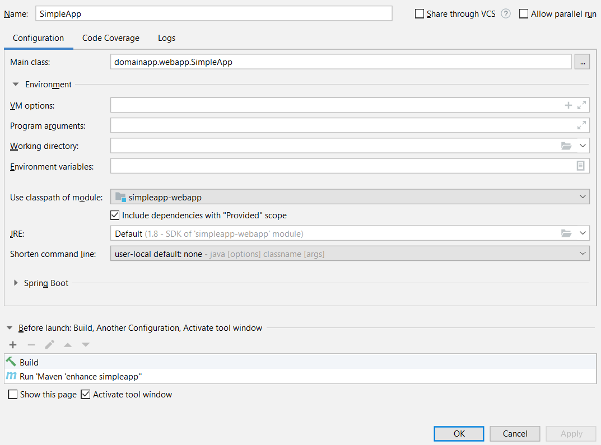

<a id="starters-simpleapp--experimenting-with-the-app"></a>

## Experimenting with the App

Once you are familiar with the app, try modifying it.
There is plenty more guidance on this site; start with the [User Guide Fundamentals](https://causeway.apache.org/userguide/latest/about.html) and then look at the other guides linked to from the top-level menu or from the main [table of contents](#about).

If you run into issues, please don’t hesitate to ask for help on the users mailing list or the Slack channel, as per the [support page](https://causeway.apache.org/docs/latest/support/about.html).

<a id="starters-simpleapp--using-an-external-database-and-flywaydb"></a>

## Using an external database and FlywayDB

The application is configured by default uses H2 as an inmemory database, with [fixtures](#starters-simpleapp--fixtures) used to populate the database with representative data.

To deploy to production though of course will require a persistent database, and the schema of the tables will be explicitly managed.
Although [JPA/Eclipselink](https://causeway.apache.org/pjpa/latest/about.html) can automatically create the database schema, many development teams choose to manage the schema externally to the ORM.

A popular tool to do this is [Flyway](https://flywaydb.org/), and Spring Boot provides automatic support for it using [these configuration properties](https://docs.spring.io/spring-boot/docs/current/reference/html/appendix-application-properties.html#common-application-properties-data-migration).

The simpleapp demonstrates how this can be done using SQL Server.
Adapt the following for your own preferred database.

<a id="starters-simpleapp--prereqs"></a>

### Prereqs

If you happen to use SQL Server, then just use a dev instance.
Otherwise, you can easily run up an instance using Docker:

```bash
docker run \
    --platform linux/amd64 \
    --name sqlserver-simpleapp \
    -e 'ACCEPT_EULA=Y' \
    -e 'SA_PASSWORD=VeryStrongPassword123!' \
    -p 1433:1433 \
    -d mcr.microsoft.com/mssql/server:2022-latest
```

You can then connect:

- if on Linux/Mac, start a command line client using:


```bash
docker exec -it sqlserver-simpleapp \
    /opt/mssql-tools18/bin/sqlcmd \
    -S localhost -U sa -P VeryStrongPassword123! -C
```

- if on Windows, you might instead prefer to use Microsoft’s free GUI client, [SQL Server Management Studio](https://learn.microsoft.com/en-us/ssms/install/install).

You then need to create a database and login:

```sql
CREATE DATABASE [simpleapp]
go
CREATE LOGIN [simpleapp]
    WITH PASSWORD=N'simpleapp',
        DEFAULT_DATABASE=[simpleapp],
        CHECK_EXPIRATION=OFF, CHECK_POLICY=OFF
go
USE [simpleapp]
GO
ALTER AUTHORIZATION ON DATABASE::[simpleapp] TO [simpleapp]
GO
```

If using the command line, type 'exit' to quit out.

To confirm the connect, try logging in as simpleapp/simpleapp, and verify using:

```sql
select db_name(), user_name()
go
```

This should return `simpleapp` and `dbo` respectively, meaning that the `simpleapp` login is all-powerful in the `simpleapp` database.

<a id="starters-simpleapp--enabling-flyway"></a>

### Enabling Flyway

With the backend database running, we can now run the simpleapp application with Flyway enabled.
This is done simply by activating the "SQLSERVER" profile (see also the [Spring docs](https://docs.spring.io/spring-boot/docs/current/reference/html/spring-boot-features.html#boot-features-profiles)):

- either by setting a system property:


```bash
-Dspring.profiles.active=SQLSERVER
```

- or by setting an environment variable:


```bash
export SPRING_PROFILES_ACTIVE=SQLSERVER
```

This will cause Spring to read in the `config/application-SQLSERVER.properties` file:

config/application-SQLSERVER.properties

```properties
spring.flyway.enabled=true
spring.flyway.default-schema=SIMPLE
spring.flyway.schemas=SIMPLE

spring.sql.init.platform=sqlserver
spring.datasource.url=jdbc:sqlserver://localhost;databaseName=simpleapp
spring.datasource.driver-class-name=com.microsoft.sqlserver.jdbc.SQLServerDriver
spring.datasource.username=simpleapp
spring.datasource.password=simpleapp

#causeway.persistence.schema.create-schema-sql-template=   (use flyway instead)
causeway.persistence.schema.auto-create-schemas=
```

Flyway in turn reads the migration scripts under `db.migration` package (in `src/main/resources` of the `webapp` module).

Run up the application and Flyway will run in the scripts.
It will also create its own table, `SIMPLE.flyway_schema_history`:

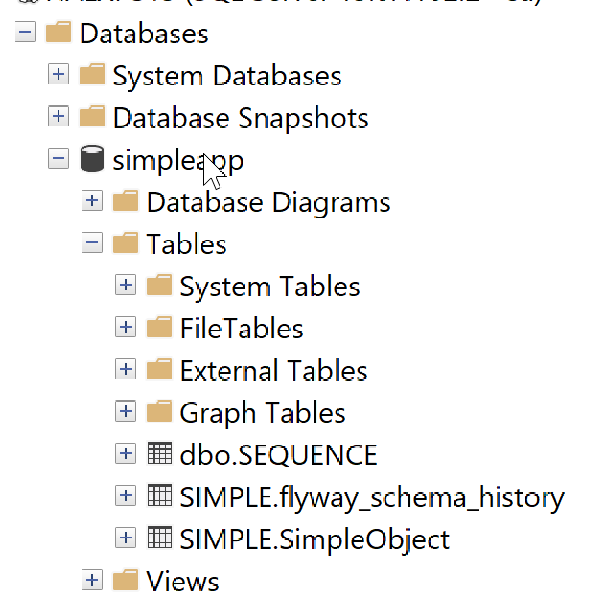

<a id="starters-simpleapp--cleaning-up"></a>

### Cleaning up

If you were using Docker to try this out, remember to clean up afterwards:

```bash
docker kill sqlserver-simpleapp
docker rm sqlserver-simpleapp
```

On this page

---

<a id="resources-cheatsheet"></a>

<!-- source_url: https://causeway.apache.org/docs/latest/resources/cheatsheet.html -->

<!-- page_index: 5 -->

# Cheat Sheet

4.0.0-M1

- - [4.0.0-M1](#about)
  - [3.5.0](https://causeway.apache.org/docs/3.5.0/about.html)
  - [3.4.0](https://causeway.apache.org/docs/3.4.0/about.html)
  - [3.3.0](https://causeway.apache.org/docs/3.3.0/about.html)
  - [3.2.0](https://causeway.apache.org/docs/3.2.0/about.html)
  - [3.1.0](https://causeway.apache.org/docs/3.1.0/about.html)
  - [3.0.0](https://causeway.apache.org/docs/3.0.0/about.html)
  - [2.1.0](https://causeway.apache.org/docs/2.1.0/about.html)
  - [2.0.0](https://causeway.apache.org/docs/2.0.0/about.html)
- Committers' Guide
  - [4.0.0-M1](https://causeway.apache.org/comguide/latest/about.html)
  - [3.5.0](https://causeway.apache.org/comguide/3.5.0/about.html)
  - [3.4.0](https://causeway.apache.org/comguide/3.4.0/about.html)
  - [3.3.0](https://causeway.apache.org/comguide/3.3.0/about.html)
  - [3.2.0](https://causeway.apache.org/comguide/3.2.0/about.html)
  - [3.1.0](https://causeway.apache.org/comguide/3.1.0/about.html)
  - [3.0.0](https://causeway.apache.org/comguide/3.0.0/about.html)
  - [2.1.0](https://causeway.apache.org/comguide/2.1.0/about.html)
  - [2.0.0](https://causeway.apache.org/comguide/2.0.0/about.html)
- Contributors' Guide
  - [4.0.0-M1](https://causeway.apache.org/conguide/latest/about.html)
  - [3.5.0](https://causeway.apache.org/conguide/3.5.0/about.html)
  - [3.4.0](https://causeway.apache.org/conguide/3.4.0/about.html)
  - [3.3.0](https://causeway.apache.org/conguide/3.3.0/about.html)
  - [3.2.0](https://causeway.apache.org/conguide/3.2.0/about.html)
  - [3.1.0](https://causeway.apache.org/conguide/3.1.0/about.html)
  - [3.0.0](https://causeway.apache.org/conguide/3.0.0/about.html)
  - [2.1.0](https://causeway.apache.org/conguide/2.1.0/about.html)
  - [2.0.0](https://causeway.apache.org/conguide/2.0.0/about.html)
- Design Docs
  - [4.0.0-M1](https://causeway.apache.org/core/latest/about.html)
  - [3.5.0](https://causeway.apache.org/core/3.5.0/about.html)
  - [3.4.0](https://causeway.apache.org/core/3.4.0/about.html)
  - [3.3.0](https://causeway.apache.org/core/3.3.0/about.html)
  - [3.2.0](https://causeway.apache.org/core/3.2.0/about.html)
  - [3.1.0](https://causeway.apache.org/core/3.1.0/about.html)
  - [3.0.0](https://causeway.apache.org/core/3.0.0/about.html)
  - [2.1.0](https://causeway.apache.org/core/2.1.0/about.html)
  - [2.0.0](https://causeway.apache.org/core/2.0.0/about.html)
- Extensions
  - [4.0.0-M1](https://causeway.apache.org/extensions/latest/about.html)
  - [3.5.0](https://causeway.apache.org/extensions/3.5.0/about.html)
  - [3.4.0](https://causeway.apache.org/extensions/3.4.0/about.html)
  - [3.3.0](https://causeway.apache.org/extensions/3.3.0/about.html)
  - [3.2.0](https://causeway.apache.org/extensions/3.2.0/about.html)
  - [3.1.0](https://causeway.apache.org/extensions/3.1.0/about.html)
  - [3.0.0](https://causeway.apache.org/extensions/3.0.0/about.html)
  - [2.1.0](https://causeway.apache.org/extensions/2.1.0/about.html)
  - [2.0.0](https://causeway.apache.org/extensions/2.0.0/about.html)
- GraphQL Viewer
  - [4.0.0-M1](https://causeway.apache.org/gqlv/latest/about.html)
  - [3.5.0](https://causeway.apache.org/gqlv/3.5.0/about.html)
  - [3.4.0](https://causeway.apache.org/gqlv/3.4.0/about.html)
  - [3.3.0](https://causeway.apache.org/gqlv/3.3.0/about.html)
  - [3.2.0](https://causeway.apache.org/gqlv/3.2.0/about.html)
  - [3.1.0](https://causeway.apache.org/gqlv/3.1.0/about.html)
  - [3.0.0](https://causeway.apache.org/gqlv/3.0.0/about.html)
  - [2.1.0](https://causeway.apache.org/gqlv/2.1.0/about.html)
  - [2.0.0](https://causeway.apache.org/gqlv/2.0.0/about.html)
- Incubator Catalog
  - [4.0.0-M1](https://causeway.apache.org/incubator/latest/about.html)
  - [3.5.0](https://causeway.apache.org/incubator/3.5.0/about.html)
  - [3.4.0](https://causeway.apache.org/incubator/3.4.0/about.html)
  - [3.3.0](https://causeway.apache.org/incubator/3.3.0/about.html)
  - [3.2.0](https://causeway.apache.org/incubator/3.2.0/about.html)
  - [3.1.0](https://causeway.apache.org/incubator/3.1.0/about.html)
  - [3.0.0](https://causeway.apache.org/incubator/3.0.0/about.html)
  - [2.1.0](https://causeway.apache.org/incubator/2.1.0/about.html)
  - [2.0.0](https://causeway.apache.org/incubator/2.0.0/about.html)
- JDO/DataNucleus
  - [3.4.0](https://causeway.apache.org/pjdo/latest/about.html)
  - [3.3.0](https://causeway.apache.org/pjdo/3.3.0/about.html)
  - [3.2.0](https://causeway.apache.org/pjdo/3.2.0/about.html)
  - [3.1.0](https://causeway.apache.org/pjdo/3.1.0/about.html)
  - [3.0.0](https://causeway.apache.org/pjdo/3.0.0/about.html)
  - [2.1.0](https://causeway.apache.org/pjdo/2.1.0/about.html)
  - [2.0.0](https://causeway.apache.org/pjdo/2.0.0/about.html)
- JPA
  - [4.0.0-M1](https://causeway.apache.org/pjpa/latest/about.html)
  - [3.5.0](https://causeway.apache.org/pjpa/3.5.0/about.html)
  - [3.4.0](https://causeway.apache.org/pjpa/3.4.0/about.html)
  - [3.3.0](https://causeway.apache.org/pjpa/3.3.0/about.html)
  - [3.2.0](https://causeway.apache.org/pjpa/3.2.0/about.html)
  - [3.1.0](https://causeway.apache.org/pjpa/3.1.0/about.html)
  - [3.0.0](https://causeway.apache.org/pjpa/3.0.0/about.html)
  - [2.1.0](https://causeway.apache.org/pjpa/2.1.0/about.html)
  - [2.0.0](https://causeway.apache.org/pjpa/2.0.0/about.html)
- QueryDSL
  - [4.0.0-M1](https://causeway.apache.org/querydsl/latest/about.html)
  - [3.5.0](https://causeway.apache.org/querydsl/3.5.0/about.html)
  - [3.4.0](https://causeway.apache.org/querydsl/3.4.0/about.html)
  - [3.3.0](https://causeway.apache.org/querydsl/3.3.0/about.html)
  - [3.2.0](https://causeway.apache.org/querydsl/3.2.0/about.html)
- Reference Guide
  - [4.0.0-M1](https://causeway.apache.org/refguide/latest/about.html)
  - [3.5.0](https://causeway.apache.org/refguide/3.5.0/about.html)
  - [3.4.0](https://causeway.apache.org/refguide/3.4.0/about.html)
  - [3.3.0](https://causeway.apache.org/refguide/3.3.0/about.html)
  - [3.2.0](https://causeway.apache.org/refguide/3.2.0/about.html)
  - [3.1.0](https://causeway.apache.org/refguide/3.1.0/about.html)
  - [3.0.0](https://causeway.apache.org/refguide/3.0.0/about.html)
  - [2.1.0](https://causeway.apache.org/refguide/2.1.0/about.html)
  - [2.0.0](https://causeway.apache.org/refguide/2.0.0/about.html)
- regressiontests
  - [4.0.0-M1](https://causeway.apache.org/regressiontests/latest/index.html)
  - [3.5.0](https://causeway.apache.org/regressiontests/3.5.0/index.html)
  - [3.4.0](https://causeway.apache.org/regressiontests/3.4.0/index.html)
  - [3.3.0](https://causeway.apache.org/regressiontests/3.3.0/index.html)
  - [3.2.0](https://causeway.apache.org/regressiontests/3.2.0/index.html)
  - [3.1.0](https://causeway.apache.org/regressiontests/3.1.0/index.html)
  - [3.0.0](https://causeway.apache.org/regressiontests/3.0.0/index.html)
  - [2.1.0](https://causeway.apache.org/regressiontests/2.1.0/index.html)
  - [2.0.0](https://causeway.apache.org/regressiontests/2.0.0/index.html)
- Release Notes
  - [4.0.0-M1](https://causeway.apache.org/relnotes/latest/about.html)
  - [3.5.0](https://causeway.apache.org/relnotes/3.5.0/about.html)
  - [3.4.0](https://causeway.apache.org/relnotes/3.4.0/about.html)
  - [3.3.0](https://causeway.apache.org/relnotes/3.3.0/about.html)
  - [3.2.0](https://causeway.apache.org/relnotes/3.2.0/about.html)
  - [3.1.0](https://causeway.apache.org/relnotes/3.1.0/about.html)
  - [3.0.0](https://causeway.apache.org/relnotes/3.0.0/about.html)
  - [2.1.0](https://causeway.apache.org/relnotes/2.1.0/about.html)
  - [2.0.0](https://causeway.apache.org/relnotes/2.0.0/about.html)
- REST API (Restful Objects Viewer)
  - [4.0.0-M1](https://causeway.apache.org/vro/latest/about.html)
  - [3.5.0](https://causeway.apache.org/vro/3.5.0/about.html)
  - [3.4.0](https://causeway.apache.org/vro/3.4.0/about.html)
  - [3.3.0](https://causeway.apache.org/vro/3.3.0/about.html)
  - [3.2.0](https://causeway.apache.org/vro/3.2.0/about.html)
  - [3.1.0](https://causeway.apache.org/vro/3.1.0/about.html)
  - [3.0.0](https://causeway.apache.org/vro/3.0.0/about.html)
  - [2.1.0](https://causeway.apache.org/vro/2.1.0/about.html)
  - [2.0.0](https://causeway.apache.org/vro/2.0.0/about.html)
- Security Guide
  - [4.0.0-M1](https://causeway.apache.org/security/latest/about.html)
  - [3.5.0](https://causeway.apache.org/security/3.5.0/about.html)
  - [3.4.0](https://causeway.apache.org/security/3.4.0/about.html)
  - [3.3.0](https://causeway.apache.org/security/3.3.0/about.html)
  - [3.2.0](https://causeway.apache.org/security/3.2.0/about.html)
  - [3.1.0](https://causeway.apache.org/security/3.1.0/about.html)
  - [3.0.0](https://causeway.apache.org/security/3.0.0/about.html)
  - [2.1.0](https://causeway.apache.org/security/2.1.0/about.html)
  - [2.0.0](https://causeway.apache.org/security/2.0.0/about.html)
- Setup Guide
  - [4.0.0-M1](https://causeway.apache.org/setupguide/latest/about.html)
  - [3.5.0](https://causeway.apache.org/setupguide/3.5.0/about.html)
  - [3.4.0](https://causeway.apache.org/setupguide/3.4.0/about.html)
  - [3.3.0](https://causeway.apache.org/setupguide/3.3.0/about.html)
  - [3.2.0](https://causeway.apache.org/setupguide/3.2.0/about.html)
  - [3.1.0](https://causeway.apache.org/setupguide/3.1.0/about.html)
  - [3.0.0](https://causeway.apache.org/setupguide/3.0.0/about.html)
  - [2.1.0](https://causeway.apache.org/setupguide/2.1.0/about.html)
  - [2.0.0](https://causeway.apache.org/setupguide/2.0.0/about.html)
- Testing Guide
  - [4.0.0-M1](https://causeway.apache.org/testing/latest/about.html)
  - [3.5.0](https://causeway.apache.org/testing/3.5.0/about.html)
  - [3.4.0](https://causeway.apache.org/testing/3.4.0/about.html)
  - [3.3.0](https://causeway.apache.org/testing/3.3.0/about.html)
  - [3.2.0](https://causeway.apache.org/testing/3.2.0/about.html)
  - [3.1.0](https://causeway.apache.org/testing/3.1.0/about.html)
  - [3.0.0](https://causeway.apache.org/testing/3.0.0/about.html)
  - [2.1.0](https://causeway.apache.org/testing/2.1.0/about.html)
  - [2.0.0](https://causeway.apache.org/testing/2.0.0/about.html)
- Tutorials
  - [4.0.0-M1](https://causeway.apache.org/tutorials/latest/about.html)
  - [3.5.0](https://causeway.apache.org/tutorials/3.5.0/about.html)
  - [3.4.0](https://causeway.apache.org/tutorials/3.4.0/about.html)
  - [3.3.0](https://causeway.apache.org/tutorials/3.3.0/about.html)
  - [3.2.0](https://causeway.apache.org/tutorials/3.2.0/about.html)
  - [3.1.0](https://causeway.apache.org/tutorials/3.1.0/about.html)
  - [3.0.0](https://causeway.apache.org/tutorials/3.0.0/about.html)
  - [2.1.0](https://causeway.apache.org/tutorials/2.1.0/about.html)
  - [2.0.0](https://causeway.apache.org/tutorials/2.0.0/about.html)
- User Guide
  - [4.0.0-M1](https://causeway.apache.org/userguide/latest/about.html)
  - [3.5.0](https://causeway.apache.org/userguide/3.5.0/about.html)
  - [3.4.0](https://causeway.apache.org/userguide/3.4.0/about.html)
  - [3.3.0](https://causeway.apache.org/userguide/3.3.0/about.html)
  - [3.2.0](https://causeway.apache.org/userguide/3.2.0/about.html)
  - [3.1.0](https://causeway.apache.org/userguide/3.1.0/about.html)
  - [3.0.0](https://causeway.apache.org/userguide/3.0.0/about.html)
  - [2.1.0](https://causeway.apache.org/userguide/2.1.0/about.html)
  - [2.0.0](https://causeway.apache.org/userguide/2.0.0/about.html)
- Value Types Catalog
  - [4.0.0-M1](https://causeway.apache.org/valuetypes/latest/about.html)
  - [3.5.0](https://causeway.apache.org/valuetypes/3.5.0/about.html)
  - [3.4.0](https://causeway.apache.org/valuetypes/3.4.0/about.html)
  - [3.3.0](https://causeway.apache.org/valuetypes/3.3.0/about.html)
  - [3.2.0](https://causeway.apache.org/valuetypes/3.2.0/about.html)
  - [3.1.0](https://causeway.apache.org/valuetypes/3.1.0/about.html)
  - [3.0.0](https://causeway.apache.org/valuetypes/3.0.0/about.html)
  - [2.1.0](https://causeway.apache.org/valuetypes/2.1.0/about.html)
  - [2.0.0](https://causeway.apache.org/valuetypes/2.0.0/about.html)
- Web UI (Wicket Viewer)
  - [4.0.0-M1](https://causeway.apache.org/vw/latest/about.html)
  - [3.5.0](https://causeway.apache.org/vw/3.5.0/about.html)
  - [3.4.0](https://causeway.apache.org/vw/3.4.0/about.html)
  - [3.3.0](https://causeway.apache.org/vw/3.3.0/about.html)
  - [3.2.0](https://causeway.apache.org/vw/3.2.0/about.html)
  - [3.1.0](https://causeway.apache.org/vw/3.1.0/about.html)
  - [3.0.0](https://causeway.apache.org/vw/3.0.0/about.html)
  - [2.1.0](https://causeway.apache.org/vw/2.1.0/about.html)
  - [2.0.0](https://causeway.apache.org/vw/2.0.0/about.html)

4.0.0-M1

[4.0.0-M1](#resources-cheatsheet)
[3.5.0](https://causeway.apache.org/docs/3.5.0/resources/cheatsheet.html)
[3.4.0](https://causeway.apache.org/docs/3.4.0/resources/cheatsheet.html)
[3.3.0](https://causeway.apache.org/docs/3.3.0/resources/cheatsheet.html)
[3.2.0](https://causeway.apache.org/docs/3.2.0/resources/cheatsheet.html)
[3.1.0](https://causeway.apache.org/docs/3.1.0/resources/cheatsheet.html)
[3.0.0](https://causeway.apache.org/docs/3.0.0/resources/cheatsheet.html)
[2.1.0](https://causeway.apache.org/docs/2.1.0/resources/cheatsheet.html)
[2.0.0](https://causeway.apache.org/docs/2.0.0/resources/cheatsheet.html)

[Edit](https://github.com/apache/causeway/edit/4.0.0-M1/antora/components/docs/modules/resources/pages/cheatsheet.adoc)

<a id="resources-cheatsheet--cheat-sheet"></a>

# Cheat Sheet

This cheat sheet summarises the main programming conventions to follow when writing an Apache Causeway application.

[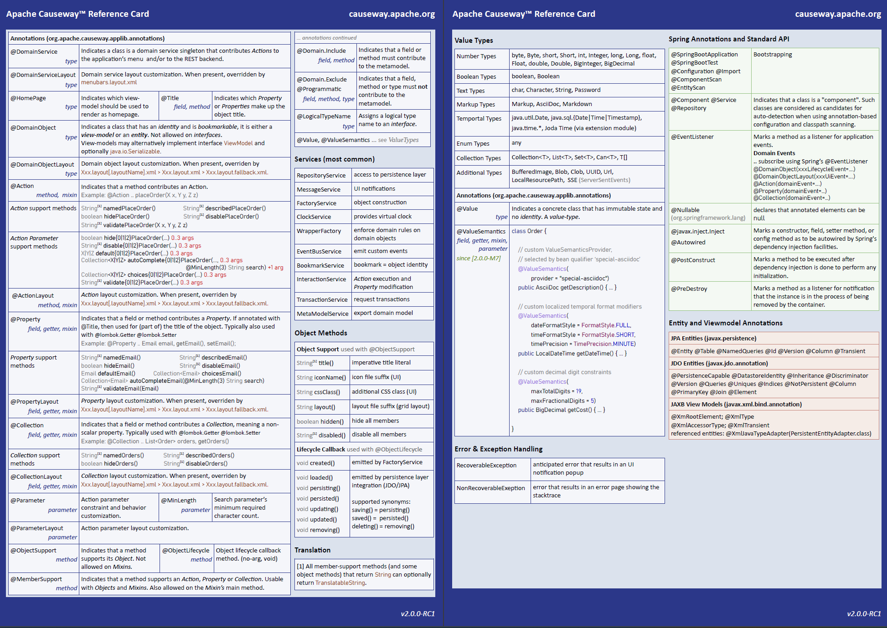](assets/files/causewaycheatsheet_33b40a2ea19d4f92.pdf)

You can download the cheat sheet as either an
[Acrobat PDF](assets/files/causewaycheatsheet_33b40a2ea19d4f92.pdf) file or as an [Open Document .odt](https://causeway.apache.org/docs/latest/resources/_attachments/CausewayCheatSheet.odt) file.

On this page

---

<a id="resources-icons"></a>

<!-- source_url: https://causeway.apache.org/docs/latest/resources/icons.html -->

<!-- page_index: 6 -->

# Icons

4.0.0-M1

- - [4.0.0-M1](#about)
  - [3.5.0](https://causeway.apache.org/docs/3.5.0/about.html)
  - [3.4.0](https://causeway.apache.org/docs/3.4.0/about.html)
  - [3.3.0](https://causeway.apache.org/docs/3.3.0/about.html)
  - [3.2.0](https://causeway.apache.org/docs/3.2.0/about.html)
  - [3.1.0](https://causeway.apache.org/docs/3.1.0/about.html)
  - [3.0.0](https://causeway.apache.org/docs/3.0.0/about.html)
  - [2.1.0](https://causeway.apache.org/docs/2.1.0/about.html)
  - [2.0.0](https://causeway.apache.org/docs/2.0.0/about.html)
- Committers' Guide
  - [4.0.0-M1](https://causeway.apache.org/comguide/latest/about.html)
  - [3.5.0](https://causeway.apache.org/comguide/3.5.0/about.html)
  - [3.4.0](https://causeway.apache.org/comguide/3.4.0/about.html)
  - [3.3.0](https://causeway.apache.org/comguide/3.3.0/about.html)
  - [3.2.0](https://causeway.apache.org/comguide/3.2.0/about.html)
  - [3.1.0](https://causeway.apache.org/comguide/3.1.0/about.html)
  - [3.0.0](https://causeway.apache.org/comguide/3.0.0/about.html)
  - [2.1.0](https://causeway.apache.org/comguide/2.1.0/about.html)
  - [2.0.0](https://causeway.apache.org/comguide/2.0.0/about.html)
- Contributors' Guide
  - [4.0.0-M1](https://causeway.apache.org/conguide/latest/about.html)
  - [3.5.0](https://causeway.apache.org/conguide/3.5.0/about.html)
  - [3.4.0](https://causeway.apache.org/conguide/3.4.0/about.html)
  - [3.3.0](https://causeway.apache.org/conguide/3.3.0/about.html)
  - [3.2.0](https://causeway.apache.org/conguide/3.2.0/about.html)
  - [3.1.0](https://causeway.apache.org/conguide/3.1.0/about.html)
  - [3.0.0](https://causeway.apache.org/conguide/3.0.0/about.html)
  - [2.1.0](https://causeway.apache.org/conguide/2.1.0/about.html)
  - [2.0.0](https://causeway.apache.org/conguide/2.0.0/about.html)
- Design Docs
  - [4.0.0-M1](https://causeway.apache.org/core/latest/about.html)
  - [3.5.0](https://causeway.apache.org/core/3.5.0/about.html)
  - [3.4.0](https://causeway.apache.org/core/3.4.0/about.html)
  - [3.3.0](https://causeway.apache.org/core/3.3.0/about.html)
  - [3.2.0](https://causeway.apache.org/core/3.2.0/about.html)
  - [3.1.0](https://causeway.apache.org/core/3.1.0/about.html)
  - [3.0.0](https://causeway.apache.org/core/3.0.0/about.html)
  - [2.1.0](https://causeway.apache.org/core/2.1.0/about.html)
  - [2.0.0](https://causeway.apache.org/core/2.0.0/about.html)
- Extensions
  - [4.0.0-M1](https://causeway.apache.org/extensions/latest/about.html)
  - [3.5.0](https://causeway.apache.org/extensions/3.5.0/about.html)
  - [3.4.0](https://causeway.apache.org/extensions/3.4.0/about.html)
  - [3.3.0](https://causeway.apache.org/extensions/3.3.0/about.html)
  - [3.2.0](https://causeway.apache.org/extensions/3.2.0/about.html)
  - [3.1.0](https://causeway.apache.org/extensions/3.1.0/about.html)
  - [3.0.0](https://causeway.apache.org/extensions/3.0.0/about.html)
  - [2.1.0](https://causeway.apache.org/extensions/2.1.0/about.html)
  - [2.0.0](https://causeway.apache.org/extensions/2.0.0/about.html)
- GraphQL Viewer
  - [4.0.0-M1](https://causeway.apache.org/gqlv/latest/about.html)
  - [3.5.0](https://causeway.apache.org/gqlv/3.5.0/about.html)
  - [3.4.0](https://causeway.apache.org/gqlv/3.4.0/about.html)
  - [3.3.0](https://causeway.apache.org/gqlv/3.3.0/about.html)
  - [3.2.0](https://causeway.apache.org/gqlv/3.2.0/about.html)
  - [3.1.0](https://causeway.apache.org/gqlv/3.1.0/about.html)
  - [3.0.0](https://causeway.apache.org/gqlv/3.0.0/about.html)
  - [2.1.0](https://causeway.apache.org/gqlv/2.1.0/about.html)
  - [2.0.0](https://causeway.apache.org/gqlv/2.0.0/about.html)
- Incubator Catalog
  - [4.0.0-M1](https://causeway.apache.org/incubator/latest/about.html)
  - [3.5.0](https://causeway.apache.org/incubator/3.5.0/about.html)
  - [3.4.0](https://causeway.apache.org/incubator/3.4.0/about.html)
  - [3.3.0](https://causeway.apache.org/incubator/3.3.0/about.html)
  - [3.2.0](https://causeway.apache.org/incubator/3.2.0/about.html)
  - [3.1.0](https://causeway.apache.org/incubator/3.1.0/about.html)
  - [3.0.0](https://causeway.apache.org/incubator/3.0.0/about.html)
  - [2.1.0](https://causeway.apache.org/incubator/2.1.0/about.html)
  - [2.0.0](https://causeway.apache.org/incubator/2.0.0/about.html)
- JDO/DataNucleus
  - [3.4.0](https://causeway.apache.org/pjdo/latest/about.html)
  - [3.3.0](https://causeway.apache.org/pjdo/3.3.0/about.html)
  - [3.2.0](https://causeway.apache.org/pjdo/3.2.0/about.html)
  - [3.1.0](https://causeway.apache.org/pjdo/3.1.0/about.html)
  - [3.0.0](https://causeway.apache.org/pjdo/3.0.0/about.html)
  - [2.1.0](https://causeway.apache.org/pjdo/2.1.0/about.html)
  - [2.0.0](https://causeway.apache.org/pjdo/2.0.0/about.html)
- JPA
  - [4.0.0-M1](https://causeway.apache.org/pjpa/latest/about.html)
  - [3.5.0](https://causeway.apache.org/pjpa/3.5.0/about.html)
  - [3.4.0](https://causeway.apache.org/pjpa/3.4.0/about.html)
  - [3.3.0](https://causeway.apache.org/pjpa/3.3.0/about.html)
  - [3.2.0](https://causeway.apache.org/pjpa/3.2.0/about.html)
  - [3.1.0](https://causeway.apache.org/pjpa/3.1.0/about.html)
  - [3.0.0](https://causeway.apache.org/pjpa/3.0.0/about.html)
  - [2.1.0](https://causeway.apache.org/pjpa/2.1.0/about.html)
  - [2.0.0](https://causeway.apache.org/pjpa/2.0.0/about.html)
- QueryDSL
  - [4.0.0-M1](https://causeway.apache.org/querydsl/latest/about.html)
  - [3.5.0](https://causeway.apache.org/querydsl/3.5.0/about.html)
  - [3.4.0](https://causeway.apache.org/querydsl/3.4.0/about.html)
  - [3.3.0](https://causeway.apache.org/querydsl/3.3.0/about.html)
  - [3.2.0](https://causeway.apache.org/querydsl/3.2.0/about.html)
- Reference Guide
  - [4.0.0-M1](https://causeway.apache.org/refguide/latest/about.html)
  - [3.5.0](https://causeway.apache.org/refguide/3.5.0/about.html)
  - [3.4.0](https://causeway.apache.org/refguide/3.4.0/about.html)
  - [3.3.0](https://causeway.apache.org/refguide/3.3.0/about.html)
  - [3.2.0](https://causeway.apache.org/refguide/3.2.0/about.html)
  - [3.1.0](https://causeway.apache.org/refguide/3.1.0/about.html)
  - [3.0.0](https://causeway.apache.org/refguide/3.0.0/about.html)
  - [2.1.0](https://causeway.apache.org/refguide/2.1.0/about.html)
  - [2.0.0](https://causeway.apache.org/refguide/2.0.0/about.html)
- regressiontests
  - [4.0.0-M1](https://causeway.apache.org/regressiontests/latest/index.html)
  - [3.5.0](https://causeway.apache.org/regressiontests/3.5.0/index.html)
  - [3.4.0](https://causeway.apache.org/regressiontests/3.4.0/index.html)
  - [3.3.0](https://causeway.apache.org/regressiontests/3.3.0/index.html)
  - [3.2.0](https://causeway.apache.org/regressiontests/3.2.0/index.html)
  - [3.1.0](https://causeway.apache.org/regressiontests/3.1.0/index.html)
  - [3.0.0](https://causeway.apache.org/regressiontests/3.0.0/index.html)
  - [2.1.0](https://causeway.apache.org/regressiontests/2.1.0/index.html)
  - [2.0.0](https://causeway.apache.org/regressiontests/2.0.0/index.html)
- Release Notes
  - [4.0.0-M1](https://causeway.apache.org/relnotes/latest/about.html)
  - [3.5.0](https://causeway.apache.org/relnotes/3.5.0/about.html)
  - [3.4.0](https://causeway.apache.org/relnotes/3.4.0/about.html)
  - [3.3.0](https://causeway.apache.org/relnotes/3.3.0/about.html)
  - [3.2.0](https://causeway.apache.org/relnotes/3.2.0/about.html)
  - [3.1.0](https://causeway.apache.org/relnotes/3.1.0/about.html)
  - [3.0.0](https://causeway.apache.org/relnotes/3.0.0/about.html)
  - [2.1.0](https://causeway.apache.org/relnotes/2.1.0/about.html)
  - [2.0.0](https://causeway.apache.org/relnotes/2.0.0/about.html)
- REST API (Restful Objects Viewer)
  - [4.0.0-M1](https://causeway.apache.org/vro/latest/about.html)
  - [3.5.0](https://causeway.apache.org/vro/3.5.0/about.html)
  - [3.4.0](https://causeway.apache.org/vro/3.4.0/about.html)
  - [3.3.0](https://causeway.apache.org/vro/3.3.0/about.html)
  - [3.2.0](https://causeway.apache.org/vro/3.2.0/about.html)
  - [3.1.0](https://causeway.apache.org/vro/3.1.0/about.html)
  - [3.0.0](https://causeway.apache.org/vro/3.0.0/about.html)
  - [2.1.0](https://causeway.apache.org/vro/2.1.0/about.html)
  - [2.0.0](https://causeway.apache.org/vro/2.0.0/about.html)
- Security Guide
  - [4.0.0-M1](https://causeway.apache.org/security/latest/about.html)
  - [3.5.0](https://causeway.apache.org/security/3.5.0/about.html)
  - [3.4.0](https://causeway.apache.org/security/3.4.0/about.html)
  - [3.3.0](https://causeway.apache.org/security/3.3.0/about.html)
  - [3.2.0](https://causeway.apache.org/security/3.2.0/about.html)
  - [3.1.0](https://causeway.apache.org/security/3.1.0/about.html)
  - [3.0.0](https://causeway.apache.org/security/3.0.0/about.html)
  - [2.1.0](https://causeway.apache.org/security/2.1.0/about.html)
  - [2.0.0](https://causeway.apache.org/security/2.0.0/about.html)
- Setup Guide
  - [4.0.0-M1](https://causeway.apache.org/setupguide/latest/about.html)
  - [3.5.0](https://causeway.apache.org/setupguide/3.5.0/about.html)
  - [3.4.0](https://causeway.apache.org/setupguide/3.4.0/about.html)
  - [3.3.0](https://causeway.apache.org/setupguide/3.3.0/about.html)
  - [3.2.0](https://causeway.apache.org/setupguide/3.2.0/about.html)
  - [3.1.0](https://causeway.apache.org/setupguide/3.1.0/about.html)
  - [3.0.0](https://causeway.apache.org/setupguide/3.0.0/about.html)
  - [2.1.0](https://causeway.apache.org/setupguide/2.1.0/about.html)
  - [2.0.0](https://causeway.apache.org/setupguide/2.0.0/about.html)
- Testing Guide
  - [4.0.0-M1](https://causeway.apache.org/testing/latest/about.html)
  - [3.5.0](https://causeway.apache.org/testing/3.5.0/about.html)
  - [3.4.0](https://causeway.apache.org/testing/3.4.0/about.html)
  - [3.3.0](https://causeway.apache.org/testing/3.3.0/about.html)
  - [3.2.0](https://causeway.apache.org/testing/3.2.0/about.html)
  - [3.1.0](https://causeway.apache.org/testing/3.1.0/about.html)
  - [3.0.0](https://causeway.apache.org/testing/3.0.0/about.html)
  - [2.1.0](https://causeway.apache.org/testing/2.1.0/about.html)
  - [2.0.0](https://causeway.apache.org/testing/2.0.0/about.html)
- Tutorials
  - [4.0.0-M1](https://causeway.apache.org/tutorials/latest/about.html)
  - [3.5.0](https://causeway.apache.org/tutorials/3.5.0/about.html)
  - [3.4.0](https://causeway.apache.org/tutorials/3.4.0/about.html)
  - [3.3.0](https://causeway.apache.org/tutorials/3.3.0/about.html)
  - [3.2.0](https://causeway.apache.org/tutorials/3.2.0/about.html)
  - [3.1.0](https://causeway.apache.org/tutorials/3.1.0/about.html)
  - [3.0.0](https://causeway.apache.org/tutorials/3.0.0/about.html)
  - [2.1.0](https://causeway.apache.org/tutorials/2.1.0/about.html)
  - [2.0.0](https://causeway.apache.org/tutorials/2.0.0/about.html)
- User Guide
  - [4.0.0-M1](https://causeway.apache.org/userguide/latest/about.html)
  - [3.5.0](https://causeway.apache.org/userguide/3.5.0/about.html)
  - [3.4.0](https://causeway.apache.org/userguide/3.4.0/about.html)
  - [3.3.0](https://causeway.apache.org/userguide/3.3.0/about.html)
  - [3.2.0](https://causeway.apache.org/userguide/3.2.0/about.html)
  - [3.1.0](https://causeway.apache.org/userguide/3.1.0/about.html)
  - [3.0.0](https://causeway.apache.org/userguide/3.0.0/about.html)
  - [2.1.0](https://causeway.apache.org/userguide/2.1.0/about.html)
  - [2.0.0](https://causeway.apache.org/userguide/2.0.0/about.html)
- Value Types Catalog
  - [4.0.0-M1](https://causeway.apache.org/valuetypes/latest/about.html)
  - [3.5.0](https://causeway.apache.org/valuetypes/3.5.0/about.html)
  - [3.4.0](https://causeway.apache.org/valuetypes/3.4.0/about.html)
  - [3.3.0](https://causeway.apache.org/valuetypes/3.3.0/about.html)
  - [3.2.0](https://causeway.apache.org/valuetypes/3.2.0/about.html)
  - [3.1.0](https://causeway.apache.org/valuetypes/3.1.0/about.html)
  - [3.0.0](https://causeway.apache.org/valuetypes/3.0.0/about.html)
  - [2.1.0](https://causeway.apache.org/valuetypes/2.1.0/about.html)
  - [2.0.0](https://causeway.apache.org/valuetypes/2.0.0/about.html)
- Web UI (Wicket Viewer)
  - [4.0.0-M1](https://causeway.apache.org/vw/latest/about.html)
  - [3.5.0](https://causeway.apache.org/vw/3.5.0/about.html)
  - [3.4.0](https://causeway.apache.org/vw/3.4.0/about.html)
  - [3.3.0](https://causeway.apache.org/vw/3.3.0/about.html)
  - [3.2.0](https://causeway.apache.org/vw/3.2.0/about.html)
  - [3.1.0](https://causeway.apache.org/vw/3.1.0/about.html)
  - [3.0.0](https://causeway.apache.org/vw/3.0.0/about.html)
  - [2.1.0](https://causeway.apache.org/vw/2.1.0/about.html)
  - [2.0.0](https://causeway.apache.org/vw/2.0.0/about.html)

4.0.0-M1

[4.0.0-M1](#resources-icons)
[3.5.0](https://causeway.apache.org/docs/3.5.0/resources/icons.html)
[3.4.0](https://causeway.apache.org/docs/3.4.0/resources/icons.html)
[3.3.0](https://causeway.apache.org/docs/3.3.0/resources/icons.html)
[3.2.0](https://causeway.apache.org/docs/3.2.0/resources/icons.html)
[3.1.0](https://causeway.apache.org/docs/3.1.0/resources/icons.html)
[3.0.0](https://causeway.apache.org/docs/3.0.0/resources/icons.html)
[2.1.0](https://causeway.apache.org/docs/2.1.0/resources/icons.html)
[2.0.0](https://causeway.apache.org/docs/2.0.0/resources/icons.html)

[Edit](https://github.com/apache/causeway/edit/4.0.0-M1/antora/components/docs/modules/resources/pages/icons.adoc)

<a id="resources-icons--icons"></a>

# Icons

Most Apache Causeway viewers use icons to help identify domain objects in the user interface.
It’s a good idea to ensure that these are styled consistently.
Here are some open source icon sets for both personal and commercial use (though some require a link back to the authors website):

- [icons8](http://icons8.com/) (free and commercial)
- [the noun project](http://thenounproject.com/) (free and commercial)
- [flaticon](http://www.flaticon.com/) (free)
- [Google material design](https://material.io/resources/icons) (free)
- [GNOME/Tango icons](https://commons.wikimedia.org/wiki/GNOME_Desktop_icons) (free)

If you know of any others freely usable and easily accessible, let us know through the [mailing list](#support-mailing-list).

On this page

---

<a id="support-slack-channel"></a>

<!-- source_url: https://causeway.apache.org/docs/latest/support/slack-channel.html -->

<!-- page_index: 7 -->

# Slack Channel

4.0.0-M1

- - [4.0.0-M1](#about)
  - [3.5.0](https://causeway.apache.org/docs/3.5.0/about.html)
  - [3.4.0](https://causeway.apache.org/docs/3.4.0/about.html)
  - [3.3.0](https://causeway.apache.org/docs/3.3.0/about.html)
  - [3.2.0](https://causeway.apache.org/docs/3.2.0/about.html)
  - [3.1.0](https://causeway.apache.org/docs/3.1.0/about.html)
  - [3.0.0](https://causeway.apache.org/docs/3.0.0/about.html)
  - [2.1.0](https://causeway.apache.org/docs/2.1.0/about.html)
  - [2.0.0](https://causeway.apache.org/docs/2.0.0/about.html)
- Committers' Guide
  - [4.0.0-M1](https://causeway.apache.org/comguide/latest/about.html)
  - [3.5.0](https://causeway.apache.org/comguide/3.5.0/about.html)
  - [3.4.0](https://causeway.apache.org/comguide/3.4.0/about.html)
  - [3.3.0](https://causeway.apache.org/comguide/3.3.0/about.html)
  - [3.2.0](https://causeway.apache.org/comguide/3.2.0/about.html)
  - [3.1.0](https://causeway.apache.org/comguide/3.1.0/about.html)
  - [3.0.0](https://causeway.apache.org/comguide/3.0.0/about.html)
  - [2.1.0](https://causeway.apache.org/comguide/2.1.0/about.html)
  - [2.0.0](https://causeway.apache.org/comguide/2.0.0/about.html)
- Contributors' Guide
  - [4.0.0-M1](https://causeway.apache.org/conguide/latest/about.html)
  - [3.5.0](https://causeway.apache.org/conguide/3.5.0/about.html)
  - [3.4.0](https://causeway.apache.org/conguide/3.4.0/about.html)
  - [3.3.0](https://causeway.apache.org/conguide/3.3.0/about.html)
  - [3.2.0](https://causeway.apache.org/conguide/3.2.0/about.html)
  - [3.1.0](https://causeway.apache.org/conguide/3.1.0/about.html)
  - [3.0.0](https://causeway.apache.org/conguide/3.0.0/about.html)
  - [2.1.0](https://causeway.apache.org/conguide/2.1.0/about.html)
  - [2.0.0](https://causeway.apache.org/conguide/2.0.0/about.html)
- Design Docs
  - [4.0.0-M1](https://causeway.apache.org/core/latest/about.html)
  - [3.5.0](https://causeway.apache.org/core/3.5.0/about.html)
  - [3.4.0](https://causeway.apache.org/core/3.4.0/about.html)
  - [3.3.0](https://causeway.apache.org/core/3.3.0/about.html)
  - [3.2.0](https://causeway.apache.org/core/3.2.0/about.html)
  - [3.1.0](https://causeway.apache.org/core/3.1.0/about.html)
  - [3.0.0](https://causeway.apache.org/core/3.0.0/about.html)
  - [2.1.0](https://causeway.apache.org/core/2.1.0/about.html)
  - [2.0.0](https://causeway.apache.org/core/2.0.0/about.html)
- Extensions
  - [4.0.0-M1](https://causeway.apache.org/extensions/latest/about.html)
  - [3.5.0](https://causeway.apache.org/extensions/3.5.0/about.html)
  - [3.4.0](https://causeway.apache.org/extensions/3.4.0/about.html)
  - [3.3.0](https://causeway.apache.org/extensions/3.3.0/about.html)
  - [3.2.0](https://causeway.apache.org/extensions/3.2.0/about.html)
  - [3.1.0](https://causeway.apache.org/extensions/3.1.0/about.html)
  - [3.0.0](https://causeway.apache.org/extensions/3.0.0/about.html)
  - [2.1.0](https://causeway.apache.org/extensions/2.1.0/about.html)
  - [2.0.0](https://causeway.apache.org/extensions/2.0.0/about.html)
- GraphQL Viewer
  - [4.0.0-M1](https://causeway.apache.org/gqlv/latest/about.html)
  - [3.5.0](https://causeway.apache.org/gqlv/3.5.0/about.html)
  - [3.4.0](https://causeway.apache.org/gqlv/3.4.0/about.html)
  - [3.3.0](https://causeway.apache.org/gqlv/3.3.0/about.html)
  - [3.2.0](https://causeway.apache.org/gqlv/3.2.0/about.html)
  - [3.1.0](https://causeway.apache.org/gqlv/3.1.0/about.html)
  - [3.0.0](https://causeway.apache.org/gqlv/3.0.0/about.html)
  - [2.1.0](https://causeway.apache.org/gqlv/2.1.0/about.html)
  - [2.0.0](https://causeway.apache.org/gqlv/2.0.0/about.html)
- Incubator Catalog
  - [4.0.0-M1](https://causeway.apache.org/incubator/latest/about.html)
  - [3.5.0](https://causeway.apache.org/incubator/3.5.0/about.html)
  - [3.4.0](https://causeway.apache.org/incubator/3.4.0/about.html)
  - [3.3.0](https://causeway.apache.org/incubator/3.3.0/about.html)
  - [3.2.0](https://causeway.apache.org/incubator/3.2.0/about.html)
  - [3.1.0](https://causeway.apache.org/incubator/3.1.0/about.html)
  - [3.0.0](https://causeway.apache.org/incubator/3.0.0/about.html)
  - [2.1.0](https://causeway.apache.org/incubator/2.1.0/about.html)
  - [2.0.0](https://causeway.apache.org/incubator/2.0.0/about.html)
- JDO/DataNucleus
  - [3.4.0](https://causeway.apache.org/pjdo/latest/about.html)
  - [3.3.0](https://causeway.apache.org/pjdo/3.3.0/about.html)
  - [3.2.0](https://causeway.apache.org/pjdo/3.2.0/about.html)
  - [3.1.0](https://causeway.apache.org/pjdo/3.1.0/about.html)
  - [3.0.0](https://causeway.apache.org/pjdo/3.0.0/about.html)
  - [2.1.0](https://causeway.apache.org/pjdo/2.1.0/about.html)
  - [2.0.0](https://causeway.apache.org/pjdo/2.0.0/about.html)
- JPA
  - [4.0.0-M1](https://causeway.apache.org/pjpa/latest/about.html)
  - [3.5.0](https://causeway.apache.org/pjpa/3.5.0/about.html)
  - [3.4.0](https://causeway.apache.org/pjpa/3.4.0/about.html)
  - [3.3.0](https://causeway.apache.org/pjpa/3.3.0/about.html)
  - [3.2.0](https://causeway.apache.org/pjpa/3.2.0/about.html)
  - [3.1.0](https://causeway.apache.org/pjpa/3.1.0/about.html)
  - [3.0.0](https://causeway.apache.org/pjpa/3.0.0/about.html)
  - [2.1.0](https://causeway.apache.org/pjpa/2.1.0/about.html)
  - [2.0.0](https://causeway.apache.org/pjpa/2.0.0/about.html)
- QueryDSL
  - [4.0.0-M1](https://causeway.apache.org/querydsl/latest/about.html)
  - [3.5.0](https://causeway.apache.org/querydsl/3.5.0/about.html)
  - [3.4.0](https://causeway.apache.org/querydsl/3.4.0/about.html)
  - [3.3.0](https://causeway.apache.org/querydsl/3.3.0/about.html)
  - [3.2.0](https://causeway.apache.org/querydsl/3.2.0/about.html)
- Reference Guide
  - [4.0.0-M1](https://causeway.apache.org/refguide/latest/about.html)
  - [3.5.0](https://causeway.apache.org/refguide/3.5.0/about.html)
  - [3.4.0](https://causeway.apache.org/refguide/3.4.0/about.html)
  - [3.3.0](https://causeway.apache.org/refguide/3.3.0/about.html)
  - [3.2.0](https://causeway.apache.org/refguide/3.2.0/about.html)
  - [3.1.0](https://causeway.apache.org/refguide/3.1.0/about.html)
  - [3.0.0](https://causeway.apache.org/refguide/3.0.0/about.html)
  - [2.1.0](https://causeway.apache.org/refguide/2.1.0/about.html)
  - [2.0.0](https://causeway.apache.org/refguide/2.0.0/about.html)
- regressiontests
  - [4.0.0-M1](https://causeway.apache.org/regressiontests/latest/index.html)
  - [3.5.0](https://causeway.apache.org/regressiontests/3.5.0/index.html)
  - [3.4.0](https://causeway.apache.org/regressiontests/3.4.0/index.html)
  - [3.3.0](https://causeway.apache.org/regressiontests/3.3.0/index.html)
  - [3.2.0](https://causeway.apache.org/regressiontests/3.2.0/index.html)
  - [3.1.0](https://causeway.apache.org/regressiontests/3.1.0/index.html)
  - [3.0.0](https://causeway.apache.org/regressiontests/3.0.0/index.html)
  - [2.1.0](https://causeway.apache.org/regressiontests/2.1.0/index.html)
  - [2.0.0](https://causeway.apache.org/regressiontests/2.0.0/index.html)
- Release Notes
  - [4.0.0-M1](https://causeway.apache.org/relnotes/latest/about.html)
  - [3.5.0](https://causeway.apache.org/relnotes/3.5.0/about.html)
  - [3.4.0](https://causeway.apache.org/relnotes/3.4.0/about.html)
  - [3.3.0](https://causeway.apache.org/relnotes/3.3.0/about.html)
  - [3.2.0](https://causeway.apache.org/relnotes/3.2.0/about.html)
  - [3.1.0](https://causeway.apache.org/relnotes/3.1.0/about.html)
  - [3.0.0](https://causeway.apache.org/relnotes/3.0.0/about.html)
  - [2.1.0](https://causeway.apache.org/relnotes/2.1.0/about.html)
  - [2.0.0](https://causeway.apache.org/relnotes/2.0.0/about.html)
- REST API (Restful Objects Viewer)
  - [4.0.0-M1](https://causeway.apache.org/vro/latest/about.html)
  - [3.5.0](https://causeway.apache.org/vro/3.5.0/about.html)
  - [3.4.0](https://causeway.apache.org/vro/3.4.0/about.html)
  - [3.3.0](https://causeway.apache.org/vro/3.3.0/about.html)
  - [3.2.0](https://causeway.apache.org/vro/3.2.0/about.html)
  - [3.1.0](https://causeway.apache.org/vro/3.1.0/about.html)
  - [3.0.0](https://causeway.apache.org/vro/3.0.0/about.html)
  - [2.1.0](https://causeway.apache.org/vro/2.1.0/about.html)
  - [2.0.0](https://causeway.apache.org/vro/2.0.0/about.html)
- Security Guide
  - [4.0.0-M1](https://causeway.apache.org/security/latest/about.html)
  - [3.5.0](https://causeway.apache.org/security/3.5.0/about.html)
  - [3.4.0](https://causeway.apache.org/security/3.4.0/about.html)
  - [3.3.0](https://causeway.apache.org/security/3.3.0/about.html)
  - [3.2.0](https://causeway.apache.org/security/3.2.0/about.html)
  - [3.1.0](https://causeway.apache.org/security/3.1.0/about.html)
  - [3.0.0](https://causeway.apache.org/security/3.0.0/about.html)
  - [2.1.0](https://causeway.apache.org/security/2.1.0/about.html)
  - [2.0.0](https://causeway.apache.org/security/2.0.0/about.html)
- Setup Guide
  - [4.0.0-M1](https://causeway.apache.org/setupguide/latest/about.html)
  - [3.5.0](https://causeway.apache.org/setupguide/3.5.0/about.html)
  - [3.4.0](https://causeway.apache.org/setupguide/3.4.0/about.html)
  - [3.3.0](https://causeway.apache.org/setupguide/3.3.0/about.html)
  - [3.2.0](https://causeway.apache.org/setupguide/3.2.0/about.html)
  - [3.1.0](https://causeway.apache.org/setupguide/3.1.0/about.html)
  - [3.0.0](https://causeway.apache.org/setupguide/3.0.0/about.html)
  - [2.1.0](https://causeway.apache.org/setupguide/2.1.0/about.html)
  - [2.0.0](https://causeway.apache.org/setupguide/2.0.0/about.html)
- Testing Guide
  - [4.0.0-M1](https://causeway.apache.org/testing/latest/about.html)
  - [3.5.0](https://causeway.apache.org/testing/3.5.0/about.html)
  - [3.4.0](https://causeway.apache.org/testing/3.4.0/about.html)
  - [3.3.0](https://causeway.apache.org/testing/3.3.0/about.html)
  - [3.2.0](https://causeway.apache.org/testing/3.2.0/about.html)
  - [3.1.0](https://causeway.apache.org/testing/3.1.0/about.html)
  - [3.0.0](https://causeway.apache.org/testing/3.0.0/about.html)
  - [2.1.0](https://causeway.apache.org/testing/2.1.0/about.html)
  - [2.0.0](https://causeway.apache.org/testing/2.0.0/about.html)
- Tutorials
  - [4.0.0-M1](https://causeway.apache.org/tutorials/latest/about.html)
  - [3.5.0](https://causeway.apache.org/tutorials/3.5.0/about.html)
  - [3.4.0](https://causeway.apache.org/tutorials/3.4.0/about.html)
  - [3.3.0](https://causeway.apache.org/tutorials/3.3.0/about.html)
  - [3.2.0](https://causeway.apache.org/tutorials/3.2.0/about.html)
  - [3.1.0](https://causeway.apache.org/tutorials/3.1.0/about.html)
  - [3.0.0](https://causeway.apache.org/tutorials/3.0.0/about.html)
  - [2.1.0](https://causeway.apache.org/tutorials/2.1.0/about.html)
  - [2.0.0](https://causeway.apache.org/tutorials/2.0.0/about.html)
- User Guide
  - [4.0.0-M1](https://causeway.apache.org/userguide/latest/about.html)
  - [3.5.0](https://causeway.apache.org/userguide/3.5.0/about.html)
  - [3.4.0](https://causeway.apache.org/userguide/3.4.0/about.html)
  - [3.3.0](https://causeway.apache.org/userguide/3.3.0/about.html)
  - [3.2.0](https://causeway.apache.org/userguide/3.2.0/about.html)
  - [3.1.0](https://causeway.apache.org/userguide/3.1.0/about.html)
  - [3.0.0](https://causeway.apache.org/userguide/3.0.0/about.html)
  - [2.1.0](https://causeway.apache.org/userguide/2.1.0/about.html)
  - [2.0.0](https://causeway.apache.org/userguide/2.0.0/about.html)
- Value Types Catalog
  - [4.0.0-M1](https://causeway.apache.org/valuetypes/latest/about.html)
  - [3.5.0](https://causeway.apache.org/valuetypes/3.5.0/about.html)
  - [3.4.0](https://causeway.apache.org/valuetypes/3.4.0/about.html)
  - [3.3.0](https://causeway.apache.org/valuetypes/3.3.0/about.html)
  - [3.2.0](https://causeway.apache.org/valuetypes/3.2.0/about.html)
  - [3.1.0](https://causeway.apache.org/valuetypes/3.1.0/about.html)
  - [3.0.0](https://causeway.apache.org/valuetypes/3.0.0/about.html)
  - [2.1.0](https://causeway.apache.org/valuetypes/2.1.0/about.html)
  - [2.0.0](https://causeway.apache.org/valuetypes/2.0.0/about.html)
- Web UI (Wicket Viewer)
  - [4.0.0-M1](https://causeway.apache.org/vw/latest/about.html)
  - [3.5.0](https://causeway.apache.org/vw/3.5.0/about.html)
  - [3.4.0](https://causeway.apache.org/vw/3.4.0/about.html)
  - [3.3.0](https://causeway.apache.org/vw/3.3.0/about.html)
  - [3.2.0](https://causeway.apache.org/vw/3.2.0/about.html)
  - [3.1.0](https://causeway.apache.org/vw/3.1.0/about.html)
  - [3.0.0](https://causeway.apache.org/vw/3.0.0/about.html)
  - [2.1.0](https://causeway.apache.org/vw/2.1.0/about.html)
  - [2.0.0](https://causeway.apache.org/vw/2.0.0/about.html)

4.0.0-M1

[4.0.0-M1](#support-slack-channel)
[3.5.0](https://causeway.apache.org/docs/3.5.0/support/slack-channel.html)
[3.4.0](https://causeway.apache.org/docs/3.4.0/support/slack-channel.html)
[3.3.0](https://causeway.apache.org/docs/3.3.0/support/slack-channel.html)
[3.2.0](https://causeway.apache.org/docs/3.2.0/support/slack-channel.html)
[3.1.0](https://causeway.apache.org/docs/3.1.0/support/slack-channel.html)
[3.0.0](https://causeway.apache.org/docs/3.0.0/support/slack-channel.html)
[2.1.0](https://causeway.apache.org/docs/2.1.0/support/slack-channel.html)
[2.0.0](https://causeway.apache.org/docs/2.0.0/support/slack-channel.html)

[Edit](https://github.com/apache/causeway/edit/4.0.0-M1/antora/components/docs/modules/support/pages/slack-channel.adoc)

<a id="support-slack-channel--slack-channel"></a>

# Slack Channel

To supplement our [mailing list](#support-mailing-list) we also have a channel on the ASF Slack.
This is a place where the project’s committers hang out, so can be a great place to ask questions.


To access the channel, send an email to the [mailing list](#support-mailing-list) requesting access.

On this page

---

<a id="support-mailing-list"></a>

<!-- source_url: https://causeway.apache.org/docs/latest/support/mailing-list.html -->

<!-- page_index: 8 -->

###

- - What is Apache Causeway?
    - [Apache Causeway in pictures](#what-is-apache-causeway-causeway-in-pictures)
    - [Common Use Cases](#what-is-apache-causeway-common-use-cases)
- - Quick Start
    - [HelloWorld](#starters-helloworld)
    - [SimpleApp](#starters-simpleapp)
    - [Parent POM](https://causeway.apache.org/docs/latest/parent-pom/about.html)
    - [Webapp Aggregator POM](https://causeway.apache.org/docs/latest/mavendeps/about.html)
- - Learning & Tutorials
    - [Reference App](https://causeway.apache.org/docs/latest/referenceapp/about.html)
    - [Petclinic](https://causeway.apache.org/tutorials/latest/petclinic/about.html)
- - Resources
    - [Cheat Sheet](#resources-cheatsheet)
    - [Icons](#resources-icons)
- - Guides
    - Core
      - [User Guide](https://causeway.apache.org/userguide/latest/about.html)
      - [Reference Guide](https://causeway.apache.org/refguide/latest/about.html)
      - [Testing Guide](https://causeway.apache.org/testing/latest/about.html)
      - [Security Guide](https://causeway.apache.org/security/latest/about.html)
    - for use in apps
      - [Value Types](https://causeway.apache.org/valuetypes/latest/about.html)
    - Development
      - [Setup Guide](https://causeway.apache.org/setupguide/latest/about.html)
      - [Contributors' Guide](https://causeway.apache.org/conguide/latest/about.html)
- - Components
    - Security
      - [Bypass](https://causeway.apache.org/security/latest/bypass/about.html)
      - [Simple](https://causeway.apache.org/security/latest/simple/about.html)
      - [Spring](https://causeway.apache.org/security/latest/spring/about.html)
      - [Keycloak](https://causeway.apache.org/security/latest/keycloak/about.html)
    - Viewers
      - [Web UI (Wicket)](https://causeway.apache.org/vw/latest/about.html)
      - [GraphQL API](https://causeway.apache.org/gqlv/latest/about.html)
      - [REST API (Restful Objects)](https://causeway.apache.org/vro/latest/about.html)
    - Persistence
      - [JPA (EclipseLink)](https://causeway.apache.org/pjpa/latest/about.html)
      - [QueryDSL](https://causeway.apache.org/querydsl/latest/about.html)
- - Extensions
    - Core
      - [Command Log](https://causeway.apache.org/userguide/latest/commandlog/about.html)
      - [DocGen](https://causeway.apache.org/userguide/latest/docgen/about.html)
      - [Execution Log](https://causeway.apache.org/userguide/latest/executionlog/about.html)
      - [Execution Outbox](https://causeway.apache.org/userguide/latest/executionoutbox/about.html)
      - [Execution Republisher](https://causeway.apache.org/userguide/latest/executionrepublisher/about.html)
      - [Excel](https://causeway.apache.org/userguide/latest/excel/about.html)
      - [Flyway](https://causeway.apache.org/userguide/latest/flyway/about.html)
      - [Layout Loaders](https://causeway.apache.org/userguide/latest/layoutloaders/about.html)
      - [Title Cache](https://causeway.apache.org/userguide/latest/titlecache/about.html)
    - Security
      - [SecMan](https://causeway.apache.org/security/latest/secman/about.html)
      - [Audit Trail](https://causeway.apache.org/security/latest/audittrail/about.html)
      - [Spring OAuth2](https://causeway.apache.org/security/latest/spring-oauth2/about.html)
      - [Session Log](https://causeway.apache.org/security/latest/sessionlog/about.html)
    - Persistence
      - [QueryDSL](https://causeway.apache.org/querydsl/latest/about.html)
    - *Web UI (Wicket viewer)*
      - [Full Calendar](https://causeway.apache.org/vw/latest/fullcalendar/about.html)
      - [PDF.js](https://causeway.apache.org/vw/latest/pdfjs/about.html)
      - [Server Side Events](https://causeway.apache.org/vw/latest/sse/about.html)
      - [Tabular Download](https://causeway.apache.org/vw/latest/tabular/about.html)
    - *REST API (Restful Objects)*
      - [CORS](https://causeway.apache.org/vro/latest/cors/about.html)
  - Support
    - Contact
      - [Slack](#support-slack-channel)
      - [Mailing Lists](#support-mailing-list)
      - [ASF JIRA](https://issues.apache.org/jira/secure/RapidBoard.jspa?rapidView=87)
      - [Stack Overflow](http://stackoverflow.com/questions/tagged/causeway)
    - Releases
      - [Downloads](#downloads-how-to)
      - [Release Notes](https://causeway.apache.org/relnotes/latest/about.html)
- - Framework
    - Process
      - [Committers' Guide](https://causeway.apache.org/comguide/latest/about.html)
    - Automated Analysis
      - [SonarCloud.io](https://sonarcloud.io/dashboard?id=apache_causeway)
    - Interim Builds
      - [Nightly Builds](https://causeway.apache.org/comguide/latest/nightly-builds.html)
      - [Weekly Builds](https://causeway.apache.org/comguide/latest/weekly-builds.html)
      - [Website Preview](https://apache-causeway-committers.github.io/causeway-nightly)
    - Development
      - [Internal Design Docs](https://causeway.apache.org/core/latest/about.html)
      - [Regression Tests](https://causeway.apache.org/regressiontests/latest/about.html)
      - [Incubator](https://causeway.apache.org/incubator/latest/about.html)
    - Thanks
      - [Acknowledgements](#more-thanks-more-thanks)
- - Further Resources
    - Reading
      - [Articles & Presentations](#going-deeper-articles-and-presentations)
      - [Books](#going-deeper-books)
    - Academia
      - [Naked Objects](https://causeway.apache.org/docs/latest/support/_attachments/Pawson-Naked-Objects-thesis.pdf)
      - [CLCauseway: An interface for Visually Impaired Users](https://esc.fnwi.uva.nl/thesis/centraal/files/f270412620.pdf)
      - [Using blockchain to validate audit trail data in private business applications](https://esc.fnwi.uva.nl/thesis/centraal/files/f1051832702.pdf)

4.0.0-M1

- - [4.0.0-M1](#about)
  - [3.5.0](https://causeway.apache.org/docs/3.5.0/about.html)
  - [3.4.0](https://causeway.apache.org/docs/3.4.0/about.html)
  - [3.3.0](https://causeway.apache.org/docs/3.3.0/about.html)
  - [3.2.0](https://causeway.apache.org/docs/3.2.0/about.html)
  - [3.1.0](https://causeway.apache.org/docs/3.1.0/about.html)
  - [3.0.0](https://causeway.apache.org/docs/3.0.0/about.html)
  - [2.1.0](https://causeway.apache.org/docs/2.1.0/about.html)
  - [2.0.0](https://causeway.apache.org/docs/2.0.0/about.html)
- Committers' Guide
  - [4.0.0-M1](https://causeway.apache.org/comguide/latest/about.html)
  - [3.5.0](https://causeway.apache.org/comguide/3.5.0/about.html)
  - [3.4.0](https://causeway.apache.org/comguide/3.4.0/about.html)
  - [3.3.0](https://causeway.apache.org/comguide/3.3.0/about.html)
  - [3.2.0](https://causeway.apache.org/comguide/3.2.0/about.html)
  - [3.1.0](https://causeway.apache.org/comguide/3.1.0/about.html)
  - [3.0.0](https://causeway.apache.org/comguide/3.0.0/about.html)
  - [2.1.0](https://causeway.apache.org/comguide/2.1.0/about.html)
  - [2.0.0](https://causeway.apache.org/comguide/2.0.0/about.html)
- Contributors' Guide
  - [4.0.0-M1](https://causeway.apache.org/conguide/latest/about.html)
  - [3.5.0](https://causeway.apache.org/conguide/3.5.0/about.html)
  - [3.4.0](https://causeway.apache.org/conguide/3.4.0/about.html)
  - [3.3.0](https://causeway.apache.org/conguide/3.3.0/about.html)
  - [3.2.0](https://causeway.apache.org/conguide/3.2.0/about.html)
  - [3.1.0](https://causeway.apache.org/conguide/3.1.0/about.html)
  - [3.0.0](https://causeway.apache.org/conguide/3.0.0/about.html)
  - [2.1.0](https://causeway.apache.org/conguide/2.1.0/about.html)
  - [2.0.0](https://causeway.apache.org/conguide/2.0.0/about.html)
- Design Docs
  - [4.0.0-M1](https://causeway.apache.org/core/latest/about.html)
  - [3.5.0](https://causeway.apache.org/core/3.5.0/about.html)
  - [3.4.0](https://causeway.apache.org/core/3.4.0/about.html)
  - [3.3.0](https://causeway.apache.org/core/3.3.0/about.html)
  - [3.2.0](https://causeway.apache.org/core/3.2.0/about.html)
  - [3.1.0](https://causeway.apache.org/core/3.1.0/about.html)
  - [3.0.0](https://causeway.apache.org/core/3.0.0/about.html)
  - [2.1.0](https://causeway.apache.org/core/2.1.0/about.html)
  - [2.0.0](https://causeway.apache.org/core/2.0.0/about.html)
- Extensions
  - [4.0.0-M1](https://causeway.apache.org/extensions/latest/about.html)
  - [3.5.0](https://causeway.apache.org/extensions/3.5.0/about.html)
  - [3.4.0](https://causeway.apache.org/extensions/3.4.0/about.html)
  - [3.3.0](https://causeway.apache.org/extensions/3.3.0/about.html)
  - [3.2.0](https://causeway.apache.org/extensions/3.2.0/about.html)
  - [3.1.0](https://causeway.apache.org/extensions/3.1.0/about.html)
  - [3.0.0](https://causeway.apache.org/extensions/3.0.0/about.html)
  - [2.1.0](https://causeway.apache.org/extensions/2.1.0/about.html)
  - [2.0.0](https://causeway.apache.org/extensions/2.0.0/about.html)
- GraphQL Viewer
  - [4.0.0-M1](https://causeway.apache.org/gqlv/latest/about.html)
  - [3.5.0](https://causeway.apache.org/gqlv/3.5.0/about.html)
  - [3.4.0](https://causeway.apache.org/gqlv/3.4.0/about.html)
  - [3.3.0](https://causeway.apache.org/gqlv/3.3.0/about.html)
  - [3.2.0](https://causeway.apache.org/gqlv/3.2.0/about.html)
  - [3.1.0](https://causeway.apache.org/gqlv/3.1.0/about.html)
  - [3.0.0](https://causeway.apache.org/gqlv/3.0.0/about.html)
  - [2.1.0](https://causeway.apache.org/gqlv/2.1.0/about.html)
  - [2.0.0](https://causeway.apache.org/gqlv/2.0.0/about.html)
- Incubator Catalog
  - [4.0.0-M1](https://causeway.apache.org/incubator/latest/about.html)
  - [3.5.0](https://causeway.apache.org/incubator/3.5.0/about.html)
  - [3.4.0](https://causeway.apache.org/incubator/3.4.0/about.html)
  - [3.3.0](https://causeway.apache.org/incubator/3.3.0/about.html)
  - [3.2.0](https://causeway.apache.org/incubator/3.2.0/about.html)
  - [3.1.0](https://causeway.apache.org/incubator/3.1.0/about.html)
  - [3.0.0](https://causeway.apache.org/incubator/3.0.0/about.html)
  - [2.1.0](https://causeway.apache.org/incubator/2.1.0/about.html)
  - [2.0.0](https://causeway.apache.org/incubator/2.0.0/about.html)
- JDO/DataNucleus
  - [3.4.0](https://causeway.apache.org/pjdo/latest/about.html)
  - [3.3.0](https://causeway.apache.org/pjdo/3.3.0/about.html)
  - [3.2.0](https://causeway.apache.org/pjdo/3.2.0/about.html)
  - [3.1.0](https://causeway.apache.org/pjdo/3.1.0/about.html)
  - [3.0.0](https://causeway.apache.org/pjdo/3.0.0/about.html)
  - [2.1.0](https://causeway.apache.org/pjdo/2.1.0/about.html)
  - [2.0.0](https://causeway.apache.org/pjdo/2.0.0/about.html)
- JPA
  - [4.0.0-M1](https://causeway.apache.org/pjpa/latest/about.html)
  - [3.5.0](https://causeway.apache.org/pjpa/3.5.0/about.html)
  - [3.4.0](https://causeway.apache.org/pjpa/3.4.0/about.html)
  - [3.3.0](https://causeway.apache.org/pjpa/3.3.0/about.html)
  - [3.2.0](https://causeway.apache.org/pjpa/3.2.0/about.html)
  - [3.1.0](https://causeway.apache.org/pjpa/3.1.0/about.html)
  - [3.0.0](https://causeway.apache.org/pjpa/3.0.0/about.html)
  - [2.1.0](https://causeway.apache.org/pjpa/2.1.0/about.html)
  - [2.0.0](https://causeway.apache.org/pjpa/2.0.0/about.html)
- QueryDSL
  - [4.0.0-M1](https://causeway.apache.org/querydsl/latest/about.html)
  - [3.5.0](https://causeway.apache.org/querydsl/3.5.0/about.html)
  - [3.4.0](https://causeway.apache.org/querydsl/3.4.0/about.html)
  - [3.3.0](https://causeway.apache.org/querydsl/3.3.0/about.html)
  - [3.2.0](https://causeway.apache.org/querydsl/3.2.0/about.html)
- Reference Guide
  - [4.0.0-M1](https://causeway.apache.org/refguide/latest/about.html)
  - [3.5.0](https://causeway.apache.org/refguide/3.5.0/about.html)
  - [3.4.0](https://causeway.apache.org/refguide/3.4.0/about.html)
  - [3.3.0](https://causeway.apache.org/refguide/3.3.0/about.html)
  - [3.2.0](https://causeway.apache.org/refguide/3.2.0/about.html)
  - [3.1.0](https://causeway.apache.org/refguide/3.1.0/about.html)
  - [3.0.0](https://causeway.apache.org/refguide/3.0.0/about.html)
  - [2.1.0](https://causeway.apache.org/refguide/2.1.0/about.html)
  - [2.0.0](https://causeway.apache.org/refguide/2.0.0/about.html)
- regressiontests
  - [4.0.0-M1](https://causeway.apache.org/regressiontests/latest/index.html)
  - [3.5.0](https://causeway.apache.org/regressiontests/3.5.0/index.html)
  - [3.4.0](https://causeway.apache.org/regressiontests/3.4.0/index.html)
  - [3.3.0](https://causeway.apache.org/regressiontests/3.3.0/index.html)
  - [3.2.0](https://causeway.apache.org/regressiontests/3.2.0/index.html)
  - [3.1.0](https://causeway.apache.org/regressiontests/3.1.0/index.html)
  - [3.0.0](https://causeway.apache.org/regressiontests/3.0.0/index.html)
  - [2.1.0](https://causeway.apache.org/regressiontests/2.1.0/index.html)
  - [2.0.0](https://causeway.apache.org/regressiontests/2.0.0/index.html)
- Release Notes
  - [4.0.0-M1](https://causeway.apache.org/relnotes/latest/about.html)
  - [3.5.0](https://causeway.apache.org/relnotes/3.5.0/about.html)
  - [3.4.0](https://causeway.apache.org/relnotes/3.4.0/about.html)
  - [3.3.0](https://causeway.apache.org/relnotes/3.3.0/about.html)
  - [3.2.0](https://causeway.apache.org/relnotes/3.2.0/about.html)
  - [3.1.0](https://causeway.apache.org/relnotes/3.1.0/about.html)
  - [3.0.0](https://causeway.apache.org/relnotes/3.0.0/about.html)
  - [2.1.0](https://causeway.apache.org/relnotes/2.1.0/about.html)
  - [2.0.0](https://causeway.apache.org/relnotes/2.0.0/about.html)
- REST API (Restful Objects Viewer)
  - [4.0.0-M1](https://causeway.apache.org/vro/latest/about.html)
  - [3.5.0](https://causeway.apache.org/vro/3.5.0/about.html)
  - [3.4.0](https://causeway.apache.org/vro/3.4.0/about.html)
  - [3.3.0](https://causeway.apache.org/vro/3.3.0/about.html)
  - [3.2.0](https://causeway.apache.org/vro/3.2.0/about.html)
  - [3.1.0](https://causeway.apache.org/vro/3.1.0/about.html)
  - [3.0.0](https://causeway.apache.org/vro/3.0.0/about.html)
  - [2.1.0](https://causeway.apache.org/vro/2.1.0/about.html)
  - [2.0.0](https://causeway.apache.org/vro/2.0.0/about.html)
- Security Guide
  - [4.0.0-M1](https://causeway.apache.org/security/latest/about.html)
  - [3.5.0](https://causeway.apache.org/security/3.5.0/about.html)
  - [3.4.0](https://causeway.apache.org/security/3.4.0/about.html)
  - [3.3.0](https://causeway.apache.org/security/3.3.0/about.html)
  - [3.2.0](https://causeway.apache.org/security/3.2.0/about.html)
  - [3.1.0](https://causeway.apache.org/security/3.1.0/about.html)
  - [3.0.0](https://causeway.apache.org/security/3.0.0/about.html)
  - [2.1.0](https://causeway.apache.org/security/2.1.0/about.html)
  - [2.0.0](https://causeway.apache.org/security/2.0.0/about.html)
- Setup Guide
  - [4.0.0-M1](https://causeway.apache.org/setupguide/latest/about.html)
  - [3.5.0](https://causeway.apache.org/setupguide/3.5.0/about.html)
  - [3.4.0](https://causeway.apache.org/setupguide/3.4.0/about.html)
  - [3.3.0](https://causeway.apache.org/setupguide/3.3.0/about.html)
  - [3.2.0](https://causeway.apache.org/setupguide/3.2.0/about.html)
  - [3.1.0](https://causeway.apache.org/setupguide/3.1.0/about.html)
  - [3.0.0](https://causeway.apache.org/setupguide/3.0.0/about.html)
  - [2.1.0](https://causeway.apache.org/setupguide/2.1.0/about.html)
  - [2.0.0](https://causeway.apache.org/setupguide/2.0.0/about.html)
- Testing Guide
  - [4.0.0-M1](https://causeway.apache.org/testing/latest/about.html)
  - [3.5.0](https://causeway.apache.org/testing/3.5.0/about.html)
  - [3.4.0](https://causeway.apache.org/testing/3.4.0/about.html)
  - [3.3.0](https://causeway.apache.org/testing/3.3.0/about.html)
  - [3.2.0](https://causeway.apache.org/testing/3.2.0/about.html)
  - [3.1.0](https://causeway.apache.org/testing/3.1.0/about.html)
  - [3.0.0](https://causeway.apache.org/testing/3.0.0/about.html)
  - [2.1.0](https://causeway.apache.org/testing/2.1.0/about.html)
  - [2.0.0](https://causeway.apache.org/testing/2.0.0/about.html)
- Tutorials
  - [4.0.0-M1](https://causeway.apache.org/tutorials/latest/about.html)
  - [3.5.0](https://causeway.apache.org/tutorials/3.5.0/about.html)
  - [3.4.0](https://causeway.apache.org/tutorials/3.4.0/about.html)
  - [3.3.0](https://causeway.apache.org/tutorials/3.3.0/about.html)
  - [3.2.0](https://causeway.apache.org/tutorials/3.2.0/about.html)
  - [3.1.0](https://causeway.apache.org/tutorials/3.1.0/about.html)
  - [3.0.0](https://causeway.apache.org/tutorials/3.0.0/about.html)
  - [2.1.0](https://causeway.apache.org/tutorials/2.1.0/about.html)
  - [2.0.0](https://causeway.apache.org/tutorials/2.0.0/about.html)
- User Guide
  - [4.0.0-M1](https://causeway.apache.org/userguide/latest/about.html)
  - [3.5.0](https://causeway.apache.org/userguide/3.5.0/about.html)
  - [3.4.0](https://causeway.apache.org/userguide/3.4.0/about.html)
  - [3.3.0](https://causeway.apache.org/userguide/3.3.0/about.html)
  - [3.2.0](https://causeway.apache.org/userguide/3.2.0/about.html)
  - [3.1.0](https://causeway.apache.org/userguide/3.1.0/about.html)
  - [3.0.0](https://causeway.apache.org/userguide/3.0.0/about.html)
  - [2.1.0](https://causeway.apache.org/userguide/2.1.0/about.html)
  - [2.0.0](https://causeway.apache.org/userguide/2.0.0/about.html)
- Value Types Catalog
  - [4.0.0-M1](https://causeway.apache.org/valuetypes/latest/about.html)
  - [3.5.0](https://causeway.apache.org/valuetypes/3.5.0/about.html)
  - [3.4.0](https://causeway.apache.org/valuetypes/3.4.0/about.html)
  - [3.3.0](https://causeway.apache.org/valuetypes/3.3.0/about.html)
  - [3.2.0](https://causeway.apache.org/valuetypes/3.2.0/about.html)
  - [3.1.0](https://causeway.apache.org/valuetypes/3.1.0/about.html)
  - [3.0.0](https://causeway.apache.org/valuetypes/3.0.0/about.html)
  - [2.1.0](https://causeway.apache.org/valuetypes/2.1.0/about.html)
  - [2.0.0](https://causeway.apache.org/valuetypes/2.0.0/about.html)
- Web UI (Wicket Viewer)
  - [4.0.0-M1](https://causeway.apache.org/vw/latest/about.html)
  - [3.5.0](https://causeway.apache.org/vw/3.5.0/about.html)
  - [3.4.0](https://causeway.apache.org/vw/3.4.0/about.html)
  - [3.3.0](https://causeway.apache.org/vw/3.3.0/about.html)
  - [3.2.0](https://causeway.apache.org/vw/3.2.0/about.html)
  - [3.1.0](https://causeway.apache.org/vw/3.1.0/about.html)
  - [3.0.0](https://causeway.apache.org/vw/3.0.0/about.html)
  - [2.1.0](https://causeway.apache.org/vw/2.1.0/about.html)
  - [2.0.0](https://causeway.apache.org/vw/2.0.0/about.html)

4.0.0-M1

[4.0.0-M1](#support-mailing-list)
[3.5.0](https://causeway.apache.org/docs/3.5.0/support/mailing-list.html)
[3.4.0](https://causeway.apache.org/docs/3.4.0/support/mailing-list.html)
[3.3.0](https://causeway.apache.org/docs/3.3.0/support/mailing-list.html)
[3.2.0](https://causeway.apache.org/docs/3.2.0/support/mailing-list.html)
[3.1.0](https://causeway.apache.org/docs/3.1.0/support/mailing-list.html)
[3.0.0](https://causeway.apache.org/docs/3.0.0/support/mailing-list.html)
[2.1.0](https://causeway.apache.org/docs/2.1.0/support/mailing-list.html)
[2.0.0](https://causeway.apache.org/docs/2.0.0/support/mailing-list.html)

[Edit](https://github.com/apache/causeway/edit/4.0.0-M1/antora/components/docs/modules/support/pages/mailing-list.adoc)

<a id="support-mailing-list--mailing-lists"></a>

# Mailing lists

Apache Causeway has two public mailing lists.

Table 1. Table caption

| Mailing list | Email | Mail archives | Subscribe |
| --- | --- | --- | --- |
| Users | [users@causeway.apache.org](mailto:users@causeway.apache.org) | [Pony mail](https://lists.apache.org/list.html?users@causeway.apache.org) [Markmail](http://markmail.org/search/causeway-users+list:org.apache.incubator.causeway-users) [mbox](http://mail-archives.apache.org/mod_mbox/causeway-users/) | [users-subscribe@causeway.apache.org](mailto:users-subscribe@causeway.apache.org) |
| Contributors | [dev@causeway.apache.org](mailto:dev@causeway.apache.org) | [Pony mail](https://lists.apache.org/list.html?dev@causeway.apache.org) [Markmail](http://markmail.org/search/causeway-dev+list:org.apache.incubator.causeway-dev) [mbox](http://mail-archives.apache.org/mod_mbox/causeway-dev/) | [dev-subscribe@causeway.apache.org](mailto:dev-subscribe@causeway.apache.org) |

The Markmail archives span both our current (TLP) mailing lists and also our original mailing lists while in the Apache incubator; the ASF archives span just our TLP mailing lists.

<a id="support-mailing-list--how-to-subscribe"></a>

## How to subscribe

To subscribe to the `users` mailing list:

- send a blank email to [users-subscribe@causeway.apache.org](mailto:users-subscribe@causeway.apache.org)
- You’ll then get back a confirmation email.
- To confirm, all you generally need to do is to send a blank reply (there are more detailed instructions inside that confirmation mail if that doesn’t work)

Then, to ask questions, simply mail to [users@causeway.apache.org](mailto:users@causeway.apache.org) (nb: no `-subscribe` suffix this time).

If you ever want to unsubscribe, then you can send a mail to the `users-unsubscribe` email address.

<a id="support-mailing-list--mailing-list-etiquette"></a>

## Mailing list etiquette

Just a couple of rules/suggestions:

- if you are referencing links, then in the body of the mail, number then [1], [2], [3] etc and then list them at the end.
- reply to a previous post in the [interleaved style](http://en.wikipedia.org/wiki/Posting_style#Interleaved_style) (adding your replies in-line).
  Try not to [top-post](http://en.wikipedia.org/wiki/Posting_style#Top-posting)).

On this page

---

<a id="downloads-how-to"></a>

<!-- source_url: https://causeway.apache.org/docs/latest/downloads/how-to.html -->

<!-- page_index: 9 -->

###

- - What is Apache Causeway?
    - [Apache Causeway in pictures](#what-is-apache-causeway-causeway-in-pictures)
    - [Common Use Cases](#what-is-apache-causeway-common-use-cases)
- - Quick Start
    - [HelloWorld](#starters-helloworld)
    - [SimpleApp](#starters-simpleapp)
    - [Parent POM](https://causeway.apache.org/docs/latest/parent-pom/about.html)
    - [Webapp Aggregator POM](https://causeway.apache.org/docs/latest/mavendeps/about.html)
- - Learning & Tutorials
    - [Reference App](https://causeway.apache.org/docs/latest/referenceapp/about.html)
    - [Petclinic](https://causeway.apache.org/tutorials/latest/petclinic/about.html)
- - Resources
    - [Cheat Sheet](#resources-cheatsheet)
    - [Icons](#resources-icons)
- - Guides
    - Core
      - [User Guide](https://causeway.apache.org/userguide/latest/about.html)
      - [Reference Guide](https://causeway.apache.org/refguide/latest/about.html)
      - [Testing Guide](https://causeway.apache.org/testing/latest/about.html)
      - [Security Guide](https://causeway.apache.org/security/latest/about.html)
    - for use in apps
      - [Value Types](https://causeway.apache.org/valuetypes/latest/about.html)
    - Development
      - [Setup Guide](https://causeway.apache.org/setupguide/latest/about.html)
      - [Contributors' Guide](https://causeway.apache.org/conguide/latest/about.html)
- - Components
    - Security
      - [Bypass](https://causeway.apache.org/security/latest/bypass/about.html)
      - [Simple](https://causeway.apache.org/security/latest/simple/about.html)
      - [Spring](https://causeway.apache.org/security/latest/spring/about.html)
      - [Keycloak](https://causeway.apache.org/security/latest/keycloak/about.html)
    - Viewers
      - [Web UI (Wicket)](https://causeway.apache.org/vw/latest/about.html)
      - [GraphQL API](https://causeway.apache.org/gqlv/latest/about.html)
      - [REST API (Restful Objects)](https://causeway.apache.org/vro/latest/about.html)
    - Persistence
      - [JPA (EclipseLink)](https://causeway.apache.org/pjpa/latest/about.html)
      - [QueryDSL](https://causeway.apache.org/querydsl/latest/about.html)
- - Extensions
    - Core
      - [Command Log](https://causeway.apache.org/userguide/latest/commandlog/about.html)
      - [DocGen](https://causeway.apache.org/userguide/latest/docgen/about.html)
      - [Execution Log](https://causeway.apache.org/userguide/latest/executionlog/about.html)
      - [Execution Outbox](https://causeway.apache.org/userguide/latest/executionoutbox/about.html)
      - [Execution Republisher](https://causeway.apache.org/userguide/latest/executionrepublisher/about.html)
      - [Excel](https://causeway.apache.org/userguide/latest/excel/about.html)
      - [Flyway](https://causeway.apache.org/userguide/latest/flyway/about.html)
      - [Layout Loaders](https://causeway.apache.org/userguide/latest/layoutloaders/about.html)
      - [Title Cache](https://causeway.apache.org/userguide/latest/titlecache/about.html)
    - Security
      - [SecMan](https://causeway.apache.org/security/latest/secman/about.html)
      - [Audit Trail](https://causeway.apache.org/security/latest/audittrail/about.html)
      - [Spring OAuth2](https://causeway.apache.org/security/latest/spring-oauth2/about.html)
      - [Session Log](https://causeway.apache.org/security/latest/sessionlog/about.html)
    - Persistence
      - [QueryDSL](https://causeway.apache.org/querydsl/latest/about.html)
    - *Web UI (Wicket viewer)*
      - [Full Calendar](https://causeway.apache.org/vw/latest/fullcalendar/about.html)
      - [PDF.js](https://causeway.apache.org/vw/latest/pdfjs/about.html)
      - [Server Side Events](https://causeway.apache.org/vw/latest/sse/about.html)
      - [Tabular Download](https://causeway.apache.org/vw/latest/tabular/about.html)
    - *REST API (Restful Objects)*
      - [CORS](https://causeway.apache.org/vro/latest/cors/about.html)
  - Support
    - Contact
      - [Slack](#support-slack-channel)
      - [Mailing Lists](#support-mailing-list)
      - [ASF JIRA](https://issues.apache.org/jira/secure/RapidBoard.jspa?rapidView=87)
      - [Stack Overflow](http://stackoverflow.com/questions/tagged/causeway)
    - Releases
      - [Downloads](#downloads-how-to)
      - [Release Notes](https://causeway.apache.org/relnotes/latest/about.html)
- - Framework
    - Process
      - [Committers' Guide](https://causeway.apache.org/comguide/latest/about.html)
    - Automated Analysis
      - [SonarCloud.io](https://sonarcloud.io/dashboard?id=apache_causeway)
    - Interim Builds
      - [Nightly Builds](https://causeway.apache.org/comguide/latest/nightly-builds.html)
      - [Weekly Builds](https://causeway.apache.org/comguide/latest/weekly-builds.html)
      - [Website Preview](https://apache-causeway-committers.github.io/causeway-nightly)
    - Development
      - [Internal Design Docs](https://causeway.apache.org/core/latest/about.html)
      - [Regression Tests](https://causeway.apache.org/regressiontests/latest/about.html)
      - [Incubator](https://causeway.apache.org/incubator/latest/about.html)
    - Thanks
      - [Acknowledgements](#more-thanks-more-thanks)
- - Further Resources
    - Reading
      - [Articles & Presentations](#going-deeper-articles-and-presentations)
      - [Books](#going-deeper-books)
    - Academia
      - [Naked Objects](https://causeway.apache.org/docs/latest/downloads/_attachments/Pawson-Naked-Objects-thesis.pdf)
      - [CLCauseway: An interface for Visually Impaired Users](https://esc.fnwi.uva.nl/thesis/centraal/files/f270412620.pdf)
      - [Using blockchain to validate audit trail data in private business applications](https://esc.fnwi.uva.nl/thesis/centraal/files/f1051832702.pdf)

4.0.0-M1

- - [4.0.0-M1](#about)
  - [3.5.0](https://causeway.apache.org/docs/3.5.0/about.html)
  - [3.4.0](https://causeway.apache.org/docs/3.4.0/about.html)
  - [3.3.0](https://causeway.apache.org/docs/3.3.0/about.html)
  - [3.2.0](https://causeway.apache.org/docs/3.2.0/about.html)
  - [3.1.0](https://causeway.apache.org/docs/3.1.0/about.html)
  - [3.0.0](https://causeway.apache.org/docs/3.0.0/about.html)
  - [2.1.0](https://causeway.apache.org/docs/2.1.0/about.html)
  - [2.0.0](https://causeway.apache.org/docs/2.0.0/about.html)
- Committers' Guide
  - [4.0.0-M1](https://causeway.apache.org/comguide/latest/about.html)
  - [3.5.0](https://causeway.apache.org/comguide/3.5.0/about.html)
  - [3.4.0](https://causeway.apache.org/comguide/3.4.0/about.html)
  - [3.3.0](https://causeway.apache.org/comguide/3.3.0/about.html)
  - [3.2.0](https://causeway.apache.org/comguide/3.2.0/about.html)
  - [3.1.0](https://causeway.apache.org/comguide/3.1.0/about.html)
  - [3.0.0](https://causeway.apache.org/comguide/3.0.0/about.html)
  - [2.1.0](https://causeway.apache.org/comguide/2.1.0/about.html)
  - [2.0.0](https://causeway.apache.org/comguide/2.0.0/about.html)
- Contributors' Guide
  - [4.0.0-M1](https://causeway.apache.org/conguide/latest/about.html)
  - [3.5.0](https://causeway.apache.org/conguide/3.5.0/about.html)
  - [3.4.0](https://causeway.apache.org/conguide/3.4.0/about.html)
  - [3.3.0](https://causeway.apache.org/conguide/3.3.0/about.html)
  - [3.2.0](https://causeway.apache.org/conguide/3.2.0/about.html)
  - [3.1.0](https://causeway.apache.org/conguide/3.1.0/about.html)
  - [3.0.0](https://causeway.apache.org/conguide/3.0.0/about.html)
  - [2.1.0](https://causeway.apache.org/conguide/2.1.0/about.html)
  - [2.0.0](https://causeway.apache.org/conguide/2.0.0/about.html)
- Design Docs
  - [4.0.0-M1](https://causeway.apache.org/core/latest/about.html)
  - [3.5.0](https://causeway.apache.org/core/3.5.0/about.html)
  - [3.4.0](https://causeway.apache.org/core/3.4.0/about.html)
  - [3.3.0](https://causeway.apache.org/core/3.3.0/about.html)
  - [3.2.0](https://causeway.apache.org/core/3.2.0/about.html)
  - [3.1.0](https://causeway.apache.org/core/3.1.0/about.html)
  - [3.0.0](https://causeway.apache.org/core/3.0.0/about.html)
  - [2.1.0](https://causeway.apache.org/core/2.1.0/about.html)
  - [2.0.0](https://causeway.apache.org/core/2.0.0/about.html)
- Extensions
  - [4.0.0-M1](https://causeway.apache.org/extensions/latest/about.html)
  - [3.5.0](https://causeway.apache.org/extensions/3.5.0/about.html)
  - [3.4.0](https://causeway.apache.org/extensions/3.4.0/about.html)
  - [3.3.0](https://causeway.apache.org/extensions/3.3.0/about.html)
  - [3.2.0](https://causeway.apache.org/extensions/3.2.0/about.html)
  - [3.1.0](https://causeway.apache.org/extensions/3.1.0/about.html)
  - [3.0.0](https://causeway.apache.org/extensions/3.0.0/about.html)
  - [2.1.0](https://causeway.apache.org/extensions/2.1.0/about.html)
  - [2.0.0](https://causeway.apache.org/extensions/2.0.0/about.html)
- GraphQL Viewer
  - [4.0.0-M1](https://causeway.apache.org/gqlv/latest/about.html)
  - [3.5.0](https://causeway.apache.org/gqlv/3.5.0/about.html)
  - [3.4.0](https://causeway.apache.org/gqlv/3.4.0/about.html)
  - [3.3.0](https://causeway.apache.org/gqlv/3.3.0/about.html)
  - [3.2.0](https://causeway.apache.org/gqlv/3.2.0/about.html)
  - [3.1.0](https://causeway.apache.org/gqlv/3.1.0/about.html)
  - [3.0.0](https://causeway.apache.org/gqlv/3.0.0/about.html)
  - [2.1.0](https://causeway.apache.org/gqlv/2.1.0/about.html)
  - [2.0.0](https://causeway.apache.org/gqlv/2.0.0/about.html)
- Incubator Catalog
  - [4.0.0-M1](https://causeway.apache.org/incubator/latest/about.html)
  - [3.5.0](https://causeway.apache.org/incubator/3.5.0/about.html)
  - [3.4.0](https://causeway.apache.org/incubator/3.4.0/about.html)
  - [3.3.0](https://causeway.apache.org/incubator/3.3.0/about.html)
  - [3.2.0](https://causeway.apache.org/incubator/3.2.0/about.html)
  - [3.1.0](https://causeway.apache.org/incubator/3.1.0/about.html)
  - [3.0.0](https://causeway.apache.org/incubator/3.0.0/about.html)
  - [2.1.0](https://causeway.apache.org/incubator/2.1.0/about.html)
  - [2.0.0](https://causeway.apache.org/incubator/2.0.0/about.html)
- JDO/DataNucleus
  - [3.4.0](https://causeway.apache.org/pjdo/latest/about.html)
  - [3.3.0](https://causeway.apache.org/pjdo/3.3.0/about.html)
  - [3.2.0](https://causeway.apache.org/pjdo/3.2.0/about.html)
  - [3.1.0](https://causeway.apache.org/pjdo/3.1.0/about.html)
  - [3.0.0](https://causeway.apache.org/pjdo/3.0.0/about.html)
  - [2.1.0](https://causeway.apache.org/pjdo/2.1.0/about.html)
  - [2.0.0](https://causeway.apache.org/pjdo/2.0.0/about.html)
- JPA
  - [4.0.0-M1](https://causeway.apache.org/pjpa/latest/about.html)
  - [3.5.0](https://causeway.apache.org/pjpa/3.5.0/about.html)
  - [3.4.0](https://causeway.apache.org/pjpa/3.4.0/about.html)
  - [3.3.0](https://causeway.apache.org/pjpa/3.3.0/about.html)
  - [3.2.0](https://causeway.apache.org/pjpa/3.2.0/about.html)
  - [3.1.0](https://causeway.apache.org/pjpa/3.1.0/about.html)
  - [3.0.0](https://causeway.apache.org/pjpa/3.0.0/about.html)
  - [2.1.0](https://causeway.apache.org/pjpa/2.1.0/about.html)
  - [2.0.0](https://causeway.apache.org/pjpa/2.0.0/about.html)
- QueryDSL
  - [4.0.0-M1](https://causeway.apache.org/querydsl/latest/about.html)
  - [3.5.0](https://causeway.apache.org/querydsl/3.5.0/about.html)
  - [3.4.0](https://causeway.apache.org/querydsl/3.4.0/about.html)
  - [3.3.0](https://causeway.apache.org/querydsl/3.3.0/about.html)
  - [3.2.0](https://causeway.apache.org/querydsl/3.2.0/about.html)
- Reference Guide
  - [4.0.0-M1](https://causeway.apache.org/refguide/latest/about.html)
  - [3.5.0](https://causeway.apache.org/refguide/3.5.0/about.html)
  - [3.4.0](https://causeway.apache.org/refguide/3.4.0/about.html)
  - [3.3.0](https://causeway.apache.org/refguide/3.3.0/about.html)
  - [3.2.0](https://causeway.apache.org/refguide/3.2.0/about.html)
  - [3.1.0](https://causeway.apache.org/refguide/3.1.0/about.html)
  - [3.0.0](https://causeway.apache.org/refguide/3.0.0/about.html)
  - [2.1.0](https://causeway.apache.org/refguide/2.1.0/about.html)
  - [2.0.0](https://causeway.apache.org/refguide/2.0.0/about.html)
- regressiontests
  - [4.0.0-M1](https://causeway.apache.org/regressiontests/latest/index.html)
  - [3.5.0](https://causeway.apache.org/regressiontests/3.5.0/index.html)
  - [3.4.0](https://causeway.apache.org/regressiontests/3.4.0/index.html)
  - [3.3.0](https://causeway.apache.org/regressiontests/3.3.0/index.html)
  - [3.2.0](https://causeway.apache.org/regressiontests/3.2.0/index.html)
  - [3.1.0](https://causeway.apache.org/regressiontests/3.1.0/index.html)
  - [3.0.0](https://causeway.apache.org/regressiontests/3.0.0/index.html)
  - [2.1.0](https://causeway.apache.org/regressiontests/2.1.0/index.html)
  - [2.0.0](https://causeway.apache.org/regressiontests/2.0.0/index.html)
- Release Notes
  - [4.0.0-M1](https://causeway.apache.org/relnotes/latest/about.html)
  - [3.5.0](https://causeway.apache.org/relnotes/3.5.0/about.html)
  - [3.4.0](https://causeway.apache.org/relnotes/3.4.0/about.html)
  - [3.3.0](https://causeway.apache.org/relnotes/3.3.0/about.html)
  - [3.2.0](https://causeway.apache.org/relnotes/3.2.0/about.html)
  - [3.1.0](https://causeway.apache.org/relnotes/3.1.0/about.html)
  - [3.0.0](https://causeway.apache.org/relnotes/3.0.0/about.html)
  - [2.1.0](https://causeway.apache.org/relnotes/2.1.0/about.html)
  - [2.0.0](https://causeway.apache.org/relnotes/2.0.0/about.html)
- REST API (Restful Objects Viewer)
  - [4.0.0-M1](https://causeway.apache.org/vro/latest/about.html)
  - [3.5.0](https://causeway.apache.org/vro/3.5.0/about.html)
  - [3.4.0](https://causeway.apache.org/vro/3.4.0/about.html)
  - [3.3.0](https://causeway.apache.org/vro/3.3.0/about.html)
  - [3.2.0](https://causeway.apache.org/vro/3.2.0/about.html)
  - [3.1.0](https://causeway.apache.org/vro/3.1.0/about.html)
  - [3.0.0](https://causeway.apache.org/vro/3.0.0/about.html)
  - [2.1.0](https://causeway.apache.org/vro/2.1.0/about.html)
  - [2.0.0](https://causeway.apache.org/vro/2.0.0/about.html)
- Security Guide
  - [4.0.0-M1](https://causeway.apache.org/security/latest/about.html)
  - [3.5.0](https://causeway.apache.org/security/3.5.0/about.html)
  - [3.4.0](https://causeway.apache.org/security/3.4.0/about.html)
  - [3.3.0](https://causeway.apache.org/security/3.3.0/about.html)
  - [3.2.0](https://causeway.apache.org/security/3.2.0/about.html)
  - [3.1.0](https://causeway.apache.org/security/3.1.0/about.html)
  - [3.0.0](https://causeway.apache.org/security/3.0.0/about.html)
  - [2.1.0](https://causeway.apache.org/security/2.1.0/about.html)
  - [2.0.0](https://causeway.apache.org/security/2.0.0/about.html)
- Setup Guide
  - [4.0.0-M1](https://causeway.apache.org/setupguide/latest/about.html)
  - [3.5.0](https://causeway.apache.org/setupguide/3.5.0/about.html)
  - [3.4.0](https://causeway.apache.org/setupguide/3.4.0/about.html)
  - [3.3.0](https://causeway.apache.org/setupguide/3.3.0/about.html)
  - [3.2.0](https://causeway.apache.org/setupguide/3.2.0/about.html)
  - [3.1.0](https://causeway.apache.org/setupguide/3.1.0/about.html)
  - [3.0.0](https://causeway.apache.org/setupguide/3.0.0/about.html)
  - [2.1.0](https://causeway.apache.org/setupguide/2.1.0/about.html)
  - [2.0.0](https://causeway.apache.org/setupguide/2.0.0/about.html)
- Testing Guide
  - [4.0.0-M1](https://causeway.apache.org/testing/latest/about.html)
  - [3.5.0](https://causeway.apache.org/testing/3.5.0/about.html)
  - [3.4.0](https://causeway.apache.org/testing/3.4.0/about.html)
  - [3.3.0](https://causeway.apache.org/testing/3.3.0/about.html)
  - [3.2.0](https://causeway.apache.org/testing/3.2.0/about.html)
  - [3.1.0](https://causeway.apache.org/testing/3.1.0/about.html)
  - [3.0.0](https://causeway.apache.org/testing/3.0.0/about.html)
  - [2.1.0](https://causeway.apache.org/testing/2.1.0/about.html)
  - [2.0.0](https://causeway.apache.org/testing/2.0.0/about.html)
- Tutorials
  - [4.0.0-M1](https://causeway.apache.org/tutorials/latest/about.html)
  - [3.5.0](https://causeway.apache.org/tutorials/3.5.0/about.html)
  - [3.4.0](https://causeway.apache.org/tutorials/3.4.0/about.html)
  - [3.3.0](https://causeway.apache.org/tutorials/3.3.0/about.html)
  - [3.2.0](https://causeway.apache.org/tutorials/3.2.0/about.html)
  - [3.1.0](https://causeway.apache.org/tutorials/3.1.0/about.html)
  - [3.0.0](https://causeway.apache.org/tutorials/3.0.0/about.html)
  - [2.1.0](https://causeway.apache.org/tutorials/2.1.0/about.html)
  - [2.0.0](https://causeway.apache.org/tutorials/2.0.0/about.html)
- User Guide
  - [4.0.0-M1](https://causeway.apache.org/userguide/latest/about.html)
  - [3.5.0](https://causeway.apache.org/userguide/3.5.0/about.html)
  - [3.4.0](https://causeway.apache.org/userguide/3.4.0/about.html)
  - [3.3.0](https://causeway.apache.org/userguide/3.3.0/about.html)
  - [3.2.0](https://causeway.apache.org/userguide/3.2.0/about.html)
  - [3.1.0](https://causeway.apache.org/userguide/3.1.0/about.html)
  - [3.0.0](https://causeway.apache.org/userguide/3.0.0/about.html)
  - [2.1.0](https://causeway.apache.org/userguide/2.1.0/about.html)
  - [2.0.0](https://causeway.apache.org/userguide/2.0.0/about.html)
- Value Types Catalog
  - [4.0.0-M1](https://causeway.apache.org/valuetypes/latest/about.html)
  - [3.5.0](https://causeway.apache.org/valuetypes/3.5.0/about.html)
  - [3.4.0](https://causeway.apache.org/valuetypes/3.4.0/about.html)
  - [3.3.0](https://causeway.apache.org/valuetypes/3.3.0/about.html)
  - [3.2.0](https://causeway.apache.org/valuetypes/3.2.0/about.html)
  - [3.1.0](https://causeway.apache.org/valuetypes/3.1.0/about.html)
  - [3.0.0](https://causeway.apache.org/valuetypes/3.0.0/about.html)
  - [2.1.0](https://causeway.apache.org/valuetypes/2.1.0/about.html)
  - [2.0.0](https://causeway.apache.org/valuetypes/2.0.0/about.html)
- Web UI (Wicket Viewer)
  - [4.0.0-M1](https://causeway.apache.org/vw/latest/about.html)
  - [3.5.0](https://causeway.apache.org/vw/3.5.0/about.html)
  - [3.4.0](https://causeway.apache.org/vw/3.4.0/about.html)
  - [3.3.0](https://causeway.apache.org/vw/3.3.0/about.html)
  - [3.2.0](https://causeway.apache.org/vw/3.2.0/about.html)
  - [3.1.0](https://causeway.apache.org/vw/3.1.0/about.html)
  - [3.0.0](https://causeway.apache.org/vw/3.0.0/about.html)
  - [2.1.0](https://causeway.apache.org/vw/2.1.0/about.html)
  - [2.0.0](https://causeway.apache.org/vw/2.0.0/about.html)

4.0.0-M1

[4.0.0-M1](#downloads-how-to)
[3.5.0](https://causeway.apache.org/docs/3.5.0/downloads/how-to.html)
[3.4.0](https://causeway.apache.org/docs/3.4.0/downloads/how-to.html)
[3.3.0](https://causeway.apache.org/docs/3.3.0/downloads/how-to.html)
[3.2.0](https://causeway.apache.org/docs/3.2.0/downloads/how-to.html)
[3.1.0](https://causeway.apache.org/docs/3.1.0/downloads/how-to.html)
[3.0.0](https://causeway.apache.org/docs/3.0.0/downloads/how-to.html)
[2.1.0](https://causeway.apache.org/docs/2.1.0/downloads/how-to.html)
[2.0.0](https://causeway.apache.org/docs/2.0.0/downloads/how-to.html)

[Edit](https://github.com/apache/causeway/edit/4.0.0-M1/antora/components/docs/modules/ROOT/pages/downloads/how-to.adoc)

<a id="downloads-how-to--downloads"></a>

# Downloads

Apache Causeway™ software is a framework for rapidly developing domain-driven apps in Java.
Write your business logic in entities, domain services and repositories, and the framework dynamically generates a representation of that domain model as a webapp or RESTful API.
Use for prototyping or production.

<a id="downloads-how-to--getting-started"></a>

## Getting Started

If you just want to get going quickly, we suggest using our [HelloWorld](#starters-helloworld) or [SimpleApp](#starters-simpleapp) starter apps.

<a id="downloads-how-to--formal-releases"></a>

## Formal Releases

If you want to build Apache Causeway from formally released source tarballs, you can download from here:

- 4.x release:

  [causeway-bom-4.0.0-M1-source-release.zip](https://dlcdn.apache.org/causeway/causeway-bom-4.0.0-M1-source-release.zip) ([asc](https://downloads.apache.org/causeway/causeway-bom-4.0.0-M1-source-release.zip.asc), [sha512](https://downloads.apache.org/causeway/causeway-bom-4.0.0-M1-source-release.zip.sha512))

- 3.x release:

  [causeway-bom-3.4.0-source-release.zip](https://dlcdn.apache.org/causeway/causeway-bom-3.4.0-source-release.zip) ([asc](https://downloads.apache.org/causeway/causeway-bom-3.4.0-source-release.zip.asc), [sha512](https://downloads.apache.org/causeway/causeway-bom-3.4.0-source-release.zip.sha512))

- 2.x release (EOL):

  [causeway-bom-2.1.0-source-release.zip](https://dlcdn.apache.org/causeway/causeway-bom-2.1.0-source-release.zip) ([asc](https://downloads.apache.org/causeway/causeway-bom-2.1.0-source-release.zip.asc), [sha512](https://downloads.apache.org/causeway/causeway-bom-2.1.0-source-release.zip.sha512))

<a id="downloads-how-to--verifying-releases"></a>

### Verifying Releases

You can verify your download using [these procedures](https://www.apache.org/info/verification.html) and using these [KEYS](https://downloads.apache.org/causeway/KEYS).

For more information on signing artifacts and why we do it, check out the [Release Signing FAQ](http://www.apache.org/dev/release-signing.html).

<a id="downloads-how-to--source-code"></a>

## Source Code

The Apache Causeway source is hosted on github.
You can download the Apache Causeway source code using:

```bash
git clone https://github.com/apache/causeway.git
```

Contributors can fork this repo using github’s tools and contribute patches/new features using pull requests.

Committers can push to this repo directly, once their ASF account and github account have been linked.
See [gitbox setup](https://gitbox.apache.org/setup/) for more details on how to do this.

<a id="downloads-how-to--doap-rdf-file"></a>

## DOAP RDF File

The [description of a project](http://projects.apache.org/doap.html) RDF file for Apache Causeway can be downloaded [here](https://causeway.apache.org/doap_causeway.rdf).

<a id="downloads-how-to--interim-builds"></a>

## Interim Builds

If you want to track the latest developments, there are also [nightly builds](https://causeway.apache.org/comguide/latest/nightly-builds.html) and [weekly builds](https://causeway.apache.org/comguide/latest/weekly-builds.html).

Although these are maintained by the framework’s committers, do be aware that **these are not official ASF releases**.

On this page

---

<a id="more-thanks-more-thanks"></a>

<!-- source_url: https://causeway.apache.org/docs/latest/more-thanks/more-thanks.html -->

<!-- page_index: 10 -->

# With thanks

4.0.0-M1

- - [4.0.0-M1](#about)
  - [3.5.0](https://causeway.apache.org/docs/3.5.0/about.html)
  - [3.4.0](https://causeway.apache.org/docs/3.4.0/about.html)
  - [3.3.0](https://causeway.apache.org/docs/3.3.0/about.html)
  - [3.2.0](https://causeway.apache.org/docs/3.2.0/about.html)
  - [3.1.0](https://causeway.apache.org/docs/3.1.0/about.html)
  - [3.0.0](https://causeway.apache.org/docs/3.0.0/about.html)
  - [2.1.0](https://causeway.apache.org/docs/2.1.0/about.html)
  - [2.0.0](https://causeway.apache.org/docs/2.0.0/about.html)
- Committers' Guide
  - [4.0.0-M1](https://causeway.apache.org/comguide/latest/about.html)
  - [3.5.0](https://causeway.apache.org/comguide/3.5.0/about.html)
  - [3.4.0](https://causeway.apache.org/comguide/3.4.0/about.html)
  - [3.3.0](https://causeway.apache.org/comguide/3.3.0/about.html)
  - [3.2.0](https://causeway.apache.org/comguide/3.2.0/about.html)
  - [3.1.0](https://causeway.apache.org/comguide/3.1.0/about.html)
  - [3.0.0](https://causeway.apache.org/comguide/3.0.0/about.html)
  - [2.1.0](https://causeway.apache.org/comguide/2.1.0/about.html)
  - [2.0.0](https://causeway.apache.org/comguide/2.0.0/about.html)
- Contributors' Guide
  - [4.0.0-M1](https://causeway.apache.org/conguide/latest/about.html)
  - [3.5.0](https://causeway.apache.org/conguide/3.5.0/about.html)
  - [3.4.0](https://causeway.apache.org/conguide/3.4.0/about.html)
  - [3.3.0](https://causeway.apache.org/conguide/3.3.0/about.html)
  - [3.2.0](https://causeway.apache.org/conguide/3.2.0/about.html)
  - [3.1.0](https://causeway.apache.org/conguide/3.1.0/about.html)
  - [3.0.0](https://causeway.apache.org/conguide/3.0.0/about.html)
  - [2.1.0](https://causeway.apache.org/conguide/2.1.0/about.html)
  - [2.0.0](https://causeway.apache.org/conguide/2.0.0/about.html)
- Design Docs
  - [4.0.0-M1](https://causeway.apache.org/core/latest/about.html)
  - [3.5.0](https://causeway.apache.org/core/3.5.0/about.html)
  - [3.4.0](https://causeway.apache.org/core/3.4.0/about.html)
  - [3.3.0](https://causeway.apache.org/core/3.3.0/about.html)
  - [3.2.0](https://causeway.apache.org/core/3.2.0/about.html)
  - [3.1.0](https://causeway.apache.org/core/3.1.0/about.html)
  - [3.0.0](https://causeway.apache.org/core/3.0.0/about.html)
  - [2.1.0](https://causeway.apache.org/core/2.1.0/about.html)
  - [2.0.0](https://causeway.apache.org/core/2.0.0/about.html)
- Extensions
  - [4.0.0-M1](https://causeway.apache.org/extensions/latest/about.html)
  - [3.5.0](https://causeway.apache.org/extensions/3.5.0/about.html)
  - [3.4.0](https://causeway.apache.org/extensions/3.4.0/about.html)
  - [3.3.0](https://causeway.apache.org/extensions/3.3.0/about.html)
  - [3.2.0](https://causeway.apache.org/extensions/3.2.0/about.html)
  - [3.1.0](https://causeway.apache.org/extensions/3.1.0/about.html)
  - [3.0.0](https://causeway.apache.org/extensions/3.0.0/about.html)
  - [2.1.0](https://causeway.apache.org/extensions/2.1.0/about.html)
  - [2.0.0](https://causeway.apache.org/extensions/2.0.0/about.html)
- GraphQL Viewer
  - [4.0.0-M1](https://causeway.apache.org/gqlv/latest/about.html)
  - [3.5.0](https://causeway.apache.org/gqlv/3.5.0/about.html)
  - [3.4.0](https://causeway.apache.org/gqlv/3.4.0/about.html)
  - [3.3.0](https://causeway.apache.org/gqlv/3.3.0/about.html)
  - [3.2.0](https://causeway.apache.org/gqlv/3.2.0/about.html)
  - [3.1.0](https://causeway.apache.org/gqlv/3.1.0/about.html)
  - [3.0.0](https://causeway.apache.org/gqlv/3.0.0/about.html)
  - [2.1.0](https://causeway.apache.org/gqlv/2.1.0/about.html)
  - [2.0.0](https://causeway.apache.org/gqlv/2.0.0/about.html)
- Incubator Catalog
  - [4.0.0-M1](https://causeway.apache.org/incubator/latest/about.html)
  - [3.5.0](https://causeway.apache.org/incubator/3.5.0/about.html)
  - [3.4.0](https://causeway.apache.org/incubator/3.4.0/about.html)
  - [3.3.0](https://causeway.apache.org/incubator/3.3.0/about.html)
  - [3.2.0](https://causeway.apache.org/incubator/3.2.0/about.html)
  - [3.1.0](https://causeway.apache.org/incubator/3.1.0/about.html)
  - [3.0.0](https://causeway.apache.org/incubator/3.0.0/about.html)
  - [2.1.0](https://causeway.apache.org/incubator/2.1.0/about.html)
  - [2.0.0](https://causeway.apache.org/incubator/2.0.0/about.html)
- JDO/DataNucleus
  - [3.4.0](https://causeway.apache.org/pjdo/latest/about.html)
  - [3.3.0](https://causeway.apache.org/pjdo/3.3.0/about.html)
  - [3.2.0](https://causeway.apache.org/pjdo/3.2.0/about.html)
  - [3.1.0](https://causeway.apache.org/pjdo/3.1.0/about.html)
  - [3.0.0](https://causeway.apache.org/pjdo/3.0.0/about.html)
  - [2.1.0](https://causeway.apache.org/pjdo/2.1.0/about.html)
  - [2.0.0](https://causeway.apache.org/pjdo/2.0.0/about.html)
- JPA
  - [4.0.0-M1](https://causeway.apache.org/pjpa/latest/about.html)
  - [3.5.0](https://causeway.apache.org/pjpa/3.5.0/about.html)
  - [3.4.0](https://causeway.apache.org/pjpa/3.4.0/about.html)
  - [3.3.0](https://causeway.apache.org/pjpa/3.3.0/about.html)
  - [3.2.0](https://causeway.apache.org/pjpa/3.2.0/about.html)
  - [3.1.0](https://causeway.apache.org/pjpa/3.1.0/about.html)
  - [3.0.0](https://causeway.apache.org/pjpa/3.0.0/about.html)
  - [2.1.0](https://causeway.apache.org/pjpa/2.1.0/about.html)
  - [2.0.0](https://causeway.apache.org/pjpa/2.0.0/about.html)
- QueryDSL
  - [4.0.0-M1](https://causeway.apache.org/querydsl/latest/about.html)
  - [3.5.0](https://causeway.apache.org/querydsl/3.5.0/about.html)
  - [3.4.0](https://causeway.apache.org/querydsl/3.4.0/about.html)
  - [3.3.0](https://causeway.apache.org/querydsl/3.3.0/about.html)
  - [3.2.0](https://causeway.apache.org/querydsl/3.2.0/about.html)
- Reference Guide
  - [4.0.0-M1](https://causeway.apache.org/refguide/latest/about.html)
  - [3.5.0](https://causeway.apache.org/refguide/3.5.0/about.html)
  - [3.4.0](https://causeway.apache.org/refguide/3.4.0/about.html)
  - [3.3.0](https://causeway.apache.org/refguide/3.3.0/about.html)
  - [3.2.0](https://causeway.apache.org/refguide/3.2.0/about.html)
  - [3.1.0](https://causeway.apache.org/refguide/3.1.0/about.html)
  - [3.0.0](https://causeway.apache.org/refguide/3.0.0/about.html)
  - [2.1.0](https://causeway.apache.org/refguide/2.1.0/about.html)
  - [2.0.0](https://causeway.apache.org/refguide/2.0.0/about.html)
- regressiontests
  - [4.0.0-M1](https://causeway.apache.org/regressiontests/latest/index.html)
  - [3.5.0](https://causeway.apache.org/regressiontests/3.5.0/index.html)
  - [3.4.0](https://causeway.apache.org/regressiontests/3.4.0/index.html)
  - [3.3.0](https://causeway.apache.org/regressiontests/3.3.0/index.html)
  - [3.2.0](https://causeway.apache.org/regressiontests/3.2.0/index.html)
  - [3.1.0](https://causeway.apache.org/regressiontests/3.1.0/index.html)
  - [3.0.0](https://causeway.apache.org/regressiontests/3.0.0/index.html)
  - [2.1.0](https://causeway.apache.org/regressiontests/2.1.0/index.html)
  - [2.0.0](https://causeway.apache.org/regressiontests/2.0.0/index.html)
- Release Notes
  - [4.0.0-M1](https://causeway.apache.org/relnotes/latest/about.html)
  - [3.5.0](https://causeway.apache.org/relnotes/3.5.0/about.html)
  - [3.4.0](https://causeway.apache.org/relnotes/3.4.0/about.html)
  - [3.3.0](https://causeway.apache.org/relnotes/3.3.0/about.html)
  - [3.2.0](https://causeway.apache.org/relnotes/3.2.0/about.html)
  - [3.1.0](https://causeway.apache.org/relnotes/3.1.0/about.html)
  - [3.0.0](https://causeway.apache.org/relnotes/3.0.0/about.html)
  - [2.1.0](https://causeway.apache.org/relnotes/2.1.0/about.html)
  - [2.0.0](https://causeway.apache.org/relnotes/2.0.0/about.html)
- REST API (Restful Objects Viewer)
  - [4.0.0-M1](https://causeway.apache.org/vro/latest/about.html)
  - [3.5.0](https://causeway.apache.org/vro/3.5.0/about.html)
  - [3.4.0](https://causeway.apache.org/vro/3.4.0/about.html)
  - [3.3.0](https://causeway.apache.org/vro/3.3.0/about.html)
  - [3.2.0](https://causeway.apache.org/vro/3.2.0/about.html)
  - [3.1.0](https://causeway.apache.org/vro/3.1.0/about.html)
  - [3.0.0](https://causeway.apache.org/vro/3.0.0/about.html)
  - [2.1.0](https://causeway.apache.org/vro/2.1.0/about.html)
  - [2.0.0](https://causeway.apache.org/vro/2.0.0/about.html)
- Security Guide
  - [4.0.0-M1](https://causeway.apache.org/security/latest/about.html)
  - [3.5.0](https://causeway.apache.org/security/3.5.0/about.html)
  - [3.4.0](https://causeway.apache.org/security/3.4.0/about.html)
  - [3.3.0](https://causeway.apache.org/security/3.3.0/about.html)
  - [3.2.0](https://causeway.apache.org/security/3.2.0/about.html)
  - [3.1.0](https://causeway.apache.org/security/3.1.0/about.html)
  - [3.0.0](https://causeway.apache.org/security/3.0.0/about.html)
  - [2.1.0](https://causeway.apache.org/security/2.1.0/about.html)
  - [2.0.0](https://causeway.apache.org/security/2.0.0/about.html)
- Setup Guide
  - [4.0.0-M1](https://causeway.apache.org/setupguide/latest/about.html)
  - [3.5.0](https://causeway.apache.org/setupguide/3.5.0/about.html)
  - [3.4.0](https://causeway.apache.org/setupguide/3.4.0/about.html)
  - [3.3.0](https://causeway.apache.org/setupguide/3.3.0/about.html)
  - [3.2.0](https://causeway.apache.org/setupguide/3.2.0/about.html)
  - [3.1.0](https://causeway.apache.org/setupguide/3.1.0/about.html)
  - [3.0.0](https://causeway.apache.org/setupguide/3.0.0/about.html)
  - [2.1.0](https://causeway.apache.org/setupguide/2.1.0/about.html)
  - [2.0.0](https://causeway.apache.org/setupguide/2.0.0/about.html)
- Testing Guide
  - [4.0.0-M1](https://causeway.apache.org/testing/latest/about.html)
  - [3.5.0](https://causeway.apache.org/testing/3.5.0/about.html)
  - [3.4.0](https://causeway.apache.org/testing/3.4.0/about.html)
  - [3.3.0](https://causeway.apache.org/testing/3.3.0/about.html)
  - [3.2.0](https://causeway.apache.org/testing/3.2.0/about.html)
  - [3.1.0](https://causeway.apache.org/testing/3.1.0/about.html)
  - [3.0.0](https://causeway.apache.org/testing/3.0.0/about.html)
  - [2.1.0](https://causeway.apache.org/testing/2.1.0/about.html)
  - [2.0.0](https://causeway.apache.org/testing/2.0.0/about.html)
- Tutorials
  - [4.0.0-M1](https://causeway.apache.org/tutorials/latest/about.html)
  - [3.5.0](https://causeway.apache.org/tutorials/3.5.0/about.html)
  - [3.4.0](https://causeway.apache.org/tutorials/3.4.0/about.html)
  - [3.3.0](https://causeway.apache.org/tutorials/3.3.0/about.html)
  - [3.2.0](https://causeway.apache.org/tutorials/3.2.0/about.html)
  - [3.1.0](https://causeway.apache.org/tutorials/3.1.0/about.html)
  - [3.0.0](https://causeway.apache.org/tutorials/3.0.0/about.html)
  - [2.1.0](https://causeway.apache.org/tutorials/2.1.0/about.html)
  - [2.0.0](https://causeway.apache.org/tutorials/2.0.0/about.html)
- User Guide
  - [4.0.0-M1](https://causeway.apache.org/userguide/latest/about.html)
  - [3.5.0](https://causeway.apache.org/userguide/3.5.0/about.html)
  - [3.4.0](https://causeway.apache.org/userguide/3.4.0/about.html)
  - [3.3.0](https://causeway.apache.org/userguide/3.3.0/about.html)
  - [3.2.0](https://causeway.apache.org/userguide/3.2.0/about.html)
  - [3.1.0](https://causeway.apache.org/userguide/3.1.0/about.html)
  - [3.0.0](https://causeway.apache.org/userguide/3.0.0/about.html)
  - [2.1.0](https://causeway.apache.org/userguide/2.1.0/about.html)
  - [2.0.0](https://causeway.apache.org/userguide/2.0.0/about.html)
- Value Types Catalog
  - [4.0.0-M1](https://causeway.apache.org/valuetypes/latest/about.html)
  - [3.5.0](https://causeway.apache.org/valuetypes/3.5.0/about.html)
  - [3.4.0](https://causeway.apache.org/valuetypes/3.4.0/about.html)
  - [3.3.0](https://causeway.apache.org/valuetypes/3.3.0/about.html)
  - [3.2.0](https://causeway.apache.org/valuetypes/3.2.0/about.html)
  - [3.1.0](https://causeway.apache.org/valuetypes/3.1.0/about.html)
  - [3.0.0](https://causeway.apache.org/valuetypes/3.0.0/about.html)
  - [2.1.0](https://causeway.apache.org/valuetypes/2.1.0/about.html)
  - [2.0.0](https://causeway.apache.org/valuetypes/2.0.0/about.html)
- Web UI (Wicket Viewer)
  - [4.0.0-M1](https://causeway.apache.org/vw/latest/about.html)
  - [3.5.0](https://causeway.apache.org/vw/3.5.0/about.html)
  - [3.4.0](https://causeway.apache.org/vw/3.4.0/about.html)
  - [3.3.0](https://causeway.apache.org/vw/3.3.0/about.html)
  - [3.2.0](https://causeway.apache.org/vw/3.2.0/about.html)
  - [3.1.0](https://causeway.apache.org/vw/3.1.0/about.html)
  - [3.0.0](https://causeway.apache.org/vw/3.0.0/about.html)
  - [2.1.0](https://causeway.apache.org/vw/2.1.0/about.html)
  - [2.0.0](https://causeway.apache.org/vw/2.0.0/about.html)

4.0.0-M1

[4.0.0-M1](#more-thanks-more-thanks)
[3.5.0](https://causeway.apache.org/docs/3.5.0/more-thanks/more-thanks.html)
[3.4.0](https://causeway.apache.org/docs/3.4.0/more-thanks/more-thanks.html)
[3.3.0](https://causeway.apache.org/docs/3.3.0/more-thanks/more-thanks.html)
[3.2.0](https://causeway.apache.org/docs/3.2.0/more-thanks/more-thanks.html)
[3.1.0](https://causeway.apache.org/docs/3.1.0/more-thanks/more-thanks.html)
[3.0.0](https://causeway.apache.org/docs/3.0.0/more-thanks/more-thanks.html)
[2.1.0](https://causeway.apache.org/docs/2.1.0/more-thanks/more-thanks.html)
[2.0.0](https://causeway.apache.org/docs/2.0.0/more-thanks/more-thanks.html)

[Edit](https://github.com/apache/causeway/edit/4.0.0-M1/antora/components/docs/modules/ROOT/pages/more-thanks/more-thanks.adoc)

<a id="more-thanks-more-thanks--with-thanks"></a>

# With thanks

In addition to the [support given to Apache Foundation as a whole](http://www.apache.org/foundation/thanks.html), we in the Apache Causeway community would also like to extend our thanks to:

|  |  |
| --- | --- |
| [ecp](http://www.eurocommercialproperties.com) | Eurocommercial Properties, for sponsoring the development of Apache Causeway in support of their in-house ERM. |
| [s101 170](http://structure101.com) | Headway Software, for supplying an open source license to Structure 101. |
| [ej technologies](http://www.ej-technologies.com/products/jprofiler/overview.html) | EJ Technologies, for supplying an open source license to [JProfiler](http://www.ej-technologies.com/products/jprofiler/overview.html) |
| [icons8 logo](http://icons8.com) | Icons8, for selected icons on this website and in the [HelloWorld](#starters-helloworld) and [SimpleApp](#starters-simpleapp) starter apps |

Also to:

- [Dan Allen](https://github.com/mojavelinux) for his fantastic work on [Asciidoctor](https://asciidoctor.org) and [Antora](https://antora.org)
- [Vojtech Krasa](https://github.com/krasa/MavenHelper) for his super [MavenHelper](https://github.com/krasa/MavenHelper) plugin for IntelliJ

and to the many others who contribute their free time and passion to open source.

On this page

---

<a id="going-deeper-articles-and-presentations"></a>

<!-- source_url: https://causeway.apache.org/docs/latest/going-deeper/articles-and-presentations.html -->

<!-- page_index: 11 -->

<a id="going-deeper-articles-and-presentations--articles-conference-sessions-podcasts"></a>

# Articles, Conference Sessions, Podcasts

Some articles and recorded material relating to either Apache Causeway (or its predecessor, the Naked Objects framework), or its 'sister' open source project on the .NET platform, Naked Objects .NET. We’ve **highlighted** some of the better ones…

<a id="going-deeper-articles-and-presentations--2019"></a>

## 2019

- µCon London 2019: [Leveraging Metamodels and DCI to build Modular Monoliths](https://skillsmatter.com/skillscasts/13788-leveraging-metamodels-and-dci-to-build-modular-monoliths)

<a id="going-deeper-articles-and-presentations--2018"></a>

## 2018

- NCrafts 2018: [Petclinic Tutorial](https://danhaywood.gitlab.io/causeway-petclinic-tutorial-docs/petclinic/1.16.2/intro.html)

<a id="going-deeper-articles-and-presentations--2017"></a>

## 2017

- Presentation, IMWorld 2017, Bucharest: [Thinking outside the box - why you should build, not buy](https://www.youtube.com/watch?v=KdFUwDhf1o8&feature=youtu.be) (45 min video)
- **Article, infoq.com: "In Defence of the Monolith" ([part 1](https://www.infoq.com/articles/monolith-defense-part-1) and [part 2](https://www.infoq.com/articles/monolith-defense-part-2)), also re-published in an [e-book](https://www.infoq.com/minibooks/emag-microservices-monoliths)**.

<a id="going-deeper-articles-and-presentations--2016"></a>

## 2016

- presentation, JAX London: [Apache Causeway: closing the architecture/code gap](https://jaxlondon.com/software-architecture-design/apache-causeway-closing-the-architecturecode-gap/).
  Not videotaped, but slides/demos available **[here](http://www.danhaywood.com/jaxlondon2016/)**.
- presentation/live coding, Skillsmatter: [Closing the Feedback loop with Apache Causeway](https://skillsmatter.com/skillscasts/7892-closing-the-feedback-loop-with-apache-causeway)
- tutorial, SPA 2016: "Naked Objects, 14 years on".
  Slides available **[here](http://www.danhaywood.com/spa2016/#/)**

<a id="going-deeper-articles-and-presentations--2014"></a>

## 2014

- Presentation, BDD Exchange: [To those whom much is given, much is expected…](https://skillsmatter.com/skillscasts/5638-to-those-whom-much-is-given-much-is-expected)  (45 min. video)
- Presentation, JEEConf: [Extremely rapid application development with Apache Causeway](https://www.youtube.com/watch?v=BNGUqZ6YE-M) (50 min. video)

<a id="going-deeper-articles-and-presentations--2013"></a>

## 2013

- Presentation, Oredev: [RRRADDD! Ridiculously Rapid Domain-driven (and Restful) Apps With Apache Causeway](http://oredev.org/oredev2013/2013/wed-fri-conference/rrraddd-ridiculously-rapid-domain-driven-and-restful-apps-with-apache-causeway.html) (50 min. video)
- **Article, Methods and Tools : [Introducing Apache Causeway](http://www.methodsandtools.com/PDF/mt201302.pdf)**
- Article, SDJournal : [Introducing Apache Causeway](http://sdjournal.org)
- Article, SDJournal: [Restful Objects on Apache Causeway](http://sdjournal.org)
- A Prezi [presentation on Naked Objects and Apache Causeway](http://prezi.com/cunfhjsf8dqg/braiv-apache-causeway/), mixed by Thomas Eck
- Article, Linux Magzin (german): [Domain-Driven Design mit Apache Causeway](http://www.linux-magazin.de/Ausgaben/2013/07/Apache-Causeway) by Frank Pientka

<a id="going-deeper-articles-and-presentations--2012"></a>

## 2012

- **Article, InfoQ: [Introducing Restful Objects](http://www.infoq.com/articles/Intro_Restful_Objects)**
- Presentation, Skillsmatter: [Restful Objects - A Hypermedia API For Domain Object Models](http://skillsmatter.com/podcast/java-jee/restful-objects)

<a id="going-deeper-articles-and-presentations--2011"></a>

## 2011

- **Presentation, InfoQ: [Case study: Large-scale Pure OO at the Irish Government](http://www.infoq.com/presentations/Large-scale-Pure-OO-Irish-Government)** (1 hr video)
- Article, InfoQ: [Interview and Book Excerpt: Dan Haywood’s Domain Driven Design using Naked Objects](http://www.infoq.com/articles/haywood-ddd-no)

<a id="going-deeper-articles-and-presentations--2010"></a>

## 2010

- Presentation, Skillsmatter: [How to have your domain-driven design cake and eat it, too](http://skillsmatter.com/podcast/java-jee/have-your-ddd-cake-eat-it-too) (1 hr video)
- Article, InfoQ: [Fulfilling the Promise of MVC](http://www.infoq.com/articles/Nacked-MVC) (Naked Objects .NET)
- **Podcast, Hanselminutes: [Inside the Naked Objects Framework with Richard Pawson](http://www.hanselman.com/blog/HanselminutesPodcast233InsideTheNakedObjectsFrameworkWithRichardPawson.aspx)** (Naked Objects .NET) (30 min)

<a id="going-deeper-articles-and-presentations--2009"></a>

## 2009

- **Article, Methods and Tools: [An Introduction to Domain Driven Design](http://www.methodsandtools.com/archive/archive.php?id=97)**
- Presentation, Skillsmatter: [Exploring Domains and Collaborating with Domain Experts](http://skillsmatter.com/podcast/design-architecture/exploring-domains-and-collaborating-with-domain-experts) (1 hr video)
- Article, PragPub: [Going Naked](http://pragprog.com/magazines/2009-12)
- **Book: [Domain Driven Design using Naked Objects](#going-deeper-books--domain-driven-design-using-naked-objects), Dan Haywood**

<a id="going-deeper-articles-and-presentations--2008"></a>
<a id="going-deeper-articles-and-presentations--2008:"></a>

## 2008:

- Article, InfoQ: [Rapid Application Development using Naked Objects for .NET](http://www.infoq.com/articles/RAD-Naked-Objects) (Naked Objects .NET)

<a id="going-deeper-articles-and-presentations--2004"></a>
<a id="going-deeper-articles-and-presentations--2004:"></a>

## 2004:

- **Richard Pawson’s [PhD thesis on Naked Objects](https://causeway.apache.org/docs/guides/ug/fun/_attachments/core-concepts/Pawson-Naked-Objects-thesis.pdf)**
- Article series, TheServerSide
- Part 1 - [The Case for Naked Objects - Getting Back to the Object-Oriented Ideal](http://www.theserverside.com/news/1365562/Part-1-The-Case-for-Naked-Objects-Getting-Back-to-the-Object-Oriented-Ideal)
- **Part 2 - [Challenging the Dominant Design of the 4-Layer Architecture](http://www.theserverside.com/news/1365568/Part-2-Challenging-the-Dominant-Design-of-the-4-Layer-Architecture)**
- Part 3 - [Write an application in Java and deploy it on .Net](http://www.theserverside.com/news/1365570/Part-3-Write-an-application-in-Java-and-deploy-it-on-Net)
- Part 4 - [Modeling simultaneously in UML, Java, and User Perspectives](http://www.theserverside.com/news/1366868/Part-4-Modeling-simultaneously-in-UML-Java-and-User-Perspectives)
- Part 5 - [Building Rich Internet Applications with Naked Objects](http://www.theserverside.com/news/1366871/Part-5-Building-Rich-Internet-Applications-with-Naked-Objects)

<a id="going-deeper-articles-and-presentations--2002"></a>
<a id="going-deeper-articles-and-presentations--2002:"></a>

## 2002:

- **Book: [Naked Objects](#going-deeper-books--naked-objects), Richard Pawson and Robert Matthews.**

---

<a id="going-deeper-books"></a>

<!-- source_url: https://causeway.apache.org/docs/latest/going-deeper/books.html -->

<!-- page_index: 12 -->

###

- - What is Apache Causeway?
    - [Apache Causeway in pictures](#what-is-apache-causeway-causeway-in-pictures)
    - [Common Use Cases](#what-is-apache-causeway-common-use-cases)
- - Quick Start
    - [HelloWorld](#starters-helloworld)
    - [SimpleApp](#starters-simpleapp)
    - [Parent POM](https://causeway.apache.org/docs/latest/parent-pom/about.html)
    - [Webapp Aggregator POM](https://causeway.apache.org/docs/latest/mavendeps/about.html)
- - Learning & Tutorials
    - [Reference App](https://causeway.apache.org/docs/latest/referenceapp/about.html)
    - [Petclinic](https://causeway.apache.org/tutorials/latest/petclinic/about.html)
- - Resources
    - [Cheat Sheet](#resources-cheatsheet)
    - [Icons](#resources-icons)
- - Guides
    - Core
      - [User Guide](https://causeway.apache.org/userguide/latest/about.html)
      - [Reference Guide](https://causeway.apache.org/refguide/latest/about.html)
      - [Testing Guide](https://causeway.apache.org/testing/latest/about.html)
      - [Security Guide](https://causeway.apache.org/security/latest/about.html)
    - for use in apps
      - [Value Types](https://causeway.apache.org/valuetypes/latest/about.html)
    - Development
      - [Setup Guide](https://causeway.apache.org/setupguide/latest/about.html)
      - [Contributors' Guide](https://causeway.apache.org/conguide/latest/about.html)
- - Components
    - Security
      - [Bypass](https://causeway.apache.org/security/latest/bypass/about.html)
      - [Simple](https://causeway.apache.org/security/latest/simple/about.html)
      - [Spring](https://causeway.apache.org/security/latest/spring/about.html)
      - [Keycloak](https://causeway.apache.org/security/latest/keycloak/about.html)
    - Viewers
      - [Web UI (Wicket)](https://causeway.apache.org/vw/latest/about.html)
      - [GraphQL API](https://causeway.apache.org/gqlv/latest/about.html)
      - [REST API (Restful Objects)](https://causeway.apache.org/vro/latest/about.html)
    - Persistence
      - [JPA (EclipseLink)](https://causeway.apache.org/pjpa/latest/about.html)
      - [QueryDSL](https://causeway.apache.org/querydsl/latest/about.html)
- - Extensions
    - Core
      - [Command Log](https://causeway.apache.org/userguide/latest/commandlog/about.html)
      - [DocGen](https://causeway.apache.org/userguide/latest/docgen/about.html)
      - [Execution Log](https://causeway.apache.org/userguide/latest/executionlog/about.html)
      - [Execution Outbox](https://causeway.apache.org/userguide/latest/executionoutbox/about.html)
      - [Execution Republisher](https://causeway.apache.org/userguide/latest/executionrepublisher/about.html)
      - [Excel](https://causeway.apache.org/userguide/latest/excel/about.html)
      - [Flyway](https://causeway.apache.org/userguide/latest/flyway/about.html)
      - [Layout Loaders](https://causeway.apache.org/userguide/latest/layoutloaders/about.html)
      - [Title Cache](https://causeway.apache.org/userguide/latest/titlecache/about.html)
    - Security
      - [SecMan](https://causeway.apache.org/security/latest/secman/about.html)
      - [Audit Trail](https://causeway.apache.org/security/latest/audittrail/about.html)
      - [Spring OAuth2](https://causeway.apache.org/security/latest/spring-oauth2/about.html)
      - [Session Log](https://causeway.apache.org/security/latest/sessionlog/about.html)
    - Persistence
      - [QueryDSL](https://causeway.apache.org/querydsl/latest/about.html)
    - *Web UI (Wicket viewer)*
      - [Full Calendar](https://causeway.apache.org/vw/latest/fullcalendar/about.html)
      - [PDF.js](https://causeway.apache.org/vw/latest/pdfjs/about.html)
      - [Server Side Events](https://causeway.apache.org/vw/latest/sse/about.html)
      - [Tabular Download](https://causeway.apache.org/vw/latest/tabular/about.html)
    - *REST API (Restful Objects)*
      - [CORS](https://causeway.apache.org/vro/latest/cors/about.html)
  - Support
    - Contact
      - [Slack](#support-slack-channel)
      - [Mailing Lists](#support-mailing-list)
      - [ASF JIRA](https://issues.apache.org/jira/secure/RapidBoard.jspa?rapidView=87)
      - [Stack Overflow](http://stackoverflow.com/questions/tagged/causeway)
    - Releases
      - [Downloads](#downloads-how-to)
      - [Release Notes](https://causeway.apache.org/relnotes/latest/about.html)
- - Framework
    - Process
      - [Committers' Guide](https://causeway.apache.org/comguide/latest/about.html)
    - Automated Analysis
      - [SonarCloud.io](https://sonarcloud.io/dashboard?id=apache_causeway)
    - Interim Builds
      - [Nightly Builds](https://causeway.apache.org/comguide/latest/nightly-builds.html)
      - [Weekly Builds](https://causeway.apache.org/comguide/latest/weekly-builds.html)
      - [Website Preview](https://apache-causeway-committers.github.io/causeway-nightly)
    - Development
      - [Internal Design Docs](https://causeway.apache.org/core/latest/about.html)
      - [Regression Tests](https://causeway.apache.org/regressiontests/latest/about.html)
      - [Incubator](https://causeway.apache.org/incubator/latest/about.html)
    - Thanks
      - [Acknowledgements](#more-thanks-more-thanks)
- - Further Resources
    - Reading
      - [Articles & Presentations](#going-deeper-articles-and-presentations)
      - [Books](#going-deeper-books)
    - Academia
      - [Naked Objects](https://causeway.apache.org/docs/latest/going-deeper/_attachments/Pawson-Naked-Objects-thesis.pdf)
      - [CLCauseway: An interface for Visually Impaired Users](https://esc.fnwi.uva.nl/thesis/centraal/files/f270412620.pdf)
      - [Using blockchain to validate audit trail data in private business applications](https://esc.fnwi.uva.nl/thesis/centraal/files/f1051832702.pdf)

4.0.0-M1

- - [4.0.0-M1](#about)
  - [3.5.0](https://causeway.apache.org/docs/3.5.0/about.html)
  - [3.4.0](https://causeway.apache.org/docs/3.4.0/about.html)
  - [3.3.0](https://causeway.apache.org/docs/3.3.0/about.html)
  - [3.2.0](https://causeway.apache.org/docs/3.2.0/about.html)
  - [3.1.0](https://causeway.apache.org/docs/3.1.0/about.html)
  - [3.0.0](https://causeway.apache.org/docs/3.0.0/about.html)
  - [2.1.0](https://causeway.apache.org/docs/2.1.0/about.html)
  - [2.0.0](https://causeway.apache.org/docs/2.0.0/about.html)
- Committers' Guide
  - [4.0.0-M1](https://causeway.apache.org/comguide/latest/about.html)
  - [3.5.0](https://causeway.apache.org/comguide/3.5.0/about.html)
  - [3.4.0](https://causeway.apache.org/comguide/3.4.0/about.html)
  - [3.3.0](https://causeway.apache.org/comguide/3.3.0/about.html)
  - [3.2.0](https://causeway.apache.org/comguide/3.2.0/about.html)
  - [3.1.0](https://causeway.apache.org/comguide/3.1.0/about.html)
  - [3.0.0](https://causeway.apache.org/comguide/3.0.0/about.html)
  - [2.1.0](https://causeway.apache.org/comguide/2.1.0/about.html)
  - [2.0.0](https://causeway.apache.org/comguide/2.0.0/about.html)
- Contributors' Guide
  - [4.0.0-M1](https://causeway.apache.org/conguide/latest/about.html)
  - [3.5.0](https://causeway.apache.org/conguide/3.5.0/about.html)
  - [3.4.0](https://causeway.apache.org/conguide/3.4.0/about.html)
  - [3.3.0](https://causeway.apache.org/conguide/3.3.0/about.html)
  - [3.2.0](https://causeway.apache.org/conguide/3.2.0/about.html)
  - [3.1.0](https://causeway.apache.org/conguide/3.1.0/about.html)
  - [3.0.0](https://causeway.apache.org/conguide/3.0.0/about.html)
  - [2.1.0](https://causeway.apache.org/conguide/2.1.0/about.html)
  - [2.0.0](https://causeway.apache.org/conguide/2.0.0/about.html)
- Design Docs
  - [4.0.0-M1](https://causeway.apache.org/core/latest/about.html)
  - [3.5.0](https://causeway.apache.org/core/3.5.0/about.html)
  - [3.4.0](https://causeway.apache.org/core/3.4.0/about.html)
  - [3.3.0](https://causeway.apache.org/core/3.3.0/about.html)
  - [3.2.0](https://causeway.apache.org/core/3.2.0/about.html)
  - [3.1.0](https://causeway.apache.org/core/3.1.0/about.html)
  - [3.0.0](https://causeway.apache.org/core/3.0.0/about.html)
  - [2.1.0](https://causeway.apache.org/core/2.1.0/about.html)
  - [2.0.0](https://causeway.apache.org/core/2.0.0/about.html)
- Extensions
  - [4.0.0-M1](https://causeway.apache.org/extensions/latest/about.html)
  - [3.5.0](https://causeway.apache.org/extensions/3.5.0/about.html)
  - [3.4.0](https://causeway.apache.org/extensions/3.4.0/about.html)
  - [3.3.0](https://causeway.apache.org/extensions/3.3.0/about.html)
  - [3.2.0](https://causeway.apache.org/extensions/3.2.0/about.html)
  - [3.1.0](https://causeway.apache.org/extensions/3.1.0/about.html)
  - [3.0.0](https://causeway.apache.org/extensions/3.0.0/about.html)
  - [2.1.0](https://causeway.apache.org/extensions/2.1.0/about.html)
  - [2.0.0](https://causeway.apache.org/extensions/2.0.0/about.html)
- GraphQL Viewer
  - [4.0.0-M1](https://causeway.apache.org/gqlv/latest/about.html)
  - [3.5.0](https://causeway.apache.org/gqlv/3.5.0/about.html)
  - [3.4.0](https://causeway.apache.org/gqlv/3.4.0/about.html)
  - [3.3.0](https://causeway.apache.org/gqlv/3.3.0/about.html)
  - [3.2.0](https://causeway.apache.org/gqlv/3.2.0/about.html)
  - [3.1.0](https://causeway.apache.org/gqlv/3.1.0/about.html)
  - [3.0.0](https://causeway.apache.org/gqlv/3.0.0/about.html)
  - [2.1.0](https://causeway.apache.org/gqlv/2.1.0/about.html)
  - [2.0.0](https://causeway.apache.org/gqlv/2.0.0/about.html)
- Incubator Catalog
  - [4.0.0-M1](https://causeway.apache.org/incubator/latest/about.html)
  - [3.5.0](https://causeway.apache.org/incubator/3.5.0/about.html)
  - [3.4.0](https://causeway.apache.org/incubator/3.4.0/about.html)
  - [3.3.0](https://causeway.apache.org/incubator/3.3.0/about.html)
  - [3.2.0](https://causeway.apache.org/incubator/3.2.0/about.html)
  - [3.1.0](https://causeway.apache.org/incubator/3.1.0/about.html)
  - [3.0.0](https://causeway.apache.org/incubator/3.0.0/about.html)
  - [2.1.0](https://causeway.apache.org/incubator/2.1.0/about.html)
  - [2.0.0](https://causeway.apache.org/incubator/2.0.0/about.html)
- JDO/DataNucleus
  - [3.4.0](https://causeway.apache.org/pjdo/latest/about.html)
  - [3.3.0](https://causeway.apache.org/pjdo/3.3.0/about.html)
  - [3.2.0](https://causeway.apache.org/pjdo/3.2.0/about.html)
  - [3.1.0](https://causeway.apache.org/pjdo/3.1.0/about.html)
  - [3.0.0](https://causeway.apache.org/pjdo/3.0.0/about.html)
  - [2.1.0](https://causeway.apache.org/pjdo/2.1.0/about.html)
  - [2.0.0](https://causeway.apache.org/pjdo/2.0.0/about.html)
- JPA
  - [4.0.0-M1](https://causeway.apache.org/pjpa/latest/about.html)
  - [3.5.0](https://causeway.apache.org/pjpa/3.5.0/about.html)
  - [3.4.0](https://causeway.apache.org/pjpa/3.4.0/about.html)
  - [3.3.0](https://causeway.apache.org/pjpa/3.3.0/about.html)
  - [3.2.0](https://causeway.apache.org/pjpa/3.2.0/about.html)
  - [3.1.0](https://causeway.apache.org/pjpa/3.1.0/about.html)
  - [3.0.0](https://causeway.apache.org/pjpa/3.0.0/about.html)
  - [2.1.0](https://causeway.apache.org/pjpa/2.1.0/about.html)
  - [2.0.0](https://causeway.apache.org/pjpa/2.0.0/about.html)
- QueryDSL
  - [4.0.0-M1](https://causeway.apache.org/querydsl/latest/about.html)
  - [3.5.0](https://causeway.apache.org/querydsl/3.5.0/about.html)
  - [3.4.0](https://causeway.apache.org/querydsl/3.4.0/about.html)
  - [3.3.0](https://causeway.apache.org/querydsl/3.3.0/about.html)
  - [3.2.0](https://causeway.apache.org/querydsl/3.2.0/about.html)
- Reference Guide
  - [4.0.0-M1](https://causeway.apache.org/refguide/latest/about.html)
  - [3.5.0](https://causeway.apache.org/refguide/3.5.0/about.html)
  - [3.4.0](https://causeway.apache.org/refguide/3.4.0/about.html)
  - [3.3.0](https://causeway.apache.org/refguide/3.3.0/about.html)
  - [3.2.0](https://causeway.apache.org/refguide/3.2.0/about.html)
  - [3.1.0](https://causeway.apache.org/refguide/3.1.0/about.html)
  - [3.0.0](https://causeway.apache.org/refguide/3.0.0/about.html)
  - [2.1.0](https://causeway.apache.org/refguide/2.1.0/about.html)
  - [2.0.0](https://causeway.apache.org/refguide/2.0.0/about.html)
- regressiontests
  - [4.0.0-M1](https://causeway.apache.org/regressiontests/latest/index.html)
  - [3.5.0](https://causeway.apache.org/regressiontests/3.5.0/index.html)
  - [3.4.0](https://causeway.apache.org/regressiontests/3.4.0/index.html)
  - [3.3.0](https://causeway.apache.org/regressiontests/3.3.0/index.html)
  - [3.2.0](https://causeway.apache.org/regressiontests/3.2.0/index.html)
  - [3.1.0](https://causeway.apache.org/regressiontests/3.1.0/index.html)
  - [3.0.0](https://causeway.apache.org/regressiontests/3.0.0/index.html)
  - [2.1.0](https://causeway.apache.org/regressiontests/2.1.0/index.html)
  - [2.0.0](https://causeway.apache.org/regressiontests/2.0.0/index.html)
- Release Notes
  - [4.0.0-M1](https://causeway.apache.org/relnotes/latest/about.html)
  - [3.5.0](https://causeway.apache.org/relnotes/3.5.0/about.html)
  - [3.4.0](https://causeway.apache.org/relnotes/3.4.0/about.html)
  - [3.3.0](https://causeway.apache.org/relnotes/3.3.0/about.html)
  - [3.2.0](https://causeway.apache.org/relnotes/3.2.0/about.html)
  - [3.1.0](https://causeway.apache.org/relnotes/3.1.0/about.html)
  - [3.0.0](https://causeway.apache.org/relnotes/3.0.0/about.html)
  - [2.1.0](https://causeway.apache.org/relnotes/2.1.0/about.html)
  - [2.0.0](https://causeway.apache.org/relnotes/2.0.0/about.html)
- REST API (Restful Objects Viewer)
  - [4.0.0-M1](https://causeway.apache.org/vro/latest/about.html)
  - [3.5.0](https://causeway.apache.org/vro/3.5.0/about.html)
  - [3.4.0](https://causeway.apache.org/vro/3.4.0/about.html)
  - [3.3.0](https://causeway.apache.org/vro/3.3.0/about.html)
  - [3.2.0](https://causeway.apache.org/vro/3.2.0/about.html)
  - [3.1.0](https://causeway.apache.org/vro/3.1.0/about.html)
  - [3.0.0](https://causeway.apache.org/vro/3.0.0/about.html)
  - [2.1.0](https://causeway.apache.org/vro/2.1.0/about.html)
  - [2.0.0](https://causeway.apache.org/vro/2.0.0/about.html)
- Security Guide
  - [4.0.0-M1](https://causeway.apache.org/security/latest/about.html)
  - [3.5.0](https://causeway.apache.org/security/3.5.0/about.html)
  - [3.4.0](https://causeway.apache.org/security/3.4.0/about.html)
  - [3.3.0](https://causeway.apache.org/security/3.3.0/about.html)
  - [3.2.0](https://causeway.apache.org/security/3.2.0/about.html)
  - [3.1.0](https://causeway.apache.org/security/3.1.0/about.html)
  - [3.0.0](https://causeway.apache.org/security/3.0.0/about.html)
  - [2.1.0](https://causeway.apache.org/security/2.1.0/about.html)
  - [2.0.0](https://causeway.apache.org/security/2.0.0/about.html)
- Setup Guide
  - [4.0.0-M1](https://causeway.apache.org/setupguide/latest/about.html)
  - [3.5.0](https://causeway.apache.org/setupguide/3.5.0/about.html)
  - [3.4.0](https://causeway.apache.org/setupguide/3.4.0/about.html)
  - [3.3.0](https://causeway.apache.org/setupguide/3.3.0/about.html)
  - [3.2.0](https://causeway.apache.org/setupguide/3.2.0/about.html)
  - [3.1.0](https://causeway.apache.org/setupguide/3.1.0/about.html)
  - [3.0.0](https://causeway.apache.org/setupguide/3.0.0/about.html)
  - [2.1.0](https://causeway.apache.org/setupguide/2.1.0/about.html)
  - [2.0.0](https://causeway.apache.org/setupguide/2.0.0/about.html)
- Testing Guide
  - [4.0.0-M1](https://causeway.apache.org/testing/latest/about.html)
  - [3.5.0](https://causeway.apache.org/testing/3.5.0/about.html)
  - [3.4.0](https://causeway.apache.org/testing/3.4.0/about.html)
  - [3.3.0](https://causeway.apache.org/testing/3.3.0/about.html)
  - [3.2.0](https://causeway.apache.org/testing/3.2.0/about.html)
  - [3.1.0](https://causeway.apache.org/testing/3.1.0/about.html)
  - [3.0.0](https://causeway.apache.org/testing/3.0.0/about.html)
  - [2.1.0](https://causeway.apache.org/testing/2.1.0/about.html)
  - [2.0.0](https://causeway.apache.org/testing/2.0.0/about.html)
- Tutorials
  - [4.0.0-M1](https://causeway.apache.org/tutorials/latest/about.html)
  - [3.5.0](https://causeway.apache.org/tutorials/3.5.0/about.html)
  - [3.4.0](https://causeway.apache.org/tutorials/3.4.0/about.html)
  - [3.3.0](https://causeway.apache.org/tutorials/3.3.0/about.html)
  - [3.2.0](https://causeway.apache.org/tutorials/3.2.0/about.html)
  - [3.1.0](https://causeway.apache.org/tutorials/3.1.0/about.html)
  - [3.0.0](https://causeway.apache.org/tutorials/3.0.0/about.html)
  - [2.1.0](https://causeway.apache.org/tutorials/2.1.0/about.html)
  - [2.0.0](https://causeway.apache.org/tutorials/2.0.0/about.html)
- User Guide
  - [4.0.0-M1](https://causeway.apache.org/userguide/latest/about.html)
  - [3.5.0](https://causeway.apache.org/userguide/3.5.0/about.html)
  - [3.4.0](https://causeway.apache.org/userguide/3.4.0/about.html)
  - [3.3.0](https://causeway.apache.org/userguide/3.3.0/about.html)
  - [3.2.0](https://causeway.apache.org/userguide/3.2.0/about.html)
  - [3.1.0](https://causeway.apache.org/userguide/3.1.0/about.html)
  - [3.0.0](https://causeway.apache.org/userguide/3.0.0/about.html)
  - [2.1.0](https://causeway.apache.org/userguide/2.1.0/about.html)
  - [2.0.0](https://causeway.apache.org/userguide/2.0.0/about.html)
- Value Types Catalog
  - [4.0.0-M1](https://causeway.apache.org/valuetypes/latest/about.html)
  - [3.5.0](https://causeway.apache.org/valuetypes/3.5.0/about.html)
  - [3.4.0](https://causeway.apache.org/valuetypes/3.4.0/about.html)
  - [3.3.0](https://causeway.apache.org/valuetypes/3.3.0/about.html)
  - [3.2.0](https://causeway.apache.org/valuetypes/3.2.0/about.html)
  - [3.1.0](https://causeway.apache.org/valuetypes/3.1.0/about.html)
  - [3.0.0](https://causeway.apache.org/valuetypes/3.0.0/about.html)
  - [2.1.0](https://causeway.apache.org/valuetypes/2.1.0/about.html)
  - [2.0.0](https://causeway.apache.org/valuetypes/2.0.0/about.html)
- Web UI (Wicket Viewer)
  - [4.0.0-M1](https://causeway.apache.org/vw/latest/about.html)
  - [3.5.0](https://causeway.apache.org/vw/3.5.0/about.html)
  - [3.4.0](https://causeway.apache.org/vw/3.4.0/about.html)
  - [3.3.0](https://causeway.apache.org/vw/3.3.0/about.html)
  - [3.2.0](https://causeway.apache.org/vw/3.2.0/about.html)
  - [3.1.0](https://causeway.apache.org/vw/3.1.0/about.html)
  - [3.0.0](https://causeway.apache.org/vw/3.0.0/about.html)
  - [2.1.0](https://causeway.apache.org/vw/2.1.0/about.html)
  - [2.0.0](https://causeway.apache.org/vw/2.0.0/about.html)

4.0.0-M1

[4.0.0-M1](#going-deeper-books)
[3.5.0](https://causeway.apache.org/docs/3.5.0/going-deeper/books.html)
[3.4.0](https://causeway.apache.org/docs/3.4.0/going-deeper/books.html)
[3.3.0](https://causeway.apache.org/docs/3.3.0/going-deeper/books.html)
[3.2.0](https://causeway.apache.org/docs/3.2.0/going-deeper/books.html)
[3.1.0](https://causeway.apache.org/docs/3.1.0/going-deeper/books.html)
[3.0.0](https://causeway.apache.org/docs/3.0.0/going-deeper/books.html)
[2.1.0](https://causeway.apache.org/docs/2.1.0/going-deeper/books.html)
[2.0.0](https://causeway.apache.org/docs/2.0.0/going-deeper/books.html)

[Edit](https://github.com/apache/causeway/edit/4.0.0-M1/antora/components/docs/modules/ROOT/pages/going-deeper/books.adoc)

<a id="going-deeper-books--books"></a>

# Books

Although it has evolved since, the *Apache Causeway* framework started out as an open source implementation of the naked objects pattern.
Indeed, the generic user interfaces provided by Apache Causeway [Wicket](https://causeway.apache.org/vw/latest/about.html) viewer and the [Restful Objects](https://causeway.apache.org/vro/latest/about.html) viewer are both "just" naked objects implementations; the first serves up a default generic representation of domain objects for human interaction, the latter serving up representation intended for machine consumption rather than human beings.

If the idea of naked objects is of interest, then there are a couple of books on the topic that you might want to read.

<a id="going-deeper-books--naked-objects"></a>

## Naked Objects

Richard Pawson and Robert Matthews, Wiley 2002


This book describes the original ideas of Naked Objects.
Although based on a very early version of the framework, it’s still definitely worth a read (and beautifully produced).

Amazon quotes: (avg 5 stars)

- Brilliant argument and toolkit for information systems
- Most thoughtful and beautiful technical book I have read
- Excellent presentation of an innovative practical idea

The book is freely available online [here](http://www.nakedobjects.org/book/). Or, you can get a hardcopy of the book at [Wiley (publisher)](http://eu.wiley.com/WileyCDA/WileyTitle/productCd-0470844205.html) and [Amazon](http://www.amazon.com/Naked-Objects-Richard-Pawson/dp/0470844205).

<a id="going-deeper-books--domain-driven-design-using-naked-objects"></a>

## Domain Driven Design using Naked Objects

Dan Haywood, Pragmatic Bookshelf 2009


This more recent book draws the parallel between domain-driven design and Naked Objects (4.0).
In the spirit of the Pragmatic Bookshelf, it’s a practical, hands-on sort of book, building up a case study as it goes and encouraging you to build your own app as you go.

Amazon quotes: (avg 4.5 stars)

- Important Contribution to Domain-Driven Design
- The easy-to-learn Naked Objects Framework .. provide[s] a masterful exposition on DDD
- Clear and passionate book about a great subject
- Excellent book and a great framework

You can find the book at [Pragmatic Bookshelf (publisher)](http://www.pragprog.com/titles/dhnako/domain-driven-design-using-naked-objects) and [Amazon](http://www.amazon.com/Domain-Driven-Design-Objects-Pragmatic-Programmers/dp/1934356441).

<a id="going-deeper-books--restful-objects-specification"></a>

## Restful Objects Specification

Dan Haywood

The [Restful Objects specification](http://restfulobjects.org) defines a set of RESTful resources, and corresponding JSON representations, for accessing and manipulating a domain object model.

This is a comprehensive specification, running to over 200 pages in length.
It is implemented by Apache Causeway' [Restful Objects](https://causeway.apache.org/vro/latest/about.html) viewer, and is also implemented by another (non-Apache) open source project, [Naked Objects Framework](https://github.com/NakedObjectsGroup/NakedObjectsFramework).

On this page

---

<a id="about"></a>

<!-- source_url: https://causeway.apache.org/docs/latest/about.html -->

<!-- page_index: 13 -->

###

- - What is Apache Causeway?
    - [Apache Causeway in pictures](#what-is-apache-causeway-causeway-in-pictures)
    - [Common Use Cases](#what-is-apache-causeway-common-use-cases)
- - Quick Start
    - [HelloWorld](#starters-helloworld)
    - [SimpleApp](#starters-simpleapp)
    - [Parent POM](https://causeway.apache.org/docs/latest/parent-pom/about.html)
    - [Webapp Aggregator POM](https://causeway.apache.org/docs/latest/mavendeps/about.html)
- - Learning & Tutorials
    - [Reference App](https://causeway.apache.org/docs/latest/referenceapp/about.html)
    - [Petclinic](https://causeway.apache.org/tutorials/latest/petclinic/about.html)
- - Resources
    - [Cheat Sheet](#resources-cheatsheet)
    - [Icons](#resources-icons)
- - Guides
    - Core
      - [User Guide](https://causeway.apache.org/userguide/latest/about.html)
      - [Reference Guide](https://causeway.apache.org/refguide/latest/about.html)
      - [Testing Guide](https://causeway.apache.org/testing/latest/about.html)
      - [Security Guide](https://causeway.apache.org/security/latest/about.html)
    - for use in apps
      - [Value Types](https://causeway.apache.org/valuetypes/latest/about.html)
    - Development
      - [Setup Guide](https://causeway.apache.org/setupguide/latest/about.html)
      - [Contributors' Guide](https://causeway.apache.org/conguide/latest/about.html)
- - Components
    - Security
      - [Bypass](https://causeway.apache.org/security/latest/bypass/about.html)
      - [Simple](https://causeway.apache.org/security/latest/simple/about.html)
      - [Spring](https://causeway.apache.org/security/latest/spring/about.html)
      - [Keycloak](https://causeway.apache.org/security/latest/keycloak/about.html)
    - Viewers
      - [Web UI (Wicket)](https://causeway.apache.org/vw/latest/about.html)
      - [GraphQL API](https://causeway.apache.org/gqlv/latest/about.html)
      - [REST API (Restful Objects)](https://causeway.apache.org/vro/latest/about.html)
    - Persistence
      - [JPA (EclipseLink)](https://causeway.apache.org/pjpa/latest/about.html)
      - [QueryDSL](https://causeway.apache.org/querydsl/latest/about.html)
- - Extensions
    - Core
      - [Command Log](https://causeway.apache.org/userguide/latest/commandlog/about.html)
      - [DocGen](https://causeway.apache.org/userguide/latest/docgen/about.html)
      - [Execution Log](https://causeway.apache.org/userguide/latest/executionlog/about.html)
      - [Execution Outbox](https://causeway.apache.org/userguide/latest/executionoutbox/about.html)
      - [Execution Republisher](https://causeway.apache.org/userguide/latest/executionrepublisher/about.html)
      - [Excel](https://causeway.apache.org/userguide/latest/excel/about.html)
      - [Flyway](https://causeway.apache.org/userguide/latest/flyway/about.html)
      - [Layout Loaders](https://causeway.apache.org/userguide/latest/layoutloaders/about.html)
      - [Title Cache](https://causeway.apache.org/userguide/latest/titlecache/about.html)
    - Security
      - [SecMan](https://causeway.apache.org/security/latest/secman/about.html)
      - [Audit Trail](https://causeway.apache.org/security/latest/audittrail/about.html)
      - [Spring OAuth2](https://causeway.apache.org/security/latest/spring-oauth2/about.html)
      - [Session Log](https://causeway.apache.org/security/latest/sessionlog/about.html)
    - Persistence
      - [QueryDSL](https://causeway.apache.org/querydsl/latest/about.html)
    - *Web UI (Wicket viewer)*
      - [Full Calendar](https://causeway.apache.org/vw/latest/fullcalendar/about.html)
      - [PDF.js](https://causeway.apache.org/vw/latest/pdfjs/about.html)
      - [Server Side Events](https://causeway.apache.org/vw/latest/sse/about.html)
      - [Tabular Download](https://causeway.apache.org/vw/latest/tabular/about.html)
    - *REST API (Restful Objects)*
      - [CORS](https://causeway.apache.org/vro/latest/cors/about.html)
  - Support
    - Contact
      - [Slack](#support-slack-channel)
      - [Mailing Lists](#support-mailing-list)
      - [ASF JIRA](https://issues.apache.org/jira/secure/RapidBoard.jspa?rapidView=87)
      - [Stack Overflow](http://stackoverflow.com/questions/tagged/causeway)
    - Releases
      - [Downloads](#downloads-how-to)
      - [Release Notes](https://causeway.apache.org/relnotes/latest/about.html)
- - Framework
    - Process
      - [Committers' Guide](https://causeway.apache.org/comguide/latest/about.html)
    - Automated Analysis
      - [SonarCloud.io](https://sonarcloud.io/dashboard?id=apache_causeway)
    - Interim Builds
      - [Nightly Builds](https://causeway.apache.org/comguide/latest/nightly-builds.html)
      - [Weekly Builds](https://causeway.apache.org/comguide/latest/weekly-builds.html)
      - [Website Preview](https://apache-causeway-committers.github.io/causeway-nightly)
    - Development
      - [Internal Design Docs](https://causeway.apache.org/core/latest/about.html)
      - [Regression Tests](https://causeway.apache.org/regressiontests/latest/about.html)
      - [Incubator](https://causeway.apache.org/incubator/latest/about.html)
    - Thanks
      - [Acknowledgements](#more-thanks-more-thanks)
- - Further Resources
    - Reading
      - [Articles & Presentations](#going-deeper-articles-and-presentations)
      - [Books](#going-deeper-books)
    - Academia
      - [Naked Objects](assets/files/pawson-naked-objects-thesis_ba333ebc33d75f26.pdf)
      - [CLCauseway: An interface for Visually Impaired Users](https://esc.fnwi.uva.nl/thesis/centraal/files/f270412620.pdf)
      - [Using blockchain to validate audit trail data in private business applications](https://esc.fnwi.uva.nl/thesis/centraal/files/f1051832702.pdf)

4.0.0-M1

- - [4.0.0-M1](#about)
  - [3.5.0](https://causeway.apache.org/docs/3.5.0/about.html)
  - [3.4.0](https://causeway.apache.org/docs/3.4.0/about.html)
  - [3.3.0](https://causeway.apache.org/docs/3.3.0/about.html)
  - [3.2.0](https://causeway.apache.org/docs/3.2.0/about.html)
  - [3.1.0](https://causeway.apache.org/docs/3.1.0/about.html)
  - [3.0.0](https://causeway.apache.org/docs/3.0.0/about.html)
  - [2.1.0](https://causeway.apache.org/docs/2.1.0/about.html)
  - [2.0.0](https://causeway.apache.org/docs/2.0.0/about.html)
- Committers' Guide
  - [4.0.0-M1](https://causeway.apache.org/comguide/latest/about.html)
  - [3.5.0](https://causeway.apache.org/comguide/3.5.0/about.html)
  - [3.4.0](https://causeway.apache.org/comguide/3.4.0/about.html)
  - [3.3.0](https://causeway.apache.org/comguide/3.3.0/about.html)
  - [3.2.0](https://causeway.apache.org/comguide/3.2.0/about.html)
  - [3.1.0](https://causeway.apache.org/comguide/3.1.0/about.html)
  - [3.0.0](https://causeway.apache.org/comguide/3.0.0/about.html)
  - [2.1.0](https://causeway.apache.org/comguide/2.1.0/about.html)
  - [2.0.0](https://causeway.apache.org/comguide/2.0.0/about.html)
- Contributors' Guide
  - [4.0.0-M1](https://causeway.apache.org/conguide/latest/about.html)
  - [3.5.0](https://causeway.apache.org/conguide/3.5.0/about.html)
  - [3.4.0](https://causeway.apache.org/conguide/3.4.0/about.html)
  - [3.3.0](https://causeway.apache.org/conguide/3.3.0/about.html)
  - [3.2.0](https://causeway.apache.org/conguide/3.2.0/about.html)
  - [3.1.0](https://causeway.apache.org/conguide/3.1.0/about.html)
  - [3.0.0](https://causeway.apache.org/conguide/3.0.0/about.html)
  - [2.1.0](https://causeway.apache.org/conguide/2.1.0/about.html)
  - [2.0.0](https://causeway.apache.org/conguide/2.0.0/about.html)
- Design Docs
  - [4.0.0-M1](https://causeway.apache.org/core/latest/about.html)
  - [3.5.0](https://causeway.apache.org/core/3.5.0/about.html)
  - [3.4.0](https://causeway.apache.org/core/3.4.0/about.html)
  - [3.3.0](https://causeway.apache.org/core/3.3.0/about.html)
  - [3.2.0](https://causeway.apache.org/core/3.2.0/about.html)
  - [3.1.0](https://causeway.apache.org/core/3.1.0/about.html)
  - [3.0.0](https://causeway.apache.org/core/3.0.0/about.html)
  - [2.1.0](https://causeway.apache.org/core/2.1.0/about.html)
  - [2.0.0](https://causeway.apache.org/core/2.0.0/about.html)
- Extensions
  - [4.0.0-M1](https://causeway.apache.org/extensions/latest/about.html)
  - [3.5.0](https://causeway.apache.org/extensions/3.5.0/about.html)
  - [3.4.0](https://causeway.apache.org/extensions/3.4.0/about.html)
  - [3.3.0](https://causeway.apache.org/extensions/3.3.0/about.html)
  - [3.2.0](https://causeway.apache.org/extensions/3.2.0/about.html)
  - [3.1.0](https://causeway.apache.org/extensions/3.1.0/about.html)
  - [3.0.0](https://causeway.apache.org/extensions/3.0.0/about.html)
  - [2.1.0](https://causeway.apache.org/extensions/2.1.0/about.html)
  - [2.0.0](https://causeway.apache.org/extensions/2.0.0/about.html)
- GraphQL Viewer
  - [4.0.0-M1](https://causeway.apache.org/gqlv/latest/about.html)
  - [3.5.0](https://causeway.apache.org/gqlv/3.5.0/about.html)
  - [3.4.0](https://causeway.apache.org/gqlv/3.4.0/about.html)
  - [3.3.0](https://causeway.apache.org/gqlv/3.3.0/about.html)
  - [3.2.0](https://causeway.apache.org/gqlv/3.2.0/about.html)
  - [3.1.0](https://causeway.apache.org/gqlv/3.1.0/about.html)
  - [3.0.0](https://causeway.apache.org/gqlv/3.0.0/about.html)
  - [2.1.0](https://causeway.apache.org/gqlv/2.1.0/about.html)
  - [2.0.0](https://causeway.apache.org/gqlv/2.0.0/about.html)
- Incubator Catalog
  - [4.0.0-M1](https://causeway.apache.org/incubator/latest/about.html)
  - [3.5.0](https://causeway.apache.org/incubator/3.5.0/about.html)
  - [3.4.0](https://causeway.apache.org/incubator/3.4.0/about.html)
  - [3.3.0](https://causeway.apache.org/incubator/3.3.0/about.html)
  - [3.2.0](https://causeway.apache.org/incubator/3.2.0/about.html)
  - [3.1.0](https://causeway.apache.org/incubator/3.1.0/about.html)
  - [3.0.0](https://causeway.apache.org/incubator/3.0.0/about.html)
  - [2.1.0](https://causeway.apache.org/incubator/2.1.0/about.html)
  - [2.0.0](https://causeway.apache.org/incubator/2.0.0/about.html)
- JDO/DataNucleus
  - [3.4.0](https://causeway.apache.org/pjdo/latest/about.html)
  - [3.3.0](https://causeway.apache.org/pjdo/3.3.0/about.html)
  - [3.2.0](https://causeway.apache.org/pjdo/3.2.0/about.html)
  - [3.1.0](https://causeway.apache.org/pjdo/3.1.0/about.html)
  - [3.0.0](https://causeway.apache.org/pjdo/3.0.0/about.html)
  - [2.1.0](https://causeway.apache.org/pjdo/2.1.0/about.html)
  - [2.0.0](https://causeway.apache.org/pjdo/2.0.0/about.html)
- JPA
  - [4.0.0-M1](https://causeway.apache.org/pjpa/latest/about.html)
  - [3.5.0](https://causeway.apache.org/pjpa/3.5.0/about.html)
  - [3.4.0](https://causeway.apache.org/pjpa/3.4.0/about.html)
  - [3.3.0](https://causeway.apache.org/pjpa/3.3.0/about.html)
  - [3.2.0](https://causeway.apache.org/pjpa/3.2.0/about.html)
  - [3.1.0](https://causeway.apache.org/pjpa/3.1.0/about.html)
  - [3.0.0](https://causeway.apache.org/pjpa/3.0.0/about.html)
  - [2.1.0](https://causeway.apache.org/pjpa/2.1.0/about.html)
  - [2.0.0](https://causeway.apache.org/pjpa/2.0.0/about.html)
- QueryDSL
  - [4.0.0-M1](https://causeway.apache.org/querydsl/latest/about.html)
  - [3.5.0](https://causeway.apache.org/querydsl/3.5.0/about.html)
  - [3.4.0](https://causeway.apache.org/querydsl/3.4.0/about.html)
  - [3.3.0](https://causeway.apache.org/querydsl/3.3.0/about.html)
  - [3.2.0](https://causeway.apache.org/querydsl/3.2.0/about.html)
- Reference Guide
  - [4.0.0-M1](https://causeway.apache.org/refguide/latest/about.html)
  - [3.5.0](https://causeway.apache.org/refguide/3.5.0/about.html)
  - [3.4.0](https://causeway.apache.org/refguide/3.4.0/about.html)
  - [3.3.0](https://causeway.apache.org/refguide/3.3.0/about.html)
  - [3.2.0](https://causeway.apache.org/refguide/3.2.0/about.html)
  - [3.1.0](https://causeway.apache.org/refguide/3.1.0/about.html)
  - [3.0.0](https://causeway.apache.org/refguide/3.0.0/about.html)
  - [2.1.0](https://causeway.apache.org/refguide/2.1.0/about.html)
  - [2.0.0](https://causeway.apache.org/refguide/2.0.0/about.html)
- regressiontests
  - [4.0.0-M1](https://causeway.apache.org/regressiontests/latest/index.html)
  - [3.5.0](https://causeway.apache.org/regressiontests/3.5.0/index.html)
  - [3.4.0](https://causeway.apache.org/regressiontests/3.4.0/index.html)
  - [3.3.0](https://causeway.apache.org/regressiontests/3.3.0/index.html)
  - [3.2.0](https://causeway.apache.org/regressiontests/3.2.0/index.html)
  - [3.1.0](https://causeway.apache.org/regressiontests/3.1.0/index.html)
  - [3.0.0](https://causeway.apache.org/regressiontests/3.0.0/index.html)
  - [2.1.0](https://causeway.apache.org/regressiontests/2.1.0/index.html)
  - [2.0.0](https://causeway.apache.org/regressiontests/2.0.0/index.html)
- Release Notes
  - [4.0.0-M1](https://causeway.apache.org/relnotes/latest/about.html)
  - [3.5.0](https://causeway.apache.org/relnotes/3.5.0/about.html)
  - [3.4.0](https://causeway.apache.org/relnotes/3.4.0/about.html)
  - [3.3.0](https://causeway.apache.org/relnotes/3.3.0/about.html)
  - [3.2.0](https://causeway.apache.org/relnotes/3.2.0/about.html)
  - [3.1.0](https://causeway.apache.org/relnotes/3.1.0/about.html)
  - [3.0.0](https://causeway.apache.org/relnotes/3.0.0/about.html)
  - [2.1.0](https://causeway.apache.org/relnotes/2.1.0/about.html)
  - [2.0.0](https://causeway.apache.org/relnotes/2.0.0/about.html)
- REST API (Restful Objects Viewer)
  - [4.0.0-M1](https://causeway.apache.org/vro/latest/about.html)
  - [3.5.0](https://causeway.apache.org/vro/3.5.0/about.html)
  - [3.4.0](https://causeway.apache.org/vro/3.4.0/about.html)
  - [3.3.0](https://causeway.apache.org/vro/3.3.0/about.html)
  - [3.2.0](https://causeway.apache.org/vro/3.2.0/about.html)
  - [3.1.0](https://causeway.apache.org/vro/3.1.0/about.html)
  - [3.0.0](https://causeway.apache.org/vro/3.0.0/about.html)
  - [2.1.0](https://causeway.apache.org/vro/2.1.0/about.html)
  - [2.0.0](https://causeway.apache.org/vro/2.0.0/about.html)
- Security Guide
  - [4.0.0-M1](https://causeway.apache.org/security/latest/about.html)
  - [3.5.0](https://causeway.apache.org/security/3.5.0/about.html)
  - [3.4.0](https://causeway.apache.org/security/3.4.0/about.html)
  - [3.3.0](https://causeway.apache.org/security/3.3.0/about.html)
  - [3.2.0](https://causeway.apache.org/security/3.2.0/about.html)
  - [3.1.0](https://causeway.apache.org/security/3.1.0/about.html)
  - [3.0.0](https://causeway.apache.org/security/3.0.0/about.html)
  - [2.1.0](https://causeway.apache.org/security/2.1.0/about.html)
  - [2.0.0](https://causeway.apache.org/security/2.0.0/about.html)
- Setup Guide
  - [4.0.0-M1](https://causeway.apache.org/setupguide/latest/about.html)
  - [3.5.0](https://causeway.apache.org/setupguide/3.5.0/about.html)
  - [3.4.0](https://causeway.apache.org/setupguide/3.4.0/about.html)
  - [3.3.0](https://causeway.apache.org/setupguide/3.3.0/about.html)
  - [3.2.0](https://causeway.apache.org/setupguide/3.2.0/about.html)
  - [3.1.0](https://causeway.apache.org/setupguide/3.1.0/about.html)
  - [3.0.0](https://causeway.apache.org/setupguide/3.0.0/about.html)
  - [2.1.0](https://causeway.apache.org/setupguide/2.1.0/about.html)
  - [2.0.0](https://causeway.apache.org/setupguide/2.0.0/about.html)
- Testing Guide
  - [4.0.0-M1](https://causeway.apache.org/testing/latest/about.html)
  - [3.5.0](https://causeway.apache.org/testing/3.5.0/about.html)
  - [3.4.0](https://causeway.apache.org/testing/3.4.0/about.html)
  - [3.3.0](https://causeway.apache.org/testing/3.3.0/about.html)
  - [3.2.0](https://causeway.apache.org/testing/3.2.0/about.html)
  - [3.1.0](https://causeway.apache.org/testing/3.1.0/about.html)
  - [3.0.0](https://causeway.apache.org/testing/3.0.0/about.html)
  - [2.1.0](https://causeway.apache.org/testing/2.1.0/about.html)
  - [2.0.0](https://causeway.apache.org/testing/2.0.0/about.html)
- Tutorials
  - [4.0.0-M1](https://causeway.apache.org/tutorials/latest/about.html)
  - [3.5.0](https://causeway.apache.org/tutorials/3.5.0/about.html)
  - [3.4.0](https://causeway.apache.org/tutorials/3.4.0/about.html)
  - [3.3.0](https://causeway.apache.org/tutorials/3.3.0/about.html)
  - [3.2.0](https://causeway.apache.org/tutorials/3.2.0/about.html)
  - [3.1.0](https://causeway.apache.org/tutorials/3.1.0/about.html)
  - [3.0.0](https://causeway.apache.org/tutorials/3.0.0/about.html)
  - [2.1.0](https://causeway.apache.org/tutorials/2.1.0/about.html)
  - [2.0.0](https://causeway.apache.org/tutorials/2.0.0/about.html)
- User Guide
  - [4.0.0-M1](https://causeway.apache.org/userguide/latest/about.html)
  - [3.5.0](https://causeway.apache.org/userguide/3.5.0/about.html)
  - [3.4.0](https://causeway.apache.org/userguide/3.4.0/about.html)
  - [3.3.0](https://causeway.apache.org/userguide/3.3.0/about.html)
  - [3.2.0](https://causeway.apache.org/userguide/3.2.0/about.html)
  - [3.1.0](https://causeway.apache.org/userguide/3.1.0/about.html)
  - [3.0.0](https://causeway.apache.org/userguide/3.0.0/about.html)
  - [2.1.0](https://causeway.apache.org/userguide/2.1.0/about.html)
  - [2.0.0](https://causeway.apache.org/userguide/2.0.0/about.html)
- Value Types Catalog
  - [4.0.0-M1](https://causeway.apache.org/valuetypes/latest/about.html)
  - [3.5.0](https://causeway.apache.org/valuetypes/3.5.0/about.html)
  - [3.4.0](https://causeway.apache.org/valuetypes/3.4.0/about.html)
  - [3.3.0](https://causeway.apache.org/valuetypes/3.3.0/about.html)
  - [3.2.0](https://causeway.apache.org/valuetypes/3.2.0/about.html)
  - [3.1.0](https://causeway.apache.org/valuetypes/3.1.0/about.html)
  - [3.0.0](https://causeway.apache.org/valuetypes/3.0.0/about.html)
  - [2.1.0](https://causeway.apache.org/valuetypes/2.1.0/about.html)
  - [2.0.0](https://causeway.apache.org/valuetypes/2.0.0/about.html)
- Web UI (Wicket Viewer)
  - [4.0.0-M1](https://causeway.apache.org/vw/latest/about.html)
  - [3.5.0](https://causeway.apache.org/vw/3.5.0/about.html)
  - [3.4.0](https://causeway.apache.org/vw/3.4.0/about.html)
  - [3.3.0](https://causeway.apache.org/vw/3.3.0/about.html)
  - [3.2.0](https://causeway.apache.org/vw/3.2.0/about.html)
  - [3.1.0](https://causeway.apache.org/vw/3.1.0/about.html)
  - [3.0.0](https://causeway.apache.org/vw/3.0.0/about.html)
  - [2.1.0](https://causeway.apache.org/vw/2.1.0/about.html)
  - [2.0.0](https://causeway.apache.org/vw/2.0.0/about.html)

4.0.0-M1

[4.0.0-M1](#about)
[3.5.0](https://causeway.apache.org/docs/3.5.0/about.html)
[3.4.0](https://causeway.apache.org/docs/3.4.0/about.html)
[3.3.0](https://causeway.apache.org/docs/3.3.0/about.html)
[3.2.0](https://causeway.apache.org/docs/3.2.0/about.html)
[3.1.0](https://causeway.apache.org/docs/3.1.0/about.html)
[3.0.0](https://causeway.apache.org/docs/3.0.0/about.html)
[2.1.0](https://causeway.apache.org/docs/2.1.0/about.html)
[2.0.0](https://causeway.apache.org/docs/2.0.0/about.html)

[Edit](https://github.com/apache/causeway/edit/4.0.0-M1/antora/components/docs/modules/ROOT/pages/about.adoc)

<a id="about--menu"></a>

# Menu

<table class="tableblock frame-none grid-none stripes-none stretch nogrid">
<colgroup>
<col/>
<col/>
<col/>
</colgroup>
<tbody>
<tr>
<td><div>DOC2MDPLACEHOLDERTOKEN1END<h2 id="what-is-apache-causeway">What is Apache Causeway?</h2>
<div>
<ul>
<li>
<p><strong><a href="#what-is-apache-causeway-causeway-in-pictures">Apache Causeway in pictures</a></strong></p>
</li>
<li>
<p><a href="#what-is-apache-causeway-common-use-cases">Common Use Cases</a></p>
</li>
</ul>
</div></div></td>
<td><div>DOC2MDPLACEHOLDERTOKEN2END<h2 id="quick-start">Quick Start</h2>
<div>
<p><em>Starter Apps</em></p>
</div>
<div>
<ul>
<li>
<p><a href="#starters-helloworld">HelloWorld</a>
(<a href="https://github.com/apache/causeway-app-helloworld">github source</a>)</p>
</li>
<li>
<p><strong><a href="#starters-simpleapp">SimpleApp</a></strong>
(<a href="https://github.com/apache/causeway-app-simpleapp">github source</a>)</p>
</li>
</ul>
</div>
<div>
<p><em>POMs</em></p>
</div>
<div>
<ul>
<li>
<p><a href="https://causeway.apache.org/docs/latest/parent-pom/about.html">Starter (Parent POM)</a></p>
</li>
<li>
<p><a href="https://causeway.apache.org/docs/latest/mavendeps/about.html">Webapp (Aggregator POM)</a></p>
</li>
</ul>
</div></div></td>
<td><div>DOC2MDPLACEHOLDERTOKEN3END<h2 id="learning-tutorials">Learning &amp; Tutorials</h2>
<div>
<ul>
<li>
<p><a href="https://causeway.apache.org/docs/latest/referenceapp/about.html">Reference App</a>
(<a href="https://github.com/apache/causeway-app-referenceapp">github source</a>)</p>
</li>
<li>
<p><a href="https://causeway.apache.org/tutorials/latest/petclinic/about.html">Petclinic</a>
(<a href="https://github.com/apache/causeway-app-petclinic">github source</a>)</p>
</li>
</ul>
</div>
DOC2MDPLACEHOLDERTOKEN4END<h2 id="resources">Resources</h2>
<div>
<ul>
<li>
<p><strong><a href="#resources-cheatsheet">Cheat Sheet</a></strong></p>
</li>
<li>
<p><a href="#resources-icons">Icons</a></p>
</li>
</ul>
</div></div></td>
</tr>
<tr>
<td><div>DOC2MDPLACEHOLDERTOKEN5END<h2 id="guides">Guides</h2>
<div>
<p><em>Core</em></p>
</div>
<div>
<ul>
<li>
<p><strong><a href="https://causeway.apache.org/userguide/latest/about.html">User Guide</a></strong></p>
</li>
<li>
<p><strong><a href="https://causeway.apache.org/refguide/latest/about.html">Reference Guide</a></strong></p>
</li>
<li>
<p><strong><a href="https://causeway.apache.org/testing/latest/about.html">Testing Guide</a></strong></p>
</li>
<li>
<p><strong><a href="https://causeway.apache.org/security/latest/about.html">Security Guide</a></strong></p>
</li>
</ul>
</div>
<div>
<p><em>For use in apps</em></p>
</div>
<div>
<ul>
<li>
<p><a href="https://causeway.apache.org/valuetypes/latest/about.html">Value Types</a></p>
</li>
</ul>
</div>
<div>
<p><em>Development</em></p>
</div>
<div>
<ul>
<li>
<p><a href="https://causeway.apache.org/setupguide/latest/about.html">Setup Guide</a></p>
</li>
<li>
<p><a href="https://causeway.apache.org/conguide/latest/about.html">Contributors' Guide</a></p>
</li>
</ul>
</div></div></td>
<td><div>DOC2MDPLACEHOLDERTOKEN6END<h2 id="components">Components</h2>
<div>
<p><em>Security</em></p>
</div>
<div>
<ul>
<li>
<p><a href="https://causeway.apache.org/security/latest/bypass/about.html">Bypass</a></p>
</li>
<li>
<p><a href="https://causeway.apache.org/security/latest/simple/about.html">Simple</a></p>
</li>
<li>
<p><a href="https://causeway.apache.org/security/latest/spring/about.html">Spring</a></p>
</li>
<li>
<p><a href="https://causeway.apache.org/security/latest/keycloak/about.html">Keycloak</a></p>
</li>
</ul>
</div>
<div>
<p><em>Viewers</em></p>
</div>
<div>
<ul>
<li>
<p><a href="https://causeway.apache.org/vw/latest/about.html">Web UI (Wicket)</a></p>
</li>
<li>
<p><a href="https://causeway.apache.org/gqlv/latest/about.html">GraphQL API</a></p>
</li>
<li>
<p><a href="https://causeway.apache.org/vro/latest/about.html">REST API (Restful Objects)</a></p>
</li>
</ul>
</div>
<div>
<p><em>Persistence</em></p>
</div>
<div>
<ul>
<li>
<p><a href="https://causeway.apache.org/pjpa/latest/about.html">JPA (EclipseLink)</a></p>
</li>
</ul>
</div></div></td>
<td><div>DOC2MDPLACEHOLDERTOKEN7END<h2 id="common-extensions">(Common) Extensions</h2>
<div>
<p><em>Core</em></p>
</div>
<div>
<ul>
<li>
<p><strong><a href="https://causeway.apache.org/userguide/latest/commandlog/about.html">Command Log</a></strong></p>
</li>
<li>
<p><a href="https://causeway.apache.org/userguide/latest/executionoutbox/about.html">Execution Outbox</a></p>
</li>
<li>
<p><strong><a href="https://causeway.apache.org/userguide/latest/flyway/about.html">Flyway</a></strong></p>
</li>
</ul>
</div>
<div>
<p><em>Security</em></p>
</div>
<div>
<ul>
<li>
<p><strong><a href="https://causeway.apache.org/security/latest/secman/about.html">SecMan</a></strong></p>
</li>
<li>
<p><strong><a href="https://causeway.apache.org/security/latest/audittrail/about.html">Audit Trail</a></strong></p>
</li>
<li>
<p><a href="https://causeway.apache.org/security/latest/spring-oauth2/about.html">Spring Security OAuth2</a></p>
</li>
<li>
<p><a href="https://causeway.apache.org/security/latest/sessionlog/about.html">Session Log</a></p>
</li>
</ul>
</div>
<div>
<p><em>Web UI (Wicket)</em></p>
</div>
<div>
<ul>
<li>
<p><strong><a href="https://causeway.apache.org/vw/latest/tabular/about.html">Tabular Extension</a></strong></p>
</li>
<li>
<p><strong><a href="https://causeway.apache.org/vw/latest/pdfjs/about.html">PDF.js</a></strong></p>
</li>
</ul>
</div>
<div>
<p><em>Persistence</em></p>
</div>
<div>
<ul>
<li>
<p><a href="https://causeway.apache.org/querydsl/latest/about.html">QueryDSL</a></p>
</li>
</ul>
</div></div></td>
</tr>
<tr>
<td><div>DOC2MDPLACEHOLDERTOKEN8END<h2 id="support">Support</h2>
<div>
<p><em>Contact</em></p>
</div>
<div>
<ul>
<li>
<p><strong><a href="#support-slack-channel">Slack</a></strong></p>
</li>
<li>
<p><a href="#support-mailing-list">Mailing Lists</a></p>
</li>
<li>
<p><a href="https://issues.apache.org/jira/secure/RapidBoard.jspa?rapidView=87">JIRA</a></p>
</li>
<li>
<p><a href="https://stackoverflow.com/questions/tagged/causeway">Stack Overflow</a></p>
</li>
</ul>
</div>
<div>
<p><em>Releases</em></p>
</div>
<div>
<ul>
<li>
<p><a href="#downloads-how-to">Downloads</a></p>
</li>
<li>
<p><a href="https://causeway.apache.org/relnotes/latest/about.html">Release Notes</a></p>
</li>
</ul>
</div>
<div>
<p><em>Interim Builds</em></p>
</div>
<div>
<ul>
<li>
<p><a href="https://causeway.apache.org/comguide/latest/nightly-builds.html">Nightly Builds</a></p>
</li>
<li>
<p><a href="https://causeway.apache.org/comguide/latest/weekly-builds.html">Weekly Builds</a></p>
</li>
<li>
<p><a href="https://apache-causeway-committers.github.io/causeway-nightly">Website preview</a> (not ASF hosted)</p>
</li>
</ul>
</div></div></td>
<td><div>DOC2MDPLACEHOLDERTOKEN9END<h2 id="framework">Framework</h2>
<div>
<p><em>Process</em></p>
</div>
<div>
<ul>
<li>
<p><strong><a href="https://causeway.apache.org/comguide/latest/about.html">Committers' Guide</a></strong></p>
</li>
</ul>
</div>
<div>
<p><em>Automated Analysis</em></p>
</div>
<div>
<ul>
<li>
<p><a href="https://sonarcloud.io/dashboard?id=apache_causeway">SonarCloud.io</a></p>
</li>
</ul>
</div>
<div>
<p><em>Interim Builds</em></p>
</div>
<div>
<ul>
<li>
<p><a href="https://causeway.apache.org/comguide/latest/nightly-builds.html">Nightly Builds</a></p>
</li>
<li>
<p><a href="https://causeway.apache.org/comguide/latest/weekly-builds.html">Weekly Builds</a></p>
</li>
<li>
<p><a href="https://apache-causeway-committers.github.io/causeway-nightly">Website Preview</a></p>
</li>
</ul>
</div>
<div>
<p><em>Development</em></p>
</div>
<div>
<ul>
<li>
<p><a href="https://causeway.apache.org/core/latest/about.html">Internal Design Docs</a></p>
</li>
<li>
<p><a href="https://causeway.apache.org/regressiontests/latest/about.html">Regression Tests</a></p>
</li>
<li>
<p><a href="https://causeway.apache.org/incubator/latest/about.html">Incubator</a></p>
</li>
</ul>
</div>
<div>
<p><em>Thanks</em></p>
</div>
<div>
<ul>
<li>
<p><a href="#more-thanks-more-thanks">Acknowledgements</a></p>
</li>
</ul>
</div></div></td>
<td><div>DOC2MDPLACEHOLDERTOKEN10END<h2 id="further-resources">Further Resources</h2>
<div>
<p><em>Reading</em></p>
</div>
<div>
<ul>
<li>
<p><a href="#going-deeper-articles-and-presentations">Articles &amp; Presentations</a></p>
</li>
<li>
<p><a href="#going-deeper-books">Books</a></p>
</li>
</ul>
</div>
<div>
<p><em>Academia</em></p>
</div>
<div>
<ul>
<li>
<p><a href="assets/files/pawson-naked-objects-thesis_ba333ebc33d75f26.pdf">Naked Objects</a> (PhD thesis, Pawson)</p>
</li>
<li>
<p><a href="https://esc.fnwi.uva.nl/thesis/centraal/files/f270412620.pdf">CLCauseway: An interface for Visually Impaired Users</a> (Bachelors dissertation, Ginn)</p>
</li>
<li>
<p><a href="https://esc.fnwi.uva.nl/thesis/centraal/files/f1051832702.pdf">Using blockchain to validate audit trail data in private business applications</a> (Masters dissertation, Kalis)</p>
</li>
</ul>
</div></div></td>
</tr>
</tbody>
</table>

On this page

---
