# Cayenne Getting Started Guide

## Navigation

- [Getting Started](#getting-started-guide)
- [Cayenne Guide](#cayenne-guide)
- [Database First Tutorial](#getting-started-db-first)
- [Getting Started ROP](#getting-started-rop)
- [JavaDoc](#api)
- [Upgrade Guide](#upgrade-guide)

## Content

<a id="getting-started-guide"></a>

<!-- source_url: https://cayenne.apache.org/docs/4.2/getting-started-guide/ -->

<!-- page_index: 1 -->

<a id="getting-started-guide--setting-up-the-environment"></a>
<a id="getting-started-guide--1.-setting-up-the-environment"></a>

## 1. Setting up the environment

The goal of this chapter of the tutorial is to install (or check that you already have installed) a minimally needed set of software to build a Cayenne application.

<a id="getting-started-guide--install-java"></a>
<a id="getting-started-guide--1.1.-install-java"></a>

### 1.1. Install Java

Obviously, JDK has to be installed. Cayenne 4.2 requires JDK 1.8 or newer.

<a id="getting-started-guide--install-intellij-idea"></a>
<a id="getting-started-guide--1.2.-install-intellij-idea"></a>

### 1.2. Install IntelliJ IDEA

Download and install IntelliJ IDEA Community Edition. This tutorial is based on version 2016.3, still it should work with any recent IntelliJ IDEA version.

<a id="getting-started-guide--learning-mapping-basics"></a>
<a id="getting-started-guide--2.-learning-mapping-basics"></a>

## 2. Learning mapping basics

<a id="getting-started-guide--starting-a-project"></a>
<a id="getting-started-guide--2.1.-starting-a-project"></a>

### 2.1. Starting a project

The goal of this chapter is to create a new Java project in IntelliJ IDEA containing a basic Cayenne mapping. It presents an introduction to CayenneModeler GUI tool, showing how to create the initial mapping objects: `DataDomain`, `DataNode`, `DataMap`.

<a id="getting-started-guide--create-a-new-project-in-intellij-idea"></a>
<a id="getting-started-guide--2.1.1.-create-a-new-project-in-intellij-idea"></a>

#### 2.1.1. Create a new Project in IntelliJ IDEA

In IntelliJ IDEA select `File > New > Project..` and then select `Maven` and click `Next`. In the dialog shown on the screenshot below, fill the `Group Id` and `Artifact Id` fields and click `Next`.

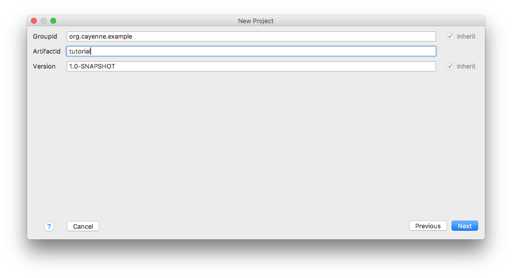

On next dialog screen you can customize directory for your project and click `Finish`. Now you should have a new empty project.

<a id="getting-started-guide--download-and-start-cayennemodeler"></a>
<a id="getting-started-guide--2.1.2.-download-and-start-cayennemodeler"></a>

#### 2.1.2. Download and Start CayenneModeler

Although later in this tutorial we’ll be using Maven to include Cayenne runtime jars in the project, you’ll still need to download Cayenne to get access to the CayenneModeler tool.

> [!NOTE]
> |  |  |
> | --- | --- |
> |  | If you are really into Maven, you can start CayenneModeler from Maven too. We’ll do it in a more traditional way here. |

Download the [latest release](https://cayenne.apache.org/download.html). Unpack the distribution somewhere in the file system and start CayenneModeler, following platform-specific instructions. On most platforms it is done simply by doubleclicking the Modeler icon. The welcome screen of the Modeler looks like this:

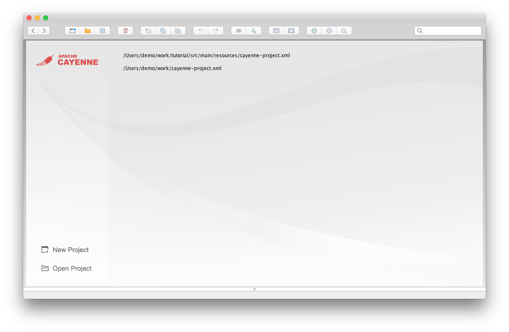

<a id="getting-started-guide--create-a-new-mapping-project-in-cayennemodeler"></a>
<a id="getting-started-guide--2.1.3.-create-a-new-mapping-project-in-cayennemodeler"></a>

#### 2.1.3. Create a New Mapping Project in CayenneModeler

Click on the `New Project` button on Welcome screen. A new mapping project will appear that contains a single **DataDomain**. The meaning of a DataDomain is explained elsewhere in the User Guide. For now it is sufficient to understand that DataDomain is the root of your mapping project.

<a id="getting-started-guide--create-a-datanode"></a>
<a id="getting-started-guide--2.1.4.-create-a-datanode"></a>

#### 2.1.4. Create a DataNode

The next project object you will create is a **DataNode**. DataNode is a descriptor of a single database your application will connect to. Cayenne mapping project can use more than one database, but for now, we’ll only use one. With "project" selected on the left, click on `Create DataNode` button  on the toolbar (or select `Project > Create DataNode` from the menu).

A new DataNode is displayed. Now you need to specify JDBC connection parameters. For an in-memory Derby database you can enter the following settings:

- JDBC Driver: `org.apache.derby.jdbc.EmbeddedDriver`
- DB URL: `jdbc:derby:memory:testdb;create=true`

> [!NOTE]
> |  |  |
> | --- | --- |
> |  | We are creating an in-memory database here. So when you stop your application, all the data will be lost. In most real-life cases you’ll be connecting to a database that actually persists its data on disk, but an in-memory DB will do for the simple tutorial. |

Also you will need to change "Schema Update Strategy". Select `org.apache.cayenne.access.dbsync.CreateIfNoSchemaStrategy` from the dropdown, so that Cayenne creates a new schema on Derby based on the ORM mapping when the application starts.

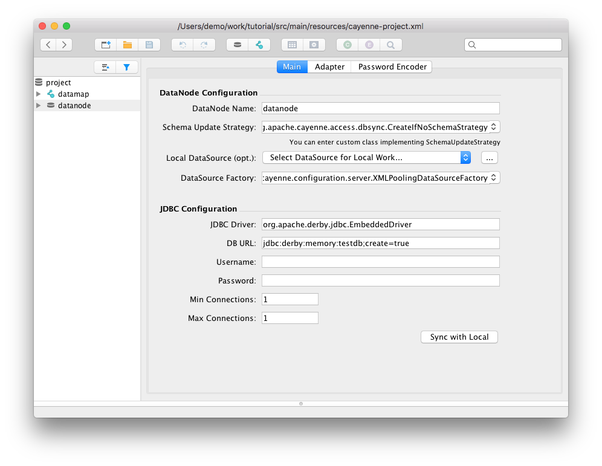

<a id="getting-started-guide--create-a-datamap"></a>
<a id="getting-started-guide--2.1.5.-create-a-datamap"></a>

#### 2.1.5. Create a DataMap

Now you will create a **DataMap**. DataMap is an object that holds all the mapping information. To create it, click on "Create DataMap" button  (or select a corresponding menu item). Note that the newly created DataMap is automatically linked to the DataNode that you created in the previous step. If there is more than one DataNode, you may need to link a DataMap to the correct node manually. In other words a DataMap within DataDomain must point to a database described by the map.

You can leave all the DataMap defaults unchanged except for one - "Java Package". Enter `org.example.cayenne.persistent`. This name will later be used for all persistent classes.

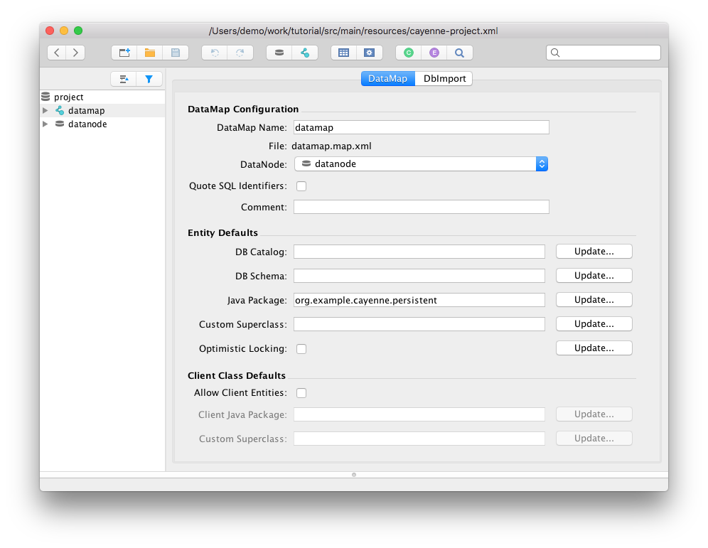

<a id="getting-started-guide--save-the-project"></a>
<a id="getting-started-guide--2.1.6.-save-the-project"></a>

#### 2.1.6. Save the Project

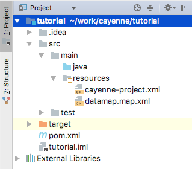

Before you proceed with the actual mapping, let’s save the project. Click on "Save" button in the toolbar and navigate to the `tutorial` IDEA project folder that was created earlier in this section and its `src/main/resources` subfolder and save the project there. Now go back to IDEA and you will see two Cayenne XML files.

Note that the location of the XML files is not coincidental. Cayenne runtime looks for `cayenne-*.xml` file in the application `CLASSPATH` and `src/main/resources` folder should already be a "class folder" in IDEA for our project (and is also a standard location that Maven would copy to a jar file, if we were using Maven from command-line).

<a id="getting-started-guide--getting-started-with-object-relational-mapping-orm"></a>
<a id="getting-started-guide--2.2.-getting-started-with-object-relational-mapping-orm"></a>

### 2.2. Getting started with Object Relational Mapping (ORM)

The goal of this section is to learn how to create a simple Object-Relational model with CayenneModeler. We will create a complete ORM model for the following database schema:

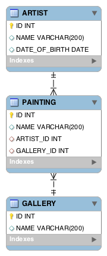

> [!NOTE]
> |  |  |
> | --- | --- |
> |  | Very often you’d have an existing database already, and it can be quickly imported in Cayenne via "Tools > Reengineer Database Schema". This will save you lots of time compared to manual mapping. However understanding how to create the mapping by hand is important, so we are showing the "manual" approach below. |

<a id="getting-started-guide--mapping-database-tables-and-columns"></a>
<a id="getting-started-guide--2.2.1.-mapping-database-tables-and-columns"></a>

#### 2.2.1. Mapping Database Tables and Columns

Lets go back to CayenneModeler where we have the newly created project open and start by adding the ARTIST table. Database tables are called **DbEntities** in Cayenne mapping (those can be actual tables or database views).

Select "datamap" on the left-hand side project tree and click "Create DbEntity" button  (or use "Project > Create DbEntity" menu). A new DbEntity is created. In "DbEntity Name" field enter "ARTIST". Then click on "Create Attribute" button  on the entity toolbar. This action changes the view to the "Attribute" tab and adds a new attribute (attribute means a "table column" in this case) called "untitledAttr". Let’s rename it to ID, make it an `INTEGER` and make it a PK:

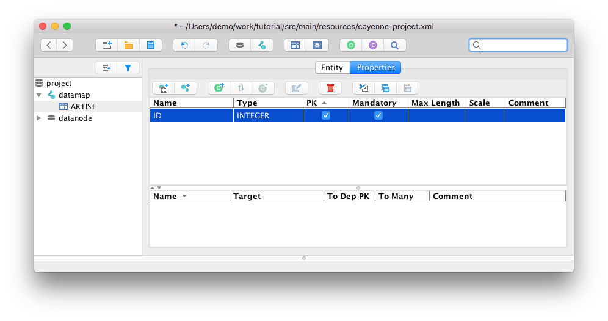

Similarly add NAME `VARCHAR(200)` and DATE\_OF\_BIRTH `DATE` attributes. After that repeat this procedure for PAINTING and GALLERY entities to match DB schema shown above.

<a id="getting-started-guide--mapping-database-relationships"></a>
<a id="getting-started-guide--2.2.2.-mapping-database-relationships"></a>

#### 2.2.2. Mapping Database Relationships

Now we need to specify relationships between ARTIST, PAINTING and GALLERY tables. Start by creating a one-to-many ARTIST/PAINTING relationship:

- Select the ARTIST DbEntity on the left and click on the "Properties" tab.
- Click on "Create Relationship" button on the entity toolbar  - relationship configuration dialog is presented.
- Choose the "Target" to be "Painting".
- Assign names for relationship and reverse relationship. This name can be anything (this is really a symbolic name of the database referential constraint), but it is recommended to use a valid Java identifier, as this will save some typing later. We’ll call the relationship "paintings" and reverse relationship "artist".
- Check "ToMany" checkbox for "paintings" relationship
- Click on "Add" button on the right to add a join
- Select "ID" column for the "Source" and "ARTIST\_ID" column for the target.
- Relationship information should now look like this:

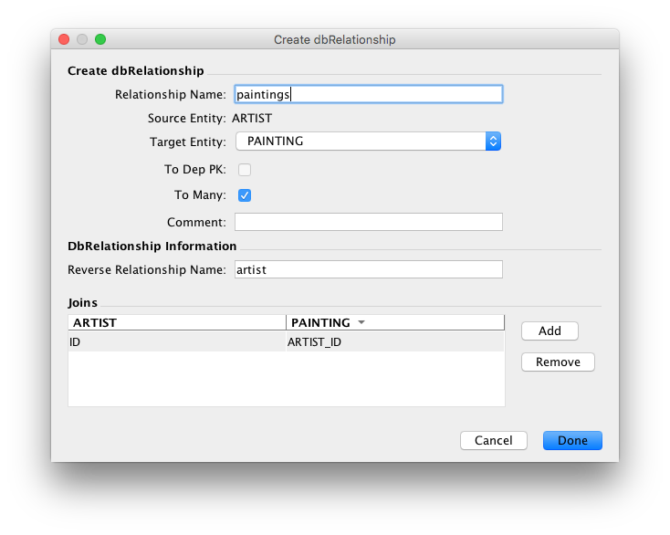

- Click "Done" to confirm the changes and close the dialog.
- Two complimentary relationships have been created - from ARTIST to PAINTING and back.
- Repeat the steps above to create a many-to-one relationship from PAINTING to GALLERY, calling the relationships pair "gallery" and "paintings".

<a id="getting-started-guide--mapping-java-classes"></a>
<a id="getting-started-guide--2.2.3.-mapping-java-classes"></a>

#### 2.2.3. Mapping Java Classes

Now that the database schema mapping is complete, CayenneModeler can create mappings of Java classes (aka "ObjEntities") by deriving everything from DbEntities. At present there is no way to do it for the entire DataMap in one click, so we’ll do it for each table individually.

- Select "ARTIST" DbEntity and click on "Create ObjEntity" button  either on the entity toolbar or on the main toolbar. An ObjEntity called "Artist" is created with a Java class field set to `org.example.cayenne.persistent.Artist`. The modeler transformed the database names to the Java-friendly names (e.g., if you click on the "Attributes" tab, you’ll see that "DATE\_OF\_BIRTH" column was converted to "dateOfBirth" Java class attribute).
- Select "GALLERY" DbEntity and click on "Create ObjEntity" button again - you’ll see a "Gallery" ObjEntity created.
- Finally, do the same thing for "PAINTING".

Now you need to synchronize relationships. Artist and Gallery entities were created when there was no related "Painting" entity, so their relationships were not set.

- Click on the "Artist" ObjEntity. Now click on "Sync ObjEntity with DbEntity" button on the toolbar  - you will see the "paintings" relationship appear.
- Do the same for the "Gallery" entity.

Unless you want to customize the Java class and property names (which you can do easily) the mapping is complete.

<a id="getting-started-guide--creating-java-classes"></a>
<a id="getting-started-guide--2.3.-creating-java-classes"></a>

### 2.3. Creating Java Classes

Here we’ll generate the Java classes from the model that was created in the previous section. CayenneModeler can be used to also generate the database schema, but since we specified “CreateIfNoSchemaStrategy” earlier when we created a DataNode, we’ll skip the database schema step. Still be aware that you can do it if you need to via "Tools > Create Database Schema".

<a id="getting-started-guide--creating-java-classes-2"></a>
<a id="getting-started-guide--2.3.1.-creating-java-classes"></a>

#### 2.3.1. Creating Java Classes

- Select your datamap in a project tree and open "Class Generation" tab.
- For "Type" select "Standard Persistent Objects", if it is not already selected.
- For the "Output Directory" select “src/main/java” folder under your IDEA project folder (this is a "peer" location to the `cayenne-*.xml` location we selected before).
- Select all object entities (unless they are already checked).
- Finally, click "Generate"

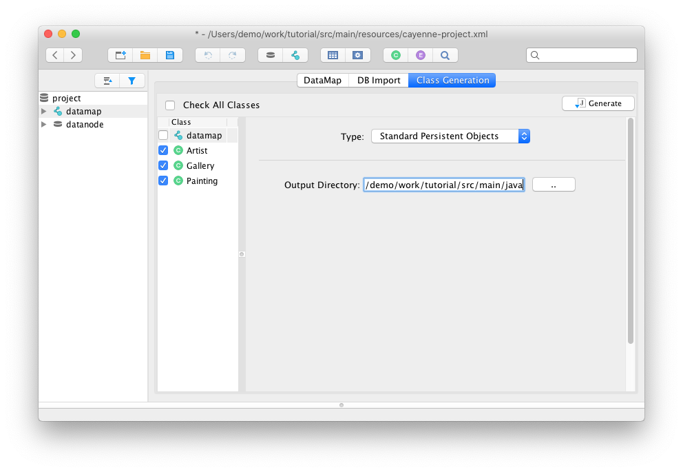

Now go back to IDEA - you should see pairs of classes generated for each mapped entity. You probably also see that there’s a bunch of red squiggles next to the newly generated Java classes in IDEA. This is because our project does not include Cayenne as a Maven dependency yet. Let’s fix it now by adding "cayenne-server" artifact in the bottom of the `pom.xml` file. Also we should tell Maven compile plugin that our project needs Java 8. The resulting POM should look like this:

```xml
<project xmlns="http://maven.apache.org/POM/4.0.0" xmlns:xsi="http://www.w3.org/2001/XMLSchema-instance"
        xsi:schemaLocation="http://maven.apache.org/POM/4.0.0 http://maven.apache.org/maven-v4_0_0.xsd">
    <modelVersion>4.0.0</modelVersion>
    <groupId>org.example.cayenne</groupId>
    <artifactId>tutorial</artifactId>
    <version>0.0.1-SNAPSHOT</version>

    <properties>
        <cayenne.version>4.2.3</cayenne.version> (1)
        <maven.compiler.source>1.8</maven.compiler.source> (2)
        <maven.compiler.target>1.8</maven.compiler.target>
    </properties>

    <dependencies>
        <dependency>
            <groupId>org.apache.cayenne</groupId>
            <artifactId>cayenne-server</artifactId>
            <version>${cayenne.version}</version>
        </dependency>
        <dependency>
            <groupId>org.slf4j</groupId>
            <artifactId>slf4j-simple</artifactId>
            <version>1.7.25</version>
        </dependency>
    </dependencies>
</project>
```

|  |  |
| --- | --- |
| **1** | Here you can specify the version of Cayenne you are actually using |
| **2** | Tell Maven to support Java 8 |

Your computer must be connected to the internet. Once you edit the `pom.xml`, IDEA will download the needed Cayenne jar file and add it to the project build path. As a result, all the errors should disappear. In tutorial for console output we use slf4j-simple logger implementation. Due to use SLF4J logger in Apache Cayenne, you can use your custom logger (e.g. log4j or commons-logging) through bridges.

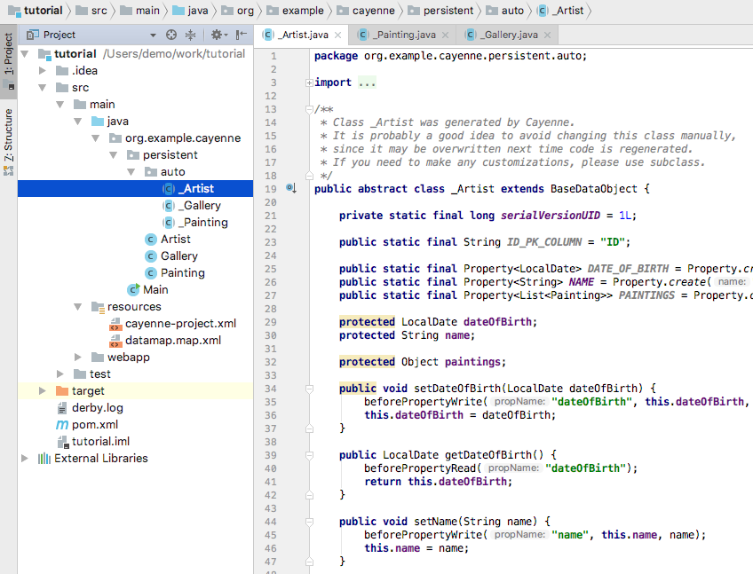

Now let’s check the entity class pairs. Each one is made of a superclass (e.g. `auto/_Artist`) and a subclass (e.g. `Artist`). You **should not** modify the superclasses whose names start with "\_" (underscore), as they will be replaced on subsequent generator runs. Instead all custom logic should be placed in the subclasses in `org.example.cayenne.persistent` package - those will never be overwritten by the class generator.

> [!TIP]
> |  |  |
> | --- | --- |
> |  | Class Generation Hint  Often you’d start by generating classes from the Modeler, but at the later stages of the project the generation is usually automated either via Ant cgen task or Maven cgen mojo. All three methods are interchangeable, however Ant and Maven methods would ensure that you never forget to regenerate classes on mapping changes, as they are integrated into the build cycle. |

<a id="getting-started-guide--learning-cayenne-api"></a>
<a id="getting-started-guide--3.-learning-cayenne-api"></a>

## 3. Learning Cayenne API

<a id="getting-started-guide--getting-started-with-objectcontext"></a>
<a id="getting-started-guide--3.1.-getting-started-with-objectcontext"></a>

### 3.1. Getting started with ObjectContext

In this section we’ll write a simple main class to run our application, and get a brief introduction to Cayenne ObjectContext.

<a id="getting-started-guide--creating-the-main-class"></a>
<a id="getting-started-guide--3.1.1.-creating-the-main-class"></a>

#### 3.1.1. Creating the Main Class

- In IDEA create a new class called “Main” in the “org.example.cayenne” package.
- Create a standard "main" method to make it a runnable class:

```java
package org.example.cayenne;

public class Main {

    public static void main(String[] args) {
    }
}
```

- The first thing you need to be able to access the database is to create a `ServerRuntime` object (which is essentially a wrapper around Cayenne stack) and use it to obtain an instance of an `ObjectContext`.

```java
package org.example.cayenne;

import org.apache.cayenne.ObjectContext;
import org.apache.cayenne.configuration.server.ServerRuntime;

public class Main {

    public static void main(String[] args) {
        ServerRuntime cayenneRuntime = ServerRuntime.builder()
                        .addConfig("cayenne-project.xml")
                        .build();
        ObjectContext context = cayenneRuntime.newContext();
    }
}
```

`ObjectContext` is an isolated "session" in Cayenne that provides all needed API to work with data. ObjectContext has methods to execute queries and manage persistent objects. We’ll discuss them in the following sections. When the first ObjectContext is created in the application, Cayenne loads XML mapping files and creates a shared access stack that is later reused by other ObjectContexts.

<a id="getting-started-guide--running-application"></a>
<a id="getting-started-guide--3.1.2.-running-application"></a>

#### 3.1.2. Running Application

Let’s check what happens when you run the application. But before we do that we need to add another dependency to the `pom.xml` - Apache Derby, our embedded database engine. The following piece of XML needs to be added to the `<dependencies>…</dependencies>` section, where we already have Cayenne jars:

```xml
<dependency>
   <groupId>org.apache.derby</groupId>
   <artifactId>derby</artifactId>
   <version>10.13.1.1</version>
</dependency>
```

Now we are ready to run. Right click the "Main" class in IDEA and select "Run 'Main.main()'".

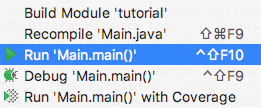

In the console you’ll see output similar to this, indicating that Cayenne stack has been started:

```
INFO: Loading XML configuration resource from file:/.../cayenne-project.xml
INFO: Loading XML DataMap resource from file:/.../datamap.map.xml
INFO: loading user name and password.
INFO: Connecting to 'jdbc:derby:memory:testdb;create=true' as 'null'
INFO: +++ Connecting: SUCCESS.
INFO: setting DataNode 'datanode' as default, used by all unlinked DataMaps</screen>
```

<a id="getting-started-guide--how-to-configure-cayenne-logging"></a>
<a id="getting-started-guide--3.1.3.-how-to-configure-cayenne-logging"></a>

#### 3.1.3. How to Configure Cayenne Logging

Follow the instructions in the logging chapter to tweak verbosity of the logging output.

<a id="getting-started-guide--getting-started-with-persistent-objects"></a>
<a id="getting-started-guide--3.2.-getting-started-with-persistent-objects"></a>

### 3.2. Getting started with persistent objects

In this chapter we’ll learn about persistent objects, how to customize them and how to create and save them in DB.

<a id="getting-started-guide--inspecting-and-customizing-persistent-objects"></a>
<a id="getting-started-guide--3.2.1.-inspecting-and-customizing-persistent-objects"></a>

#### 3.2.1. Inspecting and Customizing Persistent Objects

Persistent classes in Cayenne implement a DataObject interface. If you inspect any of the classes generated earlier in this tutorial (e.g. `org.example.cayenne.persistent.Artist`), you’ll see that it extends a class with the name that starts with underscore (`org.example.cayenne.persistent.auto._Artist`), which in turn extends from `org.apache.cayenne.CayenneDataObject`. Splitting each persistent class into user-customizable subclass (`Xyz`) and a generated superclass (`_Xyz`) is a useful technique to avoid overwriting the custom code when refreshing classes from the mapping model.

Let’s for instance add a utility method to the Artist class that sets Artist date of birth, taking a string argument for the date. It will be preserved even if the model changes later:

```java
public class Artist extends _Artist {

    static final String DEFAULT_DATE_FORMAT = "yyyyMMdd";

    /**
     * Sets date of birth using a string in format yyyyMMdd.
     */
    public void setDateOfBirthString(String yearMonthDay) {
        if (yearMonthDay == null) {
            setDateOfBirth(null);
            return;
        }

        LocalDate date;
        try {
            DateTimeFormatter formatter = DateTimeFormatter
                    .ofPattern(DEFAULT_DATE_FORMAT);
            date = LocalDate.parse(yearMonthDay, formatter);
        } catch (DateTimeParseException e) {
            throw new IllegalArgumentException(
                    "A date argument must be in format '"
                            + DEFAULT_DATE_FORMAT + "': " + yearMonthDay);
        }
        setDateOfBirth(date);
    }
}
```

<a id="getting-started-guide--create-new-objects"></a>
<a id="getting-started-guide--3.2.2.-create-new-objects"></a>

#### 3.2.2. Create New Objects

Now we’ll create a bunch of objects and save them to the database. An object is created and registered with `ObjectContext` using “newObject” method. Objects **must** be registered with `DataContext` to be persisted and to allow setting relationships with other objects. Add this code to the "main" method of the Main class:

```java
Artist picasso = context.newObject(Artist.class);
picasso.setName("Pablo Picasso");
picasso.setDateOfBirthString("18811025");
```

Note that at this point "picasso" object is only stored in memory and is not saved in the database. Let’s continue by adding a Metropolitan Museum “Gallery” object and a few Picasso "Paintings":

```java
Gallery metropolitan = context.newObject(Gallery.class);
metropolitan.setName("Metropolitan Museum of Art");
Painting girl = context.newObject(Painting.class);
girl.setName("Girl Reading at a Table");
Painting stein = context.newObject(Painting.class);
stein.setName("Gertrude Stein");
```

Now we can link the objects together, establishing relationships. Note that in each case below relationships are automatically established in both directions (e.g. `picasso.addToPaintings(girl)` has exactly the same effect as `girl.setToArtist(picasso)`).

```java
picasso.addToPaintings(girl);
picasso.addToPaintings(stein);
girl.setGallery(metropolitan);
stein.setGallery(metropolitan);
```

Now lets save all five new objects, in a single method call:

```java
context.commitChanges();
```

Now you can run the application again as described in the previous chapter. The new output will show a few actual DB operations:

```
...
INFO: --- transaction started.
INFO: No schema detected, will create mapped tables
INFO: CREATE TABLE GALLERY (ID INTEGER NOT NULL, NAME VARCHAR (200), PRIMARY KEY (ID))
INFO: CREATE TABLE ARTIST (DATE_OF_BIRTH DATE, ID INTEGER NOT NULL, NAME VARCHAR (200), PRIMARY KEY (ID))
INFO: CREATE TABLE PAINTING (ARTIST_ID INTEGER, GALLERY_ID INTEGER, ID INTEGER NOT NULL,
      NAME VARCHAR (200), PRIMARY KEY (ID))
INFO: ALTER TABLE PAINTING ADD FOREIGN KEY (ARTIST_ID) REFERENCES ARTIST (ID)
INFO: ALTER TABLE PAINTING ADD FOREIGN KEY (GALLERY_ID) REFERENCES GALLERY (ID)
INFO: CREATE TABLE AUTO_PK_SUPPORT (
      TABLE_NAME CHAR(100) NOT NULL,  NEXT_ID BIGINT NOT NULL,  PRIMARY KEY(TABLE_NAME))
INFO: DELETE FROM AUTO_PK_SUPPORT WHERE TABLE_NAME IN ('ARTIST', 'GALLERY', 'PAINTING')
INFO: INSERT INTO AUTO_PK_SUPPORT (TABLE_NAME, NEXT_ID) VALUES ('ARTIST', 200)
INFO: INSERT INTO AUTO_PK_SUPPORT (TABLE_NAME, NEXT_ID) VALUES ('GALLERY', 200)
INFO: INSERT INTO AUTO_PK_SUPPORT (TABLE_NAME, NEXT_ID) VALUES ('PAINTING', 200)
INFO: SELECT NEXT_ID FROM AUTO_PK_SUPPORT WHERE TABLE_NAME = ? FOR UPDATE [bind: 1:'ARTIST']
INFO: SELECT NEXT_ID FROM AUTO_PK_SUPPORT WHERE TABLE_NAME = ? FOR UPDATE [bind: 1:'GALLERY']
INFO: SELECT NEXT_ID FROM AUTO_PK_SUPPORT WHERE TABLE_NAME = ? FOR UPDATE [bind: 1:'PAINTING']
INFO: INSERT INTO GALLERY (ID, NAME) VALUES (?, ?)
INFO: [batch bind: 1->ID:200, 2->NAME:'Metropolitan Museum of Art']
INFO: === updated 1 row.
INFO: INSERT INTO ARTIST (DATE_OF_BIRTH, ID, NAME) VALUES (?, ?, ?)
INFO: [batch bind: 1->DATE_OF_BIRTH:'1881-10-25 00:00:00.0', 2->ID:200, 3->NAME:'Pablo Picasso']
INFO: === updated 1 row.
INFO: INSERT INTO PAINTING (ARTIST_ID, GALLERY_ID, ID, NAME) VALUES (?, ?, ?, ?)
INFO: [batch bind: 1->ARTIST_ID:200, 2->GALLERY_ID:200, 3->ID:200, 4->NAME:'Gertrude Stein']
INFO: [batch bind: 1->ARTIST_ID:200, 2->GALLERY_ID:200, 3->ID:201, 4->NAME:'Girl Reading at a Table']
INFO: === updated 2 rows.
INFO: +++ transaction committed.
```

So first Cayenne creates the needed tables (remember, we used “CreateIfNoSchemaStrategy”). Then it runs a number of inserts, generating primary keys on the fly. Not bad for just a few lines of code.

<a id="getting-started-guide--selecting-objects"></a>
<a id="getting-started-guide--3.3.-selecting-objects"></a>

### 3.3. Selecting Objects

This chapter shows how to select objects from the database using `ObjectSelect` query.

<a id="getting-started-guide--introducing-objectselect"></a>
<a id="getting-started-guide--3.3.1.-introducing-objectselect"></a>

#### 3.3.1. Introducing ObjectSelect

It was shown before how to persist new objects. Cayenne queries are used to access already saved objects. The primary query type used for selecting objects is `ObjectSelect`. It can be mapped in CayenneModeler or created via the API. We’ll use the latter approach in this section. We don’t have too much data in the database yet, but we can still demonstrate the main principles below.

- Select all paintings (the code, and the log output it generates):

```java
List<Painting> paintings1 = ObjectSelect.query(Painting.class).select(context);
```

```
INFO: SELECT t0.GALLERY_ID, t0.ARTIST_ID, t0.NAME, t0.ID FROM PAINTING t0
INFO: === returned 2 rows. - took 18 ms.
```

- Select paintings that start with “gi”, ignoring case:

```java
List<Painting> paintings2 = ObjectSelect.query(Painting.class)
        .where(Painting.NAME.likeIgnoreCase("gi%")).select(context);
```

```
INFO: SELECT t0.GALLERY_ID, t0.NAME, t0.ARTIST_ID, t0.ID FROM PAINTING t0 WHERE UPPER(t0.NAME) LIKE UPPER(?)
  [bind: 1->NAME:'gi%'] - prepared in 6 ms.
INFO: === returned 1 row. - took 18 ms.
```

- Select all paintings done by artists who were born more than a 100 years ago:

```java
List<Painting> paintings3 = ObjectSelect.query(Painting.class)
        .where(Painting.ARTIST.dot(Artist.DATE_OF_BIRTH).lt(LocalDate.of(1900,1,1)))
        .select(context);
```

```
INFO: SELECT t0.GALLERY_ID, t0.NAME, t0.ARTIST_ID, t0.ID FROM PAINTING t0 JOIN ARTIST t1 ON (t0.ARTIST_ID = t1.ID)
  WHERE t1.DATE_OF_BIRTH < ? [bind: 1->DATE_OF_BIRTH:'1911-01-01 00:00:00.493'] - prepared in 7 ms.
INFO: === returned 2 rows. - took 25 ms.
```

<a id="getting-started-guide--deleting-objects"></a>
<a id="getting-started-guide--3.4.-deleting-objects"></a>

### 3.4. Deleting Objects

This chapter explains how to model relationship delete rules and how to delete individual objects as well as sets of objects. Also demonstrated the use of Cayenne class to run a query.

<a id="getting-started-guide--setting-up-delete-rules"></a>
<a id="getting-started-guide--3.4.1.-setting-up-delete-rules"></a>

#### 3.4.1. Setting Up Delete Rules

Before we discuss the API for object deletion, lets go back to CayenneModeler and set up some delete rules. Doing this is optional but will simplify correct handling of the objects related to deleted objects. In the Modeler go to "Artist" ObjEntity, "Relationships" tab and select "Cascade" for the "paintings" relationship delete rule:

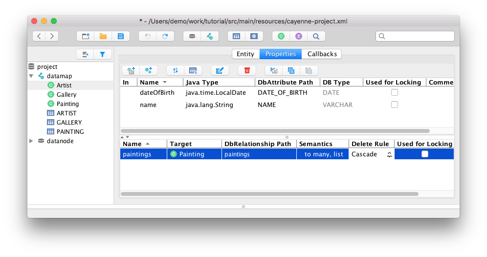

Repeat this step for other relationships:

- For Gallery set "paintings" relationship to be "Nullify", as a painting can exist without being displayed in a gallery.
- For Painting set both relationships rules to "Nullify".

Now save the mapping.

<a id="getting-started-guide--deleting-objects-2"></a>
<a id="getting-started-guide--3.4.2.-deleting-objects"></a>

#### 3.4.2. Deleting Objects

While deleting objects is possible via SQL, qualifying a delete on one or more IDs, a more common way in Cayenne (or ORM in general) is to get a hold of the object first, and then delete it via the context. Let’s use utility class Cayenne to find an artist:

```java
Artist picasso = ObjectSelect.query(Artist.class)
            .where(Artist.NAME.eq("Pablo Picasso")).selectOne(context);
```

Now let’s delete the artist:

```java
if (picasso != null) {
    context.deleteObject(picasso);
    context.commitChanges();
}
```

Since we set up "Cascade" delete rule for the Artist.paintings relationships, Cayenne will automatically delete all paintings of this artist. So when your run the app you’ll see this output:

```
INFO: SELECT t0.DATE_OF_BIRTH, t0.NAME, t0.ID FROM ARTIST t0
  WHERE t0.NAME = ? [bind: 1->NAME:'Pablo Picasso'] - prepared in 6 ms.
INFO: === returned 1 row. - took 18 ms.
INFO: +++ transaction committed.
INFO: --- transaction started.
INFO: DELETE FROM PAINTING WHERE ID = ?
INFO: [batch bind: 1->ID:200]
INFO: [batch bind: 1->ID:201]
INFO: === updated 2 rows.
INFO: DELETE FROM ARTIST WHERE ID = ?
INFO: [batch bind: 1->ID:200]
INFO: === updated 1 row.
INFO: +++ transaction committed.
```

<a id="getting-started-guide--converting-to-web-application"></a>
<a id="getting-started-guide--4.-converting-to-web-application"></a>

## 4. Converting to Web Application

This chapter shows how to work with Cayenne in a web application.

<a id="getting-started-guide--converting-tutorial-to-a-web-application"></a>
<a id="getting-started-guide--4.1.-converting-tutorial-to-a-web-application"></a>

### 4.1. Converting Tutorial to a Web Application

The web part of the web application tutorial is done in JSP, which is the least common denominator of the Java web technologies, and is intentionally simplistic from the UI perspective, to concentrate on Cayenne integration aspect, rather than the interface. A typical Cayenne web application works like this:

- Cayenne configuration is loaded when an application context is started, using a special servlet filter.
- User requests are intercepted by the filter, and the DataContext is bound to the request thread, so the application can access it easily from anywhere.
- The same DataContext instance is reused within a single user session; different sessions use different DataContexts (and therefore different sets of objects). *The context can be scoped differently depending on the app specifics. For the tutorial we’ll be using a session-scoped context.*

So let’s convert the tutorial that we created to a web application:

- In IDEA under "tutorial" project folder create a new folder `src/main/webapp/WEB-INF`.
- Under `WEB-INF` create a new file `web.xml` (a standard web app descriptor):

web.xml

```xml
<?xml version="1.0" encoding="utf-8"?>
<!DOCTYPE web-app
   PUBLIC "-//Sun Microsystems, Inc.//DTD Web Application 2.3//EN"
  "http://java.sun.com/dtd/web-app_2_3.dtd">
<web-app>
    <display-name>Cayenne Tutorial</display-name>

    <!-- This filter bootstraps ServerRuntime and then provides each request thread
         with a session-bound DataContext. Note that the name of the filter is important,
         as it points it to the right named configuration file.
    -->
    <filter>
        <filter-name>cayenne-project</filter-name>
        <filter-class>org.apache.cayenne.configuration.web.CayenneFilter</filter-class>
    </filter>
    <filter-mapping>
        <filter-name>cayenne-project</filter-name>
        <url-pattern>/*</url-pattern>
    </filter-mapping>
    <welcome-file-list>
        <welcome-file>index.jsp</welcome-file>
    </welcome-file-list>
</web-app>
```

- Create the artist browser page `src/main/webapp/index.jsp` file with the following contents:

webapp/index.jsp

```jsp
<%@ page language="java" contentType="text/html" %>
<%@ page import="org.example.cayenne.persistent.*" %>
<%@ page import="org.apache.cayenne.*" %>
<%@ page import="org.apache.cayenne.query.*" %>
<%@ page import="org.apache.cayenne.exp.*" %>
<%@ page import="java.util.*" %>

<%
    ObjectContext context = BaseContext.getThreadObjectContext();
    List<Artist> artists = ObjectSelect.query(Artist.class)
                .orderBy(Artist.NAME.asc())
                .select(context);
%>

<html>
    <head>
        <title>Main</title>
    </head>
    <body>
        <h2>Artists:</h2>

        <% if(artists.isEmpty()) {%>
        <p>No artists found</p>
        <% } else {
               for(Artist a : artists) {
        %>
        <p><a href="detail.jsp?id=<%=Cayenne.intPKForObject(a)%>"> <%=a.getName()%> </a></p>
        <%
               }
           } %>
        <hr>
        <p><a href="detail.jsp">Create new artist...</a></p>
    </body>
</html>
```

- Create the artist editor page `src/main/webapp/detail.jsp` with the following content:

webapp/detail.jsp

```jsp
<%@ page language="java" contentType="text/html" %>
<%@ page import="org.example.cayenne.persistent.*" %>
<%@ page import="org.apache.cayenne.*" %>
<%@ page import="org.apache.cayenne.query.*" %>
<%@ page import="java.util.*" %>
<%@ page import="java.text.*" %>
<%@ page import="java.time.format.DateTimeFormatter" %>

<%
    ObjectContext context = BaseContext.getThreadObjectContext();
    String id = request.getParameter("id");

    // find artist for id
    Artist artist = null;
    if(id != null &amp;&amp; id.trim().length() > 0) {
        artist = SelectById.query(Artist.class, Integer.parseInt(id)).selectOne(context);
    }

    if("POST".equals(request.getMethod())) {
        // if no id is saved in the hidden field, we are dealing with
        // create new artist request
        if(artist == null) {
            artist = context.newObject(Artist.class);
        }

        // note that in a real application we would so dome validation ...
        // here we just hope the input is correct
        artist.setName(request.getParameter("name"));
        artist.setDateOfBirthString(request.getParameter("dateOfBirth"));

        context.commitChanges();

        response.sendRedirect("index.jsp");
    }

    if(artist == null) {
        // create transient artist for the form response rendering
        artist = new Artist();
    }

    String name = artist.getName() == null ? "" : artist.getName();

    DateTimeFormatter formatter = DateTimeFormatter.ofPattern("yyyyMMdd");
    String dob = artist.getDateOfBirth() == null
                        ? "" :artist.getDateOfBirth().format(formatter);
%>
<html>
    <head>
        <title>Artist Details</title>
    </head>
    <body>
        <h2>Artists Details</h2>
        <form name="EditArtist" action="detail.jsp" method="POST">
            <input type="hidden" name="id" value="<%= id != null ? id : "" %>" />
            <table border="0">
                <tr>
                    <td>Name:</td>
                    <td><input type="text" name="name" value="<%= name %>"/></td>
                </tr>
                <tr>
                    <td>Date of Birth (yyyyMMdd):</td>
                    <td><input type="text" name="dateOfBirth" value="<%= dob %>"/></td>
                </tr>
                <tr>
                    <td></td>
                    <td align="right"><input type="submit" value="Save" /></td>
                </tr>
            </table>
        </form>
    </body>
</html>
```

<a id="getting-started-guide--running-web-application"></a>
<a id="getting-started-guide--4.1.1.-running-web-application"></a>

#### 4.1.1. Running Web Application

We need to add cayenne-web module and javax servlet-api for our application.

pom.xml

```xml
<dependency>
    <groupId>org.apache.cayenne</groupId>
    <artifactId>cayenne-web</artifactId>
    <version>${cayenne.version}</version>
</dependency>
<dependency>
    <groupId>javax.servlet</groupId>
    <artifactId>javax.servlet-api</artifactId>
    <version>3.1.0</version>
    <scope>provided</scope>
</dependency>
```

Also to run the web application we’ll use "maven-jetty-plugin". To activate it, let’s add the following piece of code to the `pom.xml` file, following the "dependencies" section and save the POM:

pom.xml

```xml
<build>
    <plugins>
        <plugin>
            <groupId>org.eclipse.jetty</groupId>
            <artifactId>jetty-maven-plugin</artifactId>
            <version>9.4.8.v20171121</version>
        </plugin>
    </plugins>
</build>
```

- Go to "Select Run/Debug Configuration" menu, and then "Edit Configuration…"

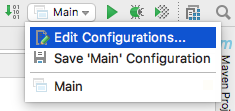

- Click `+` button and select "Maven". Enter "Name" and "Command line" as shown on screenshot:

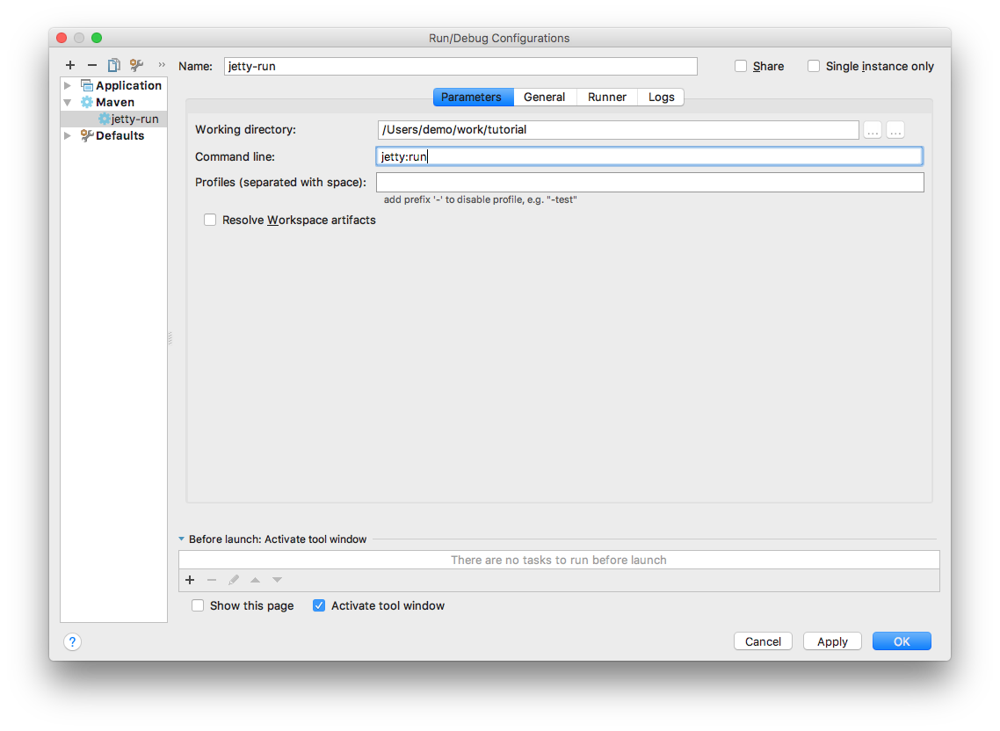

- Click "Apply" and "Run". On the first execution it may take a few minutes for Jetty plugin to download all dependencies, but eventually you’ll see the logs like this:


```
[INFO] ------------------------------------------------------------------------
[INFO] Building tutorial 0.0.1-SNAPSHOT
[INFO] ------------------------------------------------------------------------
...
[INFO] Configuring Jetty for project: tutorial
[INFO] webAppSourceDirectory not set. Trying src/main/webapp
[INFO] Reload Mechanic: automatic
[INFO] Classes = /.../tutorial/target/classes
[INFO] Logging initialized @1617ms
[INFO] Context path = /
[INFO] Tmp directory = /.../tutorial/target/tmp
[INFO] Web defaults = org/eclipse/jetty/webapp/webdefault.xml
[INFO] Web overrides =  none
[INFO] web.xml file = file:/.../tutorial/src/main/webapp/WEB-INF/web.xml
[INFO] Webapp directory = /.../tutorial/src/main/webapp
[INFO] jetty-9.3.0.v20150612
[INFO] Started o.e.j.m.p.JettyWebAppContext@6872f9c8{/,file:/.../tutorial/src/main/webapp/,AVAILABLE}{file:/.../tutorial/src/main/webapp/}
[INFO] Started ServerConnector@723875bc{HTTP/1.1,[http/1.1]}{0.0.0.0:8080}
[INFO] Started @2367ms
[INFO] Started Jetty Server</screen>
```

- So the Jetty container just started.
- Now go to <http://localhost:8080/> URL. You should see "No artists found message" in the web browser and the following output in the IDEA console:


```
INFO: Loading XML configuration resource from file:/.../tutorial/target/classes/cayenne-project.xml
INFO: loading user name and password.
INFO: Connecting to 'jdbc:derby:memory:testdb;create=true' as 'null'
INFO: +++ Connecting: SUCCESS.
INFO: setting DataNode 'datanode' as default, used by all unlinked DataMaps
INFO: Detected and installed adapter: org.apache.cayenne.dba.derby.DerbyAdapter
INFO: --- transaction started.
INFO: No schema detected, will create mapped tables
INFO: CREATE TABLE GALLERY (ID INTEGER NOT NULL, NAME VARCHAR (200), PRIMARY KEY (ID))
INFO: CREATE TABLE ARTIST (DATE_OF_BIRTH DATE, ID INTEGER NOT NULL, NAME VARCHAR (200), PRIMARY KEY (ID))
INFO: CREATE TABLE PAINTING (ARTIST_ID INTEGER, GALLERY_ID INTEGER, ID INTEGER NOT NULL,
      NAME VARCHAR (200), PRIMARY KEY (ID))
INFO: ALTER TABLE PAINTING ADD FOREIGN KEY (ARTIST_ID) REFERENCES ARTIST (ID)
INFO: ALTER TABLE PAINTING ADD FOREIGN KEY (GALLERY_ID) REFERENCES GALLERY (ID)
INFO: CREATE TABLE AUTO_PK_SUPPORT (
      TABLE_NAME CHAR(100) NOT NULL,  NEXT_ID BIGINT NOT NULL,  PRIMARY KEY(TABLE_NAME))
...
INFO: SELECT t0.DATE_OF_BIRTH, t0.NAME, t0.ID FROM ARTIST t0 ORDER BY t0.NAME
INFO: === returned 0 rows. - took 17 ms.
INFO: +++ transaction committed.</screen>
```

- You can click on "Create new artist" link to create artists. Existing artists can be edited by clicking on their name:

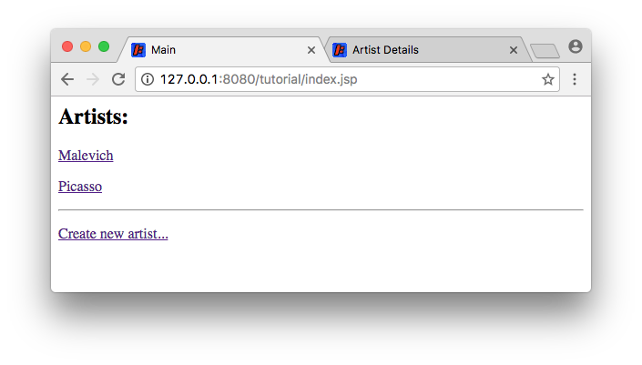

You are done with the tutorial!


---

<a id="cayenne-guide"></a>

<!-- source_url: https://cayenne.apache.org/docs/4.2/cayenne-guide/ -->

<!-- page_index: 2 -->

<a id="cayenne-guide--object-relational-mapping-with-cayenne"></a>
<a id="cayenne-guide--1.-object-relational-mapping-with-cayenne"></a>

## 1. Object Relational Mapping with Cayenne

<a id="cayenne-guide--setup"></a>
<a id="cayenne-guide--1.1.-setup"></a>

### 1.1. Setup

<a id="cayenne-guide--system-requirements"></a>
<a id="cayenne-guide--1.1.1.-system-requirements"></a>

#### 1.1.1. System Requirements

- Java: Cayenne runtime framework and CayenneModeler GUI tool are written in 100% Java, and run on any Java-compatible platform. Minimal required JDK version depends on the version of Cayenne you are using, as shown in the following table:

Table 1. Cayenne Version History

| Cayenne Version | Java Version | Status |
| --- | --- | --- |
| 4.2 | Java 8 or newer | Stable |
| 4.1 | Java 8 or newer | Stable |
| 4.0 | Java 1.7 — Java 11 | Aging |
| 3.0 / 3.1 | Java 1.5 — Java 1.8 | Legacy |
| 1.2 / 2.0 | Java 1.4 | Legacy |
| 1.1 | Java 1.3 | Legacy |

- JDBC Driver: An appropriate DB-specific JDBC driver is needed to access the database. It can be included in the application or used in web container DataSource configuration.
- Third-party Libraries: Cayenne runtime framework has a minimal set of required and a few more optional dependencies on third-party open source packages. See [Including Cayenne in a Project](#cayenne-guide--including-cayenne-in-project) chapter for details.

<a id="cayenne-guide--runmodeler"></a>
<a id="cayenne-guide--1.1.2.-running-cayennemodeler"></a>

#### 1.1.2. Running CayenneModeler

CayenneModeler GUI tool is intended to work with object relational mapping projects. While you can edit your XML by hand, it is rarely needed, as the Modeler is a pretty advanced tool included in Cayenne distribution. To obtain CayenneModeler, download Cayenne distribution archive from <https://cayenne.apache.org/download.html> matching the OS you are using. Of course Java needs to be installed on the machine where you are going to run the Modeler.

- OS X distribution contains CayenneModeler.app at the root of the distribution disk image.
- Windows distribution contains CayenneModeler.exe file in the bin directory.
- Cross-platform distribution (targeting Linux, but as the name implies, compatible with any OS) contains a runnable CayenneModeler.jar in the bin directory. It can be executed either by double-clicking, or if the environment is not configured to execute jars, by running from command-line:

```
$ java -jar CayenneModeler.jar
```

The Modeler can also be started from Maven. While it may look like an exotic way to start a GUI application, it has its benefits - no need to download Cayenne distribution, the version of the Modeler always matches the version of the framework, the plugin can find mapping files in the project automatically. So it is an attractive option to some developers. Maven option requires a declaration in the POM:

```xml
<build>
    <plugins>
        <plugin>
            <groupId>org.apache.cayenne.plugins</groupId>
            <artifactId>cayenne-modeler-maven-plugin</artifactId>
            <version>4.2.3</version>
        </plugin>
    </plugins>
</build>
```

And then can be run as

```
$ mvn cayenne-modeler:run
```

<table class="tableblock frame-all grid-all stretch table table-bordered" id="pluginParameteres">
<caption>
      Table 2. Modeler plugin parameters
     </caption>
<colgroup>
<col/>
<col/>
<col/>
</colgroup>
<thead>
<tr>
<th>Name</th>
<th>Type</th>
<th>Description</th>
</tr>
</thead>
<tbody>
<tr>
<td>
<p>modelFile</p></td>
<td>
<p>File</p></td>
<td>
<div>
<div>
<p>Name of the model file to open. Here is some simple example:</p>
</div>
<div>
<div>
<pre><code><span>&lt;plugin&gt;</span>
    <span>&lt;groupId&gt;</span>org.apache.cayenne.plugins<span>&lt;/groupId&gt;</span>
    <span>&lt;artifactId&gt;</span>cayenne-modeler-maven-plugin<span>&lt;/artifactId&gt;</span>
    <span>&lt;version&gt;</span>${cayenne.version}<span>&lt;/version&gt;</span>
    <span>&lt;configuration&gt;</span>
        <span>&lt;modelFile&gt;</span>src/main/resources/cayenne.xml<span>&lt;/modelFile&gt;</span>
    <span>&lt;/configuration&gt;</span>
<span>&lt;/plugin&gt;</span></code></pre>
</div>
</div>
</div></td>
</tr>
</tbody>
</table>

<a id="cayenne-guide--cayenne-mapping-structure"></a>
<a id="cayenne-guide--1.2.-cayenne-mapping-structure"></a>

### 1.2. Cayenne Mapping Structure

<a id="cayenne-guide--cayenne-project"></a>
<a id="cayenne-guide--1.2.1.-cayenne-project"></a>

#### 1.2.1. Cayenne Project

A Cayenne project is an XML representation of a model connecting database schema with Java classes. A project is normally created and manipulated via CayenneModeler GUI and then used to initialize Cayenne runtime. A project is made of one or more files. There’s always a root project descriptor file in any valid project. It is normally called cayenne-xyz.xml, where "xyz" is the name of the project.

Project descriptor can reference DataMap files, one per DataMap. DataMap files are normally called xyz.map.xml, where "xyz" is the name of the DataMap. For legacy reasons this naming convention is different from the convention for the root project descriptor above, and we may align it in the future versions. Here is how a typical project might look on the file system:

```
$ ls -l total 24 -rw-r--r-- 1 cayenne staff 491 Jan 28 18:25 cayenne-project.xml -rw-r--r-- 1 cayenne staff 313 Jan 28 18:25 datamap.map.xml
```

DataMap are referenced by name in the root descriptor:

```xml
<map name="datamap"/>
```

Map files are resolved by Cayenne by appending ".map.xml" extension to the map name, and resolving the resulting string relative to the root descriptor URI. The following sections discuss various ORM model objects, without regards to their XML representation. XML format details are really unimportant to the Cayenne users.

<a id="cayenne-guide--datamap"></a>
<a id="cayenne-guide--1.2.2.-datamap"></a>

#### 1.2.2. DataMap

DataMap is a container of persistent entities and other object-relational metadata. DataMap provides developers with a scope to organize their entities, but it does not provide a namespace for entities. In fact all DataMaps present in runtime are combined in a single namespace. Each DataMap must be associated with a DataNode. This is how Cayenne knows which database to use when running a query.

<a id="cayenne-guide--datanode"></a>
<a id="cayenne-guide--1.2.3.-datanode"></a>

#### 1.2.3. DataNode

DataNode is model of a database. It is actually pretty simple. It has an arbitrary user-provided name and information needed to create or locate a JDBC DataSource. Most projects only have one DataNode, though there may be any number of nodes if needed.

<a id="cayenne-guide--dbentity"></a>
<a id="cayenne-guide--1.2.4.-dbentity"></a>

#### 1.2.4. DbEntity

DbEntity is a model of a single DB table or view. DbEntity is made of DbAttributes that correspond to columns, and DbRelationships that map PK/FK pairs. DbRelationships are not strictly tied to FK constraints in DB, and should be mapped for all logical "relationships" between the tables.

<a id="cayenne-guide--objentity"></a>
<a id="cayenne-guide--1.2.5.-objentity"></a>

#### 1.2.5. ObjEntity

ObjEntity is a model of a single persistent Java class. ObjEntity is made of ObjAttributes and ObjRelationships. Both correspond to entity class properties. However ObjAttributes represent "simple" properties (normally things like String, numbers, dates, etc.), while ObjRelationships correspond to properties that have a type of another entity.

ObjEntity maps to one or more DbEntities. There’s always one "root" DbEntity for each ObjEntity. ObjAttribiute maps to a DbAttribute or an Embeddable. Most often mapped DbAttribute is from the root DbEntity. Sometimes mapping is done to a DbAttribute from another DbEntity somehow related to the root DbEntity. Such ObjAttribute is called "flattened". Similarly ObjRelationship maps either to a single DbRelationship, or to a chain of DbRelationships ("flattened" ObjRelationship).

ObjEntities may also contain mapping of their lifecycle callback methods.

<a id="cayenne-guide--embeddable"></a>
<a id="cayenne-guide--1.2.6.-embeddable"></a>

#### 1.2.6. Embeddable

Embeddable is a model of a Java class that acts as a single attribute of an ObjEntity, but maps to multiple columns in the database.

<a id="cayenne-guide--procedure"></a>
<a id="cayenne-guide--1.2.7.-procedure"></a>

#### 1.2.7. Procedure

A model of a stored procedure in the database.

<a id="cayenne-guide--query"></a>
<a id="cayenne-guide--1.2.8.-query"></a>

#### 1.2.8. Query

A model of a query. Cayenne allows queries to be mapped in Cayenne project, or created in the code. Depending on the circumstances the users may take one or the other approach.

<a id="cayenne-guide--cayenne-modeler"></a>
<a id="cayenne-guide--1.3.-cayennemodeler-application"></a>

### 1.3. CayenneModeler Application

<a id="cayenne-guide--reverse-engineering-database"></a>
<a id="cayenne-guide--1.3.1.-reverse-engineering-database"></a>

#### 1.3.1. Reverse Engineering Database

See chapter [Reverse Engineering in Cayenne Modeler](#cayenne-guide--re-modeler)

<a id="cayenne-guide--generating-database-schema"></a>
<a id="cayenne-guide--1.3.2.-generating-database-schema"></a>

#### 1.3.2. Generating Database Schema

With Cayenne Modeler you can create simple database schemas without any additional database tools. This is a good option for initial database setup if you completely created you model with the Modeler. You can start SQL schema generation by selecting menu **Tools > Generate Database Schema**

You can select what database parts should be generated and what tables you want

<a id="cayenne-guide--generating-java-classes"></a>
<a id="cayenne-guide--1.3.3.-generating-java-classes"></a>

#### 1.3.3. Generating Java Classes

Before using Cayenne in you code you need to generate java source code for persistent objects. This can be done with Modeler GUI or via [cgen](#cayenne-guide--cgen) maven/ant plugin.

To generate classes in the modeler use **Tools > Generate Classes**

There is three default types of code generation

- **Standard Persistent Objects**

Default type of generation suitable for almost all cases. Use this type unless you now what exactly you need to customize.

- **Client Persistent Objects**

This type is for generating code for client part of a ROP setup.

- **Advanced**

In advanced mode you can control almost all aspects of code generation including custom templates for java code. See default Cayenne templates on GitHub as an example.

<a id="cayenne-guide--modeling-generic-persistent-classes"></a>
<a id="cayenne-guide--1.3.4.-modeling-generic-persistent-classes"></a>

#### 1.3.4. Modeling Generic Persistent Classes

Normally each ObjEntity is mapped to a specific Java class (such as Artist or Painting) that explicitly declare all entity properties as pairs of getters and setters. However Cayenne allows to map a completely generic class to any number of entities. The only expectation is that a generic class implements org.apache.cayenne.DataObject. So an ideal candidate for a generic class is CayenneDataObject, or some custom subclass of CayenneDataObject.

If you don’t enter anything for Java Class of an ObjEntity, Cayenne assumes generic mapping and uses the following implicit rules to determine a class of a generic object. If DataMap "Custom Superclass" is set, runtime uses this class to instantiate new objects. If not, `org.apache.cayenne.CayenneDataObject` is used.

Class generation procedures (either done in the Modeler or with Ant or Maven) would skip entities that are mapped to CayenneDataObject explicitly or have no class mapping.

<a id="cayenne-guide--modeling-primary-key-generation-strategy"></a>
<a id="cayenne-guide--1.3.5.-modeling-primary-key-generation-strategy"></a>

#### 1.3.5. Modeling Primary Key Generation Strategy

Cayenne supports three PK generation strategies:

1. **Cayenne Generated**. This is default strategy. Cayenne will use special table `AUTO_PK_SUPPORT` for managing primary keys.
2. **Database Generated**. Cayenne will delegate PK generation to database (e.g. auto increment fields on MySQL or `serial` type on PostgreSQL)
3. **Custom Sequence**. In this case Cayenne will use provided sequence to generate primary keys.

Strategy should be set per each `DbEntity` independently.

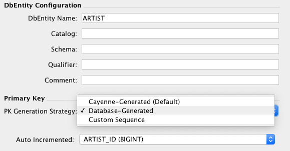

<a id="cayenne-guide--cayenne-framework"></a>
<a id="cayenne-guide--2.-cayenne-framework"></a>

## 2. Cayenne Framework

<a id="cayenne-guide--including-cayenne-in-project"></a>
<a id="cayenne-guide--2.1.-including-cayenne-in-a-project"></a>

### 2.1. Including Cayenne in a Project

<a id="cayenne-guide--maven"></a>
<a id="cayenne-guide--2.1.1.-maven"></a>

#### 2.1.1. Maven

To add Cayenne to your Maven project, include `cayenne-server` in your POM:

```xml
<dependency>
   <groupId>org.apache.cayenne</groupId>
   <artifactId>cayenne-server</artifactId>
   <version>4.2.3</version>
</dependency>
```

<a id="cayenne-guide--gradle"></a>
<a id="cayenne-guide--2.1.2.-gradle"></a>

#### 2.1.2. Gradle

To add Cayenne to your Gradle project, include `cayenne-server` module:

```Groovy
compile 'org.apache.cayenne:cayenne-server:4.2.3'
```

<a id="cayenne-guide--ant-etc"></a>
<a id="cayenne-guide--2.1.3.-ant-etc."></a>

#### 2.1.3. Ant, etc.

If your environment requires manual dependency management (like Ant), check `lib` and `lib/third-party` folders of Cayenne distribution. It contains all Cayenne jars as well as the minimal set of third-party libraries to get you started.

<a id="cayenne-guide--starting-cayenne"></a>
<a id="cayenne-guide--2.2.-starting-cayenne"></a>

### 2.2. Starting Cayenne

<a id="cayenne-guide--starting-and-stopping-serverruntime"></a>
<a id="cayenne-guide--2.2.1.-starting-and-stopping-serverruntime"></a>

#### 2.2.1. Starting and Stopping ServerRuntime

In runtime Cayenne is accessed via `org.apache.cayenne.configuration.server.ServerRuntime`. ServerRuntime is created by calling a convenient builder:

```java
ServerRuntime runtime = ServerRuntime.builder()
                .addConfig("com/example/cayenne-project.xml")
                .build();
```

The parameter you pass to the builder is a location of the main project file. Location is a '/'-separated path (same path separator is used on UNIX and Windows) that is resolved relative to the application classpath. The project file can be placed in the root package or in a subpackage (e.g. in the code above it is in "com/example" subpackage).

ServerRuntime encapsulates a single Cayenne stack. Most applications will just have one ServerRuntime using it to create as many ObjectContexts as needed, access the Dependency Injection (DI) container and work with other Cayenne features. Internally ServerRuntime is just a thin wrapper around the DI container. Detailed features of the container are discussed in [Customizing Cayenne Runtime](#cayenne-guide--customizing-cayenne-runtime) chapter. Here we’ll just show an example of how an application might turn on external transactions:

```java
Module extensions = binder ->
      ServerModule.contributeProperties(binder)
            .put(Constants.SERVER_EXTERNAL_TX_PROPERTY, "true");
ServerRuntime runtime = ServerRuntime.builder()
      .addConfig("com/example/cayenne-project.xml")
      .addModule(extensions)
      .build();
```

It is a good idea to shut down the runtime when it is no longer needed, usually before the application itself is shutdown:

```java
runtime.shutdown();
```

When a runtime object has the same scope as the application, this may not be always necessary, however in some cases it is essential, and is generally considered a good practice. E.g. in a web container hot redeploy of a webapp will cause resource leaks and eventual OutOfMemoryError if the application fails to shutdown CayenneRuntime.

<a id="cayenne-guide--merging-multiple-projects"></a>
<a id="cayenne-guide--2.2.2.-merging-multiple-projects"></a>

#### 2.2.2. Merging Multiple Projects

ServerRuntime requires at least one mapping project to run. But it can also take multiple projects and merge them together in a single configuration. This way different parts of a database can be mapped independently from each other (even by different software providers), and combined in runtime when assembling an application. Doing it is as easy as passing multiple project locations to ServerRuntime builder:

```java
ServerRuntime runtime = ServerRuntime.builder()
        .addConfig("com/example/cayenne-project.xml")
        .addConfig("org/foo/cayenne-library1.xml")
        .addConfig("org/foo/cayenne-library2.xml")
        .build();
```

When the projects are merged, the following rules are applied:

- The order of projects matters during merge. If there are two conflicting metadata objects belonging to two projects, an object from the last project takes precedence over the object from the first one. This makes possible to override pieces of metadata. This is also similar to how DI modules are merged in Cayenne.
- Runtime DataDomain name is set to the name of the last project in the list.
- Runtime DataDomain properties are the same as the properties of the last project in the list. I.e. properties are not merged to avoid invalid combinations and unexpected runtime behavior.
- If there are two or more DataMaps with the same name, only one DataMap is used in the merged project, the rest are discarded. Same precedence rules apply - DataMap from the project with the highest index in the project list overrides all other DataMaps with the same name.
- If there are two or more DataNodes with the same name, only one DataNode is used in the merged project, the rest are discarded. DataNode coming from project with the highest index in the project list is chosen per precedence rule above.
- There is a notion of "default" DataNode. After the merge if any DataMaps are not explicitly linked to DataNodes, their queries will be executed via a default DataNode. This makes it possible to build mapping "libraries" that are only associated with a specific database in runtime. If there’s only one DataNode in the merged project, it will be automatically chosen as default. A possible way to explicitly designate a specific node as default is to override `DataDomainProvider.createAndInitDataDomain()`.

<a id="cayenne-guide--web-applications"></a>
<a id="cayenne-guide--2.2.3.-web-applications"></a>

#### 2.2.3. Web Applications

Web applications can use a variety of mechanisms to configure and start the "services" they need, Cayenne being one of such services. Configuration can be done within standard servlet specification objects like Servlets, Filters, or ServletContextListeners, or can use Spring, JEE CDI, etc. This is a user’s architectural choice and Cayenne is agnostic to it and will happily work in any environment. As described above, all that is needed is to create an instance of ServerRuntime somewhere and provide the application code with means to access it, and to shut it down when the application ends to avoid container leaks.

Still Cayenne includes a piece of web app configuration code that can assist in quickly setting up simple Cayenne-enabled web applications. We are talking about `CayenneFilter`. It is declared in `web.xml`:

```XML
<web-app>
    ...
    <filter>
        <filter-name>cayenne-project</filter-name>
        <filter-class>org.apache.cayenne.configuration.web.CayenneFilter</filter-class>
    </filter>
     <filter-mapping>
        <filter-name>cayenne-project</filter-name>
        <url-pattern>/*</url-pattern>
     </filter-mapping>
    ...
 </web-app>
```

When started by the web container, it creates a instance of ServerRuntime and stores it in the ServletContext. Note that the name of a Cayenne XML project file is derived from the "filter-name". In the example above, CayenneFilter will look for an XML file "cayenne-project.xml". This can be overridden with the "configuration-location" init parameter.

When the application runs, all HTTP requests matching the filter url-pattern have access to a session-scoped ObjectContext like this:

```java
 ObjectContext context = BaseContext.getThreadObjectContext();
```

Of course, the ObjectContext scope and other behavior of the Cayenne runtime can be customized via dependency injection. For this, another filter init parameter called "extra-modules" is used. "extra-modules" is a comma- or space-separated list of class names, with each class implementing Module interface. These optional custom modules are loaded after the standard ones, which allows users to override all standard definitions.

For those interested in the DI container contents of the runtime created by `CayenneFilter`, it is the same ServerRuntime as would have been created by other means, but with an extra `org.apache.cayenne.configuration.web.WebModule` module that provides the `org.apache.cayenne.configuration.web.RequestHandler` service. This is the service to override in the custom modules if you need to provide a different ObjectContext scope, etc.

> [!NOTE]
> |  |  |
> | --- | --- |
> |  | You should not think of `CayenneFilter` as the only way to start and use Cayenne in a web application. In fact, `CayenneFilter` is entirely optional. Use it if you don’t have any special design for application service management. If you do, simply integrate Cayenne into that design. |

<a id="cayenne-guide--persistent-objects-objectcontext"></a>
<a id="cayenne-guide--2.3.-persistent-objects-and-objectcontext"></a>

### 2.3. Persistent Objects and ObjectContext

<a id="cayenne-guide--objectcontext"></a>
<a id="cayenne-guide--2.3.1.-objectcontext"></a>

#### 2.3.1. ObjectContext

ObjectContext is an interface that users normally work with to access the database. It provides the API to execute database operations and to manage persistent objects. A context is obtained from the ServerRuntime:

```java
ObjectContext context = runtime.newContext();
```

The call above creates a new instance of ObjectContext that can access the database via this runtime. ObjectContext is a single "work area" in Cayenne, storing persistent objects. ObjectContext guarantees that, for each database row with a unique ID, it will contain at most one instance of an object, thus ensuring object graph consistency between multiple selects (a feature called "uniquing"). At the same time, different ObjectContexts will have independent copies of objects for each unique database row. This allows users to isolate object changes from one another by using separate ObjectContexts.

These properties directly affect the strategies for scoping and sharing (or not sharing) ObjectContexts. Contexts that are only used to fetch objects from the database and whose objects are never modified by the application can be shared between multiple users (and multiple threads). Contexts that store modified objects should be accessed only by a single user (e.g. a web application user might reuse a context instance between multiple web requests in the same HttpSession, thus carrying uncommitted changes to objects from request to request, until they decide to commit them or roll them back). Even for a single user it might make sense to use multiple ObjectContexts (e.g. request-scoped contexts to allow concurrent requests from the browser that change and commit objects independently).

ObjectContext is serializable and does not permanently hold any of the application resources. So it does not have to be closed. If the context is not used anymore, it should simply be allowed to go out of scope and get garbage collected, just like any other Java object.

<a id="cayenne-guide--persistent-object-and-its-lifecycle"></a>
<a id="cayenne-guide--2.3.2.-persistent-object-and-its-lifecycle"></a>

#### 2.3.2. Persistent Object and its Lifecycle

Cayenne can persist Java objects that implement the `org.apache.cayenne.Persistent` interface. Generally, persistent classes are generated from the model as described above, so users do not have to worry about superclass and property implementation details.

The `Persistent` interface provides access to three persistence-related properties - *objectId*, *persistenceState* and *objectContext*. All three are initialized by the Cayenne runtime framework. Your application code should not attempt to change them. However, it is allowed to read them, which provides valuable runtime information. E.g. ObjectId can be used for a quick equality check of two objects, knowing persistence state would allow highlighting changed objects, etc.

Each persistent object belongs to a single ObjectContext, and can be in one of the following persistence states (as defined in `org.apache.cayenne.PersistenceState`) :

Table 3. Persistence States

|  |  |
| --- | --- |
| **TRANSIENT** | The object is not registered with an ObjectContext and will not be persisted. |
| **NEW** | The object is freshly registered in an ObjectContext, but has not been saved to the database yet and there is no matching database row. |
| **COMMITTED** | The object is registered in an ObjectContext, there is a row in the database corresponding to this object, and the object state corresponds to the last known state of the matching database row. |
| **MODIFIED** | The object is registered in an ObjectContext, there is a row in the database corresponding to this object, but the object in-memory state has diverged from the last known state of the matching database row. |
| **HOLLOW** | The object is registered in an ObjectContext, there is a row in the database corresponding to this object, but the object state is unknown. Whenever an application tries to access a property of such object, Cayenne attempts reading its values from the database and "inflate" the object, turning it to COMMITTED. |
| **DELETED** | The object is registered in an ObjectContext and has been marked for deletion in-memory. The corresponding row in the database will get deleted upon ObjectContext commit, and the object state will be turned into TRANSIENT. |

<a id="cayenne-guide--objectcontext-persistence-api"></a>
<a id="cayenne-guide--2.3.3.-objectcontext-persistence-api"></a>

#### 2.3.3. ObjectContext Persistence API

One of the first things users usually want to do with an `ObjectContext` is to select some objects from a database:

```java
List<Artist> artists = ObjectSelect.query(Artist.class)
    .select(context);
```

We’ll discuss queries in some detail in the [Queries](#cayenne-guide--queries) chapter. The example above is self-explanatory - we create a `ObjectSelect` that matches all `Artist` objects present in the database, and then use `select` to get the result.

Some queries can be quite complex, returning multiple result sets or even updating the database. For such queries, ObjectContext provides the `performGenericQuery()` method. While not commonly used, it is nevertheless important in some situations. E.g.:

```java
Collection<Query> queries = ... // multiple queries that need to be run together
QueryChain query = new QueryChain(queries);

QueryResponse response = context.performGenericQuery(query);
```

An application might modify selected objects. E.g.:

```java
Artist selectedArtist = artists.get(0);
selectedArtist.setName("Dali");
```

The first time the object property is changed, the object’s state is automatically set to **MODIFIED** by Cayenne. Cayenne tracks all in-memory changes until a user calls `commitChanges`:

```java
context.commitChanges();
```

At this point, all in-memory changes are analyzed and a minimal set of SQL statements is issued in a single transaction to synchronize the database with the in-memory state. In our example, `commitChanges` commits just one object, but generally it can be any number of objects.

If, instead of commit, we wanted to reset all changed objects to the previously committed state, we’d call `rollbackChanges` instead:

```java
context.rollbackChanges();
```

`newObject` method call creates a persistent object and sets its state to **NEW**:

```java
Artist newArtist = context.newObject(Artist.class);
newArtist.setName("Picasso");
```

It only exists in memory until `commitChanges` is issued. On commit Cayenne might generate a new primary key (unless a user set it explicitly, or a PK was inferred from a relationship) and issue an `INSERT` SQL statement to permanently store the object.

The `deleteObjects` method takes one or more `Persistent` objects and marks them as **DELETED**:

```java
context.deleteObjects(artist1);
context.deleteObjects(artist2, artist3, artist4);
```

Additionally, `deleteObjects` processes all delete rules modeled for the affected objects. This may result in implicitly deleting or modifying extra related objects. Same as insert and update, delete operations are sent to the database only when `commitChanges` is called. Similarly `rollbackChanges` will undo the effect of `newObject` and `deleteObjects`.

`localObject` returns a copy of a given persistent object that is *local* to a given ObjectContext:

Since an application often works with more than one context, `localObject` is a rather common operation. E.g. to improve performance, a user might utilize a single shared context to select and cache data, and then occasionally transfer some selected objects to another context to modify and commit them:

```java
ObjectContext editingContext = runtime.newContext();
Artist localArtist = editingContext.localObject(artist);
```

Often an application needs to inspect mapping metadata. This information is stored in the `EntityResolver` object, accessible via the `ObjectContext`:

```java
EntityResolver resolver = objectContext.getEntityResolver();
```

Here we discussed the most commonly-used subset of the ObjectContext API. There are other useful methods, e.g. those allowing you to inspect registered objects' state in bulk, etc. Check the latest JavaDocs for details.

<a id="cayenne-guide--cayenne-helper-class"></a>
<a id="cayenne-guide--2.3.4.-cayenne-helper-class"></a>

#### 2.3.4. Cayenne Helper Class

There is a useful helper class called `Cayenne` (fully-qualified name `org.apache.cayenne.Cayenne`) that builds on the ObjectContext API to provide a number of very common operations. E.g. get a primary key (most entities do not model PK as an object property) :

```java
long pk = Cayenne.longPKForObject(artist);
```

It also provides the reverse operation - finding an object given a known PK:

```java
Artist artist = Cayenne.objectForPK(context, Artist.class, 34579);
```

For more flexibility, you could use the [SelectById](#cayenne-guide--selectbyid) query instead.

Feel free to explore the `Cayenne` class API for other useful methods.

<a id="cayenne-guide--objectcontext-nesting"></a>
<a id="cayenne-guide--2.3.5.-objectcontext-nesting"></a>

#### 2.3.5. ObjectContext Nesting

In all the examples shown so far, an ObjectContext would directly connect to a database to select data or synchronize its state (either via commit or rollback). However, another context can be used in all these scenarios instead of a database. This concept is called ObjectContext "nesting". Nesting is a parent/child relationship between two contexts, where a child is a nested context and selects or commits its objects via a parent.

Nesting is useful to create isolated object editing areas (child contexts) that all need to be committed to an intermediate in-memory store (parent context), or rolled back without affecting changes already recorded in the parent. Think cascading GUI dialogs, or parallel AJAX requests coming to the same session.

In theory, Cayenne supports any number of nesting levels; however, applications should generally stay with one or two levels, as deep hierarchies will almost certainly degrade the performance of the deeply-nested child contexts. This is due to the fact that each context in a nesting chain has to update its own objects during most operations.

Cayenne ROP is an extreme case of nesting when a child context is located in a separate JVM and communicates with its parent via a web service. ROP is discussed in detail in the following chapters. Here we concentrate on the same-VM nesting.

To create a nested context, use an instance of ServerRuntime, passing it the desired parent:

```java
ObjectContext parent = runtime.newContext();
ObjectContext nested = runtime.newContext(parent);
```

From here, a nested context operates just like a regular context (you can perform queries, create and delete objects, etc.). The only difference is that commit and rollback operations can either be limited to synchronization with the parent, or cascade all the way to the database:

```java
// merges nested context changes into the parent context
nested.commitChangesToParent();

// regular 'commitChanges' cascades commit through the chain
// of parent contexts all the way to the database
nested.commitChanges();
```

```java
// unrolls all local changes, getting context in a state identical to parent
nested.rollbackChangesLocally();

// regular 'rollbackChanges' cascades rollback through the chain of contexts
// all the way to the topmost parent
nested.rollbackChanges();
```

<a id="cayenne-guide--generic-persistent-objects"></a>
<a id="cayenne-guide--2.3.6.-generic-persistent-objects"></a>

#### 2.3.6. Generic Persistent Objects

As described in the CayenneModeler chapter, Cayenne supports mapping of completely generic classes to specific entities. Although for convenience most applications should stick with entity-specific class mappings, the generic feature offers some interesting possibilities, such as creating mappings completely on the fly in a running application.

Generic objects are first-class citizens in Cayenne, and all common persistent operations apply to them as well. There are some peculiarities, however, described below.

When creating a generic object, either cast your ObjectContext to DataContext (that provides `newObject(String)` API), or provide your object with an explicit ObjectId:

```java
DataObject generic = (DataObject)context.newObject("GenericEntity");
```

```java
DataObject generic = new CayenneDataObject();
generic.setObjectId(ObjectId.of("GenericEntity"));
context.registerNewObject(generic);
```

ObjectSelect for a generic object should be created by passing the entity name String, instead of just a Java class:

```java
ObjectSelect<DataObject> query = ObjectSelect.query(DataObject.class, "GenericEntity");
```

Use DataObject API to access and modify properties of a generic object:

```java
String name = (String) generic.readProperty("name");
generic.writeProperty("name", "New Name");
```

This is how an application can obtain the entity name of a generic object:

```java
String entityName = generic.getObjectId().getEntityName();
```

<a id="cayenne-guide--transactions"></a>
<a id="cayenne-guide--2.3.7.-transactions"></a>

#### 2.3.7. Transactions

Considering how much attention is given to managing transactions in most other ORMs, transactions have been conspicuously absent from the ObjectContext discussion till now. The reason is that transactions are seamless in Cayenne in all but a few special cases. ObjectContext is an in-memory container of objects that is disconnected from the database, except when it needs to run an operation. So it does not care about any surrounding transaction scope. Sure enough, all database operations are transactional, so when an application does a commit, all SQL execution is wrapped in a database transaction. But this is done behind the scenes and is rarely a concern to the application code.

Two cases where transactions need to be taken into consideration are container- and application-managed transactions.

If you are using Spring, EJB or another environment that manages transactions, you’ll likely need to switch the Cayenne runtime into "external transactions mode". This is done by setting the DI configuration property defined in `Constants.SERVER_EXTERNAL_TX_PROPERTY` (see Appendix A). If this property is set to "true", Cayenne assumes that JDBC Connections obtained by runtime, whenever that might happen, are all coming from a transactional DataSource managed by the container. In this case, Cayenne does not attempt to commit or roll back the connections, leaving it up to the container to do that when appropriate.

In the second scenario, an application might need to define its own transaction scope that spans more than one Cayenne operation. E.g. two sequential commits that need to be rolled back together in case of failure. This can be done via the `ServerRuntime.performInTransaction` method:

```java
Integer result = runtime.performInTransaction(() -> {
    // commit one or more contexts
    context1.commitChanges();
    context2.commitChanges();
    ....
    // after changing some objects in context1, commit again
    context1.commitChanges();
    ....

    // return an arbitrary result or null if we don't care about the result
    return 5;
});
```

When inside a transaction, current thread Transaction object can be accessed via a static method:

```java
Transaction tx = BaseTransaction.getThreadTransaction();
```

You can control transaction isolation level and propagation logic using `TransactionDescriptor`.

```java
TransactionDescriptor descriptor = new TransactionDescriptor(
                Connection.TRANSACTION_SERIALIZABLE,
                TransactionPropagation.REQUIRES_NEW
        );
transactionManager.performInTransaction(transactionalOperation, descriptor);
```

<a id="cayenne-guide--expressions"></a>
<a id="cayenne-guide--2.4.-expressions"></a>

### 2.4. Expressions

Cayenne provides a simple, yet powerful, object-based expression language. The most common uses of expressions are to build qualifiers and orderings of queries that are later converted to SQL by Cayenne and to evaluate in-memory against specific objects (to access certain values in the object graph or to perform in-memory object filtering and sorting). Cayenne provides an API to build expressions in the code and a parser to create expressions from strings.

<a id="cayenne-guide--path-expressions"></a>
<a id="cayenne-guide--2.4.1.-path-expressions"></a>

#### 2.4.1. Path Expressions

Before discussing how to build expressions, it is important to understand one group of expressions widely used in Cayenne - path expressions. There are two types of path expressions - object and database, used for navigating graphs of connected objects or joined DB tables, respectively. Object paths are much more commonly used, as, after all, Cayenne is supposed to provide a degree of isolation of the object model from the database. However, database paths are helpful in certain situations. The general structure of path expressions is the following:

```java
 [db:]segment[+][.segment[+]...]
```

- `db:` is an optional prefix indicating that the following path is a DB path. Otherwise it is an object path.
- `segment` is a name of a property (relationship or attribute in Cayenne terms) in the path. The path must have at least one segment; segments are separated by dot (".").
- `` An "OUTER JOIN" path component. Currently "" only has effect when translated to SQL as OUTER JOIN. When evaluating expressions in memory, it is ignored.

An object path expression represents a chain of property names rooted in a certain (unspecified during expression creation) object and "navigating" to its related value. E.g. a path expression "artist.name" might be a property path starting from a Painting object, pointing to the related Artist object, and then to its name attribute. A few more examples:

- `name` - can be used to navigate (read) the "name" property of a Person (or any other type of object that has a "name" property).
- `artist.exhibits.closingDate` - can be used to navigate to a closing date of any of the exhibits of a Painting’s Artist object.
- `artist.exhibits+.closingDate` - same as the previous example, but when translated into SQL, an OUTER JOIN will be used for "exhibits".

Similarly a database path expression is a dot-separated path through DB table joins and columns. In Cayenne joins are mapped as DbRelationships with some symbolic names (the closest concept to DbRelationship name in the DB world is a named foreign key constraint. But DbRelationship names are usually chosen arbitrarily, without regard to constraints naming or even constraints presence). A database path therefore might look like this - `db:dbrelationshipX.dbrelationshipY.COLUMN_Z"`. More specific examples:

- `db:NAME` - can be used to navigate to a value in the "NAME" column of some unspecified table.
- `db:artist.artistExhibits.exhibit.CLOSING_DATE` - can be used to match a closing date of any of the exhibits of a related artist record.

Cayenne supports "aliases" in path expressions. E.g. the same expression can be written using the explicit path or an alias:

- `artist.exhibits.closingDate` - full path
- `e.closingDate` - alias "e" is used for `artist.exhibits`.

SelectQuery using the second form of the path expression must be made aware of the alias via `SelectQuery.aliasPathSplits(..)`; otherwise, an `Exception` will be thrown. The main use of aliases is to allow users to control how SQL joins are generated if the same path is encountered more than once in any given `Expression`. Each alias for any given path would result in a separate join. Without aliases, a single join will be used for a group of matching paths.

<a id="cayenne-guide--creating-expressions-from-strings"></a>
<a id="cayenne-guide--2.4.2.-creating-expressions-from-strings"></a>

#### 2.4.2. Creating Expressions from Strings

While in most cases users are likely to rely on the API from the following section for expression creation, we’ll start by showing String expressions, as this will help you understand the semantics. A Cayenne expression can be represented as a String, which can be converted to an expression object using the `ExpressionFactory.exp` static method. Here is an example:

```java
String expString = "name like 'A%' and price < 1000";
Expression exp = ExpressionFactory.exp(expString);
```

This particular expression may be used to match Paintings whose names start with "A" and whose price is less than $1000. While this example is pretty self-explanatory, there are a few points worth mentioning. "name" and "price" here are object paths discussed earlier. As always, paths themselves are not attached to a specific root entity and can be applied to any entity that has similarly named attributes or relationships. So, when we say that this expression "may be used to match Paintings", we are implying that there may be other entities for which this expression is valid. Now the expression details…

Character constants that are not paths or numeric values should be enclosed in single or double quotes. Two of the expressions below are equivalent:

```java
name = 'ABC'

// double quotes are escaped inside Java Strings of course
name = \"ABC\"
```

Case sensitivity. Expression operators are case sensitive and are usually lowercase. Complex words follow the Java camel-case style:

```java
// valid
name likeIgnoreCase 'A%'

// invalid - will throw a parse exception
name LIKEIGNORECASE 'A%'
```

Grouping with parenthesis:

```java
value = (price + 250.00) * 3
```

Path prefixes. Object expressions are unquoted strings, optionally prefixed by `obj:` (usually they are not prefixed at all). Database expressions are always prefixed with `db:`. A special kind of prefix, not discussed yet, is `enum:` that prefixes an enumeration constant:

```java
// object path
name = 'Salvador Dali'

// same object path - a rarely used form
obj:name = 'Salvador Dali'

// multi-segment object path
artist.name = 'Salvador Dali'

// db path
db:NAME = 'Salvador Dali'

// enumeration constant
name = enum:org.foo.EnumClass.VALUE1
```

Binary conditions are expressions that contain a path on the left, a value on the right, and some operation between them, such as equals like, etc. They can be used as qualifiers in SelectQueries:

```java
name like 'A%'
```

Parameters. Expressions can contain named parameters (names that start with "$") that can be substituted with values either by name or by position. Parameterized expressions let you create reusable expression templates. Also, if an expression contains a complex object that doesn’t have a simple String representation (e.g. a Date, a DataObject, an ObjectId), parameterizing the expression is the only way to represent it as String. Here are examples of both positional and named parameter bindings:

```java
Expression template = ExpressionFactory.exp("name = $name");
...
// name binding
Map p1 = Collections.singletonMap("name", "Salvador Dali");
Expression qualifier1 = template.params(p1);
...
// positional binding
Expression qualifier2 = template.paramsArray("Monet");
```

Positional binding is usually shorter. You can pass positional bindings to the `exp(..)` factory method (its second argument is a params vararg):

```java
Expression qualifier = ExpressionFactory.exp("name = $name", "Monet");
```

In parameterized expressions with a LIKE clause, SQL wildcards must be part of the values in the Map and not the expression string itself:

```java
Expression qualifier = ExpressionFactory.exp("name like $name", "Salvador%");
```

When matching on a relationship, the value parameter must be either a Persistent object, an `org.apache.cayenne.ObjectId`, or a numeric ID value (for single column IDs). E.g.:

```java
Artist dali = ... // assume we fetched this one already
Expression qualifier = ExpressionFactory.exp("artist = $artist", dali);
```

When you use positional binding, Cayenne expects values for all parameters to be present. Binding by name offers extra flexibility: sub-expressions with uninitialized parameters are automatically pruned from the expression. So, e.g., if certain parts of the expression criteria are not provided to the application, you can still build a valid expression

```java
Expression template = ExpressionFactory.exp("name like $name and dateOfBirth > $date");
...
Map p1 = Collections.singletonMap("name", "Salvador%");
Expression qualifier1 = template.params(p1);

// "qualifier1" is now "name like 'Salvador%'".
// 'dateOfBirth > $date' condition was pruned, as no value was specified for
// the $date parameter
```

Null handling. Handling of Java nulls as operands is no different handling from normal values. Instead of using special conditional operators, like SQL does (`IS NULL`, `IS NOT NULL`), "=" and "!=" expressions are used directly with null values. It is up to Cayenne to translate expressions with nulls to the valid SQL.

<a id="cayenne-guide--creating-expressions-via-api"></a>
<a id="cayenne-guide--2.4.3.-creating-expressions-via-api"></a>

#### 2.4.3. Creating Expressions via API

Creating expressions from Strings is a powerful and dynamic approach, however a safer alternative is to use the Java API. It provides compile-time checking of the expression’s validity. The API in question is provided by the `ExpressionFactory` class (that we’ve seen already), the Property class and the Expression class itself. `ExpressionFactory` contains a number of self-explanatory static methods that can be used to build expressions. E.g.:

```java
// String expression: name like 'A%' and price < 1000
Expression e1 = ExpressionFactory.likeExp("name", "A%");
Expression e2 = ExpressionFactory.lessExp("price", 1000);
Expression finalExp = e1.andExp(e2);
```

> [!NOTE]
> |  |  |
> | --- | --- |
> |  | The last line in the example above shows how to create a new expression by "chaining" two other expressions. A common error when chaining expressions is to assume that "andExp" and "orExp" append another expression to the current expression. In fact, a new expression is created. Expression API treats existing expressions as immutable. |

As discussed earlier, Cayenne supports aliases in path Expressions, so you can control how SQL joins are generated if the same path is encountered more than once in the same Expression. Two ExpressionFactory methods let you implicitly generate aliases to "split" match paths into individual joins if needed:

```java
Expression matchAllExp(String path, Collection values)
Expression matchAllExp(String path, Object... values)
```

The "Path" argument to both of these methods can use a split character (a pipe symbol '|') instead of a dot to indicate that the relationship following a path should be split into a separate set of joins, one per collection value. There can only be one split at most in any given path. The split must always precede a relationship. E.g. `"|exhibits.paintings"`, `"exhibits|paintings"`, etc. Internally, Cayenne generates distinct aliases for each of the split expressions, forcing separate joins.

While ExpressionFactory is pretty powerful, there’s an even easier way to create an expression using static Property objects generated by Cayenne for each persistent class. Some examples:

```java
// Artist.NAME is generated by Cayenne and has a type of Property<String>
Expression e1 = Artist.NAME.eq("Pablo");

// Chaining multiple properties into a path.
// Painting.ARTIST is generated by Cayenne and has a type of Property<Artist>
Expression e2 = Painting.ARTIST.dot(Artist.NAME).eq("Pablo");
```

Property objects provide the API mostly analogous to ExpressionFactory, though it is significantly shorter and is aware of the value types. It provides compile-time checks of both property names and types of arguments in conditions. We will use Property-based API in further examples.

<a id="cayenne-guide--evaluate"></a>
<a id="cayenne-guide--2.4.4.-evaluating-expressions-in-memory"></a>

#### 2.4.4. Evaluating Expressions in Memory

When used in a query, an expression is converted to a SQL WHERE or ORDER BY clause by Cayenne during query execution. Thus the actual evaluation against the data is done by the database engine. However, the same expressions can also be used for accessing object properties, calculating values, and in-memory filtering.

Checking whether an object satisfies an expression:

```java
Expression e = Artist.NAME.in("John", "Bob");
Artist artist = ...
if(e.match(artist)) {
   ...
}
```

Reading property value:

```java
String name = Artist.NAME.path().evaluate(artist);
```

Filtering a list of objects:

```java
Expression e = Artist.NAME.in("John", "Bob");
List<Artist> unfiltered = ...
List<Artist> filtered = e.filterObjects(unfiltered);
```

> [!NOTE]
> |  |  |
> | --- | --- |
> |  | Current limitation of in-memory expressions is that no collections are permitted in the property path. |

<a id="cayenne-guide--translating-expressions-to-ejbql"></a>
<a id="cayenne-guide--2.4.5.-translating-expressions-to-ejbql"></a>

#### 2.4.5. Translating Expressions to EJBQL

[EJBQL](#cayenne-guide--ejbql) is a textual query language that can be used with Cayenne. In some situations, it is convenient to be able to convert Expression instances into EJBQL. Expressions support this conversion. An example is shown below.

```java
String serial = ...
Expression e = Pkg.SERIAL.eq(serial);
List<Object> params = new ArrayList<Object>();
EJBQLQuery query = new EJBQLQuery("SELECT p FROM Pkg p WHERE " + e.toEJBQL(params,"p");

for(int i=0;i<params.size();i++) {
  query.setParameter(i+1, params.get(i));
}
```

This would be equivalent to the following purely EJBQL querying logic;

```java
EJBQLQuery query = new EJBQLQuery("SELECT p FROM Pkg p WHERE p.serial = ?1");
query.setParameter(1,serial);
```

<a id="cayenne-guide--orderings"></a>
<a id="cayenne-guide--2.5.-orderings"></a>

### 2.5. Orderings

An Ordering object defines how a list of objects should be ordered. Orderings are essentially path expressions combined with a sorting strategy. Creating an Ordering:

```java
Ordering o = new Ordering(Painting.NAME_PROPERTY, SortOrder.ASCENDING);
```

Like expressions, orderings are translated into SQL as parts of queries (and the sorting occurs in the database). Also like expressions, orderings can be used in memory, naturally - to sort objects:

```java
Ordering o = new Ordering(Painting.NAME_PROPERTY, SortOrder.ASCENDING_INSENSITIVE);
List<Painting> list = ...
o.orderList(list);
```

Note that unlike filtering with Expressions, ordering is performed in-place. This list object is reordered and no new list is created.

<a id="cayenne-guide--queries"></a>
<a id="cayenne-guide--2.6.-queries"></a>

### 2.6. Queries

Queries are Java objects used by the application to communicate with the database. Cayenne knows how to translate queries into SQL statements appropriate for a particular database engine. Most often queries are used to find objects matching certain criteria, but there are other types of queries too. E.g. those allowing to run native SQL, call DB stored procedures, etc. When committing objects, Cayenne itself creates special queries to insert/update/delete rows in the database.

There is a number of built-in queries in Cayenne, described later in this chapter. Most of the newer queries use fluent API and can be created and executed as easy-to-read one-liners. Users can define their own query types to abstract certain DB interactions that for whatever reason can not be adequately described by the built-in set.

Queries can be roughly categorized as "object" and "native". Object queries (most notably `ObjectSelect`, `SelectById`, and `EJBQLQuery`) are built with abstractions originating in the object model (the "object" side in the "object-relational" divide). E.g. `ObjectSelect` consists of a Java class of objects to fetch, a qualifier expression, orderings, etc. - all of this expressed in terms of the object model.

Native queries describe a desired DB operation using SQL (`SQLSelect`, `SQLExec` query), a reference to a stored procedure (`ProcedureQuery`), etc. The results of native queries are lists of scalars, lists of `Object[]` or lists of maps (a term "data row" is often used to describe such a map). Some of them can potentially be converted to persistent objects (though usually with considerable effort). Native queries are less (if at all) portable across databases than object queries.

<a id="cayenne-guide--select"></a>
<a id="cayenne-guide--2.6.1.-objectselect"></a>

#### 2.6.1. ObjectSelect

> [!NOTE]
> |  |  |
> | --- | --- |
> |  | `ObjectSelect` supersedes older `SelectQuery`. `SelectQuery` is deprecated since 4.2. |

<a id="cayenne-guide--selecting-objects"></a>
<a id="cayenne-guide--2.6.1.1.-selecting-objects"></a>

##### 2.6.1.1. Selecting objects

`ObjectSelect` is the most commonly used query in Cayenne applications. This may be the only query you will ever need. It returns a list of persistent objects (or data rows) of a certain type specified in the query:

```java
List<Artist> objects = ObjectSelect.query(Artist.class).select(context);
```

This returned all rows in the *ARTIST* table. If the logs were turned on, you might see the following SQL printed:

```
INFO: SELECT t0.DATE_OF_BIRTH, t0.NAME, t0.ID FROM ARTIST t0
INFO: === returned 5 row. - took 5 ms.
```

This SQL was generated by Cayenne from the `ObjectSelect` above. `ObjectSelect` can have a qualifier to select only the data matching specific criteria. Qualifier is simply an Expression (Expressions where discussed in the previous chapter), appended to the query using "where" method. If you only want artists whose name begins with 'Pablo', you might use the following qualifier expression:

```java
List<Artist> objects = ObjectSelect.query(Artist.class)
    .where(Artist.NAME.like("Pablo%"))
    .select(context);
```

The SQL will look different this time:

```
INFO: SELECT t0.DATE_OF_BIRTH, t0.NAME, t0.ID FROM ARTIST t0 WHERE t0.NAME LIKE ?
[bind: 1->NAME:'Pablo%']
INFO: === returned 1 row. - took 6 ms.
```

`ObjectSelect` allows to assemble qualifier from parts, using "and" and "or" method to chain them together:

```java
List<Artist> objects = ObjectSelect.query(Artist.class)
    .where(Artist.NAME.like("A%"))
    .and(Artist.DATE_OF_BIRTH.gt(someDate)
    .select(context);
```

To order the results of `ObjectSelect`, one or more orderings can be applied:

```java
List<Artist> objects = ObjectSelect.query(Artist.class)
    .orderBy(Artist.DATE_OF_BIRTH.desc())
    .orderBy(Artist.NAME.asc())
    .select(context);
```

There’s a number of other useful methods in `ObjectSelect` that define what to select and how to optimize database interaction (prefetching, caching, fetch offset and limit, pagination, etc.). Some of them are discussed in separate chapters on caching and performance optimization. Others are fairly self-explanatory. Please check the API docs for the full extent of the `ObjectSelect` features.

<a id="cayenne-guide--selecting-individual-columns"></a>
<a id="cayenne-guide--2.6.1.2.-selecting-individual-columns"></a>

##### 2.6.1.2. Selecting individual columns

`ObjectSelect` query can be used to fetch individual properties of objects via type-safe API:

```java
List<String> names = ObjectSelect.columnQuery(Artist.class, Artist.ARTIST_NAME)
    .select(context);
```

And here is an example of selecting several properties. The result is a list of `Object[]`:

```java
List<Object[]> nameAndDate = ObjectSelect
    .columnQuery(Artist.class, Artist.ARTIST_NAME, Artist.DATE_OF_BIRTH)
    .select(context);
```

<a id="cayenne-guide--selecting-using-aggregate-functions"></a>
<a id="cayenne-guide--2.6.1.3.-selecting-using-aggregate-functions"></a>

##### 2.6.1.3. Selecting using aggregate functions

ObjectSelect query supports usage of aggregate functions. Most common variant of aggregation is selecting count of records, this can be done really easy:

```java
long count = ObjectSelect.query(Artist.class).selectCount(context);
```

But you can use aggregates in more cases, even combine selecting individual properties and aggregates:

```java
// this is artificial property signaling that we want to get full object
Property<Artist> artistProperty = Property.createSelf(Artist.class);

List<Object[]> artistAndPaintingCount = ObjectSelect.columnQuery(Artist.class, artistProperty, Artist.PAINTING_ARRAY.count())
    .where(Artist.ARTIST_NAME.like("a%"))
    .having(Artist.PAINTING_ARRAY.count().lt(5L))
    .orderBy(Artist.PAINTING_ARRAY.count().desc(), Artist.ARTIST_NAME.asc())
    .select(context);

for(Object[] next : artistAndPaintingCount) {
    Artist artist = (Artist)next[0];
    long paintings = (Long)next[1];
    System.out.println(artist.getArtistName() + " have " + paintings + " paintings");
}
```

Here is generated `SQL` for this query:

```SQL
SELECT DISTINCT t0.ARTIST_NAME, t0.DATE_OF_BIRTH, t0.ARTIST_ID, COUNT(t1.PAINTING_ID)
FROM ARTIST t0 JOIN PAINTING t1 ON (t0.ARTIST_ID = t1.ARTIST_ID)
WHERE t0.ARTIST_NAME LIKE ?
GROUP BY t0.ARTIST_NAME, t0.ARTIST_ID, t0.DATE_OF_BIRTH
HAVING COUNT(t1.PAINTING_ID) < ?
ORDER BY COUNT(t1.PAINTING_ID) DESC, t0.ARTIST_NAME
```

<a id="cayenne-guide--subqueries"></a>
<a id="cayenne-guide--2.6.1.4.-subqueries"></a>

##### 2.6.1.4. Subqueries

Since Cayenne 4.2 `ObjectSelect` supports subqueries. Here is a simple example of `NOT EXISTS` subquery:

```java
ObjectSelect<Painting> subQuery = ObjectSelect.query(Painting.class)
        .where(Painting.TO_ARTIST.eq(Artist.ARTIST_ID_PK_PROPERTY.enclosing()));
long count = ObjectSelect.query(Artist.class)
        .where(ExpressionFactory.notExists(subQuery))
        .selectCount(context);
```

<a id="cayenne-guide--selectbyid"></a>
<a id="cayenne-guide--2.6.2.-selectbyid"></a>

#### 2.6.2. SelectById

This query allows to search objects by their ID. It’s introduced in Cayenne 4.0 and uses new "fluent" API same as `ObjectSelect` query.

Here is example of how to use it:

```java
Artist artistWithId1 = SelectById.query(Artist.class, 1)
    .prefetch(Artist.PAINTING_ARRAY.joint())
    .localCache()
    .selectOne(context);
```

<a id="cayenne-guide--sqlselect"></a>
<a id="cayenne-guide--2.6.3.-sqlselect-and-sqlexec"></a>

#### 2.6.3. SQLSelect and SQLExec

SQL is very powerful and allows to manipulate data in ways that can not always be described as a graph of related entities. Cayenne acknowledges this fact and provides a facility to execute SQL, sometimes allowing to map results back to persistent objects. `SQLSelect` and `SQLExec` are a pair of queries that allow to run native SQL. `SQLSelect` can be used (as the name suggests) to select custom data in form of entities, separate columns, collection of `DataRow` or `Object[]`. `SQLExec` is designed to execute any SQL (e.g. updates, deletes, DDLs, etc.).

Both queries support advanced SQL templating, with variable substitution and special directives as described [in the next chapter](#cayenne-guide--sqlscripting). Here we’ll just provide a few simple examples:

```java
// Selecting objects
List<Painting> paintings = SQLSelect
    .query(Painting.class, "SELECT * FROM PAINTING WHERE PAINTING_TITLE LIKE 'A%'")
    .upperColumnNames()
    .localCache()
    .limit(100)
    .select(context);

// Selecting scalar values
List<String> paintingNames = SQLSelect
    .scalarQuery(String.class, "SELECT PAINTING_TITLE FROM PAINTING WHERE ESTIMATED_PRICE > 100000")
    .select(context);

// Selecting DataRow with predefined types
List<DataRow> result = SQLSelect
    .dataRowQuery("SELECT * FROM ARTIST", Integer.class, String.class, LocalDate.class)
    .select(context);

// Selecting Object[] with predefined types
List<Object[]> result = SQLSelect
    .scalarQuery("SELECT * FROM ARTIST", Integer.class, String.class, LocalDate.class)
    .select(context);
```

And here is an example of how to use `SQLExec`:

```java
int inserted = SQLExec
    .query("INSERT INTO ARTIST (ARTIST_ID, ARTIST_NAME) VALUES (55, 'Picasso')")
    .update(context);
```

<a id="cayenne-guide--sqlscripting"></a>
<a id="cayenne-guide--2.6.4.-scripting-sql-queries"></a>

#### 2.6.4. Scripting SQL Queries

A powerful feature of `SQLSelect` and `SQLExec` is that SQL string is treated by Cayenne as a dynamic template. Before creating a PreparedStatement, the String is evaluated, resolving its dynamic parts. The two main scripting elements are "variables" (that look like `$var`) and "directives" (that look like `#directive(p1 p2 p3)`). In the discussion below we’ll use both selecting and updating examples, as scripting works the same way for both `SQLSelect` and `SQLExec`.

<a id="cayenne-guide--variable-substitution"></a>
<a id="cayenne-guide--2.6.4.1.-variable-substitution"></a>

##### 2.6.4.1. Variable Substitution

All variables in the template string are replaced from query parameters:

```java
// this will generate SQL like this: "delete from mydb.PAINTING"
SQLExec query = SQLExec.query("delete from $tableName")
    .params("mydb.PAINTING");
```

Variable substitution within the text uses `object.toString()` method to replace the variable value. This may not be appropriate in all situations. E.g. passing a date object in a `WHERE` clause expression may be converted to a String not understood by the target DB SQL parser. In such cases variable should be wrapped in `#bind` directive as described below.

<a id="cayenne-guide--directives"></a>
<a id="cayenne-guide--2.6.4.2.-directives"></a>

##### 2.6.4.2. Directives

"Directives" look like `#directive(p1 p2 p3)` (notice the absence of comma between the arguments). The following directives are supported in SQL templates:

<a id="cayenne-guide--bind"></a>

###### #bind

Creates a `PreparedStatement` positional parameter in place of the directive, binding the value to it before statement execution. `#bind` is allowed in places where a "?" would be allowed in a PreparedStatement. And in such places it almost always makes sense to pass objects to the template via some flavor of `#bind` instead of inserting them inline.

Semantics:

```
#bind(value)
#bind(value jdbcType)
#bind(value jdbcType scale)
```

Arguments:

- `value` - can either be a char constant or a variable that is resolved from the query parameters. Note that the variable can be a collection, that will be automatically expanded into a list of individual value bindings. This is useful for instance to build IN conditions.
- `jdbcType` - is a JDBC data type of the parameter as defined in `java.sql.Types`.
- `scale` - An optional scale of the numeric value. Same as "scale" in PreparedStatement.

Usage:

```
#bind($xyz)
#bind('str')
#bind($xyz 'VARCHAR')
#bind($xyz 'DECIMAL' 2)
```

Full example:

```SQL
update ARTIST set NAME = #bind($name) where ID = #bind($id)
```

<a id="cayenne-guide--bindequal"></a>

###### #bindEqual

Same as `#bind`, but also includes the "=" sign in front of the value binding. Look at the example below - we took the #bind example and replaced `"ID = #bind(..)"` with `"ID #bindEqual(..)"`. Motivation for this directive is to handle NULL SQL syntax. If the value is not null, `= ?` is generated, but if it is, the resulting SQL would look like `IS NULL`, which is compliant with what the DB expects.

Semantics:

```
#bindEqual(value)
#bindEqual(value jdbcType)
#bindEqual(value jdbcType scale)
```

Arguments: (same as #bind)

Usage:

```
#bindEqual($xyz)
#bindEqual('str')
#bindEqual($xyz 'VARCHAR')
#bindEqual($xyz 'DECIMAL' 2)
```

Full example:

```SQL
update ARTIST set NAME = #bind($name) where ID #bindEqual($id)
```

<a id="cayenne-guide--bindnotequal"></a>

###### #bindNotEqual

This directive deals with the same issue as `#bindEqual` above, only it generates "!=" in front of the value (or `IS NOT NULL`).

Semantics:

```
#bindNotEqual(value)
#bindNotEqual(value jdbcType)
#bindNotEqual(value jdbcType scale)
```

Arguments: (same as #bind)

Usage:

```
#bindNotEqual($xyz)
#bindNotEqual('str')
#bindNotEqual($xyz 'VARCHAR')
#bindNotEqual($xyz 'DECIMAL' 2)
```

Full example:

```SQL
update ARTIST set NAME = #bind($name) where ID #bindNotEqual($id)
```

<a id="cayenne-guide--bindobjectequal"></a>

###### #bindObjectEqual

It can be tricky to use a Persistent object or an ObjectId in a binding, especially for tables with compound primary keys. This directive helps to handle such binding. It maps columns in the query to the names of Persistent object ID columns, extracts ID values from the object, and generates SQL like "COL1 = ? AND COL2 = ? …" , binding positional parameters to ID values. It can also correctly handle null object. Also notice how we are specifying an array for multi-column PK.

Semantics:

```
#bindObjectEqual(value columns idColumns)
```

Arguments:

- `value` - must be a variable that is resolved from the query parameters to a Persistent or ObjectId.
- `columns` - the names of the columns to generate in the SQL.
- `idColumn` - the names of the ID columns for a given entity. Must match the order of "columns" to match against.

Usage:

```
#bindObjectEqual($a 't0.ID' 'ID')
#bindObjectEqual($b ['t0.FK1', 't0.FK2'] ['PK1', 'PK2'])
```

Full example:

```java
String sql = "SELECT * FROM PAINTING t0 WHERE #bindObjectEqual($a 't0.ARTIST_ID' 'ARTIST_ID' )";
Artist artistParam = ...;

SQLSelect select = SQLSelect.query(Painting.class, sql)
    .params("a", artistParam);
```

<a id="cayenne-guide--bindobjectnotequal"></a>

###### #bindObjectNotEqual

Same as `#bindObjectEqual` above, only generates `!=` operator for value comparison (or `IS NOT NULL`).

Semantics:

```
#bindObjectNotEqual(value columns idColumns)
```

Arguments: (same as #bindObjectEqual)

Usage:

```
#bindObjectNotEqual($a 't0.ID' 'ID')
#bindObjectNotEqual($b ['t0.FK1', 't0.FK2'] ['PK1', 'PK2'])
```

Full example:

```java
String sql = "SELECT * FROM PAINTING t0 WHERE #bindObjectNotEqual($a 't0.ARTIST_ID' 'ARTIST_ID' )";
Artist artistParam = ...;

SQLSelect select = SQLSelect.query(Painting.class, sql)
    .params("a", artistParam);
```

<a id="cayenne-guide--result"></a>

###### #result

Used around a column in `SELECT` clause to define the type conversion of the column value (e.g. it may force a conversion from Integer to Long) and/or define column name in the result (useful when fetching objects or DataRows).

> [!NOTE]
> |  |  |
> | --- | --- |
> |  | You don’t have to use `#result` for any given query if the default data types and column names coming from the query suit your needs. But if you do, you have to provide `#result` for every single result column, otherwise such column will be ignored. |

Semantics:

```
#result(column)
#result(column javaType)
#result(column javaType alias)
#result(column javaType alias dataRowKey)
```

Arguments:

- `column` - the name of the column to render in SQL SELECT clause.
- `javaType` - a fully-qualified Java class name for a given result column. For simplicity most common Java types used in JDBC can be specified without a package. These include all numeric types, primitives, String, SQL dates, BigDecimal and BigInteger. So `"#result('A' 'String')"`, `"#result('B' 'java.lang.String')"` and `"#result('C' 'int')"` are all valid
- `alias` - specifies both the SQL alias of the column and the value key in the DataRow. If omitted, "column" value is used.
- `dataRowKey` - needed if SQL 'alias' is not appropriate as a DataRow key on the Cayenne side. One common case when this happens is when a DataRow retrieved from a query is mapped using joint prefetch keys (see below). In this case DataRow must use database path expressions for joint column keys, and their format is incompatible with most databases alias format.

Usage:

```
#result('NAME')
#result('DATE_OF_BIRTH' 'java.util.Date')
#result('DOB' 'java.util.Date' 'DATE_OF_BIRTH')
#result('DOB' 'java.util.Date' '' 'artist.DATE_OF_BIRTH')
#result('SALARY' 'float')
```

Full example:

```SQL
SELECT #result('ID' 'int'), #result('NAME' 'String'), #result('DATE_OF_BIRTH' 'java.util.Date') FROM ARTIST
```

> [!NOTE]
> |  |  |
> | --- | --- |
> |  | For advanced features you may look at the [[Apache Velocity extension]](#cayenne-guide--apache-velocity-extension) |

<a id="cayenne-guide--mappedselect-and-mappedexec"></a>
<a id="cayenne-guide--2.6.5.-mappedselect-and-mappedexec"></a>

#### 2.6.5. MappedSelect and MappedExec

`MappedSelect` and `MappedExec` is a queries that are just a reference to another queries stored in the DataMap. The actual stored query can be SelectQuery, SQLTemplate, EJBQLQuery, etc. Difference between `MappedSelect` and `MappedExec` is (as reflected in their names) whether underlying query intended to select data or just to perform some generic SQL code.

> [!NOTE]
> |  |  |
> | --- | --- |
> |  | These queries are "fluent" versions of deprecated `NamedQuery` class. |

Here is example of how to use `MappedSelect`:

```java
List<Artist> results = MappedSelect.query("artistsByName", Artist.class)

    .param("name", "Picasso")

    .select(context);
```

And here is example of `MappedExec`:

```java
QueryResult result = MappedExec.query("updateQuery")

    .param("var", "value")

    .execute(context);
System.out.println("Rows updated: " + result.firstUpdateCount());
```

<a id="cayenne-guide--procedurecall"></a>
<a id="cayenne-guide--2.6.6.-procedurecall"></a>

#### 2.6.6. ProcedureCall

Stored procedures are mapped as separate objects in CayenneModeler. `ProcedureCall` provides a way to execute them with a certain set of parameters. This query is a "fluent" version of older `ProcedureQuery`. Just like with `SQLTemplate`, the outcome of a procedure can be anything - a single result set, multiple result sets, some data modification (returned as an update count), or a combination of these. So use root class to get a single result set, and use only procedure name for anything else:

```java
List<Artist> result = ProcedureCall.query("my_procedure", Artist.class)
    .param("p1", "abc")
    .param("p2", 3000)
    .call(context)
    .firstList();
```

```java
// here we do not bother with root class.
// Procedure name gives us needed routing information
ProcedureResult result = ProcedureCall.query("my_procedure")
    .param("p1", "abc")
    .param("p2", 3000)
    .call();
```

A stored procedure can return data back to the application as result sets or via OUT parameters. To simplify the processing of the query output, QueryResponse treats OUT parameters as if it was a separate result set. For stored procedures declaref any OUT or INOUT parameters, `ProcedureResult` have convenient utility method to get them:

```java
ProcedureResult result = ProcedureCall.query("my_procedure")
    .call(context);

// read OUT parameters
Object out = result.getOutParam("out_param");
```

There maybe a situation when a stored procedure handles its own transactions, but an application is configured to use Cayenne-managed transactions. This is obviously conflicting and undesirable behavior. In this case ProcedureQueries should be executed explicitly wrapped in an "external" Transaction. This is one of the few cases when a user should worry about transactions at all. See Transactions section for more details.

<a id="cayenne-guide--ejbql"></a>
<a id="cayenne-guide--2.6.7.-ejbqlquery"></a>

#### 2.6.7. EJBQLQuery

> [!NOTE]
> |  |  |
> | --- | --- |
> |  | As soon as all of the `EJBQLQuery` capabilities become available in `ObjectSelect`, we are planning to deprecate `EJBQLQuery`. |

EJBQLQuery was created as a part of an experiment in adopting some of Java Persistence API (JPA) approaches in Cayenne. It is a parameterized object query that is created from query String. A String used to build EJBQLQuery follows JPQL (JPA Query Language) syntax:

```java
EJBQLQuery query = new EJBQLQuery("select a FROM Artist a");
```

JPQL details can be found in any JPA manual. Here we’ll focus on how this fits into Cayenne and what are the differences between EJBQL and other Cayenne queries.

Although most frequently EJBQLQuery is used as an alternative to ObjectSelect, there are also DELETE and UPDATE varieties available.

> [!NOTE]
> |  |  |
> | --- | --- |
> |  | DELETE and UPDATE do not change the state of objects in the ObjectContext. They are run directly against the database instead. |

```java
EJBQLQuery select =
    new EJBQLQuery("select a FROM Artist a WHERE a.name = 'Salvador Dali'");
List<Artist> artists = context.performQuery(select);
```

```java
EJBQLQuery delete = new EJBQLQuery("delete from Painting");
context.performGenericQuery(delete);
```

```java
EJBQLQuery update =
    new EJBQLQuery("UPDATE Painting AS p SET p.name = 'P2' WHERE p.name = 'P1'");
context.performGenericQuery(update);
```

In most cases `ObjectSelect` is preferred to `EJBQLQuery`, as it is API-based, and provides you with better compile-time checks. However sometimes you may want a completely scriptable object query. This is when you might prefer EJBQL. A more practical reason for picking EJBQL over `ObjectSelect` though is that the former offers a few extra capabilities, such as subqueries.

Just like `ObjectSelect` `EJBQLQuery` can return a List of Object[] elements, where each entry in an array is either a DataObject or a scalar, depending on the query SELECT clause.

```java
EJBQLQuery query = new EJBQLQuery("select a, COUNT(p) FROM Artist a JOIN a.paintings p GROUP BY a");
List<Object[]> result = context.performQuery(query);
for(Object[] artistWithCount : result) {
    Artist a = (Artist) artistWithCount[0];
    int hasPaintings = (Integer) artistWithCount[1];
}
```

A result can also be a list of scalars:

```java
EJBQLQuery query = new EJBQLQuery("select a.name FROM Artist a");
List<String> names = context.performQuery(query);
```

EJBQLQuery supports an "IN" clause with three different usage-patterns. The following example would require three individual positional parameters (named parameters could also have been used) to be supplied.

```java
select p from Painting p where p.paintingTitle in (?1,?2,?3)
```

The following example requires a single positional parameter to be supplied. The parameter can be any concrete implementation of the `java.util.Collection` interface such as `java.util.List` or `java.util.Set`.

```java
select p from Painting p where p.paintingTitle in ?1
```

The following example is functionally identical to the one prior.

```java
select p from Painting p where p.paintingTitle in (?1)
```

It is possible to convert an [Expression](#cayenne-guide--expressions) object used with a [ObjectSelect](#cayenne-guide--select) to EJBQL. Use the Expression#appendAsEJBQL methods for this purpose.

While Cayenne Expressions discussed previously can be thought of as identical to JPQL WHERE clause, and indeed they are very close, there are a few notable differences:

- Null handling: SelectQuery would translate the expressions matching NULL values to the corresponding "X IS NULL" or "X IS NOT NULL" SQL syntax. EJBQLQuery on the other hand requires explicit "IS NULL" (or "IS NOT NULL") syntax to be used, otherwise the generated SQL will look like "X = NULL" (or "X <> NULL"), which will evaluate differently.
- Expression Parameters: SelectQuery uses "$" to denote named parameters (e.g. "$myParam"), while EJBQL uses ":" (e.g. ":myParam"). Also EJBQL supports positional parameters denoted by the question mark: "?3".

<a id="cayenne-guide--custom-queries"></a>
<a id="cayenne-guide--2.6.8.-custom-queries"></a>

#### 2.6.8. Custom Queries

If a user needs some extra functionality not addressed by the existing set of Cayenne queries, he can write his own. The only requirement is to implement `org.apache.cayenne.query.Query` interface. The easiest way to go about it is to subclass some of the base queries in Cayenne.

E.g. to do something directly in the JDBC layer, you might subclass `AbstractQuery`:

```java
public class MyQuery extends AbstractQuery {

    @Override
    public SQLAction createSQLAction(SQLActionVisitor visitor) {
        return new SQLAction() {

            @Override
            public void performAction(Connection connection, OperationObserver observer) throws SQLException, Exception {
                // 1. do some JDBC work using provided connection...
                // 2. push results back to Cayenne via OperationObserver
            }
        };
    }
}
```

To delegate the actual query execution to a standard Cayenne query, you may subclass `IndirectQuery`:

```java
public class MyDelegatingQuery extends IndirectQuery {

    @Override
    protected Query createReplacementQuery(EntityResolver resolver) {
        SQLTemplate delegate = new SQLTemplate(SomeClass.class, generateRawSQL());
        delegate.setFetchingDataRows(true);
        return delegate;
    }

    protected String generateRawSQL() {
        // build some SQL string
    }
}
```

In fact many internal Cayenne queries are `IndirectQueries`, delegating to `SelectQuery` or `SQLTemplate` after some preprocessing.

<a id="cayenne-guide--lifecycle-events"></a>
<a id="cayenne-guide--2.7.-lifecycle-events"></a>

### 2.7. Lifecycle Events

An application might be interested in getting notified when a Persistent object moves through its lifecycle (i.e. fetched from DB, created, modified, committed). E.g. when a new object is created, the application may want to initialize its default properties (this can’t be done in constructor, as constructor is also called when an object is fetched from DB). Before save, the application may perform validation and/or set some properties (e.g. "updatedTimestamp"). After save it may want to create an audit record for each saved object, etc., etc.

All this can be achieved by declaring callback methods either in Persistent objects or in non-persistent listener classes defined by the application (further simply called "listeners"). There are eight types of lifecycle events supported by Cayenne, listed later in this chapter. When any such event occurs (e.g. an object is committed), Cayenne would invoke all appropriate callbacks. Persistent objects would receive their own events, while listeners would receive events from any objects.

Cayenne allows to build rather powerful and complex "workflows" or "processors" tied to objects lifecycle, especially with listeners, as they have full access to the application environment outside Cayenne. This power comes from such features as filtering which entity events are sent to a given listener and the ability to create a common operation context for multiple callback invocations. All of these are discussed later in this chapter.

<a id="cayenne-guide--types-of-lifecycle-events"></a>
<a id="cayenne-guide--2.7.1.-types-of-lifecycle-events"></a>

#### 2.7.1. Types of Lifecycle Events

Cayenne defines the following 8 types of lifecycle events for which callbacks can be registered:

<table class="tableblock frame-all grid-all stretch table table-bordered" id="lifecycleEvent">
<caption>
      Table 4. Lifecycle Event Types
     </caption>
<colgroup>
<col/>
<col/>
</colgroup>
<thead>
<tr>
<th>Event</th>
<th>Occurs…</th>
</tr>
</thead>
<tbody>
<tr>
<td>
<p>PostAdd</p></td>
<td>
<p>right after a new object is created inside <code>ObjectContext.newObject()</code>. When this event is fired the object is already registered with its ObjectContext and has its ObjectId and ObjectContext properties set.</p></td>
</tr>
<tr>
<td>
<p>PrePersist</p></td>
<td>
<p>right before a new object is committed, inside <code>ObjectContext.commitChanges()</code> and <code>ObjectContext.commitChangesToParent()</code> (and after <code>"validateForInsert()"</code>).</p></td>
</tr>
<tr>
<td>
<p>PreUpdate</p></td>
<td>
<p>right before a modified object is committed, inside <code>ObjectContext.commitChanges()</code> and <code>ObjectContext.commitChangesToParent()</code> (and after <code>"validateForUpdate()"</code>).</p></td>
</tr>
<tr>
<td>
<p>PreRemove</p></td>
<td>
<p>right before an object is deleted, inside <code>ObjectContext.deleteObjects()</code>. The event is also generated for each object indirectly deleted as a result of CASCADE delete rule.</p></td>
</tr>
<tr>
<td>
<p>PostPersist</p></td>
<td>
<p>right after a commit of a new object is done, inside <code>ObjectContext.commitChanges()</code>.</p></td>
</tr>
<tr>
<td>
<p>PostUpdate</p></td>
<td>
<p>right after a commit of a modified object is done, inside <code>ObjectContext.commitChanges()</code>.</p></td>
</tr>
<tr>
<td>
<p>PostRemove</p></td>
<td>
<p>right after a commit of a deleted object is done, inside <code>ObjectContext.commitChanges()</code>.</p></td>
</tr>
<tr>
<td>
<p>PostLoad</p></td>
<td>
<div>
<div>
<ul>
<li>
<p>After an object is fetched inside ObjectContext.performQuery().</p></li>
<li>
<p>After an object is reverted inside ObjectContext.rollbackChanges().</p></li>
<li>
<p>Anytime a faulted object is resolved (i.e. if a relationship is fetched).</p></li>
</ul>
</div>
</div></td>
</tr>
</tbody>
</table>

<a id="cayenne-guide--callbacks-on-persistent-objects"></a>
<a id="cayenne-guide--2.7.2.-callbacks-on-persistent-objects"></a>

#### 2.7.2. Callbacks on Persistent Objects

Apache Cayenne provides two main methods to set up callbacks for Persistent objects: using annotated methods or configuring them via Cayenne Modeler. As a rule callback methods do not have any knowledge of the outside application, and can only access the state of the object itself and possibly the state of other persistent objects via object’s own ObjectContext.

> [!NOTE]
> |  |  |
> | --- | --- |
> |  | Validation and callbacks: There is a clear overlap in functionality between object callbacks and `DataObject.validateForX()` methods. In the future validation may be completely superseded by callbacks. It is a good idea to use "validateForX" strictly for validation (or not use it at all). Updating the state before commit should be done via callbacks. |

<a id="cayenne-guide--annotated-callbacks-methods"></a>
<a id="cayenne-guide--2.7.2.1.-annotated-callbacks-methods"></a>

##### 2.7.2.1. Annotated Callbacks Methods

You can define callback methods directly in your Persistent object class using annotations. These methods are invoked automatically by Cayenne during the lifecycle of the object.

```java
public class Order extends _Order {

    @PostAdd
    public void onNewOrder() {
        // Custom logic before inserting
    }
}
```

<a id="cayenne-guide--cayenne-modeler-callbacks-configuration"></a>
<a id="cayenne-guide--2.7.2.2.-cayenne-modeler-callbacks-configuration"></a>

##### 2.7.2.2. Cayenne Modeler Callbacks Configuration

Alternatively, you can configure callbacks using the Cayenne Modeler for each ObjEntity. Empty callback methods are automatically created as a part of class generation (either with Maven, Ant or the Modeler) and are later filled with appropriate logic by the programmer. E.g. assuming we mapped a 'post-add' callback called 'onNewOrder' in ObjEntity 'Order', the following code will be generated:

```Java
public abstract class _Order extends CayenneDataObject {
    protected abstract void onNewOrder();
}

public class Order extends _Order {

    @Override
    protected void onNewOrder() {
        //TODO: implement onNewOrder
    }
}
```

As `onNewOrder()` is already declared in the mapping, it does not need to be registered explicitly. Implementing the method in subclass to do something meaningful is all that is required at this point.

<a id="cayenne-guide--callbacks-on-non-persistent-listeners"></a>
<a id="cayenne-guide--2.7.3.-callbacks-on-non-persistent-listeners"></a>

#### 2.7.3. Callbacks on Non-Persistent Listeners

A listener is simply some application class that has one or more annotated callback methods. A callback method signature should be `void someMethod(SomePersistentType object)`. It can be public, private, protected or use default access:

```Java
 public class OrderListener {

   @PostAdd(Order.class)
   public void setDefaultsForNewOrder(Order o) {
      o.setCreatedOn(new Date());
   }
}
```

Notice that the example above contains an annotation on the callback method that defines the type of the event this method should be called for. Before we go into annotation details, we’ll show how to create and register a listener with Cayenne. It is always a user responsibility to register desired application listeners, usually right after ServerRuntime is started. Here is an example:

First let’s define 2 simple listeners.

```Java
public class Listener1 {

    @PostAdd(MyEntity.class)
    void postAdd(Persistent object) {
        // do something
    }
}

public class Listener2 {

    @PostRemove({ MyEntity1.class, MyEntity2.class })
    void postRemove(Persistent object) {
        // do something
    }

    @PostUpdate({ MyEntity1.class, MyEntity2.class })
    void postUpdate(Persistent object) {
        // do something
    }
}
```

Ignore the annotations for a minute. The important point here is that the listeners are arbitrary classes unmapped and unknown to Cayenne, that contain some callback methods. Now let’s register them with runtime:

```Java
ServerRuntime runtime = ServerRuntime.builder()
       // ..
       .addModule(binder ->
            ServerModule.contributeDomainListeners()
                .add(Listener1.class)
                .add(new Listener2())
       )
       // ..
       .build();
```

Listeners in this example are very simple. However they don’t have to be. Unlike Persistent objects, normally listeners initialization is managed by the application code, not Cayenne, so listeners may have knowledge of various application services, operation transactional context, etc. Besides a single listener can apply to multiple entities. As a consequence their callbacks can do more than just access a single ObjectContext.

Now let’s discuss the annotations. There are eight annotations exactly matching the names of eight lifecycle events. A callback method in a listener should be annotated with at least one, but possibly with more than one of them. Annotation itself defines what event the callback should react to. Annotation parameters are essentially an entity filter, defining a subset of ObjEntities whose events we are interested in:

```Java
// this callback will be invoked on PostRemove event of any object
// belonging to MyEntity1, MyEntity2 or their subclasses
@PostRemove({ MyEntity1.class, MyEntity2.class })
void postRemove(Persistent object) {
    ...
}
```

```Java
// similar example with multiple annotations on a single method
// each matching just one entity
@PostPersist(MyEntity1.class)
@PostRemove(MyEntity1.class)
@PostUpdate(MyEntity1.class)
void postCommit(MyEntity1 object) {
    ...
}
```

As shown above, "value" (the implicit annotation parameter) can contain one or more entity classes. Only these entities' events will result in callback invocation. There’s also another way to match entities - via custom annotations. This allows to match any number of entities without even knowing what they are. Here is an example. We’ll first define a custom annotation:

```Java
@Target(ElementType.TYPE)
@Retention(RetentionPolicy.RUNTIME)
public @interface Tag {

}
```

Now we can define a listener that will react to events from ObjEntities annotated with this annotation:

```Java
public class Listener3 {

    @PostAdd(entityAnnotations = Tag.class)
    void postAdd(Persistent object) {
        // do something
    }
}
```

As you see we don’t have any entities yet, still we can define a listener that does something useful. Now let’s annotate some entities:

```Java
@Tag
public class MyEntity1 extends _MyEntity1 {

}

@Tag
public class MyEntity2 extends _MyEntity2 {

}
```

<a id="cayenne-guide--combining-listeners-with-datachannel-filters"></a>
<a id="cayenne-guide--2.7.4.-combining-listeners-with-datachannel-filters"></a>

#### 2.7.4. Combining Listeners with DataChannel filters

A final touch in the listeners design is preserving the state of the listener within a single select or commit, so that events generated by multiple objects can be collected and processed all together. To do that you will need to implement a `DataChannelSyncFilter` (and/or `DataChannelQueryFilter`), and add some callback methods to it. They will store their state in a `ThreadLocal` variable of the filter. Here is an example filter that does something pretty meaningless - counts how many total objects were committed. However it demonstrates the important pattern of aggregating multiple events and presenting a combined result:

```Java
public class CommittedObjectCounter implements DataChannelSyncFilter {

    private ThreadLocal<int[]> counter = new ThreadLocal<int[]>();

    @Override
    public GraphDiff onSync(ObjectContext originatingContext, GraphDiff changes, int syncType,
            DataChannelSyncFilterChain filterChain) {

        // init the counter for the current commit
        counter.set(new int[1]);

        try {
            return filterChain.onSync(originatingContext, changes, syncType);
        } finally {

            // process aggregated result and release the counter
            System.out.println("Committed " + counter.get()[0] + " object(s)");
            counter.set(null);
        }
    }

    @PostPersist(entityAnnotations = Tag.class)
    @PostUpdate(entityAnnotations = Tag.class)
    @PostRemove(entityAnnotations = Tag.class)
    void afterCommit(Persistent object) {
        counter.get()[0]++;
    }
}
```

Now since this is both a filter and a listener, it needs to be registered as such:

```Java
// this will also add filter as a listener
ServerRuntime runtime = ServerRuntime.builder()
        // ..
        .addModule(b ->
                ServerModule.contributeDomainSyncFilters(b)
                        .add(CommittedObjectCounter.class)
        )
        // ..
        .build();
```

<a id="cayenne-guide--performance-tuning"></a>
<a id="cayenne-guide--2.8.-performance-tuning"></a>

### 2.8. Performance Tuning

<a id="cayenne-guide--prefetching"></a>
<a id="cayenne-guide--2.8.1.-prefetching"></a>

#### 2.8.1. Prefetching

Prefetching is a technique that allows to bring back in one query not only the queried objects, but also objects related to them. In other words it is a controlled eager relationship resolving mechanism. Prefetching is discussed in the "Performance Tuning" chapter, as it is a powerful performance optimization method. However another common application of prefetching is to refresh stale object relationships, so more generally it can be viewed as a technique for managing subsets of the object graph.

Prefetching example:

```Java
List<Artist> artists = ObjectSelect
    .query(Artist.class)
    .prefetch(Artist.PAINTINGS.disjoint()) (1)
    .select(context); (2)
```

|  |  |
| --- | --- |
| **1** | Instructs Cayenne to prefetch one of Artist’s relationships. |
| **2** | Query is executed as usual, but the resulting Artists will have their paintings "inflated" |

All types of relationships can be prefetched - to-one, to-many, flattened. A prefetch can span multiple relationships:

```Java
query.prefetch(Artist.PAINTINGS.dot(Painting.GALLERY).disjoint());
```

A query can have multiple prefetches:

```Java
query.prefetch(Artist.PAINTINGS.disjoint())
   .prefetch(Artist.PAINTINGS.dot(Painting.GALLERY).disjoint());
```

If a query is fetching DataRows, all "disjoint" prefetches are ignored, only "joint" prefetches are executed (see prefetching semantics discussion below for what disjoint and joint prefetches mean).

A strategy to prefetch relationships is defined by prefetch "semantics". Depending on semantics, Cayenne would generate different types of queries. The end result is the same - query root objects with related objects fully resolved. However semantics can affect performance, in some cases significantly. There are 3 types of prefetch semantics defined as constants in `org.apache.cayenne.query.PrefetchTreeNode`:

```
PrefetchTreeNode.JOINT_PREFETCH_SEMANTICS
PrefetchTreeNode.DISJOINT_PREFETCH_SEMANTICS
PrefetchTreeNode.DISJOINT_BY_ID_PREFETCH_SEMANTICS
```

**Disjoint prefetch semantics** results in Cayenne generating one SQL statement for the main objects, and a separate statement for each prefetch path (hence "disjoint" - related objects are not fetched with the main query). Each additional SQL statement uses a qualifier of the main query plus a set of joins traversing the prefetch path between the main and related entity.

This strategy has an advantage of efficient JVM memory use, and faster overall result processing by Cayenne, but it requires (1+N) SQL statements to be executed, where N is the number of prefetched relationships.

**Disjoint-by-ID prefetch semantics** is a variation of disjoint prefetch where related objects are matched against a set of IDs derived from the fetched main objects (or intermediate objects in a multi-step prefetch). Cayenne limits the size of the generated WHERE clause, as most DBs can’t parse arbitrary large SQL. So prefetch queries are broken into smaller queries. The size of is controlled by the DI property `Constants.SERVER_MAX_ID_QUALIFIER_SIZE_PROPERTY` (the default number of conditions in the generated WHERE clause is 10000). Cayenne will generate (1 + N \* M) SQL statements for each query using disjoint-by-ID prefetches, where N is the number of relationships to prefetch, and M is the number of queries for a given prefetch that is dependent on the number of objects in the result (ideally M = 1).

The advantage of this type of prefetch is that matching database rows by ID may be much faster than matching the qualifier of the original query. Moreover this is **the only type of prefetch** that can handle SelectQueries with **fetch** limit. Both joint and regular disjoint prefetches may produce invalid results or generate inefficient fetch-the-entire table SQL when fetch limit is in effect.

The disadvantage is that query SQL can get unwieldy for large result sets, as each object will have to have its own condition in the WHERE clause of the generated SQL.

**Joint prefetch semantics** results in a single SQL statement for root objects and any number of jointly prefetched paths. Cayenne processes in memory a cartesian product of the entities involved, converting it to an object tree. It uses OUTER joins to connect prefetched entities.

Joint is the most efficient prefetch type of the three as far as generated SQL goes. There’s always just 1 SQL query generated. Its downsides are the potentially increased amount of data that needs to get across the network between the application server and the database, and more data processing that needs to be done on the Cayenne side.

`ObjectSelect` query supports all three types of semantics. You can mix and match them in the same query for different prefetches.

`SQLSelect` query supports "JOINT" and "DISJOINT\_BY\_ID". It does not work with "DISJOINT", as the query does not provide enough information to Cayenne to build dependent prefetch queries. So "DISJOINT" will result in exception. "JOINT" prefetching requires a bit of effort shaping the SQL to include the right columns in the result and label them properly to be convertible into object properties. The main rules to follow are:

- Include *all* columns from the root entity and every prefetched entity.
- Label each prefetched entity columns as "dbRelationship.column".

E.g.:

```Java
List<Artist> objects = SQLSelect.query(Artist.class, "SELECT "
    + "#result('ESTIMATED_PRICE' 'BigDecimal' '' 'paintingArray.ESTIMATED_PRICE'), "
    + "#result('PAINTING_TITLE' 'String' '' 'paintingArray.PAINTING_TITLE'), "
    + "#result('GALLERY_ID' 'int' '' 'paintingArray.GALLERY_ID'), "
    + "#result('PAINTING_ID' 'int' '' 'paintingArray.PAINTING_ID'), "
    + "#result('t1.ARTIST_ID' 'int' '' 'paintingArray.ARTIST_ID'), "
    + "#result('ARTIST_NAME' 'String'), "
    + "#result('DATE_OF_BIRTH' 'java.util.Date'), "
    + "#result('t0.ARTIST_ID' 'int' '' 'ARTIST_ID') "
    + "FROM ARTIST t0, PAINTING t1 "
    + "WHERE t0.ARTIST_ID = t1.ARTIST_ID")
    .addPrefetch(Artist.PAINTING_ARRAY.joint())
    .select(context);
```

`EJBQLQuery` uses the "FETCH" keyword to enable prefetching:

```SQL
SELECT a FROM Artist a LEFT JOIN FETCH a.paintings
```

<a id="cayenne-guide--data-rows"></a>
<a id="cayenne-guide--2.8.2.-data-rows"></a>

#### 2.8.2. Data Rows

Converting result set data to Persistent objects and registering these objects in the ObjectContext can be an expensive operation comparable to the time spent running the query (and frequently exceeding it). Internally Cayenne builds the result as a list of DataRows, that are later converted to objects. Skipping the last step and using data in the form of DataRows can significantly increase performance.

DataRow is a simply a map of values keyed by their DB column name. It is a ubiquitous representation of DB data used internally by Cayenne. And it can be quite usable as is in the application in many cases. So performance sensitive selects should consider DataRows - it saves memory and CPU cycles. All selecting queries support DataRows option, e.g.:

```Java
ObjectSelect<DataRow> query = ObjectSelect.dataRowQuery(Artist.class);

List<DataRow> rows = query.select(context);
```

```Java
SQLSelect<DataRow> query = SQLSelect.dataRowQuery("SELECT * FROM ARTIST");
List<DataRow> rows = query.select(context);
```

Individual DataRows may be converted to Persistent objects as needed. So e.g. you may implement some in-memory filtering, only converting a subset of fetched objects:

```Java
// you need to cast ObjectContext to DataContext to get access to 'objectFromDataRow'
DataContext dataContext = (DataContext) context;

for(DataRow row : rows) {
    if(row.get("DATE_OF_BIRTH") != null) {
        Artist artist = dataContext.objectFromDataRow(Artist.class, row);
        // do something with Artist...
        ...
    }
}
```

<a id="cayenne-guide--specific-attributes-and-relationships-with-ejbql"></a>
<a id="cayenne-guide--2.8.3.-specific-attributes-and-relationships-with-ejbql"></a>

#### 2.8.3. Specific Attributes and Relationships with EJBQL

It is possible to fetch specific attributes and relationships from a model using [EJBQLQuery](#cayenne-guide--ejbql). The following example would return a java.util.List of String objects;

```SQL
SELECT a.name FROM Artist a
```

The following will yield a java.util.List containing Object[] instances, each of which would contain the name followed by the dateOfBirth value.

```SQL
SELECT a.name, a.dateOfBirth FROM Artist a
```

Refer to third-party query language documentation for further detail on this mechanism.

<a id="cayenne-guide--iterated-queries"></a>
<a id="cayenne-guide--2.8.4.-iterated-queries"></a>

#### 2.8.4. Iterated Queries

While contemporary hardware may easily allow applications to fetch hundreds of thousands or even millions of objects into memory, it doesn’t mean this is always a good idea to do so. You can optimize processing of very large result sets with two techniques discussed in this and the following chapter - iterated and paginated queries.

Iterated query is not actually a special query. Any selecting query can be executed in iterated mode by an ObjectContext. ObjectContext creates an object called `ResultIterator` that is backed by an open ResultSet. Iterator provides constant memory performance for arbitrarily large ResultSets. This is true at least on the Cayenne end, as JDBC driver may still decide to bring the entire ResultSet into the JVM memory.

Data is read from ResultIterator one row/object at a time until it is exhausted. There are two styles of accessing ResultIterator - direct access which requires explicit closing to avoid JDBC resources leak, or a callback that lets Cayenne handle resource management. In both cases iteration can be performed using "for" loop, as ResultIterator is "Iterable".

Direct access. Here common sense tells us that ResultIterators instances should be processed and closed as soon as possible to release the DB connection. E.g. storing open iterators between HTTP requests for unpredictable length of time would quickly exhaust the connection pool.

```Java
try(ResultIterator<Artist> it = ObjectSelect.query(Artist.class).iterator(context)) {
    for(Artist a : it) {
       // do something with the object...
       ...
    }
}
```

Same thing with a callback:

```Java
ObjectSelect.query(Artist.class).iterate(context, (Artist a) -> {
    // do something with the object...
    ...
});
```

Another example is a batch iterator that allows to process more than one object in each iteration. This is a common scenario in various data processing jobs - read a batch of objects, process them, commit the results, and then repeat. This allows to further optimize processing (e.g. by avoiding frequent commits).

```Java
try(ResultBatchIterator<Artist> it = ObjectSelect.query(Artist.class).batchIterator(context, 100)) {
    for(List<Artist> list : it) {
       // do something with each list
       ...
       // possibly commit your changes
       context.commitChanges();
    }
}
```

<a id="cayenne-guide--paginated-queries"></a>
<a id="cayenne-guide--2.8.5.-paginated-queries"></a>

#### 2.8.5. Paginated Queries

Enabling query pagination allows to load very large result sets in a Java app with very little memory overhead (much smaller than even the DataRows option discussed above). Moreover it is completely transparent to the application - a user gets what appears to be a list of Persistent objects - there’s no iterator to close or DataRows to convert to objects:

```Java
// the fact that result is paginated is transparent
List<Artist> artists =
    ObjectSelect.query(Artist.class).pageSize(50).select(context);
```

Having said that, DataRows option can be combined with pagination, providing the best of both worlds:

```Java
List<DataRow> rows =
    ObjectSelect.dataRowQuery(Artist.class).pageSize(50).select(context);
```

The way pagination works internally, it first fetches a list of IDs for the root entity of the query. This is very fast and initially takes very little memory. Then when an object is requested at an arbitrary index in the list, this object and adjacent objects (a "page" of objects that is determined by the query pageSize parameter) are fetched together by ID. Subsequent requests to the objects of this "page" are served from memory.

An obvious limitation of pagination is that if you eventually access all objects in the list, the memory use will end up being the same as with no pagination. However it is still a very useful approach. With some lists (e.g. multi-page search results) only a few top objects are normally accessed. At the same time pagination allows to estimate the full list size without fetching all the objects. And again - it is completely transparent and looks like a normal query.

<a id="cayenne-guide--caching"></a>
<a id="cayenne-guide--2.8.6.-caching-and-fresh-data"></a>

#### 2.8.6. Caching and Fresh Data

<a id="cayenne-guide--object-caching"></a>
<a id="cayenne-guide--2.8.6.1.-object-caching"></a>

##### 2.8.6.1. Object Caching

<a id="cayenne-guide--query-result-caching"></a>
<a id="cayenne-guide--2.8.6.2.-query-result-caching"></a>

##### 2.8.6.2. Query Result Caching

Cayenne supports mostly transparent caching of the query results. There are two levels of the cache: local (i.e. results cached by the ObjectContext) and shared (i.e. the results cached at the stack level and shared between all contexts). Local cache is much faster then the shared one, but is limited to a single context. It is often used with a shared read-only ObjectContext.

To take advantage of query result caching, the first step is to mark your queries appropriately. Here is an example for ObjectSelect query. Other types of queries have similar API:

```Java
ObjectSelect.query(Artist.class).localCache("artists");
```

This tells Cayenne that the query created here would like to use local cache of the context it is executed against. A vararg parameter to `localCache()` (or `sharedCache()`) method contains so called "cache groups". Those are arbitrary names that allow to categorize queries for the purpose of setting cache policies or explicit invalidation of the cache. More on that below.

The above API is enough for the caching to work, but by default your cache is an unmanaged LRU map. You can’t control its size, expiration policies, etc. For the managed cache, you will need to explicitly use one of the more advanced cache providers. Use can use [JCache integration module](#cayenne-guide--ext-jcache) to enable any of JCache API compatible caching providers.

Often "passive" cache expiration policies used by caching providers are not sufficient, and the users want real-time cache invalidation when the data changes. So in addition to those policies, the app can invalidate individual cache groups explicitly with `RefreshQuery`:

```Java
RefreshQuery refresh = new RefreshQuery("artist");
context.performGenericQuery(refresh);
```

The above can be used e.g. to build UI for manual cache invalidation. It is also possible to automate cache refresh when certain entities are committed. This can be done with the help of [Cache invalidation extension](#cayenne-guide--ext-cache-invalidation).

Finally you may cluster cache group events. They are very small and can be efficiently sent over the wire to other JVMs running Cayenne. An example of Cayenne setup with event clustering is [available on GitHub](https://github.com/andrus/wowodc13/tree/master/services/src/main/java/demo/services/cayenne).

<a id="cayenne-guide--turning-off-synchronization-of-objectcontexts"></a>
<a id="cayenne-guide--2.8.7.-turning-off-synchronization-of-objectcontexts"></a>

#### 2.8.7. Turning off Synchronization of ObjectContexts

By default when a single ObjectContext commits its changes, all other contexts in the same runtime receive an event that contains all the committed changes. This allows them to update their cached object state to match the latest committed data. There are however many problems with this ostensibly helpful feature. In short - it works well in environments with few contexts and in unclustered scenarios, such as single user desktop applications, or simple webapps with only a few users. More specifically:

- The performance of synchronization is (probably worse than) O(N) where N is the number of peer ObjectContexts in the system. In a typical webapp N can be quite large. Besides for any given context, due to locking on synchronization, context own performance will depend not only on the queries that it runs, but also on external events that it does not control. This is unacceptable in most situations.
- Commit events are untargeted - even contexts that do not hold a given updated object will receive the full event that they will have to process.
- Clustering between JVMs doesn’t scale - apps with large volumes of commits will quickly saturate the network with events, while most of those will be thrown away on the receiving end as mentioned above.
- Some contexts may not want to be refreshed. A refresh in the middle of an operation may lead to unpredictable results.
- Synchronization will interfere with optimistic locking.

So we’ve made a good case for disabling synchronization in most webapps. To do that, set to "false" the following DI property - `Constants.SERVER_CONTEXTS_SYNC_PROPERTY`, using one of the standard Cayenne DI approaches. E.g. from command line:

```
$ java -Dcayenne.server.contexts_sync_strategy=false
```

Or by changing the standard properties Map in a custom extensions module:

```Java
public class MyModule implements Module {

    @Override
    public void configure(Binder binder) {
        ServerModule.contributeProperties(binder)
            .put(Constants.SERVER_CONTEXTS_SYNC_PROPERTY, "false");
    }
}
```

<a id="cayenne-guide--customizing-cayenne-runtime"></a>
<a id="cayenne-guide--2.9.-customizing-cayenne-runtime"></a>

### 2.9. Customizing Cayenne Runtime

<a id="cayenne-guide--dependency-injection-container"></a>
<a id="cayenne-guide--2.9.1.-dependency-injection-container"></a>

#### 2.9.1. Dependency Injection Container

Cayenne runtime is built around a small powerful dependency injection (DI) container. Just like other popular DI technologies, such as Spring or Guice, Cayenne DI container manages sets of interdependent objects and allows users to configure them. These objects are regular Java objects. We are calling them "services" in this document to distinguish from all other objects that are not configured in the container and are not managed. DI container is responsible for service instantiation, injecting correct dependencies, maintaining service instances scope, and dispatching scope events to services.

The services are configured in special Java classes called "modules". Each module defines binding of service interfaces to implementation instances, implementation types or providers of implementation instances. There are no XML configuration files, and all the bindings are type-safe. The container supports injection into instance variables and constructor parameters based on the @Inject annotation. This mechanism is very close to Google Guice.

The discussion later in this chapter demonstrates a standalone DI container. But keep in mind that Cayenne already has a built-in Injector, and a set of default modules. A Cayenne user would normally only use the API below to write custom extension modules that will be loaded in that existing container when creating ServerRuntime. See "Starting and Stopping ServerRuntime" chapter for an example of passing an extension module to Cayenne.

Cayenne DI probably has ~80% of the features expected in a DI container and has no dependency on the rest of Cayenne, so in theory can be used as an application-wide DI engine. But it’s primary purpose is still to serve Cayenne. Hence there are no plans to expand it beyond Cayenne needs. It is an ideal "embedded" DI that does not interfere with Spring, Guice or any other such framework present elsewhere in the application.

<a id="cayenne-guide--di-bindings-api"></a>
<a id="cayenne-guide--2.9.1.1.-di-bindings-api"></a>

##### 2.9.1.1. DI Bindings API

To have a working DI container, we need three things: service interfaces and classes, a module that describes service bindings, a container that loads the module, and resolves the dependencies. Let’s start with service interfaces and classes:

```Java
public interface Service1 {
    String getString();
}
```

```Java
public interface Service2 {
    int getInt();
}
```

A service implementation using instance variable injection:

```Java
public class Service1Impl implements Service1 {
    @Inject
    private Service2 service2;

    public String getString() {
        return service2.getInt() + "_Service1Impl";
    }
}
```

Same thing, but using constructor injection:

```Java
public class Service1Impl implements Service1 {

    private Service2 service2;

    public Service1Impl(@Inject Service2 service2) {
        this.service2 = service2;
    }

    public String getString() {
        return service2.getInt() + "_Service1Impl";
    }
}
```

```Java
public class Service2Impl implements Service2 {
    private int i;

    public int getInt() {
        return i++;
    }
}
```

Now let’s create a module implementing `org.apache.cayenne.tutorial.di.Module` interface that will contain DI configuration. A module binds service objects to keys that are reference. Binder provided by container implements fluent API to connect the key to implementation, and to configure various binding options (the options, such as scope, are demonstrated later in this chapter). The simplest form of a key is a Java Class object representing service interface. Here is a module that binds Service1 and Service2 to corresponding default implementations:

```Java
public class Module1 implements Module {

    public void configure(Binder binder) {
        binder.bind(Service1.class).to(Service1Impl.class);
        binder.bind(Service2.class).to(Service2Impl.class);
    }
}
```

Once we have at least one module, we can create a DI container. `org.apache.cayenne.di.Injector` is the container class in Cayenne:

```Java
Injector injector = DIBootstrap.createInjector(new Module1());
```

Now that we have created the container, we can obtain services from it and call their methods:

```Java
Service1 s1 = injector.getInstance(Service1.class);
for (int i = 0; i < 5; i++) {
    System.out.println("S1 String: " + s1.getString());
}
```

This outputs the following lines, demonstrating that s1 was Service1Impl and Service2 injected into it was Service2Impl:

```
0_Service1Impl
1_Service1Impl
2_Service1Impl
3_Service1Impl
4_Service1Impl
```

There are more flavors of bindings:

```Java
// binding to instance - allowing user to create and configure instance
// inside the module class
binder.bind(Service2.class).toInstance(new Service2Impl());

// binding to provider - delegating instance creation to a special
// provider class
binder.bind(Service1.class).toProvider(Service1Provider.class);

// binding to provider instance
binder.bind(Service1.class).toProviderInstance(new Service1Provider());

// multiple bindings of the same type using Key
// injection can reference the key name in annotation:
// @Inject("i1")
// private Service2 service2;
binder.bind(Key.get(Service2.class, "i1")).to(Service2Impl.class);
binder.bind(Key.get(Service2.class, "i2")).to(Service2Impl.class);
```

Another types of configuration that can be bound in the container are lists and maps. They will be discussed in the following chapters.

<a id="cayenne-guide--service-lifecycle"></a>
<a id="cayenne-guide--2.9.1.2.-service-lifecycle"></a>

##### 2.9.1.2. Service Lifecycle

An important feature of the Cayenne DI container is instance scope. The default scope (implicitly used in all examples above) is "singleton", meaning that a binding would result in creation of only one service instance, that will be repeatedly returned from `Injector.getInstance(..)`, as well as injected into classes that declare it as a dependency.

Singleton scope dispatches a "BeforeScopeEnd" event to interested services. This event occurs before the scope is shutdown, i.e. when `Injector.shutdown()` is called. Note that the built-in Cayenne injector is shutdown behind the scenes when `ServerRuntime.shutdown()` is invoked. Services may register as listeners for this event by annotating a no-argument method with `@BeforeScopeEnd` annotation. Such method should be implemented if a service needs to clean up some resources, stop threads, etc.

Another useful scope is "no scope", meaning that every time a container is asked to provide a service instance for a given key, a new instance will be created and returned:

```Java
binder.bind(Service2.class).to(Service2Impl.class).withoutScope();
```

Users can also create their own scopes, e.g. a web application request scope or a session scope. Most often than not custom scopes can be created as instances of `org.apache.cayenne.di.spi.DefaultScope` with startup and shutdown managed by the application (e.g. singleton scope is a DefaultScope managed by the Injector) .

<a id="cayenne-guide--overriding-services"></a>
<a id="cayenne-guide--2.9.1.3.-overriding-services"></a>

##### 2.9.1.3. Overriding Services

Cayenne DI allows to override services already defined in the current module, or more commonly - some other module in the the same container. Actually there’s no special API to override a service, you’d just bind the service key again with a new implementation or provider. The last binding for a key takes precedence. This means that the order of modules is important when configuring a container. The built-in Cayenne injector ensures that Cayenne standard modules are loaded first, followed by optional user extension modules. This way the application can override the standard services in Cayenne.

<a id="cayenne-guide--customization-strategies"></a>
<a id="cayenne-guide--2.9.2.-customization-strategies"></a>

#### 2.9.2. Customization Strategies

The previous section discussed how Cayenne DI works in general terms. Since Cayenne users will mostly be dealing with an existing Injector provided by ServerRuntime, it is important to understand how to build custom extensions to a preconfigured container. As shown in "Starting and Stopping ServerRuntime" chapter, custom extensions are done by writing an application DI module (or multiple modules) that configures service overrides. This section shows all the configuration possibilities in detail, including changing properties of the existing services, contributing services to standard service lists and maps, and overriding service implementations. All the code examples later in this section are assumed to be placed in an application module "configure" method:

```Java
public class MyExtensionsModule implements Module {
    public void configure(Binder binder) {
        // customizations go here...
    }
}
```

```Java
Module extensions = new MyExtensionsModule();
ServerRuntime runtime = ServerRuntime.builder()
        .addConfig("com/example/cayenne-mydomain.xml")
        .addModule(extensions)
        .build();
```

<a id="cayenne-guide--changing-properties-of-existing-services"></a>
<a id="cayenne-guide--2.9.2.1.-changing-properties-of-existing-services"></a>

##### 2.9.2.1. Changing Properties of Existing Services

Many built-in Cayenne services change their behavior based on a value of some environment property. A user may change Cayenne behavior without even knowing which services are responsible for it, but setting a specific value of a known property. Supported property names are listed in "Appendix A".

There are two ways to set service properties. The most obvious one is to pass it to the JVM with -D flag on startup. E.g.

```
$ java -Dcayenne.server.contexts_sync_strategy=false ...
```

A second one is to contribute a property to `o.a.c.configuration.DefaultRuntimeProperties.properties` map (see the next section on how to do that). This map contains the default property values and can accept application-specific values, overriding the defaults.

Note that if a property value is a name of a Java class, when this Java class is instantiated by Cayenne, the container performs injection of instance variables. So even the dynamically specified Java classes can use @Inject annotation to get a hold of other Cayenne services.

If the same property is specified both in the command line and in the properties map, the command-line value takes precedence. The map value will be ignored. This way Cayenne runtime can be reconfigured during deployment.

<a id="cayenne-guide--contributing-to-service-collections"></a>
<a id="cayenne-guide--2.9.2.2.-contributing-to-service-collections"></a>

##### 2.9.2.2. Contributing to Service Collections

Cayenne can be extended by adding custom objects to named maps or lists bound in DI. We are calling these lists/maps "service collections". A service collection allows things like appending a custom strategy to a list of built-in strategies. E.g. an application that needs to install a custom DbAdapter for some database type may contribute an instance of custom DbAdapterDetector to a `o.a.c.configuration.server.DefaultDbAdapterFactory.detectors` list:

```Java
public class MyDbAdapterDetector implements DbAdapterDetector {
    public DbAdapter createAdapter(DatabaseMetaData md) throws SQLException {
        // check if we support this database and return custom adapter
        ...
    }
}
```

```Java
ServerModule.contributeAdapterDetectors(binder)
    .add(MyDbAdapterDetector.class);
```

The names of built-in collections are listed in "Appendix B".

<a id="cayenne-guide--alternative-service-implementations"></a>
<a id="cayenne-guide--2.9.2.3.-alternative-service-implementations"></a>

##### 2.9.2.3. Alternative Service Implementations

As mentioned above, custom modules are loaded by ServerRuntime after the built-in modules. So it is easy to redefine a built-in service in Cayenne by rebinding desired implementations or providers. To do that, first we need to know what those services to redefine are. While we describe some of them in the following sections, the best way to get a full list is to check the source code of the Cayenne version you are using and namely look in `org.apache.cayenne.configuration.server.ServerModule` - the main built-in module in Cayenne.

Now an example of overriding `JdbcEventLogger` service. The default implementation of this service is provided by `Slf4jJdbcEventLogger`. But if we want to use `FormattedSlf4jJdbcEventLogger` (a logger with basic SQL formatting), we can define it like this:

```Java
binder.bind(JdbcEventLogger.class)
    .to(FormattedSlf4jJdbcEventLogger.class);
```

<a id="cayenne-guide--using-custom-data-types"></a>
<a id="cayenne-guide--2.9.3.-using-custom-data-types"></a>

#### 2.9.3. Using custom data types

<a id="cayenne-guide--value-object-type"></a>
<a id="cayenne-guide--2.9.3.1.-value-object-type"></a>

##### 2.9.3.1. Value object type

`ValueObjectType` is a new and lightweight alternative to the Extended Types API described in the following section. In most cases is should be preferred as is it easier to understand and use. Currently only one case is known when `ExtendedType` should be used: when your value object can be mapped on different JDBC types.

In order to use your custom data type you should implement `ValueObjectType` describing it in terms of some type already known to Cayenne (e.g. backed by system or user ExtendedType). Let’s assume we want to support some data type called `Money`:

```Java
public class Money {
    private BigDecimal value;

    public Money(BigDecimal value) {
        this.value = value;
    }

    public BigDecimal getValue() {
        return value;
    }

    // .. some other business logic ..
}
```

Here is how `ValueObjectType` that will allow to store our `Money` class as `BigDecimal` can be implemented:

```Java
public class MoneyValueObjectType implements ValueObjectType<Money, BigDecimal> {

    @Override
    public Class<BigDecimal> getTargetType() {
        return BigDecimal.class;
    }

    @Override
    public Class<Money> getValueType() {
        return Money.class;
    }

    @Override
    public Money toJavaObject(BigDecimal value) {
        return new Money(value);
    }

    @Override
    public BigDecimal fromJavaObject(Money object) {
        return object.getValue();
    }

    @Override
    public String toCacheKey(Money object) {
        return object.getValue().toString();
    }
}
```

Last step is to register this new type in `ServerRuntime`:

```Java
ServerRuntime runtime = ServerRuntime.builder()
    .addConfig("cayenne-project.xml")
    .addModule(binder ->
        ServerModule.contributeValueObjectTypes(binder)
            .add(MoneyValueObjectType.class))
    .build();
```

More examples of implementation you can find in [cayenne-server](https://github.com/apache/cayenne/blob/master/cayenne-server/src/main/java/org/apache/cayenne/access/types/LocalDateValueType.java).

<a id="cayenne-guide--extended-types"></a>
<a id="cayenne-guide--2.9.3.2.-extended-types"></a>

##### 2.9.3.2. Extended Types

JDBC specification defines a set of "standard" database column types (defined in java.sql.Types class) and a very specific mapping of these types to Java Object Types, such as java.lang.String, java.math.BigDecimal, etc. Sometimes there is a need to use a custom Java type not known to JDBC driver and Cayenne allows to configure it. For this Cayenne needs to know how to instantiate this type from a database "primitive" value, and conversely, how to transform an object of the custom type to a JDBC-compatible object.

<a id="cayenne-guide--supporting-non-standard-types"></a>

###### Supporting Non-Standard Types

For supporting non-standard type you should define it via an interface `org.apache.cayenne.access.types.ExtendedType`. An implementation must provide `ExtendedType.getClassName()` method that returns a fully qualified Java class name for the supported custom type, and a number of methods that convert data between JDBC and custom type. The following example demonstrates how to add a custom DoubleArrayType to store `java.lang.Double[]` as a custom string in a database:

```Java
/**
* Defines methods to read Java objects from JDBC ResultSets and write as parameters of
* PreparedStatements.
*/
public class DoubleArrayType implements ExtendedType {

    private final String SEPARATOR = ",";

    /**
    * Returns a full name of Java class that this ExtendedType supports.
    */
    @Override
    public String getClassName() {
        return Double[].class.getCanonicalName();
    }

    /**
    * Initializes a single parameter of a PreparedStatement with object value.
    */
    @Override
    public void setJdbcObject(PreparedStatement statement, Object value,
            int pos, int type, int scale) throws Exception {

        String str = StringUtils.join((Double[]) value, SEPARATOR);
        statement.setString(pos, str);
    }


    /**
    * Reads an object from JDBC ResultSet column, converting it to class returned by
    * 'getClassName' method.
    *
    * @throws Exception if read error occurred, or an object can't be converted to a
    *             target Java class.
    */
    @Override
    public Object materializeObject(ResultSet rs, int index, int type) throws Exception {
        String[] str = rs.getString(index).split(SEPARATOR);
        Double[] res = new Double[str.length];

        for (int i = 0; i < str.length; i++) {
            res[i] = Double.valueOf(str[i]);
        }

        return res;
    }

    /**
    * Reads an object from a stored procedure OUT parameter, converting it to class
    * returned by 'getClassName' method.
    *
    * @throws Exception if read error ocurred, or an object can't be converted to a
    *             target Java class.
    */
    @Override
    public Object materializeObject(CallableStatement rs, int index, int type) throws Exception {
        String[] str = rs.getString(index).split(SEPARATOR);
        Double[] res = new Double[str.length];

        for (int i = 0; i < str.length; i++) {
            res[i] = Double.valueOf(str[i]);
        }

        return res;
    }
}
```

```Java
// add DoubleArrayType to list of user types
ServerRuntime runtime = ServerRuntime.builder()
                .addConfig("cayenne-project.xml")
                .addModule(binder ->
                    ServerModule.contributeUserTypes(binder)
                        .add(new DoubleArrayType()))
                .build();
```

<a id="cayenne-guide--dbadapters-and-extended-types"></a>

###### DbAdapters and Extended Types

As shown in the example above, ExtendedTypes are stored by DbAdapter. In fact DbAdapters often install their own extended types to address incompatibilities, incompleteness and differences between JDBC drivers in handling "standard" JDBC types. For instance some drivers support reading large character columns (CLOB) as java.sql.Clob, but some other - as "character stream", etc. Adapters provided with Cayenne override `configureExtendedTypes()` method to install their own types, possibly substituting Cayenne defaults. Custom DbAdapters can use the same technique.

<a id="cayenne-guide--noteworthy-built-in-services"></a>
<a id="cayenne-guide--2.9.4.-noteworthy-built-in-services"></a>

#### 2.9.4. Noteworthy Built-in Services

<a id="cayenne-guide--jdbceventlogger"></a>
<a id="cayenne-guide--2.9.4.1.-jdbceventlogger"></a>

##### 2.9.4.1. JdbcEventLogger

`org.apache.cayenne.log.JdbcEventLogger` is the service that defines logging API for Cayenne internals. It provides facilities for logging queries, commits, transactions, etc. The default implementation is `org.apache.cayenne.log.Slf4jJdbcEventLogger` that performs logging via slf4j-api library. Cayenne library includes another potentially useful logger - `org.apache.cayenne.log.FormattedSlf4jJdbcEventLogger` that produces formatted multiline SQL output that can be easier to read.

<a id="cayenne-guide--datasourcefactory"></a>
<a id="cayenne-guide--2.9.4.2.-datasourcefactory"></a>

##### 2.9.4.2. DataSourceFactory

Factory that returns `javax.sql.DataSource` object based on the configuration provided in the "nodeDescriptor".

<a id="cayenne-guide--datachannelsyncfilter-and-datachannelqueryfilter"></a>
<a id="cayenne-guide--2.9.4.3.-datachannelsyncfilter-and-datachannelqueryfilter"></a>

##### 2.9.4.3. DataChannelSyncFilter and DataChannelQueryFilter

Interfaces of filters that allow to intercept DataChannel operations. Filters allow to implement chains of custom processors around a DataChannel, that can be used for security, monitoring, business logic, providing context to lifecycle event listeners, etc.

<a id="cayenne-guide--querycache"></a>
<a id="cayenne-guide--2.9.4.4.-querycache"></a>

##### 2.9.4.4. QueryCache

Defines API of a cache that stores query results.

<a id="cayenne-guide--db-first-flow"></a>
<a id="cayenne-guide--3.-db-first-flow"></a>

## 3. DB-First Flow

<a id="cayenne-guide--re-introduction"></a>
<a id="cayenne-guide--3.1.-introduction"></a>

### 3.1. Introduction

<a id="cayenne-guide--db-first-flow-2"></a>
<a id="cayenne-guide--3.1.1.-db-first-flow"></a>

#### 3.1.1. "DB-first" Flow

An ORM system consists of three parts: database, OR mapping and persistent Java classes. These parts always need to be kept in sync with each other for the application to work. "DB-first" flow is a common and practical approach to synchronization that assumes the database to be the master source of the metadata, with other two parts synchronized from the DB as the schema evolves. Cayenne provides a number of tools to automate and control it. Here is how "DB-first" flow is typically implemented:

- A SQL migrations framework is used to bring a local DB to a certain version. This is outside of the scope of Cayenne and is done with a third-party tool, such as Liquibase or Flyway.
- OR mapping model (Cayenne XML files) are synchronized with the state of the database using `"cdbimport"` tool provided by Cayenne.
- Object layer of the OR mapping model is customized to the developer liking, usually via CayenneModeler. Subsequent runs of `"cdbimport"` will not override any customizations that you make.
- Java classes are generated using `"cgen"` tool provided by Cayenne.

"cgen" and "cdbimport" tools can be invoked from Maven or Ant as discussed in the "Including Cayenne in a Project" chapter or run from CayenneModeler. This chapter will mostly focus on "cdbimport".

Here is simple maven configuration to start with:

<a id="cayenne-guide--introduction-to-cdbimport"></a>
<a id="cayenne-guide--3.1.2.-introduction-to-cdbimport"></a>

#### 3.1.2. Introduction to "cdbimport"

Here is a simple Maven configuration of "cdbimport" (for details see [cayenne-maven-plugin](#cayenne-guide--mavencdbimort) documentation)

```XML
<plugin>
        <groupId>org.apache.cayenne.plugins</groupId>
        <artifactId>cayenne-maven-plugin</artifactId>
        <version>4.2.3</version>

        <configuration>
        <cayenneProject>${project.basedir}/src/main/resources/cayenne/cayenne-project.xml</cayenneProject>
        <map>${project.basedir}/src/main/resources/datamap.map.xml</map>
        <dataSource>
            <url><!-- jdbc url --></url>
            <driver><!-- jdbc driver class --></driver>
            <username>username</username>
            <password>password</password>
        </dataSource>
        <dbimport>
            <defaultPackage>com.example.package</defaultPackage>
            <includeTable>.*</includeTable>
        </dbimport>
    </configuration>
    <dependencies>
        <!-- jdbc driver dependency -->
    </dependencies>
</plugin>
```

In the next chapters we will discuss various filtering and other reverse-engineering options.

<a id="cayenne-guide--re-filtering"></a>
<a id="cayenne-guide--3.2.-filtering"></a>

### 3.2. Filtering

The first thing you usually want to control during reverse engineering is what exactly should be loaded from database and what not. One of the most common cases is excluding system tables, as you usually don’t want to map them.

Briefly, you are able to include/exclude tables, columns and procedures and do it at several levels: default, catalog, schema. Although everything defined at the top level (default rules) will be applied for the nested elements, all rules from the most specific areas will override general rules (i.e. rules from schemas override rules from catalogs and even more override default rules).

The following use-cases will provide you a better understanding of how filtering works and how you could use it.

<a id="cayenne-guide--process-everything-from-schemacatalog"></a>
<a id="cayenne-guide--3.2.1.-process-everything-from-schema-catalog"></a>

#### 3.2.1. Process everything from schema/catalog

The simplest example of reverse engineering is processing tables from one schema of catalog and there are several options to do this. Basic syntax is described below:

```XML
<dbimport>
    <!-- Ant/Maven in case you only want to specify the schema to import -->
    <schema>SCHEMA_NAME</schema>

    <!-- Maven way in case you have nested elements in the schema  -->
    <schema>
        <name>SCHEMA_NAME</name>
        ...
    </schema>

    <!-- Ant way in case you have nested elements in the schema -->
    <schema name="SCHEMA_NAME">
        ...
    </schema>
</dbimport>
```

The same options are available for catalogs:

```XML
<dbimport>
    <!-- Ant/Maven in case you only want to specify the catalog to import -->
    <catalog>CATALOG_NAME</catalog>

    <!-- Maven way in case you have nested elements in the catalog -->
    <catalog>
        <name>CATALOG_NAME</name>
        ...
    </catalog>

    <!-- Ant way in case you have nested elements in the catalog -->
    <catalog name="CATALOG_NAME">
        ...
    </catalog>
</dbimport>
```

> [!NOTE]
> |  |  |
> | --- | --- |
> |  | Current version of reverse engineering doesn’t support catalog filtering for Postgres database. |

<a id="cayenne-guide--combine-schema-and-catalog-filters"></a>
<a id="cayenne-guide--3.2.2.-combine-schema-and-catalog-filters"></a>

#### 3.2.2. Combine Schema and Catalog filters

Cayenne supports combination of different schemas and catalogs, and it filters data according to your requirements. You could achieve this by the following example of reverse engineering configuration:

```XML
<dbimport>

    <catalog>
        <name>shop_01</name>
        <schema>schema-name-01</schema>
        <schema>schema-name-02</schema>
        <schema>schema-name-03</schema>
    </catalog>

    <catalog>
        <name>shop_02</name>
        <schema>schema-name-01</schema>
    </catalog>

    <catalog>
        <name>shop_03</name>
        <schema>schema-name-01</schema>
        <schema>schema-name-02</schema>
        <schema>schema-name-03</schema>
    </catalog>

</dbimport>
```

In the example above, Cayenne reverse engineering process contains three catalogs named as shop\_01, shop\_02 and shop\_03, each of which has their own schemas. Cayenne will load all data only from the declared catalogs and schemas.

If you want to load everything from database, you could simply declare catalog specification alone.

```XML
<dbimport>

    <catalog>shop_01</catalog>
    <catalog>shop_02</catalog>
    <catalog>shop_03</catalog>

</dbimport>
```

If you want to do reverse engineering for specific schemas, just remove unwanted schemas from the catalog section. For example, if you want to process schema-name-01 and schema-name-03 schemas only, then you should change reverse engineering section like this.

```XML
<dbimport>

    <catalog>
        <name>shop_01</name>
        <schema>schema-name-01</schema>
        <schema>schema-name-03</schema>
    </catalog>

    <catalog>
        <name>shop_02</name>
        <schema>schema-name-01</schema>
    </catalog>

    <catalog>
        <name>shop_03</name>
        <schema>schema-name-01</schema>
        <schema>schema-name-03</schema>
    </catalog>

</dbimport>
```

<a id="cayenne-guide--including-and-excluding-tables-columns-procedures-and-relationships"></a>
<a id="cayenne-guide--3.2.3.-including-and-excluding-tables-columns-procedures-and-relationships"></a>

#### 3.2.3. Including and Excluding tables, columns, procedures and relationships

Cayenne reverse engineering let you fine tune table, columns and stored procedures names that you need to import to your model file. In every filter you can use regexp syntax. Here is some examples of configuration for common tasks.

1) Include tables with ‘CRM\_’ prefix if you are working in that domain of application:

```XML
<includeTable>CRM_.*</includeTable>
```

2) Include tables with ‘\_LOOKUP’ suffix

```XML
<includeTable>
    <pattern>.*_LOOKUP</pattern>
</includeTable>
```

3) Exclude tables with ‘CRM\_’ prefix if you are not working only in that domain of application:

```XML
<excludeTable>CRM_.*</excludeTable>
```

4) Include only specific columns that follows specific naming convention:

```XML
<includeColumn>includeColumn01</includeColumn>
<includeColumn>includeColumn03</includeColumn>
```

5) Exclude system or obsolete columns:

```XML
<excludeColumn>excludeColumn01</excludeColumn>
<excludeColumn>excludeColumn03</excludeColumn>
```

6) Include/Exclude columns for particular table or group of tables:

```XML
<includeTable>
    <pattern>table pattern</pattern>
    <includeColumn>includeColumn01</includeColumn>
    <excludeColumn>excludeColumn01</excludeColumn>
</includeTable>
```

7) Include stored procedures:

```XML
<includeProcedure>includeProcedure01</includeProcedure>
<includeProcedure>
    <pattern>includeProcedure03</pattern>
</includeProcedure>
```

8) Exclude stored procedures by pattern:

```XML
<excludeProcedure>excludeProcedure01</excludeProcedure>
<excludeProcedure>
    <pattern>excludeProcedure03</pattern>
</excludeProcedure>
```

9) Exclude relationships:

```XML
<excludeRelationship>excludeRelationship01</excludeRelationship>
<excludeRelationship>
    <pattern>excludeRelationship03</pattern>
</excludeRelationship>
```

All filtering tags `<includeTable>`, `<excludeTable>`, `<includeColumn>`, `<excludeColumn>`, `<includeProcedure>`, `<excludeProcedure>` and `<excludeRelationship>` have 2 ways to pass filtering RegExp.

1) text inside tag

```XML
 <includeTable>CRM_.*</includeTable>
```

2) pattern inner tag

```XML
  <includeTable>
         <pattern>.*_LOOKUP</pattern>
     </includeTable>
```

All filtering tags can be placed inside schema and catalog tags, but also inside `<dbimport>` tag. It means that filtering rules will be applied for all schemas and catalogs.

<a id="cayenne-guide--complete-filtering-example"></a>
<a id="cayenne-guide--3.2.4.-complete-filtering-example"></a>

#### 3.2.4. Complete filtering example

Initially, let’s make a small sample. Consider the following reverse engineering configuration.

```XML
<dbimport>
    <catalog>shop-01</catalog>
</dbimport>
```

In this case reverse engineering will not filter anything from the shop-01 catalog. If you really want to filter database columns, tables, stored procedures and relationships, you could do it in the following way.

```XML
<dbimport>
    <catalog>shop-01</catalog>
    <catalog>
        <name>shop-02</name>
        <includeTable>includeTable-01</includeTable>
    </catalog>
</dbimport>
```

Then Cayenne will do reverse engineering for both shop-01 and shop-02 catalogs. First catalog will not be processed for filtering, but the second catalog will be processed with “includeTable-01” filter.

Let’s assume you have a lot of table prefixes with the same names. Cayenne allows you to mention a pattern as regular expression. Using regular expressions is easier way to handle a big amount of database entities than writing filter config for each use-case. They make your configuration more readable, understandable and straightforward. There is not complex. Let’s see how to use patterns in reverse engineering configuration with complete example.

```XML
<dbimport>

    <catalog>shop-01</catalog>

    <catalog>
        <name>shop-02</name>
    </catalog>

    <catalog>
        <name>shop-03</name>
        <includeTable>includeTable-01</includeTable>

        <includeTable>
            <pattern>includeTable-02</pattern>
        </includeTable>

        <includeTable>
            <pattern>includeTable-03</pattern>
            <includeColumn>includeColumn-01</includeColumn>
            <excludeColumn>excludeColumn-01</excludeColumn>
        </includeTable>

        <excludeTable>excludeTable-01</excludeTable>

        <excludeTable>
            <pattern>excludeTable-02</pattern>
        </excludeTable>

        <includeColumn>includeColumn-01</includeColumn>

        <includeColumn>
            <pattern>includeColumn-02</pattern>
        </includeColumn>

        <excludeColumn>excludeColumn-01</excludeColumn>

        <excludeColumn>
            <pattern>excludeColumn-02</pattern>
        </excludeColumn>

        <includeProcedure>includeProcedure-01</includeProcedure>

        <includeProcedure>
            <pattern>includeProcedure-02</pattern>
        </includeProcedure>

        <excludeProcedure>excludeProcedure-01</excludeProcedure>

        <excludeProcedure>
            <pattern>excludeProcedure-02</pattern>
        </excludeProcedure>

        <excludeRelationship>excludeRelationship-01</excludeRelationship>

        <excludeRelationship>
            <pattern>excludeRelationship-02</pattern>
        </excludeRelationship>

    </catalog>
</dbimport>
```

The example above should provide you more idea about how to use filtering and patterns in Cayenne reverse engineering. You could notice that this example demonstrates you the "name" and "pattern" configurations. Yes, you could use these as separates xml element and xml attributes.

The cdbimport will execute reverse engineering task for all entities from “shop-01” and “shop-02”, including tables, views, stored procedures and table columns. As “shop-03” has variety filter tags, entities from this catalog will be filtered by cdbimport.

<a id="cayenne-guide--ant-configuration-example"></a>
<a id="cayenne-guide--3.2.5.-ant-configuration-example"></a>

#### 3.2.5. Ant configuration example

Here is config sample for `Ant` task:

```XML
<!-- inside <cdbimport> tag -->
<catalog>shop-01</catalog>

<catalog name="shop-02"/>

<catalog name="shop-03">

    <includeTable>includeTable-01</includeTable>
    <includeTable pattern="includeTable-02"/>

    <includeTable pattern="includeTable-03">
        <includeColumn>includeColumn-01</includeColumn>
        <excludeColumn>excludeColumn-01</excludeColumn>
    </includeTable>

    <excludeTable>excludeTable-01</excludeTable>
    <excludeTable pattern="excludeTable-02"/>

    <includeColumn>includeColumn-01</includeColumn>
    <includeColumn pattern="includeColumn-02"/>

    <excludeColumn>excludeColumn-01</excludeColumn>
    <excludeColumn pattern="excludeColumn-02"/>

    <includeProcedure>includeProcedure-01</includeProcedure>
    <includeProcedure pattern="includeProcedure-02"/>

    <excludeProcedure>excludeProcedure-01</excludeProcedure>
    <excludeProcedure pattern="excludeProcedure-02"/>

    <excludeRelationship>excludeRelationship-01</excludeRelationship>
    <excludeRelationship pattern="excludeRelationship-02"/>

</catalog>
```

> [!NOTE]
> |  |  |
> | --- | --- |
> |  | In Ant task configuration all filter tags located inside root tag `<cdbimport>` as there is no `<dbimport>` tag. |

<a id="cayenne-guide--re-relationships-loading-control"></a>
<a id="cayenne-guide--3.3.-other-settings"></a>

### 3.3. Other Settings

In databases relations are defined via foreign keys and there are a lot of different politics according to the level of relationships and ways how those relationships could be modeled in database. Anyway, cdbimport is able to recognize basic patterns of relationships, such as OneToMany, OneToOne and ManyToMany.

<a id="cayenne-guide--skip-relationships-loading"></a>
<a id="cayenne-guide--3.3.1.-skip-relationships-loading"></a>

#### 3.3.1. Skip Relationships Loading

You are able to skip relationships loading by the `<skipRelationshipsLoading>` element.

```XML
<dbimport>
        <skipRelationshipsLoading>true</skipRelationshipsLoading>
</dbimport>
```

<a id="cayenne-guide--skip-primary-keys-loading"></a>
<a id="cayenne-guide--3.3.2.-skip-primary-keys-loading"></a>

#### 3.3.2. Skip Primary Keys Loading

Another useful Cayenne reverse engineering property is `<skipPrimaryKeyLoading>`. If you decide to support all relationships at the application layer and avoid their management in database, you’ll find useful to turn off primary keys synchronization at all.

```XML
 <dbimport>
        <skipPrimaryKeyLoading>true</skipPrimaryKeyLoading>
 </dbimport>
```

<a id="cayenne-guide--table-types"></a>
<a id="cayenne-guide--3.3.3.-table-types"></a>

#### 3.3.3. Table Types

By default, cdbimport imports tables and views. Some databases may support other table-like objects, e.g. `SYSTEM TABLE, GLOBAL TEMPORARY, LOCAL TEMPORARY, ALIAS, SYNONYM`, etc. To control which types should be included `<tableType></tableType>` element is used. Some examples:

Import tables only (skip views and others and other types):

```XML
<dbimport>
        <tableType>TABLE</tableType>
</dbimport>
```

Tables and views (the default option):

```XML
 <dbimport>
        <tableType>TABLE</tableType>
        <tableType>VIEWS</tableType>
</dbimport>
```

<a id="cayenne-guide--re-modeler"></a>
<a id="cayenne-guide--3.4.-reverse-engineering-in-cayenne-modeler"></a>

### 3.4. Reverse Engineering in Cayenne Modeler

Alternative approach to using [cdbimport](#cayenne-guide--cdbimport) is doing reverse engineering from [CayenneModeler](#cayenne-guide--cayenne-modeler). Currently modeler GUI doesn’t support all features of ant/maven tasks but it suffice for general DB import. Especially it’s a good place to quickly start working on your data model.

You can find reverse engineering tool in dataMap view on **DbImport Tab**.

<a id="cayenne-guide--reverse-engineering-options"></a>
<a id="cayenne-guide--3.4.1.-reverse-engineering-options"></a>

#### 3.4.1. Reverse engineering options

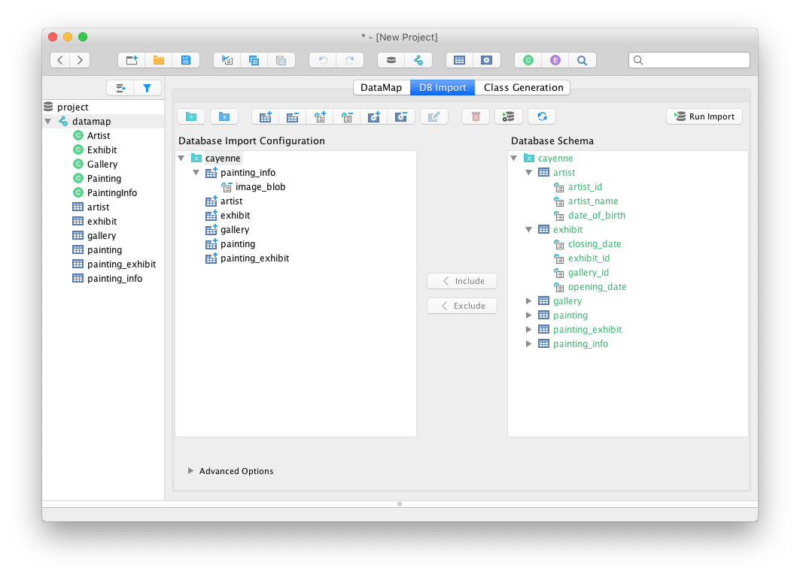

Reverse Engineering dialog.

Here is a list of options to tune what will be processed by reverse engineering:

- **Add Catalog**
- **Add Schema**
- **Add Include Table**
- **Add Exclude Table**
- **Add Include Column**
- **Add Exclude Column**
- **Add Include Procedure**
- **Add Exclude Procedure**
- **Tables with Meaningful PK Pattern**: Comma separated list of RegExp’s for tables that you want to have meaningful primary keys. By default no meaningful PKs are created.
- **Strip from table names**: Regex that matches the part of the table name that needs to be stripped off generating ObjEntity name.
- **Skip relationships loading**: Whether to load relationships.
- **Skip primary key loading**: Whether to load primary keys.
- **Force datamap catalog**: will set DbEntity catalog to one in the DataMap.
- **Force datamap schema**: will set DbEntity schema to one in the DataMap.
- **Use Java primitive types**: Use primitive types (e.g. **int**) or Object types (e.g. **java.lang.Integer**).
- **Use old java.util.Date type**: Use **java.util.Date** for all columns with **DATE/TIME/TIMESTAMP** types. By default **java.time.** types will be used.

<a id="cayenne-guide--datasource-selection"></a>
<a id="cayenne-guide--3.4.2.-datasource-selection"></a>

#### 3.4.2. DataSource selection

Then you click `Run Import` or `Configure Connection` to set DataSource. If you don’t have any DataSource yet you can create one from this menu.

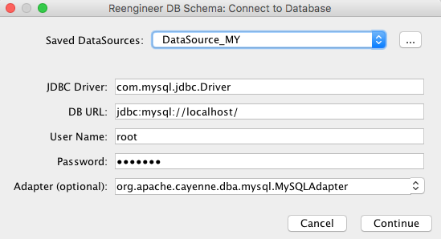

Datasource selection dialog.

Then click `continue` to start dbImport.

<a id="cayenne-guide--additional-modules"></a>
<a id="cayenne-guide--4.-additional-modules"></a>

## 4. Additional Modules

<a id="cayenne-guide--ext-cache-invalidation"></a>
<a id="cayenne-guide--4.1.-cache-invalidation-extension"></a>

### 4.1. Cache Invalidation Extension

Cache invalidation module is an extension that allows to define cache invalidation policy programmatically.

<a id="cayenne-guide--maven-2"></a>
<a id="cayenne-guide--4.1.1.-maven"></a>

#### 4.1.1. Maven

```XML
<dependency>
    <groupId>org.apache.cayenne</groupId>
    <artifactId>cayenne-cache-invalidation</artifactId>
    <version>4.2.3</version>
</dependency>
```

<a id="cayenne-guide--gradle-2"></a>
<a id="cayenne-guide--4.1.2.-gradle"></a>

#### 4.1.2. Gradle

```Groovy
compile 'org.apache.cayenne:cayenne-cache-invalidation:4.2.3'
```

<a id="cayenne-guide--usage"></a>
<a id="cayenne-guide--4.1.3.-usage"></a>

#### 4.1.3. Usage

Module supports autoloading mechanism, so no other actions required to enable it. Just mark your entities with @CacheGroups annotation and you are ready to use it:

```java
@CacheGroups("some-group")
public class MyEntity extends _MyEntity {
    // ...
}
```

After any modification of `MyEntity` objects cache group `"some-group"` will be dropped from cache automatically.

> [!NOTE]
> |  |  |
> | --- | --- |
> |  | You can read more about cache and cache groups in corresponding [chapter](#cayenne-guide--caching) of this documentation. |

In case you need some complex logic of cache invalidation you can disable default behaviour and provide your own.

To do so you need to implement `o.a.c.cache.invalidation.InvalidationHandler` interface and setup Cache Invalidation module to use it. Let’s use implementation class called `CustomInvalidationHandler` that will simply match all entities' types with `"custom-group"` cache group regardless of any annotations:

```java
public class CustomInvalidationHandler implements InvalidationHandler {
    @Override
    public InvalidationFunction canHandle(Class<? extends Persistent> type) {
        return p -> Collections.singleton(new CacheGroupDescriptor("custom-group"));
    }
}
```

Now we’ll set up it’s usage by `ServerRuntime`:

```java
ServerRuntime.builder()
        .addModule(CacheInvalidationModule.extend()
                // optionally you can disable @CacheGroups annotation processing
                .noCacheGroupsHandler()
                .addHandler(CustomInvalidationHandler.class)
                .module())
```

> [!NOTE]
> |  |  |
> | --- | --- |
> |  | You can combine as many invalidation handlers as you need. |

<a id="cayenne-guide--ext-commit-log"></a>
<a id="cayenne-guide--4.2.-commit-log-extension"></a>

### 4.2. Commit log extension

The goal of this module is to capture commit changes and present them to interested parties in an easy-to-process format.

<a id="cayenne-guide--maven-3"></a>
<a id="cayenne-guide--4.2.1.-maven"></a>

#### 4.2.1. Maven

```XML
<dependency>
    <groupId>org.apache.cayenne</groupId>
    <artifactId>cayenne-commitlog</artifactId>
    <version>4.2.3</version>
</dependency>
```

<a id="cayenne-guide--gradle-3"></a>
<a id="cayenne-guide--4.2.2.-gradle"></a>

#### 4.2.2. Gradle

```Groovy
compile 'org.apache.cayenne:cayenne-commitlog:4.2.3'
```

<a id="cayenne-guide--usage-2"></a>
<a id="cayenne-guide--4.2.3.-usage"></a>

#### 4.2.3. Usage

In order to use `commitlog` module you need to perform three steps:

1. Mark all entities which changes you are interested in with `@org.apache.cayenne.commitlog.CommitLog` annotation


```Java
@CommitLog(ignoredProperties = {"somePrivatePropertyToSkip"})
public class MyEntity extends _MyEntity {
    // ...
}
```

2. Implement `CommitLogListener` interface.


```java
public class MyCommitLogListener implements CommitLogListener {
    @Override
    public void onPostCommit(ObjectContext originatingContext, ChangeMap changes) {
        // ChangeMap will contain all information about changes happened in performed commit
        // this particular example will print IDs of all inserted objects
        changes.getUniqueChanges().stream()
            .filter(change -> change.getType() == ObjectChangeType.INSERT)
            .map(ObjectChange::getPostCommitId)
            .forEach(id -> System.out.println("Inserted new entity with id: " + id));
    }
}
```

3. Register your listener implementation.


```java
ServerRuntime.builder()
        .addModule(CommitLogModule.extend()
                .addListener(MyCommitLogListener.class)
                .module())
```


> [!NOTE]
> |  |  |
> | --- | --- |
> |  | You can use several listeners, but they all will get same changes. |

<a id="cayenne-guide--ext-crypto"></a>
<a id="cayenne-guide--4.3.-crypto-extension"></a>

### 4.3. Crypto extension

Crypto module allows encrypt and decrypt values stored in DB transparently to your Java app.

<a id="cayenne-guide--maven-4"></a>
<a id="cayenne-guide--4.3.1.-maven"></a>

#### 4.3.1. Maven

```XML
<dependency>
    <groupId>org.apache.cayenne</groupId>
    <artifactId>cayenne-crypto</artifactId>
    <version>4.2.3</version>
</dependency>
```

<a id="cayenne-guide--gradle-4"></a>
<a id="cayenne-guide--4.3.2.-gradle"></a>

#### 4.3.2. Gradle

```Groovy
compile 'org.apache.cayenne:cayenne-crypto:4.2.3'
```

<a id="cayenne-guide--usage-3"></a>
<a id="cayenne-guide--4.3.3.-usage"></a>

#### 4.3.3. Usage

<a id="cayenne-guide--setup-your-model-and-db"></a>
<a id="cayenne-guide--4.3.3.1.-setup-your-model-and-db"></a>

##### 4.3.3.1. Setup your model and DB

To use crypto module you must prepare your database to allow `byte[]` storage and properly name columns that will contain encrypted values.

Currently supported SQL types that can be used to store encrypted data are:

1. Binary types: `BINARY, BLOB, VARBINARY, LONGVARBINARY`. These types are preferred.
2. Character types, that will store `base64` encoded value: `CHAR, NCHAR, CLOB, NCLOB, LONGVARCHAR, LONGNVARCHAR, VARCHAR, NVARCHAR`.

> [!NOTE]
> |  |  |
> | --- | --- |
> |  | Not all data types may be supported by your database. |

Default naming strategy that doesn’t require additional setup suggests using "CRYPTO\_" prefix. You can change this default strategy by injecting you own implementation of `o.a.c.crypto.map.ColumnMapper` interface.

```java
ServerRuntime.builder()
        .addModule(CryptoModule.extend()
                .columnMapper(MyColumnMapper.class)
                .module())
```

Here is an example of how `ObjEntity` with two encrypted and two unencrypted properties can look like:

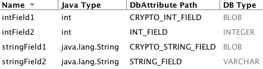

<a id="cayenne-guide--setup-keystore"></a>
<a id="cayenne-guide--4.3.3.2.-setup-keystore"></a>

##### 4.3.3.2. Setup keystore

To perform encryption you must provide `KEYSTORE_URL` and `KEY_PASSWORD`. Currently crypto module supports only Java "jceks" KeyStore.

```java
ServerRuntime.builder()
        .addModule(CryptoModule.extend()
                .keyStore(this.getClass().getResource("keystore.jcek"), "my-password".toCharArray(), "my-key-alias")
                .module())
```

<a id="cayenne-guide--additional-settings"></a>
<a id="cayenne-guide--4.3.3.3.-additional-settings"></a>

##### 4.3.3.3. Additional settings

Additionally to `ColumnMapper` mentioned above you can customize other parts of `crypto module`. You can enable `gzip` compression and `HMAC` usage (later will ensure integrity of data).

```java
ServerRuntime.builder()
        .addModule(CryptoModule.extend()
                .compress()
                .useHMAC()
                .module())
```

Another useful extension point is support for custom Java value types. To add support for your data type you need to implement `o.a.c.crypto.transformer.value.BytesConverter` interface that will convert required type to and from `byte[]`.

```java
ServerRuntime.builder()
        .addModule(CryptoModule.extend()
                .objectToBytesConverter(MyClass.class, new MyClassBytesConverter())
                .module())
```

> [!NOTE]
> |  |  |
> | --- | --- |
> |  | In addition to Java primitive types (and their object counterparts), `crypto module` supports encryption only of `java.util.Date, java.math.BigInteger` and `java.math.BigDecimal` types. |

<a id="cayenne-guide--ext-jcache"></a>
<a id="cayenne-guide--4.4.-jcache-integration"></a>

### 4.4. JCache integration

Allows to integrate any JCache (JSR 107) compatible caching provider with Cayenne.

<a id="cayenne-guide--maven-5"></a>
<a id="cayenne-guide--4.4.1.-maven"></a>

#### 4.4.1. Maven

```XML
<dependency>
    <groupId>org.apache.cayenne</groupId>
    <artifactId>cayenne-jcache</artifactId>
    <version>4.2.3</version>
</dependency>
```

<a id="cayenne-guide--gradle-5"></a>
<a id="cayenne-guide--4.4.2.-gradle"></a>

#### 4.4.2. Gradle

```Groovy
compile 'org.apache.cayenne:cayenne-jcache:4.2.3'
```

<a id="cayenne-guide--usage-4"></a>
<a id="cayenne-guide--4.4.3.-usage"></a>

#### 4.4.3. Usage

To use JCache provider in your app you need to include this module and caching provider libs (e.g. Ehcache). You can provide own implementation of `org.apache.cayenne.jcache.JCacheConfigurationFactory` to customize cache configuration if required.

For advanced configuration and management please use provider specific options and tools.

JCache module supports custom configuration files for cache managers.

```java
ServerRuntime.builder()
        .addModule(binder ->
                JCacheModule
                    .contributeJCacheProviderConfig(binder, "cache-config.xml"));
```

Also JCache module supports contribution of pre-configured cache manager.

```java
ServerRuntime.builder()
        .addModule(binder ->
                binder.bind(CacheManager.class).toInstance(customCacheManager));
```

> [!NOTE]
> |  |  |
> | --- | --- |
> |  | You can read about using cache in Cayenne in [this](#cayenne-guide--caching) chapter. |

You may else be interested in [[Cache invalidation extension]](#cayenne-guide--cache-invalidation-extension).

<a id="cayenne-guide--ehcache-setup-example"></a>
<a id="cayenne-guide--4.4.3.1.-ehcache-setup-example"></a>

##### 4.4.3.1. Ehcache setup example

Here is an example of using `ehcache` as cache manager.

First you need to include `ehcache` dependency:

```XML
<dependency>
    <groupId>org.ehcache</groupId>
    <artifactId>ehcache</artifactId>
    <version>{ehcache-version}</version>
</dependency>
```

If you need custom configuration you can contribute configuration file to JCache module:

```java
ServerRuntime.builder()
        .addModule(binder ->
                JCacheModule
                    .contributeJCacheProviderConfig(binder, "file:/ehcache.xml"));
```

As a result you will have `ehcache` manager as your default cache manager.

<a id="cayenne-guide--ext-project-compatibility"></a>
<a id="cayenne-guide--4.5.-project-compatibility-extension"></a>

### 4.5. Project compatibility extension

Since version 4.1 Cayenne doesn’t allow to load project XML files from previous versions as this can lead to unexpected errors in runtime. This module allows to use project files from older versions performing their upgrade on the fly (without modifying files). This can be useful when using Cayenne models from third-party libraries in your app.

> [!NOTE]
> |  |  |
> | --- | --- |
> |  | You should prefer explicit project upgrade via Cayenne Modeler. |

<a id="cayenne-guide--maven-6"></a>
<a id="cayenne-guide--4.5.1.-maven"></a>

#### 4.5.1. Maven

```XML
<dependency>
    <groupId>org.apache.cayenne</groupId>
    <artifactId>cayenne-project-compatibility</artifactId>
    <version>4.2.3</version>
</dependency>
```

<a id="cayenne-guide--gradle-6"></a>
<a id="cayenne-guide--4.5.2.-gradle"></a>

#### 4.5.2. Gradle

```Groovy
compile 'org.apache.cayenne:cayenne-project-compatibility:4.2.3'
```

<a id="cayenne-guide--usage-5"></a>
<a id="cayenne-guide--4.5.3.-usage"></a>

#### 4.5.3. Usage

This module doesn’t require any additional setup.

<a id="cayenne-guide--ext-velocity"></a>
<a id="cayenne-guide--4.6.-apache-velocity-extension"></a>

### 4.6. Apache Velocity Extension

Enables usage of full featured Apache Velocity templates in `SQLSelect` / `SQLExec` queries.

<a id="cayenne-guide--maven-7"></a>
<a id="cayenne-guide--4.6.1.-maven"></a>

#### 4.6.1. Maven

```XML
<dependency>
    <groupId>org.apache.cayenne</groupId>
    <artifactId>cayenne-velocity</artifactId>
    <version>4.2.3</version>
</dependency>
```

<a id="cayenne-guide--gradle-7"></a>
<a id="cayenne-guide--4.6.2.-gradle"></a>

#### 4.6.2. Gradle

```Groovy
compile 'org.apache.cayenne:cayenne-velocity:4.2.3'
```

<a id="cayenne-guide--usage-6"></a>
<a id="cayenne-guide--4.6.3.-usage"></a>

#### 4.6.3. Usage

This module doesn’t require any additional setup. In addition of directives mentioned in [this chapter](#cayenne-guide--directives), this module also adds `#chain` and `#chunk` directives.

`#chain` and `#chunk` directives are used for conditional inclusion of SQL code. They are used together with `#chain` wrapping multiple `#chunks`. A chunk evaluates its parameter expression and if it is NULL suppresses rendering of the enclosed SQL block. A chain renders its prefix and its chunks joined by the operator. If all the chunks are suppressed, the chain itself is suppressed. This allows to work with otherwise hard to script SQL semantics. E.g. a WHERE clause can contain multiple conditions joined with AND or OR. Application code would like to exclude a condition if its right-hand parameter is not present (similar to Expression pruning discussed above). If all conditions are excluded, the entire WHERE clause should be excluded. chain/chunk allows to do that.

Semantics:

```
#chain(operator) ... #end
#chain(operator prefix) ... #end
#chunk() ... #end
#chunk(param) ... #end
```

Full example:

```
#chain('OR' 'WHERE')
    #chunk($name) NAME LIKE #bind($name) #end
    #chunk($id) ARTIST_ID > #bind($id) #end
#end"
```

<a id="cayenne-guide--ext-web"></a>
<a id="cayenne-guide--4.7.-cayenne-web-extension"></a>

### 4.7. Cayenne Web Extension

Provides basic utilities to bootstrap Cayenne service inside web application.

<a id="cayenne-guide--maven-8"></a>
<a id="cayenne-guide--4.7.1.-maven"></a>

#### 4.7.1. Maven

```XML
<dependency>
    <groupId>org.apache.cayenne</groupId>
    <artifactId>cayenne-web</artifactId>
    <version>4.2.3</version>
</dependency>
```

<a id="cayenne-guide--gradle-8"></a>
<a id="cayenne-guide--4.7.2.-gradle"></a>

#### 4.7.2. Gradle

```Groovy
compile 'org.apache.cayenne:cayenne-web:4.2.3'
```

<a id="cayenne-guide--ext-osgi"></a>
<a id="cayenne-guide--4.8.-cayenne-osgi-extension"></a>

### 4.8. Cayenne OSGI extension

Helps to bootstrap Cayenne in OSGi environment.

<a id="cayenne-guide--maven-9"></a>
<a id="cayenne-guide--4.8.1.-maven"></a>

#### 4.8.1. Maven

```XML
<dependency>
    <groupId>org.apache.cayenne</groupId>
    <artifactId>cayenne-osgi</artifactId>
    <version>4.2.3</version>
</dependency>
```

<a id="cayenne-guide--gradle-9"></a>
<a id="cayenne-guide--4.8.2.-gradle"></a>

#### 4.8.2. Gradle

```Groovy
compile 'org.apache.cayenne:cayenne-osgi:4.2.3'
```

<a id="cayenne-guide--ext-rop"></a>
<a id="cayenne-guide--4.9.-cayenne-rop-server-extension"></a>

### 4.9. Cayenne ROP Server Extension

Creates services for the server side of an [ROP](#cayenne-guide--rop) application.

<a id="cayenne-guide--maven-10"></a>
<a id="cayenne-guide--4.9.1.-maven"></a>

#### 4.9.1. Maven

```XML
<dependency>
    <groupId>org.apache.cayenne</groupId>
    <artifactId>cayenne-rop-server</artifactId>
    <version>4.2.3</version>
</dependency>
```

<a id="cayenne-guide--gradle-10"></a>
<a id="cayenne-guide--4.9.2.-gradle"></a>

#### 4.9.2. Gradle

```Groovy
compile 'org.apache.cayenne:cayenne-rop-server:4.2.3'
```

<a id="cayenne-guide--build_tools"></a>
<a id="cayenne-guide--5.-build-tools"></a>

## 5. Build Tools

While we encourage the use of [CayenneModeler](#cayenne-guide--cayenne-modeler) for tasks such as DB reverse-engineering and code generation, Cayenne also provides an option to execute them from your preferred build tool. It may be occasionally useful to keep them as a part of the build. This chapter shows how to use them in [Maven](#cayenne-guide--maven_plugin), [Gradle](#cayenne-guide--gradle_plugin) or [Ant](#cayenne-guide--ant_tasks).

<a id="cayenne-guide--maven_plugin"></a>
<a id="cayenne-guide--5.1.-maven-plugin"></a>

### 5.1. Maven Plugin

The full plugin Maven name is `org.apache.cayenne.plugins:cayenne-maven-plugin`. It can be executed as `mvn cayenne:<goal>`.

<a id="cayenne-guide--cgen"></a>
<a id="cayenne-guide--5.1.1.-cgen"></a>

#### 5.1.1. cgen

`cgen` is a goal that generates and maintains source (.java) files of persistent objects based on a DataMap. By default, it is bound to the generate-sources phase. If "makePairs" is set to "true" (which is the recommended default), this task will generate a pair of classes (superclass/subclass) for each ObjEntity in the DataMap. Superclasses should not be changed manually, since they are always overwritten. Subclasses are never overwritten and may be later customized by the user. If "makePairs" is set to "false", a single class will be generated for each ObjEntity.

By creating custom templates, you can use cgen to generate other output (such as web pages, reports, specialized code templates) based on DataMap information.

<table class="tableblock frame-all grid-all stretch table table-bordered" id="tablecgen">
<caption>
      Table 5. cgen required parameters
     </caption>
<colgroup>
<col/>
<col/>
<col/>
</colgroup>
<thead>
<tr>
<th>Name</th>
<th>Type</th>
<th>Description</th>
</tr>
</thead>
<tbody>
<tr>
<td>
<p>map</p></td>
<td>
<p>File</p></td>
<td>
<div>
<div>
<p>DataMap XML file which serves as a source of metadata for class generation. E.g.</p>
</div>
<div>
<div>
<pre><code>${project.basedir}/src/main/resources/my.map.xml</code></pre>
</div>
</div>
</div></td>
</tr>
</tbody>
</table>

Table 6. cgen optional parameters

| Name | Type | Description |
| --- | --- | --- |
| additionalMaps | File | A directory that contains additional DataMap XML files that may be needed to resolve cross-DataMap relationships for the the main DataMap, for which class generation occurs. |
| client | boolean | Whether we are generating classes for the client tier in a Remote Object Persistence application. "False" by default. |
| destDir | File | Root destination directory for Java classes (ignoring their package names). The default is "src/main/java". |
| embeddableTemplate | String | Location of a custom Velocity template file for Embeddable class generation. If omitted, default template is used. |
| embeddableSuperTemplate | String | Location of a custom Velocity template file for Embeddable superclass generation. Ignored unless "makepairs" set to "true". If omitted, default template is used. |
| encoding | String | Generated files encoding if different from the default on current platform. Target encoding must be supported by the JVM running the build. Standard encodings supported by Java on all platforms are US-ASCII, ISO-8859-1, UTF-8, UTF-16BE, UTF-16LE, UTF-16. See javadocs for java.nio.charset.Charset for more information. |
| excludeEntities | String | A comma-separated list of ObjEntity patterns (expressed as a perl5 regex) to exclude from template generation. By default none of the DataMap entities are excluded. |
| includeEntities | String | A comma-separated list of ObjEntity patterns (expressed as a perl5 regex) to include from template generation. By default all DataMap entities are included. |
| makePairs | boolean | If "true" (a recommended default), will generate subclass/superclass pairs, with all generated code placed in superclass. |
| mode | String | Specifies class generator iteration target. There are three possible values: "entity" (default), "datamap", "all". "entity" performs one generator iteration for each included ObjEntity, applying either standard to custom entity templates. "datamap" performs a single iteration, applying DataMap templates. "All" is a combination of entity and datamap. |
| overwrite | boolean | Only has effect when "makePairs" is set to "false". If "overwrite" is "true", will overwrite older versions of generated classes. |
| superPkg | String | Java package name of all generated superclasses. If omitted, each superclass will be placed in the subpackage of its subclass called "auto". Doesn’t have any effect if either "makepairs" or "usePkgPath" are false (both are true by default). |
| superTemplate | String | Location of a custom Velocity template file for ObjEntity superclass generation. Only has effect if "makepairs" set to "true". If omitted, default template is used. |
| template | String | Location of a custom Velocity template file for ObjEntity class generation. If omitted, default template is used. |
| usePkgPath | boolean | If set to "true" (default), a directory tree will be generated in "destDir" corresponding to the class package structure, if set to "false", classes will be generated in "destDir" ignoring their package. |
| createPropertyNames | boolean | If set to "true", will generate String Property names. Default is "false" |
| force | boolean | If set to "true", will force run from maven/gradle. |
| createPKProperties | boolean | If set to "true", will generate PK attributes as Properties. Default is "false". |

Example - a typical class generation scenario, where pairs of classes are generated with default Maven source destination and superclass package:

```xml
<plugin>
    <groupId>org.apache.cayenne.plugins</groupId>
    <artifactId>cayenne-maven-plugin</artifactId>
    <version>4.2.3</version>

    <configuration>
        <map>${project.basedir}/src/main/resources/my.map.xml</map>
    </configuration>

    <executions>
        <execution>
            <goals>
                <goal>cgen</goal>
            </goals>
        </execution>
    </executions>
</plugin>
```

<a id="cayenne-guide--mavencdbimort"></a>
<a id="cayenne-guide--5.1.2.-cdbimport"></a>

#### 5.1.2. cdbimport

`cdbimport` is a `cayenne-maven-plugin` goal that generates a DataMap based on an existing database schema. By default, it is bound to the generate-sources phase. This allows you to generate your DataMap prior to building your project, possibly followed by "cgen" execution to generate the classes. CDBImport plugin described in details in chapter [DB-First Flow](#cayenne-guide--db-first-flow)

Table 7. cdbimport parameters

| Name | Type | Required | Description |
| --- | --- | --- | --- |
| map | File | Yes | DataMap XML file which is the destination of the schema import. Can be an existing file. If this file does not exist, it is created when cdbimport is executed. E.g. `${project.basedir}/src/main/resources/my.map.xml`. If "overwrite" is true (the default), an existing DataMap will be used as a template for the new imported DataMap, i.e. all its entities will be cleared and recreated, but its common settings, such as default Java package, will be preserved (unless changed explicitly in the plugin configuration). |
| cayenneProject | File | No | Project XML file which will be used. Can be an existing file, in this case data map will be added to project if it’s not already there. If this file does not exist, it is created when cdbimport is executed. E.g. `${project.basedir}/src/main/resources/cayenne-project.xml`. |
| adapter | String | No | A Java class name implementing org.apache.cayenne.dba.DbAdapter. This attribute is optional. If not specified, AutoAdapter is used, which will attempt to guess the DB type. |
| dataSource | XML | Yes | An object that contains Data Source parameters. |
| dbimport | XML | No | An object that contains detailed reverse engineering rules about what DB objects should be processed. For full information about this parameter see [DB-First Flow](#cayenne-guide--db-first-flow) chapter. |

Table 8. <dataSource> parameters

| Name | Type | Required | Description |
| --- | --- | --- | --- |
| driver | String | Yes | A class of JDBC driver to use for the target database. |
| url | String | Yes | JDBC URL of a target database. |
| username | String | No | Database user name. |
| password | String | No | Database user password. |

<table class="tableblock frame-all grid-all stretch table table-bordered" id="dbimportParameters">
<caption>
      Table 9. &lt;dbimport&gt; parameters
     </caption>
<colgroup>
<col/>
<col/>
<col/>
</colgroup>
<thead>
<tr>
<th>Name</th>
<th>Type</th>
<th>Description</th>
</tr>
</thead>
<tbody>
<tr>
<td>
<p>defaultPackage</p></td>
<td>
<p>String</p></td>
<td>
<p>A Java package that will be set as the imported DataMap default and a package of all the persistent Java classes. This is a required attribute if the "map" itself does not already contain a default package, as otherwise all the persistent classes will be mapped with no package, and will not compile.</p></td>
</tr>
<tr>
<td>
<p>forceDataMapCatalog</p></td>
<td>
<p>boolean</p></td>
<td>
<p>Automatically tagging each DbEntity with the actual DB catalog/schema (default behavior) may sometimes be undesirable. If this is the case then setting <code>forceDataMapCatalog</code> to <code>true</code> will set DbEntity catalog to one in the DataMap. Default value is <code>false</code>.</p></td>
</tr>
<tr>
<td>
<p>forceDataMapSchema</p></td>
<td>
<p>boolean</p></td>
<td>
<p>Automatically tagging each DbEntity with the actual DB catalog/schema (default behavior) may sometimes be undesirable. If this is the case then setting <code>forceDataMapSchema</code> to <code>true</code> will set DbEntity schema to one in the DataMap. Default value is <code>false</code>.</p></td>
</tr>
<tr>
<td>
<p>meaningfulPkTables</p></td>
<td>
<p>String</p></td>
<td>
<p>A comma-separated list of Perl5 patterns that defines which imported tables should have their primary key columns mapped as ObjAttributes. "*" would indicate all tables.</p></td>
</tr>
<tr>
<td>
<p><a id="namingStrategy"></a>namingStrategy</p></td>
<td>
<p>String</p></td>
<td>
<p>The naming strategy used for mapping database names to object entity names. Default is <code>o.a.c.dbsync.naming.DefaultObjectNameGenerator</code>.</p></td>
</tr>
<tr>
<td>
<p>skipPrimaryKeyLoading</p></td>
<td>
<p>boolean</p></td>
<td>
<p>Whether to load primary keys. Default "false".</p></td>
</tr>
<tr>
<td>
<p>skipRelationshipsLoading</p></td>
<td>
<p>boolean</p></td>
<td>
<p>Whether to load relationships. Default "false".</p></td>
</tr>
<tr>
<td>
<p>stripFromTableNames</p></td>
<td>
<p>String</p></td>
<td>
<div>
<div>
<p>Regex that matches the part of the table name that needs to be stripped off when generating ObjEntity name. Here are some examples:</p>
</div>
<div>
<div>
<pre><code><span>&lt;!-- Strip prefix --&gt;</span>
<span>&lt;stripFromTableNames&gt;</span>^myt_<span>&lt;/stripFromTableNames&gt;</span>

<span>&lt;!-- Strip suffix --&gt;</span>
<span>&lt;stripFromTableNames&gt;</span>_s$<span>&lt;/stripFromTableNames&gt;</span>

<span>&lt;!-- Strip multiple occurrences in the middle --&gt;</span>
<span>&lt;stripFromTableNames&gt;</span>_abc<span>&lt;/stripFromTableNames&gt;</span></code></pre>
</div>
</div>
</div></td>
</tr>
<tr>
<td>
<p>usePrimitives</p></td>
<td>
<p>boolean</p></td>
<td>
<p>Whether numeric and boolean data types should be mapped as Java primitives or Java classes. Default is "true", i.e. primitives will be used.</p></td>
</tr>
<tr>
<td>
<p>useJava7Types</p></td>
<td>
<p>boolean</p></td>
<td>
<p>Whether <em>DATE</em>, <em>TIME</em> and <em>TIMESTAMP</em> data types should be mapped as <code>java.util.Date</code> or <code>java.time.* classes</code>. Default is "false", i.e. <code>java.time.*</code> will be used.</p></td>
</tr>
<tr>
<td>
<p>tableTypes</p></td>
<td>
<p>Collection&lt;String&gt;</p></td>
<td>
<div>
<div>
<p>Collection of table types to import. By default "TABLE" and "VIEW" types are used. Typical types are:</p>
</div>
<div>
<ul>
<li>
<p>TABLE</p></li>
<li>
<p>VIEW</p></li>
<li>
<p>SYSTEM TABLE</p></li>
<li>
<p>GLOBAL TEMPORARY</p></li>
<li>
<p>LOCAL TEMPORARY</p></li>
<li>
<p>ALIAS</p></li>
<li>
<p>SYNONYM</p></li>
</ul>
</div>
</div></td>
</tr>
<tr>
<td>
<p>filters configuration</p></td>
<td>
<p>XML</p></td>
<td>
<div>
<div>
<p>Detailed reverse engineering rules about what DB objects should be processed. For full information about this parameter see <a href="#cayenne-guide--db-first-flow">DB-First Flow</a> chapter. Here is some simple example:</p>
</div>
<div>
<div>
<pre><code><span>&lt;dbimport&gt;</span>
        <span>&lt;catalog</span> <span>name</span>=<span><span>"</span><span>test_catalog</span><span>"</span></span><span>&gt;</span>
                <span>&lt;schema</span> <span>name</span>=<span><span>"</span><span>test_schema</span><span>"</span></span><span>&gt;</span>
                        <span>&lt;includeTable&gt;</span>.*<span>&lt;/includeTable&gt;</span>
                        <span>&lt;excludeTable&gt;</span>test_table<span>&lt;/excludeTable&gt;</span>
                <span>&lt;/schema&gt;</span>
        <span>&lt;/catalog&gt;</span>

        <span>&lt;includeProcedure</span> <span>pattern</span>=<span><span>"</span><span>.*</span><span>"</span></span><span>/&gt;</span>
<span>&lt;/dbimport&gt;</span></code></pre>
</div>
</div>
</div></td>
</tr>
</tbody>
</table>

Example - loading a DB schema from a local HSQLDB database (essentially a reverse operation compared to the cdbgen example above) :

```XML
<plugin>
    <groupId>org.apache.cayenne.plugins</groupId>
    <artifactId>cayenne-maven-plugin</artifactId>
    <version>4.2.3</version>

    <executions>
        <execution>
            <configuration>
                <map>${project.basedir}/src/main/resources/my.map.xml</map>
                <dataSource>
                    <url>jdbc:mysql://127.0.0.1/mydb</url>
                    <driver>com.mysql.jdbc.Driver</driver>
                    <username>sa</username>
                </dataSource>
                <dbimport>
                    <defaultPackage>com.example.cayenne</defaultPackage>
                </dbimport>
            </configuration>
            <goals>
                <goal>cdbimport</goal>
            </goals>
        </execution>
    </executions>
</plugin>
```

<a id="cayenne-guide--cdbgen"></a>
<a id="cayenne-guide--5.1.3.-cdbgen"></a>

#### 5.1.3. cdbgen

`cdbgen` is a `cayenne-maven-plugin` goal that drops and/or generates tables in a database on Cayenne DataMap. By default, it is bound to the pre-integration-test phase.

<table class="tableblock frame-all grid-all stretch table table-bordered" id="cdbgenTable">
<caption>
      Table 10. cdbgen required parameters
     </caption>
<colgroup>
<col/>
<col/>
<col/>
</colgroup>
<thead>
<tr>
<th>Name</th>
<th>Type</th>
<th>Description</th>
</tr>
</thead>
<tbody>
<tr>
<td>
<p>map</p></td>
<td>
<p>File</p></td>
<td>
<div>
<div>
<p>DataMap XML file which serves as a source of metadata for class generation. E.g.</p>
</div>
<div>
<div>
<pre><code>${project.basedir}/src/main/resources/my.map.xml</code></pre>
</div>
</div>
</div></td>
</tr>
<tr>
<td>
<p>dataSource</p></td>
<td>
<p>XML</p></td>
<td>
<p>An object that contains Data Source parameters</p></td>
</tr>
</tbody>
</table>

Table 11. <dataSource> parameters

| Name | Type | Required | Description |
| --- | --- | --- | --- |
| driver | String | Yes | A class of JDBC driver to use for the target database. |
| url | String | Yes | JDBC URL of a target database. |
| username | String | No | Database user name. |
| password | String | No | Database user password. |

Table 12. cdbgen optional parameters

| Name | Type | Description |
| --- | --- | --- |
| adapter | String | Java class name implementing org.apache.cayenne.dba.DbAdapter. While this attribute is optional (a generic JdbcAdapter is used if not set), it is highly recommended to specify correct target adapter. |
| createFK | boolean | Indicates whether cdbgen should create foreign key constraints. Default is "true". |
| createPK | boolean | Indicates whether cdbgen should create Cayenne-specific auto PK objects. Default is "true". |
| createTables | boolean | Indicates whether cdbgen should create new tables. Default is "true". |
| dropPK | boolean | Indicates whether cdbgen should drop Cayenne primary key support objects. Default is "false". |
| dropTables | boolean | Indicates whether cdbgen should drop the tables before attempting to create new ones. Default is "false". |

Example - creating a DB schema on a local HSQLDB database:

```xml
<plugin>
    <groupId>org.apache.cayenne.plugins</groupId>
    <artifactId>cayenne-maven-plugin</artifactId>
    <version>4.2.3</version>
    <executions>
        <execution>
            <configuration>
                <map>${project.basedir}/src/main/resources/my.map.xml</map>
                <adapter>org.apache.cayenne.dba.hsqldb.HSQLDBAdapter</adapter>
                <dataSource>
                    <url>jdbc:hsqldb:hsql://localhost/testdb</url>
                    <driver>org.hsqldb.jdbcDriver</driver>
                    <username>sa</username>
                </dataSource>
            </configuration>
            <goals>
                <goal>cdbgen</goal>
            </goals>
        </execution>
    </executions>
</plugin>
```

<a id="cayenne-guide--gradle_plugin"></a>
<a id="cayenne-guide--5.2.-gradle-plugin"></a>

### 5.2. Gradle Plugin

Cayenne Gradle plugin provides tasks similar to [Maven plugin](#cayenne-guide--maven_plugin). It also provides `cayenne` extension that has some useful utility methods. Here is example of how to include Cayenne plugin into your project:

```Groovy
buildscript {
    // add Maven Central repository
    repositories {
        mavenCentral()
    }
    // add Cayenne Gradle Plugin
    dependencies {
        classpath group: 'org.apache.cayenne.plugins', name: 'cayenne-gradle-plugin', version: '4.2.3'
    }
}

// apply plugin
apply plugin: 'org.apache.cayenne'

// set default DataMap
cayenne.defaultDataMap 'datamap.map.xml'

// add Cayenne dependencies to your project
dependencies {
    // this is a shortcut for 'org.apache.cayenne:cayenne-server:VERSION_OF_PLUGIN'
    compile cayenne.dependency('server')
}
```

> [!NOTE]
> |  |  |
> | --- | --- |
> |  | Cayenne Gradle plugin is experimental and it’s API may still change. |

<a id="cayenne-guide--cgen-2"></a>
<a id="cayenne-guide--5.2.1.-cgen"></a>

#### 5.2.1. cgen

Cgen task generates Java classes based on your DataMap, it has same configuration parameters as in Maven Plugin version, described in [Table, “cgen required parameters”.](#cayenne-guide--tablecgen). If you provided default DataMap via `cayenne.defaultDataMap`, you can skip `cgen` configuration as default settings will suffice in common case.

Here is how you can change settings of the default `cgen` task:

```Groovy
cgen {
    client = false
    mode = 'all'
    overwrite = true
    createPropertyNames = true
}
```

And here is example of how to define additional cgen task (e.g. for client classes if you are using ROP):

```Groovy
task clientCgen(type: cayenne.cgen) {
    client = true
}
```

<a id="cayenne-guide--cdbimport"></a>
<a id="cayenne-guide--5.2.2.-cdbimport"></a>

#### 5.2.2. cdbimport

This task is for creating and synchronizing your Cayenne model from database schema. Full list of parameters are same as in [Maven Plugin](#cayenne-guide--cdbimporttable), with the exception that Gradle version will use Groovy instead of XML. Here is example of configuration for cdbimport task:

```Groovy
cdbimport {
    // map can be skipped if it is defined in cayenne.defaultDataMap
    map 'src/main/resources/datamap.map.xml'
    // optional project file, will be created if missing
    cayenneProject 'src/main/resources/cayenne-project.xml'

    dataSource {
        driver 'com.mysql.cj.jdbc.Driver'
        url 'jdbc:mysql://127.0.0.1:3306/test?useSSL=false'
        username 'root'
        password ''
    }

    dbImport {
        // additional settings
        usePrimitives false
        defaultPackage 'org.apache.cayenne.test'

        // DB filter configuration
        catalog 'catalog-1'
        schema 'schema-1'

        catalog {
            name 'catalog-2'

            includeTable 'table0', {
                excludeColumns '_column_'
            }

            includeTables 'table1', 'table2', 'table3'

            includeTable 'table4', {
                includeColumns 'id', 'type', 'data'
            }

            excludeTable '^GENERATED_.*'
        }

        catalog {
            name 'catalog-3'
            schema {
                name 'schema-2'
                includeTable 'test_table'
                includeTable 'test_table2', {
                    excludeColumn '__excluded'
                }
            }
        }

        includeProcedure 'procedure_test_1'

        includeColumns 'id', 'version'

        tableTypes 'TABLE', 'VIEW'
    }
}
```

<a id="cayenne-guide--cdbgen-2"></a>
<a id="cayenne-guide--5.2.3.-cdbgen"></a>

#### 5.2.3. cdbgen

Cdbgen task drops and/or generates tables in a database on Cayenne DataMap. Full list of parameters is same as in the [Maven plugin](#cayenne-guide--cdbgentable). Here is example of how to configure default `cdbgen` task:

```Groovy
cdbgen {

    adapter 'org.apache.cayenne.dba.derby.DerbyAdapter'

    dataSource {
        driver 'org.apache.derby.jdbc.EmbeddedDriver'
        url 'jdbc:derby:build/testdb;create=true'
        username 'sa'
        password ''
    }

    dropTables true
    dropPk true

    createTables true
    createPk true
    createFk true
}
```

<a id="cayenne-guide--link-tasks-to-gradle-build-lifecycle"></a>
<a id="cayenne-guide--5.2.4.-link-tasks-to-gradle-build-lifecycle"></a>

#### 5.2.4. Link tasks to Gradle build lifecycle

You can connect Cayenne tasks to the default build lifecycle. Here is short example of how to connect defaut `cgen` and `cdbimport` tasks with `compileJava` task:

```Groovy
cgen.dependsOn cdbimport
compileJava.dependsOn cgen
```

<a id="cayenne-guide--ant_tasks"></a>
<a id="cayenne-guide--5.3.-ant-tasks"></a>

### 5.3. Ant Tasks

Ant tasks are the same as [Maven plugin goals](#cayenne-guide--maven_plugin) described previously, namely "cgen", "cdbgen", "cdbimport". Configuration parameters are also similar (except Maven can guess many defaults that Ant can’t). To include Ant tasks in the project, use the following Antlib:

```XML
<typedef resource="org/apache/cayenne/tools/antlib.xml">
   <classpath>
                   <fileset dir="lib" >
                        <include name="cayenne-ant-*.jar" />
                        <include name="cayenne-cgen-*.jar" />
                        <include name="cayenne-dbsync-*.jar" />
                        <include name="cayenne-di-*.jar" />
                        <include name="cayenne-project-*.jar" />
                        <include name="cayenne-server-*.jar" />
                        <include name="commons-collections-*.jar" />
                        <include name="commons-lang-*.jar" />
                        <include name="slf4j-api-*.jar" />
                        <include name="velocity-*.jar" />
                        <include name="vpp-2.2.1.jar" />
                </fileset>
   </classpath>
</typedef>
```

<a id="cayenne-guide--cgen-3"></a>
<a id="cayenne-guide--5.3.1.-cgen"></a>

#### 5.3.1. cgen

<a id="cayenne-guide--cdbgen-3"></a>
<a id="cayenne-guide--5.3.2.-cdbgen"></a>

#### 5.3.2. cdbgen

<a id="cayenne-guide--cdbimport-2"></a>
<a id="cayenne-guide--5.3.3.-cdbimport"></a>

#### 5.3.3. cdbimport

This is an Ant counterpart of "cdbimport" goal of cayenne-maven-plugin described above. It has exactly the same properties. Here is a usage example:

```XML
 <cdbimport map="${context.dir}/WEB-INF/my.map.xml"
    driver="com.mysql.jdbc.Driver"
    url="jdbc:mysql://127.0.0.1/mydb"
    username="sa"
    defaultPackage="com.example.cayenne"/>
```

<a id="cayenne-guide--rop"></a>
<a id="cayenne-guide--6.-cayenne-framework-remote-object-persistence"></a>

## 6. Cayenne Framework - Remote Object Persistence

<a id="cayenne-guide--introduction-to-rop"></a>
<a id="cayenne-guide--6.1.-introduction-to-rop"></a>

### 6.1. Introduction to ROP

<a id="cayenne-guide--what-is-rop"></a>
<a id="cayenne-guide--6.1.1.-what-is-rop"></a>

#### 6.1.1. What is ROP

"Remote Object Persistence" is a low-overhead web services-based technology that provides lightweight object persistence and query functionality to 'remote' applications. In other words it provides familiar Cayenne API to applications that do not have direct access to the database. Instead such applications would access Cayenne Web Service (CWS). A single abstract data model (expressed as Cayenne XML DataMap) is used on the server and on the client, while execution logic can be partitioned between the tiers.The following picture compares a regular Cayenne web application and a rich client application that uses remote object persistence technology:

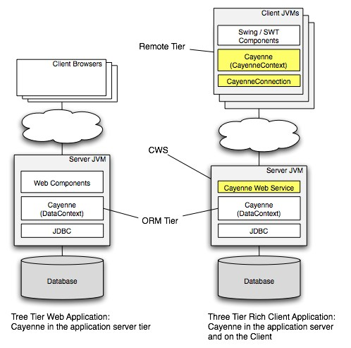

Persistence stack above consists of the following parts:

- ORM Tier: a server-side Cayenne Java application that directly connects to the database via JDBC.
- CWS (Cayenne Web Service): A wrapper around an ORM tier that makes it accessible to remote CWS clients.
- Remote Tier (aka Client Tier): A Java application that has no direct DB connection and persists its objects by connecting to remote Cayenne Web Service (CWS). Note that CWS Client doesn’t have to be a desktop application. It can be another server-side application. The word "client" means a client of Cayenne Web Service.

<a id="cayenne-guide--main-features"></a>
<a id="cayenne-guide--6.1.2.-main-features"></a>

#### 6.1.2. Main Features

- Unified approach to lightweight object persistence across multiple tiers of a distributed system.
- Same abstract object model on the server and on the client.
- Client can "bootstrap" from the server by dynamically loading persistence metadata.
- An ability to define client objects differently than the server ones, and still have seamless persistence.
- Generic web service interface that doesn’t change when object model changes.
- An ability to work in two modes: dedicated session mode or shared ("chat") mode when multiple remote clients collaboratively work on the same data.
- Lazy object and collection faulting.
- Full context lifecycle
- Queries, expressions, local query caching, paginated queries.
- Validation
- Delete Rules

<a id="cayenne-guide--rop-deployment"></a>
<a id="cayenne-guide--6.2.-rop-deployment"></a>

### 6.2. ROP Deployment

<a id="cayenne-guide--server-security-note"></a>
<a id="cayenne-guide--6.2.1.-server-security-note"></a>

#### 6.2.1. Server Security Note

Recent versions of Tomcat and Jetty containers (e.g. Tomcat 6 and 7, Jetty 8) contain code addressing a security concern related to "session fixation problem" by resetting the existing session ID of any request that requires BASIC authentication. If ROP service is protected with declarative security (see the ROP tutorial and the following chapters on security), this feature prevents the ROP client from attaching to its session, resulting in `MissingSessionExceptions`.

To solve that you will need to either switch to an alternative security mechanism, or disable "session fixation problem" protections of the container. E.g. the later can be achieved in Tomcat 7 by adding the following `context.xml` file to the webapp’s `META-INF/` directory:

```XML
<Context>
    <Valve className="org.apache.catalina.authenticator.BasicAuthenticator"
            changeSessionIdOnAuthentication="false" />
</Context>
```

(The `<Valve>` tag can also be placed within the `<Context>` in any other locations used by Tomcat to load context configurations)

<a id="cayenne-guide--appendix-a-configuration-properties"></a>
<a id="cayenne-guide--7.-appendix-a.-configuration-properties"></a>

## 7. Appendix A. Configuration Properties

Note that the property names below are defined as constants in `org.apache.cayenne.configuration.Constants` interface.

- `cayenne.jdbc.driver[.domain_name.node_name]` defines a JDBC driver class to use when creating a DataSource. If domain name and optionally - node name are specified, the setting overrides DataSource info just for this domain/node. Otherwise the override is applied to all domains/nodes in the system.

  - Default value: none, project DataNode configuration is used
- `cayenne.jdbc.url[.domain_name.node_name]` defines a DB URL to use when creating a DataSource. If domain name and optionally - node name are specified, the setting overrides DataSource info just for this domain/node. Otherwise the override is applied to all domains/nodes in the system.

  - Default value: none, project DataNode configuration is used
- `cayenne.jdbc.username[.domain_name.node_name]` defines a DB user name to use when creating a DataSource. If domain name and optionally - node name are specified, the setting overrides DataSource info just for this domain/node. Otherwise the override is applied to all domains/nodes in the system.

  - Possible values: any
  - Default value: none, project DataNode configuration is used
- `cayenne.jdbc.password[.domain_name.node_name]` defines a DB password to use when creating a DataSource. If domain name and optionally - node name are specified, the setting overrides DataSource info just for this domain/node. Otherwise the override is applied to all domains/nodes in the system

  - Default value: none, project DataNode configuration is used
- `cayenne.jdbc.min_connections[.domain_name.node_name]` defines the DB connection pool minimal size. If domain name and optionally - node name are specified, the setting overrides DataSource info just for this domain/node. Otherwise the override is applied to all domains/nodes in the system

  - Default value: none, project DataNode configuration is used
- `cayenne.jdbc.max_connections[.domain_name.node_name]` defines the DB connection pool maximum size. If domain name and optionally - node name are specified, the setting overrides DataSource info just for this domain/node. Otherwise the override is applied to all domains/nodes in the system

  - Default value: none, project DataNode configuration is used
- `cayenne.jdbc.max_wait` defines a maximum time in milliseconds that a connection request could wait in the connection queue. After this period expires, an exception will be thrown in the calling method. A value of zero will make the thread wait until a connection is available with no time out.

  - Default value: 20 seconds
- `cayenne.jdbc.validation_query` defines a SQL string that returns some result. It will be used to validate connections in the pool.

  - Default value: none
- `cayenne.querycache.size` An integer defining the maximum number of entries in the query cache. Note that not all QueryCache providers may respect this property. MapQueryCache uses it, but the rest would use alternative configuration methods.

  - Possible values: any positive int value
  - Default value: 2000
- `cayenne.DataRowStore.snapshot.size` defines snapshot cache max size

  - Possible values: any positive int
  - Default value: 10000
- `cayenne.server.contexts_sync_strategy` defines whether peer ObjectContexts should receive snapshot events after commits from other contexts. If true (*default*), the contexts would automatically synchronize their state with peers.

  - Possible values: true, false
  - Default value: false (since 4.1)
- `cayenne.server.object_retain_strategy` defines fetched objects retain strategy for ObjectContexts. When weak or soft strategy is used, objects retained by ObjectContext that have no local changes can potentially get garbage collected when JVM feels like doing it.

  - Possible values: weak, soft, hard
  - Default value: weak
- `cayenne.server.max_id_qualifier_size` defines a maximum number of ID qualifiers in the WHERE clause of queries that are generated for paginated queries and for DISJOINT\_BY\_ID prefetch processing. This is needed to avoid hitting WHERE clause size limitations and memory usage efficiency.

  - Possible values: any positive int
  - Default value: 10000
- `cayenne.server.external_tx` defines whether runtime should use external transactions.

  - Possible values: true, false
  - Default value: false
- `cayenne.server.query_execution_time_logging_threshold` defines the minimum number of milliseconds a query must run before it is logged. A value less than or equal to zero disables logging.

  - Default value: 0
- `cayenne.server.domain.name` defines an optional name of the runtime DataDomain. If not specified, the name is inferred from the configuration name.

  - Default value: none
- `cayenne.rop.service_url` defines the URL of the ROP server

  - Default value: none
- `cayenne.rop.service_username` defines the user name for an ROP client to login to an ROP server.

  - Default value: none
- `cayenne.rop.service_password` defines the password for an ROP client to login to an ROP server.

  - Default value: none
- `cayenne.rop.shared_session_name` defines the name of the shared session that an ROP client wants to join on an ROP server. If omitted, a dedicated session is created.

  - Default value: none
- `cayenne.rop.service.timeout` a value in milliseconds for the ROP client-server connection read operation timeout

  - Possible values: any positive long value
  - Default value: none
- `cayenne.rop.channel_events` defines whether client-side DataChannel should dispatch events to child ObjectContexts. If set to true, ObjectContexts will receive commit events and merge changes committed by peer contexts that passed through the common client DataChannel.

  - Possible values: true, false
  - Default value: false
- `cayenne.rop.context_change_events` defines whether object property changes in the client context result in firing events. Client UI components can listen to these events and update the UI. Disabled by default.

  - Possible values: true, false
  - Default value: false
- `cayenne.rop.context_lifecycle_events` defines whether object commit and rollback operations in the client context result in firing events. Client UI components can listen to these events and update the UI. Disabled by default.

  - Possible values: true,false
  - Default value: false
- `cayenne.server.rop_event_bridge_factory` defines the name of the `org.apache.cayenne.event.EventBridgeFactory` that is passed from the ROP server to the client. I.e. server DI would provide a name of the factory, passing this name to the client via the wire. The client would instantiate it to receive events from the server. Note that this property is stored in `cayenne.server.rop_event_bridge_properties` map, not in the main `cayenne.properties`.

  - Default value: false

<a id="cayenne-guide--appendix-b-service-collections"></a>
<a id="cayenne-guide--8.-appendix-b.-service-collections"></a>

## 8. Appendix B. Service Collections

Note that the collection keys below are defined as constants in `org.apache.cayenne.configuration.Constants` interface.

Table 13. Service Collection Keys Present in ServerRuntime and/or ClientRuntime

| Collection Property | Type | Description |
| --- | --- | --- |
| `cayenne.properties` | `Map<String,String>` | Properties used by built-in Cayenne services. The keys in this map are the property names from the table in Appendix A. Separate copies of this map exist on the server and ROP client. |
| `cayenne.server.adapter_detectors` | `List<DbAdapterDetector>` | Contains objects that can discover the type of current database and install the correct DbAdapter in runtime. |
| `cayenne.server.domain_listeners` | `List<Object>` | Stores DataDomain listeners. |
| `cayenne.server.project_locations` | `List<String>` | Stores locations of the one of more project configuration files. |
| `cayenne.server.default_types` | `List<ExtendedType>` | Stores default adapter-agnostic ExtendedTypes. Default ExtendedTypes can be overridden / extended by DB-specific DbAdapters as well as by user-provided types configured in another colltecion (see `"cayenne.server.user_types"`). |
| `cayenne.server.user_types` | `List<ExtendedType>` | Stores a user-provided ExtendedTypes. This collection will be merged into a full list of ExtendedTypes and would override any ExtendedTypes defined in a default list, or by a DbAdapter. |
| `cayenne.server.type_factories` | `List<ExtendedTypeFactory>` | Stores default and user-provided ExtendedTypeFactories. ExtendedTypeFactory allows to define ExtendedTypes dynamically for the whole group of Java classes. E.g. Cayenne supplies a factory to map all Enums regardless of their type. |
| `cayenne.server.rop_event_bridge_properties` | `Map<String, String>` | Stores event bridge properties passed to the ROP client on bootstrap. This means that the map is configured by server DI, and passed to the client via the wire. The properties in this map are specific to EventBridgeFactory implementation (e.g JMS or XMPP connection prameters). One common property is `"cayenne.server.rop_event_bridge_factory"` that defines the type of the factory. |

---

<a id="getting-started-db-first"></a>

<!-- source_url: https://cayenne.apache.org/docs/4.2/getting-started-db-first/ -->

<!-- page_index: 3 -->

<a id="getting-started-db-first--setup"></a>
<a id="getting-started-db-first--1.-setup"></a>

## 1. Setup

<a id="getting-started-db-first--prerequisites"></a>
<a id="getting-started-db-first--1.1.-prerequisites"></a>

### 1.1. Prerequisites

You can start with this tutorial, or you can do "Getting Started with Cayenne" first and then continue with this tutorial.

This chapter lists the recommended software used in the tutorial.

<a id="getting-started-db-first--java"></a>
<a id="getting-started-db-first--1.1.1.-java"></a>

#### 1.1.1. Java

Cayenne 4.2 requires JDK 1.8 or newer.

<a id="getting-started-db-first--intellij-idea-ide"></a>
<a id="getting-started-db-first--1.1.2.-intellij-idea-ide"></a>

#### 1.1.2. IntelliJ IDEA IDE

Download and install the free IntelliJ IDEA Community Edition IDE. This tutorial uses version 2017.1, but any recent IntelliJ IDEA version and edition will do.

<a id="getting-started-db-first--maven"></a>
<a id="getting-started-db-first--1.1.3.-maven"></a>

#### 1.1.3. Maven

Two Maven plugins are used:

- **cayenne-maven-plugin** - among other things, allows to reverse-engineer the Cayenne model from the database and to update the model after the database has been changed.
- **cayenne-modeler-maven-plugin** - provides a convenient way of starting the Cayenne Modeler

<a id="getting-started-db-first--mysql"></a>
<a id="getting-started-db-first--1.1.4.-mysql"></a>

#### 1.1.4. MySQL

MySQL database server is used for demonstrating Cayenne’s ability to read the DB schema and to build/update the Cayenne model from it.

You can create test database with any tools you comfortable with, here is full DB schema that will be used in this tutorial:

```sql
CREATE SCHEMA IF NOT EXISTS cayenne_demo; USE cayenne_demo;
CREATE TABLE artist (DATE_OF_BIRTH DATE NULL, ID INT NOT NULL AUTO_INCREMENT, NAME VARCHAR(200) NULL, PRIMARY KEY (ID)) ENGINE=InnoDB;
CREATE TABLE gallery (ID INT NOT NULL AUTO_INCREMENT, NAME VARCHAR(200) NULL, PRIMARY KEY (ID)) ENGINE=InnoDB;
CREATE TABLE painting (ARTIST_ID INT NULL, GALLERY_ID INT NULL, ID INT NOT NULL AUTO_INCREMENT, NAME VARCHAR(200) NULL, PRIMARY KEY (ID)) ENGINE=InnoDB;
ALTER TABLE painting ADD FOREIGN KEY (ARTIST_ID) REFERENCES artist (ID) ON DELETE CASCADE;
ALTER TABLE painting ADD FOREIGN KEY (GALLERY_ID) REFERENCES gallery (ID) ON DELETE CASCADE;
```

You can save it to `cayenne_demo.sql` file and import to your database with following command:

```
$ mysql < cayenne_demo.sql
```

<a id="getting-started-db-first--maven-project"></a>
<a id="getting-started-db-first--1.2.-maven-project"></a>

### 1.2. Maven Project

The goal of this chapter is to create a new Java project in IntelliJ IDEA and to setup Maven Cayenne plugin

<a id="getting-started-db-first--create-a-new-project-in-intellij-idea"></a>
<a id="getting-started-db-first--1.2.1.-create-a-new-project-in-intellij-idea"></a>

#### 1.2.1. Create a new Project in IntelliJ IDEA

In IntelliJ IDEA select `File > New > Project…` and then select "Maven" and click "Next". In the dialog shown on the screenshot below, fill the "Group Id" and "Artifact Id" fields and click "Next".

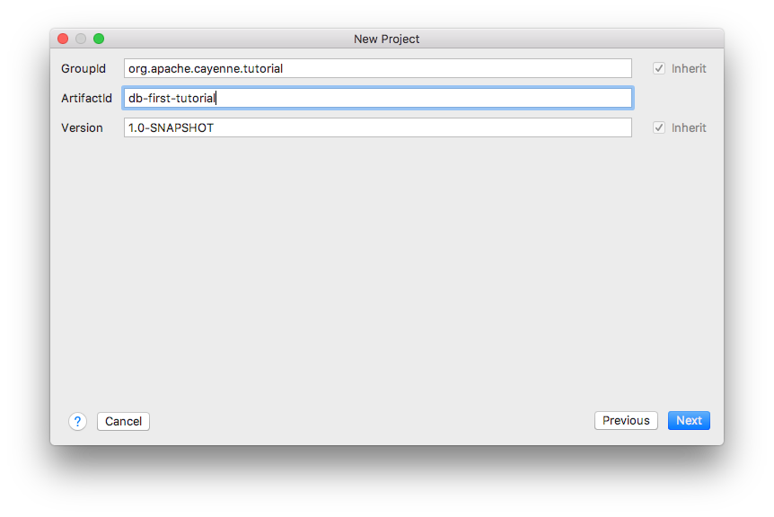

On next dialog screen you can customize directory for your project and click "Finish". Now you should have a new empty project.

<a id="getting-started-db-first--plugin-setup"></a>
<a id="getting-started-db-first--1.2.2.-plugin-setup"></a>

#### 1.2.2. Plugin setup

Next step is setting up Cayenne plugin in `pom.xml` file. For the convenience let’s define Cayenne version that we will use across project file:

```xml
<properties>
    <cayenne.version>4.2.3</cayenne.version>
</properties>
```

Next step is to include plugin. Here is code snippet that enable `cayenne-maven-plugin` in our demo project:

```xml
<build>
    <plugins>
        <plugin>
            <groupId>org.apache.cayenne.plugins</groupId>
            <artifactId>cayenne-maven-plugin</artifactId>
            <version>${cayenne.version}</version>
        </plugin>
    </plugins>
</build>
```

<a id="getting-started-db-first--importing-database"></a>
<a id="getting-started-db-first--2.-importing-database"></a>

## 2. Importing database

<a id="getting-started-db-first--reverse-engineering-database"></a>
<a id="getting-started-db-first--2.1.-reverse-engineering-database"></a>

### 2.1. Reverse engineering database

Now we have everything ready and can proceed to importing Cayenne model from our Mysql database

<a id="getting-started-db-first--configuring-plugin"></a>
<a id="getting-started-db-first--2.1.1.-configuring-plugin"></a>

#### 2.1.1. Configuring plugin

To let Cayenne plugin do its job we must tell it what to import and where it should get data. So let’s begin, here is sample settings for the data source:

```xml
<plugin>
    ...
    <configuration>
        <dataSource>
            <driver>com.mysql.jdbc.Driver</driver>
            <url>jdbc:mysql://127.0.0.1:3306/cayenne_demo</url>
            <username>root</username>
            <password>your-mysql-password</password>
        </dataSource>
    </configuration>
    <dependencies>
        <dependency>
            <groupId>mysql</groupId>
            <artifactId>mysql-connector-java</artifactId>
            <version>6.0.5</version>
        </dependency>
    </dependencies>
```

> [!NOTE]
> |  |  |
> | --- | --- |
> |  | Don’t forget to set your actual MySQL login and password |

We have told plugin where it should load data from, now let’s set where it should store Cayenne model:

```xml
<configuration>
    ...
    </dataSource>
    <cayenneProject>${project.basedir}/src/main/resources/cayenne/cayenne-project.xml</cayenneProject>
    <map>${project.basedir}/src/main/resources/datamap.map.xml</map>
    ...
```

And a last small step we need to do is to set default package where our model classes will be and catalog where our tables are:

```xml
<configuration>
    ...</map>
    <dbImport>
        <defaultPackage>org.apache.cayenne.tutorial.persistent</defaultPackage>
        <catalog>cayenne_demo</catalog>
    </dbImport>
```

<a id="getting-started-db-first--running-plugin"></a>
<a id="getting-started-db-first--2.1.2.-running-plugin"></a>

#### 2.1.2. Running plugin

Finally we can run db import, it is as easy as just running this command in terminal:

```
$ mvn cayenne:cdbimport
```

If everything was setup properly you should see output like this:

```
...
[INFO] +++ Connecting: SUCCESS.
[INFO] Detected and installed adapter: org.apache.cayenne.dba.mysql.MySQLAdapter
[INFO]   Table: cayenne_demo.artist
[INFO]   Table: cayenne_demo.gallery
[INFO]   Table: cayenne_demo.painting
[INFO]     Db Relationship : toOne  (painting.GALLERY_ID, gallery.ID)
[INFO]     Db Relationship : toMany (gallery.ID, painting.GALLERY_ID)
[INFO]     Db Relationship : toOne  (painting.ARTIST_ID, artist.ID)
[INFO]     Db Relationship : toMany (artist.ID, painting.ARTIST_ID)
[INFO]
[INFO] Map file does not exist. Loaded db model will be saved into '~/work/cayenne/db-first-tutorial/src/main/resources/datamap.map.xml'
[INFO]
[INFO] Detected changes:
[INFO]     Create Table         artist
[INFO]     Create Table         painting
[INFO]     Create Table         gallery
[INFO]
[WARNING] Can't find ObjEntity for painting
[WARNING] Db Relationship (Db Relationship : toMany (artist.ID, painting.ARTIST_ID)) will have GUESSED Obj Relationship reflection.
[WARNING] Can't find ObjEntity for gallery
[WARNING] Db Relationship (Db Relationship : toOne  (painting.GALLERY_ID, gallery.ID)) will have GUESSED Obj Relationship reflection.
[INFO] Migration Complete Successfully.
```

You can open created `datamap.map.xml` file and check it’s content in IDEA:

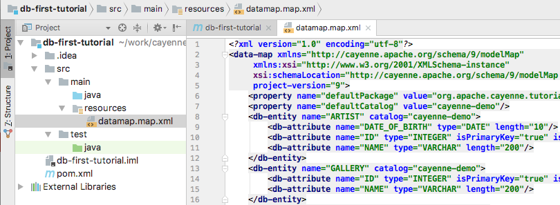

Great! We now have Cayenne DataMap file that describe model from our database and cayenne-project.xml file.

> [!NOTE]
> |  |  |
> | --- | --- |
> |  | If you have some problems with configuration you can always delete `datamap.map.xml` file and try again. |

<a id="getting-started-db-first--setup-modeler-maven-plugin"></a>
<a id="getting-started-db-first--2.1.3.-setup-modeler-maven-plugin"></a>

#### 2.1.3. Setup Modeler Maven plugin

Cayenne Modeler can be helpful in case you want to make some customizations to your model, though it’s usage optional.

To launch Modeler we’ll use `cayenne-modeler-maven-plugin`. Just include it in `pom.xml` like we did with `cayenne-maven-plugin` and tell where your project is:

```xml
<plugin>
    <groupId>org.apache.cayenne.plugins</groupId>
    <artifactId>cayenne-modeler-maven-plugin</artifactId>
    <version>${cayenne.version}</version>
    <configuration>
        <modelFile>${project.basedir}/src/main/resources/cayenne-project.xml</modelFile>
    </configuration>
</plugin>
```

To launch it simply run:

```
$ mvn cayenne-modeler:run
```

<a id="getting-started-db-first--advanced-usage-of-cdbimport"></a>
<a id="getting-started-db-first--3.-advanced-usage-of-cdbimport"></a>

## 3. Advanced usage of cdbimport

<a id="getting-started-db-first--updating-model"></a>
<a id="getting-started-db-first--3.1.-updating-model"></a>

### 3.1. Updating model

We now have everything we need, let’s try some more features of plugin.

<a id="getting-started-db-first--update-ddl"></a>
<a id="getting-started-db-first--3.1.1.-update-ddl"></a>

#### 3.1.1. Update DDL

To show next feature let’s imagine that over some time our database schema has evolved and we need to synchronize it with our model, no problem we can simply run `cdbimport` again and all changes will be loaded to model. We use following SQL script to alter our demo database:

```sql
CREATE TABLE cayenne_demo.painting_info (INFO VARCHAR(255) NULL, PAINTING_ID INT NOT NULL, PRIMARY KEY (PAINTING_ID)) ENGINE=InnoDB;
ALTER TABLE cayenne_demo.gallery ADD COLUMN FOUNDED_DATE DATE;
ALTER TABLE cayenne_demo.painting_info ADD FOREIGN KEY (PAINTING_ID) REFERENCES cayenne_demo.painting (ID);
```

<a id="getting-started-db-first--run-cdbimport"></a>
<a id="getting-started-db-first--3.1.2.-run-cdbimport"></a>

#### 3.1.2. Run cdbimport

Now we can simply run again

```
$ mvn cayenne:cdbimport
```

You should see output similar to this:

```
...
[INFO]   Table: cayenne_demo.artist
[INFO]   Table: cayenne_demo.gallery
[INFO]   Table: cayenne_demo.painting
[INFO]   Table: cayenne_demo.painting_info
[INFO]     Db Relationship : toOne  (painting_info.PAINTING_ID, painting.ID)
[INFO]     Db Relationship : toOne  (painting.ID, painting_info.PAINTING_ID)
[INFO]     Db Relationship : toOne  (painting.GALLERY_ID, gallery.ID)
[INFO]     Db Relationship : toMany (gallery.ID, painting.GALLERY_ID)
[INFO]     Db Relationship : toOne  (painting.ARTIST_ID, artist.ID)
[INFO]     Db Relationship : toMany (artist.ID, painting.ARTIST_ID)
[INFO]
[INFO] Detected changes:
[INFO]     Create Table         painting_info
[INFO]     Add Column           gallery.FOUNDED_DATE
[INFO]     Add Relationship     paintingInfo painting->painting_info.PAINTING_ID
[INFO]
[INFO] Migration Complete Successfully.
```

Let’s run Modeler and check that all changes are present in our model:

```
$ mvn cayenne-modeler:run
```

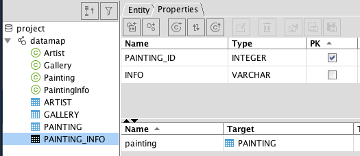

Great! New table and ObjEntity are in place, as well as a new field.

<a id="getting-started-db-first--customizing-model"></a>
<a id="getting-started-db-first--3.1.3.-customizing-model"></a>

#### 3.1.3. Customizing Model

There is often a need to customize model to better fit it to your application requirements, such customization can be simple removal of toMany part of a relationship between two objects. Let’s do it, in a Modeler just select and remove relationship `paintings` in Artist object:

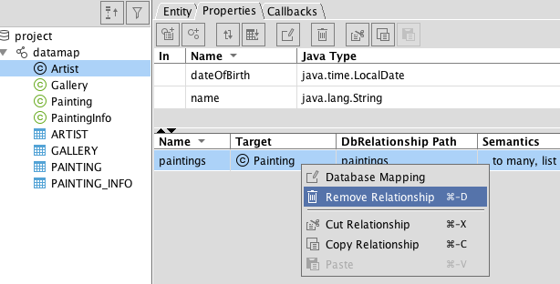

Now if you run

```
$ mvn cayenne:cdbimport
```

it still find nothing to do:

```
...
[INFO] Detected changes: No changes to import.
```

> [!NOTE]
> |  |  |
> | --- | --- |
> |  | `cdbimport` will skip only modifications in Object layer (e.g. ObjEntities, ObjAttributes and ObjRelationships), if you modify Db layer your changes will be overridden by next run of `cdbimport`. |

<a id="getting-started-db-first--advanced-filtering"></a>
<a id="getting-started-db-first--3.2.-advanced-filtering"></a>

### 3.2. Advanced filtering

Final part of our tutorial is about fine-tuning what you load from DB into your model.

<a id="getting-started-db-first--update-schema"></a>
<a id="getting-started-db-first--3.2.1.-update-schema"></a>

#### 3.2.1. Update schema

Let’s add some information to our database, that we don’t need in our model:

```sql
CREATE TABLE cayenne_demo.legacy_painting_info (ID INT NOT NULL AUTO_INCREMENT, INFO VARCHAR(255) NULL, PAINTING_ID INT NOT NULL, PRIMARY KEY (ID)) ENGINE=InnoDB;
ALTER TABLE cayenne_demo.artist ADD COLUMN __service_column INT;
ALTER TABLE cayenne_demo.gallery ADD COLUMN __service_column INT;
ALTER TABLE cayenne_demo.painting ADD COLUMN __service_column INT;
```

<a id="getting-started-db-first--configure-filtering"></a>
<a id="getting-started-db-first--3.2.2.-configure-filtering"></a>

#### 3.2.2. Configure filtering

Now we need to tell `cdbimport` what we don’t need in our model, for that we’ll just add following into `<configuration>` section:

```xml
<excludeTable>legacy_painting_info</excludeTable>
<excludeColumn>__service_column</excludeColumn>
```

After runing

```
$ mvn cayenne:cdbimport
```

we still don’t get any changes, exactly as expected:

```
...
[INFO] Detected changes: No changes to import.
```

<a id="getting-started-db-first--java-code"></a>
<a id="getting-started-db-first--4.-java-code"></a>

## 4. Java code

<a id="getting-started-db-first--generating-java-classes"></a>
<a id="getting-started-db-first--4.1.-generating-java-classes"></a>

### 4.1. Generating Java classes

Now as we have our model ready let’s generate Java code that actually will be used in application. In order to do that we’ll use same maven plugin, but different goal, namely `cgen`. It has many options to configure but default values will do for our case, so we can just call it:

```
$ mvn cayenne:cgen
```

You should see output telling that everything is done, like this:

```
[INFO] Generating superclass file: .../src/main/java/org/apache/cayenne/tutorial/persistent/auto/_Artist.java
[INFO] Generating class file: .../src/main/java/org/apache/cayenne/tutorial/persistent/Artist.java
[INFO] Generating superclass file: .../src/main/java/org/apache/cayenne/tutorial/persistent/auto/_Gallery.java
[INFO] Generating class file: .../src/main/java/org/apache/cayenne/tutorial/persistent/Gallery.java
[INFO] Generating superclass file: .../src/main/java/org/apache/cayenne/tutorial/persistent/auto/_Painting.java
[INFO] Generating class file: .../src/main/java/org/apache/cayenne/tutorial/persistent/Painting.java
[INFO] Generating superclass file: .../src/main/java/org/apache/cayenne/tutorial/persistent/auto/_PaintingInfo.java
[INFO] Generating class file: .../src/main/java/org/apache/cayenne/tutorial/persistent/PaintingInfo.java
[INFO] ------------------------------------------------------------------------
[INFO] BUILD SUCCESS
[INFO] ------------------------------------------------------------------------
```

In IDEA you should be able to see these newly generated classes:

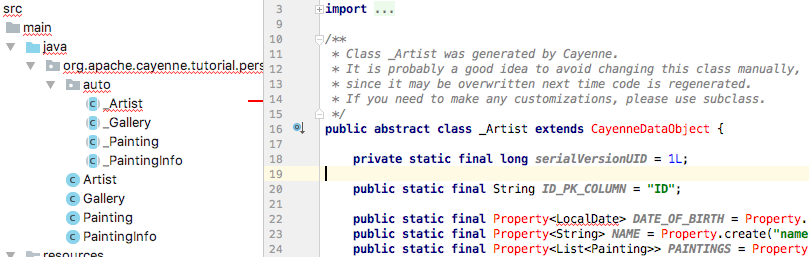

Note that Cayenne code is unrecognized, that’s because we need to include Cayenne as dependency, let’s do this in `pom.xml` file:

```xml
<project>
    ...
    <dependencies>
        <dependency>
            <groupId>org.apache.cayenne</groupId>
            <artifactId>cayenne-server</artifactId>
            <version>${cayenne.version}</version>
        </dependency>
    </dependencies>
```

Additionally we need to tell `Maven compiler plugin` that our code uses Java 8:

```xml
<build>
    <plugins>
    ...
        <plugin>
            <artifactId>maven-compiler-plugin</artifactId>
            <configuration>
                <source>1.8</source>
                <target>1.8</target>
            </configuration>
        </plugin>
    ...
```

If all done right your code now shouldn’t have any errors. To be sure you can build it:

```
$ mvn compile
```

<a id="getting-started-db-first--getting-started-with-objectcontext"></a>
<a id="getting-started-db-first--4.2.-getting-started-with-objectcontext"></a>

### 4.2. Getting started with ObjectContext

In this section we’ll write a simple main class to run our application, and get a brief introduction to Cayenne `ObjectContext`.

<a id="getting-started-db-first--creating-the-main-class"></a>
<a id="getting-started-db-first--4.2.1.-creating-the-main-class"></a>

#### 4.2.1. Creating the Main Class

- In IDEA create a new class called `Main` in the `org.apache.cayenne.tutorial` package.
- Create a standard `main()` method to make it a runnable class:


```java
package org.apache.cayenne.tutorial;

public class Main {

    public static void main(String[] args) {

    }
}
```

- The first thing you need to be able to access the database is to create a `ServerRuntime` object (which is essentially a wrapper around Cayenne stack) and use it to obtain an instance of an `ObjectContext`.


```java
package org.apache.cayenne.tutorial;

import org.apache.cayenne.ObjectContext;
import org.apache.cayenne.configuration.server.ServerRuntime;

public class Main {

    public static void main(String[] args) {
        ServerRuntime cayenneRuntime = ServerRuntime.builder()
            .dataSource(DataSourceBuilder
                    .url("jdbc:mysql://127.0.0.1:3306/cayenne_demo")
                    .driver("com.mysql.cj.jdbc.Driver")
                    .userName("root") // TODO: change to your actual username and password
                    .password("your-password").build())
            .addConfig("cayenne-project.xml")
            .build();
        ObjectContext context = cayenneRuntime.newContext();
    }
}
```

  `ObjectContext` is an isolated "session" in Cayenne that provides all needed API to work with data. `ObjectContext` has methods to execute queries and manage persistent objects. We’ll discuss them in the following sections. When the first ObjectContext is created in the application, Cayenne loads XML mapping files and creates a shared access stack that is later reused by other ObjectContexts.
- Let’s now add some code that will create persistent object:


```java
Artist artist = context.newObject(Artist.class);
artist.setName("Picasso");
context.commitChanges();
```

<a id="getting-started-db-first--running-application"></a>
<a id="getting-started-db-first--4.2.2.-running-application"></a>

#### 4.2.2. Running Application

Let’s check what happens when you run the application. But before we do that we need to add another dependencies to the `pom.xml` - MySQL Jdbc driver and simple logger. The following piece of XML needs to be added to the `<dependencies>…</dependencies>` section, where we already have Cayenne jars:

```xml
<dependency>
    <groupId>mysql</groupId>
    <artifactId>mysql-connector-java</artifactId>
    <version>6.0.5</version>
</dependency>
<dependency>
    <groupId>org.slf4j</groupId>
    <artifactId>slf4j-simple</artifactId>
    <version>1.7.25</version>
</dependency>
```

> [!NOTE]
> |  |  |
> | --- | --- |
> |  | Cayenne uses Slf4j logging API, here we will use simple backend that prints everything to console |

Now we are ready to run. Right click the "Main" class in IDEA and select "Run 'Main.main()'".


In the console you’ll see output similar to this, indicating that Cayenne stack has been started:

```
[main] INFO: Loading XML configuration resource from file:/.../cayenne-project.xml
[main] INFO: Loading XML DataMap resource from file:/.../datamap.map.xml
...
[main] INFO org.apache.cayenne.datasource.DriverDataSource - +++ Connecting: SUCCESS.
[main] INFO org.apache.cayenne.log.JdbcEventLogger - --- transaction started.
[main] INFO org.apache.cayenne.log.JdbcEventLogger - INSERT INTO cayenne_demo.artist (DATE_OF_BIRTH, NAME) VALUES (?, ?)
[main] INFO org.apache.cayenne.log.JdbcEventLogger - [bind: 1->DATE_OF_BIRTH:NULL, 2->NAME:'Picasso']
[main] INFO org.apache.cayenne.log.JdbcEventLogger - Generated PK: ARTIST.ID = 2
[main] INFO org.apache.cayenne.log.JdbcEventLogger - === updated 1 row.
[main] INFO org.apache.cayenne.log.JdbcEventLogger - +++ transaction committed.
```

<a id="getting-started-db-first--whats-next"></a>
<a id="getting-started-db-first--5.-what-s-next"></a>

## 5. What’s next

That’s all for this tutorial! Now you know how to setup and use `cayenne-maven-plugin`.

Next step will be creating your first application with Cayenne. If you not passed yet, you can try out [getting-started](https://cayenne.apache.org/docs/4.1/getting-started-guide/) tutorial.

You can find detailed information about configuring this plugin in [documentation](https://cayenne.apache.org/docs/4.1/cayenne-guide/#include) available on Cayenne site.


---

<a id="getting-started-rop"></a>

<!-- source_url: https://cayenne.apache.org/docs/4.2/getting-started-rop/ -->

<!-- page_index: 4 -->

<a id="getting-started-rop--prerequisites"></a>
<a id="getting-started-rop--1.-prerequisites"></a>

## 1. Prerequisites

<a id="getting-started-rop--prerequisites-2"></a>
<a id="getting-started-rop--1.1.-prerequisites"></a>

### 1.1. Prerequisites

This tutorial starts where "Getting Started with Cayenne" left off. If you have gone through the previous tutorial, and have the "tutorial" project open in Eclipse, you can go directly to the next step. If not, here are the compressed instructions to prepare you for work with ROP:

- Step 1 - Eclipse Setup
- Step 2 - Create a project
- Step 3 - Create Cayenne OR Mapping
- Step 4 - Create Java Classes
- Step 5 - Convert the project to webapp.

Note that at "Step 5" you can skip the JSP creation part. Just setup `web.xml` and `maven-jetty-plugin` in the POM.

<a id="getting-started-rop--remote-object-persistence-quick-start"></a>
<a id="getting-started-rop--2.-remote-object-persistence-quick-start"></a>

## 2. Remote Object Persistence Quick Start

<a id="getting-started-rop--starting-client-project"></a>
<a id="getting-started-rop--2.1.-starting-client-project"></a>

### 2.1. Starting Client Project

<a id="getting-started-rop--create-an-rop-client-project-in-eclipse"></a>
<a id="getting-started-rop--2.1.1.-create-an-rop-client-project-in-eclipse"></a>

#### 2.1.1. Create an ROP Client Project in Eclipse

Creation of a new Eclipse project has been discussed in some details in "Getting Started with Cayenne" guide, so we will omit the screenshots for the common parts.

In Eclipse select "File > New > Other…" and then "Maven > Maven Project". Click "Next". On the following screen check "Create a simple project" checkbox and click "Next" again. In the dialog shown on the screenshot below, enter "org.example.cayenne" for the "Group Id" and "tutorial-rop-client" for the "Artifact Id" (both without the quotes) and click "Finish".

Now you should have a new empty project in the Eclipse workspace. Check that the project Java compiler settings are correct. Rightclick on the "tutorial-rop-client" project, select "Properties > Java Compiler" and ensure that "Compiler compliance level" is at least 1.5 (some versions of Maven plugin seem to be setting it to 1.4 by default).

<a id="getting-started-rop--create-client-java-classes"></a>
<a id="getting-started-rop--2.1.2.-create-client-java-classes"></a>

#### 2.1.2. Create Client Java Classes

The client doesn’t need the XML ORM mapping, as it is loaded from the server. However it needs the client-side Java classes. Let’s generate them from the existing mapping:

- Start CayenneModeler and open `cayenne.xml` from the "tutorial" project (located under `tutorial/src/main/resources`, unless it is already open.
- Select the "datamap" DataMap and check "Allow Client Entities" checkbox.
- Enter `org.example.cayenne.persistent.client` for the "Client Java Package" and click "Update.." button next to the field to refresh the client package of all entities.

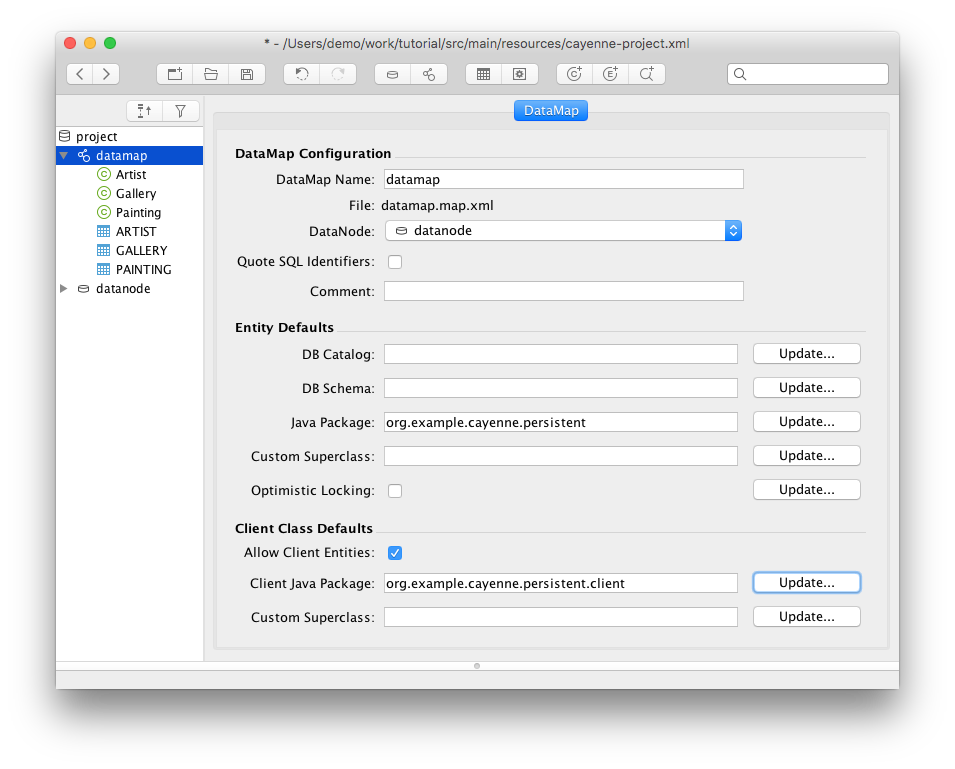

- Select "Tools > Generate Classes" menu.
- For "Type" select "Client Persistent Objects".
- For the "Output Directory" select `tutorial-rop-client/src/main/java` folder (as client classes should go in the client project).
- Click on "Classes" tab and check the "Check All Classes" checkbox (unless it is already checked and reads "Uncheck all Classes").
- Click "Generate".

Now go back to Eclipse, right click on "tutorial-rop-client" project and select "Refresh" - you should see pairs of classes generated for each mapped entity, same as on the server. And again, we see a bunch of errors in those classes. Let’s fix it now by adding two dependencies, "cayenne-client" and "hessian", in the bottom of the pom.xml file. We also need to add Caucho M2 repository to pull Hessian jar files. The resulting POM should look like this:

```XML
<project xmlns="http://maven.apache.org/POM/4.0.0" xmlns:xsi="http://www.w3.org/2001/XMLSchema-instance"
         xsi:schemaLocation="http://maven.apache.org/POM/4.0.0 http://maven.apache.org/maven-v4_0_0.xsd">
    <modelVersion>4.0.0</modelVersion>
    <groupId>org.example.cayenne</groupId>
    <artifactId>tutorial-rop-client</artifactId>
    <version>0.0.1-SNAPSHOT</version>

    <dependencies>
        <dependency>
            <groupId>org.apache.cayenne</groupId>
            <artifactId>cayenne-client-jetty</artifactId>
            <!-- Here specify the version of Cayenne you are actually using -->
            <version>4.2.3</version>
        </dependency>
        <dependency>
        <groupId>com.caucho</groupId>
            <artifactId>hessian</artifactId>
            <version>4.0.38</version>
        </dependency>
    </dependencies>

    <repositories>
        <repository>
            <id>caucho</id>
            <name>Caucho Repository</name>
            <url>https://caucho.com/m2</url>
            <layout>default</layout>
            <snapshots>
                <enabled>false</enabled>
            </snapshots>
            <releases>
                <enabled>true</enabled>
            </releases>
        </repository>
    </repositories>
</project>
```

Your computer must be connected to the internet. Once you save the pom.xml, Eclipse will download the needed jar files and add them to the project build path. After that all the errors should disappear.

Now let’s check the entity class pairs. They look almost identical to their server counterparts, although the superclass and the property access code are different. At this point these differences are somewhat academic, so let’s go on with the tutorial.

<a id="getting-started-rop--setting-up-hessian-web-service"></a>
<a id="getting-started-rop--2.2.-setting-up-hessian-web-service"></a>

### 2.2. Setting up Hessian Web Service

<a id="getting-started-rop--setting-up-dependencies"></a>
<a id="getting-started-rop--2.2.1.-setting-up-dependencies"></a>

#### 2.2.1. Setting up Dependencies

Now lets get back to the "tutorial" project that contains a web application and set up dependencies. Let’s add `resin-hessian.jar` (and the caucho repo declaration) and `cayenne-rop-server` to the `pom.xml`

```XML
<project xmlns="http://maven.apache.org/POM/4.0.0" xmlns:xsi="http://www.w3.org/2001/XMLSchema-instance"
    xsi:schemaLocation="http://maven.apache.org/POM/4.0.0 http://maven.apache.org/maven-v4_0_0.xsd">
    ...
    <dependencies>
        ...
        <dependency>
                <groupId>org.apache.cayenne</groupId>
                <artifactId>cayenne-rop-server</artifactId>
                <!-- Here specify the version of Cayenne you are actually using -->
            <version>{version}</version>
        </dependency>
        <dependency>
            <groupId>com.caucho</groupId>
            <artifactId>hessian</artifactId>
            <version>4.0.38</version>
        </dependency>
    </dependencies>

    <build>
    ...
    </build>

    <repositories>
        <repository>
            <id>caucho</id>
            <name>Caucho Repository</name>
            <url>https://caucho.com/m2</url>
            <layout>default</layout>
            <snapshots>
                <enabled>false</enabled>
            </snapshots>
            <releases>
                <enabled>true</enabled>
            </releases>
        </repository>
    </repositories>
    </project>
```

> [!NOTE]
> |  |  |
> | --- | --- |
> |  | Maven Optimization Hint  On a real project both server and client modules will likely share a common parent `pom.xml` where common repository delcaration can be placed, with child pom’s "inheriting" it from parent. This would reduce build code duplication. |

<a id="getting-started-rop--client-classes-on-the-server"></a>
<a id="getting-started-rop--2.2.2.-client-classes-on-the-server"></a>

#### 2.2.2. Client Classes on the Server

Since ROP web service requires both server and client persistent classes, we need to generate a second copy of the client classes inside the server project. This is a minor inconvenience that will hopefully go away in the future versions of Cayenne. Don’t forget to refresh the project in Eclipse after class generation is done.

<a id="getting-started-rop--configuring-web-xml"></a>
<a id="getting-started-rop--2.2.3.-configuring-web.xml"></a>

#### 2.2.3. Configuring web.xml

Cayenne web service is declared in the web.xml. It is implemented as a servlet `org.apache.cayenne.rop.ROPServlet`. Open `tutorial/src/main/webapp/WEB-INF/web.xml` in Eclipse and add a service declaration:

```XML
<?xml version="1.0" encoding="utf-8"?>
 <!DOCTYPE web-app
   PUBLIC "-//Sun Microsystems, Inc.//DTD Web Application 2.3//EN"
   "http://java.sun.com/dtd/web-app_2_3.dtd">
<web-app>
    <display-name>Cayenne Tutorial</display-name>
    <servlet>
        <servlet-name>cayenne-project</servlet-name>
        <servlet-class>org.apache.cayenne.rop.ROPServlet</servlet-class>
        <load-on-startup>0</load-on-startup>
    </servlet>
    <servlet-mapping>
        <servlet-name>cayenne-project</servlet-name>
        <url-pattern>/cayenne-service</url-pattern>
    </servlet-mapping>
    </web-app>
```

> [!NOTE]
> |  |  |
> | --- | --- |
> |  | Extending Server Behavior via Callbacks  While no custom Java code is required on the server, just a service declaration, it is possible to customizing server-side behavior via callbacks and listeners (not shown in the tutorial). |

<a id="getting-started-rop--running-rop-server"></a>
<a id="getting-started-rop--2.2.4.-running-rop-server"></a>

#### 2.2.4. Running ROP Server

Use previosly created Eclipse Jetty run configuration available via "Run > Run Configurations…" (or create a new one if none exists yet). You should see output in the Eclipse console similar to the following:

```
[INFO] Scanning for projects...
[INFO]
[INFO] ------------------------------------------------------------------------
[INFO] Building tutorial 0.0.1-SNAPSHOT
[INFO] ------------------------------------------------------------------------
...
[INFO] Starting jetty 6.1.22 ...
INFO::jetty-6.1.22
INFO::No Transaction manager found - if your webapp requires one, please configure one.
INFO::Started SelectChannelConnector@0.0.0.0:8080
[INFO] Started Jetty Server
INFO: Loading XML configuration resource from file:cayenne-project.xml
INFO: loading user name and password.
INFO: Created connection pool: jdbc:derby:memory:testdb;create=true
    Driver class: org.apache.derby.jdbc.EmbeddedDriver
    Min. connections in the pool: 1
    Max. connections in the pool: 1
```

Cayenne ROP service URL is <http://localhost:8080/tutorial/cayenne-service>. If you click on it, you will see "Hessian Requires POST" message, that means that the service is alive, but you need a client other than the web browser to access it.

<a id="getting-started-rop--porting-existing-code-to-connect-to-a-web-service-instead-of-a-database"></a>
<a id="getting-started-rop--2.3.-porting-existing-code-to-connect-to-a-web-service-instead-of-a-database"></a>

### 2.3. Porting Existing Code to Connect to a Web Service Instead of a Database

<a id="getting-started-rop--starting-command-line-client"></a>
<a id="getting-started-rop--2.3.1.-starting-command-line-client"></a>

#### 2.3.1. Starting Command Line Client

One of the benefits of ROP is that the client code is no different from the server code - it uses the same ObjectContext interface for access, same query and commit API. So the code below will be similar to the code presented in the first Cayenne Getting Started Guide, although with a few ROP-specific parts required to bootstrap the ObjectContext.

Let’s start by creating an empty Main class with the standard main() method in the client project:

```java
package org.example.cayenne.persistent.client;

public class Main {

    public static void main(String[] args) {

    }
}
```

Now the part that is actually different from regular Cayenne - establishing the server connection and obtaining the ObjectContext:

```java
Map<String, String> properties = new HashMap<>();
properties.put(ClientConstants.ROP_SERVICE_URL_PROPERTY, "http://localhost:8080/cayenne-service");
properties.put(ClientConstants.ROP_SERVICE_USERNAME_PROPERTY, "cayenne-user");
properties.put(ClientConstants.ROP_SERVICE_PASSWORD_PROPERTY, "secret");
properties.put(ClientConstants.ROP_SERVICE_REALM_PROPERTY, "Cayenne Realm");


ClientRuntime runtime = ClientRuntime.builder()
                        .properties(properties)
                        .addModule(new ClientJettyHttpModule())
                        .build();
ObjectContext context = runtime.newContext();
```

Note that the "runtime" can be used to create as many peer ObjectContexts as needed over the same connection, while ObjectContext is a kind of isolated "persistence session", similar to the server-side context. A few more notes. Since we are using HTTP(S) to communicate with ROP server, there’s no need to explicitly close the connection (or channel, or context).

So now let’s do the same persistent operaions that we did in the first tutorial "Main" class. Let’s start by creating and saving some objects:

```java
// creating new Artist
Artist picasso = context.newObject(Artist.class);
picasso.setName("Pablo Picasso");

// Creating other objects
Gallery metropolitan = context.newObject(Gallery.class);
metropolitan.setName("Metropolitan Museum of Art");

Painting girl = context.newObject(Painting.class);
girl.setName("Girl Reading at a Table");

Painting stein = context.newObject(Painting.class);
stein.setName("Gertrude Stein");

// connecting objects together via relationships
picasso.addToPaintings(girl);
picasso.addToPaintings(stein);

girl.setGallery(metropolitan);
stein.setGallery(metropolitan);

// saving all the changes above
context.commitChanges();
```

Now let’s select them back:

```java
// ObjectSelect examples
List<Painting> paintings1 = ObjectSelect.query(Painting.class).select(context);

List<Painting> paintings2 = ObjectSelect.query(Painting.class)
        .where(Painting.NAME.likeIgnoreCase("gi%")).select(context);
```

Now, delete:

```java
// Delete object example
Artist picasso = ObjectSelect.query(Artist.class).where(Artist.NAME.eq("Pablo Picasso")).selectOne(context);

if (picasso != null) {
    context.deleteObject(picasso);
    context.commitChanges();
}
```

This code is exactly the same as in the first tutorial. So now let’s try running the client and see what happens. In Eclipse open main class and select "Run > Run As > Java Application" from the menu (assuming the ROP server started in the previous step is still running). You will some output in both server and client process consoles. Client:

```
INFO: Connecting to [http://localhost:8080/tutorial/cayenne-service] - dedicated session.
INFO: === Connected, session: org.apache.cayenne.remote.RemoteSession@26544ec1[sessionId=17uub1h34r9x1] - took 111 ms.
INFO: --- Message 0: Bootstrap
INFO: === Message 0: Bootstrap done - took 58 ms.
INFO: --- Message 1: flush-cascade-sync
INFO: === Message 1: flush-cascade-sync done - took 1119 ms.
INFO: --- Message 2: Query
INFO: === Message 2: Query done - took 48 ms.
INFO: --- Message 3: Query
INFO: === Message 3: Query done - took 63 ms.
INFO: --- Message 4: Query
INFO: === Message 4: Query done - took 19 ms.
INFO: --- Message 5: Query
INFO: === Message 5: Query done - took 7 ms.
INFO: --- Message 6: Query
INFO: === Message 6: Query done - took 5 ms.
INFO: --- Message 7: Query
INFO: === Message 7: Query done - took 2 ms.
INFO: --- Message 8: Query
INFO: === Message 8: Query done - took 4 ms.
INFO: --- Message 9: flush-cascade-sync
INFO: === Message 9: flush-cascade-sync done - took 34 ms.
```

As you see client prints no SQL statmenets, just a bunch of query and flush messages sent to the server. The server side is more verbose, showing the actual client queries executed against the database:

```
...
INFO: SELECT NEXT_ID FROM AUTO_PK_SUPPORT WHERE TABLE_NAME = ? FOR UPDATE [bind: 1:'ARTIST']
INFO: SELECT NEXT_ID FROM AUTO_PK_SUPPORT WHERE TABLE_NAME = ? FOR UPDATE [bind: 1:'GALLERY']
INFO: SELECT NEXT_ID FROM AUTO_PK_SUPPORT WHERE TABLE_NAME = ? FOR UPDATE [bind: 1:'PAINTING']
INFO: INSERT INTO ARTIST (DATE_OF_BIRTH, ID, NAME) VALUES (?, ?, ?)
INFO: [batch bind: 1->DATE_OF_BIRTH:NULL, 2->ID:200, 3->NAME:'Pablo Picasso']
INFO: === updated 1 row.
INFO: INSERT INTO GALLERY (ID, NAME) VALUES (?, ?)
INFO: [batch bind: 1->ID:200, 2->NAME:'Metropolitan Museum of Art']
INFO: === updated 1 row.
INFO: INSERT INTO PAINTING (ARTIST_ID, GALLERY_ID, ID, NAME) VALUES (?, ?, ?, ?)
INFO: [batch bind: 1->ARTIST_ID:200, 2->GALLERY_ID:200, 3->ID:200, 4->NAME:'Girl Reading at a Table']
INFO: [batch bind: 1->ARTIST_ID:200, 2->GALLERY_ID:200, 3->ID:201, 4->NAME:'Gertrude Stein']
INFO: === updated 2 rows.
INFO: +++ transaction committed.
INFO: --- transaction started.
INFO: SELECT t0.GALLERY_ID, t0.NAME, t0.ARTIST_ID, t0.ID FROM PAINTING t0
INFO: === returned 2 rows. - took 14 ms.
INFO: +++ transaction committed.
INFO: --- transaction started.
INFO: SELECT t0.GALLERY_ID, t0.NAME, t0.ARTIST_ID, t0.ID FROM PAINTING t0
      WHERE UPPER(t0.NAME) LIKE UPPER(?) [bind: 1->NAME:'gi%']
INFO: === returned 1 row. - took 10 ms.
INFO: +++ transaction committed.
INFO: --- transaction started.
INFO: SELECT t0.DATE_OF_BIRTH, t0.NAME, t0.ID FROM ARTIST t0 WHERE t0.NAME = ? [bind: 1->NAME:'Pablo Picasso']
INFO: === returned 1 row. - took 8 ms.
INFO: +++ transaction committed.
INFO: --- transaction started.
INFO: DELETE FROM PAINTING WHERE ID = ?
INFO: [batch bind: 1->ID:200]
INFO: [batch bind: 1->ID:201]
INFO: === updated 2 rows.
INFO: DELETE FROM ARTIST WHERE ID = ?
INFO: [batch bind: 1->ID:200]
INFO: === updated 1 row.
INFO: +++ transaction committed.
```

You are done with the basic ROP client!

<a id="getting-started-rop--adding-basic-authentication"></a>
<a id="getting-started-rop--2.4.-adding-basic-authentication"></a>

### 2.4. Adding BASIC Authentication

You probably don’t want everybody in the world to connect to your service and access (and update!) arbitrary data in the database. The first step in securing Cayenne service is implementing client authentication. The easiest way to do it is to delegate the authentication task to the web container that is running the service. HessianConnection used in the previous chapter supports BASIC authentication on the client side, so we’ll demonstrate how to set it up here.

<a id="getting-started-rop--securing-rop-server-application"></a>
<a id="getting-started-rop--2.4.1.-securing-rop-server-application"></a>

#### 2.4.1. Securing ROP Server Application

Open web.xml file in the server project and setup security constraints with BASIC authentication for the ROP service:

```XML
<security-constraint>
    <web-resource-collection>
        <web-resource-name>CayenneService</web-resource-name>
        <url-pattern>/cayenne-service</url-pattern>
    </web-resource-collection>
    <auth-constraint>
        <role-name>cayenne-service-user</role-name>
    </auth-constraint>
</security-constraint>

<login-config>
    <auth-method>BASIC</auth-method>
    <realm-name>Cayenne Realm</realm-name>
</login-config>

<security-role>
    <role-name>cayenne-service-user</role-name>
</security-role>
```

<a id="getting-started-rop--configuring-jetty-for-basic-authentication"></a>
<a id="getting-started-rop--2.4.2.-configuring-jetty-for-basic-authentication"></a>

#### 2.4.2. Configuring Jetty for BASIC Authentication

> [!NOTE]
> |  |  |
> | --- | --- |
> |  | These instructions are specific to Jetty 6. Other containers (and versions of Jetty) will have different mechanisms to achieve the same thing. |

Open pom.xml in the server project and configure a "userRealm" for the Jetty plugin:

```XML
<plugin>
    <groupId>org.eclipse.jetty</groupId>
        <artifactId>maven-jetty-plugin</artifactId>
        <version>9.4.8.v20171121</version>
        <!-- adding configuration below: -->
        <configuration>
            <userRealms>
                <userRealm implementation="org.eclipse.jetty.security.HashLoginService">
                    <!-- this name must match the realm-name in web.xml -->
                    <name>Cayenne Realm</name>
                    <config>realm.properties</config>
                </userRealm>
            </userRealms>
        </configuration>
    </plugin>
</plugins>
```

Now create a new file called `realm.properties` at the root of the server project and put user login/password in there:

```
cayenne-user: secret,cayenne-service-user
```

Now let’s stop the server and start it again. Everything should start as before, but if you go to <http://localhost:8080/tutorial/cayenne-service>, your browser should pop up authentication dialog. Enter "cayenne-user/secret" for user name / password, and you should see "Hessian Requires POST" message. So the server is now secured.

<a id="getting-started-rop--running-client-with-basic-authentication"></a>
<a id="getting-started-rop--2.4.3.-running-client-with-basic-authentication"></a>

#### 2.4.3. Running Client with Basic Authentication

If you run the client without any changes, you’ll get the following error:

```
Mar 01, 2016 7:25:50 PM org.apache.cayenne.rop.http.HttpROPConnector logConnect
INFO: Connecting to [cayenne-user@http://localhost:8080/tutorial-rop-server/cayenne-service] - dedicated session.
Mar 01, 2016 7:25:50 PM org.apache.cayenne.rop.HttpClientConnection connect
INFO: Server returned HTTP response code: 401 for URL: http://localhost:8080/tutorial-rop-server/cayenne-service
java.rmi.RemoteException: Server returned HTTP response code: 401 for URL: http://localhost:8080/tutorial-rop-server/cayenne-service
	at org.apache.cayenne.rop.ProxyRemoteService.establishSession(ProxyRemoteService.java:45)
	at org.apache.cayenne.rop.HttpClientConnection.connect(HttpClientConnection.java:85)
	at org.apache.cayenne.rop.HttpClientConnection.getServerEventBridge(HttpClientConnection.java:68)
	at org.apache.cayenne.remote.ClientChannel.setupRemoteChannelListener(ClientChannel.java:279)
	at org.apache.cayenne.remote.ClientChannel.<init>(ClientChannel.java:71)
	at org.apache.cayenne.configuration.rop.client.ClientChannelProvider.get(ClientChannelProvider.java:48)
	at org.apache.cayenne.configuration.rop.client.ClientChannelProvider.get(ClientChannelProvider.java:31)
	at org.apache.cayenne.di.spi.CustomProvidersProvider.get(CustomProvidersProvider.java:39)
	at org.apache.cayenne.di.spi.FieldInjectingProvider.get(FieldInjectingProvider.java:43)
	at org.apache.cayenne.di.spi.DefaultScopeProvider.get(DefaultScopeProvider.java:50)
	at org.apache.cayenne.di.spi.DefaultInjector.getInstance(DefaultInjector.java:139)
	at org.apache.cayenne.di.spi.FieldInjectingProvider.value(FieldInjectingProvider.java:105)
	at org.apache.cayenne.di.spi.FieldInjectingProvider.injectMember(FieldInjectingProvider.java:68)
	at org.apache.cayenne.di.spi.FieldInjectingProvider.injectMembers(FieldInjectingProvider.java:59)
	at org.apache.cayenne.di.spi.FieldInjectingProvider.get(FieldInjectingProvider.java:44)
	at org.apache.cayenne.di.spi.DefaultScopeProvider.get(DefaultScopeProvider.java:50)
	at org.apache.cayenne.di.spi.DefaultInjector.getInstance(DefaultInjector.java:134)
	at org.apache.cayenne.configuration.CayenneRuntime.newContext(CayenneRuntime.java:134)
	at org.apache.cayenne.tutorial.persistent.client.Main.main(Main.java:44)
```

Which is exactly what you’d expect, as the client is not authenticating itself. So change the line in Main.java where we obtained an ROP connection to this:

```java
Map<String,String> properties = new HashMap<>();
properties.put(ClientConstants.ROP_SERVICE_URL_PROPERTY, "http://localhost:8080/cayenne-service");
properties.put(ClientConstants.ROP_SERVICE_USERNAME_PROPERTY, "cayenne-user");
properties.put(ClientConstants.ROP_SERVICE_PASSWORD_PROPERTY, "secret");
properties.put(ClientConstants.ROP_SERVICE_REALM_PROPERTY, "Cayenne Realm");

ClientRuntime runtime = ClientRuntime.builder()
                        .properties(properties)
                        .addModule(new ClientJettyHttpModule())
                        .build();
```

Try running again, and everything should work as before. Obviously in production environment, in addition to authentication you’ll need to use HTTPS to access the server to prevent third-party eavesdropping on your password and data.

Congratulations, you are done with the ROP tutorial!


---

<a id="api"></a>

<!-- source_url: https://cayenne.apache.org/docs/4.2/api/ -->

<!-- page_index: 5 -->

<a id="api--cayenne-doc:-cayenne-documentation-4.2.3-api"></a>

# cayenne-doc: Cayenne Documentation 4.2.3 API

Packages

Package

Description

[org.apache.cayenne](https://cayenne.apache.org/docs/4.2/api/org/apache/cayenne/package-summary.html)

Contains persistence APIs directly accessible by users.

[org.apache.cayenne.access](https://cayenne.apache.org/docs/4.2/api/org/apache/cayenne/access/package-summary.html)

Contains classes that make up Cayenne ORM stack.

[org.apache.cayenne.access.dbsync](https://cayenne.apache.org/docs/4.2/api/org/apache/cayenne/access/dbsync/package-summary.html)

[org.apache.cayenne.access.event](https://cayenne.apache.org/docs/4.2/api/org/apache/cayenne/access/event/package-summary.html)

[org.apache.cayenne.access.flush](https://cayenne.apache.org/docs/4.2/api/org/apache/cayenne/access/flush/package-summary.html)

[org.apache.cayenne.access.flush.operation](https://cayenne.apache.org/docs/4.2/api/org/apache/cayenne/access/flush/operation/package-summary.html)

[org.apache.cayenne.access.jdbc](https://cayenne.apache.org/docs/4.2/api/org/apache/cayenne/access/jdbc/package-summary.html)

Contains classes that handle JDBC interactions.

[org.apache.cayenne.access.jdbc.reader](https://cayenne.apache.org/docs/4.2/api/org/apache/cayenne/access/jdbc/reader/package-summary.html)

[org.apache.cayenne.access.sqlbuilder](https://cayenne.apache.org/docs/4.2/api/org/apache/cayenne/access/sqlbuilder/package-summary.html)

[org.apache.cayenne.access.sqlbuilder.sqltree](https://cayenne.apache.org/docs/4.2/api/org/apache/cayenne/access/sqlbuilder/sqltree/package-summary.html)

[org.apache.cayenne.access.translator](https://cayenne.apache.org/docs/4.2/api/org/apache/cayenne/access/translator/package-summary.html)

[org.apache.cayenne.access.translator.batch](https://cayenne.apache.org/docs/4.2/api/org/apache/cayenne/access/translator/batch/package-summary.html)

[org.apache.cayenne.access.translator.batch.legacy](https://cayenne.apache.org/docs/4.2/api/org/apache/cayenne/access/translator/batch/legacy/package-summary.html)

[org.apache.cayenne.access.translator.ejbql](https://cayenne.apache.org/docs/4.2/api/org/apache/cayenne/access/translator/ejbql/package-summary.html)

[org.apache.cayenne.access.translator.procedure](https://cayenne.apache.org/docs/4.2/api/org/apache/cayenne/access/translator/procedure/package-summary.html)

[org.apache.cayenne.access.translator.select](https://cayenne.apache.org/docs/4.2/api/org/apache/cayenne/access/translator/select/package-summary.html)

[org.apache.cayenne.access.types](https://cayenne.apache.org/docs/4.2/api/org/apache/cayenne/access/types/package-summary.html)

Defines an extendable mechanism to map Java types to JDBC types.

[org.apache.cayenne.access.util](https://cayenne.apache.org/docs/4.2/api/org/apache/cayenne/access/util/package-summary.html)

[org.apache.cayenne.annotation](https://cayenne.apache.org/docs/4.2/api/org/apache/cayenne/annotation/package-summary.html)

[org.apache.cayenne.ashwood](https://cayenne.apache.org/docs/4.2/api/org/apache/cayenne/ashwood/package-summary.html)

[org.apache.cayenne.ashwood.graph](https://cayenne.apache.org/docs/4.2/api/org/apache/cayenne/ashwood/graph/package-summary.html)

[org.apache.cayenne.cache](https://cayenne.apache.org/docs/4.2/api/org/apache/cayenne/cache/package-summary.html)

[org.apache.cayenne.configuration](https://cayenne.apache.org/docs/4.2/api/org/apache/cayenne/configuration/package-summary.html)

[org.apache.cayenne.configuration.rop.client](https://cayenne.apache.org/docs/4.2/api/org/apache/cayenne/configuration/rop/client/package-summary.html)

[org.apache.cayenne.configuration.server](https://cayenne.apache.org/docs/4.2/api/org/apache/cayenne/configuration/server/package-summary.html)

[org.apache.cayenne.configuration.xml](https://cayenne.apache.org/docs/4.2/api/org/apache/cayenne/configuration/xml/package-summary.html)

[org.apache.cayenne.conn](https://cayenne.apache.org/docs/4.2/api/org/apache/cayenne/conn/package-summary.html)

[org.apache.cayenne.datasource](https://cayenne.apache.org/docs/4.2/api/org/apache/cayenne/datasource/package-summary.html)

[org.apache.cayenne.dba](https://cayenne.apache.org/docs/4.2/api/org/apache/cayenne/dba/package-summary.html)

Contains database adapter API (DbAdapter) and its default implementation.

[org.apache.cayenne.dba.db2](https://cayenne.apache.org/docs/4.2/api/org/apache/cayenne/dba/db2/package-summary.html)

IBM DB2 DbAdapter.

[org.apache.cayenne.dba.derby](https://cayenne.apache.org/docs/4.2/api/org/apache/cayenne/dba/derby/package-summary.html)

Apache Derby DbAdapter.

[org.apache.cayenne.dba.derby.sqltree](https://cayenne.apache.org/docs/4.2/api/org/apache/cayenne/dba/derby/sqltree/package-summary.html)

[org.apache.cayenne.dba.firebird](https://cayenne.apache.org/docs/4.2/api/org/apache/cayenne/dba/firebird/package-summary.html)

[org.apache.cayenne.dba.firebird.sqltree](https://cayenne.apache.org/docs/4.2/api/org/apache/cayenne/dba/firebird/sqltree/package-summary.html)

[org.apache.cayenne.dba.frontbase](https://cayenne.apache.org/docs/4.2/api/org/apache/cayenne/dba/frontbase/package-summary.html)

FrontBase DbAdapter.

[org.apache.cayenne.dba.h2](https://cayenne.apache.org/docs/4.2/api/org/apache/cayenne/dba/h2/package-summary.html)

[org.apache.cayenne.dba.hsqldb](https://cayenne.apache.org/docs/4.2/api/org/apache/cayenne/dba/hsqldb/package-summary.html)

HSQLDB DbAdapter.

[org.apache.cayenne.dba.ingres](https://cayenne.apache.org/docs/4.2/api/org/apache/cayenne/dba/ingres/package-summary.html)

[org.apache.cayenne.dba.mariadb](https://cayenne.apache.org/docs/4.2/api/org/apache/cayenne/dba/mariadb/package-summary.html)

[org.apache.cayenne.dba.mysql](https://cayenne.apache.org/docs/4.2/api/org/apache/cayenne/dba/mysql/package-summary.html)

MySQL DbAdapter.

[org.apache.cayenne.dba.mysql.sqltree](https://cayenne.apache.org/docs/4.2/api/org/apache/cayenne/dba/mysql/sqltree/package-summary.html)

[org.apache.cayenne.dba.openbase](https://cayenne.apache.org/docs/4.2/api/org/apache/cayenne/dba/openbase/package-summary.html)

OpenBase DbAdapter.

[org.apache.cayenne.dba.oracle](https://cayenne.apache.org/docs/4.2/api/org/apache/cayenne/dba/oracle/package-summary.html)

Oracle DbAdapter.

[org.apache.cayenne.dba.postgres](https://cayenne.apache.org/docs/4.2/api/org/apache/cayenne/dba/postgres/package-summary.html)

PostgreSQL DbAdapter.

[org.apache.cayenne.dba.postgres.sqltree](https://cayenne.apache.org/docs/4.2/api/org/apache/cayenne/dba/postgres/sqltree/package-summary.html)

[org.apache.cayenne.dba.sqlite](https://cayenne.apache.org/docs/4.2/api/org/apache/cayenne/dba/sqlite/package-summary.html)

[org.apache.cayenne.dba.sqlserver](https://cayenne.apache.org/docs/4.2/api/org/apache/cayenne/dba/sqlserver/package-summary.html)

MS SQLServer DbAdapter.

[org.apache.cayenne.dba.sqlserver.sqltree](https://cayenne.apache.org/docs/4.2/api/org/apache/cayenne/dba/sqlserver/sqltree/package-summary.html)

[org.apache.cayenne.dba.sybase](https://cayenne.apache.org/docs/4.2/api/org/apache/cayenne/dba/sybase/package-summary.html)

Sybase DbAdapter.

[org.apache.cayenne.di](https://cayenne.apache.org/docs/4.2/api/org/apache/cayenne/di/package-summary.html)

[org.apache.cayenne.di.spi](https://cayenne.apache.org/docs/4.2/api/org/apache/cayenne/di/spi/package-summary.html)

[org.apache.cayenne.ejbql](https://cayenne.apache.org/docs/4.2/api/org/apache/cayenne/ejbql/package-summary.html)

[org.apache.cayenne.ejbql.parser](https://cayenne.apache.org/docs/4.2/api/org/apache/cayenne/ejbql/parser/package-summary.html)

[org.apache.cayenne.event](https://cayenne.apache.org/docs/4.2/api/org/apache/cayenne/event/package-summary.html)

Contains classes that make up Cayenne generic event dispatch mechanism.

[org.apache.cayenne.exp](https://cayenne.apache.org/docs/4.2/api/org/apache/cayenne/exp/package-summary.html)

Cayenne data expression classes.

[org.apache.cayenne.exp.parser](https://cayenne.apache.org/docs/4.2/api/org/apache/cayenne/exp/parser/package-summary.html)

Contains expression parser and other expression internals.

[org.apache.cayenne.exp.property](https://cayenne.apache.org/docs/4.2/api/org/apache/cayenne/exp/property/package-summary.html)

Property API

[org.apache.cayenne.graph](https://cayenne.apache.org/docs/4.2/api/org/apache/cayenne/graph/package-summary.html)

Contains generic graph management tools used in Cayenne.

[org.apache.cayenne.log](https://cayenne.apache.org/docs/4.2/api/org/apache/cayenne/log/package-summary.html)

[org.apache.cayenne.map](https://cayenne.apache.org/docs/4.2/api/org/apache/cayenne/map/package-summary.html)

Contains O/R mapping classes that store relational database
metadata information and map it to Java classes.

[org.apache.cayenne.map.event](https://cayenne.apache.org/docs/4.2/api/org/apache/cayenne/map/event/package-summary.html)

[org.apache.cayenne.query](https://cayenne.apache.org/docs/4.2/api/org/apache/cayenne/query/package-summary.html)

Defines standard queries supported by Cayenne and extension mechanism to create
custom queries.

[org.apache.cayenne.reflect](https://cayenne.apache.org/docs/4.2/api/org/apache/cayenne/reflect/package-summary.html)

[org.apache.cayenne.reflect.generic](https://cayenne.apache.org/docs/4.2/api/org/apache/cayenne/reflect/generic/package-summary.html)

[org.apache.cayenne.reflect.valueholder](https://cayenne.apache.org/docs/4.2/api/org/apache/cayenne/reflect/valueholder/package-summary.html)

[org.apache.cayenne.remote](https://cayenne.apache.org/docs/4.2/api/org/apache/cayenne/remote/package-summary.html)

Contains classes an interfaces related to Cayenne remote object persistence features.

[org.apache.cayenne.remote.hessian](https://cayenne.apache.org/docs/4.2/api/org/apache/cayenne/remote/hessian/package-summary.html)

[org.apache.cayenne.remote.hessian.service](https://cayenne.apache.org/docs/4.2/api/org/apache/cayenne/remote/hessian/service/package-summary.html)

[org.apache.cayenne.remote.service](https://cayenne.apache.org/docs/4.2/api/org/apache/cayenne/remote/service/package-summary.html)

[org.apache.cayenne.resource](https://cayenne.apache.org/docs/4.2/api/org/apache/cayenne/resource/package-summary.html)

[org.apache.cayenne.rop](https://cayenne.apache.org/docs/4.2/api/org/apache/cayenne/rop/package-summary.html)

[org.apache.cayenne.rop.http](https://cayenne.apache.org/docs/4.2/api/org/apache/cayenne/rop/http/package-summary.html)

[org.apache.cayenne.template](https://cayenne.apache.org/docs/4.2/api/org/apache/cayenne/template/package-summary.html)

[org.apache.cayenne.template.directive](https://cayenne.apache.org/docs/4.2/api/org/apache/cayenne/template/directive/package-summary.html)

[org.apache.cayenne.template.parser](https://cayenne.apache.org/docs/4.2/api/org/apache/cayenne/template/parser/package-summary.html)

[org.apache.cayenne.tx](https://cayenne.apache.org/docs/4.2/api/org/apache/cayenne/tx/package-summary.html)

[org.apache.cayenne.util](https://cayenne.apache.org/docs/4.2/api/org/apache/cayenne/util/package-summary.html)

General utility classes.

[org.apache.cayenne.util.commons](https://cayenne.apache.org/docs/4.2/api/org/apache/cayenne/util/commons/package-summary.html)

[org.apache.cayenne.util.concurrentlinkedhashmap](https://cayenne.apache.org/docs/4.2/api/org/apache/cayenne/util/concurrentlinkedhashmap/package-summary.html)

[org.apache.cayenne.validation](https://cayenne.apache.org/docs/4.2/api/org/apache/cayenne/validation/package-summary.html)

[org.apache.cayenne.value](https://cayenne.apache.org/docs/4.2/api/org/apache/cayenne/value/package-summary.html)

[org.apache.cayenne.value.json](https://cayenne.apache.org/docs/4.2/api/org/apache/cayenne/value/json/package-summary.html)

---

<a id="upgrade-guide"></a>

<!-- source_url: https://cayenne.apache.org/docs/4.2/upgrade-guide/ -->

<!-- page_index: 6 -->

<a id="upgrade-guide--java-version"></a>
<a id="upgrade-guide--1.-java-version"></a>

## 1. Java Version

Minimum required JDK version is 8 or newer. Cayenne 4.2 is fully tested with Java 8, 11 and 17.

<a id="upgrade-guide--new-features"></a>
<a id="upgrade-guide--2.-new-features"></a>

## 2. New Features

<a id="upgrade-guide--subqueries"></a>
<a id="upgrade-guide--2.1.-subqueries"></a>

### 2.1. Subqueries

Expressions are now support subqueries.

```java
ColumnSelect<Long> subQuery = ObjectSelect
        .columnQuery(Artist.class, Artist.ARTIST_ID_PK_PROPERTY)
        .where(...);
List<Artist> artists = ObjectSelect.query(Artist.class)
        .where(Artist.ARTIST_ID_PK_PROPERTY.in(subQuery))
        .select(context);
```

<a id="upgrade-guide--new-property-api"></a>
<a id="upgrade-guide--2.2.-new-property-api"></a>

### 2.2. New Property API

Property API are greatly revised. This API allows to use type aware expression factories aka Properties. These properties are normally generated as static constants in model classes, but they can also be created manually by `PropertyFactory` if needed. New API provides designated properties for different datatypes and relationships, including special variant that represents primary keys.

Usage example in `ObjectSelect` query:

```java
Painting painting = //...
Artist artist = ObjectSelect.query(Artist.class)
        .where(Artist.PAINTING_ARRAY.contains(painting))
        .and(Artist.DATE_OF_BIRTH.year().gt(1950))
        .and(Artist.ARTIST_NAME.lower().like("pablo%"))
        .selectOne(context);
```

See [JavaDoc](https://cayenne.apache.org/docs/4.2/api/org/apache/cayenne/exp/property/package-summary.html) for details.

<a id="upgrade-guide--new-types-support"></a>
<a id="upgrade-guide--2.3.-new-types-support"></a>

### 2.3. New types support

Cayenne 4.2 brings support for the Json and Geo types that are common now in RDBMS, see [this demo](https://github.com/apache/cayenne-examples/tree/master/cayenne-jdbc-type-other) for the usage example. Additionally, Cayenne now supports `java.time.Duration` and `java.time.Period` out of the box.

<a id="upgrade-guide--deprecations-and-api-incompatibilities"></a>
<a id="upgrade-guide--3.-deprecations-and-api-incompatibilities"></a>

## 3. Deprecations and API incompatibilities

For the full list of deprecations refer to `UPGRADE.txt`. Here’s the most important changes.

<a id="upgrade-guide--selectquery"></a>
<a id="upgrade-guide--3.1.-selectquery"></a>

### 3.1. SelectQuery

`SelectQuery` is deprecated in favour of `ObjectSelect`. It’s still fully functional and could be used, but it will be removed in a future.

<a id="upgrade-guide--obsolete-modules"></a>
<a id="upgrade-guide--3.2.-obsolete-modules"></a>

### 3.2. Obsolete modules

There are several modules that are deprecated in Cayenne 4.2 and will be removed in a later version:

- Cayenne ROP
- Cayenne Web
- Event bridges: XMPP, JMS and JGroups

These modules could be still safely used in 4.2.

<a id="upgrade-guide--objectid"></a>
<a id="upgrade-guide--3.3.-objectid"></a>

### 3.3. ObjectId

ObjectId can’t be instantiated directly, `ObjectId.of(..)` factory methods should be used. E.g. `ObjectId.of("Artist", 1)` instead of `new ObjectId("Artist", 1)`.


---
